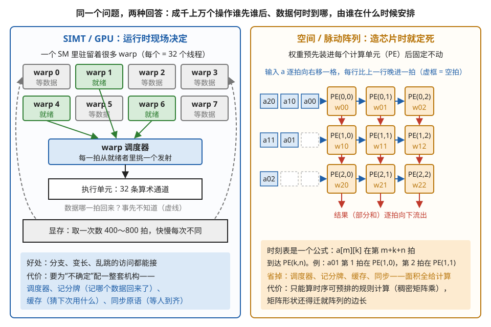
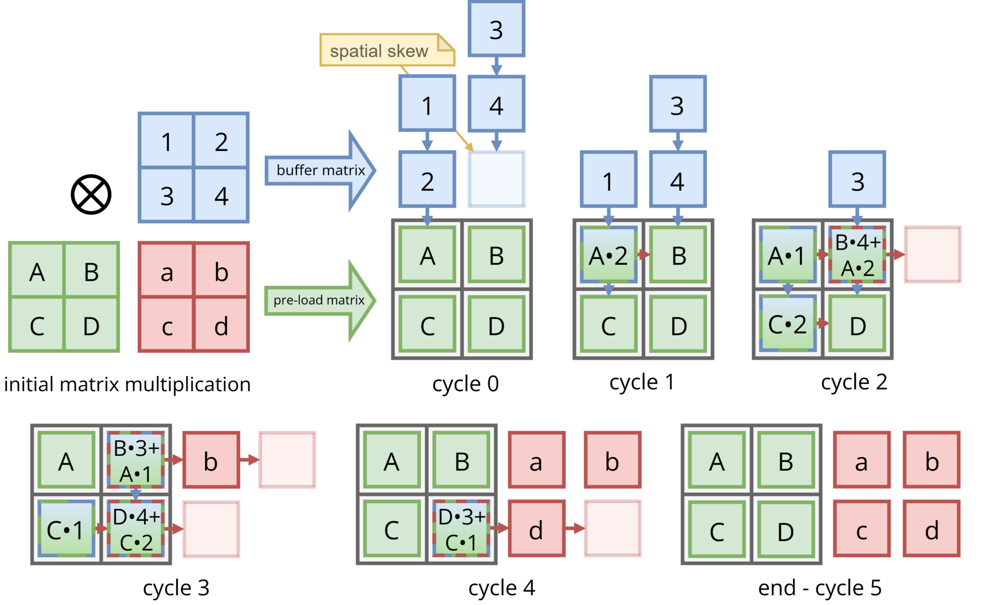
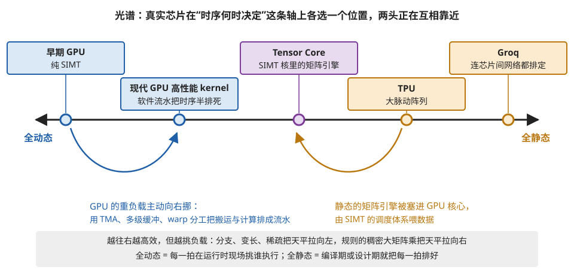

# 空间 vs SIMT：两种范式的分水岭

> **所属模块**：模块 00 · 两种范式地图（全库的锚点）
> **状态**：✅ 已完成（第二版：按《写作规范》重写。本节在学完模块 01–03 后回填，也可作为全库的第一篇导读）
> **本节主旨**：AI 芯片看似五花八门，底层只有两大设计范式：以 GPU 为代表的 **SIMT 路线**，和以谷歌 TPU 为代表的**空间/脉动阵列路线**。两者的一切差异，追到底只有一个分水岭：**"谁先谁后"这件事在什么时候被决定**——SIMT 说"运行时再定"（灵活，但要为不确定性付调度、同步、缓存的税），空间路线说"设计芯片时就定死"（高效，但只能算完全规则的计算）。记住这一个问题，两个世界的所有名词都能挂上号。

---

## 1. 分水岭：时序在什么时候被决定

一个计算任务涉及成千上万个操作，它们谁先谁后、数据什么时候到哪里——这套"时序"总得有人安排。两条路线的全部区别，就是安排的**时机**不同：

**SIMT / GPU 路线：运行时决定。** 硬件里有调度器，每个时钟周期现场挑选"数据已就绪"的线程组执行；数据什么时候从内存回来看缓存的运气；几万个线程谁快谁慢没有保证。这套动态机制的好处是**什么计算都能接**——分支、变长、不规则访问都行，反正调度器现场应变。代价是必须配备一整套"应对不确定性"的机制：海量线程轮换来掩盖等待（模块 01 第 2 节）、记分牌追踪数据是否就绪（同前）、同步原语在关键处会合（第 5 节）、缓存应付不可预测的访问（第 4 节）。

**空间 / 脉动路线：设计期决定。** 数据在固定的电线上、随统一的时钟、按一拍一格的节奏流过计算单元阵列——每个数据第几拍到哪个单元，是一个**造芯片时就写好的公式**（模块 02 第 2 节）。运行时没有任何决定要做，因此调度器、记分牌、同步、缓存**全部不需要**，省下的晶体管全部变成计算单元——这就是它能效领先的全部秘密。代价是**只能算时序可以完全预排的计算**（规则的稠密矩阵乘），遇到数据相关的分支就无能为力，而且计算的形状必须迁就阵列的物理尺寸（第 5 节的形状税）。

图 1-1 把这两种安排方式并排画了出来；图 1-2 是一个小脉动阵列逐拍运行的完整实例，可以亲眼看到"时刻表写死在电线里"是什么意思。



> **图 1-1**　一句话：GPU 在芯片运行时每一拍现场决定下一步算谁；脉动阵列在设计芯片时就把"每个数据第几拍到达哪个计算单元"写成了公式，运行时不再做任何决定。
>
> **先知道一件事**：一次大计算由成千上万个小操作组成，每个操作都要等它需要的数据到了才能做。"谁先谁后、数据什么时候到哪里"总得有人安排，这张图的左右两半就是两种安排法。图中的"拍"是芯片的一个时钟周期，芯片里所有动作都按拍推进，GPU 每秒大约走十几亿拍。
>
> **按这个顺序看**：
> 1. 左半边上方的 8 个方框是 8 个 warp。warp 是 GPU 把 32 个线程捆成的一组（线程是执行同一段代码、各自处理不同数据的一条执行流），硬件总是以组为单位执行。绿色的 3 个标着"就绪"，表示它下一条指令要的数据已经到手；灰色的标着"等数据"，表示它发出的读取请求还没回来。
> 2. 绿色箭头汇到"warp 调度器"：它每一拍只从就绪的 warp 里挑一个，把这个 warp 的下一条指令送进下方的执行单元。执行单元是 32 条并排的算术通道，一条指令同时处理 32 个线程各自的数据。
> 3. 两条灰色虚线从底部的显存绕回上方等数据的 warp：从显存取一次数要 400～800 拍，而且每次快慢不同，所以下一拍哪个 warp 能就绪，事先不知道，只能每一拍现场看。
> 4. 左下角蓝框列的是"现场决定"的代价：调度器要一直挑；记分牌要记下每笔读取回来没有；缓存要猜哪些数据还会再用；同步原语要让进度不齐的线程在关键处等齐。这些电路都占芯片面积，但不做计算。
> 5. 右半边是 3×3 的计算单元，简称 PE，每个 PE 一拍能做一次乘加。每个 PE 里预先装好一个权重 w（w00 到 w22），计算过程中不动。
> 6. 左侧三排小方块是排队进入的输入数据 a。每一拍，所有数据同时向右挪一格（蓝色箭头）；每个 PE 把流过自己的 a 乘上自己的 w，加到从上方流下来的部分和（还没加完的和）上，再往下传（红色箭头）。第 1 排比第 0 排晚进一拍，第 2 排再晚一拍，虚框就是空出来的拍。这样错开，是为了让一列里上下相邻的两个 PE 恰好在前后相邻的两拍拿到该配对的数据。
> 7. 右下角橙框：数据每拍固定移一格、从固定位置进入、按固定的错开量排队，所以任何数据在任何一拍的位置都能用一个公式算出来——a[m][k] 在第 m+k+n 拍到达 PE(k,n)。例如 a01（m=0，k=1）第 1 拍到 PE(1,0)，第 2 拍到 PE(1,1)。运行时没有任何事情需要判断，调度器、记分牌、缓存、同步都用不着，省下的面积全部做成计算单元。
>
> **打个比方**：左边像接散客的后厨，点单随时来、食材到货时间不定，需要一位调度员盯着"哪道菜的料齐了"再派给厨师；右边像一条装配线，每个工位在固定的节拍做固定的动作，零件准时流到面前，不需要有人喊"到你了"。
>
> **看懂的标志**：能回答"为什么脉动阵列能效更高，却不能直接跑带 if/else 的程序"——它把本来花在调度、记账、缓存、同步上的面积都换成了计算单元，前提是每个数据的去向在设计时就能写成公式；一旦下一步做什么要看数据的值，这个公式就写不出来了。
>
> **与正文的对照**：左半边对应下表"SIMT / GPU"一列的前三行（轮换掩盖延迟、显式同步、缓存），右半边对应"空间 / 脉动"一列。时刻公式与模块 02 第 2 节的写法一致：a[m][k] 是结果矩阵第 m 行要用的第 k 个输入，PE(k,n) 是第 k 行第 n 列的计算单元。
>
> 来源：本库自绘。



> **图 1-2**　一句话：一个 2×2 的脉动阵列从第 0 拍装好权重，到第 5 拍把四个结果全部送出，中间每一拍每个数在哪里都是事先确定的。
>
> **先知道一件事**：矩阵乘法的每个结果都是"一行乘一列、对应相乘再相加"。例如结果矩阵左上角的 a = A×1 + B×3。脉动阵列把其中的乘法分给不同的计算单元去做，把加法安排成沿一条路径逐格累加，所以一个结果是一格一格"流"出来的。
>
> **按这个顺序看**：
> 1. 左上角 "initial matrix multiplication"（要算的矩阵乘法）：绿色矩阵（A B / C D）乘蓝色矩阵（1 2 / 3 4），结果是红色矩阵（a b / c d），⊗ 表示矩阵乘。
> 2. 绿色大箭头 "pre-load matrix"（预先装入的矩阵）：A、B、C、D 在开始前装进 2×2 的四个计算单元（灰色粗框），整个过程中不动。这种做法叫"权重固定"（weights stationary）。
> 3. 蓝色大箭头 "buffer matrix"（缓冲矩阵）：蓝色的数在阵列上方排队，每拍往下落一格。左列依次落下 2、1，右列依次落下 4、3。右列比左列晚一拍，右列底部那个淡色空格就是这一拍的空位；黄色便签 "spatial skew"（空间上的错开）指的就是它。
> 4. 从 "cycle 0" 到 "end - cycle 5"（第 0 拍到第 5 拍）逐格看，• 是乘号。第 1 拍：2 落到 A 所在的单元，算出 A•2，下一拍把它向右传。第 2 拍：A•2 到达 B 所在的单元，恰好 4 也从上方落到这里，算出 B•4 + A•2，这就是结果 b；同一拍里，1 落到 A 算出 A•1，2 继续下落到 C 算出 C•2。
> 5. 格子的虚线边框表示这一拍收到了什么：蓝色虚边是收到了从上面落下的数，红色虚边是收到了从左边传来的部分和（还没加完的和）。算完的结果是红色小方块，从阵列右侧流出：第 2 拍得到 b，第 3 拍得到 a 和 d，第 4 拍得到 c，第 5 拍四个结果都已在右侧。
>
> **看懂的标志**：能回答"第 2 拍时，B 所在的单元为什么不需要检查 A•2 和 4 是否都到了"——右列比左列晚进一拍，正好抵消了 A•2 从左边走过来花掉的那一拍，两份数据由布线和节拍保证在同一拍到达。这件事在设计芯片时就定了，运行时无需确认。
>
> **与正文的对照**：这张图的输入从上方送入、部分和向右流；图 1-1 右半边的输入从左方送入、部分和向下流。两者只是转了 90 度，原理相同。
>
> 来源：[Weights Stationary Systolic Array Example.png](https://commons.wikimedia.org/wiki/File:Weights_Stationary_Systolic_Array_Example.png)，作者 EMJzero，许可 CC0（本库把透明背景填成了白色）。

两条路线的具体差异全部是这个分水岭的推论，一张表收拢（每一行都在对应章节有完整展开）：

| 差异点 | SIMT / GPU（模块 01） | 空间 / 脉动（模块 02） |
| --- | --- | --- |
| 应对内存延迟 | 海量线程轮换，谁的数据先到先执行谁 | 靠复用把对内存的需求压到极低，剩下的按时刻表预取 |
| 同步 | 必须显式（屏障、栅栏、mbarrier 一大家子） | 不需要——答案在设计期写进了电线 |
| 片上存储 | 缓存（硬件猜）+ shared memory（手动） | scratchpad（全手动）——给全知的世界买保险是浪费 |
| 数据复用 | 显式搬进快速存储反复读 | 在流经计算单元的电线上顺路发生，免费 |
| 对形状的态度 | 什么形状都吃（动态调度兜底） | 计算迁就硬件（维度要对齐阵列边长，否则交形状税） |
| 性能分析 | 运行时用性能工具测（结果有随机性） | 编译期直接算出来（跑一万次都一样） |
| 一句话 | **硬件迁就计算** | **计算迁就硬件** |

## 2. 光谱：真实芯片都活在两极之间

纯粹的两极几乎不存在，真实产品都在光谱上选位置：

```
全动态 ◄──────────────────────────────────────────────► 全静态
 早期 GPU     现代 GPU 的高性能    Tensor Core     TPU 的       Groq
 (纯 SIMT)    kernel(用软件流水    (塞进 SIMT 核   大脉动阵列    (连芯片间网络
              把时序"半排死")      里的矩阵引擎)                 都编译期排定)
```



> **图 1-3**　一句话：真实芯片都在"全动态"与"全静态"之间选一个位置，而且 GPU 和脉动阵列这两头正在向中间靠拢。
>
> **先知道一件事**：横轴只衡量一件事——"下一拍谁做什么"这个决定，有多少是芯片运行时现场做的（越靠左越多），有多少是提前在编译或设计时排好的（越靠右越多）。越往右，花在"现场决定"上的电路越少，同样面积里能放的计算单元越多。
>
> **按这个顺序看**：
> 1. 从左往右看轴上五个点。早期 GPU：完全靠调度器每拍挑一组线程执行。现代 GPU 的高性能 kernel（kernel 是在 GPU 上运行的一个函数）：仍然跑在 GPU 上，但程序员把"搬数据"和"算数据"提前排成固定的流水线，时序有一半是事先排好的。Tensor Core：GPU 核心里专做小块矩阵乘的单元，它内部的节拍是固定的。TPU：谷歌的 AI 芯片，主体是一个大脉动阵列。Groq：连多块芯片之间的数据传输都在编译时排好。
> 2. 轴下方的蓝色弯箭头：GPU 这一侧最重的负载（矩阵乘、注意力）在往右挪。TMA 是 GPU 里专门搬数据的硬件引擎；多级缓冲是"算这一块的同时提前搬下一块"；warp 分工是让一部分线程组专管搬、另一部分专管算。三者合起来，把搬运的时刻排成了固定的时间表。
> 3. 轴下方的橙色弯箭头：内部节拍固定的矩阵引擎被放进 GPU 核心，由 GPU 的动态调度给它喂数据——静态的内核包在动态的外壳里。
> 4. 底部灰条：越往右效率越高，但对负载越挑剔。
>
> **看懂的标志**：能回答"为什么说争夺的焦点是负载的规则程度"——负载越规则（例如稠密的大矩阵乘），时序越能提前排好，右边的芯片就越占优；负载里的分支、变长、稀疏越多，越需要左边那种现场决定的能力。
>
> **与正文的对照**：五个点与上方文字光谱的五个位置一一对应；两个弯箭头对应下一段"两头在互相靠近"。
>
> 来源：本库自绘。

而且**两头在互相靠近**：GPU 阵营最重的负载（矩阵乘、注意力）越来越靠"软件把搬运和计算的时序排成流水线"（模块 01 第 2 节第 6 部分）——主动向右挪；矩阵引擎则被塞进 GPU 核心里、用 SIMT 的调度体系喂养（模块 03）——静态的核心穿上了动态的外衣。**争夺的焦点是负载的规则程度**：越规则的计算越适合右边，夹杂分支和变长的真实负载把天平拉回左边。

## 3. 判词法：听到一个词，先问它属于哪一派

开会时快速定位陌生名词的方法——听音辨派：

- 带"**等、问、抢**"意味的词（barrier、stall、占用率、调度、抢占、缓存命中）→ **SIMT 派**。这些词存在的理由都是"运行时有不确定性要应对"。
- 带"**排、钉、对齐**"意味的词（systolic、stationary、静态调度、时刻表、形状对齐、确定性延迟）→ **空间派**。这些词存在的理由都是"编译期一切已知"。
- 两套词**混着出现**的场合（fragment、wgmma、Tensor Core、warp 专化）→ **交汇区**（模块 03）：矩阵引擎的里子、SIMT 的面子。

**还有第三类词，它们不属于任何一派——因为它们根本不在这个坐标系里。** 带"**分、等、排、坏**"意味的词（张量并行、气泡、all-reduce、TTFT、MFU、检查点、落后者）说的不是"一次计算怎么做"，而是"**很多张卡怎么一起做、以及做的过程中出了岔子怎么办**"。它们属于**系统层**（模块 09）。

**为什么要把它单列成第三类，而不是塞进上面两派**：因为它遵守的是一套**不同的、有时甚至相反的**规律。最典型的一个例子——本模块和模块 01 反复讲"执行单元忙起来就是好"，而模块 09 第 2 节会算出：**在有延迟要求的服务里，把 GPU 跑到 95% 利用率是错的**（排队时间随利用率非线性上升，从 80% 到 95%，吞吐只涨 19% 而延迟涨四倍）。**同一句"忙起来好不好"，在单卡内部和在集群服务上给出相反的答案。** 分界线是"**有没有人在外面等**"。

**所以完整的判词法是三问**：这个词说的是**一次计算怎么排时序**（左右两派的分水岭）、还是**很多次计算怎么协同**（系统层）？前者再问它属于动态还是静态；后者再问它属于训练、推理还是通信。

**例子：用判词法拆一句真实的会议发言。** "这个 kernel 在 H100 上 occupancy 不高，但 TMA 流水排得满，Tensor pipe 利用率有 75%。"——三个词三个坐标：occupancy 是 SIMT 派（运行时驻留多少线程，模块 01 第 2 节）；TMA 流水是"向右挪"的软件静态化（把搬运时序排死，同节第 6 部分）;Tensor pipe 是交汇区（SM 里的矩阵引擎，模块 03）。整句话翻译过来：这个程序没靠海量线程轮换，而是靠排好的流水线喂矩阵引擎——低 occupancy 不是问题，75% 的矩阵单元利用率才是结论。**听懂这句话需要的全部知识，就是这张地图。**

## 4. 全库导航

- 左列逐行展开 → **模块 01**（SM 结构、调度与占用率、分支发散、访存、同步、指令集、调度全景）
- 右列逐行展开 → **模块 02**（五节：PE 阵列、时序、数据流、后勤、形状税）
- 交汇区 → **模块 03**（Tensor Core、多芯片互连）
- 光谱的软件延伸（编译器静态排 vs 运行时调度）→ **模块 04**
- 真实芯片在光谱上的坐标 → **模块 05**
- 数据在这张图上怎么流动 → **模块 06**（纵向串线）；硅片怎么叠 → **模块 07**；框图落到电路 → **模块 08**
- **这张图之外的那一层**（很多卡怎么协同、以及协同时出的岔子）→ **模块 09**

---

*最后更新：2026-09-01（第三版：判词法从两派扩到三派，补入系统层的词汇及"同一句直觉在单卡与集群上给出相反答案"这条分界；导航补上模块 06–09。第二版：按写作规范重写，新增判词法实战例）*（2026-09 补图 3 张：现成 1 张，自绘 2 张；图注按费曼法写）
