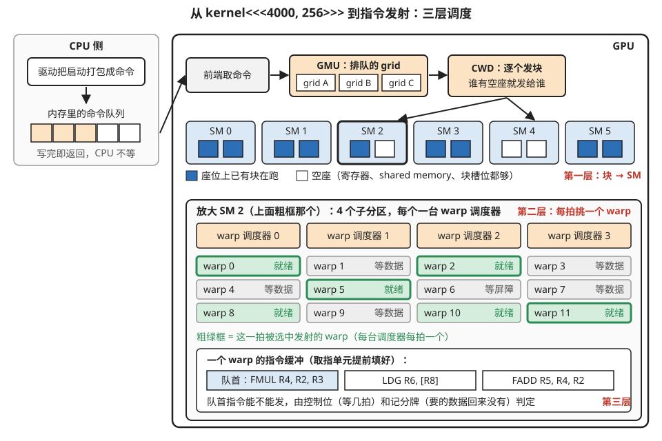
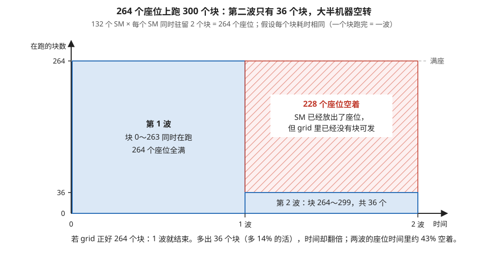
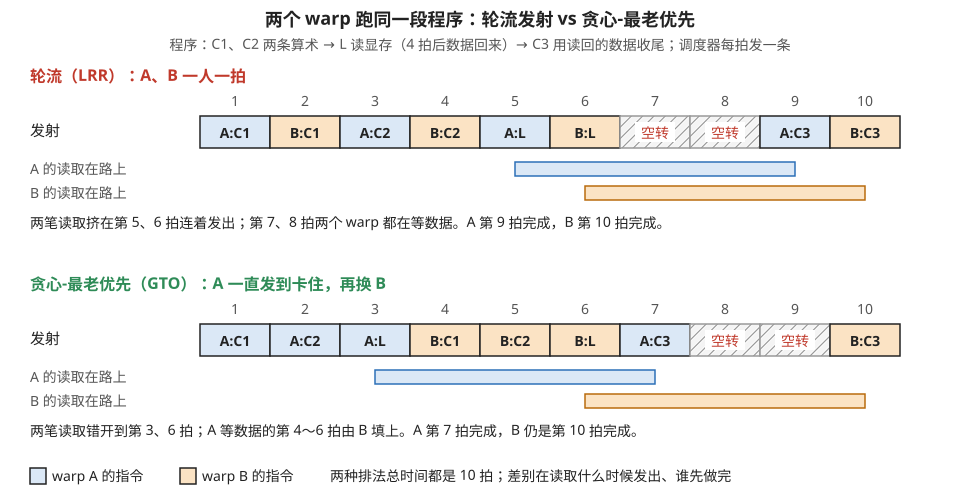
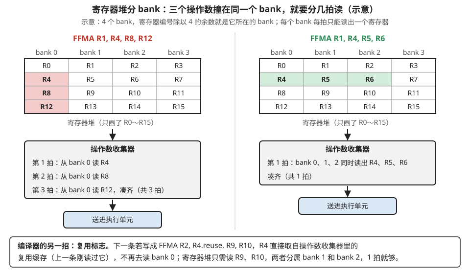
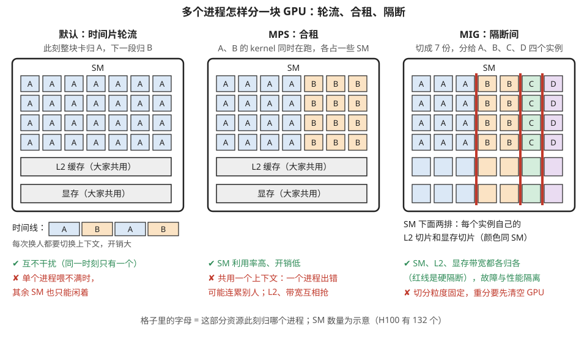

# 调度全景：从线程块分发到指令发射

> **所属模块**：模块 01 · SIMT 核的物理实现（补全微架构调度链；本节讲启动命令到达 GPU 之后硬件如何调度，命令到达之前软件侧的运行时层见模块 04 第 6 节）
> **状态**：🟨 学习中（第一版。知识截至 2026-08。SM 内部微架构细节 NVIDIA 不完全公开，本节标注"据公开资料/逆向研究"的部分请以此理解）
> **本节主旨**：GPU 上的"调度"其实是**三层各自独立的机制**：最上层，芯片级的分发器（GigaThread Engine）决定**哪个线程块去哪个 SM**；中间层，SM 里的 warp 调度器决定**每一拍发射哪个 warp**；最下层，记分牌和控制位决定**一个 warp 内指令的先后**（这层已在第 2 节讲过）。此外还有一个横向维度：**多个 kernel、多个进程怎么共享同一块 GPU**（stream、抢占、MPS、MIG）。这一节把这张完整的调度地图铺开——开会时听到的"wave、尾效应、抢占粒度、MIG 切分"这些词全部住在这张图上。

---

## 0. 这一节要回答的问题

- 启动一个 kernel 后，几千个线程块是被谁、按什么规则分到各个 SM 上的？
- "wave（波）"和"尾效应"是什么？为什么线程块数量最好是 SM 数的整数倍？
- warp 调度器内部怎么运作？为什么用"贪心-最老优先"而不是简单轮流？
- 一条指令发射后，操作数是怎么从寄存器堆里取出来的？寄存器也会"撞车"吗？
- 两个 kernel 能同时跑在一块 GPU 上吗？一个正在跑的 kernel 能被打断吗？
- MPS 和 MIG 是什么？多个用户/进程共享 GPU 时发生了什么？

---

## 1. 基础词汇：先把本节要用的词讲清楚

**grid（网格）**。启动一个 kernel 时指定的全部线程块的集合。"启动一个 kernel"在硬件视角就是"提交一个 grid"：可能是几十个块，也可能是几十万个块。

**GigaThread Engine（千线程引擎，常简写 GTE 或口头称 GD）**。GPU 芯片上的全局调度硬件，位于所有 SM 之外、地位类似"总调度室"。它接收驱动提交的 grid，把线程块逐个分发给有空位的 SM。历代白皮书里它还有两个配套部件的名字会被提到：**GMU**（Grid Management Unit，网格管理单元，管理排队中的多个 grid）和 **CWD**（CUDA Work Distributor，把就绪 grid 的块分发出去）——三个名字经常混用，指的都是这套芯片级分发机构。

**stream（流）**。软件侧提交工作的队列。同一条 stream 里的 kernel 按提交顺序执行；**不同 stream 之间没有顺序约束**，硬件可以让它们并发。

**上下文（context）与抢占（preemption）**。上下文是一个进程在 GPU 上的全部状态（页表、显存分配等）。抢占指硬件暂停一个正在运行的 kernel、保存现场、切换去运行别的工作的能力——CPU 上司空见惯，GPU 上直到 2016 年的 Pascal 架构才做到指令级粒度。

## 2. 第一层：芯片级——线程块怎么被分到 SM 上

### 2.1 从 launch 到 SM：一条完整的路径

你在代码里写 `kernel<<<4000, 256>>>(...)`，之后发生的事：

1. **CPU 侧**：驱动把这次启动打包成一条命令，写进一个位于内存的命令队列（ring buffer），GPU 的前端硬件异步地取走——所以 kernel 启动对 CPU 来说是"发完即走"，这就是启动开销约几微秒、且 CPU 不阻塞的原因。
2. **GMU 排队**：GPU 上可能同时有多个 grid 在等（来自不同 stream、不同进程），GMU 维护这些排队的 grid。
3. **CWD 分发**：轮到某个 grid 时，分发器开始把它的线程块发给 SM。**规则很朴素：哪个 SM 有足够的空闲资源（寄存器、shared memory、块槽位——第 2 节占用率的三条约束），就把下一个块发给它。** 一个块一旦落到某个 SM，就在那里跑到死，不会迁移。
4. **持续补货**：某个块执行完毕、释放资源，分发器立刻补发下一个等待的块，直到 grid 里的块全部发完。

图 7-1 把这条路径画了出来，并顺带把后面要讲的第二、三层也放进了同一张图。



> **图 7-1**　一句话：一次 kernel 启动要经过三层调度：芯片级分发器决定每个线程块去哪个 SM；SM 里的 warp 调度器每拍挑一个 warp 发射；warp 内部由控制位和记分牌决定队首那条指令能不能发。
>
> **先知道一件事**：`kernel<<<4000, 256>>>` 表示启动 4000 个线程块、每块 256 个线程。线程块是分发的最小单位：一个块整体落在某一个 SM（GPU 里独立的计算单元，H100 有 132 个）上，从头跑到尾，不会中途搬家。
>
> **按这个顺序看**：
> 1. 左上 CPU 侧：驱动把这次启动打包成一条命令，写进内存里的命令队列（橙格是已写入的命令）。写完 CPU 就返回，不等 GPU。
> 2. GPU 顶部一行从左到右：前端从队列取走命令；GMU（网格管理单元）把来自不同 stream、不同进程的 grid（一次启动的全部线程块）排成队；CWD（工作分发器）把排到的 grid 的块一个一个发出去。
> 3. 第二行是 SM。每个 SM 画了两个座位：蓝格表示已有块在跑，白格表示空座，即这个 SM 剩下的寄存器、shared memory 和块槽位还够再放一个块。CWD 的箭头只指向有白格的 SM 2 和 SM 4。这是第一层。
> 4. 下方大框把 SM 2 放大：它分成 4 个子分区，每个子分区有一台 warp 调度器，下面列着归它管的 warp。绿色是就绪（下一条指令可以发），灰色是在等数据或等屏障。每台调度器每拍只从就绪的 warp 里挑一个发射，粗绿框就是这一拍被挑中的。这是第二层。
> 5. 最底部是一个 warp 的指令缓冲：取指单元提前把它接下来的几条指令放在这里。调度器只看队首那条，由控制位（编译器写进指令的“发出后要停几拍”）和记分牌（记录哪些寄存器还在等数据）判断它能不能发。这是第三层。
>
> **打个比方**：像一家连锁餐厅。总部调度室（第一层）把一桌桌客人分到有空桌的分店；每家分店的领班（第二层）每一刻决定先服务哪一桌；每桌的下一道菜能不能上（第三层），要看前一道用的食材到了没有。
>
> **看懂的标志**：能回答“kernel 只有 40 个块时，是哪一层出了问题”——第一层。块数少于 132 个 SM，分发器无块可发，大半 SM 没有活干；这时 SM 内部的调度再好也没用。
>
> **与正文的对照**：第一层是第 2 节，第二层是第 3 节，第三层在前面 warp 执行那一节讲过；第 5 节的文字地图与本图对应。每个 SM 两个座位、warp 与子分区的对应关系都是示意。
>
> 来源：本库自绘。

### 2.2 wave（波）与尾效应：一笔值得手算的账

由于每个 SM 同时容纳的块数有限（假设资源允许每个 SM 驻留 2 个块，132 个 SM 就是 264 个"座位"），一个大 grid 的执行天然分成一波一波：第一批 264 个块坐满机器（第一个 wave），谁先做完谁的座位就被后续块补上。

**例子：为什么 300 个块比 264 个块"亏"。** 还是 264 个座位。如果 grid 正好 264 个块：一波坐满，齐头并进，机器始终满载。如果是 300 个块：前 264 个占一波，剩下 36 个块要等座位——最后阶段整台机器上**只有 36 个块在跑，其余 228 个座位空着**，利用率跌到 14%。假设每个块耗时相同，总时间是"两波"，但第二波只干了 14% 的活——两波共 264 × 2 = 528 个"座位·波"，只用掉 300 个，**四成多（228 ÷ 528 ≈ 43%）的机器时间被浪费在这条"尾巴"上**。这就是**尾效应（tail effect）**，性能工具里对应的读数叫 waves（波数）：波数是 1.14 这种"整数多一点"的值时最亏。缓解办法：调整块的大小和数量让总块数贴近座位数的整数倍，或者用"少而长寿"的块（每个块用循环吃掉多份数据，术语叫 grid-stride loop 或 persistent 风格）把尾巴消化在循环里。图 7-2 把这笔账画成了图。



> **图 7-2**　一句话：块数比座位数多出一点点时，最后一波只有少数块在跑，大部分 SM 空等，这段“尾巴”白白拉长了总时间。
>
> **先知道一件事**：GPU 同时能跑的块数有上限，这里叫“座位”。每个 SM 能同时驻留几个块，取决于每个块用多少寄存器和 shared memory；这里假设每个 SM 2 个，132 个 SM 共 264 个座位。所有块一次坐不下时，只能分批上，一批叫一波（wave）。
>
> **按这个顺序看**：
> 1. 横轴是时间，以“一个块从开始跑到结束”为单位，记作一波；纵轴是同时在跑的块数，264 就是满座。
> 2. 左边蓝色大块是第 1 波：块 0～263 同时在跑，座位全满。
> 3. 右边底部的蓝色矮条是第 2 波：只剩块 264～299 这 36 个块。
> 4. 右边红色斜线区是空着的 228 个座位：SM 已经跑完第 1 波的块、放出了座位，但 grid 里已经没有块可发了。
> 5. 底部的账：多出的 36 个块只多了 14% 的活，总时间却从 1 波变成 2 波；两波共 528 个“座位·波”，只用掉 300 个，约 43% 空着。
>
> **打个比方**：一辆 264 座的大巴要送 300 个人，只好跑两趟，第二趟车上只坐了 36 个人。
>
> **看懂的标志**：能回答“块数改成多少最划算”——改到 264 的整数倍附近，比如 264 或 528；或者让每个块用循环处理多份数据、块数正好等于座位数（persistent 风格），就不会有第二波的尾巴。性能工具报的 waves 在这里是 300 ÷ 264 ≈ 1.14，这种“整数多一点”的值最亏。
>
> **与正文的对照**：数字取自上面的例子；“每个块耗时相同”是例子的简化假设。
>
> 来源：本库自绘。

### 2.3 Hopper 的新任务：整簇共同分发

Hopper 引入"线程块簇"（cluster，几个块结成一组、可互访 shared memory——第 4 节提过）后，分发器多了一个硬约束：**同一簇的所有块必须同时驻留在同一组相邻 SM 上**，缺一个座位整簇都不能发。这是分发器第一次需要做"打包分配"而不是"逐个塞空位"——簇越大，凑齐座位越难，这也是簇尺寸有限制（最多 8 或 16 个块）的原因。

## 3. 第二层：SM 级——warp 调度器的内部

第 2 节讲过调度器的职责（每拍从就绪 warp 里挑一个发射），这里把内部机制展开一层。以下部分细节 NVIDIA 未完全公开，来自白皮书、专利与学术界的逆向研究（如 GPGPU-Sim 的模型），量级和机制可信，具体数字各代有出入。

### 3.1 每个 warp 有一个小指令缓冲

调度器并不是临时去内存取指令的。每个驻留的 warp 配有一个**指令缓冲**（instruction buffer），取指单元提前把该 warp 接下来的几条指令填在里面。调度器每拍做的事更精确地说是：扫一眼各 warp 指令缓冲里的**队首指令**，结合记分牌和控制位判断谁就绪，挑一个发射。指令缓冲空了（取指没跟上）的 warp 即使数据就绪也发不了——这种停顿在性能工具里叫 "No Instruction"，通常出现在代码体积很大、指令缓存装不下的 kernel 里。

### 3.2 挑选策略：为什么是"贪心-最老优先"而不是轮流

多个 warp 同时就绪时挑谁？两种经典策略：

- **轮流（LRR，Loose Round-Robin）**：雨露均沾，这拍发 A 下拍发 B。听起来公平，但有个坏处：所有 warp**齐头并进**——意味着它们会**同时**走到访存密集的阶段（一起发一堆读取，带宽瞬间挤爆），又**同时**走到计算阶段（访存系统空闲）。忙闲不均，两头都堵。
- **贪心-最老优先（GTO，Greedy-Then-Oldest）**：可劲儿发同一个 warp，它卡住了再换"等得最久"的那个。好处有二：其一，同一个 warp 的连续指令往往访问相邻数据，连着跑对缓存友好；其二，各 warp 进度自然错开，有人在算、有人在等数据——**忙闲被摊匀了**，访存系统和算术单元都不容易出现潮汐式拥堵。

**例子：两个 warp、同一段程序，两种策略的时间线。** 程序都是"先做 2 条算术（记 C1、C2），再发 1 条显存读取（记 L，延迟按 4 拍算），数据回来后做收尾计算（记 C3）"。对比两种策略（每拍发射一条指令）：

轮流（LRR）——雨露均沾：

| 拍 | 1 | 2 | 3 | 4 | 5 | 6 | 7 | 8 | 9 | 10 |
| --- | --- | --- | --- | --- | --- | --- | --- | --- | --- | --- |
| 发射 | A:C1 | B:C1 | A:C2 | B:C2 | A:L | B:L | — | — | A:C3 | B:C3 |

两个 warp 齐头并进，第 5、6 拍**一起**发出读取，第 7、8 拍**一起**无事可做（双双在等数据）——两拍纯空转，而且第 5、6 拍显存瞬间收到两笔请求、之前之后却闲着，忙闲成潮汐。

贪心-最老优先（GTO）——可着一个用：

| 拍 | 1 | 2 | 3 | 4 | 5 | 6 | 7 | 8 | 9 | 10 |
| --- | --- | --- | --- | --- | --- | --- | --- | --- | --- | --- |
| 发射 | A:C1 | A:C2 | A:L | B:C1 | B:C2 | B:L | A:C3 | — | — | B:C3 |

A 先跑到发出读取（第 3 拍），卡住的瞬间调度器切到 B——**A 等数据的第 4、5、6 拍被 B 的 3 条指令填上**，第 7 拍 A 的数据回来，无缝接上收尾。B 的读取第 6 拍才发出、第 10 拍才回来，所以第 8、9 拍同样空转，总耗时也是 10 拍。

**在这个极简模型里，两种策略的总时间一样**：两个 warp 在读取之前一共有 4 条算术要发，再加上两条读取本身，最后一条读取无论怎么排最早也要第 6 拍才能发出，总时间就是它再加 4 拍延迟。差别在过程上：轮流让两笔显存请求挤在第 5、6 拍接连发出，GTO 把它们错开到第 3 拍和第 6 拍；轮流下两个 warp 都拖到最后才完成，GTO 下 A 在第 7 拍就完成了。warp 一多、读取一多，这两点就会变成总时间上的收益：请求错开发出，显存不会一会儿挤爆、一会儿闲着；同一个 warp 连着跑，它刚取进缓存的数据还没被别的 warp 挤掉就被用上了。两张表画在了图 7-3 里。



> **图 7-3**　一句话：同样两个 warp、同一段程序，轮流发射让两个 warp 齐头并进、两笔读取挤在一起发出；贪心-最老优先让一个 warp 先跑到读取，另一个来填它的等待，两笔读取被错开。
>
> **先知道一件事**：warp 发出显存读取后，数据要过一段时间（这里设为 4 拍）才回来。在那之前，这个 warp 里要用该数据的那条指令发不了，调度器只能去发别的 warp 的指令；如果所有 warp 都在等，这一拍就空转。
>
> **按这个顺序看**：
> 1. 最上面一行说明程序：每个 warp 先做两条算术 C1、C2，再发读取 L，4 拍后数据回来，再做收尾 C3。调度器每拍只发一条指令。
> 2. 每个面板的“发射”行是每一拍发了哪条指令：蓝格属于 warp A，橙格属于 warp B，斜线格是空转。下面两条横条是 A、B 的读取在路上的时间。
> 3. 上面板，轮流（LRR）：A、B 一人一拍。两个 warp 同时走到读取，第 5、6 拍接连发出两笔读取；第 7、8 拍两个都在等数据，空转。A 第 9 拍、B 第 10 拍完成。
> 4. 下面板，GTO：一直发 A，直到 A 在第 3 拍发出读取、卡住，才换 B。A 等数据的第 4～6 拍由 B 的三条指令填上，第 7 拍 A 的数据一回来就收尾，A 第 7 拍完成。B 的读取第 6 拍才发出，第 8、9 拍仍然空转，B 第 10 拍完成。
> 5. 最底一行：两种排法都用了 10 拍。
>
> **打个比方**：两个厨师各要做两道备料、一次长时间烘烤、一道装盘。轮流做，两人会前后脚把东西送进烤箱，然后一起干等；一个人先连着做到送进烤箱，另一个人再开始，两人的烘烤就错开了，先开始的那个也先出菜。
>
> **看懂的标志**：能回答“两种策略总时间一样，为什么还偏好 GTO”——在只有两个 warp、每个只读一次的小例子里，最后一笔读取最早第 6 拍才能发出，总时间由它决定，所以相同。GTO 的好处在过程：读取被错开，显存不会一会儿挤爆、一会儿闲着；A 提前完成；同一个 warp 连着跑，对缓存更友好。warp 多、读取多时，这些差别才会变成总时间上的收益。
>
> **与正文的对照**：两行发射序列与上面两张表逐格对应。
>
> 来源：本库自绘。

现代 NVIDIA GPU 的策略接近 GTO（未官方证实但被广泛观测）。这个小例子浓缩了它的设计思想：**调度器故意让 warp 进度参差不齐——参差本身就是资源利用率的朋友**，齐头并进反而制造"一起忙、一起闲"的拥堵。这与第 2 节"轮换掩盖延迟"一脉相承。

### 3.3 发射之后：操作数收集与寄存器 bank

一条指令被发射，还有最后一道工序：把它的操作数（两三个寄存器的值）从寄存器堆里读出来。这里有一个容易被忽略的硬件事实：**寄存器堆也是分 bank 的**（和上一节 shared memory 分 bank 同理——一整块 256 KB 的存储不可能做出无限多读口）。如果一条指令的三个操作数恰好落在同一个 bank，就得分几拍串行地读。

硬件里负责这道工序的部件叫**操作数收集器（operand collector）**：它像一个中转站，花一到几拍把各操作数从不同 bank 凑齐，凑齐后把指令连数据一起送进执行单元。为了少撞 bank，编译器也出力：第 2 节讲过的控制位里有一个"复用"标志，让指令直接**复用上一条指令刚读过的操作数**（存在一个小小的复用缓存里），省掉一次寄存器堆访问。这些细节平时感知不到，但它解释了两件事：为什么指令的实际发射节奏偶尔比理论慢一拍，以及为什么编译器要费心安排寄存器的分配位置。图 7-4 用两条指令对比了撞 bank 和不撞 bank 的情形。



> **图 7-4**　一句话：寄存器堆分成几个 bank，每个 bank 每拍只能读出一个寄存器；一条指令的几个操作数落在同一个 bank 就要分几拍读，落在不同 bank 一拍就能读齐。
>
> **先知道一件事**：乘加指令 `FFMA R1, R4, R8, R12` 的意思是 R1 = R4 × R8 + R12。它要先从寄存器堆里读出三个寄存器（称为操作数），算完再写回 R1。寄存器堆是一大块存储，做不出无限多的读口，所以被切成几个 bank，每个 bank 各有自己的读口。
>
> **按这个顺序看**：
> 1. 顶部说明本图的假设：4 个 bank，寄存器编号除以 4 的余数决定它在哪个 bank。两个网格都按这个规则排着 R0～R15，每一列是一个 bank。
> 2. 左边的指令要读 R4、R8、R12（红格）。三者除以 4 都余 0，全在 bank 0 这一列里。
> 3. 左下的操作数收集器（把一条指令的操作数凑齐后再送去执行的中转部件）每拍只能从 bank 0 读一个：第 1 拍 R4，第 2 拍 R8，第 3 拍 R12，花 3 拍才凑齐。
> 4. 右边的指令要读 R4、R5、R6（绿格），分属 bank 0、1、2，三个 bank 同一拍各读一个，1 拍凑齐。
> 5. 底部是编译器的另一招：指令里的 `.reuse` 标志让刚读过的 R4 留在收集器的复用缓存里，下一条指令直接拿，不必再读 bank 0。
>
> **打个比方**：三个人都要从同一个窗口取件，只能排队；分到三个窗口，同时就取完了。复用缓存相当于刚取出的那件还拿在手上，下次不用再排队。
>
> **看懂的标志**：能回答“为什么编译器分配寄存器时要在意编号”——编号决定 bank。给同一条指令的操作数挑不同 bank 的寄存器，或让相邻指令复用同一个操作数，都能省掉读寄存器堆时的排队拍。
>
> **与正文的对照**：bank 的个数和编号规则是示意。据公开的逆向研究，Maxwell、Pascal 的寄存器堆是 4 个 bank；Volta 起改为 2 个更宽的 bank，分配规则不同，但“同一个 bank 要分拍读”的道理相同。
>
> 来源：本库自绘。

### 3.4 谁在什么时候发射到哪条管道

每个子分区里有多种执行管道（浮点乘加、整数、特殊函数、访存、Tensor Core——第 1 节的解剖图）。调度器每拍发射一条指令到**其中一条**管道；不同管道各有自己的深度，可以同时各自忙各自的（这拍发给浮点管道的指令还在算，下一拍照样可以发一条访存给 LSU）。所以"每拍只发一条"并不意味着"同时只有一件事在干"——**发射是串行的，执行是并行的**。让多条管道同时保持忙碌，正是第 2 节指令级并行、以及 B 系列里"乒乓调度"（两组 warp 错峰用不同管道）的硬件基础。

## 4. 横向维度：多个 kernel、多个进程怎么共享 GPU

以上都是"一个 kernel 内部"的事。真实机器上还有另一组问题：多个 kernel、多个进程怎么分这块 GPU？

### 4.1 stream 与并发 kernel

不同 stream 的 kernel **可以同时在 GPU 上跑**，前提是资源装得下：kernel A 只占了 80 个 SM 的座位，B 的块就能坐进剩下 52 个 SM。这在"很多小 kernel"的场景（推理服务里常见）很有用——单个 kernel 喂不满机器，几个拼起来满。硬件侧的支持叫 **HyperQ**（Kepler 起）：GPU 前端有几十条独立的硬件队列，不同 stream 映射到不同队列，避免了早期"所有 stream 挤一条队、假并发"的问题。要注意的相反陷阱：**同一条 stream 内是严格串行的**——把本可并行的 kernel 提交到同一条 stream，就白白排队。

### 4.2 抢占：正在跑的 kernel 能被打断吗

能，但历史很短。Pascal（2016）之前，GPU 只能等一个 kernel 的块跑完才能切换——一个死循环 kernel 能挂起整台显卡（桌面卡的"看门狗超时"就是这么来的）。Pascal 起支持**指令级抢占**：硬件可以在任意指令边界暂停 kernel，把它的寄存器、shared memory 等现场整体搬到显存，切换别的工作，回头再搬回来继续。代价不小（现场有几 MB，来回搬要几十微秒），所以抢占是"能用但不便宜"的机制——GPU 的常态调度仍然是"跑完再换"，抢占留给交互式桌面、调试器、时间片强制切换这些场景。

### 4.3 MPS 与 MIG：空间共享的两个档位

多个**进程**共享 GPU 时，默认行为是时间片轮流（每个进程独占一段时间，上下文切换开销大）。两个更好的选项：

- **MPS（Multi-Process Service）**：让多个进程的 kernel **像同一进程的多个 stream 一样**空间共存（你占这些 SM 我占那些），共享一个上下文。隔离弱（一个进程崩溃可能连累其他），但开销低、SM 利用率高，适合互信的负载（同一个团队的多个推理实例）。
- **MIG（Multi-Instance GPU，Ampere 起）**：**硬切分**。把一块 GPU 物理划分成最多 7 个实例，每个实例分到独立的 SM 集合、独立的 L2 切片、独立的显存带宽——故障和性能完全隔离，一个实例满载不影响邻居。代价是灵活性差（切分粒度固定、重新划分需要清空 GPU），适合云上多租户。

一句话区分：**MPS 是合租（共用客厅，便宜但吵），MIG 是隔断间（各有门锁，贵但清净）。** 图 7-5 把默认的时间片轮流和这两档并排画了出来。



> **图 7-5**　一句话：多个进程共用一块 GPU 有三种方式：默认按时间轮流独占整块卡；MPS 让多个进程同时各占一部分 SM；MIG 把卡硬切成几份，每份连 L2 和显存都独立。
>
> **先知道一件事**：进程是操作系统里一个独立运行的程序，比如两个互不相干的推理服务。每个进程在 GPU 上有自己的上下文（页表、显存分配等状态）；默认情况下，不同进程的 kernel 不会同时在 GPU 上跑。
>
> **按这个顺序看**：
> 1. 三个大框是同一块 GPU 在三种方式下的样子。上面四排小格是 SM（示意，只画 28 个），下面两排是 L2 缓存和显存。格子里的字母表示这部分资源此刻归哪个进程。
> 2. 左框，默认的时间片轮流：此刻 28 个 SM 全是 A。下方的时间线 A、B、A、B 表示整块卡轮流归 A、归 B，每次换人都要切换上下文。A 的 kernel 如果只用得上几个 SM，其余 SM 也只能闲着。
> 3. 中框，MPS（Multi-Process Service，多进程服务）：A 占左边 4 列，B 占右边 3 列，两者的 kernel 同时在跑，就像同一个进程的两个 stream。但 L2 和显存是大家共用的一整块，进程之间也共用一个上下文。
> 4. 右框，MIG（Multi-Instance GPU，多实例 GPU）：卡被切成 7 份，分给 A（3 份）、B（2 份）、C 和 D（各 1 份）。红色竖线是硬隔断：每个实例不但有自己的 SM，下面两排的 L2 切片和显存切片也各归各，一个实例满载不会拖慢邻居。
> 5. 最下面三组勾和叉是各自的得失。
>
> **打个比方**：时间片轮流是整套房子按天轮流给不同的人住；MPS 是合租，各住一间卧室，但共用客厅和厨房；MIG 是把房子隔成几个各有门锁、各有厨卫的小套间。
>
> **看懂的标志**：能回答“云上把一块卡租给几个互不认识的客户，该选哪种”——MIG。客户之间需要故障隔离和性能隔离：MPS 下一个进程出错可能连累别人，L2 和带宽也会被邻居抢走；MIG 的隔断由硬件保证。
>
> **与正文的对照**：MIG 最多切 7 个实例，与上文一致；A、B、C、D 的切法只是一种示意。
>
> 来源：本库自绘。

## 5. 三层地图总览

下面这张文字地图与图 7-1 对应，多了横向那一行。

```
第一层  芯片级：GigaThread/GMU/CWD
        决定：哪个块去哪个 SM（座位分配）
        你感知它的方式：waves/尾效应、cluster 能否发出、多 kernel 并发
────────────────────────────────────────────
第二层  SM 级：warp 调度器（每子分区一个）
        决定：每一拍发射哪个 warp（GTO 策略）
        你感知它的方式：占用率、Eligible Warps、stall 原因分解
────────────────────────────────────────────
第三层  warp 内：控制位 + 记分牌（第 2 节已讲）
        决定：一个 warp 自己的指令何时能发
        你感知它的方式：stall 里的 Wait / Long Scoreboard
────────────────────────────────────────────
横向    多 kernel/多进程：stream、HyperQ、抢占、MPS/MIG
        决定：谁有资格把 grid 提交进来、怎么分地盘
```

三层各管一段、互不越权：分发器不管 SM 内部怎么轮换，warp 调度器不管指令依赖（那是编译器和记分牌的事）。排查性能问题时先想清楚"这是哪一层的现象"：机器整体没坐满是第一层（看 waves），坐满了但发射空转是第二层（看 Eligible Warps），单个 warp 频繁卡壳是第三层（看 stall 原因）。

## 6. 开发者视角

| 你想知道/控制什么 | 去哪里看/拧 |
| --- | --- |
| 块分发满不满、尾效应 | Nsight Compute 的 waves 指标；grid 尺寸对 SM 数取整 |
| kernel 之间有没有真并发 | Nsight Systems 的时间线（两个 kernel 的条是否重叠） |
| stream 用对了没有 | 检查本应并行的工作是否误入同一 stream；stream 优先级 API |
| 簇能不能发出 | cluster 尺寸 ≤ 硬件上限；occupancy 计算要按"整簇"算 |
| 多进程共享方案 | `nvidia-cuda-mps-control` 启用 MPS；`nvidia-smi mig` 配置 MIG |
| 抢占/时间片行为 | 一般不可控；长 kernel 在桌面环境注意看门狗 |

## 7. 最新架构落点（知识截至 2026-08）

- **Hopper**：cluster 共同分发（2.3）；另有 stream 优先级与抢占粒度的持续改进。
- **Blackwell**：延续以上机制；双芯合封后分发器管理的 SM 池更大，但对软件透明。
- **CUDA 12.x 的新接口**：Green Contexts 等允许把 SM 划成资源组供同一进程内的不同任务使用——介于 stream 与 MIG 之间的又一档"分地盘"粒度，值得关注。
- **Blackwell 让分发器的工作又难了一层**。2.3 节说过 Hopper 的簇让分发从"逐个塞空位"变成了"打包分配"；Blackwell 的 2-CTA 矩阵指令（模块 03 第 1 节 §4.1）进一步要求**配对的两个块必须落在编号只差最低位的一对相邻 SM 上**——**约束从"整簇同时驻留"细化到了"特定的配对关系"**。这条对第 5 节那张三层地图的影响是：**第一层（座位分配）的粒度又变粗了一档**，从块 → 簇 → 配对的块。看新架构时问一句"这一代的驻留分配单位是什么"，就能知道占用率的算法要不要重写。
- **多进程共享的档位在变多**：MPS（合租）与 MIG（隔断间）之外，CUDA 的 Green Contexts 让同一进程内的不同任务也能划分 SM 资源。**推理服务里这一档越来越有用**——一个进程同时跑 prefill 和 decode 时，用它把两类工作分到不同的 SM 集合上，是模块 09 第 2 节讲的"prefill 干扰"的另一种解法（相对于 chunked prefill 那种时间上的错开，这是空间上的隔离）。
- **AMD**：对应机构叫 ACE（异步计算引擎，接收队列）与各自的 workgroup 分发逻辑；MxGPU/分区方案对标 MIG。名字不同，三层结构相同。

## 8. 术语卡

### GigaThread Engine（GTE / 口头常称 GD）
**定义**：GPU 芯片级的全局调度硬件，接收驱动提交的 grid，按"哪个 SM 有空位就发给谁"的规则把线程块分发到各 SM；配套的 GMU 管排队、CWD 管分发，常混称。
**为什么存在**：几千个线程块和上百个 SM 之间需要一个总调度台；它用最简单的贪心策略把"装箱"问题做到够用。
**语境例句**："这个 kernel 才 40 个块，GigaThread 根本喂不满 132 个 SM。" —— 意思是：块数少于 SM 数，分发器无块可发，大半机器空转——问题在 grid 尺寸，不在 kernel 内部。

### wave（波）与尾效应（tail effect）
**定义**：受每 SM 驻留上限约束，grid 的块分批上机，每批叫一个 wave；最后一个不满的 wave 里大量 SM 空闲，称尾效应。波数带小数（如 1.14）时最浪费。
**为什么存在**：座位有限、块数不一定整除——余数那批就是尾巴。
**语境例句**："waves 是 2.05，把 block 改小一档让它落到 2 以内。" —— 意思是：多出来的 0.05 波意味着最后只有 5% 的座位在干活，调整块尺寸/数量消掉这条尾巴。

### GTO 调度（Greedy-Then-Oldest）
**定义**：warp 调度器的挑选策略——优先连续发射当前 warp，卡住后切换到等待最久的 warp。与之相对的是简单轮流（LRR）。
**为什么存在**：连续发射同一 warp 对缓存友好；"最老优先"让各 warp 进度自然错开，把访存和计算的忙闲摊匀，避免全体 warp 同时挤访存、又同时闲下来的潮汐拥堵。
**语境例句**："换成轮流调度这个 kernel 反而更慢，因为所有 warp 会同时到达访存段。" —— 意思是：进度错开是特性不是缺陷，GTO 制造的参差保护了带宽的平稳利用。

### 操作数收集器（operand collector）与寄存器 bank 冲突
**定义**：寄存器堆分 bank，一条指令的多个操作数若落在同一 bank 需分拍串行读取；操作数收集器是凑齐操作数再送执行的中转部件。编译器用"复用上一条的操作数"等手段减少撞车。
**为什么存在**：256 KB 的寄存器堆做不出无限读口，分 bank 是物理必然；收集器把"凑数据"与"执行"解耦，撞车时只慢收集、不堵整条流水线。
**语境例句**："这段汇编的 reuse 标志密集，说明编译器在躲寄存器 bank 冲突。" —— 意思是：编译器刻意安排相邻指令复用操作数、少读寄存器堆——微架构约束在机器码里留下的指纹。

### stream 与 HyperQ
**定义**：stream 是软件侧的有序提交队列，不同 stream 之间可并发；HyperQ 是硬件前端的多条独立队列，让多 stream 真正并行进入分发器。
**为什么存在**：单个 kernel 常喂不满整机，多 stream 并发拼盘提高利用率；同 stream 串行则用于表达依赖。
**语境例句**："这两个 kernel 没有依赖却串着跑——查一下是不是提交到了默认 stream。" —— 意思是：同一 stream 内严格排队，无依赖的工作应放不同 stream 才能空间共存。

### MPS 与 MIG
**定义**：两种多进程共享 GPU 的方式。MPS 让多进程的 kernel 空间共存于同一上下文（合租）；MIG 把 GPU 物理切成最多 7 个带独立 SM/L2/带宽的实例（隔断间）。
**为什么存在**：默认的多进程时间片轮流开销大、利用率低；MPS 换吞吐，MIG 换隔离。
**语境例句**："线上推理走 MIG 切四份，内部实验共用一块卡开 MPS。" —— 意思是：对外多租户要故障与性能隔离（MIG），对内互信负载要利用率（MPS）——按隔离需求选档位。

## 9. 我的困惑 / 待深挖

- 块分发的具体顺序（按块编号线性发？有无局部性优化？）能否用微基准观测？
- 操作数收集器的 bank 数、收集拍数在近几代架构的实测值？
- 抢占的现场保存量与延迟的实测数据？MIG 切换配置的运维代价？
- Green Contexts 的实际语义与适用场景？

---

*最后更新：2026-09-01（第二版：§7 更新到 2026-08，补入 2-CTA 配对让分发粒度再变粗一档、以及 Green Contexts 作为"空间隔离 prefill 与 decode"的手段。第一版+例：补入 GTO vs 轮流的双时间线对照）*（2026-09 补图 5 张：现成 0 张，自绘 5 张；图注按费曼法写）
