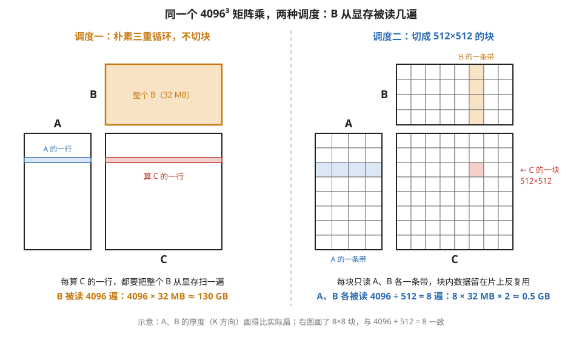
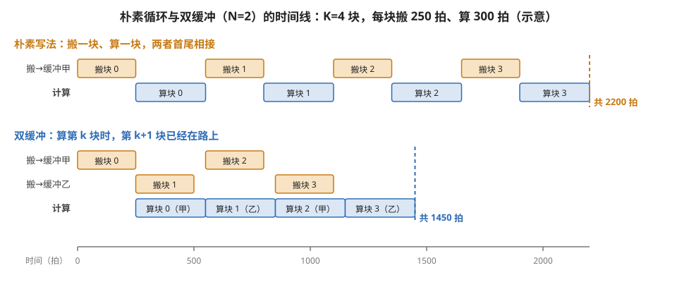
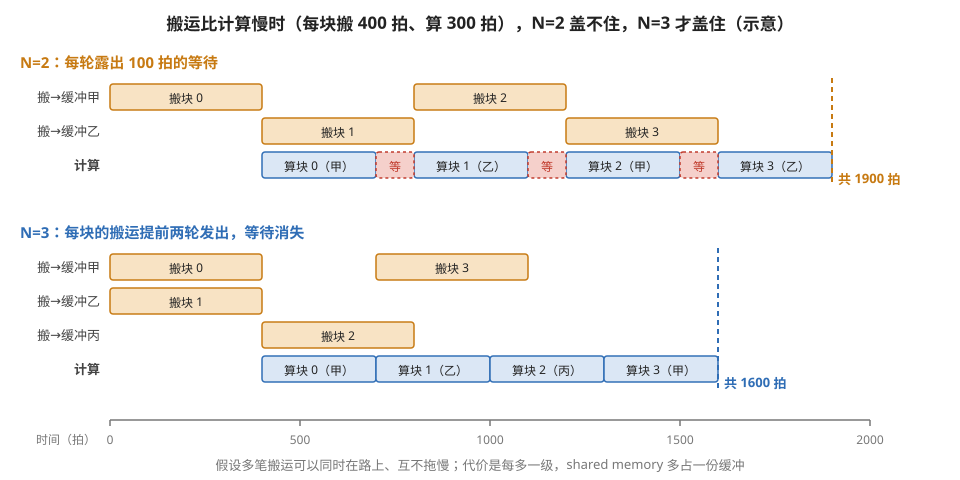
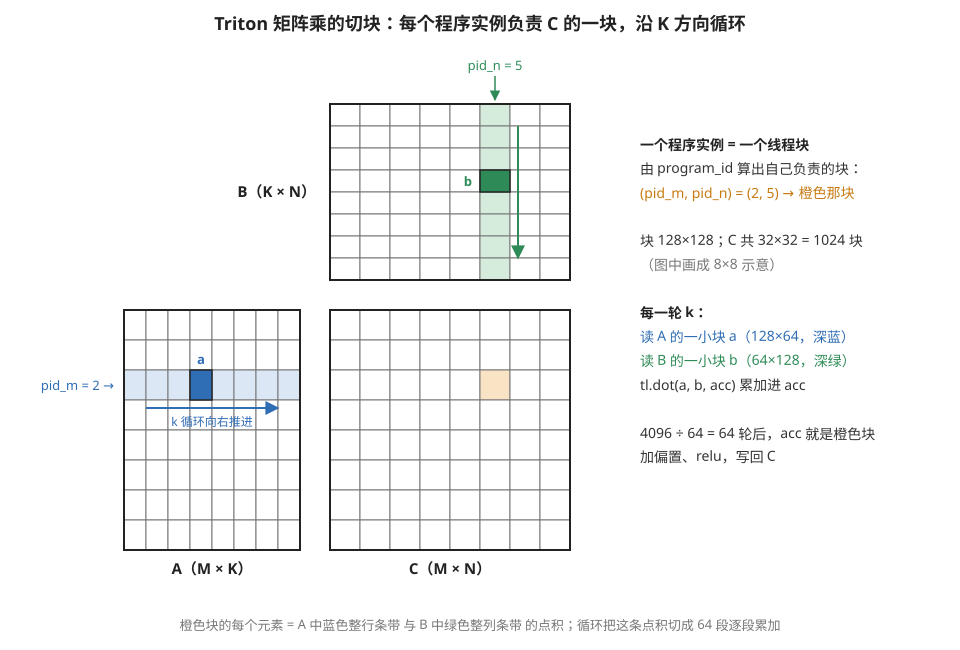
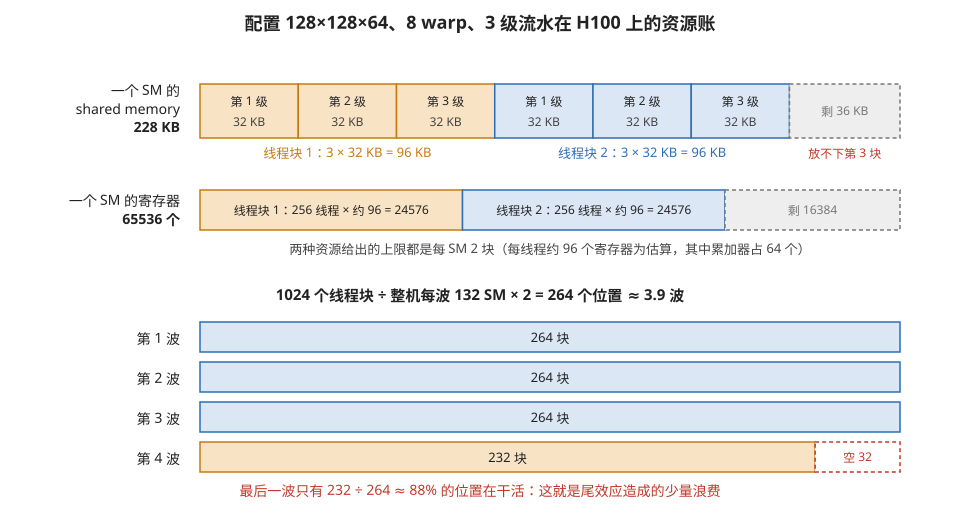
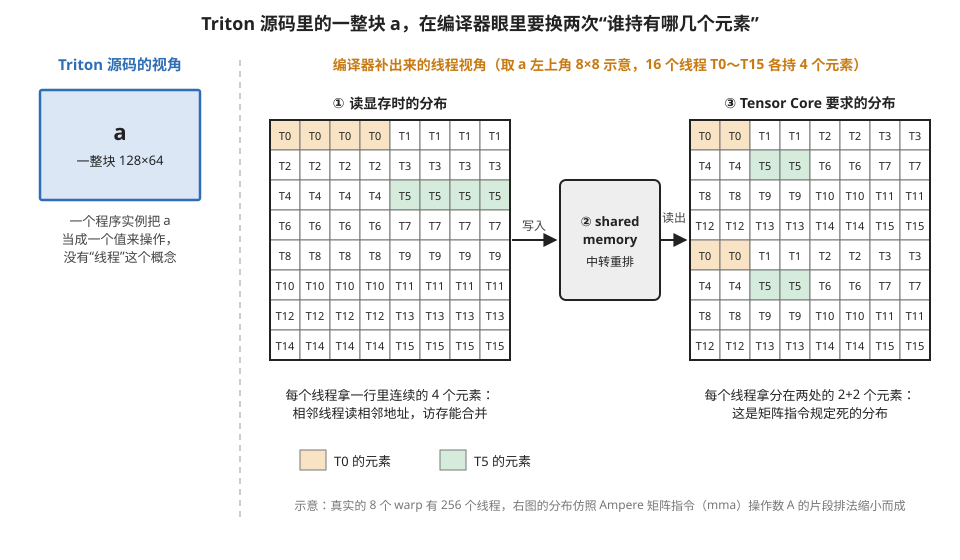

# 第③层 · kernel 层：把一个算子展开成硬件上的循环

> **所属模块**：模块 04 · 软件优化栈（五层地图的第③层；五层逐层展开的第三章）
> **状态**：🟨 学习中（第五版：按五层地图重排，补入层档案、功能清单、业界项目与 Triton 的走查。知识截至 2026-08）
> **本节主旨**：kernel 层从图编译层接过"一个算子"（或几个算子融合成的一组），交出一份可以提交给 GPU 的 kernel 程序。本节先按统一格式给这一层建档，然后讲它的核心思想：把**计算**（要算的数学，唯一且不变）和**调度**（这个数学在硬件上以什么方式展开——切多大的块、数据放哪级存储、流水线开几级）分开。同一个计算有成百上千种合法的调度，性能差几十倍。硬件篇学过的所有优化技术（tiling、双缓冲、数据流选择），在这里全部归位成**调度空间的维度**。于是这一层的工程问题变成一个搜索问题："这个空间由谁来搜？"——从使用厂商搜好的结果（算子库）到完全自己决定（手写），中间有一系列工具。本节介绍这些工具和项目，**拿 Triton 做标本**走查一份矩阵乘 kernel，并给出"什么时候该自己写 kernel"的判断方法。

---

## 0. 这一节要回答的问题

- kernel 层的职责边界在哪？它的输入输出各是什么？
- 这一层一共要做哪几件事？
- "计算与调度分离"是什么意思？为什么说它是这一层的地基？
- 一个矩阵乘的调度空间具体有多大？由哪些维度构成？
- 从 cuBLAS 到手写汇编，各档工具的真实取舍？业界有哪些代表项目？
- 自动调优（autotune）到底在干什么？什么时候赢、什么时候输？
- 一份 Triton 源码里，哪一行对应哪一项功能？编译器在背后又补了什么？
- 作为算法侧的人，什么时候该自己写 kernel、什么时候千万别写？

---

## 1. 基础词汇：先把本节要用的词讲清楚

**kernel**。提交给 GPU 执行的一段程序，附带启动配置（多少个线程块、每块多少线程）。一个算子或一个融合组通常对应一个 kernel。

**调度（schedule）**。注意这个词在本节的含义和模块 01 第 7 节的"调度器"不同：这里指**一份计算在硬件上的展开方案**——循环怎么嵌套、切多大的块、哪个数据放寄存器哪个放 shared memory、流水线开几级。它是编译期的设计决定，不是运行时的硬件行为。

**配置（config）**。一组具体的调度参数取值，比如"块尺寸 128×128×64、8 个 warp、流水 3 级"。一个配置对应一个可编译运行的 kernel 版本。

**自动调优（autotune）**。把候选配置逐个真实编译、真实计时，选最快的那个并缓存结果的暴力搜索法。

**算子库**。厂商或社区预先写好、调好的标准算子集合（矩阵乘、卷积、注意力），如 cuBLAS、cuDNN、FlashAttention 库。使用算子库，相当于直接采用别人已经搜索好的调度。

**tile（数据块）**。把一个大张量切分之后得到的一小块，比如 128×64 的小矩阵。kernel 层的大部分决策都以 tile 为单位：一个线程块负责输出的一个 tile，每次循环从输入里取一个 tile 进来计算。

---

## 2. 这一层的档案

### 2.1 定义

**kernel 层是把"一个算子的数学定义"变成"一份 kernel 程序"的那层软件和人工工作的总和。** 它决定这个算子的循环在硬件上如何展开：数据切成多大的块、每块数据驻留在哪一级存储、搬运和计算按什么顺序交替、块内的元素怎样分配给线程。

### 2.2 为什么在这里切一刀

**和上面的图编译层之间的一刀**在上一章讲过：图编译层处理算子之间的关系，kernel 层处理算子内部的循环，两类问题需要的信息不同。

**和下面的底层编译层之间的一刀，理由是"张量的语义"到这里为止。** kernel 层知道眼前是一个矩阵乘、知道哪个维度是累加维、知道 A 的一块数据会被重复使用多少次。切块、放置、流水这些决策都依赖这些知识。交给底层编译之后，程序变成了一条条对寄存器和地址的操作，"这是矩阵乘"这个事实已经看不出来，上述决策也就无从做起。反过来，寄存器分配、指令排序这些工作不需要张量知识，对任何程序都一样，由一个通用的编译器完成更合理。

### 2.3 输入与输出

| | 内容 |
| --- | --- |
| **输入** | 一个算子或融合组的数学定义；输入输出的形状和数据类型；目标硬件的型号 |
| **输出** | 一份 kernel 程序（形式可以是 CUDA C++ 源码、LLVM IR 或 PTX）；一份启动配置（线程块的数量、每块的线程数、每块要用多少 shared memory） |

**例子：一个矩阵乘的输入和输出。** 输入是"计算 C = A × B，三个维度都是 4096，数据类型 bf16，目标硬件 H100"。输出是一份 PTX 程序，以及启动配置"1024 个线程块，每块 256 个线程，每块使用 96 KB 的 shared memory"。这组数字是怎么来的，第 8.2 节逐项计算。

### 2.4 上下边界的接口

| 边界 | 接口形态 | 具体例子 |
| --- | --- | --- |
| **上边界**（供框架层和图编译层调用） | 算子库的函数接口 | `cublasGemmEx`（矩阵乘）、cuDNN 的卷积接口、`flash_attn_func` |
| **上边界**（供人或编译器编写 kernel） | 一门写 kernel 的语言 | Triton 的 `@triton.jit` 函数、CUDA C++ 的 `__global__` 函数、CUTLASS 的模板 |
| **下边界**（交给底层编译层） | 一种稳定的低层表示 | PTX（NVIDIA 公开的虚拟指令集）；AMD 平台上是 LLVM IR |
| **下边界**（交给运行时层） | 启动配置 | 线程块数量、每块线程数、shared memory 用量 |

**上边界有两种形态，对应这一层的两种使用方式。** 调用算子库时，使用者只提供形状和指针，不写任何 kernel 代码。使用 kernel 语言时，使用者（人或图编译器）自己写出 kernel。第 5 节的工具对照就是沿着这两种方式之间的过渡展开的。

### 2.5 这一层看得见什么、看不见什么

| 看得见 | 看不见 |
| --- | --- |
| 这个算子的循环结构、每个维度的含义 | 这个算子前后连着谁（图编译层已经决定好了） |
| 每个数组的访问模式（连续、跨行、重复使用次数） | 物理寄存器的编号、指令的具体排列 |
| 硬件各级存储的容量（寄存器、shared memory） | 整个模型的结构 |
| 输入的形状和数据类型 | 同一时刻 GPU 上还有哪些别的 kernel 在跑 |

---

## 3. 功能集合：这一层要做的七件事

| 功能 | 做什么 | 对应的硬件知识 |
| --- | --- | --- |
| **切块（tiling）** | 把循环切成块，确定每个线程块负责多大的输出、每轮迭代处理多大的输入 | 模块 02 第 4 节：块要小到片上存储装得下，大到计算单元能满负荷 |
| **放置（placement）** | 决定每份数据驻留在寄存器、shared memory 还是显存 | 模块 02 第 3 节的数据流选择 |
| **顺序与流水（ordering）** | 安排搬运和计算的先后，让下一块的搬运和当前块的计算同时进行 | 模块 01 第 2 节的多级缓冲 |
| **绑定（binding）** | 把块内的元素分配给线程和 warp | 模块 01 第 2 节的占用率；Tensor Core 对线程持有元素的固定要求 |
| **触发专用硬件** | 让矩阵乘用上 Tensor Core、让搬运用上异步拷贝引擎 | 模块 03 第 1 节 |
| **边界处理** | 处理形状不是块尺寸整数倍时的尾部 | 模块 02 第 5 节 |
| **配置选择** | 在上面各项的所有合法取值里选出最快的组合 | 本节第 6 节的 autotune |

前四项就是本模块第 7 节要系统讨论的"映射的四个维度"。本节后面的内容围绕这张表展开：第 4 节说明为什么这些决策对性能的影响如此之大，第 5 节讲各种工具替使用者承担了表里的哪几项，第 6 节讲最后一项"配置选择"，第 7 节把"顺序与流水"这一项单独展开，第 8 节用一份真实的 Triton 源码把七项功能逐一对应到代码行。

---

## 4. 地基：计算与调度的分离

先看一个能算出差距的例子，建立"调度"这个概念的分量。

**例子：同一个矩阵乘，两种调度，流量差两百多倍。** 计算固定为 4096³ 的矩阵乘（数学上就是三重循环，谁写都一样）。调度一，朴素三重循环、不切块：算输出的每一行都要完整扫一遍 B 矩阵，B 被从显存反复读 4096 次——显存流量约 **130 GB**。调度二，按模块 02 第 4 节的方法切成 512 边长的块、块内数据驻留片上：A、B 各只需从显存读约 8 遍——流量约 **0.5 GB**。**数学一个字没变，流量差了两个数量级以上，时间差几十倍。** 这就是"计算与调度分离"的含义：正确性属于计算，性能几乎全部属于调度。图 4-1 把两种调度下"谁要读谁"画了出来。



> **图 4-1**　一句话：同样算 C = A × B，不切块时每算一行都要把整个 B 从显存重读一遍；切成块以后，每块只读 A、B 各一条带，读进来的数据在芯片上被反复使用。
>
> **先知道一件事**：C 的一个元素等于 A 的一行和 B 的一列逐项相乘再相加。芯片上的存储（寄存器、shared memory）只有几百 KB，装不下 32 MB 的整个 B；装不下的部分下次用到时，只能再从显存读一遍。
>
> **按这个顺序看**：
> 1. 两个面板的摆法相同：左边是 A，上边是 B，右下是结果 C。A 的一行对着 C 的同一行，B 的一列对着 C 的同一列。
> 2. 左面板（调度一）：红色横条是正在算的 C 的一行，它需要 A 的同一行（蓝色细条）和整个 B（橙色大块）。整个 B 放不进芯片，算下一行时又得重读。4096 行就读 4096 遍，4096 × 32 MB ≈ 130 GB。
> 3. 右面板（调度二）：C 被切成 512×512 的块（图中 8×8 格，4096 ÷ 512 = 8）。粉色那一块只需要 A 的一条横带（蓝）和 B 的一条竖带（橙），两条带读进芯片后，块里 512×512 个元素全都用它们来算。
> 4. 数一数右面板的读取次数：A 的每条横带被同一行的 8 个块各读一次，B 的每条竖带被同一列的 8 个块各读一次，所以 A、B 各被读 8 遍，合计 8 × 32 MB × 2 ≈ 0.5 GB。
>
> **看懂的标志**：能说出块切得越大，A、B 被重读的遍数越少——块边长 512 时读 8 遍，边长 1024 时只读 4 遍；但块越大，一块数据在芯片上要占的空间越多，所以块的大小由芯片存储容量卡住上限。
>
> **与正文的对照**：图中 A、B 在 K 方向（相乘时被加掉的那一维）画得比实际扁，只为省版面。右面板"两条带在芯片上留住"是正文算 0.5 GB 时用的理想假设；实际 kernel 会把带再沿 K 切成小段分批搬运。
>
> 来源：本库自绘。

有了这个分离，硬件篇的知识可以统一归位——它们全是调度空间的坐标轴：

| 调度维度 | 对应的硬件知识 |
| --- | --- |
| 块尺寸（BLOCK_M/N/K） | 模块 02 第 4 节：块尺寸同时受"片上存储装得下"和"计算单元喂得饱"两个条件约束 |
| 每块用多少 warp | 模块 01 第 2 节的占用率 |
| 数据放寄存器还是 shared memory | 模块 02 第 3 节的数据流选择（软件版） |
| 流水线级数（num_stages） | 模块 01 第 2 节第 6 部分的多级缓冲 |
| 是否沿 K 维再切一刀（split-K） | 小 M 场景下用切分换并行度 |

**例子：数一数这个空间有多大。** 就按上表最常见的取值范围：块的三个维度各 3 种取值（64/128/256）、warp 数 2 种（4/8）、流水级数 4 种（2/3/4/5）、split-K 开关 2 种——3³ × 2 × 4 × 2 = **432 个合法配置**。最优点还随矩阵形状、数据类型、硬件代际漂移——人脑穷举不动，但机器暴力搜得动。**"调优"作为一个工程环节存在，就是因为这个空间的尺寸恰好落在"手算不了、暴力搜得了"的区间。**

---

## 5. 工具与典型项目：这个空间由谁来搜

### 5.1 五档工具

```
用现成的 ◄──────────────────────────────────────────► 全部自己来
cuBLAS/cuDNN     CUTLASS        Triton         手写 CUDA C     手写汇编
FlashAttention库  (C++模板)      (Python写kernel  (全手动)      (库作者的
(厂商搜好的)                     +autotune)                     最后1-5%)
```

| 档位 | 性能上限 | 人力成本 | 灵活性 | 适用 |
| --- | --- | --- | --- | --- |
| **算子库** | 标准形状下≈最优（厂商用海量资源离线搜过、部分手调汇编） | 零 | 无（固定算子固定语义） | 标准矩阵乘/卷积/注意力——**直接用，别自己写** |
| **CUTLASS** | 逼近手写 | 高（C++ 模板深水区） | 中（可组合的收尾阶段） | 库没覆盖的高性能矩阵乘变体；造库的人用 |
| **Triton** | 常达库的八九成，**融合场景反超**（库融不了的它能融） | 中（Python 量级） | **强** | 自定义融合链、新算子结构、研究迭代 |
| **手写 CUDA/汇编** | 极限 | 极高 | — | 库作者压榨最后几个百分点 |

判读一句话：**你的算子离"标准件"有多远，决定你该用哪一档。** 标准矩阵乘自己写是负收益（厂商的投入你追不上）；但一个"归一化+逐元素变换+量化"的自定义融合链，**库里根本没有这个算子**——Triton 用八成的性能上限换来几乎不受限的灵活性，适用于这片很大的中间地带。**Triton 的真正价值不是"比 cuBLAS 快"，而是"让本不存在的 kernel 存在"。**

### 5.2 业界的典型项目

| 项目 | 主导方 | 属于哪一档 | 做什么 | 值得了解的原因 |
| --- | --- | --- | --- | --- |
| **cuBLAS / cuBLASLt** | NVIDIA | 算子库 | 矩阵乘等线性代数运算 | 所有框架的矩阵乘默认走它；性能基线 |
| **cuDNN** | NVIDIA | 算子库 | 卷积、归一化、注意力等 | 视觉模型的默认后端 |
| **FlashAttention 库** | 学界发起，现与 NVIDIA 合作 | 算子库 | 注意力 | 改写数学换来的融合，四代演进见附录 A1 |
| **DeepGEMM** | DeepSeek | 算子库（运行时生成） | FP8 矩阵乘，含 MoE 用的分组矩阵乘 | 等形状已知才编译；代码量小，适合阅读（B3） |
| **CUTLASS / CuTe** | NVIDIA | 模板 | 可实例化的矩阵乘、卷积 kernel 家族 | 新硬件官方写法的参考实现 |
| **Triton** | OpenAI 发起 | kernel 语言 | 用 Python 写 kernel | 既供人手写，也是 torch.compile 生成代码的目标 |
| **TileLang** | 开源社区 | kernel 语言 | 和 Triton 同级，但数据放置由使用者显式指定 | 填补 Triton 和 CUTLASS 之间的空档 |
| **Halide / TVM** | 学界 | 调度语言 | 用一套专门的语法描述调度 | "计算与调度分离"这个思想最早由 Halide 明确提出 |
| **Pallas** | Google | kernel 语言 | JAX 生态里写 kernel 的工具 | TPU 和 GPU 都支持 |
| **Ascend C** | 华为 | 线程级语言 | 昇腾芯片上写 kernel | 结构和 CUDA C++ 对应，生态独立 |

这张表里的 kernel 语言各自的语法、心智模型和适用边界，在本模块第 9 节逐个展开；同一个矩阵乘用四种语言各写一遍的对照在 B4。

---

## 6. autotune：用实测做配置选择

**机制**：给一组候选配置（比如上面 432 个里筛出的 20 个有希望的），**每个都真实编译、真实跑几遍计时**，取最快者，并按"形状+数据类型+硬件"缓存结果——同样条件下次直接命中缓存。

**例子：一次 autotune 的成本账。** 20 个候选配置，每个编译约几百毫秒、计时跑三遍约几十毫秒——首次调用这个形状要多花**几秒**；之后同形状的调用直接用缓存，零开销。这笔账揭示了 autotune 最不适应的情况：**形状变来变去的负载**——每个新形状都触发一轮几秒的搜索，缓存越积越大。对策是模块 02 第 5 节讲过的分桶：把相近形状归并到少数几个桶里。

**赢输判据**：怪形状、自定义融合算子上 autotune **赢**——没有任何人为你的形状预搜过，现搜的就是最优的；标准大矩阵乘上它**打平或输**给 cuBLAS——厂商离线搜索的规模和手调的深度你追不上。为什么主流方案是"实测"而不是"建模预测"？因为硬件行为对参数**极不连续**（模块 01 第 2 节：寄存器多用两个可能使占用率大幅下降；模块 01 第 4 节：步长差 1 可能使 bank 冲突从无变成全部冲突）——解析模型很难准确预测这些突变点，实测的结果则总是可靠的。

---

## 7. 手排流水：把"搬运藏进计算"亲手写出来

调度维度表里的"流水线级数"值得单独拆开讲透——因为它不是一个简单的参数，而是**一整套对循环的结构改写**。硬件基础在模块 01 第 2 节第 6 部分（不阻塞的搬运指令、多份缓冲、完成追踪三样器件），NPU 版的静态形态在模块 02 第 4 节（双缓冲），Hopper 上的极致形态在代码精读 B2（warp 分工）。这一小节补上中间缺的一环：**站在 kernel 作者的视角，这套改写具体怎么做。**

### 7.1 出发点：朴素循环把搬运延迟完全暴露

一个典型 kernel 的主循环，朴素写法是"搬一块、算一块"：

```
for k in 0 .. K-1:
    把第 k 块从显存搬进 shared memory     ← 等几百拍
    __syncthreads()                        ← 确保全块看见数据
    用这块数据计算                          ← 算几百拍
    __syncthreads()                        ← 确保全块用完，才能覆盖
```

时间线是"搬、算、搬、算"首尾相接：每次迭代的耗时 = 搬运时间 + 计算时间，两者**串行相加**。搬运那几百拍里计算单元处于空闲状态——这就是要消除的浪费。

### 7.2 改写：永远是三段式

软件流水的目标：**算第 k 块的同时，第 k+1 块（乃至 k+2 块）的搬运已经在路上**。改写后的代码永远长成三段（N 是缓冲份数，即流水级数）：

```
// —— 序幕（prologue）：先把前 N-1 块的搬运发出去，不等 ——
for s in 0 .. N-2:
    async_load(buf[s], 第 s 块)        // 不阻塞的搬运指令（cp.async/TMA）
    commit()                            // 把这笔搬运登记成一组，供后面按组等待

// —— 主循环（steady state）——
for k in 0 .. K-1:
    wait(允许 N-2 组在途)               // ★ 等到"第 k 块那组"完成——不是等全部！
    __syncthreads()                     // 全块都看见了第 k 块；也都算完了第 k-1 块
    if k + N-1 < K:
        async_load(buf[(k+N-1) % N], 第 k+N-1 块)   // 先补发预取：写进上一轮刚用完的那份缓冲
    commit()                            // 尾声没东西可搬也提交一个空组，让组数计数保持对齐
    compute(buf[k % N])                 // 再算第 k 块——此时最多有 N-1 笔搬运在路上
// 尾声（epilogue）已并进主循环的 if——最后几轮只算不搬，自然排空
```

**例子：N=2（双缓冲）逐迭代跟踪。** K=4 块，缓冲甲=buf[0]、乙=buf[1]：

| 阶段 | 在途的搬运 | 正在计算 | 本轮补发的搬运 |
| --- | --- | --- | --- |
| 序幕 | 块 0→甲 | — | — |
| k=0 | 等块 0 就位 | **算甲（块 0）** | 块 1→乙 |
| k=1 | 块 1 已到 | **算乙（块 1）** | 块 2→甲（此时块 0 已用完，甲可覆盖） |
| k=2 | 块 2 已到 | **算甲（块 2）** | 块 3→乙 |
| k=3 | 块 3 已到 | **算乙（块 3）** | 无（尾声） |

从 k=0 起，每一轮"算当前块"和"搬下一块"都在重叠——只要单块的搬运时间不超过计算时间，搬运就从总时间里消失了。图 4-2 把这张表画成了时间线，并和朴素写法对照。



> **图 4-2**　一句话：双缓冲让"搬下一块"和"算这一块"同时进行，四块数据的总时间从 2200 拍缩到 1450 拍，省下的正好是后三块的搬运时间。
>
> **先知道一件事**：拍（cycle）是 GPU 时钟的一个节拍，这里用来计时。GPU 有专门的异步拷贝硬件，发出一条搬运指令后，线程可以不等它完成就去做计算，这是两件事能同时进行的前提。
>
> **按这个顺序看**：
> 1. 横轴是时间（拍）。橙色条是搬运，从发出到数据就位；蓝色条是计算。本图假设每块搬 250 拍、算 300 拍，数字是示意。
> 2. 上面的朴素写法：搬块 0、算块 0、搬块 1、算块 1……橙条和蓝条首尾相接，从不重叠，每块耗时 250 + 300 = 550 拍，四块共 2200 拍。
> 3. 下面的双缓冲：shared memory 里开两份缓冲，甲和乙，各占一行。序幕先搬块 0 进甲。算块 0（读甲）的同时，块 1 已经在往乙里搬。
> 4. 继续看：算块 1（读乙）开始时，甲刚被块 0 用完，于是块 2 马上开始搬进甲；算块 2（读甲）时，块 3 搬进乙。每块计算开始前，它的数据都已就位，蓝条一个接一个没有空隙。
> 5. 总时间：只剩开头块 0 的 250 拍搬运露在外面，加上 4 × 300 拍计算，共 1450 拍。
>
> **打个比方**：一个人洗碗、一个人擦碗，只有一个碗架时只能洗一个等擦一个；有两个碗架，一个人擦这个架上的，另一个人已经往另一个架上放下一只。
>
> **看懂的标志**：能说出双缓冲最多能省多少——每块的搬运都被藏在前一块的计算后面，所以只要搬运不比计算慢，总时间接近"第一块的搬运 + 所有块的计算"。
>
> **与正文的对照**：缓冲甲、乙即正文代码里的 buf[0]、buf[1]；每一段橙条的起点就是代码里 `async_load` 补发的时刻，它排在"等待、同步"之后、"计算"之前。
>
> 来源：本库自绘。

三个手排时最容易写错的细节：

1. **wait 的"深度"**。`wait(允许 N-2 组在途)` 的语义是"等到未完成的搬运组数 ≤ N-2"——这恰好保证**最老那组（第 k 块）已完成**，而刚补发的仍在飞。写成"等全部完成"（允许 0 组在途）就把重叠彻底杀死，流水线退化回朴素循环——**这是手排流水最常见的错误**。
2. **先同步、再补发、最后计算，顺序不能乱**。wait 之后那一次 `__syncthreads` 同时管两头：保证"开始用之前，全块线程都看见了第 k 块"，也保证"补发覆盖之前，全块线程都算完了第 k-1 块"（补发写入的正是第 k-1 块用过的那份缓冲）。把补发挪到这次同步之前，或者漏掉同步 → 数据被覆盖时还有线程在读，静默算错（模块 01 第 5 节的竞争）。反过来，如果把补发挪到计算之后，计算期间在途的搬运就少了一笔，N=2 时干脆一笔都没有，重叠消失。
3. **缓冲下标用 `k % N` 轮转**。写入方（补发的搬运）和读取方（当前计算）永远相差 N-1 个身位，天然不撞车——这个错位就是流水线不需要更多锁的原因。

### 7.3 三个档位的"手排"：从一个参数到一套分工

| 档位 | 循环改写由谁做 | 你写什么 |
| --- | --- | --- |
| **Triton 的 num_stages** | **编译器**——它自动把你写的朴素同步循环，改写成 7.2 的三段式（这个编译器动作的学名就叫 software pipelining） | 一个参数。`num_stages=3` 的全部含义：缓冲开三份、序幕预发两笔、wait 深度设为"允许 1 组在途" |
| **CUDA C + cp.async** | **你自己**——7.2 的骨架逐行手写 | 几十行：异步搬运、commit/wait、同步的位置、取模轮转 |
| **Hopper warp 分工** | **你自己，但换了思路**——不再改写"一个循环"，而是把"搬"和"算"拆给**不同的 warp 组**：搬运组只发 TMA、计算组只消费，两组用 mbarrier 交接（模块 01 第 5 节讲的一种带计数的同步器件） | B2 精读的完整代码。它是流水思想的组织形态升级：从"同一组线程交替做两件事"变成"两组线程各做一件、用同步信号交接" |

所以回答"手排流水怎么做到的"要分档：**多数人从不真正手排**——写 Triton 时调 num_stages，编译器代劳整套改写；需要下场手写时，就是 7.2 那三段结构加三个细节；追到极致（FA-3 级别），改写循环已不够，要动组织结构（warp 分工）。

### 7.4 级数 N 怎么选：三项资源共用一笔预算

需要的级数约为 **N ≈ 搬运时间 ÷ 计算时间 + 1**（搬运比计算慢多少倍，就要多深的预取提前量）。但 N 不是免费的：**每加一级，shared memory 多占一份缓冲**。

**例子：一笔选 N 的账。** 某 kernel 每块搬运约 400 拍、计算约 300 拍：搬运比计算慢，N=2 盖不住（每轮都要露出 100 拍的等待），**N=3 起步**。每块缓冲 32 KB → 三级 96 KB → 每个 SM（228 KB shared）只驻留得下 2 个线程块——占用率被压低了。若占用率下降导致的损失超过流水加深的收益，宁可退回 N=2 接受那 100 拍。**流水深度、shared memory、占用率三者共用同一笔预算**（模块 01 第 2 节讲过的三方约束），autotune 把 num_stages 放进搜索空间，搜的正是这个平衡点。图 4-3 用时间线对照了这个例子里 N=2 和 N=3 的差别。



> **图 4-3**　一句话：搬运比计算慢时，只提前一轮发出搬运来不及，每轮都要等；多开一份缓冲、提前两轮发出，等待就消失了。
>
> **先知道一件事**：一笔搬运从发出到到达要 400 拍，但这 400 拍里大部分是在等数据走过来，不占用计算单元。所以几笔搬运可以同时在路上，彼此基本不拖慢（本图按这个假设画）。
>
> **按这个顺序看**：
> 1. 每个面板上面几行是各份缓冲的搬运（橙色），最下一行是计算（蓝色），红色虚线框标着"等"的是计算单元空转的时间。
> 2. 上面板 N=2：块 1 的搬运在算块 0 开始时（第 400 拍）才发出，到第 800 拍才到；而块 0 在第 700 拍就算完了，于是空等 100 拍。之后每一轮都一样，四块共 1900 拍。
> 3. 下面板 N=3：序幕一次发出块 0 和块 1，分别进甲、乙。算块 0 时发出块 2 进丙，算块 1 时发出块 3 进甲（甲刚被块 0 用完）。每块的搬运比它被用到时提前了两轮，也就是 600 拍，足够盖住 400 拍的搬运。蓝条之间没有红框，共 1600 拍。
> 4. 对照公式：需要的级数约为搬运时间 ÷ 计算时间 + 1 = 400 ÷ 300 + 1 ≈ 2.3，向上取整是 3。
>
> **看懂的标志**：能说出 N=3 的代价——下面板比上面板多了一行"缓冲丙"，也就是 shared memory 多占一份 32 KB。三级共 96 KB，一个 SM 的 228 KB 只放得下 2 个线程块，这就是正文说的"流水深度、shared memory、占用率共用一笔预算"。
>
> 来源：本库自绘。

---

## 8. 拿 Triton 讲透：一份矩阵乘源码里的七项功能

这一小节读一份 Triton 写的矩阵乘 kernel。目的有两个：把第 3 节那张功能清单的每一项对应到具体的代码行；看清哪些决策写在源码里、哪些由 Triton 的编译器在背后完成。（同一个矩阵乘的四种语言对照在 B4，Triton 版 FlashAttention 的逐段精读在 B1，这里只讲理解这一层所需的最小例子。）

**设定**：计算 `C = relu(A × B + bias)`，M = N = K = 4096，输入是 bf16。

```python
@triton.autotune(configs=[                                                   # ⑦ 配置选择
    triton.Config({'BLOCK_M': 128, 'BLOCK_N': 128, 'BLOCK_K': 64}, num_warps=8, num_stages=3),
    triton.Config({'BLOCK_M': 128, 'BLOCK_N': 64,  'BLOCK_K': 64}, num_warps=4, num_stages=4),
    triton.Config({'BLOCK_M': 64,  'BLOCK_N': 64,  'BLOCK_K': 32}, num_warps=4, num_stages=4),
], key=['M', 'N', 'K'])
@triton.jit
def linear_relu(A, B, C, Bias, M, N, K,
                BLOCK_M: tl.constexpr, BLOCK_N: tl.constexpr, BLOCK_K: tl.constexpr):
    pid_m = tl.program_id(0)                                                 # ① 切块：我负责输出的
    pid_n = tl.program_id(1)                                                 #    第 (pid_m, pid_n) 块
    offs_m = pid_m * BLOCK_M + tl.arange(0, BLOCK_M)
    offs_n = pid_n * BLOCK_N + tl.arange(0, BLOCK_N)
    offs_k = tl.arange(0, BLOCK_K)
    a_ptrs = A + offs_m[:, None] * K + offs_k[None, :]
    b_ptrs = B + offs_k[:, None] * N + offs_n[None, :]

    acc = tl.zeros((BLOCK_M, BLOCK_N), dtype=tl.float32)                     # ② 放置：累加器
    for k in range(0, K, BLOCK_K):                                           # ③ 顺序：沿 K 维循环
        a = tl.load(a_ptrs, mask=offs_k[None, :] + k < K, other=0.0)         # ⑥ 边界：掩码
        b = tl.load(b_ptrs, mask=offs_k[:, None] + k < K, other=0.0)
        acc = tl.dot(a, b, acc)                                              # ⑤ 触发 Tensor Core
        a_ptrs += BLOCK_K
        b_ptrs += BLOCK_K * N

    bias = tl.load(Bias + offs_n)                                            # 收尾阶段（epilogue）：
    out = tl.maximum(acc + bias[None, :], 0.0)                               # 偏置和 relu 在写回前完成
    c_ptrs = C + offs_m[:, None] * N + offs_n[None, :]
    tl.store(c_ptrs, out.to(tl.bfloat16),
             mask=(offs_m[:, None] < M) & (offs_n[None, :] < N))
```

图 4-4 画出了这份源码里一个程序实例负责哪块数据、每轮循环读哪两小块。



> **图 4-4**　一句话：Triton 按输出矩阵 C 的块来分工，一个程序实例（落到硬件上就是一个线程块）负责 C 的一块，沿 K 方向循环 64 轮，每轮读 A、B 各一小块做一次小矩阵乘并累加。
>
> **先知道一件事**：GPU 上一次 kernel 启动会同时开出很多个程序实例，它们跑的是同一份代码，唯一的区别是各自拿到的编号 `program_id`。每个实例用这个编号算出"我负责哪块数据"，这和 MapReduce 里每个 mapper 按分片编号去读自己那一份是同一个思路。
>
> **按这个顺序看**：
> 1. 先看右下的 C：它被切成网格，每格 128×128。4096 ÷ 128 = 32，真实是 32×32 = 1024 块，图中画成 8×8 示意。启动配置里有多少块，就开多少个程序实例。
> 2. 看橙色那一格：`pid_m = 2`（左侧蓝字，第 2 行块）、`pid_n = 5`（上方绿字，第 5 列块）的那个程序实例负责它。源码里 `offs_m`、`offs_n` 两行就是用这两个编号算出本块覆盖的行号和列号。
> 3. 算这一块需要 A 的同一行带（淡蓝）和 B 的同一列带（淡绿）。两条带太大，放不进芯片，所以沿 K 方向切成小段：深蓝小块 a（128×64）和深绿小块 b（64×128）。
> 4. 看两个箭头：每一轮 k，a 在 A 的行带里向右挪一格，b 在 B 的列带里向下挪一格，`tl.dot(a, b, acc)` 把两小块的乘积加进累加器 `acc`。4096 ÷ 64 = 64 轮之后，`acc` 就是橙色块的最终结果。
> 5. 最后，程序给 `acc` 加偏置、做 relu，写回 C 的橙色位置（源码最后几行）。
>
> **看懂的标志**：能说出这份 kernel 启动时开了几个程序实例、每个实例循环几轮——1024 个实例，每个 64 轮。
>
> **与正文的对照**：图中 a、b 的位置对应源码里 `a_ptrs`、`b_ptrs` 指向的地址；每轮末尾 `a_ptrs += BLOCK_K`、`b_ptrs += BLOCK_K * N` 就是图里 a 右移、b 下移的那一步。
>
> 来源：本库自绘。

### 8.1 七项功能各在哪

| 功能 | 在源码里的位置 | 由谁决定 |
| --- | --- | --- |
| ① 切块 | `BLOCK_M/N/K` 三个常量，以及用 `program_id` 算出本块的下标范围 | 使用者给候选值 |
| ② 放置 | `acc` 是循环外的局部变量，所以驻留在寄存器里；`a`、`b` 每轮从显存加载 | 累加器的位置由写法决定；`a`、`b` 是否经过 shared memory 由编译器决定 |
| ③ 顺序与流水 | `for k` 循环写的是"搬一块、算一块"的朴素形式；`num_stages=3` 要求编译器把它改写成第 7.2 节的三段式 | 使用者给级数，编译器做改写 |
| ④ 绑定 | **源码里没有**。`num_warps=8` 只给出线程总数，哪个线程持有哪些元素不出现在源码里 | 编译器 |
| ⑤ 触发专用硬件 | `tl.dot` | 使用者写 `tl.dot`，编译器按硬件代际选择具体的矩阵指令 |
| ⑥ 边界处理 | `mask=` 参数 | 使用者 |
| ⑦ 配置选择 | `@triton.autotune` 里的候选列表 | 使用者给候选，实测选最快 |

**这张表说明了 Triton 在第 5.1 节那条工具轴上的位置：切块和顺序由使用者决定，绑定和大部分放置由编译器决定。**

### 8.2 按第一个配置算资源账

取第一个配置（块 128×128×64，8 个 warp，3 级流水），把它落到硬件上会占用多少资源，可以逐项算出来。硬件按 H100 计：132 个 SM，每个 SM 有 228 KB 的 shared memory 和 65536 个寄存器。

| 项目 | 算法 | 结果 |
| --- | --- | --- |
| 线程块数量 | 输出 4096×4096，每块 128×128，(4096÷128)² | 1024 块 |
| K 维循环次数 | 4096 ÷ 64 | 64 轮 |
| 每轮搬运的数据 | A 的一块 128×64×2 字节，B 的一块 64×128×2 字节 | 各 16 KB，共 32 KB |
| shared memory 用量 | 3 级流水，每级 32 KB | 96 KB |
| 累加器大小 | 128×128 个 fp32 | 16384 个值 |
| 每线程的累加器寄存器 | 8 个 warp 共 256 个线程，16384 ÷ 256 | 64 个 |
| 每个 SM 能驻留的线程块 | 228 KB ÷ 96 KB，向下取整 | 2 块 |
| 整机同时运行的线程块 | 132 × 2 | 264 块 |
| 执行完 1024 块需要的波数 | 1024 ÷ 264 | 约 3.9 波 |

从这张表能读出三件事。**第一，shared memory 是这个配置下限制驻留块数的约束**：96 KB 一块，一个 SM 只放得下两块。**第二，寄存器压力不小**：仅累加器每线程就要 64 个寄存器，加上地址、循环变量等，每线程的寄存器总数会明显超过 64；按每线程 96 个估算，256 个线程要 24576 个寄存器，一个 SM 的 65536 个寄存器同样只够放两块。两项约束给出的上限恰好一致，说明这个配置在两种资源上是平衡的。**第三，波数是 3.9 而不是整数**，最后一波只有约九成的位置在工作，有少量浪费（模块 01 第 7 节讲的尾效应）。

图 4-5 把这三件事画了出来。



> **图 4-5**　一句话：这个配置下每个 SM 只能同时放 2 个线程块，shared memory 和寄存器都卡在这个数上；1024 个块要分 4 波跑完，最后一波有 32 个位置空着。
>
> **先知道一件事**：SM（流式多处理器）是 GPU 里的一个独立计算单元，H100 有 132 个。一个线程块被分到某个 SM 上后，要从这个 SM 的 shared memory 和寄存器里划走自己那一份，一直占到跑完为止；划不出来，就只能等别的块结束。
>
> **按这个顺序看**：
> 1. 第一根条是一个 SM 的 228 KB shared memory。每个线程块开 3 级流水，每级缓冲 32 KB（A、B 各一小块 16 KB），共 96 KB。两块占掉 192 KB，灰色虚线部分只剩 36 KB，放不下第 3 块。
> 2. 第二根条是一个 SM 的 65536 个寄存器。每块 256 个线程，每线程按约 96 个寄存器估算（其中 64 个用来放累加器），每块 24576 个；两块之后剩 16384 个，也放不下第 3 块。两种资源给出的上限都是 2，所以说这个配置在两种资源上是平衡的。
> 3. 下半部分是波数。整机同时容得下 132 × 2 = 264 个线程块，这叫一波。1024 个块要 3 个满波（792 块）加第 4 波的 232 块。
> 4. 看第 4 波右端的红色虚线：还有 32 个位置空着，这一波只有约 88% 的位置在干活。这就是尾效应：总块数不是每波容量的整数倍，最后一波填不满。
>
> **看懂的标志**：能回答"如果把流水级数从 3 降到 2，每 SM 能放几块"——shared memory 每块降到 64 KB，228 ÷ 64 可放 3 块；但寄存器仍然只够 2 块（65536 ÷ 24576 ≈ 2.7），所以驻留块数还是 2，寄存器成了新的约束。
>
> **与正文的对照**：寄存器数 96 是正文的估算值，实际分配要等底层编译层（ptxas）完成后才知道。
>
> 来源：本库自绘。

**再对比三个候选配置的资源占用：**

| 配置 | 每级缓冲 | shared 总量 | 累加器寄存器/线程 | shared 允许的驻留块数/SM |
| --- | --- | --- | --- | --- |
| 128×128×64，8 warp，3 级 | 32 KB | 96 KB | 64 | 2 |
| 128×64×64，4 warp，4 级 | 24 KB | 96 KB | 64 | 2 |
| 64×64×32，4 warp，4 级 | 8 KB | 32 KB | 32 | 7 |

第三个配置每个 SM 能驻留 7 块，占用率高得多；但它的块小，同一块数据搬进片上之后被重复使用的次数少，单位搬运量换来的计算量更低。**哪个配置最快，从这张表里推不出来**，因为它取决于占用率、数据复用、流水深度几个因素的综合效果，而这些因素的影响如第 6 节所说很不连续。autotune 的做法是三个都编译、都运行，用实测时间来决定。

### 8.3 编译器在背后补上的部分

源码交给 Triton 之后，要经过几个阶段才变成可以交给底层编译层的 PTX。每个阶段补上一部分源码里没写的决策：

| 阶段 | 这一阶段的表示 | 补上了什么 |
| --- | --- | --- |
| 1. 解析 | 块级的中间表示：操作对象是整块张量，没有线程的概念 | 无，只是把 Python 语法树转成中间表示并做常规化简 |
| 2. 绑定 | 带**布局**的中间表示：每个块状张量都标注了"它的元素如何分布在各个线程上" | **功能④**。`tl.dot` 的操作数和结果被赋予 Tensor Core 指令要求的布局；其它张量被赋予便于合并访存的布局 |
| 3. 放置 | 同上，加入了 shared memory 的使用 | **功能②的剩余部分**。编译器发现 `a`、`b` 从显存加载时的布局和 `tl.dot` 要求的布局不同，于是插入"先写入 shared memory，再按需要的布局读出"的转换 |
| 4. 流水改写 | 同上，循环结构被改写 | **功能③的剩余部分**。按 `num_stages` 把循环改成三段式：缓冲扩成 3 份，加载改成异步搬运，插入等待 |
| 5. 指令选择与下沉 | LLVM IR，然后是 PTX | **功能⑤的剩余部分**。`tl.dot` 按目标硬件换成具体的矩阵指令（Ampere 上是 `mma`，Hopper 上是 `wgmma`） |

**阶段 2 和阶段 3 之间的关系是理解 Triton 的关键。** 从显存加载数据时，最有利的布局是让相邻线程读相邻地址（这样访存可以合并）。而 Tensor Core 的矩阵指令对"哪个线程持有矩阵的哪几个元素"有固定的要求，和前一种布局不一样。同一份数据需要先后满足两种布局，中间必须有一次重新排列，shared memory 就是完成这次重排的地方：所有线程按第一种布局写进去，再按第二种布局读出来。**所以在 Triton 里 shared memory 不出现在源码中，它是编译器为了衔接两种布局而自动引入的。** 在线程级的 CUDA C++ 里，这一切都要由人手写。

图 4-6 用一个缩小的例子画出了这两种布局和中间的重排。



> **图 4-6**　一句话：Triton 源码把 `a` 当成一整块来写，编译器却要把它拆给几百个线程，而且拆法要换两次：读显存时按一种拆法，喂给 Tensor Core 时按另一种，中间借 shared memory 重排。
>
> **先知道一件事**：在 GPU 上，一块数据最终总是分散在很多线程各自的寄存器里，"哪个线程持有哪几个元素"就叫布局（layout）。布局不同，同一块数据在寄存器里的摆法就不同，线程之间不能直接交换寄存器里的值。
>
> **按这个顺序看**：
> 1. 左栏是 Triton 源码的视角：`a` 是一整块 128×64 的数据，程序对它整体做 `tl.load`、`tl.dot`，源码里没有"线程"。
> 2. 右栏取 `a` 左上角 8×8 个元素作示意，假设由 16 个线程 T0～T15 分担，每个线程 4 个元素。格子里写的是持有这个元素的线程。
> 3. 看 ① 读显存时的分布：T0 拿第 0 行的前 4 个，T1 拿第 0 行的后 4 个，T2 拿第 1 行的前 4 个……相邻线程拿相邻地址，一次访存就能把一整段连续地址读进来（合并访存）。橙色是 T0 的元素，绿色是 T5 的元素。
> 4. 看 ③ Tensor Core 要求的分布：T0 拿的是第 0 行和第 4 行各 2 个元素，T5 拿的是第 1 行和第 5 行各 2 个。这个分布是矩阵指令规定死的，程序不能改。
> 5. 看中间的 ② shared memory：各线程按 ① 的分布把数据写进这块所有线程都能访问的片上存储，同步之后再按 ③ 的分布读出来。这次一写一读，就是编译器为了衔接两种布局自动插入的。
>
> **打个比方**：一叠卷子按考号顺序收上来（方便收），却要按题号分给阅卷老师（方便批）。中间得有张大桌子，把卷子摊开重新分拣。
>
> **看懂的标志**：能回答"为什么 Triton 源码里没写 shared memory，生成的代码里却用了它"——因为源码里的 `tl.load` 和 `tl.dot` 对布局的要求不同，编译器必须插入一次重排，而线程之间交换数据只能经过 shared memory。
>
> **与正文的对照**：① 对应正文编译器五阶段里"阶段 2 绑定"赋予加载结果的布局，③ 是赋予 `tl.dot` 操作数的布局，② 是"阶段 3 放置"插入的转换。右图的分布仿照 Ampere 矩阵指令（`mma`）操作数 A 的片段排法缩小而成，真实指令里一个 warp 是 32 个线程、片段是 16 行，这里为了看清缩成了 16 个线程、8 行。
>
> 来源：本库自绘。

**验证编译器有没有按预期工作，要看它的产物。** `linear_relu.asm['ptx']` 可以取出生成的 PTX 文本。在里面搜索 `mma` 或 `wgmma`，能确认 Tensor Core 是否被用上；搜索 `cp.async`，能确认流水改写是否发生。如果 `tl.dot` 的输入数据类型或块尺寸不满足矩阵指令的要求，编译器会退回到普通的乘加循环，源码不会报错，只有查看产物才能发现。

---

## 9. 算法侧的"写不写"决策树

```
这个算子是标准件吗（普通矩阵乘/卷积/标准注意力）？
 ├── 是 → 用库或 torch.compile，到此为止（自己写=负收益）
 └── 否 ↓
     是访存受限的融合链吗（逐元素/归一化的组合）？
      ├── 是 → 先试 torch.compile（Inductor 就擅长这个）
      │        不满意 → 上 Triton（半天出八成分版本）
      └── 是带矩阵乘的自定义结构（新注意力变体/怪形状）？
           ├── 是 → Triton + tl.dot + autotune（主战场）
           │        写完必查：反汇编搜矩阵指令（模块 03 第 1 节三层检查）
           └── 要压到极限/造轮子给别人用 → CUTLASS（或等库覆盖）
```

**例子：走一遍决策树。** 需求是"RMSNorm 之后立刻做逐通道缩放和 fp8 量化"三步连做。第一问：不是标准件（库里没有这个三合一）。第二问：是访存受限的融合链（三步都是逐元素级别）——先给整段模型套 `torch.compile`，看时间线：三步融成一个 kernel 了吗？若融了且流量已贴近理论下限（读一遍写一遍），**结束，别写**。若没融（比如中间有 graph break）或还差得远，再上 Triton：几十行、半天工作量、autotune 挂上——这就是决策树的日常用法：**每一步都先用便宜的手段验证，写 kernel 永远是最后手段。**

---

## 10. 开发者视角

| 你想做什么 | 工具 |
| --- | --- |
| 确认库/编译器的产出好不好 | 时间线看 kernel 数量与耗时；Tensor 管道活跃度（模块 03 第 1 节） |
| 写 Triton 后验证质量 | 导出汇编搜矩阵指令；ncu 看瓶颈位置（模块 01 附录 A1 流程） |
| autotune 的候选怎么给 | 从库的默认配置附近取值；块尺寸对齐 16/128（模块 02 第 5 节讲的形状不对齐造成的浪费） |
| 控制首跑搜索时间 | 减少候选数；固定/分桶形状让缓存命中 |
| 估算一个配置的资源占用 | 按第 8.2 节的表逐项计算 shared memory、寄存器、驻留块数 |

---

## 11. 最新架构落点（知识截至 2026-08）

- **Triton** 已是这一层的事实标准：既是手写自定义 kernel 的首选，也是 torch.compile 自动生成的目标语言；对 Hopper 的异步机制（TMA、warp 分工）支持成熟，NVIDIA 之外 AMD/Intel 后端也在跟进。
- **CUTLASS 3.x** 是 Hopper/Blackwell 官方写法的参考实现（异步矩阵指令 + TMA + 可组合收尾），读它的示例是理解新硬件编程模型的捷径。
- **FlexAttention**（PyTorch）：注意力的"调度参数化"产品——用户只写打分和掩码的修改逻辑，编译器生成融合 kernel。它把一部分"过去必须手写 FA 变体"的需求纳入了自动化的范围。
- **昇腾**：这一层对应 Ascend C，结构对齐但生态自成一体。
- **调度空间在变大，autotune 的成本随之上升**。新硬件每加一个器件就多一个维度：Hopper 加了 warp 分工与 TMA 多播，Blackwell 加了 TMEM 的分配策略和 2-CTA 配对开关（模块 03 第 1 节 §4.1）。**§4 那个"432 个配置"的算例按新维度重算会变成几千个**，首次调优的时间成本明显变高。**应对方向有两条**：把候选空间按硬件常数剪枝（厂商库的默认配置附近搜），以及把缓存做得更好（按形状分桶复用，第 6 节讲过）。
- **一条值得记的判断**：§6 说实测的结果总是可靠、解析模型很难预测突变点。这条到 2026 年仍然成立，而且**新硬件让突变点更多了**——TMEM 的容量、2-CTA 的配对约束、块缩放的对齐要求，每一条都是一个新的不连续点。**所以"用代价模型替代实测"这个方向的难度是在增加而不是减少**（本模块第 10 节 §8 从编译理论的角度给了同一个结论）。

---

## 12. 和其它模块的挂钩

- **本模块第 3 节（图编译层）**：那一层交出的每个融合组是本层的输入；epilogue 融合需要本层的 kernel 在收尾阶段留出接口（第 8 节源码的最后几行）。
- **本模块第 5 节（底层编译层）**：本层产出的 PTX 交给那一层；寄存器的实际用量要等那一层完成后才能确定，第 8.2 节的寄存器数字只是估算。
- **本模块第 7 节（映射问题）**：本节第 3 节的前四项功能，在那里被提炼成适用于所有硬件的四个决策维度。
- **本模块第 9 节（并行编程语言与算子库）**：本节第 5 节的工具，在那里逐个讲语法和心智模型。
- **本模块第 10 节（编译器内部）**：切块、流水这些改写作为"循环变换"的一般理论在那里讲。
- **代码精读 B1～B4**：本节各项功能在真实代码里的完整形态。

---

## 13. 术语卡

### 计算与调度分离（compute/schedule split）
**定义**：把"要算的数学"（唯一、决定正确性）和"在硬件上的展开方式"（成百上千种、决定性能）当成两个独立对象的思想。这一层所有工具的共同地基。
**为什么存在**：同一数学的不同展开，性能差几十倍（本节的 130 GB vs 0.5 GB 例）——不分离这两者，就无法系统地讨论和搜索"怎么跑得快"。
**语境例句**："数学没动，只是换了个 schedule。" —— 意思是：结果不会变（正确性属于计算），变的是分块、驻留、流水这些展开决策——性能优化的常态操作。

### 调度空间与配置（config）
**定义**：全部合法调度参数组合构成的空间（典型规模几百到几千个点）；其中一组具体取值叫一个配置。
**为什么存在**：块尺寸、warp 数、流水级数等维度独立可调、彼此耦合，最优点随形状/精度/硬件漂移——"选调度"天然是个搜索问题。
**语境例句**："这个形状下最优 config 是 128×128×64、8 warp、3 级流水。" —— 意思是：autotune 在这个形状上搜出的最快组合——换形状或换卡，答案可能就变。

### autotune（自动调优）
**定义**：候选配置逐个真实编译计时、取最快、按形状缓存的暴力搜索。首跑付几秒搜索费，之后同形状零开销。
**为什么存在**：硬件行为对参数极不连续（占用率的突降、bank 冲突），解析模型很难准确预测——实测是唯一可靠的评判方法。怪形状上它赢（没人预搜过），标准件上它输给厂商库。
**语境例句**："第一次跑这个形状卡了五秒，是在 autotune。" —— 意思是：正常现象，是在搜配置——形状固定的服务里无感，形状乱变的负载要分桶治理。

### split-K
**定义**：把矩阵乘的累加维（K）也切开、多组并行算部分和、最后合并的调度选项。
**为什么存在**：输出很小（M、N 小）时，常规切块产生的并行任务太少、喂不满机器——沿 K 再切一刀凭空造出并行度，代价是多一步合并。
**语境例句**："这个形状 M 才 32，开 split-K 才把 SM 填满。" —— 意思是：输出块太少不够 132 个 SM 分——把累加维切四份，任务数翻四倍（模块 01 第 7 节 wave 的救法之一）。

### 软件流水（software pipelining）与三段式
**定义**：把"搬一块算一块"的朴素循环改写成"序幕预发搬运 + 主循环边算边补发 + 尾声排空"的三段结构，使第 k 块的计算与第 k+N-1 块的搬运重叠。N 为缓冲份数（流水级数），Triton 的 num_stages 就是让编译器自动做这套改写。
**为什么存在**：朴素循环里搬运和计算串行相加；三样硬件（异步搬运、多缓冲、完成追踪）到位后，重叠只差一次循环结构改写——它是"掩盖延迟"在 kernel 内的软件实现。
**语境例句**："这个循环编译器没 pipeline 起来，wait 插得太保守。" —— 意思是：等待深度被设成了"等全部完成"而非"允许 N-2 组在途"——这是流水改写最常见的错误，重叠消失，退化回串行。

### 布局（layout，Triton 编译器里的含义）
**定义**：一个块状张量的元素在各个线程之间的分布方式，也就是"哪个线程持有哪几个元素"。注意它和图编译层说的数据排布（张量在显存里的存放顺序）是两个概念。
**为什么存在**：合并访存要求相邻线程读相邻地址，Tensor Core 指令要求线程按固定模式持有矩阵元素，两种要求不一致。编译器必须为每个张量记录它当前的布局，并在布局不同的操作之间插入转换。
**语境例句**："load 出来的 layout 和 dot 要的不一样，中间过了一次 shared。" —— 意思是：数据从显存加载后要重新排列才能送进矩阵指令，这次重排借助 shared memory 完成，是编译器自动插入的。

### FlexAttention
**定义**：PyTorch 的注意力模板机制：用户提供打分修改和掩码逻辑，编译器自动生成融合的高性能 kernel。
**为什么存在**：注意力变体层出不穷（各种掩码、偏置、软上限），逐个手写 FA 级 kernel 成本太高——把"变体"参数化，让自动化接管这片过去必须手写的领地。
**语境例句**："这个自定义掩码用 FlexAttention 表达掉了，不用手写。" —— 意思是：需求落进了模板的表达范围——省下一次 kernel 层的手工工作。

---

## 14. 我的困惑 / 待深挖

- Triton 编译器从 `tl.dot` 下沉到矩阵指令的决策链？什么条件下静默退化成普通乘加？
- 基于模型的搜索（代价模型引导）为什么在 GPU 上始终没干过实测？不连续性能否定量刻画？
- FlexAttention 的表达边界：哪些注意力变体表达不了？
- 第 8.2 节的寄存器估算和底层编译器的实际分配结果差多少？有没有办法在写 Triton 时提前预估？

---

*最后更新：2026-09-28（第五版：模块 04 按五层地图重排，本节扩写——新增 §2 层档案、§3 七项功能、§5.2 业界项目对照、§8 Triton 矩阵乘走查（七项功能对应、资源账、编译器五阶段）、§12 挂钩；原计算与调度分离、工具对照、autotune、手排流水各节顺延为 §4～§7，决策树为 §9。第四版：最新架构落点更新到 2026-08。第三版：新增手排流水）*（2026-09 补图 6 张：现成 0 张，自绘 6 张；图注按费曼法写）
