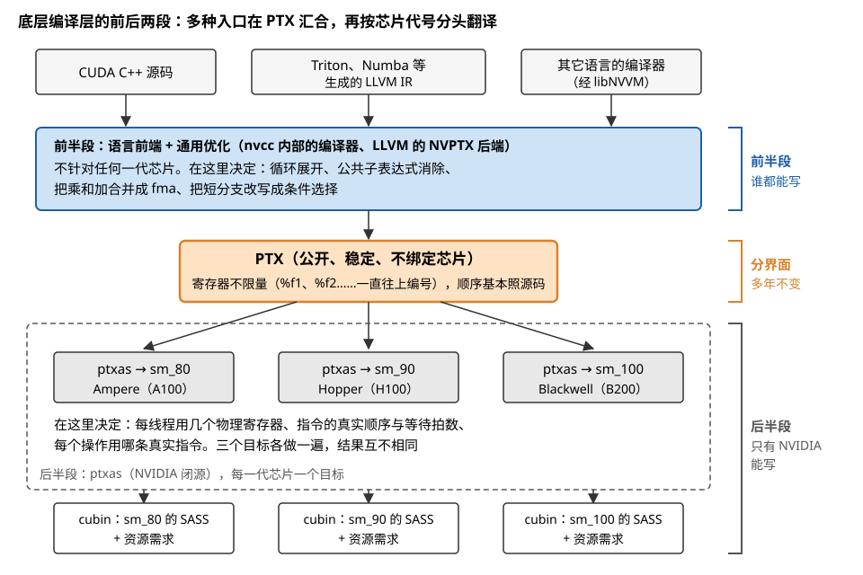
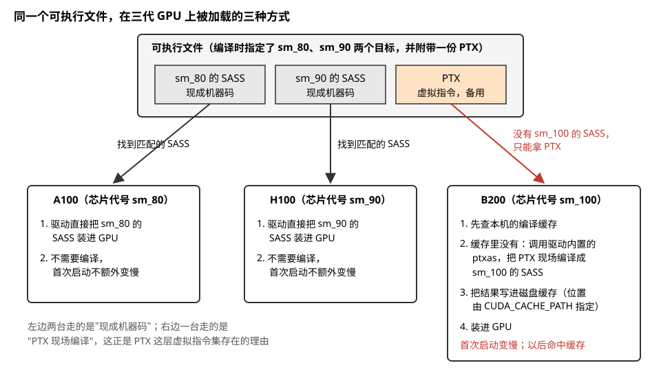
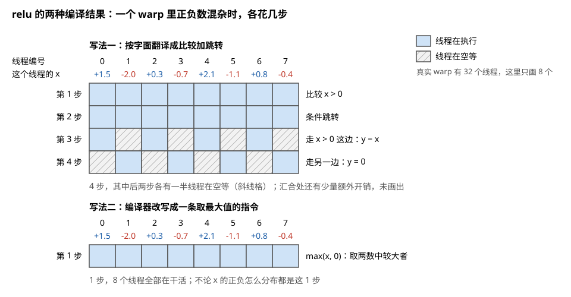
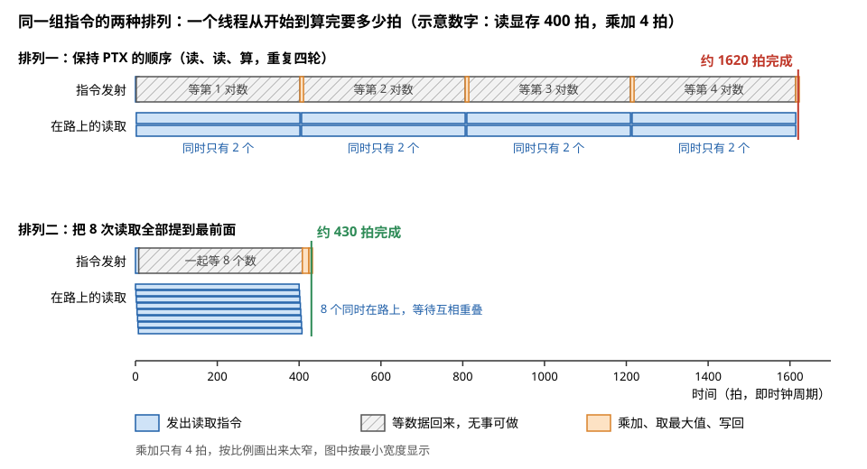
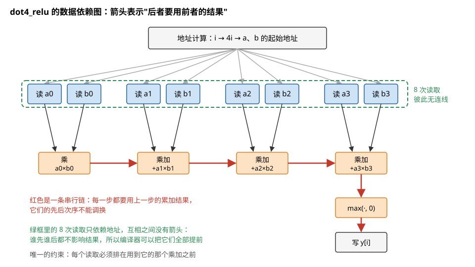
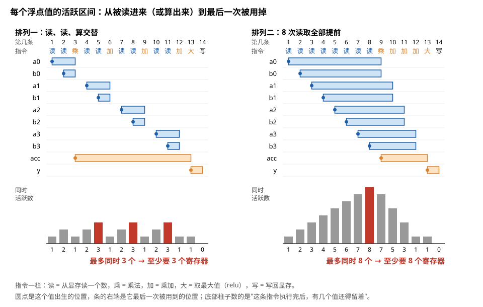
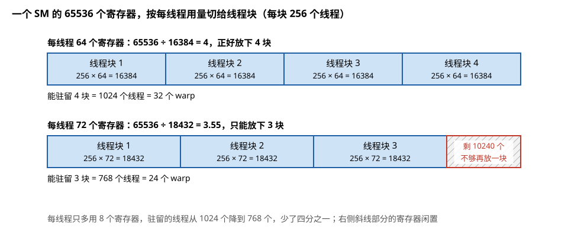
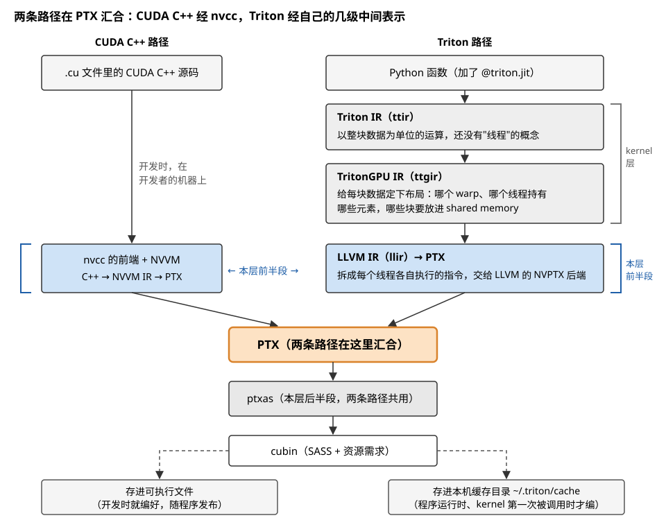

# 第④层 · 底层编译层：把 kernel 程序翻译成某一代芯片的机器码

> **所属模块**：模块 04 · 软件优化栈（五层地图的第④层；五层逐层展开的第四章）
> **状态**：🟨 学习中（第一版。知识截至 2026-08）
> **本节主旨**：kernel 层交出的程序还不能在芯片上运行，它用的是 CUDA C++、LLVM IR 或 PTX 这样的表示，寄存器可以随意使用，指令也不对应任何具体芯片。底层编译层负责最后这段翻译：**把程序变成某一代 GPU 能直接执行的机器码**。这一层不了解张量，也不了解模型，它面对的是一条条指令和一个个寄存器。但有三件对性能影响很大的事只能在这里决定：**每个线程用多少个物理寄存器**（它决定一个 SM 能同时驻留多少线程）、**指令按什么顺序排列**（它决定访存的等待时间能否互相重叠）、**每个操作用哪条真实指令实现**（它决定专用硬件是否被用上）。本节先按统一格式给这一层建档，然后**拿 NVIDIA 的编译工具链做标本**，跟踪一个十行的小 kernel 从 C++ 到 PTX 再到机器码的两次变形。模块 01 第 6 节从硬件的角度讲过 PTX 和 SASS 这两层指令集为什么存在，本节从软件栈的角度讲这一层作为一个整体在做什么。

---

## 0. 这一节要回答的问题

- 底层编译层的输入和输出各是什么？它由哪几个部件组成？
- 为什么这一层要分成前后两段，中间隔着一个 PTX？
- 这一层一共做哪些事？哪些和普通的 CPU 编译器一样，哪些是 GPU 特有的？
- 寄存器分配具体在做什么？为什么多用 8 个寄存器会让驻留的线程块少四分之一？
- 指令排序为什么能让一段代码快好几倍？它和寄存器分配之间有什么冲突？
- 业界有哪些底层编译器？NVIDIA 和 AMD 的做法差在哪？
- 一个小 kernel 经过这一层之后，每一步具体变成了什么样？

---

## 1. 基础词汇：先把本节要用的词讲清楚

**指令集**。一块芯片能执行的全部指令的清单和规则。软件按这份规则生成指令，硬件按这份规则执行。

**机器码**。按某个指令集编码出来的二进制指令序列，是芯片直接执行的东西。

**PTX**。NVIDIA 公开的一套**虚拟**指令集。它描述的是一台理想化的 GPU：寄存器数量没有上限，指令不绑定任何一代芯片。它的文档公开，语法多年保持稳定，新功能只增加不删除。

**SASS**。某一代 NVIDIA GPU **真实**的机器码。寄存器是物理的，数量有限；每条指令还带着一组控制执行节奏的附加信息。它的编码不公开，每一代芯片可以完全不同。

**ptxas**。NVIDIA 提供的、把 PTX 翻译成 SASS 的编译器。它既随开发工具一起发布，也内置在每台机器的显卡驱动里。

**LLVM 与 LLVM IR**。LLVM 是一套开源的编译器基础设施，很多编译器都建在它上面。LLVM IR 是它内部使用的中间表示，介于源码和机器码之间，形式上像一种带类型的汇编语言。

**活跃区间（live interval）**。一个变量从"被赋值"到"最后一次被使用"之间的那段程序。在这段范围内，它的值必须保存在某个寄存器里。寄存器分配的全部工作都建立在这个概念上。

**cubin**。ptxas 输出的文件，里面是一个或多个 kernel 的 SASS 机器码，加上每个 kernel 的资源需求信息。

---

## 2. 这一层的档案

### 2.1 定义

**底层编译层是把 kernel 程序翻译成特定一代 GPU 的机器码的那层软件。** 它的工作对象是指令和寄存器。它保证翻译前后程序的行为完全一致，并在这个前提下让机器码尽可能快。

### 2.2 这一层的内部结构：前后两段

这一层内部又分成两段，中间以 PTX 为界。

```
  CUDA C++ 源码          Triton / Numba 等生成的 LLVM IR
        │                          │
        ▼                          ▼
  ┌──────────────────────────────────────────┐
  │ 前半段：语言前端 + 通用优化               │   nvcc 内部的编译器；LLVM 的 NVPTX 后端
  │ 不针对具体芯片                            │
  └──────────────────────────────────────────┘
                     │
                     ▼
                   PTX   ←── 公开、稳定、不绑定芯片
                     │
                     ▼
  ┌──────────────────────────────────────────┐
  │ 后半段：ptxas                             │   NVIDIA 闭源
  │ 针对具体某一代芯片                        │
  └──────────────────────────────────────────┘
                     │
                     ▼
            cubin（SASS + 资源需求）
```

**前半段**做的是任何编译器都要做的事：解析源码，做不依赖具体芯片的优化，输出 PTX。**后半段**做的是和具体芯片相关的事：分配物理寄存器、排列指令、选择真实指令。

**中间放一个 PTX 的好处是两边可以各自更换。** 前半段可以有很多种：NVIDIA 自己的 C++ 编译器、Triton 用的 LLVM 后端、其它语言的编译器，它们只要输出合法的 PTX 即可。后半段每一代芯片换一个版本，而已经编译到 PTX 的程序不需要任何改动。图 5-1 把"多个入口汇合到 PTX、再按芯片分头翻译"画了出来。



> **图 5-1**　一句话：底层编译层内部分成前后两段。前半段把各种入口语言统一翻译成 PTX；后半段由 ptxas 针对每一代芯片各翻译一遍，得到只能在那一代芯片上运行的机器码。
>
> **先知道一件事**：GPU 每一代的真实机器指令（SASS）都不一样，为 A100 编出的机器码不能直接拿到 H100 上运行。PTX 是 NVIDIA 定义的一套"理想化 GPU"的指令，每一代 GPU 都认它，但它本身不能直接执行，必须再翻译一次。
>
> **按这个顺序看**：
> 1. 最上面三个方框是入口：手写的 CUDA C++；Triton 等工具生成的 LLVM IR（LLVM 编译器框架内部的一种程序写法，形式像带类型的汇编）；其它语言经 libNVVM（NVIDIA 提供的编译库）生成的中间表示。
> 2. 蓝色方框是前半段。它做的是任何编译器都会做的化简：把次数固定的小循环展开，重复计算的表达式只算一次，把乘法和紧跟的加法合并成一条 fma（乘加）指令，把短小的 if 改写成不跳转的选择指令。这些化简都不依赖芯片型号。
> 3. 橙色方框是 PTX，也就是两段的分界。在这里寄存器编号可以无限往上加，指令顺序也基本照抄源码。
> 4. 虚线框是后半段：同一份 PTX 分别交给三个目标的 ptxas。sm_80、sm_90、sm_100 分别是 A100、H100、B200 的芯片代号。每个目标各自决定用几个真实寄存器、指令怎么排、每个操作用哪条真实指令。
> 5. 最下面三个 cubin（ptxas 输出的二进制文件）各带一份自己那一代芯片的 SASS，以及"资源需求"：每线程几个寄存器、多少 shared memory。
>
> **打个比方**：PTX 像一份用通用语言写成的菜谱。前半段负责把各地方言写的菜谱誊成通用语言；后半段是每家厨房的厨师，按自家灶眼的数量和锅的大小重新安排做菜的步骤。
>
> **看懂的标志**：能回答"为什么只看 PTX 看不出一个 kernel 用了多少寄存器"——PTX 在分界线以上，寄存器数要到虚线框里的 ptxas 按具体芯片分配之后才确定，而且三代芯片的结果可以各不相同。
>
> **与正文的对照**：对应上面的文字框图，这里把后半段展开成了三个芯片目标。右侧"谁都能写""只有 NVIDIA 能写"对应 §2.3 的最后一段。
>
> 来源：本库自绘。

### 2.3 为什么在这里切一刀

**和上面的 kernel 层之间的一刀**，理由在上一章讲过：kernel 层的决策依赖张量的语义，而这一层的工作对任何程序都一样，不需要知道程序在算什么。

**和下面的运行时层之间的一刀，区别在于处理的是"程序"还是"执行"。** 这一层产出的是一份静态的程序，它对同一份输入总是产出同样的机器码。运行时层处理的是执行时才知道的事实：现在有多少显存空闲、哪个 kernel 先提交、有几个进程在共用 GPU。

**还有一个非技术的理由：这一层的后半段由硬件厂商独家掌握。** SASS 的编码不公开，只有 NVIDIA 能写 ptxas。硬件厂商因此可以在每一代芯片上自由修改指令编码和微架构，而不影响上层软件。

### 2.4 输入与输出

| | 内容 |
| --- | --- |
| **输入** | kernel 程序，形式是 CUDA C++ 源码、LLVM IR 或 PTX 三者之一；目标芯片的代号（如 Hopper 是 `sm_90`） |
| **输出** | cubin 文件。包含两部分：SASS 机器码；每个 kernel 的**资源需求**（每线程使用的寄存器数、静态声明的 shared memory 大小、栈大小） |

**输出里的资源需求容易被忽略，但它很重要。** GPU 在把线程块分配到各个 SM 时，要根据每个线程块占用多少寄存器和 shared memory 来决定一个 SM 能放几块。这个数字不是 kernel 作者写的，是这一层编译完之后才确定的。

**例子：第 5 节那个十行的小 kernel 的输入和输出。** 输入是十行 C++ 源码和目标芯片代号 `sm_90`。输出的 cubin 里有二十多条 SASS 指令，以及一条资源需求"每线程 16 个寄存器，不使用 shared memory"。源码里没有任何地方写着 16 这个数字，它是寄存器分配的结果。

### 2.5 上下边界的接口

| 边界 | 接口形态 | 具体例子 |
| --- | --- | --- |
| **上边界**（接收 kernel 程序） | 一门语言或一种中间表示 | CUDA C++；NVVM IR（NVIDIA 定义的 LLVM IR 子集）；PTX 文本 |
| **下边界**（交给运行时层） | 二进制文件 | cubin；把多代芯片的 cubin 和一份 PTX 打包在一起的可执行文件 |
| **运行时调用本层** | 一个编译函数 | 驱动内置的 ptxas：当可执行文件里没有当前芯片的 SASS 时，驱动在加载程序时现场把 PTX 编译成 SASS |

第三行说明这一层和运行时层的关系并不是严格的先后关系。**编译既可以发生在开发者的机器上，也可以发生在用户的机器上、程序启动的那一刻。** Triton 采用的就是后一种方式：它在运行时生成 PTX，然后立刻调用 ptxas。图 5-2 画出同一个可执行文件在三代 GPU 上分别走哪条路。



> **图 5-2**　一句话：一个可执行文件里可以同时放几代芯片的现成机器码和一份 PTX；程序启动时，驱动先找与当前芯片匹配的机器码，找不到才用 PTX 现场编译。
>
> **先知道一件事**：驱动（操作系统里管理 GPU 的那部分软件）内部带着一份 ptxas，也就是 PTX 到机器码的翻译器。所以翻译不一定发生在开发者的机器上，也可以发生在用户的机器上、程序启动的那一刻。
>
> **按这个顺序看**：
> 1. 上方大框是一个可执行文件。开发者编译时指定了 sm_80 和 sm_90 两个目标，所以里面有两份 SASS（真实机器码，灰色），另外附带了一份 PTX（橙色）。
> 2. 左边的 A100 和中间的 H100：芯片代号正好对上文件里的某一份 SASS，驱动直接把它装进 GPU，不需要编译。
> 3. 右边的 B200（代号 sm_100）：文件里没有为它准备的 SASS。红色箭头表示驱动只能取那份 PTX。
> 4. 看 B200 方框里的四步：先查本机的编译缓存（以前编好的结果存在磁盘上）；缓存里没有，就调用驱动内置的 ptxas 现场编译；编好后写进缓存；最后装进 GPU。
> 5. 最后一行红字：第一次启动要等这次编译，所以变慢；之后再启动时直接从缓存取，不再编译。
>
> **看懂的标志**：能回答"如果开发者编译时既没指定 sm_100、也没附带 PTX，这个程序能在 B200 上运行吗"——不能。没有匹配的 SASS，也没有可以现场编译的 PTX，驱动无从下手，程序会报"没有可在此设备上运行的 kernel"这类错误。
>
> **与正文的对照**：对应 §2.5 表中第三行"运行时调用本层"。缓存位置和大小的环境变量见第 7 节开发者视角的最后一行。Triton 每次都走右边这条路，只是由 Triton 自己调用 ptxas（第 6 节）。
>
> 来源：本库自绘。

### 2.6 这一层看得见什么、看不见什么

| 看得见 | 看不见 |
| --- | --- |
| 每一条指令，以及指令之间的数据依赖 | 这段程序是矩阵乘还是卷积 |
| 每个变量的活跃区间 | 数据块（tile）的概念 |
| 目标芯片每种指令的延迟、物理寄存器的上限 | 这个 kernel 会以多大的规模启动 |
| 分支和循环的控制流结构 | 输入数据的形状（除非已被写成常量） |

---

## 3. 功能集合：这一层要做的九件事

| 功能 | 做什么 | 属于哪一段 | GPU 特有吗 |
| --- | --- | --- | --- |
| **语言前端** | 解析 C++，展开模板，生成中间表示 | 前半段 | 否 |
| **通用优化** | 函数内联、常量传播、公共子表达式消除、把循环内不变的计算移到循环外 | 前半段 | 否 |
| **循环展开** | 次数固定的短循环直接展开成顺序代码 | 前半段 | 否 |
| **分支转换** | 把简短的 if 分支改写成不含跳转的条件选择 | 前半段 | **动机是 GPU 特有的** |
| **指令选择** | 为每个操作选择目标芯片上的真实指令 | 后半段 | 部分 |
| **寄存器分配** | 把数量不限的虚拟寄存器安排到有限的物理寄存器上 | 后半段 | **后果是 GPU 特有的** |
| **指令排序与控制信息** | 确定指令的先后顺序，并为每条指令写入控制执行节奏的附加信息 | 后半段 | **是** |
| **打包与链接** | 把多代芯片的机器码和 PTX 打包；把多个编译单元链接在一起 | 两段之后 | 部分 |
| **运行时编译与缓存** | 在用户机器上现场编译，并把结果存入磁盘缓存 | 后半段 | 部分 |

表中标为 GPU 特有的三项需要解释，它们是这一层和 CPU 编译器的主要区别。

**分支转换的动机。** GPU 上 32 个线程组成一个 warp，共用同一个指令指针，每一拍执行同一条指令。遇到 if 分支时，如果同一个 warp 里有的线程要走这一边、有的要走另一边，硬件只能先让一部分线程执行、其余线程空等，然后再反过来，两边的代码都要花时间（模块 01 第 3 节讲的分支发散）。如果编译器把分支改写成一条条件选择指令，所有线程执行的就是同一条指令，发散不再发生。

**例子：一个 relu 的两种编译结果。** 源码是 `y = x > 0 ? x : 0`。按字面翻译是一次比较加一次条件跳转；编译器会把它改写成一条"取两数中较大者"的指令 `max(x, 0)`。前一种写法在一个 warp 里正负数混杂时，两个分支各执行一遍；后一种写法不管数据如何，都是一条指令。对于只有一两条指令的分支，改写总是划算的。图 5-3 逐步画出两种写法下每个线程在做什么。



> **图 5-3**　一句话：同一个 relu，按字面翻译成"比较加跳转"时，一个 warp 里正负数混杂会让两边的分支各走一遍；改写成一条取最大值的指令后，只要一步。
>
> **先知道一件事**：GPU 上 32 个线程组成一个 warp，每一步只能执行同一条指令。线程要走不同的分支时，硬件只能让走这一边的线程先执行、其余线程原地等待，然后再反过来。
>
> **按这个顺序看**：
> 1. 表头是 8 个线程的编号和各自的 x 值，蓝色为正、红色为负，正负交替出现。
> 2. 看写法一的四行，每行是一步，每格是一个线程在这一步的状态：蓝色格在执行，斜线格在空等。第 1、2 步是比较和跳转，所有线程都参与。
> 3. 第 3 步只有 x 为正的 4 个线程执行 y = x，另外 4 个空等；第 4 步反过来。这两步各浪费一半的格子。
> 4. 看写法二：只有一行。所有线程执行同一条"取 x 和 0 中较大者"的指令，结果与写法一完全相同，没有任何空等。
>
> **看懂的标志**：能回答"如果一个 warp 里的 x 全是正数，写法一还要走第 4 步吗"——不用。整个 warp 都走同一边时，硬件会直接跳过另一边，写法一只需 3 步。发散的代价只在同一个 warp 里正负混杂时出现；写法二不论数据如何都是 1 步，所以编译器对这类短分支总是改写。
>
> **与正文的对照**：步数是示意，真实的机器码在分支汇合处还有额外的同步指令。改写后的那条指令，在 §5.4 的 SASS 里就是 `FMNMX`。
>
> 来源：本库自绘。

**寄存器分配的后果。** CPU 上每个核有一套固定的寄存器，编译器用得多一点少一点，不影响能同时运行多少线程。GPU 上一个 SM 的全部寄存器由驻留在它上面的所有线程分享，**每个线程多用一个寄存器，能驻留的线程总数就变少**。第 5.3 节用数字说明这一点。

**指令排序与控制信息。** CPU 在运行时由硬件自动分析指令之间的依赖，决定哪条指令可以提前执行。GPU 为了节省芯片面积，没有这套硬件，改由编译器在编译时算好：每条指令发出之后要等几拍下一条才能发出，这些数字直接写在机器码里。所以在 GPU 上，指令的排列顺序和等待时间完全由这一层决定。

---

## 4. 业界的典型项目

| 项目 | 主导方 | 属于哪一段 | 输入 → 输出 | 是否开源 | 说明 |
| --- | --- | --- | --- | --- | --- |
| **nvcc** | NVIDIA | 总控程序 | CUDA C++ → 可执行文件 | 否 | 它自己不做编译，负责依次调用下面几个部件，并把 CPU 部分的代码交给主机的 C++ 编译器 |
| **NVVM / libNVVM** | NVIDIA | 前半段 | NVVM IR → PTX | 否（接口公开） | 基于 LLVM；其它语言的编译器可以通过它生成 PTX |
| **LLVM 的 NVPTX 后端** | LLVM 社区 | 前半段 | LLVM IR → PTX | 是 | Triton、Numba、Julia 的 GPU 支持都经过它 |
| **ptxas** | NVIDIA | 后半段 | PTX → cubin | 否 | 性能相关的三项关键决策都在这里 |
| **NVRTC** | NVIDIA | 前后两段 | CUDA C++ 字符串 → PTX | 否 | 在程序运行时编译 C++ 源码的库 |
| **nvJitLink** | NVIDIA | 链接 | 多个编译单元 → 一个 cubin | 否 | 支持跨编译单元的优化 |
| **LLVM 的 AMDGPU 后端** | AMD 与 LLVM 社区 | 前后两段合一 | LLVM IR → AMD GPU 机器码 | 是 | 没有中间的虚拟指令集，一个编译器做完全部工作 |
| **SPIR-V 与各厂商的驱动编译器** | Khronos 标准组织 | 中间表示 | — | 标准公开 | OpenCL、Vulkan、Intel oneAPI 采用的中间表示，作用类似 PTX，但由标准组织定义，多家厂商共用 |

**对比 NVIDIA 和 AMD 的做法，可以看清中间那层虚拟指令集的得失。**

| | NVIDIA | AMD |
| --- | --- | --- |
| 结构 | 两段，中间是 PTX | 一段，LLVM IR 直接到机器码 |
| 机器码文档 | 不公开 | 公开 |
| 编译器 | 后半段闭源 | 全部开源 |
| 旧程序在新芯片上运行 | 可以：驱动把程序里附带的 PTX 现场编译成新芯片的机器码 | 一般需要用新版本的编译器重新编译源码 |
| 使用者能否看清并手工调整机器码 | 困难，只能依靠逆向研究的成果 | 可以，指令和等待都有文档 |

NVIDIA 的方案保证了已发布的软件在未来的芯片上仍然能运行，代价是最后一段编译对使用者不透明。AMD 的方案完全透明，代价是二进制程序跨代兼容较弱。

---

## 5. 拿 NVIDIA 工具链讲透：一个小 kernel 的两次变形

这一小节跟踪一个十行的 kernel，看它经过前半段和后半段之后分别变成什么样。

**设定**：每个线程计算两个长度为 4 的向量的内积，然后做 relu。

```cuda
__global__ void dot4_relu(const float* a, const float* b, float* y, int n) {
    int i = blockIdx.x * blockDim.x + threadIdx.x;     // 我是第几号线程
    if (i >= n) return;                                 // 越界的线程直接退出
    float acc = 0.0f;
    for (int k = 0; k < 4; k++)
        acc += a[4 * i + k] * b[4 * i + k];
    y[i] = acc > 0.0f ? acc : 0.0f;                     // relu
}
```

### 5.1 第一次变形：前半段，从 C++ 到 PTX

用 `nvcc -ptx` 可以让编译在 PTX 处停下并输出文本。下面是输出的大致样子（做了简化和注释，寄存器编号是示意）：

```
mov.u32        %r1, %ctaid.x                  // 线程块编号
mov.u32        %r2, %ntid.x                   // 每块线程数
mov.u32        %r3, %tid.x                    // 块内线程编号
mad.lo.s32     %r4, %r1, %r2, %r3             // i = 块编号 × 每块线程数 + 线程编号
setp.ge.s32    %p1, %r4, %r5                  // i >= n ?
@%p1 bra       $L_exit                        // 是则跳到结尾
shl.b32        %r6, %r4, 2                    // 4*i（乘 4 改成了左移 2 位）
mul.wide.s32   %rd3, %r6, 4                   // 换算成字节偏移
add.s64        %rd4, %rd1, %rd3               // a 的地址
add.s64        %rd5, %rd2, %rd3               // b 的地址
ld.global.f32  %f1, [%rd4]                    // a[4i]
ld.global.f32  %f2, [%rd5]                    // b[4i]
mul.f32        %f3, %f1, %f2                  // acc = a0*b0
ld.global.f32  %f4, [%rd4+4]                  // a[4i+1]
ld.global.f32  %f5, [%rd5+4]                  // b[4i+1]
fma.rn.f32     %f6, %f4, %f5, %f3             // acc = a1*b1 + acc
ld.global.f32  %f7, [%rd4+8]
ld.global.f32  %f8, [%rd5+8]
fma.rn.f32     %f9, %f7, %f8, %f6
ld.global.f32  %f10, [%rd4+12]
ld.global.f32  %f11, [%rd5+12]
fma.rn.f32     %f12, %f10, %f11, %f9
max.f32        %f13, %f12, 0f00000000         // relu
st.global.f32  [%rd6], %f13
$L_exit:
ret
```

把它和源码对照，前半段做了五件事：

| 源码里的写法 | PTX 里变成了什么 | 属于第 3 节的哪项功能 |
| --- | --- | --- |
| `for (k = 0; k < 4; k++)` | 循环消失，循环体出现了 4 次 | 循环展开（循环次数是常量 4） |
| `4 * i + k` 在每轮循环里计算两次 | `4*i` 只算一次，之后用固定偏移 `+4`、`+8`、`+12` | 公共子表达式消除 |
| `4 * i` | 左移 2 位 | 把乘法换成更便宜的等价运算 |
| `acc += a * b` | 一条 `fma` 指令（乘和加合并成一条，中间结果不舍入） | 指令合并 |
| `acc > 0 ? acc : 0` | 一条 `max` 指令，没有跳转 | 分支转换 |

**这份 PTX 有两个特点要注意。** 第一，寄存器编号一直在增长（`%f1` 到 `%f13`），每个新的值都用一个新的寄存器，因为虚拟寄存器没有数量限制。第二，指令的顺序和源码基本一致：读两个数，算一次，再读两个数，再算一次。**真实的寄存器用量和真实的执行顺序，在这份文本里都还看不出来。**

### 5.2 第二次变形：后半段，指令排序

ptxas 拿到上面的 PTX 之后，要决定指令的真实顺序。关键的事实是：**从显存读一个数要等几百拍才能拿到结果，而一次浮点乘加只要几拍。**

**例子：同一组指令的两种排列，耗时差三倍多。** 假设读显存的延迟是 400 拍，一次乘加是 4 拍。

排列一，保持 PTX 的顺序（读、读、算、读、读、算……）：

| 拍数 | 在做什么 |
| --- | --- |
| 0 – 2 | 发出 a0、b0 的读取 |
| 2 – 402 | 等待。第一条乘法需要 a0 和 b0，它们还没回来，后面的指令无法继续 |
| 402 – 406 | 计算 a0×b0；发出 a1、b1 的读取 |
| 406 – 806 | 等待 a1、b1 |
| …… | 后两组同样各等 400 拍 |
| 约 1620 | 完成 |

排列二，把 8 次读取全部提到最前面：

| 拍数 | 在做什么 |
| --- | --- |
| 0 – 8 | 连续发出 a0、b0、a1、b1、a2、b2、a3、b3 共 8 次读取 |
| 8 – 408 | 等待。8 次读取同时在进行，它们的等待时间是重叠的 |
| 408 – 424 | 4 次乘加依次完成 |
| 约 430 | 完成 |

图 5-4 把两张表画在同一根时间轴上。



> **图 5-4**　一句话：同样的 8 次读取和 4 次乘加，只是换了排列顺序，一个线程算完所需的时间就从约 1620 拍降到约 430 拍。
>
> **先知道一件事**：横轴是时间，单位是"拍"（一个时钟周期）。从显存读一个数，要过约 400 拍数据才回来；一次乘加只要 4 拍。读取指令发出之后，线程可以接着发下一条不依赖这个数的指令，不必原地等。
>
> **按这个顺序看**：
> 1. 看排列一的"指令发射"一行：先发出两次读取（左端很窄的蓝条），接着是一大段斜线。斜线表示下一条指令是乘法、要用刚读的两个数，只能干等它们回来。
> 2. 同一行里斜线段一共四段，每段 400 拍，之间夹着很窄的橙色条（乘加，只有 4 拍）。
> 3. 看它下方"在路上的读取"：任何时刻只有 2 个读取在进行，显存那边一直只收到很少的请求。
> 4. 看排列二：8 次读取在最前面连续发出，只等一段 400 拍，8 个数几乎同时回来，然后 4 次乘加一口气算完。
> 5. 看排列二下方叠在一起的 8 根细条：8 个读取的等待时间是重叠的，四段等待变成了一段。
>
> **看懂的标志**：能说出排列二快在哪里——它没有让任何一次读取变快，每次读取仍要 400 拍；它只是让 8 次读取的等待同时发生，而不是等完一次再等下一次。
>
> **与正文的对照**：数值与上面两张拍数表一致，400 拍和 4 拍是示意值。图中只画了一个线程自己的时间线；真实 GPU 上，这个 warp 等待时还可以换别的 warp 来执行，那是填补等待的另一种办法（模块 01 第 2 节）。
>
> 来源：本库自绘。

**同样的指令，只是调整了顺序，这个线程的耗时从约 1620 拍降到约 430 拍。** 这种调整之所以合法，是因为 8 次读取之间没有依赖关系，谁先谁后不影响结果。编译器通过分析指令之间的数据依赖来确认这一点，图 5-5 把这些依赖画成了图。



> **图 5-5**　一句话：把"谁要用谁的结果"画成箭头之后可以看到，8 次读取之间互不依赖，4 次乘加却串成了一条链；编译器正是据此判断哪些指令可以调换顺序。
>
> **先知道一件事**：两条指令能不能调换先后，只看后一条是否要用前一条的结果（或者两条是否写同一个位置）。如果不用，调换之后结果完全一样。
>
> **按这个顺序看**：
> 1. 顶部灰框是地址计算：从线程编号 i 算出 4i，再算出这个线程要在 a、b 两个数组里读的起始位置。灰色细箭头表示 8 次读取都要用这个地址。
> 2. 绿色虚线框里是 8 次读取（蓝色）。框内没有任何箭头相连：读 a1 不需要知道 a0 是多少。
> 3. 每对读取有两根黑箭头指向下方的一个橙色方框。第一个方框算 a0×b0，后三个各把一对新的乘积加到累加值上。
> 4. 红色粗箭头把四个橙色方框串成一条链，再接到取最大值（relu）和写回 y[i]。每一步都要用上一步的累加结果，这条链的顺序不能调换。
>
> **看懂的标志**：能回答"排列二把读 a3 提到算 a0×b0 之前，为什么合法"——读 a3 和 a0×b0 之间没有箭头相连，谁都不需要对方的结果。唯一的约束是读 a3 必须排在用到它的第四个方框之前，排列二满足这一点。
>
> **与正文的对照**：对应 §5.5 的第三条结论。如果源码在两次读取之间写了同一个数组，编译器就要在这次写和后面的读之间补一根箭头（它无法确定两者不是同一个位置），读取也就不能随意提前了。
>
> 来源：本库自绘。

**每条指令的等待拍数也在这一步确定，并写进机器码。** 据公开的逆向研究，每条 SASS 指令带有一组控制信息，主要包括：

| 字段 | 含义 |
| --- | --- |
| 停顿计数 | 这条指令发出后，本 warp 要等几拍才能发下一条。用于延迟固定的指令（如乘加） |
| 写入的记分牌编号 | 延迟不固定的指令（如读显存）在发出时占用一个记分牌位置，结果返回时释放 |
| 等待的记分牌集合 | 这条指令要等哪几个记分牌位置被释放之后才能发出 |
| 让出标志 | 提示调度器此刻适合切换到别的 warp |
| 操作数复用标志 | 这条指令的操作数和上一条相同，可以不重新读寄存器 |

记分牌的位置每个 warp 只有 6 个左右。排列二里 8 次读取同时在进行，编译器会让几次读取共用一个记分牌位置。

### 5.3 第二次变形：后半段，寄存器分配

指令顺序确定之后，每个变量的活跃区间也就确定了，接下来把它们安排到物理寄存器上。规则是：**活跃区间有重叠的两个变量不能用同一个寄存器；不重叠的可以共用。**

**例子：两种排列需要的寄存器数不同。** 只看保存浮点数的寄存器。

排列一（读、读、算交替）里，任何时刻同时活跃的浮点值最多是 3 个：当前的累加值，加上刚读回来的一对数。一对数用完之后它们的寄存器立刻可以让给下一对。所以 **3 个寄存器就够了**，PTX 里的 13 个虚拟寄存器被安排到 3 个物理寄存器上轮流使用。

排列二（8 次读取提前）里，8 个读回来的数在开始计算之前必须同时保存着，所以**至少需要 8 个寄存器**。图 5-6 把两种排列下每个值的活跃区间逐条画了出来。



> **图 5-6**　一句话：一个值从读进来到最后一次被用掉，这段时间都要占着一个寄存器；排列一最多同时占 3 个，排列二最多同时占 8 个。
>
> **先知道一件事**：寄存器是线程手边的小格子。一个值在还要被用到之前必须占着一个格子，用完之后格子可以让给下一个值。编译器分配寄存器的规则就是：两个值占用的时间段有重叠，就不能共用一个格子。
>
> **按这个顺序看**：
> 1. 两个面板的横轴都是指令的序号 1 到 14，顶部一行写着每条指令是什么："读"是从显存读一个数，"乘""加"是乘法和乘加，"大"是取最大值，"写"是写回显存。
> 2. 每一行是一个值：a0 到 b3 是读进来的 8 个数，acc 是累加值，y 是 relu 的结果。圆点是这个值出生的位置，条一直延伸到它最后一次被用到的那条指令。
> 3. 看左边排列一：蓝色短条两两出现，一对数读进来之后很快就被乘加用掉，条很短，彼此错开。
> 4. 看右边排列二：8 根蓝条从前 8 条指令开始，都要一直延伸到后面的乘加，彼此大段重叠。
> 5. 看底部柱子：每根柱子数的是这条指令执行完后还有几个值必须留着，红色是最高点。左边最高 3，右边最高 8。
>
> **看懂的标志**：能说出正文所说的"冲突"在图上是什么——右边的条变长、叠在一起，这恰好就是图 5-4 里等待能够重叠的原因。等待重叠得越多，同时要留着的值就越多，寄存器用得也越多。
>
> **与正文的对照**：图中只统计保存浮点数的寄存器，保存地址和线程编号的整数寄存器没有画。§5.4 的 SASS 用的是 R8～R15 这 8 个，与右边的最高点一致。
>
> 来源：本库自绘。

**这就是指令排序和寄存器分配之间的冲突：让访存重叠可以缩短时间，但同时活跃的值变多，寄存器用量上升。** 对这个小例子，多用 5 个寄存器无关紧要。但在一个真实的矩阵乘 kernel 里，每线程的寄存器用量常常在 60 到 100 之间，这时每增加几个寄存器都可能有后果。

**例子：多用 8 个寄存器，驻留的线程块少四分之一。** 一个 SM 有 65536 个寄存器。某个 kernel 每个线程块有 256 个线程。

| 每线程寄存器数 | 每个线程块占用的寄存器 | 一个 SM 能驻留的线程块 |
| --- | --- | --- |
| 64 | 256 × 64 = 16384 | 65536 ÷ 16384 = **4 块** |
| 72 | 256 × 72 = 18432 | 65536 ÷ 18432 = 3.55，向下取整为 **3 块** |

每线程只多用了 8 个寄存器，一个 SM 上能同时运行的线程就从 1024 个降到 768 个。模块 01 第 2 节讲过，GPU 依靠在多个 warp 之间轮换来填补访存的等待时间，驻留的 warp 变少，等待就更容易暴露出来。图 5-7 把这张表画成了寄存器堆的切分。



> **图 5-7**　一句话：一个 SM 的寄存器总数固定为 65536 个，每线程多用 8 个寄存器，这个 SM 上就少放一个线程块。
>
> **先知道一件事**：GPU 把线程块（一组一起启动、共享资源的线程）分到某个 SM 上时，要给块里每个线程分满它需要的寄存器。一个块要么全部分到，要么根本放不上去，不能只分一半。
>
> **按这个顺序看**：
> 1. 每个横条代表同一个 SM 的全部 65536 个寄存器。
> 2. 上面一条：每线程 64 个，一个 256 线程的块要 256 × 64 = 16384 个，正好切成 4 块，一个不剩。
> 3. 下面一条：每线程 72 个，一块要 18432 个。放下 3 块后还剩 10240 个，不够第 4 块所需的 18432 个，这一段（红色斜线）只能闲着。
> 4. 看每条下面的一行：驻留的线程从 1024 个降到 768 个，warp（32 个线程一组）从 32 个降到 24 个。
>
> **看懂的标志**：能回答"每线程用 80 个寄存器时，能放几块"——256 × 80 = 20480，65536 ÷ 20480 = 3.2，仍然是 3 块。从 72 到 80，驻留数没有变化；从 64 跨到 72 的那一步却掉了一块。驻留数随寄存器数是一级一级跳变的，所以调寄存器用量时要看自己离下一个台阶还有多远。
>
> **与正文的对照**：数字与上表一致。真实硬件分配寄存器时还有取整的粒度，每个 SM 也有线程数和线程块数的上限，图中都没有画。
>
> 来源：本库自绘。

**当寄存器需求超过上限时，编译器会把一部分值暂存到内存里，需要时再读回来，这叫溢出（spill）。** 每线程的物理寄存器上限是 255 个；使用者也可以用编译选项设定一个更低的上限，强制编译器少用寄存器以换取更多的驻留线程。溢出的代价是多出来的内存读写，所以这是一笔需要实测的交换。

### 5.4 第二次变形的结果：SASS

用 `cuobjdump -sass` 可以查看最终的机器码。下面是大致的样子（示意，省略了控制信息的具体数值）：

```
S2R        R0, SR_CTAID.X                     // 读取线程块编号
S2R        R3, SR_TID.X                       // 读取块内线程编号
IMAD       R0, R0, c[0x0][0x0], R3            // i
ISETP.GE   P0, PT, R0, c[0x0][0x178], PT      // i >= n ?
@P0 EXIT                                      // 是则本线程退出
SHL        R2, R0, 0x2
IMAD.WIDE  R4, R2, 0x4, c[0x0][0x160]         // a 的地址
IMAD.WIDE  R6, R2, 0x4, c[0x0][0x168]         // b 的地址
LDG.E      R8,  [R4]                          // 8 次读取被排在一起
LDG.E      R9,  [R6]
LDG.E      R10, [R4+0x4]
LDG.E      R11, [R6+0x4]
LDG.E      R12, [R4+0x8]
LDG.E      R13, [R6+0x8]
LDG.E      R14, [R4+0xc]
LDG.E      R15, [R6+0xc]
FMUL       R8, R8, R9
FFMA       R8, R10, R11, R8
FFMA       R8, R12, R13, R8
FFMA       R8, R14, R15, R8
FMNMX      R8, R8, RZ, !PT                    // max(acc, 0)
STG.E      [R2], R8
EXIT
```

对照 PTX 可以看到后半段三项功能的结果：

| 功能 | 在 SASS 里的体现 |
| --- | --- |
| 指令排序 | 8 条 `LDG.E` 被集中到计算之前 |
| 寄存器分配 | 虚拟的 `%f1`～`%f13` 变成了物理的 R8～R15；累加值始终使用 R8，每次乘加的结果覆盖上一次的值 |
| 指令选择 | `ld.global` 变成 `LDG.E`，`fma` 变成 `FFMA`，`max` 变成 `FMNMX`；越界检查的跳转变成了带条件的退出指令 `@P0 EXIT` |

编译时加上 `-Xptxas -v`，ptxas 会打印这个 kernel 的资源需求，例如"使用了 16 个寄存器"。这个数字就是第 2.4 节所说的、随机器码一起交给运行时层的资源信息。

### 5.5 从这个例子得到的三个结论

**第一，读 PTX 无法判断性能。** PTX 里没有真实的寄存器用量，没有真实的指令顺序，也没有等待拍数。这三样都产生于后半段。要确认一个 kernel 的真实情况，需要看 SASS 和 ptxas 打印的资源信息。

**第二，源码不变，换一个版本的编译工具，性能可能改变。** 指令怎么排、寄存器怎么分，是 ptxas 内部的策略，不同版本的策略不同。

**第三，这一层的优化建立在"看得懂依赖关系"之上。** 上面把 8 次读取提前，前提是编译器能确认它们互不影响。如果源码里在读取之间夹着对同一数组的写入，或者通过无法分析的指针访问内存，编译器就不能确认，只能保持原来的顺序。

---

## 6. 同一层在 Triton 路径上的样子

上一节走的是"CUDA C++ 经 nvcc"这条路径。由 Triton 生成的 kernel 走的是另一条路径，对照如下：

| 环节 | CUDA C++ 路径 | Triton 路径 |
| --- | --- | --- |
| 前半段的输入 | C++ 源码 | Triton 编译器产出的 LLVM IR |
| 前半段的执行者 | nvcc 内部的编译器 | LLVM 的 NVPTX 后端 |
| 中间产物 | PTX | PTX |
| 后半段的执行者 | ptxas | ptxas（Triton 的安装包里自带一份） |
| 编译发生的时间 | 开发时 | 程序运行时，kernel 第一次被调用的时候 |
| 结果存放在哪 | 可执行文件里 | 本机的缓存目录里 |

**两条路径在 PTX 处汇合，后半段完全相同。** 所以不管 kernel 是用哪种语言写的，寄存器分配和指令排序都由同一个 ptxas 完成，验证方法也相同：取出 PTX 和 SASS 查看。图 5-8 把两条路径并排画出，并展开了 Triton 在 PTX 之前经过的几级中间表示。



> **图 5-8**　一句话：Triton 写的 kernel 先在 Triton 自己的几级中间表示里一步步变得具体，到 PTX 时与 CUDA C++ 的路径汇合，之后经过同一个 ptxas。
>
> **先知道一件事**：中间表示（IR）是编译器在源码和机器码之间使用的程序写法。编译的过程就是一级一级换写法，每换一级，细节更具体一些，离硬件更近一些。
>
> **按这个顺序看**：
> 1. 左列是 CUDA C++：源码由 nvcc 的前端和 NVVM（NVIDIA 基于 LLVM 的编译器）一步翻译成 PTX，发生在开发时。
> 2. 右列从上往下是 Triton。Python 函数先变成 Triton IR（ttir）：这里的运算以整块数据为单位，例如"两个 64×64 的块相乘"，还没有说由哪个线程来做。
> 3. 下一级 TritonGPU IR（ttgir）加上了"布局"：一个 64×64 的块，哪个 warp、哪个线程负责其中哪些元素，哪些块要先放进 shared memory（SM 内部的高速存储）。从这一级开始，程序才和 GPU 的线程组织对上。
> 4. 再下一级 LLVM IR（llir）：块运算被拆成每个线程各自执行的指令，交给 LLVM 的 NVPTX 后端生成 PTX。右侧括号标出了分界：上面两级属于 kernel 层的 Triton 编译器，从这一级起属于本层的前半段。
> 5. 两列在橙色的 PTX 处汇合，之后的 ptxas 和 cubin 完全相同。最下面两个虚线箭头说明结果存在哪里：CUDA C++ 的结果随可执行文件发布；Triton 的结果在 kernel 第一次被调用时才编出，存进本机的缓存目录。
>
> **看懂的标志**：能回答"用 Triton 写的 kernel，寄存器是谁分配的"——仍然是 ptxas。Triton 的 ttgir 决定每个线程要持有多少元素，这影响需要多少寄存器；但把它们安排到物理寄存器上的，还是本层的后半段。
>
> **与正文的对照**：对应上面的对照表。Triton 里 `kernel.asm` 的几个键 `ttir`、`ttgir`、`llir`、`ptx`、`cubin` 正好是图中右列的各级，第 7 节开发者视角里查看 PTX 的方法取的就是其中一级。各级中间表示内部做了哪些变换，在本模块第 10 节展开。
>
> 来源：本库自绘。

---

## 7. 开发者视角

| 你想知道或控制什么 | 去哪里看或怎么做 |
| --- | --- |
| 每线程用了多少寄存器、有没有溢出 | 编译时加 `-Xptxas -v`；Nsight Compute 的 kernel 信息里也有 |
| 限制寄存器用量以提高驻留数 | 编译选项 `-maxrregcount=N`；或在函数上标注 `__launch_bounds__` 让编译器按预期的线程数自行权衡 |
| 查看 PTX | `nvcc -ptx`；Triton 里是 `kernel.asm['ptx']` |
| 查看 SASS | `cuobjdump -sass 文件名`；Triton 里可导出 cubin 后用同一工具查看 |
| 确认 Tensor Core 是否用上 | 在 SASS 里搜索矩阵指令（`HMMA` 等字样） |
| 把性能数据对应到源码行 | 编译时加 `-lineinfo`，然后在 Nsight Compute 里看源码和 SASS 的对照视图 |
| 乘加是否被合并成 fma | 在 PTX 里搜索 `fma`；合并会改变舍入结果（本模块第 11 节） |
| 首次启动为什么慢 | 驱动或 Triton 正在现场编译；结果会存入缓存，缓存的位置和大小可以用环境变量 `CUDA_CACHE_PATH`、`CUDA_CACHE_MAXSIZE` 设置 |

**三个红旗信号**：ptxas 的输出里出现溢出的提示（寄存器不够用了）；升级工具链后同一个 kernel 的寄存器数明显变化（应重新测量性能）；服务每次重启后的头几个请求都很慢（编译缓存没有保留下来）。

---

## 8. 最新架构落点（知识截至 2026-08）

- **PTX 的演进方式仍然是只增加、不修改。** 每一代硬件的新能力以新指令的形式加入：Hopper 加入了 `wgmma` 和 TMA 相关的指令，Blackwell 加入了 `tcgen05` 一族。要了解新架构提供了什么，PTX 文档新增的章节是最准确的资料。
- **PTX 成了多条编译路径的汇合点。** Triton、TileLang、CuTe-DSL 这些工具都是"用 Python 写，由自己的编译器生成 PTX"，前半段的实现越来越多，后半段仍然只有 ptxas 一家。
- **硬件厂商开始参与前半段。** NVIDIA 把 CUDA Tile IR 做成了 Triton 的一个后端，这是厂商第一次直接为第三方的 kernel 语言提供代码生成。
- **跨编译单元的优化进入运行时。** nvJitLink 让运行时编译的代码也能做链接期优化，对大量使用运行时编译的库有实际意义。
- **AMD 一侧保持开源路线。** 它的编译器全部在 LLVM 主线里，Triton 等工具通过同一套 LLVM 基础设施支持 AMD 的 GPU。
- **SASS 每一代重新编码的做法没有改变。** 所以可执行文件里仍然需要为每一代芯片分别存放机器码，或者附带 PTX 以便在新芯片上现场编译。

---

## 9. 和其它模块的挂钩

- **本模块第 4 节（kernel 层）**：那一层交出的 PTX 或 LLVM IR 是本层的输入；那一层估算的寄存器用量要以本层的实际结果为准。
- **本模块第 6 节（运行时层）**：本层输出的 cubin 由那一层加载；本层输出的资源需求决定了 GPU 如何分配线程块。
- **本模块第 10 节（编译器内部）**：那一节讲的是从计算图到 PTX 之间的各级中间表示和变换，本节讲的是那条链的最后一段。
- **本模块第 11 节（数值的一致性）**：乘加合并、运算顺序调整这些本层的优化，是不同编译结果之间数值出现微小差异的来源之一。
- **模块 01 第 2 节（warp 的执行方式与占用率）**：本节的寄存器数和驻留线程数的关系，是那一节占用率计算的输入。
- **模块 01 第 6 节（PTX 与 SASS）**：从硬件角度讲两层指令集为什么存在、旧程序如何在新芯片上运行。
- **模块 01 第 8 节（读懂 PTX 与 SASS）**：指令名的命名规则和常见指令的含义。

---

## 10. 术语卡

### 虚拟寄存器与物理寄存器
**定义**：虚拟寄存器是 PTX 和 LLVM IR 里使用的寄存器，数量没有上限，每个新值都可以占用一个新的。物理寄存器是芯片上真实存在的寄存器，每线程最多 255 个，且一个 SM 上的总量固定。
**为什么存在**：前半段的优化不需要考虑寄存器够不够用，用虚拟寄存器可以让它专注于化简程序。寄存器的紧缺程度和具体芯片有关，留给后半段处理。
**语境例句**："PTX 里看着有上百个寄存器，别慌，那是虚拟的。" —— 意思是：PTX 里的寄存器编号不代表真实用量，真实用量要看 ptxas 的输出。

### 寄存器分配与溢出（spill）
**定义**：寄存器分配是把虚拟寄存器安排到物理寄存器上的过程，活跃区间不重叠的变量可以共用一个物理寄存器。物理寄存器不够时，一部分值被暂存到内存，叫溢出。
**为什么存在**：物理寄存器有限，而且在 GPU 上每线程的寄存器用量直接决定一个 SM 能驻留多少线程。
**语境例句**："限到 64 个寄存器之后开始 spill 了，反而更慢。" —— 意思是：为了提高驻留线程数而压低寄存器上限，结果编译器把一些值放进了内存，多出来的读写抵消了驻留数增加的好处。

### 指令排序（instruction scheduling）
**定义**：编译器在不改变程序结果的前提下，调整指令的先后顺序。在 GPU 上主要的目的是把延迟长的访存指令尽早发出，让它们的等待时间互相重叠，或者和计算重叠。
**为什么存在**：GPU 没有在运行时自动重排指令的硬件，指令的执行顺序就是机器码里的顺序。排得好不好由编译器决定。
**语境例句**："SASS 里 load 都被提到循环体最前面了，编译器排得不错。" —— 意思是：访存指令被集中提前发出，等待时间得到了重叠。

### 控制信息（control code）
**定义**：每条 SASS 指令附带的一组字段，包括停顿拍数、占用和等待的记分牌位置、让出标志等。硬件按这些字段决定下一条指令何时发出。
**为什么存在**：把指令依赖的分析从硬件挪到编译器，硬件不需要复杂的依赖检查电路，节省的面积可以用来放更多计算单元。
**语境例句**："这条 FFMA 后面 stall 了 4 拍，是在等乘加的结果。" —— 意思是：编译器算出下一条指令要用这条的结果，所以写入了 4 拍的停顿。

### 分支转换（if-conversion）
**定义**：编译器把简短的条件分支改写成不含跳转的条件选择指令。改写之后，一个 warp 里的所有线程执行相同的指令序列。
**为什么存在**：GPU 上同一个 warp 的线程如果走向不同的分支，两个分支要轮流执行，其间一部分线程空等。消除跳转就消除了这种等待。
**语境例句**："这个三目运算符编出来是 FMNMX，没有分支。" —— 意思是：编译器把条件表达式改写成了取最大值的指令，不会引起发散。

### cubin 与资源需求
**定义**：cubin 是 ptxas 输出的二进制文件，包含 kernel 的 SASS 机器码和它的资源需求。资源需求指每线程的寄存器数、shared memory 大小和栈大小。
**为什么存在**：GPU 分配线程块时必须知道每个线程块要占多少资源，这些数字只有编译完成后才确定，所以必须和机器码一起交给运行时。
**语境例句**："cubin 里写的是 sm_90，这台 Blackwell 会走 JIT。" —— 意思是：文件里只有为 Hopper 编译的机器码，在新一代芯片上驱动要用附带的 PTX 现场重新编译。

---

## 11. 我的困惑 / 待深挖

- ptxas 在"让访存重叠"和"少用寄存器"之间是怎么权衡的？有没有选项可以影响这个权衡？
- ptxas 的优化等级对 SASS 的实际影响有多大？
- LLVM 的 NVPTX 后端生成的 PTX 和 nvcc 生成的 PTX，在质量上有没有系统性的差别？
- 运行时编译的缓存在什么条件下失效（驱动升级、工具链版本变化）？生产环境应该怎样预热？
- 控制信息的具体字段在近几代架构上有哪些变化？

---

*最后更新：2026-09-28（第一版：模块 04 按五层地图重排后新增。含层档案、前后两段的结构、九项功能及其中三项 GPU 特有功能的解释、业界项目与 NVIDIA/AMD 对照、一个十行 kernel 从 C++ 到 PTX 到 SASS 的两次变形走查（指令排序的双时间线、寄存器分配与驻留数的算例）、Triton 路径对照）*（2026-09 补图 8 张：现成 0 张，自绘 8 张；图注按费曼法写）
