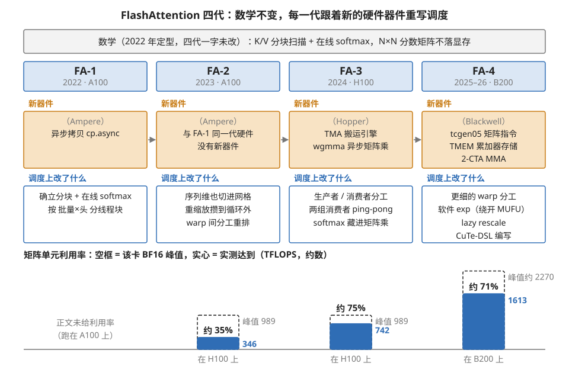
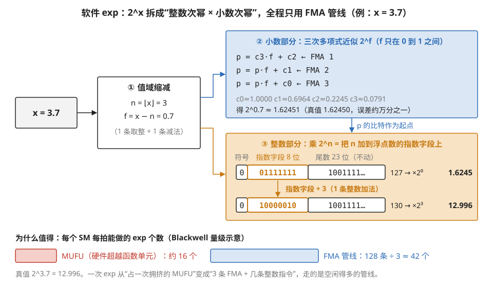
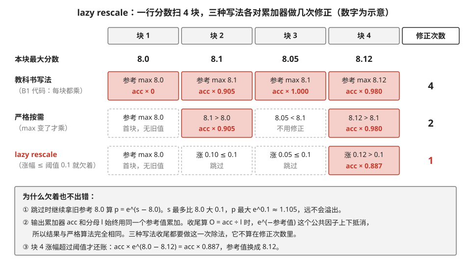
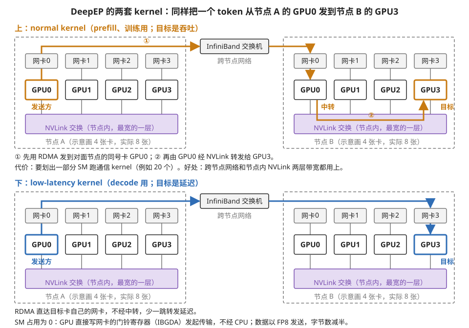
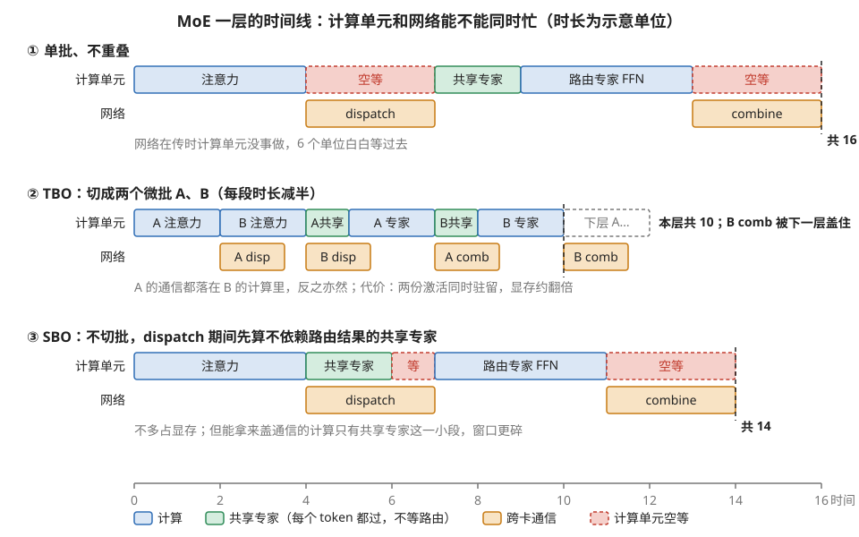
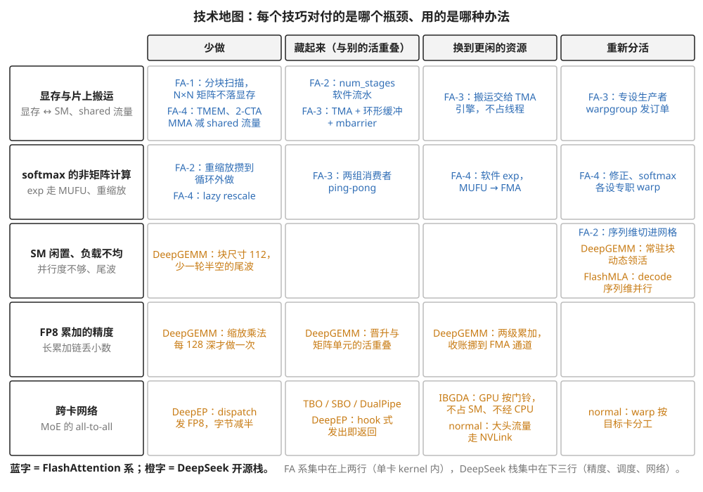

# 附录 A1（模块04）· 业界高质量 kernel 技术图谱：FA 全系 与 DeepSeek 开源栈

> **所属模块**：模块 04 · 软件优化栈（kernel 层的案例延伸；三篇代码精读 B1/B2/B3 的总地图）
> **状态**：✅ 已按写作规范重写（第三版：FA-4 论文已于 2026-03 发表，据此定稿并更新数字。知识截至 2026-08）
> **本节主旨**：用两条线把业界最强的 kernel 串成谱系。第一条线是 **FlashAttention 的四代演化**：数学从第一代之后就没变过，变的全是调度——每当 NVIDIA 给出一批新的异步硬件器件，FA 就重写一次流水线，所以"追 FA 的版本号，等于追 NVIDIA 异步器件的版本号"。第二条线是 **DeepSeek 的开源栈**（DeepGEMM、FlashMLA、DeepEP，以及架在它们之上的 TBO/SBO 调度策略）：它把"藏延迟"这个思想从单个 kernel 内部推到了多卡通信的系统层。两条线最后汇进同一张总表——**藏延迟这一个配方，在栈的每一层各出现一次**。

---

## 0. 这一节要回答的问题

- FA1 → FA2 → FA3 → FA4，每一代到底改了什么？各自绑定哪代硬件的什么器件？
- FA-4 的两个招牌技巧——软件 exp 和 lazy rescale——分别是什么原理？
- DeepSeek 三件套各自站在栈的什么位置？DeepEP 的两套 kernel 差在哪？
- TBO 和 SBO 是什么、站在哪一层、各自的代价是什么？
- "藏延迟"怎么在栈的每一层重现一次？（全库总纲的最终收束）

---

## 1. 基础词汇：先把本节要用的词讲清楚

**计算与调度的分离**。本模块第 4 节的核心概念，本节全程要用：一个 kernel 的"计算"是它算什么（数学），"调度"是它怎么算（谁搬数据、什么顺序、怎么重叠）。同一份数学可以配无数种调度，性能差几十倍。FA 四代史就是这个概念最长的实例。

**异步器件**。硬件里"发出命令就可以走开、稍后再来收货"的部件：Ampere 的异步拷贝（`cp.async`）、Hopper 的 TMA（专职搬运的 DMA 引擎）和 wgmma（发了不等的矩阵乘指令）、Blackwell 的 tcgen05 与 TMEM（矩阵累加器搬进专用存储）。每多一种异步器件，软件就多一段可以拿来重叠的延迟——这是历代 kernel 重写的全部驱动力。

**EP 与 all-to-all**。EP（expert parallelism，专家并行）把 MoE 的专家分散到多张卡上，于是每层出现两次全员通信：dispatch（每张卡把自己的 token 按路由结果发给持有对应专家的卡）和 combine（算完发回来）。这种"每张卡都要给每张卡发一份"的通信模式叫 all-to-all。它发生在 decode 的关键路径上，微秒级都嫌慢——这就是 DeepEP 存在的理由。

**micro-batch（微批）**。把一个批次的数据切成几份小批，让它们错开阶段执行。是"用一份工作的计算盖住另一份工作的通信"的前提——本节 TBO 的核心操作。

---

## 2. 第一条线：FA 四代，一份数学 × 四代调度

### 2.1 不变的部分：数学在 2022 年就定型了

FlashAttention 的数学核心两句话：按块扫描 K/V 让 N×N 分数矩阵不落显存；用 online softmax（边扫边维护 running max/sum 并重缩放）保证结果精确。这套数学从 FA-1 到 FA-4 **一个字没改**。四代之间全部的差异都在调度层——这正是"计算与调度分离"的最佳活教材：数学定型之后，性能还能再翻十倍，全靠重排"谁在什么时候干什么"。

### 2.2 四代走读：每代绑定一批硬件器件

**FA-1（2022，A100）**：开创者。确立 tiling + online softmax 的数学，把 attention 从"HBM 上搬 N×N 三趟"救成"只搬 Q/K/V/O"（这笔账在 01 模块附录 A2 §2.1 手算过：N=4096 时省掉 97% 的搬运）。调度上还很朴素，按 batch×head 分线程块。

**FA-2（2023，A100）**：调度大扫除，三处改进都能落到本库的概念上。第一，**并行度重组**：FA-1 只按 batch×head 切块，算一个例子就知道问题——batch=1、序列 32K、32 个头，总共只有 32 个线程块，而 H100 有 132 个 SM，机器四分之三是空的；FA-2 把序列维也切进并行（每个线程块管一段 query 行），线程块数乘上几十倍，SM 坐满了。第二，**减少非矩阵乘的计算**：把 online softmax 的重缩放从"每块都做"挪到循环外攒着做，少除好几遍。第三，**warp 间分工重排**，减少 shared memory 的中转往返。

**FA-3（2024，Hopper）**：为新器件重写。TMA 管搬运、wgmma 管矩阵乘、warp 分成生产者/消费者、两个消费者 warpgroup 打 ping-pong 把 softmax（MUFU 管线）藏进矩阵乘（Tensor 管线）的影子里。成果：H100 上 Tensor 利用率从 FA-2 的约 35% 提到约 75%。精确时间线在 01 模块附录 A2 §2.5，逐行代码在 B2 精读。

**FA-4（Blackwell；代码 2025 年放出、论文 2026-03 发表）**：**六**处变化。

① **编写工具换代**：改用 CuTe-DSL（Python 写 kernel，由 DSL 直接下沉到 PTX）——注意这是**工具链本身**在换代，不只是 kernel。论文给的收益是编译时间比 C++ 模板方案快 20 到 30 倍，而表达力不打折。
② **矩阵乘走 tcgen05 指令，累加器进 TMEM**（模块 03 第 1 节讲过的新存储，把累加器从寄存器堆里解放出来）。
③ **流水线重新设计**：利用完全异步的 MMA 与更大的 tile 尺寸。
④ **warp 分工更细**（搬运、矩阵乘、softmax、修正、收尾各设专职角色，流水更深）。
⑤ **软件 exp**与⑥ **lazy rescale**（论文里叫 conditional softmax rescaling）——这两个是算法层面的招牌，下面拆开讲。

**还有一处此前的公开材料里没有、要单独记的**：⑦ **用 tensor memory 和 2-CTA MMA 模式减少 shared memory 流量与反向传播里的原子加**。2-CTA MMA 就是模块 03 第 1 节 §4.1 讲的那个"一对线程块共发一条矩阵指令、操作数搬运量减半"的机制——**FA-4 是它第一个大规模的公开用例**。

**性能（论文数据，B200，BF16）**：达到 **1613 TFLOPS，约 71% 的硬件利用率**；比 cuDNN 9.13 快 **1.3 倍**，比 Triton 快 **2.7 倍**；相对 FA-3 的注意力性能约为 **2 到 3 倍**。

**把四代的利用率排在一起，这条线的形状就出来了**：FA-2 在 H100 上约 35%（Tensor 与 MUFU 序列化）→ FA-3 约 75%（ping-pong 把 MUFU 藏进影子）→ FA-4 在 B200 上约 71%。**注意 FA-4 的百分比并没有比 FA-3 更高——因为分母换了**：Blackwell 的峰值算力涨得比带宽和超越函数单元快，所以"贴着峰值跑"这件事一代比一代难。这正是本节要传达的规律：**每一代硬件都会重新制造一批新的不平衡，kernel 的工作就是重新配平一次。**

四代放在一起读出的规律：**每代重写的驱动力都是硬件新器件**（异步拷贝 → TMA/wgmma → tcgen05/TMEM）。所以读 FA 的 release note，等于免费上一堂"本代 GPU 新器件怎么用"的课。图 A1-1 把四代的器件、调度改动和利用率排在了一起。

> **图 A1-1**　一句话：FlashAttention 四代的数学完全相同，每一代改的只是调度，而每次改调度都是因为 GPU 多了一种新的异步器件；利用率的百分比看起来不再上涨，是因为分母（峰值算力）换成了更大的数。
>
> **先知道一件事**："利用率"是实测算力除以这张卡矩阵单元的峰值算力。矩阵单元（Tensor Core）是 GPU 里专门做小矩阵乘的硬件，注意力里两次矩阵乘都在它上面跑；它的峰值随代际变化很大，H100 的 BF16 峰值约 989 TFLOPS（每秒 989 万亿次浮点运算），B200 约 2270 TFLOPS。
>
> **按这个顺序看**：
> 1. 最上方的灰色横条：四代共用的数学。K、V 按块扫过，softmax 边扫边归一化（在线 softmax），N×N 的分数矩阵从不写进显存。
> 2. 橙色格"新器件"：每一代所在的 GPU 新提供了什么异步部件。异步的意思是"发出命令后线程可以去干别的，稍后再来取结果"。FA-2 和 FA-1 用的是同一代 A100，没有新器件，所以 FA-2 是一次纯粹的调度重整。FA-3 遇上 Hopper 的 TMA（专门搬数据的引擎）和 wgmma（发出后不必等待的矩阵乘指令）；FA-4 遇上 Blackwell 的 tcgen05 矩阵指令和 TMEM（专门存放矩阵累加结果的存储）。
> 3. 蓝色格"调度上改了什么"：新器件对应的调度改动。例如 FA-3 有了 TMA，才能让一组线程只负责发搬运命令、另外两组只负责计算。
> 4. 下方的柱：虚线空框是那张卡的峰值，实心部分是实测达到的算力。FA-2 到 FA-3 在同一张 H100 上，实心从约 346 涨到约 742，涨了一倍多。FA-4 换到 B200，实心涨到 1613，但空框也大了一倍多，所以百分比是 71%，反而略低于 FA-3 的 75%。
>
> **看懂的标志**：能回答"FA-4 比 FA-3 快了两倍多，为什么利用率没涨"——因为 Blackwell 的矩阵峰值涨得比带宽和超越函数单元快，其它部件跟不上，kernel 要重新配平才能贴近峰值，贴得越来越难。
>
> **与正文的对照**：346 和 742 由正文的 35%、75% 乘 H100 峰值 989 算出；B200 峰值约 2270 由 1613 ÷ 71% 反推，都是约数。FA-1 正文没有给利用率，图中留空。FA-4 的时间写 2025–26，指代码 2025 年放出、论文 2026 年 3 月发表。
>
> 来源：本库自绘。

### 2.3 FA-4 招牌技巧一：软件 exp——用多项式绕开 MUFU

**问题**：01 模块附录 A2 §2.4 讲过，softmax 的 exp 走 MUFU 管线，吞吐只有 FMA 的零头，是卡在两个矩阵乘之间的老瓶颈。FA-3 用 ping-pong 把它**藏**起来；FA-4 更进一步，把它**搬走**。

**做法**：exp 不用硬件超越函数单元算，改用三次多项式近似，跑在 FFMA 管线上（Blackwell 上 FP32 算力极其充裕）。具体分三步走：

1. **值域缩减**：要算 2^x，把 x 拆成整数部分 n 和小数部分 f（x = n + f，f ∈ [0,1)），于是 2^x = 2^n × 2^f。2^n 不用算——直接把 n 加到浮点数的指数位上，一条整数指令。
2. **多项式近似**：剩下的 2^f 定义域只有 [0,1)，用一个三次多项式拟合，2^f ≈ c₀ + c₁f + c₂f² + c₃f³——霍纳法则展开就是 **3 条 FMA 指令**。
3. **合并**：多项式结果乘上 2^n（指数位操作），完事。

账本：一次 exp ≈ 3 条 FMA + 零星整数操作，全走 FFMA 管线；而 MUFU 版一次 exp 占用吞吐紧张的专用单元。**本质是 01 模块附录 A1"搬瓶颈"思想的指令级版本：把负载从贵且挤的管线（MUFU）搬到便宜且闲的管线（FFMA）**。精度由值域缩减和多项式阶数控制，attention 场景下足够。图 A1-2 用 x = 3.7 把三步走了一遍。

> **图 A1-2**　一句话：算 2 的 x 次方可以不用专门的硬件单元，拆成"小数次方用多项式算、整数次方直接改浮点数的指数位"，全程只用普通的乘加指令。
>
> **先知道一件事**：GPU 的一个 SM（流式多处理器，GPU 里能独立调度执行的基本单元）里有好几条并排的"管线"，各做一类运算。FMA 管线做乘加（a×b+c），一个 SM 每拍能做 128 次；MUFU 是专算 exp、sin、倒数这类超越函数的单元，每拍只能做 16 次左右。softmax 要对每个分数算一次 exp，所以卡在 MUFU 上。
>
> **按这个顺序看**：
> 1. 左边输入 x = 3.7。第①步把它拆成整数部分 n = 3 和小数部分 f = 0.7。于是 2^3.7 = 2^3 × 2^0.7。
> 2. 上方蓝框（第②步）：f 只可能在 0 到 1 之间，在这么窄的范围里，2^f 可以用一个三次多项式逼近得很准。三行代码是霍纳法则：从最高次开始，每一步"乘 f 再加一个系数"，恰好是一条 FMA。算出 2^0.7 ≈ 1.62451，与真值只差约万分之一。
> 3. 下方橙框（第③步）：一个 32 位浮点数由 1 位符号、8 位指数字段、23 位尾数组成，数值 = 尾数 × 2^(指数字段 − 127)。1.6245 的指数字段是 127（即 ×2⁰）。给指数字段加 3 变成 130，尾数不动，数值就乘了 2³，变成 12.996。这一步只要一条整数加法。
> 4. 最下方的两条色块：按每拍每个 SM 能完成的 exp 个数比较。MUFU 约 16 个；FMA 管线 128 条，一个 exp 用 3 条，约 42 个。
>
> **打个比方**：算 2^3.7，心算高手不会硬算，而是先说"2 的 3 次方是 8"，再查一张小表得"2 的 0.7 次方约 1.62"，最后相乘。第③步相当于"乘 8"不用真乘，只是把小数点挪位。
>
> **看懂的标志**：能说出软件 exp 的收益从哪来——不是算得更少（3 条 FMA 加几条整数指令，比 1 条 MUFU 指令多），而是换到了一条宽得多、原本闲着的管线上。
>
> **与正文的对照**：多项式系数是本库按 [0,1) 区间拟合的示意值，FA-4 实际用的系数和误差控制以论文为准。每拍的 exp 个数只计入 3 条 FMA，忽略了取整和整数加法，是量级示意。
>
> 来源：本库自绘。

### 2.4 FA-4 招牌技巧二：lazy rescale——把"每块必做"变成"按需做"

**问题**：online softmax 每扫一个新块，如果新块里出现了更大的最大值，就要用它重缩放已累计的输出（correction，一轮乘法过一遍累加器）。教科书写法是每块都做。

**观察**：实际的 attention 分数里，running max 很少剧烈变化——扫过几块之后最大值基本稳定。**举个走查**：某行扫 4 块，各块局部最大值依次是 8.0、8.1、8.05、8.12。严格算法要在第 2、4 块后各做一轮 correction（max 变大了）；但 8.0 和 8.1 差多少？缩放因子是 e^(8.0−8.1) ≈ 0.90——累加器只差 10%，而后续归一化反正会除以总和。FA-4 设一个阈值：max 的变化不超过阈值就**跳过这轮 correction，把修正债务攒着**，等变化真正大了（或最后收尾时）一次算清。上面的例子里 4 轮 correction 可能只剩 1 轮（图 A1-3 按阈值 0.1 逐块走了一遍）。

> **图 A1-3**　一句话：running max 只小幅上涨时先不去修正已经累加的结果，等涨幅超过阈值才修正一次，最终结果与每块都修正完全相同。
>
> **先知道一件事**：在线 softmax 逐块处理一行分数，维护三样东西：到目前为止见过的最大分数（running max，下称"参考值"）、分母 l（各分数减去参考值后取 exp 的和）、输出累加器 acc（同样按参考值加权累加的 V）。参考值一换，旧的 l 和 acc 就是按旧参考值算的，要乘一个系数 e^(旧 − 新) 才能对齐，这一步就是 correction（修正）。
>
> **按这个顺序看**：
> 1. 第一行：四个块各自的最大分数 8.0、8.1、8.05、8.12。
> 2. "教科书写法"一行：B1 代码的写法，每块不管 max 变没变都执行 acc × alpha，共 4 次（块 1 的旧值是空的，乘的是 0）。块 3 的 max 没变，乘的是 1.000，白做一遍。
> 3. "严格按需"一行：只在 max 真的变大时修正。块 2 从 8.0 涨到 8.1，乘 e^(8.0−8.1) ≈ 0.905；块 4 从 8.1 涨到 8.12，乘 0.980。共 2 次。
> 4. "lazy rescale"一行（红字）：参考值定在 8.0 后先不动。块 2 涨 0.10、块 3 涨 0.05，都没超过阈值 0.1，跳过；块 4 涨 0.12，超过了，才乘 e^(8.0−8.12) ≈ 0.887，把参考值换成 8.12。共 1 次。
> 5. 下方灰框：为什么跳过不出错。跳过期间分数减的是偏小的参考值，e 的指数最多是 0.1，结果最多 1.105，不会溢出；acc 和 l 始终按同一个参考值累加，收尾做 acc ÷ l 时公共因子上下相消。
>
> **打个比方**：记账时汇率天天小幅波动，不必每天把全部旧账按新汇率重算一遍；只要所有收入和支出都用同一个旧汇率记，最后算比例时汇率自然约掉。只有汇率变动大到可能让数字失真时，才整体换算一次。
>
> **看懂的标志**：能回答"为什么编译器做不出这个优化"——跳过是否安全，取决于"max 通常只小幅变化"这个关于数据的经验，编译器只看得到代码，看不到数据的分布。
>
> **与正文的对照**：阈值 0.1 是为了让这个小例子恰好出现一次修正而取的示意值，FA-4 实际的阈值以论文为准。
>
> 来源：本库自绘。

**边界必须说清**：最终结果仍然精确归一化（数学不变，只是延迟了修正时机），但这是**人在改算法的执行策略**，不是改调度——编译器永远做不出这种优化，因为它需要"max 通常变化不大"这个只有算法作者知道的领域知识。本模块第 3 节"编译器只能重排、不能改写算法"的又一枚例证。

---

## 3. 第二条线：DeepSeek 开源栈——藏延迟爬上系统层

2025 年 DeepSeek 开源周放出的三件套加两个系统级策略，代表极限工程的另一条线。背景是 MoE 时代的瓶颈迁移：模型的专家分散在几十张卡上，**每层两次 all-to-all 通信挤在 decode 的关键路径上**——单卡 kernel 再快，卡在网络上照样白搭。

### 3.1 三件套速览：各站在栈的什么位置

| 组件 | 是什么 | 招牌技术（逐个就地解释） |
| --- | --- | --- |
| **DeepGEMM** | FP8 矩阵乘库，含 MoE 用的 Grouped GEMM | **JIT 现编**：等运行时形状已知才编译 kernel，把"编译期不知道形状"这个信息衰减（本模块第 1 节的题眼）反过来用；**细粒度 FP8 缩放**：每 128 个数配一个缩放因子，配合两级累加保精度；核心刻意精简到几百行 |
| **FlashMLA** | MLA（DeepSeek 的低 KV 占用 attention 变体）的 decode kernel | paged KV cache、变长序列调度、decode 侧的序列维并行——FlashAttention 的思想在 MLA 结构上重做一遍 |
| **DeepEP** | EP 专用的 all-to-all 通信库（dispatch 与 combine 两个原语） | 见 §3.2 |

三件套的代码级精读在 B3；本节只负责把它们钉到地图上。

### 3.2 DeepEP：通信也是 kernel

先立住一个观念：**把数据从本卡显存发到别卡，本身就是一段跑在 SM 上的程序**（打包、算目的地、发起传输），或者干脆绕开 SM 让网卡直接搬（RDMA）。通信库不是黑盒子，它的 kernel 和计算 kernel 用同一套武器。DeepEP 按场景提供两套：

| | **normal kernel**（prefill / 训练） | **low-latency kernel**（decode） |
| --- | --- | --- |
| 优化目标 | 吞吐最大 | 延迟最小 |
| 传输路径 | **NVLink 与 RDMA 接力**：跨节点数据先走 RDMA 到对面节点的某张卡，再由它经 NVLink 分发给最终目的卡——两层带宽都榨到（模块 03 第 2 节四层地图的实战） | **纯 RDMA 直达**：跳过接力省转发延迟 |
| SM 占用 | 占用一部分 SM 跑通信 kernel，不同 warp 分管不同目标卡 | **零 SM 占用**：靠 IBGDA——GPU 直接写网卡的门铃寄存器发起 RDMA，不劳驾 CPU、也不占计算资源 |
| 与计算的重叠方式 | 和计算 kernel 分 SM 并排跑 | **hook 式**：发送调用立即返回，计算跑完后"钩"一下收尾——通信全程躲在计算背后 |
| 一个名场面 | 用了 `ld.global.nc.L1::no_allocate`（读一次性数据时提示不要污染 L1——技术上越出文档保证的 PTX 用法，实测更快），把栈压榨到 ISA 边缘 | dispatch 直接发 FP8，带宽减半 |

这两套的代码走查（fence 的位置、门铃怎么按、hook 怎么收尾）在 B3 §3。两条传输路径的差别见图 A1-4。

> **图 A1-4**　一句话：DeepEP 的 normal kernel 让跨节点的数据"先过网络到对面同号卡、再走节点内高速链路转交"，为的是吞吐；low-latency kernel 让数据经网络直达目标卡，为的是少一跳，并且完全不占计算单元。
>
> **先知道一件事**：一台服务器（节点）里的多张 GPU 之间用 NVLink 相连，带宽很宽；不同节点之间要经过网卡和网络交换机，走 RDMA（远程直接内存访问：一台机器的网卡把数据直接写进另一台机器的显存，不需要对方 CPU 参与），带宽窄得多。MoE 的 dispatch 要把每个 token 送到持有它所选专家的那张卡上，目标卡可能在别的节点。
>
> **按这个顺序看**：
> 1. 先认拓扑：左右两个虚线框是节点 A、B，每个节点画了 4 张 GPU（实际 8 张），每张 GPU 上方是它自己的网卡，下方的紫色横条是节点内的 NVLink 交换。两个节点之间只经中间的 InfiniBand 交换机相连。
> 2. 上幅（橙色，normal）：节点 A 的 GPU0 要把 token 发给节点 B 的 GPU3。第①段经网卡和交换机，只送到节点 B 的同号卡 GPU0；第②段由 GPU0 经 NVLink 转给 GPU3。跨节点那一段只在同号卡之间走，节点内的分发交给更宽的 NVLink。代价是收发和转交都要有程序在 SM（GPU 的计算单元）上跑，要划出一部分 SM 给通信用。
> 3. 下幅（蓝色，low-latency）：同一个 token 经网络直接送到节点 B 的 GPU3 的网卡，没有中转。发起这次传输的是 GPU 自己：它直接往网卡的"门铃"寄存器写一个值，网卡就开始搬（IBGDA）。整个过程既不经过 CPU，也不需要在 SM 上常驻一个通信程序。
>
> **打个比方**：normal 像快递先用干线运到对方城市的同名网点，再由市内配送送到门口，干线车次少、装得满；low-latency 像专人直送，路上不换手，最快，但每一单都单独走网络。
>
> **看懂的标志**：能回答"decode 为什么选下面那套"——decode 每步只有很少的 token，数据量小，时间主要花在延迟上，省掉一次中转和 CPU 协调最划算；而且它不占 SM，计算可以照常进行。
>
> **与正文的对照**："例如 20 个 SM"取自本节术语卡里的例句，是示意数。每节点实际 8 张卡、每张卡配一块网卡是 H800 集群的常见配置。
>
> 来源：本库自绘。

### 3.3 TBO 与 SBO：架在 DeepEP 之上的调度策略

**先把站位钉死，这是听方案时最容易挂错的点**：TBO 和 SBO **不是 DeepEP 里的 kernel 技术**，而是推理引擎/运行时层面的调度策略——DeepEP 只是提供了"可以被重叠的通信原语"这种原料，怎么重叠是上层的事。

**TBO（Two-Batch Overlap，双批重叠）**：把一个批切成两个微批，错开半个相位执行——**A 在算 attention 的时候，B 正在做 MoE 的 all-to-all**。画出时间线（一层之内）：

| 时刻 → | t0 | t1 | t2 | t3 |
| --- | --- | --- | --- | --- |
| 微批 A | attention 计算 | **dispatch 通信** | 专家 FFN 计算 | **combine 通信** |
| 微批 B | — | attention 计算 | **dispatch 通信** | 专家 FFN 计算 |
| GPU 计算单元在干嘛 | A | B | A | B ← 通信时段始终有人在算 |

每个时刻都有一个微批在用计算单元、另一个在走网络——**通信被完全盖住**。眼熟吗？这张表和 FA-3 的 ping-pong 时间线（01 模块附录 A2 §2.5）结构一模一样，只是"两个 warpgroup 重叠 Tensor 和 MUFU"换成了"两个微批重叠计算和网络"。训练侧同一思想叫 DualPipe（DeepSeek-V3 论文）。**代价**：两份微批的激活同时驻留，显存约翻倍；批要够大才切得动。

**SBO（Single-Batch Overlap，单批重叠）**：不切批，在单个批内部找更细的重叠缝——比如 dispatch 通信进行时，让不需要等路由结果的**共享专家**（每个 token 都要过的那部分 FFN）先算着。省掉 TBO 的显存翻倍，代价是重叠窗口更碎、要求 kernel 拆得更细——DeepEP 的 hook 式接口（发出即返回、事后钩收尾）正是为这种细粒度准备的。SGLang 的 DeepSeek 部署走这条路。

**选择逻辑**：prefill 批大显存松 → TBO；decode 显存紧、批切不动 → SBO 加 low-latency kernel。

图 A1-5 把不重叠、TBO、SBO 三种排法放在同一条时间轴上比较。

> **图 A1-5**　一句话：MoE 的一层里有两段跨卡通信，单批按顺序跑时计算单元会在通信期间空等；TBO 靠两个微批交错把通信完全盖住，SBO 不切批，只能拿不依赖通信结果的共享专家去盖一部分。
>
> **先知道一件事**：GPU 的计算单元和网络是两套独立的硬件，可以同时工作。但同一份数据的计算和通信有先后依赖：专家要等 dispatch 把 token 送到才能算，结果要算完才能 combine 发回。重叠的办法就是找另一份"不依赖这段通信"的工作来填空档。
>
> **按这个顺序看**：
> 1. 每一幅有两道：上面是计算单元在做什么，下面是网络在传什么。横轴是时间，单位是示意的。蓝色是注意力和路由专家的计算，绿色是共享专家（每个 token 都要过的那部分 FFN，不需要等路由结果），橙色是跨卡通信，红色虚线框是计算单元空等。
> 2. 第①幅：注意力算完，dispatch 传 3 个单位，这期间计算单元没事做；combine 期间又空等 3 个单位。一层共 16，其中 6 个单位白等。
> 3. 第②幅 TBO：批切成 A、B 两半，每段计算时长减半。A 做 dispatch 时，计算单元在算 B 的注意力；B 做 dispatch 时，计算单元在算 A 的共享专家和专家 FFN。计算道从 0 到 10 一格不空，10 正好等于这一层计算量的总和（4+2+4）。最后 B 的 combine 落在下一层 A 的注意力里。
> 4. 第③幅 SBO：不切批。dispatch 那 3 个单位里先算 2 个单位的共享专家，还剩 1 个单位空等；combine 这次没有可以拿来盖的计算，照样露在外面。一层共 14，比①省 2，但不如②。
>
> **打个比方**：两位厨师共用一个灶台。一个人等食材送来时，另一个人正好用灶台炒菜，灶台一直不闲，这是 TBO；只有一个人时，等食材的空档只能先切一点不需要新食材的配菜，这是 SBO。
>
> **看懂的标志**：能说出 TBO 省下的时间是用什么换来的——两个微批的激活同时留在显存里，显存占用约翻倍；而且批要大到切成两半后每半仍然值得算。decode 批小、显存紧，这两条都不满足，所以改用 SBO。
>
> **与正文的对照**：第②幅与 §3.3 的 TBO 表是同一个排法，表里的 t0～t3 在图中对应 0～8 这一段。各段时长是为了说明而取的示意值，实际比例取决于模型、批大小和网络。
>
> 来源：本库自绘。

### 3.4 收束：藏延迟在栈的每层各现一次身

把全库讲过的"藏延迟"案例按层排开：

| 层 | 藏的是什么延迟 | 手段 | 讲在哪 |
| --- | --- | --- | --- |
| 指令级 | 算术指令 4–6 拍 | 多累加器 ILP、编译器控制位 | 01 模块第 2 节 |
| warp 级 | 访存几百拍 | 占用率、warp 车轮战 | 01 模块第 2 节 |
| kernel 内 | HBM→shared 的搬运 | 软件流水（num_stages）、warp 分工、ping-pong | 本模块第 4 节 §7、B2 |
| kernel 间 | 启动与依赖的空隙 | 多 stream、CUDA Graph | 本模块第 6 节 |
| **系统级** | **跨卡 all-to-all（微秒到毫秒）** | **TBO/SBO、hook 式通信、DualPipe** | 本节 |

五层的配方一字不差：**找到两件相互独立的事，让一件的等待藏进另一件的忙碌**。区别只是"事"的粒度——从两条指令，到两个 warp，到两级缓冲，到两条 stream，到两个微批。从 01 模块第 2 节的 warp 车轮战读到这里的 TBO，同一个思想爬完了整条栈——这张表就是全库的最后一块拼图。

上表按"藏"这一种办法梳理；本节的技巧其实用了四种办法。图 A1-6 把两条线上的全部技巧按"对付哪个瓶颈、用哪种办法"排成一张地图。

> **图 A1-6**　一句话：本节的所有技巧都可以归到"对付哪个瓶颈"和"用哪种办法"这两个维度上；FlashAttention 系主要对付单个 kernel 里的搬运和 softmax，DeepSeek 栈主要对付精度、负载不均和跨卡网络。
>
> **先知道一件事**：瓶颈是"最先被用满、拖住其它部件的那个资源"。对付瓶颈只有四种办法：让它的活变少（少做）；让它干活的时候别人也在干活（藏起来）；把活交给另一个较闲的部件（换资源）；重新安排谁干哪份活，让大家都有活干（重新分活）。
>
> **按这个顺序看**：
> 1. 先看左侧五行瓶颈。"片上搬运"指数据在显存（HBM，GPU 板上的大容量内存）和 SM 内部小存储（shared memory）之间的搬运；"非矩阵计算"指 softmax 里的 exp（走 MUFU，专算超越函数的慢单元）和重缩放；"SM 闲置"指有的计算单元没活干；"FP8 累加的精度"指 8 位浮点矩阵乘累加得太长会丢小数；"跨卡网络"指 MoE 在卡间收发 token。
> 2. 再看顶上四列办法，然后逐格看。例如第二行：FA-2 把重缩放挪到循环外、FA-4 的 lazy rescale 都是"少做"；FA-3 两组线程轮流用矩阵单元是"藏起来"；FA-4 用多项式在 FMA（普通乘加管线）上算 exp 是"换资源"。
> 3. 看颜色分布：蓝字（FA 系）集中在上两行，橙字（DeepSeek 栈）集中在下三行。同一种办法在不同行反复出现，例如"藏起来"在第一行是软件流水，在最后一行是 TBO/SBO。
> 4. 空格也有信息：例如"SM 闲置"这一行几乎只能靠重新分活解决，藏或换资源都用不上。
>
> **看懂的标志**：拿到一个没见过的新 kernel 技巧，能先问出两个问题并归位——它瞄准哪个瓶颈？它是少做、藏、换资源还是重新分活？例如 DeepGEMM 的两级累加：瓶颈是 FP8 精度，办法是把收账这件事换到空闲的 FMA 通道。
>
> **与正文的对照**：格子里的条目均来自本节 §2、§3 和 B3 精读；DeepGEMM 的块尺寸 112、晋升与矩阵乘重叠、常驻块动态领活三条在 B3 §2 展开。图中几个缩写：TMA 是 Hopper 上专门搬数据的引擎；mbarrier 是能按"到货字节数"放行的屏障；TMEM 是 Blackwell 上专放矩阵累加结果的存储；2-CTA MMA 是两个线程块合发一条矩阵指令、各自少搬一半操作数的模式；IBGDA 是 GPU 直接按网卡门铃发起跨机传输。
>
> 来源：本库自绘。

---

## 4. 开发者视角

- **FA 系**：绝大多数人只需要调库（`flash_attn`、cuDNN、FlexAttention），但**读它们的 release note 是免费的硬件新特性教材**——FA-3 的 note 教你 Hopper 的器件，FA-4 的 note 教你 Blackwell 的。
- **DeepSeek 栈**：vLLM 和 SGLang 都已集成（DeepEP + DeepGEMM 后端）。部署 MoE 时你真正拨的旋钮是**重叠模式的选择**（TBO 还是 SBO），判断依据就是 §3.3 结尾那两行。
- **判词训练**（模块 00 判词法的实战）：听到 wgmma / TMEM / ping-pong——单 kernel 内的调度，kernel 层；听到 dispatch / combine / IBGDA——通信 kernel，还是 kernel 层，只是对象换成网络；听到 TBO / SBO / DualPipe——系统级调度策略，运行时层往上。三组词分家，会议上挂错层会闹笑话。

## 5. 最新架构落点（时效锚点 · 知识截至 2026-08）

- **FA-4 已定稿**：论文《FlashAttention-4: Algorithm and Kernel Pipelining Co-Design for Asymmetric Hardware Scaling》2026-03 发表（arXiv 2603.05451，MLSys 2026）。它是 Blackwell 专属（tcgen05 / TMEM / 2-CTA MMA / CuTe-DSL 缺一不可）。**论文标题里的 "Asymmetric Hardware Scaling"（不对称的硬件缩放）值得记住**——它一句话概括了 §2.2 结尾那条规律：算力、带宽、超越函数单元三者不按同一速度增长，每一代都要重新配平。
- **FA-4 已接入 PyTorch 的 FlexAttention**，也就是说模块 04 第 4 节讲的"注意力变体参数化"这条自动化路线，现在直接站在 FA-4 的肩膀上——**过去必须手写 FA 变体的领地又被自动档吃掉一块**。
- **稀疏注意力进入生产**：DeepSeek 的 DSA（模块 04 第 8 节 §6）把"减少 KV 字节数"的老路换成了"减少参与计算的 token 数"。它对本节的意义是：**kernel 的形态从"密集分块扫描"变成了"索引器 + 块级 gather"**，FA 系列那套"K/V 顺序扫过去"的流水假设不再天然成立。
- **DeepEP** 是为 H800（NVLink 带宽受限的出口版）加 InfiniBand 的环境设计的；在全带宽 NVL72 / NVL144 域上"NVLink 接力"的价值会变化，形态可能演化。IBGDA 依赖 NVSHMEM 生态。
- **通信-计算融合是活跃前沿**：NCCL 的 kernel 融合、Triton-distributed、各推理引擎的 overlap 调度都在往同一个方向走——**通信成为 kernel 层的一等公民**。

## 6. 术语卡

### 软件 exp（多项式指数近似）

**定义**：不用硬件超越函数单元（MUFU）算 exp，而是值域缩减后用三次多项式在 FMA 管线上近似——一次 exp 摊约 3 条 FMA 指令。FA-4 的招牌技巧之一。

**为什么存在**：MUFU 吞吐只有 FMA 的零头，attention 里 O(N²) 次 exp 足以拖慢 Tensor Core；FA-3 用重叠"藏"这个瓶颈，软件 exp 直接把负载"搬"到充裕的 FMA 管线上——搬瓶颈思想做到了指令级。

**语境例句**："FA-4 连 exp 都不走 SFU 了，多项式直接在 FFMA 上算，MUFU 那条管线彻底闲下来。"——意思是：超越函数被改写成乘加序列，瓶颈管线换人。

### lazy rescale（惰性重缩放）

**定义**：online softmax 中，running max 变化不超过阈值就跳过对累加器的重缩放，把修正攒到必要时一次做。最终归一化仍然精确。

**为什么存在**：教科书版每块都要过一遍累加器做 correction，但实际分数的最大值很快稳定、多数 correction 的缩放因子接近 1——是可以赖掉的活。这是"人改算法执行策略"的典型：依赖编译器不可能知道的领域知识（max 通常稳定）。

**语境例句**："correction 开销砍掉大半，靠的是 lazy rescale——max 没怎么动就先欠着账。"——意思是：修正被按需化，数学不变，工作量大减。

### 通信 kernel

**定义**：完成跨卡数据搬运的 GPU 程序。它或者跑在 SM 上（打包、寻址、发起传输），或者通过 IBGDA 让 GPU 直接指挥网卡搬运而不占 SM。DeepEP 的 dispatch/combine 就是两个通信 kernel。

**为什么存在**：把"通信"当黑盒会漏掉一整层优化空间——通信 kernel 和计算 kernel 用同一套武器（warp 分工、fence、异步接口），也抢同一批资源（SM、显存带宽）。承认"通信也是 kernel"，才谈得上通信-计算重叠的精细设计。

**语境例句**："normal 模式的 dispatch 要吃 20 个 SM，你的 GEMM 得给它让位。"——意思是：通信 kernel 占用计算资源，容量规划要把它算进去。

### TBO（Two-Batch Overlap，双批重叠）

**定义**：把一个批切成两个微批、错开半个相位，让 A 的计算时段盖住 B 的 all-to-all 通信时段，反之亦然。训练侧的同思想叫 DualPipe。

**为什么存在**：MoE 的 all-to-all 挤在关键路径上，单批执行时通信时段计算单元干等；两个微批的"计算/通信"天然互补，拼起来就把网络时间完全藏掉。代价是两份激活并存、显存约翻倍。

**语境例句**："prefill 上了 TBO 之后 all-to-all 基本免费，就是显存水位得盯着。"——意思是：通信被另一微批的计算盖住，换来的是激活占用翻倍。

### SBO（Single-Batch Overlap，单批重叠）

**定义**：不切批，在单个批内部按算子阶段找重叠——如 dispatch 通信与共享专家计算并行。依赖 hook 式的细粒度通信接口。

**为什么存在**：decode 阶段显存紧、批小，TBO 的"显存翻倍"和"批要够大"两个前提都不成立；SBO 用更碎的重叠窗口换来零额外显存，适配 decode 的约束。

**语境例句**："decode 走 SBO，dispatch 藏在 shared expert 后面，显存一点不多吃。"——意思是：单批内部找到了不依赖路由结果的计算来盖通信。

### FlashMLA

**定义**：DeepSeek 开源的 MLA attention 的 decode kernel，支持 paged KV cache 和变长序列调度。MLA 是 DeepSeek 的低 KV 占用 attention 变体（KV 压缩成低秩隐向量）。

**为什么存在**：MLA 改变了 attention 的数学结构（04 模块第 8 节的"结构"传导链），FA 系 kernel 的布局假设不再适用，必须为新结构重做一份"FlashAttention 式"的 kernel——算法与 kernel 协同设计的又一例。

**语境例句**："换 MLA 不是改个配置就完了，得有 FlashMLA 这种配套 kernel，不然省下的 KV 全被慢 kernel 吐回去。"——意思是：算法结构变了，kernel 层必须跟着重写才能兑现收益。

## 7. 我的困惑 / 待深挖

- FA-4 软件 exp 的精度账：多项式阶数、ULP 误差、吞吐三者的实测曲线？（论文已发表，可以去查一手数据了）
- lazy rescale 的阈值怎么定？对长尾 logits 这类极端数值分布的稳定性影响？
- IBGDA 门铃机制的细节；NVSHMEM 对称堆在多租户环境下的约束？
- TBO 与 SBO 的收益边界：什么 batch 和形状下 SBO 反超 TBO？重叠率在 profile 里怎么量？
- DeepGEMM 的 JIT 编译延迟怎么摊销（缓存策略）？与 Triton autotune 缓存的异同？

---

*最后更新：2026-08-31（第三版：FA-4 论文发表后定稿——补入第七处变化（2-CTA MMA 与 TMEM 减流量）、更新性能数字到 1613 TFLOPS / 71%，并补上"四代利用率百分比不单调"背后的分母问题；§5 更新到 2026-08。第二版：按写作规范重写）（2026-09 补图 6 张：现成 0 张，自绘 6 张；图注按费曼法写）*
