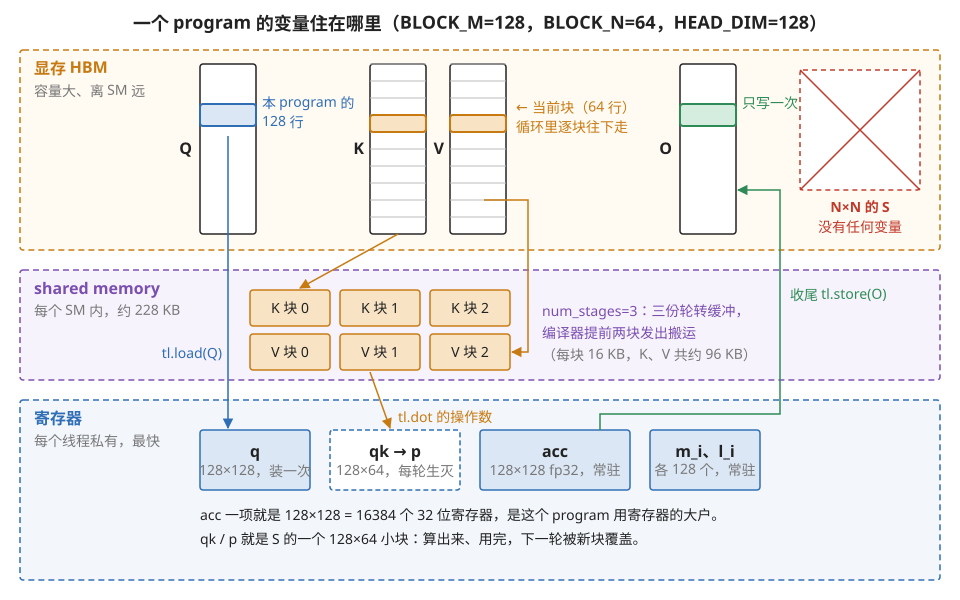
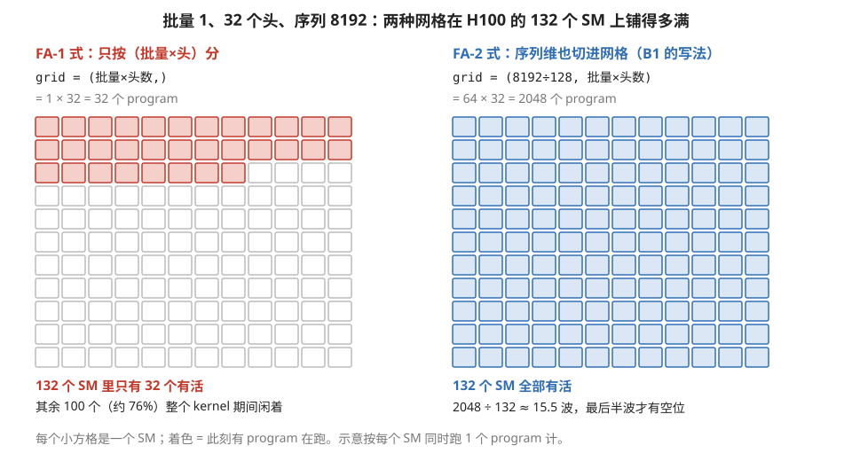
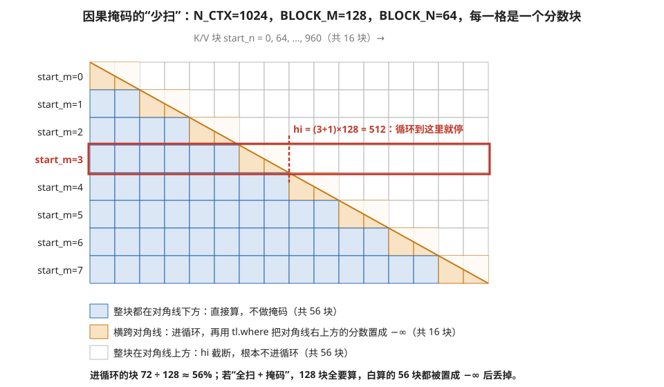
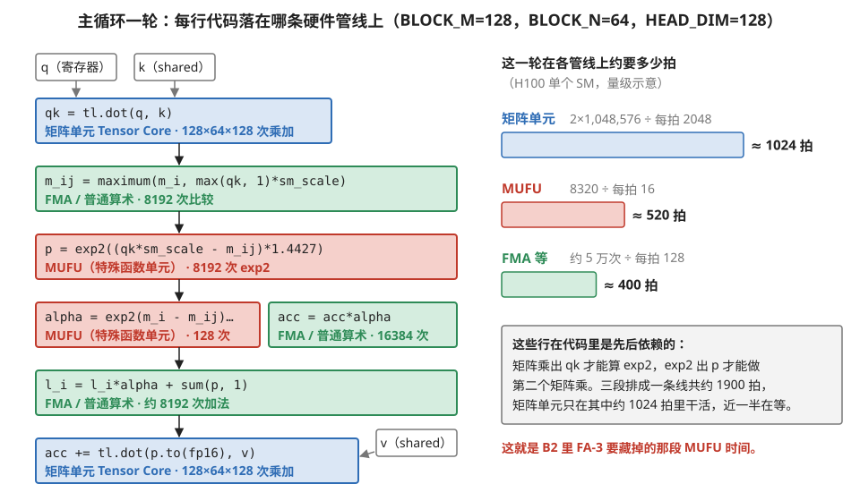

# B1 · 代码精读：Triton 版 FlashAttention-2 前向

> **所属系列**：模块 04 · 代码精读 B 系列（B1 → B2 FA-3 → B3 DeepSeek 栈）
> **状态**：🟨 学习中（第二版：按《写作规范》重写。代码是 Triton 官方 fused-attention 教程的简化重写，保留全部关键结构；知识截至 2026-01——**代码结构与机制不受时效影响；对应的最新代际信息见附录 A1 与模块 05 第 1 节 §6**）
> **本篇主旨**：用一个约 60 行的真实 kernel，把全库概念第一次**在代码里**串起来。精读方法是对每段代码问三个问题：**它是映射四维（模块 04 第 7 节）里哪一维的决策？编译之后在硬件上变成什么？如果写错了会发生什么？** 读完本篇，你应该能对任何 Triton kernel 做同样的"三问精读"。

---

## 0. 这一篇要回答的问题

- FlashAttention 的映射方案（四维决策）在代码里分别长什么样？
- Triton 的几个关键写法（program_id、块指针、tl.dot）各自背后是哪些硬件机制？
- 代码里哪几行是"性能命门"——改错会掉一个数量级？
- 写完一个 Triton kernel，怎么验证它真的按预期跑在硬件上？

## 1. 基础词汇：先把 Triton 的编程模型讲清楚

读代码前，四个 Triton 概念需要先建立（都能在模块 04 第 1、3 节找到上下文）：

**program（程序实例）**。Triton 的基本执行单位：你写的 kernel 函数会被启动成一个二维或三维网格的许多份"实例"，每份处理数据的一小块。一个 program 编译后对应 GPU 的一个线程块——但 Triton 刻意向你隐藏线程，**你面对的最小单位就是"一块数据"**，块内怎么分线程由编译器决定。

**块指针（block pointer）**。用 `tl.make_block_ptr` 声明的"我要按某个形状的块访问这个张量"的对象。它比裸指针多携带了形状、步长、边界信息——这些信息让编译器能生成整块的高效搬运（在新硬件上直接用 TMA 搬运引擎，模块 01 第 4 节）、自动处理越界、自动安排防 bank 冲突的存放格式（swizzle，同节）。

**`tl.dot`**。Triton 的矩阵乘原语：两个块相乘。它是**通往 Tensor Core 的唯一大门**（模块 03 第 1 节）——编译器把它下沉成矩阵指令；反过来说，自己写乘加循环**永远不会**被升级成矩阵指令。

**在线 softmax（online softmax）**。FlashAttention 的数学核心：softmax 本需先看到整行才能归一化（分母是整行的和），在线版改成"逐块处理、维护运行中的最大值和分母、来了新块就把旧累加值重新缩放"——让归一化可以分块进行，中间矩阵因此不必完整存在。这是模块 04 第 7 节说的"反向映射"（为了放置目标改写数学）的那次改写。

## 2. 先看全景：这个 kernel 的映射方案

计算目标：`O = softmax(Q·Kᵀ×缩放)·V`，输入形状是[批量, 头数, 序列长, 头维]，带因果掩码（每个位置只能看见自己和之前的位置）。用映射四维的语言，方案是：

- **绑定**：每个 program 负责"某个（批量,头）里的一条 Q 行块"——即输出矩阵的 BLOCK_M 行。
- **切分**：Q 按 BLOCK_M 行切；K/V 沿序列方向按 BLOCK_N 列切，在循环中逐块流过。
- **顺序**：外层循环沿 K/V 块扫描（因果场景只扫下三角部分）；在线 softmax 边扫边归一。
- **放置**（灵魂所在）：Q 的块**装载一次、整个循环反复用**；输出累加器和 softmax 的运行统计量**全程驻留寄存器**；K/V 块流经 shared memory；**而那个"序列长×序列长"的中间分数矩阵，从头到尾没有变量与之对应——它只以小块形式在寄存器里生灭，从不落显存**。这最后一条就是 FlashAttention 的全部秘密在代码里的形态。

图 B1-1 把这份放置方案画成了三层存储里的变量分布，后面逐段精读时可以随时回来对照。



> **图 B1-1**　一句话：这个 kernel 的每个变量都住在确定的一层存储里：Q 块和累加器常驻最快的寄存器，K、V 一块块流经 SM 内的 shared memory，那个 N×N 的分数矩阵在任何一层都没有完整的位置。
>
> **先知道一件事**：GPU 上的数据可以放在三层地方，越往下越快、越小。显存（HBM）在 GPU 芯片旁边，几十 GB，离计算单元远；shared memory 在每个 SM（GPU 里独立执行的计算单元）内部，一个 SM 约 228 KB，同一个线程块的线程共用；寄存器是每个线程私有的，读写最快，但整个 SM 只有 65536 个 32 位寄存器。一个 program 在 Triton 里编译成一个线程块，跑在一个 SM 上。
>
> **按这个顺序看**：
> 1. 最上层显存：Q、K、V、O 是一个（批量，头）的完整张量，竖着画，高度代表序列长 N_CTX。Q 里蓝色的一段是本 program 负责的 128 行；O 里绿色的对应段是它最后要写的地方，整个 kernel 只写这一次。
> 2. K、V 里橙色的是当前这一轮用到的 64 行块。循环每转一轮，这个块往下挪一格（代码里的 `tl.advance`）。
> 3. 右上角打叉的方框：N×N 的分数矩阵 S。代码里没有任何变量对应它，所以显存里从不存在它。
> 4. 中间层 shared memory：K、V 各有三份缓冲（`num_stages=3`）。编译器让搬运提前两块发出，计算用第 0 份时，第 1、2 份正在从显存往里搬。每块 64×128 个 16 位数，16 KB，K、V 合计约 96 KB。
> 5. 最下层寄存器：`q` 装一次、整个循环反复用；`acc`（输出累加器，32 位）和 `m_i`、`l_i`（每行的运行最大值和分母）整个循环常驻；虚线框的 `qk → p` 就是 S 的一个 128×64 小块，每轮算出、用完、下一轮被覆盖。
>
> **打个比方**：显存是仓库，shared memory 是车间门口的周转架，寄存器是工人手里的工作台。Q 块一直摆在工作台上，K、V 从仓库经周转架一批批送过来，加工中间的边角料（S 的小块）用完就扫掉，从不送回仓库。
>
> **看懂的标志**：能回答"为什么这个 kernel 的占用率天生不高"——光 `acc` 就占 128×128 = 16384 个寄存器，是 SM 寄存器总数的四分之一，一个 SM 同时放不下几个这样的 program。
>
> **与正文的对照**：块尺寸取 §3.1 第一组配置（BLOCK_M=128，BLOCK_N=64）并设 HEAD_DIM=128；shared memory 的用量是按"K、V 各三份"估算的示意值，实际由编译器决定。
>
> 来源：本库自绘。

## 3. 逐段精读

### 3.1 调优装饰器：调度空间的入口

```python
@triton.autotune(
    configs=[
        triton.Config({'BLOCK_M': 128, 'BLOCK_N': 64},  num_warps=4, num_stages=3),
        triton.Config({'BLOCK_M': 128, 'BLOCK_N': 128}, num_warps=8, num_stages=3),
        triton.Config({'BLOCK_M': 64,  'BLOCK_N': 64},  num_warps=4, num_stages=4),
    ],
    key=['N_CTX', 'HEAD_DIM'],    # 这两个形状参数变了，才重新搜索
)
@triton.jit
def _attn_fwd(...):
```

**【映射】** 这就是模块 04 第 4 节讲的"调度空间"的入口：候选配置列出了切分尺寸（BLOCK_M/N）、并行宽度（num_warps，决定占用率）、流水深度（num_stages）的组合，自动调优逐个实测选最快。`key` 定义"形状桶"：桶内复用搜索结果。
**【硬件】** `num_warps=4` 意味着这个线程块有 128 个线程；`num_stages=3` 让编译器自动做三级软件流水（模块 04 第 4 节 §7 的三段式改写——你写的同步循环会被改写成"预取两块、边算边补"）。
**【反事实】** 只留一个配置：换个形状或换张卡就掉到次优点。`key` 里漏掉 HEAD_DIM：头维 64 和 128 会共用同一个"最优"配置，必有一个吃亏。

### 3.2 program_id：绑定决策的全部内容

```python
    start_m = tl.program_id(0)     # 我负责第几条 Q 行块
    off_hz  = tl.program_id(1)     # 我负责哪个（批量×头）
```

**【映射】** 绑定维度：启动网格是二维的——(序列块数, 批量×头数)。这两行值得多看一眼，因为**FlashAttention-2 对第一代最重要的改进就浓缩在这里**：第一代只按（批量×头）分工，网格大小 = 批量×头数；当批量小、序列长时（比如批量 1、序列 8192），只有几十个 program，一百多个 SM 大半闲置。第二代把**序列维也切进网格**，program 数量乘上"序列长÷BLOCK_M"，机器重新坐满。
**【硬件】** 每个 program 成为一个线程块，由芯片级分发器按"谁有空位给谁"发往 SM（模块 01 第 7 节）。
**【反事实】** 用一代的分工方式跑"批量 1、序列 8192"：32 个 program 对 132 个 SM——四分之三的机器在看戏，性能工具里 waves 读数惨白（模块 01 第 7 节的尾效应）。



> **图 B1-2**　一句话：只按（批量×头）分工时，批量 1、32 个头只能产生 32 个 program，H100 的 132 个 SM 有四分之三闲着；把序列维也切进网格后，program 数变成 2048，所有 SM 都有活。
>
> **先知道一件事**：启动 kernel 时给出的"网格"决定一共有多少个 program（线程块）。GPU 的分发器把它们发到各个 SM 上执行，一个 program 只能在一个 SM 上跑。program 总数比 SM 少，多出来的 SM 就没有活可干，再怎么优化单个 program 也用不上它们。
>
> **按这个顺序看**：
> 1. 每个小方格是一个 SM，一共 132 个（12 列 × 11 行）；着色表示此刻有 program 在上面跑。
> 2. 左幅（FA-1 式）：`grid = (批量×头数,)`，批量 1、32 个头，得 32 个 program。只有前 32 个方格着色，另外 100 个（约 76%）整个 kernel 期间都空着。
> 3. 右幅（FA-2 式，就是 B1 代码的写法）：网格多了一维"序列块"，8192 ÷ 128 = 64 块，总数 64 × 32 = 2048。132 个方格全部着色。
> 4. 右幅下方的"约 15.5 波"：2048 个 program 分批上机，每批 132 个，要 15.5 批。前 15 批都坐满，只有最后半批有一半 SM 空着。
>
> **打个比方**：132 个收银台，只来了 32 位顾客，每人的购物车再满，也只有 32 个台子在忙。把每位顾客的购物车拆成 64 小筐分头结账，所有台子都排上了队。
>
> **看懂的标志**：能回答"什么形状下 FA-1 式分工不吃亏"——批量×头数本身已经远大于 132 时，例如批量 16、32 个头就有 512 个 program，把序列维再切进去收益就小了。
>
> **与正文的对照**：正文只说"批量 1、序列 8192，32 个 program 对 132 个 SM"，头数 32 由此推出。图按每个 SM 同时只跑 1 个 program 画，是示意；实际一个 SM 能否同时放下两个，取决于寄存器和 shared memory 用量（见图 B1-1 的账）。
>
> 来源：本库自绘。

### 3.3 块指针：把访问模式声明给编译器

```python
    Q_block_ptr = tl.make_block_ptr(
        base=Q + off_hz * stride_qh,          # 本（批量,头）的起始地址
        shape=(N_CTX, HEAD_DIM), strides=(stride_qm, stride_qk),
        offsets=(start_m * BLOCK_M, 0),       # 我这块从第几行开始
        block_shape=(BLOCK_M, HEAD_DIM), order=(1, 0),
    )   # K/V 各建一个，初始指向第 0 块，循环中用 tl.advance 步进
```

**【映射】** 切分维度的边界声明加放置的入口："我要按 BLOCK_M×HEAD_DIM 的块访问这个张量"。
**【硬件】** 这是通往搬运引擎的门票：块状声明让编译器能生成整块异步拷贝（Hopper 上下沉为 TMA 订单）、自动做越界填充、自动安排防 bank 冲突的存放（模块 01 第 4 节的 swizzle——**你从没写过 swizzle，但它就在生成的代码里**）。`order=(1,0)` 声明最内维连续，保住访存合并。
**【反事实】** 用老式裸指针加手算偏移也能跑，但编译器难以证明"这是整块访问"，可能退化成逐元素搬运、失去 TMA 路径；步长参数传错一个，访存合并全失，`Sectors/Request` 指标从 4 飙到 32（模块 01 第 4 节的账）。

### 3.4 累加器初始化：放置决策的灵魂四行

```python
    m_i = tl.full([BLOCK_M], float('-inf'), tl.float32)   # 运行中的最大值
    l_i = tl.zeros([BLOCK_M], tl.float32)                 # 运行中的分母
    acc = tl.zeros([BLOCK_M, HEAD_DIM], tl.float32)       # 输出累加器
    q   = tl.load(Q_block_ptr)                            # Q 块装载一次，循环内不再动
```

**【映射】** 全 kernel 最重要的放置决策都在这四行：`acc` 和两个统计量**驻留寄存器**、原地累加——这正是模块 02 第 3 节的"输出驻留"数据流，用软件在 GPU 上实现；`q` 装载一次、被所有 K/V 块反复使用——是 Q 的"权重驻留"。**注意没有任何变量对应完整的分数矩阵 S**——它每轮以一小块的形式在寄存器里出生和死亡，这就是"S 永不落显存"的代码形态。
**【硬件】** `acc` 是 BLOCK_M×HEAD_DIM 个 32 位寄存器——取 128×128 时**每个线程块 1.6 万个寄存器**，是寄存器堆的第一大户（模块 01 第 2 节：这就是这类 kernel 占用率天生不高、要靠流水线而非驻留数量藏延迟的原因）。
**【反事实】** `acc` 改用 16 位累加：长序列上千次累加后精度烂掉（模块 02 第 3 节输出驻留"高精度累加"好处的反面教材）。BLOCK_M 贪大：寄存器装不下、编译器把变量溢出到显存，`-Xptxas -v` 报 spill，性能崩（模块 01 第 2 节）。

### 3.5 主循环上半：第一个矩阵乘与因果掩码

```python
    hi = (start_m + 1) * BLOCK_M if IS_CAUSAL else N_CTX   # 因果：只扫到对角线
    for start_n in range(0, hi, BLOCK_N):
        k  = tl.load(K_block_ptr)                # 编译器在此生成异步预取流水
        qk = tl.dot(q, k)                        # 一块分数矩阵 S，只活在寄存器
        if IS_CAUSAL and start_n + BLOCK_N > start_m * BLOCK_M:
            mask = offs_m[:, None] >= (start_n + offs_n)[None, :]
            qk = tl.where(mask, qk, float('-inf'))   # 谓词化，不是分支
```

**【映射】** 顺序维度的两个决策：K/V 块流式扫描；**因果掩码用"少扫"实现**——上三角的块直接不进循环（`hi` 截断），只有横跨对角线的边界块才做逐元素掩码。
**【硬件】** `tl.dot` 下沉为 Tensor Core 矩阵指令（机器码里的 HMMA，模块 01 第 6 节）；`tl.load` 在 num_stages=3 下被编译器改写成超前两块的异步预取——你写的是同步语义，编译器排成了流水（模块 04 第 4 节 §7.3 第一档）。`tl.where` 编译成**带条件位的指令**而非跳转——32 个线程全执行、按条件写回，零分支发散（模块 01 第 3 节的谓词化）。
**【反事实】** BLOCK 尺寸不是 16 的倍数：`tl.dot` 下沉失败，退化成普通乘加循环——Tensor 管道活跃度归零，慢一个数量级（模块 03 第 1 节三层检查的"形状"关）。因果处理改成"全扫+掩码"：白算一倍的块。掩码写成真 if 分支：warp 内下三角上三角的线程分家，执行效率跳水（模块 01 第 3 节）。

图 B1-3 把 N_CTX=1024 时全部 128 个分数块逐个标出了"整块算、掩码算、不进循环"三种命运。



> **图 B1-3**　一句话：因果注意力只需要分数矩阵的左下半，代码用 `hi` 让右上方的整块根本不进循环，只有被对角线穿过的块才逐元素做掩码。
>
> **先知道一件事**：因果掩码的规则是"第 i 个位置只能看第 j ≤ i 个位置"，也就是分数矩阵中行号小于列号的元素都要置成 −∞（取 exp 后变成 0，不参与加权）。图中每一格不是一个元素，而是一个 128 行 × 64 列的分数块：行方向每格对应一个 program（start_m），列方向每格对应循环里的一块 K/V（start_n）。
>
> **按这个顺序看**：
> 1. 先看斜线：它是"行号 = 列号"的对角线。因为每格是 128 行 × 64 列，对角线每往下走一行格子，就往右走两列格子。
> 2. 蓝色格：整块都在对角线左下方，所有元素都允许看，直接做矩阵乘，不必掩码。
> 3. 橙色格：对角线从中间穿过。代码里的条件 `start_n + BLOCK_N > start_m * BLOCK_M` 正好挑出每行最后这两格，再用 `tl.where` 把格内对角线右上方（画成浅色的三角）的分数置为 −∞。
> 4. 白色格：整块在对角线右上方，全部元素都该是 −∞。代码用 `hi = (start_m + 1) * BLOCK_M` 让循环在对角线处停下，它们根本不被计算。
> 5. 红框那一行（start_m=3，负责第 384～511 行）：`hi = 512`，循环扫 8 块，其中 6 块直接算、2 块掩码，右边 8 块不碰。
> 6. 最下方的合计：进循环的块 72 个，占 128 个的 56%。如果"全扫再掩码"，另外 56 块也要做两次矩阵乘和 exp，算完全部丢掉。
>
> **看懂的标志**：能回答"为什么不同 program 的工作量不一样"——第 0 行只扫 2 块，第 7 行要扫 16 块，差了 8 倍；这也是因果注意力需要注意网格调度顺序、避免最重的 program 最后才开始的原因。
>
> **与正文的对照**：N_CTX=1024 是为了让格子画得下而取的示意长度，块尺寸用 §3.1 第一组配置。序列更长时，被跳过的比例趋近一半。
>
> 来源：本库自绘。

### 3.6 主循环下半：在线 softmax 与第二个矩阵乘

```python
        m_ij  = tl.maximum(m_i, tl.max(qk, 1) * sm_scale)     # 更新运行最大值
        p     = tl.math.exp2((qk * sm_scale - m_ij[:,None]) * 1.44269504)
        alpha = tl.math.exp2((m_i - m_ij) * 1.44269504)       # 旧累加的修正系数
        acc   = acc * alpha[:, None]                          # 重新缩放旧结果
        l_i   = l_i * alpha + tl.sum(p, 1)                    # 更新运行分母
        m_i   = m_ij
        v    = tl.load(V_block_ptr)
        acc += tl.dot(p.to(v.dtype), v)                       # 第二个矩阵乘
        K_block_ptr = tl.advance(K_block_ptr, (0, BLOCK_N))
        V_block_ptr = tl.advance(V_block_ptr, (BLOCK_N, 0))
```

**【映射】** 这七八行就是"在线 softmax"——让归约可分块的数学改写（第 1 节词汇），FlashAttention 反向映射的全部秘密。每块只维护最大值和分母两个统计量，新块到来时用系数 alpha 把旧累加**整体重缩放**一次，数学上与一次性 softmax 严格等价。
**【硬件】** 指数函数用 `exp2`（2 的幂）而非 `exp`——因为硬件的特殊函数单元原生算的就是 exp2，用 exp 反而多一步转换。指数走的是**特殊函数单元**（吞吐只有主算术管道的零头，模块 01 附录 A2 的分析）——**这里就是后来 FA-3 用乒乓调度去藏、FA-4 用多项式去绕的那个瓶颈的代码位置**。`p.to(v.dtype)`：分数块从 32 位降回 16 位再喂矩阵指令——输入低精度、累加高精度的标准姿势（模块 03 第 1 节）。
**【反事实】** 不减最大值直接算指数：数值上溢出 NaN（这行不是优化是正确性）。把 softmax 拆成独立 kernel：分数矩阵被迫落显存，整个计算退回访存受限（模块 01 附录 A2 里"朴素注意力"那一行的命运）。

图 B1-4 把一轮循环里的每一行代码标上了它实际占用的硬件管线，并估了每条管线要花的拍数。



> **图 B1-4**　一句话：一轮循环里，两个 `tl.dot` 在矩阵单元上跑，两处 `exp2` 在很窄的 MUFU 上跑，其余在普通算术管线上跑；它们前后依赖，排成一条线时矩阵单元有将近一半时间在等。
>
> **先知道一件事**：一个 SM 里有几种不同的运算硬件，叫"管线"，各自独立：矩阵单元（Tensor Core）专做小矩阵乘，H100 上每个 SM 每拍约 2048 次乘加；MUFU（特殊函数单元）专算 exp2、倒数这类函数，每拍只有约 16 次；FMA 等普通算术管线每拍 128 次。"拍"是时钟周期，约 0.5 纳秒。
>
> **按这个顺序看**：
> 1. 左侧从上往下是 §3.5、§3.6 的代码，颜色表示它落在哪条管线：蓝是矩阵单元，红是 MUFU，绿是普通算术。每个方框第二行写了这一轮的运算次数。
> 2. 第一个蓝框：`q` 从寄存器、`k` 从 shared memory 进矩阵单元，算出 128×64 的分数块，共 128×64×128 ≈ 105 万次乘加。
> 3. 中间的绿框和红框：求每行最大值、减去最大值后取 exp2（8192 次）、算修正系数 alpha（128 次）、修正 acc（16384 次乘法）、更新分母。其中 8192 次 exp2 全压在 MUFU 上。
> 4. 最后一个蓝框：`p` 转成 16 位后与 `v` 相乘，累加进 `acc`，又是 105 万次乘加。
> 5. 右侧横条：用运算次数除以每拍吞吐。矩阵单元 2×1,048,576 ÷ 2048 ≈ 1024 拍；MUFU 8320 ÷ 16 ≈ 520 拍；普通算术约 5 万次 ÷ 128 ≈ 400 拍。
> 6. 右下灰框：这几段有先后依赖，矩阵乘出 `qk` 才能取 exp2，exp2 出 `p` 才能做第二个矩阵乘。三段首尾相接约 1900 拍，矩阵单元只在其中约 1024 拍里干活。
>
> **打个比方**：一条流水线上，冲压机（矩阵单元）很快，喷漆台（MUFU）只有一个窄口子。每个零件都要先冲压、再喷漆、再冲压，冲压机做完第一步就只能停下来等喷漆。
>
> **看懂的标志**：能回答"把 MUFU 的 520 拍藏起来最多能快多少"——一轮从约 1900 拍降到矩阵单元自身的约 1024 拍加上少量不可重叠的部分，接近快一倍。这正是 FA-3 用两组线程轮流做矩阵乘和 softmax 所追求的（B2 §3.5）。
>
> **与正文的对照**：吞吐数字是 H100 每个 SM 的量级（BF16 稠密矩阵乘约 989 TFLOPS、特殊函数约 3.9 TFLOPS，按 132 个 SM、约 1.83 GHz 折算）；实际一个线程块里有多个 warp，编译器也会交错一部分指令，所以"近一半在等"是不做任何重叠时的上限估计，实测 FA-2 在 H100 上的利用率约三成还另有其它损耗。
>
> 来源：本库自绘。

### 3.7 收尾：一次性归一化与写回

```python
    acc = acc / l_i[:, None]              # 分母到齐了，最后归一化一次
    tl.store(O_block_ptr, acc.to(O.dtype.element_ty))
```

**【映射】** 顺序维度的终点：扫完全部 K/V 块，运行分母才是真分母，归一化一次完成。这是本 kernel **唯一**一次输出尺寸的显存写入——对照不融合的实现要写读分数矩阵、写读概率矩阵、再写输出共五趟。
**【硬件】** 块状写回走合并访存；写回时顺路降精度。
**【反事实】** 把除法放进循环每轮做：数学等价，但除法也走特殊函数单元、每块多付一次——FA-2 论文专门把它挪出循环（"减少非矩阵计算"那项改进的实体）。

## 4. 一张总账：60 行代码 ↔ 全库概念

| 代码位置 | 概念 | 出处 |
| --- | --- | --- |
| autotune 配置组 | 调度空间、形状桶 | 模块 04 第 4 节 |
| 二维 program_id | FA-2 的序列维并行、尾效应 | 模块 01 第 7 节 |
| make_block_ptr | 搬运引擎门票、swizzle 代管、访存合并 | 模块 01 第 4 节 |
| acc/m/l 驻留寄存器 | 输出驻留数据流、寄存器压力 | 模块 02 第 3 节、01 第 2 节 |
| 没有 S 的变量 | 中间矩阵永不落显存 = 反向映射 | 模块 04 第 7 节 |
| hi 截断 + tl.where | 块级少扫 + 谓词化，零发散 | 模块 01 第 3 节 |
| tl.dot | 下沉为矩阵指令；16 倍数硬约束 | 模块 03 第 1 节 |
| num_stages | 三段式软件流水 | 模块 04 第 4 节 §7 |
| exp2 与特殊函数单元 | FA-3/4 要藏要绕的瓶颈 | 模块 01 附录 A2 |
| 除法挪出循环 | 减少非矩阵计算 | FA-2 论文 |

## 5. 验收：跑起来该看什么

1. **机器码证据**：导出编译产物（`编译对象.asm`），搜矩阵指令（HMMA 字样）确认 Tensor Core 生效、搜异步拷贝指令确认流水生成（模块 01 第 6 节的方法）。
2. **性能画像**：ncu 看总览——计算侧利用率高、访存不满（计算受限 ✅）；**占用率不高是正常的**（寄存器重、靠流水藏延迟——模块 01 第 2 节"低占用率是刻意设计"的活例）；停顿主项应是等待算术依赖或特殊函数，而非等显存（若是后者说明流水没盖住，调 num_stages）。
3. **和下一篇的接口**：本 kernel 相当于 FA-2 的水平——矩阵单元利用率中等、被 softmax（特殊函数单元）拖着。**B2 讲 FA-3 怎么在更低的层把这个瓶颈藏掉。**

## 6. 术语卡

### program（Triton 的执行单位）
**定义**：Triton kernel 的一份实例，处理数据的一块；编译后对应一个 GPU 线程块。Triton 向你隐藏线程——你面对的最小单位就是块。
**为什么存在**：块级抽象砍掉了 CUDA 最难的部分（手管线程分工、shared memory、同步），把写 kernel 的门槛降到 Python 水平，同时保留切块、驻留这些关键调度决策。
**语境例句**："这个 kernel 的 grid 是二维的，序列维也切进去了。" —— 意思是：program 的分工同时按数据位置和（批量,头）划分——FA-2 式的绑定，保证小批量长序列也能坐满机器。

### make_block_ptr（块指针）
**定义**：向编译器声明"按某形状的块访问张量"的对象，携带形状、步长、边界信息。
**为什么存在**：只有让编译器**知道**这是整块访问，它才能生成整块搬运（TMA）、自动越界填充和防冲突布局——裸指针给不了这些信息。
**语境例句**："改成 block_ptr 之后这个 load 走 TMA 了。" —— 意思是：访问模式从"编译器猜不透"变成"明确声明"，搬运路径升级成硬件引擎——同样的数据，搬法完全不同。

### tl.dot
**定义**：Triton 的块级矩阵乘原语，编译器把它下沉为 Tensor Core 矩阵指令。触发条件：操作数块尺寸满足 16 的倍数、数据类型受支持。
**为什么存在**：它是 Triton 世界通往矩阵引擎的唯一大门——手写乘加循环永远只会用普通算术管道，差一个数量级。
**语境例句**："检查一下 tl.dot 有没有真的下沉成 HMMA。" —— 意思是：条件不满足时它会**静默**退化成普通乘加、结果照样正确——必须用机器码或 Tensor 管道活跃度验证，不能靠"结果对"来安心。

### 在线 softmax（online softmax）
**定义**：softmax 的分块计算形式：维护运行中的最大值与分母，逐块处理、每块到来时把旧累加整体重缩放，最终结果与一次性计算严格等价。
**为什么存在**：标准 softmax 的归约（求整行最大值与和）挡住了两个矩阵乘的融合；在线化让归约可分块，中间矩阵从此不必完整存在——FlashAttention 的数学地基。
**语境例句**："这个变体的归一化没法在线化，融合不了。" —— 意思是：它的数学结构不允许分块维护统计量——放置目标（中间结果驻留片上）实现不了，性能上限被数学卡死。

## 7. 我的困惑 / 待深挖

- Triton 在 Hopper 上对本 kernel 实际生成 TMA 还是老式异步拷贝？由什么触发？
- BLOCK_M=128 时的精确寄存器账（累加器 + Q 块 + 临时量）与占用率的手算验证？
- 反向传播的映射方案（重算分数矩阵 vs 存储对数和）是另一场放置权衡，值得单独精读。

---

*最后更新：2026-07-06（第二版：按含自检的写作规范重写；新增基础词汇节与四张术语卡，全部注解改为完整句）（2026-09 补图 4 张：现成 0 张，自绘 4 张；图注按费曼法写）*
