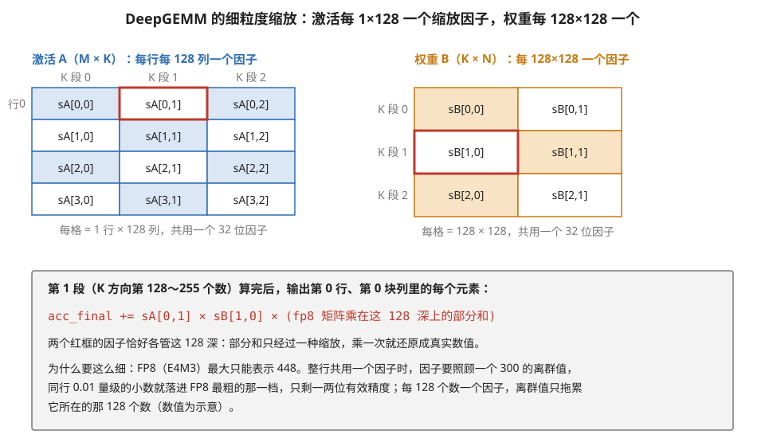
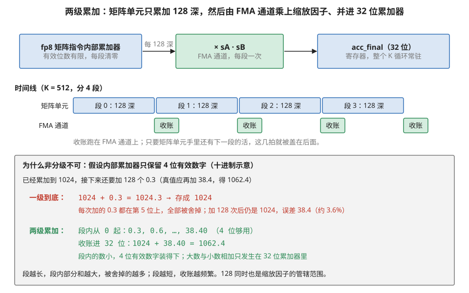
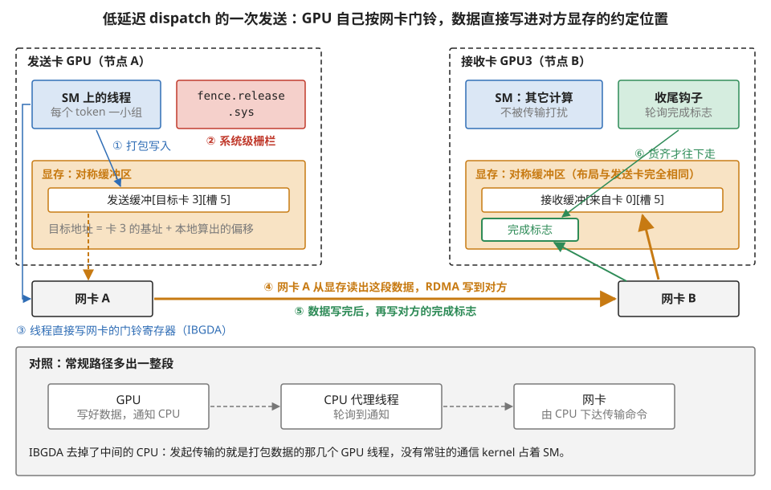
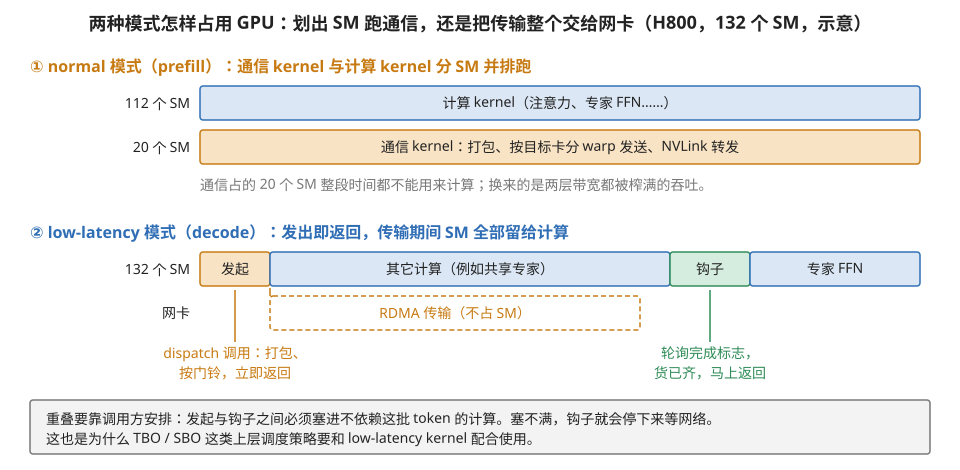

# B3 · 代码精读：DeepSeek 开源栈（DeepGEMM 与 DeepEP）

> **所属系列**：模块 04 · 代码精读 B 系列收官（B1 Triton FA-2 → B2 FA-3 → **B3**）
> **状态**：🟨 学习中（第二版：按《写作规范》重写。注释性伪代码，忠实于 deepseek-ai/DeepGEMM 与 DeepEP 开源实现的结构与真实机制名，细节以仓库为准。知识截至 2026-01——**代码结构与机制不受时效影响；对应的最新代际信息见附录 A1 与模块 05 第 1 节 §6**）
> **本篇主旨**：前两篇精读的都是"单卡上的计算 kernel"。本篇的两个主角把精读版图扩到两个新地带：**DeepGEMM** 示范"当精度降到 fp8，连**累加**这个动作本身都成了要显式管理的资源"（两级累加）；**DeepEP** 示范"当瓶颈是跨卡网络，**通信也写成 kernel**"（GPU 直接指挥网卡、收货藏进计算）。三篇合起来验证同一个结论：**这些顶级 kernel 用的是同一套积木（搬运引擎、屏障、分工、常驻调度），差别只在把积木搭向哪个瓶颈**——FA 搭向特殊函数单元，DeepGEMM 搭向精度与凑批，DeepEP 搭向网络。

---

## 0. 这一篇要回答的问题

- fp8 矩阵乘为什么需要"两级累加"？那几行代码具体在干什么？
- MoE 的变长小任务怎么靠"常驻调度器"喂满机器？
- 通信为什么要写成 kernel？GPU 怎么做到"不占计算资源地收发网络数据"？
- "两批重叠 / 单批重叠"（TBO/SBO）这些系统级词汇，和 DeepEP 是什么关系？
- 三篇精读的共同积木清单是什么？

## 1. 基础词汇：先把本篇的新概念讲清楚

**fp8 与缩放因子（scale）**。8 位浮点数动态范围极窄（能表示的最大最小值相距不远），直接存放真实数据会大量溢出或下溢。标准做法：数据块除以一个缩放因子后存成 fp8，计算完再乘回来。缩放因子本身是 32 位的，**按块配备**——DeepGEMM 用的粒度细到"激活每 1×128 一个、权重每 128×128 一个"（见图 B3-1）。



> **图 B3-1**　一句话：FP8 矩阵乘的输入不是整体共用一个缩放因子，而是切成小块、每块一个：激活每行每 128 个数一个，权重每 128×128 一块一个；某一段 K 算完时，只要乘上管这一段的那两个因子就能还原真实数值。
>
> **先知道一件事**：FP8 是 8 位浮点数，能表示的数很少，最大只到 448（E4M3 格式），而且越小的数越粗糙。所以存进去之前，先把一块数据统一除以一个 32 位的"缩放因子"，让这块数的最大值刚好落在 448 附近；用的时候再乘回来。一块数据共用一个因子，这一块叫这个因子的"辖区"。
>
> **按这个顺序看**：
> 1. 左图是激活 A（M 行 × K 列）。每一小格是 1 行 × 128 列，格子里写的是管它的因子 sA[行, 段]。同一行不同 K 段有不同的因子，不同行之间也互不影响。
> 2. 右图是权重 B（K × N）。每一格是 128 × 128 的一整块，共用一个因子 sB[段, 块列]。
> 3. 两个红框：A 第 0 行的第 1 段、B 的第 1 段第 0 块列。它们在 K 方向上管的是同一段 128 个数（第 128～255 个）。
> 4. 灰框里的公式：矩阵单元算完这一段的 FP8 部分和之后，乘上 sA[0,1] × sB[1,0]，就得到这一段对输出的真实贡献，再累加进 32 位的 acc_final。因为这一段里 A 只受一个因子管、B 也只受一个因子管，所以只需乘一次。
> 5. 灰框末段：辖区为什么要细。若整行只有一个因子，它得迁就行里最大的离群值，其余的小数就被挤到 FP8 最粗的档位；辖区只有 128 个数时，离群值只影响它自己那一小段。
>
> **打个比方**：一张照片如果整张用同一个曝光，最亮的窗户会让屋里的暗处全黑；分块曝光时，每一小块按自己的亮度调，暗处的细节就保住了。
>
> **看懂的标志**：能回答"为什么 K 段的长度也取 128"——这样矩阵单元每算完一段，这段里的 A、B 各只对应一个因子，乘一次就能还原；段长若取 256，一段里就混进了两个辖区，两半各需不同的因子，没法在段末只乘一次。
>
> **与正文的对照**：图中画的是 4 行、3 个 K 段、2 块列的小例子；离群值 300、小数 0.01 是示意数字。
>
> 来源：本库自绘。

**两级累加（promotion）**。Hopper 的 fp8 矩阵指令有个硬件事实：它内部的累加器精度有限（有效位数不足），**累加链一长，小数就被"吃"掉**。对策：矩阵指令只累加一小段（如 128 深），然后把这段部分和**搬出来用 32 位浮点继续累加**——低精度干粗活、高精度收总账，两级配合。

**对称内存（symmetric memory）**。多卡通信的一种内存组织：每张卡按**完全相同的布局**各开一块缓冲区，于是"第 3 号卡上的某个位置"可以直接由"本卡相同偏移 + 卡号"算出——发数据前不需要先交换地址。

**IBGDA（GPU 发起的网络传输）**。常规跨机通信要 CPU 参与（GPU 通知 CPU、CPU 指挥网卡）。IBGDA 让 **GPU 直接写网卡的门铃寄存器**发起远程内存写入——整条路径无 CPU、也不占用 GPU 的计算单元。

**常驻 kernel 与全局取活（persistent kernel）**。不按任务数启动线程块，而是启动"恰好铺满机器"的常驻线程块，每个块循环地从一个全局计数器上**领取下一份活**（原子加一）——任务大小不均时天然负载均衡（模块 01 第 7 节尾效应的解法之一）。

## 2. DeepGEMM：fp8 分组矩阵乘的三个招牌

DeepGEMM 是 DeepSeek 开源的 fp8 矩阵乘库，专为 MoE 场景（很多个大小不一的矩阵乘）设计。三个值得精读的设计：

### 2.1 主循环：两级累加——本篇最重要的一段代码

```cpp
// 寄存器：acc_final（32 位，最终累加器，全程驻留——输出驻留数据流）
//         acc_wgmma（矩阵指令的内部累加器，每小段清零重来）
for (int k段 = 0; k段 < K / 128; ++k段) {
    full[s].wait(phase);                      // B2 同款：TMA 流水送来本段的 A、B 块
    // —— 第一级：矩阵指令在低精度累加一小段（128 深） ——
    warpgroup_arrive();
    gemm(mma_fp8, sA[s], sB[s], acc_wgmma);   // fp8 矩阵指令，只负责这 128 深
    warpgroup_commit_batch();  warpgroup_wait<0>();
    // —— 第二级：普通算术通道把这一段"晋升"到 32 位 ——
    float 组合缩放 = sA缩放[s] * sB缩放[s];      // 两个细粒度缩放因子相乘
    for (int i = 0; i < 片段数; ++i)
        acc_final[i] += 组合缩放 * acc_wgmma[i];   // 32 位乘加，逐片段收账
    acc_wgmma = 0;                             // 内部累加器清零，迎接下一段
    empty[s].arrive();                         // 归还缓冲格（B2 同款）
}
```

**【映射】** 放置维度出现了一个新东西：**累加器分裂成两级**——短命的低精度级住在矩阵指令内部，长命的 32 位级驻留寄存器（模块 02 第 3 节的输出驻留，多了一层内外之分）。缩放因子的乘法被**推迟到晋升时刻**、每 128 深才做一次——细粒度缩放的管理开销被摊薄了 128 倍。
**【硬件】** 晋升那几行跑在**普通浮点算术通道**上——此刻矩阵单元正忙下一段，普通通道本来闲着：**用空闲的便宜管道给繁忙的昂贵管道收账**，和 FA-4 用普通通道算指数绕开特殊函数单元是同一个思想（附录 A1-04）。
**【反事实】** 不做两级、让矩阵指令一路累加到底：K 深（如 7168）时精度损失可测、模型质量下降——这不是性能问题是正确性问题。晋升太频繁（每条矩阵指令一次）：收账的开销反超矩阵计算；太稀疏（整个 K 一次）：精度又保不住。**128 这个间隔同时是缩放粒度、矩阵指令段深、晋升周期——三个 128 重合不是巧合，是协同设计**：一段恰好对应一个缩放因子的辖区，晋升时正好乘上它。

图 B3-2 把两级累加的数据路径、时间节拍和"为什么非分级不可"画在一张图里。



> **图 B3-2**　一句话：FP8 矩阵指令内部的累加器精度不够，一直累加下去会把小的加数丢掉；所以只让它累加 128 深的一小段，再把这段结果乘上缩放因子、加进 32 位的总累加器。
>
> **先知道一件事**：浮点数只保留固定位数的有效数字。两个大小悬殊的数相加时，小数超出这些位数的部分会被舍掉。累加链越长，已累加的和越大，后面每个小加数被舍掉的比例就越高。
>
> **按这个顺序看**：
> 1. 最上一排是数据路径：左边是矩阵单元内部的累加器，它只管 128 深（K 方向 128 个数的乘加），每段开始清零；中间在 FMA 通道（普通乘加管线）上乘两个缩放因子；右边是 32 位的 acc_final，住在寄存器里，整个 K 循环一直累加。
> 2. 中间时间线：K = 512 分成 4 段。矩阵单元依次算每段，每段结束 FMA 通道做一次"收账"（乘因子、并入 acc_final）。绿色小块画在下一段的下方，表示两者可以同时进行，前提是矩阵单元此时已经有下一段的指令在做。
> 3. 下方灰框用十进制讲精度：假设内部累加器只能保留 4 位有效数字。已经累加到 1024，再加 0.3，结果 1024.3 需要 5 位，只能存成 1024。重复 128 次，本该多出的 38.4 全部丢失，误差约 3.6%。
> 4. 两级累加的做法：段内从 0 开始加，0.3、0.6……一直到 38.40，数都不大，4 位有效数字够用；最后把 38.40 并入 32 位累加器，1024 + 38.40 = 1062.4，结果正确。
>
> **打个比方**：用一台只显示 4 位数的计算器记一个月的零钱，总数过了一千之后，每天几毛钱就再也显示不出来了。改成每天先在小本上把零钱加好，月底再把各天的小计加进一本精确的总账，就不会丢。
>
> **看懂的标志**：能回答"段为什么不能太长也不能太短"——太长，段内部分和变大，小加数又开始被舍掉；太短，收账太频繁，FMA 通道的开销会追上矩阵乘本身。128 在两者之间，并且正好等于缩放因子的辖区。
>
> **与正文的对照**：4 位有效数字是为讲清原理设的十进制示意，不是 Hopper FP8 累加器的真实位数（正文 §7 把它列为待查）。正文 §2.1 的代码在收账前用了 `wait<0>`，同一个 warpgroup 内收账与矩阵乘并不重叠；时间线里的重叠要靠矩阵单元同时有别的 warpgroup 的指令可做。
>
> 来源：本库自绘。

### 2.2 常驻调度器：变长任务的"工头"

MoE 的分组矩阵乘：几十个专家各自一个矩阵乘，**行数各不相同**（取决于路由给每个专家多少 token）。静态分工必然不均——大专家的线程块还在苦干，小专家的早收工了。DeepGEMM 的解法：

```cpp
// 启动恰好铺满机器的常驻线程块，每块循环领活：
while (true) {
    int 活号 = atomicAdd(&全局计数器, 1);        // 原子取号
    if (活号 >= 总tile数) break;
    auto [专家, 行块, 列块] = 解码(活号);          // 查这份活属于哪个专家的哪一块
    执行一个tile的矩阵乘(专家, 行块, 列块);        // 2.1 的主循环
}
```

**【映射】** 绑定维度从"启动时静态分配"改成"运行时动态领取"——变长的一堆任务被摊成均匀的 tile 流。
**【硬件】** 常驻块 + 全局原子计数器；MoE 解码场景还有配套的"掩码布局"（CPU 不知道每个专家实际分到多少 token，GPU 侧按最大值排布、无效行用掩码跳过）——为的是形状固定，好配合 CUDA Graph 消启动开销（模块 04 第 6 节 §6.4）。
**【反事实】** 静态平分：负载不均时实测占用率的尾巴惨不忍睹（模块 01 第 7 节的 waves 读数）。另一个反常识细节：DeepGEMM 允许 **112 这类"非 2 的幂"的块尺寸**——牺牲一点对齐美感，换 tile 总数与 SM 数更整除（治的是 wave 尾效应）——"最优块尺寸不一定是 2 的幂"的实证。

### 2.3 现场编译（JIT）：形状已知之后才生成代码

DeepGEMM 不预编译各种形状的版本，而是**运行时拿到具体的 M、N、K 和专家数之后现场编译**：所有形状成为编译期常量——循环全部展开、边界判断消失、除法变位移。核心矩阵乘代码只有三百行上下。代价是首次编译的延迟（靠缓存摊薄）；收益是每个形状都拿到"专属定制"的代码。用模块 04 第 1 节的语言：**这是把"信息衰减"反过来用——把①层才知道的运行时信息（准确形状），人为送进④层的编译过程**。

## 3. DeepEP：通信写成 kernel

MoE 的每一层都要做一次"token 按路由结果发往各专家所在的卡"（术语叫 dispatch）和一次"结果收回来"（combine）——这是全网络最频繁的跨卡通信（模块 03 第 2 节：专家并行的 all-to-all）。DeepEP 是 DeepSeek 开源的专用通信库，两套 kernel 对应两种场景：

### 3.1 低延迟模式（解码用）：发货不占计算资源

```cpp
// 发送侧（每个 token 一小组线程）：
for (目标专家 e : 本token的topk路由) {
    int 目标卡 = 专家所在卡(e);
    打包(发送缓冲[目标卡][槽位], token的fp8数据, 缩放因子, 路由元信息);
    fence.release.sys;                     // ★ 系统级栅栏：保证打包的写对网卡可见
    ibgda_put(目标卡, 远端地址, 本地地址, 字节数);   // GPU 直接写网卡门铃，发起远程写
}
// 接收侧：不占任何计算单元——
auto [接收张量, 收尾钩子] = 低延迟dispatch(...);   // 立即返回！
其它计算(...);                                    // 与网络传输完全重叠
收尾钩子();                                       // 轮询完成标志，货齐了才继续
```

**【映射】** 这是"掩盖延迟"这个全库主题爬到**系统层**的形态：传输期间 GPU 的计算单元一拍都不占，重叠交给调用方编排。
**【硬件】** 三个机制同框：**对称内存**（远端地址=本地偏移+卡号，免地址协商）；**IBGDA**（GPU 写网卡门铃——模块 01 第 5 节说"同步对象从线程扩展到引擎"，这里更进一步：**连发起权都交给了 GPU**）；**系统级栅栏**（fence.release.sys——模块 01 第 5 节讲的作用域最贵的那一档在此有了真实用途：数据要对芯片**外**的网卡可见，必须冲刷到系统一致点）。
**【反事实】** 少了那个系统级栅栏：网卡可能读到打包了一半的数据——弱内存模型的经典翻车（模块 01 第 5 节），跨机场景下极难排查。用常规通信库走这条路：要启动占 SM 的通信 kernel、要 CPU 协调——解码场景微秒级的延迟预算直接爆掉。

图 B3-3 把上面这段代码的发送和接收，按"谁在什么时候动了什么"画成六步。



> **图 B3-3**　一句话：低延迟模式下，打包数据的那几个 GPU 线程自己通知网卡发货，网卡直接把数据写进对方 GPU 显存里一个事先约定好的位置；全程不经过 CPU，接收方的计算单元也不用停下来收货。
>
> **先知道一件事**：网卡是一个独立的设备，它可以自己去读 GPU 显存、再把数据写进另一台机器的显存（RDMA）。要让它开始干活，得往它的一个特殊寄存器里写一个值，这个寄存器俗称"门铃"。通常按门铃的是 CPU；IBGDA 让 GPU 线程也能直接按。
>
> **按这个顺序看**：
> 1. 左上：发送卡上负责这个 token 的一小组线程，第①步把 FP8 数据、缩放因子和路由信息写进显存里的发送缓冲。发送缓冲按"目标卡、槽位"分格。
> 2. 第②步：执行 `fence.release.sys`，一道系统级栅栏。它保证①写下的数据已经真正落到显存里，芯片外面的网卡去读时能读到完整的内容。
> 3. 第③步（左侧蓝线）：同一组线程直接写网卡 A 的门铃寄存器，告诉它"把这段数据发到卡 3 的某个地址"。这个地址发送方自己就能算出来，因为每张卡的缓冲区布局完全相同（对称内存）：目标地址 = 卡 3 的缓冲区基址 + 本地算出的偏移。
> 4. 第④步（橙线）：网卡 A 从显存读出这段数据（左侧虚线），经网络写进接收卡的接收缓冲。
> 5. 第⑤步（绿线）：数据写完后，网卡再往对方的完成标志里写一个值。
> 6. 右侧：接收卡的 SM 一直在做别的计算，不受传输影响。等到代码调用收尾钩子，钩子检查完成标志，货齐了才往下走（第⑥步）。
> 7. 下方灰框是对照：常规路径里 GPU 要先通知 CPU，CPU 上的代理线程轮询到通知后再指挥网卡，多了两次跨设备的往返。
>
> **打个比方**：常规寄件是写好包裹后打电话给前台，前台再叫快递；IBGDA 相当于自己直接在快递 App 上下单，快递员上门取件，把包裹放进对方家里约定好的格子，最后在门口挂个"已送达"的牌子，对方做完手头的事看一眼牌子就行。
>
> **看懂的标志**：能回答"少了第②步会怎样"——GPU 的写入可能还停在芯片内部的缓存里，网卡读到的是一半新一半旧的数据，接收方拿到错误的 token，而且这种错误只在偶尔出现，极难排查。
>
> **与正文的对照**：图中的卡号、槽位是示意。完成标志是本图为讲清"钩子轮询什么"而画出的简化；DeepEP 实际用计数或标志的方式以仓库代码为准。
>
> 来源：本库自绘。

### 3.2 常规模式（预填充用）：占一部分计算资源换吞吐

大批量场景走另一套：**专门划出一部分线程块跑"通信 kernel"**——warp 按目的地分工（这几个 warp 负责发往本机的 7 张卡、那几个负责跨机），跨机流量先走网络到远端同号卡、再由它经 NVLink 转发到最终目标（**让大头流量走最宽的那层**——模块 03 第 2 节四层地图的实战应用）。一个著名细节：读取远端写来的数据时用了一条带"不留缓存"提示的读取指令——这些数据只读一次，占着缓存位白挤别人（模块 01 第 4 节复用判据的反向应用）。

两套模式最直观的区别在于它们怎样占用 GPU 的计算单元，见图 B3-4。



> **图 B3-4**　一句话：normal 模式长期划走一部分 SM 专门跑通信程序，换取高吞吐；low-latency 模式只在发起和收尾时短暂用一下 SM，传输本身交给网卡，SM 全部留给计算。
>
> **先知道一件事**：SM 是 GPU 里执行程序的计算单元，H800 有 132 个。一个 kernel（GPU 程序）运行时会占住一部分 SM；通信如果写成一直在跑的 kernel，它占住的 SM 就不能同时做矩阵乘。
>
> **按这个顺序看**：
> 1. 上幅第一道：112 个 SM 在跑计算 kernel，例如注意力和专家 FFN。
> 2. 上幅第二道：另外 20 个 SM 整段时间都在跑通信 kernel，做打包、按目标卡分 warp 发送、NVLink 转发。这 20 个 SM 在这段时间里对计算没有贡献，换来的是跨节点网络和 NVLink 两层带宽都被用满。
> 3. 下幅第一道：132 个 SM 全部用于计算。开头橙色的"发起"是 dispatch 调用，打包、按门铃后立即返回；接着是一大段与这批 token 无关的计算；绿色"钩子"检查货到了没有；最后用收到的 token 算专家 FFN。
> 4. 下幅第二道：网卡在"发起"之后开始 RDMA 传输，完全不占 SM，与其它计算同时进行。
> 5. 灰框：传输能不能被藏住，取决于调用方有没有在发起和钩子之间安排足够的计算。
>
> **打个比方**：normal 模式像公司划出一个部门专门处理收发室的活；low-latency 模式像把收发全外包给快递公司，员工只在寄件时填个单、收件时签个字，其余时间都在做本职工作。
>
> **看懂的标志**：能回答"decode 为什么选下面那种"——decode 每步的数据量小，通信主要是延迟，不需要 20 个 SM 去榨带宽；把 SM 全留给计算、让网卡在后台传，更划算。
>
> **与正文的对照**："20 个 SM"取自附录 A1 术语卡的例句，是示意数；实际划出多少 SM 是 DeepEP 的可调参数。各段长度为示意。
>
> 来源：本库自绘。

### 3.3 站位澄清：TBO/SBO 不在 DeepEP 里

开会常把这几个词混在一起，值得站位澄清：**"两批重叠"（TBO：把 batch 切两半，甲算注意力时乙做 all-to-all）和"单批重叠"（SBO：单批内按算子阶段细排重叠）是架在 DeepEP 之上的调度策略**，住在推理引擎/训练框架层（模块 04 第 1 节的①⑤层），不是 DeepEP 的 kernel 技术。DeepEP 提供的是**可重叠的原料**（发货即返回、钩子收尾）；怎么用这段空窗，是上层的排布。

## 4. 收官：三篇精读的共同积木清单

| 积木 | B1（FA-2） | B2（FA-3） | B3（DeepSeek） |
| --- | --- | --- | --- |
| 异步搬运 + 屏障 | num_stages（编译器代排） | TMA + mbarrier（手排） | 同 B2，另加**网卡**这个新引擎 |
| 分工 | 无（线程同构） | 搬运组 + 两个计算组 | 计算 kernel 与通信 kernel 分家 |
| 输出驻留累加 | acc 驻寄存器 | 同左 + 寄存器重分配 | **两级累加**（低精度粗算+32位收账） |
| 绑定策略 | 静态二维网格 | 静态 + 乒乓 | **常驻块动态领活** |
| 藏的是什么延迟 | 显存搬运 | 特殊函数单元的串行 | 精度收账的开销 + **跨卡网络** |

一句话收官：**认识积木（模块 01–03 的硬件机制），看懂图纸（模块 04 的映射四维），就能读懂任何新 kernel**——B 系列想交付的就是这个能力。下一个新东西发布时，先问"它把哪块积木搭向了哪个瓶颈"。

## 5. 验收

- **对照真码**：DeepGEMM 仓库搜 promotion/两级累加相关注释与 Scheduler；DeepEP 仓库搜 ibgda、low_latency、hook。README 都明说了本篇的设计要点。
- **性能画像**：DeepGEMM 应见矩阵管道高活跃 + 普通浮点管道规律脉冲（晋升的节拍）；DeepEP 低延迟模式传输期间，GPU 计算指标应**无扰动**（它根本不在计算单元上跑）——用系统级时间线看网络轨道。

## 6. 术语卡

### 两级累加（promotion）
**定义**：fp8 矩阵计算的精度对策：矩阵指令在内部低精度累加一小段（如 128 深），随后用普通算术通道把该段部分和乘上缩放因子、累进 32 位最终累加器；周期性重复。
**为什么存在**：fp8 矩阵指令的内部累加器有效位数不足，深累加链会丢失小数——不分级，长 K 的结果不可用。这是"精度也是需要显式管理的资源"的代表案例。
**语境例句**："这个 fp8 kernel 每 128 深做一次 promotion。" —— 意思是：低精度粗算与高精度收账的切换周期是 128——恰好对齐缩放因子的辖区，收账时正好乘上它。

### IBGDA（GPU 发起的远程写）
**定义**：GPU 直接写网卡门铃寄存器、发起跨机远程内存写入的机制——全程无 CPU 参与、不占 GPU 计算单元。
**为什么存在**：解码场景的通信延迟预算是微秒级，"GPU→CPU→网卡"的常规路径太长；把发起权交给 GPU，路径最短、且计算单元完全解放。
**语境例句**："低延迟模式走 IBGDA，一个 SM 都不占。" —— 意思是：通信期间计算资源零占用——重叠的空窗完整留给了计算，这是解码场景选它的全部理由。

### 常驻调度（persistent + 动态领活）
**定义**：启动恰好铺满机器的常驻线程块，各块循环从全局原子计数器领取下一份任务，直到取尽。
**为什么存在**：变长、不均的任务集合（MoE 各专家的矩阵乘）静态分工必然有人闲有人忙；动态领活让快的多干、慢的少干，天然均衡（模块 01 第 7 节尾效应的解法）。
**语境例句**："grouped GEMM 用 persistent 调度摊平了专家的不均。" —— 意思是：变长的一堆矩阵乘被切成统一的 tile 流、由常驻工人动态认领——机器不再陪着最大的专家等。

### dispatch / combine（MoE 的收发对）
**定义**：MoE 每层的两次跨卡通信：dispatch 把 token 按路由发往各专家所在的卡，combine 把专家的输出按原顺序收回加权合并。
**为什么存在**：专家分布在不同卡上，token 的去向由路由动态决定——这对通信（形态是全对全）是 MoE 结构的固有成本，也是专家并行的主要瓶颈。
**语境例句**："这一层 dispatch 占了步时的两成。" —— 意思是：全对全通信没藏好——查它是否与计算重叠（上层的 TBO/SBO 排布）、走的是不是最宽的互连层。

## 7. 我的困惑 / 待深挖

- fp8 矩阵指令内部累加器的精确格式（几位有效数）？两级累加的误差上界推导？
- IBGDA 门铃写的延迟实测 vs 常规 CPU 代理路径？
- 112 这类非 2 幂块尺寸在 Blackwell（新矩阵指令）上还成立吗？
- B 系列可能的 B4：昇腾 Ascend C 算子精读（手动挡放置的代码形态）？

---

*最后更新：2026-07-06（第二版：按含自检的写作规范重写；新增基础词汇五条、共同积木清单表、术语卡四张）（2026-09 补图 4 张：现成 0 张，自绘 4 张；图注按费曼法写）*
