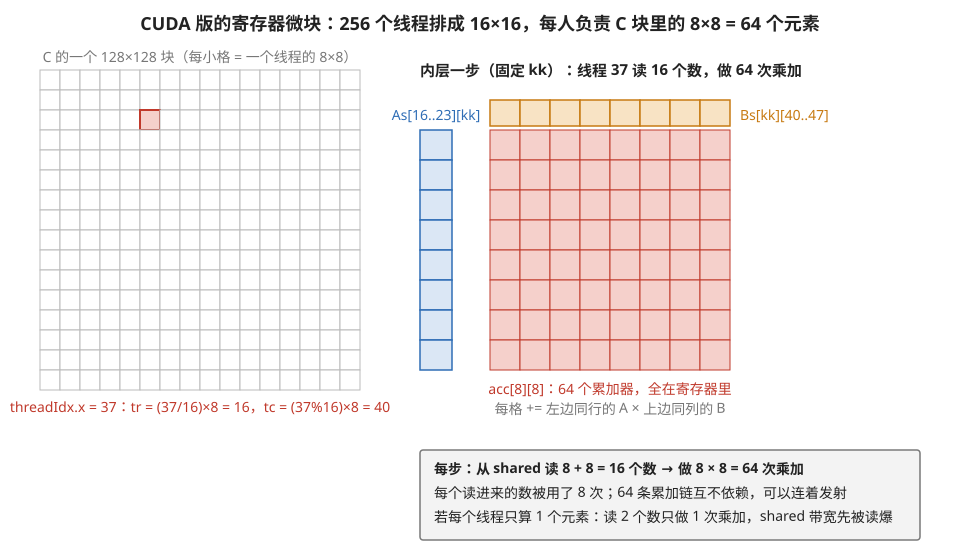
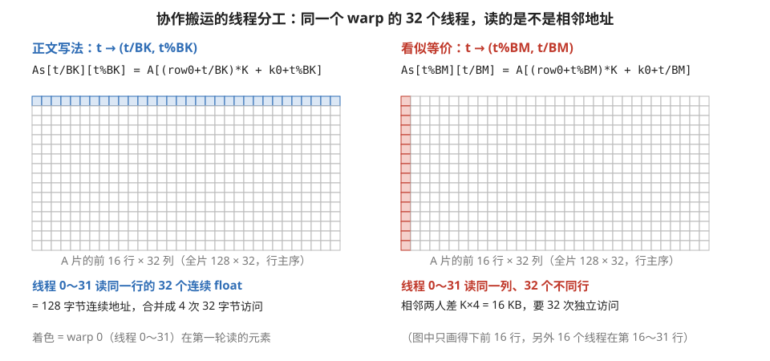
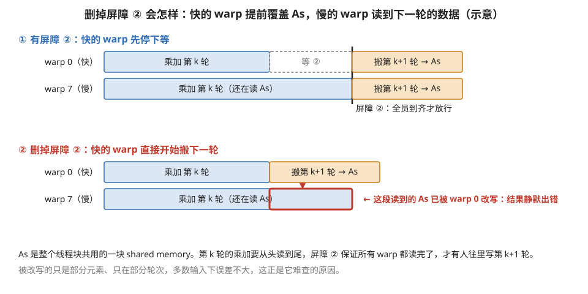
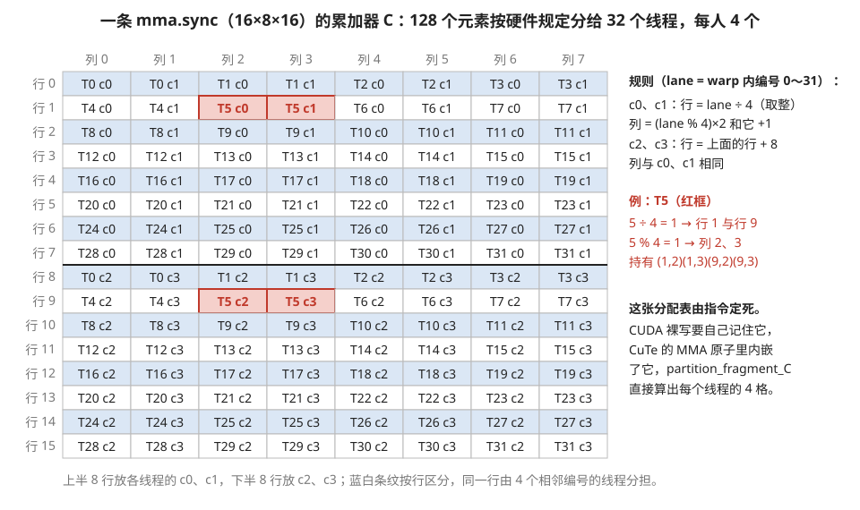
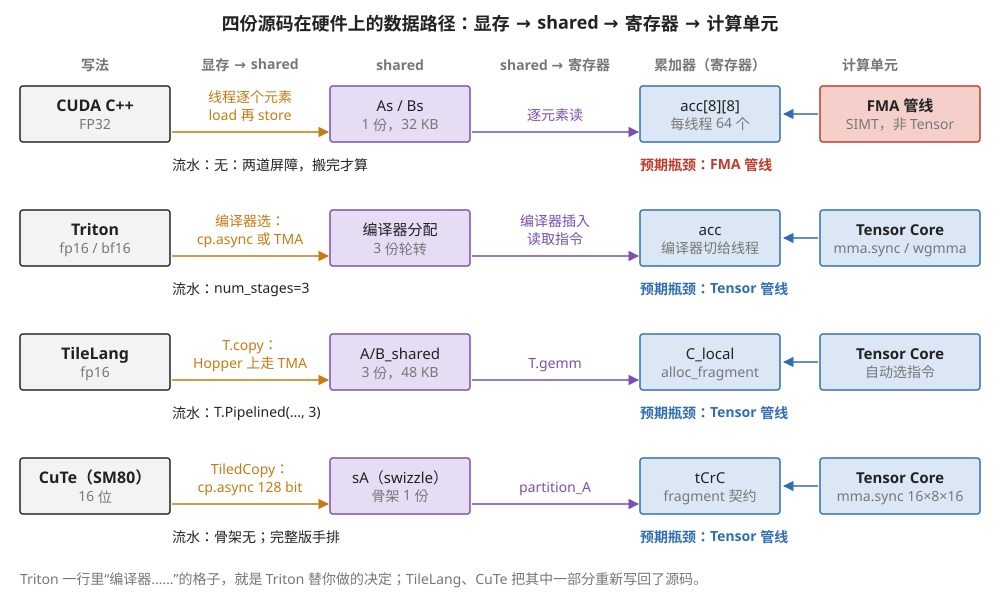

# B4 · 代码精读：同一个 GEMM 的四种写法（CUDA / Triton / TileLang / CuTe）

> **所属模块**：模块 04 · 软件优化栈（代码精读 B 系列第四篇；第 9 节语言全景的代码落地）
> **状态**：✅ 完成（第一版即按写作规范撰写。知识截至 2026-08。代码为教学化简版，保留各语言的真实语法与结构，省略了生产实现的谓词细节与部分模板参数）
> **本节主旨**：把**同一道题**——分块矩阵乘，tile 取 128×128、K 方向每次推进 32——用四门语言各写一遍，逐段对照。四份源码算的是同一个数学，差异全在"**谁在替你说哪句话**"：CUDA 版里索引、同步、搬运每个字都是你写的；Triton 版里线程消失了；TileLang 版里流水线缩成一个注解；CuTe 版里索引算术变成了布局代数。最后用 FlashAttention 做第二道对照题，看"两个矩阵乘中间夹一个在线 softmax"这种非标准结构在各海拔分别要付出什么。读完这篇，第 9 节那张"四维决策权对照表"的每一格都有代码作证。

---

## 0. 这一节要回答的问题

- 同一个分块 GEMM，四门语言的源码各长什么样？逐段对应关系是什么？
- 每份源码里，哪些行是"映射决策"、哪些行是"被迫写的正确性苦活"？
- 同一类错误（忘同步、形状不对齐）在四门语言里分别以什么形态暴露——运行期静默错果，还是编译期报错？
- FlashAttention 的在线 softmax 结构，在各海拔分别怎么表达？哪层开始表达不出来？

---

## 1. 基础词汇与统一题目

**题目**：C = A×B，M=N=K=4096。每个线程块负责 C 的一个 128×128 tile；K 方向切成 32 一段，循环 128 轮，每轮把 A 的 128×32 片和 B 的 32×128 片搬进片上、乘加进累加器。这正是第 4 节讲过的标准 tiled GEMM，也是 01 模块附录 A1 例 2 手算过占用率的那个 kernel。

**register blocking（寄存器微块）**。块内的进一步切分：每个线程不是算一个输出元素，而是算一小片（如 8×8 共 64 个），累加器全部常驻寄存器。这么做是为了指令级并行（64 个独立累加链）和数据复用（读一次 shared 喂多个乘加）——01 模块第 2 节 Volkov 打法的落地形态。

**fragment（片段）**。用 Tensor Core 时，一个 tile 的数据按硬件规定的 pattern 拆散到 32 个线程各自的寄存器里，每个线程手里那几个元素叫它的 fragment。哪个线程拿哪个元素是指令定死的，软件必须配合——这是模块 03 第 1 节讲过的"两套词"问题，本篇 CuTe 段落会看到管理它的专用工具。

**逐段三问**（B 系列统一读法）：每段代码问三件事——它在表达映射四维（切分/顺序/放置/绑定）里的哪一维？它落到硬件的什么部件？改错或删掉它会发生什么？

---

## 2. CUDA C++ 版：每个字都是你写的

先看全文（FP32 版，走 SIMT 核不走 Tensor Core——裸 CUDA 要吃 Tensor Core 得再叠 wmma/mma 内联，代码量翻数倍，这正是后面几层存在的理由）：

```cuda
#define BM 128
#define BN 128
#define BK 32
#define TM 8
#define TN 8
// 启动：grid = (N/BN, M/BM)，block = 256 线程
__global__ void gemm(const float* A, const float* B, float* C, int M, int N, int K) {
    __shared__ float As[BM][BK];                 // A 片的中转站，16 KB
    __shared__ float Bs[BK][BN];                 // B 片的中转站，16 KB
    int row0 = blockIdx.y * BM, col0 = blockIdx.x * BN;   // 本块负责 C 的哪个 128×128
    int tr = (threadIdx.x / 16) * TM;            // 256 线程排成 16×16 网格，
    int tc = (threadIdx.x % 16) * TN;            //   我负责块内 (tr,tc) 起的 8×8 微块
    float acc[TM][TN] = {};                      // 64 个累加器，常驻寄存器

    for (int k0 = 0; k0 < K; k0 += BK) {         // K 方向 128 轮
        // 协作搬运：256 线程分摊两片数据，每人 16+16 个元素
        for (int t = threadIdx.x; t < BM * BK; t += 256)
            As[t / BK][t % BK] = A[(row0 + t / BK) * K + k0 + t % BK];
        for (int t = threadIdx.x; t < BK * BN; t += 256)
            Bs[t / BN][t % BN] = B[(k0 + t / BN) * N + col0 + t % BN];
        __syncthreads();                         // ① 等全体搬完才能开算

        for (int kk = 0; kk < BK; ++kk)          // 沿 K 逐层乘加
            for (int i = 0; i < TM; ++i)
                for (int j = 0; j < TN; ++j)
                    acc[i][j] += As[tr + i][kk] * Bs[kk][tc + j];
        __syncthreads();                         // ② 等全体用完才能覆盖下一轮
    }
    for (int i = 0; i < TM; ++i)                 // 写回
        for (int j = 0; j < TN; ++j)
            C[(row0 + tr + i) * N + col0 + tc + j] = acc[i][j];
}
```

**逐段三问**：

- **切分**：五个 `#define` 就是全部 tiling 决策——但注意它们散落在索引算术的每一行里，改 BK 要同时改对搬运循环和乘加循环。
- **放置**：`__shared__` 两行（片上中转）和 `acc` 一行（累加器驻留寄存器）是显式的放置决策。每线程 64 个累加器加上索引变量，寄存器用量约 128 个——01 模块附录 A1 例 2 算过：占用率被压到 25%，而且是故意的。
- **绑定**：`tr/tc` 两行和两个搬运循环，是"1024×32 个数据点怎么分给 256 个线程"的全部答案——**纯手写索引算术**。搬运循环里 `t/BK, t%BK` 这种写法保证相邻线程写相邻地址（合并访存），换一种看似等价的写法就可能慢一半，而代码上毫无提示。
- **改错会怎样**：删掉屏障②——跑得快的 warp 进入下一轮、开始覆盖 `As`，而慢的 warp 还在用旧值做乘加，**结果静默错误**，多数输入下误差还不大，最难查的一类 bug。把 `Bs[t / BN][t % BN]` 手滑写成 `Bs[t % BN][t / BN]`——不报错，结果全错。这段 40 行代码里大约 25 行在处理"怎么把数据放对位置"，只有乘加那 4 行是数学本身。

下面三张图分别对应上面的放置、绑定和"改错会怎样"：图 B4-1 是 `acc[TM][TN]` 这个寄存器微块怎么分、每一步复用多少；图 B4-2 是搬运循环里 `t/BK, t%BK` 这种写法为什么是对的；图 B4-3 是删掉屏障②之后发生的事。



> **图 B4-1**　一句话：CUDA 版让每个线程负责输出块里的一个 8×8 小方块，内层每一步只从 shared memory 读 16 个数，却能做 64 次乘加，每个数被用 8 次。
>
> **先知道一件事**：shared memory（SM 内部、同一线程块共用的小块存储）读得比显存快得多，但每拍能读出的数据量仍然有限；如果每做一次乘加就要读两个数，乘加单元会被读取速度拖住。所以要让读进寄存器的每个数尽量多用几次。
>
> **按这个顺序看**：
> 1. 左图：C 的一个 128×128 块，按 16×16 切成 256 个小格，每格 8×8，正好对应 256 个线程各负责一格。
> 2. 红色小格是 threadIdx.x = 37 的线程。代码 `tr = (threadIdx.x / 16) * TM` 得 16，`tc = (threadIdx.x % 16) * TN` 得 40，所以它负责第 16～23 行、第 40～47 列。
> 3. 右图是内层循环固定某个 `kk` 时这个线程做的事：左侧蓝色一列是 `As[16..23][kk]` 的 8 个数，上方橙色一行是 `Bs[kk][40..47]` 的 8 个数，都读进寄存器。
> 4. 中间红色 8×8 就是 `acc[8][8]`：每一格加上"同一行的那个 A 值 × 同一列的那个 B 值"。一共 64 次乘加，读进来的每个 A 值被同一行 8 格用到，每个 B 值被同一列 8 格用到。
> 5. 下方灰框：若每个线程只算一个输出元素，每做 1 次乘加就要读 2 个数，读取量是微块写法的 8 倍（每次乘加要读 2 个数，微块写法只要 16 ÷ 64 = 0.25 个）。
>
> **打个比方**：做乘法表时，把一行 8 个乘数和一列 8 个乘数抄在纸边，就能一口气填满 64 格；每填一格都跑去书架上查一次两个数，就慢得多。
>
> **看懂的标志**：能回答"微块的代价是什么"——64 个累加器加上索引等变量，每线程要约 128 个寄存器，一个 SM 能同时驻留的线程变少，占用率只有 25%；换来的是 64 条互不依赖的乘加链和 8 倍的数据复用。
>
> **与正文的对照**：线程编号 37 是任选的例子；TM = TN = 8、256 线程与正文代码一致。
>
> 来源：本库自绘。



> **图 B4-2**　一句话：搬运循环里线程编号到数据位置的对应方式决定了一个 warp 读的是不是一段连续地址；正文的写法让 32 个线程读同一行相邻的 32 个数，对调行列后变成读 32 个相隔很远的地址。
>
> **先知道一件事**：GPU 以 warp（32 个线程一组，同时执行同一条指令）为单位访问显存。如果 32 个线程要的地址落在同一段连续的 128 字节里，硬件把它们合并成 4 次 32 字节的访问；如果地址分散，就要拆成多达 32 次独立访问，很多带宽浪费在读回来却用不上的字节上。
>
> **按这个顺序看**：
> 1. 两幅图都是本轮要搬的 A 片（128 行 × 32 列，按行存储，同一行相邻元素地址相邻），只画出前 16 行。着色的是 warp 0（线程 0～31）在搬运循环第一轮读的元素。
> 2. 左图（正文写法）：线程 t 读第 t/BK 行、第 t%BK 列。BK = 32，所以线程 0～31 全在第 0 行，列号 0～31，正好是 32 个相邻的 float，共 128 字节连续地址，合并成 4 次访问。
> 3. 右图（行列对调）：线程 t 读第 t%BM 行、第 t/BM 列。线程 0～31 全在第 0 列，行号 0～31。相邻两个线程的地址相差一整行，也就是 K × 4 = 16384 字节，32 个线程要 32 次独立访问。
> 4. 两种写法搬进 As 的内容完全相同，结果都对；差别只在速度，而且代码上看不出任何提示。
>
> **打个比方**：32 个人去图书馆取书。左边的安排是"每人拿同一排书架上相邻的一本"，管理员推一辆车就能一次取齐；右边是"每人拿不同楼层同一位置的一本"，管理员得跑 32 趟。
>
> **看懂的标志**：能说出判断方法——看 warp 内相邻的 threadIdx 在最后一维（行存储时是列号）上是不是也相邻。
>
> **与正文的对照**：K = 4096、float 4 字节，与 §1 的题目一致。正文说"可能慢一半"是整体效果；单看这一次访问，访问次数差 8 倍，但部分数据后续会被缓存命中，整体损失小于 8 倍。
>
> 来源：本库自绘。



> **图 B4-3**　一句话：屏障②的作用是让所有 warp 都用完这一轮的 As 之后，才有人开始往里写下一轮的数据；删掉它，跑得快的 warp 会覆盖跑得慢的 warp 还在读的数据，结果静默出错。
>
> **先知道一件事**：一个线程块的 256 个线程分成 8 个 warp，它们执行的是同一段代码，但不保证同步前进，某个 warp 可能因为等数据而落后一截。`As`、`Bs` 在 shared memory 里，是这 8 个 warp 共用的同一块存储。`__syncthreads()` 是屏障：先到的 warp 在这里停住，直到全部 warp 都到达才一起放行。
>
> **按这个顺序看**：
> 1. 上幅（有屏障②）：warp 0 先做完第 k 轮乘加，停在屏障②前等待（灰色虚线框）；warp 7 做完后到达屏障，竖线处两者一起放行，才开始往 As 里搬第 k+1 轮。
> 2. 下幅（删掉屏障②）：warp 0 做完第 k 轮乘加后没有任何阻拦，立刻开始往 As 里写第 k+1 轮的数据。
> 3. 下幅红框：这段时间 warp 7 还在读 As 做第 k 轮的乘加，读到的一部分元素已经被 warp 0 换成了下一轮的值。它照样算完，不报任何错误。
> 4. 底部两行：被改写的只是部分元素、只在部分轮次，输出的误差往往不大，这让这类错误很难被发现。
>
> **打个比方**：几个人共用一块白板抄题，抄得快的人抄完就擦掉白板写下一道题，抄得慢的人最后几行抄到的是新题的内容。屏障②就是"等所有人都说抄完了才能擦"。
>
> **看懂的标志**：能回答"屏障①和屏障②各防什么"——屏障①防"数据还没搬完就开始读"，屏障②防"别人还在读就开始覆盖"。前者保证读到的是新数据，后者保证旧数据被读完。
>
> **与正文的对照**：warp 0、warp 7 和各段长度是示意；实际哪个 warp 快、快多少每次运行都不同，这也是这类错误时有时无的原因。
>
> 来源：本库自绘。

## 3. Triton 版：线程消失，流水线变成一个参数

```python
@triton.autotune(configs=[
    triton.Config({'BM': 128, 'BN': 128, 'BK': 32}, num_warps=8, num_stages=3),
    triton.Config({'BM': 64,  'BN': 256, 'BK': 64}, num_warps=8, num_stages=4),
], key=['M', 'N', 'K'])                          # 形状变了就重新实测挑配置
@triton.jit
def gemm(A, B, C, M, N, K, sam, sak, sbk, sbn, scm, scn,
         BM: tl.constexpr, BN: tl.constexpr, BK: tl.constexpr):
    pid_m, pid_n = tl.program_id(0), tl.program_id(1)
    rm = pid_m * BM + tl.arange(0, BM)           # 我这个 tile 的行下标（向量）
    rn = pid_n * BN + tl.arange(0, BN)           # 列下标
    rk = tl.arange(0, BK)
    A_ptrs = A + rm[:, None] * sam + rk[None, :] * sak    # (BM,BK) 的指针块
    B_ptrs = B + rk[:, None] * sbk + rn[None, :] * sbn
    acc = tl.zeros((BM, BN), dtype=tl.float32)   # 累加器：fp32，跨整个 K 循环存活

    for k0 in range(0, K, BK):
        a = tl.load(A_ptrs, mask=(rk[None, :] + k0 < K), other=0.)   # 整块加载
        b = tl.load(B_ptrs, mask=(rk[:, None] + k0 < K), other=0.)
        acc = tl.dot(a, b, acc)                  # Tensor Core 在这一行
        A_ptrs += BK * sak                       # 指针块整体推进
        B_ptrs += BK * sbk

    C_ptrs = C + rm[:, None] * scm + rn[None, :] * scn
    tl.store(C_ptrs, acc.to(tl.bfloat16),
             mask=(rm[:, None] < M) & (rn[None, :] < N))
```

**和 CUDA 版逐段对照**：

- CUDA 的两个搬运循环 + 屏障① → **一行 `tl.load`**。shared memory 在源码里不存在：编译器看到 `tl.dot` 的操作数来自全局内存，自动插入"经 shared 中转 + 排布防 bank 冲突"，`num_stages=3` 再把它升级成三级软件流水（第 4 节 §7 手排流水那一整套——prologue、`cp.async`、轮转缓冲、屏障——一个数字全换到）。
- CUDA 的 `tr/tc` 和微块循环 → **不存在**。`acc` 是 (128,128) 的整块张量，它怎么拆到 8 个 warp、256 线程的寄存器里，是编译器的事。
- CUDA 不敢碰的 Tensor Core → **`tl.dot` 免费送**：按硬件代际自动编成 `mma.sync` 或 `wgmma`。
- **改错会怎样**：这层的错误形态变了。忘写 `mask` → 越界，跟 CUDA 一样是运行期炸；但"BK 给成 24（不是 16 的倍数）"这种错，`tl.dot` 会**静默退化**成不吃 Tensor Core 的慢路径——不报错、慢五倍（B1 精读强调过的坑）。还有一类新错误：`acc` 忘了传回 `tl.dot(a, b, acc)` 而写成 `acc += tl.dot(a, b)`，语义相同但多一次类型转换，性能小损——高层语言把正确性错误变少了，把"写法对但没兑现成好指令"的错误变多了。

35 行对 CUDA 的 40 行，行数差不多——**但内容完全不同**：Triton 的 35 行里 30 行在说映射策略（切多大、什么顺序、边界怎么算），CUDA 的 40 行里 25 行在做体力活。

## 4. TileLang 版：Triton 的长度，放置显式

```python
import tilelang
import tilelang.language as T

@tilelang.jit
def matmul(M, N, K, block_M=128, block_N=128, block_K=32):
    @T.prim_func
    def gemm(A: T.Tensor((M, K), "float16"),
             B: T.Tensor((K, N), "float16"),
             C: T.Tensor((M, N), "float16")):
        with T.Kernel(T.ceildiv(N, block_N), T.ceildiv(M, block_M),
                      threads=128) as (bx, by):
            A_shared = T.alloc_shared((block_M, block_K), "float16")   # 放置：shared
            B_shared = T.alloc_shared((block_K, block_N), "float16")
            C_local  = T.alloc_fragment((block_M, block_N), "float")   # 放置：寄存器
            T.clear(C_local)
            for ko in T.Pipelined(T.ceildiv(K, block_K), num_stages=3):  # 顺序+流水
                T.copy(A[by * block_M, ko * block_K], A_shared)        # HBM → shared
                T.copy(B[ko * block_K, bx * block_N], B_shared)
                T.gemm(A_shared, B_shared, C_local)                    # Tensor Core
            T.copy(C_local, C[by * block_M, bx * block_N])             # 写回
    return gemm
```

**三问**：

- 这 20 行和 Triton 版信息量相同，但**放置从隐式变显式**：`alloc_shared` 两行让你亲眼看到 shared 用量（128×32×2 + 32×128×2 = 16 KB，×3 级流水 = 48 KB——占用率的三方预算自己就能核），`alloc_fragment` 一行明说累加器驻留寄存器。模块 02 讲的"数据流"（权重驻留还是输出驻留）在这份源码里是**读得出来的**：C_local 不动、A/B 流过——输出驻留。
- `T.copy` + `T.Pipelined` 的组合落到硬件：编译器把循环体内的两条 copy 变成异步搬运（Hopper 上 TMA），配 3 份轮转缓冲和到货屏障——和 Triton 的 `num_stages` 等效，但**流水化哪层循环是你指定的**（注解在 `ko` 上），Triton 里这个选择也是编译器猜的。
- **改错会怎样**：`num_stages` 给到 5 → shared 需求 80 KB，加上别的超过每 SM 上限时**编译期报错**（对照 Triton：多数版本也会报，但报错点在深处的资源分配日志里）；`T.gemm` 的两个输入 shape 对不上 → 编译期直接拒绝。错误暴露整体前移了。

## 5. CuTe 版（骨架）：索引算术变成布局代数

CuTe 版完整代码约 200 行，这里取主干（省略模板参数、谓词和多级流水；完整版见 CUTLASS 仓库 `examples/cute/tutorial/sgemm_sm80.cu` 一族）：

```cpp
// ── 第一步：把裸指针包成带布局的张量，然后"切"出本块的份 ──
Tensor mA = make_tensor(make_gmem_ptr(A),
                        make_layout(make_shape(M, K), make_stride(K, _1{})));  // 行主序
Tensor gA = local_tile(mA, make_shape(_128{}, _32{}), make_coord(blockIdx.y, _));
//     gA 的形状是 (128, 32, k)：本块要吃的全部 A 片，第三维是 K 方向的块编号

__shared__ half smemA[128 * 32];
Tensor sA = make_tensor(make_smem_ptr(smemA), SmemLayoutA{});   // 布局里内嵌 Swizzle<3,3,3>

// ── 第二步：搬运的绑定——哪个线程搬哪几片，由 TiledCopy 算出 ──
TiledCopy copy_a = make_tiled_copy(Copy_Atom<SM80_CP_ASYNC_CACHEALWAYS<uint128_t>, half>{},
                                   ThrLayout{}, ValLayout{});   // 128 线程 × 每次 128bit
ThrCopy  thr_copy = copy_a.get_slice(threadIdx.x);
Tensor tAgA = thr_copy.partition_S(gA);   // 我要搬全局内存的哪几片（源）
Tensor tAsA = thr_copy.partition_D(sA);   // 搬进 shared 的哪几格（目的）

// ── 第三步：计算的绑定——fragment 怎么分家，由 TiledMMA 算出 ──
TiledMMA mma = make_tiled_mma(SM80_16x8x16_F32BF16BF16F32_TN{});  // 选定指令原子
ThrMMA  thr_mma = mma.get_slice(threadIdx.x);
Tensor tCsA = thr_mma.partition_A(sA);              // 我该读 shared 的哪几格
Tensor tCrC = thr_mma.partition_fragment_C(gC);     // 我的那份累加器 fragment
clear(tCrC);

// ── 主循环：搬一块、算一块 ──
for (int k = 0; k < size<2>(gA); ++k) {
    copy(copy_a, tAgA(_, _, _, k), tAsA);           // 发出 cp.async
    cp_async_fence();  cp_async_wait<0>();  __syncthreads();
    gemm(mma, tCsA, tCsB, tCrC);                    // 展开成本线程的 mma.sync 序列
    __syncthreads();
}
copy(tCrC, tCgC);                                   // fragment 按契约写回
```

**三问**：

- **CUDA 版最危险的两类手写算术，在这里各有一个代数对象接管**。搬运侧：CUDA 的 `As[t/BK][t%BK] = A[...]` 变成 `partition_S/partition_D`——"谁搬哪片"从你算改成从 `TiledCopy`（线程排布 × 每次搬 128 bit）**推导**出来，换排布只改 `ThrLayout`，下游不动。计算侧：`mma.sync` 要求的 fragment 分家 pattern（32 线程各持谁）内嵌在 `SM80_16x8x16_...` 这个 MMA 原子里，`partition_fragment_C` 一算，每个线程自动拿到自己那份——模块 03 第 1 节的"两套词"问题，这里是唯一有专用工具管理它的语言。
- **swizzle 一行换掉一类 bug**：`SmemLayoutA` 里组合了 `Swizzle<3,3,3>`（01 模块第 4 节的 XOR 换座位），bank 冲突在布局层解决，搬运和计算代码零感知。
- **改错会怎样**：把 MMA 原子换成和 shared 布局不兼容的组合——**编译期报错**（一段很长但能读的模板错误）。对照 §2：CUDA 版同类错误是运行期静默错果。这就是"correct-by-construction"的现金价值：CuTe 把一大类"布局对不上"的错误从运行期移到了编译期。代价也在眼前：这 40 行骨架每行都要求你懂它在说什么，学习成本是四门里最高的。

图 B4-4 画出了 `SM80_16x8x16_...` 这个 MMA 原子内嵌的那张"谁持有哪个元素"的表，也就是 `partition_fragment_C` 替你算出来的东西。



> **图 B4-4**　一句话：一条 16×8×16 的 mma.sync 指令算出的 16×8 = 128 个累加结果，不在某个线程手里，而是按一张固定的表分散在 32 个线程各自的寄存器里，每人 4 个。
>
> **先知道一件事**：mma.sync 是 Ampere 上让一个 warp（32 个线程）合作完成一次小矩阵乘的 Tensor Core 指令。它的输入和输出都分散在 32 个线程的寄存器里，每个线程手里那几个元素叫它的 fragment（片段）。哪个线程拿哪个元素是指令规定的，软件只能遵守。
>
> **按这个顺序看**：
> 1. 表格是输出 C 的 16 行 × 8 列。每一格写着"T 线程编号 c 寄存器编号"，例如 T0 c0 表示 0 号线程的第 0 个累加寄存器。
> 2. 看上半部分（行 0～7）：每一行由 4 个编号相邻的线程分担，每人拿相邻的两列。第 0 行是 T0～T3，第 1 行是 T4～T7，以此类推，8 行正好用完 32 个线程。这里放的是每个线程的 c0、c1。
> 3. 看粗线下方（行 8～15）：排列与上半完全相同，只是放的是每个线程的 c2、c3。
> 4. 右侧规则和红框例子：线程 5，5 ÷ 4 取整得 1，所以它在第 1 行和第 9 行；5 除以 4 余 1，所以它在第 2、3 列。它的 4 个累加值是 (1,2)(1,3)(9,2)(9,3)。
> 5. 右下：CUDA 裸写时，写回 C 的那段代码必须按这张表自己算坐标；CuTe 把这张表封在 MMA 原子里，`partition_fragment_C` 直接给出每个线程的那 4 格。
>
> **打个比方**：32 个人合抄一张 16×8 的成绩表，事先规定好每人抄哪 4 格。抄完之后要把表交上去时，每个人都得按这份座位表把自己那 4 格放回正确的位置。
>
> **看懂的标志**：能回答"为什么写回 C 时容易出错"——输出不是"线程 i 拿第 i 行"这种直观排法，自己手算坐标，一个下标写错，结果就整体错位，而且没有任何报错。
>
> **与正文的对照**：这是 FP32 累加器（C/D 操作数）的分配；A、B 两个输入操作数有各自不同的分配表，图中未画。
>
> 来源：本库自绘。

## 6. 四版对照总表

| | CUDA C++ | Triton | TileLang | CuTe |
| --- | --- | --- | --- | --- |
| 代码量（本题） | ~40 行（FP32）；吃 Tensor Core 需 ~200 行 | ~35 行 | ~20 行 | ~200 行 |
| 你决定哪几维 | 四维全部（裸算术） | 切分 + 顺序 | 切分 + 顺序 + 放置 | 四维全部（代数） |
| Tensor Core | 手动 wmma/mma | `tl.dot` 自动 | `T.gemm` 自动 | MMA 原子显式选 |
| 软件流水 | 全手写（第 4 节 §7 那套） | `num_stages=3` | `T.Pipelined(n, 3)` | 手排（有流水原语辅助） |
| 错误暴露时机 | 运行期，多静默 | 混合（性能退化常静默） | 多数编译期 | 多数编译期 |
| 典型开发时间 | 天～周 | 小时 | 小时～天 | 天～周 |

一句话总结这张表：**四份源码的数学一个字不差，差的是每一行"由谁说出来"**——第 9 节那条海拔轴，这里每一格都有代码作证。

同一张表换成硬件视角，就是图 B4-5：四份源码各自让数据沿"显存 → shared → 寄存器 → 计算单元"怎样流动。



> **图 B4-5**　一句话：四份源码算的是同一个矩阵乘，但数据在硬件上走的路不同：CUDA FP32 版全程用普通线程搬、普通乘加单元算，另外三版都把计算交给 Tensor Core，区别在于搬运和流水由谁安排。
>
> **先知道一件事**：矩阵乘在 GPU 上的数据要走四站：显存（HBM，容量大但远）→ shared memory（SM 内部、线程块共用）→ 寄存器（线程私有）→ 计算单元。计算单元有两种：普通的 FMA 管线（每条指令做一次标量乘加），以及 Tensor Core（一条指令做一整块小矩阵乘，吞吐高一个数量级以上）。
>
> **按这个顺序看**：
> 1. 从左到右读每一行：橙色箭头上写的是"显存 → shared"怎么搬，紫框是 shared 里的缓冲，紫色箭头是"shared → 寄存器"怎么读，蓝框是累加器，最右是实际做乘加的单元。
> 2. 第一行 CUDA 版：每个线程用普通的读写指令一个元素一个元素地搬，缓冲只有 1 份（32 KB），计算落在 FMA 管线上（红框），吃不到 Tensor Core。下方"流水：无"指两道屏障让搬运和计算轮流进行、不重叠。所以预期瓶颈是 FMA 管线。
> 3. 第二行 Triton：搬运指令（`cp.async` 异步拷贝或 Hopper 的 TMA 搬运引擎）、缓冲怎么分、怎样读进寄存器，格子里都写着"编译器"，源码只给了 `num_stages=3` 一个数。计算落在 Tensor Core 上。
> 4. 第三行 TileLang：同样落在 Tensor Core 上，但 shared 缓冲（`alloc_shared`，3 份共 48 KB）和累加器位置（`alloc_fragment`）写在源码里，流水由 `T.Pipelined` 指定。
> 5. 第四行 CuTe（Ampere 代骨架）：搬运由 TiledCopy 规定为每线程每次 128 位的 `cp.async`，shared 布局带 swizzle（错开存放以避免多个线程同时访问同一存储体），计算用明确指定的 `mma.sync 16×8×16`。骨架里每轮都等搬运完成，没有流水；完整版要手工排多级流水。
>
> **看懂的标志**：能预测 Nsight Compute 上四个版本各自卡在哪——CUDA FP32 版卡在 FMA 管线，其余三版应贴近 Tensor 管线；若 Triton 版明显落后，先查 BK 是否是 16 的倍数、`num_stages` 是否合适（§8 的自测作业）。
>
> **与正文的对照**：各格内容取自 §2～§5 的代码；Triton 实际选用哪种搬运指令和读取指令取决于硬件代际和编译器版本，需导出 PTX 确认。
>
> 来源：本库自绘。

## 7. 第二道对照题：FlashAttention 在各海拔的样子

GEMM 是各家的主场；换 FlashAttention 就照出差距了。它的结构难点（01 模块附录 A2 详算过）：两个矩阵乘中间夹一个在线 softmax，**running max、running sum、输出累加器三样状态必须跨整个 K/V 循环驻留片上**，且每轮要对累加器做重缩放。逐层看这个需求的表达代价：

**Triton（B1 精读的对象）**：表达自然。三样状态就是三个循环外的块张量，重缩放是一行向量乘：

```python
acc = acc * alpha[:, None]      # 旧累加按新 max 重缩放——状态驻留寄存器，编译器保证
acc = tl.dot(p, v, acc)         # 第二个矩阵乘
```

Triton 的自动放置在这里够用，因为 FA-2 的调度结构还是"单一角色、顺序循环"。**够不着的**：FA-3 的生产者/消费者 warp 分工——Triton 的 program 里没有"给不同 warp 派不同程序"的词汇。

**TileLang**：同样自然，且状态的驻留位置写在脸上（示意骨架，省略 l/m 的部分更新细节）：

```python
S = T.alloc_fragment((block_M, block_N), "float")   # 分数块：寄存器
O = T.alloc_fragment((block_M, d), "float")         # 输出累加器：寄存器，跨循环驻留
m = T.alloc_fragment((block_M,), "float")           # running max
for kb in T.Pipelined(T.ceildiv(N_CTX, block_N), num_stages=2):
    T.copy(K[...], K_s)
    T.gemm(Q_s, K_s, S, transpose_B=True, clear_accum=True)   # S = Q·Kᵀ
    T.reduce_max(S, m_new, dim=1)
    for i, j in T.Parallel(block_M, block_N):
        S[i, j] = T.exp2((S[i, j] - m_new[i]) * scale)         # 减 max 取 exp
    for i, jd in T.Parallel(block_M, d):
        O[i, jd] *= T.exp2((m[i] - m_new[i]) * scale)          # 旧累加重缩放
    T.gemm(S_cast, V_s, O)                                     # O += P·V
```

**CuTe（B2 精读的对象）**：FA-3 只有这层写得出来——warp 专化（生产者只发 TMA、消费者跑 wgmma+softmax）、`setmaxnreg` 在 warpgroup 之间重新分配寄存器配额、命名屏障 ping-pong，全是"给不同 warp 群派不同程序 + 精确控制谁持有什么"的需求，恰好是 CuTe/裸 CUDA 海拔独有的词汇。

**CUDA 裸写**：理论上全能，实际上 FA 官方从 v1 起就构建在 CUTLASS/CuTe 之上——"能表达"和"值得表达"是两回事。

**这道题的判词**：算子结构越标准，越该待在高海拔；**结构里"角色分工"和"状态精确驻留"的成分越重，海拔被迫越低**。FA-2 停在 Triton 就很好，FA-3 必须下到 CuTe——不是语言偏好，是表达力的硬边界。

---

## 8. 开发者视角

- **验证兑现，别信源码**：四个版本各自跑一遍"回执检查"——Triton 导出 PTX 确认 `tl.dot` 编成了 `wgmma`（B1 教过 `kernel.asm['ptx']`），TileLang 用 `get_kernel_source()` 看 `T.copy` 是否走了 TMA，CUDA/CuTe 直接 `cuobjdump -sass`。高层写法"看起来对"和"兑现成想要的指令"之间隔着编译器版本、形状约束、代际支持三道坎。
- **一个建议的自测作业**：把本篇四个 GEMM 真跑起来，用 Nsight Compute 各抓一份 SOL——预期 CUDA FP32 版卡 FMA pipe（吃不到 Tensor Core），另三版都应贴近 Tensor pipe；若 Triton 版明显掉队，检查 BK 对齐和 num_stages。这一圈跑完，01 模块附录 A1 的定位方法和本篇的语言对照就闭环了。

## 9. 最新架构落点（时效锚点 · 知识截至 2026-08）

- 本篇 CuTe 代码用的是 SM80（Ampere）代原子，好读；Hopper 代换成 TMA + wgmma 原子（B2 的实战），Blackwell 代换 tcgen05 原子且累加器进 TMEM——**骨架不变，换的只是 Atom**，这正是 CuTe 分层的价值。
- FA-4 用 CuTe-DSL（Python 版 CuTe）重写，意味着 §7 那条"表达力硬边界"不再强制绑定 C++——但 Layout 代数的学习成本原样保留。
- TileLang 与 Triton 对 Blackwell 的支持均在快速演进，本篇给出的"够得着/够不着"边界（尤其 warp 专化）以 2026-01 为准，值得定期复查。

## 10. 术语卡

### register blocking（寄存器微块）

**定义**：块内再切一层：每个线程负责输出 tile 里的一小片（如 8×8），累加器全部常驻寄存器。CUDA 版里的 `acc[TM][TN]` 就是它。

**为什么存在**：一个线程只算一个输出元素时，指令级并行只有一条依赖链、shared memory 每读一次只喂一次乘加；微块把独立累加链变成 64 条、把每次读取的复用次数提到 8 次——同时解决藏延迟和喂带宽两个问题，代价是寄存器占用压低占用率（而这是划算的，01 模块附录 A1 例 2 的账）。

**语境例句**："每线程 8×8 的微块，寄存器直接顶到 128 个，占用率 25% 但 FMA 管线是满的。"——意思是：用占用率换指令级并行和复用，寄存器微块是这笔交换的载体。

### 编译期形状（constexpr shape）

**定义**：tile 尺寸等形状参数以编译期常量的形式进入 kernel（Triton 的 `tl.constexpr`、CuTe 的 `_128{}`、C 宏），每种取值编译出一份专门的机器码。

**为什么存在**：形状进了编译期，编译器才能做实事——循环全展开、索引算术化简成常数、寄存器精确分配、Tensor Core 指令合法性检查；形状留在运行期这些全做不了。代价是每种形状组合一份二进制，这正是 JIT 和 autotune 缓存要管理的东西。

**语境例句**："BLOCK_M 必须是 constexpr，不然 tl.dot 直接不让编。"——意思是：矩阵指令的形状契约要求编译期可知的尺寸。

### 边界掩码（mask）

**定义**：tile 级语言处理边界的方式：不用 `if` 挡住越界线程，而是给整块存取操作附一个布尔向量，标出哪些位置有效；无效位置读到填充值、写被抑制。

**为什么存在**：tile 级程序里没有单个线程，无法写 per-thread 的 `if`；掩码把"边界"从控制流变成数据，顺带消灭了分支发散——所有 program 执行完全相同的指令序列，只是掩码内容不同。

**语境例句**："尾块直接靠 mask 吃掉，别为整除去 pad 输入。"——意思是：不整除的残余部分用掩码抑制无效位置，不需要物理填充。

### partition（CuTe 的线程划分）

**定义**：CuTe 中把一个 tile 按 TiledCopy/TiledMMA 的排布切给各线程的操作（`partition_S/D`、`partition_A/B`、`partition_fragment_C`），输入是 tile 张量，输出是"本线程负责的那份"，仍是带坐标语义的张量。

**为什么存在**：绑定这一维在裸 CUDA 里是手写除法取模，错了静默算错；partition 把它变成从排布对象**推导**——排布改了下游自动跟着对，Tensor Core 的 fragment 分家 pattern 也由此自动满足。

**语境例句**："别手算哪个线程搬哪行，partition_S 切出来直接 copy。"——意思是：搬运的线程分工由 TiledCopy 的排布推导，不该重新发明索引算术。

### Atom（指令原子）

**定义**：CuTe 对单条硬件指令的封装：MMA_Atom 包一条矩阵乘指令（mma.sync/wgmma/tcgen05），Copy_Atom 包一条搬运指令（ldmatrix/cp.async/TMA），内嵌该指令对形状和线程分工的硬性要求。

**为什么存在**：硬件指令的形状契约（谁持有哪个元素、一次搬多宽）各代各不同，散写在代码里则换代等于重写；封成原子后，kernel 骨架只跟原子的接口打交道——**换硬件代际 = 换原子**，本篇 §9 说的"骨架不变"就靠它。

**语境例句**："移植到 Hopper 就是把 SM80 的 mma atom 换成 wgmma atom，partition 那套全复用。"——意思是：代际差异被原子封装吸收，上层布局代数不动。

## 11. 我的困惑 / 待深挖

- Triton 对本篇 GEMM 生成的实际线程排布长什么样？（导出 PTX 反推一次，验证"编译器绑定"的具体选择）
- TileLang 的 `T.gemm` 在 fragment 布局和 `T.Parallel` 循环之间怎么保证一致？布局推断失败时的报错形态？
- CuTe 的多级流水原语（`cute::pipeline`）与手写 `cp_async_wait` 的性能差距？
- 同一 FA-2 逻辑用 Triton 和 TileLang 各实现一版，在 H100 上实测差多少？差距落在哪个环节（回执对比）？

---

*最后更新：2026-07-08（第一版）（2026-09 补图 5 张：现成 0 张，自绘 5 张；图注按费曼法写）*
