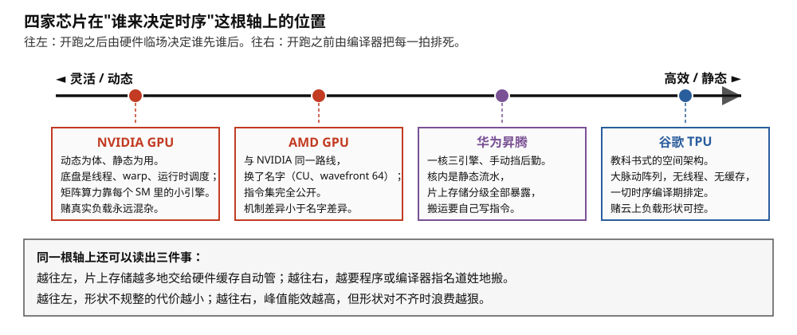
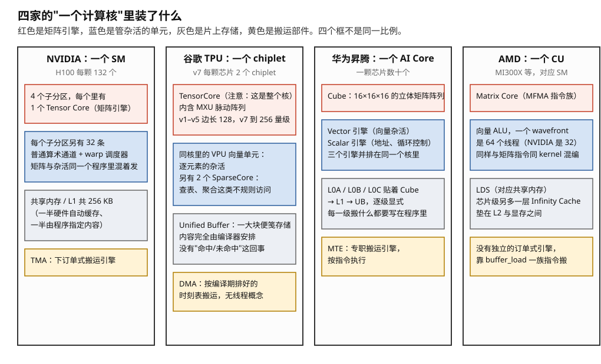
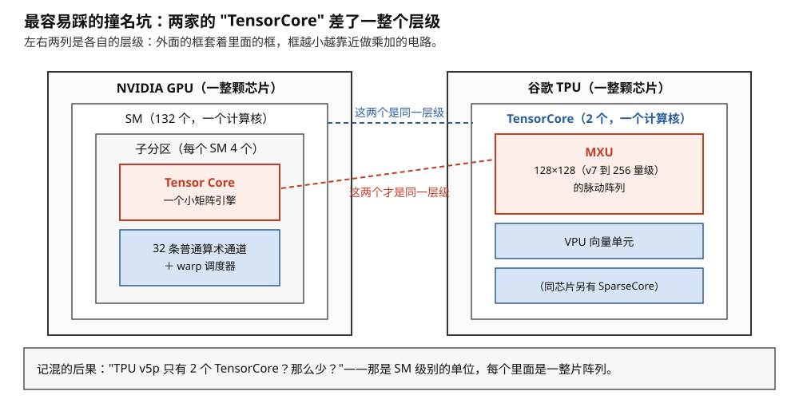
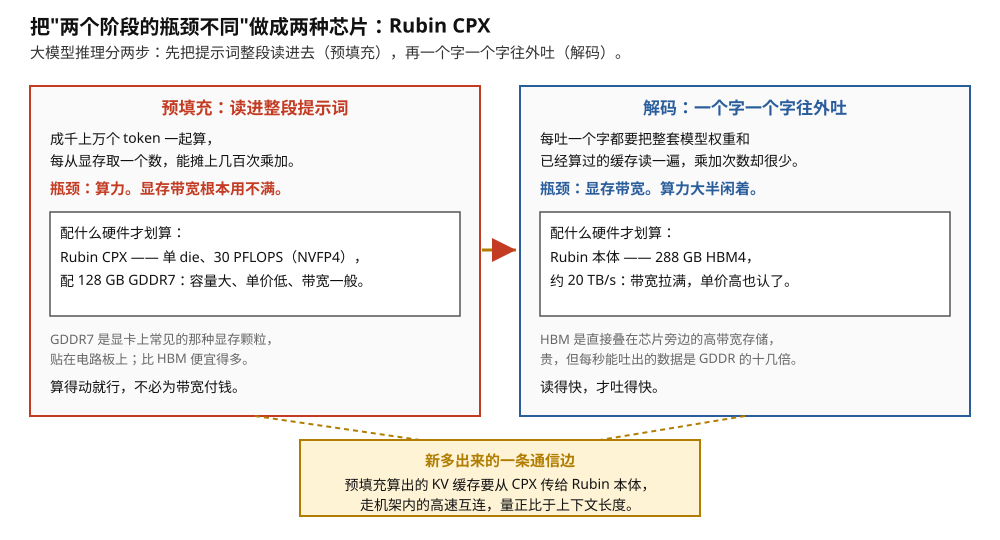
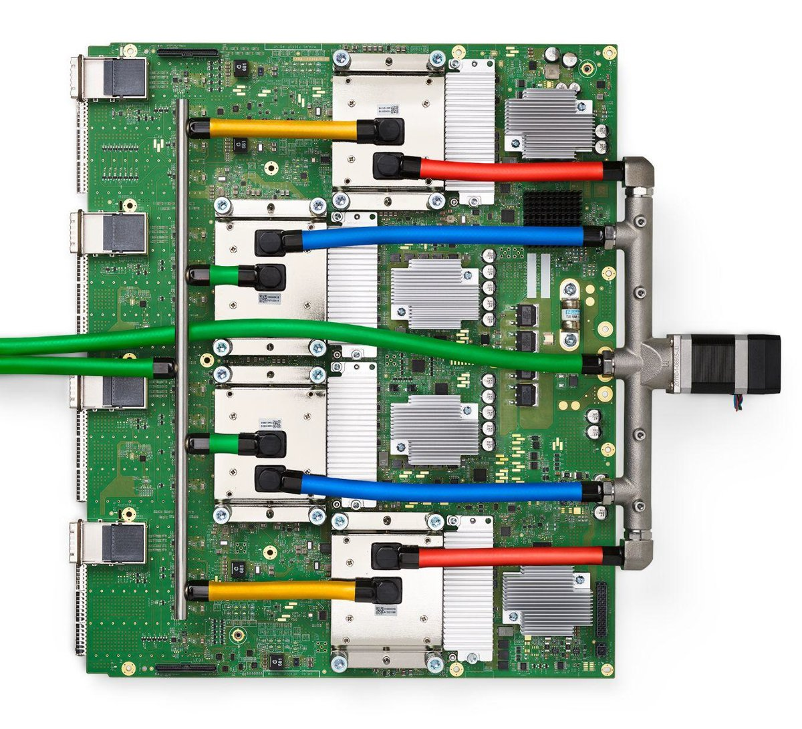

# 真实芯片对照：把全库概念钉到三块硅片上

> **所属模块**：模块 05 · 收敛（全库落地验收）
> **状态**：🟨 学习中（第三版：按《写作规范》全文重写，2026-08 更新代际参数并补入第四家对照。具体参数以官方资料为准）
> **本节主旨**：全库讲的都是"概念"，这一节把概念钉到三块真实芯片上：**NVIDIA GPU**（Hopper/Blackwell）、**谷歌 TPU**、**华为昇腾**。三块芯片正好是模块 00 那条光谱上的三个坐标——记住每块的"人设"和几个专有名词的对应关系，以后任何人甩出任何一块芯片的任何术语，你都能在三秒内把它挂回本库的某一节。本节不产生新概念，只做对号入座——它是全库的验收考卷。

---

## 0. 这一节要回答的问题

- 三块芯片各自的"一句话人设"是什么？在光谱上站哪里？
- 全库的每个核心概念，在三块芯片上分别叫什么名字？
- 各家有哪些容易踩坑的"撞名"术语？
- 听到一句混合了某家黑话的话，怎么快速翻译？

---

## 1. 光谱定位与三句人设

四家在这根轴上的位置见图 1-1。

> **图 1-1**　一句话：四家芯片可以放在同一根轴上比较，轴的两端是"谁来决定每一步什么时候执行"——左端由硬件在运行时临场决定，右端由编译器在开跑之前全部排死。
>
> **先知道一件事**：芯片里的计算部件不会自己知道该在第几拍做什么。这个顺序要么由芯片里的调度电路在运行时现场决定（灵活，但每颗芯片都要为这套电路付出面积和功耗），要么由编译器在生成程序时就逐拍排好（省电，但要求形状和时长在编译期就能算准）。这根轴问的就是"这件事交给谁"。
>
> **按这个顺序看**：
> 1. 先看轴本身的两端：左边"灵活/动态"，右边"高效/静态"。这不是好坏，是两种赌法。
> 2. 左端两个点是 NVIDIA 和 AMD。它们的底盘都是线程和运行时调度：程序发出成千上万个线程，哪个线程什么时候上机由硬件现场决定；矩阵算力靠嵌在每个通用核里的小矩阵引擎补上。
> 3. 右端是谷歌 TPU：一个大脉动阵列（数据在阵列里像脉搏一样按拍推进的固定结构），没有线程、没有自动缓存，一切时序在编译期排定。
> 4. 中间偏右是华为昇腾：核内部是静态流水，片上存储分成好几级且全部由程序指名道姓地搬——它是三家里把后勤暴露得最彻底的。
> 5. 最下面的方框是这根轴上顺带能读出的两条规律：越往右，峰值能效越高，但形状对不齐时浪费越狠；越往左，片上存储越多地交给硬件自动管。
>
> **打个比方**：左端像叫车，车什么时候到、走哪条路临时决定，灵活但要养一个调度系统；右端像地铁时刻表，一切提前排好，准点高效，但你的行程必须迁就班次。
>
> **看懂的标志**：能回答"为什么不能简单说 TPU 比 GPU 高效"——它的高效以"形状能对齐、时长可预测"为前提。前提成立时它赢，前提不成立时它的阵列在空转，而 GPU 那套现场调度正是为前提不成立的情况准备的。
>
> 来源：本库自绘。

- **NVIDIA GPU：动态为体、静态为用。** 底盘是模块 01 讲的整套 SIMT 体系（动态调度、海量线程），矩阵算力靠塞进每个 SM 的小矩阵引擎（模块 03），最重的负载上用软件流水把时序"半排死"。赌的是**真实负载永远混杂**——矩阵和杂活要在同一个 kernel 里无缝衔接。
- **谷歌 TPU：教科书的空间架构。** 核心是大脉动阵列（模块 02 的全部内容都以它为原型；边长 v1–v5 为 128，v7 已放大到 256 量级），一切时序编译期排定，无缓存、无线程概念。赌的是**云上负载可控**——形状能对齐、批量能攒大，形状税可以靠服务层消化。
  - **一个容易被漏掉的部件：SparseCore。** TPU 的核不只有 MXU 加 VPU 这一对。从 v4 起每颗芯片还配有若干 **SparseCore**——专门处理 embedding 查表、稀疏聚合这类**彻底不规则**的访问（推荐系统的特征查表是原始动机）。v7（Ironwood）是双 chiplet 结构，**每颗芯片 2 个 TensorCore 加 4 个 SparseCore**，每个 chiplet 含 1 个 TensorCore、2 个 SparseCore 和 96 GB HBM。
  - **它为什么值得单独记**：模块 02 第 2 节论证过“阵列只吃规则计算，真实网络里总有不规则的部分，必须有人兜底”，那里给的例证是 VPU。**SparseCore 是这条论证的第二个、也是更极端的例证**——VPU 兜的是逐元素运算（仍然规则，只是不是矩阵乘），SparseCore 兜的是 gather/scatter 这种连地址都不规则的活。**一颗“专用芯片”最后长出了三种计算单元，恰恰说明“只做一件事”这条路在真实负载面前有多难走。**
- **华为昇腾：一核三引擎、手动挡后勤。** 每个计算核（AI Core）里**并排放着三种引擎**：Cube（16×16×16 的矩阵阵列）、Vector（向量）、Scalar（标量）——相当于把"TPU 的阵列+伴生向量单元"塞进一个核里；片上存储显式分级（L0 三块贴着 Cube、L1、UB），数据搬运由专职引擎（MTE）按指令执行。它是三家中**存储层级暴露得最彻底**的，也因此是理解模块 02 后勤机制最直观的实物教材。

## 2. 总对照表：全库概念 → 三块硅片

| 本库概念（出处） | NVIDIA（Hopper/Blackwell/Rubin） | 谷歌 TPU | 华为昇腾 | AMD（CDNA3→CDNA5） |
| --- | --- | --- | --- | --- |
| 基本计算核（01-01） | SM（H100 为 132 个） | TensorCore ⚠️撞名，见第 3 节 | AI Core（数十个） | CU（Compute Unit） |
| 矩阵引擎（03-01 / 02-01） | Tensor Core（每 SM 4 个小引擎） | MXU（大脉动阵列；v1–v5 边长 128，v7 为 256 量级） | Cube（16³ 立体阵列） | Matrix Core（MFMA 指令族） |
| 矩阵引擎的数据流（02-03） | 输出驻留（累加器在寄存器/TMEM） | 权重驻留 | 块级输出驻留（L0C 累加） | 输出驻留（累加器在 VGPR/AGPR） |
| 杂活谁干（02-02 伴生单元） | 同一 SM 里的普通算术通道，**同 kernel 混编** | VPU（向量）加 **SparseCore（不规则查表）**，都是独立单元 | 同核内的 Vector 加 Scalar 引擎 | 同 CU 内的向量 ALU，同 kernel 混编 |
| 执行模型（01-02） | warp 动态调度（32 线程） | 无线程概念，编译器静态排 | 核内静态流水，核间任务队列 | wavefront 动态调度（64 线程） |
| 片上快速存储（01-04 / 02-04） | shared memory / L1（软硬两用，H100 每 SM 256 KB） | 大 scratchpad（Unified Buffer，编译器管理） | L0A/L0B/L0C → L1 → UB，**全显式分级** | LDS（对应 shared），另多一级 Infinity Cache |
| 搬运引擎（01-04 / 02-04） | TMA | 编译器排定的 DMA | MTE | 无独立的订单式引擎，靠 buffer_load 一族指令 |
| 同步（01-05 / 02-02） | 全家桶（屏障/栅栏/mbarrier） | 基本不需要（静态时刻表） | 核内流水同步指令，比 GPU 简单 | `s_barrier` 加编译器插入的 `s_waitcnt` 计数等待 |
| scale-up 互连（03-02） | NVLink 加 NVSwitch（NVL72 → NVL144 域） | ICI 加光路开关（可重构 pod，v7 超节点 9216 芯片） | HCCS（CloudMatrix 超节点） | Infinity Fabric → **UALink**（Helios 机架 72 卡） |
| 图编译层（04-03） | torch.compile 等（**可选**加速档） | XLA（**必经之路**） | CANN（必经之路） | torch.compile / ROCm 栈（可选，与 NV 同构） |
| kernel 层（04-04） | CUDA/Triton/CUTLASS/CuTe（全民可写） | Pallas（受限的例外通道） | Ascend C（可写，放置手动指定） | HIP（CUDA 的同构方言）加 Triton 后端 |
| 指令集策略（01-06） | PTX 虚拟层加 SASS 不公开 | 无用户可见指令集 | 不公开，经 CANN | **ISA 完整公开**，直接编译到真实机器码 |
| 性能分析方式（A1 / 02-02） | 运行时下钻（停顿分解、SOL） | 编译报告为主（九成问题在形状与切法） | Cube 占比 vs MTE 占比 | rocprof / Omniperf，概念与 Nsight 一一对应 |

图 1-2 把前三行（矩阵引擎、杂活单元、片上存储与搬运）画成了四家计算核的剖面对照。读表方法：**竖着读是认识一块芯片，横着读是检验一个概念**——比如横读"杂活谁干"这一行，四家给了四种答案（NV 同 kernel 混编 / TPU 分立的 VPU 加 SparseCore / 昇腾同核三引擎 / AMD 同 CU 混编），恰好对应模块 03 第 1 节那场"矩阵与杂活如何衔接"的路线对赌。注意 **NVIDIA 与 AMD 在这一行给的是同一个答案**——这才是它们同属 SIMT 路线最本质的体现，比"叫 warp 还是叫 wavefront"这种命名差异重要得多。

> **图 1-2**　一句话：把四家的"一个计算核"并排剖开，会发现它们装的东西是同一套——一个矩阵引擎、一个管杂活的单元、若干片上存储、一个负责搬运的部件——区别在于这几样谁归硬件管、谁归程序管。
>
> **先知道一件事**：所有这些芯片都要解决同一个矛盾——乘加电路每秒能吃的数据，远远多于外部显存每秒能供的数据。于是每家都在计算单元旁边放一小块"片上存储"当中转站，再放一个"搬运部件"负责把数据从显存搬进中转站。四栏里的灰色和黄色方框都是在解决这一件事。
>
> **按这个顺序看**：
> 1. 颜色先记住：红色是矩阵引擎，蓝色是管杂活（非矩阵计算）的单元，灰色是片上存储，黄色是搬运部件。四个框不是同一比例，只比较"装了什么"。
> 2. 第一栏 NVIDIA 的 SM：4 个子分区，每个子分区一个小 Tensor Core 加 32 条普通算术通道。关键在于矩阵指令和普通指令在同一个程序里交错发出，中间值不用搬家。
> 3. 第二栏 TPU：红框里写的 TensorCore 是整个计算核（这就是第 3 节要讲的撞名坑），核里是 MXU 脉动阵列；杂活交给同核的 VPU，而 gather 这类连地址都不规则的活交给旁边独立的 SparseCore。它的片上存储 Unified Buffer 里存什么，完全由编译器决定，没有"命中/未命中"这回事。
> 4. 第三栏华为昇腾：一个 AI Core 里并排放着 Cube（矩阵）、Vector（向量）、Scalar（地址与循环控制）三个引擎；存储分成 L0、L1、UB 好几级，每一级搬什么都要写在程序里；搬运由专职的 MTE 按指令执行。它是"手动挡"的典型。
> 5. 第四栏 AMD 的 CU：结构与第一栏几乎一一对应，只是一个 wavefront 是 64 个线程（NVIDIA 的 warp 是 32 个），另外芯片级多垫了一层 Infinity Cache。
>
> **打个比方**：四家开的都是同一种餐馆——灶台（矩阵引擎）、配菜台（杂活单元）、备料架（片上存储）、跑腿的（搬运部件）。差别在于备料是厨师自己随手拿（硬件缓存自动管），还是有人按提前写好的单子一趟趟送上来（编译器或程序指定）。
>
> **看懂的标志**：能回答"横着读这张图最该注意哪一栏"——第二栏。TPU 把杂活拆给了核外的独立单元（VPU 与 SparseCore），另外三家都是同核混编。这一处差别，正是模块 03 第 1 节那场"矩阵与杂活如何衔接"的路线对赌在实物上的体现。
>
> 来源：本库自绘。

## 3. 撞名警示：三个最容易踩的坑

**坑一：TPU 的"TensorCore" ≠ NVIDIA 的 Tensor Core。** TPU 文档里的 TensorCore 指**整个计算核**（内含 MXU 矩阵阵列 + VPU 向量单元 + 存储），对应 NVIDIA 的 SM 级别；NVIDIA 的 Tensor Core 只是 SM 里的一个矩阵引擎，对应 TPU 里的 MXU。**同一个词，差了一整个层级**——读 TPU 论文时最容易栽在这里。图 1-3 把两家的层级并排画了出来。

> **图 1-3**　一句话：NVIDIA 的 Tensor Core 和 TPU 的 TensorCore 写法几乎一样，但一个是核里的一个小部件，另一个是整个核——两者差了一整个层级。
>
> **先知道一件事**：这两家的芯片都是"套娃"结构：一整颗芯片里有很多个计算核，一个计算核里又有若干部件。所以听到一个名字，首先要问的是"它是哪一层的单位"，否则数量上完全没法比。
>
> **按这个顺序看**：
> 1. 左列从外往里：整颗 GPU → SM（132 个，一个计算核）→ 子分区（每个 SM 四个）→ 最里面的红框 Tensor Core，一个小矩阵引擎。同一层还有蓝框：32 条普通算术通道加 warp 调度器。
> 2. 右列从外往里：整颗 TPU → TensorCore（2 个，一个计算核）→ 里面的红框 MXU，一整片脉动阵列；同层还有 VPU 向量单元，芯片上另有 SparseCore。
> 3. 蓝色虚线连的是真正对应的一对：NVIDIA 的 SM 与 TPU 的 TensorCore，都是"一个计算核"。
> 4. 红色虚线连的是另一对：NVIDIA 的 Tensor Core 与 TPU 的 MXU，都是"核里的矩阵引擎"。
> 5. 两条虚线是交叉的——这就是撞名坑的全部内容：名字相同的两个词，连的不是同一层。
>
> **打个比方**：两家公司都有一个叫"技术部"的单位，一家的技术部是整个分公司，另一家的技术部是分公司里的一个小组。听到"我们有两个技术部"，先问是哪一级。
>
> **看懂的标志**：能回答"TPU v5p 只有 2 个 TensorCore，是不是太少了"——不少。那是 SM 级别的单位，每个里面是一整片 128×128 的阵列。跨家比大小，只能比矩阵单元的总乘加吞吐和显存带宽，不能比"核数"。
>
> 来源：本库自绘。

**坑二：昇腾的"L1" ≠ GPU 的 L1。** 昇腾的 L0/L1/UB 全是**软件显式管理的 scratchpad**（没有命中/未命中概念，模块 02 第 4 节），GPU 的 L1 是硬件自动缓存。名字都叫 L1，管理哲学相反。

**坑三："核数"不可跨家横比。** 132 个 SM、数十个 AI Core、2 个 TPU TensorCore——三家的"核"粒度完全不同（一个 AI Core 内含三引擎、一个 TPU 核含一整个 128×128 阵列），拿核数比算力毫无意义，要比就比矩阵单元的总乘加吞吐和显存带宽。

## 4. 实战验收：三句混合黑话的秒翻译

全库学完的标志，是下面三句话（各来自一家生态）都能立刻定位并给出下一步动作：

1. *"H100 上这个 kernel 的 Tensor pipe 只有 30%，stall 集中在 mbarrier wait。"* → NVIDIA 坐标：矩阵引擎没喂饱（模块 03 第 1 节），卡在流水线的交接等待（模块 01 第 5 节的心跳）——查 TMA 流水深度够不够、块形状对不对齐（模块 04 第 4 节 §7.4 的账）。
2. *"TPU 上这个形状 MXU 利用率 40%，XLA 报了大量 padding。"* → TPU 坐标：形状税（模块 02 第 5 节）——查哪个维度不整除 128，能否在模型侧对齐或服务侧凑批（模块 04 第 8 节链一）。
3. *"910C 上 Cube 空转，MTE 通道打满。"* → 昇腾坐标：后勤喂不上计算（模块 02 第 4 节的红旗信号）——块切太小复用不够，查 tiling 和 UB 驻留安排。

三句话来自三块芯片、用了三套词汇，但翻译动作完全相同：**定坐标（哪家）→ 挂概念（本库哪一节）→ 走该节的排查流程**。

**但上面三句都还在"一张卡内部"。真实会议里更常听到的是系统层的话，它们用的是另一套词——补三句，凑成完整的六句验收**（对应模块 00 判词法里的第三派）：

4. *"这个训练 MFU 只有 28%，HFU 有 42%。"* → **系统层-训练**（模块 09 第 1 节）：两者的差值约等于重计算的开销，说明"用算力换显存"这笔交易换得偏多了——**先确认显存是不是真的紧张到需要开全量重计算**，再考虑选择性重计算或上下文并行。**注意这句话里没有任何一个词属于前三句的词汇体系**，它衡量的是"买来的算力有多大比例用在了模型上"。
5. *"P99 的 TPOT 有 400 毫秒，中位数才 25。"* → **系统层-推理**（模块 09 第 2 节）：中位数与尾部差十几倍，是 prefill 干扰的典型指纹——长 prefill 混进 decode 批把这一步拉长了。**处方是 chunked prefill**（把 prefill 切块与 decode 混合），代价是该请求的 TTFT 略长。**这句话里也没有一个硬件词**，但它的根因（prefill 计算受限、decode 访存受限）恰恰是模块 01 附录 A2 那笔手算。
6. *"这个万卡任务每三小时断一次，checkpoint 一小时存一次。"* → **系统层-可靠性**（模块 09 第 4 节）：断的频率符合 MTBF 按 1/N 缩放的预期（正常）；**但 checkpoint 间隔明显定错了**——按最优间隔公式 √(2·C·M)，如果存一次要 30 秒、MTBF 三小时，最优间隔是十几分钟而不是一小时。**现在的配置平均每次故障要白扔半小时的进度。**

**六句话过完，本库的三大坐标系就都验收了**：一次计算怎么排时序（模块 00–03 的两派）、怎么映射到硬件（模块 04、06、08）、以及很多次计算怎么协同（模块 09）。**听到任何一句陌生的话，先判断它属于哪个坐标系，再挂到对应的那一节——这就是"顺畅对话"的完全体。**

## 5. 第四参照：AMD

AMD 的 GPU 与 NVIDIA 同属 SIMT 路线，概念一一对应、只换名字，全库各节已随文对照过，此处汇总备查：CU（对应 SM）、wavefront（对应 warp，**64 线程**）、LDS（对应 shared memory）、Matrix Core 与 MFMA 指令（对应 Tensor Core）、Infinity Fabric 与 UALink（对应 NVLink）、额外多一级 Infinity Cache（垫在 L2 与显存之间，排查带宽问题时多查一站）。**处理原则：绝大部分按"NVIDIA 概念的 AMD 名"理解即可，机制差异小于名字差异。**

**但有两处是机制上真正不同、值得单独记的**：

1. **指令集策略相反**（模块 01 第 6 节讲过）。NVIDIA 卖"时间兼容"——PTX 虚拟层稳定、SASS 不公开；AMD 卖"透明可控"——ISA 有完整官方手册，程序直接编译到真实机器码。最直观的后果是**等待指令的可见性**：NVIDIA 的依赖屏障藏在 SASS 控制位里（模块 08 第 4 节），AMD 的 `s_waitcnt vmcnt(N)` 明晃晃写在汇编里，调优时可以直接数。代价是二进制的跨代兼容性弱，换代要重新编译。
2. **wavefront 是 64 而不是 32**。这不只是一个常数：模块 08 第 5 节算过，跨 lane 交换网络的面积随 lane 数**平方**增长，而分支发散的掩码粒度就等于 lane 数。**组更宽意味着控制开销摊得更薄，但"组内全员一致"更难凑齐、发散的期望代价更高**——它是同一张权衡表上的另一个落点，不是优劣问题。

**代际现状（2026-08）**：MI300X（CDNA3，192 GB HBM3）已是上一代；当前主线是 **MI400 系列 / CDNA5**——MI455X 用 **2nm** 工艺、3200 亿晶体管、**432 GB HBM4**、约 23 TB/s 单卡带宽；机架级产品 **Helios** 是 72 张 MI455X 加 18 颗 EPYC "Venice"，31 TB HBM4、约 1.7 PB/s 聚合带宽、**UALink scale-up 域 1.8 TB/s**、约 2.9 EF FP4，全液冷，2026 年下半年出货。**这条对模块 03 第 2 节有直接意义：UALink 从"格局未定的开放标准"变成了第一个机架级落地产品，NVL72 第一次有了同量级的对手。**

## 6. 最新架构落点（知识截至 2026-08）

**NVIDIA（三代同堂）**：

| 代际 | 状态 | 关键参数 |
| --- | --- | --- |
| Blackwell（B200/GB200） | 主力出货 | 双芯合封、192 GB HBM3e、约 8 TB/s、FP4/FP6、TMEM；NVL72 机柜 |
| Blackwell Ultra（B300/GB300） | 已铺开 | **288 GB HBM3e、8 TB/s、15 PFLOPS 稠密 NVFP4、1400 W TDP（全形态强制液冷）**；GB300 NVL72 = 72×B300 + 36 Grace，1.1 EF 稠密 FP4 |
| Rubin（VR200） | 已发布规格、2026 年内爬产 | **3360 亿晶体管、TSMC N3、288 GB HBM4、约 20 TB/s（目标 22）、单芯 50 PFLOPS 推理**；NVL144 = 72 封装 × 2 计算 die；**NVLink 6 约 3.6 TB/s/GPU（双向口径）** |
| Rubin CPX | 2026 年底供货 | 单 die、**128 GB GDDR7（不是 HBM）**、30 PFLOPS NVFP4，**专供 prefill**——见下方 |

**Rubin CPX 值得单独说一句，因为它是本库主线论点第一次被做成硬件（图 1-4）。** 全库（附录 A2、模块 04 第 8 节）反复论证"prefill 计算受限、decode 带宽受限，是同一个算子的两种命运"。NVIDIA 的回应是**按瓶颈类型把芯片拆开**：prefill 的算术强度高、根本用不上 HBM 的带宽，于是给它配便宜的 GDDR7 换容量；decode 的瓶颈就是带宽，留给配 HBM4 的 Rubin 本体。Vera Rubin NVL144 CPX 机架 = 144 Rubin 加 144 Rubin CPX 加 36 Vera CPU。**用模块 04 第 7 节的语言说：这是把"prefill 和 decode 的最优映射不同"这个软件层的结论，上升成了机柜里的两种硅片。**

> **图 1-4**　一句话：大模型推理的两个阶段卡在完全不同的地方，NVIDIA 干脆按这两种瓶颈做了两种芯片，各配各的存储。
>
> **先知道一件事**：一次推理分两步。第一步是把用户的整段提示词读进去（预填充），成千上万个 token 一起算，取一次数据能摊上几百次乘加，所以卡在算力上。第二步是一个字一个字往外吐（解码），每吐一个字都要把整套模型权重读一遍，乘加次数却很少，所以卡在显存带宽上。同一个算子，两种命运。
>
> **按这个顺序看**：
> 1. 左框是预填充：瓶颈是算力，显存带宽根本用不满。既然用不满，就没必要为带宽付钱——Rubin CPX 配的是 128 GB GDDR7，也就是显卡上常见的那种贴在板上的显存颗粒，容量大、单价低、带宽一般。
> 2. 右框是解码：瓶颈就是带宽。所以 Rubin 本体配 288 GB HBM4——直接叠在芯片旁边的高带宽存储，贵，但每秒吐出的数据是 GDDR 的十几倍。读得快，才吐得快。
> 3. 中间的红箭头和底部的黄框是这套做法新引入的代价：预填充阶段算出的 KV 缓存（每个已读入 token 留下的中间结果，解码时每一步都要用）必须从 CPX 芯片传到 Rubin 本体。这是模块 03 第 2 节那张四层地图上原本没有的一条边，走机架内的互连，通信量正比于上下文长度。
> 4. 评估这类"按阶段拆硬件"的方案时，第一件事就是把这条新边的通信量算出来，看它会不会变成新的瓶颈。
>
> **打个比方**：同一家餐馆里，备菜和上菜是两种完全不同的忙法。备菜要人手多，上菜要通道宽。与其买一套两头都顶配的设备，不如把两件事分到两个房间，各配各的。
>
> **看懂的标志**：能说出这一步为什么值得单独记——"预填充计算受限、解码带宽受限"本来是软件侧分析出的结论，现在被做成了机柜里两种不同的硅片。软件层的结论上升成了硬件形态。
>
> 来源：本库自绘。

**Blackwell Ultra 的规格表里有一项很值得注意**：NVIDIA 把 **softmax 执行速度（10.7 TeraExponentials/s）**单列成了一项对外指标。这说明模块 08 第 2 节那条结论——超越函数管线只有算术管线四分之一宽、softmax 会把 Tensor Core 拖住——已经从"kernel 工程师的内部知识"上升为**厂商愿意拿出来比的一等指标**。

**谷歌 TPU**：v6（Trillium）/ v7（Ironwood）。一块 TPU 板的实物形态见图 1-5。**Ironwood 的三条硬变化**（此前几节已随文更新）：阵列边长从 128 放大到 256 量级；**MXU 首次原生支持 FP8**（每芯片 4614 TFLOPS FP8 / 2307 TFLOPS BF16）；双 chiplet 结构，每芯片 2 个 TensorCore 加 4 个 SparseCore、192 GB HBM3e、7.37 TB/s、ICI 约 1.2 TB/s，超节点规模 **9216 芯片**。

> **图 1-5**　一句话：这是一块装了四颗 TPU v4 的电路板，照片上能直接看到 TPU 的形态特征——四颗一板、整板液冷、芯片之间的互连从板子边缘引出。
>
> **先知道一件事**：照片里看不到芯片本身。中间纵向排开的四个银白色金属长方块是压在芯片上的液冷冷板（里面走水，把热带走），每块下面才是一颗 TPU 的封装，封装里是计算芯片加上紧挨着它的几摞高带宽存储。
>
> **按这个顺序看**：
> 1. 先数中间：从上到下四个银白色方块，就是四颗 TPU v4 的位置。一块板四颗，是 TPU 机架的基本单元——对比一下，GPU 常见的形态是一张插卡一颗芯片。
> 2. 每个冷板上接着两根彩色软管（黄、红、蓝、绿），向右汇到那根竖着的金属分水管，再从右边缘的接头接进机架的水路。TPU 从 v3 起就是整机液冷，板上看不到风扇。
> 3. 看照片左边缘：从上到下排着四个方形金属接口（带黑色屏蔽罩），那是这块板对外的高速连接口。TPU 的芯片间互连（ICI，模块 03 第 2 节四层地图里的第三、四层）正是从板边这样引出，接到机架里的其它板子和光路开关上。照片本身没有标注，这一条是按 TPU v4 的公开结构说明的。
> 4. 绿色板面上密布的小元件是供电部分：电感、电容、供电模块，把机架送来的电压转换成芯片要的电压。每颗芯片上百瓦的功耗，全靠这一片元件供上。
>
> **看懂的标志**：能说出 TPU 与 GPU 在形态上最直观的差别——GPU 多以插卡或独立模组出现，一张卡一颗芯片，插进机箱就能用；TPU 从设计起就是"一块板四颗、整柜液冷、板边直接引出芯片间互连"，它不是一个插件，是机架的一部分。这也解释了为什么谈 TPU 时口径总是"超节点多少颗芯片"，而不是"一张卡多快"。
>
> **与正文的对照**：照片是 v4 一代（2021 年）。本节 §6 讲的 v7（Ironwood）在参数上已大不相同（双 chiplet、每芯片 2 个 TensorCore 加 4 个 SparseCore、192 GB HBM3e），但"四颗一板、液冷、板边 ICI"这个形态延续了下来。
>
> 来源：[TPU v4 (cropped).png](https://commons.wikimedia.org/wiki/File:TPU_v4_(cropped).png)，作者 Norman P. Jouppi、George Kurian、Sheng Li、Peter Ma、Rahul Nagarajan、Lifeng Nai、Nishant Patil、Suvinay Subramanian、Andy Swing、Brian Towles、Cliff Young、Xiang Zhou、Zongwei Zhou、David Patterson，许可 CC BY 4.0（本库缩小并转存为 JPG）。

**华为昇腾**：910C 双芯；CloudMatrix 384 超节点以数量拼 scale-up 域。

**AMD**：MI400 系列 / CDNA5 / Helios 机架（详见第 5 节）——**UALink 拿出了第一个与 NVL72 同量级的机架产品**。

**三家（现在是四家）动态与本库的挂法**：新特性发布时，先问它动了**映射四维的哪一维、冻结时刻挪没挪**（模块 04 第 7 节）——这个框架吃得下任何新发布。用它过一遍 Rubin CPX：它动的不是四维里的任何一维，而是**在四维之上加了一层"按负载类型选硬件"的决策**；用它过一遍 Ironwood 的 256 边长：动的是①切分的最内层，冻结时刻仍在设计期，所以形状税的账要按新粒度重算（模块 02 第 5 节）。

## 7. 术语卡

### MXU（Matrix Multiply Unit）
**定义**：TPU 的矩阵乘法单元，一个 128×128 的权重驻留脉动阵列，每核若干个。模块 02 所有机制的原型实物。
**为什么存在**：TPU 的全部算力主体——理解了 MXU 就理解了 TPU 的能效来源（复用在电线里）和脾气（形状税、只吃规则计算）。
**语境例句**："这个模型 MXU 利用率只有五成。" —— 意思是：一半的阵列拍数没做有效计算——按模块 02 第 5 节的三种病因（形状、深度、喂料）逐一排查。

### AI Core / Cube / MTE / UB（昇腾四件套）
**定义**：昇腾的计算核（AI Core）内含 Cube（矩阵阵列）、Vector、Scalar 三引擎；MTE 是搬运引擎；UB 与 L0/L1 是显式分级的片上存储。
**为什么存在**：一核三引擎让矩阵与杂活同核衔接（对 TPU 分立结构的改良）；显式存储层级把模块 02 的后勤机制全部暴露给开发者——手动挡的代价与教学价值并存。
**语境例句**："这个算子 Vector 成了瓶颈，Cube 在等。" —— 意思是：非矩阵部分（如 softmax）占比过高，矩阵引擎喂不满——模块 02 第 2 节"伴生单元成瓶颈"的昇腾版，考虑融合或换算法结构。

### Pallas
**定义**：TPU 生态里的 kernel 级编程接口——在"一切交给 XLA"的静态世界里，留给用户手写自定义 kernel 的受限通道（角色类似 GPU 世界的 Triton）。
**为什么存在**：全静态编译覆盖不了所有创新算子（FlashAttention 式的反向映射仍需人写）——再静态的生态也要留一扇手工的门。
**语境例句**："这个新注意力在 TPU 上得用 Pallas 写。" —— 意思是：XLA 的自动编译给不出高效映射，需要人下场手排——TPU 生态里的"最后手段"，对应 GPU 决策树里的 Triton 档。

### 撞名（同词不同物）
**定义**：跨厂商术语体系中同名异义的现象。三大坑：TPU 的 TensorCore（=整个核）、昇腾的 L1（=scratchpad 而非缓存）、各家的"核数"（粒度不同不可比）。
**为什么存在**：各家术语独立演化、又都爱用通用词——跨生态对话时不澄清层级，鸡同鸭讲。
**语境例句**："TPU v5p 有两个 TensorCore？那么少？" —— 意思是：把 TPU 的"核"错当成了 NVIDIA 的矩阵引擎——那是 SM 级别的单位，每个里面是一整个 128×128 阵列，算力要按乘加吞吐比。

## 8. 我的困惑 / 待深挖

- ✅（已答大半，§1 与 §6）TPU v7 的 MXU 规模与精度支持。**遗留**：256 这个边长是官方从未确认的第三方推断，有没有更硬的来源？每个 TensorCore 到底配几个 MXU？
- SparseCore 的内部结构是什么？它更像一个向量处理器还是一个专用的 gather 引擎？新代际里出现的"集合加速引擎（CAE）"和它是什么关系？
- 昇腾 Cube 的 16³ 立体阵列内部数据流（三个维度怎么泵）？
- CloudMatrix 384、NVL72、Helios 三个机架级方案的实测对比数据？
- Rubin CPX 这种"按阶段拆硬件"的路线，KV cache 从 CPX 传给 Rubin 本体这一跳走的是什么通路、代价多大？这一跳会不会成为新的瓶颈？

---

*最后更新：2026-08-31（第三版：对照表加入 AMD 第四列并更新到 CDNA5；补入 TPU SparseCore 这个此前缺席的第三种计算单元；§6 全面重写到 2026-08，含 Blackwell Ultra / Rubin / Rubin CPX / MI400-Helios 四条线，并用映射四维框架过了一遍 Rubin CPX。第二版：按含自检的写作规范重写；含横竖读表法、三坑警示、三句秒翻译验收；2026-09 补图 5 张：现成 1 张，自绘 4 张；图注按费曼法写）*
