# SRAM：六个晶体管锁住一位，快，但是占面积

> **所属模块**：模块 07 · 封装与存储的物理实现
> **状态**：🟨 学习中（第四版。知识截至 2026-09）
> **本节主旨**：模块 07 的前三节讲封装，后面五节（07-04 到 07-08）是一条"存储器件基础线"，依次讲 SRAM、DRAM、NAND 闪存这三种存储器各自用什么电路存一个比特，以及它们各自对外的接口。这一节是这条线的第一站，先做两件事。**第一件事是把三种存储器摆在同一张表里**（§2）：同样存一个比特，SRAM 用六个晶体管，DRAM 用一个晶体管加一个电容，NAND 用一个能困住电子的晶体管；三者的芯片级密度依次相差约十倍和约五十倍，读延迟依次相差约一到两个数量级和约三个数量级，每 GB 成本从约九十美元降到几美元再降到约一毛钱。一台 AI 服务器同时用这三种存储器，原因是没有任何一种能同时做到快、密、断电不丢。**第二件事是把 SRAM 讲透**。SRAM 是三者里最快的，也是唯一能用普通逻辑工艺、和计算电路做在同一片裸片上的，所以芯片上的寄存器堆、各级缓存、各种缓冲队列全部是它。它的代价是面积：六个晶体管存一位，而且这六个晶体管的强弱比例要同时满足"读的时候不能把值冲翻"和"写的时候要改得动"两个互相矛盾的要求，晶体管越小、随机偏差越大，这个窗口越窄。**这个矛盾同时决定了 SRAM 的三件事：最低工作电压（Vmin）通常比旁边的逻辑电路高、必须配读写辅助电路、位单元面积从 5 nm 节点起几乎停止缩小。** 本节配的手算包括：一次读操作里位线放电 100 毫伏要 80 皮秒、5 亿个单元为什么要按 6 倍标准差设计、一万张卡的集群大约每两小时发生一次 SRAM 软错误、用 7 nm 的公开间距复算出 0.027 µm² 的位单元面积、以及 1 GB 的 SRAM 大约值多少钱。最后一节讲接口：SRAM 在片上以"存储宏"的形式出现，接口是一组同步的地址、数据和使能引脚，读出的数据晚一拍可用；它不需要 DDR 那样的 PHY 和训练，原因可以用一笔走线延迟的账算清楚。

---

## 0. 这一节要回答的问题

- SRAM、DRAM、NAND 闪存三种存储器到底差在哪？为什么一台机器里三种都要有？
- 六个晶体管是怎么把一个比特保持住的？读和写的时候，单元内部各点的电压是怎么变化的？
- "读扰动"和"写不进去"分别是什么？为什么说它们对晶体管尺寸的要求互相矛盾？
- 静态噪声容限（SNM）是什么？Vmin 是什么？为什么 SRAM 的最低工作电压往往比逻辑电路高？
- 读写辅助电路在帮什么忙？
- 一块 SRAM 除了存储单元还有哪些电路？灵敏放大器什么时候该启动，是谁决定的？
- SRAM 不工作的时候耗电吗？宇宙射线打翻一位的概率有多大？出厂时坏掉的单元怎么处理？
- 为什么 SRAM 位单元从 5 nm 起几乎不再缩小？换成环栅晶体管（GAA）之后有没有改善？
- 芯片设计工程师拿到的 SRAM 长什么样？它有哪些引脚，时序怎么对？
- 为什么 DRAM 接口需要 PHY 和训练，而 SRAM 不需要？

---

## 1. 基础词汇：先把本节要用的词讲清楚

**易失与非易失（volatile / non-volatile）**。断电之后数据是否还在。SRAM 和 DRAM 是易失的，断电即丢；NAND 闪存是非易失的，断电后数据可以保持数年。这条性质决定了一种存储器能不能用来保存模型文件和数据集。

**SRAM（static random-access memory，静态随机存取存储器）**。用六个晶体管构成一个互相锁定的电路来存一个比特的存储器。"静态"指的是只要供电，数据就一直保持，不需要周期性地重写。"随机存取"指的是访问任何一个地址花的时间都相同，不像磁带那样要顺序找过去。

**位单元（bitcell）**。存一个比特的最小重复电路。SRAM 的标准位单元含六个晶体管，简称 6T 单元（T 是 transistor 的首字母）。位单元面积是衡量一代工艺存储密度的基本指标，单位是平方微米（µm²）。

**字线与位线（wordline / bitline）**。存储阵列是一个二维网格。字线是横向的导线，一根字线连着一整行位单元的开关，拉高它就选中这一行。位线是纵向的导线，一整列位单元共用一对位线（写作 BL 和 BLB，两根线上的信号互补），数据通过它读出和写入。

**灵敏放大器（sense amplifier）**。接在每对位线末端的差分放大电路。读操作时位单元只能让两根位线之间产生几十到一百毫伏的电压差，灵敏放大器把这个小电压差放大成完整的逻辑 0 或 1。

**存储宏（memory macro）**。一块完整的、可以直接放进芯片版图里的存储器，包含位单元阵列和全部外围电路，尺寸和引脚位置固定。芯片设计工程师使用 SRAM 的单位是存储宏，而不是单个位单元。

**阈值电压（threshold voltage，写作 Vth）**。晶体管开始导通所需的栅极电压。Vth 越低，同样栅压下晶体管的电流越大，也就是越"强"。同一片芯片上名义相同的两个晶体管，Vth 会因为制造中的随机因素而略有不同，这个随机差异是本节 §4 的核心。

**特征尺寸 F**。工艺能制造的最小线宽或最小半间距。存储行业习惯用 F² 作单位表示一个位单元占多少个"最小方格"，这样不同工艺、不同类型的存储器可以直接比较结构效率。例如 DRAM 单元是 6F²，意思是它占 6 个最小方格。

---

## 2. 先把三种存储器摆在一起

这一节是 07-04 到 07-08 整条基础线的总览。后面四节分别展开 DRAM 和 NAND，这里先给出三者的整体对照，让读者知道每一节讲的东西在全局里处于什么位置。

### 2.1 三种存一个比特的办法

三种存储器的根本差别在于用什么物理状态表示一个比特。

**SRAM 用一个互相锁定的电路状态表示比特。** 两个反相器首尾相接，一个输出高电平、另一个输出低电平，互相维持。数据由电源持续供电来保持，所以读出时信号是被晶体管主动驱动出来的，速度快，读完之后数据还在。代价是每个比特要六个晶体管。

**DRAM 用一个电容上有没有电荷表示比特。** 每个位单元只有一个晶体管和一个电容（1T1C）。电容极小，存的电荷只有几万个电子，并且会在几十毫秒到几秒内漏掉，所以必须周期性地把数据读出来再写回去，这个动作叫刷新。读操作会把电容上的电荷放到位线上，读完之后电容里的数据就被破坏了，必须立刻写回。07-05 展开讲这些机制。

**NAND 闪存用一个晶体管的阈值电压高低表示比特。** 这种晶体管的栅极下面多了一层被绝缘体包围的存储层，电子被强电场推进去之后就留在里面，断电也不会跑掉。存储层里的电子越多，晶体管的阈值电压越高。把电子推进去和拉出来都要用约 20 伏的高电压，每次操作都会轻微损伤绝缘层，所以擦写次数有上限。07-07 展开讲这些机制。

### 2.2 一页对照表

下表的数字是 2026 年量产产品的典型量级，标注"量级估计"的行是由公开数字推算的，不是厂商公布值。

| | SRAM | DRAM | NAND 闪存 |
| --- | --- | --- | --- |
| 存一个比特用什么 | 6 个晶体管 | 1 个晶体管 + 1 个电容 | 1 个带电荷存储层的晶体管（且一个单元可存 3～4 位） |
| 位单元面积（以 F² 计） | 约 100 F² 以上 | 6 F² | 平面时代 4 F²；3D 堆叠后按每位折算远小于 1 F² |
| 位单元面积（实际值） | 约 0.02 µm² | 约 0.001 µm²（量级估计） | 每比特折合约 0.00004 µm²（量级估计） |
| 芯片级密度 | 约 0.03～0.04 Gb/mm² | 约 0.4～0.5 Gb/mm² | 约 20～30 Gb/mm² |
| 读延迟 | 0.3～2 纳秒 | 随机访问约 30 纳秒 | 约 50 微秒 |
| 写延迟 | 与读相同量级 | 与读相同量级 | 编程几百微秒到几毫秒，擦除几毫秒 |
| 断电是否保持 | 否 | 否 | 是（数年） |
| 是否需要刷新 | 否 | 是（每 32～64 毫秒一轮） | 否（但长期放置和反复读会造成偏移，需要后台巡检） |
| 擦写寿命 | 实际无限 | 实际无限 | 有限：TLC 约 3000 次，QLC 约 1000 次 |
| 制造工艺 | 标准逻辑工艺 | 专用 DRAM 工艺 | 专用 NAND 工艺 |
| 能否与计算电路同片 | 能 | 基本不能 | 不能 |
| 每 GB 成本（量级估计） | 约 90 美元 | 几美元 | 约 0.1 美元 |

### 2.3 表里几个数字是怎么来的

对照表里的数字如果只是罗列，读者没法判断它们可不可信，所以这里把其中三行的推算过程写出来。

**位单元面积的三个实际值。** SRAM 的 0.02 µm² 是晶圆厂直接公布的数字（§7 有各节点的表）。DRAM 的单元结构是 6F²，当前量产节点的 F 约 13 纳米，所以面积 = 6 × 13 × 13 ≈ 1014 平方纳米，约 0.001 µm²。NAND 的算法不同，因为 3D NAND 把单元纵向叠了两三百层，只能用芯片级密度反推：每平方毫米 25 Gb，即 10¹² 平方纳米 ÷ 2.5 × 10¹⁰ 比特 = 每比特 40 平方纳米，约 0.00004 µm²。三者相比，一个 SRAM 位单元占的硅面积大约等于 20 个 DRAM 单元，或者 500 个 NAND 比特。

**SRAM 每 GB 成本的 90 美元。** 这个数字可以从晶圆价格算出来：

1. 一片 300 毫米晶圆的面积 = π × 150² ≈ 70700 平方毫米。
2. 2 nm 级别工艺的晶圆价格按 3 万美元估计，每平方毫米约 0.42 美元。
3. 这一代工艺的 SRAM 存储宏密度约 38 Mb/mm²（§7）。1 GB = 8000 Mb，需要 8000 ÷ 38 ≈ 210 平方毫米。
4. 210 × 0.42 ≈ **90 美元**，还没有计入良率损失。

这笔账说明了一个直接的事实：H100 上 50 MB 的 L2 缓存值大约 4.5 美元的硅，这还可以接受；但如果想用 SRAM 做 80 GB 的显存，光硅成本就是 7200 美元，面积是 16800 平方毫米，相当于 20 颗光罩极限大小的裸片。**SRAM 只能用来做容量以 KB 和 MB 计的存储，这是由面积决定的。**

**读延迟的三个量级。** SRAM 的信号由晶体管主动驱动，一次读约几百皮秒到 2 纳秒。DRAM 要先等电容上的微弱电荷被放大，再从行缓冲里选列输出，一次随机访问约 30 纳秒。NAND 要对选中的单元逐个参考电压地比较，一页读出约 50 微秒。相邻两者之间的比例分别是约 15 到 100 倍和约 1700 倍。

### 2.4 在一台 AI 服务器里，三种存储器各自在哪

以一台装 8 张 H100 的服务器为例，三种存储器的位置和容量大致如下。

| 存储器 | 物理位置 | 容量量级 | 存什么 |
| --- | --- | --- | --- |
| SRAM | GPU 和 CPU 的裸片内部 | 每颗 GPU 约 100 MB（寄存器堆约 33 MB、L2 约 50 MB、各 SM 的 L1 与共享内存等） | 正在参与计算的操作数、刚从显存取来的数据块 |
| DRAM（HBM 形态） | GPU 封装内，与计算裸片并排贴在中介层上 | 每张卡 80 GB | 模型权重、激活值、KV 缓存 |
| DRAM（DDR5 内存条形态） | 主板的内存插槽 | 整机 1～2 TB | 数据加载的缓冲、操作系统、预处理中的样本 |
| NAND 闪存（NVMe 固态盘形态） | 机箱前部的盘位 | 整机几十 TB | 数据集、模型文件、训练检查点 |

从上到下（见图 4-1），容量每级增大两到三个数量级，访问延迟也每级增大一到三个数量级。**数据从固态盘到主机内存、到显存、到片上 SRAM、最后到计算单元，每往里走一级，存储就更快、更小、更贵。** 这条路径的搬运指令和带宽瓶颈在 06-01 和 06-03 讲，本模块讲的是这条路径上每一级存储器的内部构造。

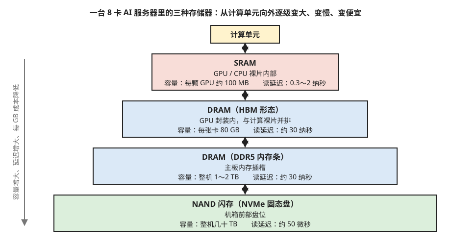

> **图 4-1**　一句话：一台 AI 服务器同时用着三种存储器，离计算单元越近的越快、越小、每 GB 越贵。
>
> **先知道一件事**：计算单元只能直接算放在它手边的数据。要用的数据得从外层一级一级搬进来，而每一级存储器用不同的物理办法存比特，所以速度和容量相差很大。
>
> **按这个顺序看**：
> 1. 顶上黄框是计算单元，也就是真正做乘法和加法的电路。
> 2. 往下第一层红框是 SRAM：它做在 GPU 或 CPU 芯片内部，每颗 GPU 大约 100 MB，读一次只要 0.3～2 纳秒（1 纳秒是十亿分之一秒），相当于 GPU 时钟走一到几拍。
> 3. 接下来两层蓝框都是 DRAM，只是装的地方不同。一层是 HBM，也就是贴在 GPU 封装里、紧挨着计算芯片的显存，每张卡 80 GB；另一层是插在主板上的 DDR5 内存条，整机 1～2 TB。两者读一次都在 30 纳秒左右，比 SRAM 慢十几到上百倍。
> 4. 最下面的绿框是用 NAND 闪存做的 NVMe 固态盘：整机几十 TB，读一次约 50 微秒（1 微秒等于 1000 纳秒），又比 DRAM 慢一千多倍，但它断电后数据不会丢。
> 5. 左侧的灰色箭头概括了规律：越往下容量越大、延迟越长、每 GB 越便宜。方框的宽度只是示意层级，不按容量比例画。
>
> **打个比方**：像做饭：砧板（SRAM）就在手边，放不了几样东西；冰箱（HBM 和内存）要转身去拿；地下室的储藏间（固态盘）能放很多，但每次去一趟都很费时间。
>
> **看懂的标志**：能回答“为什么不把显存全换成 SRAM”：同样面积的硅，SRAM 能存的比特只有 DRAM 的约二十分之一，做 80 GB 的 SRAM 光硅面积就要上万平方毫米，相当于二十颗最大尺寸的芯片（§2.3）。
>
> 来源：本库自绘。

这张对照表到这里就完整了。下面从 §3 开始只讲 SRAM。

---

## 3. 6T 单元：保持、读、写的逐步走查

### 3.1 结构

6T 单元的六个晶体管分成三对，每对的名字在后文会反复用到。

- **下拉管（pull-down，缩写 PD）**两个，是 N 型晶体管，负责把存储节点拉到地电位。
- **上拉管（pull-up，缩写 PU）**两个，是 P 型晶体管，负责把存储节点拉到电源电压。
- **访问管（access transistor，也叫 pass-gate，缩写 PG）**两个，是 N 型晶体管，栅极接字线，负责把存储节点和位线接通或断开。

一个上拉管和一个下拉管上下串联构成一个反相器（输入高则输出低，输入低则输出高）。两个反相器的输出各自接到对方的输入上。两个输出点就是存储节点，记作 Q 和 QB。电路连接见图 4-2。

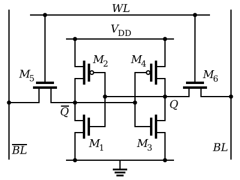

> **图 4-2**　一句话：SRAM 的一个比特，存在这六个晶体管组成的电路里——中间四个互相维持着一个值，两边两个负责开门放行。
>
> **先知道一件事**：晶体管在这里就是一个受电压控制的开关。图中每个晶体管旁边那根短竖线是它的控制端（叫栅极）：给高电压，开关接通；给低电压，开关断开。带小圆圈的两个（M2、M4）正好反过来，给低电压时接通。
>
> **按这个顺序看**：
> 1. 先看中间的四个晶体管。左边上下两个（M2、M1）是一组，右边上下两个（M4、M3）是一组。每一组的作用都是"把输入反过来输出"：输入高电压，输出就是低电压；输入低电压，输出就是高电压。
> 2. 再看两组之间交叉的连线：左组的输出（Q̄ 点）接到右组的输入，右组的输出（Q 点）又接回左组的输入。于是 Q 是高，就逼得 Q̄ 是低；Q̄ 是低，又反过来逼 Q 保持高。两点互相维持，只要不断电就一直不变——这就是存住了一个比特。
> 3. 最后看最外侧的 M5、M6 和顶上横着的 WL（字线）。M5、M6 平时断开，把中间这个互相维持的电路与两侧的竖线 BL、BL̄（位线，数据进出的通道）隔开。只有字线给高电压时它们才接通，外面才能读出或改写里面的值。
>
> **打个比方**：中间是两个人背靠背互相顶着，谁也倒不下去；M5、M6 是两扇门，平时关着，字线下令开门时，外面的人才能看一眼，或者用力把他们推成另一个姿势。
>
> **看懂的标志**：能回答"SRAM 为什么不需要刷新"——因为 Q 和 Q̄ 一直被接通的晶体管连在电源或地上，漏掉一点电马上会被补回来，不像 DRAM 的电容那样孤立地放着。
>
> **与正文的对照**：M6、M5 是正文的访问管 PG1、PG2；M4、M3 是上拉管 PU1、下拉管 PD1；M2、M1 是上拉管 PU2、下拉管 PD2。图中 Q 画在右边，正文走查里画在左边，连接关系相同。
>
> 来源：[SRAM Cell (6 Transistors).svg](https://commons.wikimedia.org/wiki/File:SRAM_Cell_(6_Transistors).svg)，作者 Inductiveload，许可 Public domain（本库添加了白色背景）。

### 3.2 保持：数据是怎么不丢的

设电源电压为 0.75 伏，单元里存的是 1，约定为 Q = 0.75 伏、QB = 0 伏。字线为低电平，两个访问管都关断。

此时 Q 的高电平加在右侧反相器的输入上，使右侧的下拉管 PD2 导通、上拉管 PU2 关断，于是 QB 被拉到 0 伏。QB 的低电平又加在左侧反相器的输入上，使左侧的上拉管 PU1 导通、下拉管 PD1 关断，于是 Q 被拉到 0.75 伏。两个节点的电平互相维持。如果有少量电荷漏掉使 Q 略微下降，导通着的 PU1 会立刻从电源补充电流把它拉回去。

这就是 SRAM 不需要刷新的原因：**存储节点始终通过一个导通的晶体管连着电源或地，任何小的扰动都会被主动纠正。** DRAM 的电容在保持期间与电源断开，没有这条补充路径，所以会漏（07-05 §5）。

### 3.3 读：逐步走查

沿用上面的状态（Q = 0.75 伏，QB = 0 伏），读这一位的过程如下。

| 步骤 | 动作 | BL | BLB | Q | QB |
| --- | --- | --- | --- | --- | --- |
| 1. 预充电 | 外围电路把两根位线都充到电源电压，然后断开，让位线悬空 | 0.75 | 0.75 | 0.75 | 0 |
| 2. 开字线 | 字线拉高，PG1 和 PG2 导通 | 0.75 | 0.75 | 0.75 | 0 → 约 0.12 |
| 3. 位线放电 | BLB 通过 PG2 和 PD2 两个串联的晶体管向地放电，电压缓慢下降；BL 两端电压相等，没有电流 | 0.75 | 0.75 → 0.65 | 0.75 | 约 0.12 |
| 4. 灵敏放大 | 灵敏放大器启动，把 BL 与 BLB 之间 0.1 伏的差值放大成完整的 1 | 0.75 | 0.65 | 0.75 | 约 0.12 |
| 5. 关字线 | 字线拉低，访问管关断，QB 被 PD2 拉回 0 | — | — | 0.75 | 0 |

第 2 步里 QB 从 0 上升到约 0.12 伏（见图 4-3 第三行），这个现象需要解释。字线打开后，BLB（0.75 伏）经过 PG2 到 QB、再经过 PD2 到地，形成一条电流通路。PG2 和 PD2 是两个串联的导通电阻，QB 是它们的中间点，它的电压由两个电阻的比例决定：下拉管越强（电阻越小）、访问管越弱（电阻越大），QB 被抬起得越少。

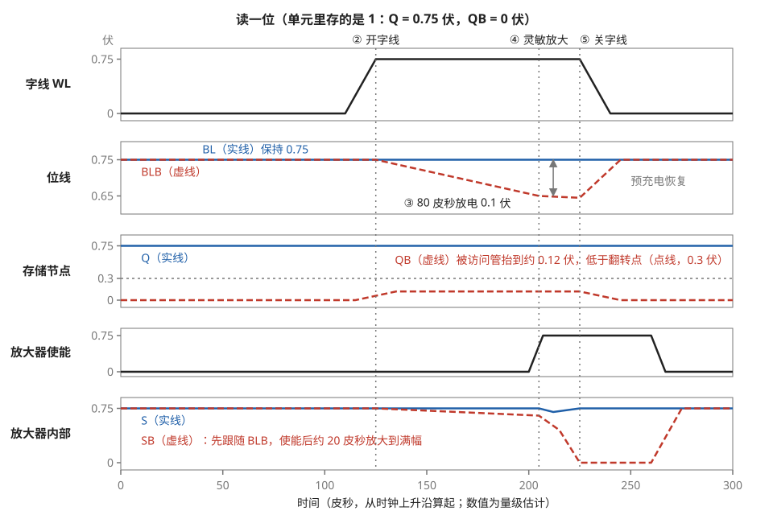

> **图 4-3**　一句话：读一位时，单元只让一根导线的电压慢慢降低 0.1 伏，放大器看出这点差别后把它放大成确定的 0 或 1；整个过程中单元里存的值保持不变。
>
> **先知道一件事**：这是一张波形图。每一行代表一根导线，横轴是时间（单位皮秒，1 皮秒是一万亿分之一秒），纵轴是这根导线的电压（单位伏）。电压高代表 1、低代表 0，本图里的“高”是 0.75 伏。
>
> **按这个顺序看**：
> 1. 第一行“字线 WL”是一整行单元共用的开门信号。大约在 110～125 皮秒之间它从 0 升到 0.75 伏（图上标 ②），这一行单元的门被打开。
> 2. 第二行“位线”：每个单元左右各连着一根竖向导线，蓝实线叫 BL，红虚线叫 BLB，读之前两根都被预先充到 0.75 伏。门打开后，单元里存着低电压的那一侧把 BLB 慢慢往下拉，用了约 80 皮秒才降了 0.1 伏（标 ③，灰色双箭头量的就是这 0.1 伏）。BL 那一侧单元里存的是高电压，导线两头电压一样，所以不动。
> 3. 第三行“存储节点”是单元内部存数据的两个点：Q（蓝实线）存 0.75 伏，QB（红虚线）存 0 伏。门开着的这段时间，QB 被从 0 抬到约 0.12 伏。灰色点线在 0.3 伏处，QB 如果被抬过这条线，单元就会翻成相反的值；0.12 离 0.3 还有一段距离，所以这次读是安全的。
> 4. 第四行“放大器使能”：大约 200 皮秒时（标 ④）放大器被打开。
> 5. 第五行“放大器内部”是放大器里的两个点 S 和 SB。打开之前它们分别跟着两根位线，SB 随 BLB 降到约 0.65 伏；打开之后，SB 在约 20 皮秒内掉到 0，S 保持 0.75 伏。原来只差 0.1 伏，现在差了整整 0.75 伏，结果读成“存的是 1”。
> 6. 约 225 皮秒（标 ⑤）字线关闭，门关上。之后位线被重新充回 0.75 伏（图上“预充电恢复”），QB 也回到 0。
>
> **打个比方**：两桶水都装满，打开阀门后其中一桶开始慢慢漏水。不必等它漏光，只要看出哪一桶水位低了一点点，就能判断是哪一桶在漏。放大器做的就是这个“看出一点点差别就下结论”的事。
>
> **看懂的标志**：能回答“为什么不等 BLB 降到 0 再读”：降到 0 要约 600 皮秒，是 80 皮秒的 7.5 倍，而且放掉的电之后还要充回来，能量也要多花 7.5 倍；0.1 伏的差别已经够放大器可靠判断（§3.3、§3.5）。
>
> **与正文的对照**：图上 ②③④⑤ 对应上表的步骤 2 到 5。步骤 1 预充电发生在 0 皮秒之前，图中各线一开始都在 0.75 伏就是它的结果。各段时长为量级估计。
>
> 来源：本库自绘。

0.12 伏这个数可以用读电流反推两个晶体管的等效电阻来核对。读电流约 25 微安，这股电流同时流过 PG2 和 PD2。PD2 两端的电压是 0.12 伏，所以它的等效电阻是 0.12 V ÷ 25 µA = 4.8 千欧。PG2 两端的电压是 0.75 − 0.12 = 0.63 伏，所以它的等效电阻是 0.63 V ÷ 25 µA ≈ 25 千欧。两者相差约 5 倍。

即使两个晶体管的尺寸完全相同，它们的等效电阻也会相差几倍，原因是两者的工作条件不同。PD2 的栅极接在 Q 上，是完整的 0.75 伏，它的源极接地，栅极与源极之间的电压差是 0.75 伏，导通得很充分。PG2 的栅极接字线，也是 0.75 伏，但它的源极是 QB，QB 被抬到 0.12 伏之后，栅极与源极之间的电压差只剩 0.63 伏，导通程度较低；同时它两端的电压差很大，电流已经饱和，不再随电压差增大而增大。所以同样的尺寸下，访问管表现得比下拉管弱得多。这一点在 §7.3 讨论鳍数相同的位单元为什么还能工作时会用到。

**第 3 步花多少时间可以手算。** 假设一根位线上挂 256 个位单元，每个单元贡献约 0.08 fF 的寄生电容，位线总电容约 20 fF。单元能提供的读电流约 25 微安。让位线下降 0.1 伏需要的时间 = 电容 × 电压变化 ÷ 电流 = 20 fF × 0.1 V ÷ 25 µA = **80 皮秒**。

如果不用灵敏放大器，等位线从 0.75 伏完全放电到 0，需要 20 fF × 0.75 V ÷ 25 µA = **600 皮秒**，是 7.5 倍。能量也是同样的比例：位线放电 0.1 伏之后要重新充回去，电源为每根位线付出的能量是 20 fF × 0.75 V × 0.1 V = 1.5 fJ；完全放电则是 20 fF × 0.75 V × 0.75 V ≈ 11.3 fJ。一行 256 列同时在放电，所以一次读的位线能量是 0.38 pJ 对 2.9 pJ。灵敏放大器用一块模拟电路换来了 7.5 倍的时间和能量，所以它在所有 SRAM 里都是标准配置。

### 3.4 写：逐步走查

现在要把这一位从 1 改成 0，也就是让 Q 变成 0 伏、QB 变成 0.75 伏。

| 步骤 | 动作 | BL | BLB | Q | QB |
| --- | --- | --- | --- | --- | --- |
| 1. 驱动位线 | 写驱动器把 BL 拉到 0，BLB 保持在电源电压 | 0 | 0.75 | 0.75 | 0 |
| 2. 开字线 | 字线拉高。PG1 试图把 Q 拉向 BL 的 0 伏，而导通着的 PU1 试图把 Q 维持在 0.75 伏，两者对抗 | 0 | 0.75 | 0.75 → 约 0.25 | 0 |
| 3. 翻转 | Q 降到右侧反相器的翻转点以下，PD2 关断、PU2 导通，QB 开始上升；QB 上升又使 PU1 关断、PD1 导通，Q 被进一步拉低。两个节点互相加速，迅速翻到新状态 | 0 | 0.75 | 0 | 0.75 |
| 4. 关字线 | 字线拉低，新状态由两个反相器自己保持 | — | — | 0 | 0.75 |

第 2 步是写操作成败的关键（见图 4-4 第三行）。Q 点同时被两个晶体管拉向相反的方向：访问管 PG1 往下拉，上拉管 PU1 往上拉。Q 最终停在哪个电压，取决于这两个晶体管谁更强。**只有访问管明显强于上拉管，Q 才能被拉到翻转点以下，写操作才能成功。**

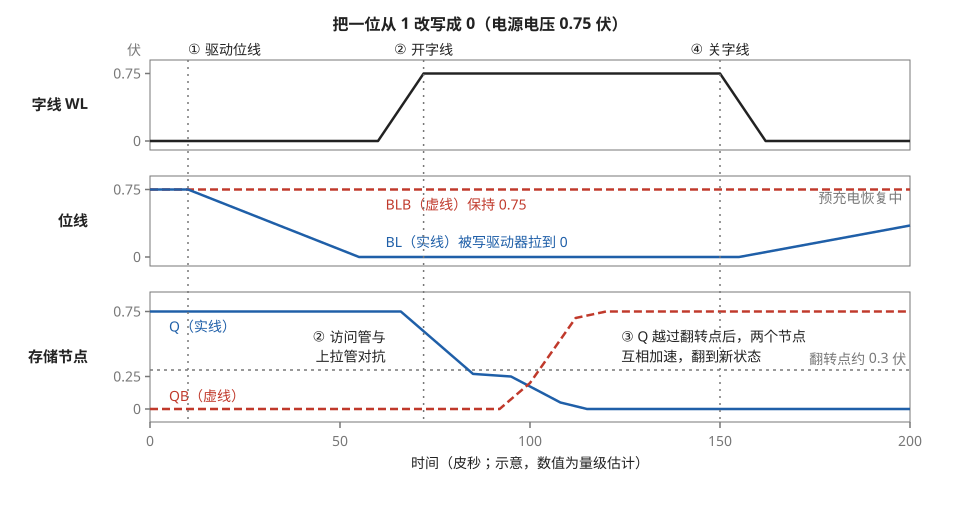

> **图 4-4**　一句话：写一位就是从外面用更大的力，把单元里互相维持的两个点硬推到相反的状态；只要推过中间某个电压，单元自己就会迅速翻过去。
>
> **先知道一件事**：这也是波形图：横轴是时间（皮秒），纵轴是电压（伏）。单元里的两个存储点 Q 和 QB 总是一高一低、互相维持（图 4-2）；想改写，就得从外面把高的那个点拉低。
>
> **按这个顺序看**：
> 1. 先看第二行“位线”：约 10 皮秒时（标 ①），专门负责写入的写驱动器把蓝实线 BL 从 0.75 伏拉到 0，红虚线 BLB 留在 0.75 伏。这相当于下达指令“把 Q 改成 0”。
> 2. 第一行“字线 WL”：约 60～72 皮秒升高（标 ②），门打开，Q 通过门连到了 0 伏的 BL 上。
> 3. 第三行“存储节点”：蓝实线 Q 从 0.75 伏开始往下掉，但在约 0.25 伏附近停留了一小段。这是因为单元内部还有一个把 Q 连到电源的晶体管（上拉管）在往上拉，门那一侧往下拉，两边在较劲。灰色点线是 0.3 伏，叫翻转点。
> 4. Q 一旦掉到翻转点以下，红虚线 QB 就开始上升；QB 升高又让 Q 掉得更快，两个点互相推动，在大约 100～120 皮秒之间完成翻转，变成 Q = 0、QB = 0.75。
> 5. 150 皮秒时（标 ④）字线关闭，新值由单元自己维持下去。之后 BL 开始从 0 往回充（“预充电恢复中”），因为要从 0 一路充满，这比读之后的恢复慢得多。
>
> **打个比方**：推一扇装着弹簧的翻板：没推过中线就松手，它会弹回原位；一旦推过中线，它会自己翻到另一边。
>
> **看懂的标志**：能回答“写入能不能成功取决于什么”：取决于门打开时，门那一侧往下拉的力是否明显大于上拉管往上拉的力，大到能把 Q 拉过 0.3 伏的翻转点。§3.4 算过，上拉管的等效电阻至少要是访问管的 2 倍。
>
> **与正文的对照**：①②④ 对应上表的步骤 1、2、4，步骤 3 的翻转发生在 Q 越过点线之后。上文说的“门”就是访问管，“写驱动器”见 §5.2.4。时间数值为示意。
>
> 来源：本库自绘。

这里的"翻转点"指的是反相器输入电压越过它、输出就会从一个电平翻到另一个电平的那个电压，通常在电源电压的 40% 到 50% 附近，上面的例子里约 0.3 伏。

表里 Q 被拉到约 0.25 伏，对应的强弱关系同样可以算出来。Q 是 PU1 和 PG1 这两个导通电阻的中间点，上端接 0.75 伏电源，下端接 0 伏的位线，所以 Q 的电压 = 0.75 × PG1 的电阻 ÷（PG1 的电阻 + PU1 的电阻）。要让 Q 等于 0.25 伏，PU1 的等效电阻必须是 PG1 的 2 倍。如果两者电阻相等，Q 只能降到 0.375 伏，刚好停在翻转点附近，写操作能否成功就取决于随机偏差了。

### 3.5 灵敏放大器内部：为什么 100 毫伏就够

§3.3 的第 4 步只说了灵敏放大器"把 0.1 伏的差值放大成完整的 1"，这一小节把它内部的过程补全。

最常用的灵敏放大器是**锁存型**的。它的核心与位单元相同，也是两个首尾相接的反相器，只是晶体管的尺寸大得多，并且两个反相器共用的接地通路上串了一个开关晶体管，由使能信号控制。它的两个内部节点记作 S 和 SB，分别通过两个小开关接到 BL 和 BLB 上。

一次放大分三步：

| 步骤 | 动作 | S | SB |
| --- | --- | --- | --- |
| 1. 跟随 | 使能信号为低，接地通路断开，两个反相器不工作。S 和 SB 通过小开关跟随位线电压 | 0.75 | 0.65 |
| 2. 隔离并使能 | 把 S、SB 与位线之间的小开关断开，同时使能信号拉高，接地通路接通 | 0.75 | 0.65 |
| 3. 正反馈 | 两个节点都开始被拉向地，但 SB 较低，它控制的那个下拉管导通得较弱，所以 S 下降得慢；S 较高，它控制的下拉管导通得较强，所以 SB 下降得快。差值越拉越大，最后 SB 到 0，S 被上拉管拉回 0.75 | 0.75 | 0 |

第 3 步里两个节点的电压差按指数规律增长，每经过一个时间常数增大到约 2.7 倍。假设时间常数是 10 皮秒，从 0.1 伏增长到 0.75 伏需要增大 7.5 倍，即 ln 7.5 ≈ 2 个时间常数，约 **20 皮秒**。如果初始差值只有 0.01 伏，需要增大 75 倍，即 ln 75 ≈ 4.3 个时间常数，约 43 皮秒。所以从放大速度看，初始差值小一些也能工作。

**初始差值不能太小的真正原因是灵敏放大器自己的偏差。** 它的两个反相器名义上完全对称，但晶体管的阈值电压有随机偏差（§4.3 详细讲），效果相当于在输入端叠加了一个固定的偏移电压。这个偏移电压的标准差约 15 毫伏（量级估计）。一颗芯片上有几百万个灵敏放大器，要保证偏差最大的那一个也不读错，位线上的差值必须超过偏移电压的 5 到 6 倍标准差，即 75 到 90 毫伏。§3.3 取 100 毫伏作为位线放电的目标值，依据就是这个数。

第 2 步里先断开小开关再使能，是为了让灵敏放大器只需要驱动自己内部很小的节点电容，而不必带着 20 fF 的位线一起翻转。这样位线上的电压摆幅停在 0.1 伏，§3.3 算的那笔 7.5 倍的能量才省得下来。

读和写的走查放在一起看，会发现一个问题：读操作希望访问管弱，写操作希望访问管强。下一节专门讲这个矛盾。

---

## 4. 稳定性：为什么六个晶体管的强弱比例这么难定

### 4.1 两种失败

**读扰动（read disturb）**指读操作把单元里的值改掉了。§3.3 的第 2 步里 QB 被抬到约 0.12 伏，而右侧反相器的输出 QB 同时是左侧反相器的输入。如果 QB 被抬到超过左侧反相器的翻转点（约 0.3 伏），左侧反相器就会认为输入变成了高电平，把 Q 拉低，单元的值从 1 翻成 0。这次读操作读出了错误的值，并且破坏了存储的数据。要避免读扰动，QB 在读期间必须抬得足够少，也就是**下拉管要比访问管强**。

**写失败（write failure）**指写操作没能把值改过来。§3.4 的第 2 步里，如果访问管不够强，Q 只能被拉到比如 0.4 伏而到不了翻转点以下，字线关断后单元会回到原来的状态。要避免写失败，**访问管要比上拉管强**。

把两个要求并列：

| 要求 | 晶体管强弱关系 | 对访问管的要求 |
| --- | --- | --- |
| 读的时候不翻转 | 下拉管 > 访问管 | 访问管要弱 |
| 写的时候改得动 | 访问管 > 上拉管 | 访问管要强 |

两个要求合起来就是 **下拉管 > 访问管 > 上拉管**。访问管的强度被夹在中间，上下各要留出足够的余量。

### 4.2 静态噪声容限：把"余量"变成一个数

工程上需要一个数字来衡量单元离翻转还有多远，这个数字叫**静态噪声容限（static noise margin，缩写 SNM）**。它的定义是：在存储节点上叠加多大的直流电压扰动，单元的状态才会翻转。SNM 的单位是毫伏，数值越大，单元越稳定。

SNM 分三种情况测量。保持状态下（字线关闭）的 SNM 最大，在 0.75 伏电源下约 250 到 300 毫伏。读状态下（字线打开、位线在高电平）的 SNM 小得多，通常只有 100 到 150 毫伏，因为存 0 的那个节点已经被访问管抬起了一截，离翻转点更近。写操作则用另一个对称的指标叫写容限（write margin）来衡量，它表示位线要被拉到多低才能把单元写翻。

这些数字是从一张叫**蝶形曲线**的图上读出来的。下面分四步说明这张图怎么画、SNM 怎么读。

**第一步，测一个反相器的传输曲线。** 把位单元里两个反相器之间的连线在想象中断开，单独看右侧那个反相器：给它的输入 Q 加一个电压，记录输出 QB 的电压。输入从 0 扫到 0.75 伏，得到一条"输出随输入变化"的曲线，叫电压传输曲线。保持状态下（字线关闭）的一组示意数据如下：

| 输入 Q（伏） | 0 | 0.20 | 0.30 | 0.35 | 0.375 | 0.40 | 0.45 | 0.75 |
| --- | --- | --- | --- | --- | --- | --- | --- | --- |
| 输出 QB（伏） | 0.75 | 0.74 | 0.70 | 0.55 | 0.375 | 0.20 | 0.05 | 0 |

输入低于 0.3 伏时输出基本保持在高电平，输入高于 0.45 伏时输出基本在低电平，中间 0.15 伏的范围内输出急剧下降。输入等于输出的那一点（0.375 伏）就是翻转点。

**第二步，把两个反相器的曲线画在同一张图上。** 取横轴为 Q、纵轴为 QB。右侧反相器的曲线直接画上去，它从左上角（0，0.75）出发，先沿上边缘向右，在 Q ≈ 0.3 伏处转弯急降，最后沿下边缘到右下角（0.75，0）。左侧反相器的输入是 QB、输出是 Q，和右侧反相器正好对调，所以它的曲线要把横纵坐标互换之后再画：同样从左上角出发，但先沿左边缘向下，在 QB ≈ 0.3 伏处转弯急速向右，最后沿下边缘到右下角。两条曲线画在一起的样子见图 4-5 左半边。

两条曲线有三个交点。左上角（Q = 0，QB = 0.75）和右下角（Q = 0.75，QB = 0）是两个稳定状态，分别对应存 0 和存 1。中间的（0.375，0.375）是翻转点，电路不会停在那里。两条曲线在左上和右下各围出一个闭合区域，形状像蝴蝶的一对翅膀，图因此得名。

**第三步，在闭合区域里放一个尽可能大的正方形，它的边长就是 SNM。** 用上面的数据走一遍左上那个区域：左侧反相器的曲线经过点（0.05，0.45），右侧反相器的曲线经过点（0.30，0.70）。以前者为左下角、后者为右上角，正好是一个边长 0.25 伏的正方形，并且在这个区域里放不下更大的。所以保持状态的 SNM 约 **250 毫伏**。

**为什么是正方形的边长。** 假设有一个大小为 Vn 的直流干扰电压，以最不利的方向同时串在两个反相器的输入端。对右侧反相器来说，它实际感受到的输入比 Q 高了 Vn，效果是它的曲线整体向左平移 Vn。对左侧反相器来说，它的曲线整体向下平移 Vn。两条曲线相向移动，左上那个闭合区域随之缩小。当 Vn 增大到等于最大内接正方形的边长时，闭合区域恰好消失，左上角那个稳定交点也随之消失，电路只剩右下角一个稳定状态，原来存的 0 被翻成 1。所以这个边长就是单元能承受的最大干扰电压。

**第四步，读状态下重画一遍。** 读的时候字线打开、位线在 0.75 伏，访问管会把反相器的输出往上拉。这对输出为高的情况没有影响，但输出为低时，输出节点到不了 0，只能降到约 0.12 伏（就是 §3.3 算过的那个值）。传输曲线的右半段被整体抬高：

| 输入（伏） | 0 | 0.20 | 0.30 | 0.35 | 0.385 | 0.42 | 0.50 | 0.60 | 0.75 |
| --- | --- | --- | --- | --- | --- | --- | --- | --- | --- |
| 输出（伏） | 0.75 | 0.74 | 0.68 | 0.52 | 0.385 | 0.26 | 0.17 | 0.13 | 0.12 |

画到图上，左侧反相器那条"先沿左边缘向下"的曲线不再贴着左边缘，而是向右偏移了 0.12 到 0.17 伏；闭合区域从左边被挤窄了。这时最大的内接正方形左下角在（0.166，0.51），右上角在（0.309，0.653），边长约 **140 毫伏**。保持 SNM 是 250 毫伏，读 SNM 只有 140 毫伏，少掉的 110 毫伏几乎全部来自存 0 节点被抬高的那 0.12 伏以及由此带来的曲线变缓。

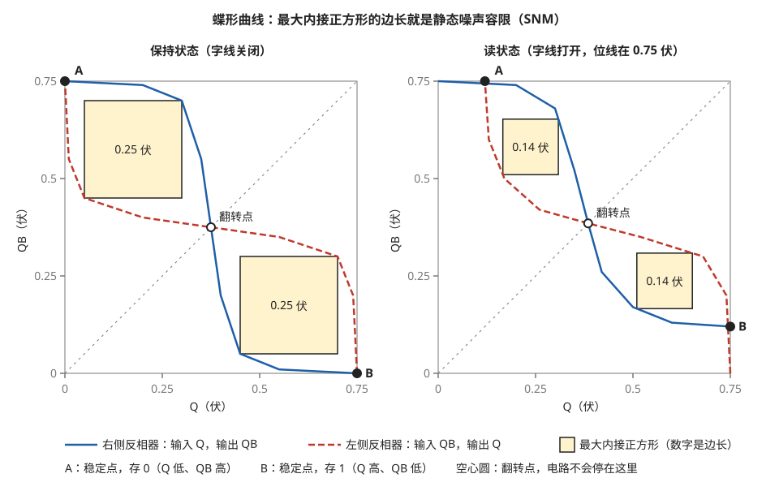

> **图 4-5**　一句话：这张图把“单元离被干扰翻转还有多少余量”画成一个正方形的边长：平时余量是 0.25 伏，读的时候只剩 0.14 伏。
>
> **先知道一件事**：单元里有两个“反相器”，也就是把输入反过来输出的小电路：输入电压低于约 0.3 伏时输出高电压，高于约 0.45 伏时输出低电压，中间一小段急剧切换。把每个反相器的“输入电压对应多少输出电压”画成一条曲线，再把两个反相器的曲线叠在同一张图上，就是蝶形曲线。
>
> **按这个顺序看**：
> 1. 先看坐标：横轴是存储点 Q 的电压，纵轴是另一个存储点 QB 的电压，都从 0 到 0.75 伏。
> 2. 蓝实线是其中一个反相器的曲线，它的输入是 Q、输出是 QB：从左上角出发，先几乎平着向右，在 Q 约 0.3～0.45 伏之间急剧下降，再沿底边走到右下角。
> 3. 红虚线是另一个反相器，它的输入是 QB、输出是 Q，所以画的时候横纵坐标对调：先沿左边缘往下，再向右。
> 4. 两条线的交点是电路可以停住的状态。黑点 A（左上，Q 低、QB 高）表示存 0，黑点 B（右下，Q 高、QB 低）表示存 1。中间的空心圆是翻转点，电路不会停在那里，稍有扰动就会滑向 A 或 B。
> 5. 两条线在 A、B 附近各围出一片区域，形状像蝴蝶的两只翅膀。翅膀里的黄色方块是能放进去的最大正方形，方块里的数字是它的边长。这个边长叫静态噪声容限（SNM），意思是：在存储点上加多大的干扰电压，单元才会被推翻到另一个状态。
> 6. 比较左右两图。左图字线关闭，单元只是在保持数据，边长 0.25 伏。右图字线打开、正在读，每条曲线低的那一端被抬到约 0.12 伏：B 点离开了底边，A 点离开了左边缘，翅膀被挤窄，边长只剩 0.14 伏。
>
> **打个比方**：两只翅膀是单元的安全区，正方形越大，外界要推得越狠才能把它推翻。读操作把这个安全区压掉了四成多。
>
> **看懂的标志**：能回答“为什么说读的时候是 SRAM 最容易出错的时候”：读时门开着，位线把存 0 的那个点往上抬，余量从 0.25 伏降到 0.14 伏；而先进工艺下晶体管之间的随机差异，按最坏情况算约 150 毫伏（§4.3），已经和这 0.14 伏一样大。
>
> **与正文的对照**：图中数据是 §4.2 两张表里的示意值。蓝实线即正文的“右侧反相器”，红虚线即“左侧反相器”。
>
> 来源：本库自绘。

**读 SNM 是三者里最紧的约束**，后面的讨论主要围绕它。上面两组数据是为了说明方法而给的示意值，实际数值要由电路仿真得到。

### 4.3 随机偏差：为什么 150 毫伏的容限不够用

如果所有晶体管都和设计值一模一样，150 毫伏的读 SNM 绰绰有余。问题在于晶体管的阈值电压存在随机偏差。

随机偏差的来源是制造过程中原子级的不确定性：掺杂原子的个数和位置、栅极边缘的粗糙度、金属栅晶粒的取向，每个晶体管都略有不同。晶体管的沟道面积越小，参与平均的原子越少，偏差越大。经验规律是阈值电压的标准差与沟道面积的平方根成反比。SRAM 位单元用的是整片芯片上最小的晶体管，所以它的偏差也是整片芯片上最大的，先进工艺下单个晶体管阈值电压的标准差约 20 到 30 毫伏。

这个标准差可以用上面的经验规律估出来（量级估计）。规律的形式是：标准差 = 工艺系数 ÷ 沟道面积的平方根。先进鳍式晶体管工艺的系数约 1.2 毫伏·微米。位单元里一个单鳍晶体管的沟道等效宽度约 0.1 微米，沟道长度约 0.018 微米，面积是 0.0018 平方微米，平方根约 0.042 微米。标准差 = 1.2 ÷ 0.042 ≈ 28 毫伏。作为对照，逻辑电路里一个 4 片鳍的晶体管面积是它的 4 倍，标准差是它的一半，约 14 毫伏。

这个偏差要乘以多少倍来设计，取决于单元的数量。下面是一笔具体的账：

1. 一颗 GPU 上有 64 MB 的缓存，也就是 64 × 8 ≈ 512 Mb，约 5 × 10⁸ 个位单元。
2. 要求整颗芯片上因随机偏差而失效的单元期望数不超过 1 个，那么单个单元的失效概率必须低于 1 ÷ (5 × 10⁸) = 2 × 10⁻⁹。
3. 正态分布里，偏离均值超过 6 倍标准差的单侧概率约为 1 × 10⁻⁹。所以设计必须保证偏差达到 6 倍标准差的单元仍然能正常工作。
4. 6 倍标准差 = 6 × 25 毫伏 = **150 毫伏**。

这个数字和读 SNM 的典型值一样大。也就是说，在 5 亿个单元里最不走运的那一个，它的阈值电压偏差已经足以把读容限全部用掉。**逻辑电路不存在这个问题**，因为逻辑电路里一条路径由十几级门串联，各级的偏差互相平均；而 SRAM 的每一个单元都必须单独合格，5 亿个单元里只要有一个失效，这块存储就有一个坏位。

"互相平均"的效果可以算出来。假设一条逻辑路径由 16 级门串联，每一级门的延迟因随机偏差有 10% 的标准差，各级的偏差互相独立。路径总延迟的标准差是单级的 √16 = 4 倍，而总延迟的均值是单级的 16 倍，所以总延迟的相对标准差是 10% × 4 ÷ 16 = 2.5%。偏差对逻辑路径的影响是"慢百分之几"，可以靠留一点时序余量吸收；对位单元的影响是"这一位存不住"，没有可以平均的对象。

还要说明一点：一个位单元有 6 个晶体管，每个都有自己的偏差，读 SNM 受其中几个晶体管的偏差共同影响，并不是某一个晶体管偏 150 毫伏才出问题。最不利的组合是下拉管偏弱、访问管偏强、对面反相器的翻转点偏低同时出现。严格的分析要对 6 个晶体管的偏差做联合统计，上面用单个晶体管的 6 倍标准差来比较，是为了说明量级：**偏差和容限在同一个数量级上，没有几倍的富余。**

### 4.4 Vmin：SRAM 决定了电压能降到多低

**Vmin** 指一块电路能正常工作的最低电源电压。对 SRAM 来说，它是"芯片上所有位单元都还能正确读写"的最低电压。

电源电压降低时，SNM 大致按比例缩小，而阈值电压的随机偏差是固定的毫伏数、不随电源电压变化。所以电压越低，偏差占容限的比例越大。把电源电压从 0.75 伏降到 0.6 伏，读 SNM 从约 150 毫伏降到约 110 毫伏，而 6 倍标准差仍然是 150 毫伏，最差的那批单元就会失效。

这带来一个系统层面的后果。功耗与电源电压的平方成正比，所以芯片在轻载时希望把电压降下来省电。逻辑电路往往能在 0.5 伏甚至更低的电压下工作，但同一片芯片上的 SRAM 可能在 0.65 伏就开始出错。工程上有两种处理办法：一种是给 SRAM 单独拉一路电压较高的电源，逻辑电路降压时 SRAM 不跟着降；另一种是给 SRAM 加辅助电路，把它的 Vmin 压低。

### 4.5 读写辅助电路

**辅助电路（assist circuit）**是一类只在读或写的那一小段时间里临时改变某个电压的电路，目的是在不改变位单元晶体管尺寸的前提下，临时放宽读或写的约束。常见的四种做法如下。

| 辅助技术 | 帮助的操作 | 做法 | 原理 |
| --- | --- | --- | --- |
| 字线欠驱动（wordline underdrive） | 读 | 读的时候字线只拉到比电源电压低约 50～100 毫伏 | 访问管的栅压降低，变弱，存 0 的节点被抬起得更少 |
| 负位线（negative bitline） | 写 | 写的时候把要写 0 的那根位线拉到约 −100 毫伏 | 访问管的栅源电压差增大，变强，更容易把节点拉低 |
| 单元电源降压（cell VDD collapse） | 写 | 写的时候把被写那一列的单元电源临时降低 | 上拉管变弱，对抗访问管的能力下降 |
| 字线过驱动（wordline overdrive） | 写 | 写的时候字线拉到高于电源电压 | 访问管变强 |

以负位线为例走一遍数字。电源电压 0.6 伏时，正常写操作里访问管的栅极是 0.6 伏、接位线的那一端是 0 伏，栅源电压差是 0.6 伏。把位线拉到 −0.1 伏之后，栅源电压差变成 0.7 伏。晶体管的电流大致与"栅源电压差减去阈值电压"成正比，如果阈值电压是 0.3 伏，那么驱动量从 0.3 伏增加到 0.4 伏，访问管的电流增加约三分之一。上拉管没有变化，所以访问管相对于上拉管的优势扩大了三分之一，原本写不进去的边缘单元现在可以写进去了。

负电压是用电容耦合产生的：位线先被写驱动器拉到 0 伏，然后写驱动器断开，让位线悬空；一个预先充好电的电容的一端接在位线上，把它的另一端从 0.6 伏突然拉到 0 伏，位线就被带到负值。带下去多少取决于这个电容与位线电容的比例，位线电容 20 fF、耦合电容 4 fF 时，位线电压变化约 0.6 × 4 ÷ (4 + 20) = 0.1 伏。

其余三种辅助也各走一遍数字，沿用阈值电压 0.3 伏、电流与驱动量成正比的简化模型。

**字线欠驱动。** 电源电压 0.75 伏，读操作时访问管的栅极是 0.75 伏，源极是被抬到 0.12 伏的存储节点，驱动量 = 0.75 − 0.12 − 0.3 = 0.33 伏。把字线电压降低 75 毫伏到 0.675 伏，驱动量变成 0.255 伏，访问管的电流减少约 23%。流过下拉管的电流同样减少 23%，存储节点被抬起的高度也按比例从 0.12 伏降到约 0.09 伏，离翻转点更远。代价是读电流从 25 微安降到约 19 微安，§3.3 算过的位线放电时间从 80 皮秒增加到约 104 皮秒。字线欠驱动是用读速度换读稳定性。

**单元电源降压。** 电源电压 0.6 伏，写操作时要对抗的上拉管是 P 型晶体管，它的栅极接在对面的存储节点上（0 伏），源极接单元电源，驱动量 = 0.6 − 0 − 0.3 = 0.3 伏。写的那一瞬间把这一列的单元电源降到 0.45 伏，驱动量变成 0.15 伏，上拉管的电流减半。访问管没有变化，所以访问管相对上拉管的优势扩大到 2 倍。这种做法有一个下限：同一列里其它行的单元共用这根电源线，它们此刻字线关闭、处于保持状态，电源电压不能降到它们保持不住数据的程度（§6.1 讲这个电压是怎么定的）。

**字线过驱动。** 电源电压 0.6 伏，写操作时访问管的栅极从 0.6 伏提高到 0.7 伏，源极是 0 伏的位线，驱动量从 0.3 伏增加到 0.4 伏，访问管电流增加约三分之一，效果与负位线相同。

字线过驱动和负位线的效果相同，实际产品里却普遍选负位线，原因在于一个叫**半选中（half-select）**的现象（见图 4-6）。§5.2 会讲到，一根字线上挂着 8 个字，写其中一个字时，字线对整行都是打开的。另外 7 个字的位线此时停在预充电的高电平上，这 7 个字的单元所处的条件与读操作完全相同，也会经历存储节点被抬高的过程。字线电压是整行共用的，把它提高，这 7 个字的访问管同时变强，读扰动的风险增大。位线和单元电源是按列分开的，负位线和单元电源降压只作用于真正被写的那几列，不影响同一行里半选中的单元。

| 辅助技术 | 作用范围 | 对半选中单元的影响 |
| --- | --- | --- |
| 字线欠驱动 | 整行 | 有利（半选中单元也更稳定），但被写单元更难写入，通常要和写辅助配合使用 |
| 字线过驱动 | 整行 | 不利（半选中单元更容易被翻转） |
| 负位线 | 被写的列 | 无影响 |
| 单元电源降压 | 被写的列 | 无影响；但同列其它行的单元保持余量下降 |

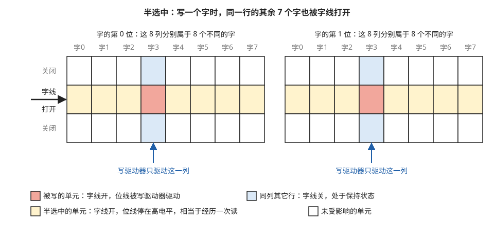

> **图 4-6**　一句话：写一个字时，同一行上其余的字也被打开了门；它们虽然不被写入，却要经历一次和读操作一样的扰动。
>
> **先知道一件事**：阵列里，一根横向的“字线”同时控制一整行单元的门，一对竖向的“位线”连着一整列单元。为了让阵列接近正方形，每一行交错存着 8 个字（§5.2 的列复用）。
>
> **按这个顺序看**：
> 1. 图中是两块并排的 8 列。左边 8 列分别是字 0 到字 7 的第 0 位，右边 8 列是它们的第 1 位（真实阵列一行里有 32 组这样的 8 列）。每列上方的灰字标出这一列属于哪个字。
> 2. 横向有三行，只有中间一行的字线打开（左侧黑箭头），上下两行关闭。
> 3. 红色格子是这次要写的字 3 的单元。蓝色箭头表示写驱动器只驱动这一列的位线，把要写的值送进去。
> 4. 黄色格子是同一行上其余 7 个字的单元。它们的门也开着，但位线没人驱动，停在预先充好的高电压上，这正是读操作时的状态。这种“行被选中、列没被选中”的状态叫半选中。
> 5. 浅蓝色格子与被写单元在同一列、但在别的行，门关着，只是在保持数据。
>
> **打个比方**：一排储物柜共用一把总锁。要往其中一个柜子里放东西，只能把整排的锁一起打开，其余柜子也跟着敞开了一会儿。
>
> **看懂的标志**：能回答“写辅助为什么普遍用负位线，而不用把字线电压加高”：字线是整行共用的，把它加高会让黄色那 7 个字的门也开得更大，更容易被扰翻；位线按列分开，负位线只作用在红色那一列。
>
> 来源：本库自绘。

辅助电路的代价是面积和能量：产生负电压要用电容耦合电路，每一列或每一组列都要配一份。先进工艺的 SRAM 存储宏基本都带有至少一种读辅助和一种写辅助。台积电 16 nm 工艺发表 128 Mb 测试芯片时，论文标题里就写明了带写辅助电路以降低 Vmin，可见从鳍式晶体管的第一代起辅助电路就是位单元方案的一部分。

### 4.6 8T 单元：把读通路单独拿出来

辅助电路是在不改单元结构的前提下放宽约束，另一种办法是直接改单元结构。**8T 单元**在 6T 的基础上增加两个晶体管，组成一条独立的读通路（见图 4-7）：存储节点接到一个新增晶体管的栅极上，只控制它的通断，读电流从一根独立的读位线经过这两个新增晶体管流到地，不经过存储节点。

这样读操作完全不会抬高存储节点的电压，读扰动从结构上消失了。原来的两个访问管只用于写，可以按"越强越好"来定尺寸。§4.1 那个夹在中间的约束被拆成了两个互不相干的约束。

代价是面积增加约三到四成，并且多一根字线和一根位线。所以 8T 单元用在访问最频繁、又最需要低电压运行的地方，典型是处理器的寄存器堆；而容量大、对密度最敏感的末级缓存仍然用 6T。寄存器堆的多端口结构在 08-03 §4 有详细讨论。

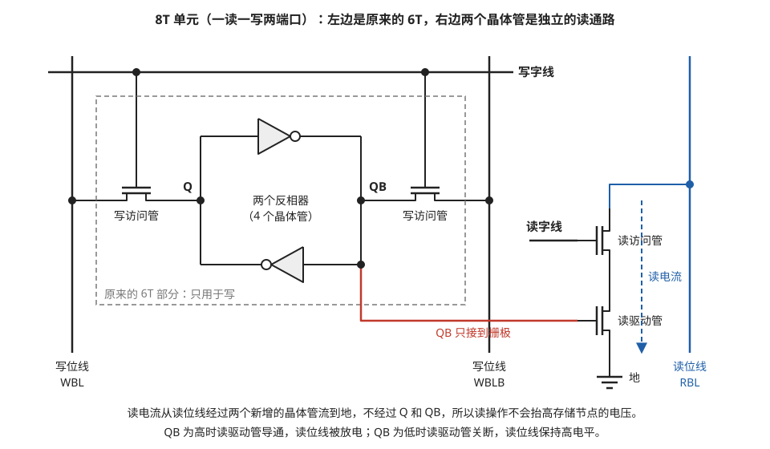

> **图 4-7**　一句话：8T 单元在 6T 旁边加了两个晶体管，专门负责读，让读出时的电流不再流过存数据的那两个点，于是读操作再也不会扰动存储的值。
>
> **先知道一件事**：晶体管在这里就是一个受电压控制的开关，控制端叫栅极。栅极只“看”电压、几乎不从接上来的点取电流，所以把一个存储点接到另一个晶体管的栅极上，只是让那个晶体管“看一眼”它，不会改变这个点的电压。
>
> **按这个顺序看**：
> 1. 先看灰色虚线框“原来的 6T 部分”。里面两个带小圆圈的三角形是反相器的符号（把输入反过来输出的电路，每个由两个晶体管组成），Q、QB 是存数据的两个点。两侧的“写访问管”由顶上的写字线控制，把 Q、QB 接到左右两根写位线 WBL、WBLB 上。现在这一部分只负责写。
> 2. 再看右边上下串联的两个晶体管，这是新加的读通路。上面的“读访问管”由左侧伸过来的读字线控制；下面的“读驱动管”的栅极通过红线接到 QB。红线途中横穿了写位线 WBLB，交叉处没有画圆点，表示两根线只是在图上交叉、并不相连（电路图的通用画法：画了圆点才是连在一起）。
> 3. 读的时候，读字线打开读访问管。如果 QB 是高电压，读驱动管导通，电流从右侧蓝色的读位线 RBL 经过两个管子流到最下面的“地”（0 伏），读位线的电压随之下降；如果 QB 是低电压，读驱动管断开，读位线保持高电压。蓝色虚线箭头就是这股读电流。
> 4. 这股电流从头到尾没有经过 Q 或 QB，QB 只是控制了一个开关，所以读多少次都不会把存储点的电压抬高。
>
> **打个比方**：6T 读数据，像把手伸进保险柜摸一下里面的东西，手一伸就可能碰歪；8T 是在柜子外面装了一盏由柜内物品控制的指示灯，看灯就知道，手不用伸进去。
>
> **看懂的标志**：能回答“8T 这么好，为什么没有全面取代 6T”：它多了两个晶体管，还多一根读字线和一根读位线，面积大三到四成；所以只用在读得最频繁、又需要低电压运行的寄存器堆里，大容量缓存仍用 6T。
>
> **与正文的对照**：写访问管就是 §3 的访问管 PG1、PG2。
>
> 来源：本库自绘。

---

## 5. 从单元到存储宏：阵列之外还有什么

上两节讲的是一个位单元。一块实际可用的 SRAM 还需要把几万到几百万个位单元排成阵列，并配上选择地址、驱动导线、放大信号和控制时序的电路。这些电路统称外围电路。这一节用一块具体的存储宏把外围电路的每一部分走一遍。

### 5.1 例子：一块 4096 字 × 32 位的存储宏

这块存储宏有 4096 个地址，每个地址存 32 位，总容量 131072 位，即 16 KB。地址线 12 根。

**最直接的排法是 4096 行 × 32 列**，每行存一个字。用 7 nm 工艺的位单元尺寸（宽约 0.24 微米，高约 0.114 微米，§7.2 会算这个尺寸）估算，阵列的高度是 4096 × 0.114 ≈ 467 微米，宽度是 32 × 0.24 ≈ 7.7 微米，长宽比约 60 比 1。这样的形状有两个问题：每根位线要挂 4096 个单元，寄生电容是挂 256 个单元时的 16 倍，读延迟按同样比例变长；并且一个 7.7 微米宽的细长条很难放进芯片版图。

### 5.2 列复用：把阵列排成接近正方形

**列复用（column multiplexing）**的做法是让每一行存多个字。取复用比为 8，每行存 8 个字，即 8 × 32 = 256 列；行数减为 4096 ÷ 8 = 512 行。阵列变成高 512 × 0.114 ≈ 58 微米、宽 256 × 0.24 ≈ 61 微米，接近正方形。

地址的 12 位相应地分成两部分使用（各部分的位置见图 4-8）：

1. 高 9 位送进行译码器，从 512 根字线里选中一根。
2. 这一行的 256 个位单元全部把自己的值送上各自的位线。
3. 低 3 位送进列选择器。256 列按每 8 列一组分成 32 组，每组通过一个 8 选 1 的开关接到一个灵敏放大器上。低 3 位决定每组里选哪一列。
4. 32 个灵敏放大器输出 32 位数据。

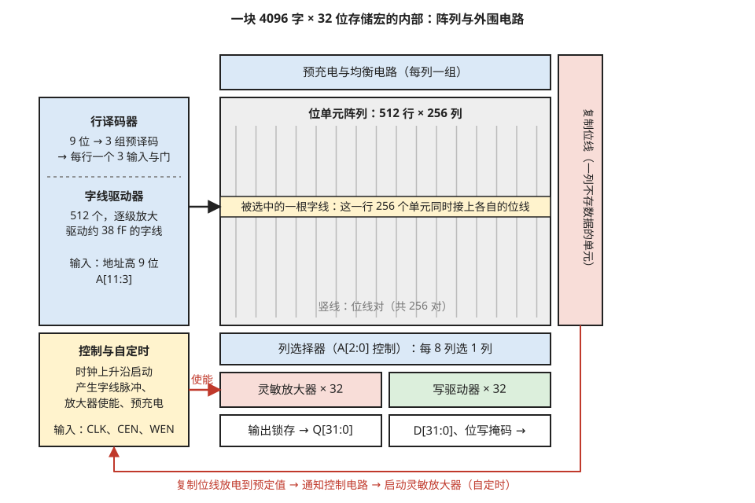

> **图 4-8**　一句话：一块 SRAM 除了中间存数据的阵列，四周还围着一圈电路，负责按地址找到那一行、把微弱的信号放大，以及控制每一步发生的时刻。
>
> **先知道一件事**：这块存储有 4096 个地址，每个地址存 32 位。地址是一个 12 位的二进制数，它被拆成两段使用：高 9 位决定“哪一行”，低 3 位决定“这一行里的哪一个字”。图中 A[11:3] 的写法表示“地址的第 11 位到第 3 位”。
>
> **按这个顺序看**：
> 1. 中间的灰色大框是位单元阵列，512 行 × 256 列。里面的竖线代表位线，每列一对。
> 2. 左上的蓝框是行译码器和字线驱动器。行译码器把高 9 位地址翻译成“512 根字线里拉高哪一根”；字线驱动器是一串逐级放大的电路，因为一根字线要同时带动一整行 256 个单元。黑箭头指向的黄色横条就是被选中的那一行。
> 3. 顶部的蓝框是预充电电路，每次访问之前把所有位线都充到高电压。
> 4. 阵列下方的蓝框是列选择器。一行 256 列里交错存着 8 个字，列选择器按低 3 位地址 A[2:0] 从每 8 列里挑出 1 列，一共挑出 32 列，正好是一个字的 32 位。
> 5. 再往下，红框是 32 个灵敏放大器，读的时候把位线上 0.1 伏的差别放大成 0 或 1；绿框是 32 个写驱动器，写的时候把位线拉到要写的值。最底下是数据出口 Q[31:0] 和入口 D[31:0]。
> 6. 左下的黄框是控制与自定时电路。它收到时钟信号后，按顺序发出开字线、启动放大器、预充电等命令。它怎么知道“位线已经放够电了，可以启动放大器”？看右侧的红框“复制位线”：这是一列不存数据、结构和真实位线一模一样的假位线，每次和真实位线同时开始放电，放到预定值时就沿底部的红色路径通知控制电路。
>
> **打个比方**：复制位线像和正菜同锅同火煮着的一小块试样，试样熟了，锅里的也就熟了，用不着掀开锅盖去看。
>
> **看懂的标志**：能回答“为什么不用一个固定的延迟来启动放大器”：位线放电的快慢会随制造偏差、电压和温度相差一倍以上，固定延迟只能按最慢的情况等；复制位线和真实位线一起变快、一起变慢，启动时刻总是刚刚好（§5.3）。
>
> **与正文的对照**：方框大小不按比例。各部分依次在 §5.2.1（行译码）、§5.2.2（字线驱动）、§5.2.3（预充电）、§5.2.4（写驱动）、§5.3（自定时）展开。
>
> 来源：本库自绘。

列复用还带来两个附带的好处。第一，灵敏放大器的数量从 256 个减到 32 个，每个灵敏放大器可以占 8 列的宽度，设计更宽松。第二，属于同一个字的 32 位在物理上每隔 8 列才出现一位，互不相邻，这一点对 §6.2 讲的软错误防护很重要。

列复用也有一个代价，就是 §4.5 讲过的半选中：选中行上没有被列选择器选中的那 7 个字，字线同样是打开的，它们的单元每次访问都要经历一次与读操作相同的扰动。

### 5.2.1 行译码器：9 位地址怎么变成 512 根字线里的一根

行译码器的功能是把 9 位地址翻译成 512 个输出，其中只有与地址对应的那一个为高。最直接的做法是给每根字线配一个 9 输入的与门，9 个输入分别接地址的每一位或它的反相。但 9 输入的与门内部要串联 9 个晶体管，速度很慢，而且 512 个这样的门面积很大。

实际做法分两级，叫**预译码**。以地址 101 011 110（十进制 350）为例：

1. 把 9 位地址分成三组，每组 3 位：101、011、110。
2. 每组各用一个小译码器译成 8 根线，其中只有一根为高。第一组是 5，所以 A 组的第 5 根线为高；第二组是 3，B 组的第 3 根线为高；第三组是 6，C 组的第 6 根线为高。
3. 这 3 × 8 = 24 根预译码线沿着阵列的高度方向纵向铺设，经过每一行。
4. 每一行配一个 3 输入的与门，从 A、B、C 三组里各取一根线。第 350 行的与门接的是 A5、B3、C6，三根线都为高，它的输出为高。其它任何一行至少有一个输入为低。

核对一下行号：5 × 64 + 3 × 8 + 6 = 320 + 24 + 6 = 350。这样每行只需要一个 3 输入的门，512 行共用 24 根预译码线。

每行的与门还有一个额外的输入，接内部自定时电路产生的字线脉冲信号。所以字线并不是在整个时钟周期里都保持高电平，只在脉冲有效的那一百多皮秒里为高。

### 5.2.2 字线驱动器：驱动一根 61 微米长的线

与门的输出不能直接接到字线上，因为字线的负载很大。算一下这个负载（量级估计）：

1. 一根字线连着 256 个位单元，每个单元有 2 个访问管的栅极，每个栅极的电容约 0.05 fF，合计 256 × 2 × 0.05 ≈ 26 fF。
2. 字线本身是一根 61 微米长的金属线，每微米的寄生电容约 0.2 fF，合计约 12 fF。
3. 总负载约 38 fF。

一个最小尺寸的逻辑门的输入电容约 0.1 fF，它能快速驱动的负载大约是自己输入电容的 4 倍。用它直接驱动 38 fF 的字线，负载是它输入电容的 380 倍，会非常慢。解决办法是串联几级逐级放大的反相器，每一级的尺寸是前一级的约 4 倍。需要的级数约为 log₄ 380 ≈ 4.3，取 4 到 5 级。每一级的延迟约 10 皮秒，字线驱动器的总延迟约 40 到 50 皮秒。

字线的电阻带来第二项延迟。先进工艺里底层金属线很细，每微米电阻约 50 欧（量级估计），61 微米的字线电阻约 3 千欧。信号从字线的驱动端传到最远端的延迟约为 0.38 × 电阻 × 电容 = 0.38 × 3000 Ω × 38 fF ≈ 43 皮秒。也就是说，离驱动器最远的那一列单元比最近的那一列晚开 40 多皮秒。这项延迟与字线长度的平方成正比，所以一行不能排太多列；工程上还会在上层较粗的金属层里平行铺一根线，每隔若干列与字线连接一次，以降低电阻。

### 5.2.3 预充电电路：为什么要有一个均衡管

每一列的顶端有一组预充电电路，由 3 个 P 型晶体管组成。其中两个分别把 BL 和 BLB 接到电源，第三个横跨在 BL 和 BLB 之间，叫均衡管。三个晶体管的栅极接同一个预充电控制信号。

均衡管的作用是保证两根位线的起始电压严格相等。读操作依赖的信号只有 100 毫伏，如果上一次操作结束后两根位线一根回到 0.750 伏、另一根只回到 0.740 伏，这 10 毫伏的残留差值就会直接叠加在下一次读的信号上，方向不利时信号只剩 90 毫伏。均衡管把两根位线短接在一起，残留差值被消除。

预充电需要的时间取决于上一次操作是读还是写。假设预充电管能提供 100 微安的电流：

- 上一次是读，位线从 0.65 伏回到 0.75 伏，需要 20 fF × 0.1 V ÷ 100 µA = **20 皮秒**。
- 上一次是写，位线从 0 伏回到 0.75 伏，需要 20 fF × 0.75 V ÷ 100 µA = **150 皮秒**。

写操作之后的恢复时间是读操作之后的 7.5 倍。存储宏能跑到的最高时钟频率要按"写之后紧跟一次读"这种最不利的顺序来定。

### 5.2.4 写驱动器

写驱动器位于每组列的底端，与灵敏放大器并排，通过同一个列选择器接到被选中的那一列。它的核心是两个尺寸较大的 N 型晶体管，根据要写入的数据把 BL 或 BLB 之一拉到地，另一根保持在高电平。

写驱动器必须比位单元里的晶体管强得多，因为它要在很短的时间里把整根位线的电容放电。要在 75 皮秒内把 20 fF 的位线从 0.75 伏拉到 0 伏，需要的电流是 20 fF × 0.75 V ÷ 75 ps = 200 微安，是位单元读电流的 8 倍。

§8.2 会讲到的位写掩码就是在这里实现的：掩码信号与写使能信号相与之后控制写驱动器，被掩掉的那些位，写驱动器不工作，对应的位线保持在预充电的高电平，这些位的单元实际上经历了一次半选中，值保持不变。

### 5.2.5 把各部分串起来：一次读操作的 300 皮秒

§8.3 会用到"访问时间 300 皮秒"这个数。现在可以把它拆开（各项为量级估计，取的是上面各小节算出的数）：

| 起止时刻（皮秒） | 阶段 | 耗时 | 依据 |
| --- | --- | --- | --- |
| 0 | 时钟上升沿到达 | — | |
| 0～30 | 锁存地址，产生内部脉冲 | 30 | |
| 30～80 | 预译码与行译码 | 50 | §5.2.1 |
| 80～125 | 字线驱动器逐级放大，字线电压升起 | 45 | §5.2.2 |
| 125～205 | 位线放电到 100 毫伏差值 | 80 | §3.3 |
| 205～225 | 灵敏放大器放大 | 20 | §3.5 |
| 225～300 | 输出锁存，驱动 Q 引脚 | 75 | |
| 225 起 | 字线关闭，预充电开始，为下一拍做准备 | | §5.2.3 |

位线放电这一步占 80 皮秒，不到总时间的三成；其余七成花在译码、驱动导线和输出上。存储宏越大，字线和位线越长，第 3、4 行的耗时越长，这就是大存储宏访问时间长的原因。

### 5.3 自定时：灵敏放大器什么时候启动

§3.3 的走查里，第 3 步结束、第 4 步开始的时刻必须选得准。灵敏放大器启动得太早，位线上的电压差还不到它能可靠分辨的大小，会读错；启动得太晚，位线多放的电是纯粹的浪费，读延迟也变长。

困难在于位线放电的速度不是一个固定值。它随工艺偏差、电源电压和温度变化，同一块存储宏在不同条件下可以相差一倍以上。用一个固定的延迟电路来产生启动信号，必须按最慢的情况留余量，在其它情况下就都偏晚。

举一组数字说明。假设位线放电到 100 毫伏所需的时间，在晶体管偏快、电压偏高的条件下是 50 皮秒，在晶体管偏慢、电压偏低的条件下是 130 皮秒。固定延迟电路是用普通逻辑门搭的，逻辑门的延迟随条件变化的幅度与位单元不同，比如只从 70 皮秒变到 110 皮秒。为了在最慢的条件下不读错，固定延迟必须调到在那个条件下不小于 130 皮秒，于是在最快的条件下它大约是 83 皮秒，比实际需要的 50 皮秒多等了 33 皮秒，位线多放了约 66% 的电。

标准解法叫**复制位线（replica bitline）**。在阵列边上放一列额外的位单元，这一列不存数据，单元的状态被固定接死，结构和负载与真实的位线相同。每次读操作时这一列和真实位线同时开始放电，它的电压降到预定值时触发灵敏放大器的使能信号。复制位线上通常同时接通好几个复制单元，让它放电得比真实位线快几倍，这样可以让它放到一个普通逻辑门能识别的大摆幅，而此刻真实位线刚好放到 100 毫伏。因为复制位线和真实位线用的是同样的晶体管、处在同样的电压和温度下，它的放电速度会跟着真实位线一起变快或变慢。

这种"用一份相同的电路来计时，而不是用时钟或固定延迟来计时"的做法叫**自定时（self-timed）**。SRAM 存储宏内部的字线脉冲宽度、灵敏放大器使能、预充电开始的时刻全部由自定时电路产生，外部只需要提供一个时钟上升沿来启动整个过程。这一点在 §8 讲接口时会再用到。

### 5.4 外围面积的账

外围电路占的面积可以用公开数字算出来。某一代工艺的位单元面积是 0.021 µm²，如果整块硅全部铺满位单元，密度是 1 ÷ 0.021 ≈ 47.6 Mb/mm²。而同一代工艺公布的大容量存储宏密度是约 31.8 Mb/mm²。两者之比 31.8 ÷ 47.6 ≈ 67%，这个比值叫**阵列效率（array efficiency）**，意思是存储宏面积里有 67% 是位单元，其余 33% 是外围电路。

阵列效率随存储宏的容量变化很大。大容量的缓存用存储宏可以做到 65% 到 75%。小容量的存储宏，例如 256 字 × 32 位的缓冲队列，译码器、灵敏放大器和控制电路的面积并不随容量等比例缩小，阵列效率可能只有 30% 到 40%。**所以把一块大存储拆成很多块小存储宏会显著增加总面积**，这是架构上"存储切多少个 bank"这类决策要付出的面积成本，08-03 §3 从并行度的角度讨论了同一个取舍。

---

## 6. 漏电、软错误与修复

前面讲的是 SRAM 正常工作时的行为。这一节讲三件与可靠性有关的事：不访问的时候它消耗多少电、外来粒子会不会把数据打翻、出厂时就坏掉的单元怎么处理。

### 6.1 待机漏电与保持模式

SRAM 在保持数据时，每个位单元里总有两个晶体管处于关断状态并且两端加着完整的电源电压。关断的晶体管并非完全不导电，仍有微小的漏电流。单个位单元的漏电流在室温下约几十皮安，温度升到 100 摄氏度时增大约一个数量级。

漏电流的大小由一条指数规律决定。晶体管的栅压低于阈值电压时，电流并不是突然降到零，而是随栅压下降按指数衰减：室温下栅压每降低约 70 毫伏，电流减小到十分之一。一个阈值电压 0.3 伏的晶体管在栅压为 0 时，栅压比阈值低了 0.3 伏，即 0.3 ÷ 0.07 ≈ 4.3 个"十分之一"，漏电流约为刚导通时电流的两万分之一。这条规律有两个直接的推论。第一，把阈值电压提高 70 毫伏，漏电流就减小到十分之一，所以高密度位单元普遍使用阈值电压较高的晶体管，代价是读电流较小、速度较慢。第二，温度升高时，"每十倍所需的栅压"从 70 毫伏增大到约 90 毫伏，同时阈值电压本身下降，两者叠加使漏电流随温度迅速增大。

一笔量级估计：512 Mb 的缓存，每个单元在高温下漏 200 皮安，总漏电流 = 5 × 10⁸ × 200 × 10⁻¹² = 0.1 安，乘以 0.75 伏电源是 75 毫瓦。这个数字对一颗几百瓦的 GPU 微不足道，但对手机芯片在待机状态下的功耗预算（几毫瓦）就是主要矛盾。

降低待机漏电的办法是给存储宏设计几档低功耗模式，常见的有三档。

| 模式 | 做法 | 数据是否保持 | 唤醒时间 |
| --- | --- | --- | --- |
| 浅睡眠 | 关掉外围电路的电源，阵列电源不变 | 保持 | 约一个时钟周期 |
| 保持模式（retention） | 关掉外围电路，同时把阵列电源降到刚好能保持数据的电压（约 0.4～0.5 伏） | 保持 | 几个到几十个时钟周期 |
| 关断 | 阵列电源也切断 | 丢失 | 需要重新写入数据 |

保持模式能降到多低的电压，由 §4.2 讲的保持 SNM 决定。保持状态下字线关闭，SNM 比读状态大，所以保持电压可以比读写时的 Vmin 低 0.1 到 0.2 伏。

**保持电压的具体数值是这样定出来的。** 电源电压降低时，§4.2 那张蝶形曲线图整体缩小，两个闭合区域跟着缩小。电压降到接近晶体管的阈值电压时，反相器的传输曲线不再陡峭，闭合区域迅速收窄。保持 SNM 降到 0 的那个电源电压叫**数据保持电压**，低于它单元就存不住数据。下面按三步推出保持模式实际使用的电压（数值为量级估计）：

1. 一个六个晶体管都恰好等于设计值的位单元，数据保持电压很低，约 0.15 到 0.2 伏。
2. 考虑随机偏差之后，两个反相器不再对称，闭合区域一大一小，较小的那个先消失。5 亿个单元里偏差最大的那一个，数据保持电压约 0.35 到 0.4 伏。
3. 电源线上有噪声，温度变化也会使阈值电压漂移，再留 50 到 100 毫伏的余量。保持模式实际使用的阵列电压因此是 **0.45 到 0.5 伏**。

保持模式能省多少功耗，可以接着前面那笔 75 毫瓦的账算。漏电流随电源电压下降而减小，从 0.75 伏降到 0.45 伏，漏电流大约减小到原来的三成（量级估计），即 0.1 × 0.3 = 0.03 安。漏电功耗 = 0.03 安 × 0.45 伏 = 13.5 毫瓦，是原来的约五分之一。电流和电压同时下降，所以功耗的降幅大于电压的降幅。

从保持模式唤醒需要几个到几十个时钟周期，原因是阵列电源线上挂着很大的电容，把它从 0.45 伏充回 0.75 伏需要时间，充电电流还不能太大，否则会在电源网络上造成电压跌落，影响旁边正在工作的电路。

### 6.2 软错误：粒子把一位打翻

**软错误（soft error）**指存储单元的数据被外来的高能粒子改变，但电路本身没有损坏，重新写入正确的值之后可以继续正常工作。与之相对的硬错误是电路永久损坏。

粒子主要有两个来源。一是宇宙射线在大气中产生的高能中子，海拔越高通量越大。二是封装材料里微量放射性杂质放出的 α 粒子。粒子穿过硅时会沿路径产生一串电子和空穴，如果这条路径经过某个存储节点附近，这些电荷被节点收集，相当于向节点注入了一个短暂的电流脉冲。注入的电荷量如果超过使单元翻转所需的最小电荷量（称为临界电荷），单元的值就翻转了。先进工艺的 SRAM 位单元节点电容极小，临界电荷只有约 1 fC 甚至更低，即几千个电子。

粒子能产生多少电荷可以算出来。在硅里每产生一对电子和空穴平均消耗 3.6 电子伏的能量。一个能量为 5 兆电子伏的 α 粒子在硅里完全停下来，共产生 5 × 10⁶ ÷ 3.6 ≈ 1.4 × 10⁶ 对，电荷量是 1.4 × 10⁶ × 1.6 × 10⁻¹⁹ 库仑 ≈ 220 fC。这个粒子在硅里的射程约 25 微米，平均每微米路径上产生约 9 fC 的电荷。临界电荷是 1 fC，所以只要存储节点能收集到粒子路径上约 0.1 微米长度内的电荷，就足以翻转。

这笔账也解释了鳍式晶体管的软错误率为什么比平面晶体管低。平面晶体管的存储节点与硅衬底之间有一大片接触面，衬底深处产生的电荷也能被收集。鳍式晶体管的存储节点在一片约 7 纳米宽、50 纳米高的鳍上，与衬底的连接只有鳍底部那一条窄缝，能收集电荷的体积小得多。公开报道的数据显示，从平面工艺换到鳍式晶体管工艺，每比特的软错误率下降了约一个数量级。

软错误率的单位是 **FIT**（failures in time），1 FIT 表示每十亿小时发生一次失效。SRAM 的软错误率通常按每兆比特多少 FIT 给出。下面按每 Mb 50 FIT 这个量级估计值算一笔集群的账：

1. 一颗 GPU 上的 SRAM 总量按 1 Gb（约 125 MB）计，即 1000 Mb。
2. 单颗芯片的软错误率 = 1000 × 50 = 50000 FIT，即每 10⁹ ÷ 50000 = 20000 小时一次，约 2.3 年一次。
3. 一个 10000 张卡的集群 = 20000 ÷ 10000 = **每 2 小时一次**。

单看一颗芯片，两年一次似乎可以忽略；放到集群规模就是每天十几次。这就是数据中心芯片上的 SRAM 必须带纠错的原因。如果没有纠错，被打翻的可能是一个寄存器里的操作数，计算结果出错而没有任何报错，这类静默错误在 09-04 有专门讨论。

**纠错码（ECC，error-correcting code）**的做法是为每个数据字额外存几位校验位。最常用的方案对每 64 位数据附加 8 位校验位，能够纠正任意 1 位错误、检测任意 2 位错误。这里 8 位校验位的来历是：纠正 1 位错误要求校验位能指出 72 位里哪一位错了，外加"没有错"这一种情况，共 73 种，需要 7 位（2⁷ = 128 ≥ 73）；再加 1 位总奇偶校验用来区分 1 位错和 2 位错，共 8 位。

校验位怎样指出出错的位置，用一个 4 位数据的小例子可以完整走一遍，三个校验组的覆盖关系见图 4-9。64 位的方案原理相同，只是规模更大。

1. **编号。** 把 7 个位置编号为 1 到 7。编号是 2 的幂的位置（1、2、4）放校验位，其余位置（3、5、6、7）放数据位。
2. **分组。** 校验位 1 负责所有编号的二进制表示里最低位为 1 的位置，即 1、3、5、7。校验位 2 负责二进制第二位为 1 的位置，即 2、3、6、7。校验位 4 负责二进制第三位为 1 的位置，即 4、5、6、7。
3. **编码。** 要存的数据是 1011，依次放入位置 3、5、6、7，即位置 3 = 1，位置 5 = 0，位置 6 = 1，位置 7 = 1。每个校验位的取值要使它负责的那一组里 1 的个数为偶数。校验位 1 那一组的数据位是 1、0、1，已有两个 1，所以校验位 1 = 0。校验位 2 那一组的数据位是 1、1、1，有三个 1，所以校验位 2 = 1。校验位 4 那一组的数据位是 0、1、1，有两个 1，所以校验位 4 = 0。存入的 7 位从位置 1 到 7 依次是 0、1、1、0、0、1、1。
4. **出错。** 假设一个粒子把位置 6 从 1 打翻成 0，存储的内容变成 0、1、1、0、0、0、1。
5. **检查。** 读出时对三组分别数 1 的个数。第 1 组（位置 1、3、5、7）是 0、1、0、1，两个 1，偶数，通过，记 0。第 2 组（位置 2、3、6、7）是 1、1、0、1，三个 1，奇数，不通过，记 1。第 4 组（位置 4、5、6、7）是 0、0、0、1，一个 1，奇数，不通过，记 1。
6. **定位。** 把三个结果按第 4 组、第 2 组、第 1 组的顺序排成二进制数 110，即十进制 6。出错的正是位置 6，把它取反即完成纠正。

定位之所以成立，是因为分组规则本身就是按位置编号的二进制表示定的：位置 6 的二进制是 110，它属于第 4 组和第 2 组、不属于第 1 组，所以它出错时恰好是这两组不通过。

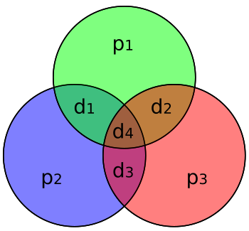

> **图 4-9**　一句话：纠错码把每个数据位同时放进几个校验组里；读出时看哪几个组的检查不通过，就能反推出是哪一位出了错。
>
> **先知道一件事**：奇偶校验的意思是：给一组位额外配一个校验位，让这一组里 1 的个数总是偶数。读出时如果数出来是奇数，就知道这一组里有一位被翻了，但单靠一组不知道是哪一位。
>
> **按这个顺序看**：
> 1. 三个圆是三个校验组：上方的绿圆、左下的蓝圆、右下的红圆。p1、p2、p3 是三个校验位（p 取自 parity，校验），各自只在自己的圆里。
> 2. d1 到 d4 是四个数据位（d 取自 data），它们放在圆的交叠处：d1 在绿圆和蓝圆重叠的地方，d2 在绿圆和红圆重叠的地方，d3 在蓝圆和红圆重叠的地方，d4 在三个圆共同的中心。
> 3. 规则是：每个圆里所有位合起来，1 的个数必须是偶数。写入时按这条规则算出 p1、p2、p3。
> 4. 读出时逐个圆检查。假设 d3 被翻了：蓝圆和红圆里各多了或少了一个 1，变成奇数，检查不通过；绿圆里没有 d3，照样通过。“蓝、红不通过，绿通过”这个组合只对应 d3 一个位置，于是就知道是 d3 错了，把它翻回来即可。
> 5. 每个位所在的圆的组合都互不相同，所以七个位里任何一位出错，都能被唯一地认出来。
>
> **看懂的标志**：能回答“如果只有红圆一组不通过，是哪一位错了”：只属于红圆、不属于其它圆的只有 p3，所以是校验位 p3 自己被翻了，数据位都没事。
>
> **与正文的对照**：p1、p2、p3 是正文位置 1、2、4 的校验位，d1 到 d4 是位置 3、5、6、7 的数据位。于是绿圆就是正文的第 1 组（位置 1、3、5、7），蓝圆是第 2 组（2、3、6、7），红圆是第 4 组（4、5、6、7）。正文例子里出错的位置 6 就是 d3，第 2、4 组不通过，得到二进制 110，即 6。
>
> 来源：[Hamming(7,4).svg](https://commons.wikimedia.org/wiki/File:Hamming(7,4).svg)，作者 Cburnett，许可 CC BY-SA 3.0（本库添加了白色背景）。

**一个粒子有可能同时打翻物理上相邻的两到三个单元**，这叫多单元翻转（见图 4-10）。如果这几个单元属于同一个字，只能纠 1 位的纠错码就处理不了。§5.2 讲的列复用正好解决了这个问题：复用比为 8 时，同一个字的相邻两位在物理上相隔 8 列，一个粒子打翻的相邻 3 个单元分属 3 个不同的字，每个字只错 1 位，全部可以纠正。

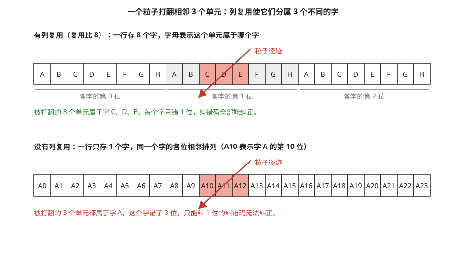

> **图 4-10**　一句话：一个高能粒子常常一下打翻相邻的几个单元；把同一个字的各位分散开存放，就能让每个字最多只错一位，纠错码依然修得好。
>
> **先知道一件事**：纠错码（例如图 4-9 那种）是按字工作的：每个字配着自己的校验位，一个字里错 1 位能纠正，错 2 位以上就纠正不了。
>
> **按这个顺序看**：
> 1. 每一排 24 个格子，是阵列同一行上相邻的 24 个存储单元。
> 2. 上面一排是有列复用的排法。格子里的字母表示这个单元属于哪个字，A 到 H 循环出现：左边 8 格是 8 个字各自的第 0 位，中间 8 格（灰底）是第 1 位，右边 8 格是第 2 位。
> 3. 红色斜箭头是粒子穿过芯片的路径，它打翻了第 11～13 格（红色格子）。上面这三格分别属于字 C、D、E，每个字只错 1 位，绿色文字给出结论：全都能纠正。
> 4. 下面一排是没有列复用的排法：一整行只存字 A，A0 到 A23 是它的第 0 到第 23 位。粒子同样打翻第 11～13 格，也就是字 A 的第 10、11、12 位，一个字错了 3 位，红色文字给出结论：纠正不了。
>
> **打个比方**：一户人家的东西如果分散存在几个仓库，一场火只烧一个仓库，每户最多损失一件；全放在一个仓库里，一场火就可能让同一户损失三件。
>
> **看懂的标志**：能回答“为什么复用比 8 就足以应付相邻 3 格的翻转”：同一个字相邻的两位在物理上相隔 8 格，只要粒子一次打翻的连续格子少于 8 个，就不会有两格落在同一个字里。
>
> 来源：本库自绘。

### 6.3 MBIST：出厂时怎么测

SRAM 的位单元是芯片上尺寸最小、排布最密的结构，所以也是制造缺陷最容易出现的地方。每块存储宏出厂前都必须把每一个位单元测一遍。存储宏深埋在芯片内部，外部测试设备够不到它的引脚，所以测试电路必须做在芯片里。

**MBIST（memory built-in self-test，存储器内建自测试）**是放在存储宏旁边的一小块逻辑电路，它能自动产生一系列地址和数据、写入存储宏、再读出来与预期值比较，最后报告通过或失败以及失败的地址。

MBIST 常用的测试序列叫 **March 算法**，它的特点是按地址顺序逐个单元地做"读出旧值、写入新值"。以常用的 March C− 为例，整个序列分六步：

| 步 | 地址顺序 | 对每个地址做的操作 |
| --- | --- | --- |
| 1 | 任意 | 写 0 |
| 2 | 从低到高 | 读（应为 0），写 1 |
| 3 | 从低到高 | 读（应为 1），写 0 |
| 4 | 从高到低 | 读（应为 0），写 1 |
| 5 | 从高到低 | 读（应为 1），写 0 |
| 6 | 任意 | 读（应为 0） |

这个序列为什么能查出故障，可以用一个例子说明。假设地址 5 的某个单元和地址 6 的某个单元之间有短路，写地址 6 会连带改变地址 5。第 2 步按从低到高的顺序进行，处理完地址 5 之后它的值是 1；接着处理地址 6 时写入 1，没有影响。第 3 步处理地址 5 之后它的值是 0，接着处理地址 6 时读 1 写 0，也看不出问题。但第 4 步从高到低进行：先处理地址 6，读 0 写 1，这次写 1 把地址 5 连带改成了 1；随后处理地址 5 时预期读到 0，实际读到 1，故障被发现。正反两个方向都扫一遍，是为了让每一对相邻单元之间两个方向的影响都被检查到。

测试时间可以算出来：六步里每个地址共做 10 次读或写。一块 1 Mb、字宽 32 位的存储宏有 32768 个地址，共 327680 次操作，在 1 GHz 时钟下耗时约 **0.33 毫秒**。

### 6.4 冗余修复

测出坏单元之后，如果直接报废整颗芯片，良率无法接受。算一笔账：假设每个位单元因制造缺陷而失效的概率是 10⁻⁸，一颗含 5 × 10⁸ 个位单元的芯片上坏单元的期望数是 5 个，一个坏单元都没有的概率是 e⁻⁵ ≈ 0.7%。也就是说，不做修复的话一千颗芯片里只有七颗合格。

**冗余修复**的做法是在每块存储宏里多做几行和几列备用的位单元。MBIST 找到坏单元后，把坏单元所在的行或列的地址记录下来；此后每次访问，地址比较电路检查当前地址是否命中记录，命中就转去访问备用行或备用列。记录保存在**电熔丝（eFuse）**里，这是一种通过大电流一次性烧断来存储信息的元件，断电后信息不丢失。芯片每次上电时从电熔丝读出修复信息，装入各个存储宏的地址比较电路。

用一块带 2 行备用行和 2 列备用列的存储宏走一遍修复的决策。假设 MBIST 报告了三个坏单元，位置分别是（第 17 行，第 40 列）、（第 17 行，第 99 列）、（第 300 行，第 5 列）。

1. 前两个坏单元在同一行。用一行备用行替换第 17 行，两个坏单元同时被修复。如果改用备用列，需要两列，会把备用列用完。
2. 第三个坏单元单独在第 300 行。用第二行备用行或者一列备用列替换都可以。
3. 修复完成后还剩 1 行或 1 到 2 列备用资源。电熔丝里记录"第 17 行 → 备用行 0""第 300 行 → 备用行 1"。
4. 此后每次访问，行地址同时送进正常的行译码器和两个地址比较器。地址等于 17 或 300 时，比较器的输出禁止正常的字线、改为打开对应的备用字线。

如果坏单元的分布使得 2 行加 2 列不够用，例如 5 个坏单元分布在 5 个不同的行和 5 个不同的列上，这块存储宏就无法修复，整颗芯片报废。

地址比较器串在地址通路上，会使访问时间增加一二十皮秒。这是修复功能在时序上的代价。

上面的良率例子里平均 5 个坏单元分散在几十块存储宏里，每块存储宏只要有一两行备用行和一两列备用列，几乎所有芯片都能修好。备用行列增加的面积通常只有百分之几。

---

## 7. 微缩：位单元面积为什么几乎停止缩小

### 7.1 各节点的数字

下表是台积电和英特尔公开的高密度 SRAM 位单元面积。"相对上一代"一列是面积之比，数值越接近 1 表示缩小得越少。

| 工艺节点 | 量产年份 | 高密度位单元面积 | 相对上一代 |
| --- | --- | --- | --- |
| 台积电 16 nm | 2015 | 0.070 µm² | — |
| 台积电 10 nm | 2017 | 0.042 µm² | 0.60 |
| 台积电 7 nm | 2018 | 0.027 µm² | 0.64 |
| 台积电 5 nm | 2020 | 0.021 µm² | 0.78 |
| 台积电 N3 | 2022 | 0.0199 µm² | 0.95 |
| 台积电 N3E | 2023 | 0.021 µm² | 相对 5 nm 为 1.00 |
| 台积电 N2（环栅晶体管） | 2025 | 公布的是存储宏密度约 38 Mb/mm²；媒体引用的位单元面积约 0.0175 µm² | 约 0.83（相对 N3E） |
| 英特尔 18A（环栅晶体管） | 2025 | 高密度 0.021 µm²，高电流 0.023 µm²；存储宏密度约 31.8 Mb/mm² | — |

同一时期逻辑电路的密度每代仍在提升。例如从 5 nm 到 N3，逻辑密度提升约 1.6 倍，而 SRAM 位单元只缩小了 5%。

N2 那一行有一点需要说明。台积电在 2025 年的国际固态电路会议上公布的是存储宏密度 38 Mb/mm²，而 0.0175 µm² 这个位单元面积来自媒体报道，有业内讨论认为位单元本身缩小的幅度没有这么大，密度提升的一部分来自外围电路的改进。用 §5.4 的阵列效率可以做一个一致性检查：38 ÷ (1 ÷ 0.0175) = 38 ÷ 57.1 ≈ 67%，与 18A 的阵列效率相同，所以 0.0175 µm² 这个数字至少是自洽的。在没有更权威的来源之前，本节把它标为"媒体引用值"。

### 7.2 位单元的尺寸是怎么构成的

要理解为什么缩不动，先要知道位单元的面积由什么决定。在鳍式晶体管（FinFET）工艺里，晶体管的沟道是一片竖立的硅鳍，栅极从三面包住它。版图上有两个基本间距：**鳍间距**（相邻两片鳍之间的距离）和**栅间距**（相邻两条栅极之间的距离）。

6T 位单元在版图上的高度固定是 2 个栅间距，因为单元里上下排着两条栅极：一条是字线控制的访问管栅极，一条是反相器的栅极。宽度则是若干个鳍间距，因为六个晶体管的鳍以及它们之间必要的隔离间隔横向排开。版图的示意见图 4-11 左半边。

用 7 nm 工艺的公开间距复算一遍：栅间距约 57 纳米，鳍间距约 30 纳米。位单元高度 = 2 × 57 = 114 纳米，宽度约 8 个鳍间距 = 240 纳米。面积 = 114 × 240 = 27360 平方纳米 ≈ **0.027 µm²**，与公布值一致。

这个算式说明位单元面积只由栅间距和鳍间距两个数决定。§5.1 用的位单元宽 0.24 微米、高 0.114 微米就是这里算出来的。

### 7.3 鳍数量化：尺寸只能取整数

FinFET 带来一个平面晶体管没有的限制。平面晶体管的强弱可以通过把沟道画宽一点或窄一点来连续调节；FinFET 的强弱由鳍的片数决定，只能是 1 片、2 片、3 片，不能是 1.3 片。这个限制叫**鳍数量化**。

§4.1 要求下拉管、访问管、上拉管的强度依次递减。在平面工艺里可以把三者的沟道宽度设计成例如 1.5 比 1 比 0.7。在 FinFET 工艺里，晶圆厂通常提供两种位单元：

| 位单元类型 | 上拉管 : 访问管 : 下拉管 的鳍数 | 特点 |
| --- | --- | --- |
| 高密度（HD） | 1 : 1 : 1 | 面积最小；三种晶体管的鳍数相同，强弱比例无法靠尺寸调节，只能靠调整阈值电压和辅助电路 |
| 高电流（HC，也叫高性能） | 1 : 2 : 2 | 读电流大约翻倍，速度快；宽度多出若干鳍间距，面积大约增加两到三成 |

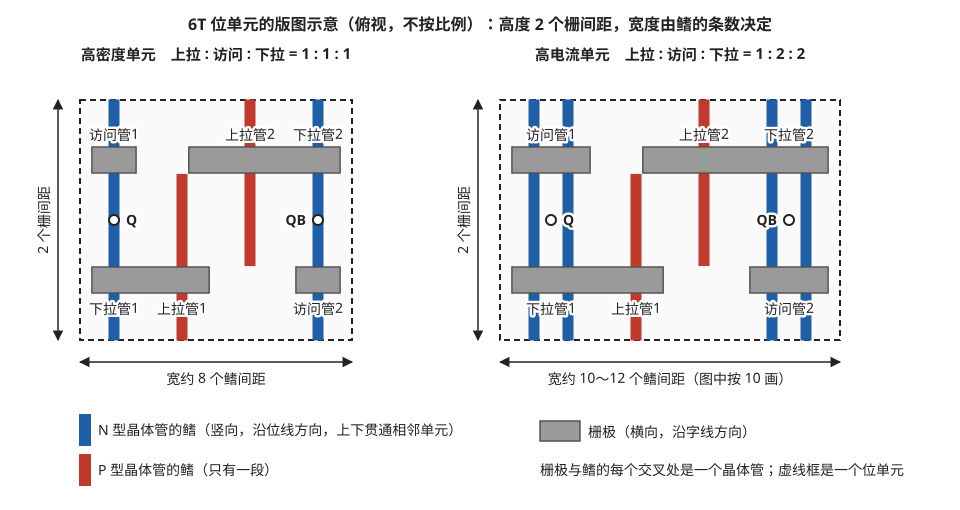

> **图 4-11**　一句话：一个 SRAM 位单元在芯片上占多大，由两个尺寸决定：竖向是两条栅极的间距，横向是若干条鳍的间距；想让晶体管更强就得多放一条鳍，单元也就跟着变宽。
>
> **先知道一件事**：这是从芯片正上方往下看的示意图。现代晶体管里导电的通道是一条竖立的细长硅条，叫“鳍”；控制它通断的电极叫“栅极”，是横跨在鳍上的一条导线。一条栅极横过一条鳍的地方就是一个晶体管；同一个晶体管并排用的鳍越多，能通过的电流越大，也就越“强”。
>
> **按这个顺序看**：
> 1. 每个虚线框是一个位单元。左边是高密度单元，右边是高电流单元。
> 2. 竖向的色条是鳍。蓝色是 N 型晶体管的鳍，红色是 P 型晶体管的鳍；两种晶体管的导通条件正好相反，这里只需要知道两个上拉管是 P 型、其余四个是 N 型。蓝色鳍上下贯穿，延伸进相邻的单元；红色鳍只有一段。
> 3. 横向的灰条是栅极，上下各一排，所以单元的高度是 2 个栅间距（左侧竖箭头）。
> 4. 每个灰条和色条的交叉处都标了晶体管的名字：左边那条蓝鳍上，上面是访问管1、下面是下拉管1；右边那条蓝鳍上，上面是下拉管2、下面是访问管2；两段红鳍上是上拉管1 和上拉管2。白色小圆圈 Q、QB 标出两个存储点的位置。
> 5. 左右对比：高密度单元里每个晶体管只有 1 条鳍，宽约 8 个鳍间距；高电流单元的访问管和下拉管各用 2 条鳍，左右各多出一条蓝鳍，宽约 10 个鳍间距，面积大约多四分之一。标题里的“上拉 : 访问 : 下拉 = 1 : 1 : 1”说的就是这三种晶体管各用几条鳍。
>
> **看懂的标志**：能回答“为什么 SRAM 单元从 5 nm 起几乎缩不动”：高密度单元已经是每个晶体管 1 条鳍，没有再减的余地；它的大小只剩栅间距和鳍间距两个数决定，而这两个间距本身缩得很慢（§7.2～7.4）。
>
> **与正文的对照**：图按常见的 6T 版图结构简化，只画了鳍和栅极两层，省略了接触孔和金属连线，不按比例。
>
> 来源：本库自绘（按常见的 6T 版图拓扑简化，真实版图可参考下面的延伸看图）。

延伸看图：SemiWiki 的文章 [TSMC's 5nm 0.021um2 SRAM Cell Using EUV and High Mobility Channel with Write Assist at ISSCC2020](https://semiwiki.com/semiconductor-manufacturers/tsmc/283487-tsmcs-5nm-0-021um2-sram-cell-using-euv-and-high-mobility-channel-with-write-assist-at-isscc2020/) 转载了台积电论文里的多张图。据该文的图注，图 3 是 5 nm 高密度 6T 位单元的真实版图，可以对照图 4-11 看鳍、栅极和接触孔的实际排布；图 4 对比了有无写辅助时各代工艺的 Vmin 趋势，对应 §4.5；图 7 是负位线写辅助的电容耦合电路。

**鳍数怎样影响读稳定性，可以接着 §3.3 的数字算。** 那里算出读操作时访问管的等效电阻约 25 千欧，下拉管约 4.8 千欧，存储节点被抬到 0.75 × 4.8 ÷ (25 + 4.8) ≈ 0.12 伏。如果把下拉管从 1 片鳍增加到 2 片鳍，它的等效电阻减半到 2.4 千欧，存储节点只被抬到 0.75 × 2.4 ÷ (25 + 2.4) ≈ 0.066 伏，读扰动电压减小将近一半。代价是位单元左右两侧各多出一片鳍的宽度，总宽度从约 8 个鳍间距增加到约 10 个，面积增加 25%。

可供选择的方案只有寥寥几种，面积差距很大：

| 上拉管 : 访问管 : 下拉管 | 读稳定性 | 读电流 | 宽度（鳍间距数，约） | 相对面积 |
| --- | --- | --- | --- | --- |
| 1 : 1 : 1 | 最弱，依赖阈值电压调整和辅助电路 | 1 倍 | 8 | 1.00 |
| 1 : 1 : 2 | 明显改善 | 略高于 1 倍 | 10 | 1.25 |
| 1 : 2 : 2 | 与 1 : 1 : 1 接近（访问管和下拉管同时加强，比例不变） | 约 2 倍 | 10～12 | 1.25～1.5 |

在平面工艺里，设计者可以把下拉管加宽 20% 来换取一点稳定性，只付出百分之几的面积。在鳍式晶体管工艺里，最小的一步就是加一整片鳍，面积一次增加 25%。

**鳍数都是 1 的高密度单元之所以还能工作，靠的是三件事。** 第一，§3.3 已经算过，即使尺寸相同，访问管因为源极被抬高、工作在饱和状态，等效电阻本来就是下拉管的几倍。第二，晶圆厂在制造时给三种晶体管设置不同的阈值电压，例如让访问管的阈值电压比下拉管高几十毫伏，使它再弱一些。第三，用 §4.5 的辅助电路补足余量。

鳍式晶体管还带来一个对写操作不利的变化。在平面工艺里，P 型晶体管的电流天然只有同尺寸 N 型晶体管的一半左右，上拉管天然就弱，写操作比较容易。鳍式晶体管工艺通过在沟道里引入应力等手段大幅提高了 P 型晶体管的电流，使它接近 N 型晶体管的水平。这对逻辑电路是好事，但对位单元意味着 1 片鳍的上拉管与 1 片鳍的访问管强度接近，§3.4 要求的"上拉管电阻是访问管的 2 倍"难以靠器件本身满足。这就是写辅助电路从鳍式晶体管的第一代起就成为标准配置的原因。

高密度单元已经是每个晶体管 1 片鳍，鳍数没有再减的余地。此后位单元面积的缩小只能来自栅间距和鳍间距本身的缩小。

### 7.4 为什么间距缩小得慢，而逻辑密度还在涨

从 7 nm 以后，栅间距和金属线间距的缩小速度明显放慢，原因包括光刻分辨率、栅极长度缩短后晶体管关不严、以及细导线的电阻急剧上升。逻辑电路的密度之所以还能继续提升，靠的是间距之外的办法：减少标准单元的高度（每个逻辑门占用的金属走线轨道数从 9 条减到 6 条再减到 5 条）、去掉相邻单元之间的隔离间隔、把接触孔直接放在栅极正上方。这类办法统称设计工艺协同优化。

用 16 nm 到 7 nm 这一段的公开数字可以把"间距"和"间距之外的办法"各自的贡献分开（数值为公开报道的典型值）。逻辑标准单元的高度 = 走线轨道数 × 金属线间距。16 nm 工艺的典型单元是 9 条轨道 × 64 纳米 = 576 纳米，7 nm 工艺是 6 条轨道 × 40 纳米 = 240 纳米。高度缩小到 240 ÷ 576 ≈ 0.42 倍，其中金属线间距贡献了 40 ÷ 64 ≈ 0.63 倍，轨道数减少贡献了 6 ÷ 9 ≈ 0.67 倍。也就是说，逻辑单元高度的缩小有将近一半来自减少轨道数，与间距无关。

到了 5 nm 以后，逻辑电路继续使用同一类办法。例如把每个晶体管的鳍数从 3 片减到 2 片，甚至在同一个标准单元里混用 2 片鳍和 1 片鳍的晶体管，单元高度随之降低。高密度位单元从 16 nm 起每个晶体管就只有 1 片鳍，这条路对它不存在。

这些办法对 SRAM 位单元基本无效。位单元从一开始就是手工优化到极限的结构，高度只有 2 个栅间距，没有多余的走线轨道可以去掉，也没有可以合并的隔离间隔。**逻辑电路是从一个宽松的起点逐步压缩，而 SRAM 位单元一直就在极限上，只能跟着间距走。** 再加上 §4.3 讲的随机偏差随晶体管缩小而增大，位单元即使能画得更小，也可能因为 Vmin 升高而不可用。

### 7.5 环栅晶体管带来了什么

**环栅晶体管（gate-all-around，缩写 GAA）**把沟道从竖立的鳍改成几片水平叠放的薄片，栅极从四面包住每一片，所以也叫纳米片晶体管。台积电 N2 和英特尔 18A 都采用了这种结构。

它对 SRAM 的意义主要有两点。第一，纳米片的宽度可以连续调节，不再受鳍数量化的限制，设计者重新可以把下拉管做得比访问管宽一些，用尺寸而不是只靠辅助电路来保证读稳定性。第二，栅极四面包围沟道，对沟道的控制更强，阈值电压的随机偏差有所减小，Vmin 可以降低。

用一组示意尺寸说明第一点（数值为量级估计）。晶体管的电流大致与沟道的等效宽度成正比，等效宽度是栅极包住沟道的那一圈的总长度。

| 结构 | 尺寸 | 等效宽度的算法 | 等效宽度 |
| --- | --- | --- | --- |
| 鳍式晶体管，1 片鳍 | 鳍高 50 纳米，鳍宽 6 纳米 | 两个侧面加顶面：2 × 50 + 6 | 106 纳米 |
| 鳍式晶体管，2 片鳍 | 同上 | 106 × 2 | 212 纳米 |
| 纳米片，3 层，片宽 15 纳米 | 片厚 5 纳米 | 每层一圈 2 ×（15 + 5）= 40，共 3 层 | 120 纳米 |
| 纳米片，3 层，片宽 20 纳米 | 片厚 5 纳米 | 每层一圈 2 ×（20 + 5）= 50，共 3 层 | 150 纳米 |
| 纳米片，3 层，片宽 10 纳米 | 片厚 5 纳米 | 每层一圈 2 ×（10 + 5）= 30，共 3 层 | 90 纳米 |

鳍式晶体管的等效宽度只能取 106、212 这样的整数倍（见图 4-12）。纳米片可以让下拉管用 20 纳米的片宽、访问管用 15 纳米、上拉管用 10 纳米，三者的等效宽度是 150、120、90 纳米，比例为 1.67 : 1.33 : 1，正好满足 §4.1 要求的"下拉管 > 访问管 > 上拉管"。片宽每增加 5 纳米，位单元宽度只增加 5 纳米，而鳍式晶体管加一片鳍要增加一个完整的鳍间距（约 25 到 30 纳米）。表里 18A 的高密度单元相对上一代 FinFET 单元面积缩小到 0.88 倍，N2 相对 N3E 约 0.83 倍，是 5 nm 以来第一次出现超过 10% 的缩小。

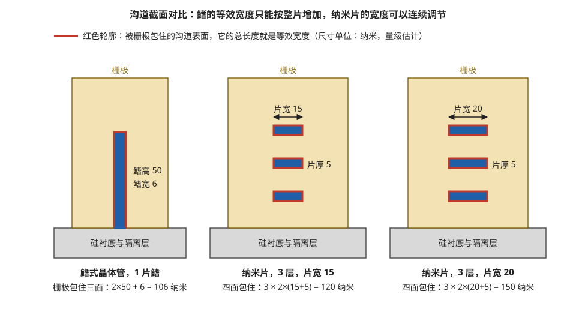

> **图 4-12**　一句话：晶体管能通过多少电流，取决于控制电极包住了多长一圈导电通道；鳍只能一整片一整片地加，纳米片却可以把每片做宽一点点，从而细致地调节晶体管的强弱。
>
> **先知道一件事**：这是把晶体管沿垂直于电流的方向切开来看的截面，电流垂直于纸面流动。蓝色是导电的硅通道，黄褐色是包在外面的栅极（控制通断的电极），灰色是底下的硅衬底。栅极包住的通道表面越长，电流越大，这个被包住的周长叫“等效宽度”。
>
> **按这个顺序看**：
> 1. 左图是鳍式晶体管：一片高 50 纳米、宽 6 纳米的竖立硅鳍，底部连着衬底，所以栅极只能包住它的左右两面和顶面（红色轮廓）。等效宽度是 2×50 + 6 = 106 纳米。想要更强，只能再并排加一整片鳍，一下子变成 212 纳米。
> 2. 中图是纳米片晶体管：三片水平的薄片悬空叠放，每片宽 15 纳米、厚 5 纳米，栅极从上下左右四面把每一片都包住。等效宽度是 3 × 2×(15+5) = 120 纳米。
> 3. 右图还是三片，只是每片宽 20 纳米，等效宽度变成 150 纳米。片宽只加了 5 纳米，就得到了介于 120 和 212 之间的数值，而鳍式晶体管在 106 和 212 之间没有中间档。
>
> **打个比方**：鳍像只能整块买的砖，要么一块要么两块；纳米片像可以按厘米裁的布，要多宽裁多宽。
>
> **看懂的标志**：能回答“这对 SRAM 有什么用”：6T 单元要求下拉管比访问管强、访问管又比上拉管强，最好是 1.5 : 1 : 0.7 这样的非整数比例。鳍只能给 1 倍、2 倍，纳米片可以让三者分别取 150、120、90 纳米，按需要调出比例（§7.5）。
>
> **与正文的对照**：尺寸为量级估计，取自 §7.5 的表。
>
> 来源：本库自绘。

这个改善是一次性的结构红利。GAA 之后的下一步是把 N 型和 P 型晶体管上下叠放的互补场效应晶体管（CFET），但 6T 单元里有 4 个 N 型管和 2 个 P 型管，数量不对称，上下叠放时无法完全重合，收益会打折扣。这部分属于研究阶段，08-03 §8 有简要记录。

---

## 8. 接口：存储宏的引脚、时序与端口

前面七节讲的是 SRAM 的内部。这一节讲芯片设计工程师实际接触到的那一层：存储宏对外有哪些引脚，信号按什么时序给，以及它为什么不需要 DRAM 那样复杂的接口电路。

### 8.1 存储宏是怎么来的

芯片设计工程师不手工绘制 SRAM。晶圆厂或专门的供应商提供一个叫**存储编译器（memory compiler）**的软件，工程师输入参数（字数、位宽、列复用比、端口类型、是否带位写掩码等），软件输出一块存储宏的全套设计文件。这套文件包括四类：物理版图、供布局布线工具使用的外形与引脚位置描述、供时序分析工具使用的时序模型、供仿真使用的行为模型。

存储编译器能生成的配置是有范围和步长的，例如字数只能是 16 的倍数、位宽上限 144。所以芯片架构里的存储容量常常是一些规整的数字。

### 8.2 引脚

一块最常见的单端口同步存储宏有以下引脚。引脚名各家略有不同，这里用一组常见的写法。

| 引脚 | 方向 | 含义 |
| --- | --- | --- |
| CLK | 输入 | 时钟。存储宏只在它的上升沿采样其它输入 |
| CEN | 输入 | 片选使能，低电平有效。为高时存储宏这一拍不做任何操作，内部不翻转，不耗动态功耗 |
| WEN | 输入 | 写使能，低电平有效。为低表示这一拍是写，为高表示这一拍是读 |
| A[11:0] | 输入 | 地址 |
| D[31:0] | 输入 | 写入的数据 |
| BWEN[31:0] | 输入 | 位写掩码，逐位控制。某一位为低时才真正写入对应的数据位，其余位保持原值 |
| Q[31:0] | 输出 | 读出的数据 |
| RET、SD 等 | 输入 | 低功耗模式控制，对应 §6.1 的保持模式和关断 |
| 测试相关引脚 | 输入/输出 | 供 §6.3 的 MBIST 电路接入 |

"单端口"的意思是这块存储宏只有一套地址引脚，每个时钟周期只能做一次操作，要么读要么写。

### 8.3 时序：逐拍走查

存储宏的时序模型规定了几个时间参数。**建立时间（setup time）**是输入信号必须在时钟上升沿之前保持稳定的最短时间，**保持时间（hold time）**是时钟上升沿之后输入信号必须继续保持不变的最短时间，**访问时间**是从时钟上升沿到 Q 引脚上出现有效数据的延迟。

假设时钟周期 500 皮秒（2 GHz），建立时间 50 皮秒，保持时间 30 皮秒，访问时间 300 皮秒。下面连续做一次写和一次读：

| 时刻 | 发生了什么 |
| --- | --- |
| 第 1 拍上升沿之前 50 皮秒 | 外部逻辑把 CEN = 0、WEN = 0、A = 5、D = 0xAB 准备好并保持稳定 |
| 第 1 拍上升沿 | 存储宏采样到"写地址 5"。内部自定时电路启动：译码、开字线、驱动位线、关字线，全部在这一拍内完成 |
| 第 2 拍上升沿之前 50 皮秒 | 外部逻辑把 CEN = 0、WEN = 1、A = 5 准备好 |
| 第 2 拍上升沿 | 存储宏采样到"读地址 5"。内部自定时电路启动：译码、开字线、位线放电、灵敏放大 |
| 第 2 拍上升沿之后 300 皮秒 | Q 引脚上出现 0xAB |
| 第 3 拍上升沿 | 下游的寄存器采样 Q，得到 0xAB |

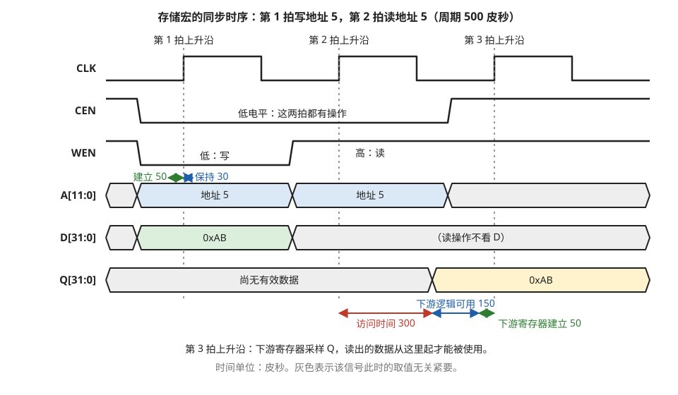

> **图 4-13**　一句话：给 SRAM 一个地址，它要等到下一个时钟节拍才能把数据交出来；这张图画出了先写一次、再读一次时，每组信号线在什么时刻应该是什么值。
>
> **先知道一件事**：芯片里的电路按时钟统一节拍工作。时钟线 CLK 不停地在低、高电压之间来回切换，每次从低跳到高（叫上升沿）算一拍，这里每拍 500 皮秒。存储器只在上升沿那一瞬间“看一眼”其它输入线，其余时间不管它们怎么变。
>
> **按这个顺序看**：
> 1. 第一行 CLK：三条灰色竖虚线标出第 1、2、3 拍的上升沿。
> 2. CEN、WEN 两行是控制线，都是低电压表示“是”。CEN 为低表示“这一拍要做操作”；WEN 为低表示写，为高表示读。图中第 1 拍时 WEN 是低（写），第 2 拍时是高（读）。
> 3. A[11:0]（12 根地址线）、D[31:0]（32 根写数据线）、Q[31:0]（32 根读数据线）三行不逐根画高低，而是画成一条带子，里面写着这组线当前表示的值；两条边线交叉收拢成尖角的地方表示值在变化，灰色段表示这段时间的值无所谓。
> 4. 地址带子上方的一对小箭头：地址必须在上升沿之前 50 皮秒就稳定下来（叫建立时间），之后还要再保持 30 皮秒不变（叫保持时间），因为存储器“看一眼”本身也需要一点时间。
> 5. 第 1 拍：存储器看到“写，地址 5，数据 0xAB”（0xAB 是一个十六进制数），在这一拍之内完成写入。
> 6. 第 2 拍：存储器看到“读，地址 5”。看最下面的 Q 行：直到第 2 拍上升沿之后 300 皮秒（红箭头，叫访问时间），0xAB 才出现。
> 7. 底部的蓝、绿箭头：Q 出现后离第 3 拍上升沿只剩 200 皮秒。接收它的寄存器要求数据提前 50 皮秒到位（绿），真正能留给中间计算电路的只有 150 皮秒（蓝）。第 3 拍上升沿，下游才把 0xAB 收进来。
>
> **看懂的标志**：能回答“为什么说读一次 SRAM 至少要占一拍”：地址在第 2 拍给出，数据要到第 3 拍才能被使用。存储器越大，300 皮秒的访问时间越长，超过一拍就得占两拍，这也是一级缓存不能随意做大的原因（§8.3）。
>
> **与正文的对照**：数值与 §8.3 的例子相同。
>
> 来源：本库自绘。

这张表里有两点值得注意，对照图 4-13 看更直观。

**第一，读出的数据晚一拍才能被使用。** 地址在第 2 拍的上升沿被采样，数据在第 3 拍的上升沿才被下游寄存器接住。对流水线设计来说，访问一次 SRAM 至少占用一级流水。如果存储宏很大，访问时间超过一个时钟周期，就要占用两级甚至三级流水。这就是处理器里一级缓存的容量不能随意增大的时序原因：容量越大访问时间越长，多占一级流水会使每次访存指令都变慢。

**第二，下游逻辑的可用时间被访问时间占去了一大半。** Q 在上升沿之后 300 皮秒才有效，下游寄存器要求数据在下一个上升沿之前 50 皮秒稳定（假设它的建立时间也是 50 皮秒），所以 Q 和下游寄存器之间最多只能放 500 − 300 − 50 = 150 皮秒的组合逻辑，大约是三到五级门。纠错码的校验和纠正电路就放在这一段里，如果放不下就得再加一级流水。

### 8.4 端口类型

| 类型 | 每拍能做的操作 | 位单元 | 典型用途 |
| --- | --- | --- | --- |
| 单端口（1RW） | 一次读或一次写 | 6T | 缓存的数据阵列、通用缓冲 |
| 两端口（1R1W） | 同时一次读和一次写，地址各自独立 | 8T（§4.6 的独立读通路正好提供第二个端口） | 队列、寄存器堆 |
| 真双端口（2RW） | 两个端口各自独立读或写，可以用不同的时钟 | 另一种 8T（6T 加第二对访问管和第二对位线），面积约为 6T 的 2 倍 | 跨时钟域的缓冲 |
| 伪双端口 | 对外表现为一读一写两个端口，内部只有一套位线 | 6T | 面积敏感但需要同拍读写的场合 |

表里出现了两种不同的 8T 单元，容易混淆，下面分别说明，然后讲同址冲突。

**两端口（1R1W）用的是 §4.6 的 8T 单元。** 写端口就是原来的 6T 部分：写字线、一对写位线、两个访问管。读端口是新增的两个晶体管：读字线和一根读位线。两个端口各有自己的地址引脚、自己的行译码器和自己的字线，所以同一拍里可以写第 7 行、同时读第 3 行。

**真双端口（2RW）用的是另一种 8T 单元。** 它在 6T 的基础上再加一对访问管，接到第二条字线和第二对位线上。两个端口记作 A 和 B，结构完全对称，每个端口都能读也能写。这种单元没有独立的读通路，两个端口读的时候都会经过存储节点，所以读扰动依然存在，而且多了一种更严重的情况：两个端口同一拍读同一行。

用 §3.3 的电阻算这种情况。两个端口的字线同时打开，存 0 的那个节点同时通过两个访问管接到两根高电平的位线上。两个 25 千欧的访问管并联，等效电阻是 12.5 千欧，下拉管仍是 4.8 千欧，存储节点被抬到 0.75 × 4.8 ÷ (12.5 + 4.8) ≈ **0.21 伏**，而单端口读时只有 0.12 伏。0.21 伏已经接近翻转点 0.3 伏，加上随机偏差就不安全了。所以真双端口单元的下拉管必须加强，通常用 2 片鳍：下拉管电阻减到 2.4 千欧，节点电压回到 0.75 × 2.4 ÷ (12.5 + 2.4) ≈ 0.12 伏。多出的一对访问管、一对位线、一根字线，再加上加宽的下拉管，使真双端口单元的面积达到 6T 的约 2 倍。

**同址冲突的逐拍例子。** 以一块两端口存储宏做成的队列为例，写指针和读指针各自前进。下表里"读输出"指这一拍采样的读地址对应的数据，它在下一拍才能被使用。

| 拍 | 写端口 | 读端口 | 读输出 | 说明 |
| --- | --- | --- | --- | --- |
| 1 | 写地址 7，数据 0x11 | 读地址 3 | 地址 3 的原有内容 | 地址不同，互不影响 |
| 2 | 写地址 8，数据 0x22 | 读地址 7 | 0x11 | 地址 7 在上一拍已写完，读到新值 |
| 3 | 写地址 9，数据 0x33 | 读地址 9 | 不确定 | 同一拍读写同一地址，发生冲突 |
| 4 | 无操作 | 读地址 9 | 0x33 | 写操作已在第 3 拍完成 |

第 3 拍为什么不确定，要看单元内部。写字线打开后，存储节点在几十皮秒内从旧值翻到新值；读字线同时打开，读位线是否放电取决于存储节点的电压。如果存储节点翻转得早，读位线按新值动作；翻转得晚，读位线先按旧值开始放电，之后才停下。灵敏放大器启动的那一刻读位线上的电压可能处在中间值，放大的结果可能是旧值，也可能是新值，同一个字里的不同位还可能不一致。

处理办法是在存储宏外面加一条**旁路**。它由三部分组成：一个地址比较器，比较写地址和读地址；一组寄存器，把写数据保存一拍；一个二选一选择器，接在存储宏的读输出之后。比较结果为相等且两个端口都有效时，选择器选寄存器里保存的写数据，否则选存储宏的读输出。加上旁路之后，第 3 拍的读输出确定为 0x33。旁路的代价是一个地址宽度的比较器和一级选择器的延迟，后者要从 §8.3 算的那 150 皮秒里扣除。

真双端口还有第二种冲突：两个端口同一拍写同一个地址。此时两套写驱动器可能把同一个单元往相反的方向拉，最终内容不确定。存储宏本身不处理这种情况，必须由外部逻辑保证它不会发生。如果两个端口使用不同的时钟，两边的操作在时间上可以以任意间隔重叠，冲突的判定更复杂，时序模型里会规定两个时钟沿之间至少要相隔多久才算不冲突。

**伪双端口**的工作方式需要说明。它内部是一块单端口的阵列，但在一个时钟周期内连续做两次操作：前半段做读，后半段做写，两次操作的时序都由内部自定时电路产生。对外部逻辑来说，它在同一拍里接受了一个读地址和一个写地址。代价是一个周期内要完成两次访问，所以最高工作频率大约只有同样大小单端口存储宏的一半。

以时钟周期 1000 皮秒为例，一拍内部的安排大致是（量级估计）：

| 起止时刻（皮秒） | 内部动作 |
| --- | --- |
| 0 | 时钟上升沿，同时锁存读地址、写地址和写数据 |
| 0～300 | 用读地址做一次完整的读，结果锁存到输出 |
| 300～450 | 关字线，预充电位线 |
| 450～750 | 用写地址做一次完整的写 |
| 750～900 | 关字线，预充电位线（写之后恢复时间较长，见 §5.2.3） |
| 900～1000 | 余量 |

伪双端口因为先读后写，同一拍读写同一地址时读出的确定是旧值，不存在上面那种不确定的情况。

### 8.5 独立的 SRAM 芯片

SRAM 也以独立封装的芯片形式存在，今天的用量已经很小，但它的接口形式有助于理解存储接口的演变。

**异步 SRAM** 没有时钟引脚。引脚是地址、数据、片选、输出使能和写使能。读操作只需要给出地址并使片选和输出使能有效，经过一段访问时间（典型值 10 纳秒左右）后数据出现在数据引脚上。它的接口最简单，至今仍用于小型微控制器系统和一些工业设备。

以一颗访问时间 10 纳秒的异步 SRAM 为例，读和写的过程如下（时间参数为典型量级）。

| 时刻（纳秒） | 读操作 | 写操作 |
| --- | --- | --- |
| 0 | 地址引脚给出地址，片选和输出使能有效 | 地址引脚给出地址，片选有效 |
| 0～10 | 芯片内部译码、读出 | 写使能拉低，开始写脉冲；数据引脚给出数据 |
| 8 | | 写脉冲已持续 8 纳秒，达到最短宽度要求 |
| 10 | 数据引脚上出现有效数据 | 写使能拉高，数据在这个上升沿被写入。数据必须在此之前至少 6 纳秒就已稳定 |

没有时钟意味着所有时序都以信号边沿之间的间隔来规定。使用者必须自己保证地址在整个写脉冲期间保持不变，否则写脉冲期间地址变化会把数据写进错误的单元。

**同步突发 SRAM** 加上了时钟，并支持给出一个起始地址后连续输出后续几个地址的数据。1990 年代个人电脑主板上的二级缓存用的就是这种芯片，后来缓存被集成进处理器裸片，这类产品随之萎缩。

**QDR SRAM**（quad data rate，四倍数据速率）有独立的读端口和写端口，每个端口在时钟的上升沿和下降沿都传输数据，所以一个时钟周期内共有四次数据传输。它主要用在高端网络设备里存放查找表，这类应用要求每个时钟周期都能以固定的延迟完成一次随机读，DRAM 做不到。

QDR 的时序值得走一遍，因为它已经具备了 07-06 要讲的 DRAM 接口的几个关键要素。它的主要引脚有：一对互补的输入时钟 K 和 K#（K# 的上升沿就是 K 的下降沿）、地址、读使能、写使能、写数据 D、读数据 Q，以及一对由芯片输出的回送时钟 CQ 和 CQ#。

下面以每次访问传两个字、读延迟 1.5 个周期的型号为例，时钟频率 333 MHz，周期 3 纳秒。各个边沿具体采样什么信号以器件手册为准，这里给出的是这一类器件的典型安排。

| 时刻（纳秒） | 时钟沿 | 读端口 | 写端口 |
| --- | --- | --- | --- |
| 0 | K 上升沿 | 采样读地址 A0 | 采样写使能；采样写数据的第一个字 |
| 1.5 | K# 上升沿 | | 采样写地址 B0；采样写数据的第二个字 |
| 3.0 | K 上升沿 | 采样下一个读地址 A1 | 下一次写开始 |
| 4.5 | K# 上升沿 | Q 输出 A0 的第一个字，CQ# 同时翻转 | |
| 6.0 | K 上升沿 | Q 输出 A0 的第二个字，CQ 同时翻转 | |
| 7.5 | K# 上升沿 | Q 输出 A1 的第一个字 | |

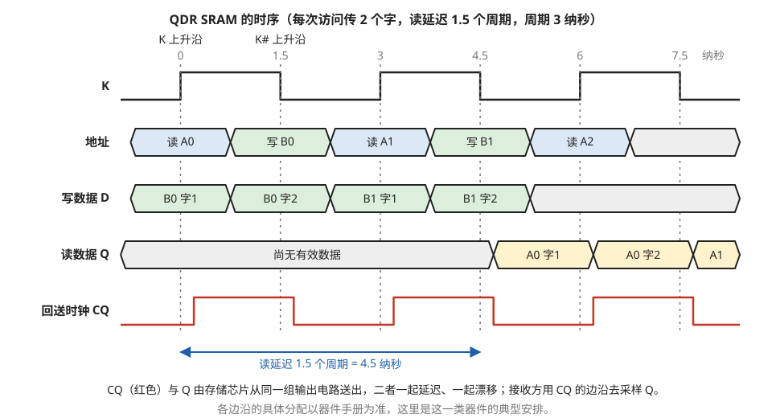

> **图 4-14**　一句话：QDR SRAM 每个时钟周期既能读又能写、每次传两个字，所以数据线上一个周期有四次传输；读出的数据还附带一根由存储芯片自己送出的时钟，方便接收方对准时刻。
>
> **先知道一件事**：这是一颗独立封装、焊在电路板上的 SRAM 芯片。信号要在板上走几厘米，到达时间有一两纳秒的不确定，而这里每个字在线上只停留 1.5 纳秒，所以“在什么时刻去读取数据线”成了关键问题。
>
> **按这个顺序看**：
> 1. 第一行 K 是输入时钟，周期 3 纳秒。顶部的 0、1.5、3……是时间（纳秒），竖虚线标出 K 的每一次跳变。K 的上升（0、3、6 纳秒）和下降（1.5、4.5、7.5 纳秒）都会被用到；下降的时刻也就是 K#（与 K 电压相反的另一根时钟线，图中没画）上升的时刻。
> 2. 地址行：同一组地址线轮流传读地址（蓝）和写地址（绿），0 纳秒附近传读 A0，1.5 纳秒附近传写 B0，依此类推。一组线一个周期传两个地址，省下一半引脚。
> 3. 写数据 D 行：每半个周期传一个字，B0 的两个字、B1 的两个字依次送进芯片。
> 4. 读数据 Q 行：A0 的两个字要到 4.5 和 6 纳秒附近才出现（黄色），也就是地址给出后 1.5 个周期，底部蓝箭头量出了这段读延迟。
> 5. 最下面的红线 CQ 是回送时钟：由存储芯片和 Q 一起送出，走同样长的线。接收方不用自己的时钟，而是看 CQ 何时跳变就在何时读取 Q；因为两者一起延迟、一起漂移，路上的不确定就抵消了。这种“数据自带时钟”的做法叫源同步。
>
> **打个比方**：约朋友在车站接人，与其按时刻表猜车什么时候到，不如请同车的熟人一到站就挥手。CQ 就是那个同车而来、负责挥手的人。
>
> **看懂的标志**：能回答“接收方为什么不用自己的 K 时钟去读取 Q”：Q 从芯片出来再走过电路板要 1～2 纳秒，而且随温度、电压变化，而一个字只停留 1.5 纳秒，用自己的时钟没法确定它何时到；CQ 与 Q 走同一条路，跟着 CQ 读取就准。
>
> **与正文的对照**：各边沿的具体分配以器件手册为准，这里是这一类器件的典型安排。
>
> 来源：本库自绘。

从这张表和图 4-14 可以读出三点。

第一，每个周期可以发起一次读和一次写，每次各传两个字，所以每个周期在数据引脚上共有 4 次传输，"四倍数据速率"指的就是这个。数据位宽 36 位时，每个方向的速率是 36 × 2 × 333 MHz ≈ 24 Gb/s。

第二，地址引脚是读写共用的，读地址在 K 的上升沿采样，写地址在 K# 的上升沿采样。一组引脚在一个周期里分时传两个地址，节省了引脚。

第三，读数据旁边带着回送时钟 CQ。CQ 由存储芯片自己产生，与 Q 从同一组输出电路、经过相同的延迟送出。接收方不用自己的时钟去采样 Q，而是用 CQ 去采样。这样做的原因是：时钟周期只有 3 纳秒，每个字在数据引脚上只停留 1.5 纳秒，而信号从芯片输出再经过电路板走线到达接收方的延迟有 1 到 2 纳秒，并且随温度和电压变化。接收方如果用自己的时钟采样，无法确定数据何时到达。CQ 和 Q 一起出发、走相同长度的走线，两者的延迟变化相同，用 CQ 采样就把这部分不确定性抵消了。这种"发送方把时钟和数据一起送出"的做法叫**源同步**，DRAM 接口里的 DQS 信号（07-06 §4）是同一个思路。

### 8.6 为什么 SRAM 不需要 PHY 和训练

07-06 会讲到，DRAM 的接口需要一块专门的物理层电路（PHY），并且每次上电都要花几百毫秒做训练，逐根信号线地调整延迟和参考电压。片上 SRAM 完全没有这些。原因可以用一笔延迟的账说明。

**片上 SRAM 的情况。** 存储宏和使用它的逻辑电路在同一片裸片上，距离通常在几百微米以内。片上导线经过缓冲器驱动后，每毫米的延迟约 100 皮秒量级，所以 200 微米的走线延迟约 20 皮秒。32 根数据线之间的走线长度差异假设为 50 微米，对应的延迟差约 5 皮秒。而时钟周期是 500 皮秒。延迟差只占周期的 1%，信号是满幅的数字电平，存储宏和逻辑电路用同一个时钟。这些延迟在设计阶段由时序分析工具根据时序模型全部算出并验证，芯片制造出来之后不需要任何调整。

**DDR5 内存的情况。** 以 DDR5-6400 为例，每根数据线的速率是 6400 Mb/s，一个比特占的时间是 1 ÷ 6400 Mb/s ≈ 156 皮秒。信号要从处理器封装出来，在主板上走约 10 厘米到达内存条。印制电路板上的信号传播延迟约每毫米 6.7 皮秒，所以两根数据线的长度只要相差 1 厘米，到达时间就相差 67 皮秒，占一个比特时间的 43%。此外每块主板、每根内存条的走线都不同，温度和电压变化还会使延迟漂移。这些偏差在设计阶段无法确定，只能在每台机器上电时实测并补偿，这就是训练。

两种情况的对比：

| | 片上 SRAM 存储宏 | DDR5 内存 |
| --- | --- | --- |
| 信号走线长度 | 几百微米 | 约 10 厘米 |
| 一个比特的时间 | 500 皮秒（2 GHz 时钟，每周期一次） | 156 皮秒 |
| 数据线之间的延迟差 | 约 5 皮秒 | 几十皮秒，且每台机器不同 |
| 延迟差占比特时间的比例 | 约 1% | 可达 40% 以上 |
| 信号形式 | 满幅数字电平 | 小摆幅、带端接电阻的传输线信号 |
| 时序由谁保证 | 设计阶段的时序分析 | 上电时的训练加运行中的周期性校准 |

**所以存储器是否需要 PHY 和训练，取决于它离使用者有多远、信号跑得有多快，而与它内部用什么单元存数据无关。** §8.5 提到的 QDR SRAM 是独立封装的芯片，信号要走印制电路板，速率高的型号同样需要在接收端调整采样时刻。反过来，07-03 讲的把 DRAM 直接叠到逻辑裸片上的方案，连接距离缩到几十微米，接口电路就可以大幅简化。

---

## 9. 开发者视角

SRAM 的电路细节对软件不可见，但它通过下面几种方式影响软件能观察到的行为和架构上的取舍。

| 你想知道/做什么 | 去哪里看/做 |
| --- | --- |
| 这颗 GPU 片上有多少 SRAM | 查架构白皮书里的 L2 容量、每 SM 的 L1/共享内存容量；寄存器堆容量可由"每 SM 寄存器数 × 4 字节 × SM 数"估算（08-03 §4） |
| 为什么新一代 GPU 的缓存和共享内存增长很慢 | 位单元面积从 5 nm 起几乎不缩小（§7.1），增加片上存储意味着直接增加裸片面积 |
| 为什么访存指令的延迟是固定的几拍 | 存储宏的读出晚一拍（§8.3），容量越大占的流水级数越多 |
| 片上 SRAM 有没有发生软错误 | `nvidia-smi -q -d ECC` 会列出按位置分类的可纠正与不可纠正错误计数，其中包含片上 SRAM 的条目；内核日志里的 Xid 错误码也会记录不可纠正错误 |
| 可纠正错误计数在缓慢增长，要不要处理 | 零星的可纠正错误是软错误的正常表现（§6.2 算过集群里每两小时一次）；如果同一张卡的计数增长速度远高于同批其它卡，更可能是某个位单元在老化，应当安排更换 |
| 判断一个"增大片上缓存"的架构方案值不值 | 用 §2.3 的成本账估算面积和硅成本，再用 §8.3 的时序估算会不会多占流水级 |
| 为什么芯片在低功耗状态下仍有一定的静态功耗 | SRAM 保持数据需要维持阵列电源（§6.1），保持电压由保持状态的噪声容限决定 |
| 红旗信号 | 宣传材料声称某工艺"SRAM 密度大幅提升"但只给存储宏密度、不给位单元面积和阵列效率；或者只给位单元面积、不说明是高密度单元还是高电流单元 |

---

## 10. 最新架构落点（知识截至 2026-09）

- **环栅晶体管工艺上的 SRAM 已进入量产。** 台积电 N2 于 2025 年下半年开始量产，2025 年国际固态电路会议上公布的存储宏密度约 38 Mb/mm²。英特尔 18A 同期公布高密度位单元 0.021 µm²、高电流位单元 0.023 µm²，存储宏密度约 31.8 Mb/mm²。两者都是 5 nm 以来第一次出现明显的 SRAM 微缩，来源是纳米片宽度可连续调节（§7.5）。
- **后续节点的 SRAM 微缩幅度预期有限。** 公开的分析认为台积电 A16 相对 N2 的密度提升在 7% 到 10% 的量级。据 2026 年的路线图报道，A16 的量产时间已推迟到 2027 年（路线图，未出货）。
- **把缓存挪到另一片裸片上**仍然是应对 SRAM 不缩小的主要产品级手段。AMD 的 3D V-Cache 用混合键合把一片 SRAM 裸片与处理器裸片叠在一起（键合工艺见 07-01 §3.2），缓存可以用较成熟、较便宜的工艺制造。
- **HBM4 的基底裸片改用逻辑工艺**之后，基底裸片上可以放逻辑工艺的 SRAM，用来替换堆叠中失效的 DRAM 单元（07-02 §9）。这是 SRAM 第一次进入 HBM 内部。
- **NVIDIA 主线的片上存储增长克制。** 从 A100 到 H100，每 SM 的 L1/共享内存从 192 KB 增加到 256 KB，L2 从 40 MB 增加到 50 MB，远慢于同期算力的增长。Blackwell 为矩阵运算单元增加了专用的 TMEM 存储（08-03 §8）。
- **另一条路**：NPU 类芯片普遍用软件显式管理的片上缓冲区代替缓存，省去缓存查找所需的标签存储和比较电路，把同样的 SRAM 面积全部用作数据存储（02-04）。

---

## 11. 和其它模块的挂钩

- **08-03 片上存储的物理实现**：那一节从同一个 6T 单元出发，向上讲子阵列怎么变成 bank、寄存器堆为什么用多端口、缓存的标签比较电路。本节向下和向外讲：单元的稳定性与 Vmin、辅助电路、可靠性与修复、微缩数字、存储宏接口。两节合起来是 SRAM 的完整图像。
- **07-05 DRAM 单元与阵列**：DRAM 的阵列同样由字线、位线和灵敏放大器组成，但单元里没有主动驱动的晶体管，所以读是破坏性的、需要刷新。对照本节 §3.2 的保持机制可以看清差别的根源。
- **07-06 DRAM 接口**：本节 §8.6 的对照表是那一节的出发点，那里展开讲 PHY 里的电路和训练的每一步。
- **07-07 NAND 闪存**：本节 §2 对照表里 NAND 那一列的每一项（阈值电压存数据、整块擦除、擦写寿命）在那一节展开。
- **07-02 HBM 解剖 §9**：可定制 HBM 的五类用法里，第二类是在基底裸片上放 SRAM 做修复，其原理就是本节 §6.4 的冗余修复。
- **08-06 能量与时钟的账本**：本节 §4.4 讲的 Vmin 限制了整颗芯片在降压省电时能降到多低，§6.1 的漏电是静态功耗的组成部分。
- **09-04 可靠性与规模化**：本节 §6.2 那笔"一万张卡每两小时一次软错误"的账，是集群层面静默错误讨论的器件侧来源。
- **06-01 存储层级与搬运指令全图**：本节 §2.4 的那张位置表是那一节存储层级图向下的延伸。

---

## 12. 术语卡

### 静态噪声容限（SNM）
**定义**：使 SRAM 位单元的存储状态发生翻转所需的最小直流电压扰动，单位是毫伏。它分为保持状态和读状态两种，读状态下存 0 的节点被访问管抬高，所以读 SNM 明显小于保持 SNM，典型值约 100 到 150 毫伏。
**为什么存在**：设计位单元时需要一个数字来衡量"离出错还有多远"。没有这个指标，就无法比较不同的晶体管尺寸方案，也无法回答电压能降多少。它还直接和随机偏差挂钩：5 亿个单元要求按 6 倍标准差设计，6 倍标准差约 150 毫伏，与读 SNM 同量级，所以先进工艺的位单元没有多少余量。
**语境例句**："这个位单元在 0.6 伏下读 SNM 不够。" —— 意思是：电压降到 0.6 伏时，偏差最大的那批单元在读操作中会被翻转，要么给存储阵列单独供一路较高的电压，要么加读辅助电路。

### Vmin（最低工作电压）
**定义**：一块电路能正确工作的最低电源电压。对 SRAM 来说，是存储阵列里所有位单元都能正确读、写和保持的最低电压，由偏差最大的那个单元决定。
**为什么存在**：功耗与电压的平方成正比，芯片在轻载时希望尽量降压。逻辑电路的偏差在多级门之间互相平均，能降到很低；SRAM 的每个单元必须单独合格，所以 SRAM 的 Vmin 通常高于逻辑电路，成为整颗芯片降压的下限。
**语境例句**："这颗芯片的 Vmin 是被 SRAM 卡住的。" —— 意思是：逻辑部分还能继续降压，但存储阵列在这个电压以下会出现读写错误，整颗芯片的最低电压由存储阵列决定。

### 读写辅助电路（assist circuit）
**定义**：在读或写操作的短暂时间内临时改变字线、位线或单元电源电压的电路。常见的有读操作用的字线欠驱动，以及写操作用的负位线和单元电源降压。
**为什么存在**：位单元里访问管的强度要同时满足读稳定（要弱）和可写（要强）两个相反的要求，在鳍式晶体管工艺里晶体管尺寸只能取整数片鳍，无法靠尺寸细调。辅助电路在操作的瞬间临时改变晶体管的工作条件，读的时候让访问管变弱，写的时候让它变强。
**语境例句**："这块存储宏开了负位线，Vmin 能再降 80 毫伏。" —— 意思是：写操作时位线被拉到负电压，访问管的驱动能力增强，原本在低压下写不进去的单元现在可以写入，代价是每组列要多一份产生负电压的电路。

### 存储宏与存储编译器
**定义**：存储宏是一块包含位单元阵列和全部外围电路、可以直接放进芯片版图的完整存储器。存储编译器是生成存储宏的软件，输入字数、位宽、端口类型等参数，输出版图、引脚位置描述、时序模型和仿真模型。
**为什么存在**：SRAM 位单元违反普通逻辑电路的设计规则才能做到那么小，它的版图和外围模拟电路必须由晶圆厂或专门的团队针对每代工艺精心设计和验证。把这些工作封装成编译器，芯片设计者才能像使用一个普通模块那样使用存储器。
**语境例句**："编译器出不了这个尺寸，要么拆成两块，要么字数取整到 4096。" —— 意思是：存储编译器支持的参数是离散的，架构上想要的容量必须向它能生成的配置靠拢。

### 阵列效率
**定义**：存储宏的面积中位单元阵列所占的比例。大容量存储宏约 65% 到 75%，小容量存储宏可能只有 30% 到 40%。存储宏密度等于"1 ÷ 位单元面积"乘以阵列效率。
**为什么存在**：位单元面积是工艺的指标，但芯片上实际付出的面积还包括译码器、灵敏放大器和控制电路。比较两代工艺或两种存储划分方案时，只看位单元面积会低估真实成本。
**语境例句**："切成 64 个小宏之后阵列效率掉到四成。" —— 意思是：每块小存储宏都要带一套完整的外围电路，总面积里只有四成是真正存数据的，切分带来的并行度是用面积换来的。

### 软错误与 FIT
**定义**：软错误指存储单元的数据被高能粒子改变而电路本身没有损坏。FIT 是失效率的单位，1 FIT 等于每十亿小时一次失效。SRAM 的软错误率通常以每兆比特多少 FIT 表示。
**为什么存在**：宇宙射线中子和封装材料中的 α 粒子会在硅里产生电荷，先进工艺的位单元节点电容极小，几千个电子就足以使其翻转。单颗芯片上这是几年一遇的事件，但在一万张卡的集群里是每天十几次，必须用纠错码处理。
**语境例句**："这批卡的可纠正错误计数都在个位数，属于正常的软错误水平。" —— 意思是：这些错误是粒子引起的随机翻转，已被纠错码修正，不代表硬件有问题；需要警惕的是某一张卡的计数显著高于其它卡。

### MBIST 与冗余修复
**定义**：MBIST 是做在芯片内部、紧邻存储宏的自测试电路，按 March 算法等固定序列对每个位单元做读写检查并报告失效地址。冗余修复是用存储宏里预留的备用行或备用列替换失效的行或列，替换信息记录在电熔丝里，每次上电时装载。
**为什么存在**：位单元是芯片上最密的结构，也是缺陷最集中的地方。一颗含几亿个位单元的芯片几乎必然有几个坏单元，不修复的话良率接近零。存储宏深埋在芯片内部，外部测试设备无法直接访问，所以测试电路只能内建。
**语境例句**："这颗芯片 MBIST 过了，修了三行。" —— 意思是：自测试发现了坏单元，但它们落在三行以内，已经用备用行替换，芯片可以作为良品出货。

### 伪双端口
**定义**：对外提供一个读端口和一个写端口、内部却只有一套字线和位线的存储宏。它在一个时钟周期内先后完成一次读和一次写，两次操作的时序由内部自定时电路产生。
**为什么存在**：真正的两端口存储需要 8T 位单元，面积大三到四成。如果应用只需要每拍一读一写，并且工作频率不高，可以用 6T 阵列在一个周期内分时完成两次操作，用速度换面积。
**语境例句**："这个队列用伪双端口就够了，频率只跑到 800 兆。" —— 意思是：这块存储每拍需要同时读写，但时钟较慢，一个周期内足够做两次访问，没有必要为 8T 位单元付出额外面积。

---

## 13. 我的困惑 / 待深挖

- 台积电 N2 的高密度位单元面积到底是多少？0.0175 µm² 是媒体引用值，业内讨论中有不同说法。需要找到会议论文原文确认，并弄清 38 Mb/mm² 对应的是哪种存储宏配置。
- §6.2 用的每 Mb 50 FIT 是量级估计。FinFET 和环栅晶体管工艺下 SRAM 软错误率的可信实测值是多少？随海拔和工艺节点怎么变化？
- §6.1 的单元漏电流（室温几十皮安、高温约 200 皮安）也是量级估计，先进节点高密度单元的实际数值需要查证。
- GPU 上不同用途的 SRAM 分别采用了哪一级保护？寄存器堆是奇偶校验还是完整的纠错码？公开资料里没有找到明确说明。
- 各家存储宏实际启用了哪几种辅助电路、各自把 Vmin 降低了多少毫伏，公开数据很少，多数只在会议论文里针对单个测试芯片给出。
- 环栅晶体管工艺下位单元的随机偏差标准差比 FinFET 小多少？这决定了 §4.3 那笔 6 倍标准差的账在新工艺下要不要重算。
- 3D 堆叠的 SRAM 裸片（如 3D V-Cache）与处理器裸片之间的接口是什么形式？信号跨过键合界面之后还算不算"片上"、时序是否仍然完全由设计阶段的时序分析保证？
- CFET 对 6T 位单元的实际面积收益有多大？4 个 N 型管和 2 个 P 型管的不对称具体怎么处理？

---

*最后更新：2026-09-28（第四版：图注按费曼法重写，14 张图的图注统一改为“一句话 / 先知道一件事 / 按这个顺序看 / 打个比方 / 看懂的标志 / 与正文的对照”六块结构，面向没有电路背景的读者。第三版补图 14 张（其中取自 Wikimedia Commons 2 张，自绘 12 张）：6T 电路图、蝶形曲线、读写波形、8T 单元、半选中、存储宏框图、汉明码、软错误与列复用、位单元版图、鳍与纳米片截面、存储宏时序、QDR 时序、服务器存储层级；删去 §3.1 与 §4.2 两处 ASCII 示意图，由图 4-2、图 4-5 代替；§7.3 后加一条延伸看图外链。第二版：补写一轮。新增 §3.5 锁存型灵敏放大器的三步过程与偏移电压；§4.2 蝶形曲线的画法与从图上读出 SNM 的带数字说明；§4.5 四种辅助电路各一个数字例子与半选中问题；§5.2.1～5.2.5 行译码与预译码、字线驱动器、预充电与均衡、写驱动器、一次读操作 300 皮秒的分解；§6.1 亚阈值漏电规律与保持电压的三步推导；§6.2 粒子电荷量的账与 4 位数据的纠错码走查；§6.4 修复决策的例子；§7.3～7.5 鳍数对读扰动电压的影响、逻辑单元高度的拆分、纳米片等效宽度表；§8.4 两种 8T 单元的区分、真双端口同读的电阻账、同址冲突逐拍表与旁路；§8.5 异步 SRAM 与 QDR 的时序走查。台积电 16 nm 位单元面积由 0.074 更正为 0.070 µm²。第一版。存储器件基础线的第一节。含三种存储器的一页对照表及其推算过程；6T 单元保持、读、写的节点电压走查；读扰动与写失败的矛盾、静态噪声容限、随机偏差与 6 倍标准差的账、Vmin、四种辅助电路；列复用与自定时；漏电、软错误、March C− 测试序列与冗余修复的良率账；16 nm 到 N2/18A 的位单元面积表与 7 nm 间距复算；存储宏引脚、逐拍时序、端口类型，以及 SRAM 与 DDR5 接口的延迟对照。位单元面积与存储宏密度经联网核实；软错误率、漏电流、晶圆价格与每 GB 成本为量级估计）*
