# DRAM 单元与阵列：一个电容存一位，所以读会破坏、放着会漏

> **所属模块**：模块 07 · 封装与存储的物理实现
> **状态**：🟨 学习中（第三版。知识截至 2026-09）
> **本节主旨**：上一节（07-04）讲的 SRAM 用六个晶体管互相锁住一位数据，快，但是占面积。DRAM 走的是相反的方向：**每个比特只用一个晶体管加一个电容**，数据就是电容上有没有电荷。这个选择让 DRAM 的单元面积比 SRAM 小一个数量级以上，也同时带来了三件 SRAM 没有的麻烦，而它们全部可以从"电容"这一个器件推出来：**第一，读是破坏性的**——读的时候电容上的电荷要分给一根比它大好几倍的位线，读完电容里的数据就没了，必须立刻写回去；**第二，放着会漏**——电容上的电荷会经由晶体管慢慢漏掉，所以每隔几十毫秒要把全部单元重写一遍，这就是刷新；**第三，缩不动**——晶体管可以越做越小，电容却必须保住足够的电荷量才能被读出来，所以 DRAM 的工艺微缩比逻辑工艺慢得多。这一节按这个顺序讲：一个单元里存了多少个电子、读一次的五个步骤、阵列怎么切成 bank 和行列、时序参数（tRCD、CL、tRP、tRAS）各自对应哪一步电路动作、刷新要付多少开销、反复激活一行为什么会把隔壁行的数据翻掉（row hammer）、出了错怎么纠怎么修、电容被做成多高的柱子、以及 DDR、LPDDR、GDDR、HBM 四种产品为什么用的是同一种单元。配五笔手算：一个单元存了约三万个电子、位线上只动 100 毫伏、一次行未命中的访问要 49 纳秒、刷新吃掉约 7.6% 的时间、一个刷新周期内最多能把同一行激活 66 万次。

---

## 0. 这一节要回答的问题

- DRAM 的一个比特在物理上是什么？一个单元里到底存了多少电荷？
- 为什么说 DRAM 的读是"破坏性"的？读完之后数据是怎么回来的？
- 内存条参数里的 CL、tRCD、tRP、tRAS 各是什么？它们对应电路里的哪一步？
- 为什么同样读 64 字节，有时候 17 纳秒就够，有时候要 49 纳秒？
- DRAM 为什么要刷新？多久刷一次？刷新要花掉多少性能？
- 温度高了为什么 DRAM 会出错？85 摄氏度这个数是怎么来的？
- Row hammer 是什么？为什么只是"读"一行，就能把隔壁行的数据改掉？
- DRAM 自己带纠错吗？坏了一行还能不能修？
- 为什么 DRAM 的制程名字是 1x、1y、1z、1a、1b、1c 这样一串字母，而不是像逻辑工艺那样 7nm、5nm、3nm？
- 4F² 和"3D DRAM"是什么？它和 07-03 讲的"3D-DRAM"是一回事吗？
- DDR、LPDDR、GDDR、HBM 里面的存储单元有区别吗？

---

## 1. 基础词汇：先把本节要反复用的词讲清楚

**DRAM（dynamic random-access memory，动态随机存取存储器）**。用电容存数据的存储器。"动态"这个词的意思是数据不能静止地保持，必须周期性地重写；与之相对的 SRAM（静态随机存取存储器，07-04 的主题）只要供电就一直保持。主机内存条、手机内存、显卡显存、AI 加速器上的 HBM，底层全部是 DRAM。

**存储电容（storage capacitor）**。DRAM 单元里真正存放数据的器件。电容就是两片导体中间夹一层绝缘介质，在两片导体之间加电压，导体上就会积累电荷，撤掉电压后电荷还留在那里。电容量的单位是法拉，DRAM 单元的电容量级是飞法（fF，10⁻¹⁵ 法拉）。

**访问晶体管（access transistor）**。DRAM 单元里的那一个晶体管，作用是开关：导通时把电容接到位线上，关断时把电容与外界隔开。

**字线（wordline）与位线（bitline）**。存储阵列是一个二维网格。字线是横向的导线，接在一整行访问晶体管的栅极上，一根字线拉高，这一行所有单元的开关同时打开。位线是纵向的导线，一整列单元的访问晶体管都接在同一根位线上，数据通过它读出和写入。

**灵敏放大器（sense amplifier）**。接在位线末端的差分放大电路，负责把位线上几十到一百多毫伏的微小电压变化放大成完整的高电平或低电平。在 DRAM 里它还兼一个任务：放大的同时把数据写回单元（§3 展开）。

**激活（activate）与预充电（precharge）**。DRAM 访问一行数据分成两个动作。激活是打开一行：拉高这一行的字线，把整行数据读到灵敏放大器里锁住。预充电是关闭这一行：放下字线，把位线恢复到初始电压，为打开下一行做准备。这两个词会在时序参数里反复出现。

**刷新（refresh）**。把一行数据读出来再原样写回去的操作，目的是把漏掉的电荷补上。它不改变数据内容。

**保持时间（retention time）**。一个单元从写入之后到数据变得无法正确读出为止所能坚持的时间。每个单元的保持时间都不一样，规格是按最差的那个单元定的。

**F 与 F²**。F 是特征尺寸（feature size），在存储器里指阵列中最密的那层线条的半节距（线宽加线间距的一半）。单元面积习惯写成 F² 的倍数，比如 6F² 的意思是单元占 6 个 F×F 的方格。用这个单位的好处是可以撇开具体制程，只比较单元结构本身的紧凑程度。

---

## 2. 1T1C 单元：结构与一笔电荷的账

DRAM 的存储单元叫 **1T1C 单元**，名字的意思是一个晶体管（1 transistor）加一个电容（1 capacitor）。它的电路和物理结构见图 5-1。

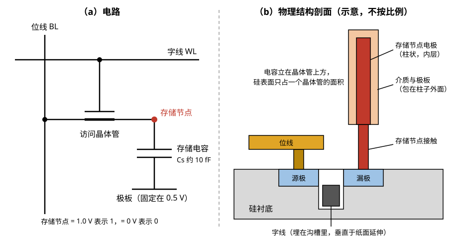

> **图 5-1**　1T1C 单元。左边是电路：访问晶体管的栅极接字线，一端接位线，另一端接存储节点（红点），存储电容的另一端是极板，固定在 0.5 V。右边是物理结构的剖面示意：访问晶体管的栅极（字线）埋在硅表面下的沟槽里（§8.2 讲这种结构），存储节点经过一根接触柱向上连到一根柱状电容，电容立在晶体管上方，所以一个单元在硅表面只占一个晶体管的面积。剖面不按比例，真实的电容柱比图中高得多（§8.1）。
> 来源：本库自绘。

访问晶体管的一端接位线，另一端接电容的一个电极，这个电极叫存储节点。电容的另一个电极叫极板，所有单元的极板连在一起，固定在电源电压的一半。数据的表示方法是：**存储节点的电压等于电源电压表示 1，等于 0 伏表示 0**。

极板固定在一半电压而不是 0 伏，原因是这样做可以让电容介质承受的电压减半。存 1 时介质两端的电压差是 1.0 − 0.5 = 0.5 伏，存 0 时是 0 − 0.5 = −0.5 伏，两种情况介质承受的电压大小相同，都只有电源电压的一半。介质只有几纳米厚，承受的电压越低，漏电越小，寿命越长。

**算一笔电荷的账。** 取一组量级典型的数字：电容量 Cs = 10 fF（当前先进节点的实际值在 5 到 10 fF 之间，这里取整便于计算），阵列电源电压 1.0 伏。

1. 存 1 和"中间状态"（0.5 伏）之间的电压差是 0.5 伏。
2. 对应的电荷量 = 电容量 × 电压差 = 10 fF × 0.5 V = **5 fC**（飞库仑，10⁻¹⁵ 库仑）。
3. 一个电子的电荷量是 1.6 × 10⁻¹⁹ 库仑，所以电子个数 = 5 × 10⁻¹⁵ ÷ 1.6 × 10⁻¹⁹ ≈ **31000 个**。

也就是说，区分一个 1 和一个 0，靠的是大约三万个电子的有无。这个数字是理解 DRAM 全部工程难点的起点，因为后面三件事都在消耗它：读的时候这三万个电子要分摊到一根大得多的位线上（§3），放着的时候它们每秒都在漏走一部分（§5），而制程每缩一代，能放电容的底面积就缩小一次（§8）。

**和 SRAM 对比一下面积。** 07-04 §7 给过先进逻辑工艺上 SRAM 位单元的面积，大约是 0.02 平方微米。当前 DRAM 单元的面积量级约为 0.001 到 0.0015 平方微米（量级估计：6F² 单元，F 取 13 纳米得 0.001，取 15 纳米得 0.00135，各家各代不同）。两者相除约为 **14 到 20 倍**（07-04 §2 的对照表取的是 F = 13 纳米，即 20 倍这一端）。原因很直接：SRAM 的六个晶体管要平铺在硅表面，而 DRAM 只有一个晶体管占硅表面，电容是竖着立在晶体管上方的（§8 讲它有多高）。这就是同样一片硅，DRAM 能存十几倍数据的来源。

---

## 3. 读是破坏性的：电荷共享、放大与回写

上一节算出一个单元里存了约三万个电子。这一节讲这些电子在读的时候去了哪里，以及为什么读完必须写回去。

### 3.1 电荷共享：位线上只动 100 毫伏

读之前，位线被预先充到电源电压的一半，也就是 0.5 伏，然后断开驱动，让它悬空保持在这个电压上。接着字线拉高，访问晶体管导通，存储电容和位线连到了一起。

这时发生的事情叫**电荷共享（charge sharing）**：两个原本电压不同的电容被连在一起，电荷会从电压高的一边流向电压低的一边，直到两边电压相等。最终电压由两者的电容量按比例决定。

位线本身也是一个电容。它是一根很长的金属线，上面挂着几百个访问晶体管，寄生电容（导线与周围导体之间自然形成的、不是故意做出来的电容）加起来远大于一个存储电容。取位线电容 Cbl = 40 fF，算一遍存 1 的情况：

1. 连接之前：存储电容 10 fF、电压 1.0 伏；位线 40 fF、电压 0.5 伏。
2. 总电荷 = 10 × 1.0 + 40 × 0.5 = 30 fC。
3. 连接之后，总电容 = 10 + 40 = 50 fF，最终电压 = 30 ÷ 50 = **0.6 伏**。
4. 位线电压的变化量 = 0.6 − 0.5 = **+100 毫伏**。

存 0 的情况对称：总电荷 = 10 × 0 + 40 × 0.5 = 20 fC，最终电压 = 20 ÷ 50 = 0.4 伏，位线变化 **−100 毫伏**。

写成公式就是：

> **位线电压变化 = （单元电压 − 预充电压）× Cs ÷（Cs + Cbl）**

图 5-2 把这笔账画了出来。

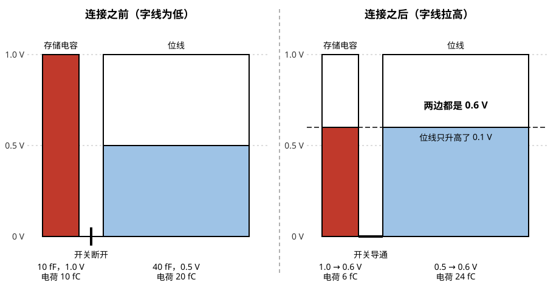

> **图 5-2**　电荷共享前后的电压。每根柱子的宽度代表电容量（存储电容 10 fF 画成窄柱，位线 40 fF 画成宽柱），着色部分的高度代表电压，所以着色面积正比于电荷量。读图要点：开关导通前，两边的电荷是 10 fC 和 20 fC；导通后总电荷 30 fC 不变，两边电压在 0.6 V 相等。位线只升高了 0.1 V，而存储节点从 1.0 V 降到 0.6 V，单元里原来的数据已经被破坏。
> 来源：本库自绘。

这笔账有两个结论。

**第一，信号很小。** 满幅电压是 1.0 伏，位线上只出现了 0.1 伏的变化，必须有放大器才能分辨。

**第二，读完之后单元里的数据已经没了。** 存 1 的单元，存储节点的电压从 1.0 伏掉到了 0.6 伏；存 0 的单元从 0 伏升到了 0.4 伏。两者都靠近了中间值，如果此时关掉字线，这个单元下次就读不出来了。**这就是"破坏性读出"（destructive read）的准确含义：读操作本身把单元里的电荷分走了。**

**位线不能做得太长，也是从这个公式出来的。** 如果把位线上挂的单元数翻倍，位线电容从 40 fF 变成 80 fF，信号变成 0.5 × 10 ÷ 90 ≈ 56 毫伏，几乎减半。信号越小，越容易被噪声和放大器自身的偏差淹没。所以 DRAM 阵列的每根位线上只挂几百到一千个左右的单元，整片存储阵列要切成很多小块，每块配自己的一排灵敏放大器。

### 3.2 一次读的逐步走查

下面按时间顺序走一遍读一个存 1 的单元的全过程。电压取上面那组数字，时间是量级参考。

| 步骤 | 字线 | 位线 BL | 参考位线 | 存储节点 | 发生了什么 |
| --- | --- | --- | --- | --- | --- |
| ① 预充电完成 | 0 V | 0.5 V | 0.5 V | 1.0 V | 位线与参考位线都充到一半电压后悬空。单元与外界隔离 |
| ② 激活：字线拉高 | 约 2.5 V | 0.5 → 0.6 V | 0.5 V | 1.0 → 0.6 V | 访问晶体管导通，电荷共享。位线比参考位线高出 100 毫伏。约 1 到 2 纳秒 |
| ③ 感应放大 | 约 2.5 V | 0.6 → 1.0 V | 0.5 → 0 V | 0.6 → 1.0 V | 灵敏放大器使能，把较高的一侧拉到电源电压，较低的一侧拉到 0 伏。几纳秒 |
| ④ 恢复完成 | 约 2.5 V | 1.0 V | 0 V | **1.0 V** | 字线一直开着，位线被拉到 1.0 伏的同时，存储电容也被重新充到 1.0 伏 |
| ⑤ 预充电 | 0 V | 1.0 → 0.5 V | 0 → 0.5 V | 1.0 V | 字线放下，单元重新隔离。位线与参考位线短接，回到 0.5 伏 |

同一过程的电压波形见图 5-3。

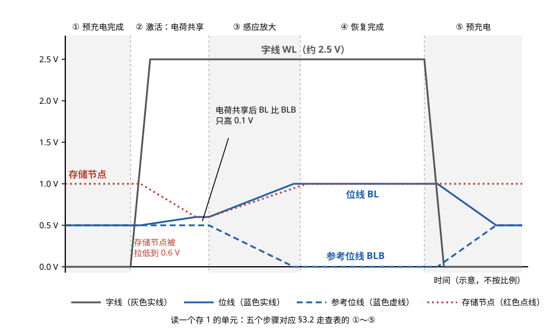

> **图 5-3**　读一个存 1 的单元时四个节点的电压随时间的变化，五个阶段对应上表的 ①～⑤。读图要点：② 阶段字线升到约 2.5 V，存储节点（红色点线）从 1.0 V 掉到 0.6 V，位线（蓝色实线）只从 0.5 V 升到 0.6 V；③ 阶段位线和参考位线（蓝色虚线）被放大器分别推向 1.0 V 和 0 V，存储节点随位线一起回到 1.0 V，这就是回写；⑤ 阶段字线先放下，单元被隔离，位线再回到 0.5 V。横轴只表示先后，不按比例。
> 来源：本库自绘。

几个需要解释的细节：

**参考位线是什么。** 灵敏放大器是差分电路，它比较的是两根线之间的电压差，而不是一根线的绝对电压。所以每根位线都配一根参考位线，这根线在本次访问中没有单元接上去，保持在 0.5 伏。放大器只需要判断"位线比参考位线高还是低"。

**字线为什么要拉到 2.5 伏，而不是 1.0 伏。** 访问晶体管是 N 型晶体管，它要导通，栅极电压必须比它要传递的电压高出一个阈值电压（晶体管开始导通所需的栅极电压）。要把完整的 1.0 伏写进存储节点，字线电压必须明显高于 1.0 伏。所以 DRAM 芯片内部有一个升压电路，专门产生这个比电源更高的字线电压。

**第 ③④ 步是同一个动作的两个效果。** 灵敏放大器把位线拉到满幅，这个满幅电压一方面是读出的结果（送往输出），另一方面通过还开着的访问晶体管回灌到存储电容上，把电荷补满。**放大和回写是同一件事。** 这也是为什么 DRAM 的灵敏放大器必须每根位线配一个：一行里的每个单元都被破坏了，每个单元都要被回写。

**整行都被读出了。** 字线拉高时，这一行上的全部单元（几千个）都发生了电荷共享，全部被各自的灵敏放大器放大并锁住。接下来选哪几位送到输出，是列地址的事。这一排灵敏放大器在锁住一行数据之后的状态，就是 06-01 §3.1 讲的行缓冲（row buffer）。

图 5-4 是一小块真实组织方式的阵列电路，可以看到一行单元、每根位线上的预充电开关和每对位线上的灵敏放大器是怎样排在一起的。

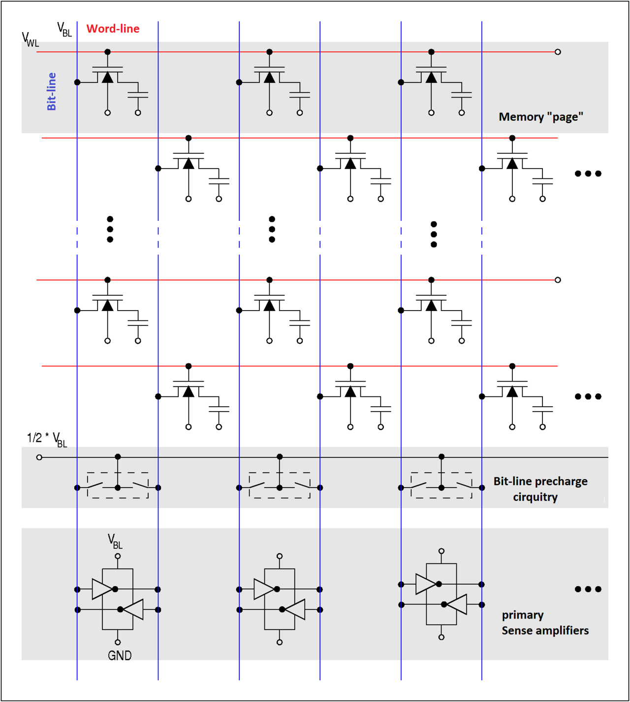

> **图 5-4**　DRAM 阵列的基本电路结构。红色横线是字线，蓝色竖线是位线，每个单元是一个晶体管加一个电容；下方灰底的两排分别是位线预充电电路（把每对位线接到 ½ V_BL）和主灵敏放大器（画成两个首尾相接的反相器，内部就是 §3.4 讲的四个晶体管）。读图要点：图中 V_BL 对应正文的阵列电源电压 1.0 V，½ V_BL 就是 0.5 V 的预充电压；“Memory page”指被同一根字线选中的一整行，就是正文说的“一行”。相邻两行的单元交错地接在相邻的位线上，每对位线里只有一根接了当前行的单元，这正是 §4.2 讲的折叠位线排法。
> 来源：[DRAM cell field (details).png](https://commons.wikimedia.org/wiki/File:DRAM_cell_field_(details).png)，作者 JürgenZ.（英文标注由 Koza1983 翻译），许可 CC BY-SA 3.0。

### 3.3 写是读的延伸

写操作没有独立的通路。写一个单元的过程是：先按上面的步骤激活这一行（整行数据进入灵敏放大器），然后写驱动器用更强的驱动力把目标那几列的位线强行拉到要写的值，灵敏放大器跟着翻转，新值通过开着的访问晶体管进入存储电容。同一行里没被写的那些列，存的还是刚才回写的原值。

**按步骤走一遍。** 目标单元原来存 1，现在要写入 0。同一行上还有一个相邻列的单元存着 1，它不是写入目标，放在表里作为对照。这一行原本是关闭的。

| 步骤 | 字线 | 目标列位线 | 目标列参考位线 | 目标单元存储节点 | 相邻列单元存储节点 | 发生了什么 |
| --- | --- | --- | --- | --- | --- | --- |
| ① 预充电状态 | 0 V | 0.5 V | 0.5 V | 1.0 V | 1.0 V | 起始状态，与读相同 |
| ② 激活 | 约 2.5 V | 0.5 → 0.6 V | 0.5 V | 1.0 → 0.6 V | 1.0 → 0.6 V | 整行电荷共享。两个单元的数据都被破坏 |
| ③ 感应放大与回写 | 约 2.5 V | 0.6 → 1.0 V | 0.5 → 0 V | 0.6 → 1.0 V | 0.6 → 1.0 V | 灵敏放大器把**原值**放大并回写。此时目标单元里还是旧数据 1 |
| ④ 写命令到达，列选通 | 约 2.5 V | 1.0 → 0 V | 0 → 1.0 V | 1.0 V，开始下降 | 1.0 V | 目标列的列选择开关导通，写驱动器把位线拉到 0 伏、参考位线拉到 1.0 伏。写驱动器的驱动力比灵敏放大器强，灵敏放大器被迫翻转到新状态 |
| ⑤ 写恢复 | 约 2.5 V | 0 V | 1.0 V | 1.0 → **0 V** | 1.0 V | 存储电容通过访问晶体管向位线放电，直到存储节点降到 0 伏。这一步需要等待一段规定的时间 |
| ⑥ 预充电 | 0 V | 0 → 0.5 V | 1.0 → 0.5 V | 0 V | 1.0 V | 字线放下，新数据被隔离保存 |

这张表里有三点值得注意。

**第一，第 ②③ 步对写操作来说似乎是多余的，但是不能省。** 目标单元的旧数据马上要被覆盖，把它读出来再回写一遍确实没有用处。但字线一拉高，整行几千个单元同时发生电荷共享，其中绝大多数不是这次写入的目标，它们必须被回写。硬件无法只打开一行中的某几个单元，因为一行的访问晶体管共用一根字线。

**第二，第 ⑤ 步对应一个时序参数，叫写恢复时间（tWR，write recovery time）。** 它规定从最后一个写入数据到达，到可以发预充电命令之间必须等待的时间，量级是 15 到 30 纳秒（随代际不同）。原因是存储电容要经过访问晶体管充放电，而访问晶体管为了低漏电做得很弱（§5.1），充放电比较慢。如果等待不足就放下字线，存储节点可能只降到 0.2 伏而不是 0 伏，这个单元的信号余量从一开始就少了一截。

**第三，相邻列的单元全程没有受到写入的影响。** 它的位线没有被列选择开关接到写驱动器上，一直由自己的灵敏放大器保持在回写的原值。

所以在 DRAM 里，**读、写、刷新三种操作的前半段完全一样，都是激活一行**。区别只在激活之后：读是把若干列送出去，写是把若干列覆盖掉，刷新是什么都不做、直接预充电关闭。

### 3.4 灵敏放大器内部：100 毫伏是怎样变成满幅的

§3.2 的走查表把第 ③ 步写成了"灵敏放大器使能，把较高的一侧拉到电源电压"。这一小节把这一步拆开，因为这个电路决定了 DRAM 能容忍多小的信号。

**电路结构。** DRAM 的灵敏放大器是一个交叉耦合的锁存电路，由四个晶体管组成：两个 N 型晶体管（记作 N1、N2）和两个 P 型晶体管（记作 P1、P2）。N 型晶体管在栅极电压比源极高出一个阈值电压时导通，用来把节点往低电压拉；P 型晶体管在栅极电压比源极低出一个阈值电压时导通，用来把节点往高电压拉。连接方式见图 5-5。

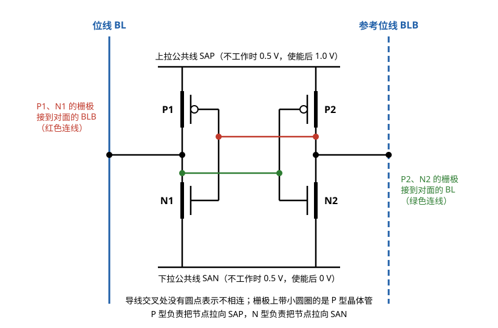

> **图 5-5**　DRAM 灵敏放大器的四晶体管电路。左侧是位线 BL，右侧是参考位线 BLB；上方是上拉公共线 SAP，下方是下拉公共线 SAN。读图要点：P1、N1 的漏极接在 BL 上，它们的栅极经红色连线接到对面的 BLB；P2、N2 的漏极接在 BLB 上，栅极经绿色连线接到对面的 BL。每一侧的电压控制另一侧的两个晶体管，这就是“交叉耦合”。
> 来源：本库自绘。

"交叉耦合"指的是：接在 BL 这一侧的两个晶体管（P1、N1），栅极都接到对面的 BLB 上；接在 BLB 这一侧的两个晶体管（P2、N2），栅极都接到对面的 BL 上。每一侧的电压控制着另一侧的晶体管。

**不工作时**，两根公共线 SAP 和 SAN 都保持在 0.5 伏，和位线的预充电压相同。四个晶体管的栅极与源极之间几乎没有电压差，全部关断，灵敏放大器对位线没有任何影响。电荷共享就是在这个状态下进行的。

**逐步走查。** 起点是电荷共享刚结束：BL = 0.6 伏，BLB = 0.5 伏。假设 N 型晶体管的阈值电压是 0.4 伏，P 型晶体管的阈值电压也是 0.4 伏（指栅极需要比源极低 0.4 伏才导通）。

| 步骤 | SAN | SAP | BL | BLB | 四个晶体管的状态 |
| --- | --- | --- | --- | --- | --- |
| ① 使能前 | 0.5 V | 0.5 V | 0.60 V | 0.50 V | 全部关断 |
| ② SAN 开始下降 | 0.5 → 0.2 V | 0.5 V | 0.60 V | 0.50 V | N2 的栅极是 BL（0.6 伏），栅源电压差 = 0.6 − 0.2 = 0.4 伏，**刚好达到阈值，开始导通**。N1 的栅极是 BLB（0.5 伏），栅源电压差 = 0.5 − 0.2 = 0.3 伏，还没有导通 |
| ③ N2 下拉 BLB | 0.2 → 0 V | 0.5 V | 0.60 V | 0.50 → 0.30 V | N2 导通，把 BLB 往 SAN 的电压拉。BLB 下降使 N1 的栅极电压更低，N1 更不可能导通 |
| ④ SAP 开始上升 | 0 V | 0.5 → 1.0 V | 0.60 → 0.80 V | 0.30 → 0.10 V | P1 的栅极是 BLB（已降到 0.3 伏以下），比源极 SAP 低得多，P1 导通，把 BL 往上拉。P2 的栅极是 BL，电压高，P2 保持关断 |
| ⑤ 正反馈完成 | 0 V | 1.0 V | **1.0 V** | **0 V** | BL 越高，N2 导通越强，BLB 越低；BLB 越低，P1 导通越强，BL 越高。两侧相互加强，直到 BL 到达 1.0 伏、BLB 到达 0 伏。此后 N2 和 P1 保持导通，N1 和 P2 保持关断，状态锁定 |

**这个过程的核心是第 ② 步：决定结果的是哪一个 N 型晶体管先导通。** BL 比 BLB 高 100 毫伏，所以 N2 比 N1 早达到阈值。一旦 N2 先导通并开始下拉 BLB，后续过程就是自我加强的，不再依赖最初的那 100 毫伏。最初的电压差只需要大到足以保证"先导通的是正确的那一个"。这种输出变化反过来加强输入差异的机制叫**正反馈**。

第 ⑤ 步结束后这个电路保持在稳定状态，即使字线放下、单元断开，BL 和 BLB 上的电压也不会变，直到预充电命令把 SAN 和 SAP 重新拉回 0.5 伏。这就是为什么一行打开之后可以反复读而不需要再次访问存储单元：数据锁存在灵敏放大器里。

### 3.5 灵敏放大器的偏差：为什么 100 毫伏不能再小太多

上一小节的走查假设 N1 和 N2 两个晶体管完全相同。实际制造出来的晶体管存在随机差异，名义上相同的两个晶体管，阈值电压可以相差几毫伏到几十毫伏。这个差异叫**失配**（mismatch），它等效于在灵敏放大器的输入上叠加了一个固定的偏差电压。

**用走查表里的数字说明失配的后果。** 假设某个灵敏放大器的 N1 阈值电压偏低，是 0.35 伏，N2 偏高，是 0.45 伏：

- SAN 下降到 0.15 伏时，N1 的栅源电压差 = 0.5 − 0.15 = 0.35 伏，达到了它的阈值，N1 导通。
- 同一时刻 N2 的栅源电压差 = 0.6 − 0.15 = 0.45 伏，也刚好达到它的阈值。

两个晶体管同时导通，结果不确定。如果失配再大一点，N1 会先导通，把 BL 往下拉，正反馈朝错误的方向发展，最后 BL = 0 伏、BLB = 1.0 伏。**读出了错误的值，而且这个错误的值会被回写进单元。** 这个例子里两个晶体管的阈值电压相差 100 毫伏，正好抵消了 100 毫伏的信号。

**算一笔余量的账。** 以下数字是量级假设，用来说明推理方法：

1. 设两个晶体管阈值电压之差服从正态分布，标准差 8 毫伏。
2. 一颗 16 Gb 芯片里，每根位线约挂 1000 个单元，灵敏放大器的数量约为 170 亿 ÷ 1000 ≈ **1700 万个**。
3. 要让 1700 万个放大器里最差的那个也正常工作，需要覆盖到约 5.4 倍标准差（正态分布里超出 5.4 倍标准差的概率约为一千七百万分之一）。最差的偏差 ≈ 5.4 × 8 ≈ **43 毫伏**。
4. 刚写入的单元信号是 100 毫伏，余量 = 100 − 43 = **57 毫伏**。
5. 一个保持了 32 毫秒、存储节点电压已经从 1.0 伏降到 0.75 伏的尾部单元（§5.1），信号 =（0.75 − 0.5）× 10 ÷ 50 = 50 毫伏，余量 = 50 − 43 = **7 毫伏**。
6. 如果位线电容是 80 fF 而不是 40 fF，刚写入的单元信号只有 56 毫伏，保持之后的信号约 28 毫伏，**小于 43 毫伏的最差偏差，读不出来**。

这笔账把三个看起来无关的设计参数联系到了一起：**存储电容的大小、位线的长度、刷新的周期，三者共同受灵敏放大器偏差的约束**。存储电容每缩小一点，位线就得做短一点（灵敏放大器更多，面积更大），或者刷新得更频繁。这就是为什么 DRAM 厂商宁可把电容做成深宽比 50 比 1 的柱子（§8.1），也要保住电容量。

近几代 DRAM 在灵敏放大器上增加了偏差补偿电路：在真正放大之前先让放大器测量并记住自己的偏差，放大时把它扣除。这使得在存储电容继续减小的情况下仍然能正确读出，代价是每个灵敏放大器多几个晶体管，并且每次激活多一个补偿步骤。

---

## 4. 阵列组织：bank、行、列，以及四个时序参数

上一节讲的是一个单元和一根位线。这一节讲几十亿个单元怎么组织成一颗芯片，以及这个组织方式怎样决定了访问延迟。

### 4.1 三级地址：bank、行、列

一颗 DRAM 芯片里的存储阵列分成若干个 **bank**。每个 bank 是一块独立的存储区域，有自己的行译码器（把行地址翻译成"拉高哪一根字线"的电路）和自己的灵敏放大器，可以独立地打开一行。bank 与 bank 之间互不干扰，一个 bank 正在激活时，另一个 bank 可以同时在读。

每个 bank 内部是行和列的二维阵列。访问一个数据需要三段地址：bank 号、行号、列号。

**用一颗真实规格的芯片核对一遍。** 取一颗 16 Gb、数据位宽 8 位的 DDR5 芯片（DDR5 是当前主机内存的接口标准代际，07-06 讲它的接口）：

1. bank 数：32 个。
2. 每个 bank 的行数：65536 行（行地址 16 位）。
3. 每行的列数：1024 列（列地址 10 位），每列 8 位。
4. 总容量 = 32 × 65536 × 1024 × 8 = 17179869184 比特 = **16 Gb**，正好对上。
5. 一行的数据量 = 1024 × 8 = 8192 比特 = **1 KB**。

第 5 条值得记住：**激活一行，就是把 1 KB 的数据一次性读进灵敏放大器**。之后在这 1 KB 范围内读任何位置，都不需要再碰存储单元。

需要说明的是，这里的"行"是逻辑上的。物理上，因为 §3.1 讲的位线长度限制，一个 bank 会再切成很多个小的子阵列，每个子阵列的位线只挂几百到一千个左右的单元，子阵列之间夹着成排的灵敏放大器。一根逻辑上的字线在物理上也会分段驱动。这些切分对外不可见，对外呈现的仍然是 bank、行、列三级。

### 4.2 位线的两种排法：折叠与开放

§3.2 提到每根位线要配一根参考位线。这根参考位线从哪里来，有两种做法，它们直接决定了单元面积。

**折叠位线（folded bitline）**。位线和它的参考位线并排走在同一块阵列里，相邻两根线为一对。一根字线和一对位线有两个交叉点，只能在其中一个交叉点上放单元（另一个必须空着，否则这根线就不能当参考了）。交叉点只用了一半，单元面积是 **8F²**。它的优点是位线和参考位线紧挨着，外界噪声对两根线的影响几乎相同，做差之后噪声被抵消。

**开放位线（open bitline）**。灵敏放大器夹在两块阵列中间，位线伸向一侧的阵列，参考位线伸向另一侧的阵列。这样每块阵列里每个交叉点都可以放单元，面积可以更小。当前量产 DRAM 用的 **6F²** 单元就是基于开放位线的排法。代价是位线和参考位线分处两块阵列，受到的噪声不再相同，抗噪能力下降，需要在电路和工艺上补偿。

两种排法的对照见图 5-6。

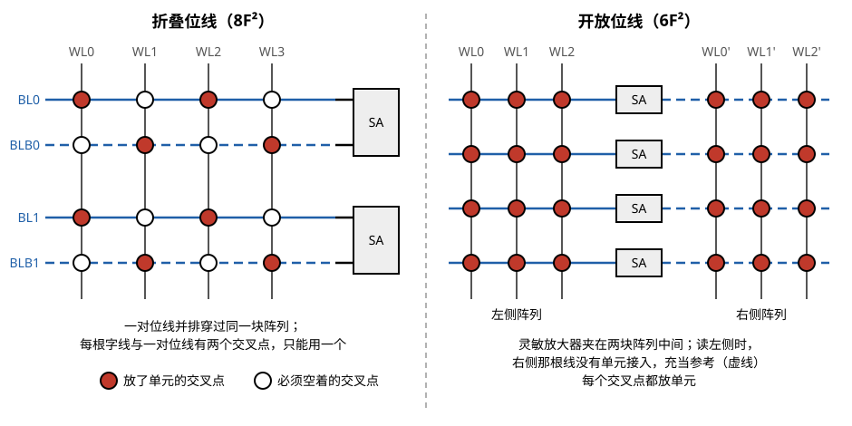

> **图 5-6**　折叠位线与开放位线。SA 是灵敏放大器，红色实心圆是放了单元的交叉点，空心圆是必须空着的交叉点。读图要点：左图中 BL0 与 BLB0 并排走在同一块阵列里、接到同一个 SA，任何一根字线与这对位线的两个交叉点只能用一个，所以单元面积是 8F²；右图中 SA 夹在两块阵列之间，左侧的线（实线）和右侧的线（虚线）组成一对，读左侧某一行时右侧没有字线拉高，右侧那根线就充当参考，于是每个交叉点都能放单元。
> 来源：本库自绘。

在折叠位线里，读 WL0 这一行时，BL 上有单元接入，BLB 上没有（那个交叉点是空的），所以 BLB 可以当参考。在开放位线里，读左侧阵列的某一行时，右侧阵列没有任何字线拉高，右侧那根线整条保持在预充电压，充当参考；读右侧阵列时则反过来。

开放位线只解决了“每个交叉点都能用”的问题，单元具体怎样在版图上摆，可以看图 5-7 这张量产产品的俯视版图。

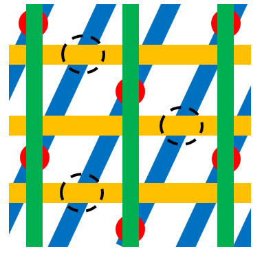

> **图 5-7**　三星发表的 20 纳米级 6F² DRAM 单元俯视版图。蓝色斜条是有源区（晶体管所在的硅岛），黄色横条是字线，绿色竖条是位线，红色圆点是位线接触，虚线圆是把长条有源区切断的位置。读图要点：每条有源区中间落一个位线接触，两端各连一个单元的存储电容，两个单元共用一个位线接触；有源区斜着摆，才能让两端的电容接触点避开位线。原始出处为 Y-S. Kang 等，J. Micro/Nanolith. MEMS MOEMS 15(2), 021403 (2016)。
> 来源：[6F2 20 nm DRAM layout.png](https://commons.wikimedia.org/wiki/File:6F2_20_nm_DRAM_layout.png)，作者 Guiding light，许可 CC BY-SA 4.0。

算一下收益：从 8F² 到 6F²，单元面积变成原来的 6 ÷ 8 = 75%，同样的硅面积多存三分之一的数据，而且不需要换制程。业界在 2007 年前后完成了这次转换，之后将近二十年一直停在 6F²。下一步是 4F²，§8 讲。

### 4.3 四个时序参数，对应四个电路动作

内存规格里常见一串数字，比如"DDR5-4800 CL40-39-39"。这些数字是时序参数，单位是时钟周期数，每一个都对应 §3.2 走查表里的一段电路动作。

| 参数 | 全称 | 含义 | 对应的电路动作 |
| --- | --- | --- | --- |
| **tRCD** | 行地址到列地址延迟（row to column delay） | 发出激活命令之后，要等多久才能发读或写命令 | 走查表的 ②③：字线拉高、电荷共享、灵敏放大器把信号放大到足够稳定 |
| **CL** | 列地址选通延迟（CAS latency） | 发出读命令之后，要等多久数据才出现在引脚上 | 列选择、数据从灵敏放大器经内部数据线送到输出驱动器 |
| **tRAS** | 行有效时间（row active time） | 一行激活之后至少要保持打开多久才能关闭 | 走查表的 ②③④：必须等存储电容被完全回写充满 |
| **tRP** | 行预充电时间（row precharge time） | 发出预充电命令之后，要等多久才能激活下一行 | 走查表的 ⑤：字线放下、位线回到一半电压 |

**把周期数换算成纳秒。** DDR5-4800 的意思是每根数据引脚每秒传 4800 兆比特。DRAM 接口在时钟的上升沿和下降沿各传一位，所以时钟频率是 2400 MHz，时钟周期 = 1 ÷ 2400 MHz ≈ 0.4167 纳秒。

- CL = 40 个周期 × 0.4167 ≈ **16.7 纳秒**
- tRCD = 39 个周期 × 0.4167 ≈ **16.3 纳秒**
- tRP = 39 个周期 × 0.4167 ≈ **16.3 纳秒**
- tRAS 约 **32 纳秒**

把这四个参数放到同一条时间轴上，就是图 5-8。

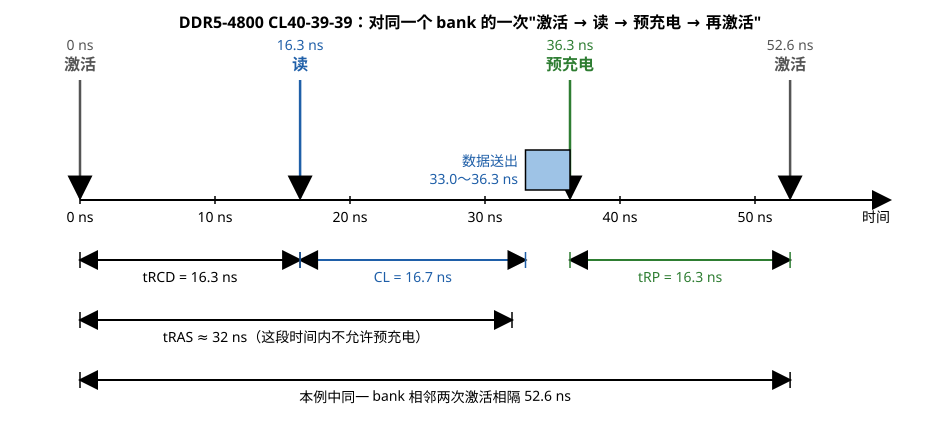

> **图 5-8**　DDR5-4800 CL40-39-39 下对同一个 bank 的一轮访问。读图要点：从激活到可以发读命令要等 tRCD（16.3 ns）；读命令发出后再等 CL（16.7 ns），数据在 33.0～36.3 ns 送出；从激活算起至少 tRAS（约 32 ns）之后才允许预充电，本例在 36.3 ns 预充电；预充电后再等 tRP（16.3 ns）才能激活下一行。这里预充电安排在数据送完之后，所以同一 bank 两次激活相隔 52.6 ns，比 tRAS + tRP 的下限 48 ns 略长。
> 来源：本库自绘。

**一个值得注意的事实**：把 DDR3、DDR4、DDR5 各代的时序参数都换算成纳秒，tRCD、tRP、CL 都落在 13 到 17 纳秒这个范围里，二十年几乎没有变化。接口速率提高了十几倍，而这些参数没动，原因是它们由存储阵列内部的模拟过程决定（电荷共享要多久、灵敏放大器要多久），与接口跑多快无关。周期数变大，只是因为时钟周期变短了。

### 4.4 同一个读请求的三种延迟

有了这四个参数，就可以算出一次读访问到底要多久。结果取决于目标 bank 当前的状态，有三种情况。用上面 DDR5-4800 的数字：

| 情况 | bank 的状态 | 需要的命令序列 | 延迟 |
| --- | --- | --- | --- |
| **行命中** | 要读的那一行已经打开 | 读 | CL = **16.7 ns** |
| **bank 空闲** | 没有任何行打开 | 激活 → 读 | tRCD + CL = 16.3 + 16.7 = **33.0 ns** |
| **行未命中** | 打开的是另一行 | 预充电 → 激活 → 读 | tRP + tRCD + CL = 16.3 + 16.3 + 16.7 = **49.3 ns** |

**按时间线走一遍行未命中的情况**（bank 3 当前打开着第 100 行，现在要读第 200 行的某一列）：

| 时刻 | 命令 | 芯片内部在做什么 |
| --- | --- | --- |
| 0 ns | 预充电 bank 3 | 第 100 行的字线放下，位线开始回到 0.5 伏 |
| 16.3 ns | 激活 bank 3 第 200 行 | 第 200 行字线拉高，整行 1 KB 电荷共享、放大 |
| 32.6 ns | 读 第 N 列 | 从灵敏放大器里选出目标列，送往输出 |
| 49.3 ns | — | 第一个数据出现在引脚上 |

这里还隐含一个条件：第 0 纳秒能发预充电命令的前提是第 100 行已经打开了至少 tRAS（32 纳秒）。如果它刚打开不久，还得等它回写完成。

**最快和最慢相差三倍。** 这就是"顺序访问快、随机访问慢"在 DRAM 这一层的物理原因：顺序访问时连续的请求落在同一行，除了第一次之外全部是行命中；随机访问时几乎每次都要换行，每次都付出预充电加激活的代价。06-01 §3.1 讲的"跨行乱跳"就是这件事在软件侧看到的现象。

### 4.5 突发读与 bank 并行：延迟怎样被重叠掉

上一小节算的是从发出命令到第一个数据出现的等待时间。实际的一次读不止传一个数据，多个请求之间也不必一个做完再做下一个。这一小节讲这两件事。

**突发（burst）**。一条读命令送回的不是一个数据，而是从指定列开始的连续若干个数据，这叫一次突发，个数叫突发长度。DDR5 的突发长度是 16。设置突发的原因是：数据已经全部锁存在灵敏放大器里，多读几列只需要切换列选择，不需要再碰存储单元，成本很低；而处理器读内存的最小单位本来就是 64 字节的缓存行，一条命令取回一整个缓存行正好合用。

算一下一次突发取回多少数据、花多少时间。DDR5 的内存条把 64 根数据线分成两组，每组 32 根，各自独立收发命令，每组叫一个子通道：

1. 一个子通道每次传输 32 位。突发长度 16，所以一条读命令取回 16 × 32 = 512 位 = **64 字节**，正好一个缓存行。
2. 时钟的上升沿和下降沿各传一次，所以 16 次传输占 8 个时钟周期 = 8 × 0.4167 ≈ **3.3 纳秒**。
3. 如果读命令一条接一条不间断地发，数据线上就一直有数据：每 3.3 纳秒 64 字节，即 64 ÷ 3.3 纳秒 ≈ **19.2 GB/s**。
4. 两个子通道合计 **38.4 GB/s**。用另一种方法验算：4800 兆比特每秒 × 64 根线 ÷ 8 = 38.4 GB/s，两个结果一致。

第 3 条成立的前提是读命令可以在上一条的数据还没送出时就发出下一条。这是允许的：CL 那 16.7 纳秒是数据在芯片内部传递的时间，多条读命令可以同时处在这段路程的不同位置上，和流水线的道理相同。所以**对同一行的连续读，延迟只在第一次付出一次，之后每 3.3 纳秒出一个缓存行**。

**bank 并行**。不同的 bank 有各自独立的行译码器和灵敏放大器（§4.1），它们的预充电和激活可以同时进行。控制器只有一条命令总线，每个时钟周期只能发一条命令，但一条命令发出之后，那个 bank 内部的动作是自己进行的，控制器可以接着给别的 bank 发命令。

**用时间线对比。** 有两个读请求：请求 A 落在 bank 0，请求 B 落在 bank 1，两个 bank 当前打开的都不是目标行，都属于行未命中。相邻两条命令之间按规定至少间隔 8 个时钟周期（3.3 纳秒）。

先看串行的做法，即 A 完全做完再做 B：

| 时刻 | 命令 | 说明 |
| --- | --- | --- |
| 0 ns | 预充电 bank 0 | |
| 16.3 ns | 激活 bank 0 | |
| 32.6 ns | 读 bank 0 | |
| 49.3 ~ 52.6 ns | — | A 的 64 字节送出 |
| 52.6 ns | 预充电 bank 1 | |
| 68.9 ns | 激活 bank 1 | |
| 85.2 ns | 读 bank 1 | |
| 101.9 ~ 105.2 ns | — | B 的 64 字节送出 |

总共 **105.2 纳秒**。

再看交错的做法：

| 时刻 | 命令 | bank 0 内部 | bank 1 内部 |
| --- | --- | --- | --- |
| 0 ns | 预充电 bank 0 | 开始预充电 | 空闲 |
| 3.3 ns | 预充电 bank 1 | 预充电中 | 开始预充电 |
| 16.3 ns | 激活 bank 0 | 开始激活 | 预充电中 |
| 19.6 ns | 激活 bank 1 | 激活中 | 开始激活 |
| 32.6 ns | 读 bank 0 | 列选择，数据送往输出 | 激活中 |
| 35.9 ns | 读 bank 1 | 数据在内部传递 | 列选择，数据送往输出 |
| 49.3 ~ 52.6 ns | — | A 的 64 字节送出 | 数据在内部传递 |
| 52.6 ~ 55.9 ns | — | 行保持打开 | B 的 64 字节送出 |

总共 **55.9 纳秒**，是串行做法的 53%。两种做法的对比画在图 5-9 里。两个请求各自经历的延迟没有缩短（B 从它的第一条命令 3.3 纳秒算起，到数据送完 55.9 纳秒，仍然是 52.6 纳秒），缩短的是总时间，因为两段等待在时间上重叠了。读 bank 1 的命令被安排在 35.9 纳秒，正好使 B 的数据紧接在 A 的数据后面，两者不会在数据线上冲突。

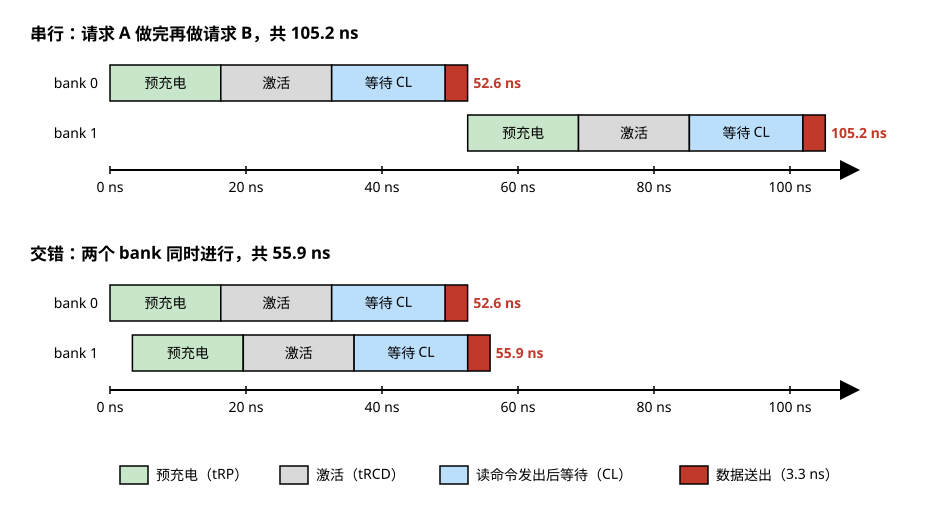

> **图 5-9**　上面两张时间线表的图形版本。读图要点：上半部分 bank 1 要等 bank 0 的数据送完才开始，总共 105.2 ns；下半部分 bank 1 只比 bank 0 晚 3.3 ns 开始，两者的预充电、激活和等待 CL 几乎完全重叠，总共 55.9 ns。每个请求自己的延迟（一条色条的长度）在两种做法里相同，缩短的是两个请求合在一起的总时间。
> 来源：本库自绘。

把这个做法推广到更多 bank：32 个 bank 各有一个行未命中的请求时，串行需要 32 × 52.6 ≈ 1683 纳秒，交错只需要 49.3 + 32 × 3.3 ≈ 155 纳秒，相差约 11 倍。

**这笔账的限制条件是请求必须分散在不同的 bank 上。** 如果两个请求落在同一个 bank 的不同行，后一个只能等前一个做完并关闭行之后才能开始，回到串行的情况。这就是 bank 数量对随机访问性能有直接影响的原因，也是 07-02 §5 讲 HBM4 把每片裸片的 bank 数从 128 翻倍到 256 的收益所在。

---

## 5. 刷新与保持：为什么漏、多久刷一次、要付多少开销

前两节讲的是主动访问。这一节讲没人访问的时候单元里发生了什么。

### 5.1 电荷从哪里漏走

访问晶体管关断之后并不是理想的绝缘体。存储节点上的电荷有几条路径可以漏走：

- **亚阈值漏电**：晶体管的栅极电压低于阈值电压时，源极和漏极之间仍然有微小电流。这条路径把电荷漏向位线。
- **结漏电**：存储节点在硅里是一块掺杂区域，它和衬底之间形成一个二极管结构，反向偏置时有微小的漏电流。这条路径把电荷漏向衬底。
- **栅致漏极漏电**（GIDL，gate-induced drain leakage）：字线为低电平而存储节点为高电平时，栅极和存储节点重叠的区域电场很强，会产生额外的漏电。
- **电容介质漏电**：电容的绝缘介质只有几纳米厚，有少量电子能直接穿过去。

这几条路径漏的都是存 1 的单元上的正电荷，所以**数据出错的典型方向是 1 变成 0**。

**算一下允许漏多快。** 假设规格要求单元至少保持 32 毫秒，并且 32 毫秒之后存储节点电压的下降不能超过 0.25 伏（再多，电荷共享之后的信号就小到灵敏放大器分辨不了）：

1. 允许损失的电荷 = 10 fF × 0.25 V = 2.5 fC。
2. 允许的漏电流 = 2.5 fC ÷ 32 ms ≈ 7.8 × 10⁻¹⁴ 安培，也就是 **约 78 飞安**。
3. 换算成电子数 = 7.8 × 10⁻¹⁴ ÷ 1.6 × 10⁻¹⁹ ≈ **每秒 49 万个电子**，或者说 32 毫秒内最多漏掉约 1.6 万个，是存储总量（约三万个）的一半。

78 飞安是什么概念：一个逻辑工艺的晶体管关断时的漏电流通常在皮安（10⁻¹² 安培）到纳安量级，比这个数大十倍到上万倍。**DRAM 的访问晶体管是专门为低漏电设计的，它的开关速度远不如逻辑晶体管，这是有意的取舍。** 这也是 07-02 §7 讲"DRAM 工艺做不出高速 PHY"的原因：同一套工艺不可能同时把漏电做到飞安级、又把开关速度做到逻辑工艺的水平。

### 5.2 保持时间是一个分布，规格由尾部决定

每个单元的漏电流不一样，保持时间也就不一样。实测的分布是这样的：绝大多数单元能保持几秒甚至几十秒，但有极少数单元因为晶体管附近恰好有晶格缺陷，漏电大得多，只能保持几十到几百毫秒。这些单元叫**尾部单元**（tail cells）。

规格必须保证所有单元都不出错，所以刷新周期是按最差的单元定的。算一下这意味着什么：假设一颗 16 Gb 的芯片里有百万分之一的单元属于尾部，那就是 17179869184 × 10⁻⁶ ≈ **1.7 万个单元**。为了这 1.7 万个单元，其余 170 亿个本来能坚持几秒的单元也要跟着每 32 毫秒刷新一次。

这个分布的形状见图 5-10。

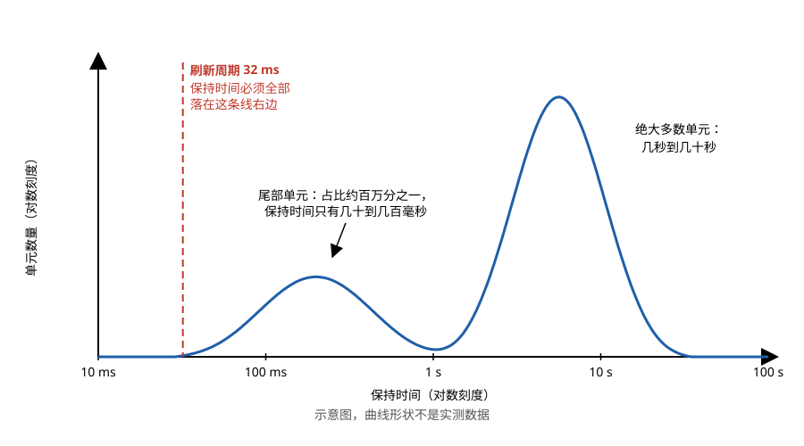

> **图 5-10**　单元保持时间分布的示意图，横轴和纵轴都是对数刻度。读图要点：右边的主峰是绝大多数单元，保持时间在几秒到几十秒；左边的小峰是尾部单元，数量少几个数量级，保持时间只有几十到几百毫秒。红色虚线是 32 ms 的刷新周期，所有单元（包括尾部）都必须在它右边，所以刷新周期是由左边那个小峰定的。曲线形状是示意，不是实测数据。
> 来源：本库自绘。

尾部单元里还有一类更麻烦的，叫**可变保持时间**（VRT，variable retention time）单元：它的保持时间会在两个值之间随机跳变，可能连续几小时表现正常，然后突然变差。出厂测试时它可能恰好处于正常状态而被漏过去。这是 DRAM 在使用中偶发单比特错误的主要来源之一，也是 §7 讲的片内纠错存在的原因之一。

### 5.3 刷新的开销

刷新由内存控制器（负责向 DRAM 发命令的那块逻辑）周期性地发出刷新命令来完成。DRAM 内部有一个计数器记录刷到了哪一行，每收到一条刷新命令就刷新接下来的若干行。刷新期间这颗芯片不能响应读写。

DDR5 的典型规格（16 Gb 芯片，常温）：

- 保持时间要求：32 毫秒内每一行至少被刷新一次。
- 刷新命令的间隔（tREFI）：**3.9 微秒**一条。32 毫秒内共 32 ms ÷ 3.9 µs ≈ 8200 条。
- 每条刷新命令覆盖的行数：每个 bank 65536 行 ÷ 8192 = **8 行**（所有 bank 同时进行）。
- 每条刷新命令占用的时间（tRFC）：约 **295 纳秒**。

于是：

> **刷新占用的时间比例 = tRFC ÷ tREFI = 295 ns ÷ 3900 ns ≈ 7.6%**

也就是说，这颗芯片有 7.6% 的时间处于不可访问状态。这个比例是被动付出的，和负载无关。

**一条刷新命令内部做了什么。** 刷新命令不带地址，要刷哪些行由芯片内部的计数器决定。以上面的规格为例，一条刷新命令从发出到结束的过程是：

| 步骤 | 谁在做 | 做什么 |
| --- | --- | --- |
| ① 准备 | 控制器 | 发刷新命令之前，必须先把所有 bank 里打开的行全部预充电关闭。灵敏放大器要用来刷新，不能还锁着别的行的数据 |
| ② 发出刷新命令 | 控制器 | 命令里没有行地址 |
| ③ 取地址 | 芯片内部 | 刷新计数器给出本次要刷新的起始行号，例如第 800 行 |
| ④ 逐行刷新 | 芯片内部 | 对每个 bank 的第 800 到 807 行，各做一遍"拉高字线 → 电荷共享 → 灵敏放大并回写 → 放下字线 → 位线预充电"。这和 §3.2 的读完全相同，只是数据不送到输出 |
| ⑤ 计数器前进 | 芯片内部 | 刷新计数器加 8，下一条刷新命令从第 808 行开始 |
| ⑥ 结束 | 控制器 | 从发出命令起等满 tRFC（295 纳秒）之后，才能发下一条命令 |

第 ④ 步有一个细节。一行从激活到预充电完成至少要 tRAS + tRP ≈ 48 纳秒，如果 8 行一行接一行地做，需要 8 × 48 = 384 纳秒，超过了 295 纳秒。实际上这 8 行在物理上分属不同的子阵列，各有各的灵敏放大器，所以可以在时间上部分重叠地进行。不让它们完全同时进行，是因为几十个 bank 同时激活多行会产生很大的瞬时电流，电源网络承受不了。

第 ① 步带来一个容易被忽略的附加代价：**刷新之后所有的行都处于关闭状态**。刷新之前如果某一行是打开的，后续对它的访问本来是行命中（16.7 纳秒），刷新之后再访问就要重新激活（33.0 纳秒）。所以刷新的实际代价比 7.6% 略高。

控制器在发刷新命令的时机上有一定的自由：标准允许把若干条刷新命令推迟，之后连续补发。控制器利用这一点，在读写繁忙时暂缓刷新，在空闲时补上，只要平均下来的频率满足要求。

**容量越大，这个比例越高。** 芯片容量翻倍，行数翻倍，而保持时间要求不变，所以每条刷新命令要刷的行数翻倍，tRFC 变长。DDR4 时代 8 Gb 芯片的这个比例约为 4.5%（tRFC 350 纳秒 ÷ tREFI 7.8 微秒），DDR5 的 16 Gb 芯片升到 7.6%。

**DDR5 为此增加了两种刷新模式**，下面各用一笔账说明它们换来了什么。

**细粒度刷新**（fine granularity refresh）：把一条刷新命令拆成两条，每条只刷一半的行数，间隔也减半。

| | 普通刷新 | 细粒度刷新 |
| --- | --- | --- |
| 刷新命令间隔 tREFI | 3.9 微秒 | 1.95 微秒 |
| 每条命令占用时间 tRFC | 295 纳秒 | 160 纳秒 |
| 每条命令刷新的行数（每 bank） | 8 行 | 4 行 |
| 不可访问的时间比例 | 295 ÷ 3900 = **7.6%** | 160 ÷ 1950 = **8.2%** |
| 一个请求遇上刷新时最多等待 | **295 纳秒** | **160 纳秒** |
| 遇上刷新时平均等待 | 约 148 纳秒 | 约 80 纳秒 |

细粒度刷新的总开销反而高了 0.6 个百分点，原因是每条刷新命令都有固定的起止开销，拆成两条就付两次。它换来的是最长等待时间接近减半。对于关心吞吐量的负载这是亏的，对于关心最坏情况延迟的负载这是赚的。

**同 bank 刷新**（same-bank refresh）：一条刷新命令只刷新一部分 bank，其余 bank 可以照常读写。按 32 个 bank 分成 8 组、每组 4 个 bank 的结构，一条同 bank 刷新命令刷新每组中的同一个 bank，即 8 个 bank，其余 24 个 bank 不受影响。要把全部 bank 都刷一遍，需要发 4 条这样的命令。算一下效果：任一时刻被刷新阻塞的 bank 最多占四分之一。如果请求均匀分散在各 bank 上，控制器可以优先服务没有被阻塞的那四分之三，把被阻塞的请求稍微推后，刷新对吞吐量的影响就可以大部分被吸收掉。

### 5.4 温度：85 摄氏度这个数的来历

漏电流随温度上升而迅速增大，经验上温度每升高约 10 摄氏度，漏电流大约翻倍，保持时间相应减半（量级规律，具体倍数随工艺而变）。

JEDEC（制定存储器标准的行业组织）的规定是：芯片温度在 85 摄氏度以下时，按正常周期刷新；85 到 95 摄氏度之间，**刷新频率必须加倍**；95 摄氏度以上不保证数据正确。

把加倍后的开销算出来：tREFI 从 3.9 微秒减到 1.95 微秒，刷新占用比例 = 295 ÷ 1950 ≈ **15%**。也就是说，DRAM 从 84 摄氏度升到 86 摄氏度，可用带宽直接少掉约 7 个百分点，同时刷新本身消耗的功耗也翻倍，进一步发热。

这就是 07-02 §3 里"DRAM 有 85 到 95 摄氏度硬上限"那句话的来源，也是 HBM 不能叠在计算芯片上方的根本原因：计算芯片的工作温度可以到 100 摄氏度以上，DRAM 不行。

### 5.5 自刷新

上面讲的刷新由控制器发命令驱动。还有一种模式叫**自刷新**（self refresh）：控制器发一条进入自刷新的命令之后就可以停掉时钟，DRAM 用内部的振荡器自己定时刷新自己。这个模式用于系统休眠：主机的其余部分都断电了，只留 DRAM 供电并自己维持数据。

面向手机的低功耗 DRAM（LPDDR）在这个模式上做了更多优化。一是根据芯片温度自动调整自刷新的频率，温度低时少刷；二是允许只刷新阵列的一部分，其余部分的数据放弃。手机待机功耗里 DRAM 自刷新是一个固定的底数，这些优化针对的就是它。

---

## 6. Row hammer 与单元间干扰

上一节讲的漏电是单元自己的事。这一节讲的是另一类问题：**对一行的访问会加快相邻行的漏电**。这个现象叫 row hammer（行锤击），它在 2014 年被系统地公开，至今仍是 DRAM 可靠性和安全性上最受关注的问题。

### 6.1 机理

相邻的两根字线在物理上只隔十几纳米。当一根字线被反复拉高再放下时，会通过两种途径影响旁边那一行的单元：

- **电容耦合**：相邻字线之间存在寄生电容。一根字线的电压跳变会在相邻字线上感应出一个小的电压扰动，使相邻行的访问晶体管短暂地略微导通，漏电增大。
- **电子注入**：字线拉高时在它下方的硅里聚集了电子。字线放下时，这些电子中的一部分没有回到原处，而是扩散到相邻单元的存储节点，与那里的正电荷中和。

每一次激活造成的影响都极小。但如果在相邻行被刷新之前，对同一行激活了足够多次，累积的电荷损失就会超过灵敏放大器的分辨门限，相邻行里的某些比特就翻转了。被反复激活的那一行叫**攻击行**（aggressor row），数据被翻掉的相邻行叫**受害行**（victim row）。

图 5-11 标出了攻击行与受害行在阵列中的位置。

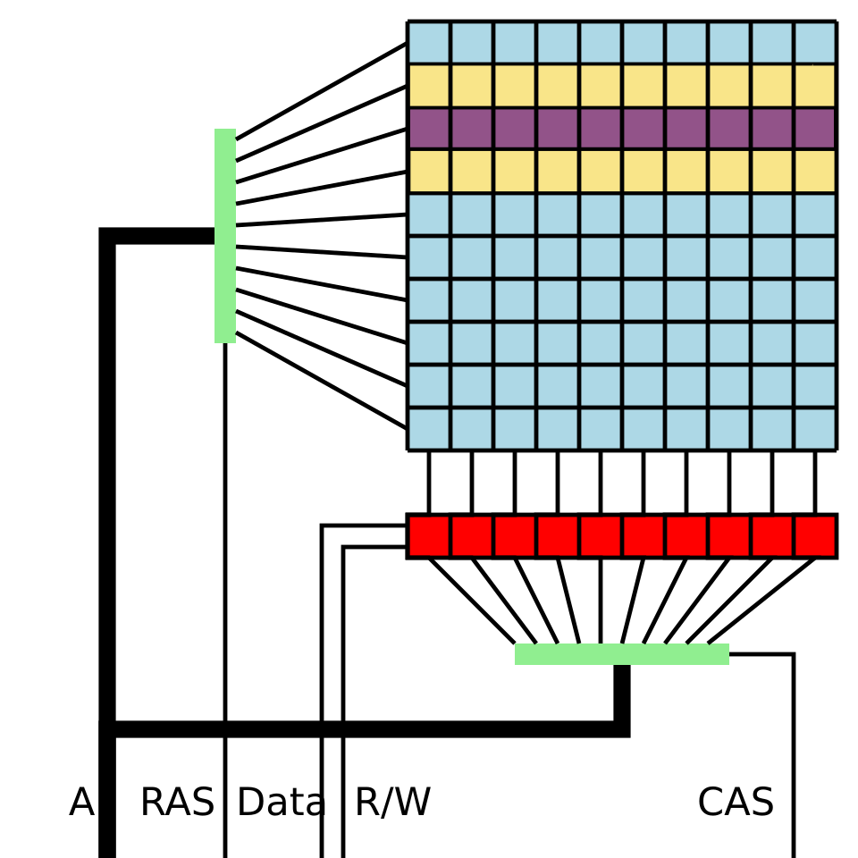

> **图 5-11**　Row hammer 的示意。紫色的一行是被反复激活的攻击行，与它上下相邻的两行黄色是受害行。左侧绿色竖条是行译码器，下方红色一排是灵敏放大器，最下方绿色横条是列选择。读图要点：攻击行每被激活一次，整行就被读进下方的灵敏放大器再回写，它自己的数据不受影响；受影响的是物理上贴着它的两行。图下方的 RAS、CAS 是老式 DRAM 的行地址选通和列地址选通信号，分别对应正文的激活命令和读写命令；A 是地址，R/W 是读写选择。
> 来源：[Row hammer.svg](https://commons.wikimedia.org/wiki/File:Row_hammer.svg)，作者 Dsimic，许可 CC BY-SA 4.0。

需要强调两点。第一，攻击行自己的数据不受影响，因为它每次激活都被回写了。第二，造成翻转的操作只是"读"，程序不需要对受害行有任何访问权限。这就是它成为安全问题的原因：一个普通权限的程序可以通过反复读自己的内存，改掉物理上相邻的、属于操作系统或别的程序的内存。

**双侧锤击的过程。** 以受害行是第 101 行为例，攻击者交替激活它上下相邻的第 100 行和第 102 行：

| 次序 | 命令 | 第 100 行 | 第 101 行（受害行） | 第 102 行 |
| --- | --- | --- | --- | --- |
| 1 | 激活第 100 行，随后预充电 | 被读出并回写，电荷补满 | 受到来自上方字线的一次扰动，损失极少量电荷 | 不受影响 |
| 2 | 激活第 102 行，随后预充电 | 不受影响 | 受到来自下方字线的一次扰动 | 被读出并回写，电荷补满 |
| 3 | 激活第 100 行 | 电荷补满 | 第三次扰动 | 不受影响 |
| … | … | … | … | … |
| 第 N 次 | — | 数据完好 | 累积损失超过门限，存 1 的某些单元读成 0 | 数据完好 |

交替激活两行而不是只激活一行，有两个原因。第一，受害行从两侧同时受到扰动，单位时间内的损失更大。第二，对同一 bank 的两次激活之间必须夹一次预充电，交替访问两行正好使每次访问都是行未命中，每次都会真正触发字线的一次升降；如果反复读同一行，那一行会一直保持打开，字线并不会升降。

**另一种相关的现象是 RowPress**，2023 年公开。它不靠反复激活，而是让攻击行长时间保持打开状态。字线持续处于高电平同样会加快相邻行的电荷流失，研究报告的结果是：攻击行每次打开的时间越长，翻转一个比特所需的激活次数越少，可以比 row hammer 的阈值低一到两个数量级。它和 row hammer 的区别在于起作用的量是字线处于高电平的累计时间，而不是字线升降的次数。这一点对防护方案有影响：下一小节讲的几种对策都以激活次数作为判据，对 RowPress 的覆盖需要另外处理，例如限制一行保持打开的最长时间，或者把长时间打开折算成多次激活来计数。

### 6.2 一笔次数的账

翻转一个比特需要多少次激活，叫 row hammer 阈值。2014 年最初公开的研究里，当时的 DDR3 芯片阈值约为 13.9 万次。随着制程缩小，字线间距变近，这个阈值逐代下降，近几代芯片上公开研究测得的数字已经降到一万次以下，最差的不到五千次。

把它和一个刷新周期内能做到的激活次数比一下：

1. 对同一行做一次"激活再预充电"的最短时间 = tRAS + tRP ≈ 32 + 16.3 ≈ **48 纳秒**。
2. 一个刷新周期 32 毫秒内，最多能做 32 ms ÷ 48 ns ≈ **66 万次**。
3. 如果攻击者轮流激活受害行上下两侧的两行（双侧锤击，效果最强），每一行各得 **33 万次**。
4. 而阈值是一万次以下。**可用次数是阈值的三十倍以上。**

结论是：单靠正常的周期性刷新，完全防不住 row hammer。必须有专门的机制。

### 6.3 三代对策

**第一代：目标行刷新（TRR，target row refresh）。** DDR4 时代的做法。DRAM 芯片内部放一个小的追踪器，采样记录最近被频繁激活的行地址，然后在执行正常刷新命令时顺带刷新这些行的邻居。问题在于追踪器只能记很少几个地址（成本限制），而且采样策略是各厂商私有的。2020 年公开的研究表明，只要同时轮流锤击很多行（超过追踪器能记录的数量），就能让真正的攻击行从追踪器里被挤出去，TRR 随之失效。

**第二代：刷新管理（RFM，refresh management）。** DDR5 引入。思路是把计数的责任交给内存控制器：控制器为每个 bank 维护一个计数器，每发一条激活命令就加一，计数到规定的门限就必须发一条 RFM 命令。RFM 命令本身不指定地址，它的作用是给 DRAM 一段时间，让 DRAM 用内部追踪的结果去刷新它认为有风险的行。RFM 保证了 DRAM 有足够多的机会做防护，但防护哪些行仍然依赖 DRAM 内部的追踪器，计数粒度是整个 bank 而不是某一行。

**第三代：逐行激活计数（PRAC，per-row activation counting）。** 2024 年 4 月随 JESD79-5C 标准加入 DDR5。做法是给存储阵列的每一行增加几个额外的存储单元，用来存放这一行的激活次数。每次这一行被激活，计数器的值随整行数据一起被读进灵敏放大器；在预充电阶段，计数值加一后写回。当某一行的计数达到门限，DRAM 拉低一根告警信号线通知控制器，控制器必须在规定时间内暂停正常读写、发出 RFM 命令，DRAM 借此刷新这一行的邻居并把计数清零。这套告警与暂停的握手协议叫 ABO（alert back-off）。

PRAC 是第一个在原理上可以证明安全的方案，因为它对每一行都有精确的计数，不再依赖采样。代价有三项：每一行多出几个计数单元占用面积；预充电阶段要多做一次"读出、加一、写回"，时序参数因此变长；告警触发时的暂停会造成延迟抖动。公开文献给的量级是告警之后控制器有约 180 纳秒可以继续正常操作，之后必须停下发出 1 到 4 条 RFM 命令，每条约 350 纳秒。

**PRAC 的一次完整告警握手，按时间线走一遍。** 假设门限设为 1024 次（门限可配置，这里取的是便于计算的量级假设），攻击者以最快速度反复激活 bank 3 的第 100 行，控制器被配置为每次告警发 1 条 RFM 命令。

| 时刻 | 事件 | 芯片内部 | 控制器 |
| --- | --- | --- | --- |
| 每次激活第 100 行 | 激活 | 第 100 行的数据和它的计数值一起被读进灵敏放大器 | 正常发命令 |
| 每次预充电 | 预充电 | 计数值加一，写回这一行的计数单元，然后字线放下 | 正常发命令 |
| 第 1024 次预充电 | 计数到达门限 | 把告警信号线拉低 | 检测到告警 |
| 告警后 0 ~ 180 ns | 缓冲窗口 | 等待 | 可以继续发正常命令，用这段时间把已经发出的读写做完，并把所有打开的行预充电关闭 |
| 告警后 180 ns | 进入暂停 | — | 停止一切正常读写，发出 RFM 命令 |
| 告警后 180 ~ 530 ns | 执行防护 | 刷新第 100 行的相邻行（第 99 行和第 101 行，以及可能的更远一层邻居），把第 100 行的计数清零 | 等待 350 纳秒 |
| 告警后 530 ns | 恢复 | 释放告警信号线 | 恢复正常读写 |

如果配置为每次告警发 4 条 RFM 命令，暂停时间是 4 × 350 = 1400 纳秒，恢复的时刻是告警后 1580 纳秒。

**算一下开销。** 先看最坏情况，也就是有程序在以最快速度锤击：

1. 每次"激活加预充电"最短 48 纳秒，达到 1024 次需要 1024 × 48 ≈ **49 微秒**。
2. 每 49 微秒触发一次告警，每次暂停 350 纳秒。
3. 暂停时间占比 = 350 纳秒 ÷ 49 微秒 ≈ **0.7%**。

即使在被持续攻击的情况下，吞吐量的损失也不到百分之一。正常负载很少在一个刷新周期内把同一行激活上千次（每次正常刷新到这一行时计数也会清零），告警几乎不会触发。

所以 PRAC 的代价主要不在吞吐量，而在另外两处。一是**每次预充电都变慢了**，因为无论是否接近门限，每次预充电都要做一遍计数值的加一和写回，这项开销所有访问都要承担。二是**延迟的最坏情况变差了**：告警信号线是一条内存条上所有芯片共用的，任何一颗芯片告警，整个通道上的全部读写都要暂停 350 到 1400 纳秒。一个程序的访问模式可以使同一通道上其它程序的延迟出现可观测的抖动，公开研究已经指出这构成了一条新的信息泄露途径。

**三代对照：**

| | TRR（DDR4） | RFM（DDR5 初版） | PRAC（DDR5，2024 年起） |
| --- | --- | --- | --- |
| 谁在计数 | DRAM 内部，采样 | 控制器，按 bank 计 | DRAM 内部，按行精确计 |
| 计数粒度 | 少数几个行地址 | 整个 bank | 每一行 |
| 防护时机 | 在执行正常刷新命令时附带进行 | 控制器定期发 RFM | 计数到门限时 DRAM 主动告警 |
| 已知弱点 | 多行锤击可绕过 | 仍依赖 DRAM 内部追踪器 | 面积、时序与延迟抖动开销 |

---

## 7. 错误与修复

前面两节讲了 DRAM 出错的几个来源：尾部单元保持时间不够、可变保持时间单元随机变差、row hammer。再加上外部粒子撞击，DRAM 在使用中出现比特错误是必然的。这一节讲芯片内部有哪些机制应对。

### 7.1 软错误

**软错误**（soft error）指的是数据被翻转了、但器件本身没有损坏的错误，重新写入之后该单元工作正常。它的主要来源是高能粒子：宇宙射线在大气中产生的中子、封装材料里微量放射性杂质放出的 α 粒子。粒子穿过硅时沿途产生电子和空穴，如果这些电荷被存储节点收集，就可能改变它的电压。

**算一下一次撞击产生多少电荷。** 粒子在硅里每损失约 3.6 电子伏的能量，就产生一对电子和空穴。一个能量为 5 兆电子伏的 α 粒子如果把能量全部耗在硅里：

1. 产生的电子空穴对数 = 5 × 10⁶ ÷ 3.6 ≈ **139 万对**。
2. 对应的电荷量 = 1.39 × 10⁶ × 1.6 × 10⁻¹⁹ ≈ **222 fC**。
3. §2 算过一个单元用来区分 1 和 0 的电荷量是 5 fC，即约三万个电子。

粒子产生的总电荷是单元存储量的四十多倍。这些电荷分布在粒子经过的几十微米长的路径上，其中只有落在某个存储节点附近的那一小部分会被这个节点收集，但只要收集到的比例超过四十分之一，就足以改变这个单元的数据。粒子的路径如果恰好经过几个相邻的单元，还可能一次翻转多个比特。

单元尺寸缩小之后，每个存储节点能收集电荷的体积也跟着缩小，所以单个 DRAM 单元被一次撞击翻转的概率是随制程下降的。但每颗芯片的单元总数在增加，外围电路（灵敏放大器、地址译码、锁存器）同样会被撞击，而外围电路出错影响的可能是一整行或一整列。

与软错误相对的**硬错误**是器件本身坏了，每次读到这里都错。

### 7.2 片内纠错（on-die ECC）

**纠错码**（ECC，error-correcting code）的做法是：写入时根据数据算出若干位校验位一起存下来，读出时用校验位检查数据，如果有少量比特出错，可以定位并改正。

DDR5 规定每颗 DRAM 芯片内部必须带纠错，这叫片内纠错。规格是每 128 位数据配 8 位校验位，能纠正其中任意 1 位错误。算一下开销：8 ÷ 128 = **6.25%** 的额外存储单元。

**校验位为什么是 8 位。** 这套编码属于汉明码（Hamming code）。它的原理是：读出时用校验位重新核对数据，得到一个称为校验子的数。校验子为 0 表示没有错；不为 0 时，它的值指出是哪一位出了错。要做到这一点，校验子能表示的不同数值的个数，必须不少于"可能出错的位置数加一"（多出的那一个用来表示没有错）。

设数据有 k 位，校验位有 r 位。可能出错的位置共 k + r 个（校验位自己也可能出错），r 位校验子能表示 2ʳ 个值，所以要求：

> **2ʳ ≥ k + r + 1**

把 k = 128 代进去：

- r = 7：2⁷ = 128，而 128 + 7 + 1 = 136。128 小于 136，**不够**。
- r = 8：2⁸ = 256，而 128 + 8 + 1 = 137。256 大于 137，**够了**。

所以 128 位数据至少需要 8 位校验位，这就是规格的来历。同一个公式也说明了为什么纠错的分组要取得大：如果每 8 位数据单独保护，需要 4 位校验位（2⁴ = 16 ≥ 8 + 4 + 1 = 13），开销是 50%；每 128 位保护一次，开销只有 6.25%。分组越大开销越低，代价是一个分组里同时出现两位错误的概率上升。

**用一个缩小的例子走一遍纠错的过程。** 128 位的编码不便手算，这里用结构相同的最小版本：4 位数据配 3 位校验位，共 7 位（2³ = 8 ≥ 4 + 3 + 1 = 8，刚好够）。把 7 个位置编号为 1 到 7，校验位放在第 1、2、4 位，数据放在第 3、5、6、7 位。每个校验位负责一组位置，规则是让这一组里 1 的个数为偶数：

- 校验位 1 负责第 1、3、5、7 位（位置编号的二进制最低位是 1 的那些）。
- 校验位 2 负责第 2、3、6、7 位（二进制第二位是 1 的那些）。
- 校验位 4 负责第 4、5、6、7 位（二进制第三位是 1 的那些）。

三个校验位各自负责哪些位置，可以画成三个相互重叠的圆，见图 5-12。

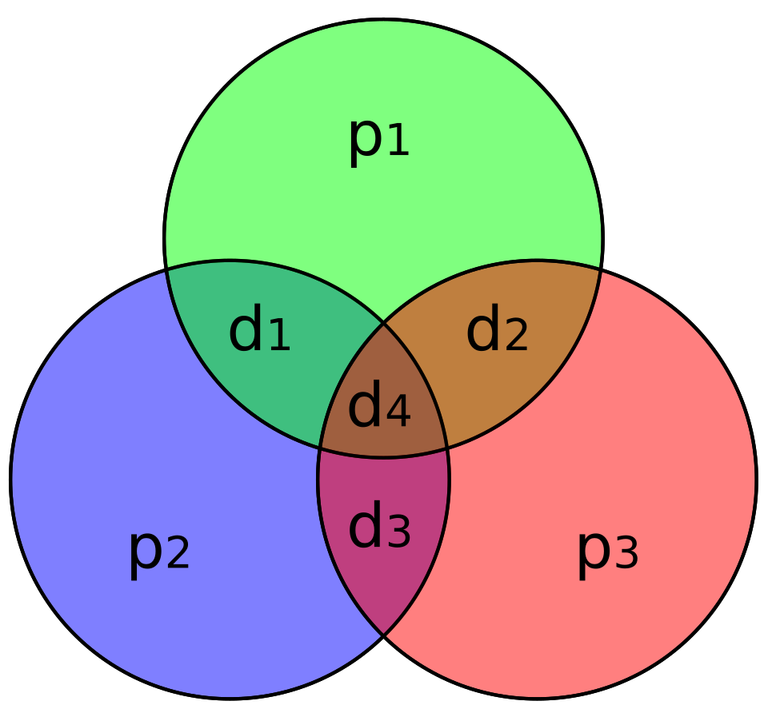

> **图 5-12**　汉明码 (7,4) 的三圆图。每个圆是一个校验位负责的范围，圆里 1 的个数（连同校验位本身）必须是偶数。图中的记号与正文的位置编号对应如下：p1、p2、p3 分别是正文的校验位 1、2、4（第 1、2、4 位）；d1、d2、d3、d4 分别是第 3、5、6、7 位。读图要点：每个数据位落在两个或三个圆的交叠处，所以一个数据位出错会让它所在的那几个圆同时变成奇数，哪几个圆出了问题就指出了是哪一位；d4（第 7 位）在三圆中心，它出错时三个圆都报错。
> 来源：[Hamming(7,4).svg](https://commons.wikimedia.org/wiki/File:Hamming(7,4).svg)，作者 Cburnett，许可 CC BY-SA 3.0。

要存的数据是 1、0、1、1，依次放在第 3、5、6、7 位。

1. **写入时计算校验位。** 校验位 1：第 3、5、7 位是 1、0、1，共两个 1，已是偶数，校验位 1 取 0。校验位 2：第 3、6、7 位是 1、1、1，共三个 1，校验位 2 取 1 凑成偶数。校验位 4：第 5、6、7 位是 0、1、1，共两个 1，校验位 4 取 0。
2. **存入的 7 位**（位置 1 到 7）：0、1、1、0、0、1、1。
3. **假设第 5 位出错**，由 0 变成 1。读出的是：0、1、1、0、**1**、1、1。
4. **读出时核对。** 第一组（第 1、3、5、7 位）：0、1、1、1，三个 1，是奇数，记 1。第二组（第 2、3、6、7 位）：1、1、1、1，四个 1，是偶数，记 0。第三组（第 4、5、6、7 位）：0、1、1、1，三个 1，是奇数，记 1。
5. **校验子**按第三组、第二组、第一组的顺序写成二进制是 101，即十进制的 **5**。它直接指出第 5 位出错。把第 5 位翻转回 0，数据恢复正确。

片内纠错的全过程对外不可见：数据写进芯片时，芯片内部自己算校验位并存进额外的单元；读出时芯片内部自己检查和纠正，送到引脚上的是纠正后的数据。控制器既不知道发生过错误，也拿不到校验位。

**它解决什么、不解决什么，可以用一个例子说清楚。** 假设某组 128 位数据里：

- 有 1 位出错：片内纠错把它改正，外部看到的数据完全正确。
- 有 2 位出错：这套编码只能纠 1 位。解码电路可能会把这个两位错误误判成某个一位错误，并去"纠正"一个原本正确的比特，结果输出的数据里有 **3 位错误**。

**误纠是怎样发生的，接着用上面那个 7 位的例子。** 存入的仍然是 0、1、1、0、0、1、1，这次第 5 位和第 6 位同时出错：

1. 读出的是：0、1、1、0、**1**、**0**、1。
2. 第一组（第 1、3、5、7 位）：0、1、1、1，三个 1，记 1。第二组（第 2、3、6、7 位）：1、1、0、1，三个 1，记 1。第三组（第 4、5、6、7 位）：0、1、0、1，两个 1，记 0。
3. 校验子是二进制 011，即十进制的 **3**。
4. 解码电路按规则认为第 3 位出错，把第 3 位从 1 翻转成 0。
5. 输出的是：0、1、**0**、0、**1**、**0**、1。第 3、5、6 位都是错的，**两位错误变成了三位错误**。

解码电路没有办法区分"第 3 位单独出错"和"第 5、6 位同时出错"，因为这两种情况产生的校验子相同。在 DDR5 实际使用的编码里，8 位校验子共有 256 个取值，其中 1 个表示没有错，136 个对应某一位出错，剩下 119 个没有对应的位置。两位错误产生的校验子如果落在那 136 个里，就会发生误纠；如果落在剩下的 119 个里，解码电路能知道出现了自己纠正不了的错误，但片内纠错通常不向外报告，数据原样送出。按校验子均匀分布粗略估计，两位错误被误纠的概率约为 136 ÷ 255 ≈ 53%（量级估计，实际取决于编码的具体构造）。

所以片内纠错的定位是对付芯片内部零散的单比特错误（主要是 §5.2 讲的尾部单元和可变保持时间单元），它让厂商可以在更小的单元、更低的良率下仍然交付合格的芯片。它不能替代系统级的纠错。服务器内存条上另有一套由控制器管理的纠错：内存条上多放几颗芯片专门存校验位，控制器在读回数据后做检查，这一层能纠正更多位错误，甚至能在整颗芯片失效时恢复数据。两层纠错各管各的，互相不知道对方的存在。

HBM 同样带片内纠错。GPU 驱动报告的显存纠错计数，是控制器那一层看到的、片内纠错没能处理掉的错误。

### 7.3 冗余行列与封装后修复

纠错码处理的是偶发错误。如果某个单元、某一行或某一列是永久性损坏的，每次都靠纠错码去纠并不划算，而且会占用纠错能力。对付永久性缺陷的办法是**冗余**：阵列里预先多做一些备用的行和列，出厂测试时发现坏行，就把坏行的地址记录在芯片内部的熔丝（一种可以一次性烧断、用来永久记录信息的结构）里，以后对这个地址的访问自动转到备用行。

**替换的过程，分"登记"和"使用"两个阶段走一遍。** 假设出厂测试发现 bank 5 的第 6699 行有一个单元永久损坏。

登记阶段（在工厂里，只做一次）：

1. 测试设备对整个阵列写入并读回多种数据图案，记录下出错的地址：bank 5、第 6699 行。
2. 在这一行所在的区域里找一条还没有被使用的备用行，例如备用行 2 号。
3. 每条备用行配有一组熔丝，用来存放它所替代的行地址。把备用行 2 号的这组熔丝按 6699 的二进制值烧断，再烧断一根表示"已启用"的熔丝。

使用阶段（芯片每次工作时）：

| 步骤 | 发生了什么 |
| --- | --- |
| ① 上电 | 芯片把全部熔丝的状态读进一组寄存器。之后的比较用寄存器里的值，不再直接读熔丝 |
| ② 收到激活命令：bank 5、第 6699 行 | 行地址同时送往两处：正常的行译码器，以及每条备用行的地址比较器 |
| ③ 并行比较 | 每条已启用的备用行都把收到的地址和自己寄存器里存的地址比较。备用行 2 号发现相等 |
| ④ 切换 | 备用行 2 号的比较器输出匹配信号。这个信号做两件事：禁止正常行译码器拉高第 6699 行的字线；拉高备用行 2 号自己的字线 |
| ⑤ 之后 | 电荷共享、放大、回写都发生在备用行的单元上。对外表现与访问一条正常的行没有区别 |

如果收到的地址是第 6700 行，所有比较器都不匹配，正常行译码器照常工作。

这个机制有三个后果值得知道。

**第一，它有时间成本。** 第 ③ 步的比较处在激活的关键路径上：必须等比较结果出来，才能确定该拉高哪一根字线。这段时间计入 tRCD，所有的访问都要付出，不管芯片里有没有坏行。

**第二，备用行的数量有限。** 备用行通常只占总行数的百分之一到百分之二（量级估计），而且一条备用行只能替换它所在区域内的坏行，不能跨区域使用。某个区域里的坏行多于备用行，这颗芯片就只能报废。备用资源留多少，是面积成本与良率之间的权衡。

**第三，逻辑上相邻的行在物理上不一定相邻。** 第 6699 行被替换之后，它的物理位置在阵列边缘的备用区，与第 6698、6700 行不再挨着。§6 讲的 row hammer 依赖的是物理相邻关系，而这个关系只有芯片内部知道。这是 row hammer 的防护必须由芯片自己来做、而不能完全交给控制器的原因之一：控制器只知道逻辑地址，不知道受害行实际是哪一行。

出厂之后如果又出现新的坏行，DDR4 起提供了**封装后修复**（PPR，post package repair）：芯片里留有少量未使用的备用行，系统固件可以通过专门的命令序列把指定的坏行地址映射过去。它有两种形式：硬修复是烧熔丝，永久生效，每个 bank 组通常只有一次机会；软修复只改内部寄存器，立即生效但断电后失效，可以撤销。

**一次封装后修复的流程**是这样的：系统运行期间，控制器一侧的纠错发现某个地址反复出现错误，把这个地址记录在主板的非易失存储里；下次开机时，固件在内存初始化阶段通过模式寄存器让对应的芯片进入修复模式，发出带有坏行地址的命令序列，芯片内部把这个地址登记到一条备用行上（硬修复是烧熔丝，软修复是写寄存器），然后固件让芯片退出修复模式，继续正常的初始化。修复要放在开机阶段做，有两个原因：一是修复期间这颗芯片不能正常读写；二是替换之后备用行里的内容是未定义的，原来那一行的数据不会被搬过去，所以只能在内存里还没有有效数据的时候进行。

**这个机制在 GPU 上有直接对应。** NVIDIA 从 A100 起在数据中心 GPU 上提供"行重映射"（row remapping）：驱动发现某个显存地址反复出现可纠正错误或出现不可纠正错误时，把它所在的行记下来，下次重启时用 HBM 内部的备用行替换掉。每颗 HBM 的备用行数量有限，全部用完之后这张卡就需要返修。

---

## 8. 工艺微缩：电容、晶体管，和一串字母命名的节点

前面几节讲的都是原理。这一节讲这些原理在制造上是怎么实现的，以及为什么 DRAM 的微缩比逻辑工艺慢。

### 8.1 电容：为什么是一根高柱子

§2 假设了电容量 10 fF。这个数是怎么在一个边长几十纳米的单元里做出来的？

电容量的公式是：

> **电容量 = 介电常数 × 极板面积 ÷ 介质厚度**

三个量里，介质厚度已经薄到约 5 纳米，再薄漏电会急剧上升。介电常数靠换材料提高，当前用的是氧化锆一类的高介电常数材料，相对介电常数约 40（作为对照，二氧化硅约 3.9）。剩下能动的只有面积。

**先算平铺的情况。** 取 F = 15 纳米，6F² 单元的底面积 = 6 × 15² = 1350 平方纳米。如果电容就平铺在这块面积上：

- 电容量 = 8.854 × 10⁻¹² × 40 × 1.35 × 10⁻¹⁵ ÷ 5 × 10⁻⁹ ≈ **0.1 fF**。

只有需要量的百分之一。

**再算立起来的情况。** 把电容做成一根圆柱，极板面积取圆柱的侧面积。取直径 30 纳米、高 1.5 微米：

- 侧面积 = π × 30 × 10⁻⁹ × 1.5 × 10⁻⁶ ≈ 1.41 × 10⁻¹³ 平方米。
- 电容量 = 8.854 × 10⁻¹² × 40 × 1.41 × 10⁻¹³ ÷ 5 × 10⁻⁹ ≈ **10 fF**。
- 高度与直径之比（深宽比）= 1500 ÷ 30 = **50 比 1**。

这就是 DRAM 电容的实际形态：一根深宽比约 50 比 1 的柱子，立在访问晶体管上方。按比例放大，相当于一根直径 1 米、高 50 米的柱子，而且相邻两根之间只隔几十厘米。

按真实比例画出来，见图 5-13。

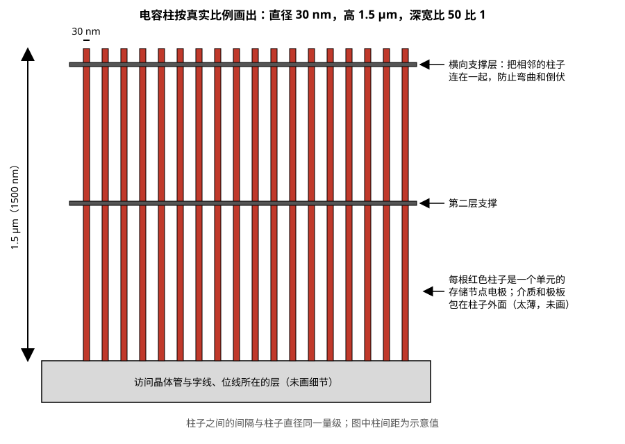

> **图 5-13**　一排电容柱按真实比例绘制：直径 30 nm、高 1500 nm。读图要点：柱子细长到几乎只是一条线；两道灰色横条是横向支撑层，把相邻的柱子连在一起，防止它们在制造过程中弯曲、倒伏或相互粘连。柱子之间的间隔是示意值。
> 来源：本库自绘。
>
> 延伸看图：SemiAnalysis 的文章 [The Memory Wall: Past, Present, and Future of DRAM](https://newsletter.semianalysis.com/p/the-memory-wall) 在“DRAM Primer: When DRAM Stopped Scaling”一节里有一张电容孔内多层薄膜结构的示意图，并引用了 Applied Materials 的电容工艺图，能看到介质和电极是怎样一层层沉积在高深宽比孔里的。该文把电容孔的深宽比写作约 100 比 1，与本节算例的 50 比 1 是不同尺寸假设下的量级。图片版权归原作者，本库不转载。

制程每缩一代，单元的边长变短，柱子的直径必须跟着变细。直径变细，侧面积减小，要保住电容量就只能把柱子做得更高，深宽比进一步上升。这条路的限制是机械上的：柱子太细太高，在制造过程中会弯曲、倒伏、相互粘连。厂商用横向的支撑结构把相邻的柱子连在一起来缓解，但余量越来越小。**这就是 07-02 §6 讲的"电容缩不动"的具体含义。**

### 8.2 晶体管：把沟道埋进硅里

访问晶体管面对的是另一个矛盾。晶体管缩小意味着沟道（源极和漏极之间受栅极控制的那段导电通路）变短，而沟道越短，关断时的漏电越大。§5.1 算过，DRAM 要求漏电在几十飞安的量级，短沟道做不到。

解决办法是让沟道在占地很小的前提下保持足够长。当前量产的做法叫**埋入式字线**（buried wordline）：在硅表面刻一道沟槽，把字线（也就是晶体管的栅极）埋进沟槽里。电流要从沟槽一侧的源极流到另一侧的漏极，必须沿着沟槽的侧壁向下、绕过底部、再沿另一侧向上，走的是一条 U 形的路径。沟道的实际长度由沟槽深度决定，而不是由表面上的占地宽度决定。

沿着垂直于字线的方向切开，剖面见图 5-14。

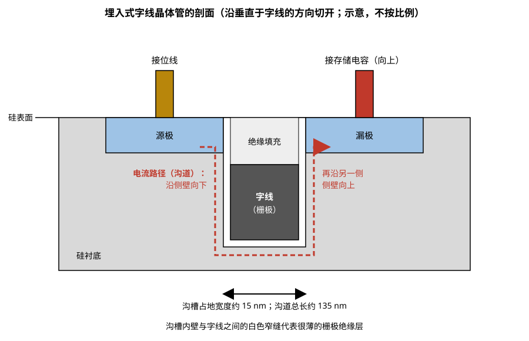

> **图 5-14**　埋入式字线晶体管的剖面示意，不按比例。读图要点：字线（深灰）埋在沟槽下半段，上面是绝缘填充；源极接位线，漏极接存储电容。红色虚线是电流路径：从源极沿沟槽左侧壁向下，绕过沟槽底部，再沿右侧壁向上到漏极。沟槽在表面上只占约 15 nm 宽，沟道总长却约 135 nm。
> 来源：本库自绘。

**算一下沟道长度增加了多少。** 以下尺寸是量级假设：沟槽宽 15 纳米，字线金属所占的那一段深 60 纳米。

- 如果晶体管平放在硅表面，栅极宽度就是沟道长度，约 **15 纳米**。
- 埋入之后，沟道沿侧壁下行 60 纳米、横过底部 15 纳米、再上行 60 纳米，总长约 60 + 15 + 60 = **135 纳米**。

同样 15 纳米的占地宽度，沟道长度是平放时的 9 倍。晶体管关断时的漏电流随沟道变短而急剧上升，把沟道长度保持在一百多纳米，是把漏电压到 §5.1 要求的几十飞安以下的前提。

这个结构也有代价。沟道长，导通时的电阻就大，电流小，存储电容充放电慢，这是 tRCD 和写恢复时间二十年没有明显缩短的原因之一。另外，§5.1 提到的栅致漏极漏电发生在栅极与漏极重叠的区域，埋入式结构里字线金属的顶端与漏极隔着薄绝缘层相对，正是这种漏电集中的位置，所以工艺上要专门处理字线顶端的材料和高度。

这个结构还有一个附带的好处：字线埋在硅表面以下，位线走在硅表面以上，两者之间的寄生电容减小，位线电容降低，按 §3.1 的公式，读出信号变大。

### 8.3 节点命名：1x 到 1d

逻辑工艺的节点名是 7nm、5nm、3nm 这样的数字。DRAM 在进入 20 纳米以下之后，各厂商不再公布具体的尺寸数字，而是用字母给每一代命名。按顺序是：

> **1x → 1y → 1z → 1a → 1b → 1c → 1d**

开头的"1"表示 10 纳米级（即 10 到 19 纳米之间）。对应的尺寸大约从 1x 的 18 纳米逐代降到 1c 的 11 到 12 纳米，每一代只缩小 1 到 2 纳米。Micron 用希腊字母命名后几代，1a、1b、1c、1d 对应它的 1α、1β、1γ、1δ。

**对比一下两边的步幅。** 从 2016 年到 2026 年这十年，DRAM 从 1x 走到 1c，特征尺寸从约 18 纳米缩到约 12 纳米，面积密度提高约（18 ÷ 12）² ≈ 2.3 倍。同一时期逻辑工艺从 10nm 节点走到 2nm 节点，晶体管密度提高了约六到七倍（量级估计）。DRAM 六代合起来的收益，不到逻辑工艺同期的一半。

07-02 §6 里说 HBM 核心裸片的制程"八年停在 1x nm 这一档"，和这里并不矛盾：那里的"1x nm 这一档"指的是整个 10 纳米级，也就是这里的 1x 到 1c 全部包括在内。这些代际确实在推进，但都没有走出 10 纳米级这个范围。

### 8.4 EUV

**极紫外光刻**（EUV，extreme ultraviolet lithography）用波长 13.5 纳米的光来曝光图形，上一代的深紫外光刻波长是 193 纳米。波长越短，一次曝光能分辨的线条越细。用深紫外光刻做十几纳米的线条，需要把一层图形拆成多次曝光来拼，步骤多、对准误差累积；EUV 一次曝光即可。

DRAM 从 1z 和 1a 这两代开始在个别层上使用 EUV，之后逐代增加。到 1c 这一代，使用 EUV 的层数是 5 到 6 层。三家厂商引入 EUV 的节奏不同：三星和 SK hynix 较早，Micron 到 1γ 这一代才第一次使用。

### 8.5 下一步：4F² 与垂直沟道晶体管

6F² 单元在微缩上已接近极限，下一步是 **4F²** 单元。4F² 的意思是每个字线与位线的交叉点都放一个单元，而且单元只占一个交叉点的面积（2F × 2F），这是交叉点阵列在理论上能达到的最小面积。

要做到这一点，访问晶体管不能再横放。做法是把晶体管立起来，叫**垂直沟道晶体管**（VCT，vertical channel transistor）：沟道是一根竖直的硅柱，位线埋在硅柱底下，字线从侧面包住硅柱的中段当栅极，电容立在硅柱顶上。三者在竖直方向上排成一列，占地只有一个交叉点。三星把这个结构称为 VCT，SK hynix 称为 VG（vertical gate，垂直栅）。

一个单元的侧面剖面如下，三个部件自下而上排成一列：

```
            ┃         ┃
            ┃  存储   ┃
            ┃  电容   ┃        ← 电容立柱，与 6F² 单元里的相同
            ┃         ┃
           ─┸─────────┸─       ← 存储节点接触
             │  漏极  │
        ┌────┤        ├────┐
        │字线│  硅柱   │字线│   ← 字线从侧面包住硅柱的中段，
        │    │（沟道）│    │      这一段就是沟道，电流竖直流动
        └────┤        ├────┘
             │  源极  │
      ═══════╧════════╧═══════  ← 位线，埋在硅柱下方，垂直于纸面方向延伸
```

再从上往下看两种单元的占地。6F² 单元的访问晶体管是横放的，源极、栅极、漏极在水平方向上排开，单元的长边需要 3F；4F² 单元的三者在竖直方向上排开，水平方向上只需要放下一根硅柱和它与相邻硅柱之间的间隔，两个方向都是 2F：

```
6F² 单元：3F × 2F              4F² 单元：2F × 2F
┌──────────────┐               ┌─────────┐
│              │ 2F            │         │ 2F
└──────────────┘               └─────────┘
       3F                          2F
```

图 5-15 同时给出了 4F² 单元的俯视排布和一个单元的立体结构。

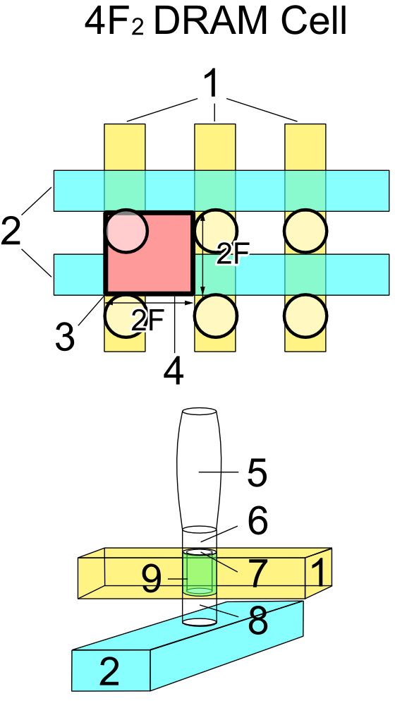

> **图 5-15**　4F² DRAM 单元的结构概略。上半部分是俯视图，下半部分是一个单元的立体图。图中编号的含义（取自该图在日文维基百科中的图注）：1 字线，2 位线，3 电容（俯视时看到的圆），4 一个单元所占的面积，5 电容，6 源极，7 沟道，8 漏极，9 栅极绝缘层。读图要点：俯视图中粗框的正方形边长为 2F，每个字线与位线的交叉点都有一个单元；立体图中位线（2）在最下面，字线（1）从侧面包住竖立的硅柱中段，电容（5）立在硅柱顶上，三者排成一列。DRAM 访问晶体管的源极和漏极在读和写时角色互换，所以该图把靠近电容的一端叫源极，与正文剖面图的叫法相反，二者指的是同一结构。
> 来源：[DRAM Cell Structure (4F2).PNG](https://commons.wikimedia.org/wiki/File:DRAM_Cell_Structure_(4F2).PNG)，作者 Tosaka，许可 CC BY 3.0。

算一下收益：4 ÷ 6 ≈ 67%，单元面积减少约三分之一，而且不依赖光刻尺寸进一步缩小。代入 F = 12 纳米：6F² 单元是 6 × 144 = 864 平方纳米，4F² 单元是 4 × 144 = 576 平方纳米。同样一片裸片上的存储阵列，容量可以提高到 864 ÷ 576 = 1.5 倍。

难点有三处。

**第一，位线要埋在晶体管下方。** 需要先在硅里刻出又深又窄的沟槽，再把金属填进去，而且不能留下空洞。填充这种高深宽比的沟槽需要新的金属材料和沉积设备。

**第二，硅柱是悬空的。** 横放的晶体管，沟道下面连着整片硅衬底，工作中产生的多余电荷可以从衬底排走。立起来的硅柱上下两端分别是漏极和源极，侧面被字线包住，沟道这一段与衬底没有连接。多余的电荷积累在硅柱里排不出去，会使晶体管的阈值电压漂移，漏电变大，保持时间变短。这个现象叫浮体效应。

**第三，相邻的部件靠得更近。** 每个交叉点都有单元，相邻位线之间、相邻字线之间的寄生电容都比 6F² 时更大。位线之间的电容增大，按 §3.1 的公式，读出信号减小，相邻位线之间的干扰也更强；字线之间靠近，则使 §6 讲的 row hammer 更容易发生。

截至 2026 年 9 月，三星和 SK hynix 都已经展示过原型并将其定位为通往 3D DRAM 的过渡技术，但尚未量产。

### 8.6 再下一步：单片 3D DRAM，以及一个必须分清的术语

4F² 之后的方向是把存储阵列本身做成多层：把 1T1C 单元横过来放倒，然后在竖直方向上重复堆叠几十层，所有层在同一片晶圆上通过交替沉积薄膜、一次性刻蚀的方式制造出来。这和 NAND 闪存从平面转向 3D 的路线相同（07-07 §7 讲）。这种结构叫**单片 3D DRAM**（monolithic 3D DRAM），"单片"指的是全部结构做在同一片晶圆上。

**这里有一个必须分清的术语冲突。** 业界有三样东西都可能被称作"3D DRAM"，它们处在完全不同的层面上：

| 名称 | 堆叠的是什么 | 用什么工艺实现 | 属于哪个层面 | 在哪一节讲 | 状态 |
| --- | --- | --- | --- | --- | --- |
| HBM | 多片已经做好的 DRAM 裸片 | 硅通孔加键合 | 封装 | 07-02 | 量产 |
| 3D-DRAM（07-03 的用法） | DRAM 裸片叠到逻辑裸片上 | 微凸块或混合键合 | 封装 | 07-03 | 少量产品 |
| 单片 3D DRAM（本节） | 存储单元本身分成多层 | 薄膜沉积与刻蚀，在一片晶圆上完成 | 晶圆制造 | 本节 | 研发阶段 |

三者的结构差别见图 5-16。

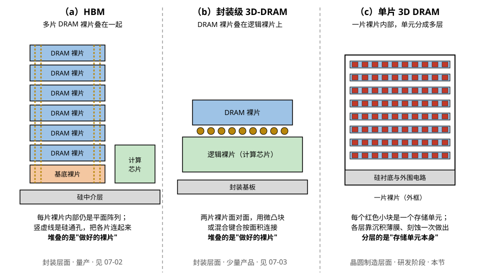

> **图 5-16**　三种被称作“3D DRAM”的结构。读图要点：（a）HBM 是多片做好的 DRAM 裸片用硅通孔（橙色竖虚线）叠在一个基底裸片上，再与计算芯片并排放在硅中介层上；（b）封装级 3D-DRAM 是一片做好的 DRAM 裸片面对面叠在逻辑裸片上，靠微凸块或混合键合按面积连接；（c）单片 3D DRAM 只有一片裸片，存储单元在这片裸片内部分成很多层。前两者叠的是裸片，每片裸片内部仍是平面阵列；第三者分层的是单元本身。
> 来源：本库自绘。

前两者是把多片各自制造完成的裸片叠起来，每片裸片内部仍然是平面的 6F² 阵列，单片裸片的存储密度没有改变。第三者改变的是单片裸片内部的结构，目标是提高单片裸片的密度。两条路线互不排斥：将来完全可能出现把多片单片 3D DRAM 裸片再堆成 HBM 的产品。

**读资料时的判断方法**：看它讲的是硅通孔、键合、裸片，还是沉积层数、刻蚀深宽比、沟道材料。前者是封装层面的堆叠，后者是晶圆工艺层面的单片 3D。

单片 3D DRAM 比 3D NAND 难做，原因又回到电容上。NAND 的单元是一个晶体管，竖着串起来即可；DRAM 的每个单元还要带一个有足够容量的电容，电容横放之后长度方向要占用大量面积，层数必须堆得足够多才能在密度上超过 4F²。

**算一下至少要堆多少层。** 以下尺寸是量级假设。电容横放之后，它的长度决定了单元在水平方向上的占地。假设横放的单元连同电容长 700 纳米、宽 50 纳米，每层每个单元占地 700 × 50 = 35000 平方纳米。§8.5 算过 4F² 单元（F = 12 纳米）的占地是 576 平方纳米。要让单位面积上的比特数追平 4F²，需要的层数 = 35000 ÷ 576 ≈ **61 层**。超过这个层数，单片 3D 才开始有密度上的收益。缩短电容的长度可以降低这个门槛，但电容量会跟着减小，又回到 §3.5 那笔信号余量的账上。

**此外也有不用电容的方案在研究中**，叫 2T0C 增益单元，意思是两个晶体管、零个电容。它的结构是：一个写晶体管和一个读晶体管，写晶体管的一端接在读晶体管的栅极上。写入时打开写晶体管，把电荷送到读晶体管的栅极上，然后关断写晶体管，电荷就留在那里（读晶体管的栅极本身有少量电容）。读出时不去动这些电荷，而是在读晶体管的源极和漏极之间加电压，看有没有电流流过：栅极上有电荷，读晶体管导通，有电流；没有电荷，读晶体管关断，没有电流。

和 1T1C 相比，这种单元有两点不同。第一，**读出不是破坏性的**：读的时候栅极上的电荷没有被分走，所以不需要回写。第二，**信号经过了放大**：很少的栅极电荷控制着大得多的读电流，所以存的电荷可以远少于三万个电子。它的难处在于栅极上存的电荷很少，对写晶体管的漏电要求更严。研究中的方案普遍用氧化物半导体（例如铟镓锌氧化物）来做写晶体管的沟道，这类材料关断时的漏电流比硅低几个数量级，报道的保持时间可以达到秒级甚至更长。这类材料还可以在较低的温度下沉积成膜，适合一层一层往上堆，这是它被看作单片 3D DRAM 候选方案的原因。

---

## 9. 同一种单元，四种产品

到这里，单元和阵列的内容讲完了。最后把它和产品对上：市场上有四个主要的 DRAM 产品家族，DDR、LPDDR、GDDR、HBM。**它们的存储单元是同一种 1T1C 单元，用同一代 DRAM 工艺在同样的产线上制造。** 区别全部在阵列之外：外围电路怎么设计、接口怎么定义、用什么方式封装。

| | DDR5 | LPDDR5X / LPDDR6 | GDDR7 | HBM4 |
| --- | --- | --- | --- | --- |
| 面向 | 服务器与个人电脑的主机内存 | 手机、笔记本，近年也进入 AI 服务器 | 显卡显存 | AI 加速器显存 |
| 优化目标 | 容量与成本 | 功耗，尤其是待机功耗 | 每引脚速率 | 总带宽 |
| 存储单元 | 1T1C | 1T1C | 1T1C | 1T1C |
| 物理形态 | 独立封装的颗粒，焊在内存条上 | 独立封装的颗粒，焊在主板上紧贴处理器 | 独立封装的颗粒，焊在显卡上 | 裸片堆叠，在加速器封装内部 |
| 单器件数据位宽 | 4、8 或 16 位 | 16 位或更宽 | 32 位 | 2048 位 |
| 在阵列之外的主要差别 | 片内纠错、PRAC | 低电压、深度休眠与部分阵列自刷新 | 多电平信号 | 硅通孔、基底裸片、32 条通道 |

表里最后一行只列了名字。下面逐个家族说明它在阵列之外做了什么，以及为什么这样做。

### 9.1 DDR：为容量和成本优化

DDR 面向的是主机内存，一台服务器要插几百 GB 到几 TB，首要目标是每 GB 的成本低。它在外围上的设计都服务于这个目标。

- **数据位宽窄。** 单颗芯片只有 4 位或 8 位数据线。位宽窄，芯片上的输入输出电路就少，封装引脚少，成本低。需要的总位宽靠在一块内存条上并排放多颗芯片凑出来。
- **片内纠错与 PRAC。** 这两项（§7.2、§6.3）都是为了在更小的单元尺寸下仍能交付合格的芯片，本质上是用少量额外的电路换取继续微缩的可能。
- **bank 数量适中。** 16 Gb 芯片是 32 个 bank。bank 越多，外围电路越多，面积越大；主机内存的访问有处理器的多级缓存在前面挡着，对 bank 并行度的要求不如显存高。

### 9.2 LPDDR：为功耗优化

LPDDR（low power DDR，低功耗 DDR）面向电池供电的设备，首要目标是省电，尤其是待机时的耗电。

- **输入输出电压低。** DDR5 的输入输出电压是 1.1 伏，LPDDR5 是 0.5 伏。数据线每翻转一次消耗的能量与电压的平方成正比，所以同样传一个比特，LPDDR5 在数据线上消耗的能量约为 DDR5 的（0.5 ÷ 1.1）² ≈ **21%**。
- **多个供电电压分开。** 存储阵列、外围逻辑、输入输出各用各的电压，每一部分都可以取它能正常工作的最低值。部分电压还可以根据当前的工作频率动态调整：频率低的时候降低电压。
- **待机模式更多。** 除了 §5.5 讲的按温度调整自刷新频率、只刷新部分阵列之外，还有更深的休眠模式，连内部大部分电路的供电都切断，只保留维持数据所必需的部分。
- **不用内存条。** LPDDR 颗粒直接焊在主板上紧贴处理器，走线短，信号质量好，这也是它能用低电压的条件之一。

近年 LPDDR 也进入了 AI 服务器，用作主机内存。原因是一台 AI 服务器的主机内存达到几百 GB 到上 TB，内存本身的功耗已经是一个可观的数字，而 LPDDR 每 GB 的功耗明显低于 DDR。

### 9.3 GDDR：为每引脚速率优化

GDDR（graphics DDR）面向显卡，首要目标是用少量的颗粒提供尽可能高的带宽。

- **单颗位宽大。** 单颗芯片 32 位数据线，是 DDR 的 4 到 8 倍。显卡上只有十来颗颗粒的位置，每颗必须贡献更多的数据线。
- **每根数据线都配完整的高速电路。** 每根线有自己的均衡电路，并且单独做训练（测量这根线的延迟和信号质量，据此调整收发参数。07-06 §6 讲）。这些电路占面积、耗电，DDR 为了成本不会这样做。
- **多电平信号。** GDDR7 在数据线上使用三个电压等级而不是两个，每两个符号传送 3 个比特，在同样的符号速率下多传 50% 的数据。
- **容量小。** 单颗 GDDR 的容量通常小于同代的 DDR，因为芯片面积有相当一部分给了输入输出电路。

### 9.4 HBM：为总带宽优化

HBM 面向 AI 加速器，首要目标是总带宽。它的特殊之处主要在封装层面，07-02 有完整的讲解，这里只列出它在裸片上的差别。

- **裸片上有大片硅通孔区域。** 每片核心裸片中央有几千个硅通孔竖着穿过，这片区域不能放存储单元。
- **通道与 bank 数量多。** HBM4 每个堆叠 32 条通道，每片裸片 256 个 bank，是 DDR5 的 8 倍。显存的访问没有多级缓存在前面缓冲，并行的请求很多，§4.5 讲的 bank 并行在这里的价值最大。
- **对外接口不在存储裸片上。** 与计算芯片通信的电路放在堆叠最底下的基底裸片上，核心裸片只需要驱动几十微米长的硅通孔。
- **测试电路多。** 堆叠之后无法再单独测试某一层，所以每片裸片在堆叠前必须被充分测试，裸片上要有支持这种测试的专用电路。

### 9.5 四个家族共用同一份晶圆产能

**上面这些差别带来一个重要的推论：四个家族共用同一份晶圆产能。** 一片 DRAM 晶圆在制造的前段并不区分最后做成哪种产品。所以当 HBM 的需求上升时，厂商会把产能从 DDR 和 LPDDR 转过去，主机内存的供应和价格随之受影响。

而且 HBM 对晶圆的消耗更大：同样的比特数，HBM 消耗的晶圆面积是普通 DDR 的两到三倍（量级估计）。这个倍数可以拆成几项来理解，以下每一项的数值都是用于说明的假设：

1. **裸片面积更大。** 硅通孔区域、更多的 bank 外围电路和测试电路，使同样容量的 HBM 核心裸片比 DDR 裸片大。假设大 40%，即 1.4 倍。
2. **堆叠良率相乘。** 一个 12 层的堆叠，只要有一层在堆叠过程中损坏，整个堆叠报废。假设每一层的堆叠成功率是 97%，12 层全部成功的概率 = 0.97¹² ≈ 69%。为了得到一个好的堆叠，平均要投入 1 ÷ 0.69 ≈ 1.45 倍的裸片。
3. **筛选更严。** 进入堆叠的裸片必须是确认完好的，测试标准比单独封装的颗粒严格，被筛掉的比例更高。假设因此多损失 15%，即 1 ÷ 0.85 ≈ 1.18 倍。
4. 三项相乘：1.4 × 1.45 × 1.18 ≈ **2.4 倍**。

这笔账的意义在于说明倍数的来源是相乘关系：其中任何一项改善，总的倍数都会明显下降。它也解释了 07-02 §9 提到的"在基底裸片上放一块 SRAM 做修复"为什么有价值：它改善的是第 2 项和第 3 项。

四个家族在接口上的差别——信号怎么传、速率怎么跑上去、为什么需要训练——是 07-06 的内容。HBM 在封装上的特殊之处见 07-02。

---

## 10. 开发者视角

DRAM 单元和阵列对软件不可见，但它的特性通过下面这些途径反映到软件能观察到的现象上：

| 你想知道/做什么 | 去哪里看/做 | 背后对应本节哪部分 |
| --- | --- | --- |
| 这台机器的内存条是什么规格、时序参数是多少 | `dmidecode -t memory` 看型号与速率；`decode-dimms` 读内存条上存的参数表 | §4.3 的 tRCD、CL、tRP |
| 主机内存出过多少可纠正错误、不可纠正错误 | Linux 的 EDAC 子系统：`/sys/devices/system/edac/mc/` 下的计数器，或 `rasdaemon` 的日志 | §7.2。这里看到的是系统级纠错的计数，片内纠错处理掉的不会出现 |
| 显存出过多少错误 | `nvidia-smi -q -d ECC` | §7.2 |
| 显存有没有坏行被替换过、备用行还剩多少 | `nvidia-smi -q -d ROW_REMAPPER` | §7.3 的封装后修复。备用行耗尽是需要返修的信号 |
| 显存温度 | `nvidia-smi -q -d TEMPERATURE` 里的显存温度字段 | §5.4。超过 85 摄氏度刷新加倍，可用带宽下降约 7 个百分点 |
| 为什么随机访问比顺序访问慢很多 | 用 profiler 对比两种访问模式的实测带宽 | §4.4：行命中 16.7 纳秒，行未命中 49.3 纳秒 |
| 让大数组的访问少换行 | 数据布局上把一起访问的数据放在一起；避免以大步长跳着访问 | §4.1：一行是 1 KB，落在同一行的访问只付一次激活代价 |
| 红旗信号 | 长时间运行后训练结果出现无法复现的数值异常，同时错误计数在增长 | 可能是硬件层的比特错误。先查错误计数和温度，再怀疑代码 |

**站在哪一层能摸到什么**：PyTorch 这一层完全看不到 DRAM 的内部结构，只能通过吞吐量间接感受；CUDA 这一层可以通过控制访问模式影响行命中率；错误计数、温度、行重映射这些只能通过驱动和系统工具看到。时序参数和刷新策略由固件在开机时设定，运行中的软件无法改动。

---

## 11. 最新架构落点（知识截至 2026-09）

- **1c 节点（第六代 10 纳米级）**：已进入量产爬坡。SK hynix 的 1c 在 2026 年第二季度约占其 DRAM 产量的 13%，预计第四季度升到 34%，2027 年第一季度超过 1b 成为主力；用于 DDR5、LPDDR6 和 HBM4E。三星在 HBM4 上就采用了自家的 1c 级工艺。Micron 对应的一代是 1γ，2025 年推出了首批基于 EUV 的 16 Gb DDR5。这一代使用 EUV 的层数约 5 到 6 层。
- **1d 节点（第七代 10 纳米级）**（路线图，未量产）：三星与 SK hynix 都在 2026 年内推进开发，媒体对两家进度先后的报道相互矛盾；初期量产的时间点普遍报道在 2027 年前后。Micron 对应的一代是 1δ。
- **高数值孔径 EUV**（路线图）：把光刻机的数值孔径从 0.33 提高到 0.55，进一步提高分辨率。三星和 SK hynix 都把用于 DRAM 量产的目标定在 2028 年前后，Micron 未公布时间。
- **4F² 垂直沟道晶体管**（路线图，未量产）：三星（VCT）与 SK hynix（VG）都已展示原型，定位为进入 10 纳米以下之后的过渡结构，单元面积较 6F² 减少约三成。
- **单片 3D DRAM**（研发阶段）：各家都有研究成果发表，尚无量产时间表。注意和 07-03 讲的封装层面的 3D-DRAM 区分（§8.6）。
- **Row hammer 防护**：DDR5 标准在 2024 年 4 月的 JESD79-5C 版本中加入了逐行激活计数（PRAC）与配套的告警握手协议，同一版本把标准速率上限扩展到 DDR5-8800。PRAC 在实际产品中的启用情况因平台而异。
- **四个产品家族的现状**：DDR5 是服务器与个人电脑的主力；LPDDR6 标准已于 2025 年发布；GDDR7 已用于当前一代显卡；HBM4 已于 2026 年 2 月量产（07-02 §12）。四者的存储单元都来自上面所说的 1b 与 1c 这两代工艺。

---

## 12. 和其它模块的挂钩

- **07-04 SRAM**：本节的对照组。§2 那张三种存储器的对照表是整条基础线的总览；SRAM 用六个晶体管换来了不需要刷新、读不破坏数据，DRAM 用一个电容换来了十几倍的密度。两节的灵敏放大器是同一类电路，但 DRAM 的还兼任回写。
- **07-06 DRAM 接口**：本节讲芯片内部的存储阵列，那一节讲数据怎么从芯片引脚传到控制器。本节 §4.3 的时序参数是阵列内部的延迟，那一节讲的速率是引脚上的速率，两者相互独立。
- **07-07 NAND 闪存**：第三种存储单元。NAND 把电荷关在一个被绝缘层包围的栅极里，所以断电也不丢，代价是写入慢、擦写有寿命。§8.6 的单片 3D DRAM 走的是 NAND 已经走过的路。
- **07-02 HBM 解剖**：§6 讲核心裸片的工艺停滞，本节 §8 给出了它的物理原因（电容深宽比）和节点命名的对应关系；§3 讲 DRAM 的温度上限，本节 §5.4 给出了这个上限的来历。
- **07-03 3D-DRAM**：那一节的"3D-DRAM"是封装层面的裸片堆叠，和本节 §8.6 的单片 3D DRAM 不是一回事，区分方法见那张对照表。
- **06-01 存储层级与搬运指令全图 §3.1**：那里从软件侧讲 HBM 的通道、行缓冲和"跨行乱跳"的代价，本节 §3.2 和 §4.4 给出了行缓冲的电路实体（一排锁住了数据的灵敏放大器）和换行代价的具体数字。
- **08-03 片上存储的物理实现**：那里讲 SRAM 的 bank 冲突，和本节 §4 的 bank 是同一个概念在两种存储器上的体现：一块有独立外围电路的子阵列，一次只能打开一行。
- **09-04 可靠性与规模化**：本节 §7 的错误机制是那一节讨论集群级故障率时的器件层来源。

---

## 13. 术语卡

### 1T1C 单元与电荷共享
**定义**：1T1C 是 DRAM 存储单元的结构，由一个访问晶体管和一个存储电容组成，数据用电容上有无电荷表示。电荷共享是读这个单元时发生的物理过程：访问晶体管导通后，存储电容与位线连通，电荷在两者之间重新分配，位线电压的变化量等于（单元电压 − 预充电压）× Cs ÷（Cs + Cbl）。按 10 fF 的存储电容和 40 fF 的位线电容，位线只变化约 100 毫伏。
**为什么存在**：每个比特只用一个晶体管加一个竖立的电容，单元面积比六个晶体管的 SRAM 小十几倍，这是 DRAM 容量大、成本低的根本原因。电荷共享则决定了 DRAM 的两个基本特征：信号很小所以必须配灵敏放大器，读完电荷被分走所以必须回写。
**语境例句**："这一代位线电容降了，感应余量好了不少。" —— 意思是：位线的寄生电容变小了，按电荷共享公式，同样的存储电容能在位线上产生更大的电压变化，灵敏放大器更容易正确分辨，良率和可靠性都会改善。

### 破坏性读出与回写
**定义**：DRAM 读一个单元时，电荷共享使存储节点的电压从满幅滑向中间值，单元里原有的数据不再可读，这叫破坏性读出。灵敏放大器把位线放大到满幅之后，这个满幅电压通过仍然导通的访问晶体管重新给存储电容充电，这叫回写。回写必须在字线放下之前完成，对应的时序参数是 tRAS。
**为什么存在**：它是用电容存数据的直接后果，无法避免。它同时解释了 DRAM 的三个设计：每根位线都要配一个灵敏放大器（整行都被破坏，整行都要回写）；读、写、刷新三种操作的前半段完全相同；一行打开之后不能立刻关闭。
**语境例句**："tRAS 没满不能发预充电。" —— 意思是：这一行激活之后还没到规定的最短时间，存储电容还没被完全回写充满，现在关闭字线会导致这一行的数据变弱甚至丢失。

### tRCD、CL、tRP
**定义**：DRAM 的三个主要时序参数，规格里以时钟周期数表示。tRCD 是发出激活命令到可以发读写命令之间的等待时间；CL 是发出读命令到数据出现在引脚上的等待时间；tRP 是发出预充电命令到可以激活下一行的等待时间。换算成纳秒，三者在各代 DDR 上都在 13 到 17 纳秒之间。
**为什么存在**：控制器看不到芯片内部的状态，只能按约定的时间等待。这三个参数就是芯片厂商对"内部那一步模拟过程需要多久"的承诺。一次访问的延迟由它们组合而成：行命中只付 CL，bank 空闲付 tRCD 加 CL，行未命中三者都付。
**语境例句**："频率上去了，但 CL 也跟着放宽了，实际延迟没变。" —— 意思是：时钟周期变短的同时 CL 的周期数变多，两者相乘得到的纳秒数基本不变——接口更快提高的是吞吐量，第一个数据到达的等待时间由阵列内部决定，没有改善。

### 保持时间与尾部单元
**定义**：保持时间是一个 DRAM 单元从写入到数据无法正确读出之间能坚持的时间。同一颗芯片里各单元的保持时间差异很大：绝大多数是秒级，极少数因为局部缺陷只有几十到几百毫秒，后者称为尾部单元。其中保持时间会随机跳变的一类称为可变保持时间单元。
**为什么存在**：刷新周期必须按最差的单元来定，所以是占比百万分之一量级的尾部单元决定了整颗芯片的刷新频率，进而决定了刷新开销（DDR5 的 16 Gb 芯片约 7.6%）。温度升高使漏电增大，尾部单元首先失效，这是 85 摄氏度以上刷新必须加倍的原因。
**语境例句**："高温下刷新翻倍，带宽要打折。" —— 意思是：芯片温度超过 85 摄氏度之后刷新命令的间隔减半，芯片不可访问的时间比例从约 7.6% 升到约 15%，可用带宽相应下降，刷新功耗同时翻倍。

### Row hammer 与 PRAC
**定义**：Row hammer 是指反复激活某一行（攻击行），会通过电容耦合和电子注入加快物理相邻行（受害行）的电荷流失，激活次数超过阈值后受害行出现比特翻转。近几代芯片的阈值已低于一万次，而一个刷新周期内最多可以做约 66 万次激活。PRAC（逐行激活计数）是 DDR5 在 2024 年加入的防护机制：每一行自带计数单元，计数到门限时芯片主动告警，要求控制器暂停并给出时间刷新受害行。
**为什么存在**：Row hammer 是单元间距缩小的副作用，制程越先进越严重。它之所以成为安全问题，是因为触发它只需要读操作，不需要对受害行有访问权限。早期的防护（TRR）依赖采样追踪，被证明可以绕过；PRAC 用精确计数取代采样，代价是面积和时序开销。
**语境例句**："这个平台开了 PRAC，尾延迟会有抖动。" —— 意思是：芯片在某行计数达到门限时会发告警并让控制器暂停几百纳秒到一微秒多，这段暂停对平均吞吐量影响很小，但会出现在延迟分布的尾部。

### 片内纠错（on-die ECC）
**定义**：DRAM 芯片内部自带的纠错机制。DDR5 规定每 128 位数据配 8 位校验位，能纠正其中 1 位错误，存储开销 6.25%。纠错过程完全在芯片内部完成，控制器看不到校验位，也不知道是否发生过纠错。
**为什么存在**：制程缩小之后尾部单元和可变保持时间单元的比例上升，如果要求每个单元都完美，良率无法接受。片内纠错让芯片可以容忍零散的单比特缺陷。它不能替代系统级纠错：遇到两位错误时它可能误纠，使输出变成三位错误，这类错误要靠控制器那一层的纠错来发现。
**语境例句**："片内纠错只管单比特，多比特还得靠系统那一层。" —— 意思是：芯片内部能自行纠正的只有每组数据里的一位错误，更严重的错误会原样（甚至更糟地）送出来，服务器仍然需要带校验芯片的内存条和控制器侧的纠错。

### 6F² 与 4F²
**定义**：以特征尺寸 F 的平方为单位表示的单元面积。6F² 是当前量产 DRAM 的单元面积，基于开放位线排法和埋入式字线晶体管。4F² 是下一代目标，每个字线与位线的交叉点放一个单元，需要把访问晶体管立起来做成垂直沟道晶体管，位线埋在下方、电容立在上方。
**为什么存在**：用 F² 做单位可以把"制程缩小带来的收益"和"单元结构改进带来的收益"分开看。从 8F² 到 6F² 在不换制程的情况下多得三分之一容量，从 6F² 到 4F² 可以再减少约三分之一面积。在光刻尺寸每代只能缩 1 到 2 纳米的今天，结构改进是密度增长的主要来源。
**语境例句**："4F² 之后就得上 3D 了。" —— 意思是：4F² 已经是平面交叉点阵列的理论最小面积，之后要继续提高单片裸片的密度，只能把存储单元在竖直方向上做成多层，也就是单片 3D DRAM——注意这和把裸片叠起来的 HBM 不是一回事。

---

## 14. 我的困惑 / 待深挖

- §2 和 §3 的算例用的存储电容 10 fF、位线电容 40 fF 是便于计算的整数，当前 1b 和 1c 节点的实际值各是多少？§3.5 的晶体管失配标准差 8 毫伏也是假设值，实际是多少？§3.5 提到的偏差补偿电路具体是什么结构，补偿之后残余的偏差有多大？
- §2 给的单元面积 0.001 到 0.0015 平方微米是量级估计。各家各代的实测单元面积需要对着拆解报告核对一遍；节点名称里的尺寸和实际的字线、位线节距之间是什么关系也需要弄清楚。
- §5.3 的 tRFC 与 tREFI 数字取自 DDR5 的 16 Gb 规格。HBM 的刷新参数是多少？HBM 堆叠内部各层温度不同（07-01 §5.6），刷新频率是按最热的那一层统一定的，还是各层独立？
- §5.4 的"每升高 10 摄氏度漏电翻倍"是经验规律，实际曲线是什么样的？85 摄氏度这个分界点在 HBM 上是否相同？
- §6.3 里 PRAC 的时序开销（预充电阶段多做一次计数器读改写）具体让 tRP 变长了多少？HBM4 是否采用了类似 PRAC 的机制？GPU 的显存是否存在 row hammer 风险，公开资料很少。
- §6.3 的 PRAC 门限 1024 次是为了算例取的假设值，实际平台上配置成多少？§6.1 讲的 RowPress 在微观上的机理（与 row hammer 的电子注入是不是同一种过程）没有讲清，DDR5 标准对它的处理方式也需要核对。
- §7.2 估计两位错误被误纠的概率约 53%，前提是校验子均匀分布；实际的编码可以通过构造降低相邻位同时出错时的误纠概率，各家是怎么做的？系统级纠错在设计时是否考虑了片内纠错会把两位错误变成三位错误这件事？
- §7.3 的备用行比例（百分之一到百分之二）和备用资源的划分方式是量级估计，需要找到具体产品的数据。
- §8.2 的沟槽尺寸是量级假设，实际的埋入式字线深度与有效沟道长度是多少？
- §8.5 的浮体效应，各家的解决方案是什么？SK hynix 与三星的结构有什么实质差别？
- §8.6 的 2T0C 增益单元，读晶体管的栅极电容很小，对软错误（§7.1）是否更敏感？它的读出电路和阵列组织与 §3、§4 讲的有多大不同？61 层这个门槛用的单元尺寸是假设值，需要对照已发表的原型核实。
- §9.5 把"两到三倍"拆成三项相乘，每一项的数值都是假设，需要找到可靠的出处逐项核对。§9.2 的 LPDDR 电压、§9.3 的 GDDR7 编码方式的细节以 07-06 为准。
- §11 里 1d 节点的进度，媒体对三星与 SK hynix 谁先完成开发的报道相互矛盾，需要等正式发布再更新。

---

*最后更新：2026-09-28（第三版补图 16 张（其中取自 Wikimedia Commons 5 张，自绘 11 张）：1T1C 单元、电荷共享、读波形、灵敏放大器、折叠与开放位线、命令时序、bank 交错、保持时间分布、电容柱、埋入式字线、三种 3D 结构为自绘；阵列电路、6F² 版图、row hammer、汉明码三圆图、4F² 单元取自 Commons。另加一处延伸看图外链。第二版：取消篇幅限制后的补写。新增 §3.3 写操作逐步走查表、§3.4 灵敏放大器的交叉耦合结构与五步放大过程、§3.5 偏差与信号余量的账、§4.2 折叠与开放位线示意、§4.5 突发读与两个 bank 交错访问的时间线、§5.3 刷新命令内部步骤与细粒度刷新和同 bank 刷新的对照、§6.1 双侧锤击过程与 RowPress、§6.3 PRAC 告警握手时间线与开销、§7.1 粒子撞击的电荷量、§7.2 校验位数的推导与 7 位汉明码的纠错和误纠走查、§7.3 冗余行替换的登记与使用过程及封装后修复流程、§8.2 埋入式字线剖面与沟道长度、§8.5 垂直沟道晶体管剖面与三处难点、§8.6 单片 3D 的层数门槛与 2T0C 增益单元、§9.1～9.5 四个家族的外围差异与晶圆消耗倍数的拆解。第一版。按"一个电容存一位"这条主线组织：电容带来破坏性读出、漏电与刷新、微缩困难三个后果。核心手算五笔：一个单元约三万个电子、电荷共享后位线只动 100 毫伏、行未命中的访问 49.3 纳秒而行命中 16.7 纳秒、DDR5 刷新开销约 7.6% 且高温下翻倍、一个刷新周期内可激活同一行约 66 万次而 row hammer 阈值不到一万次。术语上明确区分了单片 3D DRAM 与 07-03 的封装级 3D-DRAM。1c/1d 节点进度、EUV 层数、4F² 进展、PRAC 标准版本经 2026-09 联网核实）*
