# DRAM 接口：DDR PHY 怎样把一排并行线跑到几个 Gbps

> **所属模块**：模块 07 · 封装与存储的物理实现
> **状态**：🟨 学习中（第四版。知识截至 2026-09）
> **本节主旨**：上一节（07-05）讲 DRAM 的存储单元和阵列，那是颗粒内部的事。这一节讲颗粒外面那一段：**计算芯片里的一个读写请求，是经过哪几层电路、哪几组导线，变成 DRAM 引脚上的电压波形的**。主线是三件事。第一，接口分成五层——内存控制器、DFI、PHY、封装与 PCB 通道、DRAM 颗粒——其中 PHY 是把数字信号变成精确定时的模拟波形的那一层，用户常说的"DDR PHY"指的就是它。第二，DDR 是一条**并行的源同步总线**：数据线旁边跟着一根专门的选通信号 DQS，由发数据的一方同时发出，接收方用它来采样；这个设计让它不需要像 SerDes 那样从数据里恢复时钟，但要求几十根线之间的到达时间对齐到十几皮秒以内。第三，这个对齐靠制造精度做不到，只能**每次上电由 PHY 逐根线测量并补偿**，这个过程叫训练。DDR5-6400 的一个比特只有 156 皮秒宽，而内存条上第一颗和最后一颗颗粒的时钟到达时间相差约 640 皮秒，相当于四个比特——不训练，总线根本无法工作。全节配多笔手算，并对训练的每一步各做一个能逐步跟踪的走查：一个比特有多宽、走线偏斜吃掉多少、命令线怎样靠异或反馈逐根对齐、写均衡怎样一步步找到时钟沿以及它为什么会差一个整周期、读门控怎样靠数边沿定位、逐位去偏斜怎样把公共采样窗口从 47 皮秒扩大到 70 皮秒、参考电压与延迟的二维网格怎样读。

---

## 0. 这一节要回答的问题

- "DDR PHY"到底是哪一块电路？它和内存控制器、和 DRAM 颗粒的分界在哪里？
- DFI 是什么？为什么控制器和 PHY 之间还需要一份标准？
- DQS 是什么信号？已经有时钟 CK 了，为什么数据还要另配一根选通？
- 为什么写的时候 DQS 对准数据中央，读的时候却对准数据边沿？
- 服务器开机时"内存训练"那几十秒到几分钟在干什么？不训练会怎样？
- write leveling（写均衡）解决的是什么问题？它是怎么一步步找到对齐点的？
- ODT、ZQ 校准、Vref 这几个词各自在管什么？
- RDIMM、LRDIMM、MRDIMM、CUDIMM、CAMM2 这些模组名字的差别在哪？
- DDR5、LPDDR、GDDR、HBM 用的是同一种存储单元，它们的接口差在哪？GDDR7 的 PAM3 是什么？
- CXL 内存扩展和直接插内存条，在接口上是两条什么样的路？

---

## 1. 基础词汇：先把本节要反复用的词讲清楚

**内存控制器（memory controller，缩写 MC）**。计算芯片里负责"决定对内存发什么命令、什么时候发"的那块数字逻辑。它把上层的读写请求翻译成 DRAM 能听懂的命令序列（激活某一行、读某一列、预充电、刷新），并保证每两条命令之间的间隔满足 DRAM 规定的时序参数。它只处理"第几个时钟周期发什么"，不处理皮秒级的波形。

**物理层（PHY，physical layer）**。紧挨着芯片引脚的那一圈混合信号电路。它从控制器那里接过"这个周期要发的命令和数据"，变成引脚上电压、时刻都精确受控的波形；反方向则把引脚上收到的波形采样成数字比特交还控制器。驱动器、接收器、延迟线、锁相环都在这一层。本节的大部分篇幅在讲它。

**DFI（DDR PHY Interface）**。控制器与 PHY 之间的接口标准，规定两者之间有哪些信号、各自的时序关系。它不是 DRAM 引脚上的协议，而是芯片内部两块电路之间的约定。§2 展开。

**单位间隔（UI，unit interval）**。一个比特在导线上占据的时间长度。DDR 在时钟的上升沿和下降沿各传一个比特，所以 UI 等于时钟周期的一半。DDR5-6400 这个名字里的 6400 是每根数据线每秒传 6400 兆比特，UI = 1 ÷ 6.4 Gbps = **156.25 皮秒**。本节所有时序预算都以 UI 为尺。

**眼图（eye diagram）**。把一根信号线上成千上万个比特的波形按 UI 对齐后叠画在一起得到的图。比特在 0 和 1 之间跳变的地方线条交叉，中间留下一块没有线条穿过的空白区域，形状像一只眼睛。空白区域的宽度（眼宽）是接收方可以安全采样的时间范围，高度（眼高）是区分 0 和 1 的电压余量。眼越小，越容易采错。图 6-1 是一张实测的眼图。

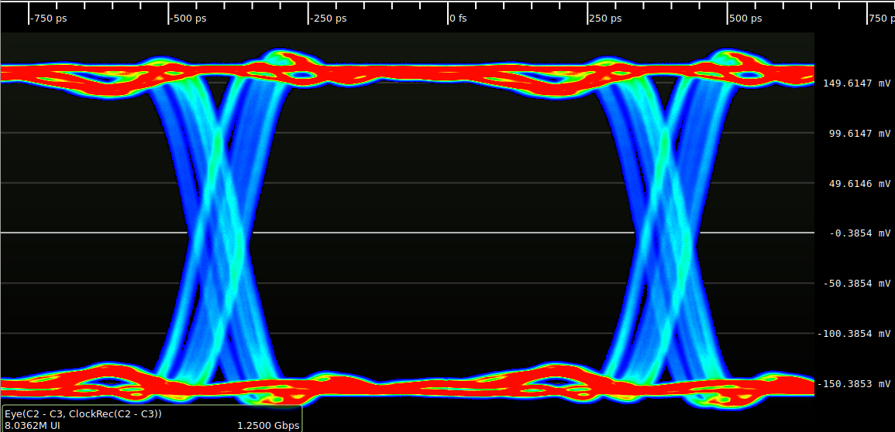

> **图 6-1**　一句话：这是用示波器实测的一张眼图：把同一根线上几百万个比特的电压波形按“每个比特占的时间格子”对齐后叠在一起，中间留下的黑色空洞，就是接收方可以放心读数的地方。
>
> **先知道一件事**：这类图的横轴是时间、纵轴是电压。本图的时间刻度在顶部，单位是皮秒（1 皮秒是一万亿分之一秒）；电压刻度在右侧，单位是毫伏。线上电压高表示 1、低表示 0；每个比特占用一段固定的时间，叫 UI（单位间隔）。这个信号每秒传 12.5 亿个比特（1.25 Gbps），所以一个 UI 是 800 皮秒。
>
> **按这个顺序看**：
> 1. 先看颜色：它表示波形经过这个点有多频繁，红色最频繁，其次是黄、绿，蓝色最少，黑色表示从来没有经过。左下角的“8.0362M UI”说明叠了大约八百万个比特。
> 2. 看上下两条红色粗带：上面一条在约 +150 毫伏，是“1”的电压；下面一条在约 −150 毫伏，是“0”的电压。粗带有厚度，说明每次的电压并不完全一样。
> 3. 看左右两处蓝色的 X 形交叉（大约在 −440 皮秒和 +370 皮秒）：这是相邻两个比特交接、电压从高变低或从低变高的时刻。两个 X 相隔约 800 皮秒，正好一个 UI。
> 4. 最后看两个 X 之间、两条粗带之间的黑色区域：没有任何波形穿过这里，它就是“眼”。在这块区域中间读电压，不管前后是什么比特，都能明确分出 1 还是 0。这只眼的宽度约六七百皮秒，高度接近 300 毫伏。
>
> **打个比方**：像把几百万张同一路口的照片叠在一起：车流常走的地方颜色最深，中间那块从来没有车经过的空地，就是行人可以安全穿过的地方。
>
> **看懂的标志**：能回答“眼变小意味着什么”：可以安全读数的时间变短、区分 0 和 1 的电压余量变小，读错的概率上升。本节后面的训练图，做的都是找这只眼的中心。
>
> **与正文的对照**：这是千兆以太网的信号，不是 DDR 信号。DDR5-6400 的 UI 只有 156 皮秒，比这里短五倍多，但图的读法完全相同。
>
> 来源：[File:Eye pattern example.png](https://commons.wikimedia.org/wiki/File:Eye_pattern_example.png)，作者 Andrew D. Zonenberg，许可 CC BY 4.0。

**源同步（source synchronous）**。一种定时方式：发送方在发数据的同时，沿着一根并排的导线发出一个选通信号，接收方用这个选通信号的边沿去采样数据。因为选通和数据走的是几乎相同的路径，路径上的延迟和漂移对两者影响相同，互相抵消。DDR 的数据线用的就是这种方式，那根选通信号叫 DQS。

**单端与差分（single-ended / differential）**。单端信号用一根线传，接收方把线上的电压和一个参考电压比较来判断 0 或 1。差分信号用两根线传互补的电压，接收方比较这两根线之间的差。差分抗干扰能力强，但要多占一根线。DDR 的数据线 DQ 是单端的（几十根线都翻倍成本太高），时钟 CK 和选通 DQS 是差分的（它们决定采样时刻，必须干净）。

**片内端接（ODT，on-die termination）**。做在芯片内部、接在信号线末端的电阻。信号沿导线传到末端时，如果末端阻抗与导线的特征阻抗不相等，一部分能量会反射回去，与后面的比特叠加造成干扰。在末端接一个阻值接近导线特征阻抗的电阻，可以把能量吸收掉。§5 讲它的数值是怎么定的。

**偏斜（skew）**。本应同时到达的几个信号，实际到达时刻之间的差。来源包括走线长度不等、封装内引线长度不等、各引脚驱动器速度不一致。训练要消除的主要就是它。

---

## 2. 分层：从一个读请求到引脚上的波形，中间隔着五层

DRAM 接口从计算芯片内部到颗粒，依次是五层。先给全貌（见图 6-2），再逐层说职责和边界。

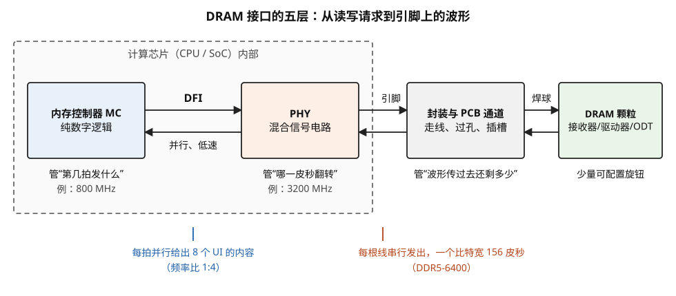

> **图 6-2**　一句话：计算芯片读写 DRAM，一个请求要依次经过五层：内存控制器、DFI、PHY、封装与电路板上的走线、DRAM 颗粒；每一层只管一类问题。
>
> **先知道一件事**：芯片内部的逻辑按“拍”（时钟周期）工作，只关心“这一拍做什么”；而导线上的电压每 156 皮秒就要换一个值，必须精确到皮秒。这两种时间尺度相差太大，所以分给两块不同的电路去管。
>
> **按这个顺序看**：
> 1. 左边的虚线框是计算芯片（CPU 或 SoC；SoC 指把处理器和各种控制器做在同一颗芯片上的系统芯片）的内部。第一个蓝色方框是内存控制器（MC），它是纯数字逻辑，管“第几拍发什么命令”。例子里它的时钟是 800 MHz，即每秒 8 亿拍。
> 2. 第二个橙色方框是 PHY（物理层），它是模拟与数字混合的电路，管“每根线在哪一皮秒翻转电压”，例子里它的时钟是 3200 MHz。两个方框之间的一对箭头标着 DFI：这是控制器和 PHY 之间事先约定好的一组内部信号。箭头下的“并行、低速”是说控制器每拍一次交出很多比特。
> 3. 标着“引脚”的箭头离开了芯片，进入灰色方框：封装、电路板上的走线、过孔（电路板上下层之间的导电孔）、插槽。这一层没有任何电路，只有导线，它决定波形到达对面时还剩多少。
> 4. 标着“焊球”的箭头到达最右边的绿色方框 DRAM 颗粒。颗粒上也有接收器、驱动器（把比特变成导线上电压的电路）和 ODT（片内端接电阻，用来吸收导线末端弹回来的信号），但只提供少量可配置的旋钮。
> 5. 最后看底部的蓝字和红字：在 DFI 这条边界上，控制器每拍并行地交出 8 个 UI（一个 UI 就是一个比特占的时间）的内容；“频率比 1:4”指控制器时钟是 PHY 时钟的四分之一。过了引脚之后，每根线串行地一个比特接一个比特发出，每个比特只占 156 皮秒（DDR5-6400 的速率）。
>
> **打个比方**：像寄快递：调度中心（控制器）只决定今天发哪些件；分拣装车的人（PHY）负责让每一件按精确的时刻上车；公路（走线）决定路上颠坏多少；收件人（颗粒）只能简单签收。
>
> **看懂的标志**：能回答“为什么调节能力大多放在计算芯片一侧”：PHY 在计算芯片里，用的是先进工艺，能做复杂的电路；颗粒用 DRAM 工艺制造，电路做不复杂，所以颗粒一侧只留少量旋钮。
>
> **与正文的对照**：五个方框依次对应正文 §2 的“第一层”到“第五层”。
>
> 来源：本库自绘。

**第一层，内存控制器**。它的输入是上层总线来的读写请求（地址、数据、长度），输出是按时钟周期排好的 DRAM 命令流。它要维护每个 bank（DRAM 内部可以独立打开一行的存储分区）当前打开的是哪一行，决定先服务哪个请求，插入刷新命令，并保证相邻命令的间隔不小于规定值。举一个具体的约束：DDR5-6400 的典型读延迟 CL 是 46 个时钟周期，即读命令发出后 46 × 312.5 皮秒 ≈ 14.4 纳秒数据才开始出现，控制器必须按这个数准备接收。

**第二层，DFI**。这是控制器和 PHY 之间的信号约定。存在的原因是这两块电路常常来自不同的供应商：控制器是可综合的数字 IP，可以跟着芯片的逻辑一起实现；PHY 是与工艺节点强绑定的硬核，通常从专门的 IP 厂商购买或由专门的团队定制。DFI 让一家的控制器可以配另一家的 PHY。

DFI 上的信号分成几组：命令组（`dfi_address`、`dfi_cs_n` 等）、写数据组（`dfi_wrdata`、`dfi_wrdata_en`）、读数据组（`dfi_rddata_en`、`dfi_rddata`、`dfi_rddata_valid`）、状态与更新组（`dfi_init_start` / `dfi_init_complete`、`dfi_phyupd_req`、`dfi_phymstr_req`）、低功耗组。它还定义了几个时序参数，例如 `tphy_wrlat`（写命令发出后隔几拍送写数据使能）。

**DFI 里有一个对理解速率很重要的概念：频率比**。控制器是综合出来的数字逻辑，很难跑到 3.2 GHz，所以让它跑在 PHY 时钟的整数分之一上，一拍里并行地给出多个相位的内容。算一个例子：

1. DDR5-6400 的时钟是 3200 MHz。取频率比 1:4，控制器时钟为 **800 MHz**。
2. 控制器的一个周期对应 PHY 的 4 个时钟周期，也就是 **8 个 UI**。
3. 对一条 64 位宽的数据通道，控制器每拍要交给 PHY 8 × 64 = **512 比特**写数据，由 PHY 内部的并串转换电路排成 8 个 UI 依次发出。

也就是说，DFI 这条边界同时是"并行低速"和"串行高速"的分界。

**第三层，PHY**。它的输入是 DFI 上的并行数字信号，输出是引脚上的波形。职责有四项：把并行数据串行化并在精确的时刻发出；把收到的波形在正确的时刻采样并解串；控制驱动强度和端接阻值；执行训练并保存训练结果。§5 和 §6 分别讲它的电路和训练。

**第四层，封装与 PCB 通道**。信号从芯片的凸块出发，经过封装基板、焊球、主板走线、内存插槽、内存条上的走线，到达颗粒的焊球。这一段不含有源器件，但它决定了波形到达时还剩多少：走线的损耗让高频分量衰减，阻抗不连续处（过孔、插槽、分叉点）产生反射，相邻走线之间有串扰。服务器主板上这段路径的长度在十厘米量级。

**第五层，DRAM 颗粒**。颗粒的引脚一侧也有接收器、驱动器和 ODT，相当于一个简化的 PHY。需要强调的是两边的能力不对称：颗粒用 DRAM 工艺制造，晶体管慢、金属层少，做不了复杂电路，所以**大部分调节能力放在计算芯片一侧的 PHY 里**，颗粒一侧只提供少量可通过寄存器配置的旋钮（端接阻值、参考电压、DDR5 起还有均衡器系数）。

**边界小结**：控制器与 PHY 以 DFI 为界，一边管周期、一边管皮秒；PHY 与通道以芯片引脚为界；通道与颗粒以颗粒焊球为界，这个界面上的电气规范由 JEDEC（固态技术协会，存储器标准的制定组织）的 DDR 标准规定。

---

## 3. 信号组：这排线里每一根是干什么的

上一节讲了分层，这一节看 PHY 与颗粒之间那排线的具体构成。DDR5 的信号可以分成三组：时钟与命令、数据、杂项。

### 3.1 时钟与命令组

**CK（差分时钟，CK_t / CK_c 一对）**。由计算芯片发出的连续时钟，是颗粒内部一切时序的基准。命令在它的上升沿被采样。

**CA（command/address，命令地址总线）**。DDR5 是 14 根，写作 CA[13:0]。命令的种类（激活、读、写、预充电、刷新）和地址（哪个 bank、哪一行、哪一列）都编码在这 14 根线上。14 根线装不下一条完整的激活命令（行地址就有十几位），所以 DDR5 的大部分命令分两个时钟周期发送。

**CS_n（片选）**。指明这条命令是发给哪一组颗粒的。后缀 `_n` 表示低电平有效。在两周期命令里，CS_n 在第一个周期拉低，标记命令的开始。

**一个两周期命令的编码例子。** 以激活命令（ACT，打开某个 bank 里的某一行）为例，走一遍 14 根线上两个周期各放了什么。假设要打开的是第 2 个 bank 组里的第 1 个 bank、行地址为十六进制 1A2B5 的那一行。行地址共 17 位（R0 到 R16），写成二进制是 1 1010 0010 1011 0101。下表的位分配按我对 DDR5 命令真值表的理解整理，用来说明"命令码、bank 号、行地址怎样分摊到两拍"，具体哪一位落在哪根线上以标准文本为准。

| 信号 | 第一个周期（CS_n 为低） | 第二个周期（CS_n 为高） |
| --- | --- | --- |
| CS_n | 0 | 1 |
| CA0、CA1 | 0、0：这两位是命令码，表示"这是激活命令" | R4 = 1、R5 = 1 |
| CA2 ~ CA5 | 行地址最低 4 位 R0 ~ R3 = 1、0、1、0（十六进制 5） | R6 ~ R9 = 0、1、0、1 |
| CA6、CA7 | bank 号 = 1（二进制 01，低位在前即 1、0） | R10 = 0、R11 = 0 |
| CA8 ~ CA10 | bank 组号 = 2（二进制 010，低位在前即 0、1、0） | R12 = 0、R13 = 1、R14 = 0 |
| CA11 ~ CA13 | 堆叠裸片编号（单裸片颗粒填 0） | R15 = 1、R16 = 1，最后一根留给更高位地址或裸片编号 |

从这个例子可以读出三件事。第一，**颗粒靠 CS_n 的下降来识别命令的第一拍**：第二拍 CS_n 已经回到高电平，颗粒知道此时 CA 上的内容是上一拍命令的后半段，而不是一条新命令。第二，**激活命令的命令码只占 2 位**，而读、写等命令的命令码占 5 位——激活命令要带的地址最多，所以给它最短的命令码，把线让给地址。第三，两周期命令意味着命令总线每两个周期才能发出一条命令，控制器排命令时要把这一点算进去；对照 DDR4，24 根线一个周期就能发完一条激活命令，DDR5 是用时间换了引脚。

CA 是单沿采样的（只在 CK 上升沿采一次），所以 CA 上一个比特的宽度是一整个时钟周期 312.5 皮秒，是 DQ 的两倍。这是命令线比数据线容易对齐的原因，也是 §6 里命令训练排在数据训练之前、且步骤较少的原因。

### 3.2 数据组

**DQ（数据线）**。双向，写的时候计算芯片驱动，读的时候颗粒驱动。一颗 x8 规格的颗粒有 8 根 DQ，x4 规格有 4 根。

**DQS（数据选通，DQS_t / DQS_c 一对）**。与 DQ 同向的差分选通信号，谁发数据谁发 DQS。每 8 根 DQ（x4 颗粒则是每 4 根）配一对 DQS，这一小组叫一个字节通道（byte lane）。§4 专门讲它。

**DM_n（数据掩码）**。写的时候用来标记"这个字节不要写入"。LPDDR 系列把它和另一项功能合并成一根线，叫 DMI（data mask / inversion）：同一根线既能当掩码，也能指示"这个字节的数据在发送前被整体取反了"，取反的目的是减少导线上 0 的个数以省电（数据总线反相的完整机制见 07-03 §6）。

### 3.3 杂项

**RESET_n**。异步复位，上电时把颗粒拉回初始状态。

**ALERT_n**。颗粒向计算芯片报告异常的信号线，例如写数据的循环冗余校验（CRC）没通过。DDR5 里它还被用于 PRAC（逐行激活计数，颗粒发现某一行被激活得太频繁时请求暂停，见 07-05 §6）。

**ZQ**。接一颗外部 240 欧姆精密电阻的引脚，用于校准驱动器和端接的阻值，§5 讲。

### 3.4 数一遍引脚，再看 DDR4 到 DDR5 改了什么

以一条带纠错码的 DDR5 服务器通道为例数一遍数据引脚：数据 64 位加校验 16 位共 80 根 DQ；用 x4 颗粒时每 4 根 DQ 配一对 DQS，共 20 对即 40 根；数据组合计 **120 根**。再加 CK、CA、CS 等约 20 多根，一条通道约 **140 到 150 根信号线**。一颗 12 通道的服务器 CPU，光内存接口就要接出约 1700 根信号线，这是服务器 CPU 封装有好几千个触点的主要原因之一。

DDR4 到 DDR5 在接口上的主要改动如下。每一项改动都对应一个具体的理由。

| 项目 | DDR4 | DDR5 | 改动的理由 |
| --- | --- | --- | --- |
| 供电电压 | 1.2 V | 1.1 V | 降低功耗；电压稳压从主板搬到内存条上（§7） |
| 命令地址线 | 约 24 根，一周期一条命令 | 14 根，多数命令占两周期 | 减少引脚数和走线数，给每根线留更大的间距 |
| CA 的端接 | 在内存条末端的板上电阻 | 颗粒内部的 ODT，阻值可配 | 可以按每颗颗粒的位置分别优化 |
| CA 的参考电压 | 外部供给 | 颗粒内部产生，可训练 | 每颗颗粒可以单独找到最优判决电平 |
| 通道结构 | 一条 72 位通道 | 两条独立的 40 位子通道（32 数据 + 8 校验） | 两个子通道可以同时服务两个请求 |
| 突发长度 | 8 | 16 | 32 位 × 16 = 64 字节，一次突发正好一条缓存行 |
| DQ 接收器均衡 | 无 | 多抽头判决反馈均衡器（DFE） | 速率提高后反射造成的码间干扰必须补偿 |
| 标准速率上限 | 3200 Mbps | 8800 Mbps（JESD79-5C，2024 年 4 月），模组规范后续扩到 9200 | — |

突发长度那一行值得验算：DDR4 是 64 位 × 8 = 512 位 = 64 字节；DDR5 每条子通道只有 32 位数据，要凑够 64 字节必须把突发长度翻倍到 16。两代的设计目标相同，都是一次突发搬一条 64 字节的缓存行。

---

## 4. 一次写和一次读的时序走查：为什么需要 DQS

上一节列了信号，这一节让它们动起来。核心问题是：已经有时钟 CK 了，为什么数据还要另配 DQS？

### 4.1 先说清楚只用 CK 为什么不行

假设取消 DQS，颗粒用 CK 的边沿采样写数据，计算芯片也用自己的时钟采样读数据。问题出在读方向：颗粒的数据是被 CK 触发后发出的，它到达计算芯片的时刻 = CK 从芯片传到颗粒的时间 + 颗粒内部从时钟到输出的延迟 + 数据从颗粒传回芯片的时间。算一笔：

1. 走线单程 100 毫米，PCB 上信号传播约每毫米 6.7 皮秒，单程 **670 皮秒**，往返 **1340 皮秒**。
2. 颗粒内部时钟到输出的延迟在几百皮秒量级，并且随温度和电压变化上百皮秒。
3. 合计约 1.5 到 2 纳秒，相当于 DDR5-6400 的 **10 到 13 个 UI**，而且其中上百皮秒是会漂移的。

固定的部分可以靠数周期来补，但漂移的部分已经接近一个 UI（156 皮秒），计算芯片无法仅凭自己的时钟知道该在哪一刻采样。

**源同步的解法是让颗粒在发数据的同时发一个 DQS。** DQS 和 DQ 由颗粒里相邻的驱动器发出，走相邻的、长度匹配的走线。无论路径延迟是多少、怎么漂，两者一起变。计算芯片只需要关心 DQ 相对于 DQS 的位置，而这个相对位置是稳定的。

### 4.2 写操作走查

以 DDR5-6400、突发长度 16 为例（时钟周期 312.5 皮秒，UI 156.25 皮秒）。下面的时间以时钟周期数计，T0 是写命令的第一个周期。

| 时刻 | CA / CS | DQS | DQ | 说明 |
| --- | --- | --- | --- | --- |
| T0 | CS_n 拉低，CA 送写命令的前半 | 高阻 | 高阻 | 两周期命令的第一拍 |
| T1 | CA 送写命令的后半（列地址） | 高阻 | 高阻 | 命令发完 |
| T2 ~ T(CWL−2) | 空闲 | 高阻 | 高阻 | 等待写延迟 CWL |
| 前导 | — | 先翻转 1 到 2 个周期，不带数据 | 高阻 | 前导码（preamble）：让颗粒的接收器有时间从高阻状态稳定下来 |
| 数据段，共 8 个周期 | — | 每个 UI 一个边沿，共 16 个 | 每个 UI 一个比特，共 16 个 | **DQS 的边沿落在每个 DQ 比特的中央** |
| 后导 | — | 再保持半个周期后释放 | 高阻 | 后导码（postamble） |

写延迟 CWL（CAS write latency）是标准规定的从写命令到第一个数据比特之间的周期数，DDR5 里它等于读延迟减 2。

**写的时候 DQS 对准 DQ 的中央，这是 PHY 主动做的。** 颗粒一侧电路简单，它收到 DQS 的边沿就直接采样 DQ，不再做任何移位。所以 PHY 必须在发送时就把 DQS 相对 DQ 推迟半个 UI（即四分之一个时钟周期，78 皮秒），让边沿到达颗粒时正好落在数据眼的中间。

### 4.3 读操作走查

| 时刻 | CA / CS | DQS | DQ | 说明 |
| --- | --- | --- | --- | --- |
| T0 ~ T1 | 读命令（两周期） | 高阻 | 高阻 | — |
| T2 ~ T(CL−2) | 空闲 | 高阻 | 高阻 | 等待读延迟 CL |
| 前导 | — | 颗粒开始驱动，先翻转不带数据 | 高阻 | 计算芯片用这段时间打开接收 |
| 数据段，共 8 个周期 | — | 每个 UI 一个边沿 | 每个 UI 一个比特 | **DQS 的边沿与 DQ 的跳变沿对齐** |
| 后导 | — | 释放 | 高阻 | — |

**读的时候 DQS 与 DQ 是边沿对齐的。** 原因还是颗粒一侧电路简单：它用同一个内部时钟同时触发 DQS 和 DQ 的输出驱动器，两者自然同时翻转。如果计算芯片直接用收到的 DQS 边沿采样，会正好采在 DQ 跳变的那一刻，得到的值不确定。所以 **PHY 在接收侧要把 DQS 推迟四分之一周期**，再用推迟后的边沿采样。

把两个方向放在一起，规律是：**移四分之一周期这件事总是由计算芯片一侧的 PHY 完成**，写的时候在发送端移，读的时候在接收端移。这是 §2 讲的"调节能力放在工艺先进的一侧"的具体体现。两个方向的波形对照见图 6-3。

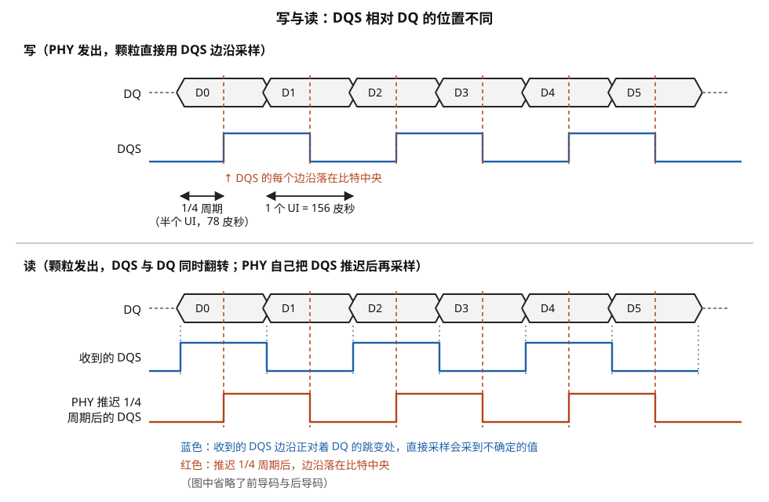

> **图 6-3**　一句话：数据线 DQ 旁边总跟着一根“节拍线” DQS，接收方看到 DQS 的电压跳变就去读 DQ；写的时候，发送方直接把跳变对准每个比特的中间，读的时候跳变却落在比特的交界处，要由计算芯片自己把它往后挪四分之一个时钟周期。
>
> **先知道一件事**：这是波形图，横轴是时间（从左往右），纵轴是电压。上面一行六边形代表数据线 DQ：每个六边形是一个比特（D0、D1……），两端收尖的地方是前后两个比特交接、电压正在变化的时刻，中间平直的部分是电压稳定、适合读取的时刻。下面的方波是 DQS：它在高低电压之间来回跳，每一次跳变（上升或下降）都是一次“现在读”的信号。
>
> **按这个顺序看**：
> 1. 上半部分“写”：DQ 和 DQS 都由计算芯片里的 PHY（把比特变成导线电压的电路）发给 DRAM 颗粒。红色竖虚线标出 DQS 的每一次跳变，它们正好穿过每个六边形的正中间。颗粒的电路简单，看到跳变就直接读，所以读到的都是稳定的值。
> 2. 看上半部分下方的两个双向箭头：“1/4 周期（半个 UI，78 皮秒）”是 DQS 相对 DQ 往后挪的距离；“1 个 UI = 156 皮秒”是一个比特占的时间（UI 叫单位间隔）。DQS 的上升和下降各对应一个比特，所以 DQS 的一个完整周期是两个 UI。
> 3. 下半部分“读”：这次由颗粒同时发出 DQ 和 DQS。蓝色的“收到的 DQS”的每次跳变（蓝色点线）正好落在六边形的尖角上，也就是数据正在变化的时刻，直接用它去读会读到不确定的值。
> 4. 红色的“PHY 推迟 1/4 周期后的 DQS”：计算芯片内部把蓝色波形整体往右挪了 78 皮秒，它的每次跳变（红色虚线）于是回到六边形的中间，再用它去读。
>
> **打个比方**：像乐队指挥打拍子（DQS），乐手每个音（比特）要在拍点上奏稳。写的时候，打拍子的一方（PHY）自己就把拍子打在每个音的中间；读的时候，对方把拍子打在换音的一瞬间，只好由听的一方在心里把每一拍往后推一点再记。
>
> **看懂的标志**：能回答“两个方向上，是谁负责挪那四分之一周期”：都是计算芯片一侧的 PHY，写时在发出前挪，读时在收到后挪，DRAM 颗粒一侧什么都不做。
>
> **与正文的对照**：图中省略了 DQS 开始前和结束后的前导码与后导码（正文 §4.2、§4.3 的表格里有）。
>
> 来源：本库自绘。

### 4.4 读方向还有一个额外的问题：什么时候开始听

DQS 在没有读数据的时候处于高阻状态，线上的电压不确定。如果 PHY 的接收器一直开着，会把噪声当成 DQS 边沿，采进一堆无效数据。所以 PHY 内部有一个读门控信号（read gate，也叫 DQS enable），只在 DQS 前导码期间打开、后导码期间关闭。

门控打开的时刻必须落在前导码那一到两个周期的窗口里。而前导码到达 PHY 的时刻取决于 §4.1 算过的那个往返延迟（约 1.5 到 2 纳秒，每个字节通道还不一样）。这个时刻无法事先算准，只能在训练时测出来，§6 的"读门控训练"做的就是这件事。

---

## 5. PHY 里面有什么电路

前面几节把 PHY 当成一个能"在精确时刻发出波形"的盒子，这一节把它打开。按信号流经的顺序，PHY 由六类电路组成。

### 5.1 锁相环：产生干净的高速时钟

**锁相环（PLL，phase-locked loop）**是一个反馈电路，它以一个低频参考时钟为输入，输出一个频率是输入整数倍、相位与输入锁定的高频时钟。PHY 用它从系统的参考时钟产生 3.2 GHz（DDR5-6400）的内部时钟。

**锁相环内部由五个部件连成一个环。** 按信号绕环一周的顺序：

1. **压控振荡器（VCO）**：一个输出频率由输入电压决定的振荡器，电压越高振得越快。它是高频时钟的实际来源。
2. **分频器**：把 VCO 的输出频率除以一个整数 N，得到一个低频信号。
3. **鉴相器**：比较分频后的信号与参考时钟，哪一个的边沿先到、先到多少，输出一个宽度正比于相位差的脉冲。
4. **电荷泵**：把鉴相器的脉冲变成电流，向一个电容注入或抽走电荷。分频后的信号落后于参考时钟就注入，超前就抽走。
5. **环路滤波器**：就是那个电容加上电阻，它上面的电压是对历次注入与抽走的累积，变化平缓。这个电压接回 VCO 的控制端。

环路稳定下来的条件是鉴相器看到的两个信号既同频又同相，此时 VCO 的频率恰好等于参考频率的 N 倍。环的结构见图 6-4。

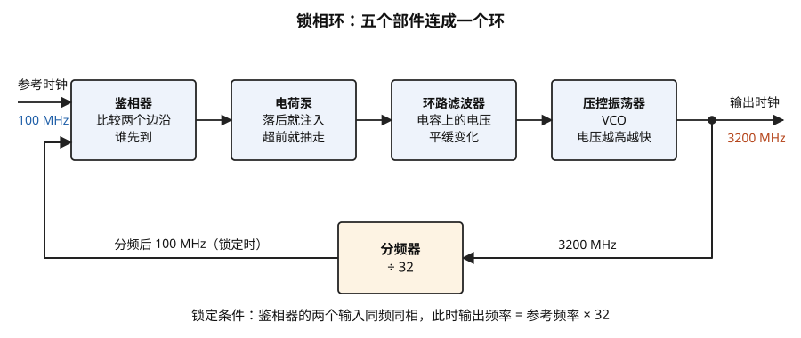

> **图 6-4**　一句话：锁相环用一个“比较—调整”的循环，把一个 100 MHz 的稳定参考时钟，变成频率正好是它 32 倍的 3200 MHz 时钟。
>
> **先知道一件事**：时钟就是一根线上的电压有规律地在高低之间来回跳，每秒跳多少次叫频率（MHz 是每秒一百万次）。很高频率的时钟没法直接造得很准，但可以造一个“频率随控制电压变化”的振荡器，再不停地拿它和一个准确的低频时钟比较、调整。
>
> **按这个顺序看**：
> 1. 从左边的“参考时钟 100 MHz”（蓝字）进入第一个方框“鉴相器”：它比较两个时钟的跳变谁先到、先到多少。
> 2. 第二个方框“电荷泵”：鉴相器说“反馈回来的时钟落后了”，它就往下一个方框里的电容充电；说“超前了”，就放电。
> 3. 第三个方框“环路滤波器”：本质上是一个电容，电容上的电压是历次充放电的累积，所以变化平缓，不会一下跳很多。
> 4. 第四个方框“压控振荡器 VCO”：VCO 是 voltage-controlled oscillator 的缩写，控制电压越高，它振荡得越快。它的输出就是右边的“输出时钟 3200 MHz”（红字）。
> 5. 输出线上的黑点把一份信号引下来，送进底部的“分频器 ÷ 32”：每数 32 次跳变才输出一次，把 3200 MHz 变回 100 MHz，再从左下角送回鉴相器，与参考时钟比较。这样就绕成了一个环。
>
> **打个比方**：像用一只准确的秒表（参考时钟）去校一台快速节拍器（VCO）：节拍器每敲 32 下就对一下秒表，慢了把旋钮拧快一点，快了拧慢一点，每次都拧得很轻（滤波器），直到每 32 下正好对上秒表的一声。
>
> **看懂的标志**：能回答“这个环什么时候稳定”：当分频后的 100 MHz 与参考的 100 MHz 频率相同、跳变同时到达时，电荷泵不再充放电，控制电压不再变化，输出就锁定在 3200 MHz。
>
> **与正文的对照**：正文 §5.1 列出五个部件的顺序是 VCO、分频器、鉴相器、电荷泵、环路滤波器，和图中沿环绕一周的顺序相同，只是起点不同。
>
> 来源：本库自绘。

**逐步跟一次锁定过程。** 参考时钟 100 MHz，分频比 N = 32，目标 3200 MHz。

| 阶段 | VCO 频率 | 分频后频率 | 鉴相器看到的 | 电荷泵动作 | 控制电压 |
| --- | --- | --- | --- | --- | --- |
| 上电瞬间 | 2400 MHz | 75 MHz | 分频信号比参考慢，边沿越来越落后 | 持续注入 | 上升 |
| 接近 | 3100 MHz | 96.9 MHz | 仍然落后，但每周期落后的量变小 | 注入，脉冲变窄 | 缓慢上升 |
| 略过头 | 3230 MHz | 100.9 MHz | 分频信号反而超前 | 抽走 | 略降 |
| 锁定 | 3200 MHz | 100 MHz | 两个边沿对齐 | 只有极窄的修正脉冲 | 稳定 |

整个过程在几十微秒到毫秒量级。训练顺序表（§6.3）里"PLL 锁定"排在第一步，就是在等这个环稳定。

时钟边沿的位置不是完全稳定的，每个边沿相对理想位置有一个随机的偏移，叫抖动（jitter）。抖动的来源就在上面这个环里：VCO 对电源噪声敏感，电源电压波动一点，频率就偏一点；电荷泵的修正脉冲每个参考周期打一次，也会周期性地扰动控制电压。抖动直接从时序预算里扣：如果时钟的峰峰值抖动是 10 皮秒，采样时刻就有 10 皮秒的不确定，相当于 DDR5-6400 一个 UI 的 6.4%。这是 PHY 要用单独的、滤波很重的电源给 PLL 供电的原因。

**PLL 通常还要输出多个相位。** §4 讲过写的时候 DQS 要比 DQ 晚四分之一周期。一种直接的做法是让 VCO 本身由四级延迟单元首尾相接构成，四级的输出天然相差四分之一周期，分别是 0 度、90 度、180 度、270 度。发 DQ 用 0 度那一路，发 DQS 用 90 度那一路。

### 5.2 延迟线：把边沿移动到想要的位置

**延迟线（delay line）**是一串可控延迟的单元，信号经过它后被推迟一个可编程的时间。它是 PHY 里数量最多的电路，每根 DQ、每对 DQS、每根 CA 都有自己的延迟线，训练的结果就是这些延迟线的设定值。

延迟线的分辨率通常是 UI 的几十分之一到一百多分之一。取 1/64 UI 计算：156.25 ÷ 64 ≈ **2.4 皮秒一档**。§6 的走查会用到这个数。

**2.4 皮秒一档是怎么做出来的。** 最简单的延迟单元是一个反相器（输入 0 输出 1、输入 1 输出 0 的逻辑门），信号经过一级反相器要花一点时间。把许多级串起来，用一个多路选择器选"从第几级抽出信号"，就得到一条可调的延迟线。问题是先进工艺下一级反相器的延迟也有 5 到 10 皮秒（量级估计），而且必须两级两级地用（一级反相器会把信号取反），所以这种做法的分辨率只能到十几皮秒，不够细。

更细的分辨率靠的是**相位插值器（phase interpolator）**。它的输入是两个相位相邻的时钟，比如一个在 0 皮秒翻转、另一个在 20 皮秒翻转。插值器内部有若干个并联的小驱动单元，每个单元可以选择跟随第一个输入还是第二个输入，所有单元的输出接在一起。如果 8 个单元全跟第一个输入，输出在 0 皮秒附近翻转；全跟第二个，在 20 皮秒附近翻转；3 个跟第一个、5 个跟第二个，输出的翻转时刻落在两者之间约八分之五处，即约 12.5 皮秒。这样一段 20 皮秒的间隔被分成 8 份，每份 2.5 皮秒。

所以实际的延迟线分成两级：**粗调**用反相器链或者直接选 PLL 的某一路相位，一档十几到几十皮秒；**细调**用相位插值器，在相邻两个粗调档之间再分出若干细档。训练结果里每根线的设定值也相应是"粗调码 + 细调码"两部分。

延迟线的延迟会随温度和电压漂移。常见做法是用一个**延迟锁定环（DLL，delay-locked loop）**持续测量"当前多少档延迟等于一个时钟周期"，其它延迟线按这个比例折算。DLL 的结构和 PLL 相似，区别是环里没有振荡器，换成了一条延迟线：时钟从延迟线的一端进、另一端出，鉴相器比较进和出的相位，调节延迟线的控制量，直到出口正好比入口晚一整个周期。

算一个折算的例子。DLL 测得 128 档等于一个周期（312.5 皮秒），即每档约 2.44 皮秒，那么"推迟四分之一周期"就设成 32 档。芯片温度升高后晶体管变慢，单档延迟变成 2.60 皮秒，如果还用 32 档，实际延迟是 83.3 皮秒而不是 78.1 皮秒，偏了 5 皮秒。DLL 此时会测得 120 档等于一个周期，PHY 据此把设定改成 30 档，30 × 2.60 = 78.1 皮秒，回到正确值。训练得到的每根线的延迟也按同样的比例缩放，这是 §6.10 讲的运行期跟踪的基础。

### 5.3 串并转换

发送方向，PHY 把 DFI 送来的并行数据（§2 的例子里每拍 8 个 UI 的内容）按顺序排到引脚上，这叫并串转换。接收方向相反，叫串并转换。

**发送方向的并串转换是一棵逐级提速的选择器树。** 以一根 DQ、每拍 8 个比特（记作 b0 到 b7，b0 最先发）为例，时钟周期 312.5 皮秒：

| 级 | 输入 | 用什么时钟选择 | 输出 | 输出端每个比特的宽度 |
| --- | --- | --- | --- | --- |
| 第一级 | 8 个比特并行，每 2.5 纳秒更新一次 | 四分之一频率的时钟（800 MHz） | 4 路，每路交替输出两个比特 | 1250 皮秒 |
| 第二级 | 4 路 | 二分之一频率的时钟（1600 MHz） | 2 路：一路依次是 b0、b2、b4、b6，另一路依次是 b1、b3、b5、b7 | 625 皮秒 |
| 第三级 | 2 路 | 全速时钟（3200 MHz）的高电平与低电平 | 1 路：时钟为高时选第一路，为低时选第二路 | 156.25 皮秒 |

最后一级是全树里最关键的：它在时钟的高电平期间输出一个比特、低电平期间输出下一个比特，这就是"双沿传输"在电路上的实现。它对时钟的占空比很敏感。占空比是时钟高电平时间占整个周期的比例，理想值是 50%。如果实际是 52%，高电平长 162.5 皮秒、低电平长 150 皮秒，那么偶数位的比特比奇数位的宽 12.5 皮秒，奇数位的眼就窄了一截。DDR5 为此在颗粒和 PHY 里都加了占空比调节电路，并把它列为训练项目之一。

**接收方向多一个问题：跨时钟域。** 读数据是用 DQS（经过四分之一周期移位后）的边沿采样的，上升沿采偶数位、下降沿采奇数位，得到两路各 3200 Mbps 的数据流。这些数据此时属于"DQS 的时钟域"——它们的更新时刻由 DQS 决定，而 DQS 相对 PHY 内部时钟的相位是任意的（取决于往返延迟），还会漂移。PHY 后面的逻辑用的是自己的内部时钟，如果直接用内部时钟去采这些数据，可能正好采在数据变化的时刻。

解法是在中间放一个小的先进先出缓冲（读 FIFO）：写入一侧由 DQS 驱动，每来一对边沿写入一格；读出一侧由 PHY 内部时钟驱动，晚几拍之后开始依次读出。只要读出始终落后于写入一到两格，读的时候那一格的内容早已稳定。这个 FIFO 的深度只有几格，但它引入的"晚几拍"是读延迟的一部分，也需要在训练里确定：读得太早会读到还没写入的格子，太晚则 FIFO 会溢出。DFI 上的 `dfi_rddata_valid` 信号就是 PHY 告诉控制器"这一拍 FIFO 里读出的数据有效"。

### 5.4 驱动器与 ZQ 校准

驱动器把逻辑电平变成能推动导线的电流。它的关键参数是**输出阻抗**：阻抗太高，信号上升慢、摆幅不足；阻抗与导线的特征阻抗差太多，反射回来的信号会在驱动端再次反射。

DDR 的驱动器由若干条并联的支路组成，每条支路的标称阻值是 240 欧姆。并联的条数决定总阻抗：

- 7 条并联：240 ÷ 7 ≈ **34 欧姆**（DDR5 常用的驱动阻抗）。
- 5 条并联：240 ÷ 5 = **48 欧姆**。

每条支路又分成上拉和下拉两半：上拉部分接在电源和引脚之间，输出高电平时导通；下拉部分接在引脚和地之间，输出低电平时导通。两半的阻值要分别校准。

问题是芯片上的电阻和晶体管受制造偏差、温度、电压影响，实际阻值可能偏离标称值 20% 以上。**ZQ 校准**就是解决这个偏差的办法：在 ZQ 引脚和地之间外接一颗精度 1% 的 240 欧姆电阻作为基准，把芯片内部的支路调到与它相等。得到的微调码复制给所有的驱动器和端接支路。

**支路为什么可调。** 每条支路由一个固定电阻和一组并联的微调晶体管组成。微调晶体管的尺寸按 1、2、4、8、16 的比例设计，由一个 5 位的微调码控制哪几个导通。导通的越多，支路的总阻值越低。

**逐步走一遍上拉支路的校准（电路见图 6-5）。** 芯片内部有一条专门用于校准的上拉支路复制品，它接在电源（1.1 伏）和 ZQ 引脚之间，与外接的 240 欧姆电阻串联。ZQ 引脚上的电压 = 1.1 × 240 ÷（支路阻值 + 240）。支路阻值正好是 240 欧姆时，这个电压等于 0.55 伏，即电源电压的一半。一个比较器比较 ZQ 引脚电压与 0.55 伏。

为了能手算，假设这颗芯片上支路阻值与微调码的关系是"阻值 = 300 − 4 × 微调码"欧姆（真实的关系不是线性的，这里只是示意）。校准逻辑用逐位逼近的办法，从最高位开始逐位试探：

| 步 | 试探的微调码 | 支路阻值（欧姆） | ZQ 引脚电压（伏） | 与 0.55 伏比较 | 结论 |
| --- | --- | --- | --- | --- | --- |
| 1 | 16（二进制 10000） | 236 | 1.1 × 240 ÷ 476 = 0.5546 | 偏高，说明支路阻值偏低 | 这一位太多，清零 |
| 2 | 8（01000） | 268 | 1.1 × 240 ÷ 508 = 0.5197 | 偏低，支路阻值偏高 | 这一位保留 |
| 3 | 12（01100） | 252 | 1.1 × 240 ÷ 492 = 0.5366 | 偏低 | 保留 |
| 4 | 14（01110） | 244 | 1.1 × 240 ÷ 484 = 0.5455 | 偏低 | 保留 |
| 5 | 15（01111） | 240 | 1.1 × 240 ÷ 480 = 0.5500 | 相等 | 保留 |

五步之后得到微调码 15，此时支路阻值为 240 欧姆。

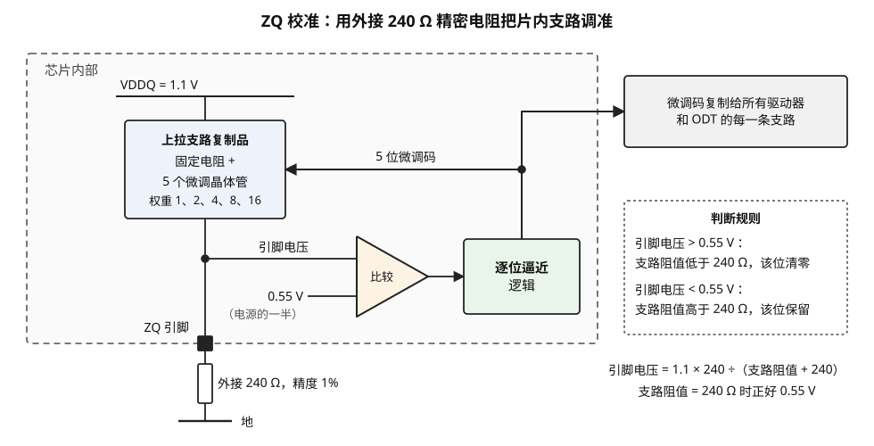

> **图 6-5**　一句话：芯片里的电阻做不准，于是在芯片外面挂一颗做得很准的 240 欧姆电阻当尺子，让芯片内部的电阻一档一档地调，直到和它一样大。
>
> **先知道一件事**：两个电阻串联接在电源和地之间，中间点的电压由两者的比例决定：两个电阻相等时，中间点正好是电源电压的一半。所以只要量中间点的电压，就知道内部电阻比外部电阻大还是小。
>
> **按这个顺序看**：
> 1. 左上的横线是电源 VDDQ = 1.1 伏。往下是蓝色方框“上拉支路复制品”：芯片里一段可调的电阻，由一个固定电阻加 5 个可开关的小晶体管组成（晶体管在这里就当作可以接通或断开的小电阻），它们的大小按 1、2、4、8、16 的比例设计，接通得越多，总电阻越小。
> 2. 往下经过虚线框边上的黑色小方块“ZQ 引脚”离开芯片，接到外面那颗“外接 240 Ω，精度 1%”的电阻，再到地。于是电源、内部电阻、外部电阻、地连成一串，ZQ 引脚正好是两个电阻的中间点。
> 3. 从中间点引出的“引脚电压”进入三角形“比较”（比较器，告诉你两个输入哪个电压高），另一个输入是固定的 0.55 伏，即电源电压的一半。
> 4. 比较结果交给绿色方框“逐位逼近逻辑”：它从最大的一档（16）开始试，一次决定一档。右边虚线框“判断规则”写着依据：引脚电压高于 0.55 伏，说明内部电阻偏小，这一档关掉；低于 0.55 伏，这一档保留。五档的开关状态合起来叫“5 位微调码”，沿箭头送回蓝色方框。
> 5. 五档试完，微调码就定了。右上的灰色方框：这个码被复制给芯片里所有的驱动器（把比特变成导线电压的电路）和 ODT（片内端接电阻），让它们的阻值也都准确。
>
> **打个比方**：像用一个标准砝码校天平：一边放标准砝码（外接电阻），另一边从大到小一块一块试放可拆的小砝码（微调晶体管），偏重就拿掉、偏轻就留下，试完五块，两边平衡。
>
> **看懂的标志**：能说出“引脚电压正好是 0.55 伏”意味着什么：内部电阻正好等于外接的 240 欧姆，校准完成。
>
> **与正文的对照**：正文 §5.4 表格里的五步（试 16 → 8 → 12 → 14 → 15）就是这个逐位逼近过程；正文第二步讲的下拉支路校准没有画出。
>
> 来源：本库自绘。

**下拉支路的校准不需要第二颗外接电阻。** 做法是再复制一条已经校准好的上拉支路（用刚得到的微调码 15），把待校准的下拉支路和它串联在电源和地之间，调节下拉支路的微调码，直到两者中点的电压等于 0.55 伏——此时下拉支路的阻值等于上拉支路，也就是 240 欧姆。

整个过程需要几百纳秒到微秒量级，期间颗粒不能响应读写。温度变化后阻值会漂，所以 ZQ 校准要周期性重做。颗粒和 PHY 各有自己的 ZQ 引脚和外接电阻，各自校准自己的支路。

**校准精度换来了什么。** 取 7 条支路并联的驱动器。校准后每条 240 欧姆，总阻抗 34.3 欧姆。如果不校准而每条支路实际是 288 欧姆（偏高 20%），总阻抗变成 41.1 欧姆。按 §5.5 的分压关系，低电平从 0.46 伏升到 1.1 × 41.1 ÷（41.1 + 48）≈ 0.51 伏，信号摆幅从 0.64 伏缩到 0.59 伏，少了约 8%；同时驱动端与 50 欧姆走线的失配也变了，反射的大小随之改变。训练找到的最优 Vref 是在某个阻抗下测得的，阻抗一漂，Vref 就不再居中。

### 5.5 片内端接 ODT 与参考电压 Vref

ODT 用的是和驱动器同样的 240 欧姆支路，只是接法不同：它接在接收端，一头连信号线、一头连电源。可选阻值是 240 除以整数：240、120、80、60、48、40、34 欧姆。

端接的作用可以用反射系数算出来。反射系数 = （末端阻抗 − 导线特征阻抗）÷（末端阻抗 + 导线特征阻抗）。取导线特征阻抗 50 欧姆：

- 末端不接端接，接收器输入近似开路：反射系数接近 **+1**，信号几乎全部反射回去。
- 末端接 48 欧姆 ODT：（48 − 50）÷（48 + 50）≈ **−0.02**，只有 2% 反射。

反射在实测眼图上是什么样子，可以对照图 6-1 看图 6-6。

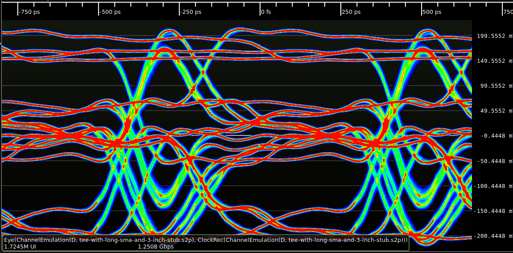

> **图 6-6**　一句话：同一个信号，只是在导线中途多接出一段末端悬空的分支，眼图就从张开变成几乎闭合，这就是“反射”对信号的破坏。
>
> **先知道一件事**：高速信号在导线上以“波”的形式往前走。走到导线突然分叉或末端悬空的地方，一部分能量会像声音碰到墙一样弹回来，这叫反射。弹回来的波晚一点到达，叠加在后面的比特上，把它们的电压抬高或拉低。
>
> **按这个顺序看**：
> 1. 先对照图 6-1：两张图来自同一位作者、同一类信号、同样的速率 1.25 Gbps。横轴同样是时间（顶部，单位皮秒），纵轴同样是电压（右侧，单位毫伏），颜色同样表示波形经过的频繁程度（红色最多、蓝色最少）。
> 2. 看上下两侧：图 6-1 里“1”和“0”各是一条红色粗带；这里每一侧都分裂成好几条红线，例如上方在约 +200 毫伏和 +160 毫伏附近各有一条。一个比特的电压取决于前面几个比特是什么，反射把“同一个 1”变成了好几种高度。
> 3. 看中间：原来黑色的空洞，现在被许多穿过 0 毫伏附近的红线和绿线填满，已经找不到一块既宽又高的空白区域，也就找不到可靠的读取时刻和判断电压。
> 4. 看左下角的标注“tee-with-long-sma-and-3-inch-stub”：tee 是 T 形分叉，stub 是从分叉处伸出去、末端不接任何东西的那段导线，SMA 是一种射频接头。这张图是用测得的线路特性计算出来的波形。
>
> **打个比方**：在空旷的山谷里念一串数字，每个数字的回声都压在后面的数字上，听的人就分不清了。
>
> **看懂的标志**：能回答“为什么 DDR 要在导线末端接一个电阻（ODT）”：阻值合适的末端电阻能把到达末端的能量吸收掉，不让它弹回来，眼就不会像这样被填满。
>
> **与正文的对照**：来源页描述这段分支约四英寸长，图内标注为一段 SMA 线缆加 3 英寸分支。内存插槽，特别是空着没插内存的插槽，造成的正是这一类反射，只是程度轻得多。
>
> 来源：[File:Eye pattern long stub.png](https://commons.wikimedia.org/wiki/File:Eye_pattern_long_stub.png)，作者 Andrew D. Zonenberg，许可 CC BY 4.0。

DDR4 起 DQ 采用的端接方式叫 POD（pseudo open drain，伪漏极开路）：端接电阻接到电源而不是接到电源电压的一半。这样线上为高电平时没有直流电流，只有低电平时才有。算一笔低电平的电流：驱动器 34 欧姆下拉，ODT 48 欧姆上拉到 1.1 伏，电流 = 1.1 ÷（34 + 48）≈ **13.4 毫安**，功耗约 14.8 毫瓦；高电平时为零。这就是"让线上尽量多出现 1"可以省电的物理原因。

POD 端接带来一个后果：信号的高电平是 1.1 伏，低电平是 1.1 × 34 ÷（34 + 48）≈ 0.46 伏，两者的中点约 0.78 伏，而不是电源电压的一半。而且这个中点随驱动阻抗和 ODT 取值变化。所以接收器用来判断 0 和 1 的**参考电压 Vref** 不能是固定值，必须是可调的，并且要在训练里找到最优点。电路与电平见图 6-7。

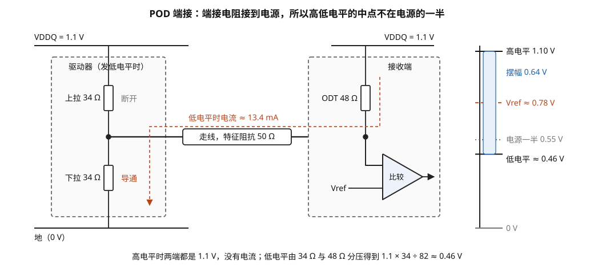

> **图 6-7**　一句话：DDR 的数据线在接收端用一个电阻接到电源上，所以线上是高电压（1）时不耗电，只有低电压（0）时才有电流流过；这也使 0 和 1 的分界线不在电源电压的一半。
>
> **先知道一件事**：这是电路图。竖着的小长方形是电阻；两个电阻串联在电源和地之间时，中间点的电压按两个电阻的比例分配，一端的电阻越小，中间点越靠近那一端的电压。三角形是比较器，它比较两个输入的电压，输出哪个更高。
>
> **按这个顺序看**：
> 1. 左边虚线框是发送方的驱动器，此刻正在发一个 0：上面的“上拉 34 Ω”断开（灰字），下面的“下拉 34 Ω”接通（红字），把导线往地（0 伏）那边拉。
> 2. 中间的横线是导线。“特征阻抗 50 Ω”是这种导线自身的电气特性：导线末端接的电阻越接近这个值，信号到达末端后弹回来（反射）的就越少。
> 3. 右边虚线框是接收端：导线末端通过“ODT 48 Ω”接到电源 VDDQ = 1.1 伏。ODT 是片内端接，就是做在芯片里、专门吸收反射的电阻。导线上的电压送进三角形比较器，与参考电压 Vref 比较：高于 Vref 读成 1，低于读成 0。
> 4. 红色虚线是发 0 时流过的电流：从右边的电源经过 ODT、导线、左边的下拉电阻流到地，约 13.4 毫安。发 1 时下拉断开、上拉接通，导线两端都是 1.1 伏，没有电流。
> 5. 最右边是电压刻度：1 的电压是 1.10 伏；0 的电压由 34 欧姆和 48 欧姆分压得到，约 0.46 伏（1.1 × 34 ÷ 82）；两者之间的浅蓝色条就是摆幅 0.64 伏。红色虚线 Vref ≈ 0.78 伏在摆幅正中间，而灰色点线“电源一半 0.55 伏”明显偏低，用它来判断会离 0 太近。
>
> **打个比方**：像一座平时就灌满水的水塔（电源经 ODT 把导线顶在 1.1 伏）：发 1 什么都不用做，水位本来就是满的；发 0 才需要打开底部的阀门（下拉）放水，只有放水时才有流量（电流）。
>
> **看懂的标志**：能回答“为什么 Vref 必须可调、要在训练里找”：0 的电压取决于驱动电阻和 ODT 的具体阻值，分界线也跟着变，不是一个固定的“电源一半”。
>
> **与正文的对照**：这种“端接电阻接到电源”的方式叫 POD（pseudo open drain，伪漏极开路），见正文 §5.5。第 4 步“只有发 0 时耗电”，正是数据总线反相（让线上多出现 1 以省电）的动机。
>
> 来源：本库自绘。

### 5.6 均衡：补偿通道对波形的破坏

速率提高后，一个比特的波形会因为通道损耗和反射而拖出一条尾部，叠加到后面的比特上，这种现象叫**码间干扰（ISI，inter-symbol interference）**。对 DDR 的多颗粒通道来说，主要成因是反射：一条通道上挂着两条内存条的插槽，每个分叉点都是阻抗不连续点。

DDR5 在 DQ 接收器里加入了**判决反馈均衡器（DFE，decision feedback equalizer）**。它的工作方式是：接收器已经判决出前面几个比特的值，而每个已判决比特对当前比特的干扰量是固定的（由通道决定），于是把"前面各比特的值 × 各自的干扰系数"从当前输入电压里减掉，再做判决。系数的个数叫抽头数，DDR5 标准规定的是 4 个抽头。

举一个单抽头的数字例子。设前一个比特对当前比特的干扰是 30 毫伏（前一个比特为 1 时把当前电压抬高 30 毫伏，为 0 时拉低 30 毫伏），当前比特本身的摆幅是中点上下各 80 毫伏：

- 不均衡时：当前比特为 0 而前一个为 1，输入电压 = −80 + 30 = −50 毫伏，余量只剩 50 毫伏。
- 均衡后：接收器知道前一个是 1，先减去 30 毫伏，得到 −80 毫伏，余量恢复到 80 毫伏。

判决余量从 50 毫伏恢复到 80 毫伏。

**四个抽头的例子（电路结构见图 6-8）。** 实际通道里，不只是前一个比特有干扰，前面第二、第三、第四个比特的反射也会陆续到达。设四个抽头的干扰系数依次是：前 1 个比特 30 毫伏、前 2 个比特 12 毫伏、前 3 个比特 −8 毫伏、前 4 个比特 5 毫伏。系数为负表示那个比特为 1 时反而把当前电压拉低，反射经过奇数次反相后就会出现这种情况。每个比特的贡献是"系数 × 该比特的符号"，比特为 1 时符号取 +1，为 0 时取 −1。

假设已经收到的四个比特从近到远依次是 1、1、0、1，当前比特是 0（理想电压 −80 毫伏）：

| 抽头 | 对应的已判决比特 | 符号 | 系数（毫伏） | 贡献（毫伏） |
| --- | --- | --- | --- | --- |
| 1 | 1 | +1 | 30 | +30 |
| 2 | 1 | +1 | 12 | +12 |
| 3 | 0 | −1 | −8 | +8 |
| 4 | 1 | +1 | 5 | +5 |
| **合计干扰** | | | | **+55** |

- 不均衡时：输入电压 = −80 + 55 = **−25 毫伏**。余量只剩 25 毫伏，再叠加一点噪声就会被判成 1。
- 均衡后：接收器按上表算出 55 毫伏并减掉，得到 −80 毫伏，余量恢复。

这组数据恰好是最坏情况：四个抽头的贡献全部同号。对所有可能的历史比特组合取最坏值，不均衡时的眼高是 2 ×（80 − 55）= 50 毫伏，均衡后是 2 × 80 = 160 毫伏。

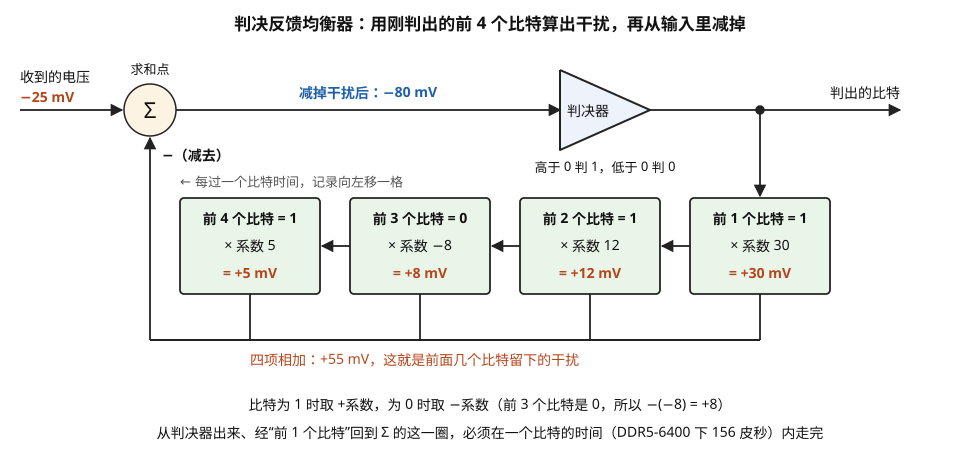

> **图 6-8**　一句话：判决反馈均衡器用"刚刚已经读出的前几个比特"去算出它们留在当前比特上的干扰，再把干扰减掉。
>
> **先知道一件事**：导线上的信号不是一个比特一个比特干净地到达的。每个比特的电压都会拖一条尾巴，叠加到后面几个比特上。尾巴有多大由这条线路本身决定，基本固定，可以事先测出来——图中的"系数"就是测出的尾巴大小：前 1 个比特留下 30 毫伏，前 2 个留下 12 毫伏，依此类推。
>
> **按这个顺序看**：
> 1. 从左边的输入看起：收到的电压是 −25 毫伏。一个干净的 0 本该在 −80 毫伏，它被前面几个比特的尾巴抬高了，离 0 与 1 的分界线（0 毫伏）只剩 25 毫伏，很容易判错。
> 2. 看右边的判决器：它只做一件事——电压高于 0 判为 1，低于 0 判为 0。
> 3. 看下方的四个方框：它们按顺序记着刚判出的前 1、2、3、4 个比特。每个比特乘以自己的系数，就是"它留下的尾巴"：比特为 1 取正，为 0 取负。四项加起来是 +55 毫伏。
> 4. 回到输入端的 Σ（求和点）：−25 毫伏减去 +55 毫伏，得到 −80 毫伏，回到了干净的 0 应在的位置，再交给判决器。
>
> **打个比方**：在有回声的房间里听人说话。你知道自己刚听到了哪几个字，也知道这个房间的回声有多响，于是在心里把回声减掉，剩下的就是这个字本身。
>
> **看懂的标志**：能说出这个电路最紧的限制——从判决器出来、乘系数、回到 Σ 的那一圈，必须在一个比特的时间（DDR5-6400 下是 156 皮秒）内走完。走不完的话，下一个比特到达时还不知道该减多少。
>
> 来源：本库自绘。

**DFE 的两个固有限制。** 第一，它只能消除"已经判决出来的比特"造成的干扰，对当前比特之后才到的比特造成的干扰无能为力。第二，第一个抽头的反馈必须在一个 UI 之内完成：判决出前一个比特、乘以系数、从输入里减掉、再判决当前比特，这一圈在 DDR5-6400 下只有 156 皮秒，8800 下只有 114 皮秒，对 DRAM 工艺的晶体管是相当紧的要求。一种常见的电路技巧是把两种可能都预先算好：用两个比较器同时工作，一个按"前一个比特是 1"来修正，另一个按"前一个比特是 0"来修正，等前一个比特的判决结果出来后只需要二选一，省掉了减法那一段时间。DDR5 颗粒具体用哪种电路由各厂商自定，标准只规定抽头数和系数的可调范围。

**系数从哪来。** 四个系数取决于具体的通道，也要在训练里找。做法是对每个系数扫描若干档，每一档测一次眼的大小，取眼最大的那一档。这使训练的搜索空间又增加了四个维度，§6.9 会说到实际实现怎样避免穷举。

---

## 6. 训练：为什么必须做，以及它是怎么做的

前面五节反复出现"这个值要在训练里找"。这一节集中讲训练：先用两笔账说明它为什么不可省（§6.1、§6.2），再列出完整顺序（§6.3），然后按顺序对每一步做逐步走查：命令线训练（§6.4）、写均衡（§6.5）、读门控（§6.6）、读数据逐位去偏斜（§6.7）、写数据训练（§6.8）、时间与电压的二维扫描（§6.9），最后讲运行期怎样维持训练结果（§6.10）。

所有训练步骤的骨架是同一个：**选一个待定的参数，从小到大逐档扫描；每一档做一次能判断对错的测试；记下测试通过的那一段范围；把参数定在这段范围的中央。** 各步之间的差别只在于"扫的是哪个参数"和"怎样判断对错"。读下面各小节时可以带着这两个问题去看。

### 6.1 第一笔账：时钟到达各颗粒的时间差了四个 UI

内存条上的颗粒排成一行，命令地址线和时钟采用一种叫 **fly-by** 的走线方式：一根线从内存条的一端进入，依次经过每一颗颗粒，在末端端接。这样做是为了信号质量——每颗颗粒只是主干线上一个很短的分支，反射小。（另一种做法是树状分叉让各颗粒等长，但每个分叉点都产生反射，DDR3 起已弃用。）

fly-by 的代价是时钟到达各颗粒的时刻不同。算一笔：

1. 一条内存条一面排 9 颗颗粒，相邻间距约 12 毫米，第一颗到最后一颗相距 8 × 12 = **96 毫米**。
2. 传播延迟约每毫米 6.7 皮秒，时间差 = 96 × 6.7 ≈ **640 皮秒**。
3. 折合 DDR5-6400 的 UI：640 ÷ 156.25 ≈ **4.1 个 UI**。

而数据线 DQ 和 DQS 是从计算芯片分别直连到各颗粒的，到各颗粒的延迟大致相等。于是在最后一颗颗粒看来，时钟比数据晚到了 4 个 UI。标准要求 DQS 的边沿与 CK 的边沿在颗粒引脚处的偏差不超过约四分之一周期，640 皮秒远超这个范围。PHY 必须对每个字节通道分别推迟 DQS 和 DQ 的发送时刻，推迟量各不相同。两种走线的对比见图 6-9。

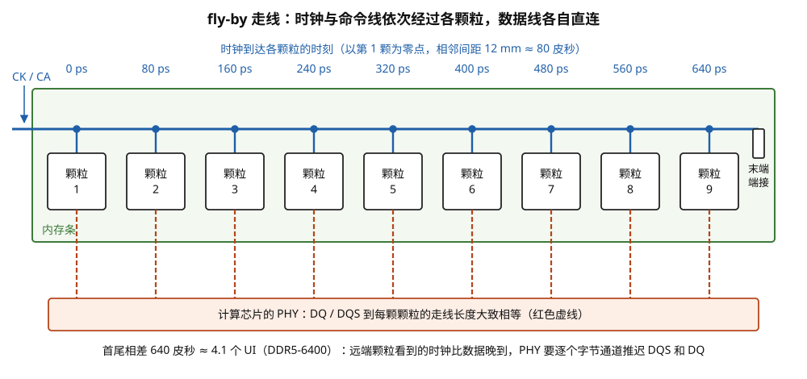

> **图 6-9**　一句话：内存条上，时钟线像公交线路一样依次经过每一颗 DRAM 颗粒，越靠后的颗粒越晚收到时钟；而数据线是每颗颗粒各自直连，几乎同时到达。
>
> **先知道一件事**：电信号在电路板上的传播速度是有限的，大约每毫米 6.7 皮秒。线越长，信号到得越晚。
>
> **按这个顺序看**：
> 1. 绿色大框是一条内存条，里面一排 9 个方框是 9 颗 DRAM 颗粒（每颗是一个单独封装的存储芯片）。
> 2. 蓝色粗线是时钟和命令地址线，图中写作 CK / CA（CK 是时钟，CA 是命令和地址）。它从左上角进入，从左到右依次挂到每颗颗粒上（蓝色圆点），最后在右端接一个“末端端接”电阻，把到达末端的信号吸收掉、不让它弹回来。这种依次经过的走法叫 fly-by。
> 3. 看顶部一排蓝色数字：时钟到达每颗颗粒的时刻。相邻颗粒相距 12 毫米，每颗晚约 80 皮秒，第 9 颗比第 1 颗晚 640 皮秒。
> 4. 看下方的橙色长框和红色虚线：计算芯片里的 PHY 通过数据线 DQ 和选通线 DQS（随数据一起走、告诉对方何时读数的节拍线）分别直连到每颗颗粒。这些线的长度大致相同，所以数据到达各颗粒的时刻几乎一样。
> 5. 最下一行的结论：640 皮秒约等于 4.1 个 UI（一个比特占的时间，DDR5-6400 下是 156 皮秒）。也就是说，对第 9 颗颗粒来说，时钟比数据晚到了四个多比特的时间。
>
> **打个比方**：像一趟公交车（时钟）从第 1 站开到第 9 站，每站晚到 80 皮秒；而送货员（数据）是每站各派一个、同时出发的。要让每一站都在车到的那一刻交货，送往后面几站的送货员就得晚点出发。
>
> **看懂的标志**：能回答“PHY 为什么要给每个字节通道设不同的发送延迟”（每 8 根数据线加一对 DQS 为一组，叫一个字节通道，对应一颗颗粒）：因为各颗粒看到时钟的时刻不同，数据要和各自的时钟对齐，越远端的颗粒，数据要发得越晚。
>
> **与正文的对照**：这是正文 §6.1 的算例；补偿它的训练步骤是 §6.5 的写均衡（图 6-10）。
>
> 来源：本库自绘。

### 6.2 第二笔账：同一个字节内的偏斜吃掉三分之一只眼

同一个字节通道内的 8 根 DQ 在 PCB 上是按等长布线的，但等长只能控制到一定程度。偏斜的来源逐项估算（量级估计）：

| 来源 | 量级 |
| --- | --- |
| PCB 走线长度失配 ±0.5 毫米 | 约 ±3 皮秒 |
| 计算芯片封装内走线失配 | 约 ±5 皮秒 |
| 内存条与颗粒封装内走线失配 | 约 ±5 皮秒 |
| 各引脚驱动器与接收器的速度差异 | 约 ±5 到 10 皮秒 |
| **合计（最坏情况相加）** | **约 ±20 皮秒** |

DDR5-6400 的 UI 是 156 皮秒，但到达接收器的眼宽远小于一个 UI——扣掉抖动、码间干扰、串扰之后，常见的量级是 0.4 个 UI，约 **62 皮秒**。如果 8 根 DQ 共用一个采样时刻，而它们的眼中心彼此错开最多 40 皮秒，那么 8 只眼的公共部分只剩 62 − 40 = **22 皮秒**。这个余量已经接近时钟抖动的量级，不可靠。解法是给每根 DQ 单独配一条延迟线，逐根对齐，§6.7 走查。

**两笔账的共同结论**：DDR 总线的时序误差来源有的大到几个 UI（fly-by），有的小到十几皮秒（位间偏斜），它们都取决于具体这块主板、这条内存、这颗芯片的制造结果，无法在设计时写死。所以每次上电都要测一遍。

### 6.3 上电后的训练顺序

训练的各步有依赖关系：后一步要用到前一步建立的能力。DDR5 的典型顺序如下（具体顺序和算法因 PHY 供应商而异，这里给的是逻辑上的依赖顺序）。

| 顺序 | 步骤 | 要找的量 | 为什么排在这里 |
| --- | --- | --- | --- |
| 1 | 上电、复位、PLL 锁定 | — | 先有稳定的时钟 |
| 2 | ZQ 校准 | 驱动器与 ODT 的微调码 | 阻抗不准，后面所有波形都不可信 |
| 3 | CS 训练与 CA 训练 | CS、CA 相对 CK 的延迟，CA 的 Vref | 颗粒必须先能正确收到命令，才能执行后面任何一步 |
| 4 | 写均衡（write leveling） | 每个字节通道 DQS 相对 CK 的发送延迟 | 补偿 fly-by 造成的 CK 到达时间差 |
| 5 | 读门控训练 | 每个字节通道读门控打开的时刻 | 必须先能正确接收 DQS，才能读任何数据 |
| 6 | 读数据训练（含逐位去偏斜） | 每根 DQ 的接收延迟、DQS 的四分之一周期移位量 | 先让读通路可靠，因为写训练要靠读回来验证 |
| 7 | 写数据训练 | 每根 DQ 相对 DQS 的发送延迟 | 写进去再读出来比对，依赖第 6 步 |
| 8 | Vref 与延迟的二维扫描、DFE 系数训练 | 最优的参考电压和均衡系数 | 在时间对齐之后优化电压余量 |
| 9 | 运行期的周期性重训与跟踪 | 补偿温度和电压漂移 | 贯穿整个运行期 |

这张表里藏着一个贯穿全程的困难：**训练某条通路的时候，这条通路本身还不可靠，那么测试结果靠什么送回来？** 各步的回答不同，归纳起来是三种办法。第一种是用一条速率要求极低的通路送结果：训练命令线和写均衡时，颗粒把结果以静态电平的形式放在 DQ 上，保持很多个周期不变，PHY 不需要精确定时就能读到。第二种是让颗粒自己产生已知内容：读数据训练时写通路还没训练，阵列里没有已知数据，DDR5 的颗粒内置了一个读训练图样发生器，收到专用命令后输出预先约定的序列。第三种是借用已经训练好的通路：写数据训练靠读回来比对，所以排在读训练之后。

### 6.4 逐步走查之一：命令线训练（CS 与 CA）

命令线训练要解决的问题是：CS_n 和 14 根 CA 到达颗粒时，相对 CK 上升沿的位置要落在颗粒能正确采样的范围里。它们是单沿采样的，一个比特宽 312.5 皮秒，比数据线宽松，但在此之前颗粒连一条命令都收不对，所以这一步必须最先做。

**进入训练模式靠的是一条"时序再差也能认出来"的命令。** 进入 CS 训练模式的命令要求 CA 线在多个周期里保持同一组值不变、CS_n 也保持多个周期为低。因为所有线都长时间不动，无论颗粒在哪个时刻采样，采到的都是同一组值。

**先训练 CS_n。** 进入 CS 训练模式后，PHY 让 CS_n 按固定的节奏翻转，颗粒在每个 CK 上升沿采样 CS_n，把连续 4 次采样作为一组，判断这一组是否符合约定的图样，再把判断结果以静态电平放在 DQ 上送回（4 次一组是标准的规定；判断规则的细节以标准文本为准）。PHY 扫描 CS_n 相对 CK 的发送延迟，一个周期 312.5 皮秒内取 25 档，每档 12.5 皮秒：

| CS_n 发送延迟（皮秒） | 颗粒 A（离入口最近）送回 | 颗粒 B（离入口最远）送回 |
| --- | --- | --- |
| 0 ~ 25 | 不符 | 不符 |
| 37.5 ~ 50 | **符合** | 不符 |
| 62.5 ~ 250 | **符合** | **符合** |
| 262.5 | 不符 | **符合** |
| 275 ~ 300 | 不符 | 不符 |

颗粒 A 的通过范围是 37.5 到 250 皮秒，颗粒 B 是 62.5 到 262.5 皮秒。两者略有不同，因为 CS_n 和 CK 虽然都沿 fly-by 走线经过各颗粒，两根线的长度和负载不会完全一样。一根 CS_n 线要同时服务这一排所有颗粒，所以取所有颗粒通过范围的交集：62.5 到 250 皮秒，宽 187.5 皮秒，中点 **156.25 皮秒**。把 CS_n 的发送延迟设在这里，对每颗颗粒都留有至少 90 皮秒的余量。

**再训练 CA。** CS_n 对齐之后进入 CA 训练模式。此模式下，颗粒在 CS_n 为低的那个 CK 上升沿采样全部 14 根 CA，**把 14 个采样值做异或，结果从 DQ 送回**。异或的性质是：输入里 1 的个数为奇数时输出 1，为偶数时输出 0；任何一根线的值变了，输出就跟着变。这样只用一个输出就能观察 14 根输入线。

PHY 一次只训练一根线。以 CA3 为例：其余 13 根固定为 0，CA3 在相邻两次采样之间交替发 1 和 0。如果颗粒采对了，送回的异或值应该是 1、0、1、0 交替。

| CA3 发送延迟（皮秒） | 期望的异或序列 | 颗粒送回 | 判定 |
| --- | --- | --- | --- |
| 0 | 1、0、1、0 | 0、1、0、1（采到的是上一拍的值） | 失败 |
| 25 | 1、0、1、0 | 不稳定，时对时错 | 失败 |
| 50 | 1、0、1、0 | 1、0、1、0 | 通过 |
| …… | | | 通过 |
| 250 | 1、0、1、0 | 1、0、1、0 | 通过 |
| 275 | 1、0、1、0 | 不稳定 | 失败 |

CA3 的通过范围是 50 到 250 皮秒，中点 150 皮秒。对 CA0 到 CA13 逐根重复，得到 14 个延迟值。然后对 CA 的参考电压做同样的事：在几个不同的参考电压档位上重复上面的扫描，选通过范围最宽的那个档位。

**为什么一次只动一根线。** 异或有一个盲区：如果两根线同时采错，两个错误互相抵消，输出不变。一次只让一根线翻转、其余保持静止，静止的线不论何时采样结果都一样，不会出错，于是输出的任何异常都只能来自正在训练的那一根。代价是训练时没有相邻线同时翻转带来的串扰，测到的通过范围比实际工作时偏乐观，所以中点两侧要留出余量。

### 6.5 逐步走查之二：写均衡怎样找到时钟沿

写均衡要解决的是 §6.1 那笔账：时钟到达各颗粒的时刻不同，每个字节通道的 DQS 发送时刻要各自调整，使 DQS 到达颗粒时与那颗颗粒看到的时钟对齐。

这个机制从 DDR3 开始就有，先按它最初的形式走一遍，因为它最容易理解，也能暴露出一个盲区；然后再看 DDR5 怎样改进。最初的形式是：颗粒进入写均衡模式后，**每收到一个 DQS 上升沿，就用这个边沿去采样此刻 CK 的电平，并把采样结果从 DQ 引脚送回**。PHY 逐步增大 DQS 的发送延迟，观察送回的值从 0 变成 1 的位置——那个位置就是 DQS 上升沿与 CK 上升沿对齐的点。

设定一个具体场景。时钟周期 312.5 皮秒。对某个字节通道，当 DQS 的发送延迟设为 0 时，CK 的某个上升沿比 DQS 上升沿晚 400 皮秒到达颗粒。因为 CK 是周期信号，它在颗粒处的上升沿位于 400 − 312.5 = **87.5 皮秒**、**400 皮秒**、712.5 皮秒……（以延迟为 0 时 DQS 上升沿到达的时刻为零点）。CK 在 87.5 到 243.75 皮秒之间为高，243.75 到 400 皮秒之间为低，在 87.5 皮秒之前的 156.25 皮秒里也为低。

**第一轮，粗扫，步长 25 皮秒：**

| DQS 发送延迟（皮秒） | DQS 上升沿到达时 CK 的电平 | 颗粒从 DQ 送回 |
| --- | --- | --- |
| 0 | 低 | 0 |
| 25 | 低 | 0 |
| 50 | 低 | 0 |
| 75 | 低 | 0 |
| 100 | 高（已过 87.5） | **1** |

0 到 1 的跳变出现在 75 和 100 之间。

**第二轮，细扫，步长 2.5 皮秒（约等于延迟线的一档），范围 75 到 100：**

| DQS 发送延迟（皮秒） | 送回 |
| --- | --- |
| 80.0 | 0 |
| 82.5 | 0 |
| 85.0 | 0 |
| 87.5 | 0 和 1 交替出现（正好在边沿上，受抖动影响） |
| 90.0 | 1 |
| 92.5 | 1 |

PHY 在每个设定值上重复采样多次并统计 1 的比例，取比例跨过 50% 的位置，得到 **87.5 皮秒**。把这个字节通道的 DQS 发送延迟设为 87.5 皮秒，DQS 上升沿就与 CK 上升沿在颗粒处对齐了。

**但这里只对齐了相位，没有对齐周期。** 走查的场景里，真正应该对齐的是 400 皮秒处的那个 CK 上升沿，而扫描找到的是 87.5 皮秒处的那个——它们相差整整一个周期，颗粒送回的 0 和 1 无法区分这两者。如果不处理，这个字节通道的写数据会比颗粒期待的早一个周期（两个 UI）到达。

**盲区的根源是被采样的信号是周期性的。** CK 每 312.5 皮秒重复一次，DQS 对准它的任何一个上升沿，颗粒送回的结果都一样。DDR3 和 DDR4 时代补救的办法是在后面的写数据训练里顺带解决：写入一个已知图样再读回来，如果读回的数据整体错位了两个比特，就说明差了一个周期，把这个字节通道的写延迟加减一个周期后重试。

**DDR5 的改进：把被采样的信号从周期性的时钟换成一个只出现一次的脉冲。** 按公开资料对这一机制的描述，DDR5 的写均衡模式下，PHY 先发一条写命令，再按正常写操作的时序发出 DQS；颗粒收到写命令后，从那一刻起按写延迟 CWL 数周期，数到该收数据的时刻，在内部产生一个由低变高的信号，叫内部写均衡脉冲。颗粒用 DQS 的第一个上升沿去采样这个脉冲，把结果从 DQ 送回。脉冲每条写命令只产生一次，它的上升沿只有一个，所以 DQS 早了还是晚了、差了几个周期，都能分辨出来。

下面的走查按这个原理构造，数值是示意；标准里这一过程分成外部写均衡和内部写均衡两步，对应的寄存器名称、确切的步骤顺序和最终偏移量以标准文本为准。

**沿用上面的场景**：DQS 发送延迟为 0 时，DQS 第一个上升沿到达颗粒的时刻记为零点；颗粒看到的、应该与之对齐的那个时钟上升沿在 400 皮秒处。内部写均衡脉冲的上升沿也就在 400 皮秒处，此后保持为高。

**第一步，粗扫，步长半个周期（156.25 皮秒）：**

| DQS 发送延迟（皮秒） | DQS 第一个上升沿到达时脉冲的电平 | 颗粒送回 |
| --- | --- | --- |
| 0 | 低 | 0 |
| 156.25 | 低 | 0 |
| 312.5 | 低 | 0 |
| 468.75 | 高（已过 400） | **1** |
| 625 | 高 | 1 |

跳变出现在 312.5 和 468.75 之间。对照前面采样时钟的做法：那里在 87.5 皮秒处就出现了 0 到 1 的跳变，把 PHY 引到了错误的周期；这里在 87.5 皮秒附近送回的仍然是 0，因为脉冲还没有出现。

**第二步，细扫，步长 2.5 皮秒，范围 312.5 到 468.75：** 做法与前面的细扫相同，得到跳变位置 **400 皮秒**。 采样周期性时钟与采样一次性脉冲的对比见图 6-10。

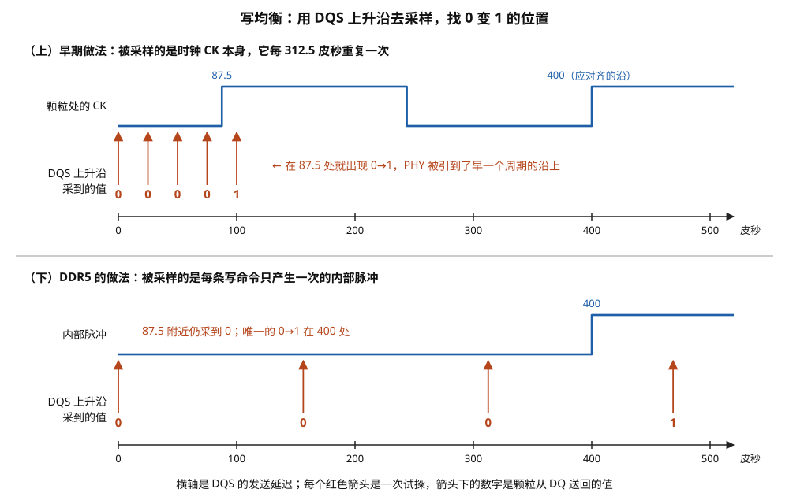

> **图 6-10**　一句话：写均衡是让 PHY 一点点推迟 DQS 的发出时刻，同时让颗粒每次报告“此刻蓝色信号是高还是低”，找出报告从 0 变成 1 的那一点；上半图说明只看时钟会找错一整个周期，下半图说明 DDR5 怎样避开这个错误。
>
> **先知道一件事**：这两张图的横轴都是“PHY 把 DQS 推迟了多少皮秒”（底部刻度 0 到 500），不是事件发生的先后。每一根红色向上的箭头是一次试探：PHY 用这个推迟量发出 DQS（随数据一起走的节拍线），颗粒在 DQS 电压上升的那一瞬间看一眼蓝色信号是高（1）还是低（0），把结果送回来，就是箭头下的红色数字。
>
> **按这个顺序看**：
> 1. 上半部分：蓝色方波是颗粒看到的时钟 CK。它在 87.5 皮秒处从低变高，在约 244 皮秒处变低，又在 400 皮秒处变高——时钟每 312.5 皮秒重复一次。正确的对齐目标是 400 处那个上升沿（标着“应对齐的沿”）。
> 2. 看上半部分的五根箭头：推迟 0、25、50、75 皮秒时看到的是低，报 0；推迟 100 皮秒时已经过了 87.5，看到的是高，报 1。PHY 以为找到了，其实找到的是 87.5 处的上升沿，比正确的那一个早了整整一个周期。原因是时钟每个周期都一样，颗粒只能报高或低，分不出是第几个周期。
> 3. 下半部分：蓝色信号换成了“内部脉冲”。颗粒收到写命令后，在它应该开始收数据的时刻（这里是 400 皮秒）从低变高，之后一直保持高；每条写命令只产生这一次。
> 4. 看下半部分的四根箭头，彼此相隔半个周期（156.25 皮秒）：0、156、312 皮秒处都报 0，87.5 附近也不会误报；到 468.75 才报 1。唯一的 0 变 1 出现在 312.5 与 468.75 之间，再用小步长细扫就能定在 400。
>
> **打个比方**：像在一条每隔 10 米就立着一块相同路标的路上找某一块：看到路标只知道“到了一块”，不知道是第几块；如果只有目标位置立着一块独一无二的牌子，就不会认错。
>
> **看懂的标志**：能回答“为什么采样周期性的时钟会找错”：它每个周期长得一样，只能对齐到“某一个”上升沿，不能保证是正确的那一个；只出现一次的脉冲没有这种歧义。
>
> **与正文的对照**：上半部分对应正文 §6.5 早期做法的粗扫（步长 25 皮秒），下半部分对应 DDR5 做法的第一步粗扫；第三步“修正颗粒内部的延迟”没有画出。
>
> 来源：本库自绘。

**第三步，修正颗粒内部的延迟（内部写均衡）。** 前两步有一个隐含的假设：颗粒内部产生的那个脉冲，出现的时刻正好等于"时钟上升沿到达引脚的时刻"。实际上时钟从引脚进入颗粒后要经过接收器、时钟分配、计数逻辑才能产生脉冲，这段路径有延迟，而且可能超过一个周期；DQS 从引脚到采样电路也有自己的延迟，两者并不相等。标准因此把写均衡分成两步：外部写均衡时，颗粒使用一个尽量贴近引脚处时序的脉冲，让 PHY 先把 DQS 对到引脚处的时钟上；内部写均衡时，颗粒换成它真实写通路上使用的内部信号，这个信号比前者晚。

设真实的内部信号比引脚处的时序晚 1.3 个周期，即 406 皮秒，它的上升沿在 400 + 406 = 806 皮秒。DQS 此时在 400 皮秒到达，采到的是 0——如果就这样开始写数据，DQS 的第一个边沿到达时颗粒内部的写通路还没准备好，第一个比特会丢失。

颗粒里有一个寄存器可以让内部信号提前整数个周期产生。PHY 逐档增大这个提前量，同时观察送回的值：

| 提前量（周期） | 内部信号上升沿位置（皮秒） | DQS 在 400 皮秒处采到 | 送回 |
| --- | --- | --- | --- |
| 0 | 806 | 低 | 0 |
| 1 | 806 − 312.5 = 493.5 | 低 | 0 |
| 2 | 806 − 625 = 181 | 高 | **1** |

提前量取 2 个周期时，内部信号在 DQS 到达之前 219 皮秒（约 0.7 个周期）已经变高，写通路来得及准备。PHY 把提前量定为 2，然后在这个设定下再做一次细扫确认 DQS 的最终位置，并按标准规定的偏移量做最后的调整。

**三步合起来的结果**：DQS 在引脚处与正确的那个时钟上升沿对齐（不再有整数周期的歧义），颗粒内部的写通路也在 DQS 到达之前就绪。

对内存条上的每一个字节通道重复这个过程，得到的 DQS 延迟值会沿着 fly-by 的方向依次增大，首尾相差约 640 皮秒——正好是 §6.1 那笔账的数字。

### 6.6 逐步走查之三：读门控训练

写方向对齐之后转向读方向。读方向的第一件事是 §4.4 提出的问题：PHY 的读门控应该在什么时刻打开。

**要找的量**是"读命令发出后，隔多久打开门控"。它由两部分组成：整数部分是读延迟 CL（已知，比如 46 个周期），零头部分是往返延迟（未知，§4.1 估算约 1.5 到 2 纳秒，即 5 到 6 个周期，每个字节通道不同）。训练要找的是零头部分。

**判断对错的办法**是数边沿。一次突发长度 16 的读操作，DQS 在数据段恰好有 8 个上升沿。PHY 在门控打开期间对 DQS 的上升沿计数：数到 8 个说明门控开得合适；少于 8 个说明开晚了，漏掉了前面的边沿；多于 8 个说明开早了，把高阻期间的噪声当成了边沿。

设某个字节通道的实际情况是：以"读命令之后 CL 个周期"为零点，DQS 的前导码从 4.44 个周期处开始，持续 1 个周期（期间 DQS 保持低电平），第一个数据上升沿在 5.44 个周期处。

**第一步，粗扫，步长半个周期：**

| 门控打开时刻（周期） | 门控打开时 DQS 的状态 | 数到的上升沿 | 判定 |
| --- | --- | --- | --- |
| 3.5 | 高阻，电平不确定 | 9 到 11 个，每次不同 | 开早了 |
| 4.0 | 高阻 | 9 个 | 开早了 |
| 4.5 | 前导码，稳定的低电平 | **8 个** | 通过 |
| 5.0 | 前导码 | **8 个** | 通过 |
| 5.5 | 第一个上升沿已过 | 7 个 | 开晚了 |
| 6.0 | — | 7 个 | 开晚了 |

通过范围在 4.5 到 5.0 附近。

**第二步，细扫两侧的边界：** 在 4.0 到 4.5 之间和 5.0 到 5.5 之间分别用小步长扫描，找到计数从 9 变成 8 的位置（4.44）和从 8 变成 7 的位置（5.44）。

**第三步，设定：** 取中点（4.44 + 5.44）÷ 2 = **4.94 个周期**，即约 1544 皮秒。门控在这一刻打开，两侧各有半个周期即 156 皮秒的余量。整个过程见图 6-11。

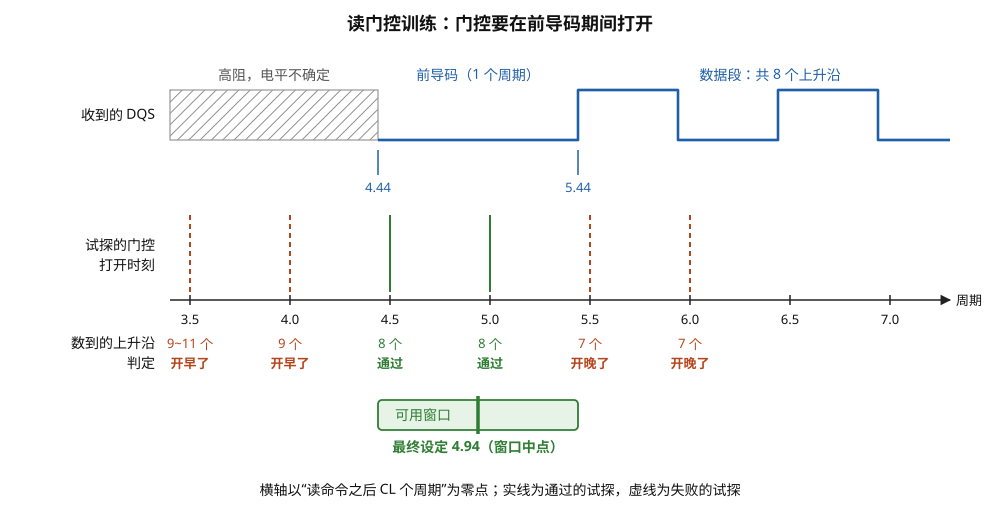

> **图 6-11**　一句话：读数据时，PHY 要在对方开始发 DQS 之前的一小段空档里“打开耳朵”：开得太早会把杂讯当成信号，开得太晚会漏掉开头，训练就是靠数边沿来找到这段空档。
>
> **先知道一件事**：DQS（随数据一起走的节拍线）在没有读操作时没有任何一方驱动，处于“高阻”状态，电压是飘着的、不确定的。颗粒开始发数据之前，会先把 DQS 拉低保持一小段时间，叫前导码，意思是“要开始了”；之后 DQS 每上升一次对应数据。PHY 里有一个开关叫读门控，只有它打开之后，PHY 才把 DQS 的跳变当真。
>
> **按这个顺序看**：
> 1. 上排是 PHY 收到的 DQS。横轴是时间，单位是时钟周期，零点是“读命令发出后再过 CL 个周期”（CL 是 DRAM 规定的读延迟）。左边灰色斜线区域是高阻，电压不确定；4.44 到 5.44 是 1 个周期的前导码，电压稳定在低；5.44 起开始出现上升沿，这是数据段（图中只画了开头，完整的一次读有 8 个上升沿）。
> 2. 中间一排竖线是六次试探：每条线表示“门控在这一刻打开”，位置对应下方刻度上的 3.5、4.0、4.5、5.0、5.5、6.0。绿色实线表示试探通过，红色虚线表示失败。
> 3. 看每条线下方的“数到的上升沿”和“判定”：在 3.5 和 4.0 打开时正处于高阻区，会把杂讯也数成上升沿，数到 9 个或更多，判“开早了”；在 4.5 和 5.0 打开时处于前导码，正好数到 8 个，通过；在 5.5 和 6.0 打开时第一个上升沿已经过去，只数到 7 个，判“开晚了”。
> 4. 底部的绿色框是可用窗口，就是前导码那 1 个周期（4.44 到 5.44）；框里的绿色粗竖线是最终设定 4.94，取窗口正中间，两侧各留半个周期的余量。
>
> **打个比方**：像接一个会准时打来的电话：电话接通之前线路里有杂音，拿起听筒太早会把杂音当成说话；对方先说一声“喂”（前导码）再开始报数字，拿晚了就会漏掉第一个数字。最稳妥的是在“喂”的正中间拿起听筒。
>
> **看懂的标志**：能回答“为什么判断依据是数到几个上升沿”：一次读恰好有 8 个上升沿，多了说明混进了杂讯，少了说明漏了开头，只有正好 8 个才说明门控开在前导码里。
>
> **与正文的对照**：对应正文 §6.6 的三步：粗扫、细扫两侧边界、取中点。图中的前导码简化成一段稳定的低电平，真实的前导码有规定的翻转图样。
>
> 来源：本库自绘。

这个余量值得留意：前导码只有 1 个周期宽，门控的可用窗口也就只有 1 个周期。而往返延迟会随温度漂移上百皮秒（§4.1），这占掉了余量的一大半。DDR5 允许把前导码配置得更长（2 到 4 个周期）以放宽这个窗口，代价是每次读操作多占用几个周期的总线时间。上面的走查做了简化：真实的前导码不是纯粹的低电平，而是有规定的翻转图样；DDR5 还提供了专门的读前导码训练模式来简化这一步，具体做法以标准文本为准。

### 6.7 逐步走查之四：读数据逐位去偏斜

门控对齐之后，PHY 已经能正确地接收 DQS，接下来要确定用 DQS 采样 DQ 的精确位置。此时写通路还没训练，PHY 让颗粒用内置的图样发生器输出约定的序列，拿收到的内容与之比对。

读数据训练要找两样东西：每根 DQ 各自需要补多少延迟才能互相对齐，以及对齐之后 DQS 应该推迟多少去采样。

设一个只有 4 根 DQ 的字节通道（x4 颗粒），延迟线每档 2.5 皮秒。PHY 让颗粒反复输出训练图样，同时扫描 DQS 的接收延迟，对每根 DQ 分别记录"从第几档到第几档能读对"。

**第一步，测量每根 DQ 的眼：**

| DQ | 能读对的 DQS 延迟范围（档） | 眼宽（档） | 眼中心（档） |
| --- | --- | --- | --- |
| DQ0 | 12 ~ 40 | 28 | 26 |
| DQ1 | 18 ~ 46 | 28 | 32 |
| DQ2 | 9 ~ 37 | 28 | 23 |
| DQ3 | 15 ~ 43 | 28 | 29 |

每根 DQ 自己的眼宽都是 28 档即 70 皮秒，但中心彼此错开，最早的在 23 档、最晚的在 32 档，相差 9 档即 22.5 皮秒。

**第二步，如果不做逐位补偿：** 四根线共用一个 DQS 延迟，能让四根线都读对的范围是四个区间的交集，即 18 到 37 档，宽 19 档 = **47.5 皮秒**。

**第三步，逐位补偿：** 给每根 DQ 的接收延迟线加上一个量，使它的眼中心都移到最晚的那根（DQ1，32 档）的位置。把某根 DQ 推迟 n 档，它的眼相对 DQS 就整体后移 n 档。

| DQ | 需要加的延迟（档） | 补偿后的范围（档） |
| --- | --- | --- |
| DQ0 | 32 − 26 = 6 | 18 ~ 46 |
| DQ1 | 0 | 18 ~ 46 |
| DQ2 | 32 − 23 = 9 | 18 ~ 46 |
| DQ3 | 32 − 29 = 3 | 18 ~ 46 |

**第四步，设定 DQS 延迟：** 四个区间现在完全重合，公共窗口 18 到 46 档，宽 28 档 = **70 皮秒**。DQS 的接收延迟设在中心 32 档，两侧各留 14 档即 35 皮秒的余量。补偿前后的对比见图 6-12。

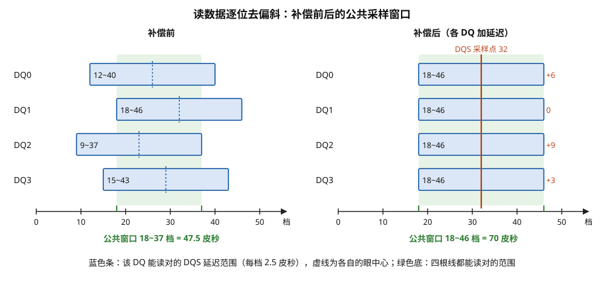

> **图 6-12**　一句话：同一组里的四根数据线，各自能被正确读出的时间范围彼此错开；给每根线单独加一点延迟、把它们对齐之后，四根线都能读对的公共范围从 47.5 皮秒扩大到 70 皮秒。
>
> **先知道一件事**：读数据时，PHY 用同一根 DQS（随数据一起到达的节拍线）去读这一组所有的数据线 DQ。读取时刻可以用延迟线一档一档地推迟，一档是 2.5 皮秒。对每一根 DQ，只有读取时刻落在某个范围里才能读对，这个范围就是这根线的“眼”的宽度。
>
> **按这个顺序看**：
> 1. 左半部分“补偿前”：横轴是 DQS 延迟的档数（0 到 50 档）。每一根蓝色横条是一根 DQ 能读对的范围，条内的数字是起止档数，例如 DQ0 是 12 到 40 档；条内的蓝色虚线是这根线自己范围的中心。
> 2. 四根条左右错开：DQ2 最靠左（9 到 37），DQ1 最靠右（18 到 46）。四根线必须共用同一个读取时刻，所以只有四根条都覆盖的地方才能用，就是绿色底色的 18 到 37 档，共 19 档，即 47.5 皮秒。
> 3. 右半部分“补偿后”：每根 DQ 在 PHY 内部各自多经过一段延迟，条右侧的红字是加了几档：DQ0 加 6、DQ1 不加、DQ2 加 9、DQ3 加 3。加完之后四根条都变成 18 到 46 档，完全重合。
> 4. 绿色公共范围扩大到 18 到 46 档，共 28 档，即 70 皮秒。红色竖线是最终选定的 DQS 读取时刻，放在正中间第 32 档，两边各留 14 档（35 皮秒）余量。
>
> **打个比方**：像四个人约开会：每人的空闲时段（每根线能读对的范围）彼此错开，能开会的只有交集那一小段。如果让空闲时段靠前的人把日程整体往后挪一点（加延迟），四人的空闲时段对齐，能开会的时间就变长了。
>
> **看懂的标志**：能回答“为什么每根线要有自己的延迟线”：四根线的错位来自各自走线和电路的细小差别，每根都不一样，只有逐根补偿，公共范围才能恢复到单根线的眼那么宽。
>
> **与正文的对照**：对应正文 §6.7 的四步走查，数值完全相同。
>
> 来源：本库自绘。

**对照结果**：公共采样窗口从 47.5 皮秒扩大到 70 皮秒，增加了 47%。代价是每根 DQ 多一条延迟线，以及训练时间随 DQ 数量线性增长。一颗 12 通道的服务器 CPU 有约 960 根 DQ，读和写两个方向各训练一遍，每根线要扫几十到上百个设定值，每个设定值要重复采样以抵抗抖动——这是服务器开机时内存训练要花几十秒到几分钟的原因。

### 6.8 逐步走查之五：写数据训练

读通路可靠之后，就可以用"写进去再读出来"的办法训练写通路。要找的量是每根 DQ 相对 DQS 的发送延迟，目标是让 DQS 的边沿到达颗粒时落在每根 DQ 的眼中央。

**与读方向的一个区别。** 读方向上 8 根 DQ 共用一个 DQS 采样延迟，所以要先把各根 DQ 彼此对齐（§6.7 的逐位补偿），再定公共的采样点。写方向上每根 DQ 有自己独立的发送延迟线，可以各自直接对准，不需要求交集。

**一轮测试的过程**是：设定某根 DQ 的发送延迟；向一个地址写入一段测试图样；读回；逐位比对。测试图样要选能暴露最坏情况的：既有长串的相同比特后面跟一个相反比特（码间干扰最大），也有相邻 DQ 同时反向翻转（串扰最大）。

还是以 4 根 DQ 的字节通道为例，延迟线每档 2.5 皮秒。对每根 DQ 分别扫描发送延迟，记录读回正确的范围：

| DQ | 读回正确的发送延迟范围（档） | 宽度（档） | 设定值（中点） | 两侧余量 |
| --- | --- | --- | --- | --- |
| DQ0 | 22 ~ 48 | 26 | 35 | 各 13 档 = 32.5 皮秒 |
| DQ1 | 18 ~ 44 | 26 | 31 | 各 32.5 皮秒 |
| DQ2 | 25 ~ 51 | 26 | 38 | 各 32.5 皮秒 |
| DQ3 | 20 ~ 46 | 26 | 33 | 各 32.5 皮秒 |

四根线的设定值分别是 35、31、38、33 档，最大相差 7 档即 17.5 皮秒，这就是这个字节通道在写方向上的位间偏斜。

**测试失败时怎样判断是哪里的问题。** 写数据训练的判据是"写入再读回"，失败可能来自写也可能来自读。因为读通路已经单独用颗粒内置图样训练并验证过，这里的失败可以归因于写。另一个需要区分的情况是读回的数据整体错位了整数个比特：这不是延迟设定的问题，而是写均衡在整数周期上有偏差，要回到 §6.5 调整。

### 6.9 二维扫描：时间和电压一起找

前面几个走查只在时间轴上扫描，参考电压 Vref 假定已经合适。实际上 Vref 也是未知的（§5.5），而且时间余量和电压余量相互关联：在最优 Vref 上眼最宽，偏离后眼变窄。

完整的做法是对"延迟 × Vref"做二维扫描：对每一个 Vref 档位扫一遍延迟，记录每个格点上测试通过还是失败。图 6-13 是一张缩小了的示意网格，横轴是延迟（每列 3 档即 7.5 皮秒），纵轴是 Vref 相对默认值的偏移（每行 20 毫伏）。绿色格点（标 P）表示通过，灰色格点表示失败。

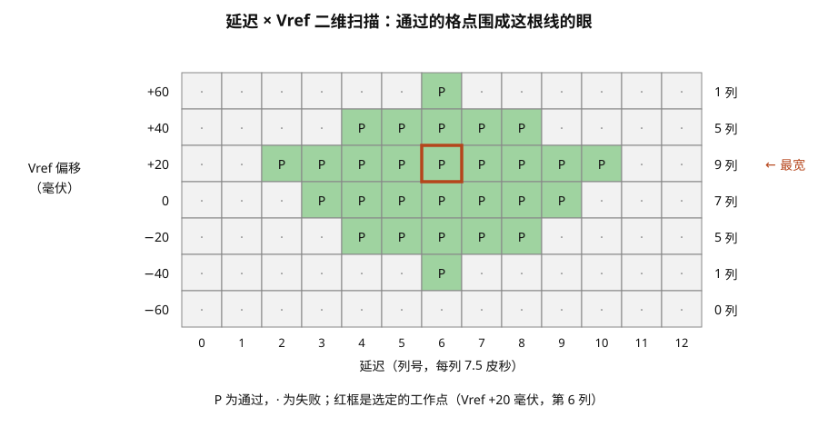

> **图 6-13**　一句话：同时扫描两个旋钮：读取时刻（横向）和判定 0 与 1 的参考电压（纵向），把每种组合读得对不对画成一张格子图；通过的格子围成一个菱形，这就是这根数据线的“眼”，最好的设定在菱形正中间。
>
> **先知道一件事**：接收方判断一个比特是 0 还是 1，靠两件事：在什么时刻读，以及拿读到的电压和哪个参考电压 Vref 比较（高于 Vref 算 1，低于算 0）。两件事各有一个合适的范围，而且互相影响：参考电压偏了，能读对的时间范围也会变窄。
>
> **按这个顺序看**：
> 1. 横轴（底部）是读取时刻的延迟，列号 0 到 12，每列 7.5 皮秒；纵轴（左侧）是 Vref 相对默认值偏移了多少毫伏，从 +60 到 −60，每行 20 毫伏，0 那一行就是默认值。
> 2. 每个格子是一次测试：绿色、标 P 表示这个组合下读对了；灰色、标点表示读错了。
> 3. 绿色格子围成一个上下尖、中间宽的菱形。越靠近菱形的边缘，余量越小，温度或电压稍有变化就可能读错。
> 4. 看右侧一栏“N 列”：每一行有几个格子通过。最宽的一行是 +20 毫伏，通过 9 列（标着“← 最宽”）；而默认值 0 那一行只通过 7 列，说明默认的参考电压并不是最好的。
> 5. 红框是最终选定的工作点：Vref 偏移 +20 毫伏、第 6 列。从它出发，往左右各有 4 列、往上有 2 行、往下有 3 行的余量。
>
> **打个比方**：像在地图上找一个湖的中心：只沿东西方向量宽度，或只沿南北方向量长度，都可能找偏；把整片湖面按格子测一遍，才能找到离四周湖岸都最远的那一点。
>
> **看懂的标志**：能回答“为什么不直接用默认的 Vref”：这根线实际的最佳参考电压取决于具体的电阻、走线和芯片，这张图里它偏了 20 毫伏；不训练的话，时间余量会白白少掉两列（15 皮秒）。
>
> **与正文的对照**：对应正文 §6.9 的示意网格，数值相同。
>
> 来源：本库自绘。

通过的格点连成的区域就是这根线的眼。从这张网格可以读出三件事：

1. **眼的中心不在默认 Vref 上。** 默认值（偏移 0）那一行通过 7 列即 52.5 皮秒；偏移 +20 毫伏那一行通过 9 列即 67.5 皮秒。如果不训练 Vref，时间余量白白少了 15 皮秒。
2. **眼高约 100 毫伏。** 在延迟的中心列（第 6 列），从 +60 到 −40 共 6 行通过，相邻行间隔 20 毫伏，上下跨度 100 毫伏。
3. **选点**：Vref 取 +20 毫伏，延迟取第 6 列。这个点向左右各有 4 列（30 皮秒）余量，向上有 2 行（40 毫伏）、向下有 3 行（60 毫伏）余量。如果更看重上下余量的对称，可以改取 +10 毫伏。

**穷举的代价与实际做法。** 示意网格只有 7 × 13 = 91 个点。真实情况下 Vref 有几十档、延迟扫 64 档以上，每根线就是几千个测试点，每个点还要重复测多次。再加上 DFE 的 4 个抽头系数，如果每个系数取 8 档，全空间是几千 × 8⁴ ≈ 一千多万个点，不可能穷举。实际实现采用逐个参数依次优化：先固定其它参数在默认值，单独扫第一个参数并定在最优点；再扫第二个；全部扫完之后再回头重扫第一个，如此迭代两三轮。这种做法不保证找到全局最优，但每个参数的最优点对其它参数的取值不太敏感，两三轮之后通常已经足够接近。

### 6.10 运行期：训练结果会过期

训练得到的值在当时的温度和电压下是最优的。运行过程中芯片温度可能变化几十摄氏度，延迟线、驱动器、走线的延迟都跟着变。各系列的应对办法不同，但都属于以下三类：

- **ZQ 重校准**：周期性地重做阻抗校准，通常每隔几十到几百毫秒发一次校准命令。
- **延迟跟踪**：§5.2 的 DLL 持续折算延迟线的档数。LPDDR 的颗粒里还内置一个用来测量颗粒自身延迟变化的振荡器，控制器定期读取它的计数，按变化量修正写数据的延迟。
- **周期性重训**：PHY 通过 DFI 的更新请求信号（`dfi_phyupd_req` 或 `dfi_phymstr_req`）向控制器申请一小段总线空闲时间，在这段时间里重新做一次小范围的扫描。控制器必须在规定时间内让出总线，这段时间里不能服务正常读写。

**延迟跟踪的一个算例：LPDDR 颗粒里的振荡器。** LPDDR 颗粒没有 DLL，写数据时选通信号从引脚走到内部采样电路的那段路径延迟会随温度明显变化。颗粒里放了一个环形振荡器，它由和这段路径相同的电路单元首尾相接构成，所以它的振荡周期与这段路径的延迟成正比，这里假设周期等于路径延迟的两倍。控制器发命令让振荡器运行一段固定的时间，颗粒内部的计数器数它振了多少次，控制器再把计数值读出来。

1. 初次训练时：让振荡器运行 2048 纳秒，读到计数 2048。振荡周期 = 2048 ÷ 2048 = 1000 皮秒，路径延迟 = 500 皮秒。训练得到的写数据延迟设定对应的就是这个状态。
2. 运行一段时间后芯片升温，再测一次：同样运行 2048 纳秒，读到计数 1950。振荡周期 = 2048000 ÷ 1950 ≈ 1050 皮秒，路径延迟 ≈ 525 皮秒。
3. 路径延迟增加了 25 皮秒。PHY 把这个字节通道所有写数据线的发送延迟相应调整 25 皮秒，按每档 2.5 皮秒算是 10 档。

整个过程不需要重新扫描，也不占用数据总线，只需要偶尔发两条命令。25 皮秒相对于 LPDDR5X-8533 的比特宽度 117 皮秒超过了五分之一，不跟踪的话 §6.8 留出的三十几皮秒余量会被用掉大半。

**周期性重训的开销。** 假设 PHY 每 100 毫秒申请一次重训，每次占用总线 10 微秒（量级估计），那么总线不可用的时间占比是 10 微秒 ÷ 100 毫秒 = 0.01%，对平均带宽的影响可以忽略。但对延迟敏感的负载来说，恰好在这 10 微秒里到达的请求要多等 10 微秒，相当于一次普通内存访问（约 100 纳秒）的一百倍。这是内存访问延迟分布里偶发长尾的来源之一。

为了缩短开机时间，固件通常把上一次的训练结果保存在非易失存储里，下次开机先尝试直接使用，验证通过就跳过完整训练。硬件配置变化（换了内存条）或验证失败时才重新做完整训练。

---

## 7. 拓扑与模组：内存条上除了颗粒还有什么

上一节讲的训练解决的是时序误差，但有一类问题训练解决不了：一根线上挂的负载太多，波形本身已经坏了。解决这类问题靠的是在内存条上加缓冲芯片。这一节按"加了什么芯片"来区分各种模组。

**先说负载问题的量级。** 一条服务器内存条如果装 2 个 rank（rank 是一组能凑满通道位宽的颗粒，一条内存条上可以有多组），用 x4 颗粒，每个 rank 是 20 颗，两个 rank 共 40 颗。命令地址线要驱动全部 40 颗颗粒的输入电容，每颗约 1 皮法，合计约 40 皮法，再加上走线。计算芯片的驱动器隔着十厘米走线和一个插槽去推这个负载，上升沿会慢到无法在 3.2 GHz 下工作。

| 模组类型 | 内存条上加的芯片 | 被缓冲的信号 | 典型用途 |
| --- | --- | --- | --- |
| UDIMM（无缓冲） | 无 | 无，全部直连 | 台式机 |
| CUDIMM | 时钟驱动器（CKD） | 只有时钟 | 6400 Mbps 及以上的台式机 |
| RDIMM（寄存式） | 寄存时钟驱动器（RCD） | 时钟、命令地址、片选 | 主流服务器 |
| LRDIMM（减载式） | RCD + 数据缓冲器（DB） | 全部，包括数据 | 大容量服务器 |
| MRDIMM（复用 rank） | RCD + 复用数据缓冲器（MDB） | 全部，且数据做 2:1 复用 | 高带宽服务器 |

四种主要结构的信号走向见图 6-14。

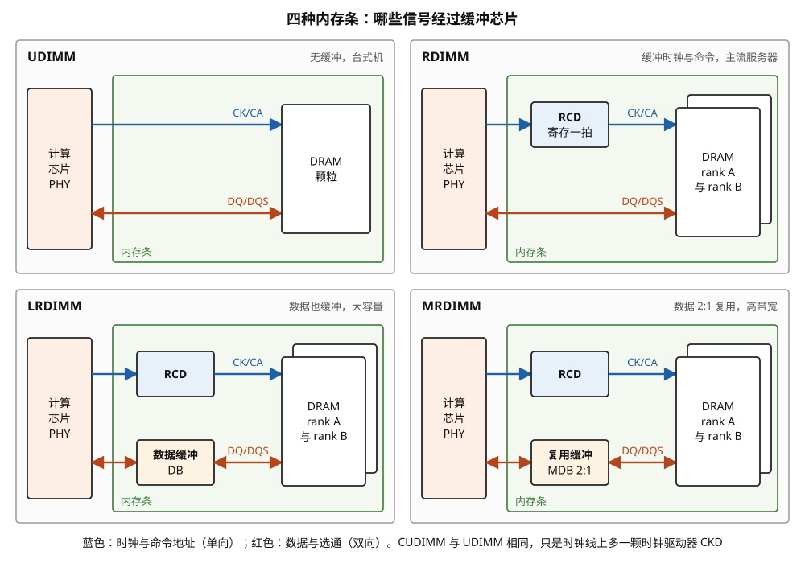

> **图 6-14**　一句话：四种内存条的区别，只在于内存条上有没有“中转芯片”、以及哪些信号经过中转；中转芯片把导线上的负担隔开，代价是多一点延迟。
>
> **先知道一件事**：一根导线上挂的芯片越多，驱动它的一方就越吃力，信号的电压变化变慢、波形变坏。一种解决办法是在中间放一颗中转芯片：它把信号接住，再用自己的力气重新发出去，这样发送方只需要推动这一颗芯片。
>
> **按这个顺序看**：
> 1. 每一格的布局相同：左边橙色竖框是计算芯片里的 PHY（把比特变成导线电压的电路），绿色大框是内存条，右边白色方框是 DRAM 颗粒；叠在一起的两个白框表示两组颗粒（叫两个 rank，每组的数据线加起来正好凑满一次读写的宽度）。蓝色线是时钟与命令地址（CK/CA），只从计算芯片发往内存条，是单向的；红色线是数据与选通（DQ/DQS），读和写两个方向都要走，是双向的。
> 2. 左上 UDIMM（无缓冲内存条）：两种线都直接连到颗粒，没有中转，用在台式机上。
> 3. 右上 RDIMM：蓝线中间多了一个蓝色方框 RCD（寄存时钟驱动器），它把命令接住、存一拍再重新发出；红色的数据线仍然直连。这是主流服务器的做法。
> 4. 左下 LRDIMM：红线中间也多了一个“数据缓冲 DB”，数据也经过中转。计算芯片的每根数据线只需要推动这一颗芯片，所以内存条上能挂更多颗粒，容量更大。
> 5. 右下 MRDIMM：数据中转换成“复用缓冲 MDB 2:1”。它同时连着两组颗粒，把两组的数据轮流交错地发给计算芯片，朝计算芯片一侧的速率是颗粒一侧的两倍，带宽随之翻倍。
>
> **打个比方**：像小区的快递：UDIMM 是快递员直接送到每一户；RDIMM 是只把派送单交给门卫统一分发，包裹仍然送到户；LRDIMM 是包裹也先放进驿站；MRDIMM 的驿站还把两栋楼的包裹交替装上一辆更快的车。
>
> **看懂的标志**：能回答“为什么服务器内存条大多是 RDIMM，台式机是 UDIMM”：服务器一条内存条上颗粒多（常见 40 颗），命令线要推动的负担太重，必须经过 RCD 中转；台式机颗粒少，直连就够了。
>
> **与正文的对照**：底部说明：CUDIMM 与 UDIMM 结构相同，只是时钟线上多一颗时钟驱动器 CKD（正文 §7 的表格）。
>
> 来源：本库自绘。

**RCD（registering clock driver，寄存时钟驱动器）**位于内存条中央。计算芯片的命令地址线只连到它这一颗芯片，它把信号寄存一拍后重新驱动出去，分左右两路沿 fly-by 送到各颗粒。对计算芯片来说负载从 40 颗变成 1 颗。代价是命令多一个周期的延迟。DDR5 还在这里压缩了引脚：计算芯片到 RCD 之间只用 7 根 CA 线、在时钟双沿各传一次，RCD 展开成 14 根单沿的信号再送给颗粒。

**跟一条命令穿过 RCD。** DDR5-6400，时钟周期 312.5 皮秒。以一条两周期命令的第一拍为例，时间以这一拍的时钟上升沿到达 RCD 引脚的时刻为零点（RCD 内部延迟的数值是量级估计）：

| 时刻（皮秒） | 位置 | 发生了什么 |
| --- | --- | --- |
| 0 | RCD 输入引脚 | 时钟上升沿到达。7 根 CA 线上是这一拍 14 位内容的一半，RCD 采样 |
| 156 | RCD 输入引脚 | 时钟下降沿到达。7 根 CA 线上换成另一半，RCD 再采样一次 |
| 156 ~ 312 | RCD 内部 | 把两次采样拼成 14 位 |
| 312.5 | RCD 内部 | 下一个时钟上升沿，14 位内容被寄存 |
| 约 312.5 + 1000 | RCD 输出引脚 | 14 位内容连同重新驱动的时钟一起输出，沿 fly-by 送往各颗粒 |
| 再加 0 ~ 320 | 各颗粒引脚 | 依次到达左半边或右半边的各颗粒（RCD 在中央，每边约 5 个颗粒位置） |

从计算芯片的角度看，命令比没有 RCD 时晚了 1 个周期加约 1 纳秒到达颗粒。**这段延迟不需要控制器专门处理**，原因是时钟也经过 RCD 重新驱动，颗粒看到的时钟和命令一起被推迟了。数据线是从计算芯片直连颗粒的，没有经过 RCD，于是数据相对颗粒时钟"早到"了这 1 纳秒多——这正是写均衡要补偿的量的一部分。§6.5 的训练过程对延迟的来源并不区分，fly-by 造成的和 RCD 造成的一并补掉。

有 RCD 的内存条还多出一层训练：计算芯片到 RCD 这一段的 CA 是双沿采样的，一个比特只有 156 皮秒宽，要像训练数据线那样训练；RCD 到颗粒这一段则由 RCD 自己的输出延迟设定来对齐。§6.4 讲的命令线训练在这种内存条上要对这两段分别做。

**数据缓冲器（DB）把数据线上的负载也隔开。** RDIMM 只缓冲了命令和时钟，数据线仍然是计算芯片直连所有 rank 的颗粒。算一笔 4 个 rank 时数据线的负载：每根 DQ 上挂 4 颗颗粒，每颗输入电容约 1 皮法（量级估计），加上每颗颗粒引出的那一小段分支走线；一个通道两条内存条就是 8 颗。负载翻倍后信号的上升时间变长，分支处的反射增多，眼随之变小。LRDIMM 在每个字节通道与颗粒之间放一颗数据缓冲器：朝计算芯片的一侧只有缓冲器这一个负载，朝颗粒的一侧由缓冲器重新驱动。对计算芯片来说，不管内存条上有几个 rank，每根 DQ 都只看到 1 个负载。

代价有三项。第一是延迟：数据在两个方向上各多经过一颗缓冲器，各加约 1 到 2 纳秒（量级估计）。第二是功耗：一条内存条多出十颗左右的缓冲器芯片。第三是训练加倍：原来"计算芯片到颗粒"一段通路现在变成"计算芯片到缓冲器"和"缓冲器到颗粒"两段，§6.5 到 §6.9 的每一步都要对两段分别做一遍，后一段由缓冲器在固件指挥下完成。

**CKD（client clock driver）**是 CUDIMM 上的芯片，只重新驱动时钟。台式机内存条颗粒少，命令地址线的负载尚可接受，但 6400 Mbps 以上时钟抖动的预算已经很紧，在内存条上用一颗带锁相环的芯片重新生成一份干净的时钟，可以去掉主板走线和插槽引入的抖动。JEDEC 对应的模组标准是 JESD323。

**MRDIMM（multiplexed rank DIMM）**解决的是另一个问题：颗粒本身跑不了更快，但通道可以。它在每个字节通道上放一颗复用数据缓冲器，缓冲器朝颗粒的一侧同时连两个 rank，两个 rank 各自以原生速率工作；朝计算芯片的一侧把两路数据交替发出，速率是颗粒的两倍。算一笔：

1. 第一代 MRDIMM：颗粒以 4400 Mbps 工作，两个 rank 复用后通道速率 **8800 Mbps**。
2. 单通道带宽 = 64 位 × 8800 Mbps ÷ 8 = **70.4 GB/s**。对照同期的 DDR5-6400 RDIMM：64 × 6400 ÷ 8 = 51.2 GB/s，提升 37.5%。
3. 第二代 MRDIMM（标准已发布，平台支持在 2026 到 2027 年间落地）：颗粒以 6400 Mbps 工作，通道速率 **12800 Mbps**，单通道 102.4 GB/s。

**跟一次读数据穿过复用缓冲器。** 以第一代为例。计算芯片一侧每个比特宽 1 ÷ 8.8 Gbps ≈ 113.6 皮秒，颗粒一侧每个比特宽 1 ÷ 4.4 Gbps ≈ 227.3 皮秒，正好两倍。两个 rank 记作 A 和 B，它们同时各读出一次突发，A 的比特记作 A0、A1、A2……，B 的记作 B0、B1、B2……。下表的时间以颗粒一侧第一个比特开始的时刻为零点，并略去缓冲器自身的固定延迟：

| 时间段（皮秒） | rank A 的 DQ 上 | rank B 的 DQ 上 | 计算芯片一侧的 DQ 上 |
| --- | --- | --- | --- |
| 0 ~ 113.6 | A0 | B0 | A0 |
| 113.6 ~ 227.3 | A0（仍保持） | B0（仍保持） | B0 |
| 227.3 ~ 340.9 | A1 | B1 | A1 |
| 340.9 ~ 454.5 | A1 | B1 | B1 |
| 454.5 ~ 568.2 | A2 | B2 | A2 |
| …… | | | |

颗粒一侧每个比特保持 227.3 皮秒，缓冲器在这段时间的前一半把 A 的比特送往计算芯片，后一半把 B 的比特送往计算芯片。一次突发长度 16 的读操作，颗粒一侧历时 16 × 227.3 ≈ 3636 皮秒；同样这 3636 皮秒里，计算芯片一侧收到了 32 个比特。写方向相反：缓冲器把收到的比特流按奇偶拆成两路，各自拉宽一倍后分别送给两个 rank。

这张表同时说明了 MRDIMM 的两个限制。第一，**带宽翻倍的前提是两个 rank 同时有数据可传**。命令也要成对地发给两个 rank，这由内存条上的 RCD 配合完成（计算芯片以更高的速率发送命令，RCD 分发给两个 rank；具体的命令复用方式以标准文本为准）。如果工作负载的访问集中在其中一个 rank 上，另一路就空着，实际带宽退回到单个 rank 的水平，所以控制器在分配地址时要把访问均匀地分散到两个 rank。第二，**计算芯片到缓冲器这一段要跑 8800 甚至 12800 Mbps**，比特宽度只有 113.6 或 78.1 皮秒，对插槽和主板走线的要求比普通 RDIMM 严格得多，平台通常只允许每通道插一条。

**内存条上的电源与管理芯片。** DDR5 把稳压器从主板搬到了内存条上：每条内存带一颗电源管理芯片（PMIC），主板送来较高的电压（服务器为 12 伏），在内存条上就近转成 1.1 伏。好处是大电流的路径变短，电压降和噪声都小。内存条上还有一颗 SPD hub：SPD（serial presence detect）是一块存着这条内存规格参数的小存储器，固件开机时读它来决定训练的初始参数；DDR5 的 SPD hub 同时充当内存条上管理总线的集线器，PMIC、温度传感器、RCD 的配置接口都挂在它后面。图 6-15 是一条真实的 DDR5 服务器内存条，可以在上面找到 RCD 和 PMIC。

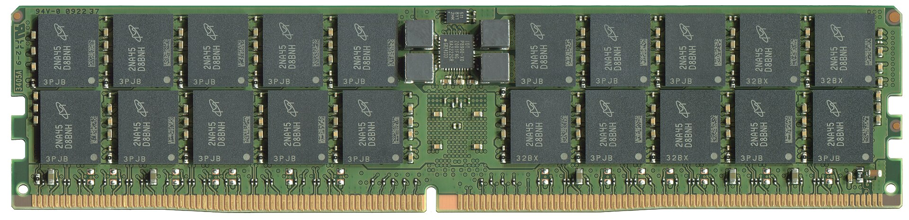
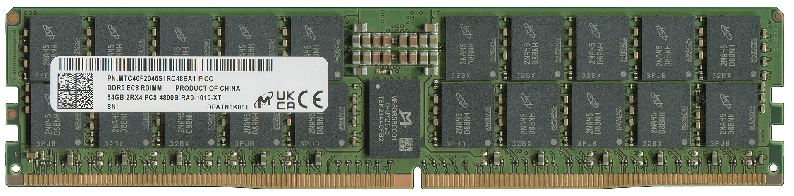

> **图 6-15**　一句话：这是一条真实的 DDR5 服务器内存条的正反两面：可以在上面数出 40 颗 DRAM 颗粒，并找到给它供电的 PMIC 和转发命令的 RCD。
>
> **先知道一件事**：内存条是一块小电路板，上面焊着一颗颗黑色方块，每一颗都是一个单独封装的 DRAM 存储芯片，叫颗粒；底边那一排金色的触点叫金手指，插进主板的插槽后，通过它们和计算芯片相连。
>
> **按这个顺序看**：
> 1. 上面一张是正面。黑色方块分上下两排，每排左右各 5 颗，共 20 颗 DRAM 颗粒。每颗旁边的小元件是电容和电阻，用来稳压和端接。
> 2. 正面正中间有四个灰色方块，它们是电感（一种在电路里暂存能量的元件），围着中间一颗印着“IDT P8900”的小芯片，这颗芯片就是 PMIC（电源管理芯片）：主板送来较高的电压，它和四个电感一起在内存条上就地转成颗粒需要的 1.1 伏。
> 3. 看正面的底边：金手指中间偏左有一个缺口，用来防止插反。
> 4. 下面一张是背面。左半边贴着标签，写着“DDR5 EC8 RDIMM”和“64GB 2RX4 PC5-4800B”：RDIMM 表示这是带 RCD 的内存条；64GB 是容量；2Rx4 表示 2 组颗粒（rank）、每颗有 4 根数据线（x4）；PC5-4800 表示 DDR5-4800 的速率；EC8 表示每个子通道带 8 位纠错码（额外存储的校验位，用来发现和纠正错误）。背面同样是上下两排、共 20 颗颗粒，左边几颗被标签盖住了。
> 5. 背面正中间、标签右侧那颗较大的方形芯片印着“M88DR5RCD01”，它就是 RCD（寄存时钟驱动器）：计算芯片的时钟和命令线只接到它，由它在内存条中央向左右两半的颗粒转发。
>
> **看懂的标志**：能回答“这条内存条为什么需要 RCD”：两面共 40 颗颗粒，如果计算芯片的命令线要直接推动 40 颗芯片，负担太重，波形会坏掉；经过 RCD 中转后，计算芯片只需要推动 RCD 这一颗。
>
> **与正文的对照**：40 颗、2 个 rank、x4 颗粒，正好是正文 §7 开头那笔负载账所用的配置。
>
> 来源：[File:Micron MTC40F204681RC48BA1R 20240407 076.jpg](https://commons.wikimedia.org/wiki/File:Micron_MTC40F204681RC48BA1R_20240407_076.jpg) 与 [File:Scan des Micron MTC40F204681RC48BA1R 20240407 077cens.jpg](https://commons.wikimedia.org/wiki/File:Scan_des_Micron_MTC40F204681RC48BA1R_20240407_077cens.jpg)，作者 PantheraLeo1359531，许可 CC BY 4.0。

**CAMM2：换掉插槽本身。** 传统内存条竖直插在插槽里，信号要经过插槽的金属弹片，而且一个通道上两个插槽时，空着的那个插槽是一段悬空的分支，会产生反射。CAMM2（compression attached memory module，JEDEC JESD318）改成一块平放的模组，用螺丝压在主板的触点阵列上，走线更短、没有悬空分支。它有 DDR5 和 LPDDR5X 两种版本，后者常写作 LPCAMM2。在此之前 LPDDR 因为对走线长度要求严格只能焊在主板上，CAMM2 让它第一次可以做成可更换的模组。面向 AI 服务器的变体 SOCAMM2（JEDEC JESD328，2026 年 6 月发布）用的是同一思路，§10 再说。图 6-16 是一块 LPCAMM2 实物。

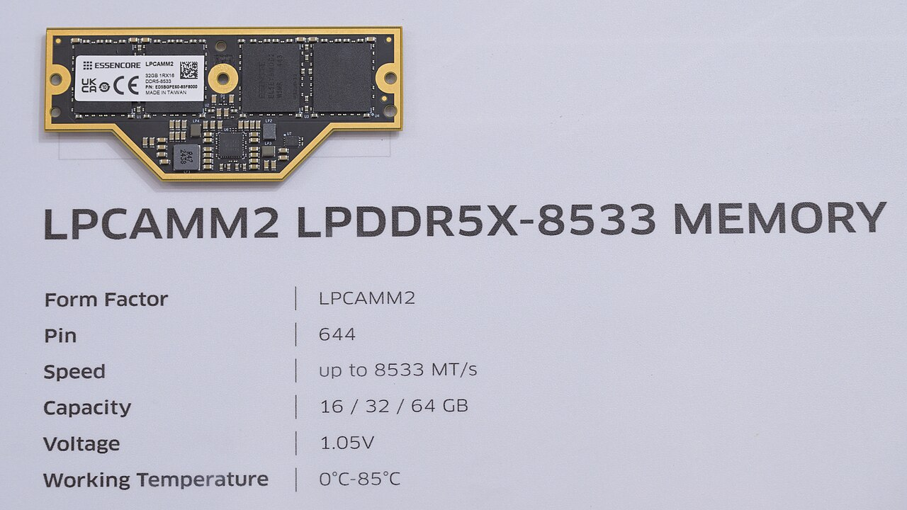

> **图 6-16**　一句话：这是一块 LPCAMM2 内存模组的实物：它不是竖着插进插槽，而是平放在主板上、用螺丝压紧，信号路径更短，也没有插槽带来的干扰。
>
> **先知道一件事**：传统内存条竖直插进插槽，信号要经过插槽里的金属弹片；一个通道有两个插槽而只插一条时，空插槽还会形成一段悬空的导线，信号走到那里会弹回来（反射），干扰后面的比特。平放压接的做法把插槽去掉了。
>
> **按这个顺序看**：
> 1. 照片左上方那块带金色边框的黑色小电路板就是模组本身；下方的大字和表格是展台的说明牌。
> 2. 模组左半边贴着白色标签，印着“LPCAMM2”、容量“32GB”等信息。
> 3. 标签右侧两颗大的黑色方块是 LPDDR5X 内存芯片（LP 表示低功耗版本的 DDR）。
> 4. 模组左右两端和标签右边各有一个圆孔：这是螺丝孔。模组靠螺丝压在主板上，模组背面的一片触点（照片里看不到）直接贴在主板上对应的触点上。
> 5. 下方梯形突出部分的小元件属于供电电路。
>
> **看懂的标志**：能回答“LPDDR 以前为什么只能焊死在主板上”：它的信号对走线长度和接头很敏感，经不起插槽带来的反射；这种压接模组让它第一次可以拆换。
>
> **与正文的对照**：说明牌上的触点数（644）、电压（1.05 伏）等参数来自厂商展板，本库未另行核实。
>
> 来源：[File:Essencore LPCAMM2 module on display at Computex 2025.jpg](https://commons.wikimedia.org/wiki/File:Essencore_LPCAMM2_module_on_display_at_Computex_2025.jpg)，作者 4300streetcar，许可 CC BY 4.0。

---

## 8. 家族对照：同一种存储单元，四种接口

DDR、LPDDR、GDDR、HBM 四个系列的存储单元是同一种（07-05 §9），差别在接口。差别的根源是各自面对的通道不同：通道越短、负载越少，接口可以越简单，或者可以跑得越快。

| | DDR5 | LPDDR5X / LPDDR6 | GDDR6 / GDDR7 | HBM3E / HBM4 |
| --- | --- | --- | --- | --- |
| 主要用途 | 服务器、台式机主存 | 手机、笔记本、部分服务器 CPU | 显卡显存 | AI 加速器显存 |
| 通道形态 | 主板走线 + 插槽 + 内存条，十厘米量级 | 焊在主板上或 CAMM2，几厘米 | 焊在显卡 PCB 上，几厘米 | 硅中介层，几毫米 |
| 一条通道上的负载 | 多颗粒、多 rank、多插槽 | 点对点 | 点对点 | 点对点 |
| 数据线信号方式 | 单端，两电平 | 单端，两电平，低摆幅 | GDDR6 单端两电平；**GDDR7 为三电平 PAM3** | 单端，两电平 |
| 每引脚速率 | 标准至 8800 Mbps；主流服务器 6400 | LPDDR5X 至 8533 到 10667；LPDDR6 为 10667 到 14400 | GDDR6 约 16 到 20 Gbps；GDDR7 产品约 28 到 32 Gbps，标准上限 48 Gbps | HBM3E 9.6 Gbps；HBM4 产品约 10 到 11 Gbps |
| 单器件数据位宽 | 4 / 8 / 16 | 16（LPDDR6 为 24） | 32 | 1024 / 2048 |
| 颗粒内有无 DLL | 有 | 无 | 有锁相电路 | 无 |
| 训练 | 完整训练 | 完整训练，外加运行期跟踪 | 完整训练，GDDR7 还要训练三个电平 | 有，但通道短、项目较少 |

下面逐个说明表里需要解释的地方。

### 8.1 LPDDR：功耗优先，时钟拆成两个

**LPDDR 的取舍是功耗优先。** 它的数据线摆幅只有几百毫伏（端接到地而不是电源，输出级电源 0.5 伏甚至更低），颗粒里不放 DLL 以省掉待机功耗。没有 DLL 的后果是颗粒内部从时钟到数据输出的延迟不受控，随温度电压漂移的范围比 DDR 大得多，所以 LPDDR 更依赖 §6.10 的运行期跟踪。

**摆幅小能省多少，可以算出来。** 给一根导线的寄生电容充放电，每次翻转消耗的能量正比于"电容 × 摆幅 × 供电电压"。同样的电容下，DDR5 的摆幅约 0.64 伏、供电 1.1 伏，乘积约 0.70；LPDDR5 取摆幅约 0.25 伏、供电 0.5 伏（量级估计），乘积约 0.125。后者约是前者的六分之一。端接上的直流功耗也按电压的平方下降。

**LPDDR5 起把时钟拆成了两个。** DDR5 只有一个时钟 CK，命令和数据都以它为基准，它必须始终以全速运行。LPDDR5 把两件事分开：命令时钟 CK 以较低的频率持续运行；另设一个写时钟 WCK，频率是 CK 的 2 倍或 4 倍，只在有数据要传的时候才翻转。以 LPDDR5X-8533 为例算一遍各个频率：

| 信号 | 频率 | 一个比特的宽度 | 什么时候翻转 |
| --- | --- | --- | --- |
| 数据 DQ | 8533 Mbps | 1 ÷ 8.533 ≈ 117 皮秒 | 只在突发期间 |
| 写时钟 WCK | 8533 ÷ 2 ≈ 4267 MHz | — | 只在突发前后 |
| 命令时钟 CK | 4267 ÷ 4 ≈ 1067 MHz | — | 持续 |
| 命令地址 CA（7 根，双沿） | 2133 Mbps | 约 469 皮秒 | 有命令时 |

这样拆的收益有两项。一是空闲时只有一个 1 GHz 的时钟在跑，时钟线和颗粒内部时钟分配网络的功耗按频率成比例下降，约为全速时钟的四分之一。二是命令线的比特宽度是数据线的四倍，命令线训练更容易。

代价是多出两个训练和同步步骤。第一，WCK 和 CK 是两根独立的线，到达颗粒的时刻不同，需要一次类似写均衡的训练把 WCK 对到 CK 上。第二，WCK 每次停掉再启动之后，颗粒内部把 WCK 分频得到的那几个相位从哪一个开始是不确定的，所以每次突发之前要先发一条同步命令，让颗粒按 CK 的边沿重新确定分频的起点，然后才能传数据。读方向的选通信号 RDQS 由颗粒从 WCK 产生，PHY 对它的处理与 DDR 的 DQS 相同。

LPDDR6（JESD209-6，2025 年 7 月发布）把每颗裸片的数据线改成两个子通道、每个子通道 12 根。

### 8.2 GDDR7 的 PAM3：一个符号里放约 1.5 个比特

**GDDR 的取舍是每引脚速率优先。** 它是点对点的、焊在板上的，没有插槽和多负载，所以可以给每根线配更强的驱动器和更复杂的均衡。GDDR7 为了继续提速换了信号方式。

前面讲的所有接口，一根线在一个 UI 里只有高低两个电平，传 1 个比特，这种方式叫 NRZ（non-return-to-zero，不归零码）。**PAM3（三电平脉冲幅度调制）**让一根线有高、中、低三个电平，下面记作 +1、0、−1。

三个电平的一个符号有 3 种取值，两个符号组合起来有 3 × 3 = 9 种，足够表示 3 个比特的 8 种取值（多出来的 1 种不用）。按这种分组，**每 2 个符号传 3 个比特，即每个符号 1.5 比特**。

**一张映射表的示意。** 下表是"3 个比特对应 2 个符号"的一种可能的分配，用来说明编码是怎么回事；标准实际采用的对应关系以标准文本为准。

| 3 个比特 | 第一个符号 | 第二个符号 |
| --- | --- | --- |
| 000 | −1 | −1 |
| 001 | −1 | 0 |
| 010 | −1 | +1 |
| 011 | 0 | −1 |
| 100 | 0 | +1 |
| 101 | +1 | −1 |
| 110 | +1 | 0 |
| 111 | +1 | +1 |
| （不使用） | 0 | 0 |

用这张表编码 12 个比特 1011 0101 1010：先按 3 位一组重新划分成 101、101、011、010，查表得到（+1，−1）、（+1，−1）、（0，−1）、（−1，+1）。12 个比特变成了 8 个符号。用两电平信号传这 12 个比特需要 12 个符号时间，现在只要 8 个。

**实际标准用的分组更大。** 按公开资料（包括相关的编码器专利文献）的描述，GDDR7 对突发数据采用的是把 11 个比特编成 7 个符号的分组方式：7 个三电平符号有 3⁷ = 2187 种组合，多于 11 个比特的 2¹¹ = 2048 种取值，每符号 11 ÷ 7 ≈ 1.57 比特，比 3 比特配 2 符号的 1.5 略高；3 比特配 2 符号的方式用在另一些场合。两种分组具体各用在哪些信号上，我没有对着标准文本核实，下面的估算统一按每符号 1.5 比特计。

算一笔它换来了什么。目标是每根线 32 Gbps：

| | NRZ | PAM3 |
| --- | --- | --- |
| 每符号比特数 | 1 | 1.5 |
| 符号速率 | 32 G 符号/秒 | 32 ÷ 1.5 ≈ 21.3 G 符号/秒 |
| 符号宽度（UI） | 31.25 皮秒 | 46.9 皮秒 |
| 相邻电平间距 | 满摆幅 | 满摆幅的一半 |

PAM3 把时间余量放宽了 50%（46.9 对 31.25 皮秒），信号的主要频率成分也降到了三分之二，通道损耗相应减小。代价是电压余量减半：相邻电平的间距只有满摆幅的一半，同样的噪声下更容易判错；接收器需要两个判决电平，训练时要把它们各自找准。在几厘米 PCB 走线、每引脚 30 Gbps 以上这个区间，时间余量比电压余量更紧缺，所以这个交换是划算的。

**接收器怎样分辨三个电平。** 两电平接收器只需要一个比较器和一个参考电压。三电平接收器需要两个比较器和两个参考电压：一个设在低电平和中电平之间，另一个设在中电平和高电平之间。两个比较器的输出组合起来有三种有效情况：都为低是 −1，下面那个为高而上面那个为低是 0，都为高是 +1。取满摆幅 600 毫伏为例（量级估计），三个电平分别在 0、300、600 毫伏，两个参考电压设在 150 和 450 毫伏，每个电平到最近的参考电压只有 150 毫伏；而两电平信号同样的摆幅下，参考电压设在 300 毫伏，余量是 300 毫伏。训练时 §6.9 的二维扫描要对上下两只眼各做一遍，两个参考电压分别定位。图 6-17 是一张实测的三电平眼图，可以直接看到这两个参考电压该放在哪里。

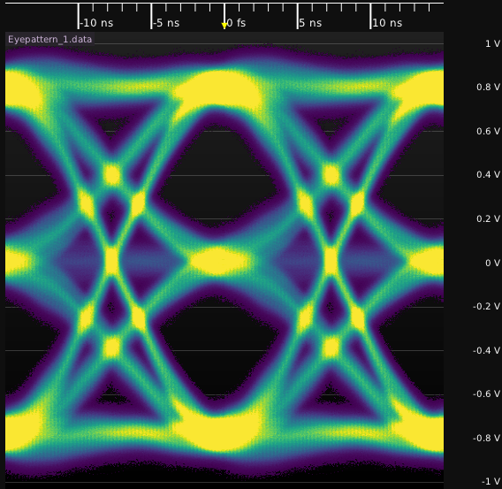

> **图 6-17**　一句话：这张实测眼图里，导线上的电压有高、中、低三个档位，所以上下叠着两只“眼”；这就是 GDDR7 所用的三电平信号的样子。
>
> **先知道一件事**：普通的数据线只有高低两个电压，一次传一个比特（0 或 1）。三电平信号（PAM3）多用一个中间电压，每次可以传三种值之一；两次组合起来有 9 种，足够表示 3 个比特，所以同样的切换速度能多传一半的数据。眼图的读法和图 6-1 一样：横轴是时间（顶部，单位纳秒，1 纳秒等于 1000 皮秒），纵轴是电压（右侧，单位伏），颜色表示波形经过的频繁程度，这张图里黄色最多、紫色最少、黑色表示没有经过。
>
> **按这个顺序看**：
> 1. 看三条黄色横带：分别在约 +0.8 伏、0 伏、−0.8 伏，就是高、中、低三个电平。
> 2. 看它们之间的两块黑色空洞：一块在 +0.8 与 0 之间，一块在 0 与 −0.8 之间，都在图的正中间（0 纳秒附近）。这是两只眼。
> 3. 接收方要在两只眼的中心各放一个参考电压（大约 +0.4 伏和 −0.4 伏），一个判断“是高还是中”，另一个判断“是中还是低”。
> 4. 对比图 6-1：两电平时，一只眼占满整个电压范围；这里每只眼的高度只有总范围的一半左右，区分相邻电平的电压余量减半。这是用三电平多传数据的代价。
> 5. 左右两侧的 X 形交叉之间相隔约 15 纳秒，这是一个符号（一次电平）占的时间。
>
> **打个比方**：两电平像只有“开”“关”两档的电灯，三电平像三档调光灯：三档能表达更多，但相邻两档的亮度差得少，光线一暗（噪声一大）就容易看错档。
>
> **看懂的标志**：能回答“三电平为什么需要两个参考电压”：把电压分成三段需要两条分界线，每条分界线要放在对应那只眼的中心。
>
> **与正文的对照**：这是 100BASE-T1 车载以太网的信号，它也采用 PAM3，但每个符号约 15 纳秒，比 GDDR7 慢两个多数量级；电平结构和读法相同。
>
> 来源：[File:Eye pattern PAM3.png](https://commons.wikimedia.org/wiki/File:Eye_pattern_PAM3.png)，作者 Nmesisgeek，许可 CC BY 4.0。

验算标准上限：GDDR7 标准（JESD239，2024 年 3 月发布）给的单器件最高带宽是 192 GB/s，32 根数据线 × 每根 48 Gbps ÷ 8 = 192 GB/s，两个数对得上。已出货的产品速率低于标准上限。

### 8.3 HBM：宽度优先，每根线尽量简单

**HBM 的取舍是宽度优先。** 走线只有几毫米，寄生参数小，可以用简单的电路拉出上千根线（07-02 §3.1 有完整对照）。它的每引脚速率反而是四个系列里偏低的。

"每根线尽量简单"这句话可以落到几个具体的设计选择上。以下按我对公开资料的理解整理，逐代的细节以标准文本为准。

**通道多而窄。** HBM3 的 1024 根数据线分成 16 条通道，每条 64 根；HBM4 的 2048 根分成 32 条通道。每条通道有自己的命令线、时钟和选通信号，互相独立。这相当于把 16 或 32 条 DDR 通道并排放进一个器件里。

**行命令和列命令走两组线。** DDR 把所有命令都放在一组 CA 线上，一个时刻只能发一条。HBM 把"激活某一行、预充电"这类行命令和"读、写某一列"这类列命令分到两组独立的线上，同一个周期里可以对一个 bank 发行命令、同时对另一个 bank 发列命令。算一笔它的作用：一条通道要持续输出数据，每隔一次突发的时间就要发一条读命令；如果同一组线上还要插入激活和预充电命令，读命令就会被挤到下一个周期，数据流出现空隙。分成两组后两类命令互不占用对方的时间。

**读和写各用一组单向的选通信号。** DDR 的 DQS 是双向的，读写切换时线上要经历"一方释放、另一方接管"的过程，这就是前导码和读门控问题的来源（§4.4、§6.6）。HBM 给读和写各配了专用的选通线，每根线只有一个固定的驱动方，方向切换的问题相应简化。代价是多占引脚，而 HBM 的微凸块数量充裕，付得起。

**走线短到可以不用或少用端接。** 信号在导线上往返一次的时间如果远小于一个比特的宽度，反射在比特的开头就已经衰减完，不影响采样。中介层上走线 5 毫米，单程约 35 皮秒、往返约 70 皮秒；HBM3E 的比特宽度是 1 ÷ 9.6 Gbps ≈ 104 皮秒，HBM4 产品约 91 皮秒。往返时间已经和比特宽度在同一量级，所以速率越高，这条"短线可以不端接"的前提越勉强——这是 07-02 §7 讲的"每引脚速率再往上，PHY 必须换工艺"在电气上的一个具体原因。

**有备用线路用于修复。** 两千多个微凸块里只要有一个焊接不良，对应的那根线就不通。HBM 的接口预留了少量备用线，并规定了把坏线的信号改接到备用线上的办法，修复信息在测试时写入。DDR 没有这种机制，因为它的引脚是焊球，失效率低得多，也可以返修。

**训练项目比 DDR 少，但总量并不小。** 没有 fly-by（每条通道点对点），所以没有首尾相差几个 UI 的问题；走线在硅中介层上用光刻做出来，长度匹配比 PCB 精确得多。但线的数量是 DDR 通道的十几倍，逐位对齐仍然要做。这里的矛盾在于：给 2048 根线各配一条 §5.2 那样的延迟线，面积非常可观，这是 07-02 §8 那 32 平方毫米 PHY 面积的组成部分之一。

### 8.4 CXL 内存扩展：换一种完全不同的接法

以上四个系列都是并行总线，要增加内存容量就要增加通道数，而每条通道要占约 150 个引脚（§3.4）。CPU 的引脚数和主板面积都有上限，所以服务器 CPU 的内存通道数停在 8 到 12 条。

**CXL（Compute Express Link）**是跑在 PCIe 物理层上的一套协议，其中 CXL.mem 这部分让主机可以把挂在 PCIe 链路另一端的内存当作普通主存访问。PCIe 是串行的差分链路，时钟从数据里恢复，一条通路（lane）只要收发各一对差分线。CXL 内存扩展设备内部有一颗控制器芯片，它一侧是 PCIe PHY 接主机，另一侧是一套完整的 DDR 控制器加 PHY 去接普通的 DDR 内存条或颗粒——§2 到 §6 讲的那一整套都在这颗控制器里。

算一笔引脚效率。一条 8 通路的 CXL 链路，运行在 PCIe 5.0 的每通路 32 Gbps：

1. 信号线数 = 8 通路 × 每通路 4 根（收发各一对）= **32 根**。
2. 原始带宽 = 8 × 32 Gbps ÷ 8 = **32 GB/s**（量级估计，未扣编码和协议开销）。
3. 每根线的带宽 = 32 ÷ 32 = **1 GB/s**。
4. 对照 DDR5-6400 通道：51.2 GB/s ÷ 约 150 根 ≈ **0.34 GB/s 每根**。

CXL 每根线的带宽约是 DDR 的三倍，而且走线可以长得多（几十厘米，可以过连接器和线缆）。代价是延迟，下面把一次读走一遍。

**一次读的路径走查。** 处理器核心要读一个 64 字节的缓存行，它在各级缓存里都没有命中，地址落在 CXL 内存的范围内。以下各段的耗时都是量级估计，不同的控制器和拓扑差别很大。

| 步 | 位置 | 发生了什么 | 耗时（纳秒，量级估计） |
| --- | --- | --- | --- |
| 1 | 主机，CXL 协议逻辑 | 把"读这个地址"封装成一个请求消息，带上地址和一个用于匹配应答的编号 | 约 5 |
| 2 | 主机，链路层与 PCIe PHY | 消息打包成固定长度的数据块，加校验；拆分到 8 条通路上，逐条并串转换后发出 | 约 10 到 15 |
| 3 | 走线 | 30 厘米走线，每毫米约 6.7 皮秒 | 约 2 |
| 4 | 设备，PCIe PHY 与链路层 | 每条通路从数据里恢复时钟、采样、串并转换；对齐 8 条通路之间的偏斜；校验、拆包 | 约 10 到 15 |
| 5 | 设备，CXL 控制器 | 把请求里的地址翻译成 DDR 的 rank、bank、行、列；排进命令队列 | 约 5 到 10 |
| 6 | 设备，DDR 控制器、PHY、颗粒 | 本节 §2 到 §4 的全过程：如果那一行没有打开，先发激活命令并等待；发读命令；等读延迟（DDR5-6400 约 14.4 纳秒）；接收 16 个比特的突发（2.5 纳秒） | 约 17 到 35 |
| 7 | 设备到主机 | 把 64 字节数据封装成应答消息，沿第 2、3、4 步的反方向走一遍 | 约 22 到 32 |
| 8 | 主机 | 按编号匹配到原请求，数据交给缓存 | 约 5 |

把第 6 步以外的各步加起来：5 + 12 + 2 + 12 + 8 + 27 + 5 ≈ **70 纳秒**（取各范围的中间值），这就是 CXL 相对直连内存多出来的部分。直连的 DDR 访问本身只有第 6 步。所以一次 CXL 内存访问的总延迟大约是直连内存的三到四倍，大致相当于访问另一颗 CPU 上的内存。如果中间还经过 CXL 交换芯片，第 2 到 4 步要再重复一遍，延迟继续增加。路径全貌见图 6-18。

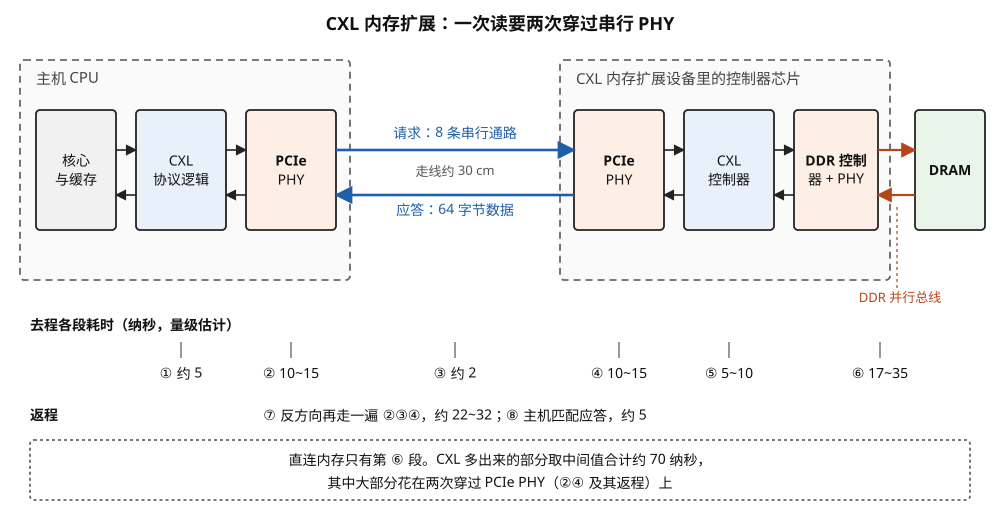

> **图 6-18**　一句话：用 CXL 扩展的内存，数据要先从主机经过一条串行链路到达扩展设备里的控制器芯片，再由它按普通 DDR 的方式去读 DRAM，最后原路送回；多出来的这些中转，让一次读多花约 70 纳秒。
>
> **先知道一件事**：普通内存用的是“并行”接法：一条通道上几十根数据线同时传。CXL 走的是 PCIe 那种“串行”接法：每条通路只有收发两对线，每对线上以极高的速率一个比特接一个比特地传，接收方要从数据里自己恢复出时钟。串行省线、能走得远，但两端都需要专门的收发电路（PHY），数据穿过它们要花时间。
>
> **按这个顺序看**：
> 1. 左边虚线框是主机 CPU：灰色的“核心与缓存”发出读请求，蓝色的“CXL 协议逻辑”把请求打包成一条消息，橙色的“PCIe PHY”把消息变成串行信号发出去。
> 2. 中间两条蓝色长箭头是串行链路：上面一条是去程“请求：8 条串行通路”，下面一条是返程“应答：64 字节数据”（64 字节是 CPU 缓存每次搬运的最小单位，叫一个缓存行），导线长约 30 厘米。
> 3. 右边虚线框是 CXL 内存扩展设备里的控制器芯片：橙色的“PCIe PHY”把串行信号还原成消息，蓝色的“CXL 控制器”把地址翻译成 DRAM 里的位置，橙色的“DDR 控制器 + PHY”按普通内存的方式发命令；最右边绿色的“DRAM”通过红色的“DDR 并行总线”与它相连。
> 4. 看下方的圆圈编号：① 到 ⑥ 是去程每一段的耗时（单位纳秒，量级估计），位置正对着上方的方框：① 协议打包约 5，② 主机 PHY 10 到 15，③ 走线约 2，④ 设备 PHY 10 到 15，⑤ 控制器 5 到 10，⑥ 真正访问 DRAM 17 到 35。
> 5. “返程”一行：⑦ 数据沿反方向再穿过 ②③④ 那三段，约 22 到 32；⑧ 主机把应答和原来的请求对上号，约 5。
> 6. 底部虚线框：直连内存只需要第 ⑥ 段，其余都是 CXL 多付的，取中间值合计约 70 纳秒，大头花在两次穿过 PCIe PHY 上。
>
> **打个比方**：直连内存像从自己家书架上拿书；CXL 内存像让快递去另一栋楼的仓库取书：仓库里取书那一步和在家差不多快，时间主要花在打包、装车、运输、拆包上。
>
> **看懂的标志**：能回答“CXL 内存适合放什么数据”：适合放容量大、访问不太频繁的数据。它能加容量，但一次读的总时间大约是直连内存的三到四倍。
>
> **与正文的对照**：圆圈编号与正文 §8.4 表格的步骤一一对应。
>
> 来源：本库自绘。

这张表也解释了 CXL 内存的适用范围：它适合放访问不那么频繁的数据，用来扩容量，不用来扩带宽；延迟增加的主要来源是两次穿过串行 PHY（第 2、4 步及其返程），这是串行链路换取引脚效率和走线距离所付的固定代价。

---

## 9. 开发者视角

DRAM 接口对应用软件是不可见的，没有任何源码层面的旋钮可以改变 PHY 的行为。但它通过以下几个途径影响到软件能观察到的东西：

| 你想知道/做什么 | 去哪里看/做 |
| --- | --- |
| 这台机器的主机内存带宽上限是多少 | 通道数 × 64 位 × 每引脚速率 ÷ 8。用 `dmidecode -t memory` 看每条内存的实际运行速率（Configured Memory Speed）和插了几条。8 通道 DDR5-6400 是 8 × 51.2 ≈ 410 GB/s |
| 实测带宽是多少 | STREAM 基准测试，或 Intel Memory Latency Checker。实测通常是理论值的七到八成 |
| 内存没插满通道会怎样 | 带宽按通道数成比例下降。12 通道的 CPU 只插 6 条，带宽减半。数据加载吞吐不够时先检查这一项（数据加载瓶颈的判据见 06-03 §6） |
| 一个通道插两条内存有什么代价 | 负载加倍、多一个分叉点，平台通常要求降速一到两档。要容量还是要带宽，是采购时的取舍 |
| 为什么服务器开机这么慢 | 内存训练（§6.7 末尾那笔账）。固件里通常有快速启动选项，复用上次的训练结果 |
| 怎么知道内存接口有没有出错 | Linux 的 EDAC 子系统：`/sys/devices/system/edac/mc/` 下的可纠正错误计数，或用 `rasdaemon` 记录。可纠正错误持续增长说明某条通道的余量不足，常见原因是内存条接触不良或温度过高 |
| 超频配置文件（XMP / EXPO）在做什么 | 让固件按高于标准的速率和更紧的时序去训练。训练能通过说明这套硬件在当时的温度下眼图还有余量，不保证长期稳定 |
| GPU 显存的训练在哪 | 在 GPU 自己的固件里，开机或驱动加载时完成，对用户不可见。显存温度过高后带宽下降，可能是接口降速（`nvidia-smi -q -d TEMPERATURE` 看显存温度） |
| 红旗信号 | 只报"支持 DDR5-8800"而不说是每通道一条还是两条内存；把 CXL 内存的容量直接加到带宽账里 |

**站在哪一层能摸到什么**：应用层和框架层只能看到带宽和延迟的最终结果；操作系统能看到错误计数和内存拓扑；固件（BIOS / UEFI）能改速率档、时序参数、是否启用快速训练；PHY 的延迟线设定值、Vref、DFE 系数只有芯片厂商的调试工具能读到。

---

## 10. 最新架构落点（知识截至 2026-09）

- **DDR5 标准**：JESD79-5C（2024 年 4 月）把标准速率上限提到 8800 Mbps，并加入 PRAC（逐行激活计数）；此后模组与 SPD 规范的更新把 RDIMM / MRDIMM 的速率定义扩到 9200 Mbps。服务器主流仍在 6400 到 8000 这一区间。
- **MRDIMM**：第一代 8800 Mbps 已随 Intel Xeon 6 平台出货；第二代目标 12800 Mbps，配套的复用数据缓冲器标准（JESD82-552，DDR5MDB02）已发布，平台侧支持在 2026 到 2027 年间落地（属于正在落地的项目，具体平台以厂商发布为准）。
- **CUDIMM**：台式机 6400 Mbps 及以上的内存条在标准架构里带时钟驱动器（CKD），模组标准 JESD323；首版把速率推到 7200，目标 9200。
- **LPDDR6**：JESD209-6 于 2025 年 7 月发布，速率 10667 到 14400 Mbps，每颗裸片两个 12 位子通道。
- **GDDR7**：JESD239 于 2024 年 3 月发布，是第一个采用 PAM 信号方式的 JEDEC DRAM 标准，单器件带宽上限 192 GB/s。RTX 50 系列显卡使用；产品速率在 28 到 32 Gbps 档，厂商路线图上有 36 Gbps 及以上（路线图）。
- **HBM4**：2026 年量产，2048 根数据线、产品每引脚约 10 到 11 Gbps，基底裸片改用逻辑工艺，PHY 是这次换工艺的首要受益者（完整论证见 07-02 §7）。
- **DFI**：2026 年公开资料显示最新版本是 DFI 6.0 系列，覆盖 DDR5（含 RDIMM / LRDIMM / MRDIMM）、LPDDR5、LPDDR6 和 HBM4，并增加了 1:3 和 1:6 的频率比。DFI 5.x 是此前 DDR5 / LPDDR5 时代的版本。
- **CAMM2 / LPCAMM2**：JESD318。2026 年已有主流笔记本采用 LPCAMM2；台式机上的 CAMM2 仍是少数。
- **SOCAMM2**：面向 AI 服务器的 LPDDR5X 压接模组，JEDEC 标准 JESD328 于 2026 年 6 月发布，速率至 9600 Mbps，单条容量已有 192 GB 的产品。NVIDIA Vera Rubin 平台的 Vera CPU 用它做主机内存。**这条值得注意，因为它意味着 AI 服务器里 CPU 一侧的主存从 DDR5 RDIMM 转向了 LPDDR 系列**——动机是功耗和带宽密度，代价是 LPDDR 没有 RDIMM 那样的缓冲芯片，每通道容量的扩展方式不同。
- **跨厂商对照**：Intel 与 AMD 的服务器平台走 DDR5 RDIMM / MRDIMM 加 CXL 扩展；NVIDIA 的 Grace 与 Vera CPU 走 LPDDR5X；各家 AI 加速器的显存走 HBM；消费级显卡走 GDDR7。四条路线对应本节 §8 表格的四列。

---

## 11. 和其它模块的挂钩

- **07-05 DRAM 单元与阵列**：本节的上游。那里讲颗粒内部（单元、灵敏放大、刷新、时序参数 tRCD / CL / tRP 的物理来源），本节讲颗粒外部。§2 提到的读延迟 CL 在那一节 §4 有物理解释；§3.3 提到的 PRAC 在那一节 §6 有完整机理。
- **07-02 HBM 解剖**：§3.1 的 GDDR 与 HBM 对照、§4 的带宽公式、§5 的两级 PHY、§7 的"为什么必须换基底裸片工艺"，是本节 §8 里 HBM 那一列的展开。本节 §2 讲的"颗粒一侧工艺差所以调节能力放在对面"，正是 HBM4 把基底裸片换成逻辑工艺要解决的问题。
- **07-03 3D-DRAM**：§6 讲数据总线反相（DBI）的完整机制，本节 §3.2 和 §5.5 只给了它省电的物理原因。
- **07-08 闪存的接口与控制器**：NAND 侧的接口（§3）从 DDR 借用了 DQS、ODT、ZQ 校准和训练这一整套做法，可以对照着读。
- **08-05 互连的物理实现**：那里讲 SerDes（串行收发器）。本节的源同步并行总线是它的对照组：SerDes 从数据里恢复时钟、每根线独立，DDR 靠 DQS 送时钟、几十根线要彼此对齐。§8.2 的 PAM3 和 SerDes 里的 PAM4 是同一类技术。
- **06-03 数据进 GPU 之前**：主机内存带宽是数据加载通路上的一环，本节 §9 的通道数与带宽的关系是那一节 NUMA 与带宽讨论的硬件基础；CXL 在那一节 §7 作为存储层级的新一级出现。
- **06-01 存储层级与搬运指令全图 §3.1**：那里讲 HBM 的通道在软件侧的表现（通道拥挤），本节讲一条通道在电气上由哪些信号组成。

---

## 12. 术语卡

### DFI（DDR PHY Interface）
**定义**：内存控制器与 PHY 之间的接口标准，规定了两者之间的信号（命令、写数据、读数据、状态与更新、低功耗各组）和时序参数。它是芯片内部两块电路之间的约定，不出现在芯片引脚上。它还定义了频率比，让控制器可以运行在 PHY 时钟的整数分之一上，每拍并行给出多个相位的内容。
**为什么存在**：控制器是可综合的数字逻辑，PHY 是与工艺绑定的混合信号硬核，两者常常来自不同供应商。没有统一接口，每换一家 PHY 就要重写控制器的对接逻辑。它同时划定了职责：控制器只管周期级的命令调度，皮秒级的定时和训练全部归 PHY。
**语境例句**："这颗 PHY 是 DFI 1:4 的，控制器跑 800 兆就够。" —— 意思是：PHY 内部时钟是控制器时钟的四倍，控制器每拍交出 8 个 UI 的数据由 PHY 串行化，所以控制器这块数字逻辑不需要跑到 3.2 GHz。

### DQS（数据选通）与源同步
**定义**：DQS 是与数据线 DQ 同向传输的差分选通信号，谁发数据谁发 DQS，接收方用它的边沿采样 DQ。每 8 根（或 4 根）DQ 配一对 DQS，组成一个字节通道。这种"发送方随数据一起送出采样时钟"的定时方式叫源同步。
**为什么存在**：读数据到达计算芯片的时刻包含往返走线延迟和颗粒内部延迟，合计十个 UI 以上且会漂移，计算芯片无法用自己的时钟确定采样时刻。DQS 与 DQ 走相同的路径、受相同的漂移，只要维持两者的相对位置就能正确采样。写的时候 PHY 把 DQS 对准 DQ 中央发出，读的时候颗粒发出边沿对齐的 DQS、由 PHY 推迟四分之一周期后采样。
**语境例句**："这个字节的 DQS 到 DQ 偏斜太大，眼对不上。" —— 意思是：这一组 8 根数据线各自的眼中心相对选通信号错开得太多，公共采样窗口不够，需要检查逐位去偏斜有没有生效，或者是某根线的走线有问题。

### UI 与眼图
**定义**：UI（单位间隔）是一个比特在导线上占据的时间，DDR 里等于时钟周期的一半；DDR5-6400 的 UI 是 156.25 皮秒。眼图是把大量比特的波形按 UI 对齐叠画得到的图，中间的空白区域的宽和高分别是采样的时间余量和电压余量。
**为什么存在**：它们是衡量一条高速链路能不能工作的通用尺度。所有损害——抖动、偏斜、码间干扰、串扰——最终都表现为眼变小，所有补救——去偏斜、均衡、端接——都是为了让眼变大。用 UI 做单位，不同速率的接口可以放在一起比较。
**语境例句**："到颗粒焊球处眼宽只剩 0.35 UI。" —— 意思是：一个比特 156 皮秒里只有约 55 皮秒是可以安全采样的，其余被各种损害占掉了；再扣掉采样时钟自己的抖动，余量已经很紧。

### 内存训练（memory training）
**定义**：上电后由 PHY 和固件执行的一系列测量与校准：逐根信号线扫描延迟和参考电压，找出能正确收发的范围，把设定值定在范围中央。典型顺序是阻抗校准、命令地址训练、写均衡、读门控训练、读数据训练、写数据训练、参考电压与均衡系数优化，运行期还有周期性重训。
**为什么存在**：时序误差的来源取决于具体每块主板、每条内存、每颗芯片的制造结果，从几个 UI（fly-by 造成的时钟到达时间差）到十几皮秒（位间偏斜）不等，设计时无法写死。而 DDR5-6400 到达接收器的眼宽只有几十皮秒，不逐根测量补偿就没有足够的公共采样窗口。
**语境例句**："换了内存之后第一次开机要重新训练，等两分钟。" —— 意思是：固件发现硬件配置变了，保存的训练结果不能用，必须对几百根数据线重新做完整的延迟和电压扫描。

### fly-by 与写均衡（write leveling）
**定义**：fly-by 是时钟和命令地址线在内存条上的走线方式：一根线依次经过每颗颗粒，在末端端接。写均衡是为补偿它而设的训练步骤：颗粒用收到的 DQS 上升沿去采样一个代表时钟时序的信号（早期是 CK 本身的电平，DDR5 改为每条写命令只产生一次的内部脉冲）并从 DQ 送回，PHY 扫描 DQS 的发送延迟，找到送回值从 0 变 1 的位置。
**为什么存在**：fly-by 让每颗颗粒只是主干线上的短分支，反射小，信号质量好；代价是时钟到达各颗粒的时刻不同，首尾相差约 640 皮秒（4 个 UI）。而数据线是各自直连的，延迟大致相等。不对每个字节通道分别调整发送时刻，远端颗粒的数据和时钟就对不上。
**语境例句**："write leveling 过了但写数据还是错一拍。" —— 意思是：采样周期性时钟的写均衡只对齐了相位，整数周期的偏差它分辨不出来，需要靠写入再读回比对来确定该加减几个周期；DDR5 改成采样只出现一次的脉冲，就是为了消除这个盲区。

### ODT 与 ZQ 校准
**定义**：ODT（片内端接）是做在芯片内部、接在信号线接收端的电阻，阻值可配为 240 欧姆除以整数。ZQ 校准是用一颗外接的 240 欧姆精密电阻作基准，调节芯片内部电阻支路使其阻值准确的过程，校准结果同时用于驱动器和 ODT。
**为什么存在**：信号到达导线末端时，末端阻抗与导线特征阻抗不匹配就会反射，反射的能量叠加到后续比特上。ODT 吸收这部分能量。而芯片上的电阻受制造偏差和温度影响可偏离标称值 20% 以上，没有 ZQ 校准，ODT 和驱动器的实际阻值就不可控，匹配无从谈起。
**语境例句**："把读方向的 ODT 从 60 改成 40 试试。" —— 意思是：怀疑当前端接阻值偏高、反射偏大，换一个更接近走线特征阻抗的值；代价是信号摆幅变小、端接功耗变大。

### MRDIMM（复用 rank 内存条）
**定义**：一种服务器内存条，在每个字节通道上有一颗复用数据缓冲器。缓冲器朝颗粒的一侧同时连接两个 rank，各以颗粒的原生速率工作；朝主机的一侧把两路数据交替发送，通道速率是颗粒速率的两倍。第一代通道速率 8800 Mbps，第二代目标 12800 Mbps。
**为什么存在**：DRAM 颗粒的工艺限制了它自己的接口速率，但主机到内存条这段通道经过缓冲之后可以跑得更快。用复用的办法，可以在不提高颗粒速率的前提下把通道带宽翻倍，而不增加 CPU 的引脚数。
**语境例句**："这个平台上 MRDIMM 只支持每通道一条。" —— 意思是：通道速率太高，两个插槽的负载和反射承受不了，要带宽就得放弃每通道第二条内存的容量。

### PAM3
**定义**：三电平脉冲幅度调制。一根线在一个符号时间里取高、中、低三个电平之一，最简单的分组是用两个符号的 9 种组合表示 3 个比特，即每符号 1.5 比特；也可以用更大的分组（7 个符号表示 11 个比特）得到略高的效率。GDDR7 的数据线采用三电平信号。
**为什么存在**：每引脚速率到 30 Gbps 以上后，两电平信号的符号宽度只剩约 31 皮秒，通道损耗也随频率升高，时间余量成为最紧的约束。PAM3 在相同比特率下把符号宽度放宽到 1.5 倍，代价是相邻电平间距减半、接收器需要两个判决电平并分别训练。
**语境例句**："GDDR7 的 32 G 其实符号率只有二十一 G 多。" —— 意思是：每根线每秒传 32 吉比特，但线上电平每秒只变化约 21.3 吉次，因为每次变化携带 1.5 个比特；评估通道损耗要按符号率对应的频率算。

---

## 13. 我的困惑 / 待深挖

- §6.2 的偏斜分项和"到达接收器的眼宽约 0.4 UI"是量级估计，没有对着具体平台的仿真或实测报告核实。需要找一份公开的 DDR5 通道仿真报告，看各项损害的实际占比。
- §6.3 的训练顺序是按依赖关系整理的逻辑顺序。各家 PHY 的实际顺序、每一步的算法（线性扫描还是二分、每个点重复采样多少次）没有公开的统一描述，需要对着某一家的公开文档核对。
- §6.5 对 DDR5 写均衡的走查是按原理构造的示意。标准里外部写均衡与内部写均衡各自使用的脉冲的精确定义、调节内部信号提前量的寄存器的步长（整周期还是半周期）、两步完成后规定的最终偏移量，都需要对着 JESD79-5 的文本核对。
- §6.4 里 CS 训练"4 次采样一组"的判断规则、§6.6 里 DDR5 读前导码的实际翻转图样与读前导码训练模式的做法，本节只给了简化的描述，需要对着标准文本补全。
- §3.1 激活命令的位分配表是凭对真值表的理解整理的，哪一位落在哪根线上需要核对。
- DDR5 DQ 接收器的 DFE 是在 DRAM 工艺上实现的。§5.6 讲了"两种可能都预先算好再选"这种电路技巧，但各家颗粒实际是否采用、在 8800 Mbps（UI 约 114 皮秒）下第一个抽头的时序余量还剩多少，没有找到公开数据。
- GDDR7 的两种分组方式（11 比特配 7 符号、3 比特配 2 符号）各用在哪些信号上，以及标准实际的符号映射表，§8.2 只给了示意，需要对着 JESD239 核对。
- §8.3 里 HBM 接口的几项特点（行列命令分开、读写选通分开、端接方式、备用线修复）是按对公开资料的理解整理的，逐代的差别没有核对。
- MRDIMM 的复用数据缓冲器让通道跑到颗粒速率的两倍，主机侧 PHY 在 12800 Mbps（UI 约 78 皮秒）下还是单端两电平信号吗？这个速率下插槽的反射怎么处理？DDR6 是否会改信号方式？
- LPDDR6 的数据线编码细节（12 根线的子通道里数据、校验、元数据如何分配）本节没有展开，需要对着标准文本补。
- §8.4 里 CXL 一次读的各段耗时都是量级估计，合计多出约 70 纳秒这个数对不同控制器和拓扑（是否经过交换芯片）差别很大，需要找实测数据。
- §7 里 RCD 和数据缓冲器的传播延迟（各约 1 到 2 纳秒）是量级估计；MRDIMM 上命令怎样在两个 rank 之间复用，本节没有讲清楚。
- SOCAMM2 作为无缓冲的 LPDDR 模组，单条 192 GB 的容量下每根线上挂了多少颗裸片的负载？它靠什么维持 9600 Mbps？这和 §7 讲的"负载多必须加缓冲"是否矛盾，还是靠封装内堆叠与点对点拓扑解决的？
- HBM 的训练包括哪些项目？2048 根线如果每根都配延迟线，面积是多少？07-02 §8 那 32 平方毫米的 PHY 里，延迟线和训练逻辑占多大比例？

---

*最后更新：2026-09-28（第四版：图注按费曼法重写，并重画图 6-8 使其与图注一致。第三版补图 18 张（其中取自 Wikimedia Commons 5 张，自绘 13 张；图 6-15 为同一条内存条正反两面的两张照片）。第二版：取消篇幅限制后的补写。§3 补两周期命令的编码例子；§5 补锁相环的五个部件与锁定过程、延迟线的粗调细调与相位插值、并串转换的选择器树与读 FIFO、ZQ 校准的逐位逼近走查、四抽头 DFE 算例；§6 改为对训练的每一步各做一个走查，新增命令线训练、DDR5 基于脉冲的写均衡与内部延迟修正、读门控训练、写数据训练、二维扫描的通过/失败网格，三级小节重新编号为 6.1 到 6.10；§7 补命令穿过 RCD 的时间线、数据缓冲器的负载账、MRDIMM 复用的逐比特时间表；§8 拆成四个小节，补 LPDDR 的双时钟、PAM3 的映射表示意与三电平接收器、HBM 接口的设计选择、CXL 一次读的路径走查。第一版。主线三条：接口分五层、PHY 是数字与模拟波形的分界；DDR 是源同步并行总线，靠 DQS 而不是时钟恢复；几十根线的对齐只能靠每次上电训练。手算四笔：DDR5-6400 的 UI 为 156 皮秒、fly-by 首尾相差 640 皮秒约 4 个 UI、位间偏斜把 62 皮秒的眼压到 22 皮秒、PAM3 把 32 Gbps 的符号宽度从 31 皮秒放宽到 47 皮秒。逐步走查两个：写均衡的粗扫与细扫及其整数周期的盲区、读数据逐位去偏斜把公共窗口从 47.5 皮秒扩到 70 皮秒。经联网核实的时效事实：JESD79-5C 与 8800 Mbps、MRDIMM 两代速率、LPDDR6 发布时间与速率、GDDR7 标准与带宽上限、DFI 6.0、CAMM2 与 SOCAMM2 的标准编号）*
