# 闪存的接口与控制器：从 ONFI 到 UFS 与 NVMe

> **所属模块**：模块 07 · 封装与存储的物理实现
> **状态**：🟨 学习中（第三版。知识截至 2026-09）
> **本节主旨**：上一节（07-07）讲 NAND 闪存的单元和阵列：电子怎么关进栅极、为什么只能整块擦、为什么擦写有寿命。但一颗 NAND 裸片自己是没法直接当硬盘用的——它不能原地覆盖写、会出错、会磨损、各个块的寿命还不一样。**所以任何闪存产品里都多出一颗芯片，叫控制器，它站在主机和 NAND 裸片之间，两边各有一套接口。** 这一节讲这颗控制器和它两侧的接口。最先要澄清的一件事是"闪存的 PHY"这个说法其实指两个不同的地方：**一处在控制器朝向 NAND 裸片的那一侧**（遵循 ONFI 或 Toggle 规范，是 8 根数据线的并行总线，电路上和 DDR 内存的 PHY 是近亲）；**另一处在存储设备朝向主机的那一侧**（UFS 用的 M-PHY、NVMe 固态盘用的 PCIe PHY，都是高速串行差分链路）。UFS 因此不是"闪存的 PHY"，而是主机侧的一整套协议栈，M-PHY 只是它最底下的一层。讲清这个分层之后，本节依次走完：NAND 侧的引脚和命令序列、控制器里的闪存转换层怎样用"异地更新"把不能覆盖写的介质包装成能覆盖写的盘、写放大和寿命怎么算、主机侧五种接口各自的结构，最后落到 AI 服务器里闪存的几种用法各自卡在哪个指标上。配四笔手算：一条 NAND 通道能挂几颗裸片、映射表为什么每 1 TB 要配 1 GB 内存、写放大系数怎么从有效页比例算出来、一块 3.84 TB 的盘每半小时写一次 checkpoint 能撑多少天。

---

## 0. 这一节要回答的问题

- "闪存的 PHY"到底指哪里？UFS 是 PHY 吗？ONFI、Toggle、M-PHY、PCIe PHY 这几个词各自在哪一层？
- 控制器和 NAND 裸片之间的那组线长什么样？发一条读命令，线上依次出现什么？
- NAND 侧接口的速率从每秒几十兆字节涨到几千兆字节，但一颗裸片读一页要几十微秒，接口跑那么快有什么用？
- NAND 不能原地覆盖写，那为什么我们用固态盘时可以随便改文件？
- 垃圾回收是什么？写放大系数是怎么来的？为什么盘越满越慢、寿命越短？
- 一个封装里十几颗 NAND 裸片是怎么叠起来、怎么连线的？控制器怎样对每一颗做训练？
- 一颗裸片正在擦除的十毫秒里来了读请求怎么办？
- 垃圾回收挑哪个块？磨损均衡具体搬的是什么？
- 突然掉电之后，映射表是怎么恢复出来的？
- 为什么只读不写的负载也会让固态盘在后台产生写入？
- 控制器芯片里有哪些硬件？每秒几十吉字节的数据是处理器核搬运的吗？
- 固态盘里为什么还要放一颗 DRAM？
- 规格书上的 TBW 和 DWPD 是怎么算出来的？我的负载会不会把盘写坏？
- eMMC、UFS、SATA、NVMe 的本质区别是什么？为什么手机用 UFS、服务器用 NVMe？
- ZNS 和 FDP 想解决什么问题？
- AI 服务器里写 checkpoint、加载数据、卸载 KV 缓存，这三件事对闪存的要求有什么不同？

---

## 1. 基础词汇：先把本节要反复用的词讲清楚

**页（page）与块（block）**。这是 NAND 阵列里两个大小不同的单位（07-07 §4 详细讲它们的物理来源）。页是读和写的最小单位，当代产品一页约 16 KB。块是擦除的最小单位，由几百到几千个页组成，大小在几兆到几十兆字节。**读写按页、擦除按块，两个单位相差两三个数量级，本节讲的控制器的大部分工作都是在处理这个不对称。**

**编程（program）**。NAND 行业把"写入"叫编程。它有一条硬约束：一个页只有在擦除之后才能被编程一次，想再写必须先把它所在的整个块擦掉。

**擦写次数（P/E cycle，program/erase cycle）**。一个块经历"擦除一次、写满一次"算一个循环。每个块能承受的循环次数有限，量级上 SLC（每单元存 1 位）约几万到十万次，TLC（每单元存 3 位）约三千到一万次，QLC（每单元存 4 位）约一千到三千次。机理见 07-07 §6。

**控制器（controller）**。闪存产品里除 NAND 之外的那颗芯片，一颗带若干处理器核、纠错引擎和两侧接口电路的专用芯片。它对主机呈现一个"可以按地址任意读写的盘"，对 NAND 则负责发命令、纠错、管理磨损。

**逻辑块地址（LBA，logical block address）**。主机眼里的地址。主机把盘看成一排编号连续的扇区（通常每个 4 KB 或 512 字节），第几个扇区就是 LBA 几。主机不知道也不关心数据在 NAND 的哪个页上。

**闪存转换层（FTL，flash translation layer）**。控制器固件里负责把逻辑块地址翻译成 NAND 物理地址（第几颗裸片、第几个块、第几页）的那一层，附带完成垃圾回收和磨损均衡。§4 是它的专题。

**通道（channel）**。在本节里指控制器朝 NAND 侧的一组独立总线。一个通道上挂若干颗 NAND 裸片，同一时刻只有一颗裸片能在这条通道上传数据。消费级控制器通常有 4 条通道，企业级有 8 到 16 条。（注意这个词和 07-02 里 HBM 的"通道"不是同一个东西，只是都表示"一组独立的收发线"。）

**MT/s（每秒百万次传输）**。并行接口的速率单位。NAND 侧接口有 8 根数据线，一次传输送 8 位即 1 字节，所以 **NAND 接口上 1 MT/s 正好等于 1 MB/s**。

**串行差分链路与通路（lane）**。主机侧的高速接口都不再用并行线，而是用成对的导线传一路信号（一根传原信号，一根传反相信号，接收端看两者之差，抗干扰能力强）。一对发送线加一对接收线合称一条通路。带宽靠"每条通路的速率 × 通路数"得到。

---

## 2. 分层：一次读请求要穿过的四层，以及"闪存的 PHY"指的两处

把任何一个闪存产品——手机里的 UFS 芯片、笔记本里的 M.2 固态盘、服务器里的企业级固态盘——剖开，看到的都是同一个四层结构（见图 8-1）：

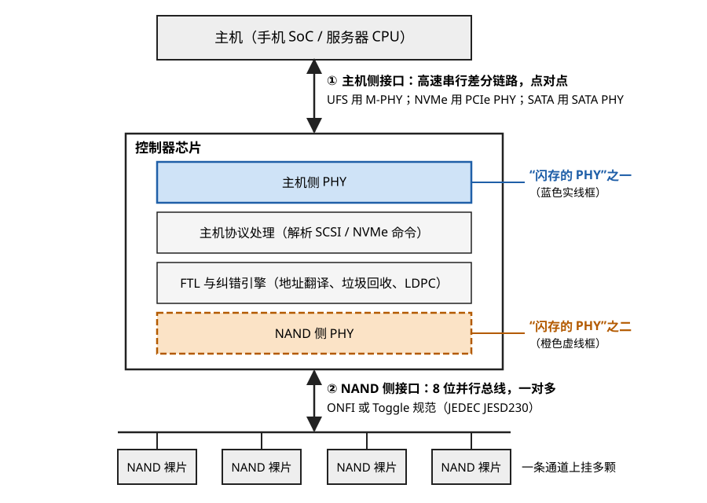

> **图 8-1**　闪存产品从主机到 NAND 裸片的四层结构。读图要点：控制器里蓝色实线框和橙色虚线框就是"闪存的 PHY"所指的两处，一处朝主机，一处朝 NAND，两者之间隔着协议处理和 FTL。①号双向箭头是点对点的高速串行链路，②号双向箭头是一对多的 8 位并行总线，底部那条横线上挂着的就是同一条通道上的多颗裸片。eMMC 的主机侧接口是并行线，是①号的一个例外（§6.1）。
> 来源：本库自绘。

四层各自的职责如下。

**主机侧接口**负责把主机的读写命令和数据送到控制器。它解决的问题是"两颗相距几厘米到几十厘米的芯片之间怎样高速可靠地传数据"，和存储介质是不是闪存没有关系——PCIe 同样用来接显卡和网卡。

**控制器**负责把主机的"按逻辑地址任意读写"翻译成 NAND 能接受的"按物理页读写、按块擦除"，并在中间完成纠错和寿命管理。

**NAND 侧接口**负责把控制器的命令和数据送到 NAND 裸片。它解决的问题是"在同一个封装或同一块小电路板内，一颗控制器怎样和十几颗到几十颗 NAND 裸片通信"。

**NAND 裸片**只执行三种基本操作：读一页、编程一页、擦一块。

### 2.1 "闪存的 PHY"有两处

PHY（physical layer，物理层）指的是把芯片内部的数字信号变成能在导线上传输的电信号的那一整套电路：驱动器、接收器、时钟电路、均衡电路。按这个定义，一颗闪存控制器上有**两套**互相独立的 PHY，它们的电路形态完全不同：

| | NAND 侧 PHY | 主机侧 PHY |
| --- | --- | --- |
| 位置 | 控制器朝 NAND 裸片的一侧 | 控制器朝主机的一侧 |
| 遵循的规范 | ONFI，或 Toggle（现由 JEDEC JESD230 统一） | MIPI M-PHY（UFS）、PCIe（NVMe）、SATA |
| 信号形态 | **并行**：8 根数据线加一根数据选通线 | **串行**：每条通路一对差分线，时钟嵌在数据里 |
| 对端是谁 | 多颗 NAND 裸片共挂一条总线 | 只有主机一个对端，点对点 |
| 当前速率 | 每根线 2.4 到 4.8 Gbps | 每条通路 23 到 64 Gbps |
| 电路上的近亲 | DDR / LPDDR 内存的 PHY | 以太网、PCIe 的 SerDes |

**NAND 侧 PHY 和 DDR PHY 是近亲**这一点值得单独说。07-06 讲 DDR 内存接口时讲过几样东西：数据选通信号 DQS（发送方把一个随路时钟和数据一起送出，接收方用它来采样）、片内端接 ODT（在接收端芯片内部接入电阻吸收反射）、ZQ 校准（用一个外接的精密电阻把驱动器阻抗校准到目标值）、训练（上电后逐根线扫描延迟，找到采样窗口的中心）。这四样在高速 NAND 接口里全部出现，连名字都一样。最新一代 NAND 接口的电气规范干脆就叫 NV-LPDDR4，意思是"借用 LPDDR4 内存那一套低压信号规范的非易失存储接口"。

### 2.2 UFS 不是 PHY，而是一个协议栈

UFS（Universal Flash Storage，通用闪存存储）是 JEDEC 制定的、主要用于手机和车载的闪存存储标准。它规定的是**主机和存储设备之间**的那个接口，自上而下分三层：

| 层 | 名称 | 由谁制定 | 负责什么 |
| --- | --- | --- | --- |
| 应用层 | SCSI 命令集 + UTP（UFS 传输协议） | JEDEC | 定义"读、写、查询"等命令的格式，以及怎么把命令打包成数据单元 |
| 链路层 | UniPro | MIPI 联盟 | 把数据单元切成帧、加校验、做流量控制、出错重传 |
| 物理层 | M-PHY | MIPI 联盟 | 把帧变成差分导线上的电信号 |

所以这几个词的准确关系是：**M-PHY 是一种 PHY；UFS 是用了 M-PHY 的一整套协议栈；一颗 UFS 芯片是一个完整的存储设备，里面封着控制器和 NAND 裸片，控制器内部朝 NAND 的那一侧另有一套 ONFI/Toggle 的 PHY。** 主机看不到 NAND 侧的任何东西。

**用一个具体产品核对这个分层。** 一颗 512 GB 的 UFS 4.0 芯片，封装尺寸约 11 mm × 13 mm，里面有：一颗控制器裸片、若干颗 NAND 裸片（例如 4 颗各 128 GB）叠在一起。对外的焊球里，高速信号只有两对发送差分线、两对接收差分线和一根参考时钟，走 M-PHY。封装内部，控制器通过键合线或基板走线连到 NAND 裸片，走 8 位并行的 Toggle 接口。两套接口在物理上完全隔开。

同样的核对可以对 NVMe 固态盘做一遍：把"M-PHY + UniPro + SCSI"换成"PCIe PHY + PCIe 链路层 + NVMe 命令集"，其余结构一模一样。**上层接口换了，NAND 侧接口没有变。** 这就是把两处 PHY 分开看的价值：同一家厂商的同一种 NAND 裸片，配不同的控制器，就能做成 UFS、做成 NVMe 盘、或者做成 U 盘。

下面两节先讲靠里的两层（§3 NAND 侧接口、§4 控制器），再讲寿命账（§5），最后讲靠外的主机侧接口（§6）。

---

## 3. NAND 侧接口：一组引脚、三条命令序列、和一条越跑越快的总线

### 3.1 引脚

一颗 NAND 裸片对外的信号线很少，可以全部列出来：

| 引脚 | 全称 | 方向 | 作用 |
| --- | --- | --- | --- |
| DQ[7:0] | 数据线 | 双向 | **命令、地址、数据三样东西都走这 8 根线**，靠下面两根线区分当前送的是哪一样 |
| CLE | command latch enable，命令锁存使能 | 控制器 → NAND | 为高时，DQ 上的字节被当作命令 |
| ALE | address latch enable，地址锁存使能 | 控制器 → NAND | 为高时，DQ 上的字节被当作地址 |
| WE# | write enable，写使能 | 控制器 → NAND | 它的上升沿把 DQ 上的命令或地址字节打入 NAND |
| RE# | read enable，读使能 | 控制器 → NAND | 控制器每翻转它一次，NAND 就送出下一个数据字节 |
| DQS | data strobe，数据选通 | 双向 | 高速模式下随数据一起发送的随路时钟，接收方用它采样 |
| CE# | chip enable，片选 | 控制器 → NAND | 选中这条通道上的哪一颗裸片 |
| R/B# | ready/busy，就绪/忙 | NAND → 控制器 | 为低表示 NAND 正忙于阵列内部的操作，暂时不能接受新命令 |
| WP# | write protect，写保护 | 控制器 → NAND | 为低时禁止编程和擦除 |

（引脚名后面的 # 表示低电平有效。）

**这张表里最重要的设计选择是第一行：命令、地址和数据复用同一组 8 根线。** 内存接口不这样做——DDR 的命令地址线和数据线是分开的两组。NAND 选择复用的原因是引脚数：一个封装里要叠十几颗裸片，每颗裸片的每个引脚都要打键合线，引脚越少越好。代价是发命令的时候不能传数据，这个代价在 §3.4 会再次出现。

### 3.2 三条命令序列的逐步走查

NAND 的全部操作都是"命令字节 + 地址字节 + 数据 + 确认字节"这种固定格式的序列。地址通常分 5 个字节送（称为 5 个地址周期）：前 2 个字节是页内的列地址（从页里的第几个字节开始），后 3 个字节是行地址（哪颗逻辑单元、哪个块、哪一页）。

**读一页。** 假设要读第 100 号块的第 7 页（各引脚上的波形见图 8-2）：

| 步骤 | CLE | ALE | DQ 上的内容 | 发生了什么 |
| --- | --- | --- | --- | --- |
| 1 | 高 | 低 | `00h` | 控制器发出"读"命令的第一个字节 |
| 2 | 低 | 高 | 列地址 2 字节 | 从页内第 0 字节开始 |
| 3 | 低 | 高 | 行地址 3 字节 | 指明 100 号块第 7 页 |
| 4 | 高 | 低 | `30h` | 确认字节，NAND 收到后才真正开始动作 |
| 5 | — | — | — | NAND 把 R/B# 拉低，在阵列里执行读操作：给选中的字线加参考电压、灵敏放大器判决、结果存入页缓冲器。这段时间记作 **tR，量级几十微秒** |
| 6 | — | — | — | R/B# 回到高，表示整页数据已在页缓冲器里 |
| 7 | 低 | 低 | 数据字节流 | 控制器连续翻转 RE#，NAND 每次送出一个字节并同时翻转 DQS；一页 16 KB 就是约 1.6 万次传输 |

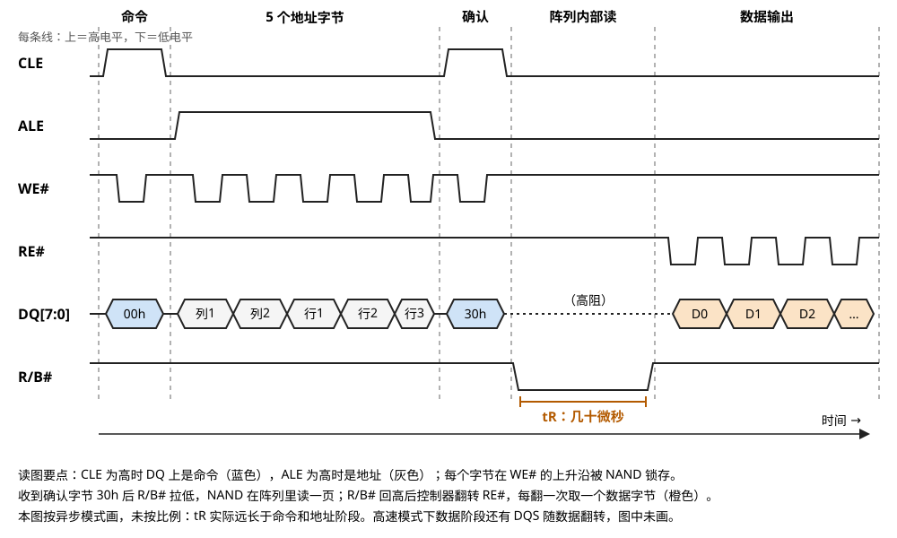

> **图 8-2**　读一页时 NAND 各引脚的波形，与上表的七个步骤一一对应。读图要点：最上方的阶段名依次是命令、5 个地址字节、确认、阵列内部读、数据输出；CLE 为高的两段里 DQ 上是命令字节 00h 和 30h（蓝色），ALE 为高的那段里是地址（灰色，列 1、列 2 是列地址，行 1 到行 3 是行地址）；WE# 每出现一个低脉冲就锁存一个字节，所以命令和地址阶段共有 7 个脉冲。R/B# 拉低的那一段就是 tR，这期间 DQ 处于高阻、通道可以让给别的裸片（§3.4）；之后控制器每翻转一次 RE#，NAND 送出一个数据字节（橙色）。图按异步模式画，未按比例，高速模式下还有随数据翻转的 DQS。
> 来源：本库自绘。延伸看图：[ONFI 5.2 规范（PDF）](https://onfi.org/files/ONFI_5_2_Rev1.0.pdf) 的 Read 操作一节有按规范画的完整时序图，能看到本图省略的各段最小时间参数（例如 WE# 高电平到 R/B# 拉低之间的 tWB）。

**编程一页：**

| 步骤 | DQ 上的内容 | 发生了什么 |
| --- | --- | --- |
| 1 | `80h` | "编程"命令的第一个字节 |
| 2 | 5 个地址字节 | 目标页的地址 |
| 3 | 数据字节流 | 控制器把整页数据送入 NAND 的页缓冲器，此时阵列还没有任何动作 |
| 4 | `10h` | 确认字节 |
| 5 | — | R/B# 拉低，NAND 在内部执行一连串"加编程脉冲、校验、再加脉冲"的循环（07-07 §3 的 ISPP）。这段时间记作 **tPROG，量级几百微秒到几毫秒** |
| 6 | `70h`，然后读回 1 字节 | 控制器发"读状态"命令，NAND 返回的状态字节里有一位表示这次编程成功还是失败 |

**擦除一块：**

| 步骤 | DQ 上的内容 | 发生了什么 |
| --- | --- | --- |
| 1 | `60h` | "擦除"命令的第一个字节 |
| 2 | 3 个行地址字节 | 只需要指明哪个块，不需要列地址 |
| 3 | `D0h` | 确认字节 |
| 4 | — | R/B# 拉低，NAND 对整个块加擦除高压并校验。这段时间记作 **tBERS，量级几毫秒到十几毫秒** |
| 5 | `70h`，然后读回 1 字节 | 读状态，确认擦除是否成功 |

**三条序列放在一起看，有两个共同点。** 第一，每条序列的最后都有一个确认字节（`30h`、`10h`、`D0h`），NAND 只有收到确认字节才开始动阵列，这是为了防止线上的干扰被误认为命令而毁掉数据。第二，三种操作的耗时差一到两个数量级：读几十微秒，编程约一毫秒，擦除约十毫秒。**这个差距是控制器调度的基本约束**——一颗裸片一旦开始擦除，十毫秒内都无法响应读请求，所以控制器要么把读请求引到别的裸片，要么发"擦除挂起"命令让它暂停。

### 3.3 速率的演进：从异步到借用内存的信号规范

NAND 侧接口的速率在十几年里涨了约一百倍。每一级台阶背后都是一次电气方案的更换：

| 代际 | 规范里的名字 | 最高速率 | 这一代换了什么 |
| --- | --- | --- | --- |
| 最早 | SDR（异步单倍速率） | 约 50 MT/s | 没有时钟，控制器每翻一次 WE# 或 RE# 传一个字节 |
| 2008 年起 | NV-DDR（ONFI 2.x）/ Toggle DDR 1.0 | 133 到 200 MT/s | 引入 DQS，并在 DQS 的上升沿和下降沿各传一个字节（双倍速率） |
| 2011 年起 | NV-DDR2（ONFI 3.x）/ Toggle DDR 2.0 | 400 到 533 MT/s | 接口电压降到 1.8 V；DQS 和 RE# 改成差分；引入片内端接 ODT |
| 2014 年起 | NV-DDR3（ONFI 4.x）| 800 → 1200 → 1600 MT/s | 接口电压降到 1.2 V；引入 ZQ 校准和读写训练 |
| 2021 年起 | NV-LPDDR4（ONFI 5.x）| 2400 → 3600 MT/s | 改用 LPDDR4 内存的低摆幅端接方式，降低每比特能耗 |
| 2024 到 2026 年 | JESD230G（2024-11）、ONFI 6.0（2026-01）| **4800 MT/s** | 新增 SCA 协议（§3.4） |

关于规范的归属要说明一句。NAND 接口历史上有两个阵营：ONFI（Open NAND Flash Interface，由英特尔、美光、海力士等发起）和 Toggle（由三星和东芝发起）。两者引脚和命令基本兼容，差别主要在早期的时钟方案上。JEDEC 的 JESD230 标准把两者统一到同一份文件里，如今说 ONFI 还是 Toggle 多半只是习惯问题。

**为什么每一级都要换电气方案。** 道理和 07-06 讲 DDR 的道理相同：速率越高，一个比特在线上占的时间越短。4800 MT/s 意味着每个字节只占 1 ÷ 4800×10⁶ ≈ **208 皮秒**。在这么短的时间窗口里，信号在走线末端的反射、8 根数据线之间几十皮秒的长度差异、驱动器阻抗随温度的漂移，都足以让接收方采错。ODT 用来吸收反射，训练用来逐根补偿长度差异，ZQ 校准用来抵消漂移——这三样是同一个问题的三个侧面。

### 3.4 一笔账：接口跑这么快有什么用，一条通道能挂几颗裸片

这里有一个初看矛盾的地方：NAND 阵列读一页要几十微秒、编程一页要约一毫秒，远比接口慢，把接口做到每秒几千兆字节似乎没有意义。答案在于**一条通道是多颗裸片共用的，而裸片在阵列里忙的时候并不占用通道**。

取一组量级数字做估算：页大小 16 KB，一颗裸片有 4 个 plane（裸片内部可以同时独立操作的阵列分区，见 07-07 §4），一次多 plane 操作处理 4 页共 64 KB；读时间 tR = 50 微秒，编程时间 tPROG = 1 毫秒；接口速率 2400 MT/s 即 2400 MB/s。

1. 在通道上传 64 KB 需要 64 KB ÷ 2400 MB/s ≈ **27 微秒**。
2. **写入场景**：一颗裸片的一次编程周期 = 占用通道 27 微秒送数据 + 自己在内部忙 1000 微秒。在这 1000 微秒里通道是空闲的，可以给别的裸片送数据。一条通道能轮流喂饱的裸片数 ≈ (27 + 1000) ÷ 27 ≈ **38 颗**。单颗裸片的写入吞吐量 = 64 KB ÷ 1.027 毫秒 ≈ 62 MB/s，38 颗合计约 2.4 GB/s，正好把通道占满。
3. **读取场景**：一颗裸片的一次读周期 = 内部忙 50 微秒 + 占用通道 27 微秒送出数据。一条通道能轮流服务的裸片数 ≈ (50 + 27) ÷ 27 ≈ **3 颗**。也就是说只要 3 颗裸片同时在连续读，这条 2400 MB/s 的通道就饱和了。
4. 如果接口只有 400 MT/s：传 64 KB 需要 160 微秒，读取时一颗裸片就把通道占满（160 微秒的传输时间已经是 tR 的三倍），单通道读吞吐量被限制在 400 MB/s。

**结论：接口速率决定的不是单颗裸片的速度，而是一条通道能让多少颗裸片并行工作。** 读取对接口速率尤其敏感，因为读操作本身快，传输时间占了周期的大头。

**但是一条通道上不能无限挂裸片，限制来自电容。** 每颗裸片的每个 DQ 引脚对总线贡献几皮法的输入电容（量级估计，ONFI 规范对单颗裸片的引脚电容有上限要求）。挂 8 颗就是十几到二十几皮法，驱动器要在 208 皮秒内把这么大的电容充放电到位，边沿会变缓、眼图会闭合。工程上有三种应对：一是增加通道数、减少每条通道上的裸片数（这是企业级控制器做到 16 通道的原因）；二是在封装内部加一颗缓冲芯片，把一条通道分成几段，控制器只看到缓冲芯片一个负载；三是非选中裸片的 ODT 配置，让没被选中的裸片帮忙端接。

**SCA 协议解决的是 §3.1 留下的那个代价。** SCA（separate command address，命令地址分离）给命令和地址另开了一条独立的串行通路，不再占用 DQ[7:0]。好处可以用上面的数字说明：原来通道在给裸片 A 传那 27 微秒的数据时，控制器无法给裸片 B 发读命令，B 只能空等；有了 SCA，A 传数据的同时 B 的命令已经发过去了，B 的 50 微秒 tR 和 A 的数据传输重叠。在多颗裸片高并发的场景下，通道的空转时间因此减少。

### 3.5 命令序列的其余部分：多 plane、读状态、挂起、缓存读、上电配置

§3.2 只走了最基本的三条序列。§3.4 的账里用到了"一次多 plane 操作处理 4 页"，§3.2 末尾提到了"擦除挂起"，这两样以及控制器日常使用的另外几条命令在这里补全。具体的操作码以 ONFI 规范为准，个别厂商的型号会有出入，下面凡是拿不准的地方都会注明。

**多 plane 编程。** plane 是一颗裸片内部拥有独立页缓冲器和独立字线驱动电路的阵列分区（07-07 §4），一颗裸片通常有 2 到 6 个。多 plane 编程的做法是：先把数据分别装进各个 plane 的页缓冲器，最后只发一次"开始"，让所有 plane 同时执行编程。以两个 plane 为例：

| 步骤 | DQ 上的内容 | 发生了什么 |
| --- | --- | --- |
| 1 | `80h` + plane 0 的目标页地址 + 一页数据 | 数据进入 plane 0 的页缓冲器 |
| 2 | `11h` | "排队"确认字节：告诉 NAND 这一页先存着，还有下一个 plane 的数据要来。NAND 短暂地忙一下（微秒量级），不动阵列 |
| 3 | `80h` + plane 1 的目标页地址 + 一页数据 | 数据进入 plane 1 的页缓冲器（部分厂商在这一步用 `81h`） |
| 4 | `10h` | 最终确认字节。两个 plane 同时开始编程，R/B# 拉低一个 tPROG |
| 5 | 读状态 | 分别确认每个 plane 是否成功 |

收益可以直接算：两页分开编程要 2 × 1 毫秒，合在一起只要约 1 毫秒。编程用的高压由裸片内部的电荷泵产生，多个 plane 共用同一次升压过程，所以时间几乎不随 plane 数增加。**代价是一条地址约束**：传统的多 plane 操作要求各个 plane 上目标页在块内的页号相同（块号可以不同），原因是各 plane 共用一部分字线电压的产生与选择电路。控制器因此总是把几个 plane 上的块"并排"使用，同步往前写。

**多 plane 读和多 plane 擦除**的结构相同，只是确认字节不同：多 plane 读是 `00h`–地址–`32h`（排队）、`00h`–地址–`30h`（开始），读完之后控制器要用一条"选择输出 plane"的命令（ONFI 中为 `06h`–地址–`E0h`）指明接下来要从哪个 plane 的页缓冲器取数据；多 plane 擦除是 `60h`–地址–`D1h`（排队）、`60h`–地址–`D0h`（开始）。

**独立 plane 读**是近几代 3D NAND 增加的能力：每个 plane 有自己完整的字线驱动和读电压产生电路，于是各 plane 可以在不同时刻、对不同页号各自发起读操作，互不等待。它针对的是随机读——随机读请求的页号各不相同，满足不了"页号相同"的约束，传统多 plane 读用不上。（这项能力在各厂商产品里的名称不同，在接口规范里的标准化程度我没有核实。）

**读状态。** §3.2 的表里用 R/B# 引脚判断 NAND 是否完成，实际产品里更常用的是读状态命令，因为 R/B# 引脚往往是多颗裸片共用一根线，看不出是哪一颗忙完了。控制器发 `70h` 后，NAND 在 DQ 上返回一个状态字节，其中几位的含义是：

| 位 | 名称 | 含义 |
| --- | --- | --- |
| 第 0 位 | FAIL | 刚完成的编程或擦除失败 |
| 第 5 位 | ARDY | 阵列已空闲（内部操作全部结束） |
| 第 6 位 | RDY | 可以接受下一条命令 |
| 第 7 位 | WP# | 写保护是否生效 |

当一个片选信号下面有多个逻辑单元或多个 plane 时，`70h` 分不清要问的是谁，这时改用"增强读状态"命令（`78h` 加行地址），用地址指明询问的对象。

**FAIL 位为 1 时控制器怎么办。** 假设控制器往块 200 的第 35 页编程，状态返回失败。此时数据还在控制器自己的缓冲区里，处理过程是：第一步，另选一个空白块，把这一页重新写进去；第二步，把块 200 里前 35 页已经写成功的有效数据读出来搬走；第三步，把块 200 登记为坏块，今后不再使用。这就是 §4.10 要讲的"增长坏块"的来源。

**擦除挂起与编程挂起。** 用一条时间线说明它换来了什么。假设某颗裸片在 t = 0 时开始擦除一个块，需要 10 毫秒；t = 2 毫秒时主机发来一个读请求，恰好落在这颗裸片上。

| | 不挂起 | 挂起 |
| --- | --- | --- |
| t = 2 ms | 读请求到达，排队等待 | 控制器发挂起命令 |
| t ≈ 2.1 ms | 仍在等待 | NAND 在一个安全的位置停下擦除并撤掉高压（需要几十到上百微秒，量级估计），转为就绪 |
| t ≈ 2.2 ms | 仍在等待 | 读命令执行完毕（tR 约 50 微秒加传输），数据返回 |
| t ≈ 2.2 ms 之后 | 仍在等待 | 控制器发恢复命令，擦除继续 |
| t = 10 ms | 擦除结束，才开始读 | — |
| 读请求的延迟 | **约 8 毫秒** | **约 0.2 毫秒** |
| 擦除的完成时间 | 10 毫秒 | 10 毫秒多一点（恢复时要重新升压） |

读延迟缩短了几十倍，这是固态盘在读写混合负载下保持低延迟的主要手段。它有两条限制：一是每次恢复都要重新建立高压，挂起次数多了擦除本身会被拖得很长，如果读请求源源不断，擦除可能永远完不成，所以控制器会给同一次擦除设定挂起次数上限；二是被打断的擦除和编程对单元施加的电压过程和正常情况不完全相同，厂商对允许的挂起次数有规定。（挂起和恢复命令的操作码因厂商而异。）

**缓存读与缓存编程。** NAND 的页缓冲器实际上有两级寄存器：靠近阵列的一级接收灵敏放大器的结果，靠近引脚的一级负责对外收发。缓存读（确认字节用 `31h` 代替 `30h`）利用这两级做流水：第 N 页的数据从外侧寄存器往外传的同时，阵列已经在把第 N+1 页读进内侧寄存器。按 2400 MT/s 算，传一页 16 KB 需要约 7 微秒，普通方式连续读每页耗时 50 + 7 = 57 微秒，缓存读方式每页耗时约 50 微秒（传输被阵列读取的时间完全覆盖）。缓存编程（确认字节用 `15h`）同理，阵列在编程当前页时，外侧寄存器已经在接收下一页的数据。

**上电后的配置序列。** 一颗 NAND 上电时处于最慢的异步模式，控制器要一步步把它带到高速模式：

| 步骤 | 命令 | 做什么 |
| --- | --- | --- |
| 1 | `FFh`（复位） | 让 NAND 进入确定的初始状态 |
| 2 | `90h`（读标识） | 读出厂商代码和器件代码 |
| 3 | `ECh`（读参数页） | 读出一张描述自身规格的表：页大小、每块页数、plane 数、支持的接口模式和最高速率、需要的纠错能力。控制器据此配置自己 |
| 4 | `EFh`（设置特性） | 写入配置：切换到高速接口模式、设定驱动强度、设定片内端接的阻值 |
| 5 | ZQ 校准命令 | 校准驱动器阻抗（§3.6） |
| 6 | 训练命令 | 逐颗裸片做读写训练（§3.6） |

第 3 步值得留意：**控制器不需要预先知道接的是哪家的哪种 NAND，这些信息是 NAND 自己报告的。** 这是 ONFI 这类接口规范最初要解决的问题——在它出现之前，控制器厂商要为每一种 NAND 型号维护一张参数表。

### 3.6 ZQ 校准、片内端接和训练在 NAND 侧的具体做法

§3.3 说高速模式需要 ZQ 校准、ODT 和训练三样东西，这一小节逐个说明它们在做什么。它们的原理和 DDR 内存接口相同（07-06 §5、§6），这里自足地讲一遍，并指出 NAND 侧的特殊之处。

**ZQ 校准：把驱动器的阻抗调到目标值。** 输出驱动器可以看成一个开关串联一个电阻，这个电阻的阻值应当和走线的特性阻抗相匹配，否则信号在两端来回反射。但芯片上晶体管的导通电阻随制造偏差、温度和电压变化，幅度可以到百分之二三十。校准的办法是：

1. 每颗 NAND 裸片有一个 ZQ 引脚，外接一个精密电阻到地（ONFI 规定为 300 欧姆，精度 1%；DDR 内存用的是 240 欧姆）。
2. 驱动器内部由许多并联的小支路组成，每个支路可以单独开关。开的支路越多，总阻值越低。
3. 校准电路先打开若干条上拉支路，与外部电阻构成分压，把分压点的电压和接口电源电压的一半做比较。分压点电压偏高说明内部电阻偏小，应减少支路；偏低说明内部电阻偏大，应增加支路。
4. 用二分法调整开启的支路数，直到分压点恰好等于电源电压的一半，此时内部上拉电阻等于外部电阻。把这组开关编码记下来。
5. 再用已校准好的上拉支路作为参考，以同样的方法校准下拉支路。

举一个示意性的数字例子：假设支路编码是 5 位，取值 0 到 31。某颗裸片在 25 摄氏度时校准得到编码 14，升温到 85 摄氏度后晶体管导通电阻增大，同样的编码 14 对应的阻值变成了目标值的 1.15 倍；重新校准后编码变为 17，阻值回到目标值。**所以校准不是上电做一次就完的事**，控制器在温度明显变化后要重新执行（规范里分为耗时较长的完整校准和耗时较短的增量校准）。

**片内端接（ODT）：由谁来吸收反射。** 信号沿走线到达末端时，如果末端是高阻抗的接收器输入，能量无处可去，会原路反射回去，和后续的信号叠加。在接收端接一个和走线阻抗相当的电阻可以把能量吸收掉。ODT 就是把这个电阻做在芯片内部，并且可以按需接入或断开。

NAND 侧的特殊之处在于一条通道上挂着多颗裸片，每颗裸片都是走线上的一个分支。控制器向裸片 A 写数据时，信号同样会到达裸片 B、C、D 的引脚并在那里反射。ONFI 为此提供了一张可配置的端接表（通过专门的配置命令写入）：对每一颗裸片，规定"当通道上的数据是发给别的裸片时，我是否接入端接电阻、接多大阻值"。典型的配置是让距离控制器最远的那颗裸片在别人被访问时承担端接，因为走线的末端是反射最强的位置。阻值的可选档位是外部 ZQ 电阻的若干分之一，例如 150、100、75、50 欧姆。

**训练：找到采样窗口的中心。** 高速模式下，接收方用 DQS 的边沿去采样 DQ。理想情况是 DQS 的边沿恰好落在每个数据位的正中央，实际上 8 根 DQ 线和 DQS 线的走线长度、封装内键合线长度、芯片内部的电路延迟都不相同。按 2400 MT/s 算一个数据位宽 417 皮秒，而信号在电路板上传播 1 毫米约需 7 皮秒，5 毫米的长度差就是 35 皮秒，接近位宽的十分之一，加上其它偏差很容易把采样点推到数据位的边缘。

**读训练的逐步走查。** 目标是为控制器一侧每根 DQ 线找到一个延迟值，使采样点落在数据有效窗口的中央。控制器内部每根 DQ 线上有一条可调延迟线，假设有 16 档，每档 20 皮秒：

1. 控制器发一条读训练命令，NAND 反复输出一个事先约定的数据图样（不需要读阵列，图样由命令参数指定）。
2. 控制器把 DQ0 的延迟设为第 0 档，接收一遍，和已知图样比较，记录对或错。
3. 延迟依次设为第 1 档到第 15 档，重复。
4. 得到一行结果，例如：

| 延迟档位 | 0 | 1 | 2 | 3 | 4 | 5 | 6 | 7 | 8 | 9 | 10 | 11 | 12 | 13 | 14 | 15 |
| --- | --- | --- | --- | --- | --- | --- | --- | --- | --- | --- | --- | --- | --- | --- | --- | --- |
| DQ0 | ✗ | ✗ | ✗ | ✓ | ✓ | ✓ | ✓ | ✓ | ✓ | ✓ | ✓ | ✓ | ✓ | ✗ | ✗ | ✗ |
| DQ1 | ✗ | ✓ | ✓ | ✓ | ✓ | ✓ | ✓ | ✓ | ✓ | ✓ | ✓ | ✗ | ✗ | ✗ | ✗ | ✗ |

5. DQ0 的通过区间是第 3 到 12 档，取中点第 7 或第 8 档；DQ1 的通过区间是第 1 到 10 档，取中点第 5 或第 6 档。两根线的最佳延迟相差 2 档即 40 皮秒，这就是它们之间的走线偏差。通过区间的宽度 10 档 × 20 皮秒 = 200 皮秒，是这根线的实际有效窗口，它比 417 皮秒的理论位宽窄了一半，其余部分被抖动和边沿的上升下降时间占掉。
6. 对 8 根 DQ 线各做一遍，把结果写入控制器的配置寄存器。

写训练方向相反：控制器发出已知图样，NAND 接收后存入页缓冲器（不写进阵列），控制器再读回来比较，据此调整自己发送时每根线的延迟。此外还有两项：一是参考电压训练，接收器用一个参考电压区分 0 和 1，把这个电压上下扫描，找到通过区间在电压方向上的中点；二是占空比校正，NAND 的读数据是由 RE# 信号的上升沿和下降沿各驱动一次送出的，如果 RE# 的高电平和低电平时间不等，相邻两个数据位就会一宽一窄。例如周期 833 皮秒的 RE# 占空比为 45% 时，高电平 375 皮秒、低电平 458 皮秒，窄的那一位比理想值少了 42 皮秒，NAND 内部的校正电路负责把它调回对称。

**和 DDR 内存训练相比，NAND 侧多出一个维度：一条通道上的每颗裸片到控制器的距离不同，需要各自训练、各自保存一组参数。** 一条通道挂 8 颗裸片、16 条通道的企业级盘要训练 128 颗，控制器在每次切换访问对象时要换用对应的那组延迟参数。训练结果通常会保存下来，下次上电时直接载入并做快速验证，以缩短启动时间（具体做法各控制器厂商不同，属于固件实现细节）。

### 3.7 封装里面：十几颗裸片怎样叠在一起、怎样连线

§3.4 说一条通道上挂多颗裸片会带来电容负载，这一小节说明这些裸片在物理上是什么样子，负载具体从哪里来。

**NAND 封装内部用的是引线键合加阶梯式堆叠。** 引线键合是用极细的金属线（直径约 20 微米）把裸片边缘的焊盘连到封装基板上的传统工艺（07-01 §1.1）。NAND 裸片的所有焊盘都排在同一条边上，总共只有几十个。堆叠时把每颗裸片磨薄到几十微米，一颗压一颗地错开一小段距离，让每颗裸片带焊盘的那条边都露在外面，侧面看像一段楼梯（见图 8-3）：

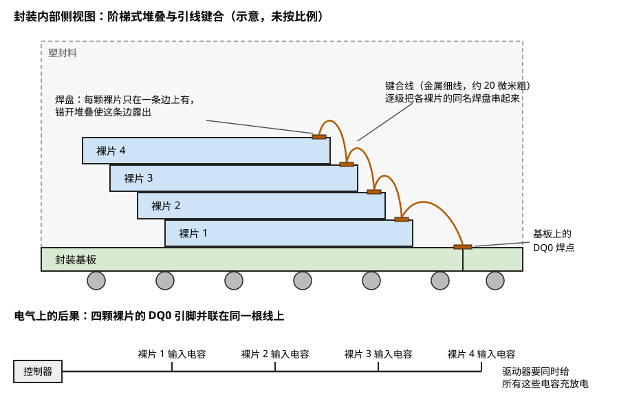

> **图 8-3**　NAND 封装内部的侧视图，上半部分是物理结构，下半部分是电气上的等效结果。读图要点：四颗裸片自下而上逐级向左错开，每颗的右边缘露出一个橙色焊盘；橙色弧线是键合线，从裸片 4 的焊盘依次串到裸片 3、2、1，最后落到基板上的 DQ0 焊点。下半部分画的是这件事的后果：四颗裸片的 DQ0 输入电容挂在同一根线上，控制器驱动这根线时要一起充放电。示意图，未按比例，实际的裸片只有几十微米厚、一个封装常叠 8 到 16 颗。
> 来源：本库自绘。

同名的信号焊盘（比如所有裸片的 DQ0）用键合线一级一级串下来，最后落到基板上的同一个焊点。**于是每颗裸片的 DQ0 引脚在电气上是并联的**，控制器驱动 DQ0 时要同时给所有裸片的输入电容充电，外加每一段键合线的电感（每毫米约 1 纳亨，量级估计）。§3.4 的负载问题就是这个结构的直接后果。

只有片选信号是分开的。控制器靠片选决定当前和哪一颗裸片通信。片选引脚数量有限时，ONFI 还提供了一种"卷地址"机制：上电时通过一条串接各裸片的使能链给每颗裸片分配一个编号，之后用一条命令加编号来选择对象，多颗裸片就可以共用一根片选线。

**一笔容量的账。** 假设单颗裸片容量 1 Tb（即 125 GB），一个封装内叠 16 颗，单个封装 2 TB。一块企业级固态盘的电路板正反两面共贴 16 个这样的封装，总容量 32 TB，共 256 颗裸片。如果控制器有 16 条通道，平均每条通道挂 16 颗裸片，恰好是一个封装对应一条通道。按每颗裸片每个引脚约 2 到 3 皮法估算（量级估计），一条通道上的总电容在 30 到 50 皮法，这样的负载无法直接跑到每秒几千兆次传输。这正是大容量盘要在封装内放缓冲芯片、或者把一个封装内部再分成几组分别接不同通道的原因。

**为什么 NAND 不像 HBM 那样用硅通孔。** 07-02 讲过 HBM 用硅通孔把 DRAM 裸片竖着穿通。NAND 的情况不同：每颗裸片只有几十个信号引脚（HBM 是几千个），每根线的速率要求也较低，引线键合足以应付，而成本比硅通孔低得多。用硅通孔堆叠的 NAND 曾有产品出现，但没有成为主流。07-02 §10 讲的 HBF 之所以重新提出硅通孔，是因为它要把接口做成几千根线的宽并行总线，引线键合在裸片的一条边上排不下这么多焊盘。

---

## 4. 控制器与 FTL：把"不能覆盖写"的介质包装成"能覆盖写"的盘

上一节讲完了控制器怎么和 NAND 说话，这一节讲控制器替主机做了哪些决定。全部内容都从 §1 那条硬约束推出来：**页只能在擦除后写一次，而擦除必须以块为单位。**

### 4.1 异地更新与映射表

假如主机要修改一个 4 KB 的扇区，而控制器坚持"原地修改"，它需要做的事情是：把这个扇区所在的整个块（比如 16 MB）读到内存里，改掉其中 4 KB，擦除这个块，再把 16 MB 全部写回去。改 4 KB 付出了写 16 MB 和一次擦除的代价，并且中途掉电会丢掉整个块的数据。这条路走不通。

实际的做法叫**异地更新（out-of-place update）**：新数据永远写到一个已经擦好的空白页上，旧数据所在的页只是被标记为"无效"，并不立刻处理。既然数据的物理位置每次修改都会变，就需要一张表记录"每个逻辑地址当前在哪个物理页"，这张表叫**映射表**，维护它就是 FTL 的核心工作。

**一个可以逐步跟踪的例子。** 设想一块极小的盘：4 个块（A、B、C、D），每块 4 页，每页存一个逻辑扇区。初始全部已擦除。

| 步骤 | 主机操作 | 控制器的动作 | 块 A | 块 B | 映射表的变化 |
| --- | --- | --- | --- | --- | --- |
| 1 | 写 LBA 0、1、2、3 | 顺序写入块 A 的 4 页 | `0 1 2 3` | 空 | 0→A0，1→A1，2→A2，3→A3 |
| 2 | 改写 LBA 1 | 新数据写到块 B 第 0 页；A1 标记无效 | `0 ✗ 2 3` | `1' _ _ _` | 1→B0 |
| 3 | 改写 LBA 3 | 新数据写到块 B 第 1 页；A3 标记无效 | `0 ✗ 2 ✗` | `1' 3' _ _` | 3→B1 |
| 4 | 改写 LBA 1 | 新数据写到块 B 第 2 页；B0 标记无效 | `0 ✗ 2 ✗` | `✗ 3' 1'' _` | 1→B2 |
| 5 | 读 LBA 1 | 查表得到 B2，读块 B 第 2 页 | 不变 | 不变 | 不变 |

（`✗` 表示页里的数据已无效，`_` 表示空白页。）

表中步骤 2 这一刻主机、映射表和 NAND 三方各自的状态画在图 8-4 里。

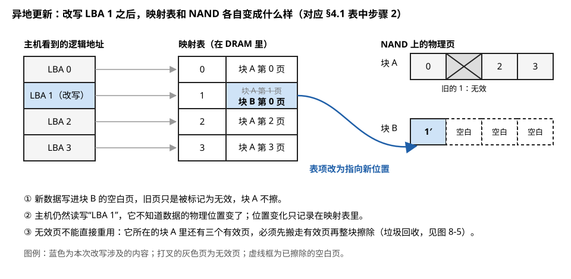

> **图 8-4**　异地更新在映射表和 NAND 上留下的痕迹，对应上表步骤 2。读图要点：左列是主机看到的逻辑地址，中间是 DRAM 里的映射表，右边是 NAND 上两个块的物理页。LBA 1 那一行表项里被划掉的旧值是"块 A 第 1 页"，新值是"块 B 第 0 页"，蓝色曲线箭头表示这次改指向；块 A 第 1 页打叉表示它已无效但没有被擦，块 B 后三页的虚线框是空白页。
> 来源：本库自绘。

四步写入之后，主机认为自己只存了 4 个扇区，但 NAND 上已经用掉了 7 页，其中 3 页是无效数据。**无效页不能直接重用，因为它所在的块里还有有效页，不能擦。** 这就引出了垃圾回收。

### 4.2 垃圾回收与写放大

**垃圾回收（GC，garbage collection）**是控制器回收无效页的过程：挑一个无效页比较多的块，把里面仍然有效的页搬到别的空白页上，然后擦掉整个块。接着上面的例子：

| 步骤 | 控制器的动作 | 块 A | 块 B | 块 C |
| --- | --- | --- | --- | --- |
| 6 | 选中块 A 作为回收对象，其中有效页是 A0 和 A2 | `0 ✗ 2 ✗` | `✗ 3' 1'' _` | 空 |
| 7 | 把 LBA 0 和 LBA 2 搬到块 C，更新映射表 | `✗ ✗ ✗ ✗` | 不变 | `0 2 _ _` |
| 8 | 擦除块 A | 空 | 不变 | `0 2 _ _` |

图 8-5 是同一过程的另一个例子，块更大一些。

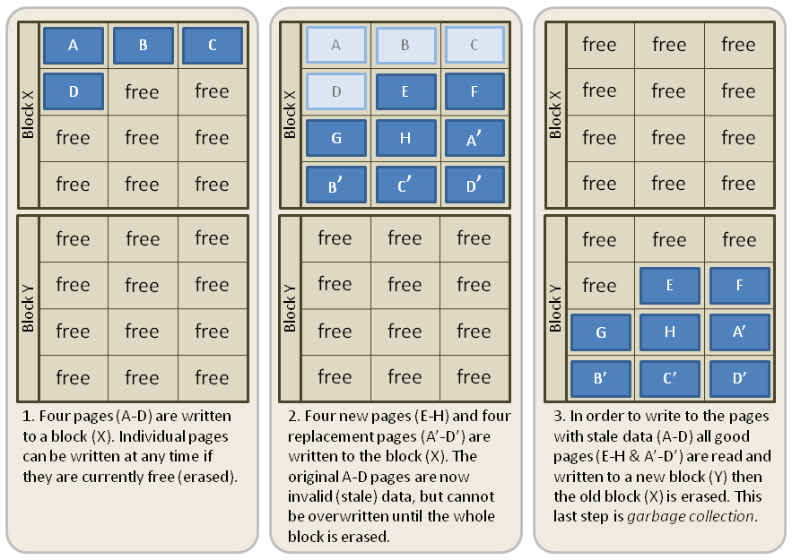

> **图 8-5**　异地更新与垃圾回收的三个阶段。读图要点：Block X、Block Y 即正文的块，每格是一页，free 是已擦除的空白页。第 1 步写入 A 到 D；第 2 步写入新数据 E 到 H，以及 A 到 D 的改写版本 A′ 到 D′，原来的 A 到 D 变成浅色，表示无效；第 3 步把块 X 里 8 个仍然有效的页搬到块 Y，再整块擦除块 X，这就是垃圾回收。可以用 §4.2 的公式核对这张图：块 X 回收时有效页占 8 ÷ 12 ≈ 0.67，搬 8 页只换回 4 页净空间，写放大系数为 1 ÷ (1 − 0.67) = 3。
> 来源：[File:Garbage Collection.png](https://commons.wikimedia.org/wiki/File:Garbage_Collection.png)，作者 Music Sorter（英文维基百科用户），许可 CC BY-SA 3.0。

这次回收得到了 4 个空白页，但代价是额外写了 2 页——这 2 页不是主机要求写的，是控制器自己搬家产生的。**主机写 1 份数据，NAND 上实际被写入的数据多于 1 份，这个现象叫写放大，两者之比叫写放大系数（WAF，write amplification factor）：**

> **WAF = NAND 上实际写入的数据量 ÷ 主机要求写入的数据量**

**写放大系数可以从被回收块的有效页比例直接算出来。** 设被回收的块里有效页占比为 u。回收一个块要搬 u 份数据，净腾出 (1 − u) 份空间给主机的新数据。所以主机每写入 (1 − u) 份，NAND 上总共写了 (1 − u) + u = 1 份：

> **WAF = 1 ÷ (1 − u)**

代几个数：

| 被回收块的有效页比例 u | WAF | 含义 |
| --- | --- | --- |
| 0（整块全是无效数据） | 1.0 | 直接擦，没有搬运。顺序写大文件再整体删除属于这种情况 |
| 0.5 | 2.0 | 主机写 1 GB，NAND 实际写 2 GB |
| 0.75 | 4.0 | 主机写 1 GB，NAND 实际写 4 GB |
| 0.9 | 10.0 | 盘几乎写满且随机改写时会逼近这种情况 |

上面例子里块 A 的 u = 2 ÷ 4 = 0.5，腾出 2 页净空间的代价是搬 2 页，WAF = 2，和公式一致。

这个公式的形状画在图 8-6 里。

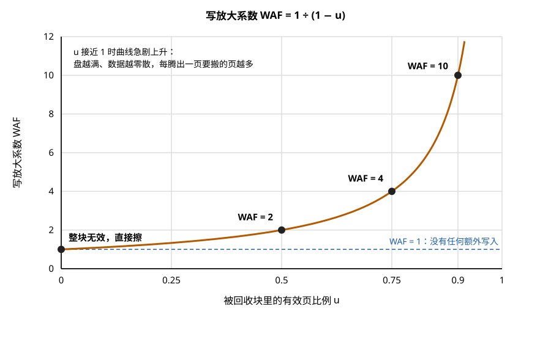

> **图 8-6**　写放大系数 WAF = 1 ÷ (1 − u) 的曲线。读图要点：横轴是被回收块里的有效页比例 u，纵轴是写放大系数；四个黑点对应上表的四行。u 在 0.5 以下时曲线平缓，写放大不超过 2；u 超过 0.75 之后曲线急剧上升，u 从 0.75 到 0.9 只增加了 0.15，写放大却从 4 涨到 10。这就是盘接近写满时性能和寿命一起恶化的原因。
> 来源：本库自绘。

**写放大同时伤害两样东西。** 一是寿命：NAND 的擦写次数是按实际写入量消耗的，WAF 为 4 意味着寿命只剩标称的四分之一。二是性能：垃圾回收占用通道和裸片，主机的写请求要排在它后面。固态盘"用久了变慢""快写满时变慢"就是这个原因——空白块耗尽后，每一次主机写入都要先等一次回收。

### 4.3 降低写放大的四种手段

既然 WAF 由 u 决定，所有手段的目标都是让被回收的块里有效页尽量少。

**预留空间（OP，over-provisioning）**。控制器向主机报告的容量小于 NAND 的实际容量，差额留作周转。例如实际有 512 GiB 的 NAND，对外只报 480 GB，差额约 15%。预留空间越大，盘上无效页的总量可以积累得越多，回收时能挑到 u 越低的块。对于"整盘均匀随机改写"这种最坏负载，有一个粗略的近似：WAF ≈ (1 + OP) ÷ (2 × OP)。OP 为 7% 时约为 7.6，OP 为 28% 时约为 2.3（这是简化模型下的量级估计，实际值取决于回收算法和负载）。**这就是企业级盘里"读密集型"和"写密集型"两种型号的主要差别：同样的 NAND，后者把更多容量留作预留空间。**

**TRIM 命令**。文件系统删除文件时只改自己的元数据，并不通知存储设备，于是控制器以为那些扇区仍然有效，垃圾回收时还会老老实实搬运它们。TRIM（在 NVMe 里叫 Deallocate，在 SCSI/UFS 里叫 Unmap）是主机告诉控制器"这些逻辑地址的数据不要了"的命令。控制器收到后把对应的物理页标记为无效，u 立刻下降。

**冷热数据分离**。如果把频繁改写的数据（热数据）和长期不变的数据（冷数据）写进同一个块，热数据失效后，块里剩下的冷数据永远有效，u 降不下去。控制器因此会尽量把预计寿命相近的数据写进同一个块，让一个块里的页大致同时失效。难点是控制器并不知道哪些数据是热的，只能靠历史改写频率猜测。§7 的 ZNS 和 FDP 就是让主机把这个信息直接告诉控制器。

**磨损均衡（wear leveling）**。这一项针对的不是 WAF，而是寿命在各块之间的分布。如果某些块存着冷数据从不被擦，另一些块被反复擦写，后者会先达到擦写上限而报废，前者的寿命却浪费了。控制器记录每个块的擦除次数，定期把冷数据从擦除次数少的块搬到擦除次数多的块上，让年轻的块出来承担写入。它本身会带来少量额外写入，是用一点写放大换取所有块同时到寿。

### 4.4 SLC 缓存

TLC 和 QLC 的编程很慢，原因是每个单元要精确地落到 8 个或 16 个电压档位之一，需要很多轮"脉冲加校验"（07-07 §5）。而同样的单元如果只区分 2 个档位（按 SLC 方式使用），编程可以快几倍。

控制器利用这一点，划出一部分块按 SLC 方式使用，作为写入缓冲区：主机的写入先以 SLC 方式快速落盘，空闲时再由控制器搬到 TLC/QLC 块里去。**代价有两个。** 一是容量：一个 TLC 块按 SLC 方式用只能存三分之一的数据，所以缓存大小有限，典型的消费级盘是几十吉字节。二是写放大：每份数据被写了两次（一次 SLC、一次 TLC）。

这解释了一个常见的现象。往一块消费级 QLC 固态盘里连续拷贝 200 GB 的文件，前几十吉字节速度是每秒几千兆字节，之后突然掉到每秒一两百兆字节——前一段写的是 SLC 缓存，缓存写满后，控制器只能一边直接以 QLC 方式写入、一边腾挪缓存，速度回到 QLC 编程的真实水平。**评估一块盘能否承担持续大量写入，要看的是缓存耗尽后的速度，而不是规格书首页的数字。**

### 4.5 映射表为什么要配一颗 DRAM

映射表的大小可以直接算。以 4 KB 为映射粒度，每个表项用 4 字节存物理地址：

1. 1 TB 容量有 1 TB ÷ 4 KB ≈ **2.7 亿**个逻辑扇区。
2. 每个表项 4 字节，映射表总大小 ≈ 2.7 亿 × 4 字节 ≈ **1 GB**。
3. 4 字节即 32 位的表项最多能区分 2³² 个物理页，对应 2³² × 4 KB = **16 TB**。超过这个容量表项要加宽到 5 字节以上，每 1 TB 对应的映射表也相应变大。

**"每 1 TB 容量配约 1 GB DRAM"这条行业经验就是这么来的。** 每一次主机读写都要查这张表，如果表放在 NAND 上，每次查表本身就是一次几十微秒的 NAND 读，延迟翻倍。所以中高端固态盘在控制器旁边放一颗 DRAM 把整张表装进去。

没有 DRAM 的方案也存在，做法是只在控制器内部的少量 SRAM 里缓存最近用到的那部分表项，其余留在 NAND 上按需调入。顺序访问时缓存命中率高，影响不大；大范围随机访问时频繁调入表项，性能明显下降。UFS 和部分 NVMe 盘还支持把映射表缓存放到主机内存里（NVMe 称为 Host Memory Buffer），是介于两者之间的折中。容量到几十上百太字节的企业级盘则常常把映射粒度从 4 KB 放大到 16 KB 或更大，用牺牲小块随机写的效率来换映射表缩小。

### 4.6 掉电保护

映射表在 DRAM 里，主机已确认写入的数据可能还在控制器的缓冲区里，这两样东西掉电即丢。企业级固态盘在电路板上放一排电容，掉电时能再维持几十毫秒供电，让控制器把缓冲区里的数据和映射表的增量写进 NAND。消费级盘通常没有这排电容，只保证已经落盘的数据不被破坏，不保证最后几十毫秒的写入。**这是企业级盘和消费级盘在硬件上最容易辨认的差别——电路板上有没有一排钽电容或铝电容。**

图 8-7 是一块企业级盘上的这类电容。

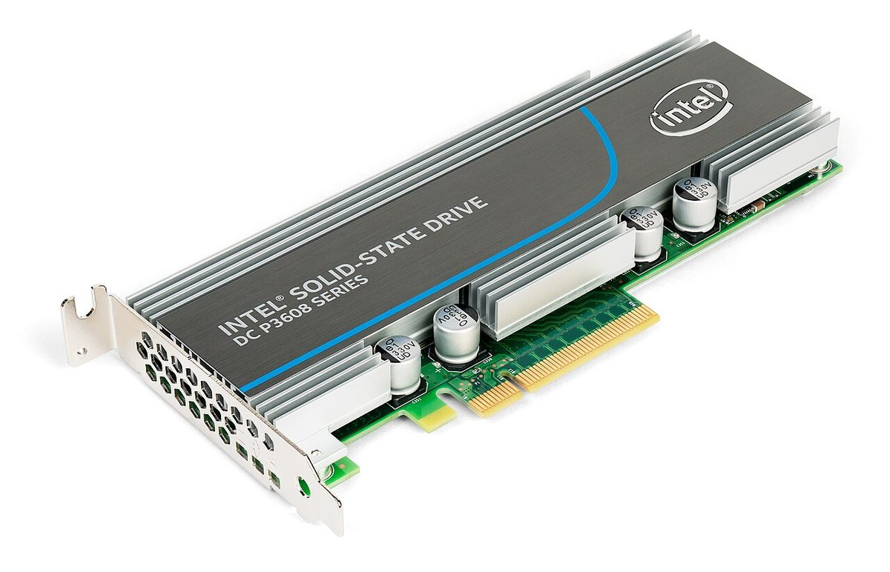

> **图 8-7**　Intel DC P3608，一块做成 PCIe 扩展卡形态的企业级 NVMe 固态盘。读图要点：散热片之间和板边露出的几颗银色圆柱形元件是铝电解电容，外壳上印着 330 字样（这类电容通常以此标注容量 330 µF）；企业级盘上这样的电容组承担 §4.6 讲的掉电保护。我没有找到这张卡的电路资料，不能确认图中每一颗电容都属于掉电保护电路。控制器和 NAND 被散热片盖住；卡底部的金手指是 PCIe 插槽接口。
> 来源：[File:Intel P3608 NVMe flash SSD, PCI-E add-in card.jpg](https://commons.wikimedia.org/wiki/File:Intel_P3608_NVMe_flash_SSD,_PCI-E_add-in_card.jpg)，作者 Dmitry Nosachev，许可 CC BY-SA 4.0。

这排电容需要存多少能量可以估算。假设掉电后控制器、DRAM 和正在编程的 NAND 合计消耗 10 瓦，需要维持 30 毫秒，所需能量 = 10 × 0.03 = **0.3 焦耳**。电容存储的能量等于二分之一乘以电容量乘以电压的平方；如果电容组充到 30 伏、放电到 10 伏为止，可用能量 = 0.5 × C × (30² − 10²) = 400 × C，要得到 0.3 焦耳需要 C ≈ 750 微法。这就是电路板上那几颗体积不小的电容的来历（电压和功耗均为示意性的量级假设）。30 毫秒能写多少数据也可以算：按每秒 2 GB 的写入速度，30 毫秒写 60 MB。1 GB 的完整映射表显然写不完，所以掉电时只能保存增量，完整的表必须平时就分批写好——这是下面 §4.9 的主题。

前面六个小节讲的是 FTL 的基本机制。后面六个小节把其中几处展开：垃圾回收具体挑哪个块（§4.7）、磨损均衡具体怎么搬（§4.8）、映射表怎样落盘和恢复（§4.9）、坏块怎么处理（§4.10）、读干扰和数据保持怎样被监控（§4.11），最后是完成这些工作的控制器芯片里有哪些硬件（§4.12）。

### 4.7 垃圾回收挑哪个块：贪心策略与成本收益策略

§4.2 只说"挑一个无效页比较多的块"。挑法不同，长期的写放大差别很大。

**贪心策略**每次都挑有效页最少的块。它让眼前这一次回收的搬运量最小，实现也简单，只需要按有效页数维护一个排序。它的缺点是只看当前状态，不看这个块将来会怎样。

**成本收益策略**多考虑一个因素：块里的数据有多久没被改动过。它给每个候选块算一个分数：

> **分数 = 回收能腾出的空间 × 数据的年龄 ÷ 回收的代价 = (1 − u) × 年龄 ÷ (2u)**

其中 u 是有效页比例；代价记为 2u，因为搬运 u 份数据要读一次、写一次；年龄是这个块最后一次有页失效以来经过的时间。分数最高的块被选中。

**用两个块对比两种策略的选择。**

| | 块 X | 块 Y |
| --- | --- | --- |
| 有效页比例 u | 0.25 | 0.5 |
| 年龄 | 1 分钟（一分钟前还有页刚刚失效） | 10 天（14400 分钟） |
| 贪心策略的依据 | 有效页最少，**选中** | 不选 |
| 成本收益分数 | 0.75 × 1 ÷ 0.5 = 1.5 | 0.5 × 14400 ÷ 1.0 = **7200，选中** |

贪心策略选 X。但 X 里的数据正在被频繁改写，一分钟前刚有页失效，剩下那 25% 的有效页很可能在接下来几分钟内也被主机改写而自行失效。现在花力气把它们搬走，搬到新位置后不久又失效，这次搬运是白做的；如果等一等，X 会变成 u = 0，可以不搬任何数据直接擦除。

成本收益策略选 Y。Y 里剩下的数据十天没有动过，可以认为是长期不变的数据，等下去 u 也不会再降，早回收晚回收代价相同，不如现在回收。而且搬出来的这批数据可以集中写到专门存放冷数据的块里，今后不再和热数据混在一起。

**回收在什么时候进行**也是一项策略。控制器维护一个空白块数量的水位：空白块充足时不回收，或只在主机空闲时慢慢回收（后台回收）；空白块低于警戒线时，必须在处理主机写入的同时回收（前台回收），这时主机的写入延迟会明显上升。举例来说，一块盘有 6 万个块，控制器可能在空白块少于 600 个（1%）时启动后台回收，少于 100 个时启动前台回收并限制主机的写入速度（数字为示意）。固态盘在长时间高强度写入后性能下降、空闲一段时间后又恢复，就是水位在这两条线之间变化的表现。

**回收搬运的数据和主机新写入的数据会写到不同的块里。** 理由是被回收搬运的数据已经用事实证明了自己是冷的（块里别的页都失效了它还有效），把它和刚写入的、冷热未知的数据分开，就是 §4.3 讲的冷热分离的一种最简单的实现。

### 4.8 磨损均衡的逐步例子：动态与静态

§4.3 用一段话描述了磨损均衡，这里用数字走一遍。磨损均衡分两种，解决的问题不同。

**动态磨损均衡**作用在分配空白块的时刻：需要一个新块来写数据时，从空白块里挑擦除次数最少的那个。它只在空白块之间做选择。

**静态磨损均衡**作用在存放冷数据的块上：把长期不动的数据从擦除次数很少的块里搬出来，让这个块重新参与周转。

设想一块只有 4 个块的盘。块 A 存着安装系统时写入的文件，从未改动；块 B、C、D 轮流承担日常写入。

| 时刻 | 块 A（冷数据） | 块 B | 块 C | 块 D | 说明 |
| --- | --- | --- | --- | --- | --- |
| 起点 | 擦除 2 次 | 100 次 | 105 次 | 98 次 | |
| 只有动态均衡，一段时间后 | 2 次 | 1000 次 | 1001 次 | 999 次 | B、C、D 之间很均匀，但 A 从未被擦除，因为它从不进入空白块的行列 |
| 继续下去 | 2 次 | 3000 次 | 3000 次 | 3000 次 | B、C、D 达到寿命上限，盘报废；A 还剩 2998 次没用 |

在这个例子里，四分之一的块的寿命完全浪费了。如果盘上一半的数据是冷数据，就有一半的块不参与周转，实际可承受的总写入量只有理论值的一半。

加上静态均衡后，控制器监视最大擦除次数与最小擦除次数之差，超过阈值（假设为 50）时触发一次搬运：

| 步骤 | 动作 | 块 A | 块 B | 块 C | 块 D |
| --- | --- | --- | --- | --- | --- |
| 0 | 初始状态。最大 105，最小 2，差值 103，超过阈值 | 冷数据，2 次 | 热数据，100 次 | **空白**，105 次 | 热数据，98 次 |
| 1 | 把块 A 的冷数据整体复制到擦除次数最多的空白块 C | 冷数据（待擦） | 热数据，100 次 | 冷数据，105 次 | 热数据，98 次 |
| 2 | 擦除块 A，A 成为空白块 | **空白**，3 次 | 热数据，100 次 | 冷数据，105 次 | 热数据，98 次 |
| 3 | 此后的新写入按动态均衡分配，优先落到擦除次数最少的 A | 热数据，3 次起 | … | 冷数据，105 次（不再增长） | … |

搬运之后，磨损最重的块 C 存放冷数据，得到休息；磨损最轻的块 A 出来承担写入。**代价是步骤 1 多写了一个块的数据**，这部分计入写放大。阈值设得越小，各块磨损越均匀，但搬运越频繁；阈值是寿命均匀程度和额外写入量之间的折中。

两种情况下各块的擦除次数对比见图 8-8。

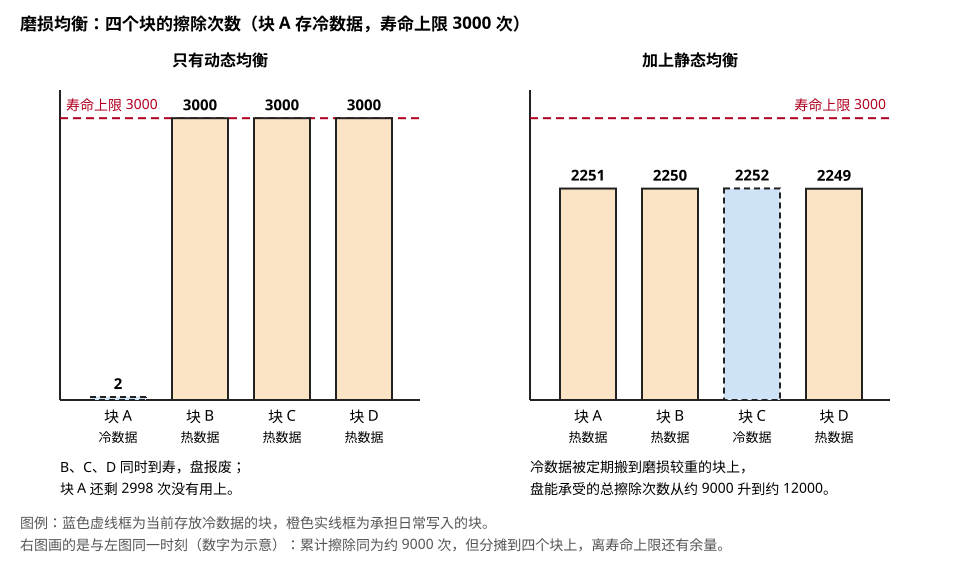

> **图 8-8**　磨损均衡对各块擦除次数的影响，接着上面两张表的例子。读图要点：红色虚线是 3000 次的寿命上限。左图只有动态均衡，存冷数据的块 A（蓝色虚线框）停在 2 次，承担写入的 B、C、D 已经顶到上限，盘报废。右图加了静态均衡，冷数据此刻存放在块 C 上，四个块的擦除次数都在 2250 次左右；两图画的是同一时刻，累计擦除次数相同，但右图离上限还有余量，整盘能承受的总擦除次数从约 9000 升到约 12000。数字为示意。
> 来源：本库自绘。

### 4.9 映射表怎样落盘，掉电后怎样恢复

映射表平时在 DRAM 里，但它必须在 NAND 上有一份能恢复出来的记录，否则一次掉电之后所有数据都找不到了。常见的做法由三样东西组成。

**第一，每个物理页自带身份信息。** NAND 的每一页除了存放用户数据的区域，还有一小块附加区域。控制器在写入每一页时，把"这一页属于哪个逻辑地址"和一个全局递增的写入序号一起写进附加区域。这样即使映射表完全丢失，把全盘每一页的附加区域扫描一遍，对每个逻辑地址保留序号最大的那一页，也能把映射表重建出来。

**第二，定期保存映射表的快照。** 控制器把 DRAM 里的映射表分成许多小段，轮流写入 NAND 上专门的系统区域。

**第三，两次快照之间的变化记入日志。** 每次映射关系改变，控制器在日志里追加一条"逻辑地址某某改为指向物理页某某"。日志积累到一定长度就成批写入 NAND。

**为什么需要后两样，可以算一笔账。** 只靠全盘扫描来重建：1 TB 的盘按每页 16 KB 算约有 6400 万页，每读一页的附加区域需要一次约 50 微秒的读操作，即使 32 颗裸片同时读，也需要 6400 万 × 50 微秒 ÷ 32 = **100 秒**。每次开机等 100 秒是不可接受的。有了快照和日志，开机时只需要读入约 1 GB 的快照（按每秒 2 GB 约 0.5 秒）再重放少量日志。

**一次意外掉电后的恢复过程：**

| 步骤 | 控制器的动作 |
| --- | --- |
| 1 | 从固定位置（控制器内部的只读存储或外接的 SPI NOR）载入引导程序，再从 NAND 的系统区域载入完整固件 |
| 2 | 在系统区域里找到最新的一份映射表快照，载入 DRAM |
| 3 | 找到这份快照之后的日志，按顺序重放，把快照更新到日志所记录的最后时刻 |
| 4 | 处理日志没有覆盖的部分：掉电前最后一小段时间里写入的页可能还没来得及记日志。控制器找到掉电时正在写入的那几个块（称为开放块），逐页读它们的附加区域，凡是序号比日志最后一条更新的，补进映射表 |
| 5 | 检查开放块里最后写入的几页能否通过纠错。掉电瞬间正在编程的页，其中的单元只被加了部分脉冲，数据是不完整的，这些页被丢弃 |
| 6 | 把开放块里剩余的空白页用无意义的数据填满，将块封闭。原因是只写了一部分的块，其已写部分的数据保持特性比写满的块差（07-07 §6） |
| 7 | 向主机报告就绪 |

第 5 步有一个 TLC 和 QLC 特有的问题。一个单元存多位时，各位数据分属不同的逻辑页，但存在同一组单元里。如果编程是分多遍完成的，后一遍编程被掉电打断时，单元的阈值电压停在中间状态，不仅正在写的数据不完整，**前一遍已经写好并且已经向主机确认过的数据也可能读不出来**。企业级盘靠 §4.6 的电容保证任何一次已开始的编程都能做完；没有电容的盘则要靠固件上的措施，例如在写后一遍之前把前一遍的数据另外备份一份。

### 4.10 坏块管理

NAND 出厂时就允许有一部分块是坏的，使用中还会出现新的坏块。控制器需要一张坏块表来避开它们。

**出厂坏块**是晶圆测试时发现的不合格块。厂商在这些块的特定位置（通常是第一页附加区域的某个字节）写入一个不同于擦除状态的标记。控制器第一次初始化一颗新的 NAND 时扫描所有块的这个位置，建立初始坏块表。规格书会给出出厂坏块的上限，量级在总块数的 2% 左右。以 1 TB、每块 16 MB 的盘为例，共约 6.4 万个块，出厂坏块最多约 1280 个。

**增长坏块**是使用中出现的，来源有三种：编程后读状态返回失败、擦除后读状态返回失败、或者某个块上读出的错误比特数持续偏高，接近纠错能力的上限。§3.5 已经走过编程失败的处理过程：数据改写到别处、搬走块内其余有效数据、登记为坏块。

**坏块消耗的是预留空间。** 每登记一个坏块，可用于周转的块就少一个。控制器持续统计剩余的备用块数量，并通过健康日志报告给主机（NVMe 健康日志里的"可用备用空间"百分比）。备用块耗尽时，控制器无法再保证写入成功，通常的做法是把盘转为只读状态，让用户还能把数据读出来。**所以固态盘寿命到头的典型表现是变成只读，而不是突然无法识别**——后一种情况多半是控制器或固件本身的故障。

坏块表本身和映射表一样保存在 NAND 的系统区域，并且保存多份副本，因为它一旦丢失，控制器可能把数据写进坏块。

### 4.11 读干扰计数与数据巡检

07-07 §6 讲过两种不经过写入也会使数据出错的机理：读干扰（读某一页时，同一块内其它字线被加上通过电压，它们的单元受到轻微的编程作用，阈值电压逐渐上移）和数据保持损失（单元里的电荷随时间慢慢流失）。这两样都需要控制器主动监控，因为主机不会知道。

**读干扰计数。** 控制器为每个块维护一个读计数器，这个块里任何一页每被读一次，计数器加一；块被擦除时清零。计数器达到阈值后，控制器对这个块做一次检查性的读取，统计纠错引擎纠正了多少个错误比特。如果错误数已经偏高，就把整个块的有效数据搬到新块，然后擦除原块，这个动作叫读回收。阈值取决于 NAND 的类型和磨损程度，量级在几万到几十万次（量级估计；QLC 比 TLC 低，擦写次数多的块比新块低）。

计数器的开销很小：6.4 万个块，每个块 4 字节，共 256 KB。

**读密集的负载也会产生写入。** 这是一个容易被忽略的推论。假设训练数据集里有一批被反复读取的小文件，它们所在的某个块平均每秒被读 100 次，读回收阈值是 10 万次：

1. 达到阈值需要 100000 ÷ 100 = 1000 秒，约 17 分钟。
2. 每 17 分钟这个 16 MB 的块被整体重写一次，一天重写 86400 ÷ 1000 ≈ 86 次。
3. 这个块一年消耗 86 × 365 ≈ 3.1 万次擦写——远超过 TLC 的寿命。当然磨损均衡会把这些擦写分摊到全盘的块上；如果这样的热点块有 100 个，分摊到 6.4 万个块上，每个块每年多消耗 3.1 万 × 100 ÷ 6.4 万 ≈ 49 次擦写，可以接受。

结论是：对只读的数据集，读干扰带来的额外写入通常不构成寿命问题，但它确实存在，并且会在后台占用通道。实际系统里主机的内存页缓存会挡掉大部分重复读取，到达盘上的读次数比应用发出的少得多。

**数据巡检。** 数据保持损失与是否被访问无关，存着不动的数据也在慢慢变差，温度越高、块的擦写次数越多，变差越快。控制器因此会在后台以很低的速度把全盘的数据读一遍，检查每个块的错误比特数，对错误偏多的块做搬运重写。按每秒 10 MB 的速度巡检 1 TB 需要 10 万秒，约 28 小时，控制器通常几天到几周完成一轮。

巡检同时为读操作积累参数。读 NAND 时加在字线上的参考电压有一个最佳值，这个值随单元的磨损和数据存放的时间而漂移。控制器在巡检中为每个块（或每组块）记录当前的最佳读电压，主机来读时直接使用，避免第一次读失败后再逐档重试（07-07 §8 的读重试）。

**巡检只有在通电时才能进行。** 一块写满数据后断电存放的固态盘没有任何机制修复电荷流失。消费级盘的规范要求是在一定温度下断电保存一年，企业级盘的要求更短（量级为几个月，因为它的寿命终点定得更靠后）。固态盘不适合做长期离线存档，原因在此。

### 4.12 控制器芯片里有什么

把前面所有功能对应到硬件上，一颗固态盘控制器芯片由以下几部分组成：

| 组成部分 | 作用 | 典型规模 |
| --- | --- | --- |
| 处理器核 | 运行固件：解析主机命令、FTL、垃圾回收、调度 NAND 操作 | 2 到 8 个面向实时控制的处理器核（ARM 或 RISC-V） |
| 主机侧 PHY 与协议控制器 | PCIe 或 M-PHY 的物理层，以及 NVMe 或 UFS 的队列管理硬件 | PCIe ×4 或 M-PHY ×2 |
| NAND 侧 PHY | 每条通道一套，含驱动器、延迟线、ZQ 和训练电路 | 4 到 16 条通道 |
| 纠错引擎 | LDPC 编码器和解码器（LDPC 是当前闪存使用的纠错码，07-07 §8），硬件实现 | 多个并行的解码器 |
| 加密引擎 | 对写入 NAND 的数据做加密，硬件实现 | — |
| DRAM 接口 | 连接外部 DRAM 的内存控制器和 DDR PHY，映射表放在这颗 DRAM 里 | 一颗或几颗 DDR4 / LPDDR4 / DDR5 |
| 数据缓冲区 | 片内 SRAM，暂存正在传输的数据 | 几兆字节 |
| 其它 | SPI 接口（接启动用的 NOR 闪存）、温度传感器、掉电检测电路 | — |

把这张表和一块真实的电路板对上，见图 8-9。

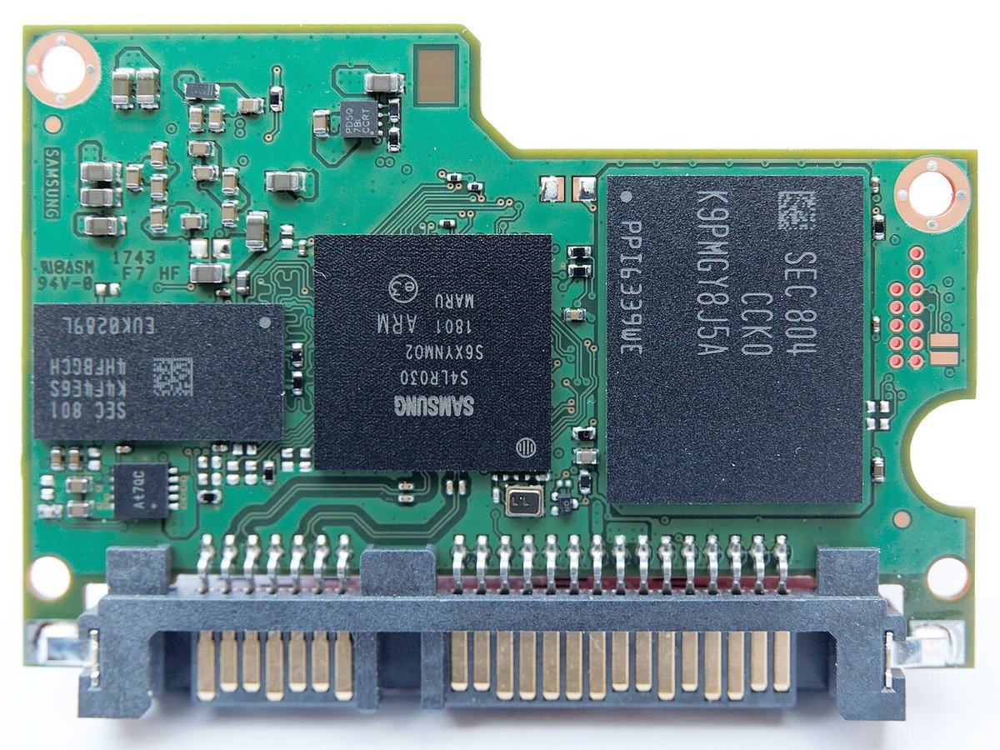

> **图 8-9**　Samsung 860 Pro（2.5 英寸 SATA 固态盘）拆开外壳后的电路板。读图要点：正中间印着 SAMSUNG 和 ARM 字样的方形芯片是控制器；它左边那颗较扁的芯片是 DRAM（型号以 K4 开头，这是三星 DRAM 的型号前缀），映射表就放在这里；右边最大的那颗芯片是 NAND 封装（型号以 K9 开头，三星 NAND 的前缀），里面叠着多颗 NAND 裸片（§3.7）；这块板的另一面还有一颗同型号的 NAND 封装。底部是 SATA 的数据和电源接口。这是一块消费级盘，板上没有图 8-7 那样的掉电保护电容，左上角的小方块是普通的电源滤波电容。控制器和 DRAM、NAND 之间的走线都在板内层，看不到。
> 来源：[File:Samsung SSD 860 Pro internal bottom.jpg](https://commons.wikimedia.org/wiki/File:Samsung_SSD_860_Pro_internal_bottom.jpg)，作者 Michael Bemmerl，许可 CC BY 3.0 DE。

这张表有三处值得说明。

**第一，一颗控制器上实际有三套 PHY。** 除了 §2.1 讲的主机侧和 NAND 侧两套，连接外部 DRAM 还需要一套 DDR PHY。所以"闪存的 PHY"指两处，是就闪存数据通路而言的；从芯片设计的角度看，控制器是一颗 PHY 面积占比很高的芯片。

**第二，数据不经过处理器核。** 按每秒 28 GB 的读速度，每秒要处理 700 万个 4 KB 的数据块。如果每个数据块都由处理器核用软件搬运和校验，任何处理器都做不到。实际的结构是一条硬件数据通路：数据从 NAND 侧 PHY 进来，依次经过解扰、LDPC 解码、解密，进入缓冲区，再由主机侧的硬件直接送出。处理器核只负责"决定读哪一页、结果送到哪里"这类控制信息。即使这样，每秒几百万个请求对固件仍是很重的负担：假设每个请求在处理器上花 1 微秒，300 万个请求就占满 3 个核。高端控制器因此把查映射表这类最频繁的动作也做成硬件。

**第三，纠错引擎的并行度由吞吐量决定。** 假设一个 LDPC 解码器在数据质量良好（只需要一轮硬判决解码）时每秒能处理 2 GB，达到 28 GB/s 需要 14 个解码器并行。当 NAND 老化、需要多轮迭代或软判决解码时，单个解码器的吞吐量成倍下降，这就是旧盘读速度变慢的原因之一（数字为量级示意）。

上面提到的"解扰"对应写入时的"加扰"：控制器在写入前用一个伪随机序列和数据做异或，使写入 NAND 的 0 和 1 大致各占一半并且分布均匀。原因是 NAND 单元之间存在相互干扰（07-07 §6），大片相同的数据（例如全 0 的文件）会使某些干扰模式集中出现，随机化之后最坏的情况被平均掉。

---

## 5. 寿命的系统账：TBW、DWPD 和写放大系数

07-07 §6 讲的擦写次数是单元层面的寿命，用户在规格书上看到的却是另外两个指标。这一节把它们接起来。

**TBW（terabytes written，总写入太字节数）**：厂商保证这块盘在寿命期内至少能承受主机写入多少太字节。

**DWPD（drive writes per day，每日整盘写入次数）**：把 TBW 换算成"在保修期内每天可以把整盘容量写几遍"。

两者的换算和来源如下：

> **TBW = NAND 实际容量 × 擦写次数 ÷ 写放大系数**
>
> **DWPD = TBW ÷（标称容量 × 保修天数）**

**一个完整的算例。** 取一块标称 3.84 TB 的企业级 TLC 固态盘：

1. NAND 实际容量约 4.1 TB（预留空间约 7%）。
2. 假设 TLC 单元的擦写次数为 5000 次（企业级 TLC 的量级估计）。
3. NAND 在寿命期内总共能承受的写入量 = 4.1 × 5000 = **20500 TB**。
4. 厂商按较为不利的随机写负载定标，假设 WAF = 3，则 TBW = 20500 ÷ 3 ≈ **6833 TB**。
5. 保修 5 年即 1825 天：DWPD = 6833 ÷ (3.84 × 1825) = 6833 ÷ 7008 ≈ **0.98**，规格书上写作 1 DWPD。

**把这块盘放进一台训练服务器，算它能撑多久。** 假设训练任务每 30 分钟保存一次 checkpoint（把模型权重和优化器状态完整写到盘上，用于故障后恢复），每次 500 GB：

1. 每天写入次数 = 24 × 2 = 48 次，每天写入量 = 48 × 0.5 TB = **24 TB**。
2. 折合 24 ÷ 3.84 ≈ **6.25 DWPD**，是规格的六倍多。
3. 按规格书的 TBW 算：6833 ÷ 24 ≈ **285 天**，不到一年就用完了标称寿命。
4. 但 checkpoint 是顺序写入的大文件，旧的 checkpoint 被整体删除，被回收的块几乎全是无效页，WAF 接近 1。按 WAF = 1 重算：20500 ÷ 24 ≈ **854 天**，约 2.3 年。

这个算例说明三件事。第一，**同一块盘的实际寿命可以因负载不同相差三倍**，差别全部来自写放大系数，规格书上的 TBW 只是某一种假设负载下的值。第二，即便按最有利的情况算，这个写入强度下一块 1 DWPD 的盘也撑不满 5 年保修期，需要选 3 DWPD 的写密集型型号，或者降低 checkpoint 频率，或者把 checkpoint 轮流写到多块盘上。第三，前提是文件系统确实下发了 TRIM——如果删除旧 checkpoint 后控制器并不知情，那些页仍被当作有效数据搬运，WAF 就回不到 1。

**对照：把一块消费级 QLC 盘放到同一个位置上。** 取一块标称 2 TB 的消费级 QLC 固态盘，用同样的公式走一遍：

1. NAND 实际容量约 2.14 TB（预留空间约 7%）。
2. 假设 QLC 单元的擦写次数为 1000 次（量级估计）。
3. NAND 总共能承受的写入量 = 2.14 × 1000 = **2140 TB**。
4. 消费级盘的数据先写 SLC 缓存再搬到 QLC 区域，每份数据至少写两次，再加上垃圾回收，假设 WAF = 3，则 TBW = 2140 ÷ 3 ≈ **713 TB**。这和市面上 2 TB 级 QLC 盘规格书上几百太字节的标称值在同一量级。
5. 保修 5 年：DWPD = 713 ÷ (2 × 1825) ≈ **0.2**。

对这块盘原本面向的用途，这个数字足够：一个办公用户每天写入 30 GB，713 TB 可以用 713000 ÷ 30 ≈ 23800 天，约 65 年，寿命不是问题。但放到上面那台训练服务器上：

1. 每天 24 TB 的 checkpoint 写入，按规格书的 TBW：713 ÷ 24 ≈ **30 天**。
2. 即使按最有利的 WAF = 1 计算：2140 ÷ 24 ≈ **89 天**。
3. 速度上也不成立。SLC 缓存通常只有几十吉字节，每次 500 GB 的 checkpoint 绝大部分要以 QLC 方式直接写入，持续速度约每秒 150 MB（量级估计）。写完 500 GB 需要 500000 ÷ 150 ≈ 3333 秒，约 **56 分钟**，超过了 30 分钟的保存间隔——上一次还没写完，下一次已经开始。

两块盘对照的结果列在一起：

| | 企业级 TLC 3.84 TB | 消费级 QLC 2 TB |
| --- | --- | --- |
| NAND 可承受的总写入量 | 20500 TB | 2140 TB |
| 规格书 TBW（WAF 取 3） | 约 6833 TB | 约 713 TB |
| DWPD（5 年） | 约 1 | 约 0.2 |
| 每天写 24 TB 时按 TBW 计的寿命 | 285 天 | 30 天 |
| 每天写 24 TB 时按 WAF = 1 计的寿命 | 854 天 | 89 天 |
| 持续写入 500 GB 的耗时 | 约 4 分钟（按每秒 2 GB） | 约 56 分钟 |

**寿命相差约十倍，其中约五倍来自单元的擦写次数（5000 对 1000），约两倍来自容量。** 这张表也说明为什么不能只按"每太字节的价格"选盘：对写密集的用途，应当比较的是"每太字节写入量的价格"。

07-02 §10 对 HBF 做过同一类计算（100 GB 容量、每秒 10 GB 写入、不到三小时耗尽寿命），用的是同一个公式，只是容量小得多、写入速率高得多。

---

## 6. 主机侧接口家族

前面三节讲的都在存储设备内部，主机看不见。这一节讲主机看得见的那一侧。五种接口可以按两个维度来理解：物理层是并行还是串行，命令层是单队列还是多队列。

### 6.1 eMMC：并行线，一次一条命令

eMMC（embedded MultiMediaCard，嵌入式多媒体卡）是从早年的 MMC 存储卡演变来的嵌入式存储标准，控制器和 NAND 封在同一颗芯片里直接焊在主板上。它的接口是并行的：一根时钟线、一根命令线、8 根数据线、一根数据选通线。最高速模式 HS400 用 200 MHz 时钟、上下沿都传数据，8 根线每秒传 400 兆次，即 **400 MB/s**。

它有两个结构上的限制。一是数据线是双向共用的，同一时刻只能朝一个方向传（半双工）。二是命令模型来自存储卡时代，基本上是发一条命令、等它做完、再发下一条（5.1 版加入了命令队列，但受限于物理层，收益有限）。如今 eMMC 只用在低成本设备上。

**一次 eMMC 多块读的逐步走查。** eMMC 的命令和数据走不同的线：命令和应答走那一根命令线，数据走 8 根数据线。每条命令是一个 48 位的帧，逐位串行发送，内容依次是起始位、方向位、6 位命令编号、32 位参数、7 位校验码和结束位。主机要从第 1000 号扇区开始读 8 个扇区（每扇区 512 字节）：

| 步骤 | 命令线上 | 数据线上 | 说明 |
| --- | --- | --- | --- |
| 1 | 主机发 CMD23，参数为 8 | 空闲 | 预先声明接下来要传 8 个扇区 |
| 2 | 设备回一个 48 位的应答帧 | 空闲 | 应答里带设备状态，表示命令已接受 |
| 3 | 主机发 CMD18，参数为 1000 | 空闲 | "读多个块"，参数是起始扇区号 |
| 4 | 设备回应答帧 | 空闲 | 设备内部此时开始查映射表、读 NAND |
| 5 | 空闲 | 设备依次送出 8 个数据块，每个数据块前有起始位，后有每根数据线各自的 16 位校验码 | HS400 模式下设备同时驱动数据选通线，主机用它采样 |
| 6 | 空闲 | 空闲 | 传满 8 个扇区后自动结束，主机可以发下一条命令 |

写入的流程方向相反，并且多一个环节：主机每送完一个数据块，设备在第 0 号数据线上回一个很短的状态标记表示校验是否通过，随后把这根线拉低表示自己正忙于写入，主机要等它释放才能送下一块。

**从这张表能看出 eMMC 的两个限制具体卡在哪里。** 在步骤 3 到步骤 6 之间，数据线被这一条读命令占用，主机无法让设备同时处理别的读写；数据线是双向共用的，读的数据没有传完就不能开始写。5.1 版的命令队列把"下发任务"和"执行任务"拆成了两组命令，主机可以先登记多个任务，由设备决定先准备好哪一个，但真正传输数据时仍然是一次一个任务独占数据线。

**eMMC 同样需要调整采样点。** 200 MHz 时钟下一个数据位宽 2.5 纳秒（HS400 双沿传输时为 1.25 纳秒）。在没有数据选通线的 HS200 模式下，主机通过一条专门的调谐命令让设备反复发送固定的数据图样，主机逐档改变自己采样时钟的相位，找出能正确接收的相位范围并取其中点。这和 §3.6 的读训练是同一个过程，只是对象从 NAND 侧换到了主机侧。

### 6.2 UFS：串行差分，全双工，命令队列

UFS 的三层结构在 §2.2 已经给出，这里补充物理层的速率和一次读的完整过程。

**M-PHY 用"档位"（gear）表示速率。** 每升一档速率大约翻倍：

| UFS 版本 | 发布时间 | M-PHY 档位 | 每条通路速率 | 通路数 | 接口带宽（量级） |
| --- | --- | --- | --- | --- | --- |
| UFS 2.1 | 2016 年 | HS-G3 | 5.8 Gbps | 2 | 约 1.2 GB/s |
| UFS 3.0 / 3.1 | 2018 / 2020 年 | HS-G4 | 11.6 Gbps | 2 | 约 2.3 GB/s |
| UFS 4.0 / 4.1 | 2022 / 2024 年 | HS-G5 | 23.3 Gbps | 2 | 约 4.6 GB/s |
| UFS 5.0 | 2026 年 2 月发布 | HS-G6 | 46.7 Gbps | 2 | 约 10.8 GB/s |

带宽这一列可以自己验算。HS-G5 及之前采用 8b/10b 编码（每 8 位数据编成 10 位再发送，目的是保证线上有足够多的电平跳变，让接收端能从数据里恢复出时钟），有效数据占 80%。UFS 4.0：23.3 Gbps × 2 条通路 × 0.8 ÷ 8 ≈ **4.66 GB/s**。UFS 5.0 的 HS-G6 做了两处改变：信号从两个电平改成四个电平（PAM4，每个符号携带 2 位），编码改成开销低得多的 1b1b 方案，所以 46.7 × 2 ÷ 8 ≈ 11.7 GB/s 的原始速率里有约 10.8 GB/s 是有效数据。

**相对 eMMC，UFS 的三个实质改进**：一是全双工，发送和接收各有独立的差分线，主机下发新命令的同时设备可以回传上一条命令的数据；二是命令队列，主机可以一次下发最多 32 条命令，设备自行决定执行顺序；三是串行差分线引脚少、抗干扰强，速率能持续往上提。

两种接口的线路和分层并排画在图 8-10 里。

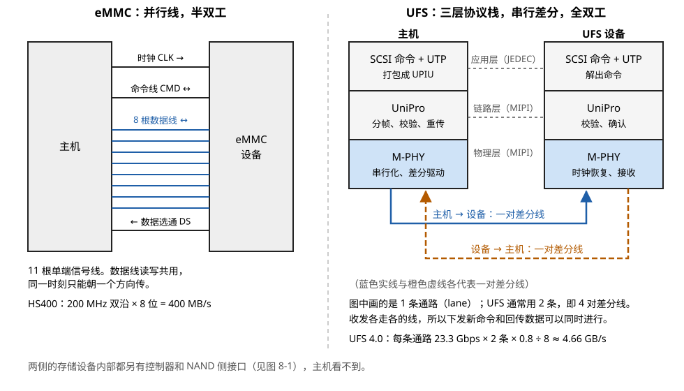

> **图 8-10**　eMMC 与 UFS 的对照。读图要点：左边 eMMC 的 8 根蓝色数据线是读写共用的，同一时刻只能朝一个方向传；右边 UFS 的两端各有三层，灰色虚线标出对等的层（应用层由 JEDEC 定义，链路层和物理层由 MIPI 定义），真正走线的只有最下面的 M-PHY：蓝色实线一对差分线从主机到设备，橙色虚线一对从设备到主机，两个方向各走各的线。图中只画了一条通路，UFS 通常用两条。
> 来源：本库自绘。

**一次 UFS 读的逐步走查。** 手机上的应用要读一个文件里的 4 KB：

| 步骤 | 所在层 | 发生了什么 |
| --- | --- | --- |
| 1 | 主机文件系统 | 把"文件偏移"翻译成逻辑块地址，比如 LBA 1000 |
| 2 | 主机 SCSI 层 | 生成一条 SCSI 读命令（READ(10)）：10 字节的命令描述块，里面写着起始 LBA 和长度 |
| 3 | 主机 UTP 层 | 把命令描述块装进一个叫"命令 UPIU"的数据单元（UPIU 是 UFS 协议信息单元，带 32 字节的头部，头部里有一个任务标签用来区分队列里的各条命令），放进主机控制器的请求队列，置位对应的门铃寄存器 |
| 4 | 主机 UniPro 层 | 把 UPIU 封装成链路层的帧，加 16 位的循环冗余校验码，等待对端的流量控制信用 |
| 5 | 主机 M-PHY | 对帧做 8b/10b 编码，串行化，从发送差分线送出 |
| 6 | 设备 M-PHY、UniPro | 恢复时钟、解码、校验；校验通过回一个确认帧，不通过回一个否认帧要求重发 |
| 7 | 设备 UTP 层、FTL | 取出 SCSI 命令，查映射表得到 LBA 1000 对应的物理页 |
| 8 | 设备 NAND 侧接口 | 执行 §3.2 的读序列：`00h`、地址、`30h`、等 tR、取数据；纠错引擎解码 |
| 9 | 设备 → 主机 | 数据装进"数据输入 UPIU"回传，随后发一个"响应 UPIU"表示命令完成；回传同样经过 UniPro 和 M-PHY |
| 10 | 主机 | 主机控制器产生中断，驱动根据任务标签找到对应的请求，把数据交给文件系统 |

步骤 3 到 6 和步骤 9 是 UFS 协议栈，步骤 7 是 FTL，步骤 8 是 NAND 侧接口。**§2 那张分层图里的每一层都在这张表里出现了一次。**

上面的走查把每一层都当作一步带过。下面四段分别展开其中三层的内部机制：M-PHY 怎样省电和换档，UniPro 怎样处理传输错误，以及主机一侧的队列结构在 UFS 4.0 发生了什么变化。

**M-PHY 的功耗状态。** 手机上的存储设备绝大部分时间没有数据要传，链路空闲时的功耗比峰值速率更影响续航。M-PHY 为此定义了几个状态，越省电的状态恢复到可传输状态所需的时间越长：

| 状态 | 链路在做什么 | 功耗 | 恢复传输所需时间（量级估计） |
| --- | --- | --- | --- |
| 高速突发 | 正在以高速档传数据 | 最高 | — |
| 停顿（STALL） | 两次高速突发之间的短暂间隙，发送端停止翻转，接收端保持电路偏置 | 低 | 微秒量级 |
| 休眠（HIBERN8） | 链路长时间空闲时进入，大部分电路断电，但保留链路的配置参数 | 很低 | 几十微秒到毫秒量级 |
| 关闭 | 整个设备断电 | 零 | 需要重新初始化，几十毫秒以上 |

关键的设计是休眠状态保留了配置：速率档位、通路数、均衡参数都还在，唤醒后不需要重新协商和训练。这使得主机可以很积极地让链路休眠——只要几毫秒没有读写就进入，有请求时再唤醒，用户感觉不到延迟。假设链路在高速突发状态消耗几百毫瓦，休眠状态消耗不到一毫瓦（量级估计），而手机存储在一天里真正传输数据的时间只占百分之几，平均功耗就主要由休眠状态决定。各状态的精确功耗和时间指标取决于具体的 M-PHY 版本和器件，这里只给量级。

**档位切换。** 链路不是一上电就跑在最高档。以 UFS 4.0 设备为例，上电后的过程是：

1. 链路以最低的低速档启动（低速档采用另一种脉宽调制的信号方式，速率只有每秒几兆比特，但对信号质量几乎没有要求，保证总能通上）。
2. 两端在低速档下完成链路启动，交换各自的能力：支持的最高档位、通路数。
3. 主机通过 UniPro 的物理适配层向设备发一个"功率模式变更"请求，写明目标档位（例如高速第 5 档）、速率系列和通路数（2 条）。
4. 设备确认后，两端同时切换。高速第 4 档及以上在切换时还要发送一段专门的适配序列，让接收端的均衡电路根据实际通道调整参数。
5. 链路进入高速档，开始正常传输。

每个高速档位有 A、B 两个速率系列，B 系列比 A 系列快约 17%。设两个系列的目的是让设备厂商可以避开与手机射频频段冲突的频率。§6.2 表里的速率是 B 系列的值。主机在运行中也可以主动降档：负载很轻时降到较低的档位省电，需要时再升回来。

**UniPro 的重传：一个可以跟踪的例子。** UniPro 的数据链路层保证帧按序、无差错地送达，手段是序号、校验、确认和重发。每个数据帧带一个序号和 16 位校验码；接收端用"确认与流控帧"告知已经正确收到的最后一个序号，同时告知自己还有多少缓冲空间；校验出错时回一个"否认帧"。发送端把已发出但尚未得到确认的帧保留在重发缓冲区里。

一段 4 KB 的数据在这一层要切成十几个帧，因为每帧的载荷上限不到三百字节（具体数值我没有核对规范）。假设其中连续三帧的序号是 5、6、7，第 6 帧在传输中被干扰：

| 时刻 | 发送端 | 线上 | 接收端 |
| --- | --- | --- | --- |
| 1 | 发帧 5，保留副本 | 帧 5 完好 | 校验通过，收下帧 5 |
| 2 | 发帧 6，保留副本 | **帧 6 有一位出错** | 校验失败，丢弃；回否认帧 |
| 3 | 发帧 7，保留副本 | 帧 7 完好 | 期待的序号是 6，收到的是 7，丢弃 |
| 4 | 收到否认帧 | — | — |
| 5 | 先重新同步链路，然后从第一个未被确认的帧开始重发：帧 6 | 帧 6 完好 | 校验通过，收下帧 6 |
| 6 | 重发帧 7 | 帧 7 完好 | 收下帧 7；回确认帧，确认到序号 7 |
| 7 | 收到确认，释放帧 5、6、7 的副本 | — | — |

上层的 UTP 和 SCSI 完全不知道发生过错误，它们看到的只是这一次传输稍慢了一点。**这就是分层的价值：物理层允许偶尔出错（高速串行链路的误码率指标通常在 10⁻¹² 量级上下），链路层把它变成一条对上层而言无差错的通道。** PCIe 的数据链路层采用同样的机制，名称不同，原理一致。

**多队列（MCQ）。** UFS 4.0 之前，主机控制器只有一个请求队列，共 32 个槽位，外加一个 32 位的门铃寄存器，每一位对应一个槽位。所有 CPU 核下发请求时都要在这 32 个槽位里申请位置、改同一个门铃寄存器，必须加锁互斥。手机处理器有 8 个核，存储设备每秒能处理几十万个请求时，这把锁成了瓶颈。

UFS 4.0 配套的主机控制器规范引入多队列：主机内存里可以建立多对提交队列和完成队列，每个 CPU 核使用自己的一对，结构上与 §6.4 要讲的 NVMe 队列基本相同。设备一侧的执行方式没有变，改变的是主机一侧的并发能力。**这一步改动说明 UFS 和 NVMe 在命令层上正在趋同，两者剩下的主要差别在物理层和功耗管理上。**

### 6.3 SATA：为机械硬盘设计的接口

SATA 是 2003 年为机械硬盘制定的串行接口，一条通路，第三代速率 6 Gbps，8b/10b 编码后有效带宽 **600 MB/s**。它配套的主机控制器规范 AHCI 只有一个命令队列，深度 32。这两个数字对机械硬盘绰绰有余（机械硬盘一次寻道要几毫秒，每秒只能处理一两百个随机请求），对固态盘则成了瓶颈：NAND 的能力远高于 600 MB/s，单队列也无法让多个 CPU 核同时下发命令。

### 6.4 NVMe：为闪存重新设计的命令层，物理层借用 PCIe

NVMe（Non-Volatile Memory Express）是专门为固态存储设计的主机接口规范。它自己不定义物理层，而是直接运行在 PCIe 之上（PCIe 是计算机里连接显卡、网卡等扩展设备的通用高速串行总线）。

**物理层的带宽由 PCIe 的代际和通路数决定：**

| PCIe 代际 | 每条通路速率 | 编码 | 每条通路有效带宽 | 4 条通路合计 |
| --- | --- | --- | --- | --- |
| 3.0 | 8 GT/s | 128b/130b | 约 1 GB/s | 约 4 GB/s |
| 4.0 | 16 GT/s | 128b/130b | 约 2 GB/s | 约 8 GB/s |
| 5.0 | 32 GT/s | 128b/130b | 约 4 GB/s | 约 16 GB/s |
| 6.0 | 64 GT/s | PAM4 加前向纠错 | 约 7.5 GB/s | 约 30 GB/s |

固态盘通常使用 4 条通路。2026 年量产的 PCIe 6.0 企业级固态盘顺序读速度约 28 GB/s，已经接近 4 条通路的上限。

**命令层的核心设计是多队列。** NVMe 允许最多约 6.5 万个队列，每个队列深度最多约 6.5 万。实际使用中，操作系统给每个 CPU 核分配一对自己的队列（一个提交队列、一个完成队列），各核下发命令时互不加锁。队列本身放在主机内存里，控制器通过 DMA（直接内存访问，设备不经过 CPU 直接读写主机内存）去取命令。

队列的布局见图 8-11。

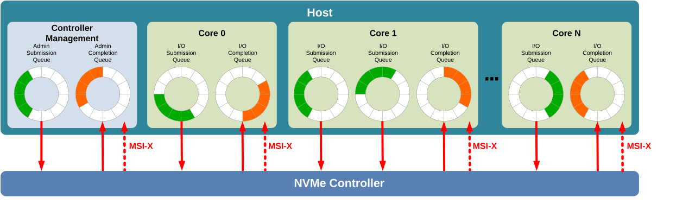

> **图 8-11**　NVMe 的多队列结构。读图要点：上方的 Host 即主机内存；每个 CPU 核（Core 0 到 Core N）有自己的 I/O Submission Queue（提交队列）和 I/O Completion Queue（完成队列），画成圆环是因为它们是循环使用的环形缓冲区，绿色格是已提交、等控制器取走的命令，橙色格是控制器已写入的完成记录。最左边的 Admin 队列专门处理管理命令，例如创建队列和读取健康日志。向下的实线箭头是控制器通过 DMA 取命令，向上的实线箭头是控制器写完成记录，虚线 MSI-X 是完成后发给对应核的中断。Core 1 有两个提交队列共用一个完成队列，说明两者不必一一对应。门铃寄存器在控制器一侧，图中没有画出。
> 来源：[File:NVMe Scalable Queuing Interface.svg](https://commons.wikimedia.org/wiki/File:NVMe_Scalable_Queuing_Interface.svg)，作者 Dmitry Nosachev，许可 CC BY-SA 4.0（本库使用的是它的 PNG 渲染版本）。

**一次 NVMe 读的逐步走查。** 服务器上的程序要读 4 KB：

| 步骤 | 发生了什么 |
| --- | --- |
| 1 | 驱动在当前 CPU 核的提交队列尾部填入一条 64 字节的命令：操作码为读、起始 LBA、长度，以及一个指向主机内存中数据缓冲区的指针 |
| 2 | 驱动把新的队尾位置写入控制器的"提交队列门铃"寄存器。这是一次对设备寄存器的写操作，经 PCIe 送达控制器 |
| 3 | 控制器发现门铃变化，通过 DMA 从主机内存里取走这 64 字节的命令 |
| 4 | 控制器的 FTL 查映射表，经 NAND 侧接口执行读序列，纠错引擎解码 |
| 5 | 控制器通过 DMA 把 4 KB 数据**直接写入**步骤 1 指定的主机内存缓冲区 |
| 6 | 控制器在完成队列里写入一条 16 字节的完成记录（含命令标识和状态码），并发出一个中断 |
| 7 | 驱动处理完成记录，把新的队头位置写入"完成队列门铃"，通知控制器这条记录已经处理 |

**和 UFS 的走查对照，NVMe 的路径短在哪里。** UFS 的命令要经过 SCSI 层、UTP 层、UniPro 层三次封装；NVMe 的命令只有一个 64 字节的固定结构，主机一侧只有填队列和写门铃两个动作。整个主机软件栈在一次读写上的开销，NVMe 可以做到几微秒。这个差距在 NAND 自己要花几十微秒的时候不算突出，但它决定了每个 CPU 核每秒能下发多少条命令。企业级 NVMe 盘的随机读能力在每秒几百万次的量级，只有多队列结构才能把这么多请求送进去。

走查的步骤 1 里有两处细节被略过了：命令里的地址是相对于谁的，以及"指向数据缓冲区的指针"具体是什么格式。此外 NVMe 所依赖的 PCIe 链路在能传任何命令之前要先完成训练。下面分三段补上。

**命名空间。** 一个 NVMe 控制器可以对外呈现一个或多个命名空间，每个命名空间是一段独立的、从 0 开始编号的逻辑地址空间，在操作系统里表现为一个独立的块设备（Linux 下 `/dev/nvme0n1`、`/dev/nvme0n2` 末尾的 n1、n2 就是命名空间编号）。每条读写命令都带一个命名空间编号，所以"LBA 1000"总是指某个命名空间里的第 1000 个扇区。

它和分区的区别在于划分发生在设备内部：不同命名空间可以有不同的扇区大小（512 字节或 4 KB），可以有不同的类型（普通的随机读写命名空间，或者 §7.1 要讲的分区命名空间），也可以分配给不同的虚拟机独占使用。例如一块 3.84 TB 的盘可以划成一个 3 TB 的普通命名空间存数据集，外加一个 0.84 TB 的命名空间专门存 checkpoint，两者的逻辑地址互不相干。需要说明的是，命名空间划分的是逻辑地址，底层的 NAND 块默认仍然是共用的，垃圾回收和磨损均衡在整盘范围内进行。

**数据缓冲区的描述：PRP 与 SGL。** 控制器要通过 DMA 把数据直接写进主机内存，就必须知道缓冲区的物理地址。困难在于应用程序眼里连续的一段缓冲区，在物理内存里通常是由许多不相邻的 4 KB 页拼成的。NVMe 提供两种描述方式。

PRP（physical region page，物理区域页）方式用一串 8 字节的指针描述缓冲区，每个指针指向一个 4 KB 的物理内存页。命令里只有两个指针字段，用法随数据长度而变：

| 读取长度 | 第一个指针字段 | 第二个指针字段 |
| --- | --- | --- |
| 4 KB（1 页） | 指向数据页 | 不用 |
| 8 KB（2 页） | 指向第 1 个数据页 | 指向第 2 个数据页 |
| 128 KB（32 页） | 指向第 1 个数据页 | 指向一个"指针列表页"，里面存放其余 31 个数据页的指针 |

一个指针列表页是 4 KB，能存 512 个指针，可以描述 512 × 4 KB = 2 MB 的数据；更长的传输把列表页的最后一项用来指向下一个列表页。以读 128 KB 为例，控制器要先通过 DMA 取命令（64 字节），再取一次指针列表（31 × 8 = 248 字节），然后才能开始向 32 个互不相邻的页写数据。

SGL（scatter gather list，分散聚合列表）方式的每一项是"起始地址加长度"，一项可以描述任意长的连续区域。如果缓冲区在物理上是连续的 1 MB，PRP 需要 256 个指针，SGL 只需要一项。

这个细节和 GPU 的关系在 06-03 §5：GPUDirect Storage 能让固态盘的数据不经过主机内存直接进入显存，机制就是在命令的缓冲区指针里填入显存在 PCIe 地址空间里的地址，固态盘控制器照常做 DMA，只是写入的目标是 GPU 而不是主机内存。

**PCIe 链路训练。** 固态盘插入或上电后，PCIe 链路两端的状态机要走完以下几个阶段才能传输数据：

| 阶段 | 做什么 |
| --- | --- |
| 检测 | 发送端探测每条通路的对端是否接有接收器（依据是对端接入时线路负载不同） |
| 轮询 | 两端以最低速率 2.5 GT/s 互相发送训练序列，接收端据此锁定比特边界和符号边界 |
| 配置 | 协商链路宽度，给每条通路编号。如果 4 条通路里有 1 条不通，链路会降为 2 条或 1 条通路继续建立 |
| 进入工作状态 | 链路以 2.5 GT/s 开始工作 |
| 提速与均衡 | 两端回到恢复状态，切换到更高速率。从 8 GT/s 起，每升一级速率都要做一轮均衡：接收端评估收到的信号质量，要求对端发送端调整预加重参数，反复几轮直到误码率达标 |

整个过程在几十到一百多毫秒内完成。它和本节其它地方讲的训练有两点不同：一是串行链路没有随路时钟，接收端从数据本身恢复时钟，所以训练的对象是均衡参数而不是采样延迟；二是训练结果可能是降级，链路质量不够时会停在较低的速率或较少的通路数上，设备照常工作，只是带宽减半甚至更低。后一点在排查性能问题时很常见：一块 PCIe 5.0 ×4 的盘因为转接线质量差而工作在 PCIe 4.0 ×4，顺序读速度从约 14 GB/s 降到约 7 GB/s，系统不会报错，只能通过查看链路状态发现（§8）。

PCIe 也有链路级的低功耗状态，进入越深的状态省电越多、恢复越慢，最深的几档恢复时间在几十微秒到毫秒量级。服务器上为了避免延迟抖动，常常把这些省电状态关掉。

### 6.5 SPI NOR：不存数据，存启动固件

还有一种闪存接口在每台设备上都有，但不用于存用户数据。SPI NOR 闪存是一颗 8 个引脚的小芯片，容量几兆到几百兆字节，通过 SPI 串行接口（一根时钟、一根片选、1 到 8 根数据线）读写。它里面是 NOR 型闪存（07-07 §9），特点是可以按字节随机读取，上电后不需要任何初始化就能读出内容。

它用来存放芯片上电后最先执行的那段代码：主板的 UEFI 固件、GPU 板卡的固件、固态盘控制器自己的引导程序。原因是 NAND 需要控制器先跑起来才能读（要纠错、要查映射表），而控制器跑起来之前需要有地方读取自己的程序——这个先后顺序的问题由 SPI NOR 解决。

**一次 SPI NOR 读的时序。** 最基本的模式只用 4 根线：片选、时钟、主机到闪存的数据线、闪存到主机的数据线。每个时钟周期在一根数据线上传 1 位。主机要从地址 `0x001000` 开始读 256 字节：

| 时钟周期 | 片选 | 主机 → 闪存 | 闪存 → 主机 | 说明 |
| --- | --- | --- | --- | --- |
| 开始前 | 拉低 | — | — | 片选拉低表示一次操作开始 |
| 第 1 到 8 个 | 低 | `03h`，高位在前逐位送出 | — | 8 位操作码，`03h` 表示读 |
| 第 9 到 32 个 | 低 | `00h` `10h` `00h` | — | 24 位地址 |
| 第 33 到 40 个 | 低 | — | 地址 `0x001000` 处的字节 | 闪存开始逐位送出数据 |
| 第 41 到 48 个 | 低 | — | 地址 `0x001001` 处的字节 | 地址自动加一 |
| …… | 低 | — | …… | 只要片选保持为低、时钟继续，数据就一直送 |
| 结束 | 拉高 | — | — | 片选拉高，操作结束 |

同一过程的波形见图 8-12。

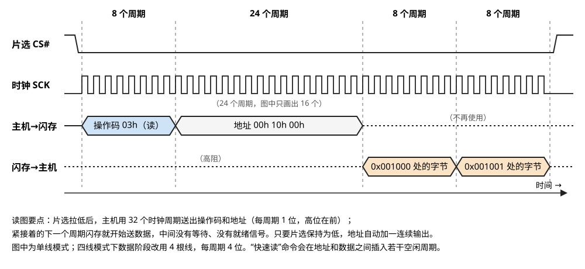

> **图 8-12**　SPI NOR 一次读操作的波形，对应上表。读图要点：片选 CS# 拉低标志操作开始；前 8 个时钟周期主机送出操作码 03h（蓝色），接着 24 个周期送出地址（图中时钟线只画了其中 16 个）；地址一送完，闪存在下一个周期就开始在"闪存→主机"那根线上送出第一个字节（橙色），地址自动加一接着送下一个字节。与图 8-2 的 NAND 读对照，这里没有 R/B# 那样的忙碌等待段。
> 来源：本库自绘。

读 256 字节总共需要 32 + 256 × 8 = 2080 个时钟周期。整个过程没有就绪信号、没有等待时间、没有纠错，闪存在收到地址的下一个时钟周期就开始送数据。这就是"上电后不需要任何初始化就能读"的具体含义。

**速率的账。** 基本读命令通常限制在 50 MHz 左右：每字节 8 个周期即 160 纳秒，约 **6 MB/s**。提速有两种办法。一是"快速读"命令，在地址之后插入若干个空闲周期，给闪存内部更多时间准备第一个字节，时钟可以提高到 100 MHz 以上。二是增加数据线，四线模式下每个时钟周期传 4 位，133 MHz 时钟对应 133 × 4 ÷ 8 ≈ **66 MB/s**。一份 16 MB 的固件，用单线 50 MHz 读入需要约 2.6 秒，用四线 133 MHz 读入约 0.24 秒——这一项直接计入设备的开机时间。

写入比读取复杂，因为它仍然是闪存：每次写之前要先发一条"写使能"命令，一次最多编程一页（通常 256 字节），擦除的最小单位通常是 4 KB 的扇区，擦一个扇区需要几十到几百毫秒。固件更新慢的原因在这里。

### 6.6 一张对照表

| | eMMC 5.1 | UFS 4.0 / 5.0 | SATA 3 | NVMe（PCIe 5.0 / 6.0 ×4） | SPI NOR |
| --- | --- | --- | --- | --- | --- |
| 物理层 | 8 位并行 | M-PHY 串行差分，2 条通路 | 串行差分，1 条通路 | PCIe 串行差分，4 条通路 | 串行，1 到 8 根线 |
| 双工 | 半双工 | 全双工 | 半双工 | 全双工 | 半双工 |
| 接口带宽 | 0.4 GB/s | 4.6 / 10.8 GB/s | 0.6 GB/s | 16 / 30 GB/s | 约 0.05 GB/s |
| 命令集 | MMC | SCSI | ATA | NVMe | 厂商约定的操作码 |
| 队列 | 1 × 32 | 1 × 32（4.0 起支持多队列） | 1 × 32 | 最多约 6.5 万 × 6.5 万 | 无 |
| 空闲功耗 | 很低 | 很低（有休眠态） | 中 | 较高 | 极低 |
| 典型用途 | 低成本嵌入式 | 手机、平板、车载 | 旧式个人电脑、冷存储 | 个人电脑、服务器 | 启动固件 |

**为什么手机用 UFS 而服务器用 NVMe，即使两者带宽在同一量级。** 决定因素是功耗和生态而不是速度。M-PHY 从设计之初就针对电池供电的设备，链路可以很快地进出保留配置的休眠状态（§6.2），空闲时功耗极低；PCIe 的低功耗状态整体上空闲功耗更高，设备本身的功耗也更大。反过来，服务器需要 4 条以上通路的带宽、需要几十上百个队列配合多核、需要热插拔和成熟的管理接口，这些是 PCIe 和 NVMe 的长处。（苹果的手机使用基于 NVMe 的自研方案，是一个例外。）

---

## 7. 新形态，以及闪存在 AI 服务器里的位置

### 7.1 ZNS 与 FDP：让主机参与数据摆放

§4.3 讲过，降低写放大的关键是把寿命相近的数据写进同一个块，而控制器不知道哪些数据寿命相近。知道这件事的是主机上的应用——数据库知道哪些是日志、哪些是数据文件；训练框架知道某个文件是第几轮的 checkpoint、下一轮保存后它就会被整体删除。近几年有两种方案把这个信息传给控制器。

**ZNS（Zoned Namespace，分区命名空间）**把盘划成若干个区，每个区只能从头到尾顺序写入，想重写必须先把整个区复位。这等于把"只能顺序写、只能整块擦"的 NAND 约束直接暴露给主机，垃圾回收改由主机软件负责。控制器一侧几乎不再有写放大，映射表也可以大幅缩小。代价是主机的文件系统和应用必须改写成只做顺序写入。

**FDP（Flexible Data Placement，灵活数据摆放）**保留普通的随机读写接口，只是允许主机在每条写命令里附带一个"摆放句柄"。控制器保证带相同句柄的数据写进同一组块里。主机不需要改变读写方式，只需要给不同寿命的数据打上不同的标记。

**ZNS 的一个写入例子。** 设想一块盘分成若干个区，每个区 8 个扇区（真实产品里一个区是几百兆到几吉字节，对应若干个 NAND 块）。每个区有一个写指针，记录下一个可写的位置，还有一个状态：空、打开、已满。

| 步骤 | 主机操作 | 区 0 的内容 | 区 0 写指针 | 区 1 的内容 | 结果 |
| --- | --- | --- | --- | --- | --- |
| 1 | 向区 0 写文件 A 的 4 个扇区 | `A A A A _ _ _ _` | 4 | 空 | 成功，区 0 变为打开 |
| 2 | 向区 0 的位置 4 写文件 B 的 4 个扇区 | `A A A A B B B B` | 8 | 空 | 成功，区 0 变为已满 |
| 3 | 改写文件 A 的第 2 个扇区（区 0 的位置 1） | 不变 | 8 | 空 | **失败**：写入位置不等于写指针，设备拒绝 |
| 4 | 主机改为把 A 的新版本整体写入区 1，并在自己的元数据里记录"A 现在在区 1" | `✗ ✗ ✗ ✗ B B B B` | 8 | `A' A' A' A' _ _ _ _` | 成功。区 0 里的旧 A 对主机而言已无效，但设备并不知道，也不需要知道 |
| 5 | 主机想回收区 0：先把仍然有效的 B 复制到区 1 | 不变 | 8 | `A' A' A' A' B B B B` | 这 4 个扇区的复制是主机自己发起的写入 |
| 6 | 主机对区 0 发"复位"命令 | 空 | 0 | 不变 | 设备擦除区 0 对应的 NAND 块，不需要搬运任何数据 |

步骤 3 到 6 就是 §4.1 和 §4.2 的异地更新和垃圾回收，只是执行者从控制器换成了主机上的文件系统或应用。写放大并没有消失：步骤 5 的复制仍然是额外的写入。区别在于主机知道数据的寿命，可以从一开始就避免步骤 5——如果步骤 1 和 2 把 A 和 B 写进不同的区，A 失效时它所在的区可以直接复位。

多个线程同时往一个区里写时，谁先谁后不确定，每个线程都不知道写指针此刻在哪里。ZNS 为此提供了一条"区追加"命令：主机只指定写入哪个区，不指定位置，由设备把数据放到当前写指针处，并在完成记录里返回实际写入的地址。

**FDP 的一个写入例子。** 同一个应用产生两类数据：日志（记为 L，写入后几分钟就整体删除）和数据文件（记为 D，长期保留）。两类数据交替到达。假设每个块 4 页。

不使用 FDP 时，控制器按到达顺序把数据填进当前正在写的块：

| 步骤 | 事件 | 块 P | 块 Q |
| --- | --- | --- | --- |
| 1 | 依次写入 L1、D1、L2、D2 | `L1 D1 L2 D2` | 空 |
| 2 | 依次写入 L3、D3、L4、D4 | `L1 D1 L2 D2` | `L3 D3 L4 D4` |
| 3 | 应用删除全部日志并下发 TRIM | `✗ D1 ✗ D2` | `✗ D3 ✗ D4` |
| 4 | 回收块 P：有效页比例 0.5，需要搬运 D1、D2 | 擦除 | — |

每个块的有效页比例都是 0.5，按 §4.2 的公式写放大系数为 2。

使用 FDP 时，应用在写日志的命令里带摆放句柄 1，在写数据文件的命令里带摆放句柄 2。控制器为每个句柄各维护一个正在写的块：

| 步骤 | 事件 | 块 P（句柄 1） | 块 Q（句柄 2） |
| --- | --- | --- | --- |
| 1 | 依次写入 L1、D1、L2、D2 | `L1 L2 _ _` | `D1 D2 _ _` |
| 2 | 依次写入 L3、D3、L4、D4 | `L1 L2 L3 L4` | `D1 D2 D3 D4` |
| 3 | 应用删除全部日志并下发 TRIM | `✗ ✗ ✗ ✗` | `D1 D2 D3 D4` |
| 4 | 回收块 P：有效页比例 0，直接擦除 | 擦除 | 不动 |

块 P 的有效页比例为 0，回收时不搬运任何数据，写放大系数为 1。主机的读写命令、地址和顺序与不用 FDP 时完全相同，只是多了一个句柄字段。在 FDP 的术语里，控制器为一个句柄分配的这组同时写入、同时回收的 NAND 块叫一个回收单元。

上面两个例子画在图 8-13 里。

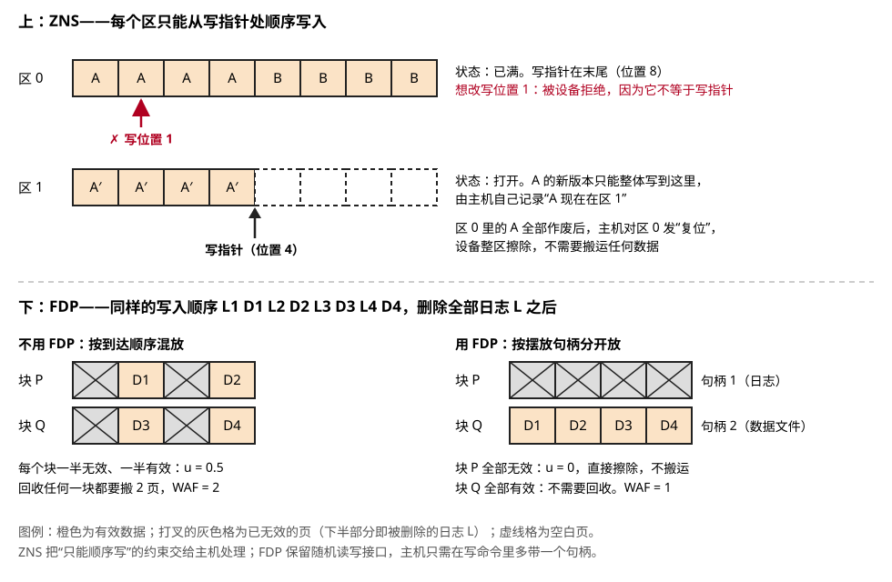

> **图 8-13**　ZNS 与 FDP 的写入例子。读图要点：上半部分对应 ZNS 表的步骤 2 到 4，区 0 已满，红色箭头表示改写位置 1 被设备拒绝；A 的新版本 A′ 只能从区 1 的写指针处顺序写入。下半部分对应 FDP 的两张表，都是删除全部日志 L 之后的状态：不用 FDP 时两个块各有一半无效页，回收要搬运；用 FDP 时日志全在块 P，块 P 可以直接擦除，块 Q 全部有效不用回收。
> 来源：本库自绘。延伸看图：Samsung 半导体技术博客 [NVMe FDP – A Promising New SSD Data Placement Approach](https://semiconductor.samsung.com/news-events/tech-blog/nvme-fdp-a-promising-new-ssd-data-placement-approach/) 有厂商画的 FDP 回收单元与摆放句柄的结构图。

**对照着看**：同一个应用把日志和数据分别写入，用 ZNS 需要重写存储引擎以适应顺序写约束；用 FDP 只需要在写日志和写数据时传两个不同的句柄。截至 2026 年，FDP 因为改造成本低而获得了更广的采用：它由谷歌和 Meta 推动进入 NVMe 标准，Linux 内核已支持，主要厂商的企业级盘已经出货带 FDP 的型号；ZNS 则停留在少数专用场景。

### 7.2 EDSFF：为服务器重新设计的外形

个人电脑上常见的 M.2 是一块细长的小卡，散热面积小、功率上限约 8 瓦左右，不支持热插拔。服务器上沿用多年的 2.5 英寸 U.2 外形来自机械硬盘时代。EDSFF（企业与数据中心标准外形）是专门为固态盘设计的一组外形规格，常见的有 E1.S（短尺型，宽约 32 mm，可带散热片）、E1.L（长尺型，长约 32 cm，一个 1U 机箱前面板可以竖插几十块）、E3.S（和 2.5 英寸盘大小接近）。它们解决的是两件事：PCIe 5.0 和 6.0 的盘功耗到了 20 到 40 瓦，需要更好的风道；单盘容量往上百太字节发展，需要更大的板面积放 NAND。

EDSFF 之前的两种主流外形见图 8-14 和图 8-15。

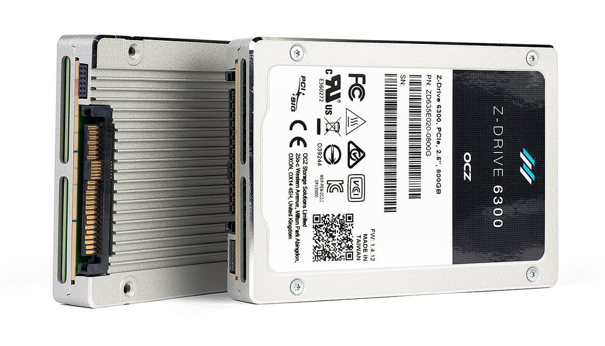

> **图 8-14**　OCZ Z6300，一块 U.2 外形的 NVMe 企业级固态盘。读图要点：外壳是 2.5 英寸硬盘的尺寸，左边那块露出侧面的就是 U.2（SFF-8639）连接器，它的形状和 SATA/SAS 硬盘接口相近，可以插进服务器前面板的热插拔盘位；外壳一侧的鳍片用于散热。
> 来源：[File:OCZ Z6300 NVMe flash SSD, U.2 (SFF-8639) form-factor.jpg](https://commons.wikimedia.org/wiki/File:OCZ_Z6300_NVMe_flash_SSD,_U.2_(SFF-8639)_form-factor.jpg)，作者 Dmitry Nosachev，许可 CC BY-SA 4.0。

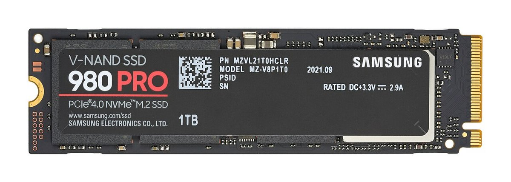

> **图 8-15**　Samsung 980 PRO，一块 M.2 外形的 PCIe 4.0 NVMe 固态盘。读图要点：这是 M.2 2280 规格，即宽 22 毫米、长 80 毫米；右端的金手指靠近下沿有一个缺口，这个位置的缺口称为 M 键，对应的插槽可以提供 PCIe ×4（也可以接 SATA 盘），这块盘用的是 PCIe ×4；控制器、DRAM 和 NAND 都盖在标签下面。和图 8-14 对比可以看出，M.2 没有外壳、散热面积小，也不能热插拔。
> 来源：[File:Samsung 980 PRO PCIe 4.0 NVMe SSD 1TB-top PNr°0915.jpg](https://commons.wikimedia.org/wiki/File:Samsung_980_PRO_PCIe_4.0_NVMe_SSD_1TB-top_PNr%C2%B00915.jpg)，作者 D-Kuru，许可 CC BY-SA 4.0。

### 7.3 计算型存储

计算型存储指在固态盘内部或紧挨着它放置计算能力，让一部分数据处理（压缩、加密、过滤、检索）在盘内完成，只把结果送回主机。它的逻辑和 07-02 §9 讲的"把归约类算子搬进 HBM 基底裸片"相同：**适合搬过去的是数据量大而运算量小的操作。** 例如在 1 TB 的日志里过滤出包含某个关键字的行，如果在主机上做，1 TB 都要经过 PCIe；在盘内做，只有匹配到的几兆字节需要传输。目前落地最多的是盘内透明压缩，其它用法仍然少见。

### 7.4 与 HBF 的关系

07-02 §10 讲过 HBF（高带宽闪存）：把 NAND 裸片用硅通孔堆叠起来、配宽并行接口放进 GPU 封装的构想。对照本节的分层，HBF 改动的是 §2 那张图的两端——主机侧接口从 PCIe 换成封装内的宽并行短距接口，位置从机箱里搬到了封装里。中间的部分一样都省不掉：NAND 仍然不能覆盖写，仍然需要映射表、垃圾回收、纠错和磨损均衡，也就是说 HBF 的基底裸片上必须有一个完整的闪存控制器。§5 的寿命公式对它同样成立。

### 7.5 AI 服务器里的四种用法，各自卡在哪个指标上

| 用法 | 访问模式 | 最先撞上的约束 | 对应本节哪里 |
| --- | --- | --- | --- |
| **加载模型权重** | 启动时顺序读几十到几百吉字节，之后不再访问 | 主机侧接口带宽。一个 140 GB 的模型，从 PCIe 4.0 盘（约 7 GB/s）读入需要约 20 秒，从 PCIe 6.0 盘（约 28 GB/s）读入约 5 秒 | §6.4 |
| **训练数据加载** | 大量小文件的随机读，持续整个训练过程 | 随机读的每秒请求数和延迟的尾部分布；长期只读不写的数据还要面对读干扰（同一个块被反复读取会使相邻单元的阈值电压漂移，07-07 §6），控制器会在后台把被读了很多次的块重写一遍 | §3.4、§6.4 |
| **写 checkpoint** | 周期性地顺序写几百吉字节 | 持续写入速度（SLC 缓存耗尽之后的速度）和寿命 | §4.4、§5 |
| **KV 缓存卸载** | 推理服务把暂时不活跃的会话的键值缓存写到盘上，会话恢复时再读回 | 写入寿命和读回延迟。写入量与会话切换频率成正比，属于写密集负载 | §5 |

第四种用法值得多说一句，因为它是 2026 年前后讨论最多的。键值缓存（推理时保存已处理 token 的中间张量，避免重复计算）留在显存里最快，但显存容量有限；卸载到固态盘上容量几乎无限，但读回需要时间。它成立的条件是"读回缓存的时间短于重新计算这段上下文的时间"。

**读回延迟的算例。** 下面的模型参数都是为了演算而设的量级假设，换一个模型需要重算。

1. 先算每个 token 的缓存有多大。假设模型有 80 层，每层为每个 token 保存一个键张量和一个值张量，各 1024 个 16 位浮点数。每个 token 的缓存 = 2 × 80 × 1024 × 2 字节 ≈ **0.33 MB**。
2. 一段 3 万 token 的上下文，缓存总量 = 30000 × 0.33 MB ≈ **9.8 GB**。
3. 从固态盘读回：PCIe 4.0 的盘（约 7 GB/s）需要 9.8 ÷ 7 ≈ **1.4 秒**；PCIe 6.0 的盘（约 28 GB/s）需要 9.8 ÷ 28 ≈ **0.35 秒**。
4. 重新计算：假设这个模型在一张卡上处理输入的速度是每秒 1 万 token，3 万 token 需要 **3 秒**，而且这 3 秒里 GPU 被完全占用。
5. 读回比重算快 2 到 9 倍，并且读回期间 GPU 可以服务别的请求。

这笔账有一个值得注意的性质：读回时间和重算时间都与上下文长度成正比，所以**谁快谁慢与上下文长度无关，只取决于两个速率之比**。把读回速度折算成"每秒多少 token"：7 GB/s ÷ 0.33 MB ≈ 每秒 2.1 万 token，高于重算的每秒 1 万 token，所以读回划算。如果换成一块读速度只有 3 GB/s 的盘，折算后约每秒 9000 token，低于重算速度，卸载就不如重算。上下文很短时还要考虑每次读取的固定开销（文件系统、命令往返、把数据从主机搬进显存），几千 token 以下的缓存通常不值得卸载。另外数据从固态盘到显存还要过主机到 GPU 的那一段 PCIe，那一段的带宽账在 06-03 §4。

它对寿命的要求可以套 §5 的公式估算：假设一台推理服务器平均每秒向盘上卸载 200 MB 的缓存，一天就是 200 MB × 86400 秒 ≈ 17 TB，对一块 3.84 TB 的盘是约 4.5 DWPD——需要写密集型的盘，读密集型的 QLC 盘承担不了。

---

## 8. 开发者视角

闪存的内部结构对应用是不可见的，但它通过下面这些途径反映到软件一侧：

| 你想知道/做什么 | 去哪里看/做 |
| --- | --- |
| 这块盘的接口实际协商到了什么速率 | `lspci -vv` 里对应设备的 `LnkSta` 字段，给出 PCIe 代际和通路数。盘支持 PCIe 5.0 ×4 但插在只连了 2 条通路的槽位上，带宽直接减半 |
| 这块盘已经用掉了多少寿命 | `nvme smart-log /dev/nvme0` 里的 `percentage_used`（按厂商定义的寿命已消耗百分比）和 `data_units_written`（主机累计写入量，每单位 512 KB）；SATA 盘用 `smartctl -a` |
| 我的负载的写放大系数是多少 | NVMe 标准的健康日志只给主机写入量，NAND 实际写入量要看厂商扩展日志或 OCP 数据中心固态盘规范定义的扩展健康日志。两者相除即 WAF |
| 删除文件后控制器知不知道 | 检查文件系统是否启用了 TRIM：挂载选项里的 `discard`，或者定期运行的 `fstrim`。没有 TRIM，§5 算例里 WAF 接近 1 的前提就不成立 |
| 测出这块盘的真实持续写入速度 | 用 `fio` 连续写入远大于 SLC 缓存的数据量（比如盘容量的一半），看后半段的速度，不要只测前十秒 |
| 测随机读性能时该开多大并发 | `fio` 的 `iodepth` 和 `numjobs`。NVMe 的多队列只有在多个线程同时下发时才体现出来，单线程队列深度 1 测到的主要是单次访问的延迟 |
| 这块盘有几个命名空间、各多大 | `nvme list` 和 `nvme list-ns`；`/dev/nvme0n1` 末尾的 n1 即命名空间编号（§6.4） |
| 备用块还剩多少、盘会不会转为只读 | `nvme smart-log` 里的 `available_spare` 和 `available_spare_threshold`（§4.10）；前者低于后者时应当换盘 |
| 读延迟偶尔出现几毫秒的尖峰 | 多半是读请求撞上了正在擦除或编程的裸片（§3.5），或者撞上了前台垃圾回收（§4.7）。用 `fio` 输出的延迟分位数（99% 和 99.9% 分位）观察，而不是看平均值 |
| 只读负载下盘为什么仍有写入量增长 | 读回收和数据巡检产生的后台搬运（§4.11），属于正常现象 |
| 盘是否支持 FDP | `nvme id-ctrl` 查看控制器能力，`nvme fdp` 系列子命令查看和配置 |
| 手机或嵌入式设备上 UFS 的健康状态 | 内核在 sysfs 里导出了 UFS 的健康描述符（设备寿命估计值分为若干档） |
| 红旗信号 | 规格书只给顺序读写的峰值速度，不给持续写入速度、不给 DWPD；在写密集场景选用消费级 QLC 盘；盘长期保持在 90% 以上的占用率 |

---

## 9. 最新架构落点（知识截至 2026-09）

- **NAND 侧接口**：JEDEC 于 2024 年 11 月发布 JESD230G，把最高速率提高到 **4800 MT/s** 并加入 SCA（命令地址分离）协议；ONFI 5.2（2024 年）加入 SCA，ONFI 6.0（2026 年 1 月）把 NV-LPDDR4 接口扩展到 4800 MT/s。对比 2011 年第一版 JESD230 的 400 MT/s，十三年涨了 12 倍。
- **UFS**：UFS 4.0（2022 年）和 4.1（2024 年底）使用 M-PHY 5.0 的 HS-G5 档，每条通路 23.3 Gbps，是 2026 年旗舰手机的主流配置。**UFS 5.0 于 2026 年 2 月由 JEDEC 发布**，配套 MIPI M-PHY 6.0 和 UniPro 3.0，新增的 HS-G6 档采用 PAM4 信号和 1b1b 编码，每条通路 46.7 Gbps，两条通路的有效读写带宽约 10.8 GB/s。搭载它的量产设备尚待观察。
- **NVMe 与 PCIe**：NVMe 2.3 规范于 2025 年 8 月批准。**PCIe 6.0 企业级固态盘在 2026 年进入量产**——美光 9650 于 2026 年 2 月量产，三星 PM1763 随后量产，顺序读约 28 GB/s、顺序写约 22 GB/s，大约是上一代 PCIe 5.0 盘的两倍。买家主要是 AI 数据中心，消费级平台尚未支持 PCIe 6.0。
- **数据摆放**：FDP 已进入 NVMe 标准并获得 Linux 内核支持，主要厂商已出货；ZNS 采用范围有限。
- **容量**：企业级 QLC 固态盘单盘容量已超过 100 TB，厂商路线图指向 256 TB 和 512 TB（路线图，时间以实际出货为准）。
- **HBF**：仍无量产产品，见 07-02 §12。

---

## 10. 和其它模块的挂钩

- **07-07 NAND 闪存**：本节的直接上游。§4 的页、块、plane 是本节映射表和通道调度的操作对象；§6 的擦写寿命和读干扰是本节 §5 寿命账和 §7.5 读密集场景的物理来源；§8 的纠错和读重试由本节讲的控制器执行。
- **07-06 DRAM 接口**：NAND 侧 PHY 用到的 DQS、ODT、ZQ 校准和训练，原理都在那一节讲。两节对照着读，能看出并行存储接口是一个共用技术的家族。
- **07-02 HBM 解剖 §10**：HBF 的写寿命算例和本节 §5 是同一个公式在两种容量下的应用；§9 的近存计算和本节 §7.3 的计算型存储是同一个判据。
- **06-03 数据进 GPU 之前**：那一节从主机一侧讲固态盘到显存的通路——PCIe 带宽账、NUMA、GPUDirect Storage（让固态盘的数据不经主机内存直接进显存）。本节讲的是那条通路的起点内部发生了什么。
- **09-04 可靠性与规模化**：checkpoint 的频率由集群的故障率决定，而本节 §5 说明 checkpoint 频率又反过来决定了存储的寿命和成本，两者需要一起权衡。
- **08-05 互连的物理实现**：主机侧的 M-PHY 和 PCIe PHY 都属于 SerDes（串行器与解串器）这一类电路，时钟恢复、均衡、PAM4 的原理在那一节。

---

## 11. 术语卡

### NAND 侧 PHY 与主机侧 PHY
**定义**：一颗闪存控制器上有两套互相独立的物理层电路。NAND 侧 PHY 朝向 NAND 裸片，遵循 ONFI 或 Toggle（JEDEC JESD230）规范，是 8 根数据线加数据选通线的并行总线，一条总线上挂多颗裸片。主机侧 PHY 朝向主机，UFS 用 MIPI M-PHY，NVMe 固态盘用 PCIe PHY，都是点对点的高速串行差分链路。
**为什么存在**：两侧要解决的问题不同。NAND 侧是封装内或小电路板内的短距离、一对多连接，引脚数必须少，所以用复用的并行总线；主机侧是几厘米到几十厘米的一对一连接，要求高带宽和强抗干扰能力，所以用串行差分。把两者分开，同一种 NAND 裸片才能配不同的控制器做成不同接口的产品。
**语境例句**："这颗主控的闪存侧只支持到 2400，新颗粒跑不满。" —— 意思是：控制器朝 NAND 那一侧的 PHY 最高只支持 2400 MT/s，即使 NAND 裸片支持更高速率也只能降速使用——这句话和主机侧是 PCIe 几代没有关系。

### FTL 与异地更新
**定义**：FTL（闪存转换层）是控制器固件中把主机的逻辑块地址翻译成 NAND 物理页地址的一层。它采用异地更新：每次改写都把新数据写到一个空白页上，把旧页标记为无效，并在映射表里更新这个逻辑地址指向的物理位置。
**为什么存在**：NAND 的页只能在擦除后写一次，而擦除必须以块为单位。如果原地修改，改 4 KB 就要重写整个 16 MB 的块。异地更新把一次修改的代价降到写一页，代价是需要一张映射表（每 1 TB 约 1 GB）并且会积累无效页，后者由垃圾回收处理。
**语境例句**："这是 DRAM-less 的盘，随机读会抖。" —— 意思是：这块盘没有配 DRAM 来存放完整的映射表，大范围随机访问时要先从 NAND 里调入表项，延迟不稳定。

### 写放大系数（WAF）
**定义**：NAND 上实际写入的数据量与主机要求写入的数据量之比。多出来的部分主要来自垃圾回收时搬运有效页。如果被回收的块里有效页占比为 u，则 WAF = 1 ÷ (1 − u)。
**为什么存在**：它是连接"NAND 单元的擦写次数"和"用户能写入的总量"的那个系数。同一块盘，顺序写大文件时 WAF 接近 1，接近写满且随机改写时可以到 5 以上，实际寿命相差数倍。预留空间、TRIM、冷热分离、FDP 这些机制的目标都是降低它。
**语境例句**："上了 FDP 之后 WAF 从 3 降到 1.2。" —— 意思是：主机给不同寿命的数据打了标记之后，控制器把它们分开存放，被回收的块里有效页大幅减少，同样的主机写入量下 NAND 的磨损降到原来的四成。

### TBW 与 DWPD
**定义**：TBW 是厂商保证的寿命期内主机可写入的总太字节数，等于 NAND 实际容量乘以擦写次数再除以写放大系数。DWPD 是把 TBW 换算成保修期内每天可以写满整盘的次数，等于 TBW 除以（标称容量乘以保修天数）。
**为什么存在**：NAND 的寿命在物理上按擦写次数计，但用户关心的是"我每天写这么多，盘能用几年"。这两个指标把单元层面的寿命翻译成了可以和负载直接比较的量。企业级盘按 DWPD 分档：约 1 的是读密集型，约 3 的是混合型，10 以上的是写密集型。
**语境例句**："checkpoint 盘要选 3 DWPD 的。" —— 意思是：周期性保存 checkpoint 的写入量每天相当于把整盘写好几遍，1 DWPD 的读密集型盘会在保修期内提前耗尽寿命。

### 预留空间（OP）
**定义**：NAND 实际容量中不向主机报告、留给控制器周转的那一部分，通常用占标称容量的百分比表示。消费级盘约 7%，企业级写密集型盘可达 28% 以上。
**为什么存在**：垃圾回收需要空白块来接收搬运的有效页，也需要让无效页积累到一定数量再回收。预留空间越大，回收时能挑到有效页越少的块，写放大系数越低，持续写入性能越稳定。用户把盘只分区使用一部分容量并对其余部分执行 TRIM，效果等同于人为增加预留空间。
**语境例句**："把盘只用到八成，别写满。" —— 意思是：留出的空间会被控制器当作额外的预留空间使用，可以明显降低写放大、延长寿命并减少写入延迟的抖动。

### UFS 协议栈（M-PHY / UniPro / UTP）
**定义**：UFS 是 JEDEC 制定的嵌入式闪存存储标准，规定主机与存储设备之间的接口。它分三层：物理层 M-PHY（串行差分，按档位定速率）、链路层 UniPro（分帧、校验、流控、重传）、应用层 UTP 加 SCSI 命令集（把命令和数据打包成 UPIU）。M-PHY 和 UniPro 由 MIPI 联盟制定。
**为什么存在**：它取代了并行、半双工、单命令的 eMMC。串行差分让速率可以持续提高，全双工和命令队列让读写可以交叠进行，而 M-PHY 的低功耗休眠态适合电池供电的设备。
**语境例句**："这台机器是 UFS 4.0，跑在 G5 双 lane。" —— 意思是：存储接口使用 M-PHY 的第五档速率、两条通路，接口带宽上限约 4.6 GB/s；实际读写速度还取决于设备内部的控制器和 NAND。

### NVMe 队列与门铃
**定义**：NVMe 的命令通过成对的提交队列和完成队列传递，队列位于主机内存中。主机把命令填入提交队列后，向控制器的门铃寄存器写入新的队尾位置；控制器通过 DMA 取走命令，执行后把结果写入完成队列并发中断。规范允许最多约 6.5 万个队列、每个队列深度最多约 6.5 万。
**为什么存在**：SATA 的 AHCI 只有一个深度 32 的队列，多个 CPU 核下发命令时要争同一把锁，无法发挥固态盘每秒几十万到几百万次请求的能力。NVMe 给每个核分配独立的队列，下发命令只需要一次内存写入和一次寄存器写入。
**语境例句**："IOPS 上不去，先看是不是只开了一个队列。" —— 意思是：测试程序或应用只用单线程下发请求，瓶颈在主机一侧的提交速度而不在盘；增加并发线程数，让多个队列同时工作。

### ZNS 与 FDP
**定义**：两种让主机参与数据摆放的 NVMe 特性。ZNS 把盘划成只能顺序写入的区，由主机负责垃圾回收；FDP 保留普通读写接口，允许主机在写命令里附带摆放句柄，控制器把相同句柄的数据写入同一组块。
**为什么存在**：降低写放大的关键是把寿命相近的数据放进同一个块，而只有主机上的应用知道数据的寿命。ZNS 效果最彻底但要求改写主机软件，FDP 改造成本低，因此后者在 2026 年获得了更广的采用。
**语境例句**："日志和数据走不同的 placement handle。" —— 意思是：应用在写日志和写数据文件时传入不同的 FDP 摆放句柄，控制器把它们分开存放，日志被整体删除时对应的块可以直接擦除而不需要搬运。

---

## 12. 我的困惑 / 待深挖

- §3.4 和 §3.7 里"每颗裸片每个引脚贡献几皮法电容"和"一条通道最多挂几颗裸片"只给了量级，没有对着 ONFI 规范里的引脚电容上限和实际控制器的推荐配置核对。封装内缓冲芯片的具体形态和各家的做法也没有查证。
- §3.5 的操作码（`11h`、`32h`、`D1h`、`06h`–`E0h`、`78h`、`31h`、`15h`）按 ONFI 规范的记忆写出，没有逐条对照最新版规范；挂起与恢复、读写训练、端接配置这几类命令的操作码因不确定而没有给出。独立 plane 读在接口规范里的标准化情况没有核实。
- §3.6 里 ZQ 外接电阻 300 欧姆、端接阻值档位来自对 ONFI 规范的记忆；ZQ 编码的位数和温度漂移的幅度是示意数字。训练结果是否保存、怎样在下次上电时复用，属于各家固件的实现，没有公开资料可对照。
- §4.7 到 §4.11 里的阈值（回收水位、静态均衡的擦除次数差、读回收的读次数上限、巡检周期）都是示意值，真实产品的取值随 NAND 型号和固件而不同，通常不公开。
- §4.9 讲的"快照加日志加页内身份信息"是常见做法的概括，各厂商固件的实际结构差别很大；TLC/QLC 多遍编程被掉电打断时对已写数据的影响，和具体的编程顺序有关，需要对着 07-07 §5 的编程方式再核对一次。
- §6.2 里 M-PHY 各功耗状态的功耗和恢复时间只给了量级；UniPro 每帧载荷上限、序号位数没有核对规范。
- §3.3 表里早期各代的速率（NV-DDR 的 200、NV-DDR2 的 533、NV-DDR3 的 1600）来自对 ONFI 各版本的记忆，只有 JESD230G 和 ONFI 6.0 的 4800 MT/s 经过了联网核实。Toggle DDR 一侧的版本号和速率对应关系没有单独核实。
- §4.3 的近似公式 WAF ≈ (1 + OP) ÷ (2 × OP) 是均匀随机写、贪心回收下的简化模型，实际控制器的回收算法和冷热分离会让结果偏离多少？有没有公开的实测数据？
- §5 算例里"企业级 TLC 擦写 5000 次""WAF 取 3"都是量级假设。各厂商定 TBW 时实际采用的负载模型（JEDEC JESD218/219 定义的企业级负载）是什么样的，需要读一遍标准。
- UFS 4.0 起引入的多队列（MCQ）把 UFS 的命令模型向 NVMe 靠拢了多少？UFS 5.0 的 10.8 GB/s 在手机上的实际瓶颈会在 NAND 侧还是在主机侧？
- PCIe 6.0 每条通路约 7.5 GB/s 的有效带宽是按 64 GT/s 扣除前向纠错和分组开销后的量级估计，没有逐项核算。
- §7.5 的读回延迟算例用的是假设的模型参数（80 层、每层键值各 1024 维、每秒处理 1 万 token）。需要对着一个真实模型和一块真实的盘重算一遍，并把"固态盘到主机内存"和"主机内存到显存"两段分开计时。各厂商为推理上下文存储推出的专用方案没有逐一查证。
- 大容量企业级盘把映射粒度放大到 16 KB 以上之后，4 KB 随机写的写放大会恶化多少？这和训练数据加载、KV 缓存这两类负载的块大小是否匹配？

---

*最后更新：2026-09-28（第三版补图 15 张（其中取自 Wikimedia Commons 6 张，自绘 9 张），替换了 §2 与 §3.7 的两张 ASCII 示意图。第二版：取消篇幅限制后的补写。§3 新增多 plane 命令序列、读状态、擦除挂起时间线、缓存读、上电配置序列（§3.5），ZQ 校准、片内端接与读训练的逐步走查（§3.6），封装内阶梯堆叠与引线键合（§3.7）；§4 新增掉电电容的能量账，垃圾回收的贪心与成本收益策略（§4.7），动态与静态磨损均衡的逐步例子（§4.8），映射表落盘与掉电恢复过程（§4.9），坏块管理（§4.10），读干扰计数与数据巡检（§4.11），控制器芯片的硬件组成（§4.12）；§5 新增消费级 QLC 盘的对照算例；§6 新增 eMMC 多块读走查、M-PHY 功耗状态与档位切换、UniPro 重传时间线、UFS 多队列、NVMe 命名空间与 PRP/SGL、PCIe 链路训练、SPI NOR 读时序；§7 新增 ZNS 与 FDP 的写入例子、KV 缓存读回延迟算例。第一版。核心澄清一条："闪存的 PHY"有两处——控制器朝 NAND 的 ONFI/Toggle 并行接口，和设备朝主机的 M-PHY / PCIe PHY 串行接口；UFS 是主机侧的三层协议栈而不是 PHY。核心手算四笔：一条 2400 MT/s 的通道写入时可喂约 38 颗裸片、读取时约 3 颗就饱和；映射表每 1 TB 约 1 GB；写放大系数等于 1 ÷ (1 − 有效页比例)；3.84 TB 的盘每半小时写 500 GB checkpoint，按规格书寿命约 285 天、按顺序写的实际写放大约 854 天。联网核实的时效事实：JESD230G 与 ONFI 6.0 的 4800 MT/s、UFS 5.0 与 M-PHY 6.0 的 HS-G6、NVMe 2.3、PCIe 6.0 企业级盘量产、FDP 的采用情况）*
