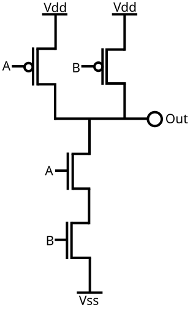
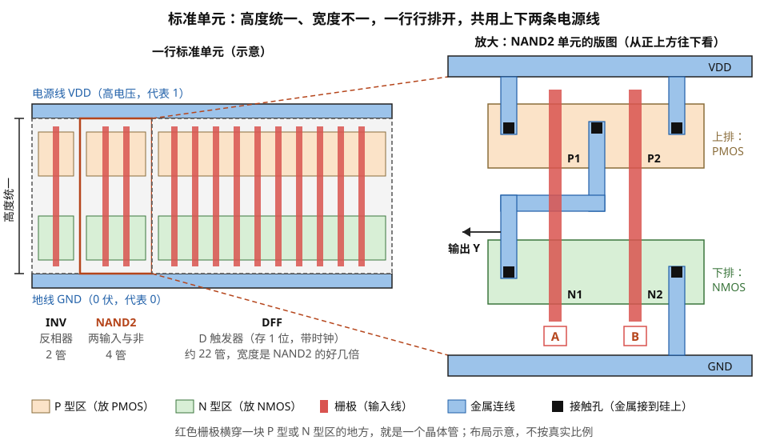
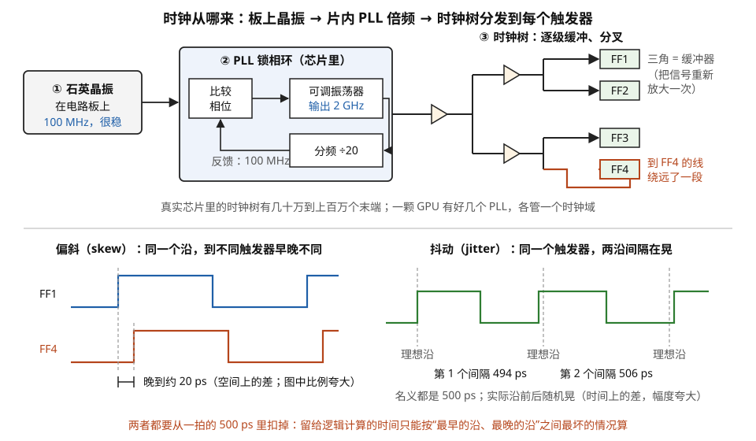
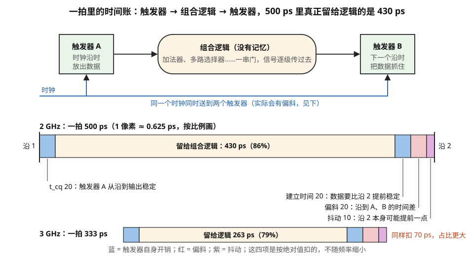
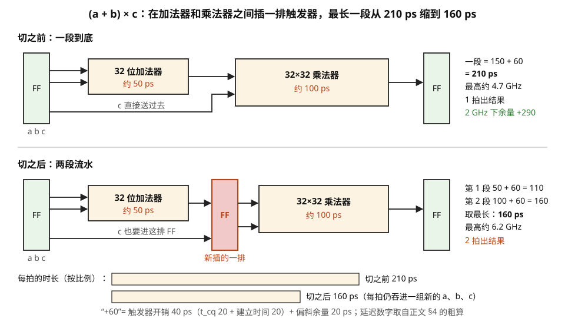
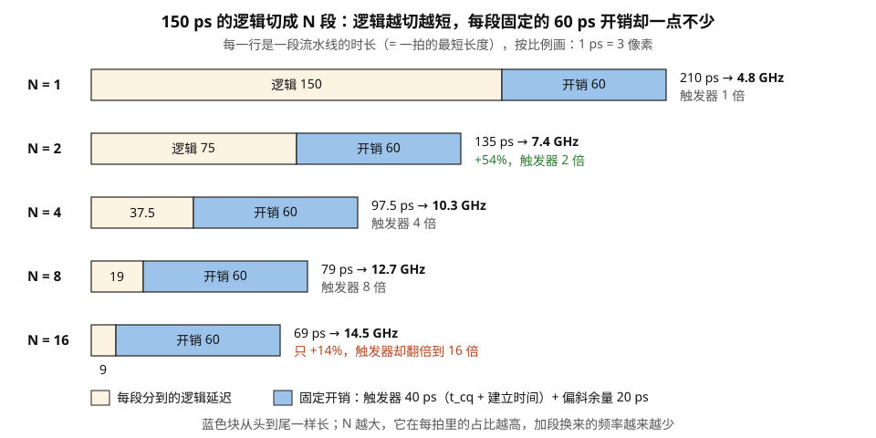
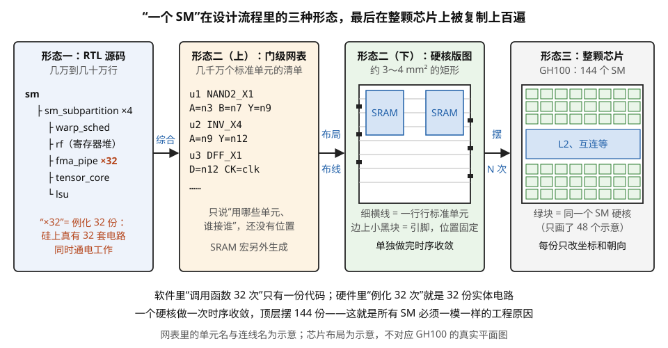

# 数字设计的地基：一条指令在硅上的物理载体

> **所属模块**：模块 08 · 微架构与物理实现
> **状态**：🟨 学习中（第一版。知识截至 2026-08）
> **本节主旨**：前面七个模块讲的都是"架构"——SM 里有几个执行单元、脉动阵列怎么流数据、HBM 怎么堆。但这些框图落到硅片上，最终都变成同一种东西：**一堆标准单元（几百种预先画好的小电路）连成的组合逻辑，中间被触发器切成一段一段**。这一节铺的是全模块的地基：时钟周期是怎么被"关键路径"定死的、流水线为什么不能无限切、面积和功耗和频率为什么是一个三角、以及"一个 SM"在设计工程师那里到底是什么形态的文件。学完这一节，后面七节讲的乘法器、SRAM、调度器、crossbar 才有共同的度量衡：**每个器件都要回答"它占几个标准单元的面积、关键路径几皮秒、每次动作几皮焦"**。

---

## 0. 这一节要回答的问题

- 芯片设计工程师手里的"设计"到底是什么？是电路图、是代码，还是版图？
- 一个逻辑门在晶体管层面是什么？为什么与非门比与门便宜？为什么触发器比逻辑门贵那么多？
- "2 GHz 主频"这个数字是谁定的？为什么不能想调多高调多高？
- 时钟从哪来？一"拍"到底是什么？为什么整个数字电路非要有一个统一的节拍不可？
- 一拍 500 皮秒里，真正留给逻辑运算的有多少？偏斜和抖动各吃掉多少？
- 为什么说"拍"不是一个固定长度的时间单位？
- 关键路径、时序收敛、slack 这几个词分别指什么？开会时说"这条路径不收敛"是什么意思？
- 流水线级数为什么不能无限加？加到多少级就不划算了？
- PPA 是什么？为什么架构师说"这个特性 PPA 不划算"就等于宣判死刑？
- "一个 SM" 在物理上是一块什么东西？GPU 里 132 个 SM 是画了 132 遍吗？
- 为什么先进制程上"晶体管变快了但线没变快"，这句话对架构有什么影响？

---

## 1. 基础词汇：先把本节要用的词讲清楚

这一节的词大多来自数字集成电路设计，和软件侧的词汇体系几乎不重叠，所以先集中解释一遍。后面正文里再出现时可以回查这里。

**晶体管（transistor）与标准单元（standard cell）**。晶体管是硅上最小的开关器件：三个端子，其中一个（栅极）上的电压决定另外两个端子之间导不导通。但芯片设计工程师**几乎从不直接摆晶体管**。他们用的是**标准单元**——晶圆厂（或 IP 供应商）预先画好、验证好、刻度好的一批小电路，每个实现一个基本逻辑功能：两输入与非门（NAND2）、反相器（INV）、四选一多路选择器（MUX4）、D 触发器（DFF）等等，一个工艺库里通常有几百到上千种（同一功能还有驱动能力强弱不同的多个版本）。它们被设计成**等高不等宽**：所有单元的高度一样（这样能排成整齐的行），宽度按复杂度不同。一颗 GPU 上的逻辑部分，本质就是几十亿个这种小方块摆在一起、用金属线连起来。

**触发器（flip-flop，DFF）与组合逻辑（combinational logic）**。这是数字电路里最根本的二分。**组合逻辑**是"没有记忆"的部分：输出只取决于当前输入，输入一变，输出经过一段传播延迟后跟着变——加法器、多路选择器、译码器都属于这类。**触发器**是"有记忆"的部分：它只在时钟信号的上升沿那一瞬间，把输入端的值抓进去锁住，然后在整个周期里稳定地输出这个值。整个同步数字电路的骨架就是：**触发器 → 一坨组合逻辑 → 触发器 → 一坨组合逻辑 → …**，时钟每来一拍，所有触发器同时把手上的值放行，让它穿过下一坨组合逻辑，赶在下一拍之前到达下一排触发器门口。

**时钟（clock）与时钟周期（clock period）**。一个在全芯片同步分发的方波信号，每个上升沿就是一次"全体放行"。周期 T 是两个上升沿之间的时间，频率 f = 1/T。2 GHz 对应 T = 500 皮秒（ps，10⁻¹² 秒）。**本节后面所有的账都在这 500 皮秒里算。**

**建立时间与保持时间（setup time / hold time）**。触发器不是一个理想器件：数据必须在时钟沿到来**之前** t_setup 就已经稳定（否则抓不准），并且在时钟沿之后还要再稳定 t_hold 那么久（否则会被后面追上来的新数据冲掉）。在先进工艺上这两个量都在**十几到几十皮秒**量级。违反 setup 叫"跑得太慢"，违反 hold 叫"跑得太快"——注意后者和频率无关，把频率降下来也治不好，只能在路径上插缓冲器把信号故意拖慢。

**传播延迟（propagation delay）与 FO4**。一个逻辑门从输入变化到输出变化需要的时间。它不是常数，取决于这个门要驱动多大的负载（后面接了几个门、金属线有多长）。业界用一个和工艺无关的标尺来讨论它：**FO4（fan-out of 4）**，即"一个反相器驱动四个同样大小的反相器"的延迟。它的好处是可以跨工艺比较——先进工艺上 FO4 大约是**几个皮秒**量级。一个经验值：高性能处理器的一级流水线大约放 **15 到 25 个 FO4** 的逻辑深度；再深就到不了目标频率，再浅则触发器本身的开销占比太高（§5 会把这笔账算出来）。

**综合（synthesis）与布局布线（place & route，P&R）**。把设计从"代码"变成"版图"的两道主要工序。综合读入 RTL 代码（下面解释）和工艺库，输出一张**门级网表**——即"用了哪些标准单元、它们怎么连"的清单。布局布线则决定每个单元**摆在硅片的哪个坐标**、每根连线**走哪一层金属、走什么路径**。这两步之后才有真正的版图（layout），才能做掩模去流片。

**RTL（Register-Transfer Level，寄存器传输级）**。芯片设计的主要描述层次，用 Verilog / SystemVerilog / VHDL 这类硬件描述语言写。它描述的是"每个时钟周期，数据从哪些寄存器出发、经过什么逻辑运算、落到哪些寄存器里"。**这是本节最需要建立的一个认知：芯片工程师日常写的东西看起来像代码，但它不是"顺序执行的程序"，而是"一张电路图的文字形式"**——里面每一行都对应一坨永远在那里、永远同时通电工作的实体电路。

**PPA（Performance / Power / Area，性能、功耗、面积）**。评价任何一个硬件设计方案的三个维度，也是架构讨论里出现频率最高的缩写。三者互相牵制：想快就要加流水级和加大驱动（面积和功耗上去），想省面积就要复用同一套电路（吞吐下来）。**架构决策的实质几乎总是在这三个量之间选一个点。**

## 2. 往下再看一层：一个逻辑门其实就是几个晶体管

上一节说"设计工程师几乎从不直接摆晶体管"。这是实情，但**不看一眼晶体管，"门延迟""驱动能力""为什么这个门比那个门贵"这几件事就永远停在名词层面**。所以这一节下探一层，之后再也不用回来。

**CMOS 的基本规则只有两条。** 芯片上有两种互补的晶体管：

- **NMOS**：栅极为高电平时导通。它被用来**把输出拉到地（0）**。
- **PMOS**：栅极为**低**电平时导通。它被用来**把输出拉到电源（1）**。

每个逻辑门都由两半构成：一张由 PMOS 组成的**上拉网络**（决定什么时候输出 1），和一张由 NMOS 组成的**下拉网络**（决定什么时候输出 0）。两张网络的结构互为对偶，**并且设计成任何时刻最多只有一张导通**——这一条是 CMOS 战胜其它工艺的全部理由：**稳态时电源到地之间没有通路，不消耗静态电流**，只有在翻转的瞬间才耗电（这就是模块 08 第 6 节那个 α·C·V²·f 里的动态功耗）。

**最小的两个例子。**

**反相器（INV）= 2 个晶体管**：输入接到一个 PMOS 和一个 NMOS 的栅极。输入为 0 时 PMOS 导通把输出拉到 1；输入为 1 时 NMOS 导通把输出拉到 0。

**两输入与非门（NAND2）= 4 个晶体管**：下拉网络是**两个 NMOS 串联**（两个输入都为 1 时才导通、才把输出拉到 0），上拉网络是**两个 PMOS 并联**（任一输入为 0 就把输出拉到 1）。下面的文字示意图和图 1-1 的标准电路图画的是同一个电路。

```
        Vdd
         │
    ┌────┴────┐
   ─┤P1     P2├─      ← 两个 PMOS 并联（上拉）
    └────┬────┘
         ├──────── 输出 Y = NOT(A AND B)
        ─┤N1              ← 两个 NMOS 串联（下拉）
         │
        ─┤N2
         │
        GND
   （A 接 P1 与 N1 的栅极，B 接 P2 与 N2 的栅极）
```



> **图 1-1**　一句话：两输入与非门由四个晶体管组成，上面两个并排接在电源和输出之间，下面两个串成一串接在输出和地之间。
>
> **先知道一件事**：晶体管在这里就是一个受电压控制的开关。输入 A、B 各自接到两个晶体管的控制端（叫栅极）。上面两个是 PMOS，控制端画着小圆圈，表示“给低电压（0）才接通”；下面两个是 NMOS，“给高电压（1）才接通”。
>
> **按这个顺序看**：
> 1. 先看上半部分。两个 PMOS 左右并排，各自一头接 Vdd（电源，代表 1），另一头都接到中间的输出 Out。A、B 里只要有一个是 0，对应的 PMOS 就接通，把输出连到电源，输出为 1。
> 2. 再看下半部分。两个 NMOS 上下串联，从输出一路通到 Vss（地，代表 0）。只有 A 和 B 都是 1，两个开关都接通，这条路才通，输出被拉到 0。
> 3. 把两半合起来。A = B = 1 时，下面那串全通、上面两个全断，输出 0；其余三种输入组合，下面那串至少断开一个，上面至少接通一个，输出 1。这就是“与非”：先做与，再取反。
> 4. 最后注意：任何输入下，上下两半都不会同时接通，所以电源和地之间没有一直流着的电流。电路只在输出翻转、给后面的导线充放电的那一瞬间耗电。
>
> **打个比方**：上面是两扇并排的门，推开任意一扇就能把“1”放进来；下面是一条走廊里前后两道门，两道都开着，输出才会被“放掉”成 0。
>
> **看懂的标志**：能回答“为什么与门（AND）反而比与非门贵”。这种结构天然把结果取反；想得到不取反的“与”，只能在与非门后面再接一个反相器，多 2 个晶体管，还多一级延迟。
>
> **与正文的对照**：图中左上接 A 的 PMOS 是上面文字图里的 P1，右上接 B 的是 P2；下面接 A 的 NMOS 是 N1，接 B 的是 N2。图中的 Vss 就是文字图里的 GND。
>
> 来源：[CMOS NAND.svg](https://commons.wikimedia.org/wiki/File:CMOS_NAND.svg)，作者 JustinForce，许可 CC BY-SA 3.0。

**这里掉出来一个很实用的结论：与非（NAND）和或非（NOR）是 CMOS 的"原生"门，而与（AND）、或（OR）反而更贵。** 因为 CMOS 的两张网络天然是反相的——上拉网络导通时输出为 1、而它对应的是输入的反条件。想要一个真正的 AND2，只能用 NAND2 再串一个反相器，**4 + 2 = 6 个晶体管，而且多一级延迟**。所以综合工具会把设计里所有的与或逻辑，重新映射成与非、或非以及各种复合门（AOI、OAI）——**这就是为什么综合后的网表看起来和你写的 RTL 完全不像。** 也是为什么面积用"二输入与非门当量（GE）"来计——它是这个体系里最基本的度量单位。

上面画的是电路连接关系。同一个与非门做成标准单元、摆到硅片上是什么样子，见图 1-2。



> **图 1-2**　一句话：芯片上的逻辑由一行行等高的小方块（标准单元）拼成；每个方块内部，是几根输入线横穿两块硅区域，在交叉处形成晶体管。
>
> **先知道一件事**：这是从芯片正上方往下看的平面图（叫版图），不同颜色代表硅片上不同的材料层。一根栅极（红色竖条，就是输入线）横穿一块 P 型区，交叉处就是一个 PMOS；横穿 N 型区，就是一个 NMOS。P 型和 N 型是硅里掺了不同杂质的区域，这里只需记住：PMOS 放在上排，NMOS 放在下排。
>
> **按这个顺序看**：
> 1. 先看左半边的一行三个单元：反相器、与非门、D 触发器。它们高度完全一样，上沿都贴着蓝色的电源线 VDD，下沿都贴着地线 GND，所以可以像积木一样左右拼接，电源自动连通。
> 2. 再比较宽度。反相器只有 1 根栅极（2 个晶体管），与非门 2 根（4 个），触发器约 10 根（约 22 个）。宽度大致随晶体管数增长，这就是正文说“触发器是与非门的五六倍”在面积上的样子。
> 3. 看右半边放大的与非门。两根栅极 A、B 从上到下各穿过上排（PMOS 区）和下排（NMOS 区），得到 P1、P2、N1、N2 四个晶体管，与图 1-1 的四个开关一一对应。
> 4. 看黑色接触孔（金属接到硅上的地方）和蓝色金属怎样把四个管子连成与非门。上排从左到右是“电源、A、输出、B、电源”：两个 PMOS 各有一头接电源、另一头共用中间的输出点，这是并联。下排是“输出、A、中间不引出、B、地”：两个 NMOS 首尾相接，这是串联。那根拐弯的金属把上排的中点和下排的左端连起来，引出输出 Y。
>
> **打个比方**：标准单元像一套等高的积木条，上下沿各有一条通长的电源槽。拼一行时只需决定哪块放哪、占多宽，电源就自动接好了。
>
> **看懂的标志**：能回答“单元为什么要做成等高”。等高才能排成整齐的行、共用上下两条电源线，布局布线工具才能把几十亿个单元自动排进去；高度各不相同就无法自动拼接。
>
> **与正文的对照**：P1、P2、N1、N2 与上面文字图同名；图 1-1 中的 Vss 即此处的 GND。触发器的晶体管数取正文的 20～24 个的中间值；各单元宽度和层的形状都是示意，不按真实比例。
>
> 来源：本库自绘。

**门延迟从哪来：给电容充放电。** 一个门的输出节点上挂着电容，来源有三处：下一级各个门的栅极电容、本门自身的寄生电容、以及连线的电容。导通的那个晶体管相当于一个电阻 R，它要把这个电容 C 从 0 充到电源电压（或反过来放掉）。**延迟大致就是 0.7 × R × C。**

**这个公式解释了标准单元库里那件让人困惑的事：为什么同一个功能有 X1、X2、X4、X8 好几个版本。** 它们逻辑完全一样，区别是晶体管的宽度：

| 版本 | 晶体管宽度 | 导通电阻 R | 它给前一级带来的输入电容 |
| --- | --- | --- | --- |
| X1 | 1× | R | C |
| X2 | 2× | R/2 | 2C |
| X4 | 4× | R/4 | 4C |

**加大驱动能力（降低 R）不是免费的——它同时把自己的输入电容变大，于是拖慢了前一级。** 所以"到底用多大的门"是一个必须沿着整条路径统筹的优化问题，这正是综合工具在做的主要工作之一。

**现在可以给 FO4 一个真正的定义了。** §1 说 FO4 是"一个反相器驱动四个同样大小的反相器"的延迟。用上面的公式：负载 C_load = 4 × C_in，延迟 = 0.7 × R × 4C_in。**这个量之所以被当作跨工艺的标尺，是因为 R 和 C_in 都随工艺缩放，两者的乘积是刻画"这代工艺有多快"的一个自洽的量。** 代入一组示意量级的数字（先进节点上，一个最小反相器的导通电阻约 10 kΩ、输入电容约 0.15 fF）：

> FO4 ≈ 0.7 × 10 000 Ω × (4 × 0.15 × 10⁻¹⁵ F) ≈ **4.2 皮秒**

和 §1 说的"几个皮秒"对上了。**而一级流水线放 15~25 个 FO4，就是 60~100 皮秒的逻辑深度——这个数字后面每一节算时序时都会用到。**

**触发器为什么贵。** 一个 D 触发器不是一个门，它是**主从两级锁存器**串联：每级里有一个传输门（2 个晶体管）加两个反相器构成的保持环路（4 个晶体管），再加上时钟的反相、以及复位/使能等附加功能，**一个标准的 D 触发器大约 20 到 24 个晶体管**——是 NAND2 的五六倍。

**这个数字让模块 08 后面几节的很多结论一下子变得直观**：

- **一个 32 位寄存器约 700 个晶体管**。而一个 SM 里有成千上万个这样的寄存器（流水线各级、状态机、控制寄存器），**这就是为什么 §4 讲流水线时，"每切一刀就多一排触发器"是一笔真实的面积开销，而不是可以忽略的细节。**
- **触发器全都挂在时钟树上，每拍必然翻转**——它们是模块 08 第 6 节讲的时钟功耗的直接负载。
- **也解释了为什么大容量存储绝不用触发器做，而要用 SRAM**：SRAM 的一个存储位只要 6 个晶体管（模块 08 第 3 节），而触发器要 20 多个，**差三到四倍**。这就是"寄存器堆用 SRAM 宏而不是一堆触发器"的原因。

## 3. 时钟与节拍：一拍到底是什么

§1 把时钟定义成"一个在全芯片同步分发的方波，每个上升沿就是一次全体放行"。这个定义够用来算时序，但不足以理解**为什么整个数字世界要建立在它上面**。这一节把"拍"这个最基本的时间单位讲透——后面每一节的账都用它计价，所以它值得单独一节。

**为什么需要时钟：把不确定的延迟收进一个确定的格子。** 组合逻辑的延迟不是一个数，是一个范围。同一条路径，在低温、高电压、工艺偏快的那颗芯片上可能只要 150 皮秒；在高温、低电压、工艺偏慢的芯片上要 260 皮秒。业界把这几个变化维度合称 **PVT**（Process 工艺、Voltage 电压、Temperature 温度）。

如果让数据"算完就往下走"（这叫异步设计），下游电路就永远不知道上游什么时候算完，每一次交接都要配一套握手信号来问答，面积、验证难度和调试成本都高得难以接受。

同步设计的做法是：**选定一个足够长的节拍，长到最坏 PVT 条件下所有路径都能算完，然后规定"只在节拍边界交接"。** 代价是每一拍都按最慢的情况留时间（跑得快的路径白等一会儿），换来的是整个系统的时序行为变得可预测、可自动分析——**静态时序分析（第 08 节）之所以能用纯数学的方式一次性检查几亿条路径，前提就是这个统一的节拍。**

**一句话概括这笔交易：时钟是用"统一的悲观"换取"整体的可预测"。** 芯片上所有关于时序的讨论都建立在它之上。

**时钟从哪来。** 三级（整条链路见图 1-3）：

1. **板上一颗石英晶体振荡器**产生一个频率不高但极稳定的参考信号，典型是几十到一百多 MHz。
2. **芯片内部用锁相环（PLL, phase-locked loop）把它倍频**到工作频率。PLL 的结构是一个压控振荡器加一条反馈回路：把输出分频后的相位和参考时钟的相位不断比较，用差值去调整振荡器，直到两者锁定。
3. **倍频出来的时钟再经过时钟树分发**到全芯片每一个触发器（时钟树本身的功耗账在第 06 节）。

一颗 GPU 上有**好几个 PLL**：SM 域一个、L2 与片上网络一个、显存接口一个、各类高速接口的 PHY 各有自己的。**这就是第 05 节讲的多时钟域的来源**，也是那里为什么必须有跨时钟域电路。而第 06 节讲的 DVFS 调频，在物理上就是改变 PLL 的分频比、或者在几个已经锁定的时钟之间切换。



> **图 1-3**　一句话：芯片里所有触发器共用的节拍信号，来自电路板上的一颗晶振，在芯片里被 PLL 提高 20 倍，再沿一棵逐级分叉的树送到每个触发器；送到时会有早晚之差（偏斜）和前后晃动（抖动）。
>
> **先知道一件事**：时钟是一根不停在高、低电压之间来回切换的信号线（方波）。触发器只在它从低变高的那一刻（上升沿）动作。下半部分的波形图，横轴是时间，纵轴是电压高低。
>
> **按这个顺序看**：
> 1. 左上①：晶振是一小块石英晶体，振荡频率极稳但不高，这里取 100 MHz。
> 2. ② PLL：芯片里的“倍频器”。可调振荡器产生 2 GHz 的信号；这个输出再被分频 ÷20，变回 100 MHz，和晶振的信号比较相位（两者的上升沿对不对得齐）。差多少，就把振荡器往回调多少，直到两者对齐。对齐时，振荡器正好稳定在 100 MHz × 20 = 2 GHz。
> 3. ③ 时钟树：2 GHz 信号要送到全芯片几十万以上的触发器，一根线带不动，所以每走一段就经过一个缓冲器（三角形，把信号重新放大一次）再分叉。图里只画了 4 个末端 FF1～FF4（FF 即触发器）。
> 4. 注意通往 FF4 的红线绕了一段远路，它收到的时钟沿会比别人晚。
> 5. 左下“偏斜”：FF1 和 FF4 的波形形状一样，但 FF4 的上升沿晚到约 20 ps。这是空间上的差：同一个沿，到达不同位置的时间不一样。
> 6. 右下“抖动”：只看一个触发器。虚线是理想的沿，每 500 ps 一个；绿线是实际的沿，有时早一点、有时晚一点，相邻两沿的间隔一会儿是 494 ps、一会儿是 506 ps。这是时间上的差，来自 PLL 自身的噪声和电源电压的波动。
>
> **打个比方**：学校打铃。总控室的钟（晶振）很准，功放（PLL）把铃声放大，走廊里一级级的喇叭（缓冲器）把它传到每间教室。远处的教室听到得晚一点，这是偏斜；功放电压不稳，铃声有时早有时晚，这是抖动。
>
> **看懂的标志**：能回答“偏斜和抖动为什么会减少留给逻辑的时间”。发出数据的触发器按自己的沿出发，接收的触发器按自己的沿抓取；接收方的沿只要早到一点（偏斜）或本拍提前一点（抖动），数据可用的时间就短一点。设计时只能按最坏情况，把这两项从 500 ps 里预先扣掉（图 1-4）。
>
> **与正文的对照**：100 MHz 和 ÷20 是示意取值（正文：晶振几十到一百多 MHz）；20 ps 偏斜、10 ps 抖动与下面的时间账一致。波形里的偏差为了看得见而夸大画出。
>
> 来源：本库自绘。

**一拍值多少时间：一张换算表。**

| 频率 | 一拍 | 典型出现的地方 |
| --- | --- | --- |
| 1.0 GHz | 1000 ps | TPU 一类静态调度芯片的量级 |
| 1.5 GHz | 667 ps | GPU 在功耗受限时的实际频率 |
| 2.0 GHz | 500 ps | GPU boost 频率的典型量级 |
| 3.0 GHz | 333 ps | CPU 大核的常规频率 |
| 5.0 GHz | 200 ps | CPU 单核峰值 |

**用这张表把"拍"翻译成时间，一批熟悉的数字会突然变得具体**（按 2 GHz 计）：

| 事件 | 拍数 | 实际时间 |
| --- | --- | --- |
| 一条 FFMA 出结果 | 约 4 拍 | 2 纳秒 |
| 一次 shared memory 访问 | 约 30 拍 | 15 纳秒 |
| 一次 L2 命中 | 约 200 拍 | 100 纳秒 |
| 一次显存（HBM）访问 | 约 600 拍 | 300 纳秒 |
| 一个 kernel 跑 1 毫秒 | 200 万拍 | 1 毫秒 |

**这张对照最有用的地方，是给"延迟掩盖"这件事一个可以估算的尺度。** 要盖住一次 600 拍的显存访问，调度器必须在这 300 纳秒里持续有别的 warp 可以发射。按一个 warp 平均每十几拍才能发出一条不依赖前序结果的指令粗估，**手上需要几十个就绪 warp 才填得满这个窟窿**——这正好是一个 SM 的 warp 槽位数量级。**模块 01 讲的 occupancy，它的合理取值区间不是拍脑袋定的，是"访存延迟拍数 ÷ 每个 warp 能贡献的独立指令间隔"这个除法的结果。**

**三个容易混的时钟质量指标。** 它们都要从时钟周期里扣掉，所以必须分清（前两个的波形见图 1-3 下半部分）：

- **偏斜（skew）**：同一个时钟沿到达不同触发器的时间差。它是**空间上**的差异，来自时钟树各条路径的长度和负载不完全一致。
- **抖动（jitter）**：同一个触发器上，相邻两个时钟沿的间隔相对理想值的随机波动。它是**时间上**的差异，来自 PLL 本身的噪声和电源噪声——**第 06 节讲的电压跌落会直接变成抖动**。
- **占空比（duty cycle）**：一个周期里高电平占的比例，理想是 50%。它对普通逻辑影响不大，但会伤害那些在时钟上升沿和下降沿都工作的电路（显存接口就是典型）。

**把它们代进 §5 那笔 500 皮秒的账，看看实际剩多少给逻辑**（图 1-4 按比例画出了这张表）：

| 项目 | 占用 |
| --- | --- |
| 时钟周期（2 GHz） | 500 ps |
| 减去触发器输出延迟 t_cq | −20 ps |
| 减去建立时间 t_setup | −20 ps |
| 减去时钟偏斜 | −20 ps |
| 减去时钟抖动 | −10 ps |
| **留给组合逻辑** | **430 ps（名义周期的 86%）** |

**频率越高，这些固定开销的占比越大**——3 GHz 时周期只有 333 ps，同样扣掉 70 ps 就只剩 79%。**这是 §5 讲流水线收益递减的另一半原因**：不只是多插触发器要付 t_cq 和 t_setup，时钟本身的不理想也在按固定的绝对值蚕食每一拍。



> **图 1-4**　一句话：2 GHz 下一拍 500 ps，扣掉触发器自身的两段开销和时钟的偏斜、抖动，真正留给中间那串逻辑门的只有 430 ps；频率升到 3 GHz，同样的扣法只剩 79%。
>
> **先知道一件事**：触发器是“只在时钟沿那一刻拍照”的存储器件，沿到来时把输入端的值记下、从输出端放出，然后整拍保持不变。组合逻辑则是没有记忆的门电路，输入一变，输出经过一段延迟后跟着变。
>
> **按这个顺序看**：
> 1. 上方电路：一段最基本的流水。触发器 A 在沿 1 放出数据，数据穿过中间的组合逻辑，必须在沿 2 到来之前赶到触发器 B 门口，被 B 抓住。
> 2. 中间长条是沿 1 到沿 2 的 500 ps，按比例画。最左一小段蓝色是 t_cq（20 ps）：沿 1 到来后，A 的输出还要 20 ps 才稳定，数据此时才真正出发。
> 3. 最右三小段：蓝色是建立时间（20 ps），数据必须在沿 2 之前至少稳定这么久，B 才抓得准；红色是偏斜（20 ps），时钟沿到达 A 和 B 的时间不一样，按最坏情况留出余量；紫色是抖动（10 ps），沿 2 本身可能来得早一点。
> 4. 剩下的大段浅色，就是留给组合逻辑的 430 ps。一条路径上所有门的延迟加起来必须小于它，否则 B 抓到的是还没算完的值。
> 5. 最下面一条是 3 GHz：一拍缩到 333 ps，四个小段的绝对长度不变，逻辑只剩 263 ps，占 79%。
>
> **打个比方**：一拍像一场限时考试。开考铃响后要先花 2 分钟坐好（t_cq），交卷前要提前 2 分钟停笔（建立时间），各考场的钟不齐还得多留几分钟（偏斜、抖动），真正答题的时间比名义时长少。考试越短，这些固定环节的占比越大。
>
> **看懂的标志**：能回答“频率从 2 GHz 提到 3 GHz，逻辑可用时间为什么不是按比例缩到三分之二”。因为 70 ps 的固定开销不跟着缩，逻辑时间从 430 ps 缩到 263 ps，只剩原来的 61%，比 333 ÷ 500 = 67% 缩得更狠。
>
> **与正文的对照**：各项数值与上面的时间账表一致。
>
> 来源：本库自绘。

**"拍"不是一个恒定的时间长度——这是最容易被软件工程师误解的一点。** DVFS 会改频率，自适应时钟会在电压跌落时临时拉长周期（第 06 节），不同电压域的时钟各不相同。所以有两条实践结论：

- **硬件手册里写的"延迟 20 拍"是拍数，不是纳秒数。** 它在不同工作点下对应的绝对时间不同，跨机器比较时要先确认频率。
- **profiler 报的周期数和报的耗时是两个独立的量**，两者相除才是实际频率。测性能时如果不锁频，这两个量会各自漂移，得到的"每周期指令数"和"总耗时"甚至可能给出方向相反的结论。

**通道数少于 warp 宽度时，一条指令要占好几拍。** 最后补一个和"拍"直接相关、却常被误读的机制。一个 warp 有 32 个线程；如果目标执行单元恰好有 32 条通道，一条指令一拍就发完。但很多单元的通道数远少于 32——比如消费级 GPU 上的双精度单元通常只有个位数条，超越函数单元只有 FP32 通道的四分之一（第 02 节）。这时硬件的做法是：**同一条指令在同一组通道上重复占用多拍，每拍处理其中一部分线程。**

**所以"FP64 吞吐是 FP32 的三十二分之一"这句话，在电路上的精确含义是"这条指令要占住发射端口 32 拍"，而不是"这条指令的延迟长 32 倍"。** 这两种理解对优化的指导完全不同：前者意味着**它在这 32 拍里会阻塞同一端口上的其它指令**，所以哪怕程序里只有零星几条这样的指令，也可能把整条流水线卡住——这是 profiler 上"某条管线利用率异常高、而整体吞吐很低"的常见成因。

## 4. 一个最小的例子：把"a+b 然后乘 c"变成电路

抽象讲完了，直接看一个具体的。假设要实现一个 32 位整数运算：先算 `a + b`，再把结果乘以 `c`，每个时钟周期要能吞进一组新的 a、b、c。

**先看它的组合逻辑深度。** 一个 32 位加法器如果用最省面积的行波进位（carry-ripple，进位一位一位往上传）实现，关键路径是 32 级进位逻辑串起来，大约 32 × 2 = 64 个门延迟——太深了。改用超前进位或 Kogge-Stone 这类并行前缀结构，延迟降到 log₂32 = 5 级左右的进位逻辑（代价是面积涨两三倍）。一个 32 × 32 的乘法器更深：部分积生成 1 级、压缩树约 8 级、最后一级加法器约 5 级，合计十几级。**两者串起来，总深度大约 20 多级门延迟。**

**再看这个深度对应多长时间。** 按每级门延迟约 1.5 个 FO4、先进工艺 FO4 约 5 ps 粗算，20 级 ≈ 20 × 1.5 × 5 = **150 ps**。加上触发器本身的开销（时钟沿到输出稳定的 t_cq 约 20 ps，加上 setup 约 20 ps）和时钟到达不同触发器的时间差（skew，留 20 ps 余量），一共约 **210 ps**。

**这就定出了频率上限**：T ≥ 210 ps，即 f ≤ 4.7 GHz。如果目标频率是 2 GHz（T = 500 ps），这条路径**有 290 ps 的富余**；富余量在行话里叫 **slack（时序余量）**，slack 为正就叫"这条路径收敛了"，为负就叫"违例（violation）"。

**注意这个例子的关键结论**：整个芯片的频率，是被**所有路径里最慢的那一条**定死的。这条最慢的路径就叫**关键路径（critical path）**。芯片上有几亿条时序路径，只要有一条 slack 为负，这颗芯片就跑不到目标频率——所以"时序收敛（timing closure）"是流片前最折磨人的一道工序，往往要反复几个月。

**一笔常被忽略的账：连线的延迟。** 上面只算了门的延迟。但两个标准单元之间的金属线也有延迟，来自它的电阻和电容（RC 延迟），而且**长线的延迟随长度的平方增长**（因为电阻和电容都随长度线性增长，乘积是平方）。工程上靠每隔一段插一个缓冲器（repeater）把它拉回线性，但那也意味着长线要付出面积和功耗。更麻烦的是：**先进工艺上晶体管每代都在变快，金属线基本不变快**（线变细导致电阻升高，抵消了变短的好处）。这条趋势的后果贯穿整个模块——**芯片设计正在从"逻辑受限"变成"连线受限"**，这也是第 05 节讲 crossbar 面积、第 06 节讲能耗时反复要回到的原因。

## 5. 流水线：把一条长路径切成几段

上面那条 210 ps 的路径，如果目标频率不是 2 GHz 而是 5 GHz（T = 200 ps），就差一点点收敛不了。办法是**流水线（pipelining）**：在加法器和乘法器之间插一排触发器，把一条长的组合逻辑路径切成两段。

**切完之后每段的时间账**（沿用上面的数字；切前切后的电路见图 1-5）：

| | 切之前 | 切成两段之后 |
| --- | --- | --- |
| 加法段逻辑延迟 | — | 约 50 ps |
| 乘法段逻辑延迟 | — | 约 100 ps |
| 单段总延迟（含触发器开销 40 ps + skew 20 ps） | 210 ps | max(50, 100) + 60 = **160 ps** |
| 可达频率 | 4.7 GHz | **6.2 GHz** |
| 一个结果出来要几拍 | 1 | 2 |
| 每拍能吞进新数据吗 | 能 | 能 |



> **图 1-5**　一句话：在加法器和乘法器之间插一排触发器，把一段 210 ps 的路径切成两段，最长的那段降到 160 ps，频率上限从约 4.7 GHz 升到约 6.2 GHz，代价是每组结果晚一拍出来。
>
> **先知道一件事**：一拍最短能有多长，由两排触发器之间最长的那一段决定；每一段除了逻辑本身，还要付固定的 60 ps（触发器开销 40 ps 加偏斜余量 20 ps）。
>
> **按这个顺序看**：
> 1. 上半“切之前”：a、b、c 从左边的触发器（FF）出发，a、b 先过加法器（约 50 ps），结果和 c 一起进乘法器（约 100 ps），落到右边的触发器。整段 150 + 60 = 210 ps，一拍不能短于 210 ps，对应最高约 4.7 GHz。如果目标是 2 GHz（一拍 500 ps），这段还富余 290 ps，也就是时序余量（slack）为正。
> 2. 下半“切之后”：红色是新插的一排触发器，加法器的结果在这里存一拍。c 也必须进这排触发器，否则下一拍 c 已经换成下一组的值，和这一组的 a + b 对不上号。
> 3. 现在有两段：第 1 段 50 + 60 = 110 ps，第 2 段 100 + 60 = 160 ps。一拍只要够最长的那段，160 ps 对应约 6.2 GHz。
> 4. 底部两根条按比例对比一拍的长度。切完之后每拍仍然吞进一组新的 a、b、c：第 2 段在算第 k 组的乘法时，第 1 段已经在算第 k+1 组的加法。吞吐不变，但每组结果要 2 拍才出来。
>
> **打个比方**：洗衣机和烘干机。只有一台洗烘一体机时，下一批衣服要等上一批全部弄完；分成两台之后，第一批在烘的同时第二批已经在洗，每一轮的时长由较慢的那台决定。
>
> **看懂的标志**：能回答“切成两段，频率为什么没有翻倍”。两段不等长（50 对 100），一拍要迁就长的那段；而且每一段都要重新付一次 60 ps 的固定开销。
>
> **与正文的对照**：延迟数字取自 §4 的粗算和本节上表。
>
> 来源：本库自绘。

**这里有两个必须分清的量。吞吐（throughput）**是"每拍能吐几个结果"，切流水线不改变它（依然是每拍一个）。**延迟（latency）**是"一个特定的输入从进去到结果出来隔几拍"，切流水线会让它变大（从 1 拍变 2 拍）。流水线换来的是频率，付出的是延迟和触发器面积/功耗。

**为什么不能无限切。** 每插一排触发器，就要多付一次 t_cq + t_setup ≈ 40 ps 的固定开销。假设总逻辑延迟是 150 ps，切成 N 段（图 1-6 按比例画出了下表）：

| 段数 N | 每段逻辑 | 每段总延迟（+60 ps 开销） | 频率 | 触发器数量 |
| --- | --- | --- | --- | --- |
| 1 | 150 ps | 210 ps | 4.8 GHz | 1× |
| 2 | 75 ps | 135 ps | 7.4 GHz | 2× |
| 4 | 37.5 ps | 97.5 ps | 10.3 GHz | 4× |
| 8 | 19 ps | 79 ps | 12.7 GHz | 8× |
| 16 | 9 ps | 69 ps | 14.5 GHz | 16× |

从 1 段到 2 段，频率涨 54%；从 8 段到 16 段，频率只涨 14%，但触发器数量翻倍——**固定开销在每段延迟里的占比越来越大，收益急剧递减**。而且触发器不只占面积，它们全都挂在时钟树上，每拍都要翻转，是芯片里最耗电的一类单元（第 06 节会算这笔账）。这就是为什么真实处理器的流水线深度收敛在 10 到 20 级这个区间，而不是继续往上冲——这个道理在 CPU 历史上有过一次代价高昂的验证（Pentium 4 的 31 级流水线换来了高频率，但功耗和分支预测失败的代价把整体性能吃掉了）。



> **图 1-6**　一句话：同一段 150 ps 的逻辑切得越碎，每段越短，但每段固定要付的 60 ps 一点不少；切到 8 段、16 段以后频率几乎不再上涨，触发器却成倍增加。
>
> **先知道一件事**：每一行代表切成 N 段后“一段”的时长，也就是一拍最短能有多长；频率等于 1 除以这个时长。
>
> **按这个顺序看**：
> 1. 先看 N = 1 这一行：浅色的逻辑 150 ps，蓝色的开销 60 ps，一拍 210 ps，约 4.8 GHz。
> 2. 往下每一行段数翻倍，浅色块减半：75、37.5、19、9 ps。蓝色块始终是 60 ps。
> 3. 看右侧的频率：从 1 段到 2 段涨了 54%；从 8 段到 16 段只涨 14%。到 16 段时，蓝色块占了一拍的 87%，一拍里绝大部分时间花在触发器的交接上。
> 4. 看触发器倍数：每切一刀就多一排触发器，16 段是 16 倍。触发器面积大（存 1 位约 22 个晶体管），而且每拍都随时钟翻转耗电。
>
> **打个比方**：接力赛每次交棒固定要花 2 秒。400 米分给 2 个人跑能快不少；分给 16 个人，每人只跑 25 米，交棒花的时间比跑步还多。
>
> **看懂的标志**：能回答“真实处理器的流水线为什么停在 10～20 级，而不是 100 级”。超过某个段数之后，每多一级换来的频率，已经抵不上它增加的触发器面积和时钟功耗。
>
> **与正文的对照**：数值与上表一致。1 ÷ 210 ps ≈ 4.76 GHz，§4 写作 4.7 GHz、上表写作 4.8 GHz，是同一个数的两种舍入。
>
> 来源：本库自绘。

**GPU 为什么选择相对低的频率。** 到这里就能理解模块 01 讲的一件事的物理背景了：GPU 主频只有 2 GHz 左右，远低于 CPU 的 5 GHz。原因不是做不到，而是**不划算**——把频率从 2 GHz 推到 3 GHz，需要更深的流水线、更强的驱动、更高的电压，功耗涨得比性能快得多（第 06 节的 V²f 关系）。GPU 的性能来源是**并行度**（几万个线程同时在跑），所以它宁可把功耗预算花在"多摆几个 SM"上，而不是"让每个 SM 跑得更快"。**这是 PPA 三角上的一次典型取舍：牺牲单点性能，换取同功耗下的总吞吐。**

## 6. "一个 SM" 在物理上是什么

软件工程师看到的 SM 是一张框图。设计工程师那里，同一个 SM 有三种形态，按流程先后是（图 1-7 把它们串成一条流程）：

**形态一：RTL 源码。** 一个 SM 是几万到几十万行 SystemVerilog，组织成模块层次：`sm` 里例化 4 个 `sm_subpartition`，每个子分区里例化 `warp_sched`（调度器）、`rf`（寄存器堆宏）、`fma_pipe`（浮点流水线）、`tensor_core`、`lsu` 等等。**"例化（instantiate）"是理解硬件的关键动词**：写一遍 `fma_pipe` 的代码，例化 32 次，硅片上就真的有 32 套一模一样、同时通电、同时工作的电路，而不是像软件那样"调用一个函数 32 次"。

**形态二：门级网表 + 硬核（hard macro）。** 综合之后，SM 变成一张几千万个标准单元的网表。物理设计上，SM 通常被做成一个**硬核**：单独完成布局布线、单独做时序收敛，得到一块尺寸固定、引脚位置固定的矩形版图。

**形态三：在整颗芯片版图上被复制 N 遍。** 这是硬核的核心价值。GH100 芯片上有 144 个 SM——**不是画了 144 遍，而是同一个硬核在顶层被摆了 144 次**，每次只是坐标和朝向不同。这个做法叫**层次化物理设计（hierarchical design）**，它的意义是：一次时序收敛的工作量被摊薄 144 倍。



> **图 1-7**　一句话：一个 SM 先是一份分层的硬件描述代码，综合成几千万个标准单元的连接清单，再布局布线成一块尺寸固定的矩形版图（硬核），最后在整颗芯片上被原样摆放一百多次。
>
> **先知道一件事**：“例化”是硬件描述语言里的动作，意思是在一个模块里放进另一个模块的一份实体。它不像软件里调用函数，而是真的复制一份电路：例化 32 次，硅片上就有 32 套同时通电工作的电路。
>
> **按这个顺序看**：
> 1. 最左边形态一：RTL 源码的模块层次。sm 里有 4 个子分区，每个子分区里有调度器、寄存器堆、32 份 FMA 流水线等。
> 2. 箭头“综合”之后是门级网表：综合工具读入 RTL 和工艺厂提供的标准单元库，输出一张清单。每一条是一个单元（例如 u1 是一个驱动能力 X1 的与非门）以及它的每个引脚接到哪根线（n3、n7……）。这张清单里还没有任何坐标。寄存器堆这类 SRAM 不是综合出来的，而是用存储编译器另外生成、整块放进来。
> 3. 箭头“布局布线”之后是硬核版图：给每个单元定坐标，给每根线定走哪一层金属。结果是一块约 3～4 mm² 的矩形。细横线是一行行标准单元，蓝色是 SRAM 宏，边上的小黑块是对外的引脚，位置固定。这块矩形单独做完时序检查。
> 4. 最右边形态三：顶层把同一块硬核摆放一百多次（GH100 是 144 次，图中只画了 48 个），中间留给 L2 缓存和互连等共享部分。
>
> **打个比方**：盖一个小区。先把一栋楼的设计图（RTL）变成材料和连接清单（网表），再定好每块砖的位置、验收一栋样板楼（硬核），然后照同一套图纸盖一百多栋，只换地址和朝向。
>
> **看懂的标志**：能回答“GPU 里的 SM 为什么全都一模一样”。每多一种不同的 SM，就要单独再走一遍布局布线和时序收敛；同构的 SM 只做一次，复制 144 次。
>
> **与正文的对照**：正文把网表和硬核合称“形态二”，图中分成上下两步画。网表条目是示意；芯片平面布局是示意，不代表 GH100 的真实平面图。真实 GPU 芯片上重复排列的阵列可以看模块 01 第 1 节的图 1-1（GP104 芯片照片）。
>
> 来源：本库自绘。

**这件事反向塑造了架构。** 你能在 GPU die 照片上一眼看出整齐的阵列，正是因为它是复制出来的。反过来说，**任何"每个 SM 都不太一样"的架构设计，在物理实现上都要付出成倍的工程代价**——这就是为什么 GPU 里所有 SM 严格同构，也是为什么"给某几个 SM 加个特殊单元"这种听起来很聪明的想法在真实项目里几乎不会通过。**架构的对称性，很大程度上是物理设计流程的产物，不只是逻辑上的优雅。**

**一个可以拿数字对照的例子。** GH100 die 面积 814 mm²，814 亿个晶体管，144 个 SM。粗算每个 SM 分到 814 / 144 ≈ 5.7 mm²（实际更小，因为 L2、显存控制器、NVLink PHY 等占了相当比例，SM 阵列大约占 60%，所以每个 SM 约 3.4 mm²）。按 TSMC 4N 工艺逻辑密度约 1.3 亿晶体管/mm² 算，一个 SM 约 4.4 亿个晶体管——**这就是"一个 SM"的物理尺度：一块 3 到 4 平方毫米、几亿个晶体管的矩形硬核**。

## 7. PPA 三角：为什么架构讨论最后总归结到这三个字母

前面每一节都在暗示同一件事：任何硬件特性都要付出面积、功耗、或者频率的代价。这一节把它显式化。

**面积（Area）的度量。** 业界习惯用两种单位：绝对的平方毫米（mm²），和相对的**门当量（gate equivalent, GE）**——把一个二输入与非门的面积当作 1，其它电路折算成"相当于多少个与非门"。经验量级：一个 32 位加法器约 1000 GE，一个 32×32 乘法器约 1 万 GE，一个 32 位触发器约 200 GE。面积直接换算成钱：先进工艺一片 300 毫米晶圆几万美元，die 越大单片切出来的颗数越少、且良率越低（第 08 节会算这笔账），所以**面积就是成本**。

**功耗（Power）的两个来源。** 动态功耗来自电路翻转时给电容充放电，公式是 P = α·C·V²·f（α 是翻转率、C 是电容、V 是电压、f 是频率）；静态功耗（漏电）来自晶体管关不严，即使不翻转也在漏电。**关键是那个 V²**：电压是平方项，所以降压是最有效的省电手段，这是 第 06 节讲 DVFS 的物理基础。

**性能（Performance）不等于频率。** 完整的性能 = 频率 × 每周期完成的工作量。GPU 的路线正是"频率一般，但每周期完成的工作量极大"。

**三者的换算关系可以用一个具体决策来体会。** 假设要给 SM 增加一个特性："把寄存器堆从 4 个 bank 增加到 8 个 bank，以减少 bank 冲突"（第 03、04 节会详细讲这是什么）。这个改动的三本账：

1. **性能账**：bank 冲突减少，假设让平均每条指令的操作数读取从 1.3 拍降到 1.1 拍，整体性能约 +3%。
2. **面积账**：bank 数翻倍意味着译码器、灵敏放大器等外围电路翻倍（SRAM 宏的外围本来就占三到五成面积），寄存器堆面积约 +20%；寄存器堆是 SM 里最大的 SRAM（Hopper 每 SM 256 KB），约占 SM 面积的 15%，所以 SM 面积 +3%。
3. **功耗账**：外围电路每次访问都要动，功耗约 +15%（在寄存器堆这一项上）。

**结论是这个改动大致打平——性能 +3%，面积 +3%。** 于是决策就取决于第四本账：它对**哪些负载**有效。如果只对少数编译不好的 kernel 有效，那不如把这 3% 的面积拿去多放算力。**这就是"PPA 不划算"这句评语背后的完整推理，也是硬件架构师日常做的事：把每一个想法翻译成这三本账，然后比。**

## 8. 开发者视角：软件的哪些现象是这一节的物理约束造成的

这一节的内容离软件最远，但它恰恰解释了几个软件侧最常见的"怪现象"。

| 物理事实 | ① 源码拨盘 | ② 编译器回执 | ③ Profiler 探针 |
| --- | --- | --- | --- |
| 频率由关键路径定死，且随功耗/温度浮动 | 无直接拨盘；只能通过 `nvidia-smi -lgc` 锁频来**消除**它对测量的干扰 | 无 | `nvidia-smi`/DCGM 的 SM 实时时钟；跑同一个 kernel 两次得到不同耗时，第一嫌疑就是频率没锁 |
| 「拍」不是固定时长；周期数与耗时是两个量 | 无拨盘 | 无 | Nsight Compute 同时给出 `sm__cycles_elapsed` 与耗时，**两者相除才是实际频率**；只看其一会得出相反结论 |
| 通道数少于 32 的单元，一条指令占多拍 | 避开窄管线的指令（如消费级卡上的 FP64）；用 FP32 或矩阵指令替代 | SASS 里 `DMMA`/`DADD` 等双精度指令的条数 | 对应管线利用率极高而总吞吐很低，就是被窄管线堵住了 |
| 执行单元有流水线延迟（一条 FFMA 约 4 拍出结果） | 靠 ILP（在源码里让相邻语句无依赖）填满流水线 | SASS 里的 stall 控制位直接编码了"这条指令后要等几拍"（模块 01-08 讲过） | Nsight Compute 的 "Stall Wait" 采样——这一项高就是流水线延迟没被填满 |
| 长线延迟高：跨 SM/跨 die 的访问远慢于片内 | 数据局部性、`__shared__`、cluster/DSMEM（模块 06） | 无 | 各级存储的命中率与延迟直方图 |
| 所有 SM 严格同构 | 无——这正是"不能给某类任务分配特殊 SM"的物理原因 | 无 | 无 |
| die 上有冗余 SM，出厂屏蔽（第 08 节） | 代码里绝不能假设 SM 数量，必须查询 `deviceProp.multiProcessorCount` | 无 | persistent kernel 的网格大小必须按运行时查到的 SM 数算 |

**一个真实事故的画像**：同一段 kernel，早上测是 1.2 ms，下午测是 1.45 ms，代码一行没改。原因是下午机房温度高、卡已经跑热，SM 频率从 1.75 GHz 降到 1.5 GHz。**在没锁频的机器上做微基准测试，测的是频率不是代码**——这个坑的根源就在本节：频率不是一个常数，它是功耗和温度的函数（第 06 节展开）。

## 9. 最新架构落点（知识截至 2026-08）

- **先进节点的核心变化不在晶体管，在供电。** TSMC 的 A16 节点引入 **Super Power Rail（SPR）背面供电**，把电源网络从芯片正面挪到背面，直接接到每个晶体管的源漏极。官方数据是相对 N2P 在同电压下速度提升 8~10%、同速度下功耗降低 15~20%、密度提升约 1.10 倍。A16 计划 **2026 年下半年（Q4）进入量产**，首批目标就是 HPC/AI 产品。对本节的意义是：**正面金属层从此不用再让出好几层给电源，可以全部用来走信号**——这直接缓解了"连线受限"这条趋势。
- **NVIDIA 主线的代际位置**：Blackwell / Blackwell Ultra 已量产；**Rubin（R100）平台于 2026 年推进，Vera Rubin NVL144 计划 2026 年内进入量产**，单 GPU 封装内两颗光罩尺寸的计算 die、配 HBM4。规格数字（如整机 3.6 NVFP4 ExaFLOPS）来自官方发布，属于**已发布但仍在爬产**的状态，引用时要注意区分"已出货"与"路线图"。
- **频率不再是竞争维度**。从 Volta 到 Blackwell，SM 的 boost 频率一直在 1.4~2.0 GHz 这个窄带里，八年没有量级变化。算力的增长几乎全部来自"每周期做更多事"（更宽的矩阵指令、更低的数据精度）和"更多的 SM"。**这正是本节 §5 那笔流水线收益递减账在产品层面的体现。**
- **另一条路的对照**：Google TPU 与 Groq 这类静态调度芯片，频率更低（TPU v1 仅 700 MHz，后续代际也在 1 GHz 上下），因为它们的设计哲学是"用巨大的并行度而不是高频率换吞吐"，且低频率让时序收敛容易、电压可以更低（V² 的收益）。Cerebras 的晶圆级引擎则把"长线延迟"这条约束推到极致——它整片晶圆不切，靠的正是把所有通信都限制在**相邻 tile 之间的短线**。

## 10. 和其它模块的挂钩

- **模块 01（SIMT 核）**：那里讲的"SM 内部有 4 个子分区、每个分区有 32 条 FP32 通道"，在本节是"一个硬核里例化了 4 份子分区、每份里例化 32 条 FMA 流水线"。同一件事的逻辑视图与物理视图。
- **模块 01-02（occupancy）与 01-07（调度全景）**：那里说"warp 调度器每拍挑一个 warp 发射"，本节告诉你这个"每拍"是 500 皮秒，而挑选逻辑必须在这 500 皮秒里跑完——第 04 节会算这条路径。
- **模块 02（脉动阵列）**：脉动阵列在本节的度量衡下是一个特别舒服的设计——它**只有邻居之间的短连线**，没有长线，所以关键路径极短、时序极容易收敛。第 07 节展开。
- **模块 07（封装）**：那里讲的光罩极限 858 mm²，正是本节"面积就是成本"这条线的上界；die 切成 chiplet 的动机之一（良率）在第 08 节算账。

## 11. 术语卡

### 标准单元（standard cell）
**定义**：晶圆厂预先设计、验证并刻度好的一批基本逻辑电路（与非门、反相器、触发器、多路选择器等），每个是一块等高不等宽的小版图。芯片的逻辑部分就是几十亿个这种小方块摆成行、用金属线连起来的结果。
**为什么存在**：如果每个设计都从晶体管画起，工作量和验证风险都不可接受。标准单元把"晶体管级"这一层封装掉，让设计工程师能在"逻辑门"这一层工作，也让综合工具能自动完成从代码到电路的映射。
**语境例句**："这个模块综合出来 800 万门。" —— 意思是：这块逻辑折算成约 800 万个二输入与非门的面积，用来快速估算它在 die 上会占多大——这是硬件侧的"代码行数"。

### 时钟周期（拍）与偏斜、抖动
**定义**：时钟周期是相邻两个时钟上升沿之间的时间，也就是数字电路里的一"拍"；2 GHz 对应 500 皮秒。偏斜是同一个时钟沿到达不同触发器的时间差（空间上的不一致），抖动是同一处相邻两沿间隔相对理想值的随机波动（时间上的不一致）。两者都要从周期里扣掉，2 GHz 下连同触发器开销一起大约吃掉 14%。
**为什么存在**：组合逻辑的延迟随工艺、电压、温度在很大范围内变化，异步交接需要为每次握手付出高昂代价。同步设计选一个能覆盖最坏情况的统一节拍，用"统一的悲观"换取整体的可预测——静态时序分析能一次检查几亿条路径，前提正是这个节拍。
**语境例句**："这个延迟是 600 拍。" —— 意思是六百个时钟周期，而不是一个固定的纳秒数——频率变了它对应的实际时间就变，所以跨机器比较耗时前必须先确认频率。

### FO4 与驱动能力（X1 / X2 / X4）
**定义**：FO4 是"一个反相器驱动四个同样大小的反相器"的延迟，用作跨工艺比较速度的标尺，先进节点上约几个皮秒。驱动能力则是同一个逻辑功能的不同版本——晶体管更宽的版本导通电阻更小、能更快地给负载电容充放电，但它自己的输入电容也更大，会拖慢前一级。
**为什么存在**：门延迟的本质是"用一个等效电阻给一个电容充放电"，所以它既取决于本门有多强，也取决于它要驱动多少东西。绝对的皮秒数每代工艺都在变，用 FO4 表述才能跨代际比较；而驱动能力的分档让综合工具可以沿整条路径统筹"哪里该用大门、哪里该用小门"。
**语境例句**："这级逻辑深度大概二十个 FO4。" —— 意思是：这一段组合逻辑的延迟约等于二十个基准反相器延迟，在先进工艺上是一百皮秒量级——正好是一级高性能流水线的合理深度。

### 关键路径（critical path）与 slack（时序余量）
**定义**：芯片上所有"触发器 → 组合逻辑 → 触发器"的路径中，延迟最长的那一条，它单独决定了整颗芯片能跑多高的频率。slack 是"目标周期减去这条路径实际需要的时间"，为正表示这条路径来得及，为负表示违例。
**为什么存在**：同步电路要求所有数据都在同一个时钟沿之前到位，所以整体速度被最慢的那一条路径卡死，木桶效应是硬约束而非工程疏忽。
**语境例句**："这条路径不收敛，还差 30 ps。" —— 意思是：这条路径的 slack 是 −30 皮秒，跑不到目标频率——要么把逻辑简化、要么插一级流水、要么整颗芯片降频。

### 流水线（pipelining）与延迟/吞吐之分
**定义**：在一条长的组合逻辑路径中间插入触发器，把它切成多段，使每段都能在一个更短的时钟周期内完成。切完之后每拍仍能吞进一组新数据（吞吐不变），但一个特定输入从进入到出结果要经过更多拍（延迟变大）。
**为什么存在**：频率由最长路径决定，切开就能提频。但每一刀都要付触发器的固定开销（约 40 皮秒），所以收益递减，深度收敛在十几级。
**语境例句**："这个单元是 4 级流水，back-to-back 依赖会吃满 4 拍。" —— 意思是：连续两条指令若后一条要用前一条的结果，就必须等满整条流水线的延迟——这正是模块 01 说的"靠 ILP 或多 warp 把延迟盖住"的硬件由来。

### PPA（性能 / 功耗 / 面积）
**定义**：评价任何硬件设计方案的三个维度。三者互相牵制：提频要加流水级和驱动能力（面积功耗上去），省面积要复用电路（吞吐下来），省功耗要降压降频（性能下来）。
**为什么存在**：硅片面积、功耗预算、时钟周期都是有限且可交易的资源，任何特性都必须用同一套度量衡来比较，否则无法在几百个候选特性里做选择。
**语境例句**："这个特性 PPA 不划算。" —— 意思是：它带来的性能收益，配不上它要吃掉的面积或功耗——把同样的面积拿去做别的（多放算力、多放缓存）收益更大，所以砍掉。

### RTL 与例化（instantiate）
**定义**：RTL 是用硬件描述语言写的设计，描述"每个时钟周期数据从哪些寄存器经过什么逻辑到哪些寄存器"。例化是把一个已写好的模块在另一个模块里放置一份的动作——例化 32 次，硅片上就有 32 套同时通电、同时工作的实体电路。
**为什么存在**：直接画版图无法管理十亿门级的复杂度；RTL 提供了一个可仿真、可综合、可复用的描述层次，而例化是硬件复用的唯一形式（硬件没有"函数调用"，只有"复制一份实体"）。
**语境例句**："把这个 PE 例化成 128×128 的阵列。" —— 意思是：芯片上真的会有 16384 份一模一样的乘加电路同时存在并同时工作——这句话在软件里的类比是"展开一个 16384 次的循环，且所有迭代同时执行"。

### 硬核（hard macro）与层次化物理设计
**定义**：把一个模块（如一个 SM、一块 SRAM）单独完成布局布线和时序收敛，固化成一块尺寸和引脚位置都确定的矩形版图；顶层设计只负责把这些矩形摆好、连起来。
**为什么存在**：全芯片一次性平坦布局布线在十亿门规模上不可行。做成硬核后，一次收敛的工作量可以被复制 N 次摊薄，这是 GPU 能放下上百个同构 SM 的工程前提。
**语境例句**："SM 是个硬核，顶层摆 144 份。" —— 意思是：die 照片上那些整齐重复的矩形就是它——也解释了为什么所有 SM 必须严格同构，"给某几个 SM 加特殊单元"在物理流程上代价极高。

## 12. 我的困惑 / 待深挖

- 真实 GPU 的 SM 硬核里，标准单元、SRAM 宏、时钟树各占多少面积？公开资料给的都是估算，有没有可信的逆向分析？
- 背面供电（A16 SPR）对 GPU 这种"供电电流极大、正面金属层极紧张"的设计到底能释放多少布线资源？是否会改变 SM 的面积构成？
- 一颗 GPU 上到底有几个时钟域、几个 PLL？各域的频率关系是固定比值还是独立可调？
- 高性能设计里除了标准单元还有"定制电路"（custom design）。GPU 的哪些部分是定制的（寄存器堆？FMA？），比例有多大？
- "连线受限"这条趋势的量化：从 7nm 到 2nm，同一块逻辑的连线延迟占比涨了多少？

---

*最后更新：2026-08-31（第一版 + 补入时钟与节拍一节：模块 08 地基节；含 CMOS 晶体管级的 NAND2 与 FO4 手算、拍与时间换算表、500 ps 的时序预算分解、20 级门延迟算例、流水线段数收益递减表、SM 三种物理形态、bank 数翻倍的三本 PPA 账）*（2026-09 补图 7 张：现成 1 张，自绘 6 张；图注按费曼法写）
