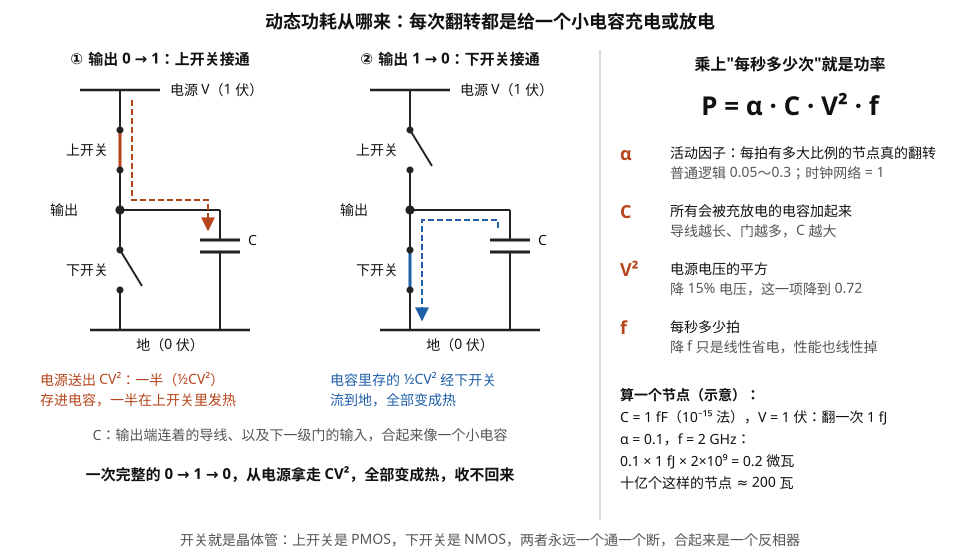
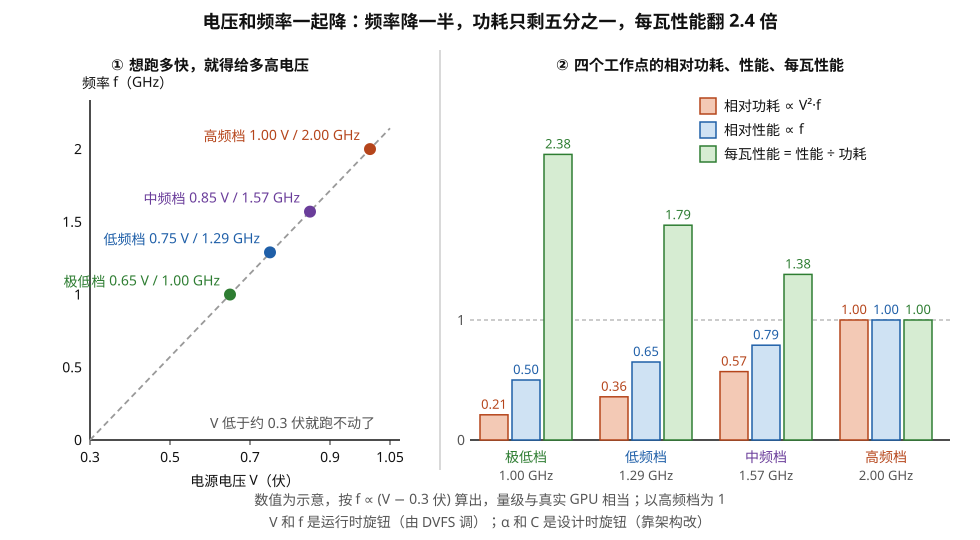
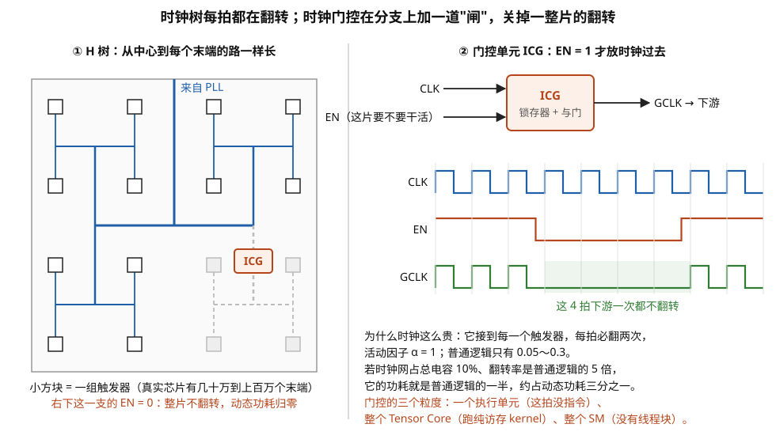
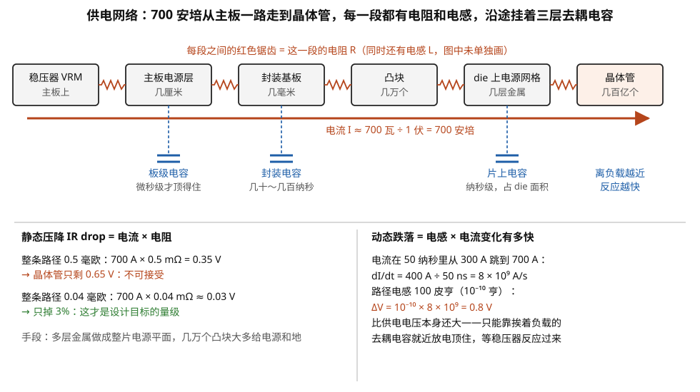
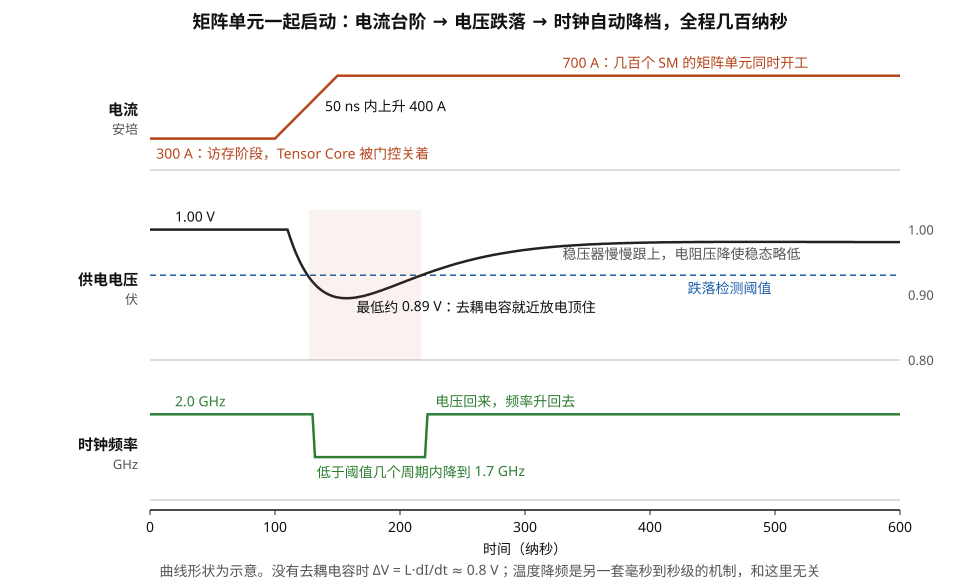

# 能量与时钟的账本：功耗墙、时钟树、电压跌落与 DVFS

> **所属模块**：模块 08 · 微架构与物理实现
> **状态**：🟨 学习中（第一版。知识截至 2026-08）
> **本节主旨**：前面五节讲的每一个器件都在花两样东西：面积和能量。**这一节把能量这本账合起来算。** 起点是一个大多数软件工程师没有内化的事实：**现代 GPU 不是面积受限的，是功耗受限的**——H100 那 814 平方毫米的硅上，如果让所有晶体管同时满负荷翻转，功耗会远超 700 瓦的封装上限，芯片会在几毫秒内烧毁。所以硬件设计的真正任务不是"摆下更多算力"，而是"**在固定的瓦数里做完更多的事**"。这一节沿着这条线拆开四件事：**动态功耗那个 V² 项为什么让降压成为压倒一切的手段**、**时钟树凭什么白白吃掉全芯片一到三成的动态功耗**、**为什么一条矩阵指令开始执行会让供电电压塌下去、进而让频率自动降档**、**以及"功耗墙"这个词具体是哪一堵墙**。学完这一节，模块 01 那句"同一个 kernel 早上测和下午测不一样"和模块 07 那句"纵向堆叠撞散热"会在同一个物理框架下汇合。

---

## 0. 这一节要回答的问题

- 芯片的功耗是怎么产生的？动态功耗和漏电各占多少？
- 为什么降电压比降频率有效得多？降一点电压能省多少？
- 时钟信号本身要花多少功耗？为什么它是芯片里最大的单一功耗项之一？
- 时钟门控、电源门控分别是什么电路？各能省什么？
- 700 瓦的 H100，这些瓦数具体花在哪里了？算力那部分占多少？
- 为什么跑密集矩阵乘时 GPU 频率会自动降下来？这是过热还是别的原因？
- "电压跌落（droop）"是什么？为什么一条指令能让电压塌下去？
- "功耗墙""暗硅"到底指什么？它怎么塑造了今天的架构？
- 背面供电解决的是什么问题？
- 做性能测量时为什么必须锁频？

---

## 1. 基础词汇：先把本节要用的词讲清楚

**动态功耗（dynamic power）**。电路翻转时消耗的功率。物理机制是：每根信号线和每个晶体管栅极都有电容，把它从 0 充到电源电压 V 需要的能量是 ½CV²，再放电回 0 又是 ½CV²，**所以每完成一次"0→1→0"的完整翻转，消耗 CV² 的能量**（充放电的过程见图 6-1）。乘上每秒翻转的次数就是功率：

> **P_dyn = α · C · V² · f**

其中 **α（活动因子）**是"平均每个时钟周期有多大比例的节点在翻转"（典型值 0.05~0.3，取决于负载），**C** 是总的开关电容，**V** 是电源电压，**f** 是频率。**这个公式是本节的主轴，后面每一个结论都从它推出来。**

> **图 6-1**　一句话：芯片的动态功耗来自一件很朴素的事：每个门的输出端都连着一个小电容，输出每从 0 变 1 再变回 0 一次，就要从电源拿走 C·V² 的能量，并且全部变成热。
>
> **先知道一件事**：数字电路里的 1 和 0 是电压的高和低。一个门的输出端连着导线和下一级门的输入，它们合起来像一个小电容（图中两条平行的短粗线，标 C）。输出要变成 1，就得把这个电容充电到电源电压；要变成 0，就得把电放掉。
>
> **按这个顺序看**：
> 1. 左边 ①：上开关接通、下开关断开，电流（红色虚线箭头）从电源经过上开关流进电容，输出从 0 升到 1 伏。这一过程电源一共送出 C·V² 的能量：一半存进电容，另一半在上开关的电阻上变成热。
> 2. 中间 ②：下开关接通、上开关断开，电容里存的那一半（½C·V²）经下开关流到地（蓝色虚线箭头），也全部变成热。
> 3. 于是一次完整的 0 → 1 → 0 从电源拿走 C·V²，一点都收不回来。
> 4. 右边把能量变成功率：每秒有 f 拍，每拍有 α 比例的节点真的在翻转，所以 P = α·C·V²·f。四个字母旁边各写了它是什么、能怎么动。
> 5. 右下算一个节点：C = 1 飞法（10⁻¹⁵ 法拉，一小段导线加一个门输入的量级）、V = 1 伏，翻一次 1 飞焦；α = 0.1、f = 2 GHz 时每个节点 0.2 微瓦，十亿个这样的节点就是 200 瓦。
>
> **打个比方**：往一个桶里灌水再倒掉。桶的大小是 C，灌的高度是 V，每秒倒几次是 f；倒掉的水回不来，所以耗水量只取决于桶多大、灌多高、倒多勤。高度算两次（V²），是因为灌得越高，桶里的水越多，而且每一份水都要抬得更高。
>
> **看懂的标志**：能回答"为什么降电压比降频率划算"——单独降频只让 f 线性下降，性能也跟着线性下降；降电压让 V² 下降，电压降 15%，每次翻转的能量就只剩 0.85² ≈ 0.72。
>
> **与正文的对照**：上开关、下开关就是 PMOS 和 NMOS 两种晶体管，合起来是一个反相器。示例节点的数值为示意，只用来给出量级。
>
> 来源：本库自绘。

**静态功耗 / 漏电（static power / leakage）**。晶体管即使处于"关断"状态，仍有微小电流从源极漏到漏极、或从栅极漏到沟道。单个晶体管的漏电极小，但乘以几百亿个就很可观。**漏电对温度极其敏感**——温度每升高十几度，漏电大约翻倍，这构成一个正反馈：漏电发热 → 温度上升 → 漏电更大。先进工艺上漏电占总功耗的比例典型在 **10% 到 30%**，且随温度剧烈变化。

**电压-频率曲线（V-F curve）**。晶体管的开关速度随电源电压升高而变快，大致关系是"延迟正比于 V / (V − V_th)^α"，其中 V_th 是阈值电压。**实用的近似是：想让频率提高，电压必须跟着提高，而且在高频区间这个代价越来越陡。** 每颗芯片出厂时会测出它自己的 V-F 曲线并烧进固件（不同芯片因工艺偏差而不同）。

**DVFS（Dynamic Voltage and Frequency Scaling，动态电压频率调节）**。芯片运行时根据负载和功耗预算实时调整电压和频率的机制。GPU 上它一直在工作——**你看到的"boost 频率"不是一个固定值，是 DVFS 每几毫秒重新算一次的结果。**

**电源分配网络（PDN，power delivery network）**。从主板上的稳压器（VRM）经过封装基板、凸块、die 上的金属层，一直到每个晶体管的整条供电路径。它有电阻和电感，所以**电流一大就会产生压降，电流变化快就会产生振荡**——§5 讲这件事。

**去耦电容（decoupling capacitor，decap）**。挨着负载放置的电容，作用是在电流突然增大的瞬间就近提供电荷，把电压跌落顶住，直到远处的稳压器反应过来。芯片上、封装上、板上各有一层。**它是唯一能对抗快速电流变化的手段。**

**热设计功耗（TDP）与结温（junction temperature）**。TDP 是散热系统按其设计能持续带走的功率；结温是硅片上晶体管所在位置的温度，是最终的物理限制（典型上限 85~105 °C）。**模块 07 讲的热阻，就是把功耗换算成结温的那个系数。**

## 2. V² 那一项：为什么降压压倒一切

从 P_dyn = α·C·V²·f 出发，看三个旋钮各自的杠杆率。

**旋钮一：频率 f。** 单独降频，功耗线性下降。但**性能也线性下降**，所以"每瓦性能"完全没有改善——单独降频是没有意义的操作。

**旋钮二：电压 V。** 功耗随 V² 下降。但电压不能单独降，因为降压之后电路变慢，频率必须跟着降。**所以真实的旋钮是 V 和 f 联动**，而这个联动恰恰是 DVFS 威力的来源：

假设某颗芯片的 V-F 关系在工作区间近似为 f ∝ (V − 0.3 V)，取几个工作点算一遍（数字为示意，量级符合真实 GPU；图 6-2 把它画了出来）：

| 工作点 | 电压 V | 频率 f | 相对功耗 ∝ V²f | 相对性能 ∝ f | **相对每瓦性能** |
| --- | --- | --- | --- | --- | --- |
| 高频档 | 1.00 V | 2.0 GHz | 1.00 | 1.00 | 1.00 |
| 中频档 | 0.85 V | 1.57 GHz | **0.57** | 0.79 | **1.38** |
| 低频档 | 0.75 V | 1.29 GHz | **0.36** | 0.65 | **1.79** |
| 极低档 | 0.65 V | 1.00 GHz | **0.21** | 0.50 | **2.38** |

> **图 6-2**　一句话：电压和频率必须一起调；把频率从 2 GHz 降到 1 GHz，性能降一半，功耗却降到约五分之一，每瓦性能提高到 2.4 倍。
>
> **先知道一件事**：晶体管在电压高时开关得快，电压低时开关得慢。所以想让时钟跑得快，就必须给更高的电压；反过来，降了电压就必须降频率，否则电路来不及在一拍内算完。
>
> **按这个顺序看**：
> 1. 左图横轴是电源电压，纵轴是这个电压下能稳定运行的最高频率。灰色虚线是本节假设的关系：频率正比于"电压减 0.3 伏"。四个彩色点是表中的四个工作点。
> 2. 右图每组三根柱子对应一个工作点，以高频档为 1。橙色是功耗，按 V² × f 算；蓝色是性能，只与 f 成正比；绿色是每瓦性能，等于蓝色除以橙色。
> 3. 从右往左看：每降一档，蓝柱降得不多，橙柱降得快得多，因为它同时吃到了电压平方和频率两份下降。
> 4. 最左边的极低档：电压 0.65 伏、频率 1 GHz，性能 0.50、功耗 0.21，每瓦性能 2.38。
>
> **看懂的标志**：能回答"把 700 瓦的卡限到 500 瓦，性能为什么往往只掉一成"——限功耗后 DVFS（运行时自动调电压和频率的机制）会退到更低的工作点，砍掉的是高频区最陡的那一段：功耗降得多，频率和性能降得少。
>
> **与正文的对照**：数值与上表一致。"频率正比于电压减 0.3 伏"是示意模型；真实芯片的电压-频率曲线在出厂时逐颗测量并烧进固件。
>
> 来源：本库自绘。

**读这张表的正确方式是看最后一列**：频率降到一半，性能只掉一半，但功耗掉到五分之一——**每瓦性能提升了 2.4 倍**。这就是为什么：

- **数据中心 GPU 的默认频率明显低于它的物理上限**：它工作在每瓦性能更划算的点上。
- **给 GPU 设一个更低的功耗上限（power cap），性能损失往往远小于功耗降幅**：把 700 W 卡限到 500 W，性能可能只掉 10%——因为砍掉的是曲线最陡那一段。
- **模块 08 第 1 节说"GPU 宁可低频多核"有了定量依据**：同样的功耗预算下，两个 1 GHz 的核比一个 2 GHz 的核提供的吞吐高得多。

**旋钮三：活动因子 α 和电容 C。** 这两个才是架构师真正能长期改善的。降低 α 的手段是**不让不该动的电路动**（时钟门控，§4）；降低 C 的手段是**缩短数据搬运的距离**（第 05 节那张能量表的全部意义）和**减少每次计算需要的数据搬运次数**（矩阵指令、数据复用）。**注意 V 和 f 是运行时旋钮，α 和 C 是设计时旋钮——真正的架构创新几乎都在后两个上。**

**电压不能无限降的原因**：降到接近阈值电压时，晶体管的开关变得极慢且对工艺偏差极其敏感，SRAM 单元的读写窗口（第 03 节讲的那个矛盾）先撑不住。**所以片上 SRAM 往往需要比逻辑更高的电压**，芯片上因此存在多个电压域。这也是第 03 节说"8T 单元能压到更低电压"值得多花面积的原因。

## 3. 700 瓦花在哪里：一张 GPU 的功耗构成表

抽象讲完，看一颗真实量级的芯片。以 700 W 级别的数据中心 GPU 为例，给一个**量级估算**（各家不公开精确构成，下面是按公开信息与公开量级推算的近似分解，用来建立直觉，不是精确数据）：

| 项目 | 功率量级 | 占比 | 说明 |
| --- | --- | --- | --- |
| HBM 堆叠本体 + 显存 PHY | 100~150 W | 15~20% | 按 3~5 pJ/bit、3.35 TB/s 带宽粗算即约 100 W 量级（第 05 节的能量表） |
| 计算单元（Tensor Core + CUDA Core 的算术电路） | 150~250 W | 25~35% | 真正"在算"的部分 |
| 寄存器堆与片上 SRAM 访问 | 80~150 W | 12~20% | 第 03 节：读一次寄存器的能量与一次乘加同量级 |
| 片上互连（SM↔L2 网络、crossbar、长线缓冲器） | 50~100 W | 8~15% | 第 05 节的搬运能量 |
| 时钟树 | 70~150 W | 10~20% | §4 展开 |
| NVLink / PCIe PHY | 30~60 W | 5~8% | SerDes 的固定开销，即使空闲也不小 |
| 漏电 | 70~150 W | 10~20% | 强烈依赖温度 |

**这张表最该记住的一件事：真正"在做乘加"的那部分，只占三成左右。** 剩下七成花在把数据搬到乘法器门口、把结果搬走、以及维持整台机器运转（时钟、漏电、接口）上。

**用另一个角度验证这个量级。** H100 SXM 的稠密 FP16 张量算力约 990 TFLOPS，功耗 700 W：

> 700 W ÷ 990 × 10¹² FLOP/s ≈ **0.71 pJ / FLOP**

一次乘加算两个 FLOP，所以**每次 FP16 乘加消耗约 1.4 pJ（整机口径）**。而第 02 节说过，一个 FP16 乘法器本身的能量在零点几 pJ 量级。**两者相差数倍——这个差额就是上面那张表里"非计算"的七成。** 这条对照是本节最实用的一个心算工具：**看到任何一颗加速器的"算力 / 功耗"比，除以 2 就得到每次乘加的整机能量；把它和裸乘法器的能量比一下，就知道这颗芯片的搬运开销有多重。**

**能效竞赛的真实战场因此不在乘法器上。** 从 FP16 降到 FP8 再到 FP4，乘法器面积和能量按尾数位宽的平方缩小（第 02 节），但**搬运、时钟、漏电这些开销并不按平方缩小**。所以低精度带来的实际能效提升，总是低于纸面上的位宽比——**边际收益递减的物理原因就在这张表里。**

## 4. 时钟树：一个不做任何计算却吃掉一到三成功耗的结构

**时钟为什么这么贵。** 时钟信号有三个特点，凑在一起就是功耗噩梦：

1. **它接到芯片上每一个触发器的时钟端**。一颗 GPU 上有数亿个触发器，每个都是一个电容负载。
2. **它每个周期必然翻转两次**（上升沿和下降沿），也就是**活动因子 α = 1**——而普通逻辑信号的 α 只有 0.05~0.3。**时钟是芯片上唯一一个永远满负荷翻转的信号网络。**
3. **它必须几乎同时到达所有触发器**（偏斜要控制在几十皮秒内），这需要一棵层层放大的缓冲器树，本身又是巨大的负载。

**代入公式感受一下**：假设时钟网络的总电容是全芯片开关电容的 10%，但它的活动因子是普通逻辑的 5 倍（1.0 对 0.2），那么它的动态功耗就是 10% × 5 = **50% 的普通逻辑功耗**——换算成占总动态功耗的比例约三分之一。真实设计通过精心优化把它压到一到三成，但**它永远是单项最大的功耗项之一。**

**时钟树的物理形态**。为了让时钟同时到达，通常用 **H 树**结构（见图 6-3）：从中心出发，一分为二、每支再一分为二，每一级的两条支路长度严格相等，最终每个叶节点到根的路径长度都一样。在高性能设计里还会在末端叠一层**时钟网格（mesh）**——把很多末端短接成一张网，用互相拉扯来抹平偏差。**网格的偏斜更小，但功耗更高**（网格本身就是一大片始终在翻转的金属）。

**时钟门控（clock gating）：最重要的省电手段。** 既然时钟的 α 恒为 1，那么最有效的省电方式就是**在不需要的时候把它关掉**。做法是在时钟树的分支上插入**集成门控单元（ICG）**：当某个模块这拍不工作时，使能信号为低，这一支的时钟就不翻转，**它下游所有触发器和缓冲器的动态功耗全部归零**。

门控可以分很多层级：

- **细粒度**：一个执行单元这拍没有指令，它的流水寄存器时钟就关掉。
- **中粒度**：整个 Tensor Core 在跑纯访存的 kernel 时完全关掉时钟。
- **粗粒度**：一个 SM 上没有驻留线程块时，整个 SM 的时钟关掉。

> **图 6-3**　一句话：时钟信号通过一棵左右对称的"H 树"送到每个触发器，每一拍都要翻转；时钟门控在树的分支上加一个开关，让一整片电路在不干活时一次都不翻转。
>
> **先知道一件事**：触发器是在时钟跳变那一刻把数据存下来的小单元，芯片上有几亿个，全都要接到时钟上。时钟每拍从低到高、再从高到低各变一次，每变一次都要给整张时钟网络的电容充电或放电（机制见图 6-1）。
>
> **按这个顺序看**：
> 1. 左图是一块芯片的俯视示意。蓝线从顶上的 PLL（产生时钟的电路）进来，先到中心，然后一分为二、二分为四、四分为八，每一级的两条支路长度相等，形状像一个个字母 H，所以叫 H 树。
> 2. 小方块是末端的触发器组。因为每条路径一样长，时钟到达每个方块的时刻几乎相同。这正是 H 树要解决的问题：让偏斜（不同位置收到同一个时钟沿的时间差）尽量小。
> 3. 看右下那一支：分支上插了一个 ICG（集成时钟门控单元）。它的使能信号 EN 为 0 时，这一支以下的线和方块都变灰，时钟不再翻转，它们的动态功耗归零。
> 4. 右上是 ICG 的接口：输入 CLK（原始时钟）和 EN（这片电路这拍要不要干活），输出 GCLK（门控后的时钟）送给下游。内部是一个锁存器加一个与门，锁存器保证 EN 只在时钟为低时生效，不会切出半个脉冲。
> 5. 右边波形横轴是时间：CLK 一直在跳；EN 在第 4 拍之前变低、第 8 拍之前变高；GCLK 只在 EN 为高时跟着 CLK 跳，中间绿色阴影的 4 拍一次都不翻转。
> 6. 右下文字是"时钟为什么贵"的算术，以及门控的三个粒度。
>
> **打个比方**：一栋楼的中央广播要同时传到每个房间，所以线路从大楼中心对称分叉，保证每个房间听到的时刻一样；没人的楼层把那一层的广播闸关掉，那一层的喇叭就不再耗电。
>
> **看懂的标志**：能回答"为什么只做访存的 kernel 功耗只有 300 瓦，而满负荷的 GEMM 能顶到 700 瓦"——访存 kernel 运行时，Tensor Core 那几支时钟的 EN 一直为 0，门控关掉了它们的翻转；GEMM 让几乎所有分支的 EN 都为 1。
>
> **与正文的对照**：真实芯片的时钟树有几十万到上百万个末端，末端常再叠一层时钟网格来进一步减小偏斜，图中没有画。时钟从晶振经 PLL 倍频再分发到触发器的整条路径，以及偏斜和抖动的波形，见本模块第 1 节图 1-3。
>
> 来源：本库自绘。

**这条机制有一个软件侧的直接后果**：**GPU 的功耗对 kernel 的"指令组合"极其敏感**。一个只做访存的 kernel，算术单元全程被门控关着，功耗可能只有 300 W；一个满负荷跑 Tensor Core 的 GEMM，所有单元全开，功耗直接顶到 700 W 上限。**这就是"power virus"（功耗病毒）这个词的由来——一段刻意让尽可能多的单元同时满负荷翻转的代码，能把芯片推到功耗极限。** 真实的 GEMM kernel 就非常接近这个状态。

**电源门控（power gating）：更彻底但更慢。** 时钟门控只停了翻转，晶体管仍然通电、仍然漏电。电源门控则用一排大晶体管（power switch）把整个模块的供电切断，**连漏电也归零**。代价是：切断后模块内所有状态丢失（除非配保持触发器），恢复供电要几微秒（要等电压重新建立，还要防止大电流冲击引起全芯片电压跌落）。**所以电源门控只用于"确定很长时间不用"的模块**，GPU 上主要用于整个 SM 或整个功能分区级别，不用于细粒度单元。

## 5. 电压跌落：为什么一条矩阵指令能把频率打下去

这是本节最反直觉、也最能解释真实现象的一段。

**问题的物理来源。** 电流从主板的稳压器流到晶体管，要经过一条有电阻和电感的路径。

- **电阻造成静态压降（IR drop）**：电流 I 流过电阻 R，压降是 I × R。一颗 700 W、工作在 1 V 的芯片，电流是 **700 安培**。哪怕整条路径的等效电阻只有 0.5 毫欧，压降也有 0.35 V——**占供电电压的三分之一，完全不可接受**。所以真实设计要把整条 PDN 的等效电阻压到几十微欧（零点零几毫欧）的量级——要让 700 安培只产生约 30 毫伏的压降，电阻不能超过约 0.04 毫欧（整条路径见图 6-4）。手段是用大量金属层做电源平面、用海量的供电凸块（模块 07 讲过一颗大 die 的几万个凸块里绝大多数是电源和地）。
- **电感造成动态跌落（di/dt droop）**：这是更难对付的一半。电感两端的电压是 L × (dI/dt)，**它不看电流有多大，只看电流变化有多快。**

> **图 6-4**　一句话：电从主板上的稳压器出发，经过主板、封装、凸块、芯片上的金属网格才到达晶体管；700 安培流过这条路，哪怕整条路只有 0.5 毫欧的电阻，也会白白掉掉三分之一的电压。
>
> **先知道一件事**：电流流过有电阻的导体，两端就会出现电压差，大小等于电流乘电阻（这叫 IR 压降，I 是电流，R 是电阻）。同样的电阻，电流越大，掉的电压越多。GPU 的特殊之处在于电流极大：700 瓦、1 伏供电，就是 700 安培，是家用电热水器电流的几十倍。
>
> **按这个顺序看**：
> 1. 上排六个方框是供电路径，从左边的稳压器（VRM，把较高的输入电压变成 1 伏左右的电路）到右边的晶体管。方框之间的红色锯齿表示这一段的电阻；每一段同时还有电感，图中没有单独画。
> 2. 红色长箭头是电流方向，约 700 安培。
> 3. 蓝色虚线挂下来的是三层去耦电容（放在路径旁边储能的电容，电流突增时就近放电）：主板上的离得最远、要微秒级才顶得住；封装上的顶几十到几百纳秒；芯片上的离晶体管最近、反应最快（纳秒级），但要占芯片面积。
> 4. 左下算静态压降：整条路径 0.5 毫欧时掉 0.35 伏，晶体管只剩 0.65 伏，电路根本跑不动；要把压降控制在 3% 左右，电阻必须压到约 0.04 毫欧。办法是用多层金属做成整片的电源平面，并把几万个凸块中的大多数都给电源和地。
> 5. 右下算动态跌落：电感上的电压不看电流多大，只看电流变得多快。50 纳秒内电流涨 400 安培，100 皮亨的电感就会产生 0.8 伏的瞬时压降，比供电电压本身还大。这一部分只能靠去耦电容来顶。
>
> **打个比方**：一栋高楼靠一根总水管供水。水管再粗也有阻力，全楼一起开龙头时顶楼水压就低（静态压降）；如果所有人在同一秒突然开龙头，水流一下子跟不上，顶楼瞬间断水（动态跌落）。每层楼放一个小水箱（去耦电容），就能先顶住那一下，等总泵加大出水。
>
> **看懂的标志**：能回答"为什么一颗大芯片的几万个凸块里，大部分不是信号线"——要让 700 安培只掉几十毫伏，电流必须分散到尽可能多的并联通路上，每多一对电源和地凸块，路径的总电阻就低一点。
>
> **与正文的对照**：0.5 毫欧、100 皮亨、300→700 安培与正文算例一致；0.04 毫欧是按"700 安培只掉约 30 毫伏"反推的量级。§8 讲的背面供电，就是把图中"die 上电源网格"那一段挪到芯片背面，缩短路径、降低电阻。
>
> 来源：本库自绘。

**一个具体的场景，把这件事讲透。** 假设一颗 GPU 正在跑一段访存密集的代码，Tensor Core 全部被时钟门控关着，此时电流是 300 A。突然进入一段 GEMM，几百个 SM 的 Tensor Core **在几十纳秒内同时开始满负荷工作**，电流跳到 700 A：

> dI/dt = 400 A / 50 ns = **8 × 10⁹ A/s**

如果供电路径的等效电感是 100 皮亨（10⁻¹⁰ H），瞬时压降就是：

> ΔV = L × dI/dt = 10⁻¹⁰ × 8 × 10⁹ = **0.8 V**

**这个数字比供电电压本身还大**——当然实际上不会真的跌这么多，因为去耦电容会在这段时间里就近供电、把跌落顶住。但它说明了问题的量级：**没有去耦电容，芯片在负载突变的瞬间就会因为电压不足而计算出错。**

**去耦电容的三层防线**，按响应速度从快到慢：

| 层级 | 位置 | 能顶多久 |
| --- | --- | --- |
| 片上电容（MOS 电容、MIM 电容） | die 上，紧挨着负载 | 纳秒级 |
| 封装电容 | 封装基板上 | 几十到几百纳秒 |
| 板级电容 + 稳压器反馈 | 主板上 | 微秒级 |

**片上电容要占 die 面积**——这是一笔真实的、不产生任何计算的面积开销。

**硬件的第二道防线：跌落检测与自适应时钟**（整个过程的时间线见图 6-5）。现代高性能芯片会在 die 上分布**电压跌落检测器**，一旦测到电压低于阈值，**在几个时钟周期内立刻把时钟频率降下来**（拉长时钟周期，给电路更多时间完成同样的逻辑），等电压恢复再升回去。这个机制的响应快到软件完全看不见。

**这就完整解释了那个"怪现象"**：跑一个密集的 GEMM kernel 时，`nvidia-smi` 看到的频率比跑轻负载时低，而且卡还没热起来。**原因不是过热，是电流台阶引起的电压跌落让自适应时钟主动降了档。** 温度降频是另一套更慢的机制（毫秒到秒级），两者经常被混为一谈。

> **图 6-5**　一句话：几百个 SM 的矩阵单元同时开工时，电流在几十纳秒内猛增，供电电压随之塌下一截；芯片上的检测电路一发现电压低于阈值，就在几个周期内把时钟调慢，等电压恢复再调回去。
>
> **先知道一件事**：电路在电压低时开关变慢。如果电压塌了而时钟还按原来的节拍走，某些信号会来不及在一拍内算完，结果就会出错。所以电压不够时，要么让电压赶快回来，要么让每一拍变长。
>
> **按这个顺序看**：
> 1. 三行共用底下的时间轴，单位是纳秒，整张图只有 0.6 微秒。
> 2. 第一行电流：前 100 纳秒在做访存，Tensor Core 被时钟门控关着，电流 300 安培；随后 50 纳秒内涨到 700 安培。
> 3. 第二行电压：电流一涨，电压从 1.00 伏往下掉，最低到约 0.89 伏。它能停在这里、而不是掉 0.8 伏，是因为去耦电容就近放电顶住了；之后稳压器慢慢跟上，电压回升，但电流变大后电阻压降也变大，稳态比原来略低。
> 4. 蓝色虚线是跌落检测阈值。电压低于它的那一段（浅色阴影）就是危险区。
> 5. 第三行时钟：进入危险区后几个周期内，频率从 2.0 GHz 降到 1.7 GHz，每一拍变长，电路有更多时间完成同样的计算；电压回到阈值之上，频率升回 2.0 GHz。
>
> **看懂的标志**：能回答"跑密集 GEMM 时频率掉了、卡却还不热，是怎么回事"——这是纳秒级的电压保护，不是毫秒到秒级的温度降频；对策是让负载在时间上更平稳，而不是加强散热，测性能时则要先锁频。
>
> **与正文的对照**：电流 300→700 安培、50 纳秒的上升时间与正文算例一致。电压最低值、阈值、1.7 GHz 以及各段的持续时间都是示意；真实芯片的降档幅度和恢复策略没有公开（见 §11 的困惑）。
>
> 来源：本库自绘。

**这条机制的架构影响很深远**：它意味着**芯片的"峰值算力"是一个在时间上无法长期维持的数字**，而且**负载切换本身有代价**——一个在矩阵计算和访存之间频繁大幅切换的 kernel，会不断制造电流台阶、不断触发降频。**"让功耗平稳"因此成了一个真实的优化目标**，这也是为什么某些看起来"更聪明"的调度（比如把所有矩阵计算挤在一起做）在真机上未必更快。

## 6. 功耗墙与暗硅：这堵墙具体在哪

**先把两个概念说清楚。**

**功耗墙（power wall）**指的是：芯片的功耗上限由散热系统和供电系统决定，**而这个上限的增长速度远慢于晶体管数量的增长速度**。历史上，工艺每代把晶体管缩小，同时电源电压也按比例下降，所以单位面积功耗大致不变——这叫**登纳德缩放（Dennard scaling）**。但电压在 2005 年前后就降不动了（因为阈值电压降不下去，再降漏电会爆炸），而晶体管还在继续变小变多。**结果是单位面积的功耗密度逐代上升，而散热能力没有跟上。**

**暗硅（dark silicon）**是它的直接后果：**芯片上的晶体管数量已经多到不可能同时全部工作**。任何时刻都必须有相当比例的电路处于关闭（时钟门控或电源门控）状态，否则功耗会超限。

**这两个概念不是学术抽象，它们直接塑造了今天 GPU 的样子**：

1. **专用单元大量出现，正是暗硅的产物。** 既然晶体管反正不能全开，那么"多摆几种各自专精、按需开启的单元"就比"摆一种通用单元"更划算——**Tensor Core、TMA、各种编解码器、超越函数单元，全都是这个逻辑的产物**。一个 Tensor Core 在跑访存 kernel 时是完全关着的暗硅，但它开着的时候能效比通用单元高一个数量级。**用面积换能效，这笔交易在暗硅时代永远划算。**
2. **低精度的价值被放大。** 第 02 节说 FP8 的乘法器面积是 FP32 的 1/36。在面积受限的时代这意味着"能多摆 36 倍"；在功耗受限的时代，它的意义变成"**同样的瓦数能多做很多倍的运算**"——后者才是真正的驱动力。
3. **散热成为架构参数。** 模块 07 讲的"纵向堆叠撞散热"、"热阻上下不对称五十倍"，在本节的框架里就是：**功耗墙的高度由热阻决定，而热阻由封装形态决定。** 两个模块在这里合流：**封装决定能散多少瓦，能散多少瓦决定能开多少晶体管，能开多少晶体管决定架构长什么样。**

**一笔可以算的账：功耗密度。** H100 的 814 mm² 上跑 700 W，功耗密度是 **0.86 W/mm²**。作为对照，一块普通家用电磁炉的加热面功率密度大约是 0.05 W/mm² 量级。**一颗 GPU 的单位面积发热强度比电磁炉高一个数量级以上**——这就是为什么数据中心 GPU 必须用重型散热甚至液冷，也是为什么模块 07 讲的"3D 堆叠时热几乎只能朝上走"是一条如此硬的约束。

## 7. 开发者视角：能量与频率在软件侧的三个通道

| 物理事实 | ① 源码拨盘 | ② 编译器回执 | ③ Profiler 探针 |
| --- | --- | --- | --- |
| 频率随功耗与温度实时浮动 | **测性能前必须锁频**：`nvidia-smi -lgc <freq>`；测完 `-rgc` 恢复 | 无 | `nvidia-smi --query-gpu=clocks.sm,power.draw,temperature.gpu`；跑之前跑之后各看一次 |
| 时钟门控让功耗强依赖指令组合 | 无直接拨盘；表现为不同 kernel 功耗差异极大 | 无 | 功耗曲线与 profiler 的各管线利用率对照着看 |
| 电流台阶触发自适应降频 | 让负载在时间上更平稳（避免矩阵计算与访存大块交替） | 无 | 频率在 kernel 内部的时间曲线（需要高频采样工具） |
| 搬运能量远大于计算能量 | 提高数据复用（tiling、算子融合、矩阵指令）——模块 02/04 的全部内容 | 无 | 算术强度（模块 01 附录 A1）；DRAM 与 L2 吞吐 |
| 降功耗上限时性能损失不成比例 | `nvidia-smi -pl <watt>` 设功耗上限 | 无 | 同一 kernel 在不同功耗上限下的耗时曲线——这条曲线的形状就是 V-F 曲线 |
| 漏电随温度上升 | 无；但意味着**冷机第一次跑总是最快的** | 无 | 连续跑同一 kernel 若干次，观察耗时是否单调变差 |

**一个必须建立的测量纪律**：任何微基准测试或 kernel 性能对比，**都要先锁频**。不锁频的情况下，两个 kernel 的耗时差异里混杂着频率差异，而频率差异可能来自温度、来自功耗上限、来自电流台阶——**你测的可能根本不是代码。** 模块 08 第 1 节提过这个坑，本节给出了它的完整机制。

**另一个反直觉的实践结论**：如果目标是**每瓦性能**而不是绝对性能（数据中心的真实目标往往是前者），那么主动把功耗上限调低通常是有利的。按 §2 那张表，把功耗砍掉 30% 往往只损失 10% 左右的性能——**在一个电力受限的机房里，同样的总功率可以多插几张卡，整体吞吐反而更高。**

## 8. 最新架构落点（知识截至 2026-08）

- **背面供电是本节这条线上最重要的工艺进展。** TSMC 的 **A16 节点带 Super Power Rail（SPR）**：把电源网络从 die 正面挪到背面，通过专门的接触直连每个晶体管的源漏极。它同时解决本节的两个问题——**缩短供电路径、降低 PDN 电阻，从而减小 IR drop**；以及**把正面金属层从供电任务里解放出来给信号布线**（第 05 节的受益者）。官方口径是相对 N2P 同电压下速度 +8~10%、同速度下功耗 −15~20%。**计划 2026 年下半年（Q4）量产，首批目标就是 HPC/AI 产品。**
- **功耗上限还在涨，但涨的是"整机"而不是"单芯片能效"。** Blackwell 一代的单封装功耗已经进入 1000 W 以上区间，**Rubin 一代的机架级设计（Vera Rubin NVL144）继续沿着"整机架供电与液冷"的方向走**。这条趋势的本质是：**单芯片的功耗密度已经顶到散热极限，继续提升只能靠改善散热（液冷）和把系统边界放大（机架级供电）**，而不是靠让芯片本身更省。
- **液冷从可选变成必需**。当单封装功耗超过 1 kW、机架功率进入几十到上百千瓦区间，风冷的热阻已经不够（模块 07 的热阻账）。**散热能力直接成为算力的上游约束**，这在几年前还是一个基础设施话题，现在是架构话题。
- **能效指标的口径要小心**。厂商宣传的"每瓦性能提升 N 倍"，通常同时包含了工艺、精度（比如从 FP8 换成 FP4）、稀疏等多个变量。**按本节的框架拆解：真正的能效改善要么来自降低 C（缩短搬运、提高复用），要么来自降低 V（工艺与供电），单纯换更低精度只是把同一个乘法器换小了，边际收益会被那七成的非计算开销卡住。**
- **另一条路的对照**：TPU 长期使用液冷并把频率压在 1 GHz 上下，正是在 §2 那张表的"每瓦性能更划算"的工作点上；Cerebras 的晶圆级引擎把供电和散热做成整片晶圆的垂直结构（从背面直接供电和取热），本质上是把本节的两个约束——PDN 电阻和热阻——用一种极端封装形态一起解决。

## 9. 和其它模块的挂钩

- **模块 07 第 1 节（先进封装）**：那里算的热阻，正是本节功耗墙高度的决定因素。**封装决定能散多少瓦 → 能散多少瓦决定能开多少晶体管 → 决定架构形态**，这条链在这里闭合。
- **模块 01 附录 A1（瓶颈定位）**：那里讲算术强度和 Roofline 的思路，本节给出能量版本——**每次数据搬运的能量是每次计算的几十倍，所以复用率就是能效比**。
- **模块 02（脉动阵列）与模块 03（Tensor Core）**：它们的能效优势在本节的公式里就是"降低 C"——用短连线和高复用减少每次乘加需要的开关电容。
- **模块 08 第 2 节（算术单元）**：低精度省的是乘法器的面积和能量，但本节 §3 的表说明那只占三成，所以收益递减。
- **模块 08 第 3 节（片上存储）与第 05 节（互连）**：那两节的能量数字，在本节被汇总成整机功耗构成。
- **模块 08 第 8 节（从 RTL 到 tapeout）**：功耗与温度还决定了芯片的分档（binning）与出厂频率设定。

## 10. 术语卡

### 动态功耗公式 P = αCV²f
**定义**：电路翻转时的功率消耗。α 是活动因子（每周期有多大比例节点在翻转），C 是总开关电容，V 是电源电压，f 是频率。每完成一次完整的 0→1→0 翻转消耗 CV² 的能量。
**为什么存在**：数字电路用电压高低表示 0 和 1，改变一个节点的状态就必须给它的寄生电容充放电，这个能量无法回收。公式里的平方项使电压成为杠杆率最高的旋钮。
**语境例句**："这个改动降不了 V 和 f，只能从 α 和 C 上想办法。" —— 意思是：电压频率是运行时由 DVFS 决定的，架构层面能做的只有"少让电路无谓翻转"和"缩短数据搬运距离"——这是几乎所有能效创新的两个方向。

### DVFS 与每瓦性能曲线
**定义**：芯片运行时按负载和功耗预算实时调整电压与频率的机制。因为功耗随电压平方、随频率线性变化，而性能只随频率线性变化，所以降低工作点能显著提升每瓦性能——频率降一半时功耗可能只剩五分之一。
**为什么存在**：芯片的物理频率上限对应的工作点在能效曲线上极不划算，而数据中心的真实目标通常是每瓦吞吐而非单卡峰值。DVFS 让同一颗硅片可以按场景选择工作点。
**语境例句**："把功耗上限压到 500 W，性能只掉一成。" —— 意思是：砍掉的是 V-F 曲线最陡的那一段，每瓦性能反而提升——在电力受限的机房里这是净赚。

### 时钟门控（clock gating）与功耗病毒
**定义**：在时钟树分支上插入门控单元，模块不工作时切断该分支的时钟翻转，使其下游所有触发器和缓冲器的动态功耗归零。因为时钟是芯片上唯一活动因子恒为 1 的信号网络，这是效果最显著的省电手段。功耗病毒则指刻意让尽可能多单元同时满负荷翻转的代码，能把芯片推到功耗极限。
**为什么存在**：时钟接到数亿个触发器上且每周期必然翻转两次，不门控的话它单项就能吃掉三成以上动态功耗。而门控的直接后果是芯片功耗强烈依赖指令组合，这正是同一张卡跑不同 kernel 功耗差一倍的原因。
**语境例句**："这个 GEMM 基本就是个 power virus。" —— 意思是：它让矩阵单元、寄存器堆、访存通路同时满负荷，功耗直接顶到上限，因而会触发降频——测它的性能必须锁频。

### 电压跌落（IR drop 与 di/dt droop）
**定义**：供电路径的电阻造成静态压降（电流乘电阻），电感造成动态跌落（电感乘电流变化率）。后者不看电流有多大，只看变化有多快：几百安培的电流在几十纳秒内建立，瞬时压降可以与供电电压同量级。
**为什么存在**：一颗 700 W、1 V 供电的芯片要吃 700 安培电流，而供电路径的电阻和电感不可能为零。去耦电容（片上、封装、板级三层）是唯一能对抗快速电流变化的手段，且片上那层要占真实的 die 面积。
**语境例句**："矩阵单元一起来，电压塌了，时钟自适应降档。" —— 意思是：电流台阶触发跌落检测，硬件在几个周期内主动降频保护——这是跑密集 GEMM 时频率下降的真正原因，和过热是两套不同机制。

### 功耗墙与暗硅（dark silicon）
**定义**：功耗墙指芯片功耗上限由散热与供电决定，而这个上限的增长远慢于晶体管数量的增长。暗硅是它的后果：晶体管已多到不可能同时全部工作，任何时刻都必须有相当比例处于关闭状态。
**为什么存在**：登纳德缩放在电压降不动之后失效——晶体管继续变小变多，但单位面积功耗不再随之下降。散热能力则受封装热阻的硬限制。
**语境例句**："反正是暗硅，多摆几种专用单元更划算。" —— 意思是：既然晶体管不能同时全开，用面积换能效永远成立——这是 Tensor Core、TMA、各类专用引擎在过去十年集中出现的根本经济学。

### 自适应时钟与跌落检测器
**定义**：分布在 die 上的电压监测电路，一旦测到局部电压低于阈值，在几个时钟周期内立即拉长时钟周期（降频），给电路更多时间完成同样的逻辑，电压恢复后再升回去。响应速度是纳秒级，软件完全不可见。
**为什么存在**：去耦电容能顶住的时间有限，稳压器的反馈是微秒级，两者之间存在一个几十到几百纳秒的空窗。与其把电压余量留得很高（那要一直多耗电），不如让频率临时让步。
**语境例句**："频率是被 droop 打下去的，不是热降频。" —— 意思是：这是纳秒级的电压保护而非毫秒级的温度保护，看温度曲线看不出来——对策是让负载在时间上更平稳，而不是加强散热。

## 11. 我的困惑 / 待深挖

- 真实 GPU 的功耗构成分解，有没有可信的公开来源？本节的表是按量级推算的，希望能找到实测或厂商披露的数据来校准。
- 自适应时钟的响应粒度：是全片一起降还是分区域降？降档的幅度和恢复策略是什么？
- 片上去耦电容占 die 面积的比例大约是多少？这个数字在 AI 芯片上是否明显高于通用处理器？
- 背面供电对 GPU 这种超大电流设计的实际收益，会不会明显高于 CPU？有没有早期硅的数据？
- "让功耗平稳"作为一个 kernel 优化目标，有没有真实可操作的手法和可测量的收益？还是只在极端情况下才有意义？
- 漏电随温度上升的正反馈，在液冷普及之后是否显著改善了？液冷带来的能效收益里有多少来自漏电减少而非单纯的散热能力？

---

*最后更新：2026-08-31（第一版：模块 08 第 6 节；含 V-F 四工作点每瓦性能表、700 W 功耗构成分解与 pJ/FLOP 交叉验证、时钟门控三粒度、di/dt 跌落 0.8 V 算例、功耗密度与电磁炉对照）*（2026-09 补图 5 张：现成 0 张，自绘 5 张；图注按费曼法写）
