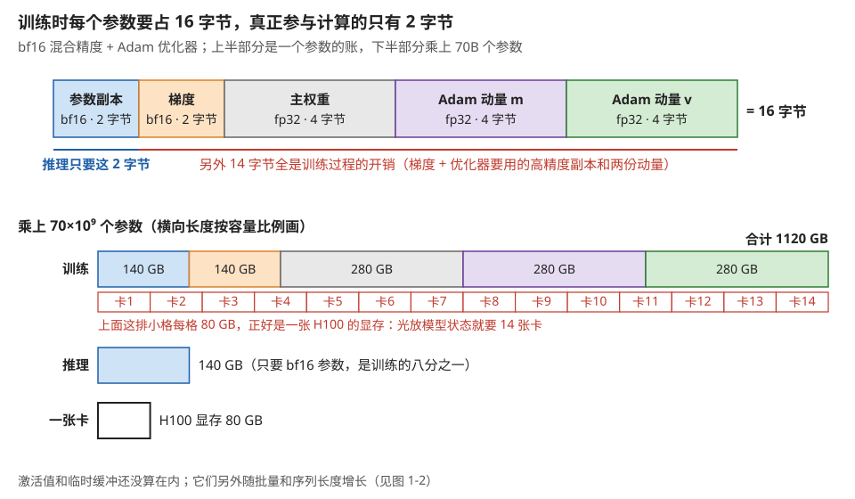
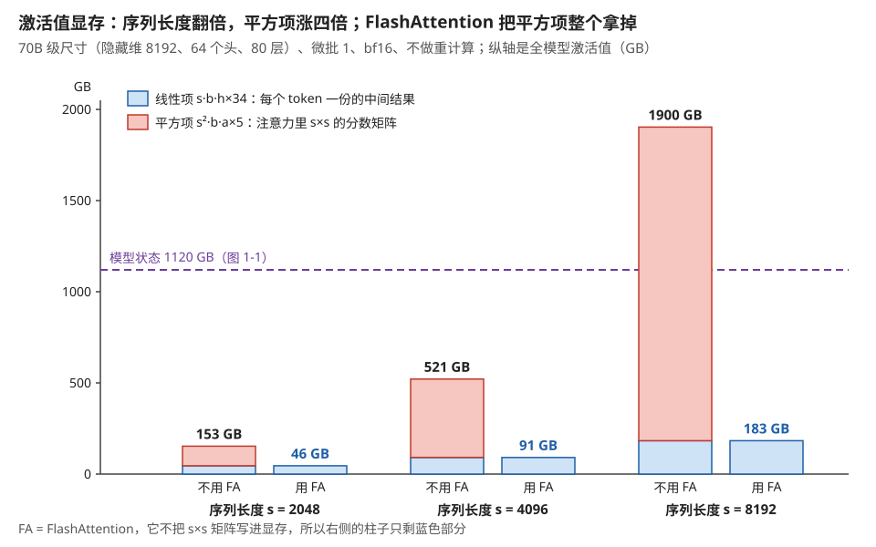
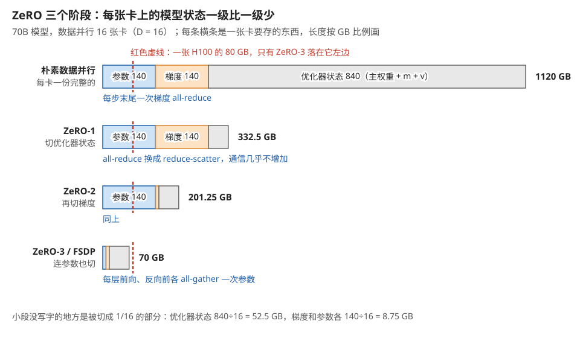
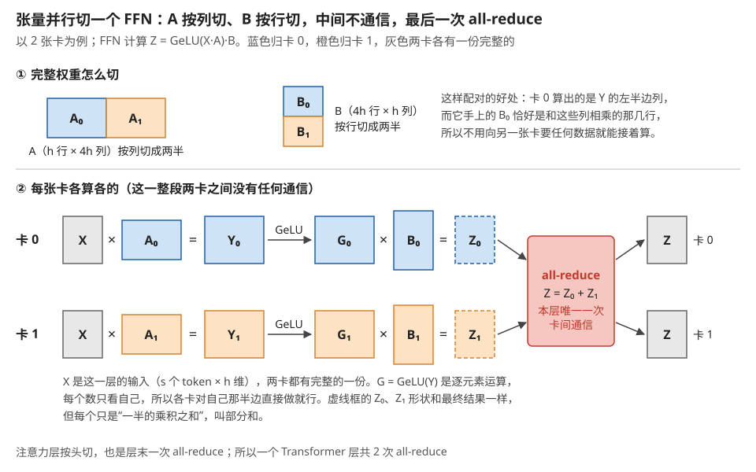
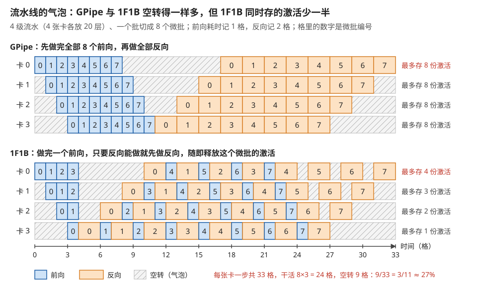
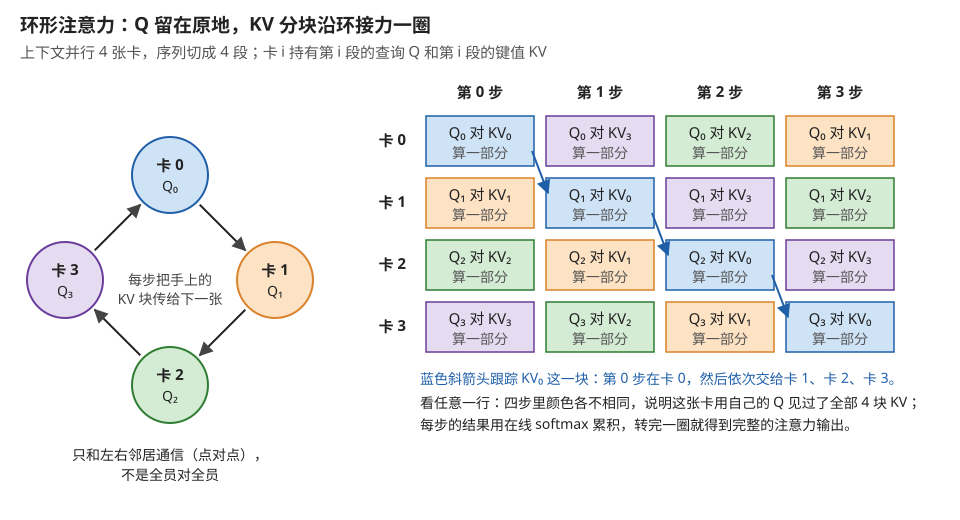
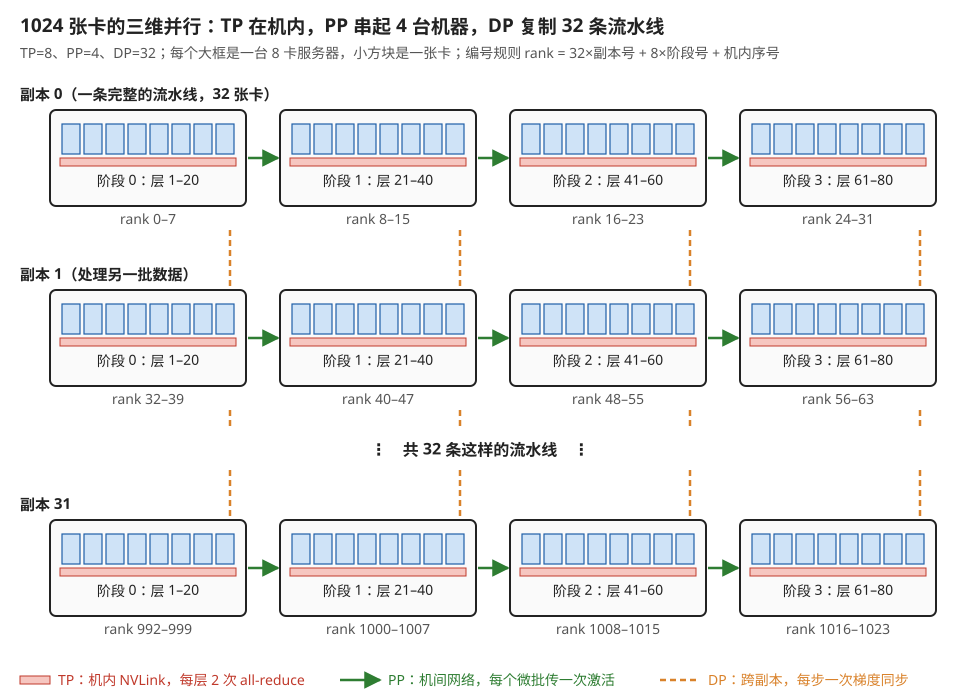
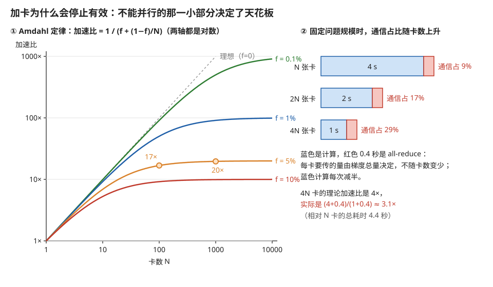

# 训练系统：显存账本、并行策略的组合，与 MFU

> **所属模块**：模块 09 · 系统视角（从一张卡到一个集群）
> **状态**：🟨 学习中（第一版。知识截至 2026-08）
> **本节主旨**：前八个模块讲的都是"一张卡上发生了什么"，最远也只到模块 03 第 2 节那张四层互连地图。但真实的大模型训练是一件**几千张卡协同做同一件事**的工程，它的第一约束不是算得快不快，而是**装不装得下**——一个 70B 模型用混合精度加 Adam 优化器训练，光是模型状态就要 **1120 GB**，而一张 H100 只有 80 GB。这一节从这笔显存账开始，把训练系统的骨架搭起来：**显存由哪四项构成**、**五种并行策略各自砍掉哪一项、各要付多少通信**、**它们怎么组合以及为什么顺序不能随便排**、**流水线的气泡是一个可以算出来的比例**，最后落到训练系统的头号指标——**MFU（模型算力利用率）**：它是"你买的算力真正用在算模型上的比例"，也是把前八个模块所有优化最终换算成钱的那个数。

---

## 0. 这一节要回答的问题

- 训练一个模型到底要多少显存？这笔钱花在哪几项上？为什么优化器状态比模型本身还大？
- 激活值显存怎么算？为什么长序列会让它爆炸？FlashAttention 除了省时间，省了多少显存？
- DP、TP、PP、EP、CP 五种并行策略，各自砍掉显存账本的哪一项？各要付多少通信？
- ZeRO / FSDP 和张量并行都能砍显存，区别在哪？什么时候用哪个？
- 为什么并行策略的组合有固定的嵌套顺序（TP 最内、DP 最外）？换个顺序会怎样？
- 流水并行的"气泡"是多少？为什么切更多的微批就能压小它？1F1B 又省了什么？
- MFU 是什么？怎么算？为什么它比"GPU 利用率"有用得多？
- HFU 和 MFU 差在哪？为什么开了重计算之后两者会分家？
- 一个训练任务慢下来，该按什么顺序排查？

---

## 1. 基础词汇：先把本节要用的词讲清楚

**参数（parameter）与模型状态（model states）**。参数就是模型里要被训练的那些数（权重矩阵、偏置），数量记作 **N**，大模型里是几十亿到上万亿。**模型状态**是一个更宽的概念：训练过程中必须一直保存的、与参数一一对应的所有量——参数本身、它们的梯度、以及优化器为每个参数维护的额外状态。第 2 节会看到，模型状态的总量是参数量的好几倍。

**优化器状态（optimizer states）**。优化器决定"拿到梯度之后怎么改参数"。最常用的 **Adam** 优化器为每个参数额外维护两个量：**一阶动量 m**（梯度的滑动平均，起到"惯性"的作用）和**二阶动量 v**（梯度平方的滑动平均，用来给每个参数自适应地缩放步长）。**关键事实是这两个量都和参数一样多**——参数有多少个，m 和 v 就各有多少个。

**激活值（activation）**。前向传播过程中每一层算出来的中间结果。它们必须被保存下来，因为反向传播计算梯度时要用到（链式法则里的每一步都需要前向时该层的输入）。**它和模型状态的区别很重要：模型状态的大小只取决于模型有多大，激活值的大小还取决于你一次喂进去多少数据、序列有多长。** 这个区别是本节所有权衡的起点。

**微批（micro-batch）与全局批（global batch）**。一次前向反向实际喂进 GPU 的样本数叫微批，记作 **b**；把若干个微批的梯度累加起来、最后统一更新一次参数，这累加的总样本数叫全局批，记作 **B**。全局批是算法侧关心的量（它影响收敛），微批是系统侧关心的量（它决定显存和利用率）。**"梯度累积"就是把 B 拆成若干个 b 分几次算完的技术**——它让"算法想要的批量"和"显存装得下的批量"解耦。

**混合精度训练（mixed precision）**。用低精度（fp16 或 bf16）做前向和反向的矩阵运算以获得速度，同时用 fp32 保留一份"主权重"用于参数更新——因为参数更新时的增量往往极小，用低精度累加会被舍入抹掉。**代价是同一份参数要存两遍**（低精度一份、fp32 一份），这笔账在第 2 节里占了显存的相当一块。

**MFU（Model FLOPs Utilization，模型算力利用率）**。训练时**真正用于模型数学运算**的浮点运算量，除以硬件峰值算力再除以时间——也就是"这台机器的算力，有多大比例花在了模型本身上"。它是本节最后要展开的核心指标，第 6 节详讲。

---

## 2. 第一笔账：训练一个 70B 模型要多少显存

这笔账必须自己算一遍，因为它解释了并行策略为什么存在。

### 2.1 模型状态：每个参数 16 字节

以最主流的配置——**bf16 混合精度 + Adam 优化器**——为例，逐项列出每个参数需要占多少字节：

| 项目 | 精度 | 每参数字节数 | 为什么需要它 |
| --- | --- | --- | --- |
| 参数（计算用的低精度副本） | bf16 | 2 | 前向反向的矩阵乘用它，低精度换吞吐 |
| 梯度 | bf16 | 2 | 反向传播的产物 |
| 主权重（master weights） | fp32 | 4 | 参数更新的累加要高精度，否则小增量被舍掉 |
| Adam 一阶动量 m | fp32 | 4 | 梯度的滑动平均 |
| Adam 二阶动量 v | fp32 | 4 | 梯度平方的滑动平均 |
| **合计** | | **16 字节/参数** | |

代进 70B：

> 70 × 10⁹ 个参数 × 16 字节 = **1120 GB**

**一张 H100 有 80 GB。所以光是把模型状态放下，就需要 14 张卡——这还没算激活值，也没算任何临时缓冲。** 这就是"大模型训练必须分布式"最直接、最不需要任何理论的理由。图 1-1 把这张表和这道除法画在了一起。

> **图 1-1**　一句话：训练一个 70B 模型，光是和参数一一对应的那些数就要 1120 GB，是推理的八倍、一张卡容量的十四倍。
>
> **先知道一件事**：训练时显存里存的不只是模型本身。每个参数除了计算用的那份，还要存它的梯度（反向传播算出的"该往哪个方向改、改多少"），以及优化器为它记的账。这些东西和参数一一对应，参数有多少个，它们就各有多少个。
>
> **按这个顺序看**：
> 1. 上半部分是"一个参数"的账，方框宽度按字节数画。蓝色的参数副本是 bf16 格式（一种 2 字节的低精度浮点数），前向和反向的矩阵乘都用它。橙色是同样 2 字节的梯度。
> 2. 右边三个各 4 字节的方框都是 fp32（4 字节的普通单精度浮点数）。主权重是参数的高精度原件，更新参数时在它上面累加，因为每步的改动量很小，用 2 字节的格式加上去会被舍入抹掉。Adam 动量 m 是梯度的滑动平均，v 是梯度平方的滑动平均，是 Adam 优化器为每个参数额外记的两个数。
> 3. 方框下方的横线把 16 字节分成两段：蓝线下只有 2 字节，是推理也要的；红线下 14 字节，只在训练时才需要。
> 4. 下半部分把每一格乘上 700 亿：参数和梯度各 140 GB，另外三项各 280 GB，合计 1120 GB。长度按容量比例画。
> 5. 看训练条下面那排红色小格：每格 80 GB，正好是一张 H100 的显存，一共 14 格才盖住整条。再往下对比推理的 140 GB 和一张卡的 80 GB，可以看到连推理都要两张卡。
>
> **看懂的标志**：能回答"为什么一个模型能推理却不能微调"——推理只要 2 字节一个参数（140 GB），训练要 16 字节（1120 GB）。多出来的 14 字节里，12 字节是优化器状态（主权重加两份动量），所以换一个不带动量的优化器，显存账立刻缩小一半以上。
>
> **与正文的对照**：各项数值与 §2.1 的表一致。图中没画激活值，它随批量和序列长度变化，见图 1-2。
>
> 来源：本库自绘。

**这张表还有两个值得单独记的结论**：

**结论一：真正"是模型"的部分只占八分之一。** 16 字节里只有 2 字节是计算时用的那份参数，另外 14 字节全是训练过程的开销（梯度、主权重、优化器动量）。**推理时这 14 字节全部不需要**——所以同一个模型，推理只要 140 GB（bf16），训练要 1120 GB，**差八倍**。这解释了一个常见的困惑："为什么这个模型我能推理却不能微调"。

**结论二：换优化器就是换这张表。** 如果用不带动量的 SGD，m 和 v 两项消失，每参数降到 8 字节，显存减半。**优化器的选择在算法侧是收敛性问题，在系统侧是一笔直接的显存账**——这是模块 04 第 8 节讲的"算法决策沿栈传导"的又一个实例，而且是传导路径最短的一个。

### 2.2 激活值：它随序列长度而爆炸

模型状态算完了，还有激活值。它的公式比较复杂，但形状值得看清。对一个标准的 Transformer 层，**不使用任何重计算**时，每层需要保存的激活值大致是（bf16，s 是序列长度、b 是微批、h 是隐藏维、a 是注意力头数）：

> 每层激活字节数 ≈ **s·b·h × 34** + **s²·b·a × 5**

两项的性质完全不同，必须分开看：

- **第一项与序列长度成正比**：它是各层输入输出、归一化的中间值、FFN 的中间激活这些"每个 token 一份"的东西。
- **第二项与序列长度的平方成正比**：它是注意力里那个 s×s 的分数矩阵。**这一项是爆炸的来源。**

**代入一组真实尺寸手算**（h=8192，a=64，层数 L=80，微批 b=1）：

| 序列长度 s | 第一项（线性） | 第二项（平方） | 单层合计 | 全模型（×80 层） |
| --- | --- | --- | --- | --- |
| 2048 | 0.57 GB | 1.34 GB | 1.91 GB | **153 GB** |
| 4096 | 1.14 GB | 5.37 GB | 6.51 GB | **521 GB** |
| 8192 | 2.29 GB | 21.5 GB | 23.8 GB | **1900 GB** |

**序列长度翻倍，激活显存涨了将近四倍——因为平方项迅速主导。** 在 s=8192 时，激活值已经比模型状态（1120 GB）还大了。

**现在看 FlashAttention 在这张表上的作用。** 模块 01 附录 A2 讲过它的时间收益（不让 s×s 矩阵落显存）。**同一个机制在显存上的收益是：第二项直接消失。** 重算一遍：

| 序列长度 s | 用 FlashAttention 后的单层 | 全模型 |
| --- | --- | --- |
| 2048 | 0.57 GB | **46 GB** |
| 4096 | 1.14 GB | **91 GB** |
| 8192 | 2.29 GB | **183 GB** |

**从 1900 GB 降到 183 GB，十倍。** 而且更重要的是**它把爆炸的那一项彻底消掉了**——剩下的部分只随序列长度线性增长。**所以 FlashAttention 不只是一个"快 X 倍"的优化，它是长上下文训练能够成立的前提**：没有它，s=32K 的训练在任何显存配置下都不可能。这条推论在模块 01 附录 A2 里没有说，因为那里只算了时间；显存这一半在这里补上。图 1-2 把两张表画成了同一张柱状图。

> **图 1-2**　一句话：激活值里有一项随序列长度的平方增长，序列一长它就压倒一切；FlashAttention 让这一项不再占显存，剩下的只随序列长度线性增长。
>
> **先知道一件事**：激活值是前向传播时每一层算出的中间结果，要一直留到反向传播用完才能释放。其中最大的一块是注意力的分数矩阵：序列里每个 token 都要和其它每个 token 算一个分数，s 个 token 就是 s×s 个数，序列长度翻倍，这个矩阵变成四倍。
>
> **按这个顺序看**：
> 1. 横轴分三组，每组对应一个序列长度 s。每组左边的柱子是不用 FlashAttention（图中缩写为 FA）时的激活值，右边是用了之后的。纵轴是 80 层加起来的激活值，单位 GB。
> 2. 左柱分两色。蓝色是线性项：每个 token 各存一份的中间结果，比如每层的输入输出、前馈网络的中间值，s 翻倍它也翻倍。红色是平方项，即上面说的 s×s 分数矩阵。
> 3. 从左往右看红色：s 从 2048 翻到 4096，红色从约 107 GB 涨到约 430 GB，涨了四倍；再翻到 8192，涨到约 1720 GB。蓝色同期只从 46 GB 涨到 183 GB。
> 4. 紫色虚线是图 1-1 的模型状态 1120 GB。s = 8192 时，不用 FA 的激活值已经高过它。
> 5. 再看每组右柱：只剩蓝色。FlashAttention 把注意力分块在片上算完，s×s 矩阵从不整块写进显存，所以红色整段消失，s = 8192 时从 1900 GB 降到 183 GB。
>
> **打个比方**：一场有 s 个人的聚会，每人各带一件外套（线性项），外加一张记录"每两个人之间聊了多少"的表（平方项）。人数翻倍，外套翻倍，表格变四倍。FlashAttention 的做法是这张表只在心里过一遍、不写下来。
>
> **看懂的标志**：能回答"序列拉到 32K 时，不用 FlashAttention 为什么根本训不了"——平方项在 8192 时是约 1720 GB，32K 是 8192 的四倍，平方项再乘十六，约 27 TB，任何并行配置都放不下。
>
> **与正文的对照**：数值按 §2.2 的公式与表格计算（隐藏维 8192、64 个头、80 层、微批 1、bf16、不重计算）。图中 46、91、183 GB 取自正文第二张表。
>
> 来源：本库自绘。

### 2.3 把两笔账放在一起：训练系统要解的题

到这里，训练系统面对的问题可以精确表述了：

> **需要放下的东西 = 模型状态（16N 字节，与批量无关）+ 激活值（正比于层数 × 序列长度 × 微批，与模型状态无关）+ 临时缓冲。**
> **可用的东西 = 卡数 × 单卡显存。**

**两项的性质完全不同，所以砍它们的手段也完全不同**——这正是下一节要讲的五种并行策略为什么不是五个同类选项，而是**分别针对账本上不同的行**。

---

## 3. 五种并行策略：各砍账本的哪一行

**先给全景表，再逐个解释。** 表里"通信量"一列是每次通信要传的字节数量级，"通信频率"是每步要通信几次——这两个量相乘决定它能住在模块 03 第 2 节那张四层地图的哪一层。

| 策略 | 切什么 | 砍显存账本的哪一行 | 通信频率 | 单次通信量 | 该住哪一层 |
| --- | --- | --- | --- | --- | --- |
| **DP**（数据并行） | 切数据（每卡一份完整模型） | **一行都不砍**（除非配 ZeRO） | 每步 1 次 | 全部梯度 | 第四层（跨机） |
| **ZeRO / FSDP** | 切模型状态（DP 的加强版） | **模型状态**（按卡数整除） | 每层前后 | 该层的参数 | 第三层，或高速的第四层 |
| **TP**（张量并行） | 切每一层的矩阵 | **模型状态 + 部分激活** | 每层 2 次 | 激活值 | **第三层（绝不出机）** |
| **PP**（流水并行） | 切层 | **模型状态 + 激活**（按段） | 每微批 1 次 | 段边界的激活 | 第三或第四层 |
| **EP**（专家并行） | 切 MoE 的专家 | **专家权重** | 每 MoE 层 2 次 | 路由后的 token | 第三层为宜 |
| **CP / SP**（上下文/序列并行） | 切序列 | **激活值**（按序列维） | 每层注意力处 | KV 或部分和 | 第三层 |

**这张表的读法**：拿到一个装不下的训练任务，先看是**模型状态**装不下还是**激活值**装不下——两者的解药完全不同。模型状态太大用 ZeRO/TP/PP，激活值太大用 CP/重计算/减微批。**混淆这两件事是训练调优里最常见的方向性错误。**

下面逐个展开，每个只讲三件事：怎么切、砍了什么、付了什么。

### 3.1 数据并行（DP）与 ZeRO：从"不砍"到"全砍"

**朴素的数据并行**是最好理解的：每张卡放一份**完整**的模型状态，各自处理不同的数据，每步结束时把梯度做一次 all-reduce（模块 03 第 2 节讲过：每卡各有一份，通信后每卡都拿到所有卡之和）求平均，然后各自用相同的梯度更新参数——**因为初始参数相同、梯度相同，各卡的参数永远保持一致。**

**它的问题非常直白：一行显存都没省。** 每张卡还是要放下那 1120 GB。DP 解决的是"算得快"（吞吐随卡数线性增长），完全没有解决"放得下"。

**ZeRO（Zero Redundancy Optimizer，零冗余优化器）的洞察是：那 1120 GB 里，绝大部分在任何一个瞬间都是不需要的。** 于是把它按卡数切开，用到的时候再临时聚拢。切分分三个阶段，收益递增、通信也递增：

| 阶段 | 切什么 | 每卡的模型状态（16N 字节 → ） | 额外通信 |
| --- | --- | --- | --- |
| **ZeRO-1** | 只切优化器状态（m、v、主权重，共 12 字节） | 4N + 12N/D | 梯度 all-reduce 改成 reduce-scatter，几乎不增加 |
| **ZeRO-2** | 再切梯度（2 字节） | 2N + 14N/D | 同上 |
| **ZeRO-3**（即 FSDP） | 再切参数本身（2 字节） | **16N/D** | **每层前向和反向前都要 all-gather 一次参数** |

（D 是数据并行的卡数。）

**代进 70B、D=16 算一遍**：ZeRO-3 下每卡的模型状态 = 1120 ÷ 16 = **70 GB**。刚好塞进一张 80 GB 的卡（虽然留给激活值的余地已经很小了）。图 1-3 把四种做法下每张卡要存的东西画成了四根横条。

> **图 1-3**　一句话：ZeRO 把原本每张卡都存一份的模型状态切成 16 份，每张卡只存自己那一份，切得越彻底，每卡剩下的越少。
>
> **先知道一件事**：数据并行时，16 张卡各自算不同的数据，但它们的参数、梯度、优化器状态在每一步结束后都完全相同。每卡各存一份完整的，就是把同一份数据存了 16 遍。
>
> **按这个顺序看**：
> 1. 每根横条是一张卡上要存的模型状态，长度按 GB 比例画。蓝色是 bf16 参数（140 GB），橙色是梯度（140 GB），灰色是优化器状态，即 fp32 主权重和 Adam 的两份动量，合计 840 GB。
> 2. 第一根是朴素数据并行：三项都存完整的，1120 GB。
> 3. 第二根 ZeRO-1：只把灰色切成 16 份，每卡存 840 ÷ 16 = 52.5 GB（右端那一小段灰色），合计降到 332.5 GB。灰色最大，所以只切这一项就砍掉了七成。
> 4. 第三根 ZeRO-2：梯度也切，橙色缩成 8.75 GB 的细条，合计 201.25 GB。
> 5. 第四根 ZeRO-3：参数也切，三项都只剩 1/16，合计 70 GB。红色虚线是一张 H100 的 80 GB，只有这一根落在它左边。
> 6. 每根横条下面的蓝字是代价。前三种每步末尾同步一次梯度，通信量基本不变；ZeRO-3 因为参数也不在本卡上了，每一层开算之前都要先把这层的参数从 16 张卡上收集齐（这个操作叫 all-gather），前向一次、反向一次，用完即扔。
>
> **打个比方**：16 个人合住，每人都买一整套百科全书是浪费。ZeRO-3 是每人只收 1/16 的分册，谁要查哪一册，临时向保管的人借来，看完还回去。省了书架，多了借书的来回。
>
> **看懂的标志**：能回答"ZeRO-3 为什么对网络带宽特别敏感"——它每层都要借一次参数，前向、反向各借一遍，一步下来借的总量是整个模型参数量的两倍；网络慢了，计算就得停下来等参数到齐。
>
> **与正文的对照**：各级数值由 §3.1 表里的公式代入 N = 70B、D = 16 算出：ZeRO-1 为 4N + 12N/D，ZeRO-2 为 2N + 14N/D，ZeRO-3 为 16N/D。
>
> 来源：本库自绘。

**ZeRO-3 的代价必须说清楚**：参数被切开之后，**每一层在计算前都要把这一层的参数从各卡聚拢过来（all-gather），算完立刻丢掉**。所以它用**通信换显存**——每层前向一次 all-gather、反向再一次，每一遍的通信量都是整个模型的参数量（总量约为普通数据并行的 1.5 倍，见本模块第 3 节 §7 的算例）。**这就是为什么 ZeRO-3 对互连带宽极其敏感**：在 NVLink 域内它能被计算掩盖（聚拢下一层的参数与计算当前层重叠），跨到普通网络上就会成为瓶颈。

**ZeRO 和张量并行的区别，一句话说清**：

> **张量并行是"这一层的矩阵被永久切开，每卡只算自己那部分"；ZeRO-3 是"这一层的矩阵被临时切开存放，算的时候还要拼回完整的再算"。**

前者切的是**计算**，通信的是**激活值**（尺寸正比于批量和序列长度）；后者切的是**存储**，通信的是**参数**（尺寸正比于模型大小）。**所以两者的通信量随着批量变大时走势相反**——批量越大，TP 的通信越贵、ZeRO 的通信被摊得越薄。这是选型时最实用的一条判据。

### 3.2 张量并行（TP）：把每一层的矩阵横竖切开

**怎么切。** 以 Transformer 的 FFN 层为例，它是两个矩阵乘：`Y = GeLU(X·A)`，然后 `Z = Y·B`。张量并行的标准切法是：

1. 把 **A 按列切**给 TP 组的各卡：卡 i 拿到 A 的一部分列，算出 Y 的一部分列。**注意 GeLU 是逐元素的，所以每卡可以直接对自己那部分做 GeLU，不需要通信。**
2. 把 **B 按行切**：卡 i 拿到 B 的对应行，用自己手上那部分 Y 乘出一个**部分和**。
3. 最后做一次 **all-reduce**，把各卡的部分和加起来得到完整的 Z。

**这个切法的精妙之处在于：两次矩阵乘之间不需要任何通信**（因为按"列切—行切"配对之后，中间结果天然对齐），整层只在最后付一次 all-reduce。注意力层用同样的思路按头切分，也是每层一次 all-reduce。**所以标准 Transformer 每层要 2 次 all-reduce（注意力后一次、FFN 后一次）**——这正是模块 03 第 2 节那笔通信账的来源。图 1-4 用两张卡把这三步走了一遍。

> **图 1-4**　一句话：把第一个矩阵按列切、第二个按行切，两张卡就能各自从头算到尾，只在最后把两份结果加一次。
>
> **先知道一件事**：矩阵乘 Y·B 可以拆成"Y 的一部分列乘 B 的对应几行"再相加。比如 Y 有 4 列、B 有 4 行，那么 Y·B = (Y 的第 1、2 列)·(B 的第 1、2 行) + (Y 的第 3、4 列)·(B 的第 3、4 行)。张量并行就是让两张卡各算加号的一边。
>
> **按这个顺序看**：
> 1. 上方①是完整权重的切法。A 的形状是 h 行 × 4h 列（h 是隐藏维，FFN 先把它放大 4 倍），按列切成左右两半，蓝色 A₀ 给卡 0，橙色 A₁ 给卡 1。B 是 4h 行 × h 列，按行切成上下两半，同样蓝给卡 0、橙给卡 1。
> 2. 下方②看卡 0 这一行。灰色的 X 是这一层的输入（s 个 token，每个 h 维），两卡各有一份完整的。X 乘 A₀ 得到 Y₀，也就是完整 Y 的左半边那些列。
> 3. 接着做 GeLU（一个逐元素的激活函数，每个数只根据自己算出新值），得到 G₀。因为它不需要看别的列，卡 0 对自己手上的半边直接做就行，不必向卡 1 要数据。
> 4. G₀ 乘 B₀。B₀ 恰好是 B 里和 Y 左半边列相乘的那几行，所以乘出来的 Z₀ 是上面"先知道"里加号左边那一项。虚线框表示它的形状已经和最终结果一样，但数值只是部分和。卡 1 同样得到加号右边的 Z₁。
> 5. 最后看红框：all-reduce（每张卡贡献一份，通信后每张卡都拿到所有份的和）算出 Z = Z₀ + Z₁，两卡各得一份完整的 Z。这是整个 FFN 里唯一一次卡间通信。
>
> **看懂的标志**：能回答"如果把 A 按行切，会怎样"——那样 X·A 这一步就已经只是部分和，必须先通信加起来才能做 GeLU（GeLU(a+b) 不等于 GeLU(a)+GeLU(b)），一个 FFN 就要通信两次。先列后行的配对，正是为了让 GeLU 前不必通信。
>
> **与正文的对照**：图中 Y₀、G₀ 对应正文第 1 步"算出 Y 的一部分列"并做 GeLU，Z₀、Z₁ 对应第 2 步的部分和。正文以 TP 组的任意卡数讲，图取 2 张卡。这次 all-reduce 的数据量和耗时见模块 03 第 2 节的图 2-4。
>
> 来源：本库自绘。

**砍了什么**：模型状态按 TP 度数整除（权重、梯度、优化器状态都跟着切），层内的激活值也按比例减少。

**付了什么**：模块 03 第 2 节算过——70B 模型 TP=8，每个微批 160 次 all-reduce、约 11 GB 通信量，走 NVLink 要 6 毫秒，走普通网络要 110 毫秒。**结论是硬的：TP 绝不能跨出 scale-up 域**，所以 TP 的度数上限就是你的 NVLink 域大小。

**一个容易被忽略的配套技术：序列并行（Sequence Parallelism，这里指 Megatron 语境下的 SP）。** 张量并行切不动那些"逐元素、无矩阵乘"的部分——层归一化、dropout，因为它们需要完整的隐藏维。于是这些部分在所有 TP 卡上被**重复计算**，它们的激活值也在每卡各存一份，**这是 TP 方案里一块不小的冗余**。序列并行的做法是：在这些部分沿**序列维**把数据切开分给 TP 组的各卡，算完再聚拢。它和 TP 配对使用，把 all-reduce 拆成 reduce-scatter 加 all-gather（**总通信量不变**），换来的是这部分激活值也被切开了。**记这条的价值在于：它说明"张量并行省显存"这件事本身还有残留的冗余，而消掉它不需要额外通信——这是少有的"纯赚"的优化。**

### 3.3 流水并行（PP）：把层切开，代价是气泡

**怎么切。** 80 层的模型，PP=4 时每张卡放 20 层。数据像流水线一样穿过：卡 0 算完第 1–20 层，把激活值传给卡 1，卡 1 接着算 21–40 层……反向传播沿相反方向走一遍。

**砍了什么**：模型状态和激活值都按段数整除——**这是所有策略里显存收益最直接的**（80 层分 4 段，每卡只放 20 层的一切）。

**付了什么：气泡（bubble）。** 这是流水并行独有的代价，而且可以精确算出来。

**先看问题。** 如果一次只送一个批进去：卡 0 算前 20 层时，卡 1、2、3 全在等；等数据传到卡 3 时，卡 0、1、2 又都空着。**任何时刻只有一张卡在干活，四张卡的机器发挥出一张卡的性能。**

**解法是把一个批切成 m 个微批，让它们首尾相接地流过流水线。** 逐时间片跟踪一下（p=4 级流水，m=4 个微批，只画前向）：

| 时间片 | 卡 0 | 卡 1 | 卡 2 | 卡 3 |
| --- | --- | --- | --- | --- |
| t0 | 微批 0 | — | — | — |
| t1 | 微批 1 | 微批 0 | — | — |
| t2 | 微批 2 | 微批 1 | 微批 0 | — |
| t3 | 微批 3 | 微批 2 | 微批 1 | **微批 0** |
| t4 | — | 微批 3 | 微批 2 | 微批 1 |
| t5 | — | — | 微批 3 | 微批 2 |
| t6 | — | — | — | 微批 3 |

**只有 t3 这一格是四张卡全忙的**，前面三格在"灌入"、后面三格在"排空"。**这个形状眼熟吗——它和模块 02 第 2 节脉动阵列的灌入/满载/排空是同一个数学**，只是那里流的是数据、这里流的是微批。

**气泡比例的公式因此可以直接写出来**：

> **气泡占比 = (p − 1) / (m + p − 1)**

代几个数感受一下（p = 4）：

| 微批数 m | 气泡占比 | 有效利用率 |
| --- | --- | --- |
| 4 | 3/7 = **43%** | 57% |
| 8 | 3/11 = **27%** | 73% |
| 32 | 3/35 = **8.6%** | 91% |
| 128 | 3/131 = **2.3%** | 98% |

**结论一句话：微批数必须远大于流水级数。** 经验规则是 **m ≥ 4p**，此时气泡在 6% 以下。这条规则反过来也约束了全局批量——**流水线越深，你被迫使用的全局批量就越大**，而全局批量是算法侧关心的量。**这是系统约束反向限制算法选择的一个典型例子。**

**1F1B 调度：同样的气泡，一半的显存。** 上面那张表的排法叫"先把所有微批的前向都做完，再统一做反向"（GPipe 式）。它有一个隐患：**所有 m 个微批的激活值必须同时保存着**，等着反向来用。改成 **1F1B（one-forward-one-backward，一前一后交替）**——每张卡做完一个微批的前向，只要它的反向数据到了就立刻做反向，然后释放这个微批的激活值。**气泡比例一模一样，但同时驻留的激活值从 m 份降到 p 份**（每张卡最多攒着 p 个未完成的微批）。**这是纯赚的，所以 1F1B 是现代实现的默认。** 图 1-5 把两种排法连同反向一起画了出来。

> **图 1-5**　一句话：流水线开头要等数据灌进来、结尾要等数据流出去，这段空转两种排法一样多；区别在于 1F1B 让每个微批的反向尽早做完，激活值不用攒那么多份。
>
> **先知道一件事**：一个微批的前向必须从卡 0 依次走到卡 3，它的反向则必须从卡 3 依次走回卡 0。而一个微批在某张卡上的激活值（前向算出的中间结果），要一直存到这张卡做完它的反向才能释放。
>
> **按这个顺序看**：
> 1. 横轴是时间，一格是一个微批在一张卡上做前向的时长；反向要算两组梯度，按两格画。每一行是一张卡，蓝格是前向，橙格是反向，格里的数字是微批编号，斜线格是这张卡在空等，也就是气泡。
> 2. 先看上面的 GPipe。卡 0 在第 0 到 8 格连续做完 8 个前向，然后一直等到第 17 格，才等来微批 0 从卡 3 传回的反向。卡 3 则要等到第 3 格才收到第一个微批。四张卡的空转都集中在"开头灌入"和"结尾排空"两处。
> 3. 看最右边的红字：GPipe 的每张卡在做第一个反向之前，已经做完了全部 8 个前向，所以要同时存 8 份激活。
> 4. 再看下面的 1F1B。卡 0 先做 4 个前向（0 到 3），然后只要有反向可做就先做反向：做完反向 0，才做前向 4，再做反向 1……前向和反向交替进行。每做完一个反向，就释放那个微批的激活。
> 5. 看右边：1F1B 的卡 0 最多同时存 4 份（等于流水级数 p），越靠后的卡存得越少，卡 3 做完一个前向紧接着就做它的反向，只存 1 份。
> 6. 最后对比两张图的总长：都是 33 格。每张卡干活 8 × 3 = 24 格，空转 9 格，气泡占 9/33 = 3/11 ≈ 27%，正是公式 (p−1)/(m+p−1) 在 p = 4、m = 8 时的值。
>
> **打个比方**：一条四道工序的装配线要装 8 件货，每件先正着走一遍再倒着走回来。GPipe 是先把 8 件都正着送完，第一道工位的桌上堆着 8 件半成品；1F1B 是有件货倒着回来就先处理它、把它送走，桌上最多只堆 4 件。两种做法下，装配线开头没活干、结尾也没活干的时间一样长。
>
> **看懂的标志**：能回答"1F1B 为什么不能减少气泡"——气泡来自第一个微批要走完 4 张卡、最后一个反向也要走完 4 张卡，这两段路程是依赖关系决定的，换排法绕不过去；要压小气泡只能增加微批数 m，或者用交错式切分。
>
> **与正文的对照**：正文的逐时间片表只画了前向、每格等长；图里加上了反向并按前向的两倍时长画，气泡比例不受这个比值影响。正文的气泡比例表中 m = 8 那一行（27%）就是本图的情形。
>
> 来源：本库自绘（时间线由按依赖关系逐格调度的小程序算出）。

**再进一步：交错式（interleaved）1F1B。** 把每张卡负责的层从"连续的 20 层"改成"不连续的几段"（比如卡 0 负责第 1–10 层和第 41–50 层），流水线的级数在逻辑上变成 p·v（v 是每卡的段数），气泡比例降到 **(p−1)/(v·m + p−1)**。代价是段边界变多、通信次数按 v 倍增加。

**DeepSeek 的 DualPipe 是这条线的最新形态**（模块 04 附录 A1 提过）：让前向和反向的流水线**双向**同时跑，用一个方向的计算填另一个方向的气泡，同时把 MoE 的 all-to-all 通信也塞进去。**它是"藏延迟"这个全库配方在流水线粒度上的应用**——找到两件相互独立的事，让一件的等待藏进另一件的忙碌。

### 3.4 专家并行（EP）与上下文并行（CP）：各砍一个特定的大头

**专家并行（EP）** 针对 MoE：把 E 个专家分散到多张卡上，每卡只放一部分专家的权重。**砍的是账本里最大的那一项**——MoE 模型的参数量绝大部分在专家里。付的代价是每个 MoE 层两次 **all-to-all**（把 token 按路由结果发给持有对应专家的卡，算完再发回来）。这套机制的 kernel 层实现就是模块 04 附录 A1 讲的 DeepEP。

**上下文并行（CP，也叫序列并行的另一种用法）** 针对长序列：把序列维切给多张卡，每卡只持有一段 token 的激活值。**砍的正是第 2.2 节那个随序列长度增长的大头。**

**CP 的难点在注意力**：因为注意力要让每个 query 看到**全部**的 key 和 value，而 KV 分散在各卡上。标准解法叫 **ring attention（环形注意力）**：把各卡排成一个环，KV 分块沿环传递一圈，每卡在收到每一块 KV 时就用它和自己手上的 Q 算一部分注意力，用在线 softmax（模块 01 附录 A2 讲过的那个数学）把结果累积起来。**转完一圈，每张卡都用全部的 KV 算完了自己那段 query 的注意力。**

**这个通信模式和其它策略都不同，值得单独记**：它不是 all-reduce（全员对全员），而是**环形的点对点接力**——每张卡只和左右邻居通信。**通信量正比于序列长度而不是模型大小**，所以它的分层判据要单独算：序列越长通信越贵，而模型多大与它无关。图 1-6 把这一圈接力逐步画了出来。

> **图 1-6**　一句话：每张卡的查询 Q 始终不动，键值 KV 分成 4 块沿环传一圈，4 步之后每张卡都用自己的 Q 见过了全部 KV。
>
> **先知道一件事**：注意力里，每个 token 的查询向量 Q 要和序列中所有 token 的键 K 算分数，再按分数把所有 token 的值 V 加权求和。所以只持有一段 token 的卡，缺的是别的段的 K 和 V（合称 KV）。
>
> **按这个顺序看**：
> 1. 左边是四张卡连成的环，箭头表示每一步把手上的 KV 块交给下一张卡：0 给 1，1 给 2，2 给 3，3 再给 0。每个圆里的 Q₀ 到 Q₃ 是这张卡自己那段 token 的查询，它们全程不动。
> 2. 右边的表，行是卡，列是步。每一格写着这一步"用哪个 Q 对哪一块 KV"算注意力。格子的颜色表示是哪一块 KV：蓝是 KV₀，橙是 KV₁，绿是 KV₂，紫是 KV₃，和左边圆圈的颜色对应，即 KV_i 一开始在卡 i 上。
> 3. 顺着蓝色斜箭头看 KV₀ 的旅程：第 0 步在卡 0，第 1 步到卡 1，第 2 步到卡 2，第 3 步到卡 3。每一块 KV 都这样沿对角线往下走。
> 4. 横着看任意一行，比如卡 1：四步里依次拿到 KV₁、KV₀、KV₃、KV₂，四种颜色都出现了一次。每一步算出的都只是部分结果，用在线 softmax（一种不必一次看到全部分数、可以逐块合并的 softmax 算法）累积，第 3 步结束就得到完整的注意力输出。
> 5. 左下角的注解：每一步每张卡只收发一块 KV，而且只和环上的邻居通信，不需要所有卡同时互相交换。
>
> **看懂的标志**：能回答"CP 的通信量为什么和模型大小无关"——环上传的是 KV，它的大小是"这段 token 数 × 每个 token 的 KV 维度"；序列越长，每块越大，但模型参数多少不影响它。
>
> **与正文的对照**：图中"第 t 步卡 i 持有 KV_{(i−t) mod 4}"即正文"KV 分块沿环传递一圈"。实际实现会把下一块 KV 的传输和本块的计算重叠，图中没有画出时间上的重叠。
>
> 来源：本库自绘。

---

## 4. 组合：为什么嵌套顺序不能随便排

真实的大模型训练同时用四到五种并行。**它们不是并列的，而是嵌套的**——每张卡在每一种并行里都有一个坐标，就像一个多维网格里的一个点。

**标准的嵌套顺序（从内到外）是：TP → CP → EP → PP → DP。** 意思是：编号相邻的卡先组成 TP 组，若干个 TP 组组成一个 PP 段，若干条完整流水线组成 DP 副本。

**为什么是这个顺序？规则只有一条：通信越密集的策略，排得越靠内（分到带宽越高的那一层）。** 把第 3 节那张表按"通信频率 × 单次通信量"排序，就直接得到了这个嵌套顺序。

**用一个具体配置走一遍。** 假设有 1024 张卡，每台服务器 8 张卡（NVLink 全互连），配置 TP=8、PP=4、DP=32：

1. **TP=8 正好等于一台服务器的卡数**——TP 组永远在同一台机器内，走 NVLink。这不是巧合，是被第 3.2 节那笔账（跨机慢 20 倍）逼出来的。
2. **PP=4**：连续 4 台服务器组成一条流水线。段间只在微批边界传一次激活值，通信量小、频率低，走机间网络完全够。
3. **DP=32**：1024 ÷ (8 × 4) = 32 条独立的流水线各自处理不同数据，每步末尾做一次梯度同步。**这是频率最低的通信（每步一次），所以放在最外层、走最慢的网络。**

图 1-7 把这 1024 张卡按这个嵌套顺序摆了出来。

> **图 1-7**　一句话：1024 张卡被排成一个三维网格，每张卡在张量并行、流水并行、数据并行里各有一个坐标；通信最频繁的张量并行被关在一台服务器里。
>
> **先知道一件事**：同一台服务器里的 8 张卡之间有 NVLink（卡与卡之间的专用高速连线，每卡约 1.8 TB/s），跨服务器则要走机间网络，每卡只有约 0.05～0.1 TB/s，慢一二十倍。所以谁和谁之间通信多，就应该让它们待在同一台服务器里。
>
> **按这个顺序看**：
> 1. 先看一个大框：它是一台服务器，里面 8 个蓝色小方块是 8 张卡，下面的红色横条代表连通这 8 张卡的 NVLink。这 8 张卡组成一个张量并行组（TP=8），共同承担同样 20 层的计算，每层做 2 次 all-reduce，全走 NVLink。
> 2. 横着看第一行：4 台服务器用绿色箭头串起来，分别负责第 1–20、21–40、41–60、61–80 层，组成一条流水线（PP=4）。箭头上只在微批边界传一次激活值，频率低，走机间网络也够。一条流水线就是一份完整的模型，共 32 张卡。
> 3. 竖着看：这样的流水线一共 32 条（副本 0 到副本 31），每条处理不同的数据（DP=32）。橙色虚线把各副本里同一位置的服务器连起来，表示每步结束时它们要同步梯度。这是频率最低的通信，所以放在最外层。
> 4. 看每台服务器下方的 rank（进程编号，每张卡一个）：rank = 32 × 副本号 + 8 × 阶段号 + 机内序号。编号相邻的 8 张卡正好在同一台服务器里，这就是"编号相邻的卡先组成 TP 组"的具体含义。一个数据并行组是 rank 0、32、64……992 这样隔 32 取一张的 32 张卡。
>
> **看懂的标志**：能回答"如果 TP 组的 8 张卡分散在 8 台服务器上会怎样"——每层 2 次 all-reduce 都得走机间网络，按模块 03 第 2 节的账，每个微批的通信从约 6 毫秒变成约 110 毫秒，而且无法与计算重叠，训练会慢一个数量级。
>
> **与正文的对照**：配置与 §4 的走查一致（1024 张卡、每台 8 卡、TP=8、PP=4、DP=32）。图中没有画 CP 和 EP 两维；按 §4 的顺序，它们插在 TP 和 PP 之间。四层互连的带宽阶梯见模块 03 第 2 节的图 2-1。
>
> 来源：本库自绘。

**换个顺序会怎样？** 假设把 TP 排到最外层——TP 组的 8 张卡分散在 8 台不同的服务器上。按模块 03 第 2 节的账，每个微批的 11 GB 通信从 6 毫秒变成 110 毫秒，**而且这个通信每层都要发生两次、无法与计算重叠**。整个训练慢一个数量级。**所以"TP 不出机"不是一条经验法则，它是一道除法的结论。**

**一个实用的配置推导流程**（拿到新任务时按这个顺序想）：

1. **先算显存**：模型状态 16N，除以"能用的分片总数"（TP × PP × ZeRO 的 DP 分片数），看单卡放不放得下。
2. **TP 度数取决于 scale-up 域大小**：域内有几张卡，TP 最多取几（且要能整除注意力头数）。
3. **PP 度数取决于还差多少显存**，同时检查微批数是否满足 m ≥ 4p。
4. **剩下的卡全给 DP**，配 ZeRO 把优化器状态再切一刀。
5. **序列很长就加 CP**，MoE 模型就加 EP。
6. **最后回头验算通信**：每一层的通信量除以对应层级的带宽，和计算时间比——**任何一项通信时间超过计算时间，这个配置就不可行。**

---

## 5. 重计算：用算力换显存的那笔交易

第 2.2 节算出激活值可能比模型状态还大。除了 CP 之外，还有一个更通用的手段——**重计算（recomputation，也叫 activation checkpointing）**，模块 04 第 3 节提过，这里把账算完整。

**机制**：前向传播时**不保存**中间激活值，只在每个"检查点"（通常是每层或每几层的边界）保存一份输入。反向传播需要某层的激活值时，**从最近的检查点重新做一遍前向**把它算出来，用完再扔。

**账**：

| | 显存 | 计算量 |
| --- | --- | --- |
| 不重计算 | 全部激活值 | 前向 1 遍 + 反向 2 遍 = **3 份工作** |
| 全量重计算 | 只存每层边界（降到几十分之一） | 前向 1 遍 + **重做前向 1 遍** + 反向 2 遍 = **4 份工作** |

**所以全量重计算的代价是约 33% 的额外计算（4/3），换来的是激活值降到零头。** 按模块 01 开篇那条定调（算力相对便宜、容量和带宽紧缺），这笔交易在训练场景里几乎总是划算的。

**选择性重计算（selective recomputation）是更精细的做法**，它的依据正好落在本节的公式上：第 2.2 节那两项里，**平方项（注意力矩阵）占显存最多、而重算它的代价最小**（一次矩阵乘），线性项则相反。**所以最优策略是只重算注意力部分、保留其余**——显存降到接近全量重计算的水平，额外计算却只有百分之几。这也解释了为什么用了 FlashAttention 之后（平方项本来就不存在了），重计算的边际收益变小了：**两个技术在解同一个大头。**

---

## 6. MFU：把所有优化换算成同一个数

前面讲的一切——显存怎么放、并行怎么切、气泡怎么压——最终都要回答一个问题：**这台机器的算力，有多大比例真正用在了训练模型上？** 这个比例就是 MFU。

### 6.1 定义与算法

**分子是"模型必须做的浮点运算量"**，它由模型结构决定，与实现无关。对一个参数量为 N 的稠密 Transformer，每处理一个 token 的训练计算量有一个好记的近似：

> **每 token 训练 FLOPs ≈ 6N**

来源是：前向传播每个参数参与一次乘一次加，即 2N；反向传播要算两组梯度（对输入的和对权重的），是前向的两倍，即 4N。加起来 6N。（严格说还要加上注意力里与参数无关的那部分，约 `12·L·h·s` 每 token，长序列时不可忽略；短序列时 6N 是很好的近似。）

**分母是硬件峰值算力乘以时间。** 于是：

> **MFU = (6N × 每秒处理的 token 数) ÷ (卡数 × 单卡峰值 FLOPs)**

**手算一遍。** 假设：70B 模型、1024 张 H100（bf16 峰值 990 TFLOPS）、实测吞吐 30 万 token/秒。

1. 分子 = 6 × 70×10⁹ × 3×10⁵ = **1.26 × 10¹⁷ FLOP/s**。
2. 分母 = 1024 × 990×10¹² = **1.01 × 10¹⁸ FLOP/s**。
3. MFU = 1.26 ÷ 10.1 ≈ **12.5%**。

**12.5% 是一个偏低但真实存在的数字。** 业界公开报告的大规模训练 MFU 大致在 **35% 到 55%** 之间（A100 上的经典报告多在 40% 上下），所以这个例子说明还有很大空间。

### 6.2 MFU 和 HFU 的区别：重计算被算在哪一边

**HFU（Hardware FLOPs Utilization，硬件算力利用率）** 的分子换成"硬件实际执行的浮点运算量"，**包括重计算多做的那一遍前向**。

于是两者的关系是：

- **不开重计算**：MFU = HFU。
- **开全量重计算**：HFU ≈ MFU × 4/3——硬件多干了三分之一的活，但那部分活对模型没有贡献。

**这个区别为什么重要**：**HFU 高而 MFU 低，说明机器很忙但忙的是无用功**。看到一个训练任务"GPU 利用率 99%"却吞吐很低，第一个要怀疑的就是这种情况。**MFU 是唯一一个"能直接换算成钱"的指标**——它衡量的是"我付的租金里有多大比例买到了模型的进展"，而 GPU 利用率（`nvidia-smi` 里那个百分比）只表示"这一刻有没有 kernel 在跑"，一个纯访存的 kernel 也能让它显示 100%。

### 6.3 MFU 掉在哪：一张排查清单

MFU 从 100% 掉到 40%，中间被这些东西吃掉。**按排查顺序（从最容易发现到最隐蔽）列出，每一项都指向本库的某一节**：

| 损失来源 | 典型量级 | 诊断方式 | 对应章节 |
| --- | --- | --- | --- |
| **流水线气泡** | 5%~40% | 微批数 m 是否 ≥ 4p（§3.3 的公式） | 本节 §3.3 |
| **通信没被计算掩盖** | 5%~30% | Nsight Systems 时间线上通信轨道与计算轨道是否重叠 | 模块 03 第 2 节 |
| **重计算的额外前向** | 25%（全量） | 对比 HFU 与 MFU 的差值 | 本节 §5 |
| **单 kernel 效率不足** | 10%~50% | 对最热的 kernel 跑 ncu，走三级下钻 | 模块 01 附录 A1 |
| **形状税与波量化** | 3%~30% | 维度是否对齐、grid 是否贴 SM 整数倍 | 模块 02 第 5 节、模块 01 第 7 节 |
| **数据加载饿死** | 0%~50% | 时间线上每步开头是否有固定空隙 | 模块 06 第 3 节 |
| **落后者（straggler）** | 视情况 | 各 rank 的每步耗时分布，看最慢那个 | 模块 09 第 4 节 |

**这张表还可以换一个角度读**：把每一行看成 §6.4 那条 Amdahl 定律里的"串行比例 f"的一个来源。**它们的共同特征是"不随卡数减少"**——这正是为什么加卡到一定程度就加不动了。

**这张表其实是全库的一次收束**：MFU 是一个标量，但它掉下去的每一个百分点，都能追溯到前八个模块讲过的某一个具体机制。**反过来说，前八个模块讲的所有优化，最终都在这个数上兑现。**

---

## 6.4 补一层地基：为什么加卡会停止有效

前面讲的都是"怎么把任务切到很多卡上"，但有一个更根本的问题一直没问：**卡加到多少之后就不再划算了？** 这个问题有一套经典的答案，值得单独补上，因为它是判断任何扩展方案的地基。

### 强扩展与弱扩展：先分清在问什么

**这两个词经常被混用，但它们问的是完全不同的问题**：

- **强扩展（strong scaling）**：**问题规模固定**，加卡看能不能更快。"这个模型训一步，用 1000 卡比 500 卡快多少？"
- **弱扩展（weak scaling）**：**每张卡的工作量固定**，加卡的同时把问题也放大。"1000 卡训 1000 亿参数，和 500 卡训 500 亿参数，每步耗时一样吗？"

**大模型训练主要是弱扩展场景**——加卡通常伴随着模型变大或批量变大。**但一旦模型和批量定死了、只想训得更快，它就变成强扩展**，而强扩展有一条很硬的天花板。

### Amdahl 定律：不能并行的那一小部分决定天花板

**设一个任务里有比例 f 的部分无论如何都无法并行**（必须串行执行），剩下 1−f 可以完美并行到 N 份。那么用 N 张卡的加速比是：

> **加速比 = 1 / (f + (1−f)/N)**
> **N 趋于无穷时，加速比的上限是 1/f**

**代几个数感受这条天花板有多低**：

| 串行比例 f | 用 100 卡的加速比 | 用 1000 卡的加速比 | **无穷多卡的上限** |
| --- | --- | --- | --- |
| 0.1%（千分之一） | 91× | 500× | **1000×** |
| 1% | 50× | 91× | **100×** |
| 5% | 17× | 20× | **20×** |
| 10% | 9.2× | 9.9× | **10×** |

**读这张表最该看的是最后一列**：**只要有 5% 的部分不能并行，无论加多少卡都快不过 20 倍。** 而且看第二、三列——从 100 卡加到 1000 卡（十倍的钱），f=5% 时加速比只从 17 涨到 20，**多花的 900 张卡只换来 18% 的提升。**

**这条定律给训练系统的直接含义是：要盯住那些"不随卡数减少"的部分。** 用本节的语言，它们是：

| 不可并行的部分 | 出处 | 为什么它不随卡数减少 |
| --- | --- | --- |
| **流水线气泡** | §3.3 | 气泡比例 (p−1)/(m+p−1) 只和流水级数与微批数有关，加 DP 度数不会让它变小 |
| **通信中没被计算掩盖的那部分** | 模块 09 第 3 节 | 环形 all-reduce 的通信量与卡数无关，但计算时间会随卡数下降——**卡越多，通信占比越高** |
| **参数更新（优化器步）** | §2.1 | 它的工作量正比于参数量，与批量无关；批量摊薄不了它 |
| **落后者与故障恢复** | 模块 09 第 4 节 | 可用率随规模下降（MTBF 按 1/N 缩短） |

**第二行值得单独强调，因为它是强扩展在分布式训练里失效的头号原因**。走一遍这个推理：

- 固定问题规模、卡数从 N 加到 2N，**每卡的计算量减半**（计算时间减半）。
- 而 all-reduce 的每卡通信量约 2S，**S 本身不变，通信时间基本不变**。
- **于是通信在总时间里的占比翻倍。**

**代一组数**：某配置下计算 4 秒、通信 0.4 秒（占 9%）。卡数翻倍后：计算 2 秒、通信仍 0.4 秒（占 17%）；再翻倍：计算 1 秒、通信 0.4 秒（**占 29%**）。**加速比从理论的 4× 掉到了 (4+0.4)/(1+0.4) ≈ 3.1×**（N 卡时每步 4.4 秒，4N 卡时 1.4 秒）。这就是"卡加到一定程度就加不动了"最常见的具体机制。图 1-8 把 Amdahl 的曲线和这组数画在了一起。

> **图 1-8**　一句话：只要有一小部分工作不能随卡数分摊，加卡带来的加速就会在某处趋平；在分布式训练里，这部分最常见的来源是通信。
>
> **先知道一件事**：加速比是"用 1 份资源的耗时 ÷ 用 N 份资源的耗时"。如果一件事有比例 f 的部分只能一个人做，那么无论来多少人帮忙，总耗时都不会少于这部分的耗时，加速比最多是 1/f。
>
> **按这个顺序看**：
> 1. 左图横轴是卡数 N，纵轴是加速比，两根轴都是对数刻度（每一格是十倍）。灰色虚线是理想情况：卡数翻十倍，速度也翻十倍。
> 2. 四条彩色曲线对应不同的不可并行比例 f。刚开始它们都贴着理想线往上走，然后各自拐弯趋平：f = 10% 停在 10 倍，f = 5% 停在 20 倍，f = 1% 停在 100 倍，f = 0.1% 停在 1000 倍。
> 3. 看橙色曲线上的两个圆点：f = 5% 时，100 张卡加速 17 倍，1000 张卡只到 20 倍。卡数多了十倍，速度只多了约 18%。
> 4. 右图是这件事在训练里的具体样子。每根横条是一步的耗时：蓝色是计算，红色是梯度同步（all-reduce）的 0.4 秒。问题规模固定时，卡数翻倍，每卡分到的计算减半，蓝色从 4 秒变 2 秒再变 1 秒。
> 5. 红色却不变：环形 all-reduce 中每张卡要收发的数据量约为梯度总量的两倍，和卡数几乎无关。于是它在一步里的占比从 9% 升到 17%，再到 29%。卡数变成 4 倍，每步从 4.4 秒降到 1.4 秒，实际加速约 3.1 倍而不是 4 倍。
>
> **打个比方**：搬家时装箱可以多叫人一起干，但只有一部电梯。人越多，装箱越快，最后大家都站在电梯口排队，再加人也没用。
>
> **看懂的标志**：能回答"为什么大模型训练加卡时往往同时加大批量"——加大批量让每张卡的计算量不随卡数减少（蓝色不缩短），红色的通信占比就不会上升，这正是正文说的弱扩展。
>
> **与正文的对照**：左图四条曲线与 §6.4 的 Amdahl 表一致；右图数值与正文"代一组数"一致。
>
> 来源：本库自绘。

### Gustafson 的反驳：换个问法，天花板就没了

**Amdahl 的悲观结论有一个隐含前提：问题规模固定。** Gustafson 指出，实践中人们加卡通常不是为了把同一个问题算得更快，而是**为了在同样的时间里算一个更大的问题**。

**如果串行部分的绝对时间不变、而并行部分随问题规模一起增长**，那么加速比是：

> **加速比 = f + N(1−f)**——**随 N 线性增长，没有天花板。**

**这不是两条互相矛盾的定律，而是同一件事的两种问法**：Amdahl 问"固定问题、加卡能快多少"（强扩展），Gustafson 问"固定时间、加卡能算多大"（弱扩展）。

**大模型训练幸运地更接近后者**——这正是它能扩展到上万卡的根本原因。**但这个幸运是有条件的，而且条件正在收紧**：

1. **模型和批量必须能跟着一起变大**。批量不能无限增大（过大的批量会伤害收敛，这是算法侧的约束），**所以弱扩展的空间是有限的**——这就是为什么"临界批量"这个概念在大规模训练里被反复讨论。
2. **一旦批量到了上限，继续加卡就退化成强扩展**，Amdahl 的天花板立刻生效。**当代最大规模训练面对的正是这个局面**，也是流水并行、上下文并行这些"不靠加大批量也能用更多卡"的策略变得重要的原因——**它们提供的正是"批量已经不能再大了，但我还想用更多卡"的出路。**

**一句话收拢这一小节，也是本节的地基**：

> **加卡有没有用，取决于你在做强扩展还是弱扩展；而随着批量撞到算法侧的上限，大规模训练正在从后者滑向前者——那正是 Amdahl 那条天花板开始咬人的地方。**

---

## 7. 开发者视角

| 你想知道/控制什么 | 去哪里看/拧 |
| --- | --- |
| 模型状态要多少显存 | 手算 16N（bf16 + Adam）；换优化器就换系数（SGD 是 8N） |
| 激活值要多少显存 | §2.2 的公式；PyTorch 的 `torch.cuda.memory_summary()` 与显存快照工具 |
| 并行配置怎么设 | 训练框架（Megatron-LM、DeepSpeed、TorchTitan 等）的 `tensor_model_parallel_size` / `pipeline_model_parallel_size` / ZeRO stage 等参数 |
| 气泡有多大 | 按 (p−1)/(m+p−1) 手算；Nsight Systems 时间线上各 rank 的空隙 |
| MFU 是多少 | 自己算：`6·N·tokens_per_sec ÷ (卡数 × 峰值)`。多数框架已内置这个指标 |
| MFU 和 HFU 差多少 | 关掉重计算跑一小段对比；差值约等于重计算的开销 |
| 通信有没有被掩盖 | Nsight Systems 时间线的 NCCL 轨道；或看关掉通信（用假的 all-reduce）后的速度差 |
| 红旗信号 | GPU 利用率 99% 但 MFU 只有 10%（在做无用功）；每步耗时的方差很大（落后者）；显存刚好卡在 OOM 边缘（一定会在某个长样本上崩） |

**给算法侧的一句话**：你调的每一个"看起来只是算法的旋钮"，在这张账本上都有确定的位置——**改优化器动的是 §2.1 那张表，改序列长度动的是 §2.2 的平方项，改全局批量动的是 §3.3 的气泡公式**。**在提需求之前先把它在账本上的位置找出来**，是模块 04 第 8 节那条"杠杆率"论点在训练场景的具体做法。

---

## 8. 最新架构落点（知识截至 2026-08）

- **单卡显存持续变大，但没有改变账本的形状**。H100 的 80 GB → B200 的 192 GB → B300 与 Rubin 的 288 GB → AMD MI455X 的 432 GB。**容量涨了五倍，而模型和序列长度涨得更快**，所以并行策略一个都没被淘汰，只是每一维的度数可以取得小一些（TP 度数下降尤其明显，因为它是通信最贵的那一维）。
- **FP8 训练已经是主流配置**（DeepSeek-V3 是公开的范本），**FP4 训练在探索中**。它对本节的直接影响是 §2.1 那张表要重算：参数与梯度的低精度副本从 2 字节降到 1 字节，但 fp32 主权重和 Adam 动量通常保留——**所以 16 字节降到 14 字节，只降了八分之一**。**这条很值得记：降精度对显存的收益远小于对算力的收益，因为显存的大头是那 12 字节高精度的优化器状态。** 想真正砍显存要动优化器（低精度 Adam、或 Adafactor 一类不存完整二阶动量的优化器）。
- **上下文并行从可选变成标配**。序列长度进入十万到百万量级之后，§2.2 那条线性项本身也大到需要切分，ring attention 一类实现已进入主流框架。
- **通信-计算重叠做到了流水线粒度**：DeepSeek 的 DualPipe（训练）与 TBO/SBO（推理，模块 04 附录 A1）是同一思想的两个应用。**方向很清楚：气泡不再靠"多切微批"来压小，而是靠"往气泡里塞另一件事"来填满。**
- **机架级 scale-up 域变大直接放宽了 §4 的约束**：NVL72 让 TP 域从 8 变成最多 72，NVL144 与 Helios 继续放大。**这是过去两年对并行配置影响最大的一条硬件变化**——TP 度数能取多大，直接决定了显存账能不能算平。

---

## 9. 和其它模块的挂钩

- **模块 03 第 2 节（四层互连）**：本节 §3 那张"该住哪一层"的列，是那一节四层地图的直接应用；那里算的 TP=8 通信账，是本节 §4 嵌套顺序的依据。
- **模块 01 附录 A2（FlashAttention 剖析）**：那里算的是 FlashAttention 的时间收益，本节 §2.2 补上显存收益——**同一个机制，两笔账，而显存这笔决定了长上下文训练能不能成立。**
- **模块 02 第 2 节（灌入/满载/排空）**：流水并行的气泡公式与脉动阵列的灌排开销是同一个数学，只是流动的东西不同。
- **模块 04 第 3 节（重计算）与第 8 节（传导链）**：本节 §5 把重计算的账算完整；§7 的"给算法侧一句话"是第 5 节杠杆率论点的训练版。
- **模块 04 附录 A1（藏延迟在每层各现一次身）**：DualPipe 是那张表的又一行——粒度是"两个方向的流水线"。
- **模块 09 第 3 节（集合通信）**：本节只说了"要做一次 all-reduce"，那一节讲这次 all-reduce 内部是怎么跑的、为什么它的通信量与卡数几乎无关。
- **模块 09 第 4 节（可靠性）**：本节假设一千张卡能稳定跑完，那一节讲这个假设有多脆弱。

---

## 10. 术语卡

### 模型状态与 16 字节法则

**定义**：训练过程中必须常驻显存的、与参数一一对应的全部量——低精度参数副本（2 字节）、梯度（2 字节）、fp32 主权重（4 字节）、Adam 一阶动量（4 字节）、二阶动量（4 字节），合计**每参数 16 字节**。70B 模型即 1120 GB。

**为什么存在**（作为一个要背下来的常数）：它是判断"这个模型能不能训"的第一道除法，而且它揭示了一个反直觉的事实——**真正参与计算的那份参数只占八分之一，其余七分之六都是训练过程的开销**。这解释了为什么同一个模型推理放得下、训练放不下。

**语境例句**："这个 30B 的模型微调要多少卡？"——先做 30×16 = 480 GB 这道除法，再加激活值，答案就出来了；换成 LoRA 一类只训练少量参数的方法，这张表里的后 14 字节只对被训练的那部分收费，账完全不同。

### ZeRO / FSDP（模型状态分片）

**定义**：数据并行的加强版——不再让每卡持有完整的模型状态，而是把它按数据并行的卡数切开分别持有，用到时临时聚拢。分三阶段：ZeRO-1 切优化器状态、ZeRO-2 再切梯度、ZeRO-3（即 FSDP）连参数也切。

**为什么存在**：朴素数据并行在每张卡上重复存了完全相同的模型状态，这是纯粹的冗余。切开之后每卡的模型状态降到 16N/D，代价是 ZeRO-3 每层前向反向都要 all-gather 一次参数——**用通信换显存，所以它对互连带宽极其敏感**。

**语境例句**："开了 ZeRO-3 之后每步慢了一倍。"——多半是参数的 all-gather 没有和计算重叠，或者数据并行组跨出了高速互连域；ZeRO-3 的通信量正比于模型大小，跨机走它很容易变成瓶颈。

### 张量并行（TP）与"不出机"铁律

**定义**：把每一层的权重矩阵横竖切开分给多卡，每卡只算自己那部分，层末做一次 all-reduce 合并。Transformer 每层需要两次（注意力后、FFN 后）。

**为什么存在**：它是唯一能在**层内**切开模型的手段，因此也是显存压力最大时的第一道防线。但它的通信频率是所有策略里最高的（每层两次）、且无法与本层计算重叠，所以**必须住在 scale-up 域内**——跨机会慢一个数量级，这是一道除法而不是一条经验。

**语境例句**："TP 开到 16，但一台机器只有 8 卡。"——这个配置一定跨机了，性能会崩；正确做法是 TP 保持 8、把多出的并行度交给 PP 或 DP。

### 流水线气泡与 m ≥ 4p

**定义**：流水并行中，灌入和排空阶段有部分卡空闲，空闲时间占总时间的比例 =（p−1)/(m+p−1)，其中 p 是流水级数、m 是微批数。经验规则是让 m 至少为 4p，此时气泡在 6% 以下。

**为什么存在**：流水线必须先填满才能全员工作，这与模块 02 讲的脉动阵列灌排是同一个几何必然。它的实践含义是**系统约束反向限制了算法能用的全局批量**——流水线越深，被迫用的批量越大。

**语境例句**："PP=8 但微批只切了 8 份。"——气泡占 47%，接近一半的算力在空转；要么把微批切到 32 份以上，要么减小流水级数。

### MFU（模型算力利用率）

**定义**：模型本身需要的浮点运算量（每 token 约 6N）除以硬件峰值算力，衡量"买来的算力有多大比例花在了模型上"。业界大规模训练的公开值大致在 35% 到 55%。

**为什么存在**：它是唯一能直接换算成成本的效率指标。`nvidia-smi` 报的"GPU 利用率"只说明这一刻有 kernel 在跑，一个纯搬数据的 kernel 也能让它显示 100%；MFU 则把气泡、通信、重计算、kernel 效率、形状税所有损失一次性折算进同一个数。

**语境例句**："我们的 MFU 从 32% 提到了 41%。"——意思是同样的机器同样的时间，模型多训了四分之一的进展；这句话在成本上等价于"卡数减少了五分之一"。

### HFU 与"忙但没用"

**定义**：硬件实际执行的浮点运算量占峰值的比例，包含重计算多做的那一遍前向。开全量重计算时 HFU ≈ MFU × 4/3。

**为什么存在**：它把"机器忙不忙"和"忙的有没有用"分开。**HFU 高而 MFU 低是一个明确的诊断信号**——机器满负荷在做对模型没有贡献的工作，最常见的原因就是重计算开得过多。

**语境例句**："HFU 有 55%，MFU 只有 38%。"——两者相差正好是重计算的开销比例，说明显存换算力的这笔交易换得偏多了，可以试试选择性重计算或加大 CP。

### 上下文并行与环形注意力

**定义**：把序列维切给多卡、每卡只持有一段 token 的并行方式，专门针对随序列长度增长的激活值。注意力部分用 ring attention 实现：KV 分块沿卡组成的环传递一圈，每卡用在线 softmax 逐块累积结果。

**为什么存在**：长上下文时代激活值的主导项来自序列维，而其它并行策略都切不动它。它的通信模式是环形点对点而非 all-reduce，**通信量正比于序列长度、与模型大小无关**——所以它的分层判据必须单独算。

**语境例句**："序列拉到 128K，得开 CP 了。"——意思是激活值已经超过单卡容量且重计算也压不住，只能沿序列维切开；同时要检查环上的通信能不能被注意力的计算掩盖。

---

## 11. 我的困惑 / 待深挖

- §2.2 那个激活值公式（34 与 5 两个系数）在不同的实现（是否融合、是否用 FlashAttention、归一化放前放后）下差多少？有没有更可靠的实测方法直接量出来？
- FP8 甚至 FP4 训练时，优化器状态能压到什么精度而不影响收敛？有没有系统的实验结论？这直接决定 §8 那条"降精度对显存收益有限"还成不成立。
- DualPipe 相对交错式 1F1B 的实际收益有多大？它对显存的额外要求是多少？
- MFU 的分子用 6N 还是用"6N 加注意力项"，在长序列下差多少？公开报告用的是哪个口径（这直接影响跨报告比较的可比性）？
- 落后者（straggler）在千卡规模下贡献了多少 MFU 损失？它是随机的还是有系统性来源（比如某几台机器的散热更差）？
- 并行配置的自动搜索（给定集群和模型，自动搜出最优的 TP/PP/DP/CP 组合）现在做到什么程度？成本模型准不准？
- §6.4 说"批量撞上算法侧的上限之后弱扩展就滑向强扩展"——这个上限（临界批量）在当代模型上大约是多少？它随模型规模怎么变？这个数直接决定了一次训练最多能有效用多少卡。

---

*最后更新：2026-09-01（第二版：新增 §6.4「为什么加卡会停止有效」——强扩展与弱扩展之分、Amdahl 定律的天花板表、四类不随卡数减少的开销、通信占比随卡数上升的推理、Gustafson 的反驳与它正在收紧的前提。第一版：模块 09 第 1 节。含 70B 模型 16 字节/参数的显存账、激活值随序列长度的平方爆炸表与 FlashAttention 的十倍显存收益、五种并行策略砍哪一行的对照表、ZeRO 三阶段、TP 的列切行切配对、流水气泡的逐时间片走查与公式表、1F1B 省显存的机制、嵌套顺序的推导与换序后的代价、重计算的 4/3 交易、MFU 手算与掉点排查清单）*（2026-09 补图 8 张：现成 0 张，自绘 8 张；图注按费曼法写）
