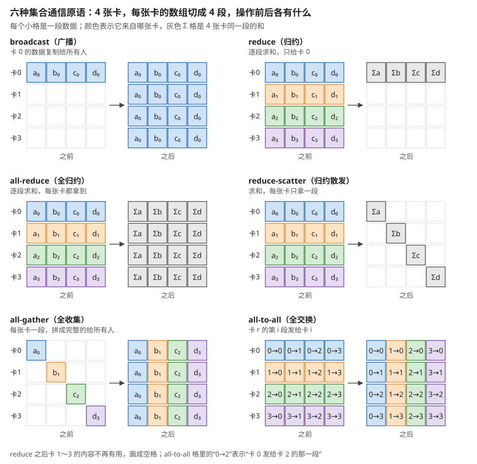
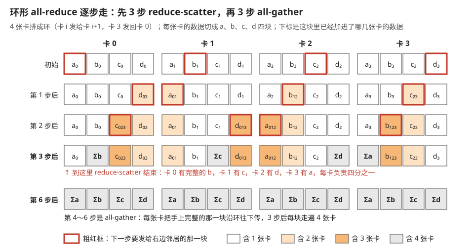
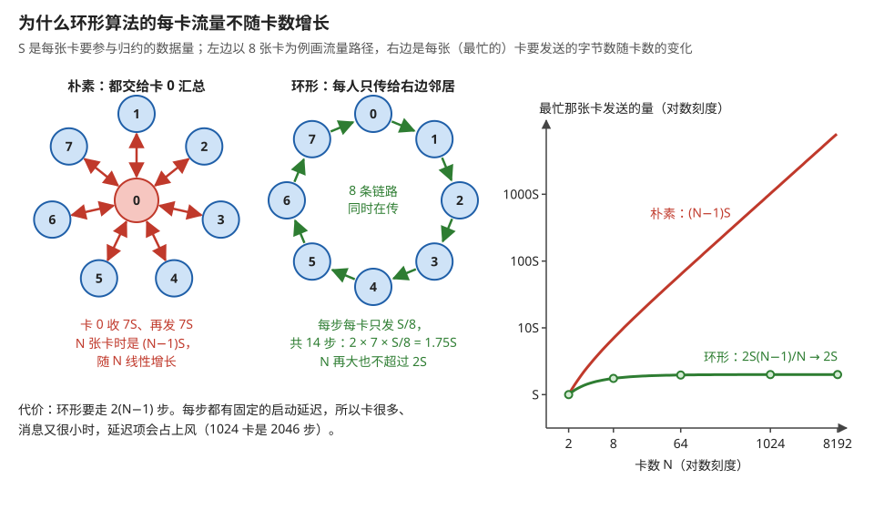
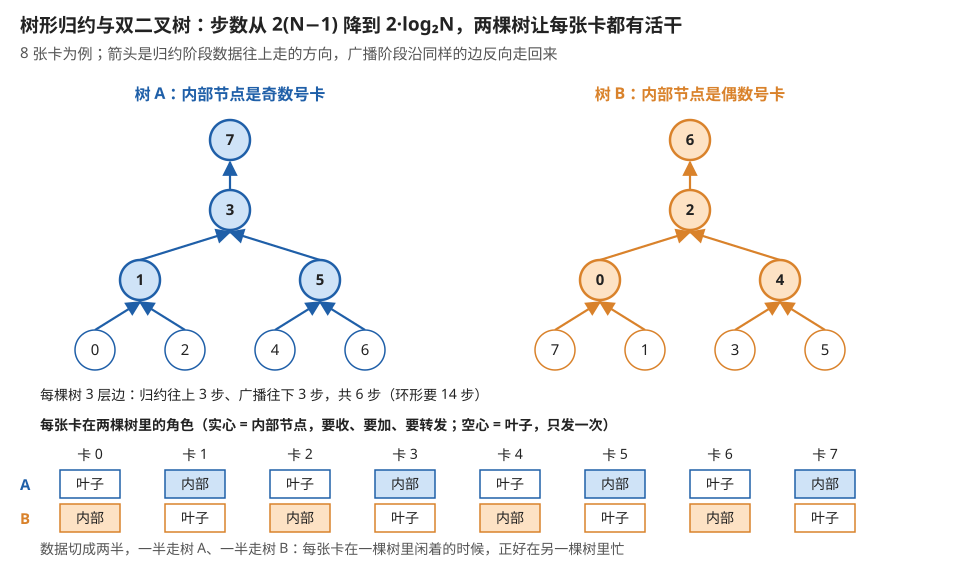
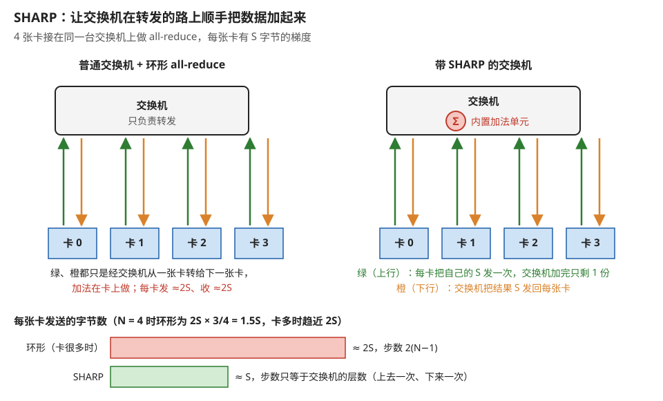
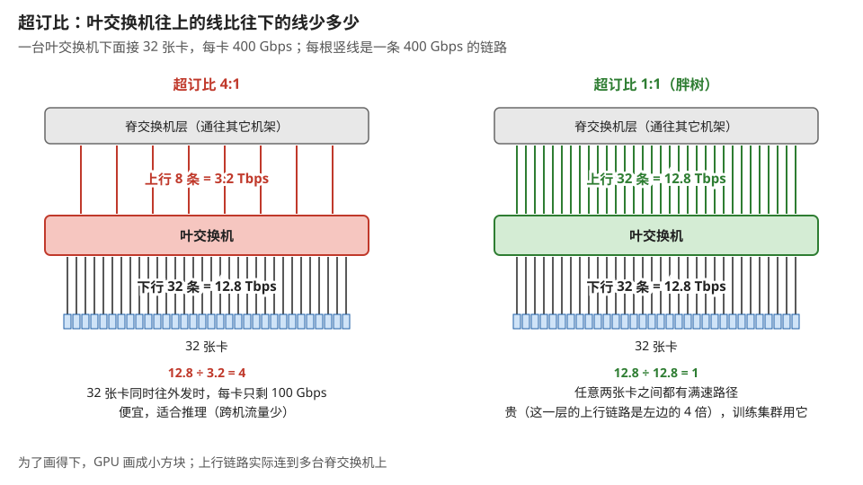
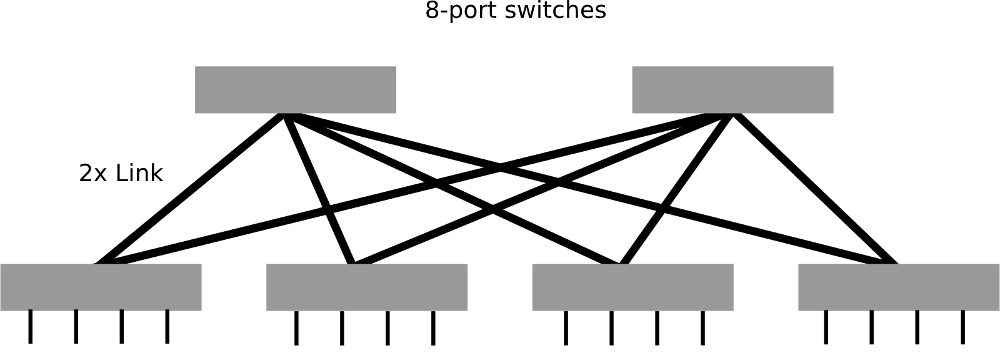
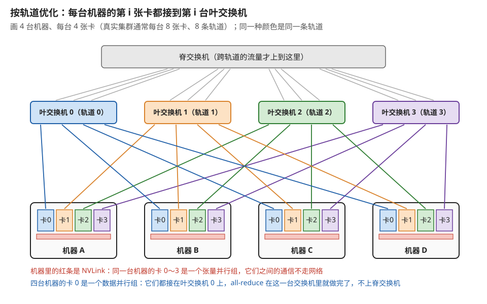

# 集合通信与集群网络：算法、拓扑与通信账本

> **所属模块**：模块 09 · 系统视角（从一张卡到一个集群）
> **状态**：🟨 学习中（第一版。知识截至 2026-08）
> **本节主旨**：模块 03 第 2 节给了四层互连的地图和"哪种并行住哪一层"的判据，但它把 all-reduce 当成了一个黑盒——"每卡各有一份，通信后每卡都拿到所有卡之和"。这一节把这个黑盒打开，因为里面藏着一个非常反直觉、也非常重要的结论：**一次环形 all-reduce，每张卡要发送的字节数几乎和卡数无关**——8 卡和 8000 卡，每张卡发的量都约等于 2 倍的数据量。**这条性质是大规模数据并行能够成立的全部数学基础**，没有它，卡数一涨通信就爆炸。本节从六种集合通信原语的通信量公式讲起，推导环形算法为什么有这个性质、树形算法在什么时候反而更好、网内归约（SHARP）又省掉了哪一半，最后讲清集群网络的拓扑（胖树、按轨道优化）和"超订比"这个决定集群性价比的关键参数——**并给出一套"拿到一个分布式任务，怎么在动手之前就把通信账算出来"的方法。**

---

## 0. 这一节要回答的问题

- 集合通信有哪几种原语？每种的通信量公式是什么？
- 环形 all-reduce 为什么每卡发送量与卡数几乎无关？这个结论怎么推出来？
- "算法带宽"和"总线带宽"差在哪？为什么厂商报的数和你测的数对不上？
- 什么时候该用环形、什么时候该用树形？分界线在哪？
- SHARP（在交换机里做归约）省掉了什么？为什么是"一半"？
- 胖树是什么？"按轨道优化"（rail-optimized）又是什么？为什么大规模训练集群都长这个样？
- 超订比是什么？它怎么直接决定集群的性价比？
- 五种并行策略各自用哪种集合原语？通信量各是多少？
- 通信慢了怎么排查？该看哪几个数？

---

## 1. 基础词汇：先把本节要用的词讲清楚

**集合通信（collective communication）**。多个进程（这里就是多张卡）按一个约定好的模式共同完成一次数据交换的操作。它和点对点通信（我给你发一条消息）的区别是：**所有参与者必须都调用同一个操作，缺一个就全体挂起**。深度学习里几乎所有跨卡通信都是集合通信。

**rank 与通信域（communicator）**。参与一次集合通信的每张卡有一个编号叫 rank（0 到 N−1）；这批卡的集合叫一个通信域。**同一张卡可以属于多个通信域**——比如它在 TP 域里是 rank 3，在 DP 域里是 rank 7。模块 09 第 1 节讲的并行嵌套，在通信库里就表现为**每张卡同时属于好几个通信域**。

**消息大小（message size）**。一次集合通信要处理的数据量，记作 **S** 字节。它是本节所有公式的自变量。

**算法带宽（algorithm bandwidth）与总线带宽（bus bandwidth）**。这是本节最容易混淆、也最必须分清的一对：
- **算法带宽 = S ÷ 耗时**。它回答"从用户视角看，这次操作的有效速率是多少"——用户交进去 S 字节，等了多久。
- **总线带宽 = 算法带宽 × 一个与算法有关的系数**。它回答"网线上实际跑了多少字节"，用来和硬件的标称链路带宽比较。

**为什么必须分清**：一次 all-reduce 交进去 1 GB 数据，网线上实际要跑将近 2 GB（第 3 节会推导）。**所以看到"all-reduce 的算法带宽只有链路带宽的一半"不要惊慌，那正是理论最优。** 只有换算成总线带宽，才能判断"网络跑没跑满"。

**延迟项与带宽项**。任何一次通信的耗时可以拆成两部分：

> **耗时 ≈ 固定延迟 × 步数 + 传输字节数 ÷ 带宽**

前一项与消息大小无关（每一跳的握手、路由、软件开销），后一项正比于消息大小。**小消息由延迟项主导，大消息由带宽项主导**——第 4 节讲的"环形还是树形"这个选择，全部建立在这个拆分上。

---

## 2. 六种原语：先把词认全，再看通信量

深度学习里用到的集合原语就这六种。先用一个具体场景说清每种做什么（设有 4 张卡，每张卡手上有一个长度为 4 的数组）：

| 原语 | 做什么 | 每卡的输入 | 每卡的输出 |
| --- | --- | --- | --- |
| **broadcast** | 把 rank 0 的数据发给所有人 | 只有 rank 0 有数据 | 所有卡都拿到那份数据 |
| **reduce** | 把所有卡的数据求和，结果只给 rank 0 | 各有一份 | 只有 rank 0 拿到总和 |
| **all-reduce** | 求和，**结果给所有人** | 各有一份 | 所有卡都拿到总和 |
| **reduce-scatter** | 求和，**但每卡只拿总和的一段** | 各有一份完整数组 | 每卡拿到总和的四分之一 |
| **all-gather** | 把每卡的一段拼成完整的，**给所有人** | 每卡有四分之一 | 所有卡都拿到完整数组 |
| **all-to-all** | **每卡把自己的第 i 段发给 rank i** | 各有一份分成 4 段的数组 | 每卡收到来自 4 张卡的各一段 |

图 3-1 把这张表的"之前"和"之后"逐格画了出来。

> **图 3-1**　一句话：六种集合通信的区别只在两件事上：要不要把各卡的数据加起来，以及结果交给谁、每人拿多少。
>
> **先知道一件事**：每张卡手上的数据被切成 4 段，记作 a、b、c、d。"归约"在这里就是逐段相加：4 张卡的 a 段加成一个 Σa，b 段加成 Σb，依此类推。
>
> **按这个顺序看**：
> 1. 每个小图左边是操作之前，右边是之后；四行是卡 0 到卡 3。格子的颜色表示数据来自哪张卡（蓝卡 0、橙卡 1、绿卡 2、紫卡 3），下标也是卡号；灰色的 Σ 格是 4 张卡同一段的和；虚线空格表示这张卡在这里没有有用的数据。
> 2. 第一行两个不做加法或只汇给一人。broadcast 把卡 0 的整份数据复制给所有人；reduce 逐段求和，但只有卡 0 拿到结果。
> 3. 第二行左边 all-reduce：逐段求和，每张卡都拿到完整的 Σa～Σd。数据并行同步梯度用的就是它。
> 4. 第二行右边 reduce-scatter：同样求和，但每张卡只拿一段，卡 0 拿 Σa、卡 1 拿 Σb……第三行左边 all-gather 正好反过来：每张卡各有一段，操作后每张卡都拿到拼好的完整数组。把这两个前后接起来，结果就和 all-reduce 一样。
> 5. 最后看 all-to-all：格里的"0→2"表示卡 0 要发给卡 2 的那一段。之前卡 0 那一行是它要分别发给 0、1、2、3 的四段；之后卡 2 那一行收齐了来自四张卡、写着"→2"的四段。整张表像矩阵转置一样翻了过来，而且没有任何相加，每一段都只有一个目的地。
>
> **看懂的标志**：能回答"为什么 MoE 的 all-to-all 没法像 all-reduce 那样靠归约省流量"——all-to-all 里每一段数据都要原样送到一个特定的卡，不存在"几份加成一份"的机会，所以中间节点（包括图 3-5 的 SHARP 交换机）帮不上忙。
>
> **与正文的对照**：与 §2 的表一一对应，表中"rank i"即图中的"卡 i"。
>
> 来源：本库自绘。

**两个关系值得立刻记住，它们在后面反复用到**：

1. **all-reduce = reduce-scatter + all-gather**。先让每卡负责求和一段（reduce-scatter），再把各段拼回给所有人（all-gather）。**这不是一个巧合，而是环形 all-reduce 的实现方式本身**（第 3 节）。
2. **all-to-all 是六种里最贵的**。其它五种每卡收发的数据量都是 O(S)，而 all-to-all 是"每个人给每个人发一份"——**它是 MoE 专家并行的核心操作，也是 MoE 通信开销大的根源**（模块 04 附录 A1 讲的 DeepEP 就是专门优化它的）。

**通信量公式表**（S 是数据量，N 是卡数，"每卡发送量"指一次操作中单张卡要往外发的总字节数）：

| 原语 | 每卡发送量（最优算法） | 随卡数怎么变 |
| --- | --- | --- |
| broadcast | S | **与 N 无关** |
| reduce | S | 与 N 无关 |
| **all-reduce** | **2S × (N−1)/N ≈ 2S** | **与 N 几乎无关** ⭐ |
| reduce-scatter | S × (N−1)/N ≈ S | 与 N 几乎无关 |
| all-gather | S × (N−1)/N ≈ S | 与 N 几乎无关 |
| **all-to-all** | S × (N−1)/N ≈ S | 与 N 几乎无关，**但 S 本身通常正比于 N** |

**这张表里最重要的一行是 all-reduce**：**每卡发送约 2S，与卡数无关。** 这条性质太反直觉了——凭什么 8 张卡和 8000 张卡，每张卡要发的量一样多？下一节把它推出来。

---

## 3. 环形 all-reduce：为什么通信量与卡数无关

### 3.1 先看朴素做法有多糟

**朴素做法一：所有卡把数据发给 rank 0，rank 0 求和后再广播回去。** 通信量：rank 0 要收 (N−1)·S、再发 (N−1)·S。**rank 0 成了瓶颈，耗时正比于 N**——1000 张卡时它要收发 2000 倍的数据量，完全不可行。

**朴素做法二：每张卡把数据发给所有其它卡（各自求和）。** 每卡发送 (N−1)·S，**同样正比于 N**。

**两种朴素做法都有一个共同的病：某个环节的工作量随卡数线性增长。** 环形算法要消掉的就是这个 N。

### 3.2 环形算法：两个阶段，每阶段 N−1 步

**把 N 张卡在逻辑上排成一个环**（rank i 的下一个是 rank (i+1) mod N），**再把每张卡手上的 S 字节数据切成 N 块**，每块 S/N 字节。

**阶段一：reduce-scatter（N−1 步）。**

第 k 步，每张卡把自己手上"某一块的部分和"发给下一个邻居，同时从上一个邻居收到一块，**加到自己对应的那块上**。精心安排发送顺序后，**N−1 步之后，每张卡手上都有一块是所有卡这一块的完整总和**（在下面的排法里，rank i 拿到的是第 (i+1) mod N 块）。

**用 4 张卡走查一遍**（每卡的数据切成 4 块，记作 a、b、c、d，卡号作下标）：

| 步 | rank 0 发出 | rank 1 发出 | rank 2 发出 | rank 3 发出 | 这一步之后谁手上有完整和 |
| --- | --- | --- | --- | --- | --- |
| 初始 | a₀b₀c₀d₀ | a₁b₁c₁d₁ | a₂b₂c₂d₂ | a₃b₃c₃d₃ | — |
| 1 | a₀→1 | b₁→2 | c₂→3 | d₃→0 | 无（都只是两两相加） |
| 2 | d₃₊₀→1 | a₀₊₁→2 | b₁₊₂→3 | c₂₊₃→0 | 无（三个数相加） |
| 3 | c₂₊₃₊₀→1 | d₃₊₀₊₁→2 | a₀₊₁₊₂→3 | b₁₊₂₊₃→0 | **每卡各持有一块的完整和** |

三步（即 N−1 步）之后：rank 0 手上的 b 块是全部四卡 b 块的和，rank 1 的 c 块是完整和，以此类推。**每张卡负责了总和的四分之一。**

**阶段二：all-gather（N−1 步）。** 现在每卡手上有一块完整的和，只要再沿着环传一圈，让每块走遍所有卡即可。同样 N−1 步，每步发送 S/N。

图 3-2 把上面的表连同阶段二画成了每张卡手上 4 块数据的状态变化。

> **图 3-2**　一句话：环形 all-reduce 的前一半，每一步每张卡只把一块传给右边邻居并在那里加上去；3 步后每张卡各凑齐了一块的总和，后一半再把这些总和沿环传一圈。
>
> **先知道一件事**：4 张卡排成一个环，卡 0 只发给卡 1，卡 1 只发给卡 2，卡 2 只发给卡 3，卡 3 发回卡 0。每一步所有卡同时各发一块、各收一块。
>
> **按这个顺序看**：
> 1. 每一行是某一步结束后的状态。每张卡 4 个格子是它手上的 a、b、c、d 四块；格子里的下标写着这一块已经加进了哪几张卡的数据，比如 d₀₃ 是卡 0 和卡 3 的 d 块之和。颜色越深，加进的卡越多，灰色 Σ 表示 4 张卡都加齐了。
> 2. 粗红框是这张卡下一步要发出的那一块。看"初始"行：卡 0 发 a₀，卡 1 发 b₁，卡 2 发 c₂，卡 3 发 d₃，各发一块、互不重复。
> 3. 看"第 1 步后"：卡 1 收到 a₀，和自己的 a₁ 相加成 a₀₁；卡 0 从卡 3 收到 d₃，变成 d₀₃。粗红框移到了刚加好的那一块上：每张卡下一步转发的，正是它刚刚累加过的那一块。
> 4. 再过两步，到"第 3 步后"：卡 0 的 b 块变成 Σb，卡 1 有 Σc，卡 2 有 Σd，卡 3 有 Σa。每张卡各负责了总和的四分之一，这就是 reduce-scatter。
> 5. 最后一行：接下来 3 步不再相加，每张卡把手上的 Σ 块沿环往下传、同时转发收到的 Σ 块，3 步后每块都走遍了 4 张卡，这就是 all-gather。
>
> **看懂的标志**：能数出每张卡一共发了多少：6 步，每步一块（S/4），共 1.5S，即 2S·(N−1)/N 在 N = 4 时的值。卡数增加时，块变小、步数变多，两者相乘趋近 2S，不会再涨。
>
> **与正文的对照**：前四行与正文的逐步表一一对应，正文表中"rank 0 发出 a₀→1"即图中卡 0 初始行的粗红框。
>
> 来源：本库自绘（状态由逐步模拟算出）。

### 3.3 算总账

**每卡的总发送量**：

> 阶段一：(N−1) 步 × S/N = **S·(N−1)/N**
> 阶段二：(N−1) 步 × S/N = **S·(N−1)/N**
> **合计：2S·(N−1)/N**

**代几个数**：

| 卡数 N | 每卡发送量 | 相对 2S |
| --- | --- | --- |
| 2 | 1.0 S | 0.50 |
| 8 | 1.75 S | 0.88 |
| 64 | 1.97 S | 0.98 |
| 1024 | 1.998 S | 1.00 |
| 8192 | 2.000 S | 1.00 |

**N 稍大之后，每卡发送量就稳定在 2S，一点也不再增长。** 这就是环形 all-reduce 的核心性质，也是本节最该记住的一件事。

**为什么它能做到？直觉上的解释是：环形算法让所有链路同时工作，而且每一步每张卡都只发一小块。** 朴素做法里 rank 0 那条链路要扛全部流量，环形算法把流量均匀摊到了 N 条链路上——**卡数增加时，要传的总量确实增加了，但可用的链路也同比增加，两者恰好抵消。** 图 3-3 把这两种做法和它们的流量曲线并排画了出来。

> **图 3-3**　一句话：让一张卡汇总所有人的数据，它的流量随卡数线性增长；排成环后每张卡只和邻居通信，每卡流量停在 2S 附近。
>
> **先知道一件事**：通信的快慢由最忙的那条链路决定。只要有一张卡要收发的数据特别多，其它卡再闲也只能等它。
>
> **按这个顺序看**：
> 1. 左边是朴素做法：卡 1～7 都把数据交给卡 0，卡 0 加好后再发回去。所有红色箭头都连着卡 0，它要收 7S、发 7S；N 张卡时是 (N−1)S。
> 2. 中间是环形：每张卡只把数据传给右边邻居。8 条绿色链路在同一时刻都在传，每步每卡只发 S/8，一共 2 × 7 = 14 步，每卡合计发 1.75S。
> 3. 右边是曲线图，两根轴都是对数刻度。红线是朴素做法里卡 0 的发送量，卡数每翻一倍它也翻一倍。绿线是环形的每卡发送量 2S·(N−1)/N：2 张卡时 1S，8 张卡时 1.75S，之后几乎贴着 2S 不动；绿色圆点是正文表里的 2、8、64、1024、8192 张卡。
> 4. 左下角的文字是代价：环形要走 2(N−1) 步，每步都有一次固定的启动开销，卡多、消息小时这笔开销会盖过传输时间。
>
> **打个比方**：全班交作业，全交给班长一个人收再发回，人越多班长越忙；让每个人只传给下一个人，每个人的工作量就和全班人数无关了，只是要多传几轮。
>
> **看懂的标志**：能回答"卡数从 512 翻到 1024，梯度同步为什么没怎么变慢"——每卡要发的字节数本来就停在 2S 附近，链路也同比例增加；只有步数翻了倍，消息足够大时这点延迟可以忽略。
>
> **与正文的对照**：曲线上的数值与 §3.3 的表一致；左图对应 §3.1 的"朴素做法一"。
>
> 来源：本库自绘。

**代价是步数：2(N−1) 步。** 每一步都有固定的延迟开销，所以**耗时的完整形式是**：

> **T ≈ 2(N−1) × 延迟 + 2S·(N−1)/N ÷ 链路带宽**

**这两项的相对大小决定了环形算法的适用范围**：S 大时第二项主导，环形接近最优；**S 小时第一项主导，而它正比于 N——1024 张卡就是 2046 步，每步哪怕只有 5 微秒，光延迟就是 10 毫秒。** 这就是下一节要解决的问题。

### 3.4 顺带解决"算法带宽"的困惑

现在可以回答 §1 那个问题了。设链路带宽为 B，大消息时：

> 耗时 ≈ 2S·(N−1)/N ÷ B
> **算法带宽 = S ÷ 耗时 = B × N / (2(N−1)) ≈ B/2**

**所以一次理论最优的 all-reduce，算法带宽只有链路带宽的一半。** 这不是低效，这是 all-reduce 这个操作的数学下界（每个字节至少要被送出去一次做归约、再送回来一次）。

**实践上的用法**：跑基准测试（比如 `nccl-tests`）时，工具会同时报算法带宽和总线带宽。**要判断"网络跑没跑满"，看总线带宽和链路标称值的比值**；看算法带宽只会让你误以为一直只用了一半。

---

## 4. 树形算法：小消息的另一条路

### 4.1 问题：环形的步数正比于 N

上一节结尾的账已经说明了问题：**大规模集群上，小消息的 all-reduce 被步数拖死。**

**具体场景很常见**：ZeRO 或 FSDP 会对每一层的参数分别做通信，一层的梯度可能只有几 MB；MoE 的路由结果、各种同步标志更是只有几 KB。**这些小消息在 1024 卡的环上要走 2046 步。**

### 4.2 树形：步数降到对数

**做法**：把 N 张卡组织成一棵二叉树。**归约阶段**从叶子往根走，每一层把两个子节点的数据加起来传给父节点，**log₂N 层就到根**；**广播阶段**从根往叶子走，同样 log₂N 层。

**步数对比**：

| 卡数 N | 环形步数 2(N−1) | 树形步数 2·log₂N |
| --- | --- | --- |
| 8 | 14 | **6** |
| 64 | 126 | **12** |
| 1024 | 2046 | **20** |
| 8192 | 16382 | **26** |

**1024 卡时，树形的步数是环形的百分之一。**

**代价是带宽**：树形里每条链路要传完整的 S 字节（不像环形那样只传 S/N），而且**根节点附近的链路承担了全部流量**——带宽利用率远不如环形。

**所以两者的分工非常清楚**：

> **小消息用树形（步数少、延迟低），大消息用环形（带宽利用率高）。**

**分界点大约在几 MB**，具体值取决于网络的延迟和带宽（延迟高的网络分界点更靠右）。**通信库会自动按消息大小选算法**——NCCL 里可以用 `NCCL_ALGO` 强制指定，但一般不需要手动干预，除非你在做基准或怀疑它选错了。

### 4.3 双二叉树：想两头都要

标准二叉树有一个明显的浪费：**叶子节点只发不收、内部节点两头都忙**，链路利用率不均。**双二叉树（double binary tree）** 的做法是同时构造两棵互补的树——**一棵树的叶子恰好是另一棵树的内部节点**——把数据切成两半，各走一棵树。

**收益是：保持了树形 O(log N) 的步数，同时把链路利用率提到接近满载。** 这是 NCCL 在大规模场景下的常用算法。图 3-4 用 8 张卡画出两棵互补的树。

> **图 3-4**　一句话：树形归约只要 log₂N 层就能汇到根，步数远少于环形；再叠一棵叶子和内部节点正好对调的树，每张卡在两棵树里就各忙一份。
>
> **先知道一件事**：在树形归约里，内部节点（有孩子的节点）要收孩子的数据、加上自己的、再往上发，工作最多；叶子只把自己的数据往上发一次，之后就闲着。一棵普通的二叉树里，差不多一半的卡是叶子。
>
> **按这个顺序看**：
> 1. 左边树 A：箭头朝上表示归约阶段数据的流向。叶子 0、2、4、6 先发给父节点 1 和 5，1 和 5 相加后发给 3，3 再发给根 7。一共 3 层，归约 3 步，广播时沿同样的边往下再 3 步，共 6 步。同样 8 张卡，环形要 14 步。
> 2. 实心圆是内部节点，空心圆是叶子。树 A 的内部节点全是奇数号卡。
> 3. 右边树 B 形状一样，但编号整体挪了一位：内部节点全是偶数号卡，树 A 里闲着的 0、2、4、6 在这里都成了要收、要加、要转发的内部节点。
> 4. 看下方表格：每张卡在一棵树里是"内部"，在另一棵树里就是"叶子"，没有哪张卡两边都闲。
> 5. 最底下一行：数据切成两半，一半走树 A、一半走树 B，两棵树同时跑，所有卡和链路都被用上。
>
> **看懂的标志**：能回答"为什么树形适合小消息、环形适合大消息"——树形只要 2·log₂N 步，固定延迟少；但每条边要传整份（或半份）数据，而且越靠近根流量越集中，传大消息时不如环形把流量平摊到所有链路上。
>
> **与正文的对照**：步数与 §4.2 表中 N = 8 的一行一致（树形 6 步、环形 14 步）。两棵树的具体编号是为说明"互补"而取的示意，NCCL 实际构造的编号方式可能不同。
>
> 来源：本库自绘。

**记这一条的价值不在于细节，而在于它示范了一个通用的技巧**：当一个结构存在"忙闲不均"时，**构造一个互补的结构叠上去，让两者的忙闲正好错开**。这个思路在模块 01 的 GTO 调度（让 warp 进度参差）、模块 04 的 ping-pong（让两组 warp 错峰用不同管线）、模块 09 第 1 节的 DualPipe（让两个方向的流水线互填气泡）里各出现过一次——**同一个配方，四个尺度。**

---

## 5. SHARP：把归约搬进交换机

**观察**：环形 all-reduce 的 2S 里，有一半（reduce-scatter 那一半）做的是"把数据送过去加起来"，另一半（all-gather）做的是"把结果送回来"。**如果交换机自己会加法，第一半就可以在网络内部完成——数据往上走的路上顺手就加完了。**

**这就是 SHARP（Scalable Hierarchical Aggregation and Reduction Protocol）**：在交换机芯片里内置归约单元，多个端口进来的数据被加起来之后只有一份往上走。

**账**：

| | 传统 all-reduce | 网内归约 |
| --- | --- | --- |
| 上行流量 | 每卡发 S（还要收 S） | 每卡发 S，**交换机合并后只有 1 份继续上行** |
| 下行流量 | S | S（广播结果） |
| **每卡总流量** | **约 2S** | **约 S** |
| 步数 | O(N) 或 O(log N) | **O(树高)，很小** |

**流量减半、步数也降到树高**——这是一次相当彻底的改善。**代价**是它需要交换机支持（这是硬件功能，不是软件能补的），而且只对特定的归约操作（求和、最大值等）有效。图 3-5 把有无 SHARP 的两种走法画在一起。

> **图 3-5**　一句话：普通交换机只管转发，加法在卡上做，数据要来回跑两趟；让交换机在转发时直接相加，每张卡只要发一次、收一次。
>
> **先知道一件事**：交换机是机房里把许多网线连在一起的设备，本职工作是看数据包该去哪个端口就往哪送，本身不改数据内容。SHARP 在交换机芯片里多加了一组加法电路，让它能把几个端口同时进来的数据加成一份再送出去。
>
> **按这个顺序看**：
> 1. 左右两边都是 4 张卡接在同一台交换机上。绿色箭头是卡往交换机发，橙色是交换机往卡发。
> 2. 左边：交换机只负责转发。环形 all-reduce 的数据经它从一张卡转到下一张卡，加法在卡上完成。每张卡发约 2S、收约 2S：一半用于把各块送去相加，一半用于把加好的结果送回来。
> 3. 右边：交换机里画了一个 Σ，是内置的加法单元。每张卡只把自己的 S 字节往上发一次，交换机把 4 份加成 1 份，再把这 1 份结果发回每张卡。
> 4. 下方横条对比每张卡的发送量：环形在卡多时趋近 2S，SHARP 约为 S。步数也从环形的 2(N−1) 变成上去一次、下来一次（多层交换机时是交换机的层数）。
>
> **打个比方**：几个人要知道大家的钱加起来一共多少。不借助外人时，只能互相传纸条、一路累加，再把总数传回每个人；如果中间站着一个会算账的收银员，每人把钱数报给他一次，他算完广播一遍就行。
>
> **看懂的标志**：能回答"SHARP 为什么只帮得上归约类操作"——它省下的是"几份数据在路上加成一份"那一段；all-gather、all-to-all 这类操作每份数据都要原样送达，没有可以相加合并的东西。
>
> **与正文的对照**：流量数值与 §5 的表一致。正文表中"上行每卡发 S，交换机合并后只有 1 份继续上行"指多层网络，图中只画了一层交换机。
>
> 来源：本库自绘。

**它给本库的一个概念提供了新例证**：模块 07 第 2 节讲 cHBM 时提过"把一点计算搬到离数据最近的地方"，那里的判据是"**数据量大但运算量极小的算子最划算**"。**all-reduce 的求和正是这类算子的教科书案例**——运算量是零头（就是加法），数据量是全部梯度。**所以"在交换机里做归约"和"在 HBM 的 base die 里做归约"是同一个思想在两个不同尺度上的应用。**

---

## 6. 集群网络的拓扑：胖树与按轨道优化

前面讲的都是算法。这一节讲算法跑在什么样的物理网络上——因为**拓扑决定了哪些通信模式是快的、哪些是慢的**。

### 6.1 胖树：为什么交换机要分层

**问题**：几千张卡不可能接在同一台交换机上（端口数不够）。所以要分层：一批卡接到一台**叶交换机（leaf）**，若干台叶交换机再接到**脊交换机（spine）**，需要的话再往上加一层。

**朴素的分层有一个致命问题：上层带宽不够。** 假设一台叶交换机下面接 32 张卡、每卡 400 Gbps，那么下行总带宽是 12.8 Tbps；如果它到脊交换机只有 8 条 400 Gbps 的上行链路（3.2 Tbps），那么**当这 32 张卡同时要和别的机架通信时，实际可用带宽只有四分之一**。

**这个比例叫超订比（oversubscription ratio）**，上面的例子是 **4:1**。图 3-6 把这个例子和 1:1 的做法画在一起。

> **图 3-6**　一句话：叶交换机往下接了多少带宽、往上又留了多少带宽，两者之比就是超订比；比值越大，机架之间能同时跑的流量越少。
>
> **先知道一件事**：一台交换机的端口数有限，几千张卡只能分层连接。卡先接到身边的叶交换机上，叶交换机再接到上一层的脊交换机，卡和别的机架通信时，数据必须经叶交换机的上行链路出去。
>
> **按这个顺序看**：
> 1. 两边的下半部分一样：一台叶交换机往下连 32 张卡，每根竖线是一条 400 Gbps 的链路，下行合计 32 × 0.4 = 12.8 Tbps。底部的小方块代表这 32 张卡。
> 2. 左边上半部分：这台叶交换机往上只有 8 条链路，合计 3.2 Tbps。12.8 ÷ 3.2 = 4，超订比 4:1。32 张卡同时要和其它机架通信时，只能分这 3.2 Tbps，每卡剩 100 Gbps，是它网卡速度的四分之一。
> 3. 右边上半部分：往上也是 32 条，合计 12.8 Tbps，超订比 1:1。每张卡同时往外发都能拿到满速，这就是胖树的定义。
> 4. 最下面的文字是取舍：左边省下了 24 条上行链路以及它们连到的脊交换机端口和光模块，适合跨机流量少的推理；右边贵，但训练时所有卡会同时满速做 all-reduce，任何收窄都会拖慢整步。
>
> **看懂的标志**：能回答"4:1 超订的集群上跑数据并行会怎样"——跨机架的梯度同步只能拿到四分之一带宽，按 §7 的算例，176 毫秒的 all-reduce 会变成约 700 毫秒。
>
> **与正文的对照**：数值与 §6.1 的例子一致。图中上行链路画成连到同一个"脊交换机层"，实际会分散连到多台脊交换机上。
>
> 来源：本库自绘。

**胖树（fat-tree）的定义就是：超订比 1:1 的分层网络**——每一层往上的带宽等于往下的带宽，"越往上树枝越粗"。**它保证任意两张卡之间都有全带宽的路径**，代价是交换机和光模块的数量（也就是钱）。图 3-7 是一张两层胖树的连线图。

> **图 3-7**　一句话：用许多台端口数一样的小交换机搭成两层，让每台下层交换机往上的链路条数等于往下的，就得到任意两点都能满速互通的胖树。
>
> **先知道一件事**：图里每个灰色长条是一台 8 端口的交换机，每根黑线是一条链路；最下面的短竖线是接卡（或服务器）的端口。
>
> **按这个顺序看**：
> 1. 先看下层的 4 台交换机（相当于正文的叶交换机）：每台往下伸出 4 根短线，接 4 张卡，一共 16 张卡。
> 2. 再看每台下层交换机往上的线：它连到上层 2 台交换机（相当于脊交换机），每一对之间是 2 条链路，图左侧标注的"2x Link"就是这个意思，图中每根黑线代表 2 条链路。所以每台下层交换机往上 4 条、往下 4 条，8 个端口正好用满，超订比 1:1。
> 3. 上层每台交换机也是 8 个端口：分别以 2 条链路连到 4 台下层交换机，2 × 4 = 8。
> 4. 任取两张接在不同下层交换机上的卡，数据可以经任意一台上层交换机过去；同一时刻 16 张卡都往外发，上行链路也够每人一条，不会有人被挤到只剩几分之一带宽。
>
> **打个比方**：一棵树越往上树枝越粗，粗到上面的枝干能承载下面所有叶子的流量，这就是"胖树"名字的由来。这里的"粗"是靠并联多条链路和多台交换机实现的。
>
> **看懂的标志**：能说出把它改成 4:1 超订要怎么做——每台下层交换机仍然往下接 4 张卡，往上只留 1 条链路，上层交换机和链路就能省掉四分之三；代价是这 4 张卡跨交换机通信时要挤这一条线。
>
> **与正文的对照**：图中英文"8-port switches"意为"8 端口交换机"，"2x Link"意为"2 条链路"。正文例子是 32 张卡一台叶交换机，图中缩小到 4 张。
>
> 来源：[Fat-tree.svg](https://commons.wikimedia.org/wiki/File:Fat-tree.svg)，作者 Konstantinos Agiannis，许可 CC BY-SA 4.0（本库加了白色背景并转成 PNG）。

**超订比是集群设计里最直接的性价比旋钮**：

| 超订比 | 成本 | 适合的负载 |
| --- | --- | --- |
| 1:1（胖树） | 最贵 | 大规模训练（通信密集且不可预测） |
| 2:1 | 省约三成网络成本 | 通信可以局部化的负载 |
| 4:1 或更高 | 便宜 | 推理服务（跨机通信少） |

**推理集群普遍用高超订比**，因为一个推理实例通常放在一台机器内、跨机通信只有少量的路由和管理流量。**训练集群则几乎都是 1:1**——因为 §3 那条"每卡发 2S"的性质意味着所有链路会同时满载，任何一处收窄都会成为瓶颈。

### 6.2 按轨道优化：让 all-reduce 不上脊交换机

这是大规模训练集群一个非常有效、也很有代表性的设计。

**观察**：模块 09 第 1 节讲的并行嵌套里，**数据并行组通常由"各台机器上编号相同的那张卡"组成**——机器 0 的卡 3、机器 1 的卡 3、机器 2 的卡 3……它们之间要做 all-reduce。

**于是有一个很自然的想法：让编号相同的卡接到同一台叶交换机上。** 这就是**按轨道优化（rail-optimized）**的拓扑：每台机器的第 i 张卡都接到第 i 台叶交换机（第 i 条"轨道"）。图 3-8 画的就是这种接法。

> **图 3-8**　一句话：把所有机器上编号相同的卡接到同一台叶交换机上，数据并行组的 all-reduce 在一台交换机里就能做完，不用经过上层的脊交换机。
>
> **先知道一件事**：数据从一台叶交换机到另一台叶交换机，必须先上到脊交换机再下来，多走两跳，还要和其它流量争抢脊交换机的带宽。所以通信最好发生在"接在同一台叶交换机上的卡"之间。
>
> **按这个顺序看**：
> 1. 最下面是 4 台机器（A 到 D），每台 4 张卡，卡 0 蓝、卡 1 橙、卡 2 绿、卡 3 紫。机器里的红色横条是 NVLink，同一台机器里的卡之间通信走它，不经过网络。
> 2. 中间一排是 4 台叶交换机，颜色和卡对应。跟着蓝线看：机器 A、B、C、D 的卡 0 全都连到叶交换机 0。这一组连线就是一条"轨道"。其它颜色同理。
> 3. 最上面是脊交换机，4 台叶交换机都连到它。只有从一条轨道到另一条轨道的流量（比如机器 A 的卡 0 发给机器 B 的卡 1）才需要上到这里。
> 4. 对照并行策略看：同一台机器里的卡 0～3 是一个张量并行组，走 NVLink；四台机器上的卡 0 是一个数据并行组，它们的 all-reduce 全在叶交换机 0 内完成。按正文的嵌套顺序，几乎没有流量需要跨轨道，脊交换机因此可以配得很省。
>
> **看懂的标志**：能回答"如果启动脚本把 rank 排乱了，让一个数据并行组里混进了不同编号的卡，会发生什么"——这个组的 all-reduce 就要跨轨道、上脊交换机，多两跳延迟，还会和别的组抢脊交换机的带宽。
>
> **与正文的对照**：本图替换了原来的字符画。真实集群通常每台 8 张卡、8 条轨道，图中缩小为 4 张。
>
> 来源：本库自绘。

**收益**：数据并行的 all-reduce **全部在一台叶交换机内部完成，根本不上脊交换机**。这意味着：

1. **延迟更低**（少两跳）。
2. **脊交换机的负载大幅下降**，可以用更低的超订比省钱，或者把带宽留给别的流量。
3. **故障域更清晰**——一条轨道出问题只影响一个数据并行组的一部分。

**代价**：**同一台机器内不同编号的卡之间，跨机通信要上脊交换机。** 但这没关系——因为按模块 09 第 1 节的嵌套顺序，同机内不同编号的卡属于 TP 组，而 **TP 通信走的是机内 NVLink，根本不上网络**。

**这个设计的精妙之处在于：它是并行策略的嵌套顺序在物理布线上的镜像。** 逻辑上"TP 在内、DP 在外"，物理上就"TP 走 NVLink、DP 走同一条轨道"。**软件的分层和硬件的分层被刻意对齐了**——这是本库反复出现的"让硬件形状和负载形状对齐"这条原则，在集群尺度上的一次应用。

---

## 7. 把并行策略和通信原语对上号

现在可以把模块 09 第 1 节那张并行策略表补完整了——加上"用什么原语、通信量多少"两列：

| 并行策略 | 用什么原语 | 每次的数据量 S | 频率 | 走哪条通路 |
| --- | --- | --- | --- | --- |
| **DP** | all-reduce | 全部梯度（2N 字节，bf16） | 每步 1 次 | 轨道内的叶交换机 |
| **ZeRO-3 / FSDP** | all-gather（参数）+ reduce-scatter（梯度） | 每层的参数量 | 每层各 1 次 | 同上，但频率高得多 |
| **TP** | all-reduce | 激活值（批 × 序列 × 隐藏维 × 2 字节） | **每层 2 次** | **机内 NVLink** |
| **PP** | 点对点 send/recv | 段边界的激活值 | 每微批 1 次 | 机间网络即可 |
| **EP** | **all-to-all** ×2 | 路由后的 token 激活 | 每 MoE 层 2 次 | scale-up 域内为宜 |
| **CP** | 环形点对点 | KV 分块 | 每层若干次 | scale-up 域内 |

**用一个具体配置把账算完整**（沿用模块 09 第 1 节那个例子：70B 模型、1024 卡、TP=8、PP=4、DP=32）：

**DP 的 all-reduce**：梯度总量 = 70×10⁹ × 2 字节 = 140 GB，但每卡只持有 1/(TP×PP) = 1/32 的参数，所以每卡参与的 S = 140/32 ≈ **4.4 GB**。按 §3 的公式，每卡发送 2S ≈ **8.8 GB**；走 400 Gbps（50 GB/s）的网络，耗时 **约 176 毫秒**。

**这个数字要和什么比？和一步的计算时间比。** 假设全局批量 400 万 token、MFU 40%，一步的计算时间 = 6 × 70×10⁹ × 4×10⁶ ÷ (1024 × 990×10¹² × 0.4) ≈ **4.1 秒**。

**176 毫秒 ÷ 4.1 秒 ≈ 4.3%** —— **完全可以接受，而且还能被反向传播的计算重叠掉大部分**（梯度是逐层产生的，算完一层就可以开始同步这一层）。

**再算 ZeRO-3 的额外通信**：每层前向和反向各要 all-gather 一次参数，80 层共 160 次。按和上面相同的口径，每卡负责的参数是 4.4 GB，前向、反向各 all-gather 一遍，每卡约收发 2 × 4.4 = 8.8 GB；梯度同步从 all-reduce 换成 reduce-scatter，约 4.4 GB。合计约 13.2 GB，是普通 DP（8.8 GB）的 **1.5 倍**，这也是 ZeRO 论文给出的结论。**总量只多一半，麻烦在时机**：DP 的 all-reduce 可以攒到反向结束时做，还能和反向计算重叠；ZeRO-3 的 160 次 all-gather 每一次都挡在某一层计算的前面，任何一次没有提前取到，计算就得停下来等。所以 ZeRO-3 的数据并行组最好放在高带宽、低延迟的域内，或者靠精细的预取把通信藏到前一层的计算后面。**这就是 §3.1（模块 09 第 1 节）说的"ZeRO-3 对带宽极其敏感"的定量版本。**

**这套算法就是本节要交付的能力**：拿到任何一个分布式配置，**在动手跑之前**，用"通信量 ÷ 带宽 与 计算时间"这一道除法判断它可不可行。

---

## 8. 开发者视角

| 你想知道/控制什么 | 去哪里看/拧 |
| --- | --- |
| 网络到底能跑多快 | `nccl-tests` 跑一遍 all-reduce，**看总线带宽**（不是算法带宽）与链路标称值的比 |
| 通信有没有被计算掩盖 | Nsight Systems 时间线上 NCCL 轨道与计算轨道是否重叠；不重叠时每步会看到明显的通信段 |
| 卡间拓扑对不对 | `nvidia-smi topo -m` 看每对卡是 NVLink 还是 PCIe；跨机看 NIC 与 GPU 的亲和性 |
| 用的是环形还是树形 | `NCCL_DEBUG=INFO` 打印算法选择；`NCCL_ALGO=Ring/Tree` 可强制 |
| 有没有走 GPUDirect RDMA | `NCCL_DEBUG=INFO` 里的传输方式；退化成经主机内存中转时带宽会掉一大截 |
| SHARP 有没有生效 | 交换机侧配置 + NCCL 日志里的 SHARP 相关行 |
| 通信量该是多少 | §2 的公式表 + §7 的算例，手算一遍和实测比 |
| 红旗信号 | 总线带宽远低于链路标称（拓扑或配置有问题）；小消息占比高而用的是环形（应该走树形）；某个 rank 明显更慢（落后者，见第 4 节） |

**给算法侧的一句话**：你听到"这个改动会增加通信"时，追问的不该是"增加多少"，而是**"增加的是哪种原语、消息多大、发生在嵌套的哪一层"**——这三个问题的答案代进 §2 的公式和 §7 的算例，就能立刻知道它是 4% 的开销还是 40% 的开销。

---

## 9. 最新架构落点（知识截至 2026-08）

- **scale-up 域变大，正在改写"哪些通信该走网络"的分界**。NVL72 / NVL144 让 72 到 144 张卡在一个高带宽域内互访，Helios 用 UALink 做到 72 卡。**结果是原本必须走以太网/InfiniBand 的 DP 通信，现在有相当一部分可以留在域内**——§7 那笔 176 毫秒的账在 NVL72 内部会降到毫秒级。**这条趋势的实践含义是：并行配置的最优解正在随硬件变化，去年调好的配置今年可能不是最优。**
- **网内归约在扩展**：SHARP 从 InfiniBand 扩展到以太网方案，超以太网联盟（UEC）也在推标准化的网内计算能力。方向是清楚的——**把"数据量大、运算量小"的操作往网络里推**（§5）。
- **通信-计算融合成为 kernel 层的一等公民**：NCCL 的 kernel 融合、Triton-distributed、DeepEP 一类的定制通信 kernel（模块 04 附录 A1）。**变化的本质是"通信"不再是一个调用库的黑盒操作，而是可以和计算写进同一个 kernel、共享同一批 warp 和 shared memory 的东西。**
- **光互连正在往下渗透**：共封装光学（CPO，模块 08 第 5 节）把光引擎放进交换机封装，目标是那张能量表里"跨节点 10~30 pJ/bit"这一行。2026 年仍在早期部署阶段。
- **一个值得跟踪的量**：**scale-up 域的大小与 scale-out 带宽的比值**。这个比值决定了并行策略的分层方案。域越大、比值越高，TP 和 EP 能开的度数就越大，而 DP 的压力越小——**看一个新集群方案，先问这两个数，就能推出它适合什么形状的模型。**

---

## 10. 和其它模块的挂钩

- **模块 03 第 2 节（四层互连地图）**：那一节给的是"哪种并行住哪一层"的定性判据和一笔 TP 通信账；本节把 all-reduce 打开，给出所有原语的定量公式，并补上物理拓扑那一半。
- **模块 09 第 1 节（训练系统）**：那一节的并行策略表在本节 §7 被补上了"用什么原语、多少字节"两列——两张表合起来才是完整的通信账本。
- **模块 09 第 2 节（推理服务）**：分离式部署新增的那一跳 KV 传输，用本节的方法算：它是点对点而非集合通信，量正比于上下文长度。
- **模块 04 附录 A1（DeepEP）**：那里讲的是 all-to-all 这一个原语的极限优化（NVLink 与 RDMA 接力、IBGDA、hook 式收尾），本节给的是它在六种原语里的位置和为什么它最贵。
- **模块 07 第 2 节（cHBM 的近存计算）**：那里的判据"数据量大、运算量小的算子最值得搬到数据附近"，在本节 §5 的 SHARP 上再现了一次——**同一条原则，一个在存储侧，一个在网络侧。**
- **模块 08 第 5 节（互连的物理实现）**：那一节讲的是一根线、一个 SerDes、一次跨时钟域；本节讲的是几千根线组成的网络。**两节接在"每比特能量"那张表上**：本节所有的"省流量"最终都是在省那张表最后几行的能量。

---

## 11. 术语卡

### 算法带宽与总线带宽

**定义**：算法带宽 = 数据量 ÷ 耗时，是用户视角的有效速率；总线带宽 = 算法带宽乘以一个与算法相关的系数（all-reduce 是 2(N−1)/N），反映网线上实际跑了多少字节。

**为什么存在**：一次 all-reduce 交进去 S 字节，链路上要跑将近 2S，所以理论最优的算法带宽只有链路带宽的一半。**不分清这两个数，就会把"跑满了"误判成"只用了一半"**，进而做出错误的优化决策。判断网络有没有跑满，永远看总线带宽。

**语境例句**："nccl-tests 里 all-reduce 只有 25 GB/s，链路是 50 GB/s。"——如果这是算法带宽，那正好是理论最优，网络已经跑满了；先确认工具报的是哪一个再下结论。

### 环形 all-reduce 与"每卡 2S"

**定义**：把卡排成环、数据切成 N 块，先用 N−1 步做 reduce-scatter（每卡负责求和一块），再用 N−1 步做 all-gather（把各块传遍全环）。每卡总发送量 2S·(N−1)/N，N 稍大即稳定在 2S。

**为什么存在**（作为一条要背下来的性质）：**它是大规模数据并行能够成立的数学基础**——通信量与卡数无关，意味着卡数翻倍不会让通信翻倍。代价是步数正比于 N，所以小消息时延迟项会主导，要改用树形。

**语境例句**："卡数从 512 加到 1024，梯度同步的时间没怎么变。"——正是这条性质：每卡的发送量本来就与卡数无关；如果时间明显变长了，要怀疑是步数带来的延迟项（消息太小）或网络出现了收窄。

### 树形与双二叉树

**定义**：把卡组织成树、归约从叶到根再从根广播回去，步数从环形的 2(N−1) 降到 2·log₂N。双二叉树同时构造两棵互补的树（一棵的叶子是另一棵的内部节点），各走一半数据，兼顾低步数与高链路利用率。

**为什么存在**：环形算法的步数正比于卡数，1024 卡时是 2046 步——小消息（几 MB 以下）完全被固定延迟拖死。树形用带宽利用率换步数，分界点大约在几 MB。**双二叉树那个"构造互补结构消掉忙闲不均"的技巧，和 GTO 调度、ping-pong、DualPipe 是同一个配方。**

**语境例句**："这个 kernel 每层都要同步一个几 KB 的标志。"——典型的小消息场景，必须走树形；如果通信库选了环形，1024 卡下光延迟就是十毫秒量级。

### all-to-all 与它为什么最贵

**定义**：每张卡把自己数据的第 i 段发给 rank i、同时从每张卡各收一段的集合操作。MoE 专家并行每层要做两次（dispatch 与 combine）。

**为什么存在**：MoE 的路由天然产生"每个 token 要去它自己的专家所在的卡"这种全对全的模式。它在六种原语里最贵，不是因为单卡发送量更大（同样约 S），而是因为**它无法像 all-reduce 那样把数据先聚合再传**——每一份数据都有唯一的目的地，没有任何合并的机会。这就是 MoE 通信开销大的根源。

**语境例句**："专家并行开到跨机，all-to-all 直接吃掉 30% 的步时。"——all-to-all 的流量在网络上是全对全的，跨机时对拓扑最不友好；这也是为什么 EP 应尽量留在 scale-up 域内。

### SHARP（网内归约）

**定义**：在交换机芯片里内置归约单元，多个端口进来的数据被就地加起来、只有一份结果继续上行。把 all-reduce 的每卡流量从约 2S 降到约 S，步数降到树高。

**为什么存在**：all-reduce 的上行那一半做的是"送过去加起来"，如果网络自己会加法，这一半的流量就可以在路上被消掉。它是"把数据量大、运算量小的操作搬到离数据最近处"这条原则在网络层的应用——**和模块 07 讲的在 HBM base die 里做归约是同一个思想。** 代价是需要交换机硬件支持。

**语境例句**："开了 SHARP 之后梯度同步快了将近一倍。"——流量减半、步数变小，两个收益叠加；如果没有变化，先确认交换机型号和固件是否支持、以及 NCCL 有没有真的走上这条路径。

### 超订比（oversubscription ratio）

**定义**：分层网络里，某一层的下行总带宽与上行总带宽之比。1:1 的网络叫胖树，保证任意两点全带宽互通；4:1 意味着跨层通信只有四分之一的带宽。

**为什么存在**：它是集群网络最直接的性价比旋钮。训练集群几乎都要 1:1，因为 all-reduce 会让所有链路同时满载、任何收窄都是瓶颈；推理集群通常可以接受 4:1 甚至更高，因为跨机通信本来就少。**看一个集群报价，先问超订比——它比交换机型号更能说明这个集群适合干什么。**

**语境例句**："这个集群是 4:1 超订的。"——意思是它不是为大规模训练建的；在上面跑数据并行，跨机的梯度同步只能拿到四分之一的带宽。

### 按轨道优化（rail-optimized）

**定义**：让所有机器上编号相同的 GPU 接到同一台叶交换机（同一条"轨道"）的布线方式。因为数据并行组通常正是由编号相同的卡组成，这样 all-reduce 就在叶交换机内部完成，不上脊交换机。

**为什么存在**：它是并行嵌套顺序在物理布线上的镜像——逻辑上"TP 在内、DP 在外"，物理上就"TP 走机内 NVLink、DP 走同一条轨道"。收益是延迟降低、脊交换机负载大减（可以降超订比省钱）、故障域更清晰。**代价是同机不同编号的卡跨机通信要上脊，但按嵌套顺序那种通信本来就不该发生。**

**语境例句**："这个集群是 rail-optimized 的，DP 组要按卡号对齐。"——意思是启动脚本里 rank 到 GPU 的映射不能随便排，排错了 all-reduce 就会上脊交换机，带宽和延迟都变差。

---

## 12. 我的困惑 / 待深挖

- NCCL 在环形与树形之间切换的具体阈值是怎么定的？它考虑了拓扑吗？有没有可能在特定集群上手动调优获得明显收益？
- §7 那笔算例假设梯度同步能被反向传播重叠掉大部分。真实系统里重叠率能做到多少？瓶颈是通信库的实现还是逐层梯度产生的时序？
- 按轨道优化的集群上，如果并行配置改变（比如 DP 组不再由同号卡组成），性能会掉多少？有没有自动的 rank 重映射工具？
- all-to-all 在按轨道优化的拓扑上表现如何？它天然是全对全的，会不会正好撞在这个拓扑的短板上？
- 超以太网联盟（UEC）相对 InfiniBand 的实际差距在哪？拥塞控制、乱序处理、还是网内计算？
- 落后者（straggler）对集合通信的影响：一张慢卡会让整个通信域按最慢的走，这个损失在千卡规模下有多大？有没有容忍慢节点的集合算法？

---

*最后更新：2026-08-31（第一版：模块 09 第 3 节。含六种原语的通信量公式表、四卡环形 all-reduce 的逐步走查与"每卡 2S"的推导、算法带宽与总线带宽的辨析、环形与树形的步数对照与分界判据、双二叉树的互补构造、SHARP 的流量减半账、胖树与超订比、按轨道优化的拓扑图与它和并行嵌套的镜像关系、1024 卡配置的完整通信账算例）*（2026-09 补图 8 张：现成 1 张，自绘 7 张；图注按费曼法写）
