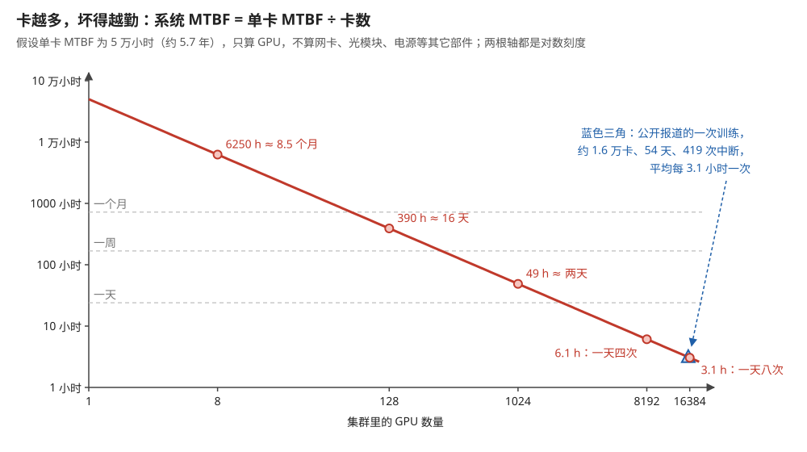
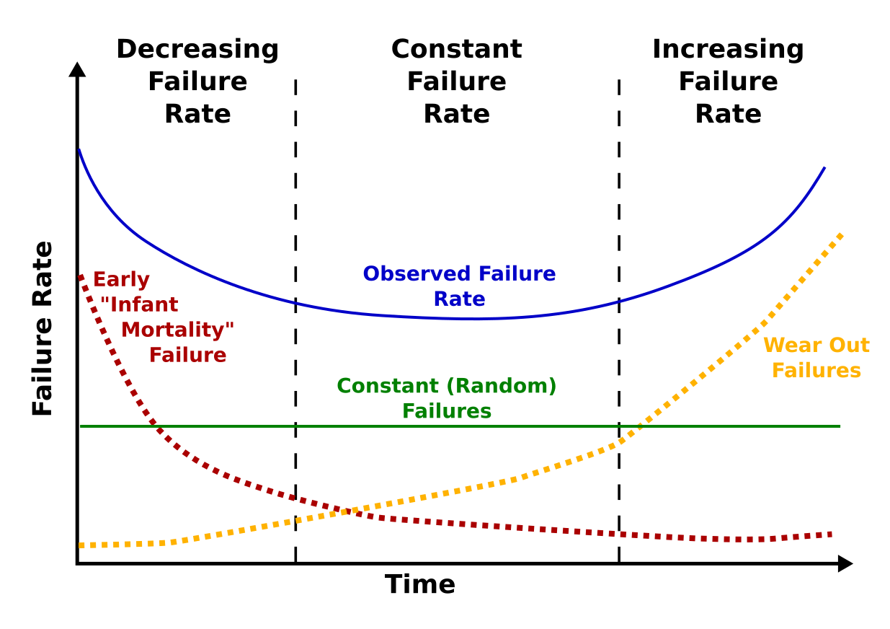
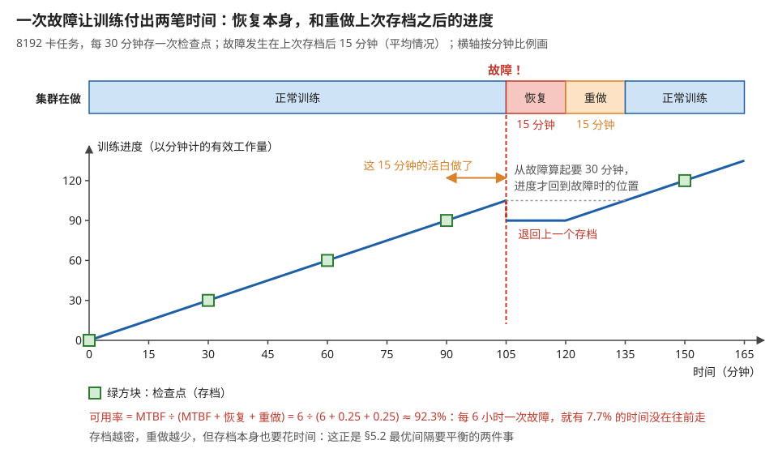
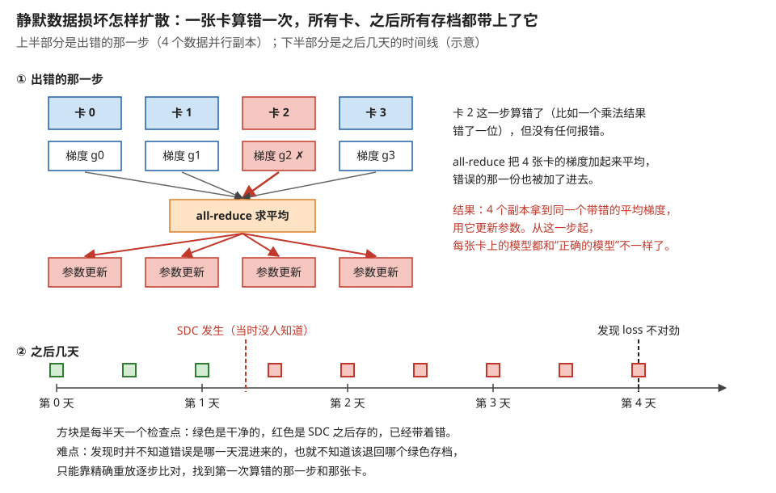
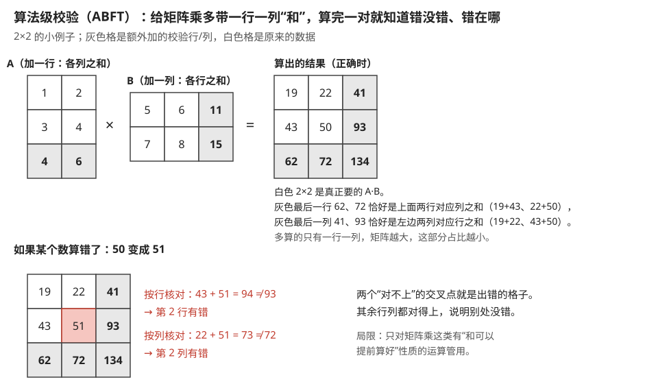
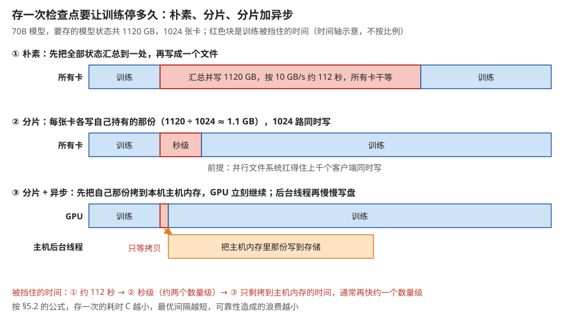
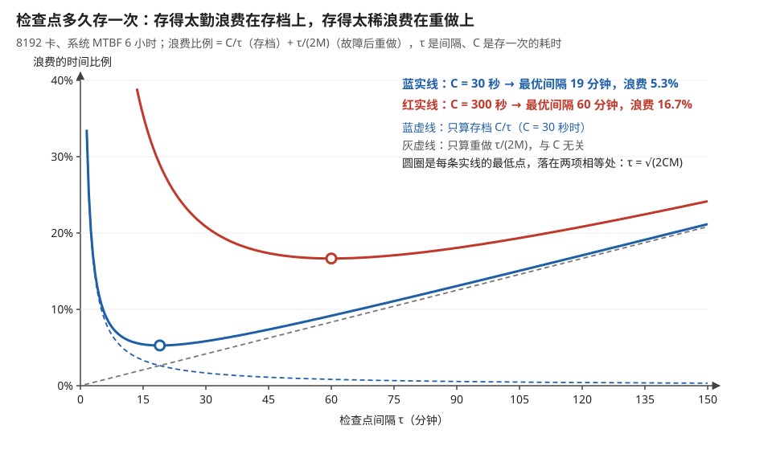
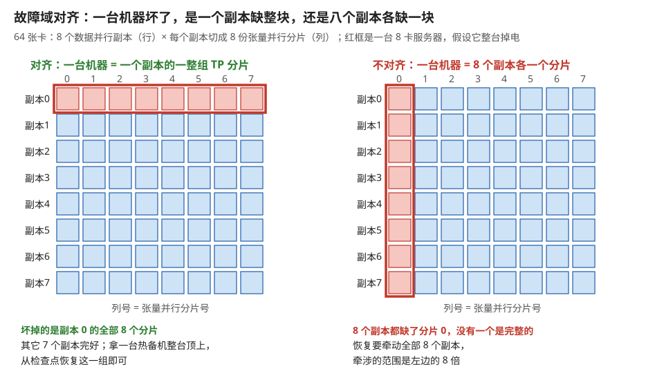
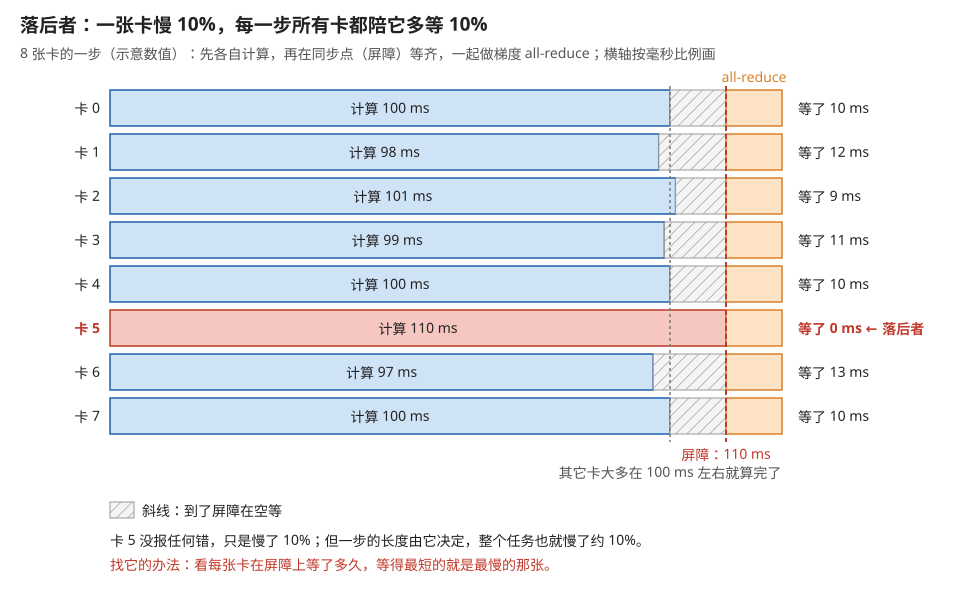

# 可靠性与规模化：失效模型、静默错误与故障恢复

> **所属模块**：模块 09 · 系统视角（从一张卡到一个集群）
> **状态**：🟨 学习中（第一版。知识截至 2026-08）
> **本节主旨**：前三节都建立在一个隐含假设上——**几千张卡会稳定地一起跑到底**。这个假设是错的，而且错得可以量化：**一张卡的平均无故障时间就算有五年，一万张卡凑在一起，平均每几个小时就会坏一次。** 而分布式训练是一个"全体同步前进"的计算，**任何一张卡出问题，整个任务都要停下来**。这一节讲清这件事的账本与对策：**规模如何把可靠性从运维话题变成架构话题**、**错误分成哪三类而第三类（静默数据损坏）为什么最可怕**、**检查点的间隔有一个可以算出来的最优值**、以及**落后者（straggler）这种"没坏但很慢"的故障为什么比彻底坏掉更难查**。这一节也是模块 08 那些物理约束（温度、电压、工艺偏差、良率余量）在生产环境里的最终汇合点——**前八个模块讲的每一条物理现实，最后都会以某种错误码的形式出现在集群日志里。**

---

## 0. 这一节要回答的问题

- 一万张卡的集群多久坏一次？这个数怎么算出来？
- 为什么分布式训练对故障如此脆弱，而推理服务不那么怕？
- GPU 的错误分成哪几类？ECC 的"可纠正"和"不可纠正"差在哪？
- Xid 是什么？看到一个 Xid 号该怎么反应？
- 什么是静默数据损坏（SDC）？为什么说它是最可怕的一类？怎么发现？
- 检查点该多久存一次？这个间隔有最优值吗？怎么算？
- 存一次检查点要多久？为什么"分片存"能把它从分钟降到秒？
- 什么是落后者？为什么一张"没坏但慢 10%"的卡比一张坏掉的卡更麻烦？
- 一个训练任务反复失败，该按什么顺序排查？

---

## 1. 基础词汇：先把本节要用的词讲清楚

**MTBF（Mean Time Between Failures，平均无故障时间）**。一个部件平均能连续工作多久才出一次故障。它是一个统计量：不是说"这张卡一定能跑五年"，而是说"大量同型号的卡，平均每五年出一次问题"。**它的关键性质是可以按数量叠加**——第 2 节的全部内容就是这个叠加。

**MTTR（Mean Time To Repair，平均修复时间）**。从故障发生到系统恢复正常所需的时间。**在分布式训练里，MTTR 包括：检测到故障、把整个任务停掉、换掉坏节点、从检查点重新加载、重放丢失的进度。** 这几步里最慢的往往是最后两步。

**ECC（Error-Correcting Code，纠错码）**。模块 08 第 3 节讲过它的电路形态（SECDED，每 64 位数据加 8 位校验，可纠正 1 位错、检出 2 位错）。这里关心它的**运行时行为**：
- **可纠正错误（CE, correctable error）**：单比特翻转，硬件当场纠正，程序无感，但**计数器会累加**。
- **不可纠正错误（UE, uncorrectable error）**：多比特翻转，硬件知道数据错了但修不了，**只能报错**。

**Xid**。NVIDIA 驱动在遇到问题时向系统日志打印的错误编号。它是运维 GPU 集群时最主要的信息来源——**一个 Xid 号基本上就定位了故障的类别**（第 3 节给对照表）。

**静默数据损坏（SDC, silent data corruption）**。计算结果错了，但**没有任何硬件或软件报错**。它可能来自宇宙射线打翻了一个没有 ECC 保护的触发器，也可能来自某颗芯片上一小块电路在特定条件下就是算错（业界把这类芯片叫 "mercurial core"，即"善变的核"）。**它是本节的重点，第 4 节专讲。**

**检查点（checkpoint）**。把训练的完整状态（模型状态加上数据加载的进度、随机数种子等）写到持久存储上，以便故障后从这里恢复。**注意它存的是模块 09 第 1 节讲的"模型状态"全部 16N 字节**，不只是参数。

**故障域（failure domain）**。一次故障会波及的范围。一张卡坏了影响一张卡，一台机器的电源坏了影响八张卡，一台交换机坏了影响一个机架，一路供电坏了影响半个机房。**设计集群时要让故障域和并行策略的分组对齐**——第 6 节展开。

---

## 2. 第一笔账：规模把可靠性变成架构问题

### 2.1 MTBF 的叠加

**核心公式非常简单**：如果一个部件的 MTBF 是 T，N 个这样的部件组成一个"任何一个坏了整体就算坏"的系统，那么系统的 MTBF 是：

> **系统 MTBF = T / N**

**代进真实数字算一遍。** 假设单张 GPU 的 MTBF 是 5 万小时（约 5.7 年，这是一个相当乐观的假设）：

| 集群规模 | 系统 MTBF | 换算成人话 |
| --- | --- | --- |
| 8 卡 | 6250 小时 | 约 **8.5 个月**坏一次 |
| 128 卡 | 390 小时 | 约 **16 天**坏一次 |
| 1024 卡 | 49 小时 | 约 **两天**坏一次 |
| 8192 卡 | 6.1 小时 | **每天坏四次** |
| 16384 卡 | 3.1 小时 | **每天坏八次** |

**而且这还只算了 GPU。** 真实节点上还有 CPU、内存、网卡、光模块、电源、风扇、交换机、线缆——**光模块尤其是高故障率的部件**。把这些都算上，实际的系统 MTBF 还要再降一截。

**这个量级和公开报道吻合**：一次 16000 卡规模、持续 54 天的大模型训练，公开报告的非预期中断是 419 次，**平均约每 3 小时一次**——和上表 16384 卡那一行几乎完全对上。图 4-1 把上表和这个报道值画在同一张图上。

> **图 4-1**　一句话：把卡数乘以十，整个集群的平均无故障时间就除以十；到上万张卡时，平均每三个小时就有一张卡出事。
>
> **先知道一件事**：分布式训练里任何一张卡坏了，整个任务都要停，所以集群"坏一次"的频率是所有卡的故障频率加在一起。一张卡平均 5 万小时坏一次，一万张卡放在一起，就是平均每 5 小时有一张坏。
>
> **按这个顺序看**：
> 1. 横轴是集群里的 GPU 数量，纵轴是整个集群的平均无故障时间（MTBF），两根轴都是对数刻度，每一格差十倍。在这种刻度下，"MTBF = 5 万小时 ÷ 卡数"画出来是一条斜向下的直线。
> 2. 三条灰色虚线是"一个月""一周""一天"。红线在 128 卡左右穿过"一个月"以下，在 1024 卡附近掉到"一天"以下。
> 3. 看红色圆点：8 卡约 8.5 个月坏一次，128 卡约 16 天，1024 卡约两天，8192 卡 6.1 小时（一天四次），16384 卡 3.1 小时（一天八次）。
> 4. 右下角的蓝色三角是一次公开报道的真实训练：约 1.6 万张卡跑了 54 天，非预期中断 419 次，平均 54 × 24 ÷ 419 ≈ 3.1 小时一次，几乎就压在红线上。
>
> **看懂的标志**：能回答"为什么一个 8 卡的小任务几乎不用考虑故障恢复，而万卡任务必须把它当成日常"——8 卡半年多才坏一次，跑几天的任务大概率碰不到；万卡几个小时就坏一次，任何超过半天的任务都必然要经历好几次中断。
>
> **与正文的对照**：五个圆点与 §2.1 的表一致。图中只算了 GPU；正文提醒，把光模块、电源等部件算上，实际的线还要再往下移。
>
> 来源：本库自绘。

"5 万小时"这种单一的 MTBF 数字，本身还藏着一个假设：部件在整个服役期内出故障的概率一样大。图 4-2 是可靠性工程里描述这件事的经典曲线。

> **图 4-2**　一句话：一批硬件的故障率通常在刚上线和快报废时高、中间长期平稳，画出来像一个浴缸的侧面；用一个固定的 MTBF 来算，默认的是中间那段平底。
>
> **先知道一件事**：故障率是"在这一时刻还活着的部件里，单位时间内坏掉的比例"。故障率不随时间变，意味着一个部件已经用了多久不影响它下一小时坏掉的概率，这时才能用一个固定的 MTBF 来描述它。
>
> **按这个顺序看**：
> 1. 横轴（Time）是部件的服役时间，纵轴（Failure Rate）是故障率。两条黑色竖虚线把时间分成三段，顶上三个标题从左到右是"故障率下降""故障率恒定""故障率上升"。
> 2. 红色点线（Early "Infant Mortality" Failure，早期夭折）：制造缺陷在刚上线时集中暴露，坏一批少一批，所以越来越低。
> 3. 绿色直线（Constant (Random) Failures，随机故障）：与服役时间无关的偶发故障，比如宇宙射线、偶然的电气冲击，一直保持同样的水平。
> 4. 橙色点线（Wear Out Failures，磨损故障）：部件老化，越到后期越多。
> 5. 蓝色实线（Observed Failure Rate，观测到的故障率）是三者之和，形成两头高、中间平的浴盆形状。
>
> **打个比方**：一批新车在刚出厂的头几个月容易暴露出装配问题，中间多年只有偶发的小故障，开到十几年又开始频繁大修。
>
> **看懂的标志**：能回答"一个新建集群刚上线的头几周，为什么中断往往比按 MTBF 算的还频繁"——它正处在左边那段早期夭折期，制造缺陷集中暴露，故障率高于平底；这也是新集群通常先做烧机测试再交付的原因。
>
> **与正文的对照**：§2.1 的 1/N 缩放和 §5.2 的最优间隔公式都假设故障率恒定，也就是图中间那段。真实 GPU 故障是否明显呈浴盆形，是 §12 列出的待深挖问题；这张图是通用的可靠性示意，不是 GPU 的实测数据。
>
> 来源：[Bathtub curve.svg](https://commons.wikimedia.org/wiki/File:Bathtub_curve.svg)，作者 Wyatts（原图 Bathtub_curve.jpg），McSush 重绘为 SVG，许可 Public domain（本库加了白色背景）。

### 2.2 为什么训练比推理脆弱得多

**同样是一张卡坏了，训练和推理的后果完全不同**，原因在两者的结构：

| | 推理服务 | 分布式训练 |
| --- | --- | --- |
| 各卡之间的关系 | **松耦合**：一个副本挂了，负载均衡把流量切给别的副本 | **紧耦合**：所有卡在每一步都要同步，是一个整体 |
| 一张卡坏了的影响 | 损失该副本正在处理的少量请求，容量下降一点 | **整个任务停止** |
| 恢复时间 | 秒级（重启一个副本） | **分钟到小时级**（重新调度全部节点、加载检查点、重放进度） |
| 规模的影响 | 规模越大越健壮（副本多，单点影响越小） | **规模越大越脆弱**（MTBF 按 1/N 缩短） |

**最后一行是本节最重要的一句话**：

> **推理服务的可靠性随规模变好，分布式训练的可靠性随规模变坏。** 前者是"多个独立副本"的结构，后者是"一个巨大的串联系统"的结构。

**这条差异决定了两边的工程重心完全不同**：推理侧关心的是"怎么把流量优雅地切走"，训练侧关心的是"怎么让重启的代价足够小"（第 5 节）以及"怎么在坏之前就发现"（第 7 节）。

### 2.3 有效算力：把可靠性折算成 MFU

**MTBF 和 MTTR 最终会体现在模块 09 第 1 节那个 MFU 上。** 可以直接算：

> **可用率 = MTBF / (MTBF + MTTR + 重放丢失进度的时间)**

**代进 8192 卡的场景**：MTBF = 6 小时；假设检测加重新调度加加载检查点需要 15 分钟（MTTR），检查点每 30 分钟存一次、所以平均要重放 15 分钟的进度：

> 可用率 = 6 / (6 + 0.25 + 0.25) = **92.3%**

**也就是说，即使每一步的计算都完美，可靠性这一项就先吃掉了 7.7% 的算力。** 在 16384 卡时（MTBF 3 小时）这个数字变成 14%。图 4-3 把一次故障前后发生的事画成了时间线。

> **图 4-3**　一句话：一次故障的代价不只是修复的那段时间，还要加上"上次存档之后做的活全部作废、得重做一遍"的时间。
>
> **先知道一件事**：检查点就是训练的存档。故障后任务只能从最近一次存档继续，存档之后算的东西随着进程一起丢了。
>
> **按这个顺序看**：
> 1. 上方的横条是集群在各段时间里做什么，横轴按分钟比例画。前 105 分钟正常训练；第 105 分钟出故障（红色虚线）。
> 2. 红色"恢复"段 15 分钟：发现故障、停掉任务、换上好的机器、加载存档，这就是 MTTR（平均修复时间）。
> 3. 橙色"重做"段 15 分钟：把第 90 到 105 分钟那段已经做过、但没存档的活再做一遍。之后才是真正的新进度。
> 4. 下方曲线是"训练进度"，用"做了多少分钟的有效工作"来量。绿色方块是每 30 分钟一次的存档。曲线在故障时从 105 跌回 90（最近一次存档），恢复期间不动，重做期间从 90 爬回 105。
> 5. 看灰色虚线：从故障发生（第 105 分钟）到进度重新回到 105，一共花了 30 分钟。平均来说，故障落在两次存档的正中间，所以要重做的就是存档间隔的一半。
>
> **看懂的标志**：能用图里的数算出正文的可用率——每 6 小时（MTBF）坏一次，每次损失 15 分钟恢复加 15 分钟重做，共 0.5 小时，可用率 = 6 ÷ 6.5 ≈ 92.3%。
>
> **与正文的对照**：数值与 §2.3 一致。图中没画存档本身花的时间；把它也算进来，就是 §5.2 最优间隔公式要平衡的另一项。
>
> 来源：本库自绘。

**这就是为什么可靠性在超大规模训练里不是运维问题而是架构问题**——它和流水线气泡、通信开销一样，是 MFU 账本上明确的一行，而且是随规模增长最快的一行。**模块 09 第 1 节那张"MFU 掉在哪"的排查清单里最后一行（落后者），以及这里的可用率损失，合起来构成了"规模税"。**

---

## 3. 错误的三个层次：能修、能报、和不知道

GPU 上的错误按"系统知不知道"分成三层，**处理方式和恐怖程度完全不同**：

| 层次 | 典型形态 | 系统知道吗 | 后果 | 处理 |
| --- | --- | --- | --- | --- |
| **第一层：可纠正** | 单比特 ECC 错误、链路重传 | 知道，且已修好 | 无（性能可能微降） | **计数、观察趋势** |
| **第二层：不可纠正但能检出** | 双比特 ECC 错误、GPU 掉线、NVLink 断链 | 知道，修不了 | 任务崩溃 | 换卡、重启、从检查点恢复 |
| **第三层：静默** | SDC | **不知道** | **结果错了但一切正常** | 第 4 节专讲 |

### 3.1 第一层：可纠正错误——它的价值在趋势

单比特 ECC 错误被硬件当场纠正，程序完全无感。**所以很多人会忽略它——这是个错误。**

**它的价值在于：可纠正错误的计数是不可纠正错误的先行指标。** 一块显存单元开始退化时，通常先表现为可纠正错误的频率上升，一段时间后才发展成不可纠正错误。**所以运维上的正确做法是监控"每张卡的 CE 计数增长速率"，而不是只等 UE 报警。**

**配套机制是行重映射（row remapping）**（模块 08 第 8 节讲过 SRAM 的冗余修复，显存这一侧同理）：驱动发现某一行反复出错时，可以把它映射到预留的备用行上。**这个机制有一个运维含义：备用行是有限的，用完就没了。** `nvidia-smi` 可以查询剩余的重映射资源——**它耗尽是一个明确的换卡信号**。

### 3.2 第二层：Xid 对照表

看到日志里一个 Xid 号，第一件事是判断**它是硬件的锅还是程序的锅**——这两类的处理方式完全相反。下面是最常见的几个（各驱动版本略有出入，以官方文档为准）：

| Xid | 含义 | 谁的锅 | 该做什么 |
| --- | --- | --- | --- |
| 13 / 31 | 非法地址访问（图形/内存异常） | **通常是程序** | 查 kernel 的越界访问，用 `compute-sanitizer` |
| 43 | 程序主动触发的错误 | 程序 | 看应用日志 |
| 48 | **双比特 ECC 错误** | **硬件** | 换卡（或至少标记观察） |
| 63 / 64 | 行重映射事件 | 硬件（退化中） | 检查剩余重映射资源，安排换卡 |
| 74 | NVLink 错误 | 硬件/连接 | 检查链路、重插、看是否有 lane 降级 |
| 79 | **GPU 掉线（fallen off the bus）** | **硬件** | 严重，通常要下线整机检查供电与 PCIe |
| 94 / 95 | 可控 / 不可控的 ECC 错误 | 硬件 | 94 尚可隔离，95 通常要重启节点 |

**一个实用的判别原则**：**Xid 13/31/43 这类"程序的锅"在同一张卡上换个任务就不会复现；硬件类的 Xid 会在同一张卡上反复出现。** 所以运维上最有价值的统计不是"总共出了多少 Xid"，而是"**哪几张卡在反复出同一类 Xid**"——那就是要换的卡。

---

## 4. 静默数据损坏：最可怕的那一类

### 4.1 它为什么可怕

前两层错误至少有一个共同点：**你知道出事了**。SDC 破坏的正是这一点——**计算结果是错的，但没有任何信号**。

**在训练场景里它的表现极其阴险**：

- 一个错误的梯度被算出来，参加了 all-reduce，**污染了所有卡的参数更新**。
- 训练曲线可能只是"看起来有点不对"——loss 抖了一下、或者慢慢地不如预期。
- **等你发现模型质量有问题时，可能已经训了几天**，而且不知道该回滚到哪个检查点。

**在推理场景里它同样麻烦**：某张卡偶尔给出错误的输出，而且**不可复现**（因为它可能只在特定温度、特定数据模式下发生）。

图 4-4 把训练场景里的这条扩散路径画了出来。

> **图 4-4**　一句话：数据并行里一张卡算错一次梯度，同步之后所有卡的模型都被带偏；之后存下的每个存档都带着这个错，而发现它往往已经是几天以后。
>
> **先知道一件事**：数据并行时，每张卡用不同的数据算出一份梯度（参数该怎么改），然后用 all-reduce 把所有卡的梯度加起来求平均，每张卡再用同一个平均梯度更新参数。所以每张卡的梯度都会影响所有卡。
>
> **按这个顺序看**：
> 1. 上半部分是出错的那一步。四张卡各算一份梯度，卡 2 那一份错了（红色），比如某个乘法结果错了一位，但硬件没有报任何错。
> 2. 四份梯度一起进入 all-reduce 求平均，红色箭头表示错误的那一份也被平均了进去。
> 3. 平均结果发回每张卡，四张卡都用它更新参数（全部标红）。从这一步开始，所有卡上的模型都偏离了"本该得到的模型"，而且偏得一模一样，彼此之间比对不出差别。
> 4. 下半部分是之后几天。横轴是天，方块是每半天一次的检查点。第 1.3 天发生 SDC（静默数据损坏，结果错了却没有任何报错），当时没人察觉；此后存的方块全是红的。
> 5. 第 4 天才发现 loss 曲线不对劲。这时手里有 9 个存档，但不知道从哪一个开始变红，也就不知道该退回哪一个。
>
> **看懂的标志**：能回答"为什么训练脚本要能精确重放任意一步"——只有固定随机种子、数据顺序和并行配置，才能把怀疑的那段重新算一遍、逐步逐卡与原结果比对，找到第一次算错的那一步和那张卡，从而知道哪个存档还是干净的。
>
> **与正文的对照**：对应 §4.1 的三条表现。时间和存档频率是示意值。
>
> 来源：本库自绘。

### 4.2 它从哪来

三个来源，各有不同的性质：

1. **软错误（soft error）**：宇宙射线或封装材料的 α 粒子打翻了一个存储位。**它是随机的、不可复现的**。有 ECC 保护的存储（显存、L2、寄存器堆的一部分）能挡住大部分，但**芯片上不是所有触发器都有 ECC 保护**——控制逻辑里那些状态位通常没有。
2. **硬件缺陷（"善变的核"）**：某颗芯片上一小块电路在特定的电压、温度、数据模式组合下就是算错。**它是可复现的，但触发条件极其苛刻**——出厂测试（模块 08 第 8 节的扫描链）覆盖不到，因为测试向量不可能穷举所有条件。业界大规模数据中心的调查报告显示，这类"每几千颗芯片里有一颗"的情况是真实存在的。
3. **时序 marginal**：某条路径在高温高频下偶发地不满足建立时间（模块 08 第 1 节讲的 slack 为负）。**它和温度、电压强相关**——所以同一张卡在冬天正常、夏天出错是可能的。

**注意第二、三条和模块 08 的直接关系**：模块 08 第 8 节讲的分档（每颗芯片的 V-F 曲线不同）和良率（缺陷是随机分布的），在这里以最不友好的方式再现——**测试没测出来的那些边缘缺陷，会在生产环境里变成 SDC。**

### 4.3 怎么发现

SDC 没有免费的检测手段，所有方法都要付出代价：

| 方法 | 怎么做 | 代价 | 适用 |
| --- | --- | --- | --- |
| **周期性体检** | 定期跑一套已知答案的计算，比对结果 | 停机时间 | 例行巡检，能抓"善变的核" |
| **冗余计算** | 同一份计算在两处各算一遍比对 | **算力翻倍** | 只用于关键路径 |
| **算法级校验** | 利用数学性质做低成本验证（比如矩阵乘的行列和校验，ABFT） | 几个百分点 | 有性质可用时最划算 |
| **统计监控** | 监控 loss 曲线、梯度范数的异常跳变 | 几乎为零 | **最实用，但只能事后发现** |
| **确定性重放** | 固定随机种子，怀疑时重算同一步比对 | 一次重算 | 定位阶段用 |

**实践中的组合是：日常靠统计监控 + 定期体检，怀疑时用确定性重放定位到具体的卡。**

**一个值得记住的工程习惯**：**训练脚本应该记录足够的信息，让任何一步都能被精确重放**（随机种子、数据顺序、并行配置）。**这个能力平时用不上，但在需要定位 SDC 时它是唯一的办法**——没有它，"哪张卡算错了"这个问题基本无解。

**算法级校验（ABFT，Algorithm-Based Fault Tolerance）值得多说一句**，因为它是这些方法里唯一"几乎免费"的。以矩阵乘为例：给 A 矩阵多加一行"各列之和"、给 B 矩阵多加一列"各行之和"，算完之后**结果矩阵的最后一行/列应该等于其余部分的对应和**——对不上就说明算错了。**多算的部分只有一行一列，相对整个矩阵是零头。** 它的局限是只对有这类数学性质的算子有效。图 4-5 用一个 2×2 的例子把这个过程算了一遍。

> **图 4-5**　一句话：在输入矩阵上各多加一行或一列"和"，乘出来的结果会自带一行一列校验和；某个数算错了，它所在的行和列就对不上账。
>
> **先知道一件事**：矩阵乘法对加法是"分配"的：先把 A 的几行加起来再去乘 B，和先分别乘 B 再把结果加起来，得到的是同一个数。所以 A 多出的"各列之和"那一行乘以 B，应当恰好等于结果里各行之和。
>
> **按这个顺序看**：
> 1. 左上是 A，原本是 2×2（白色），多加了灰色的一行 4、6，分别是两列之和（1+3、2+4）。B 多加了灰色的一列 11、15，分别是两行之和（5+6、7+8）。
> 2. 两者相乘得到右上的 3×3 结果。白色的 19、22、43、50 就是原本要的 A·B。
> 3. 核对灰色部分：最后一行 62、72 等于白色部分每列之和（19+43、22+50）；最后一列 41、93 等于每行之和（19+22、43+50）。右下角 134 两种加法都得到它。正确时处处对得上。
> 4. 下半部分：假设 50 被算成了 51（红格）。按行核对，第 2 行 43 + 51 = 94，校验值是 93，对不上；按列核对，第 2 列 22 + 51 = 73，校验值是 72，也对不上。行和列交叉处就是错的那一格，其它行列都对得上。
>
> **看懂的标志**：能回答"为什么说这种校验几乎免费"——一个 n×n 的矩阵乘只多算一行一列，额外的工作量约为原来的 2/n；n = 4096 时不到千分之一。
>
> **与正文的对照**：对应 §4.3 最后一段的描述。实际用在浮点运算上时，校验要允许一点舍入误差，不能要求严格相等。
>
> 来源：本库自绘。

---

## 5. 检查点：间隔有一个可以算出来的最优值

### 5.1 存一次要多久

**检查点要存的是模块 09 第 1 节讲的全部模型状态：16N 字节。** 对 70B 模型就是 **1120 GB**。

**朴素做法（汇总到一张卡再写一个文件）的账**：1120 GB 写到存储，按 10 GB/s 算要 **112 秒**。**每半小时存一次，就有 6% 的时间在存检查点**——而且这 112 秒里所有卡都在等。

**分片检查点（sharded checkpoint）把这个数降了两个数量级**：既然模型状态本来就按并行策略切在各卡上（ZeRO/TP/PP），**那就让每张卡各写各的那一份**。1024 张卡，每张只写 1120/1024 ≈ **1.1 GB**；只要存储系统能扛住 1024 路并发写，**总时间降到秒级**。

**这带来一个存储侧的要求**：并行文件系统必须能承受"上千个客户端同时写"的模式。**这也是为什么大规模训练集群普遍配并行文件系统而不是普通 NAS**——不是因为总容量，而是因为**这一瞬间的并发写带宽**。

**再进一步：异步检查点。** 把状态先快速拷贝到主机内存（走 PCIe 或 NVLink-C2C，比写存储快得多），**GPU 立刻继续训练**，由后台线程慢慢把主机内存里那份写到磁盘。**这样阻塞时间从"写磁盘的时间"降到"拷到主机内存的时间"**，通常又快一个数量级。图 4-6 把三种做法下训练被挡住的时间放在一起比较。

> **图 4-6**　一句话：存检查点时训练要停下来等，朴素做法等两分钟，让每张卡各写各的降到秒级，再把写盘挪到后台，就只剩拷一份到内存的那一瞬间。
>
> **先知道一件事**：存档写的是全部模型状态（参数、梯度、优化器状态，70B 模型共 1120 GB），而这些数据本来就已经按并行策略切开，分散在 1024 张卡上，每张卡只有约 1.1 GB。
>
> **按这个顺序看**：
> 1. 每一行是一种做法，蓝色是训练，红色是训练被挡住、只能等存档的时间。时间轴是示意，没按比例。
> 2. ①朴素：把分散在各卡上的状态先汇总到一处，再写成一个文件。1120 GB 按 10 GB/s 写要约 112 秒，这期间所有卡都停着。
> 3. ②分片：每张卡直接把自己那 1.1 GB 写出去，1024 路同时写。只要存储系统扛得住这么多客户端同时写，停顿就降到秒级，约两个数量级的改善。
> 4. ③分片加异步：GPU 只把自己那份拷到本机的主机内存（CPU 那边的内存，走 PCIe 等总线，比写存储快得多），拷完立刻继续训练（红色只剩很窄一条）。下方橙色是主机上的后台线程，在训练进行的同时慢慢把内存里那份写到存储。
>
> **看懂的标志**：能回答"异步检查点有什么风险"——在后台写完之前，这份存档只在主机内存里；如果这时整台机器掉电，这份存档就丢了，只能退回更早一次写完的存档。所以它通常和"在别的机器内存里存一份副本"（§6 手段三）配合使用。
>
> **与正文的对照**：数值与 §5.1 一致。存一次的耗时就是 §5.2 公式里的 C。
>
> 来源：本库自绘。

### 5.2 最优间隔：一个可以推出来的公式

**问题的形状**：检查点存得越频繁，每次故障丢失的进度越少，但存检查点本身的开销越大。**这两项此消彼长，所以存在一个最优间隔。**

设：检查点耗时 **C**，系统 MTBF 为 **M**，检查点间隔为 **τ**。那么浪费的时间由两部分组成：

- **存检查点的开销**：每 τ 时间存一次，占比 **C/τ**。
- **故障后重放的进度**：平均在两个检查点的中间出故障，所以平均重放 **τ/2**；故障频率是 1/M，所以占比 **τ/(2M)**。

总浪费占比 = C/τ + τ/(2M)。对 τ 求最小值（两项相等时最小），得到：

> **最优检查点间隔 τ_opt = √(2 · C · M)**
> **此时的最小浪费比例 ≈ √(2C / M)**

（这是经典的 Young/Daly 公式，在超算领域用了几十年。）

**代进第 2 节那个 8192 卡的场景手算**：MTBF = 6 小时 = 21600 秒，异步检查点 C = 30 秒。

1. τ_opt = √(2 × 30 × 21600) = √1296000 ≈ **1138 秒 ≈ 19 分钟**。
2. 最小浪费 = √(60/21600) = √0.00278 ≈ **5.3%**。

**再看如果检查点很慢（C = 300 秒，即没做异步和分片）**：

1. τ_opt = √(2 × 300 × 21600) = √12960000 ≈ **3600 秒 = 1 小时**。
2. 最小浪费 = √(600/21600) ≈ **16.7%**。

**对照这两组数字，本节最实用的一条结论就出来了**：

> **把检查点从 300 秒优化到 30 秒（十倍），最优浪费比例从 16.7% 降到 5.3%（约三倍）。** 浪费比例只随 √C 下降，所以**优化检查点速度的收益是平方根级的，但基数很大，仍然非常值得做**——三倍的可靠性损失差距，直接就是三倍的 MFU 差距。

图 4-7 把这两组数画成了浪费比例随间隔变化的曲线。

> **图 4-7**　一句话：存档间隔太短，时间都花在存档上；太长，故障后要重做的太多；两种浪费相加有一个最低点，存一次越快，这个最低点越低、也越靠左。
>
> **先知道一件事**：这里的"浪费"指没有推进训练的时间占比，只算两项：存档本身占用的时间（每隔 τ 存一次、每次 C 秒，占比 C/τ），以及故障后重做的时间（平均丢失半个间隔、每 M 秒坏一次，占比 τ/(2M)）。
>
> **按这个顺序看**：
> 1. 横轴是检查点间隔 τ（分钟），纵轴是浪费的时间比例。集群 MTBF 取 6 小时（8192 卡）。
> 2. 先看两条虚线。蓝虚线是 C = 30 秒时的存档开销 C/τ：间隔越短它越高，间隔很短时急剧上升。灰虚线是重做开销 τ/(2M)：间隔越长它越高，是一条直线，和存一次要多久无关。
> 3. 蓝实线是两者之和。它先降后升，最低点（蓝圈）在 19 分钟，浪费 5.3%；这一点正好是两条虚线的交点，即两项相等处。
> 4. 红实线是 C = 300 秒（不做分片和异步）时的总浪费。存档开销是蓝虚线的十倍，整条曲线被抬高，最低点（红圈）右移到 60 分钟，浪费 16.7%。
> 5. 把两个圆圈对比：存一次从 300 秒提速到 30 秒（快十倍），最低浪费从 16.7% 降到 5.3%（约三倍），最优间隔从 1 小时缩到 19 分钟。
>
> **看懂的标志**：能说出"每小时存一次"这个习惯在 C = 30 秒时亏在哪——在 60 分钟处蓝实线约为 9.2%，比最低点 5.3% 多浪费约 4 个百分点，几乎全是故障后重做的时间。
>
> **与正文的对照**：两个最低点与 §5.2 的两组手算一致（τ_opt = √(2CM)，浪费 ≈ √(2C/M)）。
>
> 来源：本库自绘。

**还有一条同样重要的**：公式里 M 在分母，**集群越大 MTBF 越小、浪费越大**。8192 卡是 5.3%，16384 卡（MTBF 3 小时）是 7.5%。**这就是"规模税"里可以精确计算的那一部分。**

---

## 6. 故障恢复：从"全部重来"到"只换一个"

**朴素的恢复流程是全量重启**：检测到故障 → 杀掉全部进程 → 重新调度 → 全部节点加载检查点 → 继续。**这个流程的时间以十分钟计**，因为重新调度和加载都很慢。

**几个把 MTTR 压下来的手段，按代价从低到高**：

**手段一：热备节点。** 集群里预留几台空闲机器，故障时直接顶上，**省掉"等运维换机器"这一段**。代价是几个百分点的机器闲置。**这是最直接、也最常用的一招**——按第 2 节的账，8192 卡每天坏四次，如果每次都要等人工介入，可用率会惨不忍睹。

**手段二：进程级恢复而非任务级。** 不杀掉整个任务，只重启故障那个 rank 的进程，其余进程在一个屏障上等着。**省掉了重新调度和其它节点重新加载的时间。** 这需要训练框架支持（弹性训练能力）。

**手段三：内存中的检查点副本。** 让每张卡在别的卡的主机内存里存一份自己的状态副本。**故障后新顶上的节点从邻居的内存里拉状态，而不是从磁盘**——快一到两个数量级。代价是主机内存占用。

**手段四：让故障域和并行分组对齐。** 这一条是设计层面的，也最容易被忽略。

**具体说**：如果一台机器（8 张卡）是一个故障域，那么**应该让这 8 张卡属于同一个 TP 组或同一个 PP 段**，而不是分属 8 个不同的数据并行副本。理由是：

- 前者：这台机器坏了，损失的是**一个完整的模型副本分片**，可以用一台热备机整体替换。
- 后者：这台机器坏了，**8 个数据并行副本各缺一块**，每一个都不完整——恢复要触及 8 倍的范围。

图 4-8 把这两种排法画成了同一个 64 卡网格的两种切法。

> **图 4-8**　一句话：同样是一台 8 卡服务器掉电，如果这 8 张卡本来就是同一组，坏的就只是一组；如果它们分属 8 组，8 组就都残缺了。
>
> **先知道一件事**：故障域是"一次故障会一起坏掉的范围"。一台服务器共用电源、主板和网卡，它出问题时里面 8 张卡一起失联，所以一台服务器就是一个故障域。
>
> **按这个顺序看**：
> 1. 两个网格都是 64 张卡：每一行是一个数据并行副本（一份完整的模型），每一列是张量并行的一个分片（模型被切成 8 份中的第几份）。
> 2. 左边：红框框住第一行，表示一台服务器里的 8 张卡正好是副本 0 的全部 8 个分片。它掉电后，副本 0 整个没了，其余 7 个副本完好。拿一台热备机整台顶上，从检查点恢复这一组即可。
> 3. 右边：红框框住第一列，表示一台服务器里的 8 张卡分别是 8 个副本各自的分片 0。它掉电后，8 个副本都缺了分片 0，没有一个是完整的，恢复要牵动全部 8 个副本。
> 4. 左边的排法正是"张量并行组放在一台机器内"的结果：张量并行通信最频繁，本来就要放进机内高速互连，于是故障域也顺带对齐了。
>
> **看懂的标志**：能回答"为什么说按通信密度排嵌套顺序顺带解决了故障域问题"——通信最密的张量并行被放在一台机器内（为了性能），而机器正好也是最常见的故障单位，所以一台机器坏掉只影响一个完整的组，不会把损失摊到很多组上。
>
> **与正文的对照**：对应 §6 手段四。正文说"同一个 TP 组或同一个 PP 段"，图中只画了 TP 的情形。
>
> 来源：本库自绘。

**而模块 09 第 1 节讲的嵌套顺序（TP 最内）恰好天然满足这一点**——TP 组本来就在同一台机器内。**所以"按通信密度排嵌套顺序"这个为性能做的决定，顺带也把故障域对齐了。这类"一个决定同时满足两个约束"的情况在系统设计里不常见，遇到了值得记下来。**

---

## 7. 落后者：没坏，但拖累全体

### 7.1 为什么它比彻底坏掉更麻烦

**分布式训练每一步都有同步点**（梯度 all-reduce）。所以**每一步的耗时等于最慢那张卡的耗时**——一张卡慢 10%，整个任务就慢 10%，**哪怕其它 8191 张卡都完全正常**。

**而这类故障不会报任何错**：没有 Xid、没有 ECC 计数、进程活得好好的。**从监控上看一切正常，只是训练变慢了。**

**落后者的常见来源**（每一条都能追溯到本库前面的某一节）：

| 来源 | 机制 | 对应章节 |
| --- | --- | --- |
| **散热差异** | 机架里位置不好的机器温度高，触发温度降频 | 模块 08 第 6 节 |
| **芯片体质差异** | 分档只保证达标，不保证一致；同型号卡的 V-F 曲线不同 | 模块 08 第 8 节 |
| **降频未被发现** | 电压跌落触发自适应降频，纳秒级、监控采样看不到 | 模块 08 第 6 节 |
| **ECC 纠错负担** | 某张卡的可纠正错误频繁，纠错本身有开销 | 本节 §3.1 |
| **NVLink lane 降级** | 链路自动降到更少的 lane 运行，带宽减半而不报错 | 模块 08 第 5 节 |
| **主机侧问题** | CPU 频率、NUMA 绑定错误、数据加载慢 | 模块 06 第 3 节 |
| **负载本身不均** | MoE 的专家负载倾斜、变长序列的分桶不均 | 模块 01 附录 A2 |

**注意最后一条和前面几条的性质不同**：前几条是硬件问题（换卡能解决），最后一条是负载问题（换卡无用）。**排查落后者的第一步就是分清这两类**——方法是**换一个 rank 到 GPU 的映射再跑**：如果慢的还是同一张物理卡，是硬件；如果慢的跟着 rank 走，是负载。

### 7.2 怎么发现

**关键是要有逐 rank 的每步耗时分布，而不只是平均值。**

**一个实用的诊断做法**：在每步的同步点前后各打一个时间戳，统计每个 rank"到达屏障的时刻"。**先到的 rank 会在屏障上等，等待时间越长说明它越快**——所以**屏障等待时间最短的那个 rank 就是落后者**。这个指标比"计算耗时"更灵敏，因为它把所有来源的延迟都汇总了。图 4-9 是一步之内 8 张卡的情形。

> **图 4-9**　一句话：同步训练的每一步要等最慢的那张卡算完才能继续，一张卡慢 10%，所有卡就都跟着慢 10%，而且没有任何报错。
>
> **先知道一件事**：屏障（barrier）是一个同步点：所有卡都到了才一起往下走，先到的只能原地等。梯度 all-reduce 前就有这样一个隐含的屏障，因为少了任何一张卡的梯度都没法求和。
>
> **按这个顺序看**：
> 1. 每一行是一张卡在一步里的时间线，横轴按毫秒比例画。蓝色是计算，右边橙色是一起做的 all-reduce。
> 2. 大多数卡的计算在 97 到 101 毫秒之间（灰色细虚线标在 100 毫秒）。卡 5 是红色，要 110 毫秒。
> 3. 红色虚线是屏障，位置由最慢的卡 5 决定，在 110 毫秒。其它卡算完后到达屏障，在斜线段里空等，最右边写着各自等了多少。
> 4. 看最右一列：卡 5 等了 0 毫秒，其它卡等了 9 到 13 毫秒。等待最短的那张就是最慢的那张。
>
> **打个比方**：几个人约好一起出发，每次都要等最后一个到的人。只看各人的日程表看不出谁拖了后腿，但只要问一句"你到了之后等了多久"，几乎没等的那个人就是迟到的。
>
> **看懂的标志**：能回答"为什么监控每张卡的计算耗时不如监控屏障等待时间"——计算耗时只反映 GPU 上的那段；如果慢在数据加载、主机 CPU 或网卡上，计算耗时看起来正常，但这张卡仍然最晚到达屏障，等待时间照样最短。
>
> **与正文的对照**：数值是示意。正文的"一张卡慢 10%，整个任务就慢 10%"在图中是 110 对 100 毫秒；all-reduce 那一段不受影响，所以整步的变慢比例略低于 10%。
>
> 来源：本库自绘。

**运维上的常规动作**：

- 每张卡定期跑一遍标准基准（矩阵乘、`nccl-tests`），建立性能基线，**偏离基线超过几个百分点的卡标记出来**。
- 监控 `nvidia-smi` 的时钟频率、温度、功耗，找系统性偏低的机器。
- 监控 NVLink 的链路状态和错误计数。

---

## 8. 开发者视角

| 你想知道/控制什么 | 去哪里看/拧 |
| --- | --- |
| 这张卡的 ECC 状况 | `nvidia-smi -q -d ECC`——看 CE 与 UE 的计数**以及增长速率**；`-d ROW_REMAPPER` 看剩余重映射资源 |
| 出了什么故障 | 系统日志里的 Xid（`dmesg`、`/var/log/syslog`）；对照 §3.2 的表先判断是程序还是硬件 |
| 集群整体健康度 | DCGM（NVIDIA 的数据中心 GPU 管理工具）导出的指标 + 告警规则 |
| 有没有落后者 | 逐 rank 的每步耗时分布、屏障等待时间；定期基准的偏离度 |
| 检查点该多久一次 | 用 §5.2 的公式：τ = √(2·C·M)，C 是实测的检查点耗时、M 是集群实测的 MTBF |
| 检查点为什么慢 | 是不是没分片（每卡各写各的）、是不是没异步（先拷主机内存）、存储侧的并发写带宽够不够 |
| 怀疑 SDC | 固定种子重放同一步比对；对关键算子加 ABFT 校验；跑一遍已知答案的体检套件 |
| 红旗信号 | 某几张卡反复出同类 Xid；重映射资源在减少；loss 曲线出现无法解释的跳变；每步耗时的方差在变大 |

**给算法侧的一句话**：**你的训练脚本能不能精确重放某一步，是一个可靠性能力而不是调试便利。** 在千卡规模上，"我怀疑这一步算错了"这个问题只有靠重放才能回答；而重放能力必须在写代码的时候就留出来（固定种子、记录数据顺序、保存并行配置），事后补不上。

---

## 9. 最新架构落点（知识截至 2026-08）

- **规模在涨，而单卡 MTBF 不会同比增长**——所以 §2 那张表的最后几行是训练系统必须正面处理的现实，而不是极端情况。**这也是为什么"弹性训练""秒级检查点""故障预测"这几个方向在 2024 年之后突然变热**：不是技术进步了，是规模逼到这里了。
- **液冷普及对可靠性是正面的，而且有两条路径**（模块 08 第 6 节）：温度更低更均匀，**一方面直接减少温度降频造成的落后者**，另一方面降低漏电、缓解漏电与温度的正反馈。**液冷的价值不只在散热能力，还在温度的一致性**——而一致性正是落后者问题的核心。
- **单封装功耗突破 1 kW（B300 的 1400 W）之后，供电与散热的余量变小**，§7 那张表里"散热差异"和"电压跌落"两条的权重在上升。
- **SDC 已经从"学术话题"变成"大规模运维的常规项**：主要云厂商都公开报告过在大规模队列里发现"善变的核"，并把定期体检纳入了常规流程。**对使用者的含义是：把 SDC 当成一个会发生的事件来设计系统，而不是当成小概率意外。**
- **检查点技术在向"接近零开销"演进**：分片 + 异步 + 内存副本三招叠加，可以把阻塞时间压到秒级以下。按 §5.2 的公式，**C 降到几秒时，可靠性造成的 MFU 损失可以压到 2% 以内**——这是一个投入产出比很高的优化方向。
- **一个值得跟踪的方向：故障预测**。用 ECC 计数、温度、功耗、频率等信号预测哪张卡即将出问题，**在它坏之前主动迁移**。这把 MTTR 从"故障后恢复"变成了"故障前规避"，是把可用率往上推的下一步。

---

## 10. 和其它模块的挂钩

- **模块 08 第 8 节（从 RTL 到 tapeout）**：那一节讲良率、屏蔽、分档——**本节是它的下游**。分档只保证每颗芯片达标、不保证一致，于是有了 §7 的落后者；出厂测试覆盖不到的边缘缺陷，于是有了 §4 的 SDC。
- **模块 08 第 3 节（片上存储）**：那一节讲 ECC 的电路形态与读-改-写的性能代价，本节讲它的运行时行为（CE/UE、行重映射）与运维含义。
- **模块 08 第 6 节（能量与时钟）**：那一节讲温度降频与电压跌落的机制，本节讲它们在集群里的表现形式——落后者。
- **模块 09 第 1 节（训练系统）**：本节 §2.3 把可靠性折算进了那一节的 MFU 账；§6 的故障域对齐是那一节嵌套顺序的一个额外收益。
- **模块 09 第 3 节（集合通信）**：一次集合通信按最慢的参与者走，所以落后者的影响会被同步点放大——两节在"屏障等待时间"这个诊断指标上接头。
- **模块 06 第 3 节（数据上游通路）**：数据加载慢是落后者的一类来源，且它常被误判为 GPU 问题。

---

## 11. 术语卡

### MTBF 的 1/N 缩放

**定义**：N 个部件组成的、任一失效即整体失效的系统，其平均无故障时间是单部件的 N 分之一。单卡 MTBF 五万小时时，8192 卡的集群约每 6 小时故障一次，16384 卡约每 3 小时一次。

**为什么存在**（作为一条要背下来的换算）：它把"可靠性"从运维话题变成了架构话题——**规模每翻倍，故障频率就翻倍，而分布式训练是紧耦合的，一处故障全体停止。** 这条除法是检查点策略、热备规模、弹性训练能力这一系列设计的共同起点。

**语境例句**："这个万卡任务一天要断好几次正常吗？"——按 1/N 缩放算，完全正常且符合公开报道的量级；不正常的是没有为此设计恢复流程。

### 可纠正错误与它的先行指标价值

**定义**：单比特翻转被 ECC 当场纠正，程序无感，但计数器累加。配套的行重映射机制可以把反复出错的显存行映射到预留的备用行上，备用资源有限且用完不补。

**为什么存在**（作为一个监控对象）：可纠正错误的频率上升，通常是不可纠正错误的前兆。**只监控崩溃是被动的，监控 CE 的增长速率和剩余重映射资源才是主动的**——后者能在这张卡把任务搞崩之前把它换掉。

**语境例句**："这张卡的重映射资源只剩几个了。"——意思是显存已经修补过很多次、快没有余量了，应当在它出不可纠正错误之前主动下线。

### Xid 与"程序的锅还是硬件的锅"

**定义**：NVIDIA 驱动打印的错误编号，基本上定位了故障类别。13/31/43 通常是程序（越界访问等），48/63/64/74/79/94/95 通常是硬件（ECC、重映射、NVLink、掉线）。

**为什么存在**（作为运维的第一手段）：它把"GPU 出问题了"这个模糊状态变成了可分类、可统计的事件。**最有价值的统计不是 Xid 总数，而是"哪几张卡在反复出同一类 Xid"**——程序类的换个任务就不复现，硬件类的会在同一张卡上反复出现，这个差异直接指出该换哪张卡。

**语境例句**："这台机器一周报了三次 Xid 48。"——双比特 ECC 错误反复出现，这是明确的换卡信号，不要指望重启能解决。

### 静默数据损坏（SDC）与"善变的核"

**定义**：计算结果错误但无任何报错的现象。来源有三：随机软错误（宇宙射线等，无 ECC 保护的触发器挡不住）、芯片的边缘缺陷（在特定电压温度数据组合下就是算错，出厂测试覆盖不到，业界称"善变的核"）、以及时序 marginal（高温高频下偶发不满足建立时间）。

**为什么存在**（作为一个必须承认的现实）：出厂测试不可能穷举所有工作条件，而大规模队列会把"每几千颗一颗"的概率变成"每天都遇到"。它在训练里的破坏力尤其大——一个错误梯度经 all-reduce 会污染所有卡，且发现时可能已经训了几天。

**语境例句**："loss 曲线有个说不清的跳变。"——排除数据和超参之后，SDC 是需要认真考虑的可能；定位手段是固定种子重放那一步、逐卡比对结果。

### 检查点的最优间隔公式

**定义**：τ_opt = √(2·C·M)，其中 C 是存一次检查点的耗时、M 是系统 MTBF；此时可靠性造成的时间浪费最小，约为 √(2C/M)。

**为什么存在**：存得越频繁，单次故障丢失越少但存储开销越大，两者此消彼长必有最优点。这个公式让"多久存一次"从拍脑袋变成一道算术。**它的两个推论都很实用**：浪费比例随 √C 下降（优化检查点速度的收益是平方根级的，但基数大仍很值得做）；随 √(1/M) 上升（规模越大损失越大，这是可精确计算的规模税）。

**语境例句**："我们每小时存一次检查点。"——把 C 和 M 代进公式验算一下，很可能存得太稀了；把检查点做成分片加异步之后，最优间隔通常在十几到二十分钟。

### 分片检查点与异步检查点

**定义**：分片是让每张卡各写各自持有的那份模型状态（1024 卡上每卡只写千分之一），异步是先把状态快速拷到主机内存、GPU 立刻继续训练、后台再落盘。两者叠加可以把阻塞时间从分钟级压到秒级。

**为什么存在**：朴素做法要把 1120 GB 汇总到一处写出去、全体等待近两分钟。分片利用了"模型状态本来就切在各卡上"这个事实，异步利用了"主机内存比磁盘快得多"这个事实——**两招都不需要新硬件，纯粹是把已有的结构用起来。** 代价是对并行文件系统的并发写能力提出了要求。

**语境例句**："检查点从 300 秒降到 30 秒。"——按最优间隔公式，可靠性损失从约 17% 降到约 5%，等价于 MFU 提升十几个百分点，是一笔很划算的工程投入。

### 落后者（straggler）

**定义**：没有报任何错、但持续比其它卡慢的节点。因为分布式训练每步都有同步点，一张卡慢 10% 会让整个任务慢 10%。来源包括散热差异、芯片体质、未被察觉的降频、ECC 纠错负担、NVLink lane 降级、主机侧配置、以及负载本身不均。

**为什么存在**（作为一个独立的故障类别）：它介于"正常"和"故障"之间——所有健康检查都通过，只是慢。**它的隐蔽性使它成为大规模训练里最难查的一类问题**，而它的影响被同步点放大成了全局的。

**语境例句**："换了一台机器之后快了 8%。"——典型的落后者被替换掉的表现；排查时的关键一步是改变 rank 到 GPU 的映射再跑一遍——慢的跟着物理卡走是硬件问题，跟着 rank 走是负载问题。

---

## 12. 我的困惑 / 待深挖

- 单卡 MTBF 的真实数据？公开资料很少，本节用的 5 万小时是一个常见的估计值，希望能找到按部件（GPU 芯片、HBM、光模块、电源）分解的实测统计。
- SDC 的实际发生率量级？公开报告普遍不给精确数字，而这个数直接决定了要不要为它付出冗余计算的代价。
- ABFT 在深度学习算子上的覆盖率：除了矩阵乘，还有哪些算子有可用的低成本校验性质？归一化、注意力有吗？
- 故障预测的实际准确率如何？误报（好卡被换掉）和漏报（坏卡没抓到）的代价怎么权衡？
- §5.2 的 Young/Daly 公式假设故障服从指数分布（无记忆性）。真实 GPU 故障是不是有明显的"浴盆曲线"（早期和晚期高、中期低）？如果有，最优间隔要不要随卡的服役时间调整？
- 落后者的自动检测与自动隔离在生产系统里做到什么程度了？有没有在不停任务的情况下把一张慢卡替换掉的方案？
- 液冷带来的温度一致性提升，对落后者问题的量化改善有多少？有没有对比数据？

---

*最后更新：2026-08-31（第一版：模块 09 第 4 节。含 MTBF 按 1/N 缩放的规模表与公开报道的印证、训练与推理脆弱性的结构对照、可靠性折算成 MFU 的可用率账、错误三层次与 Xid 对照表、SDC 的三个来源与五种检测手段、检查点最优间隔公式的推导与两组代入、分片与异步检查点、故障域与并行嵌套的对齐、落后者的七类来源与"换映射再跑"的判别法）*（2026-09 补图 9 张：现成 1 张，自绘 8 张；图注按费曼法写）
