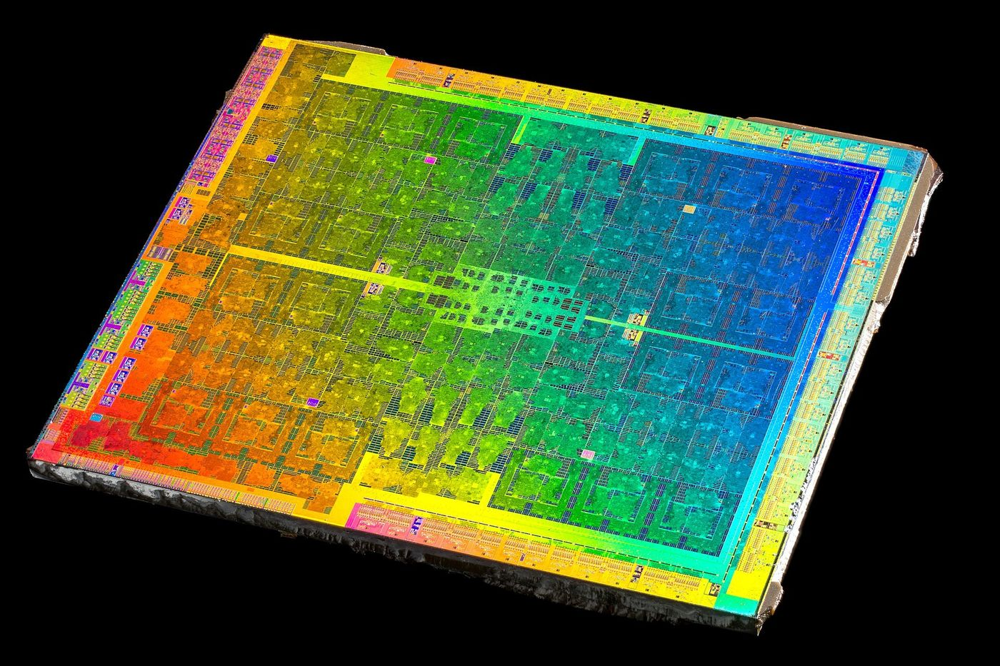
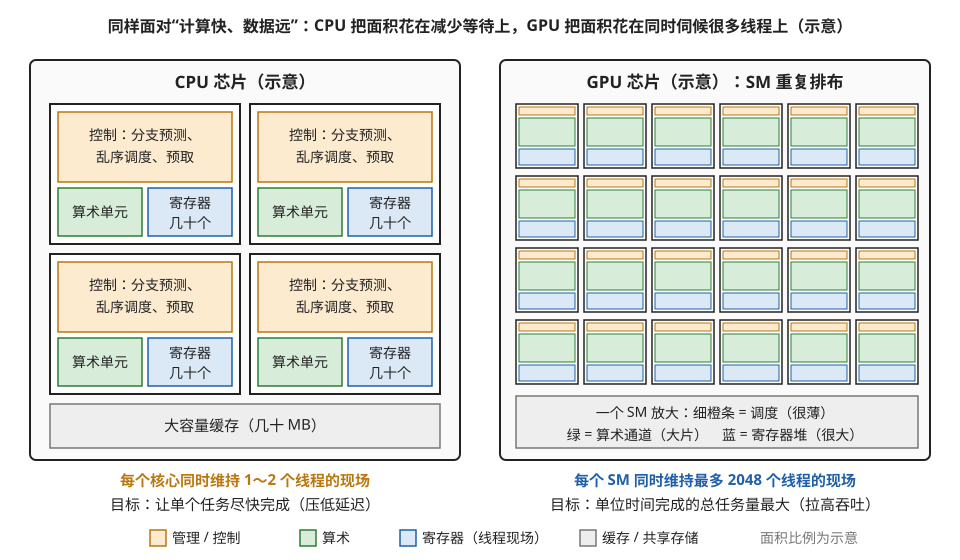
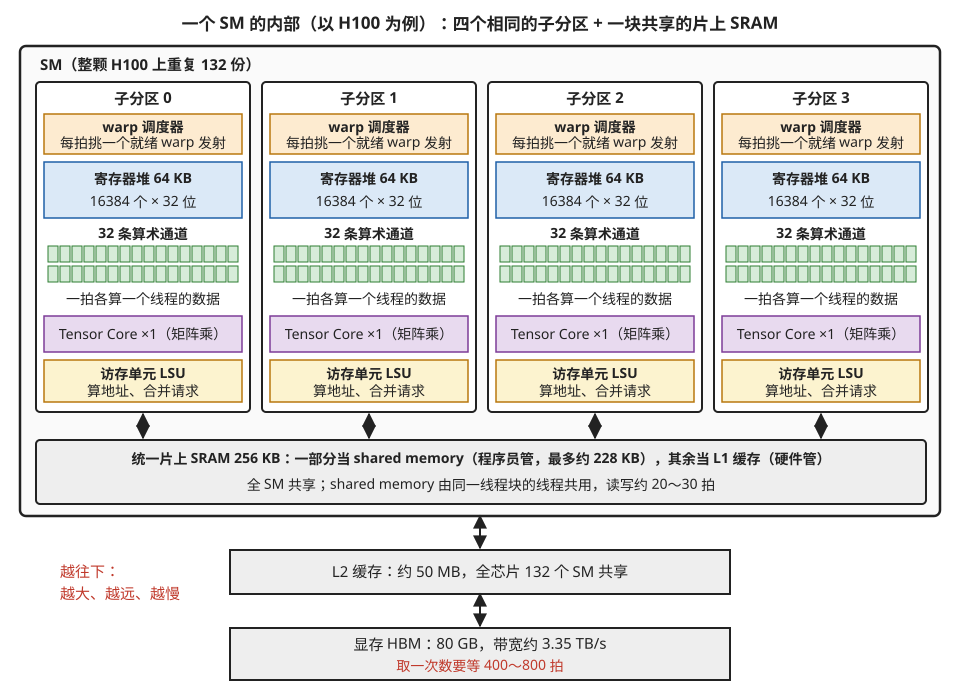
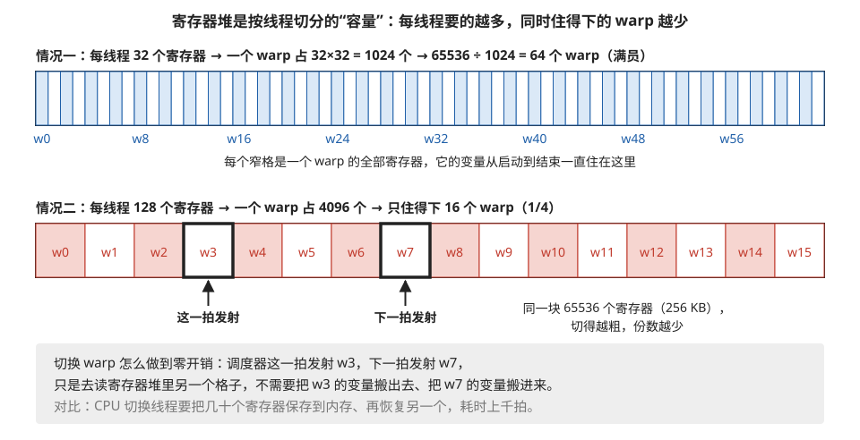
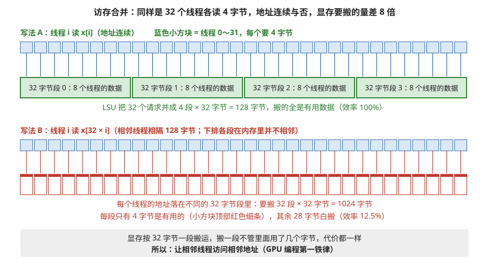
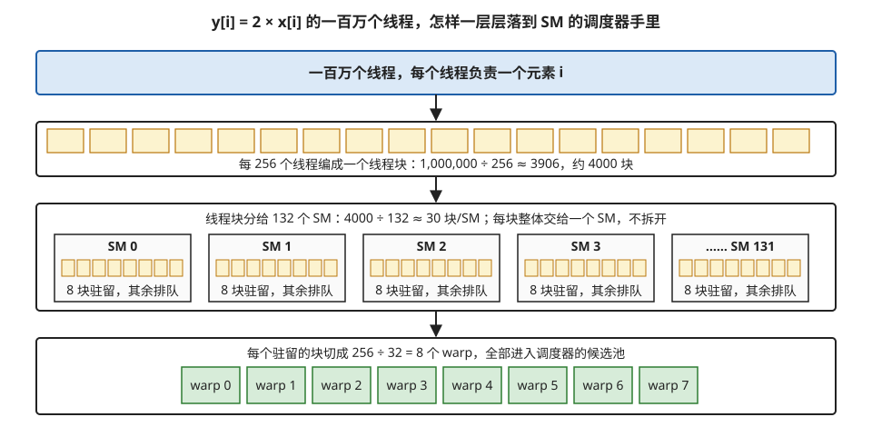

# SM 的内部结构：为什么 GPU 长成这样

> **所属模块**：模块 10 · SIMT 核的物理实现
> **状态**：🟨 学习中（第四版：按《写作规范》全文重写。知识截至 2026-08）
> **本节主旨**：SM 是 GPU 的基本计算单元。这一节不满足于罗列"SM 里有哪些部件"，而是从一个根本问题出发——**计算单元算得飞快，但数据存在很远的显存里，取一次要等几百个时钟周期**——把每个部件推导出来：为什么寄存器堆大得反常、为什么要把线程 32 个一捆、为什么有一块程序员自己管理的快速存储。读完这一节，SM 的结构图对你来说就不是需要背的清单，而是一道题的答案。

---

## 0. 这一节要回答的问题

- GPU 设计上要解决的根本矛盾是什么？CPU 面对同一个矛盾为什么选了另一条路？
- 一个 SM 内部有哪些部件？每个部件分别是那个根本矛盾的哪一部分答案？
- 为什么 GPU 的寄存器堆比缓存还大？为什么线程要 32 个编成一组执行？
- 一个最简单的程序（把数组里每个数乘以 2）在 SM 里从头到尾是怎么执行的？
- 作为写软件的人，从哪些工具和参数能"摸到"这些硬件部件？

---

## 1. 基础词汇：先把本节要用的词讲清楚

**SM（Streaming Multiprocessor，流式多处理器）**。GPU 芯片上重复排布的基本计算单元。一块 H100 芯片上有 132 个 SM，每个 SM 都是一台功能完整的"小计算机"：有自己的调度器、算术单元、寄存器和一块快速存储。你的程序最终就是被切成很多份，摊到这些 SM 上并行执行的。AMD GPU 上对应的单元叫 CU（Compute Unit），概念相同。"重复排布"在实物上是什么样子，见图 1-1。



> **图 1-1**　一句话：这是一颗真实 GPU 芯片（NVIDIA GP104，2016 年 GeForce GTX 1070 等显卡所用）去掉封装后的照片，芯片的大部分面积由同一种小块反复排列而成。
>
> **先知道一件事**：芯片是一块指甲盖大小的硅片，电路一层层做在它的表面上。这颗约 314 平方毫米，比 H100 的约 814 平方毫米小得多。照片是斜着拍的，所以轮廓呈平行四边形；满屏的彩虹色来自表面透明薄膜对光的干涉，和电路的功能无关。
>
> **按这个顺序看**：
> 1. 先看中间的大片区域：一条从左到右的亮线把它分成上下两半，每一半里都是许多外观相同的方形小块，一行行整齐排列。这些重复的小块就是计算单元及其配套电路。按 NVIDIA 公布的规格，这颗芯片有 20 个 SM，分成 4 组。
> 2. 再看四周边缘一圈细密、形状各不相同的电路：那是芯片与外界通信的接口，例如连接显存的电路、连接主机的电路。它们各只有一份，不重复。
> 3. 对比中间和四周：重复的部分占了芯片的大头。
>
> **看懂的标志**：能回答"同一代 GPU 的高端型号和低端型号，主要差在哪里"——差在复制的份数，也就是 SM 的数量。设计好一个 SM，按需要复制若干份，再配上外围接口，就是一颗 GPU。GTX 1070 用的正是这颗芯片，但出厂时只启用了其中 15 个 SM。
>
> **与正文的对照**：正文以 H100 为例（132 个 SM），本图是更早一代的较小芯片。照片本身没有标出每个 SM 的边界，本库也不在照片上逐块标注；它的用处是让你看到"重复排布"在实物上的样子。
>
> 来源：[NVIDIA@16nm@Pascal@GP104@GeForce GTX 1070@A TAIWAN 1617A1 PA3R12.00P GP104-200-A1 Stack-DSC02663-DSC02734 - ZS-retouched (29738735845).jpg](https://commons.wikimedia.org/wiki/File:NVIDIA@16nm@Pascal@GP104@GeForce_GTX_1070@A_TAIWAN_1617A1_PA3R12.00P_GP104-200-A1_Stack-DSC02663-DSC02734_-_ZS-retouched_(29738735845).jpg)，作者 Fritzchens Fritz from Berlin，许可 CC0（本库缩小到 1400 像素宽）。

**时钟周期（cycle）**。芯片内部所有动作的节拍单位。GPU 的时钟频率约 1~2 GHz，也就是每秒 10~20 亿拍。后文说"延迟 400 个周期"，在 1.5 GHz 下大约是 270 纳秒——单看很短，但相对于"一拍就能完成一次乘加"的算术单元来说，这是漫长的等待。

**显存（HBM）**。GPU 的主内存，容量几十 GB，焊在 GPU 芯片旁边。HBM 是"高带宽内存"（High Bandwidth Memory）的缩写。它有两个关键指标要分清：**带宽**指每秒总共能搬运多少数据（H100 约 3.35 TB/s，很高）；**延迟**指发出一次读取请求到数据返回要等多久（约 400~800 个时钟周期，很长）。带宽像高速公路的车道数，延迟像走完全程的时间——车道再多，单程时间也短不了。

**寄存器（register）**。离算术单元最近的存储，读写不需要任何等待。每个线程的局部变量（循环变量、中间结果、指针）都放在自己的寄存器里。

**线程（thread）与线程块（thread block）**。GPU 程序的基本组织方式：你告诉 GPU"我要启动一百万个线程，每个线程执行同一段代码、处理不同的数据"。线程被分组为线程块（通常每块 128~1024 个线程），**每个线程块会被整体分配到某一个 SM 上执行**，不会跨 SM 拆开。

## 2. 根本问题：计算很快，数据很远

先看两个数字，它们的悬殊程度决定了 GPU 的一切设计。

第一个数字：H100 的算术单元每秒能做约 **10¹⁴ 次**浮点乘加。折算下来，做一次乘加的成本可以忽略不计——**算术几乎是免费的**。

第二个数字：从显存取一个数，要等 **400~800 个时钟周期**。而算术单元一个周期就能完成一次乘加。也就是说，**取一次数的时间，够做几百次计算**。

把这两个数字放在一起，问题就出来了。设想最朴素的执行方式：读一个数（等 400 拍）→ 算一下（1 拍）→ 读下一个数（再等 400 拍）→ 再算一下……算术单元 99% 以上的时间在干等。你花大价钱买的算力，几乎全在闲置。

用一个类比帮助记忆（机制上面已经讲清，这个类比只负责好记）：车间里的工人手速极快，拧一颗螺丝只要一秒，但零件仓库在几百米外，取一趟零件要走十分钟。**如果一次只做一个订单，工人绝大部分时间在等零件。** 这堵墙有个正式的名字，叫**内存墙（memory wall）**。GPU 上的每一个部件，都是为翻过这堵墙服务的。

## 3. 翻墙的两条路：CPU 和 GPU 在这里分岔

面对"工人快、仓库远"，只有两种思路，CPU 和 GPU 各选了一条。

**CPU 的思路：想办法让等待本身变少。** 具体手段有三样。第一，在车间旁边建储物柜（**缓存，cache**）：把最近用过、可能还要用的零件囤在手边，下次不用跑仓库。第二，提前预判（**预取**）：猜到接下来要用什么，提前派人去取。第三，见缝插针（**乱序执行**）：手头这一步卡住了，就在同一个订单里找几步不相干的活先干着。这三样都很有效，但共同的代价是：需要一大套复杂的管理电路（分支预测器、乱序调度器等等），**CPU 芯片面积的大头花在了"管理"上，而不是"计算"上**。这条路优化的目标是：让单个任务尽快完成——也就是压低**延迟**。

**GPU 的思路：不减少等待，而是让等待期间总有别的活干。** GPU 不试图让任何一个线程快起来。它同时接下几万个线程，某个线程发出取数请求后要等 400 拍？没关系，这 400 拍里执行单元去服务其它线程。等轮回到这个线程时，它的数据早就到了。**每个线程该等还是等了 400 拍，但执行单元从头到尾没有闲着。** 这条路优化的目标是：单位时间完成的总任务量——也就是拉高**吞吐**。

一个数字对比可以说明分岔的彻底程度：CPU 一个核心通常同时维持 1~2 个线程的执行现场，而一个 SM 要同时维持**多达 2048 个线程**的现场。为什么恰好需要这么多？上一段说了要"总有别的活干"，具体要备多少活才够，下一节（02 warp 与占用率）会用数字算清楚。本节先回答另一个问题：要同时伺候两千个线程，**硬件得长成什么样**？这就是 SM 每个部件的由来。图 1-2 先从芯片面积的去向上把两条路对比一下。



> **图 1-2**　一句话：面对同一个"计算快、数据远"的问题，CPU 把芯片面积大量花在让单个线程少等的控制电路和缓存上，GPU 把面积花在大量算术单元和能同时存下几千个线程现场的寄存器上。
>
> **先知道一件事**：芯片面积是一笔固定预算，一块地盖了控制电路，就不能再盖算术单元。所以看"面积花在了哪"，就能看出设计者在优化什么。图中各块的面积比例是示意，不是按实物量出来的。
>
> **按这个顺序看**：
> 1. 左边 CPU：4 个大核心。每个核心里最大的橙色块是控制电路：分支预测（猜 if 会走哪边，提前准备）、乱序调度（当前指令卡住时，先做后面不相干的指令）、预取（猜下一步要哪些数据，提前去取）。绿色的算术单元只占一小块，蓝色寄存器只有几十个。底部灰色是几十 MB 的缓存，把最近用过的数据留在手边。
> 2. 右边 GPU：24 个一模一样的小方块，每个是一个 SM。按图下方灰框的说明看其中一个：顶部细细一条橙色是调度电路，中间大片绿色是算术通道，底部蓝色是寄存器堆。
> 3. 看两边底部的粗体字。"线程的现场"指一个线程的全部局部变量加上它执行到了哪一步。CPU 每个核心同时只存 1～2 个线程的现场；GPU 每个 SM 同时存最多 2048 个。
>
> **打个比方**：CPU 像一位配了助理和储物柜的大厨，助理帮他预判、囤料，让手上这道菜尽快出锅；GPU 像一个有几千个工位的大车间，不给任何工位配助理，而是让工人在某个订单等料时马上转去做别的订单。
>
> **看懂的标志**：能回答"GPU 为什么不像 CPU 那样花大力气减少等待"——它不需要。只要手上同时有足够多的线程，某个线程等 400 拍的时候，算术单元就去服务别的线程，并没有闲着；省下的控制电路面积全部换成了算术单元和寄存器。
>
> **与正文的对照**：对应本节"CPU 的思路""GPU 的思路"两段和"1~2 个对 2048 个"的数字对比。GPU 同样有缓存（例如 H100 的 L2 约 50 MB，见图 1-3），这里为突出 SM 的构成而省略。
>
> 来源：本库自绘。

## 4. SM 内部游览：每个部件都是上面那道题的一部分答案

先上结构图，然后逐个部件讲"它是什么、为什么必须有它"。

```
┌─────────────────────────── 一个 SM ────────────────────────────┐
│  ┌── 子分区 0 ──────┐  ┌ 子分区 1 ┐ ┌ 子分区 2 ┐ ┌ 子分区 3 ┐ │
│  │ warp 调度器       │  │  同左    │ │  同左    │ │  同左    │ │
│  │ 寄存器堆 (16K个)  │  │          │ │          │ │          │ │
│  │ 32 条算术通道     │  │          │ │          │ │          │ │
│  │ Tensor Core ×1    │  │          │ │          │ │          │ │
│  │ 访存单元 (LSU)    │  │          │ │          │ │          │ │
│  └───────────────────┘  └──────────┘ └──────────┘ └──────────┘ │
│  ┌─── 统一 SRAM：shared memory / L1（全 SM 共享，256 KB）───┐ │
│  └─────────────────────────────────────────────────────────────┘ │
└───────────────────────────────┬──────────────────────────────────┘
                                ▼
                 L2 缓存（全芯片共享，~50 MB）
                                ▼
                        显存 HBM（80 GB）
```

一个 SM 分成 4 个**子分区（sub-partition）**，每个子分区是一套能独立发射指令的完整流水线。图 1-3 把上面的文字框图画成了带数字的结构图。下面按"从指令到数据"的顺序逐个介绍。



> **图 1-3**　一句话：一个 SM 由四个完全相同的子分区和一块四者共用的片上存储组成，每个子分区自己就能挑指令、存变量、做计算、发读写请求。
>
> **先知道一件事**：warp 是硬件把 32 个线程编成的执行组，硬件每次给一个 warp 发一条指令，32 个线程同时执行它。子分区里的部件都是按"一次服务一个 warp 的 32 个线程"来配的。
>
> **按这个顺序看**：
> 1. 每个子分区顶上的橙色"warp 调度器"：每个时钟周期（一拍）从分给它的 warp 里挑一个数据已经就绪的，发射它的下一条指令。
> 2. 蓝色"寄存器堆 64 KB"：16384 个 32 位寄存器，存放这个子分区里所有驻留线程的局部变量。四个子分区合计 65536 个、256 KB。
> 3. 绿色的 32 个小格：32 条算术通道，与 warp 的 32 个线程一一对应。一条指令发出后，同一拍里每条通道各处理一个线程的数据。四个子分区共 128 条，这就是规格表上"每 SM 128 个 CUDA core"的来历。
> 4. 紫色"Tensor Core"：专做小块矩阵乘法的单元，一条指令完成一小块矩阵的乘加。
> 5. 黄色"访存单元 LSU"：替 32 个线程算出各自要读写的地址，把能合并的请求合并后再发出去。
> 6. 灰色长条"统一片上 SRAM 256 KB"：SRAM 是做在芯片上、读写很快的存储。它由四个子分区共用，一部分由程序员自己决定放什么（shared memory），其余由硬件自动当缓存用（L1）。
> 7. 最下面两层是 SM 之外的存储：L2 缓存由全芯片 132 个 SM 共享，显存 HBM 在芯片旁边。越往下容量越大、离得越远、越慢，从显存取一次数要 400～800 拍。
>
> **看懂的标志**：能回答"为什么每个子分区的算术通道是 32 条"——因为 warp 是 32 个线程，调度器每发一条指令，正好喂满 32 条通道，一条都不空。
>
> **与正文的对照**：与上方文字框图一一对应，数值按 H100 SXM 版。实际的 H100 子分区里还有整数、双精度等其它通道，图中只画了正文讲的 32 条单精度浮点通道。
>
> 来源：本库自绘。

### 4.1 warp 调度器：轮换的指挥者

第 3 节说 GPU 靠"等待期间干别的活"翻墙，那就需要有人来指挥"现在该干谁的活"。这就是 warp 调度器的工作，每个子分区配一个。

这里先要引入 **warp** 这个概念（下一节会深入，这里只需要基本认识）：硬件把 32 个线程编成一组，叫一个 warp，**调度以 warp 为单位**——调度器每个时钟周期挑一个"数据已就绪"的 warp，发射它的下一条指令。某个 warp 在等显存数据？跳过它，发射别的。这个"每拍挑一个就绪者"的循环，就是第 3 节那套"轮换"思路的具体执行者。

**为什么 32 个线程要捆成一组，而不是逐个调度？** 因为逐个调度太贵。给每个线程配一套完整的"取指令、译码、调度"电路，两千个线程就要两千套，管理开销会把芯片吃光——那就重蹈了 CPU 的覆辙。捆成 32 个一组后，**一次取指、一次译码、一次调度决策，服务 32 个线程**，管理成本摊薄到 1/32。代价是这 32 个线程必须步调一致地执行同一条指令（术语叫"锁步"），一旦它们在 if/else 处想走不同的路，就会出麻烦——这是第 3 节《分支发散》的主题。

### 4.2 算术通道：32 条并排的"工人"

每个子分区有 **32 条并排的浮点算术通道（lane）**，这个数字与 warp 的 32 个线程严格对齐：调度器发射一条指令，32 条通道同一拍各自处理一个线程的数据。一个 SM 四个子分区共 128 条通道，这就是规格表上"每 SM 128 个 CUDA core"的物理含义。

最常用的指令是 **FMA（fused multiply-add，乘加融合）**：一条指令完成 `a×b+c`。矩阵乘法和卷积在底层就是海量的乘加，所以 FMA 通道的数量直接决定常规算力。

### 4.3 寄存器堆：为什么它大得反常

这是 SM 里最反直觉的部件。每个 SM 的寄存器堆有 **65536 个 32 位寄存器，合计 256 KB**——和旁边那块 shared memory/L1 的统一 SRAM 一样大。在 CPU 的世界里这不可思议：CPU 每个核心的寄存器只有几十个。为什么差了三个数量级？

原因回到第 3 节：GPU 要在 warp 之间**快速轮换**。轮换要快，就绝不能有"保存现场、恢复现场"的开销（CPU 切换线程时要做的事，耗时上千周期）。GPU 的解法是：**所有驻留线程的现场，永久放在寄存器堆里，谁也不挪窝**。调度器切换 warp 时，只是换一个索引去读寄存器堆的另一片区域——零开销。

代价就是寄存器堆必须大到能同时装下全部 2048 个线程的现场：2048 个线程 × 平均每线程几十个寄存器，正好是几万个寄存器的量级。所以要记住一个关键区别：**CPU 的寄存器是"快"的代名词，GPU 的寄存器堆本质上是"容量"资源**——它的大小直接决定能同时驻留多少线程，而驻留数量又决定掩盖延迟的能力（下一节 occupancy 的核心）。

**例子：算一笔账。** 假设你的程序每个线程用 32 个寄存器，那么 65536 ÷ 32 = 2048 个线程可以同时驻留——满员。如果程序复杂一点，每个线程用 128 个寄存器，就只有 512 个线程能驻留——掉到 1/4。**你多用一个局部变量，可能就少驻留一批线程**，这个连锁反应贯穿整个模块 10。图 1-4 把这笔账画了出来。



> **图 1-4**　一句话：寄存器堆的总量是固定的 65536 个，每个线程要用多少个，决定了它被切成多少份，也就决定了同时能住下多少个 warp。
>
> **先知道一件事**：寄存器是离算术单元最近、读写不用等的存储，一个线程的局部变量（循环变量、中间结果、指针）都放在自己的寄存器里。GPU 切换线程时不把这些变量搬走，所以每个驻留的线程都要在寄存器堆里一直占着自己那一份。
>
> **按这个顺序看**：
> 1. 上面的蓝色长条：每个线程用 32 个寄存器，一个 warp 的 32 个线程合计 1024 个。65536 ÷ 1024 = 64，长条被切成 64 个窄格（w0、w8……每隔 8 格标一次），正好是一个 SM 最多能驻留的 64 个 warp，满员。
> 2. 下面的红色长条：每个线程用 128 个寄存器，一个 warp 占 4096 个，只切得出 16 格，同时只能住 16 个 warp，是上面的四分之一。
> 3. 红色长条里加粗的两个黑框：调度器这一拍发射 w3，下一拍发射 w7，只是换一个格子去读，两个 warp 的变量都原地不动。这就是 warp 切换没有开销的原因。
> 4. 灰框最后一行是对照：CPU 切换线程时，要把当前线程的寄存器存进内存，再把另一个线程的读回来，要花上千拍。
>
> **看懂的标志**：能回答"为什么说 GPU 的寄存器堆是容量资源"——它的大小不决定算得多快，而决定能同时住下多少线程。每个线程多用一个局部变量就多占一格，驻留的 warp 可能因此变少，掩盖等待的能力随之下降。
>
> **与正文的对照**：数字与本小节的算例一致（2048 个线程即 64 个 warp，512 个线程即 16 个 warp）。实际硬件中寄存器堆分在四个子分区里（每个 16384 个，见图 1-3），每个 warp 住在其中一个子分区；这里把四份拼成一条来画，份数的算法不变。
>
> 来源：本库自绘。

### 4.4 访存单元（LSU）：地址计算与合并

> 📍 一条 load 从发射到数据回到寄存器的完整路径、各段延迟和等待机制，见[模块 14 第 1 节](../14-数据搬运/01-为什么要搬·线程自己搬与记分牌.md) §3、§4。

LSU（Load/Store Unit）负责所有读写显存和 shared memory 的操作：计算每个线程要访问的地址、发出请求、接收返回的数据。

它有一项特别重要的本领叫**访存合并（coalescing）**。一个 warp 的 32 个线程同一拍各自给出一个地址，如果这 32 个地址恰好连成一片（线程 0 读第 0 号元素、线程 1 读第 1 号……），LSU 就把它们**合并成一两次大宗搬运**，而不是 32 次零散搬运。显存喜欢大宗搬运（它按 32 字节一段的粒度工作），合并与否可以让实际带宽差出几倍到几十倍。"让相邻线程访问相邻地址"因此成为 GPU 编程第一铁律——具体机制在第 4 节《访存通路》展开。图 1-5 用一个数字例子对比了合并与不合并。



> **图 1-5**　一句话：一个 warp 的 32 个线程同时读数时，地址连在一起，显存只需搬 128 字节；地址彼此隔得远，就要搬 1024 字节，其中八分之七是白搬。
>
> **先知道一件事**：显存不是"要几个字节就给几个字节"，它每次最少搬一段 32 字节（这一段叫一个 sector，扇区）。你只要其中 4 个字节，也得把整段搬过来。
>
> **按这个顺序看**：
> 1. 上半"写法 A"：32 个蓝色小方块是 warp 里的线程 0～31，每个线程读一个 4 字节的数，线程 i 读 x[i]。每条竖线指向它要的数落在哪一段。
> 2. 32 个数首尾相接，一共 128 字节，正好落在 4 个 32 字节段里，每段装着 8 个线程要的数。LSU（访存单元）把 32 个请求合并成一次 128 字节的请求，搬来的每个字节都有用。
> 3. 下半"写法 B"：线程 i 读 x[32 × i]，相邻两个线程要的数相隔 32 个元素，也就是 128 字节，所以每个线程的数各自落在一个不同的 32 字节段里。
> 4. 于是要搬 32 段、共 1024 字节。每段顶上的红色细条是真正要用的 4 字节，下面的白色部分是跟着被搬来却用不上的 28 字节。有用的数据同样是 128 字节，搬运量却是写法 A 的 8 倍。
>
> **打个比方**：去仓库取 32 件货，仓库只按整箱发货，一箱装 8 件。32 件都在相邻的 4 箱里，搬 4 箱就够；32 件分散在 32 个箱子里，就得搬 32 箱，每箱只拿走一件。
>
> **看懂的标志**：能回答"相邻线程为什么要访问相邻地址"——显存按 32 字节一段搬运，相邻线程读相邻地址时，一段能同时满足 8 个线程；地址分散时每个线程独占一段，带宽大部分花在搬没用的字节上。
>
> **与正文的对照**：对应本小节"合并与否可以让实际带宽差出几倍到几十倍"：本例差 8 倍，读的数据越小、跨得越开，差得越多。写法 B 是一种典型的"跨步访问"，更多情形在本模块第 4 节《访存通路》展开。
>
> 来源：本库自绘。

### 4.5 shared memory / L1：一块可以自己管理的快速存储

每个 SM 有一块 **256 KB 的片上快速 SRAM**，物理上是同一块存储，运行时按配置切分成两种用法（其中可划给 shared memory 的上限约 228 KB，剩下的必须留给 L1）：一部分当 **L1 缓存**（硬件自动管理，和 CPU 的缓存一样）；一部分当 **shared memory**（**程序员显式管理**：你自己写代码决定把什么数据搬进来、什么时候丢掉）。

为什么要提供"手动挡"？因为硬件缓存靠通用的启发式规则猜"什么数据该留下"，而你——写这个程序的人——**确切知道**自己的数据会被复用多少次。把控制权交给你，就能做到硬件猜不出来的精准复用。shared memory 由同一线程块内的所有线程共享，所以它同时也是线程之间交换数据的场所。

要注意它的适用条件：**只有数据会被复用时，shared memory 才有价值**。每个数据只用一次的程序（比如下面第 5 节的例子），搬进来再用毫无意义，直接从显存读到寄存器就好。

### 4.6 Tensor Core：专管矩阵乘法的"车间中的车间"

每个子分区还有一个 Tensor Core——一个专门做"小块矩阵乘加"的独立引擎，一条指令完成一小块矩阵的乘法和累加，吞吐是普通算术通道做同样计算的十倍以上。深度学习负载的大头（矩阵乘、卷积、注意力）都靠它。它的内部结构和使用方式足够复杂，专门放在模块 12 讲。本节记住两点即可：它在子分区里、与算术通道并列；**只有矩阵乘类的计算能用上它**，普通的逐元素运算与它无关。

## 5. 完整走一遍：`y[i] = 2 * x[i]` 的一生

现在把所有部件串起来。程序：数组有一百万个元素，每个元素乘以 2 写回。按惯例每个元素分配一个线程。

1. **分派**。一百万个线程被组织成约 4000 个线程块（每块 256 线程），线程块被分发到 132 个 SM 上。每个 SM 分到约 30 个块，先驻留放得下的那些（受寄存器等资源限制，见 4.3 的账），其余排队。每个驻留的线程块被切成 8 个 warp，加入调度器的候选池。这一步的层层拆分见图 1-6。



> **图 1-6**　一句话：一百万个线程先按 256 个一组编成线程块，线程块再分给 132 个 SM，每个 SM 把自己驻留的块切成 warp，交给调度器去挑。
>
> **先知道一件事**：线程块是程序员指定的一组线程，硬件保证同一块的所有线程在同一个 SM 上执行，这样它们才能共用那个 SM 上的 shared memory。warp 则是硬件自己按 32 个线程切出来的，程序员不指定。
>
> **按这个顺序看**：
> 1. 顶层：程序要处理一百万个元素，于是启动一百万个线程，每个线程负责一个下标 i。
> 2. 第二层：每 256 个线程编成一个线程块（黄色小方块），1,000,000 ÷ 256 ≈ 3906，约 4000 块。
> 3. 第三层：约 4000 块分给 132 个 SM，平均每个 SM 约 30 块。但一个 SM 同时最多驻留 2048 个线程，也就是 8 个 256 线程的块（前提是寄存器等资源也够，见图 1-4）；其余的块排队，等前面的块做完腾出位置再上。
> 4. 底层：每个驻留的块切成 256 ÷ 32 = 8 个 warp。一个 SM 上 8 块 × 8 个 = 64 个 warp，分到四个子分区的调度器手里，调度器每拍从中挑一个就绪的发射。
>
> **看懂的标志**：能回答"一个 SM 在同一时刻手上最多有几个 warp 可挑"——64 个（8 块 × 8 个 warp），这正是一个 SM 驻留 warp 的上限；如果每个线程用的寄存器超过 32 个，能驻留的块会更少。
>
> **与正文的对照**：对应本节走查的第 1 步"分派"。图中"8 块驻留"以每线程不超过 32 个寄存器为前提。
>
> 来源：本库自绘。
2. **取数**。调度器挑中 warp A，发射它的读取指令。LSU 收集 A 的 32 个线程给出的地址——它们恰好连续（线程 i 读 `x[i]`），合并成一两次大宗读取，发往显存。
3. **轮换**。A 的数据要几百拍才回来，A 暂时不就绪。调度器毫不停顿，下一拍发射 warp B 的读取，再下一拍 C 的……几十个 warp 的读取请求陆续在途。这正是第 3 节"等待期间总有活干"的现场，也是上一段寄存器堆存在的意义——几十个 warp 的现场全在寄存器堆里躺着，随叫随到。
4. **计算**。A 的数据回来了，A 重新就绪。调度器发射 A 的乘法指令：32 条算术通道同一拍各算一个 `2 × x[i]`，结果写进各自的寄存器。一拍完事。
5. **写回**。调度器发射 A 的写入指令，LSU 再次合并 32 个连续地址，大宗写回显存。warp A 的任务结束，腾出的资源让排队的线程块顶上。

盘点一下这个程序用到了什么、没用到什么：**用到了**调度器、寄存器、算术通道、LSU（而且合并是满效率的）；**没用到** shared memory（每个数只碰一次，没有复用）和 Tensor Core（没有矩阵乘）。再看时间构成：每个 warp 真正"算"只花 1 拍，等数据却要几百拍——**这个程序的速度完全由显存带宽决定，算力毫无用武之地**。这类程序称为"访存受限"（memory-bound），它不是写得不好，而是这个计算的天性如此：每搬一个数只做一次运算，运算再快也没用。什么样的程序能摆脱这个天性？答案是**数据能被复用**的程序（矩阵乘里一个数会参与上百次计算）——这条线索贯穿后面所有章节。

## 6. 开发者视角：从软件侧摸到这些部件

硬件部件不能直接"看"，但每个部件都在工具链里留有痕迹。感知渠道有三类：**源码里的旋钮**（你能主动设置的参数）、**编译器的报告**（编译时打印的资源账单）、**性能分析器的读数**（运行时的测量）。逐部件对应如下：

| 部件 | 源码旋钮 | 编译器报告 | 性能分析器（Nsight Compute）读数 |
| --- | --- | --- | --- |
| 调度器/轮换 | 线程块大小 | — | 占用率、每周期就绪 warp 数、停顿原因分解 |
| 算术通道 | 算法本身 | — | 算术吞吐利用率 |
| 寄存器堆 | `-maxrregcount` 等限制选项 | `-Xptxas -v` 打印每线程寄存器数与溢出量 | 每线程寄存器数 |
| LSU/合并 | 数据访问的索引模式 | — | 访存效率（每次请求的实际搬运段数） |
| shared/L1 | `__shared__` 声明 | 静态 shared 用量 | 冲突计数、命中率 |
| Tensor Core | 用矩阵库或 `tl.dot`，而非手写循环 | 机器码中是否出现矩阵指令 | Tensor 管道活跃度（为 0 = 没用上） |

一个值得记住的事实：**这些部件大多不是你"编程"的对象，而是你"被动感知"的对象**——你不能写一行代码指挥调度器怎么轮换，只能从性能读数里反推它轮换得顺不顺。所以学硬件结构的实用价值，一大半在于**看懂性能分析器在说什么**。

站得越高，能摸到的越少：用 PyTorch 时以上大部分细节被库封装（你的感知手段是 `torch.profiler` 和显卡利用率）；写 Triton 时能碰到线程块大小、shared memory 用量这一层；写 CUDA C 才能碰到全部旋钮。**日常工作在哪一层，就练熟哪一层的感知手段。**

## 7. 最新架构落点（知识截至 2026-08）

以上结构是各代 NVIDIA GPU 共同的骨架。近年的演化方向值得记四条：

1. **搬运工作在被"外包"给专用引擎**。Hopper（H100，2022）加入了 TMA——一个独立的搬运引擎，接一张"订单"就能整块搬运数据，把 4.4 节里"32 个线程各算地址"的工作整个接管。这减轻了普通线程的负担，也让"计算"和"搬运"更容易并行（下一节 6 会展开）。
2. **矩阵计算在获得自己的专属存储**。Blackwell（B200，2024–25）给 Tensor Core 配了一块专用片上存储 TMEM，让矩阵累加的中间结果不再挤占 4.3 节的寄存器堆——寄存器压力这个老矛盾被部分疏解。
3. **SM 之间开始直接协作**。Hopper 允许把几个线程块编成一"簇"（cluster），簇内的线程块可以直接读写彼此的 shared memory——4.5 节"仅块内共享"的规则被放宽了一级。
4. **协作从"共享数据"升级为"共做一条指令"**。Blackwell 更进一步：簇内配对的两个线程块可以**共同执行一条矩阵指令**（模块 12 第 1 节 §4.1 会展开），操作数在两个 SM 之间分片，搬运量减半。**到这一步，"SM 是一个独立的小计算机"这个本节开头的说法开始出现例外**——对矩阵计算而言，边界正在变成"一对 SM"。

**代际速查**（截至 2026-08，规格以官方资料为准）：

| 代际 | 每 SM 结构的变化 | 显存 |
| --- | --- | --- |
| Hopper（H100，2022） | TMA、线程块簇、warpgroup 级异步矩阵指令 | 80 GB HBM3，3.35 TB/s |
| Blackwell（B200，2024） | TMEM、`tcgen05` 指令族、单线程发起、2-CTA 配对 | 192 GB HBM3e，约 8 TB/s |
| Blackwell Ultra（B300，2025） | 同上，规模放大 | 288 GB HBM3e，8 TB/s |
| Rubin（VR200，2026 爬产） | 延续 Blackwell 路线 | 288 GB HBM4，约 20 TB/s |

跨厂商对照：AMD 的对应部件名是 CU（对应 SM）、wavefront（对应 warp，**64 线程**）、LDS（对应 shared memory）、Matrix Core（对应 Tensor Core）。名字全换、结构几乎一一对应；当前代际是 MI400 系列（CDNA5，2nm，432 GB HBM4）。

## 8. 术语卡

### SM（Streaming Multiprocessor）
**定义**：GPU 上重复排布的基本计算单元，内含调度器、寄存器堆、算术通道、Tensor Core、访存单元和一块 shared memory/L1。一块 H100 有 132 个 SM。
**为什么存在**：GPU 的扩展方式就是复制 SM——同代产品线里高端卡和低端卡的主要区别就是 SM 数量。理解了一个 SM，就理解了整块芯片。
**语境例句**："这个 kernel 一个线程块要用 100 KB shared memory，每个 SM 只驻留得下两个块。" —— 意思是：线程块申请的资源太多，限制了每个 SM 能同时容纳的工作量，可能影响延迟掩盖能力。

### warp
**定义**：硬件把编号连续的 32 个线程编成的执行组。调度、发射、访存都以 warp 为最小单位，一条指令同时作用于组内 32 个线程的数据。
**为什么存在**：让 32 个线程分摊一套取指、译码、调度电路，管理开销降到 1/32，省下的晶体管用来堆算术单元。这是 GPU 能效高于 CPU 的根源之一。
**语境例句**："block 设成 96 线程会浪费——不是 32 的整数倍。" —— 其实 96 恰好是 3 个 warp，不浪费；真正要避免的是 100 这类数字：会被凑成 4 个 warp（128 个执行槽位），最后一个 warp 只有 4 个线程干活、28 个陪跑。

### 寄存器堆（register file）
**定义**：每个 SM 内 65536 个 32 位寄存器组成的存储阵列（256 KB），永久保存所有驻留线程的局部变量和中间结果。
**为什么存在**：GPU 靠 warp 间快速轮换掩盖延迟，轮换必须零开销，因此所有线程的现场必须常驻在寄存器里、切换时只换索引不搬数据。它是"容量"资源而非"速度"资源——大小直接决定能驻留多少线程。
**语境例句**："这个 kernel 寄存器压力太大，占用率上不去。" —— 意思是：每线程用的寄存器太多，寄存器堆装不下太多线程，能同时驻留的 warp 变少，掩盖延迟的能力下降。

### LSU 与访存合并（coalescing）
**定义**：LSU 是执行读写操作的部件；访存合并是它把一个 warp 内 32 个线程的地址归并成尽量少的大宗搬运的机制。地址连续时合并效果最好。
**为什么存在**：显存按 32 字节一段的粒度工作，零散的小请求会浪费搬运能力。合并让"32 个线程各要 4 字节"变成"一次搬 128 字节"，带宽利用率可以差几十倍。
**语境例句**："把数据布局从结构体数组改成数组结构体，访存就合并了。" —— 意思是：调整内存排布让相邻线程访问的地址变得相邻，LSU 才能把请求归并成大宗搬运。

### shared memory
**定义**：每个 SM 上那块 256 KB 片上快速 SRAM 中，交给程序员显式管理的那部分（可配上限约 228 KB）。同一线程块内的线程共享它，读写延迟约 20~30 个周期（对比显存的几百周期）。
**为什么存在**：硬件缓存靠猜，程序员知道确切的复用模式。把会被反复使用的数据显式搬进来，每个数据只需从显存取一次。它只在**数据有复用**时有价值。
**语境例句**："这个算子把 K/V 的分块留在 shared memory 里反复用。" —— 意思是：利用数据复用避免反复访问显存，这正是 FlashAttention 这类高效算子快的核心原因。

### Tensor Core
**定义**：每个子分区里一个专做小块矩阵乘加的硬件引擎，一条指令完成一小块矩阵的乘法与累加，矩阵运算吞吐约为普通算术通道的一个数量级以上。
**为什么存在**：深度学习的计算量绝大部分是矩阵乘。为它做专用电路，同样的芯片面积能换来远高于通用通道的矩阵吞吐。
**语境例句**："profile 显示 Tensor 管道活跃度是零。" —— 意思是：程序没走到 Tensor Core 上（可能因为数据类型、矩阵尺寸不合要求，或代码没用矩阵指令），白白放弃了主要算力，需要排查。

## 9. 我的困惑 / 待深挖

- 各代架构（Ampere / Ada / Hopper / Blackwell）子分区内部的执行通道配比差多少？
- "调度器每拍挑一个就绪 warp"在双发射（一拍发两条）的架构上如何变化？
- 线程块分发器（把 block 分给 SM 的全局调度）的策略是什么？能观测吗？

---

*最后更新：2026-08-31（第五版：§7 补入第四条演化方向（2-CTA 配对：SM 边界对矩阵计算开始松动）与代际速查表；shared memory 容量口径改为"256 KB 统一 SRAM，shared 可配上限约 228 KB"。第四版：按写作规范重写）*（2026-09 补图 6 张：现成 1 张，自绘 5 张；图注按费曼法写）
