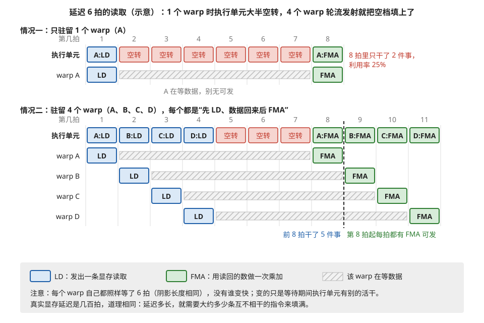
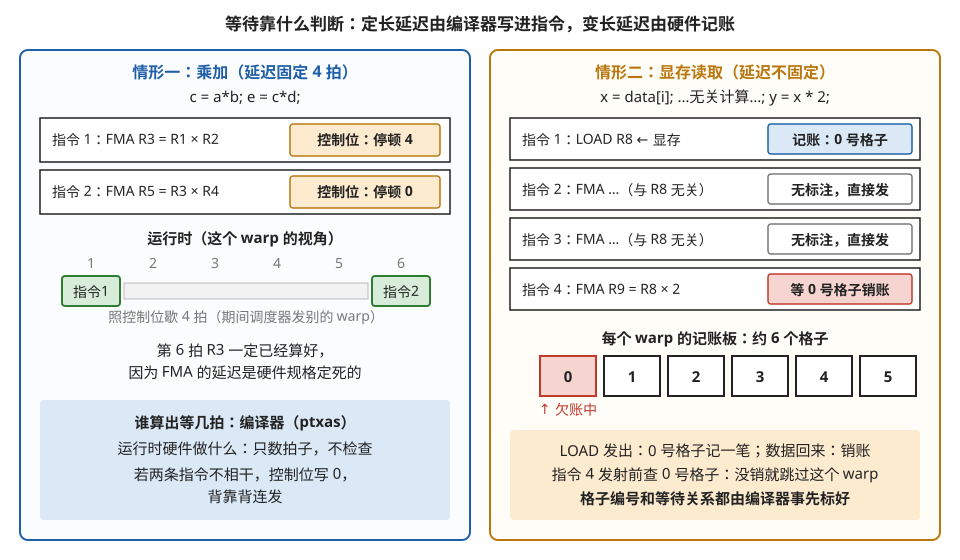
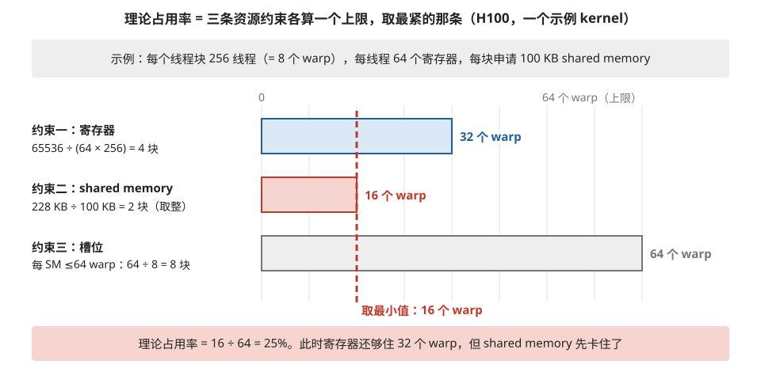
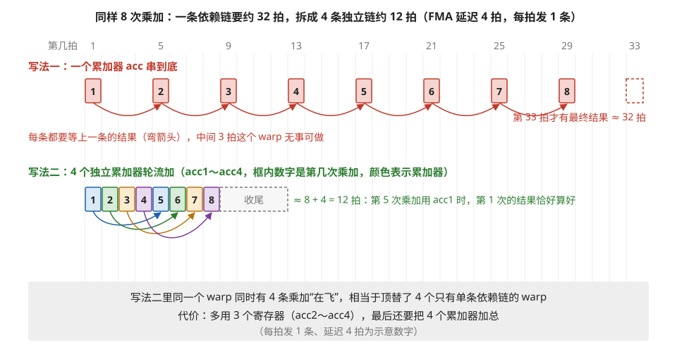
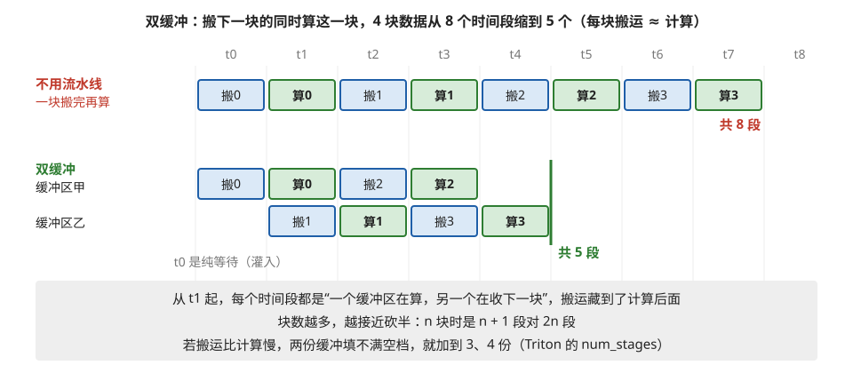

# warp 的执行方式与 occupancy（占用率）

> **所属模块**：模块 10 · SIMT 核的物理实现
> **状态**：🟨 学习中（第三版：按《写作规范》全文重写——每个术语就地解释、完整句子写作、可单节独立阅读。知识截至 2026-08）
> **本节主旨**：GPU 靠"同时驻留大量 warp、谁的数据先到就先执行谁"来掩盖等待时间。占用率（occupancy）衡量的是"驻留了多少 warp"，它是掩盖等待的**手段之一**，而不是目的。这一节先讲清楚硬件每个时钟周期具体在做什么，再讲占用率怎么计算，最后回答一个关键问题：**为什么占用率不是越高越好**。

---

## 0. 这一节要回答的问题

- 一条指令是怎么被"发射"和"执行"的？调度器每个时钟周期具体做什么决策？
- 硬件怎么知道一个 warp 的数据"已经准备好了"？（记分牌机制）
- occupancy 的精确定义是什么？它被哪些资源限制？怎么手算？
- 占用率是不是越高越好？如果不是，什么时候该追求高占用率、什么时候不该？
- 除了"驻留更多 warp"，还有哪些办法掩盖等待时间？

---

## 1. 基础词汇：先把本节要用的词讲清楚

下面这五个词会在本节反复出现。先集中解释一遍，正文中再遇到时可以回来查。

**warp（线程束）**。GPU 上的线程不是一个一个独立执行的。硬件把编号连续的 32 个线程编成一组，这一组就叫一个 warp。调度和执行都以 warp 为最小单位：硬件从来不会单独执行"第 5 号线程的下一条指令"，它执行的永远是"某个 warp 的下一条指令"——这一条指令会同时作用在该 warp 全部 32 个线程各自的数据上。这种"32 个线程共享一条指令流"的执行方式就是上一节提到的"锁步执行"。顺带说明：AMD GPU 上对应的概念叫 wavefront，一组通常是 64 个线程，机制相同。

**发射（issue）与延迟（latency）**。"发射一条指令"指的是调度器把这条指令送进执行单元、让它开始执行这个动作。发射之后，指令并不是立刻出结果的：从发射到结果可用，中间要经过若干个时钟周期，这段时间叫这条指令的**延迟**。两个数字要分开记：发射的节奏很快（每个周期可以发射一条），但延迟可能很长——一条浮点乘加指令的延迟大约是 4 到 6 个周期，而一条从显存读数据的指令，延迟可能是 400 到 800 个周期。**发射像是把活儿派出去，延迟是等活儿干完的时间。**

**就绪（eligible）**。一个 warp 的下一条指令，如果它需要的所有输入数据都已经算好了、不依赖任何还没完成的前序指令，那么这个 warp 就处于"就绪"状态，调度器可以发射它。反过来，如果它还在等一个没回来的数据（比如在等一条显存读取），它就是"未就绪"的，调度器会跳过它去看别的 warp。

**stall（停顿）**。如果在某个时钟周期，调度器手上**一个就绪的 warp 都没有**——所有驻留的 warp 都在等各自的数据——那么这个周期就什么也发射不了，执行单元白白空转一拍。这种空转叫 stall。性能优化的很大一部分工作，本质上就是想办法减少 stall。

**驻留（resident）与 occupancy（占用率）**。一个 warp 要能被调度，它的寄存器等资源必须已经分配在这个 SM 上，随时待命——这种状态叫"驻留"。一个 SM 能同时驻留的 warp 数量有硬件上限（近几代 NVIDIA GPU 是 64 个）。**实际驻留的 warp 数除以这个上限，就是 occupancy（占用率）**。注意：占用率衡量的是"住进来多少个 warp"，不是"计算跑得多快"——这个区别正是本节后半部分要展开的核心。

## 2. 调度器每个时钟周期在做什么

上一节讲过，每个 SM 内部分成 4 个子分区，每个子分区有一个自己的 warp 调度器。这个调度器的工作可以用一句话概括：

> **每个时钟周期，从自己管辖的所有驻留 warp 里，挑出一个"就绪"的，发射它的下一条指令。**

于是每个周期只会出现三种局面：

1. **有至少一个 warp 就绪**：调度器挑一个发射。这个周期没有浪费。如果同时有好几个 warp 就绪，调度器需要选一个，常见的策略叫 GTO（greedy-then-oldest）：优先继续发射刚才那个 warp 的指令（贪心），它卡住了再换成等待时间最久的那个（最老优先）。
2. **有驻留 warp，但全都在等数据**：这个周期就是一次 stall，执行单元空转。
3. **驻留的 warp 本身就很少**：就绪的概率自然更低，stall 更频繁。

现在可以把上一节"海量 warp 掩盖延迟"的说法讲得更具体了：假设 warp A 发射了一条显存读取，接下来的几百个周期它都不会就绪。如果调度器手里只有 A 这一个 warp，那这几百个周期全是 stall。但如果手里还有 B、C、D……调度器就可以在 A 等待期间发射它们的指令，等轮回到 A 时，它的数据早就回来了。**占用率的全部意义，就是让调度器"每个周期手里都有牌可出"。**

**例子：逐周期看一遍"掩盖"是怎么发生的。** 为了让时间线短一点，假设显存读取的延迟是 6 个周期（真实硬件是几百，原理相同）。每个 warp 的程序都一样：先读一个数（记作 LOAD），数据回来后做一次乘加（记作 FMA）。对比两种情况：

情况一，只驻留 1 个 warp（A）：

| 周期 | 1 | 2 | 3 | 4 | 5 | 6 | 7 | 8 |
| --- | --- | --- | --- | --- | --- | --- | --- | --- |
| 发射了谁 | A:LOAD | — | — | — | — | — | — | A:FMA |
| 状态 | 派活 | stall | stall | stall | stall | stall | stall | 数据回来了 |

8 个周期里干了 2 件事，6 个周期在空转，执行单元利用率 25%。

情况二，驻留 4 个 warp（A、B、C、D）：

| 周期 | 1 | 2 | 3 | 4 | 5 | 6 | 7 | 8 |
| --- | --- | --- | --- | --- | --- | --- | --- | --- |
| 发射了谁 | A:LOAD | B:LOAD | C:LOAD | D:LOAD | — | — | — | A:FMA |
| 状态 | 派活 | 派活 | 派活 | 派活 | stall | stall | stall | A 的数据回来了 |

同样 8 个周期干了 5 件事，而且从第 8 拍起 A、B、C、D 的数据会一个接一个回来，后面每拍都有 FMA 可发——stall 基本消失。**注意没有任何一个 warp 变快了**（A 的数据照样等了 6 拍才回来），变化的只是等待期间执行单元没有闲着。这就是"掩盖延迟"四个字的全部含义。也可以从这个例子直接看出需要多少 warp：延迟 6 拍、每个 warp 隔 6 拍才需要服务一次，所以 6 个左右的 warp 就能把每一拍都填满——这个"够用就好"的直觉，正是第 5 节的伏笔。图 2-1 把两张表画成了时间线，并把情况二延长到第 11 拍。



> **图 2-1**　一句话：只有一个 warp 时，执行单元在它等数据的那几拍里无事可做；有四个 warp 轮流发射，一个在等，别的就能顶上，空转的拍数大大减少。
>
> **先知道一件事**：横轴是时间，一格是一拍（一个时钟周期）。"发射"是调度器把一条指令送进执行单元；指令发出后要过一段时间（延迟）结果才能用。这里把显存读取的延迟设成 6 拍，真实硬件是几百拍，道理相同。
>
> **按这个顺序看**：
> 1. 情况一的"执行单元"一行：这是每一拍执行单元实际在做什么。第 1 拍发出 A 的读取（LD，蓝色），第 2～7 拍全是红色"空转"，第 8 拍才发出 A 的乘加（FMA，绿色）。
> 2. 情况一的"warp A"一行：灰色斜线阴影是 A 在等数据。等数据期间 A 发不出下一条指令，而 SM 里又没有别的 warp，所以执行单元只能空转。8 拍只干了 2 件事，利用率 25%。
> 3. 情况二：四个 warp 每个都是"先 LD、数据回来后 FMA"。第 1～4 拍，调度器依次发出 A、B、C、D 的读取；第 5～7 拍四个 warp 都在等，仍有 3 拍空转；从第 8 拍起，A、B、C、D 的数据依次回来，每一拍都有 FMA 可发。
> 4. 对比四行 warp 的阴影：每个都一样长，都是等了 6 拍。没有哪个 warp 变快了，变的只是它们的等待互相错开，执行单元不再闲着。
>
> **打个比方**：一位厨师同时照看四口锅，每口锅下料后都要焖一会儿。只有一口锅时，他焖的时候只能站着；有四口锅时，他给这口下完料就去下一口，等转回来，第一口正好焖好。
>
> **看懂的标志**：能回答"延迟 6 拍时，大约要几个 warp 才能把每一拍都填满"——6 个左右。每个 warp 发出读取后要隔 6 拍才需要再服务一次，手上有 6 个 warp 轮流，每一拍就都有一个可发。情况二只有 4 个，所以第 5～7 拍仍有空转。
>
> **与正文的对照**：前 8 拍与正文两张表逐格一致；第 9～11 拍是按同样规则延长的部分，对应正文"后面每拍都有 FMA 可发"。
>
> 来源：本库自绘。

## 3. 硬件怎么知道"数据准备好了"：记分牌机制

第 2 节说调度器要挑"就绪"的 warp，那么硬件是怎么判断"这条指令需要的数据已经准备好"的？这个问题看似简单，实际上分成两种情况，而且 GPU 对这两种情况的处理方式很不一样——这也是 GPU 和 CPU 在设计上区别最大的地方之一，值得仔细讲。

### 3.1 第一种情况：延迟固定的指令，编译器提前算好

像浮点乘加这样的算术指令，延迟是**固定**的：从发射到出结果，就是那 4 到 6 个周期，不多不少。既然固定，就不需要硬件在运行时去"检查"结果到了没有——**编译器在编译的时候就能精确推算出来**。

NVIDIA 的做法是：编译器（一个叫 ptxas 的程序，第 6 节会专门介绍它）在生成机器码时，往**每一条指令里额外塞几个比特的调度信息**，这些比特叫**控制位（control bits）**。其中最重要的一个字段是"停顿计数"：它告诉硬件，"发射完这条指令之后，这个 warp 先歇 N 个周期，再发射下一条"。N 的值正好等于依赖关系所要求的等待时间。这样，定长延迟的依赖就完全不需要任何运行时检查——**等待的时长直接写死在机器码里了**。

**例子。** 假设源代码是 `c = a * b; e = c * d;`——第二条乘法要用第一条的结果 c。编译成机器码后大致是这样（右边的注释是编译器塞进去的控制位）：

```
指令 1：FMA  R3 = R1 × R2        [控制位：停顿 4 拍]   ← 算 c，结果 4 拍后才有效
指令 2：FMA  R5 = R3 × R4        [控制位：停顿 0 拍]   ← 用 c 算 e
```

硬件执行时完全不用"思考"：发射指令 1，看到控制位写着 4，就让这个 warp 歇 4 拍（这期间调度器去发射别的 warp），4 拍后直接发射指令 2——此时 R3 里的结果**必然**已经就位，因为 FMA 的延迟是硬件规格里定死的。如果两条乘法之间没有依赖（比如 `c = a*b; f = d*e;`），编译器就会把停顿计数写成 0，两条指令背靠背发射。**依赖分析的全部智力活动发生在编译那一刻，运行时只剩照章办事。**

### 3.2 第二种情况：延迟不固定的指令，才动用硬件记分牌

从显存读数据就完全不同了：延迟几百个周期，而且**每次都不一样**（取决于缓存命中情况、显存忙不忙等等）。编译器没法提前算，只能交给硬件在运行时判断。硬件用的机制叫**记分牌（scoreboard）**，可以把它理解为一块记账板，具体运作方式是：

- 每个 warp 配有大约 6 个记账格子（术语叫"依赖屏障"，dependency barrier）。
- 当一条显存读取被发射时，编译器已经提前给它分配了一个格子，硬件在这个格子上记一笔"欠账"。
- 数据从显存回来的那一刻，硬件把这个格子的账**销掉**。
- 后续任何要用这个数据的指令，都被编译器标注了"必须等第几号格子销账"。格子没销，这个 warp 就不算就绪。

注意一个细节：**格子由编译器分配、销账条件由编译器标注，硬件只负责记账和销账**。所以这套机制常被称为"软件辅助的记分牌"——它不是一个全自动的智能硬件，而是编译器和硬件的分工合作。

**例子。** 源代码是 `x = data[i]; ...一些无关计算...; y = x * 2;`。编译后：

```
指令 1：LOAD R8 ← 显存[地址]      [编译器标注：占用 0 号格子]
指令 2：FMA  ...                  ← 和 R8 无关，可以立刻发射，不用等
指令 3：FMA  ...                  ← 同样无关，继续发射
指令 4：FMA  R9 = R8 × 2          [编译器标注：必须等 0 号格子销账]
```

运行时的过程：发射指令 1 时，硬件在 0 号格子记账；指令 2、3 没有标注，正常发射（**这就是为什么编译器喜欢把无关计算挪到 LOAD 后面**——白捡的重叠）；轮到指令 4 时，硬件检查 0 号格子——账没销就把这个 warp 标为"未就绪"，调度器去服务别的 warp；某个时刻数据从显存回来，硬件销掉 0 号格子，指令 4 就绪。对比 3.1 的例子可以看清分工的逻辑：**乘法的等待时长写死在控制位里（因为编译器算得出来），显存的等待用格子在运行时记账（因为编译器算不出来）。**图 2-2 把 3.1 和 3.2 的两个例子并排放在一起。



> **图 2-2**　一句话：GPU 判断"数据好了没有"有两种办法：等待时长固定的，由编译器提前算好写进指令；等待时长不固定的，由硬件在运行时用几个记账格子来追踪。
>
> **先知道一件事**：寄存器是线程存放变量的地方，R1、R3、R8 这样的名字就是一个个寄存器。一条指令要读 R3，就必须等写 R3 的那条指令真正完成，否则会读到旧值。本图讲的就是"怎么知道它完成了"。
>
> **按这个顺序看**：
> 1. 左半边的两条指令：第一条把 R1 × R2 的结果写进 R3，第二条要读 R3。乘加（FMA）的延迟由硬件规格定死是 4 拍，所以编译器在第一条指令旁边的橙色"控制位"（指令里额外的几个比特）写上"停顿 4"。
> 2. 左半边中部的时间线：运行时硬件看到"停顿 4"，就让这个 warp 歇 4 拍（灰条），期间调度器去发射别的 warp；之后直接发射指令 2，不做任何检查——R3 此时必然已经算好。
> 3. 右半边的四条指令：第一条从显存读数到 R8，延迟几百拍且每次不同，编译器没法写死等几拍，于是给它分配"0 号格子"（蓝框）。第二、三条与 R8 无关，没有任何标注，紧接着就能发射。第四条要用 R8，编译器给它标上"等 0 号格子销账"（红框）。
> 4. 右半边的一排方格：每个 warp 有大约 6 个这样的记账格子。LOAD 发出时，0 号格子记上一笔欠账（红色）；数据从显存回来的那一刻，硬件把账销掉；第四条指令发射前查 0 号格子，没销就跳过这个 warp、先去服务别的 warp。
>
> **打个比方**：左边像用定时器煮鸡蛋，放进锅就设 4 分钟，响了直接捞，不用看；右边像等快递，不知道哪天到，只好在本子上记一笔"有件快递没到"，到了再划掉，要用快递里的东西之前先翻本子看看划掉没有。
>
> **看懂的标志**：能回答"编译器为什么爱把无关的计算挪到 LOAD 后面"——右半边的指令 2、3 与读取的数据无关，不需要等任何格子，能在读取还在路上时照常发射，等待时间就被利用起来了。
>
> **与正文的对照**：左半边是 3.1 的例子，右半边是 3.2 的例子。左边时间线按正文的简化说法画：控制位写几，就在两次发射之间空几拍。Nsight Compute 里的 "Long Scoreboard" 停顿，指的就是右边这种"在等某个格子销账"。
>
> 来源：本库自绘。

### 3.3 和 CPU 对比：这个设计省下了什么

CPU 处理指令依赖的方式叫**乱序执行**：硬件内部有一大套电路，在运行时动态分析上百条指令之间的依赖关系，谁的数据先到就先执行谁。这套电路（教科书上叫 Tomasulo 算法、重排序缓冲区等）非常强大，但也非常耗费晶体管——CPU 芯片面积的相当大一部分花在了这套"管理机构"上。

GPU 的选择是：**把能在编译期确定的（定长延迟）全部交给编译器，硬件里只留一块很小的记账板处理真正不确定的（变长延迟）**。省下来的晶体管全部拿去堆计算单元。这个交易的代价是：GPU 程序的性能好坏，很大程度上取决于编译器把指令安排得好不好——同一段代码，编译器版本不同，性能可能差出百分之几十。

顺带解释两个你会在性能工具里看到的名词：NVIDIA 的性能分析器 Nsight Compute 会把 stall 按原因分类，其中 **"Long Scoreboard"** 意思是"这个 warp 在等一笔长延迟的账销掉"（通常就是在等显存数据），**"Short Scoreboard"** 是在等较短的变长操作（比如从 shared memory 读数）。看到这两个词，现在你知道它们指的就是上面那块记账板了。

## 4. occupancy 的定义与计算

### 4.1 精确定义，以及"理论值"和"实测值"的区别

前面已经给过定义：**占用率 = 一个 SM 上实际驻留的 warp 数 ÷ 硬件上限（64）**。实践中这个词有两种口径，性能工具里都会出现，必须分清：

- **理论占用率（theoretical occupancy）**：根据你的程序申请了多少资源，算出来"最多能驻留几个 warp"。它在程序启动前就定死了，是一个上限。
- **实测占用率（achieved occupancy）**：程序实际运行过程中，平均每个周期真正驻留的 warp 数。它总是小于等于理论值，因为程序开头和结尾时机器没填满（比如最后只剩几个收尾的线程块时，大部分 SM 已经闲下来了），各线程块的执行时间也不均匀。

如果实测值远低于理论值，通常说明任务量太少或分配不均，而不是资源配置有问题——两个数字指向不同的病因，这就是要分清口径的原因。

### 4.2 是什么限制了驻留数量：三条资源约束

一个 SM 的资源是固定的，每个 warp 要驻留就要分走一份。能驻留多少，取决于三条约束里**最紧的那条**。以 H100 为例，三条约束分别是：

**约束一：寄存器。** 每个 SM 总共有 65536 个 32 位寄存器（上一节讲过，这些寄存器要长期保存所有驻留线程的运行状态）。假设你的程序每个线程要用 64 个寄存器，那么这个 SM 最多容纳 65536 ÷ 64 = 1024 个线程，也就是 32 个 warp——占用率上限 50%。如果每个线程只用 32 个寄存器，就能容纳 2048 个线程 = 64 个 warp，占用率可以到 100%。**换句话说，每个线程多用一倍寄存器，能驻留的 warp 数就砍半。** 这是程序员和硬件之间最日常的一笔交易。

**约束二：shared memory。** 每个 SM 的 shared memory（上一节介绍过的那块程序员可控的片上快速存储）可配上限约 228 KB（统一 SRAM 共 256 KB，其余留给 L1），由驻留在这个 SM 上的所有线程块分摊。如果你的程序每个线程块申请 100 KB，那么一个 SM 只放得下 2 个线程块。假设每个线程块有 8 个 warp，驻留总数就是 16 个 warp——占用率被压到 25%，即使寄存器还很宽裕。

**约束三：warp 和线程块的槽位数。** 硬件本身规定：每个 SM 最多驻留 64 个 warp、最多 32 个线程块。这条约束通常感觉不到，但有一个例外：**线程块设得太小的时候**。比如每个线程块只有 32 个线程（1 个 warp），那么 32 个线程块的上限只能带来 32 个 warp——占用率被"线程块槽位"卡在 50%，寄存器和 shared memory 都还空着。所以线程块一般不建议小于 128 个线程。

三条约束各自算出一个"最多驻留多少 warp"，**取最小值**，就是理论占用率。CUDA 提供了现成的计算 API（`cudaOccupancyMaxActiveBlocksPerMultiprocessor`），编译器也能报告每个线程的寄存器用量（编译时加 `-Xptxas -v` 选项），所以这笔账实践中不需要手算，但**理解这笔账的构成**是读懂后面内容的前提。

**把三条约束放进同一个例子。** 上面三段各用了一个单独的数字例子。把前两个合进同一个 kernel：线程块 256 线程（8 个 warp）、每线程 64 个寄存器、每块申请 100 KB shared memory。寄存器允许 65536 ÷ (64 × 256) = 4 块，即 32 个 warp；shared memory 只允许 2 块，即 16 个 warp；槽位允许 64 ÷ 8 = 8 块，即 64 个 warp。取最小值，理论占用率 16 ÷ 64 = 25%。见图 2-3。



> **图 2-3**　一句话：一个 SM 能同时住下多少个 warp，由三种资源各自算出一个上限，真正起作用的是最短的那一根。
>
> **先知道一件事**：warp 要"驻留"在 SM 上，就必须一直占着它那一份寄存器和 shared memory（线程块内共用的片上快速存储），直到做完才释放。SM 的这些资源总量是固定的，所以分给每个 warp 的越多，住得下的越少。
>
> **按这个顺序看**：
> 1. 顶部灰框是这个示例 kernel 的三个参数：每块 256 个线程（8 个 warp），每个线程 64 个寄存器，每块 100 KB shared memory。
> 2. 横轴是 warp 数，右端 64 是一个 SM 最多能驻留的 warp 数。
> 3. 蓝条"约束一：寄存器"：一个块要 64 × 256 = 16384 个寄存器，65536 个只够 4 块，4 × 8 = 32 个 warp。
> 4. 红条"约束二：shared memory"：可配上限约 228 KB，每块 100 KB，只放得下 2 块（第三块放不下，要取整），2 × 8 = 16 个 warp。
> 5. 灰条"约束三：槽位"：硬件规定每个 SM 最多 64 个 warp、最多 32 个块；每块 8 个 warp，64 ÷ 8 = 8 块，32 块的上限用不满，所以这一条允许 64 个 warp。
> 6. 红色虚线落在最短的红条上：三者取最小，16 个 warp，理论占用率 25%。
>
> **看懂的标志**：能回答"这个 kernel 想提高占用率，先该改什么"——先减少每块申请的 shared memory，因为卡住它的是红条。此时去压寄存器毫无用处：蓝条变长，最短的仍是红条。
>
> **与正文的对照**：寄存器（64 个 → 32 个 warp）和 shared memory（100 KB、每块 8 个 warp → 16 个 warp，25%）两条的数字取自约束一、约束二两段；约束三那段"每块只有 32 个线程"的例子是另一种形状的 kernel，没有画进这张图。
>
> 来源：本库自绘。

## 5. 关键问题：占用率是不是越高越好？

答案是否定的，而且这是关于 GPU 性能最常见的误区。下面分三层讲清楚为什么。

### 5.1 第一层：掩盖延迟所需要的 warp 数量是有限的，够了就是够了

回想占用率存在的目的：让调度器在某些 warp 等数据时手里还有别的牌可出。那么需要多少张牌才够？这可以粗略估算。

假设一个 warp 平均每发射一条指令就要等一条算术指令的延迟（约 4~6 个周期）才能发下一条。那么调度器只需要手里有 4~6 个就绪的 warp 轮流发射，就能把每个周期都填满——**换算成占用率只有 10%~20%**。也就是说，如果你的程序主要在做算术运算，很低的占用率就足以掩盖全部算术延迟。在这种情况下把占用率从 50% 提到 100%，**性能一点都不会变**——延迟早就被藏住了，多出来的 warp 只是在排队，轮不到上场。

实践中怎么判断"够了没有"？Nsight Compute 里有一个指标叫 **Eligible Warps Per Scheduler**（每个调度器平均每周期有几个就绪 warp）。这个数只要稳定大于等于 1，就说明调度器从来不缺牌，占用率已经够用，继续提高是白费力气——瓶颈在别处。

### 5.2 第二层：提高占用率是有代价的，而且代价可能反噬

占用率不是想提就能免费提的。根据第 4.2 节的账，要驻留更多 warp，最常见的手段是**压低每个线程的寄存器用量**（可以通过编译选项强制限制）。但寄存器压得太狠会触发一个恶果，叫**寄存器溢出（register spilling）**：

线程的活跃变量本来都放在寄存器里。当编译器被限制只能用很少的寄存器、而变量又装不下时，它只好把一部分变量**挪到显存里**（这块区域叫 local memory，名字里有 local，物理上却在慢速的显存中）。之后每次用到这些变量，都要从显存读回来——**一次几百个周期**。

于是出现了一个讽刺的局面：你为了掩盖显存延迟而拉高占用率，却因为压寄存器把变量挤到了显存里，**凭空制造出了新的显存延迟**。得不偿失。溢出是否发生可以直接看编译器的报告：`-Xptxas -v` 输出里的 "spill stores/loads" 不为零，就是警报。很多实际场景下，**占用率 50% 且零溢出，比占用率 100% 但大量溢出要快得多**。

### 5.3 第三层：除了多驻留 warp，还有另一条路——指令级并行

掩盖延迟真正需要的，是"足够多的、互相独立的、还没做完的工作"。这些工作可以来自很多 warp（每个 warp 贡献一条），也可以来自**同一个线程内部的多条互不依赖的指令**——后者叫**指令级并行（ILP，instruction-level parallelism）**。

**例子：同一个求和，两种写法，周期数差一倍多。** 任务是把 8 个乘积加起来。假设乘加指令（FMA）延迟 4 拍、每拍能发射 1 条。

写法一，一个累加器串到底——每条 FMA 都要用上一条的结果，存在依赖链：

```
acc = acc + x1*y1   ← 发射后等 4 拍才能发下一条
acc = acc + x2*y2   ← 再等 4 拍
...共 8 条
```

每条都得等前一条出结果：总耗时 ≈ 8 × 4 = **32 拍**，其中大部分时间这个 warp 在歇着（控制位里全是"停顿 4 拍"）。

写法二，四个独立累加器轮流加——相邻指令互不依赖：

```
acc1 += x1*y1   ← 发射，不等
acc2 += x2*y2   ← 下一拍接着发射
acc3 += x3*y3   ← 再下一拍
acc4 += x4*y4   ← 再下一拍；此时 acc1 的结果已经快好了
acc1 += x5*y5   ← 第 5 拍，acc1 恰好可用，无缝衔接
...（最后再把 acc1..acc4 加总）
```

四条独立指令填满了彼此的等待间隙：总耗时 ≈ 8 + 4 ≈ **12 拍**，快了近三倍。代价是多用了 3 个寄存器。**这个 warp 自己就同时挂着四条"在飞"的指令，相当于顶了四个只有单条依赖链的 warp**——这就是"指令级并行可以替代占用率"的含义。两种写法的逐拍对比见图 2-4。



> **图 2-4**　一句话：同样 8 次乘加，如果每一次都要用上一次的结果，就只能每 4 拍发一条；拆成 4 个互不相干的累加器轮流加，就能每拍发一条，总时间从约 32 拍降到约 12 拍。
>
> **先知道一件事**：乘加（FMA）指令发出后要 4 拍才出结果。一条指令如果要用前一条的结果，就只能等这 4 拍；两条指令如果互不相干，后一条下一拍就能发。
>
> **按这个顺序看**：
> 1. 顶部数字是第几拍。
> 2. 写法一（红色）：只有一个累加器 acc，第 2 次乘加要用第 1 次加完的 acc，第 3 次要用第 2 次的……弯箭头表示"要等上一条的结果"。于是 8 条指令分别在第 1、5、9……29 拍发出，最后一个结果第 33 拍才有，约 32 拍。每两条之间的 3 拍里，这个 warp 没有任何可发的指令。
> 3. 写法二（四种颜色）：acc1～acc4 四个累加器，颜色表示框里这次乘加加到哪个累加器上。第 1～4 次分别加到四个不同的累加器上，互不相干，第 1～4 拍连发。
> 4. 看同色的弯箭头：第 5 次乘加（蓝色）又要加到 acc1 上，它要等第 1 次的结果，而第 1 次在第 1 拍发出、第 5 拍正好算好，所以第 5 拍能接着发，不用等。第 6、7、8 次同理。
> 5. 第 8 拍发完最后一条，再等 4 拍（虚线"收尾"）结果齐全，约 8 + 4 = 12 拍。
>
> **打个比方**：一台洗衣机洗一桶要 4 分钟。只有一个洗衣篮、每次都要等上一桶洗完再装下一桶，洗 8 桶要 32 分钟；有 4 台洗衣机轮流放，每分钟放一桶，8 桶约 12 分钟就全部洗完。
>
> **看懂的标志**：能回答"为什么说指令级并行能代替占用率"——掩盖延迟需要的是"同时在飞、互不相干的指令"。写法二里一个 warp 自己就同时挂着 4 条，效果相当于 4 个只有一条依赖链的 warp 轮流发射；代价是多用了 3 个寄存器，以及最后要把 4 个累加器加起来。
>
> **与正文的对照**：数字与正文 5.3 节的例子一致（延迟 4 拍、每拍发 1 条，均为示意数字）。
>
> 来源：本库自绘。

这不是纸上谈兵。2010 年有一个著名的实验（Volkov 的报告，标题就叫《更低的占用率，更好的性能》）：写矩阵乘法时，让每个线程负责计算一小块 8×8 的结果，于是每个线程内部有 64 个独立的累加器、大量互不依赖的乘加指令（ILP 极高）。这样每个线程要占用很多寄存器，占用率被压得很低（百分之二三十），**但性能反而超过了高占用率的版本**。今天所有高性能矩阵乘法库（比如 NVIDIA 的 CUTLASS）都沿用这个思路：**低占用率 + 每线程多寄存器 + 高指令级并行，是刻意的设计，不是失误。**

所以，占用率（很多 warp）和指令级并行（每个 warp 内部多条独立指令）是掩盖延迟的**两种可以互换的燃料**。只盯着占用率一个指标做优化，会错过"线程少而肥"这条经常更优的路。

### 5.4 那么，什么时候占用率真的重要？

把上面三层收拢成一个可操作的判断。先引入两个词：如果一个程序的耗时主要花在**计算**上（算术单元是瓶颈），称它是 **compute-bound（计算受限）** 的；如果耗时主要花在**等显存数据**上（显存带宽是瓶颈），称它是 **memory-bound（访存受限）** 的。

- **compute-bound 的程序**：要掩盖的主要是算术指令的短延迟，按 5.1 的估算，低占用率就够了；用 5.3 的指令级并行还能做得更好。**这类程序不需要追求高占用率。** 矩阵乘法就是典型。
- **memory-bound 的程序**：要掩盖的是几百周期的显存延迟，而且还有一个额外需求——显存系统需要**同时看到大量在途的读写请求**才能跑满带宽（就像高速公路要有足够多的车才能吃满通行能力）。大量在途请求只能靠大量 warp 各自发出请求来凑。**这类程序确实需要较高的占用率**，直到带宽被喂满为止。上一节那个 `y = 2x` 的例子（每个数据只算一次、纯粹在搬数据）就属于这类。

一句话总结：**先判断程序卡在算力还是带宽，再决定要不要管占用率。** "高占用率好不好"没有统一答案，因为它取决于你在掩盖哪一种等待。

## 6. 现代架构的新办法：显式的异步流水线

以上是经典机制。从 Ampere（2020）开始、到 Hopper（2022）成熟，NVIDIA 引入了第三种掩盖延迟的方式，它正在部分取代"堆占用率"的老办法。这里先建立概念，具体的同步细节留到第 5 节《同步全家桶》。

### 6.1 硬件提供了什么新东西

三样新硬件，各解决一个问题：

1. **异步拷贝指令（cp.async，Ampere 引入）**。老办法里，把数据从显存搬到 shared memory 必须绕道寄存器（先读进寄存器，再写到 shared memory），线程还得停下来等。cp.async 是一条新指令：数据从显存**直接**流进 shared memory，不占寄存器，而且**发射之后线程可以继续干别的**，不用等搬运完成。
2. **TMA（Tensor Memory Accelerator，Hopper 引入）**。一个专门的搬运引擎。程序只需一个线程提交一张"搬运订单"（描述要搬哪个多维数据块、搬到哪），引擎就自己完成整块数据的搬运，包括地址计算和边界处理。原来需要 32 个线程各自算地址的活儿，现在一条指令搞定。
3. **mbarrier（可等待的计数屏障，Hopper 引入）**。既然搬运是异步的，就需要一个机制让计算方知道"数据到齐了没有"。mbarrier 是放在 shared memory 里的一个计数器对象，搬运引擎每完成一笔就向它报告字节数，计算方在它上面等待，字节数凑齐才放行。

### 6.2 软件怎么用这三样东西：流水线

有了"不阻塞的搬运"和"可等待的完成通知"，就可以搭**流水线**：在 shared memory 里开 N 份缓冲区，**计算第 k 块数据的同时，让搬运引擎去预取第 k+1、k+2 块**。只要每块的搬运时间不超过计算时间，搬运就完全"藏"在计算背后，显存延迟对性能的影响趋近于零。

**例子：双缓冲（N=2）的时间线。** 任务是依次处理 4 块数据，每块"搬运耗时 ≈ 计算耗时"。shared memory 里开两份缓冲区，甲和乙，轮流使用：

| 时间段 | t0 | t1 | t2 | t3 | t4 |
| --- | --- | --- | --- | --- | --- |
| 缓冲区甲 | 搬入块 0 | **计算块 0** | 搬入块 2 | **计算块 2** | — |
| 缓冲区乙 | — | 搬入块 1 | **计算块 1** | 搬入块 3 | **计算块 3** |

从 t1 开始，每个时间段都是"一边算着手头这块、一边搬着下一块"——搬运完全消失在计算的影子里。整个过程只有 t0 这一段是纯等待（流水线的"灌入"开销），处理的块数越多，这一段占比越小。对比不用流水线的做法（搬块 0 → 算块 0 → 搬块 1 → 算块 1 → …），总时间几乎砍半。如果每块的搬运比计算**慢**，两份缓冲区不够填补空隙，就加深到三份、四份（N=3、4）——这就是调大 num_stages 的含义；代价是 shared memory 占用成倍增长。图 2-5 把"不用流水线"和"双缓冲"画在同一条时间轴上。



> **图 2-5**　一句话：在 shared memory 里准备两份缓冲区，一份在算的时候另一份去收下一块数据，4 块数据的处理时间就从 8 个时间段缩到 5 个。
>
> **先知道一件事**：GPU 算一块数据之前，要先把它从显存"搬"进 shared memory（SM 上一块程序员自己管理的快速存储）。有了能在后台自己搬数据的硬件（正文 6.1 节的异步拷贝和 TMA），"搬"和"算"才可以同时进行。本图假设搬一块和算一块花的时间差不多。
>
> **按这个顺序看**：
> 1. 顶部 t0～t8 是时间段，每段是搬一块或算一块所需的时间。
> 2. 上排"不用流水线"：只有一份缓冲区，必须等一块搬完才能算，算完才能搬下一块。蓝色"搬"和绿色"算"交替排开，共 8 段。搬的时候计算单元闲着，算的时候搬运硬件闲着。
> 3. 下排"双缓冲"的缓冲区甲：t0 搬块 0，t1 算块 0，t2 搬块 2，t3 算块 2。
> 4. 下排的缓冲区乙：t1 搬块 1，t2 算块 1，t3 搬块 3，t4 算块 3。
> 5. 上下对照看同一个时间段：从 t1 到 t3，总是一个缓冲区在算、另一个在搬，搬运藏到了计算后面；只有 t0 是纯等待（灌入），t4 只剩最后一块在算。到 t4 结束共 5 段。
>
> **打个比方**：两个盘子轮流用：你吃这一盘的时候，厨房在装下一盘；吃完一放下，下一盘已经端上来了。
>
> **看懂的标志**：能回答"处理 100 块数据时，双缓冲大约省多少时间"——不用流水线要 200 段，双缓冲要 101 段，差不多砍半；块越多，开头那一段灌入的占比越小。
>
> **与正文的对照**：下排与正文的双缓冲表逐格一致。如果搬一块比算一块慢，两份缓冲就填不满空档，要加到三份、四份，也就是加大 Triton 的 num_stages，每多一份就多占一份 shared memory。
>
> 来源：本库自绘。

这个 N（缓冲区份数，也叫流水线深度）就是你在 Triton 里见到的参数 **num_stages** 的含义。更进一步，Hopper 上流行一种叫 **warp 专化（warp specialization）** 的分工方式：一个线程块里，一部分 warp 专职当"搬运工"（只发搬运订单），其余 warp 专职计算，两组人通过 mbarrier 交接——像工厂里备料员和装配工的分工。

### 6.3 它如何改变了"占用率"的地位

流水线掩盖延迟的能力，来自"提前排好的预取计划"，而不是"大量 warp 碰运气地轮转"。所以采用这套办法的现代高性能程序（FlashAttention-3、CUTLASS 3.x 等），往往**占用率很低**（因为每个线程块用了大量 shared memory 和寄存器），却把硬件跑得很满。这进一步坐实了本节的中心论点：**占用率只是掩盖延迟的手段之一，且正在从"主要手段"退居为"手段之一"。**

不过要注意平衡：流水线每加深一级，就要多开一份 shared memory 缓冲，而 shared memory 又是占用率的约束之一（4.2 节约束二）。所以流水线深度、占用率、shared memory 用量三者在**分同一笔固定预算**——调优时（比如 Triton 的自动调参）实际上就是在这三者之间找平衡点。

## 7. 开发者视角：这些机制在工具里长什么样

本节讲的机制，你能通过三类工具摸到（这个三分法全库通用：源码里的旋钮、编译器的报告、性能分析器的读数）：

| 你想知道/控制什么 | 去哪里看/拧 |
| --- | --- |
| 每线程用了多少寄存器、有没有溢出 | 编译时加 `-Xptxas -v`，看输出里的 "registers" 和 "spill" |
| 理论占用率 | CUDA 的 occupancy 计算 API，或 Nsight Compute 的 Occupancy 区 |
| 实测占用率 | Nsight Compute 指标 `Achieved Occupancy` |
| 占用率到底够不够（本节最重要的读数） | Nsight Compute 指标 `Eligible Warps Per Scheduler`：稳定 ≥1 就是够了 |
| 卡在哪种等待 | Nsight Compute 的 Stall 原因分解：`Long Scoreboard`=等显存，`Wait`=等算术依赖（指令级并行不足），`Barrier`=等同步 |
| 控制占用率 | 源码里调线程块大小；编译选项 `-maxrregcount=N` 或代码里 `__launch_bounds__` 限制寄存器 |
| 流水线深度 | Triton 的 `num_stages` 参数；CUDA C 里用 `cuda::pipeline` 手写 |

给一个使用建议：拿到一个慢 kernel，**不要**一上来就想"把占用率提上去"。正确的顺序是：先看 `Eligible Warps` 判断占用率缺不缺；再看 Stall 分解找到真正在等什么；如果编译器报了 spill，先解决 spill。占用率是排查过程中的一个读数，不是优化的目标。

对日常用 PyTorch/Triton 的人：占用率这件事你最常摸到的形态，其实是 **Triton 自动调参在搜 `num_warps` 和 `num_stages`**——前者直接决定占用率，后者决定流水线深度，自动调参就是在替你做本节 6.3 说的那个三方平衡。

## 8. 最新架构落点（知识截至 2026-08）

- **Hopper（H100）**：TMA、mbarrier、warp 专化这套异步流水线机制的完全体，6.1~6.3 所述均以它为准。
- **Blackwell（B200，2024–25）**：新增 TMEM（一块专给矩阵计算单元放累加数据的片上存储）。它的意义与本节相关：矩阵计算的累加器原本大量占用寄存器（5.3 节 Volkov 式做法的直接成本），搬进 TMEM 后寄存器压力下降——"想提占用率就得压寄存器、压了又怕溢出"的两难被部分化解。
- **AMD（CDNA 系，MI300 等）**：概念一一对应，换了名字：warp→wavefront（64 线程），寄存器→VGPR，shared memory→LDS，占用率论"每个计算单元驻留几个 wavefront"。算法完全一样，只是常数不同。
- **Blackwell 的第二步：2-CTA 矩阵指令**（模块 12 第 1 节 §4.1）。它对占用率账的影响是间接但真实的：一对线程块共做一条矩阵指令时，**两个块必须同时驻留在相邻的一对 SM 上**，于是占用率的计算单位从"一个块"变成"一对块"——凑不齐配对，整对都发不出去。**这是"占用率"这个概念自 Hopper 的簇之后，第二次被硬件改写计算口径。**
- **趋势判断**：掩盖延迟的重心从"堆 warp"持续转向"显式异步流水线"。追新架构时，重点关注每一代新增了什么异步引擎、配了什么新的等待机制。**再补一句实用的**：从 Hopper 到 Blackwell，**驻留资源的分配单位一直在变粗**——从线程块，到簇，到配对的块。所以看到新架构时除了问"有什么新引擎"，还要问一句"**这一代的驻留单位是什么**"。

## 9. 术语卡

> 每张卡三部分：定义 / 为什么存在 / 语境例句。只收本节真正高频的词。

### warp
**定义**：GPU 把编号连续的 32 个线程编成的一组，是调度和执行的最小单位。一条指令一旦发射，会同时作用在整组 32 个线程的数据上。
**为什么存在**：让 32 个线程共享一套取指、译码、调度的硬件，控制开销摊薄到 1/32，省下的晶体管用于堆计算单元。
**语境例句**："这个分支会导致 warp 内发散。" —— 意思是：同一组 32 个线程在 if/else 处走了不同方向，硬件只能两条路都执行一遍，浪费吞吐（下一节的主题）。

### occupancy（占用率）
**定义**：一个 SM 上实际驻留的 warp 数除以硬件上限（64）。分"理论值"（由资源用量算出的上限）和"实测值"（运行时平均）两种口径。
**为什么存在**：它衡量调度器手里有多少可轮换的 warp——warp 越多，越容易在一些 warp 等数据时找到别的可执行者，从而掩盖延迟。
**语境例句**："这个 kernel 占用率只有 25%，但它是 compute-bound 的，不用管。" —— 意思是：该程序瓶颈在算力而非等待，低占用率足以掩盖算术延迟，强行提高不会更快（本节 5.4）。

### 记分牌（scoreboard）
**定义**：硬件里的一块记账机制，用于追踪"延迟不固定的操作（主要是访存）何时完成"。每个 warp 有约 6 个记账格子，访存发射时记账、数据返回时销账，后续依赖这个数据的指令必须等对应格子销账才能发射。
**为什么存在**：访存延迟每次都不同，编译器无法提前算出等待时长，必须由硬件在运行时判断。（延迟固定的算术指令不走记分牌——编译器直接把等待周期数写进指令的控制位里。）
**语境例句**："Nsight 显示主要 stall 是 Long Scoreboard。" —— 意思是：warp 们大部分时间在等显存数据的账被销掉，程序是访存受限的，优化方向在访存而非计算。

### 寄存器溢出（register spilling）
**定义**：当每线程可用的寄存器不够存放全部活跃变量时，编译器把装不下的变量放到显存里（所谓 local memory），用时再读回来的现象。
**为什么存在**：它本身是个不得已的兜底行为。常见诱因是为了提高占用率而人为限制寄存器数量，限过头了就溢出。
**语境例句**："别再压 maxrregcount 了，已经 spill 了。" —— 意思是：继续压低寄存器上限来换占用率已经适得其反——变量被挤进显存，每次访问要几百个周期，比占用率不足的损失更大。

### 指令级并行（ILP）
**定义**：同一个线程内部，多条互不依赖的指令可以连续发射、同时"在飞"，不必等前一条完成。它和"多驻留 warp"一样，都能为调度器提供可连续发射的工作。
**为什么存在**：它是占用率之外掩盖延迟的第二种燃料。每线程多算几个独立结果（用更多寄存器），可以在低占用率下达到甚至超过高占用率的性能（Volkov 实验、现代矩阵乘法库的通行做法）。
**语境例句**："这个 kernel 故意让每个线程算 8×8 的小块。" —— 意思是：用寄存器分块制造大量线程内独立指令（高 ILP），以此换掉对高占用率的依赖。

### 软件流水线 / num_stages
**定义**：在 shared memory 里开 N 份缓冲区，计算第 k 块数据的同时让异步搬运引擎预取后面几块，使搬运时间隐藏在计算时间之内。N 就是流水线深度，即 Triton 参数 num_stages。
**为什么存在**：它是掩盖显存延迟的第三种手段（前两种是占用率和 ILP），靠"排好计划的预取"而非"大量 warp 轮转"。现代高性能 kernel 的主流做法。
**语境例句**："把 num_stages 从 2 加到 4 试试，但注意 shared memory。" —— 意思是：加深流水线能藏住更多搬运延迟，但每加一级要多占一份 shared memory 缓冲，可能反过来压低占用率（三方分预算）。

## 10. 我的困惑 / 待深挖

- 不同架构上"掩盖算术延迟实际需要的 warp 数"有没有实测数据？
- 加深流水线（num_stages）和增加 warp 数，在什么样的程序形态下各自更优？有没有经验判据？
- Blackwell 的 TMEM 之后，"低占用+高 ILP"的矩阵乘范式会不会改变形态？

---

*最后更新：2026-08-31（第五版：§8 更新到 2026-08，补入 2-CTA 配对对占用率计算口径的影响，以及"驻留单位在逐代变粗"这条趋势；shared memory 口径统一。第四版：按规则六补入五个具体示例）*（2026-09 补图 5 张：现成 0 张，自绘 5 张；图注按费曼法写）
