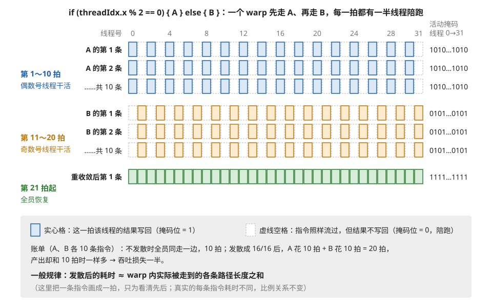
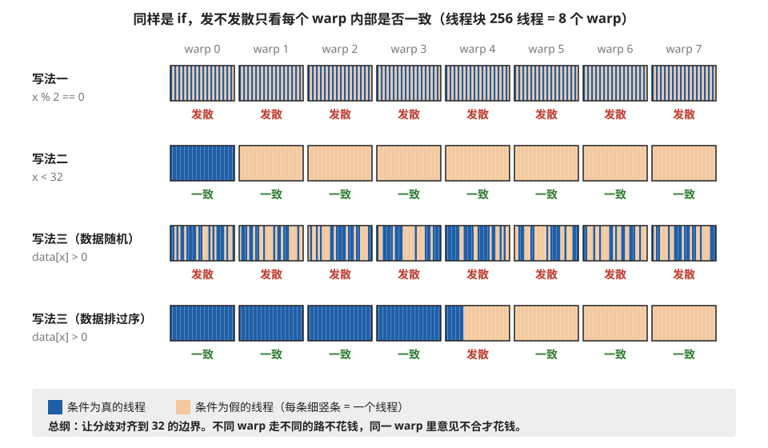
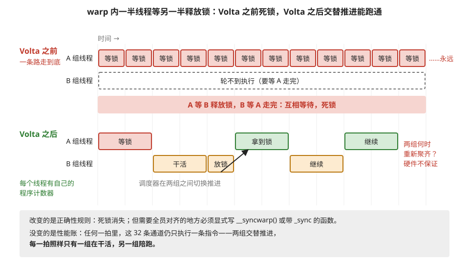

# 分支发散：当 32 个线程意见不合

> **所属模块**：模块 10 · SIMT 核的物理实现
> **状态**：🟨 学习中（第二版：按《写作规范》全文重写。知识截至 2026-08）
> **本节主旨**：前两节讲过，GPU 把 32 个线程捆成一个 warp、共用一条指令流来省管理开销。这笔便宜的账单在本节到期：**当 warp 内的线程在 if/else 处想走不同的路时，硬件只能把两条路都执行一遍，每条路上用一个开关表关掉不该参与的线程**——这就是分支发散。本节讲清它的机制、代价怎么计算、什么样的分支完全免费，以及 2017 年 Volta 架构对这套机制做的一次重要改动（它改变了正确性规则，但没有改变性能账）。

---

## 0. 这一节要回答的问题

- warp 内 32 个线程遇到 if/else 走向不一致时，硬件具体怎么处理？
- 发散的性能代价怎么估算？最坏能差多少倍？
- 同样是 if 语句，为什么有的完全免费、有的代价惨重？判断标准是什么？
- Volta 架构的"独立线程调度"改变了什么、没改变什么？为什么一批老代码在 Volta 上出错？
- 实际工程里发散通常在哪些场景咬人？怎么缓解？

---

## 1. 基础词汇：先把本节要用的词讲清楚

**分支（branch）**。程序里的 if/else、循环的继续或退出、switch——一切"接下来执行哪段代码要看条件"的地方，统称分支。

**发散（divergence）**。一个 warp 的 32 个线程执行到同一个分支时，如果有的线程条件为真、有的为假——也就是**组内意见不合**——就称这个 warp 在此处发散了。注意主语是 warp：讨论发散永远以一个 warp（32 个线程）为单位，不同 warp 之间走不同的路**不算**发散，那是完全正常的。

**活动掩码（active mask）**。一个 32 位的开关表，每一位对应 warp 里的一个线程：某位是 1，表示这一拍该线程正常执行当前指令；是 0，表示该线程被"关掉"——指令照样从它身上流过，但结果不写回，像陪跑一样。硬件靠这张开关表来实现"只让一部分线程生效"。

**重收敛（reconvergence）**。发散的线程各自走完自己的分支后，在某个位置重新聚齐、恢复全员一起执行的状态。这个聚齐点通常是 if/else 结束后的第一条公共指令。

## 2. 机制：意见不合时，硬件只有一个办法

回顾第 1 节（SM 结构）讲过的约束：一个 warp 只有**一个**程序计数器（记录"执行到哪了"的指针），32 个线程共用。现在假设执行到这样一行代码：

```
if (threadIdx.x % 2 == 0) { 做 A }  else { 做 B }
```

warp 里 16 个偶数号线程想做 A，16 个奇数号线程想做 B。可程序计数器只有一个，不可能同时指向 A 和 B。硬件唯一的出路是**串行**：

1. 先执行 A 的代码。执行前把活动掩码设成"偶数号线程为 1、奇数号为 0"——16 个奇数号线程陪跑，A 的每条指令都占用完整的执行周期，但只有一半线程产出结果。
2. 再执行 B 的代码。掩码翻转，这回偶数号线程陪跑。
3. 两边都走完，在重收敛点把掩码恢复成全 1，warp 恢复满员执行。

**例子：把代价算出来。** 假设 A 和 B 各是 10 条指令。不发散时（全员走同一边），花 10 条指令的时间。发散成 16/16 后：先花 10 条指令执行 A（一半人陪跑），再花 10 条执行 B（另一半陪跑）——**总共 20 条指令的时间，产出却和 10 条时一样，吞吐损失一半**。推到极端：一个 32 路的 switch，每个线程各走一个分支，硬件要串行执行全部 32 条路径，**每条路上 31 个线程陪跑——慢 32 倍**。上面三步的串行过程画在图 3-1 里。



> **图 3-1**　一句话：warp 里的线程在 if/else 上意见不合时，硬件先让想走 A 的线程执行 A、其余陪跑，再反过来执行 B，两段时间加起来就是发散的代价。
>
> **先知道一件事**：一个 warp 的 32 个线程共用一个"执行到哪了"的指针（程序计数器），硬件每一拍只能给这 32 个线程发同一条指令。所以它们不可能同一拍一半做 A、一半做 B。
>
> **按这个顺序看**：
> 1. 每一行是一条指令，行里的 32 个格子是 warp 里的线程 0～31，从左到右排列。实心格表示这一拍该线程的结果会写回；虚线空格表示指令照样从它身上流过，但结果不写回，也就是陪跑。
> 2. 上面三行（蓝色）是 A 的指令：只有偶数号线程（0、2、4……）是实心的，因为条件 threadIdx.x % 2 == 0 只对它们成立。右边的"活动掩码"是硬件记录谁该生效的 32 位开关表，按线程 0 到 31 的顺序写，1 表示生效：1010…1010。
> 3. 中间三行（橙色）是 B 的指令：掩码翻过来，变成 0101…0101，只有奇数号线程生效。
> 4. 最下面一行（绿色）是 if/else 之后的第一条公共指令：两边都走完了，掩码恢复成全 1，32 个线程重新一起干活，这叫重收敛。
> 5. 左侧的拍数：A、B 各 10 条指令，A 占第 1～10 拍，B 占第 11～20 拍，第 21 拍才恢复满员。
>
> **打个比方**：一辆 32 座的旅游大巴，一半人想去博物馆、一半人想去公园，车只有一辆，只能先开去博物馆（想去公园的人坐在车上干等），再开去公园（这回换另一半干等），最后大家再一起去吃饭。
>
> **看懂的标志**：能回答"一个 32 路的 switch、每个线程各走一路，要慢多少"——32 倍。32 条路径只能一条一条串行走，每条路上只有 1 个线程生效，其余 31 个陪跑。
>
> **与正文的对照**：与正文"把代价算出来"的例子一致。图中把一条指令画成一拍，只为看清先后；真实指令的耗时各不相同，但"发散后的耗时约等于各条路径之和"这个比例关系不变。
>
> 来源：本库自绘。

代价的一般规律：**发散后的耗时 ≈ warp 内实际被走到的各条路径的长度之和**。路径越多、越长，账单越贵。性能工具里有个直接的体温计：Nsight Compute 的 **Warp Execution Efficiency**（warp 执行效率）指标，含义是"平均每条发射的指令里，真正干活的线程占 32 的百分比"。100% 表示无发散，掉到 50% 就意味着平均一半线程在陪跑。

## 3. 关键判断：什么样的 if 免费、什么样的昂贵

上面的例子容易给人一个错误印象——"GPU 上不能写 if"。不对。**发散只在 warp 内部意见不合时发生**，所以同一个 if，条件写法不同，代价天壤之别。

**例子：三种条件的对比**（线程块 256 线程 = 8 个 warp）：

```
写法一：if (threadIdx.x % 2 == 0)      → 每个 warp 内 16/16 劈开 → 最大发散，2 倍慢
写法二：if (threadIdx.x < 32)          → 0 号 warp 全体为真，1~7 号 warp 全体为假
                                          → 每个 warp 内部全员一致 → 零发散，免费！
写法三：if (data[threadIdx.x] > 0)     → 取决于数据：随机分布 → 严重发散；
                                          若数据恰好聚簇/排过序 → 接近免费
```

写法二值得多看一眼：它明明是个分支，8 个 warp 里 1 个走 if、7 个走 else——但**每个 warp 内部都是全员一致的**，没有任何 warp 需要串行两条路。不同 warp 走不同的路本来就是各走各的，毫无代价。图 3-2 把三种写法在 8 个 warp 上的分布画了出来，并给写法三补了一行"数据排过序"的情形。



> **图 3-2**　一句话：一个 if 贵不贵，不看整个线程块里有多少线程走了哪边，只看每个 warp 内部的 32 个线程是否走同一边。
>
> **先知道一件事**：线程块里的 256 个线程按编号每 32 个切成一个 warp：线程 0～31 是 warp 0，32～63 是 warp 1，依此类推。硬件以 warp 为单位执行，所以"意见不合"也只在 warp 内部才有代价。
>
> **按这个顺序看**：
> 1. 每个方框是一个 warp，框里 32 条细竖条是它的 32 个线程；深蓝色表示条件为真，浅橙色表示条件为假。方框下面写着这个 warp 是"一致"还是"发散"。
> 2. 写法一 x % 2 == 0（x 是线程号）：每个 warp 里都是蓝橙相间，8 个 warp 全部发散，每个都要把 A、B 两边各走一遍，慢一倍。
> 3. 写法二 x < 32：只有 warp 0 的 32 个线程全为真，warp 1～7 全为假。整个块里明明有真有假，但每个 warp 内部都一致，没有任何 warp 需要走两边，零代价。
> 4. 写法三 data[x] > 0，数据随机：条件取决于数据，每个 warp 里真假混杂，全部发散。
> 5. 同样的条件、同样多的"真"，先把数据按条件排好序：真的集中在前面，假的集中在后面，只有真假交界处的 warp 4 发散，其余 7 个都一致。
>
> **看懂的标志**：能回答"为什么 MoE 要先按专家把 token 排序再计算"——排序把去往同一个专家的 token 挤进相邻的线程，于是同一个 warp 里的线程大多走同一条路，发散只剩在分组交界处的少数几个 warp。
>
> **与正文的对照**：前三行对应正文三种写法；第四行是正文"若数据恰好聚簇/排过序 → 接近免费"的具体样子。写法三的真假分布是随机生成的示意，不是实测数据。
>
> 来源：本库自绘。

由此得到全部反发散优化的总纲，一句话：**让分歧对齐到 32 的边界**。能按 warp 分工就不要按线程奇偶分工；数据相关的分支，先把数据按条件排序或分组，让同一 warp 里的数据倾向于同一结果。后面第 5 节会看到，工业界的做法（MoE 按专家给 token 分组、光线追踪按材质给光线排序）全是这一句话的应用。

顺带介绍编译器的一个小优化：如果分支体很短（一两条指令），编译器干脆不生成"跳转"，而是把两边都编译成**带条件的指令**——每个线程都执行，但只有条件为真的线程写回结果。这个手法叫**谓词化（predication）**。它省掉了分支管理的开销，但两边的指令周期照样都要花——本质上和掩码陪跑是同一笔账，只是记账方式更轻。短分支交给编译器谓词化通常是最优解，你不需要干预。

## 4. Volta 的改动：独立线程调度

2017 年的 Volta 架构（V100）对这套机制做了一次影响深远的修改，此后所有 NVIDIA GPU（Turing、Ampere、Hopper、Blackwell）都沿用。要理解它改了什么，得先看老机制有个什么隐患。

### 4.1 老机制的隐患：warp 内可能死锁

Volta 之前，发散的处理是"一条路**走到底**，再走另一条路"。这在绝大多数程序里没问题，但有一种代码会出事：**warp 内一部分线程等待另一部分线程**。

**例子。** 假设走路径 A 的线程在自旋等待一把锁，而这把锁要由走路径 B 的线程来释放。老机制下：硬件先执行 A——A 的线程在锁上无限自旋；而 B 的线程要等 A 走完才轮得到执行，可 A 永远走不完。**互相等待，死锁。** 所以在 Volta 之前有一条编程铁律：不要在 warp 内部的分支之间做这种细粒度的等待。

### 4.2 Volta 改了什么：每个线程有了自己的程序计数器

Volta 给**每个线程**配了独立的程序计数器和调用栈（之前是每个 warp 一份）。这带来两个直接后果：

**后果一（好消息）：warp 内死锁消失了。** 调度器现在可以在两条发散路径之间**交替推进**：A 的线程自旋几拍，切去推进 B 的线程，B 释放了锁，再切回 A——A 拿到锁，继续前进。上面那个死锁例子在 Volta 之后能正常跑通。

**后果二（要小心）：重收敛不再自动发生。** 老机制下，硬件保证发散的线程在分支结束点自动聚齐；新机制下线程各有各的进度，**硬件不再承诺"什么时候聚齐"**。如果你的代码依赖"warp 内 32 个线程此刻肯定步调一致"（很多老代码隐式依赖这一点，比如 warp 内做数据交换的归约代码），在 Volta 上就可能读到错误数据。修复的办法是**显式声明同步**：CUDA 提供了 `__syncwarp()`（让 warp 内指定的线程在此聚齐）以及一批带 `_sync` 后缀的函数（如 `__shfl_sync`，参数里要写明哪些线程参与）。**这就是为什么 Volta 发布后一批老代码需要修改**——不是硬件坏了，是"隐式的步调一致"这个假设被正式作废了。

### 4.3 必须强调：性能账没有变

独立线程调度改变的是**正确性规则**（死锁消失、同步须显式），**没有改变发散的性能代价**。发散的 warp 依然要串行走各条路径、依然有线程陪跑——因为物理约束没变：每一拍仍然只能发射一条指令给这 32 条执行通道。硬件里新增了一个"收敛优化器"，会尽量把走同一路径的线程凑在一起发射以保住吞吐，但它只能优化、不能免除。**所以第 3 节的优化总纲（分歧对齐 32 边界）在最新的架构上原样成立。**

图 3-3 把 4.1～4.3 的三件事画在同一张时间线上：老机制为什么死锁，新机制怎样跑通，以及为什么性能账没变。



> **图 3-3**　一句话：同一个 warp 里一部分线程等另一部分线程放锁，在 Volta 之前会永远卡死；Volta 之后硬件可以在两组之间来回切换，程序能跑通，但任何一拍仍然只有一组在干活。
>
> **先知道一件事**：锁是一个标志，一次只允许一个人持有，别人想要就得反复查看、直到持有者放开（这种反复查看叫自旋等待）。这里 A 组线程在等锁，而锁在 B 组线程手里，要 B 做完自己的活才会放开。两组线程在同一个 warp 里，走的是 if/else 的两条不同分支。
>
> **按这个顺序看**：
> 1. 横轴是时间。上半是 Volta 之前（2017 年以前的 NVIDIA GPU）的老机制：发散时"一条路走到底，再走另一条"。
> 2. 上半的 A 组一行：硬件先走 A 这条路，A 组线程一直在"等锁"，永远等不到。
> 3. 上半的 B 组一行（虚线框）：按老机制，B 这条路要等 A 走完才轮得到，于是 B 永远没机会执行，也就永远不会放锁。红色横条：互相等待，死锁。
> 4. 下半是 Volta 之后：每个线程有了自己的程序计数器（记录"执行到哪了"的指针），调度器可以在两组之间切换推进。A 等了一会儿，切去推进 B；B 干完活、放锁（黑色箭头）；再切回 A，A 拿到锁继续。
> 5. 下半注意每个时刻只有一行有色块：两组是交替前进的，不是同时。所以 32 条执行通道每一拍仍只执行一条指令，另一组照样陪跑，性能代价没有减少。
> 6. 右侧红字：两组各走各的进度，硬件不再承诺它们什么时候重新聚齐。
>
> **打个比方**：两位同事共用一台电脑。老规矩是"一个人的事全部做完才换人"，偏偏先上机的人在等另一个人发来的文件，于是两人永远僵住；新规矩是"每人轮流用一会儿"，另一个人得以发出文件，事情办成了——但电脑还是只有一台，同一时刻仍只有一个人在用。
>
> **看懂的标志**：能回答"为什么 Volta 之后一批老代码要加 __syncwarp()"——老代码默认"warp 里 32 个线程在分支结束后自动重新对齐"，新机制下这一点不再有保证，需要全员对齐的地方必须显式写出同步。
>
> **与正文的对照**：上半对应 4.1，下半对应 4.2 的后果一和后果二，底部灰框对应 4.3。
>
> 来源：本库自绘。

## 5. 实战：发散通常在哪咬人

- **MoE 模型的路由**。不同 token 要送往不同的专家网络。如果放任一个 warp 里混着去往 8 个专家的 token，控制流和访存全散。实际系统的做法是**先按专家把 token 排序分组**，再成组处理——正是"分歧对齐到 32 边界"的应用。
- **注意力的因果掩码**。序列位置 i 只能看位置 ≤ i 的数据，于是处理对角线附近的数据块时，warp 内一部分位置有效、一部分无效。高效实现（如 FlashAttention）的处理分两层：整块都无效的**直接跳过不算**（块粒度，无发散）；横跨对角线的少数块用**谓词化的逐元素掩码**处理（有陪跑但无跳转），把发散代价压到最小。
- **变长数据**。批内序列长短不一，短序列的线程提前干完、陪跑到最长的那个结束。缓解办法是把长度相近的序列凑成一批（术语叫 bucketing，按桶分组）。
- **采样、beam search、稀疏计算**。天然依赖数据的控制流，是发散重灾区，也是这类负载在 GPU 上效率不高的根本原因之一。

## 6. 开发者视角：怎么发现和确认发散

| 你想知道什么 | 去哪里看 |
| --- | --- |
| 有没有发散、多严重 | Nsight Compute 的 **Warp Execution Efficiency**（<100% 的差值就是陪跑比例）和 **Branch Efficiency**（一致分支的占比） |
| 编译器是不是做了谓词化 | 反汇编机器码里看到 `@P0` 这类前缀的指令，就是谓词化的产物 |
| warp 内同步写对没有 | 用 `compute-sanitizer --tool synccheck` 跑一遍，能抓漏写 `_sync` 的竞争 |
| 源码层怎么改 | 分支条件对齐 warp 边界；数据按条件排序/分组；短分支放心交给编译器 |

排查流程建议：先看 Warp Execution Efficiency——若明显低于 100%，回到源码找"warp 内不一致的那个条件"，对照第 3 节的三种写法归类，再决定是改条件、排数据还是接受现状（有些数据相关的分支就是躲不掉，值得躲的是**本可以对齐却没对齐**的那种）。

## 7. 最新架构落点（知识截至 2026-08）

- **NVIDIA**：独立线程调度自 Volta 起是所有现役架构的标准行为，写 warp 级代码必须用带 `_sync` 后缀的原语并显式给出参与线程的掩码。
- **AMD（CDNA/RDNA）**：wavefront 宽 64 线程（部分模式 32），用一个显式的 EXEC 掩码寄存器管活动线程，机制同源。组更宽意味着"组内全员一致"更难凑齐，发散的期望代价更高。
- **一个观察**：高性能 kernel 的共同特征是**几乎没有数据相关分支**——现代 GPU 高性能编程的趋势（块粒度跳过 + 谓词化处理边界 + 数据预排序）本质上都是在把控制流的不确定性提前消化掉，让执行阶段接近"无分支"。
- **稀疏注意力给这条趋势添了新压力，方向却是相反的**。DeepSeek 的 DSA 一类做法（模块 40 第 8 节）先用轻量索引器挑出 top-k 个 KV 块、再只算这些块——**"挑哪些块"是一个彻底数据相关的决策**。它没有退回到"warp 内逐元素分支"那种最坏形态（选择的粒度是**块**而不是元素，所以整个 warp 仍然一致），但它把不规则性从"编译期消化掉"变成了"运行时必须处理"。**判断这类新算法对 GPU 友不友好，用的正是本节第 3 节那条总纲：不规则性的粒度有没有对齐到 32 的边界。** 对齐了就便宜，没对齐就贵——DSA 选择块粒度，正是因为它便宜。
- **对照另一条路**：模块 13 第 6 节讲过，静态调度的 NPU 连"按下标 gather"都没有硬件通路（地址生成单元只表达得了嵌套循环加固定步长）。**所以稀疏注意力成为主流这件事，本身就在把天平往 GPU 那一侧推**——这是模块 00 那条"争夺焦点是负载的规则程度"的光谱在 2026 年的一次实际移动。

## 8. 术语卡

### 分支发散（branch divergence）
**定义**：一个 warp 的 32 个线程在分支处走向不一致时，硬件串行执行每条被走到的路径、用活动掩码关闭不参与的线程的现象。耗时约等于各路径长度之和。
**为什么存在**：它是"32 线程共用一条指令流"这个省钱设计的必然代价——指令流只有一条，意见不合就只能排队轮流来。
**语境例句**："这个 kernel 有严重的 warp divergence。" —— 意思是：warp 内部频繁意见不合，大量线程在陪跑，Warp Execution Efficiency 低，应检查分支条件能否对齐到 32 边界。

### 活动掩码（active mask）
**定义**：32 位的开关表，每位对应 warp 中一个线程，决定当前指令对该线程是否生效。发散期间硬件用它轮流"点亮"走不同路径的线程子集。
**为什么存在**：串行执行多条路径时，必须有机制保证"走 A 路径时 B 组的线程不产生副作用"。掩码就是这个机制——被关掉的线程指令照流过但不写回。
**语境例句**："`__shfl_sync` 的第一个参数要传掩码。" —— 意思是：Volta 之后 warp 内数据交换必须显式声明哪些线程参与（通常传 0xffffffff 表示全员），不能再假设 32 个线程天然齐步。

### 谓词化（predication）
**定义**：编译器对短分支的处理方式——不生成跳转，把分支体编译成带条件位的指令，所有线程都执行、只有条件为真的写回结果。
**为什么存在**：分支跳转本身有管理成本（掩码压栈、重收敛记录）。分支体只有一两条指令时，"全员执行+条件写回"比"正经分支"更便宜。
**语境例句**："这个 if 被编译器谓词化了，不用管。" —— 意思是：反汇编里看到 `@P0` 前缀指令，说明编译器已选择轻量处理，这个短分支不构成性能问题。

### 重收敛（reconvergence）
**定义**：发散的线程走完各自路径后重新聚齐、恢复全员执行的动作/位置。Volta 之前由硬件在分支汇合点自动完成；Volta 之后不再自动保证，需要程序显式同步。
**为什么存在**：发散状态吞吐减半甚至更差，尽早聚齐才能恢复满效率。
**语境例句**："这段老代码在 V100 上结果不对，加 `__syncwarp` 就好了。" —— 意思是：代码隐式依赖了老机制的自动重收敛，在独立线程调度下线程进度不齐导致读到旧数据，显式同步后恢复正确。

### 独立线程调度（Independent Thread Scheduling, ITS）
**定义**：Volta 起的机制，每个线程拥有独立的程序计数器与调用栈，发散路径可交替推进而非一条走到底。
**为什么存在**：消除 warp 内死锁（一部分线程等待另一部分的场景），让细粒度的线程间协作成为可能。代价是自动重收敛的承诺被取消，warp 级同步必须显式。
**语境例句**："ITS 之后发散是不是不亏了？" —— 不是。ITS 改的是正确性规则；发散的吞吐代价（路径串行、线程陪跑）一分没少，优化原则照旧。

## 9. 我的困惑 / 待深挖

- 收敛优化器什么条件下能把发散线程重新凑齐发射？在机器码层面能观察到吗？
- 编译器选择谓词化还是真分支的阈值大约是几条指令？
- "按条件排序消发散"的排序成本和收益，在 MoE 场景里的平衡点在哪？

---

*最后更新：2026-09-01（第三版：§7 更新到 2026-08，补入稀疏注意力带来的新形态——不规则性从编译期消化变成运行时处理，以及它为什么选块粒度而非元素粒度。第二版：按写作规范重写）*（2026-09 补图 3 张：现成 0 张，自绘 3 张；图注按费曼法写）
