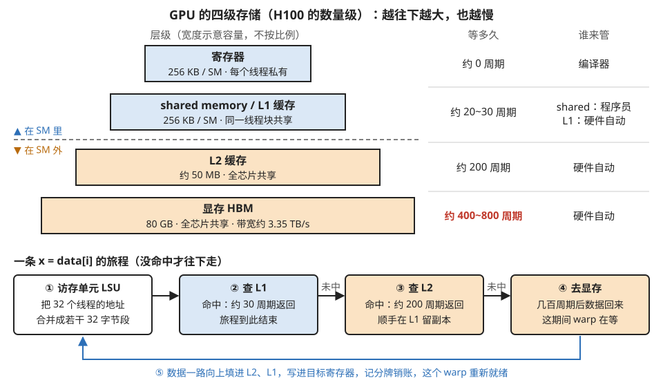
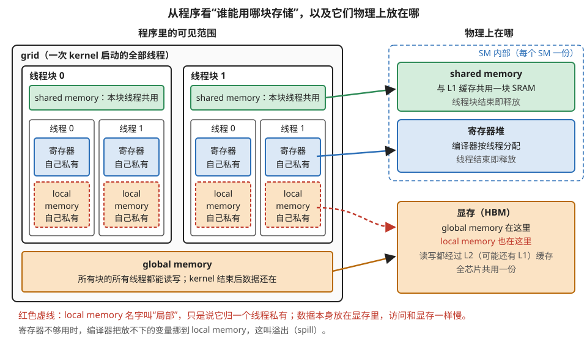
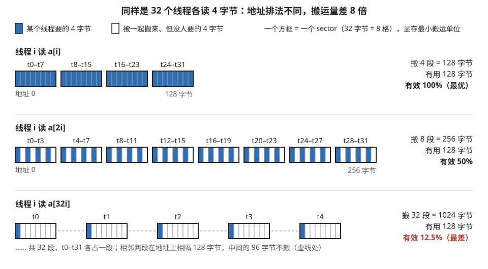
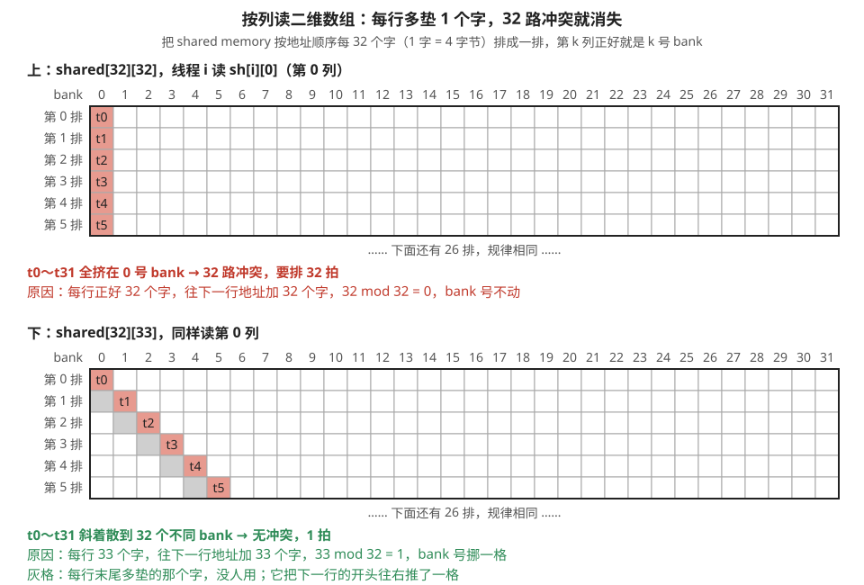
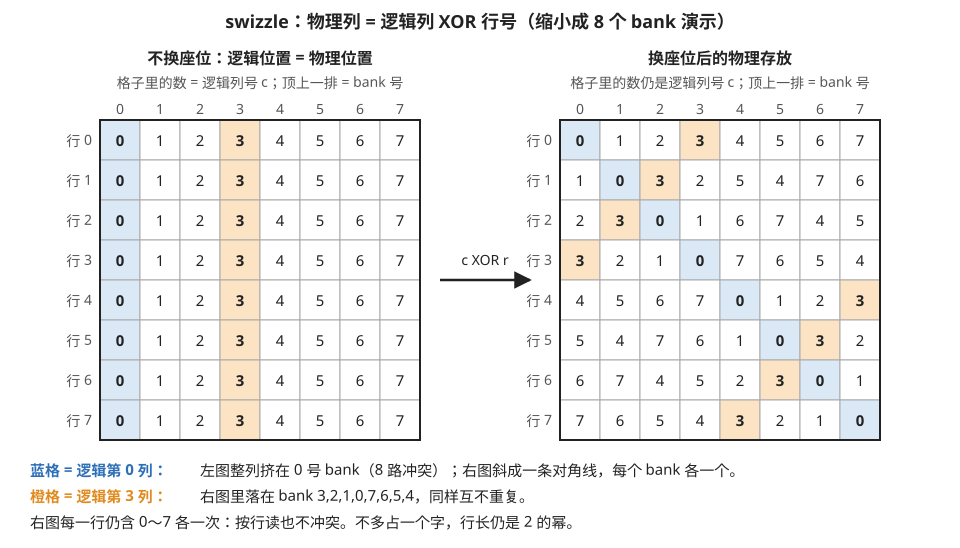
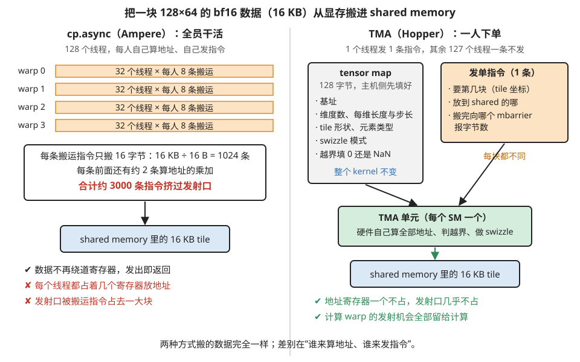
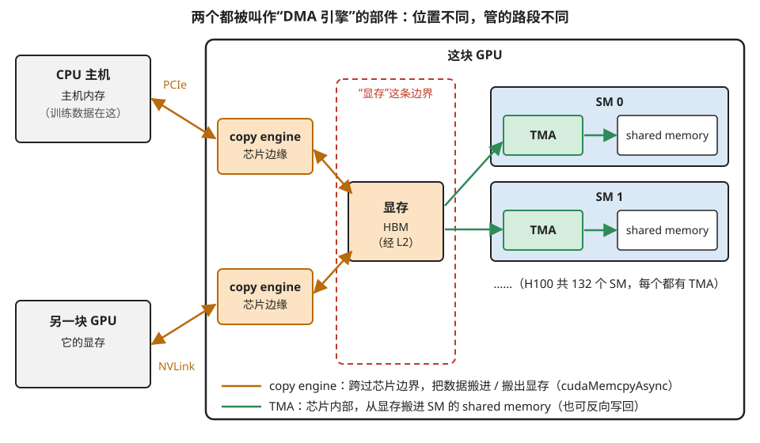

# 访存通路：数据从显存到寄存器的旅程

> **所属模块**：模块 10 · SIMT 核的物理实现
> **状态**：✅ 完成（第五版：扩写第 6 部分为完整的 TMA 硬件解剖，含 tensor map、多播、归约写回、与 copy engine 的撞名澄清。知识截至 2026-08）
> **本节主旨**：第 1 节说过 GPU 的根本矛盾是"计算快、数据远"。这一节专门讲"数据"这一侧：数据从显存到寄存器要经过一条四级的存储层次，**每一级都比上一级更小、但更快**；程序性能好坏，很大程度上取决于你有没有让数据"在快的那几级被反复使用"。此外还要讲清两个著名的硬件门槛——**访存合并**（显存那一侧的）和 **bank 冲突**（shared memory 那一侧的），它们本质上是同一个问题：一个 warp 同时发出的 32 个地址，怎么才能高效地喂进硬件的固定搬运粒度。

---

## 0. 这一节要回答的问题

- 从寄存器到显存共有几级存储？每级的容量、速度、归谁管？
- 什么是访存合并（coalescing）？为什么"相邻线程访问相邻地址"是铁律？效率差距有多大？
- 什么是 bank 冲突？为什么按列访问一个二维数组会慢 32 倍？怎么修？
- 一次显存读取从发出到数据回来，中间经过哪些站点？
- 为什么新架构要加一个专门的搬运引擎（TMA）？它解决了什么老问题？订单（tensor map）里装了什么？
- TMA 的多播和归约写回是什么？它和 cp.async 的分工边界在哪？
- "DMA 引擎"在 GPU 语境里为什么是个撞名词？copy engine 和 TMA 各管哪段？
- 要"喂满"显存带宽，需要多少个同时在途的请求？这和占用率有什么关系？

---

## 1. 基础词汇：先把本节要用的词讲清楚

**存储层次（memory hierarchy）**。计算机里"越快的存储越小、越大的存储越慢"是物理规律，没有既大又快的存储。于是硬件把存储做成多级：小而快的放在计算单元旁边，大而慢的放远处，中间用搬运机制衔接。本节的主角就是 GPU 的这条层次链。

**缓存（cache）与命中（hit）**。缓存是硬件自动管理的快速存储副本：你读一个数据时，硬件顺手把它和它的邻居留一份在缓存里；下次再读，如果还在（称为"命中"），就不用去慢速的下一级了。GPU 有两级缓存：L1（每个 SM 一块）和 L2（全芯片共享一块）。

**sector 与 cache line**。显存和缓存搬运数据不是按字节零售的，而是按固定大小的"段"批发：最小搬运单位叫一个 **sector，32 字节**；缓存管理的单位叫一条 **cache line，128 字节**（等于 4 个 sector）。就算你只要 1 个字节，硬件也会把它所在的整个 32 字节 sector 搬过来。这个"按段批发"的特性是理解访存合并的钥匙。

**bank**。shared memory 内部被切成 **32 个可以同时工作的窗口**，每个窗口叫一个 bank，每个 bank 一次服务 4 个字节。地址按 4 字节轮流分配给 32 个 bank（第 0~3 字节归 0 号 bank，第 4~7 字节归 1 号，……第 128~131 字节又回到 0 号）。32 个 bank 同时开工，shared memory 一拍就能服务 32 个请求——**前提是这 32 个请求正好落在 32 个不同的 bank 上**。这个前提破裂时会发生什么，就是本节第 4 部分的内容。

## 2. 全景：四级存储，各自的角色

先看全貌（数字以 H100 为例，记数量级即可）：

| 层级 | 容量 | 延迟 | 归谁管 | 谁能访问 |
| --- | --- | --- | --- | --- |
| 寄存器 | 256 KB / SM | ~0（不用等） | 编译器 | 单个线程私有 |
| shared memory / L1 | 256 KB / SM 统一 SRAM（shared 可配上限 ~228 KB） | 约 20~30 周期 | 程序员 / 硬件 | 同一线程块 / 自动 |
| L2 缓存 | ~50 MB / 芯片 | 约 200 周期 | 硬件 | 全芯片 |
| 显存 HBM | 80 GB | 约 400~800 周期 | 硬件 | 全芯片 |

每往下一级，容量涨一到两个数量级，延迟也涨。带宽同样逐级递减：寄存器的总带宽最高（要每拍喂饱所有算术单元），shared memory 其次，L2 再次，显存最低（约 3.35 TB/s——这个数听起来大，但被全芯片十几万个线程分，摊到每个线程就很紧张了）。图 4-1 把这张表画成了层级图。



> **图 4-1**　一句话：GPU 的数据存放在四级存储里，离计算越近的越小、越快；一次读取从最上面找起，找不到才一级一级往下走。
>
> **先知道一件事**：图中的“周期”是 GPU 时钟的一拍，H100 的时钟在 2 GHz 上下，一拍约半纳秒。一条加法指令几拍就算完，所以“等 500 周期”意味着这段时间里本可以做上百次运算。
>
> **按这个顺序看**：
> 1. 上半部分的四个色块，从上到下是寄存器、shared memory 与 L1 缓存、L2 缓存、显存。色块宽度只示意“越往下越大”，不按比例：实际从 256 KB 到 80 GB，差了五个数量级。
> 2. 虚线把四级分成两组。虚线以上两级（蓝色）每个 SM 各有一份——SM 是 GPU 里一个独立的计算单元，H100 有 132 个；虚线以下两级（橙色）是全芯片 132 个 SM 共用的一份。
> 3. 右边两列是“等多久”和“谁来管”。寄存器由编译器分配；shared memory 由程序员在代码里显式声明和读写；L1、L2 是缓存，留什么由硬件自动决定。显存那一格标红：400～800 周期是整张图里最贵的等待。
> 4. 下半部分是一条 `x = data[i]` 走过的路。① 访存单元（LSU，负责把读写请求送往存储的部件）把一个 warp（同时执行同一条指令的 32 个线程）的 32 个地址合并成若干个 32 字节的段；② 先查 L1，命中就到此结束；③ 没命中再查 L2；④ 还没命中才去显存；⑤ 数据回来时顺路在 L2、L1 各留一份，最后写进寄存器，等着这个数据的 warp 重新可以执行。
>
> **打个比方**：寄存器是拿在手里的，shared memory 是桌面，L2 是同一层楼的公共书架，显存是地下室的仓库。要一本书先看桌上，没有再去书架，再没有才下地下室；拿上来的书在书架和桌上各留一本，下次就近取。
>
> **看懂的标志**：能回答“为什么说复用次数决定快慢”——数据第一次要从显存搬上来，付几百周期；之后只要它还留在寄存器或 shared memory 里，再用一次只要几拍到几十拍。用 100 次只搬 1 次，平均每次的代价就降到约百分之一。
>
> **与正文的对照**：各级数字取自上表（H100，记数量级即可）；下半的五步就是第 5 节的五步。
>
> 来源：本库自绘。

同一套存储，从写程序的角度看是另一种分法：不按“离计算多远”，而按“谁能用”。图 4-2 按这种分法画，并标出每一种物理上放在哪里。



> **图 4-2**　一句话：写程序时，每种存储有不同的“谁能用”范围：寄存器和 local memory 归一个线程私有，shared memory 归一个线程块共用，global memory 整个 grid 都能用；但名字和范围不等于位置——local memory 和 global memory 一样放在显存里。
>
> **先知道一件事**：CUDA 程序把线程分两层组织。若干线程组成一个线程块，同一块的线程一定在同一个 SM（GPU 里一个独立的计算单元）上运行；一次 kernel 启动的全部线程块合起来叫一个 grid。
>
> **按这个顺序看**：
> 1. 左边大框是一个 grid，里面画了两个线程块，每块画了两个线程（实际每块通常有几百个线程）。
> 2. 每个线程框里有两样只属于它自己的东西：蓝色的寄存器，和红色虚线框的 local memory（局部内存）。别的线程看不到它们。
> 3. 每个线程块顶上的绿色条是 shared memory：块内所有线程都能读写，所以同块线程可以通过它交换数据；但线程块 0 用不到线程块 1 的 shared memory。
> 4. 最下面的橙色长条是 global memory：所有块的所有线程都能读写，kernel 结束后数据还留着，下一个 kernel 可以接着用。
> 5. 右边是物理位置，箭头指明每种存储放在哪。虚线框里的两样在 SM 内部：寄存器堆，以及与 L1 缓存共用一块 SRAM（静态随机存储，片上的快速存储）的 shared memory。下面的显存是全芯片共用的一份。
> 6. 看红色虚线箭头：local memory 指向的是显存，不是 SM 内部。“局部”只说明它归一个线程私有；数据实际放在显存里，所以访问它和访问显存一样慢。寄存器不够用时，编译器把放不下的变量挪到这里，这叫溢出（spill）。
>
> **打个比方**：寄存器是你口袋里的东西，shared memory 是你们办公室的白板，global memory 是公司的共享仓库。local memory 像仓库里一个贴着你名字的柜子：只有你用，但要去仓库才拿得到。
>
> **看懂的标志**：能回答两个问题。“两个不同线程块之间要交换数据，得经过哪里”——只能经过 global memory，因为 shared memory 不跨块，所以跨块协作比块内协作贵得多。“编译报告里出现 spill，为什么会变慢”——溢出的变量进了 local memory，也就是显存，每次读写都可能要付几百周期。
>
> **与正文的对照**：图 4-1 按物理层级和延迟排列，这张按程序里的可见范围排列，右半把两种分法对上。global memory 和 local memory 的读写都经过 L2，也可能被 L1 缓存；L1、L2 由硬件自动管理，程序员不能直接指定，所以左半没有画它们。Hopper 起几个线程块可以结成簇（cluster）、互访彼此的 shared memory，图中没有画。
>
> 来源：本库自绘。

这条层次链的正确用法可以用一句话概括：**让每个数据被取上来之后，尽量在高层多用几次，再扔掉。** 用一个例子说明分量：假设一个数据要参与 100 次计算。做法一，每次用都去显存取：100 次 × 400 周期的延迟成本，还占 100 份显存带宽。做法二，取一次放进寄存器或 shared memory，在那里用 100 次：显存只被打扰 1 次，其余 99 次几乎免费。**两种做法的计算量一模一样，访存成本差 100 倍**——这个"复用次数"就是决定程序是快是慢的核心变量，后面的附录 A1 会把它正式定义成"算术强度"并用于判断性能瓶颈。

## 3. 访存合并（coalescing）：显存这一侧的门槛

### 3.1 机制：32 个地址撞上"按段批发"

现在把两个事实放在一起。事实一（第 1 节词汇）：显存按 32 字节的 sector 批发。事实二（第 2 节 SM 结构）：一个 warp 的 32 个线程**同一拍各自给出一个地址**。访存单元（LSU）的工作，就是把这 32 个地址归并成"覆盖它们所需的最少 sector 数"，一段一段地找显存要。

于是同样是"32 个线程各读一个 4 字节的数"（共需 128 字节有效数据），地址排布不同，实际搬运量天差地别：

**例子：四种访问模式的账。**

| 访问模式 | 32 个地址的分布 | 需要搬几个 sector | 有效字节比例 |
| --- | --- | --- | --- |
| 线程 i 读 `a[i]`（连续且对齐） | 正好铺满 128 字节 = 4 个 sector | **4**（最优） | 100% |
| 线程 i 读 `a[i*2]`（隔一个跳一个） | 铺满 256 字节，每段只用一半 | 8 | 50% |
| 线程 i 读 `a[i*32]`（大步长） | 32 个地址各落一段 | **32**（最差） | 12.5%（每段 32 字节只用 4 字节） |
| 32 个地址完全随机 | 通常也是各落一段 | ~32 | ~12.5% |

前三种模式画在图 4-3 里。



> **图 4-3**　一句话：显存按 32 字节一段整段搬运；一个 warp 的 32 个地址挨得越紧，要搬的段越少，搬来的数据里有用的比例越高。
>
> **先知道一件事**：GPU 上 32 个线程组成一个 warp，同一时刻执行同一条指令。执行一条读取指令时，32 个线程各给出一个地址，硬件要把这些地址所在的段全部从显存搬来。一段（sector）是 32 字节，装得下 8 个 4 字节的数；哪怕只要其中一个数，也得整段搬。
>
> **按这个顺序看**：
> 1. 图中每个粗框方框是一段（32 字节），里面的 8 个小格各是 4 字节。蓝格是有线程要的数，白格是跟着一起搬来、但没人要的数。方框上方写的是地址落在这一段里的线程，t0 表示 0 号线程。
> 2. 第一行 `a[i]`：线程 i 读第 i 个数，32 个数紧挨着，正好铺满 4 段，每一格都有人要。搬 128 字节，全部有用。
> 3. 第二行 `a[2i]`：线程 i 读第 2i 个数，隔一个取一个。32 个数摊在 256 字节上，要搬 8 段，每段只有一半有用。
> 4. 第三行 `a[32i]`：相邻线程的地址差 32 × 4 = 128 字节，每个线程独占一段，共 32 段，每段 8 格里只有 1 格有用。段与段之间的虚线是跳过的 96 字节：那里没人要，所以不搬。
> 5. 右边的数字：三行要的都是 128 字节，实际分别搬了 128、256、1024 字节。最好和最差差 8 倍。
>
> **打个比方**：显存像只按整箱卖的批发市场，一箱 8 瓶。32 个人各要一瓶：如果要的恰好是连着的 32 瓶，买 4 箱就够；如果每人要的都在不同的箱子里，就得买 32 箱，每箱只喝一瓶。
>
> **看懂的标志**：能回答“性能工具报 sectors per request（每次请求平均搬几段）为 32，说明什么”——说明 warp 里每个线程各占一段，地址完全散开，是第三行的情形，有效带宽只剩八分之一，应当检查索引写法或数据布局。
>
> 来源：本库自绘。

最优和最差差 8 倍搬运量——也就是说，**同一段代码，仅仅因为索引写法不同，有效显存带宽可以差 8 倍**。这就是"让相邻线程访问相邻地址"成为 GPU 编程第一铁律的原因：它不是风格建议，是硬件批发粒度决定的经济账。性能工具里的对应读数叫 **sectors per request**（平均每次访存请求搬了几个 sector）：接近 4 是健康的，飙到二三十就说明访存模式散了。

### 3.2 两个高频推论：数据布局与向量化

**推论一：结构体数组（AoS）不如数组结构体（SoA）。** 假设每个数据点有 x、y、z 三个字段。按"结构体数组"存（x0 y0 z0 x1 y1 z1 …），当 32 个线程各读自己那个点的 x 时，地址间隔是 12 字节——不连续，合并效果差。改成"数组结构体"（所有 x 连排、所有 y 连排…），读 x 时 32 个地址正好连续——完美合并。**同样的数据、同样的计算，换个排布方式访存效率就不同**，这就是"layout（数据布局）优化"的原型。

**推论二：一次读 16 字节比读 4 字节好。** 每个线程用 float4 类型（或等价的 128 位读写）一次取 16 字节：一个 warp 一次搬 512 字节，指令数变成原来的 1/4，每条搬运指令的"载重量"更大。这叫**向量化访存**，是 memory-bound 程序的常规优化，第 7 部分还会看到它的另一个好处。

## 4. bank 冲突：shared memory 这一侧的门槛

### 4.1 机制：32 个请求要落在 32 个不同窗口

第 1 节说过，shared memory 有 32 个 bank，同时开工才能一拍服务整个 warp。规则是：warp 的 32 个访问如果**各落在不同的 bank**（或者恰好全读同一个地址——那样硬件广播一次就行），一拍完成；如果有 N 个线程落在**同一个 bank 的不同地址**，这个 bank 只能一个一个来——**耗时变成 N 拍**，这就是 N 路 bank 冲突。

**例子：三种访问的对比。** 回忆 bank 的分配规则：4 字节地址 a 归属 `(a/4) mod 32` 号 bank，即连续的 4 字节字轮流落在 0、1、…、31 号。

```
访问 shared[tid]        → 线程 i 落在 i 号 bank，32 个各不相同    → 无冲突，1 拍
访问 shared[tid * 2]    → 线程 0 落 0 号，线程 16 也落 0 号(32 mod 32=0)
                          → 两两撞车 → 2 路冲突，2 拍
按列读 shared[32][32]：线程 i 读 sh[i][k]（同一列） 
                        → 列内相邻元素地址间隔 32 个字 → 全部落在同一个 bank
                        → 32 路冲突，32 拍——最惨情况
```

最后一种（按列访问二维数组）是实践中最常踩的坑：矩阵转置、按列归约都会遇到。图 4-4 的上半把这种情况画了出来。

### 4.2 两种修法：加一列，或者换座位

**修法一：padding（加一列）。** 把数组声明成 `shared[32][33]`——每行故意多出 1 个没人用的字。这样"同一列"的相邻元素地址间隔变成 33 个字，33 mod 32 = 1，往下走一行 bank 号就挪一格，一列 32 个元素正好散落在 32 个不同的 bank——冲突消失。代价是浪费约 3% 的 shared memory，以及一个更隐蔽的问题：行的长度不再是 2 的幂，一些要求对齐的高级指令（特别是给 Tensor Core 喂数的矩阵加载指令）用不了。



> **图 4-4**　一句话：按列读一个 32×32 的 shared memory 数组时，整列落在同一个 bank 上，要排 32 拍；每行多垫一个字以后，一列的元素斜着散到 32 个 bank，一拍读完。
>
> **先知道一件事**：shared memory 内部分成 32 个 bank（可以同时工作的存储窗口），每个 bank 每拍只能交出一个 4 字节的字。地址按字轮流分给各 bank：第 0 个字归 0 号 bank，第 1 个字归 1 号……第 32 个字又回到 0 号。所以把内存按每排 32 个字排开，第 k 列就恰好是 k 号 bank。
>
> **按这个顺序看**：
> 1. 两张网格顶上的数字是 bank 号 0～31；每一排是地址上连续的 32 个字。只画了前 6 排，下面 26 排规律相同。
> 2. 上图 `shared[32][32]`：数组每行 32 个字，正好占一排。线程 i 读第 i 行的第 0 个元素，这些元素全在最左一列（红格 t0、t1……），也就是全部落在 0 号 bank。0 号 bank 一拍只能交一个字，32 个线程要排 32 拍，其余 31 个 bank 闲着。
> 3. 下图 `shared[32][33]`：每行多声明 1 个字（灰格）。这个字没人用，但它把下一行的开头往右推了一格。于是第 1 行的第 0 个元素落在 1 号 bank，第 2 行的落在 2 号……红格连成一条斜线，32 个线程落在 32 个不同的 bank，一拍全部读完。
> 4. 底部文字给出原因：往下走一行，地址增加一行的长度。行长 32，除以 32 余 0，bank 号不变；行长 33，余 1，bank 号挪一格。
>
> **打个比方**：32 个收银台，每台一次只能结一个人。上图是 32 个人全排在 0 号台，其余台空着；下图让每个人错开一个台，大家同时结完。
>
> **看懂的标志**：能回答“声明成 `shared[32][34]` 行不行”——冲突减轻但没有消失：行长 34 除以 32 余 2，往下一行 bank 号挪两格，第 0 行和第 16 行都落在 0 号 bank（16 × 2 = 32），每个 bank 被两个线程挤，是 2 路冲突，要 2 拍。垫出来的行长要是奇数才能彻底错开。
>
> **与正文的对照**：上图是 4.1 代码块里的第三种情况，下图是 4.2 的修法一。
>
> 来源：本库自绘。

**修法二：swizzle（换座位）。** 不加内存，而是在"逻辑位置 → 物理位置"之间加一个**异或（XOR）置换**：元素逻辑上在第 r 行第 c 列，物理上存到第 r 行第 `c XOR r` 列。为什么这样就没冲突了？看按列访问的情形：固定 c、r 从 0 变到 31，物理列号 `c XOR r` 会**遍历 0 到 31 的每一个值**（同一个数和 0~31 逐个异或，结果互不相同）——一列的 32 个元素被"换座位"到了 32 个不同的 bank。同时行内访问也不坏：固定 r 时 `c XOR r` 同样是 0~31 的一个排列，一行还是完整占据 32 个 bank。**零额外内存、保持 2 的幂对齐，代价只是每次算地址多一次异或**——所以现代高性能库（CUTLASS 等）全用 swizzle 而非 padding，而且 Hopper 之后搬运引擎能在搬入时顺手完成这个换座位，连异或的开销都省了。图 4-5 用一个缩小的例子演示了这个换座位。



> **图 4-5**　一句话：swizzle 不多占内存，而是给每个元素换一个座位：第 r 行、逻辑第 c 列的元素存到物理第 `c XOR r` 列。这样按列读、按行读都落在互不相同的 bank 上。
>
> **先知道一件事**：XOR（异或）是按二进制位比较的运算，对应位相同得 0、不同得 1。例如 3 XOR 1：二进制 011 和 001 只有中间一位不同，结果是 010，也就是 2。它有一个关键性质：拿同一个数 c 分别与 0、1、2……7 做异或，得到的 8 个结果互不相同，恰好又是 0～7 的一个排列。
>
> **按这个顺序看**：
> 1. 为了看得清，图缩小成 8 个 bank、8×8 的数组；真实的 shared memory 是 32 个 bank，道理相同。每格里的数字是这个元素的逻辑列号 c，网格顶上的数字是 bank 号，也就是物理列号。
> 2. 左图是不换座位的存法：逻辑第 c 列就在 c 号 bank。蓝色的逻辑第 0 列整列都在 0 号 bank，按列读要排 8 拍。
> 3. 右图是换座位后的存法。以行 3 为例（r = 3）：逻辑第 0 列存到 0 XOR 3 = 3 号 bank，逻辑第 3 列存到 3 XOR 3 = 0 号 bank。所以右图行 3 里，3 号位置写着 0，0 号位置写着 3。
> 4. 在右图里找蓝格：逻辑第 0 列的 8 个元素排成一条对角线，每个 bank 各一个，按列读一拍完成。再找橙格（逻辑第 3 列）：落在 bank 3、2、1、0、7、6、5、4，同样互不重复。
> 5. 再横着看右图任意一行：0～7 各出现一次，所以按行读也不冲突。
>
> **看懂的标志**：能回答“读的时候怎么找到逻辑元素 (r, c)”——再算一次 `c XOR r` 就得到它的物理列号。所以 swizzle 的全部代价就是每次算地址多一次异或：不占额外内存，行长仍是 2 的幂，这是 padding 做不到的。
>
> **与正文的对照**：正文按 32 个 bank 讲，公式相同。真实的库（CUTLASS 的 swizzle 布局、TMA 的 swizzle 模式）通常以 16 字节为一格做异或置换，而不是以 4 字节的字为单位，粒度不同，原理相同。
>
> 来源：本库自绘。

## 5. 完整走一遍：一次显存读取的旅程

把前面的部件串起来，看一条 `x = data[i]` 从发射到数据就位经过哪些站（图 4-1 的下半画的就是这条路）：

1. LSU 收集 warp 内 32 个线程的地址，按第 3 节的规则合并成若干个 sector 请求。
2. 先查 **L1 缓存**：命中就直接返回（约 30 周期），旅程结束。
3. L1 未命中，请求下行到 **L2**：命中则约 200 周期返回，同时在 L1 留副本。
4. L2 也未命中，请求发往**显存**：几百周期后数据回来，一路向上填充 L2、L1，最后写进目标寄存器。
5. 数据就位的同时，硬件把上一节（02）讲的记分牌格子销账——依赖这个数据的指令从此就绪。

整个等待期间，这个 warp 不就绪，调度器在服务别的 warp（02 节的轮换）。把这条链和第 2 节的层次表对照着看：**你的程序快不快，很大程度上取决于大部分请求在第几站被拦下**——都在 L1/L2 命中是一种人生，全都跑到显存是另一种。性能分析器的 Memory Workload 页面就是在告诉你各站的命中率和流量。

## 6. 进阶话题一：专职搬运的硬件——从 cp.async 到 TMA

### 6.1 老问题：搬运这件事，原本要计算单元亲自干

有一类高频操作：把一块数据从显存搬进 shared memory（为了复用，第 2 节的核心思想）。传统做法（`ld.global` 读进寄存器、`st.shared` 写出去）有三个别扭之处。第一，**数据要绕道寄存器**：白占寄存器，而寄存器是决定驻留数量的稀缺资源（02 节讲过）。第二，**线程要亲自等**：读取指令没回来，线程卡住。第三，**warp 全员在算地址**：搬一个二维 tile，32 个线程每人都要做乘加算出自己那份的地址、判断越界——这些指令本身也消耗发射带宽（第 7 节调度全景说的"开销指令挤占发射口"）。

两代硬件分两步接管了这件事。Ampere（2020）的 **cp.async 指令**解决前两条：数据从显存**直达** shared memory 不过寄存器，发出即返回、稍后统一等待（指令形态见第 8 节）。但第三条没解决——地址还是每个线程自己算，指令还是每个线程自己发。

### 6.2 TMA：把"搬运"做成订单业务

Hopper（2022）的 **TMA**（Tensor Memory Accelerator，张量内存加速器）补上最后一步：**每个 SM 里配一个专职的搬运单元**，它自带地址生成电路——多维 tile 的地址计算、越界判断、swizzle 换座位（4.2 讲的那个异或置换）全部在这个单元里用硬件完成，计算单元一条都不用管。

它的工作方式是**订单制**，订单分两半，按"变不变"分工：

- **不变的一半：tensor map（张量描述符）**。一个 128 字节的结构，在**主机侧提前创建**（CUDA API `cuTensorMapEncodeTiled`），里面写死这个张量固定不变的全部描述：基址、维度数（最多五维）、每维的长度和步长、tile 的形状、元素类型、shared memory 侧用哪种 swizzle 模式、越界时填零还是填 NaN。这些信息整个 kernel 生命周期都不变，所以填一次、传进 kernel 反复引用。
- **变的一半：发单指令**。kernel 里**一个线程**执行一条指令（第 8 节拆过名的 `cp.async.bulk.tensor.2d...`），只提供三样会变的东西：要第几块（tile 坐标）、搬到 shared 的哪、完成后向哪个 mbarrier 记账。TMA 单元拿着描述符 + 坐标，自己算出这个 tile 覆盖的所有显存地址，成段地搬。

**一笔指令数的对照账，感受"单线程发单"的分量**。搬一个 128×64 的 bf16 tile（16 KB）进 shared memory：

- **cp.async 方式**：每条指令搬 16 字节，共需 16 KB ÷ 16 B = **1024 条搬运指令**，摊到 128 个线程每人 8 条；每条前面还有约两条地址乘加——合计约 **3000 条指令**流过发射口，且每个线程都要占着几个寄存器放地址。
- **TMA 方式**：**1 条指令，1 个线程发出**，其余 127 个线程一条不发；地址寄存器一个不占。

两种方式并排画在图 4-6 里。



> **图 4-6**　一句话：同样把 16 KB 数据搬进 shared memory，cp.async 要 128 个线程各自算地址，合计发出约 3000 条指令；TMA 只要 1 个线程发出 1 条指令，地址由专门的硬件去算。
>
> **先知道一件事**：SM 里的调度器每拍只能发出有限条指令，这个“发射口”由所有 warp 共用。搬运指令和算地址的指令占了发射口，计算指令就少了机会。所以“搬一块数据要几条指令”会直接影响计算的速度。
>
> **按这个顺序看**：
> 1. 左半边是 cp.async（Ampere 起的异步拷贝指令）：4 个 warp 共 128 个线程，每人 8 条搬运指令。每条只搬 16 字节，16 KB 需要 1024 条；每条之前还要约 2 条乘加来算地址，合计约 3000 条。
> 2. 左下三行：cp.async 已经做到数据不绕道寄存器（打勾），但每个线程仍要占寄存器存地址，仍要占发射口（打叉）。
> 3. 右半边是 TMA（Tensor Memory Accelerator，张量内存加速器，Hopper 起每个 SM 里的专职搬运单元）。一次搬运的“订单”分两半：灰框 tensor map（张量描述符）记着整个 kernel 期间都不变的信息，在主机端（CPU 上）事先填好；橙框是 kernel 里的那 1 条发单指令，只带每次都会变的三样东西。
> 4. 两半汇到绿框 TMA 单元：它按描述符和坐标自己算出这块数据的全部地址，处理越界，按 swizzle 方式摆放，搬进 shared memory。搬完后把到货的字节数报给 mbarrier（放在 shared memory 里的一个计数器，等数据的线程在它上面等待）。
>
> **打个比方**：左边是全班同学每人拿着自己的清单去仓库搬几箱；右边是班长填一张订单交给物流部，物流部按订单自己去搬，同学们继续上课。
>
> **看懂的标志**：能回答“为什么 FA-3 的生产者 warpgroup 几乎可以不要寄存器”——生产者只负责搬运，而用 TMA 搬运只需一个线程发一条指令、不占地址寄存器，所以能把寄存器让给做计算的消费者。
>
> **与正文的对照**：数字取自上面的对照账。
>
> 来源：本库自绘。

这就是 B2 精读里 FA-3 生产者角色的硬件依据：既然发单只要一个线程，生产者 warpgroup 根本不需要寄存器，`setmaxnreg` 把配额让给消费者才有意义。**搬运从"全员劳动"变成"一个人下单、专职部门配送"**——搬运和计算从此不只是时间上重叠（cp.async 已做到），连发射口和寄存器堆这些资源都不再抢。

完成通知也分两个方向、两套机制（正好对上第 5 节讲的两种同步件）：**读入方向**（显存→shared）搬完后把字节数记到指定 mbarrier 的账上（`expect_tx` 对账那套）；**写出方向**（shared→显存）用第 8 节的"组"语义（commit_group / wait_group）等待。

### 6.3 TMA 的另外两种业务：多播与归约写回

除了普通的读入/写出，TMA 还有两个容易被忽略但很值钱的能力：

**多播（multicast）**。Hopper 允许几个线程块结成"簇"（cluster，第 7 节提过），TMA 的读入订单可以指定：这份数据**同时投递进簇内多个 SM 的 shared memory**。为什么值钱，算一笔账：GEMM 里同一个 B tile 会被同一列的多个线程块用到。没有多播时，簇里 2 个块各自下单，同一份数据从 L2 被读 2 次；有多播时读 1 次、硬件在配送路上复制成 2 份——**L2 的流量直接除以簇的大小**。对贴着 L2 带宽跑的大 GEMM（附录 A1 清单里"L2 带宽 bound"那一行），这是直接的解药，CUTLASS 的 Hopper GEMM 默认就吃这个。

**归约写回（reduce store）**。写出方向的订单可以附带一个运算：不是覆盖目的地址，而是"加到"目的地址上（PTX 名 `cp.reduce.async.bulk`，也支持 min/max 等）。典型用途是 split-K：K 维被切给多个线程块分头算部分和，各自用归约写回直接累进同一块输出——省掉"先各写各的、再启动一个 kernel 加总"的整个回合。

### 6.4 分工边界：TMA 没有取代 cp.async

TMA 强在**大块、规整、多维**的 tile 搬运——描述符假设了张量的规则结构。三种情况仍然轮不到它：小粒度零散搬运（订单开销不划算）；不规则访问（gather/scatter，每个元素地址各异，描述符表达不了）；以及根本不进 shared memory 的普通加载。所以 Hopper 之后的高性能 kernel 里三代机制**并存**：规整大 tile 走 TMA，小块异步搬运走 cp.async，零散读取走普通 `ld`——第 8 节的指令表里三族都在，不是新的淘汰旧的，是各管一段。

### 6.5 撞名澄清：GPU 里其实有两个"DMA 引擎"

DMA（Direct Memory Access，直接内存访问）泛指"给订单就自己搬数据、不占计算单元"的硬件，但 GPU 语境里这个词指向**两个完全不同的部件**，开会时经常混用：

- **copy engine（拷贝引擎，规格表里叫 async engine）**：位于**芯片边缘**，负责**跨过芯片边界**的搬运——主机内存↔显存（`cudaMemcpyAsync` 背后干活的就是它）、以及 GPU 之间经 NVLink 的点对点拷贝。一块 GPU 有好几个，和 kernel 执行完全并行——"数据传输与计算重叠"（预取下一批训练数据）说的是它。
- **TMA**：位于**每个 SM 内部**，负责**芯片内**显存↔shared memory 的搬运，服务于 kernel 内的 tile 流水。

判别口诀：**搬运跨没跨过"显存"这条边界**——从显存往外（主机、别的卡）是 copy engine 的业务，从显存往里（进 SM）是 TMA 的业务。模块 11 讲的 NPU 搬运引擎（昇腾 MTE）对应的是 TMA 这一个，不是 copy engine。听到裸词"DMA"，先问清对方指哪个。图 4-7 把两者在芯片上的位置画在了一起。



> **图 4-7**　一句话：GPU 里有两类“给个订单就自己搬数据”的部件：copy engine 在芯片边缘，负责数据进出显存；TMA 在每个 SM 里，负责把数据从显存搬进 SM。
>
> **先知道一件事**：DMA（Direct Memory Access，直接内存访问）指不占用计算单元、专门搬数据的硬件。图中两种部件都属于这一类，所以口语里都被叫作“DMA 引擎”，但它们在芯片上的位置和负责的路段完全不同。
>
> **按这个顺序看**：
> 1. 最左边是这块 GPU 之外的两个地方：CPU 主机的内存，经 PCIe 总线连过来；另一块 GPU，经 NVLink（GPU 之间的高速连线）连过来。
> 2. 右边大框是这块 GPU。中间红色虚线框里是显存（HBM），这圈虚线就是“显存”这条边界。
> 3. 橙色箭头是 copy engine 的路段：从主机或另一块 GPU 进到显存，或者反过来出去。CUDA 里异步拷贝的接口 `cudaMemcpyAsync` 背后干活的就是它。
> 4. 绿色箭头是 TMA 的路段：从显存进到某个 SM 内部的 shared memory。每个 SM 都有自己的 TMA。
> 5. 两种箭头都不经过 SM 里的计算单元，所以搬运期间 SM 可以继续算。
>
> **看懂的标志**：能回答“训练时预取下一批数据、让传输和计算重叠，靠的是哪一个”——copy engine。数据从主机内存进显存，跨过了显存这条边界；TMA 管的是 kernel 运行时从显存往 SM 里搬小块数据。
>
> **与正文的对照**：图中 TMA 只画了读入方向，它也能反向写回显存（6.2 的写出方向）。模块 11 讲的昇腾 MTE 对应图中 TMA 这一类。
>
> 来源：本库自绘。

## 7. 进阶话题二：喂满带宽需要多少"在途请求"

显存带宽 3.35 TB/s 是"理论最大值"，要真正跑满它有个条件：**任意时刻必须有足够多的数据正在路上**。这可以精确计算（排队论里的 Little 定律，直觉版）：

> 在途数据量 = 带宽 × 延迟 ≈ 3.35 TB/s × 500 纳秒 ≈ **1.7 MB 必须同时"在飞"**。

而一次合并良好的 warp 读取才搬 128 字节。1.7 MB ÷ 128 字节 ≈ **13000 个请求要同时悬在空中**。摊到 132 个 SM，每个 SM 要维持约 100 个在途请求。这笔账解释了两件事：

第一，**为什么 memory-bound 程序需要较高的占用率**（02 节 5.4 的结论在这里找到了数字依据）：在途请求主要靠"很多 warp 各自挂着一两条读取"凑出来，warp 少了请求就凑不够，带宽跑不满。

第二，**为什么向量化访存能降低对占用率的要求**：改用 float4 后每个请求搬 512 字节，同样 1.7 MB 只需要约 3300 个在途请求——所需 warp 数直接除以 4。所以 memory-bound 程序的优化顺序应该是：**先向量化（每个请求多搬点），再考虑提占用率（多挂几个请求）**。

## 8. 开发者视角

| 你想知道/控制什么 | 去哪里看/拧 |
| --- | --- |
| 访存合并好不好 | Nsight Compute 的 `Sectors/Request`（接近 4 健康）和 `Global Load Efficiency` |
| bank 冲突 | Nsight Compute 的 `Shared Memory Bank Conflicts` 计数 |
| 请求在哪一级被拦下 | Memory Workload Analysis 页：L1/L2 命中率、DRAM 流量 |
| 带宽跑满没有 | `DRAM Throughput` 占峰值的百分比 |
| 向量化生效没有 | 反汇编里看 `LDG.E.128`（128 位读取）是否出现 |
| 源码侧的旋钮 | 索引模式（连续访问）、数据布局（SoA）、float4、`__shared__` 布局（padding/swizzle） |

排查建议按这个顺序：先看 DRAM Throughput——已经贴近峰值说明带宽真用满了，优化方向是减少数据量（提高复用）而非继续调访存；没满再看 Sectors/Request 查合并、看在途请求够不够（占用率/向量化）；shared memory 慢则直接看 bank 冲突计数。

## 9. 最新架构落点（知识截至 2026-08）

- **Hopper**：TMA（第 6 部分所述）；另外允许线程块"簇"内互访彼此的 shared memory，相当于在 shared 和 L2 之间多了半级可复用的存储——TMA 多播正是建在簇上的。
- **Blackwell**：显存升级 HBM3e（B200 192 GB、约 8 TB/s——按第 7 部分的公式，喂满它需要的在途数据量也翻倍）；Tensor Core 有了专属存储 TMEM，配套的 `tcgen05` 指令族里有 TMEM 与 shared 之间的专职搬运指令——"专职搬运"的思路在继续下沉。
- **Blackwell 的 2-CTA 矩阵指令**（模块 12 第 1 节 §4.1）对本节的意义在最后一句上：一对线程块共做一条矩阵指令时，B 操作数在两个 SM 之间分片，**shared memory 到矩阵引擎那一跳的流量减半**。用第 2 节那条"让数据在高层多用几次"的话说：这不是提高了复用次数，而是**让同一份数据同时服务两个 SM**——复用第一次跨出了单个 SM 的范围。
- **Rubin（2026 爬产）**：HBM4，288 GB、约 20 TB/s。**按第 7 部分的公式重算一遍在途数据量**：20 TB/s × 500 ns ≈ **10 MB 必须同时在飞**，是 H100 那 1.7 MB 的约六倍。这条趋势的实践含义很直接——**带宽每涨一代，"向量化访存"（让每个请求多搬点）的相对价值就更高一分**，因为靠堆 warp 去凑请求数会越来越吃力。
- **AMD**：shared memory 对应物叫 LDS（同样 32 bank，冲突规则相同）；层次里多一级 Infinity Cache 垫在 L2 与显存之间，排查"卡在哪一级"时要多查一站。当前代际 MI455X 为 432 GB HBM4、约 23 TB/s。

## 10. 术语卡

### 访存合并（coalescing）
**定义**：访存单元把一个 warp 同拍发出的 32 个地址归并成最少数量的 32 字节 sector 请求的机制。地址连续且对齐时最优（4 个 sector），完全分散时最差（32 个）。
**为什么存在**：显存按段批发，零散请求浪费搬运能力。合并的好坏直接决定有效带宽，最优最差差约 8 倍。
**语境例句**："这个 kernel 的 sectors per request 是 28。" —— 意思是：访存几乎完全没有合并（健康值是 4），32 个线程的地址是分散的，应检查索引模式或数据布局。

### sector / cache line
**定义**：sector 是显存和缓存之间的最小搬运单位，32 字节；cache line 是缓存管理数据的单位，128 字节（4 个 sector）。
**为什么存在**：按固定大小的段搬运和管理，硬件才能做得简单高效；代价是"哪怕只要 1 字节也搬整段"，把利用好这个粒度的责任留给了软件。
**语境例句**："这个访问模式每 128 字节只用 4 个字节。" —— 意思是：每条 cache line 里只有一个有效元素（典型的大步长访问），带宽利用率只有约 3%，是最恶劣的访存模式。

### bank 冲突（bank conflict）
**定义**：warp 内多个线程同拍访问 shared memory 中同一个 bank 的不同地址时，该 bank 串行服务导致的多拍延迟。N 个线程撞同一 bank 就是 N 路冲突、N 拍完成。
**为什么存在**：shared memory 靠 32 个 bank 并行才能一拍服务全 warp；冲突就是这个并行条件被破坏的自然结果。
**语境例句**："转置 kernel 慢是因为按列读 shared 有 32 路 bank 冲突，加一列 padding 就好了。" —— 意思是：按列访问使整列落在同一 bank，声明成 [32][33] 破坏这个对齐后冲突消失。

### swizzle
**定义**：用异或运算对 shared memory 中数据的"逻辑位置到物理位置"做一个置换（如物理列 = 逻辑列 XOR 行号），使按行、按列访问都落在不同 bank 的布局技巧。
**为什么存在**：它是 padding 的高级替代——同样消除 bank 冲突，但不浪费内存、且保持 2 的幂对齐（Tensor Core 的矩阵加载指令要求这种对齐，padding 会破坏它）。现代高性能库的标准做法，Hopper 起可由搬运引擎在搬入时自动完成。
**语境例句**："这个 CUTLASS layout 带 128 字节 swizzle。" —— 意思是：shared memory 布局做了异或换座位，与 TMA 的搬入模式和 Tensor Core 的读取模式配套，三方必须一致否则要么冲突要么算错。

### AoS 与 SoA
**定义**：同一组多字段数据的两种排布。AoS（结构体数组）把每个对象的字段放在一起；SoA（数组结构体）把所有对象的同名字段连排。
**为什么存在**：GPU 上 32 个线程通常各处理一个对象、同拍访问同一个字段——SoA 让这些访问地址连续、完美合并；AoS 则让它们相隔一个结构体的距离、合并效果差。
**语境例句**："把粒子数据改成 SoA 之后带宽利用率翻了三倍。" —— 意思是：换排布让同字段访问变得连续，访存从零散批发变成整段批发。

### 在途请求（memory-level parallelism）
**定义**：某一时刻已发出、尚未返回的访存请求数量。喂满显存带宽要求在途数据量达到"带宽 × 延迟"（H100 约 1.7 MB，折合上万个请求）。
**为什么存在**：显存像一条长流水线，只有源源不断的请求排满整条线，出口才能达到额定流量。请求太少时，带宽再高也跑不满。
**语境例句**："这个 kernel 带宽只跑到 40%，占用率也不高——先向量化再加 warp。" —— 意思是：在途请求不足，优先让每个请求多搬数据（float4），不够再靠更多 warp 凑请求数。

### TMA 与 tensor map（张量描述符）
**定义**：TMA（Tensor Memory Accelerator）是 Hopper 起每个 SM 内置的专职搬运单元，按订单完成显存与 shared memory 之间整块多维 tile 的搬运，自带地址生成、越界填充和 swizzle 电路。tensor map 是订单里不变的那半：128 字节的描述符，主机侧提前创建，写死张量的基址、维度、步长、tile 形状与 swizzle 模式。
**为什么存在**：传统搬运让 warp 全员算地址、发上千条指令、占一堆地址寄存器；TMA 把这些全部收进专用硬件，kernel 里一个线程一条指令就能下单——搬运和计算不只时间重叠，连发射口和寄存器都不再抢，FA-3 式"极瘦生产者"角色由此成为可能。
**语境例句**："这个 kernel 的 A/B tile 全走 TMA，主循环里一条地址算术都没有。" —— 意思是：tile 的地址生成被 TMA 硬件接管，发射口全部留给计算指令，是 Hopper 上高性能 GEMM 的标准形态。

### copy engine（拷贝引擎）与"两个 DMA"
**定义**：copy engine 是 GPU 芯片边缘的搬运引擎（规格表里叫 async engine），负责跨芯片边界的拷贝：主机内存↔显存（cudaMemcpyAsync 背后）、GPU 间 NVLink 点对点。与 SM 内负责显存↔shared 的 TMA 是两个不同部件，但口语里都被叫"DMA 引擎"。
**为什么存在**：跨 PCIe/NVLink 的搬运耗时以毫秒计，必须与 kernel 执行完全并行才不拖累计算——"预取下一批数据、传输计算重叠"靠的就是它。判别口诀：搬运跨过显存边界（往主机、往别的卡）找 copy engine，进 SM 找 TMA；NPU 的 MTE 对应的是后者。
**语境例句**："H2D 拷贝和上一批的前向在两条 stream 上重叠，copy engine 干的，不占 SM。" —— 意思是：主机到显存的传输由芯片边缘的专职引擎完成，与计算 kernel 并行，不消耗任何计算资源。

## 11. 我的困惑 / 待深挖

- 每个 SM 能挂的在途请求上限（受 MSHR 等资源限制）具体是多少？怎么用微基准测出来？
- swizzle 的异或模式与 Tensor Core 矩阵加载指令的对应关系，在 CUTLASS 源码里如何阅读？
- L2 的驻留控制（把热数据钉在 L2）实际收益多大？多个 kernel 竞争时怎么规划？

---

*最后更新：2026-08-31（第六版：§9 更新到 2026-08，补入 2-CTA 对 shared→矩阵引擎流量的影响，以及用 Rubin 的 20 TB/s 重算的在途数据量（约 10 MB）；层次表的 shared 容量口径统一。第五版：TMA 硬件解剖扩写）*（2026-09 补图 7 张：现成 0 张，自绘 7 张；图注按费曼法写）
