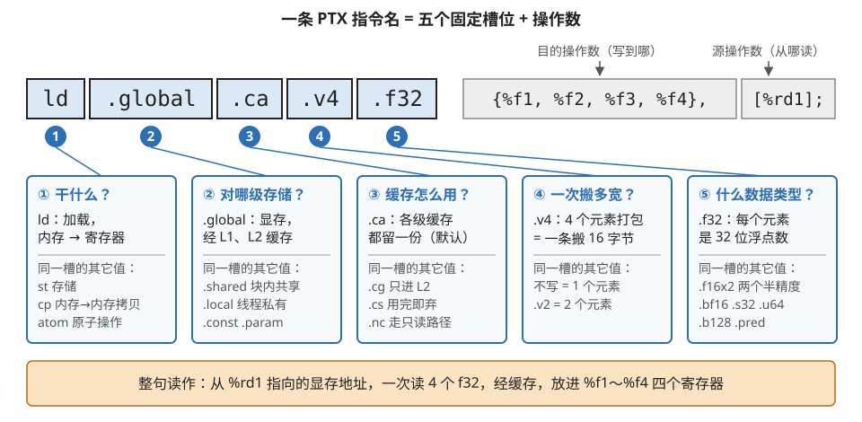
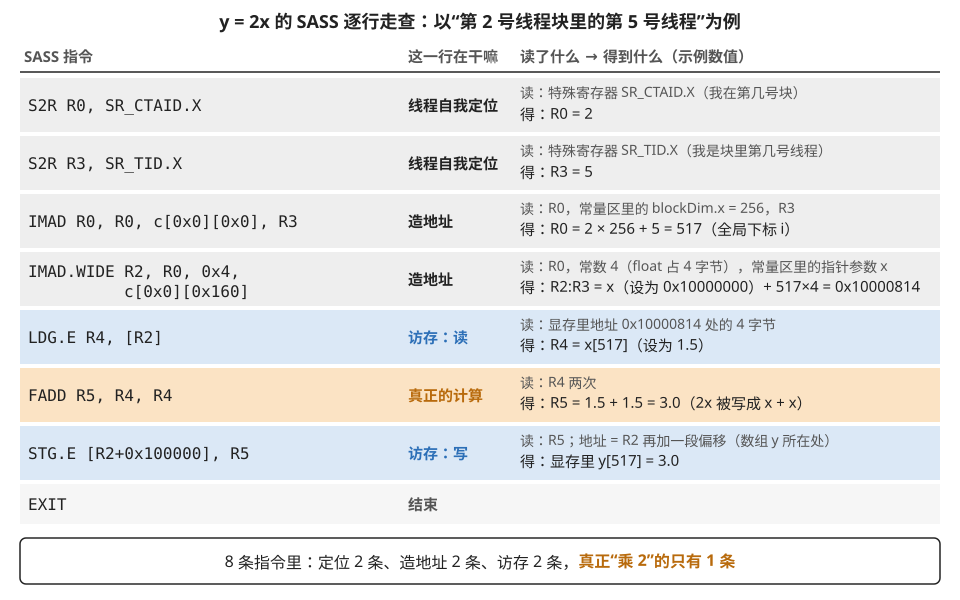
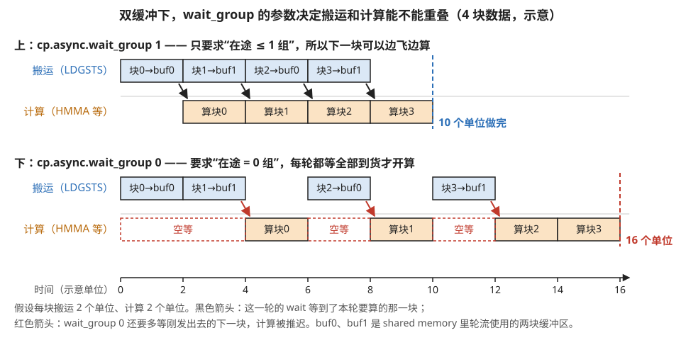
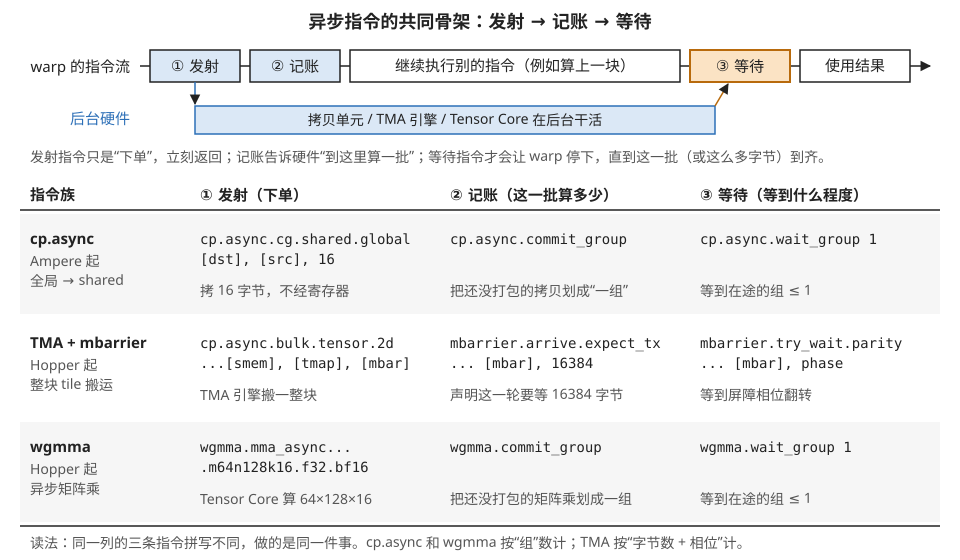
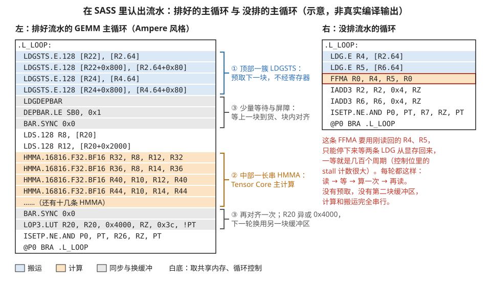

# 读懂 PTX 与 SASS：指令名的语法、常用家族与高阶器件的汇编形态

> **所属模块**：模块 10 · SIMT 核的物理实现（第 6 节讲了"为什么有 PTX/SASS 两层"，本节讲"拿到一段汇编怎么读懂"）
> **状态**：✅ 完成（第一版即按写作规范撰写。知识截至 2026-08。SASS 指令名以 NVIDIA 二进制工具文档与 nvdisasm 公开输出为据，NVIDIA 未提供完整语义手册，个别行为描述来自社区逆向，已标注）
> **本节主旨**：PTX 和 SASS 的指令名不是死记硬背的对象，而是**一套可拆解的命名语法**：`操作码.修饰符串.类型`，每个点号段回答一个固定的问题（干什么、对哪级存储、什么缓存策略、一次搬多宽、什么数据类型）。学会拆名字，一条没见过的指令也能读出七八成行为。本节先讲这套语法，再过一遍高频指令家族，然后重点看**高阶器件的汇编形态**——异步拷贝、TMA、mbarrier、wgmma 的"发射/记账/等待"三件套，以及双缓冲流水在汇编里长什么样——最后给一套"拿到一段 SASS 从哪下手"的阅读流程。这层是 ISA 之上、硅片之下的最后一层语言，全库讲过的每个硬件机制在这里都有一个对应的名字。

---

## 0. 这一节要回答的问题

- PTX 指令名由哪几段构成？每段回答什么问题？怎么拆一条没见过的指令？
- SASS 和 PTX 的常用指令怎么对应？`S2R`、`IMAD`、`LDGSTS`、`HMMA` 这些常客各是什么？
- 谓词、状态空间、缓存策略修饰符、向量宽度这些"点号段"分别落到硬件的哪？
- 异步拷贝（cp.async）、TMA、mbarrier、wgmma 在汇编里各长什么样？"组"（group）语义是什么？
- 双缓冲/软件流水在 PTX/SASS 里怎么认出来？拿到一段陌生 SASS，按什么顺序读？

---

## 1. 基础词汇：先把本节要用的词讲清楚

**指令的基本形状**。PTX 和 SASS 的每条指令都是同一个骨架：`操作码.修饰符... 目的操作数, 源操作数们`。比如 `add.f32 %f3, %f1, %f2` 读作"f32 加法：f3 ← f1 + f2"。目的在前、源在后，这个顺序两层通用。

**状态空间（state space）**。PTX 对"数据住在哪级存储"的正式称呼，以修饰符形式出现在访存指令名里：`.global`（显存）、`.shared`（shared memory）、`.local`（线程私有、实际落在显存——寄存器溢出就溢到这）、`.const`（常量内存）、`.param`（kernel 参数）。**同一个 `ld`，跟不同状态空间，走的是完全不同的硬件通路**——第 4 节访存通路那张分层图，在指令名里就是这个后缀。

**虚拟寄存器与物理寄存器**。PTX 用带类型前缀的虚拟寄存器：`%r1`（32 位整数）、`%f1`（f32）、`%rd1`（64 位，通常是地址）、`%p1`（谓词，即一位真假值），数量无限，由 ptxas 分配到物理寄存器。SASS 用物理寄存器：`R0`–`R254`、恒零的 `RZ`、谓词寄存器 `P0`–`P6` 加恒真的 `PT`。**看到 SASS 里寄存器编号的最大值，就大致知道这个 kernel 每线程用了多少寄存器**——占用率除法的输入之一。

**谓词（predicate）**。挂在指令前面的执行开关：`@%p1 bra LABEL` 读作"若 p1 为真才跳转"，`@!P0 EXIT` 读作"若 P0 为假才退出"。第 3 节讲的谓词化（把短分支变成"都执行、按开关生效"）在汇编里就是这个 `@` 前缀。

**常量存储体（constant bank）**。SASS 里形如 `c[0x0][0x160]` 的操作数：从常量内存的第 0 号 bank 偏移 0x160 处取值。**kernel 的参数（指针、尺寸）就放在这里**——所以 SASS 里到处是 `c[0x0][...]`，那是代码在读你传给 kernel 的实参。

---

## 2. PTX 指令名的语法：一套可拆解的命名法

### 2.1 拆名字的固定顺序

PTX 指令名的点号段有固定的语义槽位，从左到右大致是：**干什么 → 对哪（状态空间/作用域） → 怎么干（缓存策略/舍入/同步性） → 一次多宽（向量） → 什么类型**。**逐段走查一条典型指令**：

```ptx
ld.global.ca.v4.f32  {%f1, %f2, %f3, %f4}, [%rd1];
```

- `ld` —— 干什么：加载（load）。
- `.global` —— 对哪：全局内存（显存），走 L1/L2 通路。
- `.ca` —— 怎么干：缓存策略 cache-all，各级缓存都留副本（默认值，常省略）。
- `.v4` —— 一次多宽：4 个元素打包，一条指令搬 16 字节——第 4 节说的向量化访存，在指令名里就是这个 `.v4`。
- `.f32` —— 什么类型：每个元素是 32 位浮点。
- 操作数：4 个目的寄存器打花括号，源是方括号里的地址寄存器（方括号 = "取内容"，即解引用）。

整句人话：**"从 %rd1 指向的显存地址一次读 4 个 f32，经缓存，放进 4 个寄存器。"** 一条没背过的指令按这个槽位表拆，就能读出大意。图 8-1 把五个槽位和每个槽位的常见取值画在一起。



> **图 8-1**　一句话：PTX 指令名里每个用点号隔开的段，都在回答一个固定的问题；按槽位逐段翻译，就能读懂一条没见过的指令。
>
> **先知道一件事**：PTX 是 NVIDIA 显卡的中间汇编语言。CUDA 代码先被编译成 PTX，再由驱动里的工具翻译成硬件真正执行的机器指令（SASS）。PTX 的一条指令相当于一个最小操作，比如"从某个地址读几个数"。
>
> **按这个顺序看**：
> 1. 上排蓝框是指令名本身 `ld.global.ca.v4.f32`，被点号切成五段，编号 1～5。右边两个灰框是操作数：花括号里的四个 %f 是目的寄存器（读回来的数放在哪），方括号里的 %rd1 是源（方括号表示"取这个地址里存的内容"）。目的在前、源在后。
> 2. 每段顺着蓝线落到下面一张卡片，卡片第一行是这个槽位回答的问题，第二块是本例的答案：① ld 是"加载"，从内存读到寄存器；② .global 是"显存"，这次读取要经过 L1、L2 两级缓存；③ .ca 是"各级缓存都留一份"，这是默认值，平常常省略；④ .v4 是"一次 4 个元素"；⑤ .f32 是"每个元素是 32 位浮点数"。④ 和 ⑤ 合起来是 4 × 4 字节 = 16 字节，一条指令搬完。
> 3. 卡片下半部的灰字是同一槽位的其它取值。换一个值，只改变这一个问题的答案：把 .global 换成 .shared，读的就是线程块内共享的片上存储（shared memory）；把 .ca 换成 .nc，走的是只读数据通路。
> 4. 最下面的橙色条是五段加操作数拼成的整句翻译。
>
> **打个比方**：像读一张快递单：寄送方式、收件地址、保价方式、件数、物品类别各占一栏。栏位是固定的，某一栏的写法没见过，也知道它在说哪方面的事。
>
> **看懂的标志**：能拆开 `st.shared.v2.f32`：存储（st），写到线程块共享的片上存储（.shared），一次 2 个元素（.v2），每个是 32 位浮点数（.f32），共 2 × 4 = 8 字节；缓存策略槽没写，用默认。
>
> **与正文的对照**：对应 §2.1 的逐段走查和 §2.3 的修饰符轴。§2.3 另有作用域轴（.cta/.gpu/.sys）和舍入轴（.rn 等），出现在原子、栅栏和浮点运算指令上，ld 用不到，图中没画。
>
> 来源：本库自绘。

### 2.2 高频操作码速查

| 操作码 | 干什么 | 常见完整形态举例 |
| --- | --- | --- |
| `ld` / `st` | 加载 / 存储 | `st.shared.f32 [%rd2], %f1`（写 shared） |
| `mov` / `cvt` | 寄存器间搬运 / 类型转换 | `cvt.rn.f16.f32`（f32 转 f16，就近舍入） |
| `add`/`mul`/`fma` | 算术；fma = 乘加一条过 | `fma.rn.f32 %f4, %f1, %f2, %f3`（f4←f1×f2+f3） |
| `mad` | 整数乘加（常用于算地址） | `mad.lo.s32`（取乘积低 32 位再加） |
| `setp` | 比较，结果写进谓词寄存器 | `setp.lt.s32 %p1, %r1, %r2`（p1 ← r1<r2） |
| `bra` | 跳转（几乎总是带谓词） | `@%p1 bra LOOP` |
| `bar` / `barrier` | 块内/簇内屏障 | `bar.sync 0`（即 `__syncthreads`） |
| `shfl.sync` | warp 内寄存器交换 | `shfl.sync.bfly.b32`（蝶形交换，归约用） |
| `atom` / `red` | 原子操作（要/不要返回旧值） | `atom.global.add.f32` |
| `mma` / `wgmma` | Tensor Core 矩阵乘加 | 见 §5.4 |
| `cp.async` | 异步拷贝 全局→shared | 见 §5.2 |
| `fence` / `membar` | 内存栅栏 | `fence.acq_rel.gpu`（GPU 作用域，第 5 节的 fence） |

### 2.3 修饰符的几条轴

把常见修饰符按"槽位"归类，遇到组合按轴拆开读：

- **状态空间轴**：`.global / .shared / .local / .const / .param`——决定走哪条硬件通路。
- **缓存策略轴**（挂在 ld/st 上）：`.ca`（都缓存）、`.cg`（只 L2、绕 L1）、`.cs`（流式、用完即弃）、`.nc`（走只读路径，CUDA 里的 `__ldg`）。B3 精读里 DeepEP 那句 `ld.global.nc.L1::no_allocate` 现在能整句读了：**只读路径加载，且明确要求 L1 不要为它腾座位**——读一次性数据不污染缓存。
- **作用域轴**（挂在原子/栅栏/mbarrier 上）：`.cta / .cluster / .gpu / .sys`——这条操作的可见性要广播到哪一圈（第 5 节 scope 的指令形态；圈越大越慢）。
- **舍入轴**（浮点运算）：`.rn`（就近）、`.rz`（向零）等——`fma.rn` 里那个 `.rn` 的意思。
- **类型轴**：`.f32 .f16x2 .bf16 .s32 .u64 .b128 .pred`——注意 `.f16x2` 是"一个 32 位寄存器装两个 f16 一起算"，半精度吞吐翻倍的指令级根源。
- **同步性轴**：名字里的 `.sync` 后缀（`shfl.sync`、`mma.sync`）表示"参与的线程在此汇合后一起执行"——Volta 独立线程调度（第 3 节）之后，warp 级协作指令都要显式带上它。

---

## 3. SASS：物理层的方言

### 3.1 从一段真 SASS 认识常客

SASS 指令大写、贴物理细节。把第 1 节那个 `y = 2x` kernel 的 SASS 主体拿来逐行走查（Ampere 量级，为教学略去控制位注释）：

```sass
S2R  R0, SR_CTAID.X               // 特殊寄存器 blockIdx.x 读进 R0
S2R  R3, SR_TID.X                 // threadIdx.x 读进 R3
IMAD R0, R0, c[0x0][0x0], R3      // R0 = blockIdx.x × blockDim.x + threadIdx.x
IMAD.WIDE R2, R0, 0x4, c[0x0][0x160]  // 64 位地址 = 基址(参数) + R0×4
LDG.E R4, [R2]                    // 从显存加载 x[i]
FADD R5, R4, R4                   // 2x 编译器写成 x+x（省一个常数）
STG.E [R2+0x100000], R5           // 存回 y[i]（y 基址与 x 差一段偏移的情形）
EXIT
```

读出四件事。第一，**`S2R`（Special register To Register）**：threadIdx/blockIdx 不是普通寄存器，要用专门指令从特殊寄存器搬出来。第二，**`IMAD` 是地址算术的主力**——整数乘加指令在这里根本不是在"算数学"，而是在造地址；很多 kernel 的 SASS 里 IMAD 比浮点指令还多，第 7 节说的"发射带宽被开销指令吃掉"指的就是这类。第三，**`c[0x0][0x0]` 和 `c[0x0][0x160]`**：blockDim 和指针参数都从常量 bank 里来。第四，**`.E`** 后缀 = extended，64 位地址模式；若是 `LDG.E.128` 则再叠一层"一次 128 位"的向量宽度——PTX 的 `.v4.f32` 落到 SASS 就是它。图 8-2 用一组具体数值把这 8 条指令逐行走一遍。



> **图 8-2**　一句话：`y = 2x` 这个最简单的 kernel 编译成 8 条 SASS 指令，只有一条在做"乘 2"，其余在确认自己是谁、计算地址、读写显存。
>
> **先知道一件事**：SASS 是 GPU 硬件真正执行的机器指令。R0、R2 这样的名字是物理寄存器，每个线程各有一套。同一条指令由一个 warp（32 个线程）同时执行，每个线程用自己的寄存器，算出各自的结果。图里追踪的是其中一个线程。
>
> **按这个顺序看**：
> 1. 左列是指令，中列是它的用途，右列灰字是它读了什么，黑字是它得出什么。数值是假设的：这个线程在第 2 号线程块里，是块内第 5 号线程，每块 256 个线程。
> 2. 前两行：S2R 把硬件维护的"我在第几号块、我是块里第几号线程"搬进普通寄存器，得到 R0 = 2、R3 = 5。
> 3. 第三行：IMAD 是整数乘加，a × b + c 一条算完。这里算 2 × 256 + 5 = 517，就是源码里的全局下标 i。256 不在寄存器里，而是直接从常量区 `c[0x0][0x0]` 取；kernel 的启动配置和实参都放在这块只读区域里。
> 4. 第四行：IMAD.WIDE 再做一次乘加，但结果是 64 位，占 R2、R3 两个寄存器。它把 517 乘以 4（一个 float 占 4 字节），加到数组 x 的起始地址上（从常量区 `c[0x0][0x160]` 取，这里假设是 0x10000000），得到 x[517] 的地址 0x10000814。
> 5. 蓝底两行是访存：LDG 从显存读出 x[517]，STG 把结果写回 y[517]。橙底那一行 FADD 才是真正的计算，编译器把 2x 写成了 x + x。
>
> **打个比方**：像去仓库取一件货、加工、再放回去：先看工牌确认自己是几号（S2R），再按"几排几号"算出货架位置（IMAD），走过去拿（LDG），在手上加工一下（FADD），放到另一排（STG）。加工只占一小步。
>
> **看懂的标志**：能回答"为什么很多 kernel 的 SASS 里 IMAD 比浮点指令还多"：每次访存前都要把下标换算成字节地址，这笔地址运算由整数乘加完成；计算本身越简单，这部分占比越大。
>
> **与正文的对照**：指令与 §3.1 的代码块逐行一致。STG 的偏移 0x100000 沿用正文假设的"y 的基址与 x 差一段固定偏移"的情形；真实编译通常会从常量区另取 y 的基址，再算一次地址。0x10000000 是为演示取的假设值。
>
> 来源：本库自绘。

### 3.2 PTX → SASS 高频对应表

| PTX | SASS | 说明 |
| --- | --- | --- |
| `ld.global` / `st.global` | `LDG` / `STG` | 宽度后缀 `.E.128` 等 |
| `ld.shared` / `st.shared` | `LDS` / `STS` | |
| `fma.f32` / `.f64` / 半精度 | `FFMA` / `DFMA` / `HFMA2` | HFMA2 = 一条算两个 f16 |
| `mad`（地址算术） | `IMAD`（及 `IMAD.WIDE`） | 乘加当加法器用也常见（IMAD R0, RZ, RZ, R1 即 mov） |
| `setp` + `@%p bra` | `ISETP` + `@P0 BRA` | 分支发散的物理形态 |
| `bar.sync` | `BAR.SYNC` | 命名屏障是 `BAR.SYNC id`（B2 的 ping-pong 交接） |
| `shfl.sync` | `SHFL` | |
| `atom` / `red` | `ATOM` / `RED` | |
| `cp.async` | `LDGSTS` | 名字直白：LDG + STS 一条过，绕开寄存器 |
| `mma.sync` | `HMMA` / `IMMA`（按类型） | 见 §4 练习 2 |
| `wgmma` | `HGMMA` 一族（Hopper，据 nvdisasm 输出） | |
| `fence` / `membar` | `MEMBAR` | 作用域跟在后面 |
| 重收敛管理（编译器插入） | `BSSY` / `BSYNC` | 第 3 节分支重收敛点的物理形态（Volta+） |
| 逻辑运算 | `LOP3` | 任意三输入布尔函数，一条指令一张真值表 |

另有两个没有 PTX 对应、但读 SASS 常见的：**`NOP`**（占位）和**统一数据路径寄存器 `UR`、指令 `UIMAD` 等**（Turing 起：整个 warp 取值相同的量——比如公共基址——走一条独立的标量路径，省 32 份重复计算；看到 UR 就读作"warp 公共值"）。

## 4. 从指令名读出行为：三个练习

**练习 1**：`LDG.E.128 R4, [R2.64]`。拆：LDG（显存加载）+ .E（64 位地址）+ .128（一次 128 位 = 4 个 f32，写进 R4/R5/R6/R7 连续四个寄存器）。行为：一条指令搬 16 字节。**判断**：源码里的 float4 向量化生效了；反过来，如果源码写了 float4 而 SASS 里只有 `LDG.E.32`，说明对齐没满足、向量化没兑现——这就是"看回执"的现金场景。

**练习 2**：`HMMA.16816.F32.BF16 R0, R4, R8, R0`。拆：HMMA（半精度矩阵乘加，Tensor Core）+ 16816 —— **这串数字直接是矩阵形状 m16 n8 k16**（一条指令算 16×8 的输出 tile、吃深度 16）+ F32（累加器 f32）+ BF16（输入 bf16）。目的和末源都是 R0：**累加器原地累加**，正是模块 12 讲的 fragment 驻留寄存器。**判断**：循环体里 HMMA 成串出现 = Tensor Core 吃上了；数一数 HMMA 与 LDS 的比例，还能粗估复用率。

**练习 3**：一段带谓词的 SASS：

```sass
ISETP.GE.AND P0, PT, R0, c[0x0][0x168], PT   // P0 = (i >= n)
@P0 EXIT                                     // 越界线程直接退出
```

拆：ISETP（整数比较写谓词）+ .GE（大于等于）+ .AND（与上一个谓词 PT=恒真复合，即不复合）。这两行就是源码里 `if (i < n)` 边界防护的物理形态——**没有分支跳转，越界线程被谓词直接关掉**，第 3 节"短路径谓词化"的实物。

---

## 5. 高阶器件的汇编形态：同步、异步与排流水

这一节是本篇的重点：全库讲过的异步机制，每个在 PTX 里都是一小族指令，而且**共享同一个设计模式——"发射 / 记账 / 等待"三件套**。认下这个模式，四族指令一起通。

### 5.1 同步家族：一个词根，四个圈层

- `bar.sync 0` —— 块内全员屏障（`__syncthreads`）。`bar.sync 1, 128` 是**命名屏障**：编号 1、只等 128 个线程——B2 里 FA-3 两个 warpgroup 的 ping-pong 交接，PTX 里就是两条不同编号的 `bar.sync`。
- `barrier.cluster.arrive / .wait` —— Hopper 线程块簇的跨块屏障。
- `fence.acq_rel.cta / .gpu / .sys` —— 内存栅栏按作用域分级（第 5 节讲过的"圈层"：块内 / 全 GPU / 跨设备）。B3 里 DeepEP 发 RDMA 前那句 `fence.release.sys` 属于最大圈：**让网卡（系统级观察者）看到之前的所有写入**。
- 原子指令同样带圈层：`atom.add.release.gpu.global.f32`——修饰符轴的组合读法在这全用上。

### 5.2 异步拷贝与"组"语义：排流水的指令级根源

**先拆动词：`cp` 是 copy（拷贝）的缩写**，和 Unix 命令 `cp` 同一个缩写习惯。这个新动词的出现本身就有信息量：PTX 里搬数据原本只有两个动词——`ld`（内存 → 寄存器）和 `st`（寄存器 → 内存），想把显存数据搬进 shared memory 必须两条接力（`ld.global` 进寄存器、`st.shared` 出去），数据在寄存器里过一道手。而 `cp` 的语义是**内存 → 内存直接拷贝，寄存器不参与**——操作的语义类别变了，按 PTX 的命名习惯就新开一个操作码，而不是复用 ld/st。SASS 层的对应名 `LDGSTS`（LDG+STS 合体）反而更直白地暴露了它替代的是哪两条指令。`.async` 才是"异步"：发出即返回，稍后收货。后来这个家族的成员都以 `cp` 开头（`cp.async.bulk.tensor...`、`cp.reduce.async.bulk`），槽位读法下 `cp.async` 两段合读就是"内存到内存的拷贝，异步执行"。

Ampere 的 `cp.async` 是"发射/记账/等待"模式的第一个完整样本：

```ptx
cp.async.cg.shared.global [smem_addr], [gmem_addr], 16;   // 发射：全局→shared，16 字节，绕 L1
cp.async.commit_group;                                    // 记账：到此为止的 cp.async 打包成"一组"
cp.async.wait_group 1;                                    // 等待：直到在途的组 ≤ 1
```

三条各干一件事。发射指令只是"下单"，立即返回；`commit_group` 在流水账上划一道线，把此前未提交的下单打包成一组；`wait_group N` 的语义要精确记住——**"等到最多还剩 N 组在途"**，N=0 即全部到货。**用一个双缓冲走查看它怎么变成流水**：

```ptx
// 序幕：发第 0 块
cp.async ... [buf0], ...;  cp.async.commit_group;
LOOP:
cp.async ... [buf(k+1)%2], ...;  cp.async.commit_group;   // 发下一块（第 k+1 组）
cp.async.wait_group 1;    // 只等到"在途 ≤1 组"：第 k 组必已到货，第 k+1 组随它飞
bar.sync 0;               // 块内对齐后用 buf k%2 计算
...计算...
bar.sync 0;               // 再对齐一次：下一轮要往 buf k%2 写第 k+2 块，必须等所有线程都算完这一块
@%p bra LOOP;
```

`wait_group 1` 这个"1"就是**允许几组在途** = 流水里"跑在前面的搬运"的数量。第 3 节（40 模块）手排流水讲的"wait 深度 = N−2 组在途"，指令级根源就是这个参数。**改错会怎样**：写成 `wait_group 0`——每轮等到全部到货才算，流水退化成串行，不报错、白慢一截；忘了 `commit_group`——账本上没有组可等，`wait_group` 形同虚设，读到半成品数据。SASS 侧：`cp.async` 编成 **`LDGSTS`**（一条指令 LDG+STS 直通 shared、绕开寄存器堆），组等待常见 `DEPBAR` 或带计数的屏障形态。图 8-3 把 `wait_group 1` 和 `wait_group 0` 两种写法画成时间线对比。



> **图 8-3**　一句话：同样的双缓冲代码，`wait_group` 后面写 1，搬运和计算重叠，4 块数据用 10 个单位时间；写 0，两者只能轮流进行，要 16 个单位。
>
> **先知道一件事**：cp.async 是一条"只下单、不等货"的拷贝指令。发出后线程马上往下执行，数据由硬件在后台从显存搬进 shared memory（线程块共享的片上存储）。`commit_group` 把已经下的单打成一包，叫一"组"；`wait_group N` 让线程停下，直到还没到货的组不超过 N 个。
>
> **按这个顺序看**：
> 1. 横轴是时间，单位是示意的。每块数据搬运要 2 个单位（蓝条），计算要 2 个单位（橙条）。buf0、buf1 是 shared memory 里的两块缓冲区，块 0、2 放 buf0，块 1、3 放 buf1，轮流使用，这就是双缓冲。
> 2. 看上半部分（wait_group 1）：每一轮先发出下一块的拷贝，再执行 wait_group 1。此时在途的有两组：本轮要算的块 k 和刚发出的块 k+1。"在途 ≤ 1"意味着只需等较早的块 k 到货，块 k+1 可以继续在后台搬。黑色箭头表示"块 k 到了，开始算块 k"。于是算块 0 时块 1 在搬，算块 1 时块 2 在搬，蓝条和橙条在时间上叠在一起，总共 10 个单位。
> 3. 看下半部分（wait_group 0）：每一轮同样先发出下一块，但 wait_group 0 要求在途组数为零，连刚发出的块 k+1 也要到货才放行。红色箭头显示：算块 0 要等块 1 搬完才能开始。计算一行里的红色虚线框是空等的时间。总共 16 个单位。
> 4. 两种写法都能编译通过，结果也都正确，只是下面慢了六成。
>
> **打个比方**：厨房里一人备菜、一人炒菜。上面是"炒这一盘时，下一盘的菜已经在备"；下面是炒菜的人坚持"下一盘的菜也备好了，我才开火炒这一盘"，于是每盘之间都在干等。
>
> **看懂的标志**：能回答"忘了写 commit_group 会怎样"：拷贝没有被打进任何一组，账本上在途的组数是 0，已经满足"≤ 1"，wait_group 1 立刻放行，线程可能读到还没搬完的数据；结果出错，却不报错。
>
> **与正文的对照**：对应 §5.2 的双缓冲走查。图中把块 k+1 的搬运画在"算块 k"的同一时段，是简化画法：实际上拷贝一发出就开始，与前一块的搬运会有部分重叠。正文代码在计算前后各有一次 `bar.sync`：计算后的那一次防止快的 warp 已经往缓冲区里写下一块、慢的 warp 还在读这一块（图 8-5 左侧底部也画了这一行）。
>
> 来源：本库自绘。

### 5.3 TMA + mbarrier：名字最长的指令，逐段也能拆

> 📍 这些指令背后的搬运机制（描述符里写了什么、引擎做了什么）见[模块 14 第 3 节](../14-数据搬运/03-Hopper·TMA与mbarrier按字节记录.md)。

Hopper 把"搬运"升级成硬件引擎（TMA），配套的 PTX 名字吓人但完全符合 §2 的槽位法：

```ptx
cp.async.bulk.tensor.2d.shared::cluster.global.mbarrier::complete_tx::bytes
        [smem_addr], [tensor_map, {x, y}], [mbar];
```

逐段：`cp.async`（还是异步拷贝家族）+ `.bulk`（整块搬运，非逐线程）+ `.tensor.2d`（按张量描述符搬一个二维 tile，源地址不再是裸指针而是 `tensor_map`——TMA 描述符，swizzle/边界都在里面）+ `.shared::cluster`（目的地是簇内可见的 shared）+ `.global`（源在显存）+ `.mbarrier::complete_tx::bytes`（**完成方式：不是给谁返回值，而是把搬完的字节数记到 mbar 这个 mbarrier 的账上**）。等待侧就是第 5 节讲过的 mbarrier 三件套：

```ptx
mbarrier.init.shared.b64 [mbar], 1;                        // 建屏障：1 个参与者
mbarrier.arrive.expect_tx.shared.b64 _, [mbar], 16384;     // 记账：本相位期待 16384 字节
mbarrier.try_wait.parity.shared.b64 %p, [mbar], %phase;    // 等待：轮询相位翻转
```

发射（TMA 下单）/ 记账（expect_tx 声明期待字节数）/ 等待（相位票）——**同一个三件套模式，只是"组计数"换成了"字节记账 + 相位"**。B2 精读里"期待字节数写错的两类静默事故"，对应的就是 `expect_tx` 那个字面量。

### 5.4 wgmma / tcgen05：计算也用同一个模式

Hopper 的异步矩阵乘把三件套原样搬到计算指令上：

```ptx
wgmma.fence.sync.aligned;                                  // 开工前：寄存器交接栅栏
wgmma.mma_async.sync.aligned.m64n128k16.f32.bf16.bf16
        {d0, ..., d63}, desc_a, desc_b, 1, 1, 1, 0, 0;     // 发射：64×128×16 的异步矩阵乘
wgmma.commit_group.sync.aligned;                           // 记账：打包成组
wgmma.wait_group.sync.aligned 1;                           // 等待：在途 ≤1 组
```

名字里 `m64n128k16` 又是直读的形状；`desc_a/desc_b` 是 shared memory 描述符（操作数直接从 shared 喂，不过寄存器——对比 §4 练习 2 的 HMMA 还要 LDS 到寄存器）；`.sync.aligned` 表示整个 warpgroup 128 线程汇合执行。**和 cp.async 的 wait_group 完全同款的"组"语义**，B1↔B2 对照表里"发了不等 + 分组等待"这行的指令原文就在这。Blackwell 的 `tcgen05` 一族（`tcgen05.mma`、`tcgen05.cp`、配 TMEM 的 `tcgen05.ld/st`）延续同一模式，形状和存储换代（累加器进 TMEM），据 PTX 8.x 文档，细节以官方 ISA 文档为准。图 8-4 把 §5.2 到 §5.4 的三族指令按"发射 / 记账 / 等待"三列并排。



> **图 8-4**　一句话：Ampere 和 Hopper 上的三族异步指令（拷贝、TMA 搬运、异步矩阵乘）都由"发射、记账、等待"三步组成，认出这三步就认出了整族。
>
> **先知道一件事**：普通指令是"做完才往下走"；异步指令是"交给后台硬件去做，自己先往下走"。代价是：之后要用结果时，必须有办法确认后台已经做完。记账和等待这两步就是为此存在的。
>
> **按这个顺序看**：
> 1. 上面一条是一个 warp 的指令流，从左往右执行。① 发射之后，下方蓝条表示后台硬件开始干活；warp 并不停下，接着 ② 记账，再去执行别的指令。到 ③ 等待时 warp 才停下，直到后台的活干完（橙色箭头），然后使用结果。发射和等待之间隔得越远，后台的耗时被藏得越彻底。
> 2. 下面的表每行一族，三列对应三步。第一行 cp.async：发射一次 16 字节拷贝；commit_group 把还没打包的拷贝打成一组；wait_group 1 等到在途组数 ≤ 1。
> 3. 第二行 TMA（Hopper 的张量搬运引擎，一条指令搬一整块二维数据）：记账方式变了，不数"组"，而是用 mbarrier（放在 shared memory 里的一个计数屏障）登记"这一轮应该到 16384 字节"；等待是等屏障的相位翻转。相位是一个每完成一轮就在 0 和 1 之间翻一次的标记，翻了就说明字节到齐了。
> 4. 第三行 wgmma（Hopper 的异步矩阵乘）：把一个 64×128×16 的矩阵乘交给 Tensor Core（专做矩阵乘的计算单元），记账和等待与 cp.async 完全同款，只是前缀从 cp.async 换成了 wgmma。
>
> **打个比方**：网购。下单（发射）后照常上班；订单号（记账）让你知道哪几件是一批；快递柜的取件通知（等待）响了才去取。三家网店的订单页长得不一样，流程都是这三步。
>
> **看懂的标志**：能回答"把 `wgmma.wait_group 1` 改成 0 有什么后果"：要等所有已发出的矩阵乘都算完才往下走，下一块的矩阵乘不能再和当前块的其它工作（例如 softmax）重叠；结果照样正确，只是变慢。
>
> **与正文的对照**：三行分别对应 §5.2、§5.3、§5.4 的代码。TMA 行"记账"一列的 expect_tx，在实际代码里通常与发射写在一起，这里按作用归到记账一列。Blackwell 的 tcgen05 一族沿用同样的三步，图中没有列出。
>
> 来源：本库自绘。

### 5.5 在 SASS 里认出流水

综合以上，一个排好流水的 GEMM 主循环在 SASS 里有三个肉眼特征：**循环顶部一簇 `LDGSTS`（或 TMA 的 bulk 拷贝）**——预取下一块；**中部一长串 `HMMA/HGMMA`**——主计算；**边界上少量 `BAR.SYNC`/`DEPBAR` 和两套轮流出现的 shared 地址偏移**——双缓冲在换手。反例特征也好认：如果 `LDG` 和 `FFMA` 交替出现、中间夹着长 stall（控制位里 stall 计数大，第 2 节讲过的编译器回执），那是没排流水的裸依赖链。图 8-5 把两种循环并排画出。



> **图 8-5**　一句话：排好流水的主循环在 SASS 里有固定的长相：顶部一簇 LDGSTS、中间一长串 HMMA、边界上几条屏障和一次缓冲区切换；没排流水的循环则是读一个、等一下、算一次。
>
> **先知道一件事**：GPU 程序的时间几乎都花在主循环里。读 SASS 时先找 `@P0 BRA .L_LOOP` 这种往回跳的指令，从跳转目标（标签 `.L_LOOP:`）到这条跳转之间就是循环体。每行的第一个词是操作码，决定这条指令属于哪一类。
>
> **按这个顺序看**：
> 1. 先看左边的底色：蓝底是搬运，橙底是计算，灰底是同步与换缓冲，白底是从 shared memory 取数和循环控制。
> 2. ① 顶部 4 条 LDGSTS：这是 cp.async 的机器指令，一条同时完成"从显存读"和"写进 shared memory"，数据不经过寄存器。它们搬的是下一轮要用的数据，发出后不等。
> 3. ③ 紧接着的 LDGDEPBAR 相当于 commit_group（把刚才的拷贝打成一组），DEPBAR.LE SB0, 0x1 相当于 wait_group 1（等到未完成的组 ≤ 1）。BAR.SYNC 让整个线程块在此对齐，即源码里的 `__syncthreads()`。
> 4. ② 中间一长串 HMMA：Tensor Core 的矩阵乘加指令，16816 表示一条指令算 16×8 的一块输出、累加深度 16。循环体里 HMMA 占大头，说明时间主要花在 Tensor Core 上。
> 5. 底部 ③：再对齐一次，然后 LOP3 把 shared memory 基址 R20 与 0x4000 做异或。0 异或后变 0x4000，0x4000 异或后变回 0，所以下一轮读的是另一块缓冲区。这就是双缓冲在汇编里的样子。
> 6. 再看右边：两条 LDG 从显存读到寄存器 R4、R5，紧跟着的 FFMA 马上要用这两个值，只能停下来等几百个周期。每轮都是"读、等、算一次"，没有预取，也没有第二块缓冲区。
>
> **打个比方**：左边像一条流水线：送料车（LDGSTS）提前把下一批原料送进车间，机床（HMMA）一直在加工这一批；右边像每做一个零件都要亲自跑一趟仓库。
>
> **看懂的标志**：拿到一段陌生循环，只数三样东西就能判断有没有排流水：有没有成簇的 LDGSTS（或 TMA 的整块拷贝），HMMA 是否占大头，shared memory 地址是否在两套偏移之间轮换。
>
> **与正文的对照**：对应 §5.5 的三个肉眼特征和反例。左边是按 Ampere 上常见形态拼出来的示意，不是某个真实 kernel 的编译输出，寄存器编号和偏移量都是假设的；LDGDEPBAR 与 DEPBAR 作为 cp.async 提交与等待的 SASS 形态，据社区反汇编资料。LOP3 最后的 0x3c 是"异或"这张真值表的编码（§3.2 表中的 LOP3）。
>
> 来源：本库自绘。

---

## 6. 拿到一段陌生 SASS：四步阅读流程

1. **先框出主循环**。找 `BRA` 回跳的目标标签，标签到 BRA 之间就是循环体——kernel 的时间几乎都花在这里，循环外的序幕/收尾先不读。
2. **数指令构成，判断主角**。循环体里按家族计数：HMMA/FFMA（算）、LDG/LDS/LDGSTS（搬）、IMAD/ISETP（地址与控制开销）。**算例**：某循环体 64 条指令，HMMA 4 条、LDS 8 条、IMAD 30 条——不用跑 profiler 就能预判：发射带宽被地址算术吃掉了，附录 A1 清单里的"指令发射 bound"候选。
3. **找同步点划分阶段**。`BAR.SYNC`/`DEPBAR`/mbarrier 等待把循环体切成"搬运段/计算段"，对照 §5.5 的特征判断有没有流水、几级流水。
4. **需要精读时挂回源码**。编译带 `-lineinfo`，Nsight Compute 的 Source 页把 SASS 行和源码行并排——第 6 节讲过的对照通道，热点定位到指令后回源码改。

---

## 7. 开发者视角

- **拿到汇编的三条路**：`cuobjdump -sass a.out`（从二进制反出 SASS）、`nvcc -ptx`（看 PTX）、Nsight Compute 的 Source/SASS 页（带热点计数的对照视图，日常首选）。Compiler Explorer（godbolt.org）支持 CUDA，改一行源码立刻看两层汇编变化，是练习 §2 拆名字的最好沙盒。
- **高层语言用户也用得上**：Triton 的 `kernel.asm['ptx']` 导出后，用本节的槽位法检查两件事就够——有没有 `wgmma/mma`（Tensor Core 兑现没有）、有没有 `cp.async/bulk.tensor`（异步搬运兑现没有）。不必逐条读完。
- **写的场景极少，读的场景常有**：内联 PTX（`asm volatile`）只在库代码里偶见（DeepEP 那类 ISA 边缘压榨）；但**读**汇编是性能工作的日常——验证向量化、验证指令选择、解释 profiler 的 stall 都要它。

## 8. 最新架构落点（时效锚点 · 知识截至 2026-08）

- **Hopper（PTX 8.x）**是异步指令族的大爆发：`cp.async.bulk.tensor`（TMA）、`wgmma`、`mbarrier` 的 expect_tx、`setmaxnreg`（B2 里在 warpgroup 之间重新分配寄存器配额的那条）、簇级 `barrier.cluster`。读 Hopper kernel 的 SASS，一半功课在这几族上。
- **Blackwell** 的 `tcgen05` 一族接棒 wgmma（形状更大、累加器进 TMEM），PTX 文档已公开，SASS 层命名以 nvdisasm 实际输出为准。这一族里有两个新的"点号段"值得按 §2 的槽位法拆一遍：
  - **`.cta_group::1` / `.cta_group::2`**——决定这条矩阵指令是一个线程块自己做，还是**和簇内配对的那个块一起做**（模块 12 第 1 节 §4.1）。写成 `::2` 时操作数在两个 SM 之间分片，搬运量减半。**这是第一个把"跨 SM 协作"编进指令名的修饰符。**
  - **块缩放相关的修饰符**——低精度格式的缩放因子从哪取、按什么块大小配对（模块 50 第 2 节 §4.6）。**它的出现意味着"元数据通路"第一次成了指令名的一部分。**
- **读 Blackwell 的 SASS 时多一个必查项**：除了原来的"HMMA 成串出现 = Tensor Core 吃上了"，还要看 **TMEM 相关的搬运指令（`tcgen05.ld/st/cp` 一族）在不在**——累加器进了 TMEM 之后，主循环里原本那些累加器寄存器的读写会消失，**看不到它们不是"没算"，是"换地方了"**。
- **SASS 无官方语义手册**是常态：NVIDIA 只公开指令列表（CUDA Binary Utilities 文档），语义靠 PTX 对照与社区逆向（如 GPGPU-Sim、各微基准论文）。本节 SASS 描述均属"据公开资料"级置信，读者应以自己机器上 `cuobjdump` 的实际输出为准——**这也是为什么方法（槽位拆解）比背指令表重要**。
- **AMD 对照**：CDNA 的 GCN ISA 有完整官方手册（这点比 NVIDIA 开放），指令风格如 `s_waitcnt vmcnt(0)`——一条显式的"等 N 个访存在途"，和 `wait_group N` 的思想一模一样，模块 01 撞名表之外又一个"同思想不同拼写"。

## 9. 术语卡

### 状态空间（state space）

**定义**：PTX 对存储层级的正式分类，以修饰符出现在访存指令名里：`.global`（显存）、`.shared`、`.local`（线程私有溢出区）、`.const`、`.param`。同一个 ld/st 跟不同状态空间，走不同硬件通路。

**为什么存在**：GPU 的存储不是一个统一地址空间里的匀质内存，而是通路、延迟、共享范围完全不同的几套硬件；指令名里显式标出空间，硬件不用猜、编译器能各自优化，读汇编的人一眼看出这次访问贵不贵。

**语境例句**："SASS 里冒出一堆 LDL/STL，你寄存器溢出了。"——意思是：出现了 local 空间的访存指令，说明寄存器不够、变量被溢出到显存，性能要出事。

### 谓词（predicate）

**定义**：一位真假值寄存器（PTX 的 `%p`，SASS 的 `P0`–`P6`），以 `@%p` / `@!P0` 前缀挂在任意指令上决定它是否生效。比较指令（setp/ISETP）负责生产谓词。

**为什么存在**：SIMT 的 32 线程锁步执行，无法让个别线程"跳过"一条指令——谓词提供了开关：指令照发、被关掉的线程不写结果。短分支的谓词化和边界防护都靠它，代价是关掉的槽位照样占发射周期。

**语境例句**："这段 if 编译器直接谓词化了，SASS 里没有 BRA。"——意思是：分支被展平成带 @P 前缀的直线代码，两路都执行但按开关生效，没有发散开销也没有跳过收益。

### 组语义（commit_group / wait_group）

**定义**：异步指令族的进度管理模式：发射后用 `commit_group` 把未提交的操作打包成组，`wait_group N` 等待"在途组数 ≤ N"。cp.async 和 wgmma 共用这套。

**为什么存在**：异步操作需要一个"等到什么程度"的表达，逐操作等太细、全等完（N=0）又杀死流水；按组计数让"允许几批跑在前面"变成一个参数——软件流水的深度在指令级就是这个 N。

**语境例句**："把 wait_group 从 0 改成 1，主循环立刻重叠起来了。"——意思是：允许一组搬运在途，计算不再等当轮到货，双缓冲生效。

### LDGSTS

**定义**：SASS 指令，`cp.async` 的物理形态：一条指令完成"从全局内存读 + 写进 shared memory"，数据不经过寄存器堆。Ampere 引入。

**为什么存在**：传统搬运要 LDG 到寄存器再 STS 进 shared，占寄存器、占两条指令、且同步地堵住 warp；LDGSTS 直通并异步化，寄存器省下来给累加器，warp 发完即走——软件流水的硬件地基。

**语境例句**："循环顶上那簇 LDGSTS 就是在预取下一块。"——意思是：看到成簇的异步直通搬运指令，即可认定这个 kernel 排了流水。

### 特殊寄存器与 S2R

**定义**：threadIdx、blockIdx、laneid 等由硬件维护的只读值住在特殊寄存器（`SR_TID.X` 等）里，SASS 用 `S2R` 指令把它们搬进通用寄存器才能参与运算。

**为什么存在**：这些值每线程各不相同又不占通用寄存器配额，做成专用寄存器最省资源；读汇编时，开头几条 S2R 就是"线程自我定位"的仪式，紧跟的 IMAD 串就是全局索引和地址的计算。

**语境例句**："kernel 序幕三条 S2R 两条 IMAD，标准的算全局下标开场。"——意思是：读 threadIdx/blockIdx、算出本线程的数据地址，任何 CUDA kernel 的 SASS 都这么开头。

### 常量存储体（constant bank）

**定义**：SASS 操作数里 `c[0x0][0x160]` 形态的东西：常量内存第 0 bank 偏移 0x160。kernel 实参（指针、尺寸）由驱动放在这里，指令可直接把它当操作数用。

**为什么存在**：kernel 参数全 warp 同值、只读，放常量通路一次广播 32 线程，比放显存省带宽、比占寄存器省资源；指令能直接引用它，连 mov 都省了。

**语境例句**："IMAD.WIDE R2, R0, 0x4, c[0x0][0x160]——基址就是第一个指针参数。"——意思是：地址 = 参数区里的指针 + 下标×4，读常量 bank 的偏移就能对出是第几个实参。

## 10. 我的困惑 / 待深挖

- SASS 控制位（第 2 节讲过的 stall/yield/reuse）在 `cuobjdump` 输出里的具体编码怎么解？有无工具直接反解成可读形式？
- `LDGSTS` 的在途上限（每 SM 多少条未完成）是多少？它和 MSHR 的关系？
- TMA 的 tensor_map 描述符 128 字节里各字段的布局？运行时改描述符（tensormap.replace）的开销？
- 统一数据路径（UR/UIMAD）的收益量级：一个典型 GEMM 里它省掉了百分之几的向量指令发射？

---

*最后更新：2026-09-01（第二版：§8 更新到 2026-08，补入 tcgen05 一族里两个新槽位（cta_group 与块缩放修饰符）的拆解，以及读 Blackwell SASS 时"累加器换地方了"这个必查项。第一版：2026-07-08）*（2026-09 补图 5 张：现成 0 张，自绘 5 张；图注按费曼法写）
