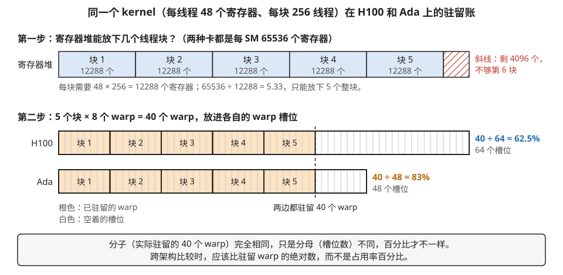
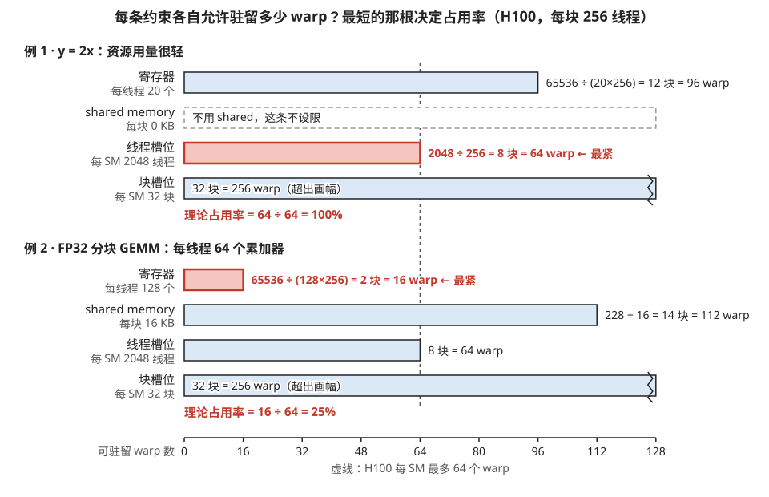
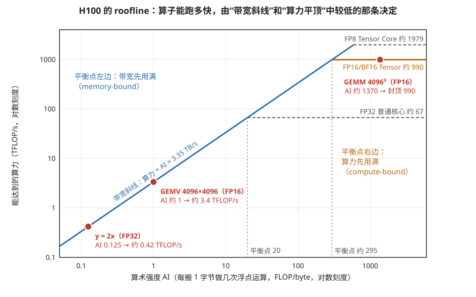
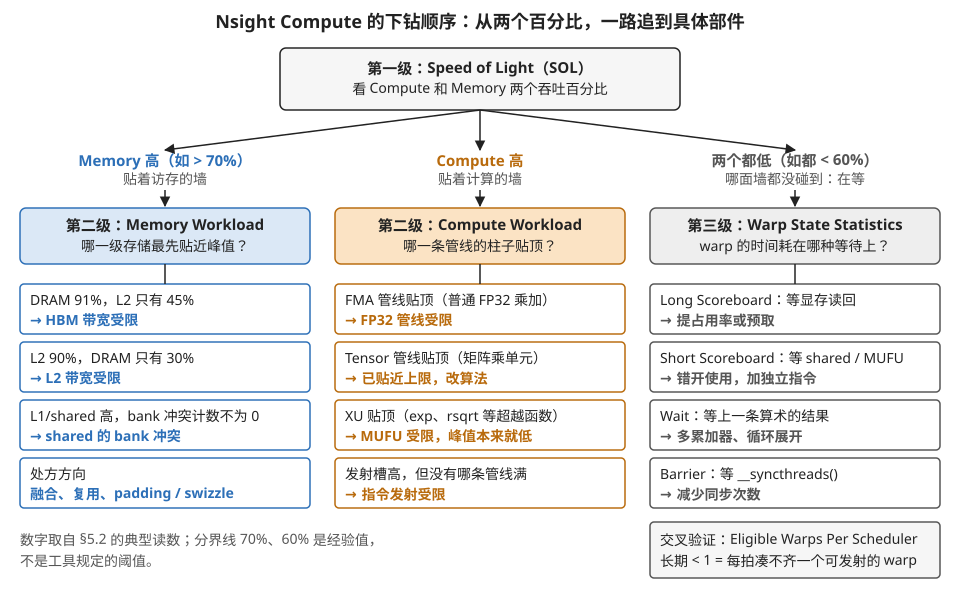
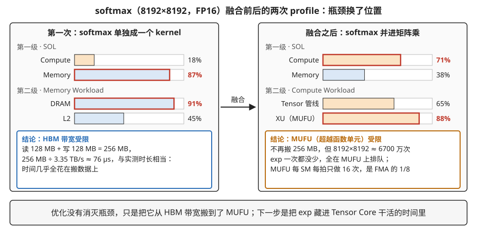

# 附录 A1 · 算例：占用率手算与「受限于哪个位置」的定位方法

> **所属模块**：模块 10 · SIMT 核的物理实现（第 1、2 节的方法论附录）
> **状态**：✅ 已按写作规范重写（第二版。知识截至 2026-08。表中硬件数字为公开资料量级，实际以白皮书与工具读数为准）
> **本节主旨**：这是一节"动手算"的附录。给你一个具体算子，你要能回答两个问题：第一，**它在 SM 上能驻留多少 warp（理论占用率）**——这是一道除法题，本节用三个算子完整地算三遍；第二，**它慢的时候到底卡在哪个具体部件**——"compute-bound / memory-bound"只是第一层粗分类，真正有用的答案精确到部位：是 HBM 带宽、是 L2、是 shared memory 的 bank、是 FP32 管线、是 Tensor Core、还是超越函数单元。本节给出一套先手算估计、再用性能工具三级下钻的完整流程，并用一个假想的 profiler 读数从头走一遍。

---

## 0. 这一节要回答的问题

- 主流芯片（A100 / H100 / Ada / Blackwell / AMD MI300X）每个 SM 的关键资源各是多少？
- 拿到一个具体 kernel，怎么手算它的理论占用率？为什么有的 kernel 占用率 25% 反而是对的？
- "算术强度"和"机器平衡点"是什么？怎么用一次乘除法判断一个算子是卡计算还是卡带宽？
- 为什么"compute-bound"还必须追问"bound 在哪条管线"？
- Nsight Compute 里按什么顺序看指标，才能把瓶颈钉到具体部件？

---

## 1. 基础词汇：先把本节要用的词讲清楚

**理论占用率与实测占用率（theoretical / achieved occupancy）**。第 2 节讲过：占用率 = 实际驻留的 warp 数 ÷ 硬件允许的最大驻留 warp 数。**理论**占用率是编译期就能算出来的上限——由每线程寄存器数、每块 shared memory 用量、块大小三者与硬件资源做除法得出；**实测**占用率是 profiler 在运行时统计的平均值，它可能远低于理论值（比如线程块太少坐不满机器）。本节 §2、§3 算的都是理论占用率，两者的差距本身就是一条诊断线索（见 §4.3 表中"尾效应"一行）。

**算术强度（arithmetic intensity，简称 AI）**。一个算子每从显存搬运 1 字节数据、平均做多少次浮点运算，单位是 FLOP/byte。它是算子自身的属性，跟硬件无关：比如"把每个元素乘 2"每搬 8 字节（读 4 写 4）只做 1 次乘法，AI ≈ 0.125；而大矩阵乘每个数据被复用成百上千次，AI 可以上千。

**机器平衡点（machine balance）**。硬件的属性：峰值算力（FLOP/s）除以峰值显存带宽（byte/s），得到一个同样以 FLOP/byte 为单位的数。**把算子的 AI 和机器平衡点一比，就知道谁先到顶**：AI 低于平衡点，说明按这个搬运/计算比例，带宽先被用满、算力吃不饱——memory-bound；AI 高于平衡点则相反——compute-bound。这一次比较就是 roofline 分析的核心。本节主要用这一步，§4.1 的图 A1-3 把它画成了一张 roofline 图。

**管线（pipe）**。SM 里不同种类的执行单元各自成一条流水线，性能工具里叫 pipe：FMA pipe 做 FP32 乘加，Tensor pipe 是 Tensor Core，LSU pipe 做访存，**MUFU pipe**（Multi-Function Unit，也叫 SFU）专算 exp、rsqrt、sin 这类超越函数。关键事实：**各条 pipe 的峰值吞吐相差一到两个数量级**（H100 上 Tensor pipe 的 FLOP/s 约是 FMA pipe 的 15 倍，MUFU 又只有 FMA 的几分之一），所以"compute-bound"必须追问 bound 在哪条 pipe——卡在 MUFU 和卡在 Tensor Core 的处方完全不同。

**Speed of Light（SOL）**。Nsight Compute 报告的第一页指标，直译"光速比"：把这个 kernel 的实际计算吞吐和实际访存吞吐分别除以硬件峰值，得到两个百分比（Compute Throughput % 和 Memory Throughput %）。名字的意思是"你离这台机器的物理极限还有多远"。哪个百分比高，kernel 就贴着哪面墙；两个都低，说明墙都没碰到、问题出在延迟（见 §5.1）。

---

## 2. 地基：各架构每 SM 关键资源速查表

占用率的算法跨架构完全不变，变的只是几个常数。做除法之前先把常数备齐：

| 每 SM/CU 资源 | A100 (SM80) | **H100 (SM90)** | Ada (SM89) | Blackwell (SM100) | AMD MI300X (CDNA3) |
| --- | --- | --- | --- | --- | --- |
| 32-bit 寄存器 / SM | 65536（256 KB） | 65536 | 65536 | 65536 | VGPR 文件按 SIMD 计 |
| 最大驻留 warp / SM | 64 | 64 | **48** | 64 | 每 SIMD 约 8–10 个 wavefront |
| 最大驻留线程 / SM | 2048 | 2048 | **1536** | 2048 | — |
| 最大驻留块 / SM | 32 | 32 | 24 | 32 | — |
| shared memory / SM（可配上限） | 164 KB | 228 KB | 100 KB | 约 228 KB | LDS 64 KB / CU |
| FP32 通道 / SM | 64 | 128 | 128 | 128 | SIMD16 × 4 |
| 每线程最大寄存器 | 255 | 255 | 255 | 255 | — |

**读表要点与一个例子**。占用率被三条约束（寄存器、shared memory、warp/块槽位）里最紧的一条卡死，这是第 2 节的结论。表里最值得注意的是 **Ada 一列：最大 48 warp / 1536 线程**，比数据中心卡少四分之一。举个会真实踩到的坑：一个 kernel 每线程用 48 个寄存器，块大小 256 线程。在 H100 上，寄存器允许 65536 ÷ 48 ≈ 1365 线程，占用率 = 1365 向下取整到块的整数倍（1280 线程）÷ 2048 = **62.5%**；同样的除法搬到 Ada 上，1280 ÷ 1536 = **83%**——数字反而更高，因为分母（天花板）变矮了。**所以跨架构比较占用率百分比没有意义，要比的是绝对驻留 warp 数**（两边都是 40 个 warp）。AMD 那列换了一套词——CU 对应 SM、wavefront（64 线程）对应 warp、VGPR 对应寄存器、LDS 对应 shared memory——但除法的做法一模一样。图 A1-1 把这笔 H100 与 Ada 的账画了出来。

> **图 A1-1**　一句话：同一个 kernel 在 H100 和 Ada 上都驻留 40 个 warp，占用率却一个是 62.5%、一个是 83%，差别只来自分母。
>
> **先知道一件事**：占用率 = 一个 SM（GPU 上的一个计算核心单元）上实际驻留的 warp 数 ÷ 这个 SM 最多能驻留的 warp 数。warp 是 32 个线程组成的执行单位；线程块是程序员指定的一组线程，这里每块 256 个线程，也就是 8 个 warp。线程块只能整块放上 SM，不能拆开。
>
> **按这个顺序看**：
> 1. 上面一条是一个 SM 的寄存器堆，共 65536 个寄存器，两种卡一样。每个线程要 48 个，一个块 256 个线程就要 48 × 256 = 12288 个。蓝色格子一块一块放进去：放到第 5 块用掉 61440 个，剩下 4096 个（红色斜线），不够第 6 块。所以寄存器决定每个 SM 最多驻留 5 个块。
> 2. 5 个块 × 8 个 warp = 40 个 warp。下面两条是 warp 槽位：H100 每个 SM 有 64 个，Ada 只有 48 个。橙色是这 40 个 warp 占的槽位，每个粗框是一个块。
> 3. 两条的橙色部分一样长（虚线对齐），白色空位不一样多：H100 空 24 个，Ada 空 8 个。于是 H100 算出 62.5%，Ada 算出 83%。
>
> **打个比方**：同样来了 40 个人，坐在 64 座的教室里显得空，坐在 48 座的教室里显得满，但来听课的人数没有变。
>
> **看懂的标志**：能回答"这个 kernel 从 H100 搬到 Ada，占用率从 62.5% 升到 83%，隐藏延迟的能力变强了吗"：没有。两边可供调度器轮换的 warp 都是 40 个，变的只是分母。
>
> **与正文的对照**：对应本节"读表要点与一个例子"。正文先算出 1365 个线程，再向下取整到块的整数倍（1280 个线程），与图中"65536 ÷ 12288 取整得 5 块"是同一个算法。
>
> 来源：本库自绘。

---

## 3. 三个算子的占用率手算（以 H100 为例）

三个例子刻意选了三种典型"体质"：访存密集无复用、计算密集高复用、以及归约类。每个都从资源用量开始一步步除。

### 3.1 例 1 · Element-wise（`y = 2x`）：占用率满分，但满分没用

这类 kernel 每个线程独立处理一个元素，资源用量极轻：

1. **寄存器**：装个指针、装个索引、装一个数据值，编译器通常给 16–20 个/线程。按 20 算：65536 ÷ 20 ≈ 3276 线程——超过 2048 的线程上限，所以先被**线程槽位**封顶，寄存器不构成约束。
2. **shared memory**：不用，0 字节。不构成约束。
3. **块槽位**：块大小 256 线程时，2048 ÷ 256 = 8 个块，远小于 32 的块上限。不构成约束。
4. **结论**：三条约束都不紧，理论占用率 **100%**（64 个 warp 全驻留）。

但这里有个必须立刻说破的反直觉点：**占用率 100% 不等于跑得快**。这个 kernel 的 AI ≈ 0.125 FLOP/byte，远低于 H100 的 FP32 平衡点约 20（§4.1 会算这个数），所以它注定是 memory-bound——性能上限就是 HBM 带宽 3.35 TB/s，一个字都多不出来。高占用率在这里的全部作用，是挂出足够多的在途读取请求把带宽喂满（第 4 节的 Little 定律账）；一旦带宽已经满了，占用率再高也不会更快。**对这类算子，正确的问题不是"占用率还能不能提"，而是"DRAM 吞吐到峰值百分之几了"。**

### 3.2 例 2 · FP32 分块 GEMM：占用率 25%，而且是故意的

经典 shared-memory 分块矩阵乘（不用 Tensor Core），块大小 256 线程，每个线程负责输出矩阵的一个 8×8 小块——这意味着每线程要维护 64 个 FP32 累加器常驻寄存器（这就是第 2 节说的"用 ILP 换占用率"的 Volkov 打法）。逐条算：

1. **寄存器**：64 个累加器，再加上 A、B 片段的操作数、循环变量、地址计算，编译器给到 **128 个/线程**上下。65536 ÷ 128 = **512 线程 = 16 个 warp**。块大小 256，所以每个 SM 只驻留 2 个块。
2. **shared memory**：双缓冲的 A 片（128×8 个 FP32）加 B 片（8×128 个 FP32），(128×8 + 8×128) × 4 字节 × 2 套缓冲 = **16 KB/块**。228 KB 够放 14 个块——远宽于寄存器给的 2 个块。不构成约束。
3. **结论**：**寄存器是最紧的约束**，理论占用率 = 512 ÷ 2048 = **25%**。

25% 听起来很糟，但这是**刻意设计**：64 个独立累加器给了每个 warp 巨大的指令级并行（ILP），16 个 warp × 每 warp 高 ILP，足够把 FMA 管线的每一拍都填上。做个反向对照就明白代价在哪：如果为了"把占用率提到 50%"而把每线程微块从 8×8 砍到 4×4，寄存器降到约 64 个/线程、驻留翻倍到 32 warp——但每线程的累加器从 64 个变 16 个，**每份从 shared memory 读进来的数据的复用次数减半**，对 shared 带宽的压力翻倍，ILP 也同步减半。实测这类改动几乎总是变慢。**占用率是手段不是目标，这个例子是本仓库反复出现的第一号证据。**

图 A1-2 把例 1 和例 2 的约束并排画成条形：每根条是一条约束单独允许的驻留量，最短的那根说了算。

> **图 A1-2**　一句话：驻留多少 warp 由几条约束分别给出上限，取其中最小的；例 1 被线程槽位封顶在 64，例 2 被寄存器压到 16。
>
> **先知道一件事**：SM 上的资源（寄存器、shared memory、线程槽位、块槽位）都按线程块整块分配。每种资源都能单独算出"只看我的话，最多放几个块"，真正能放的块数是这几个数里最小的那个。
>
> **按这个顺序看**：
> 1. 横轴是可驻留的 warp 数。每块 256 个线程 = 8 个 warp，所以块数乘 8 就是 warp 数。竖虚线是 H100 每个 SM 最多 64 个 warp。
> 2. 上半部分例 1（y = 2x）：寄存器一根算出 12 块 = 96 warp，比 64 还长；不用 shared memory，虚线框表示这条不设限；块槽位 32 块 = 256 warp，超出画幅（右端的折线表示截断）。最短的是红色的线程槽位：2048 ÷ 256 = 8 块 = 64 warp。占用率 64 ÷ 64 = 100%。
> 3. 下半部分例 2（FP32 分块矩阵乘）：每线程 128 个寄存器，一块要 128 × 256 = 32768 个，65536 个只够 2 块 = 16 warp，是红色最短的一根。shared memory 每块 16 KB，228 KB 能放 14 块，很宽松。占用率 16 ÷ 64 = 25%。
> 4. 两个例子里，除了最短那根，其它几根有多长都不影响结果。
>
> **打个比方**：往货车上装箱，受载重、容积、件数三种限制，能装多少由最先顶到的那一项决定，另外两项还剩多少余量都用不上。
>
> **看懂的标志**：能回答"例 2 想把占用率提到 50%，该动哪个旋钮"：只能动寄存器，降到每线程 64 个左右（65536 ÷ (64 × 256) = 4 块 = 32 warp）；把 shared memory 用量减半毫无作用，因为它本来就不是最短的那根。正文上一段讲了为什么这样改通常反而更慢。
>
> **与正文的对照**：数字与 §3.1、§3.2 的逐步计算一致。例 1 的寄存器一行按块取整（65536 ÷ 5120 = 12.8，取 12 块），正文按线程数算出 3276 个线程，结论相同：都超过 2048 的线程上限。例 3（softmax）的寄存器用量是一个范围，图中没有画。
>
> 来源：本库自绘。

### 3.3 例 3 · Softmax / 归约类：占用率不是主角，MUFU 才是

Softmax 每行要做"求最大值 → 减最大值取 exp → 求和 → 除以和"，涉及块内归约和超越函数：

1. **寄存器**：中等，32–48 个/线程 → 占用率通常能到 50%–100%，不是紧约束。
2. **shared memory**：块内归约用的中转空间，每块几百字节到几 KB，很宽松。
3. **结论**：占用率良好，**但性能的坑在别处**——每个元素要过一次 `exp()`，而 exp 走的是 MUFU 管线，其吞吐只有 FMA 管线的几分之一（H100 上每 SM 每拍 16 次 MUFU 操作，对比 128 次 FP32 FMA）。也就是说，**每个元素只要摊上 1 次 exp，MUFU 的负担就相当于 8 次 FMA**。再加上如果 softmax 没和前后算子融合，它还要把整个矩阵从 HBM 读进来再写回去，AI 极低。

这个例子的意义是：**占用率手算三步做完发现"不紧"之后，诊断才刚开始**——它是 HBM-bound 还是 MUFU-bound，取决于有没有融合，这正是 §4 和 §5 要解决的问题。

**三例小结**：占用率回答的是"能驻留多少"，永远只是第一步。例 1 满分但无关紧要，例 2 低分但故意为之，例 3 及格但问题根本不在这——三个例子共同指向：**必须有一套"受限于哪个位置"的定位方法**。

---

## 4. 分析法：不开 profiler，先用乘除法估出瓶颈

### 4.1 第一层判断：算术强度 对 机器平衡点

先把 H100 的平衡点算出来（峰值数字取公开资料量级，HBM 带宽按 3.35 TB/s）：

| 管线 | 峰值算力（量级） | 平衡点 = 峰值 ÷ 3.35 TB/s |
| --- | --- | --- |
| FP32 FMA | 约 67 TFLOP/s | 约 **20** FLOP/byte |
| FP16/BF16 Tensor Core（稠密） | 约 990 TFLOP/s | 约 **300** FLOP/byte |
| FP8 Tensor Core | 约 1979 TFLOP/s | 约 **590** FLOP/byte |
| MUFU（exp / rsqrt 等） | 约为 FMA 的 1/8 | 极低，几个 FLOP/byte 就够卡 |

读法：想让 FP16 的 Tensor Core 吃饱，算子的 AI 必须超过 300——每搬 1 字节要做 300 次浮点运算。这个门槛高得惊人，它直接解释了本仓库两条主线：**大 GEMM 必须重度 tiling**（靠复用把 AI 抬上去），**attention 必须融合**（FlashAttention 的全部动机，见 §5.5）。

**一笔完整的手算对照**（H100，FP16，五步走）。同样叫"矩阵乘"的两个算子：

- **大 GEMM**，M=N=K=4096：
  1. 浮点运算量 = 2·M·N·K = 2 × 4096³ ≈ 1.37 × 10¹¹ FLOP。
  2. 最少搬运量：A、B、C 各过一遍 HBM，3 × 4096² × 2 字节 ≈ 1.0 × 10⁸ byte。
  3. AI ≈ 1.37×10¹¹ ÷ 1.0×10⁸ ≈ **1370 FLOP/byte**。
  4. 1370 ≫ 300（Tensor 平衡点）→ **compute-bound，且 bound 在 Tensor pipe**。
  5. 处方方向：让 Tensor Core 一拍不停（流水、warp 分工），带宽已经不是问题。
- **GEMV**，M=4096, N=1, K=4096（decode 阶段每个 token 的矩阵-向量乘就是它）：
  1. 浮点运算量 = 2 × 4096 × 4096 ≈ 3.4 × 10⁷ FLOP。
  2. 搬运量：整个权重矩阵必须过一遍，(M·K + K + M) × 2 字节 ≈ 3.4 × 10⁷ byte。
  3. AI ≈ 3.4×10⁷ ÷ 3.4×10⁷ ≈ **1 FLOP/byte**（每个 2 字节的权重只参与 1 次乘加，即 2 次浮点运算）。
  4. 1 ≪ 20（连 FP32 平衡点都远不到）→ **重度 memory-bound**。
  5. 处方方向：Tensor Core 帮不上忙，一切优化都围绕"把权重搬运这一遍做到极致"（量化、更大 batch 凑成 GEMM）。

同一个"矩阵乘"，AI 差了一千多倍（1370 对 1），瓶颈一个在 Tensor pipe、一个在 HBM——**这就是为什么大模型推理的 prefill 和 decode 两个阶段的优化手段完全不同**，也是"先算 AI 再动手"的价值所在。图 A1-3 把上面的平衡点表和三个算子画在同一张 roofline 图上。

> **图 A1-3**　一句话：一个算子最快能跑多快，看它的算术强度落在横轴哪里：落在平衡点左边，受带宽斜线限制；落在右边，受算力平顶限制。
>
> **先知道一件事**：算术强度（AI）是算子"每从显存搬 1 字节，做几次浮点运算"。显存每秒能搬 3.35 TB，所以一个 AI 为 1 的算子每秒最多做 3.35 万亿次运算；AI 翻倍，这个上限也翻倍。图里那条斜线就是这么来的。
>
> **按这个顺序看**：
> 1. 两条轴都是对数刻度，每一大格差 10 倍。横轴是 AI，纵轴是能达到的算力，单位 TFLOP/s（每秒万亿次浮点运算）。
> 2. 蓝色斜线：算力 = AI × 3.35 TB/s，这是显存带宽能喂出来的上限。
> 3. 水平线是各种计算单元的峰值：灰色虚线是普通 FP32 核心，约 67；橙色实线是 FP16/BF16 的 Tensor Core（专做矩阵乘的单元），约 990；上方灰色虚线是 FP8 的 Tensor Core，约 1979。算子实际的上限是斜线和它所用那种单元的水平线中较低的一条，所以"屋顶"是先斜后平的折线。
> 4. 斜线与水平线的交点就是平衡点：FP32 在 AI = 20 处，FP16 Tensor Core 在约 295 处（两条竖虚线）。
> 5. 三个红点：y = 2x 的 AI 只有 0.125，落在斜线上，最多约 0.42 TFLOP/s，不到 FP32 峰值的百分之一；FP16 的 GEMV（矩阵乘向量）AI 约 1，最多约 3.4 TFLOP/s；4096 的大矩阵乘 AI 约 1370，在 295 的右边，顶到了 990 的平顶。
>
> **打个比方**：一家工厂的产量受两件事限制：卡车运原料进来的速度，和机器加工的速度。每吨原料能做出的产品越多（AI 越高），越可能是机器先忙不过来；反过来，就是机器在等卡车。
>
> **看懂的标志**：能回答"给 GEMV 换一块算力翻倍、带宽不变的卡，它会快多少"：不会快。它在斜线上，上限只由带宽决定。
>
> **与正文的对照**：峰值与平衡点取自 §4.1 的表，三个算子的 AI 取自 §3.1 和 §4.1 的手算。y = 2x 是 FP32 运算，它的平顶是 67 那条线；另外两个点对照 FP16 Tensor Core 的平顶。
>
> 来源：本库自绘。

### 4.2 瓶颈位置的完整清单

把"bound 在哪"的所有选项排成一张表——左列是位置，右列是 profiler 里对应的信号（信号的具体含义在 §5 展开）：

| 瓶颈位置 | 典型算子 | Nsight Compute 里的信号 |
| --- | --- | --- |
| **HBM 带宽** | elementwise、大归约、未融合 attention | Memory SOL 高，DRAM Throughput 接近峰值，stall 以 Long Scoreboard 为主 |
| **L2 带宽** | 中等复用、大部分命中 L2 的访问 | L2 吞吐高而 DRAM 没满 |
| **shared 带宽 / bank 冲突** | shared 密集的 GEMM、stencil | L1/Shared SOL 高，bank conflict 计数高 |
| **FP32 FMA pipe** | FP32 稠密 GEMM、卷积 | Compute SOL 高，FMA pipe 利用率贴峰值 |
| **Tensor pipe** | 低精度 matmul | Tensor pipe active 贴峰值 |
| **MUFU pipe** | softmax、gelu、layernorm 等 exp/rsqrt 密集 | XU/SFU 利用率高（注意它峰值本来就低，很容易先到顶） |
| **指令发射** | 地址计算等开销指令占比大 | 发射槽利用率高，但没有任何一条 pipe 满 |
| **延迟（占用率或 ILP 不足）** | 低占用 + 长依赖链 | SOL 双低，Eligible Warps < 1，stall 集中在等待类 |
| **同步屏障** | `__syncthreads()` 频繁 | stall 以 Barrier 为主 |
| **尾效应 / wave 量化** | grid 太小或块数不贴 SM 整数倍 | 实测占用率 ≪ 理论占用率，波数是"整数多一点" |

这张表的用法：分析法（§4.1）先把候选缩小到两三行，profiler（§5）负责在这几行里精确定位并验证。

---

## 5. 工具法：Nsight Compute 的三级下钻

### 5.1 第一级：看 SOL，走三岔路口

打开 Nsight Compute 报告第一页，看两个百分比：Compute (SM) Throughput 和 Memory Throughput。三种情况：

- **Memory 高（比如 >70%）**：贴着访存的墙 → 走 §5.2。
- **Compute 高**：贴着计算的墙 → 走 §5.3。
- **两个都低（比如都 <60%）**：这是最容易误读的情况——**它不是"没瓶颈"，而是 latency-bound**：机器两面墙都没碰到，时间花在了等待上（占用率不足、ILP 不足、依赖链太长）。走 §5.4。

图 A1-4 把这三条路和 §5.2 到 §5.4 的下钻内容画成一张图，读下面三小节时可以对照。

> **图 A1-4**　一句话：用 Nsight Compute 定位瓶颈有固定顺序：先看两个总百分比分成三路，再在每一路里找最先顶到峰值的那一级存储、那条管线，或者那种等待。
>
> **先知道一件事**：Nsight Compute 是 NVIDIA 的 kernel 性能分析工具，报告分很多页。第一页的 SOL（Speed of Light，意思是"离这台机器的物理极限还有多远"）给出两个百分比：计算吞吐占峰值的比例，访存吞吐占峰值的比例。
>
> **按这个顺序看**：
> 1. 顶部：先读 SOL 的两个数，看哪个高，分成三路。
> 2. 左路（蓝色）是访存一侧：进入 Memory Workload Analysis 页，看显存（DRAM）、L2 缓存、L1/shared memory 三级各自的吞吐百分比，哪一级最先接近 100%，瓶颈就在哪一级。例如 DRAM 91% 而 L2 只有 45%，就是 HBM 带宽受限。
> 3. 中路（橙色）是计算一侧：进入 Compute Workload Analysis 页，看各条执行管线的利用率。FMA 管线做普通 FP32 乘加，Tensor 管线做矩阵乘，XU 管线（也叫 MUFU）算 exp、rsqrt 这类超越函数。哪根贴顶就卡在哪。XU 的峰值本来就低，最容易先贴顶。
> 4. 右路（灰色）是两个百分比都低：这不是"没有瓶颈"，而是 warp 大部分时间在等。进入 Warp State Statistics 页看等待原因：Long Scoreboard 是在等显存的数据，Short Scoreboard 是在等 shared memory 或超越函数，Wait 是在等上一条算术指令的结果，Barrier 是在等线程块里的同伴走到同一个同步点。
> 5. 右下角的交叉验证：Eligible Warps Per Scheduler 是"平均每个时钟周期有几个 warp 已经准备好、可以发射"，长期小于 1，说明调度器经常无事可做。
>
> **打个比方**：像去医院看病：先量体温和血压决定挂哪个科（第一级），再在科室里做专项检查，找到具体是哪个器官（第二级）；两项都正常却还是没力气，就要查作息，看时间都耗在哪里（第三级）。
>
> **看懂的标志**：能回答"SOL 两个数都只有 30% 左右，要不要先去优化访存合并"：不要。这是延迟受限，应该先看等待原因和 Eligible Warps，从提高占用率、增加相互独立的指令入手。
>
> **与正文的对照**：三路分别对应 §5.2、§5.3、§5.4，叶子里的数字取自 §5.2 的典型读数。正文把右路叫做"第三级"，但它是从第一级直接进入的，不需要先走第二级。70%、60% 这两条分界是经验值，不是工具规定的阈值。
>
> 来源：本库自绘。

### 5.2 第二级（访存侧）：Memory Workload Analysis，钉到哪一级

这一页把访存层次逐级列出吞吐百分比：DRAM、L2、L1/shared。**哪一级最先贴近峰值，哪一级就是瓶颈**。三种典型读数：DRAM 92% 而 L2 只有 40% → 真·HBM-bound；L2 90% 而 DRAM 只有 30% → 数据大多命中 L2 但 L2 带宽不够（考虑把复用做进 shared）；L1/shared 吞吐高且 bank conflict 计数不为零 → 第 4 节的 bank 冲突问题，处方是 padding 或 swizzle。

### 5.3 第二级（计算侧）：Compute Workload Analysis，钉到哪条 pipe

这一页是各条 pipe 的利用率柱状图：FMA、ALU、Tensor、LSU、XU（即 MUFU）等。看哪根柱子贴顶。特别提醒 **XU 这根柱子**：它的绝对峰值只有 FMA 的几分之一，所以"XU 90%"消耗的 FLOP/s 其实不多——但墙就是墙，softmax 类算子常常是它先到顶。这时的处方不是"减少计算"而是**把 exp 的成本摊薄**（融合让 MUFU 和 Tensor pipe 重叠工作，FA-3 的 ping-pong 就是为此设计的，见 §10-02 与 B2）。

### 5.4 第三级（延迟侧）：Warp State Statistics，读 stall 分解

SOL 双低时进这一页，看驻留 warp 的时间都耗在哪种等待上。常见几项（这些词第 2 节的记分牌部分出现过，这里按"读数→含义→处方"排列）：

- **Long Scoreboard**：在等显存读取的结果——访存延迟没藏住。处方：提高占用率或 ILP，或预取。
- **Short Scoreboard**：在等 shared memory 或 MUFU 这类中短延迟操作。处方：错开使用、增加独立指令。
- **Wait**：在等定长算术指令的结果——编译器控制位里的 stall 计数在生效，说明依赖链太密、ILP 不足。处方：多累加器、循环展开。
- **Barrier**：在 `__syncthreads()` 处等同伴。处方：减少同步次数或改用更细粒度的同步（第 5 节）。
- **Not Selected / No Eligible**：就绪了但没被选中，或没有任何 warp 就绪——前者说明 warp 太多抢发射口（罕见），后者就是占用率/ILP 双不足的直接证据。

交叉验证看 Scheduler Statistics 页的 **Eligible Warps Per Scheduler**：这个数长期小于 1，意思是"平均每拍连一个可发射的 warp 都凑不齐"——调度器巧妇难为无米之炊，回去解决驻留和依赖。

### 5.5 一次完整走查：未融合 softmax 的诊断与复诊

把整套流程在一个假想但读数真实的案例上走一遍。算子：独立的 softmax kernel，输入 8192×8192 的 FP16 矩阵，前后各接一个 matmul（未融合）。

**第一次 profile**：
1. SOL：Compute 18%，Memory 87% → 访存墙。
2. Memory Workload：DRAM 91%，L2 45% → **钉死：HBM-bound**。合理性检查：这个 kernel 要从 HBM 读 128 MB、写 128 MB，纯搬运时间 ≈ 256 MB ÷ 3.35 TB/s ≈ 76 µs，和实测 kernel 时长基本吻合——**它的时间几乎全花在搬数据，exp 是"免费"的**。
3. 处方：这类瓶颈在 kernel 内部无解（数据量就在那里），必须**融合**——把 softmax 接进前面的 matmul 的 epilogue，或干脆走 FlashAttention 路线让 N×N 矩阵根本不落 HBM。

**融合之后复诊**：
1. SOL：Compute 71%，Memory 38% → 墙换边了。
2. Compute Workload：Tensor pipe 65%，**XU 88%** → 新瓶颈是 MUFU：不用再搬 256 MB 了，但 6700 万个 exp 一个都没少，现在轮到它们排队。
3. 处方：让 exp 和 Tensor Core 的工作在时间上重叠（warp 分工 + ping-pong，B2 精读的主题），或用多项式近似替换 MUFU 版 exp（FA4 的做法，B3 所在的 40 模块 A1 附录提过）。

图 A1-5 把两次 profile 的读数并排画出。

> **图 A1-5**　一句话：未融合的 softmax 卡在 HBM 带宽上；融合进矩阵乘以后，搬运没有了，瓶颈换到了专算 exp 的 MUFU 单元上。
>
> **先知道一件事**：融合是把两个本来分开的 kernel 合成一个，前一个的结果留在片上直接交给后一个用，不再写回显存再读出来。softmax 的每个元素要做一次 exp，exp 由 MUFU（超越函数单元）计算，它的吞吐只有普通乘加单元的八分之一。
>
> **按这个顺序看**：
> 1. 每根条是一个百分比，满格是 100%。红框的那根是本次诊断中最高、决定结论的那一项。
> 2. 左边（未融合）：第一级 SOL 里 Memory 87%、Compute 只有 18%，所以走访存这一路；第二级里 DRAM 91%、L2 45%，钉在 HBM 上。再用手算核对：8192 × 8192 个 FP16 数是 128 MB，读一遍、写一遍共 256 MB，除以 3.35 TB/s 约 76 微秒，和实测时长差不多。这说明这个 kernel 的时间几乎全用在搬数据上，exp 的耗时被搬运完全盖住了。
> 3. 中间的箭头是融合：softmax 放进前一个矩阵乘里做，这 256 MB 不再进出显存。
> 4. 右边（融合后）：SOL 变成 Compute 71%、Memory 38%，墙换到了计算一侧；第二级里 Tensor 管线 65%，XU（即 MUFU）88%，是最高的一根。6700 万次 exp 一次都没少，现在轮到它们成为最慢的一环。
>
> **打个比方**：过去工人大部分时间花在往返仓库搬货上，手上某道工序慢一点看不出来；把仓库搬到工位旁边以后，才发现那道工序最慢。
>
> **看懂的标志**：能回答"把 exp 换成更快的近似算法，融合前和融合后分别能提速多少"：融合前几乎没用，时间都花在搬运上；融合后有用，因为瓶颈正是 MUFU。
>
> **与正文的对照**：数字取自本小节的假想案例（读数为构造的，量级真实）。"MUFU 只有 FMA 的八分之一"取自 §3.3：H100 上每 SM 每拍 16 次 MUFU 操作，对比 128 次 FP32 FMA。
>
> 来源：本库自绘。

这个案例演示了本节最重要的一个观念：**优化不消灭瓶颈，只搬动瓶颈**。融合把瓶颈从便宜的资源（HBM 带宽）搬到贵的资源（Tensor pipe + MUFU）上；继续优化再把 MUFU 藏进 Tensor pipe 的影子里。终点是最贵的那条 pipe 贴着 100% 跑——那就是这块硅片在这个算子上的物理上限，到此为止，再想快只能改算法（40 模块第 8 节的主题）。

---

## 6. 开发者视角：三通道对照

| 想知道什么 | 用什么手段 |
| --- | --- |
| 理论占用率 | 编译时加 `-Xptxas -v` 看每线程寄存器数和每块 shared 用量，代入 §2 的表做除法；或直接调 `cudaOccupancyMaxActiveBlocksPerMultiprocessor` |
| 实测占用率与尾效应 | Nsight Compute 的 Achieved vs Theoretical Occupancy，以及 waves 读数 |
| 卡在哪级带宽 | Memory Workload Analysis 页，DRAM / L2 / L1 各自的吞吐百分比 |
| 卡在哪条 pipe | Compute Workload Analysis 页的 pipe 利用率柱状图 |
| 延迟来源 | Warp State 页的 stall 分解 + Scheduler 页的 Eligible Warps |
| 不开工具的快速估计 | 手算 AI，对照 §4.1 的平衡点表 |

**源码拨盘**：`__launch_bounds__` / `-maxrregcount` 直接拨寄存器-占用率的平衡（例 2 的 25% 就拨在这里）；块大小决定块槽位与尾效应；`--use_fast_math` 会把 exp 换成 MUFU 快速版（更快但精度低）。**编译器回执**：`-Xptxas -v` 打印的 `registers, smem` 两个数就是占用率除法的全部输入。**Profiler 探针**：站位阶梯上最省事的路径是 **`torch.profiler` 先找到最热的 kernel → 对它单独跑 `ncu --set full` → 按 §5 的三级顺序读**——PyTorch 用户不必下到 SASS，就能拿到"bound 在哪个部件"级别的答案。

---

## 7. 最新架构落点（时效锚点 · 知识截至 2026-08）

- **Blackwell（SM100）**：FP4 Tensor pipe 把计算平衡点推得更高——AI 门槛越高，"必须融合、必须复用"的压力越大；TMEM 把矩阵累加器从寄存器堆挪进专用存储（模块 12 第 1 节），例 2 那种"64 个累加器吃掉寄存器预算"的占用率图景在 tcgen05 路线上会松动。
- **Nsight Compute** 的 SOL 和 roofline 视图持续覆盖新 pipe（FP8/FP4 Tensor、TMA），仍是"bound 在哪"的一等工具。
- **平衡点还在往上走，这是本节最需要跟进的一条**。把 §4.1 那张表按代际排开（峰值取稠密口径，带宽取产品值）：

  | 芯片 | 精度 | 峰值算力 | 带宽 | **平衡点（FLOP/byte）** |
  | --- | --- | --- | --- | --- |
  | H100 | BF16 Tensor | 约 990 TF | 3.35 TB/s | 约 **295** |
  | H100 | FP8 Tensor | 约 1979 TF | 3.35 TB/s | 约 **590** |
  | B300 | NVFP4 稠密 | 15 PF | 8 TB/s | 约 **1875** |
  | Rubin（爬产） | NVFP4 | 50 PF（推理口径） | 约 20 TB/s | 约 **2500** |

  **读这张表只需要看最后一列的走向**：门槛从三位数涨到四位数。§4.1 说过"FP16 时代 AI 要超过 300 才算计算受限"，到 NVFP4 时代这个数已经是**两千以上**——意味着**过去算"计算受限"的算子，在新硬件上会重新变回访存受限**。这不是硬件退步，是算力涨得比带宽快的必然结果。**实践推论：跨代移植 kernel 时，第一件事是把 AI 和新平衡点重算一遍，而不是直接沿用上一代的结论。**
- **Nsight Compute** 的 SOL 和 roofline 视图持续覆盖新 pipe（FP8/FP4 Tensor、TMA），仍是"bound 在哪"的一等工具。
- **AMD**：工具是 `rocprof` 和 Omniperf，概念逐一对应（CU 占用率、LDS、Matrix Core 利用率）。MI300X 在 L2 和 HBM 之间多插了一级 **Infinity Cache**（256 MB 的片上末级缓存），定位访存瓶颈时要多问一句："卡在 Infinity Cache 还是 HBM？"——层次多一级，§5.2 的下钻就多一步。当前代际 MI455X 为 432 GB HBM4、约 23 TB/s。

## 8. 术语卡

### 算术强度（arithmetic intensity, AI）

**定义**：一个算子每从内存搬运 1 字节数据平均执行的浮点运算次数，单位 FLOP/byte。它由算法本身的复用结构决定：elementwise 约 0.1，FP16 的 GEMV 约 1，大 GEMM 可上千。

**为什么存在**：因为算力和带宽的比例在每块芯片上是固定的，必须有一个跟硬件无关的量来刻画"这个算子天生偏吃计算还是偏吃搬运"，才能在动手之前预判瓶颈。AI 就是这个量——它和机器平衡点的一次比较，胜过盲跑十次 profiler。

**语境例句**："这个 kernel AI 才 2，你在 H100 上怎么调都是 memory-bound，别折腾流水线了，去想办法融合。"——意思是：AI 远低于平衡点 20，性能上限由带宽决定，计算侧的优化没有收益。

### 机器平衡点（machine balance）

**定义**：一块芯片的峰值算力除以峰值内存带宽，单位同样是 FLOP/byte。H100 的 FP32 平衡点约 20，FP16 Tensor Core 平衡点约 300，FP8 约 590。

**为什么存在**：它是"这台机器喂饱计算单元需要多高的数据复用率"的量化表达。算力逐代涨得比带宽快，平衡点逐代抬高——这个趋势本身解释了为什么融合和 tiling 在新架构上越来越不是"优化"而是"及格线"。

**语境例句**："FP8 平衡点快 600 了，attention 不融合根本喂不饱 Tensor Core。"——意思是：要达到 600 FLOP/byte 的复用，中间矩阵绝不能落 HBM。

### Speed of Light（SOL）

**定义**：Nsight Compute 报告首页的两个百分比——kernel 的实际计算吞吐和实际访存吞吐各自相对硬件峰值的比例。是瓶颈诊断的第一眼指标。

**为什么存在**：诊断需要一个入口来做三岔分流：贴计算墙、贴访存墙、还是两面墙都没碰到（latency-bound）。SOL 用两个数完成这次分流，后续每条路各有专门的下钻页面。

**语境例句**："先别猜，把 ncu 跑一遍看 SOL——两边都不到 50 的话就是占用率或依赖链的问题，跟带宽没关系。"——意思是：SOL 双低指向 latency-bound，应该去看 stall 分解而不是优化访存。

### latency-bound（延迟受限）

**定义**：kernel 的计算吞吐和访存吞吐都远离峰值、时间主要耗在等待上的状态。根源是"在途工作量不足"：驻留 warp 太少、ILP 太低、或依赖链太长，导致每一拍都凑不齐可发射的指令。

**为什么存在**：作为一个独立类别存在，是因为它的处方和 compute/memory-bound 完全相反——后两者要"减少或搬走需求"，latency-bound 要"增加供给"（提占用率、加累加器、预取）。把它误诊成 memory-bound 而去优化访存模式，是最常见的无用功。

**语境例句**："SOL 双低，Eligible Warps 只有 0.4，典型的 latency-bound——先把占用率从 12% 拉上去再说别的。"——意思是：平均每拍连一个就绪 warp 都没有，调度器在空转，供给侧不足。

### pipe 瓶颈（细分到执行管线的 compute-bound）

**定义**：compute-bound 的精确形态：指明卡在 SM 里哪一条执行管线——FMA、Tensor、LSU 还是 MUFU（超越函数单元）。各管线峰值相差一到两个数量级，MUFU 峰值最低、最容易先到顶。

**为什么存在**：因为"计算受限"这个粗分类给不出处方。卡 Tensor pipe 说明已经贴近上限、该收工或改算法；卡 MUFU 说明 exp 类操作在拖后腿、处方是重叠或近似替换；卡发射端口说明开销指令太多。不细分到 pipe，诊断就停在"是计算的问题"这句废话上。

**语境例句**："融合之后 XU 打到 88%，MUFU-bound 了，下一步要么 ping-pong 把它藏掉，要么换多项式 exp。"——意思是：瓶颈已从带宽搬到超越函数单元，两种处方分别是时间重叠（FA-3 路线）和数值替换（FA4 路线）。

## 9. 我的困惑 / 待深挖

- 各架构"藏满 HBM 延迟所需的在途请求数"怎么从 MSHR / LSU 队列深度上限反推？（第 4 节 Little 定律账的硬件侧闭环）
- issue-bound 在实践中怎么进一步区分是发射端口不够还是取指（指令缓存）跟不上？
- AI 的"字节"到底按哪一级算——DRAM 实际搬运量还是程序逻辑访问量？tiling 之后两者可以差几个数量级，正确的做法是按"实测 DRAM 字节"复算一遍。

---

*最后更新：2026-08-31（第三版：§7 补入跨代际的机器平衡点对照表——从 H100 的 295 到 Rubin 的约 2500，以及"跨代移植要重算 AI"这条实践推论。第二版：按写作规范重写）*（2026-09 补图 5 张：现成 0 张，自绘 5 张；图注按费曼法写）
