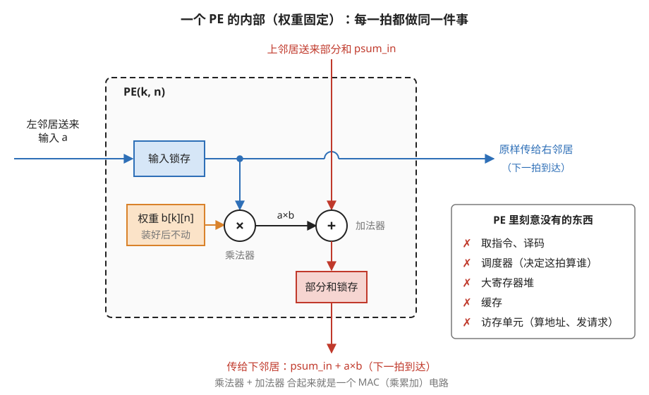
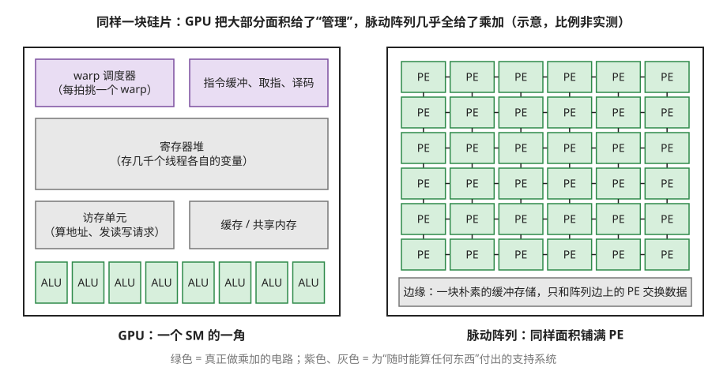
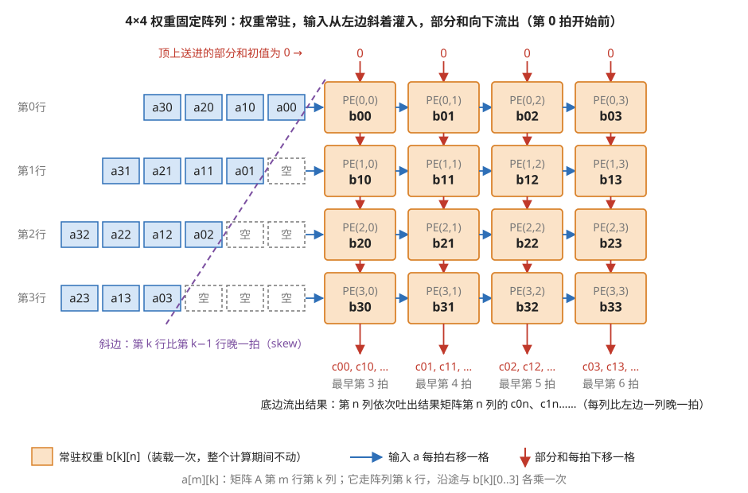
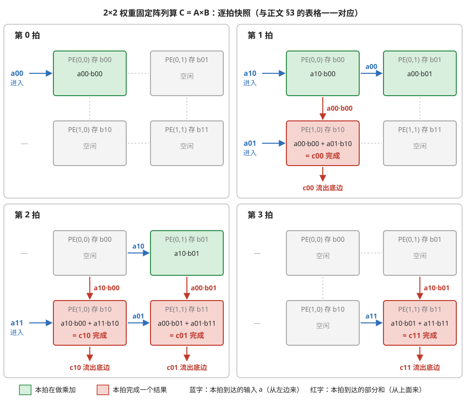

# MAC 与 PE 阵列：另一种芯片的基本细胞

> **所属模块**：模块 11 · 空间/脉动架构（NPU 本体）
> **状态**：🟨 学习中（第二版：按《写作规范》全文重写。知识截至 2026-08）
> **本节主旨**：模块 10 讲的 GPU 是一台"什么都能算"的机器，为通用性付出了调度、同步、缓存这些管理开销。本节换一个思想实验的起点：**如果一块芯片这辈子只打算算矩阵乘法，它应该长什么样？** 答案是脉动阵列——一片只会做乘加的简单格子（PE），用固定的电线把数据一拍一拍传过去。它没有调度器、没有大寄存器堆、没有缓存，把几乎全部晶体管都花在计算上——这是谷歌 TPU 等芯片在矩阵运算上能效领先的根源。本节先把"格子"本身和"数据怎么流"讲清楚，并配一个可以逐拍跟踪的小例子。

---

## 0. 这一节要回答的问题

- MAC 和 PE 分别是什么？一个 PE 里面有什么、刻意没有什么？
- PE 和 GPU 里的一条算术通道，本质区别在哪里？
- 数据在二维阵列里具体怎么流动？"脉动"这个名字是什么意思？
- 为什么输入数据要一行比一行晚一拍地送进去（skew）？
- 这种结构为什么在矩阵乘法上能效远高于 GPU？代价是什么？
- 写软件的人怎么和这种芯片打交道？

---

## 1. 基础词汇：先把本节要用的词讲清楚

**MAC（Multiply-ACcumulate，乘累加）**。指 `累加值 += a × b` 这一个动作：一次乘法加一次加法。它是深度学习计算的原子操作——矩阵乘法和卷积在最底层就是海量的 MAC。说一块芯片"算力多少"，很大程度上就是在数它每秒能做多少次 MAC。

**PE（Processing Element，处理单元）**。脉动阵列里的一个格子。内部只有三样东西：一个 MAC 电路、几个用来存一两个数的小寄存器、以及把数据传给邻居的接口。它是本节的主角，第 2 节详细解剖。

**脉动（systolic）**。这个词借自心脏收缩（systole）：数据不是随机地被读写，而是**随着时钟节拍、像血液被心脏泵出一样，一拍一格地流过阵列**。全阵列共享同一个时钟，所有 PE 同一拍齐动。

**数据流（dataflow）**。描述"哪类数据固定在原地、哪类数据流动"的设计选择。本节的例子采用最经典的一种：**权重固定**（weight-stationary）——权重提前装进各 PE 原地不动，输入数据流过去。其它选择留到本模块第 3 节。

## 2. PE 的解剖：重点在它"没有"什么

一个 PE 的全部家当：

- **一个 MAC 电路**：每拍做一次乘加。
- **一两个数据寄存器**：存一个常驻的权重，或一个路过的部分和。
- **流水寄存器**：接收左邻居/上邻居送来的数，本拍用完，下拍传给右邻居/下邻居。

真正定义 PE 的是它**没有**的东西。对照模块 10 里 GPU 的一条算术通道，通道背后站着一整套支持系统：warp 调度器（决定这拍算谁的活）、巨大的寄存器堆（存几千个线程的现场）、访存单元（算地址、发请求）、指令缓冲。PE 一样都没有——**它不执行"指令"，它每一拍永远做同一件事**：拿左边来的数，乘上肚子里存的权重，加上上面来的部分和，结果往下传，输入往右传。图 1-1 画出了一个 PE 的全部内部结构。

> **图 1-1**　一句话：一个 PE 只是一个乘法器加一个加法器，再加三个各存一个数的小格子；它每一拍都做同一件事，没有任何"选择"。
>
> **先知道一件事**：芯片里的电路跟着同一个时钟一拍一拍地工作。图中带颜色的方框叫"锁存"（也就是正文说的寄存器），是只能存一个数的小格子：每到新的一拍，它把刚收到或刚算出的数存住，并在这一整拍里把这个数稳定地送出去。数据在 PE 之间传递，就是每拍从一个锁存走到下一个锁存。
>
> **按这个顺序看**：
> 1. 左边的蓝线：左邻居送来一个输入 a，先存进"输入锁存"。它随即兵分两路：一路向下进乘法器，一路原样向右穿出 PE，下一拍到达右边的邻居。
> 2. 橙色方框：权重 b[k][n]，k、n 是这个 PE 在阵列里的行号和列号。它在计算开始前装进来，之后整个计算期间不变。
> 3. 中间：乘法器（×）算出 a×b，交给加法器（+）。
> 4. 红线：上邻居送来的部分和 psum_in，意思是"这一列到目前为止累加出的值"。它与 a×b 相加，存进"部分和锁存"，下一拍到达下面的邻居。蓝线在红线上方的小弧表示两根线交叉而不相连。
> 5. 右边的方框：GPU 的一条计算通道背后必需、而 PE 里一样都没有的部件。
>
> **打个比方**：流水线上的一个工位。工人手里一直握着同一个零件（权重）；传送带从左边送来一个毛坯（输入），他把零件的作用加上去，再并入从上方滑下来的半成品（部分和），推给下一个工位，毛坯本身继续往右传。他从来不需要看任务单。
>
> **看懂的标志**：能回答"PE 为什么不需要指令"。因为它每一拍的动作完全一样：向下送出 psum_in + a×b，向右送出 a。没有可选的动作，也就不需要任何东西告诉它这一拍该做什么。
>
> **与正文的对照**：图中"输入锁存""部分和锁存"就是正文说的流水寄存器，"权重 b[k][n]"就是数据寄存器。本图画的是权重固定的 PE；其它数据流（本模块第 3 节）里寄存器存的东西不同，但"一个 MAC 加几个小寄存器加邻居接口"的构成不变。
>
> 来源：本库自绘。

两者的本质区别可以归结为一句话：**GPU 的算术通道等着调度器喂它"下一条指令 + 操作数"，来什么算什么；PE 的"该算什么、数据从哪来、结果去哪"在芯片设计时就焊死在了电线里。** 前者的灵活要花钱买（那一整套支持系统），后者把这笔钱全省下来变成了更多的 MAC。图 1-2 把这笔账画成了面积的对比。

> **图 1-2**　一句话：GPU 的一个计算单元里，真正做算术的电路只占一小部分，其余面积用来决定"下一拍算什么、数据在哪里"；脉动阵列把这些全部删掉，同样的面积几乎全铺成了乘加单元。
>
> **先知道一件事**：芯片面积是一笔固定的预算。每一块面积要么用来做计算，要么用来支持计算（记住中间状态、做决定、取数据）。支持做得越灵活，留给计算的面积就越少。
>
> **按这个顺序看**：
> 1. 左图上方的两块紫色：warp 调度器每一拍从几十组待命的线程里挑一组来执行（warp 是 GPU 里 32 个线程组成的一组）；指令缓冲和译码负责读出"下一条要做什么"，并翻译成控制电路的信号。
> 2. 左图中间的灰色：寄存器堆存着几千个线程各自的变量，调度器随时切换线程也不用搬数据；访存单元为每次读写算出地址、发出请求；缓存和共享内存暂存常用的数据。
> 3. 左图底部的绿色：真正做算术的 ALU（算术逻辑单元），只占一条。
> 4. 右图：同样大小的方框里铺满 PE，每个 PE 只用短线连到上下左右的邻居；只有底边一块缓冲存储与外界交换数据。
>
> **看懂的标志**：能说出这笔取舍。GPU 花面积买来的是"来什么指令就算什么"的灵活性；脉动阵列放弃这种灵活性，换来单位面积上多得多的乘加单元，代价是只能算数据流动方式固定的计算，比如矩阵乘法。
>
> **与正文的对照**：各部分的面积比例是示意，不是某款芯片的实测。GPU 的 SM（流式多处理器，GPU 上的一个计算单元）的构成见模块 10。
>
> 来源：本库自绘。

## 3. 二维阵列：数据怎么"泵"过去

把 PE 排成二维网格，每个 PE 只和上下左右的邻居连线。以权重固定的矩阵乘法 `C = A × B` 为例，分工是：

- **权重 B 提前装载**：PE(k, n) 肚子里存 B 的元素 b[k][n]，整个计算期间不动。
- **输入 A 从左边流入**：A 的第 k 列元素走第 k 行，每拍右移一格。
- **部分和向下流动**：每个 PE 把"上面传下来的部分和 + 自己这拍的乘积"传给下面，走完一整列，C 的一个元素就在阵列底边完成。

图 1-3 是一个 4×4 阵列在开始计算前一刻的样子，三类数据的位置和去向都标在上面。

> **图 1-3**　一句话：权重先装进每个格子不再移动；矩阵 A 的数据从左边排队进入，每一行比上一行晚一拍，所以队头连成一条斜边；结果从底边一列一列流出。
>
> **先知道一件事**：C = A×B 里，结果 c[m][n] 等于 A 的第 m 行与 B 的第 n 列逐项相乘再求和。阵列的第 k 行负责其中的"第 k 项"：它存着 B 的第 k 行（b[k][0] 到 b[k][3]），吃进 A 的第 k 列（a[0][k]、a[1][k]……）。图中数字都只有一位，所以下标直接连写：a21 表示 a[2][1]，b30 表示 b[3][0]。
>
> **按这个顺序看**：
> 1. 橙色格子：PE(k,n) 存着 b[k][n]，16 个权重在计算前一次装好。
> 2. 左边的蓝色队列：阵列第 k 行前面排着 a[0][k]、a[1][k]……，离阵列最近的最先进入。每一拍，四条队列同时向右移一格。
> 3. 虚线的"空"格：第 1 行队头前有 1 个空位，第 2 行 2 个，第 3 行 3 个。所以 a00 在第 0 拍进入第 0 行，a01 在第 1 拍进入第 1 行，a02 第 2 拍，a03 第 3 拍。紫色虚线连出的斜边就是 skew（输入错拍）。
> 4. 红色箭头：顶上送进的部分和是 0。每个 PE 加上自己的乘积后交给下面的 PE，走完 4 行，一个结果就加齐了 4 项，从底边流出。
> 5. 底边：c00 最早在第 3 拍完成（第 0 到 3 拍依次在第 0 到 3 行各加一项），c01 比它晚一拍，依此类推。
>
> **看懂的标志**：能回答"a01 为什么要比 a00 晚一拍进阵列"。c00 需要 a00·b00 与 a01·b10 相加：a00·b00 第 0 拍在 PE(0,0) 算出，第 1 拍随部分和到达 PE(1,0)；a01 必须恰好在第 1 拍到达 PE(1,0)，两者才能在同一个格子、同一拍相遇。
>
> **与正文的对照**：下面的逐拍例子是这张图缩小到 2×2 的版本（图 1-4）。TPU 的 128×128 阵列里，这条斜边从第 0 行拉到第 127 行，首尾相差 127 拍。
>
> 来源：本库自绘。

### 一个可以逐拍跟踪的例子：2×2 矩阵乘法

算 `C = A × B`，A、B 都是 2×2。阵列也是 2×2：PE(k,n) 存着 b[k][n]。输入的送法有一个关键讲究：**第 0 行的数据从第 0 拍开始进，第 1 行的数据从第 1 拍开始进**——第 k 行比第 k-1 行晚一拍，这个错开叫 **skew**，它的必要性看完过程自然明白。逐拍跟踪（c[m][n] 表示结果矩阵第 m 行第 n 列，需要 a[m][0]·b[0][n] + a[m][1]·b[1][n] 两次乘加）：

| 拍 | PE(0,0) 存 b00 | PE(0,1) 存 b01 | PE(1,0) 存 b10 | PE(1,1) 存 b11 |
| --- | --- | --- | --- | --- |
| 0 | a00 进入：算 a00·b00，部分和下传 | — | — | — |
| 1 | a10 进入：算 a10·b00，下传 | a00 右移到此：算 a00·b01，下传 | a01 进入（skew 晚一拍）：**接住上面传来的 a00·b00**，加上 a01·b10 → **c00 完成，流出底边** | — |
| 2 | — | a10 右移到此：算 a10·b01，下传 | a11 进入：接住 a10·b00，加 a11·b10 → **c10 完成** | a01 右移到此：接住 a00·b01，加 a01·b11 → **c01 完成** |
| 3 | — | — | — | a11 右移到此：接住 a10·b01，加 a11·b11 → **c11 完成** |

图 1-4 把这张表画成了四个时刻的快照。

> **图 1-4**　一句话：2×2 的例子一共 4 拍算完；图中逐拍画出每个格子在做什么，结果 c00、c10、c01、c11 分别在第 1、2、2、3 拍完成。
>
> **先知道一件事**：四个 PE 在同一拍里同时动作。每一拍，PE 从左边收到一个输入 a、从上面收到一个部分和；它这一拍算出的东西，要到下一拍才到达右边和下面的邻居。箭头旁边的字就是"这一拍刚到达"的数。
>
> **按这个顺序看**：
> 1. 第 0 拍：只有 a00 进入第 0 行，PE(0,0) 算出 a00·b00（绿框表示正在算）。第 1 行这一拍没有输入，因为 skew 让它晚一拍。
> 2. 第 1 拍：a00 向右到了 PE(0,1)，与 b01 相乘；a00·b00 向下到了 PE(1,0)，正好碰上刚进入第 1 行的 a01，两项相加得到 c00（红框表示完成），从底边流出。同一拍 a10 进入第 0 行。
> 3. 第 2 拍：两个结果同时完成。PE(1,0) 把上一拍 PE(0,0) 送下来的 a10·b00 加上 a11·b10，得到 c10；PE(1,1) 把 PE(0,1) 送下来的 a00·b01 加上 a01·b11，得到 c01。
> 4. 第 3 拍：只剩 PE(1,1) 在工作，完成 c11；其余格子已经没有数据可算。
>
> **看懂的标志**：能数出这 4 拍里 PE 一共忙了 8 次（第 0 到 3 拍分别是 1、3、3、1 个），而 4 拍 × 4 个 PE 一共有 16 个"格子·拍"，利用率只有一半。浪费集中在开头和结尾：数据刚进来还没铺满、或者快流完了，大部分格子没事做。输入越多，这段开头结尾占的比例越小（本模块第 2 节细算）。
>
> **与正文的对照**：与上表逐格一致。
>
> 来源：本库自绘。

四拍算完 8 次乘加，全程没有任何调度决策、没有任何一次"去内存取数"（数据全在邻居之间的电线上传递）。现在回头看 skew 为什么必要：c00 需要 a00·b00（在 PE(1,0) 的上方产生）和 a01·b10（在 PE(1,0) 本地产生）**在同一拍相遇**。a00 第 0 拍进第 0 行、它的乘积第 1 拍到达 PE(1,0)；所以 a01 必须**恰好第 1 拍**进入第 1 行——早一拍没东西可加，晚一拍部分和已经流走。**skew 不是工程妥协，是让每一对该相加的数在正确的时间、正确的地点相遇的时刻表**。把这个 2×2 放大到 TPU 的 128×128，就是十六万多个 PE 按同一张时刻表齐步搏动——输入数据排成一个斜三角灌进去（第 127 行比第 0 行晚 127 拍），这就是所有脉动阵列示意图里那个标志性斜角的由来。

## 4. 为什么它在矩阵乘法上能效碾压 GPU：三个结构性原因

**原因一：数据复用发生在电线上，免费。** 回忆模块 10 第 4 节：GPU 要复用一个数据，得显式把它搬进 shared memory，还要操心访存合并、bank 冲突。看上面的例子：a00 进入阵列后被 PE(0,0) 和 PE(0,1) **各用了一次**——复用是它**流过一排 PE 的路上顺便发生的**，不需要任何存储管理。放大到 128×128：每个输入进来一次，沿途被 128 个 PE 各用一次；每个权重装载一次，被流过的所有输入反复使用。**复用次数越多，平摊到每次计算的搬运成本越低**——而脉动阵列把复用做成了结构本身。

**原因二：控制开销摊薄到整个阵列乘以全部时间。** 模块 10 说 GPU 用 warp 把控制开销摊到 32 个线程上。脉动阵列摊得更狠：**16384 个 PE 共享同一套固定的数据流控制，而且每一拍都在做同一件事**——摊薄系数是"阵列规模 × 运行时长"，控制成本趋近于零。省下的晶体管和功耗全部属于 MAC。

**原因三：对内存系统的要求低。** 阵列只在边缘和外界交换数据（左边进输入、底边出结果），内部全靠邻居传递。一个 128×128 阵列满载时每拍做 16384 次乘加，但边缘每拍只需要进出几百个数——**内部计算量和外部带宽需求相差两个数量级**，所以它不需要 GPU 那样的多级缓存体系，一块朴素的缓冲存储就够喂了（细节在本模块第 4 节）。

这三个原因的代价也要立刻说清（后面各节展开）：这套结构**只对"数据流动模式完全规则"的计算成立**。矩阵乘法完美符合；带数据相关分支的计算（每个元素走不同路径）没有固定时刻表可排，这台机器就无能为力了。灵活与能效的取舍，正是模块 00 说的两种范式的分水岭。

## 5. 开发者视角：你不给 PE 编程

和 GPU 最大的使用差异：**没有人给单个 PE 写代码**。PE 没有指令，无程序可写。你和脉动阵列打交道的方式是隔着编译器的：

- **在框架层**（比如 TPU 上的 JAX/TensorFlow）：写正常的矩阵运算，编译器（XLA）负责把它切块、安排装载权重和泵入数据的时刻表。
- **你能帮上的最大的忙是"喂对形状"**：阵列物理尺寸出厂即定（TPU v1 到 v5 的 MXU 是 128×128，v7 已明显放大，见第 6 节），矩阵维度是阵列边长的整数倍时坐满；不是整数倍时，缺的部分填零凑整——**填零的 PE 照常搏动、消耗时钟和功耗，产出为零**（这笔账在本模块第 5 节细算）。所以在 TPU 生态里"维度选 128 的倍数"是和 GPU 世界"访存要合并"同级别的铁律。
- **观测手段**：编译器的报告和性能工具给出"阵列利用率"（多大比例的 PE 拍数在做有效计算）——这是脉动阵列世界里第一个要看的健康指标，角色相当于 GPU 世界的占用率加带宽利用率。

## 6. 最新架构落点（知识截至 2026-08）

- **谷歌 TPU**：教科书实现。核心是脉动阵列（官方名 MXU，Matrix Multiply Unit），一颗芯片有多个。**要分清两件事：数据流结构没变，阵列尺寸变了。**
  - **结构**：从 2016 年第一代到 v7（Ironwood），权重驻留 + 一拍一格 + 全静态时刻表这套核心机制一路沿用，说明该范式在稠密矩阵乘上已接近最优。
  - **尺寸**：v1 到 v5 的 MXU 是 **128×128**（本节的逐拍例子和形状税公式都以它为原型）。**v7 已经明显放大**——Google 官方不公布 MXU 尺寸，但可以从公开算力反推：Ironwood 每芯片 2307 TFLOPS BF16、2 个 TensorCore，折合每核约 5.8×10¹⁴ 次 MAC/秒；若仍是 4 个 128×128 的 MXU（每拍 65536 次 MAC），需要 8.8 GHz 的时钟——不可能；按 **256×256**（每拍 65536 次 MAC，与多篇第三方架构分析给出的规格一致）配 8 个 MXU 才落到 1.1 GHz 这个合理区间。
  - **这件事的分量不在数字本身，在于它是形状税的唯一自变量**：粒度从 128 变成 256，模型侧的对齐纪律（模块 11 第 5 节的"形状文化"）也要跟着从 128 的倍数变成 256 的倍数，而**税率曲线的锯齿会变得更稀更深**——过界一点的形状比以前更亏。**硬件粒度不是常数，是需要每代重新确认的参数。**
  - **精度**：Ironwood 是**第一代在 MXU 里原生支持 FP8** 的 TPU（每芯片 4614 TFLOPS FP8）。此前 TPU 长期是"bf16 输入 + FP32 累加"，这条从 v7 起要改口。
- **华为昇腾**：核心计算单元叫 Cube，是 16×16×16 的三维乘加阵列，一条指令吃一个 16³ 的小矩阵块。粒度比 TPU 细，形状税相应更轻。
- **NVIDIA Tensor Core**：可以理解为**一小片矩阵引擎被塞进了 GPU 的 SM 里**——用 GPU 的调度体系喂一个脉动式的核心。两种范式的这次"联姻"值得专门一讲，见模块 12。
- **提醒一个易混点**：并非所有矩阵加速单元内部都是严格的脉动阵列（AMD 的 Matrix Core 就更接近另一种电路组织）。"脉动阵列"描述的是一种数据流风格；日常语境里把各家矩阵单元统称"matrix engine"更稳妥。

## 7. 术语卡

### MAC（乘累加）
**定义**：`累加值 += a × b`，一次乘法加一次加法的复合操作，深度学习算力的原子单位。
**为什么存在**：矩阵乘和卷积展开到底层全是"乘积求和"，把乘与加做成一个单元是最自然的电路划分；芯片算力指标（每秒多少 TFLOPS）数的基本就是它。
**语境例句**："这颗 NPU 有 4096 个 MAC。" —— 意思是：每拍最多做 4096 次乘加；乘以时钟频率再乘 2（乘和加各算一次运算），就是它的峰值算力。

### PE（处理单元）
**定义**：脉动阵列的格子：一个 MAC 电路加几个小寄存器加邻居接口。没有指令、没有调度、没有访存能力，每拍固定做同一个动作。
**为什么存在**：把 GPU 算术通道背后的整套支持系统（调度器、寄存器堆、访存单元）全部删除，省下的晶体管用于铺更多计算单元——"只算矩阵乘"这个前提让删除成为可能。
**语境例句**："这个形状下阵列一半的 PE 在空转。" —— 意思是：矩阵维度没对齐阵列尺寸，填零凑整的那部分 PE 消耗着功耗却不产出——检查形状能否对齐。

### 脉动阵列（systolic array）
**定义**：由 PE 组成的网格，数据随统一时钟一拍一格地流过，邻居间直连传递，只在阵列边缘与外部存储交换数据。名字取自心脏泵血的意象。
**为什么存在**：让"数据复用"以流动的方式在电线上自然发生，同时把控制逻辑摊薄到全阵列——两者合力换来矩阵运算的极致能效。
**语境例句**："TPU 的 MXU 是 128×128 的 systolic array。" —— 意思是：它一拍能做一万六千多次乘加，但也意味着 128 对齐的形状税和"只吃规则计算"的脾气。**注意 128 是 v1–v5 的数字，新代际已经放大（第 6 节）——听到这句话要追问一句"哪一代"。**

### skew（输入错拍）
**定义**：向脉动阵列送数据时，第 k 行（列）比第 k-1 行晚一拍进入的时序安排，使输入呈斜角进入阵列。
**为什么存在**：部分和在阵列里逐级流动需要时间；错拍保证每对该相加的数"在正确的拍子到达正确的 PE"。它是静态时刻表的一部分，不是可调参数。
**语境例句**："示意图里输入画成斜的平行四边形，就是 skew。" —— 意思是：那个标志性斜角是时序对齐的可视化，第 127 行的数据比第 0 行晚 127 拍进阵列。

### 权重固定（weight-stationary）
**定义**：一种数据流选择：权重提前装进各 PE 常驻，输入流过、部分和流出。TPU 采用的方式。
**为什么存在**：推理和训练中权重的复用机会极大（同一份权重被一批输入反复使用），把复用最多的数据钉在原地、搬运成本最低。其它选择（固定输出等）见本模块第 3 节。
**语境例句**："weight-stationary 对小 batch 不友好。" —— 意思是：权重装载一次的开销要靠足够多的输入流过来摊平；batch 小意味着权重刚装好没用几次就得换，装载开销占比飙升。

## 8. 我的困惑 / 待深挖

- 权重装载（换一批权重）具体要多少拍？TPU 用什么机制让装载和计算重叠？
- 阵列做多大最优？128×128 与 16×16×16 两种选择背后的定量权衡？TPU 从 128 放大到 256 这一步，是被什么推着走的（能效？还是模型维度普遍变大？）？
- 部分和的累加精度（低精度输入、高精度累加）在 PE 电路里怎么实现？

---

*最后更新：2026-08-31（第三版：把"TPU 阵列多年未变"拆成"结构未变、尺寸已变"，补入 v7 尺寸的反推算式与 FP8 原生支持；第二版：按写作规范重写，新增 2×2 逐拍跟踪例）*（2026-09 补图 4 张：现成 0 张，自绘 4 张；图注按费曼法写）
