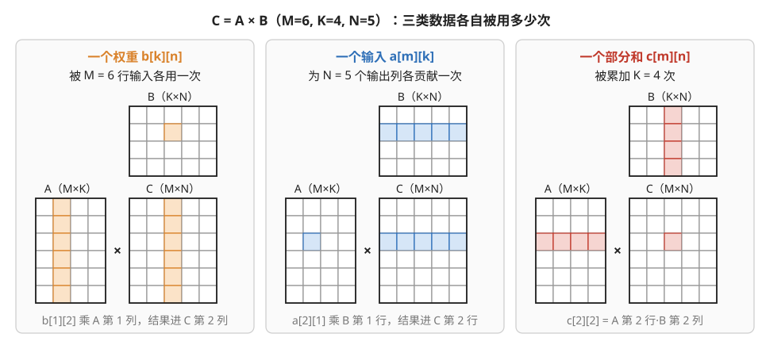
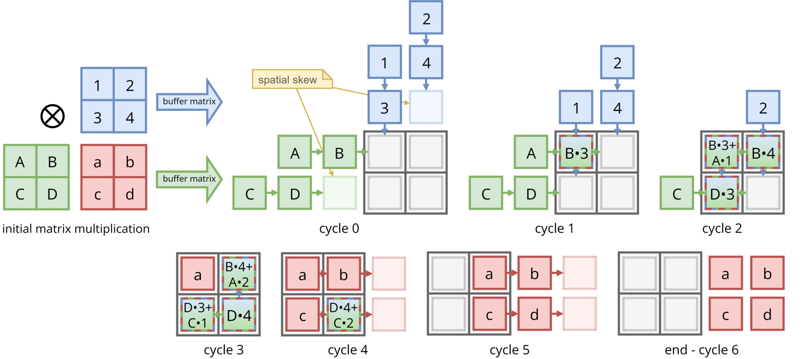
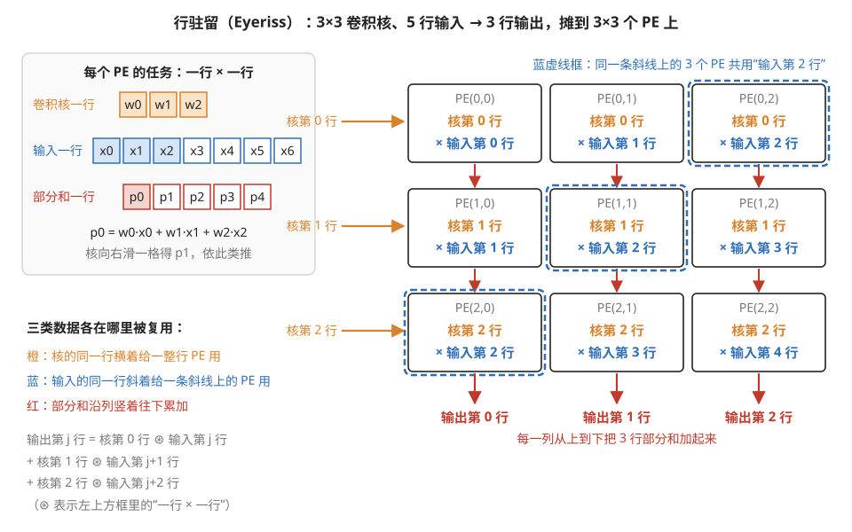
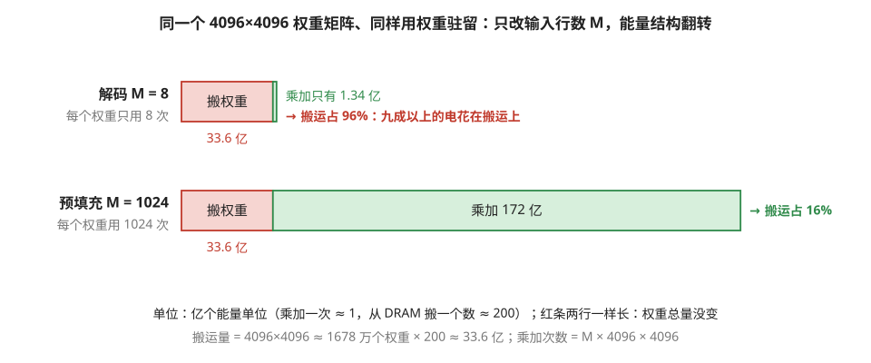
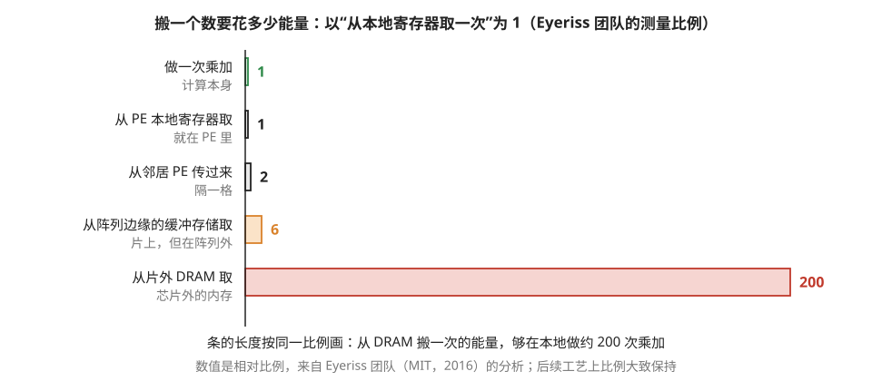

# 数据流的选择：让谁待在原地不动

> **所属模块**：模块 11 · 空间/脉动架构
> **状态**：🟨 学习中（第二版：按《写作规范》全文重写。知识截至 2026-08）
> **本节主旨**：前两节的例子里，权重被提前装进 PE"钉"在原地，输入和部分和流动——但这只是三种可能安排中的一种。矩阵乘法涉及三类数据（权重、输入、部分和），PE 里的小寄存器只装得下一类：**选择让谁常驻原地，就选择了让谁的搬运免费**。三种经典选择各有名字（weight-stationary、output-stationary、row-stationary），各有最适合的负载。本节讲清这个选择的逻辑，并揭示一个重要的统一：**GPU 上写 kernel 时"把什么放寄存器、什么放 shared memory"的决定，本质上是同一个问题**——只是 GPU 用软件回答，脉动阵列用电线回答。

---

## 0. 这一节要回答的问题

- 矩阵乘法里的三类数据各自有多少"复用机会"？为什么必须三选一？
- 三种经典数据流各是怎么工作的？各适合什么负载？
- 给定一个具体负载，怎么判断哪种数据流划算？
- 为什么说 GPU 的 kernel 优化和 NPU 的数据流选择是同一个问题？
- "按能量算账"是什么意思？为什么说搬数据比算数据贵得多？

---

## 1. 基础词汇：先把本节要用的词讲清楚

**部分和（partial sum，常缩写 psum）**。矩阵乘法 C = A×B 中，每个输出元素 c[m][n] 是 K 个乘积的和（K 是累加深度）。累加到一半的中间值就是部分和——它要被反复"读出来、加上新乘积、存回去"共 K 次，是三类数据里唯一会被**反复改写**的。

**驻留（stationary）**。指某类数据被装进 PE 的本地寄存器后原地不动，整个计算期间免搬运。驻留的反面是**流动**——每拍在 PE 之间移一格，或从边缘进出。

**复用次数（reuse）**。一个数据在被丢弃前参与计算的次数。这是本节的核心量：复用次数越高的数据，把它钉在原地的收益越大。

## 2. 三类货物，一个仓位：为什么必须选

先算清三类数据各自的复用机会。设矩阵乘的规模是 M×K×N（M 个输入行、K 的累加深度、N 个输出列）：

- **每个权重 b[k][n]**：要和 M 个不同的输入行相乘——复用 **M 次**。
- **每个输入 a[m][k]**：要为 N 个不同的输出列各贡献一次乘积——复用 **N 次**。
- **每个部分和 c[m][n]**：要被累加 **K 次**。

图 3-1 在一个小矩阵乘上把这三种复用逐格标了出来。

> **图 3-1**　一句话：矩阵乘法里，每个权重要用 M 次、每个输入要用 N 次、每个部分和要改写 K 次；三类数据都值得留在计算单元旁边，但 PE 里只留得下一类。
>
> **先知道一件事**：C = A×B 中，A 是 M×K 的输入，B 是 K×N 的权重，C 是 M×N 的结果。结果 c[m][n] 等于 A 的第 m 行与 B 的第 n 列逐项相乘再相加，一共 K 项。图中取 M = 6、K = 4、N = 5，方便数格子；行号、列号都从 0 数起。
>
> **按这个顺序看**：
> 1. 左栏（橙）：B 里的一个权重 b[1][2]。它要和 A 第 1 列的 6 个数各乘一次，6 个乘积分别加进 C 第 2 列的 6 个结果。所以它被用了 M = 6 次。
> 2. 中栏（蓝）：A 里的一个输入 a[2][1]。它要和 B 第 1 行的 5 个权重各乘一次，乘积分别加进 C 第 2 行的 5 个结果。所以它被用了 N = 5 次。
> 3. 右栏（红）：C 里的一个结果 c[2][2]。它等于 A 第 2 行与 B 第 2 列 4 对数的乘积之和，在算完之前要被"读出、加一项、写回"K = 4 次。
>
> **看懂的标志**：能回答"钉住哪类数据最划算"——看哪一类的复用次数乘以它的总个数最大。M 大时钉住权重，每个权重省下 M 次搬运；K 大时钉住部分和，每个结果省下 K 次读写。这就是下面几种数据流的分野。
>
> 来源：本库自绘。

三类数据都值得留在近处反复用，但 PE 的本地寄存器只有几个字的容量（模块 11 第 1 节），装得下一类、装不下三类。于是必然要做选择：

> **钉住谁，谁的全部复用就发生在原地、零搬运成本；另外两类只能流动**——流动的复用靠"路过一排 PE 沿途各用一次"实现（上一节的机制），且进出阵列的边缘带宽要为它们买单。

这个选择就叫**数据流（dataflow）**。要强调的是：对脉动阵列来说，数据流不是软件配置项——**选定谁驻留，连线就为它优化**（权重驻留的阵列，竖向线是为部分和修的专用道）。数据流是硅片的形状，出厂就定了。

## 3. 三种经典选择

### 3.1 权重驻留（weight-stationary，WS）——TPU 的选择

前两节的例子就是它：权重 b[k][n] 钉在 PE(k,n) 里，输入从左流入、部分和向下流出。图 3-2 是另一位作者画的 2×2 权重驻留阵列，可以对照着看"谁不动、谁在走"。

> **图 3-2**　一句话：2×2 权重驻留阵列从装好权重到算完的 6 个时刻：绿色的权重一直待在原地，蓝色的输入一拍一格往下走，部分和一拍一格往右走，结果从右边出去。
>
> **先知道一件事**：这张图把正文的阵列转了 90 度。正文里输入从左边进、部分和往下走；这里输入从上面进、部分和往右走，机制完全相同。图里算的是 [A B; C D] × [1 2; 3 4] = [a b; c d]：绿色大写字母是预先装好的权重矩阵，蓝色数字是流进来的矩阵，红色小写字母是结果。格子里的"A•2"表示 A 乘以 2。
>
> **按这个顺序看**：
> 1. 左上的 initial matrix multiplication（要算的乘法）：pre-load matrix（预装矩阵）指绿色权重，被一次性装进阵列；buffer matrix（缓冲矩阵）指蓝色数字，从缓冲存储一列一列送进来。
> 2. cycle 0（第 0 拍）：A、B、C、D 已经装进 4 个格子。蓝色数字在阵列上方排队：左列是 2、1，右列是 4、3。右列最下面空了一格，所以比左列晚一拍进入，黄色标注的 spatial skew 就是正文说的 skew（输入错拍）。
> 3. cycle 1：2 进入左上格，算出 A•2。
> 4. cycle 2：A•2 向右传到右上格，加上那里刚算的 B•4，得到 B•4+A•2，也就是结果 b；与此同时，2 向下走到左下格算 C•2，1 进入左上格算 A•1。
> 5. cycle 3 到 cycle 5：结果从右边依次流出，先是 b，接着是 a 和 d，最后是 c。到 cycle 5 四个结果都已出来，绿色权重始终没有动过。
>
> **看懂的标志**：能指出复用发生在哪里。数字 2 在 cycle 1 与左上格的 A 相乘，cycle 2 向下走到左下格再与 C 相乘：它进入阵列一次，被用了两次，中间没有回到缓冲存储。
>
> **与正文的对照**：绿色权重对应正文的 b[k][n]，蓝色数字对应正文的输入 a；部分和在这里向右流，在正文里向下流。
>
> 来源：[Weights Stationary Systolic Array Example.png](https://commons.wikimedia.org/wiki/File:Weights_Stationary_Systolic_Array_Example.png)，作者 EMJzero，许可 CC0（本库把透明背景填成了白色）。

**它免费掉的是权重的 M 次复用**。什么时候这笔账最划算？**权重复用机会大、且权重不常换**的时候——也就是 M 大（一次处理很多输入行，比如大 batch 的推理）而权重矩阵稳定（推理时权重完全不变）。谷歌 TPU 选它，正因为目标负载是数据中心推理：batch 能凑大、权重一装能用很久。

**它的短板**是 M 小的时候：权重装载本身要花时间（把 K×N 个数灌进阵列），装好之后如果只有几个输入行流过就要换下一批权重——**装载成本摊不薄**。这个"小 M 困境"和上一节的灌排摊销、模块 10 附录里 MoE 的小 batch 问题是同一个模式的三次出现：固定成本除以工作量，工作量太小就亏。

### 3.2 输出驻留（output-stationary，OS）——累加器不动

换一种钉法：让 PE(m,n) 负责输出 c[m][n]，**部分和在原地累加 K 次不动**；输入和权重都流动（A 从左进、B 从上进，两股流在每个 PE 相遇相乘）。图 3-3 与图 3-2 出自同一作者，算的是同一个乘法，可以直接对比。

> **图 3-3**　一句话：输出驻留的阵列里，两个输入矩阵都在流动，每个格子原地把自己负责的那一个结果累加完，最后再把结果移出去。
>
> **先知道一件事**：同样算 [A B; C D] × [1 2; 3 4] = [a b; c d]，但这次没有矩阵预先装进阵列。绿色矩阵从左边一行一行流入，蓝色矩阵从上面一列一列流入；左上格负责结果 a，右上格负责 b，左下格负责 c，右下格负责 d。两张 buffer matrix 的意思都是"从缓冲存储送进来的矩阵"。
>
> **按这个顺序看**：
> 1. cycle 0：绿色的 A、B 排在第一行左边，C、D 排在第二行左边，第二行晚一拍；蓝色的 3、1 排在左列上方，4、2 排在右列上方，右列晚一拍。两个方向都有 spatial skew（输入错拍）。
> 2. cycle 1：B 和 3 同时到达左上格，算出 B•3，结果留在格子里。
> 3. cycle 2：左上格又收到 A 和 1，把 A•1 加到原地的 B•3 上，得到 B•3+A•1，也就是 a。同一拍，B 向右走到右上格与 4 相乘，3 向下走到左下格与 D 相乘。
> 4. cycle 3：a 已经完成（红格）；右上格累加出 b，左下格累加出 c，右下格开始算 D•4。
> 5. cycle 4 到 cycle 6：d 在 cycle 4 完成，然后四个结果一拍一格向右移出阵列。
>
> **看懂的标志**：能说出它与图 3-2 的根本区别。这里部分和从头到尾没有离开格子，每个格子里的累加器只存一个数，被原地更新 K 次（这里 K = 2）；代价是两个输入矩阵都要从边缘流进来，而且算完后还要多花几拍把结果移出去。
>
> **与正文的对照**：绿色矩阵对应正文的 A（从左进），蓝色矩阵对应正文的 B（从上进），方向与本小节的描述一致。
>
> 来源：[Output Stationary Systolic Array Example.png](https://commons.wikimedia.org/wiki/File:Output_Stationary_Systolic_Array_Example.png)，作者 EMJzero，许可 CC0（本库把透明背景填成了白色）。

**它免费掉的是部分和的 K 次读改写**。什么时候划算？**K 很大**（累加链很深）的时候——部分和的反复读写本是三类搬运里最频繁的，K 大时把它钉住收益最高。它还有一个额外的好处：**累加精度**。部分和留在原地，可以用比输入更高的精度累加（输入是 16 位或 8 位的小数，累加器用 32 位），不必让高精度的中间值在低位宽的电线上来回跑。

顺带指出一个联系（模块 12 会展开）：**GPU 的 Tensor Core 走的正是输出驻留的路线**——矩阵乘的累加器常驻在寄存器（最新架构则是专门的累加存储）里不动，输入数据流经它。所以"OS"不是某类小众芯片的选择，它就藏在你天天用的 GPU 里。

### 3.3 行驻留（row-stationary，RS）——学术界的折中方案

前两种各钉一类、牺牲其余。2016 年 MIT 的 Eyeriss 芯片提出第三种思路：不钉任何单一数据，而是把计算切成"一行卷积"大小的小任务分给每个 PE，让**三类数据的复用在 PE 内部和近邻之间同时兼顾**，目标是**总搬运能量最小**（能量的账见第 5 节）。图 3-4 用一个最小的卷积例子画出它是怎么分工的。

> **图 3-4**　一句话：行驻留把一个二维卷积拆成许多"卷积核一行 × 输入一行"的小任务，每个 PE 做一个，使卷积核、输入、部分和三类数据都能在相邻 PE 之间重复使用。
>
> **先知道一件事**：卷积是拿一个小方块（卷积核，这里是 3×3 个权重）在输入图像上滑动，每停一处就把重叠的 9 对数相乘再求和，得到一个输出。它可以按行拆开：输出的一行，等于核的 3 行分别与相邻的 3 行输入做"一行 × 一行"的滑动乘加，再把 3 个结果相加。左上方框画的就是"一行 × 一行"：核的一行有 3 个权重 w0～w2，在一行 7 个输入 x0～x6 上滑动，得到 5 个部分和 p0～p4。
>
> **按这个顺序看**：
> 1. 右边 3×3 个 PE：PE(i,j) 负责"核第 i 行 × 输入第 i+j 行"。
> 2. 橙色：同一行 PE 用的是同一行卷积核（第 0 行 PE 全用核第 0 行）。这行核装进 PE 后原地不动，被横向的 3 个 PE 共用。
> 3. 蓝色虚线框：PE(0,2)、PE(1,1)、PE(2,0) 都要用输入第 2 行，因为 0+2 = 1+1 = 2+0。同一行输入沿着这条斜线被共用。
> 4. 红色：每一列从上到下把 3 个 PE 的部分和加起来，第 j 列的底部得到输出第 j 行。部分和在相邻 PE 之间向下传，不回到缓冲存储。
> 5. 左下的式子把第 4 步写成了公式。
>
> **看懂的标志**：能数出三类数据各在哪里被复用：核的每一行被一整行 3 个 PE 用（横向），输入第 2 行被 3 个 PE 用（斜向；第 0 行和第 4 行只有 1 个 PE 用），每一列的部分和被累加 3 次（纵向）。权重驻留和输出驻留各只钉住一类，这里三类都有复用，这就是"折中"的含义。
>
> **与正文的对照**：这是 Eyeriss 行驻留映射的最小例子，按本库记号重画。真实芯片还会把多个输入通道、多个卷积核交错放进同一个 PE，这里略去。
>
> 来源：本库自绘。

它在产品中很少被原样采用（控制复杂度高），但留下了比芯片本身更重要的遗产：**"数据流选择是一个可以定量计算的优化问题"这套方法论**。给定负载形状和硬件参数，穷举各种驻留方案、算出各自的总搬运量、选最小的——这套流程后来工具化（Timeloop 等分析工具），成了所有 NPU 设计和编译器的标准环节。开会听到"mapping space exploration（映射空间探索）"，指的就是这件事。

### 3.4 怎么判断该钉谁：一个可操作的判读法

三种选择没有绝对优劣，判断标准一句话：**看负载里哪类数据的"总体积 × 复用次数"最大，就钉谁**。两个实例：

- **大 batch 推理 / 训练的大矩阵乘**：M、K、N 都大，三类都有得赚——此时权重体积通常最大（模型参数），WS 是稳妥选择；K 特别深时 OS 的累加收益突出。
- **自回归解码（一次只处理一两个 token，M 极小）**：权重复用只有 M≈1 次——WS 的装载成本完全摊不平，**这类负载在大阵列上怎么选都难看**（上一节代价清单的现实版）。真正的解法在负载侧：攒大 batch，把 M 凑上去。

**例子：用能量层级给两种负载算一笔账。** 同一个权重矩阵 K=N=4096（约 1670 万个权重），两种输入规模，都用权重驻留：

- **解码场景，M = 8**：总乘加数 = 8 × 4096 × 4096 ≈ **1.3 亿次**。权重要从片外 DRAM 装载 1670 万个数——按第 5 节的能量层级（DRAM 一次 ≈ 200 个能量单位、乘加一次 ≈ 1 个单位）：搬运能量 ≈ 1670 万 × 200 = **33 亿单位**，计算能量 ≈ 1.3 亿单位。**搬权重的能量是计算的 25 倍**——这块芯片九成以上的电花在了搬运上，每个权重辛苦装进来只被用了 8 次。
- **预填充场景，M = 1024**：总乘加数 ≈ **172 亿次**，权重装载量不变（还是 33 亿单位）。现在计算能量是搬运的 5 倍多，每个权重被复用 1024 次——搬运摊到每次乘加只剩 0.2 个单位，可以忽略。

同一颗芯片、同一种数据流、同一个权重矩阵，**只是 M 从 8 变到 1024，能量结构就从"九成在搬运"翻转为"搬运可忽略"**。这笔账解释了为什么大模型推理系统拼命攒 batch、为什么"解码阶段本质上是访存受限的"会成为行业共识——数字就摆在这里。图 3-5 把这两笔账画在同一把尺子上。

> **图 3-5**　一句话：同一块芯片算同一个权重矩阵，输入只有 8 行时 96% 的能量花在把权重从 DRAM 搬进来，输入有 1024 行时搬运只占 16%。
>
> **先知道一件事**：在权重驻留的阵列上，每个权重不论被用多少次，都要从片外 DRAM（芯片外面的大容量内存）搬进来一次，每次约 200 个能量单位；一次乘加只要约 1 个单位。所以搬运能量只看权重有多少，计算能量看输入有多少行。
>
> **按这个顺序看**：
> 1. 两行的红条一样长：4096×4096 约 1678 万个权重，每个搬一次，合计约 33.6 亿个能量单位。
> 2. 上行（解码，一次只处理 8 行输入）：乘加次数是 8×4096×4096 ≈ 1.34 亿，绿条细得几乎看不见，搬运占了 96%。
> 3. 下行（预填充，一次处理 1024 行输入）：乘加约 172 亿，绿条是红条的 5 倍多，搬运只占 16%；摊到每次乘加上，搬运只有约 0.2 个单位。
>
> **看懂的标志**：能回答"推理服务为什么要攒 batch"。把多个请求的输入行拼在一起，M 变大：红条不变，绿条变长，每个搬进来的权重被用了更多次，同样的电做了更多有用的计算。
>
> **与正文的对照**：数字与上面的例子一致（正文取整为 33 亿、1.3 亿、172 亿）。每一级搬运的能量比例见图 3-6。
>
> 来源：本库自绘。

## 4. 一个重要的统一：GPU 的 kernel 优化就是软件版的数据流选择

写过或读过 GPU 矩阵乘 kernel 的人会发现似曾相识：CUTLASS/Triton 的高性能 GEMM 里，**输出块的累加器常驻寄存器**（这就是输出驻留），**A、B 的分块被搬进 shared memory 反复读**（这就是给输入和权重安排的"次级驻留"），块间的流动顺序由循环结构决定。

对照起来，两个世界回答的是同一道题——"三类数据各放在存储层次的哪一级、以什么顺序流动"——只是回答的方式不同：

| | 脉动阵列（NPU） | GPU |
| --- | --- | --- |
| 谁回答 | 芯片设计师 + 编译器 | kernel 作者 + 编译器 |
| 用什么回答 | 电线和 PE 寄存器的物理布局 | 软件：变量放寄存器还是 shared memory、循环怎么嵌套 |
| 何时定案 | 流片时（硬件）+ 编译时（切块） | 编译时，甚至运行时自动调优 |
| 改起来 | 不能改 | 改几行代码重编译 |

**这个统一是模块 11 与模块 10 之间最重要的一座桥**：你在 GPU 上学的 tiling、寄存器分块，和 NPU 世界的 dataflow 词汇表，说的是同一件事。模块 40 讲"映射问题"时会把这座桥正式定型。

## 5. 能量视角：为什么这个选择值得如此认真

数据流选择的深层依据是一组测量数据（来自 Eyeriss 团队的经典分析，比例在后续工艺上大致保持）：**在芯片上，搬一个 32 位数据的能量成本，随距离急剧上升**——

- 从 PE 本地寄存器取：记作 1 倍
- 从邻居 PE 传过来：约 2 倍
- 从阵列边缘的缓冲存储取：约 6 倍
- 从芯片外的 DRAM 取：约 **200 倍**
- 而做一次乘加本身：只有 1 倍上下

> **图 3-6**　一句话：在芯片上，一个数离计算单元越远，搬它一次花的能量越多；从芯片外的 DRAM 搬一次，够在 PE 里做约 200 次乘加。
>
> **先知道一件事**：数据可以放在四个地方，由近到远是：PE 自己的寄存器（就在乘法器旁边）、相邻的 PE、阵列旁边的片上缓冲存储（一块几 MB 到几十 MB 的片上内存）、芯片外的 DRAM。越远，信号要走的导线越长、经过的电路越多，所以越费电。
>
> **按这个顺序看**：
> 1. 最上面的绿条：做一次乘加的能量，记作 1。
> 2. 两条灰条：从本地寄存器取数也是 1，从邻居 PE 传过来是 2，和计算本身差不多便宜。
> 3. 橙条：从阵列边缘的缓冲存储取，是 6。
> 4. 红条：从片外 DRAM 取，是 200。所有条按同一比例画，它比上面四条加起来还长得多。
>
> **看懂的标志**：能回答"为什么说数据流的选择本质上是能量问题"。一次乘加若要从 DRAM 现取操作数，耗能是计算本身的 200 倍；只有让一个数进来之后被反复使用，这 200 才能被摊薄。复用次数最多的那类数据放得离计算越近，省得越多。
>
> **与正文的对照**：数值与本节列表一致，都是相对比例。
>
> 来源：本库自绘。

看清这组数字的含义：**计算几乎不耗能，耗能的全是搬运，而且从 DRAM 搬一次的能量够本地算两百次**。所以"让复用最多的数据离计算最近"不是锦上添花的调优，而是能耗（也就是数据中心电费和芯片散热上限）的第一决定因素。数据流选择本质上是一道**能量最小化**的题——这和模块 10 开篇"算术免费、数据贵"的定调完全同源，只是那里用时间记账，这里用焦耳记账。

## 6. 开发者视角

- **用 TPU/NPU 时**：数据流已被硅片焊死，你的空间在于**让负载迎合它**——推理攒 batch（把 M 凑大，喂饱 WS）、维度对齐阵列尺寸、权重用低精度以便一次装下更大的块。编译报告里"权重装载次数"和"阵列利用率"是 WS 贴合度的直接读数。
- **写 GPU kernel 时**：你在亲手做数据流选择（第 4 节的对照表）——Triton 里选多大的分块、哪个矩阵进 shared memory，自动调优搜的正是这个空间。
- **读架构论文/评估芯片时**：认识 WS/OS/RS 这三个词以及 Timeloop 这类工具的名字，就能看懂"我们的加速器采用 XX-stationary 数据流、经映射空间搜索"这类表述在说什么。

## 7. 最新架构落点（知识截至 2026-08）

- **TPU（至 v7）**：坚持权重驻留 + 大阵列，靠云上负载可凑批的特点把 WS 的账做平。**阵列边长逐代放大（v1–v5 的 128 到 v7 的 256 量级）会直接抬高"小 M 困境"的门槛**——边长翻倍意味着一次装载的权重块变成四倍，要摊平它需要的输入行数也随之变多，这是 §3.1 那笔账在新代际上的重算。
- **NVIDIA Tensor Core**：输出驻留血统；Blackwell 给累加器配了专门的存储（TMEM），相当于把"钉住部分和"从寄存器升级成专用仓位——OS 路线的最新形态（模块 12 详）。
- **昇腾 DaVinci**：16×16×16 的立体乘加单元，一条指令内部近似输出驻留，块粒度小、形状税轻。
- **可重构数据流**（SambaNova、Tenstorrent 等）：试图让数据流成为**编译期可选项**而非流片时定死——用更复杂的互连换选择自由，是对"数据流=硅片形状"这条铁律的挑战，成败待观察。

## 8. 术语卡

### 数据流（dataflow）
**定义**：对"三类数据（权重/输入/部分和）中谁驻留、谁流动、以什么路径流动"的总体安排。脉动阵列的数据流由硬件布线决定，出厂即定。
**为什么存在**：PE 本地存储装不下三类数据，必须取舍；不同负载的复用结构不同，没有万能的安排——于是"选哪种"成了架构设计的第一决策。
**语境例句**："这颗芯片是 weight-stationary 的。" —— 意思是：它把权重钉在计算单元里，最适合权重复用多的负载（大 batch、权重不变的推理）；反过来小 batch 解码是它的苦手。

### 权重驻留（weight-stationary，WS）
**定义**：权重装进 PE 常驻，输入流入、部分和流出的数据流。TPU 的选择。
**为什么存在**：推理场景权重完全不变、且被整批输入反复使用——复用之王理应免搬运。
**语境例句**："batch 太小，权重装载摊不平。" —— 意思是：WS 的固定成本（灌一整块权重进阵列）需要足够多的输入流过才划算；输入太少时装载时间占比飙升——攒 batch 或换负载。

### 输出驻留（output-stationary，OS）
**定义**：让部分和在产生它的计算单元里原地累加、不参与流动的数据流；输入与权重流动。
**为什么存在**：部分和是唯一被反复改写的数据（K 次读改写），K 深时把它钉住收益最大；且原地累加允许用高于输入的精度，保住长累加链的数值质量。
**语境例句**："Tensor Core 的累加器就是 output-stationary。" —— 意思是：GPU 矩阵单元让累加值驻留寄存器/专用存储、输入流过——OS 不是异域概念，就在最主流的硬件里。

### 行驻留（row-stationary，RS）与映射空间探索
**定义**：RS 是 Eyeriss 提出的折中数据流，按"总搬运能量最小"在三类复用间求平衡；映射空间探索指用工具（如 Timeloop）穷举数据流与切块方案、按能量/时间模型选最优的方法论。
**为什么存在**：单一驻留总要牺牲其余两类；当负载（如卷积）的复用结构复杂时，定量搜索胜过拍脑袋。方法论的影响远大于 RS 芯片本身。
**语境例句**："我们对这个算子做了 mapping space exploration。" —— 意思是：用分析工具穷举了驻留方案和分块尺寸的组合，按能量/延迟模型选了最优映射——NPU 编译器的标准工序。

### 能量层级（energy hierarchy）
**定义**：搬运一个数据的能量随距离的分级：本地寄存器 1 倍、邻居 2 倍、片上缓冲 6 倍、片外 DRAM 约 200 倍；乘加本身约 1 倍。
**为什么存在**（作为认知）：它量化了"计算免费、搬运昂贵"，是数据流选择、乃至一切访存优化的能耗依据。
**语境例句**："这个方案省算力但多一遍 DRAM 读写，能耗反而涨。" —— 意思是：一次 DRAM 搬运抵两百次计算——用计算换搬运几乎总是赚的，反向交易要格外小心。

## 9. 我的困惑 / 待深挖

- 能量层级的比例在最新工艺（4nm 及以下）有多大变化？SRAM 与逻辑缩放不同步会不会改变数据流的最优选择？
- 可重构数据流芯片切换一次数据流的实际开销？
- 注意力这种"两个矩阵乘夹一个归一化"的结构，理论最优数据流是什么？

---

*最后更新：2026-07-06（第二版+例：补入 decode vs prefill 能量账对照实验）*（2026-09 补图 6 张：现成 2 张，自绘 4 张；图注按费曼法写）
