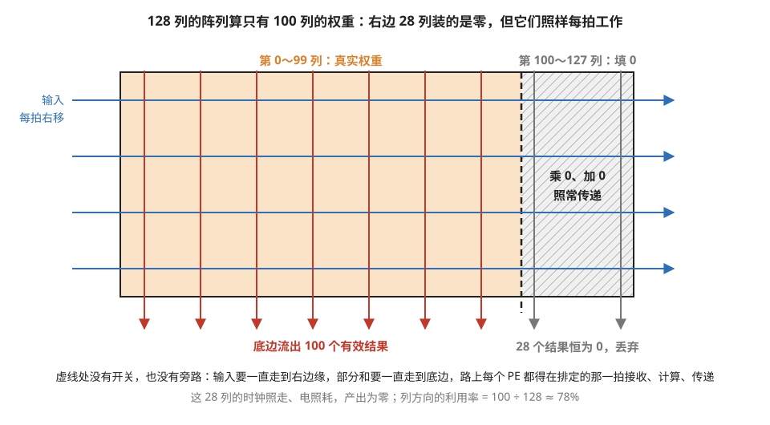
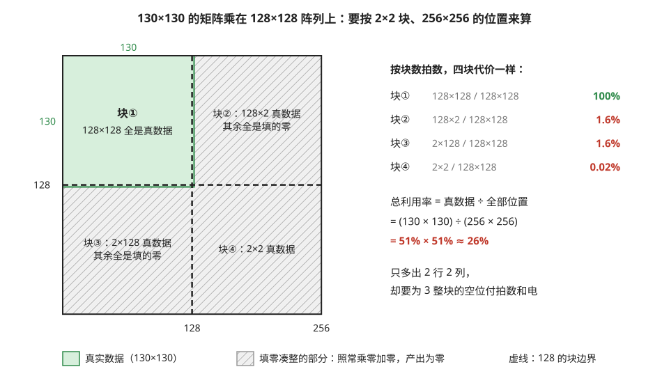
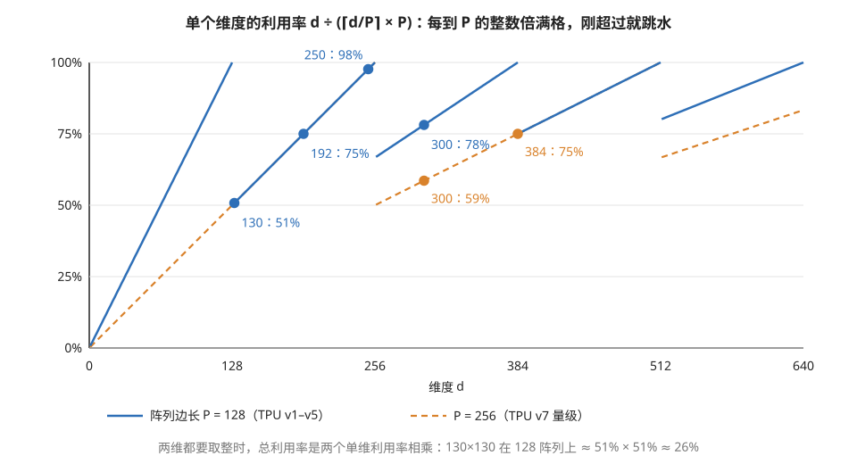
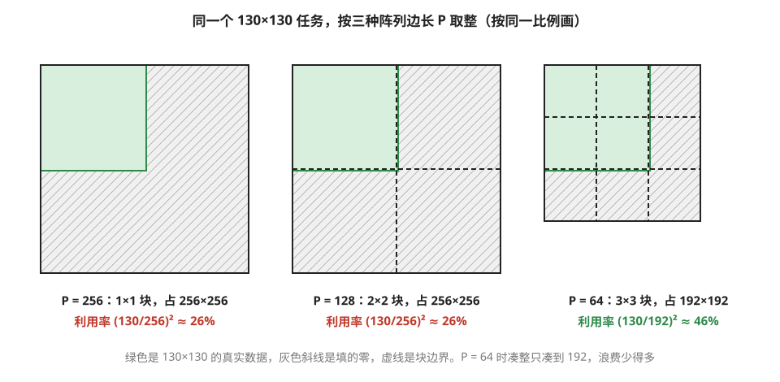

# 阵列利用率：形状税

> **所属模块**：模块 11 · 空间/脉动架构（本模块收官节）
> **状态**：🟨 学习中（第二版：按《写作规范》全文重写。知识截至 2026-08）
> **本节主旨**：脉动阵列的三大优点（零调度、零同步、复用免费）全部来自"阵列尺寸物理固定"这一个事实——而同一个事实的反面就是本节的主题：**计算的形状必须迁就硅片的形状**。矩阵维度不是阵列边长的整数倍时，缺口要填零凑整，填零的部分照常消耗时间和电力、产出为零。这笔"形状税"可以精确计算，而且有个反直觉的特点：**超出一点点，代价最惨重**。本节把税率算清楚，讲清三种不同的利用率杀手怎么区分，以及从芯片设计到模型设计各层的对策——最后你会看到，整个深度学习行业"维度全选 64/128 的倍数"的习惯，正是这笔税在模型设计层的沉淀。

---

## 0. 这一节要回答的问题

- 为什么填零的计算单元不能干脆跳过或关掉？
- 形状税怎么精确计算？为什么"超出一点点"的形状最亏？
- 编译报告里"阵列利用率 40%"可能有三种完全不同的病因，怎么区分？
- 芯片设计者、编译器、模型设计者各自有什么对策？
- 为什么主流大模型的维度清一色是 64/128 的倍数？

---

## 1. 基础词汇：先把本节要用的词讲清楚

**padding（填零凑整）**。当矩阵的某个维度小于阵列边长（或不是它的整数倍）时，把缺的部分用零补齐、凑成阵列能处理的完整块。补进去的零参与计算（乘零加零），不影响结果的正确性，但白白占用阵列的拍数。

**阵列利用率（array utilization）**。有效计算占阵列总能力的比例：全部"PE × 拍数"里，有多大比例在算真实数据（而不是填的零、或干脆没数据可算）。它是这类芯片的头号健康指标。

**形状量化（shape quantization）**。维度只能按阵列边长的整数倍"取整"使用的现象——就像只按整箱出售的商品，买 130 个就得付 256 个的钱（两箱，每箱 128）。本节的核心机制。

## 2. 为什么不能跳过空转的 PE

设想 128 列的阵列上算一个只有 100 列的矩阵：28 列 PE 装的权重是填的零。一个自然的想法：让这 28 列歇着省电，或者干脆干点别的活？

**做不到，而且是结构性的做不到。** 回忆上上节（11-02）的机制：全阵列共享一个时钟，部分和沿着列逐级向下流动，每个 PE 在时刻表排定的那一拍必须接收、计算、传递。第 100 列和第 101 列之间**没有任何开关或旁路**——部分和要流到底边、输入要传到右边，路径上每个 PE 都是链条上的一环。"跳过某几列"意味着改时刻表，而时刻表（上上节讲过）是焊在电路里的。所以填零的 PE 做的是"乘零、加零、照常传递"：**时钟照走、电照耗、产出为零。** 图 5-1 画的就是这 28 列。

> **图 5-1**　一句话：矩阵只有 100 列时，128 列阵列最右边的 28 列装的是填进去的 0；它们每一拍照样接收、计算、传递，只是算出来的全是 0。
>
> **先知道一件事**：在权重固定的阵列里，每一列 PE 负责结果矩阵的一列：这一列的权重装在这列 PE 里，部分和从顶上逐格加到底边流出。矩阵只有 100 列时，第 100～127 列没有真实权重可装，只能装 0。
>
> **按这个顺序看**：
> 1. 左边橙色区域：第 0～99 列装着真实权重，底边流出 100 个有效结果（红箭头）。
> 2. 右边斜线区域：第 100～127 列装的是 0。
> 3. 蓝色横箭头：输入每拍右移一格，一直走到阵列右边缘，经过右边 28 列时不会停下，也绕不开。
> 4. 灰色竖箭头：右边 28 列的部分和同样逐格下传，每一格都做"乘 0、加 0"，底边流出的结果恒为 0，被丢弃。
> 5. 虚线：真实权重与填零的分界。这里没有任何开关或旁路电路。
>
> **打个比方**：一条每站都停的地铁线，末尾几站没有人上下车，列车也照样逐站停靠、开门、关门，因为整条线的时刻表是统一排好的。
>
> **看懂的标志**：能回答"为什么不能把这 28 列关掉省电，或者分给别的任务"——它们在输入的传递路径上，也在全阵列统一的时刻表里；要跳过它们就得改连线和时刻表，而这两样都是造芯片时定死的。
>
> **与正文的对照**：列方向的利用率 100 ÷ 128 ≈ 78%，和 §8 术语卡里"头维改成 100、利用率掉到 78%"是同一个数。
>
> 来源：本库自绘。

顺带和 GPU 对照（模块 10 第 3 节讲过分支发散时线程"陪跑"）：GPU 里被掩码关闭的线程也是白占吞吐，但掩码是**逐条指令**的——下一段代码 warp 意见一致了，效率立刻恢复满格。脉动阵列的"陪跑"是**装载一次权重就定死一整轮**的——同一种浪费，GPU 按拍收费，脉动阵列按整块收费。粒度差异决定了后者对形状敏感得多。

## 3. 税率精算：利用率公式和一个手算例

维度 d 映射到边长 P 的阵列上，需要向上取整的 ⌈d/P⌉ 个块、占用 ⌈d/P⌉×P 个位置，其中只有 d 个有效。所以：

> **单维度利用率 = d ÷ (⌈d/P⌉ × P)，多个维度各算各的、相乘。**

**例子：一步步算 130×130 的矩阵乘在 128 阵列上的税。** 两个维度都是 130：

1. 130 ÷ 128 = 1.02，向上取整要 **2 个块**，占 2×128 = 256 个位置。
2. 单维利用率 = 130 / 256 ≈ **51%**——只超出 2，却要为整整一块的空位买单。
3. 两个维度都是如此：总利用率 ≈ 51% × 51% ≈ **26%**。这台机器四分之三的拍数在算零。

> **图 5-2**　一句话：130×130 只比 128×128 多出 2 行 2 列，却要占 4 个 128×128 的块，其中 3 块几乎全是填的零。
>
> **先知道一件事**：阵列一次处理一个 128×128 的块，处理一块花的拍数和块里装的是真数据还是 0 无关。所以一个维度只要超过 128，就得多算一整块。
>
> **按这个顺序看**：
> 1. 左图外框：取整后的 256×256 个位置，虚线把它分成 4 块。
> 2. 绿色是真实数据 130×130，块①整块都是真数据。
> 3. 块②只有最左边 2 列是真数据（128×2），块③只有最上面 2 行（2×128），块④只有左上角 2×2 个，其余斜线部分都是填的 0。
> 4. 右边的表：4 块花的时间一样，有效比例却分别是 100%、1.6%、1.6%、0.02%。
> 5. 合起来：真数据 130×130 = 16900 个位置，占全部 256×256 = 65536 个位置的 26%。
>
> **看懂的标志**：能用公式重算一遍（单维 130 ÷ 256 ≈ 51%，两维相乘 ≈ 26%），并说出"只多一点"为什么最亏：多出来的那一点，单独占了整整一块。
>
> **与正文的对照**：与上面的三步手算一致。
>
> 来源：本库自绘。

再看几个形状，感受税率曲线的形状：

| 矩阵维度（两维相同） | 需要的块数 | 总利用率 | 评语 |
| --- | --- | --- | --- |
| 128、256、4096 等整倍数 | 恰好整除 | **100%** | 免税 |
| 130 | 2 | **26%** | 超出 2，税率 74%——最惨的区间 |
| 192 | 2 | 56% | 半块浪费 |
| 250 | 2 | 95% | 接近下一个整数倍，税轻 |
| 8（例如输出驻留阵列上，解码场景的 M 维） | 1 | 该维只有 **6%** | 小维度的绝对税 |

曲线的规律：**利用率随维度锯齿状起伏，每个整数倍处满格、刚超过整数倍处跳水**。所以"避税"的原则不是"维度越大越好"，而是**贴着整数倍选**——4096 免税，4100 的税率约 3%，而 129 这种"过界一点"的形状税率高达 50%。图 5-3 把这条锯齿画了出来。

> **图 5-3**　一句话：一个维度的利用率随维度大小呈锯齿形：正好是阵列边长 P 的整数倍时是 100%，刚超过一点就掉到一半左右，再慢慢爬回来。
>
> **先知道一件事**：横轴是矩阵某一维的大小 d，纵轴是这一维的利用率，即 d 除以"向上取整到 P 的整数倍之后的大小"。例如 d = 130、P = 128，取整到 256，利用率是 130 ÷ 256 ≈ 51%。
>
> **按这个顺序看**：
> 1. 蓝色实线（P = 128）：d 从 0 爬到 128 时，利用率爬到 100%；一过 128，跳到约 50%；随 d 增大，到 256 又回到 100%。每一段就是一个"锯齿"。
> 2. 蓝点是正文表格里的几个维度：130 刚过界，51%；192 在半途，75%；250 接近下一个整数倍，98%；300 在第三个齿上，78%。
> 3. 越往右，每个齿的落差越小：过了 512，只跌到约 80%。维度越大，多算的那一块占的比例越小。
> 4. 橙色虚线（P = 256）：齿的宽度加倍。128 到 256 之间它和蓝线重合（两者都要取整到 256），被蓝线盖住；256 到 384 之间它比蓝线低，300 只有 59%，384 从 100% 变成 75%。
>
> **看懂的标志**：能回答"维度选 250 和选 260，哪个在 128 阵列上更划算"——250 在齿顶附近，98%；260 刚过 256，只有 260 ÷ 384 ≈ 68%。多 10 个维度，利用率掉了三成。
>
> **与正文的对照**：点上的数字是单维利用率；上面表格里的"总利用率"是两维相乘，例如 192 单维 75%，两维 56%。P = 256 的数字与 §7 的对照表一致。
>
> 来源：本库自绘。

## 4. 诊断学：利用率低的三种病因，药方各不相同

编译报告说"阵列利用率 40%"——先别急着改形状，这个数字背后有三种完全不同的病，混淆了会开错药：

| 病因 | 机制 | 出处 | 药方 |
| --- | --- | --- | --- |
| **形状税**（本节） | 维度不整除边长，填零空转 | 阵列尺寸物理固定 | 维度对齐整数倍；或拼接小任务 |
| **灌排开销** | 波前波尾合计折合约 2 倍边长的整阵列空转，每装一块权重只流过很少几行输入（太"浅"）时摊不薄 | 11-02 第 3 节 | 攒 batch 加大流过的行数；小任务背靠背排流水 |
| **喂料不足** | 块切太小复用不够，搬运跟不上计算 | 11-04 第 4 节 | 加大块尺寸；查数据排布 |

**例子：同一个 40%，三份不同的诊断书。** ① 形状（M×K×N，下同）是 4096×160×4096：权重驻留阵列上铺在阵列两条边上的是 K 和 N，K = 160 按 128 取整要 2 块，K 维吃了形状税（利用率 160/256≈62%），但没到 40%——还有别的病；看灌排占比和搬运占比再定位。② 形状 128×4096×4096：维度全对齐、无形状税，但每装一块权重只有 M=128 行输入流过，太浅——灌排的空转（11-02 算过约 256 拍）比有效计算（128 拍）还长，利用率只有三成多，**病在"浅"**，药方是攒更大的 batch 把 M 加大，或让相邻权重块的灌排互相重叠。③ 形状漂亮、深度足够，但性能工具显示搬运引擎满载——病在 11-04 的喂料，药方在块尺寸。**三种病表面同分，处方完全不同**——这套鉴别流程就是 NPU 世界的性能排查基本功（GPU 世界的对应物是模块 10 附录 A1 的逐级下钻）。

## 5. 对策：从硅片到模型的三层货架

**芯片设计层：阵列粒度的权衡。** 一个 256×256 的大阵列和 16 个 64×64 的小阵列，纸面算力相同，形状税却差很多。**例子**：处理 130×130 的任务——大阵列要按 256 取整，利用率 26%（第 3 节的账）；64 边长的小阵列按 ⌈130/64⌉×64 = 192 取整，利用率 (130/192)² ≈ **46%**，好了近一倍。代价是小阵列的边缘接口、控制逻辑占比更高，峰值能效稍逊。**大阵列赌负载规则（云上大批量），小粒度赌负载碎（端侧、变长）**——TPU 选 128 的大阵列，手机 NPU 普遍选小阵列，NVIDIA 的 Tensor Core 走到小粒度的极端（单条指令只算 16×8×16 的小块，靠调度拼装，模块 12 详）。这是不同市场对同一道题的不同答案。图 5-4 按同一比例画出三种边长下的取整结果。

> **图 5-4**　一句话：同一个 130×130 的任务，阵列边长越小，取整时多凑出来的零越少：边长 256 和 128 时利用率都只有 26%，边长 64 时是 46%。
>
> **先知道一件事**：阵列边长 P 就是阵列一次处理的块的大小，每个维度都要取整到 P 的整数倍。P = 256 时，130 取整到 256；P = 128 时要 2 块，还是 256；P = 64 时要 3 块，只取整到 192。
>
> **按这个顺序看**：
> 1. 三个方框按同一比例画，绿色都是同样大小的 130×130 真实数据，灰色斜线是填的 0，虚线是块边界。
> 2. 左（P = 256）：一整块 256×256，绿色只占左上角约四分之一。
> 3. 中（P = 128）：切成 2×2 块，外框仍是 256×256，浪费和左边一样多。
> 4. 右（P = 64）：切成 3×3 块，外框只有 192×192，斜线部分明显少了。
>
> **看懂的标志**：能说出小粒度的代价：同样的算力要拆成更多个小阵列，每个都要有自己的边缘接口和控制电路，峰值能效稍低。所以大阵列适合形状规整的云上大批量负载，小阵列适合形状零碎的端侧负载。
>
> **与正文的对照**：数字与本小节的例子一致；中间一栏就是图 5-2。
>
> 来源：本库自绘。

**编译器层：拼接与变形。** 把多个小矩阵乘**拼进同一次阵列计算**（比如把 8 个 M=16 的小任务拼成一个 M=128 的大任务）；把卷积摊平成大矩阵乘。能救回一部分，但拼接本身有排布开销，且要求任务恰好可拼。

**模型设计层：从源头避税。** 这是杠杆最大的一层——**维度在设计模型时就选硬件粒度的整数倍**。看一眼现实：主流大模型的隐藏维度（4096、8192）、注意力头维（64、128）、FFN 中间维，清一色是 64/128 的倍数。**这不是数学上的必然，也不是审美，而是全行业为形状税做的集体避税安排**——硬件的死板，就这样沉淀成了模型设计的纪律。反过来，当你在方案评审里看到头维 96 改 100、词表不 pad 到整数倍这类提议时，本节的公式就是你估算代价的工具。

## 6. 开发者视角

| 你想知道/控制什么 | 去哪里看/做 |
| --- | --- |
| 形状税多重 | 用第 3 节的公式手算：每维 d/(⌈d/P⌉·P) 连乘；编译报告的 padding 比例 |
| 三种病因鉴别 | 依次查：维度整除吗（形状税）→ 每块权重流过的输入行够多吗（灌排）→ 搬运引擎满没满（喂料）——第 4 节流程 |
| 模型侧的自查 | 隐藏维/头维/FFN 维/词表大小是否为硬件粒度整数倍；变长序列是否分桶 |
| 服务侧的手段 | 攒批把 M 凑到整数倍附近；长度分桶减少形状种类 |

## 7. 最新架构落点（知识截至 2026-08）

- **TPU**：坚持大阵列路线，且**边长还在往上走**——v1 到 v5 是 128，v7（Ironwood）已放大到 256 量级（11-01 §6 有从公开算力反推的算式）。谷歌赌的是云上负载可以靠服务层凑批、对齐来消化形状税。
  - **边长翻倍对税率曲线的影响可以直接用 §3 的公式算**。取几个维度对照（单维利用率 = d ÷ ⌈d/P⌉·P）：

    | 维度 d | P = 128 | P = 256 |
    | --- | --- | --- |
    | 256 | 100%（免税） | 100%（免税） |
    | 300 | 300/384 ≈ **78%** | 300/512 ≈ **59%** |
    | 384 | 100%（免税） | 384/512 = **75%** |
    | 512 | 100%（免税） | 100%（免税） |

    规律有两条，都不利：**其一，免税点变稀了**——128 的倍数有一半在 256 上不再免税（384 就是典型），本来免税的形状开始交税。**其二，交税时交得更多**——"过界一点"的最惨税率在两种粒度下都是接近 50%（这是公式决定的，与 P 无关），但同一个维度落在粗粒度上，往往离下一个整数倍更远：d = 300 时，P = 128 只需补到 384（补 84，利用率 78%），P = 256 要补到 512（补 212，利用率 59%）。补齐的部分是纯空转，所以同一个形状在粗粒度阵列上浪费的比例更高。
    一句话：**粒度越粗，"碰巧对齐"的运气成分越小，模型侧主动对齐的收益越大**——这正是"形状文化"（§5 第三层）需要随硬件代际重新校准的原因。
- **昇腾 DaVinci**：16×16×16 的立体单元，粒度 16——税率曲线的锯齿密得多、每齿浅得多。
- **NVIDIA Tensor Core**：粒度最细（16×8×16 量级）+ 动态调度拼装——用模块 10 的灵活性稀释形状税，代价是回到了 SIMT 的管理开销。
- **行业压力**：MoE（专家负载天然不均）、变长序列、投机解码让"形状不齐"从例外变成常态——这是当前"大阵列路线"承压、"小粒度 + 灵活调度"路线抬头的直接原因，也是评估任何新加速器时值得问的第一个问题："**它的形状税税率表长什么样？**"

## 8. 术语卡

### 形状税 / 形状量化（shape quantization）
**定义**：维度按阵列边长向上取整使用导致的利用率损失，单维税后利用率 = d/(⌈d/P⌉·P)，多维相乘。刚超过整数倍的形状税最重（129 在 128 阵列上税率近 50%）。
**为什么存在**：阵列尺寸焊死在硅片上、时刻表不容跳过——这是"零调度零同步"的优点的同一枚硬币的反面。
**语境例句**："这个头维改成 100 会吃形状税。" —— 意思是：100 不整除硬件粒度，要按 128 取整、利用率掉到 78%——省的那点参数量多半抵不上算力损失，用公式算一下再定。

### padding（填零凑整）
**定义**：把不足整块的维度用零补齐的做法。补的零参与计算但不影响结果，代价是占用真实的拍数和功耗。
**为什么存在**：阵列只会按整块工作，填零是让不规则形状"能算"的最简单手段——代价透明（就是形状税），机制简单。
**语境例句**："编译器自动 pad 了，结果是对的，就是慢。" —— 意思是：正确性无忧、性能有税——padding 从来不是正确性问题，是利用率问题。

### 阵列利用率（array utilization）
**定义**：有效计算占"PE 数 × 拍数"总量的比例。低于预期时有三种病因：形状税、灌排开销、喂料不足——机制不同、药方不同。
**为什么存在**（作为指标）：它是这类芯片的总健康度读数，角色相当于 GPU 世界的"算力利用率 + 带宽利用率"合体。
**语境例句**："MXU 利用率只有 40%，先看是哪种病。" —— 意思是：别急着下结论——依次排查维度整除性、每块权重流过的输入行数、搬运占比，三种病因的处方完全不同。

### 阵列粒度（array granularity）
**定义**：矩阵计算单元的最小工作块尺寸（TPU 是 128、昇腾是 16、Tensor Core 是 16×8×16 量级）。粒度越大能效越高、形状税越重；粒度越小相反。
**为什么存在**（作为设计选择）：它是"摊薄控制开销"和"适应碎形状"这对矛盾的调节旋钮，不同市场（云上大批量 vs 端侧变长）选不同的点。
**语境例句**："这颗芯片粒度太粗，跑我们的变长负载吃亏。" —— 意思是：负载形状碎，而大阵列按大块取整、税重——要么换小粒度的硬件，要么在服务层分桶凑批。

### 形状文化
**定义**：深度学习模型维度普遍选择 64/128 整数倍的行业习惯——隐藏维、头维、FFN 维、pad 后的词表几乎无一例外。
**为什么存在**：几代硬件（大阵列 NPU 和 Tensor Core）的形状税共同塑造的集体避税行为——硬件的约束沉淀成了模型设计的默认纪律。
**语境例句**："为什么 d_model 不取个整千的 4000 而是 4096？" —— 意思是：4096 = 32×128，对所有主流矩阵硬件免税；4000 会在 128 粒度上吃约 3% 的税、在更细的对齐要求上还有额外损失——没有理由送这笔钱。

## 9. 我的困惑 / 待深挖

- 各家编译器对"过界一点"的形状（如 129）有没有自动拆分优化（128 + 1 分开算）？收益和开销的平衡点？
- 给定真实负载的形状分布，"期望利用率最高的阵列边长"是个可以算的优化题——有没有公开的这类分析？
- 结构化稀疏等于把有效形状变小，脉动阵列怎么吃这个收益？

---

*最后更新：2026-08-31（第三版：§7 补入 TPU 阵列边长的代际变化及其对税率曲线的影响——免税点变稀、绝对浪费翻倍；第二版：按含自检的写作规范重写；含 130×130 手算、三病因鉴别例、粒度对照账）*（2026-09 补图 4 张：现成 0 张，自绘 4 张；图注按费曼法写）
