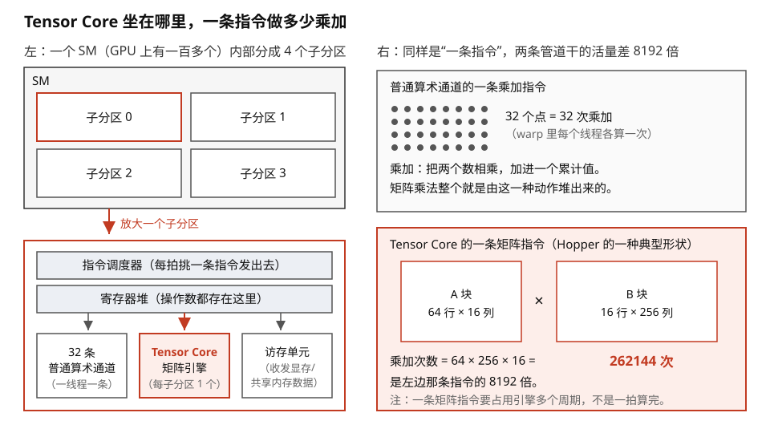
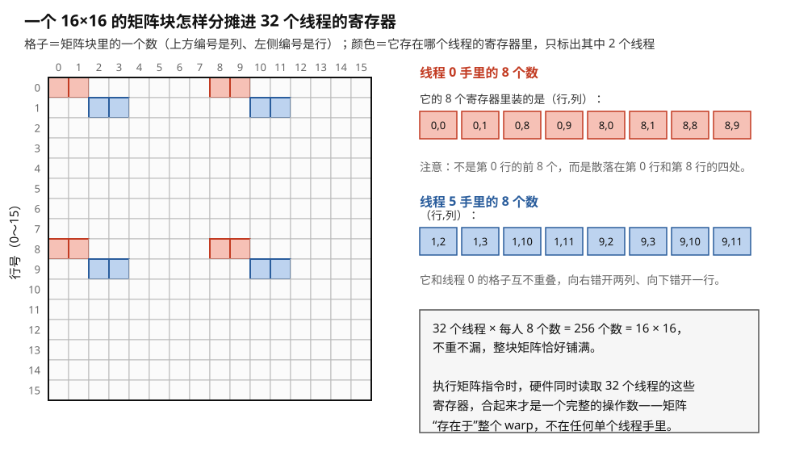
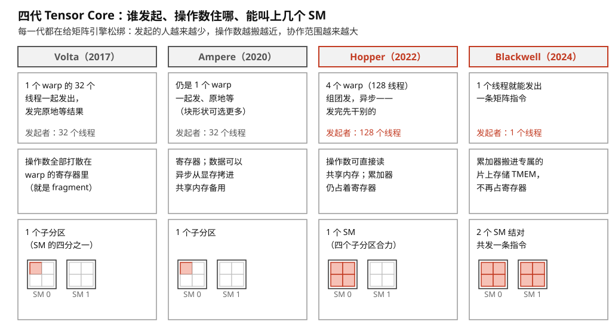
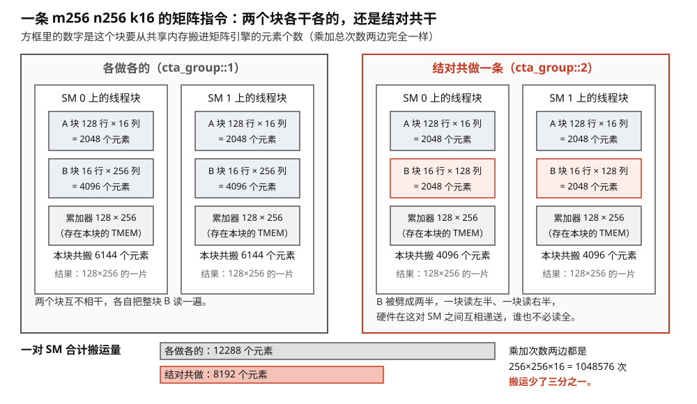
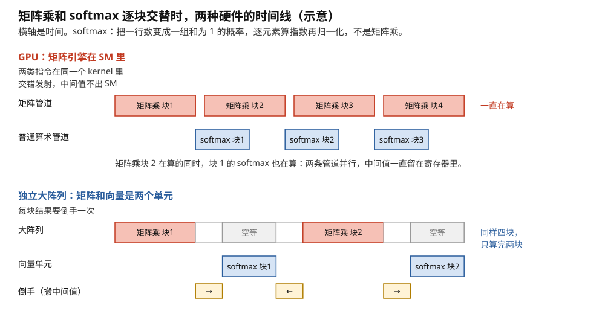

# Tensor Core：塞进 GPU 里的矩阵引擎

> **所属模块**：模块 12 · 两者交汇·Tensor Core（两种范式的联姻现场）
> **状态**：🟨 学习中（第二版：按《写作规范》全文重写。知识截至 2026-08）
> **本节主旨**：模块 11 展示了专用矩阵阵列的能效优势，也展示了它的死板。NVIDIA 的回答是一个折中：**把矩阵引擎做小（一条指令只算一个小块），塞进每个 SM 里，用 GPU 原有的调度、寄存器和访存体系当它的"后勤部队"**——这就是 Tensor Core。它是"开会时两套词汇混着出现"的根源：**矩阵引擎的词（tile、fragment、累加器）描述它的内部，SIMT 的词（warp、屏障、调度）描述喂它的外围**。本节讲清它在哪里、怎么被喂、四代演化的方向，以及它与 TPU 大阵列这两条路线各赌什么。

---

## 0. 这一节要回答的问题

- Tensor Core 物理上在 SM 的什么位置？一条指令算多大的矩阵？
- 它的操作数放在哪？为什么一个矩阵块要"打散"到 32 个线程的寄存器里？
- 从 Volta 到 Blackwell，它的编程方式变了四代，方向是什么？
- 为什么 NVIDIA 把矩阵引擎做小塞进 SM，而不是像 TPU 那样做一个大阵列？
- 怎么确认自己的程序"吃到了" Tensor Core？

---

## 1. 基础词汇：先把本节要用的词讲清楚

**tile（矩阵块）**。大矩阵乘被切出来的小块。Tensor Core 一条指令处理的就是一个小 tile——不同代际的典型尺寸在 16×16 到 64×256 的范围。

**fragment（片段）**。一个矩阵 tile 被**按固定规则拆散、分摊到一个 warp 的 32 个线程的寄存器里**之后，每个线程手里的那一小份。这是 Tensor Core 编程模型里最特别的概念，第 3 节专门讲。

**warpgroup（线程组团）**。Hopper 架构引入的调度单位：4 个 warp（128 个线程）结成一组，共同操作一条更大的矩阵指令。

**混合精度累加**。Tensor Core 的标准工作方式：输入用低精度（16 位、8 位甚至 4 位的浮点数），**累加过程用高精度**（32 位）——低精度省带宽和电路，高精度保住长串加法的数值质量。这正是模块 11 第 3 节讲的输出驻留数据流附带的好处。

## 2. 它在哪里、算多大

回到模块 10 第 1 节的 SM 解剖图：每个 SM 分 4 个子分区，**每个子分区里有一个 Tensor Core**，与 32 条普通算术通道、访存单元并排坐着（见图 1-1）。它是子分区里的"另一条执行管道"：调度器可以这一拍发一条普通乘加给算术通道，下一拍发一条矩阵指令给 Tensor Core，两条管道各自忙各自的。

它和普通算术通道的差别是"批发与零售"：普通通道一条指令做 32 次独立的乘加（每线程一次）；Tensor Core 一条指令完成**一整个小矩阵块的乘加**——以 Hopper 的一条典型指令为例，一次算完 64×256×16 的块，相当于 26 万次乘加。同样的芯片面积，专用电路做矩阵乘的吞吐是通用通道的一个数量级以上——**这就是模块 11 第 4 节"专用阵列能效碾压"的结论，被 NVIDIA 以缩小版的形式装进了自家核心**。

> **图 1-1**　一句话：Tensor Core 不是一块独立的芯片，它是 SM（GPU 上真正执行指令的那种部件）内部的一条执行管道，与普通算术通道并排坐着；两者的差别在于一条指令干多少活。
>
> **先知道一件事**：GPU 上的一条指令不是发给一个线程的，而是发给 32 个线程一起执行的，这 32 个线程合称一个 warp。所以"普通算术通道的一条乘加指令"做的是 32 次互不相干的乘加，每个线程一次。
>
> **按这个顺序看**：
> 1. 左上角的大框是一个 SM。H100 这样的芯片上有 132 个 SM，各自独立地取指令、执行。每个 SM 内部分成 4 个一模一样的子分区。
> 2. 左下角把一个子分区放大：最上面是指令调度器（每拍挑一条准备好的指令发出去），中间是寄存器堆（指令要用的数都存在这里，是离运算电路最近的一层存储），再往下是三条并排的执行管道。Tensor Core 是其中一条，每个子分区一个，全芯片合计 132 × 4 = 528 个。
> 3. 三条管道是并行的：调度器这一拍把一条普通乘加发给左边的通道，下一拍就可以把一条矩阵指令发给 Tensor Core，两条管道各忙各的。
> 4. 右上是一条普通乘加指令的活量：32 个点就是 32 次乘加。乘加＝把两个数相乘、再加进一个累计值；矩阵乘法整个就是由这一种动作堆出来的。
> 5. 右下是 Hopper 上一条典型矩阵指令的活量：64×16 的 A 块乘 16×256 的 B 块，结果里每个元素都要把 16 对数乘起来相加，合计 64 × 256 × 16 = 262144 次乘加，是左边那条指令的 8192 倍。
>
> **打个比方**：同一间铺面，左边开着零售窗口，一次卖一件；右边开着批发窗口，一次出一托盘。两个窗口共用同一个仓库（寄存器堆），谁的货都从那里取。
>
> **看懂的标志**：能回答"一条指令的活量差 8192 倍，是不是说 Tensor Core 快 8192 倍"——不是。矩阵指令要占住引擎连续多个周期才算完，比快慢要看每秒完成的乘加次数：同代芯片上矩阵管道的吞吐大约是普通管道的一个数量级以上，而不是八千倍。
>
> 来源：本库自绘。

内部结构 NVIDIA 不公开。公开研究表明它更接近"并行的乘加树"而非教科书式的脉动阵列，但这不影响理解：它具备专用矩阵阵列的全部关键性质——固定功能、数据走专用通路、指令内部时序完全确定。日常把它理解为"一小片矩阵引擎"即可。

## 3. fragment：为什么矩阵要打散进 32 个线程的寄存器

Tensor Core 自己**没有**输入存储（Blackwell 之前），操作数直接取自 warp 的寄存器堆。这就产生了一个几何问题：一个 16×16 的矩阵块有 256 个数，而单个线程的寄存器装不下也不该装下它——于是硬件规定了一种**打散方案**。

**例子：一个 16×16 的块怎么分家。** 按硬件规定的固定映射，256 个元素分摊给 warp 的 32 个线程，每人恰好 8 个——但**不是**按"线程 0 拿第一行前 8 个"这种直观方式，而是一种精心设计的交错模式（每个线程拿到的 8 个数散布在块的不同行列），这个模式的设计目标是让 Tensor Core 的内部电路取数最顺、也让从 shared memory 装载时不撞 bank（模块 10 第 4 节的 swizzle 正是为配合这个模式而生）。执行矩阵指令时，32 个线程的寄存器**合起来**构成完整的操作数——**矩阵"存在于"整个 warp，而不是任何单个线程**。图 1-2 把 16×16 这一例的分法逐格画了出来。

> **图 1-2**　一句话：一个 16×16 的矩阵块，256 个数按硬件规定的固定规则分给 warp 的 32 个线程，每人 8 个；而且每人拿到的 8 个不是连成一片的，是散在块里的四小撮。
>
> **先知道一件事**：寄存器是每个线程私有的一小块存储，别的线程读不到。Tensor Core（Blackwell 之前）没有自己的输入存储，只能从寄存器取数——所以一个矩阵块必须先被拆开、分别存进 32 个线程各自的寄存器，矩阵指令才用得上它。
>
> **按这个顺序看**：
> 1. 左边的 16×16 网格就是矩阵块本身，一格一个数。上方编号是列，左侧编号是行。
> 2. 淡红色的 8 格属于线程 0：第 0 行和第 8 行上，各取第 0、1、8、9 列。右上角把这 8 个坐标列了出来。
> 3. 淡蓝色的 8 格属于线程 5：位置整体向下错一行、向右错两列。其余 30 个线程按同样的错位规则各占 8 格，就是图中的白格子。
> 4. 32 × 8 = 256，恰好把整块铺满，不重不漏。
> 5. 右下角的方框是这张图真正要说的事：执行矩阵指令时，硬件把 32 个线程的这些寄存器一起读出来拼成完整操作数。所以这个矩阵不属于任何单个线程，它"存在于"整个 warp。
> 6. 为什么要错成这样：矩阵引擎内部的取数线路希望同一拍取到的数来自固定的几个位置；同时，从共享内存往寄存器装载时，这种错位能避开多个线程同时读同一个存储体造成的排队。直观的"线程 0 拿第 0 行前 8 个"反而让这两件事都变糟。
>
> **打个比方**：一副 256 片的拼图发给 32 个人，每人 8 片。发牌规则不是按顺序切成 32 摞，而是让每人手里的片子散布在图面各处——因为拼的时候大家要同时把自己的片按到固定位置上，散开才不会互相挡手。
>
> **看懂的标志**：能回答"为什么讨论矩阵计算时 warp、线程这些词老是冒出来"——因为操作数的保管和搬运仍然用 GPU 原来那套线程体系，只有计算本身是整块矩阵的。一个动作，两套词汇。
>
> **与正文的对照**：图里画的是 PTX 文档为 16×16 的 A 操作数规定的那种映射；不同代际、不同块形状的具体映射不同，但"固定规则、交错分摊、合起来才完整"这三点是共通的。
>
> 来源：本库自绘。

这个安排解释了那个著名的困惑——"为什么讨论矩阵计算时 warp、线程这些词一直冒出来"：

> **管理数据用 SIMT 的词**（哪个 warp 的寄存器、怎么从 shared memory 装载、什么时候同步），因为操作数的搬运和保管靠的是 GPU 原有的那套体系；**执行计算用矩阵的词**（tile、fragment、累加器），因为算的是一整块矩阵。一个动作、两套词汇，缺一不可。

好在日常不需要手工摆弄 fragment：库和编译器（写 Triton 时的 `tl.dot`）把打散、装载、对齐全部代管——但当你在底层代码或报错信息里看到 fragment 这个词，现在知道它指的是"矩阵块摊到每个线程手里的那一份"。

## 4. 四代演化：矩阵引擎逐步"长大成人"

Tensor Core 的编程接口四代大改，排在一起能看出清晰的方向（图 1-3 把下表的三件事画成了三行）：

| 代际 | 指令形态 | 谁发起、怎么等 | 关键进步 |
| --- | --- | --- | --- |
| Volta（2017） | 第一代矩阵指令 | 一个 warp 协作、同步执行（发了就等结果） | 首次把矩阵引擎交到程序员手里 |
| Ampere（2020） | 更灵活的块形状 | 仍是 warp 级同步 | 形状选择更多、配合异步拷贝 |
| **Hopper（2022）** | warpgroup 级大块指令 | **4 个 warp 组团发起、异步执行**（发了不等，之后统一收账）；操作数可**直接来自 shared memory** | 块大到单个 warp 的寄存器装不下 → 组团；异步 → 计算能和搬运、softmax 重叠 |
| **Blackwell（2024）** | 新一代指令族（`tcgen05`） | **单个线程即可发起**；累加器放进专属的片上存储 **TMEM**，不再占用寄存器堆；**还可以两个线程块结对（`cta_group::2`）共发一条指令** | 矩阵引擎有了自己的存储和收发室，并且第一次**跨出了单个 SM 的边界**——几乎成了独立的协处理器 |

> **图 1-3**　一句话：四代 Tensor Core 的变化，只看三件事就够了——一条矩阵指令由谁发出、它的操作数住在哪、它能叫上多大范围的硬件一起干。
>
> **先知道一件事**：这里说的"发起"，指的是由几个线程一起执行那条矩阵指令的发射动作。GPU 上不少指令要求一个 warp（32 个线程）步调一致地一起发，这会把这 32 个线程都拴在这条指令上，指令没完它们干不了别的。
>
> **按这个顺序看**：
> 1. 四列从左到右是四代，2017 年到 2024 年。红色标题的两代是变化最大的两代。
> 2. 第一行是"谁发起"。Volta：32 个线程一起发，发完原地等结果。Hopper：4 个 warp 共 128 个线程组团发，而且是异步的——发出去就可以接着干别的，过一阵再用一条配套的等待指令收账。Blackwell：一个线程就能发出一条。
> 3. 第二行是"操作数住哪"。Volta 全在寄存器里，也就是图 1-2 的那种打散（fragment）。Hopper 起操作数可以直接从共享内存读，但累加器（矩阵乘过程中不断累积的中间和）仍占着寄存器。Blackwell 把累加器搬进专属的片上存储 TMEM——累加器本来是寄存器的第一大户，把它挪走，等于给每个线程退回一大块空间。
> 4. 第三行的小方块图是"协作范围"。两个带框的大方块是相邻的两个 SM，每个 SM 画成 4 个子分区；涂红的部分是这条指令能调动的范围。Volta 和 Ampere 只有一个子分区，Hopper 是整个 SM 的四个子分区合力，Blackwell 是两个 SM 结对。
>
> **打个比方**：部门里的一台专用设备，从"必须 32 个人一起按下启动键、按完还得全体站着等"，变成"一个人按一下就走，设备干完了通知你"；同时设备处理的批量越来越大，一台不够就两台连起来一起干。
>
> **看懂的标志**：能说出这四代共同的方向——把矩阵引擎从"寄生在 SIMT 资源里"一步步松绑：发起的人更少、数据离引擎更近、协作范围更大。以后看新架构发布，问这三个问题就能立刻定位它动了哪一处。
>
> 来源：本库自绘。

### 4.1 Blackwell 的第三步：一条矩阵指令跨两个 SM

前两步（单线程发起、累加器进 TMEM）都是在**一个 SM 内部**给矩阵引擎松绑。Blackwell 还走了第三步，方向完全不同：**让矩阵指令跨出 SM 的边界**。

机制叫 **CTA 配对（`cta_group::2`，口语叫 2-CTA MMA）**。规则是这样的：

- 同一个线程块簇（cluster，模块 10 第 7 节讲过）里，**编号只差最低位的一对线程块**（一个偶数号、一个奇数号）结成一对。
- 这一对共同执行**一条**更大的矩阵指令。**只需要这对里的一个线程发出它**，但对端的线程块必须保持活跃。
- 分工是不对称的：**A 操作数在两个块之间复制，B 操作数和累加器 D 在两个 SM 之间分片**，每个块各持一半 TMEM。

**用一个具体形状把账算出来（图 1-4）。** 一条 m256 n256 k16 的矩阵指令，配对执行时：

| | 两个块各做各的（`cta_group::1`） | 一对块共做一条（`cta_group::2`） |
| --- | --- | --- |
| 每块装载的 A | 128×16 | 128×16（复制，一样） |
| 每块装载的 B | 256×16 | **128×16**（分片，减半） |
| 每块持有的累加器 | 128×256 | 128×256（一样） |
| **一对块合计的操作数搬运量** | (2048 + 4096) × 2 = 12288 个元素 | (2048 + 2048) × 2 = **8192 个元素，少三分之一** |
| 总 FLOP | 256 × 256 × 16 = 1048576 次乘加 | 一样 |

> **图 1-4**　一句话：Blackwell 允许相邻两个 SM 上的线程块结成一对、共同执行一条更大的矩阵指令；乘加次数一次没少，但要搬进引擎的数据少了三分之一。
>
> **先知道一件事**：线程块是程序员一次派发给一个 SM 的一群线程。共享内存是 SM 里那块由程序自己指定存什么的快速存储，矩阵指令的操作数要先搬进它、再送进引擎。这段搬运既花时间又花电，和"算一次乘加"是同量级的成本，所以少搬是实打实的省。
>
> **按这个顺序看**：
> 1. 左半边是老办法：两个 SM 上的两个块互不相干，各自算出 128×256 的一片结果。为此每块都要读 A 的 128×16 = 2048 个元素，还要把整块 B 的 16×256 = 4096 个元素读一遍——两块合计把 B 读了两遍。
> 2. 右半边是结对：同样两个块、同样各算 128×256 的一片，但 B 被劈成两半，每块只读 16×128 = 2048 个元素（图中红框）。需要对方那一半时，硬件在这对 SM 之间直接递过去，不必各自再读一遍。
> 3. 看每个块下方的合计：6144 个元素变成 4096 个。底部两根条是一对 SM 的合计，12288 降到 8192。
> 4. 再看右下角：两种做法的乘加次数都是 256 × 256 × 16 = 1048576 次。活一点没少干，料少搬了三分之一。
> 5. 代价写在规则里：这一对块必须是同一个线程块簇里编号只差最低位的一奇一偶，而且必须同时驻留在相邻的两个 SM 上——少一个座位，这条指令就发不出去。
>
> **打个比方**：两个厨师各做一道同样的菜，本来每人都把整筐配料搬到自己台前；现在两人挨着站，一人搬半筐，要用对方那半筐时直接伸手递过来。菜量没变，搬筐的力气少了。
>
> **看懂的标志**：能回答"减半的到底是什么"——减半的是 B 操作数（每块从读 4096 个元素变成读 2048 个），A 两边都要读，所以一对块合计的搬运量是少三分之一，不是少一半。
>
> 来源：本库自绘。

**同样的计算量，B 操作数只搬一半，一对块合计少搬三分之一。** 省下来的是 shared memory 到矩阵引擎那条通路的流量——而按模块 13 第 3 节的能量账，"把数据搬到乘法器门口"本来就和"算一次"同量级，所以这笔省是实打实的。

**这一步还顺带解释了一件此前悬着的事**：模块 10 第 7 节讲过，Hopper 引入线程块簇之后，分发器多了一个很硬的约束——**整簇必须同时驻留在一组相邻 SM 上，缺一个座位整簇都发不出去**。当时给的用途是 DSMEM 互访和 TMA 多播，两者都属于"有了更好、没有也能跑"。**2-CTA MMA 是第一个让这条调度约束真正值回票价的应用**：它把簇从"可选的协作机制"变成了"矩阵计算的默认组织单位"。FlashAttention-4 用它来减少 shared memory 流量和反向传播里的原子加，正是这个机制第一个大规模的公开用例。

---

方向一句话：**每一代都在给矩阵引擎"松绑"——块更大、发起更独立、存储更专用、协作范围更广**。Volta 时它完全寄生在 SIMT 的资源里（warp 的寄存器、warp 的同步）；到 Blackwell，fragment 这个概念本身都在淡出（数据住进 TMEM，不再打散进线程寄存器）。可以说 **Tensor Core 正在从"SM 里的一条管道"长成"SM 里的一位房客"**——SIMT 体系越来越像它的物业：管搬运（TMA）、管门禁（mbarrier）、管保洁（收尾计算），核心的矩阵活它自己干。

## 5. 两条路线的对赌：小引擎进 GPU vs 独立大阵列

现在可以正面回答本模块的核心问题：同样是专用矩阵硬件，NVIDIA 为什么不像 TPU 那样做一个大阵列（v1–v5 是 128×128，v7 已放大到 256 量级），而是做成每个 SM 里一小片？

| | TPU 路线（独立大阵列） | Tensor Core 路线（小引擎 × 内嵌） |
| --- | --- | --- |
| 峰值能效 | **更高**——控制开销摊薄到 16384 个单元（模块 11 第 4 节） | 稍逊——每片小引擎都背着一份 SIMT 的管理开销 |
| 形状税 | 重——粒度 128，过界一点税率惨重（02 第 5 节） | **轻**——粒度 16 级别，靠调度器把小块灵活拼装 |
| 计算里的"杂活" | 甩给旁边的向量单元，两个单元之间**来回倒手** | **同一个 kernel 里无缝混编**——矩阵指令和普通指令交错发射，共享同一份寄存器和 shared memory |
| 灵活性来源 | 编译器（一切静态排定） | 运行时调度 + 软件流水 |

关键的对赌在第三行。**NVIDIA 赌的是：真实负载永远不是纯矩阵乘**——注意力里夹着 softmax，MoE 里夹着路由，训练里夹着归一化和随机丢弃。这些"杂活"占计算量的零头，却在数据流上和矩阵乘紧紧咬合。大阵列路线要在矩阵单元和向量单元之间来回搬中间结果；Tensor Core 路线让两种计算**在同一片寄存器上零距离衔接**。

**例子：FlashAttention 为什么长在 GPU 上。** 这个著名算法的核心动作是"算一小块矩阵乘 → 立刻对结果做 softmax 的局部更新 → 马上用更新值算下一块矩阵乘"，矩阵与非矩阵计算**逐块交替、共享中间值**。在 Tensor Core 体系里，这就是同一个 kernel 里两类指令交错发射，中间值全程住在寄存器（模块 40 的代码精读 B1/B2 逐行展示了这一点）。在大阵列体系里，同样的算法意味着矩阵单元和向量单元之间每块倒一次手——做得到，但优雅和效率都打折。**FlashAttention 系列诞生并繁荣于 GPU 生态，不是偶然，是硬件结构的自然选择。** 图 1-5 把两条路线的时间线并排画了出来。

> **图 1-5**　一句话：矩阵乘和 softmax 一块接一块交替进行时，把矩阵引擎放进通用核里的做法能让两件事同时进行；把矩阵单元和向量单元分开放的做法要来回倒手，倒手时矩阵单元只能空等。
>
> **先知道一件事**：softmax 是注意力算法里的一步，把一行数变成一组和为 1 的比例（每个数取指数，再除以总和）。它是逐个元素算的，不是矩阵乘，所以矩阵引擎干不了这活。FlashAttention 的做法是把矩阵乘切成小块，算完一块立刻对这块结果做 softmax 的局部更新，再拿更新值去算下一块。
>
> **按这个顺序看**：
> 1. 横轴是时间，方块的长度代表占用的时间，比例是示意的。
> 2. 上半部分是 GPU：两行分别是矩阵管道和普通算术管道，它们在同一个 SM 里、由同一个程序交错发射指令。重点看第二块的位置——矩阵乘块 2 在算的时候，块 1 的 softmax 正在旁边同时算。
> 3. 这是因为 Hopper 起的矩阵指令是异步的（图 1-3 第一行）：发出去就可以接着发别的指令。中间值（块 1 的矩阵乘结果）一直留在寄存器或共享内存里，没离开这个 SM。
> 4. 下半部分是分立的大阵列：算完块 1，结果要先搬到向量单元（黄色小方块），向量单元算 softmax，再搬回来；这段时间大阵列没活可干，就是灰色的"空等"。
> 5. 数一下同样的一段时间：上面算完四块，下面只算完两块。
>
> **打个比方**：炒菜和调味在同一个灶台上，一只手翻锅、一只手撒料，两件事并着做；换成炒好一锅端去另一个房间调味、调完再端回来，灶台就得晾着。
>
> **看懂的标志**：能回答"FlashAttention 为什么长在 GPU 上"——它的算法结构要求矩阵计算和非矩阵计算逐块交替、共享中间值，而矩阵引擎内嵌在通用核里的结构正好让这两类指令在同一片寄存器上零距离衔接。
>
> **与正文的对照**：时间比例为示意，用来说明"能不能重叠"这件事，不是任何一款芯片的实测数据。分立结构做同样的算法也做得到，只是每块要倒一次手。
>
> 来源：本库自绘。

反过来，纯粹的大批量稠密矩阵乘（形状规则、无杂活）上，TPU 路线的能效优势依然成立。**两条路线没有赢家，只有各自押中的负载。**

## 6. 开发者视角：怎么确认"吃到了"

Tensor Core 不会自动生效，三层检查（从上往下）：

| 层 | 要满足什么 | 怎么验证 |
| --- | --- | --- |
| 数据类型 | 输入用 16 位（bf16/fp16）或更低精度；纯 fp32 默认不走（可开 TF32 模式近似） | 检查模型的 dtype 设置 |
| 形状 | 矩阵各维是 8/16 的倍数（不同代际和精度要求略有不同） | 维度自查——模块 11 第 5 节形状税的 GPU 版 |
| 代码路径 | 用库（矩阵乘/注意力库）或编译器原语（Triton 的 `tl.dot`），**手写乘加循环永远不会被自动升级成矩阵指令** | 最硬的证据：反汇编搜矩阵指令（`HMMA` 字样，模块 10 第 6 节的方法）；运行时看性能工具的 **Tensor 管道活跃度**——**为零就是没吃到** |

一个常见事故的画像：某个自定义算子用了 fp32、或者某个维度是 100 不是 128，矩阵计算静默回落到普通算术通道——程序结果全对，速度慢一个数量级，不看 Tensor 管道活跃度根本发现不了。**"结果对"和"吃到专用硬件"是两回事，后者要主动验证。**

## 7. 最新架构落点（知识截至 2026-08）

- **精度阶梯持续下探，但已经触底**：fp16（Volta）→ bf16/TF32（Ampere）→ fp8（Hopper）→ **fp4/fp6（Blackwell）**。位宽每砍半、同面积吞吐近翻倍，同时对"喂数据的带宽和形状"要求越来越苛刻——低精度时代，本节第 6 节的三层检查只会更重要。**注意 4 位已经接近这条路的终点**：模块 13 第 2 节算过，尾数只剩 2 位时乘法器已经小到不是主要成本，成本转移到了搬运和格式转换上，继续降位宽的边际收益在快速衰减。竞争焦点因此从"支持几位"转向"块缩放的块多大、缩放因子什么格式、它的搬运开销怎么摊"。
- **结构化稀疏**：Ampere 起支持"每 4 个权重固定保留 2 个非零"的模式，硬件跳过零、吞吐翻倍。因约束较死，实际落地有限。**真正跑起来的稀疏不在权重上而在注意力上**——DeepSeek 的 DSA 一类"只算 top-k 个 token 块"的动态稀疏（模块 40 第 8 节），它靠的不是这条硬件通路，而是软件层的块级 gather。
- **矩阵引擎跨出 SM**：Blackwell 的 2-CTA MMA（§4.1）。这是四代演化里方向最新的一步——前三代都在"让引擎在一个 SM 里更独立"，这一步开始"让引擎跨 SM 协作"。
- **AMD 与 Intel 的对应物**：AMD 的 Matrix Core（MFMA 指令族，CDNA3/4 已支持到 FP8 与 FP4/FP6，CDNA5 进 2nm）、Intel 的 XMX——"通用核内嵌矩阵引擎"已是 GPU 阵营的标准答案，词不同、结构同。
- **Rubin（2026 年内爬产）**：延续 Blackwell 的路线，单封装两颗光罩尺寸计算 die 配 HBM4，对外算力口径直接用 **NVFP4 ExaFLOPS**——说明块缩放格式已经成为事实上的默认计量单位，而不是一个可选特性。引用这类数字时要问清是稠密还是含稀疏加成。
- **趋势判断**：追这条线的演化，看每代发布时**三个**问题的答案变化即可——**矩阵指令由谁发起、操作数住在哪、协作范围有多大**。

## 8. 术语卡

### Tensor Core
**定义**：SM 每个子分区里的一个专用矩阵乘加引擎，一条指令完成一个小矩阵块的乘加，矩阵吞吐比普通算术通道高一个数量级以上。
**为什么存在**：深度学习计算量的大头是矩阵乘；把模块 11 的"专用阵列能效"以缩小内嵌的形式引入 GPU，同时保住 SIMT 处理杂活的灵活性。
**语境例句**："这个 kernel Tensor 管道活跃度是零。" —— 意思是：矩阵计算没走专用引擎（多半是 dtype、形状或代码路径不满足），静默慢了一个数量级——按三层检查排查。

### fragment（片段）
**定义**：矩阵 tile 按硬件固定映射拆散、分摊到 warp 32 个线程寄存器里之后，每个线程持有的那一份。执行矩阵指令时全 warp 的 fragment 合起来构成完整操作数。
**为什么存在**：Tensor Core（Blackwell 前）没有自己的输入存储，只能借用 warp 的寄存器堆；而一个 tile 单线程装不下，必须打散——"矩阵存在于整个 warp"由此而来，两套词汇混用的根源也在此。
**语境例句**："这个布局和 wgmma 的 fragment 对不上。" —— 意思是：shared memory 里的数据排布与矩阵指令要求的打散模式不匹配——装载会撞 bank 或算错，需要配套的 swizzle 布局。

### warpgroup 与异步矩阵指令
**定义**：Hopper 起 4 个 warp（128 线程）组团发起大块矩阵指令的机制；指令异步执行——发出后不阻塞，之后用配套的等待指令收账。
**为什么存在**：块大到单 warp 寄存器装不下，需要组团凑资源；异步让矩阵计算与数据搬运、softmax 等杂活在时间上重叠（FlashAttention-3 的基础）。
**语境例句**："发完 wgmma 别急着等，先把下一块的 softmax 做了。" —— 意思是：利用异步性把非矩阵计算填进矩阵计算的等待窗口——交汇区编程的核心手法。

### TMEM
**定义**：Blackwell 给 Tensor Core 配备的专属片上存储，容纳矩阵累加的中间值，使其不再占用通用寄存器堆。
**为什么存在**：矩阵累加器是寄存器堆的第一大户（模块 10 第 2 节占用率的老对手）；给它单独的仓位，既解放寄存器、又让矩阵引擎进一步独立——fragment 时代由此开始谢幕。
**语境例句**："Blackwell 上累加器进 TMEM，寄存器压力小多了。" —— 意思是：以前"想开大累加块就要牺牲驻留线程数"的两难被专用存储化解——同样的 kernel 在新架构上的资源账要重算。

### TF32
**定义**：Ampere 引入的折中精度模式：数据保持 fp32 格式，但矩阵乘时截短尾数走 Tensor Core，精度略降、速度大增。
**为什么存在**：让没改造过的 fp32 代码也能部分享受矩阵引擎——一个降低迁移门槛的过渡设计。
**语境例句**："先把 TF32 打开看看基线。" —— 意思是：不改任何代码先吃一档加速，确认矩阵计算确实是热点后再做完整的低精度改造。

## 9. 我的困惑 / 待深挖

- Tensor Core 内部乘加树的真实拓扑（宽度、流水级数），逆向研究文献值得读一手。
- Blackwell 的单线程发起模式下，编程库（CUTLASS/Triton）的抽象层怎么变？fragment 概念还剩多少？
- fp4 的缩放因子管理（每块一个缩放值）给喂数通路增加的开销有多大？

---

*最后更新：2026-08-31（第三版：新增 §4.1「一条矩阵指令跨两个 SM」——Blackwell 的 2-CTA MMA 机制、操作数搬运少三分之一的账、以及它如何让线程块簇的调度约束值回票价；§7 更新到 2026-08。第二版：按含自检的写作规范重写；含 fragment 分家例、FlashAttention 归属例、三层检查表；2026-09 补图 5 张：现成 0 张，自绘 5 张；图注按费曼法写）*
