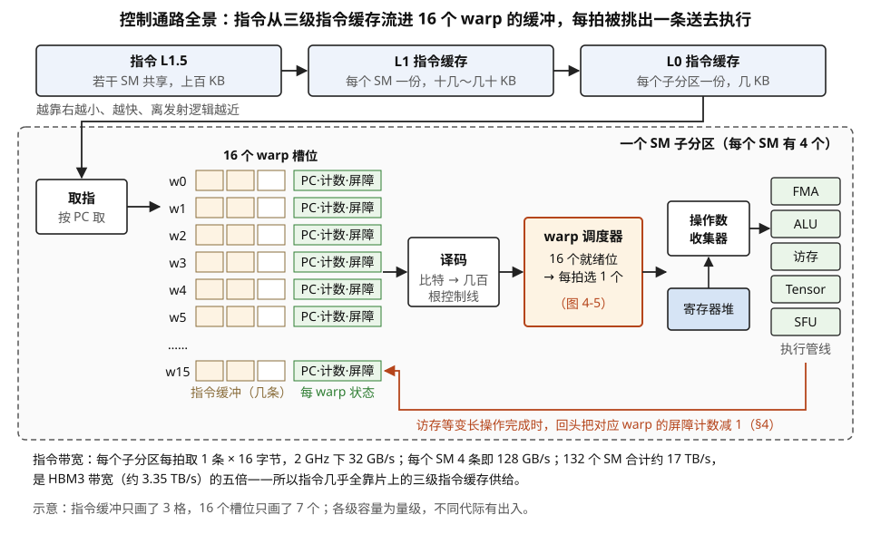
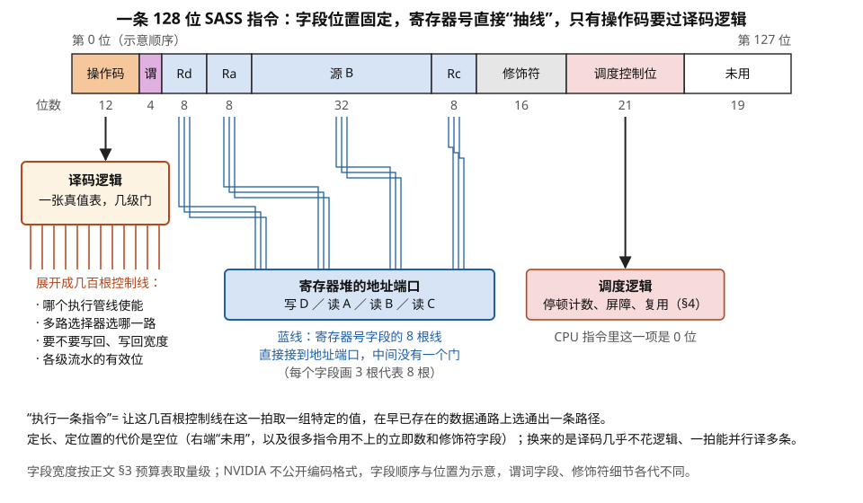
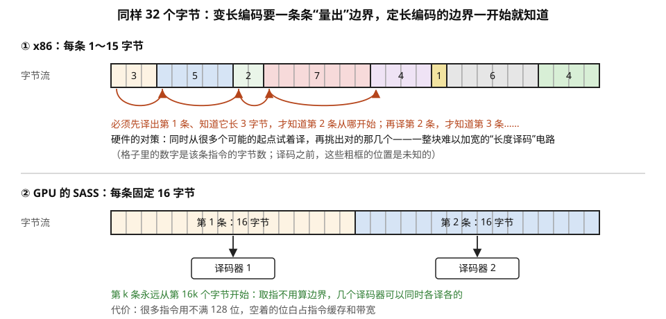
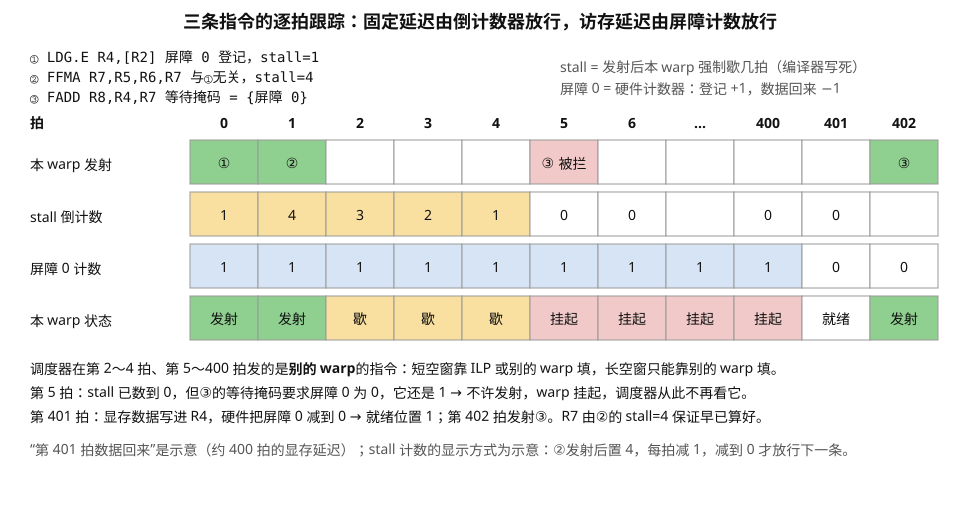
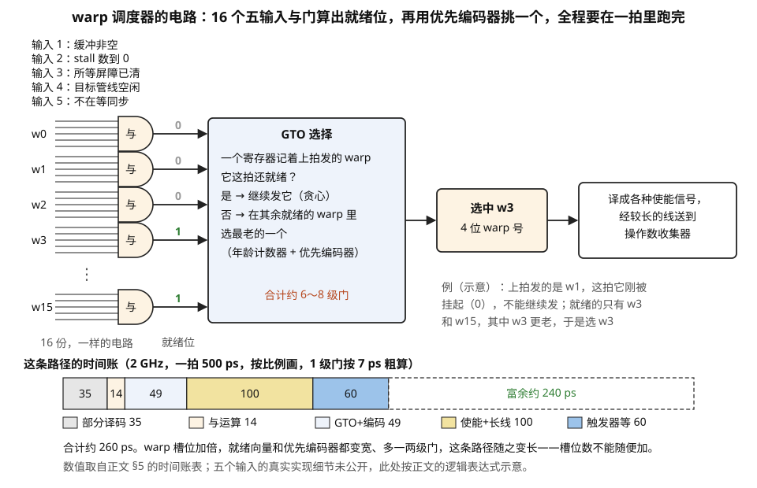
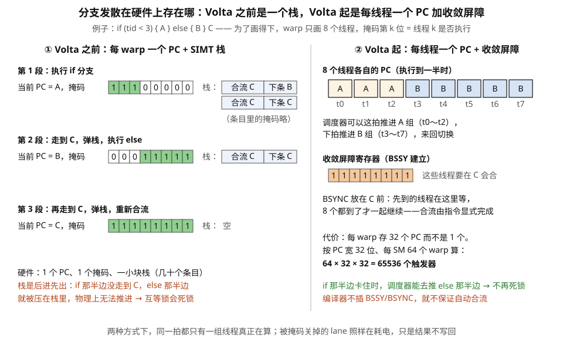
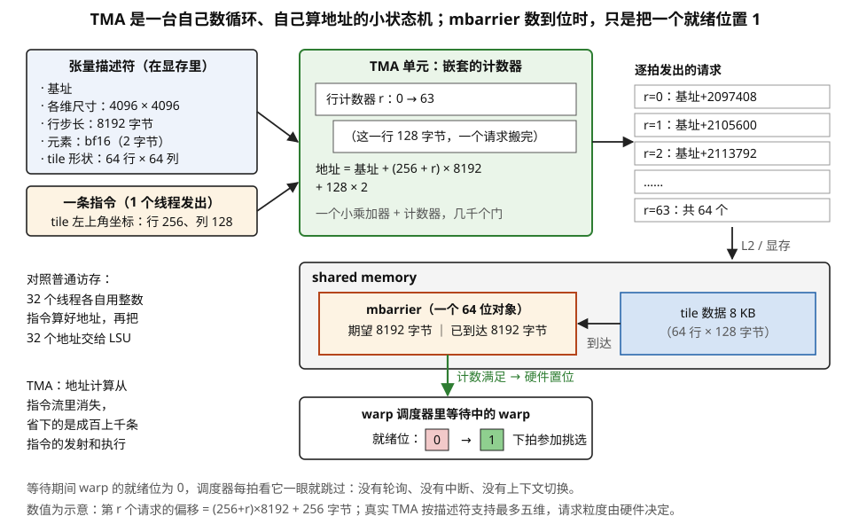

# 控制通路的物理实现：取指、译码、调度器、记分牌在电路上是什么

> **所属模块**：模块 13 · 微架构与物理实现
> **状态**：🟨 学习中（第一版。知识截至 2026-08）
> **本节主旨**：模块 10 反复出现一个说法——"warp 调度器每拍从若干个就绪的 warp 里挑一个发射"。这句话在电路上是什么？这一节把控制通路整条拆开：**一条指令在硅上到底是什么（一串比特、一张定位置的字段表、以及它被译码成的几百根控制线）、指令怎么被取进来、128 位的指令字里除了操作码还塞了什么、"就绪"是哪几个触发器的与运算、"挑一个"是一个多大的优先编码器、依赖检查为什么一半交给了编译器**。拆开之后会看到 GPU 微架构最核心的一个设计取舍：**它把 CPU 花在乱序执行、寄存器重命名、分支预测上的那几百万个门几乎全部砍掉了，代价是把依赖分析的责任推给编译器和推给"多 warp"这个笨办法**。理解这一点，模块 10 里"为什么 occupancy 这么重要""为什么 SASS 里有一堆看不懂的控制位""为什么分支发散要靠掩码而不是预测"这几个问题，会同时得到同一个答案。

---

## 0. 这一节要回答的问题

- 指令从哪里取？GPU 有几级指令缓存？为什么指令也需要缓存？
- 一条指令在硅上到底是什么？它和数据有物理区别吗？
- 译码器是什么电路？为什么定长编码能让译码几乎不花逻辑？
- 128 位怎么分配？为什么会有一部分位空着？
- SASS 一条指令 128 位，除了操作码和寄存器号，剩下的位在干什么？
- "记分牌"是什么电路？为什么 NVIDIA 的记分牌只有 6 个条目却够用？
- 编译器在 SASS 里编码的"等 N 拍"是什么意思？硬件不会自己等吗？
- warp 调度器"挑一个"具体是什么逻辑？它必须在 500 皮秒里跑完，来得及吗？
- 每个调度器为什么只能管 16 个 warp？这个数字受什么限制？
- 分支发散的活动掩码在硬件上存在哪里？Volta 的"独立线程调度"改了什么电路？
- 非合并访存的"重放"在硬件上是什么？
- TMA、mbarrier 这类异步器件在控制通路上是什么形态？
- GPU 到底省掉了 CPU 的哪些控制电路？省了多少？

---

## 1. 基础词汇：先把本节要用的词讲清楚

**取指（fetch）、译码（decode）、发射（issue）、执行（execute）、写回（writeback）**。任何处理器流水线的五个基本阶段。**取指**是从指令存储里把下一条指令的二进制码读出来；**译码**是把这串二进制解释成"要做什么运算、用哪几个寄存器"，物理上是一大片组合逻辑（本质是一个真值表）；**发射**是判断这条指令现在能不能开始执行（操作数就绪了吗、需要的执行单元空着吗），然后把它送进对应的执行流水线；**执行**是走完算术或访存通路；**写回**是把结果写进寄存器堆。**本节讲的"控制通路"，指的就是取指、译码、发射这三段，加上它们所需的依赖跟踪逻辑。**

**指令缓冲（instruction buffer）**。每个 warp 有一小块队列，存放已经取回来但还没发射的几条指令。它的作用是解耦：取指可以提前跑，不必和发射同步。**队列深度是有限的（通常几条）**，这个深度会成为后面一个约束的来源。

**记分牌（scoreboard）**。跟踪"哪些寄存器正在被某条还没完成的指令写"的硬件结构，用来阻止后面的指令过早读到还没写好的值。最朴素的实现是给每个寄存器配一个"忙"位：某条指令发射时把它要写的寄存器置忙，写回时清掉；后面的指令发射前检查自己要读的寄存器是不是忙。**这个朴素版本在 GPU 上做不起**——原因是位数，§4 会算。

**优先编码器（priority encoder）**。一个基础电路：输入是一串位（比如 16 位），输出是"其中第一个为 1 的位的编号"。它是所有仲裁、调度、分配逻辑的核心零件。16 输入的优先编码器大约是 4 级门延迟。**"从就绪的 warp 里挑一个"在电路上就是一个优先编码器（外加一点重排逻辑来实现调度策略）。**

**谓词（predicate）与掩码（mask）**。谓词是一个 1 位的条件标志，每个线程各有一份（GPU 上每线程有 7 个通用谓词寄存器加一个恒真的）。指令可以带谓词前缀，表示"只有谓词为真的线程才真正执行这条指令、写它的结果"。掩码是把一个 warp 32 个线程的谓词并起来的 32 位向量。**在硬件上，"某个线程不执行"的物理实现，是它的写回使能信号被拉低——运算电路照样在跑、照样耗电，只是结果不落盘。** 这是理解分支发散代价的关键。

**乱序执行、寄存器重命名、分支预测**。CPU 用来提升单线程性能的三大件。**乱序执行**允许后面的指令在前面的指令还在等内存时先执行；**寄存器重命名**给同一个体系结构寄存器分配多个物理寄存器，以消除假依赖；**分支预测**猜测分支走向并提前取指。三者都需要大量硬件（重排序缓冲、保留站、重命名表、预测器表）。**GPU 一个都没有——这不是能力不足，是刻意的取舍，§9 算这笔账。**

## 2. 取指：为什么指令也要缓存，且缓存不止一级

**先说一个容易被忽略的事实：GPU 的指令流量非常大。** 一个 SM 每拍可以发射 4 条指令（4 个子分区各一条），每条 128 位 = 16 字节，按 2 GHz 算就是 4 × 16 × 2G = **128 GB/s 的指令带宽**，整片 132 个 SM 是 **17 TB/s**。这个数字远超 HBM 带宽（约 3.35 TB/s）——**所以指令绝不可能每次都从显存取，必须有很高命中率的片上缓存。**

**NVIDIA GPU 的指令缓存是三级结构**（各代际细节有出入，这里给的是普遍形态；它们在整条控制通路里的位置见图 4-1）：

| 层级 | 位置 | 容量量级 | 作用 |
| --- | --- | --- | --- |
| L0 指令缓存 | 每个 SM 子分区一份 | 几 KB | 服务本子分区的 warp，命中延迟最短 |
| L1 指令缓存 | 每个 SM 一份 | 十几到几十 KB | 四个子分区共享 |
| L1.5 / 指令 L2 | 若干 SM 共享（一个 TPC/GPC 内） | 上百 KB | 减少对统一 L2 的压力 |

**为什么要分这么多级，而不是做一块大的？** 理由和第 03 节讲的一样：**SRAM 越大越慢越费电**。取指发生在每一拍、每一个子分区，是全芯片最高频的动作之一，所以最靠近发射逻辑的那一级必须极小极快；大容量的那一级可以慢一点、远一点、被更多单元共享。



> **图 4-1**　一句话：指令从三级指令缓存一级级流到每个子分区，存进 16 个 warp 各自的指令缓冲；调度器每拍从中挑出一条，经过译码和操作数收集，送进某条执行管线。
>
> **先知道一件事**：一个 SM 分成 4 个子分区，每个子分区有自己的调度器，最多管 16 个 warp。每个 warp 在硬件里有自己的一份“现场”：下一条指令的地址（PC）、几条已经取回但还没发射的指令，以及用来跟踪依赖的几个计数器。
>
> **按这个顺序看**：
> 1. 最上面三个方框是指令的三级缓存，从左往右越来越小、越来越快、离发射逻辑越近：几个 SM 共享的 L1.5（上百 KB）、每个 SM 一份的 L1（十几到几十 KB）、每个子分区一份的 L0（几 KB）。
> 2. 进入虚线框（一个子分区）：取指单元按各 warp 的 PC 从 L0 读出指令。
> 3. 16 个 warp 槽位：每行左边三格是这个 warp 的指令缓冲，浅色格表示已经取回的指令；右边绿格是它的状态，包括 PC、停顿计数和屏障计数（§4）。
> 4. 译码把 128 位的指令展开成几百根控制线（图 4-2）。
> 5. warp 调度器看 16 个 warp 各自的就绪位，每拍挑一个发射（图 4-5）。
> 6. 被选中的指令进入操作数收集器，从寄存器堆读齐操作数，再送进 FMA、ALU、访存、Tensor、SFU 五类执行管线之一。
> 7. 红线：访存这类延迟不固定的操作完成时，回头把对应 warp 的屏障计数减 1，让等着它的指令可以发射。
>
> **打个比方**：一间厨房同时挂着 16 张订单（warp），每张订单后面夹着接下来几道工序的卡片（指令缓冲）。领班（调度器）每分钟挑一张“材料已齐、要用的灶台正空着”的订单，交给那个灶台（执行管线）。
>
> **看懂的标志**：能回答“指令为什么需要三级缓存”。全片每秒要读约 17 TB 指令，是 HBM 带宽的五倍，只能靠片上缓存供给；而取指每拍都在发生，离发射最近的那一级必须极小、极快。
>
> **与正文的对照**：各级容量为量级；指令缓冲的深度和每 warp 状态的具体内容，公开的逆向资料并不完整，图为示意。
>
> 来源：本库自绘。

**一个能说明问题的例子：指令缓存缺失的代价。** 假设一个 kernel 的循环体展开得非常厉害，SASS 有 20000 条指令 = 320 KB，远超 L1 指令缓存。那么每一轮循环都会把指令缓存冲刷一遍，取指要一路走到 L2 甚至显存，**延迟从几拍变成几百拍**。这就是模块 40 讲的"过度展开反而变慢"的一个具体机制——**它不是寄存器压力的问题，是指令缓存装不下的问题**，而且这两个原因在 profiler 上的表现完全不同（前者是 occupancy 下降，后者是 "No Instruction" 类型的发射停顿）。

**关于"warp 的当前指令地址（PC）"存在哪里。** 每个 warp 槽位有一个 PC 寄存器。Volta 之前是每个 warp 一个 PC（32 个线程共享）；**Volta 起改成每个线程一个 PC**——这是"独立线程调度"的物理基础，也意味着每个 SM 要多存 `warp 数 × 32 × PC 位宽` 这么多触发器，是一笔实打实的面积开销（§6 展开）。

## 3. 指令的物理载体：一串比特怎么变成一组控制线

上一节讲了指令从哪里取。这一节回答一个更根本、也更容易被跳过的问题：**一条指令在硅上到底是什么东西？**

**第一件要接受的事：指令就是一串比特，和数据没有任何物理区别。** 存放 kernel 机器码的那块显存，和存放张量的那块显存，用的是同样的 DRAM 单元；它们经过同样的 L2；它们在硅上没有任何标记来区分彼此。**唯一的区别是"被谁读走"**——被取指单元读走的那串比特就叫指令，被访存单元读走的就叫数据。

这条认识有两个实用推论：

- **指令也要占显存带宽、也会挤占 L2**。模块 13 第 02 节算过一个 SM 的指令带宽需求是 128 GB/s、整片约 17 TB/s，这些流量和数据流量走的是同一套片上网络。
- **GPU 上不能写自修改代码。** 指令缓存和数据通路之间没有一致性维护机制——你用普通的存储指令改掉显存里的一段机器码，指令缓存不会知道。kernel 的机器码由驱动在启动前一次性装入，运行期间视为只读。

**第二件事：一条指令的比特是按固定位置划分成字段的。** 从 Volta 起 SASS 一条指令固定 **128 位**。这 128 位不是一团整体，而是被切成若干个位置固定、宽度固定的字段。下面这张预算表是根据公开的逆向研究整理的**近似结构**（NVIDIA 不公开编码格式，各代际字段位置也有调整，所以位宽只取量级）：

| 字段 | 大致位宽 | 装什么 |
| --- | --- | --- |
| 操作码 | 约 12 位 | 这是哪条指令（`FFMA`、`LDG`、`BSSY`…） |
| 谓词守卫 | 4 位 | 用哪个谓词寄存器决定本条是否生效，以及是否取反 |
| 目的寄存器号 | 8 位 | 结果写到哪（8 位正好覆盖 256 个寄存器） |
| 三个源操作数字段 | 各 8 位起 | 寄存器号；其中一个源可以换成常量存储体地址，或一个完整的 32 位立即数 |
| 各类修饰符 | 若干 | 舍入模式、访存宽度（`.128`）、地址空间（`.E`）、饱和、比较类型等 |
| **调度控制位** | **约 21 位** | 停顿计数、屏障索引、等待掩码、复用标志——**下一节整节在讲这一块** |
| 保留 / 未使用 | 剩余 | 定长编码必然产生的空位 |

**两个数字值得记住。** 第一，**调度控制位占了约 21 位，也就是每条指令的六分之一左右**。这个比例不算大，但它的存在本身是 GPU 微架构最独特的一点——**CPU 的指令编码里，用于指挥调度器的位是零**（那些工作全由硬件动态完成）。第二，**有相当一部分位在多数指令里是空着的**。一条 `FFMA` 用不到立即数字段，一条 `IADD` 用不到舍入模式字段。**这是定长编码必然要付的浪费，而它买回来的东西在下面。**

**第三件事：译码器是什么电路。** 译码就是把这 128 位翻译成**几百根控制线上的电平**：每个多路选择器该选哪一路、每个执行单元的使能要不要拉高、寄存器堆读哪几个地址、结果写到哪、流水线各级的有效位怎么设。**"执行一条指令"这件事，在电路上的完整含义就是：让这几百根控制线在这一拍取到一组特定的值，从而在早已存在的那张数据通路网络里，选通出一条特定的路径。**

**定长且定位置的编码，让译码的一大半退化成"抽线"。** 这是本节最值得体会的一点。既然"目的寄存器号"永远在同样的 8 个比特位上，那么把这 8 根线从指令缓冲直接接到寄存器堆的地址端口就行——**中间一个逻辑门都不需要**（图 4-2）。真正需要逻辑的只有操作码那一段：它要经过一片组合逻辑（本质是一张可化简的真值表）展开成几百根控制线，深度大约几级门。



> **图 4-2**　一句话：一条 SASS 指令是 128 个比特，按固定位置切成若干字段；寄存器号字段的线直接接到寄存器堆的地址端口，只有操作码要经过一片译码逻辑，展开成几百根控制线。
>
> **先知道一件事**：数据通路是早已接好、一直在那里的电路；控制信号决定这一拍里每个多路选择器选哪一路、哪个执行单元工作、结果写到哪。译码，就是把指令的比特翻译成这组控制信号。
>
> **按这个顺序看**：
> 1. 最上面一条是 128 位的指令字，下面的数字是各字段的位数：操作码 12；谓词 4（本条是否生效由哪个谓词决定）；目的寄存器号 Rd 8；源寄存器号 Ra 8；源 B 32（可以是寄存器号、常量存储体地址，或一个 32 位立即数）；Rc 8；修饰符 16（舍入模式、访存宽度等）；调度控制位 21；未用 19。
> 2. 左下：只有操作码的 12 根线进入译码逻辑。它相当于一张真值表，过几级门，展开成几百根控制线（红色竖线），用途列在下面。
> 3. 中间：Rd、Ra、源 B、Rc 的线（蓝色）一路直接接到寄存器堆的地址端口，没有经过任何逻辑门。寄存器号永远在同样的位置上，线接一次就永远对。
> 4. 右边：21 位调度控制位送到调度逻辑，告诉硬件这条指令发射后要歇几拍、登记到哪个屏障、要等哪些屏障（§4）。CPU 的指令里没有这一项。
> 5. 最右边“未用”的 19 位，加上很多指令用不上的立即数和修饰符字段，是定长编码必须付的浪费。
>
> **打个比方**：一张格式固定的快递单，收件人电话永远印在右上角第三格。分拣员不用读懂整张单，看那一格就能直接拨号；只有“服务类型”那一栏要查一下对照表，才知道该怎么处理。
>
> **看懂的标志**：能回答“为什么说定长编码让译码几乎不花逻辑”。指令里大部分比特（寄存器号）不需要任何翻译，直接当地址用；真正需要逻辑的只有 12 位操作码。
>
> **与正文的对照**：字段宽度取上面预算表的量级，其中源 B 按“能放一个 32 位立即数”画成 32 位，修饰符和未用的位数按总数 128 凑齐。NVIDIA 不公开编码格式，字段的顺序和位置都是示意。
>
> 来源：本库自绘。

**对照 x86 的变长编码就能看出这笔交易有多值。** x86 一条指令是 1 到 15 个字节，**在把它译码之前，你甚至不知道它有多长，也就不知道下一条指令从哪开始**。所以 x86 处理器必须先跑一个"长度译码"阶段，通常还要并行地对多个可能的起点做推测译码，再从中选出正确的——**这是一整块相当可观的电路，而且难以并行加宽**（图 4-3）。现代 x86 用一个"已译码微操作缓存"来绕开它，本质是把译码结果缓存起来避免重复付这笔钱。

**GPU 选定长 128 位，代价是浪费一些编码空间，买到的是三样东西**：译码几乎不花逻辑和延迟、可以毫无困难地同时译多条（一个 SM 每拍要译 4 条）、以及**指令边界永远确定**，取指逻辑简单到近乎没有。**对一个"要同时伺候几十个 warp、每拍发射四条指令"的吞吐机器来说，这三样都是刚需。**



> **图 4-3**　一句话：x86 指令长 1 到 15 字节，不译出前一条就不知道下一条从哪开始；SASS 每条固定 16 字节，每条指令的起点事先就知道，几条可以同时译。
>
> **先知道一件事**：取指单元从指令缓存读出的是一串连续的字节，里面没有任何标记告诉它“一条指令到哪里结束”；边界只能从指令本身的编码里推出来。
>
> **按这个顺序看**：
> 1. 上半：这 32 个字节里其实是 8 条 x86 指令，长度依次为 3、5、2、7、4、1、6、4 字节（格子里的数字）。粗框和颜色是事后才知道的边界。
> 2. 看红色弧线：必须先译出第 1 条、知道它长 3 字节，才找得到第 2 条的起点；再译第 2 条，才找到第 3 条，一条接一条。
> 3. 硬件为了一拍译好几条，只能同时从很多个可能的起点试着译，再挑出对的几个。这就是一整块难以加宽的“长度译码”电路。
> 4. 下半：同样 32 个字节是 2 条 SASS 指令，每条 16 字节。第 k 条的起点永远是第 16k 个字节，两条直接分给两个译码器同时译。
>
> **打个比方**：一段没有标点、每句字数都不一样的话，要一句句读下去才知道下一句从哪开始；而一张每行固定 16 格的表格，想看第几行直接跳过去就是。
>
> **看懂的标志**：能回答“GPU 为什么宁可浪费一些编码空间，也要用定长指令”。一个 SM 每拍要译 4 条指令，定长让边界永远确定、几条可以并行译，这对吞吐型的机器是刚需。
>
> **与正文的对照**：x86 各条指令的长度是示意。
>
> 来源：本库自绘。

**第四件事：硬连线控制 vs 微码。** 上面说的"操作码经过一片组合逻辑变成控制线"，叫**硬连线控制**——快、省、但每加一条指令就要改这片逻辑。另一条路是**微码**：芯片里存一小块只读存储，一条复杂指令去查表，取出一串更简单的"微操作"逐拍执行。x86 的复杂指令走这条路（一条字符串操作指令可以展开成几十个微操作）。

**GPU 和 NPU 基本是纯硬连线的**，因为它们的指令集本来就设计得简单规整——**这也是 SASS 每一代都能大改的原因之一：指令集不需要向后兼容，硬连线逻辑跟着重画就行。** x86 背着四十年的兼容包袱，才需要微码这层缓冲。

**第五件事：取指和译码本身要花钱，这决定了指令集的演化方向。** 每执行一条指令，硬件至少要做这些"和计算无关"的事：从指令缓存读出 128 位、译码、检查就绪、参与调度器仲裁、更新 PC、更新屏障状态。**其中光是"读一次几十 KB 的指令缓存"，按模块 13 第 03 节的量级就和读一次寄存器同量级。**

**于是有一条贯穿整个模块的推论：一条只做一次乘加的指令，它的"管理成本"和"计算成本"是同量级的。** 想提高能效，最直接的办法就是**让一条指令干更多的活**，把这份固定的管理成本摊薄。回头看模块 13 前几节列举的那些特性，全都是这条推论的产物：

| 特性 | 一条指令干了多少活 |
| --- | --- |
| 普通 `FFMA` | 32 个线程各一次乘加 |
| 矩阵指令（`HMMA` → `wgmma`） | 一个 tile 的几千次乘加 |
| `LDGSTS` 异步拷贝 | 一批数据的搬运，且不占寄存器 |
| TMA | 几 KB 数据的多维地址生成加搬运 |

**这张表就是"指令的物理载体很贵"这件事在产品上的全部体现。**

**最后：PTX 没有物理载体。** 模块 10 第 6 节讲过 PTX 和 SASS 是两层。从本节的角度可以给一个更硬的说法：**SASS 是真实存在于显存里、会被取指单元读走、会被译码成控制线的那串比特；PTX 不是**——它是一种中间表示，最终要被 `ptxas` 翻译成某个具体架构的 SASS 才能执行。**"PTX 指令"在硅上找不到任何对应物**，这就是为什么看 PTX 推断性能常常出错，而看 SASS 才作数。

**NPU 那一侧：VLIW 把这件事推到极端。** 既然译码的理想状态是"抽线"，那干脆让指令字**直接就是这一拍所有功能单元的控制字**——这就是**超长指令字（VLIW, very long instruction word）**。一条 VLIW 指令有几百到上千位，被切成若干**槽位**，每个槽位固定对应一个功能单元（矩阵单元一个、向量单元一个、几条搬运通道各一个、标量单元一个）：

```
┌────────┬────────┬────────┬────────┬────────┐
│ 矩阵槽 │ 向量槽 │ 搬运槽1│ 搬运槽2│ 标量槽 │   ← 一条 VLIW 指令
└────────┴────────┴────────┴────────┴────────┘
     │        │        │        │        │
     ▼        ▼        ▼        ▼        ▼
  各功能单元这一拍分别做什么，几乎不需要译码
```

**收益**：译码逻辑趋近于零，指令级并行完全由编译器静态排定，硬件不需要任何仲裁。**代价有两条，都很实在**：编译器填不满的槽位只能填空操作，**代码体积膨胀**（很多 VLIW 处理器要专门做指令压缩）；以及任何延迟的不确定（一次 cache 缺失）都会打破静态排程，所以这类设计通常配便签存储而不是 cache（模块 13 第 03 节）。昇腾的 AI Core、大量 DSP、以及历史上的 Itanium 都走这条路。

**另一个极端在 TPU v1 上**：它的指令集只有十几条，但**一条 `MatrixMultiply` 指令会触发长达几万个周期的工作**。指令带宽的需求因此低到可以忽略——**这是"让一条指令干更多活"这条推论的终点形态。**

## 4. 指令字里的控制位：GPU 微架构的钥匙

上一节的预算表里有一格没展开：那约 21 位的**调度控制位**。它们不描述任何运算，而是**直接指挥硬件的调度行为**——CPU 的指令编码里这一项是零位，所以这是 GPU 微架构最独特的一处设计，值得逐个字段拆开。

**典型的控制字段（逆向研究给出的普遍结构，各代际位宽略有差异）**：

| 字段 | 位宽 | 含义 |
| --- | --- | --- |
| stall count（停顿计数） | 4 位 | 发射这条指令后，本 warp 强制等待几拍再发下一条（0~15） |
| yield（让出） | 1 位 | 提示调度器这拍之后优先切换到别的 warp |
| write barrier index | 3 位 | 本指令的写结果登记到 6 个硬件屏障中的哪一个（7 表示不登记） |
| read barrier index | 3 位 | 本指令的读操作数登记到哪一个屏障 |
| wait barrier mask | 6 位 | 发射前必须等待哪几个屏障清零（每位对应一个屏障） |
| reuse flags | 4 位 | 标记哪几个源操作数与上条指令相同，可从复用缓存直接取，不必再读寄存器堆 |

**这张表解释了 GPU 依赖跟踪的核心设计：把依赖分成两类，分别用两套完全不同的机制处理。**

**第一类：延迟固定的指令（算术、逻辑、移位等）。** 一条 FFMA 的延迟是硬件手册里写死的常数（比如 4 拍）。**既然编译器在编译时就知道这个常数，它完全可以自己算清楚"下一条依赖指令要等几拍"，然后把这个数字直接编码进 stall count 字段。** 硬件收到后只需要一个小小的倒计数器，数到零就允许发射下一条——**不需要任何依赖比较逻辑**。

这就是所谓的**软件记分牌**。它省掉的东西非常可观：如果用传统的硬件记分牌，要给每个寄存器配一个忙位。GPU 每个 warp 最多 256 个寄存器、每个子分区 16 个 warp，那就是 4096 个忙位，外加发射时要拿三个源寄存器号去做 4096 选 1 的查找、以及写回时的清除逻辑——**这块面积和这条关键路径，都被一个 4 位的编译器提示消掉了。**

**第二类：延迟不确定的指令（访存、Tensor Core、超越函数等）。** 一次 shared memory 读可能 20 拍、一次 L2 命中 200 拍、一次显存访问 600 拍，**编译器无法在编译时知道**。这类指令必须用硬件跟踪，于是 GPU 提供了 **6 个硬件屏障**（也叫依赖屏障、scoreboard slot）。用法是：

1. 发出一条访存指令时，通过 write barrier index 字段把它登记到 6 个屏障中的某一个（比如屏障 3），硬件把屏障 3 的计数加一。
2. 数据回来、写进寄存器时，硬件把屏障 3 的计数减一。
3. 后面真正要用这个数据的那条指令，在 wait barrier mask 里把第 3 位置 1。发射逻辑检查：**屏障 3 的计数是不是零？** 不是零就不许发射，这个 warp 挂起，调度器去看别的 warp。

**为什么 6 个就够？** 因为它跟踪的不是"寄存器"而是"在途的一批操作"。一条指令一个屏障太浪费，而实践中一个 warp 同时在飞的、需要独立等待的操作组，很少超过几个（典型是：两三个预取、一个矩阵指令、一个屏障同步）。**6 个屏障 × 每个几位计数器 = 几十个触发器，对比 4096 个忙位加一个大查找表——这是一次极其划算的交换。**

**代价在编译器一侧，而且很实在。** 编译器必须精确知道每条指令的延迟；它必须做完整的调度和依赖分析；**如果它算错了，硬件不会救你，结果直接是错的**。这就是为什么 NVIDIA 不公开 SASS 的编码格式、不提供官方汇编器——**控制位的语义是硬件正确性的一部分，写错就是错，没有硬件兜底**。也解释了模块 10-08 讲"读懂 SASS"时那些方括号里的控制注解为什么那么重要：**它们不是注释，它们是指令的一半。**

**一个可以逐拍跟踪的例子**。看这三条 SASS 指令的控制位（用可读形式写出）：

```
  ①  LDG.E  R4, [R2]        ; 从全局显存读，登记到屏障 0，stall=1
  ②  FFMA   R7, R5, R6, R7  ; 与①无关，可以立刻做，stall=4
  ③  FADD   R8, R4, R7      ; 用到①的结果 R4 与②的结果 R7
                            ; wait mask = {屏障0}，且②的 stall=4 已经保证 R7 就绪
```

逐拍看这个 warp 发生什么（图 4-4 把下表画成了时间线）：

| 拍 | 事件 |
| --- | --- |
| 0 | 发射 ①（LDG）。硬件把屏障 0 计数置 1。stall=1，本 warp 下一拍还能发。 |
| 1 | 发射 ②（FFMA）。stall=4，本 warp 要隔 4 拍、到第 5 拍才能再发指令。**中间第 2～4 拍，调度器去发别的 warp 的指令。** |
| 5 | ② 的 stall 数完，本 warp 想发 ③。检查 wait mask：屏障 0 还是 1（显存没回来）→ **不许发射，warp 挂起**。 |
| 6~400 | 本 warp 一直挂着。调度器完全不看它，去伺候别的 warp。 |
| 401 | 显存数据回来，写入 R4，硬件把屏障 0 减到 0。**本 warp 重新变成就绪状态。** |
| 402 | 发射 ③。 |

**这张表把模块 10 的两个核心概念同时钉死在电路上**：`stall count` 是"填 ILP"的硬件形式（②之后的那几拍必须有别的活干），`屏障 + 挂起` 是"用多 warp 掩盖访存延迟"的硬件形式（401 拍的空窗必须靠别的 warp 填满，这就是 occupancy 的意义）。**occupancy 不是一个抽象的比率，它是"第 6 到 400 拍里，调度器手上还有几个就绪 warp 可选"。**



> **图 4-4**　一句话：同一个 warp 的三条指令里，与前面无关的 FFMA 靠编译器写进指令的“停顿计数”放行，要用显存数据的 FADD 靠硬件屏障计数放行；等待期间这个 warp 挂起，调度器去发别的 warp。
>
> **先知道一件事**：stall（停顿计数）是编译器写在指令里的一个数，意思是“发射这条之后，本 warp 要隔几拍才能发下一条”；屏障是硬件里的一个计数器，访存指令发出时加 1，数据写回寄存器时减 1。
>
> **按这个顺序看**：
> 1. 左上是三条指令：① 从显存读 R4，登记到屏障 0；② 一条与①无关的乘加，写 R7；③ 要用 R4 和 R7 做加法，所以它的等待掩码里有屏障 0。
> 2. 横轴是拍数，中间的“…”省略了第 7 到第 399 拍。
> 3. 第一行“本 warp 发射”：第 0 拍发①，第 1 拍发②。
> 4. 第二行“stall 倒计数”：②发射后计数置为 4，每拍减 1；第 2～4 拍本 warp 歇着（黄格），到第 5 拍数到 0，才允许再发。
> 5. 第三行“屏障 0 计数”：①发射时变成 1，一直保持到第 400 拍（蓝格）。
> 6. 第 5 拍：stall 已经数完，但③要求屏障 0 为 0，它还是 1，所以③被拦下，warp 挂起（红格），此后调度器不再看它。
> 7. 第 401 拍：显存数据写进 R4，屏障 0 减到 0，warp 变回就绪；第 402 拍发射③。R7 早在②发射 4 拍之后就已算好，这由 stall 保证。
>
> **打个比方**：做饭时，炒一道菜的时间是固定的（菜谱写着 4 分钟），到点就能盛出来；等快递送来的调料则说不准，只能等门铃响（屏障归零）再继续，其间先去做别的菜（别的 warp）。
>
> **看懂的标志**：能回答“GPU 为什么对 occupancy 这么敏感”。第 5～400 拍这个 warp 什么也干不了；这将近 400 拍里执行单元要不空转，只能靠调度器手上还有别的就绪 warp。
>
> **与正文的对照**：对应上面的三条指令和逐拍表；“第 401 拍数据回来”是示意的约 400 拍显存延迟。
>
> 来源：本库自绘。

## 5. warp 调度器：一个必须在 500 皮秒内跑完的选择

现在看调度器本身。每个 SM 子分区一个调度器，管着最多 16 个 warp 槽位，**每拍要选出一个 warp 并发射它的下一条指令**。

**"就绪"是几个信号的与运算。** 对每个 warp 槽位 i，硬件维护一个 1 位的 ready 信号：

```
ready[i] =  指令缓冲非空[i]              （有指令可发）
         AND  stall 计数器为零[i]         （软件记分牌放行）
         AND (等待屏障 mask[i] & 屏障忙状态) == 0   （硬件记分牌放行）
         AND  目标执行管线本拍可用         （资源检查）
         AND  没有在等 barrier/同步[i]
```

**这是一个 5 输入的与门，重复 16 份**——面积微不足道。真正的成本在最后两项：**"目标执行管线可用"要检查这条指令要用的是 FMA 管线、ALU 管线、访存管线还是 Tensor 管线，而这些管线可能被别的子分区或上一拍的指令占着。** 这项检查需要先部分译码指令、再查各管线的占用状态，是这条路径上最长的一段。

**"挑一个"是一个优先编码器加一点策略逻辑。** 最简单的策略是固定优先级（永远选编号最小的就绪 warp），那就是一个纯优先编码器，16 输入约 4 级门。但固定优先级会饿死高编号的 warp，所以真实策略更复杂——模块 10-07 讲的 **GTO（Greedy-Then-Oldest，贪心后最老）**：优先继续发射上一拍那个 warp（贪心，因为它的指令缓冲热、寄存器复用缓存热），它不就绪时再从其余就绪 warp 里挑最老的。

**GTO 在电路上是什么**：一个寄存器记着"上拍发的是哪个 warp"，一个 16 位比较选择器判断它是否仍就绪；不就绪时，用各 warp 的年龄计数器（或一个维护顺序的移位寄存器）配合优先编码器选出最老的。**总共大约 6 到 8 级门延迟。**

**时间账：来得及吗？** 按模块 13 第 1 节的口径，2 GHz 对应 500 皮秒一拍。这条路径大致是（电路与时间条见图 4-5）：

| 段 | 门级数 | 时间（按 1 级 ≈ 7 ps 粗算） |
| --- | --- | --- |
| 指令部分译码（判断用哪条管线） | 5 | 35 ps |
| 五项就绪条件的与运算 | 2 | 14 ps |
| GTO 选择 + 优先编码 | 7 | 49 ps |
| 把选中的 warp 号译码成各种使能信号、驱动到较远的操作数收集器 | 6 + 长线 | 100 ps |
| 触发器开销 + 时钟不确定性 | — | 60 ps |
| **合计** | | **约 260 ps** |

**有富余，但不算宽裕。** 关键结论是：**这条路径的长度随 warp 槽位数增长**（优先编码器和就绪向量都随之变宽），所以"每个调度器管几个 warp"不是可以随便加的——**16 这个数字是时序、面积（每个槽位要一份 PC、指令缓冲、屏障状态）和收益递减三者共同定下来的**。这也从物理上解释了模块 10 讲的 occupancy 上限为什么是那么一个具体数字：**它是硬件里真实存在的 16 组触发器。**



> **图 4-5**　一句话：调度器给 16 个 warp 各算一个“就绪位”，五个条件同时满足才为 1；再按 GTO 策略从就绪的 warp 里挑一个。这整条路径约 260 ps，必须在一拍 500 ps 内跑完。
>
> **先知道一件事**：与门是“所有输入都是 1，输出才是 1”的门；优先编码器是“从一串位里找出第一个 1 在哪一位”的电路，16 个输入约 4 级门。
>
> **按这个顺序看**：
> 1. 左上列出五个输入：指令缓冲里有指令；stall 已数到 0；所等的屏障都已清零；这条指令要用的执行管线本拍空闲；没有在等同步。
> 2. 左边每个 warp 一个五输入与门，16 份一模一样（图中画了 5 份）。与门右边的数字是它的就绪位：本例中只有 w3 和 w15 为 1。
> 3. 中间是 GTO 选择：一个寄存器记着上拍发的是哪个 warp；它这拍仍就绪就继续发它（贪心，因为它的指令缓冲和复用缓存正热）；否则在就绪的 warp 里挑最老的一个。本例上拍发的是 w1，它这拍刚被挂起，于是在 w3、w15 中挑更老的 w3。
> 4. 选中的 warp 号（4 位二进制）再译成各种使能信号，经过较长的线送到操作数收集器。
> 5. 下面的时间条按比例画出这条路径：部分译码 35 ps、与运算 14 ps、GTO 与编码 49 ps、使能与长线 100 ps、触发器等开销 60 ps，合计约 260 ps，一拍里还富余约 240 ps。
>
> **打个比方**：16 个排队的人各举一块牌子，五个条件都满足才翻成绿色。领班先看刚才叫的那位还是不是绿牌，是就接着叫他；不是，就叫绿牌里来得最早的那位。
>
> **看懂的标志**：能回答“每个调度器的 warp 槽位为什么不能随便从 16 加到 64”。就绪向量和优先编码器随槽位数变宽，门级数增加，这条必须一拍跑完的路径随之变长；每个槽位还要一份 PC、指令缓冲和屏障状态的面积。
>
> **与正文的对照**：时间账取自上表（1 级门按 7 ps 粗算）；w1、w3、w15 的例子是示意。
>
> 来源：本库自绘。

**发射之后：操作数收集与写回仲裁。** 指令被发射后进入第 03 节讲的操作数收集器，仲裁器每拍给各寄存器 bank 挑一个请求。结果算完之后还要写回寄存器堆，而**多条不同延迟的流水线可能在同一拍同时想写回**（比如一条 4 拍的 FFMA 和一条 20 拍前发出的访存同时到达），所以写回端也需要一个仲裁器。**这是"结果总线冲突"的来源，也是为什么有些指令的实际延迟会比手册数字略长。**

## 6. 分支与掩码：发散在硬件上是几个触发器

模块 10 第 3 节讲过分支发散的行为。这里给出它的电路形态，因为 Volta 的那次改动只有在电路层面才说得清。

**Volta 之前：SIMT 栈。** 每个 warp 配一个硬件栈，每个条目是一组 `(重收敛 PC, 下一条 PC, 32 位活动掩码)`。遇到分支时：

1. 硬件计算出"哪些线程走 if、哪些走 else"，得到两个 32 位掩码。
2. 把 `(重收敛点, else 的入口, else 掩码)` 压栈，然后带着 if 掩码继续执行 if 分支。
3. 执行到重收敛点时弹栈，取出 else 掩码去执行 else 分支。
4. 再执行到重收敛点时再弹栈，恢复完整掩码。

**物理形态就是：一小块 SRAM 或触发器阵列（栈深度典型 32~64 条目 × 每条几十位）+ 一个栈指针 + 压弹逻辑。** 这个结构极其省——每个 warp 只有一个 PC，一个掩码寄存器，加一个小栈。

**它的致命限制在于：一个 warp 里的两个分支路径永远不可能同时"在飞"。** 栈是严格后进先出的，if 分支必须整个执行完才轮到 else。所以模块 10 讲的那个经典死锁——if 分支里的线程等待 else 分支里的线程释放锁——在硬件上是必然的：**else 那半边的线程被压在栈里，物理上没有任何机制能让它们推进。**

**Volta 起：每线程 PC + 收敛屏障。** 改动是两件事：

1. **每个线程一个 PC**。这意味着每个 warp 要存 32 个 PC 而不是 1 个。按 PC 宽 32 位、每 SM 64 个 warp 算，多出 64 × 32 × 32 = 65536 个触发器——**这是一笔可观的面积开销，NVIDIA 愿意付，说明这个能力的价值判断很明确。**
2. **收敛屏障（convergence barrier）**。新增一组硬件寄存器，每个存一个 32 位的线程掩码，表示"这些线程要在此处会合"。SASS 里对应新指令 `BSSY`（建立一个收敛屏障并指定会合点）和 `BSYNC`（在此等待该屏障上的线程到齐）。

**改动的实质**：调度器现在可以在**同一个 warp 内部的不同分支路径之间自由切换**（因为每个线程有独立 PC，不再受栈的后进先出约束），会合时机则由显式的屏障指令控制而不是隐式的栈弹出。**死锁问题因此消失：if 那半边执行受阻时，调度器可以切去跑 else 那半边。**（新旧两种硬件形态的对比见图 4-6） 代价是：**重收敛不再自动发生**——编译器必须显式插入 `BSSY`/`BSYNC`，否则线程可能长期分散执行，性能下降。这正是模块 10 说"Volta 之后不能再假设 warp 内隐式同步"的硬件根源。



> **图 4-6**　一句话：Volta 之前，一个 warp 只有一个 PC，发散的两条路径靠一个栈轮流执行；Volta 起每个线程有自己的 PC，两组线程可以交替推进，由显式的收敛屏障决定在哪里重新会合。
>
> **先知道一件事**：PC（程序计数器）记着“下一条要执行的指令在哪”。掩码是一串位，第 k 位为 1 表示第 k 个线程本拍参与执行。为了画得下，这里只画 8 个线程；真实的 warp 是 32 个。
>
> **按这个顺序看**：
> 1. 例子：线程 0～2 走 if（代码 A），线程 3～7 走 else（代码 B），之后在 C 会合。
> 2. 左边第 1 段：分支时，硬件把“else 的入口 B、会合点 C”压进栈（上面一条），下面一条记着“会合后从 C 继续、全部线程”。当前 PC = A，掩码 11100000，只有前 3 个线程在执行。
> 3. 第 2 段：if 那组走到 C，弹出栈顶，取出 B 和它的掩码 00011111，执行 else。
> 4. 第 3 段：else 那组也走到 C，再弹一次栈，掩码恢复为全 1，重新合流。
> 5. 左下红字：栈是后进先出，if 那组没走到 C 之前，else 那组被压在栈里，物理上无法推进。如果 if 那组正在等 else 那组释放一把锁，就会永远等下去。
> 6. 右边：每个线程一个 PC。执行到一半时，t0～t2 停在 A，t3～t7 停在 B，调度器可以这拍推 A 组、下拍推 B 组。
> 7. 收敛屏障寄存器存着“哪些线程要在 C 会合”的掩码，由 `BSSY` 指令建立；`BSYNC` 放在 C 前面，先到的线程在那里等，全部到齐才一起继续。
> 8. 右下是代价：每 warp 要存 32 个 PC，每个 SM 多出约 65536 个触发器；而且编译器不插 `BSSY`/`BSYNC`，硬件就不保证自动合流。
>
> **打个比方**：旧办法像一条单车道隧道，两队车只能一队全部通过、另一队再进；新办法给每辆车发了自己的导航（PC），两队可以交替通行，约好在出口的停车场（收敛屏障）集合。
>
> **看懂的标志**：能回答“Volta 之后为什么不能再假设 warp 内的线程自动同步”。合流不再由栈的弹出隐式完成，只有遇到 `BSYNC`（或 `__syncwarp()`）时才保证全部到齐。
>
> **与正文的对照**：对应上面 SIMT 栈的四步与 Volta 的两项改动；栈条目的格式是示意，每个条目里另存的掩码没有画出。两组线程在时间上如何交替推进，见模块 10 第 3 节图 3-3。
>
> 来源：本库自绘。

**必须记住的一点：无论哪一代，被掩码关掉的线程，它对应的那条运算通路仍然在跑、仍然在耗电，只是写回使能被拉低。** 一个 warp 里只有 1 个线程活跃时，这条 FFMA 消耗的动态功耗和 32 个线程全活跃时相差不大（差别只在寄存器写口和部分数据翻转）。**分支发散浪费的不只是时间，还有几乎等量的能量**——这一点在模块 10 只说了时间，这里补上能量。

**非合并访存的"重放"（replay）。** 一条 `LDG` 指令，如果一个 warp 的 32 个地址落在 1 个 32 字节 sector 里，访存单元一拍就生成一个请求；如果落在 32 个不同的 sector 里，**同一条指令必须在访存单元里占住多拍，逐个生成 32 个请求**。物理上这不是"指令被重新发射"，而是**这条指令在地址生成级被展开成多个事务**，占住流水线入口，阻塞后面的访存指令。**这就是模块 10-04 讲的"合并度差 = 慢 32 倍"的电路机制：不是延迟变长，是同一个入口被占了 32 拍。**

## 7. 异步器件：TMA 与 mbarrier 在控制通路上的形态

> 📍 TMA 对外的行为和用法（描述符字段、下单与完成通知、多播）见[模块 14 第 3 节](../14-数据搬运/03-Hopper·TMA与mbarrier按字节记录.md)，多播见[第 12 节](../14-数据搬运/12-附加功能·多播、归约写回、越界填充、缓存提示与gather.md)；本节讲它的电路形态。

Hopper 引入的异步搬运和异步屏障，在控制通路上是新增的两类硬件。

**TMA（Tensor Memory Accelerator）的物理形态是一个小的、可编程的地址生成状态机**，坐落在 SM 里、访存通路旁边。它和普通 LSU 的区别值得讲清：

- **普通 LSU**：每拍接收一条访存指令，指令带着 32 个线程各自算好的地址。**地址是软件算的，硬件只负责合并和发请求。**
- **TMA**：接收的是一个**张量描述符**（一个 128 字节的结构体，由主机侧提前编好，通常作为 kernel 参数传入，也可以放在常量区或全局显存里；描述张量的基址、各维尺寸、各维步长、tile 形状），加上一个 tile 的坐标。**然后它自己在内部用嵌套循环计数器算出这个 tile 涉及的所有地址，一批一批发出请求。** 一条指令可以搬几 KB 数据。

**为什么这值得做进硬件**：地址计算本身是纯整数运算，用通用指令做要占掉大量的算术通道和指令发射槽位。把它换成一个专用状态机（几千个门的循环计数器和乘加器），**省掉的是成百上千条指令的发射和执行**。这是"专用硬件替代通用指令"最直白的一个案例，也是模块 50 讲"搬运指令全图"时那条演进线（逐线程搬 → LDGSTS → TMA）在电路上的终点。

**mbarrier 的物理形态是 shared memory 里的一个 64 位对象 + 一套硬件的到达/等待逻辑。** 它存着"期望到达的事务数"和"已到达数"。硬件动作有两个：

- **到达（arrive）**：某个 warp 或某个 TMA 传输完成时，硬件对这个对象做一次原子加。
- **等待（wait）**：执行 `mbarrier.try_wait` 的 warp 会被**置于挂起状态**，直到该对象的计数满足条件时被硬件唤醒。

**"挂起-唤醒"这个机制在电路上就是 §5 那个 ready 信号里的一位**（TMA 与 mbarrier 串起来的过程见图 4-7）。 一个 warp 在等 mbarrier 时，它的 ready 位为 0，调度器每拍看它一眼、跳过，成本几乎为零；条件满足时硬件把这一位置 1，它下一拍就重新参与竞争。**这就是为什么 GPU 上的等待"不花 CPU"——没有轮询、没有中断、没有上下文切换，只是一个触发器的状态。** 理解了这一点，就能理解为什么模块 40 讲的生产者-消费者流水（warp specialization）在 GPU 上代价这么低。



> **图 4-7**　一句话：TMA 拿到一个描述张量形状的结构体和一个 tile 坐标，自己用计数器数循环、算出每一行的地址并逐个发出请求；数据到齐后，shared memory 里 mbarrier 的计数达到期望值，硬件把等待中的 warp 的就绪位置 1。
>
> **先知道一件事**：tile 是从一个大矩阵里切下来的一小块。普通访存指令要 32 个线程各自先用整数运算算好地址，再交给访存单元；TMA 把“算地址”这件事做成了专用硬件。
>
> **按这个顺序看**：
> 1. 左上：张量描述符是存在显存里的一个结构体，写着基址、各维尺寸 4096 × 4096、行步长 8192 字节（一行 4096 个 bf16）、元素类型、tile 形状 64 × 64。
> 2. 左中：一个线程发出一条指令，只给出 tile 左上角的坐标：第 256 行、第 128 列。
> 3. 中间绿框是 TMA 单元：行计数器 r 从 0 数到 63。这个 tile 每行 64 个 bf16，共 128 字节，一个请求就搬完一行。每行的地址 = 基址 + (256 + r) × 8192 + 128 × 2，只需要一个小乘加器。
> 4. 右上：它逐拍发出 64 个请求，相对基址的偏移依次是 2097408、2105600、2113792……去 L2 或显存取数。
> 5. 数据落进 shared memory，共 64 行 × 128 字节 = 8 KB。每到一批，硬件就把到达的字节数加到 mbarrier 上。mbarrier 是 shared memory 里一个 64 位的计数对象，这里期望的是 8192 字节。
> 6. 到达数等于期望数时，硬件把在这个 mbarrier 上等待的 warp 的就绪位从 0 置成 1，它下一拍就重新参加调度器的挑选（图 4-5）。
>
> **打个比方**：以前搬家要每个工人自己查地图、算门牌号；现在只给搬家公司一张平面图和“从 256 号起搬 64 户”，它自己挨家算门牌、派车。每搬完一户就在登记表上记一笔，记满了就按铃，叫醒等着的人。
>
> **看懂的标志**：能回答“GPU 上的等待为什么几乎不花代价”。等待中的 warp 只是就绪位为 0，调度器每拍看一眼就跳过，不轮询、不打断别人；条件满足时，由硬件把这一位翻成 1。
>
> **与正文的对照**：对应本节上文；描述符字段按常见用法列出，数值是示意。TMA 支持最多五维的张量，本例是二维，而且一行一个请求就搬完，所以图里只画了行计数器。
>
> 来源：本库自绘。

## 8. 开发者视角：控制通路在软件侧的三个通道

| 物理事实 | ① 源码拨盘 | ② 编译器回执 | ③ Profiler 探针 |
| --- | --- | --- | --- |
| 固定延迟靠编译器编码的 stall count | 写出有 ILP 的代码（相邻语句无依赖），让编译器有东西填 | **`nvdisasm -c` 打印的 SASS 控制注解**——`[B------:R-:W-:-:S04]` 这种方括号里就是本节 §4 那张表 | Nsight Compute 的 "Stall Wait"（等固定延迟）与 "Stall Short Scoreboard"（等 shared/常量）分开统计 |
| 变长延迟靠 6 个硬件屏障 | 减少同时在飞的独立依赖组数；用异步拷贝把等待点推后 | SASS 里 `LDGSTS`/`LDGDEPBAR`/`DEPBAR` 与屏障索引字段 | "Stall Long Scoreboard" 高 = 在等显存 |
| 调度器只有 16 个 warp 槽位 | `__launch_bounds__`、块大小、寄存器与 shared 用量共同决定实际驻留 warp 数 | `-Xptxas -v` 报告寄存器/shared 用量 | occupancy 的 achieved 值；"No Eligible" 停顿高 = 就绪 warp 不够 |
| 指令本身占带宽、且不能自修改 | 控制 kernel 体积；不要试图运行期改机器码 | `cuobjdump -sass` 的指令条数 × 16 字节 = 机器码体积 | "Stall No Instruction" 与 L2 上的指令流量 |
| 一条指令的管理成本与一次乘加同量级 | 用矩阵指令、异步拷贝、TMA 让单条指令干更多活 | SASS 里 `HMMA`/`wgmma`/`LDGSTS`/TMA 指令的占比 | 指令发射数（`inst_executed`）与实际算力的比值——比值越低说明每条指令干的活越多 |
| 指令缓存容量有限 | 控制展开倍数、避免超大 kernel、用循环而非全展开 | SASS 指令条数（`cuobjdump -sass \| wc -l`） | "Stall No Instruction" 高 = 取指跟不上，多半是指令缓存缺失 |
| Volta 后重收敛不再自动 | 需要 warp 内同步时显式写 `__syncwarp()`，不能依赖隐式收敛 | SASS 里的 `BSSY`/`BSYNC` 对 | "Warp Execution Efficiency"（平均活跃线程数 / 32） |
| 非合并访存在 LSU 入口被展开成多拍 | 改布局、改索引方式、用向量化访存（模块 50） | 无 | `l1tex` 的 "sectors per request" ——理想是 4（128 字节请求 / 32 字节 sector），越大越糟 |

**一个具体的排查场景**：某 kernel 的 "Stall No Instruction" 占了停顿的 40%。**如果不知道本节的内容，这个指标基本无法解读**；知道之后结论直接：取指跟不上，八成是循环展开过度导致指令缓存装不下。对策是降低展开倍数——**注意这与"降低寄存器压力"是两件事，后者调 `__launch_bounds__`，前者调 `#pragma unroll` 的倍数。**

## 9. GPU 省掉了什么：和 CPU 核的一次正面对照

前面拆的每一块，都可以和 CPU 的对应物比一比。这张对照表是本节的收束点，因为它一次性解释了两类处理器的性格差异。

| 控制功能 | CPU 高性能核 | GPU SM |
| --- | --- | --- |
| 依赖检查 | 硬件全自动：重命名表 + 保留站 + 唤醒-选择逻辑，每拍要在几十条在飞指令间做全比较 | **固定延迟交给编译器（stall count），变长延迟只用 6 个屏障** |
| 乱序执行 | 有：重排序缓冲（几百条目）、加载-存储队列、内存消歧逻辑 | **没有。指令严格按序发射** |
| 寄存器重命名 | 有：物理寄存器堆几百个，重命名表每拍多读多写 | **没有。寄存器号就是物理地址** |
| 分支预测 | 有：多级预测器表、分支目标缓冲、返回地址栈，占很大面积 | **没有。分支就是分支，走到了才知道** |
| 隐藏访存延迟的手段 | 乱序执行 + 预取器 + 大 cache | **切换到别的 warp**（一个触发器的事） |
| 每核并发上下文 | 1~2 个（超线程） | **最多 64 个 warp = 2048 个线程** |
| 控制逻辑占核面积 | 相当大的比例（预测器、重排序、重命名、调度窗口） | **很小**；面积大头是寄存器堆和执行单元 |

**这张表可以浓缩成一句话：CPU 用面积买"让一条指令流跑得尽可能快"，GPU 用面积买"同时装下尽可能多条指令流"。** 两者都在解决同一个问题——执行单元不能空转——但方案完全不同：CPU 从**一条**指令流里榨取并行（所以需要昂贵的乱序机器），GPU 从**很多条**指令流里取（所以只需要一个廉价的多路选择器）。

**这个对照还解释了一件模块 10 里没说透的事：为什么 GPU 对 occupancy 这么敏感，而 CPU 程序员几乎不谈这个概念。** 因为 GPU 掩盖延迟**只有一个手段**——手上要有别的就绪 warp。这个手段一旦失效（warp 数不够），SM 就只能干等，没有第二套机制兜底。CPU 有乱序、有预取、有更大的 cache，任何一条失效还有别的顶上。**GPU 的高效率和它的脆弱性，来自同一个设计决策。**

**再往下一层，NPU 把这条路走到了尽头。** 脉动阵列（模块 11）连 warp 调度器都没有：**没有指令缓冲、没有就绪判断、没有优先编码器、没有屏障**，因为数据什么时候到、什么时候算，在编译期就全部排定了。省下来的这些面积全部变成了 MAC 单元。**从 CPU 到 GPU 到 NPU，这是同一条轴上的三个点：控制的责任从硬件不断向编译器转移，硬件省下的面积不断变成算力。** 模块 13 第 6 节会讲这条轴走到尽头时，硬件长什么样、软件要付什么代价。

## 10. 最新架构落点（知识截至 2026-08）

- **控制通路的最新变化不在调度器，在"谁发起工作"。** Hopper 的 warpgroup 矩阵指令（`wgmma`）由 4 个 warp 组团发起；**Blackwell 的第五代 Tensor Core 进一步走向"单线程发起一整块矩阵运算"**（配合 TMEM 存累加器）。从本节的视角看，这是**继续降低单位计算量所需的指令发射次数**——发射一条指令的控制开销（取指、译码、就绪判断、操作数收集）是固定的，让一条指令干更多活，就是在摊薄它。
- **异步化是同一条线的另一半**：TMA（Hopper）、异步矩阵指令、mbarrier，共同点都是"发起和完成解耦"，让 warp 在等待时把发射槽位让出来。**Blackwell 在 TMA 上增加了更灵活的多播与张量描述符能力**，方向没有变化。
- **对 Rubin（2026 年推进量产）的观察点**：本节的两个问题值得在新架构发布时去查——**每个调度器管的 warp 槽位数变了吗？硬件屏障还是 6 个吗？** 这两个数字八年没变过，一旦变化就说明控制通路的成本结构发生了变化。
- **逆向研究是这一块的主要信息来源**。SASS 编码和控制位语义都不公开，公开知识几乎全部来自微基准测试论文（如针对 Blackwell 的架构逆向工作，2025-2026 年有多篇）。**引用这类结论时要注意它们是实测推断而非官方规格**，不同型号（消费级 vs 数据中心）可能有差异。
- **跨厂商对照**：AMD 的 CDNA 用 wavefront（64 线程）而不是 warp（32），每个 SIMD 单元维护 8~10 个 wavefront 槽位；它的依赖跟踪同样是软硬混合，`s_waitcnt` 指令由编译器显式插入，作用与 NVIDIA 的屏障字段几乎一一对应——**"编译器负责告诉硬件等什么"这条设计哲学在两家是共通的**。

## 11. 和其它模块的挂钩

- **模块 10 第 2 节（occupancy）**：本节 §5 给出了 occupancy 的物理定义——调度器手上就绪 warp 的个数，以及 16 个槽位这个上限的时序来源。
- **模块 10 第 3 节（分支发散）**：本节 §6 给出了 SIMT 栈与 Volta 每线程 PC 的电路形态，以及"死锁为什么在旧硬件上是必然的"。
- **模块 10 第 5 节（同步全家桶）与 06（数据视角）**：本节 §7 给出了 mbarrier 的物理形态——一个 shared memory 对象加 ready 位的置位/清零。
- **模块 10 第 6 节（PTX 与 SASS）**：本节 §3 给出了那两层区别的硬件版说法——**SASS 是真实存在于显存里、会被取指单元读走、会被译码成控制线的那串比特；PTX 在硅上没有任何对应物**，这就是看 PTX 推断性能常常出错的原因。
- **模块 10 第 8 节（读懂 PTX 与 SASS）**：那里介绍了控制注解的读法，本节解释了每个字段对应的硬件是什么、为什么必须有它。
- **模块 13 第 3 节（片上存储）**：操作数收集器的存在理由在那里，工作方式在这里。
- **模块 13 第 06 节（NPU 微架构）**：本节 §9 那条"控制责任向编译器转移"的轴，在那里走到终点；本节 §3 讲的 VLIW 也在那里有对应的硬件形态。

## 12. 术语卡

### 指令译码与控制线
**定义**：译码是把指令那一串比特翻译成几百根控制线上的电平——每个多路选择器选哪一路、每个执行单元的使能拉不拉高、寄存器堆读哪几个地址、结果写去哪。"执行一条指令"在电路上的完整含义，就是让这几百根线在这一拍取到一组特定的值，从而在早已存在的数据通路网络里选通出一条特定路径。
**为什么存在**：数据通路是一张固定的、永远都在那里的电路网络，它本身不知道要做什么。指令提供的正是"这一拍怎么选通"的那组选择信号，译码器则是从紧凑的比特编码到这组信号的展开逻辑。
**语境例句**："这条指令的译码几乎不花逻辑。" —— 意思是它的字段位置固定，寄存器号那些位可以从指令缓冲直接接到寄存器堆地址端口，中间一个门都不用——只有操作码那一段才需要真正的组合逻辑。

### 定长编码与超长指令字（VLIW）
**定义**：定长编码指每条指令占固定位数、字段位置固定（GPU 的 SASS 是 128 位）。VLIW 把这条路走到极端：一条指令几百到上千位，切成若干槽位，每个槽位固定对应一个功能单元这一拍要做什么，译码几乎退化成抽线。
**为什么存在**：定长编码浪费一些位（很多指令用不满），换来的是译码几乎不花逻辑和延迟、可以同时译多条、指令边界永远确定——对每拍要发射多条指令的吞吐机器来说这三样都是刚需。VLIW 进一步把指令级并行完全交给编译器，代价是槽位填不满就要填空操作、代码体积膨胀，且任何延迟不确定都会打破静态排程。
**语境例句**："这颗芯片是 VLIW 的，排不满就是空转。" —— 意思是并行度由编译器在编译期静态排定，硬件不会替你重排——所以它通常配便签存储而不是 cache，因为一次缺失就会打乱整张时间表。

### 软件记分牌（stall count 控制位）
**定义**：SASS 指令里一个 4 位字段，由编译器填写，表示"发射这条指令后本 warp 强制等待几拍"。因为算术类指令的延迟是硬件手册里的固定常数，编译器可以精确算出后续依赖指令要等多久，硬件只需一个倒计数器。
**为什么存在**：用硬件跟踪每个寄存器的忙状态，需要几千个忙位加一个大查找表，面积和关键路径都很贵。把这件编译期就能算清的事交给编译器，硬件成本降到接近零。代价是编译器算错就直接出错，硬件不兜底。
**语境例句**："这条指令 stall 是 4，后面得有东西填。" —— 意思是：本 warp 要隔 4 拍才能发下一条指令，如果没有别的 warp 就绪，中间这几拍执行单元就是空的——这正是 ILP 和 occupancy 要解决的窟窿。

### 硬件屏障（dependency barrier / scoreboard slot）
**定义**：SM 里每个 warp 配备的 6 个计数器，用于跟踪延迟不确定的操作（访存、矩阵指令、超越函数）。发出这类指令时把它登记到某个屏障使计数加一，结果就绪时硬件减一；后续指令通过 6 位的等待掩码声明"必须等哪几个屏障归零"。
**为什么存在**：访存延迟从二十拍到六百拍不等，编译器无法静态确定，必须由硬件跟踪。但没必要给每个寄存器都配跟踪逻辑——实践中一个 warp 同时在飞的独立等待组很少超过几个，6 个计数器就够，成本只有几十个触发器。
**语境例句**："Long Scoreboard 停顿占了一半。" —— 意思是：warp 大量时间卡在"等某个硬件屏障归零"上，而长屏障通常对应显存访问——瓶颈是访存延迟没被掩盖住。

### 就绪向量与优先编码器（warp 调度器的电路形态）
**定义**：调度器为每个 warp 槽位维护一位 ready 信号，它是"指令缓冲非空、stall 计数归零、等待屏障已清、目标管线可用、未在等同步"这几项的与运算。选择逻辑则是一个优先编码器加上策略电路（如 GTO：优先沿用上拍的 warp，否则选最老的就绪 warp）。
**为什么存在**：GPU 掩盖延迟的唯一手段就是切换到别的就绪 warp，所以这条路径必须在一个时钟周期内完成，且必须极其廉价。做成"若干位相与 + 优先编码"是能满足这两个要求的最简形式。
**语境例句**："No Eligible 停顿高。" —— 意思是：某些拍里就绪向量全为零，调度器无 warp 可选，执行单元空转——要么提高驻留 warp 数，要么减少每个 warp 的等待。

### 收敛屏障（convergence barrier，`BSSY`/`BSYNC`）
**定义**：Volta 起引入的硬件寄存器，每个存一个 32 位线程掩码，表示"这些线程要在指定位置会合"。配合每线程独立的 PC，取代了此前的 SIMT 栈机制。SASS 里由 `BSSY` 建立、`BSYNC` 等待。
**为什么存在**：旧的 SIMT 栈严格后进先出，同一个 warp 的两条分支路径不可能同时推进，导致"一半线程等另一半"的代码必然死锁。每线程 PC 加显式屏障解开了这个约束，代价是每 SM 多出几万个触发器，且重收敛不再自动发生、必须由编译器插入指令。
**语境例句**："Volta 之后别指望隐式收敛，该 `__syncwarp` 就写。" —— 意思是：硬件不再保证分支后线程自动聚拢，warp 内的数据交换（shuffle、投票）前必须显式同步，否则读到的是未收敛状态。

### 重放 / 事务展开（replay）
**定义**：一条访存指令若一个 warp 的 32 个地址分散在多个存储事务里，访存单元必须在地址生成级把它展开成多个请求，占住流水线入口连续多拍，阻塞后续访存指令。
**为什么存在**：访存单元每拍只能向存储子系统发出有限个（通常一个）事务，而一条指令的地址数量是运行时才知道的。硬件只能用"占住入口多拍"这种方式串行处理，这是合并度差的代价的真正形态。
**语境例句**："这个 kernel 每个请求要 20 多个 sector。" —— 意思是：一条访存指令被展开成了二十多个事务，访存单元入口被占死——问题在数据布局或索引方式，不在延迟。

### 张量描述符与 TMA 状态机
**定义**：TMA 是坐落在 SM 访存通路旁的一个可编程地址生成状态机。软件给它一个存在显存里的张量描述符（基址、各维尺寸与步长、tile 形状）和一个 tile 坐标，它自己用内部的嵌套循环计数器算出全部地址并批量发出请求，一条指令可搬运几 KB。
**为什么存在**：多维张量的地址计算是纯整数运算，用通用指令做会占掉大量算术通道和发射槽位。换成一个几千门的专用状态机，省掉的是成百上千条指令的取指、译码、发射与执行。
**语境例句**："这块用 TMA 搬，把地址计算从主循环里拿掉。" —— 意思是：把 tile 的地址生成交给专用硬件，主循环里只剩矩阵指令和同步，发射带宽全部留给计算。

## 13. 我的困惑 / 待深挖

- SASS 128 位里各字段的确切位置和宽度，逆向研究给到什么程度？"保留位"到底有多少、各代际是否在被逐步用掉？
- 译码器在 SM 面积里占多少？和调度器、操作数收集器比是什么量级？
- 硬件屏障的数量在各代际真的一直是 6 吗？Blackwell 上有没有变化？逆向研究里能测出来吗？
- 每个子分区的指令缓冲深度是多少条？这个深度对"取指跟不上"的容忍度影响有多大？
- GTO 之外，真实硬件还叠了哪些调度策略（比如对访存密集 warp 的特殊处理）？公开资料很少。
- Volta 每线程 PC 的实际存储形式：真的是 32 个完整 PC 吗？还是有压缩（比如共享高位 + 每线程存偏移）？
- Blackwell 的"单线程发起矩阵指令"在控制通路上具体省了什么？是省了 warpgroup 的同步逻辑还是省了操作数收集？
- TMA 的地址生成状态机能支持几维嵌套？遇到非规则形状（如变长序列）时怎么退化？

---

*最后更新：2026-08-31（第一版 + 补入 §3「指令的物理载体」一节：模块 13 第 4 节；含 128 位编码预算表、译码即抽线的定长/变长对照、指令管理成本表、VLIW 槽位图、128 位控制位字段表、三条 SASS 指令的逐拍跟踪、调度器关键路径时间账、SIMT 栈与收敛屏障的电路对照、CPU/GPU 控制通路正面对照表）*（2026-09 补图 7 张：现成 0 张，自绘 7 张；图注按费曼法写）
