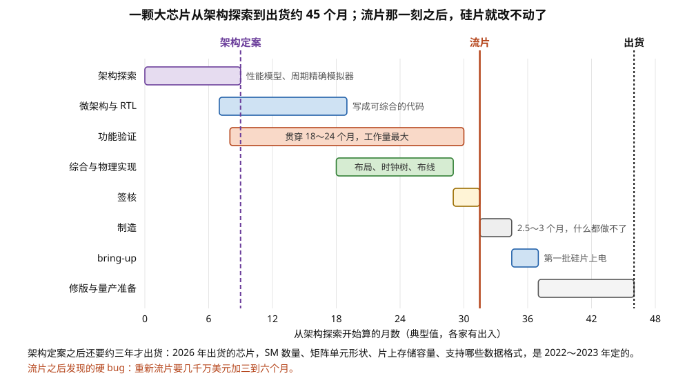
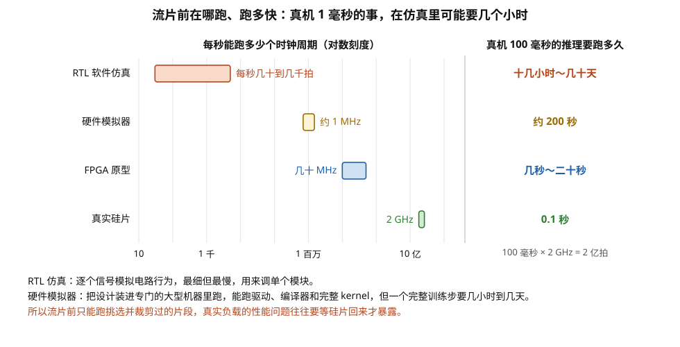
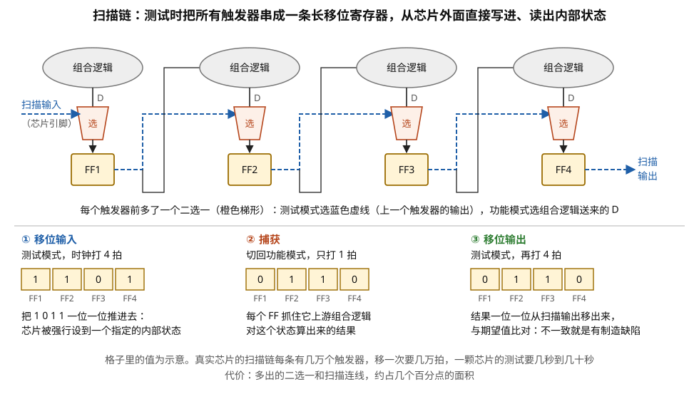
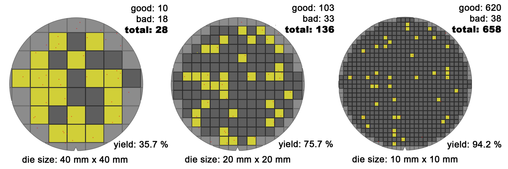
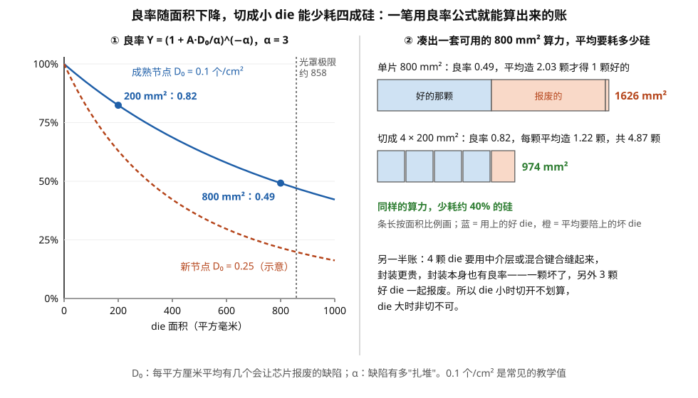
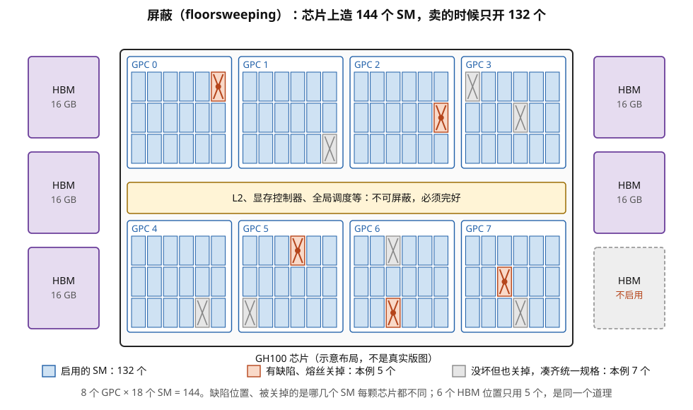

# 从 RTL 到 tapeout：一颗芯片怎么被造出来，以及这如何反向塑造了架构

> **所属模块**：模块 13 · 微架构与物理实现
> **状态**：🟨 学习中（第一版。知识截至 2026-08）
> **本节主旨**：前面七节讲的是"芯片长什么样"，这一节讲"它是怎么被造出来的"——以及为什么这件事**不是工程细节，而是架构约束的主要来源**。三个数字先摆在这里：**一颗大芯片从架构定案到量产要三到四年；先进节点一套掩模几千万美元、改一次要几个月；一颗 800 平方毫米的裸 die 良率只有五成左右。** 这三个数字联合起来，会解释一串看起来毫不相干的现象：**为什么 H100 明明有 144 个 SM 却只开 132 个**（这是良率补救的结果，不是刻意的产品分级）、**为什么同型号的两张卡性能会有几个百分点差异**（分档）、**为什么架构必须在还不知道三年后的算法长什么样时就定下来**（这是"可编程性"最硬的经济学理由）、**为什么切成 chiplet 能省四成硅片**（一笔可以算出来的良率账）。**这一节是全模块的收尾：它把前七节讲的所有物理约束，接回到"为什么架构是这个样子"这个问题上。**

---

## 0. 这一节要回答的问题

- 一颗芯片从想法到量产要经过哪些步骤？各占多少时间？
- "流片（tape-out）"具体指哪一刻？流片之后还有多久能拿到芯片？
- 验证到底在验什么？为什么它占一半以上的工作量？
- 芯片怎么测试？为什么设计里要专门加"只为测试而存在"的电路？
- 良率怎么算？800 平方毫米的芯片良率是多少？
- 为什么 GH100 有 144 个 SM，H100 只开 132 个？
- 同一款卡为什么会有性能差异？"分档（binning）"是什么？
- 切成 chiplet 到底省了多少？能算出来吗？
- 流片之后发现 bug 怎么办？
- 这一整套流程，怎么反过来决定了架构长什么样？

---

## 1. 基础词汇：先把本节要用的词讲清楚

**流片（tape-out）**。设计工作完成、把最终版图数据交给晶圆厂制作掩模的那一刻。名字来自早年把版图数据存在磁带上送去工厂的做法。**它是一个不可逆的时间点**——之后的任何修改都意味着重新制作掩模和重新跑一遍晶圆，代价以千万美元和数月计。

**掩模（mask / reticle）**。光刻用的"底片"，每一层金属或每一道工艺各需一张。一套先进节点的掩模有几十到上百张，**总成本在几千万美元量级**。这是"改一版芯片"的主要固定成本。

**功能验证（functional verification）**。在硅片存在之前，用仿真的方式证明 RTL 的行为符合规格。手段包括定向测试、随机约束测试（UVM 是主流方法学）、形式化验证、以及硬件加速的仿真（模拟器和 FPGA 原型）。**它是整个项目里工作量最大的一块，通常占一半以上。**

**可测性设计（DFT，design for test）**。为了让制造出来的芯片能被高效测试而在设计里额外加入的电路。**它不参与任何功能，纯粹为测试而存在**，典型开销是几个百分点的面积。§4 展开。

**静态时序分析（STA）与签核（signoff）**。STA 是不做仿真、纯用数学方法检查芯片上每一条时序路径是否满足建立/保持要求（模块 13 第 1 节讲的 setup/hold）。签核则是流片前的一系列强制检查：时序、功耗、IR drop、电迁移、设计规则（DRC）、版图与原理图一致性（LVS）等，**每一项都必须干净通过**。

**良率（yield）**。一片晶圆上制造出来的芯片中，功能完好的比例。它由随机缺陷密度决定，**与 die 面积强相关**——面积越大，被至少一个致命缺陷击中的概率越高。

**分档（binning）**。同一批制造出来的芯片，因工艺偏差而在最高频率、漏电、可工作电压上各不相同。测试之后按实测能力分类，卖成不同型号或不同规格。**"同一颗设计"可以变成好几款产品。**

**屏蔽（floorsweeping）**。发现某个 SM、某片 L2 或某个显存通道有缺陷时，用熔丝（fuse）在出厂时把它永久关闭，让其余部分正常工作。**这是把"废片"变成"能卖的片"的关键手段。**

**工程变更（ECO）**。流片前后对设计做的局部修改。如果改动小到只需要改几层金属连线（而不动晶体管层），叫**只改金属层的 ECO**，代价远低于全套重做——这是修 bug 时最想争取到的情况。

## 2. 一条完整的时间线：三到四年，和它的形状

先把整条流程按时间铺开。下面是一颗大型 AI 加速器的典型节奏（各家有出入，但形状是普遍的；画成时间线见图 7-1）：

| 阶段 | 干什么 | 典型时长 |
| --- | --- | --- |
| 架构探索 | 用性能模型和周期精确模拟器评估方案：SM 数量、缓存大小、矩阵单元形状、带宽配比 | 6~12 个月 |
| 微架构设计与 RTL 编写 | 把架构决策落成可综合的代码 | 9~15 个月 |
| 功能验证 | 与 RTL 并行且持续更久：仿真、随机测试、形式化、模拟器与 FPGA 原型 | **贯穿 18~24 个月** |
| 综合与物理实现 | 综合、DFT 插入、布局、时钟树综合、布线、时序收敛 | 9~12 个月（与验证重叠） |
| 签核 | 时序、功耗、IR drop、电迁移、DRC、LVS 全部通过 | 2~3 个月 |
| **流片** | 交出版图数据 | — |
| 制造 | 晶圆厂跑完全部工艺步骤 | **2.5~3 个月** |
| 芯片启动（bring-up） | 第一批硅片回来，在实验室上电、跑通、找问题 | 1~3 个月 |
| 修版与量产准备 | 修掉发现的问题（可能需要再流一次片）、良率爬坡、软件适配 | 6~12 个月 |
| **合计** | 从架构定案到出货 | **约 3~4 年** |

> **图 7-1**　一句话：一颗大型 AI 芯片从开始做架构探索到出货约 45 个月，验证贯穿了大半程；流片之后的几个月里硅片在工厂加工，设计上什么都改不了。
>
> **先知道一件事**：流片是把最终设计交给晶圆厂制作掩模（光刻用的"底片"）的那一刻。在它之前改设计，只是改代码和版图；在它之后再改，就要重做掩模、重跑晶圆，代价以千万美元和数月计。
>
> **按这个顺序看**：
> 1. 横轴是月数，每个横条是一个阶段，两端是它大致的起止时间。好几个阶段是重叠进行的。
> 2. 紫色虚线"架构定案"在第 9 个月左右：SM 数量、矩阵单元形状、片上存储容量这些决定从这里起基本冻结。
> 3. 最长的橙色条是功能验证，从 RTL 刚开始写就启动，一直持续到签核前，约 22 个月。
> 4. 红色竖线是流片。它右边的灰色"制造"约 3 个月，工厂在跑几百道工序，设计团队只能等。
> 5. 之后是 bring-up（第一批硅片在实验室上电、跑通、找问题），再是修版与量产准备：可能还要再流一次片、爬良率、适配软件，然后才出货。
>
> **看懂的标志**：能回答"为什么硬件对新算法的响应总是慢一两代"——架构在出货前约三年就冻结了，那时没人知道三年后主流的模型结构和精度格式，所以硬件只能押稳定的大趋势，其余交给软件。
>
> **与正文的对照**：各阶段时长取自上表的中间值（各家有出入）；"修版与量产准备"这一段可能包含一次重新流片。
>
> 来源：本库自绘。

**这张表里有三个数字需要单独强调，因为它们各自解释一类现象。**

**第一，架构必须在出货前三到四年定案。** 也就是说，一颗 2026 年出货的芯片，它的 SM 数量、矩阵单元形状、片上存储容量、支持哪些数据格式，是在 **2022 到 2023 年**决定的。**那时候的人不可能知道 2026 年主流的模型结构、算子形态、精度选择。**

**这是"可编程性"最硬的经济学理由，比任何架构优雅性的论证都硬。** 一颗把宝全押在某个具体算子结构上的芯片，三年后大概率押空；而保留通用性的芯片，即使单点效率低一些，至少还能跑。**模块 12 讲 NVIDIA "赌真实负载不是纯矩阵乘"，模块 40 讲映射问题——这些赌注和权衡，本质上都是在对三四年后的世界下注。**

**第二，流片到拿到芯片要三个月，而且这三个月什么都做不了。** 这解释了为什么验证的投入必须那么大：**一旦流片，任何 bug 都要等三个月才能验证是否修好**（如果需要重新流片）。一次重新流片的代价是几千万美元加三到六个月——**在一个三四年一代的竞赛里，这可能就是一整代的落后。**

**第三，验证的时间跨度比 RTL 编写还长。** 下一节讲为什么。

## 3. 验证：为什么它是整个项目里最大的一块

**问题的规模。** 一颗 GPU 的状态空间是天文数字级的：几亿个触发器，每个可以是 0 或 1。**穷举是不可能的**，所以验证的本质是"用有限的测试尽可能覆盖有意义的行为"。

**手段按速度和保真度排成一条谱**（速度对比见图 7-2）：

| 手段 | 速度（相对真实芯片） | 用途 |
| --- | --- | --- |
| RTL 仿真（软件） | 慢约 10⁶～10⁸ 倍（每秒几十到几千个周期） | 单元级、模块级的详细调试 |
| 随机约束测试（UVM） | 同上 | 用随机激励覆盖人想不到的组合，配合覆盖率指标衡量进度 |
| 形式化验证 | 不按周期算 | 数学证明某个属性恒成立（如"这个仲裁器不会饿死任何请求"） |
| 硬件模拟器（emulator） | 慢约 1000~3000 倍（约 1 MHz） | 跑真实软件栈：驱动、编译器、完整 kernel |
| FPGA 原型 | 慢约 100 倍（几十 MHz） | 跑更长的负载，给软件团队提前适配 |
| 真实硅片 | 1× | bring-up 之后 |

**"1 MHz"这个数字值得停下来算一下它的含义。** 一个在真机上跑 1 毫秒的 kernel（2 GHz 下是 200 万个周期），在硬件模拟器上要跑 **2 秒**——还行。但一个完整的模型推理，真机上 100 毫秒，模拟器上就是 **200 秒**；而训练一步、或者跑一个完整的测试套件，动辄就是几小时到几天。

> **图 7-2**　一句话：流片前能用来运行设计的几种手段，最快的 FPGA 原型也比真芯片慢约 100 倍，能跑完整软件栈的硬件模拟器慢约 2000 倍，最细的 RTL 仿真则慢上百万倍以上。
>
> **先知道一件事**：芯片还没造出来时，要知道它对不对、快不快，只能"模拟"它运行：在普通电脑上用软件逐个信号地算（RTL 仿真），或者把设计装进专用的大型硬件里跑（硬件模拟器、FPGA）。模拟得越细，就越慢。
>
> **按这个顺序看**：
> 1. 左边横轴是每秒能模拟多少个时钟周期，对数刻度，每一大格差 10 倍。
> 2. RTL 仿真每秒只有几十到几千拍；硬件模拟器约 100 万拍（1 MHz）；FPGA 原型几十 MHz；真实硅片 2 GHz，即每秒 20 亿拍。
> 3. 右边换成一个具体任务：真机 100 毫秒的一次推理是 2 亿拍。硅片 0.1 秒跑完；FPGA 几秒到二十秒；硬件模拟器约 200 秒；RTL 仿真要十几小时到几十天。
> 4. 底下三行说明各自的用途，以及由此得出的结论。
>
> **看懂的标志**：能回答"为什么很多真实负载的性能问题要等硅片回来才被发现"——流片前只能在模拟器上跑挑选、裁剪过的片段，完整训练一步都要几小时到几天，不可能把真实负载完整跑一遍。
>
> **与正文的对照**：速度数值与上表一致。RTL 仿真一行"慢多少倍"原写作约 10⁹ 倍，与"每秒几十到几千个周期"对不上（2 GHz 除以几十到几千，约为 10⁶～10⁸），已按后者改正。
>
> 来源：本库自绘。

**这解释了一件对软件工程师很有用的事：硬件团队在流片前，几乎不可能"把真实工作负载完整跑一遍"。** 他们能跑的是精心挑选的、被裁剪过的代表性片段。**所以真实负载暴露出来的性能问题，往往要等到硅片回来才被发现**——而那时架构已经无法改动，只能靠驱动、编译器和库去绕。**模块 40 讲的软件栈里那些看起来别扭的优化，有相当一部分是在补硬件回来之后才发现的洞。**

**验证的另一半是"规格本身对不对"。** 功能验证只能证明"RTL 符合规格"，不能证明"规格是对的"。**性能是否达标、某个特性是否真的有用，要靠架构性能模型和周期精确模拟器来评估**，而那些模型本身也可能是错的。**这是芯片项目里最深的一类风险：造出来的东西完全符合设计，但设计本身押错了。**

## 4. 可测性设计：为测试而存在的那几个百分点

**问题：怎么测一颗有几亿个触发器的芯片？** 从外面只能看到几千个引脚，内部绝大多数节点根本触碰不到。如果只能通过正常运行来测，覆盖率会低得没有意义。

**解法：扫描链（scan chain）。** 在设计里把每个触发器换成"带扫描功能的触发器"——它多一个输入端和一个模式选择信号。**测试模式下，全芯片的触发器被串成若干条极长的移位寄存器（扫描链）**，电路与三个步骤见图 7-3：

1. 从芯片外面把一串测试向量**移位输入**，填满所有触发器（相当于把芯片强行设置到任意一个内部状态）。
2. 切回功能模式，**跑一拍**，让组合逻辑运算一次，结果被触发器抓住。
3. 再切回测试模式，把所有触发器的值**移位输出**，和期望值比对。

**这个机制把"测试一个有几亿状态的系统"变成了"测试一堆组合逻辑块"**，后者是可以用算法（自动测试向量生成，ATPG）系统性覆盖的。

> **图 7-3**　一句话：扫描链给每个触发器前面加一个二选一开关，测试时把全芯片的触发器串成一长条移位寄存器，就能从芯片外面把任意内部状态"推"进去、跑一拍、再把结果"拉"出来比对。
>
> **先知道一件事**：触发器是在时钟沿把输入存下来、保持一拍的小单元；组合逻辑是夹在触发器之间、只做计算不存状态的门电路。芯片的外部引脚只有几千个，内部触发器却有几亿个，正常运行时绝大多数触发器从外面看不见也碰不着。
>
> **按这个顺序看**：
> 1. 上半画了 4 个触发器（FF1～FF4），每个上方是一团组合逻辑，送来正常工作时的输入 D。黑色细线表示正常工作时，一个触发器的输出又喂给下一团组合逻辑。
> 2. 每个触发器前面的橙色梯形是二选一开关：功能模式选 D，测试模式选蓝色虚线，也就是上一个触发器的输出。测试模式下，从左边的"扫描输入"引脚到右边的"扫描输出"引脚，4 个触发器首尾相连成一条链。
> 3. 下半 ① 移位输入：测试模式下打 4 拍，把 1 0 1 1 一位一位推进去。先进去的走得最远，所以最后 FF1～FF4 是 1 1 0 1，芯片被强行设到了这个状态。
> 4. ② 捕获：切回功能模式只打 1 拍，每个触发器抓住它上游那团组合逻辑对这个状态算出的结果（格中数值为示意）。
> 5. ③ 移位输出：再切回测试模式打 4 拍，把结果从扫描输出一位一位移出来，和事先算好的期望值比对；不一致，就说明那团组合逻辑里有制造缺陷。
>
> **打个比方**：检查一排互不相通的房间里的机器，不必给每个房间开门：在房间之间临时打通一条传送带，从一头把测试零件依次送进每个房间，让机器各加工一次，再用传送带把成品依次送出来检查。
>
> **看懂的标志**：能回答"为什么说扫描链把'测一个有几亿个状态的系统'变成了'测一堆组合逻辑'"——状态可以直接写进去、结果可以直接读出来，剩下要验证的只是每团组合逻辑在给定输入下的输出对不对，这可以用算法自动生成测试向量去系统地覆盖。
>
> **与正文的对照**：三步与上面的步骤一一对应。二选一开关的选择信号（扫描使能）图中没有单独画出。SRAM 内部不是触发器，扫描链测不到，要靠下文的 MBIST 另测。
>
> 来源：本库自绘。

**代价有三条**：

- **面积**：带扫描的触发器比普通触发器大一些，加上扫描链的布线，整体开销**几个百分点**。
- **时序**：扫描链的连线是长线，会影响布线拥塞。
- **测试时间**：移位一次要几万拍，测试向量有几万组——**一颗芯片的测试时间是几秒到几十秒，而测试机台极贵，所以测试成本是芯片成本里的实打实一项。**

**SRAM 要单独测：MBIST 与冗余修复。** 扫描链测不了 SRAM 内部（存储阵列不是触发器）。所以片上要放**内建自测试（MBIST）**电路：一个小状态机，自动往 SRAM 里写各种图案再读回来比对。

**更有意思的是修复机制**：大块 SRAM 在制造时会预留**冗余的行和列**。MBIST 发现某一行有坏位时，**用熔丝把地址重映射到冗余行**，这块 SRAM 就变成完好的。**这是芯片良率的第一道补救机制**——大芯片上 SRAM 占面积很大（模块 13 第 3 节：寄存器堆加各级缓存），如果每一个坏位都报废整颗芯片，良率会低到无法生产。

## 5. 良率：一笔能算出来的账，和它对架构的支配

**良率模型。** 业界常用负向二项模型：

> **Y = (1 + A · D₀ / α)^(−α)**

其中 A 是 die 面积、D₀ 是每单位面积的致命缺陷密度、α 是描述缺陷聚集程度的参数（典型取 3）。

**代入一颗大 GPU 的数字**：A = 8 cm²（800 mm²），成熟节点的 D₀ 取 0.1 个/cm²，α = 3：

> Y = (1 + 8 × 0.1 / 3)^(−3) = (1.267)^(−3) ≈ **0.49**

**也就是说，一颗 800 平方毫米的裸 die，一半是坏的。** 这还是缺陷密度已经比较成熟的假设；新节点刚量产时 D₀ 可能高两三倍，良率会更难看。面积为什么这么要紧，图 7-4 用同一片晶圆切三种尺寸演示了一遍。

> **图 7-4**　一句话：同一片晶圆上撒着同样的一批缺陷，die 切得越大，被缺陷击中而报废的比例就越高：40 毫米见方的 die 良率只有 36%，10 毫米见方的是 94%。
>
> **先知道一件事**：晶圆是一整片圆形的硅片（这里直径 300 毫米），芯片在上面一格一格地做出来，最后切开，每一格叫一个 die。制造过程中晶圆上会随机落下一些致命缺陷（图中的小红点），一个 die 里只要落进一个，这个 die 就坏了。
>
> **按这个顺序看**：
> 1. 三个圆是同一片晶圆，红点的位置完全相同，唯一的区别是切成多大的 die：左边 40 mm × 40 mm，中间 20 mm × 20 mm，右边 10 mm × 10 mm。
> 2. 深灰色方格是好的 die，黄色方格是里面落了红点的坏 die，边缘浅灰色的是不完整、本来就不能用的部分。
> 3. 右上角的数字（good 好、bad 坏、total 总数）：左边 28 个 die 里坏了 18 个、好的 10 个；中间 136 个里坏 33 个；右边 658 个里只坏 38 个。
> 4. 右下角的 yield 就是良率：35.7%、75.7%、94.2%。缺陷数一样，die 越小，每个缺陷毁掉的面积越小。
>
> **看懂的标志**：能回答"缺陷数量不变，为什么把 die 做大良率会掉这么多"——每个缺陷都会毁掉它所在的整个 die；die 越大，一个缺陷连带报废的面积就越大，一个 die 里落进至少一个缺陷的概率也越高。
>
> **与正文的对照**：左边 40 mm 见方即 1600 平方毫米，已经超过单次曝光的光罩极限（约 858 平方毫米），只作对比。这张图是按缺陷位置直接数出来的；正文的负二项公式还考虑了缺陷扎堆的效应，所以数值不同，趋势一致。
>
> 来源：[Wafer die's yield model (10-20-40mm) - Version 2 - EN.png](https://commons.wikimedia.org/wiki/File:Wafer_die%27s_yield_model_(10-20-40mm)_-_Version_2_-_EN.png)，作者 Shigeru23（原图），Cepheiden（英文版衍生作品），许可 CC BY-SA 3.0。

**再算一颗小 die**：A = 2 cm²（200 mm²）：

> Y = (1 + 2 × 0.1 / 3)^(−3) = (1.0667)^(−3) ≈ **0.82**

**这两个数字的对比就是 chiplet 的全部经济学动机。** 但要算清楚，不能只比良率，要比"造出一套可用的硅要消耗多少晶圆面积"（曲线与两种方案的对比见图 7-5）：

| 方案 | 单 die 良率 | 要凑齐一套需要平均制造几颗 | 消耗的硅面积 |
| --- | --- | --- | --- |
| 单片 800 mm² | 0.49 | 1 / 0.49 = 2.03 颗 | 2.03 × 800 = **1626 mm²** |
| 四颗 200 mm² 拼成一套 | 0.82 | 每颗 1/0.82 = 1.22 颗，四颗共 4.87 颗 | 4.87 × 200 = **974 mm²** |

**切成四块，造出同样算力所消耗的硅面积少了约 40%。** 加上模块 21 讲的光罩极限（单次曝光最大约 858 mm²，想再大也做不出来），**chiplet 就从"一个选项"变成了"唯一的路"**。

> **图 7-5**　一句话：按良率公式，800 平方毫米的 die 只有约一半能用，200 平方毫米的有八成多；凑出同样一套算力，切成四块小 die 平均只耗 974 平方毫米的硅，整片做要耗 1626 平方毫米。
>
> **先知道一件事**：造芯片是按晶圆面积付钱的：一片晶圆的成本基本固定，能切出多少好 die 决定了每颗的成本。坏 die 占的硅一样要付钱，所以"平均要造几颗才得一颗好的"才是真实成本。
>
> **按这个顺序看**：
> 1. 左图横轴是 die 面积，纵轴是良率。蓝色实线是成熟工艺（每平方厘米 0.1 个致命缺陷）下的公式曲线：200 平方毫米时 0.82，800 平方毫米时 0.49。
> 2. 红色虚线是新工艺刚量产时的示意（缺陷密度 0.25），同样 800 平方毫米只剩约两成。
> 3. 灰色竖虚线是光罩极限，约 858 平方毫米：单次曝光做不出比这更大的 die。
> 4. 右图上一条：单片 800 平方毫米，良率 0.49，平均要造 2.03 颗才得一颗好的，总共耗掉 1626 平方毫米。蓝色是用上的那颗，橙色是平均要陪上的坏 die。
> 5. 右图下一条：切成 4 颗 200 平方毫米，每颗良率 0.82，平均要造 4.87 颗才凑齐 4 颗好的，共 974 平方毫米，比上一条少约 40%。
> 6. 右下文字是这笔账的另一半：多颗 die 要靠先进封装缝合，封装更贵，而且封装本身也有良率。
>
> **看懂的标志**：能回答"为什么 Blackwell、Rubin 都做成封装内两颗大 die"——一是单颗已经顶到光罩极限，再大做不出来；二是按这条曲线，面积越大良率掉得越快，切开能省下大量报废的硅。
>
> **与正文的对照**：公式与数值取自上文（D₀ = 0.1 个/平方厘米、α = 3）；新工艺曲线的 0.25 是示意，对应正文"新节点 D₀ 可能高两三倍"。
>
> 来源：本库自绘。

**注意这笔账的另一半：封装成本。** 四颗 die 要用中介层或混合键合缝起来（模块 21 第 1 节），封装成本高出很多，而且封装本身也有良率（一颗 die 出问题，整个封装报废，还赔上另外三颗好 die——模块 21 讲的"已知良品"问题）。**所以 chiplet 的收支平衡点是随 die 面积移动的**：小芯片切开不划算，大芯片非切不可。

**第二道补救机制：屏蔽（floorsweeping）。** 良率模型算的是"整颗 die 一个缺陷都没有"的概率。但一颗 GPU 是由上百个**同构**的 SM 组成的（模块 13 第 1 节讲的硬核复制）——**如果缺陷落在某一个 SM 里，为什么要报废整颗芯片？**

于是硬件在设计时就预留了冗余：

- **GH100 芯片上物理存在 144 个 SM，而 H100 SXM 产品只启用 132 个。** 那 12 个（8%）是给良率留的余量（示意见图 7-6）——制造时哪几个 SM 有缺陷就关掉哪几个，只要坏的不超过 12 个，这颗芯片就是好的。
- **同理适用于 L2 切片、显存通道、HBM 堆叠**。H100 的封装里有 6 个 HBM 位置，而 80 GB 版本只启用 5 个——同样的逻辑。

> **图 7-6**　一句话：GH100 芯片上物理上有 144 个 SM，出厂时用熔丝关掉 12 个；只要坏的 SM 不超过 12 个，这颗芯片就能当 H100 卖。HBM 的 6 个位置只用 5 个，也是同一个思路。
>
> **先知道一件事**：熔丝是芯片上一种一次性的小开关，出厂测试时把它烧断，就能把某个模块永久关掉，之后软件也看不到这个模块。
>
> **按这个顺序看**：
> 1. 中间大框是芯片（示意布局，不是真实版图）。上下各 4 个蓝框是 GPC（图形处理簇，一组 SM），每个里面 18 个小格，每格一个 SM，共 8 × 18 = 144 个。
> 2. 中间黄色横带是 L2、显存控制器、全局调度等只有一份的部分，坏了没法屏蔽，所以必须完好。
> 3. 带红点和红叉的格子是测试时发现有缺陷的 SM，用熔丝关掉，本例 5 个。
> 4. 灰叉的格子是好的 SM，也被关掉了：产品规格统一是 132 个，坏得少的芯片也要关到只剩 132 个。本例关了 7 个，合计 12 个。
> 5. 两侧是封装上的 6 个 HBM 位置，80 GB 版本只启用 5 个，每个 16 GB。
>
> **看懂的标志**：能回答"为什么代码里绝不能写死 SM 数量"——SM 数是产品的规格，不是芯片的规格：同一种芯片可以按不同的开启数量做成不同型号，persistent kernel 的网格大小必须运行时查询。
>
> **与正文的对照**：144 与 132、6 个 HBM 位置启用 5 个，与上文一致。哪几个 SM 被关掉每颗芯片都不同；图中缺陷的位置和"没坏也关"的数量都是示意。
>
> 来源：本库自绘。

**这个机制的效果非常显著。** 粗略地说，允许屏蔽 8% 的 SM，相当于把"必须完美"的面积从 800 mm² 降到了一个小得多的核心区域（L2、显存控制器、调度器等不可屏蔽的部分），**有效良率能从五成提到七八成。**

**它对软件的直接后果**（这一条务必记住）：**同一款 GPU 的 SM 数量是产品规格，不是芯片规格，而且不同 SKU 不一样。** 任何代码里都不能写死 SM 数量，必须运行时查询。模块 40 讲的 persistent kernel（网格大小按 SM 数设定）如果写死了数字，**换一个 SKU 就会性能腰斩或者干脆跑不满。**

**第三道机制：分档（binning）。** 即使一颗 die 完全没有缺陷，它的电气特性也和隔壁那颗不同——工艺偏差让每颗芯片的晶体管阈值电压、漏电、最高可工作频率各不相同。测试时会实测每颗芯片的 V-F 曲线（模块 13 第 5 节），**按能力分档**：

- 能在低电压下跑高频的（"体质好"），进高端 SKU 或高频版本。
- 漏电大的进低频版本（漏电大的芯片往往频率也高，但功耗撑不住）。
- 每颗芯片的 V-F 曲线烧进固件，**所以两张同型号的卡，实际工作电压是不同的。**

**这解释了一个常被误解的现象**：同型号两张卡跑同一个 kernel，性能有几个百分点的差异。**这不是散热差异也不是软件问题，是两颗硅片本来就不一样。** 做性能对比时，跨卡的几个百分点差异应该被当作噪声，除非在同一张卡上复现。

## 6. 流片之后：bring-up、ECO 与"只能靠软件绕"

**第一批硅片回来的那几周，是整个项目最紧张的时候。** 要做的事按顺序是：上电（确认不短路、电流正常）、时钟起振、复位序列走通、扫描链测试通过、最小的功能测试跑通、然后逐步跑更复杂的负载。

**这个阶段发现的问题分三类，处理方式完全不同**：

| 问题类型 | 例子 | 处理方式 |
| --- | --- | --- |
| 功能 bug，能绕开 | 某个特性在特定条件下出错 | **软件绕过**：驱动/编译器避开这条路径，或在文档里标为不支持 |
| 时序 marginal | 某条路径在高温高频下偶发失败 | 降低该模式的频率上限，或调整电压策略 |
| 硬 bug，绕不开 | 核心通路出错 | **重新流片**——几千万美元加三到六个月 |

**"只改金属层的 ECO"是修 bug 时最想争取到的情况。** 如果修改只需要重连几层金属（不动晶体管层），只需重做那几张掩模、并从已经做到一半的晶圆继续加工，**时间和成本都能省一大半**。为此，芯片设计时会**预先在版图里撒一些"备用单元"（spare cell）**——一些没有被用到的与非门和触发器，散布在各处，等着将来 ECO 时被连进电路。**这是一种为"一定会出 bug"而预付的保险费，占一点面积。**

**"软件绕过"这一类值得软件工程师特别注意。** 一颗芯片出货时，驱动和编译器里往往带着一批**针对硅片缺陷的规避代码**（业界叫 errata workaround）。它们的表现是：某些看起来应该更快的指令序列，编译器就是不生成；某个特性在某个特定芯片版本上被静默禁用。**这类"不合理"的行为，源头往往就在这里，且通常不会公开说明原因。**

## 7. 这一整套流程如何反向塑造架构

前面六节讲的是流程。这一节回答本节最重要的问题：**这些工程约束，怎么变成了我们在前七节里看到的架构形态？**

**第一，同构复制是必然的，不是审美。** 层次化物理设计（模块 13 第 1 节）让"设计一个 SM、摆 144 份"的工作量远小于"设计 144 个不同的单元"；而良率屏蔽（§5）要求这些单元**可以任意关掉几个而不影响功能**——这就要求它们同构且松耦合。**"给某几个 SM 加特殊能力"这个想法，同时违反了这两条。**

**第二，冗余的粒度决定了架构的模块化粒度。** 要能屏蔽，就要有可屏蔽的边界：SM 之间不能有硬绑定的依赖，L2 切片必须能少几片照常工作，显存通道必须能缺一个。**这条要求向上传导，就成了"架构必须由可独立开关的模块组成"**——这与"设计一个高度耦合、全局优化的机器"是相反的方向。

**第三，验证成本让"复用已验证的 IP"具有压倒性优势。** 一个已经在上一代硅片上跑通的模块，复用它的风险远低于重新设计。**这就是为什么架构演进往往是渐进的**：每一代改动集中在少数几个模块（比如这一代主要改 Tensor Core，下一代主要改存储层次），而不是整体重构。**从模块 10 到模块 12 看到的 NVIDIA 架构演进轨迹——SM 的基本骨架二十年没有大变，变的是不断往里加的新单元——正是这条经济学的结果。**

**第四，三到四年的周期决定了硬件永远在追算法。** §2 说过架构要在出货前三四年定案。**所以硬件对算法的响应必然是滞后的**，而且滞后的量级是"一代到两代"。这条约束产生了两个可观察的后果：

- **硬件倾向于押"结构性趋势"而不是"具体算子"**。矩阵乘会一直重要、精度会继续下降、模型会继续变大——这些趋势足够稳，值得押。而"注意力的具体形式"这种三年就变几轮的东西，硬件不会去专门做（**Transformer Engine 这类特性是在软件层做的适配层，不是固化的算子电路**）。
- **软件栈的价值被极大放大**。既然硬件做不到跟着算法走，那么"让不太匹配的硬件跑好新算法"这件事的价值就极高——**模块 40 整个模块的存在理由，一半在这里。**

**第五，掩模成本让"一次做对"成为文化。** 几千万美元加三个月的代价，使得芯片开发在方法论上和软件开发是相反的：**软件是"快速迭代、线上修"，芯片是"想清楚再做、做对为止"。** 这解释了硬件团队为什么在需求上如此保守、为什么规格冻结之后极难改动、以及为什么"这个特性下一代再说"是一句极其常见的回答。**理解这一点，跨团队沟通时的很多摩擦会变得可以预期。**

## 8. 开发者视角：制造流程在软件侧的三个通道

| 物理事实 | ① 源码拨盘 | ② 编译器回执 | ③ Profiler 探针 |
| --- | --- | --- | --- |
| SM 数量是 SKU 规格，不是芯片规格 | **绝不写死**：`cudaGetDeviceProperties` 查 `multiProcessorCount`，persistent kernel 的网格按它算 | 无 | 跨 SKU 对比时先确认 SM 数与时钟 |
| 每颗芯片的 V-F 曲线不同（分档） | 跑基准前锁频（模块 13 第 5 节） | 无 | `nvidia-smi -q` 看默认时钟与功耗上限；同型号卡之间几个百分点差异是正常的 |
| 部分功能可能被屏蔽或有 errata | 用 CUDA 的架构与能力查询而不是假设；关注驱动版本说明 | 编译器按 `-arch=sm_90a` 之类的目标能力决定生成什么指令 | 某些指令在某些 SKU 上性能异常，属于已知规避 |
| 大芯片被切成多 die | 注意跨 die 的访问延迟差异（模块 21、模块 30 第 2 节） | 无 | NUMA 式的延迟差；在 MI300 / Blackwell 这类多 die 产品上更明显 |
| SRAM 有冗余修复，出厂后仍可能有软错误 | 数据中心场景开 ECC；关注 Xid 错误与 ECC 计数 | 无 | `nvidia-smi -q -d ECC` 的可纠正/不可纠正错误计数**持续增长是换卡信号** |
| 芯片能力靠固件与驱动暴露 | 无 | 新特性常常需要新驱动 + 新工具链才能用上 | 同一张卡换驱动后性能变化，属于正常现象 |

**一个具体场景**：某个 persistent kernel 在开发机（一张消费级卡，SM 数较少）上调好了参数，部署到 H100 上性能只有预期的一半。**排查方向不是 kernel 逻辑，而是网格大小是不是写死了**——persistent kernel 的正确写法是网格恰好等于（或者是若干倍于）运行时查到的 SM 数，写死一个数字在换 SKU 时必然出问题。**这条坑的根源就是 §5 的屏蔽机制：SM 数是一个随产品变化的数字。**

## 9. 最新架构落点（知识截至 2026-08）

- **芯片规模已经顶到光罩极限，多 die 成为高端产品的默认形态。** Blackwell 用两颗光罩尺寸的 die 缝成一个逻辑 GPU；**Rubin（2026 年推进量产）同样是封装内两颗光罩尺寸的计算 die 配 HBM4**。§5 那笔良率账加上模块 21 的光罩极限，是这条路线的双重驱动力。
- **先进节点的成本曲线仍在变陡。** 掩模成本、设计 NRE、以及 EDA 与 IP 授权的成本，使得能负担一颗前沿 AI 芯片全流程的团队越来越少。**这条经济学趋势的一个可观察后果是：定制 ASIC 的门槛在提高，而"买通用加速器 + 自己做软件栈"的相对吸引力在上升。**
- **背面供电（A16 Super Power Rail，计划 2026 年下半年量产）给物理实现流程带来的是新变量而不只是新收益**：电源在背面之后，正面布线宽松了（模块 30 第 2 节的受益者），但热路径、测试探针接触、以及背面工艺的良率都是新问题。**新工艺节点在早期总是良率更低、D₀ 更高**，§5 的账要重算。
- **验证方法在向"更早跑真软件"移动**：硬件模拟器容量持续增大，加上把编译器和内核库更早接入模拟环境的做法，目的正是缓解 §3 那个"流片前跑不完真实负载"的困境。**但 1 MHz 这个数量级的速度差距是物理性的，不会消失。**
- **跨厂商的共同点**：AMD 的 MI300 系列是 chiplet 化最彻底的产品之一（多颗计算 die 叠在基底 die 上，见模块 21）；Google TPU 和昇腾同样面临同一套良率与流程约束。**这一节讲的东西是全行业共通的，不分架构路线。**

## 10. 和其它模块的挂钩

- **模块 13 第 1 节（数字设计地基）**：那里讲硬核复制与层次化设计，本节 §7 说明了它同时也是良率屏蔽的前提——两条理由指向同一个架构形态。
- **模块 21（封装）**：本节 §5 的良率账，是模块 21 讲 chiplet 与先进封装的经济学基础；模块 21 讲的"已知良品"问题，正是本节良率机制在封装层的延续。
- **模块 01（真实芯片对照）**：本节解释了那些型号规格里的"零头数字"（132 个 SM、80 GB 而不是 96 GB）从哪来。
- **模块 40（软件优化栈）**：本节 §7 第四条给出了软件栈价值的经济学论证——硬件必然滞后算法两三年，中间这个差距只能靠软件填。
- **模块 10（SIMT 核）**：persistent kernel 与 occupancy 的计算都依赖 SM 数，而这个数是产品规格而非架构常数。
- **模块 13 第 5 节（能量账本）**：分档实际上就是按每颗芯片实测的 V-F 曲线来分类，两节讲的是同一件事的两端。

## 11. 术语卡

### 流片（tape-out）与掩模成本
**定义**：设计完成、把最终版图交给晶圆厂制作掩模的那一刻。先进节点一套掩模有几十到上百张、总成本几千万美元；流片到拿回第一批硅片约需三个月。
**为什么存在**：光刻必须有物理的掩模，而掩模一旦制作就固定了。这个不可逆性和高固定成本，使芯片开发的方法论与软件开发相反——软件快速迭代线上修，芯片必须想清楚再做。
**语境例句**："这个特性赶不上这次流片了。" —— 意思是：规格已经冻结，再改就要推迟几个月并重做掩模——所以只能等下一代，这是硬件团队最常见的回答之一。

### 扫描链（scan chain）与可测性设计
**定义**：把芯片里每个触发器换成带扫描功能的版本，测试模式下全部串成极长的移位寄存器。测试时先移位输入一组值把芯片设置到任意内部状态，跑一拍，再移位输出结果比对，从而把"测试一个亿级状态的系统"化归为"测试一批组合逻辑"。
**为什么存在**：芯片内部绝大多数节点从引脚触碰不到，只靠正常运行来测覆盖率极低。代价是几个百分点的面积、布线拥塞、以及不短的测试机台时间——这是一笔纯粹为制造付出的、不产生任何功能的开销。
**语境例句**："这块逻辑扫描覆盖率不够。" —— 意思是：自动生成的测试向量测不到这部分电路，制造缺陷可能漏检流到客户手里——通常要改设计让它可控可观测。

### 良率模型与 chiplet 的经济学
**定义**：常用负向二项模型 Y = (1 + A·D₀/α)^(−α)，A 是 die 面积、D₀ 是缺陷密度、α 描述缺陷聚集程度。800 mm² 的 die 在成熟节点约五成良率，200 mm² 约八成。切成四块小 die 拼一套，消耗的硅面积比单片方案少约四成。
**为什么存在**：制造缺陷在晶圆上随机分布，面积越大被击中的概率越高，这是纯粹的概率问题。加上光罩极限（单次曝光最大约 858 mm²），大芯片切成 chiplet 从选项变成必需。
**语境例句**："这个尺寸不切开良率撑不住。" —— 意思是：单片面积已经大到良率账算不过来，必须切成多 die 再用先进封装缝合——代价是封装成本与已知良品的风险。

### 屏蔽（floorsweeping）与冗余单元
**定义**：芯片设计时预留超出产品规格的同构单元（如 GH100 物理上有 144 个 SM 而 H100 只启用 132 个），制造后用熔丝把有缺陷的单元永久关闭。同样的机制也用于 L2 切片、显存通道、HBM 堆叠和 SRAM 的冗余行列。
**为什么存在**：良率模型算的是"整颗 die 零缺陷"的概率，而一颗 GPU 由上百个同构模块组成，缺陷落在某个模块里不该报废整颗芯片。允许屏蔽约 8% 的单元，能把有效良率从五成提到七八成。
**语境例句**："这个 SKU 屏蔽了 12 个 SM。" —— 意思是：物理上有 144 个、卖的是 132 个，多出来的是良率余量——所以**代码里绝不能写死 SM 数量，必须运行时查询**。

### 分档（binning）
**定义**：同一批完好的芯片因工艺偏差而在最高频率、漏电、可工作电压上各不相同。测试时实测每颗的电压-频率曲线，按能力分类进入不同型号或不同频率档位，曲线烧进固件。
**为什么存在**：工艺偏差不可消除，与其按最差的一颗定统一规格（浪费好片的能力），不如分类销售。后果是同型号的两张卡实际工作电压不同，性能有几个百分点的天然差异。
**语境例句**："这两张卡差 3%，是体质差异。" —— 意思是：不是散热也不是软件，是硅片本身的电气特性不同——跨卡的小幅差异应当视为噪声，性能对比要在同一张卡上做。

### 工程变更（ECO）与备用单元
**定义**：流片前后对设计做的局部修改。若改动只需重连金属层而不动晶体管层，只需重做那几张掩模并从半成品晶圆继续加工，代价远小于全套重做。为此设计时会在版图里预先散布一些未使用的与非门和触发器（备用单元），供将来 ECO 连入。
**为什么存在**：硅片回来后发现问题是常态而非例外，而完整重新流片要几千万美元加三到六个月。预留备用单元是为"一定会出 bug"预付的保险费，代价是一点面积。
**语境例句**："这个能用 metal ECO 修，不用全重来。" —— 意思是：改动能用现有晶体管重新连线实现，只需换几张掩模，时间和成本省一大半——这是修 bug 时最想听到的话。

## 12. 我的困惑 / 待深挖

- 真实的 D₀（缺陷密度）在先进节点上是多少？公开数据很少，本节用的 0.1/cm² 只是常见的教学值，实际量级需要校准。
- 屏蔽机制的边界在哪里？除了 SM、L2 切片、显存通道，还有哪些结构是可屏蔽的？调度器、NVLink 通道可以吗？
- 多 die 产品（Blackwell、MI300）的封装良率现在是什么水平？已知良品测试能做到多充分？
- 硬件模拟器上跑真实负载的实际做法：厂商是怎么裁剪工作负载的？裁剪之后还能反映真实瓶颈吗？
- errata 规避在 CUDA 编译器和驱动里到底有多少？有没有办法从外部观察到（比如某些指令组合被系统性回避）？
- 从架构定案到出货三到四年这个数字，在 AI 竞赛加速之后有没有被压缩？如果压缩了，是靠什么（更多复用？更激进的并行开发？）压缩的？

---

*最后更新：2026-08-31（第一版：模块 13 第 7 节；含全流程时间线表、验证手段速度谱与 1 MHz 算例、扫描链三步、良率公式两次代入与 chiplet 硅面积对照、屏蔽与分档、流程反塑架构的五条推论）*（2026-09 补图 6 张：现成 1 张，自绘 5 张；图注按费曼法写）
