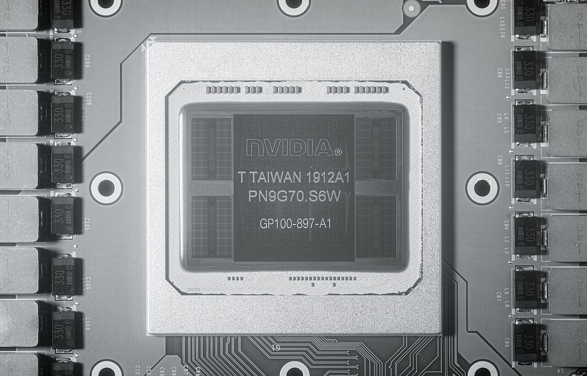
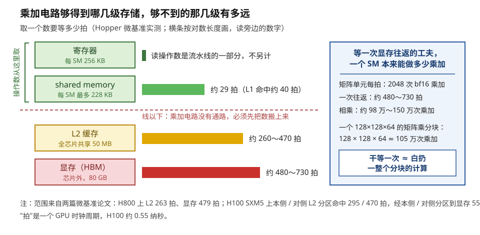
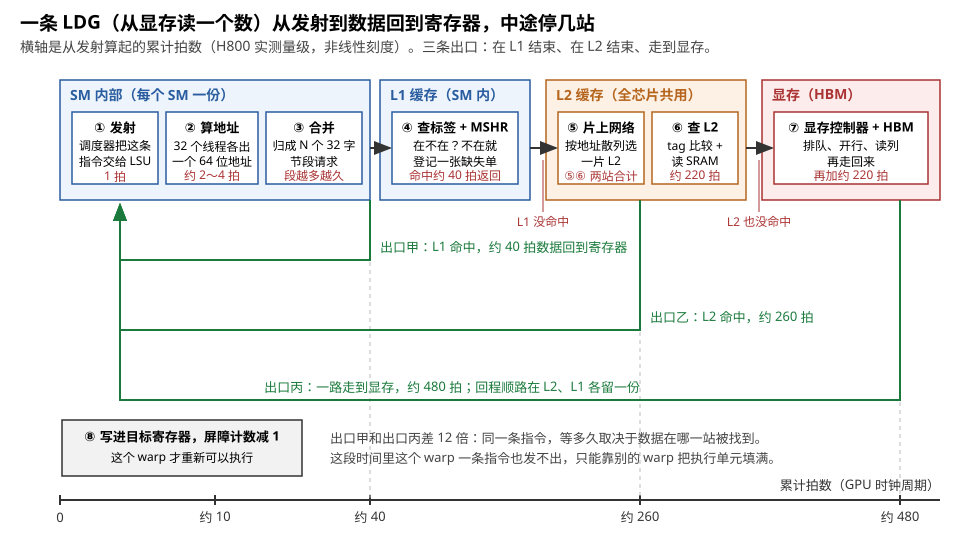
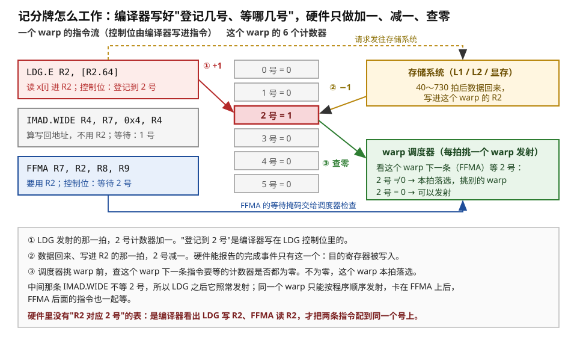
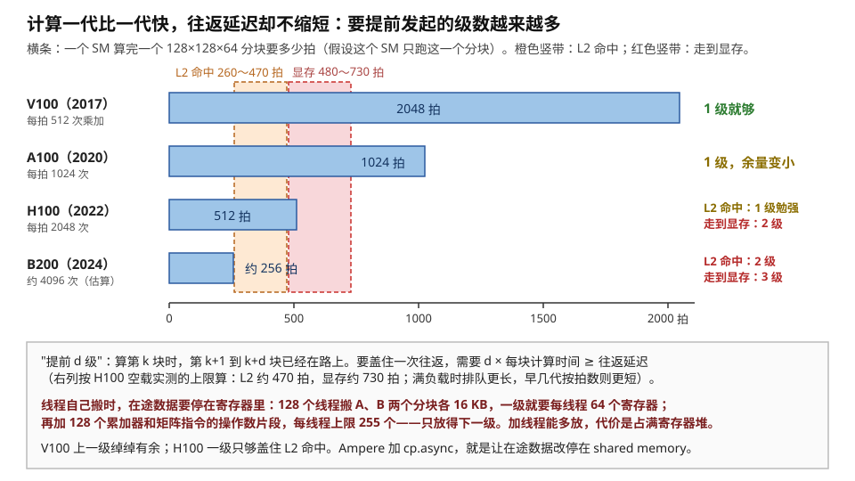

# 为什么要搬，以及最朴素的搬法：线程自己搬

> **所属模块**：模块 14 · 数据搬运（第一部分 · GPU 的数据搬运）
> **状态**：🟨 学习中（2026-10 按新目录重写，同月按 STE-80 描述规范改写文风。知识截至 2026-09）
> **一句话主旨**：乘加电路只能从片上取操作数，而显存的一次往返要几百拍，所以数据必须先搬到片上。最朴素的搬法是：每个线程自己发读取指令，自己算地址，靠记分牌知道数据已经到达。对这种读取，完成事件是数据写进目的寄存器，所以在途数据必须事先占好寄存器。计算一代比一代快，往返延迟按拍数却不缩短，所以要提前发出的数据越来越多。这些数据和累加器、能驻留的 warp 数共用同一份寄存器预算，代价越来越高。后面每一代搬运机制，都从这一点开始改。

---

## 0. 这一节要回答的问题

- 乘加电路为什么不能直接用显存里的数？等一次显存要多久？这段时间相当于多少计算？
- 最朴素的搬法是每个线程自己 load/store。它具体怎么写？在硬件上经过哪几站？
- 记分牌怎么工作？硬件里记的是什么？谁让它加一，谁让它减一？等数据的 warp 怎么用它？它和寄存器是什么关系？
- 这种搬法的代价在哪里？为什么它在 Volta 上够用，到 Ampere、Hopper 就不够用？
- 后面几节的每一种新机制，各自改的是这种搬法的哪一处？

---

## 1. 基础词汇

**线程、warp、SM**。在 CUDA 程序中，每个线程是一条独立的执行流。硬件把 32 个线程编成一组，这一组叫 **warp**。一个 warp 的 32 个线程每次执行同一条指令，各自使用自己的数据。**SM**（Streaming Multiprocessor）是 GPU 中一个独立的计算单元，H100 有 132 个 SM。一个 SM 上同时驻留几十个 warp。SM 中的 4 个 warp 调度器轮流从这些 warp 中挑选指令来执行。

**发射（issue）**。每一拍，warp 调度器从它管理的 warp 中挑一个，把这个 warp 的下一条指令送进执行单元。这个动作叫发射。本节反复用到发射的两条性质：

- 一个 warp 的指令按程序顺序发射。如果前一条指令发不出去，后面的指令也只能等。
- 一条指令为整个 warp 的 32 个线程各做一份运算，但只算一次发射。

**寄存器**。寄存器是紧贴执行单元的一小块存储。每个线程有自己的一组寄存器，每个寄存器 4 字节。H100 每个 SM 有 65 536 个寄存器，合计 256 KB。驻留在这个 SM 上的所有线程分用这些寄存器。每个线程最多用 255 个。

**shared memory**。shared memory 是每个 SM 内部的一块 SRAM，由程序显式管理。H100 上它最多有 228 KB。同一个线程块中的线程都能读写它。数据搬进片上以后，存放在 shared memory 中供反复使用。

**显存（HBM）与 L2**。显存是 GPU 芯片旁边的几个 DRAM 堆叠，叫 HBM（高带宽存储）。H100 的显存共 80 GB。L2 是位于 SM 和显存之间的缓存，由全芯片 132 个 SM 共用，容量 50 MB。

**拍**。一拍是一个 GPU 时钟周期。H100 的时钟约 1.8 GHz，所以一拍约 0.55 纳秒。

**分块（tile）**。分块是把大矩阵切成能放进片上存储的小块，然后一块一块搬进来计算。本节的例子固定如下：

- 矩阵乘的输出分块是 128 × 128。
- 沿 K 方向每次推进 64。每推进一次，要搬 A 的一个 128 × 64 分块和 B 的一个 128 × 64 分块。
- 元素是 bf16（2 字节），所以**每个分块 128 × 64 × 2 = 16 KB，每推进一次搬 32 KB**。
- 线程块是 128 个线程（4 个 warp）。

---

## 2. 为什么必须搬

### 2.1 计算指令的操作数只能来自片上

一条乘加指令在一个 warp 上执行时，32 条通道每拍各要 3 个操作数。这合计是 96 个 4 字节的数，而且下一拍还要 96 个新的数。只有寄存器堆能每拍都供得上这么多数，因为它专属于这些执行单元，并且做成了多端口。所以，GPU 的计算指令只接受以下几种片上存储作为操作数来源：

- 普通算术指令（`FFMA` 等）读寄存器，也可以直接读常量缓存中的一个数。
- 矩阵指令读寄存器或 shared memory。
- Blackwell 的矩阵指令还可以读一块专用的片上存储，叫 TMEM。

**没有任何一条计算指令能把显存地址当作操作数。**

原子操作 `atom` / `red` 看起来是例外，因为它们的操作数中确实有一个显存地址。例如，`red.global.add [addr], r1` 把寄存器 r1 中的数加到地址 addr 处的数上。但是，这次加法不在 SM 的计算单元上执行。SM 只把地址和加数发出去，L2 旁边的原子运算单元读出旧值、做加法、写回结果。所以原子操作不违反上面的规则：SM 的计算单元仍然只使用片上的操作数。

计算单元不能直接用显存，原因不在距离。图 1-1 是一颗 Pascal P100 的封装照片：显存堆叠和 GPU 芯片之间只隔约 1 毫米。真正的原因是**沿途要经过的站**。存储离计算单元越远，共用它的单元就越多。每一级存储都要先查数据是否在本级，然后排队等通路空出来：

- L1 查一次要几十拍。
- L2 分成几十片，分布在全芯片上。请求要穿过片上网络，找到管理这个地址的那一片。
- 显存的请求先在控制器中排队。然后控制器打开 DRAM 中对应的一行，再读出一列。

每一站要十几到上百拍，加起来就是几百拍。



> **图 1-1**　一句话：显存（HBM）就在 GPU 芯片旁边。但从计算单元发出读取到数据返回，仍然要几百拍。时间花在沿途的各站上，不花在距离上。
>
> **先知道一件事**：这张照片是在短波红外（SWIR）光下拍的。P100 的芯片裸露在封装顶面，硅对这个波段几乎透明，所以照片能透过硅衬底显示芯片内部的电路层。照片中的元件都装在同一块封装基板上。它们和插在主板上的内存条不是同一种东西。
>
> **按这个顺序看**：
> 1. 先看正中间印着 NVIDIA 字样的大矩形。这是 GPU 芯片本身（GP100），约 22.5 × 27.5 毫米。SM、L2、显存控制器都在其中。
> 2. 再看它左右两侧的竖长矩形，每侧两块，表面有细密格纹。这是 4 个 HBM 显存堆叠。每个堆叠由几层 DRAM 芯片叠成，约 7.5 × 11.5 毫米。格纹是 DRAM 内部的存储阵列。
> 3. 看堆叠和 GPU 芯片之间的缝。缝宽不到 1 毫米。两者通过硅中介层上几千根很短的导线连接。信号走过这段距离只要几到几十皮秒，远小于一拍（一拍约 0.55 纳秒）。
> 4. 最外圈的银色框是封装边框。两侧成排的小元件是供电用的无源元件。它们与本节无关。
>
> **看懂的标志**：能回答这个问题：显存离得这么近，为什么还要等几百拍？答案是：一次读取要依次经过 L1 查找、片上网络、L2 查找、显存控制器排队、DRAM 开行读列，再沿原路返回。每一站都有查找和排队。导线本身的时间可以忽略。
>
> **与正文的对照**：这是 2016 年的 P100。H100 有 5 个可用的堆叠（共 80 GB），结构相同。
>
> 来源：[Nvidia@16nm@Pascal@GP100@Tesla P100@T Taiwan 1912A1 PN9G70.S6W GP100-897-A1 DSCx01@SWIR.jpg](https://commons.wikimedia.org/wiki/File:Nvidia@16nm@Pascal@GP100@Tesla_P100@T_Taiwan_1912A1_PN9G70.S6W_GP100-897-A1_DSCx01@SWIR.jpg)，作者 FritzchensFritz，许可 CC0。

### 2.2 一次显存往返的时间，够矩阵单元算完一个分块

两篇 Hopper 微基准论文给出以下实测延迟：

| 数据所在位置 | 延迟 |
| --- | --- |
| shared memory | 约 29 拍 |
| L1 命中 | 约 40 拍 |
| L2 命中 | 约 260～470 拍 |
| 显存 | 约 480～730 拍 |

L2 和显存的延迟是一个范围。原因是 H100 的 L2 分成两个分区。请求落在本侧分区和落在对侧分区，延迟相差近两百拍。

下面把 480～730 拍换算成这段时间内本来能完成的计算量。H100 一个 SM 的矩阵单元每拍做 2048 次 bf16 乘加。这个数的算法是：整卡 989 TFLOPS ÷ 132 个 SM ÷ 1.83 GHz ÷ 2（每次乘加算 2 次运算）。在等一次显存的时间内，矩阵单元能做：

> 2048 次/拍 × 480～730 拍 ≈ **98 万～150 万次乘加**

一个 128 × 128 × 64 的分块总共有 128 × 128 × 64 ≈ **105 万次乘加**。**所以，如果矩阵单元空等一次显存往返，它就损失了一整个分块的计算量。**



> **图 1-2**　一句话：乘加电路只能从虚线以上的两级存储取数。虚线以下的显存很远：等它一次的时间，矩阵单元本来能算完一整个分块。
>
> **先知道一件事**：这张图比较的是**延迟**，也就是从发出请求到数据返回要等多久。它比较的不是**带宽**，也就是每秒能搬多少。读取是流水化的，同一时刻可以有很多笔读取在路上。所以延迟长不等于每秒搬得少。
>
> **按这个顺序看**：
> 1. 左边从上到下有四个方框，离执行单元越来越远。右边的横条表示取一个数要等的拍数。横条按对数长度画，这样 1 拍和 700 拍可以画在同一张图上。请读横条旁边的数字。
> 2. 看上面两个绿框旁边的方括号。计算指令的操作数只能来自这两级。寄存器的读取已经算在执行流水线中，不单独计时。shared memory 约 29 拍。
> 3. 红色虚线以下是 L2 和显存。计算指令没有通向这两级的通路，所以数据必须先搬上来。
> 4. 右边蓝框做了换算：每拍 2048 次乘加，乘以 480～730 拍，得到 98 万～150 万次。一个 128×128×64 分块约 105 万次。两者相当。
>
> **看懂的标志**：能说出为什么搬运在 GPU 上和计算同样重要。如果不提前把数据搬上来，矩阵单元在等一次显存的时间内，本来能做完一整个分块。
>
> **与正文的对照**：延迟数字取自 Luo 等（arXiv:2402.13499，H800：L2 263 拍、显存 479 拍、shared memory 29 拍）和 Liu 等的 DGNA（arXiv:2607.19922，H100 SXM5：本侧 / 对侧 L2 分区命中 295 / 470 拍，经本侧 / 对侧分区到显存 554 / 728 拍）。
>
> 来源：本库自绘。

### 2.3 先把数据搬进片上，再反复使用

先看一个反面例子：矩阵乘的三重循环。最内层每次从显存读一个 A 元素和一个 B 元素，相乘后累加。每次迭代都付出一次显存往返，只换来一次乘加。在这 500 多拍中，矩阵单元本来能做 100 万次乘加。

再看另一种写法。先把 A 的 128 × 64 分块搬进 shared memory，然后从 shared memory 反复取数。计算 128 × 128 的输出分块时，A 分块中的每个元素要使用 128 次，因为它要和 B 的 128 列各乘一次。**这样，一次显存往返的代价分摊到 128 次使用上。** 后面 127 次都从片上取数。取数最远到 shared memory，约 29 拍。读取是流水化的，所以其它指令的执行可以覆盖这 29 拍。另外，多次乘加还可以复用已经读进寄存器的数据片段。

这就是 GPU 程序的基本结构：**搬一块进来，在片上使用很多次，再搬下一块。** 分块应该切多大，是模块 11 第 4 节的问题。本模块只研究"搬一块进来"这个动作。

### 2.4 任何搬法都要回答三个问题

无论用什么机制搬运，都要回答以下三个问题：

1. **谁发起**：谁发出搬运指令？可能是每个线程各自发出，可能是一个线程替所有线程发出，也可能完全不需要 SM 上的线程。
2. **地址从哪来**：一个 128 × 64 的分块在显存中不是连续的一段。每一行的 128 字节是连续的，但相邻两行之间隔着整个矩阵的一行宽度。要搬这个分块，就必须算出每一行的起点，甚至每个线程负责的每一小段的起点。谁来做这些乘法和加法？
3. **完成怎么知道**：使用数据的一方怎么知道数据已经到达？

三个问题之外是**传输本身**，也就是数据在路上的几百拍，以及每秒能传输的字节数。传输由存储系统决定（HBM 的带宽、L2 的大小与分区）。对搬运机制来说，传输是给定的条件。已经发出、还没有返回的数据，下文叫**在途数据**。搬运机制只能做两件事：

- 把这几百拍隐藏在计算后面。
- 让足够多的在途数据同时在路上，使带宽用满。

本模块第一部分讲的是 GPU 如何一代代改变这三个问题的答案。这一节先讲最早、也最朴素的一组答案。

---

## 3. 最朴素的搬法：线程自己搬

### 3.1 代码示例

最直接的写法是让线程块的 128 个线程分工，把 A 的 16 KB 分块从显存搬进 shared memory。每个线程每次读 16 字节（一个 `uint4`，即 8 个 bf16），先读进自己的寄存器，再写进 shared memory。16 KB ÷ 16 字节 = 1024 次，所以每个线程做 8 次。

```cpp
// gA 指向 A 分块在显存里的左上角，lda 是 A 一整行的元素个数
// 128 × 64 的 bf16 分块：每行 64 个元素 = 128 字节 = 8 个 uint4
__shared__ uint4 sA[128 * 8];
int t = threadIdx.x;                       // 0..127
#pragma unroll
for (int i = 0; i < 8; ++i) {
    int idx = i * 128 + t;                 // 这个线程负责的第 i 个 16 字节
    int row = idx / 8, col = idx % 8;      // 在分块里的第几行、行内第几段
    uint4 v = reinterpret_cast<const uint4*>(gA + row * lda)[col];   // 读：显存 → 寄存器
    sA[idx] = v;                                                     // 写：寄存器 → shared
}
__syncthreads();                           // 等所有线程都写完，才能开始用 sA
```

代码编译成机器码（SASS）后，循环的每一轮包含三类指令：

- 几条整数乘加指令（`IMAD`），算出这一段的显存地址。
- 一条 16 字节的全局读取指令（`LDG.E.128`）。
- 一条 16 字节的 shared memory 写入指令（`STS.128`）。

### 3.2 线程自己搬对三个问题的答案

**谁发起：每个线程。** 128 个线程全部参与，每个线程发 8 条读取指令和 8 条写入指令。按 warp 计，4 个 warp 各发 8 次读取和 8 次写入，共 64 次发射。

**地址从哪来：每个线程自己算。** 代码中的 `row`、`col`、`gA + row * lda` 都由这个线程用整数指令算出，结果存在它自己的寄存器中。

算出 32 个地址之后，SM 中的访存单元（LSU）还要做一步处理，叫**合并（coalescing）**。显存和缓存之间按 32 字节一段传输数据。访存单元把一个 warp 的 32 个地址归并成最少的段数，这些段刚好覆盖全部地址。

在上面的写法中，一个 warp 的 32 个线程（`idx` 连续的 32 个）落在分块的 4 行上，每行 8 个线程读连续的 128 字节。如果每行的行首按 32 字节对齐（`lda` 是 16 的倍数），这些地址就归并成 4 行 × 4 段 = 16 段，没有浪费一个字节。如果地址分散，同样搬 512 字节的有用数据，就要多搬很多段。图 1-3 用每线程 4 字节的情形，画出了四种排列方式的差别。


> **图 1-3**　一句话：同样是一个 warp 的 32 个线程各读 4 字节，地址的排列方式决定硬件要搬 4 个段还是 32 个段。
>
> **先知道一件事**：显存和缓存之间传输数据的最小单位是 32 字节，叫一个段（sector）。即使只需要其中 4 个字节，硬件也要搬整个段。
>
> **按这个顺序看**：
> 1. 每一行是一种访问模式。每个粗框是一个 32 字节段，框中 8 个小格各是 4 字节。蓝格是有线程需要的数据。白格是随段一起搬来、但没有线程需要的数据。
> 2. 第①行：32 个线程读连续的 128 字节，起点正好对齐段边界。4 段全是有用数据。
> 3. 第②行：整体向后移一格，128 字节跨进第 5 段，多搬 1 段。
> 4. 第③行：每隔一个读一个，有用数据分散在 8 段中，一半是无用数据。
> 5. 第④行：地址完全打乱，每段只用到一格，要搬 32 段，八分之七是无用数据。
>
> **看懂的标志**：能回答为什么要让相邻线程读相邻地址。访存单元只能合并落进同一段的地址。相邻线程读相邻地址时，一个 warp 的请求合并成最少的段，搬来的每个字节都有用。
>
> **与正文的对照**：正文的例子是每线程 16 字节，一个 warp 读 4 行，每行连续 128 字节。这相当于 4 个第①行：16 段，全部有用。合并只在同一个 warp 内进行。即使两个 warp 的地址首尾相接，硬件也不合并它们。
>
> 来源：本库自绘。

**完成怎么知道：记分牌。** 这是本节的重点，第 4 部分专门讲。讲记分牌之前，先看一条读取指令发出后在硬件上经过哪几站。

### 3.3 一条读取指令经过的路径

图 1-4 画出了一条 `LDG` 从发射到数据回到寄存器的全过程：

1. 在 SM 内部，指令先经过访存单元。访存单元算地址，然后合并。
2. 指令查 L1。如果命中，数据约 40 拍返回。
3. 如果没有命中，请求先在 L1 旁边的一张小表上登记"要哪一段、谁在等它"。这张表叫 **MSHR**（缺失登记表）。如果两个 warp 要同一段，硬件只向下发一次请求，数据返回后按表分发。
4. 请求经片上网络到 L2。如果 L2 没有命中，请求再到显存。



> **图 1-4**　一句话：一条从显存读数的指令依次经过发射、算地址、合并、查 L1、查 L2、查显存这几站。数据在哪一站找到，决定了这次读取要等 40 拍还是 480 拍。
>
> **先知道一件事**：一条浮点乘加几拍就算完。所以等 480 拍的时间，本来够执行上百条运算。
>
> **按这个顺序看**：
> 1. 从左到右是一条读取指令的行程。每个白框是一站，框中最后一行红字是这一站的拍数。底部横轴是从发射开始的累计拍数。
> 2. 蓝色大框是 SM 内部的三站。① 调度器把指令交给访存单元。② 32 个线程各算出一个 64 位地址。③ 访存单元把 32 个地址归并成若干个 32 字节段的请求。段越多，这一站占用的时间越长。
> 3. 第 ④ 站查 L1，检查需要的段是否在本 SM 的缓存中。如果在，读取从绿色的出口甲返回，约 40 拍。如果不在，请求登记进缺失登记表（MSHR），继续向右。
> 4. 橙色大框是 L2。L2 由全芯片共用，分成几十片。请求先经片上网络找到管理这个地址的那一片，再查标签、读 SRAM。⑤⑥ 两站加上排队合计约 220 拍。如果命中，读取从出口乙返回，约 260 拍。
> 5. 红色大框是显存。控制器排队、DRAM 开行、读列、再返回，约 480 拍，这是出口丙。返回途中，数据在 L2 和 L1 中各留一份。
> 6. 左下是第 ⑧ 站：数据写进目标寄存器。**这一刻**就是下一部分所说的"完成"。记分牌在这一刻减一。
>
> **看懂的标志**：能回答为什么编译器不能把这条读取要等的拍数直接写进指令。同一条指令，这次可能从出口甲返回，下次可能从出口丙返回，两者相差十几倍。编译时算不出这个数，所以只能在运行时记录。
>
> **与正文的对照**：40、260、480 取自 Luo 等对 H800 的实测。H100 走对侧 L2 分区时，显存约 730 拍（§2.2）。发射、算地址两段是量级估计。⑤⑥ 和 ⑦ 只标合计，合计值由相邻两个出口的实测相减得到。站内各段怎么分配，没有公开的实测数据。
>
> 来源：本库自绘。

图 1-4 的最后一句引出了下一部分的问题：**编译时不知道延迟，那么要用这个数据的后续指令，怎么知道何时可以执行？**

---

## 4. 记分牌：硬件怎么知道数据已经到达

### 4.1 编译器能算出的延迟和算不出的延迟

"后一条指令要用前一条指令的结果"，这种关系叫依赖。GPU 把依赖分成两类，两类的处理方法完全不同。

**延迟固定的指令**，例如浮点乘加。结果在几拍后可用，这个拍数固定在硬件中。编译器知道这个数，所以直接在指令中写一个**停顿计数**。它的意思是："发射这条指令后，这个 warp 隔 4 拍再发射下一条。"硬件只需要倒数，不需要任何比较逻辑。

**延迟不固定的指令**，典型的是访存。它的延迟可能是 40 拍到 730 拍之间的任何值。编译器写不出这个数，只能让硬件在运行时记录。NVIDIA 的性能工具把这套记录机制叫 **scoreboard（记分牌）**。在硬件上，它是每个 warp 的一组小计数器。

### 4.2 记分牌的组成：硬件中有什么、谁加一、谁减一、谁检查

以下内容来自公开的逆向研究（Jia 等对 Volta 的微基准分析）。NVIDIA 没有公布这部分编码。从 Maxwell 起，每个 warp 有 **6 个计数器**，编号 0～5。论文把它们叫依赖屏障（dependency barrier）。

每条指令带一段 21 位的调度控制位，由编译器写入。控制位的存放位置随代际不同：

- Maxwell、Pascal 上，每 3 条指令共用一个 64 位控制字。
- 从 Volta 起，控制位嵌在每条 128 位指令中。

控制段的布局在这几代中相同。与记分牌有关的字段有三个：

- **写登记号**（3 位）：这条指令的结果写回时，在几号计数器上记录。
- **读登记号**（3 位）：这条指令读完源寄存器时，在几号计数器上记录。§4.3 讲它的用途。
- **等待掩码**（6 位）：这条指令发射前，必须等哪几号计数器归零。

记分牌的运作包含三个动作。图 1-5 把它们画在一起：

1. **加一**：一条 `LDG` 发射时，硬件把它的写登记号指定的计数器加一。
2. **减一**：数据返回并写进这条 `LDG` 的目的寄存器时，硬件在同一拍把那个计数器减一。**对 `LDG` 这类读取指令，完成事件只有一个：目的寄存器被写入。**
3. **查零**：每一拍，warp 调度器在挑选 warp 之前，检查每个 warp 下一条指令的等待掩码。如果掩码指定的计数器中有任何一个不为零，这个 warp 在这一拍不参加挑选。

计数器本身不区分事件。由哪个事件触发减一，取决于登记它的是什么指令：

- `LDG` 登记的计数器，在数据写进目的寄存器时减一。
- §4.3 的读登记号，在指令读走源寄存器时减一。
- 下一节的 `cp.async` 用的也是这种计数器，它在数据写进 shared memory 时减一。



> **图 1-5**　一句话：记分牌就是每个 warp 的 6 个计数器。读取发出时计数器加一，数据写进寄存器时计数器减一。要用这个数据的指令，必须等计数器归零才能发射。
>
> **先知道一件事**：每条机器指令除了规定做什么运算，还带有几个由编译器填写的小字段。这些字段告诉硬件这条指令和前后指令之间的依赖关系。硬件不分析程序，只按这些字段执行。所以，每条指令记录在哪个计数器上、等待哪个计数器，全部由编译器事先写在指令中。
>
> **按这个顺序看**：
> 1. 左边是一个 warp 的三条指令（为了便于阅读，省略了地址描述符等修饰）。红框中的 `LDG` 把 x[i] 读进寄存器 R2，它的控制位写着"登记到 2 号"。
> 2. 中间是这个 warp 的 6 个计数器。`LDG` 发射的同一拍，2 号计数器从 0 变成 1（箭头 ①）。同时，读取请求发往右上方的存储系统。
> 3. 看右上方：几十到几百拍后，数据返回并写进 R2，2 号计数器减回 0（箭头 ②）。
> 4. 左下方蓝框中的 `FFMA` 要用 R2，它的控制位写着"等待 2 号"。右下方的调度器每拍检查 2 号计数器（箭头 ③）。如果它不为零，调度器不选这个 warp，转而发射其它 warp 的指令。如果它为零，`FFMA` 可以发射。
> 5. 左边中间的 `IMAD.WIDE` 不用 R2，它等待的是 1 号计数器，所以它在 `LDG` 之后正常发射。但如果它之后的 `FFMA` 不能发射，这个 warp 后面的所有指令都不能发射，因为同一个 warp 只能按顺序发射。
>
> **看懂的标志**：能回答"记分牌怎么知道 FFMA 要等的是 R2"。答案是：记分牌不知道。硬件中只有 6 个计数器，没有任何寄存器编号。编译器发现 `LDG` 写 R2、`FFMA` 读 R2，于是在 `LDG` 中填"登记 2 号"，在 `FFMA` 中填"等待 2 号"。寄存器和计数器的对应关系只存在于编译器的这次分配中。
>
> **与正文的对照**：6 个计数器与控制位布局来自对 Volta 的逆向研究。论文指出 Maxwell、Pascal 的布局相同。Hopper 与 Blackwell 上没有逐位核实。图中的指令取自 §4.4 走查的真实反汇编。
>
> 来源：本库自绘。

下面回答 §0 中关于记分牌的两个问题。

**记分牌怎么对应到寄存器？** 这个问题有两层意思，要分开回答。

- 第一层：硬件不按寄存器记录，硬件只有 6 个计数器。"R2 由 2 号计数器管理"是编译器的分配，硬件不知道这种对应关系。
- 第二层：对 `LDG`，计数器减一的时刻由寄存器决定。`LDG` 的完成就是它的目的寄存器被写入，这条指令没有其它完成事件。

所以，本笔记说这种搬法的完成通知**挂在寄存器上**。这句话的意思不是记分牌按寄存器划分格子，而是：数据必须写进寄存器，硬件才把这笔读取记为完成。

**等数据的 warp 怎么用记分牌？** 这个 warp 什么也不用做，也没有表示"等待"的指令可写。等待完全是被动的：

1. 这个 warp 的下一条指令带有等待掩码。
2. 调度器发现计数器不为零，就跳过这个 warp。这个 warp 停在当前指令处。
3. 数据写进寄存器后，计数器归零，调度器又可以选择这个 warp。

在等待期间，调度器用其它 warp 的指令填满发射口。**隐藏延迟靠的是同一个 SM 上的其它 warp，不是正在等待的这个 warp。**

另外，**一个计数器可以同时记录多笔读取**。如果两条读取登记到同一个号，计数器的值就是 2，两笔数据都返回后它才归零。编译器可以把"将在同一处等待的几笔读取"记在同一个计数器上，所以 6 个计数器就够用。SASS 中还有一条 `DEPBAR` 指令，它可以显式地让 warp 等到某个计数器降到 N 以下。下一节的 `cp.async` 就依靠这条指令。

### 4.3 读登记号：另一种等待

读取指令要解决的问题是：结果什么时候写回。写出指令（`STS`、`STG`）要解决相反的问题：源数据什么时候从寄存器中读走。

一条 `STS` 发射后，访存单元要过几拍才真正从源寄存器取数。如果后面紧接着有一条指令要覆盖这个寄存器，这条指令就必须等 `STS` 先读完。例如，下一块数据要读进同一组寄存器。读登记号处理的就是这件事：

1. `STS` 读完源寄存器时，对应的计数器减一。
2. 后面要覆盖这个寄存器的指令，等这个计数器归零后才发射。

§5.2 会用到这个细节。线程自己搬时，同一组寄存器反复用作中转站。每一轮都经过三步：读取指令把数据写进寄存器，`STS` 把数据读出去，下一次读取再把数据写进来。所以两种等待交替出现。

### 4.4 走查：一个逐元素 kernel 的真实机器码

下面把上述机制放进一个最小的真实例子：`y[i] = a * x[i] + b`。

```cpp
__global__ void axpb(const float* __restrict__ x, float* y, float a, float b, int n) {
    int i = blockIdx.x * blockDim.x + threadIdx.x;
    if (i < n) y[i] = a * x[i] + b;
}
```

方法如下：用 CUDA 12.8 的 ptxas 编译到 sm_90（Hopper），用 `cuobjdump -sass` 反汇编，再按逆向研究的布局解出每条指令的控制位。有一个旁证支持解码结果的可信度：每条要用某个结果的指令，它的等待掩码正好包含那个结果登记的号。

| # | 指令 | 作用 | 控制位 |
| --- | --- | --- | --- |
| 1～4 | `LDC` / `S2R` / `S2UR` / `LDC` | 取栈指针、线程号、块号、`blockDim.x` | 写登记 1，各有停顿 |
| 5 | `IMAD R7, R7, UR4, R0` | 算下标 `i` | 等待 {1} |
| 6～8 | `ULDC` / `ISETP.GE` / `@P0 EXIT` | 取 `n`、判越界、越界线程退出 | |
| 9～12 | `LDC.64` × 3、`ULDC.64` | 取 `x`、`y` 的基址和 `a`、`b` | 写登记 0、1、2 |
| 13 | `IMAD.WIDE R2, R7, 0x4, R2` | **算读取地址** `x + 4i` | 等待 {0} |
| 14 | `LDG.E.CONSTANT R2, desc[UR4][R2.64]` | **读 `x[i]` 进 R2** | **写登记 2** |
| 15 | `IMAD.WIDE R4, R7, 0x4, R4` | **算写回地址** `y + 4i` | 等待 {1} |
| 16 | `FFMA R7, R2, R8, R9` | **唯一的计算** `a·x[i] + b` | **等待 {2}** |
| 17 | `STG.E desc[UR4][R4.64], R7` | 写回 `y[i]` | 不登记 |
| 18 | `EXIT` | 结束 | |

下面按控制位中的停顿计数，推出这个 warp 独占调度器时每条指令的发射时刻。除了停顿计数，第 5、13 条还要等前面的 `S2R`、`LDC` 返回。这几笔读取的延迟同样不固定。下表假设常量缓存命中、几十拍内返回，所以 0～63 拍这一段是估计值：

| 拍 | 事件 |
| --- | --- |
| 0～63 | 发射第 1～13 条：确认身份、算下标、判越界、取参数、算读取地址 |
| **64** | **发射 `LDG`，2 号计数器 0 → 1** |
| 65 | 发射第 15 条（算写回地址）。它等待的是 1 号计数器，所以正常发射 |
| 69 | 轮到 `FFMA`。调度器检查 2 号计数器，值为 1。**调度器不选这个 warp** |
| 70～543 | 这个 warp 不能发射任何指令。调度器发射其它 warp 的指令 |
| 544 | 数据写进 R2，2 号计数器 1 → 0。调度器又可以选这个 warp |
| 545～551 | 发射 `FFMA`、`STG`、`EXIT` |


> **图 1-6**　一句话：这个 warp 从开始到结束共 551 拍，其中 475 拍在等一笔显存读取。真正做计算的只有第 545 拍的那一条乘加。
>
> **先知道一件事**：图中的"屏障 2"就是正文中的 2 号计数器。读取发出时它加一，数据写回寄存器时它减一。要用数据的指令等它归零。
>
> **按这个顺序看**：
> 1. 横轴是拍数。左边 0～64 拍和右边 544 拍之后画得较宽，中间一段压缩了。如果不压缩，整张图只能看到一条长线。
> 2. 第一行是这个 warp 发射的指令。左边一串蓝点在算下标、算地址、判越界。红点是第 64 拍的 `LDG`。右边的绿点是 `FFMA`，它要等数据返回后才能发射。
> 3. 第二行是 2 号计数器。它在第 64 拍从 0 变成 1，一直保持到第 544 拍数据写回，才变回 0。
> 4. 第三行是这个 warp 的状态。红色的一段是挂起，即这个 warp 不能发射指令。这一段持续 475 拍。
> 5. 第四行：在这段时间内，调度器发射其它 warp 的指令。只有驻留的 warp 足够多，执行单元才不会空闲。
>
> **看懂的标志**：能回答"要让这个 kernel 更快，应该从哪里入手"。那 475 拍由沿途各站的查找和排队决定，程序不能缩短它。程序只能做两件事。一是让其它 warp 在这段时间内工作。二是让每条读取多搬一些数据，这样用更少的指令就能达到所需的在途数据量。
>
> **与正文的对照**：发射时刻按控制位中的停顿计数推出，前提是假设本 warp 独占调度器。前 64 拍中常量读取的延迟是估算值。480 拍是 H800 实测的显存延迟。
>
> 来源：本库自绘。

从这个走查中可以得出三点：

1. **18 条指令中只有 1 条做计算。** 其余指令在确认身份、取参数、算地址、访存。两条 `IMAD.WIDE` 计算地址，每个线程各算一遍。这就是"地址从哪来"这个问题在机器码中的表现。
2. **编译器把无关的指令放进了等待的空隙中。** 第 15 条指令算写回地址，它和读到的数据无关。编译器把它排在 `LDG` 之后、`FFMA` 之前，所以它的执行时间和等待时间重叠。
3. **第 9～12 条中，取 `a`、`b` 的那条常量读取也登记在 2 号计数器上。** 所以 `FFMA` 实际上在等两笔读取都返回。常量读取几十拍就返回，所以最终决定等待时间的仍是显存那一笔。

### 4.5 等待期间由其它 warp 填补

一个 warp 在等待时不能做任何事。只有同一个 SM 上的其它 warp 能填补这段时间。一个 SM 最多驻留 64 个 warp。每个线程用的寄存器越多，能驻留的 warp 越少。例如：

- 每线程 64 个寄存器：65 536 个寄存器 ÷ 每线程 64 个 ÷ 32 = 32 个 warp。
- 每线程 128 个寄存器：只剩 16 个 warp。

逐元素 kernel 的每个线程只用十几个寄存器。对这类 kernel，这种方法效果很好：SM 上驻留几十个 warp，每个 warp 有一两笔读取在路上，延迟就能隐藏。问题出在下一部分的 kernel 上。

---

## 5. 这种搬法的代价

### 5.1 四项成本

下面用 §1 的矩阵乘例子：128 个线程，每沿 K 推进一次，要搬 A、B 两个分块，共 32 KB。在 H100 上，计算这一步要 128 × 128 × 64 ÷ 2048 = **512 拍**。按三个问题加上传输，把线程自己搬的成本分成四项。表中的"一级"指提前发出的一次推进的数据量，§5.2 给出详细定义。

| 成本项 | 线程自己搬的情况 | 占用的资源 |
| --- | --- | --- |
| **① 发起** | 128 个线程全部参与。32 KB ÷ 16 字节 = 2048 次线程级读取，每个线程 16 条 `LDG` + 16 条 `STS`。按 warp 计，共 128 次发射 | 线程、发射机会 |
| **② 地址** | 每个线程用整数指令自己算，每次读取前一两条。地址结果占用几个寄存器 | 发射机会、寄存器 |
| **③ 传输** | 32 KB。L2 命中 260～470 拍，到显存 480～730 拍。带宽由 HBM 和 L2 决定 | 存储系统（不占 SM） |
| **④ 完成通知** | 记分牌。`LDG` 的数据写进寄存器才算完成，所以在途数据必须先占好寄存器。每个线程每一级占 32 KB ÷ 128 线程 = 256 字节 = **64 个寄存器** | 寄存器 |

发射机会这一项容易被高估，所以先把它排除。①② 两项合计约 250 次 warp 级发射：128 次读写，加上每次读取前一两条地址计算。在 512 拍中，一个 SM 的 4 个调度器共有 2048 个发射机会。所以搬运只占约 12% 的发射机会，不是瓶颈。最大的成本是 ④，其次是 ① 中的"全部线程参与"。

### 5.2 最大的代价：完成挂在寄存器上

**问题的形式。** 要隐藏几百拍的往返，在计算第 k 块时，后面几块必须已经在路上。设"提前 d 级"：计算第 k 块时，第 k+1 到第 k+d 块的读取已经发出。要完全覆盖一次往返，需要满足：d × 每块计算时间 ≥ 往返延迟。

**线程自己搬时，在途数据只能存放在寄存器中。** `LDG` 的完成事件是目的寄存器被写入，所以每一笔在途读取都必须事先指定一个目的寄存器。在数据返回、`STS` 把它写走之前，这笔读取一直占用这个寄存器。每多提前一级，就多占一份寄存器。本例中，一份是每线程 64 个寄存器。

**计算能放下几级。** 128 × 128 的 fp32 累加结果要一直留在寄存器中，128 个线程每人占 128 个。每线程的上限是 255 个：

> 128（累加器）+ 64（提前一级）= 192，账面上放得下
> 128 + 64 × 2 = 256，超过 255，放不下第二级

这个计算还偏宽松。矩阵指令每次需要的 A、B 操作数片段，加上地址和循环变量，还要再占几十个寄存器。所以只放一级就已经很紧。

换一种配置可以多放几级，但要付出代价。改成 256 个线程后，每个线程的累加器降到 64 个，每级降到 32 个。扣除操作数片段和地址，每个线程能放 4 级左右。代价是每个线程都用到接近 255 个寄存器。256 × 255 ≈ 65 000，所以一个线程块就占满了整个 SM 的寄存器堆。这样每个 SM 只有这 8 个 warp，§4.5 所说的"由其它 warp 填补等待"几乎不再成立。

所以准确的结论是：**在途数据、累加器、操作数片段和能驻留的 warp 数，共用同一份寄存器预算。** 本例用 128 个线程时只放得下一级。如果要多放，就必须降低 occupancy（SM 上实际驻留的 warp 数占上限的比例）来换。而且这些寄存器只是中转站。数据最终要到 shared memory，它在寄存器中停留的几百拍里不参与任何计算。

还有一种方法能稍微减轻压力：`prefetch.global.L2`。它只把数据提前拉进 L2，没有目的寄存器，所以可以提前很多级发出。之后的 `LDG` 只需要付出 L2 的延迟。但它只是把要覆盖的往返从"到显存"缩短为"L2 命中"。剩下的几百拍仍然要靠寄存器中的在途数据来覆盖。

Ampere 之前，CUTLASS 的矩阵乘主循环正是这种结构：下一块先读进寄存器，当前块算完后再写进 shared memory。shared memory 开两份缓冲，轮换使用：

```cpp
regs = LDG(tile[1]);                 // 序幕：tile[0] 已经在 smem[0]，tile[1] 提前读进寄存器
for (k = 0; k < K_TILES; ++k) {
    compute(smem[k % 2]);            // 算当前块：H100 上约 512 拍
    STS(smem[(k + 1) % 2], regs);    // 把提前读的那块写进另一份 smem —— 记分牌在这里等 LDG 回来
    __syncthreads();
    regs = LDG(tile[k + 2]);         // 再提前读下一块，写进同一组寄存器 —— 读登记号保证 STS 已经读走
}
```

这里提前的级数 d = 1：`LDG` 在 `compute` 之前发出，必须在 `compute` 算完之前返回。

**要覆盖的是哪一种往返。** 不应直接按显存的 730 拍计算。本例在 H100 上每 512 拍要消耗 32 KB，相当于每个 SM 每拍 64 字节。而 H100 的显存带宽平均到每个 SM，每拍只有约 14 字节（3.35 TB/s ÷ 132 ÷ 1.83 GHz）。所以矩阵单元全速运行时，最多约五分之一的分块能真正来自显存，其余分块必须在 L2 命中。这是可能的，因为不同线程块需要的 A、B 分块大量重叠：一个线程块读进 L2 的数据，其它线程块接着使用。所以多数分块要覆盖的是 L2 命中的 260～470 拍，显存的 480～730 拍是最坏情况。下表两种情况都计算。

**为什么 Volta 上够用，后来不够用。** 这些年往返延迟一直是几百拍，按拍数计算还在变长：

- V100 到显存约 375 拍（Jia 等）。
- H800 约 479 拍。
- H100 SXM5 走对侧 L2 分区约 728 拍。

L2 越做越大，分区越来越多，路径也越来越长。变快的是每块的计算。下表列出一个 SM 计算同一个 128 × 128 × 64 分块要多少拍：

| 架构 | 每 SM 每拍乘加 | 算一块要多少拍 | L2 命中（按 470 拍）要提前几级 | 到显存（按 730 拍）要提前几级 |
| --- | --- | --- | --- | --- |
| V100（2017） | 512 | 2048 | 1 级，余量很大 | 1 级，余量很大 |
| A100（2020） | 1024 | 1024 | 1 级 | 1 级，余量变小 |
| H100（2022） | 2048 | 512 | 1 级，刚好够 | 2 级 |
| B200（2024） | 约 4096（按公开峰值估算） | 约 256 | 2 级 | 3 级 |

（每 SM 每拍乘加 = 整卡 16 位矩阵峰值 ÷ SM 数 ÷ 时钟 ÷ 2。V100 为 125 TFLOPS ÷ 80 ÷ 1.53 GHz ÷ 2 ≈ 512，A100 为 312 ÷ 108 ÷ 1.41 ÷ 2 ≈ 1024。延迟统一取 H100 空载实测的上限。早几代的延迟按拍数更短，所需级数只会更少。满负载时，排队会使延迟变长，H100 那一行的 L2 命中也会变成 2 级。）



> **图 1-7**　一句话：矩阵单元一代比一代快，计算一块的时间从 2048 拍缩短到约 256 拍，往返延迟却一直是几百拍。所以需要提前发起的级数从 1 级增加到 2～3 级。线程自己搬时，本例的寄存器只放得下 1 级。
>
> **先知道一件事**："提前 d 级"指计算第 k 块时，第 k+1 到 k+d 块的读取已经发出。每一级的在途数据都需要存放位置。线程自己搬时，存放位置只能是寄存器。
>
> **按这个顺序看**：
> 1. 每一行是一代 GPU。蓝色横条表示一个 SM 算完一个 128×128×64 分块要多少拍（假设这个 SM 只运行这一个分块）。
> 2. 橙色竖带是 L2 命中（260～470 拍），红色竖带是到显存（480～730 拍）。按拍数计算，这两段时间都没有随代际缩短。
> 3. 比较横条和竖带。V100、A100 的横条越过了两条竖带：算完一块之前，下一块早已返回，提前 1 级就够。H100 的横条刚越过橙带，停在红带左边：数据在 L2 命中时，1 级刚好够；数据来自显存时，需要 2 级。B200 的横条没有到达橙带。
> 4. 右列是按两种延迟的上限（470 拍、730 拍）算出的最少级数，条件是 d × 每块拍数 ≥ 延迟。
> 5. 底部灰框中的红字：本例中一级就要每线程 64 个寄存器。加上 128 个累加器和操作数片段，只放得下一级。
>
> **看懂的标志**：能回答"记分牌按寄存器跟踪得这么准确，为什么反而成了瓶颈"。问题不在于准确与否。问题在于 `LDG` 只能在数据写进寄存器时记为完成，所以在途数据都必须预先占用寄存器。计算越快，需要同时在路上的数据越多。这些数据和累加器、occupancy 共用的寄存器预算就越紧。
>
> **与正文的对照**：B200 的每拍乘加次数由公开的整卡峰值按 SM 数反推，是估算值。470 拍、730 拍分别是 H100 走对侧 L2 分区时 L2 命中和到显存的空载实测（§2.2）。
>
> 来源：本库自绘。

这里回答一个容易理解反的问题。记分牌跟踪的是单个寄存器，看上去是最精细的完成通知。后面几代的机制反而更粗：Ampere 按"一组指令"等待，Hopper 按"一共多少字节"等待。但精细程度不是要点。**要点是：完成以数据到达哪里为准。**

- `LDG` 的完成是数据写进寄存器，所以在途数据只能存放在寄存器中。
- 下一节的 `cp.async` 把完成改为"数据写进 shared memory"。记录用的仍是同一组记分牌计数器，但在途数据可以直接存放在它最终要去的位置。
- 再往后，Hopper 的 TMA 把记录放到 shared memory 中的 mbarrier 上，按字节记录，任何线程都能等待。mbarrier 本身在 Ampere 上就已存在，Hopper 增加的是按字节记录和 TMA。

### 5.3 另一个角度：Little 定律

§5.2 从隐藏延迟的角度分析。也可以从数据供应的角度分析，这时用排队论中的 Little 定律。这条定律说：管道中同时存在的货物量 = 进货速度 × 每件货物在管道中停留的时间。

> 同时在路上的字节数 = 吞吐 × 往返延迟

先计算显存这一端。H100 的显存带宽是 3.35 TB/s。往返 480～730 拍约合 260～400 纳秒。两者相乘得 **0.9～1.3 MB**。这表示：任何时刻，全芯片必须有这么多数据在路上，显存带宽才能用满。分摊到 132 个 SM，每个 SM 约 **7～10 KB**。

这个数不大，只占一个 SM 256 KB 寄存器堆的 3%～4%。B200 的带宽增加到 8 TB/s。如果往返延迟在同一量级，每个 SM 需要的在途数据会增加一倍多，但仍不到寄存器堆的十分之一。**所以，如果只是为了用满显存带宽，寄存器并不紧张。**

真正的压力来自矩阵单元消耗数据的速度。§5.2 算过，本例在 H100 上每个 SM 每拍要消耗 64 字节，其中多数来自 L2。代入 Little 定律，按 L2 命中的 470 拍计算：64 字节/拍 × 470 拍 ≈ 30 KB。这正好是 §5.2 中的一级（32 KB）。所以，**决定在途数据量的是计算消耗数据的速度，不是显存带宽**。

存储系统一代代提高的是带宽，不是延迟：

- HBM 把总线做宽（每个堆叠 1024 位），并增加堆叠数量。它靠同时开更多通路来提高带宽，而不是让每一笔传输更快。
- L2 越做越大，分区越来越多，按拍数计算反而更远。

计算吞吐翻倍而延迟不缩短，同时在路上的数据就必须翻倍。线程自己搬时，这些数据全部存放在寄存器中。所以**计算越快，寄存器预算越紧**。

### 5.4 另外两项代价

**数据经过寄存器中转。** 数据从显存到 shared memory，中途要在寄存器中停留。所以每 16 字节需要两条指令（`LDG` + `STS`），而且 `STS` 必须等 `LDG` 返回。发出 `STS` 的正是要做计算的那些 warp，所以记分牌会在这里阻止它们继续发射。

**全部线程参与。** 128 个线程都要发读取、算地址、发写入，没有一个 warp 能只做计算。

一种改进是让一部分 warp 只负责搬运，另一部分 warp 只负责计算，这叫 warp 分工（warp specialization）。这种搬法也能实现 warp 分工，但成本不低。原因是记分牌只让发出读取的那个 warp 等待，其它 warp 看不到这笔记录。所以搬运 warp 必须按以下顺序工作：

1. 自己等数据返回。
2. 用 `STS` 把数据写进 shared memory。
3. 用命名屏障（`bar.arrive` / `bar.sync`）通知计算 warp。

2011 年的 CudaDMA（Bauer 等，SC'11）在 Fermi 上就是这样做的。它的代价有两个：

- 每一块要多做一次跨 warp 的握手。
- 在途数据仍然存放在寄存器中，只是从计算 warp 移到了搬运 warp。寄存器预算的压力没有减少。

### 5.5 后面每一代改的是哪一处

把上面的几项代价对应到三个问题上，就得到本模块第一部分后面几节的顺序：

| 代价 | 改的是哪个问题的答案 | 谁来改 | 章节 |
| --- | --- | --- | --- |
| 在途数据占寄存器；数据经过寄存器中转 | 完成怎么知道：完成事件从"写进寄存器"改成"写进 shared memory"，计数器仍是记分牌 | Ampere 的 `cp.async`：显存直达 shared memory | 02 |
| 全部线程参与；每个线程自己算地址；跨 warp 分工要额外握手 | 谁发起、地址从哪来：一个线程下单，引擎算地址；完成记在 shared memory 中的 mbarrier 上，按字节记录，任何线程都能等待 | Hopper 的 TMA 与 mbarrier 的事务字节计数（mbarrier 本身 Ampere 已有） | 03 |
| 矩阵单元的数据还要从 shared memory 再搬一次 | 搬运引擎多负责一段路径 | Blackwell 的 TMEM 与 `tcgen05.cp` | 04 |

NPU 走的是另一条路线（第二部分）。跨出芯片的搬运另有一套机制（第三部分）。

需要说明：**线程自己搬不会被淘汰。** 后面的机制都假设数据是规整的块。以下几种访问只有线程自己算地址才能表达：按索引跳跃读取（gather）、查表、零散的小读取。在今天的 Hopper 和 Blackwell kernel 中，几种搬法同时使用，各自负责一部分。

---

## 6. 开发者视角

| 想知道什么 | 在哪一层看 | 看什么 |
| --- | --- | --- |
| warp 有多少时间在等读取返回 | Nsight Compute → Warp State Statistics | **Stall Long Scoreboard**：warp 在等记分牌中访存类计数器归零。在 Source 页可以按指令查看是哪条读取造成的等待 |
| 读取发不出去（不是在等数据） | 同上 | **LG Throttle** / **MIO Throttle**：前者表示 L1 中本地 / 全局访存指令的队列已满，后者表示 MIO 指令队列已满（shared memory、特殊函数等指令都经过它）。处理方法与 Long Scoreboard 相反：应减少请求数（例如改用更宽的向量读取）。增加 warp 反而更拥堵 |
| 合并效果 | Nsight Compute → Memory Workload Analysis | 每个请求平均几个段（sectors per request）。每线程 4 字节、完全合并时是 4 |
| 一个线程用了几个寄存器 | 编译器回执 | `nvcc -Xptxas -v` 打印 `Used N registers`。`__launch_bounds__` 或 `-maxrregcount` 可以限制它 |
| 控制位（登记号、等待掩码） | SASS | `cuobjdump -sass` 给出指令编码。用第三方解码工具（如 CuAssembler）按逆向布局解出控制位 |

在哪一层能接触到这种搬法：

- PyTorch 接触不到。
- Triton 的 `tl.load` 取决于它的位置。如果它在循环中，并且能由软件流水接管（`num_stages` 大于 1 时，NVIDIA 后端默认如此），那么在 Ampere 及以后它编译成 `cp.async`。其余情况编译成 `LDG`。
- 在 CUDA C 中，普通的数组读写就是本节的搬法。

---

## 7. 最新架构落点（知识截至 2026-09）

- **NVIDIA**：从 Volta 到 Blackwell，普通 `LDG` 的完成通知一直是记分牌，机制没有变。变化在于旁边增加了新的搬法（后面三节）。Blackwell 的矩阵单元每 SM 吞吐又约翻倍，所以在 Blackwell 上，§5.2 那张表的趋势更明显。
- **AMD（CDNA，如 MI300）**：同样用计数器记录，但等待是**一条显式的指令**：`s_waitcnt vmcnt(N)` 表示等到在路上的向量访存只剩 N 笔。NVIDIA 把等待写在下一条指令的控制位中，AMD 单独插入一条等待指令。两者都不按寄存器划分，统计的都是在路上的笔数。
- **NPU（昇腾、TPU）**：计算单元完全不从显存取数，也没有线程发读取的机制。搬运从一开始就由专门的搬运单元负责。第二部分讲。

---

## 8. 和其它模块的挂钩

- **模块 10 第 2 节**（warp 的执行方式与 occupancy）：每线程寄存器数怎么决定驻留的 warp 数。§4.5 用到这个计算。
- **模块 10 第 4 节**（访存通路）：L1、L2、合并的硬件细节。
- **模块 13 第 4 节**（控制通路的物理实现）：记分牌、调度器的电路形态。
- **模块 11 第 4 节**（片上存储与 tiling）：分块应该切多大。本节只讲"搬一块"这个动作。
- **模块 21**（封装与堆叠存储）：HBM 为什么带宽高、延迟不低。
- **模块 40 第 4 节**（kernel 层）：软件流水的三段式写法，是 §5.2 那段伪代码的完整版本。

---

## 9. 术语卡

### 记分牌（scoreboard，依赖屏障）
**定义**：记分牌是 GPU 跟踪延迟不固定的指令何时产生结果的机制。按逆向研究，从 Maxwell 起，每个 warp 有 6 个计数器。读取指令发射时，硬件把编译器指定的计数器加一。数据写进目的寄存器时，硬件把它减一。要用这个数据的指令在控制位中声明等待这个计数器。调度器发现它不为零时，就不发射这个 warp 的指令。
**为什么存在**：访存的延迟从 40 拍到 700 多拍不等。编译器不能在指令中写死等待的拍数，只能由硬件在运行时记录。如果没有记分牌，只有两种选择：每次都按最坏情况等待，或者用到还没有返回的错误数据。
**语境例句**："这个 kernel 一半时间卡在 long scoreboard 上。" 意思是：warp 大部分时间在等访存的计数器归零，其它 warp 的计算没有覆盖读取的延迟。

### 停顿计数（stall count）
**定义**：停顿计数是编译器写在每条指令控制位中的一个小数字。它表示：发射这条指令后，这个 warp 隔几拍再发射下一条。它用于延迟固定的指令，例如浮点乘加。
**为什么存在**：延迟固定的依赖在编译时就能算清，所以编译器直接写成数字。硬件只需倒数，不需要比较逻辑。延迟不固定的依赖交给记分牌处理。
**语境例句**："这两条 FFMA 之间编译器塞了 4 拍停顿。" 意思是：后一条要用前一条的结果，乘加流水线要 4 拍才产生结果，所以编译器让这个 warp 隔 4 拍再发射。

### 访存合并（coalescing）
**定义**：访存合并是 SM 的访存单元把一个 warp 中 32 个线程的地址归并成尽量少的 32 字节段请求。相邻线程读相邻地址时，段数最少。地址分散时，段数最多。
**为什么存在**：显存和缓存之间按段传输数据。如果 32 个线程各发一个请求，硬件会把同一段搬很多次。合并使一个 warp 的一次读取只搬它实际覆盖的段。
**语境例句**："这里是按列读的，没合并上，一个请求要 32 个 sector。" 意思是：同一个 warp 的线程读的地址相隔一整行，每个线程落在不同的段中。一次读取搬了 32 段，其中大部分字节没有用。

### 在途字节与 Little 定律（bytes in flight）
**定义**：在途字节是任一时刻已经发出、还没有返回的读取所涉及的字节数。Little 定律给出用满带宽所需的在途字节：带宽 × 往返延迟。H100 约为 0.9～1.3 MB，每个 SM 约 7～10 KB。
**为什么存在**：延迟在物理上是几百拍。要用满带宽，就必须同时有足够多的读取在路上。这个数决定三件事：需要多少 warp，每个 warp 有几笔读取在路上，以及在途数据存放在哪里。
**语境例句**："带宽只跑到一半，在途字节不够。" 意思是：同时在路上的读取太少，管道没有填满。解决方法有两种：增加在路上的笔数，或者让每笔多搬一些数据。

### 寄存器预取（register prefetch）
**定义**：寄存器预取是 Ampere 之前矩阵乘主循环的标准写法。计算当前块的同时，程序把下一块从显存读进寄存器。算完当前块后，程序把寄存器中的数据写进 shared memory 的另一份缓冲。CUTLASS 把它叫两级流水（`MmaPipelined`）。
**为什么存在**：`LDG` 只能在数据写进寄存器时记为完成，所以提前发出的读取只能写进寄存器。每多一级就多占一整份寄存器，这和累加器、occupancy 争用同一份预算。所以通常只提前一级。
**语境例句**："sm70 上只能走 pipelined，sm80 才有 multistage。" 意思是：Volta 上只能提前一级，在途数据存放在寄存器中。Ampere 有了 `cp.async`，在途数据直接存放在 shared memory 中，所以才能提前好几级。

---

## 10. 我的困惑 / 待深挖

- 6 个计数器和控制位布局来自对 Volta 的逆向研究。Hopper、Blackwell 上是否原样沿用，还没有逐位核实。
- NVIDIA 没有公开缺失登记表（MSHR）的行数。这个行数是一个 SM 最多能有多少笔在途读取的硬上限。它与 Little 定律算出的每 SM 7～10 KB 是否吻合，需要找实测数据。
- B200 每 SM 每拍的矩阵乘加次数是按整卡峰值反推的估算值，往返延迟也假设与 H100 在同一量级。需要找 B200 的微基准来核对。Jarmusch 等的 Blackwell 微基准（arXiv:2507.10789）测的是消费级 GB203（即 RTX 5080），对 B200 只能作参考。
- 负载下的延迟：§2.2 的数字都是空载实测。带宽紧张时，排队会使 L2 和显存的往返变长。变长多少会影响 §5.2 表中的级数。
- §5.2 中"多数分块在 L2 命中"是按带宽倒推的。真实 GEMM 的 L2 命中率取决于线程块的调度顺序（swizzle 光栅化），需要用 Nsight Compute 实测一例。

---

*最后更新：2026-10-02（按新目录重写：并入原 02 节的记分牌、读取路径与走查；配图 7 张，其中现成 1 张、自绘 6 张。同日按 STE-80 描述规范改写文风，知识点不变）*
