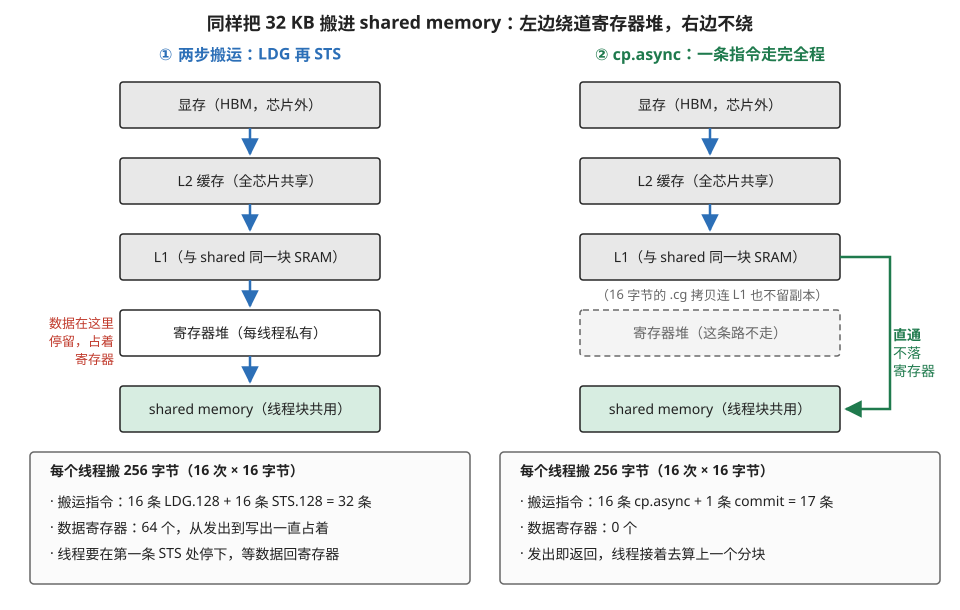
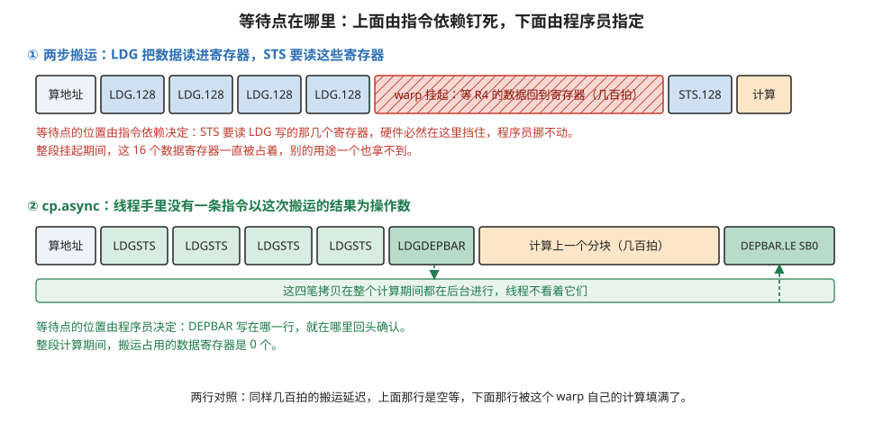
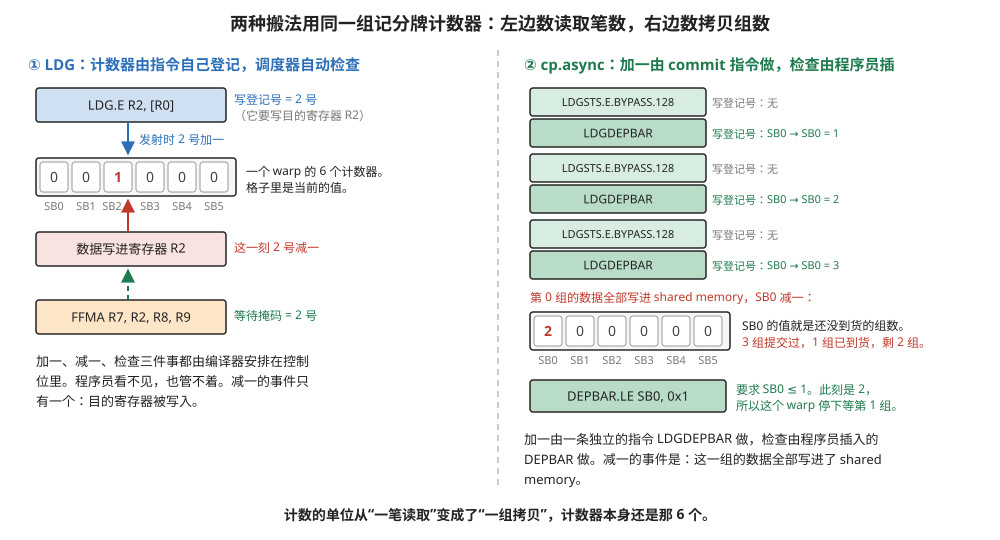
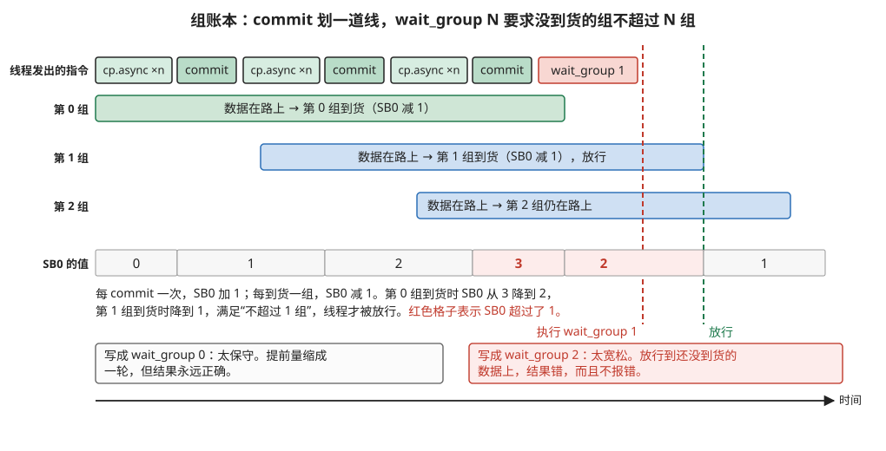
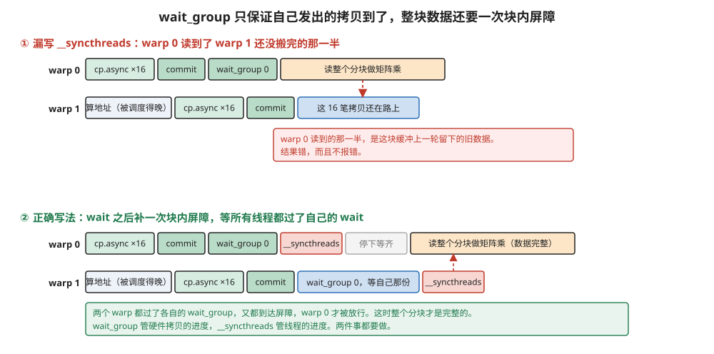
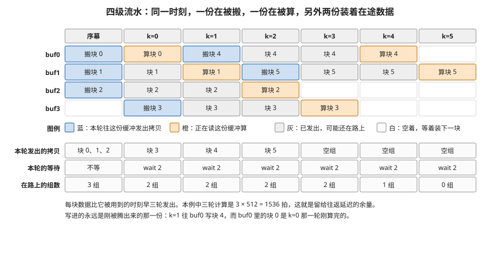
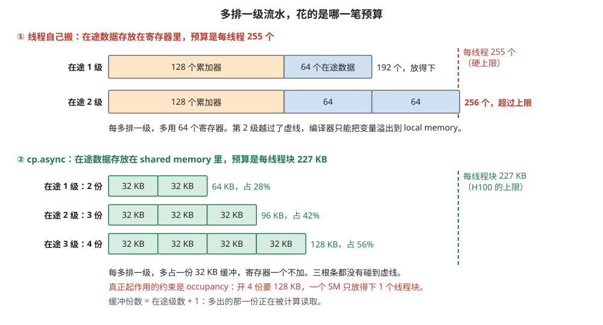
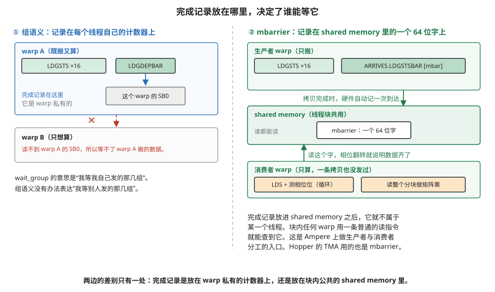

# Ampere：`cp.async`，数据不经过寄存器

> **所属模块**：模块 14 · 数据搬运（第一部分 · GPU 的数据搬运）
> **状态**：🟨 学习中（2026-10 新写。知识截至 2026-09）
> **一句话主旨**：上一节的 `LDG` 只在数据写进目的寄存器时才算完成，所以在途数据必须先占好寄存器。Ampere 新增的 `cp.async` 把完成事件改成"数据写进 shared memory"，数据在途中不落寄存器。完成记录换了一种粗粒度的记法：程序员用 `commit_group` 把若干笔拷贝打成一组，用 `wait_group N` 等到未完成的组不超过 N 个。硬件这一侧用的仍是上一节那套记分牌计数器，只是加一的时刻由 `commit_group` 决定，等待的时刻由程序员决定。在途数据因此改占 shared memory 预算，本例可以开 3～4 份缓冲，让 2～3 块数据同时在路上。三个问题中，它只改了"完成怎么知道"这一个答案。

---

## 0. 这一节要回答的问题

- `cp.async` 和上一节的 `LDG` + `STS` 两步搬运，差别到底在哪一处？省下的是什么？
- 它为什么不能沿用上一节那种"硬件自动挡住下一条指令"的等待方式？
- `commit_group`、`wait_group N`、`wait_all` 各是什么语义？硬件里拿什么东西记这本账？
- 等待的参数写错了会怎样？程序会报错，还是算出一个看着合理的错数？
- 为什么 `wait_group` 之后还要补一次 `__syncthreads()`？
- 在途数据搬进 shared memory 之后，流水能排几级？这个级数由什么决定？
- Ampere 上能不能让一拨 warp 专职搬运、另一拨专职计算？
- `cp.async` 没有改的是哪几件事？它们为什么要等到下一代才有答案？

---

## 1. 基础词汇

本节的例子、单位和缩写集中在这里。上一节解释过的词，这里重新解释一遍。

**线程、warp、SM、线程块**。线程是一条独立的执行流。硬件把 32 个线程编成一组，这一组叫 **warp**，一个 warp 的 32 个线程每次执行同一条指令。**SM**（Streaming Multiprocessor）是 GPU 中一个独立的计算单元，H100 有 132 个。**线程块**是一批线程的集合，一个线程块固定运行在一个 SM 上，块内的线程共用同一块 shared memory，并且可以用屏障互相等待。

**显存、L2、L1、shared memory**。显存是 GPU 芯片旁边的 DRAM 堆叠，H100 上有 80 GB。**L2** 是全芯片 132 个 SM 共用的缓存，容量 50 MB。**L1** 是每个 SM 自己的缓存。**shared memory** 是每个 SM 内部的一块 SRAM，由程序显式管理。L1 和 shared memory 取自同一块 SRAM，由配置决定各占多少。H100 上一个 SM 最多可配 228 KB 给 shared memory，一个线程块最多申请 227 KB（CUDA C++ Programming Guide 表 31）。

**寄存器**。寄存器是紧贴执行单元的一小块存储，每个线程有自己的一组，每个 4 字节。H100 每个 SM 有 65 536 个，每个线程最多用 255 个。

**拍**。一拍是一个 GPU 时钟周期。H100 的时钟约 1.83 GHz，所以一拍约 0.55 纳秒。

**发射（issue）**。warp 调度器每一拍挑一个 warp，把它的下一条指令送进执行单元，这个动作叫发射。同一个 warp 的指令按程序顺序发射：前一条发不出去，后面的也只能等。

**记分牌（scoreboard）**。记分牌是每个 warp 的一组小计数器，从 Maxwell 起每个 warp 有 6 个，SASS 里写作 `SB0`～`SB5`。一条指令可以在控制位中声明"我完成时让几号计数器减一"，另一条指令可以声明"我发射前要等哪几号归零"。上一节讲的就是它。本节会看到 `cp.async` 用的还是这套计数器。

**PTX 与 SASS**。**PTX** 是 NVIDIA 的虚拟汇编语言，在各代硬件上通用。**SASS** 是真正运行在某一代芯片上的机器指令，由 `ptxas` 从 PTX 编译得到。同一件事在两层有两个名字，本节两个都给。

**本模块统一的例子**。全模块的各节都用同一个矩阵乘配置，便于横向对照：

- 输出分块 128 × 128，沿 K 方向每次推进 64。
- 每推进一次，要搬 A 的一个 128 × 64 分块和 B 的一个 128 × 64 分块。
- 元素是 bf16（2 字节），所以每个分块 128 × 64 × 2 = 16 KB，**每推进一次搬 32 KB**。
- 线程块 128 个线程（4 个 warp）。
- H100 上一个 SM 的矩阵单元每拍做 2048 次 bf16 乘加，所以**算完一次推进要 128 × 128 × 64 ÷ 2048 = 512 拍**。
- 实测延迟：shared memory 约 29 拍，L1 命中约 40 拍，L2 命中约 260～470 拍，显存约 480～730 拍（Luo 等 arXiv:2402.13499 测 H800，Liu 等 arXiv:2607.19922 测 H100 SXM5）。

---

## 2. 完成事件从寄存器搬到了 shared memory

上一节的结论是：`LDG` 的完成事件只有一个，就是目的寄存器被写入。所以每一笔在途读取都要事先占好一个寄存器，在途数据和累加器、能驻留的 warp 数共用同一份寄存器预算。本节讲 Ampere 对这一点的改动。三个问题之中，`cp.async` 只改了第三个："完成怎么知道"。谁发起和地址从哪来这两个答案一个字没变。

### 2.1 一条指令同时完成读和写

Ampere（计算能力 8.0，2020）新增了一条 PTX 指令。PTX ISA 手册给出的语法是这样的：

```
cp.async.ca.shared{::cta}.global{.level::cache_hint}{.level::prefetch_size}
                         [dst], [src], cp-size{, src-size}{, cache_policy} ;
cp.async.cg.shared{::cta}.global{.level::cache_hint}{.level::prefetch_size}
                         [dst], [src], 16{, src-size}{, cache_policy} ;
```

按 PTX 的命名法逐段读：

- **`cp`** 是动词，意思是拷贝。在它之前，PTX 里搬数据只有 `ld`（存储 → 寄存器）和 `st`（寄存器 → 存储）两个动词。没有一个动词能表达"存储到存储"。`cp` 填的是这个空。
- **`.async`** 的意思是异步。手册的说法是：这条指令发起拷贝之后，控制权在拷贝完成之前就交回给执行它的线程。
- **`.ca`** 和 **`.cg`** 是缓存策略。`.ca` 表示数据在各级缓存都留副本，包括 L1。`.cg` 表示只在 L2 留副本，不污染 L1。手册写明缓存策略只是性能提示。
- **`.shared`** 是目的地的存储空间，**`.global`** 是源的存储空间。手册写明 `cp.async` 只支持这一个方向。
- **三个操作数**依次是目的地址、源地址、拷贝字节数。

在本机用 CUDA 12.8 的 `ptxas` 编译到 sm_80，再用 `cuobjdump -sass` 反汇编，可以看到它在机器码里的名字：

| PTX | SASS（sm_80） |
| --- | --- |
| `cp.async.ca.shared.global [d],[s],4` | `LDGSTS.E` |
| `cp.async.ca.shared.global [d],[s],8` | `LDGSTS.E.64` |
| `cp.async.ca.shared.global [d],[s],16` | `LDGSTS.E.128` |
| `cp.async.cg.shared.global [d],[s],16` | `LDGSTS.E.BYPASS.128` |
| `cp.async.cg.shared.global.L2::128B [d],[s],16` | `LDGSTS.E.BYPASS.LTC128B.128` |

`LDGSTS` 这个名字就是 `LDG`（load global）加 `STS`（store shared）拼起来的。`.BYPASS` 对应 PTX 的 `.cg`，意思是绕过 L1。`.LTC128B` 对应 `.L2::128B`，这是一个让 L2 多取 128 字节的提示。CUDA C++ Programming Guide 在讲异步拷贝时直接用 `LDGSTS` 称呼这条指令。

图 2-1 把两步搬运和 `cp.async` 的数据路径并排画出来。



> **图 2-1**　一句话：同样把 32 KB 数据搬进 shared memory，两步搬运要让数据在寄存器里停一段时间，`cp.async` 让数据从显存一路直接落进 shared memory。寄存器完全不参与。
>
> **先知道一件事**：寄存器是每个线程私有的一小格存储，每格 4 字节。计算指令只能读写寄存器，所以数据进寄存器本身不是坏事。坏在数量：一个线程最多只有 255 个寄存器，这些格子既要放搬运中转的数据，又要放矩阵乘的累加结果。两边用的是同一份预算。
>
> **按这个顺序看**：
> 1. 从上往下是数据要走的路。两边前三格完全一样：显存（芯片外那几十 GB 的大容量存储）、L2 缓存（全芯片共用的中转缓存）、L1（每个 SM 自己的缓存，和 shared memory 取自同一块 SRAM）。
> 2. 看左边第四格"寄存器堆"。两步搬运里，数据必须先落进某个线程的寄存器，才能再被写进 shared memory。左侧红字标出代价：这段时间里这 64 个寄存器被占着，别的用途一个也拿不到。
> 3. 看右边同一个位置。方框画成灰色虚线，写着"这条路不走"。右侧那条绿色折线是 `cp.async` 实际走的路，它从 L1 这一层直接拐进 shared memory。
> 4. 最后看下面两个账本。同样是每线程搬 256 字节：左边 32 条访存指令、64 个数据寄存器、线程要在搬运中途停下等；右边 17 条指令、0 个数据寄存器、发出即返回。
>
> **看懂的标志**：能回答"省下寄存器这件事对矩阵乘为什么特别值钱"。矩阵乘的累加结果要一直留在寄存器里，本例中每个线程要用 128 个。搬运再来抢 64 个，一个线程就用掉 192 个，离 255 的上限只剩 63 个，地址、循环变量和操作数片段都要从这 63 个里分。搬运不占寄存器，这份预算就全归累加器和 occupancy。
>
> **与正文的对照**：32 KB、128 个线程、每线程 256 字节都取自 §1 的统一例子。64 个数据寄存器是上一节算出的一级在途数据量。
>
> 来源：本库自绘。

### 2.2 三种大小，以及 `.cg` 为什么只配 16 字节

手册把这条指令的约束写得很死，下面逐条解释，并给出本机的验证结果。

**一、拷贝大小只能是 4、8、16 字节。** 手册原文是 "`cp-size` can only be 4, 8 and 16"。想搬 12 字节，只能拆成 8 + 4 两条指令。

**二、`.cg` 只能配 16 字节。** 看 §2.1 抄下来的语法：`.ca` 那一行第三个操作数写的是 `cp-size`，`.cg` 那一行直接写死了字面量 `16`。本机验证了这条约束确实由汇编器强制执行。把 `cp.async.cg.shared.global [d],[s],4` 喂给 `ptxas -arch=sm_80`，它报的错是：

```
error : Argument 2 of instruction 'cp.async': unexpected value '4', expected to be 16
```

CUDA C++ Programming Guide 给出了这条不对称的原因，它从硬件的两种模式讲起：拷贝 4 字节或 8 字节时，`LDGSTS` 总是走 L1 ACCESS 模式，数据同时在 L1 留一份副本；只有拷贝 16 字节才能启用 L1 BYPASS 模式，这种模式下 L1 不被污染。而 `.cg` 的含义正是"不在 L1 留副本"，也就是 BYPASS 模式。所以 `.cg` 只能配 16 字节。实践上的结论很简单：16 字节的拷贝优先用 `.cg`，4 字节和 8 字节的只能用 `.ca`。

**三、地址必须对齐到拷贝大小。** 编程指南写明：指针要按拷贝的字节数对齐，4 字节的拷贝对齐到 4，16 字节的拷贝对齐到 16。它还补了一句：源和目的都对齐到 128 字节时性能最好。这条约束在实践中常常拦路。如果矩阵的行宽不是 8 个 bf16 的整数倍，每一行的起点就对不齐 16 字节，16 字节的拷贝用不了。本节 §6.5 给出一个真实的例子：Triton 在拿不到对齐保证时，连 `cp.async` 都不生成。

**四、两条 `cp.async` 之间没有顺序保证。** 手册说它是内存一致性模型里的弱操作，除非用 `wait_group`、`wait_all` 或 mbarrier 显式同步，否则两条 `cp.async` 之间没有任何顺序。由此可以推出：如果同一组里的两条 `cp.async` 写同一个地址，最后留下哪一笔的数据没有保证。手册没有单独写这一条，它是从"没有顺序保证"推出来的。

拷贝大小之外还有两个可选操作数，分别叫 `src-size` 和 `ignore-src`，它们都是用来处理越界的：`src-size` 让硬件只搬前几个字节、其余补零，`ignore-src` 让硬件整条填零。这两个操作数属于"搬运途中顺手做的事"，归本模块第 12 节讲，本节只点名。本机验证了带 `src-size` 的 `cp.async` 在 SASS 里多一个 `.ZFILL` 修饰符，形态是 `LDGSTS.E.BYPASS.128.ZFILL`。

### 2.3 同一次推进的第二本账

上一节给线程自己搬算过一笔账。现在用同一个配置算第二笔，两笔并排看。每推进一次搬 32 KB，128 个线程分，每人 256 字节，每次 16 字节，所以每个线程发 16 条。

| 项目 | 两步搬运（上一节） | `cp.async`（本节） |
| --- | --- | --- |
| 参与搬运的线程 | 128 个 | 128 个，一个没少 |
| 每线程的搬运指令 | 16 条 `LDG.128` + 16 条 `STS.128` = 32 条 | 16 条 `cp.async` + 1 条 `commit_group` = 17 条 |
| 每线程的地址算术 | 每次读取前一两条 | 每次读取前一两条，一条没减 |
| 按 warp 计的发射次数 | 128 次 | 68 次 |
| 一级在途数据占的寄存器 | 每线程 64 个，从发出到写出一直占着 | 0 个 |
| 一级在途数据占的 shared memory | 0 | 32 KB |
| 线程停在哪里 | 停在第一条 `STS` 处，由记分牌挡住 | 不停，停在程序员自己选的等待点 |

这张表里最该盯住的是两行。一行是"地址算术一条没减"：`cp.async` 完全没有碰地址生成这件事，每个线程还是自己算自己那份的地址。另一行是数据寄存器从 64 个变成 0 个。最后一行是本节第 3 部分的主题。

---

## 3. 等待点从硬件决定变成程序员指定

数据不经过寄存器，带来一个必须回答的问题：要用这些数据的指令，怎么知道数据已经到了。

### 3.1 `LDG` 的等待点由指令依赖决定

先看上一节的情形。一条 `LDG` 把数据读进寄存器 R2，后面的 `STS` 要把 R2 写进 shared memory。编译器在 `LDG` 的控制位里填"登记到 2 号计数器"，在 `STS` 的控制位里填"等待 2 号计数器"。调度器每一拍检查，2 号不为零就不选这个 warp。

这个等待点的位置不是程序员选的，而是指令依赖决定的。`STS` 要读那几个寄存器，硬件就必须在那里把 warp 挡住。程序员没有任何办法把它往后挪，因为挪了就没有人往 shared memory 里写数据。上一节的走查里，一个 warp 为了等一笔显存读取挂起了 475 拍。

### 3.2 `cp.async` 之后，没有一条指令依赖这次搬运

`cp.async` 把"写进 shared memory"也交给了硬件。于是这个线程手里再没有任何一条指令以这次搬运的结果为操作数。它可以发完 16 条 `cp.async`，立刻转去做上一个分块的矩阵乘，算几百拍之后再回头确认数据到了没有。

**所以等待点变成了程序员指定的位置。** 这句话是本节的主线。`cp.async` 省下的不只是寄存器，它还把"在哪里等"这个决定从硬件手里交到了写代码的人手里。

这带来了一种新的掩盖延迟的方式。上一节讲过第一种：一个 warp 停下来等的时候，调度器发射同一个 SM 上其它 warp 的指令，用别人的计算盖住这个 warp 的等待。`cp.async` 提供第二种：同一个 warp 发完拷贝之后接着算上一块，用自己的计算盖住自己的搬运。两种方式可以同时用。

图 2-2 把两种写法的指令流并排画出来。



> **图 2-2**　一句话：两步搬运里，线程被挡在搬运的中间等数据，位置由指令依赖决定。`cp.async` 之后没有指令依赖这次搬运，所以等待点挪到了程序员写 `wait_group` 的那一行。
>
> **先知道一件事**：一个 warp 是 32 个一起行动的线程，它们执行同一条指令流。图里每个方块是一条指令或一簇指令，从左往右按执行顺序排。方块的宽度是为了写得下字，不代表耗时。唯一按耗时画的是那块斜线区，它代表 warp 挂起、不能发射指令的几百拍。
>
> **按这个顺序看**：
> 1. 上面一行是两步搬运。前四个蓝框是四条 `LDG.128`，各把 16 字节读进四个寄存器。发出之后 warp 还能往下走几条。
> 2. 走到斜线区就走不动了。下一条 `STS.128` 要读 R4 里的值，而 R4 的数据还在路上。记分牌挡住这个 warp，时长是几百拍。
> 3. 斜线区右边才是 `STS.128` 和计算指令。图里只画了一条 `STS.128`，它代表与四条 `LDG.128` 对应的四条写入。红字那句是代价：整个斜线区里，16 个寄存器被占着。
> 4. 下面一行是 `cp.async`。四条 `LDGSTS` 发完，接一条 `LDGDEPBAR`（它是 `commit_group` 的机器码形态，第 4 部分细讲），然后直接进入橙色的计算块。算的是上一个分块的矩阵乘。
> 5. 横跨下方的长条说明了关键：这四笔拷贝在整个计算期间都在后台走。直到最右边的 `DEPBAR` 才回头确认。
> 6. 两行对照：同样几百拍的搬运延迟，上面那行 warp 处于挂起状态，下面那行被这个 warp 自己的计算填满了。
>
> **打个比方**：两步搬运像点了外卖就守在门口等，等到了才能做别的事。`cp.async` 像点完外卖接着干活，快到饭点了再去开门。
>
> **看懂的标志**：能回答"为什么说 `cp.async` 把等待点交还给了程序员"。两步搬运里 `STS` 要读那几个寄存器，硬件必然在那里挡住，位置由不得人。`cp.async` 之后线程手里没有任何指令依赖这次搬运，所以在哪里回头确认，完全由代码里 `wait_group` 写在哪一行决定。
>
> **与正文的对照**：为了画得下，图里每行只画 4 条搬运指令。统一例子中每个线程实际发 16 条。指令名取自 §2.1 和 §4.4 的本机反汇编。
>
> 来源：本库自绘。

### 3.3 记分牌还是那套计数器，只是加一的人换了

既然等待点由程序员指定，那么硬件这一侧拿什么东西记账。一种常见的说法是"记分牌管不了 `cp.async`"，理由是记分牌按寄存器记账，而 `cp.async` 没有目的寄存器。这个说法里的理由对，结论错。

把 §4 要讲的那套指令编译成 sm_80 的机器码，再把每条指令的控制位解出来，就能看清楚硬件到底在哪里记账。方法是：手写一段 PTX，发三组 `cp.async`，用 `cp.async.wait_group 1` 等待；用 `ptxas -arch=sm_80` 汇编，用 `cuobjdump -sass` 反汇编；再按公开的逆向研究（Jia 等对 Volta 的微基准分析，arXiv:1804.06826）给出的控制位布局，解出每条指令的停顿计数、写登记号、读登记号和等待掩码。

解码结果有一个旁证：`S2R` 的写登记号是 1 号，后面用它结果的 `IMAD.WIDE` 等待掩码正好是 1 号。所有这类配对都对得上，说明布局解对了。下面是解出来的主要几行：

| 地址 | 指令 | 写登记号 | 读登记号 | 等待掩码 |
| --- | --- | --- | --- | --- |
| 0x0070 | `LDGSTS.E.BYPASS.128 [R9], [R2.64]` | 无 | SB1 | 无 |
| 0x00b0 | `LDGDEPBAR` | **SB0** | 无 | 无 |
| 0x00c0 | `LDGSTS.E.BYPASS.128 [R9+0x400], [R4.64]` | 无 | SB2 | 无 |
| 0x00f0 | `LDGDEPBAR` | **SB0** | 无 | 无 |
| 0x0100 | `LDGSTS.E.BYPASS.128 [R9+0x800], [R6.64]` | 无 | 无 | 无 |
| 0x0110 | `LDGDEPBAR` | **SB0** | 无 | 无 |
| 0x0120 | `DEPBAR.LE SB0, 0x1` | 无 | 无 | 无 |

这张表给出三件事。

**第一，`LDGSTS` 自己不登记任何计数器的减一事件。** 它的写登记号是"无"。这和上一节的 `LDG` 正相反：`LDG` 必须登记一个号，因为它要写一个目的寄存器。`LDGSTS` 没有目的寄存器，所以没有写登记号。

**第二，`LDGSTS` 仍然登记了一个读登记号。** 前两条的读登记号分别是 SB1 和 SB2。读登记号的含义上一节讲过：它记的是"这条指令已经把源寄存器读走了"。`LDGSTS` 的源寄存器是地址寄存器 R2 和 R4。后面要覆盖这两个寄存器的指令，必须等对应的计数器归零。第三条没有读登记号，因为它的地址寄存器 R6 之后没有被覆盖。

**第三，在 SB0 上加一的是 `LDGDEPBAR`，不是 `LDGSTS`。** 三条 `LDGDEPBAR` 的写登记号全是 SB0。`LDGDEPBAR` 正是 `cp.async.commit_group` 的机器码形态。最后一条 `DEPBAR.LE SB0, 0x1` 是 `cp.async.wait_group 1` 的机器码形态，它的含义是"等到 SB0 的值不超过 1"。

**所以这套记账是这样工作的**：每执行一次 `commit_group`，SB0 加一。按 PTX 手册的语义反推，SB0 减一的事件是"这一组里的全部数据都写进了 shared memory"。SB0 的值因此等于"还没到货的组数"。`DEPBAR.LE SB0, N` 让这个 warp 等到这个数不超过 N。

**用的还是上一节那 6 个计数器，只是计数的单位从"一笔读取"变成了"一组拷贝"。** 这就是上一节说"`cp.async` 用的也是这种计数器"的确切含义。它和 `LDG` 的差别不在于精细程度，而在于三处：加一的时刻由 `commit_group` 这条独立的指令决定，减一的事件是数据写进 shared memory 而不是写进寄存器，检查的时刻由程序员插入的 `DEPBAR` 决定而不是由编译器填在下一条指令的等待掩码里。



> **图 2-3**　一句话：两种搬法用的是同一组计数器。左边数的是"还没回来的读取笔数"，右边数的是"还没到货的拷贝组数"。
>
> **先知道一件事**：每个 warp 在硬件里有 6 个小计数器，编号 0 到 5。一条指令可以让某个计数器加一，另一个事件可以让它减一，第三条指令可以等它归零。计数器本身不记录"等的是什么"，由哪种事件触发加减，完全取决于登记它的是什么指令。
>
> **按这个顺序看**：
> 1. 先看左边。`LDG` 发射的同一拍，2 号计数器从 0 变成 1。几百拍后数据写进寄存器 R2，2 号计数器减回 0。下方的 `FFMA` 要用 R2，它的控制位里写着"等待 2 号"。调度器每拍检查，不为零就不选这个 warp。这里的加一、减一、检查，三件事都由编译器安排好，程序员看不见。
> 2. 再看右边。三条 `LDGSTS` 排在上面，它们的写登记号一栏都是"无"，所以它们自己不碰任何计数器。
> 3. 看每条 `LDGSTS` 后面那条 `LDGDEPBAR`。它的写登记号是 0 号，所以每执行一次，SB0 就加一。图中 SB0 的值依次变成 1、2、3。
> 4. 看右上方的虚线箭头。一组的全部数据都写进 shared memory 时，SB0 减一。图里第 0 组已经到货，所以 SB0 从 3 降到 2。
> 5. 最下面是 `DEPBAR.LE SB0, 0x1`。它的要求是 SB0 不超过 1。此刻 SB0 是 2，所以这个 warp 停在这里，等第 1 组也到货。
>
> **看懂的标志**：能回答"为什么硬件不记录哪一笔拷贝已经到货"。本例中一个线程每轮发 16 笔拷贝，3 块数据同时在路上时就有 48 笔。如果每笔都单独记录，就要给每笔配一个标志，还要有指令去逐笔查询。SB0 只是一个计数器，它只记"还有几组没到"。哪几笔算一组，由程序员用 `commit_group` 决定。写代码的人本来就知道自己的流水线是怎么分段的。
>
> **与正文的对照**：右边的指令名、写登记号和 `DEPBAR` 的参数，全部取自 §3.3 的本机反汇编。SB0 减一的时刻没有办法直接观察，它是按 PTX 手册的语义反推的。
>
> 来源：本库自绘。

---

## 4. 组账本：`commit_group` 与 `wait_group`

### 4.1 三条指令的准确语义

PTX 手册对这三条指令的描述很短，但每一句都要读准。

**`cp.async.commit_group;`** 手册说：它为执行它的线程创建一个新的 cp.async-group，把该线程此前发出、还没有提交到任何组里的全部 `cp.async` 打包进这个新组。两个细节要记住：

- **组是每个线程各记一本的，不是 warp 级，也不是块级。**
- **如果没有未提交的拷贝，`commit_group` 创建一个空组。** 手册说空组被认为平凡地已完成。这条规则在流水线的尾声有用，§6 会用到。

**`cp.async.wait_group N;`** 手册说：它让执行它的线程等待，直到最近提交的 cp.async-group 中未完成的只剩 N 个或更少，并且此前提交的所有组都已完成。N 必须是编译期常量。

这句话要精确地记住：**N 是"允许还在路上的组数"，不是"要等几组"。** `wait_group 0` 是等全部到齐。

**`cp.async.wait_all;`** 手册给出的定义是它完全等价于下面两条：

```
cp.async.commit_group;
cp.async.wait_group 0;
```

本机验证了这条等价关系确实体现在机器码里。把 `cp.async.wait_all` 编译到 sm_80，`ptxas` 生成的是一条 `LDGDEPBAR` 加一条 `DEPBAR.LE SB0, 0x0`，与手册的定义逐条对应。

还有一条规则是 §5 的主题。手册说，`cp.async` 写进去的数据，只有在下面三件事之一发生之后才可见：执行它的线程完成了 `wait_all`；执行它的线程完成了这一组的 `wait_group`；或者一个追踪这次拷贝的 mbarrier 上的等待返回了真。请注意主语：**是执行这条指令的那个线程**，不是别的线程。

### 4.2 走查：三组在路上时，`wait_group 1` 放行了谁

PTX 手册自己给了一个三组的例子，把它逐步跟一遍。一个线程依次做了这些事：

| 步 | 指令 | 这本账上发生了什么 | SB0 |
| --- | --- | --- | --- |
| 1 | `cp.async` 若干条（搬块 0） | 这些拷贝发出，还没归属任何组 | 0 |
| 2 | `cp.async.commit_group` | 这些拷贝被打包成第 0 组 | 1 |
| 3 | `cp.async` 若干条（搬块 1） | 又一批发出，未归组 | 1 |
| 4 | `cp.async.commit_group` | 打包成第 1 组 | 2 |
| 5 | `cp.async` 若干条（搬块 2） | 又一批发出，未归组 | 2 |
| 6 | `cp.async.commit_group` | 打包成第 2 组 | 3 |
| 7 | `cp.async.wait_group 1` | 线程停在这里，直到 SB0 降到 1 | 等到 1 |

第 7 步什么时候放行。SB0 不超过 1 的意思是：第 0 组和第 1 组都必须已经完成，只有最新的第 2 组允许还在路上。手册的例子把三组编号为 1、2、3，它在 `wait_group 1` 后面写的注释是 "waits for group 1 and group 2 to complete"。换成本表的编号，就是等第 0 组和第 1 组，也就是前两个提交的组。

这里有一个容易弄反的地方。日常写多级流水时，`wait_group 1` 的意图通常是"只等最老的那一组"。两种读法在这个例子里结论不同，原因是此刻账上挂着三组而不是两组。**`wait_group N` 按"总共还剩几组没到"判定，不按"等第几组"判定。** 所以它实际等的组数取决于执行到这一行时账上挂了几组。正确的用法是让代码里"在路上的组数"每一轮都相同：每轮发一组，等一次。这样 N 才有稳定的含义，§6 的骨架就是这样写的。



> **图 2-4**　一句话：`commit_group` 在账上划一道线，把刚才发出的几笔拷贝打成一组。`wait_group N` 让线程停下，直到还没到货的组不超过 N 个。
>
> **先知道一件事**：`cp.async` 发出后没有返回值，硬件也不记录哪个字节到了。它只数组：程序员用 `commit_group` 说明哪几笔算一组，硬件维护一个"还有几组没到货"的计数，这个计数就是 SB0。这本账每个线程各记一本。
>
> **按这个顺序看**：
> 1. 最上面一行是这个线程发出的指令，从左往右按顺序。每发出一批 `cp.async`，就跟一条 `commit`，把这一批封成一组。
> 2. 中间三条横条是三组数据各自在路上的时间。第 0 组最早发出，在等待点之前已经到货，所以画成绿色。第 1 组和第 2 组发得晚，执行等待时还在路上，画成蓝色。
> 3. 红色竖虚线是 `wait_group 1` 执行的时刻。它的要求是还没到货的组不超过 1 组。此刻第 1 组和第 2 组都没到，共 2 组，不满足，所以线程停在这里。绿色竖虚线是第 1 组到货、线程被放行的时刻。
> 4. 最下面一行是 SB0 的值。每 `commit` 一次加 1，依次是 1、2、3。第 0 组到货时减 1，变成 2。第 1 组到货时再减 1，变成 1，这时才满足条件。红色的格子表示 SB0 超过了 `wait_group 1` 允许的额度。
> 5. 最下方的两个框给出两种写错的后果，两种都不报错。写 0 太保守，线程要等到第 2 组也到货，提前量缩小，但结果正确。写 2 太宽松，线程会读到还没到货的数据。
>
> **打个比方**：按批下单，每批下完记一个批次号。取件时说的不是"我要第 3 批"，而是"我手上没取的批次不能超过 1 批"。所以究竟等到哪一批，取决于当时挂着几批没取。
>
> **看懂的标志**：能回答"忘了写 `commit_group` 会怎样"。那些拷贝没有被打进任何一组，SB0 的值是 0，`wait_group 1` 一看已经满足条件，立刻放行。线程接着就去读还没搬完的数据，结果错，而且不报错。
>
> **与正文的对照**：三组的发出时刻和到货时刻都是示意，实际取决于显存当时的排队情况。指令序列取自 PTX ISA 手册 `cp.async.wait_group` 条目下的例子。
>
> 来源：本库自绘。

### 4.3 等错了组，读到的具体是什么

这个问题值得单独回答，因为答案比"数据是错的"要具体，也更有诊断价值。

假设一个四级流水的矩阵乘，shared memory 里有 buf0 到 buf3 四份缓冲轮流用，主循环的第 k 轮读 buf[k % 4]。程序员把 `wait_group 2` 误写成了 `wait_group 3`，多允许了一组在路上。

于是在第 k 轮，第 k 块的那一组可能还没到货，线程就去读 buf[k % 4] 了。它读到的不是随机噪声，也不是零。**它读到的是 buf[k % 4] 上一次被用到时装的内容，也就是第 k−4 块的数据**，或者是这块缓冲被第 k 块的拷贝写了一部分、还剩一部分是旧值的混合体。

这带来两个后果。

1. **程序不会崩溃。** shared memory 那块地址是合法的、可读的，读出来是合法的浮点数。程序一路算到底，输出一个数值合理但错误的结果，不报任何错。
2. **误差往往不大。** 矩阵乘的 K 循环是累加，错一块相当于把某一段 K 的贡献换成了另一段。结果通常还在同一个数量级上，在 bf16 的容差范围内甚至可能看起来是对的。

这类错误的特征是时有时无。显存排队快的时候数据碰巧到了，就算对了；慢的时候就错。换一块卡、换一个矩阵尺寸，甚至换一次运行，都可能改变表现。

反过来把 `wait_group 2` 写成 `wait_group 0` 呢。结果永远正确，只是提前量变小。每一轮都要等到所有已发出的拷贝全部到货才开算，于是只有本轮之前发出的那一组计算时间可以用来掩盖延迟。这里要说清一件事：**`wait_group 0` 并不等于没有重叠。** 标准的双缓冲写法本来就用 `wait_group 0`，它在算第 k 块之前等第 k 块到货，而第 k 块是在算第 k−1 块之前发出的，所以搬运和一整轮计算仍然重叠。写成 0 的真实代价是提前量从三轮缩成一轮：本例中一轮计算是 512 拍，盖得住 L2 命中的 470 拍，盖不住显存往返的 730 拍。

这个结论依赖 §6.1 骨架里的顺序：每轮先等待，再发出新的一组。如果把顺序换成先发出新的一组、再等待（CUTLASS 就是这样排的，见 §6.3），那么 `wait_group 0` 会把刚发出的那一组也一起等完。这时新的一组只能和它发出之后、等待之前的那一段计算重叠，提前量不到一轮。所以判断 N 写得对不对，要同时看等待写在提交之前还是之后。

---

## 5. `wait` 只覆盖自己发出的拷贝

回到 §4.1 抄下来的那句手册原文：`cp.async` 写入的数据，只有在执行这条 `cp.async` 的那个线程完成等待之后，才对它可见。

这句话里有一个容易漏掉的限定。本节的分块是由 128 个线程合力搬进来的，每人搬 256 字节。线程 0 执行 `wait_group` 之后，能保证的只是它自己那 256 字节到位了。线程 37 搬的那 256 字节到了没有，它一无所知。

而计算的时候，线程 0 要读的绝不只是自己搬的那 256 字节。矩阵乘里每个线程读的是分块里横跨很多行列的一片数据，几乎必然包含别的线程搬来的部分。

**所以正确的模式恒定是两步：**

```cuda
cp_async_wait<N>();   // 第一步：确保我自己发出的拷贝完成了
__syncthreads();      // 第二步：确保块内所有线程都做完了第一步
// 到这里，整个分块才真正可用
```

CUDA C++ Programming Guide 把这条写成了一句明确的要求：默认情况下，每个线程只等待它自己的 `LDGSTS` 拷贝；所以如果用 `LDGSTS` 预取的数据要和其它线程共享，在和完成机制同步之后还需要一次 `__syncthreads()`。

`__syncthreads()` 在这里做了两件事。一是等齐：块内所有线程都执行到了这一行，也就是所有人都过了自己的等待。二是附带一个块级的内存栅栏，保证屏障之前的写入对屏障之后的所有线程可见。两件事都需要。

下面把漏写屏障的后果逐步走一遍。设线程块有 4 个 warp，warp 0 跑得快，warp 1 被调度得晚：

| 时刻 | warp 0 | warp 1 | shared memory 里 warp 1 负责的那部分 |
| --- | --- | --- | --- |
| t1 | 发出 16 条 `cp.async` | 还在算地址 | 旧数据 |
| t2 | 执行 `commit_group`，SB0 加一 | 发出 16 条 `cp.async` | 旧数据 |
| t3 | 执行 `wait_group 0`，自己那份到货 | 执行 `commit_group` | 旧数据，拷贝刚上路 |
| t4 | **开始读整个分块做矩阵乘** | 数据还在路上 | **旧数据，被 warp 0 读走了** |
| t5 | 已经把错数算进累加器 | 自己那份到货 | 新数据，来晚了 |

补上 `__syncthreads()` 之后，warp 0 在 t3 之后停在屏障处，直到 warp 1 也执行完自己的等待并到达屏障。两个 warp 都过了屏障，整个分块才是完整的。



> **图 2-5**　一句话：`wait_group` 只保证自己发出的那几笔拷贝到了。一个分块是全体线程合搬的，所以还要一次块内屏障，把"别人搬的那部分也到了"补上。
>
> **先知道一件事**：一个线程块里的几个 warp 是各自被调度的，谁先跑到哪一行没有保证。所以"我已经搬完了"和"大家都搬完了"是两件事。
>
> **按这个顺序看**：
> 1. 上面板是漏写屏障的情形。warp 0 一路顺畅：发出拷贝、`commit` 打包、`wait_group 0` 等自己那份到货，然后直接去读整个分块。
> 2. 看 warp 1 那一行。它被调度得晚，warp 0 已经在等的时候它还在算地址。等它发出拷贝、打包完，warp 0 早就开始读了。
> 3. 看红框那句话。warp 0 读到的那半块，warp 1 还没搬完。读出来的是这块缓冲上一轮留下的旧数据。
> 4. 下面板是正确写法。warp 0 在 `wait_group` 之后多了一格 `__syncthreads`。块内屏障的含义是：先到的线程停下来等，直到块内所有线程都到达这一行。
> 5. 看 warp 1 在下面板的那一行。只有两个 warp 都过了各自的等待、又都到了屏障，warp 0 才被放行去读整个分块。这时整块数据才是完整的。
>
> **打个比方**：几个人合搬一车货进仓库。确认自己那几箱已经卸完，不等于整车都卸完了。要在门口立一条"都卸完了才开门"的规矩，才能进去清点。
>
> **看懂的标志**：能回答"为什么不能只写 `__syncthreads` 而省掉 `wait_group`"。屏障只管"大家都执行到了这一行"，它不知道后台的拷贝硬件干到哪了。两件事管的对象不同：`wait_group` 管硬件拷贝的进度，屏障管线程的进度。
>
> **与正文的对照**：图里 warp 1 比 warp 0 慢是示意。实际哪个 warp 快，每次运行都可能不同。这正是这类错误时有时无的原因。
>
> 来源：本库自绘。

还有一个相关的坑，它来自硬件实现而不是指令语义。CUDA C++ Programming Guide 在讲流水线时（第 4.11.4 节 Warp Entanglement）写明：流水线机制由同一个 warp 内的线程共享。具体是这样：提交操作会被合并，如果整个 warp 收敛，warp 共享的那个批次序号只加 1；如果 warp 完全发散，32 个线程各自执行提交，序号加 32。而每个线程自己感知到的序号还是只加了 1。

后果出在等待上。等待比对的是硬件那个 warp 共享的序号。线程感知的序号小于实际序号时，这个线程会多等，等到比它本意更晚的那些批次。编程指南给的极端例子是：一个完全发散的 warp 里，每个线程可能都在等全部 32 批。

编程指南给出的规则因此很简单：提交操作要在收敛的线程上执行。前面的代码让线程发散了，就在提交之前用 `__syncwarp()` 把 warp 重新收敛起来。要注意的是提交这一条，不是 `cp.async` 本身。把 `cp.async` 写在分支里本身不触发这个问题，把 `commit_group` 写在分支里才会。

---

## 6. 多级流水：在途数据住进 shared memory

### 6.1 骨架

把前面的零件拼起来。软件流水的目标是：算第 k 块的同时，第 k+1、k+2 块的搬运已经在路上。改写后的循环恒定是三段：

```
N = 4                                   // shared memory 里开几份缓冲

// ── 序幕：先把前 N-1 块发出去，一块都不等 ──
for s in 0 .. N-2:                      // s = 0, 1, 2
    对块 s 发出 16 条 cp.async，写进 buf[s]
    cp.async.commit_group               // 打包成第 s 组
// 此刻账上挂着 3 组，一组都没等

// ── 主循环 ──
for k in 0 .. K-1:
    cp.async.wait_group (N-2)           // = wait_group 2：允许 2 组在路上
    __syncthreads()                     // 补上"别人搬的那份也到了"
    if k + N-1 < K:
        对块 k+N-1 发出 16 条 cp.async，写进 buf[(k+N-1) % N]
    cp.async.commit_group               // 尾声没东西可搬也提交一个空组
    用 buf[k % N] 做矩阵乘
```

**`wait_group` 的参数为什么是 N−2。** 主循环每一轮开头，账上挂着的是块 k 到块 k+N−2 这 N−1 组。序幕发了 N−1 组，之后每轮发一组、消化一组，数量恒定。要让块 k 那一组确保到货，就得让未到货的组数不超过 N−2。N=4 时是 `wait_group 2`。

**尾声为什么还要提交空组。** 最后几轮没有数据要搬，但还是发一条 `commit_group`。原因是 `wait_group 2` 数的是账上还剩几组。这几轮如果不提交，账上的组数就和前面几轮对不上，`wait_group 2` 的含义会悄悄改变。手册说空组被认为平凡地已完成，所以提交空组是最省事的对齐办法。

### 6.2 逐轮走查

设 K 方向一共 6 块，N = 4，四份缓冲 buf0 到 buf3。逐轮跟一遍：

| 阶段 | 等待 | 本轮发出的拷贝 | 写进哪份缓冲 | 本轮计算 | 读哪份缓冲 | 等待结束时在路上的组 |
| --- | --- | --- | --- | --- | --- | --- |
| 序幕 | 不等 | 块 0、1、2 | buf0、buf1、buf2 | 无 | 无 | 3 组 |
| k=0 | `wait_group 2` → 块 0 到 | 块 3 | buf3 | 块 0 | buf0 | 块 1、块 2 |
| k=1 | `wait_group 2` → 块 1 到 | 块 4 | buf0 | 块 1 | buf1 | 块 2、块 3 |
| k=2 | `wait_group 2` → 块 2 到 | 块 5 | buf1 | 块 2 | buf2 | 块 3、块 4 |
| k=3 | `wait_group 2` → 块 3 到 | 空组 | 无 | 块 3 | buf3 | 块 4、块 5 |
| k=4 | `wait_group 2` → 块 4 到 | 空组 | 无 | 块 4 | buf0 | 块 5 |
| k=5 | `wait_group 2` → 块 5 到 | 空组 | 无 | 块 5 | buf1 | 无 |

几处值得停下来看。

- **每块数据比它被用到的时刻早三轮发出。** 块 3 在 k=0 发出、在 k=3 用。这个提前量是 N−1 = 3 轮的计算时间，本例中是 3 × 512 = 1536 拍。它要足够盖住一次往返。
- **任何一轮里都有两组在路上。** 这正是 `wait_group 2` 允许的数量。
- **写进的是刚被腾出来的那一份。** k=1 往 buf0 里写块 4，而 buf0 里的块 0 是 k=0 那一轮刚算完的。写入方和读取方永远差 N−1 = 3 个身位，所以流水线不需要额外的锁。



> **图 2-6**　一句话：四级流水的主循环里，四份片上缓冲轮流扮演"正在被搬"和"正在被算"两个角色。每一轮都是等一组到货、发一组新的、算一块旧的。
>
> **先知道一件事**：shared memory 里开四份同样大小的缓冲，是为了让"往里写"和"从里读"不撞车。同一时刻，有一份正在被计算读，其余三份装着已经发出、还没轮到计算的块。这三块中，最新的一块是本轮刚发出的，另外两块可能已经到货，也可能还在路上。
>
> **按这个顺序看**：
> 1. 最上面一行是时间。先是序幕，然后是主循环的第 0 到第 5 轮。
> 2. 中间四行是四份缓冲。蓝格表示这一轮往这份缓冲发出了拷贝，橙格表示这一轮正在读这份缓冲做矩阵乘，灰格表示这份缓冲的拷贝早已发出、还没轮到计算。灰格里的数据不一定已经到货：`wait_group 2` 只保证本轮要算的那一块到了。
> 3. 先横着看 buf0 那一行。序幕里搬块 0，k=0 算块 0，k=1 就开始往里搬块 4，到 k=4 才算块 4。搬和算之间隔了三轮，这三轮的计算时间就是留给往返延迟的余量。
> 4. 再竖着看 k=1 这一列。buf1 是橙色，正在算块 1。buf0 是蓝色，正在搬块 4。搬和算同时发生，这就是流水。
> 5. 下面三行是每一轮的动作。"本轮发出的拷贝"那行可以看出规律：每轮发一块，发的是往后数第 3 块。最后三轮没东西可发，还是提交一个空组占位，好让计数对齐。
> 6. 最后一行是等待结束时还在路上的组数。它恒定是 2，正是 `wait_group 2` 允许的额度。
>
> **看懂的标志**：能回答"为什么开四份而不是两份"。开两份时，发出去的拷贝只比它被用到早一轮，也就是只有 512 拍的计算时间来掩盖往返。开四份时提前量变成三轮，1536 拍。份数比提前量多一份，多出的那一份正在被计算读。
>
> **与正文的对照**：表格与 §6.2 的走查表逐格对应。为了画得下，图里只列到 k=5，也就是 K 方向共 6 块。
>
> 来源：本库自绘。

### 6.3 几级够用：提前量由延迟决定，缓冲份数比提前量多一份

这里要分清两个数，混起来算会得出错误的份数。

**第一个数是提前量 d。** 它是一块数据从发出到被使用，中间隔着的计算轮数。要完全覆盖一次往返，必须满足 d × 每块计算时间 ≥ 往返延迟。本例在 H100 上，算一块是 512 拍：

- 数据在 L2 命中，按上限 470 拍算：d ≥ 470 ÷ 512，取 d = 1。
- 数据来自显存，按上限 730 拍算：d ≥ 730 ÷ 512，取 d = 2。

上一节解释过为什么要分这两种情况算。本例每 512 拍要消耗 32 KB，相当于每个 SM 每拍 64 字节。而 H100 的显存带宽平均到每个 SM，每拍只有约 14 字节。所以矩阵单元全速运行时，最多约五分之一的分块能真正来自显存，其余必须在 L2 命中。多数分块要覆盖的是 L2 的 260～470 拍，显存的 480～730 拍是最坏情况。

**第二个数是缓冲份数 N。** 在 §6.1 的骨架里，块 k+N−1 在第 k 轮发出，在第 k+N−1 轮被使用。中间隔着第 k 到第 k+N−2 轮，共 N−1 轮计算。所以 d = N − 1，也就是 N = d + 1。§6.2 的走查表可以逐格核对：N = 4 时，块 3 在 k=0 发出、在 k=3 使用，提前量是 3 轮。第 k 轮计算时，一份缓冲正被读，其余 N−1 份装着已经发出、还没轮到计算的块。

**`wait_group` 的参数 N−2 不是提前量。** 它是等待点上允许还没到货的组数。§6.1 的骨架先等待、再发出新的一组，等待时账上只有 N−1 组，所以填 N−2。CUTLASS 的 `MmaMultistage` 换了一种顺序：每轮把新的一组拷贝穿插在矩阵乘指令之间发出，提交之后再调用 `cp_async_wait<kStages - 2>()`。这时账上有 kStages−1 组，等待结束时最老的一组已经到货。`kStages` 就是缓冲份数。两种顺序的提前量都约为 N−1 轮。源码里序幕那一行的注释写的是：未提交数等于 `kStages - 1` 减去已提交数。

把两个数合起来：在 H100 上，按空载延迟算，本例要 2 份缓冲（L2 命中）到 3 份缓冲（显存）。满负载时排队会让延迟变长，所以实际配置会多留一份余量。CUTLASS 给 sm80 Tensor Core GEMM 的默认配置是 `kStages = 3`，给 sm70、sm75 的默认配置是 2（`default_gemm_configuration.h`）。本节因此取 3～4 份缓冲：3 份覆盖空载的显存往返，4 份再多留一轮给排队。这就是模块目录里"流水可以排 3～4 级"的来历，那里的"级"指缓冲份数。

### 6.4 预算从寄存器换成了 shared memory

上一节算过线程自己搬时的寄存器账。本例中一级在途数据是每线程 64 个寄存器，加上 128 个累加器已经是 192 个，再加一级就是 256 个，超过 255 的上限。所以线程自己搬时，本例的寄存器只放得下一级。

换成 `cp.async` 之后，多开一级的代价换了一种货币。数据不在寄存器里，而在 shared memory 里。按 §6.3，在途 d 级要开 d + 1 份缓冲。每多一级就多一份缓冲，多占 32 KB，寄存器一个不加。H100 上一个线程块最多申请 227 KB shared memory，所以单看这个上限，32 KB 的缓冲能开 7 份。

**但真正起作用的约束不是这个上限，而是 occupancy。** H100 一个 SM 最多可配 228 KB 给 shared memory。开 4 份缓冲要 128 KB，一个 SM 就只放得下 1 个线程块，也就是 4 个 warp。开 3 份要 96 KB，一个 SM 只放得下 2 个线程块，也就是 8 个 warp。所以 shared memory 和能驻留的 warp 数也在争同一份预算，只是这份预算比寄存器宽裕得多。

本节标题里的 A100 更紧一些。按 CUDA C++ Programming Guide 的同一张表，计算能力 8.0 的一个 SM 最多可配 164 KB 给 shared memory，一个线程块最多申请 163 KB。所以在 A100 上，3 份 96 KB 时一个 SM 只放得下 1 个线程块，4 份 128 KB 已经用掉单块上限的 79%。

把两笔预算并排：

| 在途级数 | 线程自己搬：每线程寄存器 | `cp.async`：线程块的 shared memory（H100） |
| --- | --- | --- |
| 1 级 | 128 累加器 + 64 = 192，放得下 | 2 份缓冲 = 64 KB，占 227 KB 上限的 28% |
| 2 级 | 128 + 128 = 256，**超过 255** | 3 份缓冲 = 96 KB，占 42% |
| 3 级 | 128 + 192 = 320，远超 | 4 份缓冲 = 128 KB，占 56% |

这就是"数据不经过寄存器"这句话真正的分量。**它不只是省了几个寄存器，它把"流水能开多深"这个问题从寄存器预算搬到了 shared memory 预算里。** CUDA C++ Programming Guide 在讲异步拷贝的好处时，把这件事和另一件事并列：它减少寄存器用量，并且让所有从显存来的读取都在路上。



> **图 2-7**　一句话：用寄存器放在途数据，每多一级要多用 64 个寄存器，在本例中第 2 级就超过了每线程 255 个的上限。用 `cp.async`，每多一级只多一份 32 KB 的缓冲，寄存器一个不加。
>
> **先知道一件事**：一个线程能用多少寄存器有硬上限，是 255 个。超过这个数，编译器只能把一部分变量放到 local memory。local memory 是每个线程私有、实际位于显存的一块区域，访问时经过 L1 和 L2 缓存。缓存没命中时，读写它和读写显存一样慢。所以超上限不会报错，但性能会突然下降。
>
> **按这个顺序看**：
> 1. 上半两根条，分别是在路上 1 级和 2 级时每个线程要用的寄存器总数。每根条按 255 这个上限缩放，右端的红色虚线就是上限。
> 2. 每根条里都包含两部分：128 个累加器，整个 K 循环都得留着；以及每级在途数据的 64 个。所以 192 和 256 是逐级加 64 得到的。
> 3. 第二根条的数字是红的，因为 256 已经越过了虚线。编译器必须把一部分变量溢出到 local memory。
> 4. 下半三根条换了单位。横轴是 shared memory 的字节数，右端绿色虚线是一个线程块能申请的上限 227 KB。在途 1、2、3 级分别要 2、3、4 份缓冲，比级数多的那一份正在被计算读。64 KB、96 KB、128 KB，都没有碰到虚线。
> 5. 对照两半：同一件事，也就是多排一级流水，上面花的是全场最紧的那笔预算，下面花的是相对宽裕的那笔。
>
> **打个比方**：搬家时要腾出中转空间。寄存器像随身的口袋，只有几个，装满了就没手干别的。shared memory 像门口的一块空地，多堆几箱也碍不着谁。
>
> **看懂的标志**：能回答"为什么 CUTLASS 给 Ampere 之前的架构默认只开 2 份缓冲"。那时在途数据要先落进寄存器。在本例的配置下，再深一级就要多用 64 个寄存器，而累加器已经占了 128 个。多开一级的代价太高，这可以解释默认配置为什么停在 2 份。CUTLASS 给 sm80 的默认配置是 3 份。
>
> **与正文的对照**：128 个累加器和每级 64 个寄存器取自上一节的账。每份缓冲 32 KB 取自 §1 的统一例子。227 KB 是 H100 上一个线程块能申请的 shared memory 上限，来自 CUDA C++ Programming Guide 表 31。下半的条没有画到 227 KB 能容纳的 7 份，因为实际约束是图中红字那句 occupancy，§6.4 正文给出了算法。
>
> 来源：本库自绘。

### 6.5 走查：Triton 3.7.0 在 sm_80 上编出来的主循环

上面的骨架是教科书形态。下面看一份真实编译器的输出，验证它确实是同一个结构。

方法是：用本机的 Triton 3.7.0 写一个 128 × 128 × 64 的 fp16 矩阵乘 kernel，只编译不运行（本机没有 GPU），面向 sm_80，`num_warps=8`，循环上标注 `num_stages`。然后数生成的 PTX 里有几条 `cp.async`、几条 `commit_group`、`wait_group` 的参数是多少，以及编译器申请了多少 shared memory。结果如下：

| `num_stages` | shared memory | 缓冲份数（每份 32 KB） | 主循环的 `wait_group` 参数 |
| --- | --- | --- | --- |
| 2 | 32 KB | 1 | 0 |
| 3 | 64 KB | 2 | 2 |
| 4 | 96 KB | 3 | 4 |
| 5 | 128 KB | 4 | 6 |
| 6 | 160 KB | 5 | 8 |

这张表要配两条说明才读得懂。

**第一，`wait_group` 的参数数的是组，不是轮。** Triton 给 A 分块和 B 分块各提交一组，所以一轮迭代提交 2 组。参数 4 的意思是允许 4 组在路上，也就是允许 2 轮在路上。

**第二，Triton 的 `num_stages` 和 CUTLASS 的 `Stages` 不是一个意思。** CUTLASS 的 `Stages` 数的是缓冲份数。Triton 的 `num_stages` 在 sm_80 上比缓冲份数大 1。原因在主循环的顺序：Triton 先等第 k 块到货，用 `ldmatrix` 把它从 shared memory 读进寄存器，再算，最后才补发新的一块，写进第 k 块刚让出来的那份缓冲。以 `num_stages=4`、3 份缓冲为例，补发的是第 k+3 块，它在第 k+3 轮开头被等待，中间隔着第 k+1、k+2 两轮计算。提前量是 2 轮，和 §6.1 骨架开 3 份缓冲时相同。数据一旦进了寄存器，它占的那份缓冲就空了，所以寄存器顶了一份缓冲的位置。同一份代码面向 sm_90 编译时，每一档都多开一份缓冲，因为 Hopper 的 `wgmma` 直接从 shared memory 取操作数，计算期间那份缓冲不能让出来。

生成的 PTX 里，主循环的骨架是这样（以 `num_stages=4` 为例，省略了计算和地址算术）：

```
序幕：  三轮 × (4 条 cp.async + commit_group ，A 分块)
             (4 条 cp.async + commit_group ，B 分块)
        轮与轮之间插一条 bar.sync 0

主循环：cp.async.wait_group 4      // 允许 4 组 = 2 轮在路上
        bar.sync 0                 // §5 讲的那次 __syncthreads
        16 条 ldmatrix             // 把本块的 A 从 shared memory 读进寄存器
        8 条 ldmatrix.trans        // 读 B，同时转置
        64 条 mma.sync             // 算
        bar.sync 0                 // 读完了，这份缓冲才能被覆盖
        8 条 cp.async + 2 条 commit_group   // 补发下一块
        条件跳回

收尾：  cp.async.wait_group 0
        bar.sync 0
```

它和 §6.1 的骨架结构相同：序幕先发出几轮，主循环开头是等待加屏障，尾部补发加提交。差别在补发的位置。Triton 把补发放在计算之后，所以序幕能把 3 份缓冲全部填满，而 §6.1 的序幕只填 N−1 份。另有两处是骨架里没写的工程细节。一是主循环里有两次 `bar.sync`，第二次隔在"算完"和"覆盖这份缓冲"之间。二是补发的 `cp.async` 带了第四个操作数，它的值由一条 `selp.b32 %r175, 16, 0, %p1` 算出，也就是在范围内就搬满 16 字节、越界就整条填零。这正是 §2.2 点名的 `src-size` 操作数。

这次编译还顺带验证了 §2.2 的对齐要求。第一次编译时，kernel 的指针参数没有带 16 字节可整除的属性。编译器于是按最坏情况处理，生成的是 64 条 `ld.global.b16`，也就是一次只读 2 字节，整个 PTX 里一条 `cp.async` 都没有。给三个指针参数加上 `tt.divisibility = 16` 之后，同一份代码才编出上表的结果。**所以"PTX 里搜不到 `cp.async`"最常见的原因就是对齐保证不足。**

---

## 7. 另一条路：把完成交给 shared memory 里的屏障

### 7.1 组语义只服务于发出拷贝的那个线程

组语义有一个结构性的局限：它只服务于发出拷贝的那个线程自己。`wait_group` 的意思是"我等我自己发的那几组"，没有任何办法表达"我等别人发的那几组"。

而高性能 kernel 的一种重要组织形态恰恰需要后者：把 warp 分成两拨，一拨专职搬运，一拨专职计算，两拨用同步信号交接。这叫 warp 分工（warp specialization）。上一节讲过，用 `LDG` 加命名屏障也能做 warp 分工，但在途数据仍然存放在搬运 warp 的寄存器里，寄存器预算的压力没有减少。

### 7.2 `cp.async.mbarrier.arrive` 把完成挂到 mbarrier 上

PTX 为此提供了第三条指令：

```
cp.async.mbarrier.arrive{.noinc}{.shared{::cta}}.b64 [addr];
```

手册给的语义是：它让 `addr` 处的 mbarrier 对象追踪执行线程此前发出的所有 `cp.async`。那些拷贝全部完成时，硬件自动在这个 mbarrier 上执行一次到达操作。

**mbarrier 是什么。** mbarrier 是放在 shared memory 里的一个 64 位对象，按 8 字节对齐。手册说它记录四样东西：当前的相位、本相位还欠多少次到达、下一相位期望多少次到达，以及还有多少异步搬运的字节没有完成（手册叫 tx-count）。第四项在 sm_80 上用不到：改动它的指令 `mbarrier.expect_tx` 和 `mbarrier.complete_tx`，本机 `ptxas` 都报要求 sm_90。所以在 Ampere 上，mbarrier 只按到达次数记录完成。块内任何线程都能在它上面执行到达操作，也能在它上面等待。这一点正是组语义缺的：**完成记录放在 shared memory 里，所以它不属于某一个线程。**

**`.noinc` 管的是计数的记法。** 不写 `.noinc` 时，这条指令先把 mbarrier 的待到达计数加 1，然后异步的到达再把它减 1，净效果为零。好处是初始化 mbarrier 时不用把这些拷贝算进去。写了 `.noinc` 就不加这个 1，于是初始化时必须把每个线程会触发多少次到达提前算进总数里。

**这些指令在 Ampere 上就有。** 手册的 Target ISA Notes 写的是 "Requires sm_80 or higher"，PTX ISA 版本是 7.0。本机验证了这一点：把 `mbarrier.init`、`mbarrier.arrive`、`mbarrier.test_wait` 和 `cp.async.mbarrier.arrive.noinc` 一起编译到 sm_80，`ptxas` 全部接受。把 `mbarrier.arrive.expect_tx` 换进去，`ptxas` 报的错是：

```
error : Feature 'mbarrier.arrive.expect_tx' requires .target sm_90 or higher
```

`mbarrier.try_wait` 和 `cp.async.bulk` 也报同样形式的错。**所以 Hopper 新增的不是 mbarrier 本身，而是按字节记账（`expect_tx`）和 TMA（`cp.async.bulk` 家族）。** 这一点下一节会展开。

### 7.3 走查：sm_80 上生产者与消费者的机器码

把 §7.2 的语义落到一段真实的机器码上。下面这段 PTX 让前 2 个 warp 做生产者、其余 warp 做消费者，用 `ptxas -arch=sm_80` 编译：

```ptx
@%p1 mbarrier.init.shared.b64 [%r5], 128;     // 线程 0 初始化，待到达计数 128
     bar.sync 0;
     setp.lt.u32 %p2, %r1, 64;                 // 前 64 个线程（2 个 warp）是生产者
@%p2 cp.async.cg.shared.global [%r4], [%rd4], 16;
@%p2 cp.async.mbarrier.arrive.noinc.shared.b64 [%r5];
     mbarrier.arrive.shared.b64 %rd5, [%r5];
WAITLOOP:
     mbarrier.test_wait.shared.b64 %p1, [%r5], %rd5;
@!%p1 bra WAITLOOP;
     ld.shared.u32 %r6, [%r4];                 // 消费者读的是生产者搬来的数据
```

反汇编出来的关键几行是：

| PTX | SASS（sm_80） | 这条机器码做了什么 |
| --- | --- | --- |
| `mbarrier.init.shared.b64 [%r5],128` | `STS.64 [0x400], R4` | 往 shared memory 的一个 64 位字写初值。R4、R5 两个寄存器里装的是 0x3fffff80 和 0x7fffff80 |
| `cp.async.cg...` | `LDGSTS.E.BYPASS.128 [R5], [R2.64]` | 发出拷贝，和 §2.1 完全一样 |
| `cp.async.mbarrier.arrive.noinc` | `ARRIVES.LDGSTSBAR.64 [URZ+0x400]` | 把前面发出的 `LDGSTS` 挂到这个地址的屏障上 |
| `mbarrier.arrive.shared.b64` | `MEMBAR.ALL.CTA` + `ATOMS.ARRIVE.64 R2, [URZ+0x400]` | 先立一道块级栅栏，再对这个 64 位字做一次原子到达 |
| `mbarrier.test_wait.shared.b64` | `LDS R0, [0x404]` + `LOP3` 测试 0x80000000 位 + 条件跳回 | 读出这个字的高半部分，测一个位，不满足就跳回去重读 |

这张表把 mbarrier 的工作方式讲得很具体。

- **它就是 shared memory 里的一个 64 位字。** 初始化是一条普通的 shared memory 写入 `STS.64`。所以块内任何线程都能读它、改它。
- **`cp.async.mbarrier.arrive` 在 SASS 里的名字是 `ARRIVES.LDGSTSBAR`。** 这个名字直说了它做的事：在一个屏障上，为 `LDGSTS` 登记一次到达。
- **到达是一次 shared memory 上的原子操作。** `ATOMS` 是 shared memory 的原子指令。几百个线程各自到达时，靠原子性保证计数不丢。
- **等待是一次读加一次测位。** `mbarrier.test_wait` 不会阻塞，它只读出当前状态、测相位位、返回真假。等待要靠程序自己写循环。sm_80 上没有阻塞版本：本机验证了 `mbarrier.try_wait` 在 sm_80 上被拒绝，它要 sm_90。

顺带说明一下那两个初值。0x3fffff80 和 0x7fffff80 的低 20 位都是 0xFFF80，等于 2²⁰ − 128。这与"待到达计数初始化为 128"是对得上的：硬件把计数做成从负值往零加，每来一次到达就加一，加到零就翻相位。这是从反汇编读出来的编码，NVIDIA 没有公布这个字的字段布局，所以只能当作一个旁证。



> **图 2-8**　一句话：组语义把完成记录放在每个线程自己的计数器上，所以只有发出拷贝的线程能等它。mbarrier 把完成记录放进 shared memory，于是块内任何线程都能等别人搬的数据。
>
> **先知道一件事**：shared memory 是一个线程块里所有线程都能读写的一块片上存储。放进去的东西，块内任何线程都看得见。寄存器和每个 warp 的计数器不是这样，它们只属于一个线程或一个 warp。
>
> **按这个顺序看**：
> 1. 先看左边。每个线程发出自己的 `cp.async`，再发 `LDGDEPBAR` 把它们打成一组。完成记录落在这个 warp 的 SB0 计数器上，画成灰色方框。下方虚线箭头指向"别的 warp"，上面打了叉：别的 warp 读不到这个计数器。
> 2. 再看右边上半。生产者 warp 发出 `LDGSTS`，接着发一条 `ARRIVES.LDGSTSBAR`。这条指令的操作数是一个 shared memory 地址。
> 3. 看中间那个画在 shared memory 里的 64 位字。它就是 mbarrier。拷贝完成时，硬件自动在这个字上记一次到达。
> 4. 再看右边下半。消费者 warp 一直在读这个字、测相位位。相位翻转时它就知道数据齐了。消费者 warp 一条 `cp.async` 都没发过。
> 5. 对照两边的虚线箭头方向。左边的记录只往一个方向走，右边的记录放在一个公共位置上，谁都能读。
>
> **看懂的标志**：能回答"为什么把完成记录放进 shared memory 就能让别的 warp 等"。因为 shared memory 是块内公共的。记录放在寄存器或 warp 私有的计数器上时，别人没有办法读到它；放在 shared memory 里，别人用一条普通的读指令就能查。
>
> **与正文的对照**：SASS 指令名取自 §7.3 的本机反汇编。图里省略了 mbarrier 的相位和期望计数两个字段，只画了与本节有关的部分。
>
> 来源：本库自绘。

### 7.4 这条路在 Ampere 上成本不低

既然 Ampere 就能做生产者与消费者分工，为什么这种写法到 Hopper 才流行。原因有三条，三条都和本节的机制有关。

1. **生产者 warp 仍然要一人一条地发指令、一人一份地算地址。** `cp.async` 没有碰"谁发起"和"地址从哪来"这两个问题。专职搬运的 warp 省不下发射机会，也省不下地址寄存器。
2. **完成的粒度是"一次到达"，不是"多少字节"。** Ampere 上 mbarrier 只能记"又有一个线程的那批拷贝完成了"。要让消费者知道整个分块齐了，初始化时就得把参与的线程数算准。多一个少一个都会让相位翻不过去，或者提前翻过去。
3. **等待要写成软件循环。** sm_80 上只有 `mbarrier.test_wait`，它不阻塞，所以等待的 warp 在循环里反复读 shared memory。这会占用发射机会和 shared memory 的带宽。

Hopper 把这三条都改了：一个线程发一条指令，引擎算地址；`expect_tx` 让 mbarrier 按字节记账；`mbarrier.try_wait` 提供了硬件支持的阻塞等待。所以准确的说法是：**分工在 Ampere 上就能实现，到 Hopper 它的成本才降下来。** 这是下一节的内容。

---

## 8. `cp.async` 没有改的三件事

`cp.async` 解决了两件事：数据不经过寄存器，线程不在搬运中途停。它**没有碰**三件事。把它们量化一下，用 §2.3 的那本账。

| 搬同一次推进的 32 KB，128 个线程 | 两步搬运 | `cp.async` | TMA（下一节） |
| --- | --- | --- | --- |
| 参与搬运的线程 | 128 个 | **128 个，一个没少** | 1 个 |
| 每线程的搬运指令 | 32 条 | **17 条，只减了一半** | 发起线程 3 条（A、B 各一条读入，加一条 `expect_tx` 登记字节数），其余线程 0 条 |
| 每线程的地址算术 | 每次一两条 | **每次一两条，一条没减** | 发起线程只算分块坐标 |
| 按 warp 计的发射次数 | 128 次 | **68 次** | 3 次（2 条搬运指令加 1 条 `expect_tx`，见第 3 节 §2.2） |
| 地址寄存器 | 每线程若干个 | **每线程若干个** | 只有发起线程放坐标的几个 |
| 数据寄存器 | 每线程 64 个 | 0 个 | 0 个 |

三条局限，条条指向同一个方向。

**一、地址生成没人替你做。** 一个二维分块的地址计算包括行号乘行宽、加列偏移、判断越界、再做 swizzle 换位置。这套算术每个线程都要完整走一遍。128 个线程算的是同一个分块的 128 个不同片段，逻辑完全一样，只是参数不同。这是典型的"应该由一个专门的地址生成器做一次"的活。

**二、一次最多 16 字节，粒度太细。** 一次推进要搬 32 KB，按 16 字节切就是 2048 笔拷贝。每一笔都要占一个发射机会，都要有一个地址。

**三、线程数没减下来。** 搬运和计算抢的是同一批线程。§7 讲的 mbarrier 路线能做分工，但专职搬运的那拨线程仍然要一人一条地发指令、一人一份地算地址。

Hopper 的 TMA 补的正是这三条：一张事先编好的张量描述符装下基址、维度、步长和分块形状；kernel 里一个线程发一条指令，只给分块坐标；地址生成在硬件里做。完成记录放在 mbarrier 上，按字节记账，任何线程都能等。这是下一节的内容。

**但是 `cp.async` 不会被淘汰。** 本机验证了这一点：同一段 `cp.async` 代码用 CUDA 12.8 的 `ptxas` 编译到 sm_90a，用 CUDA 13.1 的 `ptxas-blackwell` 编译到 sm_100a 和 sm_120a，生成的都是 `LDGSTS.E.BYPASS.128`、`LDGDEPBAR` 和 `DEPBAR.LE SB0`。指令名、修饰符和记分牌用法与 sm_80 相同。唯一的差别是地址操作数多了一个 `desc[URx]` 内存描述符，同样编译的普通 `LDG` 在 sm_90a 上也带这个描述符，所以它不是 `cp.async` 特有的变化。TMA 的描述符假设张量是规则结构，有三种情况仍然轮不到它：小粒度的零散搬运；每个线程地址不规则的访问；以及对不齐 16 字节的张量。第三种的原因是，TMA 要求全局地址 16 字节对齐、各维步长是 16 字节的倍数（CUDA Driver API `cuTensorMapEncodeTiled` 的参数要求），而 `cp.async` 拷 4 字节时只要求 4 字节对齐。几种搬法同时使用、各管一段，是今天高性能 kernel 的常态。几种搬法的逐项比较和选择方法，是本模块第 5 节的内容。

---

## 9. 开发者视角

| 想知道什么 | 在哪一层看 | 看什么 |
| --- | --- | --- |
| 编译器有没有用上异步拷贝 | PTX | 搜 `cp.async`。搜不到而 kernel 明显是搬运密集的，先查对齐（§2.2）。Triton 可以用 `kernel.asm['ptx']` 导出 |
| 等待深度是多少 | PTX | 搜 `cp.async.wait_group` 后面跟的数字。注意它数的是组，一轮提交几组由编译器决定 |
| 这些指令在机器码里长什么样 | SASS | `cuobjdump -sass`。`LDGSTS.E.BYPASS.128` 是 16 字节的 `.cg` 拷贝，`LDGDEPBAR` 是 `commit_group`，`DEPBAR.LE SB0, 0xN` 是 `wait_group N` |
| 主循环有没有排流水 | SASS | 循环顶部一簇 `LDGSTS`、中部一长串矩阵乘指令、边界上 `LDGDEPBAR` 和 `DEPBAR`，以及两套以上轮流出现的 shared memory 地址偏移 |
| 重叠有没有真的发生 | SASS | 看主循环里 `DEPBAR.LE SB0, 0xN` 的 N，再数每轮有几条 `LDGDEPBAR`。N 除以每轮的提交次数，是等待点上允许还在路上的轮数。还要看等待写在本轮提交之前还是之后（§4.3），两种顺序下同一个 N 的提前量相差将近一轮 |
| 搬运是不是瓶颈 | Nsight Compute → Source 页的逐条停顿统计 | 看停顿集中在哪条指令上。停在 `DEPBAR` 上，说明计算在等 `cp.async` 的数据，这时加大级数通常有效，直到 shared memory 或 occupancy 先到上限。停在 `DEPBAR` 之后的 `BAR.SYNC` 上，说明在等块内其它 warp。`DEPBAR` 的等待在 Warp State Statistics 里归入哪一类停顿，本节没有查到官方说明（见 §13） |
| 一个线程块申请了多少 shared memory | 编译器回执 | `nvcc -Xptxas -v` 打印静态 shared memory 用量。Triton 用 `kernel.metadata.shared` |

在哪一层能接触到这个机制：

- **PyTorch** 接触不到。矩阵乘走 cuBLAS 或 cuDNN，用哪种搬法由库决定。
- **Triton** 给的是一个整数 `num_stages`。编译器据此决定开几份缓冲、在哪里插 `wait_group`、参数填几。§6.5 给出了这个整数和缓冲份数的实测对应关系。
- **CUDA C++** 有三档。最高一档是 `cuda::memcpy_async` 配 `cuda::pipeline`。中间一档是 `<cuda_pipeline.h>` 里的 `__pipeline_memcpy_async` / `__pipeline_commit` / `__pipeline_wait_prior(N)`，它们和 PTX 的三条指令一一对应。最低一档是内联汇编直接写 `cp.async`。CUTLASS 走的是最低那一档，它的 `cp_async_fence()` 就是 `cp.async.commit_group`，`cp_async_wait<N>()` 就是 `cp.async.wait_group N`，并且 `cp_async_wait<0>()` 被特化成 `cp.async.wait_all`。
- **PTX** 这一层可以逐条写出本节的全部指令。

---

## 10. 最新架构落点（知识截至 2026-09）

- **NVIDIA**：`cp.async` 在 PTX ISA 7.0 引入，要求 sm_80 或更高。它在 Hopper 和 Blackwell 上都还在，指令名、修饰符和记分牌用法都没变，只是地址操作数多了一个 `desc[URx]`，sm_90a 上普通的 `LDG` 也带它（§8 的实测）。Hopper 新增的是 `cp.async.bulk` 家族和 mbarrier 的 `expect_tx` 字节记账，本机验证这两项都要求 sm_90 或更高。Blackwell 又新增 `tcgen05.cp`，把数据从 shared memory 继续搬进矩阵单元的专用存储，那是本模块第 4 节的内容。
- **AMD（CDNA）**：CDNA 一直有"直通 LDS"的指令，LDS 是 AMD 对 shared memory 的叫法。这些指令让数据从显存直接写进 LDS，不经过向量寄存器，思路和 `cp.async` 相同。按 LLVM 的 AMDGPU 文档，直通 LDS 的数据宽度在 gfx950（CDNA4）之前是 1、2、4 字节，gfx950 增加了 12 字节和 16 字节。等待机制那一侧 AMD 走的是另一条路：`s_waitcnt vmcnt(N)` 是一条显式的等待指令，数的是在路上的访存请求笔数，不是组数，所以不需要提交这一步。
- **NPU（昇腾、TPU）**：这两条路上没有"每个线程发一条拷贝指令"这种形态。搬运从一开始就由专门的搬运单元负责，完成用标志位或信号量对账。本模块第二部分讲这一侧。

---

## 11. 和其它模块的挂钩

- **本模块第 1 节**（为什么要搬，线程自己搬与记分牌）：记分牌的 6 个计数器、读登记号和写登记号的含义，以及一级在途数据占 64 个寄存器这笔账，都出自那一节。本节改的只是完成事件的位置。
- **本模块第 3 节**（Hopper：TMA 与 mbarrier 按字节记录）：§8 列出的三条局限的解药。mbarrier 本身在本节讲，那一节讲 `expect_tx` 和描述符。
- **本模块第 5 节**（对照与选型）：§2.3 和 §8 的两张账单会在那里和另外几种搬法放在一起比较。
- **本模块第 11 节**（途中变换）：`cp.async` 只搬不变形，shared memory 里的 swizzle 要靠每个线程自己的地址算术做。那一节讲哪一跳能顺手做变换。
- **本模块第 12 节**（多播、归约写回、越界填充、缓存提示、gather）：`src-size` 和 `ignore-src` 这两个越界操作数，以及 `.ca` / `.cg` 这两个缓存提示，在那一节完整讲。
- **模块 10 第 2 节**（warp 的执行方式与 occupancy）：shared memory 用量怎么决定一个 SM 上能驻留几个线程块，§6.4 用到这个关系。
- **模块 10 第 5 节**（同步全家桶）：`__syncthreads` 的两件事和 mbarrier 的完整语义。
- **模块 10 第 8 节**（读懂 PTX 与 SASS）：指令名的拆解法，以及怎么在 SASS 里认出排好流水的主循环。
- **模块 40 第 4 节**（kernel 层）：软件流水的三段式写法，§6.1 的骨架是它在指令层的对应。
- **模块 50 第 1 节**（存储层级与搬运指令全图）：搬运指令的全景矩阵，本节是其中"异步拷贝"那一格的展开。

---

## 12. 术语卡

### 异步拷贝（cp.async）
**定义**：`cp.async` 是 Ampere（计算能力 8.0）引入的一条 PTX 指令。它把数据从显存直接拷进 shared memory，不经过寄存器，而且发出即返回，线程不必等它完成。一次能拷 4、8 或 16 字节，16 字节的拷贝才能用 `.cg` 绕过 L1。
**为什么存在**：在它之前，把数据搬进 shared memory 必须两条指令接力，先 `ld.global` 进寄存器，再 `st.shared` 出去。这带来三笔代价：在途数据占寄存器、指令数多一倍、线程被挡在搬运的中间等数据回来。第一笔最要紧，因为寄存器是矩阵乘累加器要用的资源，搬运来抢同一份预算。在本模块的例子里，寄存器只放得下一级在途数据。
**语境例句**："这个 kernel 的 PTX 里搜不到 cp.async，难怪跑不满带宽。" 意思是：编译器没有把普通读取改写成异步拷贝，多半是地址对齐保证不足；搬运和计算没能重叠，计算单元有大段时间在等数据。

### LDGSTS
**定义**：`LDGSTS` 是 `cp.async` 在 SASS 中的名字，字面就是 `LDG`（load global）加 `STS`（store shared）合体。它一条指令同时完成从显存读和写进 shared memory 两件事，数据不经过寄存器堆。16 字节的 `.cg` 拷贝反汇编出来是 `LDGSTS.E.BYPASS.128`。
**为什么存在**：它是读 SASS 时最重要的一个路标。主循环顶部有没有成簇的 `LDGSTS`，说明这个 kernel 有没有用异步拷贝预取后面的分块。如果只有 `LDG` 加 `STS`，说明搬运走的是寄存器中转，流水只能靠寄存器预取来排，级数受寄存器预算限制。
**语境例句**："循环顶上那簇 LDGSTS 就是在预取下一块。" 意思是：汇编里出现了成簇的异步直通搬运指令，所以这个 kernel 把下一轮要用的数据提前发出去了，搬运和计算是重叠的。

### 组（cp.async-group）与组语义
**定义**：组是 `cp.async` 配套的一套记账单位。`cp.async.commit_group` 把此前发出、还没归组的所有拷贝打包成一个组。`cp.async.wait_group N` 让线程等待，直到还没完成的组不超过 N 个。这本账每个线程各记一本。在 SASS 里，提交是 `LDGDEPBAR`，等待是 `DEPBAR.LE SB0, 0xN`，用的是 0 号记分牌计数器。
**为什么存在**：普通读取靠记分牌自动等待，而记分牌对读取记的是目的寄存器被写入这一个事件。`cp.async` 没有目的寄存器，shared memory 也不可能给每个字节配一个到货标志。硬件因此退一步，只数"我发出的第几批到了"，把"哪几笔算一批"这个判断交给程序员。写代码的人本来就知道自己的流水线怎么分段。
**语境例句**："把 wait_group 从 0 改成 2，最新的两组就不用等了。" 意思是：原来每轮都要等到已发出的拷贝全部到货才开算，现在允许最新的两组还在路上。在 §6.1 那种先等待、再发出的四份缓冲循环里，提前量从一轮变成三轮。

### 多级流水（multistage）
**定义**：多级流水是在 shared memory 里开 N 份缓冲轮流使用的循环写法。序幕先把前 N−1 块的拷贝全部发出去而不等待，主循环里每一轮做三件事：等最老的一组到货、补发一块新的、计算一块旧的。N 就是缓冲份数，它比提前量多 1：一块数据从发出到被使用，中间隔着 N−1 轮计算。
**为什么存在**：一次往返是几百拍，算一块也是几百拍。串起来做，两段时间相加。开 N 份缓冲，每块数据就能比它被用到的时刻提前 N−1 轮发出。只要这 N−1 轮的计算时间盖得住一次往返，搬运就从总时间里消失了。级数不是越大越好：每加一份缓冲多占一份 shared memory，而 shared memory 又决定一个 SM 上能驻留几个线程块。
**语境例句**："这个配置 num_stages 给到 6，shared 就爆了，退回 4 吧。" 意思是：`num_stages=6` 时编译器要开更多份缓冲，占用的 shared memory 让一个 SM 上同时驻留的线程块变少，甚至超过单块上限，所以退回 4。按 §6.5 的实测，Triton 在 sm_80 上 `num_stages=6` 开 5 份、160 KB，`num_stages=4` 开 3 份、96 KB。

### mbarrier
**定义**：mbarrier 是放在 shared memory 里的一个 64 位屏障对象，按 8 字节对齐。它记录当前相位、本相位还欠多少次到达、下一相位期望多少次到达，以及还有多少字节的异步搬运没完成（tx-count，Hopper 起才有指令使用）。块内任何线程都能在它上面到达，也能在它上面等待。sm_80 上它由 `mbarrier.init` 创建、`mbarrier.arrive` 到达、`mbarrier.test_wait` 查询。
**为什么存在**：组语义的完成记录属于发出拷贝的那个线程自己，别的线程读不到。要让一拨 warp 专职搬运、另一拨专职计算，完成记录就必须放在一个块内公共的位置上。shared memory 正是这个位置。`cp.async.mbarrier.arrive` 把一批 `cp.async` 挂到 mbarrier 上，拷贝完成时硬件自动到达。
**语境例句**："生产者那几个 warp 搬完就 arrive，消费者在 mbarrier 上等就行。" 意思是：搬运 warp 发完拷贝后把完成挂到 shared memory 里的屏障上，计算 warp 在那个屏障上等待，不需要自己发任何拷贝。

### warp 纠缠（warp entanglement）
**定义**：warp 纠缠是 CUDA C++ Programming Guide 第 4.11.4 节描述的一个硬件实情。PTX 手册说 `cp.async` 的组是每个线程一本账，但 CUDA C++ Programming Guide 写明实际的批次序号是同一个 warp 内共享的。整个 warp 收敛地执行提交时，序号加 1；完全发散时序号加 32，而每个线程自己感知到的还是只加了 1。
**为什么存在**：它不是设计出来的特性，是硬件共用一套计数器带来的副作用。知道它能避免一类难查的性能问题：线程感知的序号小于硬件实际的序号时，等待就会多等，等到比本意更晚的那些批次。编程指南给的极端例子是一个完全发散的 warp 里每个线程都在等全部 32 批。
**语境例句**："commit 之前先 __syncwarp 一下，别让 warp 散着提交。" 意思是：前面的分支让 warp 里的线程走了不同的路，要先把它们重新收敛起来再提交，否则批次序号会被推得比预期快，后面的等待就会等过头。

---

## 13. 我的困惑 / 待深挖

- **`cp.async` 的数据在途时，物理上停在哪。** 它不经过寄存器，那这 16 字节从显存回来到写进 shared memory 之间的几百拍里，是停在 L2、停在某个缓冲队列，还是停在访存单元内部的某一级流水。CUDA C++ Programming Guide 只说明了 L1 ACCESS 和 L1 BYPASS 两种模式下数据在不在 L1 留副本，没有说明在途数据的落脚点。模块 13 应该能回答，需要找微架构层面的资料。
- **`LDGSTS` 的在途上限是多少。** 每个 SM 能同时挂多少条未完成的 `cp.async`。这个数直接决定多级流水能不能真的把带宽喂满：如果硬件只允许挂几十条，开 5 级流水也没用。它和缺失登记表（MSHR）是什么关系，公开资料里没查到。上一节的待深挖里列了同一个问题。
- **SB0 减一的确切时刻没有直接证据。** §3.3 的结论是按 PTX 手册的语义反推的：`DEPBAR.LE SB0, N` 等的是组数，而组在数据写进 shared memory 后完成。本机没有 GPU，没法实测这个时刻。另外，`LDGSTS` 自己不登记写计数器这一点是从控制位解出来的，控制位布局来自对 Volta 的逆向研究，Hopper 和 Blackwell 上没有逐位核实。
- **mbarrier 那个 64 位字的字段布局。** §7.3 从 `mbarrier.init` 的初值反推出两个计数字段都初始化成 2²⁰ − 128，和手册给的 2²⁰ − 1 上限对得上。但 NVIDIA 没有公布这个字的布局，相位位到底是哪一位、两个计数各占哪几位，只能靠反汇编猜。
- **Ampere 上 `cp.async` 加 mbarrier 的实际开销。** §7.4 列了三条让这条路在 Ampere 上成本偏高的原因，但没有一条有实测数字。需要一个在 A100 上同时跑组语义版和 mbarrier 版的对照实验，才能说清楚成本差多少。
- **`DEPBAR` 的等待在 Nsight Compute 里算哪一类停顿。** 普通 `LDG` 的结果没回来时，消费它的指令停在 `Stall Long Scoreboard`。`DEPBAR.LE SB0` 等的也是记分牌计数器，按道理应该归入同一类，但本节没有找到 Nsight Compute 文档对 `DEPBAR` 的明确说明，本机也没有 GPU 可以实测。§9 因此建议看逐条指令的停顿位置，而不是只看汇总的停顿类别。
- **满负载时 4 份缓冲的余量是否必要。** §6.3 按空载延迟算出 2～3 份，再多留一份给排队。满负载下 L2 和显存的延迟具体拉长多少，本节没有一手数据。CUTLASS 的 sm80 默认值是 3 份，实际最优份数要在 A100 或 H100 上实测扫描。
- **`num_stages` 和缓冲份数的关系是否随 Triton 版本变化。** §6.5 的表是用 Triton 3.7.0 编译实测的。这个映射关系由编译器的流水线 pass 决定，换一个版本可能变。引用这张表时要注明版本。

---

*最后更新：2026-10-03（2026-10-02 新写；2026-10-03 审校：订正缓冲份数与提前量的关系（N = d + 1）、Triton 主循环的指令数、mbarrier 的 tx-count 代际、跨代机器码的描述，并修改图 2-4、2-6、2-7 的内容和图 2-3、2-5、2-8 的版面。配图 8 张，其中现成 0 张、自绘 8 张）*
