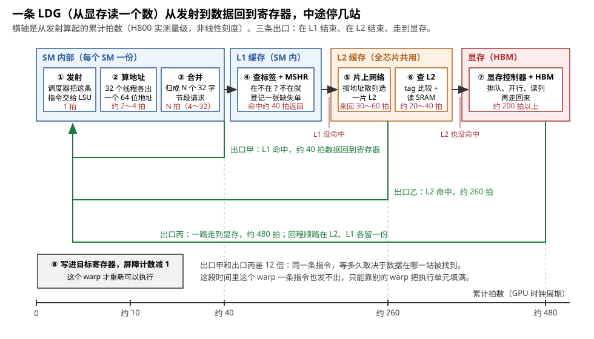
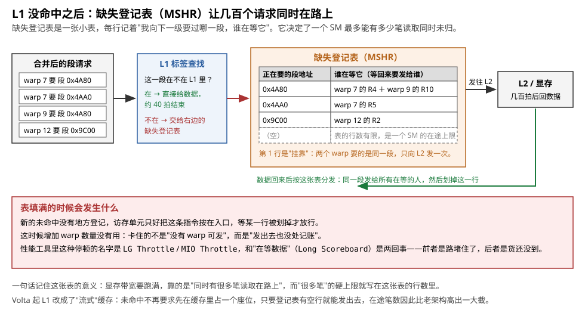
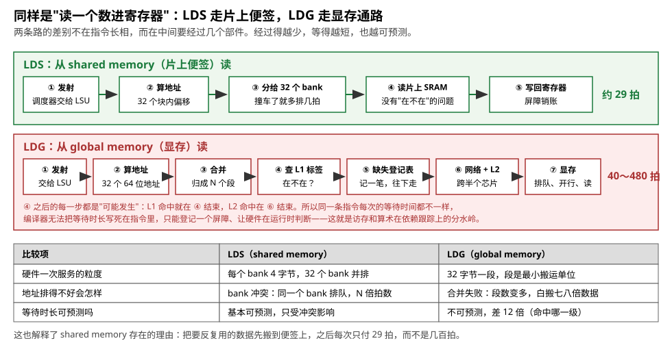
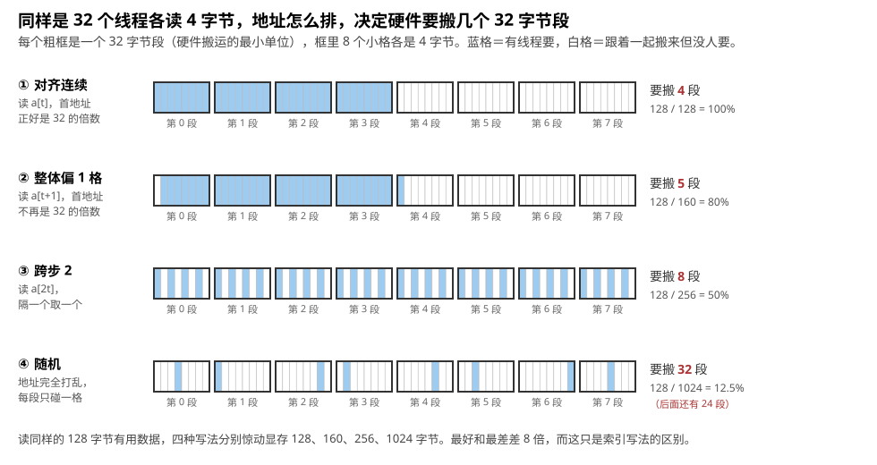
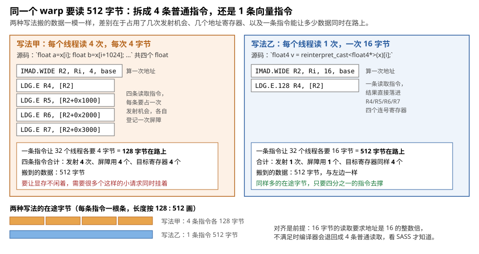
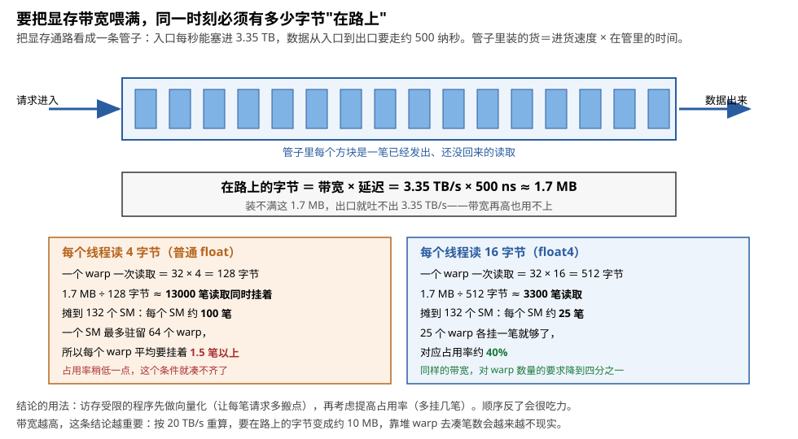
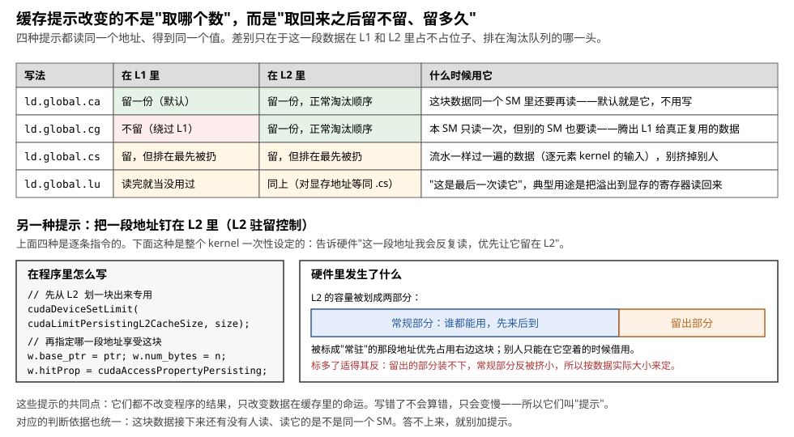
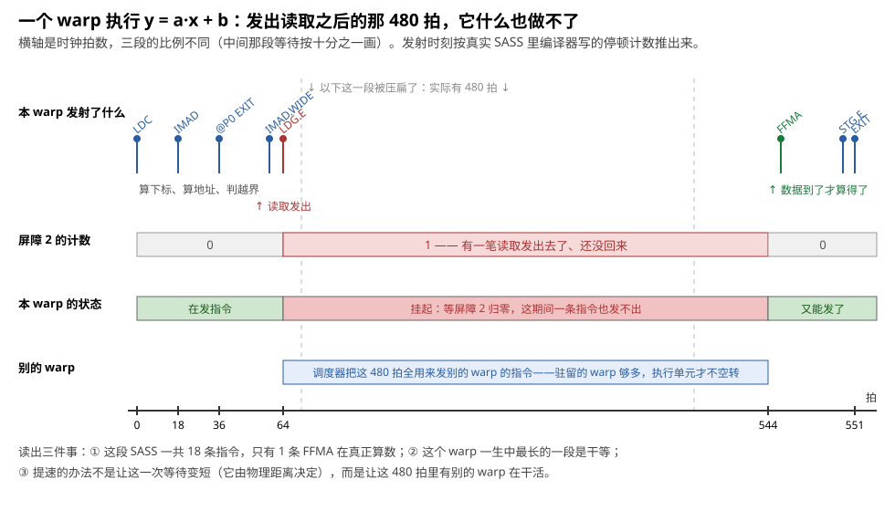
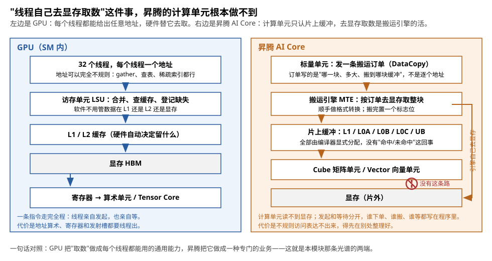

# load/store：线程亲自搬

> **所属模块**：模块 14 · 数据搬运
> **状态**：🟨 学习中（第一版。知识截至 2026-09）
> **本节主旨**：上一节把搬运机制排成了一条光谱，从"每个线程亲自搬、每个地址自己算"一直排到"交给一个引擎、只下一张订单"。这一节讲光谱最左端的那一类——**load/store**：由每个线程自己发起、自己算地址、自己等结果的搬运。主线是四件事：一条全局加载指令从发射到数据回到寄存器要经过哪些部件、每一段大约多少拍；硬件按什么规则把一个 warp 的 32 个地址并成几次段请求；指令发出去之后线程靠什么机制"等"，为什么等待只能靠别的线程掩盖；以及这套做法的代价——搬运要占寄存器、占发射机会、占线程，而这正是后面几节里那些"不用线程亲自搬"的机制被造出来的原因。

---

## 0. 这一节要回答的问题

- 一条全局加载指令（PTX 里的 `ld.global`，机器码里的 `LDG`）从发射到数据回到寄存器，经过哪些部件？每一段大约多少拍，这些数字是哪来的？
- 从 shared memory 读（`LDS`）的路径和它差在哪里？为什么一个可预测、一个不可预测？
- 访存合并（coalescing）按什么规则把 32 个线程的地址并成 32 字节的段请求？对齐、偏移、跨步、随机四种访问模式各要几个请求？
- 向量化访存（`LDG.128` 等）为什么能省发射机会、省指令，代价是什么？
- 指令发出去以后，线程怎么知道"数据到了"？停顿计数和硬件屏障分别管哪一类依赖？
- 为什么掩盖访存延迟只能靠别的 warp？要让显存带宽跑满，同一时刻必须有多少字节在路上？
- 缓存提示（`.ca` / `.cg` / `.cs` / `.lu`）和 L2 驻留控制改变了什么，又没有改变什么？
- 写出去的数据（store）为什么通常不用等？原子操作在哪里执行？
- 这套"线程亲自搬"的做法要付出什么代价？为什么硬件后来一定要往光谱右边走？
- 昇腾的 Cube / Vector 单元为什么没有"某个线程去读显存某个地址"这回事？

---

## 1. 基础词汇：先把本节要反复用的词讲清楚

**线程与 warp**。CUDA 程序里，每个线程是一条独立的执行流，有自己的一套寄存器（寄存器就是紧挨着计算单元的、能一拍读到的小格子，每格 4 字节）。硬件把连续的 32 个线程绑成一组，叫一个 **warp**。一个 warp 的 32 个线程始终执行同一条指令，只是各自用自己的寄存器、算自己的那份数据。本节反复出现的"一个 warp 发出一次读取"，意思是这一条指令同时替 32 个线程各读一个数。

**load 与 store**。load 是"把存储里的一个数读进寄存器"，store 是"把寄存器里的一个数写进存储"。它们是计算单元与外界交换数据的唯一通道：算术指令只认寄存器，寄存器里没有的数，必须先由某条 load 搬进来。

**全局内存（global memory）与 shared memory**。全局内存就是显存里那块所有线程都能读写的区域，容量以几十 GB 计，离计算单元最远。shared memory 是每个 SM（Streaming Multiprocessor，GPU 里一个独立的计算单元，H100 有 132 个）内部的一块几百 KB 的快速存储，由程序员显式决定放什么，同一个线程块内的线程共用。本节的主角是"从全局内存读"，对照组是"从 shared memory 读"。

**sector（段）**。显存和缓存之间搬运数据不是按字节零售的，而是按固定大小的段批发。这个最小搬运单位是 **32 字节**，叫一个 sector。哪怕一个线程只要其中 4 个字节，硬件也要把整个 32 字节段搬过来。缓存管理数据的单位更大，是 128 字节的一条 **cache line**（等于 4 个 sector）。"按段批发"这件事是理解本节一多半内容的钥匙。

**访存单元（LSU，Load/Store Unit）**。SM 内部专门负责读写请求的部件：收集一个 warp 里 32 个线程各自算出的地址，把它们归并成尽量少的段请求，发往缓存，再把回来的数据分发给各个线程的寄存器。

**访存合并（coalescing）**。LSU 做的那件归并工作就叫合并：把 32 个地址归并成"覆盖它们所需的最少段数"。地址挨得紧，段数少，搬来的字节几乎都有用；地址散开，段数多，搬来的字节大部分白搬。

**缺失登记表（MSHR，Miss Status Holding Register）**。一张放在缓存旁边的小表。某一段数据在 L1 缓存里没找到时，硬件在这张表里记一行："我已经向下一级要过这一段了，谁在等它。"这张表让一个 SM 可以同时有很多笔读取悬在空中而不必一笔一笔来，它的行数就是"最多能有多少笔读取同时未归"的硬上限。

**硬件屏障（dependency barrier）与停顿计数（stall count）**。GPU 跟踪"结果好了没有"用两套机制。延迟固定的指令（比如浮点乘加，就是那 4 到 6 拍）由编译器算好等几拍，直接把数字写进指令里的**停顿计数**字段；延迟不固定的指令（访存就是典型）用**硬件屏障**：每个 warp 有大约 6 个计数器，指令发出时给指定的那个加一，数据写回寄存器时减一，后面要用这个数据的指令必须等它归零。

**在途（in flight）**。一笔读取"已经发出、还没回来"的状态叫在途。同一时刻在途的字节数决定了显存带宽能不能跑满，这是本节第 6 部分的算例主角。

---

## 2. 先认字：一条 load 在三种写法里长什么样

后面要大量引用指令名，先把同一条读取在三层表示里的样子摆出来，读者看到时不至于卡住。

源码（CUDA C）写的是一次数组访问：

```cpp
float v = x[i];          // 从全局内存读
```

编译器先把它翻成 **PTX**（一种与具体芯片无关的中间汇编）：

```ptx
ld.global.f32  %f1, [%rd5];
```

这串名字是可以逐段拆的：`ld` 是操作（load），`.global` 说明从哪个空间读（全局内存），`.f32` 是类型（32 位浮点），`%f1` 是目标寄存器，`[%rd5]` 是存着地址的寄存器。同一个位置换成 `.shared` 就是从 shared memory 读，换成 `st` 就是写。

PTX 再由 ptxas 编译成 **SASS**（某一代芯片真正执行的机器指令）。同一条读取在 Hopper 上是：

```sass
LDG.E  R2, desc[UR4][R2.64] ;
```

`LDG` = Load from Global。`.E` 是 extended，表示用 64 位地址。`R2.64` 表示地址放在 R2、R3 这一对寄存器里（64 位地址占两格）。`desc[UR4]` 是 Hopper 起的写法：全局内存的访问要带一个"描述符"，它对整个 warp 是同一个值，所以放在统一寄存器 UR4 里（统一寄存器是 Turing 起增加的一条标量通路，整个 warp 取值相同的量走它，省掉 32 份重复计算）。

常见的对应关系就这么几条，记住即可：

| PTX | SASS | 干什么 |
| --- | --- | --- |
| `ld.global` | `LDG` | 从全局内存（显存/缓存）读进寄存器 |
| `st.global` | `STG` | 从寄存器写进全局内存 |
| `ld.shared` | `LDS` | 从 shared memory 读进寄存器 |
| `st.shared` | `STS` | 从寄存器写进 shared memory |
| `atom.global` | `ATOMG` | 原子读改写，**返回**旧值 |
| `red.global` | `REDG`（Ampere 上是 `RED`） | 原子读改写，**不返回**值 |

指令名的完整拆解规则在模块 10 第 8 节（[读懂 PTX 与 SASS](../10-SIMT核的物理实现/08-读懂PTX与SASS.md)）；本节只用到上面这几个。

---

## 3. 一条 LDG 的一生：从发射到数据回到寄存器

现在把一条全局加载拆开，看它从被发射到数据落进寄存器，中间停了哪几站，每一站花多少拍。

### 3.1 第一站：发射与地址生成

warp 调度器每拍从手上的候选 warp 里挑一个，把它的下一条指令送进对应的执行管线。`LDG` 送进的是访存管线，**这一步占 1 拍**。

接下来是地址生成。这里有一个容易被忽略的事实：**地址不是现成的，是算出来的**。源码里写 `x[i]`，硬件要的是一个 64 位字节地址，所以必须先算 `x 的基址 + i × 4`。这笔账由整数乘加指令完成，而且是 32 个线程各算各的——线程 0 算 `base + 0`，线程 1 算 `base + 4`，依此类推。在 SASS 里这表现为 `LDG` 之前总有一条 `IMAD.WIDE`（64 位整数乘加）。**这一段大约 2 到 4 拍**，属于量级估计。

这件事的分量在第 9 部分的走查里会看得很清楚：一个最简单的逐元素 kernel 编出 18 条指令，真正计算的只有 1 条，其余大半在算地址。

### 3.2 第二站：合并

32 个地址到齐后，LSU 要把它们归并成段请求。归并的规则是第 5 部分的主题，这里只说它花多少时间。

真实硬件不做两两比较（32 个地址两两组合是 496 对，比较器阵列大得不现实），而是用"候选段匹配"：取一个地址算出它属于哪一段，用 32 个比较器并行地看哪些地址也落在这一段里，命中的一起打包；剩下的再取一个当下一轮的候选。**需要几个段，就要几轮，每轮一拍**——完美合并的情形 4 拍，最坏情形（32 个地址各落一段）32 拍。这套电路的形态在模块 30 第 2 节（[互连的物理实现](../../3-互联/30-互连/02-互连的物理实现·crossbar-NoC与SerDes.md)）§3 有详细的门级说明，本节只用它的时间结论。

这里有一个直接影响写代码的结论：**合并只在一个 warp 内做**。比较器阵列的输入端硬连着同一个 warp 的 32 个地址，另一个 warp 的地址根本不在输入里。所以即使 warp 0 和 warp 1 的访问在地址上首尾相接，硬件也不会把它们合成一个请求。

### 3.3 第三站：L1 标签查找

段请求进入 L1 缓存。缓存里存着若干条 128 字节的 cache line，每条配一个"标签"记着它现在装的是哪一块地址。**标签查找就是拿请求的地址高位和这些标签比对，看要的那一段在不在。**

在，就直接把数据取出来返回，这条 load 的一生到此结束。**实测这条最短路径约 40 拍**：微基准测出 H800 的 L1 命中延迟是 40.7 拍，A100 是 37.9 拍，RTX 4090 是 43.4 拍（数据取自 Luo 等《Benchmarking and Dissecting the Nvidia Hopper GPU Architecture》，arXiv:2402.13499 表 IV，下同）。注意 H800 是面向特定市场的 Hopper 型号（该论文测的是 PCIe 形态，显存带宽约 2 TB/s），与 H100 同一代架构。这里引用的是**片内延迟**，它主要由缓存层次和片上网络决定，受显存型号与互连规格的影响较小，所以可以代表 Hopper 的量级；但涉及**带宽**的账（§6.3）仍按 H100 SXM 的 3.35 TB/s 算，两者口径不同，不要混用。

不在，就要往下一级走——而"往下走"这件事本身需要先登记。

### 3.4 第四站：缺失登记表（MSHR）

假如硬件不做登记，直接把请求发下去，会出两个问题。第一，同一段数据可能被好几个 warp 同时要，重复发下去就是浪费带宽。第二，数据回来的时候，硬件不知道该把它交给谁。

缺失登记表解决的就是这两件事。它的每一行记着两样东西：**正在要的是哪一段**，以及**谁在等它**。新的未命中来了，先查这张表：

- 表里已经有这一段（别人刚要过），就把自己挂到这一行的等待名单上，**不再向下发第二次请求**；
- 表里没有，占一个空行，向 L2 发出请求。

数据回来时，硬件按这一行的名单把同一段分发给所有在等的人，然后划掉这一行。图 2-1 的第 ④ 站画的就是这个部件，图 2-2 把表的内部画开了。



> **图 2-1**　一句话：一条从显存读数的指令要依次经过发射、算地址、合并、查 L1、查 L2、查显存这几站，数据在哪一站被找到，就决定了这次读取要等 40 拍还是 480 拍。
>
> **先知道一件事**：图里的"拍"是 GPU 时钟的一个周期，Hopper 的时钟在 1.7～2 GHz 上下，一拍约半纳秒。一条浮点乘加几拍就算完，所以"等 480 拍"意味着这段时间本来够做上百次运算。
>
> **按这个顺序看**：
> 1. 从左往右是一条读取指令的行程，每个白框是一站，框里最后一行红字是这一站花的拍数。底部的横轴是从发射算起的累计拍数，三个刻度 40、260、480 分别对应三条出口。
> 2. 蓝色大框是 SM 内部的三站：① 调度器把这条指令交给访存单元；② 32 个线程各算出自己的 64 位地址；③ 把这 32 个地址归并成若干个 32 字节的段请求，需要几个段就占用几拍。
> 3. 第 ④ 站是 L1 缓存的标签查找，也就是"要的这一段在不在本 SM 的缓存里"。在，数据直接返回，走绿色的"出口甲"，约 40 拍；不在，请求交给缺失登记表，往右继续。
> 4. 橙色大框是 L2，全芯片 132 个 SM 共用一份，物理上分成几十个片，请求要先经过片上网络才能到达管这个地址的那一片。网络往返加上查 L2 本身，走到"出口乙"约 260 拍。
> 5. 红色大框是显存。L2 也没命中时才会走到这里，排队、开行、读列再走回来，总计约 480 拍，就是"出口丙"。数据回程时顺路在 L2 和 L1 各留一份。
> 6. 最后是第 ⑧ 站：数据写进目标寄存器，同时硬件把这条指令登记的屏障计数减一——等这个数据的指令这才被放行。
>
> **看懂的标志**：能回答"为什么编译器不能像对待乘法那样，把'等 480 拍'直接写进指令里"——因为同一条指令这次可能在出口甲结束、下次走到出口丙，相差 12 倍，编译期根本算不出来。这就是访存必须用运行时记账、而算术不必的原因。
>
> **与正文的对照**：40、260、480 三个数取自 §3.3 引用的微基准实测（H800）；发射、算地址、合并三段是量级估计，合并的拍数等于段数，见 §3.2。
>
> 来源：本库自绘。



> **图 2-2**　一句话：L1 没命中的请求不会直接发下去，而是先在一张小表上登记"我要哪一段、谁在等"，这张表既避免了重复请求，也决定了一个 SM 最多能有多少笔读取同时在路上。
>
> **先知道一件事**：这里说的"一段"是 32 字节，是显存和缓存之间搬运的最小单位。一个 warp 的一次读取通常会拆成好几个这样的段请求。
>
> **按这个顺序看**：
> 1. 最左边是已经合并好的段请求，来自不同的 warp。可以看到 warp 7 和 warp 9 要的是同一段（0x4A80）。
> 2. 中间蓝框是 L1 的标签查找：这一段在 L1 里就直接给数据，约 40 拍结束；不在就交给右边的登记表。
> 3. 橙框里是登记表本身。左列是正在向下要的段地址，右列是"谁在等它"。第 1 行有两个人在等：warp 7 的 R4 和 warp 9 的 R10——**同一段只向 L2 发了一次请求**，回来的数据分给两个人。
> 4. 最下面一行画成虚线，表示这张表的行数是有限的。行数就是"这个 SM 最多能有几笔读取同时未归"的上限。
> 5. 右边是数据回来的路径：按登记表分发给所有在等的人，然后划掉那一行，腾出位置给新的未命中。
> 6. 底部红框讲表被填满的情形：新的未命中没地方登记，访存单元只好把指令按在入口。这时候再增加 warp 数量是没用的——卡住的不是"没有 warp 可发"，而是"发出去也没处记账"。
>
> **看懂的标志**：能说出性能工具里两种停顿的区别——`Long Scoreboard` 是"货还没到"（在等数据），`LG Throttle` / `MIO Throttle` 是"路堵住了"（访存入口或登记表满）。前者靠更多 warp 缓解，后者不靠。
>
> **与正文的对照**：表的具体行数 NVIDIA 没有公开，图中画四行只是示意；Volta 起 L1 改成"流式"缓存的说法见 §13。
>
> 来源：本库自绘。

### 3.5 第五站：片上网络与 L2

L2 是全芯片共用的一级缓存，H100 上约 50 MB。它不是一整块，而是切成几十个片，每片有自己的标签阵列和访问端口。一个地址归哪一片，由一个不公开的散列函数决定——把地址的很多位异或搅拌之后再取片号，目的是让任何规则的访问模式都被打散，避免所有请求挤在同一片上。

所以请求要先走片上网络，从发出它的 SM 送到管这个地址的那一片 L2，读完再原路送回。按模块 30 第 2 节的拍数构成表，网络三跳的往返大约 30 到 60 拍，L2 片内的标签比较加 SRAM 读取约 20 到 40 拍。

**实测的 L2 命中延迟约 263 拍**（H800；A100 是 261.5 拍，RTX 4090 是 273 拍）。这个数比上面几段加起来大不少，差额来自排队——网络入口和 L2 片入口都有仲裁队列，负载越高排得越久。**这里要记住的结论是：L2 延迟里真正"读 SRAM"的部分只占四分之一左右，其余全是网络和排队。**

### 3.6 第六站：显存控制器与 HBM

L2 也没命中，请求才发往显存控制器。控制器要做的事在模块 20 讲得细（行激活、列读取、刷新之间的调度），本节只取结论：**实测全程约 479 拍**（H800；A100 是 466.3 拍，RTX 4090 是 541.5 拍）。

数据回来的路上顺手在 L2 和 L1 各留一份副本（默认策略下），最后写进目标寄存器，同时把登记的屏障减一。

### 3.7 把一条 LDG 的账算完

把上面六站合成一张表。**"来源"一列很重要：有些数字是实测的，有些只是量级估计，混着用会得出错误结论。**

| 段 | 拍数 | 这个数字哪来的 |
| --- | --- | --- |
| 发射 | 1 | 每拍发一条，定义如此 |
| 地址生成（32 个线程各一个 64 位地址） | 约 2～4 | 量级估计 |
| 合并（归成 N 个段请求） | N 拍，N 在 4～32 之间 | 候选匹配电路一轮一拍（模块 30-02 §3） |
| **到此为止若 L1 命中，全程** | **约 40** | 微基准实测（H800 40.7 / A100 37.9 / 4090 43.4） |
| 片上网络往返 + 查 L2 | —— | 模块 30-02 的构成表估算 30～60 加 20～40 |
| **若 L2 命中，全程** | **约 263** | 微基准实测（H800 263 / A100 261.5 / 4090 273） |
| 显存控制器 + HBM + 回程 | —— | —— |
| **若走到显存，全程** | **约 479** | 微基准实测（H800 478.8 / A100 466.3 / 4090 541.5） |
| 对照：从 shared memory 读 | **约 29** | 微基准实测（H800 29.0 / A100 29.0 / 4090 30.1） |

三个可以直接用的比例：**L2 的延迟大约是 L1 的 6.5 倍，显存大约是 L2 的 1.9 倍**，而 shared memory 比 L1 还快三成。这解释了为什么"把数据搬到 shared memory 再反复用"是 GPU 编程的基本功——同一个数据用 100 次，第一次付 479 拍，后面 99 次各付 29 拍，平均成本降到约十分之一。

---

## 4. 对照：一条 LDS 的一生

同样是"读一个数进寄存器"，从 shared memory 读的路径短得多，而且性质不同。

**shared memory 不是缓存，是便签。** 缓存的特点是"数据可能在也可能不在，硬件自动决定留什么"；shared memory 里有什么，完全由程序写进去，所以**没有标签、没有命中判断、没有缺失登记**。一条 `LDS` 的行程只有四步：算出块内偏移、分给 32 个 bank、读片上 SRAM、写回寄存器。

这里出现一个新词：**bank**。shared memory 内部切成 32 个可以同时工作的窗口，每个窗口叫一个 bank，每个 bank 一拍服务 4 个字节。地址按 4 字节轮流分配给 32 个 bank（第 0～3 字节归 0 号，第 4～7 字节归 1 号，第 128～131 字节又回到 0 号）。32 个 bank 同时开工，一拍就能服务整个 warp——**前提是这 32 个访问落在 32 个不同的 bank 上**。有 N 个线程落在同一个 bank 的不同地址，这个 bank 只能一个一个来，耗时变成 N 拍，这就是 N 路 bank 冲突。它的机制和两种修法（padding 与 swizzle）在模块 10 第 4 节（[访存通路](../10-SIMT核的物理实现/04-访存通路.md)）§4 有完整说明，这里只需知道它是 LDS 这条路上唯一的减速来源。

**两条路最本质的差别不是快慢，是可预测性。** LDS 的耗时基本是个常数（29 拍，有冲突就乘以冲突路数），编译器几乎可以算出来；LDG 的耗时在 40 到 480 拍之间浮动，取决于这次在哪一级命中，编译器无法预知。这个差别直接决定了硬件用哪套机制跟踪它们的完成——第 6 部分讲。

**一个能跟着算的例子：把一个 32×32 的 float 矩阵转置。** 数据已经在 shared memory 里，声明成 `__shared__ float s[32][32]`，一个 warp 负责一行或一列。

- **按行读**（线程 t 读 `s[r][t]`）：一行的 32 个元素地址连续，第 t 个元素归 `t mod 32` 号 bank，32 个线程正好落在 32 个不同的 bank 上。**1 拍读完，约 29 拍拿到数据。**
- **按列读**（线程 t 读 `s[t][c]`）：同一列相邻两个元素的地址差一整行，也就是 32 个字；32 除以 32 余 0，所以 bank 号不变——**32 个线程全落在同一个 bank 上，32 路冲突，要 32 拍**，总耗时约 29 + 31 = 60 拍。
- **改成 `__shared__ float s[32][33]`**：每行多垫一个没人用的字，相邻两行的起点错开一格，33 除以 32 余 1，一列的 32 个元素斜着散到 32 个 bank，**冲突消失，回到 1 拍**。

两条路的逐站对比见图 2-3。把上面这三档和显存对比一下，就知道 shared memory 的价值有多大：最糟的那一档（60 拍）比 L1 命中（40 拍）还慢一点，但比走到显存（479 拍）快了八倍。**所以"先搬进 shared memory 再反复用"这件事，即使数摆得不理想也很难亏；而 bank 冲突这个坑值得修，因为修好之后又能再快一倍。**



> **图 2-3**　一句话：从片上便签读数只经过四站、约 29 拍；从显存读数最多要经过七站、40 到 480 拍，而且每次不一样。
>
> **先知道一件事**：shared memory 是每个 SM 内部一块由程序员显式管理的快速存储——什么数据放进去、放在哪个位置，都是程序写的，所以硬件不需要判断"要的东西在不在"。缓存则相反，留什么由硬件自己决定，所以每次都要先查。
>
> **按这个顺序看**：
> 1. 上面绿色的一条是 LDS。五个白框从左到右：发射、算块内偏移、把 32 个访问分给 32 个 bank（bank 是 shared memory 内部可以同时工作的存储窗口）、读片上 SRAM、写回寄存器。右端标着总计约 29 拍。
> 2. 注意第 ④ 框里那句"没有'在不在'的问题"：这是两条路的分界。数据一定在，因为是程序自己放进去的。
> 3. 下面红色的一条是 LDG，七个白框：发射、算 64 位地址、合并成段、查 L1 标签、登记缺失、走网络查 L2、去显存。右端标着 40 到 480 拍。
> 4. 红色那段说明文字是关键：④ 之后的每一步都只是"可能发生"。L1 命中就在 ④ 结束，L2 命中在 ⑥ 结束。所以同一条指令每次等待的时间都不一样。
> 5. 最下面的表格逐项对比：硬件一次服务的粒度（一个 bank 4 字节 vs 一段 32 字节）、地址排得不好的后果（bank 冲突 vs 合并失败）、等待时长可不可预测。
>
> **打个比方**：从 shared memory 取数像从自己桌上的便签盒里拿一张——你自己放的，一定在，伸手就够到；从显存取数像去查一个东西，先翻手边的抽屉，没有再去楼下的公共书架，还没有才去仓库，每一层都可能找到，也可能白找一趟。
>
> **看懂的标志**：能回答"为什么访存指令的等待必须用硬件在运行时记账，而乘法不用"——乘法的延迟是硬件规格里定死的常数，编译器算得出来；访存的延迟在 40 到 480 拍之间，取决于运行时才知道的命中情况。
>
> **与正文的对照**：拍数取自 §3.7 的表。bank 冲突的完整机制与两种修法在模块 10 第 4 节。
>
> 来源：本库自绘。

---

## 5. 合并：32 个地址怎么变成几次段请求

### 5.1 规则本身

从计算能力 6.0（Pascal）起，规则可以用一句话说完，CUDA 官方最佳实践指南的原话是：**一个 warp 内各线程的并发访问，会合并成"服务这个 warp 全部线程所需的 32 字节事务数"**。

把这句话翻译成可以动手算的步骤：

1. 取出 32 个线程各自的字节地址；
2. 每个地址除以 32 取整，得到它落在第几段（也就是把地址的低 5 位丢掉）；
3. 数一数一共出现了几个不同的段号——**这就是要搬的段数**；
4. 有效率 = 真正要用的字节数 ÷ （段数 × 32）。

**注意第 3 步的"不同"**：同一段里有 8 个线程，也只搬一次。这就是"相邻线程访问相邻地址"能省八倍搬运量的全部原因。

还有一个常被忽略的补充：**并不是所有线程都必须参与**。一个 warp 里只有 4 个线程在读（其余被谓词关掉），规则照样适用，只是有效率低一些。

### 5.2 四种访问模式，逐线程把账算出来

设数组 `float* a` 的首地址是 `0x7F00_0000`，正好是 32 的整数倍（CUDA 的 `cudaMalloc` 保证至少 256 字节对齐，所以这是常态）。每个 float 占 4 字节。下面逐个模式列出前 8 个线程的地址和段号。

**模式甲：`a[t]`，对齐连续。** 线程 t 的地址是 `0x7F000000 + 4t`。

| 线程 | 0 | 1 | 2 | 3 | 4 | 5 | 6 | 7 | 8 | … | 31 |
| --- | --- | --- | --- | --- | --- | --- | --- | --- | --- | --- | --- |
| 地址低位 | 00 | 04 | 08 | 0C | 10 | 14 | 18 | 1C | 20 | … | 7C |
| 段号 | 0 | 0 | 0 | 0 | 0 | 0 | 0 | 0 | 1 | … | 3 |

出现的段号是 {0,1,2,3}，**4 段**。搬 128 字节，要 128 字节，有效率 100%。这是最优情形。

**模式乙：`a[t+1]`，整体偏移一个元素。** 地址变成 `0x7F000000 + 4 + 4t`。

| 线程 | 0 | 1 | … | 6 | 7 | 8 | … | 30 | 31 |
| --- | --- | --- | --- | --- | --- | --- | --- | --- | --- |
| 地址低位 | 04 | 08 | … | 1C | 20 | 24 | … | 78 | 7C+04=80 |
| 段号 | 0 | 0 | … | 0 | 1 | 1 | … | 3 | 4 |

出现的段号是 {0,1,2,3,4}，**5 段**。第 0 段只有 7 个线程要（第 0～3 字节没人要），第 4 段只有 1 个线程要。搬 160 字节，要 128 字节，有效率 80%。

这个"多搬一段"的代价在真机上被测过：CUDA 最佳实践指南给出的 V100 数据是，偏移为 0 或 8 个字的整数倍时是 4 个 32 字节事务、约 790 GB/s；其余偏移是 5 段，按比例应该掉到 4/5，**实测只掉到约 9/10**——因为相邻的 warp 复用了邻居取来的那条缓存行。所以对齐的损失比纸面账小，但确实存在。

**模式丙：`a[2t]`，跨步 2。** 地址是 `0x7F000000 + 8t`。

| 线程 | 0 | 1 | 2 | 3 | 4 | 5 | … | 31 |
| --- | --- | --- | --- | --- | --- | --- | --- | --- |
| 地址低位 | 00 | 08 | 10 | 18 | 20 | 28 | … | F8 |
| 段号 | 0 | 0 | 0 | 0 | 1 | 1 | … | 7 |

每段容下 4 个线程，共 **8 段**。搬 256 字节，要 128 字节，有效率 50%。CUDA 最佳实践指南对 V100 的说法与此一致："跨步 2 会导致每个 warp 加载 8 个 L2 段，load/store 效率 50%。"

**模式丁：随机。** 32 个地址落在互不相同的段里，**32 段**，搬 1024 字节要 128 字节，有效率 12.5%。稀疏索引、哈希查表、gather 都会落到这一档。

四种模式并排画在图 2-4 里。



> **图 2-4**　一句话：32 个线程读同样多的数据，地址排布不同，硬件要搬的 32 字节段可以是 4 个，也可以是 32 个，相差 8 倍。
>
> **先知道一件事**：显存每次最少搬一段 32 字节，一段装得下 8 个 4 字节的数。只要其中一个数有人要，整段都得搬过来。图里蓝格是有线程要的数，白格是跟着一起搬来、没人要的数。
>
> **按这个顺序看**：
> 1. 每一行是一种写法。每行有 8 个粗框，每个粗框是一段，框里 8 个小格各是 4 字节。右边写着这种写法要搬几段、以及"要的字节 / 搬的字节"。
> 2. 第 ① 行 `a[t]`：32 个数首尾相接，正好铺满 4 段，每一格都有人要。这是最好的情形。
> 3. 第 ② 行 `a[t+1]`：整体右移一格。注意第 0 段最左边那一格变成了白色（没人要），而最后多出了第 4 段、里面只有一格有用。同样 128 字节的需求，搬了 160 字节。
> 4. 第 ③ 行 `a[2t]`：隔一个取一个，每段里只有 4 格有人要，要搬 8 段。
> 5. 第 ④ 行随机：每段只碰到一格，32 个线程就要 32 段，搬来的 1024 字节里只有 128 字节有用。
> 6. 底部一行把四个数字摆在一起：128、160、256、1024。这四个数就是同一段计算在四种索引写法下对显存的实际打扰量。
>
> **看懂的标志**：能回答"性能工具里的 sectors per request（平均每次请求搬几段）读数是 28，说明什么"——说明访问模式接近第 ④ 行，地址基本散开了，有效带宽只剩八分之一，该去检查索引写法或数据布局。健康值是 4。
>
> **与正文的对照**：四行分别对应 §5.2 的模式甲乙丙丁，逐线程的地址和段号在正文的表里。模块 10 第 4 节的图 4-3 画的是连续、隔一取一、大步长三种；这张图补的是"整体偏一格"和"随机"两种。
>
> 来源：本库自绘。

### 5.3 从账里读出两条日常规则

**规则一：让相邻线程访问相邻地址，索引的最内层要用 `threadIdx.x`。** 这不是风格建议，是上面四个数字的直接推论。同一个二维数组，`a[row][threadIdx.x]` 是模式甲，`a[threadIdx.x][col]` 就是模式丁。

**规则二：数据布局比访问顺序更根本。** 假设每个数据点有 x、y、z 三个字段。按"结构体数组"存（x0 y0 z0 x1 y1 z1 …），32 个线程各读自己那个点的 x 时，地址间隔 12 字节，落在 12 个段里；改成"数组结构体"（所有 x 连排、所有 y 连排），读 x 时地址正好连续，4 段搞定。**同样的数据、同样的计算，换个排布方式，对显存的打扰量差三倍。** 布局这件事本身是模块 50 第 2 节（[摆数的学问](../../5-软硬交界/50-数据视角/02-摆数的学问·布局与切分.md)）的主题。

### 5.4 向量化访存：一条指令搬 16 字节

前面每个线程一次只读 4 字节。硬件支持每个线程一次读 8 或 16 字节：PTX 里写 `ld.global.v4.f32`，落到 SASS 是 `LDG.E.128`，源码里最常见的形态是用 `float4` 类型。

**省下来的是什么，要分三笔算。**

第一笔，**指令数**。要读 512 字节，写法甲需要 4 条 `LDG.E`（每条 128 字节），写法乙只要 1 条 `LDG.E.128`。指令数变成四分之一。

第二笔，**发射机会**。SM 的调度器每拍只能发出有限条指令，这个发射口由所有 warp 共用。搬运指令占了发射口，计算指令就少了机会。四条变一条，等于把三次发射机会还给了计算。地址算术同样省：四次读取原本要算四个地址（或者三次偏移加法），向量化后只算一次。

第三笔，也是最容易被忽略的一笔，**在途字节**。一条 `LDG.E` 让 128 字节上路，一条 `LDG.E.128` 让 512 字节上路。这一笔为什么重要，第 6 部分的 Little 定律算例会讲透。

图 2-5 把两种写法并排画了出来。

**代价是对齐要求。** PTX 手册写得很直白：一条访存指令的地址必须自然对齐到它的访问宽度，否则行为未定义（硬件可能悄悄把低位抹掉、也可能报错）。所以 16 字节的读取要求地址是 16 的整数倍。源码里写了 `float4` 但指针没对齐，编译器会退回成 4 条普通读取——**这件事只能看 SASS 才知道**：反汇编里出现 `LDG.E.128` 才算兑现，只有 `LDG.E` 就是没兑现。



> **图 2-5**　一句话：一个 warp 要读 512 字节，拆成 4 条普通指令和写成 1 条向量指令，搬到的数据一样多，但后者只占四分之一的指令和发射机会。
>
> **先知道一件事**：SM 的调度器每拍只能发出有限条指令，所有 warp 抢这一个发射口。所以"搬一块数据要几条指令"不只影响访存本身，还直接挤占计算指令的机会。
>
> **按这个顺序看**：
> 1. 左边橙色是写法甲：先用一条整数乘加算出地址，然后四条 `LDG.E`，每条读 4 字节。每条都要占一次发射机会，也各自登记一个屏障（屏障就是硬件用来记"这笔读取还没回来"的计数器）。
> 2. 左下的白框把账列出来：一条指令让 32 × 4 = 128 字节上路；四条合计发射 4 次、用掉 4 个屏障、写 4 个目标寄存器。
> 3. 右边蓝色是写法乙：同样先算一次地址（注意乘的是 16 不是 4），然后一条 `LDG.E.128`，每个线程读 16 字节，结果直接落进 R4、R5、R6、R7 四个连号寄存器。
> 4. 右下的白框：一条指令让 32 × 16 = 512 字节上路；合计发射 1 次、用掉 1 个屏障、目标寄存器同样是 4 个。**寄存器没省，省的是指令和发射机会。**
> 5. 最下面的条形图按 128 : 512 的比例画出每条指令能让多少字节上路。四根短条和一根长条总长相同，但左边要四次发射才凑齐。
> 6. 右下角的提醒：16 字节的读取要求地址是 16 的整数倍，不满足时编译器会悄悄退回成 4 条普通读取。
>
> **看懂的标志**：能回答"访存受限的程序，为什么优化顺序是先向量化、再提高占用率"——向量化让每条指令多搬数据，同样的在途字节需要的指令数和 warp 数都少了；先去堆 warp 则是用更贵的资源解决同一个问题。
>
> **与正文的对照**：指令形态与 §5.4 一致，`LDG.E.128` 的 `.E` 表示 64 位地址、`.128` 表示一次 128 位。在途字节的意义见 §6.3。
>
> 来源：本库自绘。

---

## 6. 发出去以后，线程怎么"等"

### 6.1 两类依赖，两套机制

指令发出去了，数据要几百拍才回来。硬件怎么知道"可以执行那条要用这个数据的指令了"？

GPU 把依赖分成两类，用两套完全不同的机制处理，**分界线正好是"编译器算不算得出等待时长"**。

**第一类：延迟固定的指令。** 一条浮点乘加的延迟是硬件规格里写死的常数（比如 4 拍）。既然固定，编译器完全可以自己算清楚"下一条依赖指令要等几拍"，直接把这个数字编码进指令里的**停顿计数**字段。硬件收到后只需要一个小倒计数器，数到零就允许发下一条，**不需要任何依赖比较逻辑**。

**第二类：延迟不确定的指令。** 访存是典型：这次 40 拍，下次 480 拍，编译期无从知道。这类必须用硬件跟踪，于是每个 warp 配了大约 6 个**硬件屏障**（也叫依赖屏障）。用法是三步：

1. 发出访存指令时，指令里的"写屏障编号"字段指定登记到第几号屏障，硬件把那个屏障的计数加一；
2. 数据回来、写进寄存器时，硬件把计数减一；
3. 后面真正要用这个数据的那条指令，在"等待掩码"字段里把对应位置一。发射逻辑检查：这个屏障归零了吗？没有就不许发射，这个 warp 挂起，调度器去看别的 warp。

**格子由编译器分配、等待条件由编译器标注，硬件只负责加一减一和检查。** 所以这套机制常被称为"软件辅助的记分牌"。它的电路形态和面积账在模块 13 第 4 节（[控制通路的物理实现](../13-微架构与物理实现/04-控制通路的物理实现·取指译码与调度器.md)）§4 有完整推导。

### 6.2 这些字段在真实机器码里长什么样

上面说的字段不是概念，是指令里实实在在的比特。Volta 起每条 SASS 指令 128 位，其中约 21 位是调度控制位。把本节走查用的那段 SASS 解码出来（解码方法与结果见 §9），会看到这样的对应：

```
LDG.E.CONSTANT R2, desc[UR4][R2.64] ;   写屏障 = 2，停顿 1
IMAD.WIDE      R4, R7, 0x4, R4      ;   等待掩码 = {1}，停顿 4
FFMA           R7, R2, R8, R9       ;   等待掩码 = {2}，停顿 5
```

读法是：`LDG` 把自己登记到 2 号屏障；中间那条算地址的整数乘加与它无关（它等的是 1 号屏障，那是前面另一条指令的账），所以可以照常发射；`FFMA` 要用 `LDG` 读回来的 R2，于是等待掩码里点了第 2 位——**2 号屏障不归零，这条乘加就发不出去，这个 warp 就挂起。**

这也解释了一条常见的编译器行为：**编译器喜欢把与读取无关的计算挪到读取指令后面**。上面那条 `IMAD.WIDE` 就是被挪过去的——它在算 store 要用的目标地址，与读回来的数据无关，放在这里，它的执行时间就叠进了读取的等待里，不额外花钱。

### 6.3 为什么必须靠别的 warp：Little 定律的算例

上面讲的是"一个 warp 怎么等"。但是**等待本身不会变短**：数据从显存回来要走那么远，物理上就是几百拍。提高性能的唯一办法是让这几百拍里有别人在干活。

这件事可以精确算出来，用的是排队论里的 Little 定律。直觉版本是这样：把显存通路看成一条管子，入口每秒能塞进 3.35 TB（H100 的显存带宽），数据从入口走到出口要约 500 纳秒。那么**管子里装着的货 = 进货速度 × 在管里的时间**：

> 在途字节 = 带宽 × 延迟 ≈ 3.35 TB/s × 500 ns ≈ **1.7 MB**

也就是说：**任意时刻必须有约 1.7 MB 的数据正在路上，出口才可能吐出 3.35 TB/s。** 装不满，带宽再高也用不上。

把 1.7 MB 换算成"要多少笔读取"，这才是对写代码有用的形式（图 2-6 把这两笔账画在了一起）：

**账一：每个线程读 4 字节。** 一个 warp 的一次读取搬 128 字节。1.7 MB ÷ 128 字节 ≈ **13000 笔读取同时挂着**。摊到 132 个 SM，每个 SM 约 100 笔。一个 SM 最多驻留 64 个 warp，所以**每个 warp 平均要挂着 1.5 笔以上**——这要求占用率接近满，而且每个 warp 手上得有不止一条未完成的读取。

**账二：每个线程读 16 字节（float4）。** 一次读取搬 512 字节。1.7 MB ÷ 512 字节 ≈ **3300 笔**。摊到每个 SM 约 25 笔，**25 个 warp 各挂一笔就够了**，对应占用率约 40%。

两笔账并排一放，结论很清楚：**同样的带宽目标，向量化把对 warp 数量的要求降到了四分之一。** 所以访存受限程序的优化顺序应该是先向量化（让每笔请求多搬点），再考虑提高占用率（多挂几笔）——顺序反了会非常吃力。



> **图 2-6**　一句话：要让显存带宽跑满，同一时刻必须有约 1.7 MB 数据在路上；每笔读取搬得越多，凑齐这 1.7 MB 需要的笔数和 warp 数就越少。
>
> **先知道一件事**：带宽和延迟是两件不同的事。带宽是"每秒能运多少"，延迟是"一件货从发出到收到要多久"。一条又粗又长的管子，即使每秒能灌进很多水，也要先把管子填满，出水口才会按额定流量出水。
>
> **按这个顺序看**：
> 1. 上方的长框是显存通路。左边箭头是发出去的请求，右边箭头是回来的数据，中间每个蓝方块代表一笔"已经发出、还没回来"的读取。
> 2. 中间灰框是这张图的核心算式：在路上的字节 = 带宽 × 延迟 = 3.35 TB/s × 500 ns ≈ 1.7 MB。这不是经验值，是排队论的恒等式。
> 3. 左下橙框算第一笔账：每个线程读 4 字节时，一个 warp 的一次读取是 32 × 4 = 128 字节。1.7 MB 除以 128 字节，需要约 13000 笔同时挂着；摊到 132 个 SM 是每个 SM 约 100 笔；一个 SM 最多住 64 个 warp，于是每个 warp 平均得挂 1.5 笔以上。
> 4. 右下蓝框算第二笔账：改成每个线程读 16 字节，一次读取变成 512 字节，需要的笔数降到约 3300，每个 SM 约 25 笔——25 个 warp 各挂一笔就够，对应占用率约 40%。
> 5. 最下面两行是用法：先向量化再提占用率；带宽每涨一代，这条顺序就更重要，因为要在路上的字节也跟着涨。
>
> **看懂的标志**：能回答"我的 kernel 带宽只跑到 40%，占用率也不高，先改哪个"——先让每笔请求多搬数据（向量化），再考虑增加 warp 数量。前者一改，后者的要求自动降为四分之一。
>
> **与正文的对照**：3.35 TB/s 与 500 ns 取自 H100 的量级（§3.7 的实测全程约 479 拍，按 2 GHz 折算约 240 ns，加上排队后按 500 ns 估；这是本库沿用模块 10 第 4 节 §7 的口径）。20 TB/s 的重算对应 Rubin 一代。
>
> 来源：本库自绘。

### 6.4 一个容易混的区别：等数据，还是等路

上面讲的"挂起等屏障归零"是在**等数据**。还有另一种停顿，是**等路**：缺失登记表满了、或者访存入口排满了，新的读取根本发不出去。

两者在性能工具里的名字不同，处方也不同：

| 现象 | 工具里的名字 | 病因 | 处方 |
| --- | --- | --- | --- |
| 在等某笔读取回来 | `Long Scoreboard` | 访存延迟没被掩盖 | 更多 warp、更多在途请求、向量化 |
| 在等 shared memory 那类较短的变长操作 | `Short Scoreboard` | 同上，尺度小一些 | 减少 bank 冲突 |
| 访存请求发不出去 | `LG Throttle` / `MIO Throttle` | 登记表或访存入口饱和 | **减少请求数**（向量化、提高复用），加 warp 反而更堵 |

**把这两类混为一谈，会得出完全相反的优化结论**——一个要加 warp，一个要减请求。

---

## 7. 缓存提示与 L2 驻留：改变数据的命运，不改变结果

### 7.1 四种逐条指令的提示

PTX 允许在 load 和 store 上挂一个**缓存操作符**，告诉硬件"这份数据取回来之后留不留、留多久"。PTX 手册对它们的定性很关键：**这些操作符只是性能提示，不改变程序的内存一致性行为**——写错了不会算错，只会变慢。

四个最常用的（定义按 PTX ISA 手册第 9.7.10.1 节）：

- **`.ca`（cache at all levels）**：在所有层级都留一份，用正常的淘汰顺序。**这是默认值**，不写就是它。适合"这块数据本 SM 还要再读"的情形。
- **`.cg`（cache at global level）**：只在 L2 及以下留，**绕过 L1**。适合"本 SM 只读一次，但别的 SM 也要读"的数据——留在 L1 里白占位置，留在 L2 里别人还能用。
- **`.cs`（cache streaming）**：留，但**排在最先被淘汰的位置**。手册的说法是"用 evict-first 策略分配，以限制只读一两次的临时流数据造成的缓存污染"。适合逐元素 kernel 那种过一遍就不要的输入。
- **`.lu`（last use）**：语义是"这是最后一次读它"。手册给的典型用途是**把溢出到显存的寄存器读回来**、以及弹出函数栈帧——读完这块内容就没用了，不必再写回。对全局地址，它的行为等同于 `.cs`。

另外还有 `.cv`（每次都重新取，不信任缓存里的副本，用于读取被外部改动的系统内存），以及 PTX 7.4 起的**淘汰优先级提示**（`evict_first` / `evict_last` / `evict_normal` / `no_allocate`），后者可以单独挂在某一级上，比如 `ld.global.nc.L1::no_allocate` 的意思就是"走只读路径加载，并且明确要求 L1 不要为它腾座位"。

图 2-7 的上半部分把这四种提示对数据去留的影响排成了一张表。

**这些提示在机器码里是什么样子？** 本库用 CUDA 12.8 的 ptxas 把每种写法编到 sm_90 上，看反汇编结果（方法见 §9），得到的对应关系是：

| PTX 写法 | sm_90 上的 SASS | 怎么读这个后缀 |
| --- | --- | --- |
| `ld.global`（不写提示） | `LDG.E` | 默认 |
| `ld.global.ca` | `LDG.E.STRONG.SM` | 强序范围＝本 SM，可以留在 L1 |
| `ld.global.cg` | `LDG.E.STRONG.GPU` | 强序范围＝全 GPU，必须绕过 L1 |
| `ld.global.cs` | `LDG.E.EF` | EF = evict first，最先被淘汰 |
| `ld.global.lu` | `LDG.E.LU` | 直接用了 LU 这个名字 |
| `ld.global.nc` | `LDG.E.CONSTANT` | 只读路径（CUDA 里的 `__ldg`） |
| `ld.global.L1::no_allocate` | `LDG.E.NA` | NA = no allocate |
| `st.global.cg` | `STG.E.STRONG.GPU` | 同上，写方向 |
| `st.global.cs` | `STG.E.EF` | 同上 |
| `st.global.wt` | `STG.E.STRONG.SYS` | 写穿透到系统可见的层级 |

有意思的是 `.ca` 和 `.cg` 落成了**作用域**修饰而不是"缓存/不缓存"修饰。这其实说得通：多个 SM 的 L1 之间对全局数据是不一致的（一个 SM 改了，另一个 SM 的 L1 里可能还是旧值），所以"要在全 GPU 范围内保证顺序"这个要求，物理上就等价于"不许留在不一致的 L1 里"。**硬件用一个更根本的属性（强序范围）表达了一个更表面的行为（能不能进 L1）。** 这条解读是本库从实测的指令名推出来的，NVIDIA 没有公开说明，列在 §16 待核实。

### 7.2 一次性设定的提示：把一段地址钉在 L2 里

上面四种是逐条指令的。计算能力 8.0 起还有一种**整个 kernel 一次性设定**的：L2 驻留控制。

它分两步。第一步，从 L2 里划出一块专用区：

```cpp
cudaDeviceSetLimit(cudaLimitPersistingL2CacheSize, size);
```

划出来的这块，普通访问只能在它空着的时候借用。第二步，指定哪一段地址享受这块：

```cpp
cudaStreamAttrValue attr;
attr.accessPolicyWindow.base_ptr  = ptr;        // 这段数据的起点
attr.accessPolicyWindow.num_bytes = n;          // 多长
attr.accessPolicyWindow.hitRatio  = 0.6;        // 其中多大比例享受下面这个属性
attr.accessPolicyWindow.hitProp   = cudaAccessPropertyPersisting;  // 命中窗口时：优先留住
attr.accessPolicyWindow.missProp  = cudaAccessPropertyStreaming;   // 窗口之外：优先淘汰
cudaStreamSetAttribute(stream, cudaStreamAttributeAccessPolicyWindow, &attr);
```

三个属性的官方定义是：`Persisting`（更可能留在 L2，因为它优先占用那块划出来的区）、`Streaming`（更不容易留住，优先被淘汰）、`Normal`（把之前设过的 persisting 属性重置回普通状态）。

**典型用途**：推理时反复读的一小块权重、或者注意力里反复读的 KV 索引表。**常见的用错方式**：窗口设得比划出来的区还大，硬件只好挑着留，结果既没留住热数据，又把常规部分挤小了。所以它要按"这段数据实际有多大"来定。还有一条容易忘的清理义务：persisting 属性会在 kernel 结束后继续生效，下一个 kernel 会发现 L2 少了一块——用完要用 `Normal` 重置。

### 7.3 一个选提示的例子：同一个 kernel 里的三块数据

抽象的规则不好记，用一个具体的 kernel 把三种情况摆在一起。假设一个 GEMM 的 kernel，每个线程块算输出矩阵的一小块，循环里要读三样东西：

| 这块数据 | 它的访问特点 | 该选什么 | 为什么 |
| --- | --- | --- | --- |
| **A 的 tile**（本块要沿 K 维反复读同一行） | 同一个 SM 内会被这个块的多个 warp 重复读 | 默认 `.ca` | 本 SM 内有复用，留在 L1 里下次直接命中 |
| **B 的 tile**（同一列的好几个线程块都要读） | 本 SM 只读一次，但别的 SM 也要读同一份 | `.cg` | 留在 L1 里本 SM 用不上第二次，白占位置；留在 L2 里别的 SM 还能命中 |
| **C 的输出**（算完写出去就不再碰） | 写一次，本 kernel 内不再读 | `st.global.cs` | 让它排在最先被淘汰的位置，别把 A、B 挤出缓存 |

**三行的判断依据是同一个问题**："这块数据接下来还有没有人读，读它的是不是同一个 SM。" 答案是"同一个 SM 还要读"就留 L1，"别的 SM 要读"就只留 L2，"没人再读"就标成最先淘汰。**这个问题答不上来，就别加提示**——默认值 `.ca` 在大多数情形下并不坏，而错误的提示会让本该命中的数据被提前扔掉。



> **图 2-7**　一句话：缓存提示改的不是"读哪个数"，而是"这段数据取回来之后在缓存里留不留、排在淘汰队列的哪一头"。
>
> **先知道一件事**：缓存的容量有限，新数据进来就要挤掉旧数据。挤掉谁由一个淘汰顺序决定，默认是"最久没用的先走"。这些提示能做的，就是把某段数据在这个队列里的位置往前或往后挪。
>
> **按这个顺序看**：
> 1. 上半的表格有四行，每行是一种写法。第二、三列分别是它在 L1 和 L2 里的去留：绿底表示留、红底表示不留、黄底表示留但排在最先被扔的位置。
> 2. 第一行 `.ca` 是默认值：两级都留，正常顺序。不写任何提示时就是它。
> 3. 第二行 `.cg` 在 L1 那一格是红的：绕过 L1、只在 L2 留。用在"本 SM 读一次就完事，但别的 SM 还要读"的数据上。
> 4. 第三、四行 `.cs` 和 `.lu` 两格都是黄的：留下来但排在队尾，随时准备被挤掉。区别是 `.lu` 的语义更强——"这是最后一次读它"。
> 5. 下半是另一种提示。左边灰框是程序里怎么写：先用一个接口从 L2 划出一块专用区，再指定哪一段地址（起点、长度）享受它。
> 6. 右边白框是硬件里发生的事：L2 的容量被划成"常规部分"和"留出部分"两块。被标成常驻的那段地址优先占用右边那块，别人只能在它空着时借用。
> 7. 最后那行红字是实践中的坑：标的范围超过留出的容量，反而两头落空。
>
> **看懂的标志**：能回答"缓存提示写错了会不会算错结果"——不会。它们是性能提示，不改变内存一致性行为，写错只会慢。这也是判断该不该用它们的标准：说不清"这块数据接下来还有谁读"，就别加。
>
> **与正文的对照**：四种提示的定义取自 PTX ISA 手册 §9.7.10.1，L2 驻留控制的接口名和三种属性取自 CUDA C++ 编程指南 §3.2.3；`hitRatio` 参数图里没画，它的意思是"窗口里有多大比例的访问享受 hitProp"。
>
> 来源：本库自绘。

---

## 8. store 为什么不用等，以及原子操作在哪里执行

### 8.1 store：发出去就算完事

读取之所以要等，是因为**后面有指令要用它读回来的那个寄存器**。写出去则不同：`STG` 把寄存器里的值交给访存单元之后，这个线程手里没有任何东西在等它——**没有消费者，就没有等待的理由**。

这一点在机器码里看得见：本节走查的那段 SASS 里，`LDG` 登记了 2 号屏障，而 `STG` 一个写屏障也没登记，后面紧接着就是 `EXIT`。

**但有两个例外要说清楚，否则容易出错。**

第一，**store 要读源寄存器**，所以如果它要写出去的那个值还没算好，它照样得等——等的是"读操作数"这一侧的依赖，不是"写完成"。本库在 sm_80 上编出的一段 SASS 里就能看到这种情形：一条 `STG` 的等待掩码里点着某个屏障，等的是前面一条原子操作返回的值。

第二，**"不用等"只是说本线程不用等，不等于数据已经对别人可见**。别的线程什么时候能看到这次写，要由内存序机制保证：同一个线程块内用 `__syncthreads()`，跨块或跨设备用 `__threadfence()` 一类的栅栏（PTX 里是 `fence` / `membar`，SASS 里是 `MEMBAR`），kernel 结束则隐含一次全设备可见。**把"我写完了"和"别人看得见了"当成一回事，是并发 bug 的经典来源。** 同步机制本身是模块 10 第 5 节的内容，这里只标出边界。

### 8.2 原子操作：在 L2 里做，不把数据搬回来

原子操作是"读出来、改一下、写回去，中间不许别人插队"。它的执行地点很值得单独说：**全局内存上的原子操作在 L2 里完成，数据不必搬回 SM。**

这个设计从 Fermi（2010）就定下来了：那一代把 L2 做成读写且一致的，并在 L2 旁边配了专门的原子执行单元。NVIDIA 当年的白皮书给出的效果是，对同一地址的原子操作比上一代快到 20 倍，对连续内存区域的快到 7.5 倍。

**为什么放在 L2 是对的**，可以用一个具体场景算清楚：假设 132 个 SM 都要对同一个计数器加一。

- 如果原子要在 SM 里做，每次加一都得先把这个值独占地搬到某个 SM 的 L1，做完再交给下一个 SM——一次加一要付一个跨芯片往返（几百拍），132 次就是几万拍。
- 放在 L2 做，值一直待在管这个地址的那一片 L2 里，各 SM 把"加一"这个操作发过去，L2 的原子单元一个接一个地执行，每次只花片内的几拍。**跨芯片往返只发生一次（把操作发过去），不是每次。**

在机器码里，原子分两种，区别正好对应上一小节的"要不要等"：

| PTX | sm_90 的 SASS | 返回旧值吗 | 要等吗 |
| --- | --- | --- | --- |
| `atom.global.add.u32` | `ATOMG.E.ADD.STRONG.GPU PT, R0, …` | 返回，写进 R0 | **要**：登记写屏障，后面用 R0 的指令要等它 |
| `red.global.add.f32` | `REDG.E.ADD.F32.FTZ.RN.STRONG.GPU …` | 不返回 | **不要**：不登记写屏障 |

这条区别有直接的写代码含义：**只是想把结果累加上去、不关心加之前是多少，就不要去接 `atomicAdd` 的返回值**——编译器会据此生成不登记屏障的 `RED`，省掉一次等待。

**一个要提防的性能陷阱**：一个 warp 的 32 个线程原子加同一个地址时，L2 只能串行做 32 次；加 32 个不同地址时可以并行。所以直方图一类的负载，要么先在 shared memory 里局部归约再往全局加一次，要么把计数器复制多份错开地址。

---

## 9. 走查：一个逐元素 kernel 的 SASS，逐条看它在干什么

把前面所有机制放进一个最小的真实例子。kernel 是逐元素的仿射变换：

```cpp
__global__ void axpb(const float* __restrict__ x, float* y,
                     float a, float b, int n) {
    int i = blockIdx.x * blockDim.x + threadIdx.x;
    if (i < n) y[i] = a * x[i] + b;
}
```

**怎么拿到它的机器码。** 本库用 CUDA 12.8 的 ptxas 把等价的 PTX 编到 sm_90（Hopper），再用 cuobjdump 反汇编：

```bash
ptxas -arch=sm_90 -O3 axpb.ptx -o axpb.cubin
cuobjdump -sass axpb.cubin
```

反汇编输出里每条指令后面跟着两个 64 位的编码值，调度控制位就藏在高位那 64 位的第 41 到 61 位（Volta 起的布局：停顿计数 4 位、让出 1 位、写屏障编号 3 位、读屏障编号 3 位、等待掩码 6 位、复用标志 4 位）。**这个编码 NVIDIA 没有公开**，下面解出来的控制位是按公开的逆向研究结论解码的；可信度的旁证是它与指令之间的依赖关系完全吻合（每条要用某个结果的指令，等待掩码里正好点着那个结果所登记的屏障）。

**逐条走查。** 下面是真实的反汇编输出，控制位写在注释里：

| # | 指令 | 它在干什么 | 控制位 |
| --- | --- | --- | --- |
| 1 | `LDC R1, c[0x0][0x28]` | 取栈指针初值 | 停顿 1 |
| 2 | `S2R R0, SR_TID.X` | 把"我是块里第几号线程"读进普通寄存器 | 写屏障 1，停顿 7 |
| 3 | `S2UR UR4, SR_CTAID.X` | 把"我在第几号线程块"读进统一寄存器（整个 warp 同一个值） | 写屏障 1，停顿 8 |
| 4 | `LDC R7, c[0x0][RZ]` | 从常量区取 `blockDim.x` | 写屏障 1，停顿 2 |
| 5 | `IMAD R7, R7, UR4, R0` | 算全局下标 `i = blockDim.x × blockIdx.x + threadIdx.x` | 等 {1}，停顿 1 |
| 6 | `ULDC UR4, c[0x0][0x228]` | 从常量区取参数 `n` | 停顿 4 |
| 7 | `ISETP.GE.AND P0, PT, R7, UR4, PT` | 判越界：`P0 = (i >= n)` | 停顿 13 |
| 8 | `@P0 EXIT` | 越界的线程直接退出（不是跳转，是谓词关掉） | 等 {0}，停顿 5 |
| 9 | `LDC.64 R2, c[0x0][0x210]` | 取指针 `x` 的基址（64 位，占两格） | 写屏障 0，停顿 1 |
| 10 | `ULDC.64 UR4, c[0x0][0x208]` | 取全局内存访问描述符 | 停顿 7 |
| 11 | `LDC.64 R4, c[0x0][0x218]` | 取指针 `y` 的基址 | 写屏障 1，停顿 8 |
| 12 | `LDC.64 R8, c[0x0][0x220]` | 取标量参数 `a`、`b`（相邻两格，一次取回） | 写屏障 2，停顿 1 |
| 13 | `IMAD.WIDE R2, R7, 0x4, R2` | **算读取地址**：`x + i × 4`，64 位 | 等 {0}，停顿 6 |
| 14 | `LDG.E.CONSTANT R2, desc[UR4][R2.64]` | **从显存读 `x[i]`**，走只读路径 | 写屏障 2，停顿 1 |
| 15 | `IMAD.WIDE R4, R7, 0x4, R4` | **算写回地址**：`y + i × 4` | 等 {1}，停顿 4 |
| 16 | `FFMA R7, R2, R8, R9` | **唯一的计算**：`a × x[i] + b` | 等 {2}，停顿 5 |
| 17 | `STG.E desc[UR4][R4.64], R7` | **写回 `y[i]`** | 不登记屏障，停顿 1 |
| 18 | `EXIT` | 结束 | |

**从这张表里读出五件事。**

**第一，18 条指令里只有 1 条在算数。** 第 16 条 `FFMA` 是全部的计算，其余 17 条在确认自己是谁（2、3、4）、算下标（5）、判越界（6、7、8）、取参数（9～12）、造地址（13、15）、访存（14、17）。这就是"逐元素 kernel 是访存受限"的指令级证据——**不是因为访存指令多，而是因为每搬一个数只做一次运算。**

**第二，地址算术是实打实的开销。** 第 13 和第 15 两条 `IMAD.WIDE` 只为造两个地址而存在。数据量再大，这两条也躲不掉，而且是每个线程各算一遍。第 3 节说的"地址不是现成的"，在这里有了具体形态。

**第三，编译器把无关计算塞进了等待的缝里。** 注意第 15 条：它在第 14 条读取指令**之后**、第 16 条计算**之前**。它算的是写回地址，和读回来的数据无关，所以不必等；它的执行时间叠进了读取的等待里。编译器这么排不是偶然，是有意为之。

**第四，等待关系一目了然。** 第 14 条 `LDG` 登记到 2 号屏障，第 16 条 `FFMA` 的等待掩码里点着第 2 位。中间隔着一条无关的 `IMAD.WIDE`。**这三条指令就是第 6 部分讲的全部机制的实物。**

这里有一个细节值得点出来：第 12 条取标量 `a`、`b` 的常量读取**也**登记在 2 号屏障上。也就是说这个屏障同时守着两笔账，`FFMA` 要等它们都归零。常量读取走的是另一条通路、几十拍就回来了，所以最后压着 `FFMA` 的仍然是显存那一笔。**一个屏障可以守多笔操作**，这正是"6 个屏障就够用"的原因——它跟踪的不是某个寄存器，而是"在途的一批操作"。

**第五，`STG` 没有登记任何屏障**，发出去就轮到 `EXIT`——正是第 8 部分说的"写出去不用等"。

**再按拍数走一遍。** 用控制位里的停顿计数把发射时刻推出来（这是单个 warp 独占调度器的理想情形；真实运行中中间的空拍会被别的 warp 填上）：

| 拍 | 事件 |
| --- | --- |
| 0 | 发射第 1 条，停顿 1 |
| 1～17 | 陆续发射第 2～4 条，中间按停顿计数隔开 |
| 18 | 发射第 5 条（算下标），它等的 1 号屏障已经归零 |
| 19 | 发射第 6 条（取参数 n），停顿 4 |
| 23 | 发射第 7 条（判越界），停顿 13——比较结果要 13 拍才能用 |
| 36 | 发射第 8 条（越界线程退出） |
| 41～57 | 发射第 9～12 条（取三个基址和两个标量） |
| 58 | 发射第 13 条（算读取地址），停顿 6 |
| **64** | **发射第 14 条 `LDG`。2 号屏障计数变成 1。** |
| 65 | 发射第 15 条（算写回地址）——与读取无关，照常发 |
| 69 | 想发第 16 条 `FFMA`，检查 2 号屏障：还是 1。**本 warp 挂起。** |
| 70～543 | **这个 warp 一条指令也发不出。调度器完全不看它，去伺候别的 warp。** |
| 544 | 数据从显存回来，写进 R2，2 号屏障减到 0，本 warp 重新就绪 |
| 545 | 发射第 16 条 `FFMA` |
| 550 | 发射第 17 条 `STG` |
| 551 | 发射 `EXIT`，这个 warp 结束 |

**这个 warp 的一生是 551 拍，其中 475 拍（从第 69 到第 544）什么也做不了。** 这 475 拍占了全程的 86%。图 2-8 把这张表画成了时间线。



> **图 2-8**　一句话：这个 warp 一生 551 拍，其中 475 拍在干等一笔显存读取；真正在算数的只有第 545 拍那一条乘加。
>
> **先知道一件事**：图里的"屏障"是硬件里的一个小计数器。访存指令发出时给它加一，数据写回寄存器时减一；后面要用这个数据的指令，必须等它归零才允许发射。哪条指令登记哪个屏障、哪条指令等哪个屏障，都是编译器写在指令里的。
>
> **按这个顺序看**：
> 1. 横轴是拍数，但三段的比例不同：左边 0 到 64 拍画得宽，中间那 480 拍被压扁了（否则整张图会变成一条线），右边 544 之后又画宽。
> 2. 第一行是本 warp 发射了哪条指令。左边一串蓝点是在算下标、算地址、判越界；红点是第 64 拍发出的读取指令 `LDG`；右边绿点是数据回来之后才发得出的乘加 `FFMA`。
> 3. 第二行是 2 号屏障的计数。读取发出前是 0；第 64 拍变成 1（有一笔读取发出去了、还没回来）；一直保持到第 544 拍数据回来才变回 0。
> 4. 第三行是本 warp 的状态。绿色是在发指令，红色是挂起——**红色这一段横跨 475 拍，占整张图的绝大部分**。
> 5. 第四行是同一时间别的 warp 在干什么：调度器把这 480 拍全部用来发别的 warp 的指令。驻留的 warp 够多，执行单元才不会空转。
>
> **看懂的标志**：能回答"想让这个 kernel 快一点，该改哪里"——不能去缩短那 475 拍（它由数据要走的物理距离决定），只能设法让这段时间里有别的 warp 在干活，或者让每条读取指令多搬点数据（向量化），从而用更少的指令凑够在途字节。
>
> **与正文的对照**：指令与拍数取自 §9 的两张表，发射时刻是按控制位里的停顿计数、在"本 warp 独占调度器"的假设下推出来的；480 拍是 §3.7 的实测显存延迟量级。
>
> 来源：本库自绘。

---

## 10. 这套做法的代价：为什么硬件一定要往光谱右边走

把上面的走查放大到真实负载上，代价就显出来了。设想一个 GEMM 的主循环，要把一个 128×64 的 bf16 tile（16 KB）从显存搬进 shared memory，用纯 load/store 的写法是"先读进寄存器，再写出去"：

**指令账。** 每个线程一次读 16 字节（已经是向量化后的最好情形），16 KB ÷ 16 B = 1024 次读取。用 128 个线程搬，每人 8 条 `LDG` 加 8 条 `STS`，合计 **2048 条搬运指令**；每条前面还要一两条整数乘加算地址，总计约 **4000 到 5000 条指令**流过发射口。而这一切只是为了把数据放到它该在的地方，一次乘法都还没做。

**寄存器账。** 数据要在寄存器里中转。每个线程手上要同时压着几份 16 字节的数据（为了让多笔读取同时在途，不能读一个写一个），再加上两三个地址寄存器——**十几个寄存器就这么没了**。而寄存器是决定能驻留多少 warp 的稀缺资源：每个线程多用一倍寄存器，能驻留的 warp 数就砍半，掩盖延迟的能力随之下降（这笔账见模块 10 第 2 节 [warp 的执行方式与 occupancy](../10-SIMT核的物理实现/02-warp锁步执行与occupancy.md) §4.2）。

**线程账。** 这 128 个线程在搬运期间做不了别的事。它们在这段时间里不产出任何计算结果，只在把数据从一个地方挪到另一个地方。

**三笔账指向同一个结论**：用 load/store 搬运，会同时消耗三种资源——发射机会、寄存器、线程。而这三种资源恰恰是计算也要用的。**搬运和计算不只是在时间上互相等待，它们在抢同一批资源。**

于是硬件沿着三步往光谱右边走，每一步砍掉上面的一笔账：

1. **Ampere 的 `cp.async`**（SASS 里叫 `LDGSTS`）：数据从显存**直达** shared memory，不过寄存器。砍掉了寄存器那笔账，也砍掉了"读一条写一条"的一半指令。地址还是每个线程自己算——这是第 03 节 [异步拷贝](./03-异步拷贝·cp.async绕过寄存器.md) 的内容。
2. **Hopper 的 TMA**：一个线程发一条指令，专职硬件按描述符自己算出整个 tile 的地址。三笔账一次砍光——这是第 04 节 [描述符 DMA](./04-描述符DMA·TMA与NPU的MTE.md) 的内容。
3. **NPU 从一开始就站在最右边**：第 11 部分讲。

**但 load/store 没有被淘汰，也不可能被淘汰。** 右边那些机制都假设了数据是规则的大块；地址不规则的访问（gather / scatter、稀疏索引、查表）、小粒度零散读取、以及根本不进 shared memory 的普通加载，只有 load/store 表达得出来。所以 Hopper 之后的高性能 kernel 里三代机制并存，各管一段，不是新的取代旧的。选型的完整判据在第 07 节 [对照与选型](./07-对照与选型·同一块数据的四种搬法.md)。

---

## 11. NPU 对照：昇腾的计算单元读不到显存

GPU 这一侧的默认假设是：**任何一个线程都可以给出任意一个地址，硬件负责把数据取来。** 这个假设太自然了，自然到容易忘记它是一个选择而不是必然。昇腾就没有做这个选择。

**昇腾 AI Core 的结构是这样的。** 核里有三类执行部件：Cube（矩阵计算单元）、Vector（向量计算单元）、Scalar（标量单元，负责控制流和下达命令）。片上存储是分级的多块显式缓冲：L1 Buffer、给矩阵单元喂数的 L0A / L0B、接矩阵结果的 L0C、给向量单元用的 Unified Buffer（UB）。**这些缓冲全部由编译器显式分配**——什么数据放在哪个缓冲的哪个地址，编译期就定死了，没有"命中/未命中"这回事。

**关键的一条：Cube 和 Vector 只能读片上缓冲。** Cube 从 L0A、L0B 读操作数，结果写进 L0C；Vector 读写 UB。它们没有任何通往片外显存的通路。显存里的数据要参与计算，必须先由搬运引擎（MTE，Memory Transfer Engine）搬到片上缓冲里。搬运分工是固定的三条流水：

- **MTE2**：显存 → L1 / UB（把数据搬进来）；
- **MTE1**：L1 → L0A / L0B（喂给矩阵单元，途中可以做转置、img2col 这类格式变换）；
- **MTE3**：UB → 显存（把结果搬出去）。

在 Ascend C 里，程序员写的是 `DataCopy(localTensor, globalTensor, len)`——**一条指令描述的是"哪一块、多大、搬到哪个缓冲"，不是"某个线程要哪个地址"**。搬运和计算之间用 `set_flag` / `wait_flag` 显式握手：搬运流水搬完置一个标志，计算流水等这个标志。这套机制是第 04 节的主题，这里只标出对照点。

两边的取数路径并排画在图 2-9 里。

**为什么昇腾能这么设计，而 GPU 不能？** 三个原因叠在一起：

**原因一：脉动阵列的时序在设计期就定死了。** 模块 11 讲过，脉动阵列里数据一拍一拍地往前推，每个乘加单元在第几拍拿到哪个数是编译期算好的。这种结构**容忍不了"这次 40 拍、下次 480 拍"的不确定性**——一次意外的延迟会打乱整条流水。所以数据必须在计算开始前就已经躺在片上缓冲里。

**原因二：负载是规则的。** 昇腾面向的是矩阵乘、卷积这类张量算子，数据块的形状和访问顺序编译期完全已知。既然知道，就没必要保留"运行时任意寻址"这个昂贵的能力。

**原因三：省掉的电路很可观。** 没有线程级寻址，就不需要 32 路地址生成、不需要合并电路、不需要标签阵列和缺失登记表。这些面积全部让给了计算单元和缓冲。

**代价同样清楚**：不规则访问表达不出来。稀疏、gather、动态形状这类负载，要么在别处（比如主机侧或另一个算子里）先整理成规则的块，要么就用不上这条流水。**GPU 用"每个线程都能任意寻址"的通用能力换来了灵活，代价是每次访存都要付地址生成、合并、标签查找这一整套开销；昇腾反过来。** 这正是本模块那条光谱两端的本质区别。

TPU 走的是同一条路：计算单元读写 Unified Buffer，显存到 UB 的搬运由 DMA 完成，由 XLA 编译器统一安排，用户感知不到。

**把两边的同一件事并排走一遍。** 任务是"读一个 A 矩阵的 tile，交给矩阵单元"：

| 步骤 | GPU（Hopper 上用 load/store 的写法） | 昇腾 AI Core |
| --- | --- | --- |
| 1 | 每个线程算出自己那份的显存地址（`IMAD.WIDE`） | 标量单元算出这一块的起点和形状，发一条 `DataCopy` |
| 2 | 每个线程发一条 `LDG`，硬件合并成段请求 | MTE2 按订单把整块从显存搬进 L1 Buffer |
| 3 | 数据回到**寄存器**，每个线程手上压着几份 | 数据落在 **L1 Buffer**，寄存器一格没占 |
| 4 | 每个线程发一条 `STS`，把数据写进 shared memory | MTE1 把它从 L1 搬到 L0A，途中可以顺手转置 |
| 5 | 矩阵指令从 shared memory 取操作数 | Cube 从 L0A 取操作数 |
| 6 | 等待靠记分牌：用到那个寄存器时自动挂起 | 等待靠标志位：计算流水 `wait_flag` 等搬运流水 `set_flag` |

**逐行对比能看出两件事**：第 1、2 步 GPU 要 128 个线程各干一遍，昇腾是一条指令；第 3 步 GPU 的数据必须过寄存器这道关，昇腾直接落进缓冲。这两点正是 §10 列出的代价，也正是 `cp.async` 和 TMA 要解决的问题——**GPU 后来补上的那两步，昇腾从第一天就是这么做的。**



> **图 2-9**　一句话：GPU 里任何一个线程都能说出一个地址、让硬件去取；昇腾的计算单元根本没有通往显存的路，数据必须先由搬运引擎按整块搬到片上缓冲里。
>
> **先知道一件事**：这里说的"片上缓冲"和 GPU 的缓存不是一回事。缓存里留什么由硬件自己决定，所以每次访问都要先问"在不在"；片上缓冲里放什么由编译器写死，数据一定在它该在的位置，不需要问。
>
> **按这个顺序看**：
> 1. 左边蓝色是 GPU。最上面一层是 32 个线程，每个线程给出一个地址，而且这些地址可以完全不规则——查表、稀疏索引都行。
> 2. 往下依次是访存单元（合并、查缓存、登记缺失）、L1 / L2 缓存、显存。数据取回来后进寄存器，才轮到算术单元和 Tensor Core 使用。整条路是一条指令走完的，**线程亲自发起，也亲自等**。
> 3. 右边橙色是昇腾 AI Core。最上面是标量单元发出一条搬运订单：写的是"哪一块、多大、搬到哪块缓冲"，不是逐个地址。
> 4. 往下是搬运引擎 MTE，它按订单自己去显存取整块数据（右侧那条绕过去的箭头），顺手做格式转换，搬完置一个标志位。
> 5. 再往下是片上缓冲 L1 / L0A / L0B / L0C / UB，然后才是 Cube 矩阵单元和 Vector 向量单元。
> 6. **看最下面那个打叉的记号**：计算单元和显存之间没有直连通路。这是整张图的要点——不是"不推荐这么用"，是硬件上没有这条路。
>
> **看懂的标志**：能回答"昇腾为什么敢不做线程级寻址"——它面向的算子形状编译期就知道，而脉动阵列的时序又容忍不了访存延迟的不确定性；既然数据必须提前就位，"运行时任意寻址"这个昂贵的能力就没必要保留。代价是不规则访问表达不出来。
>
> **与正文的对照**：MTE 三条流水的分工（MTE2 搬进、MTE1 喂矩阵单元、MTE3 搬出）见 §11 正文，展开在第 04 节。GPU 那一侧的每一站在 §3 有拍数。
>
> 来源：本库自绘。

---

## 12. 开发者视角

这一节讲的机制，在软件侧有三个能摸到它们的通道：源码里能拧的旋钮、编译器给的回执、性能工具的读数。

| 想控制或知道什么 | ① 源码拨盘 | ② 编译器回执 | ③ Profiler 探针 |
| --- | --- | --- | --- |
| 访存合并好不好 | 索引最内层用 `threadIdx.x`；数据布局改成 SoA（CUDA C / Triton 都在这一层） | 无直接回执 | Nsight Compute 的 `Sectors/Request`（健康值约 4）、`Global Load Efficiency` |
| 向量化有没有兑现 | 用 `float4` / `int4`，或 Triton 里保证 `tl.load` 的指针块连续且对齐 | 反汇编里有没有 `LDG.E.128`（SASS 层） | `Global Load Efficiency`；`sass` 视图里数指令 |
| 每个线程用了多少寄存器 | `__launch_bounds__`、`-maxrregcount` | `nvcc -Xptxas -v` 打印每线程寄存器数与溢出字节（PTX/SASS 层） | Occupancy 区的 `Registers Per Thread` |
| 请求在哪一级被拦下 | 缓存提示 `.cg` / `.cs`（CUDA C 里用内联 PTX 或 `__ldg`）、L2 驻留窗口（Runtime API） | 无 | Memory Workload Analysis 页：L1/L2 命中率、DRAM 流量 |
| 在等数据还是在等路 | —— | —— | Warp State 页：`Long Scoreboard` vs `LG/MIO Throttle`（§6.4 的表） |
| 带宽跑满没有 | —— | —— | `DRAM Throughput` 占峰值百分比 |
| 在途请求够不够 | 向量化、提高占用率 | —— | `Memory Throughput` 与 `Achieved Occupancy` 一起看 |
| 单条指令的等待关系 | —— | `cuobjdump -sass` 看屏障与停顿计数（SASS 层，需自行解码控制位） | Source 页把 SASS 与停顿原因逐行对齐 |

**PyTorch 层几乎摸不到这些**：一个 `torch.add` 背后的 kernel 是库里编好的，用户能改的只有张量的形状和内存格式（`contiguous` / `channels_last`）——而内存格式恰恰是影响合并的那一项，所以它是 PyTorch 层唯一能拧的相关旋钮。要往下摸，得进 Triton（能控制块形状和指针连续性）或 CUDA C（能控制到向量化和缓存提示）。

**排查顺序建议**：先看 `DRAM Throughput`——已经贴近峰值说明带宽真用满了，优化方向是减少数据量（提高复用），而不是继续调访存；没满再看 `Sectors/Request` 查合并、看在途请求够不够（向量化、占用率）；两者都正常再去看 Warp State 区分是在等数据还是在等路。

---

## 13. 最新架构落点（知识截至 2026-09）

- **Volta（2017）改了 L1 的性质**：L1 变成"流式"缓存——未命中不再要求先在缓存里占一个座位（allocate-on-fill 而不是 allocate-on-miss），只要缺失登记表有空行就能发出去（这一条的依据是公开 GPU 模拟器 Accel-Sim / GPGPU-Sim 对 Volta 内存系统的建模文档与论文，NVIDIA 没有直接公布细节）。这一改让一个 SM 能维持的在途请求数比老架构高出一大截，也是"L1 容量小但不太影响吞吐"这个现象的来源。同一代还把 L1 和 shared memory 合并成一块统一的 SRAM，按配置切分。
- **Hopper（2022）**：全局访存在 SASS 里改成了带描述符的形态（`desc[URx][...]`），描述符对整个 warp 是同一个值，走统一寄存器通路。同一代新增线程块簇，簇内 SM 可以互访彼此的 shared memory——微基准测出 SM 到 SM 的延迟约 180 拍，比走 L2 低约三分之一，相当于在 shared 和 L2 之间多了半级存储。
- **Blackwell（B200 / GB200，主力出货；B300 已铺开）**：显存 HBM3e，B200 192 GB、约 8 TB/s，B300 为 288 GB。按 §6.3 的公式重算，喂满 8 TB/s 需要在途约 4 MB——比 H100 的 1.7 MB 翻了一倍多。同一代给 Tensor Core 配了专属存储 TMEM，配套的 `tcgen05` 指令族里有 TMEM 与 shared 之间的专职搬运指令："专职搬运"的思路在继续下沉。
- **Rubin（VR200，2026 年内爬产）**：HBM4，288 GB、约 20 TB/s。在途字节按公式约 **10 MB**，是 H100 的六倍。**这条趋势对本节的直接含义是：带宽每涨一代，向量化访存（让每条指令多搬点）的相对价值就更高一分**，因为靠堆 warp 去凑请求笔数会越来越吃力。
- **AMD**：shared memory 的对应物叫 LDS（同样 32 个 bank，冲突规则相同）；全局访存指令族叫 `buffer_load` / `global_load`，同样支持一次 16 字节的宽加载。存储层次里比 NVIDIA 多一级 Infinity Cache 垫在 L2 与显存之间，排查"卡在哪一级"时要多查一站。当前代际 MI455X 为 432 GB HBM4、约 23 TB/s。
- **昇腾**：910C 双芯形态；AI Core 内 L1 / L0A / L0B / L0C / UB 全部显式管理、MTE 三条流水统一搬运，本节 §11 的对照即基于此。
- **TPU**：v7（Ironwood）每芯片 2 个 TensorCore 加 4 个 SparseCore、192 GB HBM3e、7.37 TB/s。值得注意的是 SparseCore 的存在——**它专门处理 gather / 嵌入查表这类不规则访问**，等于承认了"规则搬运引擎表达不了的那部分负载需要另开一条通路"。

---

## 14. 和其它模块的挂钩

- **模块 14 第 01 节**（[搬运的全景](./_旧稿/01-搬运的全景·谁发起、地址怎么来、完成怎么知道.md)）：本节是那条光谱最左端"load/store"那一格的展开。三个问题的答案在这里分别是：每个线程发起、每个线程各算一个地址、靠记分牌在用到寄存器时自动等。
- **模块 14 第 03 节**（[异步拷贝](./03-异步拷贝·cp.async绕过寄存器.md)）：本节 §10 列出的三笔代价里，寄存器那一笔由它砍掉。
- **模块 14 第 04 节**（[描述符 DMA](./04-描述符DMA·TMA与NPU的MTE.md)）：三笔代价一次砍光；§11 的昇腾 MTE 在那里展开。
- **模块 14 第 06 节**（[搬运途中的变形](./06-搬运途中的变形·硬件做的layout变换.md)）：本节只讲"把数原样搬过来"，`ldmatrix`、`shfl` 这类在搬运途中换摆法的指令在那一节。
- **模块 14 第 07 节**（[对照与选型](./07-对照与选型·同一块数据的四种搬法.md)）：什么时候老老实实用 load/store，在那里做完整的选型判据。
- **模块 10 第 1 节**（[SM 的内部结构](../10-SIMT核的物理实现/01-SM-CU内部解剖.md)）§4.4：LSU 这个部件在 SM 里的位置和它的其它职责。
- **模块 10 第 2 节**（[warp 的执行方式与 occupancy](../10-SIMT核的物理实现/02-warp锁步执行与occupancy.md)）：本节 §6 的"挂起等屏障"是占用率存在的理由；那一节还讲了占用率不是越高越好的三层原因。
- **模块 10 第 4 节**（[访存通路](../10-SIMT核的物理实现/04-访存通路.md)）：存储层次全貌、bank 冲突的完整机制与两种修法（padding / swizzle）。本节 §5 与它的 §3 讲同一件事，这里补的是逐线程地址算例、未对齐与随机两种模式、以及每一段的拍数。
- **模块 10 第 8 节**（[读懂 PTX 与 SASS](../10-SIMT核的物理实现/08-读懂PTX与SASS.md)）：指令名的完整拆解规则、PTX 与 SASS 的对应表。
- **模块 13 第 4 节**（[控制通路的物理实现](../13-微架构与物理实现/04-控制通路的物理实现·取指译码与调度器.md)）§4：本节 §6 那套"停顿计数 + 6 个硬件屏障"的电路形态与面积账。
- **模块 13 第 6 节**（[NPU 侧的微架构](../13-微架构与物理实现/06-NPU侧的微架构·阵列RTL与配套器件.md)）：§11 讲的昇腾片上缓冲在硬件上是什么。
- **模块 30 第 2 节**（[互连的物理实现](../../3-互联/30-互连/02-互连的物理实现·crossbar-NoC与SerDes.md)）§3～§4：合并电路的门级形态（为什么是候选匹配而不是两两比较）、SM 到 L2 的网络与拍数构成。
- **模块 11 第 4 节**（[片上存储与 tiling](../11-空间脉动架构/04-片上存储与tiling.md)）：§11 说的"脉动阵列容忍不了访存延迟的不确定性"，那一节讲的双缓冲就是对策。
- **模块 50 第 1 节**（[存储层级与搬运指令全图](../../5-软硬交界/50-数据视角/01-存储层级与搬运指令全图.md)）：搬运指令的全景地图，本节是其中 load/store 那一格。
- **模块 50 第 2 节**（[摆数的学问](../../5-软硬交界/50-数据视角/02-摆数的学问·布局与切分.md)）：§5.3 那条"布局比访问顺序更根本"在那里是主线。
- **模块 40 附录 A1**（[业界高质量 kernel 技术图谱](../../4-软件栈/40-软件优化栈/A1-业界高质量kernel技术图谱.md)）与 **B4**（[同一个 GEMM 四种写法](../../4-软件栈/40-软件优化栈/B4-代码精读·同一个GEMM四种写法.md)）：本节机制在真实 kernel 代码里的样子。
- **模块 10 附录 A1**（[算例·占用率与瓶颈定位](../10-SIMT核的物理实现/A1-算例·占用率与瓶颈定位.md)）：§6.3 的 Little 定律算例在那里被用于完整的瓶颈判定流程。

---

## 15. 术语卡

### 访存单元与全局加载（LSU / LDG）

**定义**：LSU（Load/Store Unit）是 SM 内部负责所有读写请求的部件，收集一个 warp 里 32 个线程各自算出的地址，归并成段请求发往缓存，再把回来的数据分发给各线程的寄存器。`LDG` 是它执行的全局加载指令（PTX 里的 `ld.global`），一条指令替 32 个线程各读一个数。

**为什么存在**：计算单元只认寄存器，寄存器里没有的数必须先搬进来。而 32 个线程同时要数据这件事，需要一个专门的部件来处理地址收集、归并和数据分发，否则每个线程各发一次请求会把显存接口淹没。

**语境例句**："这个循环里 LDG 比 FFMA 还多，肯定是访存受限。" —— 意思是：机器码里全局加载指令的条数超过了浮点乘加，说明这段代码搬的数据比算的次数还多，性能上限由显存带宽而不是算力决定。

### 访存合并（coalescing）

**定义**：LSU 把一个 warp 同拍发出的 32 个地址归并成最少数量的 32 字节段请求的机制。规则是"把每个地址的低 5 位丢掉，数一数出现了几个不同的段号"。地址连续且对齐时最优（4 段），完全分散时最差（32 段）。

**为什么存在**：显存按 32 字节的段批发，零散请求会把搬运能力浪费在没人要的字节上。合并的好坏直接决定有效带宽，最优和最差之间差 8 倍。它只在一个 warp 内做，因为比较器阵列的输入端硬连着 32 个地址。

**语境例句**："把索引的最内层换成 threadIdx.x 之后带宽翻了三倍。" —— 意思是：原来相邻线程的地址隔得很远，每个线程独占一段；改成相邻线程读相邻地址后，一段能同时满足 8 个线程，搬运量降到原来的八分之一。

### sector（段）

**定义**：显存和缓存之间的最小搬运单位，32 字节。缓存管理数据的单位是 128 字节的 cache line，等于 4 个 sector。只要一个字节被请求，整个 32 字节段都会被搬来。

**为什么存在**：按固定大小的块搬运和管理，硬件才做得简单高效——地址比较只需看高位，数据通路宽度固定。代价是"哪怕只要 1 字节也搬整段"，把利用好这个粒度的责任留给了软件。

**语境例句**："这个 kernel 的 sectors per request 是 28。" —— 意思是：平均每次访存请求搬了 28 个段，而健康值是 4，说明 32 个线程的地址基本散开了，有效带宽只剩八分之一。

### 缺失登记表（MSHR，Miss Status Holding Register）

**定义**：缓存旁边的一张小表，每行记着"已经向下一级要过哪一段数据、谁在等它"。未命中时先查这张表：已有同一段就挂到那一行的等待名单上、不再重复请求；没有就占一行并发出请求。数据回来时按名单分发，然后划掉该行。

**为什么存在**：没有它，缓存每次未命中都要停下来等数据回来才能处理下一个请求，一个 SM 同时只能有一笔读取在路上——显存带宽根本跑不满。有了它，几百笔读取可以同时悬在空中。表的行数因此成为"在途请求数"的硬上限；表满时新的未命中无处登记，访存入口被堵住。

**语境例句**："占用率已经 80% 了，带宽还是上不去，而且 MIO Throttle 很高。" —— 意思是：卡住的不是 warp 不够，而是访存入口或登记表已经饱和，再加 warp 只会更堵，该去减少请求笔数（向量化）而不是增加。

### 硬件屏障与停顿计数（dependency barrier / stall count）

**定义**：GPU 跟踪指令依赖的两套机制。延迟固定的指令（算术）由编译器算好等待拍数，写进指令里的停顿计数字段，硬件照数倒计时；延迟不固定的指令（访存）登记到每个 warp 大约 6 个硬件屏障中的一个，发出时加一、数据回来时减一，要用这个结果的指令必须等它归零。

**为什么存在**：全用硬件跟踪要给每个寄存器配忙位（每个子分区上千个），面积和关键路径都吃不消；全靠编译器又办不到，因为访存延迟编译期算不出来。把两类依赖分开处理，是用一个 4 位的编译器提示换掉了一整套依赖比较逻辑。

**语境例句**："这条 FFMA 的等待掩码里点着 2 号屏障，而 2 号是上面那条 LDG 登记的。" —— 意思是：这条乘加要用那条读取的结果，所以读取的数据没回来之前它发射不了，整个 warp 会挂起。

### 在途字节与 Little 定律（bytes in flight）

**定义**：某一时刻已发出、尚未返回的读取所对应的数据量。要让显存带宽跑满，在途字节必须达到"带宽 × 延迟"：H100 约 3.35 TB/s × 500 ns ≈ 1.7 MB，折合上万笔请求。

**为什么存在**：显存通路像一条又粗又长的管子，只有源源不断的请求把整条管子排满，出口才能达到额定流量。请求太少时，带宽再高也只是空着。这条定律把"占用率""向量化"这些经验规则换算成了可以直接算的数字。

**语境例句**："换成 float4 之后，同样的带宽只需要四分之一的 warp 数就能撑住。" —— 意思是：每条指令搬的字节变成 4 倍，凑齐 1.7 MB 在途字节所需的请求笔数降到四分之一，对占用率的要求随之放松。

### 缓存提示（cache operator）

**定义**：挂在 load / store 指令上的修饰符，告诉硬件这份数据取回来之后留不留、留多久。`.ca` 在所有层级正常留存（默认），`.cg` 绕过 L1 只留 L2，`.cs` 留但排在最先淘汰的位置，`.lu` 表示"最后一次读"。PTX 手册明确它们只是性能提示，不改变程序的内存一致性行为。

**为什么存在**：硬件的淘汰策略靠通用的启发式规则猜"哪份数据还会再用"，而写程序的人往往确切知道答案。把这个知识传给硬件，可以避免流式数据把真正要复用的数据挤出缓存。

**语境例句**："这块权重每个 SM 只读一次，加个 .cg 别占 L1。" —— 意思是：这份数据在本 SM 内没有复用价值，让它绕过 L1、只在全芯片共用的 L2 留一份，把 L1 的空间留给真正会被反复读的数据。

### 向量化访存（vectorized load）

**定义**：让每个线程一次读写 8 或 16 字节而不是 4 字节的写法。源码里用 `float4` 一类的类型，PTX 里是 `ld.global.v4.f32`，SASS 里是 `LDG.E.128`。要求地址自然对齐到访问宽度（16 字节的读取要求地址是 16 的倍数），否则行为未定义。

**为什么存在**：它同时省三样东西——指令数变成四分之一、发射机会省出四分之三、每条指令让上路的字节变成 4 倍。最后一项最值钱：凑够"带宽 × 延迟"所需的请求笔数和 warp 数都随之降到四分之一。

**语境例句**："源码里写了 float4，但 SASS 里还是 LDG.E.32，对齐没满足。" —— 意思是：向量化没有兑现，编译器因为无法证明地址是 16 字节对齐而退回成了 4 条普通读取，省不到发射机会。

---

## 16. 我的困惑 / 待深挖

- **每个 SM 的缺失登记表究竟有多少行？** NVIDIA 没有公开这个数字，公开的模拟器（Accel-Sim / GPGPU-Sim）里 Volta 起把 L1 配成"流式"缓存、允许大量在途未命中，但具体条目数是拟合出来的。想用微基准测出来：逐步增加每个线程同时发出的独立读取数，观察带宽在哪一点不再上升。
- **`.ca` 落成 `LDG.E.STRONG.SM`、`.cg` 落成 `LDG.E.STRONG.GPU` 的解读是否准确？** §7.1 里"用强序范围表达能不能进 L1"这条推断是本库从实测指令名推出来的，NVIDIA 未公开说明。需要找架构文档或逆向研究交叉验证。
- **本节解码的 SASS 控制位布局**（停顿 4 位、让出 1 位、写屏障 3 位、读屏障 3 位、等待掩码 6 位、复用 4 位）来自公开的逆向研究结论，与本例的依赖关系吻合，但 Hopper 上是否与 Volta 完全一致没有确认。特别是读屏障字段在 sm_80 与 sm_90 的输出上表现不同，可能是解码位置有偏差。
- **合并电路在跨步访问下的实际拍数**：§3.2 按"一段一拍"估算，但真实硬件可能有并行度更高的实现（比如一轮处理多个候选段）。有没有微基准能把这一段单独测出来？
- **L2 驻留控制的实际收益有多大？** 官方文档给了接口，但没有给"什么规模的数据、什么访问模式下值得用"的经验值。多个 kernel 同时竞争这块留出区时怎么规划，也没有公开指导。
- **原子操作在 L2 的吞吐是多少？** 只知道它在 L2 执行、同地址会串行，但"同一片 L2 每拍能做几个原子"这个数字没找到可靠来源，这直接决定了直方图一类负载该切多少份计数器。
- **昇腾的 MTE 与 GPU 的 LSU 在面积和功耗上差多少？** §11 说"省掉的电路很可观"，但没有量化依据。如果能找到两边的版图占比数据，这个对照会更有说服力。

---

*最后更新：2026-09-29（第一版。配图 9 张：取自 Wikimedia Commons 0 张，自绘 9 张）*
