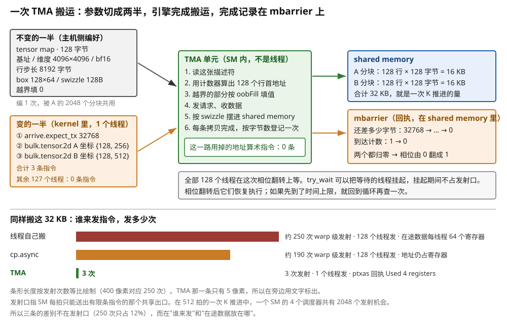
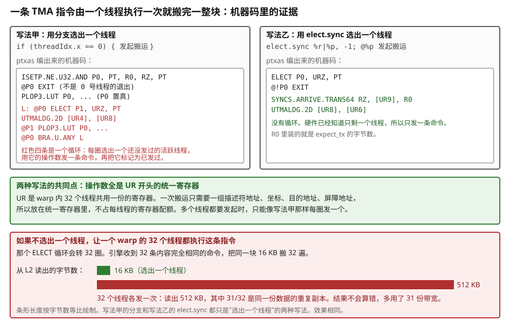
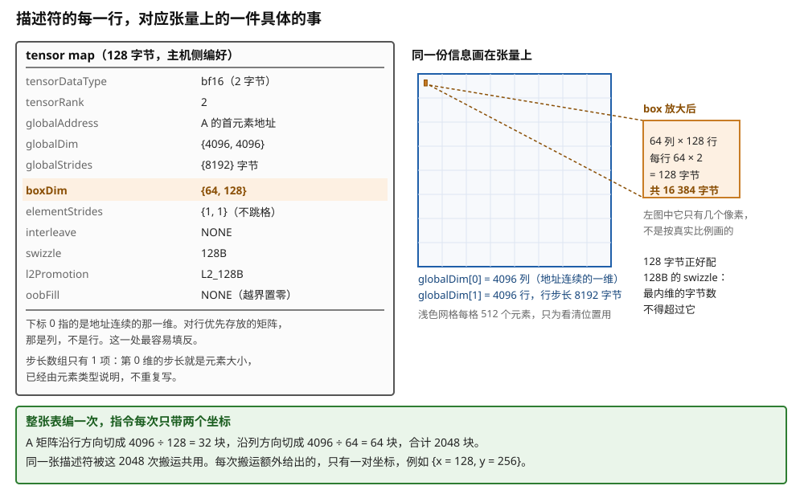
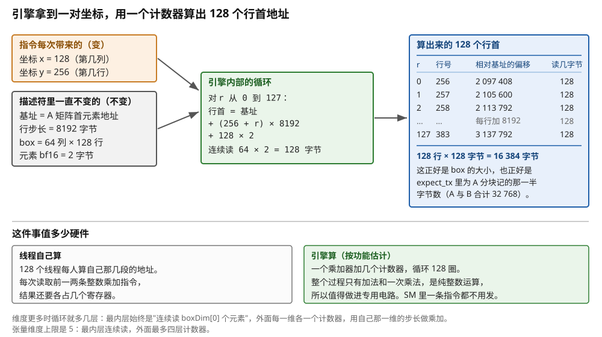
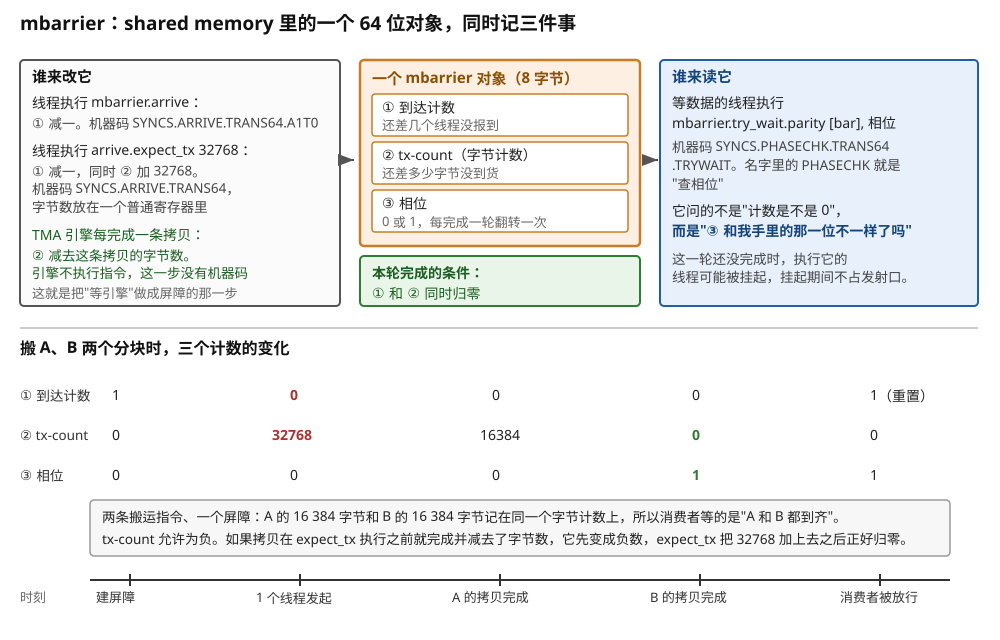
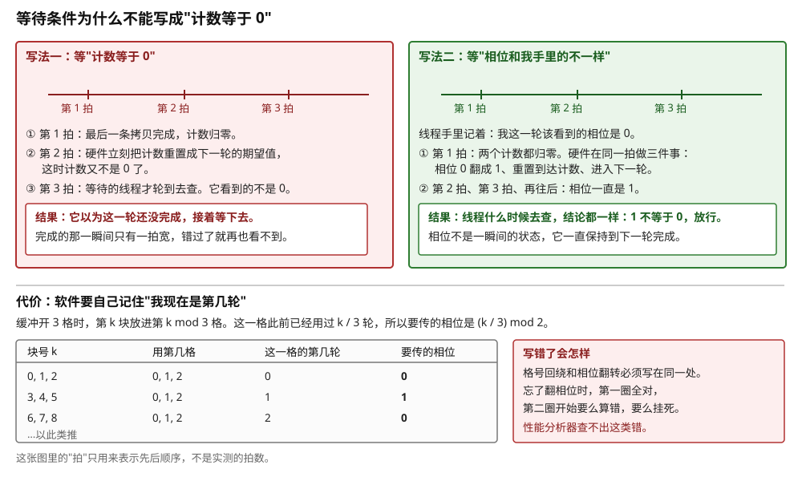
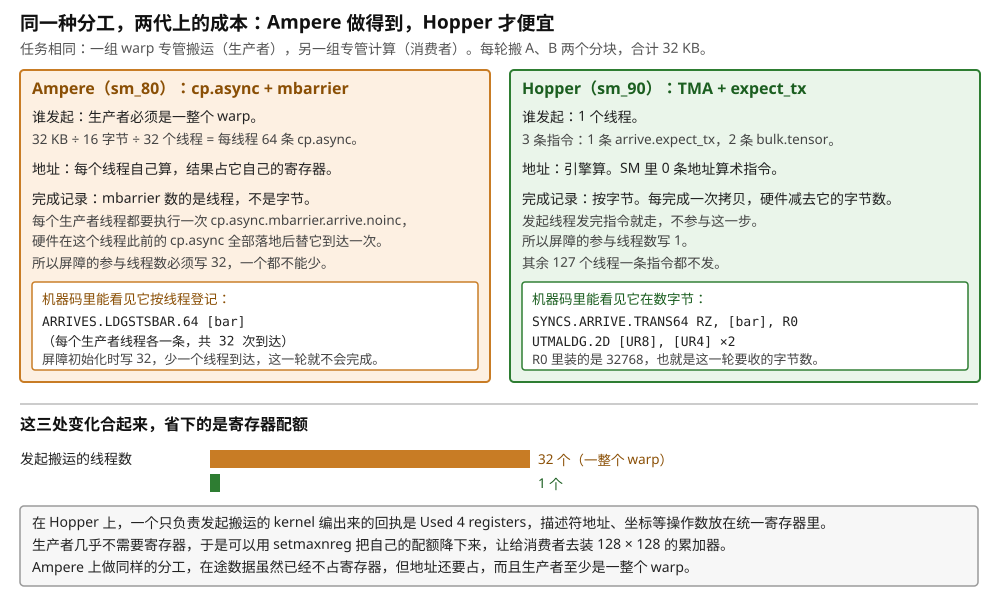
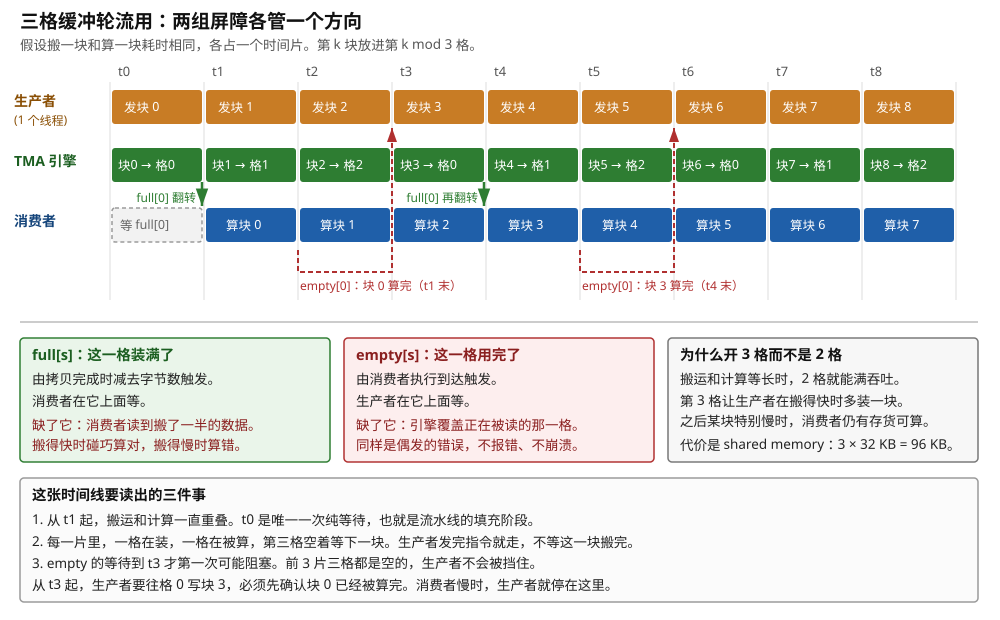
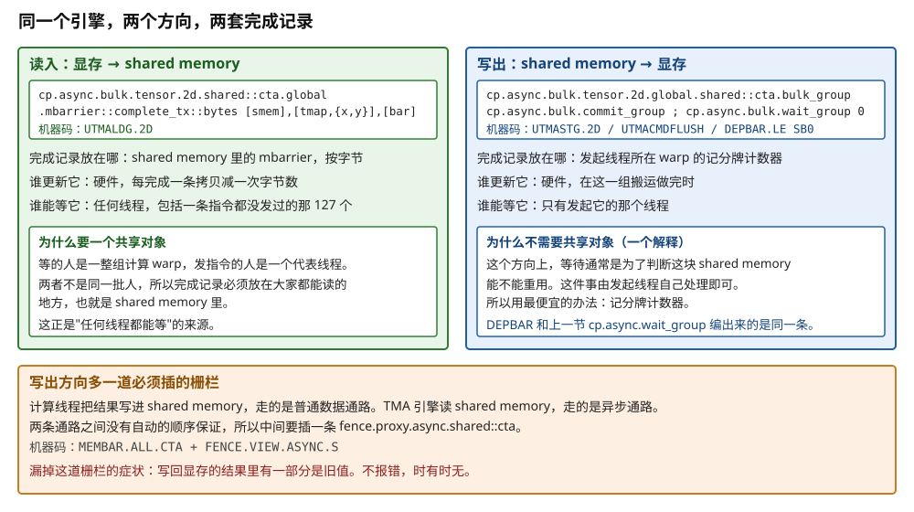

# Hopper：TMA 与 mbarrier 的按字节记录，一个线程发起

> **所属模块**：模块 14 · 数据搬运（第一部分 · GPU 的数据搬运）
> **状态**：🟨 学习中（2026-10 新写。知识截至 2026-09）
> **一句话主旨**：一次搬运要给的参数可以切成两半。张量的形状、步长、一次切多大，整个 kernel 都不变，要第几块则每次都变。Hopper 把不变的一半压进一张 128 字节的描述符，由主机侧编好，由 SM 内的 TMA 引擎去读。kernel 里只剩一个线程给出坐标，引擎自己算出全部地址。完成记录也换了位置：它从每个 warp 私有的记分牌，移到 shared memory 里的 mbarrier 上，按到货字节数记，由引擎更新，任何线程都能等。于是三个问题的答案一起变了：发起的从 128 个线程变成 1 个，地址从整数指令变成专用硬件，完成从私有的计数器变成共享的对象。

<!-- 写之前先读 _模板/写作规范.md 和 _模板/配图规范.md -->

---

上一节把在途数据从寄存器挪进了 shared memory，`cp.async` 的完成事件变成"数据写进 shared memory"。但是有两件事没变：每个线程仍然自己算地址，每个线程仍然自己发指令。所以搬运仍然要占满整个线程块，寄存器仍然要留给地址。这一节讲 Hopper 的改法。它同时改了三个问题中的"谁发起"和"地址从哪来"，并且顺带改了"完成怎么知道"的存放位置。

---

## 0. 这一节要回答的问题

- "描述符驱动"是什么意思？一次搬运要给的参数里，哪一半不变，哪一半每次变？
- 描述符里逐个字段写了什么？为什么它通常在主机侧提前编好？
- 引擎拿到一张描述符和一对坐标之后，内部按什么顺序做事？
- mbarrier 按字节记录完成，具体是怎么回事？硬件里记的是什么？谁加、谁减、谁检查？
- 相位位为什么必须有？不用它会出什么问题？
- 搬同一个 32 KB 的分块，和上一节相比，线程数、指令数、寄存器各降到多少？
- 生产者 / 消费者分工在 Ampere 上就能做。为什么到 Hopper 它才便宜？
- 写出方向（shared memory → 显存）为什么换了一套完成机制？

---

## 1. 基础词汇

**描述符（descriptor）**。描述符是一个小结构体，里面写着一次搬运任务的全部固定信息：数据在显存里的起始地址、有几个维度、每个维度多长、相邻两行之间隔多少字节、每个元素几字节、一次切多大一块。它本身不是数据，写的是关于数据的信息。硬件搬运引擎读了它，就知道该去哪些地址取数、取多少。

**张量、维度与步长（stride）**。本节的"张量"就是一块按多维数组解释的连续内存。一个 4096 行 × 4096 列的 bf16 矩阵，在显存里是一条 1678 万个元素的直线。把它看成二维需要两个额外信息：每一维有多长，以及沿某一维走一格地址要跳多少字节。后者叫步长。上面这个矩阵按行优先存放时，沿列走一格跳 2 字节，沿行走一格跳 4096 × 2 = 8192 字节。步长要单独写出来，不能由长度推算，因为真实的张量常常带填充：一行分配了 4160 个元素的空间，但只用了 4096 个。

**box（搬运框）**。box 是描述符里规定的"一次搬多大一块"。它的维度数和张量相同：二维张量配二维 box。发起搬运时给出的坐标，指的是这个框的角落落在张量的什么位置。框的形状写死在描述符里，坐标每次变。NVIDIA 的文档把它叫 bounding box。

**TMA（Tensor Memory Accelerator，张量内存加速器）**。TMA 是 NVIDIA 从 Hopper（2022，`sm_90`）起在 SM 内放的一个专职搬运单元。它读一张 128 字节的描述符加一组坐标，自己算出这一块数据在显存里的全部地址，成段地搬进 shared memory，或者反过来写回显存。它不是线程，不执行指令流。

**mbarrier（可计数屏障）**。mbarrier 是放在 shared memory 里的一个 8 字节对象。它同时记三件事：还差几个线程没报到（到达计数）、还差多少字节没到货（字节计数，PTX 文档里叫 tx-count）、以及当前是第几轮的奇偶（相位）。线程可以在它上面报到或者等待。搬运引擎不执行指令，但硬件会在它每完成一次拷贝时，把这次拷贝的字节数从字节计数里减掉。

**相位（phase）**。相位是 mbarrier 内部的一个标志位，每完成一轮就在 0 和 1 之间翻转一次。等待方自己记着"我这一轮该看到哪个值"，等的是"屏障的相位和我手里的不一样了"，而不是"计数归零了"。有了它，同一个屏障对象可以在循环里一轮接一轮地重复使用。

**统一寄存器（uniform register，UR）**。统一寄存器是 warp 内 32 个线程共用一份的寄存器，在 SASS 里以 `UR` 开头。一个值在 warp 内处处相同时，编译器把它放进统一寄存器，这样它不占每线程的寄存器配额。

**本节的固定例子**。沿用本模块第 1 节的运行例子，并补上张量的整体形状：

- 矩阵乘的输出分块是 128 × 128，沿 K 方向每次推进 64。
- 每推进一次，搬 A 的一个 128 × 64 分块和 B 的一个 128 × 64 分块。元素是 bf16（2 字节）。
- **每个分块 128 × 64 × 2 = 16 384 字节，每推进一次搬 32 768 字节。**
- 线程块是 128 个线程（4 个 warp）。H100 上算完这一步要 **512 拍**。
- A 和 B 都是 4096 × 4096 的矩阵，按行优先存放，行步长 8192 字节。A 按 M × K 存放，B 按 N × K 存放，所以两者的分块都是 128 行 × 64 列。

---

## 2. 一次搬运的参数分成两半：不变的进描述符，变的留给指令

### 2.1 分界线画在"会不会变"上

要把搬运交给一个引擎，先要回答一个问题：引擎需要知道什么，才能自己算出全部地址？

答案是两类信息。第一类是张量本身的属性：它在哪、每一维多长、每行隔多远、元素多宽、一次切多大一块、切下来在 shared memory 里怎么摆、超出边界怎么办。这一类在整个 kernel 的生命周期里一个字都不变。同一个矩阵乘的 A 矩阵，从第一块搬到最后一块，基址和行步长都是同一个数。第二类信息是这次要第几块：一组坐标，指明 box 的角落落在张量的什么位置；再加上搬到 shared memory 的哪个地址，以及搬完了向哪个屏障登记。

描述符驱动的全部设计就建在这条分界线上：

- 不变的一半做成一个固定大小的只读对象，提前编好、放在内存里。引擎每次搬运时去读它。NVIDIA 把它做成 128 字节的 `CUtensorMap`。
- 变的一半留给 kernel 里的那条指令，只带几个 32 位整数。

这样切能省多少，可以直接算出来。本节的例子里，A 矩阵沿 M 方向切成 4096 ÷ 128 = 32 块，沿 K 方向切成 4096 ÷ 64 = 64 块，合计 **2048 块**。一张描述符编一次，被这 2048 次搬运共用，每次只额外提供 2 个坐标。如果不这么切，每次搬运都要把基址、两个维度、行步长、元素类型、box 形状、swizzle 模式、越界策略这十来个字段重新说一遍。一条指令的操作数里塞不下这么多东西，只能退回每个线程自己算地址的老路。

### 2.2 算例：同一个 32 KB，三种搬法的账

把这件事变成数字。任务固定：把 A、B 两个 128 × 64 的 bf16 分块共 32 768 字节，从显存搬进 shared memory，由一个 128 线程的线程块完成。H100 上这一步的计算要 512 拍，所以搬运必须在这 512 拍里完成才不拖后腿。

**第一种：线程自己搬（本模块第 1 节）。** 一条指令一个线程最多搬 16 字节。32 768 ÷ 16 = 2048 次线程级搬运，摊到 128 个线程，每人 16 次。每一次要两条指令：一条 `LDG` 把数据读进寄存器，一条 `STS` 把它写出到 shared memory。按 warp 计是 128 次发射。加上地址算术，第 1 节算过，合计约 **250 次 warp 级发射**。在途数据必须占着寄存器：32 768 ÷ 128 = 256 字节，也就是**每线程 64 个寄存器**。

**第二种：`cp.async`（本模块第 2 节）。** 数据不经过寄存器，一条指令直接把 16 字节从显存送进 shared memory。2048 次搬运变成每人 16 条指令，按 warp 计是 64 次发射。再加上提交与等待，本模块第 2 节数出的是 68 次。地址仍然每人自己算，所以第一种里约 120 次的地址算术不变。合计约 **190 次 warp 级发射**（估算，地址算术按每次搬运前一两条整数指令推出）。在途数据不再占寄存器，地址还占。

**第三种：TMA。** 一个线程执行三条指令：一条 `mbarrier.arrive.expect_tx` 告诉屏障这一轮要收 32 768 字节，两条 `cp.async.bulk.tensor.2d` 分别把 A、B 的坐标交给引擎。其余 127 个线程一条指令都不发。地址算术 **0 条**。

| | 发指令的线程数 | warp 级发射次数 | 地址算术 | 搬运占用的寄存器 | 越界判断 |
| --- | --- | --- | --- | --- | --- |
| `LDG` + `STS` | 128 | 约 250 | 每线程自己算 | 每线程 64 个（在途数据） | 软件写分支 |
| `cp.async` | 128 | 约 190 | 每线程自己算 | 地址寄存器，每线程几个 | 软件写分支或用 zfill |
| **TMA** | **1** | **3** | **0 条** | **整个 kernel 4 个** | 引擎自己裁剪并填充 |

最后一列的"4 个"是实测值。用本机的 ptxas（CUDA 12.8）把一个只做这件事的 PTX kernel 编到 `sm_90a`，编译回执是 `Used 4 registers`。发起搬运用到的描述符地址、坐标、目的地址和屏障地址，SASS 里放在统一寄存器中。统一寄存器不计入这 4 个。

读这张表时要小心一个容易高估的地方：**发射次数本身不是瓶颈**。在 512 拍里，一个 SM 的 4 个调度器共有 2048 个发射机会。线程自己搬占约 12%，TMA 占 0.15%。省下的这 12% 有用，但它不是主要收益。

真正的收益在第一列和倒数第二列。前两种搬法要求线程块全员参与搬运，没有一个 warp 能脱身，而且地址寄存器和在途数据要和累加器抢同一份预算。TMA 只要一个线程、4 个寄存器，于是线程块可以分成专管搬运的生产者和专管计算的消费者。§6 会把这笔账算完。



> **图 3-1**　一句话：一次搬运要给的参数被切成两半。不会变的那一半在主机上提前填好，每次都变的那一半（几个坐标）由 kernel 里一个线程临时给出。引擎按这两半完成搬运，完成后在一个计数器上登记。
>
> **先知道一件事**：SM 每拍只能发出有限条指令，所有线程共用这一个出口，图里叫发射口。搬运指令和算地址的指令占了它，计算指令就少了机会。所以"搬一块数据要发几条指令"会直接影响计算跑多快。
>
> **按这个顺序看**：
> 1. 左上灰框是不变的那一半：一张 128 字节的描述符，叫 tensor map。它写着数据在哪、每一维多长、每行隔多远、一次切多大一块。它在 kernel 启动前由主机填好，整个 kernel 期间一个字都不改。所以填一次能被 A 的 2048 个分块共用。
> 2. 左下橙框是变的那一半：kernel 里一个线程执行三条指令。第一条告诉计数器这一轮要收 32 768 字节。第二条、第三条分别把 A、B 的坐标交给引擎。同一个线程块里另外 127 个线程一条指令都不发。
> 3. 中间绿框是 TMA 单元。两个箭头汇进来之后，它按 1 到 6 的顺序完成搬运：读描述符、用计数器算出 128 个行首地址、给越界的部分按 `oobFill` 填值、发请求收数据、按规定的摆法写进 shared memory、每条拷贝完成后按它的字节数登记一次。这一路它没有用掉任何一条计算指令。图中的六步是按功能列的顺序，NVIDIA 没有公开引擎内部的流水结构。
> 4. 右上蓝框是数据落地的地方：A、B 各 128 行、每行 128 字节，各 16 KB，合计 32 KB。这正好是一次 K 推进要搬的量。
> 5. 右中橙框是完成记录：一个叫 mbarrier 的计数器。它的字节数从 32 768 开始。A 那条拷贝完成时减掉 16 384，B 那条完成时再减掉 16 384。两个计数都归零时，它的相位翻转一次。
> 6. 下半是同样搬这 32 KB 的三笔账。条形长度按 warp 级发射次数等比画。TMA 那一条只有 3 次，画出来不足 5 像素，所以在旁边用文字标出。
>
> **打个比方**：前两种像全班同学每人拿着自己的清单去仓库搬几箱。第三种像班长填一张订单交给物流部，物流部按订单自己去搬，其余同学继续上课，门口挂一块牌子记录还差多少货没到。
>
> **看懂的标志**：能回答"为什么说 TMA 省的不只是指令条数"。它同时省掉三样东西：占发射口的指令、存地址用的寄存器、以及写越界判断的那些分支。三样都是所有线程共用的稀缺资源。而且发射口那一项其实是三样里最不重要的。
>
> **与正文的对照**：三笔账的数字取自 §2.2 的表。`Used 4 registers` 是本机 ptxas 编译的回执。图中只画了读入方向，写出方向见 §7。
>
> 来源：本库自绘。

### 2.3 一个线程执行一次就搬完一整块：机器码里的走查

这里有一个容易误解的地方。TMA 的指令不是"一个 warp 一起执行的指令"，而是**一个线程执行一次就完成一次完整搬运**的指令。如果 128 个线程都执行它，同一块数据会被搬 128 遍。结果不会算错，但带宽浪费 127 倍。

这不是推断，机器码里能直接看到。下面是一次本机实验。把一段 PTX 编到 `sm_90a`，再用 `cuobjdump -sass` 反汇编。

**写法甲：用分支选出一个线程。** PTX 里写 `if (threadIdx.x == 0)` 的等价形式，编出来是：

```
    ISETP.NE.U32.AND P0, PT, R0, RZ, PT   // 判断本线程是不是 0 号
    @P0 EXIT                              // 不是的退出
    PLOP3.LUT P0, ...                     // P0 置真：本线程还没发过命令
L:  @P0 ELECT P1, URZ, PT                 // 从还没发过的活跃线程里选出一个
    UTMALDG.2D [UR4], [UR8]               // 用选中线程的操作数发一条 TMA 命令
    @P1 PLOP3.LUT P0, ...                 // 选中的线程把自己的 P0 置假
    @P0 BRA.U.ANY  L                      // 还有线程的 P0 为真，回到 L
```

从 `L` 开始的四条是一个循环。每转一圈，`ELECT` 从还没发过命令的活跃线程里选出一个，用它的操作数发一条 `UTMALDG`，再把它标记为已发过。活跃线程有几个，这个循环就转几圈。本例中只有 0 号线程活跃，所以只转一圈。

**写法乙：用 `elect.sync` 选出一个线程。** `elect.sync` 是 PTX 的一条指令（PTX ISA 8.0，要求 `sm_90`）。它从给定的一组线程里选出一个领头线程，给它一个真值谓词，其余线程拿到假值。文档说这个选择是确定的：同一组线程每次选出的都是同一个。编出来是：

```
ELECT P0, URZ, PT
@!P0 EXIT
SYNCS.ARRIVE.TRANS64 RZ, [UR9], R0   // mbarrier.arrive.expect_tx，R0 里是字节数
UTMALDG.2D [UR8], [UR6]              // 一条 TMA 命令，没有循环
```

没有循环。编译器已经知道只剩一个线程，所以直接发一条命令。CUTLASS 和 FlashAttention-3 用的都是这种写法。

两种写法有一个共同点：`UTMALDG` 的操作数全是 `UR` 开头的统一寄存器。一次搬运只需要一组描述符地址、坐标、目的地址和屏障地址，没有每线程一份的必要。统一寄存器正好一个 warp 只有一份。这也解释了写法甲为什么需要那个循环。如果多个线程都要发起，各自的操作数可能不同。硬件只能每圈取一个线程的值放进统一寄存器，发一条命令。SASS 里认出 `UTMALDG`，就等于认出这个 kernel 用了 TMA。



> **图 3-2**　一句话：TMA 的搬运指令由一个线程执行一次，就搬完一整块数据。机器码里那个选线程的循环说明了这一点：活跃线程有几个，引擎就收到几条一模一样的命令。
>
> **先知道一件事**：GPU 上一条普通的读取指令，是 warp 的 32 个线程各读自己那一份，一条指令搬 32 份数据。TMA 不是这样。它一条指令搬的是描述符里规定的那一整块，和执行它的线程有几个无关。
>
> **按这个顺序看**：
> 1. 左框是写法甲。前两条判断本线程是不是 0 号，不是的退出。第三条把一个标志 P0 置真，表示"还没发过命令"。红色那四条是一个循环：`ELECT` 选出一个还没发过命令的活跃线程，`UTMALDG` 用它的操作数发一条命令，下一条把它的 P0 置假，最后一条判断还有没有线程的 P0 为真。
> 2. 右框是写法乙。`elect.sync` 已经把"只留一个线程"写进了程序，所以编译器不需要循环，直接发一条命令。`SYNCS.ARRIVE.TRANS64` 是登记字节数那条指令，R0 里装的就是要等的字节数。
> 3. 中间绿框是两种写法的共同点。`UR` 是 warp 内 32 个线程共用一份的寄存器。一次搬运只需要一组描述符地址、坐标、目的地址和屏障地址，所以它们放在这里，不占每线程的寄存器配额。
> 4. 下方红框是不选线程的后果。那个循环会转 32 圈，引擎收到 32 条内容完全相同的命令，把同一块 16 KB 搬 32 遍。
> 5. 看两条横条的长度差别：选出一个线程时从 L2 读出 16 KB，不选时读出 512 KB，其中 31/32 是同一份数据的重复副本。
>
> **看懂的标志**：能回答"为什么代码里必须显式选出一个线程来执行它"。因为这条指令的搬运量由描述符决定，和执行它的线程数无关。线程多执行一次，引擎就多搬一整块。结果仍然正确，浪费的是带宽。
>
> **与正文的对照**：两段机器码取自本机实验，用 CUDA 12.8 的 ptxas 编到 `sm_90a`、`cuobjdump -sass` 反汇编。为了便于阅读，省略了与本节无关的几条寄存器搬移指令和屏障初始化指令，`PLOP3.LUT` 的谓词运算参数也用省略号代替。
>
> 来源：本库自绘。

---

## 3. 描述符里写了什么

### 3.1 十二个参数，逐个讲清楚

主机侧用 `cuTensorMapEncodeTiled` 这个 CUDA Driver API 函数生成描述符。它有 12 个参数：第一个是输出，其余 11 个是输入，填完就得到那 128 字节。下面的约束取自 CUDA Driver API 文档的 Tensor Map Object Management 一节。

先说输出。**`tensorMap`** 是函数的第一个参数，填好的 128 字节写到它指向的地方。文档对它的要求是 **64 字节对齐**。`CUtensorMap` 这个结构体本身的声明则要求编译器按 128 字节对齐。两处要求不同，按函数那一条做即可。描述符是不透明的：文档明确说它"只应通过 CUDA API 和 PTX 访问"。

下面是 11 个输入，按参数表的顺序。

**① `tensorDataType`（元素类型）**。它告诉引擎一个元素占几个字节。可选值是枚举 `CUtensorMapDataType`，覆盖整数（`UINT8`、`UINT16`、`UINT32`、`INT32`、`UINT64`、`INT64`）、浮点（`FLOAT16`、`BFLOAT16`、`TFLOAT32`、`FLOAT32`、`FLOAT64`，以及 `FLOAT32_FTZ`、`TFLOAT32_FTZ` 两个变体），以及为低比特量化准备的打包类型（`16U4_ALIGN8B`、`16U4_ALIGN16B`、`16U6_ALIGN16B`，CUDA 12.8 的 `cuda.h`）。引擎需要这个字段，因为它要按字节算地址，而坐标是按**元素**给的。

**② `tensorRank`（维度数）**。取值 1 到 5。上限是 5，因为卷积的输入张量最多五维（批 N、深 D、高 H、宽 W、通道 C）。引擎内部的地址生成是一组嵌套计数器，层数就是维度数，所以这个上限也是电路的层数上限。用了交织布局（字段 ⑧）时，维度数还必须至少是 3。

**③ `globalAddress`（基址）**。张量第一个元素在显存里的地址，必须 16 字节对齐。`cudaMalloc` 返回的地址天然满足。两种情况要求 32 字节对齐：交织布局选 32B 时，以及元素类型是 `16U4_ALIGN16B` 或 `16U6_ALIGN16B` 这两种打包类型时。

**④ `globalDim`（各维长度）**。一个长度等于维度数的数组，每一项是这一维的元素个数，非零且不超过 2³²。**下标顺序容易填反**：`globalDim[0]` 是最内层、地址连续的那一维。对一个按行优先存放的矩阵，`globalDim[0]` 是列数，`globalDim[1]` 是行数。这和 C 语言里写 `A[行][列]` 的顺序正好相反。

**⑤ `globalStrides`（各维步长）**。一个长度等于维度数减一的数组，单位是**字节**。第 0 维的步长就是元素本身的大小，由字段 ① 隐含给出，所以不写。`globalStrides[0]` 是沿第 1 维走一格跳多少字节，也就是行步长。它必须是 16 的倍数，并且小于 2⁴⁰（约 1 TB）。在上面两种要求 32 字节对齐的情况下，步长也必须是 32 的倍数。

**⑥ `boxDim`（box 各维大小）**。一次搬多大一块，每项非零且不超过 256 个元素。另有一条硬约束：不用交织布局时，`boxDim[0] × 元素字节数` 必须是 16 的倍数。文档没有说明原因。它和 TMA 的其它约束一致：基址、步长、一次传输的字节数都以 16 字节为单位。§7.4 会看到，一维整块拷贝的机器指令里，长度字段的单位就是 16 字节。

**⑦ `elementStrides`（元素步长）**。box 在张量里取数时，每走一格跳过几个元素。每项非零且不超过 8，填 1 表示不跳。它用于隔行或隔列取样式的访问。某一维填 n 时，这一维实际搬 `ceil(boxDim[i] / n)` 个元素。不用交织布局时，**数组的第 0 项被忽略**，因为引擎不支持第 0 维的元素步长：最内层维度不允许跳着取，那会破坏"成段搬运"这个前提。

**⑧ `interleave`（交织布局）**。三选一：`CU_TENSOR_MAP_INTERLEAVE_NONE`、`_16B`、`_32B`。交织是一种把通道维度按 16 或 32 字节为单位掺进空间维度的存放方式，为某些图像类负载准备。日常的矩阵乘和 attention 全部填 `NONE`。

**⑨ `swizzle`（换座位模式）**。数据写进 shared memory 时，按什么规则打乱摆放位置。可选 `NONE`、`32B`、`64B`、`128B`，以及 Blackwell 新增的 `128B_ATOM_32B`、`128B_ATOM_32B_FLIP_8B`、`128B_ATOM_64B` 三种变体。**它和 box 最内维的字节数必须配套**：`boxDim[0] × 元素字节数` 不得超过 swizzle 的字节数。选 32B 时不超过 32，选 64B 时不超过 64，选 128B 的各种变体时不超过 128。打乱的目的是避免 bank 冲突，具体的置换规则归本模块第 11 节。这里只需要知道一件事：**swizzle 是描述符里的一个字段，引擎在搬运过程中完成，不额外花时间。**

**⑩ `l2Promotion`（二级缓存提升）**。四选一：`NONE`、`L2_64B`、`L2_128B`、`L2_256B`。它告诉 L2，这次搬运产生的请求按多大的粒度成块拉进来。这是一个纯性能提示，填错不会算错。

**⑪ `oobFill`（越界填充）**。box 伸出张量边界时，越界的位置填什么。两选一：`CU_TENSOR_MAP_FLOAT_OOB_FILL_NONE` 表示越界的元素由引擎置零，`_NAN_REQUEST_ZERO_FMA` 表示填一个特殊的 NaN，只对浮点类型可用。为什么要有第二种，归本模块第 12 节。

### 3.2 为本节的例子逐字段填一遍

把 §1 那个例子的 A 矩阵描述符完整填出来。A 是 4096 × 4096 的 bf16 矩阵，按行优先存放，box 是 128 行 × 64 列。

| 字段 | 填什么 | 为什么 |
| --- | --- | --- |
| `tensorDataType` | bf16 | 元素 2 字节 |
| `tensorRank` | 2 | 二维矩阵 |
| `globalAddress` | A 的首元素地址 | `cudaMalloc` 返回的地址已经 16 字节对齐 |
| `globalDim` | `{4096, 4096}` | `[0]` 是列数（地址连续的那一维），`[1]` 是行数 |
| `globalStrides` | `{8192}` | 只需 1 项。一行 4096 个 bf16 = 8192 字节，是 16 的倍数 |
| `boxDim` | `{64, 128}` | `[0]` 是 64 列，`[1]` 是 128 行。两项都不超过 256；64 × 2 = 128 字节是 16 的倍数 |
| `elementStrides` | `{1, 1}` | 不跳格。第 0 维必须是 1 |
| `interleave` | `NONE` | 普通行优先矩阵 |
| `swizzle` | `128B` | box 最内维正好 128 字节，与 128B 模式配套 |
| `l2Promotion` | `L2_128B` | 每行正好 128 字节，L2 按 128 字节的粒度从显存取数。Triton 3.7 编描述符时也固定填这个值 |
| `oobFill` | `NONE`（越界置零） | 4096 能被 64 和 128 整除，其实不会越界 |

描述符之外，还有三条对齐要求同样是硬的，写在 CUDA 编程指南的表里：**shared memory 这一侧的目的地址必须 128 字节对齐**，mbarrier 对象必须 8 字节对齐，一次搬运的字节数必须是 16 的倍数。用 swizzle 时，编程指南还建议把 shared memory 按"swizzle 模式重复一遍的长度"对齐，128B 模式下是 1024 字节。

由这张表能直接推出三个数字，后面每一节都要用：

- **一块的字节数** = 128 × 64 × 2 = **16 384 字节**。A、B 两块合计 32 768 字节，这就是 `expect_tx` 要写的数。
- **一块的行数与每行字节数** = 128 行 × 128 字节。引擎内部按行推进，见 §4.1。
- **一共有多少块** = (4096 ÷ 128) × (4096 ÷ 64) = 32 × 64 = **2048 块**。同一张描述符被用 2048 次。



> **图 3-3**　一句话：描述符里的每一行，对应的都是右边那张张量图上的一件具体的事：矩阵多大、每行隔多远、一次切多大一块、切下来怎么摆。
>
> **先知道一件事**：显存里没有"二维矩阵"这种东西，只有一条长长的字节序列。把它当成二维来看，靠的是两个约定：每一维有多少个元素，以及沿某一维走一格要跳多少字节。后者叫步长。步长要单独写出来而不是由长度推算，因为真实数据常常带填充。
>
> **按这个顺序看**：
> 1. 先看右边的大方框：这是那个 4096 × 4096 的矩阵。浅色网格线每格 512 个元素，只为看清位置，不是切块的大小。
> 2. 看方框下方的两行蓝字：`globalDim[0]` 是 4096 列，`globalDim[1]` 是 4096 行。下标 0 指的是地址连续的那一维。对行优先存放的矩阵，那就是列。这和 C 语言里写 `A[行][列]` 的顺序正好相反，是最容易填错的一处。
> 3. 看方框左上角那个橙色小方块：这是 box 在张量里的真实大小。虚线把它引到右边的放大图：64 列 × 128 行，每行 64 × 2 = 128 字节，合计 16 384 字节。
> 4. 右下角那几行解释了为什么 swizzle 填 128B：最内维的字节数不得超过 swizzle 的字节数，这里正好相等。
> 5. 回到左边的表，从上往下读。前五行说的是张量本身长什么样。`boxDim` 那一行（带底色）说的是一次切多大。后面几行说的是搬运的方式：跳不跳格、要不要交织、写进 shared memory 时怎么换座位、二级缓存多拉一点还是不拉、越界填什么。
> 6. 最后看底部的绿框：整张表编一次，被 2048 个分块共用。每次搬运额外给出的只有一对坐标。
>
> **打个比方**：这张表是一份布料的裁剪说明书。布有多宽、每一匹之间空多少、每次裁多大一片、裁下来怎么叠，都写在上面。说明书写一次，后面每次只需要说"从第几行第几列开始裁"。
>
> **看懂的标志**：能回答"为什么 `globalStrides` 只有一项，而 `globalDim` 有两项"。最内层那一维的步长就是元素本身的大小，已经由元素类型说明了，不需要重复写。所以步长数组的长度总是维度数减一。
>
> **与正文的对照**：各字段的取值与 §3.2 的表逐行一致。约束见 §3.1。图中 box 与张量的比例不是真实比例，真实比例下 box 只有几个像素。
>
> 来源：本库自绘。

### 3.3 为什么通常在主机侧提前编好

有三个原因。前两个是格式和通路上的限制，第三个是成本。

**第一，它是一个定长对象，编码格式不公开。** 128 字节里各字段怎么打包，是硬件内部的约定。NVIDIA 没有公开字段布局，只给出 `cuTensorMapEncodeTiled` 这个编码函数。在设备侧用普通的整数运算拼出这 128 字节，程序员无从下手。

**第二，它走一条单独的访问通路。** PTX 文档说描述符"通过 tensormap proxy 访问"。proxy 这个词在 PTX 里指访问同一块内存的不同硬件路径。描述符不按普通数据的路径读取。PTX 还为它单独提供了预取指令（§3.4），说明这条通路有自己的缓存。不同通路之间没有自动的一致性保证。如果一个线程用普通的写指令改了显存里的描述符，TMA 单元不会自动看到这个改动，必须显式地插一道 `fence.proxy.tensormap::generic` 栅栏。在主机侧编好、kernel 期间完全不动，就绕开了这一整类麻烦。

**第三，编码有代价，但这个代价可以摊销。** `cuTensorMapEncodeTiled` 是一次主机侧的函数调用，它要检查前面那十几条约束。放在 kernel 里每次搬运前做一遍不合理。放在主机侧做一次、被 2048 次搬运共享，这个代价就看不见了。

运行时确实需要改描述符时，有一条补上来的路：PTX 的 `tensormap.replace`（PTX ISA 8.3 起）可以在设备上把描述符的某个字段替换成新值。可改的字段包括基址、维度数、各维长度与步长、box 大小、元素步长、元素类型、交织布局、swizzle 模式和填充模式。编程指南给的用法分三步。第一步，把主机编好的模板描述符拷进 shared memory。第二步，用 `tensormap.replace` 改字段。第三步，用 `tensormap.cp_fenceproxy` 把它拷回显存，同时以 release 语义发布。使用方在用它之前执行 `fence.proxy.tensormap::generic.acquire`。编程指南还提到，在 `sm_90a` 上可以从一块清零的 shared memory 起步，完全在设备上编出描述符。

这条路有三道附加条件，都写在文档里：

1. 它只对 tiled 类型的描述符有效。
2. `tensormap.replace` 是架构专用指令，只能编到 `sm_90a`、`sm_100a` 这类带 a 后缀的目标。
3. **执行 acquire 栅栏的线程和使用这张描述符的线程必须在同一个线程块里。** 用簇、grid 或者流的同步代替都不够。

它是给"张量形状到运行时才知道"的场景准备的。编程指南举的例子是一次 kernel 启动处理一批大小各不相同的张量。与按值传入的描述符相比，它多了一次拷贝和一对栅栏。

### 3.4 怎么传进 kernel

有三种传法，按推荐程度排：

1. **`const __grid_constant__ CUtensorMap` 参数**。按值传进 kernel，编译器把它放在常量参数空间。这是 CUDA 编程指南推荐的做法，也是最快的：常量空间有自己的缓存，整个 grid 共享一份，没有一致性问题。
2. **`__constant__` 全局变量**，主机侧拷进去。适合描述符在多个 kernel 之间共享的场景。
3. **放在显存里的普通全局变量**。灵活，但引擎要从显存读这 128 字节，而且程序员要自己处理通路一致性。

第三种情况下，"读描述符"本身成了一笔可见的延迟。引擎必须先把 128 字节读回来才能开始算地址。为此 PTX 提供了描述符预取 `prefetch.tensormap`。它可以带 `.const` 或 `.param` 指明描述符所在的状态空间，不带时按通用地址解释。本机实验中，它编成一条 `UTMACCTL.PF`（TMA 的缓存控制指令）。

这里要区分两种预取，名字很像，做的事完全不同：

- `prefetch.tensormap` 预取的是**描述符本身**，也就是那 128 字节本身。SASS 是 `UTMACCTL.PF`。
- `cp.async.bulk.prefetch.tensor.2d.L2.global` 预取的是**数据**：让引擎按描述符和坐标把那一块数据拉进 L2，但不写进 shared memory。SASS 是 `UTMAPF.L2.2D`。它用在"我还没准备好接收，但想让数据先到 L2"的场景。

### 3.5 一个具体的失败：行宽 4095

规则讲完，配一个反例更容易记住。假设 A 矩阵是 4096 行 × 4095 列的 bf16，其余不变。这时行步长是 4095 × 2 = 8190 字节，不是 16 的倍数。`cuTensorMapEncodeTiled` 会返回 `CUDA_ERROR_INVALID_VALUE`，主机侧拿不到可用的描述符。

问题出在每一行，不只是最后几列。行首地址是 r × 8190，奇数行的行首只有 2 字节对齐。所以实用的修法是分配时把每行填充到 4096 列，让行步长回到 8192 字节。不填充时，奇数行连 `cp.async` 也用不上，因为 `cp.async` 最小一次搬 4 字节，并且要求地址按搬运大小对齐。剩下的办法只有线程自己逐元素搬。这是 TMA 的一条真实边界：对齐要求很严，换来的是不需要任何软件地址算术。

---

## 4. 引擎内部：从一对坐标到一串请求

线程发出指令之后就走了，接下来的事全在 TMA 单元内部。这一部分按功能拆开它的工作。

### 4.1 地址生成：走查 128 行

NVIDIA 没有公开 TMA 单元的电路结构。下面按功能描述它要完成的计算：拿到描述符和坐标之后，按维度跑一组嵌套的循环计数器，每个维度一个。

用 §3.2 的例子走一遍。描述符说：`globalDim = {4096, 4096}`、`globalStrides = {8192}`、`boxDim = {64, 128}`、元素 2 字节。指令给的坐标是 `{x = 128, y = 256}`，意思是这一块的左上角落在第 256 行、第 128 列。

二维张量只需要一层外循环：

```
对 r 从 0 到 127：                                 ← boxDim[1] = 128 行
    行首地址 = 基址 + (y + r) × globalStrides[0] + x × 元素字节数
             = 基址 + (256 + r) × 8192 + 128 × 2
    从这个地址起，连续读 boxDim[0] × 元素字节数 = 128 字节
```

代入前几行和最后一行：

| r | 行号 (y + r) | 相对基址的偏移 | 读多少字节 |
| --- | --- | --- | --- |
| 0 | 256 | 256 × 8192 + 256 = 2 097 408 | 128 |
| 1 | 257 | 257 × 8192 + 256 = 2 105 600 | 128 |
| 2 | 258 | 258 × 8192 + 256 = 2 113 792 | 128 |
| … | … | 每行加 8192 | 128 |
| 127 | 383 | 383 × 8192 + 256 = 3 137 792 | 128 |

128 行 × 128 字节 = 16 384 字节。和 box 的大小对上了。

这里值得停下来估一下硬件成本。按上面的算式，整个地址生成只需要乘加和计数（这是按功能的估计，不是公开的电路数据）。它替代的是 128 个线程各自执行的那上百条整数指令。**把一件纯整数、模式固定的工作从通用指令换成专用状态机，这是"专用硬件替代通用指令"最直白的一个例子。**

维度更多时，循环就多几层。五维张量的最内层仍然是"连续读 `boxDim[0]` 个元素"，外面四层各是一个计数器，每层用自己那一维的步长做乘加。这就是 §3.1 中维度上限是 5 的来源。本机实验中，`cp.async.bulk.tensor.5d` 编出来的 SASS 是 `UTMALDG.5D`：**维度数直接写在机器指令的后缀里**，二维那条是 `UTMALDG.2D`。



> **图 3-4**　一句话：引擎拿到一对坐标之后，用一个计数器一行一行地算出这块数据在显存里的地址。整个过程只用到加法和一次乘法。
>
> **先知道一件事**：显存里一行数据是连续的，相邻两行之间隔着一个固定的距离，这里是 8192 字节。所以"取一个矩形块"这件事，等价于"算出 128 个行首地址，每个地址往后读 128 字节"。
>
> **按这个顺序看**：
> 1. 左上橙框是指令每次带来的两个坐标：x = 128 指第几列，y = 256 指第几行。
> 2. 左下灰框是描述符里一直不变的那几个数：基址、行步长 8192 字节、box 的形状、元素几字节。
> 3. 两个箭头汇进中间的绿框。绿框是算式本身：行号从 y 开始，r 从 0 数到 127；每一行的起始地址等于基址加上行号乘 8192，再加上列号乘 2。
> 4. 右边蓝框是算出来的结果：128 个偏移量，相邻两个正好相差 8192，每个往后读 128 字节，合计 16 384 字节。这正好是 box 的大小，也正好是 `expect_tx` 里为 A 分块记的那一半。
> 5. 下半是两种做法的成本。左边是 128 个线程每人算自己那几段，每次读取前一两条整数乘加指令，结果还要各占几个寄存器。右边是引擎按算式循环 128 圈，SM 里一条指令都不用发。右边写的"一个乘加器加几个计数器"是按功能的估计，NVIDIA 没有公开 TMA 的电路。
>
> **看懂的标志**：能回答"为什么算地址这件事值得做进专用电路"。因为它是纯整数运算，模式完全固定：一个乘加、一个递增，重复 128 次。通用指令做这件事要占发射口和寄存器。专用电路只需要乘加和计数，不占任何一个线程的资源。
>
> **与正文的对照**：偏移量与 §4.1 的表逐行一致。`UTMALDG.2D` / `UTMALDG.5D` 这两个后缀取自本机的反汇编结果。
>
> 来源：本库自绘。

### 4.2 边界之外的部分由引擎补齐，但记录仍按整块算

张量的边长不是 box 的整数倍时，边缘那些块会有一部分落在张量之外。引擎自己处理这件事。PTX 文档规定的是结果：box 中落在张量之外的元素，按描述符里的 `oobFill` 填 0 或填一个特殊的 NaN。越界的部分是否还向显存发请求，文档没有说。从功能上推测，引擎不需要为它们发请求。

越界填充的两种模式各解决什么问题，归本模块第 12 节。这里只讲一个和本节直接相关的细节，因为它会影响 mbarrier 的记录：

**`expect_tx` 写的是 box 的整块大小，不是实际从显存读回来的字节数。** 本节的例子里，无论这一块是不是贴着边缘，`expect_tx` 都写 16 384。CUTLASS 这类库都是这么写的。如果改成按有效数据算，`expect_tx` 加上的数和引擎减去的数对不上，字节计数停不到 0，屏障不会正常完成。§6.4 把这类事故列全。

### 4.3 请求粒度与乱序返回

算出地址之后，引擎把它们组织成一批访存请求发往 L2。这里有三件事值得说。

**第一，请求的粒度。** 本例每行 128 字节，起点在 256 字节的偏移上，所以正好覆盖 4 个完整的 32 字节段。段是显存和缓存之间传输数据的最小单位，即使只用到其中几个字节，硬件也要搬整个段。如果每行的起点或长度不落在段边界上，一行就要多读一个段，多读的部分被丢掉。对齐要求本身只到 16 字节（§3.1），所以按 32 字节段对齐要靠程序员选择 box 的位置和大小。

**第二，回来的数据可以是乱序的。** 发出去的请求不保证按顺序返回。这不影响结果，因为每一段数据在 shared memory 里的目的位置，在引擎算地址时就已经确定。数据先回来先写，最后的摆放与到达顺序无关。引擎内部用什么结构暂存这些数据，NVIDIA 没有公开。

**第三，搬运途中的变形由引擎在搬运过程中完成。** swizzle（按模式打乱 shared memory 里的摆放位置）和 im2col（把卷积的输入在搬运途中展开成矩阵乘要的列形式）都是描述符或指令上的一个修饰，引擎在数据流经它时就完成，不需要再对 shared memory 多做一遍读写。这两件事的具体变换规则归本模块第 11 节。

---

## 5. 完成记录搬到了 shared memory 上

### 5.1 引擎不执行指令，所以传统屏障用不了

到这里为止，三个问题中的两个已经有了新答案：发起的是一个线程，地址由引擎算。还剩第三个：**使用数据的一方怎么知道数据已经到达？**

前两节的答案都在记分牌上。`LDG` 的完成是数据写进目的寄存器，`cp.async` 的完成是数据写进 shared memory，两者记录在同一组每 warp 6 个计数器里。这组计数器有一个性质：**它只属于发出指令的那个 warp。** 别的 warp 看不到这笔记录。所以第 1 节才说，跨 warp 的分工要额外做一次握手。

TMA 这里有一个更根本的问题。传统屏障的工作方式是"每个参与者执行一条到达指令，计数减一，减到零放行"。但是**线程会执行指令，引擎不会**。TMA 引擎不是线程，它不会执行 `arrive`。它唯一能做的是：每完成一次拷贝，汇报这次搬了多少字节。

所以 Hopper 给 mbarrier 加了第二个计数器，记的是字节。

### 5.2 两个计数器：谁加、谁减、谁检查

mbarrier 是 shared memory 里的一个 8 字节对象，类型是 `.b64`。PTX 文档列出它记的东西：

- **到达计数**：本轮还差几个线程没报到。线程执行 `mbarrier.arrive` 时它减一。
- **期望到达数**：下一轮开始时，到达计数要被重置成几。它由 `mbarrier.init` 的参数给定。
- **字节计数（tx-count）**：本轮还差多少字节没到货。线程执行 expect-tx 操作时它增加；搬运完成时硬件执行 complete-tx 操作，它减少。
- **相位**：当前这一轮的奇偶，见 §5.3。

**本轮完成的条件是到达计数和字节计数同时归零。** 完成时，到达计数被重置成期望到达数。这样一来，"等线程"和"等引擎"被统一进了同一个对象。一轮里可以既等 3 个线程报到，又等 32 768 字节到货。

三条相关的 PTX 指令是：

```ptx
mbarrier.init.shared::cta.b64 [bar], 1;                       // 建：参与线程数写 1
mbarrier.arrive.expect_tx.shared::cta.b64 _, [bar], 32768;    // 记录：本轮期望 32768 字节
mbarrier.try_wait.parity.shared::cta.b64 %p, [bar], %phase;   // 等：查相位翻转了没有
```

第二条把"到达"和"声明期望字节数"合成了一条。PTX 文档说明，两个修饰同时出现时，到达那一步的计数参数按 1 算。也有只加字节数、不算到达的写法 `mbarrier.expect_tx`，用在到达和记录由不同线程做的场景。本机实验中，这两条编出来的 SASS 分别是 `SYNCS.ARRIVE.TRANS64` 和 `SYNCS.ARRIVE.TRANS64.RED.A0TR`，字节数放在一个普通寄存器里。

等待那条编出来是 `SYNCS.PHASECHK.TRANS64.TRYWAIT`。**机器指令的名字里直接写着 PHASECHK，也就是"查相位"**，而不是"查计数"。下一小节讲为什么。

引擎那一侧的语义，PTX 文档写得很明确：**一次异步拷贝完成时，硬件在指定的 mbarrier 上执行一次 complete-tx 操作，减去的数就是这次拷贝的字节数。** 所以本节的例子里，字节计数是分两次减完的：A 的那条拷贝完成时减 16 384，B 的那条完成时再减 16 384。一个屏障能同时为好几条拷贝记录，而发起搬运的线程只需要知道总数，不需要知道会有几条拷贝。这就是"按字节"而不是"按次数"记录买到的东西。

还有一个细节能看出这套机制考虑得很细：**字节计数允许为负**。按默认布局，它的取值范围是 −(2²⁰−1) 到 2²⁰−1。允许为负的原因是，引擎可能在 `expect_tx` 执行之前就完成并登记。那时字节计数先被减成负数，等 `expect_tx` 把 32 768 加上去，正好归零。硬件不假设两者的先后顺序，所以软件不必在这上面写额外的保序逻辑。尽管如此，把 `expect_tx` 写在发出搬运指令之前仍然是更清楚的写法。



> **图 3-5**　一句话：mbarrier 是 shared memory 里的一个小对象。它一边记"还差几个线程没到"，一边记"还差多少字节没到"，两个都归零才算这一轮完成。
>
> **先知道一件事**：传统的屏障靠"每个参与者执行一条到达指令"来计数。TMA 引擎不是线程，它不执行指令，所以这种计数方式对它不成立。它能做的只有一件事：每完成一条拷贝，汇报搬了多少字节。按字节记录就是为这件事加的。
>
> **按这个顺序看**：
> 1. 先看中间橙框里的三格。① 是到达计数，② 是字节计数，③ 是相位。三格一起装在 8 个字节里。
> 2. 看左框"谁来改它"。线程执行到达指令时 ① 减一。线程执行 `arrive.expect_tx 32768` 时 ① 减一、② 加 32768。这两条在机器码里都是 `SYNCS.ARRIVE` 开头的指令。
> 3. 左框最后一段是关键：TMA 引擎每完成一条拷贝，② 减去这条拷贝的字节数。这一步没有对应的机器指令，因为引擎不执行指令。它是硬件自己做的。
> 4. 看右框"谁来读它"。等数据的线程执行 `try_wait.parity`，机器码叫 `SYNCS.PHASECHK.TRANS64.TRYWAIT`。它问的不是"计数是不是 0"，而是"相位和我手里的那一位不一样了吗"。
> 5. 看中间下方的绿框：本轮完成的条件是 ① 和 ② 同时归零。
> 6. 最后看下半的横表，从左往右读三行计数的变化。建屏障时到达计数是 1。一个线程下完单之后，到达计数变 0、字节计数变 32 768。A、B 两条拷贝各完成一次，字节计数分两次减到 0。两个都归零的那一刻，相位从 0 翻成 1，到达计数重置为 1，消费者被放行。
>
> **看懂的标志**：能回答"为什么等硬件引擎需要一个新的计数方式"。因为屏障原来的计数单位是"参与者"，而引擎不是参与者，它不会报到。改成按字节记录之后，引擎只需要会报"我搬了多少"，屏障就能把它算进来。
>
> **与正文的对照**：机器指令名取自本机对 `sm_90a` 的反汇编。A、B 两块共用一个屏障这件事，在 §6.5 的 Triton 实测里也能看到。
>
> 来源：本库自绘。

### 5.3 相位位：等的是"变了没有"，不是"是多少"

同一个屏障对象在循环里要被反复使用。如果等待者的条件是"计数等于 0"，会出一个经典的竞争。

1. 第 k 轮完成，计数归零。
2. 硬件立刻把到达计数重置成下一轮的期望值。这时计数又不是 0 了。
3. 等待者这时才轮到去查。它看到的不是 0，于是以为第 k 轮还没完成，接着等下去。

问题的根源是：**"计数归零"只存在一瞬间，错过了就再也看不到。**

相位位解决这个问题。它的规则是：

1. mbarrier 内部有一个标志位，初始为 0。
2. 这一轮完成时，硬件原子地做三件事：翻转相位位、把到达计数重置成期望值、进入下一轮。
3. 等待方执行 `mbarrier.try_wait.parity [bar], %phase`。传入的 `%phase` 是"我认为当前是第几轮的奇偶"：偶数轮传 0，奇数轮传 1。指令返回的是"由这个奇偶指明的那一轮完成了没有"。

相位不是一瞬间的状态，它一直保持到下一轮完成。所以等待方什么时候去查，结论都一样。

`try_wait` 是一条**可能阻塞**的指令：硬件可以让执行它的线程挂起，直到这一轮完成，或者到达一个时间上限。挂起期间，这个 warp 不发指令，发射口留给别的 warp。时间上限到了而相位还没变时，指令返回假，程序要再查一次。因此真实代码里，这条指令通常包在一个小循环里。§6.5 的 Triton 实测结果正是这个样子。另有一条 `mbarrier.test_wait`，它不阻塞，只查一次就返回。`test_wait` 在 Ampere 上就有，`try_wait` 要 `sm_90`。

代价是软件要自己记住"我现在是第几轮"。环形缓冲开 S 格时，第 k 块用第 `k mod S` 格。这一格此前已经用过 `k / S` 轮，所以传给等待指令的相位是 `(k / S) mod 2`。

代码里通常写成一个本地变量，每绕完一圈翻一次：

```cpp
int s = 0, phase = 0;
for (int k = 0; k < 块数; ++k) {
    full[s].wait(phase);
    // 用 buf[s]
    empty[s].arrive();
    if (++s == S) { s = 0; phase ^= 1; }   // 格号回绕的同时翻相位
}
```

`s` 的回绕和 `phase` 的翻转必须写在同一处。写成两处，或者忘了翻，症状是第一圈全对、第二圈开始算错或者挂死。



> **图 3-6**　一句话：等待条件不能写成"计数等于 0"，因为归零只存在一瞬间。写成"相位和我手里的不一样"就没有这个问题，因为相位一直保持到下一轮。
>
> **先知道一件事**：同一个屏障对象在循环里要被用很多次。用完一轮，硬件马上把它重置好给下一轮用。所以"这一轮完成了"这个状态，必须用一个能保持住的东西来表示，不能用一个会被立刻重置的计数。
>
> **按这个顺序看**：
> 1. 左边红框是写法一。第 1 拍计数归零，第 2 拍硬件重置计数，第 3 拍等待的线程才去查。它看到的不是 0，于是接着等。
> 2. 右边绿框是写法二。线程手里记着"我这一轮该看到的相位是 0"。第 1 拍两个计数都归零，硬件在同一拍翻相位、重置计数、进入下一轮。此后相位一直是 1。
> 3. 比较两框最下方的结论框：写法一要求线程正好在那一拍去看，写法二对何时去看没有要求。
> 4. 下半左边的表回答"该传哪个相位"。缓冲开 3 格时，第 k 块用第 k mod 3 格，那是这一格的第 k / 3 轮，相位就是这个轮次的奇偶。所以块 0 到 2 传 0，块 3 到 5 传 1，块 6 到 8 又传 0。
> 5. 下半右边的红框是代价：这个轮次要由软件自己记。格号回绕和相位翻转必须写在同一处。
>
> **打个比方**：门口有一盏灯，每送到一批货就换一次颜色。你出门前记住它现在是红的。回来时只要看到它不是红的，就知道货到了。如果改成"看门口有没有正在卸货"，那你必须正好在卸货的那一刻经过。
>
> **看懂的标志**：能回答"相位为什么只需要一位"。因为等待方只需要分辨相邻两轮。它手里记着上一轮的值，屏障上的值和它不同，就说明又完成了一轮。再多的轮次用不着编号。
>
> **与正文的对照**：图中的"拍"只表示先后顺序，不是实测的拍数。相位表与 §5.3 的公式一致，格数取 3，与 §6.3 的走查对应。
>
> 来源：本库自绘。

### 5.4 走查：一次读入从发射到放行

把 §2 到 §5 的机制在时间上摊开。设一个 128 线程的线程块要搬 A、B 两块共 32 768 字节。

| 步 | 发起线程（0 号） | 其余 127 个线程 | TMA 单元 | mbarrier 的状态 |
| --- | --- | --- | --- | --- |
| 1 | `mbarrier.init [bar], 1` | 在 `__syncthreads()` 上等 | 空闲 | 到达计数 1，字节 0，相位 0 |
| 2 | `arrive.expect_tx [bar], 32768` | — | 空闲 | 到达计数 **0**，字节 **32768**，相位 0 |
| 3 | 发出 A 的搬运指令，**立即返回** | — | 收到第一条命令 | 不变 |
| 4 | 发出 B 的搬运指令，**立即返回** | — | 收到第二条命令 | 不变 |
| 5 | 去等屏障 | 执行到等待指令，被挂起 | 读描述符，走 tensormap 通路 | 不变 |
| 6 | 等 | 等（挂起期间不发指令） | 跑循环计数器，算出 128 个行首地址 | 不变 |
| 7 | 等 | 等 | 发请求给 L2 或显存 | 不变 |
| 8 | 等 | 等 | 数据乱序返回，重排、做 swizzle、写进 shared memory | 不变 |
| 9 | 等 | 等 | A 这条拷贝完成 | 字节 **16384**（减去 A 的 16 384） |
| 10 | 等 | 等 | B 这条拷贝完成 | 字节 **0**，到达计数 0，**本轮完成** |
| 11 | 被放行 | 被放行，下一拍参与调度 | 空闲 | 相位 **0 → 1**，到达计数重置为 1 |

从第 5 步到第 10 步，只要时间上限没到，**128 个线程一条指令都不执行**。这个线程块的 4 个 warp 不占发射口，发射口留给同一 SM 上的其它 warp。这就是"搬运与计算重叠"在指令层面的样子。

三件事值得停下来看：

**第一，两条搬运指令共用一个屏障。** A 的 16 384 字节和 B 的 16 384 字节记在同一个字节计数上，所以消费者等的是"A 和 B 都到齐"，不是"A 到了"。

**第二，第 2 步写在第 3 步之前，虽然硬件不要求。** 字节计数允许为负，所以反过来写也能跑对。但是把期望值先声明出来，代码更容易核对。

**第三，等待的线程不必反复执行查询指令。** `try_wait` 可以让它们挂起，直到这一轮完成或到达时间上限。挂起期间它们不占发射口。只有时间上限先到时，外面那个小循环才会再执行一次 `try_wait`。

---

## 6. 生产者 / 消费者分工：Ampere 做得到，Hopper 才便宜

### 6.1 Ampere 上就能做

有一个常见的误解：生产者 / 消费者分工是 Hopper 带来的。事实不是这样。

mbarrier 和 `cp.async.mbarrier.arrive` 在 Ampere（`sm_80`）就有了。本机实验可以确认这一点：把一段用了这两者的 PTX 编到 `sm_80`，ptxas 接受。再把 `mbarrier.arrive.expect_tx` 编到 `sm_80`，ptxas 报错：

```
error : Feature 'mbarrier.arrive.expect_tx' requires .target sm_90 or higher
error : Feature 'cp.async.bulk.tensor' requires .target sm_90 or higher
```

所以代际归属是清楚的：**mbarrier 本身是 Ampere 的，Hopper 新增的是按字节记录和 TMA。** Ampere 上要做分工，写法是这样的：

1. 生产者 warp 的每个线程发自己那一份 `cp.async`。
2. 每个生产者线程执行一次 `cp.async.mbarrier.arrive.noinc`。这条指令让硬件在这个线程此前发出的 `cp.async` 全部落地之后，替它在屏障上到达一次。
3. 消费者 warp 在这个屏障上等。

这样，完成记录就从每 warp 私有的记分牌，挪到了 shared memory 里的共享对象上，别的 warp 能看到它。分工成立。

### 6.2 Hopper 改的是成本，不是可行性

既然 Ampere 就能做，Hopper 改了什么？改的是三处成本。

**第一处：生产者从一整个 warp 缩成一个线程。** Ampere 上，屏障数的是线程，所以每个生产者线程都要执行一次到达指令，一个都不能少。屏障的参与线程数必须写成生产者的线程数。本机实验中，`cp.async.mbarrier.arrive.noinc` 在 `sm_80` 上编成一条 `ARRIVES.LDGSTSBAR.64`，每个生产者线程各登记一次到达。不带 `.noinc` 时，PTX 规定先把待到达数加 1，与随后的异步到达相抵，所以线程还要再执行一次普通的 `mbarrier.arrive`。机器码里能看到这个加 1：`VOTE.ALL` 数出有几个活跃线程，`POPC` 取这个数，再由一条 `ATOMS.ADD.S32` 一次性加进屏障。无论哪种写法，屏障都按线程计数。Hopper 上，字节由引擎登记，生产者线程根本不参与登记，所以屏障的参与线程数写 1 就够。

**第二处：地址算术从生产者身上拿走。** Ampere 的生产者仍然每线程自己算地址。本例中 32 768 字节分给一个 warp 的 32 个线程，每线程 64 条 `cp.async`，还要配相应的地址指令。这些地址结果要占生产者的寄存器。Hopper 的生产者只给坐标。

**第三处：生产者的寄存器配额降到可以忽略。** 前两处合起来的结果是，Hopper 上一个只负责发起搬运的 kernel 编出来的回执是 `Used 4 registers`，描述符地址、坐标等操作数放在统一寄存器里。生产者几乎不需要寄存器，于是可以用 `setmaxnreg` 把自己的配额主动降下来，让给消费者去装 128 × 128 的累加器。`setmaxnreg` 以 warpgroup（4 个 warp）为单位调整配额，所以生产者在调度上仍占一个 warpgroup，只是其中只有一个线程发起搬运。FlashAttention-3 的 Hopper 实现就是这么写的（`hopper/flash_fwd_kernel_sm90.h`）：有两组消费者 warpgroup、K 和 V 用 TMA 搬时，生产者降到 24 个寄存器，消费者各升到 240 个。同一份代码里，K 和 V 不用 TMA 时，生产者要留 40 个，消费者只能升到 232 个。按这两个分支的差别推断，生产者多留的 16 个寄存器用于自己算 K、V 的地址。

**结论：分工在 Ampere 上是可行的，在 Hopper 上才是划算的。** 区别不在于能不能写出来，而在于写出来之后，生产者还占不占着本该给累加器的寄存器。



> **图 3-7**　一句话：把 warp 分成专管搬运的和专管计算的，这件事在 Ampere 上就能做。Hopper 改的是成本：生产者从一整个 warp 缩成一个线程，寄存器从每人几个缩成整个 kernel 四个。
>
> **先知道一件事**：一个 SM 上的寄存器总数是固定的，所有驻留的线程分用它。生产者多占一个寄存器，消费者就少一个。矩阵乘的累加器要一直留在寄存器里，所以这笔预算很紧。分工划不划算，最后就落在这上面。
>
> **按这个顺序看**：
> 1. 左边橙框是 Ampere。第一行：生产者必须是一整个 warp，因为屏障数的是线程，每个线程都要报到。第二行：地址每个线程自己算，结果占它自己的寄存器。
> 2. 左框下方的白框是机器码里的证据。`VOTE.ALL` 数出有几个活跃线程，`POPC` 取这个数，`ATOMS.ADD` 把它原子地减进屏障。整段做的事就是"数线程"。
> 3. 右边绿框是 Hopper。第一行：1 个线程，3 条指令。第二行：地址由引擎算，SM 里 0 条地址指令。第三行：字节由引擎登记，生产者线程不参与，所以屏障的参与线程数写 1。
> 4. 右框下方的白框里，`SYNCS.ARRIVE.TRANS64` 的操作数 R0 装的是 32768，也就是这一轮要收的字节数。整段做的事是"数字节"。
> 5. 最后看下半的两条横条：生产者要占用的线程数从 32 个降到 1 个。
>
> **看懂的标志**：能回答"为什么说 Hopper 改的是成本而不是可行性"。Ampere 上已经有 mbarrier，也有让 `cp.async` 向它报到的指令，所以分工写得出来。只是那时生产者仍然要一整个 warp、仍然要占寄存器算地址。省下的那部分寄存器不够多，这种写法就不划算。
>
> **与正文的对照**：两段机器码取自本机实验，分别编到 `sm_80` 和 `sm_90a`。`Used 4 registers` 是 ptxas 对一个只发起搬运的 kernel 的回执。
>
> 来源：本库自绘。

### 6.3 走查：三格环形缓冲怎么轮转

分工成立之后，生产者和消费者之间要有一块轮流使用的缓冲。一个缓冲格在流水线里有两种"就绪"状态，要分别通知：

- **装满了**：引擎搬完，消费者可以读。由引擎汇报字节数触发。这一组屏障习惯叫 **full**。
- **用完了**：消费者读完，引擎可以往里写下一块。由消费者执行到达触发。这一组叫 **empty**。

设 S = 3 格缓冲，每格配一个 `full[s]` 和一个 `empty[s]`。第 k 块数据放在第 `s = k mod 3` 格。为了看得清楚，假设搬一块和算一块耗时相同，都记作一个时间片。

一开始三格都是空的，生产者第一次等 `empty[s]` 时不该被挡住。做法不是把屏障预先置成完成，而是让生产者的第一次等待传相位 1。PTX 规定，`try_wait.parity` 传入的奇偶可以指当前这一轮，也可以指刚过去的那一轮。新建的屏障处在第 0 轮，相位 1 指的是它之前那一轮，按定义已经完成，所以这次等待立即通过。CUTLASS 的生产者流水状态就是从相位 1 起步的（`cutlass/pipeline/sm90_pipeline.hpp` 的 `make_producer_start_state`）。

下表的"片末已到货、还没开始算的块"一栏，记的是每片结束时躺在缓冲里等消费者的那一块。

| 时间片 | 生产者（1 个线程） | TMA 引擎在搬 | 消费者 | 片末已到货、还没开始算的块 |
| --- | --- | --- | --- | --- |
| t0 | 等 `empty[0]`（相位 1，立即过）→ 登记字节数 → 发块 0 的搬运指令 | 块 0 → 格 0 | 等 `full[0]` | 块 0（格 0） |
| t1 | 等 `empty[1]`（立即过）→ 发块 1 的搬运指令 | 块 1 → 格 1 | `full[0]` 翻转 → **算块 0** | 块 1（格 1） |
| t2 | 等 `empty[2]`（立即过）→ 发块 2 的搬运指令 | 块 2 → 格 2 | 在 `empty[0]` 上到达（块 0 已算完）；**算块 1** | 块 2（格 2） |
| t3 | 等 **`empty[0]`**（t2 开头已到达，过）→ 发块 3 的搬运指令 | 块 3 → 格 0 | 在 `empty[1]` 上到达；**算块 2** | 块 3（格 0） |
| t4 | 等 `empty[1]`（t3 开头已到达，过）→ 发块 4 的搬运指令 | 块 4 → 格 1 | 在 `empty[2]` 上到达；**算块 3** | 块 4（格 1） |
| t5 | 等 `empty[2]` → 发块 5 的搬运指令 | 块 5 → 格 2 | 在 `empty[0]` 上到达；**算块 4** | 块 5（格 2） |
| t6 | 等 `empty[0]` → 发块 6 的搬运指令 | 块 6 → 格 0 | 在 `empty[1]` 上到达；**算块 5** | 块 6（格 0） |
| t7 | 等 `empty[1]` → 发块 7 的搬运指令 | 块 7 → 格 1 | 在 `empty[2]` 上到达；**算块 6** | 块 7（格 1） |
| t8 | 等 `empty[2]` → 发块 8 的搬运指令 | 块 8 → 格 2 | 在 `empty[0]` 上到达；**算块 7** | 块 8（格 2） |

在任一时间片里，三格中有一格在装（引擎在写），一格在被算（消费者在读），第三格空着，等下一块。

读这张表要抓住三点。

**第一，从 t1 起，搬运和计算一直重叠。** t0 是消费者唯一的纯等待，也就是流水线的填充阶段。多级流水要达到的就是这个效果。

**第二，级数决定能容忍多大的抖动。** 上表里搬运和计算严格等长，S = 2 就够，第三格一直空着。真实的搬运时间有快有慢。开到 3 格时，生产者可以多跑一块：搬得快的那几片，引擎会把第三格提前装上。之后如果某一块搬得特别慢（例如遇到 L2 未命中），消费者手上还有一块已到货的数据可以算，不会立刻停下。代价是 shared memory 占用：3 格 × 32 KB = 96 KB，而 H100 一个 SM 的 shared memory 上限是 228 KB。

**第三，`empty` 的等待到 t3 才第一次可能真的阻塞。** 前三片生产者都不会被挡住，因为三格都是空的。从 t3 起，生产者要往格 0 写块 3，必须先确认块 0 已经被算完。消费者慢时，生产者就停在这里。**流水线自动被慢的一方限速，这是环形缓冲的自稳定性质。**



> **图 3-8**　一句话：三格缓冲轮流用，搬运和计算从第二个时间片起就一直并行。两组屏障各管一个方向：绿色说"这格装满了"，红色说"这格用完了"。
>
> **先知道一件事**：这里的"缓冲"是 shared memory 里划出的三块同样大小的空间，编号格 0 到格 2。第 k 块数据固定放进第 k mod 3 格，所以第 0 块和第 3 块用同一格。同一格被反复使用，正是相位这个东西存在的理由。
>
> **按这个顺序看**：
> 1. 横轴是九个时间片 t0 到 t8。假设搬一块和算一块耗时相同，各占一片。
> 2. 第一条泳道是生产者，也就是 kernel 里那个负责发起搬运的线程。它每一片发一块，发完指令就走，不等这一块搬完。
> 3. 第二条泳道是 TMA 引擎。t0 把块 0 搬进格 0，t1 块 1 进格 1，t3 又回到格 0，开始覆盖。格号的轮转在这一行看得最清楚。
> 4. 第三条泳道是消费者。t0 那格是灰色虚线，表示它在等第一块数据。这是消费者唯一一次纯等待。从 t1 起它每片算一块，再没停过。
> 5. 看 t0 末尾那根向下的绿色箭头：块 0 的字节到齐，`full[0]` 完成本轮、相位翻转，消费者被放行。t3 末尾同一个屏障又完成一轮。
> 6. 看那两根红色的折线：消费者在 t1 末算完块 0，在 `empty[0]` 上到达。生产者要到 t3 才往格 0 里发块 3 的搬运指令，这一步之前必须先确认这次到达发生过。第二根折线是同一件事的下一轮：块 3 在 t4 末算完，生产者在 t6 往格 0 发块 6。
> 7. 下方三个框分别讲 full、empty 各管什么、缺了会怎样，以及为什么开 3 格而不是 2 格。
>
> **打个比方**：三个托盘排队用。搬运工装满一个就按一下"满"铃，装配工听到才开工。装配工用空一个就按一下"空"铃，搬运工才往里装下一批。铃每响一次旁边的灯换一次颜色，所以同一个铃能一轮接一轮地用。
>
> **看懂的标志**：能回答"把缓冲从 2 格加到 3 格买到了什么"。不是更高的稳态吞吐，因为搬运和计算等长时 2 格就能满吞吐。买到的是抗抖动。搬得快时，生产者可以把第三格提前装上。之后某一块搬得特别慢时，消费者手上还有已经到货的数据。代价是 shared memory 占用多一份。
>
> **与正文的对照**：三条泳道与 §6.3 的走查表逐片对应。图中只画了 `full[0]` 和 `empty[0]` 的交接，另外两格同理。每片的长度是示意，不代表真实拍数。
>
> 来源：本库自绘。

### 6.4 四类静默事故

显式写流水的主要风险是：写错了不报错，只是偶尔算错。把常见的四类列全：

| 写错了什么 | 现象 | 怎么查 |
| --- | --- | --- |
| `expect_tx` 写小了（例如只算了 A 没算 B） | 屏障提前翻转，消费者读到只搬了一半的数据。结果错，不报错，而且时对时错 | 把每条搬运指令搬的字节数逐条加起来，和 `expect_tx` 的字面量核对 |
| `expect_tx` 写大了 | 字节数永远凑不满，kernel 挂死 | 现象明显，容易定位 |
| 忘了等 `empty` | 引擎覆盖正在被读的那一格。偶发错误 | 和 CPU 参考实现对拍；也可以试 `compute-sanitizer --tool racecheck`，它能覆盖多少见 §12 |
| 相位没跟着格号翻 | 第一圈对，第二圈起全错或者死锁 | 检查 `s` 的回绕和 `phase` 的翻转是不是写在一处 |

这四类有一个共同点：**性能分析器查不出来。** Nsight Compute 只会告诉你屏障等待了多久，不会告诉你等错了相位。唯一的手段是竞争检测工具和对拍。这就是 Triton 这类工具用一个 `num_stages` 参数代管这一切的价值，也是手写显式流水的代价。

### 6.5 实测：Triton 用上了 TMA 与按字节记录，但没有分工

上面这套写法不是只存在于手写的 CUDA 代码里。本机用 Triton 3.7.0 做了一次编译实验，不需要 GPU。kernel 是一个用张量描述符的矩阵乘：A 的分块 128 × 64，B 的分块 64 × 128，`num_warps=4`（128 个线程），`num_stages=3`，编到 `sm_90a`。生成的 PTX 里能数出下面这些指令：

- `mbarrier.init.shared::cta.b64 [...], 1`：**3 条**，对应 3 格缓冲的 3 个屏障，每个的参与线程数都是 **1**。
- `mbarrier.arrive.expect_tx.shared::cta.b64 _, [...], 32768`：**3 条**。字面量正好是 **32768**，也就是 A 的 16 384 加 B 的 16 384。
- `cp.async.bulk.tensor.2d.shared::cta.global.mbarrier::complete_tx::bytes`：**6 条**。A、B 各一条为一组，两条共用同一个屏障。
- `elect.sync`：**12 条**。3 条用于初始化 3 个屏障，6 条用于 6 条搬运指令，3 条用于 kernel 结束时作废 3 个屏障（`mbarrier.inval`）。`expect_tx` 则由线程块里的 0 号线程执行。
- `mbarrier.try_wait.parity`：**1 条**，包在一个"查不到就跳回去再查"的小循环里。

`expect_tx` 和搬运指令在代码里只出现 3 组，原因是 Triton 按软件流水排指令：循环开始前先发 2 组（第 0 块和第 1 块），循环体里每轮再发 1 组。代码里只出现 3 组，运行时每一块都有一组。

相位的计算也能在 PTX 里直接看到。循环体开头有这样几条（整理后）：

```ptx
add.s32  s1, s, 1;          // 格号加一
setp.gt.s32 p, s1, 2;       // 超过 2 了吗
selp.b32 s, 0, s1, p;       // 超过就回绕到 0
selp.b32 t, 1, 0, p;        // 回绕时 t = 1
xor.b32  phase, phase, t;   // 回绕的同时翻转相位
```

这正是 §5.3 说的"格号回绕和相位翻转写在同一处"。

反汇编成 SASS 后，对应的是 **6 条 `UTMALDG.2D`、3 条 `SYNCS.ARRIVE.TRANS64`、2 条 `SYNCS.PHASECHK.TRANS64.TRYWAIT`、12 条 `ELECT`**，以及 8 条 `HGMMA.64x128x16.F32.BF16`。`HGMMA` 是 Hopper 的 warpgroup 矩阵乘，一条算 64 × 128 × 16。128 × 128 的输出分块要 2 条，K 方向 64 要 4 步，合计 8 条。

这次实验证实了三件事：`expect_tx` 的字节数就是一轮要收的全部数据；一个屏障可以同时记录两条搬运指令；相位是运行时由软件算出来传进去的。

但它没有证实生产者 / 消费者分工。PTX 里只有 3 个 full 屏障，没有 empty 屏障，也没有 `setmaxnreg`。4 个 warp 既发起搬运又做计算。缓冲格能不能被覆盖，靠的是 `wgmma.wait_group`（等前面的矩阵乘读完 shared memory）加 `bar.sync`（线程块内全员同步）。所以 Triton 在这个配置下用上了 TMA 和按字节记录，但没有用分工。§6.2 讲的分工写法，要看 CUTLASS 或 FlashAttention-3 这类手写的 kernel。

## 7. 写出方向：完成记录退回记分牌

### 7.1 两个方向用了两套机制

读入方向（显存 → shared memory）用 mbarrier 记录完成。写出方向（shared memory → 显存）用的是另一套，叫组语义：

```ptx
cp.async.bulk.tensor.2d.global.shared::cta.bulk_group [tmap, {x, y}], [smem];
cp.async.bulk.commit_group;        // 把前面所有未提交的 bulk 操作打成一组
cp.async.bulk.wait_group 0;        // 等到未完成的组数不超过 0
```

本机实验把这段编到 `sm_90a`，SASS 是：

```
UTMASTG.2D [UR4], [UR8]      // 写出
UTMACMDFLUSH                 // commit_group：把排队的命令推出去
DEPBAR.LE SB0, 0x0           // wait_group 0：等 0 号记分牌计数器不超过 0
CCTL.IVALL                   // 缓存控制：按指令名推断是作废 L1 中的全部行
```

`DEPBAR` 这一条值得停一下。`DEPBAR` 是本模块第 1 节讲的那条指令，`SB0` 是记分牌的 0 号计数器。**所以写出方向的完成记录，用的仍然是每 warp 那 6 个记分牌计数器**，和上一节 `cp.async.wait_group` 编出来的是同一条指令。PTX 把 bulk 异步组定义为每个线程私有的状态，落到硬件上，就是发起线程所在 warp 的记分牌。

### 7.2 为什么两个方向不一样

CUDA 编程指南只规定了结果：读入方向上，线程块里任何线程都能在 shared memory 的屏障上等；写出方向上，只有发起搬运的那个线程能等。指南没有说为什么这样设计。下面是按等待目的给出的一个解释。

读入方向，等待的人关心的是"数据到了没有，我要读它"。这是一个有具体接收方的事件，而且接收方（一整组计算 warp）和发起方（一个代表线程）不是同一批人。所以完成记录必须放在大家都能读的地方，也就是 shared memory 里的一个共享对象。

写出方向，等待的人关心的是"我这块 shared memory 能不能重用了"，或者"写出的数据是否已经对之后的读取可见"。这两件事通常由发起线程自己处理，需要通知别人时，它可以在等完之后再做一次线程块内的同步。所以写出方向没有动用共享对象，用的是发起线程所在 warp 的记分牌计数器。

`wait_group` 还有一个 `.read` 修饰。按 PTX 的定义，`cp.async.bulk.wait_group.read 0` 只等到"源数据已经从 shared memory 读完"，不等到"数据已经写进显存"。它用在只想尽快重用这块 shared memory 的场景。把 §6.5 的 Triton kernel 改成也用张量描述符写回输出分块，生成的 PTX 依次是 `fence.proxy.async.shared::cta`、一条 `bulk_group` 写出、`commit_group` 和 `wait_group.read 0`。Triton 选的就是 `.read`。本机实验里，带 `.read` 和不带 `.read` 编出的是同一条 `DEPBAR.LE SB0, 0x0`，区别只是不带 `.read` 时后面多一条 `CCTL.IVALL`。两者在硬件上到底差多少时间，需要实测。

### 7.3 写出方向多一道栅栏

写出方向有一个容易漏的地方：计算线程往 shared memory 写结果，然后让 TMA 去读这块 shared memory，这两件事之间必须插一道栅栏。

```ptx
fence.proxy.async.shared::cta;     // 让 TMA 引擎看得见我刚写的 shared memory
cp.async.bulk.tensor.2d.global.shared::cta.bulk_group [tmap, {x,y}], [smem];
```

原因还是通路不同。普通线程写 shared memory 走的是通用数据通路，TMA 引擎读 shared memory 走的是异步通路，两者之间没有自动的顺序保证。本机实验里，这条栅栏编成 `MEMBAR.ALL.CTA` 加 `FENCE.VIEW.ASYNC.S` 两条。漏掉它的症状是：写回显存的结果里有一部分是旧值。又是一个不报错、时有时无的错误。

通常写 shared memory 的是全部计算线程，发起写出的只有一个线程，所以顺序是固定的三步（编程指南的示例就是这样写的）：

1. 每个写过 shared memory 的线程各自执行一次 `fence.proxy.async.shared::cta`。
2. 全体线程执行一次 `__syncthreads()`。
3. 选出的一个线程发出写出指令。

写出方向的越界处理也和读入方向不同：**它是"不写"，不是"填值"**。编程指南写明，写出时 box 的一部分可以落在张量之外，只是左上角坐标不能是负数。落在张量之外的那部分不会写进显存。所以输出矩阵边缘那些不满一整块的块，不需要任何软件判断。



> **图 3-9**　一句话：同一个引擎的两个方向用了两套完成记录。读入方向记在 shared memory 的共享对象上，任何线程都能等。写出方向记在发起线程所在 warp 的记分牌计数器上，只有发起线程能等。
>
> **先知道一件事**：完成记录放在哪里，取决于"谁需要知道"。如果需要知道的人和发指令的人是同一个，私有的计数器就够。如果是另一批人，记录就必须放在大家都能读的地方。
>
> **按这个顺序看**：
> 1. 左边绿框是读入方向。第一格是指令和它的机器码 `UTMALDG.2D`。往下三行分别说：记录放在 shared memory 的 mbarrier 上、由引擎更新、任何线程都能等。
> 2. 左框最下方解释原因：等的人是一整组计算 warp，发指令的人是一个代表线程，两者不是同一批人。
> 3. 右边蓝框是写出方向。机器码有三条：`UTMASTG.2D` 发出搬运，`UTMACMDFLUSH` 把排队的命令推出去，`DEPBAR.LE SB0` 等它完成。`SB0` 是记分牌的 0 号计数器。
> 4. 右框最下方给出一个解释：这个方向上，等待通常是为了判断这块 shared memory 能不能重用。这件事由发起线程自己处理即可，所以用最便宜的办法。编程指南只规定了"只有发起线程能等"，没有给出设计理由。
> 5. 最后看下方的橙框：写出方向还多一道栅栏。计算线程写 shared memory 和 TMA 读 shared memory 走的是两条通路，中间没有自动的顺序保证。
>
> **看懂的标志**：能回答"为什么写出方向不用 mbarrier"。因为 mbarrier 买到的那个能力（让没发过指令的线程也能等）在写出方向上用不着。通常发指令的线程就是需要知道结果的人。别人需要知道时，它在等完之后再做一次线程块内的同步。
>
> **与正文的对照**：三组机器码都取自本机对 `sm_90a` 的反汇编。`DEPBAR` 和记分牌计数器见本模块第 1 节。
>
> 来源：本库自绘。

### 7.4 不带描述符的一维整块拷贝

有一类搬运用不上描述符：源和目的都是一段连续的字节，不需要多维、不需要 box、不需要越界处理。为这种情况准备的是 `cp.async.bulk`：

```ptx
cp.async.bulk.shared::cluster.global.mbarrier::complete_tx::bytes
        [dstMem], [srcMem], size, [mbar];
```

它的约束简单得多：`size` 必须是 16 的倍数，源地址和目的地址都必须 16 字节对齐。完成机制按方向分，和带描述符的那一族一样：进 shared memory 用 mbarrier，出显存用组语义。

本机实验中它编成 `UBLKCP.S.G`。有一个细节能看出那条"16 的倍数"的来历：SASS 里，字节数操作数是由 PTX 给的 `size` 右移 4 位得到的。**也就是说，硬件指令里的长度单位就是 16 字节**，不是字节。长度不是 16 的倍数时，这个右移会丢掉余数。

判据很清楚：数据是一维连续的，就用 `cp.async.bulk`，省掉编描述符的麻烦，典型场景是搬一整行偏置向量或者一段查找表。数据是多维的、要按 box 切、可能越界、想在搬运时做 swizzle，就用 `cp.async.bulk.tensor`。

### 7.5 还剩哪一段路

到这里，三个问题在 Hopper 上的答案都换完了：一个线程发起，引擎算地址，完成记在 shared memory 的 mbarrier 上按字节记。数据已经被送到 shared memory，矩阵指令可以直接从那里读操作数。

还剩一段路没有交给引擎。Blackwell 给矩阵单元单开了一级专用存储，数据从 shared memory 到那里还要再搬一次。本模块第 4 节讲这一段：搬运引擎多负责的那一程，以及它的完成通知为什么又变回了"数一次到达"。

---

## 8. 开发者视角

| 想知道什么 | 在哪一层看 | 看什么 |
| --- | --- | --- |
| 这个 kernel 用没用 TMA | SASS | `cuobjdump -sass` 里搜 `UTMALDG`（读入）、`UTMASTG`（写出）。找到 `UTMALDG` 就找到了生产者循环 |
| 同上，在 PTX 这一层 | PTX | 搜 `cp.async.bulk.tensor`。只有 `cp.async`（不带 `.bulk`）说明走的是上一节的机制 |
| 描述符填对没有 | 主机侧代码 | `cuTensorMapEncodeTiled` 的返回值一定要检查。填错时它返回错误，kernel 根本不启动 |
| 流水级数 | 源码 | CUDA C 里是环形缓冲的格数加屏障对数；Triton 里是 `num_stages`；CUTLASS 里是 `Stages` 模板参数 |
| 流水级数占了多少 shared memory | 编译器回执或编译结果 | 静态分配的 shared memory 看 `nvcc --resource-usage`。CUTLASS 和 Triton 用动态 shared memory，要看启动参数或 Triton 编译结果里的 `metadata.shared`。§6.5 的 Triton kernel 是 98 328 字节，即 3 × 32 768 字节的缓冲加 3 个 8 字节的屏障 |
| 生产者占了多少寄存器 | 编译器回执 | `ptxas -v` 打印 `Used N registers` |
| 屏障等待是不是太长 | Nsight Compute | Warp State Statistics 里各类停顿原因的占比，以及源码视图里停在 `SYNCS.PHASECHK` 上的采样数。生产者停在 `empty` 上，说明瓶颈在计算侧 |
| 相位或 `expect_tx` 写错了没有 | 只能靠读代码 | 编译器不会报，性能分析器也查不出。和 CPU 参考实现对拍；`compute-sanitizer --tool racecheck` 能覆盖多少这类错误，见 §12 |

在哪一层能接触到这个机制：

- **PyTorch**：接触不到。TMA 藏在 cuBLAS、cuDNN 和 FlashAttention 后面。
- **Triton**：能通过张量描述符接口用上。本机实测，`tensordesc` 类型的参数在 `sm_90a` 上编出 `cp.async.bulk.tensor` 和 `mbarrier.arrive.expect_tx`；流水级数由 `num_stages` 控制，屏障和相位由编译器代管。逐指针的写法不会生成 TMA。
- **CUDA C 与 CUTLASS**：完整的控制面。描述符、屏障、相位、级数全部自己写。标准库的 `cuda::memcpy_async` 是一条中间路线：按编程指南的说法，源地址和目的地址都 16 字节对齐、长度是 16 的倍数时它用 TMA，否则退回同步拷贝。
- **SASS**：只能观察，不能改。

---

## 9. 最新架构落点（知识截至 2026-09）

- **NVIDIA Hopper（H100、H200）**：TMA 首次出现，`sm_90`，PTX ISA 8.0。本节讲的能力集都在这一代：多维 box、swizzle、越界填充、im2col、簇内多播、归约写回、`tensormap.replace`。本机实验确认 `cp.async.bulk.tensor` 和 `mbarrier.arrive.expect_tx` 都要求 `sm_90` 或更高。
- **NVIDIA Blackwell（B200、GB200）**：TMA 本身继续扩展。方向很清楚：从"搬规则的矩形块"扩展到"搬不规则的行集合"（`.tile::gather4`），以及往矩阵单元的专用存储延伸（`tcgen05.cp`）。前者归本模块第 12 节，后者归第 4 节。另外有一项不限于 Blackwell：PTX ISA 8.6 起，读入的目的地可以写 `.shared::cta`，此前必须写 `.shared::cluster`。本机实验确认这一项在 `sm_90a` 上也能用，只要 PTX 版本到 8.6。
- **AMD（CDNA）**：MI300 一代没有与 TMA 等价的、按张量描述符搬运的引擎，shared memory 的对应物 LDS 主要靠逐线程的 `buffer_load` 加 `ds_write`，以及 `global_load_lds`（绕过寄存器直写 LDS，相当于 `cp.async` 的对应物）。更新一代上这一格已经补上：LLVM 的目标文档里已经公开了 `gfx1250` 一族的 `tensor_load_to_lds`，就是按张量描述符搬运的指令。两边的具体差异需要对照 ISA 文档再核。
- **NPU（昇腾、TPU）**：从第一代起就是描述符驱动，没有经历 GPU 这个演进过程。原因是脉动阵列本身没有访存能力，搬运引擎不是优化而是必需品。昇腾的 MTE 归本模块第 6 节，TPU 的 DMA 与信号量归第 7 节。两边与 TMA 的逐项对照归第 8 节。

---

## 10. 和其它模块的挂钩

- **本模块第 1 节**（为什么要搬，线程自己搬）：记分牌、`DEPBAR`、三个问题的提法。本节的写出方向又用回了那组计数器。
- **本模块第 2 节**（Ampere 的 `cp.async`）：本节的算例反复和它对照。mbarrier 在那一节已经出现过。
- **本模块第 4 节**（Blackwell 的 TMEM 与 `tcgen05.cp`）：搬运引擎再多负责一段路径。
- **本模块第 11 节**（途中变换）：swizzle 和 im2col 的具体变换规则。本节只确立"由引擎在搬运过程中完成"这个事实。
- **本模块第 12 节**（多播、归约写回、越界填充、缓存提示、gather）：描述符里 `oobFill`、`l2Promotion` 两个字段的用法，以及指令上 `.multicast::cluster` 等修饰的用途。
- **模块 10 第 4 节**（访存通路）：L2、段、合并的硬件细节。引擎发出的请求也要经过这条通路。
- **模块 10 第 5 节**（同步全家桶）：mbarrier 作为同步件家族一员的定位。本节把它拆到两个计数器和相位位的层面。
- **模块 12 第 1 节**（Tensor Core）：Hopper 的 `wgmma` 直接从 shared memory 读操作数，所以 TMA 摆进 shared memory 的布局必须和矩阵指令的读取方式对上。
- **模块 13 第 4 节**（控制通路的物理实现）：TMA 作为可编程地址生成状态机、mbarrier 作为 shared memory 里的对象加挂起唤醒逻辑的电路形态。
- **模块 40 第 4 节**（kernel 层）：生产者 / 消费者分工在完整代码里的写法，以及三方预算（寄存器、shared memory、重叠深度）怎么配平。

---

## 11. 术语卡

### 张量描述符 / tensor map（tensor descriptor）
**定义**：张量描述符是一个定长的只读结构体，写明一次搬运任务里不会变的那一半信息：张量的基址、维度数、各维长度与步长、元素类型、一次切多大一块、目标布局的 swizzle 模式、越界怎么填。NVIDIA 的实现叫 `CUtensorMap`，128 字节，必须 64 字节对齐，由主机侧的 `cuTensorMapEncodeTiled` 生成。它走一条专门的访问通路，设备上改它要显式插栅栏。
**为什么存在**：搬运引擎要自己算地址，就必须知道数据的完整形状。但这些信息太多，塞不进一条指令的操作数。把它们打包成一个编一次、用几千次的对象，指令里就只剩坐标了。没有它，就只能退回每个线程自己算地址。
**语境例句**："这个 kernel 的 A、B 两个描述符在 host 侧建好了，主循环里一条地址算术都没有。" 意思是：分块的地址生成全部由 TMA 硬件接管，发射口全留给计算指令。这是 Hopper 上高性能矩阵乘的标准形态。

### box（bounding box，搬运框）
**定义**：box 是描述符里规定的"一次搬多大一块"，维度数和张量相同。搬运指令给出的坐标，指的是这个框的角落落在张量的什么位置。NVIDIA 的约束是每维不超过 256 个元素，并且最内维的字节数必须是 16 的倍数，还要与 swizzle 模式配套。
**为什么存在**：它是"不变的一半"和"变的一半"的分界线。形状不变，所以写进描述符；位置每次变，所以留给指令。有了它，一次搬运的参数就只剩两三个整数。
**语境例句**："box 开到 128×64，一块就是 16 KB，A、B 两块的 expect_tx 写 32768。" 意思是：把 box 形状、一块的字节数、屏障要等的字节数这三个数对上了。这是写 TMA 代码时第一件要算清楚的事。

### 期望字节数（expect_tx / tx-count）
**定义**：期望字节数是 mbarrier 内部的第二个计数器，记的是这一轮还差多少字节没到货。软件用 `mbarrier.arrive.expect_tx` 把本轮要收的总字节数加进去，搬运引擎每完成一次拷贝，硬件就把这次拷贝的字节数减掉。它和到达计数同时归零，这一轮才算完成。PTX 允许它为负，这样引擎和软件谁先谁后都不影响结果。
**为什么存在**：传统屏障靠"每个参与者执行一条到达指令"来计数，但搬运引擎不是线程、不会执行指令。它只会汇报搬了多少字节。按字节记录，是让"线程等硬件引擎"这件事成立的那座桥。
**语境例句**："expect-tx 的字节数和实际 TMA 搬的对不上，卡死了。" 意思是：声明的字节数大于实际到货量，字节计数永远凑不满，屏障永不放行。这是 §6.4 列出的四类事故之一。

### 相位位（phase / parity）
**定义**：相位位是 mbarrier 自带的一个 0 或 1 的标志，每完成一轮自动翻转。等待方持有"我这一轮该看到哪个值"的本地副本，等的是"屏障的相位和我手里的不一样了"。环形缓冲每绕完一圈，软件把本地相位翻一次。
**为什么存在**：同一个屏障对象要在循环里反复使用。如果靠"计数归零"判断完成，硬件重置计数的瞬间和等待者查看的瞬间会错开，等待者可能错过完成信号。用奇偶把相邻两轮隔开，就不存在"错过瞬间"这回事，也不需要每轮重建屏障。
**语境例句**："wait 传错了 phase，第二圈开始全乱了。" 意思是：本地相位没有随缓冲格号的回绕一起翻转，等待条件失效。要查 `s` 的回绕和 `phase` 的翻转是不是写在同一处。

### 生产者 / 消费者双屏障（full / empty）
**定义**：多级环形缓冲里，每一格缓冲配两个屏障。full 表示这一格装满了，由搬运引擎汇报字节数触发，消费者在它上面等。empty 表示这一格用完了，由消费者执行到达触发，生产者在它上面等。
**为什么存在**：一格缓冲有两种就绪要通知，方向相反。缺 full，消费者会读到搬了一半的数据。缺 empty，引擎会覆盖正在被读的数据。两种都是静默的、时有时无的错误，性能工具查不出来。
**语境例句**："生产者卡在 empty 上，说明消费者算得慢，流水线被计算限速了。" 意思是：缓冲全满、搬运方无处可写，瓶颈在计算侧不在搬运侧。这时加大流水级数没用。

### 统一寄存器（uniform register，UR）
**定义**：统一寄存器是 warp 内 32 个线程共用一份的寄存器，SASS 里以 `UR` 开头。一个值在 warp 内处处相同时，编译器把它放进统一寄存器。TMA 的机器指令 `UTMALDG` 的操作数全是统一寄存器，走的是 SM 内的统一数据通路。
**为什么存在**：发起搬运这件事的操作数（描述符地址、坐标、目标地址、屏障地址）在整个 warp 里是同一份值，没有每线程一份的必要。放进统一寄存器之后，它们不占每线程的寄存器配额。这是生产者能把配额降到二十几个的原因之一。
**语境例句**："SASS 里看到 UTMALDG 的操作数是 UR，说明这条指令是标量业务。" 意思是：发起搬运的全部参数在 warp 内相同，所以它不需要每线程一份的寄存器，也不需要每线程各发一次。

### 异步代理与栅栏（async proxy、`fence.proxy.async`）
**定义**：代理在 PTX 里指访问同一块内存的不同硬件路径。普通线程读写 shared memory 走通用数据通路，TMA 引擎读写 shared memory 走异步通路，描述符又走第三条带自己缓存的通路。不同通路之间没有自动的顺序保证，所以跨通路时要显式插一道栅栏，例如 `fence.proxy.async.shared::cta`。
**为什么存在**：引擎和线程是两套硬件，它们看同一块内存的路径不同。硬件如果要为所有跨通路访问自动保序，代价很高。PTX 选择把这件事交给软件，用一条栅栏指令明确标出需要保序的位置。
**语境例句**："写回前漏了 fence.proxy.async，结果里有一部分是上一轮的值。" 意思是：计算线程写进 shared memory 的结果还没对 TMA 引擎可见，引擎就把旧内容读走写回显存了。

---

## 12. 我的困惑 / 待深挖

- **一个 SM 里有几个 TMA 单元？** 现有资料多说"每个 SM 一个"，但我没有找到官方的明确表述。如果一个 SM 上同时有多个线程块各自在发起搬运，它们是排队还是并行，影响很大。
- **单个 TMA 单元能挂多少个未完成的请求？** 这个数决定了一个 SM 靠 TMA 能用到多少显存带宽。NVIDIA 没有公开。能不能用微基准测出来（不断加大 box，看有效带宽何时饱和）？
- **描述符的 128 字节里各字段怎么打包？** 字段布局不公开。`tensormap.replace` 能改的字段清单间接暴露了字段列表，但各字段的位布局仍未公开。
- **mbarrier 的 64 位里各字段怎么放？** 本机实验里，`mbarrier.init` 在 `sm_80` 和 `sm_90a` 上编出来的初值常量不同（参与线程数相同时也不同），说明两代的内部布局不一样。我按常量反推出了一部分，但没有一手资料可以核对，所以正文里没有写。PTX ISA 9.3 还给 mbarrier 加了 `.layout::v0` 和 `.layout::v1` 两种布局，两者的到达计数上限相差很多（2²⁰−1 对 2⁹−1）。正文里的数字按默认的 `.layout::v0` 写。
- **引擎是不是分段登记？** PTX 文档只规定"一次异步拷贝完成时，按这次拷贝的字节数做一次 complete-tx"。硬件在一条拷贝内部是否分几次递减字节计数，文档没有说。正文按文档的口径写，没有写成分段。
- **越界填充的那部分算不算进 complete-tx？** 实践上 `expect_tx` 按整块写，所以账能凑平。但文档说 complete-tx 的参数是"拷贝的字节数"，而填充的部分并没有从显存拷贝。这两句话怎么对上，我没有找到明确的说明。
- **`wait_group.read` 和 `wait_group` 在硬件上差多少？** 本机实验里两者编出同一条 `DEPBAR.LE SB0`，不带 `.read` 时只多一条 `CCTL.IVALL`。记分牌计数器究竟在"读完 shared memory"还是"写进显存"时减一，机器码看不出来。需要在 GPU 上测两种写法的等待时长。
- **`compute-sanitizer --tool racecheck` 能不能查出 TMA 与 mbarrier 用错的情况？** 例如忘了等 `empty`、相位传错。racecheck 能否跟踪异步代理（TMA）对 shared memory 的写入，我没有找到明确说明。正文因此把"和 CPU 参考实现对拍"列为首选手段。
- **Triton 在 Hopper 上能不能编出生产者 / 消费者分工？** 本机实验给 `tl.range` 加 `warp_specialize=True` 后，Triton 3.7.0 编到 `sm_90a` 时报错（`make_ttgir` 这一步失败）。可能需要别的配置（例如更多 warp），也可能这一功能主要面向 Blackwell。需要查 Triton 的文档和测试用例。
- **越界的部分引擎发不发请求？** PTX 只规定越界元素被填值，没有说引擎是否为它们访问显存。正文写的"不需要发请求"是按功能的推测。
- **AMD `gfx1250` 的 `tensor_load_to_lds` 和 TMA 差在哪？** 描述符里有哪些字段、完成通知怎么做、能不能多播，都要对照 LLVM 和 AMD 的 ISA 文档再核一遍。

---

*最后更新：2026-10-03（2026-10-02 新写；10-03 检查修订：按 cuda.h、PTX ISA 9.4、CUDA 编程指南与本机 ptxas 和 Triton 3.7.0 实测核对事实，改正 Ampere 到达指令的机器码解释、Triton 实测的解读、环形缓冲走查表与 empty 的初始相位等。配图 9 张，全部自绘，其中 8 张在检查时随正文修改；Wikimedia Commons 上没有检索到可用的自由许可图）*
