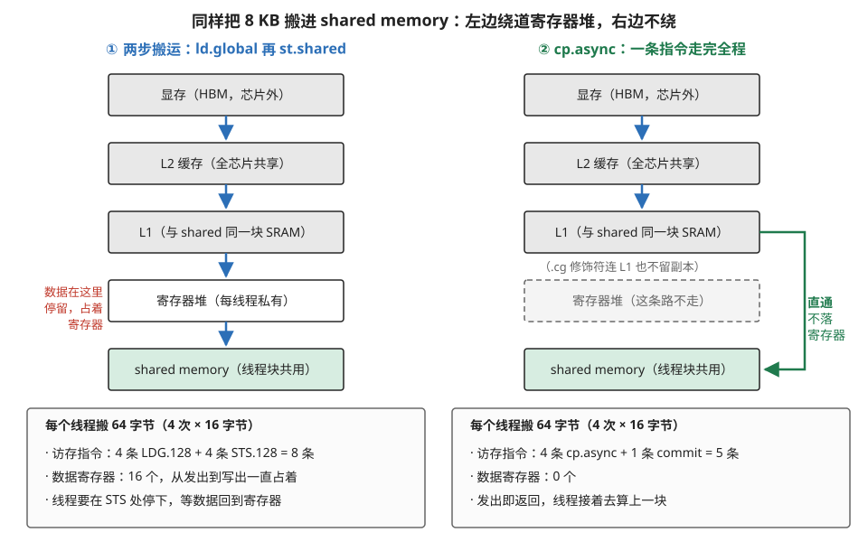
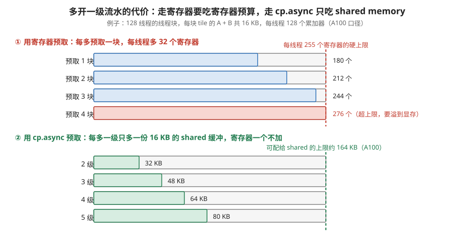
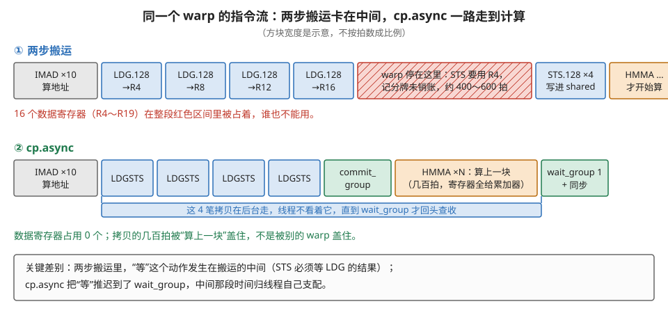
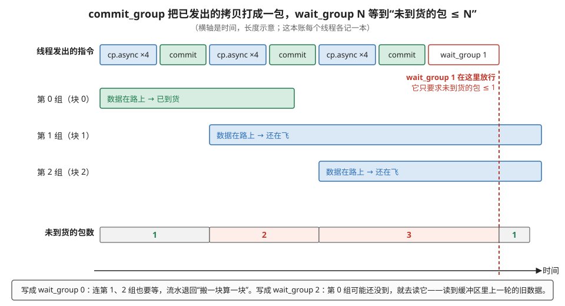
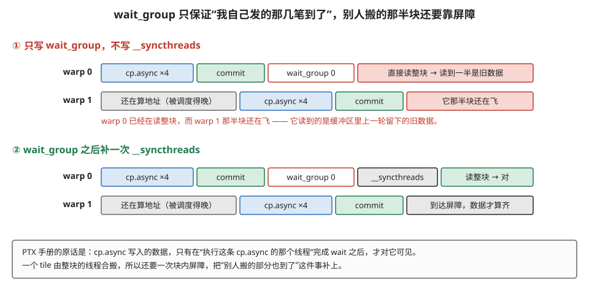
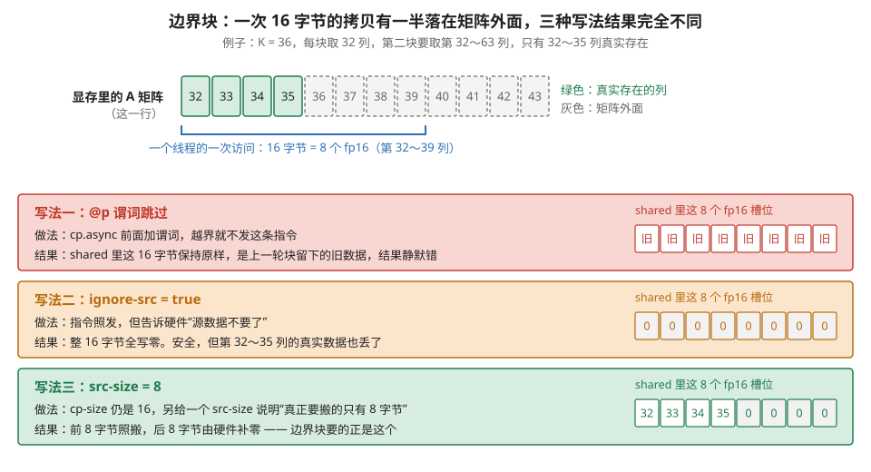
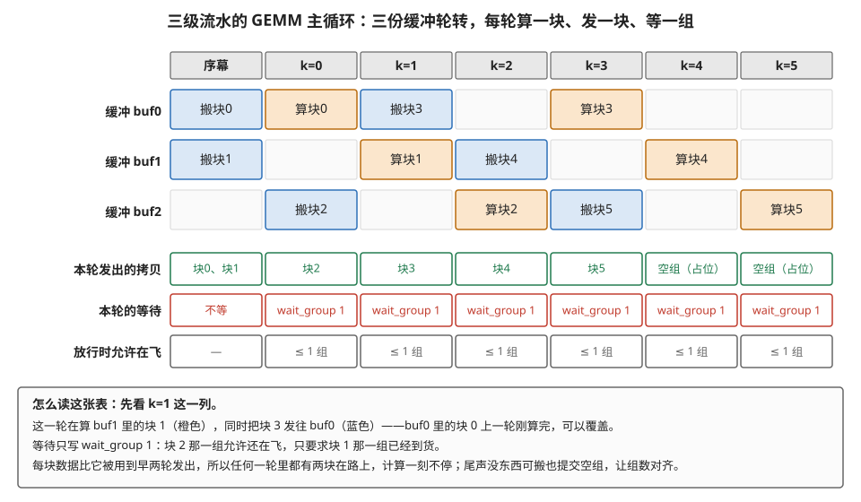

# 异步拷贝：cp.async，绕过寄存器

> **所属模块**：模块 14 · 数据搬运
> **状态**：🟨 学习中（第一版。知识截至 2026-09）
> **本节主旨**：上一节（02）讲的 load/store 是"每个线程亲自搬"：线程用一条 `ld.global` 把数据读进自己的寄存器，再用一条 `st.shared` 写进片上的 shared memory，两步接力。这一节讲光谱上往右迈的第一步——**异步拷贝 `cp.async`**（Ampere，2020 起）。它做的事只有一件：把那两步合成一条指令，数据从显存直接落进 shared memory，**不在寄存器里过手**，而且**发出即返回**，线程不用停下来等。主线是三件事：第一，两步搬运到底贵在哪（用一个 128×32 的 fp16 块、128 个线程，把指令数和寄存器数算出来）；第二，`cp.async` 省掉的是什么，为什么"不经过寄存器"恰好换来了"能把流水开得更深"；第三，既然发出就不管了，完成怎么知道——这就是 **commit group / wait group** 这套显式分组的记账法，以及它和 `__syncthreads` 的分工。最后讲清它没解决的那一半（地址还是每个线程自己算、一次最多 16 字节），那正是下一节 TMA 出现的理由。

---

## 0. 这一节要回答的问题

- 没有 `cp.async` 的时候，把一块数据从显存搬进 shared memory 要走哪两步？这两步各自的代价是什么——占多少寄存器、发多少条指令、线程在哪一点上被卡住？
- `cp.async`（SASS 里叫 `LDGSTS`）比 load + store 两步省掉了什么？为什么"不经过寄存器"这一条，就能让流水线多开几级？
- 它支持哪几种拷贝大小？为什么 `.cg` 这个修饰符只能配 16 字节？地址对齐有什么要求？
- 既然发出就返回，完成怎么知道？`cp.async.commit_group`、`cp.async.wait_group N`、`cp.async.wait_all` 各是什么语义？为什么非要显式分组，不能像普通 load 那样靠记分牌自动等？
- 等错了组会发生什么——程序会崩，还是悄悄算错？错的数据具体是什么？
- 为什么 `wait_group` 之后往往还要补一次 `__syncthreads()`？
- `cp.async.mbarrier.arrive` 是干什么的，它开了哪条新路？
- 边界上的 tile（矩阵宽度不是块宽的整数倍）怎么办？"越界填零"在指令层面是怎么表达的？
- 一个 3～4 级流水的 GEMM 主循环长什么样？第 k 次迭代的时刻，哪一级在搬、哪一级在算、在等哪一组？
- 它的局限是什么，为什么这些局限直接指向了下一节的 TMA？

---

## 1. 基础词汇：先把本节要反复用的词讲清楚

**显存（global memory）与 shared memory**。显存是 GPU 板上那几十 GB 的大容量存储，物理上是几摞直接叠在 GPU 封装里的 HBM（高带宽存储）颗粒，容量大、离计算单元远，读一次要几百个时钟周期。显存和计算单元之间还夹着两级缓存：**L2** 是全芯片共享的一块中转缓存（几十 MB），**L1** 是每个 SM 自己的一小块（几十到上百 KB）；缓存的作用是把读过的数据留一份副本，下次再读就不用跑远路。shared memory 是每个 SM（流式多处理器，GPU 里一个独立的计算集群，一块芯片上有上百个）内部的一小块快速存储，容量是每个 SM 几百 KB 的量级，读一次只要二三十个周期，而且**由程序员显式管理**——你自己写代码决定把什么搬进来、什么时候丢掉。本节讲的全部动作，都是"把一块数据从显存搬进 shared memory"这一跳。

**寄存器与寄存器堆（register file）**。寄存器是离计算单元最近的存储，每个线程有自己的一份，计算指令的操作数只能来自寄存器。一个 SM 上的寄存器总数是固定的（Ampere 的 A100 是每个 SM 65536 个 32 位寄存器），**每个线程最多能用 255 个**。这个数字后面要反复用到：寄存器是本节最稀缺的资源，一个线程多占几个寄存器，一个 SM 上能同时驻留的线程就少几个。

**线程块（thread block）**。CUDA 里一次 kernel 启动会拉起成千上万个线程，它们被组织成若干个“线程块”，同一个块里的线程跑在同一个 SM 上、共用同一块 shared memory、可以用屏障互相等待；不同块之间则没有这些便利。本节讲的搬运，永远是“一个线程块合力把一块数据搬进自己的 shared memory”。

**tile（块）**。把一个大矩阵切成许多小方块，每次只把一个小方块搬进 shared memory 来算，算完换下一块。这些小方块就叫 tile。本节的主角是一个具体的 tile：**128 行 × 32 列的 fp16 数据**，一共 4096 个元素、8192 字节（8 KB）。fp16 是半精度浮点数，每个数占 2 字节。

**warp**。GPU 的线程不是一个一个调度的，而是 **32 个一组**，一组叫一个 warp，同一个 warp 里的 32 个线程在同一拍执行同一条指令（各自的操作数不同）。所以"指令数"有两种数法：一种是"每个线程执行了几条"，另一种是"调度器实际发出去了几条"——后者等于前者除以 32（一个 warp 一条算一次）。本节两种数法都会用到，每次都会说明用的是哪一种。

**同步（synchronous）与异步（asynchronous）指令**。同步指令是"做完才往下走"：普通的 `ld.global` 发出后，虽然线程可以先执行几条不依赖结果的指令，但一旦有指令要用那个目标寄存器，硬件就会把这个线程挡住，直到数据回来。异步指令是"交给后台去做，自己先往下走"：发出之后线程完全不管它，什么时候回来查收由程序自己决定。异步带来的好处是线程可以在等待期间干别的正事；代价是必须有一套显式的办法确认"后台做完了没有"——这就是本节第 4 部分整节要讲的东西。

**记分牌（scoreboard）**。硬件用来追踪"某个寄存器的值到了没有"的小账本。一条 `ld.global` 发出时，硬件在它的目标寄存器上记一笔"欠账"；数据回来时销账。任何要读这个寄存器的指令，发射前硬件都会查一下账本，欠着就把这个 warp 挂起。**记分牌的对象是寄存器**——这一点决定了它管不了 `cp.async`，因为 `cp.async` 根本没有目标寄存器。

**组（cp.async-group）**。`cp.async` 自带的一套记账单位。线程发出的若干条 `cp.async` 可以被打包成一"组"，之后线程按组等待。这是本节的核心机制，第 4 部分展开。

**流水级（stage）与缓冲份数**。"算这一块的同时，把下一块搬进来"这件事，要在 shared memory 里开不止一份缓冲区（一份正在被读，另一份正在被写）。开几份就叫几级流水。开两份叫双缓冲，开三份四份叫多级流水（multistage）。

**PTX 与 SASS**。PTX 是 NVIDIA 的虚拟汇编语言，是 CUDA 编译后的中间产物，写法在各代硬件上通用；SASS 是真正跑在某一代芯片上的机器指令，由 `ptxas` 从 PTX 再编译一次得到。同一件事在两层有两个名字，本节两个都会给出（例如 PTX 的 `cp.async` 在 SASS 里叫 `LDGSTS`）。

---

## 2. 没有 cp.async 的日子：两步搬运贵在哪

### 2.1 把题目摆出来：一个 128×32 的 fp16 块，128 个线程

先固定一个具体的搬运任务，后面所有账都按它来算。

一个线程块负责矩阵 A 的一个 **128 行 × 32 列的 fp16 tile**。A 在显存里按行存放，行宽 K = 4096（也就是同一行相邻两个元素的地址差 2 字节，相邻两行同一列的地址差 4096 × 2 = 8192 字节）。这个 tile 一共 128 × 32 = 4096 个 fp16，**8192 字节 = 8 KB**。线程块有 **128 个线程**（4 个 warp）。

8192 字节分给 128 个线程，每人 **64 字节**。GPU 上一条访存指令一次最多搬 16 字节（128 位），所以每个线程要分 **4 次**搬完，每次 16 字节 = 8 个 fp16。

这 4 次怎么分？让**同一时刻的 32 个线程去读同一行上相邻的地址**是铁律（这叫访存合并：一个 warp 的 32 个地址落在连续的一段里，硬件能把它们并成少数几次批发请求；散开则要拆成几十次，白白浪费带宽。详见模块 10 第 4 节 §3）。tile 只有 32 列宽，一行 32 个 fp16 = 64 字节，只够 4 个线程各取 16 字节。所以线程排布是 **4 个线程负责一行、32 行并排**：

- 线程 t 负责第 `t / 4` 行、第 `(t % 4) * 8` 列起的 8 个 fp16；
- 128 个线程一趟覆盖 32 行 × 32 列；
- 一共 4 趟，行号每趟 +32，覆盖满 128 行。

于是"每个线程 4 次 16 字节"这个数字有了具体含义：**第 i 次搬的是第 `t/4 + 32*i` 行的那 8 个 fp16**。

### 2.2 两步搬运：指令逐条列出来

没有 `cp.async` 时，把一个 16 字节的片段从显存挪进 shared memory，必须两条指令接力。用 PTX 写出来是这样（`ld.global.v4.b32` 表示"从显存读 4 个 32 位字"，也就是 16 字节；`.v4` 是向量化后缀）：

```ptx
// 第 i 次搬运（i = 0,1,2,3），两步
ld.global.v4.b32   {%r4, %r5, %r6, %r7}, [%rd_gmem];   // 第一步：显存 → 4 个寄存器
st.shared.v4.b32   [%r_smem], {%r4, %r5, %r6, %r7};    // 第二步：4 个寄存器 → shared
```

编译成 SASS 之后，这两条分别叫 `LDG.E.128`（LoaD Global，128 位）和 `STS.128`（STore Shared，128 位）。

把 4 次全写出来，一个线程完整的搬运段落是：

```ptx
ld.global.v4.b32  {%r4,  %r5,  %r6,  %r7 }, [%rd_g + 0];         // 第 0 趟
ld.global.v4.b32  {%r8,  %r9,  %r10, %r11}, [%rd_g + 262144];    // 第 1 趟（行号 +32）
ld.global.v4.b32  {%r12, %r13, %r14, %r15}, [%rd_g + 524288];    // 第 2 趟
ld.global.v4.b32  {%r16, %r17, %r18, %r19}, [%rd_g + 786432];    // 第 3 趟
st.shared.v4.b32  [%r_s + 0   ], {%r4,  %r5,  %r6,  %r7 };
st.shared.v4.b32  [%r_s + 2048], {%r8,  %r9,  %r10, %r11};
st.shared.v4.b32  [%r_s + 4096], {%r12, %r13, %r14, %r15};
st.shared.v4.b32  [%r_s + 6144], {%r16, %r17, %r18, %r19};
```

几个数字的来历值得交代清楚，因为后面的账都建在它们上面：

- **262144** 是"行号 +32"对应的字节偏移：32 行 × 4096 列 × 2 字节 = 262144。它是个编译期常数，可以直接写进指令的立即数偏移字段（SASS 的访存指令有 24 位立即偏移，262144 远在范围内），所以**第 1～3 趟不需要额外的加法指令去算地址**。
- **2048** 是 shared memory 一侧"行号 +32"的偏移：32 行 × 32 列 × 2 字节 = 2048。同理是常数。
- 所以真正要算的地址只有起点那一个。算它大约要：从 `threadIdx.x` 取出行号和列号（2 条移位/与运算）、乘上行宽再加列偏移（1 条乘加）、加上 tile 的基址并扩展成 64 位地址（2 条加法）、再算 shared 一侧的起点（如果还要做 **swizzle**——一种把数据在 shared memory 里故意错开存放的地址置换，用来避免多个线程同时访问同一个存储体而排队，见模块 10 第 4 节 §4.2——再加 2～3 条）。**合计约 10 条整数指令**。这个"约 10 条"是估算，不同编译器版本会差一两条，但量级是对的。

### 2.3 三笔代价

**第一笔：指令数。** 每个线程 **4 条 LDG + 4 条 STS = 8 条访存指令**，加上约 10 条地址算术，**约 18 条**。按 warp 发射槽算（4 个 warp 各发一遍）：**约 72 个发射槽**。发射槽是稀缺的：一个 SM 的调度器每拍只能发出有限几条指令，搬运指令占了发射口，矩阵乘指令就少了机会。

**第二笔：寄存器。** 这是最要命的一笔。4 条 `ld.global.v4` 各要 4 个连续的 32 位寄存器接数据，**合计 16 个寄存器**（上面代码里的 `%r4`～`%r19`）。而且这 16 个寄存器不是"用一下就还"——它们**从第一条 LDG 发出的那一刻起，一直到最后一条 STS 写完为止，全程被占着**。为什么要一次发 4 条而不是"发一条、存一条、再发下一条"？因为 4 条一起发才能让 4 笔访存同时在路上（叫"在途请求"，模块 10 第 4 节 §7 讲过：要喂满显存带宽，必须有足够多的请求同时在飞）。串行地发一条等一条，带宽只能用上零头。所以"多占寄存器"和"喂满带宽"在这里是同一件事的两面，躲不开。

**第三笔，也是性质上最不一样的一笔：线程必须停在搬运的中间。** `st.shared` 的源操作数是 `%r4`～`%r7`，而这几个寄存器上记分牌还欠着账——数据没回来，这条 STS 就发不出去。于是线程被挡在这里，**挡住的位置正好在搬运动作的中间**。显存一次读取要 400～600 个周期（L2 未命中时），这段时间里这个线程什么都干不了。

注意这一笔和前两笔的差别：前两笔是"占资源"，这一笔是"占时间，而且占在一个你没法挪动的位置上"。GPU 当然有掩盖延迟的常规办法——这个 warp 卡住时，调度器去服务别的 warp。一个 SM 上同时驻留的 warp 数量与它能容纳的上限之比叫**占用率（occupancy）**，占用率越高，可供轮换的 warp 越多，延迟越容易被盖住（模块 10 第 2 节专门讲这件事）。但这要求 SM 上驻留足够多的 warp，而驻留数量又被第二笔账（寄存器占用）压着。**三笔账互相咬住。**

图 3-1 把两步搬运和 `cp.async` 的数据路径并排画出来，顺带把这三笔账列在下面。



> **图 3-1**　一句话：同样把 8 KB 数据搬进 shared memory，两步搬运要让数据在寄存器里过一道手，`cp.async` 让数据从显存一路直接落进 shared memory，寄存器完全不参与。
>
> **先知道一件事**：寄存器是每个线程自己的一小格存储，计算指令只能读写寄存器，所以数据"进寄存器"本身不是坏事。坏在数量：一个线程最多只有 255 个寄存器，这些格子既要放搬运中转的数据，又要放矩阵乘的累加结果，两边抢同一笔预算。
>
> **按这个顺序看**：
> 1. 从上往下是数据要走的路，两边前三格完全一样：显存（芯片外那几十 GB 的大容量存储）→ L2 缓存（全芯片共享的一块中转缓存）→ L1（和 shared memory 共用同一块 SRAM 的那部分缓存）。
> 2. 看左边第四格"寄存器堆"：两步搬运里，数据必须先落进某个线程的寄存器，才能再被写进 shared memory。左侧红字标出的就是代价——这段时间里这 16 个寄存器被占着，谁也不能用。
> 3. 看右边第四格：同一个位置画成了灰色虚线框，写着"这条路不走"。右侧那条绿色折线就是 `cp.async` 实际走的路：从 L1 那一层直接拐进 shared memory。灰字那行说明 `.cg` 这个修饰符还能让它连 L1 里也不留副本。
> 4. 最后看下面两个账本。同样是每线程搬 64 字节：左边 8 条访存指令、16 个寄存器、线程要在中途停下等；右边 5 条指令、0 个寄存器、发出即返回。
>
> **看懂的标志**：能回答"为什么省下寄存器这件事，对矩阵乘特别值钱"——矩阵乘的累加器是常驻寄存器的，一个线程可能要用一百多个来存累加结果；搬运再来抢十几二十个，就会把能同时驻留在 SM 上的线程数压下去。搬运不占寄存器，这笔预算就全归累加器。
>
> 来源：本库自绘。

### 2.4 走查：一个 warp 的指令流，卡在哪一条

把上面第三笔账落到一条具体的指令流上，逐条跟一遍（图 3-2 上半部分画的就是它）。假设这个 warp 刚进入主循环的一轮：

| 步 | 指令 | 这一拍发生了什么 |
| --- | --- | --- |
| 1 | `IMAD`、`SHF`、`LOP3` 等约 10 条 | 算出本线程这一轮的显存起始地址和 shared 起始地址 |
| 2 | `LDG.E.128 R4, [R2.64]` | 发出第 0 趟读取，记分牌在 R4～R7 上记一笔欠账；warp 继续 |
| 3 | `LDG.E.128 R8, [R2.64+0x40000]` | 第 1 趟，记 R8～R11；warp 继续 |
| 4 | `LDG.E.128 R12, [R2.64+0x80000]` | 第 2 趟 |
| 5 | `LDG.E.128 R16, [R2.64+0xc0000]` | 第 3 趟。此刻 4 笔请求同时在路上，16 个寄存器全被欠着 |
| 6 | `STS.128 [R20], R4` | **发不出去**。R4 的账没销，warp 在这里被挂起，约 400～600 拍 |
| 7 | 数据陆续回来，记分牌逐个销账 | R4～R7 到齐，第 6 步的 STS 才发得出去 |
| 8 | `STS.128` ×4 | 四条依次写进 shared memory |
| 9 | `BAR.SYNC`（`__syncthreads`） | 等全块线程都搬完 |
| 10 | `HMMA` …… | 到这里才开始算。`HMMA` 是 Tensor Core（专做小矩阵乘加的硬件单元）的指令 |

第 6 步是整段的要害：**"等"这个动作被钉死在搬运的中间**。线程想干点别的正事（比如去算上一块 tile 的矩阵乘）也不行，因为它连自己的搬运都还没做完。

### 2.5 这三笔账怎么把流水级数锁死

有人会问：既然显存这么慢，为什么不干脆"提前好几轮就开始搬"？——这正是软件流水的思路（模块 40 第 4 节 §7 讲的三段式改写）。在只有 load/store 的年代，这件事也能做，做法叫**寄存器预取**：在算第 k 块的时候，先用 `ld.global` 把第 k+1 块读进寄存器（不急着 store），等这一轮算完了，再 `st.shared` 写进另一份缓冲。

问题在于：**在"读进寄存器"和"写进 shared"之间的那一整段时间里，数据一直占着寄存器**。占多少？用一个具体的 **GEMM**（general matrix multiply，通用矩阵乘，`C = A × B` 这个运算的标准叫法）配置算一笔：

- 线程块 128 个线程，输出 tile 是 128×128，所以每个线程负责 128 × 128 ÷ 128 = **128 个 fp32 累加器**（fp32 是单精度浮点数，每个占 4 字节，正好一个寄存器；累加器就是暂存 `acc += A × B` 那个中间和的变量），这 128 个寄存器跨整个 K 循环常驻，动不得；
- 一级流水要预取的数据是 A 的 128×32 片加 B 的 32×128 片，合计 16 KB，摊到 128 个线程是每人 128 字节 = **32 个寄存器**；
- 地址、循环变量、矩阵乘的输入片段等杂项约 **20 个**。

于是：

| 提前预取几块 | 每线程寄存器数 | 结果 |
| --- | --- | --- |
| 1 块 | 128 + 20 + 32 = **180** | 还行 |
| 2 块 | 128 + 20 + 64 = **212** | 已经很紧 |
| 3 块 | 128 + 20 + 96 = **244** | 逼近 255 的硬上限 |
| 4 块 | 128 + 20 + 128 = **276** | **超了**。编译器只能把一部分变量"溢出"到显存里的一块私有区域，一读一写全是几百拍，得不偿失 |

而换成 `cp.async` 之后，多开一级流水的代价完全换了一种货币：**数据不在寄存器里，而在 shared memory 里**。每多一级只多一份 16 KB 的缓冲，寄存器一个不加。A100 上可配给 shared memory 的上限约 164 KB（每个 SM 的 192 KB 统一 SRAM 里划出来的那部分），5 级流水也才 80 KB。

这就是本节标题里"绕过寄存器"这四个字真正的分量：**它不只是省了几个寄存器，它把"流水能开多深"这个问题从寄存器预算里搬到了 shared memory 预算里**，而后者要宽裕得多。图 3-7 把这两笔预算并排画了出来。



> **图 3-7**　一句话：用寄存器做预取，每多预取一块就要多吃 32 个寄存器，预取到第 4 块就撑爆了每线程 255 个的上限；用 `cp.async`，每多一级只多占一份 16 KB 的片上缓冲，寄存器一个不加。
>
> **先知道一件事**：GPU 上"一个线程能用多少寄存器"是有硬上限的（255 个）。超过这个数，编译器就只能把一部分变量放到显存里的一块私有区域（叫 local memory），读写它和读写显存一样慢——所以超上限不是报错，是性能悬崖。
>
> **按这个顺序看**：
> 1. 上半四根条，分别是提前预取 1、2、3、4 块数据时每个线程要用的寄存器总数。每根条的长度按 255 这个上限缩放，右端的红色虚线就是上限。
> 2. 每根条里都包含三部分：128 个累加器（矩阵乘的结果，整个循环都得留着）、约 20 个杂项（地址、下标）、以及每预取一块多出来的 32 个。所以 180、212、244、276 是逐级加 32 得到的。
> 3. 第四根条是红的，因为 276 已经越过了虚线。这不是一个"慢一点"的问题，是编译器必须把变量往显存里搬。
> 4. 下半四根条换了单位：横轴是 shared memory 的字节数，右端绿色虚线是可配给 shared 的上限约 164 KB。2 级 32 KB、5 级 80 KB，都离虚线很远。
> 5. 对照两半：同一件事（多开一级流水），左边花的是全场最紧的那笔预算，右边花的是相对宽裕的那笔。
>
> **打个比方**：搬家时要腾出中转空间。寄存器像随身的口袋，只有几个，装满了就没手干别的；shared memory 像门口的一块空地，多堆几箱也碍不着谁。
>
> **看懂的标志**：能回答"为什么 Ampere 之前的 GEMM 几乎都只做双缓冲"——因为再深一级就要多吃 32 个寄存器，而寄存器已经被累加器占满了。级数不是不想开深，是开不起。
>
> **与正文的对照**：128 个累加器来自 §2.5 的配置（128 线程的块、128×128 的输出 tile）；每级 16 KB 来自 A 的 128×32 片加 B 的 32×128 片，都是 fp16。255 是每线程寄存器的硬上限，164 KB 是 A100（计算能力 8.0）上可配给 shared memory 的容量上限。
>
> 来源：本库自绘。

---

## 3. cp.async：一条指令走完全程

### 3.1 先把名字拆开

Ampere（计算能力 8.0，2020）新增的这条指令，PTX 里的完整写法是：

```ptx
cp.async.cg.shared.global [smem_addr], [gmem_addr], 16;
```

按 PTX 的命名法逐段读（拆名字的规则见模块 10 第 8 节 §2）：

- **`cp`**：动词，copy。这个新动词本身就有信息量。PTX 里原来搬数据只有两个动词：`ld`（内存 → 寄存器）和 `st`（寄存器 → 内存），**没有一个动词能表达"内存到内存"**。`cp` 填的正是这个空。
- **`.async`**：异步。发出即返回，控制权立刻交回给线程，拷贝在后台进行。
- **`.cg`**：缓存策略。`.cg` 表示数据只在 L2 缓存里留副本、**不在 L1 里留**；另一个选项 `.ca` 表示各级缓存都留。这只是性能提示，不影响正确性。
- **`.shared`**：目的地在 shared memory。
- **`.global`**：源在显存。
- **三个操作数**：目的地址、源地址、**拷贝字节数**。

SASS 一层的对应指令叫 **`LDGSTS`**——名字很直白，就是 `LDG`（load global）加 `STS`（store shared）拼在一起。实际反汇编里常见的形态是 `LDGSTS.E.BYPASS.LTC128B.128`：`.E` 是扩展地址，`.BYPASS` 对应 PTX 的 `.cg`（绕过 L1），`.LTC128B` 对应 L2 预取 128 字节的提示，最后的 `.128` 是 128 位 = 16 字节（据公开的反汇编资料与社区整理；模块 10 第 8 节的术语卡里也收了这个名字）。

### 3.2 三种大小、`.cg` 的 16 字节约束、对齐

PTX ISA 手册对这条指令的约束写得很死，逐条抄下来并解释：

**一、拷贝大小只能是 4、8、16 字节。** 手册原文是 "`cp-size` can only be 4, 8 and 16"。这是硬约束，不是建议。想搬 12 字节？只能拆成 8 + 4 两条。

**二、`.cg` 只能配 16 字节。** 手册给出的语法里，`.ca` 那一行的第三个操作数写的是 `cp-size`（可取 4/8/16），而 `.cg` 那一行直接写死了字面量 `16`：

```
cp.async.ca.shared{::cta}.global{...} [dst], [src], cp-size{, src-size}{, cache_policy};
cp.async.cg.shared{::cta}.global{...} [dst], [src], 16{, src-size}{, cache_policy};
```

CUTLASS 的封装里把这条约束写成了编译期断言：`SM80_CP_ASYNC_CACHEGLOBAL` 里是 `static_assert(sizeof(TS) == 16, ...)`，而 `SM80_CP_ASYNC_CACHEALWAYS` 允许 4/8/16。**为什么会有这个不对称？** 手册没有解释。一个合理的推测是：`.cg` 绕过 L1 意味着数据是以 L2 的搬运粒度（32 字节的 sector）直接投递的，只有 16 字节这个粒度能和它对齐得上；4 字节和 8 字节的碎片必须经过 L1 那一级做拼合。这只是推测，记进本节最后的待深挖。

实践上的结论很简单：**16 字节的拷贝优先用 `.cg`，4 字节和 8 字节的只能用 `.ca`**。Triton 的代码生成器就是这么写的——它的 NVIDIA 后端里有一句注释直说："16 字节的拷贝优先用 CG，除非用户显式要了 CA；更小的拷贝必须用 CA，因为 CG 只支持 16 字节传输。"

**三、地址必须自然对齐。** PTX 的通用规则是"地址必须对齐到访问大小的整数倍"，所以 16 字节的 `cp.async` 要求**源地址和目的地址都是 16 的倍数**。不对齐的后果是未定义行为——可能悄悄把低位地址抹零，也可能直接出错。这条约束在实践中常常成为拦路虎：矩阵的行宽（leading dimension）如果不是 8 的倍数（fp16 下 8 个元素 = 16 字节），每一行的起点就对不齐，16 字节的拷贝用不了，只能退到 4 字节——指令数立刻翻两番。CUDA C++ 编程指南还额外提了一句：**想要最好的性能，源和目的最好都对齐到 128 字节**。

**四、`cp.async` 是"弱"内存操作。** 手册说它属于内存一致性模型里的 weak operation，而且**两条 `cp.async` 之间没有任何顺序保证**，除非你用 `wait_group`、`wait_all` 或 mbarrier 显式同步。推论之一：同一组里有两条 `cp.async` 写同一个地址，是未定义行为。

### 3.3 同一个 tile 的第二本账

回到 §2.1 那个 128×32 的 fp16 块，把 `cp.async` 的账算一遍。每个线程还是搬 4 次、每次 16 字节，代码变成：

```ptx
cp.async.cg.shared.global [%r_s + 0   ], [%rd_g + 0     ], 16;
cp.async.cg.shared.global [%r_s + 2048], [%rd_g + 262144], 16;
cp.async.cg.shared.global [%r_s + 4096], [%rd_g + 524288], 16;
cp.async.cg.shared.global [%r_s + 6144], [%rd_g + 786432], 16;
cp.async.commit_group;
```

两本账并排：

| | 两步搬运 | cp.async |
| --- | --- | --- |
| 每线程的访存指令 | 4 条 LDG + 4 条 STS = **8 条** | 4 条 cp.async + 1 条 commit = **5 条** |
| 每线程的地址算术 | 约 10 条 | 约 10 条（**一条没省**） |
| 每线程合计 | 约 18 条 | 约 15 条（省 17%） |
| 按 warp 发射槽（4 个 warp） | 约 72 个 | 约 60 个 |
| 数据寄存器 | **16 个**，全程占着 | **0 个** |
| 线程停在哪 | 停在搬运中间（第一条 STS） | 不停，停在后面自己选的 wait 点 |

**这张表里最该盯住的是两行。** 一行是"地址算术一条没省"——`cp.async` 完全没碰地址生成这件事，每个线程还是自己算自己那份的地址。另一行是寄存器从 16 变成 0。

换成模块 10 第 4 节 §6.2 那套口径（把每个线程的每条指令都数一遍）再对一次账，方便和那一节对照：A 片加 B 片共 16 KB，`cp.async` 一条搬 16 字节，需要 16 KB ÷ 16 B = **1024 条**搬运指令；两步搬运则是 1024 条 LDG 加 1024 条 STS = **2048 条**。那一节说"cp.async 搬 16 KB 约需 1024 条搬运指令、合计约 3000 条"，和这里对得上。

### 3.4 为什么"不经过寄存器"就能多开流水级

§2.5 已经把答案的一半讲了：预取的数据不占寄存器，于是多开一级的代价从"最紧的那笔预算"换成了"相对宽裕的那笔"。这里补上另一半——**为什么不经过寄存器，"等"这个动作就能往后挪**。

两步搬运里，"等"的位置不是程序员选的，是**指令依赖决定的**：`st.shared` 要读那 4 个寄存器，记分牌就必须在那里把线程挡住。你没有任何办法把这个等待点往后挪，因为挪了数据就没人往 shared 里写。

`cp.async` 把"写进 shared"这件事也交给了硬件，于是线程手里**再没有任何一条指令依赖这次搬运的结果**。等待点因此变成了纯粹的"程序员想在哪等就在哪等"：你可以发完就去算上一块 tile 的矩阵乘，算几百拍之后再回头 `wait_group`。**搬运的几百拍被这个线程自己的计算盖住了，而不是被别的 warp 的计算盖住。** 这是和 occupancy（靠 warp 数量掩盖延迟）完全不同的第二种掩盖方式，两者可以叠加。

图 3-2 把两种写法的指令流并排画出来。



> **图 3-2**　一句话：两步搬运里，线程被迫停在搬运的中间等数据；`cp.async` 让线程发完就走，"等"这个动作被推迟到了它自己选定的地方。
>
> **先知道一件事**：一个 warp 是 32 个一起行动的线程，它们执行的是同一条指令流。图里每个方块是一条（或一簇）指令，从左往右按执行顺序排。方块的宽度是为了写得下字，不代表耗时长短——唯一按耗时画的是那块红色斜线区，它代表几百个时钟周期的空等。
>
> **按这个顺序看**：
> 1. 上面一行是两步搬运。前四个蓝框是四条 `LDG.128`，各把 16 字节读进四个寄存器（R4、R8、R12、R16 开头的四组）。发出去之后 warp 还能往下走。
> 2. 走到红色斜线区就走不动了：下一条 `STS.128` 要把 R4 里的值写进 shared memory，而 R4 的数据还在路上。硬件的记分牌（记录"哪个寄存器的值还没到"的小账本）把这个 warp 挂起，约 400～600 拍。
> 3. 红区右边才是四条 `STS.128` 和真正的计算 `HMMA`（Tensor Core 的矩阵乘加指令）。红字那句是代价：整个红区里，16 个寄存器被占着，别的用途一个也拿不到。
> 4. 下面一行是 `cp.async`。四个 `LDGSTS` 发完，接一条 `commit_group`（把这四笔打成一包，下一部分细讲），然后**直接进入橙色的计算块**——算的是上一块 tile 的矩阵乘，几百拍。
> 5. 横跨下方的那条蓝色长条说明了关键：这四笔拷贝在整个计算期间都在后台走，线程不看着它们。直到最右边的 `wait_group` 才回头查收。
> 6. 两行对照：同样几百拍的搬运延迟，上面那行是空等，下面那行被自己的计算填满了。
>
> **打个比方**：上面像点了外卖就守在门口等，等到了才能去做别的事；下面像点完外卖接着干活，快到饭点了再去开门。
>
> **看懂的标志**：能回答"为什么说 `cp.async` 把等待点的位置交还给了程序员"——两步搬运里 `st.shared` 要读那几个寄存器，硬件必然在那里卡住，位置由不得你；`cp.async` 之后线程手里没有任何指令依赖这次搬运，于是在哪里回头查收，完全由代码里 `wait_group` 写在哪决定。
>
> **与正文的对照**：指令名对应 §2.4 的走查表和 §3.3 的代码。"约 400～600 拍"是 L2 未命中时显存读取的量级，不是精确值。
>
> 来源：本库自绘。

---

## 4. 完成怎么知道：commit group 与 wait group

### 4.1 为什么不能沿用记分牌

普通的 `ld.global` 不需要程序员写任何等待代码，硬件的记分牌会自动处理。为什么 `cp.async` 不行？

因为**记分牌的记账对象是寄存器**。一条 `ld.global` 有明确的目标寄存器，硬件在那个格子上记一笔欠账，任何要读它的指令自动被挡住。而 `cp.async` 的目的地是 shared memory 里的一个地址——**shared memory 没有记分牌**。它有几十 KB、成千上万个字节，不可能给每个字节配一个"到了没有"的标志位；而且读 shared memory 的指令（`ld.shared`）也不会去查这种标志。

所以硬件换了一种更粗的记账法：**不追踪"哪个字节到了"，只追踪"我发出去的第几批到了"**。批次的划分由程序员显式声明，这就是"组"。这是一个典型的软硬件折衷——硬件只提供一个极简的计数器，把"哪几笔算一批"这个判断交给写代码的人，因为写代码的人本来就知道自己的流水线是怎么分段的。

（模块 10 第 5 节 §5 把这件事概括成一条规律：硬件每添一种异步能力，就要配一把新锁。`cp.async` 配的这把锁就是组语义。）

### 4.2 三条指令的准确语义

**`cp.async.commit_group;`** —— 手册原文：它"为执行它的线程创建一个新的 cp.async-group，把该线程此前发出、但还没被提交到任何组里的所有 `cp.async` 全部打包进这个新组"。两个细节要记住：

- **每个线程各有一本账。** 组是"per thread"的，不是 warp 级、更不是块级的。
- **如果没有未提交的拷贝，`commit_group` 会创建一个空组。** 空组被认为"平凡地已完成"。这条看起来没用的规则，在流水线的尾声非常有用（§6.4 会用到）。

**`cp.async.wait_group N;`** —— 手册原文：它"让执行它的线程等待，直到最近提交的 cp.async-group 里未完成的只剩 N 个或更少，并且此前提交的所有组都已完成"。N 必须是编译期常量。

这句话要精确地记住：**N 是"允许还在飞的组数"，不是"要等几组"**。`wait_group 0` 就是等全部到齐。`wait_group 1` 是"允许最新的一组还在飞"。

**`cp.async.wait_all;`** —— 手册给出的定义是它完全等价于：

```ptx
cp.async.commit_group;
cp.async.wait_group 0;
```

也就是"先把散着的都打成一包，再等到全部到齐"。它是最省事、也最不会出错的写法，代价是一点重叠都不剩。

还有一条容易被忽略、但正是本节第 4.5 小节主题的规则。手册说，`cp.async` 写进去的数据，**只有在下面三件事之一发生之后，才对"执行这条 `cp.async` 的那个线程"可见**：它完成了 `wait_all`；它完成了对应组的 `wait_group`；或者一个追踪这次拷贝的 mbarrier 上的等待返回了 true。请注意主语——**是"执行这条指令的那个线程"**，不是别的线程。

### 4.3 走查：三组在飞的时候，`wait_group 1` 放行了谁

用一个具体的序列跟一遍。一个线程依次做了这些事：

| 步 | 指令 | 这本账上发生了什么 |
| --- | --- | --- |
| 1 | `cp.async` ×4（搬块 0） | 4 笔拷贝发出，还没归属任何组 |
| 2 | `cp.async.commit_group` | 这 4 笔被打包成**第 0 组**。未到货的组数：1 |
| 3 | `cp.async` ×4（搬块 1） | 又 4 笔发出，未归组 |
| 4 | `cp.async.commit_group` | 打包成**第 1 组**。未到货的组数：2 |
| 5 | `cp.async` ×4（搬块 2） | 又 4 笔 |
| 6 | `cp.async.commit_group` | 打包成**第 2 组**。未到货的组数：3 |
| 7 | `cp.async.wait_group 1` | **线程停在这里**，直到未到货的组数降到 1 |

第 7 步放行的时刻是什么时候？"未到货 ≤ 1" 意味着第 0 组和第 1 组都必须已经完成，只有最新的第 2 组允许还在飞。

等一下——这和常见的流水线写法不太一样。日常写多级流水时，`wait_group 1` 的意图通常是"只等最老的那一组"。差别在于此刻账上有三组而不是两组：**`wait_group N` 是按"总共还剩几组没到"来判定的，不是按"等第几组"来判定的**。所以它等的组数取决于你当时挂了几组账。正确的用法是让代码里"在飞的组数"恒定（每轮发一组、等一次），这样 N 才有稳定的含义。

图 3-3 把这个序列画成了时间线。



> **图 3-3**　一句话：`commit_group` 在流水账上划一道线，把刚才发出的几笔拷贝打成一包；`wait_group N` 让线程停下，直到"还没到货的包"不超过 N 个。
>
> **先知道一件事**：`cp.async` 发出后没有任何返回值，硬件也不会替你记"哪个字节到了"。它只数"包"：你自己用 `commit_group` 说明哪几笔算一包，硬件就维护一个"还有几包没到货"的计数。这本账是**每个线程各记一本**的。
>
> **按这个顺序看**：
> 1. 最上面一行是这个线程发出的指令，从左往右按顺序。每发出四条 `cp.async`（搬一整块），就跟一条 `commit`，把这四条封成一包。
> 2. 中间三条横条是三包数据各自"在路上"的时间。第 0 组（浅绿）最早发出，到 wait 之前已经到货；第 1 组和第 2 组（浅蓝）发得晚，此刻还在飞。
> 3. 红色竖虚线是 `wait_group 1` 执行的时刻。它的要求是"还没到货的包 ≤ 1"。此刻第 1 组和第 2 组都没到，共 2 包，不满足，所以线程要停在这里等第 1 组到货。
> 4. 最下面一行是"未到货的包数"这个计数器：每 `commit` 一次加 1（1 → 2 → 3），到 `wait_group 1` 那里降回 1。红色的数字表示这时候超过了 `wait_group 1` 允许的额度。
> 5. 最下方的说明给出两种写错的后果，都不会报错：写 0 太保守，白白丢掉重叠；写 2 太激进，会放行到还没到货的数据上。
>
> **打个比方**：网购时按批下单，每批下完记一个批次号。取件时你说的不是"我要第 3 批"，而是"我手上没取的批次不能超过 1 批"——所以究竟等到哪一批，取决于你当时挂着几批没取。
>
> **看懂的标志**：能回答"忘了写 `commit_group` 会怎样"——那些拷贝没有被打进任何一包，计数器上"未到货的包数"是 0，`wait_group 1` 一看已经满足条件，立刻放行；线程接着就去读还没搬完的数据，结果错，却一声不吭。
>
> **与正文的对照**：三包的发出时刻和到货时刻都是示意，实际取决于显存当时的排队情况；图里第 0 组画得比另外两组短，只是为了让"已到货"这件事看得见。
>
> 来源：本库自绘。

### 4.4 等错了组，读到的具体是什么

这是一个值得单独回答的问题，因为答案比"数据是错的"要具体得多，也更有诊断价值。

假设一个三级流水的 GEMM，shared memory 里有 buf0、buf1、buf2 三份缓冲轮流用，主循环的第 k 轮要读 buf[k % 3]。程序员把 `wait_group 1` 误写成了 `wait_group 2`——多允许了一组在飞。

于是在第 k 轮，第 k 块的那一组可能还没到货，线程就去读 buf[k % 3] 了。**它读到的不是随机噪声，也不是零，而是 buf[k % 3] 上一次被用到时装的内容——第 k−3 块的数据**，或者是这块缓冲区被第 k 块的拷贝写了一部分、还剩一部分是旧值的混合体。

这带来两个后果：

1. **不会崩溃。** shared memory 那块地址是合法的、可读的，读出来是合法的浮点数。程序一路算到底，输出一个数值合理但错误的结果，不报任何错。
2. **误差往往不大。** 因为 GEMM 的 K 循环是累加，错一块相当于把某一段 K 的贡献换成了另一段，结果通常还在同一个数量级上。在 fp16 的容差范围内测试甚至可能"看起来对"。

这类错误的特征是**时有时无**：显存排队快的时候数据碰巧到了，就算对了；慢的时候就错。换一块卡、换一个矩阵尺寸、甚至换一次运行就可能改变表现。这和模块 10 第 5 节讲的竞争（race condition）是同一类病。

反过来把 `wait_group 1` 写成 `wait_group 0` 呢？**结果永远是对的，只是慢**。每一轮都要等到所有已发出的拷贝全部到货才开算，重叠彻底消失，主循环退化成"搬一块、算一块"。这条已经在模块 10 第 8 节 §5.2 用时间线算过账：同样 4 块数据，重叠时 10 个单位时间，不重叠时 16 个。

### 4.5 `wait` 只管自己搬的那一份，还要 `__syncthreads`

回到 §4.2 抄下来的那句手册原文："`cp.async` 写入的数据，只有在**执行这条 `cp.async` 的那个线程**完成 `wait` 之后，才对它可见。"

这句话里有一个非常容易漏掉的限定。回看 §2.1 的题目：那个 128×32 的 tile 是由**128 个线程合力搬进来的**，每人搬 64 字节。线程 0 执行 `wait_group` 之后，能保证的只是**它自己那 64 字节**到位了——线程 37 搬的那 64 字节到了没有，它一无所知。

而计算的时候，线程 0 要读的绝不只是自己搬的那 64 字节。矩阵乘里每个线程读的是 tile 里横跨很多行列的一片数据，几乎必然包含别的线程搬来的部分。

所以正确的模式恒定是**两步**：

```cuda
cp_async_wait<0>();   // 第一步：确保"我发出的拷贝"完成了
__syncthreads();      // 第二步：确保"所有线程都做完了第一步"
// 到这里，整块 tile 才真正可用
```

`__syncthreads()` 在这里干了两件事（模块 10 第 5 节 §3 辨析过这两件事的区别）：一是**等齐**——块内所有线程都执行到了这一行，也就是所有人都过了自己的 `wait`；二是附带一个块级的**内存栅栏**，保证屏障之前的写入对屏障之后的所有线程可见。两件事都需要，缺一不可。

图 3-4 把漏写 `__syncthreads` 的后果画了出来。



> **图 3-4**　一句话：`wait_group` 只保证"我自己发出的那几笔拷贝到了"，一块 tile 是全体线程合搬的，所以还要一次块内屏障，把"别人搬的那部分也到了"补上。
>
> **先知道一件事**：一个线程块里的几个 warp（32 线程一组）是各自被调度的，谁先跑到哪一行没有保证。所以"我已经搬完了"和"大家都搬完了"是两回事。
>
> **按这个顺序看**：
> 1. 上面板是漏写屏障的情形。warp 0 一路顺畅：发出四笔拷贝、`commit` 打包、`wait_group 0` 等自己的四笔到货，然后直接去读整块 tile。
> 2. 看 warp 1 那一行：它被调度得晚，还在算地址的时候 warp 0 已经在等了；等它发出拷贝、打包完，warp 0 早就开始读了。红框那句话说明了后果——warp 0 读到的那半块，warp 1 还没搬完，读出来的是缓冲区里上一轮留下的旧数据。
> 3. 下面板是正确写法。warp 0 在 `wait_group` 之后多了一格 `__syncthreads`（块内屏障：先到的线程停下来等，直到块内所有线程都到达这一行）。
> 4. warp 1 那一行对应的是"到达屏障，数据才算齐"。只有两个 warp 都过了各自的 `wait`、又都到了屏障，warp 0 才被放行去读整块，这时整块数据才是完整的。
>
> **打个比方**：几个人合搬一车货进仓库。你确认了自己那几箱已经卸完，不等于整车都卸完了；要在门口立个"都卸完了才开门"的规矩，才能进去清点。
>
> **看懂的标志**：能回答"为什么不能只写 `__syncthreads` 而省掉 `wait_group`"——屏障只管"大家都执行到了这一行"，它完全不知道后台的拷贝硬件干到哪了。两件事管的对象不同：`wait_group` 管的是硬件拷贝的进度，屏障管的是线程的进度。
>
> **与正文的对照**：图里 warp 1 比 warp 0 慢是示意，实际哪个 warp 快每次运行都可能不同——这正是这类错误时有时无的原因。
>
> 来源：本库自绘。

### 4.6 一个不显眼的坑：计算能力 8.x 上，这本账其实是 warp 共用的

PTX 手册说组是每个线程一本账。但 CUDA C++ 编程指南在讲 `memcpy_async` 性能时补了一条硬件层面的实情，值得原样记下来：

> 对计算能力 8.x，流水线机制是**同一个 warp 内的线程共享**的。这种共享会让一个 warp 内的多批 `memcpy_async` 互相纠缠（entangled），在某些情况下影响性能。

具体是这样：`commit` 操作会被**合并**——如果整个 warp 是收敛的（32 个线程都执行到这一条），warp 共享的那个批次序号只加 1；如果 warp 完全发散（32 个线程各走各的分支，分别执行 commit），序号**加 32**。而每个线程自己"感知"到的序号还是只加了 1。

后果出在等待上：`wait` 实际比对的是硬件那个 warp 共享的序号。当线程感知的序号小于实际序号时，**线程会"多等"——等到比它本意更晚的那些批次**。编程指南给的极端例子是：一个完全发散的 warp 里，每个线程可能都在等全部 32 批。

实际写代码时的规则因此很简单，编程指南也明说了：**`commit` 和 `arrive_on` 要在收敛的线程上执行**；如果前面的代码让线程发散了，在 commit 之前用 `__syncwarp()` 把 warp 重新收敛起来。

这条也解释了一个常见的现象：把 `cp.async` 写在 `if` 分支里（比如"只有边界线程才搬"），性能会莫名其妙地掉——不是拷贝本身慢了，是记账被搅乱了。边界的正确处理办法在下一部分。

### 4.7 另一条路：`cp.async.mbarrier.arrive`

组语义有一个结构性的局限：**它只服务于发出拷贝的那个线程自己**。`wait_group` 是"我等我自己发的那几笔"，没有任何办法表达"我等**别人**发的那几笔"。

而现代高性能 kernel 的一种重要组织形态恰恰需要后者：把线程分成两拨，一拨专职搬运（生产者），一拨专职计算（消费者），两拨用同步信号交接（模块 40 第 4 节 §7.3 讲的第三档"手排"，FlashAttention-3 就是这个结构）。消费者要等的是生产者发出的拷贝——组语义表达不了。

PTX 为此提供了第三条指令：

```ptx
cp.async.mbarrier.arrive{.noinc}{.shared{::cta}}.b64 [mbar_addr];
```

它的语义，按手册原话，是"让这个 mbarrier 对象追踪执行线程此前发出的所有 `cp.async` 操作"：当那些拷贝全部完成时，硬件自动在这个 mbarrier 上执行一次"到达"操作。

mbarrier 是放在 shared memory 里的一个计数器式屏障对象（模块 10 第 5 节 §4.5 完整讲过它），**块内任何线程都能在它上面等待**。于是路就通了：生产者线程发出 `cp.async`，再发一条 `cp.async.mbarrier.arrive` 把这批拷贝挂到某个 mbarrier 上；消费者线程在那个 mbarrier 上等——**它等的是别人搬的数据**。

`.noinc` 修饰符管的是计数的记法。默认（不写 `.noinc`）时，这条指令会先把 mbarrier 的待到达计数**加 1**，然后异步的"到达"再把它减 1，净效果为零——好处是初始化 mbarrier 时不用把这些拷贝算进去。写了 `.noinc` 就不加这个 1，于是初始化时必须把每个线程会触发多少次"到达"提前算进总数里。手册给的例子里，每线程触发 3 次，初始计数就要写成 `线程数 + 线程数 × 3`。

CUDA C 一层对应的接口叫 `__pipeline_arrive_on(__mbarrier_t* bar)`，在 `<cuda_pipeline.h>` 里。

**这条路的意义**：它是 Ampere 上就能做"生产者—消费者分工"的入口，也是 Hopper 那套"TMA + mbarrier"体系的前身。区别在于，Hopper 上 TMA 报的是**字节数**（`expect_tx`，见模块 10 第 5 节 §4.5 和模块 10 第 8 节 §5.3），Ampere 上 `cp.async` 报的是**一次到达**；粒度粗一些，但思路是同一条。下一节（[04 · 描述符 DMA](./04-描述符DMA·TMA与NPU的MTE.md)）会把 Hopper 那套讲完整。

---

## 5. 边界 tile：越界填零怎么做

### 5.1 问题是什么

前面的账都假设矩阵尺寸正好是块尺寸的整数倍。真实的矩阵不会这么听话。

设 K = 36，每块取 32 列。第一块取第 0～31 列，没问题；**第二块要取第 32～63 列，而矩阵只有 36 列——只有第 32～35 列真实存在，后面 28 列全在矩阵外面**。

普通 load 遇到这种情况的标准解法是加掩码（mask）：`tl.load(ptr, mask=..., other=0.)` 这种写法在 Triton 里到处都是，在 CUDA 里就是 `valid ? A[idx] : 0.0f`。为什么要填 **0** 而不是随便填？因为这是 GEMM：`acc += A[m][k] * B[k][n]`，越界位置填 0，乘出来就是 0，对累加结果没有贡献——**用一个数值上的恒等元，把"边界判断"从循环里消掉了**。填别的值（比如上一轮的残留）就会污染结果。

麻烦在于 `cp.async` 是"一条指令搬 16 字节"的粗粒度动作，而 16 字节在 fp16 下是 8 个元素。边界正好切在一次拷贝的中间：第 32～39 这 8 列里，前 4 列有效、后 4 列越界。**一条指令，一半要搬、一半要填零。**

### 5.2 三种写法，结果完全不同

PTX 给了两个可选操作数，加上最朴素的谓词写法，一共三条路：

**写法一：谓词跳过。** 在 `cp.async` 前面加一个谓词，越界就不执行这条指令：

```ptx
@%p cp.async.cg.shared.global [%r_s], [%rd_g], 16;
```

**这是错的**，而且错得很隐蔽。指令没执行，shared memory 里那 16 字节就**保持原样**——在多级流水里，"原样"是这块缓冲区上一轮装的那个 tile 的数据。于是矩阵乘会把上一轮的残留当成本轮的数据算进去。而且它和 §4.6 讲的 warp 纠缠撞在一起：谓词让 warp 发散，commit 的记账也跟着乱。

（补一句：CUTLASS 里确实有 `@p cp.async` 这种写法，见 `cutlass/arch/memory_sm80.h` 里的 `cp_async` 模板。但那是给"不需要填零、目的缓冲已经被清过"的场景用的，CUTLASS 另有一套 `SharedMemoryClearOption` 来管缓冲区的清零；边界 tile 走的是下面的写法三。）

**写法二：`ignore-src`。** PTX 7.5 加的一个可选谓词操作数，语义是"源数据完全忽略，直接往目的地写零"：

```ptx
cp.async.cg.shared.global [%r_s], [%rd_g], 16, %p_ignore;
```

手册原文：如果源数据被忽略，那么**零会被拷进目的地**。它安全，但粒度是整条指令——16 字节要么全搬要么全零。第 32～35 列那 4 个真实存在的数也会被一起抹掉。所以它只适合"这一次拷贝整段都越界"的情形。

**写法三：`src-size`。** 这是为半越界准备的那一条。语法里 `cp-size` 后面还能再跟一个 32 位整数 `src-size`：

```ptx
cp.async.cg.shared.global [%r_s], [%rd_g], 16, 8;   // cp-size=16, src-size=8
```

手册原文说得很清楚：`src-size` 表示"实际要从源搬到目的的字节数，必须小于 `cp-size`；这种情况下，目的地**剩下的字节被填零**"。而且手册特意提醒：`src-size` 大于 `cp-size` 是未定义行为。

于是 `cp-size=16, src-size=8` 的效果正是我们要的：**前 8 字节（第 32～35 列这 4 个 fp16）照搬，后 8 字节由硬件补零**。一条指令解决，不发散、不分支。

CUDA C 一层的接口把这件事表达得更直观。`<cuda_pipeline.h>` 里的原语是：

```cuda
void __pipeline_memcpy_async(void* __restrict__ dst_shared,
                             const void* __restrict__ src_global,
                             size_t size_and_align,
                             size_t zfill = 0);
```

编程指南直接用伪代码给出了它的语义，一看就懂：

```cuda
size_t i = 0;
for (; i < size_and_align - zfill; ++i) ((char*)dst_shared)[i] = ((char*)src_global)[i];  // 拷贝
for (; i < size_and_align;         ++i) ((char*)dst_shared)[i] = 0;                        // 填零
```

注意参数的方向：`zfill` 数的是**末尾要填零的字节数**，所以它等于 `cp-size − src-size`。约束也一并给出：`size_and_align` 只能是 4、8、16；`zfill ≤ size_and_align`；两个指针都要按 `size_and_align` 对齐。

图 3-5 把三种写法的结果并排画出来。



> **图 3-5**　一句话：当一次 16 字节的拷贝有一半落在矩阵外面时，"跳过这条指令"会留下上一轮的旧数据，"整条填零"会把真实数据也抹掉，只有"说明真正要搬多少字节、剩下的补零"才是对的。
>
> **先知道一件事**：这里的"填零"不是随便选的填充值。矩阵乘做的是 `累加 += A × B`，越界位置填 0，乘出来就是 0，对结果没有任何贡献——于是边界块和普通块可以用完全一样的代码去算，不用在循环里加判断。
>
> **按这个顺序看**：
> 1. 最上面一排格子是显存里 A 矩阵的一行，格子里的数字是列号。绿色的第 32～35 列是真实存在的数据（这个例子里矩阵一共 36 列，列号 0～35）；灰色虚线的第 36 列往后都在矩阵外面，那里的内存要么属于别的数据，要么根本不该读。
> 2. 下方蓝色的括号标出一个线程的一次拷贝覆盖的范围：16 字节 = 8 个 fp16 = 第 32～39 列。边界恰好切在这一次拷贝的中间。
> 3. 三个彩色面板分别是三种写法。每个面板左边写"做法"和"结果"，右边那条 8 格的小条画的是这次拷贝完成后，shared memory 里那 8 个 fp16 槽位实际装的东西。
> 4. 红色面板（谓词跳过）：8 格全是"旧"——指令根本没执行，槽位里还是这块缓冲区上一轮装的数据。矩阵乘会把它当成本轮数据算进去，结果错，还不报错。
> 5. 橙色面板（`ignore-src`）：8 格全是 0。安全了，但第 32～35 列那 4 个真实的数也被抹成了 0，本该有的贡献没了。
> 6. 绿色面板（`src-size = 8`）：前 4 格是真实的第 32～35 列，后 4 格是硬件补的 0。这才是边界块要的结果。
>
> **看懂的标志**：能回答"为什么不能靠先把 shared memory 清零、再用谓词跳过来解决"——多级流水里这块缓冲区每一轮都在被反复覆盖，想清零就得每轮额外写一遍，那是一次完整的 shared memory 写入流量；而 `src-size` 是硬件在搬运途中顺手补的，不多花一条指令。
>
> **与正文的对照**：例子里 K = 36、每块取 32 列，与 §5.1 一致。列号写的是矩阵里的绝对列号。
>
> 来源：本库自绘。

### 5.3 CUTLASS 是怎么用它的

CUTLASS 把这三条路封装成了三个模板，放在 `cutlass/arch/memory_sm80.h` 里：

- `cp_async<SizeInBytes, CacheOp>(smem_ptr, gmem_ptr, pred_guard)`：谓词版，`@p cp.async`；
- `cp_async_zfill<SizeInBytes, CacheOp>(smem_ptr, gmem_ptr, pred_guard)`：填零版；
- `cp_async_nan<16, CacheOp>(...)`：越界填 NaN，用于调试（填 NaN 能让越界读立刻在结果里显形）。

填零版的实现只有一行关键代码，把 §5.2 的道理写得非常直白：

```cpp
int src_in_bytes = (pred_guard ? SizeInBytes : 0);
asm volatile("cp.async.cg.shared.global.L2::128B [%0], [%1], %2, %3;\n"
             :: "r"(smem_int_ptr), "l"(global_ptr), "n"(SizeInBytes), "r"(src_in_bytes));
```

谓词为真就搬满，为假就 `src-size = 0`——整条填零。**注意它只用了"全搬"和"全零"两档**，没有用中间值。半越界的情况 CUTLASS 是靠另一个机制解决的：它的 `PredicatedTileAccessIterator` 会把 K 方向的余数（residue）单独摘出来，安排成主循环之前或之后的一个独立的"残块"迭代，并给每一次访问预先算好一个谓词位。这样一来，每一次 16 字节的访问要么整个有效、要么整个无效，**边界永远不会切在一次访问的中间**。

这是一个很值得记住的工程取舍：**要么让硬件在拷贝内部处理半截（`src-size` 给中间值），要么在上层把访问划分安排成永远不出现半截**。CUTLASS 选了后者——多写不少迭代器代码，换来主循环里一条分支都没有。Triton 选了前者的变体：它的代码生成器把 `tl.load` 的 mask 直接翻译成 `cp.async` 的 `ignore-src` 操作数，而且源码里还留了一句注释解释为什么不用谓词——"我们避免在拷贝的 mask 上加谓词，因为那会让 ptxas 的优化变保守；被 mask 掉的拷贝照样会往 shared memory 的目的地写零"。

---

## 6. 多级流水：一个 3 级 GEMM 主循环

### 6.1 骨架

把前面所有零件拼起来。软件流水的目标是：**算第 k 块的同时，第 k+1、k+2 块的搬运已经在路上**。改写后的循环恒定长成三段（这个三段式骨架和模块 40 第 4 节 §7.2 讲的是同一个，那里是从 kernel 作者视角写的，这里补上指令层面的对应）：

```
N = 3                                  // 流水级数 = shared 里开几份缓冲

// ── 序幕（prologue）：先把前 N-1 块发出去，一块都不等 ──
for s in 0 .. N-2:                     // s = 0, 1
    对块 s 发出全部 cp.async            // 每线程 4 条（A 片）+ 4 条（B 片）
    cp.async.commit_group               // 打包成第 s 组
// 此刻账上挂着 2 组，一组都没等

// ── 主循环（steady state）──
for k in 0 .. K-1:
    cp.async.wait_group (N-2)           // ★ = wait_group 1：允许最新一组在飞
    __syncthreads()                     // ★ 补上"别人搬的那份也到了"
    if k + N-1 < K:
        对块 k+N-1 发出 cp.async 到 buf[(k+N-1) % N]
    cp.async.commit_group               // 尾声没东西可搬也提交一个空组
    用 buf[k % N] 做矩阵乘
    // 注意：这里不需要第二个 __syncthreads——见 §6.4 第 3 条
```

**`wait_group` 的参数为什么是 N−2？** 主循环每一轮开头，账上挂着的组是块 k、k+1、…、k+N−2 这 N−1 组（序幕发了 N−1 组，之后每轮发一组、消化一组，数量恒定）。要让块 k 那一组确保到货，就得让"未到货的组数 ≤ N−2"。N=3 时是 `wait_group 1`，N=4 时是 `wait_group 2`。

这个公式和模块 40 第 4 节 §7.2 里写的"wait 深度 = N−2 组在途"是同一件事，那里是从代码骨架讲的，这里给出了指令层面的根据。

### 6.2 逐迭代走查

设 K 方向一共 6 块（块 0～块 5），N = 3，三份缓冲 buf0、buf1、buf2。逐轮跟一遍：

| 阶段 | 等待 | 本轮发出的拷贝 | 写进哪份缓冲 | 本轮计算 | 读哪份缓冲 |
| --- | --- | --- | --- | --- | --- |
| 序幕 | 不等 | 块 0、块 1 | buf0、buf1 | — | — |
| k=0 | `wait_group 1` → 块 0 到 | 块 2 | buf2 | 块 0 | buf0 |
| k=1 | `wait_group 1` → 块 1 到 | 块 3 | buf0（块 0 刚算完） | 块 1 | buf1 |
| k=2 | `wait_group 1` → 块 2 到 | 块 4 | buf1 | 块 2 | buf2 |
| k=3 | `wait_group 1` → 块 3 到 | 块 5 | buf2 | 块 3 | buf0 |
| k=4 | `wait_group 1` → 块 4 到 | 空组 | — | 块 4 | buf1 |
| k=5 | `wait_group 1` → 块 5 到 | 空组 | — | 块 5 | buf2 |

几处值得停下来看的地方：

- **每块数据比它被用到的时刻早两轮发出**。块 2 在 k=0 发出、k=2 用；块 3 在 k=1 发出、k=3 用。这个"提前量"就是 N−1 = 2 轮的计算时间，它要足够盖住一次显存往返的几百拍。
- **任何一轮里都有两块数据在路上**。k=1 那一轮：块 2 的组还在飞（刚在 k=0 发的），块 3 的组也在飞（本轮刚发的）。计算一刻不停。
- **写进哪份缓冲是"刚被腾出来的那份"**。k=1 往 buf0 里写块 3，而 buf0 里的块 0 是 k=0 那一轮刚算完的。这个错位是流水线不需要额外锁的根本原因：写入方和读取方永远差 N−1 = 2 个身位。
- **尾声提交空组**。k=4、k=5 没有数据要搬了，但还是发一条 `commit_group`。为什么？因为 `wait_group 1` 数的是"账上还剩几组"，如果这两轮不提交，账上的组数就和前面几轮对不上，`wait_group 1` 的含义会悄悄改变。提交一个空组（手册说空组"平凡地已完成"）让计数保持对齐，这是最省事的做法。

图 3-6 把这张表画成了逐迭代的示意。



> **图 3-6**　一句话：三级流水的主循环里，三份片上缓冲轮流扮演"正在被搬"和"正在被算"两个角色，每一轮都是"等一组到货、发一组新的、算一块旧的"。
>
> **先知道一件事**：shared memory 里开三份同样大小的缓冲区，是为了让"往里写"和"从里读"永远不撞车。同一时刻，有一份正在被计算读，另一份正在被拷贝写，第三份装着已经到货、下一轮要用的数据。
>
> **按这个顺序看**：
> 1. 最上面一行是时间：先是序幕，然后是主循环的第 0 到第 5 轮。
> 2. 中间三行是三份缓冲。蓝色格子表示"这一轮有数据正往这份缓冲里搬"，橙色格子表示"这一轮正在读这份缓冲做矩阵乘"，灰白格子表示这一轮它闲着（装着已到货、还没轮到用的数据）。
> 3. 先横着看 buf0 那一行：序幕里搬块 0，k=0 算块 0，k=1 就开始往里搬块 3（块 0 刚算完，可以覆盖），到 k=3 才算块 3。搬和算之间隔了两轮，这两轮的计算时间就是留给显存往返的余量。
> 4. 再竖着看 k=1 这一列：buf1 是橙色（在算块 1），buf0 是蓝色（在搬块 3）。搬和算同时发生，这就是流水。
> 5. 下面三行是每一轮的动作。"本轮发出的拷贝"那行可以看出规律：每轮发一块，发的是往后数第 2 块；最后两轮没东西可发，还是提交一个"空组"占位，好让计数对齐。
> 6. "本轮的等待"那行恒定是 `wait_group 1`——允许还有 1 组在飞。最后一行说明了它的含义：放行的时刻，最多允许 1 组没到货。
>
> **打个比方**：三个托盘在流水线上转。一个正在被装货，一个正在被取用，第三个装好了等着。每转一格，装货的那个就变成"等着"的，取用完的那个空出来去装下一批。
>
> **看懂的标志**：能回答"为什么开三份而不是两份"——两份的话，发出去的拷贝只能比它被用到早一轮，也就是只有一块的计算时间来掩盖显存往返；搬一块的时间如果比算一块长，这一轮就盖不住。开三份，提前量变成两轮的计算时间。
>
> **与正文的对照**：表格与 §6.2 的走查表逐格对应。为了画得下，图里只列到 k=5（K 方向共 6 块）。
>
> 来源：本库自绘。

### 6.3 级数 N 怎么选

一条经验公式（模块 40 第 4 节 §7.4 从 kernel 作者的角度推过）：

**N ≈ 搬一块的时间 ÷ 算一块的时间 + 1。**

道理是：提前量有 N−1 轮计算，要盖住一次搬运，就得 (N−1) × 算一块 ≥ 搬一块。

**算一笔具体的账。** 还是本节的配置：每块 A 片加 B 片共 16 KB，128×128×32 的 tile。

- **算一块要多久**：128 × 128 × 32 = 524288 次乘加。A100 的一个 SM 上 Tensor Core 的 fp16 吞吐约为每拍 1024 次乘加（这是 A100 规格表上 312 TFLOPS 稠密 fp16 折成每秒 156 万亿次乘加，再除以 108 个 SM、除以约 1.41 GHz 得到的），所以约 **512 拍**。
- **搬一块要多久**：单看延迟，一次显存往返约 500 拍；但流水线关心的是**吞吐**——16 KB 要从显存搬过来，如果这个 SM 分到的显存带宽是 1555 GB/s ÷ 108 ≈ 14.4 GB/s，在 1.4 GHz 下就是每拍约 10 字节，16 KB 要 **约 1600 拍**。

于是 N ≈ 1600 ÷ 512 + 1 ≈ **4.1**，取 4 级。这个结论和实践对得上：CUTLASS 在 Ampere 上给 fp16 GEMM 的默认配置常见的就是 3～5 级。

（这笔账里的带宽是"把全芯片带宽平均分给每个 SM"，实际每个 SM 能分到多少取决于同时有多少 SM 在抢，所以它是个量级估计，不是精确值。真正的选法是 **autotune**（自动调优：把几个候选配置都编译出来实际跑一遍，按实测结果选）：把级数放进搜索空间实测，见模块 40 第 4 节 §6。）

代价那一侧在 §2.5 已经算过：每加一级多 16 KB shared memory。4 级 64 KB，A100 上可配给 shared 的约 164 KB 只放得下 2 个这样的线程块——**流水深度、shared memory、占用率三者共用同一笔预算**（模块 10 第 2 节讲的三方约束）。

### 6.4 三个最容易写错的地方

**一、`wait_group` 的参数写成 0。** 最常见的错误。结果永远正确，只是重叠彻底消失。§4.4 讲过它的表现。在 Nsight Compute 里的症状是：`Long Scoreboard`（等访存）的停顿占比很高，而 Tensor Core 利用率很低。

**二、补发拷贝的位置放错。** 骨架里的顺序是"等 → 同步 → 补发 → 计算"，三者不能乱：

- **补发挪到 `__syncthreads` 之前**：补发写的正是上一轮刚被用完的那份缓冲。如果不先同步，跑得快的线程可能在跑得慢的线程还在读那份缓冲时就开始覆盖它——静默算错（模块 40 附录 B4 §2 用图画过同一类错误）。
- **补发挪到计算之后**：计算期间在路上的拷贝就少了一笔，N=3 时从两笔降到一笔，流水的提前量凭空缩水一轮。

**三、以为还要在计算之后再加一次 `__syncthreads`。** 朴素写法（模块 40 第 4 节 §7.1 的"搬一块算一块"）里确实要两次屏障：一次保证"搬完了才读"，一次保证"读完了才覆盖"。但在上面这个骨架里，**第二次屏障被第一次吸收了**：下一轮开头的那次 `__syncthreads` 已经隔在"本轮计算"和"下一轮的补发"之间。多写一次不出错，只是多花一次同步的开销。

（留意一个细节：真实的 CUTLASS 代码不长这样。它把补发的那些 `cp.async` **打散插进了矩阵乘指令序列的缝隙里**——每做完一小段 warp 级的矩阵乘就发几条拷贝，让搬运指令和计算指令在发射口上交错，而不是挤成一簇。语义上和上面的骨架完全一致，只是把"一次发一簇"改成了"分几批发"。下一部分会看到这段真实代码。）

---

## 7. 走查：CUTLASS 与 Triton 在 Ampere 上的主循环

前面的骨架是"教科书形态"。这一部分看两份真实代码，验证它们确实是同一个结构，同时看清高层语言把哪些决策藏了起来。

### 7.1 CuTe 的教学版：`sgemm_sm80.cu`

CUTLASS 仓库里的 `examples/cute/tutorial/sgemm_sm80.cu` 是最适合逐行读的一份，因为它是为了教学写的，没有模板层层嵌套。它的配置写在主机端，一眼能看全：

```cpp
auto bM = Int<128>{};  auto bN = Int<128>{};  auto bK = Int<64>{};
auto bP = Int<3>{};                            // Pipeline：三级流水
auto sA = tile_to_shape(swizzle_atom, make_shape(bM, bK, bP));   // shared 布局带 P 这一维
TiledCopy copyA = make_tiled_copy(
    Copy_Atom<SM80_CP_ASYNC_CACHEALWAYS<uint128_t>, cute::half_t>{},  // 每次 128 位 = 16 字节
    Layout<Shape<_16,_8>, Stride<_8,_1>>{},     // 线程排布 16×8
    Layout<Shape< _1,_8>>{});                   // 每线程每次 8 个 half
```

三件事一眼可见：**流水级数 `bP = 3` 直接进了 shared memory 张量的形状**（`sA` 是 128×64×3 的三维张量，第三维就是级）；**搬运用的指令原子是 `SM80_CP_ASYNC_CACHEALWAYS<uint128_t>`**，也就是 16 字节的 `cp.async.ca`；**线程排布和每线程搬几个元素是显式写出来的**（16×8 的线程排布、每人每次 8 个 half = 16 字节，和 §2.1 那套账是同一种安排）。

序幕部分：

```cpp
CUTE_UNROLL
for (int k_pipe = 0; k_pipe < K_PIPE_MAX-1; ++k_pipe) {   // K_PIPE_MAX = 3，所以发 2 组
    copy(copy_a, tAgA(_,_,_,k_tile_next), tAsA(_,_,_,k_pipe));
    copy(copy_b, tBgB(_,_,_,k_tile_next), tBsB(_,_,_,k_pipe));
    cp_async_fence();                                     // = cp.async.commit_group
    --k_tile_count;
    if (k_tile_count > 0) { ++k_tile_next; }
}
```

和 §6.1 的序幕逐行对应：发 N−1 = 2 组，每组一条 `commit_group`（CuTe 把它包装成了 `cp_async_fence()`）。

主循环里等待的那两行：

```cpp
cp_async_wait<K_PIPE_MAX-2>();   // = cp.async.wait_group 1
__syncthreads();
```

`K_PIPE_MAX-2` = 1，正是 §6.1 推的 N−2。而且 `wait` 后面紧跟 `__syncthreads()`，正是 §4.5 讲的那个必须的第二步。CuTe 的封装里这两个数还有个小细节：`cp_async_wait<0>()` 会编成 `cp.async.wait_all`，非零才编成 `cp.async.wait_group N`——两者在 N=0 时语义等价（手册说 `wait_all` ≡ `commit_group; wait_group 0`）。

补发的位置：

```cpp
if (k_block == 0) {                                       // 在 k 方向的第一个子步里补发
    copy(copy_a, tAgA(_,_,_,k_tile_next), tAsA(_,_,_,smem_pipe_write));
    copy(copy_b, tBgB(_,_,_,k_tile_next), tBsB(_,_,_,smem_pipe_write));
    cp_async_fence();
    smem_pipe_write = smem_pipe_read;                     // 写指针接管刚读完的那份
    smem_pipe_read  = (smem_pipe_read == K_PIPE_MAX-1) ? 0 : smem_pipe_read + 1;
}
```

最后那两行就是 §6.2 走查表里"写进刚被腾出来的那份"的代码形态：写指针直接取当前的读指针（这一份马上就读完了），读指针往前挪一格、到头回零。

这份代码还有一层 §6 骨架里没讲的东西：**它是双层流水**。外层是 `cp.async` 把显存的数据搬进 shared（`k_tile`），内层是 `ldmatrix`（一条让一个 warp 协作地把 shared memory 里一小块矩阵按 Tensor Core 要求的分配方式读进 32 个线程寄存器的指令）把 shared 的数据搬进寄存器（`k_block`）——内层也做了预取（每一步提前把下一个 `k_block` 的片段读进寄存器）。源码里的注释把这件事说得很清楚："这让所有的拷贝和计算都能重叠：显存到 shared 的拷贝能和 shared 到寄存器的拷贝以及寄存器上的计算重叠；shared 到寄存器的拷贝能和寄存器上的计算重叠。"内层那一跳（`ldmatrix`）属于模块 14 第 6 节的范围，这里不展开。

### 7.2 生产版：`MmaMultistage`

CUTLASS 真正被 cuBLAS 级别调用的那份实现在 `include/cutlass/gemm/threadblock/mma_multistage.h`。结构一样，但多了几处工程化的处理，每一处都对应前面讲过的一个坑：

**序幕用 `cp_async_zfill`，不是 `cp_async`**：

```cpp
for (int stage = 0; stage < Base::kStages - 1; ++stage, --gemm_k_iterations) {
    iterator_A.clear_mask(gemm_k_iterations == 0);     // K 方向到头了就把谓词全清掉
    ...
    cutlass::arch::cp_async_zfill<kSrcBytes, kCacheOpA>(dst_ptr + v, iterator_A.get(), iterator_A.valid());
    ...
    cutlass::arch::cp_async_fence();                   // 每级一条 commit_group
}
```

`clear_mask(gemm_k_iterations == 0)` 这一行是处理"K 方向的块数比流水级数还少"的退化情形：序幕要发 N−1 组，但如果 K 只有 2 块而 N=4，后面几组就没东西可发了，于是把谓词全清掉，`cp_async_zfill` 会把整块填零。**序幕里一律用 zfill 版**，保证任何情况下缓冲区里都是确定的内容。

**等待被封成一个带屏障的函数**：

```cpp
void gmem_wait() {
    // #uncommitted = kStages - 1 - #committed
    cutlass::arch::cp_async_wait<Base::kStages - 2>();
    __syncthreads();
}
```

`kStages - 2` 和 §6.1 推的 N−2 一致，而且把 `__syncthreads()` 和 `wait` 焊在了一起——这样调用方不可能漏写。源码里那句注释也点明了"未提交的 = kStages − 1 − 已提交的"这笔账。

**补发打散进矩阵乘**：主循环 `mac_loop_iter` 里，每做完一个 warp 级的矩阵乘步（`warp_mma_k`），就发出那一级拷贝的一部分：

```cpp
if (warp_mma_k < Base::kWarpGemmIterations - 1) {
    copy_tiles_and_advance(iterator_A, iterator_B, group_start_iteration_A, group_start_iteration_B);
}
if (warp_mma_k + 2 == Base::kWarpGemmIterations) {     // 倒数第二步
    copy_tiles_and_advance(...);                        // 把剩下的那份发完
    cutlass::arch::cp_async_fence();                    // 这一级的 commit_group
    gmem_wait();                                        // wait_group(kStages-2) + __syncthreads
    advance_smem_write_stage(iterator_A, iterator_B);
    advance_smem_read_stage();
    --gemm_k_iterations;
    iterator_A.clear_mask(gemm_k_iterations == 0);
    iterator_B.clear_mask(gemm_k_iterations == 0);
}
```

这就是 §6.4 末尾那个括号里说的事：**一级的拷贝被切成 `kWarpGemmIterations` 份，插进矩阵乘指令的缝隙里**，让搬运指令和计算指令在发射口上交错。语义上和"一次发一簇"完全等价（反正都在同一个 `commit_group` 之前），差别只在发射口的排布上。

**收尾排空**：

```cpp
// Commit and drain all pending and predicated cp.async pnz from the GEMM mainloop
cutlass::arch::cp_async_fence();
cutlass::arch::cp_async_wait<0>();
__syncthreads();
```

循环结束后一次性把账清空：提交一个（可能是空的）组，然后 `wait_group 0` 等全部到齐。这是 §6.2 里"尾声提交空组"的另一种做法——CUTLASS 在主循环里靠 `clear_mask` 让尾部几轮发出的是"整块填零"的拷贝（所以组数天然对齐），循环外再统一排空。

**在 SASS 里认出这个结构**：模块 10 第 8 节 §5.5 总结过三个肉眼特征，正好对上这段代码——循环顶部一簇 `LDGSTS`（补发的拷贝）、中部一长串 `HMMA`（矩阵乘）、边界上 `LDGDEPBAR`（对应 `commit_group`）和 `DEPBAR.LE SB0, 0x1`（对应 `wait_group 1`）加 `BAR.SYNC`（对应 `__syncthreads`），以及两套轮流出现的 shared 地址偏移（缓冲轮转）。

### 7.3 Triton 的 `num_stages` 到底对应什么

Triton 把这整套改写压缩成了一个参数。B4 精读里那份 Triton GEMM 的主循环是这样的：

```python
@triton.autotune(configs=[
    triton.Config({'BM': 128, 'BN': 128, 'BK': 32}, num_warps=8, num_stages=3),
    ...
])
@triton.jit
def gemm(...):
    for k0 in range(0, K, BK):
        a = tl.load(A_ptrs, mask=(rk[None, :] + k0 < K), other=0.)
        b = tl.load(B_ptrs, mask=(rk[:, None] + k0 < K), other=0.)
        acc = tl.dot(a, b, acc)
        A_ptrs += BK * sak
        B_ptrs += BK * sbk
```

源码里**没有 shared memory、没有 `cp.async`、没有 commit、没有 wait、没有缓冲轮转**——全部由编译器的软件流水线 pass 生成。这个 pass 在 Triton 源码里叫 `TritonGPULoopScheduling` / `MatmulLoopPipeline`，读它的实现能把 `num_stages=N` 这个数字的含义精确地对应出来：

**第一步，决定载入要提前多少轮。** `AssignLatencies.cpp` 里：

```cpp
unsigned loadLatency = (numStages - 1) / (maxIndirectionLevel + 1);
```

对一个普通 GEMM（载入的地址不依赖另一次载入，`maxIndirectionLevel = 0`），这就是 `numStages - 1`。也就是说，**`num_stages=3` 表示"载入被调度到比使用它的 `tl.dot` 早 2 轮"**。

**第二步，按这个提前量决定开几份缓冲。** `LowerLoops.cpp`（以及 3.x 里的 `MatmulLoopPipeline.cpp`）里，缓冲份数取自"载入到使用"的级差：

```cpp
int numBuffers = ...distToUse;   // = stage(使用) - stage(载入) = numStages - 1
if (hasMMAV3) numBuffers++;      // Hopper 的 wgmma 路径要多开一份
```

所以 **`num_stages=3` 在 Ampere 上开的是 2 份 shared 缓冲**，`num_stages=4` 开 3 份。这一点值得特别记住，因为它和 CUTLASS 的命名**差一**：CUTLASS 的 `Stages` 数的是缓冲份数（`Stages=3` 就是 3 份），Triton 的 `num_stages` 数的是调度器的流水级数。同一个词，两个意思。

**第三步，把 `tl.load` 换成异步拷贝三件套。** 同一个文件里：

```cpp
Operation *copy   = builder.create<ttg::AsyncCopyGlobalToLocalOp>(loc, src, view, mask, other, ...);
Operation *commit = builder.create<ttg::AsyncCommitGroupOp>(loc, copy->getResult(0));
Operation *wait   = builder.create<ttg::AsyncWaitOp>(loc, commit->getResult(0), 0);
```

三条 IR 指令（IR 是编译器内部使用的中间表示，介于源码和汇编之间），正对应 `cp.async` / `commit_group` / `wait_group`。

**第四步，wait 的参数是编译器数出来的。** 创建 `AsyncWaitOp` 时参数先填 0，之后有一个专门的 pass 去数"从这个 wait 往回追到它等的那次 commit，中间隔了几条 commit"，把这个最小值填进去：

```cpp
static int minNumInterleavedCommitOps(Operation *waitOp) { ... }
void mlir::triton::updateWaits(ModuleOp module) { waitOp.setNum(minNumCommits); }
```

结果就是 `num_stages=3` → 2 份缓冲 → `cp.async.wait_group 1`。和 §6.1 推的 N−2（这里 N 是缓冲份数 2，N−2 = 0？）对不上——原因是 Triton 的调度把 shared→寄存器的那一跳也算进了流水，wait 的位置和 CUTLASS 不在同一个点上。**这里给出的是从源码读出来的对应关系，不是一个能套用的公式**；真要确认某个版本生成了什么，最可靠的办法是把 PTX 打出来自己看（下一部分给方法）。

**最后，`other=0.` 去了哪。** Triton 的 NVIDIA 后端 `LoadStoreOpToLLVM.cpp` 把 mask 直接编成了 `cp.async` 的 `ignore-src` 操作数：

```cpp
if (hasMask) {
    // 不在拷贝的 mask 上加谓词，那会让 ptxas 的优化变保守。
    // 被 mask 掉的拷贝照样会往 shared memory 的目的地写零。
    auto ignoreSrc = b.xor_(maskElem, b.true_val());
    srcSize = ptxBuilder.newOperand(ignoreSrc, "b");
}
```

同一个文件里还能看到 §3.2 讲的两条约束的代码化身：

```cpp
if (vecBytes < 4) return emitError(loc, "cp.async does not support transfers smaller than 4 bytes; ...");
assert(vecBytes == 16 || vecBytes == 8 || vecBytes == 4);
// 16 字节优先用 CG，除非显式要了 CA；更小的必须用 CA，因为 CG 只支持 16 字节
CacheModifier srcCacheModifier =
    nBytes == 16 && cacheModifier != CacheModifier::CA ? CacheModifier::CG : CacheModifier::CA;
```

**一张对照表收口。** 同一套机制在三个海拔上的名字：

| 这一节讲的概念 | PTX | CuTe / CUTLASS | Triton |
| --- | --- | --- | --- |
| 发出一笔异步拷贝 | `cp.async.ca/.cg.shared.global` | `Copy_Atom<SM80_CP_ASYNC_*>` / `cp_async<>()` | `tl.load`（编译器改写） |
| 越界填零 | `src-size` / `ignore-src` | `cp_async_zfill<>()` | `tl.load(..., mask=, other=0.)` |
| 打包成组 | `cp.async.commit_group` | `cp_async_fence()` | 编译器插入 |
| 按组等待 | `cp.async.wait_group N` | `cp_async_wait<N>()` | 编译器插入并自己数 N |
| 流水级数 | （没有对应物，是代码结构） | 模板参数 `Stages` / `bP` | `num_stages`（比缓冲份数大 1） |
| 块内可见 | `bar.sync 0` | `__syncthreads()` | 编译器插入 |

---

## 8. 局限：为什么还要往 TMA 走

`cp.async` 解决了两件事（数据不过寄存器、线程不在中途等），但**没有碰第三件事：地址还是每个线程自己算，一次还是最多 16 字节**。

把这条局限量化一下，用 §3.3 那张表的最后一行。搬 16 KB（A 片加 B 片），128 个线程：

| | 两步搬运 | cp.async | TMA（下一节） |
| --- | --- | --- | --- |
| 参与搬运的线程 | 128 个 | **128 个（一个没少）** | **1 个** |
| 每线程的访存指令 | 8 条 | **4 条（只减半）** | 0（发单的那个线程发 1 条） |
| 每线程的地址算术 | 约 10 条 | **约 10 条（一条没减）** | 0 |
| 全块的指令总数（线程口径） | 约 2300 条 | **约 1900 条** | **1 条** |
| 数据寄存器 | 16 个/线程 | 0 | 0 |
| 地址寄存器 | 约 6 个/线程 | **约 6 个/线程** | 0 |

（"约 2300"和"约 1900"是把每线程的指令数乘以 128 得到的，和模块 10 第 4 节 §6.2 用的是同一种口径。）

三条局限，条条指向同一个方向：

**一、地址生成没人替你做。** 一个二维 tile 的地址计算——行号乘行宽、加列偏移、判断越界、再做 swizzle 换座位——这套算术每个线程都要完整走一遍。128 个线程算的是同一个 tile 的 128 个不同片段，逻辑完全一样，只是参数不同。这是典型的"应该由一个专门的地址生成器做一次"的活。

**二、一次最多 16 字节，粒度太细。** 一个 128×64 的 bf16 tile（bf16 是另一种 16 位浮点格式，指数位比 fp16 多、尾数位少，每个数同样占 2 字节）是 16 KB，按 16 字节切就是 1024 笔拷贝。每一笔都要占一个发射槽、都要有一个地址。

**三、线程数没减下来。** 搬运和计算抢的是同一批线程。想让"一拨线程专职搬、一拨专职算"，在 `cp.async` 上要靠 §4.7 的 `cp.async.mbarrier.arrive` 绕一圈，而且专职搬运的那拨线程仍然要一人一条地发指令、一人一份地算地址——它们省不下寄存器，也就腾不出寄存器配额给计算的那拨。

Hopper 的 **TMA**（Tensor Memory Accelerator）补的正是这三条：一张事先编好的张量描述符（tensor map）装下基址、维度、步长、box 形状、swizzle 模式、越界填充策略；kernel 里**一个线程发一条指令**，只给 tile 坐标；地址生成、边界裁剪、swizzle 全在硬件里做。同样搬 16 KB，指令数从约 1900 条降到 1 条，地址寄存器从每线程 6 个降到 0。

但要强调一句：**TMA 没有取代 `cp.async`**（模块 10 第 4 节 §6.4 专门讲过这条分工边界）。TMA 的描述符假设了张量的规则结构，三种情况仍然轮不到它：小粒度的零散搬运（开一张订单不划算）、不规则访问（gather/scatter，每个元素地址各异，描述符表达不了）、以及源不在显存或目的不在 shared 的搬运。所以 Hopper 之后的高性能 kernel 里三代机制并存。

TMA 的完整机制见本模块[第 04 节](./04-描述符DMA·TMA与NPU的MTE.md)，这里不展开。

---

## 9. 对照：NPU 上，这是硬件原生的形态

GPU 花了三代硬件才走到"搬运和计算并行"这一步：Volta 只有 load/store，Ampere 加 `cp.async`，Hopper 加 TMA。NPU（这里以华为昇腾为例）从第一天起就站在这个位置上。

昇腾的做法是**把搬运和计算做成物理上分开的几条流水线**：MTE1、MTE2、MTE3 三条搬运流水各管一段（显存到片上缓冲、片上缓冲之间、片上缓冲写回），Cube 和 Vector 是计算流水。这几条流水**并行推进**，之间靠 `set_flag` / `wait_flag` 一对指令握手——一条流水做完某件事就置一个标志位，另一条流水在需要的地方等这个标志。片上缓冲开两份轮流用，就是双缓冲（模块 11 第 4 节 §5 用一张四时段表讲过这个机制）。

把两边摆在一起：

| | GPU 的 cp.async（Ampere） | 昇腾的 MTE + 双缓冲 |
| --- | --- | --- |
| 谁发起搬运 | 每个线程发一条指令 | 一条搬运流水，一条指令搬一大块 |
| 地址怎么来 | 每个线程自己算 | 指令里给出块的描述 |
| 搬运和计算的并行性 | 同一批线程交替做两件事 | **物理上不同的流水线同时跑** |
| 完成怎么通知 | `commit_group` / `wait_group N`（运行时计数） | `set_flag` / `wait_flag`（流水间握手） |
| 缓冲轮转 | shared memory 里开 N 份，下标取模 | 片上缓冲开两份，编译期排好 |
| 什么时候决定"等多久" | 运行时——等到货为止 | **编译期/设计期——时刻表上写好** |

最后一行是两派最本质的差别，模块 11 第 4 节 §5 用一句话概括过："同一个双缓冲，GPU 版靠信号灯，NPU 版靠列车时刻表。"GPU 上一次显存访问什么时候回来不可预测（要看缓存命中、要看 DRAM 排队），所以必须有一个运行时的等待机制；NPU 的确定性设计让搬运的时长在编译期就能算出来，于是"等"这个动作可以被编译成"空转 n 拍"。

**但思想是同一个。** `cp.async` 的 commit/wait 和昇腾的 set_flag/wait_flag，解决的是完全相同的问题：一件事交给别人做了，我怎么知道他做完了。GPU 给的是一个"还剩几包没到"的计数器，NPU 给的是一组标志位；前者必须运行时判定，后者可以静态排布。

**把两边的一轮循环逐步并排，这件事看得最清楚。** 设片上开甲、乙两份缓冲，正在处理第 k 块：

| 步 | GPU（`cp.async`，同一批线程做两件事） | 昇腾（MTE + Cube，两条流水各做一件事） |
| --- | --- | --- |
| 1 | 计算线程发出第 k+1 块的 `cp.async`，目的地是乙 | **MTE 流水**：把第 k+1 块搬进乙 |
| 2 | 同一批线程执行 `cp.async.commit_group`，把这几笔打成一组 | **MTE 流水**：搬完后执行 `set_flag`，置一个标志位 |
| 3 | 同一批线程转去做第 k 块的矩阵乘（读甲） | **Cube 流水**：同时在算第 k 块（读甲），两条流水物理并行 |
| 4 | 计算完，执行 `cp.async.wait_group 1` | **Cube 流水**：执行 `wait_flag`，等第 1 步那个标志位 |
| 5 | 执行 `__syncthreads()`，让块内所有线程都过了第 4 步 | 不需要——一条流水就是一个执行体，没有"块内多个线程进度不齐"这回事 |
| 6 | 甲、乙互换，进入第 k+1 轮 | 甲、乙互换，进入第 k+1 轮 |

两条关键差别落在第 3 步和第 5 步。第 3 步：GPU 上"搬"和"算"是**同一批线程先后做的两件事**（所以 `cp.async` 必须是异步的，否则没法在发完之后立刻去算）；昇腾上是**两条硬件流水同时做的两件事**，天然并行，不需要"异步指令"这个概念。第 5 步：GPU 多了一道屏障，因为一块数据是几百个线程合搬的、进度不齐（§4.5）；昇腾的一条 MTE 流水就是一个执行体，搬完就是搬完，没有"一半线程搬完了"这种中间状态。

昇腾这一侧的完整机制（MTE1/2/3 各管什么、`set_flag`/`wait_flag` 的确切语义、和 TMA 的详细对照）在本模块[第 04 节](./04-描述符DMA·TMA与NPU的MTE.md)。

---

## 10. 开发者视角

三个通道各能摸到什么：

| 通道 | PyTorch | Triton | CUDA C++ | PTX / SASS |
| --- | --- | --- | --- | --- |
| **① 源码拨盘**（你能改什么） | 摸不到。走 cuBLAS / cuDNN，用什么搬运方式由库决定 | `num_stages`（一个整数）；`tl.load` 的 `mask` 和 `other=0.` | `cuda::memcpy_async` + `cuda::pipeline<N>`；或 `__pipeline_memcpy_async` / `__pipeline_commit` / `__pipeline_wait_prior(N)`；或直接内联 `asm volatile("cp.async...")` | 逐条写 `cp.async.ca/.cg`、`commit_group`、`wait_group N`、`cp.async.mbarrier.arrive` |
| **② 编译器回执**（怎么确认它照做了） | 无 | `kernel.asm['ptx']` 导出后搜 `cp.async`：有，说明流水改写生效了；搜 `cp.async.wait_group` 后面跟的数字，就是编译器算出的 wait 深度 | `nvcc -ptx` 看 PTX；`cuobjdump -sass` 看有没有 `LDGSTS` | 直接就是回执。`LDGSTS.E.BYPASS` 说明用了 `.cg`；`LDGDEPBAR` 是 commit，`DEPBAR.LE SB0, 0xN` 是 wait_group N |
| **③ Profiler 探针**（怎么看出它在不在起作用；Nsight Compute 是 NVIDIA 的 kernel 级性能分析器，能逐项报出停顿原因和各级存储的流量） | Nsight Systems 看 kernel 时长 | Nsight Compute：Memory Workload 页看 shared memory 的写入是否标记为 async；Warp State 页看 `Long Scoreboard`（等访存）停顿占比 | 同左 | 同左 |

**几条能直接用的判断方法**：

1. **确认异步搬运有没有用上**：把 PTX 导出来，搜 `cp.async`。搜不到而 kernel 明显是搬运密集的，说明流水改写没生效——常见原因是对齐不满足（§3.2 那条 16 字节对齐），编译器只能退回 `ld` + `st`。
2. **确认流水有没有真的重叠**：看 SASS 里 `DEPBAR` 后面的数字。`DEPBAR.LE SB0, 0x0` 是 `wait_group 0`——重叠被杀死了；`0x1` 及以上才是真流水。
3. **判断搬运是不是瓶颈**：Nsight Compute 的 Warp State 里，`Stall Long Scoreboard`（等访存结果）占比高，说明计算在等数据；这时提高 `num_stages` 通常有效，直到 shared memory 或占用率先撞墙。
4. **对齐不确定时给编译器一个证明**：CUDA C++ 里用 `cuda::aligned_size_t<16>(N * block.size())` 作为 `memcpy_async` 的 shape 参数，等于向编译器保证两个指针都按 16 字节对齐、长度是 16 的倍数。编程指南明说：**如果这个保证是假的，行为未定义**。

---

## 11. 最新架构落点（知识截至 2026-09）

**NVIDIA 主线**。`cp.async` 在 PTX ISA 7.0 引入，要求 `sm_80` 或更高（手册的 Target ISA Notes 原话："Requires sm_80 or higher"）。它在 Hopper（sm_90）和 Blackwell（sm_100）上**都还在**，并没有被 TMA 取代——分工边界见 §8。几个代际上的变化：

- **Ampere（2020，A100）**：`cp.async` 首发。`ignore-src` 操作数在 PTX 7.5 补入，`::cta` 子修饰符在 PTX 7.8 补入。
- **Hopper（2022，H100）**：新增 `cp.async.bulk`（整块搬运，不按线程分摊）和 `cp.async.bulk.tensor`（TMA），配 mbarrier 的 `expect_tx` 字节记账。`cp.async` 家族的动词 `cp` 就此成了整个异步搬运族的前缀。
- **Blackwell（2024 起，B200/GB200/B300）**：新增 `tcgen05.cp`，把数据从 shared memory 搬进 Tensor Core 专属的 TMEM。这是又一跳新的搬运路径，不在本节范围。全库代际参数以 `0-导览/01-真实芯片与术语表/01-真实芯片对照.md` §6 为准。

**AMD 的对应物**。CDNA 一直有"直通 LDS"的指令（LDS 是 AMD 对 shared memory 的叫法）：`buffer_load ... lds` / `global_load_lds_*` 让数据从显存直接写进 LDS，不经过向量寄存器（VGPR）——和 `cp.async` 是同一个思路。据 LLVM 的相关提交与 AMD 的优化指南，**gfx950（CDNA4，MI350 系列）把直通 LDS 的宽度扩到了 96 位和 128 位**（`buffer_load_dwordx3/x4 ... lds`），此前只支持 32 位，这一步让它在粒度上追平了 `cp.async` 的 16 字节。等待机制那一侧 AMD 走的是另一条路：`s_waitcnt vmcnt(N)` —— 一条显式的"等到在途的访存请求不超过 N 个"，数的是**请求数**而不是**组数**，不需要 commit 这一步。模块 10 第 8 节 §8 也提过这个对照。

**TPU / 昇腾**。这两条路上根本没有"每线程发一条拷贝指令"这个形态，搬运从第一天起就是描述符 DMA（§9）。所以"cp.async 对应什么"这个问题在它们那里的答案是：**对应的不是某条指令，而是整条搬运流水本身**。

---

## 12. 和其它模块的挂钩

- **模块 10 第 2 节** [`../10-SIMT核的物理实现/02-warp锁步执行与occupancy.md`](../10-SIMT核的物理实现/02-warp锁步执行与occupancy.md)：occupancy 是掩盖访存延迟的第一种办法（多开 warp）；`cp.async` 提供的是第二种（同一个线程用自己的计算盖住自己的搬运）。两者叠加，也共用寄存器这笔预算。
- **模块 10 第 4 节** [`../10-SIMT核的物理实现/04-访存通路.md`](../10-SIMT核的物理实现/04-访存通路.md)：§3 的访存合并规则决定了 §2.1 里线程排布为什么要那样安排；§6.1 用三句话概括了本节 §2 那三笔账；§6.4 给出了 `cp.async` 与 TMA 的分工边界，本节 §8 是它的展开。
- **模块 10 第 5 节** [`../10-SIMT核的物理实现/05-同步全家桶.md`](../10-SIMT核的物理实现/05-同步全家桶.md)：§3 辨析的"到齐"和"看见"两件事，正是本节 §4.5 里 `wait_group` 和 `__syncthreads` 的分工；§4.5 完整讲了 mbarrier，本节 §4.7 把 `cp.async` 接到它上面；§5 那条"每添一种异步就配一把新锁"的规律，本节的组语义是其中一个样本。
- **模块 10 第 8 节** [`../10-SIMT核的物理实现/08-读懂PTX与SASS.md`](../10-SIMT核的物理实现/08-读懂PTX与SASS.md)：§5.2 给出了指令名的拆解法和"发射/记账/等待"三件套模式；§5.5 教了怎么在 SASS 里认出排好流水的主循环；术语卡里收了 `LDGSTS` 和"组语义"。本节是那两小节在机制层面的展开。
- **模块 11 第 4 节 §5** [`../11-空间脉动架构/04-片上存储与tiling.md`](../11-空间脉动架构/04-片上存储与tiling.md)：NPU 上双缓冲的原型形态，本节 §9 拿它做对照。
- **模块 40 第 4 节 §7** [`../../4-软件栈/40-软件优化栈/04-kernel层.md`](../../4-软件栈/40-软件优化栈/04-kernel层.md)：从 kernel 作者视角写的手排流水三段式骨架和级数选择，本节 §6 是它的指令层根据。
- **模块 40 附录 B4** [`../../4-软件栈/40-软件优化栈/B4-代码精读·同一个GEMM四种写法.md`](../../4-软件栈/40-软件优化栈/B4-代码精读·同一个GEMM四种写法.md)：同一个 GEMM 在 CUDA C / Triton / TileLang / CuTe 四种写法里的样子，本节 §7 补上了其中"搬运和流水"这一条线的细节。
- **模块 50 第 1 节** [`../../5-软硬交界/50-数据视角/01-存储层级与搬运指令全图.md`](../../5-软硬交界/50-数据视角/01-存储层级与搬运指令全图.md)：搬运指令的全景矩阵，本节是矩阵里"异步拷贝"那一格的展开。
- **本模块第 01 节** [`./01-搬运的全景·谁发起、地址怎么来、完成怎么知道.md`](./01-搬运的全景·谁发起、地址怎么来、完成怎么知道.md)：把四类搬运机制排成光谱的那张总图，本节是光谱上的第二格。
- **本模块第 02 节** [`./02-load-store·线程亲自搬.md`](./02-load-store·线程亲自搬.md)：本节 §2 的两步搬运就是它的内容，这里只讲了作为对照所必需的部分。
- **本模块第 04 节** [`./04-描述符DMA·TMA与NPU的MTE.md`](./04-描述符DMA·TMA与NPU的MTE.md)：本节 §8 列出的三条局限的解药。
- **本模块第 06 节** [`./06-搬运途中的变形·硬件做的layout变换.md`](./06-搬运途中的变形·硬件做的layout变换.md)：`cp.async` 只搬不变形，shared 里的 swizzle 要靠地址算术自己做；那一节讲哪一跳能顺手做变换。
- **本模块第 07 节** [`./07-对照与选型·同一块数据的四种搬法.md`](./07-对照与选型·同一块数据的四种搬法.md)：§3.3 和 §8 的那两张账单在那里会和另外两种机制放在一起对照。

---

## 13. 术语卡

### 异步拷贝（cp.async）

**定义**：Ampere（计算能力 8.0）引入的一条 PTX 指令，把数据从显存直接拷进 shared memory，**不经过寄存器**，而且**发出即返回**，线程不必等它完成。一次能拷 4、8 或 16 字节；SASS 里对应的指令叫 `LDGSTS`。

**为什么存在**：在它之前，把数据搬进 shared memory 必须两条指令接力（`ld.global` 进寄存器、`st.shared` 出去），这带来三笔代价——数据占寄存器、多一倍指令、线程被卡在搬运的中间等数据回来。第一笔代价尤其致命：寄存器是矩阵乘累加器要用的资源，搬运来抢同一笔预算，能开的流水级数就被锁死在两级。`cp.async` 把这三笔一次解决了两笔半。

**语境例句**："这个 kernel 的 PTX 里搜不到 cp.async，难怪跑不满带宽。"——这句话的意思是：编译器没有把普通载入改写成异步拷贝（多半是地址对齐不满足），搬运和计算没能重叠，计算单元有大段时间在空等数据。

### 组语义（commit_group / wait_group）

**定义**：`cp.async` 配套的一套显式记账法。`cp.async.commit_group` 把此前发出、还没归组的所有拷贝打包成一个组；`cp.async.wait_group N` 让线程等待，直到**还没完成的组不超过 N 个**。这本账**每个线程各记一本**。

**为什么存在**：普通载入靠硬件记分牌自动等待，但记分牌的记账对象是寄存器，而 `cp.async` 的目的地是 shared memory 里的一个地址，没有寄存器可记。硬件于是退一步：不追踪"哪个字节到了"，只数"我发出的第几批到了"，而"哪几笔算一批"由程序员显式声明。没有它，异步拷贝就成了一件发出去就再也无法确认的事。

**语境例句**："把 wait_group 从 0 改成 1，主循环立刻重叠起来了。"——这句话的意思是：原来每轮都要等到所有已发出的拷贝全部到货才开算，现在允许最新的一组还在路上，于是"搬下一块"和"算这一块"能同时进行了。

### LDGSTS

**定义**：`cp.async` 在 SASS（真正跑在芯片上的机器指令）里的名字，字面就是 `LDG`（load global）加 `STS`（store shared）合体。一条指令同时完成"从显存读"和"写进 shared memory"，数据不经过寄存器堆。常见的完整形态是 `LDGSTS.E.BYPASS.LTC128B.128`。

**为什么存在**：它是读 SASS 时最重要的一个路标。一段主循环的顶部有没有成簇的 `LDGSTS`，基本就决定了这个 kernel 有没有排流水——有，说明在预取下一块；没有而只有 `LDG` 和计算指令交替，说明是没排流水的裸依赖链。

**语境例句**："循环顶上那簇 LDGSTS 就是在预取下一块。"——这句话的意思是：从汇编里看到成簇的异步直通搬运指令，就可以认定这个 kernel 把下一轮要用的数据提前发出去了，搬运和计算是重叠的。

### 越界填零（zfill）

**定义**：`cp.async` 的一种用法：在拷贝大小 `cp-size` 之外再给一个更小的 `src-size`，硬件就只从源地址搬 `src-size` 个字节，**目的地剩下的字节自动填零**。CUDA C 一层的接口是 `__pipeline_memcpy_async` 的 `zfill` 参数（它数的是末尾要填零的字节数）。

**为什么存在**：矩阵的尺寸很少正好是块尺寸的整数倍，边界上的块总有一部分落在矩阵外面。矩阵乘里越界位置填 0，乘出来就是 0，对累加结果没有贡献——于是边界块和普通块能用完全一样的代码去算。而 `cp.async` 一次搬 16 字节，边界常常切在一次拷贝的中间，只有 `src-size` 这个机制能表达"前半截搬、后半截填零"。

**语境例句**："边界那一块记得用 zfill 版的 copy，别用带谓词的。"——这句话的意思是：越界时不要简单跳过这条拷贝指令，那样 shared memory 里留的是上一轮的旧数据，会被算进结果；要用填零版，让越界的部分变成 0。

### 多级流水（multistage）

**定义**：在 shared memory 里开 N 份缓冲轮流使用的循环写法。序幕先把前 N−1 块的拷贝全部发出去不等，主循环里每一轮"等最老的一组到货、补发一块新的、计算一块旧的"。N 就是流水级数。

**为什么存在**：搬一块数据要几百上千拍，算一块也是几百拍，串起来做则两段时间相加。开 N 份缓冲，就能让每块数据比它被用到的时刻提前 N−1 轮发出——只要这 N−1 轮的计算时间盖得住一次搬运，搬运就从总时间里消失了。级数不是越大越好：每加一级多占一份 shared memory，而 shared memory 又决定一个 SM 上能驻留几个线程块。

**语境例句**："这个配置 num_stages 给到 5，shared 就爆了，退回 3 吧。"——这句话的意思是：五份缓冲需要的片上存储超过了一个线程块能申请的上限（或者压低了同时驻留的线程块数量，得不偿失），改成三份。

### warp 纠缠（warp entanglement）

**定义**：计算能力 8.x 上的一个硬件实情：虽然 PTX 手册说 `cp.async` 的组是每个线程一本账，但实际的批次序号是**同一个 warp 内共享**的。整个 warp 收敛地执行 `commit_group` 时序号加 1；完全发散时序号加 32，而每个线程自己感知到的还是只加了 1。

**为什么存在**：它不是设计出来的特性，是硬件实现共享一套计数器带来的副作用。知道它的意义在于避免一类难查的性能问题：如果线程感知的序号小于硬件实际的序号，`wait` 就会**多等**——等到比本意更晚的那些批次。CUDA C++ 编程指南给的极端例子是，一个完全发散的 warp 里每个线程可能都在等全部 32 批。

**语境例句**："别把 cp.async 写在 if 里，warp 一发散，commit 的记账就乱了。"——这句话的意思是：分支让 warp 里的线程走了不同的路，各自执行的 commit 会把 warp 共享的批次序号推得比预期快得多，后面的等待就会等过头，性能明显下降却找不到原因。

---

## 14. 我的困惑 / 待深挖

1. **`.cg` 为什么只能配 16 字节？** PTX 手册只给了语法约束，没给理由。§3.2 里我猜是"绕过 L1 意味着按 L2 的搬运粒度直接投递，只有 16 字节对得齐"，但这是推测，没有找到一手资料支撑。**待核实。**
2. **`LDGSTS` 的在途上限是多少？** 每个 SM 能同时挂多少条未完成的 `cp.async`？这个数字直接决定了多级流水能不能真的把带宽喂满——如果硬件只允许挂 16 条，开 5 级流水也没用。这个上限和 MSHR（缓存的未命中状态寄存器，追踪在途请求的那套硬件）是什么关系，公开资料里没查到。模块 10 第 8 节的待深挖里也列了同一个问题。
3. **Triton 的 wait 深度和 CUTLASS 对不上，到底差在哪？** §7.3 从源码读出 `num_stages=3` → 2 份缓冲 → `wait_group 1`，但按 §6.1 的公式（缓冲份数 N，wait 深度 N−2），2 份缓冲应该是 `wait_group 0`。差别应该来自 Triton 把 shared→寄存器那一跳也编进了流水调度，wait 的位置和 CUTLASS 不在同一个点。**没有验证过**，最可靠的办法是拿一个具体版本的 Triton 编出 PTX 来数一遍。
4. **`cp.async` 的数据在途时，物理上停在哪？** 不经过寄存器，那这 16 字节在从显存回来到写进 shared memory 之间的几百拍里，是停在 L2、停在某个缓冲队列、还是停在 LSU 内部的某级流水？模块 13（微架构与物理实现）应该能回答，本节没有展开。
5. **`cp.async` 和 L1 的关系还有一处没弄清。** L1 和 shared memory 是同一块 SRAM 分出来的两半。`.ca` 让数据在 L1 留副本，那这个副本和写进 shared 的那一份是同一块物理存储上的两份拷贝吗？还是说 `.ca` 只是"顺路填一下 L1 的标签"？影响的是 L1 的容量账怎么算。
6. **§6.3 那笔级数的账里，"搬一块要 1600 拍"用的是把全芯片带宽平均分给每个 SM 的算法**，这在所有 SM 都在抢带宽时才成立。实际 kernel 里 SM 之间的带宽分配、以及 L2 命中带来的加速，都会让这个数字浮动很大。这笔账的正确用法是定量级，不是定参数——真要定参数还是得 autotune。
7. **昇腾的 `set_flag` / `wait_flag` 的确切语义没核实。** §9 的对照表里这一格是按公开资料的描述写的（Ascend C 的文档与社区资料），标志位有几个、作用域是什么、能不能跨核，都还没查证。本模块第 04 节会补。

---

*最后更新：2026-09-29（第一版。配图 7 张：取自 Wikimedia Commons 0 张，自绘 7 张）*
