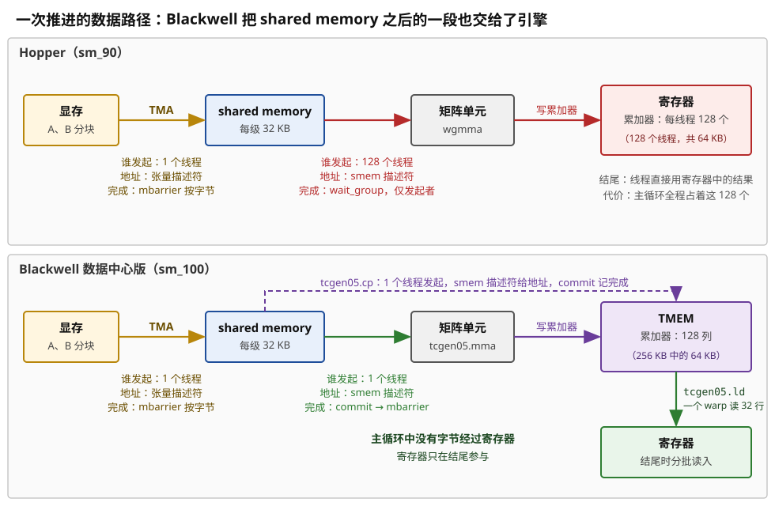
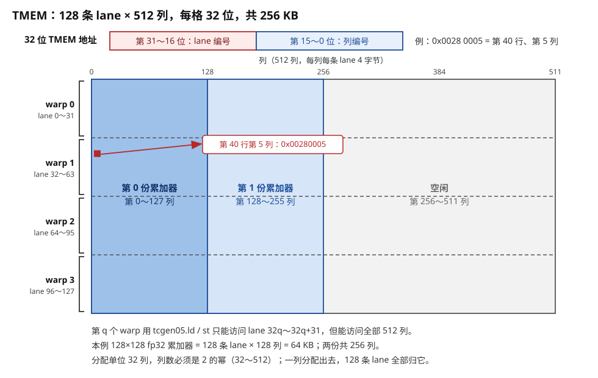
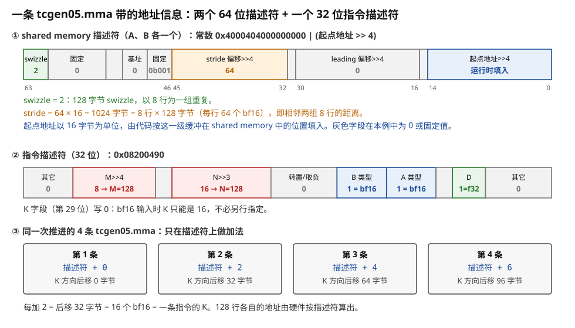
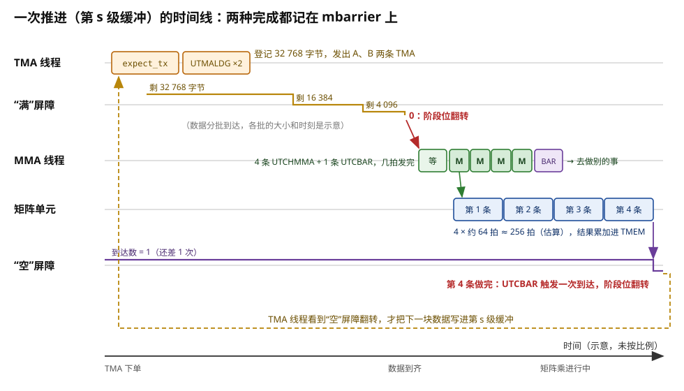
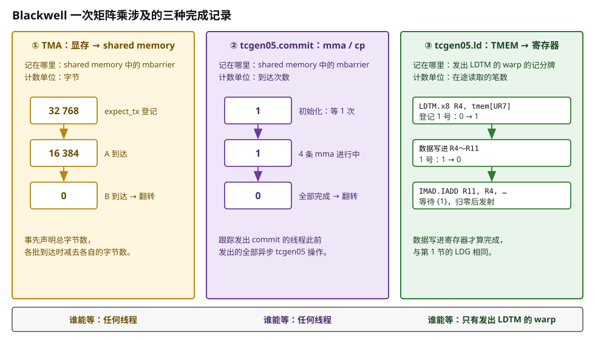
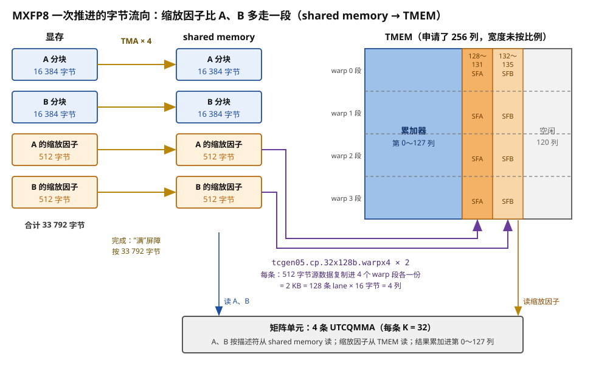
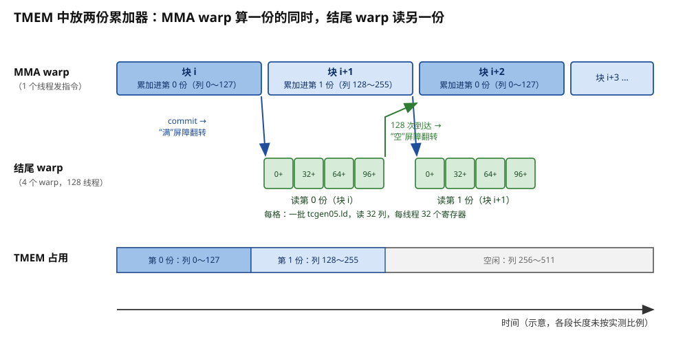
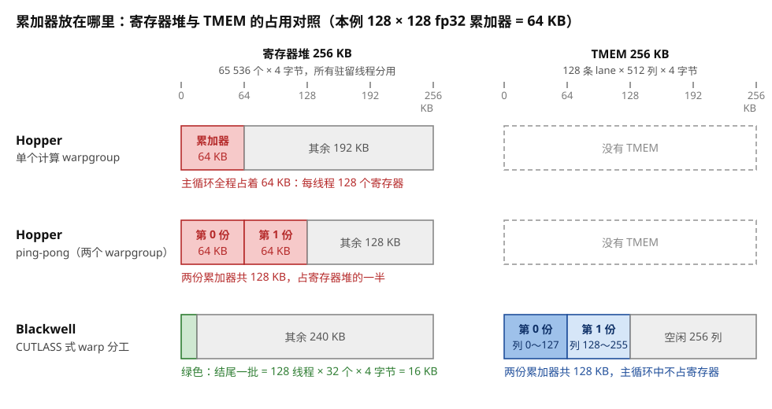
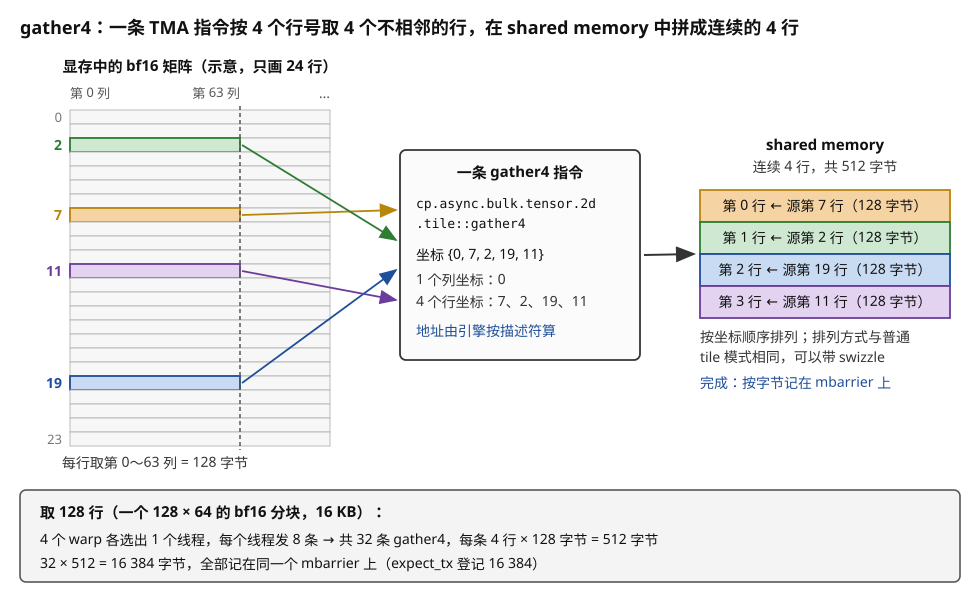

# Blackwell：TMEM 与 `tcgen05.cp`，搬运引擎多负责一段路径

> **所属模块**：模块 14 · 数据搬运（第一部分 · GPU 的数据搬运）
> **状态**：🟨 学习中（2026-10 新写。知识截至 2026-09）
> **一句话主旨**：Hopper 之后，从 shared memory 到矩阵单元的最后一段仍由计算线程负责，累加器也留在它们的寄存器里。Blackwell 在每个 SM 上加了一块 256 KB 的专用存储 TMEM，累加器和矩阵指令的部分操作数改放在这里。矩阵乘 `tcgen05.mma` 和搬运指令 `tcgen05.cp` 都由一个线程发起，地址由描述符给出，完成由 `tcgen05.commit` 记到 mbarrier 上。所以最后一段对三个问题的答案与 TMA 相同，主循环中没有数据经过寄存器。寄存器只在结尾用 `tcgen05.ld` 分批取出结果时才用到。同一代 TMA 还增加了 gather4，接管"整行分散、行内连续"的不规则读取。

上一节（本模块第 3 节）讲了 Hopper 的 TMA。一个线程下单，搬运引擎计算地址，完成按字节记在 mbarrier 上。但 TMA 只负责到 shared memory 为止。数据从 shared memory 进入矩阵单元、结果从矩阵单元回到线程，这一段仍由做计算的 128 个线程一起负责。本节讲 Blackwell 怎样改写这最后一段对三个问题的答案：谁发起、地址从哪来、完成怎么知道。

---

## 0. 这一节要回答的问题

- Hopper 有了 TMA 之后，搬运路径上还剩哪一段由计算线程亲自负责？在本模块的例子中，这一段占用多少寄存器？
- TMEM 是什么？它多大，硬件怎样给它编址？谁分配它，谁能读写它？
- 矩阵指令 `tcgen05.mma` 对三个问题的答案，与 Hopper 的 `wgmma` 有什么不同？
- `tcgen05.cp` 搬的是什么数据？它的地址从哪来，完成怎么知道？
- `tcgen05.commit` 为什么只记"一次到达"，而 TMA 要按字节记录？
- 结果从 TMEM 回到寄存器时，完成怎么知道？累加器离开寄存器以后，寄存器预算变成多少？
- TMA 的 gather4 接管了哪一类不规则访问？哪些访问仍要线程自己搬？

---

## 1. 基础词汇

**矩阵单元与累加器**。矩阵单元（NVIDIA 叫 Tensor Core）是 SM 中专做小块矩阵乘加的电路。它反复计算 D = A × B + D。其中 A、B 是输入，D 是累加器，沿 K 方向每推进一步都要读出再写回。在本模块的例子中，D 是 128 × 128 个 fp32，共 64 KB。累加器在整个主循环中一直存在，所以它放在哪里，决定了它长期占用哪一种存储。

**warpgroup**。warpgroup 是编号相邻的 4 个 warp，共 128 个线程。Hopper 的矩阵指令 `wgmma` 以 warpgroup 为单位发射：4 个 warp 都执行到这条指令，它才开始执行。

**mbarrier**。mbarrier 是放在 shared memory 中的一个 8 字节对象。它记录两个数：还差几次到达，以及还差多少字节。两个数都归零时，它的阶段位翻转，表示这一阶段完成。任何线程都可以用 `mbarrier.try_wait` 查询阶段位。所以，一个线程发出的搬运可以由另一个 warp 等待。mbarrier 在 Ampere 上就已存在，按字节记录（`expect_tx`）是 Hopper 新增的。

**描述符**。描述符是一个 64 位的数。一条指令用它描述 shared memory 中的一块矩阵：起点地址、相邻行组之间隔多少字节、按哪种 swizzle 模式排列。硬件按描述符算出每一行的地址，线程不必逐个计算。Hopper 的 `wgmma` 已经用这种描述符读 shared memory 中的 A、B。Blackwell 的 `tcgen05` 指令沿用了这种做法，但字段布局有改动。例如，swizzle 模式在 `wgmma` 的描述符中占第 62～63 位，128 字节 swizzle 编码为 1。在 `tcgen05` 的描述符中，它占第 61～63 位，128 字节 swizzle 编码为 2（PTX ISA §9.7.17.5.1.2.2 与表 49）。

**TMEM（Tensor Memory）**。TMEM 是 Blackwell 数据中心 GPU 在每个 SM 中新增的一块片上存储，专供矩阵单元使用，容量 256 KB。§3 详细讲它的形状、编址和读写规则。

**`tcgen05` 指令族**。`tcgen05` 是 PTX 中"第五代 Tensor Core"指令的前缀，从 PTX ISA 8.6 起出现，目标架构是 `sm_100a` 等。它包含以下成员：分配 TMEM 的 `alloc` / `dealloc`，矩阵乘 `mma`，搬运 `cp`，读写 `ld` / `st`，完成记录 `commit`，以及顺序控制 `fence`、`wait`。

**CTA**。CTA（cooperative thread array）就是线程块。PTX 文档用这个词，本节也用它。

**cluster**。cluster 是 Hopper 起新增的一级线程组织：几个 CTA 编成一个 cluster，同时驻留在相邻的几个 SM 上。同一个 cluster 中的 CTA 可以读写彼此的 shared memory，也可以在彼此的 mbarrier 上到达。每个 CTA 在 cluster 中有一个编号，叫 `%cluster_ctarank`。

**例子的固定参数**。本节沿用本模块的例子：输出分块 128 × 128，沿 K 每次推进 64，A、B 各一个 128 × 64 的 bf16 分块，每块 16 KB，每推进一次搬 32 KB。Blackwell 部分按 B200（`sm_100a`）计算：

- 每个 SM 有 65 536 个寄存器（256 KB），每线程最多 255 个；shared memory 最多 228 KB（CUDA C++ Programming Guide 附录的计算能力表，10.x 与 9.0 相同）。
- TMEM 是 128 × 512 个 32 位单元，共 256 KB（PTX ISA §9.7.18.1）。PTX 文档的写法是"每个 CTA 128 行 × 512 列"。同一个 SM 上的几个 CTA 分用这一块 TMEM：一个 CTA 申请时，如果剩余的列不够，它要等别的 CTA 释放（§3.2）。所以本节按"每个 SM 一块"来讲。
- CUTLASS 文档写明，`tcgen05.mma` 的 16 位矩阵乘吞吐是 Hopper 的 2 倍。按 H100 每 SM 每拍 2048 次 bf16 乘加推算，B200 约为每 SM 每拍 4096 次（估算）。所以算一个 128 × 128 × 64 的分块约 **256 拍**（估算）。

---

## 2. Hopper 留下的最后一段：shared memory 到矩阵单元

### 2.1 Hopper 上这一段由 128 个线程一起发起

本模块第 3 节结束时，Hopper 上一次推进的数据流是这样的：

1. 一个线程发出两条 TMA，把 A、B 分块搬进 shared memory，完成按 32 768 字节记在 mbarrier 上。
2. 计算 warpgroup 的 128 个线程等这个 mbarrier。
3. 128 个线程一起发 `wgmma`。矩阵单元按描述符从 shared memory 读 A、B，结果累加进这 128 个线程的寄存器。
4. 128 个线程用 `wgmma.wait_group` 等矩阵乘完成，然后才能通知 TMA 线程重新填这一级缓冲。

为了看到第 3、4 步的真实形态，用 Triton 3.7 把同一个 128 × 128 × 64 的 bf16 矩阵乘编译到 `sm_90a`（不需要 GPU），读它生成的 PTX。每推进一次 K，循环体包含下面这些指令：

| 指令 | 条数 | 谁执行 | 说明 |
| --- | --- | --- | --- |
| `wgmma.fence` | 1 | 128 个线程 | 告诉硬件后面的 `wgmma` 要读写这些累加器寄存器 |
| `wgmma.mma_async ... m64n128k16.f32.bf16.bf16` | 8 | 128 个线程 | 每条算 64 × 128 × 16。上下两半各 4 条，每条在每个线程中列出 64 个累加器寄存器 |
| `wgmma.commit_group` | 1 | 128 个线程 | 把上面 8 条编成一组 |
| `wgmma.wait_group 1` | 1 | 128 个线程 | 等到只剩 1 组没完成 |

PTX 中没有 `elect.sync`（选出一个线程的指令）出现在 `wgmma` 前面。8 条 `wgmma` 由 128 个线程全部执行。反汇编后，它们是 8 条 `HGMMA.64x128x16`，`wgmma.wait_group 1` 编译成 `WARPGROUP.DEPBAR.LE gsb0, 0x1`。它等的计数器写作 `gsb0`，不是记分牌的 0～5 号计数器。但它和本模块第 2 节的 `DEPBAR` 一样，只记录发起者自己发出的操作。每个线程列出的累加器寄存器有两组，各 64 个，所以累加器占每个线程 128 个寄存器。`cuobjdump -res-usage` 报告这个 kernel 每线程用 154 个寄存器。

按三个问题列出 Hopper 上两段路径的答案：

| 路段 | 指令 | 谁发起 | 地址从哪来 | 完成怎么知道 |
| --- | --- | --- | --- | --- |
| 显存 → shared memory | TMA | 一个线程 | 张量描述符 + 坐标 | mbarrier 按字节记录，任何线程都能等 |
| shared memory → 矩阵单元 → 寄存器 | `wgmma` | 一个 warpgroup 的 128 个线程 | shared memory 描述符 | `wgmma.wait_group`，只有发出它的 128 个线程能等 |

第一段在 Hopper 上已经由引擎负责。第二段的三个答案都还和线程绑在一起。

### 2.2 这一段的三项代价

**第一项：累加器长期占用寄存器。** 128 × 128 个 fp32 共 64 KB，平均到 128 个线程，每个线程 128 个寄存器。这些寄存器从第一次推进一直占到写回结果。上面实测的 154 个中，128 个是累加器。

**第二项：结尾和下一块的计算不能自然重叠。** 写回结果（epilogue）要把累加器转成 bf16 并写出。这段时间内，这 128 个线程的寄存器还装着结果，所以它们不能开始下一个输出分块。CUTLASS 在 Hopper 上用 ping-pong 结构解决这个问题：两个计算 warpgroup 各算一个输出分块，一个写回时，另一个计算。代价是两份累加器同时在寄存器中。按本例计算，两份是 2 × 64 KB = 128 KB，占一个 SM 256 KB 寄存器堆的一半。

**第三项：完成只有发起者能看到。** `wgmma.wait_group` 只对发出它的 warpgroup 有效。别的 warp 想知道矩阵乘已经读完某一级缓冲，必须由这 128 个线程先等待，再去 mbarrier 上 arrive。这和本模块第 1 节中记分牌的情况相同：完成记录只属于发起者。

所以 Hopper 留下的问题是：TMA 把第一段交给了引擎，第二段的发起、地址、完成和结果的存放位置仍然绑在计算线程上。图 4-1 把 Hopper 和 Blackwell 的路径并排画出。



> **图 4-1**　一句话：Hopper 上，TMA 只负责到 shared memory；矩阵乘由 128 个线程一起发起，结果留在它们的寄存器里。Blackwell 上，矩阵乘和 shared memory 到 TMEM 的搬运都由一个线程发起，结果留在 TMEM 中，寄存器只在结尾参与。
>
> **先知道一件事**：图中每个箭头是数据走过的一段路。箭头旁的三行小字依次回答三个问题：谁发起、地址从哪来、完成记在哪里。
>
> **按这个顺序看**：
> 1. 先看上半部分 Hopper。左边的显存到 shared memory 一段由 TMA 负责，完成按 32 768 字节记在 mbarrier 上。
> 2. 再看 Hopper 的中间一段。矩阵单元从 shared memory 读 A、B，但这条指令要 128 个线程一起发出。结果写进右边红框中的寄存器，每个线程 128 个。
> 3. 看下半部分 Blackwell。第一段不变。中间的矩阵乘只由一个线程发出，结果写进紫色的 TMEM。另一条虚线是 `tcgen05.cp`，把 shared memory 中的数据搬进 TMEM。
> 4. 最后看 Blackwell 右端。寄存器只出现在结尾：`tcgen05.ld` 把结果分批读进寄存器，再写回显存。
>
> **打个比方**：Hopper 像仓库已经有了自动传送带，但从货架到机床的最后一段仍由 128 个工人一起抬，成品也堆在工人手上。Blackwell 在机床旁边修了一个专用料仓，最后一段也交给传送带，工人只在出货时动手。
>
> **看懂的标志**：能说出 Blackwell 改的是哪一段。答案是 shared memory 到矩阵单元、以及累加器存放的那一段。显存到 shared memory 那一段在 Hopper 上已经由 TMA 负责，Blackwell 没有改它的三个答案。
>
> **与正文的对照**：Hopper 一行的 128 个寄存器、Blackwell 一行的单线程发起，都来自 §2.1 与 §4.3 的 Triton 编译实测。
>
> 来源：本库自绘。

---

## 3. TMEM：矩阵单元旁边的一块专用存储

### 3.1 形状与编址：128 行 × 512 列，每格 32 位

PTX 文档把 TMEM 描述成一个二维阵列。横向的一行叫一条 **lane**，共 128 条。纵向的一列叫一个 **column**，共 512 列。每一格是 32 位。所以容量是 128 × 512 × 4 字节 = 256 KB，和一个 SM 的寄存器堆一样大。

TMEM 的地址是 32 位，分成两半：

- 高 16 位是 lane 编号。
- 低 16 位是 column 编号。

累加器按"一行矩阵占一条 lane"的方式存放。以本例的累加器为例，设分配到的起点是 lane 0、column 0：

- 第 r 行、第 c 列的 fp32 存放在 lane r、column c。
- 它的 TMEM 地址是 `(r << 16) | c`。例如第 40 行第 5 列的地址是 `0x00280005`。
- 整个累加器占 128 条 lane × 128 列，也就是 512 列中的 128 列。

PTX 文档还规定，矩阵结果 D 的每个元素占一整格 32 位。如果 D 是 16 位类型，一格只用低 16 位。

### 3.2 分配与释放由一个 warp 显式完成

TMEM 不像寄存器那样由编译器静态分配。程序必须显式申请，规则如下（PTX ISA §9.7.18.7）：

1. 一个 warp 执行 `tcgen05.alloc`，申请若干列。列数以 32 为单位，必须是 2 的幂，范围 32～512。申请一列就得到这一列的全部 128 条 lane。
2. 硬件把分到的起点地址写进 shared memory 中指定的位置。其它线程从那里读出这个地址。
3. 如果剩余的列不够，`tcgen05.alloc` 会一直阻塞，直到有足够的列被释放。
4. 用完后，同一个 warp 执行 `tcgen05.dealloc` 释放。kernel 退出前必须释放全部 TMEM。
5. `tcgen05.relinquish_alloc_permit` 表示本 CTA 放弃申请 TMEM 的权利。执行它之后，本 CTA 再执行 `tcgen05.alloc` 就是非法的。CUTLASS 把这条指令封装成 `release_allocation_lock()`，即"释放分配锁"。PTX 文档没有写明它对同一 SM 上其它 CTA 的影响。按 CUTLASS 的命名推测，它让其它 CTA 的申请不必再等本 CTA。

用两个真实编译结果看列数怎么定：

- 本例的 bf16 矩阵乘编译到 `sm_100a`，Triton 生成 `tcgen05.alloc ... 128`。累加器正好要 128 列。
- 同样分块的 MXFP8 矩阵乘（§6.3）还要放两组缩放因子，各 4 列，共需 136 列。136 不是 2 的幂，所以 Triton 申请了 256 列。

再看 SASS。手写一段 PTX，用 CUDA 13.1 的 ptxas 汇编到 `sm_100a`，再用 `cuobjdump -sass` 反汇编。`tcgen05.alloc` 编译成一个循环：先执行 `UTCATOMSWS.FIND_AND_SET.ALIGN`（在一张记录"哪些列已占用"的状态表上找空位并置位），如果失败就执行 `NANOSLEEP` 后重试。所以 PTX 文档说的"阻塞"，在这次编译中实际是"失败、休眠、重试"。

### 3.3 谁能读写 TMEM

TMEM 不能用普通的 load/store 访问。只有下面几类指令能读写它：

| 指令 | 方向 | 由谁发起 | 本节位置 |
| --- | --- | --- | --- |
| `tcgen05.mma` | 矩阵单元写 D；读 D 继续累加；可选地读 A、缩放因子 | 一个线程 | §4 |
| `tcgen05.cp` | shared memory → TMEM | 一个线程 | §6 |
| `tcgen05.ld` | TMEM → 寄存器 | 一个 warp | §7 |
| `tcgen05.st` | 寄存器 → TMEM | 一个 warp | §7 |
| `tcgen05.shift` | TMEM 内部把各行下移一行 | 一个线程 | 不展开 |

`tcgen05.ld` / `st` 有一条访问限制（PTX ISA §9.7.18.8.1）。TMEM 的 128 条 lane 分成 4 段，每段 32 条。一个 warpgroup 中的第 q 个 warp（q = 0～3）只能访问第 32q 到 32q + 31 条 lane，但可以访问全部 512 列：

| warp 在 warpgroup 中的编号 | 能访问的 lane |
| --- | --- |
| 0 | 0～31 |
| 1 | 32～63 |
| 2 | 64～95 |
| 3 | 96～127 |

所以，要把 128 行的累加器全部读出，至少要一个 warpgroup 的 4 个 warp 一起读。在 Triton 生成的 PTX 中可以看到这条规则：每个线程算 TMEM 地址时，用 `and.b32 ..., 6291456` 取出自己 warp 编号的低两位，放到地址的第 21～22 位。这正好是 lane 字段中的 32q。图 4-2 把 TMEM 的形状、地址格式和这条访问限制画在一起。



> **图 4-2**　一句话：TMEM 是一张 128 行 × 512 列的表，每格 32 位，共 256 KB。本例的 128 × 128 累加器正好占 128 条 lane × 128 列。读回寄存器时，四个 warp 各读自己那 32 条 lane。
>
> **先知道一件事**：这里的"lane"指 TMEM 的一行，不是 warp 中的线程编号。TMEM 的一条 lane 存放矩阵的一行，所以 128 条 lane 对应矩阵单元一次处理的 128 行。
>
> **按这个顺序看**：
> 1. 先看顶部的地址格式。32 位地址的高 16 位是 lane 编号，低 16 位是列编号。
> 2. 看中间的大网格。纵向是 128 条 lane，横向是 512 列。蓝色区域是第一份累加器，占第 0～127 列。浅蓝色区域是第二份累加器，占第 128～255 列。灰色是空闲的 256 列。
> 3. 看网格左侧的四个括号。warp 0 只能读写 lane 0～31，warp 1 只能读写 lane 32～63，依此类推。
> 4. 看网格中标出的一个格子：第 40 行、第 5 列的元素，地址是 `0x00280005`。0x28 就是 40。
>
> **看懂的标志**：能回答"为什么读出整个累加器至少要 4 个 warp"。因为每个 warp 只能访问 32 条 lane，而累加器有 128 行，占满 128 条 lane。
>
> **与正文的对照**：两份累加器的用途见 §7.2。形状、地址格式和访问限制取自 PTX ISA §9.7.18.1 与 §9.7.18.8.1。
>
> 来源：本库自绘。

---

## 4. `tcgen05.mma`：一个线程发起矩阵乘

### 4.1 单线程语义改写了"谁发起"

PTX 文档对 `tcgen05.mma` 的描述是：它有单线程语义，不像 `mma.sync` 和 `wgmma.mma_async` 那样要求一组线程一起执行。一个线程发出它，就启动整个矩阵乘加。三个问题的答案如下：

- **谁发起**：一个线程。程序通常先用 `elect.sync` 在 warp 中选出一个线程，由它发出。
- **地址从哪来**：四个操作数各有来源。A、B 在 shared memory 中时，各用一个 64 位描述符表示。D 用一个 TMEM 地址表示。形状和数据类型写在一个 32 位的**指令描述符**中。
- **完成怎么知道**：`tcgen05.mma` 是异步指令，发出后线程立刻继续。完成要用 `tcgen05.commit` 记到 mbarrier 上（§5）。

`tcgen05.mma` 的操作数可以放在以下位置（PTX ISA §9.7.18.10）：

| 矩阵 | 可以放在哪里 |
| --- | --- |
| A | TMEM 或 shared memory |
| B | shared memory |
| D（累加器） | TMEM |
| 缩放因子、稀疏元数据 | TMEM |

下面只看最简单的情形：bf16 输入、fp32 累加（`.kind::f16`），稠密矩阵，不带 `.ws` 修饰（`.ws` 是另一种复用 B 矩阵的变体，本节不用），单个 CTA。这时一条指令的形状是 M = 64 或 128，N 是 8 的倍数、最大 256，K 固定为 16（PTX ISA 表 48）。本例的 128 × 128 × 64 一次推进因此需要 64 ÷ 16 = 4 条指令。每条算 128 × 128 × 16 = 262 144 次乘加。按每 SM 每拍约 4096 次估算，每条约 64 拍。

### 4.2 地址从描述符来：解一个真实的描述符

Triton 为本例生成的 PTX 中，A 和 B 的 shared memory 描述符都是"起点地址右移 4 位"与一个常数按位或。这个常数是 `0x4000404000000000`。按 PTX ISA 表 49 的字段逐个解开：

| 位 | 字段 | 本例的值 | 含义 |
| --- | --- | --- | --- |
| 0～14 | 起点地址 >> 4 | 由代码填入 | 分块在 shared memory 中的起点，以 16 字节为单位 |
| 16～30 | leading 维字节偏移 >> 4 | 0 | 128 字节 swizzle 的 K 方向连续布局用不到它 |
| 32～45 | stride 维字节偏移 >> 4 | 64 | 64 × 16 = 1024 字节，即相邻两组 8 行之间的距离 |
| 46～48 | 固定值 | 0b001 | PTX 规定的常数 |
| 49～51 | 基址偏移 | 0 | swizzle 图样从 1024 字节边界开始 |
| 61～63 | swizzle 模式 | 2 | 128 字节 swizzle |

1024 字节的来历是：A 分块每行 64 个 bf16，共 128 字节。8 行是 1024 字节。128 字节 swizzle 以 8 行为一组重复图样，所以描述符只需记录"下一组 8 行在 1024 字节之后"。硬件据此算出 128 行中每一行的地址。

同一次推进的 4 条 `tcgen05.mma` 中，描述符依次加 0、2、4、6。描述符的地址字段以 16 字节为单位，所以每次加 2 就是后移 32 字节。32 字节正好是 16 个 bf16，也就是一条指令消耗的 K = 16。

指令描述符是 `0x08200490`。按 PTX ISA 表 51 解开：D 是 fp32，A、B 都是 bf16，A、B 都不转置，N >> 3 = 16（N = 128），M >> 4 = 8（M = 128）。第 29 位是 K 字段。PTX 规定，如果 K 由类型唯一确定，这一位必须写 0。bf16 输入时 K 只能是 16，所以这一位是 0。

这就是 Blackwell 对"地址从哪来"的答案：线程只提供一个 64 位描述符和一个 TMEM 地址。128 行、每行 32 字节的读取地址，都由硬件按描述符算出。图 4-3 把两个描述符的字段画了出来。



> **图 4-3**　一句话：一条 `tcgen05.mma` 只带两个 64 位描述符、一个 32 位指令描述符和一个 TMEM 地址。分块中每一行在哪里，由硬件按描述符算出。
>
> **先知道一件事**：swizzle 是一种打乱存放位置的规则。它让矩阵单元同时读 8 行时，这 8 行落在 shared memory 的不同存储体上，不会互相排队。描述符中的 swizzle 字段告诉硬件按哪种规则还原位置。
>
> **按这个顺序看**：
> 1. 上面一条是 64 位的 shared memory 描述符，从右往左是低位到高位。最右边的蓝色字段是起点地址，由代码在运行时填入。
> 2. 中间的橙色字段是 stride 偏移，值为 64。乘以 16 得到 1024 字节，即 8 行 × 128 字节。
> 3. 最左边的绿色字段是 swizzle 模式，值为 2，表示 128 字节 swizzle。
> 4. 下面一条是 32 位的指令描述符。几个字段分别给出 D、A、B 的类型和 M、N 的大小。
> 5. 最下方一行写出同一次推进的 4 条指令：描述符依次加 0、2、4、6，对应 K 方向后移 0、32、64、96 字节。
>
> **看懂的标志**：能回答"线程要算多少个地址"。答案是每条指令一个描述符，4 条指令只在描述符上做 4 次加法。Ampere 的写法中，128 个线程各算 8 个地址。
>
> **与正文的对照**：两个常数取自 Triton 3.7 为 `sm_100a` 生成的 PTX，字段定义取自 PTX ISA 表 49 与表 51。
>
> 来源：本库自绘。

### 4.3 走查：一次推进的真实 PTX 与 SASS

下面把本例编译到 `sm_100a`，按执行顺序列出一次推进中与搬运和矩阵乘有关的指令。这个 kernel 有 4 个 warp，没有做 warp 分工：每一步都先用 `elect.sync` 选出一个线程，再由它发出。SASS 一列是 CUDA 13.1 的 `cuobjdump` 反汇编结果。

| 步 | PTX | SASS | 谁执行 | 作用 |
| --- | --- | --- | --- | --- |
| 1 | `mbarrier.arrive.expect_tx ... 32768` | `SYNCS.ARRIVE.TRANS64` | 选出的一个线程 | 告诉第 s 级的"满"屏障：要等 32 768 字节 |
| 2 | `cp.async.bulk.tensor.2d ...` × 2 | `UTMALDG.2D` × 2 | 选出的一个线程 | TMA 搬 A、B 各 16 KB |
| 3 | `mbarrier.try_wait.parity` | `SYNCS.PHASECHK.TRANS64.TRYWAIT` | 全部线程 | 等 32 768 字节到齐 |
| 4 | `tcgen05.mma.cta_group::1.kind::f16` × 4 | `UTCHMMA` × 4 | 选出的一个线程 | 4 条矩阵乘，每条 K = 16，结果累加进 TMEM |
| 5 | `tcgen05.commit ... mbarrier::arrive::one` | `UTCBAR` | 选出的一个线程 | 让第 s 级的"空"屏障在这 4 条做完后收到一次到达 |
| 6 | `mbarrier.try_wait.parity` | `SYNCS.PHASECHK.TRANS64.TRYWAIT` | 全部线程 | 重新填第 s 级之前，等它的"空"屏障 |

SASS 中 `UTCHMMA` 的操作数写作 `gdesc[UR6], gdesc[UR14], tmem[UR27], tmem[UR36], idesc[UR37]`。`gdesc` 是两个 shared memory 描述符，`tmem` 是 TMEM 地址，`idesc` 是指令描述符。它们都放在 `UR` 寄存器中。`UR` 是 uniform 寄存器，每个 warp 只有一份，不是每个线程一份。所以这条指令在硬件上也是"一个 warp 发射一次、只带一份操作数"。

按三个问题核对这次推进：

- **谁发起**：第 1、2、4、5 步各由一个线程发出。128 个线程只在第 3、6 步一起等待。如果做了 warp 分工，第 3、6 步也只需各一个 warp 参与（§7.2）。
- **地址从哪来**：TMA 用张量描述符和坐标，矩阵乘用 shared memory 描述符。线程只做描述符上的几次加法。
- **完成怎么知道**：TMA 的完成按字节记在"满"屏障上，矩阵乘的完成按"一次到达"记在"空"屏障上。两个都是 mbarrier，任何线程都能等。

数据在这次推进中走过的路是：显存 → shared memory（TMA）→ 矩阵单元（`UTCHMMA` 按描述符读）→ TMEM。整条路上没有一个字节经过寄存器。图 4-4 把这些步骤按时间排开。



> **图 4-4**　一句话：一次推进中，一个线程下单搬 32 KB，一个线程发 4 条矩阵乘和一条 commit。两种完成都记在 mbarrier 上：搬运按字节，矩阵乘按一次到达。
>
> **先知道一件事**："满"屏障和"空"屏障是同一级缓冲配的两个 mbarrier。"满"表示数据已经到齐，可以计算。"空"表示矩阵单元已经读完，可以覆盖。
>
> **按这个顺序看**：
> 1. 第一行是 TMA 线程。它先在"满"屏障上登记 32 768 字节，再发出两条 `UTMALDG`。
> 2. 第二行是"满"屏障中剩余的字节数。数据分批到达，数字从 32 768 降到 0。降到 0 时阶段位翻转。
> 3. 第三行是 MMA 线程。它看到"满"屏障翻转后，连续发出 4 条 `UTCHMMA` 和一条 `UTCBAR`。这 5 条指令只占几拍，线程随即可以去做别的事。
> 4. 第四行是矩阵单元。4 条矩阵乘依次执行，合计约 256 拍（估算）。
> 5. 第五行是"空"屏障。第 4 条矩阵乘做完时，`UTCBAR` 让它收到一次到达，阶段位翻转。TMA 线程看到后，才把下一块数据写进这一级缓冲。
>
> **看懂的标志**：能回答"MMA 线程在矩阵单元工作的 256 拍里做什么"。它什么也不用等。它可以继续为下一级缓冲发指令，因为完成会由硬件记到"空"屏障上。
>
> **与正文的对照**：指令名和字节数取自本例的 Triton 编译结果。时间轴是示意，256 拍是按吞吐估算的值，TMA 的到达时刻没有按真实延迟画。
>
> 来源：本库自绘。

---

## 5. 完成记在 mbarrier 上：`tcgen05.commit`

### 5.1 commit 记录的是"这个线程此前发出的全部异步 tcgen05 操作"

`tcgen05.commit` 的语义是（PTX ISA §9.7.18.12.1）：让一个 mbarrier 跟踪执行这条指令的线程此前发出的全部异步 `tcgen05` 操作。这些操作包括 `mma`、`cp` 和 `shift`。它们全部完成时，硬件在这个 mbarrier 上做一次到达，到达数为 1。具体步骤是：

1. 线程发出若干条 `tcgen05.mma` / `cp`。
2. 线程发出 `tcgen05.commit.mbarrier::arrive::one [mbar]`。它立即返回，不等待。
3. 硬件在第 1 步的操作全部完成时，对 `mbar` 做一次到达。
4. 任何线程用 `mbarrier.try_wait` 都能看到这次到达。

加上 `.multicast::cluster` 修饰后，同一次完成可以同时通知 cluster 中多个 CTA 的 mbarrier。§8 的两 SM 合作会用到它。

本模块第 1 节的记分牌和第 2 节的 `cp.async.wait_group` 都只让发起的线程知道完成。`tcgen05.commit` 把完成交给 shared memory 中的 mbarrier，所以别的 warp 也能等。这就是 TMA 在 Hopper 上对"完成怎么知道"的答案，Blackwell 把它推广到了矩阵乘和 `tcgen05.cp`。

### 5.2 只记一次到达不是退步

TMA 的完成按字节记录，`tcgen05.commit` 只记一次到达。这看起来像是记录变粗了。下面分三步说明它不是退步。

**它碰到了哪条规则。** 本模块第 3 节说明，TMA 按字节记录，是因为一级缓冲的数据由多条 TMA 分批搬来。各批从 L2 的不同分区返回，到达顺序不确定。消费者事先声明总字节数，最后一个字节到达时才算完成。按这个理由，`tcgen05.cp` 搬的也是数据，似乎也该按字节记录。

**它实际怎么工作。** `tcgen05.commit` 不统计数据量。它统计的是"一个线程发出的一串异步操作"。这串操作由同一个线程按顺序发给同一个矩阵单元。硬件只需在最后一条完成时发一次信号。源数据已经在片上的 shared memory 中，没有"从多处分批返回"的问题。因为本来就只有一个完成时刻，所以一次到达已经足够。这一段的理由是本库的推断，PTX 文档只给出了语义，没有解释设计原因。

**结论。** 两种记法都是"完成记在 mbarrier 上，任何线程都能等"。差别只在计数单位：TMA 数字节，commit 数批次。所以 `tcgen05.commit` 只是看起来更粗，它与 TMA 的完成机制属于同一类。

### 5.3 同一线程内的固定顺序省去了中间等待

PTX 还规定了几对"流水关系"（PTX ISA §9.7.18.6.2）。异步的 `tcgen05` 操作一般可以不按发出顺序完成。但是，同一个 warp 先后发出下面这几对指令时，硬件保证两条指令按发出顺序访问 TMEM 中的同一组操作数。本节的例子都由同一个线程发出，自然属于同一个 warp。所以后一条看到前一条的结果，中间不需要任何等待：

| 先发出 | 后发出 | 保证 |
| --- | --- | --- |
| `tcgen05.cp`（写 TMEM） | `tcgen05.mma`（读同一地址的 A 或元数据） | mma 读到 cp 写入的数据 |
| `tcgen05.mma`（写 D） | `tcgen05.mma`（读同一个 D 继续累加） | 后一条在前一条的结果上累加 |
| `tcgen05.mma` / `cp` | `tcgen05.commit` | commit 跟踪前面全部操作 |
| `tcgen05.st` | `tcgen05.ld` | ld 读到 st 写入的数据 |

所以 §4.3 中 4 条 `UTCHMMA` 之间没有等待。§6.3 中 `tcgen05.cp` 和随后的 `tcgen05.mma` 之间也没有等待。PTX 规定，不同 warp 发出的指令之间没有这种流水关系。所以跨 warp 交接时，才需要 mbarrier 和 `tcgen05.fence`。

图 4-5 把本节出现的三种完成记录放在一起比较。第三种属于结尾一段，§7.1 详细讲。



> **图 4-5**　一句话：Blackwell 的一次矩阵乘涉及三种完成记录。前两种记在 shared memory 的 mbarrier 上，任何线程都能等。第三种是结尾从 TMEM 读回寄存器，它仍然用记分牌，只有读取的线程自己等。
>
> **先知道一件事**：记分牌是每个 warp 的 6 个硬件计数器。读取指令发出时计数器加一，数据写进目的寄存器时减一，要用这个数据的指令等它归零。它只对发出读取的那个 warp 可见。
>
> **按这个顺序看**：
> 1. 左栏是 TMA。mbarrier 中的字节数从 32 768 开始，每批数据到达时减去这批的字节数，减到 0 算完成。
> 2. 中栏是 `tcgen05.commit`。mbarrier 中的到达数从 1 开始。4 条矩阵乘全部做完时，硬件做一次到达，到达数变成 0。
> 3. 右栏是 `tcgen05.ld`。SASS 中的 `LDTM` 登记 1 号记分牌计数器，后面要用这些寄存器的指令等 1 号计数器归零。
> 4. 最下面一行写出每种记录"谁能等"：前两种是任何线程，第三种只有发出 `LDTM` 的 warp。
>
> **看懂的标志**：能回答"为什么前两段可以做 warp 分工，结尾一段不需要"。前两段的发起者和使用者是不同的 warp，所以完成必须放在共享的 mbarrier 上。结尾一段读进寄存器的数据由读取的 warp 自己使用，所以记分牌就够了。
>
> **与正文的对照**：32 768 字节和 `LDTM` 登记 1 号计数器都来自本节的编译实测。控制位按本模块第 1 节所用的逆向布局解码。
>
> 来源：本库自绘。

---

## 6. `tcgen05.cp`：shared memory 到 TMEM 的搬运

### 6.1 指令形式与搬运形状

`tcgen05.cp` 的 PTX 形式是：

```ptx
tcgen05.cp.cta_group.shape{.multicast}{.dst_fmt.src_fmt} [taddr], s-desc;
```

三个问题的答案与 `tcgen05.mma` 相同：一个线程发起；源地址用 64 位 shared memory 描述符 `s-desc`，目的地址用 TMEM 地址 `taddr`；完成用 `tcgen05.commit` 记到 mbarrier 上。

一条指令搬多少，由 `.shape` 决定。形状写成"lane 数 × 每条 lane 的位数"。下表列出全部 5 种形状：

| 形状 | 源数据量 | 必须配合的修饰 | 写进 TMEM 的方式 |
| --- | --- | --- | --- |
| `.128x256b` | 128 条 × 32 字节 = 4 KB | 无 | 128 条 lane 各写 32 字节 |
| `.128x128b` | 128 条 × 16 字节 = 2 KB | 无 | 128 条 lane 各写 16 字节 |
| `.4x256b` | 4 条 × 32 字节 = 128 字节 | 无 | 4 条 lane 各写 32 字节 |
| `.64x128b` | 64 条 × 16 字节 = 1 KB | `.warpx2::02_13` 或 `.warpx2::01_23` | 复制给两对 warp 的 lane 段，每个 warp 收一半 |
| `.32x128b` | 32 条 × 16 字节 = 512 字节 | `.warpx4` | 复制给 4 个 warp 的 lane 段，每段一份 |

最后两行的"复制"需要解释。§3.3 讲过，TMEM 的 128 条 lane 按 32 条一段分给 4 个 warp。`.warpx4` 把 32 条 lane 的源数据写进全部 4 段，每段一份。所以 512 字节的源数据在 TMEM 中占 4 × 512 = 2 KB。`.warpx2::01_23` 把 warp 0、1 配成一对，warp 2、3 配成一对，每对中两个 warp 各收一半。

`.cta_group::2` 表示一条指令同时让一对 CTA 各自把自己 shared memory 中的数据搬进自己的 TMEM（§8）。可选的 `.dst_fmt.src_fmt` 在搬运途中改变数据格式（§6.5）。

### 6.2 它搬的是矩阵乘要在 TMEM 中读的操作数

§4.1 的表中列出，`tcgen05.mma` 要在 TMEM 中读的东西有三类：放在 TMEM 中的 A、缩放因子、稀疏元数据。`tcgen05.cp` 就是把这些数据从 shared memory 搬进 TMEM 的指令。数据先由 TMA 从显存搬进 shared memory，再由 `tcgen05.cp` 搬进 TMEM。所以搬运引擎负责的路径从"显存 → shared memory"延长到了"显存 → shared memory → TMEM"。

在公开的代码中，`tcgen05.cp` 最常见的用途是搬**块缩放因子**。MXFP8、NVFP4 这类低精度格式把 K 方向每 16 或 32 个元素编成一组，每组配一个 8 位缩放因子。矩阵乘时，每组元素先乘上缩放因子，再累加。PTX 规定这些缩放因子必须放在 TMEM 中。CUTLASS 的块缩放矩阵乘（`sm100_blockscaled_mma_warpspecialized.hpp`）在每次推进中这样做：

1. 等 TMA 把 A、B 和两组缩放因子搬进 shared memory。
2. 用 `elect_one_sync()` 选出一个线程，用 `SM100_UTCCP_4x32dp128bit_1cta`（即 `tcgen05.cp.cta_group::1.32x128b.warpx4`）把 A、B 的缩放因子各搬进 TMEM。
3. 同一个 warp 随后发出矩阵乘。两者之间只有一次 mbarrier 等待，等的是累加器空出，不是 `tcgen05.cp` 完成。

需要区分的是另一种做法：数据由线程计算得到，不来自 shared memory。例如 FlashAttention-4 的 Blackwell 实现中，softmax 算出的概率矩阵 P 作为下一次矩阵乘的 A 放在 TMEM 中。这时数据已经在线程的寄存器里，所以它用 `tcgen05.st` 从寄存器写进 TMEM，而不是用 `tcgen05.cp`。

### 6.3 走查：MXFP8 矩阵乘的一次推进

用 Triton 3.7 编译一个 MXFP8 矩阵乘到 `sm_100a`。分块是 128 × 128，沿 K 每次推进 128 个 fp8 元素，每 32 个元素一个缩放因子。缩放因子用 TMA 搬运。先算一次推进要搬多少字节：

- A 分块：128 行 × 128 字节 = 16 384 字节。
- B 分块：同样 16 384 字节。
- A 的缩放因子：128 行 × (128 ÷ 32) = 512 字节。
- B 的缩放因子：同样 512 字节。
- 合计 33 792 字节。

生成的 PTX 中，`expect_tx` 的值正是 33 792。按执行顺序列出一次推进：

| 步 | PTX | SASS | 作用 |
| --- | --- | --- | --- |
| 1 | `mbarrier.arrive.expect_tx ... 33792` | `SYNCS.ARRIVE.TRANS64` | 登记 33 792 字节 |
| 2 | `cp.async.bulk.tensor.2d` × 2 | `UTMALDG.2D` × 2 | TMA 搬 A、B 各 16 KB |
| 3 | `cp.async.bulk.tensor.5d` × 2 | `UTMALDG.5D` × 2 | TMA 搬两组缩放因子各 512 字节 |
| 4 | `mbarrier.try_wait.parity` | `SYNCS.PHASECHK.TRANS64.TRYWAIT` | 等 33 792 字节到齐 |
| 5 | `tcgen05.cp.cta_group::1.warpx4.32x128b` × 2 | `UTCCP.T.S.4x32dp128bit tmem[UR23+0x80]`、`tmem[UR23+0x84]` | 把两组缩放因子搬进 TMEM 第 128 列和第 132 列 |
| 6 | `tcgen05.mma ... kind::mxf8f6f4.block_scale` × 4 | `UTCQMMA` × 4 | 4 条矩阵乘，每条 K = 32，读 TMEM 中的缩放因子 |
| 7 | `tcgen05.commit ... arrive::one` | `UTCBAR` | 做完后让"空"屏障收到一次到达 |

第 5 步的 TMEM 地址可以和 §3.2 的分配对上。累加器占第 0～127 列。`+0x80` 是第 128 列，`+0x84` 是第 132 列。每组缩放因子的源数据是 512 字节，`.warpx4` 把它复制进 4 个 lane 段，共 2 KB。2 KB 平摊到 128 条 lane，每条 16 字节，正好是 4 列。所以 A 的缩放因子占第 128～131 列，B 的占第 132～135 列。136 列向上取 2 的幂，就是 §3.2 中申请的 256 列。

第 5 步和第 6 步之间没有任何等待指令。依据是 §5.3 的流水关系：同一个 warp 先发 `cp`、后发 `mma`，`mma` 按顺序读到 `cp` 写入的数据。需要说明，PTX 的流水关系表写的是 `mma` 读"A 和元数据"，没有单独列出缩放因子。Triton 和 CUTLASS 在这里都不插等待，说明缩放因子也按这条规则处理。这一点是本库根据两份代码的推断。图 4-6 画出了这一次推进的字节流向。



> **图 4-6**　一句话：缩放因子先由 TMA 搬进 shared memory，再由 `tcgen05.cp` 搬进 TMEM。两段都由一个线程发起，矩阵乘直接在 TMEM 中读取缩放因子。
>
> **先知道一件事**：块缩放格式把每 32 个 fp8 元素编成一组，共用一个 8 位的缩放因子。矩阵乘时，每组元素先乘以自己的缩放因子，再参与累加。缩放因子的数据量很小，但每次推进都要换一批。
>
> **按这个顺序看**：
> 1. 左边是显存。一次推进要搬 4 块数据：A、B 各 16 384 字节，两组缩放因子各 512 字节，合计 33 792 字节。
> 2. 中间是 shared memory。4 块数据都由 TMA 写进来，完成按 33 792 字节记在"满"屏障上。
> 3. 右边是 TMEM。蓝色的第 0～127 列是累加器。橙色的第 128～131 列和第 132～135 列是两组缩放因子。每组 512 字节被 `.warpx4` 复制成 4 份，每个 warp 的 lane 段一份，共 2 KB。
> 4. 底部的矩阵单元从 shared memory 读 A、B，从 TMEM 读缩放因子，把结果累加进第 0～127 列。
>
> **看懂的标志**：能回答"为什么 A、B 不用 `tcgen05.cp` 搬进 TMEM"。因为 `tcgen05.mma` 可以直接按描述符从 shared memory 读 A、B。缩放因子必须放在 TMEM 中，所以它要多走一段。
>
> **与正文的对照**：字节数、列号和指令名取自 Triton 3.7 为 `sm_100a` 生成的 PTX 与 SASS。缩放因子在 TMEM 中按什么顺序排列，PTX 文档的图有规定，本图没有画出。
>
> 来源：本库自绘。

### 6.4 实测：`tcgen05.cp` 的完成不经过记分牌

为了单独看 `tcgen05.cp`，手写一段最小的 PTX：分配 128 列 TMEM，用一条 `tcgen05.cp.cta_group::1.128x256b` 搬 4 KB，用 `tcgen05.commit` 记到 mbarrier 上，等待后再用 `tcgen05.ld` 读回。用 ptxas 汇编到 `sm_100a`，再按本模块第 1 节的逆向布局解出 SASS 的控制位：

| SASS | 写登记号 | 读登记号 | 等待掩码 | 说明 |
| --- | --- | --- | --- | --- |
| `UTCCP.T.S tmem[UR7], gdesc[UR4]` | 无 | 0 | {0} | 不登记写完成，只登记读走源寄存器 |
| `S2UR UR5, SR_CgaCtaId` | 0 | 无 | **{0}** | 要覆盖 UR5（描述符的高 32 位），先等 `UTCCP` 读走 |
| `UTCBAR [UR4], URZ` | 无 | 0 | {0} | 同 `UTCCP` |
| `SYNCS.PHASECHK.TRANS64.TRYWAIT P1, [R0+URZ], R3` | 1 | 无 | 无 | 查询 mbarrier |
| `LDTM.x8 R4, tmem[UR7]` | **1** | 无 | 无 | 读 TMEM 进 R4～R11，登记 1 号计数器 |
| `IMAD.IADD R11, R4, 0x1, R11` | 无 | 无 | **{1}** | 用 R4、R11，等 1 号计数器归零 |

这张表说明三件事：

1. `UTCCP` 和 `UTCBAR` 都没有写登记号，所以复制和 commit 的完成都不通过记分牌。唯一的完成通道是 `UTCBAR` 触发的 mbarrier 到达。
2. `UTCCP` 和 `UTCBAR` 有读登记号 0。本模块第 1 节讲过，读登记号在指令读走源寄存器时减一，用来保护源寄存器不被提前覆盖。表中第二行的 `S2UR` 要改写 UR5，所以它等 0 号计数器。这只说明指令已经读走了描述符，不说明数据已经搬完。
3. `LDTM` 登记了 1 号计数器，用它结果的指令等 1 号归零。这和本模块第 1 节的 `LDG` 完全相同：数据写进寄存器时才算完成。§7.1 会用到这个结果。

另外，`UTCCP` 的操作数都在 uniform 寄存器中。PTX 中这条指令由一个线程（`tid == 0`）有条件地执行，编译器把它包进了一个 `ELECT` 循环。这个循环保证每个要发出的线程各发一次，所以一个线程发起，硬件上就是发射一次。

### 6.5 搬运途中把 4 位、6 位数放进 8 位格子

`tcgen05.cp` 还能在搬运途中改变格式。修饰 `.b8x16.b4x16_p64` 的含义是：源数据中每 16 个 4 位数占 8 字节，后面跟 8 字节空白，搬进 TMEM 时变成 16 个 8 位格子。`.b8x16.b6x16_p32` 的含义类似：16 个 6 位数占 12 字节，后面跟 4 字节空白。PTX 文档把这一步叫"解压"。

用 16 个 FP4 数走一遍全程：

1. 在显存中，16 个 4 位数紧密排列，占 8 字节。
2. TMA 用 `CU_TENSOR_MAP_DATA_TYPE_16U4_ALIGN16B` 类型搬运。CUDA Driver API 文档说明，这种类型在每 8 字节数据后留出 8 字节空隙。所以在 shared memory 中占 16 字节。
3. `tcgen05.cp` 读这 16 字节，把 16 个 4 位数分别放进 16 个 8 位格子，写进 TMEM，仍是 16 字节。

这样做是为了满足矩阵乘对数据格式的要求。PTX 规定，`.kind::mxf8f6f4` 从 TMEM 读 A 时，FP4 必须放在 8 位容器中（PTX ISA 表 66）。显存只存 8 字节，节省了容量和带宽。展开成 8 位容器的工作分两步，在搬运途中完成。这类"搬运途中改变数据排列"的功能，本模块第 11 节统一比较。

---

## 7. 结尾一段：结果从 TMEM 回到寄存器

### 7.1 `tcgen05.ld`：一个 warp 读 32 行，完成仍用记分牌

主循环结束后，累加器还在 TMEM 中。写回显存之前，结果必须先进寄存器，因为转换精度、加偏置等运算只能由线程做。这一段用 `tcgen05.ld`，三个问题的答案和前几段不同：

- **谁发起**：一个 warp。`tcgen05.ld` 带 `.sync.aligned`，warp 的 32 个线程一起执行，每个线程拿到自己的那部分数据。
- **地址从哪来**：一个 TMEM 地址。warp 中 32 个线程给出同一个地址。按 §3.3 的规则，第 q 个 warp 地址中的 lane 字段是 32q。
- **完成怎么知道**：`tcgen05.wait::ld`。§6.4 的实测说明，它在 SASS 上就是记分牌：`LDTM` 登记计数器，用结果的指令等它归零。

以形状 `.32x32b` 为例。它读 32 条 lane，每条 32 位。warp 中第 t 个线程拿到第 t 条 lane 的数据。修饰 `.x32` 表示沿列方向重复 32 次，每个线程得到 32 个寄存器。所以在本例中：

1. warp q 执行 `tcgen05.ld.sync.aligned.32x32b.x32`，地址是 `(32q << 16) | 起始列`。
2. 线程 t 拿到累加器第 32q + t 行、连续 32 列的值，放在 32 个寄存器中。
3. 4 个 warp 合起来，读出 128 行 × 32 列。
4. 线程把转换后的结果写进 shared memory。从 shared memory 写出到显存这一步，仍由 TMA 的写出指令负责。

这里出现了与本模块第 1 节相同的情况：完成挂在寄存器上。区别在于，这一段只在一个输出分块结束时执行一次，不在主循环中。

### 7.2 两份累加器让结尾与下一块的计算重叠

§2.2 说明，Hopper 要让结尾与下一块的计算重叠，需要两份累加器同时放在寄存器中。Blackwell 把两份累加器都放进 TMEM。CUTLASS 的 Blackwell 矩阵乘 kernel（`sm100_gemm_tma_warpspecialized.hpp`）按 warp 分工：

| warp | 角色 | 做什么 |
| --- | --- | --- |
| 0 | MMA | 分配 TMEM，发 `tcgen05.mma` 和 `tcgen05.commit` |
| 1 | 调度 | 决定下一个输出分块 |
| 2 | 主循环搬运 | 发 TMA，把 A、B 搬进 shared memory |
| 3 | 结尾搬运 | 需要时用 TMA 读入要累加的 C |
| 4 起 | 结尾 | 用 `tcgen05.ld` 读累加器，写回结果 |

累加器放几份，由 CUTLASS 的 SM100 builder 计算：份数 = TMEM 总容量 ÷ 一份累加器的大小，最多 4 份。本例一份累加器占 128 列，所以 CUTLASS 默认放 512 ÷ 128 = 4 份。MMA warp 也一次申请全部 512 列。要让结尾与下一块重叠，最少需要 2 份。下面按最少的 2 份讲解，份数更多时道理相同。

累加器的交接用另一对 mbarrier 完成。设 TMEM 中有两份累加器，第 0 份占第 0～127 列，第 1 份占第 128～255 列。按时间顺序：

1. MMA warp 在第 0 份上算完第 i 个输出分块，发 `tcgen05.commit` 到第 0 份的"满"屏障。
2. 结尾 warp 等到第 0 份的"满"屏障翻转，执行 `tcgen05.fence::after_thread_sync`，然后分批 `tcgen05.ld`。
3. 同时，MMA warp 不等结尾，直接在第 1 份上开始第 i + 1 个输出分块。
4. 结尾 warp 读完第 0 份后，每个线程在第 0 份的"空"屏障上到达一次。CUTLASS 把这个屏障的到达数设为结尾线程数，4 个 warp 时是 128。
5. MMA warp 算完第 i + 1 块后，等第 0 份的"空"屏障翻转，再在第 0 份上开始第 i + 2 块。

第 4 步的 mbarrier 按到达次数计数，不按字节。它需要 128 次到达，因为 128 个线程各自读完自己的行，没有一个线程知道其它线程是否读完。

结尾 warp 每批读多少列，由 CUTLASS 的 epilogue 子分块决定。CUTLASS 的 SM100 epilogue builder 对 128 × 128 的分块、4 个结尾 warp、16 位输出，默认子分块是 128 × 32。所以每批每个线程只需 32 个寄存器，读 4 批。图 4-7 画出了两份累加器的交替。



> **图 4-7**　一句话：TMEM 中放两份累加器，MMA warp 算一份的同时，结尾 warp 读另一份。矩阵单元不必等结尾结束。
>
> **先知道一件事**：结尾（epilogue）是一个输出分块算完后的收尾工作：把 fp32 结果转成 bf16，按需加偏置，再写回显存。它只用线程，不用矩阵单元。
>
> **按这个顺序看**：
> 1. 横轴是时间。第一行是 MMA warp。蓝色块是在第 0 份累加器上计算，浅蓝色块是在第 1 份上计算，两种颜色交替出现。
> 2. 第二行是结尾 warp。每个绿色段分成 4 小格，每格是一批 `tcgen05.ld` 读 32 列。
> 3. 看两行之间的箭头。向下的箭头是"满"屏障：MMA warp 算完一份，结尾 warp 才开始读这一份。向上的箭头是"空"屏障：结尾 warp 读完一份，MMA warp 才能再次覆盖这一份。
> 4. 底部的条形是 TMEM 占用：两份累加器共 256 列，剩余 256 列空闲。
>
> **看懂的标志**：能回答"Hopper 要做同样的重叠，代价在哪里"。Hopper 的两份累加器都在寄存器中，按本例要 128 KB，占寄存器堆的一半。Blackwell 把它们放在 TMEM 中，寄存器堆不受影响。
>
> **与正文的对照**：warp 分工、到达数 128、子分块 128 × 32 取自 CUTLASS 源码。CUTLASS 对本例默认放 4 份累加器，占满 512 列。本图按最少的两份画，所以底部有 256 列空闲。时间轴是示意，各段长度没有按实测比例画。
>
> 来源：本库自绘。

### 7.3 寄存器账：累加器的寄存器用量变成由结尾决定

现在可以对比本例在两代上的寄存器用量：

| 项目 | Hopper（一个计算 warpgroup） | Hopper ping-pong | Blackwell（CUTLASS 式分工） |
| --- | --- | --- | --- |
| 累加器在哪里 | 128 个线程的寄存器 | 两个 warpgroup 的寄存器 | TMEM |
| 累加器占的寄存器 | 每线程 128 个，共 64 KB | 两组共 128 KB | 主循环中为 0 |
| 结尾每线程需要的寄存器 | 已经在寄存器中 | 已经在寄存器中 | 每批 32 个（子分块 128 × 32） |
| 在途数据在哪里 | shared memory（TMA） | shared memory | shared memory |
| 谁发矩阵乘 | 128 个线程 | 每个 warpgroup 128 个线程 | 一个线程 |

有一个实测结果看起来与这张表矛盾，需要说明。Triton 3.7 把本例编译到 `sm_100a` 时，每线程用 136 个寄存器，只比 `sm_90a` 的 154 个少一点。

- **它碰到了表中的哪一项**：表中说 Blackwell 的累加器不占寄存器，但这个 kernel 的寄存器用量仍然很高。
- **它实际怎么工作**：这个 kernel 没有做 warp 分工，结尾用一条 `tcgen05.ld.32x32b.x128` 一次读出 128 列。每个线程一次拿到 128 个值，所以结尾时的峰值仍是 128 个寄存器以上。主循环中这些寄存器并没有被占用，但寄存器分配按整个 kernel 的峰值计算。
- **结论**：这不是反例。TMEM 让累加器的寄存器用量从"整个主循环的固定开销"变成"结尾怎么读由程序决定"。分批读出，峰值就降下来；一次读出，峰值仍然高。

图 4-8 把三种做法的存储占用画在一起。



> **图 4-8**　一句话：Hopper 上累加器挤在寄存器堆中，要重叠结尾就要两份。Blackwell 上两份累加器都在 TMEM 中，寄存器堆只在结尾分批使用一小块。
>
> **先知道一件事**：一个 SM 的寄存器堆是 256 KB，所有驻留线程分用。它被累加器占得越多，能同时驻留的 warp 越少，能留给其它计算的寄存器也越少。
>
> **按这个顺序看**：
> 1. 每一行是一种做法。左边的长条是寄存器堆 256 KB，右边的长条是 TMEM 256 KB。Hopper 没有 TMEM，右边画成虚线框。
> 2. 第一行是 Hopper 单个计算 warpgroup。红色段是累加器，64 KB。
> 3. 第二行是 Hopper ping-pong。两段红色共 128 KB，占寄存器堆的一半。
> 4. 第三行是 Blackwell。两份累加器各 64 KB，在 TMEM 中，共 128 KB。寄存器堆中的绿色小段是结尾一批读出的数据：128 个线程 × 32 个寄存器 × 4 字节 = 16 KB。
>
> **看懂的标志**：能回答"Blackwell 上能不能把输出分块开大"。可以。例如 128 × 256 的 fp32 累加器占 256 列，两份正好占满 512 列，寄存器堆仍然不受影响。限制变成了 TMEM 的 512 列。
>
> **与正文的对照**：Hopper 的 128 个寄存器取自 §2.1 的实测，ping-pong 的两份累加器按本例的分块推算。Blackwell 的每批 32 个寄存器取自 CUTLASS epilogue 的默认子分块。Blackwell 一行按最少的两份累加器画。CUTLASS 对本例默认放 4 份，占满 TMEM，寄存器堆的占用不变。
>
> 来源：本库自绘。

---

## 8. 两个 SM 合作一条矩阵乘：`cta_group::2`

### 8.1 一对 CTA 各存一半操作数

`tcgen05` 的大多数指令都带 `.cta_group` 修饰。`.cta_group::1` 只用本 CTA 的 TMEM。`.cta_group::2` 让一对 CTA 合作。PTX 的定义是：cluster 中 `%cluster_ctarank` 只有最低位不同的两个 CTA 组成一对。一对中的一个线程发出指令，两个 CTA 的 TMEM 都参与。PTX 还规定，一个 kernel 中所有 `tcgen05` 指令的 `.cta_group` 必须相同。

NVIDIA 的 Tilus 教程给出了一个具体配置。下面用它和本例对比，每次都沿 K 推进 64：

| 做法 | 每个 SM 算的输出 | 每个 SM 每次推进搬进 shared memory 的数据 | 每个 SM 的 TMEM 累加器 |
| --- | --- | --- | --- |
| 本例，`cta_group::1` | 128 × 128 | A 16 KB + B 16 KB = 32 KB | 128 列 |
| 单个 SM 算 128 × 256 | 128 × 256 | A 16 KB + B 32 KB = 48 KB | 256 列 |
| 一对 SM 算 256 × 256，`cta_group::2` | 128 × 256 | A 的一半 16 KB + B 的一半 16 KB = 32 KB | 256 列 |

最后一行中，A 按行分成两半，每个 SM 存自己那 128 行，与第二行一样是 16 KB。B 按列分成两半，每个 SM 只存一半，矩阵单元从对方 SM 的 shared memory 读另一半。所以每个 SM 算的输出和第二行相同，搬进来的数据却比第二行少三分之一（32 KB 对 48 KB）。

### 8.2 一个线程发起，完成同时通知两边

在这个配置中，只有偶数号 CTA 的一个线程发出 `tcgen05.mma.cta_group::2`。矩阵乘完成后，它用带 `.multicast::cluster` 的 `tcgen05.commit` 把完成同时通知两个 CTA 的 mbarrier，两边的 TMA 线程都能据此重新填缓冲。TMEM 的分配也要两边合作：`tcgen05.alloc.cta_group::2` 由两个 CTA 各出一个 warp 共同执行。

三个问题在这里的答案没有变：一个线程发起，描述符给地址，完成记在 mbarrier 上。变化在于"一个线程"指挥了两个 SM 的矩阵单元，"mbarrier"也可以是两个 SM 上各一个。cluster 内的多播搬运是本模块第 12 节的内容，矩阵单元跨 SM 合作的计算侧细节见模块 12 第 1 节。

---

## 9. gather4：TMA 接管"整行分散"的读取

### 9.1 gather4 每条指令取 4 个任意行

本模块第 1 节说过，描述符式的搬运假设数据是规整的矩形块。有一类访问不规整：要取的行由一张索引表给出，行与行之间没有固定间隔，但每一行内部是连续的。混合专家模型（MoE）按路由结果取若干 token 的行，就是这种访问。在 Blackwell 之前，这类访问只能由线程自己算地址。

Blackwell 的 TMA 增加了 `.tile::gather4` 模式（PTX ISA §5.5.3.4，PTX 8.6 引入）。它的规则如下：

1. 只适用于二维张量。
2. 一条指令带 5 个坐标：1 个列坐标，4 个行坐标。
3. 引擎从源张量中取出这 4 行，每行的长度是张量描述符中 box 在第 0 维的大小。
4. 这 4 行在 shared memory 中拼成一个 4 行的二维块，排列方式和普通 tile 模式相同，包括 swizzle。
5. 完成按字节记在 mbarrier 上，和普通 TMA 一样。

反方向的 `.tile::scatter4` 把 shared memory 中的 4 行写回 4 个任意行。

gather4 的适用范围比 TMEM 宽。PTX 文档写明，目的地是 `.shared::cta` 时，`sm_100` 及以上都支持 gather4。手写一条 gather4 的 PTX，用 CUDA 13.1 的 ptxas 汇编到 `sm_120a`，可以通过，反汇编得到 `UTMALDG.2D.GATHER4`。所以消费级 Blackwell（RTX 50 系列）也有 gather4。相比之下，`tcgen05` 在 `sm_120a` 上不能汇编（§10）。

### 9.2 走查：取 128 个分散的行

用 Triton 的 `desc.gather` 编译一个例子到 `sm_100a`：按一张 128 项的索引表，从一个 bf16 矩阵中取 128 行，每行 64 个元素（128 字节）。这正好是本例中一个 A 分块的大小，16 KB。生成的代码按以下步骤执行：

1. 128 个线程各从显存读 1 个 32 位索引。
2. 线程把索引写进 shared memory，再按 warp 重新读出。每个 warp 选出的线程拿到 32 个索引。
3. 一个线程执行 `mbarrier.arrive.expect_tx`，登记 16 384 字节。
4. 4 个 warp 各选出一个线程，每个线程发 8 条 `cp.async.bulk.tensor.2d.tile::gather4`，共 32 条。每条取 4 行 × 128 字节 = 512 字节。SASS 中是 `UTMALDG.2D.GATHER4`。
5. 全部线程等这个 mbarrier。32 × 512 = 16 384 字节全部到达时，阶段位翻转。

和其它两种做法对比，搬同样的 16 KB：

| 做法 | 发起 | 地址 | 完成 |
| --- | --- | --- | --- |
| 线程自己搬（`cp.async`，每线程 16 字节） | 1024 次线程级拷贝，128 个线程全部参与 | 每个线程用索引算自己那段的地址 | 每个线程等自己的组，再做一次线程块同步 |
| TMA 普通 tile 模式 | 1 条指令 | 张量描述符 + 2 个坐标 | mbarrier，16 384 字节 |
| TMA gather4 | 32 条指令，由 4 个线程发出 | 张量描述符 + 每条 5 个坐标 | mbarrier，16 384 字节 |

gather4 处在两者之间。它比普通 tile 模式多发 31 条指令，因为每条只能取 4 行。但地址计算和完成记录都交给了引擎，而且数据直接按矩阵指令需要的 swizzle 排好。图 4-9 画出了一条 gather4 的工作方式。



> **图 4-9**　一句话：一条 gather4 按 4 个任意的行号，从显存中取 4 行，在 shared memory 中拼成连续的 4 行。取 128 行要 32 条指令，完成仍按字节记在一个 mbarrier 上。
>
> **先知道一件事**：这里的"行"是二维矩阵中的一行，在显存中是一段连续的字节。gather4 要求行内连续，只允许行与行之间任意分散。
>
> **按这个顺序看**：
> 1. 左边是显存中的矩阵。索引表给出的 4 个行号是 7、2、19、11，这 4 行被标成彩色，它们彼此不相邻。
> 2. 中间是一条 `gather4` 指令。它带 1 个列坐标（从第 0 列开始）和 4 个行坐标。每行取 64 个 bf16，即 128 字节。
> 3. 右边是 shared memory。4 行按索引表的顺序排成连续的 4 行，共 512 字节。
> 4. 底部写出全部 128 行的情况：32 条指令，每条 512 字节，合计 16 384 字节，记在同一个 mbarrier 上。
>
> **看懂的标志**：能说出 gather4 不能做什么。如果要取的是分散的单个元素，而不是整行，gather4 就帮不上忙。这种访问仍要线程自己算地址、自己搬。
>
> **与正文的对照**：32 条指令、每个 warp 8 条、16 384 字节都取自 Triton 3.7 的编译结果。图中的 4 个行号是示意。
>
> 来源：本库自绘。

### 9.3 仍然要线程自己搬的访问

gather4 只接管了不规则访问中的一类。下面几种访问仍然要由线程自己算地址：

- 按索引取单个元素，例如查表、稀疏矩阵的非零元。
- 每一行的长度不同，例如可变长度的序列。
- 三维及以上张量中的任意行。gather4 只支持二维。

本模块第 12 节会把 gather 与多播、越界填充等附加功能放在一起，比较各代分别增加了什么。

---

## 10. 这一代的代价与边界

Blackwell 把最后一段交给了引擎，但也带来了新的限制。下面逐条列出，每条附上数字或规则：

1. **TMEM 容量是新的上限。** 每个 SM 只有 512 列。本例两份 128 × 128 的累加器占 256 列。两份 128 × 256 的累加器就占满 512 列，再放缩放因子就放不下。所以输出分块的大小改由 TMEM 列数限制，不再由寄存器数限制。
2. **读出结果至少要 4 个 warp。** 每个 warp 只能访问 32 条 lane（§3.3）。如果结尾只用 2 个 warp，就读不到另外 64 行。
3. **程序要显式管理 TMEM 和顺序。** 程序必须自己分配、释放 TMEM。跨线程交接时，要在 mbarrier 两侧各加 `tcgen05.fence::before_thread_sync` 和 `tcgen05.fence::after_thread_sync`。一个 kernel 中所有 `tcgen05` 指令的 `.cta_group` 必须一致。这些规则由 PTX 规定，写错时行为未定义。
4. **只有数据中心 Blackwell 有这一套。** PTX 文档列出的 `tcgen05` 目标是 `sm_100a`、`sm_110a`（原 `sm_101a`），以及 `sm_100f`、`sm_110f` 两个家族（B300 的 `sm_103` 属于 `sm_100f` 家族）。把 §6.4 的 PTX 改成 `.target sm_120a` 汇编，ptxas 报错 `Instruction 'tcgen05.alloc' not supported on .target 'sm_120a'`。所以 RTX 50 系列（`sm_120`）没有 TMEM。
5. **不规则访问只接管了一部分。** gather4 只处理"整行分散"的二维访问（§9.3）。

这些代价和前几代的搬法放在一起比较，是下一节的内容。

---

## 11. 开发者视角

| 想知道什么 | 在哪一层看 | 看什么 |
| --- | --- | --- |
| 矩阵乘是不是走了 `tcgen05` | SASS | `UTCHMMA`（16 位输入）、`UTCQMMA`（8 位及以下输入）。Hopper 的对应指令是 `HGMMA` |
| TMEM 的搬运和读写 | SASS | `UTCCP`（shared memory → TMEM）、`LDTM` / `STTM`（TMEM ↔ 寄存器）、`UTCBAR`（commit） |
| TMEM 分配了多少列 | PTX | `tcgen05.alloc ... N` 的最后一个操作数 |
| 编译器怎样安排 TMEM | Triton 的 TTGIR | `ttng.tmem_alloc`、`ttng.tmem_copy`（即 `tcgen05.cp`）、`ttng.tc_gen5_mma`（块缩放时是 `ttng.tc_gen5_mma_scaled`）、`ttng.tmem_load` |
| gather 有没有走 TMA | SASS | `UTMALDG.2D.GATHER4` |
| 每线程用了几个寄存器 | 编译器回执 | `cuobjdump -res-usage` 的 `REG`。对照 §7.3，看结尾是否一次读出整个累加器 |

在哪一层能接触到这一段：

- PyTorch：接触不到。矩阵乘由 cuBLAS 或 Triton 生成的 kernel 完成。
- Triton：`tl.dot` 在 `sm_100` 上自动编译成 `tcgen05.mma`，累加器放进 TMEM。`tl.dot_scaled` 在缩放因子由描述符读入时，会生成 `tcgen05.cp`。`desc.gather` 生成 gather4。实验性的 Gluon 语言（`triton.experimental.gluon.language.nvidia.blackwell`）直接提供 `allocate_tensor_memory`、`tcgen05_mma`、`tcgen05_copy`、`tcgen05_commit` 和 `async_gather`。
- CUDA C / CUTLASS：CuTe 中有 `SM100_UTCCP_*`（`tcgen05.cp`）、`SM100_TMEM_LOAD_*`（`tcgen05.ld`）、`TmemAllocator1Sm` / `TmemAllocator2Sm` 等封装。流水用 `PipelineTmaUmmaAsync`（TMA → MMA）和 `PipelineUmmaAsync`（MMA → 结尾）。
- 本机实测方法：没有 GPU 也能做。用 `triton.compile` 指定 `GPUTarget("cuda", 100, 32)` 取得 PTX 和 cubin，或手写 PTX 用 ptxas 汇编到 `sm_100a`，再用 `cuobjdump -sass` 反汇编。

---

## 12. 最新架构落点（知识截至 2026-09）

- **NVIDIA**：
  - B200 / GB200（`sm_100`）和 B300 / GB300（`sm_103`）都有 TMEM 与 `tcgen05`。CUDA 文档说明 `compute_100f` 家族目标兼容计算能力 10.0 和 10.3。
  - PTX ISA 9.4 新增了独占分配 `tcgen05.alloc.exclusive`。在 `sm_100f` 家族上它最多申请 512 列。在 `sm_107f` 家族上它最多申请 576 列。`sm_107f` 上 `tcgen05.commit` 的多播掩码还可以是 32 位。PTX 文档没有说明 `sm_107` 对应哪款产品。
  - Triton 主干的 Gluon 文档中已有 `rubin` 子模块，其中仍是 `tcgen05` 系列接口（例如 `tcgen05_mma_barrier_count`）。Rubin 上 TMEM 的容量和新增功能，截至 2026-09 没有找到一手资料。
  - 消费级 Blackwell（RTX 50，`sm_120`）没有 TMEM 和 `tcgen05`（§10 的实测），但有 TMA 的 gather4（§9.1 的实测）。
- **AMD（CDNA，如 MI300）**：据 AMD CDNA3 ISA 文档，矩阵指令 MFMA 的累加器放在向量寄存器堆中（包括专用的累加寄存器 AGPR），由一个 wavefront 发出。截至 2026-09，没有找到与 TMEM 对应的独立累加器存储。
- **NPU**：昇腾的矩阵单元（Cube）从一开始就有专用存储。操作数放在 L0A / L0B，累加结果放在 L0C，由搬运单元在这几级之间搬运。Blackwell 的 TMEM 相当于给 GPU 补上了 L0C 这一级。本模块第 6 节讲昇腾的做法，第 8 节逐段对照。

---

## 13. 和其它模块的挂钩

- **模块 12 第 1 节**（Tensor Core）：从计算侧讲各代矩阵指令，包括 `tcgen05` 的单线程发起和两 SM 合作。本节只讲数据怎样到达和离开矩阵单元。
- **模块 10 第 2 节**（warp 锁步执行与 occupancy）：寄存器用量怎样决定驻留的 warp 数。§7.3 的寄存器账用到它。
- **模块 10 第 8 节**（读懂 PTX 与 SASS）：怎样读本节表格中的 PTX 和 SASS。
- **模块 13 第 4 节**（控制通路的物理实现）：记分牌和 mbarrier 的电路形态。§6.4 的控制位解码以那里的布局为准。
- **模块 40 第 4 节**（kernel 层）：warp 分工和软件流水的完整写法，对应 §7.2 的 CUTLASS 结构。
- **模块 50 第 1 节**（存储层级与搬运指令全图）：TMEM 在整个存储层级中的位置。

---

## 14. 术语卡

### TMEM（Tensor Memory）
**定义**：TMEM 是 Blackwell 数据中心 GPU 每个 SM 中供矩阵单元专用的片上存储。它是 128 条 lane × 512 列的二维阵列，每格 32 位，共 256 KB。程序用 `tcgen05.alloc` 按列申请，只有 `tcgen05` 指令能读写它。
**为什么存在**：在 Hopper 上，矩阵乘的累加器放在做计算的线程的寄存器中，整个主循环都占着寄存器。要让结尾与下一块重叠，就要两份累加器，占掉寄存器堆的一半。TMEM 把累加器移出寄存器堆，矩阵单元直接读写它。
**语境例句**："这个 tile 开到 256 宽，两级累加器就把 TMEM 吃满了。" 意思是：128 × 256 的 fp32 累加器占 256 列，两份正好是 512 列，没有空间再放缩放因子或第三份累加器。

### `tcgen05.mma`
**定义**：`tcgen05.mma` 是 Blackwell 的矩阵乘加指令，计算 D = A × B + D。它有单线程语义：一个线程发出，就启动整个矩阵乘。A、B 用 shared memory 描述符或 TMEM 地址给出，D 必须在 TMEM 中。
**为什么存在**：Hopper 的 `wgmma` 要 128 个线程一起发出，完成也只有这 128 个线程能等。改成单线程发起、用 commit 记到 mbarrier 上以后，一个 warp 就能专门负责发矩阵乘，其它 warp 负责搬运和结尾。
**语境例句**："MMA warp 只有一个线程在干活，其它 31 个线程空着。" 意思是：`tcgen05.mma` 由 `elect.sync` 选出的一个线程发出，同一个 warp 的其它线程不参与。这是正常的，因为矩阵乘的工作在矩阵单元中进行。

### `tcgen05.cp`
**定义**：`tcgen05.cp` 是从 shared memory 到 TMEM 的异步搬运指令。源用 64 位 shared memory 描述符表示，目的用 TMEM 地址表示，一条指令搬 128 字节到 4 KB。它可以把数据复制给多个 warp 的 lane 段，也可以在途中把 4 位、6 位数放进 8 位格子。
**为什么存在**：矩阵乘的缩放因子、放在 TMEM 中的 A 操作数必须先进 TMEM。如果由线程搬，就要先读进寄存器再用 `tcgen05.st` 写入，在途数据又会占用寄存器。`tcgen05.cp` 让这一段也由一个线程发起、由硬件完成。
**语境例句**："scale factor 走 UTCCP 进 TMEM，和 MMA 之间不用插等待。" 意思是：缩放因子由 `tcgen05.cp` 搬进 TMEM。同一个 warp 先发的 cp 和后发的 mma 构成 PTX 规定的流水关系，mma 按顺序读到 cp 写入的数据，所以不需要额外的同步。

### `tcgen05.commit`
**定义**：`tcgen05.commit` 让一个 mbarrier 跟踪执行它的线程此前发出的全部异步 `tcgen05` 操作（`mma`、`cp`、`shift`）。这些操作全部完成时，硬件在 mbarrier 上做一次到达。加上多播修饰，可以同时通知 cluster 中多个 CTA 的 mbarrier。
**为什么存在**：矩阵乘和 `tcgen05.cp` 都是异步的，发起的线程不等待。别的 warp 需要知道"矩阵单元已经读完这一级缓冲"或"累加器已经算完"。commit 把完成交给 shared memory 中的 mbarrier，任何线程都能等。
**语境例句**："producer 卡在 empty barrier 上，说明 MMA 的 commit 还没回来。" 意思是：TMA 线程在等"空"屏障翻转，而这个屏障要等矩阵乘做完后由 commit 触发。矩阵单元还没读完这一级缓冲。

### `tcgen05.ld`
**定义**：`tcgen05.ld` 把 TMEM 中的数据读进寄存器。一个 warp 的 32 个线程一起执行，每个 warp 只能访问 TMEM 中属于自己的 32 条 lane。完成用 `tcgen05.wait::ld` 等待，在 SASS 上对应记分牌计数器。
**为什么存在**：累加器在 TMEM 中，但转换精度、加偏置、写回显存都要由线程完成。所以结尾必须把结果读进寄存器。它是 Blackwell 矩阵乘中唯一经过寄存器的一段数据流。
**语境例句**："epilogue 按 32 列一批读 TMEM，寄存器就不会爆。" 意思是：结尾不一次读出整个累加器，而是每次用 `tcgen05.ld` 读 32 列，每个线程只需 32 个寄存器。

### shared memory 描述符（matrix descriptor）
**定义**：shared memory 描述符是一个 64 位的数，描述 shared memory 中的一块矩阵：起点地址、两个方向的字节偏移、swizzle 模式。`wgmma`、`tcgen05.mma` 和 `tcgen05.cp` 都用这类描述符给出源地址，硬件据此算出每一行的地址。`wgmma` 与 `tcgen05` 的字段布局略有不同。
**为什么存在**：矩阵指令一次要读 128 行数据。如果每一行的地址都由线程算出，就要很多线程、很多寄存器参与。描述符让一个线程只给一个数，地址计算交给硬件。
**语境例句**："K 方向往后走一步，desc 加 2 就行。" 意思是：描述符的地址字段以 16 字节为单位，加 2 就是后移 32 字节，正好是 16 个 bf16，也就是一条矩阵指令消耗的 K。

### gather4
**定义**：gather4 是 Blackwell 的 TMA 新增的一种读取模式（`.tile::gather4`）。一条指令带 1 个列坐标和 4 个行坐标，从二维张量中取 4 个任意的行，在 shared memory 中拼成连续的 4 行。完成按字节记在 mbarrier 上。
**为什么存在**：混合专家模型等负载要按索引表取若干行，行与行之间不规则，普通 TMA 的矩形块表达不了。在 Blackwell 之前，这种访问只能由线程自己算地址。gather4 让引擎接管了"整行分散、行内连续"的这一类访问。
**语境例句**："MoE 的 token gather 改成 TMA gather4 以后，producer warp 一个线程就能喂满。" 意思是：按路由结果取 token 行的工作，原来要很多线程分别算地址；现在由一个线程发若干条 gather4，地址由引擎算出。

---

## 15. 我的困惑 / 待深挖

- **B200 每 SM 的矩阵吞吐**：本节按 CUTLASS 文档"16 位矩阵乘吞吐是 Hopper 的 2 倍"推算为每 SM 每拍约 4096 次，每次推进约 256 拍。这是估算。需要 B200 的微基准实测来核对。Jarmusch 等的 Blackwell 微基准（arXiv:2507.10789）测的是 RTX 5080（GB203），而 `sm_120` 没有 TMEM，不能用来核对本节。
- **`tcgen05.cp`、`tcgen05.ld` 的延迟与带宽**：没有找到公开的实测数据。它们决定了缩放因子的搬运和结尾的读出会不会成为瓶颈。
- **`.32x128b.warpx4` 中缩放因子的排列**：本节只核对了字节数和列号。缩放因子在 TMEM 4 列中按什么顺序排列、矩阵单元的每个 lane 段读哪几个字节，需要对照 PTX 文档的图和 CUTLASS 的 `Sm1xxBlockScaledConfig` 逐项核对。
- **`commit` 只记一次到达的设计原因**：§5.2 的解释是本库的推断，PTX 文档只给出了语义。
- **`tcgen05.alloc` 的实现**：§3.2 看到 `UTCATOMSWS.FIND_AND_SET.ALIGN` 加 `NANOSLEEP` 重试，以及对 shared memory 中两个字的 `ATOMS.OR`。这两个字记录什么，是编译器的调试簿记还是硬件要求，没有核实。
- **`sm_107` 是哪款产品**：PTX ISA 9.4 中 `sm_107f` 有 576 列的独占分配等新功能，但文档没有说明它对应哪款 GPU。
- **模块 12 第 1 节的说法需要核对**：那一节写"A 操作数在两个块之间复制，B 操作数和累加器 D 在两个 SM 之间分片"。按 Tilus 教程，`cta_group::2` 中每个 CTA 存 A 的一半（各自的 128 行）和 B 的一半，矩阵单元从对方读 B 的另一半，D 按行分在两个 CTA 的 TMEM 中。两种说法不一致，需要找 PTX 文档的数据通路图逐项确认。
- **`tcgen05.relinquish_alloc_permit` 对其它 CTA 的影响**：PTX 文档只说执行后本 CTA 不能再申请。§3.2 中"让其它 CTA 的申请不必再等本 CTA"是按 CUTLASS 的函数名 `release_allocation_lock()` 推测的，需要找 NVIDIA 的说明或实测核对。
- **缩放因子是否属于流水关系中的"元数据"**：PTX 的流水关系表只列出 `mma` 读"A 和元数据"。§6.3 认为 `tcgen05.cp` 写缩放因子、`mma` 读缩放因子也有同样的顺序保证，依据是 Triton 和 CUTLASS 都不在中间插等待。需要 PTX 文档的明确说明。
- **`WARPGROUP.DEPBAR` 的 `gsb0`**：§2.1 只根据 SASS 的写法判断它不是记分牌的 0～5 号计数器。它在硬件中是什么，没有找到公开资料。
- **控制位解码**：§6.4 用的是本模块第 1 节对 Volta 的逆向布局。解码结果自洽（`LDTM` 登记 1 号，使用者等 1 号），但 Blackwell 上的布局没有逐位核实。

---

*最后更新：2026-10-03（2026-10-02 新写。依据 PTX ISA 9.4、CUDA C++ Programming Guide、CUDA Driver API、CUTLASS 与 Triton 3.7 源码，以及本机用 Triton 和 ptxas 对 `sm_90a` / `sm_100a` / `sm_120a` 的编译实测。2026-10-03 审校：订正描述符位段、K 字段、流水关系的范围、`UTCCP` 的读登记号、CUTLASS 的累加器份数，补充 gather4 在 `sm_120a` 上的实测，补画图 4-8、图 4-9；配图 9 张，其中现成 0 张、自绘 9 张。）*
