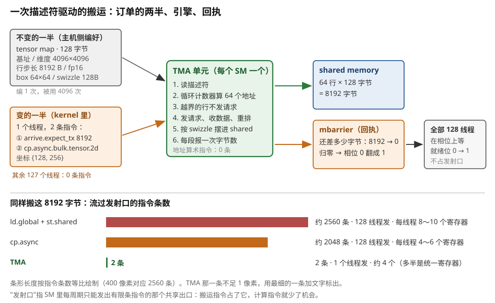
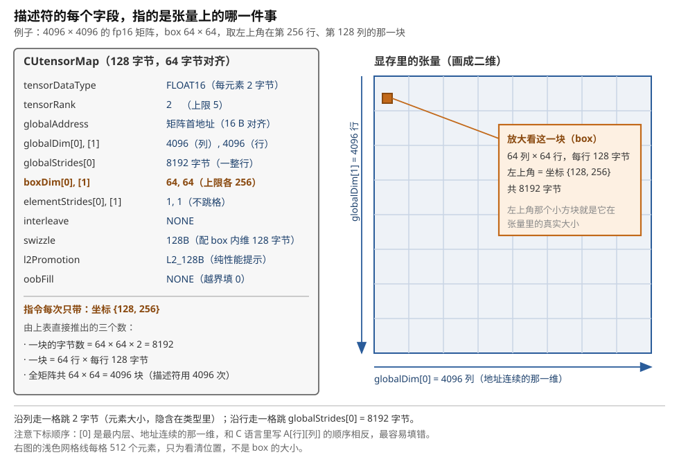
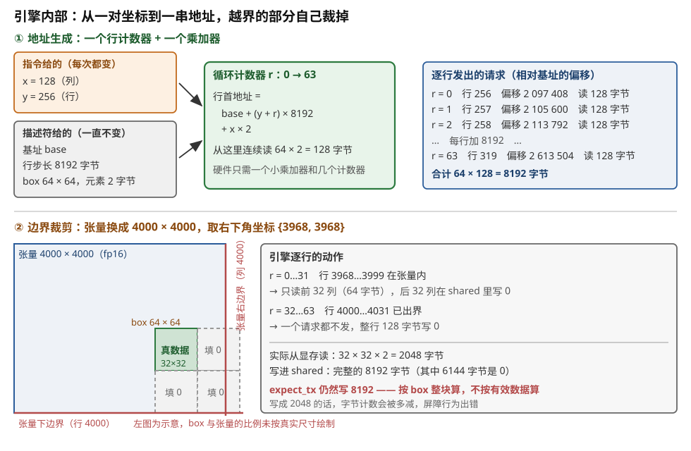
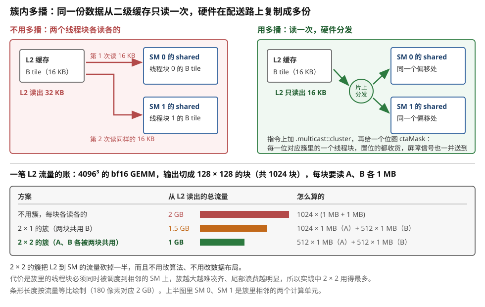
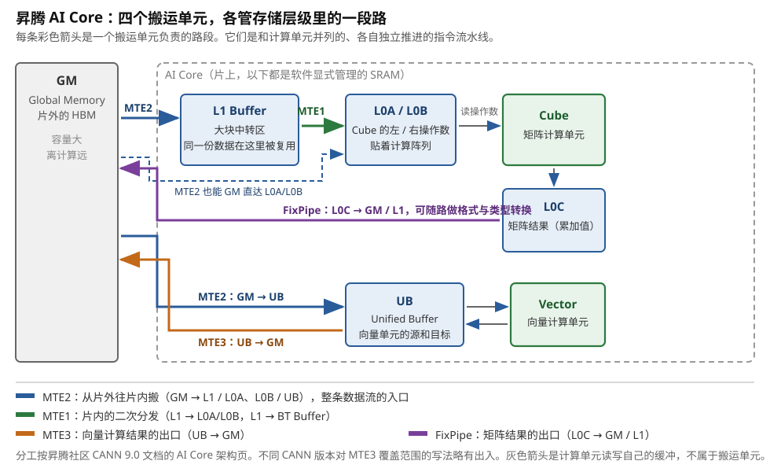
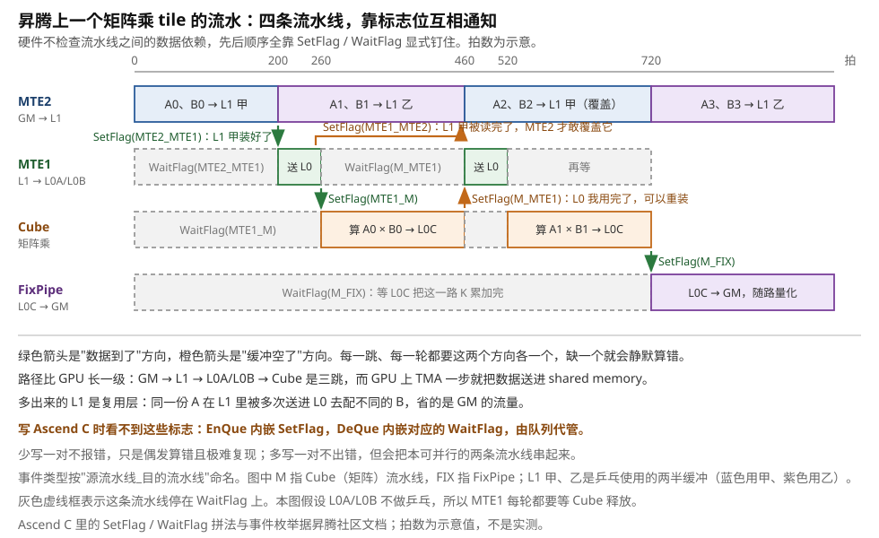
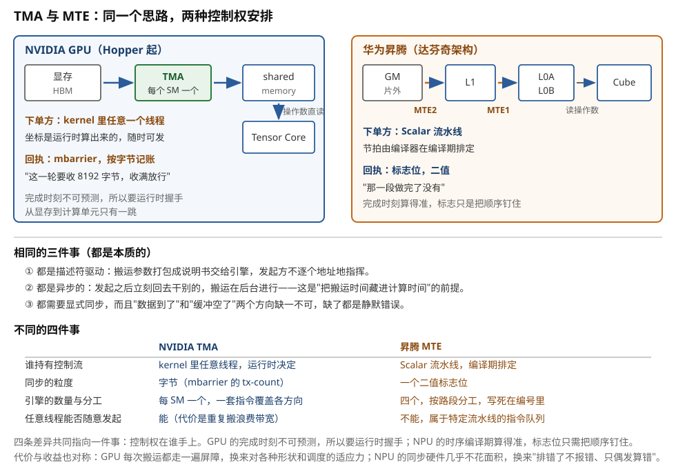
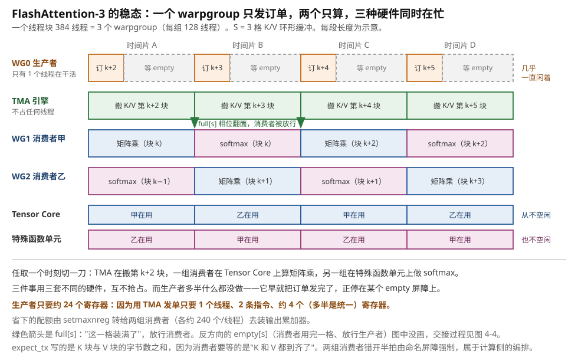

# 描述符 DMA：TMA 与 NPU 的 MTE

> **所属模块**：模块 14 · 数据搬运
> **状态**：🟨 学习中（第一版。知识截至 2026-09。配图 9 张，全部自绘）
> **本节主旨**：上一节（03）讲的 `cp.async` 已经做到"数据不绕道寄存器、发出去不用马上等"，但有一件事没变——**地址还是每个线程自己算，指令还是每个线程自己发**。这一节讲光谱上再往右一格的机制：**描述符驱动的 DMA**。它把"这块数据长什么样、要怎么切、切下来放到哪"全部写进一张固定的表（描述符），kernel 里只剩一个线程、一条指令、几个坐标数字。主线是五件事：订单怎么分成"不变的描述符"和"每次变的坐标"两半；描述符里逐字段写了什么；引擎拿到坐标后在内部做了哪几步；搬完了怎么通知等数据的线程（mbarrier 的字节记账与相位）；以及同一套思路在 NPU（昇腾的 MTE）上长成了什么样、和 GPU 差在哪。

---

## 0. 这一节要回答的问题

- "描述符驱动"到底是什么意思？订单的哪一半不变、哪一半每次变？和 `cp.async` 比，线程数、指令数、寄存器占用各降了多少（要有数字）？
- NVIDIA 的 TMA 订单——tensor map（`CUtensorMap`，128 字节）——里逐字段写了什么？为什么必须在主机侧提前编好？怎么传进 kernel？
- 引擎拿到"一张描述符 + 一对坐标"之后，内部按什么顺序做事：地址怎么生成、越界怎么裁、怎么拆成请求、怎么写进 shared memory？
- 搬完了怎么通知？`mbarrier` 的"期望字节数"（`expect_tx`）是什么机制？相位位（phase）为什么必须有？
- 生产者—消费者的两组屏障（full / empty）在多级环形缓冲里怎么轮转？漏掉一组会出什么事？
- 写回方向（shared → 显存）为什么换了一套完成机制？不带描述符的一维 bulk 拷贝 `cp.async.bulk` 什么时候用？
- 簇内多播（一次读、多个线程块收）能省多少二级缓存流量？归约写回 `cp.reduce.async.bulk` 解决什么问题？
- 昇腾达芬奇架构的 MTE1 / MTE2 / MTE3 各管哪一段路？Ascend C 的 `DataCopy` 与队列（TQue）背后是什么？`set_flag` / `wait_flag` 怎么在搬运流水和计算流水之间握手？
- TMA 和 MTE 相同的是什么、不同的是什么？谁持有控制流、同步粒度差多少、能不能被任意线程随意发起？
- Blackwell 带来了哪些新东西：`tcgen05.cp`（shared → TMEM）、TMA 的 gather4 模式？
- 走查：FlashAttention-3 的 producer warp 到底怎么用 TMA + mbarrier 喂 consumer warpgroup，每一步每个参与方在做什么？

## 1. 基础词汇：先把本节要反复用的词讲清楚

**描述符（descriptor）**。描述符是一个小结构体，里面写着"一次搬运任务的全部固定信息"：数据在内存里的起始地址、有几个维度、每个维度多长、相邻两行之间隔多少字节、每个元素是什么类型、一次切多大一块。它本身不是数据，是**关于数据的说明书**。硬件搬运引擎读了这张说明书，就知道该去哪些地址取数、取多少。之所以叫"描述符驱动"，是因为发起搬运的那条指令本身几乎不带信息，全部信息都在描述符里——指令只负责说"用这张说明书，搬第几块"。

**张量（tensor）、维度与步长（stride）**。这一节里的"张量"就是一块按多维数组解释的连续内存。一个 4096 行 × 4096 列的半精度矩阵，在内存里是一条 3355 万个元素的直线；把它看成二维，需要两个额外信息：**每一维有多长**（这里两维都是 4096），以及**沿某一维走一格，地址要跳多少字节**（这叫步长）。上面这个矩阵按行优先存放时，沿列走一格跳 2 字节（一个半精度数），沿行走一格跳 4096 × 2 = 8192 字节。步长之所以要单独写出来而不是由长度推算，是因为真实的张量常常带填充：一行分配了 4160 个元素的空间但只用 4096 个，这时行步长是 8320 字节而不是 8192。

**box（框）**。box 是描述符里规定的"一次搬多大一块"。它和张量维度数相同：二维张量配二维 box，比如 64 × 64。发起搬运时给出的坐标，指的是这个框左上角落在张量的什么位置。框的形状在描述符里写死，坐标每次变——**这就是"不变的一半"和"变的一半"的分界线**。NVIDIA 的文档里这个框叫 bounding box，昇腾的文档里对应的概念叫 tile 或"分块"。

**DMA（Direct Memory Access，直接内存访问）引擎**。指一类硬件：你告诉它从哪搬到哪、搬多少，它自己完成整个过程，不需要计算单元逐条执行搬运指令。GPU 里被叫作"DMA 引擎"的部件不止一个，这一节只讲**芯片内部、显存与片上缓冲之间**的那一个（NVIDIA 叫 TMA，昇腾叫 MTE）；跨出芯片的那个（copy engine、网卡）是下一节（05）的内容。

**TMA（Tensor Memory Accelerator，张量内存加速器）**。NVIDIA 从 Hopper（2022，`sm_90`）起在每个 SM 里放的一个专职搬运单元。它读一张 128 字节的描述符（叫 tensor map）加一组坐标，自己算出这一块数据在显存里的所有地址，成段地搬进 shared memory（SM 内部那块由软件显式管理的高速存储），或者反过来写回显存。

**MTE（Memory Transfer Engine，存储搬运引擎）**。华为昇腾达芬奇架构里的对应物。不同的是昇腾有**三条**（MTE1 / MTE2 / MTE3）加一条 FixPipe，各管存储层级里的一段路，而且它们是 AI Core 里与计算流水并列的独立指令流水线。

**mbarrier（可计数屏障）**。放在 shared memory 里的一个 64 位对象，是 Hopper 起用来"等硬件引擎"的同步件。它内部同时记着两件事：还差几个线程没到（到达计数），以及**还差多少字节没到货**（这个计数在 NVIDIA 文档里叫 tx-count，transaction count）。线程可以在它上面"到达"或"等待"；搬运引擎不会执行指令，但硬件会在它每搬完一段时自动把到货字节数记进去。两个计数都归零，这一轮才算完成。

**相位（phase）**。mbarrier 内部的一个标志位，每完成一轮就在 0 和 1 之间翻一次面。等待方手里攥着"我这一轮该等哪个相位"，等的是"屏障的相位跟我手里的不一样了"，而不是"计数归零了"。有了它，同一个屏障对象可以在循环里一轮接一轮地重复使用，不需要每轮重建或复位。

**簇（cluster，线程块簇）**。Hopper 起引入的一级新层次：几个线程块（CTA）被绑定到相邻的 SM 上同时运行，可以互相访问对方的 shared memory。一个簇里可移植地保证最多 8 个线程块，H100 上非可移植地可以到 16 个。TMA 的"多播"业务建在这一层上。

## 2. "描述符驱动"是什么意思：一个线程下单，引擎执行

### 2.1 订单分成两半：按"变不变"切

要把搬运交给一个引擎去干，必须先想清楚一件事：**引擎需要知道什么，才能自己算出所有地址？**

答案是两类信息。第一类是张量本身的属性：它在哪、多大、每行隔多远、元素多宽、一次切多大一块、切下来在 shared memory 里怎么摆、超出边界怎么办。这些东西在整个 kernel 的生命周期里**一个字都不变**——同一个 GEMM 的 A 矩阵，从第一块搬到最后一块，基址和行步长都是同一个数。第二类信息是**这次要第几块**：一对（或几个）坐标，指明 box 左上角落在张量的什么位置；再加上搬到 shared memory 的哪个地址、搬完了向哪个屏障报账。

描述符驱动的全部设计就建立在这条分界线上：

- **不变的一半**做成一个**固定大小的只读对象**，提前编好、放在内存里，引擎每次搬运时去读它。NVIDIA 把它做成 128 字节的 `CUtensorMap`。
- **变的一半**留给 kernel 里的那条指令，只带几个 32 位整数。

这样切的好处是可以量化的。设一个张量要搬 4096 块，描述符编一次、用 4096 次，每次只额外提供 2 个坐标数字。如果不这么切，每次搬运都要把"基址、两个维度、行步长、元素类型、box 形状、swizzle 模式、越界策略"这十来个字段重新说一遍——指令里根本塞不下这么多操作数，只能退回"每个线程自己算地址"的老路。

### 2.2 算例：同一块 8 KB 的 tile，三种搬法的账

把这件事变成数字才有说服力。任务固定：从一个 4096 × 4096 的半精度（fp16，每个元素 2 字节）矩阵里，取出左上角在第 256 行、第 128 列的一块 64 × 64 的子矩阵，搬进 shared memory。这块数据是 64 × 64 × 2 = **8192 字节**。搬运由一个 128 线程（4 个 warp）的线程块完成。

**第一种：`ld.global` + `st.shared`（每个线程亲自搬，02 节的机制）。** GPU 上一条指令一个线程最多搬 16 字节（`LDG.128`）。8192 ÷ 16 = 512 次 16 字节的搬运，摊到 128 个线程，每人 4 次。每一次要两条指令（读进寄存器、写出到 shared），共 1024 条；每一次之前还要算两个地址（显存侧要按行步长做一次乘加再加列偏移，shared 侧要按目标布局算一次），保守算每次 3 条整数指令，共 1536 条。**合计约 2560 条指令**。寄存器方面：16 字节数据要占 4 个 32 位寄存器中转，加上地址寄存器，每个线程同时挂着约 8～10 个寄存器只为了搬运。

**第二种：`cp.async`（03 节的机制）。** 数据不绕道寄存器，一条指令直接把 16 字节从显存送进 shared memory。512 次搬运变成 512 条指令，每人 4 条；地址仍然每人自己算，仍是约 1536 条。**合计约 2048 条指令**。数据寄存器省掉了（这是 `cp.async` 的主要收益），地址寄存器还在，每线程约 4～6 个。

**第三种：TMA。** 一个线程执行两条指令：一条 `mbarrier.arrive.expect_tx` 告诉屏障"这一轮要收 8192 字节"，一条 `cp.async.bulk.tensor.2d...` 把坐标 {128, 256} 交给引擎。其余 127 个线程**一条指令都不发**。寄存器方面：这一个线程要拿住 2 个坐标、1 个 shared memory 目标地址、1 个屏障地址，约 4 个，而且这些值在 warp 内所有线程上相同，编译器通常会放进**统一寄存器**（uniform register，warp 内共用一份的寄存器堆，SASS 里以 `UR` 开头）——连普通寄存器都不占。

| | 发指令的线程数 | 搬运指令条数 | 地址算术指令条数 | 每线程搬运占用寄存器 | 越界判断 |
| --- | --- | --- | --- | --- | --- |
| `ld.global` + `st.shared` | 128 | 1024 | 约 1536 | 约 8～10 | 软件写分支 |
| `cp.async` | 128 | 512 | 约 1536 | 约 4～6 | 软件写分支或用 zfill |
| **TMA** | **1** | **1**（外加 1 条记账） | **0** | **约 4，且只在 1 个线程里** | **硬件自动裁剪并填充** |

这张表要读出来的不只是"少了一千多条指令"。指令条数本身的收益有限：上面数的是每个线程各算一条的条数，而一条指令由整个 warp 的 32 个线程一次发出，只占调度器的一个发射名额，折算下来搬运在一个 GEMM 主循环里只占一成左右的发射名额（[第 01 节](./_旧稿/01-搬运的全景·谁发起、地址怎么来、完成怎么知道.md) §3.3 有完整算例）。**更大的收益在"发指令的线程数"那一列从 128 变成 1**：前两种搬法要求线程块全员参与搬运，没有一个 warp 能脱身；TMA 只要一个线程，于是线程块可以分成专管下单的生产者和专管计算的消费者，生产者几乎不需要寄存器，可以把配额让给消费者。这是 FlashAttention-3 那种"生产者 warpgroup 只要 24 个寄存器"的写法能成立的硬件依据（§12 会逐步走查）。

第二个收益是**越界处理**。前两种方式里，一个卡在矩阵边缘、只有一半有效数据的 tile，要靠软件写 `if` 判断每个线程的地址是否越界、越界了填什么——这些分支在 warp 里会造成发散（同一个 warp 里的线程走不同分支，硬件只能分两趟执行）。TMA 把这件事做进了硬件：描述符里写明"越界填 0"或"越界填一个特殊的 NaN"，引擎自己裁剪、自己填。§4.2 会走查一个具体的边缘 tile。

### 2.3 为什么必须"一个线程"下单，而不是"每个线程"

有一个容易误解的地方：TMA 的指令不是"一个 warp 一起执行的指令"，而是**一个线程执行一次就完成一次完整搬运**的指令。如果 128 个线程都执行这条指令，结果是同一块数据被搬了 128 遍——不会算错，但带宽白费 127 倍。

所以代码里必须显式地选出一个代表。CUDA 里的写法是 `if (threadIdx.x == 0)`，或者更省的 `elect.sync`（PTX 指令，从一个 warp 里选出一个活跃线程并给它一个真值谓词，其余线程拿到假值，不需要比较运算）。CUTLASS 和 FlashAttention-3 用的是后者。

为什么硬件要这么设计？因为发单这件事本质上是**标量业务**：它的操作数（描述符地址、坐标、目标地址、屏障地址）在整个 warp 里是同一份值，没有"每个线程一份"的必要。SASS 里能直接看到这一点——TMA 的机器指令 `UTMALDG` 的操作数是统一寄存器（`UR`），而不是普通的每线程寄存器。这条指令走的是 SM 里的**统一数据通路**（uniform datapath），和普通访存指令走的是两套硬件。

图 4-1 把"下单方、引擎、回执"三方的关系和上面这张账画在一起。



> **图 4-1**　一句话：一次搬运的订单被切成两半——不会变的那一半在 CPU 上提前填好，每次都变的那一半（几个坐标）由 kernel 里一个线程临时给出；引擎拿着这两半自己把活干完，干完在一个计数器上报账。
>
> **先知道一件事**：SM（GPU 里的一个计算单元）每个周期只能发出有限条指令，所有线程共用这一个出口，图里叫"发射口"。搬运指令和算地址的指令占了它，计算指令就少了机会。所以"搬一块数据要几条指令"会直接影响计算跑多快。
>
> **按这个顺序看**：
> 1. 左上灰框是订单里不变的那一半：一个 128 字节的说明书（叫 tensor map），写着数据在哪、多大、每行隔多远、一次切多大一块。它在程序启动前由 CPU 填好，整个 kernel 期间一个字都不改，所以填一次能被用 4096 次。
> 2. 左下橙框是变的那一半：kernel 里**一个**线程执行两条指令。第一条告诉计数器"这一轮要收 8192 字节"，第二条把坐标 {128, 256}（要第几块）交给引擎。同一个线程块里另外 127 个线程一条指令都不发。
> 3. 中间绿框是 TMA 单元，每个 SM 里有一个。两个箭头汇进来之后，它按 1 到 6 的顺序自己把活做完：读说明书、用计数器算出 64 个地址、跳过越界的行、发请求收数据、按规定的摆法写进 shared memory（SM 内部一块由软件安排的高速存储）、每写完一段汇报一次字节数。这一路它没有用掉任何一条计算指令。
> 4. 右上蓝框是数据落地的地方：64 行、每行 128 字节，合计 8192 字节。
> 5. 右下橙框是回执：一个叫 mbarrier 的计数器，初值 8192，引擎每报一段就减一点。减到 0 时它翻一次面（图里写作"相位 0 翻成 1"）。
> 6. 最右边：全部 128 个线程都在这个翻面上等。等待期间它们的"就绪位"是 0，调度器每拍看一眼就跳过，不轮询也不占发射口。翻面之后就绪位变 1，下一拍它们就重新参与调度。
> 7. 下半是同样搬这 8192 字节的三笔账。条形长度按指令条数等比画：逐线程搬要约 2560 条、`cp.async` 约 2048 条，TMA 只有 2 条，条形短到看不见，所以用文字标出。
>
> **打个比方**：左边两种是全班同学每人拿着自己的清单去仓库搬几箱；右边是班长填一张订单交给物流部，物流部按订单自己去搬，其余同学继续上课，只在门口挂个牌子记"到货多少"。
>
> **看懂的标志**：能回答"为什么说 TMA 省的不只是指令条数"——它同时省掉了三样东西：占发射口的指令、存地址用的寄存器、以及写越界判断的那些分支。三样都是所有线程共用的稀缺资源。
>
> **与正文的对照**：三笔账的数字取自 §2.2 的表。图里的 shared memory 侧只画了读入方向，写回方向见 §7。
>
> 来源：本库自绘。

### 2.4 走查：一次完整的下单，从代码到硬件

用 CUDA C++ 的形态把一次搬运从头到尾写出来（省略了模板噪音，保留全部关键机制）：

```cpp
// —— 主机侧，kernel 启动之前 ——
CUtensorMap tmap;                                  // 128 字节，必须 64 字节对齐
cuTensorMapEncodeTiled(&tmap, CU_TENSOR_MAP_DATA_TYPE_FLOAT16,
                       /*rank=*/2, base_ptr, globalDim, globalStrides,
                       boxDim, elementStrides, CU_TENSOR_MAP_INTERLEAVE_NONE,
                       CU_TENSOR_MAP_SWIZZLE_128B, CU_TENSOR_MAP_L2_PROMOTION_L2_128B,
                       CU_TENSOR_MAP_FLOAT_OOB_FILL_NONE);
my_kernel<<<grid, 128>>>(tmap, ...);               // 按值传，走常量参数空间

// —— 设备侧 ——
__global__ void my_kernel(const __grid_constant__ CUtensorMap tmap, ...) {
  __shared__ alignas(128) half sTile[64][64];      // 目的地必须 128 字节对齐
  __shared__ alignas(8)  uint64_t bar;             // mbarrier 对象，8 字节对齐

  if (threadIdx.x == 0) {
    mbarrier_init(&bar, /*参与线程数=*/1);         // 建屏障
  }
  __syncthreads();                                  // 保证屏障建好了大家才用

  if (threadIdx.x == 0) {                           // ← 选一个代表
    mbarrier_arrive_expect_tx(&bar, 8192);          // ① 记账：这一轮要收 8192 字节
    cp_async_bulk_tensor_2d_global_to_shared(       // ② 下单：坐标 {128, 256}
        sTile, &tmap, /*x=*/128, /*y=*/256, &bar);
  }
  mbarrier_wait_parity(&bar, /*phase=*/0);          // ③ 全体等：等相位翻面
  // —— 到这里 sTile 里是完整的 64×64 数据 ——
}
```

逐步说明每一步谁在做什么：

1. **主机侧编描述符**。CPU 上调用 `cuTensorMapEncodeTiled`，把张量属性压进 128 字节的 `tmap`。这一步每个张量只做一次，不在性能关键路径上。
2. **描述符随 kernel 参数传进去**。`const __grid_constant__` 这个标注告诉编译器：这个参数放在常量参数空间、整个 grid 共享一份、不会被修改。这是 CUDA 编程指南推荐的传法。
3. **`mbarrier_init`**：在 shared memory 里建一个屏障对象，参与线程数写 1（只有那个代表线程会执行"到达"动作）。
4. **`mbarrier_arrive_expect_tx(&bar, 8192)`**：代表线程做两件事——自己在屏障上到达一次（把到达计数减 1，归零），同时把屏障的字节计数加上 8192。**注意这一步必须在下单之前**：如果先下单，引擎可能在你还没声明期望字节数之前就搬完并汇报，字节计数会先变成负数再变正数——PTX 允许 tx-count 为负正是为了容许这种交错，但把 `expect_tx` 写在前面是更清晰的写法。
5. **下单**：这条指令把描述符地址、坐标、目标地址、屏障地址交给 TMA 单元，然后**立刻返回**——线程不等，接着往下走。
6. **引擎干活**：读描述符、算地址、发请求、收数据、写进 `sTile`、每写完一段把字节数记进屏障（§4、§5 详解）。
7. **`mbarrier_wait_parity`**：全体 128 个线程在屏障上等相位翻面。等待中的 warp 只是"就绪位为 0"，调度器每拍看一眼就跳过，不轮询、不占算力。
8. **字节凑满 8192 且到达计数归零**，硬件翻转相位，所有等待的 warp 的就绪位被置 1，下一拍就重新参与调度。

这段代码里出现了三个对齐要求，都不是可选的：描述符 64 字节对齐、shared memory 目的地 128 字节对齐、屏障对象 8 字节对齐。违反前两条会让搬运出错或性能塌掉，违反第三条是未定义行为。

## 3. tensor map 里写了什么：把一个真实张量逐字段填一遍

### 3.1 十二个字段，逐个讲清楚

`cuTensorMapEncodeTiled` 的签名有 12 个参数，填完就得到那 128 字节。逐个讲（约束取自 CUDA Driver API 文档的 Tensor Map Object Management 一节）：

**① `tensorDataType`（元素类型）**。告诉引擎一个元素占几个字节、以及某些类型要不要特殊处理。可选值覆盖 `.u8`/`.u16`/`.u32`/`.s32`/`.u64`/`.s64`、`.f16`/`.bf16`/`.tf32`/`.f32`/`.f64`、`.b32`/`.b64`，以及为低比特量化准备的打包类型（`.b4x16`、`.b6x16_p32` 等，后者在搬运时会自动补上填充位）。引擎需要这个字段是因为它要按字节算地址，而坐标是按**元素**给的。

**② `tensorRank`（维度数）**。1 到 5。为什么上限是 5？因为卷积的输入张量最多是五维（批 N、深 D、高 H、宽 W、通道 C），这是设计时定的覆盖范围。如果用了交织布局（见字段 ⑧），维度数必须至少是 3。

**③ `globalAddress`（基址）**。张量第一个元素在显存里的地址，必须 16 字节对齐。

**④ `globalDim`（各维长度）**。一个长度为 `tensorRank` 的数组，每一维的元素个数，每项非零且不超过 2³²。**注意下标顺序**：`globalDim[0]` 是**最内层、地址连续**的那一维。对一个按行优先存放的矩阵，`globalDim[0]` 是列数，`globalDim[1]` 是行数——这和 C 语言里 `A[行][列]` 的书写顺序正好相反，是新手最容易填错的地方。

**⑤ `globalStrides`（各维步长）**。长度为 `tensorRank - 1` 的数组，单位是**字节**。第 0 维的步长是元素大小，隐含已知，所以不用写；`globalStrides[0]` 是沿第 1 维走一格跳多少字节（也就是行步长）。约束是：每项必须是 16 的倍数，且小于 2⁴⁰（约 1 TB）。"16 的倍数"这条约束直接限制了你能搬什么：一个行宽为 4095 个 fp16 元素的矩阵，行步长 8190 字节不是 16 的倍数，描述符创建会失败——这时只能给每行加填充凑到 16 的倍数。

**⑥ `boxDim`（box 各维大小）**。一次搬多大一块，每项非零且不超过 256。另有一条硬约束：`boxDim[0] × 元素字节数` 必须是 16 的倍数。这背后是硬件的最小搬运粒度——PTX 文档里写的是"bounding box 的大小必须是 16 字节的倍数，地址也必须 16 字节对齐"。

**⑦ `elementStrides`（元素步长，也叫遍历步长）**。box 在张量里推进时，每走一格跳过几个元素。默认 1（不跳）。每项非零且不超过 8。用途是"隔行取样"式的访问（比如带空洞的卷积）。非交织布局下第 0 维的元素步长必须是 1——最内层维度不允许跳着取，因为那会破坏"成段搬运"这个前提。

**⑧ `interleave`（交织布局）**。三选一：`NONE`、`16B`、`32B`。交织是一种把通道维度按 16 或 32 字节为单位掺进空间维度的存放方式，为某些图像类负载准备。日常的 GEMM / attention 全部用 `NONE`。

**⑨ `swizzle`（换座位模式）**。数据写进 shared memory 时，按什么规则打乱摆放位置，以避免 bank 冲突（shared memory 分成 32 个并行访问的窗口叫 bank，一个 warp 的 32 个线程如果同拍撞进同一个 bank 的不同地址，硬件只能串行服务）。可选 `NONE`、`32B`、`64B`、`128B`，Blackwell 一代又加了 `128B_ATOM_32B`、`128B_ATOM_32B_FLIP_8B`、`128B_ATOM_64B` 三种变体。**约束是 swizzle 模式与 box 最内维的字节数必须配套**：选 32B 则 `boxDim[0] × 元素字节数` 不超过 32，选 64B 则不超过 64，选 128B 的各种变体则不超过 128。实践中一般取到刚好相等。具体的异或置换规则、以及它和 Tensor Core 读取方式怎么对上，属于"搬运途中的变形"，归 [06 节](./06-搬运途中的变形·硬件做的layout变换.md)；这里只需要知道：**swizzle 是描述符里的一个字段，引擎搬运时顺手做掉，不额外花时间**。

**⑩ `l2Promotion`（二级缓存提升）**。四选一：`NONE`、`L2_64B`、`L2_128B`、`L2_256B`。它告诉二级缓存：这次搬运产生的请求，按多大的粒度成块地拉进来。填 `L2_128B` 的意思是"我接下来大概率还要读这块地址附近的数据，一次多拉一点进 L2"。这是一个纯性能提示，填错不会算错。

**⑪ `oobFill`（越界填充）**。两选一：`NONE` 表示越界的元素填 0；`NAN_REQUEST_ZERO_FMA` 表示填一个特殊的 NaN（只对浮点类型可用）。为什么要有第二种？因为"填 0"在有些算法里会被误当成真实数据（比如 attention 的 mask 逻辑里 0 是一个合法分数），而这个特殊 NaN 被后续的乘加指令识别后会产生 0 的乘积，等于"这个位置不参与计算"。

**⑫ `tensorMap`（输出）**。填好的 128 字节写到这个指针指向的地方，该地址必须 64 字节对齐。

### 3.2 逐字段填一遍：[4096, 4096] 的 fp16 矩阵，box 64 × 64

把 §2.2 的那个任务的描述符完整填出来：

| 字段 | 填什么 | 为什么 |
| --- | --- | --- |
| `tensorDataType` | `CU_TENSOR_MAP_DATA_TYPE_FLOAT16` | 元素是半精度，2 字节 |
| `tensorRank` | `2` | 二维矩阵 |
| `globalAddress` | 矩阵首元素地址（16 字节对齐） | `cudaMalloc` 返回的地址天然满足 |
| `globalDim` | `{4096, 4096}` | `[0]` 是列数（连续维），`[1]` 是行数 |
| `globalStrides` | `{8192}` | 只需 1 项：一行 4096 个 fp16 = 8192 字节。8192 是 16 的倍数 ✓，远小于 2⁴⁰ ✓ |
| `boxDim` | `{64, 64}` | 每项 ≤ 256 ✓；`64 × 2 = 128` 字节是 16 的倍数 ✓ |
| `elementStrides` | `{1, 1}` | 不跳格；第 0 维必须是 1 ✓ |
| `interleave` | `CU_TENSOR_MAP_INTERLEAVE_NONE` | 普通行优先矩阵 |
| `swizzle` | `CU_TENSOR_MAP_SWIZZLE_128B` | box 最内维正好 128 字节，与 128B 模式配套 ✓ |
| `l2Promotion` | `CU_TENSOR_MAP_L2_PROMOTION_L2_128B` | 相邻 tile 会被别的线程块用到，多拉一点进 L2 |
| `oobFill` | `CU_TENSOR_MAP_FLOAT_OOB_FILL_NONE` | 4096 能被 64 整除，其实不会越界；填 0 更安全 |

由这张表可以直接推出三个数字，后面每一节都要用：

- **一块的字节数** = 64 × 64 × 2 = **8192 字节**。这就是 `expect_tx` 要写的数。
- **一块的行数与每行字节数** = 64 行 × 128 字节。引擎内部按行推进（§4.1）。
- **一共有多少块** = (4096 ÷ 64) × (4096 ÷ 64) = 64 × 64 = **4096 块**。**同一张描述符被用 4096 次**——这就是"编一次、用很多次"的分量。

图 4-2 把这张表和张量、box 的空间关系画在了一起。



> **图 4-2**　一句话：描述符里的每一行，对应的都是右边那张张量图上的一件具体的事——多大、每行隔多远、一次切多大一块、切下来怎么摆。
>
> **先知道一件事**：显存里没有"二维矩阵"这种东西，只有一条长长的字节序列。把它当成二维来看，靠的就是两个约定：每一维有多少个元素，以及沿某一维走一格要跳多少字节（这个跳的距离叫步长）。步长之所以要单独写出来而不是由长度推算，是因为真实数据常常带填充——一行分配了 4160 个元素的空间但只用 4096 个。
>
> **按这个顺序看**：
> 1. 先看右边的大方框：这就是那个 4096 × 4096 的矩阵。浅色网格线每格 512 个元素，只为看清位置用，不是切块的大小。
> 2. 看框下方和框左侧的两个箭头：`globalDim[0]` 是 4096 列，`globalDim[1]` 是 4096 行。注意下标 0 指的是**地址连续的那一维**，对行优先存放的矩阵就是列——这和 C 语言里写 `A[行][列]` 的顺序正好反过来，是最容易填错的一处。
> 3. 看左上角那个橙色小方块：这才是 box（一次搬的那一块）在张量里的真实大小，64 个元素占 4096 里的一小格，画出来只有几个像素。旁边的大橙框是它的放大版：64 列 × 64 行，每行 64 × 2 = 128 字节，一共 8192 字节。
> 4. 回到左边的表，从上往下读。前五行说的是"张量本身长什么样"；`boxDim` 那一行（加粗）说的是"一次切多大"；后面几行说的是搬运的方式：跳不跳格、要不要交织、写进 shared memory 时怎么换座位（swizzle）、二级缓存多拉一点不拉、越界填什么。
> 5. 最后看表下方加粗的那一行：指令每次只带坐标 {128, 256}。整张表编一次，被这样的坐标用 4096 次。
>
> **打个比方**：这张表是一份布料的裁剪说明书——布有多宽、每一匹之间空多少、每次裁多大一片、裁下来怎么叠。说明书写一次，后面每次只需要说"从第几行第几列开始裁"。
>
> **看懂的标志**：能回答"为什么 `globalStrides` 只有一项，而 `globalDim` 有两项"——最内层那一维的步长就是元素本身的大小（这里 2 字节），已经由元素类型说明了，不需要重复写；所以步长数组的长度总是维度数减一。
>
> **与正文的对照**：各字段的取值与 §3.2 的表逐行一致，约束（维度上限 5、box 每维上限 256、步长是 16 的倍数等）在 §3.1 逐条讲了。
>
> 来源：本库自绘。

### 3.3 为什么必须在主机侧提前编好

有三个原因，每个都是硬的。

**第一，它是一个不可变的定长对象，编码格式不公开。** 128 字节里各字段怎么打包（谁占几位、在第几个字节）是硬件内部约定，NVIDIA 没有公开字段布局，只给了 `cuTensorMapEncodeTiled` 这个编码函数。在设备侧用普通的整数运算拼出这 128 字节是做不到的。

**第二，它走的是一条单独的访问通道。** PTX 文档里说描述符"通过 tensormap proxy 访问"。proxy（代理）这个词在 PTX 里指"访问同一块内存的不同硬件路径"——描述符不走普通的数据缓存，走的是一条专门的、带自己缓存的通路。**不同通路之间没有自动的一致性保证**：如果一个线程用普通的 store 指令改了显存里的描述符，TMA 单元不会自动看到这个改动，必须显式地插一道 `fence.proxy.tensormap::generic` 栅栏。在主机侧编好、kernel 期间完全不动，就绕开了这整类麻烦。

**第三，编码有代价，而它可以被摊销。** `cuTensorMapEncodeTiled` 是一次主机侧的函数调用，参数检查一堆约束（前面那十几条），微秒量级。放在 kernel 里每次搬运前做一遍显然荒谬；放在主机侧做一次、被 4096 次搬运共享，这个代价就消失了。

**那运行时确实需要改描述符怎么办？** 有两条路，都是后来补上的：

- **`tensormap.replace`（PTX，Hopper 起）**：在设备上把描述符的某个字段（基址、维度、步长、box 大小、元素类型、swizzle、填充模式等）替换成新值。用法是"把模板描述符拷进 shared memory → 用 `tensormap.replace` 改字段 → 拷回显存 → 用 `fence.proxy.tensormap::generic.release` 发布 → 使用方用 `.acquire` 获取"。这一套是给"张量形状到 kernel 运行时才知道"的场景（例如变长序列）准备的，代价不低，能避则避。
- **`.override::global_address` / `.override_attribute`（PTX 9.4 起）**：在下单指令上直接带一个新的基址或新的维度/步长，临时覆盖描述符里的值，不改描述符本身。这是更轻的做法，但按 PTX 文档只在 `sm_107f` 这一族架构上支持（该代号对应哪个产品，ISA 文档中未说明）。

### 3.4 怎么传进 kernel，以及描述符预取

传法有三种，按推荐程度排：

1. **`const __grid_constant__ CUtensorMap` 参数**（CUDA 编程指南推荐）。按值传进 kernel，编译器把它放在**常量参数空间**（`.param`）。这是最简单也最快的：常量空间有自己的缓存，整个 grid 共享一份，没有一致性问题。
2. **`__constant__` 全局变量**，主机侧用 `cudaMemcpyToSymbol` 拷进去。适合描述符在多个 kernel 之间共享的场景。
3. **放在显存里的普通全局变量**。灵活（可以在设备上改），但每次搬运引擎都要去显存读这 128 字节，而且要自己处理 proxy 一致性。

第三种情况下"读描述符"本身成了一笔可见的延迟——引擎必须先把 128 字节读回来才能开始算地址。为此 PTX 提供了**描述符预取**：

```ptx
prefetch.const.tensormap [tmap_addr];     // 把描述符所在的缓存行拉进 tensormap 通路的缓存
```

典型用法是在 kernel 开头、主循环开始之前发一条，让第一次搬运不必等描述符。**注意区分两种预取**，名字很像但做的事完全不同：

- `prefetch.tensormap` 预取的是**描述符本身**（128 字节的说明书）。
- `cp.async.bulk.prefetch.tensor.2d.L2.global [tmap, {x, y}]` 预取的是**数据**：让引擎按描述符和坐标把那一块数据拉进 L2，但**不写进 shared memory**。用在"我还没准备好接收，但想让数据先到 L2"的场景，比如 kernel 序幕阶段。

### 3.5 一个具体的错误，和它的症状

规则一讲完，配一个反例更容易记住。假设矩阵是 4096 × 4095（列数少了一个），其余不变。这时 `globalStrides[0] = 4095 × 2 = 8190` 字节，不是 16 的倍数，`cuTensorMapEncodeTiled` 返回错误码，kernel 根本启动不了。修法只有两个：给每行填充到 4096 列（浪费 0.02% 的显存），或者把最后不满的部分单独用 `cp.async` 搬。**这是 TMA 的一条真实边界**——它对齐要求硬，换来的是不需要任何软件地址算术。

## 4. 引擎内部做了什么：从一对坐标到一串请求

线程发出指令之后就走了，接下来的事全在 TMA 单元内部。这一小节把这个黑盒拆开。

### 4.1 地址生成：一组嵌套循环计数器

TMA 单元的物理形态是**一个小的、可编程的地址生成状态机**（模块 13 第 4 节 §7 讲过它的电路侧）。它拿到描述符和坐标之后，在内部跑一组嵌套的循环计数器，每个维度一个。

用 §3.2 的例子走一遍。描述符说：`globalDim = {4096, 4096}`、`globalStrides = {8192}`、`boxDim = {64, 64}`、元素 2 字节。指令给的坐标是 `{x=128, y=256}`。

引擎的循环是这样的（二维只需要一层外循环）：

```
对 r 从 0 到 63:                                  ← boxDim[1] = 64 行
    行首地址 = 基址 + (y + r) × globalStrides[0] + x × 元素字节数
             = 基址 + (256 + r) × 8192 + 128 × 2
    从这个地址起，连续读 boxDim[0] × 元素字节数 = 128 字节
```

代入前几行：

| r | 行号 (y+r) | 相对基址的偏移 | 读多少字节 |
| --- | --- | --- | --- |
| 0 | 256 | 256 × 8192 + 256 = 2 097 408 | 128 |
| 1 | 257 | 257 × 8192 + 256 = 2 105 600 | 128 |
| 2 | 258 | 258 × 8192 + 256 = 2 113 792 | 128 |
| … | … | 每行加 8192 | 128 |
| 63 | 319 | 319 × 8192 + 256 = 2 613 504 | 128 |

64 行 × 128 字节 = 8192 字节，对上了。

这里值得停一下想想**硬件成本**：整个地址生成只需要一个小乘加器和几个计数器，几千个门的规模。而它替代的是约 1536 条整数指令的执行。**把一件纯整数、模式固定的工作从通用指令换成专用状态机，这是"专用硬件替代通用指令"最直白的一个案例。**

维度更多时循环就多几层。五维张量的最内层还是"连续读 `boxDim[0]` 个元素"，外面四层各是一个计数器，每层用自己那维的步长做乘加。这就是为什么维度上限是 5——再多，状态机的循环层数和字段的位宽都要重新设计。

### 4.2 边界裁剪与越界填充：走查一个边缘 tile

把张量换成 4000 × 4000 的 fp16（其余字段照填：`globalDim = {4000, 4000}`、`globalStrides = {8000}`，8000 是 16 的倍数 ✓），box 仍是 64 × 64。4000 ÷ 64 = 62 余 32，所以**最后一行块和最后一列块都只有一半有效**。

取右下角那一块，坐标 `{x=3968, y=3968}`。引擎逐行推进时发生的事：

| r | 行号 3968+r | 这一行在张量内吗 | 列 3968…4031 有多少在张量内 | 引擎的动作 |
| --- | --- | --- | --- | --- |
| 0 | 3968 | 在（< 4000） | 3968…3999 共 32 列 | 读 32 个元素（64 字节），后 32 个元素在 shared 里写 0 |
| 1 | 3969 | 在 | 32 列 | 同上 |
| … | … | … | … | … |
| 31 | 3999 | 在 | 32 列 | 同上 |
| 32 | 4000 | **不在**（≥ 4000） | — | **一个请求都不发**，整行 128 字节在 shared 里写 0 |
| … | … | … | … | … |
| 63 | 4031 | 不在 | — | 整行写 0 |

结果：shared memory 里拿到一块完整的 64 × 64 = 8192 字节，左上角 32 × 32 = 1024 个元素是真数据，其余 3096 个元素是 0。计算侧可以对这块数据无差别地跑矩阵乘，乘到 0 上自然不贡献。

这里有一个**必须记住的细节**：`expect_tx` 仍然写 **8192**，不是"实际从显存读回来的 32 × 32 × 2 = 2048 字节"。期望字节数按 **box 的整块大小**算，越界填充的部分也算在内——CUTLASS 等库都是这么写的。如果按有效数据算，屏障永远凑不满，kernel 死锁。

**这一段是 TMA 相对 `cp.async` 的第二个实质收益**。同样的边缘 tile，用 `cp.async` 要写成：每个线程算出自己负责的行列号，用两个比较判断是否越界，越界的用带 zfill 修饰的 `cp.async` 或者跳过再手动写 0。一个 warp 里有些线程越界、有些不越界，分支发散，硬件分两趟执行。TMA 这边一条指令都没多。

图 4-3 把地址生成和边界裁剪这两件事画在一起。



> **图 4-3**　一句话：引擎拿到一对坐标之后，用一个计数器一行一行地算出这块数据在显存里的地址；碰到张量边界，它自己把出界的部分裁掉，在目的地填上 0。
>
> **先知道一件事**：显存里一行数据是连续的，相邻两行之间隔着一个固定的距离（这里是 8192 字节）。所以"取一个矩形块"这件事，等价于"算出 64 个行首地址，每个地址往后读 128 字节"。整个过程只用到加法和一次乘法，是纯整数运算——这正是它值得做进专用电路的原因。
>
> **按这个顺序看**：
> 1. 上半左侧两个框：橙框是指令每次带来的两个坐标，灰框是描述符里一直不变的那几个数。两个箭头汇进中间的绿框。
> 2. 中间绿框是算式本身：行号从 y 开始、r 从 0 数到 63；每一行的起始地址 = 基址 + 行号 × 8192 + 列号 × 2。硬件上这只需要一个小乘加器和几个计数器，几千个门。
> 3. 右边蓝框是算出来的结果：64 个偏移量，相邻两个正好相差 8192，每个往后读 128 字节，合计 8192 字节——和 box 的大小对上了。
> 4. 下半换了个张量：4000 × 4000，不能被 64 整除，所以右下角那一块有一大半落在张量外面。
> 5. 看下半左图：绿色那一小块是真正存在的数据（32 列 × 32 行），三块灰色虚线区是出界的部分。两条红线是张量的右边界和下边界。
> 6. 看下半右框：引擎的动作分两种。前 32 行还在张量里，它只读前 32 列（64 字节），后 32 列在 shared memory 里直接写 0；后 32 行整行出界，它连一个请求都不发，整行写 0。
> 7. 最后看右框底部加粗的红字：**要等的字节数仍然写 8192**，按整块 box 算，不按真正读回来的 2048 字节算。写成 2048 的话，计数器会被多减，屏障的行为就错了。
>
> **打个比方**：按图纸从一匹布上裁一块 64×64 的方巾。图纸告诉你从第几行第几列下剪刀，你一行一行地量。裁到布的边缘时，缺的那部分你用白布补上，交出去的仍然是一块完整的 64×64——下游不必知道它缺过一角。
>
> **看懂的标志**：能回答"为什么边界处理值得做进硬件"——软件做的话，一个 warp 里有些线程越界、有些不越界，硬件只能把这个分支分两趟执行；而引擎这边只是"这一行不发请求"，一条指令都没多。
>
> **与正文的对照**：上半的地址表与 §4.1 的表逐行一致；下半的逐行动作与 §4.2 的表一致。下半左图是示意，box 与张量的比例没有按真实尺寸绘制（真实比例下 box 只有几个像素）。
>
> 来源：本库自绘。

### 4.3 拆成请求、写进 shared memory

算出地址之后，引擎把它们组织成一批访存请求发往二级缓存 / 显存。这里有三件事值得说：

**第一，请求的粒度。** 上例每行 128 字节，正好是 4 个 32 字节的 sector（显存和缓存之间的最小搬运单位）。这就是 `boxDim[0] × 元素字节数` 要求是 16 的倍数、且 swizzle 模式和它配套的原因——把 box 的最内维对齐到搬运粒度上，请求才不会碎。如果最内维只有 20 字节，每行请求都要跨 sector 边界，有效带宽会掉得很难看。

**第二，在途请求数。** 引擎同时能挂多少个未完成的请求，决定了它能不能喂满带宽。这是模块 10 第 4 节讲的那条规律（在途数据量 = 带宽 × 延迟）在引擎内部的体现：显存延迟几百拍，要把带宽跑满，路上必须同时有大量数据在飞。NVIDIA 没有公开单个 TMA 单元的在途请求上限，这是一个**待核实**的数字。

**第三，回来的数据是乱序的，要重排。** 发出去的请求不保证按顺序返回，引擎内部有一个重排序缓冲，把数据按目标布局摆进 shared memory。

**写进 shared memory 时的两件变形——swizzle 和 im2col——都由引擎顺手做掉**：

- **swizzle**：按描述符里的模式（32B / 64B / 128B）对目标地址做一个异或置换，使后续矩阵指令按行按列读都不撞 bank。
- **im2col**：把卷积的输入张量在搬运途中就展开成矩阵乘所需的列形式——`cp.async.bulk.tensor` 的 `.im2col` 系列 load_mode 做的就是这件事，它要求张量至少三维，指令上额外带一组 im2col 偏移量。

**这两件事的具体变换机制（异或怎么算、im2col 展开后的每个元素来自原张量的哪个位置）属于"搬运途中的变形"，是 [06 节](./06-搬运途中的变形·硬件做的layout变换.md)的内容。** 本节只需要确立一个结论：**它们不是搬完之后再单独做一趟，而是在数据流经引擎时就完成的，不多花一次读写。**

## 5. 发起与完成：指令长什么样，mbarrier 怎么记账

### 5.1 读入指令：把最长的那个名字逐段拆开

```ptx
cp.async.bulk.tensor.2d.shared::cluster.global.mbarrier::complete_tx::bytes
        [smem_addr], [tensor_map, {x, y}], [mbar];
```

逐段拆（PTX 的指令名是按固定槽位拼起来的，拆开就能读）：

| 段 | 意思 |
| --- | --- |
| `cp.async` | 异步拷贝家族：发出即返回，不阻塞发起它的线程 |
| `.bulk` | 整块搬运，不是逐线程逐元素。这一族指令一条管一大片数据 |
| `.tensor` | 源地址不是裸指针，而是一张张量描述符。没有 `.tensor` 的 `cp.async.bulk` 是一维裸拷贝（§7.3） |
| `.2d` | 张量是二维。可选 `.1d` 到 `.5d` |
| `.shared::cluster` | 目的地是 shared memory，且允许写到簇内**别的**线程块的 shared memory（多播要用） |
| `.global` | 源在显存 |
| `.mbarrier::complete_tx::bytes` | **完成方式**：搬完后不返回任何值，而是把搬完的字节数记到 `mbar` 这个 mbarrier 的账上 |

三个操作数依次是：shared memory 目标地址、`{描述符地址, 坐标列表}`、mbarrier 地址。

可选的修饰还有几个，各自解决一个问题：

- `.multicast::cluster`（+ 一个 `ctaMask` 操作数）：一次读、簇内多个线程块同时收（§8.1）。
- `.L2::cache_hint`（+ 一个 64 位策略操作数）：给这次访问附一个二级缓存驱逐策略。
- `.tile`（默认）/ `.tile::gather4` / `.im2col` 系列：load_mode，决定源数据怎么组织到目的地（§11）。
- `.cta_group::1` / `::2`：Blackwell 起，指明屏障信号发给线程块对里的哪一个（§11）。

等待侧是三条指令，构成"建屏障 / 记账 / 等待"：

```ptx
mbarrier.init.shared::cta.b64 [mbar], 1;                     // 建：1 个参与线程
mbarrier.arrive.expect_tx.shared::cta.b64 _, [mbar], 8192;   // 记账：本轮期望 8192 字节
mbarrier.try_wait.parity.shared::cta.b64 %p, [mbar], %phase; // 等：轮询相位是否翻面
```

`mbarrier.arrive.expect_tx` 把"到达"和"声明期望字节数"合成一条。也有分开的写法：`mbarrier.expect_tx` 只加字节数不算到达，用在"到达和记账由不同线程做"的场景。

### 5.2 SASS：机器码这一层的名字

用 `cuobjdump -sass` 反汇编，TMA 这一族在 SASS 里是一组以 `UTMA` / `UBLK` 开头的指令（名字和描述取自 CUDA Binary Utilities 文档的指令集表）：

| SASS 操作码 | 官方描述 | 对应的 PTX |
| --- | --- | --- |
| `UTMALDG` | Tensor Load from Global to Shared Memory | `cp.async.bulk.tensor` 读入方向 |
| `UTMASTG` | Tensor Store from Shared to Global Memory | `cp.async.bulk.tensor` 写出方向 |
| `UTMAREDG` | Tensor Store from Shared to Global Memory with Reduction | `cp.reduce.async.bulk.tensor` |
| `UTMAPF` | Tensor Prefetch | `cp.async.bulk.prefetch.tensor` |
| `UBLKCP` | Bulk Data Copy | `cp.async.bulk`（不带描述符的一维） |
| `UBLKPF` | Bulk Data Prefetch | `cp.async.bulk.prefetch` |
| `UBLKRED` | Bulk Data Copy from Shared Memory with Reduction | `cp.reduce.async.bulk` |
| `UTMACMDFLUSH` | TMA Command Flush | 把排队的 TMA 命令推出去 |
| `UTMACCTL` | TMA Cache Control | 描述符缓存的控制（例如失效） |

**开头那个 `U` 就是 uniform（统一）的意思**——这些指令的操作数放在统一寄存器里、走统一数据通路，正好印证了 §2.3 说的"发单是标量业务"。在 SASS 里认出 `UTMALDG`，就等于认出"这个 kernel 用了 TMA"。

Blackwell 又多了一族 `UTC*`（Tensor Core 相关），其中 `UTCCP` 的描述是 "Asynchonous data copy from Shared Memory to Tensor Memory"，对应 §11 要讲的 `tcgen05.cp`。

### 5.3 mbarrier 的两个计数器：为什么"等引擎"需要新机制

要理解 `expect_tx`，先要理解一个不对称：

**线程会执行指令，引擎不会。** 传统屏障（比如 `__syncthreads()`）的工作方式是"每个参与者执行一条到达指令，计数减 1，减到 0 放行"。但 TMA 引擎不是线程，它不会执行 `arrive` 指令；它唯一能做的是"每搬完一段数据，汇报搬了多少字节"。

所以 mbarrier 里有两个独立的计数器（PTX 文档把这两件事分得很清楚）：

- **到达计数**（pending arrival count）：还差几个线程没到。由 `mbarrier.arrive` 减少。
- **字节计数 tx-count**：还差多少字节没到货。由 `expect-tx` 操作**增加**，由引擎完成时的 complete-tx 操作**减少**。

**当前这一轮（phase）完成的条件是两个计数同时归零。** 这样一来，"等线程"和"等引擎"被统一进了同一个对象：屏障的一轮里可以既等 3 个线程报到，又等 8192 字节到货。

有一个细节能看出这套机制的深思：**tx-count 允许为负**（PTX 表 43 里它的下界是 −(2²⁰−1)）。为什么？因为引擎可能在 `expect_tx` 执行之前就完成并汇报——那时字节计数先被减成负数，等 `expect_tx` 把 8192 加上去，正好归零。硬件不假设两者的先后顺序，这让软件不必在这上面写额外的保序逻辑。

### 5.4 相位位：为什么不能用"计数归零"判断完成

同一个屏障对象在循环里要被反复使用。如果等待者的条件是"计数等于 0"，会出一个经典的竞争：第 k 轮完成、计数归零，等待者还没来得及看一眼，硬件已经把计数重置成下一轮的期望值——等待者再去看，条件不满足，它会以为第 k 轮还没完成，接着等下去。

相位位解决这个问题。它的规则是：

1. mbarrier 内部有一个标志位，初始为 0。
2. 每当"这一轮完成"（两个计数都归零），硬件**原子地**做三件事：翻转相位位、把到达计数重置成期望值、进入下一轮。
3. 等待方执行的是 `mbarrier.try_wait.parity [mbar], %phase`：传入的 `%phase` 是**我认为当前是第几轮的奇偶**（偶数轮传 0，奇数轮传 1），指令返回"屏障的相位是否已经不等于它了"。

PTX 文档说得很直白：偶数轮的整数奇偶是 0，奇数轮是 1；`.parity` 变体测试的是"由这个奇偶值指明的那一轮是否已完成"。**等待方看的是"变了没有"，不是"是多少"**，所以不存在"错过归零瞬间"这回事。

代价是软件要自己记住"我现在是第几轮"。环形缓冲用 S 格时，第 k 块用第 `k mod S` 格；这一格被用到第 `k / S` 轮，所以传给 `try_wait` 的相位是 `(k / S) % 2`。**"相位传错"是显式流水的标配 bug**——第一圈全对，第二圈开始全错，症状是结果随机不对或者死锁。

### 5.5 走查：一次读入从发射到放行的十步

把 §2.4 的代码在时间上摊开，列出每一步谁在做什么。设 t 是任意时间起点。

| 步 | 发起线程（0 号） | 其余 127 个线程 | TMA 单元 | mbarrier 对象状态 |
| --- | --- | --- | --- | --- |
| 1 | `mbarrier.init [bar], 1` | 在 `__syncthreads()` 等 | 空闲 | 到达计数 = 1，tx = 0，相位 = 0 |
| 2 | `arrive.expect_tx [bar], 8192` | — | 空闲 | 到达计数 = **0**，tx = **8192**，相位 = 0（tx 没归零，不算完成） |
| 3 | 发 `cp.async.bulk.tensor`，**立即返回** | — | 收到命令：描述符地址、{128,256}、目标、屏障 | 不变 |
| 4 | 执行后面的代码，或去等屏障 | 执行到 `try_wait`，就绪位置 0 | 读描述符（128 字节，走 tensormap 通路） | 不变 |
| 5 | — | 等（不占发射口，调度器每拍跳过） | 跑循环计数器，算出 64 个行首地址 | 不变 |
| 6 | — | 等 | 发出 64 批请求给 L2 / 显存 | 不变 |
| 7 | — | 等 | 数据陆续返回（乱序），重排、做 swizzle、写进 `sTile` | 每写完一段，硬件执行 complete-tx，tx 递减 |
| 8 | — | 等 | 最后一段写完 | tx = **0**，到达计数 = 0 → **本轮完成** |
| 9 | — | 等 | 空闲 | 硬件原子地：相位 **0 → 1**，到达计数重置为 1 |
| 10 | — | `try_wait` 返回真，就绪位置 1，下一拍参与调度 | — | 已进入第 1 轮 |

从第 4 步到第 8 步，**128 个线程一条指令都没执行**，SM 的发射口完全空着给别的 warp 用。这就是"搬运与计算重叠"在指令层面的样子。

## 6. 多级环形缓冲：full / empty 两组屏障怎么轮转

### 6.1 为什么要两组屏障，缺一组会怎样

一个缓冲格在流水线里有两种"就绪"状态，需要分别通知：

- **装满了**：引擎搬完，计算方可以读。由引擎汇报字节数触发，对应一组屏障，习惯叫 **full**。
- **用完了**：计算方读完，引擎可以往里写下一块。由计算线程执行 `arrive` 触发，对应另一组屏障，叫 **empty**。

两个方向缺任何一个都会静默出错，而且错法不同：

- **缺 full**（计算方不等搬运完成就开读）：读到搬了一半的数据。错误是**时有时无的**——搬得快的时候碰巧对，搬得慢的时候错。
- **缺 empty**（引擎不等计算方读完就覆盖）：计算方读到一半时数据被换成了下一块。同样是偶发的静默错误。

两者都不会报错、不会崩溃，只会算错。这是显式流水最主要的一类事故。

### 6.2 走查：四级环形缓冲的逐步轮转

设 S = 4 格缓冲（`buf[0..3]`），每格配一个 `full[s]` 和一个 `empty[s]`。第 k 块数据放在第 `s = k mod 4` 格。生产者（发 TMA 单）和消费者（做计算）是同一个线程块里的两组 warp。

初始化：所有 `empty[s]` 预先置成"已完成"状态（因为一开始四格都是空的，生产者不该等）。实现上通常是把 `empty[s]` 的期望到达数设为消费者数量，然后在 kernel 开头让消费者各报到一次；或者更简单，让生产者头 S 轮跳过等待。

逐步走查前 10 个时间片。为了看得清楚，假设搬一块和算一块耗时相同，都记作 1 个时间片。

| 时间片 | 生产者在做什么 | TMA 引擎在搬 | 消费者在做什么 | 这一片结束时哪些格是满的 |
| --- | --- | --- | --- | --- |
| t0 | 等 `empty[0]`（已置位，立即过）→ `expect_tx(full[0], 8192)` → 发块 0 的单 | 块 0 → buf[0] | 等 `full[0]` | — |
| t1 | 等 `empty[1]`（过）→ 发块 1 的单 | 块 1 → buf[1] | `full[0]` 翻面 → **算块 0**（读 buf[0]） | buf[0] |
| t2 | 等 `empty[2]`（过）→ 发块 2 的单 | 块 2 → buf[2] | 算完块 0 → `arrive(empty[0])`；等 `full[1]` → **算块 1** | buf[1], buf[2] 在装 |
| t3 | 等 `empty[3]`（过）→ 发块 3 的单 | 块 3 → buf[3] | `arrive(empty[1])`；**算块 2** | buf[2], buf[3] 在装 |
| t4 | 等 **`empty[0]`**（t2 已置位，过）→ 发块 4 的单 | 块 4 → buf[0] | `arrive(empty[2])`；**算块 3** | buf[3] |
| t5 | 等 `empty[1]`（t3 置位，过）→ 发块 5 的单 | 块 5 → buf[1] | `arrive(empty[3])`；**算块 4** | buf[0] |
| t6 | 等 `empty[2]`（t4 置位，过）→ 发块 6 的单 | 块 6 → buf[2] | `arrive(empty[0])`；**算块 5** | buf[1] |
| t7 | 等 `empty[3]` → 发块 7 | 块 7 → buf[3] | **算块 6** | buf[2] |
| t8 | 等 `empty[0]` → 发块 8 | 块 8 → buf[0] | **算块 7** | buf[3] |
| t9 | 等 `empty[1]` → 发块 9 | 块 9 → buf[1] | **算块 8** | buf[0] |

读这张表要抓住三点：

**第一，从 t1 起，搬运和计算永远重叠。** t0 是唯一的纯等待（流水线的"填充"阶段）。这就是多级流水的全部价值。

**第二，级数 S 决定了能容忍多大的抖动。** 上表里搬运和计算等长，其实 S = 2 就够。级数开到 4 的意义在于：**当某一块的搬运特别慢（比如撞上 L2 未命中、显存 bank 冲突）时，消费者手上还有 3 块存货可以算**，不会立刻挨饿。代价是 shared memory 占用翻倍：4 格 × 8192 字节 = 32 KB，而 H100 一个 SM 的 shared memory 是 228 KB 上限——这就是"流水级数换 shared memory"这笔账的具体形态，模块 40 第 4 节讲的三方预算（寄存器 / shared memory / 重叠深度）在这里落地。

**第三，`empty` 的等待在 t4 才第一次真正可能阻塞。** 前四片生产者一路绿灯，因为四格都是空的。从 t4 开始，生产者要往 buf[0] 写块 4，必须确认块 0 已经被算完。如果消费者慢，生产者就停在这里——**流水线自动被慢的一方限速，这是环形缓冲的自稳定性质**。

### 6.3 相位怎么跟着翻

上表里每个屏障都被用了不止一次：`full[0]` 在 t0 和 t4 各完成一轮，`empty[0]` 在 t2 和 t6 各完成一轮。等待方必须传对相位。

规则前面推过：第 k 块用第 `s = k mod S` 格，这是这一格的第 `k / S` 轮，相位是 `(k / S) % 2`。代入 S = 4：

| k（块号） | s = k mod 4 | 轮次 k/4 | 传给 `try_wait` 的相位 |
| --- | --- | --- | --- |
| 0, 1, 2, 3 | 0, 1, 2, 3 | 0 | **0** |
| 4, 5, 6, 7 | 0, 1, 2, 3 | 1 | **1** |
| 8, 9, 10, 11 | 0, 1, 2, 3 | 2 | **0** |
| 12, 13, 14, 15 | 0, 1, 2, 3 | 3 | **1** |

代码里通常写成一个本地变量，每绕完一圈翻一次：

```cpp
int s = 0, phase = 0;
for (int k = 0; k < 块数; ++k) {
    full[s].wait(phase);
    ...用 buf[s]...
    empty[s].arrive();
    if (++s == S) { s = 0; phase ^= 1; }   // ← 格号回绕的同时翻相位
}
```

**`s` 的回绕和 `phase` 的翻转必须在同一处发生**。写成两处、或者忘了翻，就是前面说的"第二圈开始全乱"。

图 4-4 把 t0～t9 这张表画成时间线，并标出每个屏障的相位在哪一片翻面。

![三条泳道：生产者每片订一块，TMA 引擎依次把块 0 到块 9 搬进 buf0 到 buf3 轮转，消费者从 t1 起每片算一块；绿色箭头标出 full[0] 在 t0 末和 t4 末各翻一次相位，红色箭头标出 empty[0] 从消费者 t1 末连到生产者 t4；下方是块号、格号、轮次与相位的对照表](./figures/14-04-ring-buffer-timeline.svg)

> **图 4-4**　一句话：四格缓冲轮流用，搬运和计算从第二个时间片起就一直并行；两组屏障各管一个方向——绿色说"这格装满了"，红色说"这格用完了"。
>
> **先知道一件事**：这里的"缓冲"是 shared memory 里划出的四块同样大小的空间，编号 buf0 到 buf3。第 k 块数据固定放进第 `k mod 4` 格，所以第 0 块和第 4 块用同一格、第 1 块和第 5 块用同一格，以此类推。同一格被反复使用，正是相位这个东西存在的理由。
>
> **按这个顺序看**：
> 1. 横轴是十个时间片 t0 到 t9，假设搬一块和算一块耗时相同，各占一片。
> 2. 第一条泳道是生产者（kernel 里那个负责发订单的线程）：每一片订一块，它永远跑在最前面。
> 3. 第二条泳道是 TMA 引擎：t0 把块 0 搬进 buf0，t1 块 1 进 buf1……到 t4 又回到 buf0，开始覆盖。格号的轮转在这一行看得最清楚。
> 4. 第三条泳道是消费者：t0 那格是灰色虚线，表示它在等第一块数据，这是整条流水线唯一一次纯等待。从 t1 起它每片算一块，再没停过。
> 5. 看 t0 末尾那根向下的绿色箭头：块 0 的字节到齐，`full[0]` 这个屏障完成本轮、相位从 0 翻成 1，消费者被放行。t4 末尾同一个屏障又完成一轮，相位从 1 翻回 0。
> 6. 看那根红色的折线：消费者在 t1 末算完块 0，在 `empty[0]` 上报到；生产者要到 t4 才往 buf0 里订块 4，这一步之前必须先确认这个报到发生过——否则块 0 还在被读就被块 4 覆盖了。
> 7. 下半的表回答"等待方该传哪个相位"：第 k 块用第 `k mod 4` 格，那是这一格的第 `k/4` 轮，相位就是这个轮次的奇偶。所以块 0～3 传 0，块 4～7 传 1，块 8～11 又传 0。
>
> **打个比方**：四个托盘排队用。搬运工装满一个就按一下"满"铃，装配工听到才开工；装配工用空一个就按一下"空"铃，搬运工才往里装下一批。铃每响一次旁边的灯换一次颜色（相位），所以同一个铃能一轮接一轮地用，不必每轮换新的。
>
> **看懂的标志**：能回答"把缓冲从 2 格加到 4 格买到了什么"——不是更高的稳态吞吐（搬运和计算等长时 2 格就够），而是抗抖动：某一块搬得特别慢时，消费者手上还有三块存货可以算。代价是 shared memory 占用翻倍。
>
> **与正文的对照**：三条泳道与 §6.2 的走查表逐片对应；下半的相位表与 §6.3 的表一致。图中只画了 `full[0]` 和 `empty[0]` 的交接，另外三格同理。每片的长度是示意，不代表真实拍数。
>
> 来源：本库自绘。

### 6.4 两类静默事故的具体症状

把 §6.1 的抽象说法落到可诊断的现象上：

| 写错了什么 | 现象 | 怎么查 |
| --- | --- | --- |
| `expect_tx` 写小了（比如只算了 K 块没算 V 块） | 屏障提前翻面，消费者读到半块数据。结果错，但不报错，且时对时错 | 把每单搬运的字节数逐条加起来，和 `expect_tx` 的字面量对账 |
| `expect_tx` 写大了 | 字节数永远凑不满，kernel 挂死 | 现象明显，容易定位 |
| 忘了等 `empty` | 引擎覆盖正在被读的格子。偶发错误 | 用竞争检测工具（`compute-sanitizer --tool racecheck`）或与 CPU 参考实现对拍 |
| 相位没跟着格号翻 | 第一圈对，第二圈起全错或死锁 | 检查 `s` 回绕和 `phase` 翻转是否写在一处 |

**这四类错误有一个共同点：性能分析器查不出来**。Nsight Compute 只会告诉你"屏障等待时间是多少"，不会告诉你"你等错了相位"。唯一的手段是竞争检测工具和对拍。这就是 Triton 这类工具用一个 `num_stages` 参数代管这一切的价值，也是显式写流水的代价。

## 7. 写回方向与不带描述符的一维拷贝

### 7.1 写出为什么换了一套完成机制

读入方向（显存 → shared）用 mbarrier 记账，写出方向（shared → 显存）用的却是**组语义**（bulk async-group）：

```ptx
cp.async.bulk.tensor.2d.global.shared::cta.bulk_group
        [tensor_map, {x, y}], [smem_addr];
cp.async.bulk.commit_group;              // 把前面所有未提交的 bulk 操作打成一组
cp.async.bulk.wait_group 0;              // 等到未完成的组数 ≤ 0，即全部完成
```

为什么两个方向不一样？因为**等待的目的不同**。

读入方向，等待的人关心的是"数据到了没有，我要读它"——这是一个**有具体接收方**的事件，而且接收方（一整个 warpgroup 的计算线程）和发起方（一个代表线程）不是同一批人。所以需要一个大家都能在上面等的共享对象，也就是 mbarrier。

写出方向，等待的人关心的是"我这块 shared memory 能不能重用了"——这是**发起线程自己的事**，没有第三方要被唤醒。组语义正好匹配这种"每线程私有的进度跟踪"：`commit_group` 创建一个属于当前线程的组，`wait_group N` 等到未完成的组不超过 N 个。

`wait_group` 还有一个 `.read` 修饰值得知道：`cp.async.bulk.wait_group.read 0` 只等到"源数据已经被读走"，不等到"数据已经写进目的地并对本线程可见"。用在"我只想尽快重用这块 shared memory，不关心显存那边写没写完"的场景，能早放行不少。

### 7.2 一道容易漏的栅栏

写出方向有一个坑：**计算线程往 shared memory 写结果、然后让 TMA 去读这块 shared memory，这两件事之间必须插一道栅栏**。

```ptx
fence.proxy.async.shared::cta;     // 让 TMA 引擎看得见我刚写的 shared memory
cp.async.bulk.tensor.2d.global.shared::cta.bulk_group [tmap, {x,y}], [smem];
```

原因还是 proxy（不同硬件通路）。普通线程写 shared memory 走的是通用数据通路，TMA 引擎读 shared memory 走的是异步通路，两者之间没有自动的顺序保证。CUDA 编程指南的说法是"等待 shared memory 的写对 TMA 引擎可见"。漏掉这道栅栏的症状是：写回显存的结果里，有一部分是旧值——又是一个静默的、时有时无的错误。

### 7.3 `cp.async.bulk`：不带描述符的一维整块拷贝

有一类搬运用不上描述符：源和目的都是一段**连续的字节**，不需要多维、不需要 box、不需要越界处理。为这种情况准备的是 `cp.async.bulk`（SASS 里是 `UBLKCP`）：

```ptx
cp.async.bulk.shared::cluster.global.mbarrier::complete_tx::bytes
        [dstMem], [srcMem], size, [mbar];
```

约束简单得多：`size` 必须是 16 的倍数，源地址和目的地址都必须 16 字节对齐，否则是未定义行为。完成机制按方向分，和带描述符的那族一样——进 shared 用 mbarrier，出 global 用 `bulk_group`。

它支持的方向比 `.tensor` 那族多一个：**`shared::cta → shared::cluster`**，也就是把数据直接送进簇内另一个线程块的 shared memory，不经过 L2。这是 Hopper 的簇内分布式 shared memory（DSMEM）的整块搬运形态。

什么时候用它、什么时候用带描述符的版本？判据很清楚：

- **数据是一维连续的、或者你自己已经把多维索引算好了** → 用 `cp.async.bulk`，省掉编描述符的麻烦。典型场景：搬一整行偏置向量、搬一段查找表、把 shared 里的一块原样倒进另一个块的 shared。
- **数据是多维的、要按 box 切、可能越界、想顺手做 swizzle 或 im2col** → 用 `cp.async.bulk.tensor`。

### 7.4 走查：一个 GEMM 尾声的写回

用一个具体的收尾流程把这一节串起来。设一个线程块算完了 128 × 128 的输出块，结果在寄存器里（fp32 累加器），要转成 bf16 写回显存的 `C` 矩阵。

| 步 | 谁 | 做什么 |
| --- | --- | --- |
| 1 | 所有计算线程 | 把 fp32 累加器转成 bf16，用 `st.shared` 写进一块 shared memory 暂存区（顺便按 TMA 写出需要的布局摆好） |
| 2 | 所有计算线程 | `__syncthreads()`：确认全块的写都完成了 |
| 3 | 代表线程 | `fence.proxy.async.shared::cta`：让这些写对 TMA 引擎可见 |
| 4 | 代表线程 | 发 `cp.async.bulk.tensor.2d.global.shared::cta.bulk_group`，坐标指向 C 矩阵里这个块的位置 |
| 5 | 代表线程 | `cp.async.bulk.commit_group` |
| 6 | TMA 引擎 | 读 shared、按描述符算显存地址、裁掉越界部分（C 矩阵边缘的块）、写进显存 |
| 7 | 代表线程 | `cp.async.bulk.wait_group 0`，等写完（如果后面还要重用这块 shared，这一步必须有） |

第 6 步里"裁掉越界部分"值得单独说：**写出方向的越界处理是"不写"，不是"填 0"**。引擎发现某一行或某几列落在张量之外，就不发那部分写请求。这样 C 矩阵边缘那些不满一整块的输出，不需要任何软件判断。

## 8. 另外两种业务：簇内多播与归约写回

普通的读入和写出之外，描述符驱动的引擎还做两件事。它们容易被忽略，但在真实 kernel 里很值钱。

### 8.1 簇内多播：一次读，多个线程块收

**语义**。在读入指令上加 `.multicast::cluster` 修饰，并多给一个 `ctaMask` 操作数：

```ptx
cp.async.bulk.tensor.2d.shared::cluster.global.mbarrier::complete_tx::bytes.multicast::cluster
        [smem], [tmap, {x, y}], [mbar], ctaMask;
```

`ctaMask` 是一个 16 位（Blackwell 后续代际可用 32 位，加 `::32b` 子修饰）的位图，**每一位对应簇里的一个线程块**（按 `%cluster_ctarank` 编号）。置位的那些线程块都会收到这份数据，而且**落在各自 shared memory 的同一个偏移上**。屏障信号也同样多播——每个目标线程块的同偏移处的那个 mbarrier 都会收到字节汇报。

关键在于：**数据只从二级缓存（或显存）读一次**，复制发生在片上的配送路径上。

**为什么这值钱：一笔 L2 流量的账。** 用一个 4096 × 4096 × 4096 的 bf16 GEMM 算。输出切成 128 × 128 的块，共 (4096/128)² = **1024 个块**。每个块要读：A 矩阵的 128 行 × 4096 列 = 128 × 4096 × 2 字节 = **1 MB**，B 矩阵的 4096 × 128 列 = 同样 **1 MB**。

| 方案 | 从 L2 读出的总流量 | 怎么算的 |
| --- | --- | --- |
| **不用簇，每块各读各的** | 1024 × 2 MB = **2 GB** | 1024 个块，每块 A、B 各 1 MB |
| **2 × 1 的簇**（两个块在 M 方向相邻，共用同一份 B） | 1024 × 1 MB（A）+ 512 × 1 MB（B）= **1.5 GB** | B 的读取次数减半 |
| **2 × 2 的簇**（4 个块，A 被两个块共用，B 也被两个块共用） | 512 × 1 MB（A）+ 512 × 1 MB（B）= **1 GB** | A、B 都减半 |

**2 × 2 的簇把 L2 到 SM 的流量直接砍掉一半。** 对那些贴着 L2 带宽跑的大 GEMM，这是直接的解药——不用改算法、不用改数据布局，只是把"两个块各读一次"换成"读一次、硬件复制成两份"。CUTLASS 的 Hopper GEMM 默认就吃这个能力。

**用它要付出的代价**是簇本身带来的约束：簇内的线程块必须同时被调度到相邻的 SM 上，这降低了调度的灵活性；簇越大，凑齐的机会越少、尾部效应越明显。所以实践中 2 × 2 用得最多，很少往上开。

图 4-5 把"读一次、配送成两份"和上面的流量账画在一起。



> **图 4-5**　一句话：几个线程块要用同一份数据时，可以让它从二级缓存只被读一次，由硬件在配送的路上复制成几份分别送到；省下的是二级缓存到计算单元这一段的流量。
>
> **先知道一件事**：二级缓存（L2）是整块 GPU 共享的一级存储，容量有限、带宽有限。矩阵乘里同一块 B 数据会被好几个线程块用到——各读各的，这段带宽就被重复消耗了几倍。
>
> **按这个顺序看**：
> 1. 先看左半红色的情形：L2 里有一份 16 KB 的 B tile。两条红箭头表示它被读了两次，分别送进 SM 0 和 SM 1 各自的 shared memory。L2 一共读出 32 KB。
> 2. 再看右半绿色的情形：同一份数据只被读出一次（16 KB），经过中间那个"片上分发"的节点复制成两份，同时写进两个 SM 的 shared memory，而且落在**同一个偏移**上——两个线程块用同一个地址就能访问到它。
> 3. 绿框底部两行是这件事在代码里的样子：在读入指令上加一个 `.multicast::cluster` 修饰，再给一个位图参数。位图的每一位对应簇里的一个线程块，置位的那些都收货，连屏障信号也一并送到。
> 4. 下半是一笔真实规模的账。一个 4096³ 的矩阵乘，输出切成 128 × 128 的块共 1024 个，每个块要读 A、B 各 1 MB。
> 5. 第一行（红）：不组簇，1024 × 2 MB = 2 GB。第二行（橙）：两个在 M 方向相邻的块组成一个簇共用同一份 B，B 的读取次数减半，总量降到 1.5 GB。第三行（绿）：2 × 2 的簇，四个块里 A 和 B 各被两个块共用，两边都减半，降到 1 GB。
> 6. 条形长度按流量等比绘制，一眼能看出第三行只有第一行的一半。
>
> **打个比方**：同一份通知要发给四个部门。左边是四个部门各派一个人来总部取一份，走廊被走了四趟；右边是总部印一份，交给内部邮差在送达路上复印，走廊只走一趟。
>
> **看懂的标志**：能回答"为什么实践中 2 × 2 的簇用得最多，而不是开得更大"——簇里的线程块必须同时被调度到相邻的计算单元上，簇越大越难凑齐，而且收尾时不满一个簇的那些块会浪费；省下的流量和调度上的损失要配平。
>
> **与正文的对照**：流量账与 §8.1 的表一致。上半图里 SM 0、SM 1 是同一个簇里相邻的两个计算单元；图中画的是二维张量的读入方向。
>
> 来源：本库自绘。

### 8.2 归约写回：把"加到目的地"做进搬运指令

写出方向的订单可以附带一个运算，不是覆盖目的地址，而是和目的地址上已有的值做一次归约：

```ptx
cp.reduce.async.bulk.tensor.2d.global.shared::cta.add.bulk_group
        [tmap, {x, y}], [smem];
```

`.add` 那个位置可以换成 PTX 允许的其它归约算子。哪些算子配哪些类型是有表的：

| 归约算子 | 可用的元素类型 |
| --- | --- |
| `.add` | `.u32`、`.s32`、`.u64`、`.f32`、`.f16`、`.bf16` |
| `.min`、`.max` | `.u32`、`.s32`、`.u64`、`.s64`、`.f16`、`.bf16` |
| `.inc`、`.dec` | `.u32` |
| `.and`、`.or`、`.xor` | `.b32`、`.b64` |

注意 `.add` 里没有 `.f64`——双精度的原子加不在这条通路上。

**典型用途：split-K。** 一个 GEMM 的 K 维（累加维）很长而 M、N 很小的时候，按 M、N 切块只能切出很少几个线程块，GPU 上百个 SM 大半闲着。解法是把 K 也切开：K = 4096 切成 8 段，每段 512，交给 8 个线程块分头算，每个线程块算出一份**部分和**，最后加起来。

没有归约写回时，这件事要分两步：8 个线程块各自把部分和写进显存里 8 块独立的暂存区，然后**再启动一个 kernel** 把 8 块加起来。代价是一次额外的 kernel 启动，加上 8 倍的写流量和 8 倍的读流量。

有了归约写回，8 个线程块各自用 `cp.reduce.async.bulk.tensor.add` 直接累加到同一块输出上，硬件保证每次加法是原子的。省掉的是整整一个回合。算一笔：输出块 128 × 128 的 fp32 是 64 KB，8 路 split-K，旧办法要写 8 × 64 KB = 512 KB、再读 512 KB、再写 64 KB，合计约 1.06 MB 的显存流量；新办法只有 8 × 64 KB = 512 KB 的写，**流量减少一半，kernel 启动少一次**。

## 9. NPU 一侧：昇腾达芬奇的 MTE1 / MTE2 / MTE3

GPU 是一步一步走到描述符驱动的（Volta 只有 load/store → Ampere 加 `cp.async` → Hopper 加 TMA）。NPU 从第一代起就站在这个位置上，原因在模块 11 讲过：**脉动阵列自己没有访存能力**，它只有"从片上便签存储读、往片上便签存储写"的通路，便签存储和外部之间的搬运必须由专门的引擎负责——不是优化，是必需品。

### 9.1 存储层级与三条搬运流水各管哪一段

先把昇腾 AI Core 的存储层级摆出来（每一级都是软件显式管理的 SRAM，没有缓存那套自动留存机制）：

| 名字 | 全称 / 含义 | 服务于谁 |
| --- | --- | --- |
| **GM** | Global Memory，片外的 HBM | 全局 |
| **L1 Buffer** | 片上的大块中转区 | 矩阵计算模块的数据中转，存放要被反复使用的数据 |
| **L0A / L0B** | 贴着 Cube 单元的两块操作数缓冲 | Cube（矩阵单元）的左操作数 / 右操作数 |
| **L0C** | 贴着 Cube 的结果缓冲 | Cube 的输出（累加值） |
| **UB** | Unified Buffer，统一缓冲 | Vector（向量单元）的全部源数据和目标数据 |
| **BT / FP Buffer** | Bias Table / FixPipe 的参数缓冲 | 偏置、量化参数 |

AI Core 里和这些存储打交道的搬运单元有四个（下面这份分工取自昇腾社区 CANN 文档的 AI Core 架构页，版本 9.0）：

| 单元 | 负责的路段 | 一句话 |
| --- | --- | --- |
| **MTE2** | GM → L1、GM → L0A/L0B、GM → UB | **从片外往片内搬**。整个数据流的入口 |
| **MTE1** | L1 → L0A/L0B、L1 → BT Buffer | **片内的二次分发**：把 L1 里的数据送到贴着 Cube 的操作数缓冲 |
| **MTE3** | UB → GM | **从片内往片外搬**：向量计算的结果出口 |
| **FixPipe** | L0C → GM、L0C → L1、L1 → FP Buffer | **矩阵结果的出口**，并且支持搬运途中的格式或类型转换 |

（不同 CANN 版本的文档对 MTE3 的覆盖范围写法略有出入，有些版本还列出 UB → L1 等路径。上表按 CANN 9.0 的英文架构页写，更细的差异**待核实**。）

**这个分工本身就说明了一件事**：昇腾把"从哪搬到哪"这个问题的答案**固化进了硬件单元的编号**。GPU 上一条 `cp.async.bulk.tensor` 指令，源和目的由指令修饰符（`.global`、`.shared::cluster`）指定，一套指令覆盖多个方向；昇腾这边是"不同的路段归不同的引擎"，而且这些引擎是**各自独立推进的指令流水线**——MTE2 有自己的指令队列，Cube 有自己的，Vector 有自己的，Scalar 有自己的。

**搬运途中的变换在这里也是由引擎做的**：达芬奇架构在搬运单元内部做了定制电路，可以在传输过程中完成 img2col 之类的格式转换（这类"边搬边变"的指令在昇腾的资料里叫"随路指令"）。MTE2 的 ND → NZ 分形转换、MTE1 的 img2col 与转置、FixPipe 写出时的 NZ → ND 与量化，**具体的变换规则归 [06 节](./06-搬运途中的变形·硬件做的layout变换.md)**，这里只确立"由搬运引擎做掉"这个事实。

图 4-6 把这张通路图画了出来。



> **图 4-6**　一句话：昇腾把"从哪搬到哪"这个问题的答案固化进了硬件单元的编号——四个搬运单元各管存储层级里的一段路，谁也不越界。
>
> **先知道一件事**：图里 L1、L0A、L0B、L0C、UB 全是片上的 SRAM，而且都由软件显式安排（什么时候搬进来、放在哪个地址、什么时候作废，全是人或编译器决定的），没有缓存那套"自动留存、未命中再去取"的机制。计算单元只能读写贴着自己的那一块，够不到 GM，所以搬运单元不是优化而是必需品。
>
> **按这个顺序看**：
> 1. 最左边灰框是 GM（Global Memory），也就是片外的 HBM 显存，容量大但离计算远。右边那个大虚线框是一个 AI Core。
> 2. 跟着蓝色箭头（MTE2）走：它把数据从 GM 搬进片内，可以进 L1（大块中转区），也可以走图中下方那条路直接进 UB（向量单元用的统一缓冲），还可以走虚线那条路直达 L0A/L0B。它是整条数据流的入口。
> 3. 跟着绿色箭头（MTE1）走：数据进了 L1 之后，还要再搬一次才能到贴着矩阵单元的 L0A、L0B。这一跳是片内的二次分发。
> 4. 中间灰色箭头不是搬运单元，是计算单元读写自己缓冲的通路：Cube 从 L0A/L0B 取操作数，把结果写进 L0C；Vector 与 UB 之间同理。
> 5. 跟着紫色箭头（FixPipe）走：矩阵结果从 L0C 出去，可以回 GM 也可以回 L1，而且这一跳支持"边搬边变"——格式转换和量化在路上就做掉了。
> 6. 跟着橙色箭头（MTE3）走：向量计算的结果从 UB 回到 GM。
> 7. 最后看底部图例，把四个单元和它们的路段再对一遍。
>
> **打个比方**：一座工厂里有四班固定路线的叉车。一班只跑"大门到中转仓"，一班只跑"中转仓到机床边"，一班只跑"包装台到大门"，还有一班只跑"机床出料口到大门"。路线写死在工牌上，谁也不跑别人的线。
>
> **看懂的标志**：能回答"为什么昇腾的搬运比 GPU 多一跳"——GPU 上 TMA 一步把数据从显存送进 shared memory，Tensor Core 直接从那里取操作数；昇腾这边是 GM → L1 → L0A/L0B 两步。多出来的 L1 是复用层，同一份数据在那里被多次送进 L0 去配不同的对象，省的是 GM 的流量。
>
> **与正文的对照**：分工按 §9.1 的表，取自昇腾社区 CANN 9.0 文档的 AI Core 架构页。不同 CANN 版本对 MTE3 覆盖范围的写法略有出入（§9.1 已注明）。BT / FP Buffer 这两块小缓冲图中没画。
>
> 来源：本库自绘。

### 9.2 Ascend C 的 `DataCopy` 与队列：上层看到的样子

写昇腾算子时用的是 Ascend C（一套 C++ 扩展）。它的编程范式把一个算子拆成三段：**CopyIn / Compute / CopyOut**。

- **CopyIn**：把数据从 GM 搬进片上。
- **Compute**：在片上算。
- **CopyOut**：把结果从片上搬回 GM。

搬运动作统一写成 `DataCopy(目的 Tensor, 源 Tensor, 长度)`。**具体由哪个 MTE 执行，由源和目的的"位置"决定**——这就是 Ascend C 的 `TPosition` 概念：它用逻辑位置替代物理存储的直接暴露，可选值包括 `VECIN`、`VECOUT`、`VECCALC`（向量编程用）和 `A1`、`A2`、`B1`、`B2`、`CO1`、`CO2`（矩阵编程用，分别对应 L1 的左右操作数区、L0A/L0B、L0C 等）。一次 `DataCopy` 从 `GM` 到 `VECIN` 就是 MTE2 的活，从 `VECOUT` 到 `GM` 就是 MTE3 的活。

三段之间用**队列**（`TQue`）连接：

```cpp
TPipe pipe;
TQue<TPosition::VECIN,  BUFFER_NUM> inQueue;    // BUFFER_NUM = 2 就是双缓冲
TQue<TPosition::VECOUT, BUFFER_NUM> outQueue;
pipe.InitBuffer(inQueue,  BUFFER_NUM, 每块字节数);
pipe.InitBuffer(outQueue, BUFFER_NUM, 每块字节数);

// —— CopyIn ——
LocalTensor<half> x = inQueue.AllocTensor<half>();  // 从队列要一块片上空间
DataCopy(x, xGm[offset], 长度);                     // MTE2：GM → UB
inQueue.EnQue(x);                                   // 入队：宣布"这块装满了"

// —— Compute ——
LocalTensor<half> x2 = inQueue.DeQue<half>();       // 出队：等到"装满了"才拿到
LocalTensor<half> y  = outQueue.AllocTensor<half>();
Add(y, x2, x2, 长度);                                // Vector 单元
outQueue.EnQue(y);                                   // 入队：宣布"结果好了"
inQueue.FreeTensor(x2);                              // 还回去：这块可以重装了

// —— CopyOut ——
LocalTensor<half> y2 = outQueue.DeQue<half>();
DataCopy(yGm[offset], y2, 长度);                     // MTE3：UB → GM
outQueue.FreeTensor(y2);
```

`InitBuffer` 的第二个参数是**队列深度**。填 2 就启用了双缓冲：数据被分成两份，Vector 在算第一份的时候，第二份正在被 MTE2 搬进来。这和 §6 的多级环形缓冲是同一件事，只是 GPU 上你要自己写屏障，这里由队列代管。

### 9.3 底层：`set_flag` / `wait_flag` 与 `HardEvent`

上面那段代码里没有出现任何同步语句。同步去哪了？**藏在 `EnQue` 和 `DeQue` 里。**

昇腾的硬件不检查不同流水线之间的数据依赖。MTE2 正在往 UB 里写，Vector 已经开始读同一块地址，硬件不会拦，结果就是读到旧数据。这一点和 GPU 完全不同——GPU 有记分牌，会自动挡住读写冲突。

昇腾提供的是一组标志寄存器和一对指令：

- `SetFlag<HardEvent::X_Y>(eventID)`：由源流水线发出，把某个标志位置 1，表示"我这一段做完了"。
- `WaitFlag<HardEvent::X_Y>(eventID)`：由目的流水线发出，让这条流水线的指令发射挂起，直到那一位为 1，然后自动清零。

`HardEvent` 是一个枚举，命名规则是 **`源流水线_目的流水线`**。已确认的取值包括 `MTE2_V`（MTE2 → Vector，"数据搬进 UB 了"）、`V_MTE3`（Vector → MTE3，"结果算好了，可以搬出去了"）、`V_MTE2`（Vector → MTE2，"这块 UB 我用完了，可以重装"）、`MTE1_MTE2`、`MTE2_MTE1`、`V_S`、`S_V`、`M_V`、`V_M` 等，事件 ID 的取值范围是 0～7（据昇腾社区的 Ascend C API 文档与开发者资料）。

**`EnQue` 内嵌的是 `SetFlag`，`DeQue` 内嵌的是对应的 `WaitFlag`**，具体用哪个事件类型由源和目的的硬件配对决定。所以上面那段没有同步语句的代码，编译出来是有的。

对比一下 GPU 的 mbarrier，两者的**粒度差别**很大：

- mbarrier 记的是**字节数**——"这一轮要收 8192 字节，收满才放行"。它能表达"部分到货"。
- `set_flag` / `wait_flag` 记的是**一个二值标志**——"那一段做完了没有"。它只能表达"整段完成"。

标志位的物理形态极其简单：每对流水线之间几个触发器，加一点使能逻辑。**硬件成本几乎为零，正确性责任 100% 在软件。**

### 9.4 走查：一个矩阵乘 tile 在昇腾上的完整流水

把 §9.1～§9.3 串起来。任务：算 `C = A × B` 的一个 tile，A 和 B 都在 GM 里，要经过 L1 和 L0 才能进 Cube。用双缓冲。

| 拍（示意） | MTE2 | MTE1 | Cube | FixPipe | 标志上发生的事 |
| --- | --- | --- | --- | --- | --- |
| 0～200 | A0、B0：GM → L1（缓冲甲） | 等 | 等 | 等 | — |
| 200 | — | — | — | — | MTE2 `SetFlag(MTE2_MTE1, 0)` |
| 200～260 | A1、B1：GM → L1（缓冲乙），与右边并行 | `WaitFlag(MTE2_MTE1, 0)` 通过 → L1 → L0A/L0B（含 ND→NZ 之后的分形摆放、必要的转置） | 等 | 等 | MTE1 完成后 `SetFlag(MTE1_M, 0)` |
| 260～516 | 继续搬 A1、B1 | 等 L0 缓冲被 Cube 释放 | `WaitFlag(MTE1_M, 0)` 通过 → **算 A0 × B0，结果累加进 L0C** | 等 | Cube 算完 `SetFlag(M_MTE1, 0)`（L0A/L0B 可重装）与 `SetFlag(M_FIX, 0)`（L0C 有结果了） |
| 516～ | 搬 A2、B2 进缓冲甲（要先 `WaitFlag` 确认甲被 MTE1 读完） | 把 A1、B1 从 L1 送进 L0 | 算 A1 × B1 | `WaitFlag` 通过 → L0C → GM（顺带量化 / 格式转换） | 各级各自交接 |

读这张表要抓三点：

**第一，路径比 GPU 长一级。** GPU 上 TMA 一步把数据从显存送进 shared memory，Tensor Core 直接从 shared memory 读操作数。昇腾这边是 **GM → L1 → L0A/L0B → Cube** 三跳，每一跳一个引擎、每一跳一对标志。多出来的 L1 这一级是有理由的：它是**复用层**，同一份 A 数据在 L1 里可以被多次送进 L0 配不同的 B（模块 11 第 4 节的 tiling 账），省的是 GM 的流量。

**第二，同步的数量是路径长度的函数。** 三跳 × 两个方向（数据到了 / 缓冲空了）= 每轮至少六对标志。少写一对不报错、只是偶发算错；多写一对不出错、只是把本可并行的两条流水线串起来。**昇腾算子开发有很大一部分工作量花在"同步够不够"和"同步是不是太多"之间。**

**第三，Ascend C 的队列把这一切代管了。** 上面这张表里的每一个 `SetFlag` / `WaitFlag`，在 Ascend C 代码里都是一次 `EnQue` / `DeQue`。这就是它相对更底层的 TIK 编程方式的价值所在。

图 4-7 把这张表画成时间线。



> **图 4-7**　一句话：昇腾的搬运流水线和计算流水线各跑各的，硬件不管它们之间的先后；谁做完了要主动竖一面小旗，等着用结果的那一条看到旗子才能往下走。
>
> **先知道一件事**：`SetFlag` 是把一个标志位置 1，`WaitFlag` 是让本条流水线停下来直到那一位变成 1、然后自动清零。物理上就是几十个触发器，硬件成本几乎为零。代价是：该竖旗的地方漏了，程序不会报错，只会偶尔算错。
>
> **按这个顺序看**：
> 1. 横轴是拍数（示意值）。四条泳道自上而下是 MTE2（从片外往片内搬）、MTE1（片内二次分发）、Cube（矩阵乘）、FixPipe（矩阵结果写出）。
> 2. 灰色虚线框表示这条流水线**停在一个 `WaitFlag` 上**，框里写的就是它在等哪个标志。彩色实框表示它在干活。
> 3. 第 200 拍那根向下的绿色箭头：MTE2 把 A0、B0 搬进 L1 的甲半区，竖旗 `SetFlag(MTE2_MTE1)`。MTE1 的等待结束，开始把数据送进 L0。
> 4. 第 260 拍第二根绿色箭头：MTE1 送完，竖旗 `SetFlag(MTE1_M)`。Cube 的等待结束，开始算 A0 × B0。
> 5. 第 260 拍那根向上的橙色折线：MTE1 已经把 L1 甲半区读完了，竖旗 `SetFlag(MTE1_MTE2)`。MTE2 要到第 460 拍才用得上这面旗——它这时才准备往甲半区里覆盖 A2、B2。**旗子先竖好、用的时候不用等，这正是流水排得好的样子。**
> 6. 第 460 拍那根向上的橙色箭头：Cube 算完了，L0 里的操作数不再需要，竖旗 `SetFlag(M_MTE1)`。MTE1 才敢往 L0 里装下一批。
> 7. 最后一根绿色箭头：Cube 把这一路 K 都累加完了，竖旗 `SetFlag(M_FIX)`，FixPipe 才把 L0C 里的结果写回 GM，并在路上顺手做量化。
> 8. 数一数箭头的方向：向下的绿色是"数据到了"，向上的橙色是"缓冲空了"。每一跳、每一轮都要这两个方向各一个。
>
> **打个比方**：四道工序的手工作坊，工位之间没有传送带也没有对讲机，只有一排小旗。上一道做完把旗子竖起来，下一道看见旗子才动手；下一道腾出台面也要竖一面旗，上一道才敢往上放新料。谁忘了竖旗，活照样往下做，只是做在了半成品上。
>
> **看懂的标志**：能回答"为什么说 NPU 的同步硬件几乎不花面积，代价却在软件"——硬件只提供一排标志位；哪里该竖、哪里该等，全靠写算子的人或编译器排对。排少了偶发算错且极难复现，排多了不出错但会把本可并行的两条流水线串起来。
>
> **与正文的对照**：泳道分工与 §9.1 的表一致，动作顺序与 §9.4 的走查表一致。拍数是示意值不是实测。本图假设 L0A/L0B 不做乒乓，所以 MTE1 每轮都要等 Cube 释放；真实算子里 L0 通常也是双缓冲的。`SetFlag` / `WaitFlag` 的拼法与事件枚举据昇腾社区文档。
>
> 来源：本库自绘。

### 9.5 TPU 的 DMA 与同步标志（据公开资料）

Google 没有公开 TPU 的指令集，能确认的信息主要来自 JAX / Pallas 的文档——那是写 TPU 自定义算子的公开接口，它暴露出来的模型可以反推硬件的形态。

Pallas 的 TPU 后端里，一次搬运是这样的：

1. 构造一个**异步拷贝描述符**（`make_async_copy`），指明源、目的和一个**信号量**（semaphore）。
2. 调用 `.start()` 发起，非阻塞。
3. 调用 `.wait()`（或分方向的 `.wait_send()` / `.wait_recv()`）等待完成。

关键在信号量的语义，JAX 文档说得很明确：**"DMA 信号量可以理解成一个整数的进度计数器"**——DMA 开始后，硬件异步地增加这个信号量的值；在它上面等待会阻塞，**直到值达到传输的总字节数**，然后把它减掉同样的量。

**这和 NVIDIA 的 mbarrier 的 tx-count 是同一个机制**（按字节记账、凑满才放行），只是方向相反（一个往上加到目标值，一个往下减到零），而且信号量是一个单独的对象，不像 mbarrier 那样把"等线程"和"等引擎"合在一个对象里。

Pallas 还区分两类搬运：**本地拷贝**（一台设备内部的层级之间，比如 HBM → VMEM）和**远程 DMA**（跨设备）。远程 DMA 是"只推不拉"的模型：一台设备发出拷贝指令把数据推进另一台设备的缓冲区，设备不能远程读取别人的数据。跨设备的那一半属于 [05 节](./05-片外DMA·copy-engine、P2P与RDMA.md)。

**没有公开、拿不准的**：TPU 的 DMA 描述符里到底有哪些字段、支不支持多维 box 与越界填充、一个核里有几个 DMA 引擎。这些**待核实**。

## 10. TMA 和 MTE 放在一起：相同的是什么，不同的是什么

把 §2～§8（GPU）和 §9（NPU）对照起来看。

**三件事是相同的，而且是本质的：**

**第一，都是描述符驱动。** 搬运的全部参数（源、目的、形状、步长）被打包成一个说明书交给引擎，发起方不逐个地址地指挥。这是"发起者光谱"往右走到头的共同特征。

**第二，都是异步的。** 发起之后，发起方立刻回去干别的，搬运在后台进行。这是"把搬运时间藏进计算时间"的前提。

**第三，都需要显式同步。** 因为异步，所以必须有一个机制告诉使用方"可以读了"、告诉搬运方"可以覆盖了"。两个方向缺一不可，缺了都是静默错误。

**四件事是不同的，每一件都能追到设计哲学上：**

| | **NVIDIA TMA** | **昇腾 MTE** |
| --- | --- | --- |
| **谁持有控制流** | kernel 里的线程。任何一个线程都可以在任何时刻发一条 TMA 指令，坐标可以是运行时算出来的任意值 | Scalar 流水线。搬运指令由 AI Core 的标量流水线发出，整条流水的节拍由编译器在编译期排定 |
| **同步的粒度** | **字节**。mbarrier 的 tx-count 按到货字节数记账，能表达"这一轮要收 8192 字节" | **标志位**。`set_flag` / `wait_flag` 是二值的，只能表达"那一段做完了没有" |
| **引擎的数量与分工** | 每个 SM 一个 TMA，一套指令覆盖所有方向（方向由指令修饰符指定） | 一个 AI Core 里三个 MTE 加 FixPipe，**按路段分工**，路段写死在单元编号里 |
| **能否被任意线程随意发起** | **能**。发单是普通指令，谁都能发，发多少次都行（代价是带宽浪费） | **不能**。搬运指令属于特定流水线的指令队列，且和计算指令的先后关系要靠标志显式排好 |

**这四条差异共同指向一件事：控制权在谁手上。**

GPU 的世界里，"什么时候搬、搬哪一块"是**运行时**决定的。线程块被调度到哪个 SM、什么时候开始、前一块算得快还是慢，都不确定，所以完成时刻不可预测，必须用运行时握手（mbarrier）来对齐。代价是每次搬运都要走一遍屏障，收益是同一个 kernel 能适应各种形状和各种调度情况。

NPU 的世界里，"第几拍搬完"在编译期就算好了（模块 11 讲的"时序在设计期定死"）。既然算得准，同步就只需要一个最简单的标志位——它不是用来"等一个不确定的事件"，而是用来"把编译器排好的顺序钉在硬件上"。代价是排错了不报错、只是偶发算错；收益是同步硬件几乎不花面积，省下来的全变成计算单元。

有意思的是**两边在互相靠近**。GPU 这边，Hopper 的 TMA + 更大的 shared memory + 簇内共享，让 GPU 的后勤系统一代比一代更像 NPU 的显式管理风格；Blackwell 的 TMEM（给矩阵累加器单开一级专用存储）更是照搬了昇腾 L0A/L0B/L0C 的思路。NPU 这边，Ascend C 的队列抽象则是在往"运行时握手"的方向补——`EnQue` / `DeQue` 这一层已经很接近 GPU 的生产者—消费者屏障了。

图 4-8 把这张对照表画成了并排的两条数据通路。



> **图 4-8**　一句话：两边都是"把搬运交给一个按说明书干活的引擎"，真正的分歧在于控制权——GPU 让运行时的线程决定什么时候搬，昇腾让编译期排好的时刻表决定。
>
> **先知道一件事**：这里说的"控制权"指的是"谁决定下一次搬运在什么时候发生"。这件事决定了同步机制的形态：如果完成时刻不可预测，就必须每次都握一次手；如果编译期就算得准，标志位只需要把顺序钉住，不需要表达"还差多少"。
>
> **按这个顺序看**：
> 1. 先看左上蓝框里的通路：显存 → TMA → shared memory，一跳到位；Tensor Core（专做矩阵乘的计算单元）直接从 shared memory 取操作数，不必再搬一次。
> 2. 再看右上橙框里的通路：GM → L1 → L0A/L0B → Cube，比左边多一级。多出来的 L1 是复用层。
> 3. 对比两框里"下单方"那两行：GPU 这边是 kernel 里任意一个线程，坐标是运行时算出来的，随时可以发；昇腾这边是 Scalar 流水线，节拍由编译器在编译期排定。
> 4. 对比"回执"那两行：GPU 用 mbarrier 按**字节**记账，能表达"这一轮要收 8192 字节，收满放行"；昇腾用一个**二值**标志位，只能表达"那一段做完了没有"。
> 5. 中间"相同的三件事"：描述符驱动、异步、必须显式同步且两个方向缺一不可。这三条是本质的，两边一模一样。
> 6. 最后看"不同的四件事"的表：左列是 GPU，右列是昇腾。四行读下来会发现它们指向同一件事——控制权在谁手上。
>
> **打个比方**：同样是外卖配送。GPU 像手机下单：谁都能随时下，骑手什么时候到不确定，所以必须等一条"已送达"的通知，而且通知里会写"三份里到了两份"。昇腾像食堂的固定送餐时刻表：几点几分送到是排好的，门口那盏灯只用来确认"这一趟走完了"。
>
> **看懂的标志**：能回答"为什么 GPU 需要按字节记账，昇腾一个标志位就够"——GPU 上一次搬运可能分成很多段陆续到货，完成时刻取决于缓存命中和调度，必须能表达"到了多少"；昇腾上搬运什么时候完成在编译期就算好了，只需要一个"到点了"的信号。
>
> **与正文的对照**：两条通路的细节分别见 §2～§5 和 §9；表里四行与 §10 的对照表一致。图中 GPU 侧只画了读入方向。
>
> 来源：本库自绘。

## 11. Blackwell 的新变化

Blackwell（`sm_100` 一族，2024 起）在这条线上加了几样东西。按确定程度分两组。

### 11.1 `tcgen05.cp`：shared memory → TMEM

Blackwell 给矩阵单元单开了一级存储叫 **TMEM**（Tensor Memory，张量内存），专门放矩阵指令的累加器和操作数。配套的搬运指令是 `tcgen05.cp`（SASS 里是 `UTCCP`，官方描述 "Asynchonous data copy from Shared Memory to Tensor Memory"）：

```ptx
tcgen05.cp.cta_group::1.128x256b  [taddr], s-desc;
```

它和 TMA 有三处明显不同，值得逐条对照：

| | `cp.async.bulk.tensor`（TMA） | `tcgen05.cp` |
| --- | --- | --- |
| 路段 | 显存 ↔ shared memory | shared memory → TMEM（单向） |
| 源的描述方式 | 128 字节的 tensor map（主机侧编好） | 64 位的**矩阵描述符** `s-desc`（寄存器里的一个值，描述 shared memory 里的一块矩阵） |
| 形状怎么给 | 描述符里的 `boxDim` | 指令名里的 `.shape`：`.128x256b`、`.4x256b`、`.128x128b`、`.64x128b`、`.32x128b` |
| 完成通知 | mbarrier 按**字节**记账（`complete_tx`） | `tcgen05.commit` 让 mbarrier 记**一次到达**（`.mbarrier::arrive::one`） |

第三行那个差别值得说明：TMEM 这一跳的搬运，完成通知退回到了"计数一次到达"，而不是"按字节记账"。原因大概是这一跳的数据量由 `.shape` 完全确定、没有越界和部分到货的问题，不需要字节粒度。

`tcgen05.cp` 还有两个附加能力：

- **多播到 warp**：`.warpx2::02_13` / `.warpx2::01_23` 把数据分给一对 warp（每个 warp 收一半），`.warpx4` 分给四个 warp。`.64x128b` 形状必须配 `.warpx2`，`.32x128b` 必须配 `.warpx4`。
- **随路解压**：指定 `.dst_fmt.src_fmt` 时，数据在搬运途中从 6 比特或 4 比特的打包格式（`.b6x16_p32`、`.b4x16_p64`）解压成 8 比特（`.b8x16`）。**这是"低比特权重在搬运途中解压"被做进硬件的第一步**——权重在显存里按 4 比特存（省容量省带宽），进 TMEM 时才展开。

引入版本：PTX ISA 8.6，支持架构 `sm_100a` 及同族的 `sm_100f` 起。

### 11.2 TMA 的 `.tile::gather4` 与 `.tile::scatter4`

这是 TMA 本身的扩展，解决一个老问题：**描述符假设了规则的矩形块，但有些负载要取的是"不连续的几行"**。

`.tile::gather4` 的语义（PTX 文档 §5.5.3.4）：只对二维张量有效；指令带**五个**坐标 `{col_idx, row_idx0, row_idx1, row_idx2, row_idx3}`，也就是**一个列坐标加四个行坐标**；引擎把源张量里这四行取出来，拼成目的地的一个二维块。四个坐标各形成一个 bounding box，每个 box 在第 1 维（行方向）的大小必须是 1。`.tile::scatter4` 是反方向：把一个二维块拆散写回四个不同的行。交织布局不支持这两种模式。

**用途**：MoE（混合专家）里按路由结果取若干行专家权重、attention 里按索引取 KV 缓存的若干行、embedding 查表——这些"行是散的、行内是连续的"访问模式，以前只能退回逐线程 `ld.global`，现在能用一条 TMA 指令。

引入版本：PTX ISA 8.6。目的地是 `.shared::cluster` 时要求 `sm_100a`（PTX 8.8 起同族的 `sm_100f` 也可）；目的地是 `.shared::cta` 时 `sm_100` 及以上即可。

### 11.3 其它几项

- **目的地可以是 `.shared::cta`**（PTX 8.6）。此前 TMA 读入的目的地必须写成 `.shared::cluster`；现在不需要跨块投递时可以直接写 `.shared::cta`，语义更紧、约束更少。
- **`.cta_group::1` / `.cta_group::2`**（PTX 8.6）。Blackwell 的矩阵指令以"线程块对"为单位工作，这个修饰指明屏障信号发给对里的哪一个（或按 rank 奇偶分发）。
- **`.im2col::w` 与 `.im2col::w::128`**（PTX 8.6）：im2col 的两种新模式，指令上带 `wHalo`（取值范围 `.im2col::w` 下是 [0, 512)、`.im2col::w::128` 下是 [0, 32)）和 `wOffset`（[0, 32)）两个参数。具体语义归 06 节。
- **PTX 9.4 的几项**（文档标注支持架构是 `sm_107f` 一族，**该代号对应哪个产品，PTX ISA 文档里没有说明，待核实**）：`.multicast::cluster::32b`（簇更大时用 32 位掩码）；`.override::global_address` 与 `.override_attribute`（在下单指令上临时覆盖描述符里的基址或维度/步长，不用重编描述符）；`.report_mechanism`（让引擎把"哪些字节有效"以特定模式报进 mbarrier，用于稀疏或可变长度的搬运）。

## 12. 走查：FlashAttention-3 的 producer warp 怎么喂 consumer

这一节的所有机制，在 FlashAttention-3 的 Hopper 实现里同时出现。下面逐步走一遍——这和模块 40 的 [B2 代码精读](../../4-软件栈/40-软件优化栈/B2-代码精读·FA3-Hopper流水.md)讲的是同一段代码，那边从代码结构切入，这边从搬运机制切入。

### 12.1 参与方

一个线程块 384 个线程 = 3 个 warpgroup（warpgroup 是 4 个 warp、128 个线程结成的调度单位，Hopper 的大块矩阵指令 `wgmma` 以它为操作主体）：

| 角色 | 是谁 | 干什么 | 寄存器配额 |
| --- | --- | --- | --- |
| **生产者** | WG0（128 线程，但实际只有 1 个在干活） | 只发 TMA 订单 | 用 `setmaxnreg` 降到约 24 个/线程 |
| **消费者甲** | WG1 | 矩阵乘 + softmax | 升到约 240 个/线程 |
| **消费者乙** | WG2 | 与甲同工，错开半拍 | 约 240 个/线程 |

shared memory 里的东西：

- `sQ`：Q 块，装一次常驻（整个 kernel 只搬一次）。
- `sK[0..S-1]`、`sV[0..S-1]`：K 块和 V 块的 S 格环形缓冲（S 典型取 2 或 3）。
- `full[0..S-1]`：S 个 mbarrier，"第 s 格装满了"。
- `empty[0..S-1]`：S 个 mbarrier，"第 s 格用完了"。

**为什么生产者只要 24 个寄存器**：因为 §2.2 算过，用 TMA 发单只要一个线程、两条指令、约 4 个（还多半是统一）寄存器。搬运方不需要寄存器这件事，是 TMA 给的；`setmaxnreg` 把省下来的配额转给消费者装累加器，这件事才有意义。

### 12.2 逐步走查：第 k 块的完整生命周期

设 S = 3，看第 k 块 K/V 数据从"被订"到"被用完"的全过程。`s = k mod 3`。

| 步 | 生产者 WG0（代表线程） | TMA 引擎 | 消费者 WG1/WG2 | 屏障状态变化 |
| --- | --- | --- | --- | --- |
| ① | `empty[s].wait(相位)`：等第 s 格上一轮的数据已被用完 | 在搬第 k−1 块 | 在算第 k−2 块 | — |
| ② | `empty[s]` 相位翻了，通过 | — | — | — |
| ③ | `full[s].arrive_and_expect_tx(32768)`：声明本轮要收 32768 字节 | — | — | `full[s]` 的 tx-count += 32768 |
| ④ | 发 K 的订单：`cp.async.bulk.tensor.2d... [sK[s]], [tmap_K, {坐标}], [full[s]]` | 收到命令 | — | — |
| ⑤ | 发 V 的订单（同上，目标 `sV[s]`，同一个 `full[s]`） | 收到第二条命令 | — | — |
| ⑥ | **回到 ①，处理第 k+1 块**（生产者永远超前消费者 S−1 块） | 读描述符、算地址、发请求 | 在算第 k−1 块 | — |
| ⑦ | — | K 块的数据陆续落进 `sK[s]`，每段汇报字节数 | — | `full[s]` 的 tx-count 递减 |
| ⑧ | — | V 块同理落进 `sV[s]` | — | tx-count 继续递减 |
| ⑨ | — | 最后一段写完 | — | tx-count = **0** → `full[s]` **相位翻面** |
| ⑩ | — | 去搬第 k+1 块 | 一直在 `full[s].wait(相位)` 上等的消费者被放行 | — |
| ⑪ | — | — | 用 `sQ` 和 `sK[s]` 做第一个矩阵乘：S = Q·Kᵀ | — |
| ⑫ | — | — | 在寄存器上做在线 softmax，得到 P | — |
| ⑬ | — | — | 用 P 和 `sV[s]` 做第二个矩阵乘，累加进输出 | — |
| ⑭ | — | — | `empty[s].arrive()`：宣布第 s 格用完了 | `empty[s]` 到达计数递减，满员则**相位翻面** |
| ⑮ | 下一圈的第 ① 步在 `empty[s]` 上被放行 | — | 去处理第 k+1 块 | — |

**三处细节值得停下来看：**

**第一，`expect_tx` 的那个数是 K 块和 V 块的字节数之和。** 两张订单、一个屏障——因为消费者要等的是"K 和 V 都到齐了"，不是"K 到了"。这也说明 `expect_tx` 写错的两种后果：写成只算 K 的一半，屏障在 V 还没到齐时就翻面，消费者用一个只搬了一半的 V 块做矩阵乘，**结果静默错误**；写大了则永远凑不满，kernel 挂死。

**第二，生产者在第 ⑥ 步就跑掉了。** 它不等这一块搬完，直接去订下一块。所以任何时刻都有 S−1 块在路上，这就是"多级流水"的字面意思。

**第三，消费者在第 ⑪～⑬ 步里，矩阵单元和特殊函数单元的使用是串行的**（矩阵乘 → softmax → 矩阵乘）。FA-3 的解法是让两个消费者组错开半拍、用命名屏障强制"你算矩阵时我做 softmax"。这一层属于计算侧的编排，不是搬运机制，详见 B2 精读的 §3.5。

### 12.3 三种引擎同时在忙

稳态下（k 足够大之后）的任意一个时刻，切一刀看：

- **TMA 引擎**在搬第 k+2 块的 K 和 V；
- **一组消费者**的 128 个线程在 Tensor Core 上算第 k+1 块的矩阵乘；
- **另一组消费者**在特殊函数单元上做第 k 块的 softmax。

三件事用的是三套不同的硬件，互不抢占。**生产者 warpgroup 在这个时刻多半什么都没在做——它早就把订单发完了，正停在某个 `empty[s]` 上等**。这正是描述符驱动的极致形态：搬运这件事占用的计算资源接近于零。

图 4-9 把这个稳态画成时间线。



> **图 4-9**　一句话：稳态下任取一个时刻切一刀，搬运引擎、矩阵单元、特殊函数单元三样硬件同时都在忙，而那个专职发订单的 warpgroup 多半什么也没做。
>
> **先知道一件事**：warpgroup 是 128 个线程结成的一个调度单位。这个 kernel 把一个线程块的 384 个线程分成三组：一组只负责发搬运订单（生产者），两组只负责计算（消费者）。分组是显式写在代码里的，靠 `threadIdx` 除以 128 的分支实现。
>
> **按这个顺序看**：
> 1. 第一条泳道是生产者 WG0。它每个时间片只在开头订一块（橙色小块），剩下的时间都是灰色虚线——停在某个 `empty` 屏障上等一格缓冲被腾空。最右边标着"几乎一直闲着"。
> 2. 第二条是 TMA 引擎：每片搬一块 K/V 数据。注意它搬的是第 k+2 块，比正在被计算的第 k 块超前两块——这就是"多级流水"的字面意思。
> 3. 第三、四条是两个消费者组。它们做的事完全一样（矩阵乘、然后 softmax），但错开了半拍：甲在做矩阵乘（蓝色）时，乙在做 softmax（紫色），反过来也一样。
> 4. 看 TMA 那条泳道下方的绿色向下箭头：`full[s]` 屏障的相位翻面，一直等在上面的消费者被放行，开始用这一格数据。
> 5. 最下面两条是硬件视角。Tensor Core（做矩阵乘的单元）每一片都写着"甲在用"或"乙在用"，从不空闲；特殊函数单元（算 exp 这类慢函数的单元，softmax 主要压在它上面）每一片也都有一组在用。
> 6. 把三件事竖着对齐看：同一个时间片里，TMA 在搬第 k+2 块、一组在 Tensor Core 上算、另一组在特殊函数单元上做 softmax。三套硬件互不抢占。
>
> **打个比方**：一个厨房三个人。一个专门跑腿取菜，取完就闲着；两个厨师错开节奏，一个在灶上炒的时候另一个在调味台备料，于是灶和调味台都没空过。跑腿的之所以能这么闲，是因为取菜只需要交一张单子给送货的。
>
> **看懂的标志**：能回答"生产者为什么只要约 24 个寄存器"——用 TMA 发单只要 1 个线程、2 条指令、约 4 个（多半还是 warp 内共用的）寄存器。搬运方不需要寄存器这件事是 TMA 给的，省下的配额转给消费者去装输出累加器才有意义。
>
> **与正文的对照**：泳道与 §12.2 的走查表对应，稳态描述与 §12.3 一致。两组消费者错开半拍由两个命名屏障强制，那属于计算侧的编排（详见模块 40 的 B2 精读 §3.5），图中没有画出这两个屏障。每段长度是示意，实际矩阵乘段和 softmax 段的长度并不相等。
>
> 来源：本库自绘。

**在 SASS 里验证**：反汇编 FA-3 的 hopper kernel，应该能看到 `UTMALDG`（TMA 读入）、`HGMMA`（warpgroup 矩阵乘）、以及屏障相关的指令。找到 `UTMALDG` 就找到了生产者循环。

## 13. 开发者视角

| 你想知道 / 控制什么 | ① 源码拨盘 | ② 编译器回执 | ③ Profiler 探针 |
| --- | --- | --- | --- |
| **这个 kernel 用没用 TMA** | CUDA C：`cuTensorMapEncodeTiled` + `cp_async_bulk_tensor_*`；CUTLASS：`SM90_TMA_LOAD` 拷贝原子；Triton：`tl.make_tensor_descriptor` 或主机侧的 `TensorDescriptor`（逐指针写法和 `tl.make_block_ptr` 不会生成 TMA，编译实测见模块 14 第 7 节 §9） | PTX 里搜 `cp.async.bulk.tensor`；SASS 里搜 `UTMALDG` / `UTMASTG` | Nsight Compute 的指令统计里能看到 TMA 相关指令计数 |
| **描述符填对没有** | `cuTensorMapEncodeTiled` 的返回值一定要检查 | 填错时返回 `CUDA_ERROR_INVALID_VALUE`，kernel 根本不启动 | — |
| **流水级数 S** | CUDA C：环形缓冲的格数 + 屏障对数；Triton：`num_stages`；CUTLASS：`Stages` 模板参数 | shared memory 用量 = S × 每块字节数，编译期可算；`nvcc --resource-usage` 会打印 | Nsight Compute 的 "Shared Memory Configuration" |
| **搬运是不是瓶颈** | — | — | Memory Workload Analysis 页看 DRAM 吞吐；Warp State 里看屏障等待（`stalled barrier`）占比 |
| **屏障等待是不是太长** | 加大 S、加大 tile、或者检查是不是撞了 L2 带宽 | — | Nsight Compute 的 Warp Stall Sampling，看 stall 原因分布 |
| **多播生效没有** | CUTLASS 的 `ClusterShape` 模板参数（例如 `Shape<_2,_2,_1>`）；PTX 里的 `.multicast::cluster` | SASS 里 `UTMALDG` 是否带多播形式 | L2 读流量是否随簇尺寸下降（改簇尺寸前后对比 DRAM/L2 流量） |
| **相位 / expect_tx 写错了没有** | 只能靠读代码 | 编译器**不会**报 | **Profiler 也查不出来**。用 `compute-sanitizer --tool racecheck`，或与 CPU 参考实现对拍 |
| **昇腾侧：搬运是不是瓶颈** | Ascend C 的 `InitBuffer` 队列深度（双缓冲）、tile 切分 | — | msprof / MindStudio 里看 MTE 各条流水的占比与 Cube 占比。**红旗信号是"MTE 满而 Cube 空"** |
| **昇腾侧：同步够不够** | `EnQue` / `DeQue`（高层）或 `SetFlag` / `WaitFlag`（底层） | 编译器不检查 | 同样查不出来，靠对拍 |

**四层里各自能摸到什么**：PyTorch 层完全摸不到（TMA 藏在 cuBLAS / cuDNN / FlashAttention 后面）；Triton 层能通过张量描述符 API 和 `num_stages` 间接用上；CUDA C / CUTLASS 层是完整的控制面；SASS 层只能观察不能改。

## 14. 最新架构落点（知识截至 2026-09）

- **NVIDIA Hopper（H100/H200）**：TMA 首次出现（`sm_90`，PTX ISA 8.0）。能力集是本节 §2～§8 讲的全部：五维 tile、swizzle、越界填充、im2col、簇内多播、归约写回、`tensormap.replace`。
- **NVIDIA Blackwell（B200 / GB200 / B300）**：加了 §11 的那几项——`tcgen05.cp`（shared → TMEM，带随路解压）、`.tile::gather4` / `.tile::scatter4`、`.im2col::w` 系列、`.cta_group`、目的地可写 `.shared::cta`。方向很清楚：**从"搬规则的矩形块"扩展到"搬不规则的行集合"，以及往 TMEM 这个新层级延伸**。
- **Rubin（VR200，2026 年内爬产）**：HBM4、约 20 TB/s 的显存带宽。按模块 10 第 4 节那条"在途数据量 = 带宽 × 延迟"的公式重算，喂满它需要约 10 MB 的数据同时在飞，是 H100 那 1.7 MB 的约六倍。**这条趋势对本节的含义很直接：每次搬运的粒度必须继续变大**，因为靠堆并发数去凑在途量会越来越吃力——而"一条指令搬一大块"正是描述符驱动的本质优势。PTX 9.4 里那批标着 `sm_107f` 的新修饰（32 位多播掩码、地址覆盖、有效性报告）是这条线上的下一步，**具体对应哪代产品待核实**。
- **AMD**：CDNA 一侧没有与 TMA 等价的、带 128 字节描述符的张量搬运引擎；shared memory 的对应物 LDS 主要还是靠逐线程的 `buffer_load` 加上 `ds_write`，以及 `global_load_lds`（绕过寄存器直写 LDS，相当于 `cp.async` 的对应物）。**"描述符驱动"这一格，AMD 当前代际还没有对应物**——这一条按公开 ISA 文档判断，若有更新**待核实**。
- **华为昇腾**：MTE1/MTE2/MTE3 + FixPipe 的分工从达芬奇架构第一代起就是这样，多代没有本质变化。变化发生在上层：Ascend C 的 `TQue` 抽象把 `set_flag` / `wait_flag` 代管掉了，开发者写的是队列而不是标志位。
- **Google TPU**：DMA + 信号量（按字节计数的进度跟踪器），通过 Pallas 暴露；硬件细节未公开。

## 15. 和其它模块的挂钩

- **模块 10 第 4 节 [`访存通路`](../10-SIMT核的物理实现/04-访存通路.md) §6.2～§6.5**：那里第一次介绍 TMA 与 tensor map，并把它和 copy engine 区分开。本节是它的完整展开：描述符逐字段、引擎内部、完成机制、多播算例。
- **模块 10 第 5 节 [`同步全家桶`](../10-SIMT核的物理实现/05-同步全家桶.md) §4.5**：mbarrier 作为"同步件家族的一员"在那里定位，并给了双缓冲的四时段表。本节把它拆到两个计数器和相位位的层面，并扩展到四级环形缓冲。
- **模块 10 第 8 节 [`读懂PTX与SASS`](../10-SIMT核的物理实现/08-读懂PTX与SASS.md) §5.3**：那里按"发射 / 记账 / 等待"的槽位法拆 TMA 指令名。本节补上 SASS 侧的完整指令表（`UTMALDG` 一族）和写出方向的组语义。
- **模块 13 第 4 节 [`控制通路的物理实现`](../13-微架构与物理实现/04-控制通路的物理实现·取指译码与调度器.md) §7**：TMA 作为"可编程地址生成状态机"、mbarrier 作为"shared memory 里的对象 + 挂起/唤醒逻辑"的**电路形态**。本节讲的是它们对外的行为，两边对着读能补全一个完整的图景。
- **模块 13 第 6 节 [`NPU侧的微架构`](../13-微架构与物理实现/06-NPU侧的微架构·阵列RTL与配套器件.md) §5～§6**：DMA 引擎的内部框图（描述符队列、两侧 AGU、重排序缓冲）和 `set_flag` / `wait_flag` 的电路形态。本节 §9 讲的是它在 Ascend C 这一层的用法。
- **模块 11 第 4 节 [`片上存储与tiling`](../11-空间脉动架构/04-片上存储与tiling.md) §5**：双缓冲作为"把搬运藏进计算"的原型，以及 MTE / DMA 引擎的术语卡。本节 §6 和 §9.4 是它的多级版本和昇腾实现。
- **模块 12 第 1 节 [`TensorCore`](../12-两者交汇·TensorCore/01-TensorCore.md)**：`wgmma` 的操作数直接从 shared memory 读，所以 TMA 搬进 shared 的布局（swizzle）必须和矩阵指令的读取方式对上。这是"三方必须一致"的那个三方之一。
- **模块 40 附录 [`B2 代码精读·FA3-Hopper流水`](../../4-软件栈/40-软件优化栈/B2-代码精读·FA3-Hopper流水.md)**：本节 §12 的走查与那一篇讲的是同一段代码。那边从代码结构和寄存器分配切入，这边从搬运机制切入，结论一致。
- **模块 50 第 1 节 [`存储层级与搬运指令全图`](../../5-软硬交界/50-数据视角/01-存储层级与搬运指令全图.md) §4～§5**：搬运指令矩阵和"三个搬运引擎按半径分工"的全景表。本节是那张表里"显存 ↔ shared（整 tile）"那一行的展开。
- **本模块其它节**：[01 节](./_旧稿/01-搬运的全景·谁发起、地址怎么来、完成怎么知道.md)给出发起者光谱和四类框架；[03 节](./03-异步拷贝·cp.async绕过寄存器.md)是光谱上左边一格，本节的算例反复和它对照；[05 节](./05-片外DMA·copy-engine、P2P与RDMA.md)是右边一格（跨出芯片）；[06 节](./06-搬运途中的变形·硬件做的layout变换.md)讲本节反复提到但没展开的 swizzle、im2col、ND→NZ 的具体变换机制；[07 节](./07-对照与选型·同一块数据的四种搬法.md)把四类搬法的账并排算完并给选型判据。

## 16. 术语卡

### 张量描述符 / tensor map（tensor descriptor）
**定义**：一个固定大小的只读结构体，写明一次搬运任务里"不会变的那一半"信息：张量的基址、维度数、各维长度与步长、元素类型、一次切多大一块（box）、目标布局的 swizzle 模式、越界怎么填。NVIDIA 的实现叫 `CUtensorMap`，128 字节，必须 64 字节对齐，由主机侧的 `cuTensorMapEncodeTiled` 生成。
**为什么存在**：搬运引擎要自己算地址，就必须知道数据的完整形状；但这些信息太多，塞不进一条指令的操作数。把它们打包成一个编一次、用几千次的对象，指令里就只剩坐标了。没有它，就只能退回"每个线程自己算地址"。
**语境例句**："这个 kernel 的 A、B 两个描述符在 host 侧建好了，主循环里一条地址算术都没有。" —— 意思是：tile 的地址生成全部由 TMA 硬件接管，发射口全留给计算指令，这是 Hopper 上高性能 GEMM 的标准形态。

### box（bounding box，搬运框）
**定义**：描述符里规定的"一次搬多大一块"，维度数与张量相同。发单指令给出的坐标指的是这个框左上角落在张量的什么位置。NVIDIA 的约束是每维不超过 256 个元素，且最内维的字节数必须是 16 的倍数、并与 swizzle 模式配套。
**为什么存在**：它是"不变的一半"和"变的一半"的分界线——形状不变所以写进描述符，位置每次变所以留给指令。有了它，一次搬运的参数就只剩两三个整数。
**语境例句**："box 开到 64×64，一块就是 8 KB，expect_tx 写 8192。" —— 意思是：把 box 形状、一块的字节数、屏障要等的字节数这三个数对上了，这是写 TMA 代码时第一件要算清楚的事。

### 期望字节数（expect_tx / tx-count）
**定义**：mbarrier 内部的第二个计数器，记的是"这一轮还差多少字节没到货"。软件用 `mbarrier.arrive.expect_tx` 把它加上本轮要收的总字节数，搬运引擎每完成一段就自动把它减掉相应的量。它和"到达计数"同时归零，这一轮才算完成。
**为什么存在**：传统屏障靠"每个参与者执行一条到达指令"来计数，但搬运引擎不是线程、不会执行指令，它只会汇报搬了多少字节。按字节记账是让"线程等硬件引擎"这件事成立的桥。
**语境例句**："expect-tx 的字节数和实际 TMA 搬的对不上，卡死了。" —— 意思是：声明的字节数大于实际到货量，字节计数永远凑不满，屏障永不放行——这是显式流水最常见的第一类事故。

### 相位位（phase / parity）
**定义**：mbarrier 自带的一个 0/1 标志，每完成一轮自动翻面。等待方持有"我这一轮该看到哪个奇偶"的本地副本，等的是"屏障的相位和我手里的不一样了"，而不是"计数归零了"。环形缓冲每绕一圈，软件把本地相位翻一位。
**为什么存在**：同一个屏障对象要在循环里反复使用。若靠"计数归零"判断完成，硬件重置计数的瞬间和等待者查看的瞬间会撞车，等待者可能错过完成信号。用奇偶把相邻两轮隔开，就不存在"错过瞬间"这回事，也不需要每轮重建屏障。
**语境例句**："wait 传错了 phase，第二圈开始全乱了。" —— 意思是：本地相位没有随缓冲格号的回绕一起翻面，等待条件失效——查 `s` 的回绕和 `phase` 的翻转是不是写在同一处。

### 生产者—消费者双屏障（full / empty）
**定义**：多级环形缓冲里，每一格缓冲配两个屏障：full 表示"这一格装满了"，由搬运引擎汇报字节数触发，消费者在它上面等；empty 表示"这一格用完了"，由消费者执行到达触发，生产者在它上面等。
**为什么存在**：一格缓冲有两种"就绪"要通知，方向相反。缺 full，消费者会读到搬了一半的数据；缺 empty，引擎会覆盖正在被读的数据。两种都是静默的、时有时无的错误，性能工具查不出来。
**语境例句**："生产者卡在 empty 上，说明消费者算得慢，流水线被计算限速了。" —— 意思是：缓冲全满、搬运方无处可写，瓶颈在计算侧不在搬运侧——这时加大流水级数没用，要么加大 tile 提高算力利用率，要么减少计算量。

### 簇内多播（multicast::cluster）
**定义**：TMA 读入指令上的一个修饰，配一个位图操作数（16 位或 32 位，每一位对应簇里的一个线程块）。数据从二级缓存只读一次，由硬件在配送路径上复制成多份，同时写进多个线程块 shared memory 的同一个偏移处，屏障信号也一并多播。
**为什么存在**：GEMM 里同一个 B tile 会被同一列的多个线程块用到。没有多播时每个块各读一次，L2 到 SM 的流量翻倍；有多播时读一次、复制多份，流量直接除以共享的块数。对贴着 L2 带宽跑的大 GEMM，这是直接的解药。
**语境例句**："把 cluster 开成 2×2，L2 读流量掉了一半。" —— 意思是：A 和 B 各被簇内两个块共享，两边的读取次数都减半——CUTLASS 的 Hopper GEMM 默认就是这么配的。

### MTE（Memory Transfer Engine，昇腾的搬运引擎）
**定义**：昇腾达芬奇架构 AI Core 里的搬运单元，按路段分成三条加一条 FixPipe：MTE2 管 GM → L1 / L0A/L0B / UB，MTE1 管 L1 → L0A/L0B，MTE3 管 UB → GM，FixPipe 管 L0C → GM/L1 并支持随路的格式与类型转换。它们是和 Cube、Vector、Scalar 并列的独立指令流水线。
**为什么存在**：脉动阵列本身没有访存能力，只能读写贴着它的片上缓冲，所以搬运引擎不是优化而是必需品。按路段分成多条则是因为每一段的形状转换需求不同（MTE2 要做 ND→NZ，MTE1 要做 img2col 和转置），分开做可以各自配专用电路。
**语境例句**："profile 显示 MTE2 占比 95%、Cube 只有 40%。" —— 意思是：从 GM 往片上搬的那一段满负荷仍喂不上计算，典型的复用不足（tile 切小了）或数据排布低效，优化方向在数据侧不在计算侧。

### 显式流水同步（set_flag / wait_flag）
**定义**：昇腾上不同流水线之间的同步机制，只有一组标志寄存器加一对指令：`SetFlag<HardEvent::源_目的>(id)` 把一位置 1，`WaitFlag<HardEvent::源_目的>(id)` 让本流水线挂起到那一位为 1 后自动清零。事件类型按"源流水线_目的流水线"命名（`MTE2_V`、`V_MTE3` 等），事件 ID 取 0～7。Ascend C 的 `EnQue` 内嵌 `SetFlag`，`DeQue` 内嵌 `WaitFlag`。
**为什么存在**：昇腾的硬件不检查不同流水线之间的数据依赖（没有记分牌），所以"搬运完成了计算才能开始"必须由软件显式表达。硬件成本因此几乎为零（几十个触发器），代价是正确性责任全在软件——少写一对不报错，只是偶发算错。
**语境例句**："这段少了一个 V_MTE2，UB 那半块被提前覆盖了。" —— 意思是：向量单元还没读完这块统一缓冲，搬运引擎就往里写下一批——典型的缺"缓冲空了"方向的同步，症状是结果偶发错误且极难复现。

## 17. 我的困惑 / 待深挖

- **单个 TMA 单元能挂多少个在途请求？** 这个数决定了一个 SM 靠 TMA 能吃到多少显存带宽（§4.3）。NVIDIA 没有公开，能不能用微基准测出来（不断加大 box、看有效带宽何时饱和）？
- **一个 SM 里只有一个 TMA 单元吗？** 现有资料都说"每个 SM 一个"，但没见到官方的明确表述。如果一个 SM 上同时有多个线程块各自在发单，它们是排队还是并行？
- **描述符的 128 字节里各字段怎么打包？** 字段布局不公开，但 `tensormap.replace` 的 `.field` 取值间接暴露了字段清单。有没有人逆向出过完整的位布局？
- **`sm_107f` 对应哪一代产品？** PTX 9.4 里一批新修饰（32 位多播掩码、地址覆盖、有效性报告）标的是这个架构族，ISA 文档没说它是哪个产品。
- **`.report_mechanism`（PTX 9.4）到底怎么用？** 它能让引擎把"哪些 16 字节块有效"按特定模式报进 mbarrier，看起来是为稀疏或可变长度搬运准备的，但文档里没有完整的使用范例。
- **昇腾 MTE3 的覆盖范围**：不同 CANN 版本的文档写法不一致（有的只写 UB → GM，有的还列出 UB → L1）。到底是硬件代际差异还是文档口径差异？
- **昇腾单条 MTE 的带宽与延迟**是多少？公开资料里没有找到，而这是判断"搬运能不能藏进计算"的关键参数。
- **TPU 的 DMA 描述符里有哪些字段？** 支不支持多维 box、越界填充、随路转换？Pallas 暴露的接口看不出底层能力的边界。
- **AMD 会不会补上"描述符驱动"这一格？** CDNA 当前代际没有对应物；如果补，是会做成 TMA 那样的张量描述符，还是别的形态？

---

*最后更新：2026-09-29（第一版。配图 9 张：取自 Wikimedia Commons 0 张，自绘 9 张）*
