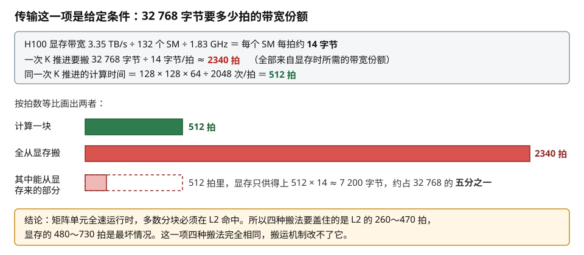
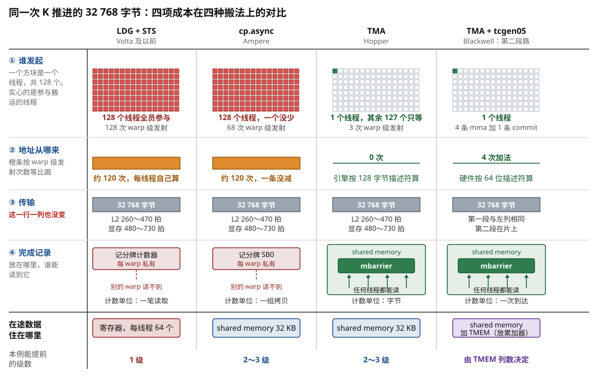
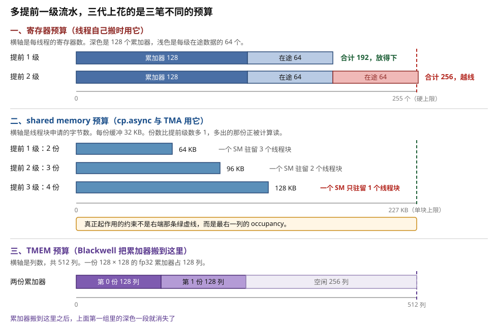
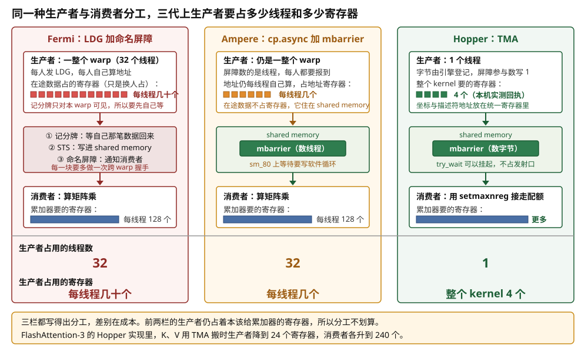
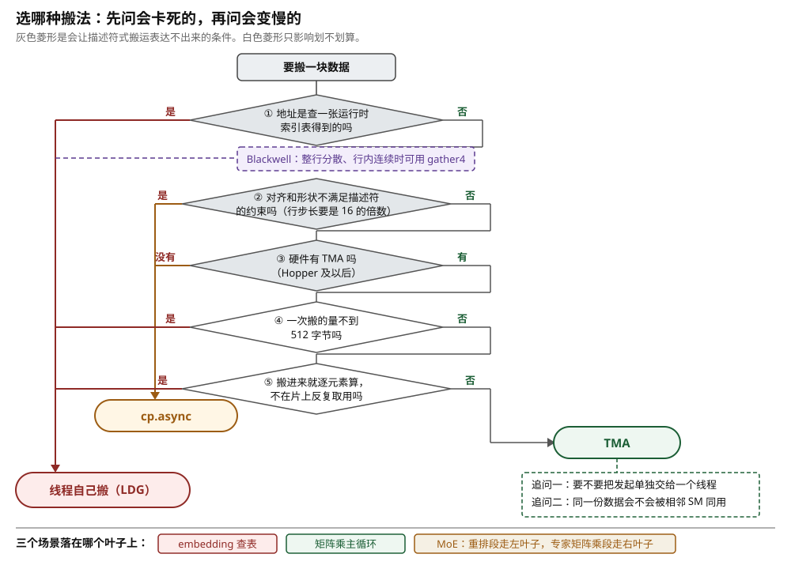
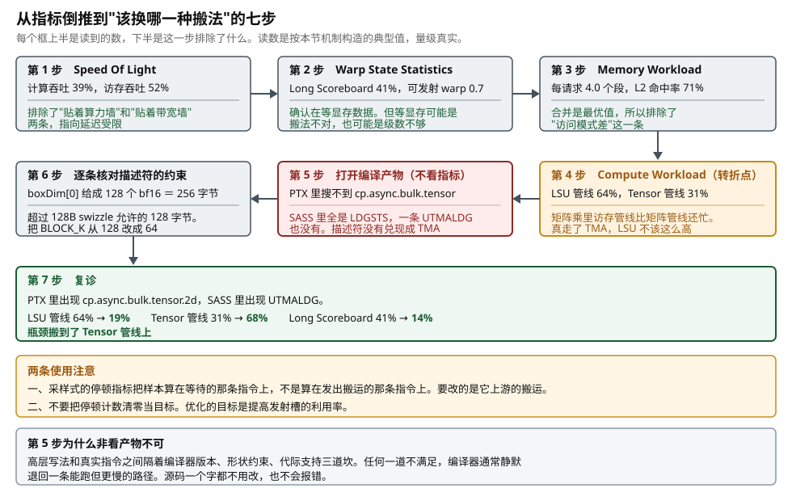
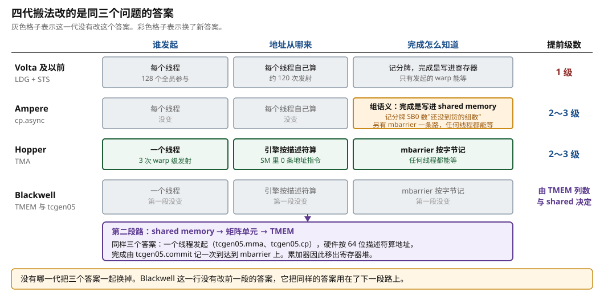

# 对照与选型：同一块数据的几种搬法

> **所属模块**：模块 14 · 数据搬运（第一部分 · GPU 的数据搬运）
> **状态**：🟨 学习中（2026-10 新写。知识截至 2026-09）
> **一句话主旨**：前四节各讲一种搬法，这一节把它们放回同一块数据上，按发起、地址、传输、完成通知四项逐一算账。四项里只有三项随搬法变化，传输这一项由存储系统决定，谁也改不了。所以每一代改的都是前两项的成本和第四项的存放位置：完成记录从每个 warp 私有的记分牌，移到 shared memory 里公共的 mbarrier；在途数据从寄存器，移到 shared memory，再到 TMEM。这三次搬迁决定了流水能提前几级、哪些线程能等待、以及搬运和计算是否还在抢同一份预算。选型则反过来看：新机制的前提条件更严，所以最朴素的那一种不会被淘汰。

<!-- 写之前先读 _模板/写作规范.md 和 _模板/配图规范.md -->

---

前四节按时间顺序讲了四种搬法。第 1 节是线程自己发 `LDG` 再发 `STS`，完成挂在寄存器上。第 2 节是 Ampere 的 `cp.async`，完成改成"数据写进 shared memory"。第 3 节是 Hopper 的 TMA，一个线程发起，引擎算地址，完成按字节记在 mbarrier 上。第 4 节是 Blackwell 的 TMEM 与 `tcgen05`，搬运引擎的路径延长到矩阵单元。这一节不引入新机制，只做两件事：把四种搬法放在同一块数据上逐项比较，然后给出选哪一种的判据。

---

## 0. 这一节要回答的问题

- 同一块 A 分块用四种方式搬，发起、地址、传输、完成通知四项各要付出多少？数字是怎么算出来的？
- 四项里哪一项不随搬法变化？为什么？
- 在途数据依次住在寄存器、shared memory、TMEM 中。每一次搬家让流水多提前几级？
- 完成记录放在哪里，决定了哪些线程能等待。三种搬法上做生产者与消费者分工，各要多写些什么？
- 什么情况下仍然必须用 `LDG`？什么情况下只能用 `cp.async`，用不上 TMA？
- 在 Nsight Compute 上看哪几个数字，能判断该换哪一种搬法？
- 每一代改的是三个问题中的哪一个答案？代价是什么，效果是什么？

---

## 1. 基础词汇

本节要反复用到下面这些词。前四节都解释过，这里重新解释一遍，只读本节也能读懂。

**线程、warp、SM、线程块**。线程是一条独立的执行流。硬件把 32 个线程编成一组，这一组叫 **warp**，一个 warp 的 32 个线程每次执行同一条指令。**SM**（Streaming Multiprocessor）是 GPU 中一个独立的计算单元，H100 有 132 个。**线程块**是一批线程的集合，它固定运行在一个 SM 上，块内的线程共用同一块 shared memory。

**发射（issue）**。warp 调度器每一拍挑一个 warp，把它的下一条指令送进执行单元，这个动作叫发射。一条指令为整个 warp 的 32 个线程各做一份工作，但只算一次发射。所以数指令有两个口径：按线程数和按发射次数，两者相差 32 倍。本节全部按**发射次数**数，并在需要时写明。

**拍**。一拍是一个 GPU 时钟周期。H100 的时钟约 1.83 GHz，所以一拍约 0.55 纳秒。

**寄存器**。寄存器是紧贴执行单元的一小块存储。每个线程有自己的一组，每个 4 字节。H100 每个 SM 有 65 536 个（256 KB），每个线程最多用 255 个。

**shared memory**。shared memory 是每个 SM 内部的一块 SRAM，由程序显式管理。H100 上一个 SM 最多可配 228 KB，一个线程块最多申请 227 KB。

**TMEM（Tensor Memory）**。TMEM 是 Blackwell 数据中心 GPU 在每个 SM 中新增的一块片上存储，专供矩阵单元使用。它是 128 条 lane × 512 列、每格 32 位的阵列，共 256 KB。只有 `tcgen05` 一族指令能读写它。

**记分牌（scoreboard）**。记分牌是每个 warp 的一组小计数器，从 Maxwell 起每个 warp 有 6 个，SASS 里写作 `SB0`～`SB5`。一条指令在控制位中声明"我完成时让几号计数器减一"，另一条指令声明"我发射前要等哪几号归零"。这组计数器只属于一个 warp，别的 warp 读不到。

**mbarrier**。mbarrier 是放在 shared memory 里的一个 8 字节对象。它记三样东西：本轮还差几个线程没报到、本轮还差多少字节没到货、以及当前这一轮的奇偶（相位）。两个计数同时归零时相位翻转。块内任何线程都能在它上面报到或等待。它放在 shared memory 里，所以它不属于某一个线程。

**张量描述符**。张量描述符是一个 128 字节的只读结构体，写明一次搬运里不会变的那一半信息：张量基址、各维长度与步长、元素类型、一次切多大一块、swizzle 模式、越界怎么填。NVIDIA 的实现叫 `CUtensorMap`，由主机侧的 `cuTensorMapEncodeTiled` 生成。

**在途数据与提前级数 d**。已经发出、还没有到达的数据叫**在途数据**。"提前 d 级"指计算第 k 块时，第 k+1 到第 k+d 块的搬运已经发出。要完全覆盖一次往返，必须满足 d × 每块计算时间 ≥ 往返延迟。

**occupancy**。occupancy 是一个 SM 上实际驻留的 warp 数占上限的比例。H100 一个 SM 最多驻留 64 个 warp。每个线程用的寄存器越多、每个线程块申请的 shared memory 越多，能驻留的 warp 越少。

**段（sector）**。段是显存和缓存之间传输数据的最小单位，32 字节。即使只用到其中 4 个字节，硬件也要搬整个段。

**本模块统一的例子**。各节都用同一个矩阵乘配置，便于横向对照：

- 输出分块 128 × 128，沿 K 方向每次推进 64。
- 每推进一次，搬 A 的一个 128 × 64 分块和 B 的一个 128 × 64 分块。元素是 bf16（2 字节）。
- **每个分块 128 × 64 × 2 = 16 384 字节，每推进一次搬 32 768 字节。**
- 线程块 128 个线程（4 个 warp）。
- A、B 都是 4096 × 4096 的矩阵，按行优先存放，行步长 8192 字节。
- H100 上一个 SM 的矩阵单元每拍做 2048 次 bf16 乘加，所以**算完一次推进要 512 拍**。
- 实测延迟：shared memory 约 29 拍，L1 命中约 40 拍，L2 命中约 260～470 拍，显存约 480～730 拍（Luo 等 arXiv:2402.13499 测 H800，Liu 等 arXiv:2607.19922 测 H100 SXM5）。

---

## 2. 题面与四项成本的定义

### 2.1 四项成本

搬运这件事可以切成四项，前三项对应本模块的三个问题，第四项是三个问题中的最后一个：

1. **发起**：谁发出搬运指令，一共发几次。占用的资源是线程和发射机会。
2. **地址**：谁算出每一段数据在显存里的起点，算出来的结果放在哪里。占用的资源是发射机会和寄存器。
3. **传输**：数据在路上的字节数，以及一次往返的拍数。占用的资源是存储系统，不占 SM。
4. **完成通知**：完成记录放在哪里，谁能读到它。占用的资源是存放完成记录的那块存储，以及在途数据的落脚处。

每一项都按同一块数据算：一次 K 推进要把 A、B 两个分块共 32 768 字节搬进 shared memory，由一个 128 线程的线程块完成。H100 上这一步的计算要 512 拍，所以搬运必须被这 512 拍盖住。

### 2.2 第三项谁也改不了，先把它算出来放在一边

四项里有一项不随搬法变化：**传输**。数据量是 32 768 字节，这是任务给定的。往返延迟由沿途各站的查找和排队决定，L2 命中 260～470 拍，到显存 480～730 拍。四种搬法发出的请求都要走同一条通路，经过同一个 L2、同一个显存控制器。所以四种搬法的第三项完全相同。

把这一项的量级算出来，后面每一节都要用。H100 的显存带宽是 3.35 TB/s，132 个 SM 平摊，再除以 1.83 GHz 的时钟，每个 SM 每拍从显存分到约 14 字节。如果这 32 768 字节全部来自显存：

> 32 768 字节 ÷ 14 字节/拍 ≈ **2340 拍的显存带宽份额**

而算完这一次推进只有 512 拍。2340 是 512 的 4.6 倍。**所以矩阵单元全速运行时，最多约五分之一的分块能真正来自显存，其余必须在 L2 命中。** 这是可能的，因为不同线程块需要的 A、B 分块大量重叠：一个线程块读进 L2 的数据，其它线程块接着使用。结论是：多数分块要覆盖的是 L2 命中的 260～470 拍，显存的 480～730 拍是最坏情况。

传输这一项既然固定，搬运机制只剩两件事可做：

- 把这几百拍隐藏在计算后面，这是第四项的事。
- 不要为了发起搬运而占掉太多线程、发射机会和寄存器，这是前两项的事。

图 5-1 把这笔带宽份额的账画了出来。

> **图 5-1**　一句话：把一次 K 推进的 32 768 字节全部从显存搬来，需要 2340 拍的带宽份额。而这一步的计算只有 512 拍。所以多数分块必须在 L2 命中。
>
> **先知道一件事**：显存的带宽是全芯片 132 个 SM 分用的。所以一个 SM 每一拍能从显存分到多少字节，是一个固定的数，这里是约 14 字节。它和延迟是两件事：延迟说的是一笔读取要等多久，带宽份额说的是每拍能到多少。
>
> **按这个顺序看**：
> 1. 最上面的灰框是三行算式。第一行算出每个 SM 每拍能从显存分到约 14 字节。第二行把 32 768 字节除以它，得到 2340 拍。第三行是同一次推进的计算时间 512 拍。
> 2. 中间两根横条按拍数等比画。绿色的是计算，512 拍。红色的是全从显存搬所需的带宽份额，2340 拍，长 4.6 倍。
> 3. 第三根条是同一件事的另一种看法。虚线框是 512 拍里显存能供上的量，实心的小块画出它只有 32 768 字节的约五分之一。
> 4. 最下面的橙框是结论：四种搬法要盖住的主要是 L2 命中的 260～470 拍。
>
> **看懂的标志**：能回答"为什么本节算延迟时主要用 L2 的数字，而不是显存的数字"。因为矩阵单元全速运行时，显存供不上这么多数据，多数分块只能来自 L2。不同线程块需要的 A、B 分块大量重叠，所以这是做得到的。
>
> **与正文的对照**：各数字与 §2.2 的算式逐项一致。3.35 TB/s 是 H100 的显存带宽，2048 次/拍是一个 SM 的 bf16 乘加吞吐。
>
> 来源：本库自绘。

下面四节分别算前两项和第四项。

---

## 3. 四种搬法逐项算账

### 3.1 线程自己搬：`LDG` + `STS`

机制只回顾一句：每个线程用整数指令算出自己那一段的地址，发一条 `LDG` 把 16 字节读进寄存器，再发一条 `STS` 把它写进 shared memory，完成由记分牌跟踪（本模块第 1 节）。

**① 发起。** 一条指令一个线程最多搬 16 字节。32 768 ÷ 16 = 2048 次线程级搬运，摊到 128 个线程，每人 16 次。每一次要两条指令，所以每个线程发 16 条 `LDG` 加 16 条 `STS`。按 warp 计：4 个 warp × 16 条 × 2 = **128 次发射**。128 个线程全部参与，没有一个 warp 能脱身。

**② 地址。** 每个线程自己算。每次读取前要算行号、列号，乘行步长，加基址，约一两条整数乘加指令（`IMAD`）。按 warp 计约 **120 次发射**。所以 ① ② 两项合计约 **250 次 warp 级发射**。地址结果占用每线程几个寄存器。

**③ 传输。** 32 768 字节，与 §2.2 相同。

**④ 完成通知。** `LDG` 的完成事件只有一个：目的寄存器被写入。所以每一笔在途读取都要事先占好一个目的寄存器。一级在途数据是 32 768 ÷ 128 = 256 字节，也就是**每线程 64 个寄存器**。完成记录在这个 warp 私有的记分牌计数器上，别的 warp 读不到。

**能提前几级。** 128 × 128 的 fp32 累加器要一直留在寄存器中，每线程 128 个。每线程的上限是 255 个：

> 128（累加器）+ 64（提前一级）= 192，放得下
> 128 + 64 × 2 = 256，超过 255，放不下第二级

所以本例在这种搬法下只能提前 1 级。1 级的提前量是 512 拍，盖得住 L2 命中的 470 拍，盖不住显存往返的 730 拍。

### 3.2 `cp.async`

机制只回顾一句：一条 `cp.async` 同时完成读和写，数据从显存直达 shared memory 不经过寄存器，完成按"组"记在记分牌的 `SB0` 上，等待点由程序员写 `wait_group N` 指定（本模块第 2 节）。

**① 发起。** 仍然是 2048 次线程级搬运，每人 16 次，但每一次只要一条指令。每个线程发 16 条 `cp.async` 加 1 条 `commit_group`，共 17 条。按 warp 计：4 × 17 = **68 次发射**。128 个线程仍然全部参与，一个没少。

**② 地址。** 一条没减。`cp.async` 完全没有碰地址生成这件事，每个线程还是自己算自己那份。仍是约 **120 次发射**。① ② 合计约 **190 次 warp 级发射**。

**③ 传输。** 相同。

**④ 完成通知。** 减一的事件变成"这一组的全部数据都写进了 shared memory"。所以在途数据的落脚处从寄存器换成了 shared memory，每级 32 768 字节。数据寄存器降到 **0 个**，只剩地址寄存器。完成记录仍在这个 warp 私有的 `SB0` 上，所以 `wait_group` 之后必须补一次 `__syncthreads()`，才能保证别人搬的那部分也到了。

**能提前几级。** 提前量 d 和缓冲份数 N 的关系是 N = d + 1：一份缓冲正在被计算读，其余 N−1 份装着已经发出、还没轮到计算的块。按空载延迟算，L2 命中要 d = 1、2 份缓冲，显存往返要 d = 2、3 份缓冲。实际配置多留一份给排队，所以本例取 3～4 份。代价换了一种货币：3 份是 96 KB，4 份是 128 KB。H100 一个 SM 最多可配 228 KB，所以开 4 份时一个 SM 只放得下 1 个线程块（4 个 warp），开 3 份时放得下 2 个（8 个 warp）。

### 3.3 TMA + mbarrier

机制只回顾一句：一次搬运的参数切成两半，不变的一半压进 128 字节的张量描述符由主机侧编好，变的一半是 kernel 里一个线程给出的坐标，引擎自己算出全部地址，完成按字节记在 shared memory 的 mbarrier 上（本模块第 3 节）。

**① 发起。** **1 个线程**执行三条指令：一条 `mbarrier.arrive.expect_tx` 告诉屏障这一轮要收 32 768 字节，两条 `cp.async.bulk.tensor.2d` 分别把 A、B 的坐标交给引擎。按 warp 计 **3 次发射**。其余 127 个线程一条搬运指令都不发。

**② 地址。** **0 条**。描述符里写着基址、`globalDim = {4096, 4096}`、`globalStrides = {8192}`、`boxDim = {64, 128}`。引擎拿到一对坐标后，按一组嵌套计数器算出 128 个行首地址，每个地址往后读 128 字节。一张描述符编一次，被 A 矩阵的 (4096 ÷ 128) × (4096 ÷ 64) = 2048 个分块共用。

**③ 传输。** 相同。

**④ 完成通知。** 完成记录从每 warp 私有的记分牌，搬到 shared memory 里的 mbarrier 上。`expect_tx` 把 32 768 加进字节计数，A 那条拷贝完成时引擎减掉 16 384，B 那条完成时再减掉 16 384。两个计数都归零时相位翻转。**块内任何线程都能等它。** 搬运占用的寄存器降到整个 kernel 4 个：本机用 CUDA 12.8 的 ptxas 把一个只做这件事的 PTX kernel 编到 `sm_90a`，回执是 `Used 4 registers`。描述符地址、坐标、目的地址和屏障地址放在统一寄存器中，不占每线程的配额。

**能提前几级。** 提前量不再受寄存器限制，只受 shared memory 限制。3 格环形缓冲是 96 KB，H100 一个 SM 的上限是 228 KB。

### 3.4 Blackwell：TMA + `tcgen05`

机制只回顾一句：Blackwell 在每个 SM 上加了一块 256 KB 的 TMEM，矩阵乘 `tcgen05.mma` 和搬运 `tcgen05.cp` 都由一个线程发起，完成由 `tcgen05.commit` 记到 mbarrier 上（本模块第 4 节）。

这一代的改动不在"显存 → shared memory"这一段。那一段的四项成本和 §3.3 完全相同，描述符和 mbarrier 一个字没变。改的是**往后延长的那一段**：shared memory 到矩阵单元、以及累加器的存放位置。

**① 发起。** 第二段也是 **1 个线程**。本例一次推进要 4 条 `tcgen05.mma`（每条 K = 16），加 1 条 `tcgen05.commit`，共 5 次发射。Hopper 上同一件事要 128 个线程一起发 8 条 `wgmma`，再发 1 条 `commit_group` 和 1 条 `wait_group`。

**② 地址。** 线程只提供一个 64 位的 shared memory 描述符和一个 TMEM 地址。同一次推进的 4 条指令中，描述符依次加 0、2、4、6，所以线程只做 **4 次加法**。描述符的地址字段以 16 字节为单位，加 2 就是后移 32 字节，正好是 16 个 bf16。

**③ 传输。** 第一段相同。第二段是片上搬运，不经过 L2。

**④ 完成通知。** `tcgen05.commit` 让一个 mbarrier 跟踪这个线程此前发出的全部异步 `tcgen05` 操作，全部完成时硬件在上面做**一次到达**。任何线程都能等。和 TMA 的差别只在计数单位：TMA 数字节，commit 数批次。最要紧的变化是累加器的位置：128 × 128 个 fp32 共 64 KB，从每线程 128 个寄存器移进 TMEM 的 128 列。**主循环中没有一个字节经过寄存器。** 寄存器只在结尾用 `tcgen05.ld` 分批取出结果时才用到，CUTLASS 的默认子分块是 128 × 32，所以每批每线程只要 32 个。这一段的完成仍用记分牌：`LDTM` 登记计数器，用结果的指令等它归零。

**能提前几级。** B200 一个 SM 算同一个 128 × 128 × 64 分块约 256 拍（按 CUTLASS 文档"16 位矩阵乘吞吐是 Hopper 的 2 倍"推算，是估算值）。按同样的延迟，L2 命中要 d = 2，显存往返要 d = 3。计算越快，要提前的级数越多，这正是前面每一代改动的动因。

### 3.5 总表

把前四小节的数字收进一张表。题面是同一次 K 推进的 32 768 字节，128 个线程。

| | `LDG` + `STS` | `cp.async` | TMA | Blackwell（第二段） |
| --- | --- | --- | --- | --- |
| **① 发起：发指令的线程数** | 128 | 128 | **1** | **1** |
| **① 发起：warp 级发射次数** | 128 | 68 | **3** | 5（第一段仍是 3） |
| **② 地址：谁算** | 每线程自己算 | 每线程自己算 | **引擎按描述符算** | **硬件按描述符算** |
| **② 地址：warp 级发射次数** | 约 120 | 约 120 | **0** | 4 次加法 |
| **①②合计** | 约 250 | 约 190 | **3** | 第一段 3，第二段 5 |
| **③ 传输：字节数** | 32 768 | 32 768 | 32 768 | 第一段 32 768 |
| **③ 传输：往返拍数** | L2 260～470，显存 480～730 | 同左 | 同左 | 同左 |
| **④ 完成记录放在哪** | 每 warp 私有的记分牌 | 每 warp 私有的 `SB0` | **shared memory 的 mbarrier** | **shared memory 的 mbarrier** |
| **④ 哪些线程能等** | 只有发出读取的那个 warp | 只有发出拷贝的那个线程 | **块内任何线程** | **块内任何线程** |
| **④ 完成的计数单位** | 一笔读取 | 一组拷贝 | **字节** | 一次到达 |
| **在途数据住在哪** | 寄存器 | shared memory | shared memory | shared memory 加 TMEM |
| **搬运占的寄存器** | 每线程 64 个（数据）加几个（地址） | 每线程几个（地址） | **整个 kernel 4 个** | **4 个** |
| **搬运占的 shared memory** | 0 | 每级 32 KB | 每格 32 KB | 每格 32 KB |
| **累加器占的寄存器** | 每线程 128 个 | 每线程 128 个 | 每线程 128 个 | **0（在 TMEM）** |
| **本例能提前几级** | **1 级**（寄存器放不下第 2 级） | 2～3 级（3～4 份缓冲） | 2～3 级（3～4 格） | 由 TMEM 列数与 shared memory 决定 |
| **机器码路标** | `LDG.E.128` / `STS.128` | `LDGSTS` / `LDGDEPBAR` / `DEPBAR` | `UTMALDG` / `SYNCS.ARRIVE.TRANS64` | `UTCHMMA` / `UTCCP` / `UTCBAR` |

图 5-2 把这张表里变化最大的四行画了出来。

> **图 5-2**　一句话：同样把 32 KB 数据搬进片上存储，四种搬法在三项成本上相差很大，在第四项上完全相同。那一项是数据在路上的时间，它由存储系统决定，搬运机制改不了它。
>
> **先知道一件事**：这张图比较的是"为了发起这次搬运，SM 内部付出了什么"，不是"数据搬得快不快"。数据搬得快不快由显存和 L2 决定，四种搬法用的是同一条通路。
>
> **按这个顺序看**：
> 1. 从左往右四列是四种搬法，按出现的年代排。越往右，发起搬运的人越少。
> 2. 第一行"谁发起"。每个小方块是一个线程。前两列的 128 个方块全是实心的，表示全员参与。第三、四列只有一个是实心的，其余 127 个是空心的，它们只在屏障上等。
> 3. 第二行"地址从哪来"。橙色条的长度按 warp 级发射次数画。前两列各约 120 次，因为地址仍然每个线程自己算。后两列是 0，地址由引擎按描述符算出。
> 4. 第三行"传输"。四列的灰条一样长，都标着 32 768 字节和同一组延迟数字。这一行是本图的主题：它一列也没变。
> 5. 第四行"完成通知"。前两列的记录画在一个标着"每 warp 私有"的小格子里，旁边的虚线箭头指向别的 warp 并打了叉。后两列的记录画在一块标着 shared memory 的区域里，几个箭头都能读到它。
> 6. 最下面一行是在途数据的落脚处：寄存器、shared memory、shared memory、shared memory 加 TMEM。这正是第四项带来的真正后果。
>
> **看懂的标志**：能回答"为什么四种搬法的性能差别不在传输这一项上"。因为搬运机制只能决定谁去发请求、谁去算地址、以及完成记录放在哪里。请求发出之后走的路是同一条，几百拍的延迟一样长。搬运机制能做的是把这几百拍藏在计算后面。
>
> **与正文的对照**：各格数字取自 §3.1 到 §3.4 的逐项计算。Blackwell 那一列画的是第二段（shared memory 到矩阵单元），它的第一段和 TMA 那一列相同。
>
> 来源：本库自绘。

从这张表可以读出三件事。

**第一，发射次数不是主要收益。** 在 512 拍里，一个 SM 的 4 个调度器共有 2048 个发射机会。线程自己搬占约 250 次，是 12%。TMA 占 3 次，是 0.15%。省下的这 12% 有用，但它不是瓶颈。

**第二，真正的收益在"发指令的线程数"和"搬运占的寄存器"这两行。** 前两种搬法要求线程块全员参与搬运，而且地址寄存器和在途数据要和累加器抢同一份预算。TMA 只要一个线程、4 个寄存器，于是线程块可以分成专管搬运的生产者和专管计算的消费者。§5 把这笔账算完。

**第三，第四项的变化带动了两件事。** 完成记录从私有换成公共，决定了哪些线程能等待。在途数据的落脚处换了三次，决定了流水能提前几级。§4 和 §5 分别讲这两条。

---

## 4. 在途数据住在哪里，决定能提前几级

### 4.1 三次搬家

要隐藏几百拍的往返，计算第 k 块时，后面几块必须已经在路上。这些在途数据需要一个落脚处。四种搬法的落脚处换了三次，原因都是第四项：**完成以数据到达哪里为准，所以在途数据必须先占好那个地方。**

1. `LDG` 的完成是数据写进目的寄存器，所以在途数据只能占寄存器。
2. `cp.async` 的完成是数据写进 shared memory，所以在途数据直接占它最终要去的位置。
3. TMA 的完成是字节数到齐，字节到的地方仍是 shared memory，所以落脚处不变。变的是"谁能等"，见 §5。
4. Blackwell 又多了一级：矩阵乘的累加器从寄存器移进 TMEM。累加器严格说不是在途数据，但它和在途数据抢的是同一份寄存器预算，所以这一次搬家同样把预算松开了。

### 4.2 走查：本例在三代上各能提前几级

条件是 d × 每块计算时间 ≥ 往返延迟。H100 算一块 512 拍，B200 约 256 拍（估算）。延迟取空载实测的上限：L2 命中 470 拍，显存 730 拍。

| 架构 | 算一块的拍数 | L2 命中要几级 | 显存要几级 | `LDG`+`STS` 放得下几级 | `cp.async` / TMA 放得下几级 |
| --- | --- | --- | --- | --- | --- |
| H100 | 512 | 1 | 2 | **1**（192 个寄存器，第 2 级要 256 个） | 3 份缓冲 96 KB 时 2 级，4 份 128 KB 时 3 级 |
| B200（估算） | 约 256 | 2 | 3 | **1** | 同上 |

这张表给出本模块第一部分的主线。H100 上，线程自己搬只放得下 1 级，刚好盖住 L2 命中的 470 拍，盖不住显存往返的 730 拍。B200 上计算快了一倍，L2 命中也要 2 级，线程自己搬连 L2 都盖不住了。**所以压力来自计算变快，而不是延迟变长。** 延迟按拍数计算反而在逐代变长：V100 到显存约 375 拍，H800 约 479 拍，H100 SXM5 走对侧 L2 分区约 728 拍。L2 越做越大，分区越来越多，路径越来越长。

### 4.3 三笔预算并排

同一件事，也就是多排一级流水，在三代上花的是三种货币。下面把三笔账放在一起，数字都取自前几节。

| 多排一级要付什么 | `LDG` + `STS` | `cp.async` / TMA | Blackwell |
| --- | --- | --- | --- |
| 货币 | 每线程寄存器 | 线程块的 shared memory | 线程块的 shared memory |
| 一级的价格 | 64 个 | 32 KB | 32 KB |
| 这笔预算的上限 | 每线程 255 个 | 一个线程块 227 KB | 同左 |
| 同一笔预算还要装什么 | 128 个累加器，加地址和操作数片段 | 没有别的 | 没有别的 |
| 累加器占哪笔预算 | 每线程 128 个寄存器 | 每线程 128 个寄存器 | TMEM 的 128 列 |
| 先碰到的真实约束 | 255 个的硬上限 | occupancy：4 份 128 KB 时一个 SM 只驻留 1 个线程块 | TMEM 的 512 列 |

图 5-3 把三笔预算并排画出。寄存器那一列最紧，原因是它要同时装两样东西。累加器 128 个是固定开销，整个 K 循环都得留着，所以留给在途数据的只有 127 个，装不下两级的 128 个。shared memory 那一列宽裕得多：227 KB 的上限能装 7 份 32 KB 的缓冲。但真正起作用的约束不是这个上限，而是 occupancy。H100 一个 SM 最多可配 228 KB 给 shared memory，开 4 份缓冲要 128 KB，一个 SM 就只放得下 1 个线程块。

> **图 5-3**　一句话：在途数据每多提前一级，就要多占一份存放空间。这份空间依次从寄存器换到 shared memory，再加上 TMEM。换一次，能提前的级数就多几级。
>
> **先知道一件事**：一个线程能用多少寄存器有硬上限，是 255 个。超过这个数，编译器把一部分变量放到位于显存的 local memory。那不会报错，但速度会突然下降。shared memory 没有这种硬上限带来的悬崖，它的代价是渐进的：占得越多，一个 SM 上能同时驻留的线程块越少。
>
> **按这个顺序看**：
> 1. 上面一组是寄存器预算。横轴是每线程的寄存器数，右端红色虚线是 255 个的上限。每根条里深色一段是 128 个累加器，浅色一段是每级在途数据的 64 个。
> 2. 第一根条是提前 1 级，192 个，在虚线左边。第二根条是提前 2 级，256 个，越过了虚线，所以数字标成红色。
> 3. 中间一组是 shared memory 预算。横轴是字节数，右端绿色虚线是一个线程块能申请的 227 KB。2、3、4 份缓冲分别是 64、96、128 KB，三根条都没碰到虚线。
> 4. 看中间一组每根条右侧的小字：那是这个份数下一个 SM 能驻留几个线程块。开 4 份时只剩 1 个块。这说明真正的约束不是 227 KB 这条虚线，而是 occupancy。
> 5. 下面一组是 TMEM 预算。横轴是列数，共 512 列。两份 128 × 128 的 fp32 累加器各占 128 列，合计 256 列。累加器搬到这里之后，上面那组寄存器条里的深色一段就消失了。
>
> **打个比方**：搬家时要腾出中转空间。寄存器像随身的口袋，只有几个，装满了就没手干别的。shared memory 像门口的一块空地，多堆几箱也碍不着谁，只是别人停车的位置少了。TMEM 像机床旁边单开的一个料仓，和前两处都不冲突。
>
> **看懂的标志**：能回答"为什么本例在 H100 上用 `LDG` 只放得下一级"。因为寄存器这笔预算要同时装 128 个累加器和每级 64 个在途数据。128 加 64 是 192，放得下。再加一级是 256，超过 255 个的上限。
>
> **与正文的对照**：128 个累加器和每级 64 个寄存器取自本模块第 1 节的账。每份缓冲 32 KB 取自 §1 的统一例子。227 KB 的单块上限来自 CUDA C++ Programming Guide 表 31。TMEM 的 512 列取自 PTX ISA。
>
> 来源：本库自绘。

---

## 5. 完成记录放在哪里，决定谁能等

### 5.1 两种位置

四种搬法的完成记录只有两种存放位置。

**第一种是每个 warp 私有的记分牌计数器。** `LDG` 用它，`cp.async` 的组语义用它（`SB0`），TMA 的写出方向用它（`DEPBAR.LE SB0, 0x0`），Blackwell 的 `tcgen05.ld` 也用它（`LDTM` 登记计数器）。它的性质是：别的 warp 读不到这笔记录。

**第二种是放在 shared memory 里的 mbarrier。** `cp.async.mbarrier.arrive` 用它，TMA 的读入方向用它，`tcgen05.commit` 用它。它的性质是：shared memory 是块内公共的，所以块内任何线程用一条普通的读指令就能查它。

这两种位置的差别只有一条实际后果：**能不能让没发过搬运指令的 warp 等待数据。** 这一条决定了生产者与消费者分工划不划算。

### 5.2 走查：同一种分工在三代上各要写什么

分工的目标相同：一拨 warp 专职搬运（生产者），另一拨专职计算（消费者），两拨用同步信号交接。下面逐代走一遍，每一代都用本例的 32 768 字节。

**第一代，用 `LDG` 加命名屏障。** 记分牌只让发出读取的那个 warp 等待，所以搬运 warp 必须按下面的顺序工作：

1. 自己等数据返回。记分牌在这里挡住它。
2. 用 `STS` 把数据写进 shared memory。
3. 用命名屏障（`bar.arrive` / `bar.sync`）通知计算 warp。

2011 年的 CudaDMA（Bauer 等，SC'11）在 Fermi 上就是这样做的。代价有两个：每一块要多做一次跨 warp 的握手；在途数据仍然存放在寄存器中，只是从计算 warp 移到了搬运 warp，寄存器预算的压力没有减少。

**第二代，用 `cp.async` 加 mbarrier。** mbarrier 和 `cp.async.mbarrier.arrive` 在 Ampere（`sm_80`）就有，所以分工在这一代已经可行。写法是：

1. 生产者 warp 的每个线程发自己那一份 `cp.async`。
2. 每个生产者线程执行一次 `cp.async.mbarrier.arrive.noinc`。这条指令让硬件在这个线程此前发出的拷贝全部落地之后，替它在屏障上到达一次。
3. 消费者 warp 在这个屏障上等。

成本有三处：生产者仍然是一整个 warp，因为屏障数的是线程，每个线程都要报到；地址仍然每线程自己算，结果占生产者的寄存器；`sm_80` 上只有不阻塞的 `mbarrier.test_wait`，等待要写成软件循环，反复读 shared memory。

**第三代，用 TMA。** 生产者缩成一个线程，字节由引擎登记，所以屏障的参与线程数写 1 就够。本机实测，一个只负责发起搬运的 kernel 编到 `sm_90a` 的回执是 `Used 4 registers`。生产者几乎不需要寄存器，于是可以用 `setmaxnreg` 把自己的配额主动降下来，让给消费者去装累加器。FlashAttention-3 的 Hopper 实现里（`hopper/flash_fwd_kernel_sm90.h`），K 和 V 用 TMA 搬时生产者降到 24 个寄存器，消费者各升到 240 个；同一份代码里 K、V 不用 TMA 时，生产者要留 40 个，消费者只能升到 232 个。

**结论：分工在 Ampere 上就可行，到 Hopper 才划算。** 区别不在于能不能写出来，而在于写出来之后生产者还占不占着本该给累加器的寄存器。图 5-4 把三代的写法与成本并排画出。

> **图 5-4**　一句话：让一拨线程专管搬运、另一拨专管计算，这件事三代都做得到。差别在生产者要占多少线程和多少寄存器。
>
> **先知道一件事**：一个 SM 上的寄存器总数是固定的，所有驻留的线程分用它。生产者多占一个寄存器，消费者就少一个。矩阵乘的累加器要一直留在寄存器里，所以这笔预算很紧。分工划不划算，最后就落在这上面。
>
> **按这个顺序看**：
> 1. 三栏从左到右是三代写法。每栏上半是生产者，下半是消费者，中间是交接用的同步件。
> 2. 左栏的同步件画成两个：一个是生产者自己的记分牌，画在生产者框内，旁边标着"别的 warp 读不到"；另一个是命名屏障，画在两者之间。所以左栏要握手两次。
> 3. 左栏生产者框里的红色小方块是在途数据占的寄存器。它们没有消失，只是从消费者挪到了生产者。
> 4. 中栏的同步件只有一个，画在标着 shared memory 的区域里，那是 mbarrier。生产者框里仍有一排小方块，那是地址寄存器。生产者仍是 32 个线程，因为屏障数的是线程，每人都要报到。
> 5. 右栏的生产者缩成一个线程，框里只有 4 个小方块。下方消费者那一格写着 `setmaxnreg`，意思是生产者把寄存器配额整体让给了消费者，所以这一格的累加器条比左两栏长。
> 6. 对照三栏最下方的数字：生产者占用的线程数从 32 到 32 到 1，寄存器从几十到几十到 4。
>
> **看懂的标志**：能回答"为什么把完成记录放进 shared memory 就能让别的 warp 等"。因为 shared memory 是块内公共的。记录放在 warp 私有的计数器上时，别人没有办法读到它。放在 shared memory 里，别人用一条普通的读指令就能查。
>
> **与正文的对照**：三代的指令名与成本取自本模块第 1、2、3 节。24 个与 240 个寄存器取自 FlashAttention-3 的 Hopper 实现。图中的方块数是示意，不按真实比例画。
>
> 来源：本库自绘。

---

## 6. 选型：先问会卡死的判据，再问会变慢的判据

新机制的成本更低，但它的前提条件更严。所以选型要先问前提，再比成本。下面把判据分成两类：**会让某种搬法根本用不了的，和只是让它变慢的。** 先问第一类。

### 6.1 三条会让新机制用不了的判据

**判据一：地址是算出来的，还是查出来的。** 描述符式搬运的前提是数据的位置可以由"基址 + 各维步长 + 坐标"算出来。引擎内部只有一组计数器和乘加器，没有查表的能力。如果每个元素的位置要先查一张运行时的索引表，描述符就写不出来。这不是慢，是表达不了。

Blackwell 的 `.tile::gather4` 把这条边界往外推了一格：一条指令带 1 个列坐标和 4 个行坐标，从二维张量中取 4 个任意的行，在 shared memory 里拼成连续的 4 行。所以"整行分散、行内连续"的访问现在也能交给引擎。但下面几种仍然要线程自己算地址：

- 按索引取单个元素，例如查表、稀疏矩阵的非零元。
- 每一行的长度不同，例如可变长度的序列。
- 三维及以上张量中的任意行。`gather4` 只支持二维。

**判据二：对齐和形状满不满足描述符的约束。** 这些约束很硬，不满足时 `cuTensorMapEncodeTiled` 直接返回错误，主机侧拿不到可用的描述符。主要几条是：基址 16 字节对齐；各维步长是 16 的倍数；`boxDim` 每维不超过 256 个元素；`boxDim[0] × 元素字节数` 是 16 的倍数，并且不超过 swizzle 模式的字节数。

举一个会失败的例子。假设 A 矩阵是 4096 行 × 4095 列的 bf16，其余不变。行步长是 4095 × 2 = 8190 字节，不是 16 的倍数，所以编描述符就失败。这时连 `cp.async` 也用不上：奇数行的行首地址是 r × 8190，只有 2 字节对齐，而 `cp.async` 最小一次搬 4 字节并要求按搬运大小对齐。剩下的办法只有线程自己逐元素搬。实用的修法是分配时把每行填充到 4096 列，让行步长回到 8192 字节。

**判据三：硬件代际够不够。** `cp.async` 要 `sm_80` 或更高。`cp.async.bulk.tensor` 和 `mbarrier.arrive.expect_tx` 要 `sm_90` 或更高，本机实测在 `sm_80` 上 ptxas 直接报错。`tcgen05` 一族要 `sm_100a`、`sm_110a` 这类数据中心 Blackwell 的目标，本机实测在 `sm_120a` 上报 `Instruction 'tcgen05.alloc' not supported`。所以消费级 Blackwell（RTX 50 系列）没有 TMEM，但有 TMA 的 `gather4`。

### 6.2 两条只是让新机制变慢的判据

**判据四：一次搬得够不够多。** 描述符要编，mbarrier 要初始化、要翻相位，发起指令本身也有延迟。搬 32 KB 时这些固定开销可以忽略。搬几百字节时，开销可能比搬运本身还大。一次搬运不到一个 warp 一拍能搬的量（32 线程 × 16 字节 = 512 字节）时，用线程自己搬更简单。

**判据五：数据搬进来是不是要被反复取用。** `cp.async` 和 TMA 的价值前提是"数据要在 shared memory 里被很多线程反复取用"。矩阵乘的操作数就是典型：本例的 A 分块中每个元素要用 128 次，因为它要和 B 的 128 列各乘一次。如果数据搬进来是为了做逐元素的加减乘除（激活函数、归一化），它最终必须进寄存器。这时先进 shared memory 再读回寄存器是两趟，直接 `LDG` 进寄存器是一趟。

### 6.3 三个场景各走一遍

**场景一：矩阵乘的主循环。** 就是本节的题面。判据一：地址由坐标算出，过。判据二：行步长 8192 字节是 16 的倍数，`boxDim[0] × 2 = 128` 字节是 16 的倍数且与 128B swizzle 配套，过。判据四：一次 32 KB，过。判据五：每个元素用 128 次，过。判据三决定落在哪一代：Hopper 及以后用 TMA，Ampere 用 `cp.async` 配 3 份缓冲。

**场景二：embedding 查表。** 输入是一批 token id，要从一张 128 000 行 × 4096 列的表里把对应的行取出来。判据一：每一行的位置由 token id 决定，而 token id 是运行时的数据，所以描述符写不出来。结论是线程自己搬。

这个场景值得多算一步，因为它说明"不规则"不等于"慢"。一行 4096 个 bf16 是 8192 字节连续，所以不规则只体现在行与行之间，行内仍然是规则的。每个线程块负责几个 token，块内线程沿隐藏维展开，每人一次读 16 字节。一个 warp 的 32 个线程读连续的 512 字节，正好 16 个段，每请求 4 个段，这是最优值。**所以这类算子仍然能跑出不错的带宽。** 真正糟糕的是行很短的情形，那时每读一行只用上一两个段。在 Blackwell 上，如果每行的长度统一、且表是二维的，这个场景可以改用 `gather4`。

**场景三：MoE 的 token 重排。** 混合专家模型里，每个 token 要被送到它选中的那个专家去算，所以正式计算之前有一步"按专家把 token 重新排队"。判据一：每个 token 去哪由路由结果决定，是运行时数据，所以重排这一段用线程自己搬，或者在 Blackwell 上用 `gather4`。

但重排完成之后，每个专家拿到的就是一块规则的连续数据了。所以典型的 MoE kernel 是两段式：重排段用 gather，专家的矩阵乘段用 TMA。**一个 kernel 里同时出现两种搬法是常态。选型是按每一段路选，不是按 kernel 选。**

图 5-5 把五条判据画成一棵可以逐步走的树。

> **图 5-5**　一句话：选哪种搬法是一串按顺序问下去的是非题。先问会让某种搬法根本用不了的条件，再问会让它不划算的条件。
>
> **先知道一件事**：三个答案分别是：线程自己搬，每个线程亲自把数据读进自己的寄存器再写出去；`cp.async`，每个线程发一条指令让数据从显存直达 shared memory；TMA，一个线程给出坐标，由一个专门的搬运单元按事先编好的描述符完成整块搬运。
>
> **按这个顺序看**：
> 1. 从最上面的方框开始往下走。每个菱形是一个问题，答"是"走左边，答"否"走右边，一直走到某个圆角框为止。
> 2. 前三个菱形是灰色的，它们的共同点是会让描述符式搬运**表达不出来**。第一个问地址是不是查表来的。第二个问对齐和形状满不满足约束，旁边标着行步长要是 16 的倍数这条。第三个问硬件代际。
> 3. 第一个菱形右下方有一条虚线分支，标着 Blackwell 的 `gather4`。它表示"整行分散、行内连续"这一类从左边的叶子挪到了右边。
> 4. 后两个菱形是白色的，它们只影响划不划算。第四个问一次搬的量够不够 512 字节。第五个问数据是不是要在 shared memory 里被反复取用。
> 5. 走到 TMA 这个叶子还挂着两个追加问题，画成虚线框：要不要把发起搬运单独交给一个线程（也就是生产者与消费者分工）；同一份数据会不会被相邻几个 SM 同时用到（那就可以用多播，本模块第 12 节讲）。
> 6. 最右侧三个标签是 §6.3 的三个场景，各自落在它最终到达的叶子上。MoE 那个标签落在两个叶子上，因为它的两段路用两种搬法。
>
> **看懂的标志**：能说出为什么"地址是不是查表来的"要放在第一个问。因为它是唯一一个会让某种搬法表达不出来的条件，其余几个只是让它变慢或不划算。先排除不可能的，再比较划不划算。
>
> **与正文的对照**：五条判据与 §6.1、§6.2 逐条对应，顺序与正文一致。三个场景的走查在 §6.3。
>
> 来源：本库自绘。

### 6.4 在 Nsight Compute 上读出该换哪一种

判据讲的是"该用哪一种"，这一小节讲的是"已经跑起来的 kernel 该换哪一种"。Nsight Compute 的报告分成若干页，本节用到四页：Speed Of Light（两个总百分比）、Warp State Statistics（停顿原因分解）、Memory Workload Analysis（访存效率）、Compute Workload Analysis（各条管线的利用率）。采数命令是 `ncu --set full -k <kernel 名> ./程序`。

先看两页定性。Memory Throughput 高而 Compute Throughput 低，说明贴着访存的墙。两个百分比都低，说明时间花在等待上，要去看停顿分解。

然后按下表对症。左列是读到的现象，中列是结论，右列是该换哪一种。

| 读到什么 | 说明什么 | 该怎么改 |
| --- | --- | --- |
| 停顿以 **Stall Long Scoreboard** 为主 | warp 在等访存类计数器归零，搬运没藏住 | 加提前级数。用 `LDG` 时级数受寄存器限制，这时换 `cp.async` 把在途数据搬进 shared memory |
| 停顿以 **LG Throttle** 或 **MIO Throttle** 为主 | 访存指令发不出去，队列已满。前者是 L1 的本地与全局访存队列，后者是 MIO 指令队列 | 减少请求的**条数**，不是增加 warp。改用更宽的向量读取，或者换成一条指令搬一整块的 TMA |
| 每请求的段数远大于 4 | 合并很差，一个 warp 的地址没有落在同一段里 | 先改访问模式。`LDG` 和 `cp.async` 都有这个病。描述符式搬运天生按块取，不会出现这个数 |
| LSU 管线利用率高、Tensor 管线低 | 发射能力被搬运和地址算术吃掉了 | 换 TMA。地址生成交给引擎后，LSU 这条管线就空出来 |
| 停顿集中在 `DEPBAR` 上 | 计算在等 `cp.async` 的数据 | 加大级数，直到 shared memory 或 occupancy 先到上限 |
| 停顿集中在 `SYNCS.PHASECHK` 上 | 在等 mbarrier。生产者停在 `empty` 上说明瓶颈在计算侧，消费者停在 `full` 上说明瓶颈在搬运侧 | 生产者停住时加大级数没用，要去看计算侧 |
| 停顿集中在 `BAR.SYNC` 上 | 在等块内其它 warp，不是在等数据 | 查 `wait_group` 的参数，或者改成生产者与消费者分工 |
| 源码写了描述符，PTX 里搜不到 `cp.async.bulk.tensor` | 描述符没有兑现成 TMA，编译器退回了逐指针的路径 | 回去逐条核对 §6.1 判据二的约束 |

这张表有两条使用注意。

**第一，采样式的停顿指标把样本算在等待的那条指令上，不是算在发出搬运的那条指令上。** 所以看到 Long Scoreboard 集中在某条计算指令上，真正要改的是它上游的搬运。

**第二，不要把停顿计数清零当目标。** 官方文档反复强调，优化的目标是提高发射槽的利用率。只有发射活动本身很低时，减少停顿才等价于加速。

**走查：一次从指标倒推到换搬法。** 设在 H100 上跑一个 Triton 写的 bf16 矩阵乘，源码里用了张量描述符，预期走 TMA。下面的读数是按上述机制构造的典型值，量级真实。

1. Speed Of Light：Compute 39%，Memory 52%。两个都不高不低，所以先怀疑延迟。
2. Warp State Statistics：Long Scoreboard 占 41%，Barrier 占 18%。每个调度器的可发射 warp 数是 0.7，长期小于 1。结论是延迟受限，主要在等显存数据。
3. Memory Workload Analysis：每请求 4.0 个段，完美合并。L2 命中率 71%。所以排除合并差这一条。
4. Compute Workload Analysis：LSU 管线 64%，Tensor 管线 31%。这是转折点。矩阵乘的 kernel 里访存管线比矩阵管线还忙，说明发射能力被搬运吃掉了。真走了 TMA 的话，LSU 不该这么高。
5. 看产物：导出 PTX，搜 `cp.async.bulk.tensor` 搜不到，搜 `cp.async` 满屏都是。反汇编确认循环顶部是成簇的 `LDGSTS`，没有一条 `UTMALDG`。所以描述符没有兑现。
6. 找原因：按 §6.1 判据二逐条核对，发现 `boxDim[0]` 给成了 128 个 bf16，也就是 256 字节，超过了 128B swizzle 允许的 128 字节。把 `BLOCK_K` 从 128 改成 64，或者改用 64B swizzle。
7. 复诊：PTX 里出现 `cp.async.bulk.tensor.2d`，SASS 里出现 `UTMALDG`。LSU 管线降到 19%，Tensor 升到 68%，Long Scoreboard 降到 14%。瓶颈搬到了 Tensor 管线上。

图 5-6 把这七步串成一张路径图。

> **图 5-6**　一句话：判断该换哪一种搬法有一条固定的查法。先看两个总百分比，再看线程在等什么，再看哪条管线最忙，最后一定要打开编译产物确认指令，而不是相信源码写了什么。
>
> **先知道一件事**：Nsight Compute 是分析单个 kernel 性能的工具。它的第一页给两个百分比：计算吞吐占硬件峰值的比例，访存吞吐占峰值的比例。后面几页分别列出线程在等什么、访存效率如何、哪条执行管线最忙。
>
> **按这个顺序看**：
> 1. 从左上角第一个框开始，沿箭头往右下走。每个框是一步，框里上半是读到的数，下半是这一步排除了什么。
> 2. 第一步两个百分比都是中间值，所以排除了"贴着算力墙"和"贴着带宽墙"两条，指向延迟受限。
> 3. 第二步看停顿分解。Long Scoreboard 占 41%，说明在等显存数据。但这还不够：等显存可能是搬法不对，也可能是级数不够。
> 4. 第三步看每请求的段数。4.0 是最优值，所以排除了合并差这一条。
> 5. 第四步是转折点，画成橙色。访存管线 64% 比矩阵管线 31% 还忙，这在矩阵乘里不正常。
> 6. 第五步画成红色，它是唯一一步不看指标、只看产物的。PTX 里搜不到 TMA 指令，所以描述符没有兑现。
> 7. 第六、七步是核对约束和复诊。最后一个框里，访存管线降到 19%，矩阵管线升到 68%。箭头旁的小字写着"瓶颈搬到了矩阵管线上"。
>
> **看懂的标志**：能回答"为什么第五步非看产物不可"。因为高层写法和真实指令之间隔着编译器版本、形状约束、代际支持三道坎。任何一道不满足，编译器通常静默退回一条能跑但更慢的路径，源码一个字都不用改，也不会报错。
>
> **与正文的对照**：七步与 §6.4 的走查逐条对应。读数是按本节机制构造的典型值，量级真实，不是某一次实测。
>
> 来源：本库自绘。

---

## 7. 跨代总结：每一代改了哪一个答案

### 7.1 一张表

本模块的三个问题是：谁发起、地址从哪来、完成怎么知道。下面按代际列出每一代改了哪一个答案，付出什么代价，换来什么效果。

| 代际与机制 | 改了哪个答案 | 怎么改 | 代价 | 效果 |
| --- | --- | --- | --- | --- |
| Volta 及以前：`LDG` + `STS` | 基线 | 每个线程自己发、自己算、完成挂在寄存器上 | 在途数据占每线程 64 个寄存器；全部线程参与；记分牌只对发起的 warp 可见 | 唯一能表达任意访问模式的搬法 |
| Ampere：`cp.async` | **完成怎么知道** | 完成事件从"写进寄存器"改成"写进 shared memory"。计数器仍是记分牌，加一的时刻由 `commit_group` 决定，检查的时刻由程序员写的 `wait_group N` 决定 | 等待点要程序员自己定。N 写大了会读到没到货的数据，不报错，结果时对时错。在途数据改占 shared memory，和 occupancy 争预算 | 在途数据不再占寄存器，本例从提前 1 级变成 2～3 级。寄存器预算全归累加器 |
| Ampere：mbarrier | **完成记录放在哪** | `cp.async.mbarrier.arrive` 把完成挂到 shared memory 里的屏障上 | 屏障数的是线程，参与线程数要算准。`sm_80` 上等待要写软件循环 | 生产者与消费者分工第一次可行 |
| Hopper：TMA | **谁发起**、**地址从哪来** | 不变的参数压进 128 字节描述符由主机侧编好，kernel 里一个线程只给坐标，引擎算出全部地址 | 对齐和形状的约束很严，不满足就编不出描述符。描述符走单独的访问通路，设备上改它要插栅栏 | 发起从 128 个线程降到 1 个，地址算术从约 120 次降到 0 次，搬运占的寄存器降到 4 个 |
| Hopper：`expect_tx` | **完成怎么知道** | mbarrier 增加字节计数。软件声明总字节数，引擎每完成一次拷贝就减去这次的字节数 | 声明的字节数和实际搬的对不上时，屏障停不下来或提前翻转，两种都是静默错误 | 引擎不执行指令也能被等待。生产者线程不参与登记，所以屏障的参与线程数写 1 就够，分工才划算 |
| Blackwell：TMEM 与 `tcgen05` | 把三个答案推广到**下一段路** | 矩阵乘和 shared memory 到 TMEM 的搬运都由一个线程发起，地址由描述符给出，完成由 `tcgen05.commit` 记到 mbarrier 上 | TMEM 的 512 列成为新的上限。程序要显式分配和释放，读出结果至少要 4 个 warp。只有数据中心 Blackwell 有 | 累加器移出寄存器堆，主循环中没有数据经过寄存器。两份累加器放在 TMEM 里，结尾与下一块的计算能重叠 |
| Blackwell：`gather4` | 放宽**地址从哪来**的前提 | 一条指令带 1 个列坐标和 4 个行坐标，取 4 个任意的行 | 只支持二维，只支持整行，一条只取 4 行 | "整行分散、行内连续"的不规则读取也能交给引擎 |

图 5-7 把这张表压成一个四行三列的矩阵。

> **图 5-7**　一句话：四代搬法改的是同三个问题的答案。每一代只改一到两个，没有哪一代把三个一起换掉。
>
> **先知道一件事**：这三个问题是本模块的主线。谁发出搬运指令、谁算出数据在显存里的地址、使用数据的一方怎么知道数据已经到达。任何一种搬法都要回答这三个问题。
>
> **按这个顺序看**：
> 1. 横向三列是三个问题。纵向四行是四代，从上到下按年代排。
> 2. 先横着读第一行 Volta。三格分别写着"每个线程"、"每个线程自己算"、"记分牌，只有发起的 warp 能等"。这是基线。
> 3. 再读第二行 Ampere。前两格是灰色的，内容和第一行一样，说明没变。第三格换了颜色，写着"组语义，完成事件是写进 shared memory"。
> 4. 读第三行 Hopper。三格全部换了颜色。前两格写着"一个线程"和"引擎按描述符算"，第三格写着"mbarrier 按字节记，任何线程都能等"。
> 5. 读第四行 Blackwell。三格的内容和 Hopper 相同，但右侧多出一个标着"第二段路"的框。它表示这一代没有改前一段的答案，而是把同样的答案用在了下一段路上。
> 6. 最右边一列是每一代在本例中能提前的级数：1 级、2～3 级、2～3 级、由 TMEM 与 shared memory 决定。
>
> **看懂的标志**：能回答"为什么 Blackwell 那一行的三格和 Hopper 一样"。因为 Blackwell 没有改"显存到 shared memory"这一段的答案。它改的是"shared memory 到矩阵单元"这一段，给这一段用上了和 TMA 相同的三个答案。
>
> **与正文的对照**：各格的内容取自 §7.1 的表。级数取自 §4.2 的走查。
>
> 来源：本库自绘。

### 7.2 三条读法

**第一条：几种搬法是接力的，不是互相替代的。** `LDG` 到 `cp.async` 省掉的是中转寄存器和搬运中途的等待。`cp.async` 到 TMA 省掉的是地址生成和发起时占用的线程。这解释了为什么 Blackwell 上四代机制并存，而不是新的淘汰旧的：需要哪一项节省，就用到哪一代为止。本机实测可以确认 `cp.async` 没有被淘汰：同一段代码用 CUDA 12.8 的 ptxas 编到 `sm_90a`、用 CUDA 13.1 的 `ptxas-blackwell` 编到 `sm_100a` 和 `sm_120a`，生成的都是 `LDGSTS.E.BYPASS.128`、`LDGDEPBAR` 和 `DEPBAR.LE SB0`。

**第二条：每一代的新代价都是静默错误。** `LDG` 的依赖由硬件和编译器处理，写错了编不过。`wait_group N` 写大了、`expect_tx` 写小了、相位没跟着格号翻，这三类都不报错，只是偶然算错或者挂死。性能分析器也查不出来，因为它只告诉你屏障等了多久，不告诉你等错了相位。唯一的手段是和 CPU 参考实现对拍。**所以每一代省下的资源，换来的是一部分正确性责任从硬件转到了程序员身上。** 这也是 Triton 用一个 `num_stages` 参数代管这一切的价值。

**第三条：最朴素的那一种不会被淘汰。** 后面几种搬法都假设数据是规则的块。按索引跳跃读取、查表、零散的小读取，只有线程自己算地址才能表达。今天的 Hopper 和 Blackwell kernel 里，几种搬法同时使用，各负责一段路。

到这里，本模块第一部分的四种 GPU 搬法已经对照完。下一节换一条路线。NPU 的硬件条件不同，从第一代起就只有一种搬法。本模块第 8 节把同一个 A 分块在 Hopper、昇腾和 TPU 上各搬一遍，逐段对照三个问题的答案，并讲清两种设计哲学的根源。

---

## 8. 开发者视角

| 想知道什么 | 在哪一层看 | 看什么 |
| --- | --- | --- |
| 这个 kernel 用的是哪一种搬法 | SASS | `LDG.E.128` 加 `STS.128` 是线程自己搬；`LDGSTS` 是 `cp.async`；`UTMALDG` 是 TMA 读入，`UTMASTG` 是写出；`UTCCP` 是 `tcgen05.cp`。看到 `ELECT` 紧跟一条 `UTMALDG`，是"挑一个线程发起"的标准形态 |
| 同上，在 PTX 这一层 | PTX | 搜 `cp.async`（Ampere）、`cp.async.bulk.tensor`（TMA）、`tcgen05`（Blackwell）。只有 `ld.global` 加 `st.shared` 说明走的是最朴素的一种 |
| 提前几级 | PTX 或源码 | `cp.async.wait_group` 后面的数字（注意它数的是组，一轮提交几组由编译器决定）；Triton 的 `num_stages`；CUTLASS 的 `Stages` 模板参数；手写 CUDA 里是环形缓冲的格数 |
| 搬运占了哪笔预算 | 编译器回执 | `nvcc -Xptxas -v` 打印每线程寄存器数和静态 shared memory 用量。Triton 用 `kernel.metadata.shared`。按 §4.3 的表对照 |
| 换搬法之后快在哪里 | Nsight Compute | 按 §6.4 的表。重点是 LSU 管线利用率和停顿分解这两项，它们直接对应"发射被搬运吃掉"和"搬运没藏住"两种病 |
| 描述符有没有兑现 | PTX | 源码写了描述符而 PTX 里搜不到 `cp.async.bulk.tensor`，说明编译器静默退回了。回去核对 §6.1 判据二 |

在哪一层能做这个选择：

- **PyTorch**：选不了搬法，只能选"谁替你选"。调用 `scaled_dot_product_attention` 时后端命中 FlashAttention，Hopper 上就是 TMA 加 warp 分工的实现。
- **Triton**：`num_stages` 定提前级数，编译器按硬件代际把它兑现成 `cp.async`（Ampere）或 TMA（Hopper）。要确定地走 TMA，用张量描述符接口。逐指针的写法不会生成 TMA。
- **CUDA C++**：三种搬法都能写。`cp.async` 有标准库封装（`cuda::memcpy_async` 配 `cuda::pipeline`）。TMA 要用驱动 API `cuTensorMapEncodeTiled` 编描述符，发起指令多数人用内联 PTX 或 CUTLASS 的封装。
- **CUTLASS 与 CuTe**：换搬法就是换一个拷贝原子，上层的布局代数不动。读 `SM90_TMA_LOAD` 这一族原子的清单，等于读一遍 TMA 的全部业务种类。
- **SASS**：只能观察，不能改。最终裁决在这一层。

---

## 9. 最新架构落点（知识截至 2026-09）

- **NVIDIA**：四代机制在 Blackwell 上全部并存。`cp.async` 在 `sm_100a` 上编出的机器码和 `sm_80` 相同（§7.2 的实测）。本节的选型判据在 Blackwell 上要改两处：判据一的边界因 `gather4` 往外推了一格；§4.3 的寄存器账因累加器搬进 TMEM 而松开，所以线程自己搬的相对代价变小了，但它在发射次数和线程数上的代价一点没变。
- **AMD（CDNA）**：对应物停在"直通 LDS"这一级，LDS 是 AMD 对 shared memory 的叫法。`global_load_lds` 让数据从显存直接写进 LDS，不经过向量寄存器，思路和 `cp.async` 相同。按 LLVM 的 AMDGPU 文档，这类指令的宽度在 gfx950（CDNA4）之前是 1、2、4 字节，gfx950 增加了 12 字节和 16 字节。等待机制走的是另一条路：`s_waitcnt vmcnt(N)` 是一条显式的等待指令，数的是在路上的访存请求笔数，不需要提交这一步。按张量描述符搬运这一级，LLVM 的目标文档里已经公开了 `gfx1250` 一族的 `tensor_load_to_lds`，两边的逐项差异需要对照 ISA 文档再核。
- **NPU（昇腾、TPU）**：这两条路线上没有"选型"这个动作，因为搬运从第一代起就只有一种形态，由专用搬运引擎负责。GPU 把选择权留给运行时的程序员，NPU 把它固化进硬件分工和编译期的排定。两边的逐段对照是本模块第 8 节的内容。

---

## 10. 和其它模块的挂钩

- **本模块第 1 节**（为什么要搬，线程自己搬与记分牌）：§3.1 那一列的机制细节，以及三个问题的提法。
- **本模块第 2 节**（Ampere 的 `cp.async`）：§3.2 那一列的组语义、多级流水写法、warp 纠缠。
- **本模块第 3 节**（Hopper 的 TMA 与 mbarrier）：§3.3 那一列的描述符字段、引擎内部的地址生成、相位位。TMA 的 warp 级发射次数以那一节为准。
- **本模块第 4 节**（Blackwell 的 TMEM 与 `tcgen05`）：§3.4 那一列的 TMEM 形状、单线程语义、`gather4`。
- **本模块第 8 节**（GPU 与 NPU 对照）：本节只对照 GPU 的四代。NPU 一侧的逐段走查和两种设计哲学的对照在那一节。
- **本模块第 9、10 节**（主机与设备、卡间与节点间）：跨出显存这条边界的搬运另有一套发起者和完成机制，本节不涉及。
- **本模块第 11 节**（途中变换）：§6 的判据里没有列"变换能不能顺手做掉"这一条，因为哪一跳能做什么变换是那一节的主题。真实选型时它是一条重要判据：引擎顺手做的变换代价为零，单独做一遍要多读一遍写一遍。
- **本模块第 12 节**（多播、归约写回、越界填充、缓存提示、gather）：§6.3 场景一末尾提到的多播，以及 `gather4` 与各代新增附加功能的全景。
- **模块 10 第 2 节**（warp 的执行方式与 occupancy）：§4.3 用到的"寄存器和 shared memory 怎么决定驻留的 warp 数"。
- **模块 10 第 8 节**（读懂 PTX 与 SASS）：§8 认指令那一段的基础。
- **模块 40 第 4 节**（kernel 层）：软件流水和 warp 分工在完整代码里的写法，以及三方预算怎么配平。
- **模块 50 第 1 节**（存储层级与搬运指令全图）：搬运指令的全景矩阵。本节是其中"显存 → shared memory"这一格的选型展开。

---

## 11. 术语卡

### 四项成本（发起、地址、传输、完成通知）
**定义**：四项成本是比较搬运机制的一套固定口径。发起是谁发出指令、发几次，占用线程和发射机会。地址是谁算出每一段的起点，占用发射机会和寄存器。传输是数据量和往返拍数，占用存储系统。完成通知是完成记录放在哪里、谁能读到，它决定在途数据的落脚处。
**为什么存在**：单看一项会得出错误的结论。本例中 TMA 的发射次数只占一个 SM 发射机会的 0.15%，但省下发射机会不是它的主要收益；真正的收益在"只要一个线程"和"只占 4 个寄存器"。四项分开算，才能看出每一代省的是哪一样。
**语境例句**："这个循环 LSU 管线 64%、Tensor 才 31%，发射都被搬运和算地址吃了。" 意思是：四项里的前两项代价太高，访存和地址算术的指令抢走了矩阵指令的发射机会，应该换一种更省指令的搬法。

### 提前级数（prefetch depth，d）
**定义**：提前级数指计算第 k 块时，已经发出搬运的后续块数。要完全覆盖一次往返，必须满足 d × 每块计算时间 ≥ 往返延迟。在多级流水的写法里，缓冲份数 N 比它多 1，因为有一份缓冲正在被计算读。
**为什么存在**：一次往返是几百拍，算一块也是几百拍。串起来做，两段时间相加。提前发出之后，搬运的时间就被计算盖住了。这个数把"该开几份缓冲"从经验变成一道算式。它不是越大越好：每加一级都要多占一份存放空间。
**语境例句**："B200 上算一块只要 256 拍，L2 命中都得提前两级了。" 意思是：计算变快而延迟不变，所以要同时在路上的数据更多。按 470 拍除以 256 拍，提前一级已经盖不住 L2 命中的延迟。

### 在途数据的落脚处（where in-flight data lives）
**定义**：在途数据是已经发出、还没有到达的数据。它必须有一个存放位置，而这个位置由完成事件决定：完成以数据到达哪里为准，在途数据就得先占好那个地方。四种搬法的落脚处依次是寄存器、shared memory、shared memory、以及 shared memory 加 TMEM。
**为什么存在**：它是"数据不经过寄存器"这句话真正的分量所在。改变落脚处不只是省了几个寄存器，它把"流水能开多深"这个问题从一笔预算搬到了另一笔预算里。寄存器那笔预算要同时装累加器，所以最紧。
**语境例句**："sm70 上只能走 pipelined，sm80 才有 multistage。" 意思是：Volta 上在途数据只能放在寄存器里，每多一级要多占 64 个，所以只提前一级。Ampere 有了 `cp.async`，在途数据直接放进 shared memory，才能提前好几级。

### 静默错误（silent error）
**定义**：静默错误指程序不崩溃、不报错，只是算出一个数值合理但错误的结果。本模块里有四类：`cp.async` 的 `wait_group N` 写大了、TMA 的 `expect_tx` 写小了、忘了等 `empty` 屏障、相位没跟着缓冲格号翻转。它们的共同特征是时对时错，换一块卡、换一个矩阵尺寸、甚至换一次运行都可能改变表现。
**为什么存在**：每一代搬运机制省下资源的办法，都是把一部分原本由硬件和编译器承担的判断交给程序员。`LDG` 的依赖由编译器填在控制位里，写错了编不过。等待点一旦交给程序员写，写错就只能在运行时暴露。
**语境例句**："这个 kernel 单卡对得上，8 卡偶尔差一点，先查 wait 深度。" 意思是：怀疑是静默错误，因为它的特征正是时有时无。性能工具查不出这类问题，只能和 CPU 参考实现对拍。

### 规则性（regularity）
**定义**：一块数据的位置若能由"基址 + 各维步长 + 坐标"算出来，这种访问叫规则访问。若每个元素的位置要先查一张运行时的索引表才知道，读方向叫 gather，写方向叫 scatter。Blackwell 的 `gather4` 覆盖了中间一档：行号由运行时数据给出，行内仍然连续。
**为什么存在**：描述符式搬运引擎能一条指令搬一大块，靠的正是"地址可以推算"这个前提。引擎内部只有一组计数器和乘加器，没有查表的能力。所以规则性不是性能问题，是表达能力问题。选型树把它放在第一问，因为它是唯一一条会让某种搬法根本用不了的判据。
**语境例句**："这层是按 expert id 做 gather，TMA 用不了，老实写 LDG。" 意思是：目标位置来自运行时的路由结果，写不进描述符，只能每个线程自己算地址、自己读。

### 指令兑现检查（checking what was emitted）
**定义**：指令兑现检查指写完高层代码之后，导出编译产物确认自己想要的那条指令真的出现了。搬运一侧要搜的是 PTX 里的 `cp.async`、`cp.async.bulk.tensor`，以及 SASS 里的 `LDGSTS`、`UTMALDG`、`UTCCP`。
**为什么存在**：高层写法和真实指令之间隔着编译器版本、形状约束、代际支持三道坎。任何一道不满足，编译器通常静默退回一条能跑但更慢的路径，源码一个字都不用改，也不会报错。本模块第 2 节实测过一例：指针参数没带 16 字节可整除的属性时，Triton 编出的是 64 条 2 字节读取，整个 PTX 里一条 `cp.async` 都没有。
**语境例句**："源码写了 tensor descriptor，PTX 里一条 bulk.tensor 都没有，形状没过关。" 意思是：描述符式搬运没有兑现，编译器生成的是每线程一条的异步拷贝，要回去核对维度、对齐和 box 形状的约束。

---

## 12. 我的困惑 / 待深挖

- **本节的四项成本表只算了一次 K 推进。** 真实 kernel 的主循环里，四种搬法的提前级数不同，所以同一时刻在路上的数据量也不同。把这笔账按整个主循环算一遍，需要一个 occupancy、shared memory、提前级数三者同时配平的完整算例。本模块第 1、2 节都把这一点列为待深挖。
- **TMA 相对 `cp.async` 的实测收益差多少。** §3.5 的表只给了资源账，没有给耗时。本机没有 GPU，不能跑同一个矩阵乘的两个版本。需要在 H100 上实测一例，才能说清 12% 的发射机会和 128 个线程各值多少。
- **B200 的每 SM 矩阵吞吐是估算值。** §4.2 按 CUTLASS 文档"16 位矩阵乘吞吐是 Hopper 的 2 倍"推算为每拍约 4096 次，算一块约 256 拍。往返延迟也假设与 H100 在同一量级。需要 B200 的微基准来核对。Jarmusch 等的 Blackwell 微基准（arXiv:2507.10789）测的是 RTX 5080（GB203），而那一代没有 TMEM，不能用来核对。
- **满负载时的延迟。** §4.2 的级数都按空载实测算。带宽紧张时排队会让 L2 和显存的往返变长，变长多少会直接改变表中的级数。没有找到一手数据。
- **§6.4 的七步走查是构造的典型值。** 各步的读数按本节的机制推出，量级真实，但不是某一次实测。需要在 H100 上跑一遍真实的诊断来替换。
- **`gather4` 对三个场景的覆盖程度。** §6.3 说 embedding 查表在行长统一时可以改用 `gather4`。但一条只取 4 行，取 128 行要 32 条指令，比普通 tile 模式多发 31 条。这个开销和"地址交给引擎"的收益怎么权衡，没有实测。
- **`cp.async` 与 TMA 的在途上限。** 每个 SM 能同时挂多少条未完成的 `LDGSTS`，单个 TMA 单元能挂多少个未完成的请求，NVIDIA 都没有公开。这两个数决定提前级数开到多大之后不再有收益。本模块第 2、3 节列的是同一个问题。
- **跨节矛盾一处。** 本模块第 2 节 §8 的表把 TMA 的 warp 级发射次数写成"2 次搬运指令，另加 mbarrier 的登记"，第 3 节 §2.2 的表写的是 3 次（含 `expect_tx`）。本节按 3 次。第 2 节那一处需要改。

---

*最后更新：2026-10-03（2026-10 新写。四项成本与各项数字取自本模块第 1～4 节，并以 PTX ISA、CUDA C++ Programming Guide、CUDA Driver API、CUTLASS 与 FlashAttention-3 源码核对。本机用 CUDA 12.8 的 ptxas 和 13.1 的 ptxas-blackwell 复核了四件事：TMA 发起 kernel 的 `Used 4 registers` 回执与 `UTMALDG.2D`；`mbarrier.arrive.expect_tx` 在 `sm_80` 上被拒；`tcgen05.alloc` 在 `sm_120a` 上被拒；`cp.async` 在 `sm_90a`、`sm_100a`、`sm_120a` 上编出的都是 `LDGSTS.E.BYPASS.128`、`LDGDEPBAR` 和 `DEPBAR.LE`。配图 7 张，其中现成 0 张、自绘 7 张；Wikimedia Commons 上没有检索到可用的自由许可图）*
