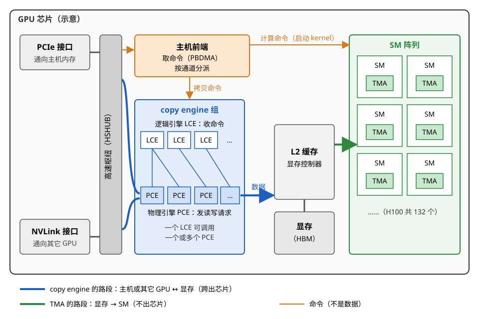
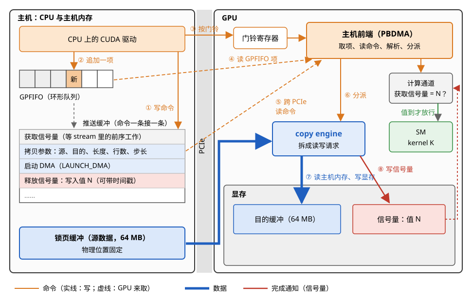
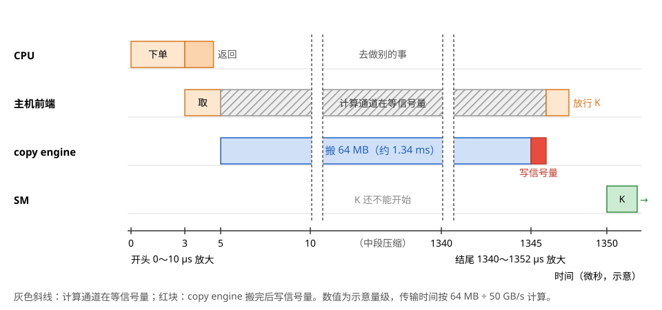
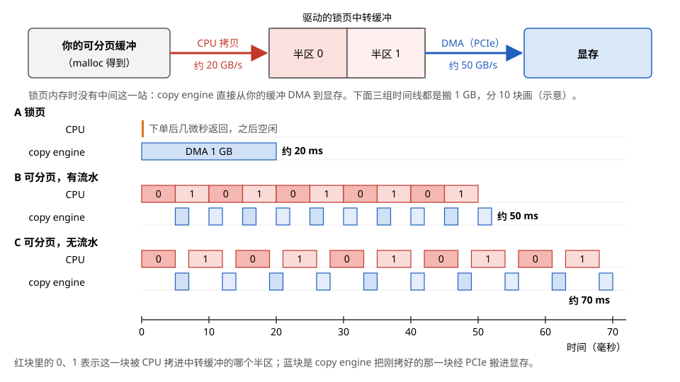
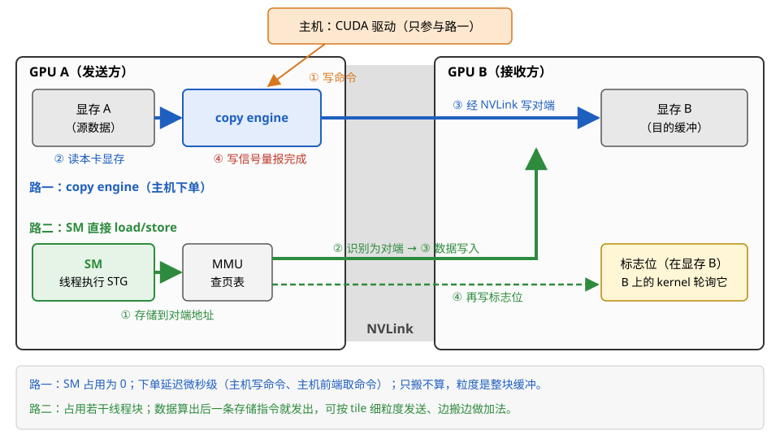
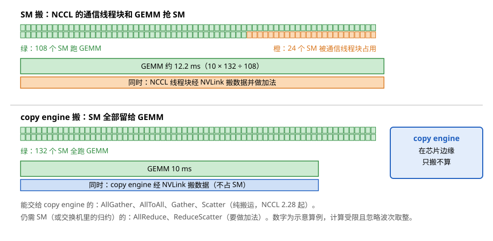
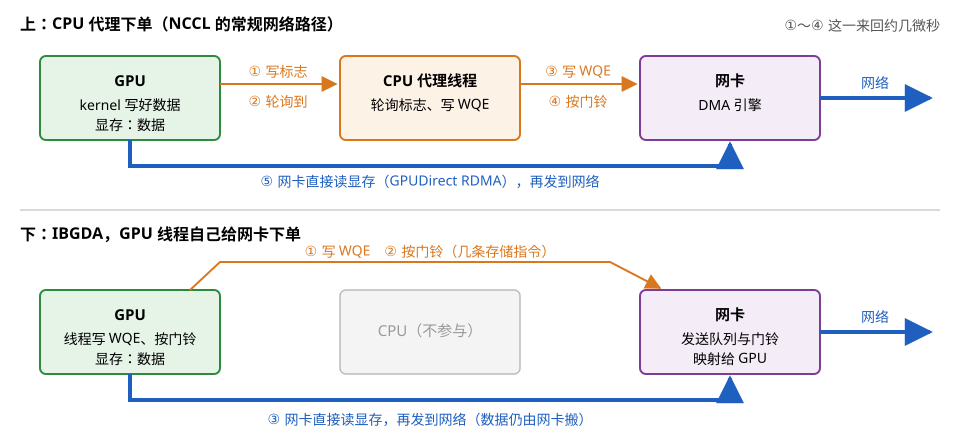
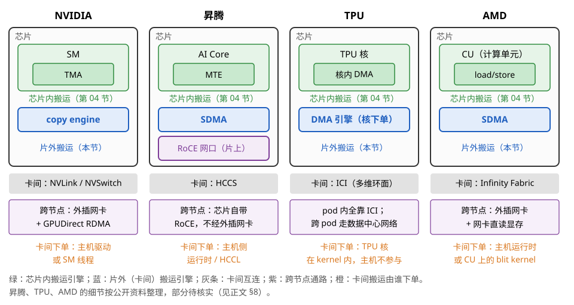
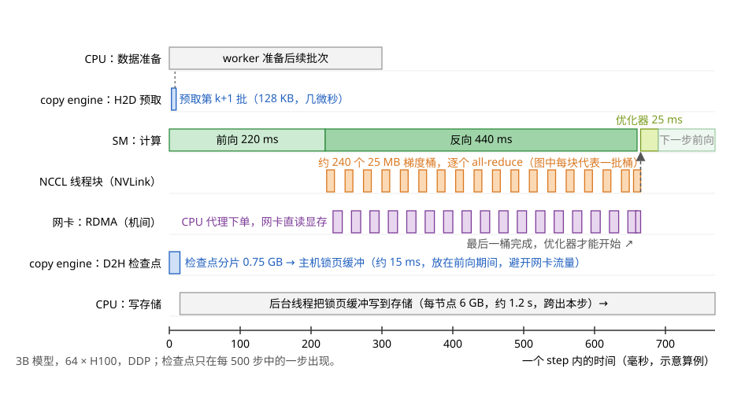

# 片外 DMA：copy engine、P2P 与 RDMA

> **所属模块**：模块 14 · 数据搬运
> **状态**：🟨 学习中（第一版。知识截至 2026-09）
> **本节主旨**：上一节讲的描述符 DMA（TMA、昇腾的 MTE）由 kernel 里的一个线程下单，搬运的范围不出芯片：显存和片上缓冲之间。这一节往外走一圈，讲光谱最右端的"片外 DMA"：数据要跨出芯片（主机内存 ↔ 显存、卡 ↔ 卡）或跨出整台机器（节点 ↔ 节点）时，由谁搬、订单怎么下、搬完怎么通知。主线有四件事。第一，GPU 芯片边缘的 **copy engine** 是什么，`cudaMemcpyAsync` 从调用到完成的每一步（驱动写命令、主机前端取命令、引擎搬运、写信号量报完成），以及源端为什么必须是锁页内存。第二，怎样用多条 stream 和多个 copy engine 把拷贝藏进计算后面。第三，卡与卡之间有两条路：交给 copy engine 搬，或者让 SM 直接读写对端显存；集合通信库在这两条路之间怎么取舍。第四，网卡作为发起者：GPUDirect RDMA 的一次写操作怎么走完、完成队列怎么通知，盘又怎样通过 GPUDirect Storage 接进来。最后用一次训练 step 把这些搬运放在同一条时间线上。

---

## 0. 这一节要回答的问题

- copy engine 是什么？它在 GPU 芯片的什么位置，一张卡有几个，和 SM 是什么关系？
- 为什么说 GPU 里有两个"DMA 引擎"？copy engine 和 SM 里的 TMA，发起者和搬运半径分别是什么？
- 调用一次 `cudaMemcpyAsync`，从 CPU 上的函数返回到显存里的数据可以用，中间经过哪几步？驱动写的"推送缓冲"是什么，GPU 怎么取到命令，完成又是怎么通知回来的？
- 为什么 DMA 的源端必须是锁页内存？传入普通的可分页内存时，驱动在背后做了什么，带宽损失多少？
- 怎样让 H2D 拷贝、计算、D2H 拷贝三件事同时进行？需要几个 copy engine？
- 两张卡之间传数据，交给 copy engine 搬（`cudaMemcpyPeerAsync`）和让 SM 直接读写对端显存，各适合什么？
- NCCL 这类集合通信库为什么大多用 SM 搬数据？近来它开始用 copy engine 做哪些集合操作，代价和收益是什么？
- 网卡怎样直接读写显存（GPUDirect RDMA）？一次 RDMA 写从下单到完成通知经过哪几步？GPU 能不能自己给网卡下单？
- 盘怎样绕过主机内存直接和显存交换数据（GPUDirect Storage）？
- 昇腾、TPU、AMD 上对应的部件叫什么，行为有什么不同？
- 一次训练 step 里的输入数据、梯度、检查点，各由谁搬，怎样和计算重叠？

---

## 1. 基础词汇：先把本节要反复用的词讲清楚

**片外 DMA**。DMA（Direct Memory Access，直接内存访问）指这样一种搬运方式：发起方写一张订单（从哪里搬、搬到哪里、搬多少字节），交给一个专门的搬运硬件，搬运硬件自己一块一块地把数据挪过去，发起方不用一条一条地执行读写指令。本模块把搬运机制按发起者排成一条光谱（第 01 节），片外 DMA 是最右端的一类：发起者是主机上的驱动、通信库或网卡，搬运跨过的是芯片的边界（主机内存 ↔ 显存、卡 ↔ 卡）或机器的边界（节点 ↔ 节点），订单通过命令队列下达，完成用事件（event）、流顺序（stream order）或完成队列（completion queue）通知。

**copy engine（拷贝引擎）**。GPU 芯片上专门负责片外搬运的 DMA 硬件，位于 SM 阵列之外、靠近 PCIe 和 NVLink 接口的地方。CUDA 的设备属性里叫 async engine，数量由 `asyncEngineCount` 报告。它读写的都是 GPU 虚拟地址（经 GPU 自己的页表翻译），能搬的方向是主机内存 ↔ 显存、显存 ↔ 显存（同卡或经 NVLink / PCIe 的另一张卡）。它只会搬，不会做加法之类的运算。NVIDIA 驱动内部把它分成两层：**逻辑拷贝引擎（LCE，logical copy engine）**负责接收命令、管理控制逻辑；**物理拷贝引擎（PCE，physical copy engine）**真正产生读写请求、移动数据。一个 LCE 可以调用一个或几个 PCE。

**主机前端（host interface / front end）**。GPU 芯片上负责"取命令"的部件。CPU 和 GPU 之间不是一问一答的函数调用，而是 CPU 把命令写进内存里的队列，GPU 的主机前端自己去队列里取，解析后分给对应的引擎（计算引擎或 copy engine）。NVIDIA 的公开文档里，主机前端里负责按顺序读取、解析命令流的单元叫 **PBDMA**（pushbuffer DMA）。

**通道（channel）**。驱动在 GPU 上开的一条独立命令队列，每条通道绑定一个引擎：计算通道的命令交给计算引擎（也就是启动 kernel），拷贝通道的命令交给某个 copy engine。同一条通道里的命令严格按顺序执行，不同通道之间互不等待。CUDA 的一条 stream 在驱动内部会用到计算通道和拷贝通道，stream 之间的并发最终落在"多条通道同时被主机前端服务"上。

**推送缓冲（pushbuffer）与 GPFIFO**。推送缓冲是一段内存，驱动把一条条命令（NVIDIA 文档称为 method，每条是"寄存器编号 + 数值"的形式）顺序写进去。GPFIFO 是一个环形队列，每一项记着"推送缓冲里从哪个地址开始、有多长的一段命令"。驱动写完一段命令后，在 GPFIFO 里追加一项，再移动队尾指针 `GP_PUT`；GPU 取完一项就移动队头指针 `GP_GET`。两个指针之间就是还没取的命令。

**门铃（doorbell）**。GPU 或网卡上的一个特殊寄存器，映射在 CPU 能直接写的地址上。CPU 往里写一个值（例如通道号），设备就知道"这条队列里有新命令了"，去取。写门铃只是一次几字节的写操作，不需要进入操作系统内核，所以下单很便宜。

**信号量（semaphore）**。显存或主机内存里的一个普通的 4 字节或 16 字节位置，约定用来报告进度。引擎完成一批工作后，执行一条"释放信号量"命令：往那个地址写一个约定的数值（payload），可以顺带写入一个时间戳。等待方有两种：CPU 反复读这个地址直到数值到了；或者另一条通道执行"获取信号量"命令，主机前端在数值到达之前不再往下取这条通道的命令。CUDA 的 event 和 stream 间的等待，底层就是信号量的释放和获取。

**stream 与 event**。stream（流）是 CUDA 提交工作的有序队列：同一条 stream 里的工作按提交顺序执行，不同 stream 之间没有顺序约束。event（事件）是插在 stream 里的一个标记：`cudaEventRecord(e, s)` 表示"s 里在它之前的工作都做完时，e 算完成"；`cudaStreamWaitEvent(s2, e)` 表示"s2 里之后的工作要等 e 完成才能开始"。

**可分页内存与锁页内存**。普通 `malloc` 得到的主机内存是可分页（pageable）的：操作系统可以随时把某一页换到磁盘，或者挪到另一个物理位置，程序看到的虚拟地址不变。锁页（pinned / page-locked）内存是通过 `cudaHostAlloc` 分配、或用 `cudaHostRegister` 登记过的内存，操作系统承诺不换出、不挪动。第 4 节会讲，DMA 只能安全地搬锁页内存。

**BAR 窗口与 P2P**。PCIe 设备通过 BAR（Base Address Register，基址寄存器）在总线地址空间里开出一段"窗口"：别的设备往这段总线地址读写，请求就落到这个设备内部。GPU 把自己的一部分或全部显存通过 BAR1 窗口暴露出来，别的 PCIe 设备（另一张 GPU、网卡、NVMe 盘）就能直接读写这块显存，不经过主机内存。设备与设备之间这样直接交换数据叫 P2P（peer-to-peer，点对点）。NVLink 相连的两张 GPU 也叫 P2P，只是走的是 NVLink 而不是 PCIe。

**RDMA、QP、WQE 与 CQ**。RDMA（Remote Direct Memory Access，远程直接内存访问）让一台机器的网卡直接把数据写进（或读出）另一台机器的内存，对方的 CPU 不参与。程序和网卡之间用队列对话：**QP**（queue pair，队列对）由一个发送队列和一个接收队列组成；程序往发送队列里放一个 **WQE**（work queue element，工作请求，描述"把本地哪段数据写到远端哪个地址"），按网卡的门铃；网卡做完后往 **CQ**（completion queue，完成队列）里写一个 **CQE**（完成项），程序查看 CQ 就知道完成了。

**GPUDirect**。NVIDIA 对"让第三方设备直接读写显存"这一组技术的统称。本节用到两个：**GPUDirect RDMA**（网卡直接读写显存）和 **GPUDirect Storage**（NVMe 盘直接读写显存）。

**例子：一次拷贝里这些词各出现在哪一步。** 程序在 stream `s` 上调用 `cudaMemcpyAsync` 把锁页内存里的 64 MB 拷进显存，再在 `s` 上记录 event `e`。按先后顺序：驱动把拷贝命令写进 `s` 对应的拷贝**通道**的**推送缓冲**，在 **GPFIFO** 里追加一项，写**门铃**；GPU 的**主机前端**取到命令，交给这条通道绑定的 **copy engine**；copy engine 按 GPU 虚拟地址读**锁页内存**、写显存；搬完后执行"释放**信号量**"，`e` 对应的就是这个信号量的值。之后任何等 `e` 的一方（CPU 或另一条 stream）都是在等这个值出现。第 3 节把这一串逐步展开。

---

## 2. copy engine：芯片边缘的搬运引擎

### 2.1 它在哪里，做什么

先从一个问题开始：一块 H100 有 132 个 SM，每个 SM 里都有搬运部件（LSU、TMA），为什么还要在芯片上另放一组 copy engine？

原因在于这两类部件面对的路段不同。SM 里的搬运部件服务于正在运行的 kernel：kernel 里的线程需要一块数据，就由本 SM 的 LSU 或 TMA 从显存搬进 shared memory 或寄存器，这条路的两端都在芯片上（显存虽然在芯片外，但是 GPU 独占的、按 GPU 虚拟地址直接访问）。而"把主机内存里的一批训练数据搬进显存"这件事，发生时可能根本没有 kernel 在跑，也不应该占用任何 SM；它的一端在 PCIe 另一侧的主机内存里，每个请求要跨过 PCIe，往返延迟以微秒计，比显存的几百纳秒长一个数量级。让 SM 去做这种搬运，SM 上的线程就要长时间挂着等数据。所以 GPU 在 SM 阵列之外放了独立的 copy engine，它们挂在芯片上连接 PCIe 和 NVLink 的高速枢纽（NVIDIA 的 Pascal 白皮书称之为 High-Speed Hub，挂在上面的引擎叫 High-Speed Copy Engine）旁边，直接对接这些外部接口，同时又能通过片上网络读写 L2 和显存。

图 5-1 把 copy engine、主机前端、SM（含 TMA）和外部接口放在同一张芯片示意图上。

> **图 5-1**　一句话：copy engine 和主机前端都在 SM 阵列之外、紧挨着 PCIe 和 NVLink 接口；SM 里的 TMA 只管显存到 SM 这一段，跨出芯片的搬运归 copy engine。
>
> **先知道一件事**：GPU 不直接执行 CPU 的函数调用。CPU 把命令写进内存里的队列，GPU 上的主机前端自己去取，再把命令分给不同的引擎。图里每个方框都是一个能独立工作的硬件部件。
>
> **按这个顺序看**：
> 1. 从左边看起：左上是 PCIe 接口，通向主机（CPU 与主机内存）；左下是 NVLink 接口，通向同一台机器里的其它 GPU。两种接口都连在灰色的高速枢纽上。
> 2. 枢纽旁边是主机前端（橙色）。它从主机内存里的命令队列读取命令，按通道把命令分发出去：计算命令交给右边的 SM，拷贝命令交给下方的 copy engine。
> 3. 看蓝色的 copy engine 组：上层是若干个 LCE（逻辑拷贝引擎，接收命令、管理控制），下层是若干个 PCE（物理拷贝引擎，真正产生读写请求）。一个 LCE 可以调用一个或多个 PCE。它们一端连着枢纽（通向 PCIe 和 NVLink），另一端经片上网络连着 L2 和显存。
> 4. 中间是 L2 缓存和显存控制器，右边是 SM 阵列。每个 SM 里画了一个小的 TMA（张量内存加速器，SM 自带的搬运引擎）。
> 5. 最后看两种颜色的箭头：蓝色箭头是 copy engine 的路段，从 PCIe 或 NVLink 进来，落进显存；绿色箭头是 TMA 的路段，从显存搬进某个 SM。两条路段只在 L2 与显存这一处交汇。
>
> **打个比方**：一栋办公楼里，收发室（copy engine）在大门口，负责把外面寄来的货搬进仓库（显存）；每层楼的传送员（TMA）只负责把仓库里的货送到自己那层的工位上。收发室的人不上楼，传送员不出大门。
>
> **看懂的标志**：能回答"一个 kernel 占满了全部 132 个 SM 时，还能不能同时做 H2D 拷贝"——能。H2D 拷贝由 copy engine 完成，它不在 SM 里，不需要 SM 的任何资源；两者共享的只有显存带宽。
>
> **与正文的对照**：LCE、PCE 的个数与连接方式是示意，真实数目见 §2.2 的表。"高速枢纽"对应 NVIDIA 白皮书里的 High-Speed Hub（HSHUB）。
>
> 来源：本库自绘。

**例子：同一时刻三件事在芯片上各自进行。** 设一块 H100 上正跑着一个 GEMM kernel，占满 132 个 SM。同一时刻：(1) 一个 copy engine 正把下一批 256 MB 的训练数据从主机的锁页内存搬进显存，按 PCIe 5.0 x16 实测约 50 GB/s 算需要约 5 毫秒；(2) 另一个 copy engine 正把上一批的 64 MB 结果搬回主机，约 1.3 毫秒；(3) 每个 SM 里的 TMA 在按 tile 把 A、B 矩阵从显存搬进 shared memory。三件事的发起者分别是：前两件是主机上的 CUDA 驱动（在 stream 上排队的两条拷贝命令），第三件是 kernel 里的一个线程。三件事唯一共享的资源是显存带宽：两路 PCIe 拷贝合计约 100 GB/s，只占 H100 显存带宽（3.35 TB/s）的 3%，对 GEMM 几乎没有影响。

### 2.2 一张卡有几个

这个问题的答案分两层，因为 CUDA 报告的数和硬件里的数不是一回事。

**CUDA 报告的数**。`cudaDeviceProp::asyncEngineCount`（`deviceQuery` 示例程序里的一行 "Concurrent copy and kernel execution: Yes with N copy engine(s)"）告诉程序"最多有几路拷贝能同时进行"。这个值等于 1 时，拷贝可以和 kernel 并行，但同一时刻只能有一路拷贝；等于 2 或更多时，H2D 和 D2H 两个方向可以同时进行。它在不同型号、甚至同一芯片的不同产品形态上报的数不一样。

**硬件里的数**。按 NVIDIA 开源内核驱动（open-gpu-kernel-modules）里各芯片的引擎类列表，Turing 到 Ada 的桌面级芯片每颗有 5 个 LCE，数据中心芯片 GP100、GV100、GA100、GH100 每颗有 10 个左右的 LCE；PCE 的个数和 LCE 到 PCE 的对应关系由驱动在启动时按拓扑配置（例如给每条 NVLink 方向分配 PCE），公开资料没有逐代给出。

| 芯片 / 产品 | CUDA 报告的 `asyncEngineCount`（公开的 deviceQuery 输出） | 驱动里的 LCE 数（据开源驱动的类列表，二手整理） |
| --- | --- | --- |
| P100 | 2 | 约 10 |
| V100（SXM2 / PCIe） | 6～7（不同来源） | 约 10 |
| A100 PCIe 40 GB | 2 | 约 10 |
| A100（SXM 形态，某高校集群的输出） | 5 | 约 10 |
| H100（某高校集群的输出） | 5 | 约 10 |
| L4、L40S（Ada） | 2 | 5 |
| B200 / GB200 | 待核实 | 待核实 |

读这张表要记住两点。第一，**对 PCIe 拷贝来说，2 个就够用**：PCIe 是全双工的，一个方向一个引擎就能把 x16 链路跑满，同一方向再加引擎也不会更快，因为瓶颈是链路带宽而不是引擎。第二，**数据中心卡多出来的引擎是给 NVLink 准备的**：一张 H100 有 18 条 NVLink，合计单向约 450 GB/s，远超一个引擎一个方向能跑的量，驱动会给 P2P 拷贝分配多个 PCE 来并行搬。

**例子：怎样用上"2 个"。** 一个程序在 H100 上用一条 stream 做所有事：先 H2D 200 MB，再算，再 D2H 200 MB。无论卡上有几个 copy engine，这条 stream 同一时刻只做一件事，两个方向的拷贝不会重叠，报告出来的"5 个"一个也没有多用上。改成三条 stream、把数据切成块轮流提交（§5.2 的三段流水），H2D 和 D2H 才会同时各占一个引擎。**引擎数只决定了"最多能并行几路"，并行要靠多条 stream 去填。**

### 2.3 两个"DMA 引擎"：copy engine 与 TMA

口语里 copy engine 和 TMA 都叫"DMA 引擎"，但它们在本模块的发起者光谱上处在不同位置。下面这张表把两者按第 01 节的三个问题（谁发起、地址怎么来、完成怎么知道）对齐：

| | **TMA（第 04 节）** | **copy engine（本节）** |
| --- | --- | --- |
| 在哪里 | 每个 SM 里一个 | SM 阵列之外，挨着 PCIe / NVLink 接口，每颗芯片若干个 |
| 谁发起 | kernel 里的一个线程执行 `cp.async.bulk.tensor` 指令 | 主机上的驱动，按 stream 把拷贝命令写进拷贝通道 |
| 订单是什么 | 张量描述符（tensor map）+ 坐标，描述一个多维 tile | 源地址、目的地址、长度（可带行数与步长，做二维、三维拷贝） |
| 搬运半径 | 显存 ↔ 本 SM（或簇内几个 SM）的 shared memory，不出芯片 | 主机内存 ↔ 显存、显存 ↔ 显存、本卡 ↔ 对端卡，跨出芯片 |
| 一次搬多少 | 一个 tile，通常几 KB 到几十 KB | 任意长度，通常 KB 到 GB |
| 完成怎么知道 | shared memory 里的 mbarrier 按字节计数，线程在上面等 | 写信号量，映射成 CUDA 的 event 与 stream 顺序 |
| 从下单到开搬 | 几十到几百个时钟周期 | 微秒级（驱动写命令、主机前端取命令） |
| 占不占 SM | 占一个线程发一条指令，搬运本身不占 | 完全不占 |

判断用哪一个，看数据要跨过哪条边界：**数据在显存和 SM 之间移动，是 TMA（或 LSU、cp.async）的事；数据要进出显存这块区域（去主机、去别的卡），是 copy engine 的事。**

**例子：一块数据先后经过两个引擎。** 训练数据的第 k 批（256 MB）在主机的锁页内存里。第一步，驱动在拷贝 stream 上提交 `cudaMemcpyAsync(dst, src, 256 MB, H2D)`，copy engine 经 PCIe 把它搬进显存，约 5 毫秒。第二步，计算 stream 等这次拷贝的 event 完成后启动嵌入层和第一层的 kernel；kernel 里每个 SM 的 TMA 每次把 64 行 × 128 列的一个 tile（bf16 下 16 KB）从显存搬进 shared memory，前一步一次搬 256 MB，这一步一次搬 16 KB，两者相差一万多倍。前一步的发起者在 CPU 上，后一步的发起者在 SM 里。

---

## 3. `cudaMemcpyAsync` 从调用到完成

这一节把一次异步拷贝拆开，逐步看每个部件做了什么。以下描述综合了 NVIDIA 公开的硬件手册（open-gpu-doc 里的 PBDMA、Host 类说明）、开源内核驱动，以及一篇 2026 年对闭源驱动命令流做逆向分析的论文（arXiv 2604.26889，下称"命令流论文"）。具体的命令编码随代际变化，这里只讲结构。

### 3.1 下单：驱动写推送缓冲、追加 GPFIFO 项、按门铃

程序调用 `cudaMemcpyAsync(dst_dev, src_host, 64 MB, cudaMemcpyHostToDevice, s)`，CPU 上依次发生这些事：

1. **检查指针**。CUDA 运行时查出 `src_host` 属于哪一类内存。CUDA 用统一虚拟地址（UVA）：主机内存、各张卡的显存在同一个 64 位地址空间里各占一段，所以只看地址就能知道它是锁页主机内存、可分页主机内存还是某张卡的显存。本例假设它是锁页内存。
2. **选通道**。stream `s` 在驱动内部对应一条或几条硬件通道。拷贝命令写进一条绑定到某个 copy engine 的拷贝通道。
3. **写命令**。驱动在这条通道的推送缓冲里追加几组命令：
   - 如果 `s` 里前面还有没做完的工作（例如一个 kernel，它在计算通道里），先写一条"获取信号量"命令，等那个 kernel 完成时释放的信号量到达约定值。这是跨通道保持 stream 顺序的办法，§3.4 详讲。
   - 写 copy engine 的参数：源地址、目的地址、每行长度、行数、步长，然后写一条"启动 DMA"命令（命令流论文复原出的名字是 `LAUNCH_DMA`，里面的字段标明了源和目的都是虚拟地址、按行（pitch）布局）。
   - 写一条"释放信号量"命令：拷贝完成后往某个地址写一个递增的数值，供后面的等待方检查。
4. **追加 GPFIFO 项**。在这条通道的 GPFIFO 环形队列里追加一项，指向刚写的那段命令，然后把队尾指针 `GP_PUT` 往前移一格。
5. **按门铃**。往 GPU 的门铃寄存器写入这条通道的编号。
6. **返回**。函数返回，此时一个字节都还没搬。

第 3 到第 5 步都是在用户态写早已映射好的内存和寄存器，不进操作系统内核，所以整个调用只要几微秒。命令流论文在其测试平台上观察到，GPFIFO 放在显存里、推送缓冲放在主机内存里；也就是说，GPU 取命令时要跨 PCIe 读一次主机内存。

### 3.2 取单与分派：主机前端

GPU 一侧，主机前端收到门铃后做三件事：

1. **调度通道**。GPU 上可能同时有几十条通道有命令等着（不同 stream、不同进程）。主机前端按运行列表（runlist）轮流服务这些通道。CUDA 里 stream 到硬件队列的映射个数受环境变量 `CUDA_DEVICE_MAX_CONNECTIONS` 控制，默认 8 条，最多 32 条；Kepler 引入的这组多条硬件队列就是模块 10 第 7 节讲的 HyperQ。
2. **取命令**。PBDMA 读出 GPFIFO 里的新项，再按项里记的地址和长度，把那一段推送缓冲读进来，逐条解析。
3. **分派**。遇到"获取信号量"命令，PBDMA 去读那个信号量地址；数值未到，这条通道就停在这里，主机前端转去服务别的通道。数值到了，继续往下解析，把 copy engine 的参数和"启动 DMA"命令交给这条通道绑定的 LCE。

### 3.3 执行：copy engine 把一次拷贝拆成总线请求

LCE 收到"启动 DMA"后，把 64 MB 拆成许多个小请求交给 PCE。PCE 对每个请求做两件事：向源地址发读请求，数据回来后向目的地址发写请求。

这里有一个容易误解的细节：**copy engine 用的是 GPU 虚拟地址**，每个地址先经过 GPU 自己的内存管理单元（MMU）按 GPU 页表翻译。翻译结果如果指向显存，请求走片上网络去显存控制器；如果指向主机内存，页表项里记的是一个总线地址，请求变成 PCIe 上的读请求，经 CPU 的根复合体（PCIe 的根节点，在 CPU 里）去读主机内存。系统开了 IOMMU（CPU 一侧给外设做地址翻译的部件）时，这个总线地址还要再被 IOMMU 翻译一次才是物理地址。GPU 页表里的这些条目，是驱动在锁页时一次性填好的（第 4 节会讲为什么这决定了源端必须锁页）。

64 MB 按实测约 50 GB/s 的 PCIe 5.0 x16 有效带宽，需要约 1.34 毫秒。这段时间里 PCIe 上源源不断地有读请求出去、带数据的完成包回来。

### 3.4 完成：写信号量，event 与 stream 顺序怎么保证

最后一个写请求被显存确认之后，copy engine 执行推送缓冲里紧跟着的"释放信号量"命令：往约定的地址写入一个数值，还可以同时写入一个 GPU 时间戳。命令流论文复原的信号量释放格式正是"目标地址 + 载荷值"，带时间戳的版本用来支持 `cudaEventElapsedTime` 这种计时。

后面的等待方有三种，各自怎样得知"拷贝完成了"：

- **CPU 上的 `cudaStreamSynchronize` 或 `cudaEventSynchronize`**。默认方式是 CPU 线程反复读那个信号量地址（自旋），数值一到就返回，反应在微秒以内，但一直占着一个 CPU 核。用 `cudaDeviceScheduleBlockingSync` 或带 `cudaEventBlockingSync` 标志的 event 时，GPU 在释放信号量后再发一个中断，CPU 线程睡眠等中断唤醒，省 CPU 但多几到几十微秒的唤醒延迟。
- **同一条 stream 里后面的 kernel**。kernel 在计算通道里，拷贝在拷贝通道里，两条通道本来互不等待。驱动在提交 kernel 时，在计算通道的推送缓冲里先写一条"获取信号量"命令，等的就是拷贝释放的那个值。主机前端解析到这条命令时，数值没到就让计算通道停住，到了才往下取启动 kernel 的命令。**"同一条 stream 里按顺序执行"这条规则，在硬件上就是这样一对跨通道的释放和获取实现的。**
- **另一条 stream 里用 `cudaStreamWaitEvent` 等这个 event 的工作**。机制和上一条一样：event 对应一个信号量值，被等的一方释放，等待的一方获取。

### 3.5 时间线走查：一次 64 MB 的 H2D 拷贝

把 §3.1～§3.4 串起来，给一个时间线。数值是示意量级：CPU 侧的几微秒来自常见的调用开销，PCIe 读往返约 1 微秒量级，传输时间按 50 GB/s 计算。设在拷贝 stream `s_copy` 上提交拷贝和一个 event `e`，计算 stream `s_comp` 上先 `cudaStreamWaitEvent(s_comp, e)` 再启动 kernel `K`。

| 时刻（示意） | CPU | 主机前端 | copy engine | 计算引擎（SM） |
| --- | --- | --- | --- | --- |
| 0 μs | 调用 `cudaMemcpyAsync`：写命令、追加 GPFIFO 项、按门铃 | 空闲 | 空闲 | 可能在跑别的 kernel |
| 约 3 μs | 调用返回；再调用 `cudaEventRecord(e)`、`cudaStreamWaitEvent`、启动 `K`，各写几条命令 | 收到门铃，读 GPFIFO 项 | 空闲 | — |
| 约 4～5 μs | 继续做别的事（例如准备下一批数据） | 跨 PCIe 读推送缓冲里的命令，解析；把拷贝参数交给 LCE；计算通道解析到"获取信号量"，值没到，停住 | 收到"启动 DMA"，开始发 PCIe 读请求 | — |
| 约 5 μs ～ 1345 μs | — | 服务其它通道 | 64 MB 源源不断地经 PCIe 读进来、写进显存 | `K` 还不能开始 |
| 约 1345 μs | — | — | 最后一个写完成，释放信号量（写数值 + 时间戳） | — |
| 约 1346 μs | — | 计算通道再次检查信号量，值已到，继续取命令，把 `K` 交给计算引擎 | 空闲 | — |
| 约 1350 μs 起 | — | — | — | `K` 的线程块开始分发到各 SM |

图 5-2 把命令从 CPU 到 GPU 的流向画成一张框图，图 5-3 把上表画成时间线。

> **图 5-2**　一句话：CPU 从不直接指挥 copy engine；它只是把命令写进内存里的队列、按一下门铃，GPU 的主机前端自己来取命令、交给 copy engine，copy engine 搬完后往一个约定的位置写一个数，等待的人看到这个数就知道搬完了。
>
> **先知道一件事**：CPU 和 GPU 之间通信的基本方式是"写队列 + 按门铃"。队列是一段双方都能访问的内存，门铃是 GPU 上一个 CPU 可以直接写的寄存器。写队列和按门铃都不需要进入操作系统内核，所以很快。
>
> **按这个顺序看**：
> 1. 左边主机侧：CPU 上的驱动做编号 ①～③ 三件事。① 把命令写进推送缓冲（一段主机内存，命令一条接一条排着，图中四行分别是获取信号量、拷贝参数、启动 DMA、释放信号量）；② 在 GPFIFO（一个环形队列，每一项指向推送缓冲里的一段命令，橙色格“新”是刚追加的一项，灰色虚线箭头表示它指向哪段命令）里追加一项；③ 往 GPU 的门铃寄存器写一个值。中间灰色竖条是 PCIe，③ 之后的每一步凡是跨过它，都是一次 PCIe 传输。
> 2. 右侧 GPU 里的主机前端：④ 收到门铃后读 GPFIFO 的新项；⑤ 按这一项的指引，跨 PCIe 把那段命令读进来并逐条解析；⑥ 把拷贝参数和"启动 DMA"命令交给 copy engine。
> 3. 下方 copy engine：⑦ 向主机内存发读请求（经 PCIe），数据回来后写进显存。蓝色粗箭头是数据本身走的路，和上面细线表示的命令路径分开画。
> 4. 右下：⑧ 搬完后 copy engine 往信号量地址写入一个数值。右侧计算通道里有一条"获取信号量"命令一直在等这个值；值到了，主机前端才把后面的 kernel 交给 SM。
>
> **打个比方**：像餐厅后厨的点菜单。服务员（驱动）把单子夹到出单轨上（推送缓冲和 GPFIFO），按一下铃（门铃）就走；厨房的领班（主机前端）取下单子分给对应的厨师（copy engine）；厨师做好后在出菜口挂个牌子（信号量），等这道菜的下一道工序看到牌子才开始。
>
> **看懂的标志**：能回答"`cudaMemcpyAsync` 返回时数据搬了多少"——一个字节也没搬。返回只说明命令已经写进队列、门铃已经按过；搬运在之后由 GPU 自己完成，完成的证据是信号量里的那个数。
>
> **与正文的对照**：①～⑧ 对应 §3.1～§3.4 的步骤。图中为了简洁把 GPFIFO 和推送缓冲都画在主机一侧；命令流论文在其测试平台上观察到的配置是推送缓冲在主机内存、GPFIFO 在显存，两者的位置随驱动配置而定，不影响步骤顺序。
>
> 来源：本库自绘。

> **图 5-3**　一句话：一次 64 MB 的异步拷贝里，CPU 只忙了开头几微秒；真正的搬运占了一千三百多微秒，全由 copy engine 完成；后面的 kernel 等到信号量写入才开始。
>
> **先知道一件事**：横轴是时间，但被切成了三段不同的比例尺：开头 0～10 微秒和结尾 1340～1352 微秒被放大，中间 1.3 毫秒的搬运被压缩。每一行是一个部件，行上的色块表示它在这段时间里正在做的事。
>
> **按这个顺序看**：
> 1. 最上面的 CPU 行：0～3 微秒写命令、按门铃，3 微秒时函数返回；之后又花一两微秒提交 event、等待和 kernel，然后就去做别的事了。
> 2. 第二行主机前端：约 3～5 微秒取命令、解析、分派。计算通道的"获取信号量"在 5 微秒时发现数值未到，停住（灰色斜线块），一直到 1346 微秒。
> 3. 第三行 copy engine：约 5 微秒开始搬，蓝色长条横跨压缩段，到约 1345 微秒结束，末尾的小红块是释放信号量。
> 4. 最下面的 SM 行：1350 微秒前是空白（或在跑别的工作），之后 kernel K 开始。
>
> **看懂的标志**：能回答"想让 CPU 在拷贝期间做别的事，需要什么条件"——拷贝要用 `cudaMemcpyAsync` 且源端是锁页内存。这样 CPU 在 3 微秒后就返回了；如果源端是可分页内存，CPU 会被卡在中转拷贝里（第 4 节）。
>
> **与正文的对照**：各时刻与 §3.5 的表格一一对应，微秒级的数值是示意量级；1.34 毫秒由 64 MB ÷ 50 GB/s 算得。
>
> 来源：本库自绘。

### 3.6 小拷贝走另一条路

上面讲的是大块拷贝。命令流论文还观察到一个现象：H2D 拷贝小于约 24 KiB 时，驱动不启动 copy engine，而是把数据本身直接写进推送缓冲，由计算引擎一侧的"内联写"命令写进显存；在该文的测试平台上，这条路的启动延迟约 24 纳秒量级，8 KiB 时吞吐饱和在约 17.5 GiB/s；大于等于 24 KiB 才走 copy engine，启动延迟约 500 纳秒，1 MiB 左右吞吐饱和在约 22 GiB/s（该平台的 PCIe 较慢）。这个阈值和数字是该论文在其平台上的测量，其它驱动版本和平台可能不同。

**例子：一次 4 KB 的参数上传。** 推理服务每步要把 4 KB 的采样参数（温度、top-p 等）传给 GPU。走 copy engine 要付约 0.5 微秒的启动延迟，数据本身在 PCIe 上只要不到 0.1 微秒；内联进推送缓冲则省掉了启动 copy engine 这一步，数据跟着命令一起被主机前端读走。这说明驱动会按大小选路：**大拷贝交给专门的引擎，小拷贝跟着命令流一起走更快。**

---

## 4. 为什么源端必须是锁页内存

### 4.1 两张页表，只有一张会被操作系统改

一个主机内存地址被 copy engine 访问时，要经过两次翻译，分别由两张不同的页表负责：

1. **CPU 这一侧**：程序看到的是进程虚拟地址，操作系统的页表把它翻译成物理地址。操作系统可以随时改这张表：把一页换出到磁盘、把一页挪到另一个物理位置（内存整理、NUMA 迁移），程序完全感觉不到。
2. **GPU 这一侧**：copy engine 发出的是 GPU 虚拟地址，GPU 的页表把它翻译成总线地址（没开 IOMMU 时就是物理地址，开了 IOMMU 时是经 IOMMU 映射的地址）。这张表由 NVIDIA 驱动维护。

问题在于：**操作系统改自己的页表时，不会通知 GPU 去改 GPU 的页表**。假设驱动在下单时查到"虚拟页 A 在物理页 #1234"，填进了 GPU 页表；在 copy engine 真正读这一页之前，操作系统把 A 换出，把 #1234 分给了别的进程；copy engine 照着 GPU 页表去读 #1234，读到的是别人的数据，而且不会报错。

锁页就是向操作系统申请"这些页不许换出、不许挪动"。锁住之后，物理地址在整个生命周期内固定，驱动可以放心地把它填进 GPU 页表（开了 IOMMU 时，同时建立一次固定的 IOMMU 映射），copy engine 何时来读都读得对。模块 50 第 3 节 §3.1 用三个时刻的图演示过这个竞态，这里不再重画。

### 4.2 传入可分页内存时，驱动在背后做什么

`cudaMemcpyAsync` 允许源端是可分页内存，不会报错。驱动的做法是自己维护一块锁页的中转缓冲（staging buffer），把你的数据分块搬过去：

1. CPU 把第 1 块从你的可分页缓冲拷进中转缓冲（这是一次普通的 `memcpy`，由 CPU 执行）。
2. 驱动提交一次 copy engine 拷贝，把中转缓冲里的第 1 块经 PCIe 搬进显存。
3. CPU 接着拷第 2 块进中转缓冲的另一半，同时 copy engine 在搬第 1 块。
4. 如此交替，直到全部搬完。

CUDA 运行时文档对这种情况的说法是：函数"可能相对主机是同步的"，驱动"可能先与 stream 同步，再把数据分段拷进锁页缓冲"。实际效果有两个。第一，CPU 线程被卡在第 1、3 步的拷贝里，直到最后一块进了中转缓冲才返回，所以这个"异步"调用对 CPU 来说变成了同步的。第二，数据多被拷了一次，总吞吐受 CPU 拷贝速度限制。

### 4.3 带宽损失的算例

设要搬 1 GB，CPU 单线程 `memcpy` 约 20 GB/s，PCIe 上的 DMA 约 50 GB/s（这两个值取自常见平台的量级）。

**情况 A：锁页内存。** 只有一次 DMA，1 GB ÷ 50 GB/s = **20 毫秒**；CPU 在调用后几微秒就返回。

**情况 B：可分页内存，中转缓冲分成两半交替使用（CPU 拷第 k+1 块时 copy engine 搬第 k 块）。** 两段流水里较慢的一段决定吞吐：CPU 拷贝 20 GB/s 比 DMA 慢，所以总吞吐约 20 GB/s，1 GB 需要约 **50 毫秒**；CPU 线程在这 50 毫秒里都被占着。

**情况 C：可分页内存，且中转没有流水起来（每块先拷完、再 DMA、再拷下一块）。** 每字节要依次付两段时间：1/20 + 1/50 = 0.07 纳秒每字节，折合约 14.3 GB/s，1 GB 需要约 **70 毫秒**。

| 情况 | 有效带宽 | 1 GB 用时 | CPU 线程被占用 |
| --- | --- | --- | --- |
| A 锁页 | 约 50 GB/s | 约 20 ms | 几微秒 |
| B 可分页，中转有流水 | 约 20 GB/s | 约 50 ms | 约 50 ms |
| C 可分页，中转无流水 | 约 14 GB/s | 约 70 ms | 约 70 ms |

模块 50 第 3 节给出的实测范围是可分页 10～25 GB/s、锁页 45～55 GB/s，与这个算例一致。**比带宽差 2.5 倍更要紧的是最后一列**：情况 B、C 里 CPU 线程被占了几十毫秒。如果这是训练循环的主线程，它在这段时间里没法给 GPU 提交下一个 kernel，GPU 上已提交的工作做完后就会空转。图 5-4 把三种情况画在一起。

> **图 5-4**　一句话：从可分页内存拷贝时，驱动要先让 CPU 把数据一块块拷进自己的锁页中转缓冲，再让 copy engine 搬；数据多走一遍，CPU 全程被占，1 GB 从 20 毫秒变成 50～70 毫秒。
>
> **先知道一件事**：copy engine 只能安全地读锁页内存（物理位置固定、不会被操作系统挪走的内存）。可分页内存不满足这个条件，所以驱动只能先用 CPU 把数据拷到一块自己早就锁好的中转缓冲里。
>
> **按这个顺序看**：
> 1. 上方的路径图：左边是你的可分页缓冲，中间是驱动的锁页中转缓冲（分成两半，标 0 和 1），右边是显存。红色箭头是 CPU 拷贝，蓝色箭头是 copy engine 的 DMA。
> 2. 时间线 A（锁页）：只有一行蓝条，0～20 毫秒；CPU 行只在最开头有一个小竖线（下单），之后空闲。
> 3. 时间线 B（可分页、有流水）：CPU 行是一串连续的红块，每块把一段数据拷进中转缓冲的 0 号或 1 号半区；copy engine 行的蓝块比红块短，而且总是晚一块开始、搬的是上一块。整体长度由红块决定，约 50 毫秒。
> 4. 时间线 C（可分页、无流水）：红块和蓝块交替出现、互不重叠，约 70 毫秒。
>
> **打个比方**：寄一批书。A 是书已经放在门口的固定货架上，快递员直接搬走。B 是书散在各个房间，你一趟趟搬到门口的两个筐里，快递员在你装下一筐时搬走上一筐。C 是你装满一筐就停下来等快递员搬走，再装下一筐。
>
> **看懂的标志**：能回答"为什么可分页拷贝慢了 2.5 倍还不是最大的问题"——最大的问题是 CPU 线程被占住几十毫秒，这期间它不能给 GPU 下发新工作；锁页后 CPU 几微秒就返回。
>
> **与正文的对照**：三行时间线对应 §4.3 表格的 A、B、C 三种情况，20 GB/s 与 50 GB/s 是算例假设；中转缓冲的分块大小由驱动决定，图中的块数是示意。
>
> 来源：本库自绘。

### 4.4 锁页的接口与代价（够用的部分）

- **怎么锁**：`cudaHostAlloc` / `cudaMallocHost` 直接分配锁页内存；`cudaHostRegister` 把已有的一段内存登记为锁页；PyTorch 里是 `tensor.pin_memory()`，DataLoader 的 `pin_memory=True` 会让后台线程把每一批数据放进锁页内存。
- **怎么用**：PyTorch 的 `tensor.to("cuda", non_blocking=True)` 在源端是锁页内存时，就是在当前 stream 上发一次 `cudaMemcpyAsync`；源端不是锁页内存时，`non_blocking` 不会生效。
- **代价**：锁页申请要进内核、比 `malloc` 慢得多，锁住的内存操作系统不能回收，锁太多会挤压整机内存。所以锁页缓冲一般预先分配、循环复用。
- **一个配套条件**：异步拷贝提交后、完成前，程序不能改写源缓冲，也不能把它还给分配器，否则 copy engine 读到的是改写后的内容。PyTorch 里跨 stream 使用张量时要用 `record_stream` 或 event 告诉分配器"这块内存还在被另一条 stream 用"。

更多细节（锁页上限、NUMA 亲和性、DataLoader 的实现）见模块 50 第 3 节 §3 与 §4.2。

**例子：锁页缓冲环。** DataLoader 开 4 个 worker，`prefetch_factor=2`，每批 64 MB。锁页线程维护一个装 8 批的锁页缓冲环，共 512 MB。第 k 步训练开始时，第 k+1 到 k+8 批中已经准备好的都在环里；主线程对第 k+1 批发 `non_blocking` 拷贝，copy engine 在第 k 步计算期间把它搬进显存。第 k+1 批的 event 完成后，环里它占的那一格才能被回收去装第 k+9 批。如果主线程在拷贝完成前就回收了这一格，worker 写入的第 k+9 批就可能被当成第 k+1 批搬进显存。

---

## 5. 计算与拷贝重叠：多 stream、多个 copy engine

### 5.1 需要同时满足的四个条件

让拷贝藏进计算后面，需要四个条件同时成立，缺一个就会退化成串行：

1. **主机端缓冲是锁页的**（第 4 节）。否则 CPU 被卡在中转拷贝里，后面的提交都要等。
2. **拷贝和计算在不同的 stream 上**。同一条 stream 严格按序执行，放在一起就一定串行。另外要避开旧式的默认 stream（legacy default stream）：它和其它所有阻塞型 stream 之间有隐式同步，往它上面提交任何东西都会把并发打断；用 `cudaStreamNonBlocking` 创建的 stream 或按线程的默认 stream（`--default-stream per-thread`）可以避开。
3. **有足够的 copy engine**。H2D 和 D2H 同时进行需要 `asyncEngineCount ≥ 2`。
4. **中间没有同步点**。任何一次 `cudaDeviceSynchronize`、一次从 GPU 取标量到 CPU（例如 PyTorch 里的 `loss.item()`），都会让 CPU 停下来等 GPU 做完所有工作，流水就断了。

### 5.2 三段流水的时间线算例

**问题**：要处理 4 块数据，每块的处理分三段：H2D 拷贝 4 毫秒（200 MB，按 50 GB/s）、kernel 计算 4 毫秒、D2H 拷回结果 4 毫秒。kernel 每次都占满全部 SM，所以两个 kernel 不能同时跑。比较三种做法的总用时。

**做法一：一条 stream 串行。** 每块依次 H2D、计算、D2H，4 块 × 12 毫秒 = **48 毫秒**。

**做法二：多条 stream，卡上有 2 个 copy engine（H2D 和 D2H 各用一个）。** 按"先把所有块的 H2D 都提交、再提交所有计算、再提交所有 D2H"的顺序（或者每块一条 stream 轮流提交，效果相同）：

| 时间（毫秒） | 0–4 | 4–8 | 8–12 | 12–16 | 16–20 | 20–24 |
| --- | --- | --- | --- | --- | --- | --- |
| copy engine 甲（H2D） | 块 0 | 块 1 | 块 2 | 块 3 | | |
| SM（计算） | | 块 0 | 块 1 | 块 2 | 块 3 | |
| copy engine 乙（D2H） | | | 块 0 | 块 1 | 块 2 | 块 3 |

总用时 **24 毫秒**，是串行的一半。稳态（8～16 毫秒）里三个部件同时在忙，PCIe 两个方向各跑约 50 GB/s，这正是 PCIe 全双工的用处。

**做法三：多条 stream，但只有 1 个 copy engine。** 所有拷贝不论方向都排在同一个引擎上，8 次拷贝 × 4 毫秒 = 32 毫秒是这个引擎的最少工作量，总用时至少 **32 毫秒**。一种可行的排法：引擎先做完 4 块的 H2D（0～16），再做 4 块的 D2H（16～32）；计算在 4～20 之间做完。

三种做法的比较说明：**多条 stream 把"可以并行"告诉了硬件，但并行度的上限由引擎数决定**；在这个例子里，第二个 copy engine 把用时从 32 毫秒降到 24 毫秒。图 5-5 把三种做法画在一起。

> **图 5-5**　一句话：把数据切块、用多条 stream 提交，H2D、计算、D2H 就能像流水线一样同时进行；有两个 copy engine 时总时间从 48 毫秒降到 24 毫秒，只有一个时两个方向的拷贝要排队，降到 32 毫秒。
>
> **先知道一件事**：横轴是时间（毫秒），每一行是一个硬件部件。同一竖直位置上的色块同时发生。数字 0～3 是数据块的编号，蓝色是 H2D 拷贝，绿色是计算，橙色是 D2H 拷贝。
>
> **按这个顺序看**：
> 1. 最上面的做法一：只有一行，块 0 的蓝、绿、橙之后才是块 1，12 格一组重复 4 次，到 48 毫秒结束。
> 2. 中间的做法二：三行分别是 copy engine 甲、SM、copy engine 乙。块 0 的计算一开始，甲就开始搬块 1；块 0 的计算一结束，乙就把块 0 的结果拷回去。8～16 毫秒之间三行都有色块，三件事同时进行。24 毫秒结束。
> 3. 最下面的做法三：只有一个 copy engine，蓝块和橙块挤在同一行，这一行 32 毫秒都排满；SM 行在 4～20 毫秒之间工作，之后空等最后的 D2H。
>
> **打个比方**：一条洗衣流水线：进货（H2D）、洗（计算）、出货（D2H）。一个门进货出货共用时，进货的车和出货的车要排队；前后各开一个门，进货和出货可以同时进行。
>
> **看懂的标志**：能回答"把做法二里 kernel 的时间加到 8 毫秒，总时间是多少"——瓶颈变成计算：4 + 4 × 8 + 4 = 40 毫秒；两个 copy engine 各自有一半时间在空闲。流水线的速度由最慢的那一段决定。
>
> **与正文的对照**：三种做法与 §5.2 的三段计算一一对应，4 毫秒对应 200 MB 按 50 GB/s 的拷贝时间；做法三的排法是可行排法之一。
>
> 来源：本库自绘。

### 5.3 提交顺序为什么曾经很要紧

Kepler 之前（Fermi 一代），GPU 只有一条硬件队列，所有 stream 的命令在进入硬件前被合成一个序列。这时如果按"块 0 的 H2D、块 0 的计算、块 0 的 D2H、块 1 的 H2D……"的顺序提交，块 0 的 D2H 要等块 0 的计算，它排在块 1 的 H2D 前面，就会把块 1 的 H2D 也挡住，重叠就消失了；当时的建议是按"所有 H2D、所有计算、所有 D2H"的顺序分批提交。Kepler 引入多条硬件队列（HyperQ）后，不同 stream 进入不同的硬件队列，这种前面的命令挡住后面无关命令的现象基本消失，但 stream 数超过 `CUDA_DEVICE_MAX_CONNECTIONS`（默认 8）时，多出来的 stream 会共用硬件队列，旧问题又可能出现。**例子**：32 条 stream 各自做"H2D → kernel → D2H"，默认设置下每 4 条 stream 共用一条硬件队列，某条 stream 的 D2H 在等 kernel 时，同一队列里另外 3 条 stream 的 H2D 也被挡住；把 `CUDA_DEVICE_MAX_CONNECTIONS` 设成 32 可以消除这种阻塞。

---

## 6. 卡间 P2P：copy engine 搬，还是 SM 直接读写对端显存

### 6.1 前提：对端显存在本卡的地址空间里

两张 GPU 之间传数据，最朴素的办法是经主机内存中转：A 拷到主机，B 再从主机拷进来，要过两次 PCIe。P2P 省掉了这个中转，前提是**本卡能用一个地址访问到对端的显存**：

- 调用 `cudaDeviceEnablePeerAccess(peer)` 后，驱动把对端显存映射进本卡的 GPU 页表。本卡发出的访问如果落在这段地址上，请求经 NVLink（两卡有 NVLink 直连或都挂在 NVSwitch 上时）或 PCIe（经对端的 BAR1 窗口）送到对端，由对端的显存控制器完成。
- 有了这个映射，就有两种发起者可以用它：**copy engine**（主机下单）和 **SM 上的线程**（kernel 里直接 load/store）。

`nvidia-smi topo -m` 能看到两卡之间是 NVLink（显示 NV 加链路数）还是 PCIe 的哪一种路径。以 H100 SXM 为例，每卡 18 条 NVLink 4，合计单向约 450 GB/s、双向约 900 GB/s；CUDA 示例程序 `p2pBandwidthLatencyTest` 在 HGX H100 上实测的单向 P2P 写带宽约 370～390 GB/s（公开 issue 里的数字）。

### 6.2 路一：交给 copy engine（`cudaMemcpyPeerAsync`）

调用 `cudaMemcpyPeerAsync(dst, devB, src, devA, bytes, stream)`（在 UVA 下直接用 `cudaMemcpyAsync` 传两张卡的指针也一样），驱动往某张卡的拷贝通道里写命令，copy engine 读本卡显存、经 NVLink 写进对端显存。整个过程和第 3 节的 H2D 一样：主机下单、主机前端取命令、copy engine 搬、写信号量报完成。没开 peer access 时这个函数也能用，只是驱动会改为经主机内存中转。

**它的长处**是完全不占 SM，大块搬运时能和计算重叠。**它的短处**有三个。第一，下单在主机上，从调用到开搬有微秒级延迟，而且 kernel 运行中途不能自己触发一次拷贝。第二，粒度是整块缓冲，不能按 tile 细粒度地边算边发。第三，copy engine 只会搬，不会算，做不了"边搬边加"的归约。

### 6.3 路二：SM 上的线程直接 load/store 对端地址

开了 peer access 之后，kernel 里的线程拿到对端缓冲的指针，直接写 `dst_peer[i] = x;`。编译出来的就是普通的 `STG`（全局存储指令），和写本卡显存用的是同一条指令，区别只在地址：GPU 的 MMU 发现这个地址映射在对端，就把请求变成 NVLink 上的写包送过去。读也一样，`LDG` 一个对端地址，数据经 NVLink 返回。

**它的长处**正好补上路一的短处。第一，发起者在 kernel 里，数据一算出来就能发出去，不用回到主机。第二，粒度任意，可以一个 tile 一个 tile 地发，并用一个标志位告诉对端"这一块到了"。第三，线程可以边读边算：从对端读来一块，加到本地那一块上，再写出去，这正是 all-reduce 需要的。**它的短处**是占 SM：每个字节都要由某个线程发出，要跑满几百 GB/s 的 NVLink，需要相当数量的线程块持续发请求；这些线程块占着 SM 的寄存器、shared memory 和发射槽。

### 6.4 两条路的对照

| | 路一：copy engine | 路二：SM load/store |
| --- | --- | --- |
| 发起者 | 主机驱动（stream 上的命令） | kernel 里的线程 |
| 下单开销 | 微秒级（写命令、取命令） | 一条存储指令 |
| 粒度 | 整块缓冲 | 任意（常见按 tile） |
| 能否边搬边算 | 不能 | 能（归约、类型转换、打包） |
| 占用 SM | 0 | 若干个线程块 |
| 同步方式 | event / stream 顺序 | 线程写标志位、对端轮询；内存屏障（fence） |
| 适合 | 大块、与计算无关的整体搬运：权重分发、KV cache 迁移、流水并行的激活传递 | 小消息、延迟敏感、需要融合计算的通信：all-reduce、MoE 的 all-to-all、张量并行中与 GEMM 融合的通信 |

**例子：同样搬 64 MB，两条路各花什么。** 设两张 H100 经 NVLink 相连，按约 380 GB/s 的实测单向带宽，64 MB 的纯传输时间约 0.17 毫秒。路一：主机调用约 5 微秒，copy engine 搬约 170 微秒，完成后写信号量；这期间 132 个 SM 可以全部用来跑别的 kernel。路二：一个专门的拷贝 kernel，假设需要 16 个线程块才能把 NVLink 跑到接近满速（这个块数是示意，实际取决于每线程每次写多少字节、有多少在途请求），搬运时间同样约 170 微秒，但这段时间里有 16 个 SM（约 12%）被拷贝 kernel 占着。反过来，如果要搬的是 64 KB，路二在一个已经在跑的 kernel 里写完只要几微秒（主要是 NVLink 往返和标志位同步），路一光主机下单加取命令就要几微秒，还要等前面的工作让出通道。

图 5-6 把两条路画在同一张两卡示意图上。

> **图 5-6**　一句话：两张卡之间搬数据有两个发起者可选：主机下单给 copy engine，不占 SM 但要付微秒级的下单开销；或者让 SM 上的线程直接往对端地址写，不用回主机、能边算边发，但要占用 SM。
>
> **先知道一件事**：开启 peer access 以后，对端显存被映射进本卡的地址空间，本卡发出的一个地址如果落在这段范围里，GPU 的内存管理单元（MMU）就把请求转到 NVLink 上，送去对端的显存。所以"写对端显存"在指令层面和"写本卡显存"是同一条指令，只是地址不同。
>
> **按这个顺序看**：
> 1. 左右两个大框是 GPU A 和 GPU B，中间粗灰带是 NVLink。每张卡里画了 SM、copy engine、MMU 和显存。
> 2. 看上方蓝色的路一：① 主机上的驱动把拷贝命令写进 GPU A 的命令队列；② GPU A 的 copy engine 读本卡显存；③ 经 NVLink 写进 GPU B 的显存；④ 写信号量报完成。整条路上 SM 没有参与。
> 3. 看下方绿色的路二：① GPU A 的某个 SM 上，线程执行一条存储指令，地址指向 B 的缓冲；② MMU 查页表，发现这是对端地址，把请求交给 NVLink；③ 数据写进 GPU B 的显存；④ 线程随后写一个标志位（也在 B 上），B 上的 kernel 看到标志位变了就知道数据到了。
> 4. 底部两行小字对比代价：路一 SM 占用为 0、下单延迟微秒级；路二占用若干线程块、从数据产生到发出只隔一条指令。
>
> **打个比方**：给隔壁部门送文件，可以叫公司的快递员（copy engine）：填单、等他来取，你自己接着干活；也可以自己走过去放到对方桌上（SM store）：不用等人，还能顺手把两份材料合成一份，但走这一趟的时间你自己的活就停了。
>
> **看懂的标志**：能回答"all-reduce 为什么通常不能交给 copy engine 做"——all-reduce 要把各卡的数据相加，copy engine 只会搬不会加；让 SM 读来对端的数据、加到本地再写出，搬和算一次完成。
>
> **与正文的对照**：路一对应 §6.2，路二对应 §6.3；标志位同步是路二常见的做法之一，具体协议由通信库决定。
>
> 来源：本库自绘。

### 6.5 集合通信库里的取舍：SM 搬与 copy engine 搬

NCCL（NVIDIA 的集合通信库）的传统实现是路二：每次集合操作启动一个 kernel，每个"通道"（NCCL 自己的概念，一条独立的数据环或数据树，和第 3 节的硬件通道不是一回事）用一个线程块，线程块里的线程通过 NVLink 直接读写对端的缓冲，边搬边做归约。这样做延迟低、能做归约，代价是**通信期间占着一部分 SM**。

**算例：通信 kernel 占 SM 的代价。** 一块 H100 有 132 个 SM。设 NCCL 的 all-reduce 用了 24 个通道，即 24 个线程块，每个 SM 放一个（示意，实际通道数由 NCCL 按拓扑和消息大小选，可以用 `NCCL_MIN_NCHANNELS` / `NCCL_MAX_NCHANNELS` 调）。反向传播里的一个 GEMM 如果独占全部 SM 要 10 毫秒，和 all-reduce 重叠时只剩 108 个 SM，在计算受限、忽略波次取整的前提下用时变成 10 × 132 / 108 ≈ **12.2 毫秒**，慢了约 22%。这就是"通信和计算重叠了，计算却变慢了"的一个原因（另一个原因是两者抢显存带宽）。

**copy engine 做集合通信**。只做搬运、不做归约的集合操作（all-gather、all-to-all、gather、scatter）本来就不需要 SM 做加法，可以交给 copy engine。按 NCCL 官方文档，NCCL 2.28 开始支持"零线程块"（zero-CTA）方式：在一个 NVLink 域（包括多节点 NVLink 域）内，用 copy engine 驱动 NVLink 传输来完成 AllToAll、AllGather、Scatter、Gather；NCCL 2.30.6 起，AllToAll 和 AllGather 可以跨网络做零线程块（节点内用 copy engine，节点间由 CPU 代理线程驱动网卡）。启用条件是：CUDA 驱动 12.5 以上；缓冲用 `ncclCommWindowRegister` 对称注册进 NCCL 的窗口；通信器配置里设 `NCCL_CTA_POLICY_ZERO`。NVIDIA 技术博客给出的数字是：4 GB 的 AllGather，copy engine 多播方式约 780 GB/s，基于 SM 的对称内存方式约 620 GB/s（博客里的测试平台未在摘要中写明，这组数字按博客原文引用）。底层接口上，CUDA 12.8 新增的 `cudaMemcpyBatchAsync` 可以一次提交一批拷贝，并用 `cudaMemcpyFlagPreferOverlapWithCompute` 属性表示"优先用 copy engine、别占 SM"。

**这件事的边界**同样要讲清楚：

- **归约还是要 SM（或交换机）来算**。all-reduce、reduce-scatter 需要加法，copy engine 做不了；NVSwitch 上的 NVLink SHARP（在交换机里做归约，SM 用 `multimem` 指令发请求）是另一条不占太多 SM 的路。
- **小消息延迟不占优**。copy engine 的每次操作都要经过主机下单和主机前端取命令；消息小到几 KB 时，这些固定开销比传输本身还长，SM 方式在 kernel 里直接写更快。
- **copy engine 跑不满链路的情况确实存在**。一份公开测量（arXiv 2410.00801）在 AMD MI250X 上发现，它的 SDMA 引擎（AMD 对 copy engine 的叫法）是按 PCIe 4.0 x16 的带宽设计的，单次 `hipMemcpyPeer` 只能跑到约 50 GB/s，而两个计算芯粒之间的四条 Infinity Fabric 链路理论上有 200 GB/s；关闭 SDMA 改用 SM 上的拷贝 kernel 反而更快。NCCL 的 GitHub 上也有用户报告，用 `cudaMemcpyBatchAsync` 加上述标志做同卡内拷贝时，copy engine 只跑到约 87 GiB/s，而 SM kernel 能到约 1.6 TiB/s（单个用户报告，issue #2177，未见官方回复）。**所以"copy engine 更省"是指省 SM，不等于它在每种链路上都更快。**

**判断顺序**可以写成三问：这次通信需不需要做运算（要，则 SM 或交换机）？消息大不大、能不能等几微秒的下单（小而急，则 SM）？和它重叠的计算是不是受 SM 数量限制（是，则 copy engine 能省下 SM，值得试）？

图 5-7 用上面的算例画出两种方式下计算 kernel 可用的 SM 数和用时。

> **图 5-7**　一句话：集合通信用 SM 搬时要占去一部分 SM，和它重叠的计算会变慢；用 copy engine 搬时 SM 全部留给计算，但只适用于不需要做加法的集合操作。
>
> **先知道一件事**：GPU 的计算能力按 SM 分配。一个线程块占住一个 SM 的部分资源，直到它结束。通信 kernel 的线程块和计算 kernel 的线程块抢的是同一批 SM。
>
> **按这个顺序看**：
> 1. 上半部分（SM 搬）：两排共 132 个小方格代表 132 个 SM。第二排右端 24 个是橙色，被 NCCL 的通信线程块占着；其余 108 个是绿色，留给 GEMM。下面的绿色时间条显示 GEMM 从 10 毫秒拉长到约 12.2 毫秒，橙色条表示同一时间里通信线程块在经 NVLink 搬数据并做加法。
> 2. 下半部分（copy engine 搬）：132 个方格全是绿色；通信画在芯片边缘单独的 copy engine 方框里（蓝色），经 NVLink 进出。GEMM 保持 10 毫秒。
> 3. 底部的注释：copy engine 只能做 AllGather、AllToAll 这类纯搬运；AllReduce 要做加法，仍需 SM（或交换机里的归约）。
>
> **打个比方**：一个车间有 132 台机床。让工人抽空搬料，就要停下 24 台机床；外包给物流公司搬，机床都能开着，但物流公司只管搬，不管组装。
>
> **看懂的标志**：能回答"把一次 all-gather 从 SM 方式换成 copy engine 方式，一定会变快吗"——通信本身不一定更快（小消息时下单开销更大，某些平台上 copy engine 跑不满链路）；确定的收益是 SM 不再被占，与它重叠的计算变快。
>
> **与正文的对照**：24 个线程块、10 毫秒、12.2 毫秒都来自 §6.5 的算例，是示意数字；NCCL 实际使用的通道数随拓扑和消息大小而变。
>
> 来源：本库自绘。

---

## 7. 网卡作为发起者：GPUDirect RDMA 与 GPUDirect Storage

前面讲的发起者都在 GPU 上或 GPU 的驱动里。跨节点时，搬运的主角换成了一个独立的设备：网卡。它有自己的 DMA 引擎，能直接读写主机内存，经 GPUDirect RDMA 也能直接读写显存。

### 7.1 网卡长什么样，程序怎样和它对话

网卡是插在 PCIe 插槽上的一块独立的卡，图 5-8 是一块较老的 InfiniBand 网卡。

> **图 5-8**　一句话：这是一块 InfiniBand 网卡（主机通道适配器，HCA）；它是一块插在 PCIe 插槽上的独立设备，自带 DMA 引擎，能自己去读写主机内存或显存，再把数据发到网线上。
>
> **先知道一件事**：网卡和 GPU 一样挂在 PCIe 上，是一个独立的设备。它有自己的处理芯片和 DMA 引擎，CPU 只要把"做什么"写进它的队列、按一下门铃，后面的读数据、打包、发送、确认，都由网卡自己完成。
>
> **按这个顺序看**：
> 1. 左下方一排金色触点是金手指，插进主板的 PCIe 插槽。这块卡是 PCIe 2.0 x8 的（较老的一代），今天的 400 Gb/s 网卡用 PCIe 5.0 x16。
> 2. 中间的大块铝散热片下面是网卡芯片（这一块是 Mellanox ConnectX-2）。收发队列的处理、RDMA 协议、DMA 引擎都在这颗芯片里。
> 3. 左上方的小元件是供电电路，给芯片提供所需的电压。
> 4. 右侧两个银色金属笼子是 QSFP 接口，从右边的金属挡板伸出机箱，接光模块或铜缆，通向交换机。两个接口表示这是双端口卡。
>
> **看懂的标志**：能回答"GPUDirect RDMA 里真正搬数据的是谁"——是这块卡上的 DMA 引擎。它经 PCIe 直接读 GPU 的显存，CPU 和 GPU 的 SM 都不参与数据本身的搬运。
>
> **与正文的对照**：照片是较老的 QDR（每端口 40 Gb/s）双端口卡。今天 GPU 服务器里常见的是每 GPU 配一块 400 Gb/s（约 50 GB/s）的单端口网卡，形态和工作方式相同，只是更快。
>
> 来源：[Supermicro AOC-UIBQ-M2 dual port InfiniBand HCA.jpg](https://commons.wikimedia.org/wiki/File:Supermicro_AOC-UIBQ-M2_dual_port_InfiniBand_HCA.jpg)，作者 Dmitry Nosachev，许可 CC BY-SA 4.0。

程序和网卡对话的方式，与 CPU 和 GPU 对话的方式同构：

| | CPU → GPU（第 3 节） | CPU → 网卡（本节） |
| --- | --- | --- |
| 命令写在哪 | 推送缓冲 + GPFIFO | 发送队列（SQ）里的 WQE |
| 怎么通知设备 | 写 GPU 门铃 | 写网卡门铃（映射在网卡 BAR 里的一个寄存器） |
| 设备怎么报完成 | 写信号量 | 往完成队列（CQ）里写 CQE |
| 等待方怎么知道 | 读信号量 / 中断 | 轮询 CQ（`ibv_poll_cq`）/ 完成事件通道 |

### 7.2 注册内存：让网卡能访问显存

网卡要读写一段显存，先得知道这段显存在 PCIe 总线上的地址，而且这段地址在使用期间不能变。这一步叫**注册内存**（memory registration），对显存来说过程如下：

1. 程序用 `cudaMalloc` 分配显存缓冲 `buf`，得到一个 GPU 虚拟地址。
2. 程序调用 RDMA 接口 `ibv_reg_mr(pd, buf, len, 权限)`。网卡驱动发现这是一个 GPU 地址，通过 NVIDIA 的内核模块 `nvidia-peermem` 调用 `nvidia_p2p_get_pages()`。NVIDIA 驱动把这段显存固定下来（不允许迁移），并在 GPU 的 BAR1 窗口里为它建立映射，返回一组总线地址（以 64 KB 为页）。新一些的系统也可以走 Linux 的 dma-buf 接口（`ibv_reg_dmabuf_mr`），效果相同。
3. 网卡驱动把这组总线地址写进网卡的地址翻译表，返回两个钥匙：本地钥匙 `lkey`（本机用这段内存时出示）和远端钥匙 `rkey`（别的机器往这里写时出示）。
4. 接收方把自己缓冲的地址和 `rkey` 通过普通通信（例如建连时的握手）告诉发送方。

NVIDIA 的 GPUDirect RDMA 文档强调了两点：`nvidia_p2p_get_pages()` 是昂贵操作，延迟在毫秒量级，所以注册一次、反复使用；网卡和 GPU 最好挂在同一个 PCIe 交换芯片下，跨了 CPU 之间的互连时性能会严重下降甚至不可用（对应模块 50 第 3 节 §4.2 讲的 NUMA 问题）。

### 7.3 一次 RDMA 写的走查

设节点 1 的 GPU A 要把 1 MB 梯度写进节点 2 的 GPU B，两边都已注册好缓冲、建立了可靠连接（RC）的 QP，网卡为 400 Gb/s（约 50 GB/s）。发起者是节点 1 上的一个 CPU 线程（NCCL 里叫代理线程，proxy）。

1. **数据就绪**。GPU A 上的 kernel 把梯度写进注册过的缓冲，并写一个标志位（或在 stream 上记录 event）。代理线程看到后才能下单，否则网卡可能读到一半旧数据。
2. **写 WQE**。代理线程在发送队列里写一个 WQE：操作码 `RDMA_WRITE`，本地地址 + `lkey`，远端地址 + `rkey`，长度 1 MB，并标记"完成时生成 CQE"。
3. **按门铃**。代理线程往网卡的门铃寄存器写一次（几字节的 MMIO 写，约几百纳秒）。
4. **网卡取 WQE**。网卡经 PCIe 读取这个 WQE（有的网卡允许 CPU 把小 WQE 直接随门铃写入，省掉这次读）。
5. **网卡读显存**。网卡按本地地址查自己的翻译表，得到 GPU A 的 BAR1 总线地址，向它发 PCIe 读请求。请求经 PCIe 交换芯片到达 GPU A，GPU 从显存里取出数据返回。CPU、主机内存、GPU 的 SM 都不参与。
6. **上线**。网卡把数据切成网络包发出。1 MB 按 50 GB/s 约 20 微秒。
7. **对端网卡写显存**。节点 2 的网卡收到包，检查 `rkey`，按远端地址查到 GPU B 的 BAR1 总线地址，发 PCIe 写请求，数据落进 GPU B 的显存。节点 2 的 CPU 全程不知道这件事，这就是"单边"（one-sided）操作的意思。
8. **确认与完成**。节点 2 的网卡回一个确认包。节点 1 的网卡收到确认后，往完成队列里写一个 CQE。代理线程轮询 CQ 看到它，才知道发送缓冲可以被覆盖了。

从门铃到 CQE，1 MB 大约二十几微秒（传输时间加上两端 PCIe 和网络往返的几微秒）。

### 7.4 接收方怎样知道数据到了

第 7 步的 RDMA 写是"静默"的：数据写进了 GPU B 的显存，节点 2 上没有任何程序得到通知。常见的通知办法有两种：

- **带立即数的写**（`RDMA_WRITE_WITH_IMM`）。它会消耗接收方预先放好的一个接收请求，并在接收方的完成队列里生成一个 CQE，接收方的代理线程轮询到后再通知 GPU B（例如写一个 GPU 能看到的标志位）。
- **数据后面再写一个标志**。发送方在数据之后再发一次小的 RDMA 写，写进 GPU B 上的一个标志位；GPU B 上的 kernel 轮询这个标志。可靠连接保证同一 QP 上的写按顺序到达网卡，但"网卡发出的 PCIe 写已经对 GPU 上的线程可见"还要多一步保证。NCCL 的做法之一是在收到数据后，让网卡对刚写入的显存发一次读（通常称为 flush），利用 PCIe 的"读不能越过之前的写"这条顺序规则，确保前面的写都已经落地，再让 GPU 去用这批数据（这一细节依据 NCCL 源码与环境变量说明的公开描述，具体条件随平台而定）。

### 7.5 谁来按门铃：CPU 代理与 GPU 直接下单（IBGDA）

§7.3 的第 1～3 步里，CPU 代理线程夹在 GPU 和网卡之间：GPU 算完、通知 CPU、CPU 写 WQE、按门铃。这一来一回要几微秒，对 MoE 的 all-to-all 这类每层都要做、每次只有几 KB 到几百 KB 的通信来说太慢。

**IBGDA**（InfiniBand GPUDirect Async）把下单这件事也交给 GPU：把网卡的发送队列和门铃寄存器映射进 GPU 能访问的地址，GPU 上的线程自己写 WQE、自己按门铃。数据搬运仍然由网卡的 DMA 引擎完成，SM 只花几条存储指令用来下单。NVIDIA 的 NVSHMEM 库提供这种方式，DeepSeek 的 DeepEP 用它做低延迟的专家并行通信；NCCL 2.28 的设备端接口里也加入了 GPU 发起的网络传输（GIN，GPU-Initiated Networking）。

图 5-9 把 §7.3 的走查画成一张图，图 5-10 对比 CPU 代理与 IBGDA 两种下单方式。

> **图 5-9**　一句话：一次 GPUDirect RDMA 写里，数据从 GPU A 的显存经 PCIe 交换芯片直接进网卡、过网络、再直接写进 GPU B 的显存，两端的主机内存都不经手；CPU 只负责下单和查看完成队列。
>
> **先知道一件事**：PCIe 交换芯片是一个"路口"，挂在它下面的设备（这里是 GPU 和网卡）可以直接互相读写，不必绕到 CPU。GPU 通过 BAR1 窗口把显存暴露在 PCIe 总线上，网卡读写这个窗口里的地址，就是在读写显存。
>
> **按这个顺序看**：
> 1. 左边是节点 1，右边是节点 2，每个节点里从上到下是 CPU 与主机内存、PCIe 交换芯片、并排的 GPU 和网卡。
> 2. 节点 1 里的橙色编号：① GPU A 的梯度写好（标志位或 event），虚线箭头表示 CPU 得知这件事；② CPU 代理线程在主机内存的发送队列里写 WQE（一条工作请求：把本地哪段写到远端哪里）；③ 按网卡门铃。
> 3. 蓝色粗线是数据本身：④ 网卡经交换芯片读 GPU A 显存；⑤ 经网络送到节点 2 的网卡；⑥ 节点 2 的网卡经它的交换芯片写进 GPU B 显存。两个节点的主机内存都没有蓝线经过。
> 4. 回程的紫色细线：⑦ 节点 2 的网卡回确认；⑧ 节点 1 的网卡往完成队列写 CQE（完成项）；⑨ 代理线程轮询完成队列，得知发送完成。
> 5. 节点 2 中部的灰色注：RDMA 写对节点 2 是静默的，节点 2 的 CPU（灰色框）完全不参与，接收方要靠带立即数的写或额外的标志位才知道数据到了（§7.4）。
>
> **打个比方**：你（CPU）在快递 App 上下单（WQE）并点确认（门铃），快递员（网卡）直接到你家仓库（GPU A 显存）取货，送到对方仓库（GPU B 显存）里放好，你的 App 上随后出现"已签收"（CQE）。对方家里没人签字，所以要另外给对方发个消息说"货到了"。
>
> **看懂的标志**：能回答"GPUDirect RDMA 省掉的是哪一段"——省掉了数据在两端主机内存里的落地：没有它时，数据要先从 GPU A 拷到节点 1 的主机内存，网卡从那里读；到节点 2 后先写进主机内存，再拷进 GPU B，两端各多一次 PCIe 往返和一次主机内存读写。
>
> **与正文的对照**：①～⑨ 对应 §7.3 的步骤 1～8（⑨ 是第 8 步的后半）。1 MB、50 GB/s、约 20 微秒是 §7.3 的算例数字。
>
> 来源：本库自绘。

> **图 5-10**　一句话：跨节点传输时，给网卡下单的可以是 CPU 上的代理线程，也可以是 GPU 上的线程自己（IBGDA）；后者省掉了 GPU 通知 CPU、CPU 再通知网卡这一来回。
>
> **先知道一件事**：给网卡下单只需要两步：在它的发送队列里写一条工作请求（WQE），再写一次它的门铃寄存器。只要这两块地址对谁可见，谁就能下单。
>
> **按这个顺序看**：
> 1. 上行（CPU 代理）：GPU 的 kernel 写好数据后写一个标志位（①）；CPU 代理线程一直在轮询这个标志（②），看到后在主机内存里写 WQE（③），再按网卡门铃（④）；网卡读 WQE、读显存、发送（⑤）。①～④ 这一来回要几微秒。
> 2. 下行（IBGDA）：网卡的发送队列和门铃被映射到 GPU 可访问的地址；GPU 线程直接写 WQE（①）、直接按门铃（②）；网卡随即读显存、发送（③）。中间没有 CPU。
> 3. 两行右端相同：数据本身都是网卡的 DMA 引擎直接从显存读出，SM 不搬数据。
>
> **看懂的标志**：能回答"IBGDA 占不占 SM"——下单的那几条存储指令要由 SM 上的线程执行，所以占一点点；但搬数据本身仍是网卡做的，比起让 SM 搬几 MB 数据，这点开销可以忽略。
>
> **与正文的对照**：上行对应 §7.3 第 1～3 步，下行对应 §7.5。NVSHMEM、DeepEP 用的是下行这种方式。
>
> 来源：本库自绘。

### 7.6 GPUDirect Storage：把盘也接进来

同样的思路用在 NVMe 固态盘上，就是 GPUDirect Storage（GDS）：程序通过 cuFile 接口发起读写，NVMe 控制器的 DMA 引擎以 GPU BAR1 里的总线地址为目的地（读盘）或源（写盘），数据经 PCIe 交换芯片直接在盘和显存之间流动，不在主机内存里落地。这里的发起者是盘的控制器（订单由 CPU 上的文件系统和驱动代为下达），和 GPUDirect RDMA 里网卡的角色一样。它最适合"已经是最终格式的大块二进制数据"，例如检查点和预处理好的张量；需要 CPU 解码的数据用不上它。

**例子：加载一个 12 GB 的检查点分片。** 传统路径：盘 → 主机内存（经 PCIe）→ 锁页缓冲（CPU 拷贝）→ 显存（copy engine 经 PCIe），数据跨两次 PCIe、在主机内存里落地一到两次。GDS 路径：盘的控制器直接写显存，跨一次 PCIe。按一块 PCIe 5.0 x4 的 NVMe 盘约 14 GB/s 算，两种路径的上限都是约 0.9 秒（瓶颈在盘），GDS 的收益在于 CPU 和主机内存带宽被解放出来，以及多块盘并发时不再受主机内存这一站限制。完整讨论见模块 50 第 3 节 §5。

---

## 8. NPU 与其它加速器的对应物

各家都有"专门负责跨芯片边界搬运"的引擎，但名字和下单方式不同。本节只按公开资料整理，拿不准的地方已标出。

### 8.1 昇腾：SDMA、HCCS 与片上 RoCE

- **SDMA（System DMA）**。据华为 HCCL（昇腾的集合通信库）的公开资料与社区文章，昇腾卡与卡之间的通信分两种传输链路：**SDMA 链路**对应 HCCS（华为自研的片间高速互连，作用类似 NVLink）或 PCIe 连接，由芯片上的 SDMA 引擎在两块 HBM 之间直接搬运，不经过 AI Core（昇腾的计算核）；**RDMA 链路**对应 RoCE 网络，用于跨服务器。前者在角色上对应 NVIDIA 的 copy engine 走 NVLink 的 P2P 拷贝。主机与设备之间的拷贝（`aclrtMemcpyAsync`）由哪一个引擎执行，公开资料没有明说，待核实。
- **网口在芯片上**。据 Hot Chips 31（2019）上公开的昇腾 910 资料，这颗芯片除了 3 个 240 Gb/s 的 HCCS 端口，还集成了 2 个 100 Gb/s 的 RoCE 以太网端口。也就是说，**昇腾把 RDMA 网卡的功能做进了 NPU 本身**，跨节点的 RDMA 不需要外插网卡、不需要经过 PCIe 交换芯片。后续型号（910B、910C）的端口配置请以官方资料为准（待核实）。
- **和 MTE 的区别**。昇腾的 MTE（第 04 节）是 AI Core 内部的搬运流水，由核内的指令下单，对应 TMA；SDMA 在 AI Core 之外，由主机侧的运行时或 HCCL 下单，对应 copy engine。和 GPU 一样，昇腾上也有两类名字都含 DMA 的引擎，半径不同。

### 8.2 TPU：核自己给 DMA 下单，经 ICI 直接写远端

TPU 的片间互连叫 **ICI**（Inter-Chip Interconnect），把一个 pod 里的芯片连成多维环面（torus）。按 JAX 的 Pallas 文档（"Distributed Computing in Pallas for TPUs"），TPU 的远程拷贝有三个特点：

1. **发起者是 TPU 核自己**。kernel 里调用 `pltpu.make_async_remote_copy(...)`，TPU 核向 DMA 引擎下单，把本地缓冲推到 pod 内另一颗芯片的缓冲里，与主程序异步执行，主机不参与。
2. **只能推，不能拉**。文档原话的意思是：TPU 可以把本地数据推送到同一 pod 内任何设备的缓冲，但只能读本地的数据。
3. **完成用 DMA 信号量通知**。发送方的 `send_sem` 在数据全部离开本芯片后满足；接收方的 `recv_sem` 由发送方的 DMA 在数据到达时写入，接收方在上面等待。

对照 GPU：TPU 的这条路在发起者上像 GPU 的"SM 直接写对端"（由计算核在 kernel 里发起、细粒度），在执行者上像 copy engine（由 DMA 引擎搬、核不用逐字节参与），同步方式像 TMA 的 mbarrier（按到达计数的信号量）。主机与 TPU 之间的数据传输（经 PCIe）由主机侧运行时管理，细节公开资料较少。

### 8.3 AMD：SDMA 与 blit kernel

AMD GPU 上对应 copy engine 的部件也叫 **SDMA**（System DMA），和昇腾撞名。ROCm 里 `hipMemcpy` 默认用 SDMA；设置环境变量 `HSA_ENABLE_SDMA=0` 后改用"blit kernel"，即在计算单元上跑的拷贝 kernel。这正好是 §6.5 那组取舍的 AMD 版本：SDMA 不占计算单元、能与 kernel 重叠；blit kernel 占计算单元，但在某些链路上更快。跨节点方向，AMD 平台同样支持网卡直接读写显存（ROCm 称为 peer memory / ROCnRDMA，待核实命名）。

### 8.4 对照表

| | NVIDIA | 昇腾 | TPU | AMD |
| --- | --- | --- | --- | --- |
| 芯片内搬运引擎（第 04 节） | TMA | MTE | 核内 DMA | 未见公开的 TMA 同类部件，主要靠 load/store 与直接写入 LDS 的加载指令（待核实） |
| 片外 / 卡间搬运引擎 | copy engine | SDMA | DMA 引擎经 ICI | SDMA |
| 卡间互连 | NVLink / NVSwitch | HCCS | ICI | Infinity Fabric（xGMI） |
| 跨节点 | 外插网卡 + GPUDirect RDMA | 芯片集成 RoCE | ICI 覆盖整个 pod；跨 pod 走数据中心网络 | 外插网卡 + peer memory |
| 谁下单（卡间） | 主机驱动（copy engine）或 SM 线程（直接 load/store） | 主机侧运行时 / HCCL | TPU 核在 kernel 内 | 主机运行时（SDMA）或计算单元（blit kernel / 直接访问） |
| 完成通知 | event / 信号量 | 流（stream）上的事件（待核实细节） | DMA 信号量 | 信号（HSA signal） |

**例子：同一件事在四家上怎么下单。** 任务是把 256 MB 数据从同一台机器（或同一个 pod）里的芯片 0 送到芯片 1。

1. **NVIDIA**：主机上调用 `cudaMemcpyPeerAsync`，驱动把命令写进芯片 0 的拷贝通道，copy engine 经 NVLink 写进芯片 1 的显存，完成时写信号量，CPU 或别的 stream 通过 event 得知。另一种写法是在芯片 0 上跑一个 kernel，线程直接写芯片 1 的地址，最后写标志位。
2. **昇腾**：按 HCCL 公开资料，节点内走 SDMA 链路，SDMA 引擎经 HCCS 在两块 HBM 之间搬运，AI Core 不参与；完成通知在运行时里怎样表示，细节待核实。
3. **TPU**：芯片 0 上的 Pallas kernel 调用 `make_async_remote_copy(src, dst, send_sem, recv_sem, device_id=1)` 并 `start()`，DMA 引擎经 ICI 把数据推到芯片 1；芯片 0 在 `send_sem` 上等"数据已全部发出"，芯片 1 在 `recv_sem` 上等"数据已全部到达"。主机全程不参与。
4. **AMD**：主机上调用 `hipMemcpyPeerAsync`，默认由 SDMA 经 Infinity Fabric 搬；设了 `HSA_ENABLE_SDMA=0` 则改由一个 blit kernel 在计算单元上搬。

四家的差别集中在第一步"谁下单"：NVIDIA、昇腾、AMD 的默认路径都由主机下单，TPU 由计算核自己下单。

图 5-11 把这张表画成四列对照。

> **图 5-11**　一句话：四家加速器都把"芯片内搬运"和"跨芯片搬运"分给两类不同的引擎，差别主要在跨节点那一段：NVIDIA 和 AMD 外插网卡，昇腾把 RoCE 网口做进了芯片，TPU 用 ICI 把整个 pod 连成一张网。
>
> **先知道一件事**：每一列是一家的一颗加速器芯片。芯片内部的小框是"芯片内搬运引擎"，负责显存和片上缓冲之间；芯片边缘的框是"片外搬运引擎"，负责跨出芯片；芯片外面画的是它通往别的芯片、别的节点的路。
>
> **按这个顺序看**：
> 1. 第一列 NVIDIA：芯片内是 TMA（每个 SM 一个），边缘是 copy engine，卡间走 NVLink，跨节点要经 PCIe 交换芯片到外插网卡（GPUDirect RDMA）。
> 2. 第二列昇腾：芯片内是 MTE（每个 AI Core 里），边缘是 SDMA，卡间走 HCCS；芯片上直接画了 RoCE 网口，跨节点不经外插网卡。
> 3. 第三列 TPU：核内 DMA 由 TPU 核下单，经 ICI 直接推到别的芯片；ICI 的环面把整个 pod 连在一起。
> 4. 第四列 AMD：边缘是 SDMA，卡间走 Infinity Fabric；也可以用计算单元上的 blit kernel 搬。跨节点和 NVIDIA 一样外插网卡。
> 5. 每列底部一行写着"谁下单"。
>
> **看懂的标志**：能回答"昇腾的 MTE 和 SDMA，哪个对应 NVIDIA 的 copy engine"——SDMA。MTE 在计算核内部、由核内指令下单，对应 TMA；SDMA 在核外、负责卡与卡之间 HBM 的搬运，对应 copy engine。
>
> **与正文的对照**：对应 §8.4 的表。昇腾 910 集成 RoCE 端口的依据是 Hot Chips 31 的公开资料，后续型号的配置待核实；AMD 的芯片内搬运没有 TMA 同类部件这一点按本库现有资料写，属于简化。
>
> 来源：本库自绘。

---

## 9. 走查：一次训练 step 里的各份数据由谁搬

把本节的所有部件放进一个具体的训练任务里。

**设定**（数字为算例假设）：3B 参数的稠密 Transformer，纯数据并行（DDP），8 个节点 × 每节点 8 张 H100 SXM，共 64 卡。机内 8 卡经 NVSwitch 全互连；每张卡配一块 400 Gb/s（约 50 GB/s）网卡，与 GPU 挂在同一个 PCIe 交换芯片下，按轨道组网（模块 60 第 3 节 §6.2）。每卡每步 4 条 × 4096 token = 16384 token，bf16 混合精度，AdamW 优化器。

**先算每一段有多大、要多久**：

| 数据 | 大小（每卡） | 搬运路径 | 估算用时 |
| --- | --- | --- | --- |
| 输入 token 与标签（int32） | 16384 × 4 B × 2 ≈ 128 KB | 主机锁页内存 → 显存 | 几微秒（下单开销为主） |
| 前向 + 反向计算 | 6 × 3×10⁹ × 16384 ≈ 2.95×10¹⁴ FLOP | 显存 ↔ SM（TMA、load/store） | 按 989 TFLOPS 峰值 × 45% ≈ 445 TFLOPS，约 0.66 s（前向约 0.22 s，反向约 0.44 s） |
| 梯度 all-reduce | bf16 梯度 3×10⁹ × 2 B = 6 GB | 机内 NVLink + 机间网卡 | 每卡收发约 2 × 6 GB = 12 GB，按网卡有效约 45 GB/s，约 0.27 s |
| 优化器更新 | fp32 主权重 12 GB、m 与 v 共 24 GB、梯度 6 GB | 显存 ↔ SM | 读写合计约 84 GB，按 3.35 TB/s 约 25 ms |
| 检查点（每 500 步一次） | 全部状态约 48 GB，按分片保存每卡约 0.75 GB | 显存 → 主机锁页内存 → 存储 | D2H 约 15 ms；写存储在后台持续约 1 s 量级 |

**再逐项看"谁搬、怎么和计算重叠"**：

1. **H2D 数据预取（copy engine，主机下单）**。DataLoader 的 worker 在 CPU 上准备第 k+1 批，锁页线程把它放进锁页缓冲环；主线程在第 k 步刚开始时，在一条专门的拷贝 stream 上对第 k+1 批发 `non_blocking` 拷贝，并记录 event `e_{k+1}`。copy engine 在第 k 步的前向期间就把它搬完了。第 k+1 步的计算 stream 先 `wait_event(e_{k+1})` 再开始。在这个任务里数据只有 128 KB，这一段几乎看不见；换成模块 50 第 3 节 §6 里的视频任务（每步 307 MB），它约 6 毫秒，同样能被前向完全盖住。
2. **前向与反向（SM，kernel 内的搬运）**。这一段的搬运全在芯片内：TMA 把 tile 从显存搬进 shared memory，线程用 load/store 读写激活。不涉及本节的片外 DMA。
3. **梯度 all-reduce（SM + NVLink；CPU 代理 + 网卡 + GPUDirect RDMA）**。DDP 把梯度分成约 25 MB 的桶，反向算完一个桶就在通信 stream 上发起一次 NCCL all-reduce，6 GB 约 240 个桶。每次 all-reduce 由 NCCL kernel 执行：机内一段由 NCCL 的线程块经 NVLink 直接读写同机其它卡的缓冲并做加法（§6.3 的路二）；机间一段由 NCCL kernel 把数据放进注册过的缓冲、写标志，CPU 代理线程看到后给网卡下 RDMA 写，网卡直接读显存发出（§7.3），对端网卡直接写进对端显存，对端的 NCCL kernel 看到到达标志后做加法、继续下一步。反向在 0.44 秒里产出 6 GB 梯度，平均约 1.8 毫秒产出一个 25 MB 的桶，第一个桶在反向开始后约 2 毫秒就绪；一个桶的 all-reduce 每卡收发约 50 MB，按 45 GB/s 约 1.1 毫秒，比产出一个桶的时间短，所以通信跟得上，全部 12 GB 的收发约 0.27 秒，都能藏在 0.44 秒的反向后面。露在反向之外的只有最后一个桶：传输约 1 毫秒，加上环形算法 126 步逐步推进的延迟（每步几微秒），合计几毫秒。代价是 §6.5 那笔账：NCCL 的线程块在反向期间占掉一部分 SM，反向会慢一些。
4. **优化器（SM，芯片内）**。一个融合的 AdamW kernel 读写约 84 GB，约 25 毫秒。它必须等 all-reduce 全部完成，这一段通常不和通信重叠。这里也没有片外搬运。
5. **检查点写盘（copy engine D2H；CPU 线程或 GDS 写存储）**。第 k 步的优化器更新完成后，状态是一致的；到第 k+1 步的优化器改写权重之前，这份状态必须被取走。异步检查点的做法是：在第 k+1 步的前向期间，在一条单独的 stream 上用 copy engine 把本卡负责的 0.75 GB 分片 D2H 拷进主机的锁页缓冲（0.75 GB ÷ 50 GB/s ≈ 15 毫秒），记录 event；第 k+1 步的优化器 kernel 之前等这个 event（其实早就完成了）。之后由 CPU 后台线程把锁页缓冲里的数据写到存储，每节点 6 GB，按 5 GB/s 的存储写带宽约 1.2 秒，跨越一到两个 step，完全在后台。用 GDS 时可以省掉主机内存这一站，但需要在显存里多留一份 0.75 GB 的快照，或者让写盘在下一次优化器更新前完成。

**一个容易忽略的冲突**：GPU 的 PCIe x16 链路同时承载 GPUDirect RDMA（网卡读写显存）和检查点的 D2H。网卡和 GPU 在同一个 PCIe 交换芯片下时，RDMA 的流量经 GPU 自己的那条 x16 链路进出；如果检查点的 D2H 恰好和 all-reduce 重叠在反向期间，两者会分享这条链路。把检查点 D2H 放在前向期间（这时还没有梯度通信），就避开了这个冲突。

图 5-12 把一个 step 画成七行时间线。

> **图 5-12**　一句话：一次训练 step 里，输入预取、梯度通信、检查点保存分别由 copy engine、SM 与网卡、copy engine 与 CPU 完成，它们被安排在计算的不同阶段，除了最后一个梯度桶和优化器，几乎全部藏在前向和反向后面。
>
> **先知道一件事**：横轴是一个 step 内的时间（毫秒），每一行是一个"搬运者"或计算部件。同一竖直位置上的色块同时发生；色块之间的竖直虚线是依赖关系（后面的要等前面的完成）。
>
> **按这个顺序看**：
> 1. 第 3 行 SM 计算是主轴：前向 0～220 毫秒（绿），反向 220～660 毫秒（深绿），优化器约 665～690 毫秒（黄绿）。
> 2. 第 2 行 copy engine H2D：在 step 开头有一个很窄的蓝块，这是下一步的数据预取，第一行 CPU 在更早的时候就把它准备好了。
> 3. 第 4、5 行是梯度通信：从反向开始后约 2 毫秒起，一段段橙色小块（NCCL 线程块经 NVLink 做机内部分）和紫色小块（网卡做机间部分）交替出现，一直到约 665 毫秒；最后一个桶露在反向之外约几毫秒。
> 4. 第 6 行 copy engine D2H：检查点那一步，在前向期间（约 0～15 毫秒）有一个蓝块，把 0.75 GB 分片拷到主机。它和第 5 行的网卡流量错开，避免抢同一条 PCIe 链路。
> 5. 第 7 行 CPU 写存储：D2H 完成后开始，一条长条跨出了这个 step 的右边界，表示它在后台持续约 1.2 秒。
>
> **打个比方**：一个厨房的一次出菜周期：配菜员（copy engine）提前把下一轮的食材搬进来；厨师（SM）炒菜；炒到后半段，传菜员（NCCL 与网卡）就开始把已经装盘的菜一盘盘送出去；收拾好之后，记账员（检查点）在下一轮开炒时抄一份账本，拿到后台慢慢誊写。
>
> **看懂的标志**：能回答"梯度通信为什么能藏在反向后面，而优化器不能"——反向是一层一层倒着算的，前面的层的梯度先算完，可以先发；优化器要用到全部梯度的归约结果，必须等最后一个桶通信完成才能开始。
>
> **与正文的对照**：所有时长来自 §9 的表格（示意算例）；橙、紫交替的小块数目是示意，实际约 240 个桶；检查点只在每 500 步中的一步出现，画在同一张图里是为了展示它的位置。
>
> 来源：本库自绘。

---

## 10. 开发者视角

片外 DMA 的大部分行为不在 kernel 的源码和汇编里，而在主机侧的调用顺序和运行时配置里。三个通道分别是：

| 你想知道 / 控制什么 | ① 源码拨盘（在哪一层能拧） | ② 编译器 / 运行时回执 | ③ Profiler 探针 |
| --- | --- | --- | --- |
| H2D / D2H 是否异步、是否重叠 | PyTorch：DataLoader 的 `pin_memory=True`、`tensor.to(..., non_blocking=True)`、`torch.cuda.Stream` 与 `wait_stream`、`record_stream`。CUDA C：`cudaHostAlloc` / `cudaHostRegister`、`cudaMemcpyAsync`、非阻塞 stream、event。Triton：不涉及（主机侧的事）。SASS：看不到（copy engine 不执行指令） | `cudaPointerGetAttributes` 查指针是锁页、可分页还是显存 | Nsight **Systems** 时间线上的 Memcpy 行：标注 HtoD / DtoH 以及 Pinned / Pageable；看它是否与计算 kernel 行重叠 |
| 卡上有几个 copy engine | — | `cudaDeviceProp::asyncEngineCount`；`deviceQuery` 的 "copy engine(s)" 一行 | Nsight Systems 里同时出现的拷贝行数 |
| stream 并发是否被硬件队列数限制 | 环境变量 `CUDA_DEVICE_MAX_CONNECTIONS`（默认 8，最多 32） | — | 时间线上本应并行的拷贝或 kernel 却在串行 |
| 卡间走 copy engine 还是 SM | CUDA C：`cudaDeviceEnablePeerAccess`、`cudaMemcpyPeerAsync`；CUDA 12.8 起 `cudaMemcpyBatchAsync` 加 `cudaMemcpyFlagPreferOverlapWithCompute`。kernel 里直接读写对端指针（CUDA C、Triton 都可以，只要拿到对端指针）。SASS：对端访问就是普通的 `LDG` / `STG`，区别在地址 | `nvidia-smi topo -m` 看两卡之间是 NVLink 还是 PCIe；`cudaDeviceCanAccessPeer` | Nsight Systems：copy engine 路径出现在 Memcpy PtoP 行；SM 路径表现为一个拷贝 kernel。`nvidia-smi nvlink` 的计数器、DCGM 的 NVLink 收发字节数 |
| 集合通信占多少 SM、能否零 SM | NCCL：`NCCL_MIN_NCHANNELS` / `NCCL_MAX_NCHANNELS`；NCCL 2.28 起 `ncclCommWindowRegister` + `NCCL_CTA_POLICY_ZERO`（仅 AllGather、AllToAll、Gather、Scatter） | `NCCL_DEBUG=INFO` 打印选用的通道数、传输方式（P2P、NVLS、NET） | Nsight Systems 里 NCCL kernel 的网格大小（线程块数）；与之重叠的计算 kernel 是否变慢 |
| 跨节点是否走了 GPUDirect RDMA | NCCL：`NCCL_NET_GDR_LEVEL`（允许 GDR 的最远拓扑距离）；确认 `nvidia-peermem` 已加载或 dma-buf 可用 | `NCCL_DEBUG=INFO` 里网络传输是否带 `GDRDMA` 字样 | 网卡计数器（`perfquery`、`ethtool -S`）；主机内存带宽是否在通信时异常升高（说明退化成经主机中转） |
| 检查点 / 数据是否可以走 GDS | cuFile 接口；PyTorch 生态里的异步检查点（后台线程写盘） | `gdscheck` 检查平台是否支持 | Nsight Systems 的 GDS 相关行；存储带宽 |

**两条提醒**。第一，本节的所有搬运在 Nsight **Compute** 里都看不到，因为它只剖析单个 kernel；要用 Nsight **Systems** 看整条时间线。第二，排查"为什么没重叠"时先查四个条件（§5.1）：锁页、不同 stream、引擎数、中间有没有同步点；实践中最常见的是最后一条，例如训练循环里每步都 `print(loss.item())`。

**例子：用 Nsight Systems 验证三段流水。** 对 §5.2 的程序做一次采集。做法二正确时，时间线上 "Memcpy HtoD (Pinned)"、kernel、"Memcpy DtoH (Pinned)" 三行在 8～16 毫秒这一段竖直方向上同时有色块。如果拷贝行标的是 "Pageable"，说明主机缓冲没锁页，此时 CPU 的 CUDA API 行上 `cudaMemcpyAsync` 会是一条几毫秒长的条，而不是几微秒的细线。

---

## 11. 最新架构落点（知识截至 2026-09）

- **NVIDIA Blackwell（B200 / GB200，主力出货）**：NVLink 5 每卡双向 1.8 TB/s（单向 900 GB/s），片外搬运的"卡间"一段又宽了一倍。copy engine 里新集成了**解压引擎**（Decompression Engine）：据 NVIDIA 技术博客，它是 copy engine 的一部分，支持 Snappy、LZ4、Deflate 格式，解压速率最高约 800 GB/s，压缩数据经 PCIe 或 C2C 进来时"在途解压"，不必先拷进显存再用 SM 解压。这是"搬运途中顺手变换"（第 06 节）在片外一段的新例子。每颗 Blackwell 的 copy engine 数目待核实。
  **例子（示意数字）**：主机内存里有 20 GB 按 4:1 压缩的列存数据，解压后 80 GB。没有解压引擎时，copy engine 先把 20 GB 经 PCIe 5.0（约 50 GB/s）搬进显存，约 0.4 秒；再启动一个解压 kernel，在 SM 上产出 80 GB，这段时间 SM 被解压占用，并且显存里要同时放下压缩和解压两份。用解压引擎时，同样的 20 GB 在 PCIe 上走 0.4 秒，数据落进显存时已经是 80 GB 的解压结果，SM 不参与，也不需要压缩数据的中间副本。瓶颈仍然是 PCIe 那 0.4 秒，省下来的是 SM 时间和一份显存。
- **Hopper 起的机密计算**：开启机密计算模式时，CPU 与 GPU 之间的拷贝由 copy engine 做 AES 加解密（据公开的 GPU 机密计算分析论文，H100 上有 8 个 LCE 参与，每个 LCE 分别有 H2D 和 D2H 的密钥），代价是拷贝要经过加密的中转缓冲。
- **CPU-GPU 紧耦合**：Grace Hopper / Grace Blackwell 用 NVLink-C2C（约 900 GB/s 双向）连 CPU 和 GPU，GPU 可以直接按地址读写 CPU 内存。这让"主机内存 ↔ 显存"这一段除了 copy engine，也可以由 SM 直接 load/store 来搬（模块 50 第 3 节 §7）。
- **Rubin（2026 年内爬产，路线图）**：NVLink 6 约 3.6 TB/s 每卡（双向口径）。copy engine 的数目与能力尚未公开。
- **软件侧**：CUDA 12.8 引入 `cudaMemcpyBatchAsync`，一次提交一批拷贝并可指定"优先与计算重叠"；NCCL 2.28 引入 copy engine 集合通信与设备端通信接口（含 GPU 发起的网络传输 GIN），2.30.6 把零线程块方式扩展到跨节点的 AllToAll 与 AllGather。集合通信从"默认用 SM 搬"转向"按操作类型在 SM 与 copy engine 之间选"。
- **网卡**：每 GPU 一块 400 Gb/s 网卡是 Hopper 一代的常见配置，Blackwell 一代的 800 Gb/s 网卡（ConnectX-8 一类）开始铺开，网卡对显存的读写带宽随之翻倍，对 GPU 那一条 PCIe 链路的压力也更大（第 9 节末的冲突更值得注意）。
- **AMD**：MI300 系列的片外搬运引擎仍叫 SDMA，经 Infinity Fabric（xGMI）在卡间搬运；ROCm 同样提供 SDMA 与 blit kernel 两条路。
- **TPU**：Ironwood（v7）的 ICI 每芯片约 1.2 TB/s，超节点 9216 颗芯片；远程 DMA 由 TPU 核在 kernel 内发起，主机不参与。
- **昇腾**：CloudMatrix 384 以数百颗 910C 组成超大的 scale-up 域；其片间统一总线的 DMA 行为细节公开资料有限，待核实。

---

## 12. 和其它模块的挂钩

- **模块 14 第 01 节**（[搬运的全景](./_旧稿/01-搬运的全景·谁发起、地址怎么来、完成怎么知道.md)）：发起者光谱与三问框架；本节是光谱最右端"片外 DMA"一格的展开。
- **模块 14 第 04 节**（[描述符 DMA](./04-描述符DMA·TMA与NPU的MTE.md)）：TMA 与昇腾 MTE，§2.3 与 §8 的对照对象。
- **模块 14 第 06 节**（[搬运途中的变形](./06-搬运途中的变形·硬件做的layout变换.md)）：copy engine 的二维、三维带步长拷贝，以及 Blackwell 解压引擎这类"片外一段的在途变换"。
- **模块 14 第 07 节**（[对照与选型](./07-对照与选型·同一块数据的四种搬法.md)）：四类搬运机制的整体对照与选型。
- **模块 10 第 4 节 §6.5**（[访存通路](../10-SIMT核的物理实现/04-访存通路.md)）：最早澄清"GPU 里有两个 DMA 引擎"的地方；本节 §2 把 copy engine 一侧补全。
- **模块 10 第 7 节**（[调度全景](../10-SIMT核的物理实现/07-调度全景.md)）：命令队列、GPU 前端、HyperQ 与 stream；本节 §3 讲同一条命令通路上拷贝命令的走法。
- **模块 50 第 1 节 §4～§5**（[存储层级与搬运指令全图](../../5-软硬交界/50-数据视角/01-存储层级与搬运指令全图.md)）：搬运指令矩阵与"三个搬运引擎按半径分工"；本节是其中 copy engine 与 RDMA 网卡两列的机制展开。
- **模块 50 第 3 节**（[数据进 GPU 之前](../../5-软硬交界/50-数据视角/03-数据进GPU之前·从存储到显存的上游通路.md)）：锁页内存的竞态图、NUMA、GPUDirect Storage、数据加载瓶颈判据；本节第 4 节与 §7.6 点到为止，细节在那里。
- **模块 30 第 1 节**（[四层互连的地图](../../3-互联/30-互连/01-NoC多核多芯片.md)）与**第 2 节**（[互连的物理实现](../../3-互联/30-互连/02-互连的物理实现·crossbar-NoC与SerDes.md)）：NVLink、PCIe、网络这些链路本身的物理与带宽；本节只讲谁在链路上发起搬运。
- **模块 60 第 3 节**（[集合通信与集群网络](../../6-系统与集群/60-系统视角·从一张卡到一个集群/03-集合通信与集群网络·算法、拓扑与通信账本.md)）：all-reduce 的通信量公式、SHARP、按轨道组网；本节第 9 节的通信时间用的是那里的公式。
- **模块 60 第 1 节**（[训练系统](../../6-系统与集群/60-系统视角·从一张卡到一个集群/01-训练系统·显存账本与并行策略的组合.md)）与**第 4 节**（[可靠性与规模化](../../6-系统与集群/60-系统视角·从一张卡到一个集群/04-可靠性与规模化·失效模型、静默错误与故障恢复.md)）：训练 step 的计算时间、显存账，以及检查点的频率与恢复时间。
- **模块 40 第 6 节**（[运行时层](../../4-软件栈/40-软件优化栈/06-运行时层.md)）：运行时的两条下行通路（系统调用与命令队列）、stream 的语义；本节 §3 是命令队列那条通路在拷贝上的细节。
- **模块 40 附录 B3**（[代码精读·DeepSeek 栈](../../4-软件栈/40-软件优化栈/B3-代码精读·DeepSeek栈.md)）与**附录 A1**（[业界高质量 kernel 技术图谱](../../4-软件栈/40-软件优化栈/A1-业界高质量kernel技术图谱.md)）：DeepEP 的 IBGDA 与 NVLink 直写，是 §6.3 与 §7.5 的真实代码。
- **模块 13 第 6 节**（[NPU 侧的微架构](../13-微架构与物理实现/06-NPU侧的微架构·阵列RTL与配套器件.md)）：NPU 搬运引擎的硬件形态。

---

## 13. 术语卡

### copy engine（拷贝引擎，LCE / PCE）

**定义**：GPU 芯片上位于 SM 阵列之外、靠近 PCIe 与 NVLink 接口的 DMA 硬件，负责主机内存 ↔ 显存、显存 ↔ 显存（含对端卡）的搬运。它读写 GPU 虚拟地址，只搬不算。驱动内部分为接收命令的逻辑引擎（LCE）和实际移动数据的物理引擎（PCE）；CUDA 用 `asyncEngineCount` 报告能同时进行的拷贝路数。

**为什么存在**：跨 PCIe 的搬运往返延迟以微秒计、总量以 MB 到 GB 计，让 SM 上的线程去做会长时间占着计算资源。单独的引擎让拷贝与 kernel 完全并行，两个方向各一个引擎就能用满全双工的 PCIe，更多的引擎用于并行驱动多条 NVLink。

**语境例句**："H2D 和 D2H 在 nsys 里是串着的，这卡 asyncEngineCount 是几？还是都丢到一条 stream 上了？" —— 这句话的意思是：两个方向的拷贝本可以各用一个 copy engine 同时进行，现在却排队了，原因要么是卡上只有一个可用引擎，要么是提交方式（同一条 stream）没有给硬件并行的机会。

### 推送缓冲与 GPFIFO（pushbuffer / GPFIFO）

**定义**：CPU 向 GPU 下达命令的两层队列。推送缓冲是一段内存，驱动把一条条命令顺序写进去；GPFIFO 是一个环形队列，每一项指向推送缓冲里的一段命令。驱动写完命令、追加 GPFIFO 项、按门铃；GPU 的主机前端取项、读命令、分派给引擎。

**为什么存在**：CPU 和 GPU 是两个异步运行的处理器，逐条函数调用式的交互会让双方互相等待。把命令写进内存队列，CPU 写完就走，GPU 按自己的节奏取；写队列和按门铃都不进操作系统内核，所以一次下单只要几微秒。

**语境例句**："kernel 之间的空隙不是 GPU 慢，是 pushbuffer 写得慢，CPU 那边每个 launch 要十几微秒。" —— 这句话的意思是：GPU 空转是因为 CPU 往命令队列里写命令的速度跟不上 GPU 执行的速度，瓶颈在主机侧的下单开销。

### 信号量（semaphore）

**定义**：内存里一个约定用来报告进度的位置。引擎完成一批工作后执行"释放"命令，往里写一个递增的数值（可附时间戳）；等待方或者由 CPU 轮询这个位置，或者由另一条通道执行"获取"命令，数值未到之前主机前端不再往下取这条通道的命令。

**为什么存在**：GPU 上有多个引擎、多条通道各自异步执行，需要一种不经过 CPU 的方式表达"B 要等 A 做完"。信号量只是一次内存写和一次内存比较，代价很低，CUDA 的 event、同一 stream 内跨引擎的顺序、`cudaStreamWaitEvent` 都建立在它上面。

**语境例句**："这个 event 的时间戳是 copy engine 释放信号量时写的，所以 elapsed time 量的是拷贝真正结束的时刻，不是 CPU 调用返回的时刻。" —— 这句话的意思是：用 event 计时量到的是 GPU 侧工作完成的时间，而不是 CPU 下完命令的时间，两者可能相差几毫秒。

### 锁页内存（pinned / page-locked memory）

**定义**：经 `cudaHostAlloc` 分配或 `cudaHostRegister` 登记、被操作系统承诺不换出也不挪动的主机内存。它的物理位置固定，驱动可以把它一次性填进 GPU 页表（和 IOMMU 映射），供 copy engine 直接访问。

**为什么存在**：操作系统改自己的页表时不会通知 GPU，可分页内存的物理页随时可能换主人，DMA 直接搬不安全。不锁页时驱动只能先用 CPU 把数据拷进自己的锁页中转缓冲，带宽降到约 40%，而且 CPU 线程在整个拷贝期间被占住。

**语境例句**："`non_blocking=True` 没用，时间线上 memcpy 标的是 Pageable。" —— 这句话的意思是：源张量不在锁页内存里，所以 PyTorch 的异步拷贝退化成了同步的中转拷贝，需要先 `pin_memory()` 或在 DataLoader 里打开 `pin_memory=True`。

### P2P（peer-to-peer，卡间点对点访问）

**定义**：一张 GPU 直接读写另一张 GPU 显存的能力。开启 peer access 后，对端显存被映射进本卡的地址空间，访问经 NVLink 或 PCIe 送到对端。发起者可以是 copy engine（`cudaMemcpyPeerAsync`，主机下单），也可以是 kernel 里的线程（直接 load/store 对端地址）。

**为什么存在**：卡间交换数据若经主机内存中转，要过两次 PCIe；P2P 走直连链路，NVLink 上带宽高一个数量级。两种发起者各有用处：copy engine 不占 SM，适合大块搬运；SM 直接读写延迟低、能边搬边算，适合集合通信和细粒度的专家并行通信。

**语境例句**："topo 里这两张卡是 PIX 不是 NV，P2P 走的是 PCIe，all-reduce 带宽上不去很正常。" —— 这句话的意思是：`nvidia-smi topo -m` 显示两卡之间只隔一个 PCIe 交换芯片、没有 NVLink，P2P 能用但带宽受 PCIe 限制，比 NVLink 低一个数量级。

### GPUDirect RDMA

**定义**：让网卡通过 PCIe 直接读写 GPU 显存的技术。显存经 `ibv_reg_mr`（底层由 `nvidia-peermem` 调用 `nvidia_p2p_get_pages`，或走 dma-buf）注册后，网卡拿到它在 GPU BAR1 窗口里的总线地址；此后 RDMA 读写由网卡的 DMA 引擎直接完成，数据不在主机内存落地。

**为什么存在**：没有它时，跨节点发送要先把数据从显存拷到主机内存、网卡再从主机内存读，接收端反过来再来一遍，两端各多一次 PCIe 往返和一次主机内存读写。它要求网卡与 GPU 最好在同一个 PCIe 交换芯片下，拓扑不对时会退化或不可用。

**语境例句**："NCCL 日志里 NET/IB 后面没有 GDRDMA，看下 nvidia-peermem 加载了没有，网卡是不是插在另一颗 CPU 下面。" —— 这句话的意思是：跨节点通信没有走网卡直读显存的路径，而是退化成了经主机内存中转，常见原因是内核模块没加载或网卡与 GPU 分属不同的 NUMA 节点。

### 完成队列（CQ，completion queue）

**定义**：RDMA 网卡报告"工作请求已完成"的队列。网卡做完一个标记为需要通知的工作请求后，往 CQ 里写一个完成项（CQE），程序通过轮询（`ibv_poll_cq`）或事件通道得知。RDMA 写对接收方是静默的，接收方要靠带立即数的写（在接收方 CQ 生成 CQE）或额外的标志位才知道数据到了。

**为什么存在**：网卡和 CPU、GPU 都是异步工作的，发起方需要知道发送缓冲什么时候可以复用，接收方需要知道数据什么时候可以用。CQ 是网卡一侧的"信号量"：一个设备写、另一方查看的内存位置，查看它不需要打断网卡。

**语境例句**："代理线程一直在忙轮询 CQ，所以每个 rank 都吃满了一个 CPU 核。" —— 这句话的意思是：NCCL 的 CPU 代理线程为了尽快发现传输完成，持续查看完成队列，代价是长期占用一个 CPU 核；这是用 CPU 时间换通信延迟。

---

## 14. 我的困惑 / 待深挖

- **copy engine 的逐代数目**：`asyncEngineCount` 在 A100 PCIe 上报 2、在另一台 A100 与 H100 上报 5、在 V100 上报 6～7，差别来自产品形态、驱动配置还是 MIG / 虚拟化设置？Blackwell（B200、GB200）的 LCE / PCE 数目是多少？驱动怎样把 PCE 分配给各条 NVLink？
- **PCE 与 NVLink 的带宽关系**：单个 `cudaMemcpyPeerAsync` 在 H100 上能跑到约 380 GB/s，驱动是怎样把一次拷贝拆给多个 PCE 的？多个并发 P2P 拷贝时 PCE 怎么分？
- **小拷贝内联的阈值**：命令流论文观察到的 24 KiB 阈值和"由计算引擎执行"的细节，在别的驱动版本、D2H 方向、NVLink 平台上是否一样？
- **可分页拷贝的中转缓冲大小与流水方式**：驱动的中转缓冲有多大、分几块、是否双缓冲？CUDA 12 以后在开了 HMM（异构内存管理）的 Linux 上，可分页内存的 `cudaMemcpyAsync` 行为是否改变？
- **NCCL copy engine 集合通信的实测**：博客里 780 GB/s 与 620 GB/s 的测试平台是什么（推测是 GB200 NVL72，待核实）？小消息时 copy engine 方式的延迟比 SM 方式差多少？同卡 D2D 用 copy engine 只有约 87 GiB/s 的报告是否普遍？
- **RDMA 写入显存的可见性**：NCCL 的 flush（网卡对显存发一次读）在哪些平台上是必需的？Hopper 以后在 NVLink-C2C 或 PCIe 的新排序特性下是否可以省掉？
- **昇腾的细节**：主机 ↔ 设备拷贝由哪个引擎执行？910B、910C 的 HCCS 与 RoCE 端口配置？SDMA 的完成通知在 CANN 运行时里如何映射成 stream 上的事件？CloudMatrix 384 的统一总线上，卡间搬运由谁发起？
- **TPU 的主机侧传输**：主机与 TPU 之间的 infeed / outfeed 由哪个 DMA 引擎执行，和 ICI 的远程 DMA 是否同一套硬件？
- **AMD 的命名**：ROCm 里网卡直读显存的正式名称（peer memory、ROCnRDMA 等）与当前推荐的内核接口（dma-buf）？

---

*最后更新：2026-09-29（第一版。配图 12 张：取自 Wikimedia Commons 1 张，自绘 11 张）*
