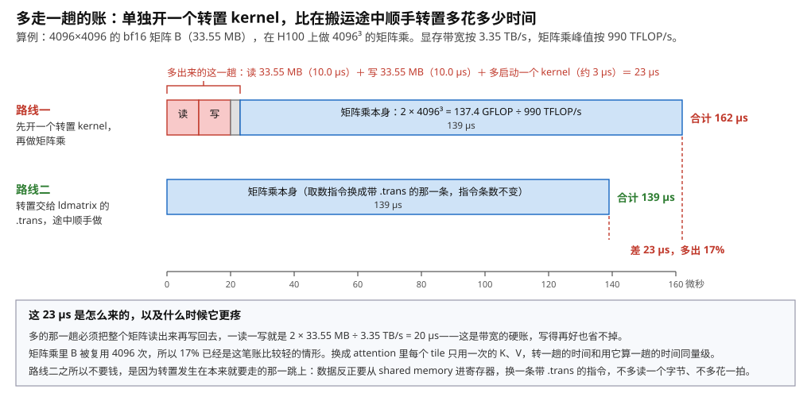
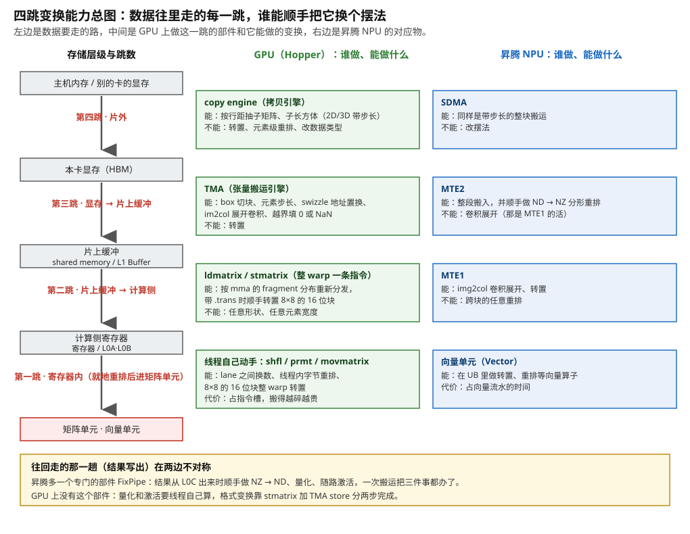
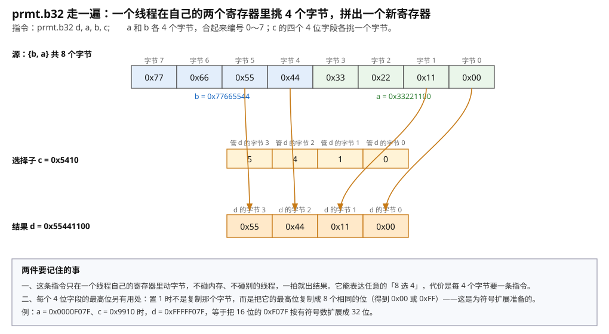
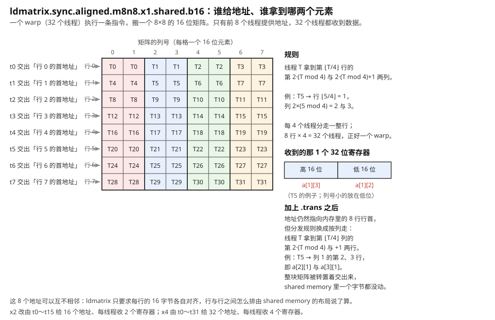
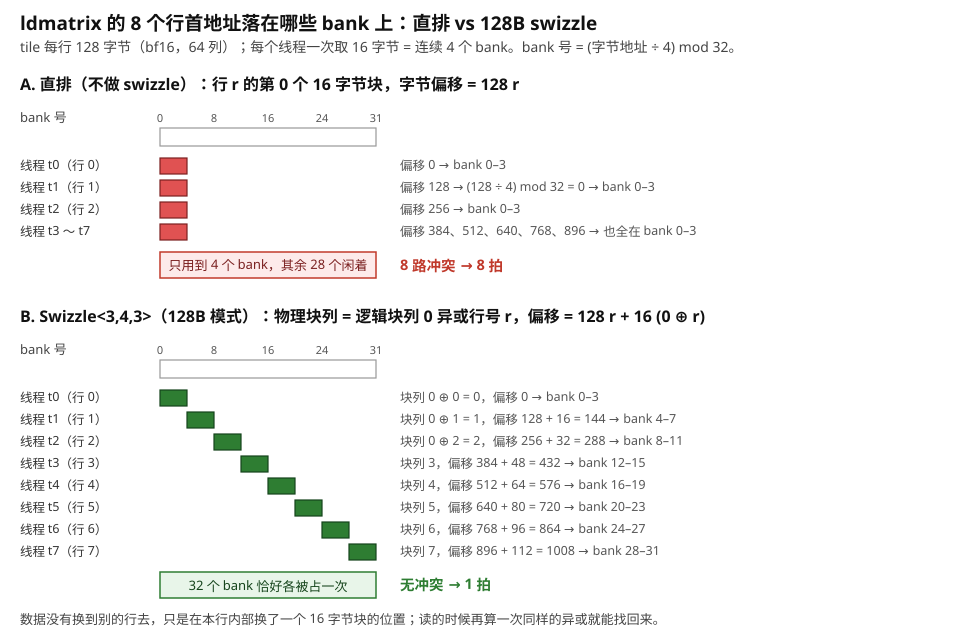
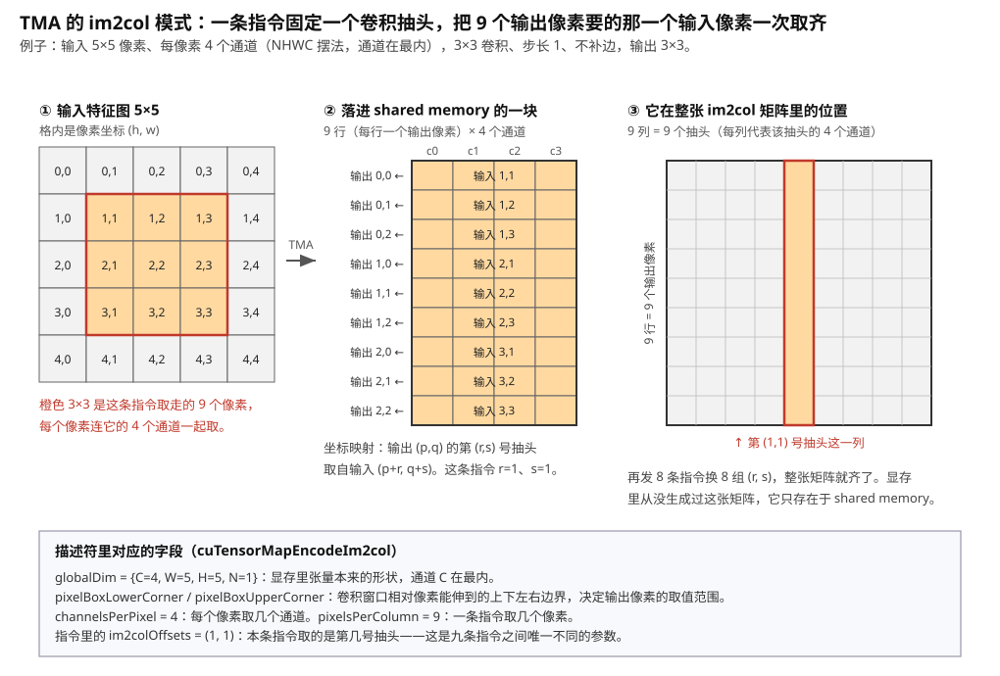
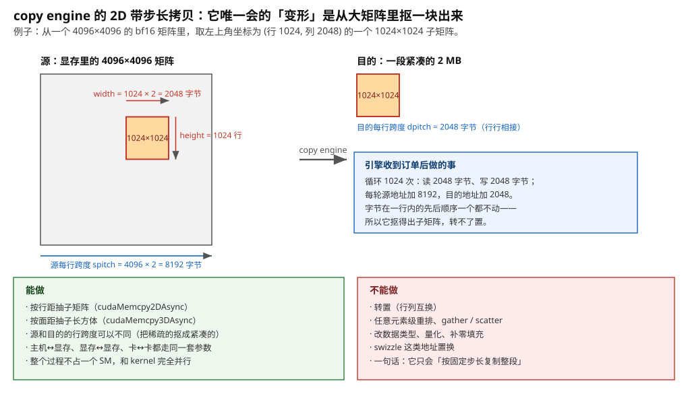
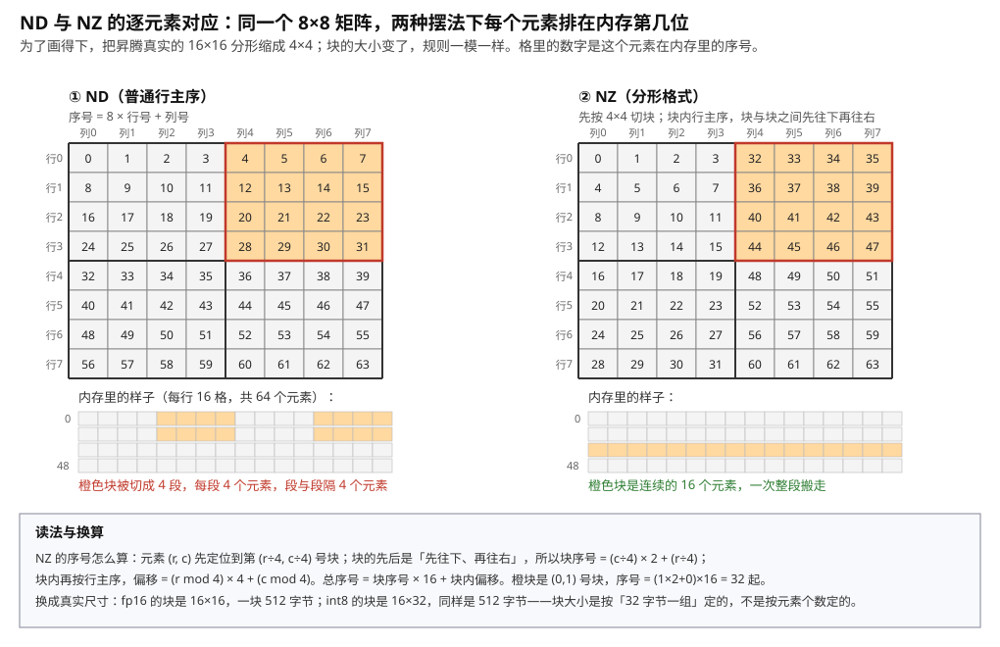
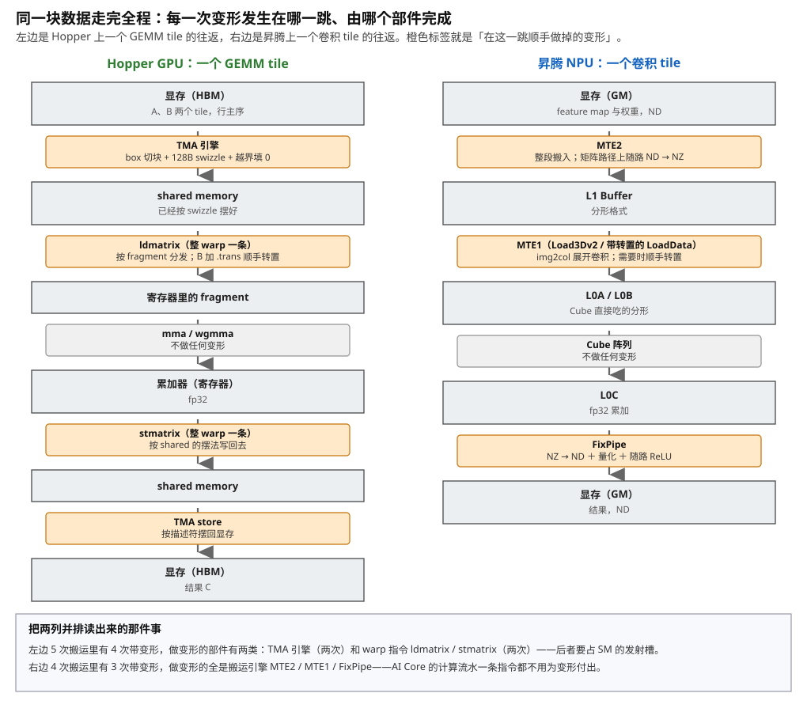

# 搬运途中的变形：硬件做的 layout 变换

> **所属模块**：模块 14 · 数据搬运
> **状态**：🟨 学习中（第一版。知识截至 2026-09）
> **本节主旨**：前面四节（02～05）沿着"谁发起"这根轴，把 load/store、`cp.async`、TMA、片外 DMA 四类搬运机制逐个讲完了——讲的都是**把同样的字节从 A 挪到 B**。这一节转到第二根轴：数据在挪动的过程中，能不能顺手换一个摆法？转置、错位、分形重排、卷积展开、补零、量化——这些"变形"有的可以在搬运途中免费做掉，有的必须另开一趟，有的干脆做不到。本节按**变形发生在哪一跳**组织：寄存器内、shared memory 到寄存器、显存到片上缓冲、片外，逐跳讲清楚是哪个部件在动手、输入和输出分别摆成什么样、能力边界在哪，每一跳配一个能逐步跟踪的小例子。最后把 GPU 和昇腾 NPU 两条路线并排走一遍同一块数据的全程，看同一件变形在两边分别落在哪个部件身上。

---

## 0. 这一节要回答的问题

- 为什么要在搬运途中变换，而不是搬完再单独变一趟？多一趟读写的代价具体是多少字节、多少微秒？
- 一个线程在自己的寄存器里能做哪些重排？`shfl`、`prmt`、`movmatrix` 各自管什么，代价是什么？
- `ldmatrix` 到底做了什么：哪几个线程提供哪一行的地址，哪个线程拿到哪两个元素？为什么它交出来的分布恰好是 `mma` 指令要的那一个？
- `.trans` 是怎么做到"shared memory 里一个字节都不动就把矩阵转置交出来"的？
- TMA 在显存到 shared memory 这一跳能做哪些变形：box 切块、元素步长、swizzle、im2col、越界填充分别是什么？为什么它唯独不能转置？
- copy engine 的 2D/3D 带步长拷贝能做什么（抽子矩阵）、不能做什么（任意转置）？
- 昇腾的 MTE2、MTE1、FixPipe 各自在哪一跳做哪种变形？ND 和 NZ 两种摆法逐个元素怎么对应？
- 为什么 NPU 把变形放进搬运引擎，而 GPU 把相当一部分留给线程自己发指令？这和"地址生成权交给谁"是什么关系？
- 硬件做不到的变形怎么办？多一趟 kernel、在寄存器里拼、改上游的摆法，三条路各自的代价怎么算？

---

## 1. 基础词汇：先把本节要反复用的词讲清楚

**摆法（layout，也译作布局）**。一个矩阵是二维的，内存却是一条一维的、编了号的字节序列。要把矩阵放进内存，必须规定"先放哪个元素、再放哪个"，这个规定就是摆法。最常见的两种是行主序（同一行的元素在内存里挨着）和列主序（同一列挨着）。要记住的关键一点是：**换摆法不改变任何一个数值，只改变"谁和谁挨着"**。但"谁和谁挨着"决定了下一个要用这批数据的部件取数顺不顺，所以它对性能的影响可以大到几十倍。本节讲的全部内容都是"由谁、在哪一跳、用什么硬件把数摆成另一个样子"。至于**为什么非要摆成那个样子**（每种摆法在解哪条硬件约束，约束怎么从计算指令一路倒推到显存里的排列），是模块 50 第 2 节的内容，本节只在需要时引用它的结论。

**变形（本节指的六类）**。"换个摆法"具体可以是六件事，本节反复用到这六个名字，先各自解释一遍：**转置**是行列互换；**地址置换（swizzle）**是把同一行内部的若干小块调换位置；**分形重排**是把矩阵切成固定大小的小方块、每个方块内部连续存放；**卷积展开（im2col）**是把卷积要用的重叠窗口摊平成矩阵乘的形状；**越界填充**是当要取的块伸出张量边界时，用固定值把缺的那部分补上；**数值变换**是搬运过程中顺带改数据类型或做量化。前五件只动位置不动数值，最后一件动数值。

**一跳（hop）**。数据从显存走到计算单元，中间要落地好几次：显存 → 片上缓冲 → 寄存器 → 计算单元。每一次"从一级存储搬到另一级存储"叫一跳。本节的组织方式就是按跳来分：每一跳由不同的硬件负责，因而能做的变形也完全不同。**这是本节最重要的一条组织线索——变形的能力不是"整台机器"的属性，而是"某一跳上那个具体部件"的属性。**

**warp 与 lane**。GPU 把 32 个线程绑成一组一起执行同一条指令，这一组叫一个 warp。组里的 32 个位置叫 lane，编号 0 到 31；第 i 号线程永远在第 i 条 lane 上跑。之所以要在这一节反复提 lane，是因为硬件上每条 lane 有自己那一份寄存器，物理位置固定（模块 13 第 2 节 §4.1 画过接线图）：**lane 之间没有直连的数据线**，要把 lane 3 的值送给 lane 7，必须走一张专门的交换网络。这条物理事实决定了寄存器内能做哪些重排、不能做哪些。

**fragment（片段）**。Tensor Core 是 GPU 里专门做矩阵乘的电路。它没有自己的输入存储（Blackwell 之前），操作数直接从 warp 的 32 份寄存器里取。于是一个 16×16 的矩阵块必须拆开、分给 32 个线程，每人几个元素——每个线程手里那一份就叫它的 fragment。关键在于**哪个线程拿哪几个元素是指令规格书写死的**：矩阵电路的每个输入端口物理上就接在某几条 lane 的寄存器上，软件没有任何商量余地。本节第 5 部分讲的那条指令，全部意义就是"把数据按这张死表送到正确的线程手里"。

**bank 与 bank 冲突**。shared memory（片上的一块可编程高速存储，一个线程块里的线程共用）在物理上切成 32 个可以同时工作的小块，叫 bank。地址按 4 字节一个字轮流分给各 bank：第 0 个字归 0 号，第 1 个字归 1 号，第 32 个字又回到 0 号。**一个 warp 的 32 个访问如果落在 32 个不同的 bank 上，一拍全部完成；如果有 N 个访问落在同一个 bank 的不同地址上，这个 bank 只能一个一个来，要 N 拍**——这就是 N 路 bank 冲突。模块 10 第 4 节详讲过。

**swizzle（地址置换）**。消除 bank 冲突的一种做法：不多占内存，而是在"逻辑位置 → 物理位置"之间加一次异或运算。逻辑上在第 r 行第 c 个小块的数据，物理上存到第 r 行第 `c XOR r` 个小块。异或有一个关键性质：拿同一个数分别和 0、1、2……逐个异或，结果互不相同，恰好是原来那些数的一个排列——所以按行访问和按列访问都不会撞在一起。本节要讲的是**谁来做这次异或**：可以是线程自己算地址时多做一次异或，也可以是搬运引擎在往 shared memory 里落位时顺手做掉。

**分形格式（昇腾的 NZ）**。昇腾 NPU 的矩阵单元一次消费一个 16×16 的小方块。为了让这样一个方块在内存里是连续的一段，昇腾定义了一种嵌套摆法：先把矩阵切成 16×16 的块，**块内部按行主序连续存放，块与块之间按列主序排列**，官方枚举名是 `FRACTAL_NZ`，日常简称 NZ；与之相对，普通行主序在昇腾的文档里叫 ND。本节第 8 部分会逐个元素画出两者的对应关系。

**im2col（图像转列）**。卷积在硬件上通常不是用专门的卷积电路算的，而是被改写成一次矩阵乘。改写的方法是把每个输出像素要用的那一窗输入像素**摊平成一行**，所有输出像素的行叠起来就是一个矩阵，再和摊平的卷积核相乘。这个摊平动作叫 im2col（昇腾的文档里写作 img2col）。它的麻烦之处在于相邻窗口是重叠的，摊平后同一个输入像素会出现好几次——**如果真的在显存里生成这张展开后的矩阵，数据量会膨胀好几倍**。所以现代硬件的做法是让搬运部件在搬进片上缓冲的途中现场完成展开，显存里从不存在这张矩阵。

**搬运引擎**。不由线程逐条发指令、而是"下一张订单就自己去搬"的专用硬件。GPU 上叫 TMA（张量搬运引擎，Hopper 引入）和 copy engine（拷贝引擎，负责片外）；昇腾上叫 MTE（Memory Transfer Engine，按连接的存储层级分成 MTE1、MTE2、MTE3 三条流水线），另有一个专管结果写出的部件叫 FixPipe。第 04、05 节分别讲它们的订单格式和完成通知机制，本节只讲它们的**变形能力**。

---

## 2. 为什么要在搬运途中变换，而不是搬完再单独变一趟

### 2.1 三种做变形的地方，代价完全不是一回事

先把选择列清楚。要把一批数据从摆法 X 换成摆法 Y，有三种做法，它们的代价分属三个不同的量级：

**第一种：单独开一趟。** 写一个专门的 kernel（或者调一个框架算子，比如 PyTorch 的 `.contiguous()`、昇腾的 `TransData`），把整个张量从显存读出来、换个摆法再写回显存。代价是**一读一写两倍的显存流量**，加上多启动一个 kernel 的固定开销。这是最贵的一种。

**第二种：在片上多花几条指令。** 数据已经在 shared memory 或寄存器里了，用 `shfl`、`prmt` 这类指令把它重排一下。不碰显存，所以没有带宽账；代价是**占用发射槽**——每条指令都要从指令缓存取出来、译码、占一个执行周期，而这些周期本来可以用来算乘加。

**第三种：挂在一次本来就要做的搬运上。** 数据反正要从显存搬进 shared memory、反正要从 shared memory 搬进寄存器，而做这一跳的硬件恰好会在搬的同时改摆法。这种情况下**变形的边际代价是零**：不多读一个字节、不多发一条指令。

本节的全部实用价值可以浓缩成一句话：**尽量把变形挪进第三类**。第 3 到第 8 部分就是在逐跳回答"哪些变形能挪进来"。

### 2.2 一笔可以算的账：多一趟到底多花多少

抽象的"两倍流量"没有感觉，把它算成微秒。取一个具体张量：**一个 4096×4096 的 bf16 矩阵**（bf16 是 16 位浮点，每个数 2 字节）。

第一步，算字节数。4096 × 4096 = 16 777 216 个元素，每个 2 字节，共 **33 554 432 字节 ≈ 33.55 MB**。

第二步，算单独开一趟的时间。H100 的显存带宽约 3.35 TB/s（全库统一口径，见模块 01 §6）。转置 kernel 要把整个矩阵读出来一遍、再写回去一遍，一共 2 × 33.55 MB = 67.1 MB：

> 67.1 MB ÷ 3.35 TB/s ≈ **20.0 微秒**

这 20 微秒是**带宽的硬账**——无论这个 kernel 写得多好，字节总量在那里，省不掉。再加上多启动一个 kernel 的固定开销（排空上一个 kernel、下发新的线程网格、重新预热缓存），量级约 **3 微秒**（示意值，随平台和网格大小变化）。合计约 **23 微秒**。

第三步，算这 23 微秒相对什么。假设这个矩阵是要拿去做一次 4096³ 的矩阵乘：浮点运算量 = 2 × 4096³ = 137.4 GFLOP，H100 的 bf16 Tensor Core 峰值约 990 TFLOP/s：

> 137.4 GFLOP ÷ 990 TFLOP/s ≈ **139 微秒**（理想值，不计效率损失）

所以多的那一趟是 23 ÷ 139 ≈ **17%**。图 6-1 把这两条路线画成时间线。



> **图 6-1**　一句话：把"换摆法"单独做成一趟，要把整个矩阵读出来再写回去，这一读一写的时间在这个例子里占到矩阵乘本身的 17%；换成在搬运途中顺手做，这段时间完全消失。
>
> **先知道一件事**：显存（也叫 HBM，就是显卡上那几十 GB 的主存储）的带宽是有限的，这里按每秒 3.35 万亿字节算。任何"把数据读出来、改一改、写回去"的操作，时间下限就是"字节总量 ÷ 带宽"，和你怎么写代码无关。横轴是时间，单位微秒（百万分之一秒）。
>
> **按这个顺序看**：
> 1. 先看上面那条（路线一）最左边的两个红块。第一块是把 33.55 MB 读出来，33.55 ÷ 3350000（单位换算后）约等于 10.0 微秒；第二块是写回去，同样 10.0 微秒。紧接着的灰色小块是多启动一个 kernel 的固定开销，约 3 微秒。
> 2. 再看蓝色的长块：这是矩阵乘本身。它的时间来自算力而不是带宽——2 × 4096³ 次乘加除以每秒 990 万亿次，约 139 微秒。
> 3. 下面那条（路线二）只有那个蓝色长块。转置交给了取数指令 `ldmatrix` 的一个可选后缀 `.trans`：数据反正要从片上缓冲进寄存器，换一条带这个后缀的指令就顺手转置了，指令条数一条都没多。
> 4. 最右边的两个合计数相减，就是底下那句"差 23 微秒，多出 17%"。
>
> **看懂的标志**：能回答"为什么这 20 微秒省不掉"——因为它不是某段代码写得不好，而是 67.1 MB 字节必须过一遍显存通道这件事本身所需的时间。想省只有一条路：让这些字节根本不要多过一遍。
>
> **与正文的对照**：图中的字节数、带宽、算力都取自 §2.2 的算式；3 微秒的启动开销是示意值，随平台变化。
>
> 来源：本库自绘。

### 2.3 17% 已经是这笔账比较轻的情形

上面这个例子里，矩阵 B 在整个矩阵乘里被复用了 4096 次（每一个输出元素都要用到它的一列），所以一次性的转置开销被摊得很薄。**换成复用次数少的数据，这笔账会难看得多。**

举一个真实场景：FlashAttention 里的 K 和 V。注意力计算要先算 Q·Kᵀ，这意味着 K 要以转置的形态参与；而 K 本身是上一层刚算出来的，摆法由上一层决定。如果为此单独转置一趟，那么对每一个 K 的 tile，**转一趟的时间和用它算一趟的时间是同一个量级**——因为一个 tile 搬进来基本只用一次，读写 2 份字节换来的是 1 份字节的计算量。这时"能不能在途中顺手转"就不是省 17%，而是决定这个算子能不能做。

反过来说，也有多一趟仍然划算的情况：**如果数据被复用的次数足够多，而且变形可以在离线阶段一次做完**。最典型的是推理时的模型权重——权重在整个推理过程中一个字节都不会变，可以在加载模型时就转成硬件最喜欢的摆法，此后每一次前向都不必再为它付任何代价。§9.3 会把这条单独展开。

---

## 3. 四跳总图：本节的地图

把四跳、每一跳上做变形的部件、以及各自的能力边界画在一张图上（图 6-2），后面四个部分就是逐格展开。



> **图 6-2**　一句话：数据从外往里走要经过四跳，每一跳由不同的硬件负责，所以每一跳能顺手做的变形也各不相同；同一个位置上，GPU 和昇腾派出的是不同的部件。
>
> **先知道一件事**：这里说的"变形"全都不改数值，只改"哪个数放在哪"。之所以要专门有硬件做它，是因为下一站的部件对"数放在哪"有很硬的要求——摆得不对，它要么取数慢很多，要么根本取不到。
>
> **按这个顺序看**：
> 1. 先看最左边一列从上到下：这是数据要走的路。最上面是别的地方（主机内存或另一张卡的显存），然后是本卡显存，然后是片上缓冲（GPU 叫 shared memory，昇腾叫 L1 Buffer），然后是计算侧的寄存器（昇腾叫 L0A / L0B），最后进矩阵单元。
> 2. 每两级之间的红字就是一跳的名字。本节按"第四跳、第三跳、第二跳、第一跳"的顺序讲，也就是从外往里。
> 3. 中间的绿框是 GPU 这一侧。注意第四跳和第三跳的执行者是**引擎**（copy engine、TMA），不占线程；第二跳和第一跳的执行者是**指令**（`ldmatrix`、`shfl` 等），要占 SM 的发射槽。
> 4. 右边的蓝框是昇腾这一侧。四跳的执行者全是搬运引擎（SDMA、MTE2、MTE1）或向量单元，没有一跳是"让计算流水自己发指令去挪数"。
> 5. 最下面的黄框讲的是回程：结果算完往外写的那一趟，两边不对称。昇腾有一个专门的部件 FixPipe，在结果离开累加缓冲时一次把格式转换、量化、激活函数三件事都办了；GPU 上没有这个部件，这三件事要拆开分别由指令和引擎完成。
>
> **看懂的标志**：能回答"为什么同一个变形（比如转置）在这张图上要问'哪一跳'"——因为做这件事的根本不是同一个硬件。转置在第二跳上是 `ldmatrix` 的一个后缀（免费），在第三跳上 TMA 根本做不了，在第四跳上 copy engine 也做不了。
>
> **与正文的对照**：绿框和蓝框里的每一条，分别在第 4～7 部分和第 8 部分展开。图上为了排得下做了两处简写：MTE2 的 ND → NZ 只在"显存 → L1"这一条通路上有效（搬进向量单元工作区的那条路没有），而且要显式调用带相应参数的接口，不是自动发生（§8.2）；MTE1 的转置也只在"L1 → L0A/L0B"这一跳有效（§8.3）。
>
> 来源：本库自绘。

---

## 4. 第一跳 · 寄存器内：线程自己动手

从最里面一跳讲起，因为它的机制最容易看清：数据已经在寄存器里了，要在寄存器里换位置。

寄存器有一条物理上的硬约束需要先说清楚（模块 13 第 2 节 §4.1 用接线图论证过）：**寄存器堆按 lane 纵向切成 32 片，第 i 片只存第 i 号线程的寄存器，紧挨着第 i 条计算通路，中间没有横向连线。** 所以"在寄存器里换位置"实际上分成两件性质完全不同的事：

- **一个线程内部**换位置（把自己那个 32 位寄存器里的 4 个字节重新排一下）：数据不离开本片，随便动。
- **线程之间**换位置（把 lane 3 的值送给 lane 7）：本片里没有通往别片的线，必须走一张额外配的跨 lane 交换网络。这张网络只覆盖同一个 warp 的 32 条 lane，而且只支持几种固定的连接模式。

GPU 为这两件事各提供了指令，另外还有一条专门用于矩阵转置的指令。下面逐个走一遍。

### 4.1 `shfl`：lane 之间换数

**指令形态**（PTX 语法）：

```
shfl.sync.mode.b32  d|p, a, b, c, membermask;
        mode = { .up, .down, .bfly, .idx }
```

意思是：warp 里参与的每个线程都交出自己的 32 位值 `a`，硬件按 `mode` 规定的配对方式把这些值重新分发，每个线程收到一个值放进 `d`。`.bfly` 是按异或配对（partner = 自己的 lane 号 XOR 某个数），`.up` / `.down` 是按固定偏移上移下移，`.idx` 是"我指定去读第几号 lane 的值"。`c` 里打包了两个字段：低 5 位是一个上界，用来把源 lane 号夹在范围内；第 8～12 位是一个分段掩码，用来把 warp 逻辑上切成几个独立的子段。可选的谓词输出 `p` 告诉你"算出来的源 lane 号是不是在范围内"；越界时线程拿回自己原来的值。CUDA C 里对应的是 `__shfl_xor_sync` / `__shfl_up_sync` / `__shfl_down_sync` / `__shfl_sync` 这一族内建函数。

**逐步走查：8 条 lane 做一次 `.bfly` 配对。** 设 `b = 1`，也就是每条 lane 去读 `lane XOR 1` 的值。为了看得清只画 8 条 lane：

| lane 号 | 它手里的值 a | 源 lane = lane XOR 1 | 它收到的 d |
| --- | --- | --- | --- |
| 0 | A | 1 | B |
| 1 | B | 0 | A |
| 2 | C | 3 | D |
| 3 | D | 2 | C |
| 4 | E | 5 | F |
| 5 | F | 4 | E |
| 6 | G | 7 | H |
| 7 | H | 6 | G |

结果是相邻两条 lane 两两互换。把 `b` 换成 2，配对变成 (0,2)(1,3)(4,6)(5,7)；换成 4，变成 (0,4)(1,5)(2,6)(3,7)。**这三步合起来正好能把 8 个值完全颠倒或者做出各种蝶形置换**，这就是 warp 内归约、扫描、小矩阵转置的基本零件。

**它的代价和边界，三条都来自那张交换网络的物理事实：**

1. **它不是免费的寄存器操作。** 交换网络是一条独立的执行管线，有自己的吞吐上限，每条 `shfl` 要占一个发射槽。
2. **只能在一个 warp 内用。** 网络的接线只覆盖这 32 条 lane。要跨 warp 交换数据，只能把值写进 shared memory 再读回来——那是一次完整的往返，代价高一个量级。
3. **只有几种固定的置换模式，不能任意置换。** 支持任意置换需要一个完整的 32×32 交叉开关，面积按端口数的平方增长，并不便宜；而实践中异或、上移、下移、广播这几种已经覆盖了绝大多数用途。

**一次 `shfl` 搬多少数据？** 每个线程 32 位，一个 warp 32 个线程，所以一条指令搬 128 字节。这个数字值得记住，因为它是"用 `shfl` 做重排"的基本计价单位：要重排 N 字节，至少需要 N ÷ 128 条指令，而且通常还要配上同样数量的合并指令。

### 4.2 `prmt`：一个线程在自己的两个寄存器里挑字节

跨 lane 之外的另一半工作是**线程内部的字节重排**，由 `prmt`（permute 的缩写）负责。

**指令形态**：

```
prmt.b32{.mode}  d, a, b, c;
```

语义是：把两个 32 位源寄存器 `a` 和 `b` 拼成一个 64 位的字节池，**字节编号 0～3 来自 `a`（0 是最低字节），4～7 来自 `b`**。选择子 `c` 有四个 4 位字段，分别决定结果 `d` 的第 0、1、2、3 个字节各取池子里的哪一个。每个 4 位字段里，低 3 位是字节编号，**最高位另有用处**：置 0 时照抄那个字节，置 1 时不抄字节本身，而是把它的最高位复制成 8 个相同的位（结果是 0x00 或 0xFF）——这是为有符号数的位宽扩展准备的。图 6-3 走了一遍完整的数值。



> **图 6-3**　一句话：`prmt` 这条指令让一个线程把自己两个寄存器里的 8 个字节当成一个池子，按一张 4 位一格的选择表挑出 4 个字节拼成一个新寄存器。
>
> **先知道一件事**：一个 32 位寄存器由 4 个字节组成，习惯上从低位到高位编号 0、1、2、3。十六进制里两位数字正好是一个字节，所以 `0x33221100` 的四个字节从低到高是 `00`、`11`、`22`、`33`。
>
> **按这个顺序看**：
> 1. 先看最上面那一排 8 个格子，这是可以挑的全部素材。右边四格（绿底）来自 `a = 0x33221100`，编号 0～3；左边四格（蓝底）来自 `b = 0x77665544`，编号 4～7。注意编号是按"数值的高低位"排的，所以图上从右往左编号递增。
> 2. 再看中间那一排橙色格子，这是选择子 `c = 0x5410` 拆开后的四个 4 位字段。十六进制的每一位正好是 4 位，所以从高到低分别是 5、4、1、0。最右边那个（值为 0）管结果的第 0 个字节，往左依次管第 1、2、3 个字节。
> 3. 顺着橙色的曲线看：管字节 0 的字段值是 0，所以去取池子里的 0 号字节 `00`；管字节 1 的字段值是 1，取 `11`；管字节 2 的字段值是 4，取 `44`；管字节 3 的字段值是 5，取 `55`。
> 4. 最下面一排就是结果 `d = 0x55441100`。这次挑选的效果是"把 a 的低两个字节和 b 的低两个字节拼在一起"。
> 5. 最下面的方框讲第二件事：那四个字段的最高位如果置 1，行为就变了——不复制那个字节本身，而是把它的最高位铺满 8 个位。举例中 `a = 0x0000F07F`、`c = 0x9910`，结果是 `0xFFFFF07F`，相当于把 16 位的 `0xF07F` 按有符号数扩展成 32 位。
>
> **看懂的标志**：能回答"这条指令为什么在低精度模型里特别常用"——因为 FP8、INT8、FP4 这些格式在内存里是好几个数挤在一个 32 位字里的，取出来之后要把它们拆开、重新分组、按矩阵指令要的顺序排好，而这些动作本质上都是"从 8 个字节里挑 4 个"。
>
> **与正文的对照**：图里的 a、b、c 取值与 §4.2 的走查一致；带 mode 后缀的几种简写形式（`.f4e`、`.b4e`、`.rc8`、`.ecl`、`.ecr`、`.rc16`）只看选择子的最低 2 位、按预定义的模式挑，本图画的是不带 mode 的通用形式。
>
> 来源：本库自绘。

**`prmt` 在什么场合真正被用到。** 两个典型：

- **低精度数据的解包。** 一个 32 位寄存器里装着 4 个 INT8 或者 8 个 FP4。矩阵指令要求这些小数值按某个特定顺序排列，而它们从显存读进来时是另一个顺序——中间那次重排就是 `prmt`。Blackwell 之后这类工作有一部分被挪进了 `ldmatrix` 的新变体里（§12），但线程侧的 `prmt` 依然是兜底手段。
- **配合 `shfl` 拼出跨 lane 的字节级重排。** `shfl` 只能整个 32 位一起搬，搬不了半个；要做"lane 3 的第 2 个字节送给 lane 7 的第 0 个字节"这种事，只能先 `shfl` 把整个字搬过去，再 `prmt` 把要的字节挑出来。**这就是为什么寄存器里的重排代价是"每 4 字节一到两条指令"这个量级。**

### 4.3 `movmatrix`：整个 warp 在寄存器里转置一个 8×8 块

前两条指令是通用零件，拼起来能做任意重排，但很费指令。对于"矩阵转置"这个高频需求，硬件给了一条专用指令。

**指令形态**（PTX ISA 7.8 引入，要求 sm_75 及以上，即 Turing 之后的所有代际）：

```
movmatrix.sync.aligned.m8n8.trans.b16  d, a;
```

它做的事：**整个 warp 协作，把一个已经躺在寄存器里的 8×8 的 16 位矩阵转置，结果仍然放在寄存器里。** 每个线程输入一个 32 位寄存器 `a`（装 2 个 16 位元素），输出一个 32 位寄存器 `d`（同样 2 个元素）。32 × 2 = 64，正好是 8×8 个元素。名字里的 `.sync` 表示 warp 内参与的线程要在此汇合，`.aligned` 表示整个 warp 必须一起执行这条指令。

**逐线程走查。** 输入的分布规则是：**lane T 持有矩阵第 ⌊T/4⌋ 行、第 2·(T mod 4) 与 2·(T mod 4)+1 两列的元素**。也就是每 4 条 lane 分走一整行，8 行正好 32 条 lane。举三个：

| lane | 输入里它持有的两个元素 | 输出里它持有的两个元素 |
| --- | --- | --- |
| T0 | a[0][0]、a[0][1] | a[0][0]、a[1][0] |
| T5 | a[1][2]、a[1][3] | a[2][1]、a[3][1] |
| T31 | a[7][6]、a[7][7] | a[6][7]、a[7][7] |

输出的规则读作：**lane T 持有原矩阵第 ⌊T/4⌋ 列、第 2·(T mod 4) 与 +1 两行**——换个说法就是"转置后矩阵的第 ⌊T/4⌋ 行的那两列"，和输入规则形状完全一样，只是作用在转置后的矩阵上。验证 T5：⌊5/4⌋ = 1，2 × (5 mod 4) = 2，所以它拿转置矩阵第 1 行的第 2、3 列，也就是原矩阵的 a[2][1] 和 a[3][1]。✓

**这条指令值多少钱。** 用 `shfl` 加 `prmt` 手工做同样一件事，思路是三轮蝶形交换（8 = 2³，每轮按异或 1、2、4 配对），每轮要一条 `shfl`、一条 `prmt` 或选择指令，还要处理"只交换一半元素"的掩码——**大约十条指令的量级（估算，取决于具体写法）**。`movmatrix` 是一条。这个十倍的差距就是"专用硬件"的全部意义。

**它的边界很窄，窄得值得记住**：只有 `m8n8` 一种形状、只有 `.b16` 一种元素宽度、只有 `.trans` 一种操作。不是 8×8、不是 16 位的矩阵，这条指令帮不上忙。

### 4.4 这一跳的能力边界

把第一跳收拢成三句话：

- **能做**：任意的 lane 间固定模式交换（`shfl`）、任意的线程内字节重排（`prmt`）、8×8 的 16 位块转置（`movmatrix`）。理论上这三件拼起来可以表达任意重排。
- **代价**：全部按指令计价。搬得越碎、重排越不规则，指令条数越多，越挤占本该用来算乘加的发射槽。
- **不适合**：大批量数据的整体格式转换。如果要重排的是几十 KB 的一个 tile，在寄存器里逐条指令拼是最贵的做法——应该想办法把这件事挪到下面三跳里去。

---

## 5. 第二跳 · shared memory → 寄存器：`ldmatrix` 与 `stmatrix`

这一跳是本节的重头戏，因为它是**唯一一跳上"搬运"和"变形"被做成了同一条指令**的地方。

### 5.1 要解的问题：fragment 的分布是死的

先把问题摆清楚。一条最常用的 Tensor Core 指令 `mma.sync.m16n8k16`（16×8 的输出、深度 16、bf16 输入）要求它的 A 操作数——一个 16×16 的块——按一张固定的表分给 32 个线程，每人 8 个元素。表的形式是（模块 12 第 1 节画过全图）：**lane T 持有第 ⌊T/4⌋ 行和第 ⌊T/4⌋+8 行、第 2·(T mod 4) 与 +1 列以及第 2·(T mod 4)+8 与 +9 列**，一共 2 × 4 = 8 个元素。比如 lane 0 拿的是 (0,0)、(0,1)、(8,0)、(8,1)、(0,8)、(0,9)、(8,8)、(8,9)。

这张表为什么改不了？模块 13 第 2 节 §4.1 给了物理答案：**矩阵单元的每个输入端口在版图上就接在某几条特定 lane 的寄存器片上**。数据必须事先躺在那几条 lane 的那几个寄存器里，矩阵单元才拿得到。这不是接口设计上的品味问题，是接线的事实。

于是问题变成：数据现在在 shared memory 里，怎么把它按这张表送到 32 个线程手里？

**用逐线程的 `ld.shared` 指令自己搬，可行但有两个明确的缺点。** 第一是慢：每个线程要的 8 个元素散在 tile 的四个角落，只能用零散的小指令一个个取，而且这些地址几乎必然撞 bank。第二是脆：不同代际、不同形状的矩阵指令有不同的分布表，手写的地址算术要跟着全部重写。

**所以硬件给了一条专用指令。**

### 5.2 逐线程走查：`ldmatrix.sync.aligned.m8n8.x1.shared.b16`

先看最小的那一个变体。完整语法是：

```
ldmatrix.sync.aligned.shape.num{.trans}{.ss}.type  r, [p];
        shape = { .m8n8, .m16n16 };  num = { .x1, .x2, .x4 };
        ss = { .shared{::cta} };     type = { .b16, .b8 }
```

`m8n8.x1.b16` 这个组合是 PTX 6.5 引入的，要求 sm_75 及以上。它做的事：**一个 warp 执行一条指令，从 shared memory 里搬一个 8×8 的 16 位矩阵，按 fragment 的规则分发到 32 个线程的寄存器里。**

它的奇特之处在于**提供地址的线程和收到数据的线程不是同一批**：

- **提供地址的是 lane 0 到 lane 7，一人一个。** 每个地址是矩阵**一行的起始地址**（一行 8 个 16 位元素 = 16 字节，必须按 16 字节对齐）。lane 8 到 lane 31 在 `.x1` 下不提供地址。
- **收到数据的是全部 32 条 lane，每人一个 32 位寄存器**（装 2 个 16 位元素）。分发规则是：**lane T 拿第 ⌊T/4⌋ 行、第 2·(T mod 4) 与 2·(T mod 4)+1 两列**，列号小的那个放在寄存器的低 16 位。

图 6-4 把这两件事画在一起。



> **图 6-4**　一句话：这条指令让前 8 个线程各交出"一行数据在片上缓冲里的起始位置"，硬件按这些位置把一个 8×8 的小矩阵读出来，再按一张固定的表把 64 个数发给 32 个线程，每人两个。
>
> **先知道一件事**：GPU 上 32 个线程绑成一组（一个 warp）一起执行同一条指令，每个线程有自己私有的寄存器，别人看不到。所以一个矩阵不可能"放在一处"，只能拆开分给 32 个人。谁拿哪几个是硬件规定死的，因为算矩阵乘的那块电路的每根输入线物理上接在固定的几个线程的寄存器上。
>
> **按这个顺序看**：
> 1. 先看左边一列文字：t0 到 t7 这八个线程各交出一个地址，分别是矩阵第 0 行到第 7 行的开头在片上缓冲里的位置。**只要求每一行的 16 字节各自对齐，八行之间可以隔得很远**——这一点很重要，它意味着行与行怎么排完全由片上缓冲的摆法说了算。
> 2. 再看中间那个 8×8 网格。格子里写的不是数值，而是"这个元素最后会到哪个线程手里"。比如第 0 行的八个格子，从左到右依次归 T0、T0、T1、T1、T2、T2、T3、T3——每个线程拿相邻的两个。
> 3. 竖着看行与线程号的关系：第 0 行归 T0～T3，第 1 行归 T4～T7，往下每行线程号加 4。8 行 × 4 = 32，正好一个 warp。
> 4. 看右上角的规则框，它把上面两条并成一句公式：线程 T 拿第 ⌊T/4⌋ 行的第 2·(T mod 4) 与 2·(T mod 4)+1 两列。拿 T5 验一下：⌊5/4⌋ = 1，2 × (5 mod 4) = 2，所以是第 1 行的第 2、3 列。回到网格里找 T5，正是那两格。
> 5. 看右边中间的寄存器图：这两个元素挤在一个 32 位寄存器里，列号小的那个在低 16 位。
> 6. 最后看右下角的 `.trans`。加上这个后缀之后，**提供的地址一个字都不变**（还是那八行的行首），变的只是分发规则：线程 T 改拿第 ⌊T/4⌋ **列**的第 2·(T mod 4) 与 +1 两**行**。于是整块矩阵被转置着交到各线程手里，而片上缓冲里一个字节都没有移动过。
>
> **看懂的标志**：能回答"为什么说 `.trans` 的转置是免费的"——因为转置这件事发生在"数据从片上缓冲流向寄存器"这条本来就要走的路上，改的只是硬件往哪个线程发，既没有多读一个字节，也没有多花一拍。
>
> **与正文的对照**：图画的是 `.x1` 变体。`.x2` 由 t0～t15 提供 16 个地址（两个矩阵）、每线程收 2 个寄存器；`.x4` 由 t0～t31 提供 32 个地址（四个矩阵）、每线程收 4 个寄存器，第 k 个寄存器装第 k 个矩阵，每个矩阵内部的分发规则与本图相同。
>
> 来源：本库自绘（按 PTX ISA 中 `ldmatrix` 的地址表与 fragment 布局图绘制）。

### 5.3 `.x2` 与 `.x4`：一条指令搬几个 8×8 块

`num` 这个限定符决定一条指令搬几个 8×8 矩阵：

| `num` | 提供地址的线程 | 地址总数 | 每线程收到的寄存器 |
| --- | --- | --- | --- |
| `.x1` | lane 0～7 | 8（= 1 个矩阵 × 8 行） | 1 个 32 位寄存器 |
| `.x2` | lane 0～15 | 16（= 2 个矩阵 × 8 行） | 2 个 32 位寄存器 |
| `.x4` | lane 0～31 | 32（= 4 个矩阵 × 8 行） | 4 个 32 位寄存器 |

地址的归属按顺序切：`.x4` 下 lane 0～7 给第 1 个矩阵的八行，lane 8～15 给第 2 个矩阵的八行，依此类推。每个线程收到的第 k 个寄存器装第 k 个矩阵里属于它的那两个元素，分发规则在每个矩阵内部都和 §5.2 完全一样。

> **一个历史细节**：在 sm_75 及以下的目标架构上，即使用 `.x1` 或 `.x2`，**没轮到提供地址的线程也必须在地址寄存器里放一个合法地址**（通常是复制低编号线程的地址）。这是早期实现的限制，写内联 PTX 时踩过一次就记住了。

### 5.4 `.trans`：转置到底是怎么"免费"的

这是本节最值得琢磨的一个机制，所以单独说清楚。

**先看它不做什么**：它不改变任何一个地址。八个线程交出去的仍然是那八行的行首地址，硬件仍然从 shared memory 的同样八个位置读出同样的 64 个 16 位元素。**shared memory 里没有任何数据被移动过。**

**它改变的是"读出来之后往哪发"**。不带 `.trans` 时，读出来的第 r 行的第 c 个元素发给 lane 4r + ⌊c/2⌋；带 `.trans` 时，同一个元素改发给 lane 4c + ⌊r/2⌋。发送目标换了一张表，仅此而已。

**为什么这不要钱？** 因为这条路上本来就有一个分发网络。数据从 shared memory 的读出端口到 32 个线程的寄存器，中间必须经过一个交叉开关——不带 `.trans` 时它按一张表连线，带 `.trans` 时按另一张表连线，硬件上就是多一个选择信号的事。**换句话说，`.trans` 之所以免费，是因为它复用了一个本来就必须存在的部件。这是"途中变换"这个思路的最纯粹的例子，后面几跳的所有变形本质上都是同一个道理。**

**它能转置什么、不能转置什么。** 只能转置 8×8 的 16 位块。要转置一个 16×16 的块，需要把它看成四个 8×8 子块：转置后左上还在左上、右下还在右下，但**左下和右上要互换位置**——好在"互换位置"在这里只是"哪个寄存器当作哪个子块用"，编译期就能决定，运行期零代价。所以一个 16×16 的转置 = 4 次 `ldmatrix.trans` 的份额，不多一条指令。

### 5.5 为什么它的输出分布恰好是 mma 要的

这是很多人第一次读 `ldmatrix` 文档时的疑问：两张表看上去毫不相干，凭什么正好对上？

把两张表并排放：

- **`ldmatrix` 的 m8n8 分发表**：lane T ← 第 ⌊T/4⌋ 行，第 2·(T mod 4) 与 +1 列。
- **`mma.m16n8k16` 的 A 操作数表**：lane T ← 第 ⌊T/4⌋ 行和第 ⌊T/4⌋+8 行，第 2·(T mod 4) 与 +1 列以及第 2·(T mod 4)+8 与 +9 列。

把 16×16 的 A 块按行 0–7 / 8–15、列 0–7 / 8–15 切成四个 8×8 子块，编号 (0,0)、(0,1)、(1,0)、(1,1)。对照一下：

| A 的子块 | mma 要求 lane 0 从这个子块里拿的元素 | `ldmatrix` m8n8 给 lane 0 的元素 |
| --- | --- | --- |
| (0,0) 行 0–7、列 0–7 | (0,0)、(0,1) | 第 0 行第 0、1 列 ✓ |
| (1,0) 行 8–15、列 0–7 | (8,0)、(8,1) | 第 0 行第 0、1 列 ✓ |
| (0,1) 行 0–7、列 8–15 | (0,8)、(0,9) | 第 0 行第 0、1 列 ✓ |
| (1,1) 行 8–15、列 8–15 | (8,8)、(8,9) | 第 0 行第 0、1 列 ✓ |

**四行完全一致。** 也就是说，`mma` 对 16×16 的 A 操作数的要求，正好等于"把它切成四个 8×8 子块，每个子块各按 `ldmatrix` 的 m8n8 表分一次"。所以一条 `ldmatrix.x4` 给出四个寄存器，把它们按 (0,0)、(1,0)、(0,1)、(1,1) 的顺序交给 `mma`，分布严丝合缝。

**这不是巧合，是倒着设计出来的。** 模块 50 第 2 节把这条因果链讲得很完整：`mma` 的分布由电路接线定死 → `ldmatrix` 是专门为了产生这个分布而设计的指令 → shared memory 的摆法（swizzle 模式）又是为了让 `ldmatrix` 的八个地址不撞 bank 而选的 → TMA 描述符里的 swizzle 字段必须复述同一个模式。本节讲的是这条链上每一环由哪个硬件执行，那一节讲的是每一环为什么非得是这个值。

### 5.6 必须配 swizzle：八个行首地址会撞在一起

`ldmatrix` 有一个前提条件，不满足的话它照样能跑，只是慢八倍。

回到 §5.2 那八个地址：它们是 8×8 块的八行行首。如果这个块所在的 tile 在 shared memory 里直排存放（每行连续存放、行与行首尾相接），假设 tile 每行 128 字节（bf16 下就是 64 列），那么八个行首的字节偏移是 0、128、256、……、896。按 bank 的分配规则 `(地址 ÷ 4) mod 32` 算：128 ÷ 4 = 32，32 mod 32 = 0——**八个地址全部落在 bank 0**。每个线程一次取 16 字节 = 4 个 bank，所以八个线程全挤在 bank 0～3，其余 28 个 bank 闲着，要排八拍。

加上 128 字节模式的 swizzle 之后，第 r 行的第 0 个 16 字节块被挪到本行的第 `0 XOR r = r` 个块位置上，偏移变成 128r + 16r。八个地址散落到八组互不相同的 bank 上，一拍取完。图 6-5 把这两种情形的 bank 号逐个算了出来。



> **图 6-5**　一句话：`ldmatrix` 一次要读八行，如果这八行的开头在片上缓冲里排得整整齐齐，它们会全部落进同一组存储体里排队；把每一行的内容在行内错开一点，八行就散到全部 32 个存储体上，一拍读完。
>
> **先知道一件事**：片上缓冲（shared memory）在物理上切成 32 个能同时工作的小块，叫 bank。地址按 4 字节一个字轮流分给它们：第 0 个字归 0 号 bank，第 1 个字归 1 号，第 32 个字又回到 0 号。所以一个字节地址属于哪个 bank，算法就是"地址除以 4，再对 32 取余"。同一个 bank 一拍只能交出一个字。
>
> **按这个顺序看**：
> 1. 先看 A 部分。tile 每行 128 字节，所以第 r 行的开头在偏移 128r 处。线程 t1 对应第 1 行，偏移 128，算一下：128 ÷ 4 = 32，32 对 32 取余等于 0——落在 bank 0。t2 是偏移 256，同样余 0。八个线程全是这样。
> 2. 每个线程一次取 16 字节，正好盖住连续 4 个 bank，所以八个线程全挤在 bank 0 到 3 上。右边那句"8 路冲突 → 8 拍"就是结论：八个人排一条队。
> 3. 再看 B 部分。做法是给每一行的内容在**本行内部**换一个位置：第 r 行原本在第 0 个 16 字节块的数据，挪到第 `0 XOR r` 个块，也就是第 r 个块。`XOR`（异或）是逐位比较，相同得 0、不同得 1；和 0 异或等于原值，所以 `0 XOR r` 就是 r。
> 4. 于是 t1 的地址变成 128 + 16 = 144，144 ÷ 4 = 36，36 对 32 取余等于 4——落在 bank 4。t2 变成 288，余数 8，落 bank 8。逐行往下，八个线程分别占 bank 0–3、4–7、8–11……28–31。
> 5. 看最下面那句：32 个 bank 恰好各被占一次，一拍读完。整个过程中数据没有换到别的行去，只是在本行内部挪了个位置；读的时候再算一次同样的异或就能找回来。
>
> **看懂的标志**：能回答"这次异或是谁做的"——两种可能：线程自己算地址时多做一次异或，或者搬运引擎在往片上缓冲里写数据时就按异或后的位置落位。后一种就是 §6.2 讲的 TMA 的 swizzle 模式，这时连那次异或都不用花指令。
>
> **与正文的对照**：图中的 `Swizzle<3,4,3>` 参数含义、以及"配错模式会残留几路冲突"的推演，在模块 50 第 2 节 §4.1、§4.2 有完整展开；本图只取它在 `ldmatrix` 行首地址这一个场景下的结果，两处的公式与数值一致。
>
> 来源：本库自绘。

**这就是为什么 `ldmatrix` 和 swizzle 总是一起出现。** 它们不是两个可以分别决定的选项：`ldmatrix` 的访问模式（八个行首同拍给出）决定了 shared memory 必须用某种 swizzle，swizzle 的模式又必须和 TMA 描述符里声明的模式逐字一致。配错了不会报错，只会默默慢几倍。

### 5.7 `stmatrix`：写回方向

计算完了，累加器在寄存器里，要写回 shared memory 再由 TMA 整块写出显存。这时需要一条反方向的指令：

```
stmatrix.sync.aligned.shape.num{.trans}{.ss}.type  [p], r;
        shape = { .m8n8, .m16n8 }
```

`stmatrix` 是 PTX 7.8 引入的，**要求 sm_90 及以上**——也就是说 Hopper 之前没有这条指令，Ampere 上的写回要靠逐线程的 `st.shared`。地址的提供方式和 `ldmatrix` 完全一样（`.x1`/`.x2`/`.x4` 分别由 8/16/32 个线程给行首地址），m8n8 的分布规则也一样，只是数据流向相反：源操作数是 1、2 或 4 个 32 位寄存器。

**为什么写回也需要专用指令？** 同样的两个理由，只是方向反过来：累加器在寄存器里的分布是矩阵指令规定的，每个线程手里那几个元素在目标 tile 里散落各处；逐线程写不但地址算术繁琐，而且写进去的那些地址同样会撞 bank。

### 5.8 这一跳的能力边界

- **能做**：按 fragment 表重新分发（这是它的本职），带 `.trans` 时顺手转置。转置是唯一的"形状变换"。
- **不能做**：任意形状（只有 8×8 和新增的 16×16 两种）、任意元素宽度（`.b16` 是主力，`.b8` 及 4/6 位打包格式是 Blackwell 一代新增的，见 §12）、越界填充、数值变换。
- **代价**：一条 warp 级指令，占一个发射槽。相对于它替代的几十条零散 `ld.shared`，这是巨大的节省；但相对于"完全不占指令"的引擎，它仍然要花 SM 的资源。**这一点是 §8.5 要对比的关键差别。**

---

## 6. 第三跳 · 显存 → shared memory：TMA

再往外一跳。这一跳搬的数据量最大（一个 tile 动辄几十 KB），也是变形能力最丰富的一跳。执行者是 TMA——Hopper 引入的张量搬运引擎。它的完整机制（描述符里写什么、怎么下单、mbarrier 怎么通知完成）是第 04 节的内容，本节只讲它的变形能力。

一句话交代它的工作方式，以便后文能读懂：**主机侧提前编好一张张量描述符（tensor map），写明这个张量在显存里的基址、各维大小、各维步长、元素类型、一次搬多大的块、用哪种 swizzle、越界怎么填；运行时一个线程发一条指令，只给出"要第几块"的坐标，引擎就把那一块搬进来。**

### 6.1 box 切块与元素步长

**box（块）** 是描述符里最基本的变形能力。张量在显存里可能是 4096×4096，但一次只要其中 128×64 的一小块——`boxDim` 数组就是在说这件事：每一维取多少个元素。搬进 shared memory 之后，这一块是**紧凑摆放**的，不再保留原张量的行距。

**这本身就是一次变形**，而且是最常用的一次：从一个"行与行相隔 8192 字节"的大矩阵里，抠出一块"行与行首尾相接"的小矩阵。

**元素步长（`elementStrides`）** 是在 box 之上再加一层：每一维可以设置 1 到 8 的采样步长，也就是"每隔几个元素取一个"。它的用途是带膨胀（dilation）的卷积——膨胀卷积的取数模式正是"隔几个像素取一个"。

**几条硬边界，来自描述符的字段规格**（依据 CUDA Driver API 的 `cuTensorMapEncodeTiled` 文档）：

| 字段 | 限制 |
| --- | --- |
| `tensorRank`（维数） | 1 到 5 |
| `boxDim`（每维取多少） | 每维非零且 **不超过 256** |
| `elementStrides`（采样步长） | 每维 1 到 8 |
| `globalStrides`（各维步长，字节） | 必须是 16 的倍数，且小于 2⁴⁰ |
| `globalAddress`（基址） | 16 字节对齐（某些模式要 32 字节） |

`boxDim ≤ 256` 这条限制在设计 tile 尺寸时经常起作用：想要一个 512 宽的 box？做不到，得拆成两次。

### 6.2 swizzle：搬运方替计算方提前摆好座位

§5.6 讲清楚了 shared memory 必须做地址置换，否则 `ldmatrix` 要撞八路 bank 冲突。问题是这次异或由谁来做。

**Ampere 时代由线程做**：`cp.async` 把数据搬进 shared memory 时，目标地址是每个线程自己算的，于是在算地址的表达式里多做一次异或。代价是每个线程每次搬运多几条整数指令。

**Hopper 之后由引擎做**：描述符里有一个 `swizzle` 字段，取值是 `CU_TENSOR_MAP_SWIZZLE_NONE` / `_32B` / `_64B` / `_128B`（Blackwell 一代又加了 `_128B_ATOM_32B`、`_128B_ATOM_32B_FLIP_8B`、`_128B_ATOM_64B` 三种）。TMA 引擎在往 shared memory 落位时，**内部就按这个模式做地址置换**，线程侧连那几条整数指令都不用发。

**这里有一个必须说清楚的坑**：TMA 按哪个模式写、`ldmatrix` 按哪个模式读，两者必须**完全一致**。不一致不会报错，硬件照样跑完，只是读出来的数据位置全错——结果是数值错误，而不是性能问题。这就是模块 50 第 2 节说的"约束链第三环"：描述符里的 swizzle 字段不是一个自由参数，它是下游取数方式的复述。

选哪个模式也不自由：**模式的覆盖宽度必须等于 tile 在 shared memory 里一行的字节宽度**。行宽 128 字节（bf16 下 BK=64）用 128B 模式，行宽 64 字节用 64B 模式。配小了不报错，只是错位的种类不够，残留几路冲突，带宽默默打折——这个推演在模块 50 第 2 节 §4.2 有完整的位运算级走查。

### 6.3 越界填充

第三种变形，用来对付"张量的形状不是 tile 尺寸的整数倍"。

假设序列长度是 1000，tile 是 128 行一块——最后一块只有 1000 − 7×128 = 104 行是真数据，剩下 24 行伸出了张量边界。如果不管，读到的是相邻张量的内存，算出来是垃圾；如果在 kernel 里写分支判断，就要为最后一块单开一条代码路径。

TMA 的做法是把这件事做进硬件：**描述符里的 `oobFill` 字段声明"越界部分怎么填"**。两个取值：`CU_TENSOR_MAP_FLOAT_OOB_FILL_NONE`（填 0）和 `CU_TENSOR_MAP_FLOAT_OOB_FILL_NAN_REQUEST_ZERO_FMA`（填一种特殊的 NaN，使得后续的乘加把它当作 0 处理；只对浮点类型有效）。引擎在搬运时自己判断哪些坐标越界，越界的那部分不去显存读，直接按声明的值填进 shared memory。

**为什么填 0 就对了？** 对矩阵乘而言，补 0 的行乘出来是 0，加进累加器不改变结果，只是白算了几行——这就是模块 11 第 5 节讲的"形状税"。对 softmax 这类算子则不能简单填 0（`exp(0) = 1` 会污染分母），要填负无穷，所以 attention kernel 里的边界处理仍然要在 epilogue 里另做一次掩码。**硬件只负责"把窟窿堵上"，"堵成什么值才对"是算子自己的事。**

**这一条的价值不在省时间，在省代码分支**：边界 tile 和普通 tile 走同一条代码路径，不发散、不特判。

### 6.4 im2col 模式：把卷积展开做进搬运

这是 TMA 最有意思的一项能力，也是"途中变换"这个思路走得最远的一个例子。

**先说清楚要解决什么。** 卷积在 Tensor Core 上是被改写成矩阵乘算的：输出的每个像素对应展开矩阵的一行，行里装的是这个像素的卷积窗口里所有输入像素的所有通道。麻烦在于**相邻窗口重叠**：3×3 卷积、步长 1 的情况下，同一个输入像素会出现在 9 个不同的行里。如果真的在显存里生成这张展开矩阵，数据量膨胀 9 倍——对一个几十 MB 的特征图来说，这是几百 MB 的额外读写。

**TMA 的解法：让展开在搬运途中现场发生，显存里从不存在这张矩阵。** 描述符用另一个编码函数 `cuTensorMapEncodeIm2col` 生成，字段和 tiled 模式不同：

| 字段 | 含义 |
| --- | --- |
| `globalDim` | 张量在显存里的原始形状。要求内存摆法是 NDHWC / NHWC / NWC，也就是**通道维在最内** |
| `pixelBoxLowerCorner` / `pixelBoxUpperCorner` | 卷积窗口相对于一个像素能伸到的下界和上界（{D, H, W} 三个方向），决定输出像素的取值范围 |
| `channelsPerPixel` | 每个像素取几个通道（不超过 256） |
| `pixelsPerColumn` | 一条指令取几个像素（不超过 1024） |
| `tensorRank` | 只能是 3、4 或 5 |

运行时的指令除了给坐标，还多给一组 **`im2colOffsets`**：这条指令取的是卷积核的第几号抽头。

**逐步走查一个小卷积。** 输入 5×5 像素、每像素 4 个通道，3×3 卷积、步长 1、不补边，输出 3×3 共 9 个像素。展开后的矩阵是 9 行 × 36 列（9 个抽头 × 4 个通道）。

发第 (1,1) 号抽头（也就是卷积核正中间那一格）对应的那一条指令，它做的事是：

> 对每一个输出像素 (p, q)，取输入像素 (p+1, q+1) 的 4 个通道，放进 shared memory 里的第 p×3+q 行。

于是 9 个输出像素依次取到输入的 (1,1)、(1,2)、(1,3)、(2,1)、(2,2)、(2,3)、(3,1)、(3,2)、(3,3)——正好是把输入的 3×3 窗口整体平移 (1,1)。一般的坐标映射是：**输出 (p, q) 的第 (r, s) 号抽头取自输入 (p·stride + r, q·stride + s)**。图 6-6 把这条指令的三个视角画在一起。



> **图 6-6**　一句话：卷积要用的那张"展开矩阵"从来没有在显存里生成过——搬运引擎每发一条指令，就现场填好这张矩阵的一列。
>
> **先知道一件事**：把卷积算成矩阵乘的办法是，给每个输出像素写一行，行里依次装它的卷积窗口里所有输入像素的所有通道。3×3 的卷积核有 9 个位置（这里叫"抽头"），每个位置对应窗口里的一格。同一个输入像素会被好几个输出像素用到，所以这张展开矩阵里有大量重复——这正是不能在显存里真的生成它的原因。
>
> **按这个顺序看**：
> 1. 先看左边的 5×5 网格，格子里是输入像素的坐标 (行, 列)。橙色的 3×3 是**这一条指令**取走的九个像素，每个像素连它的 4 个通道一起取，共 36 个数。
> 2. 为什么取的是这九个？因为这条指令负责第 (1,1) 号抽头，而坐标映射是"输出 (p,q) 的第 (r,s) 号抽头取自输入 (p+r, q+s)"。9 个输出像素 (0,0) 到 (2,2) 分别去取输入 (1,1) 到 (3,3)，合起来就是把窗口整体平移一格。
> 3. 再看中间：落进片上缓冲的是 9 行 × 4 列。每一行左边标着它服务哪个输出像素，格子里标着这一行的数据来自哪个输入像素。第一行"输出 0,0 ← 输入 1,1"，正是第 2 步的映射。
> 4. 最后看右边：这 9 行 × 4 列在整张展开矩阵里只占一竖条。整张矩阵是 9 行（9 个输出像素）× 9 列（9 个抽头，每列代表该抽头的 4 个通道）。橙色那一列就是这条指令填的。
> 5. 再发 8 条指令换 8 组抽头编号，整张矩阵就齐了。**显存里始终只有原始的 5×5 特征图，那张带大量重复的展开矩阵只存在于片上缓冲里，而且是一列一列现填的。**
> 6. 最下面的方框列出描述符里对应的字段。九条指令之间唯一不同的参数是 `im2colOffsets`，也就是抽头编号。
>
> **看懂的标志**：能回答"这个模式省下了什么"——省下了把展开矩阵写进显存、再读出来的那一趟。以 3×3 卷积为例，展开矩阵的数据量是原特征图的 9 倍，这一趟的读写就是 18 倍特征图大小的显存流量。
>
> **与正文的对照**：本图为了画得下用了 5×5 输入、4 个通道；真实卷积的特征图和通道数大得多，但坐标映射公式完全相同。图中的字段名取自 CUDA Driver API 的 `cuTensorMapEncodeIm2col`。
>
> 来源：本库自绘。

### 6.5 能力边界：唯独不能转置

TMA 能切块、能采样、能置换地址、能展开卷积、能补边——**唯独不能转置**。这件事值得推一遍原因，因为它不是"厂商没做"，而是描述符这种表达方式的固有限制。

看描述符的形状描述方式：`globalDim` 给出各维大小，`globalStrides` 给出**除了最内维之外**各维的步长。为什么最内维没有步长？因为它的步长是隐含的——**最内维在显存里必须连续，步长恒等于元素大小**。

转置这件事，用这套语言来说，就是"让显存里那个跨步很大的维度，变成 shared memory 里最内的那个维度"。而描述符里根本没有地方表达这件事：最内维的步长是写死的。**所以 TMA 表达不了转置，不是能力不足，是这门语言里没有这个句子。**

（描述符里确实还有一个 `interleave` 字段，取值 NONE / 16B / 32B，用于图像数据的通道交织。这是一种非常受限的重排，不能用来实现一般的转置。）

**实践里的后果是：转置必须往里挪一跳，交给 `ldmatrix.trans`**。这也解释了为什么 GEMM 世界里那么在意"操作数主序"（K-major 还是 MN-major）：既然搬运这一跳不能转，那么显存里的摆法就必须让 TMA 搬出来的东西**能被下一跳的 `ldmatrix` 变体消化**。两跳的能力是配合着用的。

---

## 7. 第四跳 · 片外：copy engine 的带步长拷贝

最外一跳：主机内存 ↔ 显存、显存 ↔ 别的卡的显存。执行者是 copy engine，一种完全不占 SM 的芯片级 DMA 引擎（它和 TMA 的区别、一张卡有几个、为什么说 GPU 里有两个"DMA 引擎"，见第 05 节和模块 10 第 4 节 §6.5）。

它的变形能力只有一种：**按固定步长复制整段**。CUDA 里的接口是：

```c
cudaMemcpy2DAsync(dst, dpitch, src, spitch, width, height, kind, stream);
cudaMemcpy3DAsync(&params, stream);   // params 里是 cudaPitchedPtr、srcPos、dstPos、extent
```

`spitch` 和 `dpitch` 是源和目的的**行跨度**（一行的开头到下一行的开头相隔多少字节），`width` 是每行真正要拷的字节数，`height` 是行数。三个参数一组合，就能表达"从一个大矩阵里抠一块出来"。图 6-7 走了一遍具体的参数。



> **图 6-7**　一句话：片外拷贝引擎只会一件事——按固定的行距，把一段一段的字节原样复制过去；靠"源行距和目的行距可以不同"这一点，它能从一个大矩阵里抠出一个子矩阵。
>
> **先知道一件事**：一个二维矩阵存在内存里其实是一长串字节。"第 r 行的开头"和"第 r+1 行的开头"相隔多少字节，这个数叫行跨度（pitch）。对一个 4096 列的 bf16 矩阵，行跨度是 4096 × 2 = 8192 字节。
>
> **按这个顺序看**：
> 1. 先看左边的大方块，这是显存里的 4096×4096 矩阵。橙色小方块是要抠出来的 1024×1024 子矩阵，它的左上角在第 1024 行、第 2048 列。
> 2. 看橙块上方的红色箭头：`width = 1024 × 2 = 2048 字节`，意思是"每一行真正要拷的字节数"。
> 3. 看橙块右侧的红色箭头：`height = 1024`，意思是"要拷多少行"。
> 4. 看大方块下方的蓝色箭头：`spitch = 8192 字节`，这是源矩阵的行跨度。引擎每拷完一行，源地址就加这个数，于是自动跳到下一行的对应位置。
> 5. 看右上角的目的端：拷过去之后是一段紧凑的 2 MB，行与行首尾相接，所以 `dpitch = 2048 字节`。**源行距和目的行距不同，这正是"抠出子矩阵"这件事在参数上的全部内容。**
> 6. 看中间的蓝框，这是引擎实际在做的事：循环 1024 次，每次读 2048 字节、写 2048 字节，源地址加 8192、目的地址加 2048。**注意每一次读写内部，字节的先后顺序一个都没动**——这句话就是下面"不能做"那一列的全部原因。
> 7. 最后看下面两个框。左边绿色是能做的，右边红色是做不到的。做不到的那些有一个共同点：它们都要求改变"一行内部字节的先后"或者"字节的数值"，而这台引擎的动作里没有这一步。
>
> **看懂的标志**：能回答"为什么 copy engine 不能转置"——转置要求把源的第 c 列变成目的的第 c 行，也就是把源里相隔 8192 字节的那些字节排到目的里连续的位置上。引擎的动作是"连续读一段、连续写一段"，表达不了这种一个一个字节跳着取的模式。
>
> **与正文的对照**：参数名与 `cudaMemcpy2DAsync` 的签名一致；3D 版本 `cudaMemcpy3DAsync` 多一层"面跨度"，用来抠三维的子长方体，原理相同。
>
> 来源：本库自绘。

**为什么这一跳的变形能力这么弱？** 三个理由叠在一起：

1. **它跨的是最慢的那条链路**（PCIe 或 NVLink），本来就以大块传输为主，做精细重排没有收益。
2. **它离计算单元最远**，不知道下游要什么摆法——摆法的要求来自矩阵指令，那是几跳之外的事。
3. **它的订单格式最简单**，只有基址、跨度、长度这几个数。要支持转置就得给它一套完整的地址生成逻辑，那基本上等于再做一个 TMA。

**所以片外这一跳的实践结论是：别指望它做变形，让数据以"到了显存之后正好合用"的摆法过来。** 权重的离线预排（§9.3）之所以有价值，一部分原因就在这里。

---

## 8. NPU 一侧：昇腾把变形做成搬运指令的副产品

前面四跳讲的是 GPU。同样四跳在昇腾 NPU 上由完全不同的部件承担，而且分工方式有一个系统性的差别：**GPU 上有两跳的变形是靠线程发指令完成的，昇腾上四跳全部由搬运引擎完成。** 先把部件认清楚，再逐个看变形，最后解释这个差别从哪来。

### 8.1 三条搬运流水与一个写出部件

昇腾的 AI Core 内部有几块各自独立的存储（模块 11 第 4 节讲过 scratchpad 的原理，模块 13 第 6 节讲过它们的硬件形态）：

- **L1 Buffer**：最大的一块片上缓冲，从显存搬进来的数据先落这里。
- **L0A / L0B**：矩阵单元（Cube）的两个输入缓冲，分别装左矩阵和右矩阵。
- **L0C**：矩阵乘的累加结果缓冲。
- **Unified Buffer（UB）**：向量单元的工作区，所有向量运算的源和目的都必须在这里。

连接它们的是几条各自独立推进的搬运流水线。按昇腾官方文档（CANN 的 Ascend C 编程指南「硬件架构」一节）给出的通路表：

| 部件 | 官方给出的通路 | 本节关心的变形能力 |
| --- | --- | --- |
| **MTE2** | GM → {L1, L0A/L0B}，GM → UB | 搬入时可随路做 ND → NZ（仅 GM → L1 这条路） |
| **MTE1** | L1 → L0A/L0B，L1 → BT Buffer | img2col 卷积展开、转置 |
| **MTE3** | UB → GM | 可随路做 NZ → ND |
| **FixPipe** | L0C → {GM, L1}，L1 → FP Buffer | 格式转换、量化、随路 ReLU、精度转换 |

（GM 是 Global Memory，即显存。官方文档里这几块存储还有一套别名：A1/B1 指 L1，A2/B2 指 L0A/L0B，CO1 指 L0C，VECIN/VECOUT 指 UB 里的输入输出区。读昇腾文档时要先换算这套别名。）

**值得单独记住的一句**：在官方那张部件表里，**只有 FixPipe 那一行在括号里注明了"数据在搬运过程中可以转换格式或类型"**。其它几条通路的变形能力要到各自的接口文档里才看得到。

三条 MTE 流水线**各有自己的指令队列、各自独立推进，硬件不检查它们之间的数据依赖**——MTE2 还在往 L1 搬、Cube 就开始读同一块地址的话，硬件不拦，读到的就是旧数据。所以昇腾的编程模型里必须显式写 `set_flag` / `wait_flag` 做握手（模块 13 第 6 节有逐拍的时间线）。这一点和 GPU 靠 mbarrier 记账是同一类问题的两种解法，第 04 节做过对比。

### 8.2 MTE2：显存到 L1 的路上做 ND → NZ

**先把两种摆法讲清楚。** ND 是昇腾对普通行主序的叫法。NZ 的官方枚举名是 `FRACTAL_NZ`，定义是：**把矩阵切成固定大小的小块，块内部按行主序连续存放，块与块之间按列主序排列**。块的大小由数据类型决定，规则是"一块的一行正好 32 字节"：fp16 是 16×16，int8 是 16×32，两者都是 512 字节一块。

**为什么要这么摆？** 因为昇腾的 Cube 单元一次消费一个这样的小块。在 ND 布局下，一个 16×16 的块的 16 行散落在 16 个相隔很远的位置，MTE 要发 16 次零碎的搬运；在 NZ 布局下，同一个块是内存里连续的 512 字节，一次整段搬走。（这条论证的完整版在模块 50 第 2 节 §5.1，那里还对比了它和 GPU 的 swizzle 是"同一个问题的两种解"。）

图 6-8 用一个 8×8 的小矩阵把两种摆法逐个元素对应起来。



> **图 6-8**　一句话：同一个矩阵的同一个元素，在两种摆法下排在内存的第几位是不同的；NZ 的排法保证了"计算单元一次要吃的那个小方块"在内存里是连着的一段。
>
> **先知道一件事**：内存是一条编了号的字节序列，矩阵要放进去必须规定先后顺序。图里每个格子写的不是数值，而是**这个元素在内存里排第几**。为了画得下，把昇腾真实的 16×16 分形缩成了 4×4，块的大小变了，规则一模一样。
>
> **按这个顺序看**：
> 1. 先看左边的 ND（普通行主序）。序号公式是 8 × 行号 + 列号：第 0 行是 0～7，第 1 行是 8～15，依此类推。同一行的元素在内存里挨着。
> 2. 橙色框出的是右上角那个 4×4 的块（第 0～3 行、第 4～7 列）。看它的序号：第 0 行是 4、5、6、7，第 1 行是 12、13、14、15……四行之间各隔了 4 个位置。看左下角那条内存条（每行画 16 格，共 64 个元素），橙色被切成了 4 段。
> 3. 再看右边的 NZ。先把矩阵切成 4 个 4×4 的块；块内部按行主序，所以左上块的四行依次是 0～3、4～7、8～11、12～15；块与块之间的先后是"先往下、再往右"，所以左上块是第 0 段（序号 0～15），左下块是第 1 段（16～31），右上块是第 2 段（32～47），右下块是第 3 段（48～63）。
> 4. 回到橙色的右上块：它的序号是 32 到 47，连续的 16 个。看右下角那条内存条，橙色是完整的一段。
> 5. 最下面的方框给了换算公式：元素 (r, c) 的 NZ 序号 = 块序号 × 16 + 块内偏移，其中块序号 = (c ÷ 4) × 2 + (r ÷ 4)（这就是"先往下再往右"），块内偏移 = (r mod 4) × 4 + (c mod 4)（这就是块内行主序）。
>
> **看懂的标志**：能回答"块间为什么用列主序、块内为什么用行主序"——块内顺序跟着 Cube 在块内部的读取顺序走；块间顺序跟着外层循环取下一块的方向走，让"下一个要用的块"正好是内存里的下一段，搬运引擎的预取就变成纯顺序流。
>
> **与正文的对照**：块内行主、块间列主与昇腾官方对 `FRACTAL_NZ` 的描述（"整个矩阵被分为若干分形，按 column major 排布，形状如 N 字形；每个分形内部按 row major 排布，形状如 z 字形"）一致。真实块大小：fp16 是 16×16，int8 是 16×32，都是 512 字节。
>
> **同类结构的另一处**：模块 50 第 2 节图 2-7 用 32×32 的矩阵画过同一件事，重点在"一次搬几段"；本图的重点是逐个元素的序号换算。
>
> 来源：本库自绘。

**这次变形是怎么做的。** 昇腾的 Ascend C 编程接口里，`DataCopy` 有一个专门的重载：

```cpp
template <typename T>
void DataCopy(const LocalTensor<T>& dstLocal,
              const GlobalTensor<T>& srcGlobal,
              const Nd2NzParams& intriParams);
```

`Nd2NzParams` 里的字段描述源矩阵的形状和步长（`nValue` 行数、`dValue` 列数、`srcDValue` 源相邻行的偏移）以及目的端分形之间的跨度（`dstNzC0Stride`、`dstNzNStride`、`dstNzMatrixStride`）。官方文档把这一族接口归在「**随路格式转换**」这个标题下——"随路"两个字就是本节说的"途中变换"。

**三条限定条件要记住**：

1. **只对 GM → L1 这条路有效**（官方通路表里写的是 GM → A1、GM → B1）。搬进 UB 的那条路（GM → VECIN）没有 nd2nz。
2. **不是自动发生的**，要开发者显式调用带 `Nd2NzParams` 的那个重载。
3. **"由 MTE2 做"这句话是推出来的**：官方只说了"GM → A1/B1 这条通路支持随路 nd2nz"和"GM → L1 这一跳归 MTE2"，没有在架构表里直接写"MTE2 能做格式转换"。结论正确，但严格说是两条官方事实的合成。

**还有一条反方向的**：`DataCopy(GlobalTensor, LocalTensor, Nz2NdParamsFull)` 走 VECOUT → GM，即 MTE3 在把向量单元的结果写回显存时做 NZ → ND。

### 8.3 MTE1：L1 到 L0A/L0B 的路上做 img2col 与转置

这是昇腾变形能力最集中的一跳，对应 GPU 上的第二跳（shared memory → 寄存器）。

**img2col。** 接口是 `LoadData` 的一个重载，参数结构体是 `LoadData3DParamsV1` 或 `LoadData3DParamsV2`（文档里把这两个重载叫 Load3Dv1 和 Load3Dv2，但函数名都是 `LoadData`，靠参数类型区分）。官方对它的功能描述是"image to column 操作，将多维 feature map 转为二维矩阵"，通路写明是 A1 → A2、B1 → B2，也就是 L1 → L0A/L0B 这一跳。用之前要先调 `SetFmatrix` 把特征图的形状配进寄存器。

**这和 TMA 的 im2col 是同一件事落在不同的跳上**：GPU 在"显存 → shared memory"这一跳展开，昇腾在"L1 → L0A"这一跳展开。差别的后果是数据在 L1 里仍然是原始的特征图形状（没有重复），展开后的重复只出现在 L0A 里——而 L0A 比 L1 小得多，所以昇腾这边对一次展开多大有更紧的限制。

**转置。** 有两条路：

- `LoadData` 的 2D 重载，参数结构体 `LoadData2DParams` 里有一个 `ifTranspose` 字段。**官方有一句明确的限定：只有 A1 → A2 和 B1 → B2 这两条通路才能使能转置。** 也就是说，Load2D 虽然也支持直接从 GM 搬到 L0A/L0B（那条路归 MTE2），但那条路上不能转置——**转置只能在 MTE1 这一跳做**。这条限定和 GPU 侧"TMA 不能转、只有 `ldmatrix` 能转"是同构的：**两边的转置能力都只出现在离计算单元最近的那一跳上。**
- `LoadDataWithTranspose`，参数结构体 `LoadData2dTransposeParams`（注意这里的 d 是小写，和 `LoadData2DParams` 的大写 D 不一致，这是官方文档里真实存在的拼写不统一）。官方对它的描述是："实现带转置的 2D 格式数据从 A1/B1 到 A2/B2 的加载。在搬运过程中，源操作数中的多个分形被合并为方块矩阵，对该矩阵进行转置，随后分裂为目的操作数中的分形。"——这句话把机制说得很清楚：**合并成方阵、转置、再切回分形，三步都在搬运途中完成。**

### 8.4 FixPipe：结果写出时一次办三件事

回程这一跳两边最不对称。

矩阵乘算完，结果在 L0C 里，是 fp32 或 int32 的高精度累加值，摆法是分形格式。要写回显存给下一层用，通常需要做三件事：转成 ND 格式、转成低精度（fp16 或 int8）、再过一个激活函数。昇腾把这三件事全部做进了一个部件：

```cpp
template <typename DstT, typename SrcT, const FixpipeConfig& config = CFG_ROW_MAJOR>
void Fixpipe(const GlobalTensor<DstT>& dstGlobal,
             const LocalTensor<SrcT>& srcLocal,
             const FixpipeParamsV220& intriParams);
```

四件事在参数里一一对应：

| 要做的事 | 在哪个参数上 |
| --- | --- |
| NZ → ND 格式转换 | 模板参数 `FixpipeConfig`，默认 `CFG_ROW_MAJOR`（输出行主序）；配合 `ndNum` / `srcNdStride` / `dstNdStride` 三个字段。另有配套接口 `SetFixpipeNz2ndFlag` |
| 量化 | `QuantMode_t quantPre` 加 `uint64_t deqScalar`（标量量化），或者传一个 `cbufWorkspace` 装逐通道的量化参数 |
| 随路 ReLU | `bool reluEn` |
| 精度转换 | 模板参数 `SrcT`（L0C 里的 fp32/int32）和 `DstT`（写出的 fp16/int8）不同 |

（接口名的大小写有个坑：**硬件部件在架构文档里写作 FixPipe（大写 P），软件接口写作 `Fixpipe`（小写 p）**；配套接口里 `SetFixpipeNz2ndFlag` 用小写 p，`SetFixPipeConfig` 却用大写 P。这不是笔误，是官方文档原样如此。）

**注意它的通路只有 L0C → GM 和 L0C → L1，没有 L0C → UB。** 如果结果要交给向量单元继续处理，路径是 L0C 经 FixPipe 写到 GM，再由 MTE2 搬进 UB——在 Cube 和 Vector 分核的架构上尤其是这样。

**GPU 上没有对应的部件。** 同样三件事在 GPU 上要拆开：格式变换靠 `stmatrix` 加 TMA store 两步完成，量化和激活函数要线程自己发算术指令（在 kernel 的 epilogue 里）。这不是 GPU 做不到，而是它把这几件事留在了"可编程"的一侧——代价是要花指令，收益是想加什么算什么。

### 8.5 为什么 NPU 把变形放进引擎，GPU 留一部分给线程

把两边的分工并排看，差别很整齐：

| 跳 | GPU 上谁做变形 | 占不占计算资源 | 昇腾上谁做变形 | 占不占计算资源 |
| --- | --- | --- | --- | --- |
| 片外 | copy engine | 不占 | SDMA | 不占 |
| 显存 → 片上缓冲 | TMA 引擎 | 不占 | MTE2 | 不占 |
| 片上缓冲 → 计算侧 | **`ldmatrix` 指令** | **占发射槽** | MTE1 | 不占 |
| 寄存器内 | **`shfl` / `prmt` / `movmatrix` 指令** | **占发射槽** | 向量单元 | 占向量流水 |
| 结果写出 | **`stmatrix` 指令** + TMA store | **部分占** | FixPipe | 不占 |

**差别的根源是地址生成权归谁。** 把这条推一遍：

**在 GPU 上，"要搬哪些地址"这件事，在相当多的场景里是运行期才知道的。** GPU 的编程模型允许每个线程算出任意的地址：`a[idx[i]]` 这种间接寻址、稀疏矩阵的行索引、MoE 里按路由结果取专家权重——这些地址在编译期不存在。既然地址要由线程算，那么"顺手改摆法"这件事也就只能跟着地址一起由线程做，于是它被做成指令。

**TMA 恰恰是这条规律的例外，而例外的方式很能说明问题**：它处理的是"形状和步长在编译期就完全确定"的那一部分搬运（一个规整张量的一个规整 tile），所以地址生成可以交给引擎，变形也就随之交给引擎。**Hopper 加 TMA 这件事，本质上是把"地址在编译期就知道"的那部分工作从线程手里收回来交给引擎。**

**在昇腾上，几乎所有搬运的地址都是编译期确定的。** 模块 11 讲过 scratchpad 世界的一贯风格：没有缓存、没有动态调度、时序在设计期定死，编译器精确知道每一拍哪块数据在哪。既然地址全知，就没有理由让计算流水去算地址——搬运整个交给引擎，变形自然一起交给引擎。

**两种分工各有各的代价，而且正好对称：**

- GPU 灵活：任何变形都可以用指令拼出来，哪怕硬件没有专门支持；代价是每一次变形都要花发射槽，而发射槽是和计算抢的。
- 昇腾省资源：变形不占 AI Core 的计算流水一条指令；代价是**只会引擎里固化的那几种变形**。不在清单上的变形（比如一个奇怪的维度置换）要退回到向量单元去做，甚至要多一趟。

**一句话收拢：变形能力跟着地址生成权走——谁算地址，谁就能顺手改摆法。** 这句话反过来也成立：看到一个平台把某种变形做进了引擎，就能推断它认为这种变形的地址模式是编译期可知的。

---

## 9. 硬件做不到的变形怎么办

前面八个部分列的是"能做什么"。实际写算子时更常遇到的是反面：需要的变形不在任何一跳的能力清单上。三条退路，代价差着量级。

### 9.1 退路一：多开一趟 kernel

最直接：写一个专门的 kernel 读出来、变形、写回去。

**代价**：§2.2 算过，等于**两倍张量字节数的显存流量**，加上一次 kernel 启动开销。对 33.55 MB 的矩阵是约 23 微秒。

**什么时候只能走这条**：变形的模式在片上表达不了。最典型的是**跨 tile 的重排**——比如把一个矩阵按某个 permutation 重新排列它的行。片上的所有变形部件都只能在一个 tile 内部动，跨 tile 的数据根本不同时在片上。

**优化它的唯一办法是和别的事融合**：如果这趟重排能挂在一个本来就要做的 elementwise 算子上（比如上一层的激活函数），那么这趟读写本来就要发生，重排不增加任何额外的字节。这就是编译器做"算子融合"时最实在的一类收益。

### 9.2 退路二：在寄存器里拼

数据已经在片上了，用 §4 的那三条指令拼出想要的排列。

**代价**：按指令计价，大致是**每 128 字节一到三条指令**（一条 `shfl` 搬 128 字节，通常还要配一到两条 `prmt` 或选择指令）。对一个 128×64 的 bf16 tile（16 KB）做一次完整重排，量级是一两百条指令。

**怎么判断划不划算**：和这个 tile 上要做的计算量比。如果 tile 上要做的是一次 128×64×64 的矩阵乘（约 1 MFLOP，在 Tensor Core 上几十拍），那么一两百条重排指令就是几倍的开销——不划算。如果 tile 要被复用很多次，那就摊薄了。

**这条路的真正价值在于它能表达任意变形**。当某个变形只在一个算子里出现一次、专门为它离线预排不值得、又不想多一趟 kernel 时，它是唯一的选择。

### 9.3 退路三：改上游的摆法

最省的一条，也是最容易被忽略的一条：**不要变形，让数据一开始就是对的摆法**。

**对权重最有效。** 推理时模型权重在整个生命周期里一个字节都不会变。那么在加载模型的时候就把它转成硬件最喜欢的摆法（转置好、分形好、swizzle 好），此后每一次前向都不必再做这次转换。**代价是一次性的**：加载时多花一趟读写，之后几百万次推理全省。

这条在昇腾上有一个很典型的工程记录：在 310P 这类较早的芯片上，矩阵硬件只吃 NZ 格式的权重和激活，如果不提前转，框架会在每次调用前自动插一个 `TransData` 算子——**据 vllm-ascend 的工程记录，这个自动插入的格式转换在某些配置下占到了总耗时的六成**。优化手段就是在模型加载阶段把权重全部转成 NZ 并常驻，绕开运行期的自动转换。

**对激活值则通常不适用**，因为激活值是上一层刚算出来的，它的摆法由上一层的输出路径决定。这时能做的是**布局传播**：让上一层直接输出成下一层要的摆法。这件事在单个算子里做不了，要在整张计算图的尺度上求解——框架的布局传播优化（PyTorch Inductor、XLA 都有）做的就是这件事，目标是"全图物理重排次数最少"（模块 50 第 2 节 §6 讲过这条传染链）。

### 9.4 一张选择表

| 情形 | 选哪条路 | 代价量级 |
| --- | --- | --- |
| 变形在某一跳的能力清单上 | 直接用（`.trans`、swizzle 模式、`Nd2NzParams`……） | **零** |
| 数据是常量（权重），且会被复用很多次 | 离线预排（§9.3） | 一次性的一趟读写 |
| 变形只在一个 tile 内部，而且这个 tile 计算量大 | 寄存器里拼（§9.2） | 每 128 字节一到三条指令 |
| 变形跨 tile，或者张量太大 | 多一趟 kernel（§9.1） | 两倍张量字节数的显存流量 + 启动开销 |
| 上游算子的输出摆法可以改 | 改上游（§9.3 的布局传播） | 零到一次重排，取决于全图能不能对齐 |

---

## 10. 走查：同一块数据走完全程

把前面九个部分收在一起：拿一块数据从显存出发走到计算单元再走回来，逐跳记下"这一跳做了什么变形、由哪个部件做"。两边各走一遍。

### 10.1 Hopper 上的一个 GEMM tile

场景：C = A · Bᵀ，A、B 都是 bf16 的大矩阵，行主序存放；tile 尺寸 128×128，深度方向 BK = 64。B 要以转置的形态参与，所以它是本例的重点。

| 步 | 这一跳 | 执行者 | 做了什么变形 | 输入摆法 | 输出摆法 |
| --- | --- | --- | --- | --- | --- |
| 1 | 显存 → shared memory（A） | TMA 引擎 | box 切块（从 4096 宽的大矩阵里抠 128×64）、128B swizzle 落位、最后一块的越界填 0 | 行主序、行距 8192 字节 | shared 里紧凑存放、每行 128 字节、按 `Swizzle<3,4,3>` 置换 |
| 2 | 显存 → shared memory（B） | TMA 引擎 | 同上 | 同上 | 同上 |
| 3 | shared memory → 寄存器（A） | `ldmatrix.x4`（一条 warp 级指令） | 按 `mma` 的 fragment 表重新分发 | shared 里 swizzle 过的 8×8 块 | 每线程 4 个 32 位寄存器，分布严丝合缝对上 `mma.m16n8k16` 的 A 操作数表 |
| 4 | shared memory → 寄存器（B） | `ldmatrix.x4.trans` | 分发 **+ 顺手转置**；地址与第 3 步同形式，一个字节都没在 shared 里移动过 | 同第 3 步 | 转置后的分布 |
| 5 | 寄存器 → Tensor Core | `mma` / `wgmma` | **不做变形**（数据已经摆在它要的位置上） | fragment | — |
| 6 | 累加器 → shared memory | `stmatrix`（warp 级指令） | 按 shared 的摆法写回 | 每线程的 fp32 累加器 | shared 里的输出 tile |
| 7 | shared memory → 显存 | TMA store | 按描述符摆回显存（切块的逆操作） | shared 里的 tile | 显存里 C 的对应位置 |

**数一数**：七步里有五步带变形，做变形的部件有两类——TMA 引擎（第 1、2、7 步）和 warp 级指令（第 3、4、6 步）。后者要占 SM 的发射槽。

**第 4 步是本节的核心例子**：B 需要转置，而转置在第 1 跳（TMA）上做不到、在第 5 跳（`mma`）上做不到，恰好在第 4 跳（`ldmatrix`）上是一个免费的后缀。**如果这一跳上没有 `.trans`，整个 kernel 就要多一趟 §9.1 的显式转置，代价是 §2.2 算的那 17%。**

### 10.2 昇腾上的一个卷积 tile

场景：一层 3×3 卷积，特征图和权重都在显存里，输出要做 int8 量化并过 ReLU。

| 步 | 这一跳 | 执行者 | 做了什么变形 | 输入摆法 | 输出摆法 |
| --- | --- | --- | --- | --- | --- |
| 1 | GM → L1（特征图） | MTE2 | 整段搬入；矩阵路径上可随路做 ND → NZ | 显存里的 ND | L1 里的分形格式 |
| 2 | GM → L1（权重） | MTE2 | 同上 | ND | 分形格式 |
| 3 | L1 → L0A（特征图） | MTE1（`LoadData` + `LoadData3DParamsV2`） | **img2col 卷积展开**；需要转置时用 `ifTranspose` 或 `LoadDataWithTranspose` | L1 里的特征图 | L0A 里的展开矩阵分形 |
| 4 | L1 → L0B（权重） | MTE1 | 分形重排 | L1 | L0B |
| 5 | L0A × L0B → L0C | Cube 阵列 | **不做变形** | 分形 | fp32/int32 累加结果 |
| 6 | L0C → GM | FixPipe | **NZ → ND ＋ 量化 ＋ 随路 ReLU ＋ 精度转换**，一次全办 | L0C 里的高精度分形 | 显存里的 int8 ND |

**数一数**：六步里有五步带变形，做变形的**全是搬运引擎**——MTE2、MTE1、FixPipe。AI Core 的计算流水（Cube 和 Vector）没有为变形发过一条指令。

图 6-9 把这两条路线并排画了出来。



> **图 6-9**　一句话：同一件事——把数据摆成计算单元要的样子——在两种芯片上落在完全不同的部件身上；GPU 有两跳交给线程发指令，昇腾四跳全交给搬运引擎。
>
> **先知道一件事**：图里每两个灰框之间的那个标签框，代表"数据从上一级搬到下一级"这一跳。**橙色的标签表示这一跳顺手做了变形，灰色的表示这一跳只搬不改。**
>
> **按这个顺序看**：
> 1. 先看左列从上往下。第一个橙标签是 TMA 引擎：它从显存取一块（box 切块），落进片上缓冲时按 128 字节模式做地址置换，块伸出张量边界的部分填 0。三件事一次做完。
> 2. 往下第二个橙标签是 `ldmatrix`：一条整 warp 的指令，把数据按矩阵指令要求的分布发给 32 个线程；给 B 矩阵加上 `.trans` 后缀，就顺手把它转置了。
> 3. 中间的灰标签 `mma / wgmma`：矩阵指令本身不做任何变形，因为上一步已经把数据摆在它要的位置上了。
> 4. 往下两个橙标签是回程：`stmatrix` 把累加器按片上缓冲的摆法写回去，TMA store 再按描述符摆回显存。
> 5. 再看右列。四个标签里三个是橙色：MTE2 搬进 L1 时可随路做 ND → NZ 的分形重排；MTE1 从 L1 搬进矩阵单元的输入缓冲时做卷积展开、必要时转置；FixPipe 在结果写出时一次做完格式还原、量化和激活函数。Cube 阵列那一格是灰的，和左边的 `mma` 一样不做变形。
> 6. 最后看底部的方框：左边五次搬运里四次带变形，执行者分两类——引擎（两次）和 warp 指令（两次），后者要占 SM 的发射槽；右边四次搬运里三次带变形，执行者全是引擎。
>
> **看懂的标志**：能回答"为什么 GPU 不把 `ldmatrix` 这一跳也交给引擎"——因为这一跳的地址（哪 8 行、每行在哪）在很多算子里是运行期由线程算出来的，而引擎只接受编译期就能写死的订单。地址由谁算，变形就由谁做。
>
> **与正文的对照**：左列对应 §10.1 的七步表（图上把 A、B 两个矩阵的同一跳合成了一格），右列对应 §10.2 的六步表。
>
> 来源：本库自绘。

---

## 11. 开发者视角

三条通道：源码里拨哪个旋钮、编译器给什么回执、profiler 看哪个指标。

### 11.1 源码拨盘

| 海拔 | 能摸到的旋钮 |
| --- | --- |
| **PyTorch** | 只有全局层的粗旋钮：`x.to(memory_format=torch.channels_last)` 选 NHWC，`.contiguous()` 强制物理重排（这是 §9.1 的那一趟），`.transpose()` 只改视图不搬数据。看不到任何片上的变形。 |
| **Triton** | 几乎没有显式旋钮。shared memory 的摆法和 swizzle 由编译器从 `tl.dot` 反推；`tl.trans` 会被编译器尽量下降成 `ldmatrix.trans` 而不是真的重排。**代价是解得不好时无处干预。** |
| **TileLang** | `T.annotate_layout` / `T.use_swizzle` 把片上摆法开放成注解。 |
| **CUDA C / 内联 PTX** | 全部旋钮：`__shfl_xor_sync`（`shfl`）、`__byte_perm`（`prmt`）、内联 `asm` 写 `ldmatrix` / `stmatrix` / `movmatrix`、`cuTensorMapEncodeTiled` / `cuTensorMapEncodeIm2col` 编描述符、`cudaMemcpy2DAsync` / `cudaMemcpy3DAsync` 配带步长拷贝。 |
| **CuTe / CUTLASS** | 把每一种变形做成可组合的代数对象：`Copy_Atom<SM75_U32x4_LDSM_N>`（不转置的 `ldmatrix.x4`）、`SM75_U16x8_LDSM_T`（转置版）、`Swizzle<B,M,S>` 配 `composition` 缝合布局、`make_tma_copy` 构造描述符。**好处是"这一跳的输出分布对不对得上下一跳的要求"变成编译期检查**，不用人肉对账（模块 40 第 9 节）。 |
| **Ascend C** | `DataCopy` + `Nd2NzParams`（GM → L1 随路 nd2nz）、`LoadData` + `LoadData3DParamsV2`（img2col）、`LoadData2DParams::ifTranspose` 或 `LoadDataWithTranspose`（转置）、`Fixpipe` + `FixpipeParamsV220`（写出时的格式、量化、ReLU）。Matmul 高阶 API 里用 `CubeFormat::ND` / `CubeFormat::NZ` 声明输入输出格式，内部的分形转换由 API 消化。 |

### 11.2 编译器回执

| 想确认的事 | 去哪看 | 看到什么算对 |
| --- | --- | --- |
| shared → 寄存器这一跳用没用专用指令 | SASS（`cuobjdump -sass` 或 Nsight Compute 的 Source 页） | 出现 `LDSM`（`ldmatrix` 的 SASS 名）而不是一片零散的 `LDS`。转置版在反汇编里带 `MT88` 这类修饰符（此写法出自社区反汇编经验，非官方文档） |
| 写回用没用 `stmatrix` | SASS | 出现 `STSM`（sm_90 及以上才有；Ampere 上看不到是正常的） |
| 寄存器内转置用没用专用指令 | SASS | 出现 `MOVM`（`movmatrix` 对应的 SASS 助记符，据 CUDA Binary Utilities 的指令表） |
| 字节重排的密度 | SASS | `PRMT`、`SHFL` 的条数。低精度 kernel 里这两者过多，说明解包没能挪进 `ldmatrix` 的新变体 |
| TMA 描述符编对没有 | 运行期 | `cuTensorMapEncode*` 的返回码；参数违反 §6.1 那张限制表时直接报错，**但 swizzle 模式填错不报错**，要靠数值对拍发现 |
| 昇腾侧的搬运指令 | CANN 编译产物的汇编 | `LoadData` 系列下降成的 MTE1 指令；`Fixpipe` 的配置寄存器写入 |

### 11.3 Profiler 探针

| 现象 | 指标 | 怎么读 |
| --- | --- | --- |
| 片上缓冲撞 bank | Nsight Compute 的 shared memory bank conflict 计数（底层指标名形如 `l1tex__data_bank_conflicts_pipe_lsu_mem_shared_op_ld.sum`） | **用 `ldmatrix` 的 kernel 这一项应该是 0。** 不是 0，多半是 swizzle 模式和行宽没配上（§6.2） |
| 多了一趟重排 | DRAM 读写字节数；kernel 时间线上多出来的短 kernel | 时间线上出现名字里带 `transpose`、`copy`、`contiguous`、`TransData` 的小 kernel，就是 §9.1 那一趟 |
| 变形吃掉了发射槽 | SASS 指令混合里 `PRMT` / `SHFL` / `LDS` 的占比 | 这几项占比高而 Tensor Core 利用率低，说明时间花在了搬和拼上 |
| 昇腾侧哪条流水是瓶颈 | msprof / Ascend PyTorch profiler 的算子级报告里各条流水的 ratio 列（MTE1、MTE2、MTE3、FixPipe、Cube、Vector 各一列；**具体列名随 CANN 版本变化，以实际报告为准**） | MTE2 的 ratio 接近 1 而 Cube 很低，就是"搬跟不上算"；FixPipe 的 ratio 高，说明写出时那几件事成了瓶颈 |

**一条实用的判断顺序**：先看有没有多余的一趟 kernel（最贵的问题），再看 bank 冲突是不是 0（第二贵），最后才看指令混合（最便宜的问题）。

---

## 12. 最新架构落点（知识截至 2026-09）

**NVIDIA：变形能力这一代主要往"低精度打包格式"方向长。**

- **`ldmatrix` 新增了形状和类型**（PTX 8.6 引入）：`.m16n16` 和 `.m8n16` 两种新形状——`.m16n16` 配 8 位、6 位、4 位元素，`.m8n16` 配 6 位、4 位元素；类型里出现了 `.b8x16.b6x16_p32`（16 个无符号 6 位元素加 32 位填充）和 `.b8x16.b4x16_p64`（16 个 4 位元素加 64 位填充）这类打包格式——**取数的同时把打包的小数值解开并补齐成 8 位**。这些要求 sm_100a / sm_120a 一族的目标架构（Blackwell 及其后续）。`.m16n16` 有两条硬规定：**必须带 `.trans`**，而且 `.num` 只能是 `.x1` 或 `.x2`。
- **PTX 9.4 又加了 `.s8.s4`**：加载时把有符号 4 位扩展成有符号 8 位，这个变体支持 sm_90a。
- **`stmatrix` 新增 `.m16n8` 形状**，只对 `.b8` 类型有效，同样要求 `.trans`。
- 这条线的含义很清楚：**过去要靠 `prmt` 在寄存器里拼的解包工作，正在被搬进 `ldmatrix` 这一跳。** 按 §2.1 的分类，这是从"第二种代价"挪到"第三种代价"——从占发射槽变成免费。
- **TMA 这边**：描述符的元素类型里出现了 `16U4_ALIGN8B`、`16U4_ALIGN16B`、`16U6_ALIGN16B` 这类打包类型；swizzle 家族扩充出 `128B_ATOM_32B`、`128B_ATOM_32B_FLIP_8B`、`128B_ATOM_64B` 三种新模式，配合新的取数指令；im2col 模式加了 `CU_TENSOR_MAP_IM2COL_WIDE_MODE_W`（沿 W 维一次取更多像素，由 `pixelsPerColumn` 指定）和 PTX 侧的 `.im2col_no_offs::w` 限定符。
- **Blackwell 的 TMEM**：累加器搬进了一块专门的张量存储，shared memory 到 TMEM 这一跳由 `tcgen05.cp` 完成。这一跳的变形能力属于第 04 节的范围，本节不展开。

**昇腾：方向是"把 NZ 藏起来"。**

- 在 Atlas A2 / A3 这一代上，GM → L1 的随路 ND → NZ 和 L0C → GM 的随路 NZ → ND 合起来，让 matmul 可以做到"ND 进、ND 出"——**NZ 分形只活在片上，显存里看到的始终是普通行主序**，用户不需要显式调 `TransData`。
- 但这件事**没有全面成立**：310P 这类较早的芯片，矩阵硬件仍然只吃 NZ 格式的权重和激活，框架会自动插 `TransData`（§9.3 提到的六成耗时就出自这个场景）。A2/A3 上也仍有按场景开关 NZ 的工程实践。**所以准确的说法是"这一代的 matmul 路径上 NZ 对用户透明了"，不是"NZ 消失了"。**
- 方向上这和 GPU 世界里 Triton 把 swizzle 完全隐藏是同一件事：**布局作为硬件约束的解没有变，变的是"谁替你解"**。

**一个跟进新架构时的固定动作**：新的矩阵指令发布时，除了查它规定的 fragment 分布，再查一件事——**shared memory 到寄存器这一跳有没有配套的新 `ldmatrix` 变体**。有，说明这一代把某种变形挪进了免费区；没有，说明那种变形还得线程自己拼。

---

## 13. 和其它模块的挂钩

- **模块 14 第 01 节**（[搬运的全景](./01-搬运的全景·谁发起、地址怎么来、完成怎么知道.md)）：那一节给出本模块的两根轴，本节是第二根轴"途中变换"的展开。两张框架表里的类别名称（四类发起者、四跳变换）在本节沿用。
- **模块 14 第 02 节**（[load/store](./02-load-store·线程亲自搬.md)）：逐线程搬运的机制。本节 §4 讲的寄存器内重排，用的是同一套线程和发射槽的资源账。
- **模块 14 第 03 节**（[异步拷贝](./03-异步拷贝·cp.async绕过寄存器.md)）：`cp.async` 时代 swizzle 的异或由线程自己算，本节 §6.2 讲的是 Hopper 把这件事收进引擎之后的样子。
- **模块 14 第 04 节**（[描述符 DMA](./04-描述符DMA·TMA与NPU的MTE.md)）：TMA 描述符的完整字段、mbarrier 的完成通知、昇腾 MTE 的 `set_flag` / `wait_flag` 握手都在那里。本节只讲这些引擎的变形能力，不重复它们的工作机制。
- **模块 14 第 05 节**（[片外 DMA](./05-片外DMA·copy-engine、P2P与RDMA.md)）：copy engine 的完整机制、一张卡有几个、锁页内存的要求。本节 §7 只取它的带步长拷贝能力。
- **模块 14 第 07 节**（[对照与选型](./07-对照与选型·同一块数据的四种搬法.md)）：把两根轴合起来做选型。"需要的变换能不能在搬运时顺手做掉"是那一节的判据之一，判据的依据就是本节逐跳列出的能力清单。
- **模块 10 第 4 节**（[访存通路](../10-SIMT核的物理实现/04-访存通路.md)）：bank 冲突的机制、padding 与 swizzle 两种修法的原始推演。本节 §5.6 的 bank 号计算用的是那里的规则。
- **模块 10 第 8 节**（[读懂 PTX 与 SASS](../10-SIMT核的物理实现/08-读懂PTX与SASS.md)）：PTX 限定符的读法、PTX 与 SASS 的对应表。本节 §11.2 列的那些 SASS 助记符按那里的方法读。
- **模块 11 第 4 节**（[片上存储与 tiling](../11-空间脉动架构/04-片上存储与tiling.md)）：scratchpad 为什么不要缓存、双缓冲怎么把搬运藏进计算。本节 §8.5 讲的"地址在编译期全知"这条前提，根源在那里。
- **模块 12 第 1 节**（[Tensor Core](../12-两者交汇·TensorCore/01-TensorCore.md)）：fragment 的完整分布图、"一个动作两套词汇"的来由。本节 §5.1 和 §5.5 用的分布表出自那里。
- **模块 13 第 2 节 §4**（[算术单元的物理实现](../13-微架构与物理实现/02-算术单元的物理实现·一个FMA由什么门组成.md)）：寄存器堆按 lane 切片的接线图，`shfl` 为什么有代价、为什么只能在 warp 内用、为什么只有几种固定模式。本节 §4 的三条边界全部来自那张图。
- **模块 13 第 6 节**（[NPU 侧的微架构](../13-微架构与物理实现/06-NPU侧的微架构·阵列RTL与配套器件.md)）：MTE 与 Cube 之间 `set_flag` / `wait_flag` 的逐拍时间线、几条流水线互不检查依赖的后果。本节 §8.1 只给通路表，硬件形态看那里。
- **模块 50 第 1 节**（[存储层级与搬运指令全图](../../5-软硬交界/50-数据视角/01-存储层级与搬运指令全图.md)）：全库的搬运指令矩阵。本节讲的是矩阵里"shared → 寄存器"和"显存 ↔ shared"两格的变形能力。
- **模块 50 第 2 节**（[摆数的学问](../../5-软硬交界/50-数据视角/02-摆数的学问·布局与切分.md)）：**本节最重要的配对章节。** 那一节讲"为什么要这样摆"——布局是硬件约束的解，约束从 `mma` 指令一路倒推到显存里的排列；本节讲"由谁、在哪一跳把数摆成那样"。`Swizzle<B,M,S>` 的完整位运算推演、模式选错的代价、分块布局与 swizzle 的分工、NZ 的角色定位，都在那里，本节不重复。
- **模块 40 第 9 节**（[并行编程语言与算子库](../../4-软件栈/40-软件优化栈/09-并行编程语言与算子库.md)）：CuTe 的 `Copy_Atom`、`Layout`、`Swizzle` 怎么把本节的每一跳变成可组合的代数对象。本节 §11.1 的 CuTe 一行是那里的应用。

---

## 14. 术语卡

### 随路变换（fused layout transform）

**定义**：把"换摆法"这件事挂在一次本来就要发生的搬运上，由做这次搬运的硬件顺手完成，而不是单独做一趟。昇腾的官方文档直接用"随路格式转换"这个说法作为一族接口的标题；NVIDIA 侧没有统一的名字，散落在 `ldmatrix` 的 `.trans` 后缀、TMA 描述符的 swizzle 字段等处。

**为什么存在**：单独做一趟的代价是两倍张量字节数的显存流量——一个 33.55 MB 的矩阵就是 20 微秒，占一次 4096³ 矩阵乘的 17%，而且复用次数越少这个比例越难看。挂在已有的搬运上则边际代价为零，因为做这一跳的硬件里本来就有一个分发网络或地址生成器，让它按另一张表工作只是多一个选择信号的事。

**语境例句**："这个 permute 能不能随路做掉？"——意思是：能不能让它挂在某一跳已有的搬运上，而不是多开一个 kernel 把整个张量读出来写回去。

### `.trans`（转置限定符）

**定义**：`ldmatrix` / `stmatrix` / `movmatrix` 这几条指令上的一个可选后缀。加上它之后，指令提供的地址一个字都不变，变的是"读出来的数据往哪个线程发"——于是矩阵被转置着交出来，而片上缓冲里没有任何字节被移动过。

**为什么存在**：矩阵乘里经常有一个操作数需要以转置形态参与（比如 attention 的 Q·Kᵀ），而这个操作数在显存里的摆法由上游决定、改不了。转置这件事在显存到片上缓冲那一跳做不到（TMA 的描述符表达不了"让跨步的维度变成最内维"），在矩阵指令那一跳也做不到（分布是电路定死的），恰好只有片上缓冲到寄存器这一跳有一个分发网络可以复用。没有它，每个需要转置的操作数都要多一趟显式转置 kernel。

**语境例句**："B 矩阵走 LDSM.T 就行，不用专门转一遍。"——意思是：那个转置可以由带 `.trans` 的 `ldmatrix` 在取数时顺手完成，不需要单独开一个转置 kernel。

### `movmatrix`（寄存器内的矩阵转置指令）

**定义**：`movmatrix.sync.aligned.m8n8.trans.b16 d, a;`——整个 warp 协作，把一个已经躺在寄存器里的 8×8 的 16 位矩阵转置，结果仍在寄存器里。每个线程输入一个 32 位寄存器、输出一个 32 位寄存器，各装两个元素。PTX ISA 7.8 引入，要求 sm_75 及以上；SASS 里对应 `MOVM`。

**为什么存在**：数据已经在寄存器里、不打算再往 shared memory 走一趟的时候，`ldmatrix.trans` 帮不上忙。用 `shfl` 加 `prmt` 手工拼同一件事需要三轮蝶形交换、大约十条指令的量级；这条专用指令是一条。它的边界很窄——只有 8×8、只有 16 位、只有转置——但这恰好是矩阵计算里最高频的那一种重排。

**语境例句**："这段能不能省掉往 shared 的那次往返，直接 movmatrix？"——意思是：数据既然已经在寄存器里，能不能用寄存器内的转置指令解决，而不是写回片上缓冲再用带 `.trans` 的取数指令读回来。

### im2col 模式（TMA 的卷积展开）

**定义**：TMA 描述符的一种编码方式（由 `cuTensorMapEncodeIm2col` 生成）。它让搬运引擎在把特征图搬进 shared memory 的途中，现场完成卷积的展开：每条指令通过 `im2colOffsets` 指定一个卷积抽头，引擎按"输出 (p,q) 的第 (r,s) 号抽头取自输入 (p·stride+r, q·stride+s)"的映射，一次取齐所有输出像素对应的那一个输入像素。

**为什么存在**：卷积在 Tensor Core 上被算成矩阵乘，需要一张把重叠窗口摊平的展开矩阵。3×3 卷积下这张矩阵的数据量是原特征图的 9 倍，真的在显存里生成它就要付出 18 倍特征图大小的读写。im2col 模式让这张矩阵只存在于片上缓冲、而且是一列一列现填的，显存里始终只有原始特征图。

**语境例句**："卷积走 TMA 的 im2col，不用先 unfold 出来。"——意思是：不必用一个单独的算子在显存里生成展开矩阵，搬运引擎会在搬进片上缓冲时现场展开。

### 越界填充（out-of-bounds fill）

**定义**：TMA 描述符里的 `oobFill` 字段声明的行为。当要搬的块伸出张量边界时，引擎不去显存读那部分，而是按声明的值直接填进 shared memory。两个取值：填 0（`CU_TENSOR_MAP_FLOAT_OOB_FILL_NONE`）和填一种使后续乘加把它当作 0 的特殊 NaN（`..._NAN_REQUEST_ZERO_FMA`）。

**为什么存在**：张量的形状几乎不会正好是 tile 尺寸的整数倍，最后一块总有一部分伸出边界。不处理就读到别的张量的内存，在 kernel 里写分支判断则要为边界块单开一条代码路径、造成 warp 发散。把这件事做进引擎之后，边界块和普通块走完全相同的代码。要注意它只负责"把窟窿堵上"，堵成什么值才语义正确是算子自己的事——矩阵乘填 0 就对，softmax 填 0 会污染分母，得另做掩码。

**语境例句**："尾块交给 oobFill 就行，不用写 predicate。"——意思是：最后那个不完整的 tile 由搬运引擎负责补齐，kernel 里不必为它加条件判断。

### MTE1 / MTE2 / MTE3（昇腾的三条搬运流水）

**定义**：昇腾 AI Core 内部三条各自独立推进的搬运流水线，按连接的存储层级分工。按官方文档的通路表：MTE2 管 GM → {L1, L0A/L0B} 和 GM → UB；MTE1 管 L1 → L0A/L0B 和 L1 → BT Buffer；MTE3 管 UB → GM。变形能力上，MTE2 在 GM → L1 这条路上可随路做 ND → NZ，MTE1 在 L1 → L0A/L0B 这一跳做 img2col 和转置，MTE3 在写回时可做 NZ → ND。

**为什么存在**：昇腾的执行模型里没有"线程自己算地址"这回事——搬运的地址和时序在编译期全部确定，所以搬运整个交给引擎，变形也随之交给引擎。分成三条而不是一条，是为了让不同层级之间的搬运能并行推进（比如 MTE2 往 L1 搬下一块的同时 MTE1 把上一块送进 L0A）。代价是三条流水互不检查数据依赖，必须由程序显式写 `set_flag` / `wait_flag` 握手。

**语境例句**："MTE2 的 ratio 打满了，Cube 只有三成——搬跟不上算。"——意思是：从显存往片上搬的那条流水线是瓶颈，矩阵单元大部分时间在等数据，该考虑加大 tile 或者减少搬运量。

### FixPipe（昇腾的结果写出部件）

**定义**：昇腾 AI Core 里专管"把矩阵乘的结果从累加缓冲 L0C 写出到显存或 L1"的部件，官方架构表里唯一注明"数据在搬运过程中可以转换格式或类型"的一行。软件接口是 `Fixpipe`（注意硬件写作 FixPipe、接口写作 Fixpipe），参数结构体 `FixpipeParamsV220` 里的字段一一对应它能做的四件事：NZ → ND 格式转换、量化、随路 ReLU、精度转换。

**为什么存在**：矩阵乘的结果在 L0C 里是高精度（fp32 或 int32）的分形格式，而下一层要的通常是低精度的普通行主序、而且中间还要过一个激活函数。这三件事如果分开做就是三趟读写；把它们合进结果写出的那一趟，边际代价是零。GPU 上没有对应的部件——同样三件事要靠 `stmatrix` 加 TMA store 加线程自己算的 epilogue 分头完成。

**语境例句**："量化放 fixpipe 里做，别再起一个 vector 算子。"——意思是：结果写出时本来就要过 FixPipe，让它顺手做量化，不要在向量单元上多跑一趟。

### 带步长拷贝（pitched copy）

**定义**：片外 DMA 引擎唯一会的变形：给定源行跨度、目的行跨度、每行字节数、行数四个参数，按固定步长逐行复制。CUDA 里的接口是 `cudaMemcpy2DAsync` 和 `cudaMemcpy3DAsync`。靠"源行跨度和目的行跨度可以不同"这一点，它能从一个大矩阵里抠出一个子矩阵并摆成紧凑的形态。

**为什么存在**：主机和显存之间、卡和卡之间传数据时，经常只需要大张量的一小块。没有它就得在发送端先把子块拼成连续的一段（多一趟读写），或者发一堆零碎的小拷贝（每次都有固定开销）。它的能力边界也很明确：一行内部的字节顺序一个都不动，所以转置、任意重排、类型转换、补零一概做不到。

**语境例句**："这块子矩阵直接 2D copy 过去，别在 host 上先 pack 一遍。"——意思是：用带步长的拷贝接口让引擎按行距跳着读，不必在发送端先把它拼成连续的一段。

---

## 15. 我的困惑 / 待深挖

- **`ldmatrix` 的 x2 / x4 下，四个矩阵的地址归属顺序**：本节按"lane 0～7 给第 1 个矩阵、lane 8～15 给第 2 个"写，依据是 PTX 文档的地址表；但文档在 sm_75 及以下还有"没轮到的线程也要填合法地址"的特例，这两条在具体实现上怎么相互作用，没有完全核实。
- **`.trans` 版 `ldmatrix` 的确切分发表**：PTX 文档给了不带 `.trans` 的布局图（Figure 107），没有给 `.trans` 的对应图。本节写的"线程 T 拿第 ⌊T/4⌋ 列的第 2·(T mod 4) 与 +1 两行"是从 CUTLASS 的 `SM75_U16x2_LDSM_T` 的 layout 换算出来的，**属于合理推断而非文档原文**，用到极致时应该自己写个小 kernel 打印验证。
- **SASS 助记符的修饰符写法**：`LDSM.16.M88.4`、`LDSM.16.MT88.4`、`MOVM.16.MT88` 这些具体写法出自社区的反汇编经验和微基准论文，官方的 CUDA Binary Utilities 只给了助记符本身（`LDSM`、`STSM`、`MOVM`）和一句功能描述。修饰符的完整语义没有官方依据。
- **kernel 启动开销的 3 微秒**：§2.2 用的是示意值。真实值随平台、网格大小、是否用 CUDA Graph 差别很大，用 CUDA Graph 时可以低一个量级。做具体决策时应该实测。
- **`movmatrix` 和 `ldmatrix.trans` 的性能对比**：两者都能转置 8×8 的 16 位块，但一个在寄存器里、一个在取数时。什么情况下应该把数据写回 shared memory 再用 `ldmatrix.trans` 读回来（多一次往返），什么情况下直接 `movmatrix`？没有找到公开的量化对比。
- **昇腾 MTE2 的 nd2nz 是不是真的零代价**：官方文档把它归在"随路格式转换"，但随路做重排会不会降低这一跳的有效带宽（比如从整段顺序写变成按分形跳着写）？没有找到官方的带宽对比数据。
- **昇腾 `FixpipeParams` 与 `FixpipeParamsV220`**：社区代码（CATLASS 等）里见到 `FixpipeParams<LayoutMode_t::NZ2ND, ...>` 这种模板写法，但官方 Ascend C API 文档里核到的只有 `FixpipeParamsV220`。两者是版本差异还是两套东西，没弄清。
- **`prmt` 的六种 mode 在实践中用得多吗**：`.f4e`、`.b4e`、`.rc8`、`.ecl`、`.ecr`、`.rc16` 这些预定义模式只看选择子的低 2 位，比通用形式省一点寄存器压力。真实 kernel 里编译器会主动用它们吗？

---

*最后更新：2026-09-29（第一版。配图 9 张：取自 Wikimedia Commons 0 张，自绘 9 张）*
