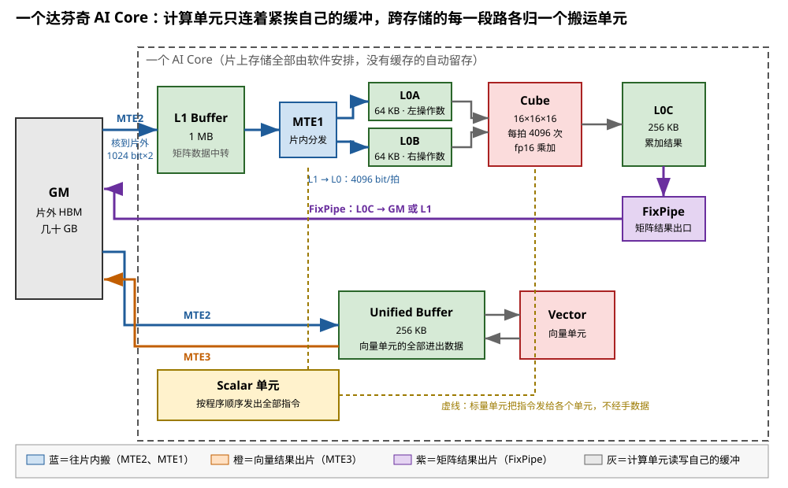
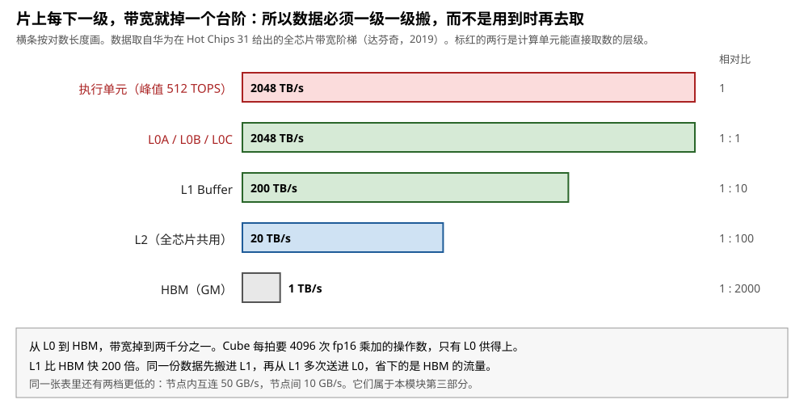
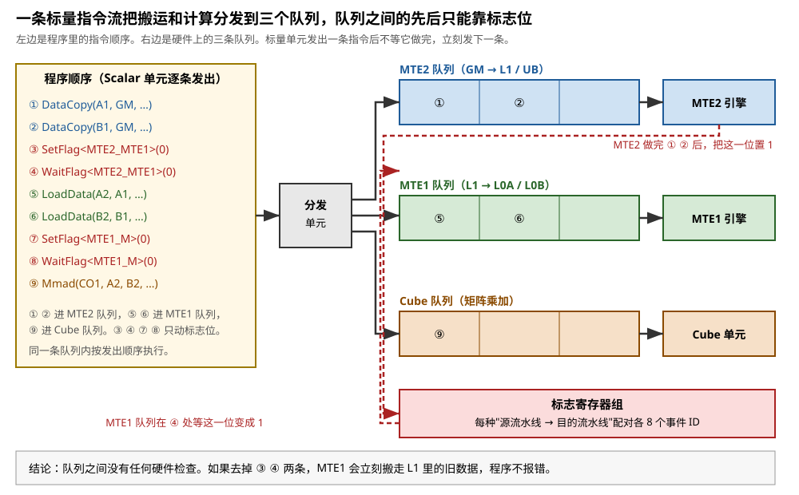
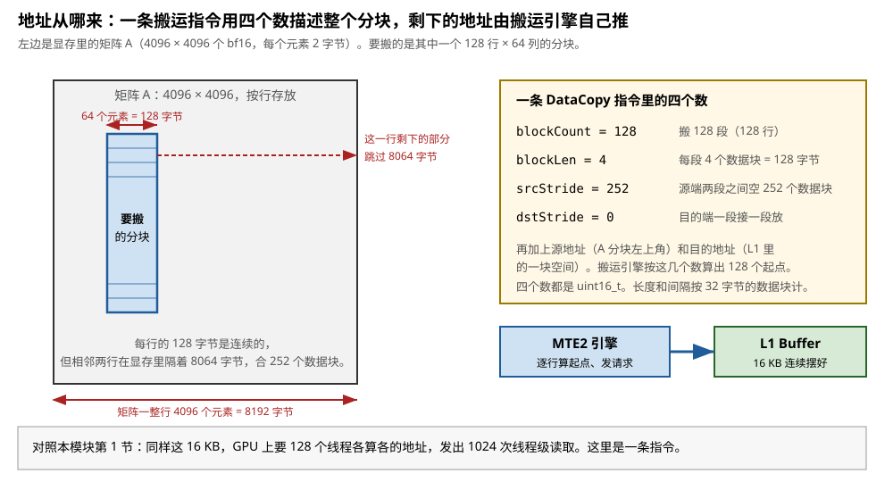
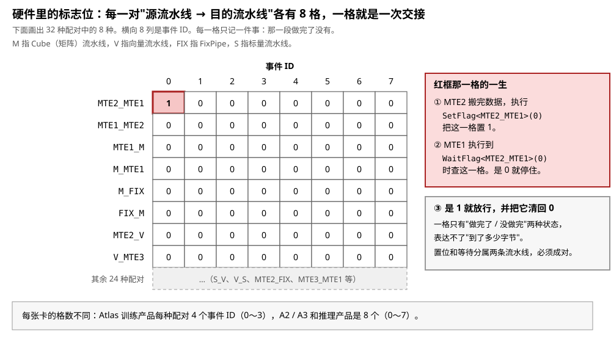
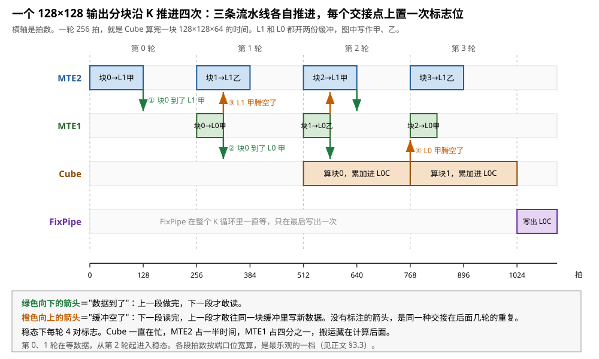
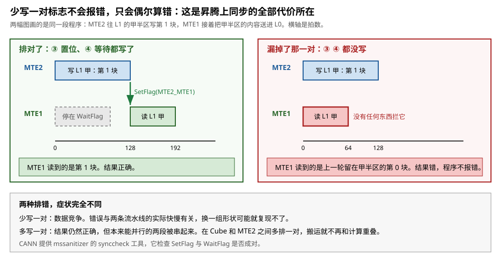

# 昇腾：MTE 与 set_flag / wait_flag

> **所属模块**：模块 14 · 数据搬运（第二部分 · NPU 的数据搬运）
> **状态**：🟨 学习中（2026-10 新写，同月经独立检查修订。知识截至 2026-09）
> **一句话主旨**：昇腾的计算单元只连着紧挨自己的几块片上缓冲，一个核上又只有一条指令流。所以"线程自己搬"在硬件上无法表达，搬运从第一代起就只有一种做法。一条搬运指令用块数、块长和两个步长描述整个分块，剩下的地址由搬运引擎自己推。搬运引擎和计算单元各有自己的指令队列，队列之间没有任何依赖检查。所以完成由程序显式对账：上一段做完就置一个标志位，下一段在用之前等这一位。代价是正确性全部落在软件上，少写一对标志不报错，只会偶尔算错。

---

## 0. 这一节要回答的问题

- 昇腾为什么只有一种搬法？GPU 那种"每个线程自己发读取指令"在这里为什么写不出来？
- 一个 AI Core 里有哪几块片上存储？四个搬运单元各管哪一段路？
- 一条搬运指令里写了什么？128 行的一个分块，地址是谁算出来的？
- `set_flag` / `wait_flag` 在硬件上是什么？谁置位，谁等待，等到之后发生什么？
- 写算子的人看到的 `DataCopy` 和队列，编译出来是什么？
- 这种做法的代价在哪里？它比 GPU 省了什么，又把什么推给了软件？

---

## 1. 基础词汇

**AI Core**。AI Core 是昇腾芯片上一个独立的计算单元，相当于 GPU 中的一个 SM。按华为公布的框图，Ascend 910 上有 32 个 AI Core，它们共用一块 32 MB 的片上 buffer，作用相当于 GPU 的 L2。本节只讲一个 AI Core 内部的搬运。

**Cube、Vector、Scalar**。这是 AI Core 里的三个计算部件。**Cube** 是矩阵单元，每拍把两个 16 × 16 的 fp16 矩阵相乘，合计 4096 次乘加。**Vector** 是向量单元，做激活、归一化这类逐元素运算。**Scalar** 是标量单元，它算循环变量和地址，并且按程序顺序发出全部指令。它的作用相当于一个小 CPU。

**GM**。GM 是 Global Memory 的缩写，指片外的 HBM 显存。它和 GPU 的显存是同一个东西。

**L1 Buffer、L0A、L0B、L0C、Unified Buffer**。这是 AI Core 内部的五块 SRAM。**L1 Buffer** 是大块中转区，矩阵数据先搬到这里。**L0A** 和 **L0B** 紧挨 Cube，分别存放左操作数和右操作数。**L0C** 存放 Cube 的累加结果。**Unified Buffer**（下文写作 UB）是 Vector 单元的全部数据进出口。按华为在 Hot Chips 31 公布的达芬奇核，这五块的容量依次是 1 MB、64 KB、64 KB、256 KB、256 KB。

这几块存储全部由软件安排：什么时候搬进来、放在哪个地址、什么时候作废，都写在程序里。它们没有缓存那套"先查一下，没有再去取"的机制。

**MTE**。MTE 是 Memory Transfer Engine 的缩写，译作搬运引擎。它是 AI Core 里专门负责搬数据的硬件，不做运算。一个 AI Core 里有 MTE1、MTE2、MTE3 三个 MTE，加上一个负责矩阵结果出口的 FixPipe。§3.1 讲它们各管哪一段。

**流水线与队列**。昇腾把 AI Core 内部的执行部件按功能分成几条**流水线**，官方写作 `PIPE_MTE1`、`PIPE_MTE2`、`PIPE_MTE3`、`PIPE_M`（Cube）、`PIPE_V`（Vector）、`PIPE_FIX`、`PIPE_S`（Scalar）。每条流水线有自己的指令队列。标量单元按程序顺序把指令分发进这些队列，然后立刻继续执行下一条。所以几条流水线同时在工作。

**拍**。一拍是一个时钟周期。本节的时间都按拍计算，不换算成纳秒。

**本节的运行例子**，和本模块其它几节相同：

- 矩阵乘的输出分块是 128 × 128，沿 K 方向每次推进 64。
- 每推进一次，要搬 A 的一个 128 × 64 分块和 B 的一个 128 × 64 分块。
- 元素是 bf16（2 字节），所以每个分块 128 × 64 × 2 = 16 KB，每推进一次搬 32 KB。
- A 和 B 都存放在 GM 中，矩阵是 4096 × 4096，按行存放。

按 Cube 每拍 4096 次乘加计算，算完一块 128 × 128 × 64 要 1 048 576 ÷ 4096 = **256 拍**。这个数在后面反复用到。

---

## 2. 昇腾只有一种搬法，原因在计算单元的接线上

上一节比较了 GPU 上的几种搬法，结论是几种搬法同时存在，按数据的规整程度分工。本节换一种硬件。昇腾上没有这种选择：三个问题的答案从第一代起就定下来了，而且只有一组。

- **谁发起**：一条标量指令流发出一条搬运指令，交给专门的搬运引擎。
- **地址从哪来**：指令里写块数、块长和两个步长，引擎自己推出每一行的起点。
- **完成怎么知道**：程序显式置一个标志位，用数据的那条流水线显式等这一位。

本节先说明为什么没有别的选择，再把这一组答案逐条讲开。

### 2.1 计算单元只连着紧挨自己的缓冲

图 6-1 画出了一个达芬奇 AI Core 的内部接线。读这张图只要抓一件事：**每个计算部件的数据通路只通向紧挨它的那几块缓冲**。

- Cube 的输入只接 L0A 和 L0B，输出只接 L0C。
- Vector 的输入和输出只接 UB。
- 没有任何一条通路从 Cube 或 Vector 直接通向 GM。

GPU 上的情况不同。GPU 的线程能发出一条 `LDG` 指令，这条指令带一个显存地址，访存单元会一路查 L1、L2、显存，把数据取回寄存器。昇腾的 Cube 和 Vector 没有这样的指令，也没有访存单元可以替它们跑这一趟。数据要进 L0A，就只能由别的硬件搬进去。



> **图 6-1**　一句话：昇腾把"从哪搬到哪"这个问题的答案固定在了硬件单元的编号里。计算部件只能读写紧挨自己的那块缓冲，跨存储的每一段路各由一个搬运单元负责。
>
> **先知道一件事**：图里的 L1 Buffer、L0A、L0B、L0C、UB 都是片上的 SRAM。它们和 CPU 的缓存不同：缓存会自动留存刚用过的数据，查不到时自己去下一级取；这几块不会。什么时候把什么搬进来，全部写在程序里。
>
> **按这个顺序看**：
> 1. 最左边的灰框是 GM，也就是片外的 HBM 显存。右边的大虚线框是一个 AI Core。
> 2. 跟着蓝色箭头走。MTE2 把数据从 GM 搬进片内，可以进 L1 Buffer，也可以进 UB。它是整条数据流的入口。核与片外之间的通路是 1024 位宽的两条，合计每拍 256 字节。这是端口的位宽，是上限。片上网络实际分给每个核的读带宽比它低，§3.3 算了这笔账。
> 3. 继续跟蓝色箭头。数据进了 L1 之后还要再搬一次，由 MTE1 送进 L0A 和 L0B。这一段通路每拍 4096 位，合计 512 字节，是上一段的两倍。
> 4. 看中间的灰色箭头。它们不是搬运单元，是计算部件读写自己缓冲的通路：Cube 从 L0A、L0B 取操作数，把结果累加进 L0C；Vector 和 UB 之间同理。灰色箭头没有一条通向 GM。
> 5. 跟着紫色箭头走。矩阵结果从 L0C 出去，由 FixPipe 送回 GM 或 L1。跟着橙色箭头走，向量结果从 UB 由 MTE3 送回 GM。
> 6. 最后看底部的黄框。标量单元按程序顺序发出全部指令，但它不经手数据。黄色虚线表示指令的去向，不表示数据流动。
>
> **看懂的标志**：能回答"为什么昇腾的数据要在片上转两道手"。Cube 只能从 L0A、L0B 取数，而 L0A 只有 64 KB，装不下整个矩阵。L1 有 1 MB，可以装下一批分块，同一份数据在 L1 里被多次送进 L0 去配不同的对象。多出来的 L1 这一级省的是 GM 的流量。
>
> **与正文的对照**：容量和总线宽度取自华为在 Hot Chips 31（2019）公布的达芬奇核框图。MTE1、MTE2、MTE3 的路段取自 CANN 的 AI Core 架构文档。BiasTable 和 FixPipe 的两块小缓冲图中没有画。
>
> 来源：本库自绘。延伸看图：[Hot Chips 31 达芬奇演讲稿](https://www.old.hotchips.org/hc31/HC31_1.11_Huawei.Davinci.HengLiao_v4.0.pdf)第 9 页有原始框图，上面标出了每条总线的位宽和 MTE 内部的转换电路。

### 2.2 带宽阶梯决定了必须一级一级搬

这里要回答一个问题：既然 Cube 够不到 GM，为什么不把 L0A 做大，直接从 GM 填满它？答案是带宽。

华为在同一份演讲稿里给出一张全芯片的带宽阶梯。按它的口径，执行单元要的带宽是 2048 TB/s，L0 刚好供得上，L1 只有十分之一，L2 只有百分之一，HBM 只有两千分之一。图 6-2 把这张表画了出来。

每下一级，带宽掉一个台阶。这就是片上存储分成 L1 和 L0 两级的原因：L0 小而快，正好跟上 Cube 的节奏；L1 大而慢，负责把同一份数据留下来反复用。

把本节的例子代进去算一遍。L0A 只有 64 KB，装不下 A 的多个分块。假设 L1 里放着 A 的 8 个 128 × 64 分块，共 128 KB。它们要和 B 的 8 个分块两两相乘，算出一个 1024 × 1024 输出区域在这一段 K 上的部分和：

- 有 L1 时：每个 A 分块从 GM 读一次进 L1，再从 L1 送进 L0A 八次。GM 侧读 8 × 16 KB = 128 KB。
- 没有 L1 时：每次配一个新的 B 分块，就要从 GM 重读一次 A 分块。GM 侧读 8 × 8 × 16 KB = 1 MB。

同一份结果，GM 侧的读取量差 8 倍。而 GM 的带宽只有 L0 的两千分之一，所以这 8 倍的差别直接变成 8 倍的等待。L1 这一级的存在理由就在这里。



> **图 6-2**　一句话：从 Cube 往外数，每下一级存储，带宽就掉一个台阶，到 HBM 只剩两千分之一。所以数据必须一级一级搬上来，不能用到时再去取。
>
> **先知道一件事**：带宽指每秒能传输多少字节，和延迟是两件事。延迟指从发出请求到数据返回要等多久。这张图比较的是带宽。带宽不够时，再怎么提前发起请求也没有用，因为通路本身每秒就只能过这么多字节。
>
> **按这个顺序看**：
> 1. 每一行是一级存储，自上而下离计算越来越远。横条按对数长度画，这样 1 TB/s 和 2048 TB/s 可以画在同一张图上。请读横条里的数字。
> 2. 最上面两行的名称写成红色。执行单元要的带宽和 L0 能给的带宽相等，所以 Cube 的操作数只能从 L0 取。
> 3. 往下看 L1 这一行。它只有 L0 的十分之一。L1 的带宽不足以直接供给 Cube，但它比 HBM 快 200 倍，所以适合存放要被反复使用的数据。
> 4. 最下面是 HBM，也就是 GM。它和 L0 相差两千倍。
> 5. 看最右边一列的相对比。这一列是这张图的要点：差距不是百分之几，是几个数量级。
>
> **看懂的标志**：能回答"为什么不把 L0 做大、取消 L1"。L0 的带宽是靠极宽的数据通路做出来的，通路越宽，面积和功耗越高，所以 L0 只能做到几十 KB。L1 用较窄的通路换来更大的容量。两级分工的结果是：大容量的那一级负责复用，高带宽的那一级负责供给计算。
>
> **与正文的对照**：数据取自华为在 Hot Chips 31 公布的全芯片带宽阶梯，口径是整颗芯片，不是单个核。同一张表里还有节点内互连 50 GB/s 和节点间 10 GB/s 两档，它们属于本模块第三部分。
>
> 来源：本库自绘。

### 2.3 标量单元能读写 GM，但它不构成第二种搬法

上面说"没有任何一条通路从计算部件直接通向 GM"，这句话有一个看起来像例外的情形，要讲清楚。

**它碰到了规则的哪一部分。** 标量单元确实能直接访问 GM。Ascend C 的 `GlobalTensor` 提供 `GetValue(offset)` 和 `SetValue(offset, value)` 两个接口，前者从 GM 读出一个元素，后者往 GM 写入一个元素。它们不经过任何 MTE。

**它实际怎么工作。** 标量单元有一块自己的数据缓存（官方文档写作 DCache）。`SetValue` 先改写 DCache，按 64 字节一行往 GM 回写，所以要立刻生效必须再调一次 `DataCacheCleanAndInvalid`。`GetValue` 同样可能读到 DCache 里的旧值，官方文档要求在数据可能被外部改写时先做一次缓存清理。

**结论：它只是看起来像例外。** 这条通路每次只搬一个元素，而且目的地是标量寄存器，不是 L0A 或 UB。Cube 和 Vector 取不到这里的数据。它的用途是读取形状、偏移这类控制量，不是搬运数据块。所以搬运一个分块这件事，仍然只有 MTE 一条路。

### 2.4 没有线程，所以写不出"每个线程自己搬"

还有一个更直接的原因。本模块第 1 节讲的最朴素搬法，前提是一个 SM 上有几十个 **warp**、上千个线程，每个线程算自己那一小段的地址。warp 是 GPU 把 32 个线程编成的一组，这一组每次执行同一条指令，各自使用自己的数据。SM 是 GPU 上一个独立的计算单元，相当于昇腾的一个 AI Core。昇腾的一个 AI Core 上没有这个结构：它只有**一条标量指令流**。

华为在 Hot Chips 31 把这件事列为达芬奇的第一个设计难题，标题就是"如何用单线程实现并行"。他们的答案是：标量单元把指令分发进几条流水线的队列，队列各自推进。并行度来自几条流水线同时工作，不来自多个线程。

这件事有两个后果，后面反复用到：

1. "每个线程算自己的地址"没有对应的硬件，所以地址只能由一条指令整块描述，再由引擎推算。这是 §3 的内容。
2. "等待时由其它 warp 填补"也没有对应的硬件。一条流水线停下来等，就是真的停下来。隐藏延迟只能靠多开几份缓冲、让搬运提前几轮发出。这是 §4.4 的内容。

---

## 3. 搬运引擎：四个单元各管一段路，一条指令描述整块

### 3.1 四个搬运单元的分工

按 CANN 的 AI Core 架构文档，四个搬运单元的路段如下。这份分工是写死在硬件里的，程序不能改。

| 单元 | 负责的路段 | 一句话 |
| --- | --- | --- |
| **MTE2** | GM → L1、GM → L0A/L0B、GM → UB | 从片外往片内搬，是整条数据流的入口 |
| **MTE1** | L1 → L0A/L0B、L1 → BiasTable Buffer | 片内的二次分发，把 L1 里的数据送到 Cube 跟前 |
| **MTE3** | UB → GM | 向量计算结果的出口 |
| **FixPipe** | L0C → GM、L0C → L1、L1 → FixPipe Buffer | 矩阵结果的出口，并且能在搬运途中做量化和格式转换 |

这张表说明一件事：**昇腾把"从哪搬到哪"固定进了硬件单元的编号**。GPU 上一条 `cp.async.bulk.tensor` 指令，源和目的由指令修饰符指定，一套指令覆盖多个方向。这条指令是 Hopper 的 TMA 指令，由本模块第 3 节讲。昇腾这边是不同的路段归不同的引擎，而且这些引擎是各自独立推进的指令队列。

搬运途中的格式变换也由这些单元做。MTE1 能在 L1 → L0 这一跳上做转置，MTE2 能在搬入时做分形重排，FixPipe 能在写出时做量化。具体的变换规则归本模块第 11 节，这里只确立"由搬运引擎顺带做掉"这个事实。

### 3.2 一条搬运指令怎么发出：标量流水投进队列就返回

写算子时，一次搬运写成一条函数调用，例如 `DataCopy(目的, 源, 参数)`。它最终变成一条机器指令，由标量单元发出。标量单元把这条指令投进对应流水线的队列，然后**立刻执行下一条指令**，不等搬运做完。

图 6-3 用一段九条指令的程序画出了这个过程。请注意第 ③ ④ 条和第 ⑦ ⑧ 条：它们不搬数据，只动标志位。如果去掉它们，程序照样能编译、照样能运行，只是 MTE1 会在 MTE2 写完之前就去读 L1。**队列之间没有任何硬件检查。**



> **图 6-3**　一句话：昇腾上只有一条指令流，它把搬运指令和计算指令分别投进三条队列。队列各自推进，队列之间的先后顺序只能靠标志位表达。
>
> **先知道一件事**：这里的"队列"是硬件里的一小段缓冲，排着等待执行的指令。同一条队列里的指令按投入顺序执行。不同队列之间没有顺序关系：MTE1 队列里的第一条，可能比 MTE2 队列里的第一条先做完，也可能后做完。
>
> **按这个顺序看**：
> 1. 左边黄框是程序里的指令顺序，九条，自上而下。标量单元逐条发出它们。
> 2. 看颜色。蓝色的 ① ② 是从 GM 往 L1 搬，进 MTE2 队列。绿色的 ⑤ ⑥ 是从 L1 往 L0 搬，进 MTE1 队列。棕色的 ⑨ 是矩阵乘，进 Cube 队列。
> 3. 看红色的 ③ ④ ⑦ ⑧。它们只读写标志位，不搬数据，也不计算。
> 4. 看中间的分发单元和三条队列。标量单元发出 ① 之后不等它做完，立刻发 ②，再发 ③。所以三条队列可能同时在忙。
> 5. 看右下角的标志寄存器组和两条红色虚线。MTE2 做完 ① ② 后把一位置 1。MTE1 在 ④ 处等这一位变成 1。这是两条队列之间唯一的联系。
>
> **看懂的标志**：能回答"去掉 ③ ④ 会发生什么"。MTE1 队列不会再等，它会在 MTE2 还没写完时就去读 L1，读到的是上一轮留下的旧数据。硬件不检查，程序不报错，结果只是偶尔算错。
>
> **与正文的对照**：指令名取自 Ascend C 的接口。流水线的划分与分发模型取自华为在 Hot Chips 31 公布的达芬奇指令分发结构。图中省略了 Vector 和 FixPipe 两条队列。
>
> 来源：本库自绘。

### 3.3 走查：搬 A 的一个 128 × 64 分块要发几条指令

现在回答"地址从哪来"。昇腾的答案是：**一条指令用四个数描述整个分块，引擎自己推出每一行的起点。**

把 A 的分块从 GM 搬进 L1，用的是 `DataCopy`。它的参数结构 `DataCopyParams` 有四个 `uint16_t` 字段。长度和间隔都不按字节计，而是按**数据块**计。一个数据块是 32 字节，这是这条指令的最小粒度：

- `blockCount`：搬几段连续数据，取值 1 到 4095。
- `blockLen`：每一段有几个 32 字节的数据块，取值 1 到 65535。
- `srcStride`：源端相邻两段之间空几个数据块，也就是上一段的尾到下一段的头之间的间隔。
- `dstStride`：目的端相邻两段之间空几个数据块。

本节的例子代进去：A 是 4096 × 4096 的 bf16 矩阵，按行存放，一整行是 4096 × 2 = 8192 字节，合 256 个数据块。要搬的分块是 128 行 × 64 列，每行 64 × 2 = 128 字节，合 4 个数据块。所以：

| 字段 | 值 | 怎么来的 |
| --- | --- | --- |
| `blockCount` | 128 | 分块有 128 行，一行一段 |
| `blockLen` | 4 | 每行 64 个 bf16，合 128 字节，合 4 个数据块 |
| `srcStride` | 252 | 一整行 256 个数据块，已经搬走 4 个，剩下 252 个跳过 |
| `dstStride` | 0 | 目的端在 L1 里一段接一段连续摆放 |

加上源地址和目的地址，一共六个数。MTE2 拿到这六个数，自己做 128 次加法算出 128 个行起点，再把每一行拆成对 GM 的请求。图 6-4 把这笔账画了出来。

按 32 字节计数带来一条限制：每一段的长度和间隔都要是 32 字节的整数倍。本例的 128 字节和 8064 字节都满足。不满足时要换用 `DataCopyPad`，它的参数结构是 `DataCopyExtParams`，`blockLen` 是 32 位整数、单位是字节、取值 1 到 2097151，并且允许在搬入时补齐。`DataCopyPad` 只覆盖 GM 和向量路径的几条通路，不覆盖本例走的 GM → L1。



> **图 6-4**　一句话：一个二维分块在显存里不是连续的一段，但它的不连续是规则的。一条搬运指令只要写明块数、块长和两个步长，引擎就能把每一行的起点算出来。
>
> **先知道一件事**：矩阵按行存放的意思是，同一行的元素在显存里前后相邻。同一列的两个元素则相隔一整行。所以横向切出来的一段是连续的，纵向跨行就要跳。
>
> **按这个顺序看**：
> 1. 先看左边的大灰框，它代表显存里的矩阵 A，4096 行 × 4096 列，每个元素 2 字节。
> 2. 看中间的蓝色竖条，这是要搬的分块：128 行高，64 列宽。竖条里的横线表示它由 128 行组成。
> 3. 看竖条顶上的红色双箭头：一行 64 个元素，合 128 字节。这 128 字节在显存里是连续的。
> 4. 看竖条右边的红色虚线箭头：这一行剩下的部分要跳过。矩阵一整行 8192 字节，减去搬走的 128 字节，还剩 8064 字节。
> 5. 看右边黄框里的四个数。它们把上面这几句话翻译成了指令的参数。这条指令的长度和间隔都按 32 字节的数据块计数，所以 128 字节写成 4，8064 字节写成 252。
> 6. 看右下角：MTE2 按这几个数逐行算起点、逐行发请求，把 16 KB 连续摆进 L1。
>
> **看懂的标志**：能回答"为什么 `srcStride` 是 252 而不是 256"。256 是一整行的数据块数。这个字段的定义是上一段的**尾**到下一段的**头**之间的间隔，不是两段头之间的间隔。所以已经搬走的 4 个数据块要先扣掉。
>
> **与正文的对照**：四个字段的名称、类型和取值范围取自 Ascend C 的 `DataCopyParams` 文档。四个字段都是 `uint16_t`。长度和间隔的单位是 32 字节的数据块，目的端在 L0C 或写出通路上时单位另有规定。
>
> 来源：本库自绘。

接着是第二跳：从 L1 送进 L0A。这一跳用 `LoadData`，参数结构是 `LoadData2DParams`。它的单位不是行，是**分形块**。一个分形块是 16 × 16 个元素，fp16 或 bf16 下正好 512 字节。A 的分块是 128 × 64，切成 8 × 4 = **32 个分形块**，所以 `repeatTimes` 填 32。这个结构还有一个 `ifTranspose` 开关，从 L1 送进 L0A 或 L0B 时可以让每个分形块转置。

把两跳合起来，搬完 A、B 两个分块一共要发四条搬运指令：

| 步骤 | 指令 | 执行者 | 搬多少 | 要多少拍 |
| --- | --- | --- | --- | --- |
| 1 | `DataCopy`：A 分块 GM → L1 | MTE2 | 16 KB | — |
| 2 | `DataCopy`：B 分块 GM → L1 | MTE2 | 16 KB | 两条合计 32 KB ÷ 256 字节/拍 = **128 拍** |
| 3 | `LoadData`：A 分块 L1 → L0A | MTE1 | 16 KB，32 个分形块 | — |
| 4 | `LoadData`：B 分块 L1 → L0B | MTE1 | 16 KB，32 个分形块 | 两条合计 32 KB ÷ 512 字节/拍 = **64 拍** |

拍数按图 6-1 标出的总线宽度算：核到片外每拍 256 字节，L1 到 L0 每拍 512 字节。两段都比 Cube 算一块的 256 拍短，所以只要提前发出，搬运可以藏在计算后面。§4.4 的时间线会把这件事画出来。

这两个数是**端口位宽**，也就是上限。实际能跑多少，还要看供给侧给不给得到。同一份演讲稿给出两个数：Ascend 910 的片上网络给每个核的读带宽是 128 GB/s，整颗芯片对 HBM 的访问带宽是 1.2 TB/s。Ascend 910 的核频率约 1 GHz，由 256 TFLOPS ÷ 32 个核 ÷ 每核每拍 8192 次浮点运算算出。所以：

| 供给侧 | 每个核每拍能读到的字节 | 搬 32 KB 要多少拍 |
| --- | --- | --- |
| 端口位宽 | 256 | 128 |
| 片上网络给每个核的读带宽（128 GB/s） | 约 128 | 约 256 |
| HBM 带宽按 32 个核平分（1.2 TB/s ÷ 32） | 约 37.5 | 约 870 |

第二行正好等于 Cube 算一块的 256 拍。第三行是它的三倍多。所以，如果每一轮的 32 KB 都要从 HBM 新读一遍，这个算子一定是搬运受限的。§2.2 的 L1 复用就是用来避免这种情况的。同一份 A 分块在 L1 里配 8 个不同的 B 分块，GM 侧的流量降到八分之一。这才回到计算受限。下面的时间线按端口位宽画，是最乐观的一档。

拿这四条指令和本模块第 1 节对照。同样是这 32 KB，GPU 上 128 个线程各发 16 条 `LDG` 和 16 条 `STS`。`LDG` 把数据从显存读进寄存器，`STS` 再把它从寄存器写进 shared memory。shared memory 是 GPU 的 SM 内部一块由程序显式管理的 SRAM，作用相当于昇腾的 L1 Buffer 加 Unified Buffer。这些指令合计 2048 次线程级读取、128 次 warp 级发射。每次读取之前还要一两条整数指令算地址。昇腾这边是四条指令，地址计算在引擎内部完成，不占指令发射。**"谁发起"和"地址从哪来"这两个问题，昇腾用一条指令同时解决了。**

---

## 4. 完成怎么知道：一个标志位，一次置位，一次等待

### 4.1 硬件里只有标志位，没有依赖检查

GPU 上，"数据到了没有"这件事由硬件自动跟踪。`LDG` 发射时，记分牌的某个计数器加一。数据写进寄存器时，这个计数器减一。调度器每拍检查它。程序员不写任何等待指令。

昇腾没有这套东西。硬件提供的是一组**标志位**，加上一对指令：

- `SetFlag<HardEvent::X_Y>(eventID)`：由源流水线执行。按毕昇编译器文档的说法，它在当前指令完成全部读写之后，把对应的标志位置 1，表示"我这一段做完了"。
- `WaitFlag<HardEvent::X_Y>(eventID)`：由目的流水线执行。标志位是 0 时，它挡住后面的指令；标志位是 1 时，它把这一位清回 0，然后放行。

`HardEvent` 是一个枚举，命名规则是"源流水线 \_ 目的流水线"。官方文档列出 32 个取值，包括 `MTE2_MTE1`、`MTE1_MTE2`、`MTE1_M`、`M_MTE1`、`M_FIX`、`FIX_M`、`MTE2_V`、`V_MTE3`、`S_MTE2` 等。`M` 指 Cube 流水线，`V` 指向量流水线，`FIX` 指 FixPipe，`S` 指标量流水线。

`eventID` 是同一种配对下的第几个标志位。Atlas 训练产品的取值是 0 到 3，Atlas A2、A3 和推理产品是 0 到 7。图 6-5 把这组标志位画成一张表格。



> **图 6-5**　一句话：昇腾的完成记录就是一张很小的表格。每一格只记一件事：某一段做完了没有。置位的是做完的那条流水线，等待的是要用结果的那条流水线。
>
> **先知道一件事**：这张表格里没有任何地址、字节数或指令编号。硬件不知道哪条指令写了哪块缓冲，也不知道搬了多少字节。哪里该置位、哪里该等待，全部由写算子的人或编译器事先排好，写进程序。
>
> **按这个顺序看**：
> 1. 纵向每一行是一种"源流水线 → 目的流水线"的配对。图中画出 32 种里的 8 种。`MTE2_MTE1` 的意思是：源是 MTE2，目的是 MTE1，由 MTE1 等 MTE2。
> 2. 横向八列是事件 ID。同一种配对下有 8 个独立的格子，所以可以同时记录 8 次还没对账的交接。
> 3. 看左上角的红框格，它是 `MTE2_MTE1` 配对的 0 号。右边的三段文字讲的就是这一格的一生：MTE2 搬完数据后置 1，MTE1 查到 0 就停住，查到 1 就放行并把它清回 0。
> 4. 注意最后一句：一格只有两种状态。它表达不了"这一批数据到了多少字节"。
>
> **打个比方**：这像车间两道工序之间的一块交接牌。上一道做完把牌翻成正面，下一道看见正面才动手，动手时顺便把牌翻回背面。牌上写不下别的信息，只能表示"轮到你了"。
>
> **看懂的标志**：能回答"为什么 `SetFlag` 和 `WaitFlag` 必须成对"。一次置位对应一次清零。如果多置一次而没有人等，这一格会一直留着 1，下一轮的 `WaitFlag` 会立刻通过，等于没有等。官方的 `synccheck` 工具查的就是这种不配对。
>
> **与正文的对照**：枚举取值和事件 ID 的范围取自 Ascend C 的 `SetFlag` / `WaitFlag` 文档。官方在描述多余的 `SetFlag` 时用的词是"硬件计数器"，所以一格有可能不止一位。位宽没有公开，记在 §11。
>
> 来源：本库自绘。

### 4.2 连同一条流水线内部也没有互锁

上面说的是不同流水线之间。同一条流水线内部呢？

同一条流水线里的指令按发出顺序开始执行，但**不保证前一条做完才开始后一条**。所以两条有数据依赖的向量指令之间，也要插一条 `PipeBarrier<PIPE_V>()`。官方文档举的例子是：`Mul` 的输入正好是前一条 `Add` 的输出，这时必须插 `PipeBarrier`，否则 `Mul` 可能读到还没算完的值。

这里有一个例外，而且只有这一个：**标量流水线内部的依赖由硬件保证**。官方文档写明，调用 `PipeBarrier<PIPE_S>()` 会直接报硬件错误，因为没有必要。

把这两条合起来，昇腾的同步规则就只有一句话：**除了标量流水线内部，所有的先后关系都要程序写明。**

### 4.3 走查：一轮交接的七步

把 §3.3 的四条搬运指令和 §4.1 的标志位串起来。下面是 K 循环里一轮的完整顺序，L1 和 L0 都开两份缓冲，分别叫甲和乙。

每一条 `SetFlag` 和 `WaitFlag` 都写在程序里，由标量单元按顺序发出。`SetFlag<X_Y>` 排进源流水线 X 的队列，`WaitFlag<X_Y>` 排进目的流水线 Y 的队列。下面说"MTE2 执行"，指的是这条指令排在 MTE2 的队列里，轮到它时才生效。

1. MTE2 执行 `DataCopy`，把第 k 块的 A、B 搬进 L1 甲。
2. MTE2 接着执行 `SetFlag<MTE2_MTE1>(0)`，把 `MTE2_MTE1` 的 0 号格置 1。
3. MTE1 执行 `WaitFlag<MTE2_MTE1>(0)`。这一位是 1，放行并清回 0。
4. MTE1 执行 `LoadData`，把第 k 块从 L1 甲送进 L0 甲。做完后执行两次置位：`SetFlag<MTE1_M>(0)` 表示 L0 甲装好了；`SetFlag<MTE1_MTE2>(0)` 表示 L1 甲腾空了。
5. MTE2 在搬第 k+2 块之前执行 `WaitFlag<MTE1_MTE2>(0)`，确认 L1 甲已经被读完，才敢往里面覆盖新数据。
6. Cube 执行 `WaitFlag<MTE1_M>(0)`，然后做矩阵乘，结果累加进 L0C。算完执行 `SetFlag<M_MTE1>(0)`，表示 L0 甲腾空了。
7. MTE1 在往 L0 甲装第 k+2 块之前执行 `WaitFlag<M_MTE1>(0)`。

数一数：这一轮用了四种配对，每种一对置位和等待，合计 **4 对标志**。其中两对是"数据到了"方向，两对是"缓冲空了"方向。

K 循环走完以后，还要再两对：Cube 执行 `SetFlag<M_FIX>(0)` 表示 L0C 里的累加结果可用，FixPipe 等到之后把结果写回 GM，再执行 `SetFlag<FIX_M>(0)` 表示 L0C 腾空了。这两对每个输出分块只做一次，不在 K 循环里。

### 4.4 走查：四轮的时间线

把上面这一轮重复四次，就得到图 6-6 的时间线。时间单位是拍，一轮 256 拍，就是 Cube 算完一块的时间。

| 轮次 | MTE2 | MTE1 | Cube |
| --- | --- | --- | --- |
| 第 0 轮（0～256 拍） | 块 0 → L1 甲，用 128 拍 | 等 | 等 |
| 第 1 轮（256～512 拍） | 块 1 → L1 乙，用 128 拍 | 块 0：L1 甲 → L0 甲，用 64 拍 | 等 |
| 第 2 轮（512～768 拍） | 块 2 → L1 甲，用 128 拍 | 块 1：L1 乙 → L0 乙，用 64 拍 | 算块 0，用满 256 拍 |
| 第 3 轮（768～1024 拍） | 块 3 → L1 乙，用 128 拍 | 块 2：L1 甲 → L0 甲，用 64 拍 | 算块 1，用满 256 拍 |

从第 2 轮起进入稳态。读这张表要抓四点：

**第一，提前两级。** Cube 在算第 k 块时，第 k+1 块已经在 L0 里，第 k+2 块正在从 GM 往 L1 搬。两级的理由是路径有两跳，每一跳各占一轮。

**第二，三条流水线的忙闲差别很大。** Cube 占满 256 拍，MTE2 占 128 拍，MTE1 占 64 拍。按这组数，本例是计算受限的，搬运藏在计算后面。如果分块改小，例如 K 方向每次只推进 16，Cube 的一轮缩短到 64 拍，MTE2 的 128 拍就藏不住了。

**第三，等待就是真的停住。** 第 0 轮和第 1 轮里，MTE1 和 Cube 在空等。昇腾上没有"换一个 warp 来填这段空"的办法，因为一个核上只有一条指令流。所以开头这两轮，Cube 确实没有计算可做。K 循环越长，这两轮摊薄得越彻底。

**第四，这张表按端口位宽画，是最乐观的一档。** §3.3 算过三档。按端口位宽，MTE2 每轮 128 拍。按片上网络给每个核的读带宽，每轮约 256 拍，和 Cube 打平。按 HBM 带宽平分到每个核，每轮约 870 拍，搬运成为瓶颈。表里取的是第一档。所以这张表说明的是"标志位怎么把三条流水线串起来"，不是"这个算子一定计算受限"。真实算子要先靠 L1 复用把 GM 侧的流量降下来，才落到第一档附近。



> **图 6-6**　一句话：三条流水线各自推进，谁也不等谁，直到遇上一个标志位。稳态下 Cube 一直在算，两条搬运流水线的工作完全叠在计算时间里。
>
> **先知道一件事**：图里的"甲""乙"是同一块存储上的两半。L1 分成甲、乙两半，MTE2 往一半里写的时候，MTE1 正从另一半里读。下一轮两半交换角色。这种做法叫双缓冲。
>
> **按这个顺序看**：
> 1. 横轴是拍数，从 0 到 1024。竖的灰虚线把它分成四轮，每轮 256 拍。
> 2. 四条泳道自上而下是 MTE2、MTE1、Cube、FixPipe。彩色方块表示这条流水线在干活，方块的长度就是用掉的拍数。空白表示它在等。
> 3. 先看 Cube 这一行。它从第 512 拍开始，之后一直占满。前两轮它在等前两跳把数据送进 L0。
> 4. 再看 MTE2 这一行。每轮只忙 128 拍，剩下一半时间在等。MTE1 更短，每轮只忙 64 拍。
> 5. 看绿色向下的箭头。它表示"数据到了"：上一段做完置位，下一段才敢读。箭头 ① 是块 0 到了 L1 甲，箭头 ② 是块 0 到了 L0 甲。
> 6. 看橙色向上的箭头。它表示"缓冲空了"：下一段读完置位，上一段才敢往同一块缓冲里写新数据。箭头 ③ 是 L1 甲被 MTE1 读完，箭头 ④ 是 L0 甲被 Cube 用完。
> 7. 最后看 FixPipe 这一行。它在整个 K 循环里一直等，只在最后写出一次 L0C。
>
> **看懂的标志**：能回答"为什么两个方向的箭头缺一不可"。只有绿色箭头时，MTE2 会在 MTE1 还没读完甲半区时就覆盖它，MTE1 读到一半数据被换掉。只有橙色箭头时，MTE1 会在 MTE2 还没写完时就去读，读到旧数据。两种都不报错。
>
> **与正文的对照**：各段的拍数按 §3.3 的端口位宽和 §1 的 Cube 速率算出，不是实测值。端口位宽是上限。按片上网络给每个核的读带宽算，MTE2 那一行会从 128 拍变成约 256 拍，正好填满一轮。发起到首字节返回的延迟没有计入，这一点记在 §11。为了看清交接关系，图中只标注了第一次出现的四种箭头，后面几轮的同类箭头没有写字。
>
> 来源：本库自绘。

---

## 5. 上层看到的样子：队列把标志位代管了

### 5.1 CopyIn / Compute / CopyOut 三段式

§4 列出的那些 `SetFlag` 和 `WaitFlag`，算子开发者多数时候不必亲手写。Ascend C 把一个算子的结构固定成三段：**CopyIn** 把数据从 GM 搬进片上，**Compute** 在片上算，**CopyOut** 把结果搬回 GM。三段之间用**队列**（`TQue`）连接。

下面是一个向量加法算子的主体。注意它里面一条同步语句都没有：

```cpp
constexpr int BUFFER_NUM = 2;
TPipe pipe;
TQue<TPosition::VECIN,  BUFFER_NUM> inQueue;          // 模板参数是队列深度
TQue<TPosition::VECOUT, BUFFER_NUM> outQueue;
pipe.InitBuffer(inQueue,  BUFFER_NUM, 每块字节数);     // 第二个参数是缓冲块数，填 2 就是双缓冲
pipe.InitBuffer(outQueue, BUFFER_NUM, 每块字节数);

// —— CopyIn ——
LocalTensor<half> x = inQueue.AllocTensor<half>();   // 从队列要一块片上空间
DataCopy(x, xGm[offset], 长度);                      // MTE2：GM → UB
inQueue.EnQue(x);                                    // 入队：这块装满了

// —— Compute ——
LocalTensor<half> x2 = inQueue.DeQue<half>();        // 出队：等到装满了才拿到
LocalTensor<half> y  = outQueue.AllocTensor<half>();
Add(y, x2, x2, 长度);                                 // Vector 单元
outQueue.EnQue(y);                                    // 入队：结果好了
inQueue.FreeTensor(x2);                               // 还回去：这块可以重装

// —— CopyOut ——
LocalTensor<half> y2 = outQueue.DeQue<half>();
DataCopy(yGm[offset], y2, 长度);                      // MTE3：UB → GM
outQueue.FreeTensor(y2);
```

**具体由哪个 MTE 执行，由源和目的的位置决定。** Ascend C 用 `TPosition` 表示位置，它是逻辑名字，不是物理地址。向量编程用 `VECIN`、`VECOUT`、`VECCALC`；矩阵编程用 `A1`、`B1`（存放整块矩阵）、`A2`、`B2`（存放切细后送进 Cube 的小块）、`CO1`、`CO2`（存放结果）。一次 `DataCopy` 从 `GM` 到 `VECIN` 就是 MTE2 的活，从 `VECOUT` 到 `GM` 就是 MTE3 的活。

### 5.2 同步藏在 EnQue 和 DeQue 里

那段代码里没有同步语句，但编译出来是有的。`EnQue` 内嵌一次 `SetFlag`，`DeQue` 内嵌对应的 `WaitFlag`，具体用哪一种 `HardEvent` 由源和目的的位置推出来。上面那段代码里，数据由 MTE2 搬进 UB，由 Vector 单元读走，所以按这条规则推出来的是 `MTE2_V`。

编译器还会补一部分同步。毕昇编译器有一个 `--cce-auto-sync` 选项，在算子工程里默认打开。它在几类单元之间自动插入 `SetFlag` / `WaitFlag` 和 `PipeBarrier`，覆盖 MTE2 与标量、MTE3 与标量、向量与标量、以及向量内部这几种配对。官方文档同时写明：自动同步要起作用，前提是程序正确使用 `EnQue`、`DeQue`、`AllocTensor`、`FreeTensor` 这一套接口。

所以实际写算子时，分两种情形：

- 用队列写，同步由框架和编译器代管。这是推荐做法。
- 直接调 `SetFlag` / `WaitFlag`（官方把这类接口归在 ISASI 里），同步全部自己排。矩阵算子里 L1 和 L0 的多级流水常走这条路。

官方文档对第二种情形有一条警告：在用 `TPipe` 和 `TQue` 的程序里**不要手工指定事件 ID**。手工指定的 ID 可能和框架自己用的撞上，撞上以后程序会挂起。要用就通过 `AllocEventID` 或 `FetchEventID` 申请。

### 5.3 队列深度和双缓冲是两件事

有一处容易弄混。上面那段代码里 `BUFFER_NUM` 出现了两次，位置不同，含义也不同。

`TQue<位置, N>` 的模板参数 N 是**队列深度**，意思是连续入队几次而中间不出队。本例每轮入队一次、出队一次，所以填 1 就够。官方也建议多数情况下填 1，这样编译器能做更多优化。

真正开双缓冲的是 `InitBuffer(队列, num, 每块字节数)` 的第二个参数 `num`：填 1 是单缓冲，填 2 就给这个队列分配两块空间，变成双缓冲。官方文档写得很明确：队列深度和双缓冲无关。队列机制实现流水并行，双缓冲在此基础上进一步提高流水线的利用率。队列深度为 1 时照样可以开双缓冲。

`TQue` 的数量有上限。关闭双缓冲时最多 8 个，开启双缓冲时每个队列占两块，所以最多 4 个。这个上限来自可用的同步事件 ID 个数。

---

## 6. 这种做法的代价

### 6.1 正确性全部落在软件上

这是最大的一项。硬件只提供标志位，不检查任何依赖。排错了会怎样，分两种：

**少排一对。** 结果是数据竞争。错误和两条流水线的实际快慢有关：这次搬得慢一点就对了，下次搬得快一点就错了。换一组输入形状可能复现不了。程序不报错，不崩溃，只是算出来的数偶尔不对。图 6-7 把这两种情形并排画了出来。

**多排一对。** 结果仍然正确，但本来能并行的两段被串了起来。例如在 Cube 和 MTE2 之间多排一对，MTE2 的搬运就不再和计算重叠，图 6-6 里那 128 拍会从计算后面挪到计算前面。

CANN 提供了一个检查工具：`mssanitizer --tool=synccheck`。它检查 `SetFlag` 和 `WaitFlag` 是否成对，报告里写明是哪一对流水线、在哪个核上、出错指令的位置。官方文档解释了为什么不配对必须查出来：多余的 `SetFlag` 会改变硬件计数器的状态。即使它不影响当前这个算子，也可能让后面的算子对错号。



> **图 6-7**　一句话：漏写一对标志，程序照样跑完，只是读到了上一轮留下的旧数据。这种错误和时序有关，换一组形状可能就复现不了。
>
> **先知道一件事**：图里的"L1 甲"是双缓冲的其中一半。它在上一轮装的是第 0 块，这一轮要被第 1 块覆盖。所以"读到旧数据"读到的是第 0 块，不是随机的字节。
>
> **按这个顺序看**：
> 1. 两幅图是同一段程序，左边排对了标志，右边漏掉了那一对。每幅图里有两条泳道：上面是 MTE2，下面是 MTE1。横轴是拍数。
> 2. 先看左图。MTE2 从第 0 拍开始写 L1 甲，到第 128 拍写完。绿色箭头是这一刻的置位。MTE1 在此之前停在 `WaitFlag` 上，图中用灰色虚线框表示。第 128 拍放行，它开始读。读到的是第 1 块。
> 3. 再看右图。没有置位，也没有等待。MTE1 从第 0 拍就开始读 L1 甲，这时 MTE2 才刚开始往里写。MTE1 读到的是上一轮留在甲半区的第 0 块。
> 4. 对比两幅图的红框和绿框结论。右图里没有任何硬件出来拦 MTE1。
>
> **看懂的标志**：能回答"为什么这种错误难查"。两条流水线的快慢取决于数据量、对齐情况和当时的访存拥堵程度。如果 MTE2 碰巧很快，MTE1 可能读到的就是新数据，这一次就算对了。错误只在特定的时序下出现。
>
> **与正文的对照**：拍数按 §3.3 的总线宽度算，是示意值。`synccheck` 的功能描述取自 CANN 的工具文档，它查的是置位和等待是否成对，不是查数据竞争本身。
>
> 来源：本库自绘。

### 6.2 同步的数量随路径长度增长

昇腾的数据路径是 GM → L1 → L0 → Cube，三跳。每一跳要两个方向的标志：数据到了，缓冲空了。所以 K 循环的每一轮至少 4 对标志（§4.3 数过），加上收尾的 2 对。

这个数不是常数，它随路径长度增长。GPU 上 Hopper 的 TMA 一步把数据从显存送进 shared memory，矩阵指令直接从那里取操作数，所以只有一跳。TMA（Tensor Memory Accelerator）是 Hopper 新增的搬运引擎：一个线程交给它一张张量描述符，它自己算出每一行的地址。昇腾多出来的 L1 这一级换来的是复用。同一份 A 数据在 L1 里可以被多次送进 L0 去配不同的 B，省的是 GM 的流量。§2.2 的带宽阶梯是这件事的依据。多出来的代价是一跳搬运和一对标志。两边的完整对照是本模块第 8 节的内容。

### 6.3 标志位表达不了"到了多少"

一个标志位只有两种状态。它说得出"那一段做完了"，说不出"这一批 8192 字节到了 6000 字节"。

这一条限制的后果是：**缓冲怎么切分必须在编译期定好。** 每一份缓冲多大、开几份、第几轮用哪一份，都要写进程序。运行时不能根据"已经到了多少"动态决定。GPU 的 mbarrier 从 Hopper 起按字节记账，所以它能表达部分到货。mbarrier 是放在 shared memory 中的一个屏障对象，搬运引擎每送到一批数据就把已到字节数加上去，任何线程都可以等它。这个差别也留给本模块第 8 节。

另外，同一种配对的标志位个数有限：Atlas A2、A3 上每种配对 8 个，更早的 Atlas 训练产品只有 4 个。这是"同时有几次交接还没对账"的硬上限，也是 `TQue` 最多 8 个的来源。

### 6.4 格式和对齐的要求比 GPU 严

各块缓冲对地址对齐有硬性要求。下表第二列取自 Ascend C 的通用约束，第三列取自矩阵计算接口的说明。GM 本身没有对齐要求。

| 缓冲 | 地址对齐 | Cube 路径上的数据排列 |
| --- | --- | --- |
| Unified Buffer | 32 字节 | 不走 Cube 路径，无此要求 |
| L1 Buffer | 32 字节 | ND 或 FRACTAL_NZ 都可以 |
| L0A | 512 字节 | FRACTAL_ZZ |
| L0B | 512 字节 | FRACTAL_ZN |
| L0C | 64 字节 | FRACTAL_NZ |

L0A 和 L0B 的要求最严：搬进去的数据不能是普通行主序。512 字节这个数不是随便定的：它正好是一个 16 × 16 的 fp16 分形块的大小（§3.3）。L0A 和 L0B 的内容直接送进 Cube，Cube 每拍取用一个 16 × 16 的块，所以这两块缓冲里的数据必须已经按分形块排好。

这意味着从 GM 读进来的普通行主序数据，在到达 L0 之前必须重排一次。重排由搬运引擎在路上顺带做掉，不额外读写一遍 GM。具体在哪一跳做、怎么做，是本模块第 11 节的内容。

### 6.5 没有线程可以填补等待

本模块第 1 节讲过 GPU 隐藏延迟的办法：一个 warp 在等数据时，调度器发射其它 warp 的指令。一个 SM 上最多驻留 64 个 warp，所以执行单元不会空闲。

昇腾没有这条路。一个 AI Core 只有一条指令流，一条流水线停下来等就是真的停住。隐藏延迟只剩一个办法：**多开几份缓冲，让搬运提前几轮发出**。图 6-6 里前两轮 Cube 的空等就是这个限制的直接表现。

这不一定是坏事。GPU 用 64 个 warp 填补等待，代价是每个线程的寄存器预算被压缩，这一笔账在本模块第 1 节算过。昇腾把这部分面积省下来给了计算单元和片上缓冲。两种选择各有账可算，本模块第 8 节并排比较。

### 6.6 下一节换一种完成记录

本节讲的是一条路线：专用引擎搬运，二值标志位对账。NPU 还有另一条路线。TPU 同样由专用引擎搬运，同样在编译期排好顺序。但它的完成记录不是二值标志，而是一个按字节累加的信号量。搬运进行时，硬件不断增加它的值。等待方等到值达到传输的总字节数，才放行。下一节讲 TPU，以及它为不规则访问另外配置的 SparseCore。

---

## 7. 开发者视角

| 想知道什么 | 在哪一层看 | 看什么 |
| --- | --- | --- |
| 哪条流水线是瓶颈 | MindStudio 的 Profiling | 算子的流水图：MTE2、MTE1、Cube、Vector、FixPipe 各自的忙闲比例。忙的那条就是瓶颈 |
| 同步是否成对 | `mssanitizer --tool=synccheck` | 报告写明从哪条流水线到哪条、在哪个核上、出错指令的位置和调用栈 |
| 编译器自动插了哪些同步 | 毕昇编译器 | `--cce-auto-sync`（算子工程里默认开）。生成的代码里能看到 `SetFlag` / `WaitFlag` / `PipeBarrier` |
| 一次搬运描述了什么 | Ascend C 源码 | `DataCopyParams` 的四个字段；矩阵路径上是 `LoadData2DParams` 的 `repeatTimes` 和 `ifTranspose` |
| 有没有开双缓冲 | Ascend C 源码 | `InitBuffer` 的第二个参数是 1 还是 2。不要看 `TQue` 的模板参数，那是队列深度 |
| 数据该放哪一级 | Ascend C 源码 | `TPosition`：`VECIN` / `VECOUT` 是向量路径，`A1` / `B1` / `A2` / `B2` / `CO1` 是矩阵路径 |

在哪一层能接触到这些机制：

- PyTorch（torch_npu）接触不到。调用的是已经编译好的算子。
- Ascend C 的队列接口：写 `DataCopy` 和 `EnQue` / `DeQue`，同步由框架代管。这是多数算子的写法。
- Ascend C 的 ISASI 接口：直接写 `SetFlag` / `WaitFlag` / `PipeBarrier`，同步全部自己排。矩阵算子的多级流水常走这条路。

---

## 8. 最新架构落点（知识截至 2026-09）

- **昇腾**：CANN 文档按 Cube 和 Vector 是否在同一个核上，把硬件分成两种架构。**耦合架构**是本节图 6-1 画的样子：两者在同一个核上，共用一个标量单元。Atlas 200I、500 A2 推理产品属于这一种。**分离架构**把一个 AI Core 拆成两个独立的核：AIC 只有 Cube，AIV 只有 Vector。两个核各有自己的标量单元，各自取自己的代码，通过 GM 交换数据。Atlas A2、A3 的训练和推理产品属于这一种，文档里的架构版本号是 220。拆开以后，矩阵和向量的配比可以按产品调整，但 §4 讲的那套标志位同步两边都一样。事件 ID 的个数从早期训练产品的 4 个增加到 8 个。
- **NVIDIA**：对应的机制是 Hopper 的 TMA 和 mbarrier，见本模块第 3 节。两边的并排对照是本模块第 8 节。
- **AMD**：CDNA 上数据同样要先搬进片上的 LDS，但发起方仍然是线程，等待用 `s_waitcnt` 指令，不是标志位。它更接近本模块第 1 节讲的那条路线。
- **TPU**：也由专用引擎搬运，但完成记录用的是按字节累加的信号量，不是二值标志。下一节讲。

---

## 9. 和其它模块的挂钩

- **本模块第 1 节**（为什么要搬，线程自己搬与记分牌）：记分牌是硬件自动跟踪完成的做法。本节的标志位是软件显式对账的做法。§3.3 和 §6.5 都和那一节对照。
- **本模块第 8 节**（GPU 与 NPU 对照）：同一个 A 分块在两边各搬一遍，逐段标出三个问题的答案。本节只讲昇腾一侧。
- **本模块第 11 节**（途中变换）：ND → NZ 的分形重排、img2col、转置，分别在哪一段路径上完成。本节只确立"由搬运引擎顺带做掉"。
- **模块 11 第 4 节**（片上存储与 tiling）：双缓冲的原型，以及分块应该切多大。本节的 L1 为什么是复用层，依据在那一节。
- **模块 13 第 6 节**（NPU 侧的微架构）：MTE 和标志寄存器的电路形态。本节讲它们的对外行为。
- **模块 50 第 2 节**（数据的排列）：FRACTAL_NZ、FRACTAL_ZZ、FRACTAL_ZN 具体是怎么排的。

---

## 10. 术语卡

### MTE（Memory Transfer Engine，搬运引擎）
**定义**：MTE 是昇腾 AI Core 里专门搬数据的硬件单元，不参与运算。一个 AI Core 里有 MTE1、MTE2、MTE3 三个，加上负责矩阵结果出口的 FixPipe。每个单元固定负责存储层级中的一段路：MTE2 从 GM 搬进片内，MTE1 把 L1 的数据送进 L0A/L0B，MTE3 把 UB 的结果送回 GM。
**为什么存在**：Cube 和 Vector 的数据通路只连着紧挨它们的那几块片上缓冲，够不到 GM。没有 MTE，片上缓冲就装不进数据，计算单元也就没有数据可算。所以它不是优化手段，是必需品。
**语境例句**："这个算子 MTE2 打满了，Cube 只有三成。" 意思是：从片外往片内搬数据的那条流水线一直在忙，矩阵单元大部分时间在等数据，瓶颈在搬运不在计算。

### set_flag / wait_flag（显式流水同步）
**定义**：这是昇腾上表达两条流水线先后关系的一对指令。`SetFlag<HardEvent::X_Y>(id)` 由源流水线执行，把一个标志位置 1。`WaitFlag<HardEvent::X_Y>(id)` 由目的流水线执行，让这条流水线停住，直到那一位变成 1，然后把它清回 0 并继续。两条指令必须成对出现。
**为什么存在**：昇腾的硬件不检查不同流水线之间的数据依赖。MTE2 还在往 L1 里写，MTE1 已经开始读同一块地址，硬件不会拦。没有这对指令，流水并行就没有办法保证正确。它的硬件成本是一小张标志位表格，几乎不占面积。
**语境例句**："这里漏了一个 wait，偶发精度问题就是它。" 意思是：某一处该等的标志没有等，下一条流水线读到了上一轮的旧数据，所以结果时对时错。

### HardEvent 与事件 ID
**定义**：`HardEvent` 是标志位的类型，命名规则是"源流水线 \_ 目的流水线"，官方文档列出 32 个取值，例如 `MTE2_MTE1`、`MTE1_M`、`M_FIX`。事件 ID 是同一种类型下的第几个标志位，Atlas A2、A3 上取值 0 到 7，更早的 Atlas 训练产品取值 0 到 3。
**为什么存在**：同一对流水线之间可能同时有好几次交接还没对账，例如双缓冲的甲、乙两半各有一次。事件 ID 让这几次交接各占一格，互不干扰。它的个数就是"同时能有几次未对账的交接"的上限。
**语境例句**："别自己写 event id，让 FetchEventID 分。" 意思是：手工指定的 ID 可能和框架自己用的撞上，撞上以后两边各等各的，程序会挂住。

### PipeBarrier（同一条流水线内的同步）
**定义**：`PipeBarrier<PIPE_V>()` 让同一条流水线里前后两条指令分开执行：前一条做完，后一条才开始。它处理的是同一条流水线内部的依赖，和 `set_flag` / `wait_flag` 处理的跨流水线依赖不是一回事。
**为什么存在**：同一条流水线里的指令虽然按顺序开始，但前一条还没做完时后一条可能已经开始。两条有数据依赖的向量指令之间因此也要同步。唯一的例外是标量流水线：它的内部依赖由硬件保证，调用 `PipeBarrier<PIPE_S>()` 会直接报错。
**语境例句**："这两条 vector 指令中间编译器插了个 pipe barrier。" 意思是：后一条要用前一条的结果，所以必须等前一条完全做完，这段时间这条流水线不做别的。

### 分形块（fractal，16 × 16）
**定义**：分形块是昇腾上矩阵数据在片上的基本摆放单位，一个块是 16 × 16 个元素。fp16 和 bf16 下正好 512 字节。L0A 要求 FRACTAL_ZZ 排列，L0B 要求 FRACTAL_ZN，两者的地址都要按 512 字节对齐。
**为什么存在**：Cube 每拍把两个 16 × 16 的矩阵相乘，操作数必须以这个形状送到它跟前。数据按分形块摆好以后，Cube 取操作数不需要再做任何地址换算。代价是从 GM 读进来的行主序数据必须在路上重排一次。
**语境例句**："这块数据还是 ND 的，得先转成 NZ 才能进 L0。" 意思是：数据现在按普通的行主序排列，要先重排成分形块的顺序，Cube 才取得到。

### TQue 与 EnQue / DeQue
**定义**：`TQue` 是 Ascend C 里连接 CopyIn、Compute、CopyOut 三段的队列。`AllocTensor` 从队列要一块片上空间，`EnQue` 宣布这块装满了，`DeQue` 等到装满了才取出，`FreeTensor` 把空间还回去。`EnQue` 内嵌一次 `SetFlag`，`DeQue` 内嵌对应的 `WaitFlag`。
**为什么存在**：手工排 `set_flag` / `wait_flag` 容易漏，漏了又不报错。队列把这件事收进接口里：只要按 Alloc、EnQue、DeQue、Free 的顺序写，同步就自动配好。代价是表达能力弱于手工排，复杂的多级流水仍然要自己写。
**语境例句**："把 BUFFER_NUM 改成 2，流水就起来了。" 意思是：给队列分配两块空间而不是一块，搬运和计算就能同时进行。

### 双缓冲（double buffer）
**定义**：双缓冲指同一块存储分成两半轮换使用。搬运引擎往一半里写的时候，计算单元从另一半里读，下一轮两半交换角色。在 Ascend C 里，它由 `InitBuffer(队列, num, 每块字节数)` 的 `num` 参数控制：填 1 是单缓冲，填 2 就是双缓冲。
**为什么存在**：昇腾上一条流水线停下来等就是真的停住，没有别的线程可以填补这段时间。要让搬运和计算重叠，只能让它们操作不同的缓冲。缓冲不分两半，搬运和计算就必须严格轮流。
**语境例句**："队列深度和 double buffer 是两回事。" 意思是：`TQue` 模板参数那个数字是连续入队的次数，和开不开双缓冲没有关系；真正开双缓冲的是 `InitBuffer` 的第二个参数。

---

## 11. 我的困惑 / 待深挖

- **片上缓冲的容量取自 2019 年的达芬奇核。** L1 1 MB、L0A/L0B 各 64 KB、L0C 256 KB、UB 256 KB 都来自 Hot Chips 31 的演讲稿。CANN 文档的架构页只给对齐要求和数据排列，不给容量。架构版本号 220（Atlas A2、A3）这一代的实际容量没有找到一手出处，公开报道的数字无法核实。
- **bf16 的 Cube 速率。** 官方给的是每拍 4096 次 fp16 乘加。本节的例子用 bf16，按同样的速率计算。A2 一代的 bf16 是否同速，没有找到官方数据。§1 和图 6-6 的 256 拍受这一点影响。
- **标志位是一位还是一个计数器。** 官方在讲多余的 `SetFlag` 时用的词是"硬件计数器"，这说明一格可能不止一位。如果是计数器，连续两次置位而只等一次，会留下残值，这正好解释了 `synccheck` 要查配对的理由。位宽没有公开。
- **GM 到 L1 的实测延迟。** 本节的时间线只按带宽算出各段的长度，没有把"发起到首字节返回"的延迟算进去。昇腾没有公开的微基准数据，GPU 那边的 480～730 拍不能直接搬过来。要确认提前两级是否真的够，需要这个数。
- **一次 `DataCopy` 在硬件上是不是一条指令。** Ascend C 是 C++ 接口，`DataCopy` 编译后是否拆成多条搬运指令没有核实。§3.3 的"四条指令"按接口调用次数计，不是按机器指令计。
- **MTE2 直达 L0A/L0B 的那条路。** 官方架构页写了 `GM → {L1, L0A/B}` 这条路段，但在 Ascend C 的接口里没有找到走这条路的写法。它是只在某些代际上可用，还是只给编译器用，待核实。
- **自动同步的覆盖范围。** `--cce-auto-sync` 的文档只列出 MTE2 与标量、MTE3 与标量、向量与标量、向量内部四种配对。矩阵路径上的 `MTE2_MTE1`、`MTE1_M` 是否也自动插入，文档没有写明。
- **`SetFlag` 由哪条流水线执行。** §4.3 按"`SetFlag<X_Y>` 排进源流水线 X 的队列、轮到它时才置位"来写。毕昇编译器文档写的是"当前指令在完成所有读写操作后设置硬件对应标志位为 1"。这句话支持上面的写法，但没有逐字说明这条指令的发射归属。想完全确认，要用反汇编看它落在哪条流水线的指令序列里。
- **L1 到 L0 的位宽，同一份演讲稿给了两个数。** 第 9 页的框图标的是 4096 bit，不分 A 和 B。第 10 页的表格按端口分开给，达芬奇 Max 和 Lite 都是 A 8192 bit、B 2048 bit。第 12 页解释了为什么不对称：卷积的特征图尺寸通常远大于输出通道数，所以 L1 → L0A 要比 L1 → L0B 宽。§3.3 取的是第 9 页的 4096 bit。按第 10 页算，A 分块只要 16 拍，B 分块要 64 拍，合计 80 拍，仍然短于 Cube 的 256 拍，所以结论不变。这两个数为什么对不上，没有找到说明。

---

*最后更新：2026-10-03（独立检查后修订：改正 `DataCopyParams` 的单位与取值范围，补上端口位宽与实际带宽的差别，改正架构代际的说法，补齐 GPU 术语的就地解释。配图 7 张，全部自绘）*
