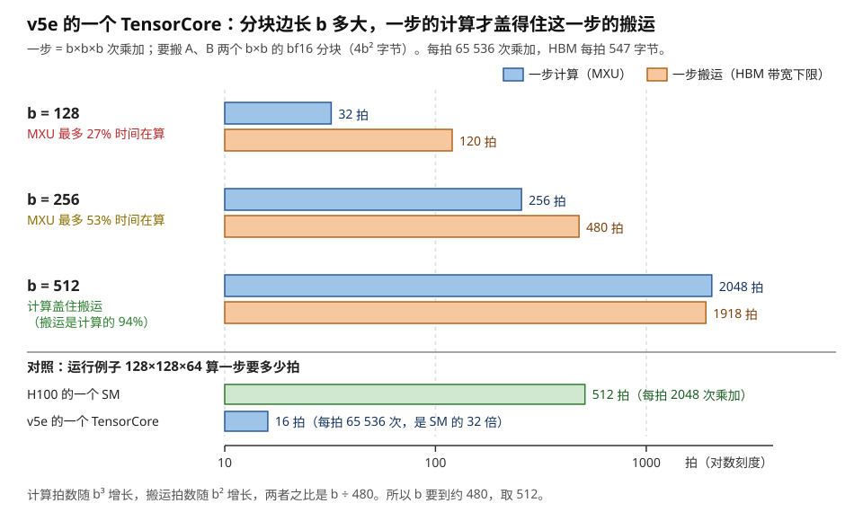
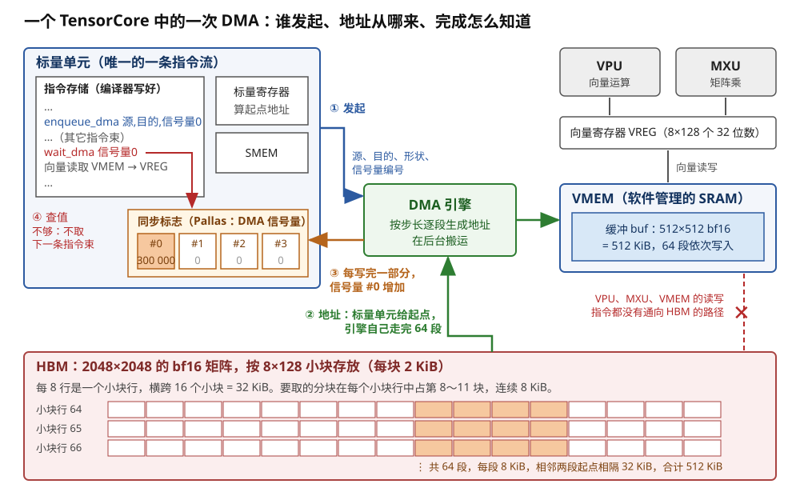
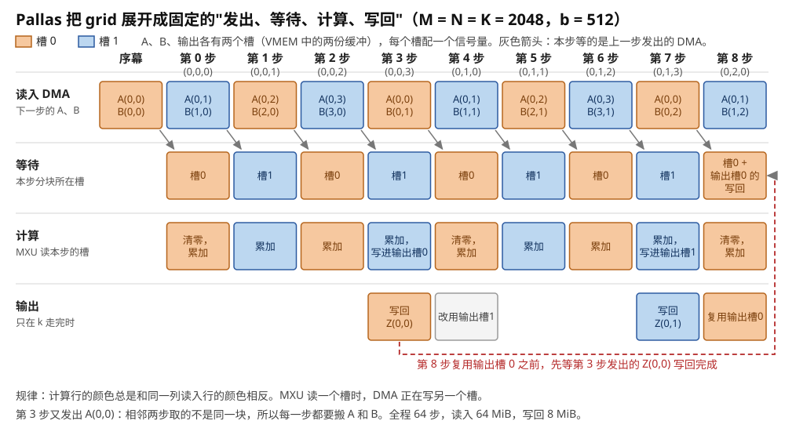
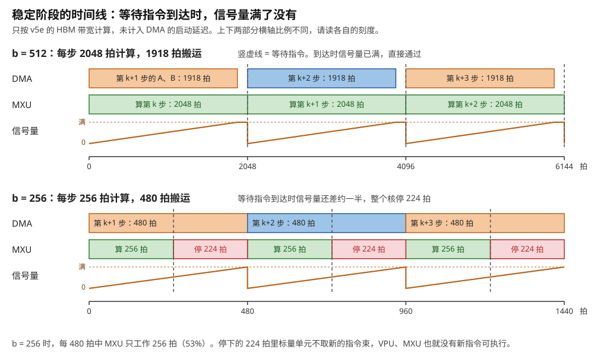
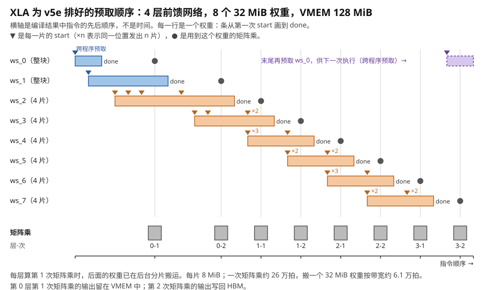
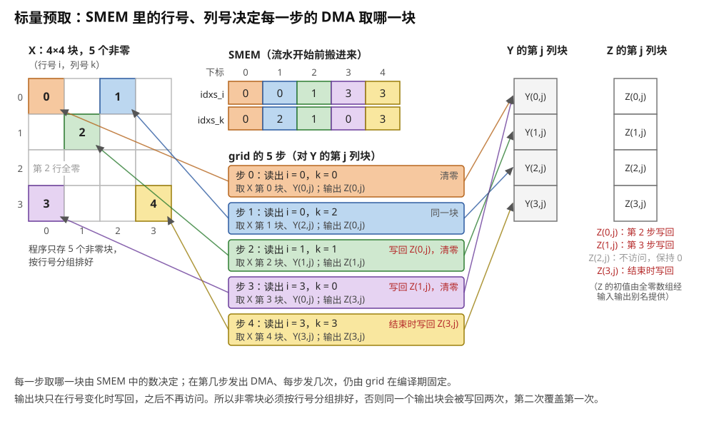
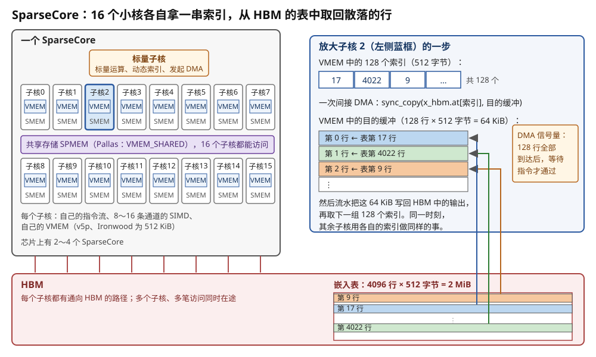
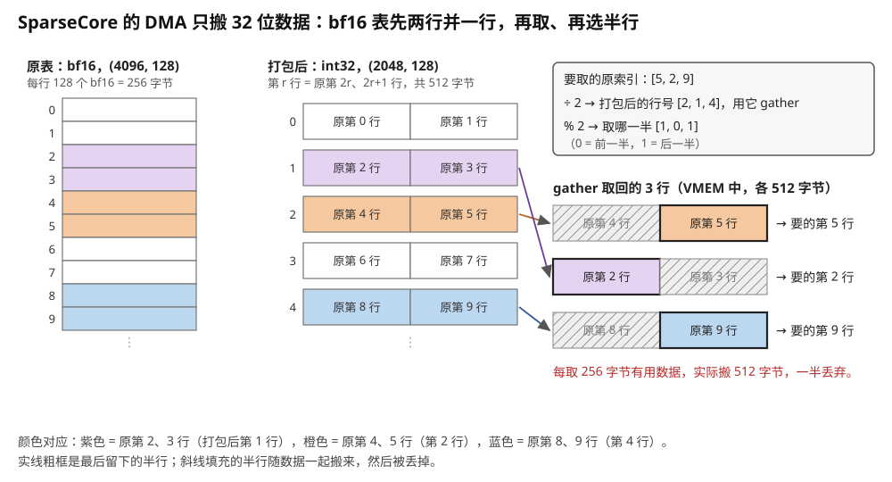

# TPU：编译器排定 DMA，用信号量同步；不规则访问交给 SparseCore

> **所属模块**：模块 14 · 数据搬运（第二部分 · NPU 的数据搬运）
> **状态**：🟨 学习中（2026-10 新写，同月审校。知识截至 2026-09）
> **一句话主旨**：TPU 的计算核（TensorCore）只有一条指令流。它的计算指令只读寄存器，HBM 中的数据必须先由 DMA 搬进片上的 VMEM。DMA 的发出指令和等待指令都由编译器（XLA 或 Pallas）排进这条指令流，编译期就定下何时发出、搬进哪一份缓冲、在哪里等待。一次 DMA 实际花多久要到运行时才知道，所以硬件用同步标志（Pallas 称为 DMA 信号量）记录搬完的数据量，等待指令在数量不够时让整个核停下。核内其余指令的延迟固定，编译器直接排好，所以同步标志是核内唯一需要在运行时对账的地方。TensorCore 的 DMA 只能按分块描述地址，按索引逐行读取这类访问做不好，TPU 为它另配了 SparseCore：每个 SparseCore 有 16 个小核，各自发出以索引列表为地址的 DMA。

上一节讲了昇腾：搬运由专用的 MTE 引擎执行，各条流水线之间用 `set_flag` / `wait_flag` 同步，这些标志由写算子的人或框架写进代码。本节的 TPU 也用搬运引擎和标志，但改了"谁发起"这个问题的答案：TPU 的普通程序里没有人手写 DMA，DMA 指令由编译器排进核的唯一指令流。本节还回答一个昇腾和 TPU 都要面对的问题：搬运引擎只会搬规整的块，按索引跳跃读取的访问怎么办。

---

## 0. 这一节要回答的问题

- TPU 的计算核能不能自己去 HBM 取数？如果不能，谁把数据搬进来？
- "编译器排定 DMA"具体排定了什么？哪些事情要到运行时才知道？
- 完成怎么知道：TPU 的同步标志（DMA 信号量）里记的是什么？谁让它增加，谁等它，等到之后发生什么？
- 等待时核在做什么？这和 GPU 上"换一个 warp 来执行"有什么不同？代价在哪里？
- 一个 TensorCore 的算力相当于多少个 GPU 的 SM？这对分块大小意味着什么？
- 地址依赖数据时（块稀疏矩阵、嵌入表查找）怎么办？为什么要另配一个 SparseCore？它对三个问题的答案是什么？

---

## 1. 基础词汇

**TensorCore**。TensorCore 是 TPU 芯片上的计算核。它包含矩阵单元（MXU）、向量单元（VPU）和标量单元，还有自己的片上存储 VMEM 和 SMEM。注意不要和 NVIDIA 的 Tensor Core 混淆：NVIDIA 的 Tensor Core 是 SM 里的一个矩阵部件，TPU 的 TensorCore 是整个核，层级上对应 NVIDIA 的 SM。一颗 TPU v5e 芯片有 1 个 TensorCore；v4、v5p、Ironwood（TPU7x）每颗芯片有 2 个。

**MXU（矩阵乘单元）**。MXU 是 TensorCore 里的脉动阵列，每拍完成一批乘加。v5e 及更早代际的 MXU 是 128 × 128，v6e 和 Ironwood 是 256 × 256。v5e 的一个 TensorCore 有 4 个 MXU，所以每拍做 4 × 128 × 128 = **65 536 次 bf16 乘加**。

**标量单元与 VLIW 指令束**。标量单元是 TensorCore 的控制部件。它从指令存储中取出一整条超长指令字（VLIW 指令束），自己执行其中的标量操作，再把向量和矩阵操作转发给 VPU 和 MXU。TPU v2 的一条指令束是 322 位，含 2 个标量槽、4 个向量槽（其中 2 个用于向量存储的读写）、2 个矩阵槽、1 个杂项槽和 6 个立即数。所以一个 TensorCore 只有一条指令流，这条指令流由标量单元发出。

**VMEM（向量存储）**。VMEM 是 TensorCore 内部的一块 SRAM，由软件管理，没有标签、没有命中判断。数据放在哪个地址、什么时候覆盖，全部由编译器决定。VPU 和 MXU 的操作数都从 VMEM 读进向量寄存器。每个 TensorCore 的 VMEM 在 v2～v4 上是 16 MiB，v5p 和 Ironwood 是 64 MiB，v5e 和 v6e 是 128 MiB。

**SMEM（标量存储）**。SMEM 是标量单元旁边的一小块 SRAM，每次读写一个 32 位数，没有对齐要求。v4 起每个 TensorCore 有 1 MiB，v2、v3 是 16 KiB。控制流用到的数据和要用来算地址的索引都放在 SMEM 中。

**HBM**。HBM 是芯片封装内的高带宽 DRAM，即 TPU 的"显存"。v5e 有 16 GB HBM，带宽 820 GB/s。TensorCore 的任何计算指令都不能直接读 HBM。

**DMA 引擎**。DMA 引擎是在 HBM 与 VMEM、SMEM 之间搬数据的硬件。标量单元执行一条 DMA 指令，把源地址、目的地址、大小交给它。之后它在后台搬运，标量单元继续发出后面的指令。

**同步标志（sync flag）与 DMA 信号量**。同步标志是标量单元能读的一组小计数器，存放在专门的信号量存储中。DMA 搬运期间，硬件让指定的同步标志按搬完的数据量增加。等待指令检查这个计数，不够时让指令流停下。Google 的论文和 Hot Chips 报告称它为 sync flag。Pallas 文档称它为信号量（semaphore），并写明两者是同一个东西。本节正文统一用"信号量"。

**XLA、Pallas、Mosaic**。XLA 是 JAX 和 TensorFlow 在 TPU 上的编译器，普通的 JAX 程序全部由它编译。Pallas 是 JAX 中写自定义 kernel 的语言。Mosaic 是 Pallas 在 TPU 上的后端编译器。

**拍**。一拍是 TensorCore 的一个时钟周期。v5e 约 1.5 GHz，一拍约 0.67 纳秒。（Google 没有公布 v5e 的时钟。1.5 GHz 由公开峰值反推：197 TFLOPS ÷ 2 ÷ 每拍 65 536 次乘加 ≈ 1.50 GHz。）

**本节的例子**。全模块的运行例子是：矩阵乘输出分块 128 × 128，沿 K 每次推进 64，A、B 各一个 bf16 分块，每推进一次搬 32 KB。H100 的一个 SM 每拍做 2048 次乘加，算一步要 512 拍。本节用 TPU v5e 的一个 TensorCore 对照：

- 每拍 65 536 次 bf16 乘加，约 1.5 GHz。
- HBM 带宽 820 GB/s，折合每拍 820 × 10⁹ ÷ 1.5 × 10⁹ ≈ **547 字节**。
- VMEM 128 MiB，SMEM 1 MiB。

§2.4 会说明，运行例子的分块在 TPU 上太小，而且 A 分块的形状不合法，所以 TPU 部分改用 512 × 512 × 512 的分块。

---

## 2. TensorCore 只有一条指令流，延迟固定的部分由编译器排好

### 2.1 计算指令只读寄存器，HBM 只能由 DMA 访问

TPU 和 GPU 一样，计算指令只从片上取操作数。区别在于 TPU 没有"一条读取指令直接从 HBM 读进寄存器"的路径。Pallas 文档的原话是：HBM 访问不能直接发出，必须由 DMA 部件预取到存储层级中更低的一级。向量单元的读写指令只能访问 VMEM，标量单元的读写指令只能访问 SMEM。

下面用 Pallas 文档中逐元素相加的例子 `z = x + y` 走一遍。x、y、z 都存放在 HBM 中，形状 512 × 512，f32：

1. DMA 把 x 的一个分块从 HBM 搬进 VMEM。
2. 向量读取指令把 VMEM 中的数读进向量寄存器（VREG）。一个 VREG 是 8 × 128 个 32 位数，即 4 KiB。（Pallas 文档写明这是截至 TPU v6 的规格。）
3. VPU 对两个 VREG 做加法，结果写进第三个 VREG。
4. 向量写入指令把结果写回 VMEM。
5. DMA 把结果分块从 VMEM 搬回 HBM。

第 2～4 步只涉及 VMEM 和寄存器，第 1 步和第 5 步只由 DMA 完成。对照本模块第 1 节：GPU 的 `LDG` 由线程直接发出，数据从 HBM 一路回到寄存器。TPU 上不存在这样的指令，所以"线程自己搬"这种搬法在 TensorCore 上根本无法表达。

### 2.2 一个核、一条指令流、一个线程

TPU v4 论文的对照表写明：每个 TensorCore 的线程数是 1。Pallas 文档也说，从程序员的角度看，TPU 程序是单线程的。这和 GPU 的差别很大。H100 的一个 SM 上同时驻留几十个 warp，调度器每拍从中挑一个发射。TensorCore 上只有一条指令流，标量单元按顺序取指令束、发射指令束。

一条指令束能同时启动多个部件。按 TPU v2 的格式，一拍内可以同时发出：

- 2 个标量操作，例如算下一块的地址、更新循环变量；
- 2 个向量运算和 1 次 VMEM 读、1 次 VMEM 写；
- 1 次向 MXU 推入操作数、1 次从 MXU 取出结果；
- 1 个杂项操作。

DMA 指令放在哪一种槽中，公开资料没有写（§12）。

编译器把这些操作打包进同一条指令束，所以"单线程"不等于"一次只做一件事"。VPU、MXU、DMA 引擎都在并行工作，只是由同一条指令流统一指挥。Pallas 文档的说法是：各个计算部件可以异步工作，但这由 TPU 编译器管理。

Google 在 2026 年回顾五代 TPU 的论文中说明：从 v2 到 Ironwood，这个结构没有改变，每一代只是把 VLIW 指令加宽。Ironwood 的指令比 v2 宽 50% 以上，用来指挥更多的 MXU。

### 2.3 延迟固定的指令由编译器排，只有 DMA 要在运行时对账

本模块第 1 节讲过，GPU 把指令之间的依赖分成两类：

- 延迟固定的指令（例如浮点乘加），编译器在指令中写一个停顿计数。
- 延迟不固定的指令（访存），硬件用记分牌在运行时记录。

TPU 也按这两类处理，但是第二类小得多。Google 在 Hot Chips 2020 的报告中把 TensorCore 的存储系统概括为三句话：

1. 核内的读写针对 SRAM 便笺存储，核内的调度是可预测的。
2. HBM 只能通过异步 DMA 访问，DMA 的完成记在同步标志上。
3. 核可以停下来等同步标志。

第 1 句的原因是 VMEM 没有标签、不会未命中，读一次的延迟总是相同的拍数。MXU、VPU 的延迟也是固定的。所以除了 DMA，核内每一条指令的结果在第几拍可用，编译器都能事先算出，并且直接把指令排在正确的位置。这就是 VLIW 的工作方式：编译器负责排对，硬件不做任何检查。五代 TPU 的回顾论文把这一点称为"确定的时序"。

只有 DMA 的耗时编译器算不出来。HBM 的排队、刷新、另一个 TensorCore 或 SparseCore 同时访问 HBM，都会改变它的时间。所以 DMA 是核内唯一需要运行时对账的地方，对账工具就是同步标志。下表把两边放在一起：

| | GPU（H100 的 SM） | TPU（TensorCore） |
| --- | --- | --- |
| 延迟固定的依赖 | 编译器写停顿计数 | 编译器把指令排进 VLIW 指令束的正确位置 |
| 从片上存储读数 | shared memory 约 29 拍，但 bank 冲突会让它变长；L1 还会未命中。所以 shared memory 读取和全局读取都用记分牌 | VMEM 没有未命中，延迟固定，由编译器排 |
| 延迟不固定的依赖 | 每个 warp 6 个记分牌计数器，记录 `LDG` 等访存 | 同步标志，只记录 DMA |
| 等待时 | 调度器发射其它 warp 的指令 | 指令流停下（§5.2） |

这一节由此改了"完成怎么知道"的适用范围：GPU 上每一条访存都要在运行时对账，TPU 上只有 DMA 要对账，而 DMA 的数量少、每次搬的数据多。

### 2.4 一个 TensorCore 相当于 32 个 SM 的矩阵算力，所以分块必须大

v5e 的一个 TensorCore 每拍做 65 536 次乘加。H100 的一个 SM 每拍做 2048 次。前者是后者的 **32 倍**。下面把运行例子放到 TensorCore 上计算：

1. 一步 128 × 128 × 64 共 1 048 576 次乘加，TensorCore 算完要 1 048 576 ÷ 65 536 = **16 拍**。同一步在 H100 的 SM 上要 512 拍。
2. 这一步要搬 32 KB。按 HBM 每拍 547 字节，最快也要 32 768 ÷ 547 ≈ **60 拍**。
3. 所以 MXU 最多只有 16 ÷ 60 ≈ 27% 的时间在工作，其余时间在等数据。

另外，这个例子在 Pallas 中根本写不出来。Pallas 要求分块最后两维分别是 8 和 128 的倍数（或者等于整个数组的对应维）。A 分块是 128 × 64，最后一维 64 不是 128 的倍数。这条规则来自 TPU 的数据排列：VREG 是 8 × 128，HBM 和 VMEM 中的数组也按 8 × 128 的小块存放。编译出的 HLO 中，每个数组的布局都写成 `{1,0:T(8,128)(2,1)}`，其中 `T(8,128)` 就是这种分块存放。这种排列方式怎样在搬运中转换，是本模块第 11 节的内容。

要让 MXU 不等数据，就要让一步的计算时间不短于这一步的搬运时间。设分块是 b × b × b，元素是 bf16：

- 一步的乘加次数是 b³，计算拍数是 b³ ÷ 65 536。
- 一步要搬 A、B 两个 b × b 分块，共 4b² 字节，搬运拍数是 4b² ÷ 547。
- 两者之比是 b ÷ 480。所以 b 至少要约 480，取 512。

| 分块边长 b | 一步计算（拍） | 一步搬运（拍） | MXU 工作时间占比的上限 |
| --- | --- | --- | --- |
| 128 | 32 | 120 | 27% |
| 256 | 256 | 480 | 53% |
| 512 | 2048 | 1918 | 100%（搬运时间是计算的 94%） |

表中只算 A、B 的读入。输出分块要沿 K 走完一整行才写回一次，所以这里忽略它。另外，搬运拍数是按带宽算的下限，没有计入 DMA 从发出到第一段数据到达的延迟。§4.3 讨论这一项会怎样改变结论。

b = 512 时，一步要放在 VMEM 中的数据如下：A、B 各两份缓冲共 2 MiB，输出分块两份共 1 MiB，f32 累加器 1 MiB，合计 4 MiB。这只占 v5e 128 MiB VMEM 的 3%。同样的分块放不进 H100 一个 SM 的 228 KB shared memory。

这里体现了两条路线的差别。GPU 把芯片切成 132 个 SM，每个 SM 的分块小，靠 50 MB 的 L2 在 SM 之间共享数据。TPU 只有一两个大核，每个核的 VMEM 有 16～128 MiB，靠大分块在核内复用数据。



> **图 7-1**　一句话：TensorCore 每拍做的乘加是 H100 一个 SM 的 32 倍。分块太小时，搬运一块的时间比算这一块的时间还长，MXU 只能等数据。分块边长到 512 时，两者才大致相等。
>
> **先知道一件事**：每一步要先把 A、B 两个分块搬进片上，才能算这一步。搬运受 HBM 带宽限制，v5e 上每拍最多搬 547 字节。计算受 MXU 限制，每拍最多 65 536 次乘加。
>
> **按这个顺序看**：
> 1. 每一组横条是一种分块边长 b。上面的蓝条是一步的计算拍数，下面的橙条是一步的搬运拍数。横轴按对数画。
> 2. b = 128 时，蓝条只有 32 拍，橙条有 120 拍。数据还没搬完，计算早就结束了。
> 3. b = 256 时，计算 256 拍，搬运 480 拍，仍然是搬运更长。
> 4. b = 512 时，计算 2048 拍，搬运 1918 拍，计算稍长。这时搬运可以完全藏在计算后面。
> 5. 最下面一行是对照：运行例子的 128 × 128 × 64 分块在 H100 的一个 SM 上要算 512 拍，在 TensorCore 上只要 16 拍。
>
> **看懂的标志**：能说出"为什么 TPU 的 kernel 分块常常是 512 甚至更大"。计算量随 b³ 增长，搬运量随 b² 增长。只有 b 足够大，一步的计算时间才能盖住这一步的搬运时间。TensorCore 算得快，所以需要的 b 比 GPU 的一个 SM 大得多。
>
> **与正文的对照**：拍数按 v5e 的公开参数计算：197 TFLOPS、820 GB/s、约 1.5 GHz。搬运拍数是按带宽算的下限，没有计入 DMA 的启动延迟。
>
> 来源：本库自绘。

---

## 3. 一次 HBM → VMEM 的 DMA：三个问题的答案

本节先看单独一次 DMA，下一节再看编译器怎样把很多次 DMA 排成流水。下面的代码是一个手写的 Pallas kernel：把 HBM 中一个 512 × 512 的 bf16 分块（512 KiB）搬进 VMEM，加 1，再搬回去。

```python
def kernel(x_hbm, o_hbm, buf, sem):          # x_hbm、o_hbm 在 HBM；buf 在 VMEM；sem 是一个 DMA 信号量
    c = pltpu.make_async_copy(x_hbm, buf, sem)   # 描述一次搬运：源、目的、用哪个信号量记录完成
    c.start()                                    # 发出 DMA，立即返回
    c.wait()                                     # 等这次搬运的数据全部到达
    buf[...] = buf[...] + 1                      # VMEM → 寄存器 → VPU → 寄存器 → VMEM
    pltpu.make_async_copy(buf, o_hbm, sem).start()
    ...
```

JAX 在编译这个 kernel 时打印出 Mosaic 的中间表示。`start()` 变成一条 `tpu.enqueue_dma`，`wait()` 变成一条 `tpu.wait_dma2`。下面省略了形状和类型标注，只保留存储空间。`any` 是 Pallas 的 `pl.ANY`，表示由 XLA 决定位置，这里 XLA 把它放在 HBM 中：

```
tpu.enqueue_dma source(%x 的切片 : any) target(%buf : vmem) target_semaphore(%sem : semaphore_mem)
tpu.wait_dma2   semaphore(%sem : semaphore_mem) src(%x 的切片 : any) dst(%buf : vmem)
```

这两行已经包含了三个问题的答案。

### 3.1 谁发起：标量单元执行编译器写好的 DMA 指令

DMA 指令和其它指令一样，存放在指令束中，由标量单元取出、发出。Google DeepMind 的《How to Scale Your Model》说明：标量单元取出并分派所有指令，并执行从 HBM 到 VMEM 的搬运。因为标量单元是单线程的，所以每个核每拍最多发出 1 个 DMA 请求。书中以 v5 为例：一个标量单元指挥 VPU（4096 个 ALU）、4 个 MXU、2 个跨通道单元（XLU，负责转置、置换这类跨通道操作）和多个 DMA 引擎。

这条 DMA 指令由谁写进程序？分两种情况：

- 普通的 JAX 程序：由 XLA 写。程序员看不到任何 DMA。§4.4 给出 XLA 编译结果中的实例。
- Pallas kernel：如果用分块描述（grid 与 BlockSpec，§4.1），由 Pallas 和 Mosaic 生成。如果像上面那样手写 `make_async_copy`，由程序员写，但写的位置仍是编译期固定的。

无论哪种情况，DMA 都在编译期排进指令流。运行时没有任何部件临时决定"现在该搬什么"。

### 3.2 地址从哪来：标量单元算起点，DMA 引擎按步长走

一个分块的地址由两部分组成。

**起点由标量单元算。** 例如流水中的第 i 块从 HBM 的哪个位置开始，要用块号乘以块大小。Google Cloud 的 TPU 文档写明：标量单元负责控制流和计算存储地址。这些乘法和加法在指令束的标量槽中完成，和其它工作并行。

**块内的地址由 DMA 引擎按步长生成。** 五代 TPU 的回顾论文写道：因为 HBM 中存放的是向量和矩阵，所以 DMA 可以按步长穿过存储。下面算一个例子。从 2048 × 2048 的 bf16 矩阵中取第 1 行块、第 2 列块的 512 × 512 分块，起点是第 512 行、第 1024 列：

1. 按 `T(8,128)` 布局，矩阵以 8 × 128 个元素为一个小块存放，每个小块 8 × 128 × 2 = 2 KiB，在 HBM 中连续。
2. 每 8 行组成一个小块行，横跨 2048 ÷ 128 = 16 个小块，共 32 KiB。
3. 分块的列范围 1024～1535 对应其中第 8～11 个小块，共 4 个，是连续的 8 KiB。
4. 分块有 512 ÷ 8 = 64 个小块行。所以 DMA 要搬 64 段，每段 8 KiB，相邻两段的起点相隔 32 KiB，合计 512 KiB。
5. 起点在第 64 个小块行的第 8 个小块，即矩阵起点之后 (64 × 16 + 8) × 2 KiB 处。

程序只给出"源是这个切片、目的是这块 VMEM"，第 4 步的 64 段由 DMA 引擎自己走完。这和 Hopper 的 TMA 相同：发起方给出形状，引擎生成每一段的地址（本模块第 3 节）。不同之处在于形状和步长存放在哪里。TMA 把它们写在一个张量描述符中，这个描述符通常由主机在启动 kernel 之前调用驱动 API 生成。TPU 上，分块的形状在编译期就由编译器定下，程序不需要另外准备描述符。

（上面的分段方式是按公开的 `T(8,128)` 布局推出的。DMA 引擎内部按什么粒度拆分请求，没有公开。）

### 3.3 完成怎么知道：信号量按搬完的数据量增加

Pallas 文档描述了 DMA 信号量的语义：

1. 信号量可以看成一个整数形式的进度计数器。
2. DMA 开始后，硬件在后台不断增加信号量的值。
3. 在信号量上等待的指令会停住，直到信号量的值达到这次搬运的总字节数。
4. 达到之后，等待结束，信号量的值减去同样的数量。

文档同时提醒：信号量的值不一定恰好等于字节数，具体含义可能随代际变化，"按字节计数"是一个有用的理解模型。这段描述出自 Pallas 讲跨芯片远程 DMA 的一节，本地 DMA 使用同一种 DMA 信号量。上面的 `tpu.wait_dma2` 带有 `src` 和 `dst` 两个参数，它们给出了这次搬运的形状。由此推测，等待指令用它们算出要等多少。文档没有说明这一点。

下面用这个模型走一遍 512 KiB 的搬运：

| 时刻 | 发生的事 | 信号量的值 |
| --- | --- | --- |
| t₀ | 标量单元发出 `enqueue_dma`，然后继续发出后面的指令 | 0 |
| t₀ 之后 | DMA 引擎逐段把数据写进 VMEM，每写完一部分，硬件增加信号量 | 从 0 逐渐增加 |
| t₁ | 指令流走到 `wait_dma2`。如果值还不到 524 288，指令流停在这里 | 例如 300 000 |
| t₂ | 最后一段写进 VMEM，值达到 524 288 | 524 288 |
| t₂ 之后 | 等待结束，值减去 524 288，后面的向量读取可以执行 | 0 |

信号量存放在一个专门的存储空间中。Pallas 把它列为第四种存储空间 `pltpu.SEMAPHORE`，和 VMEM、SMEM 并列，Mosaic 的中间表示中写作 `semaphore_mem`。

这个机制和 Hopper 的 mbarrier 事务字节计数做的是同一件事：按搬完的数据量对账，凑满才放行（本模块第 3 节）。差别有两点：

- mbarrier 先登记预期字节数，然后往下减到零。TPU 的信号量从零往上加，等待指令自带"要等多少"。
- mbarrier 同时等线程和引擎两类到达。TPU 的 DMA 信号量只记录 DMA。另有一种"普通信号量"（`SemaphoreType.REGULAR`），由程序用 `semaphore_signal` 增加，用于核与核、芯片与芯片之间的同步。



> **图 7-2**　一句话：在 TensorCore 中，DMA 由标量单元按编译器排好的位置发出。DMA 引擎自己生成块内的地址。完成记在同步标志上，标量单元在等待指令处检查它。
>
> **先知道一件事**：TensorCore 只有一条指令流，由标量单元从指令存储中逐条取出。向量单元和矩阵单元的指令也是标量单元转发过去的。
>
> **按这个顺序看**：
> 1. 左上是标量单元。它有指令存储、标量寄存器、SMEM 和一组同步标志。
> 2. 看编号 ①：标量单元执行 DMA 指令，把源、目的、信号量编号交给 DMA 引擎。这就是"谁发起"的答案。
> 3. 看编号 ②：DMA 引擎从 HBM 按步长读出 64 段，每段 8 KiB，写进 VMEM 中的一块缓冲。标量单元只给了起点和形状，每一段的地址由引擎生成。这就是"地址从哪来"的答案。
> 4. 看编号 ③：每写完一部分数据，硬件就增加指定同步标志的值。
> 5. 看编号 ④：指令流走到等待指令时，标量单元检查这个值。不够时，它不再取下一条指令束。够了以后，它减去这个数量，继续执行。这就是"完成怎么知道"的答案。
> 6. 右侧是 VPU 和 MXU。它们只从 VMEM 读数到向量寄存器，没有通向 HBM 的路径。
>
> **打个比方**：标量单元像一位按时刻表调度的调度员。时刻表（指令束）是编译器事先写好的。到了表上写"发车"的时刻，他给搬运队下一张单子。到了表上写"检查"的时刻，他看一眼计数板。计数板上的数够了就继续，不够就等。
>
> **看懂的标志**：能说出"TensorCore 上谁也不会临时决定搬什么"。发出 DMA 的位置、等待的位置、用哪个同步标志，都在编译期写进了指令流。运行时只有一件事不确定：等待时计数板上的数够不够。
>
> **与正文的对照**：结构取自 TPU v2 的公开框图（Hot Chips 2020、IEEE Micro 2021），五代 TPU 的回顾论文说明这个结构一直沿用到 Ironwood。图中 64 段 × 8 KiB 的数字对应 §3.2 的例子。
>
> 来源：本库自绘。延伸看图：[Hot Chips 2020 · Google TPUv2/v3 报告](https://www.hc32.hotchips.org/assets/program/conference/day2/HotChips2020_ML_Training_Google_Norrie_Patil.v01.pdf) 第 20 页前后有标量单元、向量单元单条通道的内部框图，可以看到同步标志、DMA 接口和标量存储的位置。

---

## 4. 编译器怎样排定：从分块描述到 DMA 流水

### 4.1 程序员只写分块描述

在 Pallas 中写矩阵乘时，程序员不写任何 DMA，只写三样东西：

- **grid**：一组嵌套循环的上界。
- **BlockSpec**：每个输入、输出的分块形状，以及一个 `index_map` 函数，它把循环下标映射成"取第几块"。
- **kernel**：分块已经在 VMEM 中时，对它做什么计算。

```python
bm = bn = bk = 512
def mm_kernel(x_ref, y_ref, z_ref, acc_ref):      # 四个引用都指向 VMEM
    @pl.when(pl.program_id(2) == 0)
    def _(): acc_ref[...] = jnp.zeros_like(acc_ref)
    acc_ref[...] += jnp.dot(x_ref[...], y_ref[...], preferred_element_type=jnp.float32)
    @pl.when(pl.program_id(2) == pl.num_programs(2) - 1)
    def _(): z_ref[...] = acc_ref[...].astype(z_ref.dtype)

pl.pallas_call(mm_kernel,
    grid=(M // bm, N // bn, K // bk),                              # 2048³ 时为 (4, 4, 4)
    in_specs=[pl.BlockSpec((bm, bk), lambda i, j, k: (i, k)),     # A 取第 (i, k) 块
              pl.BlockSpec((bk, bn), lambda i, j, k: (k, j))],    # B 取第 (k, j) 块
    out_specs=pl.BlockSpec((bm, bn), lambda i, j, k: (i, j)),     # 输出写第 (i, j) 块
    scratch_shapes=[pltpu.VMEM((bm, bn), jnp.float32)], ...)
```

编译后，JAX 打印出的 Mosaic 模块中，kernel 函数体只有向量读取、`tpu.matmul`、向量写入，没有一条 DMA。分块的信息以属性的形式附在函数上：`window_params` 记录每个分块的形状（512 × 512）和对应的 `index_map`，`iteration_bounds` 记录循环上界（4, 4, 4）。DMA 由 TPU 编译器根据这些属性在 kernel 函数体之外生成。XLA 的编译回执给出了这个 kernel 占用的 VMEM：4 550 656 字节。其中 4 194 304 字节（4 MiB）正好是 §2.4 算的三个分块各两份加一个累加器，其余约 348 KiB 是编译器内部使用的空间。

### 4.2 走查：Pallas 把 grid 展开成什么样的指令序列

Pallas 文档给出了这套流水的展开形式：每个输入、输出各有两份 VMEM 缓冲（两个"槽"），每个槽配一个信号量。循环按字典序逐步执行，每一步做四件事：

1. 发出下一步要用的分块的 DMA，写进另一个槽。
2. 等待这一步的分块所在槽的信号量。
3. 计算。
4. 如果输出分块要换了，发出输出的 DMA；在复用一个输出槽之前，先等它上一次写回的信号量。

另有两条规则决定哪些步不发 DMA：

- 相邻两步取同一块时，第二步不再搬。例如沿 k 走的 4 步中，输出块 (i, j) 不变，所以输出既不读入也不写回。
- 输出块只在下标变化时写回 HBM，之后 Pallas 认为它不会再被访问。

下面是 M = N = K = 2048、b = 512、grid = (4, 4, 4) 时的前 9 步。A 槽、B 槽、输出槽各有 0、1 两个：

| 步 | (i, j, k) | 发出读入 DMA（下一步用） | 等待 | 计算 | 输出 |
| --- | --- | --- | --- | --- | --- |
| 序幕 | | A(0,0)→A槽0，B(0,0)→B槽0 | | | |
| 0 | (0,0,0) | A(0,1)→A槽1，B(1,0)→B槽1 | A槽0、B槽0 | 累加器清零，加上 A(0,0)·B(0,0) | 块不变，不写回 |
| 1 | (0,0,1) | A(0,2)→A槽0，B(2,0)→B槽0 | A槽1、B槽1 | 累加 | 不写回 |
| 2 | (0,0,2) | A(0,3)→A槽1，B(3,0)→B槽1 | 槽0 | 累加 | 不写回 |
| 3 | (0,0,3) | A(0,0)→A槽0，B(0,1)→B槽0 | 槽1 | 累加，转成 bf16 写进输出槽0 | 下一步换块，发出 Z(0,0)←输出槽0 |
| 4 | (0,1,0) | A(0,1)→A槽1，B(1,1)→B槽1 | 槽0 | 累加器清零后累加 | 用输出槽1 |
| 5～6 | (0,1,1)、(0,1,2) | 依此类推 | | 累加 | 不写回 |
| 7 | (0,1,3) | A(0,0)→A槽0，B(0,2)→B槽0 | 槽1 | 写进输出槽1 | 发出 Z(0,1)←输出槽1 |
| 8 | (0,2,0) | … | 槽0；**输出槽0 的写回信号量** | 累加器清零后累加 | 复用输出槽0 之前，确认 Z(0,0) 已写完 |

从这张表可以读出三点：

1. **每一步都有一个 DMA 在后台进行，同时 MXU 在算另一个槽的数据。** 第 1 步计算槽 1 时，槽 0 正在被写入第 2 步的数据。这就是双缓冲。
2. **A(0,k) 在 j = 0 和 j = 1 时各搬一次。** 第 3 步到第 4 步虽然都用到 A 的第 0 行块，但取的是不同的 k，不是相邻两步取同一块，所以要重新搬。整个矩阵乘共 64 步，读入 64 × 1 MiB = 64 MiB，写回 16 × 512 KiB = 8 MiB。
3. **每个信号量只对应一个槽。** 第 2 步等"槽 0 的信号量"，等到的一定是 A(0,2) 和 B(2,0)。因为信号量只累加数据量，不区分是哪次搬运的数据，所以如果两次搬运共用一个信号量，等待可能被另一次搬运的数据提前满足。Pallas 给每个槽分配独立的信号量，就避免了这个问题。

这里有一个前提：输出块必须在连续的若干步中访问完。如果程序先写输出块 (0,0)，隔几步又回来累加它，Pallas 已经把它写回 HBM 并认为它不会再被访问，结果就会出错。Pallas 文档要求归约维（这里的 k）放在 grid 的最后一维，原因就在这里。这是"编译期排定"带来的约束：DMA 的位置在编译期就由 grid 的遍历顺序决定，程序必须按这个顺序访问数据。



> **图 7-3**　一句话：Pallas 把 grid 展开成一串固定的"发出、等待、计算、写回"。每份 VMEM 缓冲配一个信号量。计算一个槽的同时，DMA 往另一个槽写下一步的数据。
>
> **先知道一件事**："槽"是 VMEM 中的一份缓冲。A、B、输出各有两个槽，编号 0 和 1。一个槽在被计算读的时候不能被 DMA 写，所以要两份交替使用。
>
> **按这个顺序看**：
> 1. 横轴是 grid 的步，从序幕到第 8 步。每一列上方写着这一步的 (i, j, k)。
> 2. 第一行"读入 DMA"：每一步发出的是下一步要用的 A、B 分块。橙色写进槽 0，蓝色写进槽 1。
> 3. 第二行"等待"：每一步开头等的是本步分块所在槽的信号量。它等的正是上一步发出的那次 DMA。
> 4. 第三行"计算"：MXU 读本步的槽。注意它总是和第一行的颜色相反：计算槽 1 时，DMA 在写槽 0。
> 5. 第四行"输出"：只有第 3 步和第 7 步发出写回，因为输出块只在 k 走完时才变化。第 8 步要复用输出槽 0，所以先等它在第 3 步发出的写回完成。
>
> **打个比方**：两个盘子轮流用。厨师在吃（计算）一个盘子里的菜时，服务员（DMA）往另一个盘子里上下一道菜。每个盘子旁边有一个计数器，记录这道菜上了多少。厨师换盘子前看一眼计数器，够了才动筷子。
>
> **看懂的标志**：能回答"为什么每个槽要配自己的信号量"。信号量只记录数据量，不记录是哪一次搬运。如果两个槽共用一个信号量，槽 1 到达的数据也会让槽 0 的等待提前结束，计算就会读到还没写完的数据。
>
> **与正文的对照**：步骤与 §4.2 的表一致，展开方式取自 Pallas 文档"Software Pipelining"一节的伪代码。"每个槽一个信号量"取自 JAX 0.11.2 中 `emit_pipeline` 的源码，它为每个输入、输出按槽数分配 DMA 信号量。默认每个输入、输出两个槽，`pl.Buffered(3)` 可以改成三个。
>
> 来源：本库自绘。

### 4.3 时间线：分块够大时等待不会停，分块太小时每步都要停

下面把 §2.4 的两种分块放到时间线上看，只看稳定阶段的一步：

**b = 512。** 第 k 步开头发出第 k+1 步的 A、B，共 1 MiB，按带宽要 1918 拍。第 k 步计算要 2048 拍。所以第 k+1 步开头执行等待时，这次 DMA 已经完成了。等待指令发现信号量已经够了，指令流不停，MXU 一直工作。

**b = 256。** 一步计算只要 256 拍，而下一步的 512 KiB 要搬 480 拍。所以每一步开头的等待都要停约 480 − 256 = 224 拍。每 480 拍中 MXU 只工作 256 拍，占 53%。

上面只按带宽计算，没有计入 DMA 从发出到第一段数据到达的延迟。TPU 的 HBM 延迟没有公开的实测值。下面借用 H100 的实测值估算：H100 到显存约 480～730 拍，按 1.83 GHz 折合约 260～400 纳秒。在 v5e 的 1.5 GHz 下，这相当于约 390～600 拍（估算）。那么 b = 512 时，一步的 DMA 实际要约 1918 + 390～600 ≈ 2300～2520 拍，超过计算的 2048 拍，每步可能还要停约 260～470 拍。解决办法和 GPU 一样：增加缓冲份数。`pl.BlockSpec(..., pipeline_mode=pl.Buffered(3))` 给这个输入三个槽。按 `emit_pipeline` 的源码，n 个槽时流水提前 n − 1 步发出读入，所以三个槽时 DMA 提前两步发出，有约 2 × 2048 = 4096 拍的时间完成。这对应本模块第 1、2 节讲的"提前 d 级"。区别在于，TPU 上多一级只多占 VMEM，而 VMEM 有 128 MiB。



> **图 7-4**　一句话：分块够大时，一步的计算时间盖住下一步的搬运时间，等待指令到达时信号量已经满了。分块太小时，每一步开头都要停下来等数据，这期间整个核都不执行指令。
>
> **先知道一件事**：等待指令检查信号量的值。值够了就直接通过，不花额外的时间。值不够时，标量单元不再取下一条指令束，VPU、MXU 也就没有新的指令可执行。
>
> **按这个顺序看**：
> 1. 上半部分是 b = 512。第一行是 DMA，每一段 1918 拍。第二行是 MXU，每一段 2048 拍。第三行是信号量的值，它在 DMA 进行时上升，等待通过时减回去。
> 2. 看上半部分的竖虚线，也就是等待指令的位置。每次到达时，信号量的曲线已经升到顶，等待直接通过。
> 3. 下半部分是 b = 256。DMA 每段 480 拍，MXU 每段只有 256 拍。上下两部分的横轴比例不同，请读各自的刻度。
> 4. 看下半部分的红色区段。MXU 算完 256 拍后走到等待指令，信号量还没升到顶，核停了 224 拍。每一步都重复一次。
>
> **看懂的标志**：能回答"TPU 上隐藏搬运延迟靠什么"。靠编译器把 DMA 提前足够多的拍数发出，并且分块足够大。GPU 上还可以靠切换到其它 warp，TPU 上没有其它线程可以切换。
>
> **与正文的对照**：拍数按 v5e 的公开带宽和算力计算，没有计入 DMA 的启动延迟。如果借用 H100 的显存延迟估算，启动延迟约 390～600 拍，b = 512 时每步也可能停约 260～470 拍，见 §4.3。
>
> 来源：本库自绘。

### 4.4 XLA 在算子之间也排 DMA：一个真实的编译结果

上面讲的是一个 kernel 内部。普通的 JAX 程序由 XLA 编译，XLA 还在算子与算子之间安排 DMA：决定哪些张量放进 VMEM、什么时候预取、预取到哪里。开源 XLA 中负责这件事的模块叫 **内存空间分配**（memory space assignment，MSA）。它的源码注释说明：

- MSA 把张量分配到"默认存储"（HBM）或"备用存储"（片上 SRAM）。
- 拷贝分配用于预取（默认存储 → 备用存储）和逐出（备用存储 → 默认存储）。每次拷贝都有一个"必须在第几条指令之前完成"的位置。
- 切片拷贝分配把一次拷贝拆成几片，以便尽量晚地占用目的存储的空间。
- 跨程序预取：程序第一次执行时预取一个张量，程序结束时让它继续留在备用存储中，下次执行同一个程序时就不必再搬。

下面是本机用 JAX 0.11.2 为 TPU v5e 编译的一个例子。本机没有 TPU，JAX 支持只用拓扑描述编译，不需要设备。程序是 4 层前馈网络，每层两次矩阵乘：

```python
def f(x, ws):                      # x: bf16[1024,2048]
    for l in range(4):             # ws[2l]: bf16[2048,8192]，ws[2l+1]: bf16[8192,2048]
        x = jnp.tanh(x @ ws[2*l]) @ ws[2*l+1]
    return x
```

8 个权重每个 32 MiB，共 256 MiB，放不进 128 MiB 的 VMEM。编译后的 HLO 中，`S(1)` 表示张量放在 VMEM 中（存储空间 1），没有 `S(1)` 的在 HBM 中。按执行顺序摘录如下：

| 顺序 | 指令（摘录） | 含义 |
| --- | --- | --- |
| 1 | `copy-start(ws_0)`，带 `cross_program_prefetch_index=0` | 跨程序预取第 1 个权重 |
| 2 | `copy-start(ws_1)` | 预取第 2 个权重 |
| 3 | `copy-done(ws_0)`，然后 `slice-start(ws_2)` × 3 | 等 ws_0 到达；把 ws_2 分成 4 片，先发出 3 片 |
| 4 | 第 0 层第一次矩阵乘，输出放进 VMEM | 计算期间 ws_1 和 ws_2 的 3 片在后台搬运 |
| 5 | `copy-done(ws_1)`，然后 `slice-start` × 3（ws_2 第 4 片、ws_3 前 2 片） | |
| 6 | 第 0 层第二次矩阵乘，输出写回 HBM | |
| 7 | `slice-done(ws_2)` × 4，`ConcatBitcast` 拼成整个 ws_2 | ws_2 全部到达 |
| … | 每一层重复：算当前层时，搬下一层的权重 | |
| 末尾 | `copy-start(ws_0)` 排在最后一个计算之前，`copy-done` 排在之后 | 为下一次执行重新预取 ws_0 |

每片 512 × 8192 或 2048 × 2048，都是 8 MiB。XLA 估计每次矩阵乘约 27 万拍。按 v5e 的计算，1024 × 2048 × 8192 次乘加 ÷ 65 536 = 262 144 拍，即约 175 微秒。搬一个 32 MiB 的权重按带宽约需 6.1 万拍。所以在算当前层的时间内，下一层的权重有充足的时间到达。

另外，每条 `copy-start` 和 `slice-start` 的返回值中都有一个 32 位整数，放在存储空间 2：`copy-start` 中写作 `u32[]{:S(2)}`，`slice-start` 中写作 `s32[]{:S(2)}`。XLA 没有公开这个编号的含义。从它随每次异步拷贝出现、在 `copy-done` 处被消费来看，它很可能就是这次拷贝的同步标志（推测）。

XLA 自己生成的融合算子内部也做双缓冲。同一次编译中，每个矩阵乘融合算子的配置里写着 `"buffering_level":"2"`，并记录了它在 VMEM 中占用的大小。



> **图 7-5**　一句话：XLA 在编译期就把整个程序的 DMA 排好了。每算一层，下一层的权重就分片预取进 VMEM。程序末尾还会为下一次执行预取第一个权重。
>
> **先知道一件事**：VMEM 只有 128 MiB，8 个权重共 256 MiB，不能同时放进去。所以每个权重只在用到它的那一层前后留在 VMEM 中。
>
> **按这个顺序看**：
> 1. 横轴是 HLO 指令的执行顺序，不是时间。灰色方块是 8 次矩阵乘，标着第几层、第几次。
> 2. 上方每一行是一个权重。条的左端是它的第一个 `start`，右端是 `done`。条的长度表示这次搬运跨过了几个计算。
> 3. 看 ws_2 这一行：它分成 4 片，前 3 片在第 0 层第一次矩阵乘之前发出，第 4 片在第二次矩阵乘之前发出，在第 1 层第一次矩阵乘之前全部完成。
> 4. 看 ws_0 这一行最右边的紫色虚线条：程序最后一个计算之前又发出一次预取，完成点排在最后一个计算之后。这是跨程序预取，为下一次执行准备。
>
> **看懂的标志**：能说出"编译器排定 DMA"在整个程序层面的意思。哪个权重在哪个计算期间搬、拆成几片、在哪条指令之前必须到达，全部写在编译结果里。运行时只是按这个顺序执行，并在 `done` 处检查同步标志。
>
> **与正文的对照**：指令顺序取自本机为 v5e 编译的 HLO，图中省略了参数声明。每片 8 MiB。存储空间 1 是 VMEM；存储空间 2 中的 32 位整数推测是同步标志。
>
> 来源：本库自绘。

---

## 5. 编译期排定，运行时对账

### 5.1 哪些在编译期定下，哪些要到运行时才知道

"编译器排定 DMA"容易被误解成"时序全部写死"。准确的划分如下：

**编译期定下的**：

- 发出 DMA 的位置，即排在哪条指令束中。
- 每次 DMA 的源、目的和形状。如果地址依赖数据（§6），那么算地址的指令是编译期定下的。
- 写进哪个槽、用哪个信号量。
- 等待的位置，以及要等多少数据。
- 核内所有其它指令的执行顺序和间隔。

**运行时才知道的**：

- 一次 DMA 实际花多少拍。HBM 的排队、刷新，同一颗芯片上另一个 TensorCore、SparseCore、芯片间互连对 HBM 的访问，都会影响它。v4、v5p 的两个 TensorCore 共用 HBM，所以一个核的搬运速度受另一个核影响。
- 所以，等待指令执行时信号量够不够，要到运行时才知道。

依赖关系由编译器在编译期排定，完成在运行时用信号量对账。这一点和昇腾相同（本模块第 6 节）。差别在于对账的范围：TPU 核内各部件之间（VPU、MXU、转置单元）不需要标志，因为它们的延迟固定，由 VLIW 指令束直接排好。只有 DMA 需要信号量。

### 5.2 等待时整个核都停下

信号量不够时，标量单元不再取下一条指令束。TensorCore 只有这一条指令流，所以 VPU 和 MXU 也不再收到新的指令。这和 GPU 完全不同：

- GPU 的一个 warp 在等记分牌时，调度器在同一拍发射其它 warp 的指令。本模块第 1 节的走查中，一个 warp 等了 475 拍，这段时间由其它 warp 填补。
- TPU 上没有"其它 warp"。§4.3 的 b = 256 例子中，每一步停的 224 拍里，整个 TensorCore 什么都不做。

所以在 TPU 上，搬运能否藏在计算后面，完全取决于编译器排的流水：提前几步发出、分块多大、缓冲几份。编译器排得好，硬件就不需要切换线程的机制。这样能省下多少面积，可以参考 TPU v1 的论文：控制逻辑只占芯片面积的 2%。TPU v1 的结构和 v2 以后不同，它由主机发送 CISC 指令驱动。但它同样没有多线程和动态调度的硬件，所以这个数字可以作为同类设计的参考。代价是，编译器排不好时，硬件没有任何补救手段。

这里有一个限定：标量单元停下时，已经转发给 VPU、MXU 的指令会继续执行完。五代 TPU 的回顾论文说明，标量单元把解码后的指令转发给向量和矩阵单元"稍后执行"，与标量执行解耦。所以准确的说法是"不再有新的指令进入"，而不是"所有部件在同一拍全部停止"。

### 5.3 排错了会怎样

信号量的使用由编译器或程序员保证正确，硬件不检查。Pallas 文档列出了用错时的三种后果（文档针对的是跨芯片的远程 DMA，同样的道理适用于本地 DMA）：

| 错误 | 后果 |
| --- | --- |
| kernel 结束时信号量的值不为零，例如发出了 DMA 却没有等待 | Pallas 报错并退出 |
| 等待的数据量超过实际到达的数据量，例如等了一个从未发出的 DMA | 程序永远停在等待处，只能重启 |
| 两个 DMA 同时写同一块缓冲，或者一边计算读、一边 DMA 写 | 不报错，数据静默出错 |

前两种错误至少会表现出来。第三种最难发现，§4.2 中"每个槽一个信号量"和"复用输出槽前先等上一次写回"，都是为了防止它。用分块描述写 Pallas kernel 时，这些规则由 Pallas 保证。手写 `make_async_copy` 时，由程序员自己保证。

---

## 6. 地址依赖数据时：标量预取

### 6.1 把索引先放进 SMEM，再用它算 DMA 的地址

到目前为止，每一步取哪一块都由 grid 下标直接算出。块稀疏矩阵不是这样：哪些块非零，要看数据。Pallas 的做法叫**标量预取**（scalar prefetch）：

1. 程序把一小段索引数组作为 kernel 的前几个参数传进来，并用 `PrefetchScalarGridSpec(num_scalar_prefetch=n, ...)` 声明。
2. 流水开始之前，这 n 个数组被搬进 SMEM。
3. 每个 BlockSpec 的 `index_map` 除了收到 grid 下标，还收到这些 SMEM 数组。它可以读数组中的值来决定取哪一块。
4. 标量单元执行 `index_map` 的代码，从 SMEM 读出索引，算出 DMA 的起点。

先看 Pallas 文档中最简单的例子：从 512 × 512 的数组中取起点为 (128, 256)、大小为 128 × 128 的一块。程序在 kernel 外算出块号 (128 ÷ 128, 256 ÷ 128) = (1, 2)，作为标量预取参数传入。`index_map` 返回 `(block_idx[0], block_idx[1])`，即 (1, 2)。标量单元读出这两个数，DMA 就从第 1 行块、第 2 列块搬。块号是运行时的数据，但"在第几步发出这次 DMA"仍然是编译期定下的。

### 6.2 走查：块稀疏矩阵乘

再看一个块稀疏矩阵乘 Z = X·Y。X 被切成 4 × 4 个块，只有 5 个块非零：(0,0)、(0,2)、(1,1)、(3,0)、(3,3)。程序只存这 5 个块的数据，以及它们的行号、列号：

- `idxs_i = [0, 0, 1, 3, 3]`（行号，必须按行分组排好）
- `idxs_k = [0, 2, 1, 0, 3]`（列号，也就是归约维 k）

grid 是 (Y 的列块数, 5)。对 Y 的第 j 列块，5 步分别如下：

| 步 b | 读 SMEM | X 取第几块 | Y 取哪一块 | 输出写哪一块 | 输出 DMA |
| --- | --- | --- | --- | --- | --- |
| 0 | `idxs_i[0]=0`，`idxs_k[0]=0` | 第 0 个非零块 | (0, j) | (0, j) | 累加器清零 |
| 1 | `idxs_i[1]=0`，`idxs_k[1]=2` | 第 1 个 | (2, j) | (0, j) | 同一块，不写回 |
| 2 | `idxs_i[2]=1`，`idxs_k[2]=1` | 第 2 个 | (1, j) | (1, j) | 输出块变化，写回 (0, j)；累加器清零 |
| 3 | `idxs_i[3]=3`，`idxs_k[3]=0` | 第 3 个 | (0, j) | (3, j) | 写回 (1, j)；累加器清零 |
| 4 | `idxs_i[4]=3`，`idxs_k[4]=3` | 第 4 个 | (3, j) | (3, j) | 结束时写回 (3, j) |

第 2 行块整行为零，一次也没有访问。Pallas 文档用一个技巧处理它：把一个全零数组通过输入输出别名作为输出的初值，没访问的块就保持为零。

这个例子说明了"按行分组排好"的原因：§4.2 讲过，输出块只在下标变化时写回，之后不会再访问。如果行号是 [0, 1, 0, …]，输出块 (0, j) 在第 0 步之后就被写回了，第 2 步再累加它，结果就是错的。

文档中的完整例子是 16 384 × 16 384 的矩阵，块大小 512，即 32 × 32 = 1024 个块，非零的概率是 10%，所以约 100 个非零块。kernel 只搬这约 100 个块，跳过其余的计算和搬运。



> **图 7-6**　一句话：标量预取先把索引数组放进 SMEM。每一步，标量单元从 SMEM 读出索引，算出这一步 DMA 要取哪一块。搬运的顺序仍然由 grid 固定，变的只是每一步取的块号。
>
> **先知道一件事**：SMEM 是标量单元旁边的小存储，每次读一个 32 位数，延迟固定。只有放在 SMEM 中的数，标量单元才能用来算地址或决定分支。
>
> **按这个顺序看**：
> 1. 左边是 X 的 4 × 4 块，5 个非零块涂了颜色，标着 0～4 的序号。第 2 行整行为空白。
> 2. 中间上方是 SMEM 中的两个数组：行号 [0, 0, 1, 3, 3]，列号 [0, 2, 1, 0, 3]。
> 3. 中间下方是 5 步。每一步的方框写出它从 SMEM 读出的一对数 (i, k)。箭头从方框出发，指向 X 的一个非零块和 Y 的一个行块。
> 4. 右边是输出列 j。红色的"写回"标记出现在行号变化的位置：第 2 步写回第 0 块，第 3 步写回第 1 块，最后写回第 3 块。
>
> **看懂的标志**：能回答"标量预取让 TPU 能处理多不规则的访问"。它能让每一步取的块由数据决定，但每次搬的仍是一整块，而且每一步只发出固定的几次 DMA。如果要按索引一行一行地取几百字节的小数据，这种方式就不合适了，§7 讲为什么。
>
> **与正文的对照**：例子是 Pallas 文档"Scalar Prefetch and Block-Sparse Computation"一节的缩小版。文档中的矩阵是 16 384 × 16 384，块大小 512。
>
> 来源：本库自绘。

### 6.3 标量预取的边界

标量预取让"取哪一块"依赖数据，但它有三个限制：

1. **粒度是整块。** 每次 DMA 搬一个满足 8 × 128 规则的分块。数据只有一行几百字节时，也要按块的形状来描述。
2. **每一步的 DMA 次数固定。** grid 的每一步按 BlockSpec 发出固定的几次 DMA。如果一步要取 128 个散落在表中各处的行，就需要 128 次 DMA。
3. **只有一个标量单元发出 DMA。** §3.1 讲过，每个核每拍最多发出 1 个 DMA 请求。128 个小请求要占用 128 拍的发射机会，而且每个请求只搬几百字节。

嵌入表查找正好落在这三个限制上。下一节讲 TPU 怎样处理它。

---

## 7. SparseCore：为不规则访问另配的核

### 7.1 TensorCore 为什么做不好嵌入表查找

推荐模型把每个类别特征（用户 ID、商品 ID 等）映射成一个向量，这个映射表叫嵌入表。查表就是按一串索引取出表中的若干行，即 gather。训练时还要把梯度按同样的索引加回表中，即 scatter。TPU v4 论文描述了这类操作的特点：

- 每次读写的数据小。单张表的大小从约 10 MiB 量级到约 100 GiB 量级，一个模型的全部表合计可达几 TiB。
- 计算量很少，瓶颈是存储带宽、存储容量和向量单元的性能。
- 访问模式不规则，容易在芯片之间造成负载不均。

论文指出：TensorCore 有宽的向量单元和矩阵单元，为稠密运算优化。把嵌入放在 TensorCore 上，会受困于小的 gather / scatter 访存和长度不定的数据交换。把嵌入放在主机 CPU 上，又会被 CPU 的内存带宽卡住。所以 Google 为它设计了 **SparseCore**（SC）。v4 论文披露它时说明，SparseCore 从 TPU v2 起就存在。

v4 论文给出了数字：一个内部推荐模型在 TPU v4 上，如果不用 SparseCore、把嵌入放在 CPU 内存中，性能下降为 1/5～1/7。所有 SparseCore 合计只占芯片面积和功耗的约 5%。

Pallas 文档给出了一个直接对照，在 TPU7x 上测得：

- 用 SparseCore 写的 gather kernel：4.05 毫秒。
- 同样的操作用 `jnp.take` 交给 XLA，在 TensorCore 上执行：18.1 毫秒。

SparseCore 快约 4.5 倍。§7.4 逐步拆开这个例子。

### 7.2 SparseCore 的结构

TPU v4 论文和 Pallas 文档描述了 SparseCore 的组成。一个 SparseCore 包含：

1. **16 个向量子核**（论文称为 tile）。每个子核有自己的 VMEM（Pallas 写作 `pltpu.VMEM`，其它文档称 TileSPMEM），还有自己的 SMEM。每个子核按 SIMD 方式执行向量运算，宽度在 v4、v5p 上是 8 个 32 位数，在 Ironwood 上是 16 个 32 位数或 32 个 bf16。v4 论文说明，每个 tile 连着一条 HBM 通道，并且可以有多个访存同时在途。
2. **1 个标量子核**。它执行标量操作和动态索引计算，并且可以发起 DMA 和数据流。
3. **一块共享存储**（Pallas 写作 `pltpu.VMEM_SHARED`，其它文档称 SPMEM）。16 个子核都能访问。
4. v4 论文中还有 5 个跨通道单元，执行嵌入专用的操作，在 16 个子核的存储上协同工作。它们执行类似 CISC 的指令，一条指令的执行时间取决于数据。

v4 论文还说明，每个 tile 有一个读取单元（Fetch Unit）和一个写回单元（Flush Unit）。读取单元把激活和参数从 HBM 读进一块 2.5 MiB 的稀疏向量存储（论文称 Spmem）中属于本 tile 的那一片。写回单元在反向传播时把更新后的参数写回 HBM。5 个跨通道单元在全部 16 片上协同工作。v4 每颗芯片有 4 个 SparseCore，片上合计 10 MiB 这种存储。论文的 Spmem 与 Pallas 的每子核 VMEM、`VMEM_SHARED` 怎样对应，公开资料没有说明（§12）。

各代的配置如下（Pallas 文档与 JAX 源码中的硬件表；Ironwood 的 JAX 设备是一个 TensorCore，配 2 个 SparseCore）：

| 代际 | 每颗芯片的 SparseCore 数 | 每个 SparseCore 的向量子核 | SIMD 宽度（32 位） | 每个子核的 VMEM |
| --- | --- | --- | --- | --- |
| v4 | 4 | 16 | 8 | 未列出 |
| v5p | 4 | 16 | 8 | 512 KiB |
| v6e | 2 | 16 | 8 | 256 KiB |
| Ironwood（TPU7x） | 4（每个 TensorCore 2 个） | 16 | 16 | 512 KiB |

和 TensorCore 对比：TensorCore 是一个大核、一条指令流、128 条通道宽的向量单元。SparseCore 是 16 个小核、16 条指令流、每个只有 8～16 条通道。前者适合大块的规则数据，后者适合很多互不相干的小访问。

### 7.3 SparseCore 对三个问题的答案

Pallas 文档给出了 SparseCore 上 gather 的写法。核心只有一行：

```python
pltpu.sync_copy(x_hbm.at[i_vmem.at[0]], o_vmem)   # 用 VMEM 中的一串索引去索引 HBM 中的表
```

`x_hbm` 是 HBM 中的嵌入表，`i_vmem` 是本子核 VMEM 中的 128 个索引，`o_vmem` 是本子核 VMEM 中的目的缓冲。用一个索引数组去索引一个 HBM 引用，就触发一次 gather。`sync_copy` 的意思是"发出后立即等待"：Pallas 的实现中，它分配一个临时的 DMA 信号量，调用 `start()`，再调用 `wait()`。

按三个问题拆开：

**谁发起：每个向量子核各自发起。** kernel 用 `VectorSubcoreMesh` 声明，它在 2 个 SparseCore × 16 个子核上各运行一份。32 个子核各有自己的指令流，各自发出自己的 DMA。这和 TensorCore 只有一个标量单元发出 DMA 不同。

**地址从哪来：从一串索引中来。** 程序只给出表的基址和一个索引列表。表中第几行由列表中的每个数决定，行内的地址由行宽决定。这种以索引列表为地址的搬运叫间接 DMA。128 个索引用一条搬运操作描述，而不是 128 次 DMA。

**完成怎么知道：DMA 信号量。** 和 TensorCore 相同，等待指令检查信号量。SparseCore 上也用 `pltpu.SemaphoreType.DMA` 分配信号量，`async_copy(...).wait()` 的写法也相同。

### 7.4 走查：Pallas 文档中的 gather 例子

Pallas 文档的例子参数如下：

- 嵌入表 4096 行，每行 128 个 int32，即 512 字节，整张表 2 MiB。
- 索引总数 = 128 × 2 × 16 × 1024 = 4 194 304 个，随机取自 0～4095。
- 输出 4 194 304 行 × 512 字节 = 2 GiB。

kernel 用 `emit_pipeline` 写成流水，把索引按每 128 个一步切开，共 4 194 304 ÷ 128 = 32 768 步。kernel 在 2 个 SparseCore × 16 个子核上各运行一份。例子写的是 `core_axis_name='subcore'` 和 `dimension_semantics=(PARALLEL,)`，它把 32 768 步分给一个 SparseCore 的 16 个子核，每个子核 2048 步。每个子核每一步做三件事：

1. 流水把下一组 128 个索引（512 字节）从 HBM 搬进本子核的 VMEM。
2. 执行 gather：按 128 个索引从表中取出 128 行，共 64 KiB，写进本子核的 VMEM。
3. 流水把这 64 KiB 从 VMEM 写回 HBM 中输出的对应位置。

这里有一个细节。按 JAX 0.11.2 中 `emit_pipeline` 的源码，划分只沿 `subcore` 这一个轴进行，不沿 `core` 轴进行。所以两个 SparseCore 拿到的是同一份划分，各自完整地做一遍同样的 gather，向同样的位置写同样的结果。这是按源码推断的，没有在真机上验证（§12）。

下面按这个推断计算。总时间 4.05 毫秒，每个子核走 2048 步，平均每步约 1.98 微秒。按有效输出计算，每秒从表中读出 2 GiB ÷ 4.05 毫秒 ≈ 530 GB，同时写回 530 GB，读写合计约 1.06 TB/s。JAX 的硬件表列出 TPU7x 每个 TensorCore 对应的 HBM 带宽是 3.7 TB/s，1.06 TB/s 约占 29%。如果两个 SparseCore 确实各做了一遍，HBM 上的实际流量还要翻倍，约 2.1 TB/s，约占 57%。同样的操作在 TensorCore 上用 18.1 毫秒，读、写各约 119 GB/s。

这里的 SparseCore 是 2 个、共 32 个子核，各自的 VMEM 只有 512 KiB。它们快的原因不是容量，也不是单个核的速度，而是同时有很多个相互独立的小搬运在途。



> **图 7-7**　一句话：SparseCore 由 16 个各自独立的小核组成。每个小核拿着本地 VMEM 中的一串索引，发出一次间接 DMA，就从 HBM 的嵌入表中取回一批散落的行。
>
> **先知道一件事**：嵌入表查找就是"给一串行号，取出这些行"。行号是数据，事先不知道。每一行只有几百字节，而且各行在表中的位置互不相邻。
>
> **按这个顺序看**：
> 1. 左边是一个 SparseCore。上方是一个标量子核，下方是 16 个向量子核排成两排，每个子核里画着自己的 VMEM。两排之间的长条是 16 个子核共享的 SPMEM（Pallas 写作 `VMEM_SHARED`）。
> 2. 最下面是 HBM。每个子核都有通向 HBM 的路径，多个子核同时访问 HBM。
> 3. 右边放大了其中一个子核的一步。它的 VMEM 中有 128 个索引，例如 [17, 4022, 9, …]。
> 4. 这个子核发出一次间接 DMA。箭头从表的第 17 行、第 4022 行、第 9 行……指向 VMEM 中目的缓冲的第 0、1、2……行。每行 512 字节，共 64 KiB。
> 5. 完成后信号量达到预期值，这个子核开始下一步。同时，同一个 SparseCore 的其余 15 个子核在做同样的事，各用各的索引。
>
> **打个比方**：TensorCore 像一台大型叉车，一次搬一整托盘，但一次只能听一个人指挥。SparseCore 像 32 个拿着购物清单的人，各自同时在货架间取零散的商品。
>
> **看懂的标志**：能回答"SparseCore 为什么比 TensorCore 快 4.5 倍"。TensorCore 只有一个标量单元发 DMA，而且按块搬运。例子中的 2 个 SparseCore 共有 32 个子核，它们同时发 DMA。每次 DMA 由一串索引描述，一次就能取回 128 个散落的行。
>
> **与正文的对照**：结构取自 TPU v4 论文图 7 的文字描述和 Pallas 文档的 SparseCore 一节。v4 的 SparseCore 每个 tile 有一条 HBM 通道。例子的参数和计时取自 Pallas 文档，测于 TPU7x。两个 SparseCore 是否在重复做同一份工作，见 §7.4。
>
> 来源：本库自绘。延伸看图：[TPU v4 论文（arXiv:2304.01433）](https://arxiv.org/abs/2304.01433) 图 7 是 SparseCore 的框图，画出了 16 个 tile、读取单元、写回单元和 5 个跨通道单元。

### 7.5 SparseCore 的 DMA 只搬 32 位数据

Pallas 文档写明：SparseCore 的 DMA 硬件原生只支持 32 位的传输（int32、float32、uint32），不能直接 gather bf16 这样的 16 位数据。文档给出的变通方法是把相邻两行打包：

1. 把 bf16 表 (4096, 128) 看成 (2048, 256)，再按 int32 解释成 (2048, 128)。打包后的第 i 行包含原表的第 2i 行和第 2i+1 行。
2. 用"索引 ÷ 2"去 gather 打包后的表。
3. 在 VMEM 中把结果重新看成 bf16，按"索引 % 2"选出前一半或后一半。

例如索引是 [5, 2, 9]：

| 原索引 | 打包后的行号（÷ 2） | 这一行包含原表的 | 取哪一半（% 2） |
| --- | --- | --- | --- |
| 5 | 2 | 第 4、5 行 | 后一半 |
| 2 | 1 | 第 2、3 行 | 前一半 |
| 9 | 4 | 第 8、9 行 | 后一半 |

这个办法的代价是：每取一行 256 字节的 bf16 数据，实际要搬 512 字节，有一半的数据随即被丢掉。这说明 SparseCore 的 DMA 是专门为某类数据设计的，不是通用的搬运引擎。



> **图 7-8**　一句话：SparseCore 的 DMA 只搬 32 位数据。要取 bf16 的行，就把相邻两行合成一行来取，再从取回的两行中选出需要的那一行，代价是多搬一倍的数据。
>
> **先知道一件事**：一个 int32 占 4 字节，正好装得下两个 bf16。所以原表中相邻的两行 bf16，可以合起来当作一行 int32。
>
> **按这个顺序看**：
> 1. 左边是原来的 bf16 表，每行 128 个数、256 字节。第 2、3 行涂紫色，第 4、5 行涂橙色，第 8、9 行涂蓝色。
> 2. 中间是打包后的表，每行 512 字节。打包后的第 1 行就是原来的第 2、3 行，第 2 行就是原来的第 4、5 行，第 4 行就是原来的第 8、9 行。
> 3. 右上方是索引 [5, 2, 9]。每个索引除以 2，得到 [2, 1, 4]，用来 gather 打包后的表。
> 4. 右下方是取回的 3 行，每行 512 字节。按索引除以 2 的余数 [1, 0, 1]，分别取后一半、前一半、后一半，得到需要的 3 行 bf16。斜线填充的半行被丢掉。
>
> **看懂的标志**：能说出这个办法浪费了多少带宽。每一行需要的数据是 256 字节，实际搬了 512 字节，一半被丢掉。如果硬件支持 16 位的 gather，就不需要这一步。
>
> **与正文的对照**：方法和代码取自 Pallas 文档的 SparseCore 一节"Gathering and scattering 16-bit dtypes"。
>
> 来源：本库自绘。

### 7.6 TensorCore 与 SparseCore 怎样同时工作

TensorCore 和 SparseCore 是不同的核，各有自己的指令流。在一个 JAX 程序中，两者的 kernel 由 XLA 统一排进同一个程序。Pallas 文档的例子：

- 只在 SparseCore 上执行一个加 1 的 kernel：120 微秒。
- 只在 TensorCore 上执行同样的操作：113 微秒。
- 把两者放进同一个 `jax.jit`：199 微秒，比 120 + 113 = 233 微秒少 34 微秒。

总时间比两者之和少，说明 XLA 让两个 kernel 至少有一部分时间在两个核上同时执行。五代 TPU 的回顾论文说明，SparseCore 的用途后来不止嵌入表：它也被用来分担 AllReduce、AllGather 等集合通信，执行 Top-K 这类汇总操作，以及 Transformer 解码中的小型稀疏张量运算，并在 TensorCore 计算稠密部分时并行工作。

从三个问题看，SparseCore 是 TPU 对"规则搬运引擎表达不了的那部分访问"的回答。GPU 上，这部分访问可以退回到"每个线程自己算地址、自己读"（本模块第 1 节），或者使用 Blackwell TMA 的 gather 模式（本模块第 4、12 节）。TensorCore 没有"线程自己搬"这个选项，所以 TPU 在芯片上放了另一种核来负责。

到这里，TPU 对三个问题的答案可以合起来说：TensorCore 上，DMA 由标量单元按编译器排好的位置发出，块内地址由 DMA 引擎按步长生成，完成记在信号量上。SparseCore 上，16 个子核各自发出 DMA，地址来自 VMEM 中的索引列表，完成同样记在信号量上。下一节（本模块第 8 节）把同一个 A 分块分别放到 GPU 和 NPU 上搬一遍，逐段对照三个问题的答案。

---

## 8. 开发者视角

| 想知道什么 | 在哪一层看 | 看什么 |
| --- | --- | --- |
| 一个张量放在 HBM 还是 VMEM | 编译后的 HLO：`jax.jit(f).lower(...).compile().as_text()` | 形状后面的布局中有 `S(1)` 的在 VMEM 中，没有的在 HBM 中 |
| XLA 在哪里预取、预取了什么 | 同上 | `copy-start` / `copy-done`、`slice-start` / `slice-done` 的位置；`cross_program_prefetch_index` 标记跨程序预取 |
| XLA 融合算子是否双缓冲、占多少 VMEM | 同上，融合算子的 `backend_config` | `buffering_level`、`used_scoped_memory_configs` 中的大小、`estimated_cycles` |
| Pallas kernel 实际发出的 DMA | `pl.pallas_call(..., debug=True)` 打印的 Mosaic 模块 | 手写 DMA 时的 `tpu.enqueue_dma`、`tpu.wait_dma2`；分块描述时的 `window_params`、`iteration_bounds` |
| 运行时是否在等 DMA | JAX 的 profiler（`jax.profiler`）在 TPU 上的时间线 | 计算之间的空隙。TPU 上没有 GPU 那种按停顿原因分类的计数器，空隙多半是在等 DMA |
| 没有 TPU 时检查编译结果 | `jax.experimental.topologies.get_topology_desc(platform="tpu", topology_name="v5e:2x2")` | 安装 `jax[tpu]` 后可以只用拓扑描述编译，拿到 HLO 和 Mosaic 模块 |

在哪一层能接触到本节的机制：

- **JAX / XLA**：程序员不写 DMA。可以通过 `jax.jit` 的编译结果看到 XLA 排的 DMA，但不能直接控制。
- **Pallas，分块描述**：程序员写 grid、BlockSpec、`index_map`。DMA 和信号量由 Pallas 生成。可以用 `pl.Buffered(n)` 改缓冲份数，用 `PrefetchScalarGridSpec` 做标量预取，用 `vmem_limit_bytes` 调整 VMEM 上限。
- **Pallas，手写 DMA**：输入声明为 `memory_space=pl.ANY`，留在 HBM 中。用 `pltpu.make_async_copy` / `async_copy` / `sync_copy` 发出 DMA，用 `pltpu.SemaphoreType.DMA` 分配信号量。`pltpu.emit_pipeline` 可以在 kernel 内部再建一层流水。
- **SparseCore**：用 `plsc.VectorSubcoreMesh` 或 `plsc.ScalarSubcoreMesh` 声明 kernel 在哪些子核上运行，用 `ref.at[索引引用]` 写 gather / scatter。
- **PyTorch**：通过 PyTorch/XLA 在 TPU 上运行时，搬运同样由 XLA 排定，程序员接触不到。

---

## 9. 最新架构落点（知识截至 2026-09）

- **TPU**：
  - Ironwood（TPU7x，2025）：每颗芯片 2 个 TensorCore、4 个 SparseCore，HBM3E 192 GiB、7.3 TB/s，每颗芯片 VMEM 128 MiB（每个 TensorCore 64 MiB）。五代回顾论文说明，从 TPU v5p 到 Ironwood，SparseCore 的性能提高了 2.4 倍，架构也越来越通用。Ironwood 的两个 TensorCore 在 JAX 中是两个独立的设备，不再像 v4、v5p 那样合成一个"megacore"。
  - TPU 8（2026 年 4 月发布）：分成训练用的 TPU 8t 和推理用的 TPU 8i。按 Google Cloud 的技术介绍，TPU 8t 保留 SparseCore，用它分担依赖数据的 AllGather 等集合通信；每颗芯片 VMEM 128 MB。TPU 8i 每颗芯片的片上 SRAM（VMEM）增加到 384 MB。它在芯粒上放了一个新的集合通信加速引擎（CAE），取代 Ironwood 计算芯片上的 4 个 SparseCore。按这篇介绍，CAE 用来加速自回归解码中跨核的归约与同步。由此推测，在 TPU 8i 面向的推理负载中，Google 更看重集合通信的延迟，而不是嵌入表查找。JAX 的硬件表中，TPU 8i 只列出 1 个、4 个子核的 SparseCore 条目，与官方介绍的关系还不清楚（见 §11）。
  - 搬运机制本身没有变：DMA 由编译器排定，用同步标志对账。五代回顾论文把"通过 DMA 与便笺存储由软件控制存储层级，而不是用 CPU 式的缓存"列为 TPU v2 以来经过验证的六个关键决定之一。
- **NVIDIA**：GPU 一侧在向同一方向靠拢。Hopper 的 TMA 由一个线程发出、引擎算地址，mbarrier 按字节对账（本模块第 3 节）。Blackwell 的 TMA 增加了 gather 模式，处理一部分不规则访问（本模块第 4、12 节）。不同之处是，GPU 保留了"线程自己搬"作为最后的手段。
- **昇腾**：同样由搬运引擎（MTE）搬运、用标志同步，但标志用于核内多条流水线之间的同步，并且常由写算子的人在 Ascend C 中写出（本模块第 6 节）。TPU 核内的部件之间由 VLIW 指令束静态排好，只有 DMA 需要标志。
- **AMD（CDNA）**：没有 TPU 那样完全由编译器排定的 DMA。数据主要由线程的访存指令读取，用 `s_waitcnt` 计数等待（本模块第 1 节）。

---

## 10. 和其它模块的挂钩

- **模块 11 第 2 节**（脉动阵列数据流与时序）：MXU 的脉动阵列为什么只适合规则计算，以及为什么需要旁边的向量单元。SparseCore 是同一论证在访存一侧的例子。
- **模块 11 第 4 节**（片上存储与 tiling）：便笺存储与缓存的区别，双缓冲的原型。本节的 VMEM 是便笺存储的实例。
- **模块 13 第 4 节**（控制通路的物理实现）：记分牌和调度器的电路。TPU 用 VLIW 省掉了大部分这类电路。
- **模块 13 第 6 节**（NPU 侧的微架构）：TPU v1 的面积分解，控制逻辑只占 2%。
- **模块 0 第 1 节**（真实芯片对照）：TPU 的 TensorCore 与 NVIDIA 的 Tensor Core 不是同一层级；SparseCore 在芯片中的位置。
- **模块 40 第 3 节**（图编译层）：XLA 的融合与调度。本节 §4.4 的预取是其中的一个环节。
- **本模块第 10 节**：TPU 芯片之间的远程 DMA（`make_async_remote_copy`）只能推送、不能拉取，用发送和接收两个信号量对账。

---

## 11. 术语卡

### TensorCore（TPU 的计算核）
**定义**：TensorCore 是 TPU 芯片上的计算核，包含矩阵单元（MXU）、向量单元（VPU）、标量单元和片上存储 VMEM、SMEM。它只有一条指令流，由标量单元取出 VLIW 指令束并分发给各部件。一颗芯片有 1～2 个 TensorCore。
**为什么存在**：Google 选择用一两个大核而不是几百个小核。大核一次处理大块数据，编程模型简单，编译器可以把核内所有部件的时序排好，省掉动态调度的硬件。代价是没有其它线程可以在等待时切换过来。
**语境例句**："v5e 一个芯片就一个 TensorCore，别拿它和 SM 的个数比。" 意思是：TPU 的 TensorCore 对应 GPU 的整个 SM 这一级，而且一个 TensorCore 的矩阵算力约等于 32 个 H100 的 SM，按核数比较没有意义。

### VMEM（向量存储）
**定义**：VMEM 是 TensorCore 内部由软件管理的 SRAM，容量从 16 MiB 到 128 MiB。它没有标签和命中判断，数据放在哪里、何时覆盖都由编译器决定。VPU 和 MXU 只能从 VMEM 读数。
**为什么存在**：计算指令不能访问 HBM，数据必须先搬进 VMEM。因为 VMEM 不会未命中，读它的延迟固定，编译器可以把核内的指令排好，不需要记分牌。
**语境例句**："这个 kernel 的 block 开到 1024，VMEM 爆了。" 意思是：分块太大，几个分块的多份缓冲加上累加器超过了 VMEM 的上限，编译器报了存储不足的错误。

### 同步标志 / DMA 信号量（sync flag / DMA semaphore）
**定义**：同步标志是 TensorCore 中存放在专用信号量存储里的计数器。DMA 搬运期间，硬件按搬完的数据量增加它的值。等待指令检查它是否达到这次搬运的总量，达到后减去这个量。Pallas 称它为 DMA 信号量。
**为什么存在**：DMA 的耗时在编译期算不出来，而核内其它指令的延迟都是固定的。同步标志是核内唯一在运行时对账的机制，让编译器排好的指令流在数据没到时停下。
**语境例句**："kernel 退出时信号量不为零，Pallas 直接报错了。" 意思是：程序发出了 DMA 却没有等待它完成，或者等待的数量与实际搬运的数量不一致。

### BlockSpec 与 grid（Pallas 的分块描述）
**定义**：grid 是一组嵌套循环的上界。BlockSpec 给出每个输入、输出的分块形状和一个 `index_map`，把循环下标映射成取第几块。Pallas 根据它们生成双缓冲的 DMA 流水，kernel 函数体只写计算。
**为什么存在**：手写 DMA、槽和信号量容易出错，错误常常是静默的。分块描述让程序员只说明"每一步要哪一块"，DMA 的位置、槽的轮换、信号量的分配由编译器保证正确。
**语境例句**："reduction 维要放在 grid 最后一维，不然输出块会被提前写回。" 意思是：Pallas 只在输出块的下标变化时写回 HBM，并认为之后不会再访问它，所以对同一个输出块的累加必须在连续的几步中完成。

### 标量预取（scalar prefetch）
**定义**：标量预取是 Pallas 的一项功能。程序把一小段索引数组传给 kernel，流水开始前它们被搬进 SMEM。每个 BlockSpec 的 `index_map` 可以读这些数组，用来决定每一步 DMA 取哪一块。
**为什么存在**：块稀疏矩阵等计算中，哪些块要搬取决于数据。标量单元只能用 SMEM 中的数算地址，所以要先把索引放进 SMEM。这样可以跳过全零的块，省掉它们的搬运和计算。
**语境例句**："把非零块的坐标做成 scalar prefetch 传进去，index_map 里查表。" 意思是：把非零块的行号、列号作为标量预取参数，在 `index_map` 中读出当前步对应的块号，DMA 就只搬非零块。

### SparseCore
**定义**：SparseCore 是 TPU 芯片上为不规则访问配置的数据流处理器。每个 SparseCore 有 16 个向量子核和 1 个标量子核，每个子核有自己的 VMEM 和指令流。子核可以发出以索引列表为地址的间接 DMA，一次取回很多散落的行。
**为什么存在**：TensorCore 只有一个标量单元发 DMA，并且按块搬运，处理嵌入表查找这类"按索引取很多小行"的访问很慢。SparseCore 只占芯片面积和功耗的约 5%，在 v4 的推荐模型上避免了 5～7 倍的性能损失。
**语境例句**："embedding lookup 放到 SC 上，和 TC 的 dense 部分 overlap。" 意思是：把嵌入表查找交给 SparseCore 执行，同时 TensorCore 计算模型的稠密部分，两者并行。

### 内存空间分配（memory space assignment，MSA）
**定义**：内存空间分配是 XLA 中的一个编译阶段。它决定程序中每个张量在哪段时间放在 HBM 还是片上 SRAM，并插入异步拷贝指令（`copy-start` / `copy-done`，或拆成几片的 `slice-start` / `slice-done`）实现预取和逐出。
**为什么存在**：片上存储放不下整个程序的数据。必须有人决定哪个张量在哪个算子执行期间搬进来、什么时候让出空间。XLA 在编译期对整个程序做这个决定，所以普通的 JAX 程序不需要手写任何 DMA。
**语境例句**："HLO 里这个权重带 S(1)，前面还有个 cross-program prefetch。" 意思是：这个权重被分配到片上存储，并且 XLA 安排它在程序开始时预取，下一次执行时可能已经在片上。

---

## 12. 我的困惑 / 待深挖

- **TPU 的 HBM 延迟**：§4.3 用 GPU 的量级估算了 DMA 的启动延迟。TPU 的 HBM 往返延迟没有公开的实测值，需要找微基准，或用 JAX profiler 在真机上测一次小 DMA 的耗时。
- **信号量的计数单位**：Pallas 文档说信号量的值"不一定恰好是字节数"，会随代际变化。它实际按什么粒度增加、一次 DMA 的数据是分几次计入的，没有公开说明。
- **HLO 中存储空间 2 的含义**：每条 `copy-start` 返回的 `u32[]{:S(2)}` 是否就是同步标志，XLA 没有说明，本节标为推测。
- **DMA 引擎的数量与并行度**：《How to Scale Your Model》说一个核有"多个 DMA 引擎"，每拍最多发出 1 个请求。每代有几个引擎、一个核最多有几笔 DMA 同时在途，没有公开。这个数决定了 §4.3 中提前几步才够。
- **DMA 槽位**：TPU v2 的指令束有 1 个杂项槽，DMA 指令放在哪个槽、一条指令束能否同时发出多个 DMA，公开资料没有写。
- **SparseCore 的 DMA 粒度**：JAX 源码的硬件表中，TPU7x 的 SparseCore `dma_granule_size_bytes` 是 32，而 Pallas 文档在 TPU7x 上打印出的值是 64。两者哪个准确，需要核对。
- **TPU 8i 的 SparseCore**：Google Cloud 的介绍说 TPU 8i 用 CAE 取代了 4 个 SparseCore，JAX 的硬件表却给 TPU 8i 列了 1 个、4 个子核的 SparseCore 条目。可能是 CAE 在软件中以 SparseCore 的形式出现，需要等更多资料。
- **gather 例子中两个 SparseCore 是否重复工作**：Pallas 文档的 gather 例子只沿 `subcore` 轴划分 grid。按 JAX 0.11.2 中 `emit_pipeline` 的源码，两个 SparseCore 会各自完整地做一遍同样的 gather。这是读源码得出的推断，需要在 TPU7x 上用 profiler 核对两个 SparseCore 的实际流量。
- **gather 的带宽利用率**：§7.4 算出 SparseCore 的 gather 按有效输出约占 HBM 带宽的 29%，如果两个 SparseCore 重复工作则约 57%。剩下的瓶颈在哪里（每行只有 512 字节、HBM 的随机访问效率、子核数），文档没有分析。
- **SparseCore 的存储与论文的对应**：v4 论文说每个 SparseCore 有一块 2.5 MiB 的 Spmem，分成 16 片，每个 tile 一片。Pallas 文档把每个子核的 VMEM 叫 TileSPMEM，把共享的 `VMEM_SHARED` 叫 SPMEM。论文的 Spmem 是指前者的总和、后者，还是两者合起来，没有找到说明。
- **Ironwood 的向量寄存器形状**：五代回顾论文说向量寄存器从 TPU v2～v5p 的 8 × 128 扩大到 Ironwood 的 16 × 256。JAX 源码的硬件表中，TPU7x 仍是 8 个子通道、128 条通道。两者的口径不同，还是有一处不准确，需要核对。
- **SparseCore 的 add 选项**：Pallas 的 `async_copy` 和 `sync_copy` 有一个 `add` 参数。从名字看是让 DMA 把数据加到目的地址上，用于 scatter-add（例如把嵌入的梯度加回表中），文档没有展开说明。

---

*最后更新：2026-10-03（2026-10-02 新写。HLO 与 Mosaic 模块取自本机用 JAX 0.11.2 为 TPU v5e 做的无设备编译。10-03 审校：订正 SparseCore gather 例子的划分方式与带宽占比、v4 论文 Spmem 的归属、HLO 中 `slice-start` 的类型、GPU 侧 shared memory 读取也用记分牌；DMA 启动延迟的估算改写成具体数字；补画全部 8 张图。配图 8 张，其中现成 0 张、自绘 8 张。Commons 上找到的 TPU v4 照片只拍到电路板，看不到芯片内部，对本节没有帮助，所以没有采用）*
