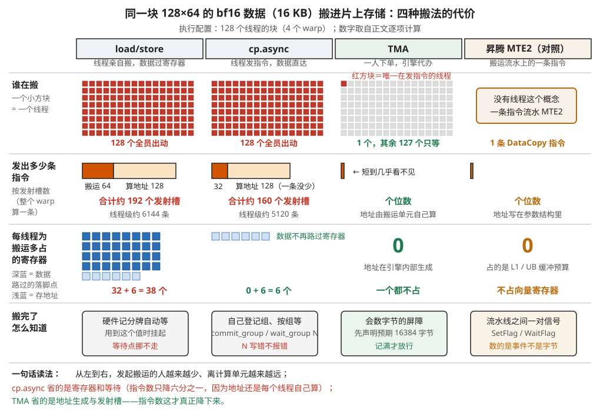
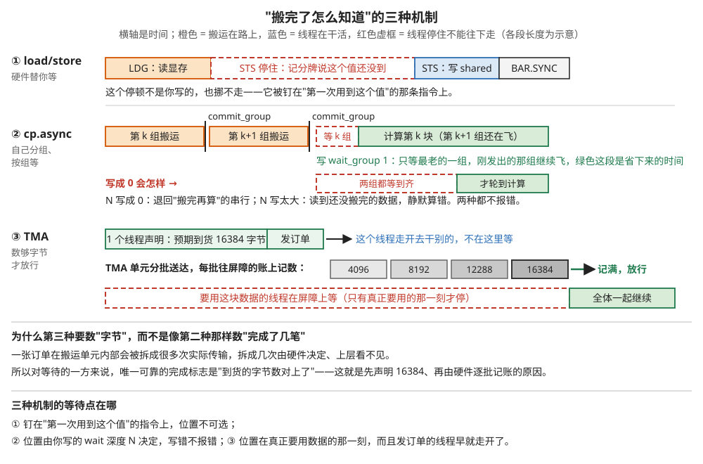
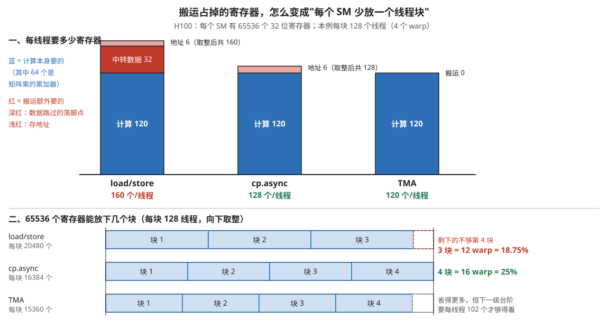
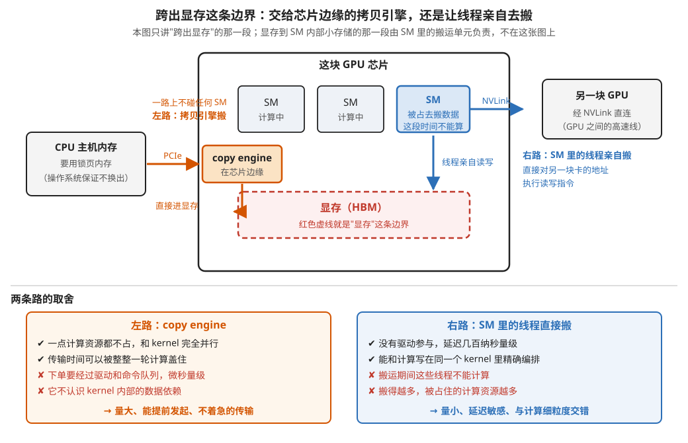
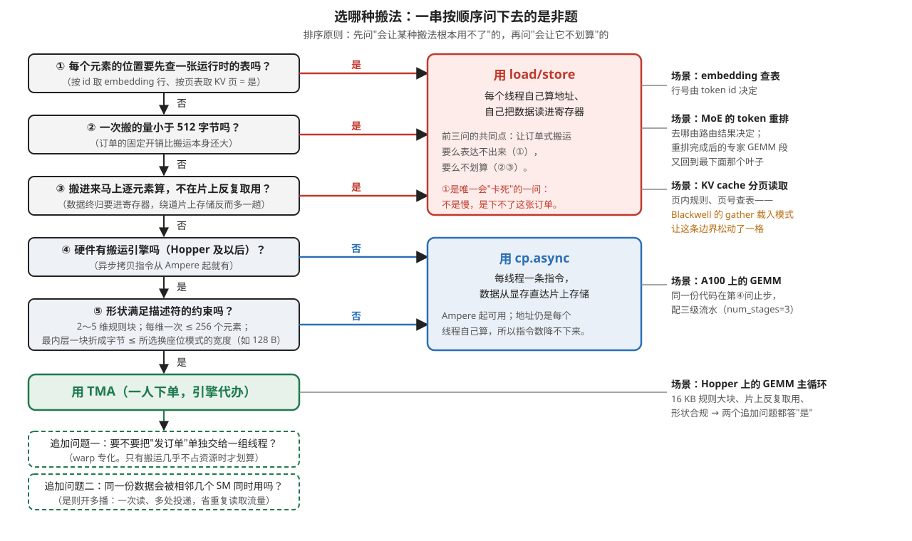
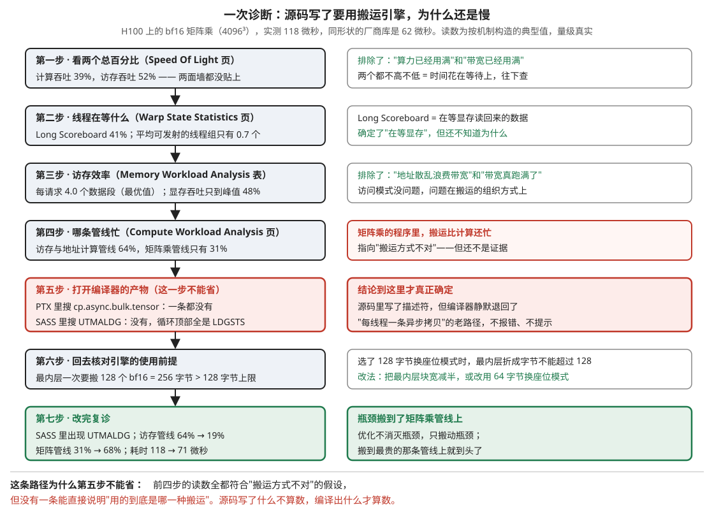

# 对照与选型：同一块数据的四种搬法

> **所属模块**：模块 14 · 数据搬运
> **状态**：🟨 学习中（第一版。知识截至 2026-09。指令名与工具参数已对照公开文档核实，仍有不确定处在文末"我的困惑"里逐条列出）
> **本节主旨**：前面六节把搬运机制一个一个拆开讲了——第 02 节是每个线程亲自搬的 load/store，第 03 节是绕开寄存器的 cp.async，第 04 节是下一张订单交给引擎的 TMA 与昇腾 MTE，第 05 节是芯片边缘的 copy engine 与网卡，第 06 节是搬运途中顺手做的摆法变换。这一节把它们放回同一道题上：**同一块 128×64 的 bf16 数据，从显存搬进 shared memory，供 Hopper 的矩阵指令使用**，三种 GPU 搬法各搬一遍，外加昇腾的做法做第四列对照，逐项算出参与几个线程、发出几条指令、占几个寄存器、要做哪些同步、驻留多少 warp、带宽卡在哪。有了这张对照表，才谈得上选型：本节后半段把选型判据写成一棵可以逐步走的决策树，用四个真实场景各走一遍，再落到开发者每天真正能摸到的地方——在 PyTorch、Triton、CUDA C、SASS 四层分别怎么选中和确认一种搬法，以及 Nsight Compute 里读哪几个数字才能断定"搬运是瓶颈，而且是这一类搬运"。

---

## 0. 这一节要回答的问题

- 同一个 GEMM tile 分别用 load/store、cp.async、TMA 搬进 shared memory，线程数、指令数、寄存器占用、同步动作、占用率、可达带宽各怎么变？每一项的算式是什么？
- 昇腾的 MTE2 搬同一块数据是什么样子？它和 TMA 像在哪、不像在哪？
- 什么时候应该老老实实用 load/store？什么时候用 cp.async？什么时候上 TMA？这三条判据能不能排成一棵可以逐步走的决策树？
- copy engine 和 SM 自己搬，在片外那一段怎么取舍？
- 需要的摆法变换（转置、swizzle、分形格式）能不能在搬运时顺手做掉，还是必须多一趟？这件事怎么影响选型？
- 在 PyTorch / Triton / CUDA C / SASS 各层，分别怎么"选中"一种搬运方式，又怎么"确认"它真的被选中了？
- Nsight Compute 里看哪些指标，能判断搬运是不是瓶颈、是哪一类搬运？从指标倒推结论的完整过程长什么样？
- Blackwell、AMD CDNA、昇腾、TPU 上，这些判据要改哪几条？

---

## 1. 基础词汇：先把本节要反复用的词讲清楚

这一节要反复用到七八个词。它们在别的节里各有详细展开，但按本库的规矩，**只读这一节的人也必须能读懂**，所以下面每个词都从头解释一遍，一段一个词。

**shared memory（共享内存）**。每个 SM（Streaming Multiprocessor，GPU 里能独立调度执行的一个计算核心单元，H100 有 132 个）内部有一小块由程序显式管理的高速存储，同一个线程块里的所有线程都能读写它，容量以百 KB 计（H100 上每个 SM 可配到 228 KB）。它的作用是"中转站"：从显存读进来的一块数据放在这里，块内所有线程反复取用，避免每个线程各自去显存取一遍。本节讨论的所有搬运，终点都是它。

**load/store（读写指令）**。GPU 最基本的两条访存指令：`ld` 把内存里的一个数读进线程私有的寄存器，`st` 把寄存器里的一个数写回内存。PTX（NVIDIA 公开的虚拟汇编）里写作 `ld.global` / `st.shared`，真实机器码 SASS 里写作 `LDG` / `STS`。要把显存的数据放进 shared memory，用这套指令必须两步接力：先 `LDG` 读进寄存器，再 `STS` 从寄存器写进 shared。**数据在寄存器里过了一道手**，这是它和后面几种搬法最根本的区别。

**cp.async（异步拷贝指令）**。Ampere 一代（2020）加入的一条 PTX 指令，语义是"内存到内存直接拷贝"：数据从显存直达 shared memory，不经过寄存器；指令发出后线程不必等它完成，可以继续往下执行，稍后再统一等待。SASS 里的名字是 `LDGSTS`（LDG 和 STS 合体）。它每个线程一次最多搬 16 字节，地址仍然是每个线程自己算。

**TMA（Tensor Memory Accelerator，张量内存加速器）**。Hopper 一代（2022）起每个 SM 内部配的一个专职搬运单元。它的工作方式是订单制：订单分两半，不变的一半叫**张量描述符**（tensor map，一个 128 字节的结构，主机侧用 `cuTensorMapEncodeTiled` 提前编好，写明张量的基址、维度数、每维长度与步长、要搬的小块形状、元素类型、shared memory 侧的摆放方式、越界怎么填），变的一半是 kernel 里**一个线程**发出的一条指令，只带三样每次都不同的东西：要第几块（坐标）、放到 shared 的哪里、搬完向哪个计数器记账。地址计算、越界裁剪、换座位摆放全部由这个单元用硬件完成。

**mbarrier（事务计数屏障）**。放在 shared memory 里的一个同步对象，它除了能数"有几个线程到了"，还能数"到货了多少字节"。用 TMA 搬运时，发单的线程先告诉它这次预期会到 16384 字节（PTX 里是 `mbarrier.arrive.expect_tx`），TMA 单元每搬完一批就往它账上记数，记满了就放行在它上面等待的线程。这是"引擎搬完了怎么通知用数的人"的答案。第 04 节展开讲它的完整语义，这里只需要知道它是一个会数字节数的屏障。

**warp 与发射槽（issue slot）**。GPU 把 32 个线程绑成一组一起执行，这一组叫一个 warp，同一拍它们执行的是同一条指令。所以"一条指令"有两种数法：**线程级**（32 个线程各算一条，共 32 条）和**发射槽级**（整个 warp 算一条，占调度器一个发射槽）。调度器每拍能发出的指令条数是固定的、由所有 warp 共享，所以**真正稀缺的是发射槽**。本节两种数法都会给，并且每次都写明用的是哪一种——两者差 32 倍，混了就会把结论算错。

**寄存器预算与占用率（occupancy）**。每个线程能用的寄存器来自 SM 上一块固定大小的寄存器堆（H100 每 SM 65536 个 32 位寄存器）。一个线程块能不能驻留在 SM 上，要看"每线程寄存器数 × 块内线程数"乘得下几块。占用率就是实际驻留的 warp 数除以硬件允许的最大驻留 warp 数（H100 是 64）。占用率的意义是"有多少 warp 可供调度器轮换，用来掩盖访存延迟"。本节反复要算的一笔账是：**搬运本身占掉的寄存器，会不会把驻留块数压下去一级**。

**sector 与合并（coalescing）**。显存和缓存之间按 32 字节一段搬运，这一段叫一个 sector。一个 warp 的 32 个线程同拍发出 32 个地址，硬件会把它们归并成尽可能少的 sector 请求：地址连续且对齐时，32 个线程各读 4 字节共 128 字节，只要 4 个 sector；地址完全分散时要 32 个 sector，其中大部分字节读回来用不上。**每请求几个 sector**（Nsight Compute 里叫 sectors per request）因此成为衡量访存效率的第一指标，健康值是 4。

**规则访问与 gather/scatter**。如果一块数据在显存里的位置可以用"基址 + 几个维度的步长 + 坐标"算出来，这种访问叫**规则访问**；如果每个元素的位置要先查一张索引表才知道（例如按 token id 去取 embedding 行），叫 **gather**（聚集读），反方向按索引写回叫 **scatter**（散射写）。这个区分是本节选型树的第一个岔路口：描述符式的搬运（TMA、MTE）假设了规则结构，gather/scatter 它表达不了。

---

## 2. 对照实验的题面：一块 128×64 的 bf16 tile

**题目**。一个 GEMM（矩阵乘）的主循环，每一轮要把 A 矩阵的一个 128 行 × 64 列的小块搬进 shared memory，元素类型是 bf16（16 位浮点，2 字节）。A 在显存里按行存放，一行 4096 个元素（K = 4096），所以这个小块的每一行是 64 × 2 = **128 字节连续**，相邻两行相隔 4096 × 2 = **8192 字节**。小块总大小 128 × 64 × 2 = 16384 字节 = **16 KB**。

**为什么选这个尺寸**。三个理由，每个都对应后面某一项的算式：第一，16 KB 是 Hopper 上一个典型 GEMM 主循环每轮搬运量的量级，和模块 10 第 4 节 §6.2 那笔 cp.async 与 TMA 的指令数对照账用的是同一块数据，两处数字可以对得上；第二，128 字节的行宽正好等于一个 sector 组（4 个 32 字节 sector）的大小，也正好等于 Hopper 的 128 字节 swizzle 模式允许的最大内层块宽度，边界条件清楚；第三，它的消费者是 Hopper 的 `wgmma` 指令（warpgroup 级的异步矩阵乘指令，一个 warpgroup = 4 个 warp = 128 个线程合作发一条），矩阵指令直接从 shared memory 读操作数，对 shared 里的摆法有硬性要求——这让"搬运时能不能顺手把摆法做对"变成一个真问题，而不是纸上谈兵。

**执行配置**。线程块取 128 个线程（一个 warpgroup，4 个 warp）。计算部分每线程占 120 个寄存器：一条 `wgmma.m64n128k16` 的输出是 64 × 128 个 fp32 累加值，摊到 128 个线程是每人 64 个累加器，再加上循环变量、指针、谓词等约 56 个，合计 120。这个数字后面算占用率时要用。

**六项待测指标，以及怎么数**。

| 指标 | 定义 | 怎么数 |
| --- | --- | --- |
| 参与的线程数 | 为这次搬运执行了至少一条指令的线程数 | 数代码里谁发了搬运或地址指令 |
| 指令数 | 分两个口径：线程级（每个线程各算一条）与发射槽级（整个 warp 算一条） | 搬运指令 + 为它服务的地址算术 |
| 寄存器占用 | 每线程为这次搬运额外占用的 32 位寄存器 | 中转数据的 + 存地址的 |
| 同步动作 | 从发出搬运到"数据可以安全使用"之间必须执行的同步 | 逐条列出指令名 |
| 占用率影响 | 加上搬运寄存器后，每个 SM 还能驻留几个块、多少 warp | 65536 ÷（每线程寄存器 × 块内线程数），向下取整 |
| 可达带宽的限制因素 | 这种搬法下，先顶到天花板的是哪一项 | 逐项列出并给量级 |

**一条贯穿全节的物理底线，先算出来备用**。H100 的显存带宽约 3.35 TB/s，132 个 SM 平摊，每个 SM 分到约 25.4 GB/s。核心时钟按 1.755 GHz 算，每个 SM 每拍能从显存分到约 14.5 字节。搬 16 KB 需要 16384 ÷ 14.5 ≈ **1130 拍的显存带宽份额**。这个数是三种搬法共同的下界：**谁也不可能比显存本身更快**。三种搬法的差别不在这个下界，而在两件事上——这 1130 拍能不能被计算盖住，以及为了发起这次搬运付出了多少 SM 内部的资源（线程、寄存器、发射槽）。后面每一种搬法都要回到这两句话上。

---

## 3. 第一种搬法：load/store，线程亲自搬

### 3.1 代码长什么样

最朴素的写法是每个线程负责这块数据的一小片，读进自己的寄存器再写进 shared：

```cuda
// 128 个线程，每人负责 16 KB / 128 = 128 字节
// 按 128 位（16 字节）向量化，每人 8 次
__shared__ __align__(128) uint4 As[1024];          // 16 KB
const uint4* g = reinterpret_cast<const uint4*>(A);
for (int i = 0; i < 8; ++i) {
    int idx  = i * 128 + threadIdx.x;              // 第几个 16 字节块
    int row  = idx / 8, col = idx % 8;             // 一行 128 字节 = 8 个 16 字节块
    uint4 v  = g[(row0 + row) * (K / 8) + k0 / 8 + col];   // ① LDG.E.128
    int sw   = col ^ (row & 7);                    // ② swizzle：换座位，避开 bank 冲突
    As[row * 8 + sw] = v;                          // ③ STS.128
}
__syncthreads();                                   // ④ 等全体搬完
```

三行带编号的语句就是这一搬法的全部代价来源：① 把 16 字节读进寄存器，② 算出它在 shared 里该坐哪个位置，③ 从寄存器写出去，④ 等所有人都写完。

**②这一行需要解释**。矩阵指令从 shared memory 读操作数时，会有很多线程同拍去读，如果它们的地址落在同一个存储体（bank，shared memory 被切成 32 个可以同时服务的窗口）上，就要排队，一次变多次。避开的办法是把数据在 shared 里换个座位摆：第 row 行的第 col 块，实际存到第 `col XOR (row mod 8)` 个位置。这个异或换座位就是 swizzle。用 load/store 搬运时，**这个换座位是你自己算的**，占一条指令；后面会看到 TMA 把它做进了硬件。

### 3.2 逐项算账

**参与的线程数**：128 个，一个不少。每个线程都要执行完整的 8 轮循环。

**指令数**。先按发射槽级数（每个 warp 一条算一条）：每个 warp 跑 8 轮，每轮一条 `LDG.E.128`、一条 `STS.128`，以及地址算术——全局地址要算行号和列号、乘以行步长、加基址，约 2 条整数乘加（SASS 里是 `IMAD`）；shared 地址要算行偏移再做一次异或，约 2 条（`IMAD` 加 `LOP3`）。所以每轮 6 条，8 轮 48 条，4 个 warp 共 **192 个发射槽**。换成线程级口径：每个线程 8 × 6 = 48 条，128 个线程共 **6144 条线程级指令**。

**寄存器占用**。这是 load/store 代价最大的一项。数据要在寄存器里过一道手：一个 `uint4` 是 128 位 = 4 个 32 位寄存器。如果编译器为了让 8 次读取都能同时在途而把循环完全展开（它通常会这么做，因为不这样每次读取都要等上一次写完，延迟完全暴露），就要同时留 8 × 4 = **32 个寄存器专门中转数据**，再加上地址寄存器（全局指针 2 个、shared 偏移 1 个、行列各 1 个、循环变量 1 个）约 6 个，合计约 **38 个寄存器/线程**。

这 38 个寄存器的意义要讲清楚：**它们不参与任何计算，纯粹是数据路过时的落脚点**。而寄存器是决定能驻留多少线程块的稀缺资源，所以这 38 个是实打实的成本。

**同步动作**：一条 `__syncthreads()`（SASS 里是 `BAR.SYNC`）。除此之外，`STS` 要等 `LDG` 的数据回来才能执行，这个等待不用你写——硬件的记分牌（一张记录"哪个寄存器的值还没到"的表）会在 `STS` 用到那个寄存器时自动把 warp 挂起。代价是这个等待落在**每一个 warp 头上**：warp 停在这里不能发指令，只能靠调度器切到别的 warp 去掩盖，这就是为什么这种搬法特别依赖占用率。

**占用率影响**。每线程寄存器 = 120（计算）+ 38（搬运）= 158。寄存器按每个 warp 一批分配，取整到 8 的倍数，按 160 算：每个 warp 160 × 32 = 5120 个，每块 4 个 warp = 20480 个。65536 ÷ 20480 = 3.2，向下取整 **3 个块**，即 12 个 warp，占用率 12 ÷ 64 = **18.75%**。

**可达带宽的限制因素**，按"先顶到哪个天花板"排序：

1. **每请求 sector 数**。一个 warp 的 32 个线程同拍执行 `LDG.E.128`：`idx = i * 128 + threadIdx.x`，同一个 warp 内 threadIdx.x 连续，所以 idx 连续，读的是连续的 32 × 16 = 512 字节，正好 16 个 sector，每请求 4 个 sector——**这是最优值**。写法稍有不同（比如把行列的算法对调）就会掉到 8 甚至 32，带宽利用率跟着掉。
2. **L1 通路被走了两趟**。数据先从 L1 回到寄存器（16 KB），再从寄存器经同一条通路写进 shared（16 KB），一共 32 KB 过境。每个 SM 的 L1 通路每拍约 128 字节（量级值），32768 ÷ 128 = **256 拍**。对照上面算的 1130 拍显存份额，单看一块 tile 时显存仍是外层瓶颈；但一个 SM 上同时驻留三个块、每块都在搬，L1 通路的占用就成了实打实的竞争项。
3. **在途请求数**。要跑满带宽，任意时刻必须有足够多的读取"在飞"（模块 10 第 4 节算过：H100 上约 1.7 MB 同时在途才喂得满）。这一搬法凑在途请求靠的是"很多 warp 各挂着几条读取"，而它的占用率只有 18.75%——**寄存器占得多导致 warp 少，warp 少导致在途请求少，在途请求少导致带宽跑不满**，这条因果链是 load/store 搬大块数据的核心病灶。

### 3.3 一句话小结

load/store 的全部问题可以压成一句：**它让搬运和计算抢同一批资源**——抢寄存器（38 个）、抢发射槽（192 个）、抢线程（128 个全员在搬）。后面两种搬法，就是沿着这三项依次把成本摘掉。

---

## 4. 第二种搬法：cp.async，绕过寄存器

### 4.1 代码长什么样

把上面的"读进寄存器、再写出去"换成一条指令：

```cuda
#include <cuda_pipeline.h>
for (int i = 0; i < 8; ++i) {
    int idx  = i * 128 + threadIdx.x;
    int row  = idx / 8, col = idx % 8;
    int sw   = col ^ (row & 7);
    __pipeline_memcpy_async(&As[row * 8 + sw],                        // 目的：shared
                            &g[(row0 + row) * (K / 8) + k0 / 8 + col],// 源：显存
                            16);                                      // 16 字节
}
__pipeline_commit();        // ① 把刚发的这批登记成一组
__pipeline_wait_prior(0);   // ② 等到未完成的组数 ≤ 0，即这一组已到齐
__syncthreads();            // ③ 全块可见
```

`__pipeline_memcpy_async` 编译出来就是 PTX 的 `cp.async.ca.shared.global`（`.ca` 表示同时在 L1 缓存里留一份；还有 `.cg` 只在 L2 留、绕过 L1，仅支持 16 字节形态），SASS 里是 `LDGSTS`。

### 4.2 逐项算账

**参与的线程数**：仍然是 128 个。地址还是每个线程自己算——这是 cp.async 没有解决的那件事。

**指令数**。发射槽级：每个 warp 8 轮，每轮 1 条 `LDGSTS` + 约 4 条地址算术（全局 2 条、shared 2 条，和上一节一样）= 5 条，8 轮 40 条，4 个 warp 共 **160 个发射槽**。比 load/store 的 192 少了 32 个——省下的正是那 32 条 `STS`。线程级口径：每线程 8 条 `LDGSTS`，128 线程共 **1024 条搬运指令**，加上地址算术约 **5120 条线程级指令**。（模块 10 第 4 节 §6.2 给的是"约 3000 条"，那里按每条搬运配约 2 条地址算术估算，本节把 shared 侧的 swizzle 计算也数了进去，所以略高；两处说的是同一件事。）

这里要点破一个容易误读的地方：**cp.async 省掉的主要不是指令条数，而是寄存器和等待**。指令数只降了六分之一，因为地址算术一条没少。

**寄存器占用**：数据不再经过寄存器，32 个中转寄存器全部省掉，只剩地址寄存器约 **6 个/线程**。

**同步动作**：三步，缺一不可。`cp.async.commit_group`（把刚发出的这批登记成一组）、`cp.async.wait_group N`（等到未完成的组数不超过 N）、`__syncthreads()`（让全块都看见）。中间那个 N 是流水线能不能重叠的关键：写 `wait_group 0` 表示"等全部搬运到齐"，流水线退化成串行；写 `wait_group 1` 表示"允许一组还在路上"，这样才有重叠。模块 40 第 4 节 §7.2 把这个参数叫"wait 深度"，并指出写错它是手排流水最常见的错误。

**占用率影响**。每线程寄存器 = 120 + 6 = 126，取整到 8 的倍数是 128：每 warp 128 × 32 = 4096，每块 4 warp = 16384。65536 ÷ 16384 = 4.0，整整 **4 个块**，16 个 warp，占用率 **25%**。

**对照上一节**：搬运寄存器从 38 降到 6，驻留块数从 3 升到 4，占用率从 18.75% 升到 25%。这 25% 正是模块 10 附录 A1 例 2 里那个"占用率只有 25%、而且是故意的"的分块 GEMM——低占用率是为了把寄存器留给累加器，但前提是**搬运本身不能再来抢**。

**一句必须加的话**：上面这笔账只算了寄存器这一条约束。实际的 GEMM 主循环还要为流水线开多份缓冲，三级流水下 A、B 两块各 16 KB × 3 = 96 KB，228 KB 的 shared memory 只放得下 2 个块——**这时最紧的约束是 shared memory，不是寄存器**。模块 40 第 4 节 §7.4 专门算过这笔"流水深度、shared memory、占用率共用一笔预算"的账。本节的对照实验固定只看搬运本身的成本，是为了让三种搬法可比；真实选型时三条约束都要算。

**可达带宽的限制因素**：

1. **每线程一次最多 16 字节**，这是指令规定的上限。16 KB 需要 1024 条线程级指令，条数降不下来，所以在途请求数仍然要靠"很多 warp × 每 warp 几条"凑。
2. **每请求 sector 数**：和 load/store 完全一样的规则，一个 warp 的 32 条 `LDGSTS` 要落在连续地址上才合并得好。cp.async 不会替你修正糟糕的访问模式。
3. **L1 通路只走一趟**：16 KB ÷ 128 字节/拍 = **128 拍**，比 load/store 的 256 拍减半。
4. **在途上限**：每个 SM 能同时挂多少条未完成的 `LDGSTS` 受硬件资源（MSHR 一类的表项）限制，具体数字公开资料里没有明确给出，属于待核实项。

---

## 5. 第三种搬法：TMA，一个线程下一张订单

### 5.1 代码长什么样

TMA 的代码分两处，这正是它的形态特征。主机侧先编好描述符：

```cpp
CUtensorMap tmap;                                  // 128 字节
cuTensorMapEncodeTiled(&tmap,
    CU_TENSOR_MAP_DATA_TYPE_BFLOAT16,
    2,                    // 维度数（2～5 维）
    A_device_ptr,         // 基址，要 16 字节对齐
    globalDim,            // {4096, 4096}
    globalStrides,        // {8192}（以字节计，最内维隐含连续）
    boxDim,               // {64, 128}：一次搬 64 列 × 128 行
    elementStrides,       // {1, 1}
    CU_TENSOR_MAP_INTERLEAVE_NONE,
    CU_TENSOR_MAP_SWIZZLE_128B,     // shared 侧按 128 字节模式换座位
    CU_TENSOR_MAP_L2_PROMOTION_L2_128B,
    CU_TENSOR_MAP_FLOAT_OOB_FILL_NONE);  // 越界填 0
```

kernel 里只剩一条发单指令（这里用 PTX 内联写法，CUTLASS 里对应的是 `SM90_TMA_LOAD` 这个拷贝原子）：

```cuda
if (threadIdx.x == 0) {                       // 只要一个线程
    mbarrier_arrive_expect_tx(&bar, 16384);   // 告诉屏障：这次预期到货 16384 字节
    asm volatile(
      "cp.async.bulk.tensor.2d.shared::cluster.global"
      ".mbarrier::complete_tx::bytes [%0], [%1, {%3, %4}], [%2];"
      :: "r"(smem_addr), "l"(&tmap), "r"(bar_addr), "r"(k0), "r"(row0));
}
mbarrier_try_wait_parity(&bar, phase);        // 全块在这里等到货
```

SASS 层的名字是 `UTMALDG`（读入）和 `UTMASTG`（写出）；整块非张量的拷贝还有 `UBLKCP` 一族。**在反汇编里看到 `UTMALDG` 就说明 TMA 真的被用上了**，这是后面"开发者视角"里确认搬法的关键一招。

**描述符里那几个参数值得逐个说明，因为它们就是 TMA 的使用前提**：维度数只支持 2 到 5 维；基址要 16 字节对齐；`boxDim` 每一维不超过 256；选了 128 字节 swizzle 时，最内层 box 维度折算成字节不能超过 128（我们的 64 个 bf16 正好 128 字节，卡在边界上）；越界填充模式决定了边缘的残块怎么处理——**这一条特别值钱，它把"尾块要不要单独写一个分支"这个老问题变成了描述符里的一个枚举值**。

### 5.2 逐项算账

**参与的线程数**：**1 个**。其余 127 个线程一条搬运指令都不发（它们只需要在屏障上等）。SASS 里挑出这一个线程用的是 `ELECT` 指令（从 warp 里选一个活跃线程）。

**指令数**。发射槽级：1 条发单指令 + 1 条 `mbarrier.arrive.expect_tx` + 屏障等待，**合计个位数**。线程级同样是个位数——因为只有一个线程在发。和 cp.async 的 1024 条线程级搬运指令相比，这是三个数量级的差距。

**寄存器占用**：**0 个中转寄存器，0 个地址寄存器**。地址全部在 TMA 单元内部生成；描述符放在常量空间，坐标是标量。

这一项的分量要专门讲一句：**它是"生产者—消费者"式 kernel 成立的硬件前提**。Hopper 上可以把一个 warpgroup 专门用来搬运（生产者）、另外几个 warpgroup 专门用来计算（消费者），并用 `setmaxnreg` 指令把寄存器配额从生产者划给消费者。生产者能把配额让出去，正是因为用 TMA 发单一个寄存器都不占。FlashAttention-3 就是这个形态（模块 40 附录 B2 逐行精读过它的代码）。

**同步动作**：`mbarrier.init`（初始化，每个缓冲一次）、`mbarrier.arrive.expect_tx`（声明这次预期到货多少字节）、TMA 单元自动记账、`mbarrier.try_wait.parity`（等待，用相位翻转区分轮次）。写出方向（shared → 显存）不用 mbarrier，用 `cp.async.bulk.commit_group` / `wait_group` 的组语义。

**占用率影响**：每线程寄存器 = 120 + 0 = 120，取整到 120：每 warp 3840，每块 15360，65536 ÷ 15360 = 4.27 → **4 个块**，和 cp.async 一样是 25%。

**这里有一个必须诚实说出来的结论：在这个算例里，TMA 相对 cp.async 并没有再提高驻留块数。** 原因是驻留块数是个向下取整的台阶，cp.async 的 126 个寄存器已经踩在 4 块这一级上，再省 6 个寄存器跨不过下一级。TMA 的收益在别处，有三项：发射槽从 160 降到个位数（把发射带宽全部让给计算指令）；127 个线程从搬运里解放出来；寄存器配额可以整体让渡（`setmaxnreg`），这一点在 warp 专化的 kernel 里才兑现得出来。**"换更贵的机制不一定在每一项指标上都赢"——这正是需要一张对照表而不是一句口号的原因。**

**可达带宽的限制因素**：

1. **描述符的形状约束**。box 的最内维在 128 字节 swizzle 下不能超过 128 字节；张量必须是规则的多维块。形状不满足就根本用不了，不是慢一点的问题。
2. **每个 SM 一个 TMA 单元**。一个 SM 上同时飞多笔 TMA 搬运时，它们排在同一个单元上；单笔订单的深度和引擎的并发能力公开资料里没有明确数字，属于待核实项。
3. **数据通路仍然共用**。TMA 省掉的是发射与地址生成，**不是数据通路**：数据依然要从 L2 经过 SM 的访存接口进 shared。Nsight Compute 的计数器归属上，TMA 的流量仍然计在 L1TEX 一侧（开发者论坛上有人报告它在 DRAM 段的统计里对不上），这从侧面印证了通路共用。这一条是从计数器归属推断的，不是官方文档明说的，标为待核实。
4. **多播能不能用上**。TMA 的读入订单可以指定把同一份数据同时投递进簇内多个 SM 的 shared memory（`SM90_TMA_LOAD_MULTICAST`）。GEMM 里同一个 B tile 会被同列的多个块用到，用上多播后 L2 的流量按簇的大小整除——**对贴着 L2 带宽跑的大 GEMM，这是三种搬法里独有的一条出路**。

---

## 6. 第四种：昇腾的 MTE2，把同一件事做成流水线上的一段

### 6.1 它和前三种的根本区别

前三种是同一款硬件上的三代做法；昇腾（华为的 NPU）的做法是**另一条路线的默认形态**。昇腾的 AI Core 里没有 warp，也没有几千个线程：一个核上是几条并行的指令流水线，各管一类事——PIPE_S 是标量、PIPE_V 是向量计算、PIPE_M 是矩阵计算（Cube 单元）、**PIPE_MTE1 / MTE2 / MTE3 是三条搬运流水**（MTE 是 Memory Transfer Engine 的缩写）。分工是：MTE2 管从 GM（Global Memory，相当于显存）搬进片上的 L1 / UB 缓冲，MTE1 管从 L1 搬进矩阵单元的输入缓冲 L0A/L0B，MTE3 管从 UB 搬回 GM，另有 PIPE_FIX 管矩阵结果从 L0C 写出。

**所以"参与的线程数"这个问题在昇腾上问法就变了**：不是 128 个线程各搬一点，而是标量流水发出一条 `DataCopy` 指令，这条指令落在 MTE2 这条流水上执行。从资源账的角度，它天生就站在光谱最右边——和 TMA 同侧，甚至更彻底，因为它是这台机器唯一的搬运方式，不是三代并存里的一代。

### 6.2 同一块数据在昇腾上怎么搬

```cpp
// Ascend C：把 GM 上一块 128×64 的 bf16 搬进 L1，并在途中做 ND → NZ 分形转换
AscendC::Nd2NzParams nd2nzParams;      // 描述"源是普通二维排布，目的按分形摆"
// ... 填入 ndNum、nValue(128)、dValue(64)、srcDValue(4096) 等
AscendC::DataCopy(a1Local, aGm[offset], nd2nzParams);   // 落在 MTE2 流水
AscendC::SetFlag<AscendC::HardEvent::MTE2_MTE1>(eventId); // 搬完了，通知下一段
// ... 消费方：
AscendC::WaitFlag<AscendC::HardEvent::MTE2_MTE1>(eventId);
```

**`Nd2NzParams` 这个参数结构是本节对照里最值得记的一点**。ND 是普通的行主序二维排布，NZ 是昇腾矩阵单元要求的分形排布（数据按 16×16 一类的小块重新组织）。这个转换**在搬运途中由 MTE2 顺手完成**，不占额外的一趟读写。对照 GPU：Hopper 的 TMA 能在搬运途中做 swizzle（换座位）和越界填充，但做不了任意的分形重排；需要按矩阵指令的片段规则重排时，GPU 的做法是搬进 shared 之后再用 `ldmatrix` 这条指令取一次（模块 14 第 06 节把两派的分工完整对照了一遍）。

**同步动作**：`SetFlag` / `WaitFlag` 一对，参数是"从哪条流水到哪条流水"（例如 `MTE2_MTE1` 表示搬运流水做完、矩阵搬运流水可以开始）。这和 mbarrier 的差别值得说清：mbarrier 数的是**字节数**，昇腾的 flag 数的是**事件**（某条流水上的某个操作完成了）。前者对应"引擎可能分批送达、要对账"，后者对应"流水线段之间按顺序交接"。

### 6.3 逐项对照

参与的执行单元：1 条指令流（无线程概念）。指令数：1 条 `DataCopy`。寄存器：不占向量寄存器，占的是 L1 / UB 的缓冲预算——**昇腾把 GPU 上"寄存器 vs shared"的预算问题，整个搬到了"多级片上缓冲怎么分"上**。同步：一对 SetFlag/WaitFlag。带宽限制因素：GM 的带宽、L1 写入口、以及分形转换本身的吞吐（转换在引擎内部完成，但仍要占引擎的时间）。

---

## 7. 总表：四种搬法并排

把前面四节的数字收进一张表。题面同上：128×64 的 bf16 tile，16 KB，搬进 shared memory / L1，执行配置是 128 线程的块、计算部分每线程 120 个寄存器。

| 指标 | load/store | cp.async | TMA | 昇腾 MTE2（对照） |
| --- | --- | --- | --- | --- |
| **参与的线程数** | 128（全员） | 128（全员） | **1** | 无线程概念，1 条指令流 |
| **搬运指令数（发射槽级）** | 64（32 LDG + 32 STS） | 32（LDGSTS） | **1** | 1（DataCopy） |
| **地址算术（发射槽级）** | 约 128 | 约 128 | **0** | 0（参数结构里给） |
| **合计发射槽** | **约 192** | **约 160** | **个位数** | 个位数 |
| **线程级指令数** | 约 6144 | 约 5120 | 个位数 | — |
| **中转数据的寄存器** | **32** | 0 | 0 | 0 |
| **地址寄存器** | 约 6 | 约 6 | **0** | 0 |
| **同步动作** | 记分牌自动等 + `BAR.SYNC` | `commit_group` + `wait_group N` + `BAR.SYNC` | `expect_tx` + mbarrier 记账 + `try_wait` | `SetFlag` / `WaitFlag` 一对 |
| **每线程寄存器合计** | 158（取整 160） | 126（取整 128） | 120 | — |
| **每 SM 驻留块数 / 占用率** | 3 块 / **18.75%** | 4 块 / **25%** | 4 块 / 25% | 由 L1、UB 预算决定 |
| **L1 通路过境字节** | 32 KB（两趟） | 16 KB（一趟） | 16 KB（一趟） | 一趟，含格式转换 |
| **搬运时能顺手做的变换** | 全靠自己写指令 | 全靠自己写指令 | swizzle、越界填充、im2col、box 切块 | ND→NZ 分形、越界填充 |
| **第一限制因素** | 寄存器压低占用率 → 在途请求不足 | 每线程 16 字节上限 → 指令条数降不下来 | 描述符的形状约束（规则、2～5 维、box ≤ 256） | 分形转换与 L1 写入口 |
| **对应的 SASS / 指令名** | `LDG.E.128` / `STS.128` | `LDGSTS` | `UTMALDG` / `UTMASTG` / `UBLKCP` | MTE2 流水上的搬运指令 |
| **本模块详解章节** | [第 02 节](./02-load-store·线程亲自搬.md) | [第 03 节](./03-异步拷贝·cp.async绕过寄存器.md) | [第 04 节](./04-描述符DMA·TMA与NPU的MTE.md) | [第 04 节](./04-描述符DMA·TMA与NPU的MTE.md) |

图 7-1 把表里最要紧的四行（谁在搬、发多少条指令、占多少寄存器、搬完了怎么知道）画了出来。



> **图 7-1**　一句话：同样把 16 KB 数据搬进片上存储，四种搬法付出的代价完全不同——从"128 个线程发出约 6000 条指令、占 38 个寄存器"，一直到"1 个线程发 1 条指令、一个寄存器不占"。
>
> **先知道一件事**：GPU 上"一条指令"有两种数法。32 个线程绑成一组（叫一个 warp）同时执行同一条指令，所以同一条指令按线程数是 32 条，按调度器的发射次数是 1 条。调度器每拍能发出的指令条数有限、由所有线程共享，所以图里最要紧的是"发射槽"那一行——它直接决定还剩多少发射能力留给计算指令。
>
> **按这个顺序看**：
> 1. 从左往右四列，是同一件事的四种做法，越往右发起搬运的人越少、越远离计算单元。第四列昇腾是另一家的 NPU（神经网络处理器），放在这里做对照。
> 2. 第一行"谁在搬"：一个小方块是一个线程。前两列的 128 个方块全是红的，表示全员出动；第三列只有左上角一个是红的，其余 127 个是灰的（只在屏障上等）；第四列干脆没有线程这个概念，是一条指令流水。
> 3. 第二行"发出多少条指令"：橙色条的长度按发射槽数画。load/store 约 192 条，cp.async 约 160 条（省掉的是写进 shared 的那 32 条），TMA 只剩个位数，短到几乎看不见。注意前两列橙条里深色的一段是搬运指令本身，浅色的一大段是**为它算地址的指令**——这说明 cp.async 之所以省得不多，是因为地址还是每个线程自己算。
> 4. 第三行"占多少寄存器"：蓝色方块每个代表一个 32 位寄存器。第一列 32 个深蓝的是数据路过时的落脚点（数据必须先读进寄存器才能写出去），6 个浅蓝的是存地址用的；第二列数据不再路过寄存器，深蓝全部消失；第三列连地址寄存器也没有，因为地址由搬运单元自己算。
> 5. 第四行"搬完了怎么知道"：第一列靠硬件记分牌（一张记着"哪个寄存器的值还没到"的表）在你用到那个值时自动把线程挂起；第二列要自己写"登记一组、等这一组"；第三列是一个会数字节数的屏障，搬运单元每送到一批就记账，记满 16384 字节放行；第四列是流水线段之间的一对信号。
>
> **看懂的标志**：能回答"为什么 cp.async 的指令数只比 load/store 少六分之一，却被认为是一次重要进步"——因为它省掉的不是指令条数，而是 32 个中转寄存器和"线程必须原地等数据回来"这件事。指令数要真正降下来，得等到地址也不用线程算，也就是第三列。
>
> **与正文的对照**：各格数字取自 §3～§6 的逐项计算，题面是同一块 128×64 的 bf16 数据（16 KB）。第四列昇腾一侧不按线程计，图中相应位置标的是"1 条指令流"。
>
> 来源：本库自绘。

### 7.1 三条读法

**第一条：三种 GPU 搬法省掉的东西是依次接力的，不是互相替代的。** load/store → cp.async 省掉的是**中转寄存器和同步等待**；cp.async → TMA 省掉的是**地址生成和发射槽**。这也解释了为什么 Hopper 上三代机制并存而不是新的淘汰旧的：需要的是哪一项节省，就用到哪一代为止。

**第二条：占用率这一项最容易看错。** 表里 cp.async 和 TMA 的占用率都是 25%，看不出差别。但驻留块数是向下取整的台阶，两者只是踩在同一级上而已；真正的差别在发射槽（160 对个位数）和"能不能把寄存器配额整体让给别人"。**看单一指标选型会选错，这张表必须横着读。**

**第三条：昇腾那一列最值得学的不是它的指令名，而是它的默认值。** GPU 是"三代并存、你来选"，昇腾是"只有一种、编译期定死"。表里昇腾那一列的"搬运时能顺手做的变换"一格里有 ND→NZ 分形转换，这是 GPU 三列都没有的——因为在昇腾上，矩阵单元要的摆法和内存里的摆法不一样是常态，于是干脆把转换做进搬运引擎。**两派的分界线不在能力，而在"把变换放在搬运里还是放在计算前"。**

### 7.2 三种"搬完了怎么知道"的机制并排看

上表里最容易被略过的是"同步动作"那一行，但它恰恰是三种搬法在代码形态上最大的区别——前两种的等待写法完全不同，第三种连等待的对象都换了。图 7-2 把三种机制画成三条并排的时间线。

**load/store 的等待是隐式的**。`STS` 这条指令的操作数是 `LDG` 读回来的寄存器，硬件的记分牌在数据没回来之前不让它发射，warp 自动停住。你一行等待代码都不用写，代价是**你也没法控制它什么时候等**——等待点被钉死在"第一次用到这个值"的地方。

**cp.async 的等待是显式的、按组的**。你必须自己写 `commit_group` 把一批搬运登记成一组，再写 `wait_group N` 说"允许 N 组还在路上"。好处是等待点可以往后推，坏处是 N 写错了不会报错：写 0 就退化成串行（白慢一截），写大了会读到还没搬完的数据（静默算错）。

**TMA 的等待是按字节对账的**。发单前先声明这次预期到货 16384 字节，TMA 单元分批送达、每批记账，屏障记满才放行。为什么要数字节而不是数"完成了几笔"：因为一笔订单在引擎内部会被拆成很多次实际传输，**对上层来说唯一可靠的完成标志是字节数对上了**。



> **图 7-2**　一句话：三种搬法"等数据到齐"的方式完全不同——第一种由硬件在你用到数据时自动停住，第二种要你自己把搬运分组再按组等，第三种是数够了字节数才放行。
>
> **先知道一件事**：横轴是时间（GPU 时钟的拍）。三条时间线上的方块都表示"这段时间里这个部件在干什么"；红色虚线框表示线程停在这里不能往下走。搬一次数据从发出到数据真正到达要几百拍，所以"等"的方式直接决定了这几百拍能不能拿来干别的。
>
> **按这个顺序看**：
> 1. 第一条（load/store）：`LDG` 发出去之后，紧接着的 `STS` 要用它读回来的值。硬件里有一张记分牌，记着"这个寄存器的值还在路上"，于是 `STS` 发不出去，整个 warp 停在红框里。这个停顿不是你写的，也不能挪走——它被钉在"第一次用到这个值"的位置上。
> 2. 第二条（cp.async）：橙色是两批搬运。每批发完写一条 `commit_group`，相当于在账本上画一条线把这一批圈起来。后面 `wait_group 1` 的意思是"允许还有 1 组在路上"，也就是只等最老的那一组（第 k 组）到齐，刚发出的第 k+1 组继续飞——绿色那段就是省下来可以拿去计算的时间。图里下方标出写成 `wait_group 0` 会怎样：两组都等，绿色那段消失，流水线退回串行。
> 3. 第三条（TMA）：只有一个线程发出一条订单，之前先声明"这次预期到货 16384 字节"。灰色小块是 TMA 单元分批送达的数据，每送一批就在屏障的账上加一笔（图中数字逐格累加：4096、8192、12288、16384）。数字加满的那一刻屏障放行，在它上面等的全部线程一起继续。
> 4. 对比三条线的红框位置：第一条的红框在每个 warp 身上、位置固定；第二条的红框位置由你写的 N 决定；第三条的红框只在真正需要数据的那一刻出现，而且等待期间发出订单的那个线程早就走开了。
>
> **看懂的标志**：能回答"为什么 TMA 要数字节数，而不是像 cp.async 那样数'完成了几笔'"——因为一张订单在引擎内部会被拆成很多次实际传输，笔数对上层不可见，字节数才是唯一可靠的完成标志。
>
> **与正文的对照**：各段的长度是示意，不是实测拍数；16384 字节和四批送达对应 §5 的题面（16 KB 的 tile），实际分几批由硬件决定。
>
> 来源：本库自绘。

### 7.3 寄存器省下来到底换到了什么

§3 到 §5 各算了一次占用率，图 7-3 把三笔账并排画出来，因为这是本节最容易算错、也最容易被一句"TMA 更省寄存器"带过去的地方。



> **图 7-3**　一句话：搬运占掉的寄存器会通过"每个 SM 还放得下几个线程块"这道除法影响性能，但这道除法的结果是一级一级的台阶，省寄存器不一定每次都能跨上一级。
>
> **先知道一件事**：每个 SM（GPU 的一个计算核心单元）有一块固定大小的寄存器堆，H100 上是 65536 个 32 位寄存器。一个线程块要驻留在 SM 上，必须把块里每个线程要的寄存器都分配到位。所以"每个 SM 能同时放几个块"是一道除法：65536 ÷（每线程寄存器数 × 块内线程数），结果向下取整——**取整**是这张图的关键。
>
> **按这个顺序看**：
> 1. 上半部分三根柱子是每线程的寄存器用量。深色一段是计算本身要的 120 个（其中 64 个是矩阵乘的累加器），浅色一段是搬运额外占的：load/store 要 38 个（32 个给路过的数据、6 个给地址），cp.async 只要 6 个（数据不再路过寄存器），TMA 要 0 个。
> 2. 三根柱子上的数字是取整后的实际分配值：160、128、120。寄存器按批分配，所以实际值会向上凑到 8 的倍数。
> 3. 下半部分是除法的结果。横线是 65536 个寄存器的总量，蓝色方块是一个块（128 个线程）要占的份额。第一行放得下 3 块，第二、第三行都是 4 块。
> 4. 红色虚线标的是"放得下 4 块"的门槛：每块最多 16384 个寄存器，折合每线程 128 个。cp.async 的 128 正好卡在门槛上，TMA 的 120 虽然更省，但下一级台阶要到每线程 102 个才够得着，所以**没有再多放下一块**。
> 5. 最右边是占用率（驻留 warp 数 ÷ 64 个槽位）：18.75%、25%、25%。
>
> **看懂的标志**：能回答"既然 TMA 和 cp.async 的占用率一样，TMA 省的那 6 个寄存器是不是白省了"——不是白省，但收益不在这张图上。它在另外两处：发射槽从约 160 个降到个位数，以及把整个搬运角色的寄存器配额让给计算角色（Hopper 的 `setmaxnreg` 指令做的事）。**一张图只能回答一个问题，选型要横着看整张对照表。**
>
> **与正文的对照**：120 个计算寄存器的来历见 §2 的执行配置；这笔账只算了寄存器这一条约束，实际 GEMM 里多级流水的 shared memory 用量往往是更紧的那一条（模块 40 第 4 节 §7.4 算过 96 KB 三级缓冲只放得下 2 块的例子）。
>
> 来源：本库自绘。

---

## 8. 选型：一棵可以逐步走的决策树

对照表给出的是每种搬法的代价，具体选哪一种还要看需求。这一节把判据一条条列清楚，再合成一棵树。

### 8.1 六条判据，逐条讲清楚

**判据一：地址是算出来的，还是查出来的？** 这是第一个岔路口，也是唯一一个"卡死"的判据。描述符式搬运（TMA、昇腾 MTE）的前提是一块数据的位置可以由"基址 + 步长 + 坐标"算出来。如果每个元素的位置要先查一张索引表（按 token id 取 embedding 行、按页表取 KV cache 的某一页），描述符就写不出来——**不是慢，是表达不了**。这类访问只能用 load/store（或每个线程一条的 cp.async）。

需要提醒一句：Blackwell 给 TMA 加了 gather 模式（PTX 里是 `cp.async.bulk.tensor.2d` 的 `tile::gather4` 载入模式，PTX ISA 8.6 起、面向 SM_100），可以一次取四行任意行号的数据。这把"卡死"的边界往外推了一点，但仍然是"行内规则、行号可变"，不是任意的逐元素 gather。

**判据二：一次搬多大？** 订单是有固定开销的：描述符要准备、mbarrier 要初始化和翻相位、发单指令本身有延迟。搬 16 KB 时这些开销可以忽略；搬 256 字节时，开销可能比搬运本身还大。经验门槛是**一次搬运不到一个 warp 一拍能搬的量（32 线程 × 16 字节 = 512 字节）时，订单式机制不划算**，老老实实用 load/store。

**判据三：搬完之后马上要逐元素算吗？** 如果数据搬进来是为了做逐元素的加减乘除（激活函数、归一化、逐元素融合），它最终必须进寄存器——那么绕过寄存器直达 shared 反而多此一举：先进 shared 再读回寄存器是两趟，直接 `LDG` 进寄存器是一趟。**cp.async 和 TMA 的价值前提是"数据要在 shared 里被很多线程反复取用"**（矩阵乘的操作数就是典型），不满足这个前提时，最朴素的 load/store 才是对的。

**判据四：硬件是哪一代？** cp.async 要 Ampere（SM80）及以后；TMA 要 Hopper（SM90）及以后；`tcgen05` 一族要 Blackwell（SM100）。写一份要在多代硬件上跑的代码时，这条判据决定了你要写几条路径，或者交给能自动按代际选指令的工具（Triton、CuTe 的原子替换）。

**判据五：要不要 warp 专化？** warp 专化（warp specialization）是指同一个 kernel 里让不同的 warp 组执行完全不同的角色：一组只负责发搬运订单（生产者），另外几组只负责计算（消费者），两边用屏障交接。这个形态只有在"发订单几乎不占资源"时才成立——用 cp.async 做生产者，生产者 warp 仍要 128 个线程各算地址、各占寄存器，省不出什么；用 TMA 才能让生产者瘦到可以把寄存器配额整体让出去。**所以"要不要 warp 专化"和"用不用 TMA"在实践中是同一个决定。**

**判据六：需要的摆法变换能不能顺手做掉？** 这一条最容易被忽略，代价也最大。把一块数据搬到片上以后，往往还要换个摆法才能喂给矩阵单元：转置、按 bank 换座位（swizzle）、卷积的 im2col 展开、昇腾的 ND→NZ 分形。问题是这次变换由谁做：

- **搬运引擎顺手做**：TMA 的 swizzle、越界填充、im2col、box 切块；昇腾 MTE2 的 ND→NZ。代价为零（引擎本来就要逐个地址地搬）。
- **搬进来之后在片上再做一趟**：GPU 上用 `ldmatrix`（一条 warp 级指令，按矩阵指令要求的片段分布一次取齐，带 `.trans` 后缀还能顺手转置）从 shared 取到寄存器。这不算"多一趟 kernel"，但多占了一条指令和一次 shared 读。
- **多一趟完整的 kernel**：变换硬件做不了（例如任意维度的 permute、复杂的重排），只能先跑一个 kernel 把数据重排好写回显存，再跑正题。**这一趟的代价要算给它：读一遍写一遍，对 16 KB 是 32 KB 的额外显存流量；对一个 4096×4096 的 bf16 矩阵就是 64 MB，按 H100 的 3.35 TB/s 算约 19 微秒——够做几百次 16 KB 的 tile 搬运了。**

这条判据的实践含义是：**选搬法时要连着摆法一起选**。如果某种搬法能把变换吃掉，它省下的那一趟往往比它在指令数上省的更值钱。模块 14 第 06 节把四跳上各能做什么变换列全了，模块 50 第 2 节讲了为什么非要这些摆法不可。

### 8.2 片外那一段：copy engine 搬，还是 SM 搬？

上面六条判据讲的是片内（显存 ↔ shared）。跨出显存这条边界还有一个独立的选择：用 **copy engine**（芯片边缘的专职拷贝引擎，规格表里叫 async engine，`cudaMemcpyAsync` 背后干活的就是它）搬，还是让 SM 上的线程直接读写对端地址。

**copy engine 的特点**：完全不占 SM，和 kernel 执行全并行；由主机侧在 stream 上排队下单，完成用 event 通知；源端是主机内存时必须是锁页内存（`cudaHostAlloc` 分配的，不会被操作系统换出），否则驱动要先偷偷中转一次，带宽掉一半。它的短板是**下单延迟**：一次下单要经过驱动和命令队列，微秒量级，而且它不认识 kernel 内部的数据依赖。

**SM 直接搬的特点**：在 kernel 里用普通的 `ld`/`st` 读写对端 GPU 的显存地址（机内 NVLink 上的 P2P 访问），或者由 GPU 直接写网卡门铃发起跨节点传输。它的长处是**延迟低、能和计算在同一个 kernel 里精确编排**（DeepEP 那种把通信写成 kernel 的做法就是这个路子，模块 40 附录 A1 讲过），短板是占 SM——搬运期间这些线程不能算别的。

**取舍的判据两条**：传输量大且能提前发起（训练数据预取、checkpoint 落盘、大块 all-reduce）→ copy engine，因为它完全不占计算资源；传输量小、延迟敏感、要和计算细粒度交错（MoE 的 token 分发、小消息的集合通信）→ SM 搬，因为微秒级的下单延迟在这里就是全部开销。模块 14 第 05 节把这条边界上的机制讲全了。图 7-4 把两条路和它们各自的取舍画在一起。



> **图 7-4**　一句话：跨出显存这条边界时有两条路——交给芯片边缘的专职拷贝引擎，或者让计算核心里的线程亲自去读写对方的内存；前者不占计算资源但下单慢，后者反过来。
>
> **先知道一件事**：GPU 上有两种被口语统称为"DMA 引擎"的部件，它们管的路段完全不同。一种在每个计算核心内部，负责显存和核心内部小存储之间的搬运（也就是本节前面讲的 TMA）；另一种在芯片边缘，负责跨过"显存"这条边界的搬运——主机内存进出显存、这块卡和另一块卡之间。这张图讲的是后者，以及它的替代方案。
>
> **按这个顺序看**：
> 1. 中间竖着的红色虚线是"显存"这条边界，跨过它才属于本图讨论的范围。
> 2. 左路（橙色）：主机内存里的数据，由芯片边缘的拷贝引擎经 PCIe 总线搬进显存。下单方是主机上的 CUDA 调用（`cudaMemcpyAsync`），排在一条 stream 上，完成后用 event 通知。图里特意画出它**绕开了所有 SM**——搬运期间计算核心一拍都不用出。旁边标着它的两个前提：源端必须是锁页内存（操作系统保证不换出的那种），以及下单要走驱动，延迟在微秒量级。
> 3. 右路（蓝色）：kernel 里的线程直接对另一块 GPU 的显存地址执行读写指令，数据经 NVLink（GPU 之间的高速直连）过去。下单方就是线程自己，没有驱动参与，延迟低到几百纳秒；代价是这些线程在搬运期间不能计算，图中用被占住的 SM 方块表示。
> 4. 底部两行是判据：上面一行"量大、能提前发起、不着急"指向左路；下面一行"量小、延迟敏感、要和计算细粒度交错"指向右路。
>
> **看懂的标志**：能回答"训练时一边算这一批、一边把下一批数据从主机内存搬进显存，该用哪条路"——左路的拷贝引擎。数据量大、可以提前一整个迭代发起、而且最重要的是它一点计算资源都不占，搬运时间完全被这一批的计算盖住。
>
> **与正文的对照**：图中只画了主机到显存和卡到卡两种典型路径；跨节点经网卡的那一段（GPUDirect RDMA）属于同一条判据的延伸，本模块第 05 节展开。微秒/纳秒是量级，不是实测值。
>
> 来源：本库自绘。

### 8.3 合成一棵树

把六条判据按"先问哪个"排好序，就是一棵可以逐步走的树。排序的原则是**先问会卡死的，再问会变慢的**：

1. 地址是查表来的吗？→ 是：load/store（Blackwell 上行号可变的情形可考虑 TMA gather 模式）。
2. 一次搬的量小于 512 字节吗？→ 是：load/store。
3. 数据搬进来是为了逐元素算，不在 shared 里反复取用吗？→ 是：load/store 直接进寄存器。
4. 硬件有 TMA 吗（Hopper 及以后）？→ 没有：cp.async（Ampere）或 load/store。
5. 有 TMA：形状满足描述符的约束吗（2～5 维、box 每维 ≤ 256、内层块宽度 ≤ swizzle 宽度）？→ 不满足：cp.async。
6. 满足：用 TMA。接着追问两件事——要不要把生产者独立成 warp 专化的角色？同一份数据会不会被簇内多个块用到（用得上多播）？

图 7-5 把这棵树画了出来，并把 §8.4 要走的四个场景标在各自到达的叶子上。



> **图 7-5**　一句话：选哪种搬法是一串可以按顺序问下去的是非题，先问会让某种搬法根本用不了的条件，再问会让它变慢的条件。
>
> **先知道一件事**：三个叶子（也就是三种答案）分别是——load/store，每个线程亲自把数据读进自己的寄存器再写出去；cp.async，每个线程发一条指令让数据从显存直达片上共享存储、不经过寄存器；TMA，一个线程发一张订单，由一个专门的搬运单元按事先编好的描述完成整块搬运。三者的详细对照在本节前半部分。
>
> **按这个顺序看**：
> 1. 从最上面的方框开始，每个菱形是一个问题，答"是"走左边、答"否"走右边，一直走到某个圆角框（叶子）为止。
> 2. 前三个问题（灰色）都会把你送去 load/store，它们的共同点是**让订单式搬运根本用不上或不划算**：地址要查表（描述符写不出来）、一次搬得太少（订单的固定开销比搬运本身还大）、搬进来就要逐元素算（数据终归要进寄存器，绕道共享存储反而多一趟）。
> 3. 第四个问题问硬件代际。cp.async 从 Ampere（2020）起有，TMA 从 Hopper（2022）起有。硬件没有就到此为止。
> 4. 第五个问题问形状：描述符要求数据是 2 到 5 维的规则块，每维一次最多搬 256 个元素，而且选了按 128 字节换座位摆放时，最内层一块折算成字节不能超过 128。不满足就退回 cp.async。
> 5. 走到 TMA 这个叶子还没完，下面挂着两个追加问题（虚线框）：要不要把"发搬运订单"单独交给一组线程去做（这叫 warp 专化，只有搬运几乎不占资源时才划算）；同一份数据会不会同时被相邻几个计算核心用到（是的话可以让搬运单元一次读、多处投递，省掉重复的读取流量）。
> 6. 最右侧四个标签是 §8.4 走查的四个真实场景，各自落在它最终到达的叶子上。
>
> **看懂的标志**：能说出为什么"地址是不是查表来的"要放在第一个问——因为它是唯一一个会让某种搬法**表达不出来**的条件，其余几个只是让它变慢或不划算。先排除不可能的，再比较划不划算。
>
> **与正文的对照**：树的六个判据与 §8.1 逐条对应，顺序与 §8.3 的编号一致。Blackwell 的 TMA gather 模式让第一个问题的边界松动了一点（行内规则、行号可变的情形也能用），图中在该分支上标了出来。
>
> 来源：本库自绘。

### 8.4 四个场景，各走一遍

**场景一：embedding 查表。** 输入是一批 token id（比如 4096 个），要从一张 [词表大小 128000, 隐藏维 4096] 的表里把对应的行取出来拼成 [4096, 4096]。走树：第一问"地址是查表来的吗"——**是**，每一行的位置由 token id 决定，而 token id 是运行时的数据。到此为止，**用 load/store**。

具体怎么写：每个线程块负责几个 token，块内线程沿隐藏维展开，每人一次读 16 字节（`LDG.E.128`）。这里唯一的优化空间是**行内的连续性**：一行 4096 个 bf16 是 8192 字节连续，所以每个 warp 读的 512 字节是完美合并的，sectors per request = 4。**换句话说，gather 的"不规则"只体现在行与行之间，行内仍然是规则的**——这是这类算子还能跑出不错带宽的原因。真正糟糕的是 token id 重复度低、行又短的情形，那时每读一行只用上一两个 sector。

**场景二：GEMM 主循环。** 就是本节的题面。走树：地址算得出来（否）、一次 16 KB（否）、搬进来要被 128 个线程反复取用做矩阵乘（否）、Hopper（是）、形状满足（是）→ **TMA**。追加两问：这是个大 GEMM，用 warp 专化把生产者独立出来（是，FA-3 和 CUTLASS 的 Hopper GEMM 都这么做）；B tile 会被同一列的多个块用到（是，开多播，L2 流量按簇大小整除）。

如果同一份代码要在 A100 上跑：第四问答"否"，退到 **cp.async**，配三级流水（`num_stages=3`）。这就是同一个算子在两代硬件上落到两个叶子的真实例子，模块 40 附录 B4 用四种语言各写了一遍这道题。

**场景三：MoE 的 token 重排。** MoE（混合专家）模型里，每个 token 要被送到它选中的那个专家去算，所以正式计算之前有一步"按专家把 token 重新排队"：读出散落各处的 token 行，按专家聚成连续的块。走树：第一问——**是**，每个 token 去哪由路由结果决定，是运行时数据。**用 load/store**（或每线程一条的 cp.async，因为重排结果常常要落到 shared 再集中写出）。

但这个场景值得多走一步，因为它的后半段结论完全不同：**重排完成之后，每个专家拿到的就是一块规则的连续数据了**。所以典型的 MoE kernel 是两段式——重排段用 load/store 式的 gather，专家的 GEMM 段用 TMA。**一个算子里同时出现两个叶子，是完全正常的**，选型是按"每一跳"选，不是按 kernel 选。

**场景四：KV cache 的分页读取。** 推理时的 KV cache 按页管理（每页固定若干个 token，比如 16 或 64 个），一个序列的页散落在显存各处，由一张页表记录。读取时要按页表把这些页取出来喂给 attention。走树：第一问——地址要查页表，**是**。但这里有个细节值得停下来看：**页内是规则的**（一页里的 token 连续、每个 token 的 K 向量连续），不规则的只是页与页之间的跳转。

所以实践中的做法是"每页一次订单"：页表在寄存器里查出这一页的基址，然后对这一页发一次搬运。在 Ampere 上就是一批 cp.async；在 Hopper 上，如果页足够大（比如一页 64 个 token × 128 维 bf16 = 16 KB），可以为每一页发一次 TMA——但描述符的基址要跟着页变，而描述符是主机侧预先编好的，所以要么把页表做成"批量描述符"，要么在 kernel 里改写描述符的基址（需要额外的同步，`tensormap.replace` 一族指令，具体可用性标待核实）。**这是判据一那条"卡死"边界上最典型的灰色地带**，也是 Blackwell 的 TMA gather 模式最想解决的场景。

---

## 9. 开发者视角：在哪一层选中它，又怎么确认它真的被选中

这是本节最实用的一部分。前面讲的选型判据，只有落到"我在我用的那层语言里怎么表达这个选择"才算数；而表达了不等于兑现了——高层写法和真实指令之间隔着编译器版本、形状约束、代际支持三道坎，**必须看产物**。

### 9.1 三通道表

| | ① 源码拨盘（我怎么表达选择） | ② 编译器回执（怎么确认兑现了） | ③ Profiler 探针（跑起来怎么验证） |
| --- | --- | --- | --- |
| **PyTorch** | 基本选不中。能拨的只有：调哪个库（`torch.nn.functional.scaled_dot_product_attention` 的后端选择、`torch.compile` 生成 Triton）、`DataLoader(pin_memory=True)` 与 `tensor.to(device, non_blocking=True)`（这两个决定 H2D 走不走 copy engine 的全速路径） | `TORCH_LOGS=output_code` 打印 torch.compile 生成的 Triton 源码 | `torch.profiler` 先找出最热的 kernel，再对它单独上 Nsight Compute |
| **Triton** | `num_stages`（流水级数，等价于开几份缓冲、提前几轮发搬运）、`tl.make_tensor_descriptor` / `TensorDescriptor.from_tensor`（显式要求走 TMA）、`warp_specialize=True`（warp 专化）、`tl.load` 的 `mask` 与 `other`（边界处理） | `kernel.asm['ptx']` 或环境变量 `TRITON_KERNEL_DUMP=1` 导出 PTX，搜 `cp.async`、`cp.async.bulk.tensor`、`wgmma` | 同上；重点看 LSU 管线利用率和 stall 分解 |
| **CUDA C++** | `__pipeline_memcpy_async` / `cuda::memcpy_async` + `cuda::pipeline`（cp.async）；`cuTensorMapEncodeTiled` + 内联 PTX 或 CUTLASS 封装（TMA）；`cudaMemcpyAsync` + stream（copy engine）；`cudaHostAlloc`（锁页） | `nvcc -Xptxas -v` 看每线程寄存器与每块 shared 用量；`cuobjdump -sass` 看真实指令 | 同上 |
| **CuTe / CUTLASS** | 换拷贝原子：`Copy_Atom<SM80_CP_ASYNC_CACHEALWAYS<uint128_t>, T>`（cp.async）、`make_tma_copy(SM90_TMA_LOAD{}, ...)`（TMA）、`SM90_TMA_LOAD_MULTICAST`（多播）、`SM75_U32x4_LDSM_N`（`ldmatrix`，shared → 寄存器那一跳） | 源码本身就是回执；`cuobjdump -sass` 复核 | 同上 |
| **SASS** | 不拨，只读 | `LDG.E.128`/`STS` = 线程亲自搬；`LDGSTS` = cp.async；`UTMALDG`/`UTMASTG`/`UBLKCP` = TMA；`ELECT` = 挑出一个线程发单；`BAR.SYNC`/`DEPBAR` = 同步 | 指令统计对照 Nsight 的 Source Counters 页 |

### 9.2 逐层展开：每层真正的那颗旋钮

**PyTorch 层**。这一层的真相是：**搬运方式你选不了，但你能选"谁替你选"**。调用 `scaled_dot_product_attention` 时，后端若命中 FlashAttention，Hopper 上就是 TMA + warp 专化的实现；命中 math 后端就是几个朴素 kernel 拼起来的。唯一直接握在手里的旋钮在主机那一侧：`pin_memory=True` 让 DataLoader 的输出落在锁页内存里，`non_blocking=True` 让 `.to("cuda")` 真正异步，两者配齐 H2D 才走 copy engine 的全速路径、才能和计算重叠——**少一个，传输就退回同步的慢路径，而代码看不出任何异常**。

**Triton 层**。这一层有三颗旋钮，作用范围依次变大。

第一颗是 `num_stages`。它不指定用哪条搬运指令，只指定"提前几轮发搬运、开几份缓冲"；编译器再按硬件代际把它兑现成 cp.async（Ampere）或 TMA（Hopper）。模块 40 第 4 节 §7.2 把这套循环改写逐行拆开过。

第二颗是张量描述符。较新的 Triton 提供了两种建法：`TensorDescriptor.from_tensor(t, block_shape)` 在**主机侧**建好再传进 kernel，`tl.make_tensor_descriptor(base, shape, strides, block_shape)` 在 **kernel 内**建。文档写明：在支持 TMA 的 NVIDIA GPU 上，这会生成一个 TMA 描述符对象，对它的 `desc.load(...)` / `desc.store(...)` 由 TMA 硬件完成；目前支持 2 到 5 维；基址要 16 字节对齐，除最内维外的步长要是 16 字节的倍数，最内维必须连续。**这些约束和 §5 里 `cuTensorMapEncodeTiled` 的约束是同一套**——因为底下就是同一个描述符。

这里要澄清一个流传很广的说法：`tl.make_block_ptr`（把基址、形状、步长、偏移打包成一个块指针）**不等于**"用了 TMA"。它的作用是把访问模式写清楚、方便编译器做判断，编译器**可能**据此生成描述符式搬运，也可能退回逐指针的路径，取决于版本和形状。想确定地要 TMA，用描述符 API；想知道拿到了什么，看 PTX。

第三颗是 `warp_specialize=True`（出现在较新版本的持久化 matmul 教程里），它要求编译器生成生产者/消费者分工的代码。它和 TMA 是配套的：没有 TMA，生产者瘦不下来。

**CUDA C++ 层**。cp.async 有标准库封装（`cuda::memcpy_async` 配 `cuda::pipeline`，或更底层的 `__pipeline_memcpy_async` / `__pipeline_commit` / `__pipeline_wait_prior`）。TMA 这一层没有同样舒服的封装：描述符要用驱动 API `cuTensorMapEncodeTiled` 编，发单指令多数人是内联 PTX 写的，或者直接用 CUTLASS 的封装。**"裸 CUDA 写 Hopper 等于手写一个小型运行时"这句话，一大半就是指这件事。**

**CuTe 层**。这一层的形态最干净：搬运方式就是一个模板参数（拷贝原子），换搬法 = 换原子，上层的布局代数一行不动。`SM90_TMA_LOAD` 这个原子发的正是 `cp.async.bulk.tensor.2d.shared::cluster.global.mbarrier::complete_tx::bytes` 这条 PTX 指令（CUTLASS 源码里能直接读到这个字符串）。同一族里还有 `SM90_TMA_LOAD_MULTICAST`（多播）、`SM90_TMA_LOAD_IM2COL`（卷积的 im2col 模式）、`SM90_TMA_STORE`、`SM90_TMA_REDUCE_ADD`（归约写回）、`SM90_BULK_COPY_G2S`（非张量的整块拷贝）。**读这份原子清单，等于读了一遍 TMA 的全部业务种类。**

**SASS 层**。最终裁决在这里。几条认指令的口诀：看到成簇的 `LDGSTS` 在循环顶部，是 cp.async 排了流水；看到 `UTMALDG`，是 TMA 读入；看到 `ELECT` 紧跟一条 `UTMALDG`，是"挑一个线程发单"的标准形态；看到 `LDG` 和计算指令交替出现、中间夹着长停顿，是没排流水的裸依赖链。模块 10 第 8 节专门讲怎么读 PTX 和 SASS。

### 9.3 Nsight Compute：看哪些数字

Nsight Compute 的报告分成若干页（官方叫 section），本节要用到的四页是：**Speed Of Light**（两个总百分比）、**Memory Workload Analysis**（含 Chart 与 Tables 两个子页）、**Compute Workload Analysis**（各条管线的利用率）、**Warp State Statistics**（停顿原因分解）。采数命令是 `ncu --set full -k <kernel 名> ./你的程序`；只要访存表可以用 `--section MemoryWorkloadAnalysis_Tables`；想查某个指标的准确名字用 `ncu --query-metrics`。

**判断"搬运是不是瓶颈"，先看两页**：

- Speed Of Light 的 Memory Throughput 高（比如超过 70%）而 Compute 低 → 贴着访存的墙，是搬运问题。
- 两个百分比都低（比如都不到 60%）→ 这不是"没有瓶颈"，而是时间花在等待上。去 Warp State Statistics 看停顿分解：**Long Scoreboard 占大头就是在等显存回来的数据**，这是搬运没藏住的直接证据。

**判断"是哪一类搬运"，用这张对应表**（左列是读到的现象，右列是结论）：

| 读到什么 | 说明什么 |
| --- | --- |
| 每请求 sector 数远大于 4（Memory Tables 里由 `l1tex__t_sectors_pipe_lsu_mem_global_op_ld.sum` 除以 `l1tex__t_requests_pipe_lsu_mem_global_op_ld.sum` 得到） | 合并很差。这是 load/store 与 cp.async 共有的病，换成 TMA 也治不好访问模式本身——但描述符式搬运天生按块取，不会出现这个数 |
| LSU 管线利用率高、Tensor 管线低（Compute Workload Analysis 页） | 发射能力被搬运和地址算术吃掉了。典型是该上 TMA 却在用 cp.async，或地址算术没被展开优化掉 |
| 停顿以 **Long Scoreboard** 为主 | 在等显存数据。搬运没藏住：要么流水级数不够，要么在途请求太少 |
| 停顿以 **Barrier** 为主 | 卡在块内同步上。常见于 `wait_group` 深度写成 0（等全部到齐），或者生产者/消费者的屏障排得不好 |
| 停顿以 **LG Throttle** / **MIO Throttle** 为主 | 访存指令本身发不出去（队列满），说明搬运指令的**条数**太多——这正是 cp.async 相对 TMA 的短板所在 |
| SASS 里有 `UTMALDG`，且 LSU 管线利用率明显下降 | TMA 兑现了 |
| SASS 里全是 `LDGSTS`，但你写的是描述符 API | **没兑现**。回去查形状约束、对齐、代际支持 |

三条使用注意，都是容易踩的坑：

1. **停顿计数的归属**。采样式的停顿指标（`smsp__pcsamp_warps_issue_stalled_*` 这一族）把样本算在**等待的那条指令**头上，不是算在发出搬运的那条指令头上。所以看到 Long Scoreboard 集中在某条计算指令上，真正要改的是它上游的搬运。
2. **不要把停顿数清零当目标**。官方文档反复强调：优化的目标是提高发射槽的利用率，不是把每个停顿计数降到零。只有当发射活动本身很低（说明是延迟受限）时，减少停顿才等价于加速。
3. **TMA 的流量归属要留个心眼**。开发者论坛上有人报告：Hopper 上 TMA 的流量出现在 L1/TEX 一侧的计数器里，但在 Device Memory（DRAM）那一段的汇总里对不上。这条尚无官方结论，属于待核实项——**读 TMA kernel 的访存报告时，不要只看 DRAM 那一行就下结论**。另外，Nsight Compute 的管线列表里确实有一条名为 `tma` 的管线（文档对它的说明是"提供全局与共享内存之间的高效数据传输机制，能理解并遍历多维数据布局"），所以计算侧的管线利用率里能看到它；具体指标名建议用 `ncu --query-metrics` 现查，本节不写死。

### 9.4 一次从指标倒推结论的完整诊断

设定：在 H100 上跑一个 Triton 写的 bf16 GEMM，M=N=K=4096，源码里用了 `tl.make_tensor_descriptor`，`num_stages=3`，预期走 TMA。实测 118 微秒，而同形状的 cuBLAS 是 62 微秒。下面一步步查（读数是按上述机制构造的典型值，量级真实）。

**第一步，Speed Of Light。** Compute Throughput 39%，Memory Throughput 52%。两个都不高不低——按模块 10 附录 A1 §5.1 的三岔路口规则，这既不是贴着算力墙，也不是贴着带宽墙，**先怀疑延迟**。

**第二步，Warp State Statistics。** 停顿分解里 Long Scoreboard 占 41%、Barrier 占 18%、其余分散。Eligible Warps Per Scheduler 是 0.7，长期小于 1——调度器经常连一个可发射的 warp 都凑不齐。**结论：延迟受限，而且主要在等显存数据。** 但这还不够，"等显存"可能是搬运方式不对，也可能是流水太浅。

**第三步，Memory Workload Analysis Tables。** 每请求 sector 数算出来是 4.0（`l1tex__t_sectors_...op_ld.sum` 除以 `l1tex__t_requests_...op_ld.sum`），完美合并；L2 命中率 71%；DRAM 吞吐只到峰值的 48%。**访问模式没问题，带宽也没跑满**——排除了"合并差"和"真·带宽受限"两条。

**第四步，Compute Workload Analysis。** LSU 管线利用率 64%，Tensor 管线只有 31%。**这一步是转折点**：矩阵乘的 kernel 里，负责访存和地址计算的管线比矩阵管线还忙，说明发射能力被搬运吃掉了。如果真的走了 TMA，搬运几乎不占发射槽，LSU 不该这么高。

**第五步，看产物。** 导出 PTX（`kernel.asm['ptx']`），搜 `cp.async.bulk.tensor`——**没有**；搜 `cp.async`——满屏都是。再 `cuobjdump -sass` 确认：循环顶部是成簇的 `LDGSTS`，没有一条 `UTMALDG`。**结论确定：描述符没有兑现成 TMA，编译器退回了逐指针的 cp.async 路径。**

**第六步，找原因。** 回到描述符的约束逐条核对：维度 2 维（合格）；基址 16 字节对齐（合格）；`block_shape` 的最内维给成了 128 个 bf16 = 256 字节，而选用 128 字节 swizzle 时最内层折算成字节不能超过 128 ——**不合格**。把 `BLOCK_K` 从 128 改成 64（正好 128 字节），或者改用 64 字节 swizzle。

**第七步，复诊。** 改完重测：PTX 里出现 `cp.async.bulk.tensor.2d`，SASS 里出现 `UTMALDG`。LSU 管线利用率降到 19%，Tensor 管线升到 68%，停顿分解里 Long Scoreboard 降到 14%，耗时 71 微秒。**瓶颈搬到了 Tensor 管线上**——按模块 10 附录 A1 §5.5 那句话说，优化不消灭瓶颈，只搬动瓶颈；搬到最贵的那条管线上就到头了。图 7-6 把这七步串成一张路径图，每一步标出读数和它排除了什么。



> **图 7-6**　一句话：判断"搬运是不是瓶颈、是哪一类搬运"有一条固定的查法：先看两个总百分比，再看线程在等什么，再看访存效率和哪条管线最忙，最后一定要打开编译产物确认指令，而不是相信源码写了什么。
>
> **先知道一件事**：Nsight Compute 是 NVIDIA 分析单个 kernel 性能的工具，报告分成几页。第一页给两个百分比：计算吞吐占硬件峰值的比例，访存吞吐占峰值的比例。后面几页分别列出"线程在等什么"（停顿原因）、"访存效率如何"、"哪条执行管线最忙"。这张图把这几页按查案的顺序串起来。
>
> **按这个顺序看**：
> 1. 从最上面的方框开始，每个方框是一步，方框里左边是读到的数字、右边是这一步排除了什么。沿着箭头往下走。
> 2. 第一步两个百分比都不高不低（39% 和 52%）：说明两面墙都没贴上，时间花在等待上。这一步排除了"算力受限"和"带宽受限"。
> 3. 第二步看线程在等什么：Long Scoreboard（在等显存读回来的数据）占 41%，而且平均每个周期连一个可以发指令的线程组都凑不齐（0.7）。这一步确定了是在等显存，但还不知道为什么。
> 4. 第三步看访存效率：每次请求平均只动用 4 个 32 字节的数据段（这是最优值），显存吞吐只有峰值的 48%。这一步排除了"地址散乱导致带宽浪费"和"带宽真的跑满了"。
> 5. 第四步看哪条管线忙：负责访存与地址计算的管线 64%，而做矩阵乘的管线只有 31%。矩阵乘的程序里搬运比计算还忙，这一步指向"搬运方式不对"。
> 6. 第五步是全图最关键的一步：**打开编译器的产物**。源码里写了要用搬运引擎，但产物里一条引擎指令都没有，全是每线程一条的异步拷贝指令。到这里结论才真正确定。
> 7. 第六步回去核对引擎的使用前提，发现最内层一次要搬 256 字节，超过了所选摆放模式允许的 128 字节上限。第七步改完复诊：产物里出现了引擎指令，访存管线降到 19%、矩阵管线升到 68%，耗时从 118 微秒降到 71 微秒。
>
> **看懂的标志**：能说出为什么第五步不能省——前四步的读数全都符合"搬运方式不对"的假设，但它们没有一条能直接证明"用的是哪种搬运"。只有编译产物里的指令名是确凿证据。**源码写了什么不算数，编译出什么才算数。**
>
> **与正文的对照**：读数是按 §9.4 的机制构造的典型值，量级真实但不是某次实测；停顿原因与页面名称用的是 Nsight Compute 报告里的英文显示名。
>
> 来源：本库自绘。

---

## 10. 最新架构落点（知识截至 2026-09）

**NVIDIA Blackwell：三处变化，每一处都改动选型树上的一个节点。**

第一处是 **TMEM**（Tensor Memory，矩阵单元专属的一级存储）。矩阵乘的累加器从寄存器堆挪进了 TMEM，配套有 `tcgen05` 一族指令在它与 shared memory、寄存器之间搬数据，其中 `tcgen05.cp` 专管 shared → TMEM 这一跳。对选型的意义：**§7.3 那笔寄存器账要重算**。本节算例里计算部分占的 120 个寄存器中有 64 个是累加器，累加器搬去 TMEM 之后，"搬运占的寄存器压低了驻留"这条因果链会明显松动——load/store 那 38 个寄存器的相对代价变小了，但它在发射槽和线程数上的代价一点没变。

第二处是 **TMA 的 gather 模式**。据 PTX ISA 文档，`cp.async.bulk.tensor.2d` 增加了 `tile::gather4` 载入模式，面向 SM_100（Blackwell）。它让描述符式搬运第一次能处理"行号由运行时数据给出"的情形。对选型树的意义：判据一那个"卡死"的第一问，边界往外推了一格——分页 KV cache 这类"页内规则、页号查表"的场景，从只能用 load/store 变成可能用上引擎。

第三处是 **2-CTA 模式**（`.cta_group::2`）。两个线程块配成一对共同完成一条矩阵指令，指令会访问这一对里两个块的 TMEM。效果是同一份操作数服务两个 SM，**shared memory 到矩阵引擎那一跳的流量减半**。对选型的意义：它是继 TMA 多播之后第二个"让同一份数据服务多个 SM"的机制，多播省的是 L2 到 SM 的流量，2-CTA 省的是 SM 内部那一跳。

**AMD CDNA：有对应物，但停在光谱的中间一格。** AMD 的对应物是**直写 LDS 的加载指令**（LDS 是 AMD 对 shared memory 的叫法）：`buffer_load ... lds` 与 `global_load_lds` 一族，数据从全局内存直达 LDS，不经过向量寄存器——功能上正对应 NVIDIA 的 `cp.async`。据 AMD 的优化文档与社区实践，MI300 系列（CDNA3，gfx942）支持这条路径，MI350 系列（CDNA4，gfx950）把单次的位宽加大（用 `buffer_load_dwordx4` 搬 bf16/fp8、`dwordx3` 搬 fp6）；社区的 GEMM 实践报告称改用直写 LDS 后每个 wavefront 可省下约 100 个向量寄存器，并去掉整个"寄存器搬运"阶段（这一数字来自社区资料，不是厂商文档，标为量级参考）。

**但 AMD 没有描述符式的搬运引擎**。所以在 §8.3 那棵树上，AMD 的路径在第四问就停住：走到"有 cp.async 的对应物"这一级为止，再往右的 TMA 那一级没有对应物。这条差异的实践含义是：**Hopper 上"把搬运整体交给引擎、warp 专化"的那套形态，在 CDNA 上要用别的办法凑**（更深的流水、更宽的直写 LDS、更细的调度），移植时不是换个函数名的事。

**昇腾：整条光谱只有最右边一格。** 前面 §6 讲过，昇腾的搬运只有 MTE 这一种形态，而且分工固定（MTE1/MTE2/MTE3 各管一段）、同步用 SetFlag/WaitFlag 显式写在代码里。**所以昇腾上根本没有"选型"这个动作**——选型这件事被挪到了编译期和更上游的切分决策里。这正是模块 11 讲的"时序在设计期定死"在搬运这件事上的体现：GPU 把选择权留给运行时的程序员，NPU 把它固化进硬件分工。

**TPU：同样只有订单式一种。** TPU 上的片上片外搬运由 DMA 完成，程序员在高层（XLA 的编译流程，或 Pallas 里的分块描述）指定怎么切块，DMA 描述符和同步标志由编译器生成。形态上和昇腾同侧：**没有"每个线程亲自搬"这个选项，因为根本没有那么多线程**。具体的 API 名称与可用性本节不写死，标为待核实。

---

## 11. 和其它模块的挂钩

- **模块 14 第 01 节**（[`01-搬运的全景·谁发起、地址怎么来、完成怎么知道.md`](./01-搬运的全景·谁发起、地址怎么来、完成怎么知道.md)）：本节用的"发起者四类"框架来自那里，本节是这个框架的收束与选型。
- **模块 14 第 02 节**（[`02-load-store·线程亲自搬.md`](./02-load-store·线程亲自搬.md)）：本节 §3 那一列的机制细节（LSU、合并、记分牌、缓存提示）在那里展开。
- **模块 14 第 03 节**（[`03-异步拷贝·cp.async绕过寄存器.md`](./03-异步拷贝·cp.async绕过寄存器.md)）：本节 §4 那一列的 commit/wait 组语义、多级流水写法在那里展开。
- **模块 14 第 04 节**（[`04-描述符DMA·TMA与NPU的MTE.md`](./04-描述符DMA·TMA与NPU的MTE.md)）：本节 §5 与 §6 两列的引擎内部机制、mbarrier 的完整语义、昇腾三条 MTE 流水的分工在那里展开。
- **模块 14 第 05 节**（[`05-片外DMA·copy-engine、P2P与RDMA.md`](./05-片外DMA·copy-engine、P2P与RDMA.md)）：本节 §8.2 那条"copy engine 还是 SM 搬"的判据，机制细节在那里。
- **模块 14 第 06 节**（[`06-搬运途中的变形·硬件做的layout变换.md`](./06-搬运途中的变形·硬件做的layout变换.md)）：本节判据六（变换能不能顺手做掉）依赖那一节的"哪一跳能做什么变换"清单。
- **模块 10 第 4 节 §6**（[`../10-SIMT核的物理实现/04-访存通路.md`](../10-SIMT核的物理实现/04-访存通路.md)）：cp.async 与 TMA 的指令数对照账（同一块 128×64 的 bf16 tile）出自那里，本节把它扩成六项指标的完整对照；那一节 §6.5 还澄清了"两个 DMA 引擎"的撞名。
- **模块 10 第 8 节**（[`../10-SIMT核的物理实现/08-读懂PTX与SASS.md`](../10-SIMT核的物理实现/08-读懂PTX与SASS.md)）：本节 §9.2 认指令那一段的基础，`LDGSTS`、`wait_group` 的读法在那里逐字拆过。
- **模块 10 附录 A1**（[`../10-SIMT核的物理实现/A1-算例·占用率与瓶颈定位.md`](../10-SIMT核的物理实现/A1-算例·占用率与瓶颈定位.md)）：本节 §7.3 的占用率除法用的是那里的算法与资源表；§9.3 的 Nsight 三级下钻顺序也出自那里，本节把它专门化成"搬运类问题"的查法。
- **模块 40 第 4 节 §7**（[`../../4-软件栈/40-软件优化栈/04-kernel层.md`](../../4-软件栈/40-软件优化栈/04-kernel层.md)）：`num_stages` 背后的三段式循环改写、级数 N 与 shared memory 的预算账。
- **模块 40 第 9 节**（[`../../4-软件栈/40-软件优化栈/09-并行编程语言与算子库.md`](../../4-软件栈/40-软件优化栈/09-并行编程语言与算子库.md)）：本节 §9 的分层是那一节"四种海拔"的搬运专题版。
- **模块 40 附录 B4**（[`../../4-软件栈/40-软件优化栈/B4-代码精读·同一个GEMM四种写法.md`](../../4-软件栈/40-软件优化栈/B4-代码精读·同一个GEMM四种写法.md)）：**和本节配对的那一篇**。它用四种语言写同一个 GEMM，问的是"哪一行由谁说出来"；本节用四种搬法搬同一块数据，问的是"每种搬法各占用多少线程、指令、寄存器"。两篇的题面一致（分块 GEMM、bf16、Hopper），代码精读看那边，资源账看这边。
- **模块 40 附录 A1**（[`../../4-软件栈/40-软件优化栈/A1-业界高质量kernel技术图谱.md`](../../4-软件栈/40-软件优化栈/A1-业界高质量kernel技术图谱.md)）：FA-3 的生产者/消费者分工、DeepEP 的通信 kernel，是本节判据五和 §8.2 的真实案例。
- **模块 50 第 1 节 §4～§6**（[`../../5-软硬交界/50-数据视角/01-存储层级与搬运指令全图.md`](../../5-软硬交界/50-数据视角/01-存储层级与搬运指令全图.md)）：那里是"每一跳用什么指令"的全景地图和三个引擎按半径的分工，本节是地图上"显存 → shared"这一格的选型展开。

---

## 12. 术语卡

### 发射槽（issue slot）

**定义**：SM 里的每个调度器每个时钟周期能发出的指令名额，由该调度器下所有驻留的 warp 共享。一条指令占一个名额，无论它是一次乘加还是一次搬运。数指令时按发射槽数（整个 warp 算一条）还是按线程数（32 个线程各算一条），结果差 32 倍。

**为什么存在**：取指、译码、检查依赖、选一个就绪的 warp——这套动作的电路成本与它执行的是什么指令无关，所以每拍只能做有限次。它的存在意味着**"指令条数"本身就是一项成本**，哪怕每条指令都很轻。搬运机制一代代往"一个线程发一条"演进，省的主要就是这项。

**语境例句**："这个循环 LSU 管线 64%、Tensor 才 31%，发射槽都被搬运和算地址吃了。"——意思是：调度器的名额大量花在访存与地址算术指令上，矩阵指令抢不到发射机会，应该把搬运换成更省指令的形态。

### 每请求 sector 数（sectors per request）

**定义**：一次访存请求平均动用了几个 32 字节的数据段。一个 warp 的 32 个线程各读 4 字节、地址连续时是 4，地址完全分散时最坏是 32。Nsight Compute 的访存表里由 `l1tex__t_sectors_pipe_lsu_mem_global_op_ld.sum` 除以 `l1tex__t_requests_pipe_lsu_mem_global_op_ld.sum` 得到。

**为什么存在**：显存与缓存之间按固定大小的段搬运，不按字节。这个比值把"地址散不散"变成一个可观测的数，是判断访存健康的第一指标。它偏离 4 越远，读回来却用不上的字节就越多——带宽的损失直接按这个倍数走。

**语境例句**："sectors per request 是 4.0，合并没问题，别再折腾索引了。"——意思是：访问模式已经最优，性能问题出在别处（流水深度、搬运机制或计算侧），继续调整索引写法不会有收益。

### warp 专化（warp specialization）

**定义**：同一个 kernel 里让不同的 warp 组执行完全不同的角色的写法。典型分工是一组只负责发搬运订单（生产者），另外几组只负责计算（消费者），两边用屏障交接数据。Hopper 上还能用 `setmaxnreg` 指令把寄存器配额从生产者划给消费者。

**为什么存在**：软件流水的传统形态是"同一组线程交替做搬运和计算"，两件事抢同一批寄存器和发射槽。当搬运可以由一个线程下单完成时，把它独立成一个极瘦的角色就变得划算——搬运和计算从此不只在时间上重叠，连资源都不再抢。它成立的前提是有 TMA 这类订单式搬运，这就是"要不要 warp 专化"和"用不用 TMA"在实践中是同一个决定的原因。

**语境例句**："生产者 warpgroup 用 setmaxnreg 把寄存器让给消费者，反正它只发 TMA。"——意思是：搬运角色几乎不占寄存器，把配额整体转给计算角色，让计算能多留累加器。

### Long Scoreboard（长记分牌停顿）

**定义**：Nsight Compute 的停顿原因之一，含义是 warp 停在一条指令上，因为它要用的数据还在从显存往回走的路上。记分牌是硬件里记录"哪个寄存器的值还没到"的表，"长"指的是这类等待的延迟长（几百个周期）。

**为什么存在**：访存延迟远大于计算延迟，硬件必须有办法让依赖未就绪的指令等待而不阻塞别人。这个计数器把这种等待变成可观测的量。它占比高的直接含义是"搬运没藏住"——要么流水级数不够、预取得不够早，要么在途请求太少、带宽喂不满。注意采样式的停顿指标把样本算在**等待的那条指令**上，要改的通常是它上游的搬运。

**语境例句**："停顿里 Long Scoreboard 占 41%，Eligible Warps 才 0.7——先加流水级数。"——意思是：线程大量时间在等显存数据，且可调度的 warp 不足，应该让搬运提前更多轮发出。

### 中转寄存器（staging register）

**定义**：用 load/store 把数据从显存搬进 shared memory 时，数据必须先落在寄存器里再写出去，这批纯粹用于路过的寄存器就是中转寄存器。它们不参与任何计算。本节算例里一次搬 128 字节要 32 个。

**为什么存在**：`ld` 和 `st` 这两条指令的语义决定了内存与内存之间不能直接传，必须经寄存器接力。它是 cp.async 这类"内存到内存直达"指令要解决的头号问题——省掉它，寄存器预算才能全部留给累加器，驻留的线程块才可能多一个。

**语境例句**："这段搬运光中转寄存器就吃掉 32 个，换成 cp.async 直接省出一个 CTA 的驻留。"——意思是：数据路过寄存器的开销大到影响了每个 SM 能驻留几个线程块，改用直达 shared 的指令可以把这部分预算腾出来。

### 规则性（regularity）与 gather / scatter

**定义**：一块数据的位置若能由"基址 + 各维步长 + 坐标"算出来，这种访问叫规则访问；若每个元素的位置要先查一张运行时的索引表才知道，读方向叫 gather（聚集）、写方向叫 scatter（散射）。

**为什么存在**：描述符式的搬运引擎（TMA、昇腾 MTE）之所以能一条指令搬一大块，靠的正是"地址可以推算"这个前提——引擎内部只有一套计数器和乘加器，没有查表的能力。所以规则性不是性能问题而是**表达能力**问题：不规则的访问不是用引擎搬得慢，是根本下不了这张订单。选型树把它放在第一问，就是因为它是唯一会卡死的判据。

**语境例句**："这层是按 expert id 做 gather，TMA 用不了，老实写 LDG。"——意思是：目标位置来自运行时的路由结果，无法写进描述符，只能每个线程自己算地址、自己读。

### 指令兑现检查（checking what was actually emitted）

**定义**：写完高层代码之后，导出编译产物（Triton 的 PTX、CUDA 的 SASS）确认自己想要的那条指令真的出现了的做法。搬运一侧要搜的字符串是 `cp.async`、`cp.async.bulk.tensor`、`LDGSTS`、`UTMALDG`。

**为什么存在**：高层写法与真实指令之间隔着编译器版本、形状约束、代际支持三道坎，任何一道不满足，编译器通常会**静默退回**到一条能跑但更慢的路径，源码一个字都不用改、也不会报错。这类"写法对但没兑现成好指令"的错误，是高层语言把正确性错误换来的新错误形态，只能靠看产物发现。

**语境例句**："源码写了 tensor descriptor，PTX 里一条 bulk.tensor 都没有——形状没过关，退回逐指针了。"——意思是：描述符式搬运没有兑现，编译器生成的是每线程一条的异步拷贝，要回去核对维度、对齐和块形状的约束。

---

## 13. 我的困惑 / 待深挖

- **TMA 单元的并发能力**。每个 SM 一个 TMA 单元，那么同时飞多笔订单时它们怎么排队？单笔订单在引擎内部拆成几次传输、有没有可观测的计数器？公开资料里没找到明确说法，需要用微基准测（发 1/2/4/8 笔并发订单，测总时延）。
- **TMA 流量在 Nsight Compute 里的归属**。§9.3 提到的"L1/TEX 一侧有、DRAM 汇总里对不上"来自开发者论坛的一个提问，没有官方回复。需要自己跑一个纯 TMA 的 kernel，把各级计数器的读数和理论搬运量逐项对账。
- **`tensormap.replace` 一族的实际可用性与代价**。分页 KV cache 那种"基址随页变"的场景，在 kernel 里改写描述符基址是否可行、要付多少同步代价，本节标了待核实，需要查 PTX ISA 的对应章节并实测。
- **Blackwell 的 `tile::gather4` 到底能覆盖哪些场景**。它一次取四行、行号可变，那么分页 KV cache 的页大小、MoE 的 token 重排能不能真的用上？边界条件（行号必须在同一个区间内吗）需要查文档确认。
- **cp.async 的在途上限**。每个 SM 能同时挂多少条未完成的 `LDGSTS`？这个数直接决定了"靠 cp.async 能不能喂满带宽"，但公开资料没有给。模块 10 第 8 节也把这条列为待深挖，两处指的是同一个问题。
- **AMD 直写 LDS 与 cp.async 的定量对比**。"省约 100 个向量寄存器"来自社区资料。同一个 GEMM 在 MI300X 上用直写 LDS 和不用，寄存器用量、占用率、耗时各差多少，值得实测一遍。
- **昇腾的 `Nd2NzParams` 转换有没有额外的吞吐代价**。搬运引擎顺手做格式转换，直觉上是免费的，但引擎内部的重排逻辑会不会降低单位时间的搬运字节数？需要对比同样大小的一次 ND→ND 与 ND→NZ 搬运。
- **本节的占用率算例只算了寄存器这一条约束**。真实 GEMM 里 shared memory 常常更紧（多级流水的缓冲），三条约束同时算的完整选型账，值得再补一个算例。

---

*最后更新：2026-09-29（第一版。配图 6 张：取自 Wikimedia Commons 0 张，自绘 6 张）*
