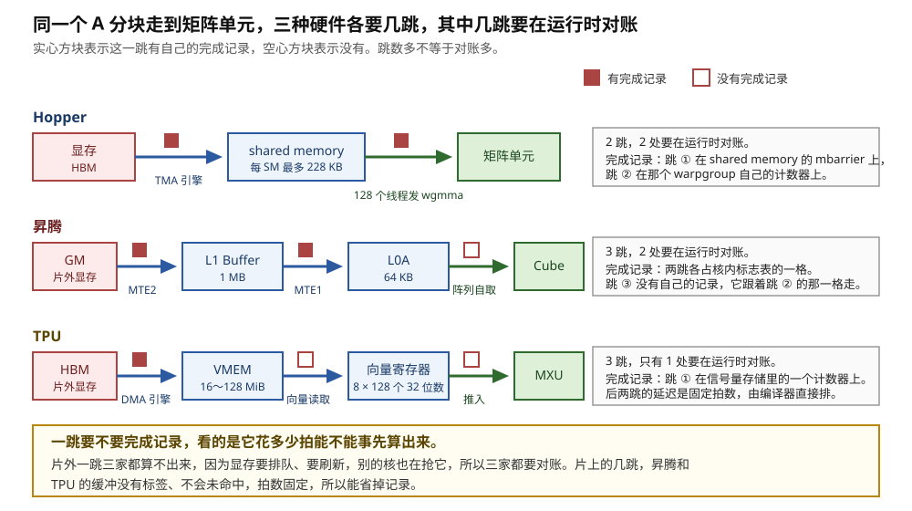
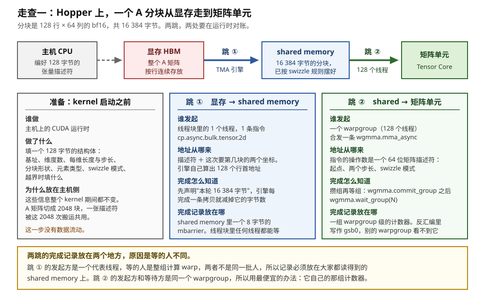
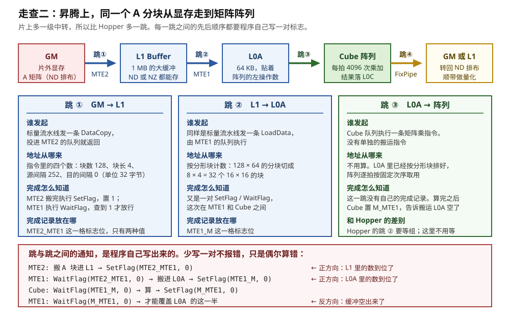
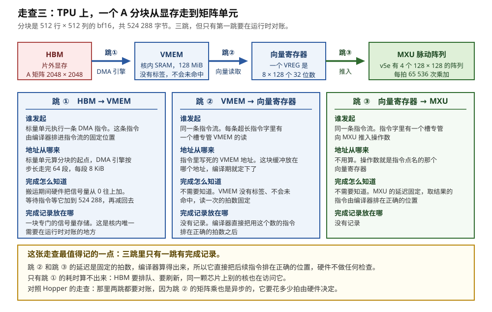
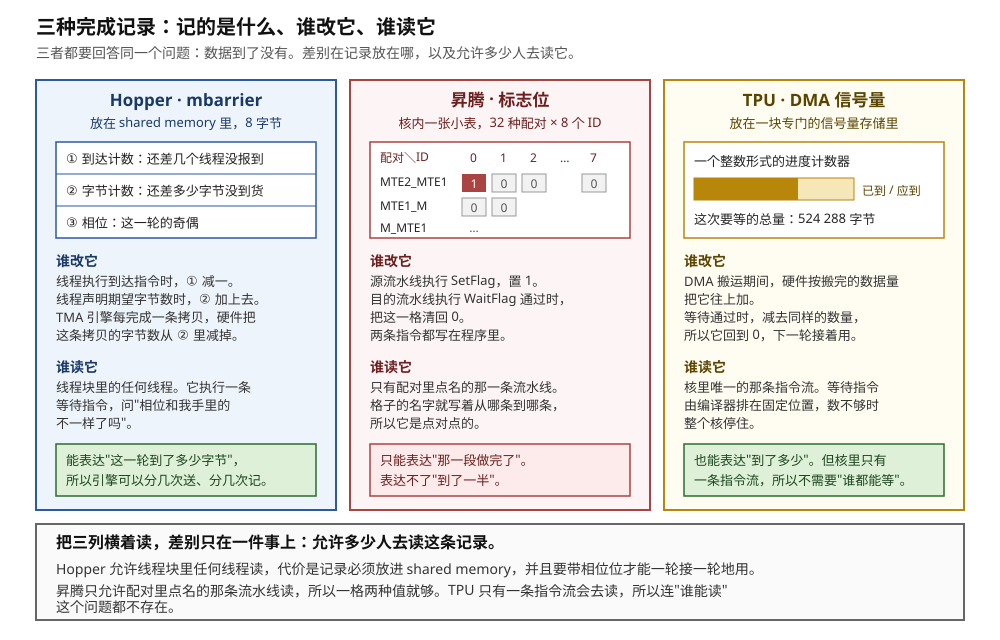
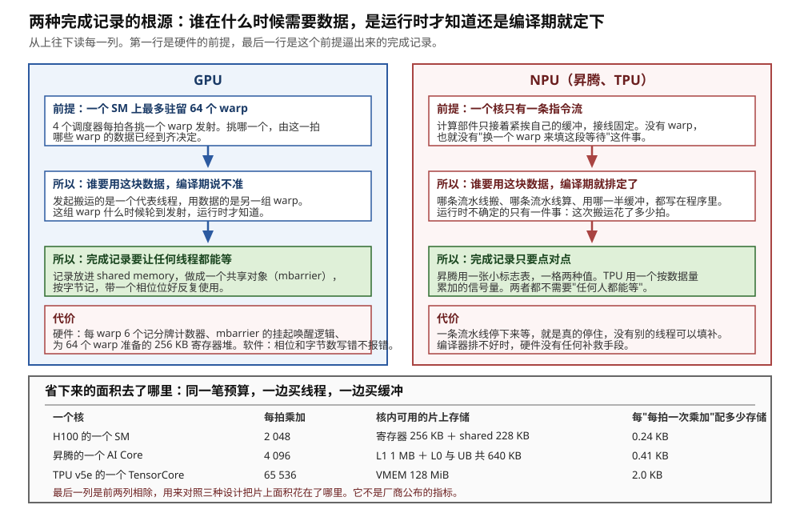
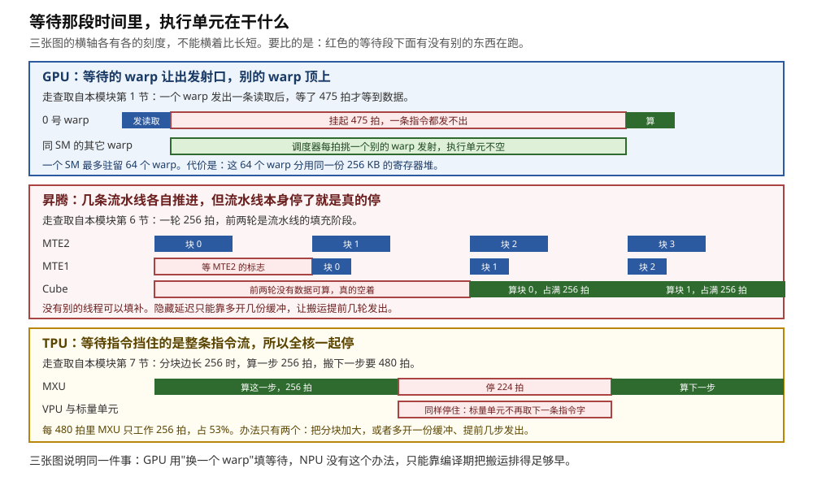
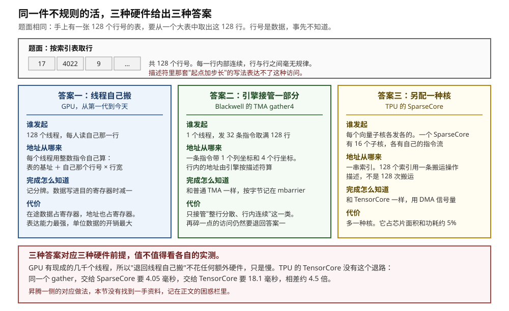

# GPU 与 NPU 对照：同一个分块的两种搬法

> **所属模块**：模块 14 · 数据搬运（第二部分 · NPU 的数据搬运）
> **状态**：🟨 学习中（2026-10 新写。知识截至 2026-09）
> **一句话主旨**：同一个 A 分块走到矩阵单元，Hopper 要两跳，昇腾要三跳，TPU 也要三跳。三家的"谁发起"和"地址从哪来"已经很接近：都是少数几条指令交给一个搬运引擎，引擎自己算地址。真正分家的是"完成怎么知道"。GPU 上，谁在哪一拍需要这块数据，编译期说不准，所以完成记录要放进 shared memory，做成任何线程都能等的共享对象。NPU 上，这件事编译期就排定了，所以完成只要一个点对点的标志或信号量。两种选择各有代价：GPU 多花硬件和编程复杂度，NPU 多花灵活性，一条流水线停下来就真的停住。

<!-- 写之前先读 _模板/写作规范.md 和 _模板/配图规范.md -->

---

上一节讲完了 TPU，第二部分的两种 NPU 就齐了。本模块第 5 节已经把 GPU 一侧的几种搬法比过一遍，本节比的是 GPU 和 NPU 这两条路线。本节不引入任何新机制。它做两件事：把同一个 A 分块在 Hopper、昇腾、TPU 上各搬一遍，逐段对照三个问题的答案；再用一张总表收住第一、二部分。

---

## 0. 这一节要回答的问题

- 同一个 A 分块走到矩阵单元，三家各要几跳？跳数多是不是就慢？
- 每一跳由谁发起、地址从哪来、完成怎么知道？完成记录具体存放在哪个硬件结构里？
- 三家的完成记录能表达什么、不能表达什么？谁被允许去读它？
- GPU 为什么非要把完成记录做成"任何线程都能等"的共享对象？NPU 为什么不需要？
- 这两种选择各自的代价是什么？能不能用数字说出来？
- 搬运引擎表达不了的不规则访问，三家各用什么办法接住？
- 把 01～07 的各种搬法放进一张表，三个问题的答案一共有几种写法？

---

## 1. 基础词汇

本节同时用到三家的词。下面按家分组，每个词只讲到本节够用的程度。

**三个问题**。本模块的主线。任何一种搬法都要回答三个问题。第一，谁发出搬运指令（谁发起）。第二，谁算出每一段数据在存储里的地址（地址从哪来）。第三，使用数据的一方怎么知道数据已经到达（完成怎么知道）。本节在第三个问题上再追加一问：**完成记录具体存放在哪个硬件结构里，谁被允许去读它。**

**跳（hop）**。一跳是数据在两级存储之间的一次搬运。本节把"片外显存 → 片上缓冲"算一跳，"片上缓冲 → 矩阵单元能直接取用的地方"算另一跳。跳数由硬件的存储层级决定，不由程序决定。

### 1.1 GPU 侧

**SM 与 warp**。SM（Streaming Multiprocessor）是 GPU 上一个独立的计算单元，H100 有 132 个。硬件把 32 个线程编成一组，这一组叫 warp，每次执行同一条指令。一个 SM 上最多同时驻留 64 个 warp。4 个调度器每拍各挑一个 warp，把它的下一条指令送进执行单元。

**warpgroup**。warpgroup 是 Hopper 新增的分组，由 4 个连续的 warp 组成，共 128 个线程。Hopper 的矩阵乘指令 `wgmma` 由一个 warpgroup 合起来发出。

**shared memory**。shared memory 是每个 SM 内部的一块 SRAM，由程序显式管理。H100 上每个 SM 最多 228 KB。同一个线程块里的线程都能读写它。

**记分牌（scoreboard）**。记分牌是 GPU 跟踪"延迟不固定的指令什么时候出结果"的机制。每个 warp 有 6 个计数器。读取指令发射时，硬件把编译器指定的那个计数器加一；数据到位时减一。要用这个数据的指令在自己的控制位里声明等哪个计数器。

**TMA（Tensor Memory Accelerator）**。TMA 是 Hopper 起每个 SM 内的专职搬运单元。它读一张 128 字节的张量描述符加一组坐标，自己算出这一块数据在显存里的全部地址，成段搬进 shared memory。它不是线程，不执行指令流。

**mbarrier**。mbarrier 是放在 shared memory 里的一个 8 字节对象。它同时记三件事：还差几个线程没报到（到达计数）、还差多少字节没到货（字节计数）、以及当前这一轮的奇偶（相位）。线程可以在它上面报到或者等待。搬运引擎不执行指令，但硬件会在它每完成一次拷贝时，把这次拷贝的字节数从字节计数里减掉。

**swizzle**。swizzle 是数据写进 shared memory 时按规则打乱摆放位置的做法，目的是避免 bank 冲突。它写在描述符的一个字段里，由引擎在搬运过程中完成。具体的置换规则归本模块第 11 节。

### 1.2 昇腾侧

**AI Core**。AI Core 是昇腾芯片上一个独立的计算单元，相当于 GPU 的一个 SM。它里面有矩阵单元 Cube、向量单元 Vector 和标量单元 Scalar。标量单元按程序顺序发出全部指令，作用相当于一个小 CPU。

**GM、L1 Buffer、L0A/L0B/L0C、UB**。GM 是片外的 HBM 显存。后面几块是 AI Core 内部的 SRAM。L1 Buffer 是大块中转区。L0A 和 L0B 紧挨 Cube，分别存放左操作数和右操作数。L0C 存放累加结果。Unified Buffer（下文写作 UB）是向量单元的数据进出口。按华为在 Hot Chips 31（2019）公布的达芬奇核，五块的容量依次是 1 MB、64 KB、64 KB、256 KB、256 KB。

**MTE（Memory Transfer Engine）**。MTE 是 AI Core 里专门搬数据的硬件，不做运算。MTE2 从 GM 搬进片内，MTE1 把 L1 的数据送进 L0A 和 L0B，MTE3 把 UB 的结果送回 GM，另有 FixPipe 负责矩阵结果的出口。

**流水线与队列**。昇腾把 AI Core 内部的执行部件按功能分成几条流水线，每条有自己的指令队列。标量单元把指令分发进这些队列，然后立刻继续执行下一条。所以几条流水线同时在工作，队列之间没有任何硬件的依赖检查。

**标志位与 `SetFlag` / `WaitFlag`**。标志位是核内一张小表格里的一格。`SetFlag<X_Y>(id)` 由源流水线 X 执行，把一格置 1。`WaitFlag<X_Y>(id)` 由目的流水线 Y 执行：这一格是 0 时它挡住后面的指令，是 1 时它把这一格清回 0 并放行。两条指令都写在程序里。

**分形块（fractal）**。分形块是昇腾上矩阵数据在片上的基本摆放单位，一个块是 16 × 16 个元素。bf16 下正好 512 字节。L0A 和 L0B 里的数据必须已经按分形块排好，Cube 才取得到。

### 1.3 TPU 侧

**TensorCore**。TensorCore 是 TPU 芯片上的计算核，层级上对应 GPU 的一个 SM。它包含矩阵单元 MXU、向量单元 VPU、标量单元，以及自己的片上存储 VMEM 和 SMEM。不要和 NVIDIA 的 Tensor Core 混淆，后者只是 SM 里的一个矩阵部件。

**VLIW 指令束**。TensorCore 的标量单元每次取出一整条超长指令字，叫指令束。一条指令束里有多个槽：标量槽、向量槽、矩阵槽等。编译器把同时可以启动的操作打包进同一条指令束。所以一个核只有一条指令流，但一拍内可以同时启动多个部件。

**VMEM**。VMEM 是 TensorCore 内部的一块 SRAM，由软件管理，没有标签、没有命中判断。数据放在哪个地址、什么时候覆盖，全部由编译器决定。v5e 和 v6e 上每个 TensorCore 有 128 MiB。

**DMA 引擎与信号量**。DMA 引擎在 HBM 和 VMEM 之间搬数据。标量单元执行一条 DMA 指令把任务交给它，然后继续发出后面的指令。信号量是标量单元能读的一个计数器，存放在一块专门的信号量存储中。搬运期间硬件按搬完的数据量增加它，等待指令在数量不够时让整条指令流停下。Google 的论文称它为同步标志（sync flag），Pallas 文档称它为信号量，两者是同一个东西。

**SparseCore**。SparseCore 是 TPU 上另配的一种核，专门处理嵌入表查找这类不规则访问。一个 SparseCore 有 16 个向量子核，各有自己的指令流和 VMEM。

### 1.4 本节的运行例子

沿用全模块的例子：矩阵乘的输出分块 128 × 128，沿 K 方向每次推进 64。A、B 各一个 128 × 64 的 bf16 分块，每块 16 384 字节，每推进一次搬 32 768 字节。

三家算完这同一步要多少拍，差别很大：

| 一个核 | 每拍 bf16 乘加 | 算完 128 × 128 × 64 要多少拍 | 出处 |
| --- | --- | --- | --- |
| H100 的一个 SM | 2 048 | 512 | 本模块第 1 节 |
| 昇腾的一个 AI Core | 4 096 | 256 | 本模块第 6 节 |
| TPU v5e 的一个 TensorCore | 65 536 | 16 | 本模块第 7 节 |

TPU 这一行有两个问题。第一，16 拍太短。搬这 32 768 字节按 HBM 带宽至少要 60 拍，所以 MXU 最多只有 16 ÷ 60 ≈ 27% 的时间在工作。第二，这个分块在 Pallas 里根本写不出来。Pallas 要求分块的最后两维分别是 8 和 128 的倍数，而 A 分块的最后一维是 64。所以 **TPU 一侧改用 512 × 512 × 512 的分块**，理由见本模块第 7 节。下面的走查三按这个分块写。

---

## 2. 跳数由存储层级决定，对账的次数由延迟定不定决定

先看全局。图 8-1 把三家的路径画在一起。

> **图 8-1**　一句话：同一个分块走到矩阵单元，Hopper 要两跳，昇腾和 TPU 各要三跳。但是要在运行时对账的跳数不一样：Hopper 两跳都要对，昇腾两跳要对，TPU 只有一跳要对。
>
> **先知道一件事**：一跳要不要完成记录，看的是"这一跳花多少拍"能不能在编译时算出来。能算出来，编译器就直接把后面的指令排在正确的位置，硬件不需要记任何东西。算不出来，就必须在运行时留一笔记录，让使用数据的一方去查。
>
> **按这个顺序看**：
> 1. 每一行是一种硬件。方框是一级存储，箭头是一跳。箭头上方的小方块表示这一跳有没有自己的完成记录：实心表示有，空心表示没有。
> 2. 第一行是 Hopper。显存到 shared memory 由 TMA 引擎搬，shared memory 到矩阵单元由 128 个线程合发一条矩阵乘指令取用。两跳都是实心。
> 3. 第二行是昇腾。片上多了 L1 这一级，所以多一跳。前两跳由 MTE2 和 MTE1 搬，各占核内标志表的一格。第三跳是空心：Cube 执行矩阵乘指令时自己从 L0A 取数，这一跳没有独立的完成记录。
> 4. 第三行是 TPU。HBM 到 VMEM 由 DMA 引擎搬，这一跳是实心。后两跳是空心：VMEM 没有标签、不会未命中，读一次的拍数固定；MXU 的延迟也固定。编译器直接把后续指令排在正确的位置。
> 5. 右边三个灰框给出每一行的小结：跳数、对账次数、完成记录放在哪。
>
> **看懂的标志**：能回答"跳数多是不是就慢"。不一定。昇腾比 Hopper 多一跳，但多出来的 L1 这一级换来的是复用。同一份 A 数据在 L1 里可以多次送进 L0 去配不同的 B，省的是片外的流量。真正决定快慢的是每一跳的带宽和能不能藏在计算后面。
>
> **与正文的对照**：三行的跳数与 §3、§4、§5 的三张走查逐跳对应。容量数字取自各节：H100 的 shared memory 上限 228 KB，昇腾的 L1 1 MB 与 L0A 64 KB 取自 Hot Chips 31（2019），TPU 的 VMEM 按代际是 16～128 MiB。
>
> 来源：本库自绘。

三家在片外那一跳上是一致的：都要对账。原因相同。显存的请求要排队，DRAM 要刷新，同一颗芯片上别的核也在抢同一条通路。这几件事都和当时的负载有关，编译器算不出来。

分歧出现在片上的那几跳。昇腾的 L1、L0 和 TPU 的 VMEM 都是软件管理的 SRAM，没有标签，不会未命中，读一次的拍数固定。所以这几跳本来可以不留完成记录。昇腾仍然留了一格标志，原因不是延迟不定，而是**两条流水线之间没有任何硬件检查**：MTE1 不知道 MTE2 写完了没有。TPU 不需要这一格，因为它只有一条指令流，前后顺序由这条指令流本身保证。

---

## 3. 走查一：Hopper 上的两跳

本节的三张走查都按同一个格式：每一跳回答四件事，谁发起、地址从哪来、完成怎么知道、完成记录放在哪。

> **图 8-2**　一句话：Hopper 上，数据从显存到矩阵单元只有两跳。第一跳由一个线程下单、由引擎执行，完成记在 shared memory 的共享对象上。第二跳由 128 个线程合发一条指令，完成记在它们自己的计数器上。
>
> **先知道一件事**：这里的"描述符"是一个 128 字节的小结构体。它写的不是数据，是关于数据的信息：矩阵在哪、每一维多长、每行隔多远、一次切多大一块。整个 kernel 期间它一个字都不改，所以在主机上填一次就够。
>
> **按这个顺序看**：
> 1. 最上面一行是数据的行程。灰框的主机 CPU 只参与准备，不参与搬运，所以它和显存之间画的是虚线。
> 2. 左边第一张卡是准备阶段。4096 × 4096 的 A 矩阵按 128 × 64 切，一共 2048 块，这一张描述符被 2048 次搬运共用。
> 3. 中间的卡是跳 ①。读它的四个小标题：发起的是 1 个线程，地址由引擎按描述符加坐标算出，完成按字节记，记录放在 shared memory 的 mbarrier 上。
> 4. 右边的卡是跳 ②。同样读四个小标题。注意最后一行：这一跳的记录是 warpgroup 自己的计数器，别的 warpgroup 看不到它。
> 5. 最下面的黄框解释两跳为什么用两套记录：等的人不同。
>
> **看懂的标志**：能回答"同一个引擎、同一台机器，为什么两跳的完成记录放在不同地方"。因为跳 ① 的发起方和等待方不是同一批线程，记录必须放在大家都读得到的地方。跳 ② 的发起方和等待方是同一个 warpgroup，用最便宜的办法就够。
>
> **与正文的对照**：各格内容与本模块第 3 节一致。`gsb0` 这个名字取自本机实验：把一段带 `wgmma.commit_group` 和 `wgmma.wait_group` 的 PTX 用 CUDA 12.8 的 ptxas 编到 `sm_90a`，反汇编得到 `WARPGROUP.DEPBAR.LE gsb0, 0x0`。
>
> 来源：本库自绘。

下面把两跳按时间摊开。线程块是 128 个线程，这一轮要搬 A、B 两块共 32 768 字节。

| 步 | 谁在动 | 做了什么 | 完成记录的状态 |
| --- | --- | --- | --- |
| 1 | 0 号线程 | `mbarrier.init`，参与线程数写 1 | 到达计数 1，字节 0，相位 0 |
| 2 | 0 号线程 | `mbarrier.arrive.expect_tx`，声明本轮 32 768 字节 | 到达计数 0，字节 32 768 |
| 3 | 0 号线程 | 发 A 的搬运指令，立即返回 | 不变 |
| 4 | 0 号线程 | 发 B 的搬运指令，立即返回 | 不变 |
| 5 | 全部 128 个线程 | 执行等待指令，被挂起。这段时间它们一条指令都不发 | 不变 |
| 6 | TMA 引擎 | 读描述符，算出 128 个行首地址，发请求，做 swizzle，写进 shared memory | 不变 |
| 7 | TMA 引擎 | A 这条拷贝完成 | 字节 16 384 |
| 8 | TMA 引擎 | B 这条拷贝完成，两个计数同时归零 | 字节 0，相位翻成 1 |
| 9 | 全部 128 个线程 | 被放行，发出 `wgmma.mma_async` 读 shared memory 里的分块 | warpgroup 的计数器加一 |
| 10 | 矩阵单元 | 算完，计数器减一。`wgmma.wait_group 0` 放行 | 计数器回零 |

两处值得停下来看。

**第一，第 5 步到第 8 步之间，整个线程块一条指令都不发。** 发射口留给同一个 SM 上别的 warp。这就是"搬运和计算重叠"在指令层面的样子。

**第二，第 9 步的那条 `wgmma` 直接把 shared memory 里的地址当操作数。** 它的操作数是一个 64 位的矩阵描述符，写着起点、两个步长和 swizzle 模式。所以跳 ② 的数据不经过寄存器。这是 Hopper 比 Ampere 少一跳的地方。

---

## 4. 走查二：昇腾上的三跳

同一个 A 分块，换到一个昇腾 AI Core 上。

> **图 8-3**　一句话：昇腾上，同一个分块要走三跳。前两跳各有一个专职的搬运引擎，两跳之间的先后顺序由程序自己写的一对标志表达。第三跳没有独立的搬运指令。
>
> **先知道一件事**：图里的 L1 Buffer、L0A 都是片上的 SRAM。它们和缓存不同：缓存会自动留存刚用过的数据，查不到时自己去下一级取；这几块不会。什么时候把什么搬进来，全部写在程序里。
>
> **按这个顺序看**：
> 1. 最上面一行是数据的行程，从片外的 GM 一直到 Cube 阵列，再由 FixPipe 把结果送回去。每个箭头下面写着这一跳由哪个搬运单元负责。
> 2. 左边的卡是跳 ①。注意"地址从哪来"那一栏的四个数：块数 128、块长 4、源间隔 252、目的间隔 0。单位是 32 字节的数据块，所以 128 字节写成 4，8064 字节写成 252。MTE2 拿到这四个数，自己做 128 次加法算出 128 个行起点。
> 3. 中间的卡是跳 ②。这一跳的单位换成了分形块：128 × 64 的分块切成 8 × 4 = 32 个 16 × 16 的块。换单位的原因是 L0A 里的数据必须按分形块排好，Cube 才取得到。
> 4. 右边的卡是跳 ③。读"完成怎么知道"那一栏：这一跳没有自己的记录。Cube 算完之后置一个反方向的标志，告诉搬运引擎 L0A 可以覆盖了。
> 5. 最下面的红框是四行代码。读每一行末尾的注释：前两行是正方向的通知（数到位了），最后一行是反方向的通知（缓冲空出来了）。
>
> **看懂的标志**：能回答"为什么两个方向的标志缺一不可"。只有正方向时，搬运引擎会在 Cube 还没算完时就覆盖 L0A，Cube 算到一半数据被换掉。只有反方向时，Cube 会在搬运还没写完时就取数，取到上一轮的旧数据。两种错误都不报错。
>
> **与正文的对照**：各格内容与本模块第 6 节一致。容量数字取自 Hot Chips 31（2019）的达芬奇核。图中省略了 Vector 和 FixPipe 两条队列。
>
> 来源：本库自绘。

同样按时间摊开。L1 和 L0 都开两份缓冲，叫甲和乙。

| 步 | 谁在动 | 做了什么 | 完成记录的状态 |
| --- | --- | --- | --- |
| 1 | 标量单元 | 把 `DataCopy`（A）、`DataCopy`（B）、`SetFlag<MTE2_MTE1>(0)` 投进 MTE2 的队列，然后继续发后面的指令 | `MTE2_MTE1` 的 0 号格仍是 0 |
| 2 | MTE2 | 把 A、B 两块共 32 768 字节搬进 L1 甲 | 仍是 0 |
| 3 | MTE2 | 执行 `SetFlag<MTE2_MTE1>(0)` | 这一格变成 1 |
| 4 | MTE1 | 执行 `WaitFlag<MTE2_MTE1>(0)`。查到 1，放行并清回 0 | 这一格回到 0 |
| 5 | MTE1 | 执行两条 `LoadData`，把 A、B 送进 L0A 和 L0B。做完置 `MTE1_M`，再置 `MTE1_MTE2` | `MTE1_M` 变成 1，`MTE1_MTE2` 变成 1 |
| 6 | Cube | 执行 `WaitFlag<MTE1_M>(0)`，放行后做矩阵乘，结果累加进 L0C | `MTE1_M` 回到 0 |
| 7 | Cube | 算完，置 `M_MTE1`，表示 L0 甲腾空了 | `M_MTE1` 变成 1 |
| 8 | MTE2 | 要搬第 k+2 块之前，先 `WaitFlag<MTE1_MTE2>(0)`，确认 L1 甲已经读完 | `MTE1_MTE2` 回到 0 |

这一轮用了四种配对，每种一对置位和等待，合计 **4 对标志**。其中两对是"数据到了"方向，两对是"缓冲空了"方向。

三件事值得对照着 §3 看。

**第一，没有一处需要数字节。** A 和 B 是两条 `DataCopy`，排在同一条 MTE2 队列里。队列按投入顺序执行，所以排在它们后面的那个 `SetFlag` 置位时，两条都已经做完。一格两种值就够了。Hopper 那边不同：TMA 引擎不执行指令，发起线程发完就走，两条拷贝谁先完成不确定，所以必须按字节对账。

**第二，标志位里没有任何地址和字节数。** 硬件不知道哪条指令写了哪块缓冲，也不知道搬了多少。哪里该置位、哪里该等待，全部由写算子的人或编译器事先排好。

**第三，拍数能对上。** 按图 8-3 标出的总线宽度，GM 到核内每拍 256 字节，L1 到 L0 每拍 512 字节。跳 ① 搬 32 768 字节要 128 拍，跳 ② 要 64 拍。两段都短于 Cube 算一块的 256 拍，所以只要提前发出，搬运可以藏在计算后面。这是按端口位宽算的最乐观一档，本模块第 6 节给出了另外两档。

---

## 5. 走查三：TPU 上的三跳

TPU 这一侧的分块改成 512 × 512 的 bf16，共 524 288 字节，理由见 §1.4。

> **图 8-4**　一句话：TPU 上同一件事也要走三跳，但只有第一跳有完成记录。后两跳的延迟是固定的拍数，编译器直接把后续指令排在正确的位置。
>
> **先知道一件事**：TensorCore 只有一条指令流。标量单元每次取出一整条超长指令字。这条指令字里有好几个槽：一个槽管标量运算，一个槽管读 VMEM，一个槽管向 MXU 推入操作数。编译器把能同时做的事打包进同一条指令字。所以"单线程"不等于"一次只做一件事"。
>
> **按这个顺序看**：
> 1. 最上面一行是数据的行程：片外的 HBM、核内的 VMEM、向量寄存器、矩阵单元 MXU。
> 2. 左边的卡是跳 ①。读"地址从哪来"那一栏：标量单元算出分块的起点，DMA 引擎按步长走完 64 段，每段 8 KiB，合计 524 288 字节。
> 3. 同一张卡的"完成怎么知道"：信号量从 0 往上加，等待指令等它加到 524 288，再把它减回去。减回去是为了下一轮接着用。
> 4. 中间和右边两张卡都在说同一件事：不需要完成记录。VMEM 没有标签、不会未命中，MXU 的延迟也固定，所以拍数编译器算得出来。
> 5. 最下面的黄框给出这张图的要点，并和图 8-2 的 Hopper 走查做了一句对照。
>
> **看懂的标志**：能回答"为什么 TPU 核内只有一个地方需要在运行时对账"。因为核内其余每一步花多少拍都是定数，编译器排得出来。只有片外那一跳算不出来：HBM 要排队、要刷新，同一颗芯片上别的核也在访问它。
>
> **与正文的对照**：64 段 × 8 KiB 的拆分按本模块第 7 节的推算写，依据是公开的 `T(8,128)` 布局。DMA 引擎内部按什么粒度拆分请求，Google 没有公开。
>
> 来源：本库自绘。

按时间摊开：

| 步 | 谁在动 | 做了什么 | 信号量的值 |
| --- | --- | --- | --- |
| 1 | 标量单元 | 执行一条 DMA 指令，把源、目的、信号量编号交给引擎，然后继续发后面的指令 | 0 |
| 2 | DMA 引擎 | 从 HBM 按步长读出 64 段，每段 8 KiB，逐段写进 VMEM | 从 0 逐渐往上加 |
| 3 | 标量单元 | 指令流走到等待指令。值还不到 524 288 时，它不再取下一条指令字 | 例如 300 000 |
| 4 | DMA 引擎 | 最后一段写进 VMEM | 524 288 |
| 5 | 标量单元 | 等待结束，值减去 524 288。后面的指令继续 | 0 |
| 6 | 标量单元 | 发出向量读取，把 VMEM 里的数读进向量寄存器。拍数固定，不等任何记录 | 0 |
| 7 | 标量单元 | 发出推入指令，把向量寄存器的内容送进 MXU。拍数固定 | 0 |

和 §3 的 Hopper 走查比，第 3 步是最大的差别。Hopper 上，被挂起的是一个线程块，别的 warp 接着发射。TPU 上，停住的是整条指令流，所以 VPU 和 MXU 也收不到新指令。准确的说法是"不再有新的指令进入"：已经转发给 VPU 和 MXU 的指令会继续执行完。

这一跳发出 DMA 指令的位置，是编译期就定下的。普通的 JAX 程序由 XLA 写进去，Pallas kernel 由 Pallas 和 Mosaic 生成。运行时没有任何部件临时决定"现在该搬什么"。

---

## 6. 三种完成记录并排看

三张走查都做完了。把三者的完成记录摘出来并排放，差别最清楚。

> **图 8-5**　一句话：三种完成记录回答同一个问题，数据到了没有。差别在两处：记的是什么，以及允许多少人去读它。
>
> **先知道一件事**：完成记录是硬件里一块真实存在的存储。它放在哪里，决定了谁读得到它。放在 shared memory 里，同一个线程块的任何线程都读得到。放在核内一张专用的小表里，只有表格里点名的那条流水线读得到。
>
> **按这个顺序看**：
> 1. 三列分别是 Hopper 的 mbarrier、昇腾的标志位、TPU 的 DMA 信号量。先看每一列上方的白框，那是这个记录的内部结构。
> 2. 第一列的白框有三格：还差几个线程没报到、还差多少字节没到货、这一轮的奇偶。三格一起装在 8 个字节里。
> 3. 第二列的白框是一张表。纵向是"源流水线到目的流水线"的配对，横向是事件 ID。左上角涂红的那一格是 1，表示 MTE2 已经做完、MTE1 可以动了。
> 4. 第三列的白框是一个进度条：深色部分是已经到的字节数，整条是这次要等的总量 524 288。
> 5. 每一列下面有两段，谁改它和谁读它。先读三列的"谁读它"。第一列写的是"线程块里的任何线程"。第二列写的是"只有配对里点名的那一条流水线"。第三列写的是"核里唯一的那条指令流"。
> 6. 每一列最下方的小框是这个记录的表达能力。绿色表示能表达"到了多少"，红色表示只能表达"做完了没有"。
>
> **打个比方**：mbarrier 像车间门口的一块公告牌，上面写着这一批货还差多少没到，谁路过都看得见。昇腾的标志位像两道工序之间的一块交接牌，只有下一道工序会去翻它。TPU 的信号量像一个只有一个人盯着的进度条。
>
> **看懂的标志**：能回答"为什么只有 Hopper 需要相位位"。因为 mbarrier 允许任何线程在任何时刻去查。"计数归零"只存在一瞬间，查晚了就看不到。改成查相位以后，这一轮完成的状态一直保持到下一轮，什么时候去查结论都一样。昇腾和 TPU 不需要这一位：读它的只有一条固定的流水线，它一定会按程序排好的顺序去读。
>
> **与正文的对照**：mbarrier 的字段取自本模块第 3 节，昇腾的标志表取自第 6 节，TPU 的信号量取自第 7 节。
>
> 来源：本库自绘。

把三家在同一轮搬运里的记录变化并排列出来，就是下表。三列的"这一轮"指同一件事：一批数据从片外搬到片上，使用它的一方被放行。

| 阶段 | Hopper 的 mbarrier | 昇腾的一格标志 | TPU 的一个信号量 |
| --- | --- | --- | --- |
| 这一轮开始前 | 到达 1，字节 0，相位 0 | 0 | 0 |
| 声明这次要等多少 | 一个线程声明 32 768 字节，到达变 0 | 没有这一步 | 没有这一步。要等多少写在等待指令里 |
| 搬运进行中 | 引擎每完成一条拷贝，减掉它的字节数 | 不变，仍是 0 | 硬件按搬完的数据量往上加 |
| 这一轮完成 | 两个计数同时归零，相位翻成 1 | 源流水线置 1 | 加到 524 288 |
| 使用方被放行 | 任何线程查到相位变了 | 目的流水线查到 1，清回 0 | 等待指令通过，值减去 524 288 |
| 回到初始状态 | 到达计数自动重置成 1 | 清零由等待方做 | 减法把它带回 0 |

从这张表能读出三件事。

**第一，只有 Hopper 需要"先声明再对账"。** 原因是引擎可能把一轮拆成几条拷贝，而且几条拷贝谁先完成不确定。先把总数声明出来，引擎就可以各报各的。

**第二，三家的清零方式不同。** Hopper 由硬件在这一轮完成时自动重置，所以软件要靠相位位分辨相邻两轮。昇腾由等待方清零，一次置位对应一次清零，所以 `SetFlag` 和 `WaitFlag` 必须成对。TPU 用减法回到 0，等待指令自带要减多少。

**第三，表达能力和需求是配套的，不是能力高低。** 昇腾的一格只有两种值，表达不了"到了一半"。这不影响它用，因为它不需要表达这件事：队列按顺序执行，标志排在最后一条搬运指令之后。

---

## 7. 两种设计哲学的根源：谁在哪一拍需要数据

§6 列出了差别，这一节讲差别从哪来。结论先放出来：**不是 GPU 的机制更先进，也不是 NPU 的机制更简陋。两者各自回答的是"谁在哪一拍需要这块数据"这个问题，而这个问题在两种硬件上的答案本来就不同。**

> **图 8-6**　一句话：GPU 上，谁在哪一拍用这块数据，编译期说不准，所以完成记录必须让任何线程都能等。NPU 上，这件事编译期就排定了，所以完成只要一个点对点的标志。
>
> **先知道一件事**：一个 SM 上同时驻留着几十个 warp。调度器每一拍要从中挑一个来发射指令，挑哪一个取决于这一拍哪些 warp 的数据已经到齐。所以程序的实际执行顺序，在编译时写不出来。
>
> **按这个顺序看**：
> 1. 左右各是一列，从上往下读。每一列有三个白框加一个红框，前后是因果关系。
> 2. 左列第一个白框是 GPU 的硬件前提：最多 64 个 warp 驻留，4 个调度器每拍各挑一个。第二个白框是这个前提的后果：发起搬运的是一个代表线程，用数据的是另一组 warp。这组 warp 什么时候轮到发射，运行时才知道。
> 3. 左列第三个绿框是结论：完成记录要放进 shared memory，做成共享对象，按字节记，带相位位。
> 4. 右列同样读三个框。前提是一个核只有一条指令流。后果是哪条流水线搬、哪条流水线算都写在程序里。结论是完成记录只要点对点。
> 5. 每一列最下方的红框是代价。左边是硬件开销和软件容易写错，右边是一条流水线停下来就真的停住。
> 6. 最下方的表是另一笔账：同样一笔芯片面积，GPU 买的是能同时驻留的 warp，NPU 买的是片上缓冲。最后一列是前两列相除，用来对照三种设计的取向。
>
> **看懂的标志**：能回答"GPU 为什么不直接学 NPU 用一个标志位"。因为标志位是点对点的：它要事先知道由谁来等。GPU 上，等的是哪一组 warp、在哪一拍等，编译期定不下来。所以记录必须放在大家都读得到的地方，并且要能被反复查询。
>
> **与正文的对照**：64 个 warp、256 KB 寄存器堆、228 KB shared memory 取自本模块第 1 节。昇腾的片上容量取自 Hot Chips 31（2019）。TPU v5e 的 VMEM 容量取自 Google Cloud 的 TPU 文档。最后一列是本库按前两列相除得到的，不是厂商公布的指标。
>
> 来源：本库自绘。

把这件事变成一个可以数的例子：**同一轮搬运，两边各要写几对同步。**

Hopper 上用三格环形缓冲时，每一格配两个屏障，叫 full 和 empty。一轮里程序写的同步是：

1. 生产者等 `empty[s]`。
2. 生产者在 `full[s]` 上声明本轮的字节数。
3. 消费者等 `full[s]`。
4. 消费者算完，在 `empty[s]` 上到达。

合计 **2 对**：一对正方向（这一格装满了），一对反方向（这一格用完了）。昇腾上同一轮是 §4 数过的 **4 对**，也是正反各一半。差别的来源只有一个：**昇腾的片上缓冲有两级，每一级都要一对正方向和一对反方向的标志。** Hopper 只有 shared memory 这一级，所以一对就够。

这笔账说明一个容易被忽略的事：**两边写同步的工作量是同一个量级，不是数量级之差。** 真正的差别在别处。Hopper 上这两对由 CUTLASS 或 Triton 这类库代管，用一个 `num_stages` 参数就配好了；昇腾上用队列接口写时也由框架代管，但矩阵算子的多级流水常常要手工排。两边手工排时，写错的后果一样：不报错，只是偶尔算错。

面积这一笔账的方向则很清楚。GPU 为了让 64 个 warp 同时驻留，每个 SM 配了 256 KB 的寄存器堆；这份寄存器堆的作用是让等待的 warp 把发射口让出来。NPU 不买这件事，省下的面积给了片上缓冲。按图 8-6 下方的表，每"每拍一次乘加"配到的片上存储，H100 的一个 SM 是 0.24 KB，昇腾的一个 AI Core 是 0.41 KB，TPU v5e 的一个 TensorCore 是 2.0 KB。这也解释了本模块第 7 节的那个结论：TPU 的分块要开到 512，才能让计算时间盖住搬运时间。

---

## 8. 两种选择各自的代价

§7 讲了两种设计的来源。这一节逐项列出代价，每一项附一个数字或一段走查。

### 8.1 GPU 的代价：硬件开销与编程复杂度

**硬件这一侧有三笔。** 第一，每个 warp 6 个记分牌计数器，一个 SM 上最多 64 个 warp。第二，mbarrier 不只是 shared memory 里的 8 个字节。它还要一套挂起和唤醒的逻辑：等待指令可以让一个 warp 挂起，这一轮完成时硬件要把它叫醒。第三，为 64 个 warp 准备的 256 KB 寄存器堆。这三笔都是为"运行时动态调度"服务的。

对照的数字来自 TPU v1 的论文：它的控制逻辑只占芯片面积的 2%。TPU v1 的结构和 v2 以后不同，它由主机发送 CISC 指令驱动。但它同样没有多线程和动态调度的硬件，所以这个数字可以作为同类设计的参考。

**软件这一侧的代价是四类静默事故。** 本模块第 3 节列全了：`expect_tx` 写小了、写大了、忘了等 `empty`、相位没跟着格号翻。前三类在昇腾上有对应的错法。第四类是 GPU 独有的。相位位本身就是"允许任何线程在任何时刻查询"这个能力的代价。

这四类有一个共同点：性能分析器查不出来。Nsight Compute 只给出屏障等了多久，不指出这次等的是不是错的相位。

### 8.2 NPU 的代价：一条流水线停下来就是真的停住

图 8-7 把三家等待时的样子画在一起。

> **图 8-7**　一句话：GPU 等待时由别的 warp 顶上，执行单元不空。昇腾和 TPU 没有这个办法：流水线停下来就是真的停住，只能靠多开缓冲、提前几轮发出。
>
> **先知道一件事**：三张图的横轴各有各的刻度，长短不能横着比。要比的是同一张图里的上下关系：红色的等待段下面，有没有别的东西在跑。
>
> **按这个顺序看**：
> 1. 第一张图是 GPU。上面一行是 0 号 warp：它发出一条读取，然后挂起 475 拍。下面一行是同一个 SM 上的其它 warp，整段绿色，表示调度器每拍都能挑一个别的 warp 来发射。
> 2. 第二张图是昇腾。三行分别是 MTE2、MTE1 和 Cube。看 MTE2 这一行：它每一轮搬一块，没有停过。再看 Cube 这一行：前两轮整段是红的，它确实没有计算可做。
> 3. 昇腾这张图要抓的是：MTE1 在等的时候，MTE2 和 Cube 仍然在动。所以"停住"是按流水线算的，不是整个核停住。
> 4. 第三张图是 TPU。上面一行是 MXU，下面一行是 VPU 和标量单元。等待指令挡住的是整条指令流，所以两行的红色段是对齐的。
> 5. 每张图最下面一行小字是这一种硬件的代价：GPU 的 64 个 warp 分用同一份寄存器堆，昇腾和 TPU 只能靠多开缓冲。
>
> **看懂的标志**：能回答"为什么 NPU 上分块必须开大"。因为等待没有别的事可填。要让搬运藏在计算后面，就只能让一块的计算时间长于下一块的搬运时间。计算量随分块边长的三次方增长，搬运量随平方增长，所以分块越大越有利。
>
> **与正文的对照**：475 拍取自本模块第 1 节的走查，昇腾的 256 拍一轮取自第 6 节，TPU 的 256 拍与 480 拍取自第 7 节分块边长 256 的那一档。三张图的横轴刻度不同。
>
> 来源：本库自绘。

代价可以用数字说清楚。本模块第 7 节算过：TPU v5e 上分块边长 256 时，一步计算要 256 拍，下一步的搬运要 480 拍，所以每一步开头要停约 224 拍。这 224 拍里整个 TensorCore 什么都不做，MXU 的工作时间占比只有 53%。补救办法只有两个：把分块加大到 512，或者多开一份缓冲、让 DMA 提前两步发出。

昇腾的情形稍好一点，因为一个核里有几条流水线。图 8-7 中间那一张里，MTE1 在等的时候，MTE2 和 Cube 仍然在动。但是 Cube 一旦停下来，就没有任何办法填补：图里前两轮是流水线的填充阶段，Cube 确实在空等。K 循环越长，这两轮摊薄得越彻底。

还有一项代价不表现为停顿，而表现为"写不出来"。昇腾的 L0A 要求数据按 FRACTAL_ZZ 排列、地址按 512 字节对齐，L0B 要求 FRACTAL_ZN。TPU 要求分块的最后两维分别是 8 和 128 的倍数。本模块的运行例子因为这条规则在 Pallas 里写不出来（§1.4）。GPU 这边也有对齐要求，但它留了一条退路：TMA 用不了时，可以退回 `cp.async`，再不行可以退回线程自己算地址逐元素搬。NPU 没有这条退路。

### 8.3 不规则访问：三家的三种答案

上一小节末尾那条"退路"，在不规则访问上表现得最清楚。

所谓不规则访问，指的是地址依赖数据的访问。典型的例子是按一张索引表取行：嵌入表查找、混合专家模型按路由结果取 token。行号是运行时才知道的数据，行与行之间毫无规律。描述符里那套"起点加步长"的写法表达不了这种访问。

> **图 8-8**　一句话：同一件按索引取行的活，三种硬件给出三种答案。GPU 可以退回线程自己算地址，Blackwell 让引擎接管了其中一类，TPU 为它另配了一种核。
>
> **先知道一件事**：按索引取行的意思是"给一串行号，取出这些行"。行号是数据，事先不知道。每一行内部是连续的，但各行在表中的位置互不相邻。
>
> **按这个顺序看**：
> 1. 最上面的灰框是题面。三个小方块是索引表的前几个行号：17、4022、9。共 128 个。
> 2. 左列是答案一，GPU 从第一代到今天都有这条路。128 个线程每人读自己那一行，地址每人自己算，完成记在记分牌上。
> 3. 中列是答案二，Blackwell 的 TMA gather4。一条指令带 1 个列坐标和 4 个行坐标，所以 32 条指令取满 128 行。完成仍然按字节记在 mbarrier 上。
> 4. 右列是答案三，TPU 的 SparseCore。16 个子核各发各的间接 DMA，一条搬运操作用一串索引描述，不是 128 次搬运。
> 5. 每一列最下面一格是代价。注意中列那一格：gather4 只接管"整行分散、行内连续"这一类，再碎一点的访问仍然要退回答案一。
> 6. 最下方的红框给出实测：同一个 gather，交给 SparseCore 要 4.05 毫秒，交给 TensorCore 要 18.1 毫秒。
>
> **看懂的标志**：能回答"为什么 TPU 要为这件事专门加一种核，而 GPU 不用"。GPU 上有现成的几千个线程，每个线程本来就能自己算地址、自己发读取。退回这条路不花任何额外硬件，只是慢。TPU 的 TensorCore 没有这条退路：它只有一条指令流，每拍最多发出一个 DMA 请求。
>
> **与正文的对照**：gather4 的指令形式取自本模块第 4 节，SparseCore 的结构和实测取自第 7 节。4.05 毫秒与 18.1 毫秒测于 TPU7x，取自 Pallas 文档。
>
> 来源：本库自绘。

三种答案的代价各不相同，可以直接比：

- **GPU 退回线程自己搬**：不花额外硬件，但在途数据和地址都要占寄存器。表达能力最强，单位数据的开销最大。
- **Blackwell 的 gather4**：接管了"整行分散、行内连续"这一类，发起从 128 个线程降到 1 个。代价是只覆盖一类，再碎的访问还要退回第一种。
- **TPU 的 SparseCore**：多一种核。按 TPU v4 论文，所有 SparseCore 合计只占芯片面积和功耗的约 5%。换来的是约 4.5 倍。

昇腾一侧的对应做法，本节没有找到一手资料，记在 §14。

---

## 9. 第一、二部分的收尾：01～07 的总表

到这里，第一部分（GPU）和第二部分（NPU）都讲完了。把 01～07 出现过的每一种搬法收进一张表。每一行先回答三个问题，再补两栏：完成记录放在哪，在途数据住哪。本模块第 5 节已经把 GPU 一侧的几种搬法逐项比过，并给出了选型的判据，所以下表只收答案，不重复那一部分的成本计算。

| 搬法 | 谁发起 | 地址从哪来 | 完成怎么知道 | 完成记录放在哪 | 在途数据住哪 | 节 |
| --- | --- | --- | --- | --- | --- | --- |
| `LDG` + `STS`：线程自己搬 | 128 个线程各发各的 | 每个线程用整数指令自己算 | 数据写进目的寄存器时，计数器减一 | 发出指令那个 warp 私有的 6 个记分牌计数器 | 寄存器，每线程 64 个 | 01 |
| `cp.async`：组语义 | 128 个线程各发各的 | 每个线程自己算 | `commit_group` 打成一组，`wait_group N` 等到未完成的组不超过 N 个 | 同一组记分牌计数器，仍是 warp 私有 | shared memory | 02 |
| `cp.async` + mbarrier | 生产者 warp 的每个线程 | 每个线程自己算 | 每个线程执行 `cp.async.mbarrier.arrive`，它发出的拷贝全部落地后替它到达一次 | shared memory 里的 mbarrier，按线程计数 | shared memory | 02 |
| TMA 读入：`cp.async.bulk.tensor` | 1 个线程，1 条指令 | 描述符加两个坐标，引擎算出 128 个行首地址 | 先声明本轮的字节数，引擎每完成一条拷贝减掉它的字节数 | shared memory 里的 mbarrier，按字节计数 | shared memory | 03 |
| TMA 写出：`bulk_group` | 1 个线程 | 同上 | `commit_group` 加 `wait_group` | 发起线程所在 warp 的记分牌计数器 | — | 03 |
| `wgmma`：shared → 矩阵单元 | 一个 warpgroup（128 个线程）合发 | 一个 64 位矩阵描述符 | `commit_group` 加 `wait_group` | 这个 warpgroup 自己的一组计数器 | 不落寄存器 | 03 |
| `tcgen05.cp` 与 `tcgen05.mma` | 1 个线程 | shared memory 描述符加 TMEM 地址 | `tcgen05.commit`：此前发出的全部异步操作完成后做一次到达 | shared memory 里的 mbarrier，按一次到达计数 | TMEM | 04 |
| TMA gather4 | 1 个线程 | 1 个列坐标加 4 个行坐标 | 和普通 TMA 一样按字节记 | shared memory 里的 mbarrier | shared memory | 04 |
| 昇腾 MTE2、MTE1 | 标量单元发一条指令，投进 MTE 队列 | 指令里的块数、块长、两个步长；第二跳按分形块计数 | `SetFlag` 置位，`WaitFlag` 查到 1 才放行并清零 | 核内标志表的一格，只有两种值 | L1 与 L0 | 06 |
| TPU TensorCore 的 DMA | 标量单元执行编译器排好的 DMA 指令 | 标量单元算起点，引擎按步长走 | 信号量按搬完的数据量往上加，等待指令等它到总字节数 | 一块专门的信号量存储 | VMEM | 07 |
| TPU SparseCore 的间接 DMA | 16 个向量子核各发各的 | 一串索引 | 同上 | 信号量存储 | 子核的 VMEM | 07 |

这张表要横着读，有三条读法。

**第一，"谁发起"这一栏只有三种答案。** 一是全部线程各发各的，二是一个线程替所有人发，三是没有线程、由一条指令流发。GPU 从第一种走到第二种用了三代，NPU 从第一代起就在第三种上。三种答案的分界线是"地址由谁算"：只要地址交给了引擎，发起方就可以缩到一个。

**第二，"完成记录放在哪"这一栏决定了能不能做生产者与消费者分工。** 记录在 warp 私有的计数器上时，别的 warp 看不到它，所以跨 warp 分工要额外握手。记录在 shared memory 的共享对象上时，分工才便宜。本模块第 3 节算过这笔账：Hopper 上一个只负责发起搬运的 kernel，编译回执是 `Used 4 registers`，所以生产者可以把寄存器配额让给消费者。

**第三，"在途数据住哪"这一栏是整个第一部分的主线。** 它从寄存器搬到 shared memory，再搬到 TMEM。每搬一次，矩阵乘能用的寄存器就多一份。NPU 没有经历这个过程：它的在途数据从第一代起就住在片上缓冲里，因为它的计算单元本来就够不到显存。

三个问题的答案到这里就收完了，但只收了"片内"这一半。从下一节起是第三部分：数据从主机到设备、从一张卡到另一张卡、从一个节点到另一个节点。那里的发起方又换了一批，完成记录也换了一套。

---

## 10. 开发者视角

| 想知道什么 | 在哪一层看 | 看什么 |
| --- | --- | --- |
| GPU 的 kernel 用的是哪一跳的哪种机制 | SASS | `cuobjdump -sass` 里搜 `UTMALDG`（TMA 读入）、`LDGSTS`（`cp.async`）、`LDG`（线程自己搬）、`HGMMA`（Hopper 矩阵乘）、`UTCCP`（`tcgen05.cp`） |
| GPU 的等待用的是哪一组计数器 | SASS | `DEPBAR.LE SB0` 是每 warp 私有的记分牌，`WARPGROUP.DEPBAR.LE gsb0` 是 warpgroup 级的，`SYNCS.PHASECHK` 是在 mbarrier 上查相位 |
| 昇腾哪条流水线是瓶颈 | MindStudio 的 Profiling | 算子的流水图：MTE2、MTE1、Cube、Vector、FixPipe 各自的忙闲比例 |
| 昇腾的同步是否成对 | `mssanitizer --tool=synccheck` | 报告写明从哪条流水线到哪条、在哪个核上、出错指令的位置 |
| TPU 的张量放在 HBM 还是 VMEM、在哪里预取 | 编译后的 HLO | 布局里有 `S(1)` 的在 VMEM 中；`copy-start` / `copy-done` 的位置就是 DMA 的发出点和等待点 |
| 三家各自的流水级数 | 源码 | CUDA C 里是环形缓冲的格数；Triton 里是 `num_stages`；Ascend C 里是 `InitBuffer` 的第二个参数；Pallas 里是 `pipeline_mode=pl.Buffered(n)` |

在哪一层能接触到本节的对照：

- **PyTorch**：接触不到。三家的搬运机制都藏在库和编译器后面。
- **Triton 与 Pallas**：能接触到各自一侧。两者的参数名不同，但管的是同一件事：流水开几级、提前几步发出。
- **CUDA C、Ascend C 与手写 Pallas kernel**：完整的控制面。三家的同步都要自己排，排错的后果也一样：不报错，只是偶尔算错。

---

## 11. 最新架构落点（知识截至 2026-09）

- **NVIDIA**：Blackwell 把搬运引擎的负责范围又往前推了一段，从 shared memory 延伸到矩阵单元旁边的 TMEM（本模块第 4 节）。完成记录的位置没有再变，仍然是 shared memory 里的 mbarrier。变化在记法上：`tcgen05.commit` 只记一次到达，不按字节记，因为这一跳的字节数由指令本身确定。
- **AMD（CDNA）**：MI300 一代更接近本模块第 1、2 节那条路线：发起方是线程，等待用 `s_waitcnt` 这条显式指令，不是共享对象。更新一代上这一格已经补上，LLVM 的目标文档里公开了 `gfx1250` 一族的 `tensor_load_to_lds`，是按张量描述符搬运的指令。它的完成通知怎么做，要对照 ISA 文档再核。
- **昇腾**：CANN 文档把硬件分成耦合架构和分离架构。分离架构把一个 AI Core 拆成只有 Cube 的 AIC 和只有 Vector 的 AIV，两个核各有自己的标量单元，通过 GM 交换数据。拆开以后，本节讲的那套标志位同步两边都一样，只是事件 ID 的个数从 4 个增加到 8 个。
- **TPU**：从 v2 到 Ironwood，一个核一条 VLIW 指令流这个结构没有改变，每一代只是把指令加宽。SparseCore 的用途后来不止嵌入表：它也被用来分担 AllReduce、AllGather 这类集合通信，以及 Top-K 这类汇总操作。

三家的方向是同一个：把地址生成和搬运交给专用引擎，让计算单元只管计算。分歧仍然在完成记录上。这个分歧的根源（§7）短期内不会变，因为它来自"有没有大量线程要动态调度"这个更底层的选择。

---

## 12. 和其它模块的挂钩

- **本模块第 1 节**（为什么要搬，线程自己搬与记分牌）：三个问题的提法，记分牌的工作方式，以及走查一里 475 拍那个例子。
- **本模块第 2 节**（Ampere 的 `cp.async`）：§9 总表里第二、三行的两种完成记法。
- **本模块第 3 节**（Hopper 的 TMA 与 mbarrier）：走查一的全部细节。本节只摘出完成记录放在哪。
- **本模块第 4 节**（Blackwell 的 TMEM 与 `tcgen05.cp`）：§9 总表里最后两行 GPU 搬法，以及 §8.3 的 gather4。
- **本模块第 5 节**（对照与选型）：GPU 一侧几种搬法的逐项成本比较和选型判据。本节不重复那一部分，只把 GPU 当作一个整体和 NPU 对照。
- **本模块第 6 节**（昇腾的 MTE 与标志位）：走查二的全部细节。
- **本模块第 7 节**（TPU 的编译器排定 DMA 与 SparseCore）：走查三的全部细节，以及 §8.2 的停顿数字。
- **本模块第 9 节**（主机与设备）：第三部分从这里开始。发起方从 SM 上的线程换成主机侧的运行时和 copy engine。
- **本模块第 11 节**（途中变换）：swizzle、ND → NZ 分形重排、im2col 各在哪一段路径上完成。本节的三张走查只标出"有变换"，不展开。
- **模块 10 第 5 节**（同步全家桶）：mbarrier、命名屏障、`__syncthreads()` 在同步件家族里的位置。
- **模块 11 第 4 节**（片上存储与 tiling）：分块应该切多大。§7 的"TPU 分块要开到 512"用的就是那一节的推理方式。
- **模块 13 第 4 节与第 6 节**（控制通路、NPU 侧的微架构）：记分牌、mbarrier、MTE 和标志寄存器各自的电路形态。
- **模块 50 第 1 节**（搬运指令矩阵）：§9 的总表是它在本模块内的展开版。

---

## 13. 术语卡

### 完成记录（completion record）
**定义**：完成记录是硬件里一块存储，记着"这次搬运到了没有"。它可以是每个 warp 私有的记分牌计数器、shared memory 里的一个 mbarrier 对象、核内标志表的一格，或者信号量存储里的一个计数器。搬运完成时由硬件或源流水线改写它，使用数据的一方去查它。
**为什么存在**：搬运的耗时在编译时算不出来，所以必须在运行时留一笔记录。记录放在哪里，决定了谁读得到它，也就决定了程序能不能让一批线程搬、另一批线程算。
**语境例句**："这一跳的完成记录在 mbarrier 上，所以消费者 warp 不用跟生产者握手。" 意思是：记录放在 shared memory 的共享对象上，任何线程都能等它，不需要额外的跨 warp 通知。

### 跳（hop）
**定义**：一跳是数据在两级存储之间的一次搬运。同一个分块走到矩阵单元，Hopper 要两跳：显存到 shared memory，shared memory 到矩阵单元。昇腾要三跳：GM 到 L1、L1 到 L0A、L0A 到阵列。TPU 也要三跳：HBM 到 VMEM、VMEM 到向量寄存器、向量寄存器到 MXU。
**为什么存在**：片上存储做不到又大又快。大容量的那一级负责复用，高带宽的那一级负责供给计算，所以中间要多一级中转。多一跳的代价是多一段搬运和多一对同步，换来的是片外流量下降。
**语境例句**："昇腾比 Hopper 多一跳，但那一跳换来八倍的 GM 流量下降。" 意思是：同一份 A 分块在 L1 里被多次送进 L0 去配不同的 B，所以从片外只读一次。

### 点对点标志与共享对象（point-to-point flag、shared object）
**定义**：这是完成记录的两种形态。点对点标志事先写明"由谁置位、由谁等待"，例如昇腾的 `MTE2_MTE1` 这一格。共享对象不指定等待方，任何能访问这块存储的线程都可以查它，例如 Hopper 放在 shared memory 里的 mbarrier。
**为什么存在**：等待方在编译期能定下来时，点对点标志最省：一格两种值就够。等待方定不下来时，就只能用共享对象，代价是记录要占一块大家都访问得到的存储，并且要能被反复查询。
**语境例句**："这台机器上同步全是点对点的，所以跨核的事得走 GM。" 意思是：核内的标志只连着固定的两条流水线，核与核之间的协调要换另一套机制。

### 片上缓冲预算（on-chip buffer budget）
**定义**：片上缓冲预算指一个计算核内部可供软件安排的 SRAM 总量。H100 的一个 SM 是 256 KB 寄存器加最多 228 KB shared memory；昇腾的一个 AI Core 是 L1 的 1 MB 加 L0 与 UB 的 640 KB；TPU v5e 的一个 TensorCore 是 128 MiB 的 VMEM。
**为什么存在**：数据必须先搬到片上，矩阵单元才取得到。预算越大，一次能放下的分块越大，复用次数越多，片外流量越低。GPU 把一部分预算花在寄存器堆上，用来支持几十个 warp 同时驻留；NPU 不买这件事，全部给了缓冲。
**语境例句**："这个算子在 GPU 上要切到 128，在 TPU 上得切到 512。" 意思是：两边的片上缓冲预算和算力比例不同，所以同一个算子的分块大小不能照搬。

### 间接 DMA（indirect DMA）
**定义**：间接 DMA 是以一串索引为地址的搬运。程序只给出表的基址和一个索引列表，硬件按列表中的每个数去取对应的那一行。TPU 的 SparseCore 用它做嵌入表查找，一条搬运操作描述 128 个索引。NVIDIA 这一侧对应的是 Blackwell TMA 的 gather4，一条指令带 1 个列坐标和 4 个行坐标。
**为什么存在**：描述符里那套"起点加步长"的写法只能描述规则的矩形块。行号是数据时，这套写法表达不了。没有间接 DMA，这类访问就只能退回每个线程自己算地址，或者在没有线程的硬件上根本做不快。
**语境例句**："embedding 那一段走 SparseCore，TensorCore 只管后面的 MLP。" 意思是：按索引取行的部分交给专门的核，规则的矩阵乘留在主核上，两者并行。

### 静默事故（silent failure）
**定义**：静默事故指同步写错以后程序不报错、不崩溃，只是偶尔算错。三家都有：Hopper 上是 `expect_tx` 的字节数写小了、相位没跟着格号翻；昇腾上是少写一对 `SetFlag` / `WaitFlag`；TPU 上是两个 DMA 同时写同一块缓冲。
**为什么存在**：这几种机制都把正确性交给了软件，硬件不检查依赖。换来的是硬件简单、运行时没有检查开销。代价是错误和当时的快慢有关，换一组输入形状可能复现不了。
**语境例句**："这个精度问题时有时无，八成是哪里少等了一下。" 意思是：某一处该等的记录没有等，使用方读到了上一轮的旧数据，所以结果和时序有关。

---

## 14. 我的困惑 / 待深挖

- **昇腾怎么处理按索引取行的访问？** §8.3 列出了 GPU 和 TPU 的答案，昇腾一侧我没有找到一手资料。CANN 里有没有对应 gather4 或 SparseCore 的机制，还是只能用标量单元逐个读索引再发搬运指令，需要查 Ascend C 的接口文档和 CANN 的架构说明。
- **同一条 MTE 队列里，`SetFlag` 是否一定等到前面的 `DataCopy` 完成？** §4 的走查按本模块第 6 节的口径写：排在后面的 `SetFlag` 置位时，前面几条 `DataCopy` 已经做完。第 6 节同时把这一点记为待核实。理由是：毕昇编译器文档只写了"当前指令在完成所有读写操作后设置标志位"。这句话没有逐字说明这条指令和同队列前序指令的关系。§4 的"一格两种值就够"这个结论依赖这一点，所以它也要跟着核实。
- **mbarrier 的挂起唤醒逻辑占多少面积？** §8.1 把它列为 GPU 的一笔硬件开销，但没有数字。NVIDIA 没有公开。能不能从公开的 die shot 或者专利里找到旁证，不清楚。
- **昇腾与 TPU 的片外访问延迟。** 本节三张走查里，只有 GPU 一侧有实测的往返拍数（480～730 拍）。昇腾和 TPU 都没有公开的微基准。§8.2 关于"提前几级够不够"的判断因此只能按带宽算，没有把发起到首字节返回的延迟算进去。
- **§7 最后那个"每拍一次乘加配多少片上存储"的比值。** 它是本库按公开容量和算力相除得到的，不是厂商公布的指标。三家的口径也不完全可比：GPU 的寄存器堆和 shared memory 的用法不同，TPU 的 VMEM 要同时装输入、输出和累加器。这个数只能说明取向，不能当作设计指标。
- **昇腾的片上容量取自 2019 年的达芬奇核。** L1 1 MB、L0A/L0B 各 64 KB、L0C 256 KB、UB 256 KB 都来自 Hot Chips 31 的演讲稿。Atlas A2、A3 这一代的实际容量没有找到一手出处。§7 的面积账受这一点影响。
- **`WARPGROUP.DEPBAR.LE gsb0` 里的 `gsb` 是什么的缩写？** 本机实验确认了这条指令的存在，也确认了它和 `cp.async` 用的 `SB0` 不是同一组计数器。但是 `gsb` 这个前缀的全称、这组计数器有几个、它们是不是 warpgroup 独占，NVIDIA 没有公开。

---

*最后更新：2026-10-03（新写。配图 8 张，全部自绘，其中 2 张在旧版第 01 节的走查图基础上改写并另存为本节前缀；Wikimedia Commons 上没有检索到可用的自由许可图）*
