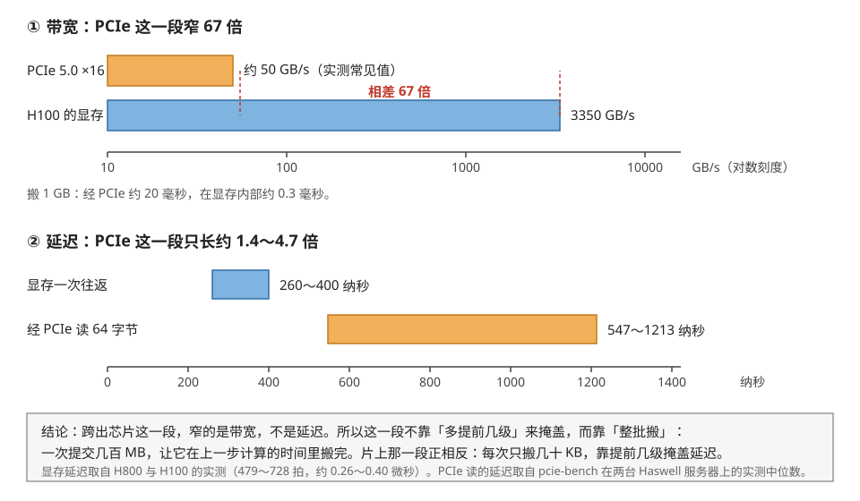
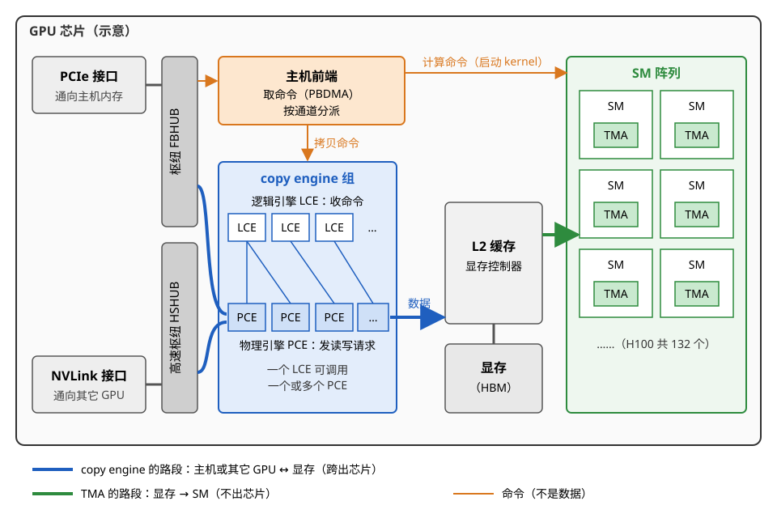
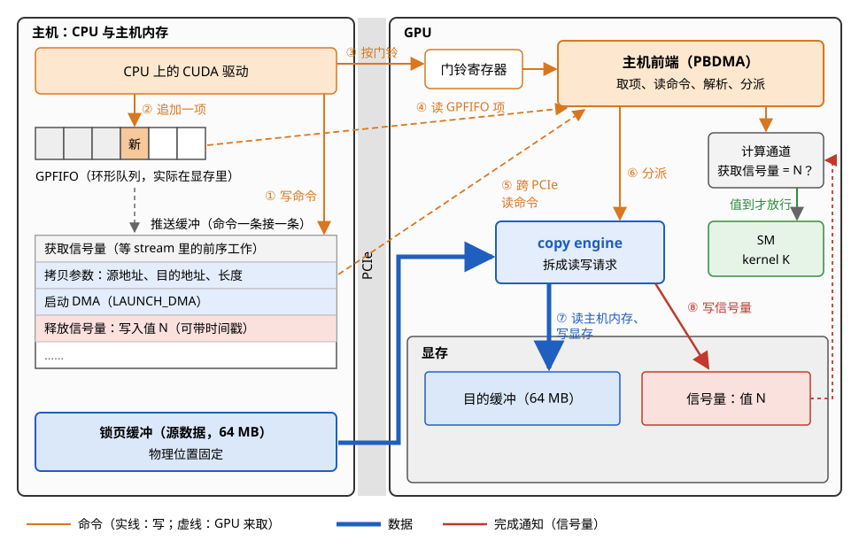
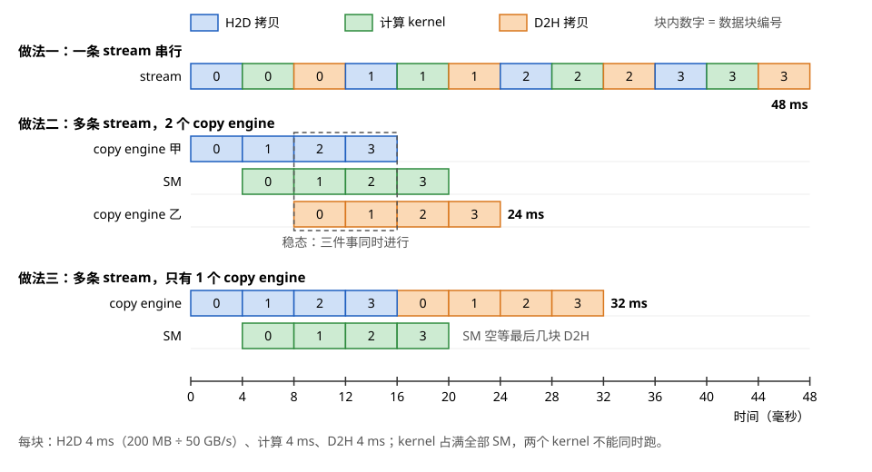
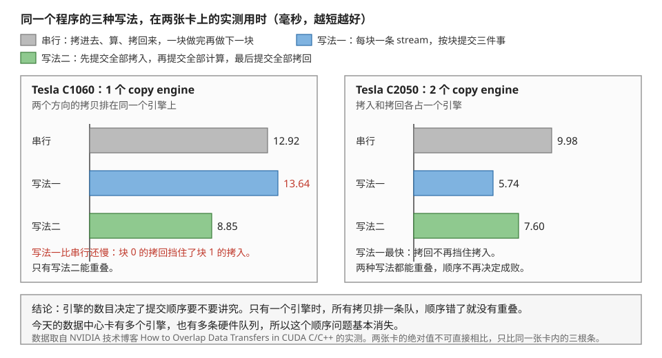
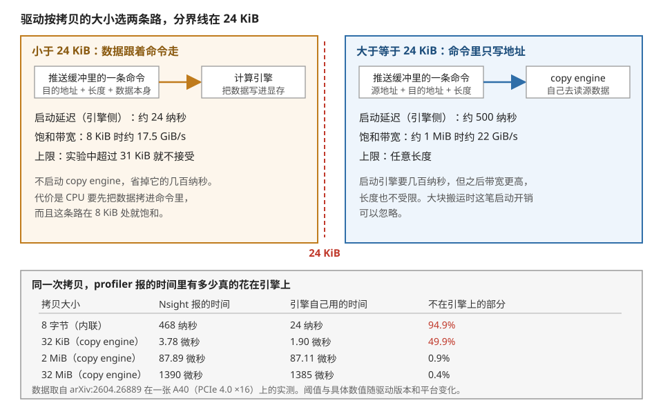

# 主机与设备：copy engine、流与事件

> **所属模块**：模块 14 · 数据搬运（第三部分 · 片外的数据搬运）
> **状态**：🟨 学习中（2026-10 新写。知识截至 2026-09）
> **一句话主旨**：数据跨出芯片时，三个问题的答案全部改变。发起者不再是芯片上的线程，而是主机上的驱动。它把源地址、目的地址和长度写进一张命令队列，按一下门铃就返回。GPU 边缘的 copy engine 取到命令后自己搬，全程不占用一个 SM。完成记录不再放在片上，而是内存里的一个数，CUDA 把它包装成 event 和 stream 顺序。代价是下单要几微秒，而且正在运行的 kernel 自己不能发起这种搬运。

上一节把同一个分块在 GPU 和昇腾上各搬了一遍。两边的搬运都发生在芯片内部，前提是数据已经在显存或 HBM 里。这一节问的是前一步：这些数据是怎么进到显存里的。三个问题中改得最彻底的是"谁发起"：发起者离开了芯片，搬运由主机上的驱动下单。

---

## 0. 这一节要回答的问题

- 芯片上已经有 LSU、`cp.async` 和 TMA 三种搬运部件，为什么跨出芯片还要另放一组引擎？
- 跨出芯片这一段和片上那一段，到底哪里不一样：带宽、延迟，还是别的？
- 调用一次 `cudaMemcpyAsync`，从函数返回到显存里的数据能用，中间经过哪几步？命令怎么送到 GPU，完成怎么报回来？
- 为什么主机那一端的缓冲必须是锁页内存？传入普通内存时驱动做了什么，代价是多少？
- 怎样让拷贝藏进计算后面？需要几个引擎，需要几条 stream？
- 几 KB 的小拷贝也走这套流程吗？
- 这种搬法的代价在哪里？什么时候它反而是错的选择？

---

## 1. 基础词汇

本节的词大多在主机一侧，和前八节的片上词汇不同。下面先逐个讲清。

**主机与设备**。主机（host）指 CPU 和它的内存。设备（device）指 GPU 和显存。本节讲的是数据在这两者之间的搬运，方向分别叫 H2D（主机到设备）和 D2H（设备到主机）。

**copy engine（拷贝引擎）**。copy engine 是 GPU 芯片上的一块搬运硬件。它不在任何一个 SM 里，而在 SM 阵列之外，挂在通往 PCIe 和 NVLink 接口的枢纽上。它能搬的方向是主机内存和显存之间、显存和显存之间。它只搬数据，不做任何运算。

**LCE 与 PCE**。NVIDIA 的开源内核驱动把 copy engine 分成两层。**逻辑拷贝引擎**（LCE）负责接收命令和控制。**物理拷贝引擎**（PCE）真正发出读写请求。驱动在启动时填一张映射表，规定每个 PCE 归哪个 LCE 调用。一个 LCE 可以调用一个或几个 PCE。

**主机前端**。主机前端（host interface）是 GPU 上负责取命令的部件。CPU 不会直接调用 GPU 上的函数。CPU 把命令写进内存里的队列，主机前端自己去取，解析后分给对应的引擎。

**PBDMA**。PBDMA（pushbuffer DMA）是主机前端中的一个单元。它按顺序读取命令流，逐条解析，再把命令交给对应的引擎。

**通道（channel）**。通道是驱动在 GPU 上开的一条独立命令队列。每条通道绑定一个引擎：计算通道的命令交给计算引擎，拷贝通道的命令交给某个 copy engine。同一条通道里的命令严格按顺序执行。不同通道之间互不等待。

**推送缓冲**。推送缓冲（pushbuffer）是一段内存，驱动把一条条命令顺序写进去。每条命令以 4 字节为单位编码。

**GPFIFO**。GPFIFO 是一个环形队列，它的每一项记着"推送缓冲里从哪个地址开始、有多长的一段命令"。驱动写完命令后在 GPFIFO 里追加一项，再把队尾指针 `GP_PUT` 往前移。GPU 取完一项就把队头指针 `GP_GET` 往前移。两个指针之间就是还没取走的命令。

**门铃（doorbell）**。门铃是 GPU 上的一个寄存器，映射在 CPU 能直接写的地址上。CPU 往里写一个值，GPU 就知道某条队列里有新命令。写门铃只是一次几字节的写操作，不进操作系统内核。

**下单与取单**。本节把驱动提交一次工作的整套动作叫下单：写命令、追加 GPFIFO 项、按门铃。GPU 一侧主机前端读 GPFIFO 项、读回命令的动作叫取单。下单的每一步都不进操作系统内核，所以下单很便宜。

**信号量（semaphore）**。信号量是内存里一个约定用来报告进度的位置，通常 4 字节或 16 字节。引擎做完一批工作后执行一条"释放信号量"命令。这条命令往那个地址写一个约定的数值，还可以顺带写一个时间戳。等待方有两种。一种是 CPU 反复读这个地址，直到数值到达。另一种是另一条通道执行"获取信号量"命令，数值到达之前主机前端不再往下取这条通道的命令。

**stream**。stream（流）是 CUDA 提交工作的有序队列。同一条 stream 里的工作按提交顺序执行，不同 stream 之间没有顺序约束。

**event**。event（事件）是插在 stream 里的一个标记。`cudaEventRecord(e, s)` 的意思是"s 中排在它前面的工作都做完时，e 算完成"。`cudaStreamWaitEvent(s2, e)` 的意思是"s2 中排在它后面的工作要等 e 完成才能开始"。在硬件上，记录 event 是一次信号量释放，等待 event 是一次信号量获取。

**可分页内存**。`malloc` 得到的主机内存是可分页（pageable）的。操作系统可以随时把某一页换出到磁盘，或者挪到另一个物理位置，程序看到的虚拟地址不变。

**锁页内存**。锁页（pinned）内存由 `cudaHostAlloc` 分配，或者用 `cudaHostRegister` 把已有内存登记进去。操作系统承诺不换出、不挪动这些页，所以它们的物理地址固定。

**本节的运行例子**。本模块前几节一直用同一个矩阵乘例子：输出分块 128 × 128，沿 K 每次推进 64，每次搬 32 KB。那些搬运的两端都在芯片上。本节的例子在它之前一步：这些数据先要从主机内存进到显存。本节的典型一次搬运是 64 MiB 到 256 MB，是片上那一次 32 KB 的约 2000～8000 倍，大三到四个数量级。

---

## 2. 跨出芯片的搬运交给芯片边缘的引擎

### 2.1 三个问题的答案全部改变

本模块前八节的搬运都在芯片内部完成。本节的搬运跨出芯片，三个问题的答案因此全部改变：

1. **谁发起**：不是 SM 上的线程，也不是 NPU 的核，而是主机上的 CUDA 驱动。发起时 GPU 上可能一个 kernel 都没在跑。
2. **地址从哪来**：驱动把源地址、目的地址和长度直接写进命令。没有描述符，没有坐标，也没有线程各算各的。
3. **完成怎么知道**：不是记分牌，也不是 mbarrier。引擎往内存里写一个约定的数值，等它的是 CPU 或者另一条命令通道。

### 2.2 为什么 SM 不适合做这件事

一块 H100 有 132 个 SM，每个 SM 里都有访存单元和 TMA。既然如此，为什么还要在芯片边缘另放一组引擎？

原因有三个，每一个都足以单独成立。

**第一，发起的时刻不对。** 把下一批训练数据搬进显存时，GPU 上正在跑的是上一批的计算 kernel。这个 kernel 的线程不知道下一批数据的存在，也没有理由为它分出线程。如果要让 SM 来搬，就必须单独启动一个搬运 kernel，而启动 kernel 本身也要主机下单。

**第二，这一段的延迟比片上长。** 一次经 PCIe 的读取要穿过 GPU 的接口、PCIe 链路、CPU 的根复合体，再进主机内存。pcie-bench 的实测给出 64 字节 DMA 读的中位延迟：一台 Xeon E5 服务器上是 547 纳秒，一台 Xeon E3 服务器上是 1213 纳秒。E5 平台的延迟分布很集中。E3 平台的中位数翻了一倍多，长尾也重得多。显存一次往返是 260～400 纳秒。所以这一段长约 1.4～4.7 倍，不是长一个数量级。让 SM 的线程来等这 0.5～1.2 微秒，这些线程会一直占着寄存器。

**第三，也是最要紧的一条：这一段窄得多。** PCIe 5.0 ×16 在常见平台上的实测有效带宽约 50 GB/s（模块 50 第 3 节给出的锁页实测范围是 45～55 GB/s），本节的算例都按这个值计算。H100（SXM 版）的显存带宽是 3.35 TB/s。两者相差 67 倍。图 9-1 把带宽和延迟这两本账并排画出来。



> **图 9-1**　一句话：跨出芯片这一段比片上那一段窄 67 倍，延迟却只长约 1.4～4.7 倍。窄的是带宽，不是延迟。
>
> **先知道一件事**：带宽和延迟是两件事。带宽是每秒能搬多少字节。延迟是从发出请求到第一个字节回来要等多久。一条路可以又窄又短，也可以又宽又长。
>
> **按这个顺序看**：
> 1. 上半部分比带宽。横轴是对数刻度，每往右一格是十倍。橙条是 PCIe 5.0 ×16 的实测有效带宽，约 50 GB/s。蓝条是 H100 的显存带宽，3350 GB/s。两条红色虚线之间标出倍数：67 倍。
> 2. 把这个倍数换算成时间：同样搬 1 GB，经 PCIe 要 20 毫秒，在显存内部只要 0.3 毫秒。
> 3. 下半部分比延迟。横轴是线性刻度，单位是纳秒。蓝条是显存一次往返，260～400 纳秒。橙条是经 PCIe 读 64 字节，547～1213 纳秒。两根条在同一个量级，橙条只长约 1.4～4.7 倍，不像上半部分那样差出 67 倍。
> 4. 最后看底部的结论框。两种搬运因此采用不同的办法。
>
> **看懂的标志**：能回答"为什么片上搬运讲究提前几级，主机到设备的搬运却不讲究"。片上那一段带宽很宽，瓶颈是延迟，所以要让很多笔小搬运同时在路上。跨 PCIe 这一段带宽很窄，瓶颈是传输本身要花的毫秒数。所以这一段要整批搬，并把这几毫秒安排在上一步计算的时间里。
>
> **与正文的对照**：显存延迟取自 Luo 等（arXiv:2402.13499）与 Liu 等（arXiv:2607.19922）的实测，479～728 拍按 1.83 GHz 折算为 0.26～0.40 微秒。PCIe 读的延迟取自 Neugebauer 等的 pcie-bench（SIGCOMM 2018）在两台 Haswell 服务器（Xeon E5-2637 v3 与 Xeon E3-1226 v3）上 64 字节 DMA 读的实测中位数，被测设备是网卡，不是 GPU。
>
> 来源：本库自绘。

### 2.3 copy engine 在芯片上的位置

copy engine 挂在芯片的枢纽（hub）上。枢纽是把芯片外部接口接进片上网络的部件。它一端连着外部接口，另一端经片上网络连着 L2 和显存控制器。所以挂在枢纽上的 copy engine 既够得着芯片外面，也够得着显存。

枢纽不止一个，PCIe 和 NVLink 各走各的：

- NVIDIA 的 Pascal 白皮书写明，NVLink 控制器经一个叫 High-Speed Hub（HSHUB）的新部件接进芯片内部。HSHUB 能直接访问全芯片的交叉开关，也能访问 High-Speed Copy Engine（HSCE）。HSCE 能按 NVLink 的峰值速率把数据搬进搬出 GPU。
- NVIDIA 开源内核驱动中有 A100 的拷贝引擎分配代码（`kernel_ce_ga100.c`）。代码注释写明：主机内存经 PCIe 访问时，驱动只分配 FBHUB 上的 PCE。FBHUB 是另一个枢纽。这样分配的原因是 HSHUB 上的 PCE 不支持 PCIe 访问。按 A100 的寄存器头文件，芯片共有 18 个 PCE 槽位。代码中的常量 `NV_CE_NUM_HSHUB_PCES` 是 16，即其中 16 个在 HSHUB 上，用于 NVLink 连接。

图 9-2 画出了 copy engine 和 SM、主机前端的相对位置。



> **图 9-2**　一句话：copy engine 和主机前端都在 SM 阵列之外，挂在通往 PCIe 和 NVLink 接口的枢纽上。SM 里的 TMA 只负责显存到 SM 这一段。跨出芯片的搬运归 copy engine。
>
> **先知道一件事**：GPU 不执行 CPU 的函数调用。CPU 把命令写进内存里的队列，GPU 上的主机前端自己去取，再按通道把命令分给不同的引擎。图中每个方框都是一个能独立工作的硬件部件。
>
> **按这个顺序看**：
> 1. 从左边看起。左上是 PCIe 接口，通向主机。左下是 NVLink 接口，通向同一台机器里的其它 GPU。灰色竖条是枢纽，也就是把外部接口接进芯片内部的部件。PCIe 接在上面的 FBHUB 上，NVLink 接在下面的高速枢纽 HSHUB 上。
> 2. 枢纽旁边是橙色的主机前端。它从命令队列读出命令，按通道分发：计算命令交给右边的 SM 阵列，拷贝命令交给下方的 copy engine。
> 3. 看蓝色的 copy engine 组。上层是若干个 LCE，负责收命令和控制。下层是若干个 PCE，负责真正发出读写请求。一个 LCE 可以调用一个或多个 PCE。
> 4. 中间是 L2 缓存和显存控制器，右边是 SM 阵列。每个 SM 里画了一个小的 TMA，它是 SM 自带的搬运引擎（本模块第 03 节）。
> 5. 最后看箭头。蓝色箭头是 copy engine 的路段，从 PCIe 或 NVLink 进来，落进显存。绿色箭头是 TMA 的路段，从显存搬进某个 SM。两条路段只在 L2 与显存这一处交汇。
>
> **打个比方**：一栋办公楼里，收发室在大门口，负责把外面送来的货搬进仓库。每层楼的传送员只负责把仓库里的货送到本层的工位上。收发室的人不上楼，传送员不出大门。
>
> **看懂的标志**：能回答"一个 kernel 占满了全部 132 个 SM 时，还能不能同时做 H2D 拷贝"。能。拷贝由 copy engine 完成，它不在 SM 里，不占用 SM 的任何资源。两者共享的只有显存带宽。
>
> **与正文的对照**：LCE、PCE 的个数和连接方式是示意。真实数目见 §2.4。HSHUB 取自 NVIDIA Pascal 白皮书，FBHUB 取自开源内核驱动的 A100 代码。图中把两个枢纽上的 PCE 画在同一组里。实际上 PCIe 拷贝只用 FBHUB 上的 PCE，NVLink 拷贝用 HSHUB 上的 PCE。
>
> 来源：本库自绘。

**例子：同一时刻三件事在芯片上各自进行。** 设一块 H100 上正跑着一个 GEMM kernel，占满 132 个 SM。同一时刻还有两件事在进行：

1. 一个 copy engine 把下一批 256 MB 的训练数据从主机的锁页内存搬进显存。按 50 GB/s 算，要 5.1 毫秒。
2. 另一个 copy engine 把上一批的 64 MB 结果搬回主机。按 50 GB/s 算，要 1.3 毫秒。
3. 每个 SM 里的 TMA 按分块把 A、B 从显存搬进 shared memory，每次 16 KB。

三件事的发起者不同：前两件由主机上的驱动发起，第三件由 kernel 里的一个线程发起。三件事唯一共享的资源是显存带宽。两路 PCIe 拷贝合计约 100 GB/s，只占 3.35 TB/s 的 3%，对 GEMM 几乎没有影响。

### 2.4 一张卡有几个引擎

这个问题的答案分两层，因为 CUDA 报告的数和硬件里的数不是一回事。

**CUDA 报告的数**。设备属性 `cudaDeviceProp::asyncEngineCount` 告诉程序最多有几路拷贝能同时进行。CUDA 示例程序 `deviceQuery` 把它打印成一行："Concurrent copy and kernel execution: Yes with N copy engine(s)"。这个值等于 1 时，拷贝可以和 kernel 并行，但同一时刻只有一路拷贝。等于 2 或更多时，H2D 和 D2H 两个方向可以同时进行。

**硬件里的数**。开源的 nouveau 驱动在设备表中为每颗芯片列出一个拷贝引擎位掩码，每一位是一个引擎实例。按 Linux 内核源码 `drivers/gpu/drm/nouveau/nvkm/engine/device/base.c`：

| 芯片 | 位掩码 | 引擎实例数 |
| --- | --- | --- |
| GP100（P100） | `0x0000003f` | 6 |
| GV100（V100） | `0x000001ff` | 9 |
| GA100（A100） | `0x000003ff` | 10 |
| TU10x、GA10x、AD10x（消费级、工作站卡，以及 A40、L40 这类用同款芯片的数据中心卡） | `0x0000001f` | 5 |

GH100（H100）和 Blackwell 的 GB100、GB20x 在这张表里只有基本条目，没有列出拷贝引擎，所以本库没有它们的一手数字。表中的数与 NVIDIA 开源内核驱动对得上：A100 代码里逻辑引擎的掩码上限 `NV_CE_MAX_LCE_MASK` 也是 `0x3FF`，即 10 个 LCE。

读这张表要记住两件事。

**第一，对 PCIe 拷贝来说两个就够。** PCIe 是全双工的，两个方向各有独立的通路。开源驱动的 A100 代码只允许 2 个 LCE 服务主机内存，每个 LCE 配 FBHUB 上的一个 PCE。命令流论文在 PCIe 4.0 ×16 上测得，一次拷贝在约 1 MiB 后饱和于约 22 GiB/s（约 23.6 GB/s）。这是 PCIe 4.0 ×16 编码后带宽（约 31.5 GB/s）的四分之三。

本库估算，剩下的部分主要是数据包的包头、读请求等协议开销，也可能有平台本身的限制。所以本库推断：一个方向一个引擎就能基本跑满 ×16 链路。如果这条推断成立，同一个方向再加引擎不会更快，因为瓶颈是链路带宽，不是引擎。这条推断还缺一个直接的对照实验，即同一方向用两个引擎并行，看带宽是否上升。

**第二，带多条 NVLink 的芯片多出来的引擎是给 NVLink 准备的。** 一张 A100 有 12 条 NVLink，合计双向 600 GB/s，单向 300 GB/s。一张 H100 有 18 条，单向约 450 GB/s。按单向原始速率比，这是同代 PCIe ×16 的约 7～9 倍（PCIe 4.0 ×16 约 32 GB/s，5.0 ×16 约 64 GB/s）。

开源驱动的 A100 代码给每个直连的对端 GPU 分配一个 LCE。它再按连到这个对端的链路数分配 PCE，每条链路至少一个 HSHUB 上的 PCE。PCE 的个数随链路数增长，本库据此推断，多出来的引擎是为 NVLink 的带宽准备的。卡间搬运是下一节的内容。

**例子：报告出来的引擎数不会自己被用上。** 一个程序在一条 stream 上依次做三件事：H2D 搬 200 MB、算、D2H 搬回 200 MB。同一条 stream 严格按序执行，所以两个方向的拷贝不会重叠。无论 `asyncEngineCount` 报 2 还是 5，实际同时工作的引擎都只有一个。**引擎数只决定并行的上限，并行要靠多条 stream 去填**（§5）。

---

## 3. 一次 `cudaMemcpyAsync` 从调用到完成

这一节把一次 H2D 拷贝拆开，逐步看每个部件做了什么。下面的描述综合了 NVIDIA 公开的硬件手册（open-gpu-doc 中的 Host 与 PBDMA 说明）、开源内核驱动，以及一篇 2026 年对闭源驱动命令流做逆向分析的论文（Yan 等，arXiv:2604.26889，下称命令流论文）。具体的命令编码随代际变化，这里只讲结构。

设程序在 stream `s_copy` 上调用：

```cpp
cudaMemcpyAsync(dst_dev, src_host, 64 * 1024 * 1024,
                cudaMemcpyHostToDevice, s_copy);   // src_host 是锁页内存
cudaEventRecord(e, s_copy);
cudaStreamWaitEvent(s_comp, e);                    // 计算 stream 等这次拷贝
K<<<grid, block, 0, s_comp>>>(dst_dev);
```

### 3.1 下单：驱动写命令、追加队列项、按门铃

CPU 上依次发生这些事：

1. **查指针属于哪一类内存**。CUDA 用统一虚拟地址（UVA）：主机内存和各张卡的显存在同一个 64 位地址空间里各占一段。所以运行时只看地址就能知道 `src_host` 是锁页内存、可分页内存还是某张卡的显存。本例是锁页内存。
2. **选通道**。stream `s_copy` 在驱动内部对应一条或几条硬件通道。这次拷贝的命令写进一条绑定到某个 copy engine 的拷贝通道。
3. **写命令**。驱动在这条通道的推送缓冲里追加几组命令：
   - 如果 `s_copy` 里前面还有没做完的工作，而且那些工作在另一条通道上（例如一个 kernel），先写一条"获取信号量"命令。前面的工作如果在同一条通道上，通道本身按顺序执行，不需要这条命令。
   - 写拷贝参数：源地址、目的地址、长度。一维拷贝只写一行的长度。二维拷贝还要写行数和每行的步长。
   - 写一条启动命令。NVIDIA 公开的拷贝引擎类头文件（open-gpu-doc 中的 `clc7b5.h`）把它定义为 `LAUNCH_DMA`。命令流论文在 A40 上解码出了一次 64 MiB 拷贝的命令。其中行长度 `LINE_LENGTH_IN` 是 `0x04000000`，即 64 MiB。`LAUNCH_DMA` 的字段标明三件事：源和目的都是虚拟地址，两者都是普通的线性（pitch）布局，只拷一行。
   - 写一条"释放信号量"命令：搬完后往某个地址写一个递增的数值。
   - 接着处理 `cudaEventRecord(e, s_copy)`，在同一条通道里再写一条释放命令。`e` 对应的就是后面这个数值。
4. **追加 GPFIFO 项**。在这条通道的环形队列里追加一项，指向刚写的那段命令，再把 `GP_PUT` 往前移一格。
5. **按门铃**。往门铃寄存器写入这条通道的编号。
6. **返回**。函数返回。此时一个字节都还没搬。

第 3 到第 5 步写的都是早已映射好的内存和寄存器，不进操作系统内核，所以整个调用只要几微秒。

命令流论文在它的测试平台上观察到一个细节：GPFIFO 放在显存里，推送缓冲放在主机内存里。所以下单和取单的方向是反的。CPU 在本地内存里写命令，再跨 PCIe 更新显存里的队列项。GPU 在本地读队列项，再跨 PCIe 把命令读回来。

### 3.2 取单与分派：主机前端

GPU 一侧，主机前端收到门铃后做三件事：

1. **调度通道**。GPU 上可能有几十条通道同时有命令等着，它们来自不同的 stream 和不同的进程。主机前端按运行列表轮流服务这些通道。一个进程里 stream 能映射到多少条硬件队列，由环境变量 `CUDA_DEVICE_MAX_CONNECTIONS` 控制，默认 8 条，最多 32 条。
2. **取命令**。PBDMA 读出 GPFIFO 里的新项，再按项中记的地址和长度把那一段推送缓冲读进来，逐条解析。
3. **分派**。遇到"获取信号量"命令时，PBDMA 去读那个地址。数值没到，这条通道就停在这里，主机前端转去服务别的通道。数值到了就继续解析，把拷贝参数和启动命令交给这条通道绑定的 LCE。

### 3.3 执行：引擎把一次拷贝拆成总线请求

LCE 收到启动命令后，把 64 MiB 拆成许多个小请求交给 PCE。PCE 对每个请求做两件事：向源地址发读请求，数据回来后向目的地址发写请求。

这里有一个容易误解的细节：**copy engine 发出的是 GPU 虚拟地址**。每个地址先经过 GPU 自己的内存管理单元，按 GPU 页表翻译。翻译结果指向显存时，请求走片上网络去显存控制器。翻译结果指向主机内存时，页表项里记的是一个总线地址。这时请求变成 PCIe 上的读请求，经 CPU 的根复合体去读主机内存。系统开了 IOMMU 时，这个总线地址还要再被 IOMMU 翻译一次。GPU 页表里的这些条目由驱动在锁页时一次性填好，这一点决定了第 4 节的结论。

64 MiB 按 50 GB/s 算需要约 1.34 毫秒。这段时间里 PCIe 上源源不断地有读请求出去、带数据的完成包回来。

### 3.4 完成：写一个数，event 与 stream 顺序都建立在它上面

最后一个写请求被显存确认之后，copy engine 执行紧跟着的"释放信号量"命令。这条命令往约定的地址写入数值，还可以同时写一个 GPU 时间戳。`cudaEventElapsedTime` 量到的就是两个时间戳之差。

后面的等待方有三种，它们得知完成的方式各不相同：

- **CPU 上的 `cudaStreamSynchronize` 或 `cudaEventSynchronize`**。CPU 线程查看那个信号量地址。查看的方式由设备标志决定。默认标志是 `cudaDeviceScheduleAuto`：运行时按进程中活跃上下文数与逻辑处理器数，自行选择自旋还是让出。显式设成 `cudaDeviceScheduleSpin` 时一直自旋，反应快但占满一个核。设成 `cudaDeviceScheduleBlockingSync` 时线程睡眠等中断唤醒，省 CPU，但多一段唤醒延迟。本库估算这段延迟是几到几十微秒，没有找到一手实测。
- **同一条 stream 里后面的工作**。kernel 在计算通道里，拷贝在拷贝通道里，两条通道本来互不等待。驱动在提交 kernel 时，先在计算通道里写一条"获取信号量"命令，等的就是拷贝释放的那个数值。**"同一条 stream 里按顺序执行"这条规则，在硬件上就是一对跨通道的释放和获取。**
- **另一条 stream 里等这个 event 的工作**。机制完全相同。`cudaStreamWaitEvent(s_comp, e)` 让驱动在 `s_comp` 的通道里写一条"获取信号量"命令，等的是 `e` 对应的数值。

图 9-3 把这一串画成一张命令流图。



> **图 9-3**　一句话：CPU 从不直接指挥 copy engine。它只把命令写进内存里的队列，按一下门铃。GPU 的主机前端自己来取命令、交给 copy engine。copy engine 搬完后往一个约定的位置写一个数，等待的一方看到这个数就知道搬完了。
>
> **先知道一件事**：CPU 和 GPU 之间通信的基本方式是"写队列加按门铃"。队列是一段双方都能访问的内存。门铃是 GPU 上一个 CPU 可以直接写的寄存器。两者都不需要进入操作系统内核，所以一次下单只要几微秒。
>
> **按这个顺序看**：
> 1. 左边是主机侧，驱动做编号 ①～③ 三件事。① 把命令写进推送缓冲，图中四行分别是获取信号量、拷贝参数、启动 DMA、释放信号量。② 在 GPFIFO 这个环形队列里追加一项，橙色格"新"是刚追加的一项，灰色虚线箭头表示它指向哪一段命令。③ 往门铃寄存器写一个值。中间的灰色竖条是 PCIe，凡是跨过它的一步都是一次 PCIe 传输。
> 2. 右侧 GPU 里的主机前端做 ④～⑥。④ 收到门铃后读 GPFIFO 的新项。⑤ 按这一项的指引跨 PCIe 把那段命令读进来并逐条解析。⑥ 把拷贝参数和启动命令交给 copy engine。
> 3. 下方 copy engine 做第 ⑦ 步：向主机内存发读请求，数据回来后写进显存。蓝色粗箭头是数据走的路，和细线表示的命令路径分开画。
> 4. 右下是第 ⑧ 步：搬完后 copy engine 往信号量地址写入数值。右侧计算通道里有一条"获取信号量"命令一直在等这个值。值到了，主机前端才把后面的 kernel 交给 SM。
>
> **打个比方**：餐厅后厨的点菜单。服务员把单子夹到出单轨上，按一下铃就走。厨房的领班取下单子，分给对应的厨师。厨师做好后在出菜口挂一个牌子。等这道菜的下一道工序看到牌子才开始。
>
> **看懂的标志**：能回答"`cudaMemcpyAsync` 返回时搬了多少字节"。一个字节也没搬。返回只说明命令已经写进队列、门铃已经按过。搬运由 GPU 在之后完成，完成的证据是信号量里的那个数。
>
> **与正文的对照**：①～⑧ 对应 §3.1～§3.4。图中为了排版把 GPFIFO 画在主机一侧。命令流论文在它的平台上观察到的配置是推送缓冲在主机内存、GPFIFO 在显存，图中的文字已标出这一点。两者的位置随驱动配置而定，不影响步骤顺序。
>
> 来源：本库自绘。

### 3.5 逐步走查：一次 64 MiB 的 H2D 拷贝

把 §3.1～§3.4 串成一条时间线。微秒级的数值是示意量级，取自常见的调用开销。传输时间按 50 GB/s 算。

| 时刻 | CPU | 主机前端 | copy engine | SM |
| --- | --- | --- | --- | --- |
| 0 μs | 调用 `cudaMemcpyAsync`：写命令、追加队列项、按门铃 | 空闲 | 空闲 | 可能在跑别的 kernel |
| 约 3 μs | 调用返回。接着提交 event、等待和 kernel `K`，各写几条命令 | 收到门铃，读 GPFIFO 项 | 空闲 | — |
| 约 4～5 μs | 去做别的事，例如准备下一批数据 | 跨 PCIe 读命令并解析。把拷贝参数交给 LCE。计算通道解析到"获取信号量"，值没到，停住 | 收到启动命令，开始发 PCIe 读请求 | — |
| 约 5～1345 μs | — | 服务其它通道 | 64 MiB 经 PCIe 读进来、写进显存 | `K` 还不能开始 |
| 约 1345 μs | — | — | 最后一个写完成，释放信号量 | — |
| 约 1346 μs | — | 计算通道再查信号量，值已到，继续取命令，把 `K` 交给计算引擎 | 空闲 | — |
| 约 1350 μs 起 | — | — | — | `K` 的线程块开始分发到各 SM |


> **图 9-4**　一句话：一次 64 MiB 的异步拷贝里，CPU 只忙了开头几微秒。真正的搬运占了一千三百多微秒，全由 copy engine 完成。后面的 kernel 等到信号量写入才开始。
>
> **先知道一件事**：横轴是时间，但被切成三段不同的比例尺。开头 0～10 微秒和结尾 1340～1352 微秒被放大，中间 1.3 毫秒的搬运被压缩。如果不压缩，整张图只能看到一条长线。每一行是一个部件，行上的色块表示它在这段时间里做的事。
>
> **按这个顺序看**：
> 1. 最上面的 CPU 行：0～3 微秒写命令、按门铃，3 微秒时函数返回。之后再花一两微秒提交 event、等待和 kernel，然后去做别的事。
> 2. 第二行是主机前端：约 3～5 微秒取命令、解析、分派。灰色斜线块表示计算通道停在"获取信号量"上，一直停到 1346 微秒。
> 3. 第三行是 copy engine：约 5 微秒开始搬，蓝色长条横跨压缩段，到约 1345 微秒结束。末尾的小红块是释放信号量。
> 4. 最下面的 SM 行：1350 微秒之前是空白，之后 kernel `K` 开始。
>
> **看懂的标志**：能回答"想让 CPU 在拷贝期间做别的事，需要什么条件"。要用 `cudaMemcpyAsync`，并且主机那一端的缓冲要是锁页内存。满足这两条时 CPU 在 3 微秒后就返回了。不满足第二条时 CPU 会被卡在中转拷贝里，见第 4 节。
>
> **与正文的对照**：各时刻与 §3.5 的表格一一对应。图中写作 64 MB，指的是 64 MiB。1.34 毫秒由 64 MiB ÷ 50 GB/s 算得。微秒级的数值是示意量级。
>
> 来源：本库自绘。

---

## 4. 主机那一端的缓冲必须是锁页内存

### 4.1 两张页表，只有一张会被操作系统改

一个主机内存地址被 copy engine 访问时，要经过两次翻译，由两张不同的页表负责：

1. **CPU 这一侧**：程序看到的是进程虚拟地址，操作系统的页表把它翻译成物理地址。操作系统可以随时改这张表：把一页换出到磁盘，或者挪到另一个物理位置。程序感觉不到。
2. **GPU 这一侧**：copy engine 发出的是 GPU 虚拟地址，GPU 的页表把它翻译成总线地址。这张表由 NVIDIA 驱动维护。

问题在于：**操作系统改自己的页表时，不会通知 GPU 去改 GPU 的页表。** 设驱动在下单时查到"虚拟页 A 在物理页 #1234"，把这个对应关系填进了 GPU 页表。在 copy engine 真正读这一页之前，操作系统把 A 换出，把 #1234 分给了别的进程。copy engine 照着 GPU 页表去读 #1234，读到的是别人的数据，而且不会报错。

锁页就是向操作系统申请"这些页不许换出、不许挪动"。锁住之后物理地址固定，驱动可以放心地把它填进 GPU 页表。开了 IOMMU 时，驱动同时建立一次固定的 IOMMU 映射。这个竞态的三时刻图在模块 50 第 3 节，这里不重画。

**这个要求针对的是主机那一端的缓冲，和方向无关。** H2D 时主机缓冲是源端，D2H 时主机缓冲是目的端。两种情况下 copy engine 都要按固定的物理地址访问它，所以两种情况都要锁页。

### 4.2 传入可分页内存并不是例外

`cudaMemcpyAsync` 允许主机那一端是可分页内存，不会报错。这件事看起来和上一小节的结论冲突，所以要讲清三步。

**它碰到的是规则的哪一部分。** 规则说 DMA 只能访问物理地址固定的内存。传入可分页内存时，程序确实把一个可能被换出的地址交给了 CUDA。

**它实际怎么工作。** 驱动自己维护一块锁页的中转缓冲，把数据分块中转：

1. CPU 把第 1 块从程序的可分页缓冲拷进中转缓冲。这是一次普通的 `memcpy`，由 CPU 执行。
2. 驱动提交一次 copy engine 拷贝，把中转缓冲里的第 1 块经 PCIe 搬进显存。
3. CPU 接着把第 2 块拷进中转缓冲的另一半，同时 copy engine 在搬第 1 块。
4. 两边交替，直到全部搬完。

CUDA 运行时文档的"API 同步行为"一页分两种函数写了这件事：

- 同步版本（`cudaMemcpy`）：从可分页主机内存到设备的拷贝，运行时先做一次 stream 同步。函数在可分页缓冲被拷进中转内存后返回，到显存的 DMA 这时可能还没完成。
- 异步版本（`cudaMemcpyAsync`）：设备与可分页主机内存之间的拷贝，函数对主机可能是同步的。可分页内存必须先中转到锁页内存时，驱动可能先与 stream 同步，再把拷贝倒进锁页内存。

**结论：这不是例外。** copy engine 访问的始终是驱动自己锁好的那块中转缓冲。规则没有被破坏，只是多了一道由 CPU 执行的拷贝。代价有两项：数据被多拷了一遍，而且这个名字里带 Async 的调用对 CPU 来说可能变成同步的。文档用的是"可能"，没有承诺每次都同步。

### 4.3 带宽损失的算例

设要搬 1 GB。CPU 单线程 `memcpy` 约 20 GB/s，PCIe 上的 DMA 约 50 GB/s。这两个值是常见平台的量级。

**情况 A：锁页内存。** 只有一次 DMA。1 GB ÷ 50 GB/s = **20 毫秒**。CPU 在调用后几微秒就返回。

**情况 B：可分页内存，中转缓冲分成两半交替使用。** 两段流水里较慢的一段决定吞吐。CPU 拷贝 20 GB/s 比 DMA 慢，所以总吞吐约 20 GB/s，1 GB 要约 **50 毫秒**。CPU 线程在这 50 毫秒里一直被占着。

**情况 C：可分页内存，中转没有流水起来。** 每一块先拷完、再 DMA、再拷下一块。每字节要依次付两段时间：1/20 + 1/50 = 0.07 纳秒每字节，折合约 14.3 GB/s，1 GB 要约 **70 毫秒**。

| 情况 | 有效带宽 | 1 GB 用时 | CPU 线程被占用 |
| --- | --- | --- | --- |
| A 锁页 | 约 50 GB/s | 约 20 ms | 几微秒 |
| B 可分页，中转有流水 | 约 20 GB/s | 约 50 ms | 约 50 ms |
| C 可分页，中转无流水 | 约 14 GB/s | 约 70 ms | 约 70 ms |

模块 50 第 3 节给出的实测范围是可分页 10～25 GB/s、锁页 45～55 GB/s，和这个算例一致。

**比带宽差 2.5 倍更要紧的是最后一列。** 情况 B 和 C 里，CPU 线程被占了几十毫秒。如果这是训练循环的主线程，它在这段时间里不能给 GPU 提交下一个 kernel。GPU 做完已提交的工作后就会空转。


> **图 9-5**　一句话：从可分页内存拷贝时，驱动要先让 CPU 把数据一块块拷进自己的锁页中转缓冲，再让 copy engine 搬。数据多走一遍，CPU 全程被占，1 GB 从 20 毫秒变成 50 到 70 毫秒。
>
> **先知道一件事**：copy engine 只能访问物理位置固定的内存。可分页内存不满足这个条件，所以驱动只能先用 CPU 把数据拷进一块自己早就锁好的中转缓冲。
>
> **按这个顺序看**：
> 1. 上方是路径图。左边是程序的可分页缓冲，中间是驱动的锁页中转缓冲（分成标 0 和 1 的两半），右边是显存。红色箭头是 CPU 拷贝，蓝色箭头是 copy engine 的 DMA。
> 2. 时间线 A 是锁页的情况：只有一条蓝条，0～20 毫秒。CPU 行只在最开头有一条细竖线表示下单，之后空闲。
> 3. 时间线 B 是可分页并且中转流水起来的情况。CPU 行是一串连续的红块。每一块把一段数据拷进中转缓冲的 0 号或 1 号半区。copy engine 行的蓝块比红块短，而且总是晚一块开始，搬的是上一块。整体长度由红块决定，约 50 毫秒。
> 4. 时间线 C 是中转没有流水的情况：红块和蓝块交替出现、互不重叠，约 70 毫秒。
>
> **打个比方**：寄一批书。A 是书已经放在门口的固定货架上，快递员直接搬走。B 是书散在各个房间，你一趟趟搬到门口的两个筐里，快递员在你装下一筐时搬走上一筐。C 是你装满一筐就停下来等快递员搬走，再装下一筐。
>
> **看懂的标志**：能回答"为什么可分页拷贝慢了 2.5 倍还不是最大的问题"。最大的问题是 CPU 线程被占住几十毫秒，这期间它不能给 GPU 下发新工作。锁页之后 CPU 几微秒就返回。
>
> **与正文的对照**：三行时间线对应 §4.3 表格的 A、B、C。20 GB/s 与 50 GB/s 是算例假设。中转缓冲的分块大小由驱动决定，图中的块数是示意。
>
> 来源：本库自绘。

### 4.4 接口与使用上的注意

- **怎么锁**：`cudaHostAlloc` 和 `cudaMallocHost` 直接分配锁页内存。`cudaHostRegister` 把已有的一段内存登记为锁页。PyTorch 里是 `tensor.pin_memory()`，DataLoader 的 `pin_memory=True` 让后台线程把每一批数据放进锁页内存。
- **怎么用**：PyTorch 的 `tensor.to("cuda", non_blocking=True)` 在主机端是锁页内存时，就是在当前 stream 上发一次 `cudaMemcpyAsync`。主机端不是锁页内存时，`non_blocking` 不生效。
- **代价**：锁页申请要进内核，比 `malloc` 慢得多。锁住的内存操作系统不能回收，锁太多会挤压整机内存。所以锁页缓冲一般预先分配、循环复用。
- **一个配套条件**：异步拷贝提交后、完成前，程序不能改写源缓冲，也不能把它还给分配器。否则 copy engine 读到的是改写后的内容。PyTorch 里跨 stream 使用张量时，要用 `record_stream` 或 event 告诉分配器这块内存还在被另一条 stream 使用。

**例子：锁页缓冲环。** 设程序自己预分配一个装 8 批的锁页缓冲环，每批 64 MB，共 512 MB。8 这个数按 DataLoader 开 4 个 worker、`prefetch_factor=2` 时最多预取 8 批来定。按下面的顺序走一遍：

1. 第 k 步训练开始时，第 k+1 到第 k+8 批中已经准备好的都在环里。
2. 主线程对第 k+1 批发一次非阻塞拷贝，并在拷贝之后记录一个 event。
3. copy engine 在第 k 步的计算期间把第 k+1 批搬完，然后 event 完成。
4. event 完成后，环里第 k+1 批占的那一格才能被回收，用来装第 k+9 批。

如果程序在第 3 步之前就回收了这一格，后台线程写进去的第 k+9 批就可能被当成第 k+1 批搬进显存。PyTorch 自带的锁页内存分配器也按这个规则工作。一块锁页内存被异步拷贝用过，程序又释放了它。这时分配器要等这次拷贝对应的 event 完成，才把它分给新的请求。

---

## 5. 把拷贝藏进计算后面

### 5.1 四个条件缺一不可

让拷贝藏进计算后面，需要四个条件同时成立。缺一个就退化成串行。

1. **主机端缓冲是锁页的**（第 4 节）。否则 CPU 被卡在中转拷贝里，后面的提交都要等。
2. **拷贝和计算在不同的 stream 上**。同一条 stream 严格按序执行，放在一起必定串行。另外要避开旧式的默认 stream，它和其它阻塞型 stream 之间有隐式同步。用 `cudaStreamNonBlocking` 创建的 stream，或者按线程的默认 stream，可以避开这种同步。
3. **有足够的引擎**。两个方向同时进行需要 `asyncEngineCount` 至少是 2。
4. **中间没有同步点**。一次 `cudaDeviceSynchronize`，或者一次从 GPU 取标量到 CPU（例如 PyTorch 里的 `loss.item()`），都会让 CPU 停下来等 GPU 做完全部工作，流水就断了。

### 5.2 三段流水的算例

**问题**：要处理 4 块数据。每块的处理分三段：H2D 拷贝 200 MB 用 4 毫秒（按 50 GB/s）、kernel 计算 4 毫秒、D2H 拷回 4 毫秒。kernel 每次占满全部 SM，所以两个 kernel 不能同时跑。比较三种做法。

**做法一：一条 stream 串行。** 每块依次做三件事，4 块 × 12 毫秒 = **48 毫秒**。

**做法二：多条 stream，卡上有 2 个引擎。** 一个引擎做 H2D，另一个做 D2H：

| 时间（毫秒） | 0–4 | 4–8 | 8–12 | 12–16 | 16–20 | 20–24 |
| --- | --- | --- | --- | --- | --- | --- |
| 引擎甲（H2D） | 块 0 | 块 1 | 块 2 | 块 3 | | |
| SM（计算） | | 块 0 | 块 1 | 块 2 | 块 3 | |
| 引擎乙（D2H） | | | 块 0 | 块 1 | 块 2 | 块 3 |

总用时 **24 毫秒**，是串行的一半。稳态是 8～16 毫秒这一段，三个部件同时在忙，PCIe 两个方向各跑约 50 GB/s。这正是全双工的用处。

**做法三：多条 stream，但只有 1 个引擎。** 所有拷贝不论方向都排在同一个引擎上。8 次拷贝 × 4 毫秒 = 32 毫秒是这个引擎的最少工作量，所以总用时至少 **32 毫秒**。

三种做法说明一件事：**多条 stream 只是把"可以并行"告诉硬件，并行度的上限由引擎数决定。** 在这个例子里，第二个引擎把用时从 32 毫秒降到 24 毫秒。



> **图 9-6**　一句话：把数据切块、用多条 stream 提交，拷入、计算、拷回就能同时进行。有两个引擎时总时间从 48 毫秒降到 24 毫秒，只有一个时两个方向的拷贝要排队，降到 32 毫秒。
>
> **先知道一件事**：横轴是时间，单位毫秒。每一行是一个硬件部件。同一竖直位置上的色块同时发生。块内的数字 0～3 是数据块的编号。蓝色是 H2D 拷贝，绿色是计算，橙色是 D2H 拷贝。
>
> **按这个顺序看**：
> 1. 最上面的做法一只有一行。块 0 的蓝、绿、橙做完才轮到块 1，12 毫秒一组重复 4 次，48 毫秒结束。
> 2. 中间的做法二有三行。块 0 的计算一开始，引擎甲就搬块 1。块 0 的计算一结束，引擎乙就把结果拷回去。8～16 毫秒之间三行都有色块。24 毫秒结束。
> 3. 最下面的做法三只有一个引擎，蓝块和橙块挤在同一行，这一行 32 毫秒排满。SM 行在 4～20 毫秒之间工作，之后空闲，等最后几块拷回。
>
> **打个比方**：一条洗衣流水线：进货、洗、出货。只有一个门时，进货的车和出货的车要排队。前后各开一个门，进货和出货才能同时进行。
>
> **看懂的标志**：能回答"把做法二里 kernel 的时间加到 8 毫秒，总时间是多少"。瓶颈变成计算：4 + 4 × 8 + 4 = 40 毫秒。两个引擎各只忙 16 毫秒，40 毫秒里有六成时间空闲。流水线的速度由最慢的那一段决定。
>
> **与正文的对照**：三种做法与 §5.2 的三段计算一一对应。4 毫秒对应 200 MB 按 50 GB/s 的拷贝时间。做法三的排法是可行排法之一。
>
> 来源：本库自绘。

### 5.3 提交顺序曾经决定成败

上面的做法二只给出了结果，没有说提交的先后顺序。在只有一个引擎的卡上，这个顺序能决定有没有重叠。

NVIDIA 技术博客 How to Overlap Data Transfers in CUDA C/C++ 在两张卡上实测了同一个程序的三种写法。被测的两张卡是 Tesla C1060（1 个 copy engine）和 Tesla C2050（2 个 copy engine）。三种写法是：

1. **串行**：一块做完三件事，再做下一块。
2. **写法一**：每块一条 stream，按块提交三件事，即"块 0 的拷入、块 0 的计算、块 0 的拷回、块 1 的拷入……"。
3. **写法二**：先提交全部块的拷入，再提交全部块的计算，最后提交全部块的拷回。

实测结果见图 9-7。C1060 上写法一比串行还慢。原因是这张卡只有一个引擎，所有拷贝排成一条队。块 0 的拷回要等块 0 的计算。它又排在块 1 的拷入前面，于是块 1 的拷入也被挡住。C2050 上写法一最快，因为拷入和拷回各占一个引擎，互不阻挡。



> **图 9-7**　一句话：同一个程序的三种写法，在两张卡上的快慢次序正好相反。决定次序的是卡上有几个拷贝引擎。
>
> **先知道一件事**：这里比较的是同一张卡内的三根条。两张卡属于前后两代（C1060 是 GT200 一代，C2050 是 Fermi 一代），绝对值不可直接相比。
>
> **按这个顺序看**：
> 1. 先看顶部图例。灰条是串行，蓝条是写法一（每块一条 stream，按块提交），绿条是写法二（按操作类型分批提交）。
> 2. 左边是 C1060，只有一个引擎。蓝条最长，13.64 毫秒，比灰条的串行 12.92 毫秒还长。只有绿条的 8.85 毫秒比串行快。
> 3. 右边是 C2050，有两个引擎。蓝条最短，5.74 毫秒。绿条 7.60 毫秒，比蓝条慢。
> 4. 对比两边的蓝条。同一种写法在一张卡上是最差的，在另一张卡上是最好的。
>
> **看懂的标志**：能回答"为什么一个引擎时按块提交反而更慢"。一个引擎上的所有拷贝排成一条队，队列严格按提交顺序执行。块 0 的拷回必须等块 0 的计算结束。它排在块 1 的拷入前面，所以块 1 的拷入也只能等。
>
> **与正文的对照**：数据取自 NVIDIA 技术博客 How to Overlap Data Transfers in CUDA C/C++ 的实测。博客还指出 C2050 上写法二较慢的原因：调度器把 kernel 完成后的信号推迟到全部 kernel 完成，于是计算和拷回不能重叠。
>
> 来源：本库自绘。

今天这个顺序问题基本消失，原因有两个。第一，数据中心卡有多个引擎。第二，从 Kepler GK110（计算能力 3.5）起，GPU 有了多条硬件队列，NVIDIA 叫它 Hyper-Q。不同 stream 进入不同队列，前面的命令不再挡住后面无关的命令。同一篇博客在 K20 上实测，两种写法的用时相同，约 3.97 毫秒。

但是边界仍然存在。stream 数超过 `CUDA_DEVICE_MAX_CONNECTIONS`（默认 8，最多 32）时，多出来的 stream 会共用硬件队列，旧问题又会出现。例如 32 条 stream 各做"拷入、计算、拷回"。如果 stream 轮流映射到 8 条队列，每 4 条 stream 共用一条队列（映射规则是本库的假设）。某条 stream 的拷回在等计算时，同一队列里另外 3 条 stream 的拷入也被挡住。把这个环境变量设成 32 可以消除这种阻塞。

---

## 6. 几 KB 的小拷贝不走 copy engine

### 6.1 下单开销比传输本身还长

一次拷贝的总时间分成两段：下单到开搬，以及搬运本身。拷贝很大时第二段占绝对多数，第一段可以忽略。拷贝很小时两段的关系反过来。

命令流论文用一种能绕开运行时的方法量出了这两段。它把全部传输命令和进度标记合成一段推送缓冲，一次提交，之后驱动不再介入。引擎真正用掉的时间由设备侧的两个时间戳相减得到。在它的平台（一张 A40，PCIe 4.0 ×16，CUDA 13.0）上，结果是：

- 启动 copy engine 要约 **500 纳秒**。
- 8 字节的拷贝走的是 §6.2 讲的另一条路，由计算引擎执行。引擎自己只用 **24 纳秒**，而 Nsight 报的是 468 纳秒。
- 32 KiB 的拷贝由 copy engine 执行。引擎自己用 1.90 微秒，Nsight 报的是 3.78 微秒。

也就是说，8 字节到 8 KiB 的拷贝里，Nsight 报的时间有 77%～95% 不在引擎上。到 32 KiB 时这个比例约是一半，到 128 KiB 时降到约 15%。论文认为这部分主要是运行时与下单的开销。对走计算引擎的那条路，它还可能包含 CPU 把数据写进命令的时间。论文也指出，Nsight 的文档没有说清这段时间具体包含哪些部分。

### 6.2 驱动为小拷贝准备了另一条路

同一篇论文观察到，H2D 方向的 `cudaMemcpy` 有两种命令流形态，分界线在 24 KiB：

- **小于 24 KiB**：命令里只写目的地址和长度，**数据本身跟在命令后面，成为推送缓冲内容的一部分**。设备一侧由计算引擎取出这段数据，写进目的地址。这条路叫内联 DMA。
- **大于等于 24 KiB**：命令里写明源地址和目的地址，由 copy engine 执行。

两条路的性能特点正好互补。内联 DMA 的启动只要约 24 纳秒，但在 8 KiB 处就饱和在约 17.5 GiB/s，而且实验中超过 31 KiB 就不被接受。copy engine 的启动要约 500 纳秒，但能扩展到任意长度，在约 1 MiB 处饱和在约 22 GiB/s。



> **图 9-8**　一句话：驱动按拷贝的大小选两条路。小拷贝把数据直接写进命令里，省掉启动 copy engine 的几百纳秒。大拷贝交给 copy engine，它启动慢，但带宽更高、长度不受限。
>
> **先知道一件事**：推送缓冲是一段内存，驱动把命令一条条写进去，GPU 再把它们读回来。命令里除了写"做什么"，也可以直接带上一小段数据。
>
> **按这个顺序看**：
> 1. 左边橙色一列是小于 24 KiB 的情况。命令里写的是目的地址、长度和数据本身。计算引擎取出这段数据，写进显存。下面三行是实测数字：引擎侧的启动延迟约 24 纳秒，8 KiB 时饱和在 17.5 GiB/s，超过 31 KiB 不被接受。启动延迟是引擎从开始执行到搬完一笔极小拷贝的时间，不含 CPU 下单。
> 2. 右边蓝色一列是大于等于 24 KiB 的情况。命令里只写源地址、目的地址和长度，copy engine 自己去读源数据。引擎侧的启动延迟约 500 纳秒，约 1 MiB 时饱和在 22 GiB/s，长度不设上限。
> 3. 中间的红色虚线是 24 KiB 这条分界线。
> 4. 下方的表格对比两个时间：profiler 报的时间，和引擎自己用掉的时间。最右一列是两者之差占 profiler 时间的比例。8 字节时这个比例是 94.9%，32 MiB 时只有 0.4%。
>
> **看懂的标志**：能回答"为什么小拷贝要把数据直接写进命令里"。因为启动 copy engine 本身要约 500 纳秒，比搬几 KB 数据花的时间还长。数据跟着命令走时，GPU 取命令的那一趟就顺带把数据读回来了。两条路里，数据都只跨一次 PCIe。内联这条路多出的代价在主机一侧：CPU 要先把数据拷进推送缓冲。
>
> **与正文的对照**：数据取自命令流论文（arXiv:2604.26889）在一张 A40（PCIe 4.0 ×16，CUDA 13.0）上的实测。阈值和具体数值随驱动版本与平台变化。该卡的 PCIe 比 §2 中假设的 5.0 ×16 慢，所以这里的 22 GiB/s 不能和 50 GB/s 直接比较。
>
> 来源：本库自绘。

### 6.3 这条路不是"copy engine 不占 SM"的例外

内联 DMA 由计算引擎执行，看上去和 §2.3 的结论冲突，所以要讲清三步。

**它碰到的是规则的哪一部分。** §2.3 说跨出芯片的搬运不占 SM。内联 DMA 的数据确实由计算引擎写进显存，而计算引擎正是执行 kernel 的那个引擎。

**它实际怎么工作。** 这里的计算引擎执行的是命令流里的一条写命令，不是一个 kernel。NVIDIA 公开的计算类头文件（open-gpu-doc 中 A40 所属 Ampere 的 `clc7c0.h`）列出了这组命令：`LINE_LENGTH_IN`、`OFFSET_OUT`、`LAUNCH_DMA` 和 `LOAD_INLINE_DATA`。前三条写目的地址和长度，最后一条把数据一个 32 位字一个 32 位字地跟在命令后面。执行这组命令不需要分配线程块，不占用寄存器和 shared memory，也不参与 warp 调度。

**结论：这不是例外。** 正在运行的 kernel 的线程资源不受影响。但这条路确实用到了计算引擎。这组命令属于计算类，本库据此推断，它和 kernel 启动命令一样，走通往计算引擎的通道，按通道顺序执行。论文没有直接说明这一点。

**例子：一次 4 KB 的参数上传。** 推理服务每一步要把 4 KB 的采样参数传给 GPU。走 copy engine 要先付约 0.5 微秒的启动开销，而 4 KB 数据本身在 PCIe 上只要不到 0.1 微秒。走内联路则省掉启动这一步，数据跟着命令一起被主机前端读走。**驱动按大小选路：大拷贝交给专门的引擎，小拷贝跟着命令流走更快。**

---

## 7. 这种搬法的代价

### 7.1 四项成本

把本节的机制按三个问题加上传输本身列出来，和本模块第 01 节的四项成本表对照着看：

| 成本项 | 主机到设备的情况 | 占用的资源 |
| --- | --- | --- |
| **① 发起** | 主机上的驱动写几条命令、追加一项、按门铃。整个调用约 3 微秒，CPU 侧的事 | CPU 时间，不占 SM |
| **② 地址** | 驱动在命令里直接写源地址、目的地址、长度。引擎用 GPU 虚拟地址，经 GPU 的页表翻译。主机那一端的物理地址在锁页时就已填好 | 不占 SM |
| **③ 传输** | 按 50 GB/s 计。64 MiB 要 1.34 毫秒，256 MB 要 5.1 毫秒 | PCIe 链路，显存带宽的 1.5%（单向）到 3%（双向） |
| **④ 完成通知** | 引擎往内存里写一个数。等它的是 CPU 的轮询，或者另一条通道的"获取信号量"命令 | 一个内存位置 |

和片上搬运相比，这张表差别最大的一行是 ④。片上那几种搬法的完成记录都在片上：记分牌的计数器在 SM 里，mbarrier 在 shared memory 里，所以等待的一方是 warp。本节的完成记录在普通内存里，所以等待的一方是 CPU 线程或者一条命令通道。**没有任何一个 warp 在等这次拷贝。**

### 7.2 三项真正的代价

**第一，下单贵了三到四个数量级。** 一条 `cp.async` 或 TMA 指令的下单只占一次发射，约一拍，也就是 0.55 纳秒。本节的下单要写命令、追加队列项、按门铃，再加上 GPU 跨 PCIe 取命令，合计约 3 微秒（示意量级），是 0.55 纳秒的约 5000 倍。命令流论文的实测与这个量级一致：一次 32 KiB 的拷贝，Nsight 报 3.78 微秒，其中引擎自己只用 1.90 微秒。

**例子：把这条路用在分块粒度上会怎样。** 本模块的运行例子每次推进要搬 32 KB。按 50 GB/s 算，这 32 KB（32 768 字节）的传输只要约 0.66 微秒，而下单要 3 微秒。下单占总时间的 82%，下单时间是传输时间的四倍多。换成一次搬 256 MB 时，传输要 5120 微秒，下单只占 0.06%。**所以这种搬法只适合整批搬运，不适合按分块细粒度地边算边搬。**

**第二，kernel 自己发不出这种订单。** 正在运行的 kernel 发现需要一块还没搬进来的数据时，它不能自己让 copy engine 做一次 H2D 拷贝。要用 copy engine，kernel 只能结束，由主机提交拷贝，再启动下一个 kernel。所以本节的搬运必须在主机侧提前排好，排不好就只能等。kernel 的线程还有另一条路：直接读映射进 GPU 地址空间的主机内存。但那是线程自己读，不是 copy engine 搬，§7.3 专门讲它。

**第三，粒度是整块缓冲。** 命令里写的是一段连续区域，或者带行数和步长的二维、三维区域。它不认识张量的坐标，也不做越界填充。搬运途中的变换只有有限的几种（本模块第 11 节）。

### 7.3 一处真正的松动：SM 的线程直接读主机内存

上面说"跨出芯片的搬运归 copy engine"。这条结论有一个真正的例外，所以同样讲清三步。

**它碰到的是规则的哪一部分。** 规则说主机内存里的数据要由 copy engine 搬进显存，SM 的线程不发起这一段搬运。

**它实际怎么工作。** 分两类机器看：

1. **普通的 PCIe 机器**。锁页内存可以映射进 GPU 的地址空间，这种用法叫零拷贝（zero-copy）。CUDA 编程指南把它叫映射内存（mapped memory），用 `cudaHostAlloc` 加 `cudaHostAllocMapped` 标志分配。在统一虚拟地址下，`cudaHostAlloc` 返回的指针可以直接在 kernel 里用。kernel 的线程执行一条普通的全局读取指令，地址落在主机内存上时，这次读取变成一次 PCIe 读请求。每次读都要付一次经 PCIe 的往返，即 §2.2 的 0.5～1.2 微秒量级，带宽也受 PCIe 限制。
2. **Grace Hopper 与 Grace Blackwell**。这类产品用 NVLink-C2C 连接 CPU 和 GPU，按 NVIDIA 的产品资料是约 900 GB/s 双向。GPU 可以按地址直接访问 CPU 那一侧的内存，不需要先显式拷贝。线程的读取经 C2C 送过去取回数据。

**结论：这是真正的例外。** "主机内存到 GPU"这一段一直有第二个发起者：SM 上的线程。在 PCIe 机器上，这条路又窄又慢，只适合少量、只读一次的数据。在 C2C 机器上，它才成为整批拷贝之外的实用选择。选哪一个要看访问方式。整批搬运仍然交给 copy engine 更划算，因为它不占 SM。按需的零散访问则适合让线程直接读，因为它省掉了"先整批搬进来"这一步。细节见模块 50 第 3 节。

"同一段路有两个发起者，一个是引擎、一个是 SM 上的线程"，这正是下一节的主题。下一节把边界再往外推一层，讲卡与卡、节点与节点之间的搬运。那里的两个发起者长期并存，选谁要看这次通信要不要做加法、消息有多大。

---

## 8. 开发者视角

本节的机制大多不在 kernel 的源码和汇编里，而在主机侧的调用顺序和运行时配置里。

| 想知道什么 | 在哪一层看 | 看什么 |
| --- | --- | --- |
| 拷贝是否异步、是否和计算重叠 | Nsight **Systems** 的时间线 | Memcpy 行标着 HtoD 或 DtoH，以及 Pinned 或 Pageable。看它和 kernel 行在竖直方向上有没有重叠 |
| 主机缓冲到底锁没锁页 | 同上，或运行时查询 | 时间线上标 Pageable 就是没锁。`cudaPointerGetAttributes` 可以直接查一个指针属于哪一类内存 |
| 卡上有几路拷贝能并行 | 设备属性 | `cudaDeviceProp::asyncEngineCount`。`deviceQuery` 打印成 "Yes with N copy engine(s)" |
| stream 并发有没有被硬件队列数限制 | 环境变量与时间线 | `CUDA_DEVICE_MAX_CONNECTIONS`（默认 8，最多 32）。时间线上本应并行的拷贝却串着，就要怀疑这一条 |
| 一次拷贝的时间里有多少花在引擎上 | profiler 与算术 | 用传输量除以链路带宽，算出传输本身要多久，再和 profiler 报的时间相比。差值是下单与取单的开销 |
| 为什么没有重叠 | 按 §5.1 的四个条件逐条查 | 实践中最常见的是第四条：训练循环里每步都打印 `loss.item()` |

在哪一层能接触到这种搬法：

- **PyTorch**：`DataLoader(pin_memory=True)`、`tensor.pin_memory()`、`tensor.to("cuda", non_blocking=True)`、`torch.cuda.Stream` 与 `wait_stream`、`record_stream`。
- **Triton**：接触不到。Triton 写的是 kernel，本节的搬运发生在 kernel 之外。
- **CUDA C**：`cudaHostAlloc`、`cudaHostRegister`、`cudaMemcpyAsync`、`cudaStreamCreateWithFlags`、`cudaEventRecord`、`cudaStreamWaitEvent`。
- **SASS**：看不到。copy engine 不执行指令，它执行的是命令。

还有一条提醒：本节的搬运在 Nsight **Compute** 里都看不到，因为它只剖析单个 kernel。要看整条时间线必须用 Nsight **Systems**。

**例子：用 Nsight Systems 验证三段流水。** 对 §5.2 的程序做一次采集。做法二正确时，时间线上 "Memcpy HtoD (Pinned)"、kernel 和 "Memcpy DtoH (Pinned)" 三行在 8～16 毫秒这一段竖直方向上同时有色块。如果拷贝行标的是 "Pageable"，说明主机缓冲没有锁页。这时 CPU 的 API 行上，`cudaMemcpyAsync` 会是一条几毫秒长的条，而不是几微秒的细线。

---

## 9. 最新架构落点（知识截至 2026-09）

- **NVIDIA Blackwell 的解压引擎**。按 nvCOMP 的官方文档，B200、B300、GB200、GB300 上有一个解压引擎，**它集成在 copy engine 中**，支持 Snappy、Deflate（含 Gzip）和 LZ4，最高可按约 600 GB/s 解压。压缩数据可以经 PCIe 或 C2C 送进来并在途解压。如果拷贝涉及主机内存，输入和输出缓冲都要用 `cudaMallocFromPoolAsync` 从带 `cudaMemPoolCreateUsageHwDecompress` 标志的内存池分配，或者用 `cuMemCreate` 加 `CU_MEM_CREATE_USAGE_HW_DECOMPRESS` 标志分配。两端都在显存时，普通的 `cudaMalloc` 就可以。
  **例子**：主机内存里有 20 GB 按 4:1 压缩的数据，解压后 80 GB。没有解压引擎时，先把 20 GB 经 PCIe 搬进显存（按 50 GB/s 约 0.4 秒），再启动一个解压 kernel 产出 80 GB。这段时间 SM 被解压占着，显存里还要同时放下压缩和解压两份。有解压引擎时，同样的 20 GB 在 PCIe 上走 0.4 秒，落进显存时已经是 80 GB 的解压结果。瓶颈仍然是 PCIe 那 0.4 秒，省下的是 SM 时间和一份显存。
- **批量提交**。CUDA 12.8 起提供 `cudaMemcpyBatchAsync`，一次提交一批拷贝。每一项的属性由 `cudaMemcpyAttributes` 描述，其中的 `flags` 字段可以设 `cudaMemcpyFlagPreferOverlapWithCompute`，意思是这些拷贝应尽量与计算重叠。文档写明这只是提示，平台可以忽略。整批拷贝在 stream 中按顺序执行，但批内各项的执行顺序不保证，所以批内不能有相互依赖的拷贝。
- **机密计算模式**。Hopper 起支持机密计算。按 NVIDIA 的 H100 机密计算白皮书，GPU 不能访问虚拟机的受保护内存页。所以主机与设备之间的数据都经一块不受保护的共享中转缓冲（bounce buffer）中转。虚拟机一侧先加密再放进中转缓冲。GPU 的每条出入路径上都有 AES-GCM 256 位加解密引擎。代价是每一次拷贝都多一道加解密和一次中转。
- **CPU 与 GPU 紧耦合**。Grace Hopper、Grace Blackwell 用 NVLink-C2C 连接两者，GPU 可以按地址直接读写 CPU 内存（§7.3）。
- **AMD**。AMD GPU 上对应的部件叫 **SDMA**（System DMA）。ROCm 默认用它做主机与设备之间的拷贝。设置环境变量 `HSA_ENABLE_SDMA=0` 后改用 blit kernel，也就是在计算单元上跑的拷贝 kernel。这正好是"专用引擎还是计算单元"这组取舍的 AMD 版本。
- **昇腾**。主机与设备之间的拷贝接口是 `aclrtMemcpyAsync`，完成同样挂在流上。具体由哪个引擎执行，公开资料没有明说，本库标为待核实。昇腾的 MTE（本模块第 06 节）在 AI Core 内部，对应的是 TMA，不是本节的 copy engine。
- **TPU**。主机与 TPU 之间的数据传输叫 infeed 和 outfeed，由主机侧运行时管理，公开资料较少。TPU 片上 HBM 与核内存储之间的 DMA 由核自己在 kernel 内下单（本模块第 07 节）。那一段对应的是 GPU 上的 TMA，不是本节由主机下单的 copy engine。

---

## 10. 和其它模块的挂钩

- **模块 14 第 01 节**（为什么要搬·线程自己搬与记分牌）：三个问题的框架和四项成本表，本节 §7.1 与它对照。
- **模块 14 第 03 节**（Hopper·TMA 与 mbarrier）：TMA 也叫 DMA 引擎，但它在 SM 里、由线程下单、搬运不出芯片。本节 §2.3 把两者的位置画在一张图上。
- **模块 14 第 10 节**（卡间与节点间·P2P、RDMA 与集合通信）：把边界再往外推一层。copy engine 也负责卡与卡之间的搬运，但那一段多了第二个发起者。
- **模块 14 第 11 节**（途中变换）：copy engine 的二维、三维带步长拷贝，以及 Blackwell 的在途解压，都在片外这一段的搬运途中改变数据。它们是第 11 节主题在片外的例子。
- **模块 10 第 7 节**（调度全景）：命令队列、GPU 前端与多条硬件队列。本节 §3 是同一条命令通路上拷贝命令的走法。
- **模块 40 第 6 节**（运行时层）：运行时的两条下行通路与 stream 的语义。
- **模块 50 第 1 节**（存储层级与搬运指令全图）：三个搬运引擎按半径分工的全景。
- **模块 50 第 3 节**（数据进 GPU 之前）：锁页内存的竞态图、NUMA 亲和性、DataLoader 的实现、GPUDirect Storage。本节第 4 节只讲到结论，细节在那里。
- **模块 30 第 1 节**（四层互连的地图）：PCIe 与 NVLink 这些链路本身的带宽与物理实现。本节只讲谁在链路上发起搬运。

---

## 11. 术语卡

### copy engine（拷贝引擎，LCE / PCE）
**定义**：copy engine 是 GPU 芯片上位于 SM 阵列之外、挂在通往 PCIe 与 NVLink 接口的枢纽上的搬运硬件。它负责主机内存与显存之间、显存与显存之间的搬运，读写的是 GPU 虚拟地址，只搬不算。开源内核驱动把它分成接收命令的逻辑引擎 LCE 和真正发出读写请求的物理引擎 PCE。CUDA 用 `asyncEngineCount` 报告能同时进行的拷贝路数。
**为什么存在**：跨 PCIe 的搬运一次常有几百 MB，要花几毫秒，而且发起时 GPU 上往往正跑着别的 kernel。让 SM 的线程来搬，这些线程会长时间占着寄存器。单独的引擎让拷贝和 kernel 完全并行。按 §2.4 的推断，两个方向各一个引擎就能基本用满全双工的 PCIe。
**语境例句**："H2D 和 D2H 在 nsys 里是串着的，这卡 asyncEngineCount 是几？还是都丢到一条 stream 上了？" 意思是：两个方向的拷贝本可以各用一个引擎同时进行，现在却排队了。原因要么是卡上只有一个可用引擎，要么是提交方式没有给硬件并行的机会。

### 推送缓冲与 GPFIFO（pushbuffer / GPFIFO）
**定义**：这是 CPU 向 GPU 下达命令的两层队列。推送缓冲是一段内存，驱动把一条条命令顺序写进去。GPFIFO 是一个环形队列，每一项指向推送缓冲里的一段命令。驱动写完命令、追加一项、按门铃。GPU 的主机前端取项、读命令、分派给引擎。
**为什么存在**：CPU 和 GPU 是两个异步运行的处理器。逐条函数调用式的交互会让双方互相等待。把命令写进内存队列后，CPU 写完就走，GPU 按自己的节奏取。写队列和按门铃都不进操作系统内核，所以一次下单只要几微秒。
**语境例句**："kernel 之间的空隙不是 GPU 慢，是 CPU 那边每个 launch 要十几微秒。" 意思是：GPU 空转是因为 CPU 往命令队列里写命令的速度跟不上 GPU 执行的速度，瓶颈在主机侧的下单开销。

### 门铃（doorbell）
**定义**：门铃是设备上的一个寄存器，映射在 CPU 能直接写的地址上。CPU 往里写一个值，设备就知道某条队列里有新命令，去取。写门铃只是一次几字节的写操作。
**为什么存在**：设备不能一直轮询所有队列，那样会浪费带宽。门铃给了一个便宜的通知方式：不进操作系统内核，一次写就够。网卡用的是同一套做法，所以下一节讲 RDMA 时还会遇到这个词。
**语境例句**："下单路径上就是写 pushbuffer 加敲门铃，没有系统调用。" 意思是：提交一次 GPU 工作全部在用户态完成，不进操作系统内核，所以单次开销只有几微秒。

### 信号量（semaphore）
**定义**：信号量是内存里一个约定用来报告进度的位置。引擎做完一批工作后执行"释放"命令，往里写一个递增的数值，可以附带时间戳。等待方有两种。一种是 CPU 反复查看这个位置。另一种是另一条通道执行"获取"命令，数值未到之前主机前端不再往下取这条通道的命令。
**为什么存在**：GPU 上有多个引擎、多条通道各自异步执行，需要一种不经过 CPU 的方式表达"B 要等 A 做完"。信号量只是一次内存写和一次内存比较，代价很低。CUDA 的 event、同一条 stream 内跨引擎的顺序，都建立在它上面。
**语境例句**："这个 event 的时间戳是 copy engine 释放信号量时写的，所以量到的是拷贝真正结束的时刻。" 意思是：用 event 计时量到的是 GPU 侧工作完成的时间，不是 CPU 调用返回的时间，两者可能相差几毫秒。

### 锁页内存（pinned / page-locked memory）
**定义**：锁页内存是经 `cudaHostAlloc` 分配或 `cudaHostRegister` 登记、被操作系统承诺不换出也不挪动的主机内存。它的物理位置固定，所以驱动可以一次性把它填进 GPU 页表，供 copy engine 直接访问。
**为什么存在**：操作系统改自己的页表时不会通知 GPU。可分页内存的物理页随时可能换主人，引擎直接搬不安全。不锁页时驱动只能先用 CPU 把数据拷进自己的锁页中转缓冲。在 §4.3 的算例里，这样做让带宽降到约 40%，而且 CPU 线程在整个拷贝期间被占住。
**语境例句**："`non_blocking=True` 没用，时间线上 memcpy 标的是 Pageable。" 意思是：主机端的张量不在锁页内存里，所以异步拷贝退化成了同步的中转拷贝，需要先 `pin_memory()` 或者在 DataLoader 里打开 `pin_memory=True`。

### stream 与 event（流与事件）
**定义**：stream 是 CUDA 提交工作的有序队列，同一条 stream 里的工作按提交顺序执行，不同 stream 之间没有顺序约束。event 是插在 stream 里的一个标记，可以被另一条 stream 或 CPU 等待。在硬件上，一条 stream 对应一条或几条通道，一个 event 对应一个信号量值。
**为什么存在**：拷贝和计算由不同的引擎执行，硬件本身并不知道它们之间的先后关系。stream 把"这些事要按顺序做"告诉驱动。event 把"这件事要等那件事"告诉驱动。驱动再把它们翻译成通道里的释放和获取命令。
**语境例句**："拷贝和计算放一条 stream 上当然串行，得开两条再用 event 串起来。" 意思是：同一条 stream 严格按序执行，要重叠就必须分开提交，再用 event 表达真正需要的那一条依赖。

### 内联 DMA（inline DMA）
**定义**：内联 DMA 是小拷贝走的另一条路。驱动把数据本身写进推送缓冲，跟在命令后面。命令里只有目的地址和长度。设备一侧由计算引擎取出这段数据写进显存，不启动 copy engine。
**为什么存在**：启动一次 copy engine 要约 500 纳秒，而搬几 KB 数据本身用不了这么久。数据跟着命令走时，GPU 取命令的那一趟顺带把数据读回来，引擎侧的启动延迟降到约 24 纳秒。代价有两项：CPU 要先把数据拷进推送缓冲，而且这条路在 8 KiB 处就饱和在约 17.5 GiB/s。
**语境例句**："这个 4 KB 的上传其实没走 copy engine。" 意思是：这次拷贝小于 24 KiB，驱动把数据内联进了推送缓冲，由计算引擎写进显存，没有启动 copy engine。

---

## 12. 我的困惑 / 待深挖

- **各代的引擎数目**。nouveau 的设备表给出 GP100 为 6、GV100 为 9、GA100 为 10，但它的 GH100 条目没有列拷贝引擎，Blackwell 也没有。`asyncEngineCount` 在不同产品形态上报的值差别很大，本节没有找到带一手出处的逐型号数字。需要在真机上跑 `deviceQuery` 收集。
- **LCE 与 PCE 的分配规则**。开源内核驱动的 A100 代码给出了两条分配规则。第一，经 PCIe 服务主机内存的 LCE 只用 FBHUB 上的 PCE。第二，每个直连的对端 GPU 一个 LCE，每条链路至少一个 HSHUB 上的 PCE。A100 上 HSHUB 有 16 个 PCE，这个数取自代码常量 `NV_CE_NUM_HSHUB_PCES` 的名字，没有找到文档明说。H100 和 Blackwell 的规则在 `kernel_ce_gh100.c` 等文件里，本节没有逐行核对。一个 LCE 配了多个 PCE 时，一次大拷贝怎样在这几个 PCE 之间拆分，属于硬件内部行为，没有找到公开说明。
- **一个方向一个引擎能否跑满 PCIe**。§2.4 的结论是推断：依据是 A100 驱动只给主机内存配 2 个 LCE，以及命令流论文测得的单次拷贝饱和带宽约 23.6 GB/s。需要一个直接实验：同一方向用两条 stream、两个引擎并行，看带宽是否上升。
- **通道与引擎的对应被简化了**。开源驱动里还有一类 GRCE：挂在计算引擎那条运行列表上的拷贝引擎（A100 上是 LCE 0、1）。计算通道可以直接向它下拷贝命令。本节把通道简化成"一条通道绑定一个引擎"，没有展开 GRCE 何时被使用。
- **小拷贝的阈值**。24 KiB 这个值来自命令流论文在一张 A40 上的观察。它在别的驱动版本、D2H 方向、以及 Grace Hopper 这类 C2C 平台上是否相同，没有核实。
- **中转缓冲的参数**。驱动的锁页中转缓冲有多大、分几块、是不是双缓冲？CUDA 在开了异构内存管理的 Linux 上，可分页内存的异步拷贝行为是否改变？§4.3 的三种情况里，驱动实际落在哪一种？
- **机密计算模式下的加解密由谁执行**。NVIDIA 的 H100 机密计算白皮书能确认两件事：数据经中转缓冲并用 AES-GCM 保护，GPU 的每条出入路径上都有加解密引擎。白皮书没有点名这些引擎是否就是 copy engine 的一部分，本节没有找到更直接的一手出处。
- **昇腾的主机侧拷贝**。`aclrtMemcpyAsync` 由哪个引擎执行，完成怎样映射成流上的事件，公开资料没有明说。
- **阻塞同步的唤醒延迟**。§3.4 说 `cudaDeviceScheduleBlockingSync` 多几到几十微秒的唤醒延迟，这是本库的估算。需要在真机上对比三种调度标志下 `cudaEventSynchronize` 的返回延迟。
- **PCIe 延迟的 GPU 数据**。§2.2 引用的 547～1213 纳秒测的是网卡，不是 GPU。GPU 经 PCIe 读主机内存的延迟没有找到公开实测。

---

*最后更新：2026-10-03（2026-10-02 新写。2026-10-03 独立检查：复核命令流论文、NVIDIA 重叠拷贝博客、nouveau 设备表、nvCOMP 解压引擎文档与 pcie-bench 的数字，修正数量级、小拷贝开销比例与若干推断的表述。配图 8 张，其中现成 0 张、自绘 8 张。自绘图中 5 张改自旧稿 05 的自绘图，3 张为本节新画）*
