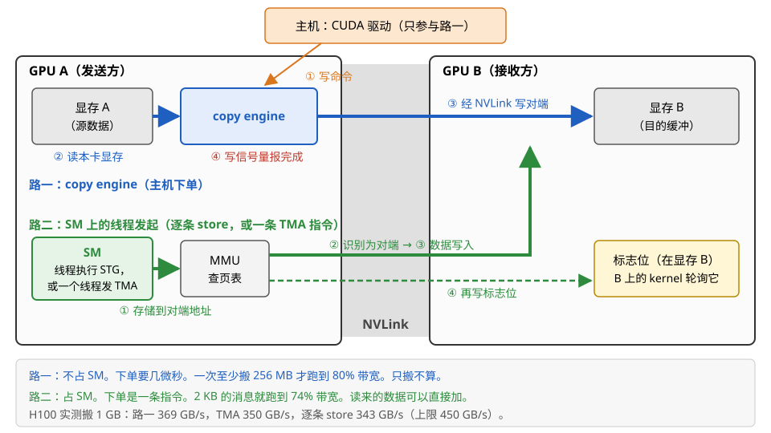
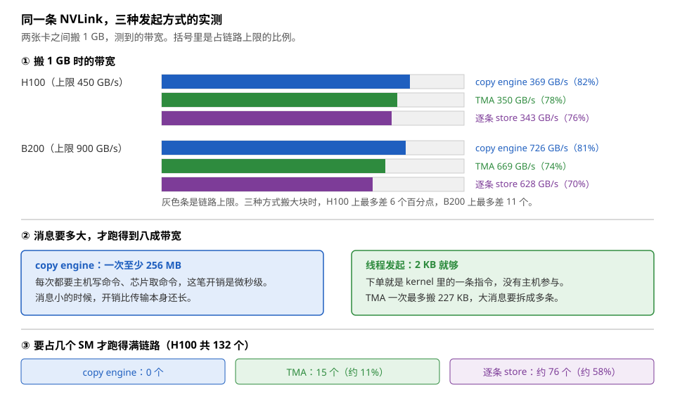
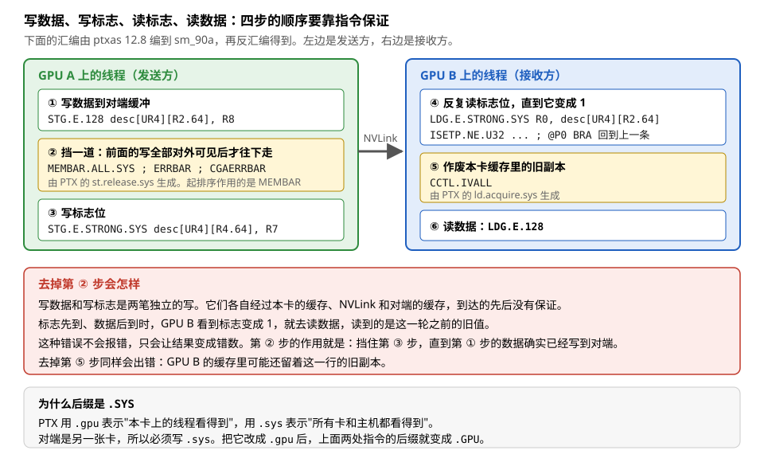
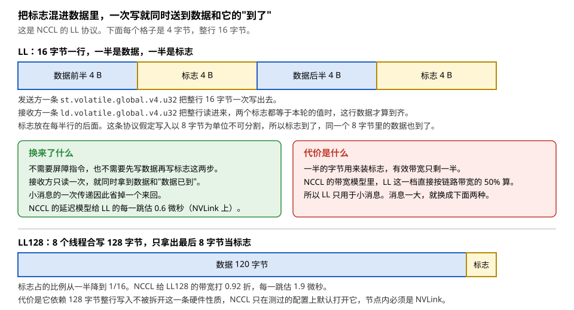
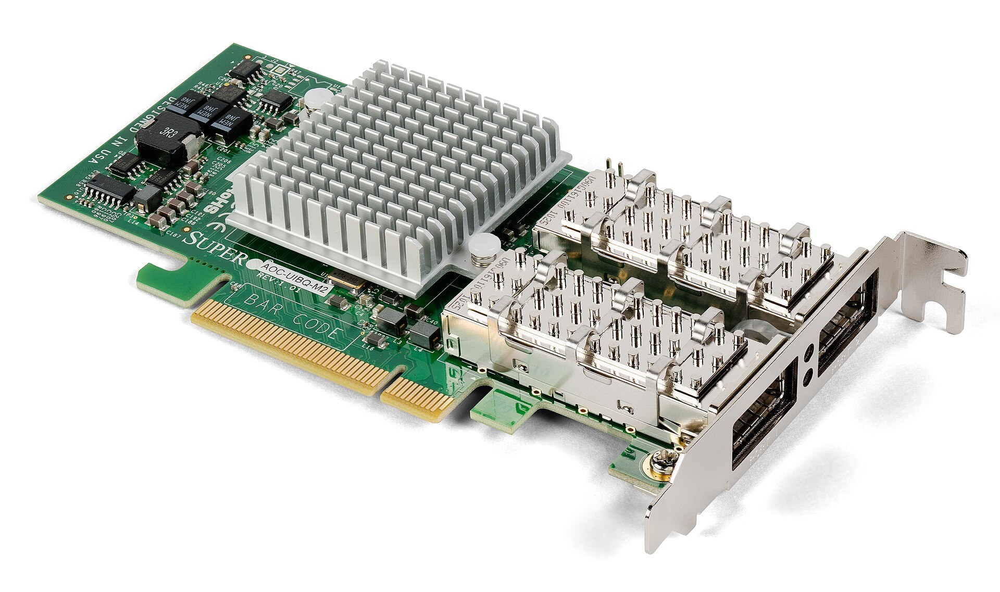
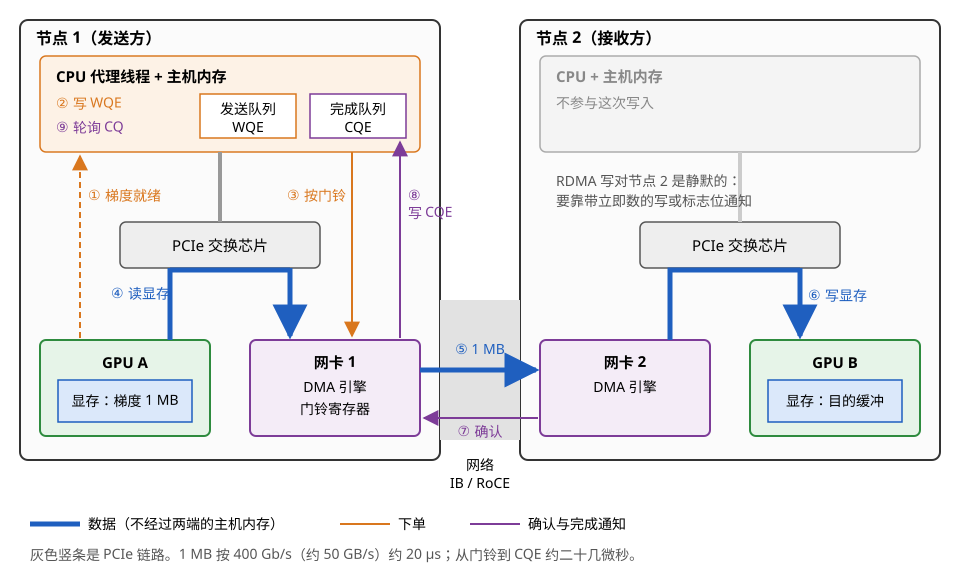
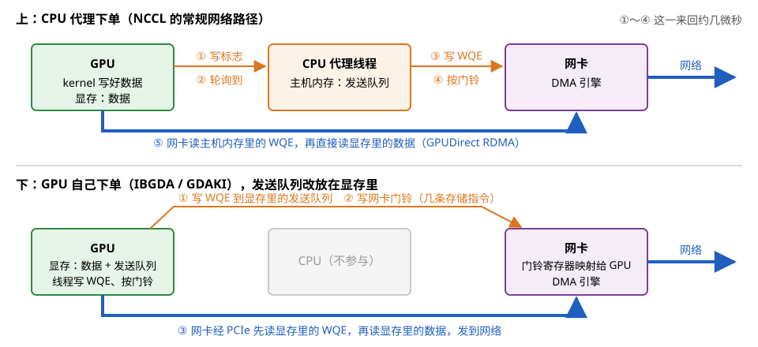
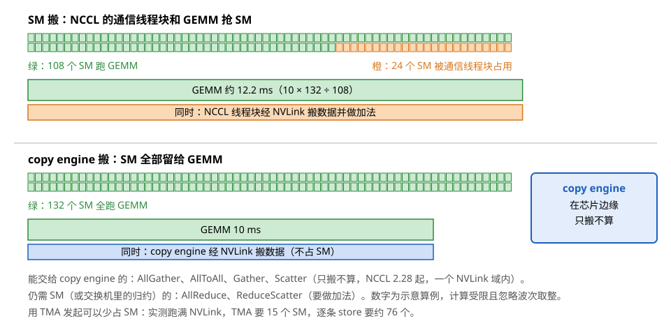
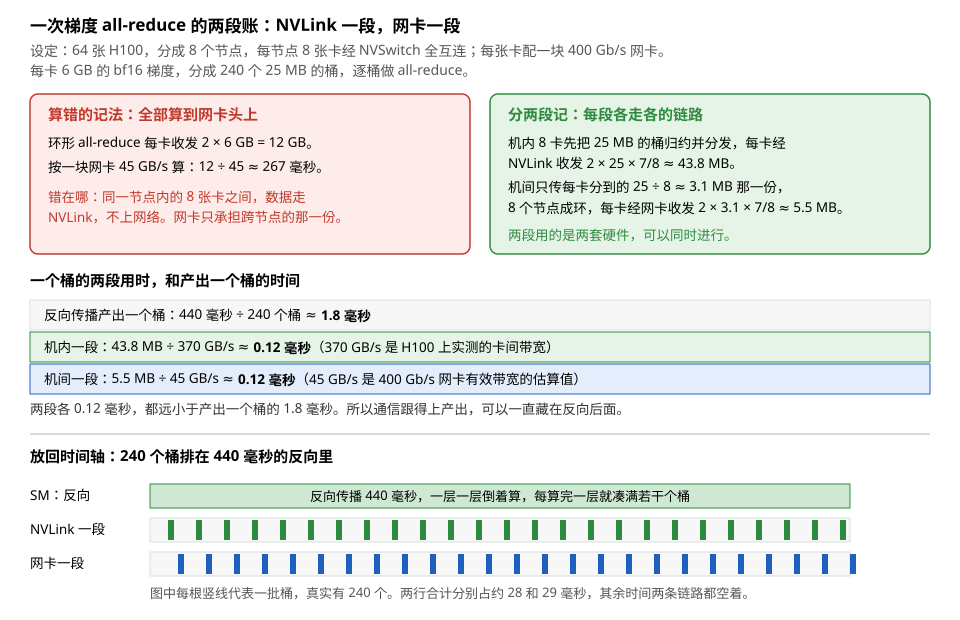

# 卡与卡、节点与节点：P2P、RDMA 与集合通信

> **所属模块**：模块 14 · 数据搬运（第三部分 · 片外的数据搬运）
> **状态**：🟨 学习中（2026-10 新写，同月审稿修订。知识截至 2026-09）
> **一句话主旨**：数据跨出一张卡以后，发起者有三个：主机驱动指挥 copy engine、SM 上的线程直接读写对端地址、网卡的 DMA 引擎。地址的来源也变了：卡间靠页表把对端显存映射进本卡的地址空间，节点间靠注册内存时拿到的总线地址和钥匙。最大的变化在第三个问题上：接收方这一侧没有硬件记录"数据已到"。卡间搬运时，程序在数据后面再写一个标志位，并用屏障指令保证两笔写的先后。节点间搬运时，网卡只向发起方的完成队列报告完成，接收方仍要靠带立即数的写或标志位得知。集合通信库的取舍，都建立在这三个答案上。

---

## 0. 这一节要回答的问题

上一节讲主机和设备之间的搬运：驱动在主机上下单，copy engine 跨过 PCIe 搬运，完成写成一个信号量，映射成 CUDA 的 event。本节往外再走一层：数据的目的地变成另一张卡，或者另一台机器。三个问题中，"谁发起"和"地址从哪来"都多了新的答案，"完成怎么知道"则换成了一套完全不同的机制。

- 一张卡怎么能直接读写另一张卡的显存？这个能力从哪来，走哪条链路？
- 卡间搬运有哪几种发法？它们的带宽、起步开销、占用的 SM 各是多少？
- 跨卡的完成怎么表达？为什么只写一个标志位不够，还要加一条屏障指令？
- 网卡怎么直接读写显存？一次 RDMA 写从下单到完成通知经过哪几步？
- 接收方怎么知道数据到了？为什么 Ampere 上要额外做一次"冲刷"，Hopper 上不用？
- 给网卡下单的可以是谁？让 GPU 自己下单能省多少？
- 集合通信库在"用 SM 搬"和"用 copy engine 搬"之间按什么取舍？
- 一次训练 step 里的梯度 all-reduce，到底有多少字节走 NVLink、多少字节走网卡？

---

## 1. 基础词汇

**卡、节点、显存**。一张加速卡上有一颗 GPU 芯片和它自己的显存。一个节点是一台物理机器，里面通常插 8 张卡。本节说"卡间"指同一个节点里两张卡之间，说"节点间"指两台机器之间。

**NVLink 与 NVSwitch**。NVLink 是 NVIDIA 自己的卡间链路，直接连在 GPU 芯片的边缘。H100 SXM 每颗芯片有 18 条第四代 NVLink，每条每个方向 25 GB/s，合计单向 450 GB/s、双向 900 GB/s。NVSwitch 是 NVLink 的交换芯片。一台 HGX H100 节点里有 4 颗 NVSwitch，每张卡的 18 条 NVLink 分别接到这 4 颗上。这样任意两张卡之间都能用上全部带宽，不用两两直连。节点内的 8 张卡因此构成一个**NVLink 域**：域里任何一张卡都能用一个地址直接读写域里其它卡的显存。

**P2P（peer-to-peer，对端访问）**。一张 GPU 直接读写另一张 GPU 显存的能力。程序调用 `cudaDeviceEnablePeerAccess(peer, 0)` 之后，驱动把对端的显存映射进本卡的页表。此后本卡发出的访问如果落在这段地址上，请求就经 NVLink 或 PCIe 送到对端，由对端的显存控制器完成。

**copy engine（拷贝引擎）**。GPU 芯片上位于 SM 阵列之外、靠近 PCIe 与 NVLink 接口的 DMA 硬件。它按主机下的命令搬运数据，只搬不算，完全不占用 SM。它的内部构造、下单通路和完成信号量是本模块第 9 节的内容，本节只用它的对外行为：主机下单、微秒级启动、搬完写一个信号量。

**标志位（flag）**。显存里一个约定用来表示"数据到了"的字（通常 4 或 8 字节）。发送方把数据写完以后再把它改成一个新值，接收方反复读它，读到新值就去用数据。本节会讲到：SM 直接写对端时，接收方得不到硬件的完成通知，只能用标志位表达。

**作用域（scope）**。PTX 给每条带同步语义的访存指令规定一个作用域，表示"这次操作的效果对哪些线程可见"。有四档：`.cta` 是同一个线程块，`.cluster` 是同一个线程块簇，`.gpu` 是本卡上的全部线程，`.sys` 是所有卡上的线程加上主机程序。跨卡写标志位时必须用 `.sys`。

**RDMA、QP、WQE 与 CQ**。RDMA（remote direct memory access，远程直接内存访问）让一台机器的网卡直接把数据写进另一台机器的内存，对方的 CPU 不参与。程序和网卡之间用队列交换请求。**QP**（queue pair，队列对）由一个发送队列和一个接收队列组成。程序往发送队列里放一个 **WQE**（work queue element，工作请求），内容是"把本地这段数据写到远端那个地址"。然后程序写一次网卡的**门铃寄存器**，网卡就来取 WQE。网卡做完之后，往**完成队列 CQ** 里写一个**完成项 CQE**，程序读 CQ 就知道做完了。

**GPUDirect RDMA**。让网卡经 PCIe 直接读写显存的一组机制。显存先要**注册**：驱动把这段显存固定住，在 GPU 的 BAR1 窗口里为它建立映射，网卡拿到这段显存在 PCIe 总线上的地址。BAR1 窗口是 GPU 在 PCIe 总线地址空间里开出的一段。别的设备往这段地址读写，请求就落进 GPU 的显存。注册以后，网卡读写这些总线地址就是在读写显存，数据不在主机内存里落地。

**集合通信与 all-reduce**。一组卡共同完成的数据交换叫集合通信。**all-reduce** 是其中最常用的一种：每张卡手上有一份同样形状的数据，操作结束后每张卡都拿到所有卡这份数据的总和。数据并行训练每一步都要对梯度做一次 all-reduce。NCCL 是 NVIDIA 的集合通信库，PyTorch 的 `dist.all_reduce` 底层就是它。

**桶（bucket）**。数据并行训练把梯度切成若干段，每段叫一个桶。反向传播算完一段就对这一段发起一次 all-reduce，不等整个反向结束。本节的例子用 25 MB 一个桶。

**本节沿用的运行例子**。模块 14 的统一例子是矩阵乘的 128 × 128 输出分块，沿 K 每次推进 64，A、B 各一个 128 × 64 的 bf16 分块，每块 16 KB。本节在讲卡间搬运的细粒度用法时，搬的就是这样一个 16 KB 的分块。讲集合通信时换成训练尺度的数字：64 张 H100，每卡 6 GB 的 bf16 梯度。

---

## 2. 卡间搬运的前提：对端显存进入本卡的地址空间

### 2.1 一条普通的存储指令就能写到对端

两张卡之间最朴素的传法是经主机内存中转：卡 A 先把数据拷到主机，卡 B 再从主机拷进来，一共过两次 PCIe。P2P 省掉了这个中转。它的前提只有一条：**本卡能用一个地址访问到对端的显存**。

这个前提由页表提供。程序调用 `cudaDeviceEnablePeerAccess` 后，驱动在本卡的页表里为对端显存建立一批条目。这些条目的翻译结果不指向本卡的显存控制器，而指向 NVLink 接口（两卡有 NVLink 直连或都挂在 NVSwitch 上时），或者指向对端的 BAR1 窗口在 PCIe 总线上的地址（只有 PCIe 相连时）。

有了这批页表条目，写对端在指令层面就没有任何特别之处。下面这段 kernel 把一个 16 KB 的分块写到对端：

```cpp
// peer_tile 是对端缓冲的指针，由主机在开启 peer access 后传进来
// 每个线程写 16 字节，128 个线程写 2 KB，循环 8 次写完 16 KB
__global__ void push_tile(uint4* __restrict__ peer_tile, const uint4* __restrict__ src) {
    int t = threadIdx.x;
    #pragma unroll
    for (int i = 0; i < 8; ++i) {
        peer_tile[i * 128 + t] = src[i * 128 + t];   // 编译成普通的 STG.E.128
    }
}
```

编译出来的就是一条普通的 `STG.E.128`（16 字节的全局存储指令），和写本卡显存用的是同一条指令。区别只在地址：GPU 的内存管理单元查页表，发现这个地址映射在对端，就把请求变成 NVLink 上的写包送过去。读也一样，`LDG` 一个对端地址，数据经 NVLink 返回。

**两张卡之间是什么链路，可以直接查。** `nvidia-smi topo -m` 打印一张矩阵：`NV18` 表示两卡之间有 18 条 NVLink，`PIX` 表示只隔一个 PCIe 交换芯片，`SYS` 表示要经过 CPU 之间的互连。`cudaDeviceCanAccessPeer` 则直接回答能不能开 P2P。

### 2.2 两个发起者，三种发法

对端显存进入地址空间之后，有两个发起者可以用它：主机和 SM 上的线程。SM 这一侧又分两种发法，所以一共三种。它们的差别不在能不能搬，而在起步开销、粒度和占用的资源上。

1. **主机下单，copy engine 搬。** 调用 `cudaMemcpyPeerAsync(dst, devB, src, devA, bytes, stream)`。驱动把拷贝命令写进本卡的一条拷贝通道，copy engine 读本卡显存、经 NVLink 写进对端显存，搬完写一个信号量。整条路上 SM 没有参与。
2. **SM 上的线程逐条读写。** 就是 §2.1 那段 kernel。每 16 字节要由某个线程发一条指令。
3. **SM 上的一个线程发一条 TMA 指令。** TMA 是 Hopper 起每个 SM 自带的搬运引擎，一条指令搬一整块，地址由引擎自己算。它的目的地址同样可以落在对端的映射上。下单只花一个线程的一条指令，搬运由引擎完成。

图 10-1 把前两类画在一张两卡示意图上。



> **图 10-1**　一句话：两张卡之间搬数据有两个发起者可选。主机下单给 copy engine，不占 SM，但要付几微秒的下单开销。让 SM 上的线程直接往对端地址写，不用回主机，还能边读边算，但要占用 SM。
>
> **先知道一件事**：开启对端访问以后，对端显存被映射进本卡的地址空间。本卡发出的一个地址如果落在这段范围里，GPU 的内存管理单元就把请求转到 NVLink 上，送去对端的显存。所以"写对端显存"在指令层面和"写本卡显存"是同一条指令，只是地址不同。
>
> **按这个顺序看**：
> 1. 左右两个大框是 GPU A 和 GPU B，中间粗灰带是 NVLink。每张卡里画了 SM、copy engine、内存管理单元和显存。
> 2. 看上方蓝色的路一：① 主机上的驱动把拷贝命令写进 GPU A 的命令队列。② GPU A 的 copy engine 读本卡显存。③ 经 NVLink 写进 GPU B 的显存。④ 写信号量报完成。整条路上 SM 没有参与。
> 3. 看下方绿色的路二：① GPU A 的某个 SM 上，线程执行一条存储指令，地址指向 B 的缓冲，或者一个线程发一条 TMA 指令。② 内存管理单元查页表，发现这是对端地址，把请求交给 NVLink。③ 数据写进 GPU B 的显存。④ 线程随后写一个标志位（也在 B 上），B 上的 kernel 看到标志位变了就知道数据到了。
> 4. 底部三行小字是代价对照。第三行是同一块卡上两条路的实测带宽，§2.3 给出出处。
>
> **打个比方**：给隔壁部门送文件，可以叫公司的收发室（copy engine）：填单、等他们来取，你自己接着干活。也可以自己走过去放到对方桌上（SM 直写）：不用等人，还能顺手把两份材料合成一份，但走这一趟的时间你自己的活就停了。
>
> **看懂的标志**：能回答"为什么 all-reduce 通常不交给 copy engine 做"。all-reduce 要把各卡的数据相加，copy engine 只会搬不会加。让 SM 读来对端的数据、加到本地再写出，搬和算一次完成。
>
> **与正文的对照**：路一对应 §2.2 的第 1 类，路二对应第 2、3 类。标志位同步是路二常见的做法，§3 讲它为什么还不够。
>
> 来源：本库自绘。

### 2.3 对照实验：同一个 1 GB 在三条路上的实测

Sul 等的 ParallelKittens 论文（arXiv:2511.13940，斯坦福）在 H100 和 B200 上测了这三条路：两张卡之间搬 1 GB，用上全部 SM，记录达到的带宽。结果见图 10-2。



> **图 10-2**　一句话：三种发起方式搬大块数据时带宽差不多，差别在起步条件上。copy engine 一次至少要搬 256 MB 才跑到八成带宽，但一个 SM 也不占。线程发起 2 KB 就够，代价是占用 SM。
>
> **先知道一件事**：这里比较的是带宽，也就是每秒搬多少字节。链路上限由 NVLink 的条数决定：H100 单向 450 GB/s，B200 单向 900 GB/s。谁也到不了 100%，因为链路上还要传地址和校验这些开销。
>
> **按这个顺序看**：
> 1. 第 ① 栏是搬 1 GB 时的带宽。每根彩色横条的长度是测到的带宽，背后的灰条是链路上限。三种方式都在链路上限的七成到八成出头之间。H100 上最快和最慢相差 6 个百分点，B200 上相差 11 个百分点。搬大块时，谁发起对带宽的影响在一成左右。
> 2. 第 ② 栏是起步条件。copy engine 每搬一次都要主机写命令、芯片取命令，这笔开销是微秒级的。消息小的时候开销比传输本身还长，所以要一次搬到 256 MB 才摊得开。线程发起的下单就是 kernel 里的一条指令，2 KB 的消息就能跑到七成多。
> 3. 第 ③ 栏是占用的 SM。copy engine 不占 SM。TMA 要 15 个 SM 才能把链路填满，因为一条指令就搬一大块，少量 SM 就能让足够多的数据同时在路上。逐条 store 要约 76 个 SM，是 TMA 的五倍，因为每 16 字节都要一条指令，而且这些指令是同步的，线程要等。
>
> **看懂的标志**：能回答"通信 kernel 为什么宁可用 TMA 发起，而不用普通的 store"。在 H100 上，两者的带宽只差 2 个百分点，但占用的 SM 差五倍。省下来的 61 个 SM 可以继续跑计算。
>
> **与正文的对照**：带宽、消息大小、SM 数都取自 ParallelKittens（arXiv:2511.13940）的表 1、图 2、图 3。表 1 的条件是用全部 SM 搬 1 GB。图 2、图 3 在 H100 上测得，2 KB 时 TMA 达到链路的 74%。TMA 一次最多搬 227 KB 是该文图 2 的说明。
>
> 来源：本库自绘（数据取自 arXiv:2511.13940）。

这组数字给出的结论，和模块 14 前几节的主线是同一条：**决定成本的不是传输本身，而是发起方式。** 三条路在同一条链路上跑，带宽最多差一成多：H100 上最快和最慢差 7%，B200 上差 13%。但起步的消息大小差了五个数量级（256 MB 对 2 KB），占用的 SM 从 0 个到约 76 个。

**判断用哪一条路，看两件事。** 第一，这次通信要不要做运算。要做加法，就只能用 SM，因为 copy engine 只会搬。第二，消息有多大、要不要跟计算重叠。几百 MB 的整块搬运（权重分发、流水并行里把激活传给下一段）交给 copy engine，SM 全部留给计算。按分块发的细粒度通信（all-reduce、MoE 的专家交换、和 GEMM 融合的通信）交给 SM，优先用 TMA 发起。

---

## 3. 跨卡的"完成怎么知道"：硬件不管，程序自己写标志位

### 3.1 本节对第三个问题的答案和前面几节不同

模块 14 前面几节的完成记录都在硬件里：`LDG` 的完成记在 warp 的记分牌计数器上，`cp.async` 的完成记在同一组计数器上，TMA 的完成按字节记在 shared memory 的 mbarrier 上。这些记录都有一个共同前提：**记录和等待发生在同一颗芯片上**。

跨卡以后这个前提没有了。GPU A 上的线程写了一笔数据到 GPU B 的显存，这笔写在 A 这边是一条普通的存储指令，A 的记分牌只知道"源寄存器已经被读走"，不知道数据有没有到 B。B 这边也没有任何记录：它的硬件里没有一个计数器记着"有一笔外来的写正在路上"。

所以答案只能由程序给出：**发送方在数据后面再写一个标志位，接收方反复读这个标志位。** 这是本节三个问题中变化最大的一个。

### 3.2 走查：两条指令之间必须有一道屏障

直觉上，发送方只要"先写数据，再写标志"就行了。实际不行。原因是这两笔写各自经过本卡的缓存、NVLink 和对端的缓存，到达的先后没有保证。标志先到、数据后到时，接收方会读到上一轮的旧数据，而且不会报任何错。

正确的写法要在两笔写之间加一道屏障。用 PTX 写出来是这样：

```
st.global.v4.u32 [%rd1], {%r1, %r2, %r3, %r4};   // ① 写数据到对端缓冲
st.release.sys.global.u32 [%rd2], 1;             // ②③ 先挡一道，再写标志位
```

接收方那一侧是对称的：

```
WAIT:
ld.acquire.sys.global.u32 %r1, [%rd2];           // ④⑤ 读标志位，顺带作废本卡的旧副本
setp.ne.u32 %p, %r1, 1;
@%p bra WAIT;
ld.global.v4.u32 {%r2, %r3, %r4, %r5}, [%rd1];   // ⑥ 读数据
```

把这两段用 CUDA 12.8 的 ptxas 编到 sm_90a，再用 `cuobjdump -sass` 反汇编，可以看到这两个修饰词各自变成了什么：

| PTX 写法 | 编译出的 SASS | 这条指令做什么 |
| --- | --- | --- |
| `st.global.v4.u32` | `STG.E.128 desc[UR4][R2.64], R8` | 写 16 字节数据 |
| `st.release.sys` | `MEMBAR.ALL.SYS` + `ERRBAR` + `CGAERRBAR` + `STG.E.STRONG.SYS` | 先等前面的写全部对外可见，再写标志位 |
| `ld.acquire.sys` | `LDG.E.STRONG.SYS` + `CCTL.IVALL` | 读标志位，然后作废本卡缓存里的旧副本 |
| `ld.global.v4.u32` | `LDG.E.128 desc[UR4][R2.64]` | 读 16 字节数据 |

一条 `st.release.sys` 编出了四条指令。**起排序作用的是 `MEMBAR.ALL.SYS`**：它挡住这个线程，直到它前面发出的全部写都已经对所有卡可见。中间的 `ERRBAR` 和 `CGAERRBAR` 是错误屏障，NVIDIA 没有公开它们的语义，本节不展开。`STG.E.STRONG.SYS` 把标志位本身写出去。按 PTX 内存模型，它是一次作用域为 `.sys` 的强写，所以它对其它卡上的线程可见，不会只停在本 SM 的 L1 里。接收方那一侧的 `CCTL.IVALL` 同理：它作废本卡 L1 里的全部数据行，这样接着读数据时一定去取新的，不会命中旧副本。

把作用域从 `.sys` 改成 `.gpu` 重新编译一遍，这两条指令会变成 `MEMBAR.ALL.GPU` 和 `LDG.E.STRONG.GPU`。**作用域直接决定了屏障要挡多远。** 对端是另一张卡，所以必须写 `.sys`。

图 10-3 把这六步和出错的情形画在一起。



> **图 10-3**　一句话：跨卡的"数据到了"由程序自己表达，做法是在数据后面写一个标志位。两笔写之间必须有一条屏障指令，否则标志可能比数据先到。
>
> **先知道一件事**：一笔写从发出到对端可见，中间要经过本卡的缓存、NVLink 和对端的缓存。两笔写各走各的，先发出的不一定先到。硬件不会替程序维持这个顺序，除非程序用指令要求它维持。
>
> **按这个顺序看**：
> 1. 左边绿框是发送方的三步。第 ① 步写数据，是一条普通的 16 字节存储指令。第 ② 步是黄色的屏障，它挡住这个线程，直到第 ① 步的写确实对外可见。第 ③ 步写标志位。
> 2. 中间的箭头表示这些写经 NVLink 送到对端。
> 3. 右边蓝框是接收方的三步。第 ④ 步反复读标志位，读到 1 之前一直循环。第 ⑤ 步作废本卡缓存里的旧副本。第 ⑥ 步读数据。
> 4. 每个框里的等宽字是真实的反汇编结果，由 ptxas 12.8 编到 sm_90a 得到。
> 5. 下方红框说明去掉第 ② 步会怎样：标志先到时，接收方读到的是上一轮的旧值，而且不会报错。
>
> **看懂的标志**：能回答"为什么作用域要写 `.sys` 而不是 `.gpu`"。`.gpu` 只保证本卡上的线程看得到，对端是另一张卡，不在这个范围内。把修饰词改成 `.gpu` 后，编出的指令后缀也跟着变成 `.GPU`，挡的距离就不够了。
>
> **与正文的对照**：表格里的四行对应图中的六步。`st.release.sys` 编出四条 SASS 指令，`ld.acquire.sys` 编出两条，图中把同一条 PTX 编出的指令画在同一个框里。
>
> 来源：本库自绘（SASS 由本机 ptxas 12.8 编译 sm_90a 后反汇编得到）。

### 3.3 一个改进：把标志混进数据里

上面那套写法有两处开销。一是屏障指令要等前面的写全部可见，这一等就是一次链路往返。二是数据和标志是两笔独立的传输，小消息时第二笔的固定开销占比很高。

NCCL 的 **LL 协议**（low latency，低延迟）用另一种办法绕开这两处开销：**把标志和数据放进同一行里，一条指令一起写出去。** 它的一行是 16 字节，布局在 NCCL 源码 `src/include/device.h` 的 `ncclLLFifoLine` 里写得很清楚：4 字节数据、4 字节标志、4 字节数据、4 字节标志。发送方用一条 `st.volatile.global.v4.u32` 把整行一次写出，接收方用一条 `ld.volatile.global.v4.u32` 把整行读进来，两个标志都等于本轮的值时，这 8 字节数据才算到齐。

这套办法成立，靠的是一条硬件性质：**写入以 8 字节为单位不可分割**。源码里的注释把这条前提写了出来。标志必须放在数据后面，因为网络可能先送到标志、后送到数据。IB 或 RDMA 的写入以 8 字节为原子单位，所以标志到了，同一个 8 字节里的那 4 字节数据也一定到了。

代价是一半的字节用来装标志。NCCL 的带宽模型里，LL 这一档直接按链路带宽的 50% 计算（`src/tuning/ring.cc`：`busBw = std::min(llMaxBw, busBw * .5)`）。所以 LL 只用在小消息上。

消息大一些时，NCCL 换成 **LL128**：8 个线程合写 128 字节，只拿出最后 8 字节当标志，开销从一半降到十六分之一。NCCL 对它的带宽打 0.92 折。源码注释把这个系数标为 120/128，但 120 ÷ 128 = 0.9375，所以 0.92 比纯标志开销再多扣了一点。LL128 依赖 128 字节整行写入不被拆开这条更强的性质。所以 NCCL 只在限定的拓扑上默认打开它。按当前源码 `src/tuning/cost_model.cc` 的 `isLL128Enabled`，有两个条件。第一，节点内两卡之间必须走 NVLink。第二，跨节点时网卡要和 GPU 挂在同一棵 PCIe 交换芯片树下，Hopper 起放宽到经相邻 GPU 转发的路径。NCCL 2.21 的源码注释写明了原因：其它情况没有测过，可能静默地损坏数据。



> **图 10-4**　一句话：把标志混进数据里，一次写就同时送到数据和"数据已到"这个消息。代价是一部分带宽用来装标志。
>
> **先知道一件事**：GPU 的一条向量存储指令可以一次写 16 字节。这 16 字节在链路上是一个整体，不会被拆成几段分头传输。LL 协议利用的就是这一点。
>
> **按这个顺序看**：
> 1. 最上面是 LL 的一行 16 字节。蓝格是数据，黄格是标志。标志放在每半行的后面，不放在前面。
> 2. 读下面三行说明，弄清这一行怎么写、怎么读、为什么标志要放在后面。
> 3. 中间左右两个框是这套做法换来了什么、代价是什么。换来的是省掉屏障和第二次传输，代价是带宽减半。
> 4. 最下面是 LL128 的一行 128 字节。标志只占最后 8 字节，所以带宽只损失十六分之一。
>
> **看懂的标志**：能回答"为什么 NCCL 不一直用 LL128，而要保留 LL"。LL128 每行要凑够 128 字节，8 个线程才写满一行；消息非常小的时候凑不满，而且它依赖更强的硬件性质。NCCL 的延迟模型里，LL 在 NVLink 上每跳 0.6 微秒，LL128 每跳 1.9 微秒。
>
> **与正文的对照**：16 字节的布局取自 NCCL 源码 `src/include/device.h` 的 `ncclLLFifoLine`。128 取自同一文件的 `NCCL_LL128_LINESIZE`。120 由 `NCCL_LL128_DATAELEMS` 算出：它是 15 个 8 字节元素，即 120 字节。0.5 与 0.92 两个系数取自 `src/tuning/ring.cc`，每跳延迟取自 NCCL 2.21 的 `src/graph/tuning.cc` 中的 `hwLat` 表。
>
> 来源：本库自绘。

### 3.4 读对端还是写对端

还有一个容易忽略的选择：搬运由发送方"推"，还是由接收方"拉"。两种都能用，因为页表映射是双向建立的。

默认是**写对端**，原因是写不用等。一条写指令发出去，线程不需要等待任何返回，接着做别的事。读对端则要等数据经 NVLink 返回，这段时间线程挂起。

NCCL 的源码里能看到这个选择的条件。在 `src/graph/paths.cc` 里，NCCL 先判断两卡之间是不是 NVLink 路径。如果是，并且两张卡的计算能力相同、都等于 8.0，才把 P2P 模式设成"读"。注释写着 "Enable P2P Read for Ampere/NVLink only"。计算能力 8.0 是 A100，其它 Ampere 芯片（8.6 等）不满足这个条件。也就是说，**只有两张 A100 经 NVLink 相连时 NCCL 才拉，其它情况都推**。环境变量 `NCCL_P2P_READ_ENABLE` 可以覆盖这个判断。

---

## 4. 节点间：网卡作为发起者

跨出机器以后，前面三个发起者都用不上了：对端的显存不在本卡的页表里，NVLink 也到不了那台机器。搬运的主角换成一个独立的设备，也就是网卡。它挂在 PCIe 上，有自己的处理芯片和 DMA 引擎。



> **图 10-5**　一句话：这是一块 InfiniBand 网卡。它是一块插在 PCIe 插槽上的独立设备，自带 DMA 引擎，能自己去读写主机内存或显存，再把数据发到网线上。
>
> **先知道一件事**：网卡和 GPU 一样挂在 PCIe 上，是一个独立的设备。CPU 或 GPU 只要把"做什么"写进它的队列、再写一次它的门铃寄存器，后面的读数据、打包、发送、确认，全由网卡自己完成。
>
> **按这个顺序看**：
> 1. 先看照片左下部那排金色的平行触点，它在电路板的下缘、偏左的位置。这是金手指，插进主板的 PCIe 插槽。这块卡是 PCIe 2.0 x8 的，今天的 400 Gb/s 网卡用 PCIe 5.0 x16。
> 2. 再看中间那块带密集散热齿的铝块。它下面是网卡芯片（这一块是 ConnectX-2）。收发队列的处理、RDMA 协议、DMA 引擎都在这颗芯片里。
> 3. 左上角的黑色方块和周围的小元件是供电电路，给芯片提供所需的电压。
> 4. 最后看右侧两个银色的金属笼子。这是两个 QSFP 接口，从最右边的金属挡板伸出机箱，接光模块或铜缆，通向交换机。两个接口表示这是一块双端口卡。
>
> **看懂的标志**：能回答"GPUDirect RDMA 里真正搬数据的是谁"。是这块卡上的 DMA 引擎。它经 PCIe 直接读 GPU 的显存，CPU 和 GPU 的 SM 都不参与数据本身的搬运。
>
> **与正文的对照**：照片是一块较老的双端口卡，每端口的信令速率 40 Gb/s（这是编码前的数字，去掉编码开销后的数据率更低）。今天 GPU 服务器里常见的是每张卡配一块 400 Gb/s 的单端口网卡，形态和工作方式相同，只是更快。
>
> 来源：[Supermicro AOC-UIBQ-M2 dual port InfiniBand HCA.jpg](https://commons.wikimedia.org/wiki/File:Supermicro_AOC-UIBQ-M2_dual_port_InfiniBand_HCA.jpg)，作者 Dmitry Nosachev，许可 CC BY-SA 4.0。

### 4.1 注册内存：让网卡拿到显存的总线地址

网卡要读写一段显存，先得知道这段显存在 PCIe 总线上的地址，而且这段地址在使用期间不能变。这一步叫**注册内存**：

1. 程序用 `cudaMalloc` 分配显存缓冲，得到一个 GPU 虚拟地址。
2. 程序调用 RDMA 接口 `ibv_reg_mr(pd, buf, len, 权限)`。网卡驱动发现这是一个 GPU 地址，通过内核模块 `nvidia-peermem` 调用 `nvidia_p2p_get_pages()`。NVIDIA 驱动把这段显存固定住，并在 GPU 的 BAR1 窗口里为它建立映射，按 64 KB 一页返回一组总线地址。新一些的系统也可以走 Linux 的 dma-buf 接口（`ibv_reg_dmabuf_mr`），效果相同。
3. 网卡驱动把这组总线地址写进网卡的地址翻译表，返回两把钥匙：本地钥匙 `lkey`（本机用这段内存时出示）和远端钥匙 `rkey`（别的机器往这里写时出示）。
4. 接收方把自己缓冲的地址和 `rkey` 通过普通通信告诉发送方，通常在建连握手时一次做完。

**这一步回答了本节的第二个问题：节点间的地址从哪来。** 卡间靠页表映射，节点间靠这组总线地址加上两把钥匙。

NVIDIA 的 GPUDirect RDMA 文档对这一步强调了两件事。第一，固定显存是昂贵操作，延迟到毫秒量级，所以要注册一次、反复使用，不要每次通信都注册。第二，网卡和 GPU 最好挂在同一个 PCIe 交换芯片下。如果两者之间要经过 CPU 内部的 PCIe 根节点，性能变差。如果要跨 CPU 之间的互连，文档的说法是性能可能极差，甚至不能可靠工作。

### 4.2 走查：一次 1 MB 的 RDMA 写

设节点 1 的 GPU A 要把 1 MB 梯度写进节点 2 的 GPU B。两边都已注册好缓冲，建立了一对可靠连接的队列对。可靠连接的意思是包按发出顺序到达，丢了由网卡重传。网卡是 400 Gb/s，标称约 50 GB/s。发起者是节点 1 上的一个 CPU 线程，NCCL 里把它叫代理线程。

1. **数据就绪。** GPU A 上的 kernel 把梯度写进注册过的缓冲，并写一个标志位。代理线程看到标志位变了才能下单，否则网卡可能读到只写了一半的数据。
2. **写 WQE。** 代理线程在主机内存的发送队列里写一个工作请求：操作码 `RDMA_WRITE`，本地地址加 `lkey`，远端地址加 `rkey`，长度 1 MB。
3. **按门铃。** 代理线程往网卡的门铃寄存器写一次。这是一次几字节的写，不进操作系统内核，耗时几百纳秒。
4. **网卡取 WQE。** 网卡经 PCIe 把这个工作请求读进来。
5. **网卡读显存。** 网卡按本地地址查自己的翻译表，得到 GPU A 的 BAR1 总线地址，向它发 PCIe 读请求。请求经 PCIe 交换芯片到达 GPU A，GPU 从显存里取出数据返回。CPU、主机内存、GPU 的 SM 都不参与。
6. **上线。** 网卡把数据切成网络包发出。1 MB 按标称 50 GB/s 约 20 微秒。
7. **对端网卡写显存。** 节点 2 的网卡收到包，核对 `rkey`，按远端地址查到 GPU B 的 BAR1 总线地址，发 PCIe 写请求，数据落进 GPU B 的显存。节点 2 的 CPU 全程不知道这件事。这就是"单边操作"的意思。
8. **确认。** 节点 2 的网卡回一个确认包。
9. **完成通知。** 节点 1 的网卡收到确认后，往完成队列里写一个 CQE。代理线程轮询到它，才知道发送缓冲可以被覆盖。

从按门铃到看见 CQE，1 MB 大约二十几微秒：传输本身 20 微秒，加上两端 PCIe 和网络往返的几微秒。



> **图 10-6**　一句话：一次 RDMA 写里，数据从 GPU A 的显存经 PCIe 交换芯片直接进网卡、过网络、再直接写进 GPU B 的显存。两端的主机内存都不经手，CPU 只负责下单和查看完成队列。
>
> **先知道一件事**：PCIe 交换芯片是一个路口。挂在它下面的设备（这里是 GPU 和网卡）可以直接互相读写，不必绕到 CPU。GPU 通过 BAR1 窗口把一段显存暴露在 PCIe 总线上，网卡读写这个窗口里的地址，就是在读写显存。
>
> **按这个顺序看**：
> 1. 左边是节点 1，右边是节点 2。每个节点里从上到下是 CPU 与主机内存、PCIe 交换芯片、并排的 GPU 和网卡。
> 2. 节点 1 里的橙色编号是下单：① GPU A 的梯度写好，虚线箭头表示 CPU 得知这件事；② CPU 代理线程在主机内存的发送队列里写工作请求；③ 写网卡的门铃寄存器。
> 3. 蓝色粗线是数据本身：④ 网卡经交换芯片读 GPU A 显存；⑤ 经网络送到节点 2 的网卡；⑥ 节点 2 的网卡经它的交换芯片写进 GPU B 显存。两个节点的主机内存都没有蓝线经过。
> 4. 回程的紫色细线是确认与完成通知：⑦ 节点 2 的网卡回确认；⑧ 节点 1 的网卡往完成队列写完成项；⑨ 代理线程轮询到它。
> 5. 节点 2 中部的灰字是一句提醒：这次写对节点 2 是静默的，节点 2 的 CPU 完全不参与。接收方怎么知道数据到了，是 §4.3 的内容。
>
> **打个比方**：你在手机上下单（写工作请求）并点确认（按门铃），快递员（网卡）直接到你家仓库（GPU A 显存）取货，送到对方仓库（GPU B 显存）里放好，你的手机上随后出现"已签收"（完成项）。对方家里没人签字，所以要另外给对方发个消息说货到了。
>
> **看懂的标志**：能回答"GPUDirect RDMA 省掉的是哪一段"。省掉的是数据在两端主机内存里的落地。没有它时，数据要先从 GPU A 拷到节点 1 的主机内存，网卡再从那里读；到节点 2 后先写进主机内存，再拷进 GPU B。两端各多一次 PCIe 往返和一次主机内存读写。
>
> **与正文的对照**：①～⑨ 对应 §4.2 的九步。1 MB、50 GB/s、约 20 微秒是 §4.2 的算例数字。
>
> 来源：本库自绘。

### 4.3 接收方怎么知道数据到了

第 7 步的 RDMA 写是静默的：数据写进了 GPU B 的显存，节点 2 上没有任何程序得到通知。常见的通知办法有两种。

**办法一：带立即数的写。** 操作码换成 `RDMA_WRITE_WITH_IMM`，写里附带一个 32 位的立即数。这种写会消耗接收方预先放好的一个接收请求，并在接收方的完成队列里生成一个完成项。接收方的代理线程轮询到它，再通知 GPU。NCCL 的 InfiniBand 传输就这样做：一次发送拆成若干个工作请求，前面的用 `IBV_WR_RDMA_WRITE`，最后一个用 `IBV_WR_RDMA_WRITE_WITH_IMM`，立即数里带上这次发送的大小或请求编号（`src/transport/net_ib/p2p.cc`）。

**办法二：数据后面再写一个标志位。** 和 §3.2 卡间的做法同构：发送方在数据之后再发一次小的 RDMA 写，写进 GPU B 上的一个标志位，GPU B 上的 kernel 轮询这个标志。

两种办法都还差一步。网卡已经把数据的 PCIe 写发出去了，不等于 GPU 上的线程马上就能读到。NVIDIA 的 GPUDirect RDMA 文档对这件事的说法很直接：一个正在运行的 kernel 和同时进行的 RDMA 写之间完全没有一致性。kernel 在这时去读被网卡覆盖的内存，属于数据竞争，可能读到旧数据或只写了一半的数据。

NCCL 的办法是在用数据之前做一次**冲刷**：让本机的网卡对刚刚写入的那段显存发一次 RDMA 读。源码里这个操作叫 `ncclIbIflush`，用的是一个连到自己的回环 QP，操作码是 `IBV_WR_RDMA_READ`（`src/transport/net_ib/p2p.cc`）。它利用 PCIe 的一条排序规则：一次读不能越过它之前的写。读返回了，就说明前面的写都已经落地。

**什么时候需要这一步，和代际有关。** NCCL 的拓扑判断写在 `src/graph/paths.cc` 的 `ncclTopoNeedFlush` 里：GPU 的计算能力大于等于 90 时，默认不需要冲刷；Ampere 及更早的卡需要。注释写的就是 "Flush is required on Ampere and earlier"。Hopper 起还留了一个例外。如果网卡与 GPU 挂在同一棵 PCIe 交换芯片树下，而 GPU 与 CPU 之间是 C2C 连接，NCCL 仍然冲刷。源码注释给出的原因是：控制路径走 C2C，数据路径走 PCIe。

这个例外和主结论的关系如下。主结论是"计算能力 9.0 及以上的卡不必冲刷"。GPU 经 C2C 连 CPU 的平台（例如 Grace Hopper）也是 9.0 及以上，却仍要冲刷，所以看起来是例外。它实际的情况是：完成通知和标志位经 C2C 送到 GPU，数据经 PCIe 送到 GPU，两条路之间没有先后保证，所以通知可能比数据先到。结论是：按源码注释推断，免冲刷除了代际，还要求数据和通知走同一条有序的路径。C2C 平台不满足后一个条件，所以它是按代际划分这条规则的真例外，并不说明 Hopper 的硬件保证失效。

---

## 5. 谁给网卡下单：CPU 代理，还是 GPU 自己

### 5.1 代理线程夹在中间要花几微秒

§4.2 的第 1 到第 3 步里，CPU 代理线程夹在 GPU 和网卡之间：GPU 算完、写标志；CPU 轮询到标志、写工作请求、按门铃。这一来一回要几微秒。

对大消息这点开销可以忽略：1 MB 本身要传 20 微秒。对 MoE 的专家交换这类通信就不行了。MoE（mixture of experts，混合专家）把每一层的全连接拆成多个专家，分布在不同的卡上，每个 token 只送给其中一两个专家。所以每一层都要做一次全体对全体的交换，每次只有几 KB 到几百 KB，固定开销比传输还长。而且 CPU 代理线程为了尽快发现标志变化，要一直忙着轮询，每个进程因此占满一个 CPU 核。

### 5.2 把下单也交给 GPU

**IBGDA**（InfiniBand GPUDirect Async）把下单这件事也交给 GPU。关键的改动有两处：

- **发送队列和门铃记录缓冲改放在显存里。** 这样 GPU 上的线程写工作请求就是一次普通的显存写。
- **网卡的门铃寄存器映射进 GPU 能访问的地址。** 这样 GPU 线程可以直接写门铃。

此后 GPU 线程用几条存储指令就完成下单，CPU 完全不在这条路上。数据本身仍然由网卡的 DMA 引擎经 GPUDirect RDMA 从显存读走，SM 不搬数据。

NVIDIA 在 NVSHMEM 上公布了一组测量，平台是 4 台 DGX-A100，网卡是 ConnectX-6 200 Gb/s。小于 1 KiB 的块写操作，吞吐最多提高到 9.5 倍。逐个标量的写操作，从每秒约 170 万次提高到最多每秒 1.8 亿次。

### 5.3 走查：同一次发送，两条路各走几步

按 NVIDIA 对 NVSHMEM 两种传输的公开描述，把两条路的步骤逐条列出来对照。做的是同一件事：GPU 上的 kernel 算出一块数据，要把它发到远端。

| 步 | CPU 代理（`ibrc`） | GPU 自己下单（IBGDA） |
| --- | --- | --- |
| 1 | kernel 把数据写进显存 | kernel 把数据写进显存 |
| 2 | kernel 把一条描述写进主机内存里的代理缓冲 | SM 把工作请求写进**显存**里的发送队列 |
| 3 | 代理线程轮询到这条描述 | SM 更新**显存**里的门铃记录缓冲 |
| 4 | CPU 把工作请求写进主机内存里的发送队列 | SM 写网卡的门铃寄存器 |
| 5 | CPU 更新主机内存里的门铃记录缓冲 | 网卡经 PCIe 读显存里的工作请求 |
| 6 | CPU 写网卡的门铃寄存器 | 网卡经 PCIe 读显存里的数据 |
| 7 | 网卡读工作请求，再经 PCIe 读显存里的数据 | 网卡发到网络 |
| 8 | 网卡发到网络 | 网卡把完成项写进**显存**里的完成队列 |
| 9 | 网卡把完成项写进主机内存里的完成队列 | — |
| 10 | CPU 轮询完成队列，再通知 GPU | — |

两条路的差别集中在第 2 到第 4 步，以及最后的完成通知。左边这一列里，每一次交接都要跨一次 PCIe，而且中间夹着一个轮询的 CPU 线程。右边这一列把队列全部搬进显存，SM 写完工作请求直接写门铃，一次交接也不用等 CPU。数据本身的路径两条完全相同。

**这条路不是默认路径。** NVSHMEM 的远程传输默认仍是 `ibrc`，也就是 CPU 代理那条；IBGDA 要显式设 `NVSHMEM_IB_ENABLE_IBGDA=1` 打开。NCCL 2.28 也加入了 GPU 发起的网络传输，叫 GIN（GPU-initiated networking），kernel 可以直接把传输、信号和同步步骤排进网卡的队列。



> **图 10-7**　一句话：跨节点传输时，给网卡下单的可以是 CPU 上的代理线程，也可以是 GPU 上的线程自己。后者省掉了 GPU 通知 CPU、CPU 再通知网卡这一来回。
>
> **先知道一件事**：给网卡下单只需要两步：在它的发送队列里写一条工作请求，再写一次它的门铃寄存器。所以谁能访问这两块地址，谁就能下单。
>
> **按这个顺序看**：
> 1. 上面一行是 CPU 代理。① GPU 的 kernel 写好数据后写一个标志位。② CPU 代理线程一直在轮询这个标志，看到后③ 在主机内存的发送队列里写工作请求，④ 再写网卡门铃。⑤ 网卡读工作请求、读显存、发送。①～④ 这一来回要几微秒。
> 2. 下面一行是 GPU 自己下单。发送队列改放在显存里，门铃寄存器映射给 GPU。① GPU 线程写工作请求到显存，② 直接写网卡门铃，③ 网卡经 PCIe 先读显存里的工作请求，再读显存里的数据，发到网络。中间没有 CPU。
> 3. 两行右端相同：数据本身都由网卡的 DMA 引擎直接从显存读出，SM 不搬数据。
>
> **看懂的标志**：能回答"GPU 自己下单占不占 SM"。下单的那几条存储指令要由 SM 上的线程执行，所以占一点。但搬数据本身仍是网卡做的，比起让 SM 搬几 MB 数据，这点开销可以忽略。
>
> **与正文的对照**：上行对应 §4.2 的第 1～3 步，下行对应 §5.2。发送队列和门铃记录放在显存、门铃寄存器映射给 GPU，这两点依据 NVIDIA 关于 NVSHMEM 与 GPUDirect Async 的技术博客。
>
> 来源：本库自绘。

---

## 6. 集合通信库的取舍

前面讲的是单向的点对点搬运。实际训练里用的是集合通信：一组卡按一个固定的模式交换数据。集合通信库要在前面几条路之间做选择，取舍集中在三件事上。

### 6.1 第一件：通信要不要占 SM

NCCL 的传统实现走的是"SM 直接读写对端"这条路：每次集合操作启动一个 kernel，每个通道用一个线程块，线程块里的线程经 NVLink 直接读写对端的缓冲，边搬边做归约。这里的**通道**是 NCCL 自己的概念：它把一次集合操作拆成若干条独立的数据环，每条环叫一个通道，各自占一个线程块。通道越多，同时在路上的数据越多，占的 SM 也越多。延迟低、能做加法，代价是**通信期间占着一部分 SM**。

**算例：通信 kernel 占 SM 要付多少。** 一块 H100 有 132 个 SM。设一次 all-reduce 用了 24 个通道，也就是 24 个线程块，每个 SM 放一个。反向传播里的一个 GEMM 如果独占全部 SM 要 10 毫秒，和这次 all-reduce 重叠时只剩 108 个 SM。设它的用时与可用的 SM 数成反比，那么它的用时变成 10 × 132 ÷ 108 ≈ **12.2 毫秒**，慢了约 22%。这就是"通信和计算重叠了，计算反而变慢"的一个来源。另一个来源是两者抢显存带宽。

**不需要做加法的集合操作可以交给 copy engine。** all-gather、all-to-all、gather、scatter 都只搬不算。NCCL 2.28 起支持这种做法，叫**零线程块**（zero-CTA）：在一个 NVLink 域内，用 copy engine 驱动 NVLink 传输来完成这四种操作。按 NCCL 文档，启用条件有三条：

1. CUDA 驱动版本不低于 12.5。
2. 缓冲用 NCCL 的窗口接口 `ncclCommWindowRegister` 做对称注册，也就是通信组里每个进程传入的偏移必须相同。
3. 通信器配置里设 `NCCL_CTA_POLICY_ZERO`。

NCCL 2.30.6 起，all-to-all 和 all-gather 可以跨节点做零线程块，节点内用 copy engine，节点间由 CPU 代理驱动网卡。

NVIDIA 的技术博客给出了一组实测，平台是单节点 8 卡 Blackwell，操作是 4 GB 的 all-gather。copy engine 加多播的方式约 780 GB/s，基于 SM 的非对称方式约 620 GB/s。



> **图 10-8**　一句话：集合通信用 SM 搬时要占去一部分 SM，和它重叠的计算会变慢。用 copy engine 搬时 SM 全部留给计算，但这只适用于不需要做加法的集合操作。
>
> **先知道一件事**：GPU 的计算能力按 SM 分配。一个线程块占住一个 SM 的部分资源，直到它结束。通信 kernel 的线程块和计算 kernel 的线程块抢的是同一批 SM。
>
> **按这个顺序看**：
> 1. 上半部分是用 SM 搬。两排共 132 个小方格代表 132 个 SM。右端 24 个橙色方格被通信线程块占着，其余 108 个绿色方格留给 GEMM。下面的绿条显示 GEMM 从 10 毫秒拉长到约 12.2 毫秒，橙条表示同一时间里通信线程块在经 NVLink 搬数据并做加法。
> 2. 下半部分是用 copy engine 搬。132 个方格全是绿色。通信画在芯片边缘单独的蓝色方框里，经 NVLink 进出。GEMM 保持 10 毫秒。
> 3. 底部三行注释说明：哪些操作能交给 copy engine，哪些不能，以及用 TMA 发起时少占多少 SM。
>
> **打个比方**：一个车间有 132 台机床。让工人抽空搬料，就要停下 24 台机床。外包给物流公司搬，机床都能开着，但物流公司只管搬，不管组装。
>
> **看懂的标志**：能回答"把一次 all-gather 从 SM 方式换成 copy engine 方式，一定会变快吗"。通信本身不一定更快，小消息时下单开销反而更大。确定的收益是 SM 不再被占，与它重叠的计算变快。
>
> **与正文的对照**：24 个线程块、10 毫秒、12.2 毫秒来自 §6.1 的算例，是示意数字。15 个和 76 个 SM 来自图 10-2 的实测。
>
> 来源：本库自绘。

### 6.2 第二件：归约由谁来算

copy engine 只搬不算，所以 all-reduce 和 reduce-scatter 做不了零线程块。加法只有两个地方能做。

一是 **SM**：线程从对端读来一块，加到本地那一块上，再写出去。搬和算一次完成。

二是 **NVSwitch**。Hopper 一代的 NVSwitch 里有归约单元，可以把多张卡发来的同一个地址的数据在交换机里加起来，这套机制叫 NVLink SHARP。

用它要先建立一个**多播地址**：一组卡各拿出一块同样大小的缓冲，驱动把它们绑成一组，再给这一组发一个特殊的地址。写这个地址，数据同时落到组里每一张卡的那块缓冲上；读这个地址，交换机把组里每一张卡那个位置的数据取出来、加好再返回。PTX 用 `multimem` 指令族表达这两件事：`multimem.st` 写多播地址，`multimem.ld_reduce` 读并归约。这组指令在 PTX ISA 8.1 引入，要求 sm_90 以上。好处是一张卡只发一份数据、只收一份结果，SM 上要跑的指令少得多。

### 6.3 第三件：消息小到什么程度要换协议

小消息时，决定耗时的不是带宽而是固定延迟。NCCL 的延迟模型把这笔账摊开来算：总时间 ≈ 每跳延迟 × 跳数 + 字节数 ÷ 有效带宽。环形 all-reduce 要走 2(N−1) 跳，N 是卡数。

NCCL 2.21 的 `src/graph/tuning.cc` 里有一张写死的延迟表，可以看到每跳的估值差多少：

| 协议 | NVLink 上每跳 | 经网络每跳 | 带宽折扣 |
| --- | --- | --- | --- |
| LL | 0.6 微秒 | 2.7 微秒 | 按 50% 算 |
| LL128 | 1.9 微秒 | 4.0 微秒 | 按 92% 算 |
| Simple | 3.4 微秒 | 14.0 微秒 | 不打折 |

Simple 协议就是 §3.2 那套"写数据、加屏障、写标志"的做法，每跳最贵但不浪费带宽。

**算例：8 张卡的环形 all-reduce，LL 和 Simple 在哪里交叉。** 取 N = 8，跳数 2 × 7 = 14。NCCL 的带宽模型按通道数折算，这里简化成图 10-2 的实测卡间带宽 370 GB/s，LL 那一档按它的一半算。按环形算法，每卡实际要传的字节是 2S × 7/8。

| 消息 S | LL：14 × 0.6 + 2S×7/8 ÷ 185 GB/s | Simple：14 × 3.4 + 2S×7/8 ÷ 370 GB/s |
| --- | --- | --- |
| 256 KB | 8.4 + 2.4 = **10.8 微秒** | 47.6 + 1.2 = 48.8 微秒 |
| 4 MB | 8.4 + 37.8 = **46.2 微秒** | 47.6 + 18.9 = 66.5 微秒 |
| 64 MB | 8.4 + 605 = 613 微秒 | 47.6 + 302 = **350 微秒**（更快的那一档加粗） |

256 KB 时 LL 快四倍多，因为这时几乎全是延迟。64 MB 时 Simple 的用时只有 LL 的 57%，因为这时几乎全是传输，而 LL 的带宽只有一半。令两式相等解出交叉点，约在 8 MB。NCCL 每次集合操作都把这几档代进上面的公式，选算出来最快的那一档。表中省略了每一档还要加的固定起步延迟（LL 6.6 微秒、Simple 8.4 微秒），加上它不改变结论。

### 6.4 判断顺序

把这三件事串起来，选路的判断可以写成三问：

1. 这次通信要不要做运算？要，就只能用 SM，或者用 `multimem` 交给交换机。
2. 消息大不大、能不能等几微秒的下单？小而急，用 SM 发起，优先用 TMA。
3. 和它重叠的计算是不是受 SM 数量限制？是，那么把纯搬运的操作换成 copy engine 能省下 SM，值得试。

---

## 7. 走查：一次训练 step 的梯度到底走了哪些链路

把前面的机制放进一个具体的训练任务里，顺便算清一笔容易算错的账。

**设定**（数字为算例假设）：30 亿参数的稠密 Transformer，纯数据并行，也就是每张卡放一份完整的模型、各自算不同的数据，每步再把梯度求和。8 个节点 × 每节点 8 张 H100 SXM，共 64 卡。节点内 8 卡经 NVSwitch 全互连。每张卡配一块 400 Gb/s 网卡，与 GPU 挂在同一个 PCIe 交换芯片下，按轨道组网，也就是各节点上编号相同的卡接到同一台叶交换机。bf16 混合精度，梯度 6 GB，分成 240 个 25 MB 的桶。反向传播约 440 毫秒。

### 7.1 一个容易算错的大账

直觉的算法是这样。环形 all-reduce 每卡要收发 2S 的数据，S = 6 GB，所以每卡收发 12 GB。一块网卡的有效带宽约 45 GB/s，所以 12 ÷ 45 ≈ 267 毫秒。

**这个数高估了约九倍。** 错在把全部 12 GB 都算到网卡头上。下面按分层的做法来算账：

- **节点内这一层走 NVLink。** 节点里 8 张卡先把这个桶做一次 **reduce-scatter**。reduce-scatter 的意思是：把数据切成卡数那么多块，每张卡负责其中一块，操作结束后这张卡手上的那一块是全部 8 张卡这一块的和。所以每张卡最后持有这个桶的八分之一，而且是 8 张卡的和。每卡经 NVLink 收发 25 × 7/8 ≈ 21.9 MB。最后还要做一次 **all-gather** 把结果散回去。all-gather 的意思是：每张卡把自己手上那一块发给所有人，结束后每张卡都有完整的一份。这一步再收发同样多，合计约 43.8 MB。
- **节点间这一层走网卡。** 每张卡只负责这个桶的八分之一，也就是 25 ÷ 8 ≈ 3.1 MB。8 个节点上编号相同的 8 张卡组成一个环，对这 3.1 MB 做 all-reduce，每卡经网卡收发 2 × 3.1 × 7/8 ≈ 5.5 MB。

NCCL 默认的环形算法不显式分这两层，但结论相同。它把每条环在节点内经 NVLink 串过 8 张卡，每条环在每个节点只有一跳出节点走网卡。所有通道合起来，每个节点要经网卡发出约 12 GB。各通道分走不同的网卡，平摊到 8 块网卡上，每块约 1.5 GB（估算），约 33 毫秒，比分层算法的约 29 毫秒多约 15%。

按轨道组网的意义正在这里。集群网络分两层交换机：机器直接接在**叶交换机**上，叶交换机之间再经**脊交换机**相连。按轨道组网把各节点上编号相同的卡接到同一台叶交换机上。所以这 8 张卡之间的流量在一台交换机里就转完了，不用上到脊交换机。这样少走两跳，也不和别的流量争用脊交换机的带宽。

**重算每一段的用时**：

| 这一段 | 每卡收发 | 带宽 | 用时 |
| --- | --- | --- | --- |
| 一个桶，节点内经 NVLink | 约 43.8 MB | 约 370 GB/s（H100 实测卡间带宽） | 约 0.12 毫秒 |
| 一个桶，节点间经网卡 | 约 5.5 MB | 约 45 GB/s（400 Gb/s 网卡的有效带宽，估算） | 约 0.12 毫秒 |
| 240 个桶合计，节点内 | 约 10.5 GB | 约 370 GB/s | 约 28 毫秒 |
| 240 个桶合计，节点间 | 约 1.3 GB | 约 45 GB/s | 约 29 毫秒 |

两段用的是两套硬件，可以同时进行，所以整个 step 的梯度通信约 **30 毫秒**，不是 267 毫秒。

### 7.2 通信跟得上梯度的产出速度

反向传播 440 毫秒产出 240 个桶，平均 **1.8 毫秒**产出一个。一个桶的两段各要 0.12 毫秒。两者差了 15 倍，所以每个桶一产出就能立刻发走，下一个桶产出时上一个早已传完。通信全程被反向的计算盖住。

露在反向之外的只有最后一个桶：它要等反向的最后一层算完才产出。它的两段合计约 0.24 毫秒。另外还有逐跳的延迟：节点间的环走 2 × (8−1) = 14 跳，节点内的 reduce-scatter 和 all-gather 各走 7 跳。按 §6.3 表中 Simple 协议的每跳估值算，约 14 × 14.0 + 14 × 3.4 ≈ 244 微秒。两项合计约 0.5 毫秒，不到 1 毫秒。之后才能开始优化器更新。



> **图 10-9**　一句话：梯度通信的账要分两段记。节点内的那一份走 NVLink，节点间的那一份走网卡，两条链路同时工作。把两份都算到网卡上，会把时间高估将近一个数量级。
>
> **先知道一件事**：环形 all-reduce 里每张卡要收发 2S 字节，S 是数据量。这个公式本身没错，错在用它时不分链路。64 张卡的环拆成两层以后，网卡只承担跨节点的那一份。
>
> **按这个顺序看**：
> 1. 左上红框是算错的记法：把 12 GB 全部除以网卡带宽，得到 267 毫秒。框里最后两行说明错在哪。
> 2. 右上绿框是分两段的记法：节点内每卡经 NVLink 收发约 43.8 MB，节点间每卡经网卡收发约 5.5 MB。两个数相差近八倍，正是节点内卡数。
> 3. 中间三条横栏是一个桶的账。灰栏是反向传播产出一个桶要 1.8 毫秒，绿栏和蓝栏是两段各要 0.12 毫秒。通信比产出快十几倍。
> 4. 下方是时间轴。第一行是 440 毫秒的反向传播。第二、三行是两段通信，每根竖线代表一批桶。两行的竖线加起来分别占约 28 和 29 毫秒，其余时间链路都空着。
>
> **看懂的标志**：能回答"梯度通信为什么能藏在反向后面，而优化器不能"。反向是一层一层倒着算的，先算完的层的梯度可以先发走。优化器要用到全部梯度的归约结果，必须等最后一个桶传完才能开始。
>
> **与正文的对照**：所有数字取自 §7.1 的表。370 GB/s 取自图 10-2 的 H100 实测，45 GB/s 是 400 Gb/s 网卡有效带宽的估算值。图中每行画 25 根竖线，真实有 240 个桶。
>
> 来源：本库自绘。

### 7.3 两处要注意的冲突

**第一处：通信 kernel 和计算抢 SM。** §6.1 算过，24 个通道会让同期的 GEMM 慢约 22%。所以 §7.2 的结论要加一个限定：通信不拖长整个 step 的长度，但它占用的 SM 让同期的计算变慢了。

**第二处：网卡和检查点抢同一条 PCIe 链路。** GPU 的 PCIe x16 链路同时承载两件事：网卡读写显存，以及上一节讲的检查点 D2H 拷贝。如果检查点的 D2H 恰好和梯度通信都落在反向期间，两者分享这条链路。把检查点 D2H 排在前向期间就避开了，因为那时还没有梯度要发。

### 7.4 本模块第三部分到此为止

第 9 节和本节讲完了跨出芯片的两段路：主机到设备，以及卡到卡、节点到节点。三个问题在这两节里都有了新的答案，其中变化最大的是完成通知：主机到设备靠信号量和 event，卡到卡靠程序自己写的标志位，节点到节点靠网卡的完成队列。

下一部分换一个角度。前面十节关心的是数据怎么从一处到另一处，默认它在路上保持原样。第 11 节讲的是另一件事：算地址的那个单元其实也能改变数据的排列方式，所以搬运引擎可以在途中顺手把数据换一种摆法。swizzle、im2col、ND 到 NZ 这几种变换各在哪一段路径上完成，单独做一遍变换又要多搬多少数据，是下一节的问题。

---

## 8. 开发者视角

本节的机制大部分不在 kernel 的源码和汇编里，而在主机侧的配置、通信库的选路和集群的拓扑里。

| 想知道什么 | 在哪一层看 | 看什么 |
| --- | --- | --- |
| 两张卡之间是什么链路 | 命令行 | `nvidia-smi topo -m`：`NV18` 表示 18 条 NVLink，`PIX` 表示只隔一个 PCIe 交换芯片，`SYS` 表示要跨 CPU 之间的互连 |
| 能不能开对端访问 | CUDA 运行时 | `cudaDeviceCanAccessPeer`；开启用 `cudaDeviceEnablePeerAccess` |
| 卡间走的是 copy engine 还是 SM | Nsight Systems | copy engine 的路径出现在 Memcpy PtoP 行，SM 的路径表现为一个拷贝 kernel。`nvidia-smi nvlink` 的计数器能看到两卡之间实际传了多少字节 |
| NCCL 选了哪条传输、哪个协议 | 环境变量 | `NCCL_DEBUG=INFO` 打印每个通道选用的传输（P2P、NVLS、NET）、协议（LL、LL128、Simple）和通道数 |
| 通信占了几个 SM | Nsight Systems | NCCL kernel 的网格大小就是通道数。用 `NCCL_MIN_NCHANNELS` / `NCCL_MAX_NCHANNELS` 调它 |
| 能不能做到零线程块 | NCCL 接口 | 缓冲用 `ncclMemAlloc` 分配、`ncclCommWindowRegister` 对称注册，通信器配置里设 `NCCL_CTA_POLICY_ZERO`。只对 all-gather、all-to-all、gather、scatter 有效 |
| 跨节点有没有走 GPUDirect RDMA | 环境变量与日志 | `NCCL_DEBUG=INFO` 里网络传输是否带 `GDRDMA` 字样。没有时先查 `nvidia-peermem` 是否加载、网卡和 GPU 是不是挂在同一个 PCIe 交换芯片下。`NCCL_NET_GDR_LEVEL` 控制允许走 GDR 的最远拓扑距离 |
| 标志位的作用域对不对 | SASS | `cuobjdump -sass` 里找 `MEMBAR.ALL.SYS` 和 `STG.E.STRONG.SYS`。后缀是 `.GPU` 说明作用域写成了 `.gpu`，跨卡时不够 |

在哪一层能接触到本节的机制：

- **PyTorch**：`dist.all_reduce` 等接口底层就是 NCCL。能调的是环境变量、桶大小（`DistributedDataParallel` 的 `bucket_cap_mb`）和通信用的 stream。机制本身看不到。
- **CUDA C**：开启对端访问后直接读写对端指针，就是 §2.1 那段代码。跨节点要直接用 RDMA 接口（`ibv_*`），或者用 NVSHMEM。
- **Triton**：kernel 里可以读写由主机传进来的对端指针。指针怎么来、作用域怎么标，要由外面的框架负责。
- **SASS**：对端访问就是普通的 `LDG` / `STG`，区别只在地址。能看出区别的是屏障指令的后缀。

---

## 9. 最新架构落点（知识截至 2026-09）

- **NVIDIA Blackwell**：NVLink 5 每卡双向 1.8 TB/s，单向 900 GB/s，比 Hopper 翻倍。更大的变化是 NVLink 域的范围：GB200 NVL72 把 72 颗 GPU 放进同一个 NVLink 域，域内任何两颗之间都能用一条存储指令直接写。这把"节点内"和"节点间"的分界线从 8 卡推到了 72 卡。原来 8 卡节点之间必须走网卡的通信，在 72 卡以内都可以留在 NVLink 上。
- **NVIDIA 的新一代完成记录**：PTX ISA 9.3 为 sm_100 及以上引入了一组 fabric 指令（`fabric.try_get`、`fabric.try_put`、`fabric.try_red` 等）。以 `fabric.try_get` 为例，数据搬进本 CTA 的 shared memory，完成记录挂在 **mbarrier** 上，按字节计数。这和模块 14 第 3 节讲的 TMA 用的是同一套机制。另外，mbarrier 还能报告这次远程操作有没有失败，让程序自己决定重试还是退出。**这是本节这个问题的答案第一次回到硬件里**：跨卡搬运的完成不再只能靠程序写标志位。
- **NCCL 的方向**：2.28 引入了 copy engine 集合通信、设备端通信接口和 GPU 发起的网络传输。2.30.6 把零线程块方式扩展到跨节点的 all-to-all 与 all-gather。集合通信正从"默认用 SM 搬"转向"按操作类型在 SM、copy engine 和交换机之间选"。
- **AMD**：卡间链路叫 Infinity Fabric（xGMI），对应 copy engine 的部件叫 SDMA。ROCm 里 `hipMemcpy` 默认用 SDMA，设 `HSA_ENABLE_SDMA=0` 后改用在计算单元上跑的拷贝 kernel。这正是 §2.2 两条路的 AMD 版本。集合通信库是 RCCL，是 NCCL 的移植。
- **昇腾**：卡间链路叫 HCCS，跨节点走 RoCE。按 Hot Chips 31（2019）公开的昇腾 910 资料，这颗芯片由两块独立的硅片封装在一起：一块算，一块管输入输出（代号 Nimbus）。3 个 HCCS 端口和 2 个 100 Gb/s 的 RoCE 以太网端口都做在管输入输出的那一块上。**也就是说，昇腾把 RDMA 网卡的功能做进了封装内**，跨节点不需要外插网卡、不经过 PCIe 交换芯片。集合通信库是 HCCL，它把链路分成 SDMA 链路（对应 HCCS 或 PCIe）和 RDMA 链路（对应 RoCE 网络），和本节的两段账是同一个分法。后续型号的端口配置以官方资料为准。
- **TPU**：片间互连叫 ICI，把一个 pod 里的芯片连成多维环面。pod 是一组用 ICI 直接连在一起的 TPU，相当于 GPU 这边的 NVLink 域，只是规模大得多。按 JAX 的 Pallas 文档，TPU 的远程拷贝有三个特点，和 GPU 的做法形成对照。第一，发起者是 TPU 核自己：kernel 里调用 `pltpu.make_async_remote_copy(...)`，主机不参与。第二，只能推不能拉：一颗 TPU 可以把本地数据推送到同一个 pod 内任何设备的缓冲，但只能读本地的数据。第三，完成用一对信号量通知：发送方在 `send_sem` 上等"数据已全部发出"，接收方在 `recv_sem` 上等"数据已全部到达"。对照 GPU 看，TPU 这条路的发起者像"SM 直接写对端"，执行者像 copy engine，完成通知则像 TMA 的 mbarrier：按到达的字节数计数，不用程序自己写标志位。Pallas 文档也提醒，这个计数值的含义可能随硬件代际改变。

---

## 10. 和其它模块的挂钩

- **模块 14 第 9 节**（主机 ↔ 设备：copy engine、流与事件）：copy engine 的构造、命令怎么从主机下到 GPU、完成信号量怎么映射成 event。本节用它的对外行为。
- **模块 14 第 3 节**（Hopper：TMA 与 mbarrier 按字节记录）：TMA 的下单方式和 mbarrier 的完成记录。本节 §2.2 的第三条路和 §9 的 fabric 指令都接在那里。
- **模块 14 第 11 节**（途中变换）：搬运引擎在途中改变数据排列的能力。
- **模块 10 第 5 节**（同步全家桶）：mbarrier、命名屏障和内存序的基础。本节 §3.2 的作用域是它在跨卡场景下的延伸。
- **模块 30 第 1 节**（四层互连的地图）与**第 2 节**（互连的物理实现）：NVLink、PCIe、网络这些链路本身的带宽和物理形态。本节只讲谁在链路上发起搬运。
- **模块 60 第 3 节**（集合通信与集群网络）：环形 all-reduce 的推导、每卡 2S 的公式、树形算法、SHARP 和按轨道组网。本节 §7 的两段账用的是那里的公式。
- **模块 60 第 1 节**（训练系统）：并行策略的嵌套顺序，决定了哪一层的通信走 NVLink、哪一层走网络。
- **模块 50 第 1 节**（存储层级与搬运指令全图）：三类搬运引擎按半径分工的全景。本节是其中最外两圈的展开。

---

## 11. 术语卡

### P2P（peer-to-peer，对端访问）
**定义**：一张 GPU 直接读写另一张 GPU 显存的能力。程序调用 `cudaDeviceEnablePeerAccess` 后，驱动把对端显存映射进本卡的页表。本卡发出的访问如果落在这段地址上，内存管理单元就把请求转到 NVLink 或 PCIe 上，送去对端完成。发起者可以是 copy engine（主机下单），也可以是 kernel 里的线程（直接读写对端地址）。
**为什么存在**：卡间交换数据若经主机内存中转，要过两次 PCIe。P2P 走直连链路。H100 的 NVLink 单向 450 GB/s，约是 PCIe 5.0 x16 单向约 64 GB/s 的 7 倍。有了它，通信才可能和计算细粒度地交织在一起。
**语境例句**："topo 里这两张卡是 PIX 不是 NV，P2P 走的是 PCIe，all-reduce 带宽上不去很正常。" 意思是：这两张卡之间只隔一个 PCIe 交换芯片、没有 NVLink。对端访问能用，但带宽受 PCIe 限制，在 H100 上只有 NVLink 的约七分之一。

### 标志位与作用域（flag and scope）
**定义**：标志位是显存里一个约定用来表示"数据到了"的字。发送方写完数据后把它改成新值，接收方反复读它。作用域是 PTX 给带同步语义的访存指令规定的范围，`.gpu` 表示本卡上的线程看得到，`.sys` 表示所有卡和主机都看得到。跨卡写标志位必须用 `.sys`，并且在数据和标志之间加一条屏障。
**为什么存在**：跨出一张卡以后，没有任何硬件记录着"有一笔外来的写正在路上"。完成只能由程序表达。两笔写到达的先后没有保证，所以光写标志位不够，还要用屏障指令强制顺序。
**语境例句**："这个 kernel 偶尔读到上一轮的数据，看看 release 的 scope 是不是写成 gpu 了。" 意思是：屏障只挡住了本卡范围，对端那张卡的可见性没有保证，所以标志可能比数据先到。

### LL 协议（low latency protocol）
**定义**：NCCL 用于小消息的一种传输格式。一行 16 字节，排成数据 4 字节、标志 4 字节、数据 4 字节、标志 4 字节。发送方一条向量存储指令写整行，接收方一条向量读取指令读整行，两个标志都等于本轮的值时数据才算到齐。LL128 是它的大消息版本，128 字节里只有最后 8 字节是标志。
**为什么存在**：常规做法要先写数据、加屏障、再写标志，小消息时这两笔传输的固定开销比数据本身还大。把标志拌进数据里，一次写就同时送到两样东西，省掉一个来回。代价是一部分带宽用来装标志，LL 要牺牲一半。
**语境例句**："消息小的时候走 LL，带宽只有一半，但延迟能压到个位数微秒。" 意思是：这一档用带宽换延迟，适合消息小到传输时间本来就可以忽略的场合。

### 注册内存（memory registration）
**定义**：把一段显存交给网卡使用之前的准备步骤。驱动把这段显存固定住，在 GPU 的 BAR1 窗口里按 64 KB 一页建立映射，网卡拿到它在 PCIe 总线上的地址，并返回本地钥匙 `lkey` 和远端钥匙 `rkey`。此后网卡读写这些总线地址就是在读写显存。
**为什么存在**：网卡发出的是总线地址，它不认识 GPU 的虚拟地址，也无法容忍这段显存在传输途中被挪走。注册一次要花毫秒量级，所以通信库都是启动时注册一批缓冲、整个训练反复使用。
**语境例句**："每个 step 都 reg_mr 一次，难怪通信这么慢。" 意思是：注册是毫秒级的昂贵操作，应该在初始化时做一次，不该放进训练循环。

### 完成队列（CQ，completion queue）
**定义**：网卡报告"工作请求已完成"的队列。网卡做完一个标记为需要通知的工作请求后，往完成队列里写一个完成项，程序通过轮询或事件通道得知。RDMA 写对接收方是静默的，接收方要靠带立即数的写（在接收方的完成队列里生成一项）或额外的标志位才知道数据到了。
**为什么存在**：网卡和 CPU、GPU 都是异步工作的。发起方需要知道发送缓冲什么时候可以复用，接收方需要知道数据什么时候可以用。完成队列是网卡这一侧的"信号量"：一方写、另一方读的内存位置，读它不会打断网卡。
**语境例句**："代理线程一直在忙轮询 CQ，所以每个 rank 都吃满了一个 CPU 核。" 意思是：代理线程为了尽快发现传输完成，持续查看完成队列，代价是长期占用一个 CPU 核。这是用 CPU 时间换通信延迟。

### GPU 自己给网卡下单（IBGDA / GIN）
**定义**：把工作请求队列放进显存、把网卡的门铃寄存器映射给 GPU，让 GPU 上的线程用几条存储指令直接给网卡下单。数据搬运仍由网卡的 DMA 引擎完成。NVSHMEM 把这种方式叫 IBGDA，NCCL 2.28 的对应功能叫 GIN。
**为什么存在**：常规路径里 CPU 代理线程夹在 GPU 和网卡之间，GPU 写标志、CPU 轮询、CPU 下单，这一来回要几微秒。消息只有几 KB 时，这笔开销比传输本身还长。NVIDIA 公布的测量是小于 1 KiB 的写吞吐提高到 9.5 倍。
**语境例句**："MoE 的 all-to-all 得开 IBGDA，走代理那条路延迟吃不消。" 意思是：这种通信消息小、次数多，CPU 下单的固定开销会主导总时间，所以要让 GPU 自己下单。

### 零线程块集合通信（zero-CTA collectives）
**定义**：NCCL 2.28 起支持的一种集合通信方式：在一个 NVLink 域内用 copy engine 驱动传输，通信期间不占用任何 SM。只适用于不需要做运算的操作：all-gather、all-to-all、gather、scatter。启用要三个条件：CUDA 驱动 12.5 以上、缓冲对称注册进 NCCL 的窗口、通信器配置里设 `NCCL_CTA_POLICY_ZERO`。
**为什么存在**：通信 kernel 的线程块和计算 kernel 抢同一批 SM，24 个通道就能让同期的 GEMM 慢两成。纯搬运的操作本来不需要 SM 做任何计算，交给 copy engine 就把这部分 SM 还给了计算。
**语境例句**："这个 all-gather 换成 zero-CTA 以后，overlap 的 GEMM 快了两成，通信本身没变快。" 意思是：收益来自 SM 不再被占，不是通信本身加速了。

---

## 12. 我的困惑 / 待深挖

- ParallelKittens 的三组带宽都是搬 1 GB、用上全部 SM 测的。真实通信 kernel 只用十几到几十个 SM，那时三条路的带宽差距是否仍然只有一成，没有找到实测。
- 400 Gb/s 网卡的有效带宽按 45 GB/s 估算，没有找到标明平台的一手实测。§7 的 29 毫秒随这个数变化。
- NCCL 的延迟表取自 2.21 的 `src/graph/tuning.cc`。新版把这些常数搬进了 `tuningConstants` 结构，具体数值是否沿用没有逐项核对。
- NCCL 只在两卡都是 Ampere 时才用"读对端"，源码里的条件是计算能力恰好等于 80。为什么 Hopper 和 Blackwell 不沿用，没有找到公开说明。
- Hopper 起不再需要冲刷，依据是 NCCL 源码里的拓扑判断和注释。硬件上是哪一处改动提供了这个保证，没有找到一手文档。
- `st.release.sys` 编出的 `ERRBAR`、`CGAERRBAR` 两条指令，NVIDIA 没有公开语义。从名字看是错误屏障，它们是否也参与排序、各要等多久，需要微基准实测。
- §7.1 按 NCCL 默认的扁平环估出每块网卡约 1.5 GB、约 33 毫秒，按分层算是约 29 毫秒。NCCL 在这个规模上实际选环、树还是 NVLS 类算法，需要 `NCCL_DEBUG=INFO` 的实测日志来确认。
- `fabric.try_*` 这组指令在 PTX ISA 9.3 引入、要求 sm_100。它和 `multimem`、和 NVL72 的多播是什么关系，哪些库已经在用，还没有查到。
- 昇腾 910B、910C 的 HCCS 与 RoCE 端口配置，以及 HCCL 的完成通知在 CANN 运行时里怎样映射成 stream 上的事件，公开资料没有查到。
- NVL72 把 72 颗 GPU 放进一个 NVLink 域之后，§7 那笔两段账要重算：节点间那一层有多大一部分落回 NVLink，需要一份 NVL72 上的实测来核对。

---

*最后更新：2026-10-03（2026-10-02 新写。10-03 审稿修订：订正 SASS 指令数、ParallelKittens 带宽差、LL128 系数与启用条件、P2P 读的条件、NVSwitch 数目、尾桶延迟的跳数，补扁平环的网卡账。配图 9 张：取自 Wikimedia Commons 1 张，自绘 8 张，其中 4 张改自旧稿 05 的图）*
