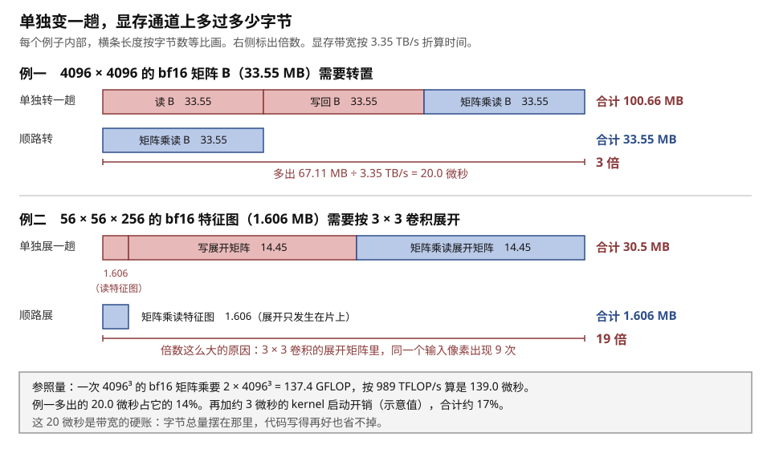
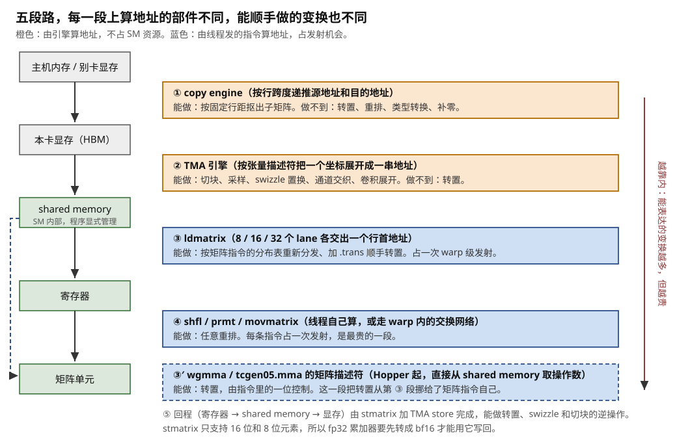
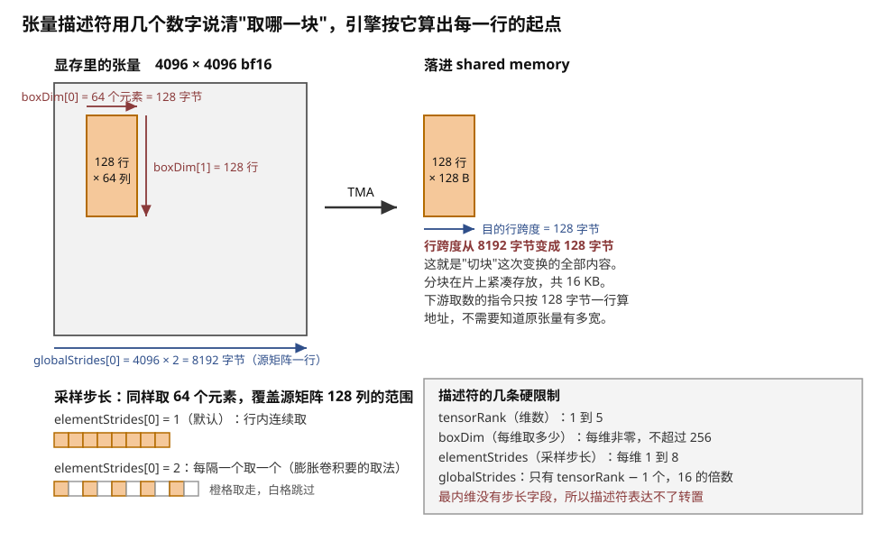
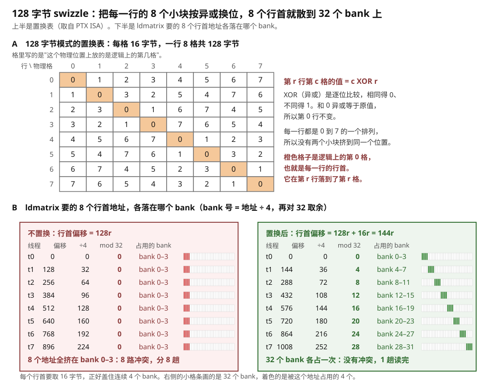
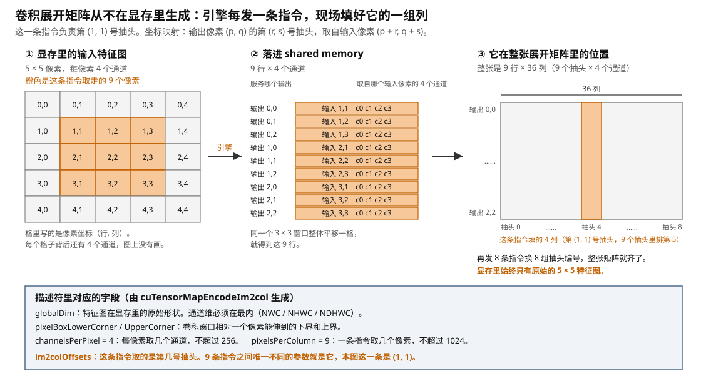
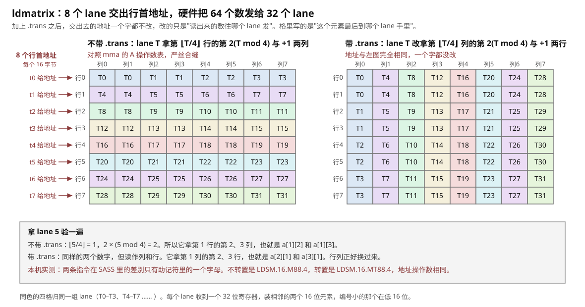
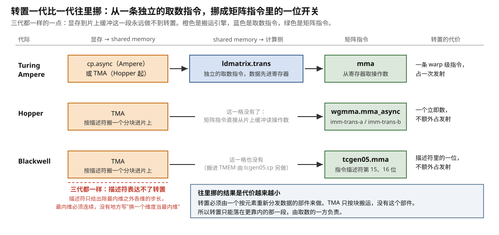
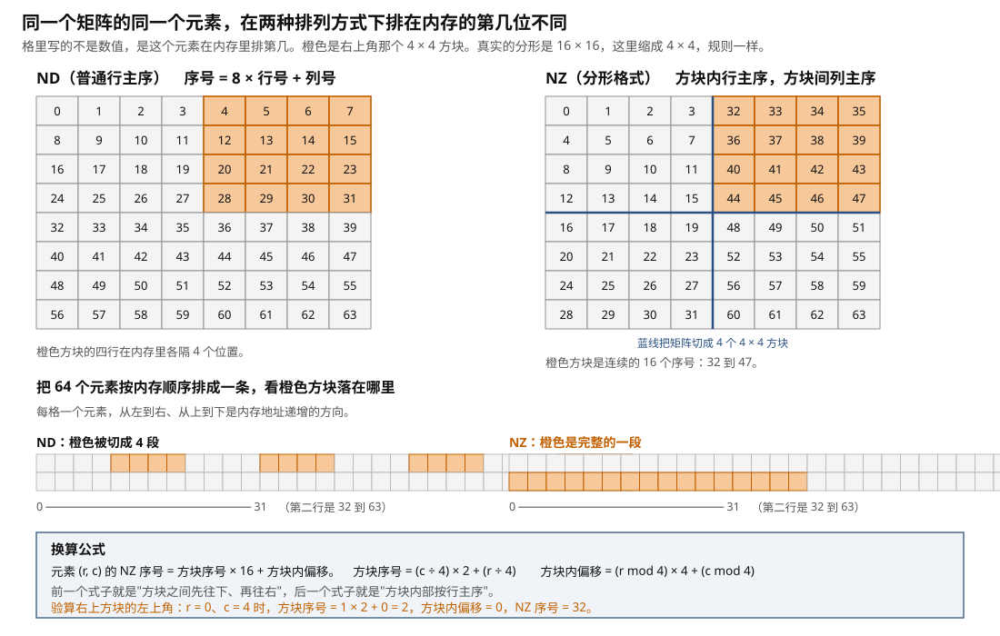
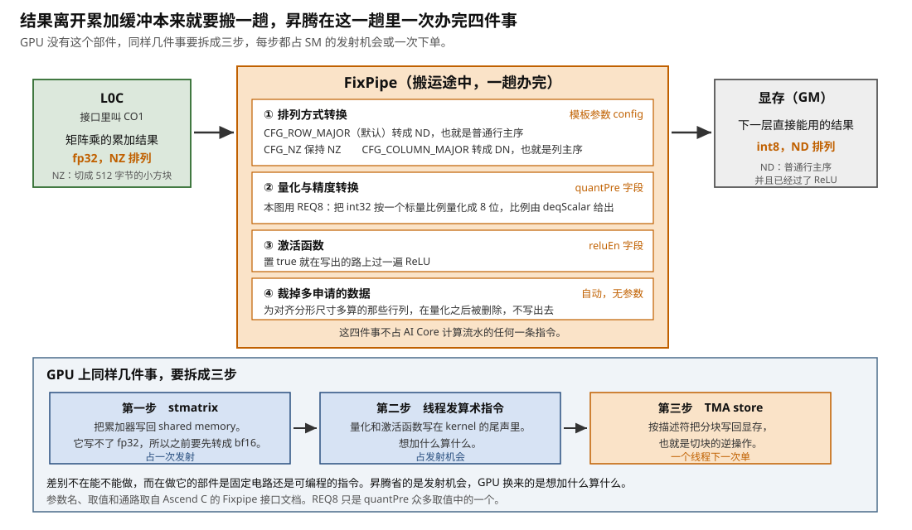

# 途中变换：算地址的那个部件也能改变数据的排列方式

> **所属模块**：模块 14 · 数据搬运（第四部分 · 搬运的附加功能）
> **状态**：🟨 学习中（2026-10 新写。知识截至 2026-09）
> **一句话主旨**：搬运就是把字节从一处挪到另一处，而挪的那一刻，字节落在哪个位置由算地址的部件决定。所以这个部件只要改一改落位规则，就能在搬运途中换掉数据的排列方式，不多读一个字节。能换成什么样，取决于这段路上是谁在算地址：描述符驱动的引擎只会描述符能表达的那几种，线程发的指令能表达任意一种但要花发射机会。单独开一趟变换则要让数据再过一遍显存通道，本节会算出那是多少字节。

---

## 0. 这一节要回答的问题

- 为什么"换排列方式"能挂在一次本来就要做的搬运上，不花额外代价？
- 单独开一趟变换，具体要多搬多少字节？换算成时间是多少？
- TMA 的描述符能表达哪几种变换：切块、采样、swizzle、im2col 分别是什么？为什么它表达不了转置？
- swizzle 到底置换了什么？这次置换由谁做，搬运方和取数方为什么必须说同一个模式？
- `ldmatrix` 把 64 个数发给 32 个线程的规则是什么？加上 `.trans` 之后改的是哪一张表？
- 转置这件事，在 Ampere、Hopper、Blackwell 上分别落在哪个部件身上？
- 昇腾的 ND → NZ、img2col、FixPipe 各在哪一段路上完成？代价记在哪里？
- 需要的变换不在任何一段路的清单上，有哪几条退路，各自多花多少？

---

## 1. 基础词汇

**排列方式（layout）**。一个矩阵是二维的，内存是一条编了号的字节序列。把矩阵放进内存，必须规定先放哪个元素、后放哪个。这个规定就是排列方式。行主序指同一行的元素在内存里连着，列主序指同一列连着。换排列方式不改变任何一个数值，只改变哪个元素和哪个元素挨着。挨着的关系决定下一个用这批数据的部件取数快不快，所以它对性能的影响可以到几倍。本节讲的是由谁、在哪一段路上把数摆成另一个样子。每种排列方式为什么非得是那个样子，是模块 50 第 2 节的内容。

**变换**。本节说的变换指以下六件事，先各自解释一遍。**切块**是从一个大张量里取出一小块，并让这一小块在目的地紧凑存放。**采样**是每隔几个元素取一个。**swizzle（地址置换）**是把同一行内部的若干个等长小块互换位置。**转置**是行列互换。**卷积展开（im2col）**是把卷积要用的重叠窗口摊平成矩阵乘要的形状。**分形重排**是把矩阵切成固定大小的小方块，每个方块内部连续存放。这六件都只改变元素的位置，不改变元素的值。另外还有一类变换要动数值：类型转换、量化、解压。本节也讲它们，因为做它们的是同一批部件。

**一段路（hop）**。数据从显存走到计算单元，中间要落地好几次：显存 → shared memory → 寄存器 → 计算单元。每一次"从一级存储搬到另一级存储"叫一段路。本节按段组织，因为**变换能力不是整台机器的属性，而是某一段路上那个具体部件的属性**。同一件变换在一段路上免费，在另一段路上做不到。

**算地址的部件**。一次搬运要回答"这个字节从哪里读、写到哪里去"。回答这个问题的部件，本节叫算地址的部件。它有两种形态。第一种是线程：每个线程用整数指令算出自己那一段的地址，结果放在自己的寄存器里。第二种是搬运引擎：程序只给它一个坐标，引擎按事先编好的描述符把坐标展开成一串地址。**本节的主线是：变换能力跟着算地址的权力走。** 谁算地址，谁就能顺手改落位规则。

**warp 与 lane**。GPU 把 32 个线程编成一组一起执行同一条指令，这一组叫一个 warp。组里的 32 个位置叫 lane，编号 0 到 31。第 i 号线程固定在第 i 条 lane 上。寄存器堆按 lane 纵向切成 32 片，第 i 片只存第 i 号线程的寄存器，紧挨着第 i 条计算通路，片与片之间没有横向连线（模块 13 第 2 节画过接线图）。所以 lane 之间换数据必须走一张专门的交换网络。

**bank 与 bank 冲突**。shared memory 是每个 SM 内部的一块 SRAM，由程序显式管理，H100 上每个 SM 最多 228 KB。它在物理上切成 32 个能同时工作的小块，叫 bank。地址按 4 字节一个字轮流分给各 bank：第 0 个字归 0 号 bank，第 1 个字归 1 号，第 32 个字又回到 0 号。所以一个字节地址属于哪个 bank，算法是"地址除以 4，再对 32 取余"。一个 warp 的 32 个访问落在 32 个不同的 bank 上时，一趟全部完成。有 N 个访问落在同一个 bank 的不同地址上时，这个 bank 只能一个一个来，要 N 趟。这叫 N 路 bank 冲突（模块 10 第 4 节详讲）。

**分形（fractal）**。昇腾 NPU 把矩阵切成固定大小的小方块，每个方块在内存里是连续的一段。这样的小方块叫一个分形。昇腾的分形统一是 512 字节：fp16 下是 16×16，int8 下是 16×32，fp32 下是 16×8。官方枚举名 `FRACTAL_NZ`，日常简称 NZ；普通行主序在昇腾的文档里叫 ND。

**本节沿用的运行例子**（与本模块各节一致）：

- 矩阵乘 `C = A · B`，输出分块 128 × 128，沿 K 方向每次推进 64。
- 元素是 bf16（2 字节）。A 的分块是 128（M）× 64（K），B 的分块是 128（N）× 64（K），各 16 KB，每推进一次搬 32 KB。
- 线程块 128 个线程（4 个 warp）。
- 在 H100 上，一个 SM 算完这一步要 128 × 128 × 64 ÷ 2048 = 512 拍。
- 整个矩阵是 4096 × 4096 的 bf16，共 33.55 MB。H100 的显存带宽 3.35 TB/s，bf16 矩阵峰值 989 TFLOP/s。

---

## 2. 上一节留下的问题，和本节改哪一处

本模块前十节讲的都是把同样的字节从一处挪到另一处：谁发起、地址从哪来、完成怎么知道。第 10 节讲到卡与卡之间的搬运，到那里为止，数据离开显存时是什么排列方式，到达目的地还是什么排列方式。

但是计算单元对排列方式有很硬的要求。矩阵指令规定了每个线程手里必须拿哪几个元素，这个规定由电路接线定死，软件改不了（模块 12 第 1 节）。显存里的排列方式由上游算子决定，也改不了。两头都定死，中间就必须有人负责把数摆成另一个样子。

本节改的不是三个问题中的任何一个，而是在它们之外加一问：**这一趟搬运，除了把字节挪过去，还顺手改了什么？** 答案跟着"地址从哪来"这个问题走：算地址的部件掌握着落位规则，所以它能改落位规则。

下一节（本模块第 12 节）讲搬运引擎的另外几项附加功能：一份数据广播给多个线程块、写回时顺手做归约、块伸出张量边界时补上固定值、给缓存留提示、按索引表取不连续的数。那些功能也挂在同一批部件上，但它们不改变排列方式。

---

## 3. 先算一笔账：单独变一趟要多搬多少字节

要把一批数据从排列方式 X 换成排列方式 Y，有三种做法。它们的代价分属三个量级。

**第一种：单独开一趟。** 写一个专门的 kernel，或者调一个框架算子（PyTorch 的 `.contiguous()`、昇腾的 `TransData`），把整个张量从显存读出来、换排列方式、再写回显存。代价是一读一写两份显存流量，加上多启动一个 kernel 的固定开销。

**第二种：在片上多发几条指令。** 数据已经在 shared memory 或寄存器里，用 `shfl`、`prmt` 这类指令把它重排。这不碰显存，所以没有带宽账。代价是占用发射机会：每条指令都要取指、译码、占一次发射，而这些发射本来可以用来算乘加。

**第三种：挂在一次本来就要做的搬运上。** 数据反正要从显存搬进 shared memory，反正要从 shared memory 搬进寄存器。做这一段路的部件在落位时顺手改规则。这种情况下，变换不多读一个字节，也不多发一条指令。

本节后面各段路的全部实用价值可以浓缩成一句话：**尽量把变换挪进第三类**。先把第一类的账算清楚，才看得出这句话能省下多少。

### 3.1 走查：B 矩阵单独转置一趟，字节多了两倍

设 B 是 4096 × 4096 的 bf16 矩阵，按 K × N 行主序存放（每行 4096 个 N 值连续）。矩阵指令要求 B 的操作数沿 K 方向连续（§5.3 推导这一条），所以这个排列方式不合用。假设只能单独转置一趟，逐步算一遍显存通道上过了多少字节：

1. 转置 kernel 把整个 B 读出来：33.55 MB。
2. 转置 kernel 把结果写回显存：33.55 MB。
3. 矩阵乘的 kernel 再把转置后的 B 读进来：33.55 MB。

合计 **100.66 MB**。如果转置能挂在某一段路上顺手做掉，显存通道上只过第 3 步的 33.55 MB。**所以单独变一趟把 B 的显存流量变成了 3 倍。**

换算成时间。多出来的 67.11 MB 除以 3.35 TB/s，得 **20.0 微秒**。这 20 微秒是带宽的硬账：无论 kernel 写得多好，字节总量在那里，省不掉。再加上多启动一个 kernel 的固定开销，量级约 3 微秒（示意值，随平台、网格大小和是否用 CUDA Graph 变化很大）。合计约 23 微秒。

这 23 微秒相对什么？假设这个矩阵要做一次 4096³ 的矩阵乘：浮点运算量 2 × 4096³ = 137.4 GFLOP，除以 989 TFLOP/s，得 **139.0 微秒**（理想值，不计效率损失）。所以多的那一趟是 23 ÷ 139 ≈ **17%**。

### 3.2 走查：卷积展开矩阵如果真的落盘，字节多了十八倍

上面那个例子里，B 在整个矩阵乘中被复用了 4096 次，所以一次性的转置开销摊得很薄。复用次数少的数据，这笔账要难看得多。卷积展开是最极端的一例。

把卷积算成矩阵乘的办法是：给每个输出像素写一行，行里依次装它的卷积窗口里所有输入像素的所有通道。相邻窗口是重叠的，所以同一个输入像素会在展开矩阵里出现多次。取一个具体的特征图：56 × 56 像素、256 个通道、bf16，共 56 × 56 × 256 × 2 = **1.606 MB**。3 × 3 卷积、步长 1、补边后输出仍是 56 × 56。展开矩阵是 (56 × 56) 行 × (3 × 3 × 256) 列 = 3136 × 2304 个元素，共 **14.45 MB**，正好是特征图的 9 倍。

如果真的在显存里生成这张矩阵，显存通道上要过：

1. 展开 kernel 读特征图：1.606 MB。
2. 展开 kernel 写展开矩阵：14.45 MB。
3. 矩阵乘 kernel 读展开矩阵：14.45 MB。

合计 **30.5 MB**。如果展开能挂在搬运途中完成，显存通道上只过特征图本身的 1.606 MB。**所以单独展开一趟把显存流量变成了 19 倍。** 复用次数越少的数据，这个倍数越大。



> **图 11-1**　一句话：换排列方式本身不改变任何数值，但单独做一趟就要让数据再过一遍显存通道。本图把两个例子的字节总量摆在一起：转置多出两倍，卷积展开多出十八倍。
>
> **先知道一件事**：显存（HBM）是显卡上那几十 GB 的主存储，每秒能搬的字节数是固定的，这里按 3.35 万亿字节算。任何"读出来、改一改、写回去"的操作，时间下限就是字节总量除以带宽。这个下限和代码写得好不好无关。
>
> **按这个顺序看**：
> 1. 先看上半部分的两根横条。上面那根是单独转置一趟的方案，由三段组成：读 B（33.55 MB）、写回 B（33.55 MB）、矩阵乘再读 B（33.55 MB），合计 100.66 MB。
> 2. 下面那根只有一段，就是矩阵乘读 B 的 33.55 MB。两根横条的长度比是 3 比 1。右边标出差值 67.11 MB，按 3.35 TB/s 折成 20.0 微秒。
> 3. 再看下半部分的两根横条。上面那根是单独生成卷积展开矩阵的方案：读特征图 1.606 MB、写展开矩阵 14.45 MB、再读展开矩阵 14.45 MB，合计 30.5 MB。
> 4. 下面那根是顺路展开的方案，只有特征图本身的 1.606 MB。倍数是 19 比 1。差别这么大的原因写在右边：3 × 3 卷积的展开矩阵里，同一个输入像素出现 9 次。
> 5. 最后看底部的一行小字：矩阵乘本身要 139.0 微秒。20.0 微秒加上约 3 微秒的 kernel 启动开销，占 17%。
>
> **看懂的标志**：能回答"为什么卷积这一例的倍数比转置大得多"。转置的输出和输入一样大，所以多出来的是两份原始数据。卷积展开的输出比输入大 9 倍，所以多出来的是十八份原始数据。换排列方式会不会放大数据量，决定这笔账的量级。
>
> **与正文的对照**：字节数、带宽和算力取自 §1 和 §3。3 微秒的 kernel 启动开销是示意值。
>
> 来源：本库自绘。

---

## 4. 五段路，各由谁算地址

把数据从主机内存一路搬到矩阵单元，再把结果搬回去，中间有五段路。表 11-1 列出每一段上算地址的部件，以及它能顺手做的变换。后面五个部分逐段展开。

**表 11-1　GPU 上五段路的变换能力**

| 段 | 路径 | 算地址的部件 | 占不占 SM 资源 | 能顺手做的变换 |
| --- | --- | --- | --- | --- |
| ① | 主机内存 ↔ 显存，显存 ↔ 别卡显存 | copy engine，按行跨度递推 | 不占 | 按固定行距抠子矩阵（§7） |
| ② | 显存 → shared memory | TMA 引擎，按张量描述符展开坐标 | 不占（一个线程下单） | 切块、采样、swizzle、通道交织、卷积展开（§5） |
| ③ | shared memory → 寄存器 | `ldmatrix`，8 个 lane 各给一个行首地址 | 占一次 warp 级发射 | 按矩阵指令的分布表重发、转置（§6） |
| ③′ | shared memory → 矩阵单元 | `wgmma` / `tcgen05.mma` 的矩阵描述符 | 不额外占发射（矩阵指令本来就要发） | 转置（由一个立即数或描述符中的一位控制，§6.5） |
| ④ | 寄存器内 | 线程自己，或 warp 内的交换网络 | 每条指令占一次发射 | 任意重排，按指令计价（§8） |
| ⑤ | 寄存器 → shared memory → 显存 | `stmatrix` + TMA store | 部分占 | 转置、swizzle、切块的逆操作（§6.2、§5.2） |

这张表里有一条贯穿的规律。第 ①② 段上算地址的是引擎，它们不占 SM 的任何资源，但只会描述符能表达的那几种变换。第 ③④⑤ 段上算地址的是线程发的指令，它们能表达的变换多得多，但每一次都要花发射机会。



> **图 11-2**　一句话：数据从外往里走要经过五段路。每一段上算地址的部件不同，所以每一段能顺手做的变换也不同。靠外的两段由引擎算地址，靠内的三段由线程发的指令算地址。
>
> **先知道一件事**：这里说的"算地址"指的是回答"这个字节写到目的地的哪个位置"。一次搬运必须回答这个问题，所以回答它的部件总是存在。它顺手改一改回答，就等于改了排列方式，不多读一个字节。
>
> **按这个顺序看**：
> 1. 先看最左边一列从上到下：这是数据要走的路。主机内存、显存、shared memory（SM 内部由程序显式管理的 SRAM）、寄存器（紧贴计算通路的最小一级存储）、矩阵单元。
> 2. 每两级之间有一个标签框，框里第一行是算地址的部件，第二行起是它能顺手做的变换。标签框的编号与正文表 11-1 的段号对应。
> 3. 看颜色。橙色的两段由引擎算地址：copy engine 按行跨度递推，TMA 按张量描述符把一个坐标展开成一串地址。这两段不占 SM 的线程和发射机会。
> 4. 蓝色的三段由线程发的指令算地址：`ldmatrix` 让 8 个 lane 各交出一个行首地址，寄存器内的重排由线程自己算，写回也一样。每条指令占一次发射。
> 5. 看右边那条竖的虚线箭头和旁边的小字：越靠内的段，能表达的变换越多，但越贵。越靠外的段，能表达的变换越少，但免费。
> 6. 最后看 ③′ 这一格。Hopper 起矩阵指令本身可以直接从 shared memory 取操作数，指令里带一位转置开关。这一段路把转置从第 ③ 段挪到了矩阵指令自己身上。
>
> **看懂的标志**：能回答"为什么同一件变换要先问它在哪一段路上"。做这件事的根本不是同一个硬件。转置在第 ③ 段上是一个免费的后缀，在第 ② 段上描述符根本表达不了，在第 ① 段上 copy engine 也做不到。
>
> **与正文的对照**：表 11-1 与本图一一对应。昇腾一侧的同一张图在 §9.5 给出。
>
> 来源：本库自绘。

---

## 5. 第 ② 段 · 显存到 shared memory：描述符能表达的变换

这一段路搬的数据量最大，一个分块动辄几十 KB。算地址的部件是 TMA（张量搬运引擎，Hopper 引入）。

一句话交代它怎么工作，以便读懂后文。主机侧提前编好一张**张量描述符**（tensor map），里面写明这个张量在显存里的基址、各维大小、各维步长、元素类型、一次搬多大的块、用哪种 swizzle、越界怎么填。运行时一个线程发一条指令，只给出"要第几块"的坐标，引擎就把那一块搬进来。描述符的完整字段、下单的指令形态、mbarrier 怎么记完成，是本模块第 3 节的内容。本节只讲描述符里那几个改排列方式的字段。

描述符由 CUDA Driver API 的 `cuTensorMapEncodeTiled` 生成（卷积展开另有编码函数，见 §5.4）。

### 5.1 切块与采样：从大矩阵里抠出一块，并让它紧凑落地

**切块（box）** 是描述符最基本的变换能力。张量在显存里可能是 4096 × 4096，而一次只要其中 128 × 64 的一小块。`boxDim` 数组就是在说这件事：每一维取多少个元素。搬进 shared memory 之后，这一块是紧凑摆放的，不再保留原张量的行距。

这本身就是一次变换，而且是最常用的一次。走查一遍：

1. 显存里的 A 是 4096 × 4096 的 bf16，一行 8192 字节。
2. 描述符写 `tensorRank = 2`、`globalDim = {4096, 4096}`、`globalStrides = {8192}`、`boxDim = {64, 128}`。
3. 运行时给坐标 (0, 0)：引擎读 128 行，每行从偏移 8192 × r 处取 128 字节。
4. 落进 shared memory 时，这 128 行首尾相接，共 16 KB，每行 128 字节。

**所以搬进来的分块，行距从 8192 字节变成了 128 字节。** 下游取数的指令只按 128 字节一行算地址，不需要知道原张量有多宽。

**采样（`elementStrides`）** 是在切块之上再加一层：每一维可以设 1 到 8 的采样步长，也就是每隔几个元素取一个。它的用途是带膨胀的卷积，膨胀卷积的取数模式正是隔几个像素取一个。

几条硬边界来自描述符的字段规格（`cuTensorMapEncodeTiled` 文档）：

| 字段 | 限制 |
| --- | --- |
| `tensorRank`（维数） | 非零，不超过 5 |
| `globalDim`（各维大小） | 非零，不超过 2³² |
| `globalStrides`（各维步长，字节） | 只有 `tensorRank − 1` 个，必须是 16 的倍数，小于 2⁴⁰ |
| `boxDim`（每维取多少） | 每维非零，**不超过 256** |
| `elementStrides`（采样步长） | 每维 1 到 8 |
| `globalAddress`（基址） | 16 字节对齐（某些模式要 32 字节） |

`boxDim ≤ 256` 这条在设计分块尺寸时经常起作用。想要一个 512 宽的 box 做不到，只能拆成两次下单。



> **图 11-3**　一句话：张量描述符只用几个数字就说清了"从哪个大矩阵里取哪一块"。引擎按这些数字算出每一行的起点，把块搬进片上时让它紧凑摆放。采样步长让它每隔几个元素取一个。
>
> **先知道一件事**：一个二维矩阵存在内存里是一长串字节。第 r 行的开头和第 r+1 行的开头相隔多少字节，这个数叫行跨度。对一个 4096 列的 bf16 矩阵，行跨度是 4096 × 2 = 8192 字节。描述符里的 `globalStrides` 就是它。
>
> **按这个顺序看**：
> 1. 先看左边的大方块，这是显存里 4096 × 4096 的 bf16 矩阵。橙色小方块是要取的 128 行 × 64 列。方块下方的蓝色箭头标着 8192 字节，这是源矩阵的行跨度。
> 2. 看橙块上方的红色箭头：一行真正要取的字节数是 64 × 2 = 128 字节。描述符里写成 `boxDim[0] = 64`，单位是元素而不是字节。
> 3. 看橙块右侧的红色箭头：要取 128 行，描述符里写成 `boxDim[1] = 128`。
> 4. 看中间的结果。搬进 shared memory 之后，128 行首尾相接，共 16 KB。**行跨度从 8192 字节变成了 128 字节，这就是切块这次变换的全部内容。**
> 5. 看右边的小图。把 `elementStrides[0]` 从 1 改成 2 之后，引擎在行内每隔一个元素取一个。同样取 64 个元素，覆盖的是源矩阵 128 列的范围。膨胀卷积要的就是这种取法。
> 6. 底部方框列出几条限制。最常碰到的是 `boxDim` 每维不超过 256。
>
> **看懂的标志**：能回答"这次切块为什么不额外花时间"。引擎本来就必须算出每一行的起点才能把数据读出来，所以"按 8192 读、按 128 写"和"按 8192 读、按 8192 写"对它是一样的工作量。紧凑落地不需要多读任何字节。
>
> **与正文的对照**：字段名和限制取自 CUDA Driver API 的 `cuTensorMapEncodeTiled`。图中的 `boxDim` 按文档的顺序写，下标 0 是最内维。
>
> 来源：本库自绘。

### 5.2 swizzle：引擎替取数方提前摆好座位

**先说清楚要解决什么问题。** 下一段路上取数的指令 `ldmatrix` 一次要读 8 行（§6.2 详讲）。这 8 行的行首地址如果排得整整齐齐，它们会落进同一组 bank 里排队。swizzle 就是为了避免这件事：把每一行的内容在行内错开一点，8 行就散到全部 32 个 bank 上。

**置换规则是什么。** PTX ISA 直接给出了 128 字节 swizzle 模式的置换表。表的每一格代表 16 字节，共 8 行 × 8 格：

| 行 \ 格 | 0 | 1 | 2 | 3 | 4 | 5 | 6 | 7 |
| --- | --- | --- | --- | --- | --- | --- | --- | --- |
| **0** | 0 | 1 | 2 | 3 | 4 | 5 | 6 | 7 |
| **1** | 1 | 0 | 3 | 2 | 5 | 4 | 7 | 6 |
| **2** | 2 | 3 | 0 | 1 | 6 | 7 | 4 | 5 |
| **3** | 3 | 2 | 1 | 0 | 7 | 6 | 5 | 4 |
| **4** | 4 | 5 | 6 | 7 | 0 | 1 | 2 | 3 |
| **5** | 5 | 4 | 7 | 6 | 1 | 0 | 3 | 2 |
| **6** | 6 | 7 | 4 | 5 | 2 | 3 | 0 | 1 |
| **7** | 7 | 6 | 5 | 4 | 3 | 2 | 1 | 0 |

表里第 r 行第 c 格的值等于 `c XOR r`。验证三处：第 1 行第 0 格是 1，而 `0 XOR 1 = 1`；第 2 行第 1 格是 3，而 `1 XOR 2 = 3`；第 5 行第 3 格是 6，而 `3 XOR 5 = 6`。异或有一个关键性质：拿同一个数分别和 0、1、2 …… 逐个异或，结果互不相同，恰好是原来那些数的一个排列。所以这张表的每一行都是 0 到 7 的一个排列，没有两个小块挤到同一个位置。

PTX 还给出了另外几种模式。32 字节模式的周期是 2 行，每两格一组互换。64 字节模式的周期是 4 行，每四格一组按异或置换。128 字节模式的周期是 8 行，就是上面那张表。模式的周期决定了起始地址的对齐要求：128 字节模式要求目的地址落在 1024 字节边界上（8 行 × 128 字节），64 字节模式要求 512 字节边界，32 字节模式要求 256 字节边界。目的地址不在边界上时，硬件按一个公式算出一个基偏移，再把置换整体转一下。

**逐步走查：8 个行首地址的 bank 号。** 分块在 shared memory 里每行 128 字节（bf16 下 BK = 64），共 8 格。

不做 swizzle 时：

1. 第 r 行的行首在偏移 128r 处。
2. bank 号 = (128r ÷ 4) mod 32 = 32r mod 32 = **0**。8 行全是 0。
3. 每个行首要取 16 字节，正好盖住连续 4 个 bank，所以 8 个地址全挤在 bank 0 到 3 上。
4. 结论：8 路 bank 冲突，这一次取数要分 **8 趟**完成。

做 128 字节 swizzle 时：

1. 逻辑上在第 r 行第 0 格的数据，物理上存到第 `0 XOR r = r` 格。
2. 第 r 行的行首偏移变成 128r + 16r = 144r。
3. bank 号 = (144r ÷ 4) mod 32 = 36r mod 32 = 4r mod 32。代入 r = 0 到 7，得 0、4、8、12、16、20、24、28。
4. 每个地址盖住 4 个 bank，所以 8 个地址分别占 bank 0–3、4–7、8–11、……、28–31。32 个 bank 各被占一次。
5. 结论：没有冲突，**1 趟**完成。

**这次异或由谁做。** 两种可能，这正是本节的主题。

- **Ampere 上由线程做。** `cp.async` 把数据搬进 shared memory 时，目的地址由每个线程自己算。于是在算地址的表达式里多做一次异或。代价是每个线程每次搬运多几条整数指令。这条路径是本模块第 2 节的内容。
- **Hopper 之后由引擎做。** 描述符里有一个 `swizzle` 字段，取值 `CU_TENSOR_MAP_SWIZZLE_NONE` / `_32B` / `_64B` / `_128B`，Blackwell 一代又加了 `_128B_ATOM_32B`、`_128B_ATOM_32B_FLIP_8B`、`_128B_ATOM_64B` 三种。TMA 引擎在往 shared memory 落位时按这个模式置换，线程侧连那几条整数指令都不用发。

**搬运方和取数方必须说同一个模式。** 这不是一条经验法则，而是指令格式上的事实：TMA 的张量描述符里有一个 swizzle 字段，Hopper 矩阵指令 `wgmma` 用的 shared memory 矩阵描述符里也有一个 swizzle 字段（取值 0 不置换、1 为 128 字节、2 为 64 字节、3 为 32 字节），还另带一个基偏移。两张描述符各自声明一遍同一件事。两边不一致时硬件不报错，照样跑完，只是每个元素都取错了位置，结果是数值错误而不是性能问题。

**选哪个模式也不自由。** 模式的周期宽度要和分块在 shared memory 里一行的字节宽度对上。行宽 128 字节（bf16 下 BK = 64）用 128 字节模式，行宽 64 字节用 64 字节模式。配小了不报错，只是置换的种类不够，残留几路冲突，带宽默默打折。PTX 对新增的 96 字节模式写明了一条同类限制：`Box-Size[0]` 不超过 96 字节。这条约束链的完整推演（为什么是这个宽度、配错了残留几路冲突）在模块 50 第 2 节。



> **图 11-4**　一句话：取数指令一次要读 8 行。这 8 行的开头在片上缓冲里排得整整齐齐时，它们会全部落进同一组存储体里排队。把每一行的内容在行内错开一点，8 行就散到全部 32 个存储体上，一趟读完。
>
> **先知道一件事**：片上缓冲（shared memory）在物理上切成 32 个能同时工作的小块，叫 bank。地址按 4 字节一个字轮流分给它们：第 0 个字归 0 号 bank，第 1 个字归 1 号，第 32 个字又回到 0 号。所以一个字节地址属于哪个 bank，算法是"地址除以 4，再对 32 取余"。同一个 bank 一趟只能交出一个字。
>
> **按这个顺序看**：
> 1. 先看上半部分的表。横向 8 格，每格代表 16 字节，合起来 128 字节，正好是分块的一行。纵向 8 行。格里写的是"这个位置上放的是逻辑上的第几格"。
> 2. 看第 0 行：0 1 2 3 4 5 6 7，没有变动。再看第 1 行：1 0 3 2 5 4 7 6，相邻两格两两互换。第 3 行：3 2 1 0 7 6 5 4，前四格整体倒序。
> 3. 规律写在表的右边：第 r 行第 c 格的值等于 `c XOR r`。XOR（异或）是逐位比较，相同得 0、不同得 1。和 0 异或等于原值，所以第 0 行不变。
> 4. 再看下半部分左边这一列。分块每行 128 字节，所以第 r 行的开头在偏移 128r 处。t1 对应第 1 行，偏移 128：128 ÷ 4 = 32，32 对 32 取余等于 0，落在 bank 0。t2 是偏移 256，同样余 0。8 个地址全是 0。每个地址取 16 字节盖住 4 个 bank，所以 8 个人全挤在 bank 0 到 3，要排 8 趟。
> 5. 看下半部分右边这一列。按上面的表，第 r 行逻辑上的第 0 格挪到了第 r 格，偏移变成 128r + 16r = 144r。t1 的地址是 144：144 ÷ 4 = 36，36 对 32 取余等于 4，落在 bank 4。t2 是 288，余 8，落 bank 8。逐行往下是 0、4、8、12、16、20、24、28。
> 6. 看最下面一行：32 个 bank 恰好各被占一次，1 趟读完。整个过程中数据没有换到别的行去，只是在本行内部挪了位置。读的时候再算一次同样的异或就能找回来。
>
> **看懂的标志**：能回答"这次异或是谁做的"。两种可能。线程自己算地址时多做一次异或，这是 Ampere 上 `cp.async` 的做法。或者搬运引擎在往片上缓冲里落位时就按异或后的位置写，这是 Hopper 上 TMA 的做法。后一种连那几条整数指令都省了。
>
> **与正文的对照**：置换表取自 PTX ISA「Swizzling Modes」一节给出的 128 字节模式表。bank 号的算法取自模块 10 第 4 节。8 路冲突算 8 趟，用的是 bank 冲突的标准模型，不是实测拍数。
>
> 来源：本库自绘。

### 5.3 描述符表达不了转置

TMA 能切块、能采样、能置换地址、能展开卷积、能通道交织。**它表达不了转置。** 这件事值得推一遍原因，因为它不是厂商没做，而是描述符这种表达方式的固有限制。

看描述符怎么描述形状。`globalDim` 给出各维大小，共 `tensorRank` 个。`globalStrides` 给出各维步长，但只有 `tensorRank − 1` 个。文档的原话是，它给出"最低 `tensorRank − 1` 个维度的步长，单位字节"。少的那一个是最内维：**最内维在显存里必须连续，它的步长隐含等于元素大小，描述符里没有位置写它。**

转置这件事，用这套语言说，就是"让显存里那个跨步很大的维度，变成目的地最内的那个维度"。描述符里没有地方表达这件事。**所以 TMA 表达不了转置，不是能力不足，是这门语言里没有这个句子。**

描述符里确实还有一个 `interleave` 字段，取值 `NONE` / `16B` / `32B`，用于图像数据的通道交织。这是一种受限的重排：它按固定的 16 或 32 字节粒度把通道维交织进来，粒度和位置都由字段写死。它不能用来实现一般的转置。

**这条限制的后果不是"转置做不了"，而是"转置要往里挪一段路"。** 下一部分讲它挪到了哪里。

### 5.4 卷积展开：描述符的另一种编码

卷积展开是描述符表达能力走得最远的一项，因为它要表达的映射关系比切块复杂得多。

§3.2 算过，如果真的在显存里生成展开矩阵，显存流量是 19 倍。TMA 的解法是让展开在搬运途中现场发生，显存里从不存在这张矩阵。描述符用另一个编码函数 `cuTensorMapEncodeIm2col` 生成，字段和切块模式不同：

| 字段 | 含义与限制 |
| --- | --- |
| `tensorRank` | 只能是 3、4 或 5 |
| `globalDim` | 张量在显存里的原始形状。摆法要求通道维在最内（NWC / NHWC / NDHWC） |
| `pixelBoxLowerCorner` / `pixelBoxUpperCorner` | 卷积窗口相对一个像素能伸到的下界和上界。精度随维数变化：3 维时每个偏移在 [−32768, 32767]，4 维时在 [−128, 127]，5 维时在 [−16, 15] |
| `channelsPerPixel` | 每个像素取几个通道，不超过 256 |
| `pixelsPerColumn` | 一条指令取几个像素，不超过 1024 |
| `elementStrides` | 每维 1 到 8，用于膨胀卷积 |

运行时的指令除了给坐标，还多给一组 `im2colOffsets`：这条指令取的是卷积核的第几号抽头。

**逐步走查一个小卷积。** 输入 5 × 5 像素、每像素 4 个通道，3 × 3 卷积、步长 1、不补边，输出 3 × 3 共 9 个像素。展开矩阵是 9 行 × 36 列（9 个像素各一行，每行 9 个抽头 × 4 个通道）。

坐标映射是：**输出像素 (p, q) 的第 (r, s) 号抽头，取自输入像素 (p·stride + r, q·stride + s)。**

发第 (1, 1) 号抽头对应的那一条指令（卷积核正中间那一格），引擎做的事是：

1. 对输出像素 (0, 0)，取输入像素 (1, 1) 的 4 个通道，放进 shared memory 的第 0 行。
2. 对输出像素 (0, 1)，取输入 (1, 2) 的 4 个通道，放进第 1 行。
3. 一直到输出像素 (2, 2)，取输入 (3, 3)，放进第 8 行。

于是 9 个输出像素依次取到输入的 (1,1)、(1,2)、(1,3)、(2,1)、(2,2)、(2,3)、(3,1)、(3,2)、(3,3)。这正好是把输入的 3 × 3 窗口整体平移了 (1, 1)。再发 8 条指令换 8 组抽头编号，展开矩阵的 36 列就齐了。

**Blackwell 加了一种新的编码方式。** `cuTensorMapEncodeIm2colWide` 要求算力 10.0 及以上。它沿 W 维一次取更多像素，D 和 H 方向的 box 大小固定为 1。`mode` 字段取 `CU_TENSOR_MAP_IM2COL_WIDE_MODE_W` 或 `_W128`：前者沿 W 维取几个元素由 `pixelsPerColumn` 给出，后者忽略这个字段，固定取 128 个。文档对它的 swizzle 另有一条限制，但这条限制只针对一种元素类型：元素类型是 `16U6_ALIGN16B` 时，只能用 64 字节（仅写出）、128 字节、128 字节 / 32 字节原子这三种模式。



> **图 11-5**　一句话：卷积要用的那张展开矩阵从来没有在显存里生成过。搬运引擎每发一条指令，就现场填好这张矩阵的一组列。
>
> **先知道一件事**：把卷积算成矩阵乘的办法是，给每个输出像素写一行，行里依次装它的卷积窗口里所有输入像素的所有通道。3 × 3 的卷积核有 9 个位置，本图把一个位置叫一个抽头。同一个输入像素会被好几个输出像素用到，所以展开矩阵里有大量重复。这正是不能在显存里真的生成它的原因。
>
> **按这个顺序看**：
> 1. 先看左边的 5 × 5 网格，格里是输入像素的坐标（行, 列）。橙色的 3 × 3 是这一条指令取走的 9 个像素，每个像素连它的 4 个通道一起取，共 36 个数。
> 2. 为什么取的是这 9 个？因为这条指令负责第 (1, 1) 号抽头，而坐标映射是"输出 (p, q) 的第 (r, s) 号抽头取自输入 (p + r, q + s)"。9 个输出像素 (0,0) 到 (2,2) 分别去取输入 (1,1) 到 (3,3)，合起来就是把窗口整体平移一格。
> 3. 再看中间。落进片上缓冲的是 9 行 × 4 列。每一行左边标着它服务哪个输出像素，格里标着这一行的数据来自哪个输入像素。第一行是"输出 (0,0) ← 输入 (1,1)"，正是第 2 步的映射。
> 4. 最后看右边。这 9 行 × 4 列在整张展开矩阵里只占 4 列。整张矩阵是 9 行（9 个输出像素）× 36 列（9 个抽头 × 4 个通道）。橙色那一竖条就是这条指令填的部分。
> 5. 再发 8 条指令换 8 组抽头编号，整张矩阵就齐了。**显存里始终只有原始的 5 × 5 特征图。**
> 6. 最下面的方框列出描述符里对应的字段。9 条指令之间唯一不同的参数是 `im2colOffsets`，也就是抽头编号。
>
> **看懂的标志**：能回答"这个模式省下了什么"。省下的是把展开矩阵写进显存、再读出来的那一趟。3 × 3 卷积的展开矩阵是原特征图的 9 倍，这一趟的读写合计 18 倍特征图大小。§3.2 用真实尺寸算过，总流量从 19 倍降到 1 倍。
>
> **与正文的对照**：本图用 5 × 5 输入、4 个通道，为了画得下。真实卷积的特征图和通道数大得多，坐标映射完全相同。字段名取自 CUDA Driver API 的 `cuTensorMapEncodeIm2col`。
>
> 来源：本库自绘。

---

## 6. 第 ③ 段 · shared memory 到计算侧：转置落在这里

这一段路上的变换最值得细看，原因有两个。第一，它是唯一一段"搬运"和"变换"做成了同一条指令的路。第二，转置这件变换只能在这一段上完成，而转置是矩阵乘里最高频的需求。

### 6.1 要解的问题：每个线程手里拿哪几个元素是定死的

先把问题摆清楚。一条常用的矩阵指令 `mma.sync.m16n8k16`（16 × 8 的输出、深度 16、bf16 输入）要求它的 A 操作数按一张固定的表分给 32 个线程。PTX ISA 直接给出了这张表的公式。设 `g = laneid >> 2`、`t = laneid % 4`，A 操作数的 8 个元素 a0 到 a7 是：

| 元素 | 行 | 列 |
| --- | --- | --- |
| a0, a1 | g | 2t, 2t + 1 |
| a2, a3 | g + 8 | 2t, 2t + 1 |
| a4, a5 | g | 2t + 8, 2t + 9 |
| a6, a7 | g + 8 | 2t + 8, 2t + 9 |

代入 lane 0（g = 0、t = 0）：它拿 (0,0)、(0,1)、(8,0)、(8,1)、(0,8)、(0,9)、(8,8)、(8,9)。

这张表为什么改不了？模块 13 第 2 节给了物理答案：**矩阵单元的每个输入端口在版图上就接在某几条特定 lane 的寄存器片上。** 数据必须事先躺在那几条 lane 的那几个寄存器里，矩阵单元才拿得到。这不是接口设计上的品味问题，是接线的事实。

把 16 × 16 的 A 按行 0–7 / 8–15、列 0–7 / 8–15 切成四个 8 × 8 子块，上面那张表就变得很整齐：四个寄存器各对应一个子块，而每个子块内部的规则都是同一条——**lane 拿第 g 行的第 2t 与 2t + 1 两列**。这条规则正是下面那条指令干的事。

**如果用逐线程的 `ld.shared` 自己搬，可行但有两个明确的缺点。** 第一是慢：每个线程要的 8 个元素散在分块的四个角落，只能用零散的小指令一个个取，而且这些地址几乎必然撞 bank。第二是不通用：不同代际、不同形状的矩阵指令有不同的分布表，手写的地址算术要跟着全部重写。所以硬件给了一条专用指令。

### 6.2 `ldmatrix`：8 个 lane 给地址，32 个 lane 收数据

完整语法（PTX ISA）：

```
ldmatrix.sync.aligned.shape.num{.trans}{.ss}.type             r, [p];
ldmatrix.sync.aligned.m8n16.num{.ss}.dst_fmt.src_fmt          r, [p];
ldmatrix.sync.aligned.m16n16.num.trans{.ss}.dst_fmt.src_fmt   r, [p];
ldmatrix.sync.aligned.m8n16.num{.ss}.dtype.ctype              r, [p];
    .shape   = { .m8n8, .m16n16 };          .num     = { .x1, .x2, .x4 };
    .ss      = { .shared{::cta} };          .type    = { .b16, .b8 };
    .dst_fmt = { .b8x16 };                  .src_fmt = { .b6x16_p32, .b4x16_p64 };
    .dtype   = { .s8 };                     .ctype   = { .s4 }
```

一共有三种形状，各配一种元素宽度：`.m8n8` 是 8 × 8 的 16 位元素，`.m16n16` 是 16 × 16 的 8 位、6 位或 4 位元素，`.m8n16` 是 8 × 16 的 6 位或 4 位元素。`.m8n16` 不出现在第一行语法的 `.shape` 清单里，因为它只能配后两行那种带格式转换的写法。`.m8n8` 在 PTX ISA 6.5 引入，要求 sm_75（Turing）及以上。`.m16n16` 和 `.m8n16` 在 PTX ISA 8.6 引入，要求 `sm_100a` / `sm_101a` / `sm_120a` 这一族的目标架构。本小节先讲 `.m8n8.x1.b16`。

**它做的事**：一个 warp 执行一条指令，从 shared memory 里取一个 8 × 8 的 16 位矩阵，按分布表发到 32 个线程的寄存器里。

它的奇特之处在于**给地址的线程和收数据的线程不是同一批**：

- **给地址的是 lane 0 到 lane 7，一人一个。** 每个地址是矩阵一行的起始地址。一行 8 个 16 位元素 = 16 字节。PTX 的原话是，读 8 × 8 矩阵时"连续四个线程读 16 字节，矩阵地址必须相应地自然对齐"。`.x1` 下 lane 8 到 lane 31 不给地址。
- **收数据的是全部 32 条 lane，每人一个 32 位寄存器**，装 2 个 16 位元素。PTX 的原话是"warp 里每个线程取一行的一个片段，线程 0 收到第一个片段，依此类推；连续四个线程取一整行"。所以 lane T 拿第 ⌊T/4⌋ 行、第 2(T mod 4) 与 2(T mod 4) + 1 两列。

**这正是 §6.1 那条规则。** 所以一条 `ldmatrix.x4` 按子块 (0,0)、(1,0)、(0,1)、(1,1) 的顺序给 32 个地址，四个结果寄存器就严丝合缝地对上了 `mma.m16n8k16` 的 A 操作数。

`.num` 决定一条指令搬几个 8 × 8 矩阵：

| `.num` | 给地址的 lane | 地址总数 | 每线程收到的寄存器 |
| --- | --- | --- | --- |
| `.x1` | 0–7 | 8（1 个矩阵 × 8 行） | 1 个 |
| `.x2` | 0–15 | 16（2 个矩阵 × 8 行） | 2 个 |
| `.x4` | 0–31 | 32（4 个矩阵 × 8 行） | 4 个 |

地址的归属按顺序切：`.x4` 下 addr0–addr7 给第 1 个矩阵的 8 行，addr8–addr15 给第 2 个矩阵，依此类推。有一条早期实现的限制：目标架构是 sm_75 及以下时，即使用 `.x1` 或 `.x2`，没轮到给地址的线程也必须在地址寄存器里放一个合法地址，PTX 文档建议把低编号线程的地址复制过去。

**另外还有一条反方向的指令。** `stmatrix` 把寄存器里的矩阵写回 shared memory。语法与 `ldmatrix` 对称，地址同样由 8 / 16 / 32 个线程给出。它在 PTX ISA 7.8 引入，**要求 sm_90（Hopper）及以上**，所以 Ampere 上的写回只能靠逐线程的 `st.shared`。它的 `.type` 只有 `.b16` 和 `.b8` 两种：**写不了 fp32**。所以 fp32 的累加器要先转成 bf16 或 fp16 才能用它写回。

### 6.3 `.trans`：地址一个字不改，改的是往哪个线程发

PTX 对 `.trans` 的描述只有一句：加上它之后，矩阵按列主序读出。把这一句展开，就能看清它免费的原因。

**它不改变任何一个地址。** 8 个线程交出去的仍然是那 8 行的行首地址，硬件仍然从 shared memory 的同样 8 个位置读出同样的 64 个 16 位元素。shared memory 里没有任何数据被移动过。

**它改变的是读出来之后往哪个线程发。** 按列主序读出，元素的顺序变成 a[0][0]、a[1][0]、…、a[7][0]、a[0][1]、……。lane T 仍然收第 T 对，也就是第 2T 和 2T+1 个元素。代入算一遍：第 2T 个元素的列号是 ⌊2T/8⌋ = ⌊T/4⌋，行号是 2T mod 8 = 2(T mod 4)。所以 **lane T 改拿第 ⌊T/4⌋ 列的第 2(T mod 4) 与 2(T mod 4) + 1 两行**。验证 lane 5：⌊5/4⌋ = 1，2 × (5 mod 4) = 2，所以它拿第 1 列的第 2、3 行，也就是 a[2][1] 和 a[3][1]。不带 `.trans` 时它拿的是 a[1][2] 和 a[1][3]。行列正好换过来。

**为什么这不花额外代价。** 因为这条路上本来就有一个分发网络。数据从 shared memory 的读出端口到 32 个线程的寄存器，中间必须经过一个交叉开关。不带 `.trans` 时它按一张表连线，带 `.trans` 时按另一张表连线，硬件上就是多一个选择信号的事。**`.trans` 免费的原因是它复用了一个本来就必须存在的部件。这是"途中变换"这个思路最纯粹的例子，本节各段路上的变换本质上都是同一个道理。**

**本机实测：两条指令的地址操作数完全相同。** 手写一段 PTX，同一个地址寄存器先发一条不带 `.trans` 的 `ldmatrix.x4`，再发一条带 `.trans` 的，用 CUDA 12.8 的 ptxas 汇编到 sm_90a，再用 `cuobjdump -sass` 反汇编。相关几条机器码如下：

```
LDSM.16.M88.4  R8, [R0] ;       // ldmatrix.m8n8.x4.b16
LDSM.16.MT88.4 R4, [R0] ;       // ldmatrix.m8n8.x4.trans.b16
MOVM.16.MT88   R10, R8 ;        // movmatrix.m8n8.trans.b16
STSM.16.M88.4  [R0], R4 ;       // stmatrix.m8n8.x4.b16
```

两条 `LDSM` 的地址操作数都是 `R0`，一个字都没改。差别只在助记符的修饰符上：不转置是 `M88`，转置是 `MT88`，多一个 T。这一条实测同时给出了四个 SASS 助记符与 PTX 指令的对应关系。

**转置 16 × 16 的块要多做一件事。** 把它看成四个 8 × 8 子块，转置后左上还在左上、右下还在右下，但左下和右上要互换位置。好在"互换位置"在这里只是"哪个寄存器当作哪个子块用"，编译期就能决定，运行期零代价。所以一个 16 × 16 的转置仍然只花一条 `ldmatrix.x4.trans`。



> **图 11-6**　一句话：`ldmatrix` 把一个 8 × 8 矩阵的 64 个数发给 32 条 lane，发给谁由一张固定的表决定。加上 `.trans` 之后，交出去的地址一个字都不改，换掉的只是这张表。
>
> **先知道一件事**：GPU 把 32 个线程编成一组一起执行同一条指令，这一组叫一个 warp，组里的 32 个位置叫 lane，编号 0 到 31。两张表的每个格子代表矩阵的一个元素，格里写的是这个元素最后落在哪条 lane 的寄存器里。每条 lane 收到一个 32 位寄存器，正好装两个 16 位元素，所以同一个 lane 号在表里出现两次。
>
> **按这个顺序看**：
> 1. 先看左表左边那一列的八个箭头。lane 0 到 lane 7 各交出一个地址，每个地址是矩阵某一行的开头。`.x1` 下 lane 8 到 lane 31 不交地址。
> 2. 看左表的第 0 行：T0 T0 T1 T1 T2 T2 T3 T3。这一行的八个元素发给了 lane 0 到 lane 3，每条 lane 拿横着相邻的两列。第 1 行发给 lane 4 到 lane 7。规则写在表头上方：lane T 拿第 ⌊T/4⌋ 行的第 2(T mod 4) 与 +1 两列。
> 3. 再看右表，这是加上 `.trans` 之后的同一张图。第 0 行变成 T0 T4 T8 T12 T16 T20 T24 T28。同一个 lane 号的两个格子不再横着相邻，而是竖着相邻。规则变成：lane T 拿第 ⌊T/4⌋ 列的第 2(T mod 4) 与 +1 两行。
> 4. 看右表标题下的那行小字。地址与左表完全相同。硬件从 shared memory 的同样八个位置读出同样 64 个数，只是把它们发给了不同的 lane。
> 5. 最后看下面的方框。它用 lane 5 把两张表各验算一遍，并给出本机实测的结果：两条指令在机器码里只差助记符中的一个字母。
>
> **看懂的标志**：能回答"转置为什么不需要搬动 shared memory 里的数据"。因为转置在这里只是换一张"哪个数发给哪条 lane"的表。shared memory 里一个字节都没有动过。
>
> **与正文的对照**：不带 `.trans` 的分布表取自 PTX ISA `ldmatrix` 一节的 Figure 107。带 `.trans` 的分布表是按"矩阵按列主序读出"这一句推出来的，§16 第一条说明了这一点。SASS 助记符取自本小节的本机实测。
>
> 来源：本库自绘。

### 6.4 需要转置的判据：操作数按 K 连续还是按 M / N 连续

这里要把一件容易搞反的事推清楚：哪个操作数需要转置，取决于它在显存里按哪一维连续。

先看矩阵指令要求什么。`mma.m16n8k16` 的 B 操作数是 16（K）× 8（N），PTX 给出的公式是：行 = 2t + (i & 1)，i ≥ 2 时再加 8；列 = g。也就是说，**lane T 手里的两个元素沿 K 方向相邻**。A 操作数那张表（§6.1）里，lane T 的 a0、a1 也是沿 K 方向相邻。**所以两个操作数都要求"每个线程手里的元素沿 K 连续"。**

再看 `ldmatrix` 读进来的是什么。它读的"一行"是 shared memory 里连续的 16 字节，也就是 8 个连续的元素。所以：

- **A 的分块按 K 连续**（M × K 行主序，每行 64 个 K 值连着）。`ldmatrix` 的行索引是 M，列索引是 K。不带 `.trans` 时 lane T 拿到 (M = g, K = 2t, 2t+1)，正是 `mma` 要的。**不需要转置。**
- **B 的分块按 K 连续**（N × K 行主序，每行 64 个 K 值连着，这正是本节运行例子里 B 的形态）。`ldmatrix` 的行索引是 N，列索引是 K。不带 `.trans` 时 lane T 拿到 (N = g, K = 2t, 2t+1)，也正是 `mma` 要的。**同样不需要转置。**
- **B 的分块按 N 连续**（K × N 行主序，每行 128 个 N 值连着）。`ldmatrix` 的行索引变成 K，列索引变成 N。不带 `.trans` 时 lane T 拿到 (K = g, N = 2t, 2t+1)，每个线程手里的两个元素沿 N 相邻，不是 `mma` 要的。**这时必须带 `.trans`**：lane T 改拿第 ⌊T/4⌋ 列（N = g）的第 2t、2t+1 行（K），正好对上。

所以判据只有一条：**操作数在显存里按 K 连续就不用转置，按 M 或 N 连续就要转置。** 两个常见场景按这条判据走一遍：

- **`C = A · Bᵀ`，A、B 都按行主序存放。** B 的形状是 N × K，每行是 K 方向连续。B 落在第二种情况，不需要转置。
- **`C = A · B`，B 按 K × N 行主序存放。** B 每行是 N 方向连续。B 落在第三种情况，需要转置。

注意力算子里的两次矩阵乘也可以这样判：

- **`S = Q · Kᵀ`。** 收缩维是头维 d。K 矩阵按 (序列, d) 行主序存放，d 连续，也就是收缩维连续。**不需要转置。**
- **`O = P · V`。** 收缩维是键的序列长度。V 按 (序列, d) 行主序存放，连续的是 d 而不是序列维。**V 需要转置。** 这是注意力算子里真正用到 `.trans` 的那一步。

### 6.5 Hopper 之后，转置挪进了矩阵指令自己

上面讲的是 Ampere 的路径：数据先用 `ldmatrix` 从 shared memory 进寄存器，再喂给 `mma`。Hopper 换了一条路，而且这条路改变了"转置落在哪一段"的答案。

**Hopper 的矩阵指令直接从 shared memory 取操作数。** `wgmma.mma_async` 的 A 和 B 可以由矩阵描述符给出，描述符指向 shared memory。语法里有两个立即数参数：

```
wgmma.mma_async.sync.aligned.shape.dtype.bf16.bf16
    d, a-desc, b-desc, scale-d, imm-scale-a, imm-scale-b, imm-trans-a, imm-trans-b;
```

PTX 的原话是：A 和 B 分别按行主序和列主序存放；对某些浮点变体，把 `imm-trans-a` 和 `imm-trans-b` 置 1 可以转置对应的输入矩阵，置 0 则不转置；转置只支持 `.f16` / `.bf16` 类型、并且操作数要用矩阵描述符从 shared memory 取。另一处写得更直白：`imm-trans-a` 为 0 时 A 用 K-major，为 1 时用 M-major；`imm-trans-b` 为 0 时 B 用 K-major，为 1 时用 N-major。

**所以在 Hopper 上，转置是矩阵指令里的一位开关。** `ldmatrix` 这一段路可以整段省掉：TMA 把分块按某个 swizzle 模式搬进 shared memory，`wgmma` 直接按描述符读，按需要置一位转置。PTX 给出了各种 swizzle 模式下的"置换原子"形状（128 字节模式下 M/N-major 和 K-major 都是 8 × 8 个 128 位元素，64 字节模式下分别是 4 × 8 和 8 × 4），这说明两种主序都受支持。

**Blackwell 沿用同一个做法。** 第五代矩阵指令 `tcgen05.mma` 用一个指令描述符控制行为，描述符的第 15 位是"转置 A 矩阵"，第 16 位是"转置 B 矩阵"，取值 0 不转置、1 转置。这两位对整数类型的矩阵乘不可用：`.kind::i8` 一列只允许取 0。两代的限制方向一致，转置都只对浮点类型开放。

把三代并起来看，就得到一条清楚的线：

| 代际 | 转置由谁做 | 在哪一段路上 | 代价 |
| --- | --- | --- | --- |
| Turing / Ampere | `ldmatrix.trans` 指令 | shared memory → 寄存器 | 一条 warp 级指令，占一次发射；与不转置的版本等价 |
| Hopper | `wgmma` 的 `imm-trans-a` / `imm-trans-b` | shared memory → 矩阵单元 | 一个立即数，不额外占发射 |
| Blackwell | `tcgen05.mma` 指令描述符的第 15、16 位 | shared memory → 矩阵单元 | 描述符里的一位 |

**但 TMA 那一段路始终做不到转置。** 三代都是这样。所以 §5.3 的结论要这样说才准确：转置永远不在"显存 → 片上"这一段上完成，它总是落在更靠内的那一段，由取数的一方负责。至于负责它的是一条独立的取数指令，还是矩阵指令自己，各代不同。



> **图 11-7**　一句话：转置这件变换，三代 GPU 都不在"显存到片上"这一段完成，而是交给更靠内的取数方。负责它的部件一代一代往里挪：先是一条独立的取数指令，后来是矩阵指令里的一位开关。
>
> **先知道一件事**：转置就是行列互换。它看起来只是换个看法，但对硬件是实打实的难题：显存里相隔很远的那些字节，转置后必须排在一起。本图关心的只有一件事：这件难题交给了哪个部件。
>
> **按这个顺序看**：
> 1. 先看三行的最左边一格，三行都一样：TMA 把分块从显存搬进片上缓冲。格子底下有一行红字"描述符表达不了转置"。原因在正文 §5.3：描述符只给出除最内维之外各维的步长，最内维必须连续，所以没有地方写"让跨步大的维度变成最内维"。
> 2. 看第一行（Turing 到 Ampere）中间那一格：`ldmatrix.trans`。它是一条独立的取数指令，占一次 warp 级发射。它改的不是地址，而是读出来的数据往哪个线程发。再往右才是矩阵指令 `mma`，它从寄存器拿操作数。
> 3. 看第二行（Hopper）：中间那一格没了。矩阵指令 `wgmma` 直接按描述符从片上缓冲读操作数，指令里带两个立即数 `imm-trans-a` 和 `imm-trans-b`。置 1 就转置，置 0 就不转置。
> 4. 看第三行（Blackwell）：同样没有中间那一格。矩阵指令 `tcgen05.mma` 用一个指令描述符控制行为，描述符的第 15 位管"转置 A"，第 16 位管"转置 B"。
> 5. 看最右边一列的代价标注。第一行是"一条指令"，第二、三行是"一个立即数"或"描述符里的一位"。往里挪的结果是代价越来越小。
>
> **看懂的标志**：能回答"为什么转置不能再往外挪一段"。再往外就是 TMA 那一段，而那一段用描述符表达地址，描述符里没有句子能表达"把跨步大的维度变成最内维"。转置必须由某个按元素重新分发数据的部件来做，TMA 只按块搬运，没有这个部件。
>
> **与正文的对照**：`imm-trans-a` / `imm-trans-b` 的语义取自 PTX ISA 的 `wgmma.mma_async` 一节。`tcgen05.mma` 描述符的第 15、16 位取自 PTX ISA 的指令描述符格式表。`ldmatrix` 的 `.trans` 语义取自 PTX ISA 的 `ldmatrix` 一节。
>
> 来源：本库自绘。

### 6.6 Blackwell：shared memory 到 TMEM 这一段也能做变换

Blackwell 在 shared memory 和矩阵单元之间加了一级专用存储，叫 TMEM（张量存储）。从 shared memory 搬到 TMEM 由 `tcgen05.cp` 完成，它的语法是：

```
tcgen05.cp.cta_group.shape{.multicast}{.dst_fmt.src_fmt}  [taddr], s-desc;
    .src_fmt = { .b6x16_p32, .b4x16_p64 };   .dst_fmt = { .b8x16 }
```

带上 `.dst_fmt` 和 `.src_fmt` 之后，这次拷贝在途中把数据从源格式解压成目的格式。源格式是打包的 6 位或 4 位元素，目的格式是 8 位元素。**这是一次动数值的变换：位宽扩展。** 它的意义和前面几种变换一样，都是免费搭在一次本来就要做的搬运上。这一段路的完整机制是本模块第 4 节的内容。

---

## 7. 第 ① 段 · 片外：只会按固定行距复制

最外一段是主机内存和显存之间、显存和别的卡的显存之间。算地址的部件是 copy engine，一种完全不占 SM 的芯片级 DMA 引擎。它的完整机制、一张卡有几个、锁页内存的要求，是本模块第 9 节和第 10 节的内容。

它的变换能力只有一种：**按固定步长复制整段**。CUDA 里的接口是：

```c
cudaMemcpy2DAsync(dst, dpitch, src, spitch, width, height, kind, stream);
cudaMemcpy3DAsync(&params, stream);   // params 里是 cudaPitchedPtr、srcPos、dstPos、extent
```

`spitch` 和 `dpitch` 是源和目的的行跨度，`width` 是每行真正要拷的字节数，`height` 是行数。

**逐步走查一个子矩阵。** 从显存里 4096 × 4096 的 bf16 矩阵中抠出左上角在第 1024 行第 2048 列的 1024 × 1024 子矩阵，搬到主机内存：

1. `spitch = 4096 × 2 = 8192` 字节，源矩阵的行跨度。
2. `width = 1024 × 2 = 2048` 字节，每行真正要拷的字节数。
3. `height = 1024` 行。
4. `dpitch = 2048` 字节，目的端紧凑存放。
5. 引擎循环 1024 次：读 2048 字节、写 2048 字节、源地址加 8192、目的地址加 2048。
6. 结果是主机内存里一段紧凑的 2 MB。

**源行距和目的行距可以不同，这正是"抠出子矩阵"这件事在参数上的全部内容。**

**它做不到什么，以及为什么。** 第 5 步里，每一次读写内部字节的先后顺序一个都没动。所以转置、任意重排、类型转换、补零一概做不到。原因有三条叠在一起：

1. 它跨的是最慢的那条链路（PCIe 或 NVLink），本来就以大块传输为主，做精细重排没有收益。
2. 它离计算单元最远，不知道下游要什么排列方式。排列方式的要求来自矩阵指令，那是几段路之外的事。
3. 它算地址的方式最简单，只有基址、跨度、长度几个数。要支持转置就得给它一套完整的地址生成逻辑，那基本上等于再做一个 TMA。

**所以这一段的实践结论是：不要指望它做变换，让数据以"到了显存之后正好合用"的排列方式过来。** §10.3 讲的权重离线预排之所以有价值，一部分原因就在这里。

---

## 8. 第 ④ 段 · 寄存器内：能表达任意变换，但按指令计价

最里面一段路上，数据已经在寄存器里，要在寄存器里换位置。这一段能表达任意重排，但它是最贵的一段。

寄存器有一条物理上的硬约束要先说清楚（模块 13 第 2 节用接线图论证过）：**寄存器堆按 lane 纵向切成 32 片，第 i 片只存第 i 号线程的寄存器，紧挨着第 i 条计算通路，片与片之间没有横向连线。** 所以"在寄存器里换位置"实际上是两件性质完全不同的事：

- **一个线程内部**换位置，也就是把自己那个 32 位寄存器里的 4 个字节重新排一下。数据不离开本片，随便动。
- **线程之间**换位置，也就是把 lane 3 的值送给 lane 7。本片里没有通往别片的线，必须走一张额外配的跨 lane 交换网络。这张网络只覆盖同一个 warp 的 32 条 lane。

GPU 为这两件事各提供了指令，另外还有一条专用于矩阵转置的指令。

### 8.1 `shfl.sync`：lane 之间换数

语法（PTX ISA）：

```
shfl.sync.mode.b32  d[|p], a, b, c, membermask;
    .mode = { .up, .down, .bfly, .idx }
```

PTX 的描述是：warp 里每个线程按输入 `b`、`c` 和 `mode` 算出一个源 lane 号 j；j 在范围内时，这个线程把 lane j 的 `a` 复制进自己的 `d`；否则把自己的 `a` 复制进 `d`。`.bfly` 是按异或配对，`.up` / `.down` 是按固定偏移上移下移，`.idx` 是"我指定去读第几号 lane 的值"。`c` 里打包了两个字段：一个上界用来把源 lane 号夹在范围内，一个分段掩码用来把 warp 逻辑上切成几个独立的子段。可选的谓词输出 `p` 告诉你算出来的源 lane 号是否在范围内。CUDA C 里对应的是 `__shfl_xor_sync` / `__shfl_up_sync` / `__shfl_down_sync` / `__shfl_sync` 这一族内建函数。

**逐步走查：8 条 lane 做一次 `.bfly` 配对。** 设 `b = 1`，也就是每条 lane 去读 `lane XOR 1` 的值。为了看得清只画 8 条 lane：

| lane 号 | 它手里的值 a | 源 lane = lane XOR 1 | 它收到的 d |
| --- | --- | --- | --- |
| 0 | A | 1 | B |
| 1 | B | 0 | A |
| 2 | C | 3 | D |
| 3 | D | 2 | C |
| 4 | E | 5 | F |
| 5 | F | 4 | E |
| 6 | G | 7 | H |
| 7 | H | 6 | G |

结果是相邻两条 lane 两两互换。把 `b` 换成 2，配对变成 (0,2)(1,3)(4,6)(5,7)。换成 4，变成 (0,4)(1,5)(2,6)(3,7)。这三步合起来能做出 8 个值的各种蝶形置换，是 warp 内归约、扫描、小矩阵转置的基本零件。

**它能做任意 gather，但做不到任意 scatter。** `.idx` 模式下，源 lane 号由 `b` 给出，而 `b` 是一个寄存器操作数，每个线程可以填不同的值。所以一条 `shfl.sync.idx` 就能让每个线程各自去读任意一条 lane 的值，这是任意 gather。反过来"我把自己的值送给某条指定的 lane"做不到：收数据的一方才是发起者，所以同一个值可以被多条 lane 同时读走，但没有办法让一条 lane 把值推给另一条。跨 warp 也做不到，因为交换网络的接线只覆盖这 32 条 lane。要跨 warp 交换数据只能写进 shared memory 再读回来，那是一次完整的往返。

**一条 `shfl` 搬多少数据？** 每个线程 32 位，一个 warp 32 个线程，所以一条指令搬 128 字节。这个数字是"用 `shfl` 做重排"的基本计价单位：要重排 N 字节，至少要 N ÷ 128 条指令，而且通常还要配上同样数量的合并指令。

### 8.2 `prmt`：一个线程在自己的两个寄存器里挑字节

跨 lane 之外的另一半工作是线程内部的字节重排，由 `prmt`（permute 的缩写）负责。语法：

```
prmt.b32{.mode}  d, a, b, c;
```

语义是：把两个 32 位源寄存器 `a` 和 `b` 拼成一个 64 位的字节池，字节编号 0 到 3 来自 `a`（0 是最低字节），4 到 7 来自 `b`。选择子 `c` 有四个 4 位字段，分别决定结果 `d` 的第 0、1、2、3 个字节各取池子里的哪一个。每个 4 位字段里，低 3 位是字节编号，最高位另有用处：置 0 时照抄那个字节，置 1 时把它的最高位复制成 8 个相同的位，结果是 `0x00` 或 `0xFF`。这是为有符号数的位宽扩展准备的。

**逐步走查。** 设 `a = 0x33221100`、`b = 0x77665544`、`c = 0x5410`：

1. 字节池从低到高是：0 号 `00`、1 号 `11`、2 号 `22`、3 号 `33`、4 号 `44`、5 号 `55`、6 号 `66`、7 号 `77`。
2. 选择子 `0x5410` 的四个字段从低到高是 0、1、4、5。
3. 管结果字节 0 的字段值是 0，取池子的 0 号字节 `00`。
4. 管结果字节 1 的字段值是 1，取 `11`。
5. 管结果字节 2 的字段值是 4，取 `44`。
6. 管结果字节 3 的字段值是 5，取 `55`。
7. 结果 `d = 0x55441100`。效果是"把 a 的低两个字节和 b 的低两个字节拼在一起"。

**`prmt` 在什么场合真正被用到。** 两个典型场景：

- **低精度数据的解包。** 一个 32 位寄存器里装着 4 个 int8 或者 8 个 4 位数。矩阵指令要求这些小数值按某个特定顺序排列，而它们从显存读进来时是另一个顺序，中间那次重排就是 `prmt`。
- **配合 `shfl` 拼出跨 lane 的字节级重排。** `shfl` 只能整个 32 位一起搬。要做"lane 3 的第 2 个字节送给 lane 7 的第 0 个字节"这种事，只能先 `shfl` 把整个字搬过去，再 `prmt` 把要的字节挑出来。**所以寄存器里的重排代价是"每 4 字节一到两条指令"这个量级。**

### 8.3 `movmatrix`：整个 warp 在寄存器里转置一个 8 × 8 块

前两条是通用零件，拼起来能做任意重排，但很费指令。对矩阵转置这个高频需求，硬件给了一条专用指令。语法：

```
movmatrix.sync.aligned.m8n8.trans.b16  d, a;
```

PTX ISA 7.8 引入，要求 sm_75 及以上。`.shape` 只有 `.m8n8`，`.type` 只有 `.b16`。PTX 的描述是：跨 warp 的全部线程移动一个行主序矩阵，从源 `a` 读元素，把转置后的元素写到目的 `d`。每个线程输入一个 32 位寄存器（装 2 个 16 位元素），输出一个 32 位寄存器（同样 2 个元素）。32 × 2 = 64，正好是 8 × 8 个元素。

**逐线程走查。** 输入的分布规则和 `ldmatrix` 的 m8n8 相同：lane T 持有矩阵第 ⌊T/4⌋ 行、第 2(T mod 4) 与 +1 两列。输出的分布规则是：lane T 持有结果矩阵（也就是转置后的矩阵）第 ⌊T/4⌋ 行的那两列，等价于原矩阵第 ⌊T/4⌋ 列的第 2(T mod 4) 与 +1 两行。举三个：

| lane | 输入里它持有的两个元素 | 输出里它持有的两个元素 |
| --- | --- | --- |
| T0 | a[0][0]、a[0][1] | a[0][0]、a[1][0] |
| T5 | a[1][2]、a[1][3] | a[2][1]、a[3][1] |
| T31 | a[7][6]、a[7][7] | a[6][7]、a[7][7] |

验证 T5：⌊5/4⌋ = 1，2 × (5 mod 4) = 2，所以它拿转置矩阵第 1 行的第 2、3 列，也就是原矩阵的 a[2][1] 和 a[3][1]。

**这条指令省下多少条指令。** 用 `shfl` 加 `prmt` 手工做同一件事，思路是三轮蝶形交换（8 = 2³，每轮按异或 1、2、4 配对），每轮要一条 `shfl`、一条 `prmt` 或选择指令，还要处理"只交换一半元素"的掩码。量级大约十条指令（估算，取决于具体写法）。`movmatrix` 是一条。这个十倍的差距就是专用硬件的全部意义。

§6.3 的实测里，这条指令的 SASS 助记符是 `MOVM.16.MT88`。

### 8.4 这一段的能力边界

- **能做**：任意的 lane 间 gather（`shfl`）、任意的线程内字节重排（`prmt`）、8 × 8 的 16 位块转置（`movmatrix`）。这三件拼起来可以表达任意重排。
- **做不到**：任意 scatter、跨 warp 交换。
- **代价**：全部按指令计价。搬得越碎、重排越不规则，指令条数越多，越挤占本该用来算乘加的发射机会。
- **不适合**：大批量数据的整体格式转换。要重排的是几十 KB 的一个分块时，在寄存器里逐条指令拼是最贵的做法，应该想办法把这件事挪到外面几段路上去。

---

## 9. 昇腾：四段路的变换全由搬运引擎做

前面讲的是 GPU。同样几段路在昇腾 NPU 上由完全不同的部件承担，而且分工方式有一个系统性的差别：**GPU 上有三段路的变换靠线程发指令完成，昇腾上这几段路的变换都由搬运引擎完成。** 昇腾唯一的例外是计算单元内部的重排，那要退回向量单元做，占向量流水（见 §9.5 的对照表）。先把部件认清楚，再逐段看变换，最后解释这个差别从哪来。

### 9.1 几块片上存储与几条搬运流水

昇腾的 AI Core 内部有几块各自独立的存储（模块 11 第 4 节讲过 scratchpad 的原理，模块 13 第 6 节讲过硬件形态）：

- **L1 Buffer**：最大的一块片上缓冲，从显存搬进来的数据先落这里。
- **L0A / L0B**：矩阵单元（Cube）的两个输入缓冲，分别装左矩阵和右矩阵。
- **L0C**：矩阵乘的累加结果缓冲。
- **Unified Buffer（UB）**：向量单元的工作区，所有向量运算的源和目的都必须在这里。

Ascend C 的接口文档用另一套别名称呼它们，读文档时要先换算：**A1 / B1 指 L1，A2 / B2 指 L0A / L0B，CO1 指 L0C，VECIN / VECCALC / VECOUT 指 UB 里的输入、计算、输出区，GM 指显存。**

连接它们的是几条各自独立推进的搬运流水线，叫 MTE（Memory Transfer Engine），按连接的存储层级分成 MTE1、MTE2、MTE3。另有一个专管结果写出的部件叫 FixPipe。这几条流水各有自己的指令队列、各自独立推进，硬件不检查它们之间的数据依赖，所以程序必须显式写 `set_flag` / `wait_flag` 做握手。这套机制是本模块第 6 节的内容，本节只讲变换能力。

### 9.2 显存到 L1：随路做 ND 到 NZ

**先把两种排列方式讲清楚。** ND 是昇腾对普通行主序的叫法。NZ 的官方枚举名是 `FRACTAL_NZ`，官方文档的定义是：矩阵被切成若干个分形，分形之间按列主序排布，形状像 N 字；每个分形内部按行主序排布，形状像 z 字。所以这种格式叫 Nz。分形的大小由数据类型决定，规则是让一个分形正好 512 字节：fp16 是 16 × 16，int8 是 16 × 32，fp32 是 16 × 8。

**为什么要这么摆？** 因为昇腾的 Cube 单元一次消费一个这样的分形。在 ND 排列下，一个 16 × 16 分形的 16 行散落在 16 个相隔很远的位置，搬运引擎要发 16 次零碎的搬运。在 NZ 排列下，同一个分形是内存里连续的 512 字节，一次整段搬走。这条论证的完整版在模块 50 第 2 节。

**逐步走查：一个 8 × 8 矩阵的两种序号。** 为了画得下，把分形缩成 4 × 4，规则一模一样。

ND（行主序）下，元素 (r, c) 的序号 = 8r + c：

1. 第 0 行是 0 到 7。
2. 第 1 行是 8 到 15。
3. 右上角那个 4 × 4 分形（第 0–3 行、第 4–7 列）的序号是 4、5、6、7 / 12、13、14、15 / 20…… 四行之间各隔 4 个位置。**这个分形在内存里被切成了 4 段。**

NZ 下，先把矩阵切成 4 个 4 × 4 分形。分形内部按行主序，分形之间按列主序（先往下、再往右）：

1. 左上分形是第 0 段，序号 0 到 15。
2. 左下分形是第 1 段，序号 16 到 31。
3. 右上分形是第 2 段，序号 32 到 47。
4. 右下分形是第 3 段，序号 48 到 63。
5. 换算公式：元素 (r, c) 的 NZ 序号 = 分形序号 × 16 + 分形内偏移，其中分形序号 = (c ÷ 4) × 2 + (r ÷ 4)，分形内偏移 = (r mod 4) × 4 + (c mod 4)。
6. 验证右上分形：r = 0、c = 4 时，分形序号 = 1 × 2 + 0 = 2，分形内偏移 = 0，NZ 序号 = 32。**这个分形在内存里是完整的一段，序号 32 到 47。**

**这次变换由谁做、怎么调用。** Ascend C 的 `DataCopy` 有一个专门的重载，官方文档把这一族接口归在「**随路格式转换**」这个标题下。"随路"两个字就是本节说的途中变换。

```cpp
template <typename T>
__aicore__ inline void DataCopy(const LocalTensor<T>& dstLocal,
                               const GlobalTensor<T>& srcGlobal,
                               const Nd2NzParams& intriParams);
```

`Nd2NzParams` 的字段描述源矩阵的形状和步长，以及目的端分形之间的跨度：`ndNum`（要搬几个 ND 矩阵，0 到 4095）、`nValue`（ND 矩阵的行数，0 到 16384）、`dValue`（列数）、`srcNdMatrixStride`（相邻 ND 矩阵起始地址的间隔）、`srcDValue`（同一个 ND 矩阵里相邻行起始地址的间隔）、`dstNzC0Stride`、`dstNzNStride`、`dstNzMatrixStride`（目的 NZ 矩阵里几种跨度）。

**三条要记住的限定。** 官方文档的数据通路表给出：

1. 这个重载支持两条通路，**`GM → A1 / B1` 和 `GM → VECIN`**。也就是说，搬进矩阵单元的输入缓冲和搬进向量单元的工作区都能随路转格式。
2. **不是自动发生的**，要开发者显式调用带 `Nd2NzParams` 的那个重载。
3. **它不是严格零代价**。官方在这个重载下写了一句注意事项：针对耦合架构，使用这个接口时需要预留 8 KB 的 Unified Buffer 空间，作为接口的临时数据存放区。换句话说，随路转格式要占一块片上暂存区。

还有一条反方向的接口：`DataCopy(GlobalTensor, LocalTensor, Nz2NdParamsFull)` 走 `VECOUT → GM`，在把向量单元的结果写回显存时做 NZ → ND。另有一个 `LocalTensor → LocalTensor` 的重载走 `VECIN / VECCALC / VECOUT → TSCM`，同样做 ND → NZ。



> **图 11-8**　一句话：同一个矩阵的同一个元素，在两种排列方式下排在内存的第几位是不同的。NZ 的排法保证了"计算单元一次要吃的那个小方块"在内存里是连着的一段。
>
> **先知道一件事**：内存是一条编了号的字节序列，矩阵要放进去必须规定先后顺序。图里每个格子写的不是数值，而是这个元素在内存里排第几。为了画得下，把昇腾真实的 16 × 16 分形缩成了 4 × 4，分形的大小变了，规则一模一样。
>
> **按这个顺序看**：
> 1. 先看左边的 ND，也就是普通行主序。序号公式是 8 × 行号 + 列号：第 0 行是 0 到 7，第 1 行是 8 到 15，依此类推。同一行的元素在内存里挨着。
> 2. 橙色框出的是右上角那个 4 × 4 的方块，也就是第 0 到 3 行、第 4 到 7 列。看它的序号：第 0 行是 4、5、6、7，第 1 行是 12、13、14、15，四行之间各隔 4 个位置。看左下角那条内存条（每格一个元素，每行画 32 格，两行共 64 个元素），橙色被切成了 4 段。
> 3. 再看右边的 NZ。先把矩阵切成 4 个 4 × 4 的方块。方块内部按行主序，所以左上方块的四行依次是 0–3、4–7、8–11、12–15。方块之间的先后是先往下、再往右，所以左上方块是第 0 段（0 到 15），左下方块是第 1 段（16 到 31），右上方块是第 2 段（32 到 47），右下方块是第 3 段（48 到 63）。
> 4. 回到橙色的右上方块：它的序号是 32 到 47，连续的 16 个。看右下角那条内存条，橙色是完整的一段。
> 5. 最下面的方框给出换算公式：元素 (r, c) 的 NZ 序号 = 方块序号 × 16 + 方块内偏移，其中方块序号 = (c ÷ 4) × 2 + (r ÷ 4)，方块内偏移 = (r mod 4) × 4 + (c mod 4)。前一个式子就是"先往下再往右"，后一个式子就是"方块内行主序"。
>
> **看懂的标志**：能回答"方块之间为什么用列主序、方块内部为什么用行主序"。方块内的顺序跟着计算单元在方块内部的读取顺序走。方块之间的顺序跟着外层循环取下一个方块的方向走，让下一个要用的方块正好是内存里的下一段，搬运引擎的预取就变成纯顺序流。
>
> **与正文的对照**：方块内行主序、方块之间列主序与昇腾官方对 `FRACTAL_NZ` 的描述一致：矩阵被分为若干分形，分形之间按列主序排布形如 N 字，每个分形内部按行主序排布形如 z 字。真实分形大小是 fp16 的 16 × 16、int8 的 16 × 32、fp32 的 16 × 8，都是 512 字节。模块 50 第 2 节用 32 × 32 的矩阵画过同一件事，重点在"一次搬几段"，本图的重点是逐个元素的序号换算。
>
> 来源：本库自绘。

### 9.3 L1 到 L0：卷积展开与转置

这是昇腾变换能力最集中的一段，对应 GPU 上的第 ③ 段。接口是 `LoadData`，分 Load2D 和 Load3D 两族。

**卷积展开（官方写作 img2col）由 Load3D 负责。** 官方对它的功能描述是"image to column 操作，将多维 feature map 转为二维矩阵"，数据通路写明是 `A1 → A2` 和 `B1 → B2`，也就是 L1 → L0A / L0B 这一段。参数结构体是 `LoadData3DParamsV1` 或 `LoadData3DParamsV2`，字段里有特征图的高宽（`l1H`、`l1W`）、卷积核的高宽（`filterH`、`filterW`，各 1 到 255）、滑动步长（`strideH`、`strideW`，各 1 到 63）、膨胀系数（`dilationFilterH`、`dilationFilterW`，各 1 到 255），以及四边的补边宽度（`padList`，每个元素 0 到 255）和补边填充值（`padValue`）。用之前要先调 `SetFmatrix` 把特征图的形状配进寄存器，或者让接口内部设置。

**这和 TMA 的卷积展开是同一件事落在不同的段上。** GPU 在"显存 → shared memory"这一段展开，昇腾在"L1 → L0A"这一段展开。差别的后果是：昇腾的数据在 L1 里仍然是原始的特征图形状，没有重复，展开后的重复只出现在 L0A 里。L0A 比 L1 小得多，所以昇腾对一次展开多大有更紧的限制。

**转置有两条路。** 两条都只在 `A1 → A2` 和 `B1 → B2` 这一段上有效。

第一条是 Load2D 的 `ifTranspose` 字段。官方对它的限定写得很明确：**只有 `A1 → A2` 和 `B1 → B2` 通路才能使能转置，使能转置时源和目的操作数仅支持 uint16_t / int16_t / half 数据类型。** Load2D 本身也支持 `GM → A2 / B2`，直接从显存搬进矩阵单元的输入缓冲，但那条路上不能转置。

第二条是 `LoadDataWithTranspose`，参数结构体 `LoadData2dTransposeParams`。官方的描述是：它实现带转置的 2D 格式数据从 A1/B1 到 A2/B2 的加载。机制讲得很清楚，是三步：

1. 源操作数中若干个连续的分形被合并成一个方块矩阵。
2. 对这个方块矩阵做转置。
3. 转置后再分裂成若干个分形写进目的操作数。

**逐步走查 half / bfloat16 的情形。** 官方给出的数字是：每次迭代处理 16 × 16 × 2 字节的数据，正好 1 个分形（512 字节）。所以这种数据类型下第 1 步和第 3 步是空操作，一个分形本身就是方块矩阵：

1. `repeatTimes = 3` 表示做 3 次迭代，一共处理 3 个 16 × 16 的分形。
2. `srcStride = 1` 表示相邻迭代之间，源操作数前一个方块矩阵与后一个方块矩阵起始地址的间隔是 1，单位是 16 × 16 × 2 字节。
3. `dstGap = 0` 表示相邻迭代之间，目的操作数的分形首尾相接。
4. `dstFracGap` 在这种情形下不生效，因为每次迭代只处理一个分形，迭代内不存在分形之间的间隔。

换成 int8 就要动第 1 步和第 3 步了：每次迭代处理 32 × 32 × 1 字节，也就是 2 个分形。源操作数中 2 个连续的 16 × 32 分形先合并成一个 32 × 32 的方块矩阵，转置之后再分裂成 2 个 16 × 32 分形。fp32 同理：每次迭代处理 16 × 16 × 4 字节，2 个连续的 16 × 8 分形合并成 16 × 16 的方块矩阵，转置后分裂回 2 个 16 × 8 分形。

**这条限定和 GPU 侧是同构的。** GPU 上 TMA 不能转置，只有更靠内的取数方能转置。昇腾上 `GM → A2 / B2` 这条路不能转置，只有 `A1 → A2` 这一段能转置。**两边的转置能力都只出现在离计算单元最近的那一段上。** 原因也是同一个：转置要求按元素重新分发数据，而只有靠内那一段上有一个按元素分发的部件。

**还有一种动数值的变换落在这一段。** `LoadDataUnzip` 把显存上压缩过的数据解压并搬到 A1 / B1 / B2 上，用之前要先调 `LoadUnzipIndex` 把压缩索引表加载到内部寄存器。索引表由压缩工具根据权重数据离线生成。这是昇腾一侧"搬运途中解压"的接口，和 Blackwell 的 `tcgen05.cp` 带 `.dst_fmt.src_fmt` 是同一类做法。

### 9.4 结果写出：FixPipe 一次办四件事

回程这一段两边最不对称。

矩阵乘算完，结果在 L0C（CO1）里，是 fp32 或 int32 的高精度累加值，排列方式是 NZ。要写回显存给下一层用，通常要做几件事：转成 ND 排列、转成低精度、过一个激活函数。昇腾把这几件事全部做进了 FixPipe 这一个部件。接口是：

```cpp
template <typename DstT, typename SrcT, const FixpipeConfig& config = CFG_ROW_MAJOR>
void Fixpipe(const GlobalTensor<DstT>& dstGlobal,
             const LocalTensor<SrcT>& srcLocal,
             const FixpipeParamsV220& intriParams);
```

四件事在参数里一一对应：

| 要做的事 | 在哪个参数上 | 取值 |
| --- | --- | --- |
| 排列方式转换 | 模板参数 `config`（类型 `FixpipeConfig`） | `CFG_NZ` 输出仍为 NZ；`CFG_ROW_MAJOR` 使能 NZ → ND（默认）；`CFG_COLUMN_MAJOR` 使能 NZ → DN。配合 `ndNum` / `srcNdStride` / `dstNdStride` 三个字段 |
| 量化与精度转换 | `quantPre`（`QuantMode_t` 枚举）加 `deqScalar`，或传一个 `cbufWorkspace` 装逐通道的量化参数 | `NoQuant` 不量化；`F322F16`、`F322BF16` 把 fp32 转成 half 或 bfloat16；`DEQF16` / `VDEQF16` 把 int32 量化成 half，前者标量、后者张量；`QF322B8_PRE` / `VQF322B8_PRE` 把 fp32 量化成 8 位；`REQ8` / `VREQ8` 把 int32 量化成 8 位 |
| 激活函数 | `reluEn` | true 使能随路 ReLU |
| 裁掉补齐出来的多余数据 | 自动 | 官方原话：经过 fixpipe 处理，在量化操作之后，会将矩阵计算中多申请的数据删除 |

源操作数的数据类型是 fp32 或 int32，目的操作数可以是 half / bfloat16 / fp32 / int32 / int8 / uint8。所以精度转换是靠模板参数 `SrcT` 和 `DstT` 不同加上 `quantPre` 一起表达的。

**它的通路。** 官方给出 `CO1 → GM` 和 `CO1 → UB` 两个重载（后者用 `FixpipeParamsM300` 参数，支持的型号不同），配套接口 `SetFixPipeConfig` 和 `SetFixpipeNz2ndFlag` 的说明里还提到 `CO1 → A1`。所以具体哪条通路可用要看型号。

**GPU 上没有对应的部件。** 同样几件事在 GPU 上要拆开：排列方式变换靠 `stmatrix` 加 TMA store 两步完成，量化和激活函数要线程自己发算术指令，写在 kernel 的尾声里。这不是 GPU 做不到，而是它把这几件事留在了可编程的一侧。代价是要花发射机会，收益是想加什么算什么。



> **图 11-9**　一句话：矩阵乘的结果离开累加缓冲时本来就要搬一趟。昇腾在这一趟里一次办完排列方式转换、量化、激活函数和裁剪四件事。GPU 没有这个部件，同样几件事要拆成三步分别做。
>
> **先知道一件事**：矩阵乘的累加结果精度比输入高。输入是 16 位时，累加器是 32 位的 fp32。下一层通常只要 16 位甚至 8 位，所以结果写出时总要降一次精度。顺带还要把排列方式换回普通行主序，并且过一个激活函数。这几件事本来就要做，问题只是在哪一步做。
>
> **按这个顺序看**：
> 1. 先看最左边的方框：L0C（接口里叫 CO1）里的结果，fp32，NZ 排列。NZ 指切成 512 字节的小方块、方块内行主序、方块之间列主序。
> 2. 看中间那个大框，这是 FixPipe 部件。框里从上到下是四件事，每件事右边标着控制它的那个参数。
> 3. 第一件是排列方式：模板参数 `config`。默认值 `CFG_ROW_MAJOR` 把 NZ 转成 ND（普通行主序），`CFG_NZ` 保持 NZ 不变，`CFG_COLUMN_MAJOR` 转成 DN（列主序）。
> 4. 第二件是量化与精度转换：`quantPre` 字段。图里举的是 `REQ8`，把 int32 按一个标量比例量化成 8 位。标量比例由 `deqScalar` 给出。逐通道的比例要另外传一块工作区。
> 5. 第三件是激活函数：`reluEn` 置 true 就在写出的路上过一遍 ReLU。
> 6. 第四件是裁剪：矩阵乘为了对齐分形尺寸会多算一些行列，这部分数据在量化之后被自动删除，不写出去。
> 7. 看最右边的方框：显存里的结果，int8，ND 排列。从左到右这一趟搬运里，数值类型、排列方式都换过了，激活函数也过了。
> 8. 最后看底部那一排三个小框，这是 GPU 上的对应做法。第一步 `stmatrix` 把寄存器里的累加器写回片上缓冲，它写不了 fp32，所以之前还要先转成 bf16。第二步线程发算术指令做量化和激活函数。第三步 TMA store 按描述符写回显存。三步各占一次发射或一次下单。
>
> **看懂的标志**：能回答"为什么昇腾能把这四件事合成一次"。因为这四件事都发生在同一趟搬运上，而做这趟搬运的部件掌握着落位规则和数值通路。把量化电路和 ReLU 电路放在这条通路上，数据流过去的时候顺手就算了。GPU 把这条通路留给了可编程的指令，所以同样几件事要分几步。
>
> **与正文的对照**：参数名、取值和通路取自 Ascend C 的 `Fixpipe` 接口文档。图中 `REQ8` 只是 `quantPre` 九个取值中的一个。
>
> 来源：本库自绘。

### 9.5 为什么昇腾把变换全放进引擎，GPU 留一部分给线程

把两边的分工并排看，差别很整齐：

| 段 | GPU 上谁做变换 | 占不占计算资源 | 昇腾上谁做变换 | 占不占计算资源 |
| --- | --- | --- | --- | --- |
| 片外 | copy engine | 不占 | SDMA | 不占 |
| 显存 → 片上缓冲 | TMA 引擎 | 不占 | MTE2 | 不占 |
| 片上缓冲 → 计算侧 | `ldmatrix` 指令，或 `wgmma` 的转置位 | 占一次发射 | MTE1 | 不占 |
| 寄存器内 | `shfl` / `prmt` / `movmatrix` 指令 | 占发射机会 | 向量单元 | 占向量流水 |
| 结果写出 | `stmatrix` 指令 + 尾声的算术指令 + TMA store | 占发射机会 | FixPipe | 不占 |

**差别的根源是算地址的权力归谁。** 把这条推一遍。

**在 GPU 上，要搬哪些地址这件事，在相当多的场景里是运行期才知道的。** GPU 的编程模型允许每个线程算出任意地址：`a[idx[i]]` 这种间接寻址、稀疏矩阵的行索引、混合专家模型里按路由结果取专家权重，这些地址在编译期不存在。既然地址要由线程算，那么顺手改排列方式这件事也只能跟着地址一起由线程做，于是它被做成指令。

**TMA 是这条规律的一个特例，而特例的方式很能说明问题。** 它看起来违反了"GPU 的地址由线程算"这条规律，因为它的地址由引擎算。但是看它处理的是哪一部分搬运就清楚了：它只处理形状和步长在编译期就完全确定的那一部分，也就是一个规整张量的一个规整分块。这部分搬运的地址本来就不需要运行期的信息，所以地址生成可以交给引擎，变换也就随之交给引擎。所以 TMA 不是例外，它恰好印证了"地址在编译期可知，就交给引擎"这条规律。**Hopper 加 TMA 这件事，本质上是把"地址在编译期就知道"的那部分工作从线程手里收回来交给引擎。**

**在昇腾上，几乎所有搬运的地址都是编译期确定的。** 模块 11 讲过 scratchpad 世界的一贯风格：没有缓存、没有动态调度，依赖关系由编译器或程序员在编译期排定，编译器精确知道每一块数据在哪。既然地址全知，就没有理由让计算流水去算地址。搬运整个交给引擎，变换自然一起交给引擎。

**两种分工各有代价，而且正好对称：**

- GPU 灵活：任何变换都可以用指令拼出来，哪怕硬件没有专门支持。代价是每一次变换都要花发射机会，而发射机会是和计算抢的。
- 昇腾省资源：变换不占 AI Core 计算流水的一条指令。代价是只会引擎里固化的那几种变换。不在清单上的变换（例如一个奇怪的维度置换）要退回到向量单元去做，甚至要多一趟。

**一句话收拢：变换能力跟着算地址的权力走，谁算地址，谁就能顺手改排列方式。** 这句话反过来也成立：看到一个平台把某种变换做进了引擎，就能推断它认为这种变换的地址模式是编译期可知的。

---

## 10. 硬件做不到的变换有三条退路

前面七个部分列的是"能做什么"。实际写算子时更常遇到的是反面：需要的变换不在任何一段路的能力清单上。有三条退路，代价差着量级。

### 10.1 退路一：多开一趟 kernel

最直接的做法：写一个专门的 kernel，读出来、变换、写回去。

**代价**：§3.1 算过，等于两倍张量字节数的额外显存流量，加上一次 kernel 启动开销。对 33.55 MB 的矩阵是约 23 微秒，占一次 4096³ 矩阵乘的 17%。

**什么时候只能走这条**：变换的模式在片上表达不了。最典型的是跨分块的重排，例如把一个矩阵按某个置换重新排列它的行。片上的所有变换部件都只能在一个分块内部动，跨分块的数据根本不同时在片上。

**优化它的唯一办法是和别的事融合。** 如果这趟重排能挂在一个本来就要做的逐元素算子上（例如上一层的激活函数），那么这趟读写本来就要发生，重排不增加任何额外字节。这是编译器做算子融合时最实在的一类收益。

### 10.2 退路二：在寄存器里拼

数据已经在片上了，用 §8 的三条指令拼出想要的排列。

**代价**：按指令计价，大致是每 128 字节一到三条指令（一条 `shfl` 搬 128 字节，通常还要配一到两条 `prmt` 或选择指令）。对一个 128 × 64 的 bf16 分块（16 KB）做一次完整重排，按这个比率算是 16384 ÷ 128 = 128 组，合计 **128 条到 384 条指令**。

**这个代价和计算量怎么比。** 本节的运行例子里，一个 128 × 128 × 64 的分块在 H100 的一个 SM 上要 512 拍。128 到 384 条重排指令按一条一拍算，占这 512 拍的**四分之一到四分之三**。所以这条路绝不便宜，代价和分块本身的计算时间是同一个量级。和退路一的 17% 相比，它可能略赢也可能明显亏，取决于重排有多碎。如果这个分块要被复用很多次，这笔代价就摊薄了。

**这条路的真正价值在于它能表达任意变换。** 当某个变换只在一个算子里出现一次、专门为它离线预排不值得、又不想多一趟 kernel 时，它是唯一的选择。

### 10.3 退路三：改上游的排列方式

最省的一条，也是最容易被忽略的一条：**不要变换，让数据一开始就是对的排列方式。**

**对权重最有效。** 推理时模型权重在整个生命周期里一个字节都不会变。那么在加载模型的时候就把它转成硬件最喜欢的排列方式（转置好、分形好、置换好），此后每一次前向都不必再做这次转换。代价是一次性的：加载时多花一趟读写，之后几百万次推理全省。

这条在昇腾上有一个典型的工程场景。较早的芯片上，矩阵硬件只吃 NZ 格式的权重和激活。如果不提前转，框架会在每次调用前自动插一个 `TransData` 算子。优化手段就是在模型加载阶段把权重全部转成 NZ 并常驻，绕开运行期的自动转换。

**对激活值通常不适用**，因为激活值是上一层刚算出来的，它的排列方式由上一层的输出路径决定。这时能做的是布局传播：让上一层直接输出成下一层要的排列方式。这件事在单个算子里做不了，要在整张计算图的尺度上求解。框架的布局传播优化（PyTorch Inductor、XLA 都有）做的就是这件事，目标是让全图的物理重排次数最少（模块 50 第 2 节讲过这条传染链）。

### 10.4 一张选择表

| 情形 | 选哪条路 | 代价量级 |
| --- | --- | --- |
| 变换在某一段路的能力清单上 | 直接用（`.trans`、`imm-trans-b`、swizzle 字段、`Nd2NzParams` 等） | **零** |
| 数据是常量（权重），且会被复用很多次 | 离线预排（§10.3） | 一次性的一趟读写 |
| 变换只在一个分块内部，而且这个分块计算量大 | 寄存器里拼（§10.2） | 每 128 字节一到三条指令 |
| 变换跨分块，或者张量太大 | 多一趟 kernel（§10.1） | 两倍张量字节数的显存流量加启动开销 |
| 上游算子的输出排列方式可以改 | 改上游（§10.3 的布局传播） | 零到一次重排，取决于全图能不能对齐 |

---

## 11. 走查：同一块数据走完全程

把前面几部分收在一起。拿一块数据从显存出发走到计算单元、再走回来，逐段记下这一段做了什么变换、由哪个部件做。两边各走一遍。

### 11.1 Hopper 上的一个矩阵乘分块

场景：`C = A · B`。A 是 bf16，按 M × K 行主序存放。**B 按 K × N 行主序存放，所以 B 需要转置。** 分块 128 × 128，深度方向 BK = 64。

| 步 | 这一段 | 执行者 | 做了什么变换 | 输入排列 | 输出排列 |
| --- | --- | --- | --- | --- | --- |
| 1 | 显存 → shared memory（A） | TMA 引擎 | 切块（从 4096 宽的大矩阵里取 128 × 64），落位时按 128 字节模式置换 | 行主序，行跨度 8192 字节 | shared 里紧凑存放，每行 128 字节，按 128 字节模式置换 |
| 2 | 显存 → shared memory（B） | TMA 引擎 | 同上 | 同上 | 同上 |
| 3 | shared memory → 矩阵单元（A） | `wgmma.mma_async`，`imm-trans-a = 0` | **不变换**：A 已经按 K 连续，正是指令要的 K-major | shared 里置换过的分块 | — |
| 4 | shared memory → 矩阵单元（B） | `wgmma.mma_async`，`imm-trans-b = 1` | **转置**：B 按 N 连续，置这一位让指令按 N-major 读它 | 同第 3 步 | — |
| 5 | 累加器 → shared memory | 先把 fp32 转成 bf16，再用 `stmatrix` | 按 shared 的排列方式写回。**`stmatrix` 写不了 fp32，所以转换这一步省不掉** | 每线程的 fp32 累加器 | shared 里的输出分块 |
| 6 | shared memory → 显存 | TMA store | 按描述符摆回显存（切块的逆操作） | shared 里的分块 | 显存里 C 的对应位置 |

**数一数**：六步里有四步带变换（第 1、2、4、6 步），另外第 5 步带一次数值转换。做变换的部件分两类：TMA 引擎（第 1、2、6 步）和矩阵指令自己（第 4 步）。第 5 步的 `stmatrix` 和精度转换要占 SM 的发射机会。

**第 4 步是本节的核心例子。** B 需要转置，而转置在第 1 段（TMA）上做不到，在第 5 段（结果写出）上也来不及。恰好 Hopper 的矩阵指令里有这一位。**如果这一位不存在（例如在 Ampere 上），就要在 shared memory 到寄存器之间插一条 `ldmatrix.x4.trans`；如果连这条指令也不存在，整个 kernel 就要多一趟 §10.1 的显式转置，代价是 §3.1 算的那 17%。**

### 11.2 昇腾上的一个卷积分块

场景：一层 3 × 3 卷积，特征图和权重都在显存里，输出要做 8 位量化并过 ReLU。

| 步 | 这一段 | 执行者 | 做了什么变换 | 输入排列 | 输出排列 |
| --- | --- | --- | --- | --- | --- |
| 1 | GM → L1（特征图） | MTE2，`DataCopy` 带 `Nd2NzParams` | **ND → NZ 分形重排**（随路，要预留 8 KB UB 暂存区） | 显存里的 ND | L1 里的分形格式 |
| 2 | GM → L1（权重） | MTE2 | 同上 | ND | 分形格式 |
| 3 | L1 → L0A（特征图） | MTE1，`LoadData` 带 `LoadData3DParamsV2` | **卷积展开**，顺带按 `padList` 补边 | L1 里的特征图 | L0A 里的展开矩阵分形 |
| 4 | L1 → L0B（权重） | MTE1，`LoadData` 带 `LoadData2DParams` | 分形重排；需要转置时置 `ifTranspose`，或改用 `LoadDataWithTranspose` | L1 | L0B |
| 5 | L0A × L0B → L0C | Cube 阵列 | **不变换** | 分形 | fp32 或 int32 累加结果 |
| 6 | L0C → GM | FixPipe | **NZ → ND、量化、随路 ReLU、裁掉多申请的数据**，一次全办 | L0C 里的高精度分形 | 显存里的 int8 ND |

**数一数**：六步里有五步带变换，做变换的全是搬运引擎：MTE2、MTE1、FixPipe。AI Core 的计算流水（Cube 和 Vector）没有为变换发过一条指令。

**两边对比的要点在第 3 到第 6 步。** GPU 这边，第 3、4 步的变换由矩阵指令或 `ldmatrix` 完成，第 5 步的精度转换由线程发的算术指令完成。昇腾这边，这几件事分别落在 MTE1 和 FixPipe 上，一条计算指令都不花。代价是昇腾只能做引擎里固化的那几种变换。

---

## 12. 开发者视角

| 想知道什么 | 在哪一层看 | 看什么 |
| --- | --- | --- |
| 片上缓冲到寄存器这一段用没用专用指令 | SASS（`cuobjdump -sass`，或 Nsight Compute 的 Source 页） | 出现 `LDSM` 而不是一片零散的 `LDS`。转置版的修饰符是 `MT88`，不转置是 `M88`（§6.3 本机实测） |
| 写回用没用 `stmatrix` | SASS | 出现 `STSM`。它要求 sm_90 及以上，Ampere 上看不到是正常的 |
| 寄存器内转置用没用专用指令 | SASS | 出现 `MOVM.16.MT88` |
| 字节重排的密度 | SASS | `PRMT`、`SHFL` 的条数。低精度 kernel 里这两者过多，说明解包没能挪进 `ldmatrix` 的新变体 |
| 片上缓冲撞 bank | Nsight Compute | shared memory bank conflict 计数（底层指标名形如 `l1tex__data_bank_conflicts_pipe_lsu_mem_shared_op_ld.sum`）。**用 `ldmatrix` 的 kernel 这一项应该是 0。** 不是 0，多半是 swizzle 模式和行宽没配上（§5.2） |
| 描述符编对没有 | 运行期 | `cuTensorMapEncode*` 的返回码。参数违反 §5.1 那张限制表时直接报错。**但 swizzle 模式填错不报错**，要靠数值对拍发现 |
| 多了一趟重排 | Nsight Systems 的时间线；DRAM 读写字节数 | 时间线上出现名字里带 `transpose`、`copy`、`contiguous`、`TransData` 的小 kernel，就是 §10.1 那一趟 |
| 昇腾侧哪条流水是瓶颈 | msprof 或 Ascend PyTorch profiler 的算子级报告 | 各条流水的占用比例列（MTE1、MTE2、MTE3、FixPipe、Cube、Vector 各一列；具体列名随 CANN 版本变化，以实际报告为准）。MTE2 的比例接近 1 而 Cube 很低，说明搬运跟不上计算 |

在哪一层能接触到本节的机制：

- **PyTorch**：只有全局层的粗旋钮。`x.to(memory_format=torch.channels_last)` 选 NHWC，`.contiguous()` 强制物理重排（这就是 §10.1 那一趟），`.transpose()` 只改视图不搬数据。接触不到任何片上的变换。
- **Triton**：几乎没有显式旋钮。shared memory 的排列方式和 swizzle 由编译器从 `tl.dot` 的需求反推。`tl.trans` 能不能被编译器下降成带 `.trans` 的取数指令，取决于后端的实现和版本，本机没有核实过，要看生成的 PTX 才能确定。
- **CUDA C 与内联 PTX**：全部旋钮。`__shfl_xor_sync`（对应 `shfl`）、`__byte_perm`（对应 `prmt`）、内联 `asm` 写 `ldmatrix` / `stmatrix` / `movmatrix`、`cuTensorMapEncodeTiled` / `cuTensorMapEncodeIm2col` 编描述符、`cudaMemcpy2DAsync` / `cudaMemcpy3DAsync` 配带步长拷贝。
- **CuTe 与 CUTLASS**：把每一种变换做成可组合的编译期对象。`Copy_Atom<SM75_U32x4_LDSM_N>` 是不转置的 `ldmatrix.x4`，`SM75_U16x8_LDSM_T` 是它的转置版，`SM75_U32x1_MOVM_T` 对应 `movmatrix`，`Swizzle<B,M,S>` 描述置换模式，`make_tma_copy` 构造描述符。好处是"这一段的输出分布对不对得上下一段的要求"变成编译期检查，不用人工对账（模块 40 第 9 节）。
- **Ascend C**：`DataCopy` 加 `Nd2NzParams`（`GM → A1/B1` 或 `GM → VECIN` 随路 ND → NZ）、`LoadData` 加 `LoadData3DParamsV2`（卷积展开）、`LoadData2DParams::ifTranspose` 或 `LoadDataWithTranspose`（转置）、`Fixpipe` 加 `FixpipeParamsV220`（写出时的排列方式、量化、ReLU）。Matmul 高阶 API 里用 `CubeFormat::ND` / `CubeFormat::NZ` 声明输入输出格式，内部的分形转换由 API 消化。

---

## 13. 最新架构落点（知识截至 2026-09）

- **NVIDIA：这一代的变换能力主要往低精度打包格式方向长。**
  - `ldmatrix` 新增了形状和类型（PTX ISA 8.6）。`.m16n16` 配 8 位、6 位或 4 位元素，`.m8n16` 配 6 位或 4 位元素。类型里出现了 `.b8x16.b6x16_p32`（16 个无符号 6 位元素加 32 位填充）和 `.b8x16.b4x16_p64`（16 个 4 位元素加 64 位填充）这类打包格式：**取数的同时把打包的小数值解开并补齐成 8 位。** 这些组合要求 `sm_100a` / `sm_120a` 一族的目标架构。`.m16n16` 有两条硬规定：`.trans` 是强制的，`.num` 只能是 `.x1` 或 `.x2`。
  - PTX ISA 9.4 又加了 `.s8.s4`：加载时把有符号 4 位扩展成有符号 8 位。这个变体支持 `sm_90a`。
  - `stmatrix` 新增 `.m16n8` 形状（PTX ISA 8.6），只对 `.b8` 类型有效，同样强制 `.trans`。
  - 这条线的含义很清楚：**过去要靠 `prmt` 在寄存器里拼的解包工作，正在被搬进 `ldmatrix` 这一段。** 按 §3 的分类，这是从第二类代价挪到第三类，从占发射机会变成免费。
  - TMA 这边，描述符的元素类型里出现了 `16U4_ALIGN8B`、`16U4_ALIGN16B`、`16U6_ALIGN16B` 这类打包类型。swizzle 家族扩充出 `128B_ATOM_32B`、`128B_ATOM_32B_FLIP_8B`、`128B_ATOM_64B` 三种，另有一种 96 字节模式。卷积展开加了 `cuTensorMapEncodeIm2colWide`，要求算力 10.0 及以上，`mode` 取 `_W` 或 `_W128`。
  - Blackwell 的 TMEM：shared memory 到 TMEM 这一段由 `tcgen05.cp` 完成，带 `.dst_fmt.src_fmt` 时在搬运途中把 6 位或 4 位元素解压成 8 位（§6.6）。
- **AMD（CDNA / RDNA）：转置取数和描述符搬运都已经有了。**
  - CDNA4（gfx950，MI350 一代）新增了一组从 LDS（AMD 对 shared memory 的叫法）转置取数的指令：`ds_read_b64_tr_b16`、`ds_read_b64_tr_b8`、`ds_read_b64_tr_b4`、`ds_read_b96_tr_b6`。这些指令在 LLVM 的 AMDGPU 后端里由 `HasGFX950Insts` 这个条件开关控制，对应的内建函数是 `llvm.amdgcn.ds.read.tr16.b64` 一族。**它们是 `ldmatrix.trans` 的同类：在取数这一段路上顺手转置，并且带位宽扩展。**
  - gfx1250 一代把这组指令改名成 `ds_load_tr16_b128`、`ds_load_tr8_b64` 等，并且新增了 `tensor_load_to_lds`，这是按张量描述符搬运的引擎，与 TMA 同类。它的描述符能不能表达哪些变换，公开文档里还没有写清楚。
- **NPU：方向是把分形格式藏起来。**
  - 昇腾较新的几代上，`GM → A1/B1` 的随路 ND → NZ 和 `CO1 → GM` 的随路 NZ → ND 合起来，让 matmul 可以做到 ND 进、ND 出。**分形格式只活在片上，显存里看到的始终是普通行主序**，用户不需要显式调 `TransData`。
  - 但这件事没有全面成立。较早的芯片上矩阵硬件仍然只吃 NZ 格式的权重和激活，框架会自动插 `TransData`。所以准确的说法是"这一代的 matmul 路径上分形格式对用户透明了"，不是"分形格式消失了"。
  - 方向上这和 GPU 世界里 Triton 把 swizzle 完全隐藏是同一件事：**排列方式作为硬件约束的解没有变，变的是谁替你解。**

**一个跟进新架构时的固定动作**：新的矩阵指令发布时，除了查它规定的每个线程拿哪几个元素，再查一件事——**片上缓冲到计算侧这一段有没有配套的新取数指令或新的转置位**。有，说明这一代把某种变换挪进了免费区。没有，说明那种变换还得线程自己拼。

---

## 14. 和其它模块的挂钩

- **模块 14 第 2 节**（Ampere · `cp.async` 数据不经过寄存器）：`cp.async` 时代 swizzle 的异或由线程自己算，§5.2 讲的是 Hopper 把这件事收进引擎之后的样子。
- **模块 14 第 3 节**（Hopper · TMA 与 mbarrier 按字节记录）：张量描述符的完整字段、下单的指令形态、完成怎么记。本节只取描述符里改排列方式的那几个字段。
- **模块 14 第 4 节**（Blackwell · TMEM 与 `tcgen05.cp`）：TMEM 这一段路的完整机制。本节只取 `tcgen05.cp` 的解压能力。
- **模块 14 第 6 节**（昇腾 · MTE 与 `set_flag` / `wait_flag`）：MTE 的通路表、几条流水互不检查依赖、握手怎么写。本节只讲它们的变换能力。
- **模块 14 第 9 节**（主机与设备 · copy engine、流与事件）：copy engine 的完整机制、一张卡有几个、锁页内存的要求。§7 只取它的带步长拷贝能力。
- **模块 14 第 12 节**（附加功能 · 多播、归约写回、越界填充、缓存提示与 gather）：搬运引擎的另外几项附加功能。越界填充（TMA 的 `oobFill`、昇腾 Load3D 的 `padList`）归那一节讲，本节只在走查里点名。
- **模块 10 第 4 节**（访存通路）：bank 冲突的机制、补位与 swizzle 两种修法的原始推演。§5.2 的 bank 号计算用的是那里的规则。
- **模块 10 第 8 节**（读懂 PTX 与 SASS）：PTX 限定符的读法、PTX 与 SASS 的对应表。§6.3 的实测按那里的方法做。
- **模块 11 第 4 节**（片上存储与 tiling）：scratchpad 为什么不要缓存、双缓冲怎么把搬运藏进计算。§9.5 讲的"地址在编译期全知"这条前提，根源在那里。
- **模块 12 第 1 节**（Tensor Core）：每个线程拿哪几个元素的完整分布图。§6.1 和 §6.4 用的公式出自 PTX ISA，图出自那一节。
- **模块 13 第 2 节**（算术单元的物理实现）：寄存器堆按 lane 切片的接线图。§8 的三条边界和 §6.1 的"表改不了"都来自那张图。
- **模块 13 第 6 节**（NPU 侧的微架构）：MTE 与 Cube 之间握手的逐拍时间线、几条流水线互不检查依赖的后果。§9.1 只给部件表。
- **模块 50 第 1 节**（存储层级与搬运指令全图）：全库的搬运指令矩阵。本节讲的是矩阵里"片上缓冲 ↔ 寄存器"和"显存 ↔ 片上缓冲"两格的变换能力。
- **模块 50 第 2 节**（摆数的学问）：**本节最重要的配对章节。** 那一节讲为什么要这样摆：排列方式是硬件约束的解，约束从矩阵指令一路倒推到显存里的排列。本节讲由谁、在哪一段路上把数摆成那样。`Swizzle<B,M,S>` 的完整位运算推演、模式选错的代价、分形格式的角色定位，都在那里。
- **模块 40 第 9 节**（并行编程语言与算子库）：CuTe 的 `Copy_Atom`、`Layout`、`Swizzle` 怎么把本节的每一段变成可组合的编译期对象。

---

## 15. 术语卡

### 随路变换（fused layout transform）
**定义**：随路变换指把换排列方式这件事挂在一次本来就要发生的搬运上，由做这次搬运的部件顺手完成。它不单独做一趟。昇腾的官方文档直接用"随路格式转换"作为一族接口的标题。NVIDIA 侧没有统一的名字，这个能力散落在 `ldmatrix` 的 `.trans` 后缀、`wgmma` 的 `imm-trans` 立即数、张量描述符的 swizzle 字段等处。
**为什么存在**：单独做一趟的代价是两倍张量字节数的额外显存流量。一个 33.55 MB 的矩阵就是 20 微秒，加上一次 kernel 启动开销约 23 微秒，占一次 4096³ 矩阵乘的 17%；卷积展开这种会放大数据量的变换，倍数要大得多。挂在已有的搬运上则边际代价接近零，因为做这一段的部件里本来就有一个分发网络或地址生成器，让它按另一张表工作只是多一个选择信号的事。
**语境例句**："这个 permute 能不能随路做掉？" 意思是：能不能让它挂在某一段已有的搬运上，而不是多开一个 kernel 把整个张量读出来再写回去。

### swizzle（地址置换）
**定义**：swizzle 是把同一行内部的若干个等长小块互换位置的一种排列方式。128 字节模式下，一行分成 8 个 16 字节的小块，逻辑上在第 r 行第 c 块的数据，物理上存到第 `c XOR r` 块。这次置换可以由线程在算地址时多做一次异或完成，也可以由搬运引擎在落位时完成。
**为什么存在**：shared memory 切成 32 个 bank，地址按 4 字节一个字轮流分配。取数指令一次要读 8 行，这 8 行的行首如果整齐排列，bank 号全相同，要排 8 趟。做一次异或之后，8 个行首散到 32 个 bank 上，1 趟读完。它不多占内存，这是它比补位（padding）省的地方。
**语境例句**："TMA 配的是 128B swizzle，取数那边也得按 128B 读。" 意思是：搬运方和取数方必须声明同一个置换模式。不一致时硬件不报错，但每个元素都取错了位置，结果是数值错误。

### `ldmatrix` 与 `.trans`
**定义**：`ldmatrix` 是一条 warp 级的取数指令。它让 8 个、16 个或 32 个 lane 各交出一个行首地址，硬件按这些地址从 shared memory 读出一到四个 8 × 8 的矩阵，再按一张固定的表把元素发到 32 个线程的寄存器里。加上 `.trans` 之后，交出去的地址一个字都不改，改的是读出来的数据往哪个线程发，于是矩阵被转置着交出来，shared memory 里没有任何字节被移动过。
**为什么存在**：矩阵指令规定了每个线程必须拿哪几个元素，这个规定由电路接线定死。用逐线程的 `ld.shared` 把数据按这张表取过来，既慢（元素散在四个角落、地址撞 bank）又脆（换一代指令就要重写地址算术）。`.trans` 免费的原因是这条路上本来就有一个分发网络，换一张连线表只是多一个选择信号。
**语境例句**："B 矩阵走 LDSM.T 就行，不用专门转一遍。" 意思是：那个转置可以由带 `.trans` 的 `ldmatrix` 在取数时顺手完成，不需要单独开一个转置 kernel。`LDSM` 是它的 SASS 助记符，转置版的修饰符里多一个 T。

### `imm-trans`（Hopper 矩阵指令的转置位）
**定义**：`imm-trans-a` 和 `imm-trans-b` 是 Hopper 矩阵指令 `wgmma.mma_async` 的两个立即数参数。置 0 时指令按 K-major 读对应的操作数，置 1 时按 M-major（A）或 N-major（B）读。它只对 `.f16` / `.bf16` 类型有效，并且要求操作数用矩阵描述符从 shared memory 取。Blackwell 的 `tcgen05.mma` 把同一件事做成指令描述符里的第 15、16 位。
**为什么存在**：Hopper 起矩阵指令可以直接从 shared memory 取操作数，不再经过寄存器。既然取数这一步由矩阵指令自己做，转置也就跟着挪进了这条指令。好处是连 `ldmatrix` 那一次发射都省了。转置永远不能再往外挪一段：TMA 的描述符里没有句子能表达"让跨步大的维度变成最内维"。
**语境例句**："B 是 N-major 的，把 trans-b 置 1 就行。" 意思是：B 在 shared memory 里按 N 方向连续，不是矩阵指令默认的 K 方向连续，置这一位让指令换一种读法。

### 卷积展开（im2col）
**定义**：卷积展开指把卷积要用的重叠窗口摊平成矩阵乘要的形状：给每个输出像素写一行，行里依次装它的卷积窗口里所有输入像素的所有通道。GPU 上由 TMA 的卷积展开模式完成（描述符用 `cuTensorMapEncodeIm2col` 生成，每条指令通过 `im2colOffsets` 指定一个卷积抽头）。昇腾上由 MTE1 在 `A1 → A2` 这一段完成（`LoadData` 配 `LoadData3DParamsV2`）。
**为什么存在**：相邻卷积窗口是重叠的，所以展开矩阵里有大量重复。3 × 3 卷积下它是原特征图的 9 倍。真的在显存里生成它，显存通道上要过 19 倍特征图大小的字节（§3.2 用 1.606 MB 的特征图算过）。让它在搬运途中现场发生，显存里就只有原始特征图。
**语境例句**："卷积走 TMA 的 im2col，不用先 unfold 出来。" 意思是：不必用一个单独的算子在显存里生成展开矩阵，搬运引擎会在搬进片上缓冲时现场展开。

### 分形格式（昇腾的 NZ）
**定义**：分形格式是昇腾把矩阵切成固定大小小方块的一种排列方式，官方枚举名 `FRACTAL_NZ`。官方的定义是：矩阵被分为若干分形，分形之间按列主序排布形如 N 字，每个分形内部按行主序排布形如 z 字。分形统一是 512 字节：fp16 是 16 × 16，int8 是 16 × 32，fp32 是 16 × 8。与它相对，普通行主序在昇腾的文档里叫 ND。
**为什么存在**：昇腾的 Cube 单元一次消费一个分形。在 ND 排列下，一个 16 × 16 分形的 16 行散落在 16 个相隔很远的位置，搬运引擎要发 16 次零碎的搬运。在分形格式下，同一个分形是内存里连续的 512 字节，一次整段搬走。
**语境例句**："这个算子的输入得是 NZ，不然框架会插 TransData。" 意思是：矩阵硬件只吃分形格式，输入如果是普通行主序，框架会在调用前自动插一个单独的转换算子，那就是多一趟读写。

### FixPipe（昇腾的结果写出部件）
**定义**：FixPipe 是昇腾 AI Core 里专管把矩阵乘结果从累加缓冲 L0C 写出到显存或 L1 的部件。软件接口是 `Fixpipe`，参数结构体 `FixpipeParamsV220`。它在这一趟搬运里一次办四件事：排列方式转换（模板参数 `config`，取 `CFG_NZ` / `CFG_ROW_MAJOR` / `CFG_COLUMN_MAJOR`）、量化与精度转换（`quantPre` 加 `deqScalar`）、随路 ReLU（`reluEn`）、裁掉矩阵计算中多申请的数据。
**为什么存在**：矩阵乘的结果在 L0C 里是 fp32 或 int32 的分形格式，下一层要的通常是低精度的普通行主序，而且中间还要过一个激活函数。这几件事如果分开做就是几趟读写。把它们合进结果写出的那一趟，边际代价是零。GPU 上没有对应的部件，同样几件事要靠精度转换、`stmatrix`、尾声的算术指令和 TMA store 分头完成。
**语境例句**："量化放 fixpipe 里做，别再起一个 vector 算子。" 意思是：结果写出时本来就要过 FixPipe，让它顺手做量化，不要在向量单元上多跑一趟。

### 带步长拷贝（pitched copy）
**定义**：带步长拷贝是片外 DMA 引擎唯一会的变换。给定源行跨度、目的行跨度、每行字节数、行数四个参数，引擎按固定步长逐行复制。CUDA 里的接口是 `cudaMemcpy2DAsync` 和 `cudaMemcpy3DAsync`。靠源行跨度和目的行跨度可以不同这一点，它能从一个大矩阵里抠出一个子矩阵并摆成紧凑的形态。
**为什么存在**：主机和显存之间、卡和卡之间传数据时，经常只需要大张量的一小块。没有它就得在发送端先把子块拼成连续的一段（多一趟读写），或者发一堆零碎的小拷贝（每次都有固定开销）。它的能力边界也很明确：一行内部的字节顺序一个都不动，所以转置、任意重排、类型转换、补零一概做不到。
**语境例句**："这块子矩阵直接 2D copy 过去，别在 host 上先 pack 一遍。" 意思是：用带步长的拷贝接口让引擎按行距跳着读，不必在发送端先把它拼成连续的一段。

---

## 16. 我的困惑 / 待深挖

- **`.trans` 版 `ldmatrix` 的分发表是推出来的。** PTX 文档给了不带 `.trans` 的布局图（Figure 107），对 `.trans` 只写了一句"矩阵按列主序读出"。§6.3 的"lane T 拿第 ⌊T/4⌋ 列的第 2(T mod 4) 与 +1 两行"是从这句话加上"lane T 收第 T 对元素"推出来的，并且与 CuTe 的 `SM75_U16x2_LDSM_T` 一致。要用到极致时应该写个小 kernel 打印验证。
- **SASS 修饰符的完整语义没有官方依据。** §6.3 实测到的 `LDSM.16.M88.4`、`LDSM.16.MT88.4`、`MOVM.16.MT88`、`STSM.16.M88.4` 是 CUDA 12.8 的 ptxas 和 cuobjdump 的真实输出，助记符与 PTX 指令的对应关系可信。但 `16`、`M88`、`MT88`、`.4` 这几段修饰符各自表示什么，官方的 CUDA Binary Utilities 只给了助记符本身和一句功能描述。
- **swizzle 模式宽度与分块行宽的匹配规则，没找到成文的约束。** §5.2 说"模式的周期宽度要和分块一行的字节宽度对上"，依据是置换表的周期和实践经验。PTX 对 96 字节模式写明了 `Box-Size[0] ≤ 96B`，但对 128 / 64 / 32 字节模式没有写出同类的硬约束。要确认配错模式的后果，需要自己算一遍残留的冲突路数，或者实测。
- **TMA 不能转置这一条是推出来的，不是文档的明文。** 依据是 `globalStrides` 只有 `tensorRank − 1` 个、最内维的步长隐含。文档没有在任何地方直接写"不支持转置"。如果后续某一代在描述符里加了最内维步长字段，这条结论就要改。
- **昇腾随路 ND → NZ 的真实代价。** 官方只写了"针对耦合架构需要预留 8 KB Unified Buffer 作为临时数据存放区"。随路做重排会不会降低这一段的有效带宽（例如从整段顺序写变成按分形跳着写），没有找到官方的带宽对比数据。
- **"MTE2 做随路 nd2nz"这句话是两条官方事实的合成。** 官方接口文档写的是"`GM → A1/B1` 这条通路支持随路 ND → NZ"，硬件架构文档写的是"`GM → L1` 这一段归 MTE2"。把两条拼起来才得到 MTE2 做这件事。结论应该正确，但严格说不是单一出处。
- **昇腾文档里 C0 的定义前后不一致。** `Nd2NzParams` 的 `dstNzC0Stride` 字段说单位是 C0_SIZE（32 字节），`FixpipeParamsV220` 的 `srcStride` 字段说单位是 C0_Size（16 × sizeof(T)）。后者对 fp32 是 64 字节。这两处是不是同一个 C0，没弄清。
- **`LoadDataWithTranspose` 的 int4 迭代尺寸，官方文档自相矛盾。** 功能说明写"每次迭代处理 64 × 64 × 0.5 字节，可处理 4 个分形"，参数说明里的 `repeatTimes` 一栏写"每次迭代处理 16 × 64 × 0.5 字节"。本节只用了 half / bf16 和 int8 的走查，避开了这一处。
- **`movmatrix` 和 `ldmatrix.trans` 的性能对比。** 两者都能转置 8 × 8 的 16 位块，一个在寄存器里、一个在取数时。什么情况下应该把数据写回 shared memory 再用 `ldmatrix.trans` 读回来（多一次往返），什么情况下直接 `movmatrix`？没有找到公开的量化对比。
- **AMD 的 `tensor_load_to_lds` 能表达哪些变换。** LLVM 的 AMDGPU 后端已经公开了这条指令和对应的内建函数，但公开文档里没有给出描述符的字段清单，所以不知道它支不支持置换、采样、卷积展开。
- **`cuTensorMapEncodeIm2colWide` 的 swizzle 限制只查到一条带条件的。** 驱动 API 文档写的是"元素类型为 `16U6_ALIGN16B` 时只支持这三种 swizzle 模式"。这个模式对其它元素类型有没有同类限制，文档没有正面写。§5.4 只写了查到的那一条。
- **kernel 启动开销的 3 微秒是示意值。** 真实值随平台、网格大小、是否用 CUDA Graph 差别很大，用 CUDA Graph 时可以低一个量级。做具体决策时应该实测。
- **§10.2 的"128 到 384 条指令"是按一条一拍折成拍数的。** `shfl` 走的是独立的交换网络，吞吐上限不一定是每拍一条。这个估算的误差方向是偏乐观，实际可能更贵。另外这个条数假设分块里每 4 字节都要跨 lane 搬一次；真实的重排常有规律，可以批量搬，条数会少一些。

---

*最后更新：2026-10-03（第一版，并按审查修订。配图 9 张，其中现成 0 张、自绘 9 张）*
