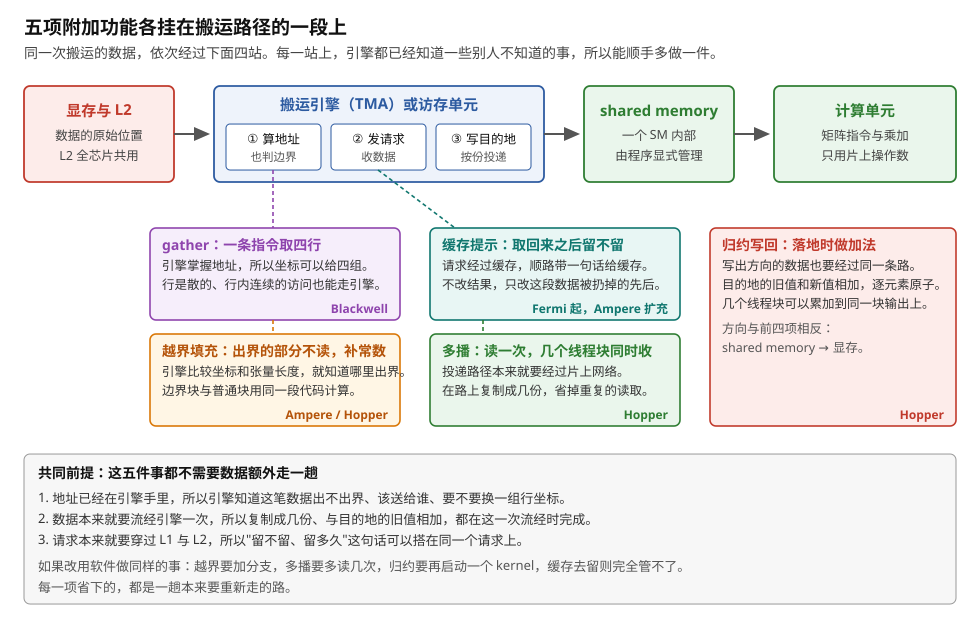
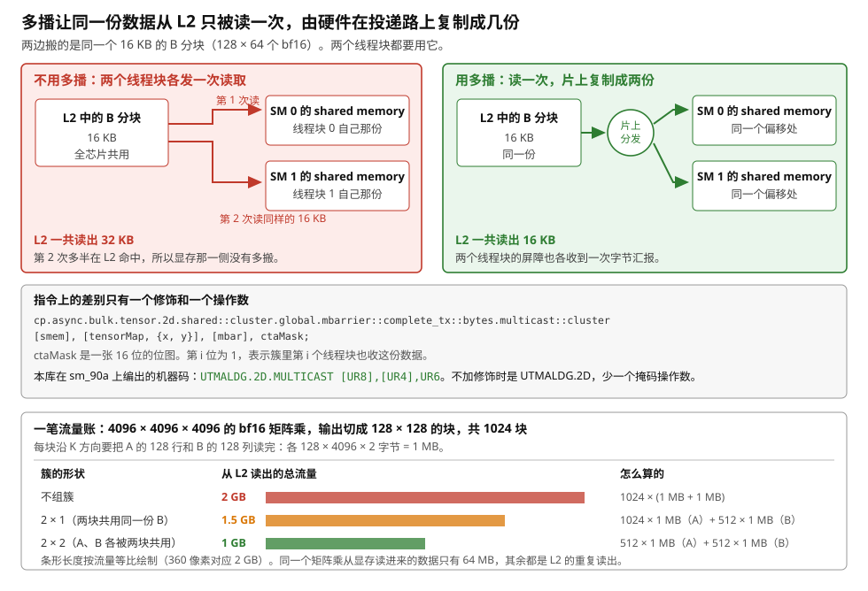
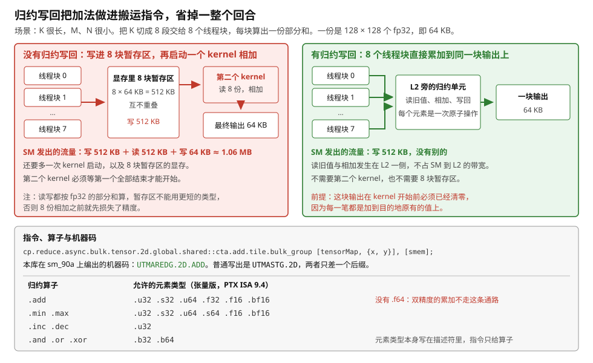
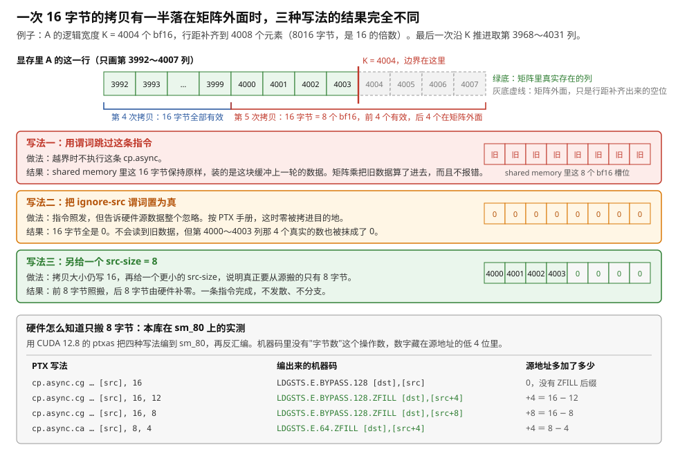
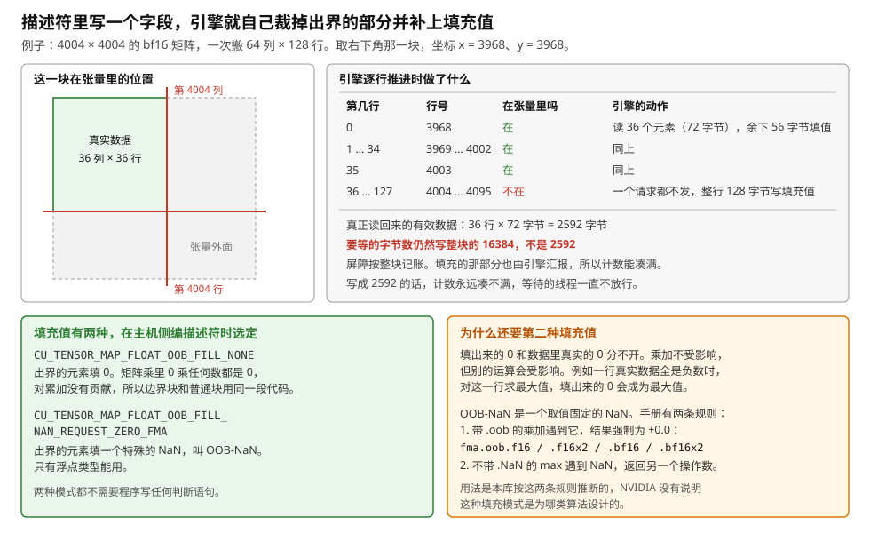
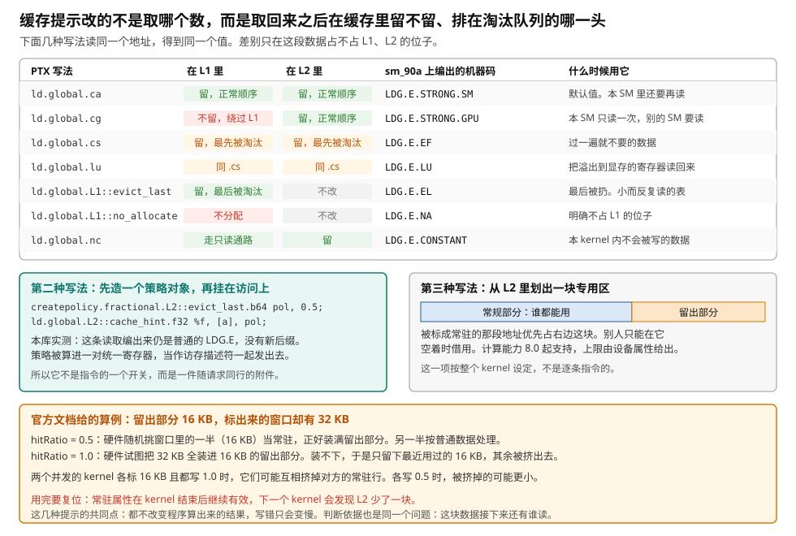

# 附加功能：多播、归约写回、越界填充、缓存提示与 gather

> **所属模块**：模块 14 · 数据搬运（第四部分 · 搬运的附加功能）
> **状态**：🟨 学习中（2026-10 新写。知识截至 2026-09）
> **一句话主旨**：搬运引擎算地址、发请求、把数据送进目的地，这三件事它本来就要做。所以有几件事可以顺带交给它：出界的部分填什么、数据送给哪几个线程块、落地时覆盖还是累加、缓存里留多久、一次取哪几行。本节讲这五项附加功能。每一项都不让数据多走一趟，代价只是指令上多一个修饰或者描述符里多一个字段。它们解决的问题各不相同，加入的代际也不同，从 Fermi 的缓存提示一直排到 Blackwell 的 gather。

---

## 0. 这一节要回答的问题

- 几个线程块要用同一份数据时，能不能只读一次？省下来的是哪一段的流量？
- 几个线程块各算出一份部分和，为什么不能直接写进同一块显存？归约写回怎么解决这件事？
- 矩阵的边长不是分块的整数倍时，边界那半块怎么搬？为什么填 0，什么时候 0 不能用？
- 缓存提示到底改了什么、没改什么？它在机器码里长什么样？
- 行是散的、行内是连续的访问（取若干行专家权重、取若干行 KV 缓存），除了让线程自己算地址，还有别的办法吗？
- 这五项各是哪一代加入的？今天写一个 kernel，怎么判断该用哪几项？

---

## 1. 基础词汇

**线程块与线程块簇（cluster）**。一个线程块是一组线程，它们跑在同一个 SM 上，共用这个 SM 的 shared memory。Hopper（2022）新增了**簇**这一层：几个线程块组成一个簇，硬件保证把它们同时调度到同一个 GPC（GPU 内部的一组 SM）里。簇内的线程块可以互相读写对方的 shared memory。可移植的簇最大是 8 个线程块，更大的簇由具体架构决定，程序用 `cudaOccupancyMaxPotentialClusterSize` 查询。

**shared memory**。shared memory 是每个 SM 内部的一块 SRAM，由程序显式管理。H100 上每个 SM 最多 228 KB。数据搬进片上以后存在这里，供反复使用。

**L1 与 L2**。L1 是每个 SM 自己的缓存。L2 是 SM 和显存之间的缓存，由全芯片 132 个 SM 共用，H100 上容量 50 MB。一次读取先查 L1，不命中再查 L2，再不命中才去显存。

**段（sector）**。显存和缓存之间按 32 字节一段传输数据。即使只需要其中 4 个字节，硬件也要搬整段。

**`cp.async`**。Ampere（2020）加入的异步拷贝指令。它把数据从显存直接写进 shared memory，不经过寄存器。每个线程各发一条，一条搬 4、8 或 16 字节。本模块第 2 节讲它。

**TMA 与张量描述符**。TMA（Tensor Memory Accelerator）是 Hopper 加入的搬运引擎。主机侧先用 `cuTensorMapEncodeTiled` 编好一个 128 字节的**张量描述符**，里面写着张量的基址、各维长度与步长、元素类型、一次搬多大一块（叫 **box**）、写进 shared memory 时怎么摆、越界怎么填。kernel 里一个线程发一条指令，带上描述符地址和一对坐标，引擎就自己算出这一块的全部地址。本模块第 3 节讲它。

**mbarrier**。mbarrier 是放在 shared memory 里的一个 64 位同步对象。TMA 搬完一段就把字节数记到它上面。线程在它上面等，等的是"这一轮要收的字节数已经到齐"。本模块第 3 节讲它的两个计数器和相位位。

**修饰（qualifier）**。PTX 的指令名是按固定槽位拼起来的，每一段叫一个修饰。例如 `cp.async.bulk.tensor.2d.shared::cluster.global` 里，`.2d` 说明张量是二维，`.global` 说明源在显存。本节讲的功能，多数就是在这串名字里多加一段，再多给一个操作数。

**本节的运行例子**。沿用全模块统一的设定：矩阵乘的输出分块是 128 × 128，沿 K 方向每次推进 64，A、B 各搬一个 128 × 64 的 bf16 分块。每块 128 × 64 × 2 = 16 KB，每推进一次搬 32 KB。线程块是 128 个线程。H100 上算完一个 128 × 128 × 64 的分块要 512 拍。本节的 KB、MB、GB 都按 1024 进位，与全模块的"一块 16 KB"一致。例如 §3.1 的 32 MB 指 32 × 2²⁰ 字节，按十进制写是 33.55 MB，本模块第 11 节用的是十进制写法。

---

## 2. 五项功能挂在同一条路径的不同段上

上一节讲了搬运途中的排列变换：swizzle、im2col、ND→NZ 都是在数据流经引擎时顺手做掉的。本节讲另外五件顺手做的事。它们不改变数据本身的排列。它们改的是五件别的事：送给谁、出界怎么办、落地时怎么写、缓存里留多久、地址可以给几组。

回到本模块的三个问题。这五项都不改"谁发起"的答案，也不改"完成怎么知道"的答案。它们全部依附于"地址从哪来"的答案：地址由引擎计算。**引擎掌握地址和张量的形状，所以它比任何线程都更早知道这笔数据的去向和边界。这几件事交给它做最省。** 图 12-1 把五项功能挂在路径上。



> **图 12-1**　一句话：一次搬运的数据要依次流过四站。五项附加功能各挂在其中一段上，都不需要数据为它们额外走一趟。
>
> **先知道一件事**：搬运引擎做三件事，顺序固定：先算出这一块数据在显存里的每一段地址，再把地址变成一批请求发出去并收回数据，最后把数据写进目的地。这三步之间，数据只流过一次。附加功能全部搭在这一次流经上。
>
> **按这个顺序看**：
> 1. 最上面一排是路径。从左到右是显存与 L2、搬运引擎、shared memory、计算单元。引擎里面画了三个小框，就是上面说的三步。
> 2. 看第 ① 步"算地址"下面挂的两项。gather 让这一步接受四组行坐标，而不是一组。越界填充让这一步在算地址的同时比较坐标和张量长度，出界的部分不发请求。
> 3. 看第 ② 步"发请求"旁边挂的缓存提示。请求本来就要穿过 L1 和 L2，所以"这段数据取回来之后留不留"这句话可以搭在同一个请求上。
> 4. 看第 ③ 步"写目的地"下面挂的多播。投递路径本来就要经过片上网络，所以在路上复制成几份，比让几个线程块各读一次便宜。
> 5. 看最右边的归约写回。它的方向和前四项相反，是从 shared memory 写回显存。数据同样只流过一次，加法做在落地的那一刻。
> 6. 每个框右下角的架构名是这一项最早出现的代际。跨度很大：缓存提示从 Fermi 就有，gather 到 Blackwell 才有。
>
> **看懂的标志**：能说出这五项为什么都归在"搬运"这一章，而不是归在计算或者同步。原因是：它们都依赖引擎手里已有的东西，也就是地址、张量形状和那一次数据流经。换成软件做同样的事，每一项都要让数据或者指令多走一趟。
>
> 来源：本库自绘。

### 2.1 走查：给一条最朴素的 TMA 读入指令逐项加修饰

下面用一条指令把这些功能串起来。起点是一条什么附加功能都不用的 TMA 读入：

```ptx
cp.async.bulk.tensor.2d.shared::cluster.global.mbarrier::complete_tx::bytes
        [smem], [tensorMap, {x, y}], [mbar];
```

它的意思是：把描述符 `tensorMap` 描述的那个二维张量中，左上角落在坐标 `{x, y}` 的那一块，搬进 shared memory 的 `smem` 处，搬完把字节数记到 `mbar` 这个 mbarrier 上。本库在 sm_90a 上把它编译出来，机器码是 `UTMALDG.2D`。下面逐项加东西，每一步只改一处：

1. **加多播。** 指令名后面接 `.multicast::cluster`，操作数末尾多一个 16 位的位图 `ctaMask`。机器码变成 `UTMALDG.2D.MULTICAST`，多一个掩码操作数。第 3 部分讲。
2. **加缓存提示。** 指令名后面接 `.L2::cache_hint`，操作数末尾多一个 64 位的策略对象。这个策略由 `createpolicy` 指令算出来。第 6 部分讲。
3. **改成取四行。** 把 `.tile`（默认的 load_mode）换成 `.tile::gather4`，坐标从 `{x, y}` 两个变成 `{col, row0, row1, row2, row3}` 五个。机器码变成 `UTMALDG.2D.GATHER4`。第 7 部分讲。
4. **越界填充不在指令上。** 它写在描述符的 `oobFill` 字段里，主机侧编描述符时就定了。指令一个字也不加。第 5 部分讲。
5. **归约写回是另一条指令。** 它的方向相反，操作码是 `cp.reduce.async.bulk.tensor`，机器码是 `UTMAREDG.2D.ADD`。第 4 部分讲。

从这个走查能看出三件事。**第一，前三项的代价是指令名长一点、操作数多一个**，没有多出任何一条指令，也没有多出一次访存。**第二，越界填充连指令都不用改**，因为它要用的信息（张量有多长）本来就在描述符里。**第三，归约写回之所以要换操作码**，是因为它改的是写入这个动作本身，不是搬运的参数。

下面逐项讲。顺序按"解决什么问题"排：先讲省流量的两项，再讲省边界算术的一项，再讲管缓存的一项，最后讲扩展访问模式的一项。

---

## 3. 多播：读一次，簇内几个线程块同时收

### 3.1 问题：同一份数据被几个线程块各读一次

矩阵乘里，输出分块排成一张网格。同一行上的几个输出分块要用同一份 A 数据，同一列上的几个要用同一份 B 数据。按本模块的例子，每个线程块沿 K 方向把 A 的 128 行和 B 的 128 列读完。如果两个线程块在 N 方向相邻，它们读的 A 数据完全相同。

这份数据多半在 L2 里命中，所以显存那一侧并没有多搬。多搬的是 **L2 到 SM 这一段**。算一笔账就知道这段流量有多大：

- 一个 4096 × 4096 × 4096 的 bf16 矩阵乘，输出切成 128 × 128 的块，共 (4096/128)² = **1024 块**。
- 每块要读 A 的 128 行 × 4096 列 × 2 字节 = **1 MB**，B 同样 1 MB。
- 合计 1024 × 2 MB = **2 GB**。

而这个矩阵乘从显存读进来的数据只有 A、B 各 4096 × 4096 × 2 = 32 MB，合计 **64 MB**。两个数相差 32 倍。**也就是说，L2 到 SM 这一段搬的字节，每 32 份里有 31 份是重复的。** 如果一个大矩阵乘受 L2 带宽限制，限制它的就是这一段流量。

### 3.2 机制：掩码指定收货人，复制发生在投递路上

Hopper 的解法是在 TMA 读入指令上加一个修饰 `.multicast::cluster`，并多给一个操作数 `ctaMask`：

```ptx
cp.async.bulk.tensor.2d.shared::cluster.global.mbarrier::complete_tx::bytes.multicast::cluster
        [smem], [tensorMap, {x, y}], [mbar], ctaMask;
```

`ctaMask` 是一张位图，默认 16 位。每一位对应簇里的一个线程块，编号就是这个线程块的 `%cluster_ctarank`。按 PTX 手册的说法，置位的那些线程块都收到这份数据，而且**落在各自 shared memory 的同一个偏移上**。屏障信号也一并送到：每个目标线程块同偏移处的那个 mbarrier 都会收到字节汇报。

数据只从 L2（或显存）读一次，复制发生在片上的投递路径上。图 12-2 把这件事和上面那笔账画在一起。



> **图 12-2**　一句话：几个线程块要用同一份数据时，这份数据可以从 L2 只被读一次，由硬件在投递路上复制成几份分别送到。省下的是 L2 到各个 SM 这一段的流量。
>
> **先知道一件事**：L2 是整块 GPU 共用的一级缓存，容量和带宽都有限。矩阵乘里同一块数据会被好几个线程块用到。各读各的，这段带宽就被重复消耗了几倍。显存那一侧不受影响，因为第二次读多半在 L2 命中。
>
> **按这个顺序看**：
> 1. 先看左半的红色部分。L2 里有一份 16 KB 的 B 分块。两条红箭头表示它被读了两次，分别送进 SM 0 和 SM 1 各自的 shared memory。L2 一共读出 32 KB。
> 2. 再看右半的绿色部分。同一份数据只被读出一次，经过中间那个片上分发的节点复制成两份，同时写进两个 SM 的 shared memory，而且落在同一个偏移上。两个线程块用同一个地址就能访问它。
> 3. 看中间那个灰框。指令上的差别只有一个修饰和一个操作数。下面一行是本库在 sm_90a 上编出来的机器码：多播版多了一个 `.MULTICAST` 后缀和一个掩码操作数。
> 4. 看最下面的流量账。横条按流量等比绘制。第一行不组簇，1024 个输出块各读 A、B 各 1 MB，共 2 GB。
> 5. 第二行是 2 × 1 的簇：两个在 M 方向相邻的块共用同一份 B，B 的读取次数减半，总量降到 1.5 GB。
> 6. 第三行是 2 × 2 的簇：A 和 B 各被两个块共用，两边都减半，降到 1 GB。
>
> **看懂的标志**：能回答"多播省的是显存带宽还是 L2 带宽"。省的是 L2 到 SM 这一段。没有多播时，第二个线程块读同一份数据多半在 L2 命中，显存并没有多搬一次。所以多播对受显存带宽限制的 kernel 没有帮助，对受 L2 带宽限制的大矩阵乘帮助很大。
>
> **与正文的对照**：16 KB 是本模块统一例子里一个 128 × 64 bf16 分块的大小。流量账用的是 4096³ 的矩阵乘，与 §3.1 的数字一致。
>
> 来源：本库自绘。

### 3.3 走查：一个 2 × 2 的簇怎么分工

多播不是"一个线程块读了分给别人"。CUTLASS 在 Hopper 上的做法是让簇成员**分摊**这次搬运。以 2 × 2 的簇、沿 K 方向搬 A 分块为例，共用同一份 A 的是 N 方向上的两个线程块（记作甲和乙）：

| 步 | 谁 | 做什么 |
| --- | --- | --- |
| 1 | 甲的一个线程 | 发一条带 `.multicast::cluster` 的 TMA 读入，坐标指向 A 分块的前一半，掩码里同时点着甲和乙 |
| 2 | 乙的一个线程 | 发同样形式的一条，坐标指向 A 分块的后一半，掩码同样点着甲和乙 |
| 3 | TMA 引擎 | 两条各从 L2 读一次，各复制成两份，分别写进甲、乙的 shared memory 的同一偏移 |
| 4 | 甲、乙的全部线程 | 在各自的 mbarrier 上等字节数到齐。两条搬运的字节都要算进期望字节数，即整块的 16 KB |

走完这一轮，甲和乙各自拿到了完整的 A 分块，而 L2 只被读了一次。**发出的指令条数没有变（两个线程块各发一条），从 L2 读出的字节数减半。**

### 3.4 代价：簇本身的调度约束

多播必须在簇内进行，所以它的代价就是簇的代价。簇里的线程块要同时被调度到同一个 GPC 里。这件事有两个后果：

- **调度灵活性下降。** 一个 GPC 里要同时空出足够容纳整个簇的 SM，簇才能开工。簇越大，满足这个条件的机会越少。
- **尾部浪费变明显。** 输出块的总数不是簇大小的整数倍时，最后那几个块凑不满一个簇。

所以簇的大小是一项权衡：簇越大，省下的 L2 流量越多，调度上的损失也越大。上面的流量账只算了收益一侧。实际取多大，要在目标 GPU 上把几种簇形状各测一次。

---

## 4. 归约写回：把加法做在落地的那一步

### 4.1 问题：几个线程块算出的部分和要合并

上一部分讲的是读入方向。写出方向上也有一件事值得交给引擎做。

设一个矩阵乘的 K 很长，M 和 N 很小。按 M、N 切块只能切出很少几个线程块，GPU 上百个 SM 大半闲着。标准解法是把 K 也切开，叫 **split-K**：K = 4096 切成 8 段，每段 512，交给 8 个线程块分头算。每个线程块算出一份**部分和**，8 份相加才是最终结果。

麻烦在于这 8 份怎么相加。8 个线程块可能跑在不同的 SM 上，开始和结束的时刻也不同。它们不能各自对同一块显存做"读出来、加上去、写回去"。原因是两个线程块可能同时读到同一个旧值，于是其中一份更新丢失。

### 4.2 机制：写出指令带一个归约算子

Hopper 的解法是让写出方向的指令带一个算子，不覆盖目的地址，而是和目的地址上已有的值做一次归约：

```ptx
cp.reduce.async.bulk.tensor.2d.global.shared::cta.add.tile.bulk_group
        [tensorMap, {x, y}], [smem];
```

按 PTX 手册，这条指令的每一次归约都是**逐元素原子**的，内存序是 `.relaxed.gpu`。所以 8 个线程块同时往同一块输出上累加，不会丢更新。

归约本身不在 SM 的计算单元上做。SM 只把源数据和算子发出去。PTX 手册只规定了原子性和内存序，没有写明运算在哪个部件上执行。本节按本模块第 1 节对普通原子操作的口径理解它：`red.global.add` 这类访问显存的原子操作，运算由 L2 旁边的原子运算单元执行。归约写回走的很可能是同一套单元，这一点是推断。

算子和元素类型是配套的。张量版允许的组合如下（取自 PTX ISA 9.4）：

| 归约算子 | 允许的元素类型 |
| --- | --- |
| `.add` | `.u32`、`.s32`、`.u64`、`.f32`、`.f16`、`.bf16` |
| `.min`、`.max` | `.u32`、`.s32`、`.u64`、`.s64`、`.f16`、`.bf16` |
| `.inc`、`.dec` | `.u32` |
| `.and`、`.or`、`.xor` | `.b32`、`.b64` |

`.add` 里没有 `.f64`。所以双精度的累加走不了这条通路。元素类型本身写在描述符里，指令只给算子。不带描述符的一维版本 `cp.reduce.async.bulk` 的类型表更宽一点，目的地是显存时 `.add` 支持 `.f64`。

### 4.3 对照实验：8 路 split-K 的两种写法

用本模块的例子算一笔账。输出分块 128 × 128，部分和按 fp32 存，一份是 128 × 128 × 4 = **64 KB**。8 路 split-K：

| | 没有归约写回 | 有归约写回 |
| --- | --- | --- |
| 第 1 步 | 8 个线程块各把部分和写进显存里 8 块独立的暂存区：写 8 × 64 KB = 512 KB | 8 个线程块各发 `cp.reduce.async.bulk.tensor.add`，累加到同一块输出上：写 8 × 64 KB = 512 KB |
| 第 2 步 | 启动第二个 kernel，读 8 份（512 KB），相加，写最终结果（64 KB） | 没有第二步 |
| SM 发出的流量 | 512 KB 写 + 512 KB 读 + 64 KB 写 ≈ **1.06 MB** | **512 KB** |
| kernel 启动 | 2 次 | 1 次 |
| 额外显存 | 8 块暂存区，共 512 KB | 没有 |

**流量减到一半，kernel 启动少一次，暂存区完全省掉。** 读旧值和相加发生在 L2 一侧，不占 SM 到 L2 的带宽。

这里有一个必须写明的前提：**这块输出在 kernel 开始前必须已经清零。** 因为每一笔都是加到目的地原有的值上。如果输出缓冲里是上一次的残留，结果就全错。实际代码里有两种做法。第一种是在 kernel 之前用 `cudaMemset` 清零。第二种是让一个线程块用普通写出放第一笔，其余线程块等它写完再做归约。第二种做法要在线程块之间多一次同步，否则归约可能先于普通写出到达，被普通写出覆盖。



> **图 12-3**　一句话：几个线程块各算出一份部分和时，归约写回让它们直接累加到同一块输出上。省掉的是一整个回合，包括一次 kernel 启动、一组暂存区和一来一回的流量。
>
> **先知道一件事**："原子"在这里的意思是：一个元素的读旧值、相加、写回这三步连在一起完成，中间不会被别的线程块插进来。没有这个保证时，两个线程块可能读到同一个旧值，于是其中一份更新被覆盖掉。
>
> **按这个顺序看**：
> 1. 先看左边红色的做法。8 个线程块各写进显存里一块独立的暂存区，共 512 KB。然后启动第二个 kernel，把 8 份读回来相加，再写出最终的 64 KB。
> 2. 看左边下方的账。SM 一共发出约 1.06 MB 的流量。第二个 kernel 还必须等第一个全部结束才能开始。
> 3. 再看右边绿色的做法。8 个线程块各发一条带 `.add` 的写出指令。中间那个框是 L2 旁边的归约单元：它读出旧值、加上新值、写回去，每个元素是一次原子操作。归约在 L2 旁边执行，是按普通原子操作的口径做的推断。
> 4. 看右边下方的账。SM 只发出 512 KB 的写。读旧值和相加都在 L2 一侧完成，不占 SM 到 L2 的带宽。
> 5. 看右下角的红字。这块输出必须在 kernel 开始前清零，因为每一笔都是加到原有的值上。
> 6. 最后看底部的表。归约算子和元素类型是配套的。`.add` 一行里没有 `.f64`，所以双精度的累加走不了这条路。
>
> **看懂的标志**：能回答"为什么不能让 8 个线程块各自做读-改-写"。因为两个线程块可能同时读到同一个旧值，各自加上自己的部分和再写回，于是先写的那一份被后写的覆盖。归约写回把这三步做成一次原子操作，所以不会丢。
>
> **与正文的对照**：64 KB 是本模块例子里 128 × 128 的 fp32 累加结果。算子与类型表取自 PTX ISA 9.4。
>
> 来源：本库自绘。

---

## 5. 越界填充：边界块不需要任何判断语句

### 5.1 问题：真实矩阵的边长不是分块的整数倍

前面的账都假设矩阵的边长正好是分块大小的整数倍。真实的矩阵不会这么听话。

设 A 的逻辑宽度 K = 4004 个 bf16。沿 K 方向每次推进 64，4004 = 62 × 64 + 36，所以最后一次推进只有 36 列真实存在，后面 28 列全在矩阵外面。

这里要先交代一件容易漏的事：**两条搬运路径都要求每行的起点 16 字节对齐**，所以行距（相邻两行的字节距离）必须补齐到 16 的倍数。4004 个 bf16 是 8008 字节，不是 16 的倍数。所以真实的代码会把行距补到 4008 个元素，即 8016 字节。补齐之后，行首对齐了，但**边界仍然可能切在一次拷贝的中间**：一个线程一次搬 16 字节，也就是 8 个 bf16，而 4004 落在 4000～4007 这一组的中间。

越界的位置要填什么？矩阵乘算的是 `累加 += A × B`。越界位置填 0，乘出来就是 0，对累加没有任何贡献。**于是边界块和普通块可以用完全一样的代码去算，循环里一句判断都不用加。** 填别的值（例如上一轮的残留）会污染结果。

### 5.2 Ampere 的做法：给 `cp.async` 一个更小的源字节数

PTX 给 `cp.async` 准备了两个可选操作数，加上最朴素的谓词写法，一共三条路：

**写法一：用谓词跳过。** 越界时不执行这条指令。**这是错的。** 指令没执行，shared memory 里那 16 字节就保持原样。在多级流水里，"原样"是这块缓冲上一轮装的数据。矩阵乘会把上一轮的残留当成本轮的数据算进去，而且不报错。

**写法二：`ignore-src`。** 这是 PTX 7.5 加的一个可选谓词操作数。手册的说法是：源数据被忽略时，零被拷进目的地。它安全，但粒度是整条指令，16 字节要么全搬要么全零。第 4000～4003 列那 4 个真实的数也会被一起抹掉。所以它只适合整条拷贝都越界的情形。

**写法三：`src-size`。** 这是 PTX 7.0 随 `cp.async` 一起引入的。拷贝大小 `cp-size` 后面还能再跟一个 32 位整数 `src-size`，手册的说法是：它表示实际要从源搬到目的的字节数，必须小于 `cp-size`。这种情况下，目的地剩下的字节被填零。手册只把"`src-size` 大于 `cp-size`"列为未定义行为，没有单独说等于的情形。Triton 生成的代码实际用到了等于：本库用 Triton 3.7 把一个带 `mask` 的 `tl.load` 编到 sm_80，得到 `cp.async.cg … 16, src-size`，`src-size` 由 `selp` 在 16 和 0 之间选。不越界时 `src-size` 等于 16，这条拷贝就是整条照搬。

所以本例要写 `cp-size = 16, src-size = 8`：前 8 字节（第 4000～4003 列）照搬，后 8 字节由硬件补零。一条指令解决。这条指令全 warp 都执行，不分两趟。

CUDA C 一层的接口把这件事表达得更直白。`<cuda_pipeline.h>` 里的原语是 `__pipeline_memcpy_async(dst, src, size_and_align, zfill)`，最后那个参数数的是**末尾要填零的字节数**，也就是 `cp-size − src-size`。

### 5.3 走查：硬件怎么知道只搬 8 字节

机器码里并没有"字节数"这个操作数。本库用 CUDA 12.8 的 ptxas 把四种写法编到 sm_80 再反汇编，结果是：

| PTX 写法 | 编出来的机器码 | 源地址多加了多少 |
| --- | --- | --- |
| `cp.async.cg … [src], 16` | `LDGSTS.E.BYPASS.128 [dst],[src]` | 0，没有 `ZFILL` 后缀 |
| `cp.async.cg … [src], 16, 12` | `LDGSTS.E.BYPASS.128.ZFILL [dst],[src+4]` | +4 ＝ 16 − 12 |
| `cp.async.cg … [src], 16, 8` | `LDGSTS.E.BYPASS.128.ZFILL [dst],[src+8]` | +8 ＝ 16 − 8 |
| `cp.async.ca … [src], 8, 4` | `LDGSTS.E.64.ZFILL [dst],[src+4]` | +4 ＝ 8 − 4 |

规律很清楚：**ptxas 把 `cp-size − src-size` 加在源地址上，再给指令加一个 `ZFILL` 后缀。** 这件事之所以成立，是因为源地址本来就要 16 字节对齐，所以地址的低 4 位是空的，正好拿来放这个数。`src-size` 写成运行时的变量 `n` 时，ptxas 生成一段 `(cp-size − n) & 0xf` 的算术，再把结果加进地址。它同时生成一个谓词 `n ≠ 0` 挂在这条 `LDGSTS` 上。原因是 `n = 0` 时偏移是 16，4 位放不下，这时谓词为假，整条拷贝写零。

同一次实测还显示：`ignore-src` 那一条编出来的是**不带 `ZFILL` 的 `LDGSTS` 加一个谓词**，而且这个谓词正好是 PTX 里 `ignore-src` 的反面。所以机器码一层的谓词含义是"源数据有效"，谓词为假时硬件写零。两种 PTX 写法在机器码里合成了同一套机制。

图 12-4 把三种写法的结果和这张实测表并排画出来。



> **图 12-4**　一句话：一次 16 字节的拷贝有一半落在矩阵外面时，跳过这条指令会留下上一轮的旧数据，整条填零会把真实数据也抹掉。只有说明真正要搬多少字节、剩下的补零，才是对的。
>
> **先知道一件事**：这里的"填零"不是随便选的填充值。矩阵乘做的是 `累加 += A × B`，越界位置填 0 乘出来就是 0，对结果没有任何贡献。于是边界块和普通块可以用同一段代码计算。
>
> **按这个顺序看**：
> 1. 最上面一排格子是显存里 A 矩阵的一行，格子里的数字是列号。绿底的第 3992～4003 列真实存在。灰底虚线的第 4004 列往后在矩阵外面，那里的字节只是行距补齐出来的空位。
> 2. 下方两个括号标出两次拷贝覆盖的范围。第 4 次拷贝的 16 字节全部有效。第 5 次拷贝覆盖第 4000～4007 列，边界恰好切在它中间。
> 3. 三个彩色面板是三种写法。每个面板右边那条 8 格的小条，画的是这次拷贝完成后 shared memory 里那 8 个 bf16 槽位实际装的东西。
> 4. 红色面板是谓词跳过：8 格全是旧数据，因为指令根本没执行。
> 5. 橙色面板是 `ignore-src`：8 格全是 0，第 4000～4003 列那 4 个真实的数也被抹掉了。
> 6. 绿色面板是 `src-size = 8`：前 4 格是真实的数，后 4 格是硬件补的 0。这才是边界块要的结果。
> 7. 最下面是本库的实测。机器码里没有字节数这个操作数，ptxas 把 `cp-size − src-size` 加在源地址上，再给指令加一个 `ZFILL` 后缀。源地址本来就 16 字节对齐，低 4 位是空的。
>
> **看懂的标志**：能回答"为什么不能先把 shared memory 清零，再用谓词跳过"。多级流水里这块缓冲每一轮都在被覆盖，想清零就得每轮额外写一遍，那是一整次 shared memory 的写入流量。而 `src-size` 是硬件在搬运途中顺手补的，不多花一条指令。
>
> **与正文的对照**：例子里 K = 4004、行距补到 4008 个元素，与 §5.1 一致。列号写的是矩阵里的绝对列号。实测用 CUDA 12.8 的 ptxas，目标 sm_80。
>
> 来源：本库自绘。

### 5.4 Hopper 的做法：写在描述符里，一个字也不用加

TMA 把这件事做得更彻底。越界怎么填不写在指令上，而是写在张量描述符的 `oobFill` 字段里，主机侧编描述符时就定了。引擎逐行推进时，自己拿坐标和张量长度比较，出界的部分不发请求，在目的地写填充值。

走查一个边缘块。张量是 4004 × 4004 的 bf16，`globalDim = {4004, 4004}`，`globalStrides = {8016}`（8016 是 16 的倍数）。box 取 64 列 × 128 行。取右下角那一块，坐标 `{x = 3968, y = 3968}`：

| 第几行 | 行号 | 在张量里吗 | 引擎的动作 |
| --- | --- | --- | --- |
| 0 | 3968 | 在 | 读第 3968～4003 列共 36 个元素（72 字节），其余 56 字节在 shared memory 里写填充值 |
| 1～34 | 3969～4002 | 在 | 同上 |
| 35 | 4003 | 在 | 同上 |
| 36～127 | 4004～4095 | 不在 | 一个请求都不发，整行 128 字节写填充值 |

结果是：shared memory 里拿到一块完整的 64 × 128 × 2 = 16384 字节，左上角 36 × 36 个元素是真数据，其余是填充值。其中有效数据只有 36 × 72 = 2592 字节。

**这里有一个必须记住的细节：mbarrier 上的期望字节数仍然写 16384，不是 2592。** 期望字节数按 box 的整块大小算，填充的那部分也由引擎汇报。如果按有效数据写，计数永远凑不满，等待的线程一直不放行，kernel 卡死。

和 `cp.async` 那条路比，TMA 这边省掉的是**每个线程的边界算术**。用 `cp.async` 时，每个线程都要拿自己负责的列号和 K 比较，算出自己的 `src-size`，这是几条整数指令。TMA 这边线程一条指令都不多算，因为比较发生在引擎内部，不在 warp 里。

### 5.5 填出来的 0 与真实的 0 分不开，所以还有第二种填充值

`oobFill` 字段有两个取值，来自 CUDA Driver API 的 `CUtensorMapFloatOOBfill`：

- `CU_TENSOR_MAP_FLOAT_OOB_FILL_NONE`：出界的元素填 0。
- `CU_TENSOR_MAP_FLOAT_OOB_FILL_NAN_REQUEST_ZERO_FMA`：出界的元素填一个特殊的 NaN，PTX 手册叫它 **OOB-NaN**。Driver API 文档写明，只有元素类型是浮点时才能选它。

为什么要有第二种？填 0 有一个副作用：**填出来的 0 和数据里真实的 0 分不开。** 对乘加来说这不影响结果，因为 0 乘任何数都是 0。但是，如果同一块数据还要参加别的运算，填出来的 0 就会被当成一个真实的数。例如对一行求最大值。这一行的 36 个真实数据如果全是负数，填出来的 28 个 0 就会成为最大值。结果是错的。

OOB-NaN 用一个特殊的 NaN 表示"这个位置在张量外面"。NaN 不是任何合法的数值，所以它不会和真实数据混在一起。PTX 手册里有两条规则，决定后续指令怎样对待它：

1. **`fma.oob` 把结果强制为 +0.0。** PTX ISA 8.1 给 `fma` 加了 `.oob` 修饰，要求 `sm_90` 及以上，只用于 `.f16`、`.f16x2`、`.bf16`、`.bf16x2`。只要有一个操作数是 OOB-NaN，结果就是 +0.0，两路 SIMD 各自判断。注意，结果是 +0.0，不是"把这一项当作 0 再加上累加值"。所以出界位置算出来是干净的 0，NaN 不会往后传。
2. **不带 `.NaN` 修饰的 `max` 跳过 NaN。** 手册给出的规则是：一个操作数是 NaN、另一个不是时，`max` 返回不是 NaN 的那个。所以上面那一行求最大值时，28 个填充位置被自动跳过。

两条合起来，同一块数据既能做逐元素的乘加，又不会在求最大值时冒充真实的数。上面的用法是本库根据这两条规则做的推断。NVIDIA 没有公开说明这种填充模式是为哪类算法设计的，这一条列进第 13 部分。

这一条有个限制：OOB-NaN 填充模式不支持 `.b4x16`、`.b4x16_p64`、`.b6x16_p32`、`.b6p2x16` 这几种 4 比特和 6 比特的打包类型。这些格式没有 NaN 编码，这是本库对原因的推测，手册只列出了限制。



> **图 12-5**　一句话：描述符里写一个字段，搬运引擎就自己裁掉出界的部分并补上填充值。填充值有两种，一种是 0，一种是能被乘加指令认出来的特殊 NaN。
>
> **先知道一件事**：张量在显存里只是一长串字节。所谓"出界"，是指按坐标算出来的位置超过了描述符里写的张量长度。引擎每推进一行就做一次这个比较，所以它不需要任何来自线程的判断。
>
> **按这个顺序看**：
> 1. 先看左边的位置图。绿色方块是真实存在的数据，36 列 × 36 行。两条红线是张量的右边界和下边界，都落在第 4004 处。三块灰色虚线区在张量外面。注意这是示意，box 和张量的比例没有按真实尺寸绘制。
> 2. 看右边的动作表。前 36 行还在张量里，引擎只读前 36 列共 72 字节，这一行剩下的 56 字节在目的地写填充值。
> 3. 看表的最后一行。第 36 行往后整行出界，引擎连一个请求都不发，整行 128 字节写填充值。
> 4. 看表下方加粗的红字。要等的字节数仍然写整块的 16384，不是有效数据的 2592。屏障按整块记账，填充的那部分也由引擎汇报，所以计数能凑满。
> 5. 看左下角的绿框。第一种填充值是 0。矩阵乘里 0 乘任何数都是 0，所以边界块和普通块能用同一段代码。
> 6. 看右下角的橙框。第二种填充值是 OOB-NaN。填出来的 0 和真实的 0 分不开。例如一行真实数据全是负数时，填出来的 0 会成为这一行的最大值。OOB-NaN 不会冒充真实的数：带 `.oob` 修饰的乘加遇到它，结果强制为 +0.0。不带 `.NaN` 修饰的 `max` 遇到它，返回另一个操作数。
>
> **看懂的标志**：能回答"为什么写出方向不需要填充值"。读入方向上，目的地是一块固定大小的 shared memory，出界的位置总要装点什么。写出方向上，目的地是张量本身，出界的位置根本不该写，所以引擎只要不发那部分请求就够了。
>
> **与正文的对照**：行与列的数字与 §5.4 的表逐行一致。字段名取自 CUDA Driver API 的 `CUtensorMapFloatOOBfill`，`fma.oob` 的语义取自 PTX ISA 手册。
>
> 来源：本库自绘。

### 5.6 写出方向与 Blackwell 的清零指令

写出方向上不需要填充值，只需要不写。PTX 手册只对读入方向写明了两种填充模式。写出方向的规则写在 CUDA 编程指南的 TMA 一节。按指南的说法，写出时 box 的一部分可以落在张量之外，只是左上角的坐标不能是负数。落在张量之外的那部分不会写进显存。本模块第 3 节引用过这条原文。所以矩阵乘收尾时，C 矩阵边缘那些不满一整块的输出不需要任何软件判断。Triton 的张量描述符文档也写明，`store` 时张量边界之外的值被忽略。

Blackwell 另外加了一条与填充有关的指令 `st.bulk`（PTX ISA 8.6，`sm_100` 及以上）：

```ptx
st.bulk.weak.shared::cta  [dst], n, 0;
```

它把一段 shared memory 整体初始化。手册写明初始值只允许是 0，长度必须是 8 的倍数，最大 16777216 字节。它和越界填充不是同一件事，但解决的是同一类麻烦：**整块缓冲的清零有了一条指令，不必让每个线程各写一遍。**

---

## 6. 缓存提示：不改结果，只改这段数据在缓存里待多久

### 6.1 三种粒度的提示

前面三项管的是数据的去向。这一项管的是数据取回来之后的命运。

PTX 允许在访存上挂一个提示，告诉缓存这段数据留不留、排在淘汰队列的哪一头。手册对它们的定性是关键的一句：**这些提示只是性能提示，不改变程序的内存一致性行为。** 写错不会算错，只会变慢。

提示分三种粒度，从细到粗：

1. **逐条指令的提示。** 写在 `ld` / `st` 的指令名里。
2. **策略对象。** 先用一条指令造出一个 64 位的策略，再把它挂在若干次访问上。
3. **整个 kernel 一次性设定。** 从 L2 里划出一块专用区，指定哪一段地址享受它。

### 6.2 逐条指令的提示，以及它在机器码里的样子

最老的一组叫**缓存操作符**，PTX ISA 2.0 就有，要求 `sm_20` 及以上，也就是 Fermi。手册给的定义如下：

- **`.ca`（cache at all levels）**：在所有层级都留一份，用正常的淘汰顺序。**这是默认值。**
- **`.cg`（cache at global level）**：只在 L2 及以下留，绕过 L1。
- **`.cs`（cache streaming）**：留，但在 L1 和 L2 都用 evict-first 策略分配。手册的说法是，这样可以限制只读一两次的临时流数据造成的缓存污染。
- **`.lu`（last use）**：语义是这是最后一次读它。手册给的典型用途是把溢出到显存的寄存器读回来、以及弹出函数栈帧。对全局地址，它的行为等同于 `.cs`。

PTX ISA 7.4 又加了一组**淘汰优先级**：`.L1::evict_first`、`.L1::evict_last`、`.L1::evict_normal`、`.L1::evict_unchanged`、`.L1::no_allocate`。L1 这一组要求 `sm_70` 及以上。L2 那一组（`.L2::evict_first` 等）直接写在 `ld` 上要到 PTX ISA 8.8，并要求 `sm_100` 及以上。CUDA 12.8 的 ptxas 只支持到 PTX ISA 8.7，所以本库没有编这一组。

本库在 sm_90a 上把各种写法编出来，机器码的对应关系是：

| PTX 写法 | sm_90a 上的机器码 | 怎么读这个后缀 |
| --- | --- | --- |
| `ld.global`（不写提示） | `LDG.E` | 默认 |
| `ld.global.ca` | `LDG.E.STRONG.SM` | 强序范围是本 SM，可以留在 L1 |
| `ld.global.cg` | `LDG.E.STRONG.GPU` | 强序范围是全 GPU，所以必须绕过 L1 |
| `ld.global.cs` | `LDG.E.EF` | EF ＝ evict first，最先被淘汰 |
| `ld.global.lu` | `LDG.E.LU` | 直接用了 LU 这个名字 |
| `ld.global.L1::evict_last` | `LDG.E.EL` | EL ＝ evict last，最后被淘汰 |
| `ld.global.L1::no_allocate` | `LDG.E.NA` | NA ＝ no allocate，不在 L1 腾座位 |
| `ld.global.nc` | `LDG.E.CONSTANT` | 只读路径，CUDA 里是 `__ldg` |
| `st.global.cs` | `STG.E.EF` | 同上，写方向 |
| `st.global.wt` | `STG.E.STRONG.SYS` | 写穿透到系统可见的层级 |

有一处值得停一下：**`.ca` 和 `.cg` 落成了作用域修饰，而不是"缓存不缓存"修饰。** 本库做了一个对照：`ld.relaxed.cta.global` 编出来也是 `LDG.E.STRONG.SM`，`ld.relaxed.gpu.global` 编出来也是 `LDG.E.STRONG.GPU`。也就是说，在 sm_90a 上 `.cg` 与 GPU 范围的 relaxed 读取编成同一条机器码，`.ca` 与线程块范围的 relaxed 读取编成同一条机器码。

这个对应说得通。PTX 手册在 `.ca` 的定义里写明，多个 L1 对全局数据互不一致：一个线程经一个 L1 写了某个地址，另一个线程经另一个 L1 用 `ld.ca` 读，可能读到旧值。所以"在全 GPU 范围内看到一致的值"这个要求，在硬件上就要求这次读取不使用 L1 里的副本。这条解读是本库从实测的指令名推出来的，NVIDIA 没有公开说明，列进第 13 部分。

同一次实测还有一个细节：显式写 `.ca` 和什么都不写，编出来不一样。手册说默认的缓存操作就是 `.ca`，但不写提示时编出来是 `LDG.E`，没有 `STRONG.SM` 后缀。

### 6.3 策略对象：提示随请求同行

第二种粒度是策略对象。`createpolicy` 造出一个 64 位的值，访存指令上写 `.L2::cache_hint` 并带上它：

```ptx
createpolicy.fractional.L2::evict_last.b64 pol, 0.5;
ld.global.L2::cache_hint.f32 %f, [a], pol;
```

`createpolicy` 有两种形态。按范围的那种给出一段地址，范围内用主优先级，紧挨在它前后的两段用次优先级。按比例的那种只给一个大于 0、不超过 1 的分数，表示访问中有多大比例享受主优先级，其余访问用次优先级。两种都在 PTX ISA 7.4 加入，要求 `sm_80`。

本库把上面这两行编到 sm_90a，结果有点出乎意料：**这条读取编出来仍是普通的 `LDG.E`，没有任何新后缀。** 在 sm_90a 上，每条 `LDG` 都带一个 `desc[URx]` 操作数，即一对统一寄存器里的访存描述符。不带提示的读取用的是默认描述符。带策略的这条读取换成了另一对统一寄存器，里面装的就是编译期算好的策略值。所以它不是指令上的一个开关，而是一件随请求同行的附件。这也解释了为什么策略可以是运行时算出来的值，而指令后缀必须在编译期定死。

和策略对象同期加入的还有两条单独的指令，都要求 `sm_80`：

- `applypriority.global.L2::evict_normal [a], 128;` 把一段 128 字节的地址在 L2 里的优先级改回正常。
- `discard.global.L2 [a], 128;` 告诉硬件这 128 字节可以直接丢弃，不必写回显存。手册的说法是，这之后读这段地址会得到不确定的值。

本库实测这两条编出来分别是 `CCTL.E.DML2` 和 `CCTL.E.RML2`，`prefetch.global.L2` 编出来是 `CCTL.E.PF2`。三条都走同一族缓存控制指令。

### 6.4 整个 kernel 的设定：从 L2 里划一块专用区

第三种粒度是 L2 驻留控制，计算能力 8.0 起支持。它分两步：

```cpp
cudaDeviceSetLimit(cudaLimitPersistingL2CacheSize, size);   // 第一步：划出专用区，上限是 persistingL2CacheMaxSize
cudaStreamAttrValue attr;
attr.accessPolicyWindow.base_ptr  = ptr;   // 第二步：指定哪一段地址享受它
attr.accessPolicyWindow.num_bytes = n;
attr.accessPolicyWindow.hitRatio  = 0.6;
attr.accessPolicyWindow.hitProp   = cudaAccessPropertyPersisting;
attr.accessPolicyWindow.missProp  = cudaAccessPropertyStreaming;
cudaStreamSetAttribute(stream, cudaStreamAttributeAccessPolicyWindow, &attr);
```

第一步的 `size` 不能超过设备属性 `persistingL2CacheMaxSize`。编程指南的示例取"L2 容量的 3/4"与这个上限中较小的一个，3/4 是示例的取值，不是硬件上限。划出来的这块，普通访问只能在它空着的时候借用。`hitRatio` 的含义是：窗口里有多大比例的访问享受 `hitProp` 这个属性，具体是哪些访问由硬件随机决定。

编程指南给了一个很能说明问题的算例。设留出部分是 16 KB，而标出来的窗口有 32 KB：

- `hitRatio = 0.5`：硬件随机挑窗口里的一半（16 KB）当常驻，正好装满留出部分。另一半按普通数据处理。
- `hitRatio = 1.0`：硬件试图把 32 KB 全装进 16 KB 的留出部分。装不下，于是只留下最近用过的 16 KB，其余被挤出去。

指南还指出一种并发下的情形：两个并发的 kernel 各标 16 KB 的窗口且都写 1.0 时，它们可能互相挤掉对方的常驻行。各写 0.5 时，被挤掉的可能更小。

还有一条容易忘的清理义务：**常驻属性在 kernel 结束后继续有效。** 下一个 kernel 会发现 L2 少了一块。指南给的三种复位办法是：用 `cudaAccessPropertyNormal` 复位这段窗口、调用 `cudaCtxResetPersistingL2Cache()`、或者等硬件自动复位。指南明确不建议依赖第三种，因为等多久不确定。



> **图 12-6**　一句话：缓存提示改的不是取哪个数，而是取回来之后在缓存里留不留、排在淘汰队列的哪一头。三种粒度分别是逐条指令、策略对象和整个 kernel 的设定。
>
> **先知道一件事**：缓存的容量有限，新数据进来就要挤掉旧数据。挤掉谁由一个淘汰顺序决定，默认是最久没用的先走。这些提示能做的，就是把某段数据在这个队列里的位置往前或往后挪。
>
> **按这个顺序看**：
> 1. 先看上半的表。每一行是一种写法。第二、三列是它在 L1 和 L2 里的去留：绿底表示留、红底表示不留、黄底表示留但排在最先被扔的位置。
> 2. 第一行 `.ca` 是默认值，两级都留。第二行 `.cg` 在 L1 那一格是红的，用在本 SM 只读一次、但别的 SM 还要读的数据上。
> 3. 第四列是本库在 sm_90a 上编出来的机器码。`.ca` 和 `.cg` 落成了 `STRONG.SM` 和 `STRONG.GPU`，也就是作用域修饰，不是缓存与否的修饰。
> 4. 看左下的绿框。策略对象先由 `createpolicy` 造出来，再挂在访问上。实测发现这条读取编出来仍是普通的 `LDG.E`，策略被当作访存描述符一起发出去。
> 5. 看右下的灰框。L2 的容量被划成常规部分和留出部分两块。被标成常驻的那段地址优先占右边那块，别人只能在它空着时借用。
> 6. 最后看底部的橙框。这是官方文档给的算例：留出部分 16 KB，窗口 32 KB。`hitRatio` 写 0.5 时正好装满。写 1.0 时装不下，硬件只留下最近用过的 16 KB，其余被挤出去。
>
> **看懂的标志**：能回答"缓存提示写错了会不会算错结果"。不会。它们是性能提示，不改变内存一致性行为，写错只会慢。所以判断该不该加的标准也简单：说不清这块数据接下来还有谁读，就不要加。
>
> **与正文的对照**：四种缓存操作符的定义取自 PTX ISA 手册的 Cache Operators 一节，淘汰优先级取自 `ld` 指令一节，L2 驻留控制的接口名与算例取自 CUDA 编程指南的 L2 Cache Control 一节。机器码由本库用 CUDA 12.8 的 ptxas 编到 sm_90a 后反汇编得到。
>
> 来源：本库自绘。

### 6.5 搬运指令上的缓存提示

上面讲的是普通 `ld` / `st`。搬运指令上也有同一套东西，只是名字不同：

- **`cp.async` 上的 `.L2::64B` / `.L2::128B` / `.L2::256B`**（PTX ISA 7.4）：这是预取大小，告诉硬件顺便多往 L2 拉这么多字节。
- **`cp.async.bulk.tensor` 上的 `.L2::cache_hint`**（PTX ISA 8.0）：和普通读取一样，带一个 64 位策略对象。
- **描述符里的 `l2Promotion` 字段**：四选一，`NONE`、`L2_64B`、`L2_128B`、`L2_256B`。CUDA Driver API 文档对它的定义是：L2 从 DRAM 填充请求的字节粒度。填 `L2_128B` 的意思是，L2 每次向显存要数据时按 128 字节一组地要。
- **`cp.async.bulk.prefetch.tensor`**（PTX ISA 8.0，`sm_90`）：只把一块张量数据拉进 L2，不写进 shared memory，也不需要 mbarrier。本库实测它编出来是 `UTMAPF.L2.2D`。

### 6.6 对照实验：同一个 kernel 里的三块数据

抽象的规则不好记，用一个具体的矩阵乘 kernel 把三种情况摆在一起。每个线程块算输出的一小块，循环里要碰三样东西：

| 这块数据 | 它的访问特点 | 该选什么 | 为什么 |
| --- | --- | --- | --- |
| A 的分块 | 同一个 SM 内会被这个线程块的多个 warp 重复读 | 默认的 `.ca` | 本 SM 内有复用，留在 L1 里下次直接命中 |
| B 的分块 | 本 SM 只读一次，但同一列的别的线程块也要读同一份 | `.cg` | 留在 L1 里本 SM 用不上第二次，留在 L2 里别的 SM 还能命中 |
| C 的输出 | 写一次，本 kernel 内不再读 | `st.global.cs` | 让它排在最先被淘汰的位置，别把 A、B 挤出缓存 |

三行的判断依据是同一个问题：**这块数据接下来还有没有人读，读它的是不是同一个 SM。** 答案是"同一个 SM 还要读"就留 L1，"别的 SM 要读"就只留 L2，"没人再读"就标成最先淘汰。这个问题答不上来，就不要加提示。默认值 `.ca` 在多数情形下并不坏，而错误的提示会让本该命中的数据被提前扔掉。

---

## 7. gather：行是散的、行内连续的读取也交给引擎

### 7.1 一条指令取四个任意的行

前面讲的搬运都假设数据是一个规则的矩形块：几行连续的数据，行与行之间隔着固定的距离。有几类负载要取的却是由索引表给出的若干行。混合专家模型（MoE）按路由结果取若干 token 的行，注意力按索引取 KV 缓存里的若干行。这些访问有一个共同的形状：**行与行之间的距离在运行时才知道，每一行内部是连续的。**

Blackwell 给 TMA 加了 `.tile::gather4` 这种读取模式（PTX ISA 8.6）。它只用于二维张量。一条指令带 5 个坐标：1 个列坐标和 4 个行坐标。引擎从源张量中取出这 4 行，在 shared memory 中拼成一个 4 行的二维块。完成照常按字节记在 mbarrier 上。反方向的 `.tile::scatter4` 把 shared memory 中的 4 行写回 4 个任意的行。

gather4 的规则、用 Triton 编出的完整走查，以及它仍然处理不了的访问，都在本模块第 4 节。本节只补两件事：这类访问在各代上分别怎么搬，以及 gather4 和 scatter4 对目标架构的要求。

### 7.2 跨代对照：取 128 个分散的行

沿用本模块第 4 节的例子：按一张 128 项的索引表，从一个 bf16 矩阵中取 128 行，每行 64 个元素（128 字节），共 16 KB。读索引这一步各代都一样，之后的搬运各不相同：

| 代际 | 用什么搬 | 发多少次 | 地址由谁算 | 完成记在哪 |
| --- | --- | --- | --- | --- |
| Ampere（`sm_80`） | 线程自己搬，`cp.async` 每次 16 字节 | 16384 ÷ 16 = 1024 次线程级拷贝 | 每个线程按行号算自己那一段 | 每个线程自己的拷贝组，之后再做一次线程块同步 |
| Hopper（`sm_90`） | 一维批量拷贝 `cp.async.bulk`，一条搬一整行 | 128 条 | 发起的线程按行号算每一行的起点 | mbarrier，按字节记 |
| Blackwell（`sm_100` 起） | `.tile::gather4` | 128 ÷ 4 = 32 条 | 引擎按描述符和行号算 | mbarrier，按字节记 |

Hopper 没有 gather 模式。它的一维批量拷贝 `cp.async.bulk`（PTX ISA 8.0，`sm_90`）可以把一段连续的字节搬进 shared memory，完成也记在 mbarrier 上。所以在 Hopper 上，"完成怎么知道"已经交给了 mbarrier，但每一行的地址仍要由线程算，一行发一条。Blackwell 的 gather4 把地址计算也交给了引擎，指令条数降到四分之一。这一行的条数是按指令语义算的，不是某个库的实测。

### 7.3 gather4 与 scatter4 对目标架构的要求不同

PTX 手册对这两种模式的目标架构要求不一样。本库用 CUDA 13.1 的 ptxas-blackwell 逐项汇编了一遍：

| 模式 | 方向与目的地 | PTX 手册的要求 | 本库实测 |
| --- | --- | --- | --- |
| `.tile::gather4` | 读入，目的地 `.shared::cta` | `sm_100` 及以上 | `sm_100`、`sm_120a` 通过。`sm_90a` 报错，提示要求 `sm_100` 或更高 |
| `.tile::gather4` | 读入，目的地 `.shared::cluster` | `sm_100a`；PTX ISA 8.8 起也支持 `sm_100f` 一族 | `sm_100a` 通过，编出 `UTMALDG.2D.GATHER4`。`sm_100` 报错 |
| `.tile::scatter4` | 写出到显存 | `sm_100a`、`sm_110a`；PTX ISA 8.8 起也支持 `sm_100f`、`sm_110f` 一族 | `sm_100a` 通过，编出 `UTMASTG.2D.SCATTER4`。`sm_120a` 报错 |

从这张表能读出一个容易忽略的差别。消费级 Blackwell（RTX 50 系列，`sm_120`）有目的地为 `.shared::cta` 的 gather4，本模块第 4 节也验证过这一点。但它没有 scatter4，手册的支持列表里没有 `sm_120`，ptxas 也直接拒绝。所以在消费级 Blackwell 上，分散的行能用引擎读进来，写回去仍要靠线程。

---

## 8. 五项功能的代际与归属

把上面几部分的结论排成一张表。版本号是 PTX ISA 版本，架构是手册写的最低要求：

| 功能 | 怎么写 | PTX ISA | 架构 | 解决的问题 |
| --- | --- | --- | --- | --- |
| 缓存操作符 `.ca` / `.cg` / `.cs` / `.lu` | 写在 `ld` / `st` 指令名里 | 2.0 | `sm_20`（Fermi） | 数据取回来之后留不留 |
| 越界填零 `src-size` | `cp.async` 的第四个操作数 | 7.0 | `sm_80`（Ampere） | 边界块与普通块用同一段代码 |
| 淘汰优先级、`createpolicy`、`applypriority`、`discard` | 指令修饰与单独的指令 | 7.4 | `sm_70` / `sm_80` | 更细地指定缓存去留 |
| L2 驻留控制 | `cudaDeviceSetLimit` 与流属性 | 不适用 | 计算能力 8.0 | 把一段地址钉在 L2 里 |
| `ignore-src` | `cp.async` 的谓词操作数 | 7.5 | `sm_80` | 整条拷贝都越界的情形 |
| 越界填充 `oobFill` | 描述符字段，两种填充值 | 不适用 | `sm_90`（Hopper） | 引擎自己裁边界 |
| `fma.oob` | `fma` 的修饰，限 `.f16`、`.f16x2`、`.bf16`、`.bf16x2` | 8.1 | `sm_90` | 遇到 OOB-NaN 时结果为 +0.0 |
| 簇内多播 `.multicast::cluster` | 指令修饰加一个掩码 | 8.0 | `sm_90` | 省 L2 到 SM 的流量 |
| 归约写回 `cp.reduce.async.bulk.tensor` | 单独的操作码 | 8.0 | `sm_90` | split-K 省掉一个回合 |
| 张量预取 `cp.async.bulk.prefetch.tensor` | 单独的操作码 | 8.0 | `sm_90` | 先把一块拉进 L2 |
| `.tile::gather4` / `.tile::scatter4` | load_mode，坐标变五个 | 8.6 | gather4：`sm_100` 及以上，含消费级的 `sm_120`；scatter4：`sm_100a`、`sm_110a` 与对应的 `f` 一族，不含 `sm_120`（详见 §7.3） | 行是散的访问也走引擎 |
| `st.bulk` | 单独的操作码 | 8.6 | `sm_100` | 整块 shared memory 清零 |
| `.multicast::cluster::32b`、地址覆盖、有效性汇报 | 指令修饰 | 9.4 | `sm_107f` 一族 | 簇更大、描述符不用重编 |

最后一行的 `sm_107f` 对应哪一代产品，PTX ISA 文档没有说明，列进第 13 部分。

### 8.1 走查：一个 Hopper 矩阵乘用到其中哪几项

把这张表落到一个具体的 kernel 上。设在 H100 上写一个 bf16 矩阵乘，输出 128 × 128，用 2 × 2 的簇，K 维要切 8 段：

1. **主循环的 A、B 读入**：用带 `.multicast::cluster` 的 TMA 读入，掩码点着簇里共用这份数据的两个线程块。省 L2 流量。
2. **矩阵边缘的那些块**：描述符的 `oobFill` 填 `NONE`，引擎自己裁边界并补 0。代码里一句判断都不加。
3. **K 维的最后一段**：同样由 `oobFill` 处理，因为边界在 K 方向上也可能不整除。
4. **收尾写回**：8 段各自的部分和用 `cp.reduce.async.bulk.tensor.add` 累加到同一块输出上。输出缓冲在 kernel 之前已经清零。
5. **缓存提示**：主循环的读入走 TMA，所以逐条指令的 `.cg` 用不上。要调的是描述符里的 `l2Promotion`，以及必要时给 B 的描述符挂一个 `.L2::cache_hint` 策略。
6. **gather**：这个 kernel 用不到，因为数据是规则的分块。

**五项功能里，多播、越界填充、归约写回三项直接用上，缓存提示换成了描述符字段和策略对象的形式，gather 用不上。** 这个顺序就是选用的判据：先看数据的形状规不规则，再看有没有别人也要用同一份，再看输出是覆盖还是累加，最后才轮到缓存提示。

### 8.2 本模块到这里结束

本节是模块 14 的最后一节。把四个部分连起来，三个问题的答案是这样走过来的。第一部分讲 GPU 上"谁发起、地址从哪来、完成怎么知道"如何一代代改变，从线程自己搬，变成由一个线程向引擎发起。第二部分讲 NPU 从一开始就只有引擎这一条路，代价是依赖关系要由编译器或程序员显式写出。第三部分讲跨出芯片之后，发起者换成了 copy engine 和网卡。第四部分讲引擎掌握地址之后顺带多做的几件事。

再往下，有两个方向。**想看这些机制在真实代码里怎么拼起来**，去模块 40：那里的软件流水和代码精读，把本模块的指令组织成完整的主循环。**想看数据为什么要排成那个样子**，去模块 50：那里从数据的角度重新走一遍存储层级，本模块第四部分讲的是由谁、在哪一段路径上把数据排成那样。

---

## 9. 开发者视角

| 想知道什么 | 在哪一层看 | 看什么 |
| --- | --- | --- |
| 这个 kernel 用没用多播 | SASS | 搜 `UTMALDG`，看有没有 `.MULTICAST` 后缀 |
| 多播生效没有 | Nsight Compute | 改簇尺寸前后比较 L2 的读流量。生效时流量按共享的块数下降 |
| 用没用归约写回 | SASS | 搜 `UTMAREDG`。普通写出是 `UTMASTG` |
| 边界块处理对不对 | 对拍 | 编译器不检查，性能工具也查不出来。用与 CPU 参考实现对拍，或者把 `oobFill` 临时改成 NaN 模式，越界读会立刻在结果里显形 |
| 期望字节数写对没有 | 现象 | 写大了 kernel 卡死，写小了屏障提前放行、读到半截数据。两种都不报错 |
| 缓存提示编成了什么 | SASS | `cuobjdump -sass` 看 `LDG` 的后缀：`EF`、`EL`、`NA`、`LU`、`STRONG.SM`、`STRONG.GPU` |
| L2 驻留有没有起作用 | Nsight Compute | 看 L2 命中率，以及 `Memory Workload Analysis` 里 L2 的读写分布 |
| gather 能不能用 | 编译器回执 | 目标架构不满足要求时 ptxas 直接报错，报错里写明需要哪个架构 |

在哪一层能接触到这些功能：

- **PyTorch**：接触不到。这些功能藏在 cuBLAS、cuDNN 和各种融合算子后面。
- **Triton**：间接。`tl.load` 的 `mask` 参数在 Ampere 路径上编译成 `cp.async` 的越界处理；张量描述符 API（`tl.make_tensor_descriptor`）会走 TMA，于是描述符里的越界填充自动生效。多播和归约写回由编译器根据代码形态决定，不由用户直接写。
- **CUDA C 与 CUTLASS**：完整的控制面。多播由 `ClusterShape` 模板参数控制，越界填充由描述符的编码参数控制，归约写回有对应的拷贝原子，缓存提示有内建函数和 `__ldg`、`__pipeline_memcpy_async` 这类原语。
- **SASS**：只能观察，不能改。

---

## 10. 最新架构落点（知识截至 2026-09）

- **NVIDIA**：Hopper 一次性加入了多播、归约写回、描述符级的越界填充和张量预取。Blackwell 在此基础上加了 gather4 与 scatter4、`st.bulk`，并把 TMA 读入的目的地放宽到 `.shared::cta`。PTX ISA 9.4 又加了几项标着 `sm_107f` 一族的修饰：`.multicast::cluster::32b` 把多播掩码从 16 位加宽到 32 位，`.override::global_address` 与 `.override_attribute` 让下单指令临时覆盖描述符里的基址或维度，`.report_mechanism` 让引擎按指定的粒度把哪些字节有效报进 mbarrier。前两项说明簇可以更大，描述符不必为每种形状各编一份。第三项的完整用法文档里没有给，列进第 13 部分。
- **AMD（CDNA）**：缓存提示这一格有对应物，CDNA 的访存指令上有自己的缓存控制位。越界这一格的做法不同：AMD 用 buffer 寻址，由硬件按缓冲描述符里的长度做范围检查，越界访问被钳制住，不会读写到缓冲之外。ROCm 的 Composable Kernel 文档把这称为硬件辅助的边界检查，并说它不额外占用访存路径的时间。越界读返回什么值，官方文档没有写明，上层库另有一套参数让程序员指定返回 0 或者一个哨兵值。多播和归约写回这两格，公开 ISA 文档里我没有找到对应物。
- **NPU（昇腾）**：越界填充这一格有直接的对应物。Ascend C 的 `DataCopyPad` 在从全局内存搬进向量缓冲时支持填充，参数是一个结构体 `DataCopyPadExtParams`，字段有 `isPad`、`leftPadding`、`rightPadding`、`paddingValue`。和 TMA 比有三处不同：填充量由程序显式给出，不由引擎比较张量长度得出；填充值是任意的，不限于 0 和 NaN；左右两侧的填充都不能超过 32 字节。还有一个要当心的默认行为：数据长度不满 32 字节对齐、而两个填充量都写 0 时，官方文档说默认用这段数据的第一个元素来补。
- **TPU**：越界这一格的口径最松。JAX Pallas 的文档写明，分块大小不能整除整体形状时，最后一次迭代仍然拿到一整块，出界的元素在输入侧被补上、在输出侧被丢弃，**但补的值是未指定的，应当假设是垃圾**。只有 `interpret=True` 的解释执行模式下才补 NaN，而且文档说不要依赖这个行为。所以 TPU 上的边界处理要靠程序自己加掩码。

---

## 11. 和其它模块的挂钩

- **模块 14 第 1 节**（为什么要搬，以及最朴素的搬法）：记分牌、访存合并，以及"完成挂在寄存器上"的代价。本节 §7.2 的跨代对照里，Ampere 那一行走的就是那条路线。
- **模块 14 第 2 节**（Ampere 的 `cp.async`）：`cp.async` 的完整语义、组语义与多级流水。本节 §5.2 讲的越界填充是它的一个可选操作数。
- **模块 14 第 3 节**（Hopper 的 TMA 与 mbarrier）：张量描述符逐字段、引擎内部的地址生成、mbarrier 的两个计数器。本节讲的多播、归约写回、越界填充都挂在那套机制上。
- **模块 14 第 4 节**（Blackwell 的 TMEM 与 `tcgen05.cp`）：Blackwell 把搬运引擎的职责延伸到矩阵单元的专用存储。gather4 的规则、Triton 走查和它处理不了的访问都在那一节。本节 §7 只补跨代对照与目标架构的要求。
- **模块 14 第 11 节**（途中变换）：swizzle、im2col、ND→NZ。那一节讲的是改变数据的排列，本节讲的是不改排列的另外五件事。
- **模块 10 第 4 节**（访存通路）：L1、L2、段与合并的硬件细节。本节 §6 的缓存提示作用在这条通路上。
- **模块 10 第 5 节**（同步全家桶）：mbarrier 作为同步件的定位。本节多次用到"在 mbarrier 上等字节数"。
- **模块 12 第 1 节**（Tensor Core）：`fma.oob` 服务的是矩阵乘的累加。越界填充选 0 还是 NaN，取决于计算侧怎么解释这个值。
- **模块 21**（封装与堆叠存储）：HBM 的带宽与延迟。本节 §3 的流量账要和显存带宽一起看才完整。
- **模块 50 第 1 节**（存储层级与搬运指令全图）：搬运指令矩阵。本节讲的是那张表里各条指令的可选修饰。

---

## 12. 术语卡

### 簇内多播（multicast::cluster）
**定义**：簇内多播是 TMA 读入指令上的一个修饰，配一个位图操作数，默认 16 位，每一位对应簇里的一个线程块。数据从 L2 只读一次，由硬件在投递路径上复制成多份，同时写进多个线程块 shared memory 的同一个偏移处。屏障信号也一并多播。
**为什么存在**：矩阵乘里同一个分块会被相邻的几个线程块用到。没有多播时每个块各读一次，L2 到 SM 的流量翻几倍。有多播时读一次、复制多份，这段流量直接除以共享的块数。如果一个大矩阵乘受 L2 带宽限制，多播直接减少这段流量。
**语境例句**："把 cluster 开成 2×2，L2 读流量掉了一半。" 意思是：A 和 B 各被簇内两个块共享，两边的读取次数都减半。CUTLASS 的 Hopper 矩阵乘默认就是这么配的。

### 归约写回（cp.reduce.async.bulk.tensor）
**定义**：归约写回是一条写出方向的搬运指令，它带一个归约算子。数据不覆盖目的地址，而是和目的地址上已有的值做一次归约。每个元素的运算是原子的，内存序是 `.relaxed.gpu`。算子有 `.add`、`.min`、`.max`、`.inc`、`.dec`、`.and`、`.or`、`.xor`，每个算子允许的元素类型不同。
**为什么存在**：split-K 把累加维切开交给几个线程块算，几份部分和必须合并。没有这条指令时，要先写进几块暂存区，再启动第二个 kernel 把它们读回来相加。有了它，几个线程块直接累加到同一块输出上，省掉一次 kernel 启动和一来一回的流量。
**语境例句**："split-K 走 reduce 写回，别再起一个 reduce kernel 了。" 意思是：用带 `.add` 的写出指令直接累加，但要记得输出缓冲在 kernel 之前必须清零。

### 越界填零（zfill / src-size）
**定义**：越界填零是 `cp.async` 的一种用法。在拷贝大小 `cp-size` 之外再给一个更小的 `src-size`，硬件就只从源地址搬 `src-size` 个字节，目的地剩下的字节自动填零。CUDA C 一层的接口是 `__pipeline_memcpy_async` 的 `zfill` 参数，它数的是末尾要填零的字节数。
**为什么存在**：矩阵的边长很少正好是分块的整数倍，边界上的块总有一部分落在矩阵外面。矩阵乘里越界位置填 0，乘出来就是 0，对累加没有贡献，于是边界块和普通块能用同一段代码。而一次拷贝是 16 字节，边界常常切在中间，只有 `src-size` 能表达"前半截搬、后半截填零"。
**语境例句**："边界那一块记得用 zfill 版的 copy，别用带谓词的。" 意思是：越界时不要跳过这条拷贝指令，那样 shared memory 里留的是上一轮的旧数据，会被算进结果。

### 越界填充模式（oobFill）与 OOB-NaN
**定义**：`oobFill` 是张量描述符里的一个字段，决定引擎给出界的元素填什么。两个取值是填 0 和填一个特殊的 NaN，后者叫 OOB-NaN，只对浮点类型可用。带 `.oob` 修饰的乘加指令认出 OOB-NaN 之后，把结果钳成 +0.0。
**为什么存在**：填 0 的前提是 0 在这个算法里不是合法的输入值。注意力的分数矩阵不满足这个前提，分数等于 0 表示一个正常的相关度。OOB-NaN 用一个不会和真实数据撞车的值表示"这个位置不存在"，于是不占用任何一个合法的数值。
**语境例句**："这个 kernel 的描述符要用 NaN 模式，不然 mask 会被当成真分数。" 意思是：出界位置如果填 0，会和真实的 0 分混在一起；用 OOB-NaN 才能让这些位置在后续的乘加里归零。

### 缓存操作符（cache operator）
**定义**：缓存操作符是写在 `ld` / `st` 指令名里的一段修饰，告诉缓存这段数据取回来之后留不留、排在淘汰队列的哪一头。常用的四种是 `.ca`（各级都留，默认）、`.cg`（绕过 L1，只留 L2）、`.cs`（留但最先被扔）、`.lu`（这是最后一次读它）。PTX 手册写明它们只是性能提示，不改变程序的内存一致性行为。
**为什么存在**：缓存的淘汰顺序默认是最久没用的先走，这个顺序对流式数据不利。过一遍就不要的数据会把真正有复用的数据挤出去。缓存操作符让程序把自己知道的复用信息告诉硬件。
**语境例句**："输出那一路加个 `.cs`，别把 A、B 挤出 L2。" 意思是：写出去就不再读的数据标成最先淘汰，把缓存位置留给反复读的输入。

### L2 驻留控制（L2 persistence）
**定义**：L2 驻留控制是计算能力 8.0 起的一项设定。先用 `cudaDeviceSetLimit` 从 L2 里划出一块专用区，上限由设备属性 `persistingL2CacheMaxSize` 给出。再通过流属性指定一段地址享受它，参数包括起点、长度、`hitRatio` 和命中与否各自的属性。标成常驻的地址优先占用那块专用区，别的访问只能在它空着时借用。
**为什么存在**：有些数据在整个 kernel 里反复被读，例如推理时的一小块权重或者一张索引表。普通的淘汰顺序保不住它们。这项设定把一块容量按地址段预留出来。
**语境例句**："窗口开得比 set-aside 还大，结果两头落空。" 意思是：标出来的地址段超过了划出的容量，硬件只能挑着留，热数据没留住，常规部分还被挤小了。

### 行集合搬运（tile::gather4）
**定义**：`.tile::gather4` 是 Blackwell 给 TMA 加的一种读取模式。它只对二维张量有效，指令带五个坐标，一个列坐标加四个行坐标，引擎把这四行各取一段拼成目的地的一个二维块。反方向的 `.tile::scatter4` 把一个二维块拆散写回四行。两者对目标架构的要求不同：gather4 在 `sm_100` 及以上都有，scatter4 不支持消费级的 `sm_120`。
**为什么存在**：MoE 取专家权重、注意力取 KV 缓存、嵌入层查表，这几类访问的形状都是行散、行内连续。此前它们只能退回逐线程算地址那条路，完成记在寄存器上，用不了描述符和 mbarrier 这套机制。
**语境例句**："KV 那一段换成 gather4 之后，producer warp 也能管它了。" 意思是：这类不规则读取有了引擎版本，完成记在 mbarrier 上，于是能并进生产者 / 消费者的分工里。

---

## 13. 我的困惑 / 待深挖

- **机器码里 `ZFILL` 的编码是推出来的。** `cp-size − src-size` 加在源地址低 4 位上，这是从 ptxas 生成的四段代码里推出的规律，不是公开文档。硬件把低位解释成"跳过几字节"还是"有效几字节"，两种解释在本例里结果相同。要区分它们，需要另做实验。
- **`ignore-src` 与 `src-size` 在机器码里合成了一套机制**，这同样是从生成代码推出来的。手册把它们写成两个独立的可选操作数，没有说明实现上是不是同一件事。
- **`.ca` / `.cg` 落成作用域修饰**这条解读是本库从实测的指令名推出来的，NVIDIA 没有公开说明。同一次实测里，不写提示编出 `LDG.E`，显式写 `.ca` 编出 `LDG.E.STRONG.SM`。手册说默认就是 `.ca`，两者为什么编得不一样，我没有找到解释。
- **OOB-NaN 的用途是推断的。** 本节给的用法（求最大值这类运算里，填出来的 0 会冒充真实数据）是按 `fma.oob` 和 `max` 的手册规则推出来的。NVIDIA 没有说明这种填充模式是为哪类算法设计的，也没有给使用范例。
- **归约写回在哪个部件上执行，手册没有写。** PTX 只规定了逐元素原子和 `.relaxed.gpu` 内存序。本节按普通原子操作的口径，推断它由 L2 旁边的原子运算单元执行。需要一手出处或者实测来确认。
- **归约写回的吞吐没有公开数字。** 逐元素原子的归约单元每拍能处理多少字节，NVIDIA 没有公布。split-K 的路数开大时，这个数决定会不会在收尾处堵住。
- **多播省下的流量有没有公开实测。** §3.1 的 2 GB 和 1 GB 是按分块结构算出来的上界，真实 kernel 的 L2 读流量还受线程块调度顺序影响。簇变大带来的调度损失也没有公开数字。需要用 Nsight Compute 在改簇尺寸前后各测一次。
- **`sm_107f` 对应哪一代产品。** PTX ISA 9.4 新增了 `sm_107`、`sm_107f`、`sm_107a` 三个目标。一批新修饰标的是 `sm_107f` 一族。文档没有说明它对应哪个产品。
- **`.report_mechanism`（PTX ISA 9.4）的用法。** 手册列出了六种取值，按每 16 字节或每元素的粒度汇报有效性。它看起来是为稀疏或变长搬运准备的。文档里没有完整的使用范例。
- **AMD 越界读返回什么值。** ROCm 文档只说硬件把越界访问钳制住，没有写明读到的是 0 还是别的。需要查 CDNA 的 ISA 手册原文。
- **昇腾的 `DataCopyPad` 在搬运路径的哪一段做填充。** 文档只给了接口参数，没有说明是 MTE2 在搬运途中补，还是落地后另外写一遍。这决定了它要不要额外花一次写入流量。

---

*最后更新：2026-10-03（2026-10-02 第一版。本次检查：核对 PTX ISA 9.4、CUDA Driver API 与 L2 缓存控制文档的原文，重跑 sm_80 / sm_90a / sm_100a / sm_120a 的汇编实测，§7 的 gather4 机制压缩为指向第 4 节并改写成跨代对照，补 `fma.oob` 与 gather4 / scatter4 的架构要求。配图 6 张，其中现成 0 张、自绘 6 张；删去与第 4 节重复的 gather4 图 1 张）*
