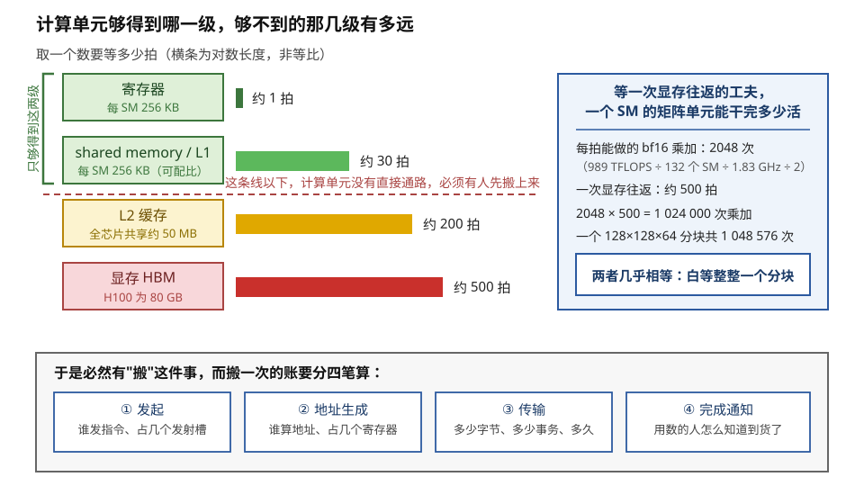
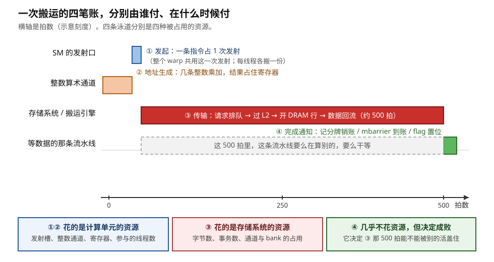
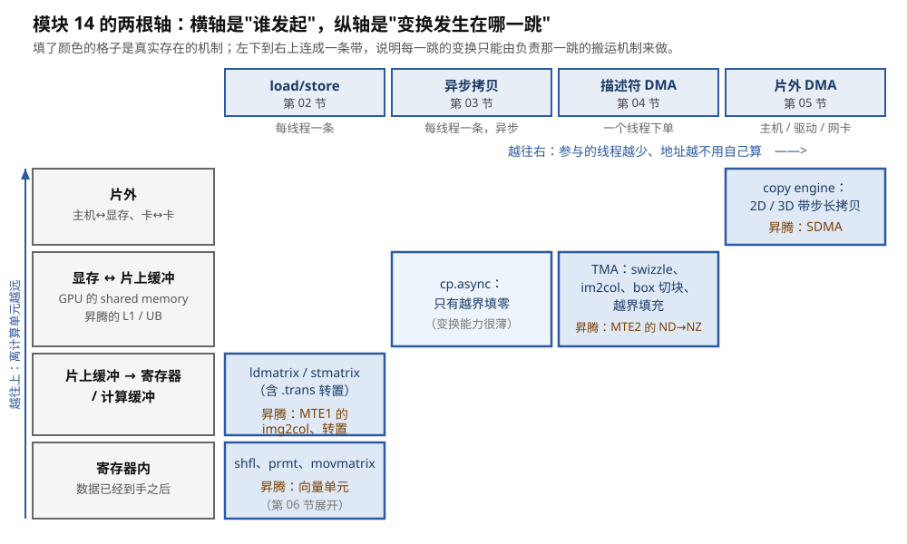
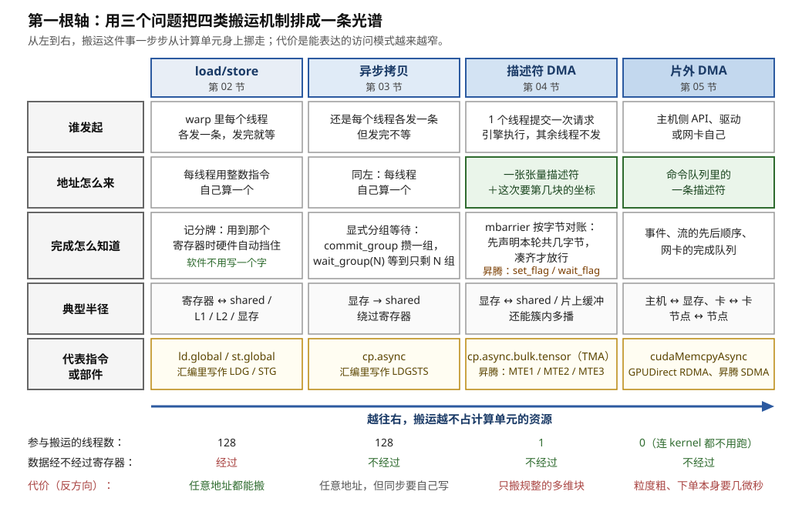
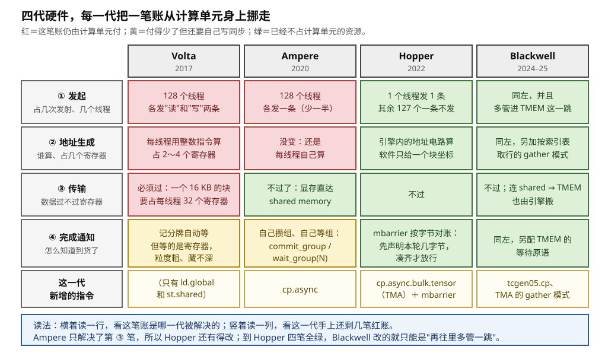
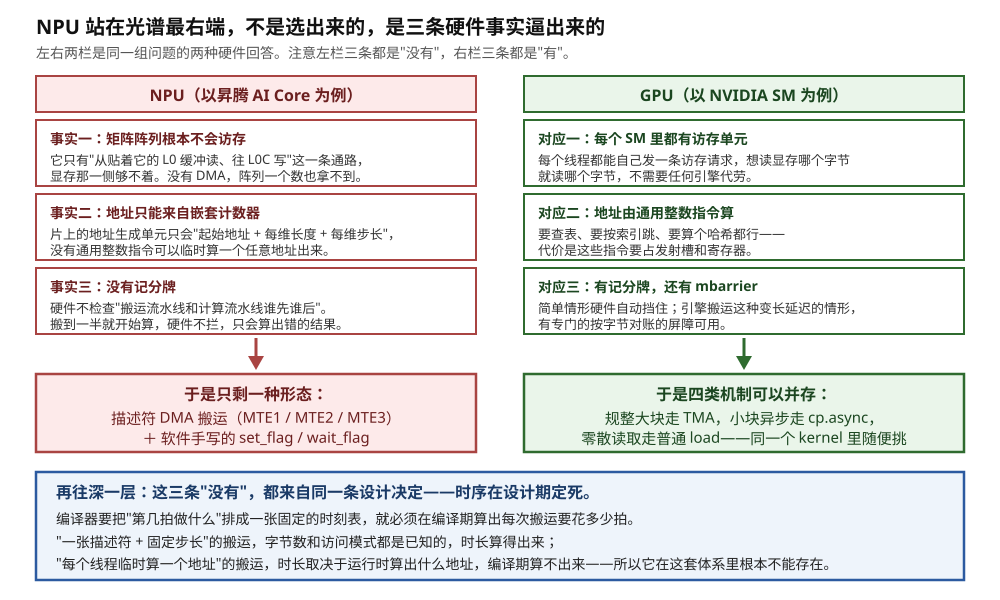
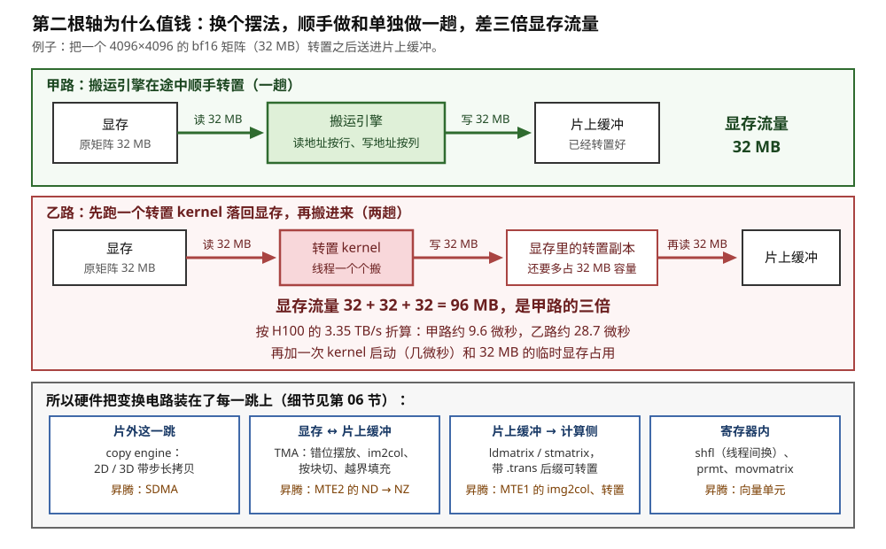
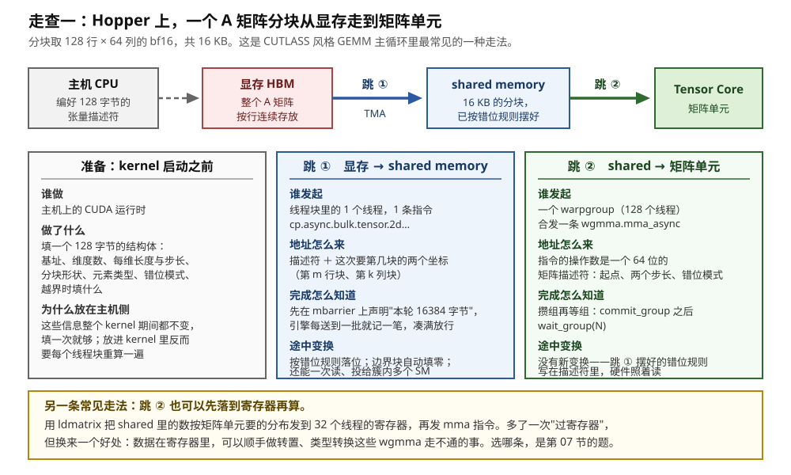
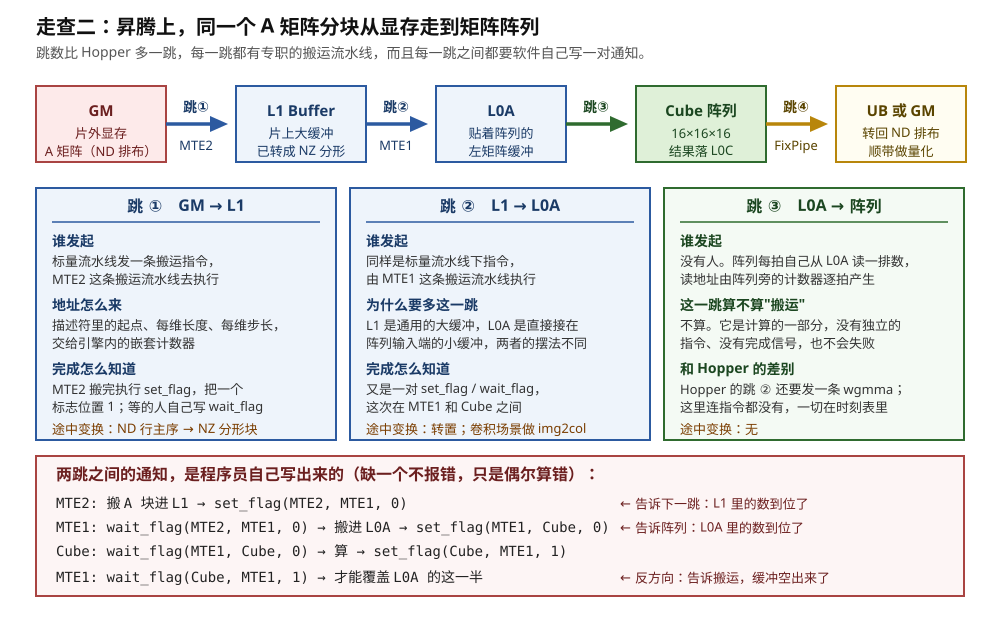

# 搬运的全景：谁发起、地址怎么来、完成怎么知道

> **所属模块**：模块 14 · 数据搬运
> **状态**：🟨 学习中（第一版。知识截至 2026-09）
> **本节主旨**：模块 10 到 13 讲完了"算"的部件——SM 里的执行通道、脉动阵列里的乘加格子、它们的电路形态。但这些部件全都有一个共同的短板：**它们够不到显存**。乘加电路的输入端只接得到寄存器和贴着它的那一小块片上存储，数据要从显存、从主机内存、从别的卡过来，每一跳都得有人去搬。这一节是整个模块的地图，做三件事：第一，把"一次搬运"拆成**发起、地址生成、传输、完成通知**四笔账，每笔账用具体数字说清它花掉的是谁的资源；第二，给出**第一根轴——发起者**，用"谁发起、地址怎么来、完成怎么知道"三个问题，把 load/store、异步拷贝、描述符 DMA、片外 DMA 这四类机制排成一条光谱，并解释硬件为什么一代代往光谱右边走，以及 NPU 为什么一出生就站在最右端；第三，给出**第二根轴——途中变换**，说明数据在搬运途中顺手换个摆法为什么能省掉整整两趟显存往返。最后用一个 GEMM 的 A 矩阵分块，在 Hopper 和昇腾上各走一遍完整的路，每一跳都写明源、目的、发起者和完成信号。02 到 06 节按这两根轴逐格展开，07 节回来做选型。

---

## 0. 这一节要回答的问题

- 为什么计算单元不能直接用显存里的数，必须先搬？不搬的代价具体是多少？
- 一次搬运的代价由哪几部分组成？每一部分花掉的是谁的资源、用什么单位计量？
- "谁发起、地址怎么来、完成怎么知道"这三个问题，怎么把六七个名字（load/store、`cp.async`、TMA、MTE、copy engine、RDMA）排成一条有序的光谱？
- 为什么硬件一代代往光谱右边走？Volta 只有 load/store，Ampere 加了 `cp.async`，Hopper 加了 TMA，Blackwell 加了 `tcgen05.cp`——每一步分别解决了上一步的什么痛点？
- NPU 为什么从一开始就站在光谱最右边？这和模块 11 讲的"时序在设计期定死"是什么关系？
- 为什么需要"途中变换"这第二根轴？它和发起者那根轴是什么关系？
- 一个 GEMM 的 A 矩阵分块，从显存到进入矩阵单元，在 Hopper 和昇腾上分别经过哪几跳？每一跳是哪类机制、途中有没有变换？

---

## 1. 基础词汇：先把本节要反复用的词讲清楚

**搬运（data movement）**。把同一份数据从一个存储位置复制到另一个存储位置，内容不变（或只换摆法，不换数值），位置变了。它和"计算"是两件事：计算产生新的数值，搬运只是换地方。本模块讲的全部内容都是搬运，不涉及任何一次乘加。之所以值得单独立一个模块，是因为在今天的芯片上，**搬运花掉的时间和能量，通常比计算本身多得多**——后面会用数字说明这句话。

**发起者（initiator）**。一次搬运是被谁触发的。这是本节最重要的一个概念，因为**同样搬 16 KB 数据，发起者不同，成本结构完全不同**：有的搬法要动用 128 个线程，每个线程发好几条指令、占好几个寄存器；有的搬法只要 1 个线程发 1 条指令；还有的搬法连 kernel 都不用跑，主机侧下个命令就行。发起者决定了这次搬运**抢的是谁的资源**，也决定了它能和什么并行。

**地址（address）**。存储器上每个字节都有一个编号，这个编号就是地址。要搬一块数据，硬件必须知道每个字节的地址。听起来像废话，但这里藏着本节的一半内容：**地址是谁算出来的**。一个二维矩阵的分块，在显存里不是连续的一段——第 0 行的 64 个数连在一起，第 1 行的 64 个数在很远的地方（隔了整整一行的宽度）。要把这个分块搬出来，就得算出 128 组起点。这些乘加运算由谁来做，是区分四类搬运机制的关键。

**完成通知（completion signal）**。搬运不是瞬间完成的，从发出请求到数据真的躺在目的地，要等几百个时钟周期。**用数的那一方怎么知道数据到了？** 这个问题有好几种答案：硬件自动挡住你（记分牌）、软件自己数着组等（`wait_group`）、在一个计数器上按字节对账（mbarrier）、或者干脆靠编译期排好的时刻表（NPU）。选哪种答案，直接决定了程序有多容易写错。

**发射槽（issue slot）**。GPU 的一个 SM 里有几个指令调度器（H100 是 4 个），每个调度器每个时钟周期最多发出 1 条指令，所以**整个 SM 每拍最多发出 4 条指令**，这 4 个名额就叫发射槽。这是一种会被抢光的资源：搬运指令占了一个名额，这一拍就少一条计算指令的机会。注意一个容易搞混的地方——**一条指令是由整个 warp（32 个线程组成的执行单位）一次发出的，只占 1 个发射槽**，哪怕这 32 个线程各自搬各自的那一份数据。所以"每线程 8 条指令"和"占掉 8 个发射槽"不是一回事，前者要除以 32。

**描述符（descriptor）**。一个小结构体，把"一次搬运要做什么"完整地写在里面：源地址、目的地址、每一维有多长、每一维的步长是多少、元素是什么类型。它是"交给引擎去搬"这种做法的前提——引擎不会读你的程序，只会读这张表。NVIDIA 在 TMA 里管它叫 **tensor map（张量描述符）**，是一个 128 字节的结构；昇腾的 DMA 引擎读的也是同类的东西。

**途中变换（in-flight transform）**。搬运的同时，顺手把数据换一个摆法：转个置、把行列错开摆、把卷积的滑窗展开成矩阵的行、把不足一块的边界补上零。关键词是"顺手"——**不额外读一遍、不额外写一遍**。它是本模块的第二根轴，第 8 节会算清楚"顺手做"和"单独做一趟"差多少。

**分块（tile）**。把一个大矩阵切成能装进片上存储的小块，一块一块地搬进来算。本节从头到尾用同一个例子：一个 **128 行 × 64 列的 bf16 分块**（bf16 是一种 2 字节的浮点格式），共 128 × 64 × 2 = **16 384 字节，也就是 16 KB**。为什么要切块、块该切多大，是模块 11 第 4 节的题；这里只把它当作"要搬的那一坨东西"。

---

## 2. 第一件事：为什么计算单元不能直接用显存里的数

### 2.1 乘加电路的手只伸得到两级

先说一个物理事实：**GPU 里的乘加电路，操作数只能来自寄存器或者贴着它的片上存储**。矩阵指令（`mma` / `wgmma`）读的是寄存器或 shared memory，普通算术指令（`FFMA`）读的是寄存器。没有任何一条计算指令能写"把显存地址 0x7f… 处的那个数乘上另一个数"。

这不是设计者偷懒，而是电路的必然。乘加电路每拍都要拿到新的操作数，所以给它供数的存储必须做到"每拍都能供上"；能做到这一点的，只有和它在同一小片硅上、用几十条线直连的寄存器堆和 SRAM。显存是焊在芯片旁边的独立颗粒，中间隔着显存控制器、片上互连、几毫米的走线——**信号跑一个来回要几百个时钟周期**，任何要求"这一拍给我数据"的电路都接不上它。

于是就有了一条硬规则：**要算，就得先把数搬到够得着的地方**。这条规则是整个模块存在的理由。

### 2.2 一笔延迟账：白等一次显存往返，够算完一整个分块

光说"几百个周期"没有感觉，把它换算成"这段时间本来能干多少活"就有感觉了。

H100 的一个 SM，矩阵单元每个时钟周期能做 **2048 次 bf16 乘加**。这个数字是这样来的：整卡稠密 bf16 算力 989 TFLOPS，除以 132 个 SM，再除以 1.83 GHz 的时钟，得到每 SM 每拍约 4096 次浮点运算；一次乘加算两次浮点运算，所以是 2048 次乘加。

一次显存往返（发出请求、数据回到 SM）大约 **500 拍**。两个数相乘：

> 2048 次/拍 × 500 拍 = **1 024 000 次乘加**

而一个 128 × 128 × 64 的矩阵乘分块，总共需要 128 × 128 × 64 = **1 048 576 次乘加**。

两个数几乎相等。**换句话说，白等一次显存往返的工夫，这个 SM 本来可以把一整个分块从头算到尾。** 图 1-1 把这个对比和延迟阶梯画在了一起。

> **图 1-1**　一句话：计算电路只够得到最上面两级存储，而它够不到的显存远到什么程度——等它一个来回的工夫，矩阵单元本来能把一整个分块算完。
>
> **先知道一件事**：图里的"拍"就是一个时钟周期，H100 上约合 0.55 纳秒。"取一个数要等多少拍"指的是从发出请求到数据可用之间的间隔，不是指这段时间只能取一个数——取数是流水化的，可以同时有很多个请求在路上。这里比较的是**延迟**（等多久），不是**带宽**（每秒能搬多少）。
>
> **按这个顺序看**：
> 1. 先看左边四个方框，从上到下是四级存储，离计算电路越来越远。每个框右边的横条是取数延迟，为了让 1 拍和 500 拍能画在同一张图上，横条用的是对数长度——不要按长度比例读数，读旁边的数字。
> 2. 最上面两级是绿色的：寄存器约 1 拍，shared memory（SM 内部由程序显式管理的一块高速存储）约 30 拍。左边那个绿色的方括号标出了一件事——**乘加电路的操作数只能从这两级取**，别的级它根本没有通路。
> 3. 中间那条红色虚线就是这条界线。线以下的 L2 缓存（约 200 拍）和显存 HBM（约 500 拍），计算电路够不着，必须先有人把数据搬上来。
> 4. 再看右边的蓝框，它把"500 拍"换算成了别的单位：这个 SM 的矩阵单元每拍能做 2048 次 bf16 乘加，500 拍就是约 102 万次；而一个 128×128×64 的矩阵乘分块一共需要约 105 万次乘加。两者几乎相等。
> 5. 最后看底部：既然搬运不可避免，那就要算清它的账。这笔账分四部分——谁发起、地址谁算、传输本身、以及用数的人怎么知道到货了。这四部分是全节的骨架。
>
> **看懂的标志**：能回答"为什么不能让矩阵单元直接读显存"——因为它每拍都要吃新数据，而显存回一次话要 500 拍；真这么接，它 500 拍里有 499 拍在空转，本来能算完的一整个分块就白扔了。
>
> **与正文的对照**：2048 次/拍由正文 §2.2 的除法得出（989 TFLOPS ÷ 132 SM ÷ 1.83 GHz ÷ 2）。延迟数字取自模块 10 第 4 节的量级（L1 约 30 拍、L2 约 200 拍、显存几百拍），是典型值不是保证值。
>
> 来源：本库自绘。

### 2.3 走查：如果真的"每次要用就去显存取"

把上面的账落到一段具体的代码上。设想最朴素的矩阵乘写法：三重循环，最内层每次都从显存读一个 A 的元素和一个 B 的元素，乘起来累加。

逐步跟踪其中一次迭代：

1. **第 0 拍**：线程发出 `ld.global` 读 `A[i][k]`。这条指令占 1 个发射槽。
2. **第 0 拍到第 500 拍**：请求排队进 L1，未命中，下行到 L2，未命中，发往显存控制器；显存那边选中一条通道、激活对应的行、把 32 字节一段的数据吐回来，一路填充 L2、L1，最后写进目标寄存器。这条 warp 在这 500 拍里不就绪，调度器去服务别的 warp。
3. **第 500 拍**：数据到位，记分牌销账，依赖它的那条乘加指令就绪。
4. **第 501 拍**：乘加执行。用掉 1 次乘加。

这一次迭代的产出是 **1 次乘加**，代价是 **1 次显存往返**。而同样这 500 拍，如果数据已经在寄存器里，矩阵单元能做 100 万次。**效率差 100 万倍。**

现在换一种写法：先把 A 的一个 128 × 64 分块（16 KB）搬进 shared memory，再从 shared memory 反复取。这 16 KB 里的每个元素，在算一个 128 × 128 的输出块时会被用到 128 次。**一次显存往返的代价，被 128 次复用摊薄了。** 这就是"先搬进来"的全部收益，也是模块 11 第 4 节那道"块该切多大"的题的由来。

**这一节不讨论块该切多大，只讨论"搬"这个动作本身值多少钱。** 下一部分把它拆开。

---

## 3. 第二件事：一次搬运的代价，拆成四笔账

"搬 16 KB 要多少钱"这个问题没法直接回答，因为它花掉的不是一种资源，而是四种。分开算才算得清。

### 3.1 四笔账分别是什么

**第一笔：发起。** 要让搬运发生，得有人发出一条指令（或者往某个队列里写一条命令）。这笔账的计量单位有两个：**占了几个发射槽**，以及**要多少个线程参与**。后者比前者更要命——如果一次搬运必须由线程块里全部 128 个线程一起发指令，那就没有哪个 warp 能"只管算、不管搬"，第 6 节会看到这一点如何决定了整个 kernel 的写法。

**第二笔：地址生成。** 前面说过，一个二维分块在显存里不连续，得算出一组起点。这笔账的计量单位是**几条整数指令**和**几个寄存器**。寄存器这一项容易被低估：H100 的一个 SM 有 65 536 个 32 位寄存器，要让 2048 个线程同时驻留（即占用率 100%），每个线程平均只能用 32 个。**拿几个出来存地址，等于从计算能用的那一份里扣掉几个。**

**第三笔：传输。** 数据真的在线上走的那段时间。计量单位是**字节数**、**事务数**（存储系统按固定大小的段来搬，H100 上是 32 字节一段）和**延迟**（约 500 拍）。这笔账花的不是计算单元的资源，而是显存通道、L2 片、片上互连的占用。

**第四笔：完成通知。** 用数的一方怎么知道数据到了。这笔账几乎不花硬件资源——记个数、置个标志位而已——但它决定了前面第三笔账那 500 拍**能不能被别的活盖住**。它的关键不在"通知得细不细"，而在两个问题：**通知挂在什么东西上**（挂在寄存器上，在途数据就得占着寄存器，流水排不深；挂在 shared memory 的缓冲区上，在途数据就有了便宜得多的落脚点，能提前好几轮发起搬运）；以及**谁能等它**（只有发令的线程自己能等，就得全员发、全员等；任何线程都能等，发令和消费才能分给不同的线程）。§3.2 第四行会把这两个问题逐个对照。

图 1-2 把四笔账画在同一条时间轴上。

> **图 1-2**　一句话：一次搬运从发出到到货，四个步骤发生在四种不同的硬件资源上，其中最长的那一段（传输）并不占用计算单元，真正决定性能的是最后那一步通知挂在什么东西上、谁能等它。
>
> **先知道一件事**：图里的四条横线叫"泳道"，每条代表一种被占用的资源，横向是时间。同一时刻可以有多条泳道同时在忙——这正是重点：搬运的大部分时间花在"存储系统"这条泳道上，而计算单元那两条泳道是空的，可以去做别的事。
>
> **按这个顺序看**：
> 1. 先看第二条泳道（整数算术通道）最左边那个橙色小块：这是**第 ② 笔账，地址生成**。几条整数乘加算出"我要读的那个数在显存的哪个位置"，算出来的地址要占住寄存器直到用完。
> 2. 再看第一条泳道（SM 的发射口）那个窄窄的蓝色小块：这是**第 ① 笔账，发起**。一条搬运指令占 1 个发射槽。注意括号里那句话——这一次发射是整个 warp 共用的，32 个线程各搬各的那一份，但只占 1 个名额。
> 3. 看第三条泳道那根长长的红条：这是**第 ③ 笔账，传输**，约 500 拍。请求排队、经过 L2、打开显存的行、数据回流，全在这一段里。**这一段不占计算单元的任何资源。**
> 4. 看第四条泳道：灰色虚线框是这 500 拍里"等数据的那条流水线"的状态。它要么去算别的东西（这就是搬运被盖住了），要么干等（这就是搬运没被盖住）。末尾那个绿色小块是**第 ④ 笔账，完成通知**。
> 5. 最后看底部三个色块的分工：①② 占用的是计算单元的资源，③ 占用的是存储系统的资源，④ 几乎不占任何资源，但它决定第 4 条泳道那一大段是绿色还是灰色。
>
> **看懂的标志**：能回答"为什么优化搬运的重点不是把第 ③ 笔账（传输时间）变短"——因为那 500 拍花的不是计算单元的资源，只要在途的数据不必占着寄存器、能提前很多轮发起搬运，这 500 拍就被计算盖住了，等于不存在。真正要优化的是 ①② 两笔（别让搬运抢走计算的发射槽和寄存器）和 ④（让通知挂在 shared memory 的缓冲区上而不是寄存器上，并且让任何线程都能等它）。
>
> **与正文的对照**：500 拍是显存往返的典型量级（模块 10 第 4 节）。横轴刻度是示意，四个步骤的宽度不按真实比例画，否则 ①②④ 三块窄到看不见。
>
> 来源：本库自绘。

### 3.2 对照账：同一个 16 KB 分块的三种搬法

把四笔账套到具体的三种搬法上，差别一目了然。场景固定：一个 **128 线程的线程块**（4 个 warp），要把一个 **128 × 64 的 bf16 分块（16 KB）**从显存搬进 shared memory。三种搬法分别是 Volta 只能用的 load/store、Ampere 起可用的 `cp.async`、Hopper 起可用的 TMA。

| 这一笔账 | load/store（先读进寄存器再写出去） | `cp.async`（显存直达 shared） | TMA（一个线程提交一次请求，引擎执行） |
| --- | --- | --- | --- |
| **① 参与的线程数** | 128 个，全员 | 128 个，全员 | **1 个** |
| **① 线程级指令条数** | 1024 条读 + 1024 条写 = 2048 条 （每线程 8 + 8 条） | 1024 条（每线程 8 条） | **1 条** |
| **① 折算成发射槽** | 2048 ÷ 32 = 64 次发射， 加地址算术约 128 次，合计约 **192 次** | 1024 ÷ 32 = 32 次发射， 加地址算术约 128 次（源、目的两个地址都还要算，一条没省），合计约 **160 次** | **1 次** |
| **② 数据要占的寄存器** | 每线程 **32 个**（16 KB ÷ 128 线程 ÷ 4 字节）； 分批搬也要 8～16 个 | **0 个**（数据不过寄存器） | **0 个** |
| **② 地址要占的寄存器** | 每线程 2～4 个 | 每线程 2～4 个 | **0 个**（都在描述符里） |
| **③ 传输** | 16 KB，走 L1/L2，约 500 拍 | 16 KB，绕过 L1 直写 shared，约 500 拍 | 16 KB，引擎内部拆成多笔事务，约 500 拍 |
| **④ 完成怎么知道** | 记分牌：用到那个寄存器时硬件自动挡住 | `cp.async.commit_group` 攒一组， `cp.async.wait_group(N)` 等到只剩 N 组 | mbarrier 按字节对账：先声明"本轮 16 384 字节"， 引擎每送到一批记一笔，凑满才放行 |
| **④ 通知挂在哪，于是在途数据停在哪** | 挂在**目的寄存器**上；在途数据占着寄存器 | 挂在**发令线程私有的组计数**上；在途数据停在 shared memory | 挂在 **shared memory 里的一个公共计数器**上；在途数据停在 shared memory |
| **④ 谁能等** | 只有用到那个寄存器的那条指令，被动挡住，没有"等"的指令可写 | 只有发令的线程自己；别人搬的看不见，要靠 `__syncthreads` 互相转告 | 块内（簇内）任何线程；汇报完成的是引擎本身，不是线程 |
| **途中能顺手做的变换** | 没有（要变只能自己在寄存器里倒腾） | 只有越界填零 | 错位摆放、越界填充、卷积展开、簇内多播 |

**三行数字最值得盯着看**：

**第一行，参与的线程数：128 → 128 → 1。** 这一行的意义远大于它的字面。128 个线程都要发搬运指令，意味着**线程块里没有任何一个 warp 可以专职干别的事**。而 TMA 只要 1 个线程，于是可以把线程块拆成两种角色：一组 warp 专管发搬运的单子（叫生产者），另一组 warpgroup 专管算（叫消费者）。生产者既然只需要一个线程发一条指令，它根本不需要寄存器，可以用 `setmaxnreg` 指令把自己的寄存器配额让给消费者。**"极瘦的生产者"这种写法，是被 TMA 那个"1"直接解锁的**（FlashAttention-3 的主循环就是这么写的，代码在模块 40 附录 B2）。

**第二行，数据占的寄存器：32 → 0 → 0。** 每线程 32 个寄存器是什么概念？H100 上要让一个 SM 同时驻留 2048 个线程（占用率 100%），每线程的预算正好就是 32 个。**也就是说，用 load/store 搬一个 16 KB 的分块，光是数据中转就能把整个寄存器预算吃光。** 实践中当然不会一次全部在途，会分成 4 批每批 8 个寄存器，但那又意味着 4 次等待、流水线更难排。这就是 Ampere 非加 `cp.async` 不可的直接原因。

**第四行，完成通知：看它挂在哪、谁能等。** 这一行最容易看反。如果按"等待的单位"去比，记分牌盯的是单个寄存器，反而是三者里**最细**的；可它恰恰是三者里最不利于排流水的。所以"通知的粒度细不细"不是这一行的要点，要点是表里紧跟着的那两行——通知挂在什么东西上，以及谁能等它。

**先看"挂在哪"，它决定在途数据停在哪，于是决定流水能排几级。** 记分牌盯的是"某个寄存器有没有值"，这意味着搬运途中的数据必须有寄存器接着——想让第 k+1 块在路上，就得为它准备一整套寄存器（按第二行，16 KB 一块就是每线程 32 个）。流水每多一级就多吃一套寄存器，而寄存器是全 SM 最紧的预算，所以 Volta 上的预取基本只能提前一级，再多就要靠分批、靠牺牲占用率。`wait_group` 和 mbarrier 都把通知从寄存器上摘下来了：前者挂在"我发出去的那一组指令"上，后者挂在 shared memory 里的一个计数器上，两者的在途数据都停在 shared memory 的缓冲区里。于是流水每多一级，多占的是 16 KB shared memory 而不是每线程 32 个寄存器。H100 每 SM 有 228 KB shared memory，排 3～4 级（48～64 KB）绰绰有余。**这就是 Volta → Ampere 那一步在通知这一笔上真正换来的东西：不是通知变细了，而是在途数据有了一个比寄存器便宜得多的落脚点。** 至于 `wait_group(N)` 那个 N——"等到只剩 N 组没回来"——只是在这个落脚点上数格子的办法：攒了 4 组，等到只剩 2 组在途，就意味着前 2 组稳稳到了、后 2 组还在飞。

**再看"谁能等"，它决定能不能分工。** 记分牌是隐式的，只有要用那个寄存器的那条指令会被挡住——也就是说只有发出读取的那个线程自己在"等"，而且它连一条"等"的指令都没得写，想提前等、想替别人等都做不到。`wait_group(N)` 是每个线程自己的账本：一个线程只能等自己发过的组，别的线程搬进 shared memory 的那一份它看不见，所以 128 个线程得各发各的、各等各的，然后用一次 `__syncthreads` 互相转告"我那份到了"。这就把"全员发、全员等"钉死了——通知机制本身就不允许一个线程替大家发单。mbarrier 是放在 shared memory 里的一个**公共对象**，块内（Hopper 上还包括同一个簇里别的 SM）任何线程都能在它上面等；更要紧的是，往上记账的不是线程，而是引擎自己：发令线程先声明"本轮共 16 384 字节"，之后就可以不管了，引擎每送到一批记一笔，消费者线程直接盯着这个对象。**这是 Ampere → Hopper 那一步在通知这一笔上换来的东西：发令和等待可以是不同的线程，一个线程发单、一群线程消费的分工才成立。** 而"按字节记账"是服务于这件事的——发单的人只需要知道总量，不必知道引擎把 16 KB 拆成了几笔事务、哪笔先到。

**把两个问题合起来看这一行**：从左到右，通知挂的东西从"我的寄存器"变成"我发的那组指令"再变成"大家共用的一个计数器"；能等的人从"只有我、还只能被动挡住"变成"只有我、但我能主动选等几组"再变成"任何人"。**流水能排几级，看的是第一个问题；能不能分工，看的是第二个问题。第 ③ 笔账那 500 拍能藏多深，由这两件事决定，和通知的单位是寄存器、一组指令还是字节数没有直接关系。**

### 3.3 一个容易记错的换算：发射槽不是瓶颈，线程和寄存器才是

上面表里"折算成发射槽"那一行值得单独说清，因为它很容易被高估。

用一个完整的 GEMM 主循环阶段来算：输出分块取 128 × 256，K 方向每次推进 64。这一阶段要搬的是 A 的 128 × 64 分块（16 KB）加 B 的 256 × 64 分块（32 KB），共 **48 KB**；要做的乘加是 128 × 256 × 64 = **2 097 152 次**，按每 SM 每拍 2048 次算，需要约 **1024 拍**。

同期用 `cp.async` 搬这 48 KB 要多少发射槽？48 KB ÷ 16 字节 = 3072 次线程级拷贝，折合 3072 ÷ 32 = **96 次发射**，加上地址算术（每次拷贝前约 4 条整数指令：显存一侧的源地址约 2 条，shared 一侧的目的地址约 2 条）约 384 次，合计约 **480 次发射**。而这 1024 拍里，SM 一共有 1024 × 4 = **4096 个发射槽**。

**搬运占掉的发射槽只有约 12%。** 所以"发射口被搬运指令挤爆"这个说法，在这个规模上并不成立。真正压死人的是另外两项：**这 3072 次拷贝必须由线程块的全部线程一起发**（于是没法做角色分工），以及**地址算术的结果要占住寄存器**（于是计算的寄存器预算被挤）。

**这个换算值得记住**，因为它能防止一个常见的误判：看到"搬一块数据要几千条指令"就以为发射口是瓶颈，进而去优化错的东西。**正确的判据是：数一数有几个线程被迫参与搬运，以及搬运占走了每线程几个寄存器。**

---

## 4. 本模块的地图：两根轴

四笔账讲完，就可以给出整个模块的组织方式了。所有的搬运机制，按两个互相独立的问题分类。

**第一根轴是发起者**，排成一条光谱：从"每个线程亲自搬、每个地址自己算"，到"交给一个引擎、只提交一次请求"。越往右，计算单元越省事，但能表达的访问模式越窄、同步越要自己写。光谱上的四类机制各占一节（02～05）。

**第二根轴是途中变换**：数据在搬运途中能不能顺手换个摆法，这件事由哪一跳的哪个部件来做。它和发起者正交——同一种发起方式可以带变换也可以不带——所以单独成一节（06）。

图 1-3 把两根轴画成一张网格。

> **图 1-3**　一句话：把"谁发起"和"变换在哪一跳做"摆成横纵两轴，会看到填色的格子排成一条从左下到右上的斜带——意思是每一跳的变换，只能由负责那一跳的那类搬运机制顺手做掉。
>
> **先知道一件事**："一跳"指的是数据从一种存储换到另一种存储的一次移动。数据从显存到计算单元不是一步到位，而是好几跳接力：先从显存到片上缓冲，再从片上缓冲到寄存器或计算缓冲。每一跳由不同的部件负责，所以"想做的那个变换该在哪一跳做"是个真问题。
>
> **按这个顺序看**：
> 1. 先看顶部四个蓝框，这是横轴：四类发起者，左边是"每个线程亲自搬"，右边是"交给引擎"。框下面的小字写着这一类的特征和对应的章节号。
> 2. 再看左边四个灰框，这是纵轴：变换可能发生的四跳，最上面"片外"离计算单元最远（主机内存和显存之间、卡和卡之间），最下面"寄存器内"已经在计算单元手上了。
> 3. 现在看填了蓝色的格子。最上一行只有最右一列有格子：跨出芯片的那一跳，只有片外 DMA 够得着，它能做的变换是"带步长的二维、三维拷贝"（读一段、跳过一段、再读一段）。
> 4. 第二行有两个格子。`cp.async` 那格几乎是空的——它在这一跳上只会把越界的位置填零。TMA 那格最满：错位摆放、卷积展开、按块切、越界填充，都是引擎里的硬件电路顺手做的。
> 5. 最下两行的格子都落在最左一列：数据一旦进了片上缓冲或寄存器，变换就回到线程手里，用 `ldmatrix`（按矩阵单元要的分布把数据发给 32 个线程）、`shfl`（线程之间直接交换寄存器里的值）这些指令做。
> 6. 每个格子里的橙色字是昇腾的对应部件。可以看到它每一跳都有一个专门的搬运流水线在做变换，而 GPU 把最下面两跳留给了线程。
>
> **看懂的标志**：能回答"想把一个矩阵转置之后送进矩阵单元，该在哪一跳做"——看这条斜带落在哪。显存到片上缓冲那一跳，GPU 的 TMA 只能错位摆放不能真转置，昇腾的 MTE2 能做格式转换；片上缓冲到寄存器那一跳，GPU 有带 `.trans` 后缀的 `ldmatrix`，昇腾有 MTE1 的转置。选错跳，就只能多跑一趟 kernel。
>
> **与正文的对照**：格子里的类别名与模块 14 的 README 两张框架表逐字一致。这张图只标"有没有这个能力"，每种变换具体怎么做是第 06 节的内容。
>
> 来源：本库自绘。

**一个定位练习，验证这张地图能用**。听到下面三句话，各自落在网格的哪一格：

1. *"这个 kernel 的 A/B 分块全走 TMA，主循环里一条地址算术都没有。"* → 横轴第三列（描述符 DMA），纵轴第二行（显存 ↔ 片上缓冲）。"一条地址算术都没有"对应的是第 ② 笔账被引擎接管。
2. *"910B 上 Cube 空转，MTE 通道打满。"* → 横轴第三列（昇腾的 MTE 也是描述符 DMA），纵轴第二、三行都有份（MTE2 管 GM→L1，MTE1 管 L1→L0）。"MTE 打满而 Cube 空"说明搬运喂不上计算，方向是去查分块切小了没有。
3. *"梯度 all-reduce 和下一层的前向重叠上了。"* → 横轴第四列（片外 DMA），纵轴第一行。发起者是通信库或网卡，完全不占 SM，所以能和 kernel 并行。

**三句话来自三个不同的生态，但定位动作完全相同：先问谁发起（横轴），再问变换在哪一跳（纵轴）。** 接下来两部分把两根轴分别讲透。

---

## 5. 第一根轴：发起者，四类机制的光谱

### 5.1 三个问题

把一种搬运机制放上光谱，只需要回答三个问题：

**问题一：谁发起？** 是 warp 里每个线程各发一条指令，还是一个线程提交一次请求，还是根本不用 kernel 参与？

**问题二：地址怎么来？** 是每个线程用整数指令自己算一个，还是从一张事先填好的描述符里读出来、由硬件电路推算？

**问题三：完成怎么知道？** 是硬件自动挡住你，还是你自己写等待指令？通知挂在什么东西上——你自己的寄存器、你自己发的一组指令、还是 shared memory 里大家共用的一个计数器？谁能等它——只有发令的那个线程，还是任何线程？

这三个问题的答案一起决定了一次搬运的四笔账。图 1-4 把四类机制按这三个问题排开。

> **图 1-4**　一句话：同样是把数据从一处搬到另一处，四类机制的区别可以用三个问题问出来，而这三个问题的答案从左到右呈现同一个趋势——搬运这件事一步步从计算单元身上挪走。
>
> **先知道一件事**：表里说的"发起"指的是"谁下命令让搬运发生"，不是"谁的电路在搬数据"。四类机制的数据其实都是由存储系统和互连电路搬的，区别只在于下命令的那一方是谁、要花多大力气下这个命令。
>
> **按这个顺序看**：
> 1. 先横着读第一行"谁发起"：左边两列都是"每个线程各发一条"，第三列变成"1 个线程提交一次请求，其余线程一条不发"，第四列干脆不需要 GPU 上的线程参与。这是最关键的一行。
> 2. 再横着读第二行"地址怎么来"：左边两列是白底的，因为都还要每个线程自己用整数指令算；右边两列是绿底的，因为地址已经写在一张描述符里，由硬件推算。绿底表示这笔账不再由计算单元付。
> 3. 横着读第三行"完成怎么知道"，注意变的不是"通知有多细"，而是**通知挂在哪、谁能等**：最左边的记分牌不用写一个字（硬件自动挡住），但它挂在寄存器上，在途数据得占着寄存器，而且只有用那个寄存器的指令会被挡住；往右变成软件自己攒组、自己等组——通知挂到了 shared memory 的缓冲区上，但只有发令的线程自己能等；再往右是 shared memory 里一个公共计数器，任何线程都能等，由引擎自己按字节往上记账（先声明本轮要收几个字节，凑齐才放行）；最右边跨出了芯片，靠事件和完成队列。
> 4. 第四行"典型半径"说的是这类机制能够到多远：最左边能在片上各级之间任意读写，最右边能跨到别的机器上。
> 5. 第五行是每一类的代表指令或部件名，遇到这些名字就知道该往哪一列挂。
> 6. 最后看底部三行趋势。参与搬运的线程数从 128 降到 0；数据从"必须经过寄存器"变成"完全不经过"。但最后一行是反方向的：越往右，能搬的东西越受限——最左边任意地址都能搬，最右边只能搬规整的多维块，而且下一次单本身就要几微秒。
>
> **看懂的标志**：能回答"既然越往右越省资源，为什么不全用最右边那一类"——因为最右边只能搬规整的、能用'起点加每维步长'描述清楚的块。按一张索引表去取行（gather）、按条件跳着取，描述符表达不了，只能回到最左边那一类。**四类机制是并存的，不是后浪拍前浪。**
>
> **与正文的对照**：表中四类的名称与本模块 README 的框架表一致。"128"是按本节一直用的 128 线程线程块算的，换成 256 线程的线程块这个数字跟着变，结论不变。
>
> 来源：本库自绘。

### 5.2 四类机制逐一认一遍

**第一类：load/store（第 02 节）。** 最原始也最万能的搬法。warp 里每个线程执行一条 `ld.global`（汇编里写作 `LDG`），把显存里属于自己的那几个字节读进自己的寄存器；要放进 shared memory 的话，再执行一条 `st.shared`（写作 `STS`）写出去。地址是每个线程用整数乘加指令自己算出来的，所以**想读哪个字节就读哪个字节**——按索引表跳着读、按条件读、读一棵树的指针，全都可以。完成通知由记分牌负责：硬件给每条未完成的读操作记一格，后面哪条指令用到了那个寄存器，硬件自动把它挡住，直到数据到位。**软件一个字的同步代码都不用写。** 代价在前面的对照账里：数据要占寄存器、全员参与、地址要自己算。

**第二类：异步拷贝（第 03 节）。** Ampere（2020）引入的 `cp.async`（汇编里写作 `LDGSTS`）。它改掉的是 load/store 的一个具体毛病：数据**不再经过寄存器**，从显存直接落进 shared memory。一次最多搬 16 字节（也支持 4 字节和 8 字节两种更小的粒度）。既然数据不落到寄存器，记分牌就没有东西可以盯着，于是完成通知换成了软件显式分组：用 `cp.async.commit_group` 把刚才发出的一批拷贝打成一组，用 `cp.async.wait_group(N)` 等到"未完成的组只剩 N 组"。这个"只剩 N 组"的说法很关键——它让程序可以稳稳地维持一条 3～4 级的流水线，一边算着第 0 块，一边有第 1、2、3 块在路上。**没变的是：地址还是每个线程自己算，还是全员参与。**

**第三类：描述符 DMA（第 04 节）。** Hopper（2022）的 TMA（Tensor Memory Accelerator，张量内存加速器）和昇腾的 MTE（Memory Transfer Engine，存储搬运引擎）都属于这一类。它的做法是把一次搬运拆成两半：**不变的那一半写进描述符**（TMA 里是 128 字节的 tensor map，在主机侧提前填好，内容是基址、最多五个维度各自的长度和步长、分块形状、元素类型、片上侧的摆放规则、越界时填什么），**变的那一半写进指令**（kernel 里一个线程执行一条指令，只提供"这次要第几块"的坐标、搬到片上的哪里、完成后向哪个计数器记账）。引擎拿着描述符加坐标，自己把这一块覆盖的所有地址算出来，成段地搬。完成通知用的是**事务计数屏障**（mbarrier）：发起方先在这个屏障上声明"本轮共 16 384 字节"，引擎每送到一批就记一笔，凑满了才放行等待的线程。

**第四类：片外 DMA（第 05 节）。** 跨出 GPU 芯片边界的搬运，由芯片边缘的 copy engine（拷贝引擎，规格表里叫 async engine）或者机器上的 RDMA 网卡执行。发起者是主机侧的 API（`cudaMemcpyAsync` 往一条流上排一条命令）、驱动，或者网卡自己。完成通知是事件、流的先后顺序、或者网卡的完成队列。**它和前三类最本质的区别是：整个过程不需要 GPU 上跑任何 kernel**，所以它天然和计算全并行——训练时"预取下一批数据"和"梯度 all-reduce"都在这一类里。代价是粒度粗、发起一次搬运本身就要几微秒的开销，搬小东西完全不划算。

### 5.3 同一个请求在四类机制里各走一遍

上面四段是定义，把同一个动作在四类机制里各跟踪一遍，差别才具体。动作固定：**把显存里某处开始的 16 字节，放进 shared memory 的某个位置**（只取 16 字节，是为了让四类机制都能做这件事）。

1. **load/store**：线程执行一条 128 位的全局读（汇编里是 `LDG.E.128 R4, [R2]`）——从 R2 里存的地址读 16 字节，放进 R4 到 R7 四个寄存器；R2 是前面几条整数乘加算出来的。接着执行一条 128 位的 shared 写（`STS.128 [R8], R4`），把 R4 到 R7 写进 shared memory 里 R8 指的位置。**中间用掉 4 个数据寄存器；两条指令之间的顺序由记分牌保证，软件不用写等待。**
2. **`cp.async`**：线程执行 `cp.async.cg.shared.global [R8], [R2], 16`——源地址、目的地址、16 字节，一条指令说完，数据从显存直接落进 shared memory。**0 个数据寄存器。** 但这条指令发完就返回了，数据什么时候到不知道，所以后面要跟 `cp.async.commit_group`（把它归进一组）和 `cp.async.wait_group 0`（等这一组全部完成）。
3. **描述符 DMA（TMA）**：**为了 16 字节单独发一次 TMA 是不划算的**——描述符要提前编、还要配一个 mbarrier。TMA 的最小合理粒度是一整个分块（几 KB 到几十 KB）。这一条本身就是选型的答案：**订单式搬运有固定成本，货太少就摊不平。**
4. **片外 DMA**：更不划算。`cudaMemcpyAsync` 搬 16 字节和搬 16 MB，命令入队、引擎取命令、完成事件这一整套流程的开销是一样的，几微秒起步。**同样是"固定成本摊不平"，只是这里的固定成本大了三个数量级。**

**这四步一起说明了一件事**：光谱不是"越往右越好"的排序，而是**固定成本和单次容量的权衡**。左边发起便宜但每次搬得少、还要占计算资源；右边每次搬得多、不占计算资源，但发起一次的固定成本高。数据量小的时候往左走，数据量大且规整的时候往右走。

### 5.4 光谱是有序的，但不是新的淘汰旧的

四类机制在今天的高性能 kernel 里**同时存在**。Hopper 上一个典型的 GEMM，规整的大分块走 TMA，边角料和不规则的小块走 `cp.async`，零散的标量读取走普通 `ld.global`，跨卡的部分走 copy engine 或网卡。**选哪一类，看的是数据规整不规整、块大不大**，不是看硬件有多新。第 07 节专门讲这个选型。

---

## 6. 为什么硬件一代代往右走：四代，四笔账

光谱有了序，就能解释硬件的演化了。**每一代新硬件解决的，都是上一代还压在计算单元身上的那笔账。** 图 1-5 把四代和四笔账画成一张矩阵。

> **图 1-5**　一句话：把四代硬件和四笔账排成矩阵，会看到每一代都把一到两个格子从红色改成绿色，而改的正是上一代留下的那笔账。
>
> **先知道一件事**：红黄绿三种颜色表示同一件事的三种程度——这笔账还全额由计算单元付（红）、已经省了一些但软件要自己写同步（黄）、已经完全不占计算单元的资源（绿）。看这张图不要逐格读文字，先看颜色的分布。
>
> **按这个顺序看**：
> 1. 先只看颜色：左边两列大片红黄，右边两列几乎全绿。这就是十年演化的全部形状。
> 2. 竖着看第一列 Volta（2017）：四格是红、红、红、黄。这一代只有普通的读写指令，搬一个 16 KB 的分块要 128 个线程各发"读"和"写"两条、各自算地址、数据还得在每线程 32 个寄存器里中转。
> 3. 竖着看第二列 Ampere（2020）：只有第 ③ 格变绿了。`cp.async` 这条指令让数据从显存直达片上缓冲，不再占寄存器。但第 ①② 格还是红的——**发起和算地址一点没变**，还是 128 个线程各发一条、各算一个地址。第 ④ 格从"记分牌自动等"变成"自己攒组自己等"：通知从寄存器上摘下来挂到了 shared memory 的缓冲区上，在途数据不再占寄存器，流水才排得深；代价是多了写同步的负担，而且只有发令的线程自己能等，所以标黄。
> 4. 竖着看第三列 Hopper（2022）：四格全绿。TMA 把发起收成"1 个线程 1 条指令"、把地址收进引擎内的硬件电路、把完成通知做成 shared memory 里一个任何线程都能等、由引擎自己按字节记账的屏障。到这里，四笔账全部搬出了计算单元。
> 5. 竖着看第四列 Blackwell（2024–25）：四格还是绿的，因为没有账可改了。它改的是别的方向——把引擎的管辖范围再往里推一跳（`tcgen05.cp` 负责从片上缓冲搬进矩阵单元专用的那块存储），以及给引擎加一种按索引表取行的模式，把原本只能回到最左列的那部分不规则访问也收了一点进来。
> 6. 最后横着读第 ① 行，看"参与的线程数"是怎么从 128 降到 1 的——这一行是整张图最值钱的一行，它直接决定了 kernel 能不能写成"一部分 warp 专职搬、一部分专职算"。
>
> **看懂的标志**：能回答"Ampere 已经有了异步拷贝，为什么 Hopper 还要再做一个 TMA"——因为 Ampere 只把第 ③ 笔账（数据过寄存器）解决了，第 ①② 笔（全员发指令、每线程算地址）一点没动。看那一列里还剩两个红格，就知道下一代必然要改它们。
>
> **与正文的对照**：图中"每线程 32 个寄存器"来自 §3.2 的除法（16 KB ÷ 128 线程 ÷ 4 字节）。Blackwell 一列的 `tcgen05.cp` 与 gather 模式据公开的 PTX 文档与 CUTLASS 资料，具体形态以官方 ISA 文档为准。
>
> 来源：本库自绘。

把这条线走一遍，每一步解决的痛点写清楚：

**Volta（2017）→ Ampere（2020）：解决"数据必须过寄存器"。**
Volta 上要把数据放进 shared memory，只有一条路：`ld.global` 读进寄存器，`st.shared` 写出去。**痛点是寄存器**：按 §3.2 的算法，一个 16 KB 的分块要占每线程 32 个寄存器，正好是占用率 100% 时的全部预算。实践中只能分批，于是流水线排不深。Ampere 的 `cp.async` 让数据从显存直达 shared memory，寄存器这一项直接归零。**副作用是同步变麻烦了**：数据不落寄存器，记分牌就盯不住它，于是必须引入 `commit_group` / `wait_group` 这套软件显式分组的机制。这是本模块会反复看到的一条规律——**每换来一种新的异步，就要配一把新的锁**（模块 10 第 5 节把这条规律讲成了一张"出生年代表"）。

**Ampere（2020）→ Hopper（2022）：解决"全员参与、地址自己算"。**
`cp.async` 没动的两笔账，在真实 kernel 里的后果很具体：**线程块里没有一个 warp 能脱身**。要搬 48 KB，就得 128 个（或 256 个）线程一起发指令、一起算地址、一起占着地址寄存器。Hopper 的 TMA 把这两笔账一起收走：1 个线程发 1 条指令，地址由引擎内部的地址生成电路按描述符推算。**这个"1"解锁的不是省下来的 95 条指令，而是一种新的 kernel 结构**——既然发单只要一个线程，就可以让一个 warp 专职当生产者，用 `setmaxnreg` 把自己的寄存器配额降到最低、全部让给消费者 warpgroup 去算。同时 TMA 还顺手带来了两样纯赚的能力：**簇内多播**（同一份数据一次读出、投递进同一个线程块簇里多个 SM 的 shared memory，L2 的流量直接除以簇的大小）和**引擎内的摆放变换**（错位摆放、越界填充、卷积展开，就是第二根轴的内容）。

**Hopper（2022）→ Blackwell（2024–25）：四笔账没得改了，改管辖范围。**
到 Hopper，四笔账全部绿了，所以 Blackwell 只能往两个方向走。一是**再往里多管一跳**：Blackwell 给矩阵单元配了一块专用存储 TMEM（Tensor Memory，每 SM 256 KB 量级），累加器住在那里；从 shared memory 搬进 TMEM 这一跳，也做成了引擎搬运，指令叫 `tcgen05.cp`。二是**把不规则访问收进来一点**：TMA 多了一种按索引表取行的模式（gather），原本"每行的位置各不相同、描述符表达不了"的那类访问，有一部分不必再退回到最左列。**这两个方向都说明同一件事：光谱右端还在继续往两边扩张——往里扩到离计算单元更近的那一跳，往外扩到更不规则的访问模式。**

---

## 7. NPU 为什么一出生就站在最右端

### 7.1 三条硬件事实，没有一条给别的选项留余地

GPU 是从"每个线程亲自搬"一路演化到"交给引擎"的；NPU（以昇腾的 AI Core 为例）**从第一代起就只有最右端那一种形态**。原因不是设计者眼光好，而是三条硬件事实把别的路全堵死了。

**事实一：矩阵阵列根本不会访存。** 脉动阵列只有"从贴着它的 L0 缓冲读、往 L0C 缓冲写"这一条通路，显存那一侧它够不着（模块 13 第 6 节拆过它的 RTL：一个处理单元就是一个乘法器、一个加法器、三个寄存器，加上和上下左右邻居的连线，没有任何访存电路）。**这和 GPU 完全不同**——GPU 的每个 SM 里都有访存单元（LSU），每个线程都能自己发一条访存请求。所以在 NPU 上，没有 DMA 引擎，阵列一个数也拿不到；DMA 不是加速器，是必需品。

**事实二：地址只能来自嵌套计数器。** NPU 片上的地址生成单元（AGU）内部是一组嵌套的循环计数器加步长寄存器：给它"起始地址、每维长度、每维步长"，它就按顺序吐出一长串地址。**它不会别的**。而 NPU 上也没有"通用整数指令"这种东西可以临时算一个任意地址出来——标量流水线的活是循环控制和发配置，不是每拍给阵列算 256 个地址。所以 NPU 上的搬运只能是描述符式的：**能用"起点 + 每维步长"描述清楚的访问，跑得极好；描述不了的（按索引表 gather、动态形状），没有硬件通路可走。** 这就是模块 11 讲的"形状税"在搬运这一侧的根源。

**事实三：没有记分牌。** GPU 用记分牌自动处理"这条指令要用的寄存器还没到货"，用几个硬件屏障处理变长延迟的操作。NPU 连这些都没有：几条流水线（标量、矩阵、向量、三条搬运流水线）各有自己的指令队列、各自独立推进，**硬件不检查它们之间的先后**。MTE2 正在往 L1 缓冲里搬数据、Cube 已经开始读同一块地址，硬件不会拦，结果就是读到旧数据、算出错的答案。所以顺序必须靠软件显式写出来：一对 `set_flag(源流水线, 目的流水线, 标志号)` 和 `wait_flag(...)` 指令，硬件只提供一组标志寄存器（`set_flag` 把某一位置 1，`wait_flag` 让这条流水线挂起直到那一位变 1，然后自动清零）。

图 1-6 把左右两栏放在一起对照。

> **图 1-6**　一句话：NPU 的搬运方式不是从几种里挑出来的，是三条"硬件里根本没有那个部件"的事实逼成了唯一的样子。
>
> **先知道一件事**："记分牌"是 CPU 和 GPU 里的一小块硬件，它替每条还没完成的读操作记一格，后面哪条指令用到了那个结果，硬件就自动把它挡住，等数据到了再放行。有记分牌，程序员不用写任何等待代码；没有记分牌，"什么时候能用这个数"就得程序员自己写清楚。
>
> **按这个顺序看**：
> 1. 先看左栏（NPU）的三个白框，它们的共同点是都在说"没有"。事实一：矩阵阵列没有访存通路。事实二：没有通用整数指令可以临时算地址。事实三：没有记分牌。
> 2. 顺着红色箭头往下，到红框的结论：既然这三样都没有，那么搬运只可能是"一张描述符交给专职引擎"，同步只可能是"软件自己写的置位和等待"。**光谱上没有第二个点可选。**
> 3. 再看右栏（GPU）的三个白框，逐条是左栏的反面：每个 SM 里都有访存单元、地址由通用整数指令算、有记分牌还有按字节对账的屏障。
> 4. 顺着绿色箭头往下，到绿框的结论：四类机制可以在同一个 kernel 里并存，按数据规不规整随时挑一种。
> 5. 最后看底部的蓝框，它回答"为什么 NPU 会缺这三样"。根源是一条设计决定：**时序在设计期就定死**——编译器要把"第几拍做什么"排成一张固定的时刻表。要排这张表，就必须在编译期算出每次搬运要花多少拍。"一张描述符 + 固定步长"的搬运，字节数和访问模式都是已知的，时长算得出来；"每个线程临时算一个地址"的搬运，时长取决于运行时算出什么地址，编译期算不出来。算不出来的东西，在这套体系里就不能存在。
>
> **打个比方**：一家工厂如果按分钟排定的工序表运转，就只能接那些"每道工序耗时可以事先算准"的活；临时决定往哪走的活，会让整张表作废。NPU 的搬运只收"能写进描述符"的订单，是同一个道理。
>
> **看懂的标志**：能回答"为什么 NPU 跑稀疏和动态形状特别吃力"——它的地址只能来自嵌套计数器，访问模式一旦不规则，就没有硬件通路可走；而且时长算不出来，整张时刻表也就排不出来。两件事是同一个原因的两个后果。
>
> **与正文的对照**：左栏三条事实的硬件细节见模块 13 第 6 节（阵列 RTL、AGU、DMA 引擎、`set_flag` 电路），本图只取它们对搬运方式的约束。
>
> 来源：本库自绘。

### 7.2 和"时序在设计期定死"的关系：一条因果链

上面三条事实并不是各自独立的，它们都是同一条设计决定的后果。把因果链完整写出来：

1. **决定：时序在设计期定死。** 模块 11 讲过，脉动阵列这类空间架构放弃了一切运行时的动态决策，所有指令的执行时刻由编译器在编译期排定。好处是省掉全部控制硬件（TPU v1 的控制逻辑只占芯片面积的 2%），代价是前提很苛刻。
2. **前提：每一步花多少拍，必须在编译期算得出来。** 时刻表上写着"第 456 拍开始算这一块"，这个 456 是编译器算出来的；算错了，阵列就会读到还没搬完的数据。
3. **推论一：搬运的时长必须可预测。** 一张描述符描述的搬运，字节数固定、访问模式固定（每维的长度和步长都写死），所需拍数算得出来。而"每个线程运行时算一个地址"的搬运，地址散成什么样要到运行时才知道，可能一次合并成 4 段，也可能散成 32 段，时长差 8 倍。**这种搬运方式在静态时刻表里没法安排，所以硬件干脆不提供。**
4. **推论二：既然不提供逐线程搬运，阵列就不需要访存单元。** 省掉这部分电路，面积给了乘加阵列。
5. **推论三：既然搬运时长可预测，理论上连同步都不需要——时刻表上写着什么时候搬完就是什么时候搬完。** 所以记分牌这种"运行时自动检查依赖"的硬件也省掉了。

**但推论三在真实系统里打了个折扣，这个折扣值得单独说。** 显存的实际延迟并不是完全确定的：别的请求会抢占带宽、DRAM 要定期刷新、地址落在哪一行会影响要不要多付一次"关旧行开新行"的代价。所以实际设计里还是保留了一个最简单的同步件——那一组标志寄存器，配上软件手写的 `set_flag` / `wait_flag`。**这是整条链上唯一的妥协：硬件成本几乎为零（几十个触发器），但正确性责任 100% 落到软件身上。** 少写一个 `wait_flag`，程序不会报错，只会偶发地算错，而且因为依赖时序，这种错误极难复现——这是 NPU 算子开发最主要的一类事故。

**逐拍跟踪一次"少写一个 `wait_flag`"会发生什么。** 设搬一块要 200 拍、算一块要 256 拍，L0A 缓冲开了甲乙两份轮换。正确的写法里有两个方向的通知：搬运告诉计算"数据到了"，计算告诉搬运"这半份缓冲我读完了"。现在假设**漏掉了后一个方向**：

| 拍数 | MTE1（搬运流水线） | Cube（矩阵流水线） | 出了什么事 |
| --- | --- | --- | --- |
| 0～199 | 把块 0 搬进缓冲甲 | `wait_flag` 挂起，等 | 正常 |
| 200 | 执行 `set_flag`，通知"到了" | 被放行 | 正常 |
| 200～399 | 把块 1 搬进缓冲乙 | 读缓冲甲，算块 0 | 正常，两者并行 |
| 400 | 块 1 搬完。**正确的写法这里要 `wait_flag(Cube, MTE1)` 等 Cube 说"甲读完了"；漏掉了，所以它直接往下走** | 还在算块 0（要到 456 拍才完） | **错误在这一拍种下** |
| 400～456 | 开始把块 2 搬进缓冲甲——**而甲正在被 Cube 读** | 读到的甲，前半是块 0、后半已经被块 2 覆盖 | 算出的结果是两块数据的混合 |
| 456 | | 报告块 0 算完，结果是错的 | **不报错，只是数值不对** |

**这张表说明了三件事**：第一，错误发生在第 400 拍，但它的后果（数值不对）要到第 456 拍才出现，中间隔了 56 拍；第二，如果这一轮碰巧 Cube 算得快（比如块小一点，200 拍就算完），覆盖就不会发生，程序"看起来是对的"——**这就是"偶发"的由来**；第三，硬件全程没有任何一个部件察觉到异常，因为它根本没有检查依赖的电路。

### 7.3 同一件事的两种成本结构

用一句话总结这两条路线的差别：**GPU 上，"搬运交给引擎"是一个可选的优化；NPU 上，它是唯一的实现方式。**

这个差别有一个很实际的推论。GPU 上写 kernel，发现某处数据不规整，随时可以退回到 `ld.global` 逐线程搬，性能差一点但程序跑得通。NPU 上没有这个退路：描述符表达不了的访问，只能在算子外面多跑一趟数据重排，或者把不规整的部分挪到向量单元上一个一个处理。**"能不能退回去"这件事，比"哪种搬法更快"重要得多**——它决定了一个新模型能不能在这块芯片上跑起来，而不只是跑得快不快。

---

## 8. 第二根轴：途中变换

### 8.1 为什么需要它：一笔三倍的流量账

矩阵单元对数据的摆法有很具体的要求。举一个最常见的：矩阵乘 C = A × B 里，A 要按行取、B 要按列取，但两个矩阵在显存里通常都是按行连续存放的。B 这一侧的数据，摆法和需求对不上，必须转置。

转置有两种做法，代价差得很远。设这个矩阵是 4096 × 4096 的 bf16，共 **32 MB**。

**甲路：搬运引擎在途中顺手转置。** 引擎读地址按行走、写地址按列走（读侧和写侧用两套独立的步长配置），数据一边流过一边就换了摆法。显存流量：读 32 MB，完。

**乙路：先跑一个转置 kernel 把结果落回显存，再搬进来。** 第一趟：读 32 MB、写 32 MB（一份转置好的副本）；第二趟：再读 32 MB 送进片上缓冲。显存流量：**32 + 32 + 32 = 96 MB，是甲路的三倍。**

按 H100 的 3.35 TB/s 折算：甲路约 9.6 微秒，乙路约 28.7 微秒，**多花 19 微秒**。而且乙路还有两笔隐性开销：多一次 kernel 启动（几微秒），以及那份 32 MB 的临时副本要占显存容量。图 1-7 把这两条路和四跳的变换能力画在一起。

> **图 1-7**　一句话：同样是把一个矩阵转置之后送进片上缓冲，让搬运引擎在途中顺手做，比单独跑一趟转置再搬，少读写两遍整个矩阵。
>
> **先知道一件事**："显存流量"指的是数据在显存和芯片之间来回搬的总字节数。显存带宽是有限的（H100 每秒约 3.35 万亿字节），所以流量就是时间——流量翻三倍，这一段花的时间也翻三倍。图里每个箭头上标的数字，就是这个箭头贡献的流量。
>
> **按这个顺序看**：
> 1. 先看上面的绿框（甲路）：显存里的原矩阵 32 MB，经一个箭头进搬运引擎（读 32 MB），再经一个箭头进片上缓冲（写 32 MB）。**注意"写"的那一端是片上缓冲，不是显存**，所以对显存来说只发生了一次读。绿框里写着引擎做了什么：读地址按行走、写地址按列走，转置就是这么发生的。右边的大字是总账：显存流量 32 MB。
> 2. 再看下面的红框（乙路）：同样从显存出发，先经一个转置 kernel（读 32 MB），结果写回显存（写 32 MB，这一笔是甲路没有的），显存里于是多了一份转置好的副本；然后第二趟再把这份副本读进片上缓冲（再读 32 MB）。
> 3. 看红框中间那行大字：三笔加起来 96 MB，是甲路的三倍。下面两行把它折算成时间（约 9.6 微秒对约 28.7 微秒），并提醒还有两笔账没算进去——多一次 kernel 启动，以及那份副本要占 32 MB 显存容量。
> 4. 最后看底部灰框里的四个小框：既然"顺手做"这么划算，硬件就在每一跳上都装了变换电路。从左到右依次是离计算单元最远的片外那一跳，到最近的寄存器内那一跳。每个小框里上面是 GPU 的部件，下面橙色字是昇腾的对应部件。
>
> **看懂的标志**：能回答"为什么说途中变换省的是显存流量，而不是省了一次转置运算"——转置本身几乎不花计算（就是换个地址读写），两条路都得做。省掉的是乙路那两笔额外的显存读写：写一份副本出去，再读一份副本回来。
>
> **与正文的对照**：32 MB 由 4096 × 4096 × 2 字节算出；9.6 与 28.7 微秒按 3.35 TB/s 折算。底部四个小框的类别与 README 的第二张框架表逐字一致，每种变换的细节在第 06 节。
>
> 来源：本库自绘。

### 8.2 四跳各能做什么（概览，细节在第 06 节）

**第一跳，片外（主机 ↔ 显存、卡 ↔ 卡）。** copy engine 能做的是**带步长的二维、三维拷贝**：读一段、跳过一段、再读一段，这样能把一个大数组里的一个子块单独搬过来，不必把整个数组搬一遍。它做不了转置这类要"读写两侧步长关系互换"的变换。昇腾这一跳的部件叫 SDMA。

**第二跳，显存 ↔ 片上缓冲。** 这是变换能力最强的一跳，因为它是描述符 DMA 的主场。GPU 的 TMA 能做四件事：**错位摆放**（swizzle，按一套异或规则把每一行的起点错开，让后续按列读的时候不会全部撞在 shared memory 的同一个 bank 上）、**卷积展开**（im2col，把卷积的滑动窗口在搬运途中直接展开成矩阵的行，省掉传统实现里那一趟单独的展开 kernel）、**按块切**（box，描述符里写好每一块多大，引擎自己切）、**越界填充**（矩阵边上不足一整块的地方自动填零或填别的值，省掉边界判断）。昇腾这一跳是 MTE2，它做的是 **ND → NZ 的分形格式转换**——把按行主序存放的普通张量，转成 Cube 阵列要求的小块拼接格式；写回方向由 FixPipe 负责 **NZ → ND**，并且可以顺手做量化。

**第三跳，片上缓冲 → 寄存器 / 计算缓冲。** GPU 这一跳用 `ldmatrix`：整个 warp 执行一条指令，按矩阵单元要求的分布，一次把 32 个线程各自的份额从 shared memory 取齐；加上 `.trans` 后缀就在取的同时转置。写方向是 `stmatrix`。昇腾这一跳是 MTE1：从 L1 缓冲搬进贴着阵列的 L0A / L0B 缓冲，途中可以做转置，卷积场景做 img2col。

**第四跳，寄存器内。** 数据已经在线程手上了，还想换摆法就只能用计算指令：`shfl`（warp 内线程之间直接交换寄存器里的值，不经过任何内存）、`prmt`（在一个 32 位字里重排字节）、`movmatrix`（在寄存器里转置一个小矩阵）。昇腾这一跳交给向量单元。

### 8.3 两根轴为什么正交，又为什么看起来像一条斜带

两根轴是正交的：**同一类发起者，可以带变换，也可以不带。** TMA 可以只搬不变换（描述符里的摆放规则设成"不错位"），`cp.async` 也能做一点点变换（越界填零）。

但图 1-3 那张网格里，填色的格子确实排成了一条从左下到右上的斜带。原因很简单：**变换必须由"正在经手这份数据"的那个部件来做**。数据在显存到 shared memory 的路上时，手上拿着它的是 TMA 引擎，所以这一跳的变换只能 TMA 做；数据已经进了寄存器，手上拿着它的是线程，所以变换只能用 `shfl` 这类指令做。**部件的管辖范围决定了它能变换哪一跳，于是两根轴在图上显出了相关性，尽管它们回答的是两个不同的问题。**

这条斜带有一个很实用的推论：**想做的变换，要挑一个"数据正好经过那个部件"的时机做。** 挑早了（比如想在片外那一跳转置），部件没这个能力；挑晚了（比如数据已经进了寄存器才想错位摆放），就白白多走了一趟。第 06 节会把每一种常见变换该挑哪一跳列清楚。

---

## 9. 走查：一个 GEMM 的 A 分块，从显存到矩阵单元

把前面所有内容落到一次完整的旅程上。同一个任务：**矩阵乘 C = A × B，把 A 的一个 128 行 × 64 列的 bf16 分块（16 KB）从显存送进矩阵单元。** 在 Hopper 和昇腾上各走一遍，每一跳写清源、目的、发起者、地址来源、完成信号、途中变换。

### 9.1 Hopper 上：三步（准备 + 两跳）

Hopper 上这一趟只有两跳，前面还有一步不搬数据的准备工作。图 1-8 把这三步和每一步的四个属性画在了一起，下面的表格是同一份内容的紧凑版。

> **图 1-8**　一句话：在 Hopper 上，这个分块只走两跳就进了矩阵单元，而且两跳的"下命令"都极轻——第一跳只要 1 个线程发 1 条指令，第二跳的数据甚至不用落到寄存器。
>
> **先知道一件事**：图里"描述符"指的是一个写明"这个张量长什么样"的小结构体。搬运引擎不会读你的程序，它只读这张表，所以表里要写全：数据从哪里开始、有几维、每一维多长、每一维相邻两个元素隔多远、一块取多大、越界了填什么。把它填好，引擎才能自己算出要搬的全部地址。
>
> **按这个顺序看**：
> 1. 先看上面那条链，从左到右四个框：主机 CPU、显存、shared memory、Tensor Core。两个箭头标着"跳 ①"和"跳 ②"，最左边那条虚线箭头不是搬数据，是把描述符作为参数传进 kernel。
> 2. 看第一张灰卡片（准备）：kernel 还没启动，主机上的 CUDA 运行时就把那个 128 字节的描述符填好了。为什么放在主机侧？因为里面写的东西整个 kernel 期间都不变，填一次就够；放进 kernel 里，每个线程块都要重算一遍。
> 3. 看第二张蓝卡片（跳 ①，显存 → shared memory）。**谁发起**：线程块里的 1 个线程，1 条 `cp.async.bulk.tensor` 指令。**地址怎么来**：描述符里已经有张量的全部形状，指令只补充"这次要第几块"的两个坐标。**完成怎么知道**：发起前先在 mbarrier 上声明"本轮要收 16 384 字节"，引擎每送到一批就记一笔，凑满才放行等着用数的 warp。**途中变换**：落位时按错位规则摆好、边界块自动填零，还能一次读出投给同一个簇里的多个 SM。
> 4. 看第三张绿卡片（跳 ②，shared → 矩阵单元）。**谁发起**：一个 warpgroup（128 个线程）合发一条 `wgmma.mma_async`。**地址怎么来**：这条指令的操作数是一个 64 位的矩阵描述符，里面写着这块数据在 shared memory 的起点、两个方向的步长、以及跳 ① 用的是哪种错位规则。**完成怎么知道**：和 `cp.async` 同款的"攒组再等组"。**途中变换**：没有新的——跳 ① 已经摆好了，硬件照着描述符里写的规则读。
> 5. 最后看底部黄框里的另一条走法：跳 ② 也可以先用 `ldmatrix` 把数据发到 32 个线程的寄存器里，再发 `mma` 指令。多了一次"过寄存器"，但换来能在寄存器里顺手做转置和类型转换。
>
> **看懂的标志**：能回答"这一趟里，128 个线程有多少个为搬运发过指令"——跳 ① 只有 1 个，跳 ② 是 128 个一起发 1 条矩阵指令（那已经是计算指令了）。**整个搬运过程，SM 上只发出了 1 条真正意义上的搬运指令。**
>
> **与正文的对照**：16 384 字节由 128 × 64 × 2 算出。这是 CUTLASS 风格的 Hopper GEMM 主循环的典型形态，具体代码见模块 40 附录 B2 与 B4。
>
> 来源：本库自绘。

逐跳跟踪，用表格收拢：

| | 源 | 目的 | 发起者 | 地址怎么来 | 完成信号 | 途中变换 |
| --- | --- | --- | --- | --- | --- | --- |
| **准备** | — | — | 主机侧 CUDA 运行时 | — | — | — |
| **跳 ①** | 显存（未命中时从 HBM 取，命中则从 L2 取） | shared memory | **1 个线程，1 条 `cp.async.bulk.tensor`** | 128 字节描述符 + 本次的 (m, k) 两个坐标 | mbarrier，本轮声明 16 384 字节，凑满放行 | 错位摆放、越界填零、可簇内多播 |
| **跳 ②** | shared memory | Tensor Core | 一个 warpgroup（128 线程）合发一条 `wgmma.mma_async` | 指令操作数里的 64 位矩阵描述符 | `wgmma.commit_group` + `wgmma.wait_group(N)` | 无（沿用跳 ① 摆好的规则） |
| **跳 ②′**（另一条路） | shared memory | 32 个线程的寄存器 | 整个 warp 一条 `ldmatrix` | 每线程给一个 shared memory 地址 | 记分牌 | 带 `.trans` 后缀可转置 |

**这一趟的账**：SM 上一共发出 **1 条搬运指令**，占 **0 个数据寄存器**，参与搬运的线程数是 **1**。剩下的 127 个线程在这段时间里全在算。

### 9.2 昇腾上：四跳，每跳之间都要手写一对通知

同一个分块换到昇腾上，多了一跳，而且每两跳之间的配合都要程序员自己写。图 1-9 把这条路径和完整的同步指令序列画在了一起。

> **图 1-9**　一句话：在昇腾上，同一个分块要多走一跳才进得了矩阵阵列，而且每两跳之间的"数据到了"和"缓冲空了"两种通知，都要写算子的人自己写出来。
>
> **先知道一件事**：昇腾的 AI Core 里有好几条各自独立推进的流水线，本图涉及三条：MTE2 负责把数据从片外显存搬进片上大缓冲，MTE1 负责把数据从大缓冲搬进贴着阵列的小缓冲，Cube 负责矩阵乘。**硬件不检查这三条之间的先后关系**，所以它们之间的配合全靠软件写的标志位。
>
> **按这个顺序看**：
> 1. 先看上面那条链，五个框四个箭头。最左是 GM（片外显存），往右依次是 L1 Buffer（片上大缓冲）、L0A（贴着阵列的左矩阵缓冲）、Cube 阵列、以及结果出口。每个箭头上写着这一跳由哪条流水线负责。
> 2. 看第一张卡片（跳 ①，GM → L1，由 MTE2 执行）。地址来自描述符里的起点和每一维的长度、步长，交给引擎内部的嵌套计数器。完成通知是 MTE2 搬完执行 `set_flag` 置一个标志位。**途中变换**：把按行主序存的数据转成 Cube 要求的小块拼接格式（ND 转 NZ）。
> 3. 看第二张卡片（跳 ②，L1 → L0A，由 MTE1 执行）。这一跳 Hopper 上没有，值得想清楚为什么要多这一跳：L1 是通用的大缓冲，L0A 是直接接在阵列输入端的小缓冲，两者要求的摆法不同，所以中间要再整一次。途中可以顺手转置；卷积场景在这一跳做滑窗展开。
> 4. 看第三张卡片（跳 ③，L0A → 阵列）。这一跳**没有发起者**：阵列每拍自己从 L0A 读一排数，读地址由阵列旁边的计数器逐拍产生。它不算搬运——没有独立的指令、没有完成信号，也不会失败。对比 Hopper：那边的跳 ② 还要发一条 `wgmma`，这里连指令都没有，一切写在时刻表上。
> 5. 最后看底部红框里的四行指令。这是把三跳串起来所需要的全部同步代码，**每一行都是人写的**。前三行是"数据到了"方向的通知，最后一行是反方向的"缓冲空出来了"。注意最后一行的必要性：不等 Cube 说"我读完了"，MTE1 就会把下一块盖到 L0A 上，Cube 读到一半的数据会变成另一块的。
>
> **看懂的标志**：能回答"为什么说 NPU 的同步硬件几乎免费，代价却在软件"——硬件只提供一组标志位，几十个触发器而已；但哪里该置位、哪里该等待，全靠写算子的人排对。少写一个 `wait_flag` 不会报错，只会偶尔算错，而且因为依赖时序，极难复现。
>
> **与正文的对照**：指令序列的形式取自模块 13 第 6 节的 `set_flag` / `wait_flag` 走查。昇腾各级缓冲的容量和 MTE 的具体带宽未完全公开，本图只画结构关系不标数值。
>
> 来源：本库自绘。

逐跳跟踪：

| | 源 | 目的 | 发起者 | 地址怎么来 | 完成信号 | 途中变换 |
| --- | --- | --- | --- | --- | --- | --- |
| **准备** | — | — | 编译期（CANN）排定分块与搬运时刻表；权重可预先转成 NZ 格式 | — | — | — |
| **跳 ①** | GM（片外显存） | L1 Buffer | 标量流水线下一条搬运指令，**MTE2** 执行 | 描述符里的起点 + 每维长度 + 每维步长，交给引擎内的嵌套计数器 | `set_flag(MTE2, MTE1, 0)` / `wait_flag(...)` | **ND → NZ 分形格式转换** |
| **跳 ②** | L1 Buffer | L0A | 标量流水线下指令，**MTE1** 执行 | 同上 | `set_flag(MTE1, Cube, 0)` / `wait_flag(...)` | 转置；卷积场景做 img2col |
| **跳 ③** | L0A | Cube 阵列 | **没有发起者**：阵列每拍自己读一排 | 阵列旁的计数器逐拍产生 | 无（不是一次独立的搬运） | 无 |
| **跳 ④**（结果方向） | L0C | UB 或 GM | **FixPipe** | 描述符 | flag | **NZ → ND**，并可顺手做量化 |

### 9.3 两边并排：同一件事，三处不同

**不同之一：跳数。** Hopper 两跳，昇腾三跳（进阵列那一步不算搬运的话是两跳半）。多出来的那一跳是 L1 → L0A，原因是昇腾的片上存储是**显式分级**的：L1 是通用大缓冲，L0A/L0B 是直接焊在阵列输入端的小缓冲，两级的摆法要求不同，必须再整一次。GPU 这边 shared memory 是一整块，矩阵单元可以直接从它取数，不需要中间那一级。

**不同之二：完成通知。** Hopper 的两跳一个用 mbarrier（按字节对账）、一个用组语义，**都是硬件提供的、有明确语义的同步件**，写错了通常会卡死或报错。昇腾全靠 `set_flag` / `wait_flag` 这对指令加一组标志寄存器，**写错了不报错，只是偶尔算错**。这是两种设计哲学在开发体验上最直接的差别。

**不同之三：变换在哪一跳做。** Hopper 把摆法变换集中在第一跳（TMA 的错位摆放），后面沿用；昇腾在第一跳做格式转换（ND → NZ）、第二跳做转置和卷积展开、写回时再做一次反向转换加量化，**每一跳都在变**。原因在第 8 节说过：昇腾的每一跳都有专职引擎经手，所以每一跳都有变换的机会；GPU 把靠近计算单元的那两跳留给了线程，变换能力也就跟着分散到了指令里。

**一件相同的事值得注意**：两边的"准备"都在运行之前——Hopper 是主机侧编描述符，昇腾是编译期排时刻表。**一旦走到光谱右端，"这次要搬什么"这件事就必须提前说清楚，说清楚的时刻只会越来越早。** 这条趋势是模块 40 第 7 节"冻结时刻"那套框架在搬运这一侧的具体形态。

---

## 10. 开发者视角

本模块的全部机制，在软件侧有三个通道能摸到：源码里能拧的旋钮、编译器给的回执、性能分析器里的探针。

| 想控制或想知道什么 | ① 源码拨盘 | ② 编译器回执 | ③ Profiler 探针 |
| --- | --- | --- | --- |
| **这次搬运用的是哪一类机制** | CUDA C / CuTe：直接写 `cp.async` 或 TMA 的封装（CUTLASS 的 `SM90_TMA_LOAD`）；Triton：由编译器按 `num_stages` 和张量形状自动选；PyTorch：完全看不见 | 反汇编里看指令名：`LDG`/`STS` 是 load/store，`LDGSTS` 是异步拷贝，`UBLKCP` 一族是 TMA（模块 10 第 8 节教怎么读） | Nsight Compute 的 Memory Workload 页能看到各类访存的流量占比 |
| **搬运占了多少寄存器** | `__launch_bounds__` / `-maxrregcount` 限总量；Hopper 上用 `setmaxnreg` 给生产者和消费者分别配额 | 编译日志里的 `Used N registers`；`-Xptxas -v` 打开 | Nsight Compute 的 Occupancy 页，看寄存器是不是限制占用率的那一项 |
| **流水线排了几级** | CUDA C 里手写几个缓冲区轮转；Triton 的 `num_stages`；TileLang 的 `T.Pipelined` | Triton 会在中间表示里生成对应级数的 `cp.async` 组 | 时间线上看搬运和计算是否重叠；Warp State 里看有没有大量停在等待上 |
| **搬运是不是瓶颈、是哪一类搬运** | — | — | 先看 DRAM Throughput 占峰值多少；再看 Warp State 的停顿分解——停在 `Long Scoreboard` 说明在等 load/store，停在 `MIO Throttle` 说明访存队列满了，停在 `Barrier` 说明在等同步件 |
| **片外搬运有没有和计算重叠** | 用不同的 stream；`pin_memory=True`（PyTorch 的 DataLoader 里那个旋钮，作用是让主机内存锁页，copy engine 才能全速搬） | — | **要换个工具**：copy engine 的活动在 Nsight **Systems** 的时间线上（Memcpy 行），不在 Nsight Compute 里 |
| **NPU 侧** | Ascend C 里手动指定数据搬到哪一级、手写 `set_flag` / `wait_flag` | CANN 的编译报告会提示分块和格式转换 | 看 Cube 占比和 MTE 占比：健康状态是 Cube 接近满、MTE 低于 Cube；**红旗是"MTE 打满而 Cube 空"**，说明搬运喂不上计算 |

**站位阶梯提醒**：PyTorch 用户能碰到的只有最后两行的片外部分（`pin_memory`、stream）；Triton 用户多一个 `num_stages`（它隐含地决定了用几级流水、每级几个缓冲）；写 CUDA C / CuTe 才会直接选择用哪一类搬运机制；读 SASS 才能确认编译器到底生成了什么。**判断一篇优化文章讲到了哪一层，看它动的是这张表的哪几行。**

**一个具体的排查走查**。现象：一个 GEMM kernel 只跑到理论算力的 40%。按这张表的顺序查：

1. 看 **DRAM Throughput**：如果已经贴近峰值，说明带宽真被用满了，问题在复用不够（分块太小），去查分块尺寸，不在本模块范围。
2. 没满，看 **Warp State 的停顿分解**：大量停在 `Long Scoreboard`（等 load/store 返回），说明搬运没被盖住。
3. 看 **流水级数**：级数不够的话，搬运的 500 拍藏不住。Triton 里把 `num_stages` 从 2 调到 4 试试。
4. 调了 `num_stages` 之后 shared memory 用量翻倍，占用率掉了——这时看 **Occupancy 页**确认是不是 shared memory 成了新的限制项。
5. 如果寄存器是限制项，并且是在 Hopper 上，考虑把搬运换成 TMA：**按 §3.2 的对照账，这一步能把数据寄存器从每线程 32 个降到 0**，并且让生产者 warp 可以把配额让给消费者。

**这条排查链的意义在于它把四笔账串起来了**：第 ④ 笔（完成通知挂在哪）决定在途数据停在寄存器还是 shared memory，也就决定能排几级流水；流水级数决定第 ③ 笔（那 500 拍）能不能藏住；而排流水要占的 shared memory 和第 ② 笔（寄存器）互相挤。四笔账不是独立的四个数字，是一个连着的预算表。

---

## 11. 最新架构落点（知识截至 2026-09）

- **NVIDIA Blackwell（B200 / GB200 主力出货，B300 / GB300 已铺开）**：TMEM 落地（每 SM 256 KB 量级的矩阵累加器专用存储），`tcgen05.cp` 把 shared memory → TMEM 这一跳也做成引擎搬运；TMA 增加按索引表取行的 gather 模式（据公开的 PTX 文档与 CUTLASS 资料，具体形态以官方 ISA 文档为准）。**用本节的框架看，这一代改的不是四笔账，而是引擎的管辖范围——往里多管一跳、往外多收一点不规则访问。**
- **NVIDIA Rubin（VR200，2026 年内爬产）**：288 GB HBM4、约 20 TB/s。**按 §2.2 那笔延迟账重算一遍**：带宽涨了六倍，但延迟没怎么变，所以"等一次显存往返能白算多少"这个数字只会更大——**流水要排得更深，在途数据要有更便宜的落脚点、通知要让更多的人能等，第 ④ 笔账的重要性随代际递增。**
- **AMD**：shared memory 的对应物叫 LDS；搬运这一侧没有独立的描述符式搬运引擎，靠 `buffer_load` 一族指令，也就是说它在本节的光谱上主要占据左边两列。它的等待指令 `s_waitcnt vmcnt(N)` 明晃晃写在汇编里（ISA 完整公开），语义上对应 NVIDIA 的 `wait_group(N)`——**同一根轴上的同一个落点，只是一家藏在控制位里、一家写在汇编里。**
- **谷歌 TPU**：DMA 由 XLA 编译器全权排定，用户无感；v7（Ironwood）双 chiplet、每芯片 2 个 TensorCore 加 4 个 SparseCore。**SparseCore 值得用本节的框架看一眼**：它专门处理 embedding 查表这类连地址都不规则的访问，等于承认了"光谱最右端表达不了的那部分活，必须另配一个部件"——这是 §7.3 那句"NPU 没有退路"的硬件级解法。
- **华为昇腾**：910C 双芯；MTE1/MTE2/MTE3 加 FixPipe 的分工形态延续。**它是本模块最好的教材**，因为每一跳的搬运部件、每一跳的格式转换、每一对同步标志，全都暴露在算子开发者面前，没有任何一层被隐藏。
- **一条跨家的趋势**：GPU 一侧在把搬运越做越像 NPU（专职引擎、描述符、显式的按字节对账），NPU 一侧在为不规则访问补部件（SparseCore）。**两边在向对方靠拢，但起点不同决定了它们永远不会重合**——GPU 的右端是一个优化选项，NPU 的右端是唯一实现。

---

## 12. 和其它模块的挂钩

- **模块 10 第 2 节**（[`../10-SIMT核的物理实现/02-warp锁步执行与occupancy.md`](../10-SIMT核的物理实现/02-warp锁步执行与occupancy.md)）：本节 §3.2 说"每线程 32 个寄存器正好是占用率 100% 时的预算"，这个除法的来历在那里；搬运的 500 拍靠别的 warp 掩盖，也是那一节的机制。
- **模块 10 第 4 节**（[`../10-SIMT核的物理实现/04-访存通路.md`](../10-SIMT核的物理实现/04-访存通路.md)）：§5 是一次显存读取的完整旅程，§6 讲了从 `cp.async` 到 TMA 这条线。**本节是它的展开**：那里给的是"搬运从全员劳动变成订单业务"的结论，这里把四笔账逐笔算清，并把 NPU 放进同一根轴。
- **模块 10 第 5 节**（[`../10-SIMT核的物理实现/05-同步全家桶.md`](../10-SIMT核的物理实现/05-同步全家桶.md)）：§4.5 讲 mbarrier 的相位位与按字节对账的机制，§5 那条"每添一种异步，就配一把新锁"的规律，正是本节 §6 里 Ampere 那一步的代价。
- **模块 10 第 8 节**（[`../10-SIMT核的物理实现/08-读懂PTX与SASS.md`](../10-SIMT核的物理实现/08-读懂PTX与SASS.md)）：本节提到的指令名在汇编里长什么样、怎么在反汇编里认出来，在那里。
- **模块 11 第 4 节**（[`../11-空间脉动架构/04-片上存储与tiling.md`](../11-空间脉动架构/04-片上存储与tiling.md)）：§5 的双缓冲是"把搬运藏进计算"的原型，也是本节 §3.1 第 ④ 笔账想解决的问题；那里还给出了"块该切多大"的两边夹逼，是本节刻意不展开的部分。
- **模块 12 第 1 节**（[`../12-两者交汇·TensorCore/01-TensorCore.md`](../12-两者交汇·TensorCore/01-TensorCore.md)）：§3 讲 fragment（矩阵怎么打散进 32 个线程的寄存器），是本节走查里跳 ②′ 那条 `ldmatrix` 路线要满足的分布要求。
- **模块 13 第 6 节**（[`../13-微架构与物理实现/06-NPU侧的微架构·阵列RTL与配套器件.md`](../13-微架构与物理实现/06-NPU侧的微架构·阵列RTL与配套器件.md)）：§4 的 AGU、§5 的 DMA 引擎内部结构、§6 的 `set_flag` / `wait_flag` 电路，是本节 §7 那三条硬件事实的电路级依据。**本节讲这些部件对外的行为，那一节讲它们是什么电路。**
- **模块 30**（[`../../3-互联/30-互连/01-NoC多核多芯片.md`](../../3-互联/30-互连/01-NoC多核多芯片.md)）：搬运走的路。本模块讲发起方，模块 30 讲链路本身。
- **模块 40 第 7 节**（[`../../4-软件栈/40-软件优化栈/07-核心映射问题.md`](../../4-软件栈/40-软件优化栈/07-核心映射问题.md)）：本节 §9.3 那句"说清楚的时刻只会越来越早"，用的就是那一节"冻结时刻"的框架。附录 B2（[`../../4-软件栈/40-软件优化栈/B2-代码精读·FA3-Hopper流水.md`](../../4-软件栈/40-软件优化栈/B2-代码精读·FA3-Hopper流水.md)）是本节 §6 说的"极瘦生产者"在真实代码里的样子。
- **模块 50 第 1 节**（[`../../5-软硬交界/50-数据视角/01-存储层级与搬运指令全图.md`](../../5-软硬交界/50-数据视角/01-存储层级与搬运指令全图.md)）：**这一节和本节最接近，但看的是两个方向。** 它按存储层级组织，问的是"数据住在哪一级、每一级的物理切分怎么决定带宽、每一跳用什么指令"，§4 的搬运指令矩阵是一张全景地图；本节按搬运机制组织，问的是"谁来搬、怎么下命令、怎么通知"。**两节的交集是那张矩阵表的"发起者"一列，本节把那一列展开成了一根有序的轴。** 它 §5 的"三个搬运引擎按半径分工"，对应本节光谱的右半段（描述符 DMA 与片外 DMA 两列）。
- **模块 50 第 2 节**（[`../../5-软硬交界/50-数据视角/02-摆数的学问·布局与切分.md`](../../5-软硬交界/50-数据视角/02-摆数的学问·布局与切分.md)）：讲为什么数要那样摆（布局是硬件约束的解）；本节第二根轴讲的是**由谁、在哪一跳把数摆成那样**。
- **模块 50 第 3 节**（[`../../5-软硬交界/50-数据视角/03-数据进GPU之前·从存储到显存的上游通路.md`](../../5-软硬交界/50-数据视角/03-数据进GPU之前·从存储到显存的上游通路.md)）：本节光谱最右列（片外 DMA）的上游，讲磁盘、主机内存、PCIe 这一段。
- **模块 60 第 3 节**（[`../../6-系统与集群/60-系统视角·从一张卡到一个集群/03-集合通信与集群网络·算法、拓扑与通信账本.md`](../../6-系统与集群/60-系统视角·从一张卡到一个集群/03-集合通信与集群网络·算法、拓扑与通信账本.md)）：集合通信里"用 SM 搬还是用 copy engine 搬"的取舍，是本节光谱在集群规模上的应用。
- **本模块其它节**：[02 · load/store](../02-load-store·线程亲自搬.md)、[03 · 异步拷贝](../03-异步拷贝·cp.async绕过寄存器.md)、[04 · 描述符 DMA](../04-描述符DMA·TMA与NPU的MTE.md)、[05 · 片外 DMA](../05-片外DMA·copy-engine、P2P与RDMA.md)、[06 · 搬运途中的变形](../06-搬运途中的变形·硬件做的layout变换.md)、[07 · 对照与选型](../07-对照与选型·同一块数据的四种搬法.md)。

---

## 13. 术语卡

### 发起者（initiator）

**定义**：一次数据搬运是被谁触发的，以及这次触发消耗了谁的资源。本模块把它分成四类：warp 里每个线程各发一条指令（load/store 与异步拷贝）、一个线程提交一次请求由引擎执行（描述符 DMA）、主机或驱动往队列里写一条命令（片外 DMA）、网卡自己发起（RDMA）。

**为什么存在**：搬运的字节数相同，发起者不同则成本结构完全不同——占不占发射槽、占不占寄存器、要多少个线程参与、能不能和计算重叠。**优化搬运的一半工作不是提高带宽，而是换一个更便宜的发起者。** 反过来说，越便宜的发起者能表达的访问模式越窄，所以它不是一个可以无脑往右选的旋钮。

**语境例句**："这段拷贝别在 kernel 里搬，丢给 copy engine，SM 一拍都不用出。"——这句话的意思是：把发起者从"每个线程发指令"换成"芯片边缘的专职引擎"，搬运就彻底移出了计算资源的账本，可以和 kernel 完全并行。

### 张量描述符（tensor map / descriptor）

**定义**：一个把"这个张量长什么样"完整写下来的小结构体，搬运引擎只读它、不读你的程序。NVIDIA 的 TMA 用的是 128 字节的 tensor map，在主机侧用 `cuTensorMapEncodeTiled` 提前创建，内容包括基址、维度数（最多五维）、每维的长度和步长、分块形状、元素类型、片上侧的摆放规则、越界时填什么。昇腾的 DMA 引擎读的是同类的描述符。

**为什么存在**：要让一个引擎代替线程去搬多维数据，就必须把"这块数据在内存里怎么排"告诉它——引擎内部只有一组嵌套计数器和加法器，它推不出程序的意图。把不变的部分（张量的形状）和变的部分（这次要第几块）分开，不变的那半填一次就能整个 kernel 反复引用，这是把地址生成这笔账从计算单元挪走的唯一办法。

**语境例句**："这个算子在 host 侧要建三个 tensor map，A、B、C 各一个。"——这句话的意思是：A、B、C 三个张量的形状各不相同，引擎要分别按各自的描述符去搬，所以主机侧要提前编好三份，作为 kernel 参数传进去。

### 完成通知（completion signal）

**定义**：用数的一方得知"数据已经到位"的机制。四种常见形态：记分牌（硬件替每条未完成的读操作记一格，后面用到那个寄存器时自动挡住）、组语义（`commit_group` 攒一组、`wait_group(N)` 等到只剩 N 组）、事务计数屏障（先声明本轮共几字节，引擎每送到一批记一笔，凑满放行）、以及片外的事件与完成队列。

**为什么存在**：搬运要几百个时钟周期才完成，这期间用数的一方必须知道能不能动手。通知机制要紧的不是"细不细"（按等待单位算，记分牌盯单个寄存器反而是最细的），而是两件事。一是**通知挂在哪**，它决定在途数据停在哪：挂在寄存器上，流水每多一级就多吃一套寄存器，基本只能提前一轮，传输的几百拍藏不住；挂在 shared memory 的缓冲区上，多一级只多占一块 shared memory，能提前三四轮，传输完全藏进计算背后。二是**谁能等**：只有发令的线程自己能等，就只能全员发、全员等；任何线程都能等、由引擎直接记账，发单和消费才能分给不同的线程。**它几乎不花硬件资源，却决定了整条流水线能排多深、能不能分工。**

**语境例句**："生产者到达时要带上 expect-tx 字节数。"——这句话的意思是：发起 TMA 搬运之前，先向那个屏障声明"本轮总共要收多少字节"，引擎分批汇报、凑满才放行消费者；这个字节数写错了，消费者会在数据只到了一半时就被放行，读到半成品。

### 发射槽（issue slot）

**定义**：一个 SM 每个时钟周期能发出的指令名额。H100 的每个 SM 有 4 个调度器，每个每拍发 1 条，所以一共 4 个名额。**关键的换算规则是：一条指令由整个 warp（32 个线程）一次发出，只占 1 个名额**，哪怕这 32 个线程各搬各的那一份数据。

**为什么存在**（作为概念）：它是把"线程级指令条数"翻译成"真实硬件开销"的那个换算因子。不做这个换算，很容易把"每线程 8 条搬运指令"直接当成很大的开销，进而去优化错的东西。**按 §3.3 的算例，一个典型 GEMM 阶段里搬运只占约 7% 的发射槽——发射口通常不是瓶颈，被迫参与搬运的线程数和被占走的寄存器才是。**

**语境例句**："主循环里一条地址算术都没有，发射口全留给了矩阵指令。"——这句话的意思是：地址生成被搬运引擎的硬件接管了，原本要占发射名额的那些整数乘加指令消失了，这些名额全给了计算。

### 途中变换（in-flight transform）

**定义**：数据在从一处搬到另一处的路上，顺手换一个摆法：转置、按错位规则摆放、把卷积的滑窗展开成矩阵的行、把不足一块的边界补零、换一种数值格式。关键在"顺手"——不额外读一遍、不额外写一遍。

**为什么存在**：矩阵单元对数据的摆法有硬性要求，而数据在显存里的摆法通常对不上。单独跑一趟 kernel 去变换，要付"读一遍 + 写一遍 + 再读一遍"的代价，显存流量是顺手做的三倍（§8.1 的算例：32 MB 对 96 MB）。**把变换电路装进搬运引擎，省的不是变换本身的计算，是那两趟多出来的显存读写。**

**语境例句**："这个 layout 的转置能不能在 MTE2 里顺手做掉？"——这句话的意思是：问的是能不能让搬运引擎在从显存搬进片上缓冲的途中就把摆法换好，避免在算子前面再插一个单独的转置步骤，省掉两趟显存往返。

### 搬运流水线（MTE / transfer pipe）

**定义**：NPU 上专门执行搬运的一条指令流水线，有自己的指令队列，和计算流水线并行推进。昇腾的 AI Core 有三条：MTE2 负责片外显存到片上缓冲、MTE1 负责片上大缓冲到贴着阵列的小缓冲、MTE3 负责写出方向；另有 FixPipe 负责把矩阵单元的累加结果格式转换后写出。

**为什么存在**：NPU 的矩阵阵列本身没有访存能力，只有"从贴着它的缓冲读、往缓冲写"这一条通路，所以必须有专职的部件负责片上片外之间的搬运。做成几条独立的流水线而不是一条，是为了让不同层级之间的搬运能同时进行——MTE2 在往 L1 搬下一块的同时，MTE1 可以把上一块从 L1 搬进 L0。**代价是这几条流水线之间的先后顺序硬件不检查，全靠软件写标志位。**

**语境例句**："profile 显示 MTE 占比 95%、Cube 只有 40%。"——这句话的意思是：搬运流水线已经满负荷却还是喂不上矩阵单元，典型原因是分块切得太小（片上复用次数不够）或者数据排布导致搬运效率低，优化方向在数据侧不在计算侧。

### 显式流水线同步（set_flag / wait_flag）

**定义**：NPU 上用来协调几条并行流水线先后顺序的一对指令。`set_flag(源流水线, 目的流水线, 标志号)` 由源流水线发出，把一组标志寄存器里的某一位置 1；`wait_flag(源流水线, 目的流水线, 标志号)` 由目的流水线发出，让这条流水线的指令发射挂起，直到那一位变成 1，然后自动清零。

**为什么存在**：NPU 没有记分牌，硬件不检查搬运流水线和计算流水线之间的数据依赖。硬件只提供几十个触发器构成的标志寄存器组，成本几乎为零；**正确性和性能的责任全部转移到软件**——少写一对会偶发算错（且因依赖时序而极难复现），多写一对不会错但会把本可并行的两条流水线串起来。

**语境例句**："这个算子偶尔精度对不上，八成是漏了一个 wait_flag。"——这句话的意思是：怀疑某个地方计算流水线在搬运还没完成时就开始读了，读到了上一轮的旧数据；因为不报错、只是数值不对，而且跟运行时的时序有关，所以是"偶尔"。

---

## 14. 我的困惑 / 待深挖

- **发射槽的精确换算需要实测验证。** §3.3 按"一条指令一个 warp 一次发出、SM 每拍 4 条"算出搬运只占约 12% 的发射槽，但真实的 `cp.async` 在 SASS 层可能被拆成多条、地址算术的条数也随索引表达式变化。有没有微基准能直接量出"搬一个 tile 到底占掉多少发射带宽"？
- **模块 10 第 4 节 §6.2 那个"约 3000 条指令流过发射口"的口径需要对齐。** 那里给的 1024 条是**线程级**的拷贝条数（每线程 8 条 × 128 线程），而"流过发射口"应该按 warp 级算，即 1024 ÷ 32 = 32 次发射。两种口径差 32 倍。本节 §3.2、§3.3 按 warp 级口径重算了一遍，结论（TMA 的价值主要在线程数和寄存器，不在发射槽）与那一节的方向一致，但数量级的表述需要统筹方决定以哪个口径为准。
- **TMA 的在途请求数怎么算。** 按小定律，喂满 H100 的 3.35 TB/s 需要约 1.7 MB 数据同时在途；一条 `cp.async` 一次只挂 16 字节，靠上千个线程级请求凑；一条 TMA 指令一次挂 16 KB，引擎内部自己拆成多笔事务。**引擎内部能同时保持多少笔在途事务？** 这个数字没有公开，但它直接决定了单个 SM 用 TMA 能吃到多少带宽。
- **Blackwell 的 TMA gather 模式具体能表达什么。** 它能按索引表取行，那么"索引表本身从哪读、能不能是运行时算出来的"？如果索引表也要提前准备，那它覆盖的其实是"稀疏但结构已知"的场景，和真正的随机 gather 还差一层。需要对着官方 ISA 文档确认。
- **昇腾 MTE 各条流水线的带宽配比。** MTE2（GM → L1）和 MTE1（L1 → L0）的带宽比是多少？这个比例决定了两跳里哪一跳更容易成为瓶颈，但公开资料里查不到。
- **"退不回去"的代价有没有量化过。** §7.3 说 NPU 上描述符表达不了的访问只能绕道，但绕道具体贵多少（多一趟 kernel？还是在向量单元上逐元素处理？）缺少实测数据。这是评估一个新模型能不能上 NPU 时最需要的那个数字。

---

*最后更新：2026-09-29（第一版。配图 9 张：取自 Wikimedia Commons 0 张，自绘 9 张）*
