# NAND 闪存：把电子关进栅极里，所以只能整块擦、擦写有寿命

> **所属模块**：模块 20 · 存储器件
> **状态**：🟨 学习中（第四版。知识截至 2026-09）
> **本节主旨**：前面两种存储器靠"一直供电"保住数据——SRAM 用一对互相锁住的反相器（20-01），DRAM 用一个会漏电、必须定期刷新的电容（20-02）。NAND 闪存走的是第三条路：**把一小团电子送进晶体管栅极里一块四周被绝缘层包住的区域，断电以后这团电子也出不来，数据可以保持数年**。这一节从这一个晶体管讲起，把编程、读、擦除三种操作各走一遍，再讲阵列怎样从"串"一级级组织到 plane 和裸片。全节的主线是一条因果链：**电子要穿过绝缘层才能进出，所以必须用约 20 伏的高压；高压只能成片地加，所以擦除只能整块进行；每次穿越都会损伤绝缘层，所以擦写次数有上限；一个单元里的电子只有几百到几千个，所以读别的单元、写别的单元、放着不动、温度变化，都会让数据偏移。** 读干扰、编程干扰、数据保持、擦写寿命这些闪存独有的问题，全部是这条链上的环节。后半节讲一个单元怎样存 3 到 4 位、3D NAND 怎样把层数堆到 300 层以上、以及纠错码和读重试怎样把一个原始误码率千分之一的介质变成可用的存储器。控制器一侧的内容（地址映射、垃圾回收、写放大、磨损均衡）和接口放在下一节 20-05。

---

## 0. 这一节要回答的问题

- 闪存断电后数据为什么不丢？电子被存在哪里，有多少个？
- 往闪存里写一位数据的物理过程是什么？为什么要一个脉冲一个脉冲地写，而不是一次写到位？
- 为什么闪存只能"整块擦除"？为什么不能像内存那样在原地覆盖写？
- 页、块、plane、die 各是什么？一颗闪存裸片分成几个 plane 是为了什么？
- TLC、QLC 是怎样在一个单元里存 3 位、4 位的？代价是什么？
- "读干扰"是什么？只读不写的数据为什么也会出错，甚至也会消耗擦写寿命？
- 擦写寿命为什么有限？3000 次这个数字是怎样定义出来的？
- 3D NAND 的"层数"指什么？为什么 3D NAND 反而用比较粗的线宽？
- 一个原始误码率千分之一的介质，怎样做到对外几乎不出错？

---

## 1. 基础词汇：先把本节要反复用的词讲清楚

**非易失（non-volatile）**。断电以后数据仍然保持的性质。SRAM 和 DRAM 都是易失的，断电即丢；NAND 闪存是非易失的，规格上要求断电存放一年到数年数据仍可读出。本节所有机制都是为这个性质付出的代价。

**阈值电压（threshold voltage，记作 Vth）**。让一个晶体管开始导通所需要的栅极电压。栅极电压高于 Vth，晶体管导通、有电流流过；低于 Vth，晶体管关断。**闪存单元存的数据就是它的阈值电压**：Vth 低代表一种值，Vth 高代表另一种值。读闪存就是测量 Vth 落在哪个区间。

**浮栅（floating gate）**。在晶体管的控制栅极和沟道之间额外加进去的一层导体，四周全部被绝缘层包住，不与任何导线相连，所以叫"浮"。电子一旦进入浮栅就没有路可以出去。浮栅里的电子带负电，会抵消一部分控制栅极加上去的正电压，于是晶体管变得更难导通，也就是 Vth 升高。**浮栅里电子越多，Vth 越高。**

**隧穿氧化层（tunnel oxide）**。浮栅和沟道之间那层绝缘的二氧化硅，厚度约 7 到 8 纳米。平时它阻止电子进出；加上足够强的电场时，电子可以凭量子隧穿效应穿过它。它是闪存里最关键、也是唯一会被用坏的一层材料，第 6 节的擦写寿命就是它的寿命。

**字线与位线（wordline / bitline）**。字线是横向的导线，连接一整行单元的控制栅极；位线是纵向的导线，连接一整列单元，用来读出电流或送入写入数据。这一点与 SRAM、DRAM 相同。

**串（string）**。NAND 闪存的特有结构：几十到几百个存储单元首尾相连串成一条，整条串只在顶端接一根位线。"NAND"这个名字就来自这种串联结构——串上所有晶体管都导通时整条串才有电流，逻辑上是"与非"的接法。

**选择管（select gate）**。每条串的两端各有一个普通晶体管当开关，靠位线一侧的叫漏端选择管（SGD），靠公共源线一侧的叫源端选择管（SGS）。它们决定这条串是否接入位线和源线。

**页（page）与块（block）**。页是读和写的最小单位，当代产品里一页约 16 KB。块是擦除的最小单位，由几千页组成，约几十 MB。**读写按页、擦除按块**，两者相差三个数量级，这个不对称是闪存全部系统复杂度的来源。

**原始误码率（RBER，raw bit error rate）**。不经过任何纠错，直接从单元里读出来的比特中出错的比例。闪存的 RBER 在千分之一到万分之一的量级，远高于 DRAM，所以必须配纠错码才能使用（第 8 节）。

---

## 2. 单元：用阈值电压表示数据

### 2.1 一个单元的结构

闪存单元是一个在栅极里多加了一层"存电荷的区域"的晶体管。从上到下依次是：

```
      控制栅极（接字线）
   ─────────────────────
      阻挡层（绝缘，较厚）
   ─────────────────────
      电荷存储层（浮栅或电荷陷阱层） ← 电子存在这里
   ─────────────────────
      隧穿氧化层（绝缘，约 7~8 nm）
   ─────────────────────
   源 ──── 沟道 ──── 漏
```

把这个叠层放回一个完整的晶体管里，就是图 4-1 的样子。

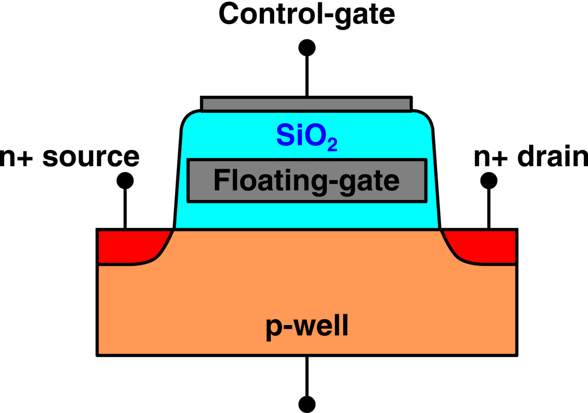

> **图 4-1**　一句话：闪存的一个存储单元就是一个普通晶体管，只是在它的开关控制端下面多埋了一块与外界完全隔绝的导体（浮栅）；数据就是这块导体里有多少电子。
>
> **先知道一件事**：这是把芯片竖着切开、从侧面看到的断面，上下方向是芯片的厚度，整个画面实际只有几十纳米宽。晶体管在这里是一个受电压控制的开关：顶上那块板（控制栅极）加的电压够高，它下方的硅表面就出现一条能导电的通路，左右两端之间有电流；电压不够，通路不出现，开关断开。
>
> **按这个顺序看**：
> 1. 底部橙色大块标着 p-well（P 型阱）。这是掺了少量特定杂质的硅，里面几乎没有能自由移动的电子，所以平时不导电。
> 2. 左右两个红色小区域标着 n+ source（源极）和 n+ drain（漏极）。n+ 表示掺了大量另一种杂质的硅，里面有很多自由电子，导电性很好。电流要从一端到另一端，必须经过两者之间那段橙色硅的表面，这段表面就是沟道；控制栅极电压够高时，沟道里聚起电子，通路才接通。
> 3. 中间青色的区域标着 SiO₂，即二氧化硅，是绝缘体，电子正常情况下穿不过去。
> 4. 青色区域里埋着的灰色方块是 Floating-gate（浮栅）。它四周全是青色绝缘体，没有任何一根线连着它，电子一旦进去就出不来，断电也一样，这就是闪存断电不丢数据的原因。浮栅下方那一薄层青色是隧穿氧化层，约 8 纳米厚，写入和擦除时电子要穿过的就是它；浮栅上方那层是阻挡层。
> 5. 最顶上的深灰色长条是 Control-gate（控制栅极），它连到一根叫字线的导线，读写时就在这里加电压。
> 6. 四个黑色圆点是外接的电极：控制栅极、源极、漏极，以及底部接 P 型阱的一根。浮栅上没有圆点。
>
> **打个比方**：控制栅极像按在门上的手，浮栅里的电子像抵在门后的重物；重物越多，要用越大的力才能把门推开。
>
> **看懂的标志**：能回答“浮栅里装进电子以后，这个开关为什么更难打开”——电子带负电，会抵消掉一部分控制栅极加上的正电压，沟道感受到的电压变小，只有把控制栅极电压加得更高才能接通。刚好能接通的那个电压叫阈值电压，所以“电子多”表现为“阈值电压高”，读数据就是测这个电压落在哪个范围。
>
> **与正文的对照**：正文 §2.1 的文字叠层图（控制栅极 / 阻挡层 / 电荷存储层 / 隧穿氧化层 / 沟道）与本图从上到下一一对应；图中的浮栅是电荷存储层的一种做法，另一种见图 4-2。
>
> 来源：[NAND FGMOS verbose.png](https://commons.wikimedia.org/wiki/File:NAND_FGMOS_verbose.png)，作者 David Gianluigi Refaldi，许可 CC BY-SA 4.0（本库把透明背景填成了白色）。

它的工作原理可以分三句话讲完。第一，电荷存储层里没有电子时，晶体管的阈值电压低，控制栅极加一个不高的电压就能导通。第二，存储层里有电子时，这些负电荷抵消掉一部分栅极电压，要加更高的栅极电压才能导通，即阈值电压升高。第三，存储层四周是绝缘层，断电以后电子留在原处，阈值电压不变，所以数据保持。

**电荷存储层有两种做法。** 一种是浮栅，用一块多晶硅导体存电子；另一种是电荷陷阱（charge trap），用一层氮化硅绝缘体存电子，电子被氮化硅内部的缺陷能级（陷阱）逐个俘获。两者的关键差别在于电子能不能在存储层内部移动：浮栅是导体，电子可以自由流动，所以隧穿氧化层上只要出现一个漏电的缺陷点，整块浮栅的电子都会从这个点漏光；电荷陷阱层是绝缘体，电子被固定在各自的陷阱里，一个缺陷点只会漏掉它附近的电子。3D NAND 几乎全部采用电荷陷阱，第 7 节会讲原因。

图 4-2 把这个差别画了出来。

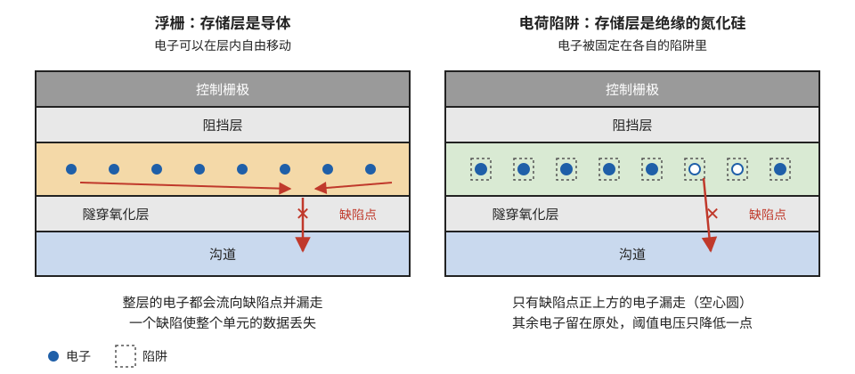

> **图 4-2**　一句话：存电子的那一层如果是导体（浮栅），一个缺陷就能让所有电子漏光；如果是绝缘体（电荷陷阱），只会漏掉缺陷附近的几个。
>
> **先知道一件事**：在导体里，电子可以自由地到处移动，金属导线能导电就是因为这个；在绝缘体里，电子被固定在原地，不能移动。
>
> **按这个顺序看**：
> 1. 两幅图都是把一个存储单元竖着切开看，从上到下五层相同：深灰色是控制栅极（加电压的地方），浅灰色的阻挡层和隧穿氧化层是两层绝缘体，中间那层是存电子的地方，最下面蓝色是沟道（硅表面，电流经过的地方）。
> 2. 两幅图的隧穿氧化层上都有一个红色叉号“缺陷点”：绝缘层上的一个薄弱处，电子能从这里漏到下方的沟道。制造偏差和反复擦写都会产生这种点。
> 3. 看左图：存储层是橙色的浮栅，是导体。蓝色圆点是电子，两根红色横向箭头表示各处的电子都会流向缺陷点，再沿向下的箭头漏走。只要有一个缺陷点，整层电子迟早漏光，这个单元的数据就丢了。
> 4. 看右图：存储层是绿色的氮化硅，是绝缘体。每个电子被关在一个虚线小方框表示的“陷阱”里，走不动。只有缺陷点正上方两个陷阱里的电子漏走了（画成空心圆），其余六个还在。这个单元的阈值电压（打开它所需的最低电压，电子越多越高）只降低一点，数据仍然读得出来。
> 5. 最下方的图例：实心圆是电子，虚线方框是陷阱。
>
> **打个比方**：浮栅像一个蓄满水的水池，池底破一个洞，整池水都会流光；电荷陷阱像一板鸡蛋格，每格放一个球，底板破一个洞，只掉下正好在洞上方的那个球。
>
> **看懂的标志**：能回答“为什么 3D 闪存几乎都改用电荷陷阱”——单元有上百亿个，每个的隧穿氧化层都可能有缺陷，存储层用绝缘体后一个缺陷只影响局部；另外绝缘层可以沿深孔的孔壁一次连续铺下来，不必逐个单元切断，制造也容易。
>
> **与正文的对照**：对应 §2.1“电荷存储层有两种做法”；制造上的原因见 §7.2。
>
> 来源：本库自绘。

### 2.2 一笔电子数的账

闪存的可靠性问题之所以多，根源在于每个单元里的电子数量很少。可以用电容公式估算（以下是量级估计，具体数值各厂商不公开）：

1. 阈值电压的变化量 = 存储层里的电荷量 ÷ 控制栅极到存储层之间的电容，即 ΔVth = Q ÷ C。
2. 平面工艺 15 纳米节点的单元，这个电容约 0.015 fF（飞法，10⁻¹⁵ 法拉）。让 Vth 变化 1 伏需要的电荷 = 0.015 × 10⁻¹⁵ × 1 = 1.5 × 10⁻¹⁷ 库仑，除以单个电子的电荷 1.6 × 10⁻¹⁹ 库仑，约 **94 个电子**。
3. 3D NAND 的单元尺寸大得多，电容约 0.1 fF。同样变化 1 伏需要 0.1 × 10⁻¹⁵ ÷ 1.6 × 10⁻¹⁹ ≈ **625 个电子**。

把这个数代进后面的多位存储里看：TLC（一个单元存 3 位）相邻两个状态之间的间隔约 0.86 伏（第 5 节会算），在 3D NAND 上对应约 0.86 × 625 ≈ **540 个电子**。也就是说，区分两个相邻数据状态的全部依据是五百多个电子的差别；漏掉 50 个电子，阈值电压就偏移 50 ÷ 625 = 0.08 伏，已经是间隔的十分之一。在平面 15 纳米工艺上同样的间隔只对应约 80 个电子，漏掉十几个就出问题。**这就是平面工艺在 15 纳米附近停止微缩、整个行业转向 3D 的直接原因之一**（第 7 节）。

---

## 3. 三种操作：编程、读、擦除

上一节讲了数据以什么形式存在，这一节讲它怎样被写入、读出和清除。三种操作的电压、耗时和作用范围差别很大，先给一张总览，再逐个走查。

| 操作 | 作用范围 | 关键电压 | 典型耗时（量级） | 对 Vth 的影响 |
| --- | --- | --- | --- | --- |
| 读 | 一页 | 选中字线 0~5 V，其余字线约 6~7 V | 几十到一百多微秒 | 不应改变（实际会轻微抬高同块其它单元） |
| 编程 | 一页（一根字线） | 选中字线 16~20 V | 约 1~数毫秒 | 只能升高 |
| 擦除 | 一整块 | 沟道约 20 V，字线 0 V | 约 3~10 毫秒 | 只能降低 |

三种操作加在一条串上的电压配置见图 4-3，后面三个小节逐个解释。

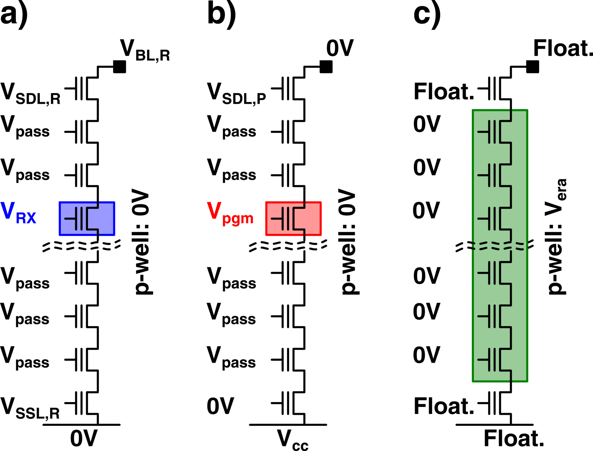

> **图 4-3**　一句话：同一条 NAND 串，读、写（编程）、擦除时在各个位置加的电压完全不同：读和写只针对串上的一个单元，擦除则把所有单元一起处理。
>
> **先知道一件事**：图中每个带竖线的小符号是一个晶体管，可以理解为一个受电压控制的开关。符号左边的短横线是它的控制端（栅极），旁边写的就是加在控制端上的电压：高于这个单元的阈值电压（打开它所需的最低电压），开关导通，否则断开。一条串是几十到几百个这样的开关首尾相连成一列，最上面经一个开关接位线（读出数据的导线，顶部黑色方块），最下面经一个开关接源线（底部横线）。
>
> **按这个顺序看**：
> 1. 三列 a)、b)、c) 是同一条串，分别表示读、编程、擦除。每列最上和最下的是选择管，普通开关，负责把串接通或断开；中间的是存储单元；波浪线表示中间省略了很多单元。
> 2. 看 a) 读：蓝框里是要读的单元，控制端加 V<sub>RX</sub>，即读参考电压，一个不高的比较电压。其余单元都加 V<sub>pass</sub>（通过电压，约 6～7 伏），它高于任何单元的阈值电压，所以这些单元不管存了什么都导通，只当导线用。于是整条串有没有电流，只取决于蓝框里那一个单元：有电流，说明它的阈值电压低于 V<sub>RX</sub>。V<sub>SDL,R</sub>、V<sub>SSL,R</sub> 是让上下两个选择管导通的电压，V<sub>BL,R</sub> 是位线上的读电压，底部源线接 0V。
> 3. 看 b) 编程：红框里的单元加 V<sub>pgm</sub>（编程电压，约 16～20 伏），高到足以把沟道里的电子推进存储层。其余单元加 V<sub>pass</sub>，只起导通作用。位线接 0V，让沟道也处在 0 伏，这样红框单元上下两侧的电压差最大。底部选择管的控制端接 0V、源线接 V<sub>cc</sub>（电源电压），作用是把串的下端关断。
> 4. 看 c) 擦除：绿框罩住了全部存储单元，它们的控制端都接 0V；右侧“p-well: V<sub>era</sub>”表示单元底下的那块硅（P 型阱）被抬到擦除电压，约 20 伏。于是每个单元都是下面高、上面低，与编程时方向相反，电子被拉回沟道。选择管、位线和源线都写着 Float.（悬空），即不接任何电压。
> 5. 对比三列右侧的竖排文字：a)、b) 都是 p-well: 0V，只有 c) 把这块硅抬高。
>
> **看懂的标志**：能回答“为什么擦除不能只擦一个单元”——擦除靠把单元底下的硅整体抬到约 20 伏，而这块硅是整条串乃至整个块共用的，一抬就是全部单元；读和编程靠的是控制端电压，每一行单元的控制端（字线）可以单独给，所以能只选一个。
>
> **与正文的对照**：对应 §3 开头的总览表。c) 画的是平面闪存的衬底擦除；3D 闪存的单元底下没有可以抬高的硅，改用 §3.3 讲的 GIDL 擦除从串两端注入正电荷，但“控制端 0 伏、沟道约 20 伏”这个结果相同。
>
> 来源：[NAND bias op.png](https://commons.wikimedia.org/wiki/File:NAND_bias_op.png)，作者 David Gianluigi Refaldi，许可 CC BY-SA 4.0（本库把透明背景填成了白色）。

### 3.1 编程：FN 隧穿与 ISPP

**编程（program）就是把电子送进存储层、把阈值电压抬高的操作。** 闪存业界把"写"叫做编程，两个词在本节同义。

**电子怎样穿过绝缘层。** 在选中单元的控制栅极上加约 18 伏的高压，沟道保持 0 伏。这 18 伏不会全部落在隧穿氧化层上，而是按电容分压，大约六成（这个比例叫耦合系数）落在隧穿氧化层两侧，即约 10.8 伏。隧穿氧化层厚 8 纳米，电场强度 = 10.8 伏 ÷ 8 纳米 ≈ 13.5 MV/cm（兆伏每厘米）。在这样强的电场下，绝缘层的能量势垒被拉斜变薄，沟道里的电子有一定概率直接穿过去进入存储层。这个机制叫 **FN 隧穿**（Fowler-Nordheim tunneling，福勒-诺德海姆隧穿）。它有一个重要性质：**隧穿电流随电场强度指数增长**，电场降低一半，电流会小许多个数量级。后面的读干扰和编程干扰都要用到这个性质。

势垒“被拉斜变薄”的含义见图 4-4。

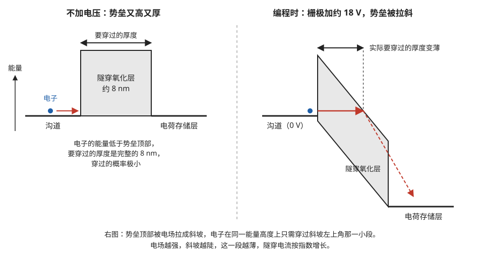

> **图 4-4**　一句话：隧穿氧化层对电子来说是一堵墙，平时又高又厚，电子过不去；控制栅极加上约 18 伏以后，墙被压成斜坡，电子要穿的那一段变薄，才能大量穿过去。
>
> **先知道一件事**：这是一张“能量图”，不是剖面图。横向是位置，从左到右依次是沟道、隧穿氧化层、电荷存储层；纵向是电子在这个位置具有的能量，越往上越高（左侧“能量”箭头）。电子从左走到右，要么翻过中间能量更高的区域，要么直接穿过去。
>
> **按这个顺序看**：
> 1. 看左图（不加电压）：左边的横线是沟道里电子的能量，蓝色圆点是一个电子。中间灰色高方块是隧穿氧化层，它要求的能量比电子具有的高得多，电子翻不过去（红色箭头撞在墙上）。方块上方的双箭头标出要穿过它的厚度：完整的约 8 纳米。
> 2. 一个量子力学的事实：电子即使能量不够，也有一定概率直接穿过一堵足够薄的墙，这叫隧穿。穿过的概率随墙的厚度急剧下降，8 纳米厚时小到可以忽略，这就是断电后电子能在存储层里待上好几年的原因。
> 3. 看右图（编程时）：控制栅极上加了约 18 伏正电压。正电压吸引电子，越靠近存储层，电子的能量越低，所以整幅图从左向右往下倾斜，灰色的墙也被拉成一个斜的平行四边形。
> 4. 看红色水平实线箭头：电子还在原来的能量高度，但只需穿过墙左上角那一小段（上方双箭头“实际要穿过的厚度变薄”）就到了墙外，然后沿红色虚线箭头“滑下坡”，落进右下方的电荷存储层。
> 5. 电压越高，斜坡越陡，要穿的那一段越薄，穿过的概率按指数增长：电压稍降一点，穿过的电子就少好几个数量级。
>
> **打个比方**：路上横着一堵墙，平着走只能硬穿整面墙的厚度；把路朝右倾斜后，同样高度的路线只擦过墙的一角，要穿的只剩一个薄边。
>
> **看懂的标志**：能回答“读的时候单元上也加了 6～7 伏，为什么不会像编程那样把电子推进去”——6～7 伏只让斜坡倾斜一点，墙还很厚，穿过的概率比 18 伏时低好几个数量级；但它不是零，同一块被读几十万次后累积起来，就是 §6.3 的读干扰。
>
> **与正文的对照**：对应 §3.1“电子怎样穿过绝缘层”，这个机制叫 FN 隧穿。图中的斜率与厚度是示意，不按比例。
>
> 来源：本库自绘。

**为什么不能一次写到位。** 同一根字线上的十几万个单元，因为制造偏差，编程的快慢各不相同：同样一个 18 伏的脉冲，有的单元 Vth 升了 2 伏，有的只升了 1 伏。如果用一个大脉冲一次写完，最终的 Vth 会散布在很宽的范围里，多位存储需要的窄分布就做不出来。

**解法是 ISPP（incremental step pulse programming，增量步进脉冲编程）**：加一个较低的编程脉冲，然后读一次检查每个单元的 Vth 是否达到目标（这一步叫校验，verify）；没达到的单元，把脉冲电压提高一个固定的步长再加一次；已经达到的单元被禁止继续编程。如此循环直到所有单元都达标。

脉冲与校验交替的波形，以及它对分布宽度的作用，见图 4-5。

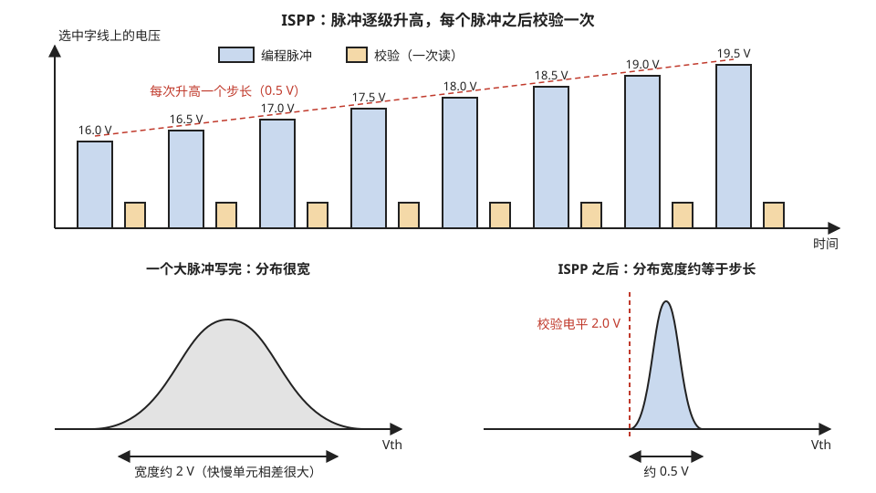

> **图 4-5**　一句话：ISPP 把“一次写到位”改成“小步加压、每步检查、到了就停”，结果所有单元最终都停在同一个很窄的电压范围里。
>
> **先知道一件事**：每个单元的状态用它的阈值电压（记作 Vth，让它导通所需的最低控制电压）表示，存储层里电子越多，Vth 越高；编程就是往里推电子，把 Vth 抬到目标值。由于制造偏差，同一个电压脉冲在不同单元上推进去的电子数不一样，有的快有的慢。
>
> **按这个顺序看**：
> 1. 上半部分是电压随时间变化的图：横轴是时间，纵轴是加在选中字线（这一排单元的控制端连成的导线）上的电压。
> 2. 蓝色高柱是编程脉冲：第一个 16.0 伏，之后每个比前一个高 0.5 伏，第八个到 19.5 伏。红色虚线连起柱顶，显示电压逐级升高；每级升高的 0.5 伏叫步长。
> 3. 每个蓝柱后面紧跟一个橙色矮柱，是一次“校验”：用低电压读一下每个单元，看它的 Vth 到没到目标。已到的单元，下一个脉冲时被屏蔽，不再被推电子；没到的继续接受下一个更高的脉冲。
> 4. 下半部分是两张“分布图”：横轴是 Vth，曲线高度表示有多少单元的 Vth 落在那个值附近。一根字线上有十几万个单元，把它们的 Vth 统计一下就是这样的钟形曲线。
> 5. 左下灰色宽曲线：用一个大脉冲一次写完，快的单元冲得很高，慢的升得不够，最终分布宽约 2 伏。
> 6. 右下蓝色窄曲线：用 ISPP，每个单元都在刚越过红色虚线（校验电平 2.0 伏）后停下，而最后那个脉冲最多再抬高一个步长，所以全部落在 2.0 到 2.5 伏之间，宽约 0.5 伏。
>
> **打个比方**：往一排高低不一的杯子里倒水，要让每杯都到刻度线。一次倒一大桶，有的溢出有的不够；每次只倒一小勺、倒完看一眼、到线的杯子就拿开，最后每杯都只比刻度线高出不到一勺。
>
> **看懂的标志**：能回答“想让分布更窄，代价是什么”——把步长减小，比如从 0.5 伏减到 0.25 伏，分布宽度减半，但脉冲和校验次数翻倍，写入时间大约翻倍。一个单元存的位数越多，要求分布越窄，所以存 4 位的 QLC 比存 3 位的 TLC 写得慢。
>
> **与正文的对照**：对应 §3.1 的逐脉冲走查表。图中每个脉冲后只画了一次校验；实际 TLC 每轮要对几个目标电平各校验一次，见 §3.1“TLC 的实际编程”。
>
> 来源：本库自绘。

**逐脉冲走查。** 设目标是把单元的 Vth 编程到不低于 2.0 伏，起始脉冲 16.0 伏，步长 0.5 伏。取同一根字线上的两个单元：A 编程较快，B 较慢。两者初始都处于擦除态，Vth 为 −2.0 伏。ISPP 进入稳定阶段后有一个规律：脉冲电压每提高一个步长，Vth 也大约升高一个步长。

| 脉冲序号 | 编程电压 | 单元 A 的 Vth | A 校验 | 单元 B 的 Vth | B 校验 |
| --- | --- | --- | --- | --- | --- |
| 初始 | — | −2.0 V | — | −2.0 V | — |
| 1 | 16.0 V | −0.5 V | 未达标 | −1.5 V | 未达标 |
| 2 | 16.5 V | 0.0 V | 未达标 | −1.0 V | 未达标 |
| 3 | 17.0 V | 0.5 V | 未达标 | −0.5 V | 未达标 |
| 4 | 17.5 V | 1.0 V | 未达标 | 0.0 V | 未达标 |
| 5 | 18.0 V | 1.5 V | 未达标 | 0.5 V | 未达标 |
| 6 | 18.5 V | 2.0 V | **达标，此后禁止编程** | 1.0 V | 未达标 |
| 7 | 19.0 V | 2.0 V（不变） | — | 1.5 V | 未达标 |
| 8 | 19.5 V | 2.0 V（不变） | — | 2.0 V | **达标** |

从这张表可以读出三个结论。

**第一，最终分布的宽度约等于步长。** 一个单元在达标前的最后一次校验时 Vth 低于 2.0 伏，再加一个脉冲最多升高约 0.5 伏，所以所有单元最终落在 2.0 到 2.5 伏之间。快慢相差一倍的两个单元，最终 Vth 几乎相同，差别只体现在用了几个脉冲。

**第二，步长是精度与速度之间的旋钮。** 步长减半到 0.25 伏，分布宽度减半，但脉冲数量翻倍，编程时间也大致翻倍。一个单元存的位数越多，要求分布越窄，步长就必须越小，这就是 QLC 编程比 TLC 慢得多的原因。

**第三，编程耗时由"脉冲数 × （脉冲时间 + 校验时间）"决定。** 每轮约一两百微秒，十轮左右即毫秒量级。校验本身是一次读操作，TLC 每轮要校验多个目标电平，所以校验占掉的时间不少于脉冲本身。

**已达标的单元怎样被"禁止"。** 同一根字线上所有单元的控制栅极是连在一起的，19.5 伏的脉冲对 A 和 B 同时加上。要让 A 不再被编程，办法是抬高 A 所在那条串的沟道电位：把 A 的位线接到电源电压，使这条串的漏端选择管关断，整条串的沟道与外界断开而处于悬空状态；随后字线电压上升时，沟道电位被电容耦合一起带高到约 8 伏（叫自升压，self-boost）。于是 A 的栅极与沟道之间的电压差只有 19.5 − 8 = 11.5 伏，落在隧穿氧化层上的电场不到编程时的六成；由于隧穿电流对电场呈指数关系，这时的隧穿电流比正常编程小好几个数量级，A 基本不再被编程。"基本不"三个字留下了一个问题，就是第 6 节的编程干扰（§6.4 会把这里每一步的电压列出来）。

**TLC 的实际编程：8 个目标状态共用同一串脉冲。** 上面的走查只有一个目标电平。真实的 TLC 字线上，十几万个单元的目标各不相同：有的要留在擦除态，有的要到 P1，有的要到 P7（8 个状态的定义见 §5）。芯片并不为每个状态单独做一轮 ISPP，而是**用同一串逐步升高的脉冲同时编程所有单元，每个单元在自己的目标电平上校验，达标一个禁止一个**。目标低的单元在前几个脉冲就达标退出，目标高的单元一直留到最后。

下面走查三个编程速度相同的单元，目标分别是 P1、P4、P7。为便于计算，设 7 个状态的校验电平从 0.0 伏起每级相差 0.8 伏，即 P1 为 0.0 伏、P4 为 2.4 伏、P7 为 4.8 伏；起始脉冲 15.0 伏，步长 0.4 伏；单元在第 n 个脉冲之后的 Vth 为 −0.5 + 0.4 × (n − 1) 伏（数值为示意）。

| 脉冲序号 | 编程电压 | 未被禁止的单元此时的 Vth | 目标 P1 的单元（校验 0.0 V） | 目标 P4 的单元（校验 2.4 V） | 目标 P7 的单元（校验 4.8 V） |
| --- | --- | --- | --- | --- | --- |
| 1 | 15.0 V | −0.5 V | 未达标 | 未达标 | 未达标 |
| 2 | 15.4 V | −0.1 V | 未达标 | 未达标 | 未达标 |
| 3 | 15.8 V | 0.3 V | **达标，禁止**，停在 0.3 V | 未达标 | 未达标 |
| 4~8 | 16.2~17.8 V | 0.7~2.3 V | 不变 | 未达标 | 未达标 |
| 9 | 18.2 V | 2.7 V | 不变 | **达标，禁止**，停在 2.7 V | 未达标 |
| 10~14 | 18.6~20.2 V | 3.1~4.7 V | 不变 | 不变 | 未达标 |
| 15 | 20.6 V | 5.1 V | 不变 | 不变 | **达标**，停在 5.1 V |

需要保持擦除态的单元从第 1 个脉冲起就被禁止，全程不参与。

**多目标校验是编程时间的主要部分。** 每个脉冲之后要判断"哪些单元达到了各自的目标"，这需要对每个目标电平各做一次读。如果每轮都把 7 个电平全部校验一遍，15 轮共 7 × 15 = 105 次校验读。实际的做法是只校验当前可能有单元达标的那几个电平：例如第 1 到 4 轮只校验 P1 和 P2，因为此时不可能有单元达到 P5；最后几轮只校验 P6 和 P7，因为目标较低的单元早已全部退出。这样每轮平均校验 2 到 3 个电平，总数降到约 40 次。按每个脉冲约 30 微秒、每次校验约 30 微秒估算（量级估计），总时间 = 15 × 30 + 40 × 30 = 450 + 1200 = **1650 微秒**，与"一根字线约 2 毫秒"相符。其中校验占了七成以上，所以各厂商缩短编程时间的主要手段是减少校验次数。

**每个单元的目标记在哪里。** 每根位线末端的页缓冲器里有几个锁存器，编程开始前装入这个单元要写的 3 位数据（§4.2 讲页缓冲器的结构）。每次校验后，页缓冲器把读出结果与锁存的目标比较，达标的单元其锁存器被改写成"禁止"状态，下一个脉冲到来时这根位线就被接到电源电压。所以"达标即禁止"是每根位线各自独立完成的，不需要控制器介入。

**编程失败。** 如果脉冲数达到规定上限后仍有单元没有达标，芯片分两种情况处理：未达标的单元只有极少数时，视为成功，这几个错误留给纠错码（§8）；数量超过门限时，芯片在状态寄存器里报告编程失败，控制器把这份数据改写到别的块，并把这个块登记为坏块（§6.6）。

### 3.2 读：让其它单元全部导通，只考察选中的那一个

**读操作的难点来自串联结构。** 一条串上串着几百个单元，只有顶端接位线。要读其中一个单元，电流必须流过串上其余所有单元，所以必须先让其余单元无条件导通。

图 4-6 是 NAND 阵列的电路图，串、字线、位线和选择管的关系都在上面。

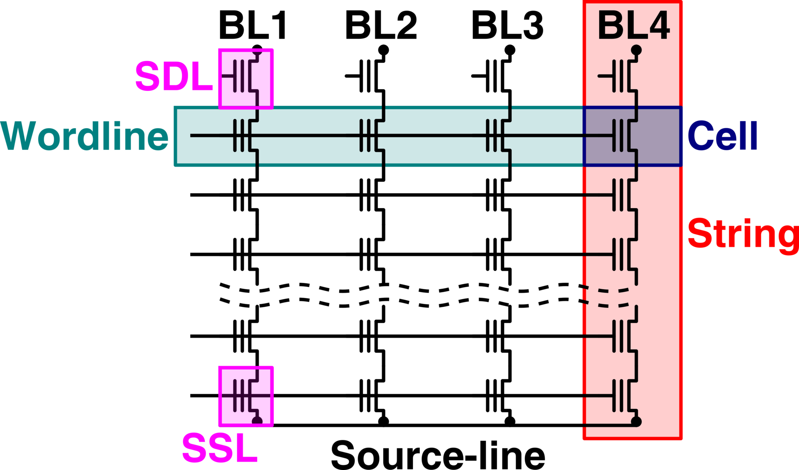

> **图 4-6**　一句话：NAND 阵列是一张网格：竖着的每一列是一条串，横着的每一根线是一根字线，两者交叉处是一个存储单元。
>
> **先知道一件事**：图中每个带竖线的小符号是一个晶体管，可以理解为一个受电压控制的开关；符号左侧的短线是它的控制端，横线从左边连过来，就是在给这一排开关的控制端加电压。
>
> **按这个顺序看**：
> 1. 看红框 String（串）：一列单元首尾相连，最上面接一根位线 BL4（Bit Line，读出数据的竖直导线，顶端黑点是它的接点），最下面接底部的 Source-line（公共源线）。电流要从位线流到源线，必须依次穿过这一列的每一个单元。
> 2. 看青色框 Wordline（字线）：一根横线把四条串上同一高度单元的控制端连在一起。给字线加电压，这一排单元同时受控，所以它们一起被读、一起被写，构成一页。
> 3. 看深蓝框 Cell（单元）：一根字线和一条串的交叉处就是一个单元。
> 4. 看两个品红色小框：SDL 是串顶端的选择管，SSL 是串底端的选择管，都是普通开关，决定这条串接不接到位线和源线上。
> 5. 波浪虚线表示中间省略了很多行，真实的一条串有几十到几百个单元。BL1 到 BL4 是四根位线、对应四条串；真实芯片里一根字线要横穿十几万条串。
>
> **看懂的标志**：能回答“读一个单元时，同一串上的其它单元为什么都要加一个较高的电压”——电流要穿过整列才能到达位线，其它单元必须全部导通才不会挡路，这样位线上有没有电流就只取决于被读的那一个。这个较高的电压就是图 4-3 里的 V<sub>pass</sub>。
>
> **与正文的对照**：图中 SDL、SSL 即正文的漏端选择管 SGD 和源端选择管 SGS。
>
> 来源：[NAND scheme.png](https://commons.wikimedia.org/wiki/File:NAND_scheme.png)，作者 David Gianluigi Refaldi，许可 CC BY-SA 4.0（本库把透明背景填成了白色）。

做法是给未选中的字线全部加上一个**通过电压**（pass voltage，记作 Vpass，约 6 到 7 伏）。这个电压高于任何数据状态的 Vth，所以不管那些单元里存着什么，它们都导通，相当于一段导线。然后给选中的字线加一个**读参考电压**（记作 Vref），观察位线上有没有电流：有电流说明选中单元的 Vth 低于 Vref，没有电流说明高于 Vref。

**逐步走查**，以一条只有 4 个单元的串为例（真实的串有几百个），每个单元只存 1 位，擦除态 Vth ≈ −2 伏代表 1，编程态 Vth ≈ +2 伏代表 0。四个单元从上到下存的是 1、0、0、1，现在要读第 3 个：

| 步骤 | 动作 | 结果 |
| --- | --- | --- |
| 1 | 位线预充电到约 0.5 V | 位线上存有一份电荷 |
| 2 | 第 1、2、4 根字线加 Vpass = 6.5 V | 这三个单元的 Vth（−2、+2、−2）都低于 6.5 V，全部导通 |
| 3 | 第 3 根字线加 Vref = 0 V | 第 3 个单元 Vth = +2 V，高于 0 V，**不导通** |
| 4 | 打开两端的选择管 | 串在第 3 个单元处断开，位线电荷放不掉 |
| 5 | 等待一小段时间后，位线上的读出电路判断位线电压 | 电压基本没降，判定无电流，读出 **0** |

如果要读的是第 4 个单元（Vth = −2 伏），第 3 步里它在 0 伏的参考电压下导通，整条串贯通，位线电荷经串放到源线，电压下降，读出 1。

**读出电路判断的是一个很小的电流。** 一条串上串联着几百个晶体管，即使全部导通，总电阻也很大，串电流只有几十到一两百纳安（量级估计）。位线的寄生电容约 1 到 2 皮法，用 100 纳安的电流给 1.5 皮法的电容放电，电压下降 0.2 伏需要 1.5 × 10⁻¹² × 0.2 ÷ 100 × 10⁻⁹ = 3 × 10⁻⁶ 秒，即 **3 微秒**。再加上把字线从 0 伏充到 6.5 伏、等位线电压稳定的时间，一次参考电压比较需要十几到二十几微秒。这就是闪存的读延迟在几十微秒量级、比 DRAM 慢约三个数量级的原因：串联结构使读电流很小，而字线和位线又很长。

**负的阈值电压怎样测量。** 擦除态的 Vth 是负值，校验擦除深度时需要判断"Vth 是否低于 −1 伏"。芯片内部产生负的字线电压很不方便，实际做法是把字线接 0 伏，同时把源线抬高到 1 伏：晶体管是否导通取决于栅极与源极之间的电压差，0 − 1 = −1 伏，效果与在字线上加 −1 伏相同。

这个过程里有两点要记住。**第一，一次读操作会同时读出一整页**：一根字线上的十几万个单元各自连着不同的位线，每根位线配一套读出电路和锁存器（合称页缓冲器，page buffer），它们同时完成判断。**第二，读一个单元时，同一条串上所有其它单元的栅极都被加上了 6.5 伏**，这比 0 伏高得多，虽然远低于编程电压，但并不是完全无害的。这就是第 6 节读干扰的来源。

### 3.3 擦除：整块一起，把电子拉出来

**擦除（erase）是编程的反向操作：把电子从存储层拉回沟道，使阈值电压回到最低的擦除态。** 要让电子反向穿过隧穿氧化层，电场方向必须反过来，也就是沟道电位高、栅极电位低。

**平面闪存的做法**：所有单元的沟道坐落在同一块 P 型衬底区域（叫阱，well）里。擦除时把这个阱升到约 20 伏，把要擦的那一块的所有字线接 0 伏。于是该块内每个单元都承受沟道比栅极高 20 伏的电压，存储层里的电子经 FN 隧穿回到沟道。

**3D 闪存的做法有所不同**。3D 闪存的沟道是一根竖直的空心多晶硅细管（第 7 节），在很多结构里它的底部并不直接连到衬底，无法靠衬底把它抬到 20 伏。替代办法叫 **GIDL 擦除**（gate-induced drain leakage，栅致漏极泄漏）：在串两端的选择管上制造一个强的局部电场，使选择管的漏极附近产生电子-空穴对，其中的空穴（带正电的载流子）被注入沟道，把整根沟道的电位充到约 20 伏。之后的过程与平面闪存相同。

**为什么 3D 闪存的沟道接不到衬底。** 早期的 3D 闪存把沟道孔一直刻到单晶硅衬底，沟道底部与衬底里的 P 型阱相连，可以沿用平面闪存的衬底擦除。后来外围电路被放到阵列下方（§7.4），阵列底下不再是单晶硅衬底，而是一层沉积出来的多晶硅公共源极层，沟道与 P 型阱之间的通路就没有了。这时沟道是一根两端被选择管封住的悬空细管，只能从两端往里注入正电荷。

**GIDL 擦除的逐步过程**（电压为示意量级）：

| 步骤 | 动作 | 此时发生了什么 |
| --- | --- | --- |
| 1 | 选中块的所有字线接 0 V；未选中块的字线悬空 | 为第 5 步建立栅极一侧的低电位 |
| 2 | 位线和公共源线同时升到约 20 V | 擦除电压从串的上下两端加入 |
| 3 | 两端选择管的栅极升到约 12 V，比位线和源线低约 8 V | 选择管靠位线一侧的结上出现"漏极 20 V、栅极 12 V"的强电场。这个电场使硅的价带电子直接隧穿到导带（带间隧穿），每发生一次就产生一个电子和一个空穴 |
| 4 | 电子被电位更高的位线收走，空穴被推向电位较低的沟道 | 空穴在悬空的沟道里不断积累，沟道电位逐步上升 |
| 5 | 沟道电位升到约 19 到 20 V | 沟道比字线高约 20 V，隧穿氧化层上的电场方向与编程时相反 |
| 6 | 保持约 1 到 2 ms | 空穴从沟道隧穿进入电荷陷阱层，与其中的电子复合；同时陷阱里的电子也向沟道逸出。存储层的净负电荷减少，Vth 下降 |
| 7 | 各电压降回，做擦除校验 | 未通过则提高电压再来一轮 |

第 6 步点出了电荷陷阱单元与浮栅单元的一个区别：浮栅单元的擦除主要靠电子从浮栅隧穿出来；电荷陷阱单元的擦除主要靠空穴注入并与被俘获的电子复合。

**给沟道充电要多久，可以估算。** 一条串的沟道对所有字线的总电容约为 200 个单元 × 0.1 fF = 20 fF。把它充到 20 伏需要的电荷 = 20 × 10⁻¹⁵ × 20 = 4 × 10⁻¹³ 库仑。GIDL 电流很小，每条串约 1 纳安（量级估计），充电时间 = 4 × 10⁻¹³ ÷ 1 × 10⁻⁹ = 4 × 10⁻⁴ 秒，即 **0.4 毫秒**。所以 GIDL 擦除的每个脉冲里有相当一部分时间用在给沟道充电上，这是 3D 闪存擦除时间在毫秒量级的原因之一。层数越多，沟道越长、电容越大，充电越慢，而且沟道中段离两端最远，电位上升最晚，中间层的单元擦得比两端浅。

**擦除校验是按串进行的。** 校验时把块内所有字线都接到擦除校验电平，然后看每条串是否导通。只要串上有一个单元没有擦到位，这条串就不导通。所以一次校验就能检查一条串上的全部 200 个单元，不需要逐页去读。

**擦除也是分步进行的**，与 ISPP 相似：加一个擦除脉冲，然后校验整块的所有单元是否都已低于擦除校验电平；没通过就把电压提高一步再来。一个走查例子：

| 擦除脉冲 | 沟道电压 | 脉冲时长 | 校验结果 |
| --- | --- | --- | --- |
| 1 | 18.0 V | 约 2 ms | 块内仍有约 3% 的单元 Vth 高于校验电平，未通过 |
| 2 | 19.0 V | 约 2 ms | 仍有约 0.1% 未通过 |
| 3 | 20.0 V | 约 2 ms | 全部通过，擦除完成 |

总耗时约 6 毫秒加上三次校验的时间。一块用旧了的闪存，隧穿氧化层里积累了被困住的电荷，需要的脉冲数会增多，擦除时间变长；如果加到规定的最大脉冲数仍不通过，这个块就被标记为坏块，不再使用。这种使用过程中新出现的坏块叫增长坏块（grown bad block），控制器怎样处理它见 §6.6。

### 3.4 为什么只能整块擦

这是闪存最常被问到、也是最值得讲清因果的一点。原因有三层。

**第一层是结构上的**：擦除需要把沟道抬到 20 伏，而沟道（平面闪存的阱，或 3D 闪存里一整块的沟道细管连同公共源线）是许多单元共用的，无法只抬高其中一个单元的沟道。

**第二层是面积上的**：理论上可以把结构切得更细，让每一页有独立的阱。但隔离 20 伏高压需要很宽的隔离区和很大的高压开关管，如果每页都配一套，存储阵列的密度会大幅下降。闪存的全部价值在于每比特成本低，所以设计上选择了把擦除单位做大。

**第三层是时间上的**：擦除一次要几毫秒，是读的约一百倍。如果按页擦除，擦完一个 2400 页的块要 2400 × 5 毫秒 = 12 秒；整块一起擦只要 5 毫秒。把大量单元并在一起擦，是把这个很慢的操作摊薄的办法。

**同一个阱里不擦的其它块怎么办**：平面闪存里多个块共用一个阱，阱升到 20 伏时未选中的块也受到影响。办法是让未选中块的字线悬空，它们会被阱的电压通过电容耦合带到约 18 伏，于是栅极与沟道之间只差约 2 伏，不发生隧穿。

### 3.5 为什么不能原地覆盖写

由前面几小节可以得出一条规则：**编程只能让 Vth 升高，擦除只能让 Vth 降低，而擦除的单位是整块。** 对只存 1 位的单元，擦除态代表 1、编程态代表 0，所以编程只能把 1 改成 0，不能把 0 改成 1。

一个具体例子：某一页里现在存着 `1010`，想改成 `0110`。第 1 位要从 1 变 0，编程可以做到；第 2 位要从 0 变 1，需要把电子拉出来，这只有擦除能做到，而擦除会把整块 2400 页全部清掉。

**如果坚持原地修改，代价可以算出来**。设一块含 2400 页、每页 16 KB，共 38.4 MB（第 4 节给这组数字的来历）。要修改其中 4 KB 的数据：

1. 把整块 38.4 MB 读出来暂存。
2. 擦除整块，约 5 毫秒。
3. 把 38.4 MB 重新编程回去。每根字线的编程约 2 毫秒、一次写入 3 页，共 800 次，合计约 **1.6 秒**。
4. 实际写入量与用户想写的量之比 = 38.4 MB ÷ 4 KB = **9600 倍**，并且整块消耗了一次擦写寿命。

为改 4 KB 付出 1.6 秒和 9600 倍的写入量，这显然不可用。所以所有闪存系统都采用**异地更新**（out-of-place update）：新数据写到另一个已经擦好的空白页上，旧页只做一个"已作废"的标记，等一个块里作废的页足够多了再统一回收擦除。记录"逻辑地址现在对应哪个物理页"的映射表，以及回收作废页的垃圾回收机制，属于控制器的职责，在 20-05 §4 展开。

---

## 4. 阵列组织：从串到 plane 到裸片

上一节以单个单元和单条串为对象讲了三种操作，这一节讲这些串怎样组织成一颗容量 1 Tb（太比特，约 128 GB）的裸片。层级一共六级，从小到大是：单元、串、页、块、plane、裸片。

### 4.1 六级结构与一组典型数字

下面这组数字是一颗 200 层级 TLC 裸片的示意值，用来说明各级之间的乘法关系，具体产品各不相同。

| 层级 | 是什么 | 示意数字 |
| --- | --- | --- |
| 单元 | 一个带电荷存储层的晶体管 | TLC 每单元存 3 位 |
| 串 | 竖直方向串联的一列单元，顶端接一根位线 | 约 200 个单元（对应 200 层字线） |
| 页 | 读写的最小单位。一根字线在一个子块内选中的所有单元，存 3 位就对应 3 页 | 每页 16 KB 数据，另有约 2 KB 存纠错码 |
| 块 | 擦除的最小单位。一组共用字线的串 | 200 层 × 4 个子块 × 3 位 = **2400 页**，约 38.4 MB |
| plane | 一片独立的存储阵列，配有自己的行译码器和页缓冲器 | 每个 plane 约 830 个块，约 32 GB |
| 裸片（die） | 一片完整的闪存芯片，含若干个 plane 和共用的外围电路 | 4 个 plane，约 3300 个块，合计 1 Tb |

其中"子块"需要解释一下：3D 闪存里，同一层的字线是一整片金属板，一个块内有多排串共用这片板。为了一次只选中其中一排，每排串有各自独立的漏端选择管控制线，一排串就是一个子块。所以选中"一页"需要同时指定一层字线和一个子块。

**验算一下这组数字是否自洽**：一页 16 KB 数据加 2 KB 纠错码共 18 KB，即 18 × 1024 × 8 ≈ 14.7 万位；TLC 三页共用同一批单元，所以一根字线在一个子块内有约 14.7 万个单元，对应约 14.7 万根位线。整颗裸片 3300 块 × 38.4 MB ≈ 127 GB，与 1 Tb 相符。

各级之间的包含关系见图 4-7。

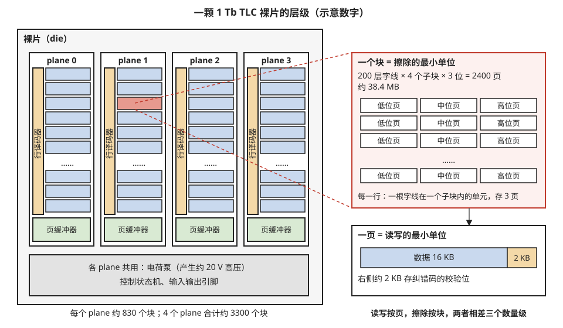

> **图 4-7**　一句话：一颗闪存芯片按“裸片 → plane → 块 → 页”一层层切分；读写的单位是最小的页，擦除的单位却是大得多的块。
>
> **先知道一件事**：图中数字是一颗容量 1 Tb（太比特，约 128 GB）的 TLC 闪存芯片的示意值。TLC 指每个存储单元存 3 位。
>
> **按这个顺序看**：
> 1. 左边灰底大框是整颗裸片（die，一片完整的芯片）。里面并排的四个白框是 4 个 plane，每个 plane 是一片可以独立工作的存储阵列。
> 2. 每个 plane 里的蓝色横条是块，每个 plane 约 830 个，“……”表示省略。
> 3. 每个 plane 左侧的橙色竖条是行译码器，它根据地址决定把电压加到哪一根字线（一排单元的控制端连成的导线）上；底部绿色的页缓冲器，是每根位线（竖直的数据线）配的一个小电路，负责把一页数据读出来、或暂存要写进去的一页。每个 plane 各有一套，所以 4 个 plane 能同时各做各的。
> 4. 最下面灰色区域是 4 个 plane 共用的部分：电荷泵（把几伏的电源升到擦写所需的约 20 伏）、控制逻辑和对外的引脚。
> 5. plane 1 里红色的那一块被红色虚线放大到右上方：一个块有 200 层字线 × 4 个子块 × 3 位 = 2400 页，约 38.4 MB。块里每一行代表一根字线在一个子块里的全部单元；每个单元存 3 位，于是同一批单元上叠着低位页、中位页、高位页三页。
> 6. 右下方是一页的组成：16 KB 数据（蓝色）加 2 KB 纠错校验位（橙色），校验位用来发现并修正读错的位。
> 7. 最右下角那句结论：一页 16 KB，一块 38.4 MB，相差约 2400 倍，也就是三个数量级。
>
> **看懂的标志**：能回答“改掉一页里的 4 KB 为什么这么麻烦”——闪存只能按页写入，写过的页不能原地改写，要恢复成可写状态必须擦除，而擦除一次就是整个 38.4 MB 的块。所以改数据只能写到别处的空白页，旧页先标成作废，这就是 §3.5 讲的异地更新。
>
> **与正文的对照**：数字与 §4.1 的表格一致；“子块”的含义见 §4.1 表后的说明；plane 为什么要分见 §4.2。
>
> 来源：本库自绘。

在裸片之上还有一级：**多颗裸片叠在一个封装里**。一个闪存封装内通常堆叠 8 或 16 颗裸片，用引线键合（用细金属线把裸片边缘的焊盘连到封装基板上）相互连接并共用一组信号线。接口标准里把一颗可以独立接收命令的裸片叫做一个 **LUN**（logical unit，逻辑单元）。这一级的信号和负载问题在 20-05 §3。

### 4.2 plane 是什么，为什么要分

**plane 是裸片内部一片可以独立操作的存储阵列。** 它有自己的行译码器（负责把电压加到选中的字线上）和自己的页缓冲器（每根位线一套读出电路与数据锁存器）。多个 plane 共用的是：产生 20 伏高压的电荷泵、控制编程与擦除流程的状态机、以及与外界通信的输入输出引脚。

**分 plane 的理由与 SRAM 切子阵列的理由相同**（20-01 §5）：一套页缓冲器一次只能处理一页，如果整颗裸片只有一片阵列，那么每 2 毫秒只能编程一根字线。把阵列切成 4 片，每片各有一套页缓冲器，4 片就可以同时各编程一根字线。代价是每多一个 plane 就多一套行译码器和页缓冲器，这些外围电路要占硅面积；同时 4 个 plane 一起编程时，电荷泵要提供的峰值电流也接近 4 倍。

**页缓冲器里面有什么。** 页缓冲器是 plane 里最大的一块外围电路，每根位线配一个单元，一个 plane 约有 14.7 万个。每个单元包含四类部件：

| 部件 | 作用 |
| --- | --- |
| 高压隔离管 | 擦除时位线会升到约 20 V，而页缓冲器里的晶体管只能承受几伏。这个管子在擦除期间关断，把低压电路与位线隔开 |
| 读出节点与读出锁存器 | 读和校验时给位线预充电，等待之后判断位线电压是否下降，把结果锁存 |
| 数据锁存器 | TLC 需要 3 个，分别保存这个单元要写入的高、中、低三位；QLC 需要 4 个。编程期间它们决定这根位线是接 0 V（继续编程）还是接电源电压（禁止） |
| 缓存锁存器 | 与输入输出引脚之间交换数据用的暂存位置。阵列正在编程或读取时，外部可以同时通过它送入下一页数据或取走上一页数据 |

每个单元有几十个晶体管，14.7 万个单元合计几百万个晶体管，而且排列的间距必须与位线的间距匹配。**这是 plane 数量不能随意增加的主要原因**：每多一个 plane 就要多付一整排页缓冲器的面积。

**缓存锁存器换来多少吞吐量，可以算出来。** 设裸片对外接口的传输速率是 200 MB/s。送入一页 18 KB（数据加校验位）需要 18 KB ÷ 200 MB/s = 90 微秒；4 个 plane 各 3 页共 12 页，需要 12 × 90 ≈ **1.08 毫秒**。

| 方式 | 一轮的时间 | 吞吐量（每轮写入 192 KB 用户数据） |
| --- | --- | --- |
| 没有缓存锁存器：先送数据，再编程，两者串行 | 1.08 + 2 = 3.08 ms | 192 KB ÷ 3.08 ms ≈ **62 MB/s** |
| 有缓存锁存器：阵列编程当前数据的同时，送入下一轮数据 | 2 ms（传输被编程时间覆盖） | 192 KB ÷ 2 ms = **96 MB/s** |

这种一边编程一边装载下一页的工作方式叫缓存编程（cache program），读方向对应的叫缓存读。§4.3 算的 96 MB/s 以它为前提。

### 4.3 多 plane 编程：写入吞吐量乘以 plane 数

**多 plane 编程**（multi-plane program）的流程是：控制器依次把 4 页数据分别送进 4 个 plane 的页缓冲器，然后发一条确认命令，4 个 plane 同时开始各自的 ISPP 过程。

用第 3 节的数字算吞吐量。一根字线的编程时间约 2 毫秒，一次写入 TLC 的 3 页即 48 KB：

| 方式 | 2 毫秒内写入的数据量 | 单颗裸片的编程吞吐量 |
| --- | --- | --- |
| 单 plane | 48 KB | 48 KB ÷ 2 ms = **24 MB/s** |
| 4 个 plane 同时 | 4 × 48 = 192 KB | 192 KB ÷ 2 ms = **96 MB/s** |
| 6 个 plane 同时 | 6 × 48 = 288 KB | **144 MB/s** |

这解释了为什么 plane 数量在代际间不断增加（2 个、4 个，到部分产品的 6 个）：**单元的编程速度很难提高，提高写入吞吐量的主要办法是增加同时工作的 plane 数**。一块固态硬盘的写入速度，再往上就是"单颗裸片吞吐量 × 同时工作的裸片数"。

传统的多 plane 操作有一条限制：各 plane 上被操作的页必须位于各自块内的相同位置（相同的字线和子块），块的编号可以不同。原因是各 plane 共用同一套字线电压产生电路，而不同层的字线需要的电压有细微差别，位置相同才能共用同一组电压。

**多 plane 操作的命令是怎样发的。** 闪存裸片通过一组 8 位的数据线接收命令字节、地址字节和数据（引脚与时序在 20-05 §3 讲，这里只看命令的顺序）。以两个 plane 的多 plane 编程为例，按 ONFI 接口标准的命令码：

| 顺序 | 控制器发出 | 含义 | 裸片的反应 |
| --- | --- | --- | --- |
| 1 | 命令 80h | 准备编程 | — |
| 2 | 地址（plane 0 的某块某页） | 指定第一个目标 | — |
| 3 | 一页数据 | 写入内容 | 存入 plane 0 的页缓冲器 |
| 4 | 命令 11h | 这一页装载完毕，后面还有别的 plane | 短暂忙碌（约 1 微秒以内），不启动编程 |
| 5 | 命令 80h、地址（plane 1）、一页数据 | 第二个目标 | 存入 plane 1 的页缓冲器 |
| 6 | 命令 10h | 全部装载完毕，开始编程 | 两个 plane 同时开始 ISPP，就绪信号变为忙碌，约 2 毫秒 |
| 7 | 读状态命令 | 查询每个 plane 的结果 | 分别返回各 plane 成功或失败 |

多 plane 读与多 plane 擦除的结构相同：前面几个 plane 用一个"排队"确认码结束（读是 32h，擦除是 D1h），最后一个 plane 用正式的确认码（读是 30h，擦除是 D0h）触发全部 plane 一起执行。

**多 plane 操作的限制**归纳起来有四条：

1. 只能在同一颗裸片内进行，而且每个 plane 在一次操作里只能出现一次。
2. 传统设计要求各 plane 的页位置相同，块编号可以不同，原因见上文。
3. 各 plane 必须做同一种操作。在传统设计里，不能让一个 plane 编程的同时让另一个 plane 读，因为高压电路和控制状态机是共用的。
4. 结果按 plane 分别报告。一个 plane 编程失败时，只有该 plane 上的那个块需要处理，其它 plane 上写入的数据有效。

**峰值电流是同时工作的 plane 数的实际上限。** 编程过程中电流最大的时刻是给位线充电的时刻：每个脉冲之前，要把所有被禁止的位线从 0 伏充到约 2.5 伏。估算一下（量级估计）：

1. 一个 plane 有 14.7 万根位线，每根寄生电容约 1.5 皮法，总电容 = 147000 × 1.5 pF ≈ **0.22 微法**。
2. 充到 2.5 伏需要的电荷 = 0.22 × 10⁻⁶ × 2.5 = 0.55 微库仑。
3. 要求在 10 微秒内充完，平均电流 = 0.55 × 10⁻⁶ ÷ 10 × 10⁻⁶ = **55 毫安**。
4. 4 个 plane 同时充电为 220 毫安。一块固态硬盘里如果有 8 颗裸片同时编程，并且充电时刻恰好重合，峰值为 8 × 220 毫安 = **1.76 安**。

一块 M.2 规格固态硬盘的供电上限约 8 瓦，在 3.3 伏下约 2.4 安，上面的峰值已经占去七成以上，还没有计入控制器和缓存自身的耗电。所以控制器必须限制同时编程的裸片数量，或者让各裸片错开充电的时刻。接口标准为此定义了峰值功耗管理机制：同一封装内的各颗裸片在进入大电流阶段之前先相互协调，轮流进行。**结论是：plane 和裸片的并行度最终受供电能力约束。**

### 4.4 独立 plane 读：随机读不再互相等待

写入时各 plane 位置对齐不难做到，因为写到哪里由控制器决定。读则不同：主机要读哪个地址是主机决定的，4 个读请求恰好落在 4 个 plane 的相同页位置的可能性很小。在传统设计里，落在同一颗裸片上的读请求只能一个一个地做。

**独立 plane 读**（independent multi-plane read，有的厂商称异步独立 plane 读）让每个 plane 拥有独立的读控制电路和字线电压，各 plane 可以在任意时刻开始读各自任意位置的页，互不等待。

**对照实验**：4 个随机读请求同时到达，落在同一颗裸片的 4 个不同 plane 上，单次读的阵列时间为 60 微秒。

| 时间 | 传统方式（串行） | 独立 plane 读 |
| --- | --- | --- |
| 0 → 60 µs | 请求 1 在读，请求 2、3、4 等待 | 请求 1、2、3、4 同时在各自的 plane 上读 |
| 60 → 120 µs | 请求 2 在读 | 全部完成，依次传出数据 |
| 120 → 180 µs | 请求 3 在读 | — |
| 180 → 240 µs | 请求 4 在读 | — |
| 最后一个请求的阵列等待时间 | **240 µs** | **60 µs** |

这项能力对写入吞吐量没有帮助，它改善的是随机读的延迟，尤其是高并发下排在后面的请求的延迟。对于以读为主的负载（例如从闪存里按需取模型权重或检索索引），它比多 plane 编程更重要。

---

## 5. 一个单元存多位：SLC、MLC、TLC、QLC、PLC

前面的例子大多假设一个单元只有"擦除"和"编程"两个状态。既然数据是用阈值电压表示的，而阈值电压是一个连续量，那么把它划分成更多个区间，一个单元就能存更多位。

### 5.1 位数、状态数与电压间隔

存 n 位需要 2ⁿ 个可区分的状态，状态之间需要 2ⁿ − 1 个读参考电压来区分。

| 名称 | 每单元位数 | 状态数 | 读参考电压个数 | 相邻状态间隔（按 6 V 窗口估算） |
| --- | --- | --- | --- | --- |
| SLC（single-level cell） | 1 | 2 | 1 | 约 6 V |
| MLC（multi-level cell） | 2 | 4 | 3 | 6 ÷ 3 = 2.0 V |
| TLC（triple-level cell） | 3 | 8 | 7 | 6 ÷ 7 ≈ 0.86 V |
| QLC（quad-level cell） | 4 | 16 | 15 | 6 ÷ 15 = 0.40 V |
| PLC（penta-level cell） | 5 | 32 | 31 | 6 ÷ 31 ≈ 0.19 V |

**可用的电压窗口为什么只有约 6 伏，而且扩不大**：窗口的下沿是擦除态（约 −2 伏），上沿受通过电压 Vpass 限制。读操作时未选中的单元必须在 Vpass 下无条件导通，所以最高的数据状态必须明显低于 Vpass；而 Vpass 本身不能随意提高，因为它越高，读干扰越严重（第 6 节）。所以窗口宽度基本固定，位数每加 1，间隔就大约减半。

状态数增加时分布怎样变挤，见图 4-8。

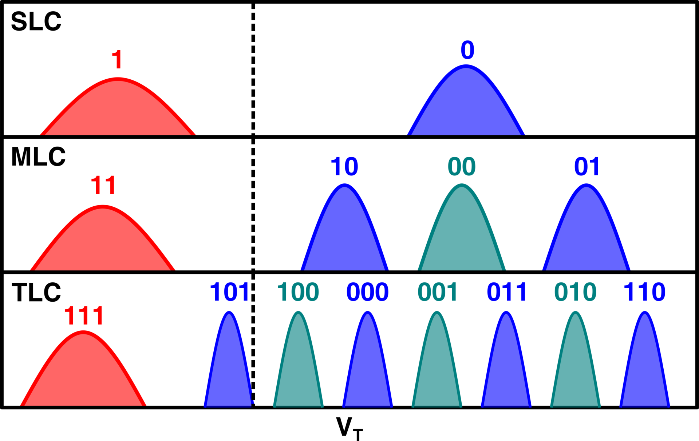

> **图 4-8**　一句话：在同样宽的电压范围里放下更多个状态，每个状态的分布就必须更窄、彼此挨得更近；这是一个单元存更多位的代价。
>
> **先知道一件事**：这是分布图。横轴 V<sub>T</sub> 是阈值电压（让单元导通所需的最低控制电压，存的电子越多越高）；每个鼓包代表处在同一状态的一大批单元，鼓包越高的位置，阈值电压落在那里的单元越多。读数据时，芯片在相邻两个鼓包之间的空隙里放一个比较电压，看单元导不导通，就知道它属于哪个鼓包。
>
> **按这个顺序看**：
> 1. 最上一行 SLC（每单元 1 位）：只有两个鼓包，红色“1”是擦除态（存储层里几乎没有电子），蓝色“0”是编程态。两者之间空隙很宽，不容易判错。
> 2. 中间一行 MLC（每单元 2 位）：同样宽的横轴上放 4 个鼓包，代表 11、10、00、01。
> 3. 最下一行 TLC（每单元 3 位）：放 8 个鼓包。除了最左边红色的擦除态，其余 7 个明显更窄，彼此之间的空隙也小得多。
> 4. 颜色只用来区分相邻的鼓包：红色是擦除态，蓝色与青色交替画出各个编程态，本身没有其它含义。竖直虚线大致标出擦除态与编程态的分界，原图没有注明它的具体电压。
> 5. 鼓包上方的数字是这个状态代表的数据。相邻两个鼓包的数字只差一位，例如 101 与 100、100 与 000。这样安排是因为读错时最常见的是误判成相邻状态，此时只错一位，纠错码容易修正。
>
> **看懂的标志**：能回答“TLC 容量是 SLC 的 3 倍，代价在哪里”——鼓包之间的空隙小了很多，存储层里只要漏掉或多进少量电子，阈值电压一偏就会越过比较电压而读错；所以 TLC 写得更慢（要把鼓包压窄）、读得更慢（要比较更多次）、寿命更短（能容忍的偏移更小）。
>
> **与正文的对照**：图中 TLC 的编码顺序（111、101、100、000、001、011、010、110）与 §5.2 表格用的不同，两者都满足相邻只差一位，各厂商采用的编码各不相同。状态数与间隔的数字见 §5.1 的表。
>
> 来源：[NAND levels.png](https://commons.wikimedia.org/wiki/File:NAND_levels.png)，作者 David Gianluigi Refaldi，许可 CC BY-SA 4.0（本库把透明背景填成了白色）。

**这张表最后一列就是多位存储的全部代价。** 用 2.2 节的换算（3D NAND 约 625 个电子对应 1 伏）：TLC 的相邻状态相差约 540 个电子，QLC 约 250 个，PLC 约 120 个。每个状态自身的分布还有宽度，真正留给各种偏移的余量比间隔更小。于是位数越多：编程步长必须越小，编程越慢；容许的电子流失越少，保持时间和擦写寿命越短；读的时候要比较的参考电压越多，读越慢。

**容量收益却是递减的**：从 SLC 到 MLC 容量翻倍，从 TLC 到 QLC 只增加 33%，从 QLC 到 PLC 只增加 25%，而电压间隔每次都减半。这是 PLC 迟迟没有商用的根本原因。

### 5.2 格雷码与"每页读几次"

8 个状态怎样对应到 3 位数据，有讲究。相邻两个状态最容易互相混淆（一个单元的 Vth 偏移了一点，越过了参考电压，就被读成相邻状态）。如果相邻状态对应的 3 位数据只有 1 位不同，那么一次混淆只造成 1 位错误。这种"相邻编码只差一位"的编码方式叫**格雷码**（Gray code）。

下面是 TLC 常用的一种格雷码。8 个状态按 Vth 从低到高记作 Er（擦除态）、P1 到 P7，状态之间的 7 个读参考电压记作 R1 到 R7（R1 在 Er 与 P1 之间，依此类推）。

| 状态 | Er | P1 | P2 | P3 | P4 | P5 | P6 | P7 |
| --- | --- | --- | --- | --- | --- | --- | --- | --- |
| 高位 | 1 | 1 | 1 | 0 | 0 | 0 | 0 | 1 |
| 中位 | 1 | 1 | 0 | 0 | 1 | 1 | 0 | 0 |
| 低位 | 1 | 0 | 0 | 0 | 0 | 1 | 1 | 1 |

一个单元的 3 位分别属于 3 个不同的页（高位页、中位页、低位页）。读某一页时，不需要知道单元确切处于哪个状态，只需要判断那一位是 0 还是 1，而这只取决于该位在哪些相邻状态之间发生了翻转：

- **低位**在 Er→P1 之间由 1 变 0，在 P4→P5 之间由 0 变 1。读低位页需要用 R1 和 R5 两个参考电压。
- **中位**在 P1→P2、P3→P4、P5→P6 三处翻转。读中位页需要 R2、R4、R6 三个参考电压。
- **高位**在 P2→P3、P6→P7 两处翻转。读高位页需要 R3、R7 两个参考电压。

**走查一次低位页的读**：某单元处于 P3。先在字线上加 R1，单元的 Vth 高于 R1，不导通；再加 R5，单元的 Vth 低于 R5，导通。结论是它的 Vth 在 R1 与 R5 之间，对照表格，P1 到 P4 的低位都是 0，读出 0。

这种编码读三页分别需要 2、3、2 次参考电压比较，所以叫 2-3-2 编码。每次比较都要重新建立字线电压并等位线稳定，所以中位页读起来比另外两页慢。QLC 有 15 个参考电压，分给 4 页，其中三页各 4 个、一页 3 个，读一页平均要做近 4 次比较（§5.4 给出一种具体的编码）。**这就是 QLC 读延迟高于 TLC、TLC 高于 SLC 的直接原因**：量级上，SLC 读一页约 25 微秒，TLC 约 50 到 80 微秒，QLC 在 100 微秒以上。

### 5.3 同一颗芯片可以工作在不同模式

每单元存几位不是制造时固定的物理属性，而是编程和读取时采用的电压划分方式。同一颗 TLC 裸片里的某些块可以按 SLC 方式使用：只用两个状态，间隔很大，编程步长可以很粗，所以写得快、寿命长，代价是这些块的容量只有三分之一。固态硬盘用这个办法做写入缓冲，叫 SLC 缓存，在 20-05 §4 讲。

### 5.4 QLC 的编码与两遍编程

**QLC 的编码。** 16 个状态按 Vth 从低到高记作 S0（擦除态）到 S15，之间的 15 个读参考电压记作 R1 到 R15。下面是一种满足格雷码条件的编码（示意，各厂商的实际编码不同），4 位分别记作甲、乙、丙、丁，各属一页：

| 状态 | S0 | S1 | S2 | S3 | S4 | S5 | S6 | S7 | S8 | S9 | S10 | S11 | S12 | S13 | S14 | S15 |
| --- | --- | --- | --- | --- | --- | --- | --- | --- | --- | --- | --- | --- | --- | --- | --- | --- |
| 甲 | 1 | 0 | 0 | 0 | 0 | 0 | 0 | 1 | 1 | 1 | 1 | 1 | 1 | 0 | 0 | 1 |
| 乙 | 1 | 1 | 0 | 0 | 0 | 0 | 1 | 1 | 0 | 0 | 0 | 0 | 1 | 1 | 1 | 1 |
| 丙 | 1 | 1 | 1 | 1 | 0 | 0 | 0 | 0 | 0 | 1 | 1 | 0 | 0 | 0 | 1 | 1 |
| 丁 | 1 | 1 | 1 | 0 | 0 | 1 | 1 | 1 | 1 | 1 | 0 | 0 | 0 | 0 | 0 | 0 |

逐列检查可以确认相邻两列只有一位不同。各位的翻转位置是：甲在 R1、R7、R13、R15 四处，乙在 R2、R6、R8、R12 四处，丙在 R4、R9、R11、R14 四处，丁在 R3、R5、R10 三处，合计 15 处，正好用完 15 个参考电压。所以读甲、乙、丙三页各要比较 4 次，读丁页要比较 3 次。与 TLC 的 2、3、2 次相比，QLC 每页的比较次数多出约一倍，这是 QLC 读得慢的直接来源。

**为什么 QLC 要分两遍编程。** 相邻字线上的单元之间存在相互影响：一根字线上的单元编程完成后，如果相邻字线随后被编程并充入大量电子，先编程的单元的 Vth 会被带高一点（机理见 §6.5）。在 3D 闪存上，这个影响约为相邻单元 Vth 变化量的 3%（量级估计）。相邻单元从擦除态编程到平均约 3 伏高的位置，先编程的单元就被带高 3 × 3% = **0.09 伏**。TLC 的状态间隔是 0.86 伏，0.09 伏可以容忍；QLC 的间隔只有 0.40 伏，0.09 伏已经接近间隔的四分之一。

**两遍编程**（业界称 foggy-fine，先粗后细）的办法是：第一遍用较大的步长把每个单元快速编程到比最终目标低约 0.3 伏的位置，这时的分布很宽，相邻状态互相重叠，数据还读不出来；等相邻字线也完成了第一遍之后，再回来做第二遍，用小步长把每个单元精确地推到最终位置。

**逐步走查编程顺序**，字线从下往上编号为 1、2、3、4：

| 顺序 | 操作 | 字线 1 的状态 | 字线 2 的状态 | 字线 3 的状态 |
| --- | --- | --- | --- | --- |
| 1 | 字线 1 第一遍 | 粗略位置 | 擦除态 | 擦除态 |
| 2 | 字线 2 第一遍 | 粗略位置，被字线 2 带高约 0.08 V | 粗略位置 | 擦除态 |
| 3 | 字线 1 第二遍 | **最终位置**（第 2 步带来的偏移在这一遍里被校验吸收） | 粗略位置 | 擦除态 |
| 4 | 字线 3 第一遍 | 最终位置 | 粗略位置，被带高 | 粗略位置 |
| 5 | 字线 2 第二遍 | 最终位置，被字线 2 的第二遍带高约 **0.009 V** | **最终位置** | 粗略位置 |
| 6 | 字线 4 第一遍，然后字线 3 第二遍，依此类推 | — | — | — |

关键在第 5 步：字线 1 到达最终位置之后，字线 2 只剩下第二遍要做，它的单元只再移动约 0.3 伏，传到字线 1 上的偏移是 0.3 × 3% = 0.009 伏，比一遍编程时的 0.09 伏小了 10 倍。

**两遍编程的代价有两项。** 第一是时间：每根字线要编程两次，第二遍步长小、校验电平多。按第一遍约 3 毫秒、第二遍约 8 毫秒估算（量级估计），一根字线共约 11 毫秒，写入 4 页即 64 KB。4 个 plane 同时工作时，单颗裸片的吞吐量 = 4 × 64 KB ÷ 11 ms ≈ **23 MB/s**，约为 TLC 的四分之一。第二是数据要保存两次：第一遍完成后数据还读不出来，做第二遍时必须重新提供完整的 4 页数据，所以控制器必须把这些数据保留在别处（通常是 SLC 缓存块），直到第二遍完成。**QLC 固态硬盘对 SLC 缓存的依赖比 TLC 强得多，原因就在这里。**

---

## 6. 可靠性问题全集

前面几节多次提到"这里留下了一个问题"。这一节把它们集中讲完。闪存的可靠性问题可以归成两类：一类是**隧穿氧化层被用坏**（擦写寿命），另一类是**存储层里的电子数量在不该变的时候变了**（数据保持、读干扰、编程干扰、单元间耦合、温度效应）。第二类里的每一项都会因为第一类而加重，因为被损伤的氧化层更容易漏电。

先给总览，再逐项展开。

| 问题 | Vth 往哪边偏 | 触发条件 | 主要对策 |
| --- | --- | --- | --- |
| 擦写磨损（P/E） | 分布整体变宽 | 编程与擦除次数累积 | 磨损均衡、降低每单元位数、更强的纠错码 |
| 数据保持（retention） | 向低偏（丢电子） | 存放时间长、温度高 | 定期巡检并重写、读重试 |
| 读干扰（read disturb） | 向高偏（低状态被轻微编程） | 同一块被读的次数多 | 按块计读次数、到阈值后搬移数据 |
| 编程干扰（program disturb） | 向高偏 | 同字线或同串的其它单元被编程 | 沟道升压方案、固定编程顺序、限制对同一页的分次编程 |
| 单元间耦合 | 多为向高偏 | 相邻单元随后被编程 | 多遍编程（先粗后细）、优化编程顺序 |
| 跨温度 | 整体平移 | 写入与读取时的温度相差大 | 读参考电压做温度补偿 |
| 早期保持损失（3D 特有） | 编程后短时间内向低偏 | 编程后几秒到几分钟内 | 读参考电压按"编程后经过的时间"调整 |

其中最常遇到的两种偏移——保持损失和读干扰——对分布的影响见图 4-9。

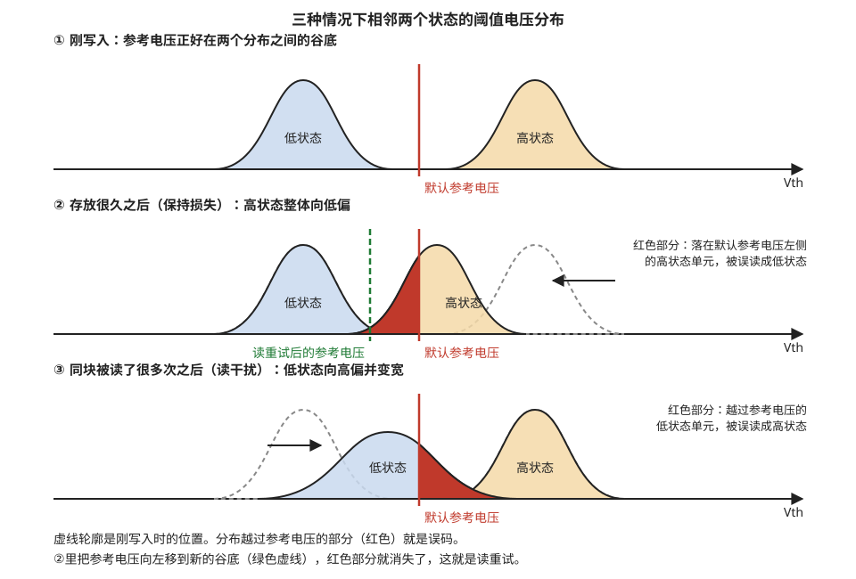

> **图 4-9**　一句话：闪存读错，大多不是某个单元突然坏了，而是一大批单元的阈值电压一起慢慢偏移，偏过了区分两个状态的那条比较线。
>
> **先知道一件事**：横轴是阈值电压（让单元导通所需的最低控制电压，存的电子越多越高），钟形曲线表示有多少单元落在各个电压附近。读的时候芯片在两条曲线之间放一条比较线（红色竖线“默认参考电压”）：线左边的单元判为低状态，右边的判为高状态。
>
> **按这个顺序看**：
> 1. 第①行，刚写入：蓝色的低状态和橙色的高状态分得很开，红色竖线正好在两者之间的空隙里，没有单元被判错。
> 2. 第②行，存放很久之后：高状态单元存储层里的电子慢慢漏走，阈值电压下降，整条橙色曲线向左移（黑色箭头），灰色虚线是它原来的位置。移过去以后，橙色曲线左端有一部分越过了红色竖线（红色填充部分）：这些单元本来存的是高状态，现在会被判成低状态，这就是读错。
> 3. 第②行的绿色虚线：把比较线往左挪到两条曲线之间新的空隙处，红色部分就没有了。出错后换一个比较电压重读一次，叫读重试。
> 4. 第③行，同一块被读了很多次之后：每读一次同块里的别的页，这些单元都要承受一个中等电压，会被一点点推进电子，所以低状态的蓝色曲线向右移，还变宽变矮了。越过红色竖线的红色部分，是本该是低状态、却会被判成高状态的单元，这叫读干扰。
> 5. 图下方两行文字是总结：虚线是原来的位置，红色是误码。
>
> **打个比方**：两队人以地上画的一条线分开。时间一长，一队人慢慢往另一队那边挪，挪过线的人在点名时就被算错了队；把地上的线跟着人群挪一挪，又能分清了。
>
> **看懂的标志**：能回答“保持损失和读干扰为什么偏向相反的方向”——保持损失是电子漏出去，阈值电压下降，受影响最大的是存电子多的高状态；读干扰是电子被读电压一点点推进来，阈值电压上升，受影响最大的是存电子少的低状态。
>
> **与正文的对照**：对应 §6 总览表的前几行；读重试的数字例子见 §8.2。图中偏移量为示意。
>
> 来源：本库自绘。

### 6.1 擦写寿命：隧穿氧化层是怎样被用坏的

**机理。** 每一次编程和擦除，都有一批电子在 10 MV/cm 以上的强电场下穿过隧穿氧化层。高能量的电子在穿越过程中会打断氧化层内部和界面上的化学键，留下缺陷，这些缺陷叫**陷阱**（trap）。陷阱造成两个后果。第一，一部分电子在穿越途中被陷阱俘获，滞留在氧化层里，它们同样会改变阈值电压，而且不受编程和擦除的控制，于是 Vth 的分布变宽、擦除越来越难擦干净。第二，陷阱为电子提供了"中途落脚点"，存储层里的电子可以借助陷阱分两步穿过氧化层漏出去（陷阱辅助隧穿），所以**用旧的单元数据保持能力更差**。

**P/E 循环**（program/erase cycle，编程/擦除循环）指一个块被完整地编程一次再擦除一次。闪存的寿命就用一个块可以承受的 P/E 循环次数来表示。

**这个次数是怎样定义的。** 闪存不会在某一次擦写之后突然坏掉，它的原始误码率随 P/E 次数逐渐上升。所谓"寿命 3000 次"的准确含义是：**经过 3000 次 P/E 循环之后，数据在规定的条件下存放规定的时间（例如消费级要求在 40 摄氏度下断电存放一年），读出时的误码率仍然在纠错码能纠正的范围之内。** 所以寿命数字与纠错码的能力、要求的保持时间都绑在一起：纠错能力强一些、保持时间要求短一些，同一颗芯片标称的寿命就可以高一些。

**一个沿 P/E 次数走查的例子**（TLC，数字为示意量级）：

| 已用 P/E 次数 | 刚写入时的 RBER | 40 ℃ 存放一年后的 RBER | 纠错码能否纠正（上限约 1 × 10⁻²） |
| --- | --- | --- | --- |
| 0 | 1 × 10⁻⁴ | 3 × 10⁻⁴ | 能，余量很大 |
| 1000 | 3 × 10⁻⁴ | 1 × 10⁻³ | 能 |
| 3000 | 8 × 10⁻⁴ | 6 × 10⁻³ | 能，但已接近上限 |
| 5000 | 2 × 10⁻³ | 2 × 10⁻² | **不能**，存放一年后数据丢失 |

这张表说明两点：寿命终点是由"存放之后"的误码率决定的，而不是由刚写入时的误码率决定的；超过标称寿命的闪存仍然可以读写，只是数据放不了那么久了。

**各类型的典型寿命**（量级，具体以厂商规格为准）：

| 类型 | 典型 P/E 次数 |
| --- | --- |
| SLC | 5 万到 10 万 |
| MLC | 3 千到 1 万 |
| TLC | 1.5 千到 3 千（企业级产品可到 5 千以上） |
| QLC | 几百到约 1 千（部分厂商宣称更高） |
| PLC | 尚无商用产品 |

位数越多寿命越短的原因已经在第 5 节讲过：状态间隔越小，同样的分布展宽越早越过参考电压。

**寿命的总写入量算例。** 一块 1 TB 的 TLC 固态硬盘，单元寿命 3000 次：

1. 单元层面可以承受的总写入量 = 1 TB × 3000 = **3000 TB**。
2. 控制器的垃圾回收会带来额外的内部写入，设实际写入闪存的量是主机写入量的 2 倍（这个倍数叫写放大系数，20-05 §4 讲它的来历），主机可写入的总量 = 3000 ÷ 2 = **1500 TB**。
3. 普通办公用途每天写入约 50 GB：1500 TB ÷ 50 GB = 30000 天，约 **82 年**，寿命不构成问题。
4. 训练集群频繁保存检查点，设每天写入 2 TB：1500 ÷ 2 = 750 天，约 **2 年**，需要纳入规划。
5. 把它当作内存使用，每秒写入 1 GB：1500 TB ÷ 1 GB/s = 1.5 × 10⁶ 秒，约 **17 天**。

第 5 条与 21-02 §10 对高带宽闪存算的那笔账是同一件事：闪存的寿命是一个"总写入字节数"的预算，写得越快用完得越早。

### 6.2 数据保持：放着不动也会丢电子

**机理。** 存储层里的电子虽然被绝缘层包围，但仍有极小的概率隧穿出去，或者借助氧化层里的陷阱漏出去。在电荷陷阱型的 3D 闪存里还有第二条途径：同一根竖直沟道上，上下相邻单元的电荷陷阱层是连成一体的一层氮化硅，电子可以沿着这层材料缓慢地横向移动到相邻单元的区域。无论哪种途径，结果都是 Vth 随时间下降，高电压的状态下降得更多。

**温度的影响可以算出来。** 电子的流失是热激活过程，速率随温度按阿伦尼乌斯公式变化：加速倍数 = exp[(Ea ÷ k) × (1 ÷ T₁ − 1 ÷ T₂)]，其中 Ea 是激活能，闪存数据保持常取约 1.1 电子伏；k 是玻尔兹曼常数 8.617 × 10⁻⁵ 电子伏每开尔文；T 用绝对温度。比较 40 摄氏度（313 K）与 85 摄氏度（358 K）：

1. Ea ÷ k = 1.1 ÷ 8.617 × 10⁻⁵ ≈ 12765 K。
2. 1 ÷ 313 − 1 ÷ 358 = 0.003195 − 0.002793 = 0.000402 K⁻¹。
3. 两者相乘 ≈ 5.13，取指数 e^5.13 ≈ **168**。

也就是说 85 摄氏度下电子流失的速度是 40 摄氏度下的约 168 倍：**在 40 摄氏度下能保持一年（8760 小时）的数据，在 85 摄氏度下只能保持 8760 ÷ 168 ≈ 52 小时**。厂商做寿命认证时正是用高温烘烤来代替漫长的等待。对使用者来说，这个数字的含义是：断电存放的固态硬盘不应放在高温环境里，接近寿命终点的硬盘尤其如此。

**对策**：通电状态下，控制器在后台定期巡检各个块的误码率，发现偏高就把数据读出、纠错后写到新的块里（叫数据刷新）。断电状态下没有任何对策，只能依靠保持时间的规格余量。

### 6.3 读干扰：只读不写也在改变数据

**机理。** 3.2 节讲过，读一页时，同一块内所有未选中的字线都要加上约 6.5 伏的通过电压。按约 0.6 的耦合系数和 8 纳米的氧化层厚度估算，这在隧穿氧化层上产生约 6.5 × 0.6 ÷ 8 纳米 ≈ 4.9 MV/cm 的电场，方向与编程时相同，大小约为编程电场（13.5 MV/cm）的三分之一强。由于隧穿电流对电场呈指数关系，这个电场下的隧穿电流比编程时小很多个数量级，一次读几乎不产生影响；但它不是零，**同一块被读了几十万次以后，累积注入的电子足以让 Vth 产生可观的上升**。

有三点需要明确，因为这个名字容易引起误解。

**第一，受干扰的不是被读的那一页，而是同一块里的其它页。** 被读的那根字线上加的是较低的参考电压，电场很弱；受到 6.5 伏电压的是其余所有字线。

**第二，受影响最大的是处于低电压状态的单元，尤其是擦除态。** 存储层里电子越少，栅极电压在氧化层上产生的电场越强，越容易被注入电子。所以读干扰的典型表现是擦除态的单元逐渐升高，被误读成 P1。

**第三，干扰是按块累计的。** 读块内任何一页，都会对块内其余页施加一次电压。所以控制器的计数单位是"这个块总共被读了多少次"。

**逐步走查一个块被读坏的过程**（TLC，数字为示意量级）：

| 该块累计被读次数 | 擦除态单元的平均 Vth | 越过 R1 被误读为 P1 的比例 | 状态 |
| --- | --- | --- | --- |
| 0 | −2.0 V | 约 1 × 10⁻⁵ | 正常 |
| 10 万 | −1.8 V | 约 5 × 10⁻⁵ | 正常 |
| 50 万 | −1.4 V | 约 5 × 10⁻⁴ | 误码率开始明显上升 |
| 100 万 | −1.0 V | 约 3 × 10⁻³ | 达到控制器设定的阈值，触发数据搬移 |
| 若不处理，继续到 300 万 | −0.4 V | 超过 1 × 10⁻² | 超出纠错能力，数据丢失 |

**对策是读回收**（read reclaim）：控制器为每个块维护一个读次数计数器，达到阈值后把整块的有效数据读出、纠错、写到另一个空白块，然后把原块擦除。擦除使所有单元回到初始的擦除态，累积的干扰随之清零。更精细的做法是不单看计数，而是定期抽样检查这个块的实际误码率，超过门限才搬移。阈值的具体数值各厂商不公开，公开资料里的量级在十万次到百万次之间，QLC 低于 TLC，用旧的块低于新的块。

**这个对策带出一个重要结论：读也会消耗擦写寿命。** 每次读回收都要擦除一个块，即消耗一次 P/E。下面两个算例把这个代价量化，阈值统一取 100 万次（量级估计）。

**算例一：一个被频繁读取的热点块。** 某个块存着检索索引，每秒被读 500 次。

1. 达到阈值所需时间 = 100 万 ÷ 500 = 2000 秒，约 **33 分钟**。
2. 一天触发读回收 86400 ÷ 2000 ≈ **43 次**，即一天消耗 43 次擦除。
3. 如果这 43 次擦除总是落在同一个物理块上，3000 次寿命只够用 3000 ÷ 43 ≈ 70 天。但读回收每次都把数据搬到另一个块，所以这些擦除分散在整颗裸片约 3300 个块上，平均每块每天 43 ÷ 3300 ≈ 0.013 次，可以忽略。

结论：对普通固态硬盘，读干扰主要是一个需要控制器处理的正确性问题，寿命上的代价很小。

**算例二：把闪存当作只读的权重存储高速读取。** 设 100 GB 的 QLC 闪存，寿命 1000 次，以 1 GB/s 的速率被持续、均匀地读取（这正是 21-02 §10 认为适合放进高带宽闪存的"只读大参数"场景）。

1. 每秒读的页数 = 1 GB ÷ 16 KB ≈ **62500 页**。
2. 100 GB 共有 100 GB ÷ 38.4 MB ≈ 2600 个块，平均每块每秒被读 62500 ÷ 2600 ≈ **24 次**。
3. 每块达到阈值所需时间 = 100 万 ÷ 24 ≈ 41700 秒，约 **11.6 小时**。
4. 每块每天被回收 24 ÷ 11.6 ≈ **2.1 次**，即每天消耗 2.1 次 P/E。
5. 1000 次寿命可用 1000 ÷ 2.1 ≈ **480 天**，约 1.3 年。

结论：**在持续高速读取的条件下，"只读"负载也会在一到两年的量级上用完 QLC 的擦写寿命**。这个结果对阈值的取值很敏感（阈值若是 1000 万次，寿命就是 13 年；若是 10 万次，就只有 48 天），所以评估这类方案时必须向厂商要读干扰的规格。它是对 21-02 §10 那条判断的补充：只读的大参数确实比高频写入的 KV 缓存适合放在闪存上，但"只读"并不等于"没有寿命问题"。

### 6.4 编程干扰：写这一页，影响那一页

**机理。** 3.1 节讲过，编程时同一根字线上不需要编程的单元靠沟道自升压来保护，栅极与沟道之间仍有约 11.5 伏的电压差，隧穿电流虽小但不为零。此外，同一条串上未选中的字线在编程期间要加约 9 到 10 伏的通过电压（用来把沟道电位带高、或把位线的 0 伏传递到选中单元），这些单元同样受到轻微的编程作用。两种情况的结果都是不该变的单元 Vth 略有升高，受影响最大的仍然是擦除态。

**自升压的电压示意。** 取同一根选中字线上的两条串（见图 4-10）：左边的串要编程，右边的串要禁止。编程脉冲 19.5 伏，未选中字线的通过电压 10 伏，电源电压 2.5 伏，选择管自身的阈值电压约 1 伏（数值为示意）。

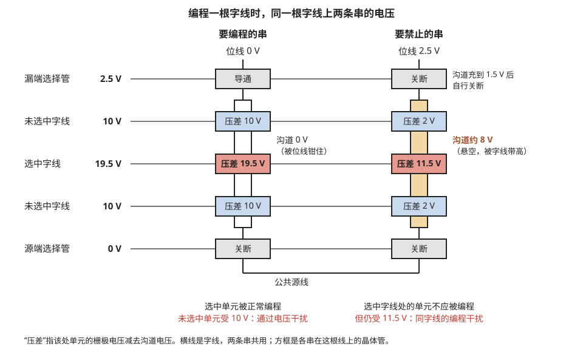

> **图 4-10**　一句话：同一根字线上加的是同一个高电压，但只有想写的那条串里的单元被写入；不想写的那条串靠把自己的沟道电压抬高来躲开。
>
> **先知道一件事**：一个单元会不会被写入（有没有电子被推进存储层），看的是它的控制端与下方沟道（硅表面上电流经过的地方）之间的电压差，而不是控制端电压本身。电压差越大，穿过去的电子越多，而且是急剧增多：差 19.5 伏时大量穿过，差 11.5 伏时少到几乎可以忽略。图中的“压差”就是这个差值。
>
> **按这个顺序看**：
> 1. 横线是字线（一排单元的控制端连成的导线），五根从上到下是：漏端选择管（串顶上的开关）、未选中字线、选中字线（要写的那一行）、未选中字线、源端选择管（串底下的开关）。左侧粗体数字是加在这根线上的电压，两条串共用。
> 2. 两列竖着的是两条串。左列“要编程的串”，顶上的位线（连到串顶的数据线）接 0 V；右列“要禁止的串”，位线接 2.5 V。方框是串在各根线处的晶体管，方框之间的竖条代表串内部的沟道。
> 3. 看左列：顶部选择管“导通”，沟道直接连到位线，被固定在 0 V（白色竖条）。选中字线处的单元压差 = 19.5 − 0 = 19.5 伏（红色方框），足够把电子推进去，正常写入。
> 4. 看右列顶部：选择管控制端 2.5 V，位线也是 2.5 V。沟道先从位线充到 1.5 V，此时选择管两端只差 1 伏，不够让它导通，它自己就关断了。沟道从此与外界断开，处于悬空状态。
> 5. 看右列的橙色竖条：随后所有字线从 0 升到 10 伏，选中字线再升到 19.5 伏。字线与沟道之间隔着一层绝缘体，两者像电容的两块极板，一边电压升高，另一边悬空的沟道就被“带”着一起升高，停在约 8 伏。于是选中字线处的单元压差只剩 19.5 − 8 = 11.5 伏，推不进多少电子，基本没被写入。
> 6. 看最下方的红字：仍有两处在被少量写入。左列未选中的单元承受 10 伏压差，右列选中字线处的单元承受 11.5 伏压差。每次只多进极少的电子，但累积下来会让阈值电压（让单元导通所需的最低控制电压，电子越多越高）慢慢升高，这就是编程干扰。
>
> **打个比方**：字线电压是水位，沟道电压是地面，被淹多深只看两者之差。被禁止的那条串没法降低水位（字线是共用的），就把自己脚下的地面垫高到 8 伏。
>
> **看懂的标志**：能回答“未选中字线的电压（这里是 10 伏）为什么不能随意调高”——调高它，右列沟道被带得更高，选中行的禁止单元更安全；但左列同一串上那些未选中单元的压差也随之变大，干扰更严重。两者此消彼长，只能取折中值。
>
> **与正文的对照**：数值与 §6.4 的步骤表一致（电源 2.5 伏、选择管阈值 1 伏、带高比例 0.65），均为示意值。
>
> 来源：本库自绘。

右边那条串的沟道电位是这样一步步建立的：

| 步骤 | 动作 | 被禁止的串的沟道 |
| --- | --- | --- |
| 1 | 位线升到 2.5 V，漏端选择管栅极加 2.5 V | 选择管导通，沟道从位线充电 |
| 2 | 沟道充到 2.5 − 1 = 1.5 V | 选择管的栅极只比沟道一侧高 1 V，等于它的阈值电压，选择管自行关断。沟道从此与位线断开，处于悬空状态 |
| 3 | 所有字线从 0 V 升到 10 V（选中的那根随后继续升到 19.5 V） | 沟道通过栅极与沟道之间的电容被带高。升高的量约为字线电压变化量的 0.65 倍（另外的 0.35 被沟道对地的寄生电容分走） |
| 4 | 稳定后 | 沟道电位 ≈ 1.5 + 0.65 × 10 = **8 V** |

左边那条串的位线是 0 伏，选择管始终导通，沟道被位线钳在 0 伏，字线升高时沟道电位不变，所以选中单元承受完整的 19.5 伏。

**通过电压取多高是一个两难。** 从上面的示意图可以看出有两类单元在受干扰：右边串上选中字线处的单元（承受 19.5 伏减去沟道电位），和左边串上未选中字线处的单元（承受通过电压减去 0 伏）。通过电压对两者的作用相反：

| 通过电压 | 被禁止串的沟道电位 | 同字线被禁止单元承受的电压 | 要编程的串上未选中单元承受的电压 |
| --- | --- | --- | --- |
| 8 V | 1.5 + 0.65 × 8 = 6.7 V | 19.5 − 6.7 = **12.8 V** | 8 V |
| 10 V | 8.0 V | **11.5 V** | 10 V |
| 12 V | 1.5 + 0.65 × 12 = 9.3 V | **10.2 V** | 12 V |

通过电压越高，沟道升得越高，同字线的被禁止单元越安全；但同串的未选中单元受到的电压也越高。两类干扰之和有一个最小值，通过电压就设在那个位置附近，业界把可用的范围叫做通过电压窗口。用旧的单元两类干扰都加重，这个窗口随擦写次数增加而变窄。

**对策有三条。** 第一，改进沟道升压的方式，例如把串的沟道分成几段分别升压，使选中字线附近的沟道电位尽量高。第二，规定块内各页必须按固定的顺序编程（通常从靠近源线的一端开始逐层向上），这样每个单元在自己被编程之后受到的后续干扰是可以预计和补偿的。第三，限制对同一页分多次编程的次数，当代的 TLC 和 QLC 一般只允许一页编程一次。

**算例**：一根字线上有 14.7 万个单元，TLC 编程平均约 8 轮脉冲。某个需要保持擦除态的单元在这 8 轮里每轮都受到 11.5 伏的电压，假设每轮使它的 Vth 升高 5 毫伏，编程完这根字线后它升高 40 毫伏。再加上同一条串上其余 199 根字线依次编程时，它作为未选中单元各受一次约 10 伏的通过电压，假设每次升高 1 毫伏，合计约 200 毫伏。两项相加约 0.24 伏，而 TLC 的状态间隔只有 0.86 伏（以上数值为说明量级的假设）。这说明编程干扰不是可以忽略的二阶效应，编程方案必须把它计算在内，通常的做法是把擦除态擦得更低一些以留出余量。

### 6.5 其余几项：单元间耦合、跨温度与 3D 特有的现象

**单元间耦合。** 在平面闪存里，相邻单元的浮栅之间距离只有十几纳米，彼此之间存在寄生电容。一个单元编程完成后，如果它的相邻单元随后被编程并充入电子，相邻浮栅电位的变化会通过寄生电容传过来，使先编程的那个单元的 Vth 看上去也升高了。

用数字对比平面与 3D（耦合比例为量级估计）。设相邻单元从擦除态被编程到高了 3 伏的位置：

| 工艺 | 相邻单元间的耦合比例 | 先编程单元被带高的量 | 占 TLC 间隔（0.86 V）的比例 |
| --- | --- | --- | --- |
| 平面 15 纳米，浮栅 | 约 10% | 3 × 10% = 0.30 V | 35% |
| 3D，电荷陷阱 | 约 3% | 3 × 3% = 0.09 V | 10% |

一个单元有上、下、左、右多个相邻单元，各方向的影响会叠加，所以平面 15 纳米工艺上的总偏移可以超过状态间隔的一半。这是平面工艺无法继续微缩的第二个原因（第一个是 §2.2 的电子数）。对策是**多遍编程**（§5.4 已做走查）：平面工艺的 MLC 和 TLC 就已经需要两遍或三遍编程；3D 闪存的耦合小，TLC 通常一遍完成，QLC 因为间隔只有 0.40 伏，仍然需要两遍。3D 闪存另有一个平面工艺没有的问题，就是 §6.2 讲的电荷沿共用的氮化硅层横向移动。

**跨温度。** 晶体管的阈值电压本身随温度变化，温度每升高 1 摄氏度约下降 1.5 毫伏（量级估计）。

算一个例子：数据在 0 摄氏度的环境下写入，校验时单元的 Vth 被确认为不低于 2.40 伏。之后设备升温到 70 摄氏度再读，同一批单元的 Vth 整体下降 70 × 1.5 毫伏 = **0.105 伏**，变成约 2.30 伏。如果读参考电压仍按写入时的位置设在 2.0 伏，余量从 0.40 伏缩小到 0.30 伏；对 QLC 来说，0.105 伏已经超过间隔 0.40 伏的四分之一。反过来，高温写入、低温读取时偏移方向相反。对策是芯片内置温度传感器，读的时候按当前温度平移各个参考电压；更完整的做法是控制器在写入时记下温度，读的时候按两者的差值来补偿。

**早期保持损失。** 电荷陷阱型单元在编程刚结束时，有一部分电子停留在能量较浅的陷阱里，它们受到的束缚弱，会在随后的几秒到几分钟内逸出，使 Vth 在编程后短时间内快速下降一小段，然后才进入 §6.2 讲的缓慢的长期流失。

一个沿时间走查的例子（最高状态 P7 的某个单元，数值为示意量级）：

| 编程完成后经过的时间 | Vth | 相对刚编程完的变化 |
| --- | --- | --- |
| 0（校验通过的时刻） | 5.10 V | — |
| 1 秒 | 5.06 V | −0.04 V |
| 1 分钟 | 5.03 V | −0.07 V |
| 1 小时 | 5.01 V | −0.09 V |
| 1 个月 | 4.97 V | −0.13 V |

前一分钟里下降了 0.07 伏，之后一个月才再下降 0.06 伏。这个现象带来的麻烦是：刚写入几秒钟的页和写入一小时的页，最佳读参考电压相差几十毫伏。控制器的对策是按"这一页是多久以前写入的"分组，对不同的组使用不同的读参考电压；芯片一侧的对策是在校验时把目标电平定得略高，预先留出这段下降。

**未写满的块。** 一个块只写了一部分字线就搁置，这种状态叫未写满块（open block，开放块）。它的读出特性与写满的块不同，原因是串联电阻变了。读一个单元时，电流要流过同一条串上的其它所有单元；这些单元如果都处于擦除态，导通得很充分，串的总电阻小；如果都已被编程到较高的状态，在同样的通过电压下导通得没有那么充分，总电阻变大。串电阻大，读电流就小，被读的单元看上去像是 Vth 更高了一点。

举例：某块有 200 层字线，只写了下面 50 层就停下。读第 30 层时，它上面有 20 层已编程、150 层仍是擦除态。与写满之后（上面 170 层全部已编程）相比，串电阻较小，第 30 层的单元看上去 Vth 低了约 0.05 到 0.1 伏（量级估计）。而芯片默认的读参考电压是按写满状态调校的，用它去读未写满的块，误码率会偏高。另外，最后写入的那一层字线还没有受到上一层字线编程带来的耦合偏移，它的分布位置也与其它层不同。控制器的对策有三条：对未写满的块使用另一组读参考电压；尽量缩短块处于未写满状态的时间；设备即将长时间断电或块搁置过久时，用填充数据把它写满。

### 6.6 坏块管理

前面几处提到"把这个块标记为坏块"。坏块是闪存的正常组成部分：**闪存出厂时就允许有一定比例的块不能使用，使用过程中还会不断出现新的坏块**，控制器必须自始至终维护一张坏块表。这一点与 DRAM 和 SRAM 不同，后两者出厂时对外呈现为没有缺陷的存储器（缺陷已在厂内用冗余行列替换掉）。

**坏块从哪来。** 3D 闪存里常见的物理原因有：相邻两层字线金属之间短路，字线与沟道之间的绝缘层击穿，沟道孔刻蚀不到底或孔形严重变形，以及阵列边缘台阶处的接触孔没有对准。字线类的缺陷通常使整个块不可用，有时还会牵连共用同一组字线驱动电路的相邻块。

**出厂坏块。** 厂商在出厂测试时找出不合格的块，并在这些块里写入标记。常见的约定是：块内第一页或最后一页的校验区（页内 16 KB 数据之外的那部分空间）的第一个字节，好块是 FFh（擦除态，全 1），坏块被写成非 FFh 的值。规格书会给出允许的坏块上限，通常在总块数的 2% 左右。按 §4.1 的示意数字，一颗裸片 3300 个块，出厂坏块最多约 3300 × 2% = **66 个**。

控制器第一次上电时要做的事情是：

1. 逐块读出标记字节，建立坏块表。
2. 把坏块表存进闪存里专门保留的几个块中，并存多份副本。
3. 此后任何操作都先查坏块表，不对出厂坏块做编程和擦除。

第 3 条有一个容易出事故的地方：**出厂坏块的标记本身是存在这个块里的，擦除这个块会把标记一起擦掉。** 如果固件在建立坏块表之前对整颗闪存做了全片擦除，出厂坏块的信息就永久丢失了，这些块之后会以随机出错的方式表现出来。

**增长坏块。** 使用过程中新出现的坏块有三个发现途径：

| 发现途径 | 依据 | 此时数据在哪里 | 控制器的处理 |
| --- | --- | --- | --- |
| 编程失败 | 裸片的状态寄存器报告编程未通过（§3.1） | 要写的数据还在控制器的缓冲区里 | 把这份数据写到另一个块；把该块里已有的有效数据搬走；登记为坏块 |
| 擦除失败 | 加到最大脉冲数仍未通过擦除校验（§3.3） | 被擦的块里本来就没有有效数据 | 直接登记为坏块 |
| 读出无法纠正 | 读重试和软判决都失败（§8.2） | 数据已损坏 | 用裸片级冗余重建数据（§8.3）；搬走该块的其余数据；登记为坏块或降级使用 |

**一个编程失败的走查**：控制器正在向块 1200 的第 850 页写入数据。

| 步骤 | 发生了什么 |
| --- | --- |
| 1 | 裸片完成 ISPP 的全部脉冲，仍有约 2000 个单元未达标，超过允许的门限，状态寄存器报告失败 |
| 2 | 控制器从自己的缓冲区取出同一份数据，写入块 1755 的空白页，并更新地址映射表 |
| 3 | 块 1200 的前 849 页里仍有有效数据。控制器把它们逐页读出、纠错，写到别的块 |
| 4 | 在坏块表里登记块 1200，此后不再使用 |
| 5 | 可用的备用块数量减 1 |

第 2 步能够进行的前提是：**在裸片报告编程成功之前，控制器不能丢弃缓冲区里的数据**。多 plane 编程时，一轮写入的全部数据都要保留到各 plane 都报告成功为止。

**备用块用完会怎样。** 固态硬盘留有一部分不对用户开放的块，用来替换坏块。健康信息里的"可用备用空间"就是这部分的剩余比例。设一块硬盘留了 2% 的备用块，出厂坏块占去 0.5%，剩 1.5% 可以用来吸收增长坏块。当备用块低于厂商设定的门限时，硬盘会在健康信息里发出警告；完全用完后，硬盘通常转为只读模式，保证已有数据还能被读走，但不再接受写入。

---

## 7. 3D NAND：把串立起来

前面各节的机制对平面和 3D 闪存都成立。这一节讲 3D 闪存在结构上有什么不同，以及"层数"这个最常被引用的指标到底是什么。

### 7.1 为什么转向 3D

平面闪存靠缩小线宽提高密度，到 15 纳米附近遇到两个无法回避的问题。第一个是 2.2 节算过的：单元里的电子只剩一百个左右，任何流失都难以承受。第二个是 6.5 节讲的单元间耦合：相邻浮栅靠得太近，互相干扰严重。继续缩小线宽只会使两个问题同时恶化。

3D 闪存改变了提高密度的方式：**不再缩小单元，而是把串竖起来，让单元沿垂直方向一层一层叠上去。** 每个单元的平面尺寸反而放大到约 100 纳米，电子数多了几倍，单元间距也变大。密度的增长改由层数承担。

### 7.2 制造流程与单元结构

3D 闪存的制造顺序与直觉相反：不是先做好一层单元再做下一层，而是先把所有层的薄膜全部沉积好，再一次性打孔做出所有单元。主要步骤如下：

1. **沉积叠层**：在硅片上交替沉积氧化硅和氮化硅薄膜，一对薄膜对应一层字线。200 层就是 200 对。
2. **刻蚀沟道孔**：从顶部垂直向下刻蚀出直径约 100 纳米的深孔，贯穿整个叠层。一颗裸片上有数十亿个这样的孔。
3. **在孔壁上沉积功能层**：由外向内依次是阻挡氧化层、氮化硅电荷陷阱层、隧穿氧化层，最后是一层多晶硅作为沟道，孔的中心填入绝缘材料。
4. **置换栅极**：把叠层中的氮化硅牺牲层腐蚀掉，在留下的空隙里填入金属（传统上是钨，最新一代开始改用电阻更低的钼），形成一层层的字线金属板。
5. **做台阶**：在阵列边缘把各层字线刻成阶梯状，使每一层都露出一段，用来从上方打接触孔把它引出。

这样形成的单元是**环栅结构**：每一层字线金属板在沟道孔处环绕着竖直的沟道，中间隔着三层功能薄膜，一个交点就是一个单元。一个孔贯穿多少层字线，这条串就有多少个单元。

**剖面示意。** 图 4-11 给出一个沟道孔的横切面和纵切面：

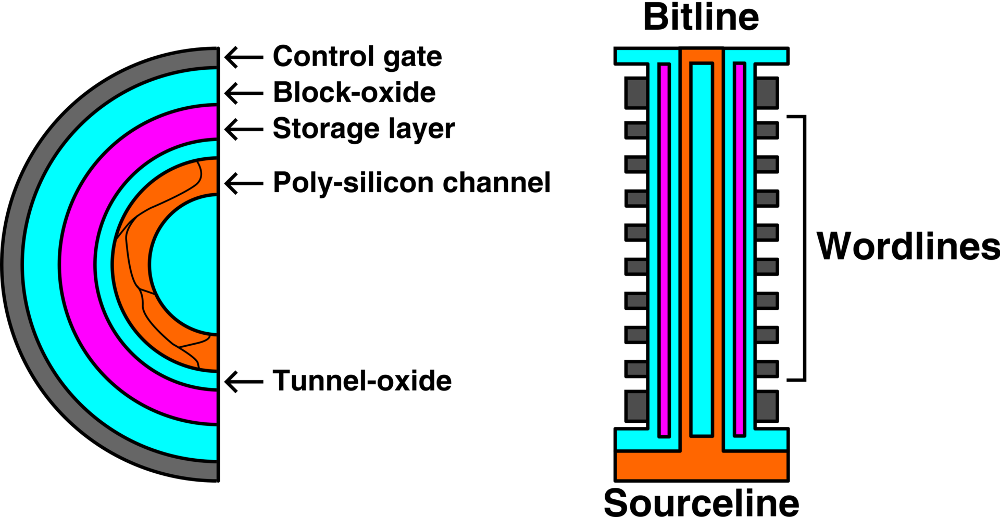

> **图 4-11**　一句话：3D 闪存的一个单元是一圈圈同心薄膜包着一根竖直的细管，许多这样的单元沿这根细管上下叠成一条串。
>
> **先知道一件事**：两张都是剖面图，即把芯片切开看断面。左半边是横着切，看到一圈圈同心环；右半边是顺着孔竖着劈开，看到上下贯通的一层层结构。整个孔的直径只有约 100 纳米。
>
> **按这个顺序看**：
> 1. 先看左半边的同心环（只画了一半），由外向内：深灰色 Control gate（控制栅极），加电压的地方，它就是一层字线金属（字线是把同一层所有单元的控制端连在一起的导线）；青色 Block-oxide（阻挡氧化层），绝缘体，挡住电子不让它跑进金属；品红色 Storage layer（存储层），氮化硅，电子存在这里；青色 Tunnel-oxide（隧穿氧化层），写入和擦除时电子要穿过的那层薄绝缘体；橙色 Poly-silicon channel（多晶硅沟道），电流经过的地方；最中心的青色是填充的绝缘材料。
> 2. 橙色沟道里的细黑线是多晶硅的晶粒边界。多晶硅由许多微小的晶体颗粒拼成，颗粒之间的边界会阻碍电流，这是 3D 闪存读电流很小的原因之一。
> 3. 再看右半边：中间橙色竖条是沟道，两侧品红色细条是存储层，青色是两层绝缘体。两侧一排深灰色小方块是一层层字线（右侧括号 Wordlines），上下两头较大的深灰块是串两端的选择管（开关）。
> 4. 每一个深灰小方块与中间沟道相对的位置就是一个单元。一个孔穿过多少层字线，这条串就有多少个单元。
> 5. 顶部 Bitline 是位线（读出数据的导线），底部橙色 Sourceline 是公共源极，沟道的上下两端分别接到这里。
> 6. 注意品红色存储层从上到下是连续的一条，没有在单元之间断开。
>
> **看懂的标志**：能回答“3D 闪存增加容量为什么靠加层数而不是把单元做小”——单元围着一个约 100 纳米的孔做出来，本身并不小；容量来自在同一个孔上叠更多层字线，一个孔叠 300 层就有 300 个单元。
>
> **与正文的对照**：对应 §7.2 的制造流程与“剖面示意”。第 6 点说的连续存储层，是 §6.2 中电子能沿这一层横向跑到相邻单元的原因。
>
> 来源：[NAND vertical.png](https://commons.wikimedia.org/wiki/File:NAND_vertical.png)，作者 David Gianluigi Refaldi，许可 CC BY-SA 4.0（本库把透明背景填成了白色）。

从这张图上可以读出三个与前文对应的事实。第一，电荷陷阱层（图 4-11 右半边的品红色细条）从上到下是连续的一层，各单元之间没有切断，这就是 §6.2 讲的电子可以沿它横向移动到相邻单元的原因。第二，沟道是贴在孔壁上的一层多晶硅薄壁，厚度只有几纳米到十几纳米，中心是绝缘体，所以串的电阻很大、读电流很小（§3.2）。第三，字线是水平的整片金属板，同一层上成千上万个孔共用它，所以选中一页还需要靠顶部的选择管来指定是哪一排孔（§4.1 的子块）。

**各尺寸的量级**（量级估计）：孔的直径约 100 纳米；孔壁上三层功能薄膜的总厚度约 20 纳米；每层字线金属厚约 25 纳米，层间绝缘厚约 20 到 25 纳米；相邻孔的中心间距约 140 纳米。

**为什么必须先沉积氮化硅再换成金属**（第 4 步）：如果一开始就交替沉积氧化硅和金属，第 2 步就要在几百层金属与氧化物交替的叠层里刻蚀深孔，金属极难被刻蚀成垂直的深孔。氧化硅和氮化硅都是容易刻蚀的介质材料，所以先用氮化硅占住字线的位置，等孔和孔内的薄膜都做好之后，再从侧面开出的长槽里把氮化硅腐蚀掉、填入金属。这个侧面的长槽同时是相邻两个块之间的分隔。

**为什么 3D 闪存普遍采用电荷陷阱而不是浮栅**：电荷陷阱层是绝缘的氮化硅，可以沿孔壁连续沉积，上下各层的单元共用这一层薄膜而不需要逐层切断，工艺简单得多。浮栅是导体，每个单元的浮栅必须彼此隔开，在深孔侧壁上逐层做出隔离非常困难。英特尔与美光早期的 3D 闪存用过浮栅，美光后来改为电荷陷阱。

### 7.3 层数竞赛的工艺瓶颈：深宽比

**层数越多，孔越深。** 每层字线连同其间的绝缘层厚约 45 到 50 纳米，300 层的叠层高度约 300 × 50 纳米 = **15 微米**。孔的直径约 100 纳米，如果一次刻穿，深宽比（孔深与孔径之比）为 15 微米 ÷ 100 纳米 = **150 比 1**。作为对照，这相当于在地面上打一个直径 1 米、深 150 米的井，并且要求井壁从上到下保持垂直、直径一致。孔如果上宽下窄，上层与下层的单元尺寸就不同，电学特性也不同。

**解法一是分段堆叠**（multi-deck，也叫 string stacking）：先沉积并刻蚀下半部分约 150 层，再在上面沉积另外 150 层并刻蚀，使上下两段孔对准连通。每一段的深宽比降到约 75 比 1。当前 300 层级的产品普遍采用两段或三段堆叠。代价是工序增加，以及两段之间的对准误差会在接合处形成一个台阶。

**孔形不理想时对单元的影响，可以用数字说明。** 刻蚀深孔时，孔的直径通常上大下小。设顶部直径 110 纳米、底部直径 90 纳米。环栅单元的电场集中程度与孔的曲率有关：孔径越小，隧穿氧化层靠沟道一侧的电场越强，同样的编程电压下编程越快。于是同一条串上，底层单元比顶层单元编程得快，擦除特性和读干扰的敏感程度也不同。芯片的对策是按层分组，给不同层的字线使用不同的编程起始电压、通过电压和读参考电压。这也是 §4.3 讲的"多 plane 操作要求页位置相同"的来历：不同层需要的电压不同。

**两段堆叠的逐步流程：**

| 步骤 | 动作 |
| --- | --- |
| 1 | 沉积下段叠层（约 150 对薄膜） |
| 2 | 刻蚀下段的沟道孔，深约 7.5 微米 |
| 3 | 用牺牲材料把下段的孔临时填满，把表面磨平 |
| 4 | 在上面沉积上段叠层（约 150 对薄膜） |
| 5 | 刻蚀上段的沟道孔，要求每个孔的底部正好落在下段对应孔的顶部 |
| 6 | 去掉下段孔里的牺牲材料，上下两段连通成一个完整的深孔 |
| 7 | 一次性在整个孔壁上沉积三层功能薄膜和沟道 |

**对准误差的代价。** 第 5 步里，上段的孔要对准下段的孔。孔径约 100 纳米，如果上下两段错开 20 纳米，接合处沟道的有效截面就缩小约两成，而且形成一个拐折。这一处的电阻偏大、电场分布与正常单元不同，所以接合处上下各一两层字线通常不用来存数据，设为虚设字线（dummy wordline）。每增加一段堆叠，就多一次对准、多损失几层字线。三段堆叠的 300 层产品，标称层数里约有十几层是选择管和虚设字线，并不存数据。

两段堆叠、接合处的虚设字线，以及 §7.2 第 5 步的字线台阶，合起来画在图 4-12 里。

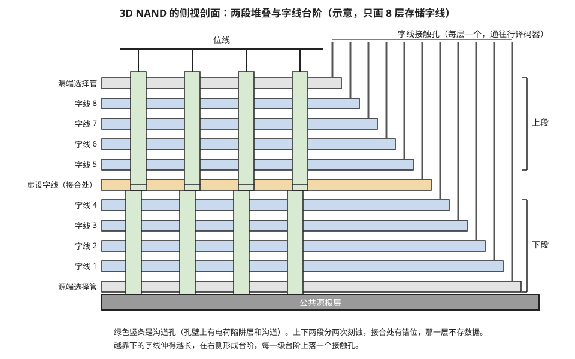

> **图 4-12**　一句话：层数一多，沟道孔太深一次刻不下来，就分上下两段各刻一次再对接；每层字线还要在边上露出一截，才能从上方接出导线。
>
> **先知道一件事**：这是把一块 3D 闪存竖着切开、从侧面看的示意。3D 闪存是在硅片上交替叠上几百层薄膜，再从顶上垂直打出大量深孔，每个孔周围形成一串单元（孔内结构见图 4-11）。这里只画了 8 层存数据的字线，真实产品有两三百层。
>
> **按这个顺序看**：
> 1. 蓝色横条是字线，左侧标着字线 1 到 8；字线是一整层金属板，把同一层所有单元的控制端连在一起，同一层上所有孔共用。上下两条浅灰色横条是选择管（串两端的开关），底部深灰色是公共源极层，顶部黑色粗线是位线（读出数据的导线）。
> 2. 绿色竖条是沟道孔，画了四个。每个孔穿过所有层，孔与每层字线相交处就是一个单元。
> 3. 看孔的中段：上半截与下半截左右错开了一点，接缝落在橙色那一层“虚设字线（接合处）”。孔是分两次刻的：先刻下段，填平后叠上上段再刻，两次很难完全对准。接缝处的单元形状不规则，所以这一层不存数据，只占位。右侧括号标出了上段与下段。
> 4. 看右侧的台阶：越靠下的字线伸得越长，形成一级级台阶，每级台阶上方落下一根灰色竖线，这是接触孔，把这一层字线连到行译码器（决定给哪根字线加电压的电路）。如果各层一样长，下面的层被上面完全盖住，就没法从上方接线了。
>
> **看懂的标志**：能回答“标称 300 层的产品，为什么存数据的字线少于 300 层”——层数里包含串两端的选择管，以及每个接缝处的虚设字线；分段越多，接缝越多，损失的层数越多。
>
> **与正文的对照**：分段流程见 §7.3 两段堆叠的步骤表；台阶的做法见 §7.2 第 5 步。层数、错位大小和孔数都是示意。
>
> 来源：本库自绘。

**层数增加还带来一个与刻蚀无关的问题：串电流下降。** 串上每多一个单元，串联电阻就多一份。层数从 200 增加到 400，在其它条件不变时，串电流大约减半，读出电路判断位线电压所需的等待时间随之加倍（§3.2 的放电估算从 3 微秒变成 6 微秒）。所以层数越高，对沟道材料导电能力的要求越高，这是层数竞赛里除刻蚀之外的另一个限制因素。

**解法二是改进刻蚀工艺本身**，例如在极低温度下进行的低温刻蚀，可以在更高的深宽比下保持孔形。

这里有一个与逻辑芯片和 DRAM 不同的特点值得记住：**3D 闪存不依赖最先进的光刻**。它的最小图形是约 100 纳米的孔，不需要极紫外光刻机；它的工艺难点全部集中在薄膜沉积和深孔刻蚀上。

### 7.4 外围电路放在哪里：从并排到键合

闪存裸片上除了存储阵列，还有外围电路：行译码器、页缓冲器、电荷泵、控制逻辑、输入输出电路。早期设计里外围电路放在阵列旁边，占裸片面积的两到三成。之后的演进分两步。

**第一步，把外围电路放到阵列的正下方。** 先在硅片上做好外围电路的晶体管，再在它上面沉积叠层、制作存储阵列。各厂商的叫法不同，美光称 CuA（CMOS under array），SK 海力士称 PUC（peri under cell），三星称 COP（cell over peri）。这样外围电路不再占用额外的平面面积。它的缺点是：存储阵列的制造包含多道高温工序，下方已经做好的外围晶体管要承受这些高温，性能会退化，所以外围电路只能采用比较保守的晶体管设计。

**第二步，把阵列和外围电路分别做在两片晶圆上，再面对面键合。** 存储阵列在一片晶圆上按自己的工艺做，外围电路在另一片晶圆上用更接近逻辑工艺的流程做，最后用混合键合（21-01 §3.2：两片晶圆表面的铜焊盘直接对接，不用焊球，连接间距可以做到几微米以下）把两片合在一起。外围电路不再经受高温，可以使用更快的晶体管，接口速度因此提高；两片晶圆可以并行生产，缩短了制造周期。长江存储最早量产这种结构，称为 Xtacking；铠侠与闪迪的叫法是 CBA（CMOS directly bonded to array），从 218 层一代开始采用；三星在 400 层以上的 V10 一代采用，称为 BV-NAND。**层数越高，阵列的高温工序越多，键合架构的优势越明显，所以各家在 300 到 400 层这个区间先后转向了键合。**

**三种布局的对照：**

| 布局 | 外围电路的位置 | 外围是否占平面面积 | 外围晶体管是否经受阵列的高温工序 | 片间连接方式 |
| --- | --- | --- | --- | --- |
| 并排 | 阵列旁边，同一片晶圆 | 占两到三成 | 是 | 普通金属布线 |
| 阵列在外围之上 | 阵列正下方，同一片晶圆 | 基本不占 | 是，而且外围的金属布线也要经受 | 穿过阵列区的竖直接触孔 |
| 分片键合 | 另一片晶圆，键合后位于阵列的上方或下方 | 基本不占 | 否 | 混合键合的铜焊盘 |

三种布局的侧视示意见图 4-13。

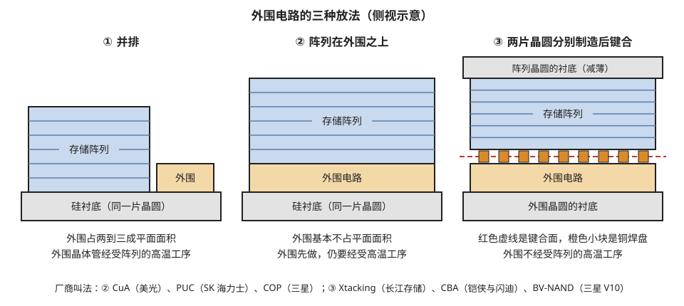

> **图 4-13**　一句话：闪存芯片除了存数据的阵列，还需要一片外围电路来驱动它；外围电路的位置从阵列旁边，挪到阵列下面，又变成在另一片硅片上单独做好再贴上来。
>
> **先知道一件事**：外围电路是存储阵列之外、负责操作阵列的所有电路，比如选字线的译码器、读出数据的电路、把电压升到 20 伏的电荷泵。制造阵列的步骤要反复加热到很高的温度，会损伤已经做好的外围电路，这是三种放法演变的主要原因。
>
> **按这个顺序看**：
> 1. 三幅都是侧视剖面示意：蓝色带横纹的是存储阵列（横纹代表一层层字线），橙色是外围电路，灰色是硅衬底（芯片最底下那块硅）。
> 2. ① 并排：阵列和外围并排坐在同一块硅衬底上。外围要占掉两到三成面积，而且外围先做、阵列后做，外围要跟着经受阵列的高温步骤。
> 3. ② 阵列在外围之上：先在硅上做外围电路，再在它上方叠阵列。外围不再多占面积，但仍然要经受阵列的高温，只能用耐高温但较慢的设计。
> 4. ③ 两片晶圆分别制造后键合：晶圆是制造芯片用的整片圆形硅片。阵列做在一片晶圆上（顶部灰色是它的衬底，最后被磨薄），外围做在另一片晶圆上（底部灰色），各自做完后面对面贴在一起。红色虚线是贴合面，橙色小方块是贴合面上一一对准的铜焊盘，两片之间上百万个电连接就靠它们。外围不再经受阵列的高温，可以用更快的晶体管。
> 5. 最下一行是各厂商对②和③的叫法。
>
> **看懂的标志**：能回答“③比②多了一道贴合工序，为什么各家在 300 层左右纷纷改用③”——层数越多，阵列的高温步骤越多，②里外围电路受损越严重；分开做以后外围不受影响，接口也能更快，而且两片晶圆可以同时生产。
>
> **与正文的对照**：对应 §7.4 的三种布局表；贴合面上约 125 万个连接点的估算也在 §7.4。
>
> 来源：本库自绘。

**高温到底有多大影响。** 存储阵列的制造里，沉积高质量的隧穿氧化层、使多晶硅沟道结晶、激活掺杂等步骤需要 800 摄氏度以上的温度（量级估计）。而逻辑晶体管一旦做完金属布线，通常要求后续工序不超过约 400 到 450 摄氏度，否则铜布线和晶体管的接触区会退化。在"阵列在外围之上"的布局里，外围电路先做、阵列后做，外围电路只能改用耐高温的金属（例如钨）做布线，晶体管也要按耐高温的要求设计，速度因此比同代的逻辑工艺慢。分片键合之后，两片晶圆各自完成全部高温工序，最后的键合只需要约 300 到 400 摄氏度。

**键合面上有多少个连接点，可以估算。** 阵列一侧需要引到外围电路的信号主要是两类。位线：每个 plane 约 14.7 万根，4 个 plane 共约 59 万根。字线：每个块的每一层字线都要由行译码器单独驱动，每个 plane 约 830 个块 × 200 层 ≈ 16.6 万根，4 个 plane 共约 66 万根。两类合计约 **125 万个连接点**，分布在约 50 平方毫米的裸片上，平均每平方毫米约 2.5 万个，折合平均间距约 6 微米。这个密度只有混合键合能够提供（21-01 §3.3 算过：5 微米间距约为每平方毫米 4 万个），用微凸块（间距 25 到 40 微米）做不到。

**键合的代价是良率相乘。** 两片晶圆是整片对整片键合的，键合之前无法只挑出合格的裸片配对（21-01 §3.4）。设阵列晶圆上裸片的良率是 90%，外围晶圆是 95%，键合后一颗裸片要两部分都合格才可用，良率 = 90% × 95% = **85.5%**，再乘以键合工序自身的良率。不过外围晶圆的工艺相对成熟，良率较高，这个乘法带来的损失比 21-01 讨论的逻辑芯片堆叠要小。

### 7.5 层数不等于密度

层数是最容易传播的指标，但比较产品时应该看**单位面积的比特数**（单位 Gb/mm²），因为它还取决于孔的间距、每个块里的子块划分、台阶和外围占用的面积，以及每单元存几位。

公开报道的几组数字（TLC，除注明外）：

| 厂商与代际 | 层数 | 位密度 |
| --- | --- | --- |
| 美光 第 9 代 | 276 | 约 21 Gb/mm² |
| SK 海力士 第 9 代 | 321 | 约 20 Gb/mm² |
| 三星 V10 | 400 以上 | 约 28 Gb/mm² |
| 长江存储 Xtacking 3.0 | 232 | 约 19.8 Gb/mm²（QLC） |

美光用 276 层做到了与 321 层相当的密度，说明层数与密度并不一一对应。

**换算成裸片面积**：按 20 Gb/mm² 计，一颗 1 Tb 的裸片面积约 1000 Gb ÷ 20 = **50 平方毫米**。作为对照，当代 DRAM 的位密度在 0.4 到 0.5 Gb/mm² 的量级（量级估计），同样存 1 Tb 需要两千平方毫米以上。**闪存的面积密度比 DRAM 高约 40 到 50 倍**，这就是它每 GB 成本低一个数量级以上的物理来源（三种存储器的完整对照见 20-01 §2）。

---

## 8. 纠错与读重试：把千分之一的误码率变成可用

第 6 节列出的所有问题，最终都表现为读出的数据里有错误比特。闪存的原始误码率在 10⁻⁴ 到 10⁻² 之间，而存储设备对外承诺的不可纠正误码率通常在 10⁻¹⁵ 到 10⁻¹⁷。这十几个数量级的差距由纠错码和一套逐级升级的读取流程来填补。这部分工作由控制器完成，但它与单元的物理特性紧密相关，所以放在本节讲。

### 8.1 纠错码：从 BCH 到 LDPC

**纠错码**（ECC，error correction code）的原理是：写入时根据数据计算出一段校验位，与数据一同存入页内；读出时用校验位检查并纠正数据中的错误。每页 16 KB 数据之外约 2 KB 的空间就是存校验位用的。

**先看一页里有多少错误要纠。** 一页 16 KB 即约 13.1 万位。误码率为 1 × 10⁻³ 时，平均每页有 131 个错误比特；误码率为 1 × 10⁻² 时，平均每页有 1310 个。

**BCH 码**是早期使用的纠错码。它的特点是纠错能力确定：设计为每 1 KB 数据可纠正 40 个错误比特的 BCH 码，只要错误数不超过 40 就一定能纠正，超过则失败。按每 1 KB（约 8200 位）纠 40 位折算，它能应对的误码率约为 40 ÷ 8200 ≈ 5 × 10⁻³，考虑到错误数的统计起伏，实际可用的误码率要更低一些。这对 MLC 足够，对 TLC 和 QLC 寿命末期的误码率则不够。

**LDPC 码**（low-density parity-check code，低密度奇偶校验码）是当前的主流。它的关键优势是可以利用"每个比特有多可靠"的信息。普通的读只给出每个比特是 0 还是 1，这叫**硬判决**。如果在参考电压附近再多读几次，每次把参考电压稍微偏移一点，就可以知道每个单元的 Vth 距离参考电压有多远：离得远的单元判断结果可靠，离得近的不可靠。把这种可靠度信息一起交给译码器，叫**软判决**。LDPC 在软判决下的纠错能力显著高于硬判决，可以应对 1 × 10⁻² 量级的误码率。

**LDPC 是怎样找出错误比特的：一个 6 位的小例子。** LDPC 码由许多条校验方程组成，每条方程规定"某几个比特异或起来必须等于 0"（异或：参与运算的比特里 1 的个数为偶数时结果为 0，为奇数时结果为 1）。"低密度"指每条方程只涉及很少的比特，每个比特也只出现在少数几条方程里。真实的码有上万个比特和几千条方程，这里用一个 6 位的小码说明原理。

设 b1、b2、b3 是数据位，b4、b5、b6 是校验位，三条校验方程是：

- 方程一：b1 ⊕ b2 ⊕ b4 = 0
- 方程二：b2 ⊕ b3 ⊕ b5 = 0
- 方程三：b1 ⊕ b3 ⊕ b6 = 0

写入数据 110 时，校验位按方程算出：b4 = 1 ⊕ 1 = 0，b5 = 1 ⊕ 0 = 1，b6 = 1 ⊕ 0 = 1。存入闪存的 6 位是 **110011**。

**情形一：读出时错了一位。** 读出 100011（b2 由 1 变成 0）。译码器先检查三条方程：

| 方程 | 代入读出值 | 结果 |
| --- | --- | --- |
| 方程一 | 1 ⊕ 0 ⊕ 0 = 1 | 不满足 |
| 方程二 | 0 ⊕ 0 ⊕ 1 = 1 | 不满足 |
| 方程三 | 1 ⊕ 0 ⊕ 1 = 0 | 满足 |

然后统计每个比特参与的方程里有几条不满足：b1 参与方程一和三，一条不满足、一条满足；b3 参与方程二和三，同样是一条不满足、一条满足；**b2 参与方程一和二，两条都不满足**。b2 最可疑，把它翻转后得到 110011，三条方程全部满足，译码成功。

真实的 LDPC 译码就是把这个过程反复进行：每一轮里，各条方程把"我是否被满足"的信息传给它涉及的比特，各个比特汇总收到的信息后判断自己是否应当翻转，再把新的取值传回方程，直到全部方程都满足或者达到迭代次数的上限。

**情形二：错了两位，硬判决会纠错成错误的结果。** 读出 000011（b1 和 b2 都由 1 变成 0）。检查方程：方程一 0 ⊕ 0 ⊕ 0 = 0 满足；方程二 0 ⊕ 0 ⊕ 1 = 1 不满足；方程三 0 ⊕ 0 ⊕ 1 = 1 不满足。按上面的办法统计，b3 参与的方程二和方程三都不满足，b3 最可疑。翻转 b3 得到 001011，三条方程全部满足，译码器认为成功，但输出的数据是 001，而原始数据是 110。这个小码只能纠正一位错误，两位错误超出了它的能力。

**情形三：同样错两位，加上可靠度信息。** 假设软判决读取告诉译码器：b1 和 b2 所在的单元 Vth 紧挨着参考电压，读出值不可靠；b3 到 b6 所在的单元 Vth 离参考电压很远，读出值可靠。译码器在选择翻转哪些比特时优先考虑不可靠的比特：翻转 b1 和 b2 得到 110011，三条方程同样全部满足，并且没有改动任何一个可靠的比特；而翻转 b3 需要推翻一个可靠的比特。译码器选择前者，得到正确结果。**软判决的作用就是这样：它不减少错误的数量，而是告诉译码器错误更可能在哪里。**

**软判决读几次、得到什么信息。** 以区分两个相邻状态的一个参考电压为例，设默认位置在 1.0 伏。软判决在它两侧各加读一次，共读三次，参考电压分别是 0.9、1.0、1.1 伏。三次的结果把单元分成四个区间：

| 单元的 Vth | 在 0.9 V 下 | 在 1.0 V 下 | 在 1.1 V 下 | 判断 | 交给译码器的可靠度（示意） |
| --- | --- | --- | --- | --- | --- |
| 低于 0.9 V | 导通 | 导通 | 导通 | 是 1，可靠 | +6 |
| 0.9 到 1.0 V | 不导通 | 导通 | 导通 | 是 1，不可靠 | +1 |
| 1.0 到 1.1 V | 不导通 | 不导通 | 导通 | 是 0，不可靠 | −1 |
| 高于 1.1 V | 不导通 | 不导通 | 不导通 | 是 0，可靠 | −6 |

表中最后一列的数值叫对数似然比，正负号表示判为 1 还是 0，绝对值表示把握有多大。读的次数越多，区间分得越细，可靠度信息越准确。代价是时间：TLC 的高位页硬判决只需比较 2 个参考电压，三次软判决读取要比较 2 × 3 = 6 次；如果两侧各加读三次，就是 2 × 7 = 14 次，一页的读取时间从约 60 微秒增加到约 400 微秒以上。

**校验位占多大比例。** 每页 16 KB 数据配约 2 KB 校验位，数据占总长度的 16 ÷ 18 ≈ 89%，这个比例叫码率。校验位越多，纠错能力越强，但可用容量越少。QLC 为了应对更高的误码率，有的产品会采用更低的码率。

### 8.2 逐级升级的读取流程

软判决需要多次读取，很慢，所以控制器不会一开始就使用它，而是按"先快后慢"的顺序逐级尝试。以一次 TLC 读取为例（耗时为示意量级）：

| 级别 | 动作 | 累计耗时 | 何时进入下一级 |
| --- | --- | --- | --- |
| 1 | 用默认参考电压读一次，LDPC 硬判决译码 | 约 60 µs | 译码失败 |
| 2 | **读重试**：换一组偏移过的参考电压重读，再做硬判决。厂商预置了一张偏移表，可逐项尝试 | 每次重试加约 60 µs，试 5 次则累计约 360 µs | 表中各项都失败 |
| 3 | 软判决：在参考电压两侧各多读若干次，获得可靠度信息，LDPC 软判决译码 | 累计约 1 ms | 仍失败 |
| 4 | 裸片级冗余重建：读出同一校验组内其它裸片上的对应页，用异或运算恢复 | 累计数毫秒到十几毫秒 | 仍失败则上报不可纠正错误 |

**读重试为什么有效**：第 6 节的各种效应多数表现为整个分布向某一方向平移（保持损失使分布向低偏，读干扰使低状态向高偏，温度使整体平移）。分布平移之后，原来位于两个状态正中间的默认参考电压不再处于最佳位置；把参考电压跟着移动到新的谷底位置，误码率可以下降一个数量级。所以读重试本质上是在寻找当前条件下的最佳参考电压。

**一次读重试的数字例子。** 某个块断电存放了半年，电子流失使各状态的分布整体下移约 0.15 伏。以 P3 与 P4 之间的参考电压 R4 为例，它的默认位置在 2.00 伏，原本位于两个分布正中间的谷底：

| 参考电压 R4 的位置 | 与当前谷底（1.85 V）的距离 | 这一处的误码率（示意） |
| --- | --- | --- |
| 2.00 V（默认） | 偏高 0.15 V，P4 分布的下沿有一部分落在参考电压以下 | 8 × 10⁻³ |
| 1.95 V（偏移表第 1 项） | 偏高 0.10 V | 3 × 10⁻³ |
| 1.90 V（第 2 项） | 偏高 0.05 V | 1 × 10⁻³ |
| 1.85 V（第 3 项） | 正对谷底 | 4 × 10⁻⁴ |

默认位置下的误码率超出了硬判决的纠错能力，读重试到第 2 项或第 3 项时就能纠正。更好的做法是不按表逐项去试，而是由控制器记住每个块最近一次成功的偏移量，下次直接从那里开始；或者先对少量单元扫描一遍，找出各个谷底的实际位置。

**这张表对性能的含义**：绝大多数读在第 1 级完成，耗时几十微秒；少数读要走到第 2、3 级，耗时增加十倍以上。所以闪存的平均读延迟和最差读延迟可以相差一到两个数量级，而且随着闪存老化，进入第 2、3 级的比例上升，延迟的尾部越来越长。评估闪存的读性能时，99.9% 分位的延迟比平均值更有意义。

### 8.3 裸片级冗余（RAIN）：用异或重建整页

**第 4 级的裸片级冗余**，业界称 RAIN（redundant array of independent NAND，独立 NAND 冗余阵列）。纠错码只能处理一页之内分散的错误比特。如果一整根字线短路、一个块突然失效或者一整颗裸片损坏，那一页的大部分比特都是错的，任何纠错码都无能为力。RAIN 防范的是这一类故障。

**做法**：控制器把分布在不同裸片上的若干页编成一组（叫一个条带），另外计算一页校验页，它的每一位是组内各页对应位的异或。校验页存放在另一颗裸片上。

**一个能逐步验算的例子。** 取 4 页数据加 1 页校验，每页只看第一个字节：

| 页 | 所在裸片 | 第一个字节（十六进制） | 二进制 |
| --- | --- | --- | --- |
| D1 | 裸片 0 | 3C | 0011 1100 |
| D2 | 裸片 1 | A5 | 1010 0101 |
| D3 | 裸片 2 | 0F | 0000 1111 |
| D4 | 裸片 3 | F0 | 1111 0000 |
| 校验页 P | 裸片 4 | 66 | 0110 0110 |

校验页的计算过程：3C ⊕ A5 = 99，99 ⊕ 0F = 96，96 ⊕ F0 = **66**。

现在假设裸片 1 上的那个块失效，D2 完全读不出来。控制器读出其余四页做异或：3C ⊕ 0F = 33，33 ⊕ F0 = C3，C3 ⊕ 66 = **A5**，正是丢失的 D2。重建之所以成立，是因为异或有一个性质：同一个值异或两次等于没有异或。P 里包含了 D1、D2、D3、D4 四者的异或，再与 D1、D3、D4 各异或一次，这三者被抵消，只剩下 D2。

**代价有三项。** 第一是容量：企业级硬盘常见的是 15 页数据配 1 页校验，校验占 1 ÷ 16 = 6.25% 的容量。第二是重建时间：要恢复一页，必须读出同一条带内其余的全部 15 页，而且这 15 页各自都要纠错成功，耗时在数毫秒到十几毫秒。第三是写入：每写完一个条带就要多写一页校验，写入量增加 6.25%。消费级硬盘为了节省容量，有的不做裸片级冗余，或者只对关键的管理数据做。

**一个条带只能容忍一页丢失。** 如果同一条带里有两页同时读不出来，异或就无法重建。所以条带内的各页必须放在不同的裸片上，使一颗裸片的故障最多影响每个条带里的一页。

---

## 9. 对照：NOR 闪存

闪存还有另一个分支叫 NOR 闪存。它的存储单元与 NAND 相同，也是带电荷存储层的晶体管，区别在于单元的连接方式。

**NOR 的单元是并联的**：每个单元的漏极都直接接到位线上，源极接公共源线。读某个单元时只需要选中它的字线，电流直接从位线经过这一个单元流到源线，不需要经过其它单元。NAND 的单元是串联的，每条串只有一个位线接触点。

两种连接方式的电路和剖面对比见图 4-14 与图 4-15。

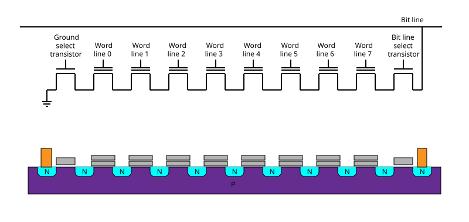

> **图 4-14**　一句话：NAND 把许多单元首尾相连串成一串，整串只在两端各接一次外部导线，所以单元可以排得非常密。
>
> **先知道一件事**：上半部分是电路图，下半部分是同一串单元竖着切开的剖面。电路图里每个向上凸起的方框是一个晶体管（受电压控制的开关）：方框下面两端是电流的进出口，方框上方的短横线是控制端；画成两道横线的，表示控制端下面多一层存电子的浮栅，也就是存储单元。
>
> **按这个顺序看**：
> 1. 看电路图，从左到右：Ground select transistor（接地选择管，左端接着接地符号，即接到 0 伏），Word line 0 到 7（8 个存储单元，各连一根字线，即把一排单元的控制端连起来的导线），Bit line select transistor（位线选择管），最右端向上接到 Bit line（位线，读出数据的导线）。8 个单元一个接一个，电流必须依次穿过全部 8 个。
> 2. 看剖面：紫色的 P 是 P 型硅，几乎没有自由电子，平时不导电；青色的 N 小区域是掺了大量杂质、导电良好的硅。灰色双层小块是存储单元（上层控制栅极、下层浮栅），单层灰块是两端的选择管。
> 3. 相邻两个单元之间只有一块青色 N 区，被两边共用：左边单元的出口就是右边单元的入口。
> 4. 橙色竖块是接触孔，即从上方接下来的金属导线。整串只有最左和最右两个。
>
> **看懂的标志**：能回答“NAND 为什么能比 NOR 做得更密”——一个接触孔要占不小的面积；NAND 每串几十上百个单元才两个接触孔，摊到每个单元几乎可以忽略。对照图 4-15。
>
> **与正文的对照**：Ground select transistor 即正文的源端选择管 SGS，Bit line select transistor 即漏端选择管 SGD。本图是平面工艺，3D 闪存把这一串竖了起来（图 4-11）。
>
> 来源：[Nand flash structure.svg](https://commons.wikimedia.org/wiki/File:Nand_flash_structure.svg)，作者 Cyferz（英文维基百科），许可 CC BY 2.5（本库加了白色背景）。

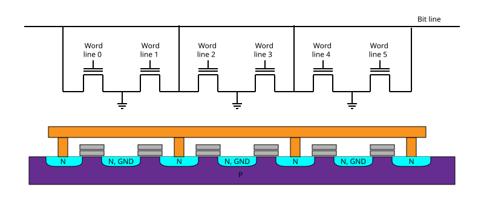

> **图 4-15**　一句话：NOR 的每个单元都直接连在位线上，彼此并联，可以单独读任何一个，但每两个单元就要多占一个接触孔。
>
> **先知道一件事**：画法与图 4-14 相同：上半部分是电路图，下半部分是剖面。向上凸起的方框是晶体管（受电压控制的开关），上方两道横线是控制端和它下面的浮栅；接地符号（几条逐渐变短的横线）表示接到 0 伏。
>
> **按这个顺序看**：
> 1. 看电路图：6 个单元（Word line 0 到 5，每个单元的控制端各连一根字线）两两一组。每个单元一端向上直接连到顶部的 Bit line（位线，读出数据的导线），另一端向下接地。它们不再首尾相连，而是各自独立地挂在位线和地之间。
> 2. 所以读某个单元时，电流只经过这一个单元，不需要别的单元先导通；读得快，也能按任意地址单独读。
> 3. 看剖面：顶部橙色长条是位线金属，四根橙色竖柱是接触孔，把位线接到下面的青色 N 区（导电良好的硅）；标着“N, GND”的青色区接地，是左右两个单元共用的另一端。紫色 P 是平时不导电的 P 型硅。
> 4. 数一下：这里 6 个单元用了 4 个接触孔，而图 4-14 的 NAND 8 个单元只用 2 个。
>
> **看懂的标志**：能回答“NOR 用在哪里”——它读得快、能按地址直接读，适合存放开机时处理器直接取指令执行的启动代码；但接触孔多、单元大，容量做不上去，所以大容量存储都用 NAND。
>
> **与正文的对照**：对应 §9；NOR 写入用的沟道热电子注入见 §9 表格下方的说明。
>
> 来源：[NOR flash layout.svg](https://commons.wikimedia.org/wiki/File:NOR_flash_layout.svg)，作者 Cyferz（英文维基百科），许可 CC BY 2.5（本库加了白色背景）。

这个结构差别带来三个后果：

| 对比项 | NOR | NAND |
| --- | --- | --- |
| 单元面积 | 约 10 F²（每个单元都要有位线接触孔。F 是工艺的最小特征尺寸） | 约 4 F²（平面工艺），3D 后按层数继续折算 |
| 读 | 可按字节随机读取，延迟几十纳秒 | 按页读取，延迟几十微秒 |
| 写与擦 | 编程用沟道热电子注入，电流大、速度慢；擦除按扇区，耗时几十毫秒到秒 | 编程与擦除都用 FN 隧穿，电流小，适合大量单元并行 |
| 典型容量 | 几 Mb 到 2 Gb | 几百 Gb 到 2 Tb 每裸片 |

表中"沟道热电子注入"需要解释：它是 NOR 闪存的编程方式。在单元的漏极加约 5 伏、栅极加约 9 伏，沟道里的电子被漏极附近的强电场加速，其中能量足够高的一小部分越过隧穿氧化层的势垒进入浮栅。这种方式不需要 NAND 那样的 18 伏以上的高压，但编程时沟道里必须流过几十到上百微安的电流，而真正进入浮栅的电子只占极小的比例。

两种编程方式的电流差别决定了并行度。NAND 用 FN 隧穿，每个单元的编程电流在纳安以下，一次可以同时编程一页里的十几万个单元。NOR 每个单元需要约 100 微安，如果也同时编程 14.7 万个单元，总电流为 147000 × 100 微安 ≈ **14.7 安**，芯片内部的电路无法提供。所以 NOR 一次只能编程几十到几百个比特，写入大量数据时比 NAND 慢得多。

**NOR 的用途是存放启动代码和固件。** 它读取快、可以按地址随机访问，处理器上电后可以直接从 NOR 闪存里取指令执行，不需要先把代码搬到内存。一台 AI 服务器里，主板的启动固件、基板管理控制器的固件、每张 GPU 卡上的启动固件，都存在通过 SPI 串行接口连接的小容量 NOR 闪存里（接口见 20-05 §6）。例如一张显卡的启动固件大小约 1 到 2 MB，配一颗 16 Mb 的 NOR 闪存即可。这些芯片容量很小、基本只读，第 6 节的寿命与干扰问题在这种用法下很少成为约束。本节其余内容说的"闪存"都指 NAND。

---

## 10. 开发者视角

闪存的物理细节被控制器和文件系统完全遮住，软件看到的只是一个可以按地址读写的块设备。但本节讲的约束会通过寿命、延迟和容量三个方面表现出来。

| 你想知道/做什么 | 去哪里看/做 |
| --- | --- |
| 这块盘的寿命用掉了多少 | `nvme smart-log /dev/nvme0` 里的 `percentage_used`（按厂商标称寿命折算的已用百分比）和 `data_units_written`（主机累计写入量）；`smartctl -a` 可看到同样的信息 |
| 这块盘是 TLC 还是 QLC、标称寿命多少 | 查产品规格书里的 TBW（总写入字节数）或 DWPD（每日全盘写入次数）。粗略判断：标称约 0.1 到 0.3 DWPD 的多为 QLC，1 DWPD 左右的多为 TLC，3 DWPD 以上是高耐久型号 |
| 估算检查点保存会不会把盘写坏 | 每天写入量 = 检查点大小 × 每天保存次数，再与 TBW 比较（§6.1 的算例）。结果在两三年以内就应当降低保存频率或换高耐久盘 |
| 读延迟偶尔出现很高的尖峰 | 可能是读重试或软判决（§8.2），老化的盘更常见。用 `fio` 加 `--percentile_list=50:99:99.9:99.99` 查看延迟分位数，不要只看平均值 |
| 只读的数据集或权重文件放在闪存上有没有代价 | 有。高强度读取会触发读回收并消耗擦写寿命（§6.3 算例二）。观察方法：主机没有写入，但 SMART 信息里闪存的实际写入量仍在增长 |
| 长期断电存放的盘还能不能读 | 取决于已用寿命与存放温度（§6.2）。重要数据不应只存放在长期断电的固态硬盘里，接近寿命终点的盘尤其如此 |
| 写入速度在写了一段之后突然下降 | SLC 缓存用完后回到 TLC 或 QLC 的真实编程速度（§5.3，详见 20-05 §4），不是故障 |
| 红旗信号 | 宣传材料只给层数不给位密度；只给容量不给 TBW；把闪存用作高频写入的内存扩展而不给寿命账；只读场景下不提读干扰规格 |

---

## 11. 最新架构落点（知识截至 2026-09）

- **层数与量产状态**（据 2026 年 6 月至 8 月的公开报道）：三星当前量产主力是 286 层（V9，2024 年 4 月起量产）；SK 海力士的 321 层于 2024 年底宣布量产，但有报道指其出货主力仍是更低层数的代际；美光第 9 代为 276 层；铠侠与闪迪的量产主力是 218 层（BiCS8）；长江存储为 232 层级。
- **三星 V10 BV-NAND**：2026 年 8 月在 FMS 2026 上发布，400 层以上，采用晶圆对晶圆键合把存储阵列与外围电路分开制造，位密度比 V9 提高约 58%。报道的计划是 2026 年下半年开始量产，三星在发布时未给出具体的产品上市时间。
- **铠侠 BiCS10**：332 层，采用 CBA 键合架构，报道称位密度比 218 层一代提高 59%、接口速度提高 33%，计划 2026 年夏季送样。
- **SK 海力士**：报道称目标在 2026 年底前量产 375 层产品，字线金属改用钼以降低电阻。
- **键合架构成为主流**：长江存储（Xtacking）、铠侠与闪迪（CBA）、三星（V10 起）都已采用或宣布采用阵列与外围分片制造再键合的方案。这使闪存与 21-01 讲的混合键合设备、与 HBM4 和 3D 逻辑堆叠使用同一类产能。
- **QLC 进入企业级大容量市场**：闪迪已发布基于 2 Tb QLC 裸片的企业级固态硬盘，容量达到 128 TB 与 256 TB，定位是读多写少的大容量存储。公开资料中 QLC 的典型寿命仍在约 1000 次 P/E 的量级，折算到整盘在每天 0.1 到 0.3 次全盘写入。
- **PLC（每单元 5 位）**：截至知识截止日没有商用产品。Solidigm 展示过原型；SK 海力士在 2025 年 12 月的 IEDM 会议上发表了把一个单元分成两个独立存储位置来实现 5 位的方案，属于研究阶段。
- **路线图**（未出货）：三星等厂商公开讨论过 2030 年前后达到 1000 层，需要更多段的堆叠和多片晶圆键合。
- **HBF（高带宽闪存）**：把 HBM 的封装形态用到闪存上，仍处在概念与权衡阶段，见 21-02 §10。本节 §6.3 的算例二是评估它时需要补上的一笔账。

---

## 12. 和其它模块的挂钩

- **20-01 §2 三种存储器的对照**：那里把 SRAM、DRAM、NAND 的单元面积、速度、保持能力和成本摆在一张表里，本节是其中 NAND 一列的展开。
- **20-02 DRAM 单元与阵列**：DRAM 也有"读别的单元影响这个单元"的问题，即 20-02 §6 的 Row hammer；它与本节 §6.3 的读干扰机理不同（一个是相邻字线反复开关引起电容漏电，一个是通过电压引起微弱隧穿），但对策的思路相同，都是计数并在超过阈值前刷新。
- **20-05 闪存的接口与控制器**：本节讲单元层面的约束，那一节讲控制器怎样应对这些约束：异地更新与地址映射、垃圾回收、写放大、磨损均衡、SLC 缓存（§4），整盘寿命的 TBW 与 DWPD（§5），以及裸片对外的接口（§3）和设备对主机的接口（§6）。
- **21-02 §10 HBF**：那里算了高频写入下闪存寿命只有几小时到几天的账，结论是闪存只适合放只读的大参数。本节 §6.1 给出了这笔账背后的物理机理，§6.3 补充了只读场景下读干扰带来的寿命消耗。
- **21-01 §3.2 混合键合**：本节 §7.4 的阵列与外围分片键合用的就是那里讲的工艺。
- **50-03 数据进 GPU 之前**：那里讲数据从存储设备经 PCIe 到显存的通路和带宽账，本节讲这条通路起点处的介质；那里"存储读取延迟"的尾部来自本节 §8.2 的逐级读取流程。
- **60-04 可靠性与规模化**：检查点的保存频率同时受故障恢复需求和本节 §6.1 的写入寿命预算约束。

---

## 13. 术语卡

### ISPP（增量步进脉冲编程）
**定义**：闪存的编程方式。对选中的字线加一个编程脉冲，随后校验每个单元的阈值电压是否达到目标；未达到的单元在下一轮接受电压高出一个固定步长的脉冲，已达到的单元被禁止继续编程，如此循环直到全部达标。最终阈值电压分布的宽度约等于步长。
**为什么存在**：同一根字线上的单元因制造偏差，编程快慢可以相差一倍以上。用一个大脉冲一次写完，阈值电压会散布得很宽，无法在约 6 伏的窗口里放下 8 个或 16 个状态。ISPP 用多轮小步长把快慢不同的单元都收拢到同一个窄区间内，代价是编程时间与轮数成正比。
**语境例句**："QLC 的步长压得很小，所以编程时间上去了。" —— 意思是：QLC 状态间隔只有约 0.4 伏，为了得到足够窄的分布必须减小 ISPP 步长，脉冲轮数随之增加，单页编程时间比 TLC 长数倍。

### 先擦后写（erase-before-write）
**定义**：闪存的一条基本约束。编程只能升高单元的阈值电压，要降低必须擦除，而擦除的最小单位是包含几千页的整块。所以一页被写过之后，在所属的块被整块擦除之前不能再写入新的内容。
**为什么存在**：擦除需要把沟道抬到约 20 伏，而沟道是一块内所有单元共用的；为每一页单独隔离高压会使阵列密度大幅下降。这条约束使原地修改数据的代价高到不可用（改 4 KB 需要重写 38.4 MB），所有闪存系统因此采用异地更新，并由此引出地址映射、垃圾回收和写放大。
**语境例句**："闪存不能覆盖写，所以盘越满越慢。" —— 意思是：新数据只能写到已擦除的空白页，空白页不够时控制器必须先搬移有效数据再擦除旧块，盘越满需要搬移的数据越多，写入速度越低。

### plane 与多 plane 操作
**定义**：plane 是闪存裸片内一片可以独立操作的存储阵列，拥有自己的行译码器和页缓冲器，与其它 plane 共用电荷泵、控制逻辑和输入输出引脚。多 plane 编程指多个 plane 同时各编程一根字线；独立 plane 读指各 plane 可以在任意时刻读各自任意位置的页。
**为什么存在**：一套页缓冲器一次只能处理一页，而单元的编程时间（约 2 毫秒）很难缩短。增加 plane 数是提高单颗裸片写入吞吐量的主要办法，4 个 plane 同时编程的吞吐量是单 plane 的 4 倍。独立 plane 读则使落在同一颗裸片上的多个随机读请求不必排队。代价是每个 plane 都要占一份外围电路面积，并提高峰值电流。
**语境例句**："这一代颗粒是 6 plane 的，顺序写快了不少。" —— 意思是：单颗裸片可以同时编程 6 根字线，写入吞吐量相应提高；同时也意味着裸片的峰值功耗更高，控制器需要限制同时编程的裸片数量。

### 读干扰（read disturb）与读回收
**定义**：读一页时，同一块内所有未选中的字线都要加约 6 到 7 伏的通过电压，这会在这些单元上引起极微弱的电子注入。同一块被读的次数累积到几十万至百万次量级后，块内低电压状态的单元阈值电压明显上升，产生误码。读回收是对策：控制器按块统计读次数或监测误码率，超过门限就把整块数据搬到新块并擦除原块。
**为什么存在**：它是 NAND 串联结构的直接后果，读任何一个单元都必须让同串的其它单元导通。它的重要性在于说明只读的数据也会出错，并且读回收要消耗擦写寿命，所以持续高速读取的"只读"负载同样有寿命问题。
**语境例句**："这个块的读计数到门限了，触发了一次回收。" —— 意思是：该块累计被读的次数已到控制器设定的上限，控制器把其中的数据搬到了别的块并擦除了原块，这次操作消耗了一次擦写寿命，期间可能造成短暂的延迟升高。

### P/E 循环与擦写寿命
**定义**：P/E 循环指一个块被编程一次再擦除一次。擦写寿命指一个块可以承受的 P/E 循环次数，其准确含义是：经过这么多次循环后，数据在规定温度下存放规定时间，读出的误码率仍在纠错码可纠正的范围内。典型值是 SLC 数万次、TLC 约三千次、QLC 约一千次。
**为什么存在**：编程和擦除都要让电子在强电场下穿过隧穿氧化层，每次都会在氧化层里留下缺陷。缺陷积累使阈值电压分布变宽、电子更容易漏出。这是闪存区别于 SRAM 和 DRAM 的根本限制，它把"能写多少数据"变成了一个有限的预算。
**语境例句**："这批盘的 P/E 已经用到八成了，不要再放检查点。" —— 意思是：这些盘的累计擦写次数已接近标称寿命，继续承担高频写入会使数据保持能力降到规格以下，应当换到写入量小的用途上。

### TLC 与 QLC（每单元比特数）
**定义**：TLC 指每个单元存 3 位，用 8 个阈值电压状态表示；QLC 指每个单元存 4 位，用 16 个状态表示。状态数每翻一倍，相邻状态的电压间隔约减半：在约 6 伏的窗口内，TLC 的间隔约 0.86 伏，QLC 约 0.40 伏。
**为什么存在**：在不增加单元数量的前提下提高容量、降低每比特成本。代价是间隔变小后，编程必须更精细因而更慢，读需要比较更多个参考电压因而更慢，能容忍的电子流失更少因而寿命和保持时间更短。容量收益是递减的，从 TLC 到 QLC 只增加 33%。
**语境例句**："容量层用 QLC，日志盘还是要用 TLC。" —— 意思是：读多写少的大容量数据放在成本低但寿命短的 QLC 上，频繁写入的日志放在寿命较长的 TLC 上，按写入强度分配介质。

### 电荷陷阱（charge trap）与 3D NAND 的层数
**定义**：电荷陷阱是用氮化硅绝缘层内部的缺陷能级来俘获并存储电子的单元结构，区别于用导体存储电子的浮栅。3D NAND 把存储串竖直放置，在交替沉积的叠层里刻蚀深孔并在孔壁上沉积电荷陷阱层和沟道，每一层字线与孔的交点是一个单元；层数就是一条串上叠了多少层字线。
**为什么存在**：平面闪存缩到 15 纳米附近时，单元里只剩约一百个电子，相邻单元互相干扰严重，无法继续微缩。3D 结构把单元尺寸放大到约 100 纳米以恢复电子数量，改用增加层数来提高密度。电荷陷阱层可以沿孔壁连续沉积，适合这种工艺。层数的增长受深孔刻蚀的深宽比限制，所以出现了分段堆叠和阵列与外围分片键合。
**语境例句**："别只看层数，要看每平方毫米多少 Gb。" —— 意思是：层数不直接等于密度，孔间距、外围电路的放置方式和每单元比特数都会影响最终的位密度，276 层的产品可以与 321 层的产品密度相当。

### 读重试（read retry）与软判决
**定义**：读重试指用默认参考电压读出的数据纠错失败后，控制器改用一组偏移过的参考电压重新读取。软判决指在参考电压附近多读几次以获得每个比特的可靠度信息，供 LDPC 译码器使用，纠错能力比只知道 0 或 1 的硬判决更强。
**为什么存在**：保持损失、读干扰和温度变化多表现为阈值电压分布的整体平移，默认参考电压因此偏离最佳位置；移动参考电压可以把误码率降低一个数量级。软判决则用额外的读取次数换取更强的纠错能力。两者都很慢，所以只在前一级失败后才启用，这造成闪存读延迟的平均值与最差值相差一到两个数量级。
**语境例句**："P99.9 延迟升高是因为进软判决的比例变多了。" —— 意思是：盘老化以后，越来越多的读请求无法在第一次读取时纠错成功，需要经过读重试甚至软判决，这些请求的延迟是正常请求的十倍以上，拉高了延迟的尾部。

---

## 14. 我的困惑 / 待深挖

- 读干扰阈值的真实数值是多少？§6.3 算例二的结论（持续高速只读负载在一到两年内用完 QLC 寿命）对这个数很敏感，公开资料只有十万到百万次的量级，而且当代控制器多按实测误码率而非固定计数来触发回收。需要找厂商规格或实测论文核实，HBF 的方案评估尤其需要这个数。
- §2.2 的电子数估算用的电容值（平面 15 纳米约 0.015 fF，3D 约 0.1 fF）是量级估计，没有找到厂商公开的准确值。不同层的单元因为孔径上宽下窄，电容也不同，这种层间差异有多大、控制器怎样补偿？
- 第二版补写的各处估算（串电流与位线放电时间、GIDL 电流与沟道充电时间、位线充电的峰值电流、单元间耦合比例 3% 与 10%、早期保持损失的时间曲线、未写满块的偏移量、键合连接点数、阵列工序温度）都是按物理关系推出来的量级，没有对照厂商数据，文中已逐处标注。其中最值得核实的是峰值电流和耦合比例，它们分别决定并行度上限和 QLC 是否必须两遍编程。
- §5.4 的 QLC 编码是自己构造的一种满足格雷码条件的示例（读取次数 4、4、4、3），各厂商实际采用的编码和页的读取次数分配没有查到公开资料。
- §6.1 和 §6.3 两张走查表里的误码率数字是示意量级，用来说明趋势。真实的"误码率随 P/E 次数与读次数变化"的曲线需要对照实测文献补一遍。
- SK 海力士 321 层的量产状态有出入：厂商在 2024 年底宣布量产，但 2026 年的报道称其出货主力仍是 176 层和 218 层。"宣布量产"与"成为出货主力"之间通常隔多久？
- 独立 plane 读在各家产品上的支持范围和限制条件（能否在一个 plane 编程的同时让另一个 plane 读）没有查清，这直接影响读写混合负载下的延迟。
- 阵列与外围分片键合之后，外围电路可以用更先进的晶体管。这是否意味着闪存也会像 HBM4 的基底裸片那样，在外围晶圆上放入存储之外的逻辑功能（例如纠错译码或简单的计算）？
- GIDL 擦除靠空穴注入给沟道充电，它的速度和均匀性与平面闪存的衬底擦除相比如何？层数增加到 400 层以上后，沟道从上到下充电是否均匀？
- 1000 层路线图需要多少段堆叠、几片晶圆键合？每增加一次键合，良率按 21-01 §3.4 的乘法关系下降，经济上是否成立？
- PLC 的状态间隔只有约 0.19 伏，对应约 120 个电子。SK 海力士把一个单元分成两个存储位置的方案，实质上是不是用两个 2.5 位的单元来避开这个限制？

---

*最后更新：2026-09-28（第二版：取消篇幅限制后补写。新增 TLC 多目标编程与校验次数的账、读电流与负阈值电压的测量、GIDL 擦除七步与沟道充电时间、页缓冲器结构与缓存编程、多 plane 命令序列与四条限制、峰值电流估算、§5.4 QLC 编码与两遍编程走查、自升压电压示意与通过电压窗口、单元间耦合／跨温度／早期保持损失／未写满块的数字例子、§6.6 坏块管理、3D 单元剖面示意、分段堆叠流程与虚设字线、键合连接点数与良率乘法、LDPC 的 6 位小例子、软判决读取的四区间表、读重试的数字例子、§8.3 RAIN 异或重建、NOR 的沟道热电子注入。第一版：主线是一条因果链：电子要隧穿绝缘层 → 必须用高压 → 只能整块擦 → 每次隧穿损伤氧化层 → 擦写有寿命；单元里只有几百个电子 → 读干扰、编程干扰、保持损失都会使数据偏移。核心走查四个：ISPP 逐脉冲表、串上读一个单元的五步、分步擦除、TLC 格雷码的 2-3-2 读取；核心算例五笔：每伏对应的电子数、原地修改 4 KB 的 9600 倍代价、多 plane 编程的吞吐量、85 摄氏度相对 40 摄氏度的 168 倍加速、只读负载经读回收消耗寿命的账。层数、键合架构、QLC 与 PLC 的现状经联网核实；电子数、读干扰阈值和两张误码率走查表为量级估计。第三版补图 15 张（其中取自 Wikimedia Commons 7 张，自绘 8 张）。第四版：图注按费曼法重写）*
